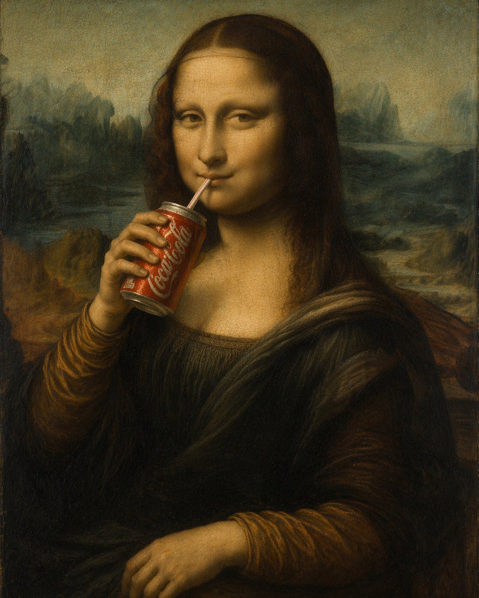
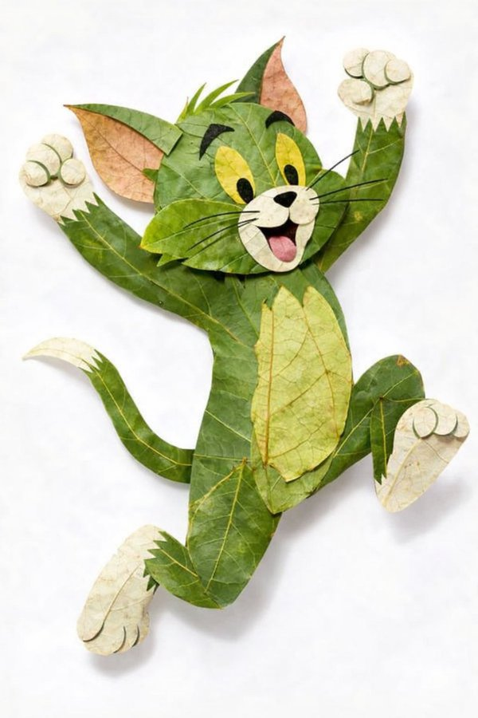
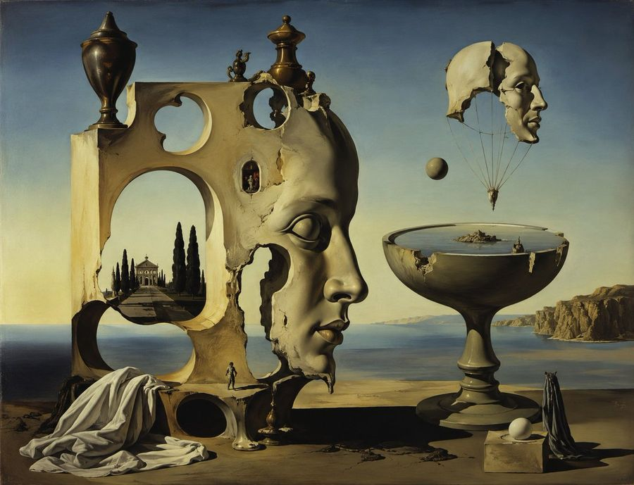

# 案例 1 - 100

[返回首页](../README.md)

---

## 📷 例 1：沙漠绿洲旅人（Cinematic Desert Oasis Traveler）


**Prompt:**

```text
Create a cinematic photorealistic wide shot of {argument name="subject" default="a weary desert traveler"} kneeling at the edge of a shallow oasis pool, leaning forward and cupping water in both hands to drink or wash their face. The subject wears layered, dusty, earth-toned nomadic robes, a wrapped turban, loose trousers, worn fabric scarves, and rough travel clothing, with wet hands and streams of water dripping back into the pool, creating small splashes and concentric ripples. The face is intentionally obscured by a plain dark brown square censor block centered over the head, while the body language remains intimate and exhausted. Set the scene in a lush desert oasis with {argument name="background setting" default="tall palm trees, reeds, shrubs, smooth stones, and reflective still water"}; the low {argument name="time of day" default="golden sunrise"} shines from the right side through the palms, creating warm backlight, lens glow, long shadows, misty atmosphere, and shimmering reflections on the water. Use a dramatic documentary film still style, ultra-realistic textures, shallow depth of field, warm amber and sepia color grading, high dynamic range, detailed fabric fibers, visible droplets, natural dust and grime, 16:9 composition, subject placed on the left foreground with the oasis stretching into the bright background, shot as if on a cinema camera with anamorphic softness and realistic environmental lighting.
```

**来源：** [@jznode](https://x.com/jznode/status/2052452475844559301) | 2026-05-08

---

## 📷 例 2：马尔代夫水上别墅奢华视觉效果


**Prompt:**

```text
一张旨在激发即时预订欲望的震撼豪华酒店营销照片，一张马尔代夫五星级度假村黄金时段的超高端 {argument name="resort type" default="水上别墅套房"} 的绝美室内广角镜头。套房的整个前墙由落地式可伸缩玻璃面板组成，完全向外敞开，将室内空间与自然环境无缝融合。套房内，一张铺着清爽白色埃及棉床品并整齐摆放着装饰靠垫的特大号床正对着开阔的海景。一张白色亚麻日间床，以及放在低矮柚木边桌上、盛有两杯香槟和冰镇香槟桶的组合，被放置在抛光白色大理石室内地面与室外天然柚木露台的交界处。露台直接延伸至下方清澈见底的绿松石色泻湖水面上，透过晶莹剔透的浅水可以清晰地看到沙质湖底。露台边缘设有一个私人无边泳池，池水颜色与泻湖完美融合，与远方的海洋地平线融为一体。地平线呈现出完美的渐变色彩，从水天一线的浓郁琥珀色，过渡到炽热的珊瑚橙，再到顶部的深紫色，第一颗晚星刚刚显现。温暖的黄金时段光线洒满套房内部的每一个白色表面，散发出浓郁的琥珀色光芒，专业豪华酒店摄影品质，16:9 横向比例。
```

**来源：** [@92digitalartArt](https://x.com/92digitalartArt/status/2052457557940121956) | 2026-05-08

---

## 📊 例 3：一周穿搭指南


**Prompt:**

```text
{
  "type": "7-day fashion lookbook infographic",
  "header": {
    "title": "{argument name=\"main title\" default=\"一周穿搭指南\"}",
    "subtitle": "{argument name=\"style keywords\" default=\"温柔 | 靓丽 | 优雅\"}",
    "slogan_cn": "优雅不设限，自信每一天",
    "slogan_en": "{argument name=\"english slogan\" default=\"ELEGANCE HAS NO LIMIT, BE CONFIDENT EVERY DAY\"}"
  },
  "subject": "{argument name=\"subject description\" default=\"young elegant Asian woman\"}",
  "layout": {
    "columns": 7,
    "column_elements": [
      "day_header",
      "main_portrait",
      "4_detail_thumbnails",
      "outfit_specs",
      "keywords_colors",
      "3_color_swatches",
      "star_ratings",
      "fabric_price",
      "4_season_icons"
    ],
    "days": [
      { "day": "周一 (MONDAY)", "outfit": "beige blazer suit", "scene": "场景：重要会议 / 正式商务" },
      { "day": "周二 (TUESDAY)", "outfit": "pink blazer suit", "scene": "场景：日常通勤" },
      { "day": "周三 (WEDNESDAY)", "outfit": "cream knit cardigan set", "scene": "场景：生活休闲" },
      { "day": "周四 (THURSDAY)", "outfit": "champagne slip dress", "scene": "场景：外出私会" },
      { "day": "周五 (FRIDAY)", "outfit": "blue knit top, white skirt", "scene": "场景：休闲社交" },
      { "day": "周六 (SATURDAY)", "outfit": "white sports bra, purple leggings", "scene": "场景：运动休闲" },
      { "day": "周日 (SUNDAY)", "outfit": "beige lounge knitwear", "scene": "场景：居家 / 约会" }
    ]
  },
  "footer": {
    "tips": "{argument name=\"footer tips\" default=\"Tips: 根据天气与场合灵活调整，配饰是提升整体造型的关键；保持自信与舒适，才是穿搭的最终目的。\"}",
    "legend": [
      "春: 春季适用",
      "夏: 夏季适用",
      "秋: 秋季适用",
      "冬: 冬季适用"
    ]
  }
}
```

**来源：** [@yyyole](https://x.com/yyyole) | 2026-05-10

---

## 🎴 例 4：红楼梦海报


**Prompt:**

```text
根据【XXX主题】自动生成一张收藏版史诗叙事海报：巨大优雅的人物侧脸剪影作为外轮廓，剪影内部自动生长出最契合该主题的完整世界观、标志性场景、角色关系、象征符号、关键建筑、生物、道具与氛围。整体不是普通拼贴，而是高级的剪影轮廓填充式叙事合成，带有双重曝光式联想，但更偏电影海报与梦幻水彩插画融合风格；柔和空气透视，轻雾化过渡，纸张颗粒，边缘飞白与刷痕，大面积留白，版式克制高级，安静、宏大、神圣、怀旧、诗意、传说感强。风格、色彩、场景、材质全部根据主题自动适配，所有元素必须强绑定主题，一眼识别，不要杂乱，不要硬拼贴，不要模板化背景，不要廉价奇幻素材。画面中需自然加入专属签名"WHY"，作为海报设计的一部分，位置低调但清晰，可放在左下角、右下角或标题附近，风格需与整体版式统一，像收藏版海报的作者落款或设计签章；签名字体精致、克制、高级，不可过大，不可破坏主体构图，不可显得突兀廉价。
```

**来源：** 小红书号6455654397 | 2026-05-10

---

## 🎴 例 5：城市主题海报


**Prompt:**

```text
2026中国城市系列宣传海报，主题为【北京】。现代、多彩、明亮通透的国潮风，竖版9:16。大面积白色纹理留白背景，一条从右下向左上盘旋的红色丝绸形成S型主构图。右下角一位东方女性挥舞红绸，服饰需结合北京地域文化定制。红绸延展为城市长卷，融合天坛、长城、鸟巢、喇叭沟门原始森林公园、什刹海、京味相声。左侧排版SPRING 2026、竖排Beijing和小印章"北京"。要求统一系列感，但不能雷同，细节丰富，城市辨识度强。文字清晰且精美布局，高端图形设计。
```

**来源：** 小红书号z890738050 | 2026-05-10

---

## 🎨 例 6：银河繁星点缀的冰蓝襦裙


**Prompt:**

```text
[中文]
服裝細節： 模特兒身穿一套精緻的淡冰藍色齊胸襦裙，採用多層輕盈的薄紗和絲綢歐根紗材質制成。其寬大的、半透明的廣袖上點綴著如繁星般微小的銀色和淺藍色亮片刺繡，在光線下閃爍（具有銀河般的夢幻感）。抹胸位置有複雜的銀色蕾絲和編織紋理細節，腰帶自然垂落。

材質與光影： 畫面呈現 8k 超高分辨率和對織物微距紋理的極致渲染。光線採用柔和的自然側光（丁達爾效應 Typndall Effect），精準地透射過輕薄的紗布，營造出面料的半透明感（Translucency）和流動感。

構圖與鏡頭： 採用 85mm 黄金人像鏡頭效果，f/1.8 大光圈，全身構圖，模特居中站立

[English]
Clothing details: The model wears an exquisite pale ice blue chest-high ruqun, made of multiple layers of lightweight tulle and silk organza materials. Its wide, translucent broad sleeves are adorned with tiny silver and light blue sequin embroideries like stars, shimmerming under the light (with a galaxy-like dreamy feel). The tube top position has complex silver lace and woven texture details, and the belt falls naturally.
Material and light and shadow: The image presents 8k ultra-high resolution and extreme rendering of macro textures of the fabric. The lighting uses soft natural side light (Tyndall Effect Typndall Effect), accurately transmitting through the light gauze, creating a sense of translucency (Translucency) and fluidity of the fabric.
Composition and lens: Uses 85mm golden portrait lens effect, f/1.8 large aperture, full-body composition, model standing in the center
```

**来源：** [@fdtreesky](https://x.com/fdtreesky/status/2046508731090018331) | 2026-05-10

---

## 🎨 例 7：100种不同奇幻RPG物品


**Prompt:**

```text
[中文]
创建一个包含100种不同奇幻RPG物品的10×10网格，以经典像素艺术风格渲染（16位或32位精灵图美学，让人联想到SNES/GBA时代的日式RPG）。每个物品应出现在其独立的方形瓷砖中，下方带有简短清晰的标签。在白色背景上保持网格整洁。使每个物品在视觉上都有所区分，并且每个标签拼写正确。使用清晰的像素边缘、每个精灵图有限的调色板，以及用于阴影的微妙抖动。
使用这些行主题：
第1行：剑与刀刃
第2行：盾牌与盔甲
第3行：弓、弩与远程武器
第4行：法杖、魔杖与魔法焦点
第5行：药水、灵药与烧瓶
第6行：卷轴、典籍与法术书
第7行：戒指、护身符与附魔小饰品
第8行：头盔、王冠与头饰
第9行：钥匙、遗物与任务物品
第10行：宝石、符文与制作材料
将每个瓷砖显示为干净背景方形上居中的物品精灵图，渲染为经典的库存图标——你在奇幻RPG菜单中会看到的那种。保持整体风格一致、连贯，并让人联想到备受喜爱的复古奇幻RPG——迷人、细节丰富，且在小尺寸下易于辨认。

[English]
Create a 10 × 10 grid of 100 different fantasy RPG items rendered in classic pixel art style (16-bit or 32-bit sprite aesthetic, reminiscent of SNES/GBA-era JRPGs). Each item should appear in its own square tile with a short clear label underneath. Keep the grid neat on a white background. Make every item visually distinct and every label correctly spelled. Use crisp pixel edges, limited palette per sprite, and subtle dithering for shading.
Use these row themes:
Row 1: swords and blades
Row 2: shields and armor
Row 3: bows, crossbows, and ranged weapons
Row 4: staves, wands, and magical foci
Row 5: potions, elixirs, and flasks
Row 6: scrolls, tomes, and spellbooks
Row 7: rings, amulets, and enchanted trinkets
Row 8: helmets, crowns, and headgear
Row 9: keys, relics, and quest items
Row 10: gems, runes, and crafting materials
Show each tile as a centered item sprite on a clean background square, rendered as a classic inventory icon — the kind you'd see in a fantasy RPG menu. Keep the overall style consistent, cohesive, and reminiscent of beloved retro fantasy RPGs — charming, detailed, and instantly readable at small sizes.
```

**来源：** [@ProperPrompter](https://x.com/ProperPrompter/status/2046534215311970694) | 2026-05-10

---

## 📷 例 8：韩系极简氛围感少女写真


**Prompt:**

```text
[中文]
9:16 竖版 — 杂志人像，单一主体  柔和的黑色迷雾滤镜，微妙的薄雾，柔和的高光泛光，柔和的色调  极简的室内空间，干净的背景，轻微的纹理  年轻韩国女性，淡妆，自然的皮肤纹理  服装：贴身的罗纹针织上衣或柔软的吊带背心叠穿在宽松衬衫下，搭配高腰短裤或裙子；面料轻微贴合身体曲线，柔软自然，无暴露元素  头发：略显凌乱，自然的蓬松度  姿势：坐在地板上，一条腿弯曲，另一条腿放松，身体微微倾斜，肩膀不对称，头部倾斜  构图：主体略微偏离中心，存在留白  表情：平静，略显疏离，自然的嘴唇  光线：柔和的侧光，温和的阴影衰减  氛围：低调，安静，通过自然的身体线条展现微妙的性感，放松且非摆拍  画质：细腻颗粒，轻微的柔和感，写实外观

[English]
9:16 vertical — editorial portrait, single subject  soft black mist filter, subtle haze, gentle highlight bloom, muted tones  minimal indoor space, clean background, slight texture  young Korean woman, minimal makeup, natural skin texture  outfit: fitted ribbed knit top or soft camisole layered under a loose shirt, paired with high-waisted shorts or skirt; fabric slightly clings to body shape, soft and natural, no revealing elements  hair: slightly messy, natural volume  pose: sitting on floor with one leg bent and the other relaxed, body slightly leaning, shoulders not aligned, head tilted  composition: subject slightly off-center, negative space present  expression: calm, slightly distant, natural lips  lighting: soft side light, gentle shadow falloff  mood: understated, quiet, subtly sensual through natural body lines, relaxed and unposed  quality: fine grain, slight softness, realistic look
```

**来源：** [@BubbleBrain](https://x.com/BubbleBrain/status/2046434670724907395) | 2026-05-10

---

## 📷 例 9：夏日女装连衣裙电商


**Prompt:**

```text
[中文]
夏季女裙电商详情图

[English]
Summer women's dress e-commerce detail image
```

**来源：** [@MrLarus](https://x.com/MrLarus/status/2046544209117634735) | 2026-05-10

---

## 🖥️ 例 10：三甲医院真实门诊处方笺


**Prompt:**

```text
[中文]
一张三甲医院的门诊处方笺，医生潦草的手写字，包含真实合理的 诊断、药品名、剂量，右下角有医生签名和科室章。

[English]
An outpatient prescription sheet from a Grade 3A hospital, doctor's illegible handwriting, containing realistic and reasonable diagnosis, drug names, dosages, with a doctor's signature and department stamp in the bottom right corner.
```

**来源：** [@msjiaozhu](https://x.com/msjiaozhu/status/2046546317766500834) | 2026-05-10

---

## 🏛️ 例 11：天坛建筑拆解图


**Prompt:**

```text
[中文]
生成一个天坛的建筑拆解图，有详细的说明，中式美学风格

[English]
Generate an architectural exploded view of the Temple of Heaven, with detailed annotations, Chinese aesthetic style
```

**来源：** [@TanShilong](https://x.com/TanShilong/status/2046524996013662380) | 2026-05-10

---

## 🧪 例 12：蒙娜丽莎畅饮可乐的趣味油画



**Prompt:**

```text
[中文]
生成一张蒙娜丽莎喝可乐的油画。

[English]
Generate an oil painting of Mona Lisa drinking cola.
```

**来源：** [@liyue_ai](https://x.com/liyue_ai/status/2045058142858555733) | 2026-05-10

---

## 🖥️ 例 13：刘亦菲抖音直播


**Prompt:**

```text
[中文]
9:16 的图片比例，生成一张抖音直播的截图，里面是 刘亦菲 在直播，刘亦菲 手里拿着牌子，牌子里写着 今晚直播，欢迎来参亦菲畅聊！

[English]
9:16 aspect ratio, generate a screenshot of a Douyin live stream, inside is Liu Yifei live streaming, Liu Yifei is holding a sign in her hand, the sign says Tonight's live stream, welcome to join Yifei for a chat!
```

**来源：** [@alanblogsooo](https://x.com/alanblogsooo/status/2044784762594918516) | 2026-05-10

---

## 🎴 例 14：胶片感摄影海报


**Prompt:**

```text
[中文]
设计一张主题是"奔赴山海"的胶片感摄影风格的海报

[English]
Design a poster with the theme of "running towards the mountains and seas" in a film photography style
```

**来源：** [@akokoi1](https://x.com/akokoi1/status/2045693939584516441) | 2026-05-11

---

## 📷 例 15：黑色圆珠笔手写笔记


**Prompt:**

```text
[中文]
一张平放着的打开的笔记本的业余照片，里面填满了用黑色圆珠笔写的手写笔记。笔迹随意且略显凌乱，就像个人笔记，自然的瑕疵，划掉的单词，划线的标题。从略高角度拍摄，来自窗户的自然日光，未使用闪光灯。随意的桌面设置，用 iPhone 拍摄。

[English]
Amateur photo of an open notebook lying flat, filled with handwritten notes in black ballpoint pen. The handwriting is casual and slightly messy, like personnal notes, natural imperfections, crossed out words, underlined headings. Shot from slightly above, natural daylight from a window, no flash. Casual desk setting, shot on iPhone
```

**来源：** [@patrickassale](https://x.com/patrickassale/status/2044569086013718958) | 2026-05-11

---

## 🖥️ 例 16：古人的赛博朋友圈


**Prompt:**

```text
[中文]
"宋朝人的朋友圈"/"SONG DYNASTY SOCIAL MEDIA FEED"，古今穿越幽默融合界面设计风格，画面模拟手机社交媒体界面，但内容全部是宋朝场景头像是宋代文人画像，用户名"苏东坡SuShi_Official"，发布内容"刚到黄州，被贬了但心情还行。今天自己做了东坡肉，味道绝了，附菜谱："，配图为工笔画风格的东坡肉特写，点赞列表"黄庭坚、秦观、佛印等126人"，评论区"王安石：呵呵""司马光：还是那个味道"，界面元素如点赞图标用宋代花纹替代，状态栏显示"大宋移动 5G"和"元丰三年"，配色为手机深色模式搭配宋代雅致色调，历史与社交媒体的趣味碰撞杰作

[English]
"Song Dynasty People's Moments"/"SONG DYNASTY SOCIAL MEDIA FEED", Ancient and modern time-travel humor fusion interface design style, The image simulates a mobile phone social media interface, but the content is entirely Song Dynasty scenes, The avatar is a portrait of a Song Dynasty literati, Username "Su Dongpo SuShi_Official", Post content "Just arrived in Huangzhou, demoted but feeling okay. Made Dongpo pork myself today, tastes amazing, recipe attached:", The attached image is a close-up of Dongpo pork in Gongbi painting style, Likes list "Huang Tingjian, Qin Guan, Fo Yin etc. 126 people", Comments section "Wang Anshi: Hehe" "Sima Guang: Still the same taste", Interface elements such as the like icon are replaced with Song Dynasty patterns, The status bar shows "Great Song Mobile 5G" and "Third Year of Yuanfeng", The color scheme is mobile phone dark mode paired with elegant Song Dynasty tones, A masterpiece of fun collision between history and social media
```

**来源：** [@Panda20230902](https://x.com/Panda20230902/status/2045385588065313057) | 2026-05-11

---

## 🎨 例 17：剪纸璀璨夜景


**Prompt:**

```text
[中文]
以珠江新城现代都市景观为灵感的剪纸艺术，通过精巧的镂空手法在一整幅纸上，立体刻画广州塔、东西双塔等地标建筑与繁华城景。
所有建筑与元素均以流畅的线条与结构相连，无孤立部分，构成一幅完整的都市画卷。
画面采用金属箔或光泽纸材质，表面带有细腻的明暗光泽，在光照下呈现柔和的高光与阴影，仿佛被城市灯光轻轻照亮。
背景以虚化的珠江新城天际线为衬，点缀隐约可见的花城广场与树木轮廓，整体透出现代浪漫的氛围。
作品中巧妙融入轻盈的蒲公英绒毛或星光般的动态光点，象征梦想与活力在这座新城中飘散飞扬。整体呈现8K超高清视觉，细节丰富，真实而富有艺术感染力。

[English]
Paper-cut art inspired by the modern urban landscape of Zhujiang New Town, through exquisite hollow-carving techniques on a single sheet of paper, three-dimensionally depicting landmark buildings such as Canton Tower, East and West Twin Towers, and the bustling cityscape. All buildings and elements are connected by smooth lines and structures, with no isolated parts, forming a complete urban scroll. The picture uses metallic foil or glossy paper material, with delicate light and dark gloss on the surface, presenting soft highlights and shadows under illumination, as if gently illuminated by city lights. The background is set against a blurred Zhujiang New Town skyline, dotted with faintly visible outlines of Huacheng Square and trees, overall revealing a modern romantic atmosphere. The work cleverly integrates light dandelion fluff or starlight-like dynamic light points, symbolizing dreams and vitality fluttering and flying in this new city. The overall presents 8K ultra-high-definition vision, rich in details, realistic and full of artistic appeal.
```

**来源：** [@liyue_ai](https://x.com/liyue_ai/status/2045527750606487877) | 2026-05-11

---

## 🖥️ 例 18：校园日报


**Prompt:**

```text
[中文]
生成一张校园日报，主题AI教育

[English]
Generate a campus daily newspaper, theme AI education
```

**来源：** [@MrLarus](https://x.com/MrLarus/status/2044824800909054181) | 2026-05-11

---

## 📷 例 19：真实黑板粉笔字


**Prompt:**

```text
[中文]
生成图片:
手写在教室黑板上的出师表全文，真实感的粉笔字迹，晴朗白天用iPhone手机实拍

[English]
Generate image: The full text of Chu Shi Biao handwritten on a classroom blackboard, realistic chalk handwriting, taken with an iPhone in real life on a sunny day
```

**来源：** [@rionaifantasy](https://x.com/rionaifantasy/status/2045356799751303194) | 2026-05-11

---

## 🧍 例 20：角色设定资料卡


**Prompt:**

```text
[中文]
基于此角色和背景，请制作一份类似官方设定资料的角色资料卡。
・包含三视图：正面、侧面和背面
・添加角色面部表情的变化・分解并展示服装和装备的详细部分
・添加色板・包含世界观设定的简要说明
・总体上，使用有组织的布局（白色背景，插画风格）

[English]
Based on this character and background, please create a character reference sheet similar to official setting materials.
・Includes three-view drawings: front view, side view, and back view
・Add variations of the character's facial expressions
・Break down and display detailed parts of the clothing and equipment
・Add a color palette
・Include a brief explanation of the worldview setting
・Overall, use an organized layout (white background, illustration style)
```

**来源：** [@MANISH1027512](https://x.com/MANISH1027512/status/2045013913901867334) | 2026-05-11

---

## 🧪 例 21：创意树叶拼贴画像



**Prompt:**

```text
[中文]
{ 角色名称 } 完全由天然树叶制成，创意树叶拼贴艺术，分层绿叶和干叶构成身体、面部和衣服，可见叶脉和纹理，手工植物艺术风格，干净的白色背景，俯视平铺构图，高度细节，柔和自然光，逼真树叶纹理，8k

[English]
{ CHARACTER NAME } made entirely from natural leaves, creative leaf collage art, layered green and dry leaves forming body, face and clothes, visible leaf veins and textures, handcrafted botanical art style, clean white background, top-down flat lay composition, highly detailed, soft natural lighting, realistic leaf textures, 8k
```

**来源：** [@meng_dagg695](https://x.com/meng_dagg695/status/2032019839070716170) | 2026-05-11

---

## 🏷️ 例 22：饮料飞溅商业海报


**Prompt:**

```text
[中文]
一个充满活力的高端广告构图中的三个超动态苏打水罐 —— 一罐热带冲刺苏打水伴随着戏剧性的水和热带水果飞溅而爆炸，鲜艳的橙色和粉色背景光；一罐柠檬冰爽苏打水在发光的绿色动态光背景下被冷水泼溅；两罐都覆盖着逼真的冷凝水和运动模糊的水滴，充满果味和清爽的能量。深橙色、粉色和霓虹绿灯光在大胆的演播室布置中融合。由使用佳能 50mm 镜头的专业摄影师拍摄，超写实纹理，清晰的细节，超高分辨率，明亮的商业海报美学，丰富的色彩鲜艳度，电影级飞溅效果 --ar 3:4

[English]
Three ultra-dynamic soda cans in one vibrant high-end advertising composition — a can of TROPICAL RUSH exploding with dramatic water and tropical fruit splash, vibrant orange and pink background lighting; a can of LEMON ICED splashed with cold water against a glowing green dynamic light background; both cans covered in realistic condensation and motion-blurred droplets, bursting with fruity, refreshing energy. Deep orange, pink, and neon green lighting blend together in a bold studio setup. Captured by a professional photographer using a Canon 50mm lens, hyper-realistic textures, crisp details, ultra high resolution, bright commercial poster aesthetic, rich color vibrancy, cinematic splash effects --ar 3:4
```

**来源：** [@Fujimoto_hina](https://x.com/Fujimoto_hina/status/2028388808320819277) | 2026-05-11

---

## 🧍 例 23：真人风格化的3D卡通肖像


**Prompt:**

```text
[中文]
一个风格化的3D卡通肖像，一位年轻男子，拥有短棕发和富有表现力的绿色眼睛，温暖地微笑。他穿着黑色西装外套内搭白色T恤，现代休闲时尚。类似皮克斯/迪士尼风格角色设计，皮肤光滑，柔和光照，略微夸张的面部特征。高细节、精美的3D渲染，友好且平易近人的表情。渐变背景为柔和的蓝绿色和粉色，工作室灯光，浅景深，高分辨率。

[English]
A stylized 3D cartoon portrait of a young man with short brown hair and expressive green eyes, smiling warmly. He is wearing a black blazer over a white t-shirt, modern casual fashion. Pixar-like / Disney-style character design with smooth skin, soft lighting, and slightly exaggerated facial features. High detail, polished 3D render, friendly and approachable expression. Gradient background with soft teal and pink colors, studio lighting, shallow depth of field, high resolution.
```

**来源：** [@iamsofiaijaz](https://x.com/iamsofiaijaz/status/2013473309485343120) | 2026-05-11

---

## 🏷️ 例 24：四季包装 Campaign 宫格


**Prompt:**

```text
PHASE 1 - PRODUCT: [ITEM] in [MATERIAL] packaging, minimal label design
PHASE 2 - GRID: 2x2 seasonal grid, four distinct brand worlds
PHASE 3 - COMPOSITION: each quadrant a full campaign scene with props and environment
PHASE 4 - CONSISTENCY: same product silhouette, four distinct palettes

Swap: [ITEM] / [MATERIAL] / [LABEL STYLE]
```

**来源：** [@SRKDAN](https://x.com/SRKDAN/status/2048582939504431195) | 2026-05-11

---

## 📊 例 25：手机拆解图


**Prompt:**

```text
Create a 3D Insane detailed exploded assembly drawing of {argument name="subject or object" default="smartphone"}
```

**来源：** [@Ankit_patel211](https://x.com/Ankit_patel211/status/2048834306379075759) | 2026-05-11

---

## 🧍 例 26：街舞角色设定参考图


**Prompt:**

```text
角色设定图布局，聚焦于一位18岁的亚裔女性街舞舞者。包含4个大型、高细节度的全身动态舞姿（突出舞蹈动作，面部清晰）。侧边附一条清晰的多角度参考条，仅含3个精细头部特写（正面、侧面、3/4侧面）。最大限度减少文字元素，将像素空间优先用于面部细节刻画。背景为粗砺工业风，搭配写实光影效果
```

**来源：** [@ChangningL29508](https://x.com/ChangningL29508/status/2052229452080591276) | 2026-05-13

---
## 📷 例 27：视频截图


**Prompt:**

```text
{argument name="pianist" default="Vladimir Horowitz"} performs a {argument name="event" default="live piano recital"} streamed on {argument name="platform" default="YouTube"}
```

**来源：** [@bowowwoaaa2](https://x.com/bowowwoaaa2) | 2026-05-13

---
## 🔧 例 28：3D FACS Expression Edit


**Prompt:**

```text
Using the provided reference image as the character base, keep the same chibi 3D figure, outfit, hairstyle, lighting, plain white background, and overall composition unchanged, but modify only the facial expression according to FACS action units: {argument name="FACS action units" default="AU1C + AU2C + AU5D + AU26C"}. Preserve the reference image’s square face-obscuring block in the same central position and regenerate the image cleanly with the same toy-like render quality.
```

**来源：** [@koh375zg](https://x.com/koh375zg/status/2053938596311445753#reversed-1) | 2026-05-13

---
## 🔧 例 29：照片转 LEGO 小人仔


**Prompt:**

```text
仅使用用户上传的图片作为主体参考。将上传图片中的人物转换为逼真的 LEGO 风格小人仔，同时保留其可辨识的身份和装束。在 LEGO 小人仔的设计限制内，尽可能保留主体的面部相似度，并保持相同的发型和发色（适配为 LEGO 发饰）、面部表情、服装颜色、服装设计和图案，以及任何可见的配饰。最终结果应清晰地呈现出该人物的 LEGO 化形象。角色必须遵循正宗的 LEGO 小人仔比例，包括圆柱形的黄色或肤色 LEGO 风格头部、根据主体特征适配的简洁印刷面部细节、带有印刷服装细节的块状躯干、标准的 LEGO 小人仔手臂及弯曲手部、短款 LEGO 小人仔腿部，以及与主体发型相符的独特模塑塑料发饰。
使用逼真的 LEGO 塑料材质进行渲染，带有轻微的光泽感、细微的模塑接缝以及自然的玩具表面反射。面部和躯干应包含 LEGO 小人仔典型的印刷细节，发饰应呈现出模塑塑料的质感。最终图像应为高质量的逼真 3D 玩具渲染图，采用柔和的漫射摄影棚灯光、强调形状和塑料纹理的细微阴影，以及清晰锐利的对焦和精致的细节。构图必须展示从头到脚的全身小人仔，居中对齐，确保整个形象完全可见。使用纯白色背景，不包含任何场景、道具或其他元素。最终风格应呈现为具有高度细节塑料纹理和摄影棚灯光的逼真 LEGO 小人仔玩具渲染图。
```

**来源：** [@AiwithLariab](https://x.com/AiwithLariab/status/2053663652356689927) | 2026-05-13

---
## 📊 例 30：FACS 面部表情图表


**Prompt:**

```text
生成一张包含 {argument name="grid" default="7x7 共 49 种图案的网格"} 的单张图像，展示各种面部表情及其对应的好莱坞 AU 代码（面部动作编码系统）。
```

**来源：** [@eijo_AIart](https://x.com/eijo_AIart/status/2052704638718398879) | 2026-05-13

---
## 🧸 例 31：令人恐惧的汉坦病毒显微可视化


**Prompt:**

```text
创作一张具有戏剧性的 3D 微距科学可视化图像，展示 {argument name="virus name" default="Hantavirus"}，将其描绘为一个漂浮在黑暗微观环境中的恐怖球形病毒颗粒。主体是一个清晰对焦的大型病毒粒子，具有粗糙的纤维状灰褐色外壳，表面覆盖着许多排列在整个圆周上的半透明红橙色喇叭状刺突蛋白。通过前表面展示一个类似剖面的发光内核，内部充满温暖的金色生物发光颗粒，以及一根盘绕成螺旋结的厚实青绿色 RNA 链。在主病毒粒子周围布置 4 个失焦的背景病毒颗粒：左上方一个大型模糊颗粒，右上方一个大型模糊颗粒，左下边缘一个部分模糊颗粒，以及右边缘一个部分模糊颗粒。采用电影级景深、体积雾、漂浮的尘埃状微观颗粒、青绿色与琥珀色调色、高对比度轮廓光、超精细纹理、半写实生物医学插画风格，营造恐怖阴森的氛围，超高分辨率，无文字，无标签，无水印。
```

**来源：** [@abs_uiux](https://x.com/abs_uiux/status/2052705141216665703#reversed-0) | 2026-05-13

---
## 🧸 例 32：3D 历史人物传记海报模板


**Prompt:**

```text
创建一个高度精细的“3D 历史人物破框传记海报”。

主角：{argument name="character name" default="[请输入人物名称]"}
人物身份：[皇帝 / 将军 / 战略家 / 哲学家 / 改革家 / 学者 / 军事统帅]
历史时期：{argument name="historical era" default="[请输入朝代或历史时期]"}
核心关键词：{argument name="keywords" default="[请输入关键词]"}
主色调：[黑金朱红 / 深蓝银 / 暗墨金 / 铁黑]
长宽比：3:4 竖版海报

设计一张极具电影感、历史档案风格的海报，以全身 3D 历史人物为绝对视觉中心。人物必须看起来写实、如纪念碑般庄重、充满力量感，并具备准确的历史还原度。服装、盔甲、长袍、武器、皇冠、靴子、织物纹理及配饰必须与历史时期完全吻合。

人物不应保持静止。设计一个极具戏剧性的“破框而出”动作，面向观众，展现强烈的电影感景深与透视畸变。一只手臂或象征性物件必须有力地向前延伸。破框物件可以是御剑、长矛、令旗、圣旨、兵符、书卷、玉板、礼器或朝代旗帜。确保向前延伸的物件完整可见，不被裁切。

中心人物站在精致的纪念碑式底座上，底座带有细腻的历史雕刻。人物应在视觉上显得厚重且具有统治力，而周围的信息系统则应显得轻盈、优雅、通透且具有悬浮感。

在人物周围放置 6–10 个悬浮的历史事件碎片，设计成轻量级的博物馆档案残片，而非厚重的信息卡片。使用透明亚克力/玻璃面板、发光边框、精细的金色标注线、分层的信息图表碎片以及悬浮的手稿纹理。这些碎片可以包含年份、事件标题、简短注释、历史场景、军事地图、朝代印章、疆域轮廓及古籍纹理。

悬浮碎片应呈现出不同的深度和角度。部分碎片靠近镜头，部分被盔甲或武器部分遮挡，从而营造出强烈的电影感层次和真实的物理空间感。

在左侧，加入大型东亚书法风格的标题排版，包含人物姓名、生卒年、朝代名称、角色标签、历史关键词以及带有印章风格字体的传奇副标题。

在底部，设计一条纤细优雅的水平时间轴，使用精细的金线、小型圆形标记、极简的年份标签以及受博物馆展览指南启发的细微注释。避免使用厚重的信息栏。

背景风格应结合古羊皮纸纹理、褪色的地图、博物馆墙面美学、水墨纹理、印章戳记、破碎的历史文档、战争场面
```

**来源：** [@xRahultripathi](https://x.com/xRahultripathi/status/2053393650399240370) | 2026-05-13

---
## 📷 例 33：woman with a cat in her arms


**Prompt:**

```text
A hyper-realistic photograph of a woman taking a mirror selfie in her bedroom using a smartphone. She has her original hairstyle with loose, slightly messy strands of hair softly falling over her face in a cool, effortlessly chic way with good volume. She is wearing a vintage-style spaghetti-strap crop top and high-waisted denim shorts. She is cradling a fluffy orange tabby cat in her arms. Shot with the aesthetic of an early-2000s digital camera, using only natural light, no flash. Soft late-afternoon golden sunlight streaming through the window, gently hitting her skin, face, and the cat’s fur, creating warm natural highlights and glows. Slightly warm yellow-orange-gray tone, subtle digital noise and grain for that authentic vintage digital look. Half-body mirror shot, focus sharply on her face and the cat. Background shows a simple white bed and plain walls with soft patches of sunlight and gentle shadows. Overall atmosphere is warm, natural, unposed, and intimate, like a casual candid snapshot from the 2000s.
```

**来源：** [@Reddit](https://www.reddit.com/r/ChatGPT/comments/1t0qio9/gpt_image_2_has_created_this_is_there_any_problem/) | 2026-05-13

---
## 🎬 例 34：动漫武术对决


**Prompt:**

```text
一幅极具动态感的动漫插画，描绘了两名少女在传统木质道场内进行激烈武术对决的场景。在前景中，一名留着 {argument name="character 1 hair" default="黑色高丸子头配红色丝带"} 的少女摆出强有力的低位武术架势，正奋力挥拳。她身穿 {argument name="character 1 outfit" default="带有红色流苏的白色中式上衣和红色宽松长裤"}，强烈的红色能量斩击环绕着她挥动的四肢。在右侧半空中，一名留着 {argument name="character 2 hair" default="浅紫色双丸子头"} 的少女优雅地跃起，自信地微笑着，身穿 {argument name="character 2 outfit" default="带有金色刺绣的深绿色连衣裙和黑色紧身裤"}，伴随着扫过的蓝色水流状能量轨迹。背景是质朴的木质寺庙内部，上方悬挂着一块写有“{argument name="sign text" default="武術会"}”的醒目招牌。场景充满了爆发性的动作感，飞扬的尘土、破碎的木质地板、发光的彩色粒子特效，以及将角色与精细背景完美区分开来的戏剧性低角度光影。
```

**来源：** [@Tanemomi_Ver2](https://x.com/Tanemomi_Ver2/status/2046063806846214265#reversed-0) | 2026-05-13

---
## 🧸 例 35：羊毛毡国家微缩世界


**Prompt:**

```text
Country: [INSERT COUNTRY NAME]

A miniature felt diorama made of fluffy yarn, wool, and needlework, designed as a single cohesive small world (not a collage), reflecting the real landscape, culture, and daily life of the country.

Structure:
- Select 4–7 naturally integrated elements (landscape, architecture, transport, street life, culture)
- Everything must flow together as one environment

Foreground:
Everyday life — small shops, cafes, markets, people interacting, local clothing, street details, subtle movement, warm human presence

Midground:
Connecting flow — streets, bridges, rivers, paths, transport, cultural spaces that guide the eye naturally from front to back

Background:
One strong identity anchor — landmark, skyline, mountain, or symbolic landscape clearly representing the country (keep it clean, not overcrowded)

Style:
Handmade wool felt, yarn, needle-felt textures, visible fibers, soft edges, miniature craftsmanship, premium diorama realism

Lighting:
Warm golden hour or bright noon, soft shadows, clear visibility, gentle glow enhancing depth

Color:
Soft but saturated palette reflecting the country’s natural tones (greens, sky blues, architectural hues, cultural accents), warm and balanced

Composition:
Vertical frame, balanced or centered perspective, slight top-down or immersive angle, clear foreground–midground–background depth

Mood:
Warm, emotional, calm, refined — like a handcrafted fairy-tale version of real life (not childish)

Rules:
- No logos or text overlays
- No collage-style composition
- No random symbolic clutter
- Keep it realistic but stylized as a handmade miniature world

Quality:
16K, ultra-detailed, hyper-realistic miniature textures, cinematic depth, sharp focus

output_goal:
A single, cohesive felt diorama world that instantly conveys the identity and atmosphere of the chosen country through integrated landscape, culture, and daily life
```

**来源：** [@volkan_iras](https://x.com/volkan_iras/status/2051403530590638325) | 2026-05-13

---
## 📷 例 36：逼真的身份证件微距摄影


**Prompt:**

```text
超逼真的 16:9 平铺式特写摄影作品，展示了一张放置在干净的浅灰色或柔和中性背景上的 {argument name="card type" default="澳大利亚公民身份证"}。卡片水平对齐，位于画面中心，采用清晰的微距对焦和柔和的漫射影棚灯光拍摄。设计遵循官方政府签发身份证件的美学风格，采用现代排版、结构化的信息布局以及先进的防伪安全细节。顶部的大号粗体标题写着：“AUSTRALIA”，副标题为“CITIZENSHIP CARD”，次级标题为“COMMONWEALTH OF AUSTRALIA”。左上角印有国旗。右上角包含国徽。卡片包含一张 {argument name="subject" default="年轻澳大利亚女性"} 的护照风格肖像：– 白皙/浅肤色，带有自然纹理和细微雀斑 – 肩长深金色至浅棕色波浪卷发 – 榛绿色眼睛，表情中性，直视前方 – 妆容简约，面部细节逼真 – 身穿深色西装外套或黑色上衣，佩戴精致的金饰。个人身份信息显示清晰：– 姓氏：{argument name="surname" default="JOHNSON"} – 名字：EMILY GRACE – 出生日期：24 JAN 1995 – 出生地：MELBOURNE, VIC – 公民身份：AUSTRALIAN CITIZEN – 公民编号：ACN 1234567 – 签发日期：15 MAY 2024 – 有效期至：15 MAY 2034 – 性别：F – 身高：165 cm – 证件编号：CC1234567。安全与设计特征包括：– 覆盖整个卡片表面的复杂扭索纹图案 – 精细的微缩防伪纹理 – 带有彩虹色反射的全息安全贴片 – 透明的分层安全覆盖层 – 包含地图和南十字星图案的全息图 – 右侧大面积雕刻有悉尼歌剧院和悉尼海港大桥的插图 – 背景纹理中嵌入了淡淡的地图轮廓 – 底部签名：“Emily G. Johnson” – 下边缘设有机器可读的身份识别条。其他设计风格：– 柔和的蓝色、金色和中性柔和渐变色 – 带有逼真反射的聚碳酸酯层压卡片质感 – 简洁的政府视觉语言。灯光柔和且均匀漫射，强调全息效果、雕刻纹理和逼真的印刷细节，无刺眼阴影。画面中无手部出现。风格：超细节、照片级真实感、8K 分辨率、微距清晰度、专业产品摄影、纪录片式写实、高度逼真的政府身份证设计。
```

**来源：** [@Ankit_patel211](https://x.com/Ankit_patel211/status/2052550793895793051) | 2026-05-13

---

## 🔧 例 37：Perler Bead Style Portrait


**Prompt:**

```text
以{argument name="风格" default="拼豆风格"}绘制出图片中的{argument name="主体" default="主体人物"}，颜色接近画面中效果，背景换成比较简单的装饰，整体画面温馨
```

**来源：** [@MrGafish](https://x.com/MrGafish/status/2054830871048589661) | 2026-05-14

---
## 🎴 例 38：Modern Mojito Recipe Card


**Prompt:**

```text
Goal: Create a visually stunning modern recipe card for {argument name="cocktail name" default="Mojito"}, presented as a luxurious tropical social-media recipe poster.

Canvas: Vertical 2:3 portrait layout, bright white background with soft beach-and-ocean blur behind the hero drink, airy margins, watercolor lime-green splashes around the edges, subtle mint leaf textures, gold ornamental line accents, and a fresh upscale cocktail-bar aesthetic.

Layout: Top-left title area with a tiny gold cocktail icon, the small uppercase label “CUBAN SUMMER DRINK,” a huge flowing dark-green script title “Mojito,” then the tagline “cool • citrusy • refreshing.” Under it add a short description: “A classic Cuban cocktail with crisp mint, zesty lime, and a splash of sunshine.” Add a handwritten line: “Sip. Relax. Repeat.” On the right side place a tall crystal highball glass filled with crushed ice, lime wedges, mint leaves, bubbles, and condensation, garnished with a lime wheel and mint sprig; include tropical palm shadows and limes/mint on the table.

Ingredients section: Create one elegant bordered card labeled “INGREDIENTS” with exactly 6 ingredient rows, each with a small watercolor-style icon and text: 1) “1 Lime” with subtext “cut into wedges,” 2) “10–12 Mint Leaves” with subtext “fresh & fragrant,” 3) “Soda Water” with subtext “to top up,” 4) “2 tsp Sugar” with subtext “adjust to taste,” 5) “60 ml White Rum” with subtext “(2 oz),” 6) “Crushed Ice” with subtext “as much as you love.”

Tip card: To the right of the ingredients, add one smaller pale-green bordered card with mint illustration and exactly 2 text blocks: top label “TIP” with the note “Lightly crush mint — don’t over-muddle,” and bottom label “PERFECT BALANCE” with “1 Lime : 2 tsp Sugar” plus handwritten text “sweet, citrusy, just right!”

How-to section: Along the lower half, add the heading “HOW TO MAKE THE PERFECT MOJITO” and exactly 5 numbered illustrated steps connected by small gold arrows: 1) muddling mint, sugar, and lime in a glass with a wooden muddler, caption “Muddle mint leaves with sugar and lime. Gently press to release the flavors.” 2) filling a glass with crushed ice, caption “Fill glass with crushed ice. Crushed ice = maximum chill.” 3) pouring white rum and soda water into the glass, caption “Pour white rum and soda water. Add rum, then top up with soda water.” 4) stirring with a bar spoon, caption “Stir gently for balanced flavor. Mix lightly to keep it refreshing.” 5) finished mojito with mint sprig and lime wheel, caption “Garnish with mint sprig and lime wheel. The final touch of summer.”

Footer: Add small uppercase text “REFRESHING • VIBRANT • TIMELESS” and handwritten gold script “Made for sunny days and good vibes!” with a small heart doodle. Decorate the corners with watercolor lime slices, mint sprigs, ice cubes, bubbles, and splashes.

Visual style: Minimal yet artistic, polished editorial recipe-card design, watercolor botanical accents mixed with realistic cocktail photography, fresh lime green, mint green, white, pale aqua, and muted gold. Use elegant serif/sans-serif typography paired with large hand-lettered script for the title.

Constraints: Keep all text legible, maintain the exact counts of 6 ingredient rows, 2 tip-card text blocks, and 5 numbered preparation steps. No people, no watermark, no extra recipe steps, no clutter.
```

**来源：** [@MrDasOnX](https://x.com/MrDasOnX/status/2054836372544884858#reversed-0) | 2026-05-14

---
## 📷 例 39：Thoughtful Woman Cafe Window Equations


**Prompt:**

```text
A cinematic, photorealistic scene of a {argument name="subject" default="thoughtful young woman with wavy auburn hair"} sitting alone at a wooden café table next to a large glass window. Warm golden sunlight softly illuminates her face as she rests her head on her hand, gazing out the window with a calm, pensive expression. The image is shot from outside the café through the glass, with gentle reflections, light bokeh, and a slightly blurred background creating a dreamy atmosphere.
Handwritten white chalk-style {argument name="elements" default="mathematical equations"} are floating on the window glass around her, as if she is thinking about them: integrals, limits, algebraic formulas, a quadratic graph, trigonometric identities, and E = mc². The equations look lightly sketched, semi-transparent, and artistically placed without blocking her face.
The mood is {argument name="mood" default="intellectual, introspective, and peaceful"}. Shallow depth of field, soft natural lighting, cinematic color grading, warm tones, ultra-high-definition, 4K, highly detailed, realistic photography style, professional lens, soft film grain, gentle glow, modern aesthetic
```

**来源：** [@iamsofiaijaz](https://x.com/iamsofiaijaz/status/2054830150647435732) | 2026-05-14

---
## 🎨 例 40：柔和遮挡的新娘之吻插画


**Prompt:**

```text
创作一幅细腻的竖版浪漫动漫风格水彩插画，描绘 {argument name="character name" default="一位年轻新娘"} 和 {argument name="partner" default="一位浅发青年"} 在阳光明媚的室内近距离站立，仿佛即将亲吻或共享私密气息的场景。新娘以背影及侧面呈现，深棕色长发盘成松散的低发髻，带有许多细碎发丝，佩戴着饰有珍珠般垂坠珠饰的华丽白色花卉发饰；她身着质感轻盈、褶皱细腻的象牙白婚纱和服或礼袍。伴侣出现在右上角边缘，仅露出部分浅金或银色头发及低垂的温和面容。在画面中心两人接触的区域覆盖一个大型不透明米色方形遮挡块，遮住两人的面部，位置横跨画面中右侧。采用柔和的奶油色、米色、象牙白和浅金色调，运用柔和的背光、尘埃般的阳光、背景中隐约的花卉壁纸或窗户倒影，营造出一种含蓄渴望与温柔的静谧怀旧氛围。风格应追求细线条、通透感、绘画性，发丝与配饰细节丰富，低对比度，呈现半透明水彩质感，且画面中不含任何文字或水印。
```

**来源：** [@mirutsu_ai](https://x.com/mirutsu_ai/status/2054782254518604099#reversed-0) | 2026-05-14

---
## 🎨 例 41：琳派风格装饰艺术


**Prompt:**

```text
一种展现琳派装饰艺术巅峰的华丽风格。大胆运用金银云纹，结合流动的流水与花卉图案。强调平面化的装饰美感。色彩鲜艳，并呈现出金箔与银箔的质感。忠实保留原始插画的构图与特征。
```

**来源：** [@Anifun_AI](https://x.com/Anifun_AI/status/2054822980585443796) | 2026-05-14

---
## 🎨 例 42：活力派对波普艺术插画


**Prompt:**

```text
一张波普艺术风格的插画，描绘了 {argument name="subject" default="一群充满活力的朋友"} 在 {argument name="event" default="一场高能派对"} 上的场景。画面采用大胆的漫画美学，配以粗黑轮廓线、半调网点纹理和夸张的表情特征。场景中充满了鲜艳的霓虹色和原色（电光粉、亮黄、青蓝和鲜红），营造出动感十足的氛围。构图略微倾斜以增强动感和混乱感，重叠的人物正在互动——大笑、跳舞、举杯庆祝。背景中漂浮着五彩纸屑和音效排版元素，如“{argument name="typography" default="WOW!”, “LOL!” 和 “BOOM!”"}”。强烈的轮廓光和饱和的灯光效果增强了深度与对比度。环境是一个风格化的室内派对空间，背景中巧妙地融入了抽象形状、涂鸦风格的墙面艺术和漫画分镜。超精细、电影级构图、高对比度、焦点清晰、8K 分辨率，现代波普艺术与漫画插画风格的完美结合。
```

**来源：** [@Mind_Boticini](https://x.com/Mind_Boticini/status/2054761436803707039) | 2026-05-14

---
## 📷 例 43：Bangkok Night Street Photography


**Prompt:**

```text
A street photograph capturing a {argument name="subject" default="young Thai woman"} cutting through the dense nighttime crowd on {argument name="location" default="Khao San Road, Bangkok"}. The subject is caught mid-stride wearing a {argument name="clothing" default="loose floral dress"}, expression distracted and completely natural, not performing for the camera, small crossbody bag across her shoulder. The environment is dense and chaotic: bar signs in Thai and English stacked vertically, tuk-tuks and motorbikes pressing through foot traffic, tourists and locals blending in the moving crowd around her. Lighting is messy and authentic: uneven bar fluorescent spill, LED signage scatter, occasional reflected flash from the crowd, no clean single source. Composition: full-body medium shot from slightly above eye level, subject in sharp focus in left center, surrounding crowd in natural motion blur, neon signs stretching tall in the vertical frame above. Color palette: acidic yellow, electric pink, deep orange — intense but documentary-accurate neon saturation, not stylized. Render with photographic realism: subtle film grain, avoid over-smoothed CG textures. Skin: subsurface scattering and micro-texture. Preserve authentic motion blur on background crowd, not artificial bokeh. Photorealistic rendering, no watermark.
```

**来源：** [@ToroJushiAi](https://x.com/ToroJushiAi/status/2054711091360354328) | 2026-05-14

---
## 🧸 例 44：等轴测克拉科夫中央集市广场立体模型


**Prompt:**

```text
创建一个高度精细的等轴测微缩立体模型，主题为 {argument name="city square" default="波兰克拉科夫中央集市广场"}，时间设定在温暖的午后黄金时刻，以俯视的三分之四角度呈现，如同放置在深色方形展示底座上的手工建筑模型。展示华丽的欧洲老城建筑，背景和右侧边缘排列着柔和色调的联排别墅、红瓦屋顶、装饰性山墙、鹅卵石路面，并配以柔和的浅景深光效。主要地标应包括一座带有拱廊侧面和华丽屋顶线的长条形文艺复兴时期纺织会馆，以及一座巨大的砖砌哥特式大教堂，教堂需具备 2 座高度不等的高塔、深色尖顶、洋葱头圆顶和镀金细节。在开阔的广场中，包含 1 座中心石质纪念碑及站立雕像、5 辆马车、6 个带有淡黄色遮阳棚的小型集市摊位或花卉亭，以及 7 把环绕户外座位的白色咖啡馆遮阳伞。广场上布满许多身着夏装的微小彩色行人，自然地聚集在摊位、咖啡馆、纪念碑、马车和教堂入口周围。使用 {argument name="visual style" default="超精细移轴微缩景观，照片级 3D 渲染"}，呈现温暖的阳光、清晰的阴影、丰富的砖红色和柔和色调、微小的花卉与绿植，以及迷人的午间游客氛围。避免出现可辨认的标牌、现代汽车、比例过大的人物、水印或文字覆盖。
```

**来源：** [@staskulesh](https://x.com/staskulesh/status/2054525225321009351#reversed-0) | 2026-05-14

---
## 🔧 例 45：吉卜力与动漫风格照片转换


**Prompt:**

```text
将此肖像转换为 {argument name="anime style" default="吉卜力工作室动画风格、现代动漫、水彩画或印象派油画"}。使用 {argument name="color palette" default="柔和色调"}、手绘线条以及温暖的背景。
```

**来源：** [@ChatgptAIskill](https://x.com/ChatgptAIskill/status/2054487317465964737) | 2026-05-14

---
## 📷 例 46：16 格赛马故事板


**Prompt:**

```text
{"type":"电影感 16 格故事板海报","format":"4x4 网格","overall_style":"写实风格电影剧照，温暖的自然光，浅景深，感人的马术成长故事，保持年轻女骑手和栗色马驹从幼年到成为赛马的形象一致，面板间有黑色间隙，白色粗体文字叠加，每个面板左上角标有数字，面部使用柔和的矩形模糊遮罩进行匿名处理","aspect_ratio":"16:9 宽幅海报","main_characters":{"girl":"{argument name=\"main character\" default=\"一位扎着深色马尾辫的年轻女性，穿着从休闲马厩服装到粉黑相间赛马服的转变\"}","horse":"{argument name=\"horse description\" default=\"一匹带有白色额斑的栗色马驹，逐渐成长为强壮的赛马\"}","setting":"{argument name=\"setting\" default=\"乡村马场、训练场、赛马场和日落围场\"}"},"layout":{"grid":"4 列 4 行","panel_count":16,"panels":[{"number":1,"title":"小马驹，新起点","scene":"在昏暗的马厩里，年轻女性跪在一匹小栗色马驹旁边，温柔地伸出手，马驹紧挨着它的母亲。","bullet_count":4,"bullets":["发现了一匹小马","又小又害怕","承诺照顾它","羁绊的开始"]},{"number":2,"title":"爱的喂养","scene":"温暖的马厩内，女性用双手给马驹喂奶，展现出温柔与耐心。","bullet_count":4,"bullets":["瓶喂牛奶","每天，每次","爱与耐心","茁壮成长"]},{"number":3,"title":"护理与梳理","scene":"马厩内的特写镜头，女性用蓝色梳子为马驹梳理毛发，马儿冷静且信任。","bullet_count":4,"bullets":["梳理毛发","清洁与护理","保持健康","建立信任"]},{"number":4,"title":"并肩同行","scene":"阳光明媚的草地和围栏边，女性牵着小马的绳子，并肩走向远处的山丘。","bullet_count":4,"bullets":["在田野漫步","探索世界","并肩同行","友谊增长"]},{"number":5,"title":"终身的羁绊","scene":"金色光影下的感人特写，女性将额头和手贴在马的口鼻部。","bullet_count":4,"bullets":["信任与忠诚","温柔时刻","心与心的交流","牢不可破的羁绊"]},{"number":6,"title":"训练开始","scene":"户外沙地训练场，女性牵着牵引绳教小马基本指令。","bullet_count":4,"bullets":["教授基本指令","耐心与奖励","小步快跑，大步进步","彼此信任"]},{"number":7,"title":"骑乘练习","scene":"马儿长大了；女性戴着头盔在围栏场地骑马，学习平衡与自信。","bullet_count":4,"bullets":["第一次骑上马背","学习平衡","建立自信","共同进步"]},{"number":8,"title":"日益强壮","scene":"开阔赛道上的动态训练镜头，戴着头盔、身穿粉黑装备的骑手骑马飞奔穿过乡村。","bullet_count":4,"bullets":["一起奔跑","增强力量","突破极限","梦想更大"]},{"number":9,"title":"赛前准备","scene":"马儿正在被梳理并装配赛马装备的特写，蓝色马鞍垫清晰可见，骑手专注且冷静。","bullet_count":4,"bullets":["梳理与擦亮","检查装备","专注与冷静","迎接挑战"]},{"number":10,"title":"抵达赛场","scene":"在大型赛马场看台，骑手牵马进入场地，感受人群和压力。","bullet_count":4,"bullets":["新场地","新挑战","感受能量","展现最佳状态"]},{"number":11,"title":"比赛开始","scene":"多匹赛马从起跑线冲出的动作镜头，尘土飞扬，身穿粉黑赛马服的主骑手奋力向前。","bullet_count":4,"bullets":["闸门开启","心跳加速","全速前进","保持专注"]},{"number":12,"title":"并驾齐驱","scene":"紧张的赛马特写，主角马匹和骑手与其他马匹并排竞争，速度极快，充满决心。","bullet_count":4,"bullets":["激烈竞争","全力以赴","永不放弃","胜利在望"]},{"number":13,"title":"我们赢了！","scene":"骑手在终点线和看台附近，骑在马上举起一只手臂欢呼胜利。","bullet_count":4,"bullets":["冲过终点线","第一名！","努力终有回报","梦想成真"]},{"number":14,"title":"胜利庆典","scene":"赛后骑手拥抱马儿的感人特写；马儿身上挂着花环，周围充满庆祝色彩。","bullet_count":4,"bullets":["共同庆祝","所有回忆","所有付出","值得一切"]},{"number":15,"title":"冠军奖杯","scene":"颁奖典礼，骑手在正式背景前从西装革履的官员手中接过巨大的金杯。","bullet_count":4,"bullets":["领取奖杯","骄傲时刻","感谢大家","新冠军诞生"]},{"number":16,"title":"永远在一起","scene":"宁静的日落围场，女性紧紧拥抱成熟的马儿，背景是金色的天空，以终身的陪伴结束。","bullet_count":4,"bullets":["最好的伙伴","无尽的爱","新的冒险","我们的旅程继续"]}]},"typography":{"panel_numbers":"每个面板左上角的大号白色数字","titles":"粗体压缩白色无衬线字体，左对齐","bullets":"标题下方的小号白色列表","headline_text":"{argument name=\"story theme\" default=\"一段从马驹到冠军赛马的感人旅程\"}"},"rendering_notes":"在所有 16 个面板中保持角色和马匹的连贯性，展示马驹逐渐成长为成年赛马的过程，以及从马厩服装到赛马服的装束演变，写实电影级调色，高细节背景，无额外面板，无缺失数字，清晰可读的中文文本。"}
```

**来源：** [@ai_hakase_](https://x.com/ai_hakase_/status/2054338583704555595#reversed-0) | 2026-05-14

---

## 📷 例 47：皮克斯风格咖啡品牌项目


**Prompt:**

```text
目标：为名为 {argument name="story title" default="Bean to Smile"} 的咖啡品牌创建一个精致的 AI 项目，展示一个温馨的皮克斯风格动画咖啡馆故事，从开店到为满意的顾客提供服务。

画布：方形图像，干净的白色背景，居中放置一个 2 行的项目网格，包含 8 个垂直圆角矩形面板。面板之间使用细白色间隙，整个项目周围有微妙的浅灰色外边框/阴影。每个面板都具有电影般的构图、温暖的琥珀色灯光、浅景深、柔和的体积光效果以及高度精细的 3D 动画电影渲染。

视觉风格：皮克斯风格的 3D 动画，舒适的手工咖啡馆内部，金色的晨光，裸露的木质柜台，摆满罐子和植物的架子，悬挂的爱迪生灯泡，浓缩咖啡机，温暖的棕色和绿色，引人入胜的品牌叙事氛围。反复出现的主角是一位年轻的咖啡师，留着 {argument name="barista hair" default="深棕色卷发"}，穿着白色衬衫和 {argument name="apron color" default="森林绿围裙"}。面部可以进行柔和的风格化处理，显得友好，但要通过肢体语言和道具保持故事的可读性。

项目布局和精确面板数量：包含 8 个面板，排列为顶部 4 个面板，底部 4 个面板。

面板 1：咖啡师在晨光中打开或擦拭咖啡馆前玻璃门的广角镜头，窗边有植物，室内可见浓缩咖啡机和架子。
面板 2：咖啡师将烘焙好的咖啡豆从木勺或袋子倒入木质柜台上的研磨机的中景镜头。
面板 3：咖啡师专注地将新鲜咖啡粉压入滤杯的近中景镜头，背景是咖啡馆架子和悬挂的灯泡。
面板 4：浓缩咖啡从闪亮的咖啡机中萃取到白色杯子里的特写镜头，咖啡师正在操作手柄。
面板 5：咖啡师在金属拉花缸中打奶泡的特写镜头，浓缩咖啡机旁可见卷曲的白色蒸汽。
面板 6：牛奶倒入白色咖啡杯，在木质柜台上的咖啡油脂上形成拉花艺术的特写镜头。
面板 7：咖啡师在柜台对面递出完成的拿铁的中景镜头，可见拉花艺术，背景是温暖的阳光。
面板 8：坐在木质柜台前的顾客从咖啡师手中接过饮品时微笑的情感特写镜头，传达出满足感和品牌温度。

文本内容：项目面板内无标题。如果要在网格外部添加可选的小标题，请仅使用 {argument name="brand text" default="Bean to Smile"}，并采用高雅的咖啡品牌风格。

限制：不要添加额外的面板、对话气泡、水印、徽标或无关物体。在所有 8 个面板中保持相同的咖啡师、围裙、咖啡馆环境和灯光一致。使图像看起来像是一个完整的、用于咖啡广告的高级品牌项目。
```

**来源：** [@0xbokade](https://x.com/0xbokade/status/2054974951765971382#reversed-0) | 2026-05-15

---
## 🧍 例 48：角色情绪表现网格


**Prompt:**

```text
使用提供的角色作为固定身份参考，创建一个清晰的 4x4 情绪表现网格。

视觉风格：
简洁的现代平面设计布局。顶部配有优雅的衬线字体标题，柔和的米白色背景，间距均匀，每个面板下方居中显示易于阅读的小号手写风格标签。

标题文本：
“{argument name="grid title" default="我的可爱 ↔ 疯狂量表"}”

在所有 16 个面板中严格保持面部特征的一致性。

遵循从左上角到右下角的精确情绪演变顺序。
请勿随机化表情或强度。

网格顺序：

第 1 行：
1. 温柔无辜的可爱
2. 害羞的可爱
3. 俏皮的可爱
4. 戏谑的可爱

第 2 行：
5. 充满活力的可爱
6. 混乱的俏皮
7. 情绪强烈
8. 不稳定的微笑

第 3 行：
9. 过度兴奋
10. 狂野的眼神
11. 狂躁的快乐
12. 情绪失控

第 4 行：
13. 混乱的凝视
14. 危险的兴奋
15. 美丽的疯狂
16. 完全疯狂

格式：
4x4 网格，{argument name="style" default="电影肖像摄影"} 风格，中性背景，紧凑的特写构图，浅景深，无水印。
```

**来源：** [@aimikoda](https://x.com/aimikoda/status/2055036470583263712) | 2026-05-15

---
## 📊 例 49：中国国家概况信息图


**Prompt:**

```text
目标：为 {argument name="country name" default="中国"} 创建一份简洁、现代的国家概况信息图，标题为“中国国家概况”，中心放置大型 3D 浮雕地图，周围环绕统计数据卡片。

画布：16:9 横向信息图，浅灰色背景，清晰的企业编辑风格，柔和的阴影，红/蓝/绿强调色，高分辨率矢量与 3D 结合的外观。

主地图：在中心放置一张大型 3D 地形浮雕地图，占据画布大部分空间。使用地形配色：西部为橙褐色山脉，中部为黄色高原，东部和沿海为绿色低地。添加白色省界和黑色省份标签。将台湾、海南和南海诸岛作为独立的浮雕部分包含在内。在中心处放置醒目的黑色大写字母“CHINA”。用红色星号标记北京并标注。地图标签应准确包含 28 个省/自治区/直辖市标签：新疆、西藏、青海、甘肃、内蒙古、宁夏、四川、云南、贵州、广西、广东、海南、福建、浙江、江苏、安徽、山东、湖北、湖南、陕西、山西、北京、天津、辽宁、吉林、黑龙江、台湾和中国。

左上角标题栏：醒目的红色大标题“中国”，深色副标题“国家概况”，一条细红分割线，以及一段简短文字：“中国，全称中华人民共和国，是位于东亚的国家。它是世界上人口最多的国家，人口超过 14 亿。”

左侧统计卡片：一张圆角白色长卡片，包含 5 行堆叠的事实数据，每行配有红色圆形图标和文字。5 行内容为：人口 — {argument name="population value" default="14.1 亿"} — 世界排名：第 1；GDP（名义） — 17.79 万亿美元 — 世界排名：第 2；人均 GDP — 12,614 美元 — 世界排名：第 63；首都 — {argument name="capital city" default="北京"}；官方语言 — {argument name="official language" default="中文（普通话）"}。行与行之间使用细分割线。

右上角概况卡片：一张圆角白色卡片，标题为红色的“概况”。包含 4 行红色图标内容：政府 — 单一制社会主义共和国；成立日期 — 1949 年 10 月 1 日；土地面积 — 960 万平方公里，世界排名：第 3；人口密度 — 约 147 人/平方公里。

中右侧经济图表卡片：一张圆角白色卡片，标题为“经济概览”，副标题为“(名义 GDP)”，并附有小标签“万亿美元”。包含 4 根垂直柱状图，分别代表 2020、2021、2022、2023 年，数值分别为 14.72、16.86、17.96、17.79。2020–2022 年使用蓝色柱状，2023 年使用红色柱状。

左下角产业卡片：一张圆角白色卡片，标题为“产业构成 (按 GDP)”。包含 3 部分组成的环形图：蓝色代表工业 39.7%，红色代表服务业 53.2%，绿色代表农业 7.1%。添加带有相同 3 个标签和百分比的图例。

底部中心出口卡片：一张圆角白色卡片，标题为“主要出口产品 (2023 年)”。包含 5 列出口数据，配有蓝色线条图标和红色数值：电子产品 — 1.02 万亿美元；机械设备 — 0.78 万亿美元；纺织服装 — 0.31 万亿美元；汽车产品 — 0.26 万亿美元；化学产品 — 0.23 万亿美元。

右下角贸易伙伴卡片：一张圆角白色卡片，标题为“主要贸易伙伴 (按贸易总额)”。包含 5 条蓝色水平柱状图，配有小型旗帜图标和数值：美国 — 6640 亿美元；欧盟 — 6430 亿美元；东盟 — 5960 亿美元；中国香港 — 2650 亿美元；日本 — 2270 亿美元。

页脚：居中放置一行小字来源说明：“数据来源：世界银行、世界贸易组织、中国国家统计局。”

约束条件：所有卡片需围绕地图排列且互不重叠，使用统一的字体，红色标题，蓝色图表元素，柔和的投影，圆角卡片，且不得添加水印。
```

**来源：** [@abs_uiux](https://x.com/abs_uiux/status/2054973851553980678#reversed-0) | 2026-05-15

---
## 📊 例 50：Flaming Burger 项目


**Prompt:**

```text
目标：为一段 10 秒的火烤芝士汉堡美食广告创建一个电影感项目/规格表，顶部标题为“PART 1 | 10 SECONDS | 12 PANELS”。

画布：宽屏 16:9 黑色画布，带有细暖金色边框，深色高端电影质感背景，细腻的烟雾纹理，以及优雅的哑光金色衬线字体。使用精确的 12 帧项目网格，排列为 3 行 4 列，每个面板用细金线勾勒，并在左上角标注 01 到 12 的序号。

主体：一个极具戏剧性的美食汉堡，配有芝麻面包、炭烤牛肉饼、融化的切达干酪、生菜、番茄/洋葱点缀，以及烟雾、火星和火焰。汉堡应呈现超写实、光泽感、高对比度的效果，拍摄风格如同高端美食广告。使用 {argument name="burger style" default="a flaming gourmet cheeseburger with sesame bun, charred patty, melted cheddar, lettuce, tomato, smoke, sparks, and fire"}。整体色调为黑色、琥珀色、橙色火焰、熔岩芝士黄和深红色高光。

布局与面板内容：包含精确的 12 个面板，每个面板都有一个大型电影感图像区域和一个紧凑的底部元数据条，分为四个标签框：CAMERA（摄像）、ACTION（动作）、SOUND（声音）、TRANSITION（转场）。在这些标签旁使用小型金色图标、微小易读的注释以及细分隔线。12 个可见面板如下：
01：黑暗中低角度英雄汉堡特写，肉饼周围火焰升腾，背景有烟雾；注释建议“Low-Angle Hero / Slow Reveal”（低角度英雄/缓慢揭示），“Darkness and embers. Flames rise to reveal the hero”（黑暗与余烬。火焰升起揭示主角），“Ember crackle, flame whoosh, low cinematic hum”（余烬噼啪声、火焰呼啸声、低沉电影感嗡嗡声），“Heat shimmer push to next”（热浪闪烁推进至下一帧）。
02：汉堡宏观低推镜头，芝士滴落，火焰舔舐面包；动作描述火焰舔舐面包，烟雾缭绕；声音为火焰呼啸和面包滋滋声；转场为切镜。
03：芝麻面包的极度宏观特写，带有蒸汽卷和发光背景；动作描述芝麻面包发光，烟雾缭绕；声音为滋滋声回响和柔和的嘶嘶声；转场为推入。
04：融化芝士在炭烤肉层间拉丝的极度宏观特写；动作描述芝士融化并从肉饼间滴落；声音为芝士滋滋声和多汁的噼啪声；转场为匹配剪辑。
05：汉堡侧面轮廓特写，可见生菜、红洋葱/番茄，多汁肉饼处于焦点；动作描述层层堆叠，多汁、新鲜、充满活力；声音为多汁滴落声和柔和的脆响；转场为切镜。
06：居中中景英雄镜头，汉堡被火焰包围；动作描述汉堡在火与烟中呼吸；声音为低沉轰鸣和余烬碎裂声；转场为推入剪辑。
07：炭烤肉饼和芝士拉丝的极度宏观焦点切换；动作描述滋滋作响，芝士拉丝；声音为多汁的灼烧爆裂声和噼啪声；转场为切镜。
08：低角度英雄镜头，烟雾在汉堡周围缭绕；动作描述烟雾在主角周围升起；声音为余烬流动和柔和的呼啸声；转场为推入。
09：宏观环绕镜头，四分之三侧视图，汉堡从烟火中浮现；动作描述闪亮的高光和深邃的对比度；声音为电影感嗡嗡声和柔和的噼啪声；转场为环绕至正面。
10：正面居中锁定镜头，汉堡周围火圈加强；动作描述火圈加强，烟雾包裹汉堡；声音为火焰呼啸和冲击感音效；转场为切镜。
11：英雄美学推入镜头，汉堡在火焰中完美居中；动作描述高潮，火热的荣耀，一切看起来完美无瑕；声音为冲击撞击声和低沉的电影感嗡嗡声；转场为推入锁定。
12：最终居中英雄锁定镜头，火焰平息，烟雾升起；动作描述主角定格，结尾节拍；声音为余烬消散和柔和的尾音；转场为平息。

视觉风格：高端电影感美食摄影项目，超细腻的汉堡纹理，浅景深，油脂和芝士上的清脆高光，漂浮的余烬，逼真的火焰模拟，烟雾缭绕的黑色背景，高端商业处理。使该项目看起来像专业导演的拍摄计划，而不是漫画页面。使用 {argument name="top title" default="PART 1 | 10 SECONDS | 12 PANELS"} 和 {argument name="visual mood" default="dark luxury cinematic fire-and-smoke food commercial"}。

文本限制：所有可见文本保持英文。使用金色衬线数字和标题。元数据注释应小巧但视觉上合理，整齐地排列在每个面板下方。不要添加额外的面板、徽标、水印、人物、餐具、盘子或餐厅品牌。
```

**来源：** [@bmx_ai13](https://x.com/bmx_ai13/status/2054942255300157671#reversed-0) | 2026-05-15

---
## 🧍 例 51：电影级角色设计提案项目


**Prompt:**

```text
创建一个单页电影级角色设计项目，用于展示原创虚构角色“{argument name=\"character name\" default=\"[CHARACTER NAME]\"}”。风格：高端电影前期制作提案项目、照片级真实感电影概念艺术、专业视觉开发演示、高端艺术部门美学。构图：避免通用的网格、对称布局或刻板的模板化格式。页面应呈现出专业导演提案项目的质感，而非标准的角色设定表。采用非对称、电影化、故事驱动的构图，运用多变的面板尺寸、有机间距、选择性重叠、分层分组以及精心策划的编辑节奏。让整个项目看起来经过精心设计、意图明确且视觉动态十足——就像由导演、美术指导或概念艺术家创作的真实电影提案页面。角色：{argument name=\"character description\" default=\"[请输入角色身份、世界观、年龄、角色定位、性格、服装、材质、氛围和背景。]\"} 包含：- 一个作为情感焦点的核心英雄肖像 - 辅助性的全身转向视图 - 富有表现力的头部角度研究 - 服装或戏服拆解 - 材质和纹理细节标注 - 角色概览文本 - 简短的制作说明 - 色板 - 氛围参考或环境片段。设计语言：使用易读的英文标题、简洁的标签、细分割线、偶尔出现的标注箭头或手写笔记，以及精致的电影化演示风格。不要强行将每个部分放入等大的矩形中。保持布局流畅、高端且视觉上经过精心编排。质量：高度细节化、照片级真实感、电影级光影、所有面板中角色特征保持一致、逼真的服装材质、可信的文本结构，无 Logo，无水印，无名人肖像。
```

**来源：** [@gpt_image_2](https://x.com/gpt_image_2/status/2054938829304602865) | 2026-05-15

---
## 📷 例 52：池袋的盔甲 Cosplayer


**Prompt:**

```text
创作一张写实的竖构图街头时尚/Cosplay 照片，场景设定在 {argument name="location" default="东京池袋车站东口"}，天气晴朗。画面展现了池袋繁忙的日本城市人行道，背景有高大的商业建筑、密集的竖向店招、行人、车流、行道树、黄色盲道，左上方有一个醒目的蓝色车站标志，上面写着“Ikebukuro Sta. E.”以及对应的日文；下方是一个写着“Sunshine-dori Ave.”的白色箭头指示牌。包含可辨识的城市细节，如远处的 LABI 池袋店招牌以及色彩鲜艳的卡拉 OK/零售店招。前景中，一位成年女性 Cosplayer 正自信地向镜头走来，位置略微偏右，身着 {argument name="costume style" default="华丽的中世纪奇幻骑士盔甲"}：抛光的深银色板甲，带有雕刻细节、关节护手、胸甲、肩甲、大腿和胫骨护甲、黑色靴子，以及身后飘动的深色长斗篷或开叉裙。她有着 {argument name="hair color" default="波浪长金发"}，在阳光下闪烁，面部被刻意处理为平滑的中性模糊，没有五官。整体氛围是一张真实可信的城市抓拍，展现了一位身着精致奇幻盔甲的 Cosplayer 融入池袋日常人流的景象。使用真实的自然日光、清晰的阴影、纪实摄影风格、35mm 街拍视角、高细节、真实的色彩，拒绝插画风格，无额外奇幻特效，无武器，无水印。
```

**来源：** [@kabumira862571](https://x.com/kabumira862571/status/2054923638705635756#reversed-0) | 2026-05-15

---
## 🧸 例 53：迷你东京美食景观


**Prompt:**

```text
创建一个名为 {argument name="title text" default="MINI TOKYO"} 的超现实微距迷你美食景观，展现东京从一片广阔的细金白色蔗糖结晶地面上升起，如同夜晚的沙漠。构图为方形电影级立体模型，具有浅景深、戏剧性的蓝紫色烟雾背景、建筑间柔和的雾气，以及温暖的粉红色与红色可食用灯光。中心矗立着 1 座主导的东京塔，由堆叠的亮面红椒条和浅色糖圈精心构建，底部发出橙色光芒。右侧矗立着 1 座由浅色糖棒和白色糖果棒制成的高大东京晴空塔。在朦胧的背景中环绕 16 座迷你可食用摩天大楼和塔楼，包括 1 座黑白交叉椭圆形塔、1 座红白条纹圆柱形塔、1 座小型钟楼式建筑、2 座宝塔式塔楼、1 座标有 {argument name="storefront label" default="PRADA"} 的绿色玻璃奢侈品店，以及由威化饼、软糖、棉花糖、饼干和辣椒片制成的额外糖果块高层建筑。在前景中，用西兰花、香草、绿叶蔬菜、花椰菜小花、粉色腌姜和糖果状灌木制作一个微型日式花园。在光亮的深青色池塘边缘添加 1 座红色鸟居，旁边有 2 盏发光的红灯笼，水中漂浮着 3 艘寿司形状的小船。使用 {argument name="main color palette" default="深海军蓝、洋红色、糖果红、糖白色、苔藓绿和暖橙色"}。将标题文本置于左上角，采用优雅的白色衬线字体，小写字母“MINI”位于大写且字间距拉开的“TOKYO”上方。超精细美食造型，微距摄影真实感，奇幻可食用建筑，魔幻微缩比例，清晰的前景纹理，散景城市深度，无人物，无水印。
```

**来源：** [@bigwonbots](https://x.com/bigwonbots/status/2054918496572539163#reversed-0) | 2026-05-15

---
## 🧸 例 54：迷你世界美食景观网格


**Prompt:**

```text
目标：创建一个 2x2 的网格，展示四个超现实的微缩可食用城市美食景观，每座城市都从广阔的精细金色蔗糖沙漠中升起，并以高端微缩模型的方式进行拍摄，呈现电影般的灯光效果。使用 {argument name="overall theme" default="Universal Mini World Foodscape"} 作为概念：标志性地标和摩天大楼由色彩缤纷的糖果、糕点、蔬菜、香料、饼干、糖玻璃、果冻和糖果材料精心制作而成。

画布：正方形图像，四个相等的面板由粗黑边隔开，每个面板都是一个精致的微缩场景，具有浅景深、发光的城市灯光、闪烁的糖粒、微小的树木和梦幻般的大气薄雾。高细节微缩摄影外观，饱和的宝石色调，温暖的高光，深色晕影边缘，除微型雕像或地标复制品外，不包含人物。

布局：精确的 4 个带标签面板，呈 2x2 排列。计数和标签：1) 左上： “MINI NYC”；2) 右上： “MINI LONDON”；3) 左下： “MINI BEIJING”；4) 右下： “MINI TOKYO”。每个标题均以优雅的白色衬线大写字母显示在面板左上方，必要时“MINI”字样较小。保持标签清晰且拼写准确。

面板细节：左上角的“MINI NYC”展示了绿松石色湖泊旁的微缩纽约天际线，前景中有一个小岛上的微型自由女神像，一座类似帝国大厦的糖果摩天大楼，类似克莱斯勒大厦的尖顶，各种圆柱形糖果塔，棕榈状的可食用植物，西兰花状的树木，发光的窗户，以及天际线后起伏的糖沙丘。使用 {argument name="first city label" default="MINI NYC"} 作为可见标题。

右上角的“MINI LONDON”展示了金色糖沙地形上的可食用伦敦地标，前方有一条小河或泻湖：由橙色饼干/糖果制成的塔桥，大本钟/伊丽莎白塔风格的钟楼，高耸的碎片大厦风格糖玻璃塔，带有菱形糖霜图案的“小黄瓜”大楼，红橙色的摩天大楼，微小的树木，以及带有粉色和红色散景灯光的忧郁夜空。使用 {argument name="second city label" default="MINI LONDON"} 作为可见标题。

左下角的“MINI BEIJING”展示了微缩北京美食景观，包括宏伟的圆形天坛风格建筑，华丽的红金宫殿屋顶，宝塔状塔楼，背景中 CCTV 总部风格的角状建筑，前景中横跨蓝色水域的红色中国门桥，郁郁葱葱的可食用绿植，糖沙丘，薄雾和温暖的灯笼状光芒。使用 {argument name="third city label" default="MINI BEIJING"} 作为可见标题。

右下角的“MINI TOKYO”展示了黄昏时分的微缩东京美食景观，中心是鲜红色的东京塔，右侧是苍白的东京晴空塔风格塔楼，密集的糖果摩天大楼，前景中横跨深蓝色水域的红色鸟居，锦鲤形状的甜点，粉色花朵般的糖果花，修剪整齐的可食用灌木，以及紫蓝色的霓虹天际线光芒。使用 {argument name="fourth city label" default="MINI TOKYO"} 作为可见标题。

视觉风格：超细节微缩模型，异想天开的超现实美食艺术，照片级真实纹理，可食用建筑，闪烁的砂糖沙，戏剧性的摄影棚灯光，柔和的雾气，微缩比例，移轴景深，丰富的对比度，高饱和度，清晰的地标，奇幻旅行海报氛围。

约束：使用精确的 4 个面板和列出的 4 个城市标题。不要添加额外的面板、标题、徽标、水印、UI 元素或真实人物。保留面板之间的黑色边框。通过地标使每个城市在视觉上独特且可辨认，同时保持所有结构的可食用性和微缩感。
```

**来源：** [@bigwonbots](https://x.com/bigwonbots/status/2054916775846740218#reversed-0) | 2026-05-15

---
## 🧍 例 55：日本上班族角色设定图


**Prompt:**

```text
目标：创作一份简洁的动漫风格男性角色设计图，展示一位现代日本上班族，所有肖像中的面部均需用柔和的方形模糊效果遮挡。

画布：宽幅横向角色参考图，白色背景，比例约为 16:9。使用细黑色分割线，整洁的日式编辑排版，以及柔和的专业配色。

布局：左侧放置信息栏，中间放置三个全身角色视图，右侧放置细节栏。整体外观应类似于精致的商业角色设定文档。

左侧信息栏：顶部绘制一张带边框的个人资料卡，包含 4 行标注：姓名、职业、身高和体重。使用日语文本作为可见标签和数值：「名前: {argument name="character name" default="高桥深月"}」（姓名上方标注小型假名，下方标注“(Takahashi Mizuki)”）、「职业: サラリーマン」、「身高: 182cm」、「体重: 68kg」。下方添加标题为「キャラクター设定」的部分，包含 4 个要点，描述他是一位二十多岁的上班族，性格冷静睿智，责任感强，在工作中严谨且受人信赖，外表整洁，给人值得信赖的印象。底部添加标题为「カラー设定」的部分，包含 5 个色卡：发色浅棕 #8B6F5E、眼色棕色 #5A3E2B、西装灰色 #646A70、衬衫白色 #FFFFFF、领带/鞋/皮带黑色 #111111。

中间角色视图：展示 3 个身穿合身灰色商务西装的同一男性的全身视图：左侧视图标注「侧面図」、中间正面视图标注「正面図」、右侧背面视图标注「背面図」。该男子高挑纤瘦，留着浅棕色中分发型，穿着白色衬衫、黑色窄领带配领带夹、灰色平驳领西装外套、配套的修身直筒西裤（带中折线）、黑色皮带、黑色正装皮鞋，并佩戴简单的模拟指针手表。侧面视图中，一只手插在口袋里，姿态挺拔放松。正面视图中，一只手插在口袋里，另一只手自然垂下。背面视图展示西装外套的接缝和利落的锥形轮廓。

中间标注说明：添加细引线和日语标签，指向服装和特征。包括发型、表情、西装、领带、裤子和鞋子的标注。发型说明应描述为中分且自然流动的发丝；表情说明应描述为冷静且略带微笑的值得信赖的印象；西装说明应描述为利落的合身轮廓；领带说明应描述为带领带夹的黑色纯色领带；裤子说明应描述为带中折线的修身直筒西裤；鞋子说明应描述为黑色直头正装皮鞋。

右侧细节栏：标题为「ディテール」。垂直堆叠 4 个矩形细节面板：1) 面部模糊的头部和头发特写，2) 展示翻领、衬衫、领带、领带夹和口袋巾的胸部特写，3) 袖口和简单模拟指针手表的特写，4) 面料纹理色卡。在这些面板旁添加日语要点说明：刘海中分且自然流动，头发质感整洁顺直，眼神冷静沉稳，外套采用平驳领并配有口袋巾，袖口有四颗真扣，手表为简单的模拟指针式，面料为适合春秋冬三季的高品质羊毛混纺西装材质。

右下角备注：添加一个带边框的小方框，标题为「備考」，包含 3 个要点，强调整洁感与信赖感、基础精致的商务西装风格，以及简约而考究的设计。

视觉风格：半写实动漫插画，干净的线条，柔和的赛璐璐阴影，写实的西装褶皱，优雅柔和的色调，杂志风格的日式角色设定图，清晰易读的排版，无装饰背景，无水印。
```

**来源：** [@N7S6P1](https://x.com/N7S6P1/status/2054915683998474518#reversed-0) | 2026-05-15

---
## 🎴 例 56：城市文字旅行海报


**Prompt:**

```text
Ultra-high-resolution typography travel poster themed around [CITY NAME]. 16:9 poster ratio.

IMPORTANT: every visible word on the poster must be in English, perfectly spelled, professionally typeset. No distorted letters, no random symbols, no broken text, no AI gibberish.

CORE COMPOSITION:
Place the giant English word "[CITY_NAME]" front and center. Each letter is a tall, bold, elongated sans-serif form, and each one frames a different illustrated scene from the city, like a row of gallery windows. Spread landmarks, streets, transport, nature, culture, and architecture across the letters so the scenes flow from one letter into the next as a single connected urban panorama.

TOP HORIZONTAL STRIP:
Across the top of the poster, a thin panoramic band: city skyline silhouettes, cars, trams or trains, boats where it fits, birds, clouds, sun. Keep it minimalist, elegant, rhythmically balanced.

STYLE: mid-century modern editorial poster, Swiss graphic design, minimal vector illustration, architectural infographic feel, travel typography poster, flat geometric illustration, ultra-clean composition, premium magazine design, screen-print poster vibe, retro-futuristic travel branding.

ILLUSTRATION:
Flat vector shapes only. No realism, no gradients, no noise. Clean geometric shadows, simplified architectural forms, a mix of map-like top-down with side-view cityscape. Subtle line-art details, crisp vector edges, strong negative space, harmonious rhythm between the letters.

TYPOGRAPHY:
Giant bold sans-serif, letters fill most of the canvas height. Pixel-perfect alignment. Each letter acts as its own framed illustration panel. Soft rounded corners where it suits. Editorial spacing. Print-ready and geometrically clean.

COLOR PALETTE:
Pull a cohesive palette inspired by [CITY_NAME]:
coastal city -> aqua, sand, coral, muted teal
desert city -> terracotta, beige, warm cream
cyber city -> mint, navy, steel blue
historic European city -> dusty rose, olive green, parchment
Muted pastels, soft vintage travel-poster colors, low saturation. Max 4 to 6 colors.

CONTENT:
Include iconic landmarks, famous streets and transport, local urban patterns, nearby nature, skyline silhouettes, bridges/rivers/coastline if relevant, culturally symbolic architecture, recognizable local atmosphere.

COMPOSITION:
Centered typography on a white or soft ivory background. Lots of breathing room. The top panoramic strip balances the heavy typography below. Asymmetrical but visually balanced. Each letter shows its own scene depth and perspective. Museum-quality poster hierarchy.

MOOD: premium, intellectual, calm, design-forward, travel-editorial, stylish enough for a museum gift-shop wall.

QUALITY: 8K ultra-detailed, print-ready, razor-sharp vector edges, flawless typography, zero distorted text, zero random characters, zero spelling errors, zero AI artifacts.
```

**来源：** [@iamaiistudio](https://x.com/iamaiistudio/status/2054563354899857757) | 2026-05-15

---
### 🎨 例 57：Misty Heron Lake at Sunrise


**Prompt:**

```text
Create a serene painterly landscape of a misty lake at sunrise, in a romantic impressionist oil-painting style. The scene shows a calm reflective pond filled with lily pads and exactly 14 visible water lilies: 5 prominent blossoms in the lower-left foreground, 1 small blossom near the center-left water, 2 blossoms just left of the heron, and 6 blossoms scattered across the right-side lily pads. Place a single elegant {argument name="bird" default="great blue heron"} standing in shallow water slightly right of center, facing left, with long legs, an orange beak, blue-gray feathers, and a clear reflection in the water. In the right background, include a graceful willow-like tree with drooping branches covered in pale pink blossoms, leaning over the water; surround it with reeds and soft greenery. The horizon is hazy with distant trees, low morning fog, and a glowing sun near the center, casting peach, coral, lavender, and gold reflections across the lake. Use a wide cinematic canvas, soft brushstrokes, pastel colors, atmospheric depth, gentle ripples, and a peaceful spiritual mood. Emphasize luminous sunrise light, mirrored reflections, blooming water lilies, reeds, and tranquil stillness. No text, no people, no buildings, no harsh outlines, no photorealistic sharpness.
```

**来源：** [@churvikv](https://x.com/churvikv/status/2055395986520871005#reversed-0) | 2026-05-17

---

### 🎨 例 58：Doraemon Watercolor Silhouette Dreamscapes


**Prompt:**

```text
Create a {argument name="style" default="watercolor-style"} illustration of {argument name="character" default="Doraemon's"} head silhouette filled with three layered dreamlike scenes:

1. The top section shows a night sky with a large moon, a floating castle on clouds with stairs leading to it, UFOs, and Japanese text on the left side.
2. The middle section depicts four children (three humans and Doraemon) sitting on a suburban street with houses and a tree, watching the scene above.
3. The bottom section shows Doraemon leading three children walking down an illuminated street toward a waterfront with a dinosaur and a ship, framed by lush greenery.

Include the title “DORAEMON ” at the bottom left with copyright text, and vertical Japanese poetry on the left edge.
```

**来源：** [@SimplyAnnisa](https://x.com/SimplyAnnisa/status/2055343903037919442) | 2026-05-17

---

### 🎴 例 59：Cinematic Porsche Motorsport Poster


**Prompt:**

```text
Goal: Create a full-bleed vertical cinematic motorsport poster for a {argument name="car model" default="Porsche 911 GTR"}, styled like a premium race-team advertisement.

Canvas: Portrait poster, 3:4 aspect ratio, dark black background with deep gold/yellow lighting, high contrast, glossy reflections, gritty racing atmosphere, no white border.

Main subject: A bright {argument name="car color" default="yellow"} Porsche-style GT race car dominates the lower half to lower two-thirds of the frame, shown from a low front-facing three-quarter angle, nose pointed slightly left, wide aggressive body kit, large rear wing, black wheels, front splitter, hood vents, side air intakes, visible roll cage, glowing cool-white circular LED headlights, windshield banner reading “PORSSCHE” or stylized “Porsche,” door number “911,” and small “GTR” marking near the side skirt. The car sits on a wet reflective black studio floor with strong gold reflections and puddle shine.

Background and mood: Behind the car, create a dramatic cloud of smoky golden mist rising upward, backlit like race-track fog. Place one enormous semi-transparent word “PORSCHE” across the entire upper background in dark bronze-gold block letters, partially obscured by smoke and the car. Add faint technical grid texture and subtle grunge speckles.

Layout and graphic elements: Add four thin yellow corner-bracket accents, one near each corner. At the top left, small spaced text reads “PORSCHE MOTORSPORT” with a tiny yellow square marker. At the right edge, set vertical spaced text reading “MOTORSPORT · TRACK-SPEC · CERTIFIED” with a tiny yellow dot. On the upper left, include a faint white technical blueprint side-view drawing of the race car with dimension lines.

Text content: On the left side beneath the blueprint, include exactly 5 technical spec rows with small yellow arrow markers: 1) “ENGINE / 4.0L FLAT-6”, 2) “POWER / 525 HP”, 3) “TORQUE / 465 NM”, 4) “WEIGHT / <1,250 KG”, 5) “DRIVE / RWD”. Near the bottom left, add the tagline “THE PUREST FORM.” Below it, create a bold title line: huge yellow “911” followed by metallic silver “GTR”. Under that title, include exactly 4 bottom stat blocks separated by thin yellow vertical lines: 1) “525 / POWER”, 2) “4.0L / ENGINE”, 3) “RWD / DRIVE”, 4) “TRACK / FOCUS”. At the very bottom left, add small caption text: “BUILT FOR PERFORMANCE. BORN ON THE TRACK.” At the bottom right, add the logo text “PORSCHE” with smaller “MOTORSPORT” beneath it and a thin yellow line.

Visual style: Hyper-realistic automotive photography blended with premium poster design, cinematic lighting, sharp details on the car, dramatic gold smoke, black-and-yellow racing palette, metallic typography, wet asphalt reflections, luxury motorsport branding, high-resolution print quality.

Constraints: Keep the composition vertically centered and poster-like; use exactly 5 left-side spec rows and exactly 4 bottom stat blocks; avoid extra cars, people, sponsor clutter, or unrelated logos; make all visible text crisp and legible where possible.
```

**来源：** [@Diplomeme](https://x.com/Diplomeme/status/2055313415607140558#reversed-0) | 2026-05-17

---

### 🎴 例 60：大堡礁复古旅行海报


**Prompt:**

```text
Create a premium editorial travel poster illustration of the Great Barrier Reef, Australia.
Style: Flat vector illustration, ultra-clean minimalism, mid-century modern travel poster aesthetic, inspired by vintage tourism prints and Scandinavian graphic design. No photorealism, no textures, no noise, no gradients. Use crisp shapes, smooth color blocks, and harmonious vibrant tones.
Composition (vertical 3:4 layout):
Foreground (underwater): A rich coral reef ecosystem filled with colorful corals in pink, orange, yellow, and red tones. Include tropical fish of various species (striped, bright yellow, blue, and orange), and a large sea turtle swimming gracefully toward the right. Clear turquoise water with high visibility.
Midground: A female snorkeler swimming horizontally just beneath the water surface, wearing fins and a snorkel mask, observing the reef below. Light rays subtly pass through the water surface.
Background (above water): A calm tropical ocean with shallow reef patches visible through crystal-clear water. A white leisure boat floats peacefully on the left, and a small sailboat appears far in the distance. On the horizon, soft green islands or hills stretch across.
Sky: Bright blue sky with fluffy white clouds and a few birds flying, enhancing the serene vacation mood.
Typography:
At the bottom of the poster, include bold uppercase text:
“GREAT BARRIER REEF”
Below it, smaller spaced-out text:
“AUSTRALIA”
Add a small decorative coral icon between divider lines.
Mood & Lighting: Bright daylight, calm, inviting, tropical paradise atmosphere. Colors should feel fresh, vibrant, and relaxing with strong contrast between coral reef and ocean blues.
```

**来源：** [@jzaib4269](https://x.com/jzaib4269/status/2055487295734620522) | 2026-05-17

---

### 🎨 例 61：韩国城市水彩旅行插画


**Prompt:**

```text
Dreamy watercolor travel illustration of a peaceful Korean city street, hand-painted urban sketchbook style, delicate ink linework mixed with soft watercolor washes, cozy café storefronts, warm bakery lights glowing through windows, quiet morning atmosphere after light rain, reflective wet pavement, pedestrians with umbrellas and tote bags, bicycles parked along narrow streets, traditional Korean signs and typography, subtle Korean text labels, soft beige paper texture background, architectural sketch aesthetic, calm everyday city life, muted earthy palette with warm browns, faded greens, cream whites and soft blue accents, highly detailed pen-and-ink drawing, loose expressive brush strokes, travel journal composition, editorial postcard layout, elegant serif title text at top (“SEOUL”, “JEONJU”, “DAEJEON”), handwritten notes and date stamps, vintage travel diary aesthetic, cozy East Asian urban scenery, cinematic slice-of-life mood, watercolor bleeding edges, natural perspective, atmospheric depth, peaceful storytelling illustration, minimalist negative space, ultra detailed watercolor texture, sketchbook traveler aesthetic, nostalgic café culture vibes, Studio Ghibli-inspired realism, European urban sketching style mixed with Korean street scenery, soft daylight, calm and poetic composition, vertical poster design, premium art print quality.
```

**来源：** [@Taaruk_](https://x.com/Taaruk_/status/2055492435862773978) | 2026-05-17

---

### 📷 例 62：东京街头胶片人像


**Prompt:**

```text
film photography, candid street snapshot aesthetic, razor-sharp focus on subject, shallow depth of field with soft blurred urban background, bright daylight, slightly overexposed highlights, vivid contrast, subtle analog film texture, heavy film grain, nostalgic cinematic atmosphere, Tokyo backstreet neighborhood scene near a quiet train station, narrow pedestrian street lined with Japanese convenience stores, vintage vending machines, small ramen shops, hanging signs with faded typography, bicycles parked along tiled sidewalks, utility poles and overhead wires stretching across the sky, scattered fallen leaves on the ground, distant pedestrians and passing taxis softly blurred in the background, warm afternoon sunlight with deep blue sky, realistic street fashion photography style, effortless cool street vibe, vibrant colors with slightly muted faded film tones, beautiful 19-year-old Chinese female influencer, fair porcelain skin with cold pale undertones, exquisite natural makeup, glossy soft lips, defined brows, delicate lashes, soft messy long black hair with natural flowing curves, wearing an off-shoulder white fluffy faux fur jacket, playful yet subtly seductive expression, lazy dreamy vintage filter, ultra high-quality details, intentionally mundane phone-camera snapshot feeling, casual accidental composition, imperfect framing, realistic iPhone photography texture, spontaneous candid energy, highly attractive girl casually posing in the middle of the sidewalk, body facing away from the camera while turning her head back toward the lens with direct eye contact, relaxed posture, soft wind moving her hair, emotional youthful atmosphere, modern Asian street fashion editorial, soft haze, layered composition, masterpiece, best quality, ultra detailed, slight motion blur from slow shutter, authentic everyday realism, “BubbleBrain” small handwritten signature text on bottom corner --ar 9:16
```

**来源：** [@BubbleBrain](https://x.com/BubbleBrain/status/2055491616392052887) | 2026-05-17

---

### 🎨 例 63：层叠纸雕情侣插画


**Prompt:**

```text
{
  "style": "layered paper-cut illustration, papercraft diorama, handcrafted aesthetic",
  "technique": {
    "layering": "multiple stacked paper layers with soft drop shadows between each layer",
    "depth": "5–7 visible depth planes from foreground to background",
    "edges": "smooth, rounded, slightly beveled paper-cut edges",
    "texture": "subtle paper grain and fibrous texture on all surfaces",
    "shadows": "soft, diffused inner shadows beneath each layer suggesting physical depth"
  },
  "character_design": {
    "proportions": "chibi / cute simplified — large round head, small body (1:1.5 ratio)",
    "face": {
      "eyes": "small dot eyes, glossy highlight",
      "cheeks": "soft circular rosy blush patches",
      "nose": "absent or minimal dot",
      "mouth": "simple small curve smile"
    },
    "limbs": "short, rounded, stubby limbs",
    "outline": "clean smooth silhouette, no sharp corners"
  },
  "color_palette": {
    "mood": "warm, cozy, pastel",
    "tones": ["soft cream", "dusty rose", "sage green", "warm peach", "sky blue", "honey yellow"],
    "saturation": "low-to-medium, muted and gentle",
    "background": "warm off-white or soft gradient"
  },
  "lighting": {
    "type": "soft ambient light from top-front",
    "highlights": "gentle white edge highlights on top layers",
    "shadows": "warm light tan/beige shadow tones beneath cut layers"
  },
  "environment": {
    "foliage": "simplified rounded leaf and floral shapes as separate paper layers",
    "ground": "curved horizon layers suggesting rolling hills",
    "details": "tiny decorative elements — stars, small hearts, dots — cut from paper"
  },
  "overall_mood": "warm, whimsical, cozy, handmade, storybook",
  "render_quality": "ultra-detailed papercraft art, studio photography lighting, sharp focus on layer edges"
}
```

**来源：** [@Just_sharon7](https://x.com/Just_sharon7/status/2055368240885641323) | 2026-05-17

---

### 🧍 例 64：赛博黑客角色设定表


**Prompt:**

```text
Ultra-detailed cyberpunk anime character design sheet of a teenage genius hacker girl named “NEO // RIN”, full body turnaround (front, side, back) plus close-up portrait and accessory callouts. Short silver-white bob haircut with neon cyan and magenta gradient streaks, glowing translucent cyber visor over one eye, pale skin, sharp violet eyes, calm confident expression. Oversized techwear jacket with black tactical cargo pants, belts, straps, dangling utility tags, cropped top, futuristic sneakers, holographic accessories, barcode decals, warning symbols, “BYTE//NULL” typography, hacker aesthetic.
Color palette: matte black, dark gray, white, neon cyan, neon pink.
Style inspired by high-end Japanese concept art, futuristic streetwear, cyberpunk fashion, Akira + Ghost in the Shell + modern anime key visual aesthetics.
Include clean character reference sheet layout with labeled details, logo designs, UI graphics, gadget closeups, and color palette on white background.
Highly polished cel shading, crisp lineart, soft glow effects, intricate clothing folds, layered accessories, dynamic fashion silhouette, professional game concept art quality, 4k, ultra detailed.
```

**来源：** [@Kashberg_0](https://x.com/Kashberg_0/status/2055865126335762902) | 2026-05-17

---

### 🎨 例 65：Magical Gothic Library Balcony


**Prompt:**

```text
Create a vertical 2:3 anime fantasy illustration of one elegant young girl standing on a glossy balcony inside an enormous magical gothic library-observatory at twilight. The girl has {argument name="hair color" default="long pastel pink hair"}, pale skin, a gentle smiling expression, and wears an ornate black-and-white frilled gothic lolita dress with layered lace, puffed sleeves, ribbons, white stockings, and black platform heels; she turns slightly toward the viewer while standing near a gold filigree railing. Surround her with exactly seven prominent glowing butterflies: one large pink butterfly near the left railing, one small butterfly above the upper balcony, one tiny butterfly near the window, one large pink butterfly on the right railing, one large butterfly near the bottom left floor, one small butterfly near her feet, and one small butterfly at the lower right edge. The setting is a vast cathedral-like interior with towering bookshelves, sweeping spiral staircases, arched balconies, marble columns, gilded railings, chandelier-like lamps, reflective black floors, and intricate art nouveau metalwork. On the right, include a gigantic arched glass window covered in rain streaks, revealing a luminous night city skyline with castle spires and a large glowing ferris wheel outside. Use a dreamy {argument name="color palette" default="lavender, rose pink, pale blue, and warm gold"} palette, misty volumetric light, sparkling particles, soft bloom, extremely detailed architecture, delicate linework, cinematic depth, ethereal magical atmosphere, and a high-resolution polished anime art style. No text, no watermark, no extra characters.
```

**来源：** [@NeneneAI](https://x.com/NeneneAI/status/2055781071401410795#reversed-0) | 2026-05-17

---

### 🧪 例 66：达利风格超现实海岸景观重构



**Prompt:**

```text
以提供的参考图像为风格基准，将其转化为一幅全新的、受萨尔瓦多·达利（Salvador Dalí）启发的超现实海岸梦境，而非简单复制其融化时钟的构图。保持原有的油画质感、温暖的沙漠海滨地平线、长投影以及诡谲的现实主义风格，但将原有的时钟场景替换为华丽的建筑静物组合：左侧为带有多个圆形开口的高大风化石立面，顶部装饰有古典瓮和小型装饰人像，通过其中一个开口可窥见远处的花园/神庙景观，底部铺有白色垂褶布，右侧设有一个巨大的圣杯状反射盆，盆中包含一座微型岛屿。在天空中添加一个带有悬垂细线的漂浮破碎蛋壳/降落伞形态、一个小型的悬浮球体、远处的岩石海岸线，以及右下角一个放置着蛋和深色垂褶布的小基座。在图像上添加 2 个平面的不透明矩形遮罩块：1 个覆盖中心结构的大型垂直橄榄灰色矩形，以及 1 个靠近右上角漂浮物体的小型橄榄灰色矩形。保持柔和的古董色调、精准的超现实主义光影以及绘画般的画布质感；避免使用现代物体、文字或写实的数字特效。
```

**来源：** [@lostinlatencyX](https://x.com/lostinlatencyX/status/2055727430032085249#reversed-2) | 2026-05-17

---

### 📷 例 67：外星冰雪世界中的电影感宇航员


**Prompt:**

```text
创作一幅超电影感的超现实科幻景观，采用方形构图，展示 {argument name="number of astronauts" default="14"} 名身穿盔甲的宇航员排成一条对角线，在光亮的黑色反光冰原上向观众走来，领头的宇航员位于前景，体型较大，其余宇航员向雾气弥漫的远方延伸。宇航员穿着厚重的白色和深石墨色太空盔甲，配有黑色面罩、橙色发光接缝、胸灯，手持低垂的步枪，靴子下方有清晰的倒影。环境是一个深蓝黑色星空下广阔的外星冰冻战场：一颗巨大的破碎星球悬浮在他们身后的天空中，带有发光的橙色熔岩状裂缝、淡蓝色边缘光，以及横跨画面的行星环。在顶部边缘添加悬挂的锯齿状黑色浮石，如同倒置的山脉，并从地平线上升起几座垂直的巨石塔。包含 3 根主要的垂直光束或撞击柱：左侧地平线上的一团火热爆炸烟柱，右侧附近的一根高大白光束，以及远右侧地平线附近的一个较小的明亮撞击闪光。在右上角添加一个发光的螺旋星系、遥远的星云、散落的流星轨迹、右侧地平线上微小的人类剪影，以及嵌入反光地面中的橙色火花。采用宏大、高预算的电影概念艺术风格，强调极端的比例感、大气雾气、体积光、锐利的前景细节、蓝银色调配色并点缀少量橙色，营造出戏剧性的深度和逼真的反射效果，画面中不包含任何文字或水印。
```

**来源：** [@savefilmer](https://x.com/savefilmer/status/2055731796156072267#reversed-0) | 2026-05-17

---

### 🧍 例 68：武士铠甲三视图设计图


**Prompt:**

```text
目标：为一名全副武装的武士创建一个简洁的奇幻角色概念设计图，适用于游戏或电影的前期制作。

画布：宽幅水平白色摄影棚背景，比例约为 16:9，边缘带有淡淡的灰色水彩纹理，无环境背景。使用清晰的漫画风格概念艺术线条、细腻的墨线勾勒、微妙的赛璐珞阴影、柔和的色彩以及高对比度的铠甲高光。

布局：从左到右精确排列 4 个独立的全身形象：最左侧为 1 个小型浅灰色人物比例剪影，接着是 1 个大型正面视角武士、1 个略微向右侧转的 3/4 视角武士，以及 1 个大型右侧面轮廓武士。保持这 3 个武士视角均匀分布，并像三视图一样在脚部对齐。

主体细节：该角色为一名身材高大、宽阔、肌肉发达的年长男性武士，留着 {argument name="hair color" default="长白发"}，发际线清晰并扎成马尾，每个武士视角的面部均带有 {argument name="face treatment" default="模糊的矩形面部遮挡"}。他身着深色层叠武士铠甲，配色为 {argument name="armor colors" default="黑色漆面搭配深酒红色甲片和系带"}：包括大型分段肩甲、板甲胸甲、层叠腰裙甲、前臂护腕、胫甲、绑腿裤、分趾鞋和系腰带。铠甲厚重、陈旧且实用，带有许多矩形层状甲片、铆钉、绑带、红色系绳和黑色内衬。

武器及数量要求：包含 3 个武士姿势和 1 个比例剪影。整张图纸中包含 4 个可见的剑类元素：正面视角武士左肩后方斜向上露出的一把收鞘武士刀或剑柄、正面视角武士右侧下方持有一把短深色剑鞘或剑、3/4 视角武士左肩后方斜向上露出的一把收鞘武士刀柄，以及右侧面轮廓武士腰间拔出并向后斜伸的弯曲武士刀。请勿添加额外武器。

姿势细节：正面视角武士强有力地站立，双拳紧握，双脚分开，双肩平齐。3/4 视角武士单拳紧握，另一只手靠近下垂的剑鞘，头部略微转动。侧面轮廓武士直立看向左侧，展示肩甲、腰甲、马尾和腰间佩剑的层叠侧面轮廓。

风格限制：保持背景为纯白色，无标题文字、无标签、无 Logo、无水印。使用写实的漫画概念艺术风格，而非 Q 版动漫风格。铠甲细节需精细且清晰可辨，采用深红黑色调，与白发形成对比，并保持清晰的全身轮廓。
```

**来源：** [@fawzxbt](https://x.com/fawzxbt/status/2055714939138920592#reversed-0) | 2026-05-17

---

### 🧍 例 69：魔法学院毕业肖像系统


**Prompt:**

```text
请基于用户上传的 1-3 张清晰个人照片，一次性生成 **9 张不同的单独精修毕业写真照片**，统一为 **{argument name="构图比例" default="3:4 竖构图"}**。  
主题为：

**「{argument name="写真主题" default="英伦魔法学院毕业写真"}」**

---

## 一、人物一致性

请严格保留用户本人真实身份特征，包括但不限于：

- 脸型
- 五官比例
- 眼睛形状
- 鼻子形状
- 嘴唇形状
- 肤色
- 年龄感
- 发型基础
- 体型
- 整体气质

9 张图里都必须清楚看起来是 **同一个真实女生**。  
不能变成陌生人，不能欧美化，不能网红化，不能过度磨皮，不能出现 AI 假脸。

请只把上传照片作为 **人物身份参考**，不要保留原照片中的现实背景、日常服装和原始构图。  
请重新生成一整组全新的 **英伦魔法学院毕业写真**。

---

## 二、整体定位

这组图的重点不是现实写真，而是：

**“英伦魔法学院毕业主题 + 超现实 AI 魔法场景 + 电影海报级视觉冲击。”**

整组图要像：

- 一套高概念魔法学院电影宣传海报
- 明显充满 AI 奇观视觉
- 具有夸张空间、宏大叙事、强烈魔法氛围
- 既保留毕业身份，又保留人物精修写真感

整体关键词：

- 英伦
- 学院
- 毕业
- 魔法
- 电影海报感
- 漂浮书页
- 飞书
- 巨型猫头鹰
- 星空穹顶
- 魔法光轨
- 哥特图书馆
- 神秘烛光
- 超现实空间
- 高级感
- 强叙事感

---

## 三、服装要求

服装请采用 **“学院毕业袍 + 魔法元素”** 的逻辑。

要求：

- 保留毕业袍 / 学位袍轮廓
- 保留学院帽 / 学位帽体系
- 加入学院围巾、学院徽章、学院纹章、边饰、领带、刺绣细节
- 内搭可使用白衬衫、领带、针织背心、百褶裙、学院长裙
- 整体像“魔法学院优秀毕业生”的纪念写真造型
- 服装统一、完整、有电影质感
- 不要做成舞台戏服
- 不要廉价 cosplay 感

---

## 四、场景与超现实奇观要求

9 张图要围绕魔法学院世界观展开，且明显比普通写真更夸张、更梦幻、更像 AI 视觉大片。

高优先级视觉元素：

- 高耸书架
- 哥特式图书馆
- 魔法书山
- 漂浮书页
- 飞书
- 巨型猫头鹰
- 烛光大厅
- 发光卷轴
- 星空穹顶
- 深蓝宇宙感天幕
- 发光魔法线条
- 环绕人物的咒语光轨
- 蓝白色魔法粒子
- 逆光烟雾
- 巨大古书封面
- 仪式感学院证书
- 光束穿过拱窗
- 大型魔法生物守护感构图

整体要像：  
**AI 才能做出的魔法学院电影海报奇观场景。**

---

## 五、光线与画质要求

光线要求：

- 冷蓝月光 / 星空光
- 暖金烛光
- 局部逆光
- 魔法发光粒子
- 氛围烟雾
- 明暗层次丰富
- 人物脸部清晰
- 面部和手部细节清楚
- 电影级光影

画质要求：

- 真实摄影质感
- 高精细
- 高级感
- 电影感
- 不要普通影楼感
- 不要平淡背景
- 不要塑料皮肤
- 不要脏乱廉价 CG 感

---

## 六、9张单独照片固定分配

请一次性输出以下 **9 张不同的单独精修照片**：

### 第1张｜主视觉海报图
- 全身或 3/4 身
- 人物站在高耸魔法图书馆中央
- 周围漂浮大量书页
- 手持魔杖或毕业卷轴
- 电影海报主视觉感极强

### 第2张｜施法近景图
- 半身近景
- 人物手持魔杖
- 书页从镜头前后飞过
- 背景有发光星空穹顶或魔法天幕
- 强调面部、手部和咒语感

### 第3张｜巨型猫头鹰守护图
- 中景或全身
- 背后或一侧出现巨大猫头鹰
- 人物抱书、拿卷轴或轻抬手施法
- 有明显守护与陪伴的叙事感

### 第4张｜环绕光轨施法图
- 全身
- 人物站立施法
- 周围出现盘旋的发光魔法环
- 空中悬浮书页
- 气氛更强、更戏剧化

### 第5张｜星空图书馆沉思图
- 半身或中近景
- 人物置身哥特式图书馆
- 背景是深蓝星空、烛光、发光书页
- 手持古书或魔法卷轴
- 表情安静、聪明、神秘

### 第6张｜书山与飞书图
- 中景
- 人物站在堆叠书山之间
- 头顶和四周飞书盘旋
- 构图夸张，空间尺度大
- 有明显超现实奇观效果

### 第7张｜毕业身份强化图
- 3/4 身
- 人物明确展示毕业袍、学院围巾、学院徽章、帽子体系
- 手持毕业证书或学院卷轴
- 背景为学院大厅 / 烛光礼堂 / 书架

### 第8张｜低机位英雄感海报图
- 全身或中景
- 低机位仰拍
- 人物站姿更有气场
- 书页、光效、粒子从人物周围向上延伸
- 像毕业后的最终主角海报

### 第9张｜情绪收束图
- 半身近景
- 人物在安静神秘的图书馆角落或拱窗前
- 可有烛光、羽毛、发光尘埃、轻微漂浮书页
- 一手轻扶古书或围巾
- 作为整组中最有情绪和故事感的一张

---

## 七、统一要求

9 张图必须统一：

- 同一个真实人脸
- 同一套英伦魔法学院毕业造型体系
- 同一学院配色体系
- 同一世界观体系
- 同一电影海报级氛围
- 同一超现实魔法奇观风格

9 张图必须有明显变化：

- 镜头远近
- 视角高低
- 动作
- 表情
- 道具互动
- 魔法奇观重点
- 构图方式

---

## 八、明确避免

- 不要平淡写真
- 不要低成本 cosplay 感
- 不要现代校园日常风
- 不要廉价影楼魔法风
- 不要背景堆砌得杂乱无主次
- 不要人物变脸
- 不要欧美化
- 不要网红脸
- 不要过度磨皮
- 不要 AI 假脸
- 不要错误手指
- 不要错误肢体结构
```

**来源：** [@zhongying14](https://x.com/zhongying14/status/2055706299543757240) | 2026-05-17

---

### 📷 例 70：动漫风警官模特时尚陈列


**Prompt:**

```text
创作一张写实的高端时装店摄影作品，主体为一个真人大小的亮面白色女性模特，造型为动漫风格的警官或安保人员。画面展示从大腿中部以上的部位，背景为精品店室内，带有柔和的暖色焦外成像，背景可见衣架，左侧有一扇大窗户。模特面部光滑且无五官，中心处特意覆盖了一个柔和的灰色方形隐私遮挡块，佩戴着 {argument name="hair color" default="深灰棕色"} 的短波波头假发，以及一顶闪亮的警官大檐帽。帽子后方有一个大型半透明亚克力光环面板，带有华丽的白色镂空花纹，如同装饰性的角色道具。服装细节：挺括的白色衬衫、黑金条纹领带配领带夹、黑色背带和带有金属扣的束带，高腰黑色细条纹长裤，以及一件像披风一样披在肩上的米色风衣，风衣带有深色袖片和细金边。画面中需包含两个手写风格的日文拟声词「キシッ」，分别位于肩膀左右两侧，每个词旁带有两条弧形动感线条，暗示模特关节的吱吱声。添加两个清晰可见的零售价格标签，分别夹在胸带上和挂在右下角衣摆附近，带有微小的条形码细节。采用浅景深、亮面塑料皮肤上的真实反射、高级商店照明、4:5 竖构图、主体居中，呈现精致的写实编辑风格。避免添加额外角色、多余文字或可见水印。
```

**来源：** [@geexEARBrjKIXfp](https://x.com/geexEARBrjKIXfp/status/2055676608435142787#reversed-3) | 2026-05-17

---

### 📷 例 71：带有艺术痕迹的写实鸟类


**Prompt:**

```text
{argument name="subject" default="鸟类"} 全速飞行，写实风格，并融合了 {argument name="style" default="彩色艺术痕迹"}。
```

**来源：** [@mirochill](https://x.com/mirochill/status/2055573726159147353) | 2026-05-17

---
