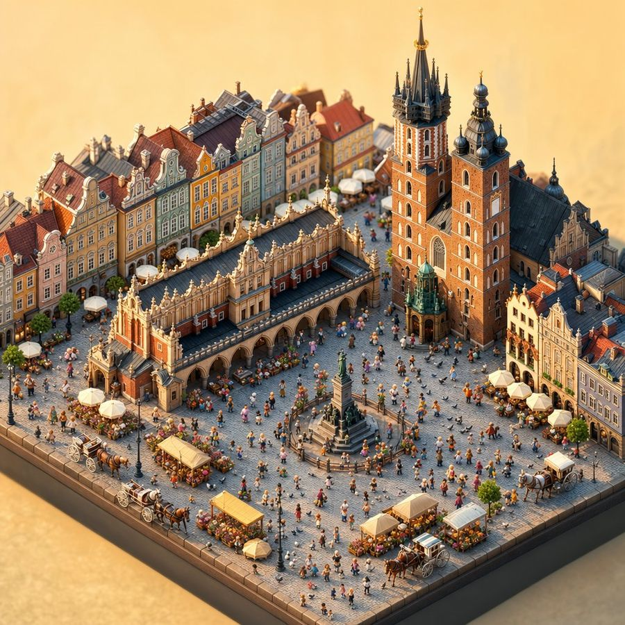
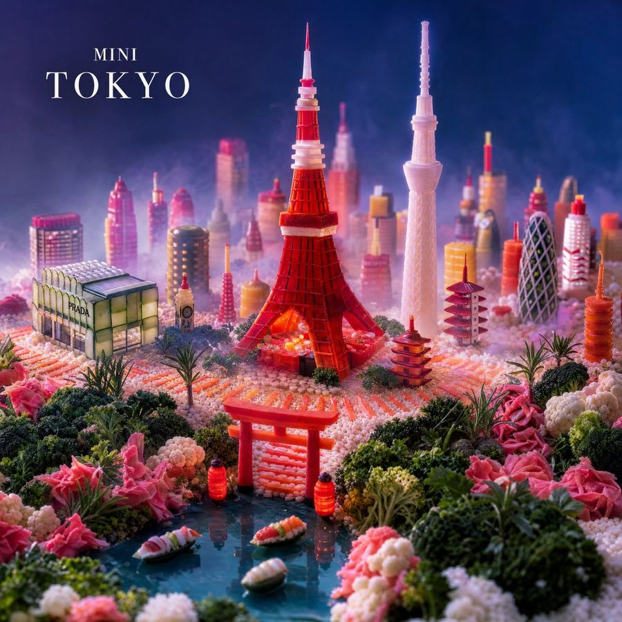
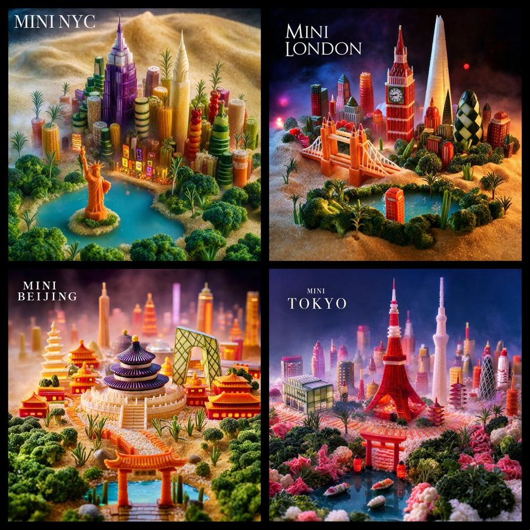
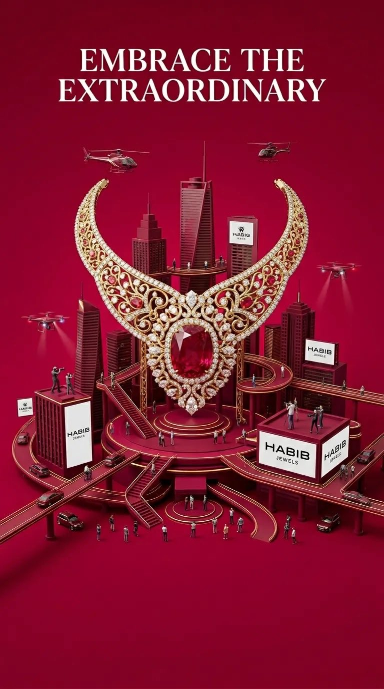
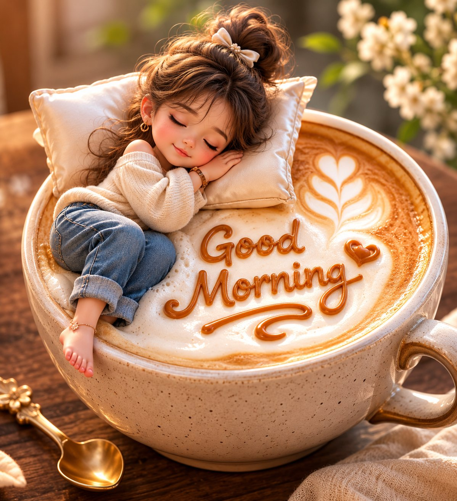
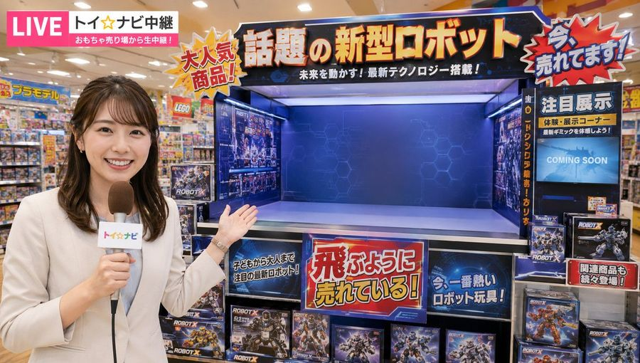

# 🧸 3D 物品与微缩世界

[返回分类](categories.md) · [查看全部案例](cases/cases-001-100.md) · [返回首页](../README.md)

手办、高达模型、乐高人偶、微缩场景、扭蛋机、玻璃瓶纪念品、毛绒玩具等。
---
## 🧸 例 31：令人恐惧的汉坦病毒显微可视化


**Prompt:**

```text
创作一张具有戏剧性的 3D 微距科学可视化图像，展示 {argument name="virus name" default="Hantavirus"}，将其描绘为一个漂浮在黑暗微观环境中的恐怖球形病毒颗粒。主体是一个清晰对焦的大型病毒粒子，具有粗糙的纤维状灰褐色外壳，表面覆盖着许多排列在整个圆周上的半透明红橙色喇叭状刺突蛋白。通过前表面展示一个类似剖面的发光内核，内部充满温暖的金色生物发光颗粒，以及一根盘绕成螺旋结的厚实青绿色 RNA 链。在主病毒粒子周围布置 4 个失焦的背景病毒颗粒：左上方一个大型模糊颗粒，右上方一个大型模糊颗粒，左下边缘一个部分模糊颗粒，以及右边缘一个部分模糊颗粒。采用电影级景深、体积雾、漂浮的尘埃状微观颗粒、青绿色与琥珀色调色、高对比度轮廓光、超精细纹理、半写实生物医学插画风格，营造恐怖阴森的氛围，超高分辨率，无文字，无标签，无水印。
```

**来源：** [@abs_uiux](https://x.com/abs_uiux/status/2052705141216665703#reversed-0) | 2026-05-13

---
## 🧸 例 32：3D 历史人物传记海报模板


**Prompt:**

```text
创建一个高度精细的“3D 历史人物破框传记海报”。

主角：{argument name="character name" default="[请输入人物名称]"}
人物身份：[皇帝 / 将军 / 战略家 / 哲学家 / 改革家 / 学者 / 军事统帅]
历史时期：{argument name="historical era" default="[请输入朝代或历史时期]"}
核心关键词：{argument name="keywords" default="[请输入关键词]"}
主色调：[黑金朱红 / 深蓝银 / 暗墨金 / 铁黑]
长宽比：3:4 竖版海报

设计一张极具电影感、历史档案风格的海报，以全身 3D 历史人物为绝对视觉中心。人物必须看起来写实、如纪念碑般庄重、充满力量感，并具备准确的历史还原度。服装、盔甲、长袍、武器、皇冠、靴子、织物纹理及配饰必须与历史时期完全吻合。

人物不应保持静止。设计一个极具戏剧性的“破框而出”动作，面向观众，展现强烈的电影感景深与透视畸变。一只手臂或象征性物件必须有力地向前延伸。破框物件可以是御剑、长矛、令旗、圣旨、兵符、书卷、玉板、礼器或朝代旗帜。确保向前延伸的物件完整可见，不被裁切。

中心人物站在精致的纪念碑式底座上，底座带有细腻的历史雕刻。人物应在视觉上显得厚重且具有统治力，而周围的信息系统则应显得轻盈、优雅、通透且具有悬浮感。

在人物周围放置 6–10 个悬浮的历史事件碎片，设计成轻量级的博物馆档案残片，而非厚重的信息卡片。使用透明亚克力/玻璃面板、发光边框、精细的金色标注线、分层的信息图表碎片以及悬浮的手稿纹理。这些碎片可以包含年份、事件标题、简短注释、历史场景、军事地图、朝代印章、疆域轮廓及古籍纹理。

悬浮碎片应呈现出不同的深度和角度。部分碎片靠近镜头，部分被盔甲或武器部分遮挡，从而营造出强烈的电影感层次和真实的物理空间感。

在左侧，加入大型东亚书法风格的标题排版，包含人物姓名、生卒年、朝代名称、角色标签、历史关键词以及带有印章风格字体的传奇副标题。

在底部，设计一条纤细优雅的水平时间轴，使用精细的金线、小型圆形标记、极简的年份标签以及受博物馆展览指南启发的细微注释。避免使用厚重的信息栏。

背景风格应结合古羊皮纸纹理、褪色的地图、博物馆墙面美学、水墨纹理、印章戳记、破碎的历史文档、战争场面
```

**来源：** [@xRahultripathi](https://x.com/xRahultripathi/status/2053393650399240370) | 2026-05-13

---
## 🧸 例 35：羊毛毡国家微缩世界


**Prompt:**

```text
Country: [INSERT COUNTRY NAME]

A miniature felt diorama made of fluffy yarn, wool, and needlework, designed as a single cohesive small world (not a collage), reflecting the real landscape, culture, and daily life of the country.

Structure:
- Select 4–7 naturally integrated elements (landscape, architecture, transport, street life, culture)
- Everything must flow together as one environment

Foreground:
Everyday life — small shops, cafes, markets, people interacting, local clothing, street details, subtle movement, warm human presence

Midground:
Connecting flow — streets, bridges, rivers, paths, transport, cultural spaces that guide the eye naturally from front to back

Background:
One strong identity anchor — landmark, skyline, mountain, or symbolic landscape clearly representing the country (keep it clean, not overcrowded)

Style:
Handmade wool felt, yarn, needle-felt textures, visible fibers, soft edges, miniature craftsmanship, premium diorama realism

Lighting:
Warm golden hour or bright noon, soft shadows, clear visibility, gentle glow enhancing depth

Color:
Soft but saturated palette reflecting the country’s natural tones (greens, sky blues, architectural hues, cultural accents), warm and balanced

Composition:
Vertical frame, balanced or centered perspective, slight top-down or immersive angle, clear foreground–midground–background depth

Mood:
Warm, emotional, calm, refined — like a handcrafted fairy-tale version of real life (not childish)

Rules:
- No logos or text overlays
- No collage-style composition
- No random symbolic clutter
- Keep it realistic but stylized as a handmade miniature world

Quality:
16K, ultra-detailed, hyper-realistic miniature textures, cinematic depth, sharp focus

output_goal:
A single, cohesive felt diorama world that instantly conveys the identity and atmosphere of the chosen country through integrated landscape, culture, and daily life
```

**来源：** [@volkan_iras](https://x.com/volkan_iras/status/2051403530590638325) | 2026-05-13

## 🧸 例 44：等轴测克拉科夫中央集市广场立体模型



**Prompt:**

```text
创建一个高度精细的等轴测微缩立体模型，主题为 {argument name="city square" default="波兰克拉科夫中央集市广场"}，时间设定在温暖的午后黄金时刻，以俯视的三分之四角度呈现，如同放置在深色方形展示底座上的手工建筑模型。展示华丽的欧洲老城建筑，背景和右侧边缘排列着柔和色调的联排别墅、红瓦屋顶、装饰性山墙、鹅卵石路面，并配以柔和的浅景深光效。主要地标应包括一座带有拱廊侧面和华丽屋顶线的长条形文艺复兴时期纺织会馆，以及一座巨大的砖砌哥特式大教堂，教堂需具备 2 座高度不等的高塔、深色尖顶、洋葱头圆顶和镀金细节。在开阔的广场中，包含 1 座中心石质纪念碑及站立雕像、5 辆马车、6 个带有淡黄色遮阳棚的小型集市摊位或花卉亭，以及 7 把环绕户外座位的白色咖啡馆遮阳伞。广场上布满许多身着夏装的微小彩色行人，自然地聚集在摊位、咖啡馆、纪念碑、马车和教堂入口周围。使用 {argument name="visual style" default="超精细移轴微缩景观，照片级 3D 渲染"}，呈现温暖的阳光、清晰的阴影、丰富的砖红色和柔和色调、微小的花卉与绿植，以及迷人的午间游客氛围。避免出现可辨认的标牌、现代汽车、比例过大的人物、水印或文字覆盖。
```

**来源：** [@staskulesh](https://x.com/staskulesh/status/2054525225321009351#reversed-0) | 2026-05-14

## 🧸 例 53：迷你东京美食景观



**Prompt:**

```text
创建一个名为 {argument name="title text" default="MINI TOKYO"} 的超现实微距迷你美食景观，展现东京从一片广阔的细金白色蔗糖结晶地面上升起，如同夜晚的沙漠。构图为方形电影级立体模型，具有浅景深、戏剧性的蓝紫色烟雾背景、建筑间柔和的雾气，以及温暖的粉红色与红色可食用灯光。中心矗立着 1 座主导的东京塔，由堆叠的亮面红椒条和浅色糖圈精心构建，底部发出橙色光芒。右侧矗立着 1 座由浅色糖棒和白色糖果棒制成的高大东京晴空塔。在朦胧的背景中环绕 16 座迷你可食用摩天大楼和塔楼，包括 1 座黑白交叉椭圆形塔、1 座红白条纹圆柱形塔、1 座小型钟楼式建筑、2 座宝塔式塔楼、1 座标有 {argument name="storefront label" default="PRADA"} 的绿色玻璃奢侈品店，以及由威化饼、软糖、棉花糖、饼干和辣椒片制成的额外糖果块高层建筑。在前景中，用西兰花、香草、绿叶蔬菜、花椰菜小花、粉色腌姜和糖果状灌木制作一个微型日式花园。在光亮的深青色池塘边缘添加 1 座红色鸟居，旁边有 2 盏发光的红灯笼，水中漂浮着 3 艘寿司形状的小船。使用 {argument name="main color palette" default="深海军蓝、洋红色、糖果红、糖白色、苔藓绿和暖橙色"}。将标题文本置于左上角，采用优雅的白色衬线字体，小写字母“MINI”位于大写且字间距拉开的“TOKYO”上方。超精细美食造型，微距摄影真实感，奇幻可食用建筑，魔幻微缩比例，清晰的前景纹理，散景城市深度，无人物，无水印。
```

**来源：** [@bigwonbots](https://x.com/bigwonbots/status/2054918496572539163#reversed-0) | 2026-05-15


---

## 🧸 例 54：迷你世界美食景观网格



**Prompt:**

```text
目标：创建一个 2x2 的网格，展示四个超现实的微缩可食用城市美食景观，每座城市都从广阔的精细金色蔗糖沙漠中升起，并以高端微缩模型的方式进行拍摄，呈现电影般的灯光效果。使用 {argument name="overall theme" default="Universal Mini World Foodscape"} 作为概念：标志性地标和摩天大楼由色彩缤纷的糖果、糕点、蔬菜、香料、饼干、糖玻璃、果冻和糖果材料精心制作而成。

画布：正方形图像，四个相等的面板由粗黑边隔开，每个面板都是一个精致的微缩场景，具有浅景深、发光的城市灯光、闪烁的糖粒、微小的树木和梦幻般的大气薄雾。高细节微缩摄影外观，饱和的宝石色调，温暖的高光，深色晕影边缘，除微型雕像或地标复制品外，不包含人物。

布局：精确的 4 个带标签面板，呈 2x2 排列。计数和标签：1) 左上： “MINI NYC”；2) 右上： “MINI LONDON”；3) 左下： “MINI BEIJING”；4) 右下： “MINI TOKYO”。每个标题均以优雅的白色衬线大写字母显示在面板左上方，必要时“MINI”字样较小。保持标签清晰且拼写准确。

面板细节：左上角的“MINI NYC”展示了绿松石色湖泊旁的微缩纽约天际线，前景中有一个小岛上的微型自由女神像，一座类似帝国大厦的糖果摩天大楼，类似克莱斯勒大厦的尖顶，各种圆柱形糖果塔，棕榈状的可食用植物，西兰花状的树木，发光的窗户，以及天际线后起伏的糖沙丘。使用 {argument name="first city label" default="MINI NYC"} 作为可见标题。

右上角的“MINI LONDON”展示了金色糖沙地形上的可食用伦敦地标，前方有一条小河或泻湖：由橙色饼干/糖果制成的塔桥，大本钟/伊丽莎白塔风格的钟楼，高耸的碎片大厦风格糖玻璃塔，带有菱形糖霜图案的“小黄瓜”大楼，红橙色的摩天大楼，微小的树木，以及带有粉色和红色散景灯光的忧郁夜空。使用 {argument name="second city label" default="MINI LONDON"} 作为可见标题。

左下角的“MINI BEIJING”展示了微缩北京美食景观，包括宏伟的圆形天坛风格建筑，华丽的红金宫殿屋顶，宝塔状塔楼，背景中 CCTV 总部风格的角状建筑，前景中横跨蓝色水域的红色中国门桥，郁郁葱葱的可食用绿植，糖沙丘，薄雾和温暖的灯笼状光芒。使用 {argument name="third city label" default="MINI BEIJING"} 作为可见标题。

右下角的“MINI TOKYO”展示了黄昏时分的微缩东京美食景观，中心是鲜红色的东京塔，右侧是苍白的东京晴空塔风格塔楼，密集的糖果摩天大楼，前景中横跨深蓝色水域的红色鸟居，锦鲤形状的甜点，粉色花朵般的糖果花，修剪整齐的可食用灌木，以及紫蓝色的霓虹天际线光芒。使用 {argument name="fourth city label" default="MINI TOKYO"} 作为可见标题。

视觉风格：超细节微缩模型，异想天开的超现实美食艺术，照片级真实纹理，可食用建筑，闪烁的砂糖沙，戏剧性的摄影棚灯光，柔和的雾气，微缩比例，移轴景深，丰富的对比度，高饱和度，清晰的地标，奇幻旅行海报氛围。

约束：使用精确的 4 个面板和列出的 4 个城市标题。不要添加额外的面板、标题、徽标、水印、UI 元素或真实人物。保留面板之间的黑色边框。通过地标使每个城市在视觉上独特且可辨认，同时保持所有结构的可食用性和微缩感。
```

**来源：** [@bigwonbots](https://x.com/bigwonbots/status/2054916775846740218#reversed-0) | 2026-05-15


---
### 🧸 例 72：珠宝微缩城市广告海报



**Prompt:**

```text
Create a hyper-detailed luxury advertising poster in a cinematic miniature-world style. A gigantic royal diamond necklace with intricate gold filigree and massive ruby gemstones stands in the center like an architectural monument. Surround the necklace with a futuristic miniature city built around and inside the jewelry piece, including skyscrapers, elevated highways, bridges, spiral staircases, tiny human figures, luxury billboards, drones, helicopters, and cinematic urban activity. Use a deep crimson red monochrome background with gold and ruby accents. Add premium fashion-ad aesthetics, ultra-realistic textures, glossy reflections, dramatic studio lighting, depth of field, tilt-shift miniature effect, and high-end commercial composition. Include bold elegant typography at the top saying: “EMBRACE THE EXTRAORDINARY”. Style inspired by luxury jewelry campaigns, surreal city-building concepts, and premium 3D advertising renders. Ultra realistic, 8K, octane render, sharp focus, highly detailed, cinematic shadows, symmetrical composition.
```

**来源：** [@status](https://x.com/Umar__786Ai/status/2055664244138349055) | 2026-05-18

---
### 🧸 例 99：风格化 3D 角色玩具渲染


**Prompt:**

```text
将用户上传的照片转换为 {argument name="render style" default="风格化 3D 角色渲染"}，同时保留主体特征、姿势和构图。渲染风格：柔和极简的卡通 3D，接近 Pixar 风格但更简洁，类似于玩具人偶或精致的产品角色设计。皮肤：光滑的哑光塑料质感，带有柔和均匀的纹理和细腻的次表面散射。面部：半闭的厌世眼，厚重的眼睑，圆润简化的鼻子，简化的圆耳朵，平直的中性嘴巴。整体表情：冷漠、平静、无聊。服装：{argument name="outfit" default="柔和哑光面料的极简街头服饰"}，无 Logo，无图案。可选配饰：简单的棒球帽和无线耳机。光照：摄影棚柔光箱设置，阴影极柔和，低对比度，微妙的高光。背景：{argument name="background color" default="纯色柔和绿或柔和色调"}，无渐变。相机：正面拍摄，中景特写，等效 50mm 镜头，零畸变。高分辨率，边缘清晰，无噪点，强调风格化而非写实。
```

**来源：** [@status](https://x.com/iamaiistudio/status/2057524095697527251) | 2026-05-20

---
### 🧸 例 116：EMA Collectible Action Figure Box


**Prompt:**

```text
Create a realistic high-end product photo of an anime-style action figure sealed inside a collectible retail box. The figure is {argument name="character name" default="EMA"}, a cheerful original girl character with very long flowing {argument name="hair color" default="orange-red"} hair and two front braids, but her face is intentionally covered by a centered square blur censor block. She is posed dynamically on one leg with her right hand raised in a V-sign peace pose and her other hand on her hip. Outfit details: exactly 7 main clothing pieces — yellow cropped jacket with orange sun motifs, white sleeveless top, orange high-waisted shorts, brown belt, yellow thigh-high socks, orange sneakers, and an orange backpack. Place her in a clear molded plastic blister tray with a round transparent stand at the bottom. Include exactly 3 visible accessories in separate molded compartments on the right side: a black smartphone with an orange case, a small orange spiral notebook with a sun emblem, and a matching orange pen. Packaging: tall rectangular premium toy box photographed at a slight front-right angle, white and orange gradient cardboard with gold trim, rounded clear window, star and sparkle decorations, and an elegant orange top label. Use accurate readable package text: top center says "AIDear" with "Collection" beneath it, top right says "No.001", bottom nameplate says large "EMA" with smaller "Researcher Edition" beneath, and a gold circular seal at lower right says "LIMITED EDITION". The overall style should resemble a real Japanese collectible action figure package, glossy plastic reflections, warm studio lighting, sharp product photography, orange-and-gold color theme, clean gray background, no extra figures, no extra accessories, no watermark.
```

**来源：** [@status](https://x.com/AIDear_co/status/2058191048564969678#reversed-0) | 2026-05-22

---
### 🧸 例 131：早安拿铁微缩女孩



**Prompt:**

```text
Create ultra-fine highly detailed 3D realistic miniature chibi-like cute girl, wearing cream colour top and jeans, resting and floating on creamy latte cup, stylized textured ceramic cup, sleeping expression, satin soft pillow tucked behind her head. The latte cream forms a text "Good Morning" in a cute handwriting. Soft-focus minimalist background, bright natural light, 8K UHD.
```

**来源：** [@Zyrellix](https://x.com/Zyrellix/status/2059443447602561444) | 2026-05-28

---

### 🧸 例 139：Q 版毛绒足球吉祥物


**Prompt:**

```text
创作一款以 {argument name="subject" default="金发足球前锋"} 为灵感、超写实的收藏级 Q 版毛绒足球吉祥物，采用正面站姿，置于 {argument name="background" default="平滑蓝色渐变背景"} 的高级影棚环境中。角色拥有超大的亮面蓝色眼睛、柔软的刺绣面部特征、可爱的小嘴、红润的脸颊，以及带有明显缝线和奢华毛绒材质的精细蓬松纹理。采用大头小身的风格化比例，皮克斯风格的写实感，超萌美学。

吉祥物身穿现代足球球衣，配有高级刺绣细节、替换球衣设计、独特的赞助商贴片、球衣号码 {argument name="number" default="9"}、修身短裤、长袜和细节丰富的足球鞋。生成多种服装款式，包括天蓝色、黑金配色、红白配色、荧光黄和条纹球衣。包含不同的发型，如大背头金发、凌乱纹理剪裁、编织发髻、发带造型、鲻鱼头风格和短蓬松发型。

渲染为奢华设计师毛绒玩具，采用电影级影棚灯光、柔和阴影、逼真的面料绒毛、超精细接缝、鲜艳色彩、居中构图、浅景深、照片级玩具摄影、高细节刺绣、高级缝线、8k 分辨率、虚幻引擎品质、焦点清晰、收藏级吉祥物美学、高端周边风格。
```

**来源：** [@iamsofiaijaz](https://x.com/iamsofiaijaz/status/2059578636588736864) | 2026-05-28

---

### 🧸 例 141：Toy Ferrari Storyboard Contact Sheet


**Prompt:**

```text
Goal: Create a cinematic 12-panel storyboard contact sheet showing a toy-like LEGO-style yellow minifigure discovering, entering, and driving a realistic light-blue Ferrari sports car through a miniature brick city at sunset.

Canvas: Wide horizontal storyboard sheet, approximately 16:9, with a clean white background, thin black panel borders, and exactly 12 numbered still frames arranged in a 3-column by 4-row grid. Each panel has a bold two-digit number in the top-left corner from 01 to 12 and a short black caption underneath in small documentary storyboard text.

Visual style: Hyper-realistic macro toy photography mixed with cinematic automotive advertising. Use shallow depth of field, warm golden-hour sunset lighting, glossy reflections, dramatic lens flare, detailed brick road texture, miniature city buildings, and a crowd of yellow toy minifigures in the background. The car should look like a full-detail real exotic coupe, not a toy, with black wheels, low body, LED headlights, and premium interior. The main figure is a classic yellow plastic toy person with brown molded hair, simple smiling face, yellow torso, blue legs, and claw-shaped hands. Overall mood is playful, premium, and cinematic.

Subject details: The hero car is a {argument name="car description" default="light-blue Ferrari-style supercar coupe"}. The main toy driver is a {argument name="character description" default="yellow LEGO-style male minifigure with brown hair, yellow shirt, blue pants, and claw hands"}. The setting is a {argument name="setting" default="miniature brick-built city street at sunset"}. Use warm orange sunlight from the horizon, realistic reflections on the blue paint, and many background toy figures watching.

Storyboard panels: Include exactly 12 discrete panels with these shots and captions:
01. Wide establishing shot. The car is parked outside a modern toy-brick house.
02. Side profile beauty shot. The toy figure walks toward the car admiring it.
03. Close-up. Tiny yellow plastic hand reaches for the door handle.
04. Low-angle shot. The toy figure opens the large car door.
05. The toy figure climbs into the realistic car.
06. Interior shot. Tiny hands on the steering wheel. Dashboard lights glow.
07. Close-up portrait. The toy figure smiles confidently.
08. Rear beauty shot. Lights glow dramatically. Add a readable license plate that says {argument name="license plate text" default="Ferrari LUCE"}.
09. Wide tracking shot. The car starts driving through the toy city.
10. Dynamic side motion shot. The car moves through the streets.
11. Cinematic front tracking shot. The car drives into the sunset.
12. Final wide shot. The toy figure waves from the car while driving.

Text and numbering: Use clear black frame numbers 01, 02, 03, 04, 05, 06, 07, 08, 09, 10, 11, and 12. Place each caption below its matching panel in English. Keep typography simple and legible, like a printed storyboard proof sheet.

Constraints: Exactly 12 panels, exactly 3 columns and 4 rows, no extra panels, no missing captions, no watermark. Maintain continuity of the same blue car, same toy figure, same miniature city, and same sunset lighting across all frames. Make the image feel like stills from a polished miniature car commercial titled {argument name="commercial mood" default="playful luxury toy-car adventure"}.
```

**来源：** [@Sogni_Protocol](https://x.com/Sogni_Protocol/status/2059557479999025378#reversed-0) | 2026-05-28

---


### 🧸 例 153：新闻记者玩具店场景



**Prompt:**

```text
女子アナなど
明るい大型おもちゃ屋の店内で、女性アナウンサーがテレビ中継風に「大人気ロボット玩具」を紹介している高品質な画像。
舞台は大型のおもちゃ屋。店内には玩具棚、商品パッケージ、カラフルなPOP、通路、明るい照明、賑やかな売り場の雰囲気が広がっている。背景はリアルで自然な商業施設らしい見た目。
重要：
ロボット本体そのものは画面に登場させない。
ただし、ロボットが展示されている専用の大型展示棚、展示台、または専用スペースは、画面内にはっきり分かるようにしっかり表示すること。
その展示スペースは、ロボットを後から置けるだけの十分な大きさがあり、目立つ位置にあること。
展示棚や展示台の周囲には、「話題の新型ロボット」「大人気商品」「注目展示」などを連想させる販促パネル、商品箱、関連グッズ、POP、説明ボードなどを配置して、ここがロボット売り場・展示コーナーであることが一目で分かるようにする。
ただし、ロボット本体の全体像や機体そのものは見せない。
女性アナウンサーは親しみやすく清潔感のあるテレビレポーター。明るい笑顔でカメラに向かって話している。上品で自然な報道向け衣装。手にはマイクや取材カードを持っていてもよい。店内を紹介しながら、話題の商品について説明しているニュース番組・情報番組風の雰囲気。
内容は「このロボットが大人気で、まさに飛ぶように売れている」と紹介しているシーン。背景の棚や売り場には、関連する玩具箱、ポスター、販促パネルなどが並び、人気商品であることが伝わる。特に、ロボット展示用の棚・展示台・空きスペースをしっかり見せて、あとでそこにロボットが存在する、または飛び立つことが自然に感じられる構図にする。
セリフの雰囲気：
「こちら、おもちゃ売り場から中継でお伝えしています！」
「今こちらで大注目となっているのが、話題の大人気ロボット玩具です！」
「その人気はすさまじく、まさに飛ぶように売れているんです！」
「こちらの展示コーナーでも、大きな注目を集めています！」
「子どもから大人まで注目を集める、今一番熱い商品となっています！」
構図のポイント：
アナウンサーを前景または中景に配置し、背景にはロボット展示用の棚・展示台・専用スペースがしっかり見えるようにする。
棚や展示台はフレームの中で十分な存在感を持たせ、置く場所がないように見えないようにする。
空の展示台、広い棚、専用区画、周辺の関連商品によって、ロボットのための売り場・展示場所が明確に分かるようにする。
三面図（ロボット）
オリジナルの大人気ロボットの高品質な三面図デザインシート。正面、側面、背面を並べた見やすい設定資料風レイアウト。白背景または薄いグレー背景。余計な演出はなく、機体の形状がはっきり分かるようにする。
ロボットは、バーチャロン風のシャープで洗練された近未来メカデザイン。細身で高機動、直線的でスタイリッシュなシルエット、空力を感じさせる装甲ライン、鋭い脚部、流れるようなボディ形状、背部に大型バーニアユニットまたは高機動スラスターを持つ。高速機動・空中機動が得意そうな印象を強く出す。全体として、アーケードメカゲームに出てくるようなスピード感あるメカ。
重要：
ガンダムに似すぎない完全オリジナルデザインにすること。
以下の特徴は避ける：
- V字アンテナ
- 典型的なガンダム顔
- 口元のフェイススリット
- トリコロールを中心とした既視感の強い配色
- 古典的なヒロイック主役機そのままの記号
- 角ばった胸部と顔の組み合わせが既存ロボット作品に見える構成
代わりに、以下の方向でデザインする：
- 頭部は細長いセンサーヘッド、または横長バイザー型
- 顔は人間顔すぎず、メカ的で未来的
- 頭部に短いアンテナ、センサー突起、または流線型のブレード意匠
- 胸部はスリムで高密度な装甲構成
- 肩はシャープで機能的、過剰に巨大にしない
- 腕部・脚部は細身だが力強く、機動性重視
- 背中の大型スラスター・バーニアが機体の特徴として目立つ
- 足元は接地性よりも高機動感を優先したスマートな形状
配色は、例えばホワイトグレー、ブルーグレー、ブラック、シルバー、パープル、ターコイズ、オレンジなどを組み合わせた、近未来的でスタイリッシュなオリジナルカラーリング。おもちゃっぽすぎず、商品化されるほど人気のある本格派メカとして説得力のあるデザインにする。
パネルライン、関節、装甲の重なり、センサー、スラスター、各部ディテールは丁寧に描き込む。ただし重装甲よりは、軽快で機敏な印象を優先する。
主目的は、正面・側面・背面のデザインがはっきり分かること。全体として、空へ飛び立てる高機動型のオリジナル近未来メカの三面図として完成させる。
画面内に不要な番号、長文説明、絵コンテ要素、メモ書きは出さない。必要であれば、ごく自然なテレビ中継風の小さなテロップ程度に留める。全体として、明るく自然なニュースレポート風で、アナウンサーとロボット展示スペースが分かりやすい1枚にする。
```

**来源：** [@楽園](https://x.com/dave392750/status/2060074098152345836) | 2026-05-29

---
### 🧸 例 220：Crumple Chair 概念沙发研发板


**Prompt:**

```text
Design Concept: The Crumple Chair Core Philosophy: Translating the "controlled chaos" of a tossed paper ball into a sculptural, high-comfort seating experience.

Stage 1: Observation & Morphological Analysis The goal is to deconstruct the image of the crumpled paper into usable geometric data. Crease Mapping: Identify the primary "valley" and "ridge" lines. These represent potential structural ribs or seams in the chair. Faceted Planes: Break down the sphere into a series of non-uniform polygons. Each flat surface of the paper becomes a potential panel for the chair’s upholstery or shell. Shadow Study: Analyze how the "tossed" form creates deep recesses. These natural pockets guide where the user’s weight will be cradled.

Stage 2: Iterative Form Exploration Moving from a sphere to a seat through "Digital Crumpling." Subtractive Sculpting: Imagine the paper ball as a solid mass. Use Boolean operations to "carve out" a seating cavity that fits the human form while maintaining the external jagged texture. Tension Simulation: Use 3D software (like Rhino or Blender) to simulate a flat sheet of material being compressed. This ensures the folds look authentic and not "modeled." The "Toss" Logic: Experiment with gravity-based simulation dropping a digital mesh to see how it settles naturally, mimicking the "tossed" origin.

Stage 3: Ergonomic Translation & Blueprinting Refining the raw aesthetic into a functional object. The Comfort Core: Overlay a standard ergonomic template (Seating Angle: 105°–110°) over the crumpled form. Adjust the internal "folds" to provide lumbar support and pressure relief. Blueprint Generation: Create technical orthographic views (Front, Side, Top). Map out the dimensions: Seat Height: 450mm Total Width: 850mm Surface Smoothing: Maintain the sharp "paper edges" on the exterior shell while softening the interior contact points for skin comfort.

Stage 4: Structural Integration & Scaling Making the concept physically viable. The Skeleton: Design a hidden internal frame (likely CNC-bent steel rods or a 3D-printed lattice) that follows the most prominent ridges of the paper folds to provide rigidity. Material Selection: * Option A (High-End): Faceted, cast aluminum with a white powder coat. Option B (Soft): Vacuum-formed recycled plastic shell covered in "memory-fold" technical fabric that retains a wrinkled appearance.

Stage 5: Final Prototyping & Material Finish Textural Replication: Apply a matte, slightly porous finish to the material to mimic the tactile feel of heavy-bond paper. Lighting Contrast: Use directional studio lighting in the final renders to emphasize the "tossed" shadows, making the chair look like a giant piece of discarded inspiration. Design Tip: To keep the "tossed" look authentic, avoid symmetry. The most compelling aspect of a crumpled paper ball is its unique irregularity—ensure the left and right sides of the chair are balance-equivalent but not identical
```

**来源：** [@ShamsAmin56](https://x.com/ShamsAmin56/status/2050281206139461780) | 2026-05-30

---

### 🧸 例 246：体素定格动画角色


**Prompt:**

```text
Create a highly stylized 3D character portrait with a {argument name="style" default="blocky, geometric voxel-like form"} and a {argument name="texture" default="handcrafted clay / foam micro-particle texture"}, inspired by painterly stop-motion aesthetics. Use the person from the ATTACHED REFERENCE PHOTO. Preserve the person’s identity, facial structure, proportions, skin tone, and key features, but reinterpret them into a cuboid, low-poly caricature form with simplified geometry, squared facial planes, and intentionally rigid structure. Apply a dense tactile surface made of tiny bead-like or felted particles across all visible elements for a handcrafted look. Render against a {argument name="background" default="swirling, painterly, post-impressionist background"} with thick directional strokes and vibrant motion, evoking a dreamlike night-sky energy. Lighting should be soft but directional, with warm highlights and gentle shadow falloff to enhance texture depth without realism. The overall look should feel artistic, whimsical, museum-grade, and handcrafted, not photoreal, not Pixar, not vinyl, not glossy CGI. Ultra-high detail, clean edges, intentional stylization, no text, no logos, no watermarks. Aspect ratio 4:5.
```

**来源：** [@SPEEDYAI](https://x.com/SPEEDAI07/status/2059718786710909035) | 2026-05-27

---


### 🧸 例 255：超写实 3D Q 版玩偶


**Prompt:**

```text
Hyper-realistic 3D caricature in {argument name="style" default="collectible chibi doll style"}, ultra-detailed rendering, softbox studio lighting, smooth infinite white background. Proportions: GIANT, round, adorable head with extreme chibi proportions. Small, chubby, baby-like body with short, pudgy arms and legs. Head-to-body ratio 2:1. Toddler height. Face: Extreme pouty, sulky, grumpy expression. Furrowed and lowered eyebrows creating a deep wrinkle in the center of the forehead. Large, shiny brown eyes, slightly squinted with irritation. Small upturned pink nose. Mouth with a VERY exaggerated forward pout, protruding lower lip, creating a baby-like double chin effect. VERY LARGE, round, rosy, puffed cheeks. Baby double chin. Porcelain-like skin with soft, realistic texture. Hair: Voluminous, wavy, messy hair. Loose and frizzy strands falling across the face and nape, giving a tousled appearance. Adapt hair color and length according to the reference image. Maintain the same fluffy volume and texture. Pose: Standing with the head tilted to one side, body slightly curved. Both hands tucked into the front pockets of the shorts. Drooping shoulders. Classic "I'm upset" posture. Clothing: {argument name="outfit" default="Basketball-style athletic tank top"} with contrasting collar and armhole trim, plus loose sports shorts with a drawstring. High-top sneakers in an All-Star style. Thin necklace with a pendant around the neck. Bracelets on the wrists. Keep exactly the same sportswear design, but use {argument name="color scheme" default="RANDOM COLORS"} different from the original red/white combination. Keep the logo and number on the jersey, but feel free to change the text/number. Art Style: Photorealistic 3D collector doll render, soft skin texture, gentle lighting, highly detailed strand-by-strand hair, delicate shading. Same cute yet irritated character style.
```

**来源：** [Saul Goodman](https://x.com/Goodmanprotocol) | 2026-05-30

---


### 🧸 例 256：折纸微缩村庄


**Prompt:**

```text
Ultra-cinematic surreal photography of an {argument name="subject" default="entire miniature village world"} built ENTIRELY out of folded paper origami in the style of {argument name="origami style" default="Akira Yoshizawa origami"} — origami paper houses with sharp creased roofs, origami paper trees with folded leaves, miniature origami paper villagers walking around, origami paper cranes flying overhead, a large central {argument name="central figure" default="origami paper dragon"} coiled around a tiny origami pagoda, scattered origami paper lanterns glowing softly, every single element visible paper folds and creases, soft warm tungsten studio lighting catching the paper edges. Dark moody studio background. Three-quarter macro angle, the paper village dominating the frame. NO TEXT, NO OVERLAYS, NO LOGOS — pure origami paper photography only. 9:16 vertical, 8K masterpiece.
```

**来源：** [kuro](https://x.com/kuroffline) | 2026-05-30

---


### 🧸 例 269：四款 3D 微缩城市地图


**Prompt:**

```text
Goal: Create a photorealistic 3D miniature city-map showcase featuring exactly 4 square panels arranged in a 2×2 grid, each panel showing a famous world city as a raised diorama emerging from a printed paper street map on a warm wooden tabletop.

Canvas: Square image, evenly divided by thin white gutters into four equal quadrants. Use an isometric three-quarter view from above, shallow depth of field, warm studio lighting, crisp miniature details, and realistic shadows.

Layout: The 4 panels are: top-left Tokyo, top-right Dubai, bottom-left Paris, bottom-right New York. Each city sits on an open map sheet with a large bold city name printed along the bottom edge of its panel in bright color. Include small neighborhood labels on the map surface.

Panel 1 — Tokyo: Build a dense miniature Tokyo skyline with exactly 6 key recognizable landmarks: Tokyo Tower, Tokyo Skytree, a traditional pagoda, a large temple roof, a modern cluster of skyscrapers, and a canal leading to Tokyo Bay. Add a Japanese flag on a pole, cherry blossom trees, small buses, tiny streets, and map labels such as Shinjuku, Shibuya, Roppongi, Asakusa, and Tokyo Bay. Large bottom text: {argument name="Tokyo label" default="TOKYO"} in bold red letters.

Panel 2 — Dubai: Build a futuristic Dubai marina diorama with exactly 6 key recognizable elements: Burj Khalifa, Burj Al Arab, twin sail-like towers, Dubai Frame, a yacht-filled marina, and a curving elevated transit line. Add palm trees, modern high-rises, an Emirati flag on a pole, blue water, boats, and map labels such as Jumeira, Dubai Marina, Deira, and Dubai Creek. Large bottom text: {argument name="Dubai label" default="DUBAI"} in bold gold letters.

Panel 3 — Paris: Build a classic Paris miniature with exactly 6 key recognizable landmarks: Eiffel Tower, Arc de Triomphe, Notre-Dame-style cathedral, Louvre-like glass pyramid, Haussmann apartment blocks, and a Seine river with bridges. Add a French flag on a pole, tree-lined boulevards, pink blossoms, tiny buses, pedestrians, and warm stone architecture. Large bottom text: {argument name="Paris label" default="PARIS"} in bold blue letters.

Panel 4 — New York: Build a dense Manhattan miniature with exactly 6 key recognizable landmarks: Statue of Liberty, One World Trade Center, Empire State Building, Chrysler Building, Brooklyn Bridge, and a harbor with ferries. Add an American flag on a pole, yellow taxis, buses, crowded streets, waterfront piers, greenery, and map labels such as Manhattan, Brooklyn, and Staten Island. Large bottom text: {argument name="New York label" default="NEW YORK"} in bold orange-red letters.

Visual style: Hyper-detailed 3D paper-map diorama, realistic plastic-and-paper miniature scale model, tilt-shift photography effect, vibrant but natural colors, warm wooden background, soft bokeh at the edges, high-resolution commercial render quality.

Constraints: Keep exactly 4 panels and exactly the 4 city themes listed. Do not add extra cities. Keep all text legible, with the city names large and centered near the lower edge of each panel. Include a small creator watermark in the top-left corner reading {argument name="watermark text" default="@TechieSA"}.
```

**来源：** [TechieSA](https://x.com/TechieBySA) | 2026-05-30

---


### 🧸 例 299：极简中性物体网格


**Prompt:**

```text
Create a clean 2x2 minimalist object photography grid featuring exactly 4 everyday items in a warm neutral beige palette: 1) top-left, a matte cream ceramic vase with a rounded pear-shaped body and narrow neck holding a few delicate dried flower stems, placed on a white tabletop with a soft diagonal sunlight beam and long subtle shadow; 2) top-right, a simple cylindrical cream ceramic mug with a rounded handle on the right, seen slightly from above, centered on a beige tabletop with a soft horizontal shadow; 3) bottom-left, an elegant minimalist wristwatch standing upright, with a thin rose-gold case, blank white dial, slim hour markers, two hands, small crown on the right, and beige leather strap, casting a faint shadow; 4) bottom-right, a neat stack of exactly 3 closed books in cream, white, and taupe covers, aligned horizontally, with the top book slightly smaller and a triangular patch of sunlight on the wall behind. Use a square canvas divided by thick white gutters into four equal panels. Style: high-end editorial product photography, soft natural window light, muted shadows, smooth off-white background, uncluttered composition, matte textures, calm Scandinavian/Japandi aesthetic, no people, no logos, no visible text, no watermark. Overall mood should emphasize {argument name="aesthetic mood" default="quiet simplicity"}, {argument name="color palette" default="warm cream, beige, ivory, and taupe"}, and {argument name="lighting style" default="soft natural window light with gentle geometric shadows"}.
```

**来源：** [Kami AI](https://x.com/Aiwithkami) | 2026-05-30

---


### 🧸 例 307：日式纸艺场景


**Prompt:**

```text
Paper craft diorama of a Japanese café scene, girl with long wavy brown hair and floral bow sitting at a wooden table, viewed from behind, green cream soda float and pudding dessert on table, paper cut flower arrangement, window overlooking a Japanese street with a flower shop sign reading “クボタ花店”, warm nostalgic aesthetic, layered paper art style

Paper craft art of a girl in a {argument name="jacket color" default="purple puffer jacket"}, grey knit headband and scarf, reading a manga volume in a Japanese bookstore, shelves packed with color-coded manga series including Blue Lock and Tokyo Revengers, signs reading “少年コミック マガジン 150円以下”, detailed layered paper illustration style, cozy winter atmosphere

Paper craft cutout figure of a girl wearing a purple zip-up hoodie, grey knit headband, jeans, and character sneakers, standing in front of a decorative {argument name="mural subject" default="Ho-Oh wing mural"} on a white brick wall, “Pokémon Center Tokyo HoUou” signage, warm earthy tones of orange, green, and brown in the wings, sticker-like white border around the character, photo-realistic paper diorama style
```

**来源：** [Sairah](https://x.com/Sairah_0) | 2026-05-30

---


### 🧸 例 326：风格化 3D 卡通艺术项目


**Prompt:**

```text
[中文]
创建一系列四个垂直 2:3 超高清风格化 3D {argument name="style" default="cartoon"} 编辑级渲染图。采用精致的玩具质感角色外观、光滑的哑光皮肤、富有表现力的大眼睛、清晰的轮廓、带有真实投影的柔和摄影棚灯光、细腻的背景颗粒感以及强烈的单色艺术指导。保持每张图像简洁、高级且与背景清晰分离，无文字、无水印、无 Logo。

图像 1：一位风格化卡通女性，身穿修身罗纹蓝色吊带裙，短棕色乱发上架着一副红色太阳镜，脚穿红色蝴蝶结高跟凉鞋，以俏皮的弯曲姿势交叉双腿，站在纯色鲜艳的红色哑光摄影棚墙前。侧光在红色背景上投射出清晰的阴影。

图像 2：一位开朗的风格化卡通女性，全绿旅行造型，黑色头发扎成两个麻花辫，戴着绿色鸭舌帽，无袖绿色短款上衣，宽松的绿色束脚裤，白色运动鞋，一根手指轻触嘴唇，手握一个亮面绿色硬壳行李箱的拉杆。纯绿色摄影棚背景，全身照，平视视角。

图像 3：一个温馨的居中场景，两个风格化卡通角色坐在深红色房间的红色沙发上。左侧的女性裹着质感红色毯子，赤脚，表情平静，双眼向上看。右侧的男性裹着橙色质感毯子，穿着袜子，表情中性温和，向上凝视。采用平衡的对称构图，针织面料质感，温暖怀旧的灯光，以及布艺质感的红色墙面。

图像 4：一位红发风格化卡通女孩站在温暖米色房间的挂墙镜前。展示她的背影，极长的亮面红发垂在背上，镜中倒映出她担忧的小脸、蓝色眼睛、红色服装以及柔和的焦虑表情。侧面柔和的阳光，干净的地板，简单的镜框，充满情感的故事书氛围。

全局质量：8K，超高清，高细节 3D 渲染，逼真的柔和阴影，极致清晰度，边缘锐利，无噪点，无压缩，高级编辑级构图，色块背景，电影感但极简。

[English]
Create a vertical 2:3 ultra high definition series of four stylized 3D {argument name="style" default="cartoon"} editorial renders. Use a polished toy-like character finish, smooth matte skin, expressive oversized eyes, crisp silhouettes, soft studio lighting with realistic cast shadows, subtle backdrop grain, and strong single-color art direction. Keep each image clean, premium, and sharply separated from the background, with no text, no watermark, and no logo.

Image 1: a stylized cartoon woman in a fitted ribbed blue dress with thin straps, red sunglasses resting on short tousled brown hair, red bow high-heel sandals, standing in a playful curved pose with crossed legs against a solid vivid red matte studio wall. Side lighting creates a defined shadow on the red background.

Image 2: a cheerful stylized cartoon woman in an all-green travel look, black hair in two braided pigtails, green cap, sleeveless green crop top, loose green jogger pants with a drawstring, white sneakers, one finger touching her lips, holding the handle of a glossy green hard-shell suitcase. Solid green studio background, full body, eye-level camera.

Image 3: a cozy centered scene of two stylized cartoon characters sitting on a red sofa in a deep red room. The woman on the left is wrapped in a textured red blanket, barefoot, calm expression, eyes looking upward. The man on the right is wrapped in an orange textured blanket, wearing socks, neutral gentle upward gaze. Use a balanced symmetrical composition, knitted fabric texture, warm nostalgic lighting, and a fabric-like red wall.

Image 4: a red-haired stylized cartoon girl standing in front of a wall mirror in a warm beige room. Show her from behind with extremely long glossy red hair flowing down her back, while the mirror reflection shows her small worried face, blue eyes, red outfit, and soft anxious expression. Gentle sunlight from the side, clean floor, simple mirror frame, emotional storybook mood.

Global quality: 8K, ultra-high definition, high-detail 3D render, realistic soft shadows, extreme clarity, crisp edges, no noise, no compression, premium editorial composition, color-block backgrounds, cinematic but minimal.
```

**来源：** [@PromptLab](https://x.com/iamaiistudio/status/2061590939140010068) | 2026-06-01

---


### 🧸 例 336：女孩与巨型毛绒熊猫


**Prompt:**

```text
[中文]
以 {argument name="subject" default="上传的女孩图片"} 作为主体。复刻参考图中的精确姿势、构图、摄影棚布景以及温暖的单色美学风格。将巨型泰迪熊替换为 {argument name="object" default="超大号毛绒熊猫"}。女孩坐在地板上，手持智能手机，身穿黑色高领毛衣和米色套装。柔和的电影级摄影棚灯光，奢华杂志大片质感，超写实细节，温暖的米色背景，高端时尚杂志风格。在背景中加入大号且优雅的艺术草书字体 "{argument name="text" default="NOOR"}"，并与背景巧妙融合。超写实，8K 分辨率，柔和阴影，简洁极简构图，熊猫毛发细节丰富，专业摄影棚肖像。

[English]
Use the {argument name="subject" default="uploaded girl image"} as the subject. Recreate the exact pose, framing, studio setup, and warm monochrome aesthetic of the reference image. Replace the giant teddy bear with an {argument name="object" default="oversized plush panda"}. The girl is seated on the floor holding a smartphone, wearing a black turtleneck and beige outfit. Soft cinematic studio lighting, luxury editorial photography, ultra-realistic details, warm beige background, premium fashion-magazine look. Add the word "{argument name="text" default="NOOR"}" in large elegant aesthetic cursive typography across the background, subtly blended into the backdrop. Hyper-realistic, 8K, soft shadows, clean minimalist composition, highly detailed panda fur, professional studio portrait.
```

**来源：** [@Noor 🌸](https://x.com/Noor_ul_ain43/status/2061501949070156194) | 2026-06-01

---


### 🧸 例 359：像素玻璃外星人与宇航员的邂逅


**Prompt:**

```text
[中文]
创作一幅 1:1 正方形、极其简洁的超现实科幻艺术作品，采用现代像素玻璃美学。画面正中展示两个完整的侧面全身主体：左侧为 {argument name="alien character" default="一位高挑的半透明类人外星人"}，拥有平滑的细长头部、巨大的深色杏仁眼、纤细的脖颈以及由磨砂透明玻璃构成的精致躯体，体内填充着淡淡的星云色彩；右侧为 {argument name="human explorer" default="一名身穿白色舱外活动宇航服的宇航员"}，配有反光头盔面罩、罗纹宇航服关节、胸部模块、软管、手套和厚重的背包。他们抬起的手在画面正中心轻轻相触，指尖之间散发出微弱的暖光。两个人物部分消融为半透明的方形像素块和玻璃立方体：画面中包含两个主要的像素消融区域，分别环绕着外星人和宇航员，轮廓周围漂浮着许多大小不一的半透明方块。使用深黑色渐变摄影棚背景，带有柔和的雾气、细微的烟雾、微小的闪烁颗粒，以及在人物下方投射出淡淡倒影的深色光泽地面。灯光应融合冷蓝色调的轮廓光，外星人体内点缀着微妙的粉色、紫色和琥珀色宇宙高光，指尖接触处则散发着温暖的金色光芒。相机采用正对视角、平视高度、居中构图，使用 85mm 清晰摄影棚镜头拍摄，主体清晰锐利，景深较浅，负空间平衡，静态对称构图，呈现出写实渲染与抽象数字碎片化融合的效果。无文字，无 Logo，无水印，无额外字符。

[English]
Create a square 1:1 ultra-clean surreal sci-fi artwork in a modern pixel-glass aesthetic. Show exactly two centered full-body subjects facing each other in profile: on the left, {argument name="alien character" default="a tall translucent humanoid alien"} with a smooth elongated head, large dark almond eye, slender neck and delicate body made of transparent frosted glass filled with faint nebula colors; on the right, {argument name="human explorer" default="an astronaut in a white EVA spacesuit"} with a reflective helmet visor, ribbed suit joints, chest module, hoses, gloves, and a bulky backpack. Their raised hands meet gently palm-to-palm at the exact center, creating a small warm glow between their fingertips. Both figures partially dissolve into translucent square pixel blocks and glass cubes: count two main dissolving pixel fields, one surrounding the alien and one surrounding the astronaut, with many semi-transparent squares of varied sizes floating outward around their silhouettes. Use a deep black gradient studio background with soft haze, subtle smoke, tiny glittering particles, and a glossy dark floor that creates faint reflections beneath the figures. Lighting should mix cool blue-white rim light with subtle pink, violet, and amber cosmic highlights inside the alien body and warm golden light at the touching hands. Camera is front-facing, eye-level, centered, shot with an 85mm clean studio lens, crisp subject clarity, shallow depth of field, balanced negative space, static symmetrical composition, photorealistic rendering blended with abstract digital fragmentation. No text, no logo, no watermark, no extra characters.
```

**来源：** [@elinak100](https://x.com/elina_k100/status/2061447949796937893#reversed-0) | 2026-06-01

---


### 🧸 例 386：手工珐琅纪念冰箱贴


**Prompt:**

```text
[中文]
创建一个基于 {argument name="reference" default="上传照片"} 的优质可收藏手工珐琅纪念冰箱贴。保留原图中的 {argument name="subject" default="主体人物"}，并将其自然地融入构图，作为中心主体。将冰箱贴设计为具有雕塑感深度、凹陷珐琅区域和超薄抛光金金属轮廓的逼真三维珐琅物件。仅在重要的形状和地标上使用选择性的金色勾勒，不要勾勒每一个细节。冰箱贴必须具有优雅的有机轮廓，遵循原图中地标、建筑和景观的形状。避免使用方形、矩形、圆形框架、贴纸、边框、徽章或牌匾。构图应突出展示：原图中的人物、关键建筑和地标、风景元素、真实的旅行目的地氛围。材质与渲染：逼真的手工珐琅质感、浮雕金金属边缘、博物馆商店级的优质纪念品、电影级奢华旅行收藏品美学、柔和的摄影棚灯光、金属表面微妙的反射、柔和逼真的阴影、高端产品摄影质感、超精细的 3D 深度。背景：使用简洁的极简主义背景，其颜色与原图中的主色调之一相匹配。排版：在冰箱贴下方居中放置优雅的衬线字体。排版风格：奢华编辑衬线字体、全大写字母、非常宽的字间距、极简主义旅行海报美学、精致的奢华品牌感。文本层级：主要的 {argument name="city" default="目的地/城市名称"} 字体较大且醒目，{argument name="region" default="国家或地区"} 名称在下方较小。最终输出：奢华旅游纪念品广告、博物馆商店可收藏珐琅冰箱贴、超逼真产品摄影、8K 分辨率、高度精细、精湛工艺、优雅极简主义。

[English]
Create a premium collectible handmade enamel souvenir magnet based on the {argument name="reference" default="uploaded photo"}. Preserve the {argument name="subject" default="main person"} from the original image and integrate them naturally into the composition as the central subject. Design the magnet as a realistic three-dimensional enamel object with sculpted depth, recessed enamel areas, and ultra-thin polished gold metal contours. Use selective gold outlining only on important shapes and landmarks. Do not outline every detail. The magnet must have an elegant organic silhouette that follows the shape of the landmark, architecture, and landscape from the original image. Avoid square, rectangular, circular frames, stickers, borders, badges, or plaques. The composition should prominently feature: The person from the original photo, Key architecture and landmarks, Scenic landscape elements, Authentic travel destination atmosphere. Material and rendering: Realistic handcrafted enamel texture, Embossed gold metal edges, Premium museum-store souvenir quality, Cinematic luxury travel collectible aesthetic, Soft studio lighting, Subtle reflections on metal surfaces, Gentle realistic shadows, High-end product photography look, Ultra-detailed 3D depth. Background: Use a clean minimalist background whose color matches one of the dominant colors from the original image. Typography: Place elegant serif typography centered beneath the magnet. Typography style: Luxury editorial serif font, All capital letters, Very wide letter spacing, Minimalist travel-poster aesthetic, Sophisticated luxury branding. Text hierarchy: Main {argument name="city" default="destination/city name"} large and prominent, {argument name="region" default="Country or region"} name smaller underneath. Final output: Luxury tourism souvenir advertisement, museum-shop collectible enamel magnet, ultra-realistic product photography, 8K, highly detailed, premium craftsmanship, elegant minimalism.
```

**来源：** [@Eesha](https://x.com/MissDelulu9/status/2061387471439712383) | 2026-06-01

---

### 🧸 例 425：著名地标 3D 微缩模型


**Prompt:**

```text
[中文]
等轴测微缩立体模型，展示 {argument name="landmark name" default="埃菲尔铁塔"}，在小型悬浮平台上还原其现实世界的结构与比例，周围环绕着来自 {argument name="location" default="法国巴黎"} 的建筑和景观细节。采用物理精确的材质，包括石材、混凝土、金属和玻璃。色彩搭配真实，色调柔和且符合地标原貌。米白色摄影棚背景，配以柔和的自然光、细腻的阴影和简洁的构图。高细节 3D 渲染，呈现高级建筑模型美感，无人物，无文字。

[English]
Isometric miniature diorama of {argument name="landmark name" default="The Eiffel Tower"}, capturing its real-world structure and proportions on a small floating platform, surrounded by buildings and landscape details from {argument name="location" default="Paris, France"}. Physically accurate materials including stone, concrete, metal, and glass. True-to-life color palette, muted and realistic tones matching the actual landmark. Off-white studio background with soft natural lighting, gentle shadows, and clean composition. High-detail 3D render, premium architectural model aesthetic, no people, no text.
```

**来源：** [@PromptLab](https://x.com/iamaiistudio/status/2063020385420161405) | 2026-06-05

---

### 🧸 例 437：Claude Opus 4.8 核心幻灯片


**Prompt:**

```text
[中文]
以 REFERENCE_0 为视觉风格和布局灵感，为 {argument name="AI tool" default="Claude Opus 4.8"} 创建一张聚焦型的单页轮播幻灯片，而非六款工具的概览。保持同样的高级黑色背景、细腻的科技网格纹理、光泽感 3D 图标渲染、戏剧性的摄影棚灯光、优雅的高对比度衬线字体、霓虹强调色、手写下划线装饰以及底部的社交账号位置。

将构图转换为单页核心页面：将账号 “@juangpt_o1” 居中置于顶部，在右上角添加小型的 Claude 标志和文字标识，并将原标题替换为醒目的两行大标题，其中 “Claude” 为橙色，“Opus 4.8” 为白色。在标题下方添加一行简洁的西班牙语副标题：{argument name="subtitle text" default="El mejor para programar y para agentes — hasta 1000 subagentes a la vez"}，并将 “1000 subagentes” 用橙色强调。在副标题下方添加一条细细的橙色手绘下划线。

将六图标网格替换为 1 个大型中央光泽 3D 图标：将橙色的 Claude 太阳光芒/星号标志放大作为主体，使其矗立在带有橙色光晕、轮廓光、阴影和细腻体积雾的深色反射地面上。移除参考图中的所有其他工具图标和标签。

底部行动号召（CTA）：将原有的底部 CTA 替换为 {argument name="bottom call to action" default="Programa por ti. GO!"}，保持 “GO!” 为亮霓虹绿色，其余文字为白色。将 “@juangpt_o1” 居中置于最底部。使用 4:5 比例的竖版社交媒体海报格式，呈现 4K 清晰细节，除指定内容外，不添加额外标志或文字。

[English]
Using REFERENCE_0 as the visual style and layout inspiration, create a single focused carousel slide for {argument name="AI tool" default="Claude Opus 4.8"} instead of the six-tool overview. Keep the same premium black background, subtle technical grid texture, glossy 3D icon rendering, dramatic studio lighting, elegant high-contrast serif typography, neon accent color, handwritten underline flourish, and bottom social-handle placement.

Transform the composition into one hero page: place the handle “@juangpt_o1” centered at the top, add a small Claude logo mark and wordmark in the top-right corner, and replace the original headline with a huge two-line title reading “Claude” in orange and “Opus 4.8” in white. Under the title, add one concise Spanish subtitle: {argument name="subtitle text" default="El mejor para programar y para agentes — hasta 1000 subagentes a la vez"}, with “1000 subagentes” emphasized in orange. Add a thin orange hand-drawn underline beneath the subtitle.

Replace the six-icon grid with exactly 1 large central glossy 3D icon: the orange Claude sunburst/asterisk logo, enlarged as the main object, standing on a dark reflective floor with orange glow, rim light, shadow, and subtle volumetric haze. Remove all other tool icons and labels from the reference.

Bottom call to action: replace the original bottom CTA with {argument name="bottom call to action" default="Programa por ti. GO!"}, keeping “GO!” in bright neon green and the rest in white. Keep “@juangpt_o1” centered at the very bottom. Use a vertical 4:5 social media poster format, crisp 4K detail, no extra logos, no added text beyond the specified items.
```

**来源：** [@juan carlos mercedes](https://x.com/juancarlos17626/status/2062946335502799087) | 2026-06-05

---

### 🧸 例 438：微缩模型场景重构


**Prompt:**

```text
{
 "reference_images": {
  "scene_reference": "ATTACHED_IMAGE",
  "usage_rule": "Use this image as the exact source for scene layout, object placement, and composition. Do not reinterpret or replace the scene."
 },
 "concept": {
  "type": "miniature diorama reconstruction",
  "intent": "Rebuild the attached scene as a clean, collectible-scale diorama while preserving the original spatial relationships"
 },
 "environment": {
  "scale": "tabletop miniature",
  "ground": {
   "type": "sculpted base",
   "behavior": "supports all objects naturally without enclosure",
   "edges": "clean, minimal, slightly beveled"
  },
  "background": {
   "type": "seamless studio backdrop",
   "color": "pure white",
   "constraint": "no environment beyond the diorama base"
  }
 },
 "objects_and_elements": {
  "layout_rule": "All objects must remain in the same relative positions as in the reference image",
  "primary_elements": "exact vehicles, structures, props, and terrain visible in the reference",
  "detail_handling": "simplified but faithful miniature proportions",
  "characters": {
   "presence": "only if present in the reference",
   "style": "miniature figurines, no facial realism"
  }
 },
 "composition": {
  "view": "isometric or slightly elevated 3/4 perspective",
  "framing": "entire diorama visible, centered",
  "cropping": "no zoom, no cinematic crop"
 },
 "camera": {
  "lens_equivalent": "35mm-50mm",
  "perspective": "miniature realism",
  "distortion": "none"
 },
 "lighting": {
  "type": "soft studio lighting",
  "direction": "overhead and slightly angled",
  "shadows": "subtle contact shadows only beneath objects",
  "avoid": ["dramatic lighting", "spotlights", "cinematic contrast"]
 },
 "materials_and_style": {
  "surface_finish": "smooth, matte or lightly satin",
  "material_quality": "high-quality scale model materials",
  "aesthetic": "clean, modern, premium diorama"
 },
 "quality_controls": {
  "image_clarity": "ultra-clean",
  "grain": "none",
  "noise": "none",
  "motion_blur": "none"
 },
 "negative_prompts": [
  "glass case", "display box", "museum enclosure",
  "transparent cube", "protective casing",
  "reflections on glass", "labels or plaques",
  "text overlays", "busy background", "cinematic blur"
 ]
}
```

**来源：** [@PromptLab](https://x.com/iamaiistudio/status/2062945277733200281) | 2026-06-05

---

### 🧸 例 451：玻璃骨架书房美学


**Prompt:**

```text
[中文]
风格化的 3D 渲染，主角为 {argument name="subject" default="透明玻璃骨架"}，佩戴着 {argument name="accessory" default="黑框眼镜"}，坐在 {argument name="furniture" default="木质书桌"} 前，低头看着一本打开的教科书，并用黄色荧光笔标记文本。右侧一盏温暖的金色台灯投射出舒适的黄色光芒，在玻璃表面形成光泽反射。桌上放着一个白色咖啡杯、一叠精装书，以及散落的钢笔和淡粉色与黄色的荧光笔。背景为柔和的粉色墙壁。温暖的书房美学。无文字或水印。

[English]
Stylized 3D render of a {argument name="subject" default="clear glass skeleton"} with {argument name="accessory" default="black-rimmed glasses"}, seated at a {argument name="furniture" default="wooden desk"}, looking down at an open textbook while highlighting text with a yellow highlighter. A warm gold desk lamp on the right casts cozy yellow light with glossy reflections on the glass surface. The desk has a white coffee mug, stack of hardcover books, and scattered pens with pastel pink and yellow highlighters. Soft pink wall background. Warm, studious aesthetic. No text or watermarks.
```

**来源：** [@PromptLab](https://x.com/iamaiistudio/status/2062915921371644352) | 2026-06-05

---

### 🧸 例 460：高端 3D 漫画风格身份形象


**Prompt:**

```text
[中文]
创建一个高端风格化的 3D 漫画形象，主体为 {argument name="subject" default="上传图片中的人物"}，需精准保留其身份特征、面部细节、发型、肤色、年龄和表情。采用大头小身的写实上半身比例，呈现奢华设计师玩具的美学风格，展示躯干和手臂，姿态自然自信。采用超精细 CGI 技术，材质细腻高级，柔和的摄影棚灯光，中性灰背景，超写实渲染，焦点清晰，构图比例为 1:1。在右下角以圆角嵌入原图（占画面 15%–20%），并添加精致的白色边框和柔和阴影，形成简洁的对比效果。负面提示词：{argument name="negative content" default="底座、基座、半身雕像、悬浮头部、皮克斯风格、动漫、卡通、低多边形、模糊、面部扭曲、多余肢体、文字、水印、Logo、背景杂乱、低质量。"}

[English]
Create a premium stylized 3D caricature of the {argument name="subject" default="person in the uploaded image"}, preserving their exact identity, facial features, hairstyle, skin tone, age, and expression. Oversized head, smaller realistic upper body, luxury designer-toy aesthetic, visible torso and arms, confident natural pose, ultra-detailed CGI, smooth premium materials, soft studio lighting, neutral gray background, hyper-realistic rendering, sharp focus, 1:1 composition. Include the original uploaded photo as a rounded-corner inset in the bottom-right corner (15–20% of frame) with a subtle white border and soft shadow, creating a clean before-and-after comparison. Negative prompt: {argument name="negative content" default="pedestal, base, bust statue, floating head, Pixar, anime, cartoon, low-poly, blurry, distorted face, extra limbs, text, watermark, logo, cluttered background, low quality."}
```

**来源：** [@Synthia](https://x.com/AIwithSynthia/status/2062899755207024975) | 2026-06-05

---

### 🧸 例 478：3D 织物艺术提示词分享拼贴画


**Prompt:**

```text
[中文]
目标：制作一张优质的方形社交媒体展示海报，主题是将日常物品转化为触感丰富的 3D 织物艺术，使用 {argument name="headline text" default="PROMPT SHARE"} 作为主标题，使用 {argument name="signature text" default="Samann_AI"} 作为创作者标签。

画布：1:1 正方形构图，纯净的白色背景，圆角画廊布局。采用柔和的编辑产品设计风格，运用逼真的布料、粗麻布、毛毡、羊毛、粗花呢、牛仔布、麂皮、皮革和拉丝铜装饰。光线柔和且具有方向性，带有逼真的阴影，使每个元素都呈现出浮雕般的、手工制作的纺织雕塑感。

布局：在 2x2 的网格中排列 4 个大的圆角方形图像面板，面板间留有窄小的白色间隙。每个面板都有柔和的鼠尾草绿或橄榄灰背景，并包含一个居中的 3D 织物拼贴物体。在网格下方添加一个品牌条：左侧为大号紧凑型蓝灰色大写文本 {argument name="headline text" default="PROMPT SHARE"}；在其正下方或重叠处，放置斜体灰色手写文本 "chat GPT 2.0"。右侧放置一个长圆形的浅灰色胶囊形状，内含间距均匀的蓝灰色字母 {argument name="signature text" default="Samann_AI"}，最右侧放置一个小圆形个人头像。

四个面板内容，共 4 个：
1. 左上面板：一个风格化的男性商务肖像，由层叠的织物矩形和杆件构成。人物身穿海军蓝西装外套、白衬衫和红色编织领带。头顶上方是灰米色的雕塑感布料头发。脸部区域特意用一块平整的棕色方形布料遮盖，如同匿名占位符。肖像周围环绕着堆叠的棕褐色、棕色、海军蓝和炭灰色纺织块、细铜杆以及小圆形黄铜圆盘。
2. 右上面板：一个完全由织物和类皮革材料制成的 BMW 风格圆形徽标。展示一个黑色外圈，顶部周围有凸起的奶油色字母 "B"、"M" 和 "W"。中心包含米色和深蓝色织物制成的经典四分圆。周围环绕着矩形粗麻布块、深色垂直面板、细铜杆、小黄铜旋钮和层叠的几何背景形状。
3. 左下面板：一个舒适的现代沙发场景，呈现为织物墙面雕塑。展示一个米色软垫沙发，带有圆润的扶手，上面有 2 个靠垫，座椅下方有一条细长的深色木质搁板或桌面线条，沙发后方和下方堆叠着许多纺织矩形。使用棕褐色、奶油色、棕色、灰褐色和灰色织物，左侧有一个大的圆形棕色半圆，以及小珠状装饰、黄铜圆盘和细铜杆。
4. 右下面板：第二个风格化肖像，这次是一位年长者，拥有蓬松的卷曲白灰色纱线头发，穿着灰色粗花呢外套或夹克。脸部特意被一块平整的灰褐色方形布料遮盖。背景由致密层叠的棕色、米色、灰色和炭灰色纺织方块和矩形构成，配有小黄铜圆圈和垂直铜针。

视觉风格：超精细的 3D 纺织工艺，逼真的编织纤维纹理，层叠的拼贴深度，温暖的大地色调配以海军蓝点缀，手工奢华氛围，边缘清晰，圆角面板，微妙的环境光遮蔽，高端 Behance 风格的设计展示。

约束条件：保持 4 个主图像面板和 1 个底部品牌条。不要添加额外的面板。确保所有物体看起来都是由布料和线物理制成，而不是平面的数字插画。保留可见的文字 "BMW"、"chat GPT 2.0"、标题和创作者标签。避免使用写实的人类皮肤；肖像应保持为抽象的纺织结构，脸部用纯色布料遮盖。

[English]
Goal: Create a premium square social-media showcase poster about turning everyday objects into tactile 3D fabric art, using {argument name="headline text" default="PROMPT SHARE"} as the main caption and {argument name="signature text" default="Samann_AI"} as the creator tag.

Canvas: Square 1:1 composition, clean white background, rounded-corner gallery layout. Use a soft editorial product-design look with realistic cloth, burlap, felt, wool, tweed, denim, suede, leather, and brushed copper accents. Lighting is soft and directional with realistic shadows, giving every element a raised bas-relief, handcrafted textile sculpture feel.

Layout: Arrange exactly 4 large rounded-square image panels in a 2 by 2 grid with narrow white gutters. Each panel has a muted sage-green or olive-gray backdrop and contains a centered 3D fabric collage object. Add a bottom branding strip beneath the grid: on the left, large condensed blue-gray uppercase text reading {argument name="headline text" default="PROMPT SHARE"}; directly below or overlapping it, italic gray script text reading "chat GPT 2.0". On the right, place a long rounded light-gray pill containing spaced blue-gray letters reading {argument name="signature text" default="Samann_AI"}, plus a small circular profile avatar at the far right.

Four panel contents, exactly 4:
1. Top-left panel: a stylized male business portrait built from layered fabric rectangles and rods. The figure wears a navy suit jacket, white shirt, and red woven tie. Gray-beige sculpted cloth hair sits above the head. The face area is intentionally covered by a flat square brown fabric patch, like an anonymized placeholder. Surround the portrait with stacked tan, brown, navy, and charcoal textile blocks, thin copper rods, and small round brass disks.
2. Top-right panel: a circular BMW-inspired emblem made entirely of fabric and leather-like materials. Show a black outer ring with raised cream letters "B", "M", and "W" spaced around the top. In the center, include the classic quartered circle in beige and dark blue fabric. Surround it with rectangular burlap blocks, dark vertical panels, thin copper rods, small brass knobs, and layered geometric backing shapes.
3. Bottom-left panel: a cozy modern sofa scene rendered as a fabric wall sculpture. Show one beige upholstered couch with rounded arms, exactly 2 pillows on it, a slim dark wooden shelf or tabletop line beneath the seat, and many stacked textile rectangles behind and below it. Use tan, cream, brown, taupe, and gray fabrics, plus a large rounded brown semicircle on the left, small bead-like decorations, brass disks, and thin copper rods.
4. Bottom-right panel: a second stylized portrait, this time an older person with voluminous curly white-gray yarn hair and a gray tweed coat or jacket. The face is intentionally hidden by a flat rectangular taupe-brown fabric patch. Build the background from dense layered squares and rectangles of brown, beige, gray, and charcoal textiles, with small brass circles and vertical copper pins.

Visual style: Ultra-detailed 3D textile craft, realistic woven fiber texture, layered collage depth, warm earthy palette with navy-blue accents, handmade luxury mood, crisp edges, rounded panel corners, subtle ambient occlusion, high-end Behance-style design presentation.

Constraints: Keep exactly 4 main image panels and exactly 1 bottom branding strip. Do not add extra panels. Make all objects look physically made from fabric and thread rather than flat digital illustration. Preserve the visible text "BMW", "chat GPT 2.0", the headline, and the creator tag. Avoid photoreal human skin; portraits should remain abstract textile constructions with the face covered by plain fabric patches.
```

**来源：** [@Saman | AI](https://x.com/Samann_ai/status/2062858906842350005) | 2026-06-05

---

### 🧸 例 486：东方奇幻 3D CG 人像


**Prompt:**

```text
{argument name="比例" default="9:16"} 竖版，高精度 3D CG 东方幻想女性角色人像，3D CG oriental fantasy beauty portrait，anime-style 3D CG character art，semi-realistic 3D character render，upper body portrait，画面主体是一位明确成年的年轻东方幻想系女性，视觉年龄约 {argument name="视觉年龄" default="22–28"} 岁，整体气质清冷、华贵、疏离、柔美、空灵，带有古典东方神女与宫廷幻梦感。整体不是平面插画，而是高完成度 3D CG 角色渲染，具有精致角色建模、真实材质表现、电影级柔光、珠宝级细节刻画与高级虚拟角色写真氛围。

人物拥有极精致的东方美人脸，脸型为柔和小鹅蛋脸，骨相纤秀，下颌线清晰流畅，皮肤冷白细腻，带轻微通透感与柔和皮肤着色。眼睛狭长而柔美，瞳色为浅灰棕与冷茶色混合，眼神半垂，慵懒、清冷、略带病娇般的脆弱感与距离感。睫毛纤长浓密，眼妆以淡粉、烟灰粉、微红眼尾晕染为主，带轻微泪光感。鼻梁秀气挺直，鼻尖小巧，嘴唇薄而精致，唇色为低饱和豆沙玫瑰色，嘴唇微启，神情克制而摄人。

发型为高耸繁复的古典盘发，主发色为浓黑墨色，发髻丰盈华丽，发丝柔顺细腻，带少量凌乱飘散碎发，增强轻盈感与生命力。头戴极其繁复华美的东方幻想金色冠饰，冠饰由鎏金花丝、镂空金叶、蝶翼结构、垂链、珍珠、水晶、红宝石、青绿色玉石、细碎流苏共同构成，层次丰富，体积感强，工艺极精，带高级博物馆级珠宝头饰质感。额前有红宝石额饰与细链垂坠，耳侧与发间点缀大量精细珠链、金饰与晶莹流苏，华贵而不杂乱。

耳饰为长款东方宫廷风耳坠，融合金属花片、珍珠、青玉水滴与细长流苏。颈部佩戴多层华丽项链，以金色花丝底托搭配红宝石、绿松石、青玉、珍珠与古典吊坠，细节极其丰富，层层叠戴但秩序清晰。服装为东方幻想宫廷华服，内层为米白、淡金、烟粉与浅玉色交织的精致衣身，胸前有复杂金属胸饰与珠宝镶嵌结构；外层披一件雾粉色、半透明、带金线纹样与古典图腾装饰的轻纱外袍，袖口与肩部轻薄柔软，带珍珠光泽与轻微透光感。服装整体强调高贵、细腻、梦幻、精修级材质感。

人物姿势为轻微侧身，肩颈自然放松，一只手优雅抬起靠近下唇与脸侧，手指修长纤细，姿态克制、柔美、带一点若有所思的魅惑感。镜头聚焦人物面部、头饰、肩颈、手部与上半身华服细节，整体构图高级，人物占画面主体，强调精致脸部与繁复珠宝装饰。

背景调整为精致的东方幻想宫廷空间，不使用纯白背景。背景采用柔和虚化处理，可见浅金与象牙白色系的雕花屏风、若隐若现的玉质灯台、古典窗棂轮廓、轻纱帷幔、朦胧花影与少量漂浮微光尘粒，整体空间通透、安静、梦幻、奢雅。背景层次干净克制，不喧宾夺主，但具有明确的高级东方幻境氛围，像华丽宫廷内景与仙气楼阁的融合空间。

光线采用高级电影级柔光布光，主光为柔和冷白漫射光，辅以淡金侧逆光勾勒发丝、头饰、脸颊、肩颈与手部轮廓。珠宝、金属、珍珠、纱料、玉石与皮肤都具有真实且细腻的材质反应。整体色调以冷白、浅金、烟粉、玉青、胭脂红为主，画面精致、通透、奢华、空灵，具有高端收藏级 3D CG 东方幻想角色海报质感。

high detail 3D CG render, Unreal Engine quality, Octane render look, cinematic lighting, PBR materials, subsurface scattering skin, realistic hair strands, intricate gold filigree crown, gemstone jewelry, translucent silk fabric, oriental fantasy palace aesthetic, elegant ancient Chinese fantasy beauty, volumetric light, cinematic depth of field, soft bloom, ultra detailed, polished 3D anime realism, premium virtual character portrait
```

**来源：** [@李岳](https://x.com/liyue_ai/status/2062836027052761166) | 2026-06-05

---

### 🧸 例 487：混合媒介街头艺术鱼眼效果


**Prompt:**

```text
[中文]
一幅充满活力的混合媒介街头艺术插画，展示了一个以上传人脸为参考的人物，动态地向前倾斜，呈现出极端的广角鱼眼镜头效果。该角色佩戴着 {argument name="headwear" default="粉色渔夫帽"}，戴着黑框眼镜，黄色外套内搭粉色衬衫，穿着带有黄色油漆溅点的蓝色牛仔裤和白色运动鞋，风格采用大胆的赛璐珞漫画轮廓。巨大的 3D 风格化涂鸦文字“{argument name="text" default="BRING THE HEAT"}”以黄色和橙色环绕在主体周围，并伴有卡通风格的橙色火焰。背景设定在阳光明媚的户外 {argument name="setting" default="篮球场"}，蓝天之下点缀着棕榈树，构图运用了粉色、黄色和蓝色的高对比度饱和色彩，营造出充满活力的波普艺术美感。2:3r

[English]
A vibrant mixed-media street-art illustration featuring a person with uploaded face as reference leaning dynamically forward into an extreme wide-angle fisheye lens. The character wears a {argument name="headwear" default="pink bucket hat"}, black-rimmed glasses, an open yellow jacket over a pink shirt, blue jeans with yellow paint splatters, and white sneakers, styled with bold cell-shaded comic outlines. Large, stylized 3D graffiti text reading "{argument name="text" default="BRING THE HEAT"}" in yellow and orange wraps around the subject, surrounded by cartoonish orange flames. Set against a sunny outdoor {argument name="setting" default="basketball court"} with palm trees under a bright blue sky, the composition uses high-contrast, saturated colors of pink, yellow, and blue to create an energetic, pop-art aesthetic.. 2:3r
```

**来源：** [@Muhammad Jamil](https://x.com/JamilAI55/status/2062835582070337736) | 2026-06-05

---

### 🧸 例 496：护照之旅 3D 地图集


**Prompt:**

```text
[中文]
令人惊叹的 3D 场景：一本磨损的护照摊开，每一个签证印章都迸发出它所代表的地方。每一个墨迹都成为了一扇大门——{argument name="city one" default="[CITY 1]"} 从一个印章中以微缩形式浮现，带有 {argument name="detail one" default="[DETAIL 1]"}；{argument name="city two" default="[CITY 2]"} 从另一个印章中破壳而出，带有 {argument name="detail two" default="[DETAIL 2]"}；{argument name="city three" default="[CITY 3]"} 随之具象化，带有 {argument name="detail three" default="[DETAIL 3]"}。[LANDMARK 1]、[LANDMARK 2] 和 [LANDMARK 3] 以不同比例在书页间升起。飞行航线在上方掠过，如金色的弧光交织在各个世界之间。咖啡渍化作湖泊，磨损的边缘溶解为海岸线。[ATMOSPHERIC ELEMENT 1] 从一个目的地飘散，而 [ATMOSPHERIC ELEMENT 2] 在另一个目的地附近盘旋。戏剧性的侧光，移轴景深，8K 分辨率，UE5，电影级灯光。一份官僚文件重生为充满冒险的鲜活地图集。

[English]
Breathtaking 3D scene: a worn passport lays open, each visa stamp exploding into the places it represents. Every inked mark becomes a gateway—{argument name="city one" default="[CITY 1]"} emerges in miniature from one stamp with {argument name="detail one" default="[DETAIL 1]"}, {argument name="city two" default="[CITY 2]"} breaks through another with {argument name="detail two" default="[DETAIL 2]"}, {argument name="city three" default="[CITY 3]"} materializes with {argument name="detail three" default="[DETAIL 3]"}. [LANDMARK 1], [LANDMARK 2], and [LANDMARK 3] rise at different scales across the pages. Flight paths sweep overhead as radiant golden arcs weaving between all the worlds. Coffee rings transform into lakes. Frayed edges dissolve into coastlines. [ATMOSPHERIC ELEMENT 1] drifts from one destination while [ATMOSPHERIC ELEMENT 2] swirls near another. Dramatic raking light, tilt-shift depth of field, 8K, UE5, cinematic lighting. A bureaucratic document reborn as a living atlas of adventures.
```

**来源：** [@PromptLab](https://x.com/iamaiistudio/status/2062824097164476733) | 2026-06-05

---

### 🧸 例 497：怀旧家庭录像带玩偶效果


**Prompt:**

```text
参照画像のキャラクターをベースデザインとして使用し、「現実世界の一般家庭で撮影されたホームビデオ映像の1フレーム」を描く。キャラクターはアニメキャラクター本人ではない。参照画像のキャラクターをモチーフに制作された高品質なドール、人形、コレクションフィギュアとして存在している。ドルフィー、球体関節人形、ファッションドール、コレクタブルドールのような質感。顔、髪型、髪色、瞳、耳、衣装、シルエット、キャラクター性を強く保持すること。誰が見ても元キャラクターだと認識できること。ただし生きているキャラクターとして描写しない。現実世界に存在する実物のドールとして描写する。舞台は{argument name="撮影場所" default="一般的な家庭"}。日本の住宅でも海外の住宅でもよい。リビング、寝室、子供部屋、庭、キッチン、廊下、玄関など、家庭内の日常的な場所。シチュエーションは固定しない。AI側が自然に決定すること。ドールは家族の日常の中に自然に存在している。家族、子供、赤ちゃん、犬、猫、その他のペット、玩具、生活用品などと自然に関わっていてもよい。ドールは飾られていてもよい。持ち運ばれていてもよい。遊ばれていてもよい。どこかに置き忘れられていてもよい。シチュエーションのランダム性を重視する。画面奥には実写人間が自然に存在していてもよい。家族が笑っている。会話している。見守っている。気付いていない。その程度の自然な存在感。人間を主役にしない。主役はドールである。構図は、昔の家庭用ビデオカメラで撮影された映像の切り出し。記念撮影ではない。商品写真ではない。広告ではない。誰かが家族の日常を撮影していた際に偶然記録されたような雰囲気。映像資料的なリアリティを重視する。フォトリアルな背景描写。実在感のある生活空間。家具や小物には自然な使用感を持たせる。綺麗すぎるモデルルーム禁止。整理されすぎた空間禁止。映画セット風禁止。映像の質感は、{argument name="年代" default="1990年代から2000年代初頭"}の家庭用ホームビデオに近い雰囲気。自然な露出。やや古いデジタル映像感。軽微な色ズレ。わずかなノイズ。家庭用カメラ特有の記録映像感。ただし過剰なフィルター表現は禁止。手ブレ表現は禁止。画面破損表現は禁止。VHS風エフェクト禁止。映像加工を主題にしない。重要:これはホラーではない。不気味な演出は禁止。呪いの人形ではない。家族が大切にしている普通のドールである。世界は極めて普通の日常であり、ドールだけが少し特別な存在である。「昔のホームビデオを見返していたら、なぜかこのキャラクターのドールが何度も映っている」ような不思議なリアリティを最優先する。
```

**来源：** [@Eris Create Lab](https://x.com/Eris_Create_Lab/status/2062817468251537897) | 2026-06-05

---

### 🧸 例 501：奢华 3D CG 文字渲染


**Prompt:**

```text
カラフルで煌びやかで豪華な立体CGのスタイルで「{argument name="テキスト" default="明日から 本気出す （明日は休日）"}」の文字をレンダリングする。
```

**来源：** [@まゆひらa](https://x.com/riddi0908/status/2062809420330062304) | 2026-06-05

---

### 🧸 例 507：微缩莎莎舞盒装花园立体模型


**Prompt:**

```text
[中文]
目标：创建一个光泽感的微缩 3D 立体模型，如同手工制作的陶瓷玩具“盒装花园”，其中充满了莎莎舞、古巴旅行、音乐、植物和色彩鲜艳的个人喜爱物品。

画布：正方形 1:1 图像，展示一个位于白色底座上的小型白色转角房间，采用正面四分之三视角，拍摄效果如同在干净浅色背景下拍摄的高端产品照。使用柔和的摄影棚灯光、清晰的对焦、明亮饱和的色彩、闪亮的珐琅/塑料/陶瓷质感，以及迷人的微缩比例。

主体：在中心位置放置 2 名莎莎舞者：女性身穿飘逸且富有光泽的 {argument name="dress color" default="红色"} 莎莎舞裙，搭配同色系高跟鞋，发髻上别着红花；男性身穿闪亮的黑色西装，内搭红色衬衫，头戴黑色软呢帽。他们正处于舞蹈的高潮，紧密拥抱，单臂抬起，姿态优雅地站在一块圆形花纹地毯上。

房间布局与物品计数：搭建一个舒适的 L 型转角房间，包含 2 面白色墙壁和 1 个白色地板底座。左侧墙壁包含 1 个带花箱的蓝色百叶窗。包含 1 个黑色壁挂灯、1 幅热带海滩相框画、1 个写有“¡BAILA!”字样和爱心图案的小黑板、1 把蓝色折叠椅、1 张蓝色圆形咖啡桌、1 个放在茶托上的白色咖啡杯，以及 1 个放在桌上或桌旁的黄色花盆（内含粉色花朵）。在后墙上悬挂 1 条晾衣绳，上面夹着 5 张旅行照片/明信片，其中一张写有“CUBA”。在右侧后墙上添加 1 张大型黄色海报，上面写有“SALSA”字样，并带有舞者剪影，底部附近有“LIVE”字样。

音乐与舞蹈细节：在左前方，放置 1 台黑色 DJ 控制器/唱机控制台，带有 2 张可见的黑胶唱片，一张中心为红色，另一张为蓝色。在前方中心附近，放置 1 个光泽感的黑色猫咪摆件，眼睛呈明亮的黄色，旁边放着 2 个金色音符和 1 个黑色沙锤状手持乐器。保持氛围轻松且充满音乐感，如同一个微型的莎莎舞派对场景。

书架与装饰：在右侧墙壁上，放置 1 个蓝色书架，包含 2 层书架，上面摆放着色彩鲜艳的书籍和小装饰品。书架顶部放置 3 盆盆栽：一个黄色花盆内含绿色仙人掌和粉色花朵，一个红色马克杯形状的花盆内含黄色花朵，以及一个小绿色花盆。书架的另一部分摆放着书籍和一个类似人脸的小花盆。整个房间内总共包含 9 盆可见的盆栽或多肉植物组合：咖啡桌旁的黄色粉花盆、舞者附近的绿色植物、粉色多肉植物、后方书架上的红色仙人掌盆栽、舞者身后的绿色多肉植物堆、音响架附近的黄色小植物盆栽、书架上的黄色仙人掌盆栽、书架上的红色马克杯花盆，以及右前方的一个大型红色花盆（内含绿叶植物）。

旅行与海滩细节：在右前方，添加 1 个小型玩具帆船，带有蓝色三角帆、白色三角帆、棕色桅杆和白色船身，漂浮在 1 个风格化的蓝色波浪底座上。在右下角前景处，放置 1 把包含许多彩虹色矩形的色卡扇，以及 1 支横放在上面的黑色钢笔或记号笔。

风格限制：使一切呈现微缩、圆润、光泽、触感细腻且细节丰富，如同一个令人愉悦的收藏级粘土/陶瓷立体模型。使用以红色、蓝色、黄色、绿色和白色为主的明快色调。确保场景紧凑但井然有序，不追求真人比例的写实感，无模糊，无阴郁氛围，除可见的标志和海报外不包含额外文字，且无水印。

[English]
Goal: Create a glossy miniature 3D diorama, like a handcrafted ceramic toy “box garden,” filled with salsa dancing, Cuban travel, music, plants, and colorful personal-favorite objects.

Canvas: Square 1:1 image, front-facing three-quarter view of a small white corner room on a white base, photographed like a high-end product shot against a clean pale background. Use soft studio lighting, crisp focus, bright saturated colors, shiny enamel/plastic/ceramic textures, and charming miniature scale.

Main subject: In the center, place exactly 2 salsa dancers: a woman in a flowing glossy {argument name="dress color" default="red"} salsa dress with matching heels, hair in a bun with red flowers, and a man in a shiny black suit with a red shirt and black fedora. They are mid-dance in a dramatic close embrace, one arm raised, posed on a small round patterned rug.

Room layout and counted objects: Build a cozy L-shaped corner room with exactly 2 white walls and 1 white floor base. Include exactly 1 blue shuttered window on the left wall with flower boxes. Include exactly 1 black wall lantern, exactly 1 framed tropical beach picture, exactly 1 small chalkboard sign reading “¡BAILA!” with a heart, exactly 1 blue folding chair, exactly 1 round blue café table, exactly 1 white coffee cup on a saucer, and exactly 1 yellow potted pink flower on or beside the table. On the back wall, hang exactly 1 clothesline with exactly 5 clipped travel photos/postcards, including one that reads “CUBA.” Add exactly 1 large yellow poster on the right back wall reading “SALSA” with silhouettes of dancers and the word “LIVE” near the bottom.

Music and dance details: At the front left, include exactly 1 black DJ controller/turntable console with exactly 2 visible vinyl records, one red-centered and one blue-centered. Near the front center, place exactly 1 glossy black cat figurine with bright yellow eyes, sitting beside exactly 2 golden music notes and exactly 1 black maraca-like handheld instrument. Keep the vibe playful and musical, like a tiny salsa party scene.

Bookshelves and decor: On the right wall, place exactly 1 blue bookshelf with exactly 2 shelves of colorful books and small decorative items. Put exactly 3 potted plants on top of the shelf: one yellow pot with green cactus and pink flower, one red mug-shaped pot with yellow flowers, and one small green pot. Include another shelf section with books and a small face-like pot. In the room overall, include exactly 9 visible potted plants or succulent arrangements: the yellow pink-flower pot near the café table, a green plant near the dancers, a pink succulent, a red cactus pot on the back shelf, a green succulent mound behind the dancers, a yellow pot with small plant near the stereo shelf, the yellow cactus pot on the bookshelf, the red mug flower pot on the bookshelf, and a large red pot with leafy green plant at the front right.

Travel and beach details: At the front right, add exactly 1 small toy sailboat with a blue triangular sail, white triangular sail, brown mast, and white hull, floating on exactly 1 stylized blue wavy water base. Near the lower right foreground, place exactly 1 fan of color swatches containing many rainbow rectangles and exactly 1 black pen or marker laid across it.

Style constraints: Make everything miniature, rounded, glossy, tactile, and highly detailed, like a joyful collectible clay/ceramic diorama. Use a cheerful palette dominated by red, blue, yellow, green, and white. Ensure the scene feels packed but organized, with no human-scale realism, no blur, no dark mood, no extra text beyond the visible signs and posters, and no watermark.
```

**来源：** [@crema（黒野明子）](https://x.com/crema/status/2062772387322744914) | 2026-06-05

---

### 🧸 例 511：奇幻动漫角色主题整蛋糕


**Prompt:**

```text
[中文]
创作一张高度详细的奇幻甜点产品摄影图，展示一个以 {argument name="character name" default="Nozomu"} 为主题的圆形整蛋糕，呈现出原版动漫角色化身为官方庆典蛋糕的效果。蛋糕为一个放置在带有金边白瓷盘上的大型圆柱形单层蛋糕，装饰色调为淡冰蓝色、薰衣草色、奶油色、珍珠白和金属金色。画面中需包含两个角色形象：一个是位于顶部中央的 3D 动漫少女蛋糕插牌，另一个是位于蛋糕正面的椭圆形边框肖像。该角色拥有 {argument name="hair color" default="长长的淡金色头发"}，身着蓝紫色调的巫师或魔法师风格服饰，头戴装饰着蓝色和粉色花朵、金色花丝的超大华丽宽檐帽，穿着带有泡泡袖的深蓝色紧身胸衣式礼服；角色的面部需保持柔和遮挡或覆盖着一块纯肤色的矩形遮罩，使画面呈现出可定制的角色模板蛋糕效果。在蛋糕顶部，插牌周围环绕着密集的奶油裱花玫瑰、贝壳纹、珍珠糖珠、光泽感蓝色宝石糖果、水晶般的冰晶碎片、新月形玻璃装饰，以及大量蓝色、白色、薰衣草色和淡粉色的细小花朵。在蛋糕顶部正前方放置一块带有凸起金色巴洛克边框的华丽奶油色铭牌，上面用优雅的棕金色字体书写着日文名称 {argument name="plaque text" default="のぞむ"}。在蛋糕侧面，制作淡蓝色渐变糖霜，点缀闪亮的糖粉、金色卷草纹、垂坠的蓝色宝石装饰、白色裱花边框，以及一个精致的椭圆形金框，框内包含该角色的第二幅肖像，且面部同样被肤色矩形遮罩覆盖。背景中需包含三个温暖的灯笼：左侧一个模糊的高大灯笼，蛋糕右后方一个清晰的古董街灯式灯笼，以及右上角一个模糊的悬挂式灯笼。场景设定在梦幻的夜间玻璃花园或魔法甜品店环境中，带有柔和的焦外成像、倒影、漂浮的花瓣、浅景深、奢华的微距细节、明亮的高光以及浪漫的童话氛围。采用 4:5 竖构图，蛋糕居中，呈现照片级 3D 动漫插画质感，展现极其复杂的糖霜纹理、闪耀的宝石，除铭牌文字外不包含任何额外文字。

[English]
Create a highly detailed fantasy patisserie product shot of a single round whole cake themed after {argument name="character name" default="Nozomu"}, presented as if an original anime character has been transformed into an official celebration cake. The cake is one large cylindrical tier on a white porcelain plate with gold trim, decorated in pale icy blue, lavender, cream, pearl white, and metallic gold. Include exactly two character depictions: one three-dimensional anime-girl cake topper emerging from the top center, and one oval framed portrait on the front side of the cake. The character has {argument name="hair color" default="long pale blonde hair"}, a blue-lavender witch or magician aesthetic, an oversized ornate wide-brim hat covered with blue and pink flowers, gold filigree, and a corset-style dark blue dress with puffed off-shoulder sleeves; keep the face softly hidden or covered by a plain skin-toned rectangular mask so the image reads as a customizable character-template cake. On the cake top, surround the topper with dense piped buttercream rosettes, shell swirls, pearl sugar beads, glossy blue gem candies, crystal-like ice shards, crescent-moon glass decorations, and many small flowers in blue, white, lavender, and blush pink. At the front top center place an ornate cream plaque with raised gold baroque trim and the visible Japanese name text {argument name="plaque text" default="のぞむ"} in elegant brown-gold lettering. On the side of the cake, create pale blue gradient icing with sparkling sugar speckles, gold scrollwork, dangling blue jewel accents, white piped borders, and an elaborate oval gold frame containing the second portrait of the same character, also with the face covered by a skin-toned rectangular mask. Include exactly three warm lanterns in the background: one blurred tall lantern on the left, one sharp antique streetlamp-style lantern just behind the cake on the right, and one blurred hanging lantern in the upper right. Set the scene in a dreamy nighttime glass-garden or magical patisserie environment with soft bokeh lights, reflections, floating petals, shallow depth of field, luxurious macro detail, luminous highlights, and a romantic fairytale atmosphere. Use a vertical 4:5 composition, centered cake, photorealistic 3D anime illustration quality, ultra intricate frosting texture, sparkling jewels, and no extra words besides the plaque text.
```

**来源：** [@のぞむ＊AIイラスト](https://x.com/ArtistaNozomu/status/2062764854130405733) | 2026-06-05

---

### 🧸 例 512：DIY 婴儿玩具概念图纸


**Prompt:**

```text
テーマ「{argument name="テーマ" default="ペットボトル"}」を使った、赤ちゃん向けの手作りDIYおもちゃコンセプトシート画像を4枚生成してください。

重要：
4枚はそれぞれ別々の画像として生成してください。
1枚につき1つのおもちゃアイデアだけを描いてください。
1枚の中に複数案を入れないでください。
グリッド、コラージュ、2×2分割、比較表レイアウトは禁止です。

これは市販品のベビー玩具デザインではありません。
家庭にある既存の素材を使って、保護者が実際に手作りできるDIYおもちゃです。
個人では作れないような完成品、量産品、専用パーツ、シリコン成形、特殊な金型、プロダクトデザイン風の高級玩具にはしないでください。

テーマが「ペットボトル」の場合：
ペットボトル風の新商品ではなく、実際の空きペットボトルをそのまま使ったDIYおもちゃにしてください。
元のペットボトルの形、透明なボトル本体、既存のキャップ、ラベルを剥がした感じ、手で巻いたビニールテープやマスキングテープが分かる見た目にしてください。
100円ショップや家庭で用意できる材料だけで作れる雰囲気にしてください。

4枚の内容は、それぞれ遊び方が違うDIYおもちゃにしてください。
1枚目：音を楽しむDIYおもちゃ
2枚目：転がす・追いかけるDIYおもちゃ
3枚目：見る・観察するDIYおもちゃ
4枚目：触る・握る・感触を楽しむDIYおもちゃ

各コンセプトシートには以下を入れてください。
・完成したDIYおもちゃのメインビジュアル
・赤ちゃんが手で遊んでいる使用シーン
・使う材料一覧
・作り方3ステップの簡単な図解
・素材や構造が分かる図解
・キャップ固定、密閉、水漏れ防止、破損確認などの安全図解
・遊び方アイコン
・発達を促すポイント

安全条件：
対象年齢は6か月〜18か月。
必ず保護者の見守りのもとで遊ぶDIYおもちゃとして表現してください。
小さな素材を使う場合は、必ずボトルや袋の中に完全に密閉してください。
外側に取れやすい小物を貼らないでください。
キャップや開口部は接着し、上からテープでしっかり固定している表現にしてください。
誤飲サイズの小物、鋭利なパーツ、割れやすい素材、長いひもは禁止です。
赤ちゃんが口に入れる、噛む、舐めるシーンは禁止です。

ビジュアルスタイル：
白背景。
やさしい自然光。
保育園や家庭向けの手作りおもちゃレシピ風。
DIY工作の説明シート風。
現実的で、真似して作れそうな見た目。
少し手作り感がある仕上がり。
材料は身近で安価なものにする。
高級なベビー用品ブランド風にはしない。
プロダクトレンダリング風にはしない。
かわいく、清潔感があり、親しみやすい雰囲気。
文字は少なめで、図解とアイコン中心にする。

ネガティブ指定：
commercial baby toy, premium product design, luxury product rendering, silicone molded toy, custom molded parts, factory-made toy, overmolded rubber, special cap, one-piece molded design, BPA-free product label, food-grade silicone label, industrial design board, polished manufactured product, baby chewing toy, baby biting toy, grid layout, collage layout, 2x2 layout, multiple ideas in one image
```

**来源：** [@Maki@Sunwood AI Labs.](https://x.com/hAru_mAki_ch/status/2062764098790769049) | 2026-06-05

---

### 🧸 例 556：奢华博物馆亚克力展示柜视觉效果


**Prompt:**

```text
正方形の高品質3D商品ビジュアル。{argument name="展示場所" default="高級美術館"}の展示室に、{argument name="展示ケース" default="透明な縦長の角筒型アクリルカプセルケース"}を中央配置。厚みある透明アクリル、自然な反射、繊細なエッジハイライト、{argument name="フレーム" default="極細シャンパンゴールド"}フレーム。
```

**来源：** [@AIライフハック](https://x.com/ai_lifehack55/status/2063406720580497847) | 2026-06-06

---

### 🧸 例 557：置于闪烁玻璃杯中的淡彩动漫手办


**Prompt:**

```text
[中文]
目标：为一款 1/7 比例预涂装动漫手办创作精致的商业产品视觉图，将其呈现为清爽的夏季甜点饮品。

画布：方形 4:5 左右的产品摄影构图，柔和的高调照明，淡紫色、冰蓝色与白色的色调，浅景深，具有收藏级手办广告质感的写实光泽渲染。

主体：中右侧，展示一个名为 {argument name="character name" default="Emma Crandall"} 的动漫风格女性角色，她坐在一个装满透明气泡水的圆柱形玻璃杯中。角色拥有非常长且飘逸的 {argument name="hair color" default="淡紫色"} 头发，在水中四散漂浮，并带有深紫色的小蝴蝶结配饰。她的脸部被一个平滑、不透明的淡粉色矩形遮挡块覆盖，没有五官。她身穿一件带有层叠荷叶边、蕾丝饰边、胸前饰有深色小蝴蝶结、腰部饰有深色蝴蝶结以及透明发圈手链的淡紫色夏季百合泳装裙。姿势：一只手靠近脸颊，另一只手搭在杯沿上，赤裸的双腿悬在水下，脚尖绷直。

可见元素计数：正好 1 个女性角色，1 个透明玻璃杯，背景右侧 1 片柠檬切片，前景/背景中 3 块明显的冰块，水中悬浮着许多细小的气泡，背景/前景中有 2 朵模糊的淡紫色大花，以及角色服装/头发上的 3 个深紫色蝴蝶结装饰。

布局：玻璃杯占据图像下方的三分之二，角色从水位线处露出。左上方区域包含优雅的产品排版和装饰线条，使角色在右侧占据主导地位。背景为梦幻般的微距桌面场景，带有焦外成像高光、冰冷的反射、模糊的花朵和柠檬角。

文字内容：在左上方添加正好 4 行/块文字。第 1 行大型日文标题：{argument name="Japanese title" default="エマ・クランドール"}。第 2 行较小的英文草书名称：{argument name="English name" default="Emma Crandall"}。第 3 行小型日文副标题：{argument name="version subtitle" default="サマーリリィ・アフタヌーン Ver."}。第 4 行位于淡紫色丝带横幅上：{argument name="scale label" default="1/7スケール 塗装済み完成品フィギュア"}。在副标题和丝带之间加入一条纤细的装饰性花卉分隔线。

视觉风格：超精致动漫手办摄影，树脂/PVC 收藏品质感，透明玻璃折射，逼真的水面焦散，闪烁的高光，柔和的辉光效果，淡彩优雅风，奢华手办宣传主视觉图。

约束条件：保持所有文字清晰可辨，且仅放置在左上方。不要添加额外的角色、标签、Logo、水印或包装。保持被遮挡的空白矩形脸部为一个平整的不透明块。

[English]
Goal: Create a delicate commercial product visual for a 1/7 scale pre-painted anime figure displayed like a refreshing summer dessert drink.

Canvas: Square 4:5-ish product photo composition, soft high-key lighting, pale lavender, icy blue, and white color palette, shallow depth of field, glossy realistic rendering with a collectible figure advertisement feel.

Main subject: Center-right, show one anime-style female figure named {argument name="character name" default="Emma Crandall"} seated inside a clear cylindrical glass tumbler filled with transparent sparkling water. The figure has very long flowing {argument name="hair color" default="pale lavender"} hair drifting around her in the water, with small dark purple bow accessories. Her face is covered by a smooth opaque pale pink rectangular censor block with no facial features. She wears one frilly lavender summer-lily swimsuit dress with layered ruffles, lace trim, a small dark bow at the chest, a dark bow at the hip, and a translucent scrunchie bracelet. Her pose: one hand near her cheek, the other resting over the glass rim, bare legs dangling underwater with pointed bare feet.

Visible counted elements: exactly 1 female figure, 1 transparent glass tumbler, 1 lemon slice on the right background, 3 prominent ice cubes in the foreground/background, many tiny air bubbles suspended in the water, 2 large blurred pale purple flowers in the background/foreground, and 3 dark purple bow accents on the figure outfit/hair.

Layout: The glass occupies the lower two-thirds of the image, with the figure emerging from the waterline. The top-left area contains elegant product typography and ornament lines, leaving the figure dominant on the right. Background is a dreamy macro tabletop scene with bokeh highlights, icy reflections, blurred flowers, and a lemon wedge.

Text content: Add exactly 4 text lines/blocks in the upper-left. Line 1 large Japanese title: {argument name="Japanese title" default="エマ・クランドール"}. Line 2 smaller cursive English name: {argument name="English name" default="Emma Crandall"}. Line 3 small Japanese subtitle: {argument name="version subtitle" default="サマーリリィ・アフタヌーン Ver."}. Line 4 on a lavender ribbon banner: {argument name="scale label" default="1/7スケール 塗装済み完成品フィギュア"}. Include a thin decorative floral divider between the subtitle and ribbon.

Visual style: Ultra-polished anime figure photography, resin/PVC collectible texture, transparent glass refraction, realistic water caustics, sparkling highlights, soft bloom, pastel elegance, luxury figure promotional key visual.

Constraints: Keep all text legible and placed only in the upper-left. Do not add extra characters, extra labels, logos, watermarks, or packaging. Maintain the censored blank rectangular face exactly as a flat opaque block.
```

**来源：** [@石上　三歳（ｲｼｶﾞﾐ　ﾐﾄｾ）](https://x.com/mitose_ishigami/status/2063402871484469305) | 2026-06-06

---

### 🧸 例 561：置于闪烁玻璃杯中的淡彩动漫手办


**Prompt:**

```text
[中文]
目标：为一款 1/7 比例预涂装动漫手办创作精致的商业产品视觉图，将其呈现为清爽的夏季甜点饮品。

画布：方形 4:5 左右的产品摄影构图，柔和的高调照明，淡紫色、冰蓝色与白色的色调，浅景深，具有收藏级手办广告质感的写实光泽渲染。

主体：中右侧，展示一个名为 {argument name="character name" default="Emma Crandall"} 的动漫风格女性角色，她坐在一个装满透明气泡水的圆柱形玻璃杯中。角色拥有非常长且飘逸的 {argument name="hair color" default="淡紫色"} 头发，在水中四散漂浮，并带有深紫色的小蝴蝶结配饰。她的脸部被一个平滑、不透明的淡粉色矩形遮挡块覆盖，没有五官。她身穿一件带有层叠荷叶边、蕾丝饰边、胸前饰有深色小蝴蝶结、腰部饰有深色蝴蝶结以及透明发圈手链的淡紫色夏季百合泳装裙。姿势：一只手靠近脸颊，另一只手搭在杯沿上，赤裸的双腿悬在水下，脚尖绷直。

可见元素计数：正好 1 个女性角色，1 个透明玻璃杯，背景右侧 1 片柠檬切片，前景/背景中 3 块明显的冰块，水中悬浮着许多细小的气泡，背景/前景中有 2 朵模糊的淡紫色大花，以及角色服装/头发上的 3 个深紫色蝴蝶结装饰。

布局：玻璃杯占据图像下方的三分之二，角色从水位线处露出。左上方区域包含优雅的产品排版和装饰线条，使角色在右侧占据主导地位。背景为梦幻般的微距桌面场景，带有焦外成像高光、冰冷的反射、模糊的花朵和柠檬角。

文字内容：在左上方添加正好 4 行/块文字。第 1 行大型日文标题：{argument name="Japanese title" default="エマ・クランドール"}。第 2 行较小的英文草书名称：{argument name="English name" default="Emma Crandall"}。第 3 行小型日文副标题：{argument name="version subtitle" default="サマーリリィ・アフタヌーン Ver."}。第 4 行位于淡紫色丝带横幅上：{argument name="scale label" default="1/7スケール 塗装済み完成品フィギュア"}。在副标题和丝带之间加入一条纤细的装饰性花卉分隔线。

视觉风格：超精致动漫手办摄影，树脂/PVC 收藏品质感，透明玻璃折射，逼真的水面焦散，闪烁的高光，柔和的辉光效果，淡彩优雅风，奢华手办宣传主视觉图。

约束条件：保持所有文字清晰可辨，且仅放置在左上方。不要添加额外的角色、标签、Logo、水印或包装。保持被遮挡的空白矩形脸部为一个平整的不透明块。

[English]
Goal: Create a delicate commercial product visual for a 1/7 scale pre-painted anime figure displayed like a refreshing summer dessert drink.

Canvas: Square 4:5-ish product photo composition, soft high-key lighting, pale lavender, icy blue, and white color palette, shallow depth of field, glossy realistic rendering with a collectible figure advertisement feel.

Main subject: Center-right, show one anime-style female figure named {argument name="character name" default="Emma Crandall"} seated inside a clear cylindrical glass tumbler filled with transparent sparkling water. The figure has very long flowing {argument name="hair color" default="pale lavender"} hair drifting around her in the water, with small dark purple bow accessories. Her face is covered by a smooth opaque pale pink rectangular censor block with no facial features. She wears one frilly lavender summer-lily swimsuit dress with layered ruffles, lace trim, a small dark bow at the chest, a dark bow at the hip, and a translucent scrunchie bracelet. Her pose: one hand near her cheek, the other resting over the glass rim, bare legs dangling underwater with pointed bare feet.

Visible counted elements: exactly 1 female figure, 1 transparent glass tumbler, 1 lemon slice on the right background, 3 prominent ice cubes in the foreground/background, many tiny air bubbles suspended in the water, 2 large blurred pale purple flowers in the background/foreground, and 3 dark purple bow accents on the figure outfit/hair.

Layout: The glass occupies the lower two-thirds of the image, with the figure emerging from the waterline. The top-left area contains elegant product typography and ornament lines, leaving the figure dominant on the right. Background is a dreamy macro tabletop scene with bokeh highlights, icy reflections, blurred flowers, and a lemon wedge.

Text content: Add exactly 4 text lines/blocks in the upper-left. Line 1 large Japanese title: {argument name="Japanese title" default="エマ・クランドール"}. Line 2 smaller cursive English name: {argument name="English name" default="Emma Crandall"}. Line 3 small Japanese subtitle: {argument name="version subtitle" default="サマーリリィ・アフタヌーン Ver."}. Line 4 on a lavender ribbon banner: {argument name="scale label" default="1/7スケール 塗装済み完成品フィギュア"}. Include a thin decorative floral divider between the subtitle and ribbon.

Visual style: Ultra-polished anime figure photography, resin/PVC collectible texture, transparent glass refraction, realistic water caustics, sparkling highlights, soft bloom, pastel elegance, luxury figure promotional key visual.

Constraints: Keep all text legible and placed only in the upper-left. Do not add extra characters, extra labels, logos, watermarks, or packaging. Maintain the censored blank rectangular face exactly as a flat opaque block.
```

**来源：** [@石上　三歳（ｲｼｶﾞﾐ　ﾐﾄｾ）](https://x.com/mitose_ishigami/status/2063402871484469305) | 2026-06-06

---

### 🧸 例 569：半 3D 编辑风格插画


**Prompt:**

```text
[中文]
创作一张高质量、高分辨率的 {argument name="style" default="矢量卡通 / 半 3D 插画"}，呈现参考图片中的人物。以时尚的现代编辑风格对其进行重塑，让他们自信地坐在精致的设计师座椅上。服装：{argument name="clothing" default="潮流 T 恤、时尚裙装/裤装、时髦运动鞋，并以醒目的太阳镜作为核心配饰"}。在保持人物辨识度的同时，夸张化关键面部特征。采用简洁的纯色背景（单一鲜艳色彩）、流畅的线条、锐利的细节、柔和的摄影棚灯光、奢华广告美学，以及为品牌推广和标题预留充足留白的居中构图。超精细、可印刷、广告牌级画质，现代眼镜广告风格。

[English]
Create a premium high-resolution {argument name="style" default="vector-cartoon / semi-3D illustration"} of the person from the reference image. Reimagine them in a stylish modern fashion-editorial look, sitting confidently on a sleek designer chair. Outfit: {argument name="clothing" default="trendy T-shirt, fashionable skirt/pants, stylish sneakers, and bold sunglasses as the hero accessory"}. Exaggerate key facial features while maintaining recognizable likeness. Clean flat-colored background (single vibrant color), smooth lines, sharp details, soft studio lighting, luxury advertising aesthetic, centered composition with ample negative space for branding and headlines. Ultra-detailed, print-ready, billboard-quality, modern eyewear campaign style.
```

**来源：** [@Synthia](https://x.com/AIwithSynthia/status/2063299903582003607) | 2026-06-06

---

### 🧸 例 577：自行车手角色设计图


**Prompt:**

```text
[中文]
目标：为 {argument name="character name" default="自行车手"} 创建一份风格化的动画角色设计图，角色为一名耐力公路自行车手，采用简洁的半写实 3D/手绘概念艺术风格。

画布：横向 4:3 比例角色设计图，背景为暖米色纸张纹理，带有细微颗粒感和纤细的板岩蓝引导线。整体外观应呈现出专业动画模型图的质感，风格简洁且具有手绘感，脚下带有柔和阴影。

主要布局：在左侧三分之二处，展示 5 个完全相同的瘦削年轻男性自行车手全身多角度视图，面部用简单的垂直模糊肤色矩形遮挡：1 正面视图，2 正面四分之三视图，3 左侧视图，4 背面视图，5 背面四分之三视图。角色身材高大、非常精瘦，二十多岁，留着凌乱的棕色短发，四肢修长，肤色白皙，姿态专注且充满运动感。服装：合身的 {argument name="jersey color" default="宝蓝色"} 短袖骑行服，高领设计，胸前/背后带有白色三条纹小标志，黑色骑行短裤，黑色露指骑行手套（带有蓝色腕部细节），白色中筒袜，以及白蓝相间的公路骑行鞋。

表情面板：在右上角创建一个标有“EXPRESSIONS”（表情）的方框面板。在面板内，展示 6 个裁剪后的半身/头部表情肖像，排列为 3 行 2 列。每张肖像均穿着相同的蓝色骑行服，留着棕色头发，面部同样被矩形遮挡；在保持角色模型一致的前提下，略微改变头部角度和头发轮廓。

下方多角度缩略图：在下方中央，展示 4 个佩戴黑白公路骑行头盔的较小全身姿势：1 背面四分之三视图，2 向右的侧视图，3 背面视图，4 向左的侧视图。保持相同的服装、鞋子、手套和精瘦比例。

颜色与道具区：在左下方，包含 6 个垂直排列的色块，从上到下依次为：宝蓝色、近黑色、灰白色、浅肤色、棕色头发、柔和蓝灰色。在色块下方或旁边，包含 3 个由细垂直分隔线隔开的简单轮廓图标：1 公路自行车，2 骑行头盔，3 水壶。

信息框：在右下方，包含一个细线矩形数据卡，内含全大写、等宽或技术风格的文字：“CHARACTER: CYCLIST”（角色：自行车手）、“AGE: MID 20'S”（年龄：20 多岁）、“ROLE: ENDURANCE RIDER”（角色：耐力车手）、“PERSONALITY: FOCUSED, DETERMINED, DISCIPLINED”（性格：专注、坚定、自律），右下角带有小字 ID 编号“001”。

视觉风格：半写实风格化角色概念艺术，比例修长，具有绘画感阴影，服装接缝清晰，骑行服和短裤带有细微织物纹理，暖色调中性光，模型图间距精准，采用柔和的蓝灰色排版。保持面部遮盖/匿名，无额外角色，无背景，无水印。

[English]
Goal: Create a stylized animation character design sheet for {argument name="character name" default="Cyclist"}, an endurance road cyclist in a clean semi-realistic 3D/painted concept-art style.

Canvas: Landscape 4:3 character sheet on a warm beige paper-textured background, with subtle grain and thin slate-blue guide lines. Overall look should feel like a professional animation model sheet, clean but hand-painted, with soft shadows under the feet.

Main layout: On the left two-thirds, show exactly 5 large full-body turnaround poses of the same slim young male cyclist with face intentionally obscured by a simple vertical blurred skin-tone rectangle: 1 front view, 2 front three-quarter view, 3 left side view, 4 back view, 5 back three-quarter view. The character is tall, very lean, mid-20s, with short tousled brown hair, narrow limbs, fair skin, and a focused athletic posture. Outfit: fitted {argument name="jersey color" default="royal blue"} short-sleeve cycling jersey with high collar and a small white triple-stripe logo on the chest/back, black cycling shorts, black fingerless cycling gloves with blue wrist details, white crew socks, and white-and-blue road cycling shoes.

Expression panel: In the upper-right, create a boxed panel labeled “EXPRESSIONS”. Inside it, show exactly 6 cropped bust/head expression portraits arranged in a 3 by 2 grid. Each portrait uses the same blue cycling jersey, brown hair, and obscured face rectangle; vary head angle and hair silhouette slightly while keeping a consistent character model.

Lower turnaround miniatures: Along the lower center, show exactly 4 smaller full-body poses of the cyclist wearing a black-and-white road cycling helmet: 1 back three-quarter view, 2 side view facing right, 3 back view, 4 side view facing left. Keep the same outfit, shoes, gloves, and slim proportions.

Color and prop area: At lower-left, include exactly 6 vertical color swatches, stacked top to bottom: royal blue, near-black, off-white, light skin peach, brown hair, muted blue-gray. Beneath or beside them, include exactly 3 simple outline icons separated by thin vertical dividers: 1 road bicycle, 2 cycling helmet, 3 water bottle.

Information box: At lower-right, include a thin-lined rectangular data card with the following text in all caps, monospaced or technical lettering: “CHARACTER: CYCLIST”, “AGE: MID 20'S”, “ROLE: ENDURANCE RIDER”, “PERSONALITY: FOCUSED, DETERMINED, DISCIPLINED”, and a small bottom-right ID number “001”.

Visual style: Semi-realistic stylized character concept art with elongated proportions, painterly shading, crisp clothing seams, subtle fabric texture on the jersey and shorts, warm neutral lighting, precise model-sheet spacing, and muted blue-gray typography. Keep faces covered/anonymous, no extra characters, no scenery, no watermark.
```

**来源：** [@ALG∑BRA](https://x.com/CallMeAlgy/status/2063283207257178565) | 2026-06-06

---

### 🧸 例 580：3D CG 东方奇幻角色


**Prompt:**

```text
9:16 竖版，高精度 3D CG 东方幻想女性角色写真，3D CG oriental fantasy beauty portrait，anime-style 3D CG character art，semi-realistic 3D character render，full body portrait，画面主体是一位明确成年的年轻东方幻想系女性，视觉年龄约 {argument name="年龄" default="20–24"} 岁，整体气质灵动、甜美、俏皮、轻盈、梦幻，带有春日樱花氛围与精致游戏角色写真感。整体不是平面插画，而是高完成度 3D CG 角色渲染，具有精致角色建模、真实材质表现、电影级柔光与高级虚拟角色海报质感。人物拥有精致甜美的东方幻想美少女脸，小巧鹅蛋脸，皮肤白皙细腻，带轻微通透感与柔和皮肤着色。眼睛大而清澈，瞳色为浅琥珀棕与暖金调混合，睫毛纤长，眼神灵动明亮，一只眼自然俏皮地眨眼，嘴角带轻柔微笑，表情亲近、可爱、元气。鼻梁秀气，嘴唇柔软小巧，唇色为低饱和蜜桃粉。耳朵为精致的长尖耳，增强东方幻想与精灵感。发型为高饱和{argument name="发色" default="蓝色"}长发，发丝丰盈顺滑，具有高精度发丝建模与柔亮光泽。发型为双侧粗编发结合长发披落，额前有整齐刘海与少量弧形碎发修饰脸型，发尾蓬松灵动，整体发量丰富，带柔和风感。头戴白银色与淡紫色结合的精致幻想头饰，带金属星形结构、丝带装饰与轻微珠宝细节。服装为高精度 3D CG 东方幻想轻华丽服饰，上半身为白色、淡银色、浅紫色与深紫色搭配的露肩短斗篷式上衣，带精致几何纹样、细金边、流苏、绳结与小型金属挂饰；胸口与领口结构细致，服装层次丰富，具有丝缎、轻纱与刺绣混合质感。下装为黑色贴身短裤，搭配高腰结构与金属装饰，侧面有飘带与垂坠配件。手臂佩戴银白色长手套与护腕，腿部有精致幻想纹样装饰与腿环细节，整体造型轻盈、俏皮、精致、游戏角色感强。人物姿势为身体微微前倾，靠近镜头，一只手轻轻拿着一朵淡粉色樱花靠近嘴边，另一只手自然下垂放松，腰部形成自然曲线，双腿修长匀称，站姿轻盈灵动。整体动作像在春日花道中与镜头互动的一瞬间，甜美但不幼态，俏皮而高级。背景调整为精致唯美的东方幻想春日花道场景，不要普通写实公园背景。场景为浅粉樱花盛开的林荫步道，两侧樱花树形成柔和纵深，远处可隐约融入淡雅东方园林或幻想庭院轮廓，如朦胧亭台、白玉栏杆、浅色石径与轻雾花影。背景整体高雅、通透、梦幻，具有轻微景深虚化与高级层次感。空中飘落少量樱花花瓣，地面也散落粉白花瓣，营造浪漫柔和的春日氛围。光线采用明亮柔和的春日自然光与轻微逆光结合，人物面部清晰通透，发丝边缘、肩部与腿部带柔和轮廓光，皮肤、金属、布料、花朵与头饰都具有细腻真实的材质反应。整体色调以樱花粉、奶白、浅紫、金橙、银白为主，画面精致、干净、明亮、通透、梦幻，具有高端收藏级 3D CG 东方幻想角色海报质感。high detail 3D CG render, Unreal Engine quality, Octane render look, cinematic lighting, PBR materials, subsurface scattering skin, realistic hair strands, delicate fantasy costume, glossy fabric, metallic accessories, elegant oriental fantasy styling, cherry blossom atmosphere, volumetric light, cinematic depth of field, soft bloom, ultra detailed, polished anime realism, premium virtual character portrait
```

**来源：** [@李岳](https://x.com/liyue_ai/status/2063279085053460591) | 2026-06-06

---

### 🧸 例 609：设计师艺术玩具收藏品


**Prompt:**

```text
[中文]
生成一个旨在展示潮流“每日穿搭”（OOTD）的设计师艺术玩具 / 收藏级人偶。角色的设计和整体艺术风格应严格模拟所提供参考图的美学效果。该人偶应为一个 {argument name="subject" default="时尚的街头风格角色"}，并呈现为高质量的收藏级乙烯基人偶

[English]
Generate a designer art toy / collectible figurine designed to showcase a trendy 'Outfit of the Day' (OOTD). The character's design and the overall art style should strictly emulate the aesthetic of the provided reference image. The figure should be a {argument name="subject" default="stylish, streetwear-clad character"}, presented as a high-quality, collectible vinyl figure
```

**来源：** [@K](https://x.com/ChillaiKalan__/status/2063225392140579051) | 2026-06-06

---

### 🧸 例 621：高端奢华科技编辑风格


**Prompt:**

```text
[中文]
实现 {argument name="style" default="高端编辑或奢华科技广告"} 的视觉风格。该提示词专为专业级效果设计，侧重于 {argument name="element" default="光影"} 的平衡，以构建明确的 3D 结构。它能将简单的物体转化为 {argument name="aesthetic" default="极简艺术"}，营造出深邃的临场感与高保真细节。非常适合品牌推广、社交媒体及摄影棚级照片增强。8k 分辨率。

[English]
Achieve the look of a {argument name="style" default="premium editorial or luxury tech advertisement"}. Designed for professional-grade results, this prompt focuses on the balance of {argument name="element" default="light and shadow"} to establish a definitive 3D structure. It transforms simple objects into {argument name="aesthetic" default="minimalist art"}, creating a deep sense of presence and high-fidelity detail. Ideal for branding, social media, and studio-quality photo enhancement. 8k resolution.
```

**来源：** [@Kami AI](https://x.com/Aiwithkami/status/2063200253155918031) | 2026-06-06

---

### 🧸 例 627：手工收藏级男性玩偶


**Prompt:**

```text
[中文]
请仅使用上传的照片作为身份参考。保持极高的人脸相似度，精准还原面部特征、比例、表情、发型、肤色以及自然的非对称性。创作一个可爱的手工高级收藏级男性玩偶，拥有略大的头部、纤细的小身体、柔软的毛毡与织物纹理、逼真的 3D 面部细节、栩栩如生的玻璃眼珠以及手工缝制的针脚。这个小玩偶紧紧抱着一块几乎和他一样大的 {argument name="candy bar" default="KitKat 巧克力棒"}，上面已经有几个被咬过的痕迹。他脸上带着俏皮而满足的微笑，嘴唇、脸颊和指尖上沾着 {argument name="detail" default="巧克力污渍"}。几滴融化的巧克力散落在下方的地面上。一只巨大的人类手指轻轻捏住他衬衫领子的后方将他提起，但他固执地不肯松开手中的 KitKat，营造出一种幽默而可爱的场景。强调戏剧性的尺寸对比、温暖明亮的灯光、简洁的极简主义背景、高级的立体模型工艺、微距摄影效果、浅景深、超逼真的纹理，以及与上传参考照片高度一致的面部还原度。

[English]
Use the uploaded photo as the sole reference for identity. Maintain maximum facial resemblance, preserving facial features, proportions, expression, hairstyle, skin tone, and natural asymmetries with extreme accuracy. Create an adorable handmade premium collectible male doll with a slightly oversized head, a small slender body, soft felt and fabric textures, realistic 3D facial details, lifelike glass eyes, and handcrafted stitching. The tiny doll tightly hugs a giant {argument name="candy bar" default="KitKat bar"} almost as large as himself, with several bite marks already taken from it. He wears a playful, satisfied smile with {argument name="detail" default="chocolate smudges"} around his lips, cheeks, and fingertips. A few drops of melted chocolate are scattered on the floor beneath him. A giant human finger gently lifts him by the back of his shirt collar, but he stubbornly refuses to let go of the KitKat, creating a humorous and adorable scene. Emphasize dramatic size contrast, warm bright lighting, a clean minimalist background, premium diorama craftsmanship, macro photography, shallow depth of field, ultra-realistic textures, and exceptional facial fidelity to the uploaded reference photo.
```

**来源：** [@Maverick | AI](https://x.com/RizwanAly07/status/2063193226316497350) | 2026-06-06

---

### 🧸 例 636：3D 像素化食物解构


**Prompt:**

```text
[中文]
一张极简主义食物摄影作品，主体为放置在干净哑光白色表面上的单个 {argument name="food item" default="[FOOD]"}，捕捉了其转化为 3D 像素艺术风格的瞬间。左半部分完美呈现写实效果，而右半部分则分解为巨大的悬浮几何立方体，每个立方体都展示了食物鲜艳的色彩、纹理和内部细节。柔和的摄影棚灯光，轻柔的阴影，浅景深，超写实与几何抽象的碰撞，立方体带有微妙的动态模糊。高分辨率电影级特写构图。

[English]
A minimalist food photograph featuring a single {argument name="food item" default="apple"} on a clean matte white surface, caught mid-transformation into a 3D pixel art style. The left half is perfectly photorealistic while the right half dissolves into large floating geometric cubes, each cube exposing the food's vibrant colors, textures, and inner details. Soft studio lighting, gentle shadows, shallow depth of field, hyperrealistic meets geometric abstraction, subtle motion blur on the cubes. High resolution cinematic close-up composition.
```

**来源：** [@PromptLab](https://x.com/iamaiistudio/status/2063171137685569561) | 2026-06-06

---

### 🧸 例 670：动漫少女线框草图


**Prompt:**

```text
[中文]
创作一张精致的淡蓝色石墨线框草图，描绘 {argument name="character name" default="一位动漫风格的年轻女性"} 在室内一扇大窗前跪坐的场景，在保留柔和漫画插图质感的同时，将整个画面渲染为透明的 3D 多边形网格。构图为竖向肖像，展示从头部到膝盖的全身照，一位女性角色位于画面中心并略微转向观众；她留着 {argument name="hair style" default="扎成单侧高马尾的长发"}，有着大而富有表现力的眼睛、苗条的身材以及平静而略带忧郁的表情。她的双臂举过头顶，仿佛正在扎头发或整理发型，双肘环绕着脸部。她穿着一件简单的无袖夏日连衣裙，带有细肩带、柔和的领口、胸下的抽绳细节，以及覆盖在弯曲双腿上的短裙。她跪在地板上，一条腿折叠在身下，另一条腿向前弯曲，形成优雅的坐姿。用精细、准确的浅灰蓝色线条渲染所有轮廓和内部结构：密集的交叉影线拓扑结构、沿着身体、面部、头发、裙褶、手臂、腿部和背景物体的曲面网格线，如同在淡淡的铅笔画上覆盖了一层干净的技术线框模型。画面后方包含一扇大型矩形窗户，左侧有一盆带叶茎的盆栽，右侧有一簇茂密的花卉，背景隐约可见海洋或湖泊地平线、远处的地形、轻盈的云朵以及精致的悬挂圆形装饰。使用通透的白色背景，低对比度，除淡蓝灰色线条外无任何颜色填充，高度精细的透明网格结构，清晰的细笔触，优雅的未来感草图研究美学，无重阴影，无文字，无水印。

[English]
Create a delicate pale-blue graphite wireframe sketch of {argument name="character name" default="an anime-style young woman"} kneeling indoors in front of a large window, preserving a soft manga illustration look while rendering the entire scene as a transparent 3D polygon mesh. The composition is vertical portrait, full body from head to knees, with one female character centered and slightly turned toward the viewer; she has {argument name="hair style" default="long hair tied into one high side ponytail"}, large expressive eyes, a slim figure, and a calm slightly wistful expression. Her two arms are raised above her head as if tying or adjusting her hair, elbows framing her face. She wears one simple sleeveless summer dress with thin straps, a soft neckline, a drawstring detail under the bust, and a short skirt draped over her bent legs. She is kneeling on the floor with one leg folded underneath and the other bent forward, creating an elegant seated pose. Render all contours and interior structure with fine, precise, light gray-blue lines: dense crosshatched topology, curved surface grid lines following the body, face, hair, dress folds, arms, legs, and background objects, like a clean technical wireframe model over a faint pencil drawing. Include exactly one large rectangular window behind her, one potted plant on the left with leafy stems, one dense flowering plant cluster on the right, and a faint outdoor background with ocean or lake horizon, distant landform, light clouds, and subtle hanging circular ornaments. Use an airy white background, low contrast, no color fills except pale blue-gray linework, highly detailed transparent mesh construction, crisp thin strokes, elegant futuristic sketch-study aesthetic, no heavy shadows, no text, no watermark.
```

**来源：** [@自学Ai的鱼头叔叔](https://x.com/Aiyutoushushu/status/2063105847333626034) | 2026-06-06

---

### 🧸 例 671：线框遮挡肖像


**Prompt:**

```text
[中文]
创建一个简洁的未来感 3D 线框转换，主体为 {argument name="subject" default="一位年轻女性"} 的特写半身肖像，并精确保留原始姿势和构图：主体正对前方，摄像机角度略微向下，短波波头短发勾勒头部轮廓，左侧可见一只耳朵，颈部纤细，肩部和上胸部可见。将整个形象渲染为由精细的灰色多边形和轮廓线组成的半透明白色网格，展示出类似建模视口或技术解剖草图的外部轮廓和内部 3D 表面结构。使用纯白色背景，无任何场景。包含 2 个主要可见元素：1 个线框半身肖像和 1 个居中的不透明方块面部遮挡物。面部遮挡物应为一个带有柔和微妙渐变的大型浅灰色方块，覆盖从额头到下巴的整个面部，隐藏所有面部特征，同时保留周围可见的头发、耳朵、颈部、肩部和躯干网格。强调头发、颈部、肩部以及衣物/身体表面的精细交叉曲线线框，呈现精致的半透明线条和高分辨率的清晰度。风格：极简主义科幻技术绘图，单色白色和浅灰色，通透，精确，空心透明 3D 模型美学，无文字，无水印，无色彩点缀。

[English]
Create a clean futuristic 3D wireframe conversion of a close-up bust portrait of {argument name="subject" default="a young woman"}, preserving the original pose and composition exactly: the subject faces forward with a slightly downward camera angle, short bob-length hair framing the head, one visible ear on the left side, a slender neck, shoulders, and upper chest visible. Render the entire figure as a translucent white mesh made from thin, precise gray polygon and contour lines, showing both outer silhouettes and internal 3D surface structure like a modeling viewport or technical anatomy sketch. Use a pure white background with no scenery. Include exactly 2 main visible elements: 1 wireframe bust portrait and 1 centered opaque square face-cover block. The face-cover block should be a large pale light-gray square with a soft subtle gradient, placed over the entire face from forehead to chin, hiding all facial features while leaving hair, ear, neck, shoulders, and torso mesh visible around it. Emphasize fine crosshatched curved wire lines in the hair, neck, shoulders, and clothing/body surfaces, with delicate semi-transparent linework and high-resolution sharpness. Style: minimalist sci-fi technical drawing, monochrome white and light gray, airy, precise, hollow transparent 3D model aesthetic, no text, no watermark, no color accents.
```

**来源：** [@自学Ai的鱼头叔叔](https://x.com/Aiyutoushushu/status/2063105847333626034) | 2026-06-06

---

### 🧸 例 673：盲盒系列摄像机路径指南


**Prompt:**

```text
[中文]
目标：创建一张电影级奇幻信息图，标题为 {argument name="headline text" default="盲盒系列摄像机路径指南"}，展示一条完整的 FPV 无人机摄像机路线，穿过一个充满魔法的苔藓森林中的微型盲盒玩具场景。

画布：16:9 横向海报，暗色魔法林地之夜，浅景深，发光的蘑菇，微小的花朵，闪烁的焦外成像，远处背景中有一座温暖照明的仙女屋，前景中在起伏的苔藓和小溪上放置着光泽感十足的收藏级乙烯基人偶。

布局：在左上角放置一个大的衬线体标题，下方放置较小的副标题，内容为 {argument name="subtitle text" default="FPV 无人机之旅 – 完整路径"}。绘制一条明亮的霓虹红色摄像机路径，作为一条带有箭头的连续粗发光线，从右下角的小溪蜿蜒穿过每个玩具人偶，然后向上延伸至仙女屋。在关键人偶周围添加红色圆形轨道环。使用带有红色数字徽章和白色文字的黑色半透明注释卡。在右上角添加一个图例框。在底部添加一个包含所有 13 个步骤的水平路线摘要条。

主体场景：一个异想天开的盲盒系列世界，包含 12 个可见的玩具/生物主体以及最终的仙女屋目的地：溪流中的小人偶、兔子、熊、蓝发人偶、浅蓝色人偶、蓝色天线人偶、银发人偶、老鼠、狐狸、蓝色兜帽人偶、黑色人偶、紫色人偶以及仙女屋。部分角色面部可以轻微遮挡或模糊，但需保持收藏级玩具的身体、耳朵、兜帽、配饰和轮廓清晰。

编号路线卡：包含 13 个编号的摄像机停靠点，每个停靠点都有一个红色圆形数字徽章和一张黑色标签卡：
1. 溪流入口 — 低空飞入 — 建立场景。
2. 兔子 — 近距离轨道 — 从左至右。
3. 熊 — 平滑掠过 — 继续向前。
4. 蓝发人偶 — 主角轨道 — 顺时针。
5. 浅蓝色人偶 — 侧向轨道 — 向右扫视。
6. 蓝色天线人偶 — 中心轨道 — 全圆。
7. 银发人偶 — 微型轨道 — 逆时针。
8. 老鼠 — 近距离轨道 — 从右至左。
9. 狐狸 — 侧向轨道 — 向左扫视。
10. 蓝色兜帽人偶 — 主角轨道 — 顺时针。
11. 黑色人偶 — 弧形向上 — 揭示角度。
12. 紫色人偶 — 近距离轨道 — 轻柔扫视。
13. 仙女屋 — 拉升远离 — 宏大揭示。

图例：在右上角的图例框中包含 3 个项目：由红色箭头线表示的 FPV 路径，由红色圆环表示的 HERO ORBIT，以及由红色虚线表示的过渡。

底部条：沿底部边缘，在深色半透明条上创建 13 个紧凑的路线摘要块，与相同的编号停靠点名称和移动描述相匹配，并用小箭头分隔。

视觉风格：超精细电影级 3D 渲染，玩具摄影美学，魔幻现实主义，忧郁的蓝紫色森林灯光，温暖的琥珀色高光，反射在苔藓和水面上的发光红色路径，高级奇幻海报设计，清晰的排版，高对比度，精致的信息图覆盖层。

可自定义细节：使用 {argument name="toy series theme" default="可爱的神秘森林盲盒人偶"} 作为收藏角色，使用 {argument name="path color" default="霓虹红"} 作为所有路线线和徽章，并将 {argument name="background destination" default="发光的仙女屋"} 作为最终揭示目标。

约束：保持图像文字清晰易读，保持路线连续且易于跟随，保留 13 个编号停靠点和 3 个图例项，不要添加额外的路线编号，不要添加水印或 Logo。

[English]
Goal: Create a cinematic fantasy infographic titled {argument name="headline text" default="BLIND BOX SERIES CAMERA PATH GUIDE"}, showing a complete FPV drone camera route through a miniature blind-box toy scene in an enchanted mossy forest.

Canvas: 16:9 landscape poster, dark magical woodland at night, shallow depth of field, glowing mushrooms, tiny flowers, sparkling bokeh, a warm illuminated fairy house in the distant background, glossy collectible vinyl figures placed across rolling moss and a small stream in the foreground.

Layout: Place a large serif title in the upper left with a smaller subtitle below reading {argument name="subtitle text" default="FPV DRONE JOURNEY – FULL PATH"}. Draw a bright neon red camera path as a continuous thick glowing line with arrowheads, snaking from the lower right stream, around each toy figure, then up toward the fairy house. Add red circular orbit rings around key figures. Use black semi-transparent annotation cards with red numbered badges and white text. Add a legend box in the upper right. Add a bottom horizontal route summary strip with all 13 steps.

Main scene subject: A whimsical blind box series world with exactly 12 visible toy/creature subjects plus the final fairy house destination: a small figure in the stream, a rabbit, a bear, a blue-haired figure, a light-blue figure, a blue antenna figure, a silver-haired figure, a mouse, a fox, a blue hood figure, a black figure, a purple figure, and a fairy house. Several character faces may be softly obscured or blurred, but keep the collectible toy bodies, ears, hoods, accessories, and silhouettes clear.

Numbered route cards: Include exactly 13 numbered camera stops, each with a red circular number badge and a black label card:
1. STREAM ENTRY — Low Fly In — Establish Scene.
2. RABBIT — Close Orbit — Left to Right.
3. BEAR — Smooth Pass By — Continue Forward.
4. BLUE HAIR — Hero Orbit — Clockwise.
5. LIGHT BLUE — Side Orbit — Right Sweep.
6. BLUE ANTENNA — Center Orbit — Full Circle.
7. SILVER HAIR — Mini Orbit — Counter Clockwise.
8. MOUSE — Close Orbit — Right to Left.
9. FOX — Side Orbit — Left Sweep.
10. BLUE HOOD — Hero Orbit — Clockwise.
11. BLACK FIGURE — Arc Up — Reveal Angle.
12. PURPLE FIGURE — Close Orbit — Gentle Sweep.
13. FAIRY HOUSE — Pull Up & Away — Grand Reveal.

Legend: In the upper-right legend box include exactly 3 items: FPV PATH represented by a red arrow line, HERO ORBIT represented by a red ring, and TRANSITION represented by a red dashed line.

Bottom strip: Along the bottom edge, create exactly 13 compact route summary blocks matching the same numbered stop names and movement descriptions, separated by small arrows, on a dark translucent bar.

Visual style: Ultra-detailed cinematic 3D render, toy photography aesthetic, magical realism, moody blue-purple forest lighting, warm amber highlights, glowing red path illumination reflecting on moss and water, premium fantasy poster design, crisp typography, high contrast, polished infographic overlay.

Customizable details: Use {argument name="toy series theme" default="cute mystical forest blind box figures"} for the collectible characters, {argument name="path color" default="neon red"} for all route lines and badges, and {argument name="background destination" default="glowing fairy house"} as the final reveal target.

Constraints: Keep the image text legible, keep the route continuous and easy to follow, preserve exactly 13 numbered stops and exactly 3 legend items, do not add extra route numbers, do not add a watermark or logo.
```

**来源：** [@Synthia](https://x.com/AIwithSynthia/status/2063103154154274879) | 2026-06-06

---

### 🧸 例 682：等身手办化转换


**Prompt:**

```text
[中文]
使用提供的参考图像，稍微扩展画布，并将两个坐着的人物转换为精致的等身收藏级手办或写实人偶，同时保留其原始的坐姿、服装、发型、配饰以及破旧的工业风门框背景。清理并优化构图，使人物看起来更平滑、更具雕塑感，拥有完美无瑕的人偶般皮肤、更整洁的衣物、更精致的头发以及微妙的人工手办比例，但保持两个人物的排列方式不变：左侧人物身穿黑色连帽衫和靴子，右侧人物身穿粉色水手服，搭配溜冰鞋和圆形粉色脸型包。应用温暖的电影级调色，增强对比度，柔化高光，加深阴影，呈现出高质量的编辑类玩具摄影质感。保持面部匿名化，使用参考图中所示的简单模糊方块遮盖。请勿添加额外的人物、文字、Logo 或道具。

[English]
Using the provided reference image, extend the canvas slightly and transform the two seated characters into polished life-size collectible figures or realistic dolls while preserving their original sitting poses, outfits, hairstyles, accessories, and the worn industrial doorway setting. Clean up and sharpen the composition, make the figures look smoother and more sculptural with flawless doll-like skin, neater clothing, more refined hair, and subtly artificial figure proportions, but keep the same two-character arrangement: left character in black hoodie and boots, right character in pink sailor outfit with roller skates and round pink face bag. Apply warm cinematic color grading with richer contrast, softer highlights, deeper shadows, and a high-quality editorial toy-photography finish. Keep the faces anonymized with simple blurred square masks as in the reference. Do not add extra characters, text, logos, or props.
```

**来源：** [@こっちに〜る](https://x.com/callmecochineal/status/2063082237508424070) | 2026-06-06

---

### 🧸 例 712：Felt AI Magic School Infographic


**Prompt:**

```text
[中文]
目标：为 {argument name="school name" default="MakiのAI开发魔法学校"} 创建一个适合社交媒体的正方形毛毡与刺绣风格图形记录项目，将可爱的巫师猫吉祥物与 AI 研究思维导图相结合。设计应呈现手工毛毡拼贴效果：缝合边缘、布料补丁、纸质便签、纱线轮廓、粉笔痕迹以及细小的缝制星星。

画布：1:1 正方形构图，暖米色牛皮纸背景，大部分区域为深海军蓝黑板，顶部带有圆角缝合横幅，布局紧凑且易读，整体充满温馨的手工质感。

主标题与标题：顶部放置一个奶油色缝合横幅，写有标题“MakiのAI开发魔法学校”及小金星。在黑板顶部中央，写上“今日的研究魔法”，并附上大号引语 {argument name="main quote" default="「代码进化，Agent 规划」"}，下方用粉色粉笔线标出下划线。

角色：在左侧放置 1 个核心吉祥物：一只奶油色毛毡巫师猫，戴着装饰有黄色星星的海军蓝巫师帽和斗篷，佩戴红色圆框眼镜，手持一根顶端带有花朵装饰的红色魔杖。猫咪拥有简单的黑色缝合面部特征，表情可爱且认真。

中心图表：在项目中央绘制 1 个圆形粉笔风格的研究循环图，周围带有箭头，中心是一个标有“AI Agent”的小型 AI Agent 面部图标。周围放置 4 个彩色毛毡椭圆形节点：1 个粉色节点标注“代码进化 </>”，1 个蓝色节点标注“问题发现”并带有放大镜图标，1 个绿色节点标注“适应规划”并带有清单图标，以及 1 个黄色节点标注“角色扮演”并带有小型聊天/人物图标。使用白色箭头将所有节点连接成一个循环。

对话气泡与标注：在项目周围包含 6 个缝合的奶油色对话气泡：左上角气泡写着“研究相互关联并进化！”，猫咪附近气泡写着“从机制看，研究更连贯！”，左下角气泡写着“发现新问题，推动研究向前！”，左中气泡写着“代码进化！更新至更好的解决方案！”，右上角气泡写着“用魔法（机制）培养 AI！”，右中气泡写着“通过角色扮演，实现连贯对话！”。如果空间允许，在右下角增加 1 个奶油色气泡，写着“制定规划，在约束条件下实现最优！”并保持缝合风格。

研究卡片：在下方中间位置，放置 5 张用图钉固定的布料/纸质卡片，上方标有小标签“今日研究论文（最新）”。卡片从左到右依次为：1 张粉色卡片“Code2LoRA / 适配代码进化的 LoRA 生成 / </>”，1 张黄色卡片“ArcANE / 角色扮演语言 Agent 的一致性”，1 张浅蓝色卡片“TIDE / 模板引导的多重问题发现”，1 张绿色卡片“AdaPlanBench / 约束下的适应规划评估”，以及下方 1 条小型中央粉色引用带，写着“Reinforcement Learning Elicits Contextual Learning of Unseen Language Translation / 未知语言翻译的上下文学习”，并附带地球图标。

侧边栏与笔记：添加 2 个深色黑板侧边栏：左下侧边栏标题为“研究循环”，列出带有勾选标记的步骤“问题发现 → 代码进化 → 角色扮演 → 适应规划 → 进入下一个问题！”，右下侧边栏标题为“代码示例”，包含简短的伪代码行，如“for step in plan: obs = observe(); thought = think(obs); action = act(thought); result = evaluate(); update(code, result)”。在右上角添加 1 张用图钉固定的纸质笔记，标题为“代码魔法备忘”，包含简短代码块：“def think(plan): obs = observe(); act = plan(obs); return act”以及“# evolve(code)”和“# adapt(plan)”。

底部区域：沿底部包含 3 组小型笔记：1 张黄色清单笔记，标题为“魔法检查”，包含三行复选框“有关联吗？”，“能尝试吗？”，“可复现吗？”，1 张打开的笔记本笔记“研究笔记”，以及 1 个奶油色气泡写着“失败也是咒语的材料哦！”，旁边配有一个简单的兔子涂鸦。右下角添加一个深色缝合横幅，标题为“今日咒语”，内容为 {argument name="spell phrase" default="进化、角色、规划组合阅读"}，并配有一根小魔杖。

装饰元素：右上角包含 1 个毕业帽图标，左上角 1 个原子/科学涂鸦，右侧 1 个小型机器人涂鸦，板面上散布着许多缝合的小星星和闪光，以及白色粉笔箭头、图钉、胶带和线缝。

视觉风格：日系可爱教育信息图，毛毡图形记录，手工刺绣，柔和阴影，触感布料纹理，黑板字体，奇幻 AI 魔法学校主题，暖米色与海军蓝配色，辅以红、黄、粉、蓝、绿点缀。确保文字清晰易读，同时保留迷人的手绘不规则感。

约束：不使用照片级真实感，不使用光泽 3D，除那只猫外不添加额外吉祥物，无水印，无 Logo，并保持适合社交媒体分享的正方形布局平衡。

[English]
Goal: Create a square social-media-ready felt-and-embroidery graphic recording board for {argument name="school name" default="MakiのAI開発魔法学校"}, mixing a cute wizard cat mascot with an AI research mind map. The design should look like a handmade felt collage: stitched borders, fabric patches, paper notes, yarn outlines, chalk marks, and tiny sewn stars.

Canvas: Square 1:1 composition, warm beige craft-paper background, large dark navy chalkboard occupying most of the image, rounded stitched top banner, dense but readable layout, cozy handmade texture throughout.

Main title and headline: At the top, put a cream stitched banner with the title “MakiのAI開発魔法学校” and small gold stars. In the center top of the chalkboard, write “今日の研究魔法” and the large quote {argument name="main quote" default="「コードが進化し、エージェントが計画する」"}, underlined with a pink chalk stroke.

Character: On the left side, place exactly 1 main mascot: a cream felt wizard cat wearing a navy wizard hat and cape decorated with yellow stars, red round glasses, and holding a red wand with a flower-like tip. The cat has simple black stitched facial features and a cute serious expression.

Central diagram: Draw exactly 1 circular chalk-style research cycle in the middle of the board with arrows around it and a small AI-agent face icon at the center labeled “AIエージェント”. Around it place exactly 4 colored felt oval nodes: 1 pink node labeled “コード進化 </>”, 1 blue node labeled “問題発見” with a magnifying glass icon, 1 green node labeled “適応計画” with a checklist icon, and 1 yellow node labeled “ロールプレイ” with small chat/people icons. Use white arrows connecting every node into a loop.

Speech bubbles and callouts: Include exactly 6 stitched cream speech bubbles around the board: 1 upper-left bubble saying “研究はつながって進化する!”, 1 near the cat saying “仕組みで見ると、研究がつながる!”, 1 lower-left bubble saying “新しい問題を見つけて、研究を前へ!”, 1 left-middle bubble saying “コードが進化! より良い解決へアップデート!”, 1 upper-right bubble saying “魔法（しくみ）でAIを育てよう!”, and 1 right-middle bubble saying “役割を演じて、一貫した対話を実現!”. Also add 1 lower-right cream bubble saying “計画を立てて、制約の中でも最適に動く!” if space allows, keeping the stitched style.

Research cards: Along the lower middle, place exactly 5 pinned fabric/paper cards under a small label “本日の研究論文（最新）”. The cards should read, from left to right: 1 pink card “Code2LoRA / コード進化に合わせたLoRA生成 / </>”, 1 yellow card “ArcANE / ロールプレイ言語エージェントの一貫性”, 1 light blue card “TIDE / テンプレート誘導の複数問題発見”, 1 green card “AdaPlanBench / 制約下の適応計画評価”, and 1 small central pink citation strip below them reading “Reinforcement Learning Elicits Contextual Learning of Unseen Language Translation / 未知言語翻訳の文脈学習” with a globe icon.

Side panels and notes: Add exactly 2 dark chalkboard side panels: bottom-left panel titled “研究のサイクル” listing checkmarked steps “問題発見 → コード進化 → ロールプレイ → 適応計画 → また次の問題へ!”, and bottom-right panel titled “コードの例” containing short pseudo-code lines such as “for step in plan: obs = observe(); thought = think(obs); action = act(thought); result = evaluate(); update(code, result)”. Add exactly 1 upper-right pinned paper note titled “コードの魔法メモ” with a short code block: “def think(plan): obs = observe(); act = plan(obs); return act” plus “# evolve(code)” and “# adapt(plan)”.

Bottom area: Include exactly 3 small note clusters along the bottom: 1 yellow checklist note titled “魔法のチェック” with three checkbox lines “つながっている?”, “試せる?”, “再現できる?”, 1 open notebook note titled “研究メモ”, and 1 cream bubble saying “失敗も呪文の材料になるよ!” next to a simple bunny doodle. At bottom right, add a dark stitched banner titled “今日の呪文” with the phrase {argument name="spell phrase" default="進化・役割・計画をセットで読む"} and a small magic wand.

Decorative elements: Include exactly 1 graduation cap icon in the upper right, 1 atom/science doodle in the upper left, 1 small robot doodle on the right side, many small stitched stars and sparkles scattered across the board, white chalk arrows, pins, tape, and thread seams.

Visual style: Japanese kawaii educational infographic, felt graphic recording, handmade embroidery, soft shadows, tactile fabric texture, chalkboard lettering, whimsical AI magic-school theme, warm beige and navy palette with accents of red, yellow, pink, blue, and green. Make the text legible but preserve the charming hand-drawn irregularity.

Constraints: Use no photorealism, no glossy 3D, no extra mascots beyond the single cat, no watermark, no logo, and keep the square layout balanced for SNS sharing.
```

**来源：** [@Maki@Sunwood AI Labs.](https://x.com/hAru_mAki_ch/status/2063667032701427865) | 2026-06-07

---

### 🧸 例 732：碎石 3D 风格迁移


**Prompt:**

```text
{
  "task": "image_to_image_style_transfer",
  "input_image": "{{USER_IMAGE}}",
  "prompt": "Create a hyper-real 3D studio composition that recreates the main subject from the provided image as a fragmented stone assemblage. The subject must be built from separate, clearly detached rock pieces with small visible gaps between shards (no pieces merging). Material look: fragmented slate + sandstone shards with chiseled edges, crisp fractures, visible stone grain, micro-scratches, and realistic roughness. Color palette: predominantly dark slate with subtle warm-ochre sandstone accents. Lighting: soft studio key light from top-left, gentle fill, subtle contact shadows under each shard, realistic ambient occlusion in crevices, clean reflections kept minimal. Background: minimal off-white seamless backdrop, no texture. Framing: centered, clean, straight-on, subject fully readable. Add a few tiny debris chips floating or resting near the base for depth. Preserve the subject’s identity, proportions, and recognizable silhouette from the input image while transforming all surfaces into stone fragments. Hyper-real, high detail, sharp focus, 8k render quality.",
  "negative_prompt": "text, typography, logo, watermark, signature, extra props, busy background, fog, heavy bloom, cartoon, illustration, lowpoly, plastic, metal, glossy paint, melted shapes, merged fragments, unreadable subject, blur, noise, low resolution, oversharpening halos, distorted face/body, extra limbs, deformed geometry",
  "output": {
    "aspect_ratio": "use_input_aspect_ratio",
    "background": "off_white",
    "camera": {
      "angle": "straight_on",
      "framing": "centered",
      "distance": "medium"
    }
  },
  "params": {
    "style_strength": 0.75,
    "identity_preservation": 0.9,
    "detail_level": "very_high",
    "lighting_preset": "soft_studio_top_left",
    "shadow_intensity": "subtle",
    "gap_visibility": "clear",
    "debris_chips": "few_tiny",
    "no_text": true
  }
}
```

**来源：** [@Saman | AI](https://x.com/Samann_ai/status/2063606958188265880) | 2026-06-07

---

### 🧸 例 765：奢华 3D 艺术人偶博物馆展示


**Prompt:**

```text
参照画像の全身人物をベースに、正方形の高品質3D商品ビジュアルを作成。参照人物の顔立ち、雰囲気、体型、立ち姿、全身シルエットを残し、別人になりすぎないように、大人向け高級4Dアートフィギュアへ再構成。{argument name="フィギュアの体型" default="24歳の成人モデル体型、6.5〜7頭身"}、上品でミステリアスな表情。髪は参照画像の流れを活かした黒髪＋ピンクメッシュ。髪と衣装に、一瞬の動きを閉じ込めた奥行き、動勢、時間性を持たせる。マットレジン、半ツヤソフビ、透明樹脂、セラミック質感の高級コレクタブル。参照服は再現せず、{argument name="衣装の色とスタイル" default="深紅〜ワインレッドの高級モードドレス"}に置換。構築的ショルダー、彫刻的ドレープ、アシンメトリーシルエット、立体的スカート、サテン・ベルベット・オーガンジー・レザー調素材。上品でラグジュアリー、過度な露出なし。透明な縦長の角筒型アクリルカプセルケース内に中央配置。球体ではなくスリムな長方形型。厚い透明アクリル、自然な反射、エッジハイライト、丸みある角、極細シャンパンゴールドフレーム。足元に黒大理石の展示台座、必要なら抽象彫刻オブジェを1つ。背景は{argument name="背景設定" default="高級美術館。高天井、淡い大理石壁、磨かれた石床、静かな展示照明、ぼかした抽象アート"}。スポットライトと拡散光で、赤いドレス、黒髪、ピンクメッシュ、透明ケースに美しい反射とハイライト。ラグジュアリーで静謐。ファッション、彫刻、プロダクトデザイン、現代アートが融合した一点物の展示作品。避ける：子供向け、パステル、丸いカプセル、チビ体型、アニメ目、安っぽい玩具、文字、ロゴ、ブランド名、価格、ラベル。
```

**来源：** [@AIライフハック](https://x.com/ai_lifehack55/status/2063523994998059417) | 2026-06-07

---

### 🧸 例 823：3D 风格化运动时尚肖像


**Prompt:**

```text
[中文]
超细节的 {argument name="art style" default="风格化 3D 肖像"}，主角为 {argument name="subject" default="一位留着蓬松金色卷发的美丽年轻女性"}，身着 {argument name="clothing" default="最新的曼城主队球衣"}，以高级时装模特的姿势自信地交叉双臂站立。佩戴蓝色椭圆形太阳镜，皮肤无瑕，五官精致，嘴唇光泽，妆容淡雅，搭配金色珠宝配饰，表情自信。无纹身。巨大的曼城俱乐部标志填满背景，深蓝色渐变背景，高端运动时尚美学。低多边形几何艺术风格与照片级真实渲染相结合，细节锐利，电影级摄影棚灯光，景深效果，超逼真纹理，奢华编辑摄影，居中构图，对称框架，8K 分辨率，面部细节丰富，充满活力的曼城蓝配色，专业肖像，ArtStation 热门作品，大师级品质。

[English]
Ultra-detailed {argument name="art style" default="stylized 3D portrait"} of a {argument name="subject" default="beautiful young woman with voluminous curly blonde hair"}, wearing the {argument name="clothing" default="latest Manchester City home jersey"}, standing confidently with arms crossed in a high-fashion model pose. Blue oval sunglasses, flawless skin, elegant facial features, glossy lips, subtle makeup, gold jewelry accessories, confident expression. No tattoos. Large Manchester City club logo filling the background, dark blue gradient backdrop, premium sports fashion aesthetic. Low-poly geometric art style mixed with photorealistic rendering, sharp details, cinematic studio lighting, depth of field, ultra realistic textures, luxury editorial photography, centered composition, symmetrical framing, 8K resolution, highly detailed face, vibrant Manchester City blue colors, professional portrait, trending on ArtStation, masterpiece quality.
```

**来源：** [@Aijaz](https://x.com/iamsofiaijaz/status/2064028227111465203) | 2026-06-08

---

### 🧸 例 897：工业包装设计展示图


**Prompt:**

```text
[中文]
使用附带的图片，为 {argument name="product name" default="[产品名称]"} 的包装创建一个专业的工业包装设计展示图。

中心展示一个 3D 渲染的主图，要求材质逼真、摄影棚柔光照明，并具备商业级的成品质量。
在主图周围环绕展示技术视图：正面、侧面、顶面、底面、角度透视图以及平面展开图。

包含结构构造草图、折痕线、接缝细节，以及以毫米为单位的尺寸标注箭头。
使用手写风格的标注展示材质和饰面（如哑光、亮面印刷、塑料、纸张、玻璃等）。
添加色卡、逼真的产品插图以及柔和的阴影。

背景应类似于 {argument name="background style" default="干净的素描纸"}，将逼真渲染与铅笔草图叠加效果相结合。
现代工业设计美学，超高细节，适合作品集展示。

[English]
Using the attached image, create a professional industrial packaging design illustration sheet for the packaging of {argument name="product name" default="[PRODUCT NAME]"}

Feature a centered hero 3D render with realistic materials, soft studio lighting, and commercial-grade finish quality.
Surround the hero render with technical views: front, side, top, bottom, angled perspective, and flat layout.

Include structural construction sketches, fold lines, seam details, and dimension arrows with measurements in millimeters.
Show materials and finishes (matte, glossy print, plastic, paper, glass, etc.) using handwritten-style annotations.
Add color swatches, realistic product illustrations, and subtle shadows.

Background should resemble {argument name="background style" default="clean sketchbook paper"}, combining realistic rendering with pencil sketch overlays.
Modern industrial design aesthetic, ultra-detailed, portfolio-ready presentation.
```

**来源：** [@PromptLab](https://x.com/iamaiistudio/status/2063836540518973552) | 2026-06-08

---

### 🧸 例 906：DIY 婴儿机器人玩具概念图


**Prompt:**

```text
[中文]
以 REFERENCE_0 为素材来源，将拍摄的手工用品转化为一张欢快的日式婴儿玩具概念图，展示一款 DIY 机器人玩具。不要仅仅复制照片；应根据可见材料推断出一个成品玩具，并将其呈现为精美的家长向说明海报。

目标：创建一张可爱的概念图，标题为 {argument name="main headline" default="たっちできる やさしいロボちゃん"}，展示一个由参考图中的纸杯、牛奶盒、小型饮料瓶和彩色胶带制成的手工站立机器人婴儿玩具。

画布与风格：垂直 4:5 教育海报，温暖的奶油色背景，柔和的马卡龙色调，圆角边框，手绘星星和涂鸦，友好的托儿所/婴儿产品设计。采用简洁的日本杂志排版，配以大型俏皮的粉色和绿色标题字体。

主要玩具设计：利用参考材料构建一个核心机器人：牛奶盒身体、纸杯头部、纸杯手臂、小瓶子腿部、彩色胶带边缘和关节。给它一个简单的笑脸、红润的脸颊、带有黄色爱心的蓝色方形胸板、彩色按钮圆点以及稳固的宽脚。使其看起来安全、柔软、手工制作，并适合在成人监督下供婴儿玩耍。

添加图像与布局：左侧包含 1 张完整的机器人大图，右上角包含 1 张小型生活方式风格面板（展示婴儿和家长与机器人玩耍的场景），以及 1 张标注图，解释每个身体部位由什么材料组成。模糊或简化人脸。

包含的日文文本部分：
- 标题下方的副标题：{argument name="subtitle" default="身近な材料でつくる 赤ちゃん向けDIYおもちゃ"}
- 右上角的年龄徽章：{argument name="age range" default="対象月齢：10か月〜18か月（保護者と一緒に）"}
- 两个对话气泡：一个说明机器人即使被触摸或轻轻摇晃也很稳固，另一个说明它适合练习站立。
- 标记为「材料」的部分，包含 4 个项目： 「紙コップ（白）8〜10個」, 「ミルクパック（1L）1本」, 「小型ボトル（飲むヨーグルトなど）2〜4本」, 「カラーテープ（布テープやビニールテープ）」.
- 标记为「つくり方（4ステップ）」的部分，包含 4 个编号步骤：1 身体，2 头部，3 脚和腿，4 连接手臂并完成。
- 标记为「つくりのイメージ（材料と役割）」的图示部分，带有指向 5 个部位的箭头：头部纸杯、手部纸杯、身体牛奶盒、脚部小瓶子、足部杯子。
- 标记为「あそび方」的部分，包含 4 个要点：触摸/站立支撑、推倒并重新立起、轻柔滚动或移动、观察平衡。
- 标记为「ねらい（育ちのサポート）」的部分，包含 4 个要点：视觉、触觉、手部动作、因果关系理解。
- 标记为「安全ポイント（必ず守りましょう）」的部分，包含 6 个简短的图标/注意事项：不要使用小零件、固定瓶盖、覆盖切割边缘、使用柔软材料、确保脚部稳固、必须在成人监护下玩耍。

约束条件：保持海报视觉上的可爱与实用，如同真实的 DIY 打印讲义。以参考材料作为机器人和材料缩略图的基础，但将地板背景替换为简洁的设计概念图。避免添加无关材料，避免额外的步骤或部分，并确保所有日文文本清晰易读。

[English]
Using REFERENCE_0 as the source materials, transform the photographed craft supplies into a cheerful Japanese baby-toy concept sheet for a DIY robot toy. Do not simply reproduce the photo; infer a finished toy made from the visible materials and present it as a polished parent-facing instruction poster.

Goal: Create a cute concept sheet titled {argument name="main headline" default="たっちできる やさしいロボちゃん"}, showing a handmade standing robot baby toy made from the paper cups, milk carton, small drink bottles, and colored tape in the reference.

Canvas and style: Vertical 4:5 educational poster, warm cream background, soft pastel colors, rounded boxes, hand-drawn stars and doodles, friendly nursery/baby-product design. Use a clean Japanese magazine layout with large playful pink and green headline lettering.

Main toy design: Build one central robot from the reference materials: milk carton body, paper-cup head, paper-cup arms, small-bottle legs, colorful tape edges and joints. Give it a simple smiling face, rosy cheeks, a blue square chest panel with a yellow heart, colored button dots, and stable wide feet. Make it look safe, soft, handmade, and suitable for supervised baby play.

Added imagery and layout: Include exactly 1 large hero image of the completed robot on the left, 1 small lifestyle photo-style panel on the upper right showing a baby and parent playing with the robot, and 1 labeled diagram panel explaining which material forms each body part. Blur or simplify any human faces.

Text sections to include in Japanese:
- Subtitle under the headline: {argument name="subtitle" default="身近な材料でつくる 赤ちゃん向けDIYおもちゃ"}
- Age badge in the upper right: {argument name="age range" default="対象月齢：10か月〜18か月（保護者と一緒に）"}
- Two speech bubbles: one saying the robot is sturdy even if touched or gently shaken, and one saying it is fun for standing practice.
- Materials section labeled 「材料」 with exactly 4 listed items: 「紙コップ（白）8〜10個」, 「ミルクパック（1L）1本」, 「小型ボトル（飲むヨーグルトなど）2〜4本」, 「カラーテープ（布テープやビニールテープ）」.
- Making section labeled 「つくり方（4ステップ）」 with exactly 4 numbered steps: 1 body, 2 head, 3 feet and legs, 4 attach arms and finish.
- Diagram section labeled 「つくりのイメージ（材料と役割）」 with arrows to exactly 5 parts: head paper cup, hand paper cups, body milk carton, feet small bottles, foot cups.
- Play section labeled 「あそび方」 with exactly 4 bullet ideas: touching/standing support, knocking it down and setting it back up, gentle rolling or movement, observing balance.
- Development aims section labeled 「ねらい（育ちのサポート）」 with exactly 4 bullets: seeing, touching, hand movement, cause-and-effect understanding.
- Safety section labeled 「安全ポイント（必ず守りましょう）」 with exactly 6 short icons/cautions: do not use small parts, secure caps, cover cut edges, use soft materials, make stable feet, always play with an adult watching.

Constraints: Keep the poster visually cute and practical, like a real printable DIY handout. Use the reference materials as the basis for the robot and material thumbnails, but replace the floor-photo setting with the clean designed concept sheet. Avoid adding unrelated materials, avoid extra steps or extra sections, and keep all Japanese text legible.
```

**来源：** [@Maki@Sunwood AI Labs.](https://x.com/hAru_mAki_ch/status/2063818484786802724) | 2026-06-08

---

### 🧸 例 966：复古工作室微缩模型与虎斑猫


**Prompt:**

```text
[中文]
一个 {argument name="setting" default="充满怀旧收藏品、温暖电影感光效和丰富木质纹理的舒适复古工作室"}。一位 {argument name="subject" default="留着飘逸黑发、戴着墨镜的时尚男士自信地坐在木椅上，手里拿着咖啡杯"}。在他身后是 {argument name="background elements" default="一辆经典的浅蓝色复古敞篷跑车，几只戴着小礼帽的可爱虎斑猫"} 散落在场景中。房间里堆满了古董相机、旧书、时钟、复古收音机、装裱好的艺术品和装饰性珍品。上方有一盏发出温暖光芒的大型工业台灯。浅景深，背景虚化，超精细微缩模型美学，逼真纹理，照片级真实感，电影级构图，黄金时刻色调，高度细节化，8k 分辨率，杰作，杂志级摄影，错综复杂的叙事场景。

[English]
A {argument name="setting" default="cozy vintage workshop filled with nostalgic collectibles, warm cinematic lighting, and rich wooden textures"}. A {argument name="subject" default="stylish man with flowing dark hair and sunglasses sits confidently in a wooden chair, holding a coffee cup"}. Behind him is a {argument name="background elements" default="classic light-blue vintage convertible sports car and several adorable tabby cats wearing tiny top hats"} are scattered around the scene. The room is packed with antique cameras, old books, clocks, retro radios, framed artwork, and decorative curiosities. Large industrial desk lamp glowing warmly overhead. Shallow depth of field, bokeh background, ultra-detailed miniature diorama aesthetic, realistic textures, photorealistic, cinematic composition, golden-hour tones, highly detailed, 8k resolution, masterpiece, magazine-quality photography, intricate storytelling scene.
```

**来源：** [@ORHAN](https://x.com/OrhanGhazi65942/status/2064301067828150394) | 2026-06-09

---

### 🧸 例 984：电影感空手道披萨厨师分镜脚本


**Prompt:**

```text
[中文]
创作 8 帧独立的极具电影感的 3D 动画卡通分镜，展现一位 {argument name="subject" default="充满活力的厨师"} 以 {argument name="martial arts style" default="空手道战士"} 的风格，以不可思议的速度制作 {argument name="food item" default="披萨"}。风格：充满活力的彩色 3D 动画卡通，非 Pixar 非 Disney，原创动画风格，明亮温暖的色调

[English]
Create 8 separate ultra-cinematic 3D animated cartoon storyboard frames of an {argument name="subject" default="energetic chef"} making {argument name="food item" default="pizza"} at impossible speed in {argument name="martial arts style" default="karate warrior"} style. Style: vibrant colorful 3D animated cartoon, NOT Pixar NOT Disney, original animation style, bright warm colors
```

**来源：** [@Shara | AI Video Creator](https://x.com/itsshara_ai/status/2064256009733046427) | 2026-06-09

---

### 🧸 例 1003：3D 纪念徽章旅行海报


**Prompt:**

```text
[中文]
创作一张高级旅行海报，主体为 {argument name="aesthetic" default="悬浮在干净哑光背景上的 3D 微型纪念徽章"}。徽章内部包含一个高度精细的微型立体模型，重现了 {argument name="scene" default="真实的旅行照片场景：一位游客正在欣赏全景城市景观/地标"}，呈现逼真的建筑、氛围光效和电影级景深。徽章边缘经过精心雕刻，具有手工树脂珐琅质感、复杂的微型细节、柔和的阴影以及奢华的收藏级磁贴美学。在徽章下方，使用优雅的衬线字体以大写字母显示 {argument name="destination" default="目的地名称"}，下方标注国家名称。在徽章下方，展示无缝融合的原始旅行照片作为参考场景。极简主义设计，与目的地氛围相符的柔和色调，高端旅游品牌风格，超逼真 3D 渲染，浅景深，柔和的环境光，精致的排版布局，奢华明信片美学，照片级真实材质，高端旅行宣传，8K 画质，居中构图，简洁的留白，博物馆级艺术作品。

[English]
Create a premium travel poster featuring a {argument name="aesthetic" default="miniature 3D souvenir badge floating on a clean matte background"}. The badge contains a highly detailed miniature diorama recreating the {argument name="scene" default="exact travel photo scene: a traveler enjoying a panoramic cityscape/landmark view"}, realistic architecture, atmospheric lighting, and cinematic depth. The badge has sculpted edges, handcrafted resin enamel texture, intricate miniature details, soft shadows, and luxury collectible magnet aesthetics. Below the badge, elegant serif typography displays the {argument name="destination" default="destination name"} in large capital letters with the country name beneath it. Under the badge, show the original travel photograph seamlessly integrated as a reference scene. Minimalist design, muted color palette matching the destination mood, premium tourism branding, ultra-realistic 3D render, shallow depth of field, soft ambient lighting, sophisticated editorial layout, luxury postcard aesthetic, photorealistic materials, high-end travel campaign, 8K quality, centered composition, clean negative space, museum-quality artwork.
```

**来源：** [@Taaruk](https://x.com/Taaruk_/status/2064202426220229089) | 2026-06-09

---

### 🧸 例 1031：雨中东京动漫手办展示


**Prompt:**

```text
[中文]
创建一个高度精细、照片级写实的产品展示场景，背景为雨夜中霓虹闪烁的东京商业街，主角为一款成人动漫风格的收藏级手办。主体为 {argument name="character name" default="Yuki Miho"}，展示为一个光泽感十足的 1/6 比例手办，蹲在前景中央的透明圆形亚克力底座上，身穿湿透的白色连体泳衣，深棕色双马尾长发湿漉漉地垂下，扎着粉色小发圈，双手比出双 V 手势。她的面部被一个平滑的方形模糊/马赛克遮挡。一条红色牵引绳或丝带系在颈部附近，从衣领向右前方呈对角线延伸，营造出极具张力的透视感。环境为暴雨天气，可见清晰的雨滴、湿润的反光路面、雨伞、模糊的行人以及类似涩谷或秋叶原的密集霓虹招牌；运用电影级景深、高对比度反光，并展现超真实的树脂/塑料表面细节。包含两个价格展示元素：1) 左下方的一个透明亚克力标牌，上面写有「結城 美柑」和「¥15,800」，底部带有红色条纹；2) 右侧的一张大型产品卡片或包装盒面板，展示了身穿米色校服外套、绿色格子裙、青色领结、长双马尾发型的同一角色，面部同样经过模糊处理，并印有文字「結城 美柑」和「¥15,800」。保持场景湿润、光亮，呈现出如高端手办街拍般的商业质感；前景中不要出现其他角色，无水印，无额外价格标签。

[English]
Create a highly detailed photorealistic product-display scene of an adult anime-style collectible figure in a rainy neon Tokyo shopping street at night. The main subject is {argument name="character name" default="Yuki Miho"}, shown as a glossy 1/6 scale figurine squatting on a transparent circular acrylic stand in the center foreground, wearing a wet white one-piece swimsuit, long soaked dark brown twin-tail hair with small pink ties, and holding both hands up in double peace signs. Her face is deliberately obscured by a smooth square blur/censor block. A red leash or ribbon is attached near her neck and stretches diagonally from her collar toward the right foreground, creating a dramatic perspective line. The environment is a rainstorm with visible raindrops, wet reflective pavement, umbrellas, blurred pedestrians, and dense neon signs reminiscent of Shibuya or Akihabara; use cinematic depth of field, high contrast reflections, and ultra-real resin/plastic surface detail. Include exactly two price display elements: 1) a clear acrylic sign on the lower left reading 「結城 美柑」 and 「¥15,800」 with a red bottom stripe, and 2) a large product card or box panel on the right showing the same character in a beige school uniform jacket, green plaid skirt, teal bow, long twin-tail hair, with her face also blurred, plus the printed text 「結城 美柑」 and 「¥15,800」. Keep the scene wet, glossy, and commercial like a premium figure showcase photographed at street level; no extra characters in the foreground, no watermark, no additional price tags.
```

**来源：** [@らくちゃん](https://x.com/raku_shira/status/2064764507642335368) | 2026-06-10

---

### 🧸 例 1034：1️⃣ 角色设定提示词：

一个高度精细的 3D 


**Prompt:**

```text
[中文]
一个高度精细的 3D 动画角色设计图，主角是名叫 Luna 的开朗小女孩和她的兔子伙伴 Bun，采用简洁专业的动画工作室转场布局，皮克斯风格，梦工厂风格，柔和的马卡龙色调，白色背景

[English]
A highly detailed 3D animated character design sheet of a cheerful little girl named Luna and her bunny companion Bun, presented in a clean professional animation studio turnaround layout, Pixar-style, DreamWorks-style, soft pastel aesthetic, white
```

**来源：** [@Kiki](https://x.com/Mayz1169/status/2064739074376912920) | 2026-06-10

---

### 🧸 例 1041：3D Pixar 风格烘焙店信息图


**Prompt:**

```text
[中文]
为 {argument name="business name" default="THE CINNAMON ROLL BAKER"} 创建一张清晰、简洁的信息图故事板海报。16:9 宽屏布局，白色背景，黑色边框，加粗黑色字体，采用 {argument name="style" default="premium Pixar 3D"} 风格渲染，明亮暖色调 —— 金黄色的烘焙面团，浓郁的肉桂香气

[English]
Create a crisp, clean infographic storyboard poster for {argument name="business name" default="THE CINNAMON ROLL BAKER"}. Wide 16:9 layout, white background, black borders, bold black typography, {argument name="style" default="premium Pixar 3D"} stylized rendering, bright warm colors — golden baked dough, rich cinnamon
```

**来源：** [@TechieSA](https://x.com/TechieBySA/status/2064706313389588989) | 2026-06-10

---

### 🧸 例 1070：写实微缩运动人偶转换


**Prompt:**

```text
[中文]
将 [uploaded_photo] 转换为写实等距微缩人偶，全身像，身着 {argument name="outfit" default="他们标志性的运动服"} 并做出招牌动作，{argument name="background" default="干净的白色背景"}，极简风格，1080x1080，4K 分辨率。

[English]
Turn [uploaded_photo] into a realistic miniature isometric figurine, full body, dressed in {argument name="outfit" default="their famous sports uniform"} and performing their signature move, {argument name="background" default="clean white background"}, minimal style, 1080x1080, 4K resolution.
```

**来源：** [@PromptLab](https://x.com/iamaiistudio/status/2064590233317061092) | 2026-06-10

---

### 🧸 例 1080：粉色公主偶像角色拼贴画


**Prompt:**

```text
[中文]
目标：为一位名为 {argument name="character name" default="シャソリア"} 的公主偶像创作一张超可爱的粉色日系动漫角色参考拼贴画，绘制成一张密集的、充满爱心、蕾丝、丝带、毛绒玩具和手写笔记的手绘剪贴簿页面。

画布：垂直 3:4 纵向页面，浅腮红粉色纸张背景，单色玫瑰粉色线条，带有柔和的水彩阴影，高细节，到处都是闪光和涂鸦。采用甜美的少女漫画风格，笔触细腻，带有玫瑰色渐变，布局呈现出略显杂乱的手绘感。

主体：一位年轻可爱的公主偶像女孩，拥有 {argument name="hair color" default="棉花糖粉色"} 的长双马尾，闪闪发光的大粉色眼睛，穿着荷叶边蕾丝裙，戴着爱心头饰、玫瑰发饰、珍珠链、蝴蝶结、爱心配饰，穿着褶边袜和粉色玛丽珍鞋。她应该给人一种被宠爱、害羞、毛茸茸且像洋娃娃一样的感觉。在画面中加入兔子和泰迪熊元素。

布局：制作一张拥挤的角色参考拼贴画，包含 9 个清晰可见的同一角色描绘：右侧 1 个大型坐姿全身插图，怀抱一只兔子毛绒玩具；左侧 1 个大型特写/后脑勺肖像，带有华丽的爱心头饰和玫瑰，被中间的空白方形占位符部分遮挡；右上角 1 个睡觉的 Q 版脸部；左下角 1 个穿着泡泡袖的小型 Q 版脸部；下部中间附近 1 个中性表情的 Q 版头部；底部中心 1 个开怀大笑的头部；右下角 1 个微型全身 Q 版；左侧边缘 1 个探出半个身子的角色；以及左中位置附近 1 个害羞的脸部/肖像。保持主要的全身形象作为视觉焦点。

空白区域：在左上角/中心区域放置一个大的不透明粉彩粉色正方形，覆盖部分大型肖像，作为空白图像/名称占位符。

文字内容：使用粉色墨水书写俏皮的手写日文笔记和标签。在左上角包含一个大的气泡状标题，内容为 {argument name="title text" default="シャソリア"}。添加分散的手写短语，例如「すきらきらおひめさま!!♡」、「しくすさんもだいすき♡」、「ふわふわのリボンテールさいこーっ♡」、「かわいすぎ!!! 天才…!? 尊い(;_;)♡」、「すきなもの うさちゃん、くまさん、いちご、リボン おひめさまっ…!!」、「ゆめ みんなをしあわせにするアイドルになるっ…♡」、「ぴんくがいちばんしあわせ♡」、「リほんいっぱいだいすき!」以及「お姫さまになりたいの…♡」。笔迹要随意、圆润且具有装饰性，并配有对话气泡和云朵形状的笔记框。

装饰元素：包含 6 个显眼的毛绒或动物吉祥物：顶部中心 1 个泰迪熊，右上角 1 个兔子，主角色怀抱的 1 个兔子毛绒玩具，底部笔记卡附近 1 个小泰迪熊，爱心姓名气球附近 1 个小兔子，以及主角色身上的 1 个微型动物发夹。添加许多爱心、星星、蝴蝶结、玫瑰、珍珠、蕾丝饰边、悬挂的吊饰、心形姓名气球、小纸杯蛋糕、爱心鞋子和微型皇冠。

颜色和质感：以浅奶油粉色背景上的粉色和红粉色墨水为主，带有白色高光和柔和的腮红阴影。保持整体可爱、细节丰富、密集且手绘的风格，就像一张扫描的偶像角色概念图。无写实渲染，无深色，无现代 UI，无水印。

[English]
Goal: Create an ultra-cute pink Japanese anime character reference collage for a princess idol named {argument name="character name" default="シャソリア"}, drawn like a dense hand-sketched scrapbook page full of hearts, lace, ribbons, plush toys, and handwritten notes.

Canvas: Vertical 3:4 portrait page, pale blush-pink paper background, monochrome rose-pink line art with soft watercolor shading, high detail, sparkles and doodles everywhere. Use a sweet shoujo manga style with delicate pen strokes, rosy gradients, and a slightly messy hand-drawn layout.

Main subject: A young kawaii princess idol girl with {argument name="hair color" default="cotton-candy pink"} long twin-tail hair, big sparkling pink eyes, frilly lace dress, heart tiara, rose hair ornaments, pearl chains, bows, heart accessories, ruffled socks, and pink Mary Jane heels. She should feel adored, shy, fluffy, and doll-like. Add bunny and teddy-bear motifs throughout.

Layout: Make a crowded character sheet collage with exactly 9 visible depictions of the same character: 1 large seated full-body illustration on the right holding a bunny plush; 1 large left-side close-up/back-of-head portrait with ornate heart tiara and roses, partially covered by a centered blank square placeholder; 1 sleeping chibi face in the top-right corner; 1 small chibi face at lower left with puffy sleeves; 1 small neutral chibi head near the lower middle; 1 happy laughing head at the bottom center; 1 tiny full-body chibi at the bottom right; 1 peeking half-body character entering from the left edge; and 1 small shy face/portrait near the center-left. Keep the main full-body figure as the visual focus.

Blank area: Place a large opaque pastel pink square in the upper-left/center area, covering part of the large portrait, as an empty image/name placeholder.

Text content: Use playful handwritten Japanese notes and labels in pink ink. Include a large bubbly title at the top-left reading {argument name="title text" default="シャソリア"}. Add scattered handwritten phrases such as 「すきらきらおひめさま!!♡」, 「しくすさんもだいすき♡」, 「ふわふわのリボンテールさいこーっ♡」, 「かわいすぎ!!! 天才…!? 尊い(;_;)♡」, 「すきなもの うさちゃん、くまさん、いちご、リボン おひめさまっ…!!」, 「ゆめ みんなをしあわせにするアイドルになるっ…♡」, 「ぴんくがいちばんしあわせ♡」, 「リほんいっぱいだいすき!」, and 「お姫さまになりたいの…♡」. Make the handwriting casual, rounded, and decorative, with speech bubbles and cloud-shaped note boxes.

Decorative elements: Include exactly 6 prominent plush or animal mascots: a teddy bear at the top center, a bunny at the top right, a bunny plush held by the main girl, a small teddy near the bottom note card, a small bunny near the heart name balloon, and a tiny animal hair clip on the main girl. Add many hearts, stars, bows, roses, pearls, lace trims, dangling charms, a heart-shaped name balloon, a small cupcake, heart shoes, and tiny crowns.

Color and finish: Predominantly pink and red-pink ink on a light cream-pink background, with white highlights and soft blush shading. Keep everything cute, detailed, cluttered, and hand-drawn, like a scanned idol character concept sheet. No realistic rendering, no dark colors, no modern UI, no watermark.
```

**来源：** [@あまり🖋️AI &フリー素材配布](https://x.com/amari_AI_art/status/2064546549083058563) | 2026-06-10

---

### 🧸 例 1235：温馨等距浴室立体模型


**Prompt:**

```text
[中文]
可爱的温馨等距 3D 微缩 {argument name="room type" default="浴室"} 立体模型，{argument name="color palette" default="温暖的赤陶色与米色"} 色调，从 {argument name="viewing angle" default="45 度角"} 视角观察的日式小型浴室场景。奶油色瓷砖搭配温暖的木质装饰，复古的猫脚浴缸里盛满蓝色泡沫，浴缸木托盘上放着打开的笔记本电脑、绿色马克杯、肥皂和点燃的蜡烛。配有小盆栽、金色黄铜弧形浴帘杆和米色浴帘，白色瓷盆上方挂着圆形木质镜子，下方是木质洗漱台和黄铜水龙头。木质座圈马桶，木凳上放着卷好的白毛巾和叠放的书籍，绿色酒瓶，微型盆景，墙上安装的金色壁灯散发着温暖的光芒。墙钩上挂着浅蓝色毛巾，柳条洗衣篮里装满彩色毛巾，圆形的毛绒紫色地垫，米白相间的方格地砖。柔和的黄金时刻光影，舒适的环境光，移轴微缩摄影效果，玩偶屋美学，8k 超高细节，柔和虚化，极其复杂的微缩纹理，Artstation 热门趋势。

[English]
Adorable cozy isometric 3D miniature {argument name="room type" default="bathroom"} diorama, {argument name="color palette" default="warm terracotta and beige"} color palette, Japanese-style tiny bathroom scene viewed from a {argument name="viewing angle" default="45-degree corner angle"}. Cream ceramic subway tiles with warm wooden trim, vintage clawfoot bathtub filled with blue bubbly foam and a wooden bath tray holding an open laptop, green mug, soap, and lit candles. Small potted plant, golden brass curved shower rod with beige curtain, round wooden mirror above a white porcelain sink with wooden vanity cabinet and brass faucet. Toilet with wooden seat, wooden stool with rolled white towels and stacked books, green wine bottle, tiny bonsai plant, wall-mounted gold sconces glowing warmly. Light blue fluffy towel on wall hook, wicker laundry hamper full of colorful towels, round plush purple bath mat, checkered beige-white floor tiles. Soft warm golden hour lighting, cozy ambient glow, tilt-shift miniature photography effect, dollhouse aesthetic, 8k hyperdetailed, soft bokeh, extremely intricate miniature textures, trending on Artstation.
```

**来源：** [@PromptLab](https://x.com/iamaiistudio/status/2065451323416617413) | 2026-06-12

---

### 🧸 例 1266：柔和分层纸艺立体模型


**Prompt:**

```text
[中文]
将此图像转换为受手工纸艺立体模型美学启发、柔和且具有分层感的纸艺插图。使用平滑的圆润形状、简化可爱的角色比例以及极简的面部特征（如豆豆眼和淡淡的腮红），营造出温暖、迷人且引人注目的外观。通过堆叠的纸层构建场景，展现出强烈的深度和立体感。在图层之间加入细腻的阴影以强调分层结构，同时保持所有切割边缘干净利落，呈现出激光切割卡纸的效果。在每个主要角色周围添加实心白色轮廓，类似于厚实的贴纸边框或白色纸张背衬。此轮廓应使角色与背景清晰分离，并呈现出刻意的分层纸张元素感，而非发光效果。使用柔和的马卡龙色调，包括柔和的蓝色、浅绿色和温暖的中性色。保持整体平衡且舒缓的氛围。光线应柔和、漫射且分布均匀，在增强三维纸层效果的同时，避免强烈的对比或戏剧性的阴影。

[English]
Transform this image into a soft, layered papercraft illustration inspired by the aesthetic of a handcrafted papercraft diorama. Use smooth, rounded shapes, simplified cute character proportions, and minimal facial features (such as dot eyes and subtle blush) to create a warm, charming, and inviting appearance. Build the scene using stacked paper layers with a strong sense of depth and dimension. Include delicate shadows between layers to emphasize the layered construction, while keeping all cut edges clean and precise, resembling laser-cut cardstock. Add a solid white outline around each main character, similar to a thick sticker border or a white paper backing. This outline should clearly separate the characters from the background and feel like an intentional layered paper element rather than a glow effect. Use a calming pastel color palette featuring muted blues, soft greens, and warm neutral tones. Maintain an overall balanced and soothing atmosphere. Lighting should be soft, diffused, and evenly distributed, enhancing the three-dimensional paper-layer effect while avoiding harsh contrast or dramatic shadows.
```

**来源：** [@Zephyra Leigh](https://x.com/ZephyraLeigh/status/2065385896699216275) | 2026-06-12

---

### 🧸 例 1267：3D 卡通形象伴侣特效


**Prompt:**

```text
[中文]
为参考图像中的人物创建高质量的 {argument name="style" default="3D 卡通伴侣"}，同时确保原始的写实人物完整呈现且不受影响。写实人物必须保持照片级真实感、高度细节化并忠实于原始照片。在他们身边创建一个相同人物的 3D 卡通化版本。保留相同的：服装、发型、配饰、时尚造型、身份、面部特征、姿态和氛围。卡通形象必须具备：大而生动的眼睛、略大的头部、平滑的电影质感皮肤、{argument name="animation style" default="Pixar/Disney 风格的高级 3D 造型"}、较小的身体比例，但仍需看起来时尚且具有辨识度，不得表现得过于幼稚、像玩具或婴儿大小。重要提示：卡通形象的身高应约为真实人物的 {argument name="size" default="肩部到耳部的高度"}，切勿过小或像儿童。卡通形象与真人必须在身体和情感上自然互动。互动示例：牵手、对视、并肩行走、共享物品、倚靠、俏皮姿势、触碰肩膀、模仿姿势、相互回应、自然的化学反应、亲密的陪伴。卡通形象应如同同一个世界中鲜活的动画版人物。尽可能保留原始场景、光影和透视。专业摄影构图、电影级灯光、逼真的阴影，将奢华的编辑级写实感与高级 3D 动画风格完美融合。拒绝微型伴侣、拒绝侧边吉祥物、拒绝脱节的姿势、拒绝独立站立的角色、拒绝玩具比例、拒绝塑料玩偶感、拒绝替换原始人物。

[English]
Create a premium high-quality {argument name="style" default="3D caricature companion"} of the person in the reference image while keeping the original realistic person fully present and untouched. The realistic person must remain photorealistic, highly detailed and faithful to the original photo. Create a stylized 3D caricature version of the SAME person standing beside them. Preserve the same: outfit, hairstyle, accessories, fashion styling, identity, facial resemblance, attitude and vibe.The caricature must have: large expressive eyes, slightly oversized head, smooth cinematic skin, {argument name="animation style" default="Pixar/Disney-inspired premium 3D styling"}, smaller body proportions, but still look fashionable and recognizable, NOT childish, toy-like or baby-sized.IMPORTANT: The caricature height should be approximately {argument name="size" default="shoulder to ear level"} of the real person, never tiny or child-sized. The caricature and real person must be physically and emotionally interacting naturally. Examples of interaction: holding hands, looking at each other, walking together, sharing an object, leaning, playful pose, touching shoulder, mirroring pose, reacting to each other, casual chemistry, candid companionship. The caricature should feel like a living animated version of the same person existing in the same world. Preserve original scene, lighting and perspective whenever possible. Professional photography composition, cinematic lighting, realistic shadows, luxury editorial realism mixed with premium stylized 3D animation. No tiny companion, no side mascot, no disconnected pose, no separate standing character, no toy proportions, no plastic doll look, no replacing the original person.
```

**来源：** [@Nexora](https://x.com/frametheory058/status/2065384202376556927) | 2026-06-12

---

### 🧸 例 1297：Nina 3D 字体人像


**Prompt:**

```text
[中文]
{argument name="subject name" default="NINA"}” 全身摄影棚时尚人像，随意倚靠在拼写为“{argument name="subject name" default="NINA"}”的大型垂直 3D 块状字母旁，简洁的现代编辑构图。女性模特穿着 {argument name="clothing" default="宽松黑色大码 T 恤和黑色工装裤"}，双手插兜，表情自信微妙，姿态自然，双腿交叉，极简造型，穿着运动鞋。深色中性摄影棚背景（哑光炭灰色/灰色），左前方柔和的漫射主光，阴影过渡自然，摄影棚级布光，皮肤上有柔和的高光，真实的皮肤纹理，自然妆容，细腻的织物褶皱。字体：粗体白色 3D 无衬线字母垂直堆叠，略高于主体，哑光质感，柔和阴影，与主体完美对齐。调色：中性，略带冷色调，高端时尚编辑风格，低饱和度，干净的对比度。相机：Sony A1，{argument name="lens" default="85mm"} 镜头，f/2，浅景深，超清晰对焦，杂志级画质，8k，专业摄影棚摄影。负面提示词：背景杂乱，多余文字，身体扭曲，强光，过饱和，模糊，噪点，低细节

[English]
{argument name="subject name" default="NINA"}” full-body studio fashion portrait, leaning casually against large vertical 3D block letters spelling “{argument name="block text" default="NINA"}”, clean modern editorial composition. Female model in relaxed black oversized t-shirt and black cargo pants, hands in pockets, subtle confident expression, natural pose, crossed legs, minimal styling, sneakers. Dark neutral studio background (matte charcoal/grey), soft diffused key light from front-left, gentle shadow falloff, studio-grade lighting, soft highlights on skin, realistic skin texture, natural makeup, detailed fabric folds. Typography: bold white 3D sans-serif letters stacked vertically, slightly taller than subject, matte finish, soft shadows, perfectly aligned beside subject. Color grading: neutral, slightly cool tones, high-end fashion editorial look, low saturation, clean contrast. Camera: Sony A1, 85mm lens, f/2, shallow depth of field, ultra sharp focus, magazine-quality, 8k, professional studio photography. Negative prompt: cluttered background, extra text, distorted body, harsh lighting, oversaturation, blur, noise, low detail
```

**来源：** [@PhotoGPT](https://x.com/itsphotogptai/status/2065353269816529380) | 2026-06-12

---

### 🧸 例 1313：皮克斯风格 3D 卡通角色


**Prompt:**

```text
[中文]
一个风格化的 3D 卡通人物，主体为 {argument name="person" default="角色"}，拥有大而生动的眼睛和略显忧郁、闷闷不乐的表情，背景为纯色的 {argument name="background color" default="淡绿色"}。该角色戴着一顶毛茸茸的白色护耳针织帽，并配有同色系的白色头戴式耳机。帽子下露出凌乱的棕色短发。身穿一件宽松的淡绿色 T 恤，胸前印有醒目的黑色图案，双臂交叉，呈现出无聊或烦躁的姿态。柔和的漫反射摄影棚灯光营造出平滑的阴影，质感精致。超精细、高质量的 3D 渲染，采用 {argument name="art style" default="皮克斯风格"}，纹理平滑，浅景深，居中构图，背景简洁极简，配色柔和而鲜明。

[English]
A stylized 3D cartoon figure of a {argument name="person" default="character"} featuring large expressive eyes and a mildly sad, sulky expression, set against a flat {argument name="background color" default="pastel green"} backdrop. The character sports a plush white fuzzy beanie with ear flaps and coordinating white over-ear headphones. Short, slightly disheveled brown hair peeks out from under the hat. Dressed in a baggy light green tee with a bold black graphic on the chest, arms folded in a bored or irritated stance. Soft, diffused studio lighting creates smooth shadows for a polished look. Ultra-detailed, high-quality 3D render in a {argument name="art style" default="Pixar-inspired"} style, smooth textures, shallow depth of field, centered framing, clean minimal background, gentle yet vivid color scheme.
```

**来源：** [@PromptLab](https://x.com/iamaiistudio/status/2065300426669580420) | 2026-06-12

---

### 🧸 例 1348：三位面部模糊的 3D 跳舞女孩


**Prompt:**

```text
[中文]
创建一个干净的工作室 3D 渲染图，画面中正好有三位可爱的风格化年轻女性卡通人物，她们并排站在哑光灰色地板上，背景为平滑的灰色渐变。三位角色均拥有白皙的皮肤、乌黑亮丽的头发、简单的玩具般比例、苗条的身材、修长的四肢，并穿着明亮的 {argument name="outfit color" default="orange"} 短款连体装和黑色踝靴。她们的面部必须刻意用柔和的方形像素模糊块遮挡，每个面部中心各一个，不可见任何面部特征。精确控制三位角色的数量和姿势：左侧角色留着黑色长直发并带有刘海，身穿无袖短裙，左臂高举，右手在肩部高度挥动，一条腿俏皮地向后弯曲；中间角色梳着黑色高丸子头并系有黄色发带，身穿短袖连体裤，双臂向上举起，单膝微屈，站在正中央；右侧角色留着黑色短波波头，身穿短袖连体短裤，右臂向外斜上方举起，左臂向下向外伸展，一条腿轻盈抬起，仿佛正在跳舞。采用精致的高品质玩具/CGI 外观，具有柔和的次表面皮肤质感、圆润的边缘、逼真的工作室灯光、地板上的柔和阴影，并使用全身高度的正面摄像机视角。保持背景简洁，无文字、无道具、无水印，且无额外角色。

[English]
Create a clean studio 3D render of exactly three cute stylized young female cartoon figures standing side by side on a matte gray floor with a smooth gray gradient backdrop. All three have fair skin, glossy black hair, simple toy-like proportions, slim bodies, long arms and legs, and wear bright {argument name="outfit color" default="orange"} short one-piece outfits with black ankle boots. Their faces must be intentionally hidden by soft square pixelated blur blocks, one centered over each face, with no visible facial features. Count and pose the three figures exactly: left figure has long straight black hair with bangs, a sleeveless short dress, left arm raised high, right hand waving near shoulder height, and one leg bent backward playfully; center figure has black hair in a small top bun tied with a yellow band, a short-sleeve romper, both arms raised upward, one knee slightly bent, standing in the middle; right figure has a short black bob haircut, a short-sleeve romper with shorts, right arm raised diagonally outward, left arm extended down and outward, one leg lifted lightly as if dancing. Use a polished high-quality toy/CGI look with soft subsurface skin, rounded edges, realistic studio lighting, gentle shadows on the floor, and a front-facing camera at full-body height. Keep the background minimal with no text, no props, no watermark, and no extra characters.
```

**来源：** [@甘味屋](https://x.com/halxyzon/status/2065933255996764179) | 2026-06-13

---

### 🧸 例 1354：东方奇幻 3D CG 女主角


**Prompt:**

```text
9:16 竖版，高精度 3D CG 东方幻想女性角色海报，3D CG oriental fantasy heroine portrait，anime-style 3D CG character art，semi-realistic 3D character render，镜头为大腿及以上构图，画面主体是一位明确成年的年轻东方幻想系女性剑者，视觉年龄约 22–28 岁，整体气质冷艳、凌厉、空灵、尊贵、克制，带有{argument name="角色特质" default="月下女剑仙"}般的神秘感与强大气场。整体不是平面插画，而是高完成度 3D CG 角色渲染，具有精致角色建模、真实材质表现、电影级光影、华丽服装动态与高级虚拟角色海报质感，整体要求极其精致、飘逸、唯美。

人物拥有精致的东方美型脸，小巧流畅的鹅蛋脸，骨相清秀立体，下颌线干净利落，皮肤冷白细腻，带轻微通透感与柔和皮肤着色。眼睛细长锐利，瞳色为冷灰紫与冰蓝调混合，瞳孔有通透玻璃感与细致高光，眼神冷静、锋利、带轻微压迫感与疏离感。睫毛纤长，眼妆清冷克制，鼻梁秀挺，嘴唇线条精致，唇色为低饱和冷玫瑰红，神情平静却极具威仪。

发型为高束盘发结合超长黑色长发，主发色为浓黑带冷蓝高光，发丝极其丰盈顺滑，发尾在空中大幅飘扬，形成强烈动态。头顶部盘发稳固华丽，周围有细碎额发与鬓发飘散。头戴精致东方幻想金属发冠，融合鎏金、冷银、细碎宝石与枝叶状纹样，带高级古典工艺感。长发与数缕黑色烟雾状丝带在空中盘旋缠绕，形成强烈的飘逸与力量感。

服装为高精度 3D CG 东方幻想战斗华服，主色为{argument name="服装配色" default="深紫、宝蓝、冰蓝、墨黑与冷白渐变"}，整体层次丰富。内层为贴身深色高领或交领长裙，布面带暗纹、金色刺绣、云纹与山海纹样。外层披覆半透明轻纱长袖与大面积飘逸披帛，披帛材质轻盈通透，边缘带冷光，随风大幅飞舞。肩部、胸前、袖口与领口带精致金属护饰、珠宝嵌饰与刺绣装饰，既有仙气又有战斗感。服装整体材质包含丝绸、轻纱、锦缎、金属与刺绣，具有真实细腻的 PBR 材质表现。由于构图调整为上半身及以上，重点突出人物面部、肩颈、胸前服装结构、发冠、长发动态与披帛层次。

人物手持一把华丽东方长剑，剑身修长笔直，金属冷光锋利，剑柄与护手带古典雕花与鎏金纹样，整体精致高级。人物一手稳稳握剑，剑锋可从画面下方或侧前方斜向切入，保留部分剑身进入画面，增强压迫感与掌控力。另一只手可自然垂落于画面外或轻扶衣袍。人物身体微微侧转，肩颈舒展，姿态挺拔优雅，构图集中表现头部、胸肩、手臂局部、剑柄与披帛动态，营造近景压迫感与高级角色海报气质。

场景为{argument name="背景场景" default="月下东方幻想空间"}，背景中央是一轮巨大的冷白满月，作为人物背后的核心视觉。周围环绕黑色烟雾状能量、墨色枝影与半透明雾气，宛如水墨与灵气融合的空间。空中飘散少量红色丝带与粉红花瓣，形成冷暖对比与诗意张力。背景整体极简而高级，不要杂乱场景，重点烘托人物主体、上半身构图、长发动态与服装飘逸感。

光线采用电影级冷白主光结合柔和月光逆光，面部清晰通透，发丝、肩部、剑身、披帛边缘均有细腻轮廓光。金属发冠、刺绣、珠宝、丝绸、轻纱与剑身都具有真实清晰的材质反馈。整体色调以冷白、灰蓝、深紫、宝蓝、墨黑为主，配少量鲜红丝带与粉色花瓣点缀，画面华丽、干净、通透、空灵、肃杀、精致，具有高端收藏级 3D CG 东方幻想角色海报质感。

high detail 3D CG render, Unreal Engine quality, Octane render look, cinematic lighting, PBR materials, subsurface scattering skin, realistic hair strands, flowing silk ribbons, translucent chiffon, ornate embroidery, metallic crown details, elegant Chinese fantasy sword, moonlit atmosphere, volumetric light, cinematic depth of field, soft bloom, ultra detailed, polished anime realism, premium virtual character portrait
```

**来源：** [@李岳](https://x.com/liyue_ai/status/2065834715513602148) | 2026-06-13

---

### 🧸 例 1361：针织城市天际线围巾微距摄影


**Prompt:**

```text
[中文]
2x2 网格，为 2026 年世界杯的 4 匹黑马执行此操作：16:9，锚点：[{argument name="city" default="该国著名城市天际线"}] :: [针织球迷围巾] 形态：厚实针织足球球迷围巾的极微距拍摄。然而，纱线的线头、针脚和物理绒毛交织在一起，物理性地构成了宿主城市天际线和街道的高细节 3D 地形图。材质物理：{argument name="material" default="厚羊毛和腈纶纱线"}，可见的独立纤维，轻微起球，针织针脚的物理深度营造出建筑物的“阴影”。照明：{argument name="lighting" default="柔和的侧向扫光"}，以强调针织物的物理深度和质感。温暖、怀旧的居家照明。渲染堆栈：微距摄影，移轴，8k，极致纺织细节，物理立体模型。负面提示词：[数字打印，平坦，光滑，2D，发光，塑料，干净] :: -1

[English]
2x2 grid, do this for 4 dark horses for world cup 2026: 16:9, Anchor: [{argument name="city" default="Country's famous city Skyline"}] :: [Knitted Supporter Scarf]  Morphology: Extreme macro shot of a thick, knitted soccer supporter's scarf. However, the threads, stitches, and physical fuzz of the yarn are woven together to physically form a highly detailed, 3D topographical map of the host city's skyline and streets. Material Physics: {argument name="material" default="Thick wool and acrylic yarn"}, visible individual fibers, slight pilling, physical depth of the knit stitches creating the "shadows" of the buildings. Illumination: {argument name="lighting" default="Soft, raking side-lighting"} to emphasize the physical depth and texture of the knit. Warm, nostalgic domestic lighting. Render Stack: Macro photography, tilt-shift, 8k, extreme textile detail, physical diorama. Negative: [Digital print, flat, smooth, 2D, glowing, plastic, clean] :: -1
```

**来源：** [@Gadgetify](https://x.com/Gdgtify/status/2065817217984254102) | 2026-06-13

---

### 🧸 例 1364：风格化 3D 时尚肖像


**Prompt:**

```text
[中文]
一种原创风格化 3D 肖像插画风格，融合了 {argument name="style" default="收藏级设计师手办"} 的美学与时尚角色设计。几何化、刻意简化且略显夸张的面部特征：硕大的整体式鼻子、宽阔平坦的面部平面、狭长的矩形眼睛、图形化的眉毛、轮廓分明的嘴唇，以及拉长的头部与颈部比例。平滑的雕塑感，极简的细节处理，装饰性的抽象风格，结合了天真玩偶般的表现力与精致的编辑级呈现。哑光触感表面带有细腻纹理，柔和的摄影棚灯光，精致的阴影，精准的高光，纯净的色彩风格化，当代高端 3D 漫画美学，精致的风格化肖像雕塑，优雅的玩具质感写实，精炼的几何面部设计。

[English]
The style of an original stylized 3D portrait illustration with the aesthetic of a {argument name="style" default="collectible designer figurine"} and fashion character design. Geometrized, intentionally simplified, and slightly exaggerated facial features: a large monolithic nose, broad flat facial planes, narrow rectangular eyes, graphic eyebrows, clearly defined lips, and elongated head and neck proportions. Smooth sculptural plasticity, minimalistic detailing, decorative abstraction, a combination of naive doll-like expressiveness with refined editorial presentation. A matte tactile surface with subtle grain, soft studio lighting, delicate shadows, precise highlights, clean color stylization, a contemporary high-end 3D caricature aesthetic, polished stylized p tortrait sculpture, elegant toylike realism, refined geometric facial design.
```

**来源：** [@Clara | AI](https://x.com/NaziaCh1578904/status/2065809560124985689) | 2026-06-13

---

### 🧸 例 1382：从概念到定格动画木偶


**Prompt:**

```text
[中文]
将此 2D 角色概念转化为真实的定格动画木偶摄影作品，如同在实体微缩电影布景中拍摄一般。该 {argument name="character type" default="yakuza"} 角色必须成为一个真实的手工雕刻木偶：未经打磨的原始木材，凿刻的切面捕捉着光线，呈现真实的木纹；肩部、肘部和膝盖处露出机械球窝关节，配有黄铜螺丝、金属垫圈和孔眼，黄色绳索像肌腱一样穿过躯干。他的 {argument name="body art" default="irezumi chest tattoos"} 是直接蚀刻在木材表面的烙画雕刻，呈现出微焦的深棕色。长马尾由磨损的黑色纤维绳制成。黑色西裤采用真实的破旧哑光面料，撕裂且磨损，自然地垂在木腿上。他正在点燃一支香烟，有微小的实用余烬光芒和真实的细烟。摄影：微距镜头，浅景深，木偶站在磨损的木制舞台板上，背景为绝对的黑色虚空。灯光：侧面单束硬质暖色钨丝主光，极具戏剧性的明暗对比，深邃的阴影，琥珀色的轮廓光勾勒出剪影，展现出每一处凿痕和木纹细节。图像必须看起来像是一部手工定格动画武士电影的画面：真实、可触、不完美、具象。拒绝 3D 渲染感，拒绝平滑的 CGI 表面，拒绝数字绘画感——呈现真实的材质、真实的光影和真实的微缩布景摄影。

[English]
transform this 2D character concept into a real photographed stop-motion puppet, as if shot on a physical miniature film set. The {argument name="character type" default="yakuza"} character must become an actual hand-carved wooden puppet: raw unsanded wood with visible chisel facet cuts catching the light, real wood grain, exposed mechanical ball-and-socket joints at shoulders, elbows and knees, brass screws, metal washers and eyelets, yellow string ligatures threaded through the torso like tendons. His {argument name="body art" default="irezumi chest tattoos"} are woodburned pyrography engravings etched directly into the wooden surface, slightly charred dark brown. Long ponytail made of frayed black fiber rope. Black suit trousers in real ragged matte fabric, torn and frayed, draped naturally over the wooden legs. He lights a cigarette, tiny practical ember glow, thin real smoke. Photography: macro lens, shallow depth of field, the puppet stands on worn wooden stage planks against an absolute black void background. Lighting: single hard warm tungsten key light from the side, extreme theatrical chiaroscuro, deep shadows, amber rim light carving the silhouette and revealing every chisel mark and wood grain detail. The image must look like a frame from a handcrafted stop-motion samurai film: tangible, tactile, imperfect, physical. No 3D render look, no smooth CGI surfaces, no digital painting feel — real materials, real light, real miniature set photography
```

**来源：** [@INK](https://x.com/0xInk_/status/2065751044156493969) | 2026-06-13

---

### 🧸 例 1395：城市街头潮流时尚海报


**Prompt:**

```text
[中文]
一张时尚的 {argument name="character" default="留着中长波浪发型和胡须的年轻男子"}，身穿 {argument name="outfit" default="黑色太阳镜、红色连帽衫、黑色慢跑裤和红白配色高帮运动鞋"}，随意地坐在一个巨大的 3D 字体雕塑上，雕塑拼写出 "{argument name="slogan" default="chill out"}"。现代城市街头时尚海报，自信放松的姿态，深黑色摄影棚背景，电影级光影，高对比度，高端商业广告设计，橙色几何点缀，极简图形元素，简洁的排版布局，奢华生活方式品牌感，戏剧性阴影，超写实摄影，景深效果，焦点清晰，杂志封面风格，照片级真实感，8K 分辨率，专业调色，潮流社交媒体贴文设计。

[English]
A stylish {argument name="character" default="young man with medium-length wavy hair and a beard"}, wearing {argument name="outfit" default="black sunglasses, a red hoodie, black joggers, and red-white high-top sneakers"}, sitting casually on a large 3D typography sculpture that spells "{argument name="slogan" default="chill out"}". Modern urban streetwear fashion poster, confident relaxed pose, dark black studio background, cinematic lighting, high contrast, premium commercial advertising design, orange geometric accents, minimalist graphic elements, clean typography layout, luxury lifestyle branding, dramatic shadows, ultra-realistic photography, depth of field, sharp focus, editorial magazine cover style, photorealistic, 8K, professional color grading, trendy social media post design.
```

**来源：** [@ORHAN](https://x.com/OrhanGhazi65942/status/2065713471384351091) | 2026-06-13

---

### 🧸 例 1432：GPT-Image2 电商课程横幅


**Prompt:**

```text
[中文]
目标：为 AI 电商视觉设计课程创作一张明亮的横向宣传海报，采用欢快的 3D 卡通商业插画风格。

画布：970×563 横向横幅，全出血设计，高饱和度，中心呈现温暖的橙黄色光晕，干净的矢量风格 3D 渲染，边缘清晰，非写实照片风格。

布局：在背景正中心放置一个巨大的圆形橙色靶心/放射状光芒徽章，向外辐射圆环和光线。在中间叠加主课程标题，分为两行：第一行显示 {argument name="English title text" default="GPT-Image2"}，第二行显示 {argument name="Chinese headline text" default="电商视觉大片实战课"}。使用超大号加粗圆体展示字体，白色填充，配以红橙色阴影和厚实的橙色描边，并带有微妙的黄色高光，使文字在画面中占据主导地位。

场景：构建一条风格化的电商购物街或商场走廊，向中心的光晕处延伸。左侧展示带有产品瓶和多个购物袋的店面货架。右侧展示数据分析面板和零售展示柜。右下角前景处放置一个购物车，里面装满橙色产品盒和金币。使用瓷砖铺就的人行道引导视线，增加深度。

需包含的明确视觉元素：恰好 1 个中央橙色圆形放射状徽章；恰好 2 行主标题文字；恰好 1 个位于右下角的购物车；恰好 3 个位于右侧的数据/报告面板，包括右上角的一个大型饼图面板、右侧中部的一个大型折线柱状图面板，以及右下角附近的一张橙色图表卡片；总共恰好 7 个显眼的购物袋，包括左侧货架/柜台上的 4 个、左上中心附近的 1 个橙色飞行购物袋、左侧中部的 1 个小型橙色飞行购物袋，以及右下柜台上的 1 个橙色购物袋/卡片；左上货架上恰好 2 个可见的产品瓶；地面/柜台上恰好 2 个礼盒，包括底部左中位置的 1 个橙色礼盒和右侧展示柜上的 1 个小型蓝橙色礼盒；左下中心附近恰好 1 盆绿色盆栽；标题上方恰好 3 个悬浮的应用图标，包括一个蓝色上传/云图标、一个橙色对勾图标和一个红色钱包/卡片图标；场景中散落恰好 5 枚金币。

视觉风格：采用精致的中文电商广告美学，俏皮的等距视角，柔和的阴影，光泽感高光，橙-红-黄品牌配色方案，辅以天蓝色点缀，背景为蓝色城市建筑，点缀蓬松的白云、五彩纸屑条、金币和运动弧线。营造出乐观、高效且充满课程发布氛围的视觉效果。

限制：文字必须清晰易读且居中。保持构图平衡，购物元素应环绕标题而非遮挡。不要添加人物、人脸、水印、二维码或任何额外的小型不可读文字。

[English]
Goal: Create a bright horizontal promotional poster for an AI e-commerce visual design course, in a cheerful 3D cartoon commercial illustration style.

Canvas: 970×563 landscape banner, full-bleed, high saturation, warm orange-yellow center glow, clean vector-like 3D rendering, crisp edges, no photo realism.

Layout: Put a huge circular orange target/sunburst badge in the exact center background, radiating rings and light rays. Overlay the main course title in the middle with two stacked lines: top line reads {argument name="English title text" default="GPT-Image2"}, bottom line reads {argument name="Chinese headline text" default="电商视觉大片实战课"}. Use very large bold rounded display lettering, white fill with red-orange shadow, thick orange outline, and a subtle yellow highlight glow so the text dominates the composition.

Scene: Build a stylized e-commerce shopping street or mall corridor receding toward the glowing center. On the left, show a storefront shelf with product bottles and multiple shopping bags. On the right, show analytics dashboards and retail display counters. Include a shopping cart in the lower right foreground filled with orange product boxes and gold coins. Use a tiled walkway leading into the center for depth.

Discrete visible elements to include: exactly 1 central orange circular sunburst badge; exactly 2 main text lines; exactly 1 shopping cart in the lower right; exactly 3 dashboard/report panels on the right side, including one large pie-chart panel at the top right, one large line-and-bar chart panel at mid right, and one orange chart card near the lower right; exactly 7 prominent shopping bags total, including 4 on the left shelves/counters, 1 orange flying bag near upper left-center, 1 small orange flying bag mid-left, and 1 orange bag/card on the lower right counter; exactly 2 visible product bottles on the upper-left shelf; exactly 2 gift boxes on the floor/counters, one orange gift box at the bottom center-left and one small blue-orange gift box on a right display; exactly 1 potted green plant near the lower left-center; exactly 3 floating app icons above the headline, including a blue upload/cloud icon, an orange checkmark icon, and a red wallet/card icon; exactly 5 gold coins scattered through the scene.

Visual style: Use a polished Chinese e-commerce advertising aesthetic, playful isometric perspective, soft shadows, glossy highlights, orange-red-yellow brand palette with sky-blue accents, blue city buildings in the background, fluffy white clouds, confetti streaks, coins, and motion arcs. Make the atmosphere optimistic, efficient, and course-launch oriented.

Constraints: Text must be perfectly legible and centered. Keep the composition balanced, with the shopping objects framing the headline rather than blocking it. Do not add people, faces, watermarks, QR codes, or extra small unreadable text.
```

**来源：** [@h](https://x.com/hnbggnb/status/2065600435164225839) | 2026-06-13

---

