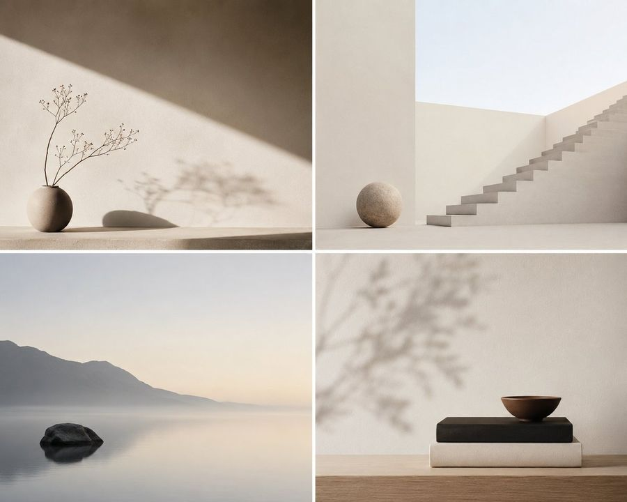

# 🏛️ 建筑与空间

[返回分类](categories.md) · [查看全部案例](cases/cases-001-100.md) · [返回首页](../README.md)

室内设计、建筑外观渲染、户型图转 3D、等距建筑、展览空间、主题乐园等。

---

## 🏛️ 例 11：天坛建筑拆解图


**Prompt:**

```text
[中文]
生成一个天坛的建筑拆解图，有详细的说明，中式美学风格

[English]
Generate an architectural exploded view of the Temple of Heaven, with detailed annotations, Chinese aesthetic style
```

**来源：** [@TanShilong](https://x.com/TanShilong/status/2046524996013662380) | 2026-05-10

---

### 🏛️ 例 83：极简主义概念场景描述



**Prompt:**

```text
Perfect for modern design and conceptual projects, this prompt creates serene and balanced minimalist scenes. These visuals use clean compositions, negative space, and subtle textures to evoke calmness and sophistication.
```

**来源：** [@status](https://x.com/Aiwithkami/status/2056933492571983943) | 2026-05-19

---

### 🏛️ 例 162：建筑蓝图与渲染图对比


**Prompt:**

```text
Split architectural visualization, vertical 3:4 composition, perfect structural alignment between the two halves.

Top half, {argument name="blueprint style" default="dark luxury blueprint"}: deep navy / charcoal blue background, thin glowing beige-gold lines, walls drawn with a slight 3D extrusion, clean modern sans-serif labels, soft ambient glow. Floor plan shows 3 bedrooms (left, right, bottom-right), a central living room, kitchen plus dining at top center, 2 bathrooms, a garage connected on the left side, a front porch, and a backyard pool with deck. Include furniture outlines (beds, sofa, dining table), door swings, window placements, circulation paths, and exact proportions.

Bottom half, photorealistic render of the same {argument name="building type" default="house"}: modern single-story design, flat layered roof, smooth concrete walls with wood panel accents, large glass windows. Layout must match the blueprint exactly, garage on the left, main entrance aligned with the living room, pool in the backyard matching the blueprint footprint, window placements corresponding to each room, bedroom volumes visible externally in correct positions. Suburban neighborhood setting with green lawn, minimal landscaping, a clean driveway leading to the garage, and a matching pool deck. Golden hour lighting, soft natural light with realistic shadows. Slightly elevated front perspective, 35mm architectural lens.

Hard rules: room positions identical between blueprint and render, no extra structures, all doors and windows align logically, pool size and placement match exactly. Avoid mismatch, fantasy elements, unrealistic proportions, or a cluttered environment.
```

**来源：** [@PromptLab](https://x.com/iamaiistudio/status/2060120398973542751) | 2026-05-29

---

### 🏛️ 例 163：现代极简室内设计展示


**Prompt:**

```text
现代极简高端住宅室内设计展示图，超长详情页比例，平面布局图与 3D 效果渲染图组合排版，开放式空间结构，客厅、餐厅、厨房一体化设计，超大落地窗引入自然光，空间通透开阔，大面积留白，低饱和高级灰、米白、原木色配色，隐藏式灯带与暖色氛围灯，精致软装搭配，干净利落的线条，极简但有层次感，样板间级别精致感，高级住宅设计方案展示，建筑设计杂志风格，高清，真实渲染，细节丰富，商业级视觉表现。
```

**来源：** [@唐华斑竹🦅](https://x.com/uniswap12/status/2059960935712768030) | 2026-05-29

---

### 🏛️ 例 164：东京夜景立体模型地图


**Prompt:**

```text
Goal: Create a highly detailed 3D miniature diorama map titled {argument name="map title" default="TOKYO — NOCTURNAL URBAN ARCHIVE"}, showing Tokyo at night as a physical architectural landscape archive model with glowing city lights, raised buildings, roads, rail lines, waterways, and landmark labels.

Canvas: Landscape 3:2 composition, viewed from an elevated oblique angle like a museum display table. The map sits on a dark tabletop as a thick rectangular board with beveled edges, a dark navy-black base, thin cream border lines, and a printed coordinate grid.

Main scene: A dense nocturnal cityscape of {argument name="city" default="Tokyo"} rendered as a miniature urban model. Use thousands of tiny buildings and warm window lights, fine street networks, rail corridors, expressways, and dark blue water surfaces. The overall feeling should be a premium physical map texture, not a flat digital map: raised terrain-like urban fabric, tiny architectural blocks, engraved labels, and realistic depth.

Landmarks and labels: Include exactly 10 black label plaques with bilingual Japanese/English styling, placed over the city: 1) Shinjuku, 2) Ueno, 3) Asakusa, 4) Tokyo Skytree, 5) Imperial Palace, 6) Shibuya, 7) Tokyo Tower, 8) Ginza, 9) Odaiba, 10) Tokyo Bay. Make Tokyo Tower glow orange near the center-left, Tokyo Skytree glow blue-violet on the right, the Imperial Palace appear as a large dark green park enclosure near the center, and Rainbow Bridge span the bay in the lower right.

Grid and map markings: Add a printed grid around the map with numbered columns 1 through 10 along the top and lettered rows A through E down the left side. Add subtle latitude and longitude markings along the edges. Use thin cream cartographic lines and small technical annotations.

Bottom information band: Along the bottom edge, create a wide printed legend and archive panel divided into sections. Include exactly 6 legend line items with colored line samples: 1) Yamanote Line, 2) Chuo Line, 3) Ginza Line, 4) Asakusa Line, 5) Yurikamome Line, 6) Water. Include a center title block reading {argument name="map title" default="TOKYO — NOCTURNAL URBAN ARCHIVE"}, with subtitle text “Landscape Archive Model” and archive code {argument name="archive code" default="TKY-NAM-2024-001"}. Add a scale bar labeled 1:25,000 and a north arrow in the lower right. Add a small index grid with cells labeled A1 through E5.

Visual style: Cinematic macro photography of a handcrafted architectural model, ultra-detailed, sharp foreground, slight atmospheric haze, realistic miniature lighting, warm gold and cool blue contrast, premium museum exhibit aesthetics, dark navy and charcoal color palette with cream typography. Emphasize layered landmarks, physical map textures, and consistent architectural-diorama language.

Constraints: Keep the image free of people and vehicles as dominant subjects. Do not add extra landmark labels beyond the 10 listed. Avoid cartoon styling, flat infographic aesthetics, or modern app UI elements. Make all text appear printed or as small physical plaques on the map board.
```

**来源：** [@Tia](https://x.com/Tiange022/status/2059910858952900608#reversed-3) | 2026-05-29

---

### 🏛️ 例 165：巴黎夜景立体模型地图


**Prompt:**

```text
Goal: Create a premium 3D architectural diorama map of {argument name="city name" default="Paris"} at night, presented as a physical archival board titled {argument name="map title" default="PARIS — NOCTURNAL URBAN ARCHIVE"}.

Canvas: Landscape 3:2 view, photographed from an oblique overhead angle on a dark tabletop. The map is a thick rectangular black board with beveled edges, thin gold border lines, coordinate grid labels along the top and sides, and a refined museum-archive aesthetic.

Visual style: Dark navy and charcoal physical map texture, raised miniature city blocks, engraved streets, warm golden illumination tracing major boulevards and intersections, glossy deep-blue water, subtle cinematic shadows, high-detail miniature model craftsmanship, luxury cartography, brass-and-ink color palette.

Main map content: Show a nighttime miniature urban plan with illuminated road networks and raised landmark models. Include exactly 4 prominent 3D landmarks: 1) Eiffel Tower glowing gold in the lower-left/central-left area near the river, 2) Arc de Triomphe in the upper-left area with radiating avenues, 3) Notre-Dame-like cathedral on an island or riverbank near center-right, 4) Sacré-Cœur-like basilica on a hill in the upper-right area. Include one winding river crossing the map diagonally from left to lower-right, with multiple bridges, dark reflective water, and golden riverside lights.

Map labels: Use elegant small-cap serif labels in gold ink. Include exactly 20 arrondissement-style district labels: I Louvre, II Bourse, III Temple, IV Hôtel de Ville, V Panthéon, VI Luxembourg, VII Palais Bourbon, VIII Élysée, IX Opéra, X Entrepôt, XI Bastille, XII Reuilly, XIII Gobelins, XIV Montparnasse, XV Vaugirard, XVI Passy, XVII Batignolles-Monceau, XVIII Butte-Montmartre, XIX La Villette, XX Ménilmontant. Also label major routes and areas including Champs-Élysées, Boulevard Haussmann, Boulevard Saint-Germain, Boulevard Voltaire, Bois de Boulogne, and the River Seine.

Bottom information band: Add a wide cartographic footer divided into exactly 5 panels: 1) left legend box, 2) compass rose box, 3) large centered title block, 4) scale bar box, 5) right inset-map box. The legend box must list exactly 5 items: Monument, Major Axis, Boulevard, Bridge, Park / Garden, Water. The centered title block contains the map title, a subtitle reading "CITY OF LIGHTS · HISTORIC CORE · HAUSSMANN NETWORK", and an archive code reading "ARCHIVE CODE: PAR-NAM-2024-001". The scale panel shows "SCALE 1:10,000" and a 0 to 1000 m scale bar. The right inset panel shows a small grid map and a tiny outline map labeled "CENTRAL PARIS FRANCE".

Constraints: Keep all typography crisp and plausible, no people, no vehicles, no modern UI, no photoreal skyline beyond the raised map surface. The entire image should feel like directing a miniature nocturnal urban world: layered landmarks, physical map materials, coherent architectural-diorama language, and warm night lighting.
```

**来源：** [@Tia](https://x.com/Tiange022/status/2059910858952900608#reversed-2) | 2026-05-29

---

### 🏛️ 例 166：纽约夜景 3D 档案地图


**Prompt:**

```text
Goal: Create a cinematic 3D miniature architectural map of {argument name="city name" default="New York City"}, presented as a nocturnal urban archive board with raised buildings, glowing streets, waterways, landmark callouts, and technical cartographic annotations.

Canvas: Landscape 16:9 image, viewed from an elevated oblique angle as if looking down at a physical diorama map on a dark tabletop. Use a deep navy, charcoal, warm brass, and amber-light palette. The board has a thick dark frame, thin gold border lines, grid coordinates along the top/bottom and left/right edges, and a premium museum-archive feel.

Main subject: A highly detailed raised-relief 3D map of Manhattan and surrounding boroughs at night. Manhattan is centered and built as a dense miniature city with hundreds of extruded buildings, warm window lights, streetlight networks, bridges, docks, and dark reflective water. The tallest illuminated focal tower is the {argument name="central landmark" default="Empire State Building"} near the center, with a bright warm glow around Midtown. The southern tip includes a tall One World Trade Center tower. A long dark rectangle labeled Central Park sits in upper Manhattan. Surrounding flat map areas show New Jersey to the left, Queens to the right, and Brooklyn at lower right, with street grids drawn as thin golden lines.

Top title block: In the upper-left corner, add a boxed archive label reading exactly “NEW YORK CITY” with the subtitle “NOCTURNAL URBAN ARCHIVE” and a small archive code line “NYC-NAM-2024-001.” Add tiny header text along the top edge such as “LANDSCAPE ARCHIVE MODEL / 地景档案模型,” column letters across the top, and a small study label at the upper-right reading “EAST RIVER CORRIDOR STUDY” and “EDITION 01.”

Callouts and labels: Include exactly 11 named map labels/callout boxes: 1) “NEW JERSEY / HUDSON COUNTY,” 2) “HUDSON RIVER,” 3) “ONE WORLD TRADE CENTER / 1,776 ft / 541 m,” 4) “TIMES SQUARE / THEATER DISTRICT,” 5) “EMPIRE STATE BUILDING / 1,454 ft / 443 m,” 6) “CENTRAL PARK,” 7) “CHRYSLER BUILDING / 1,046 ft / 319 m,” 8) “EAST RIVER,” 9) “BROOKLYN BRIDGE / 1,595 ft / 486 m,” 10) “QUEENS / LONG ISLAND CITY,” 11) “BROOKLYN / DOWNTOWN BROOKLYN.” Use thin leader lines connecting callout boxes to landmarks.

Bottom information panels: Add exactly 4 technical panels along the bottom edge: 1) a legend panel with 6 symbol entries labeled “PRIMARY ROAD,” “SECONDARY ROAD,” “RAIL LINE,” “WATER BODY,” “PARK / GREEN SPACE,” and “MAJOR LANDMARK / BUILDING FOOTPRINT”; 2) a north arrow panel showing true north and grid north; 3) a scale panel labeled “SCALE 1:25,000” with imperial and metric scale bars; 4) an archive notes panel with small text including “ARCHIVE NOTES,” “This model represents a nocturnal capture of New York City urban form, infrastructure, and landmark illumination,” plus boxes for “ARCHIVE CODE NYC-NAM-2024-001,” “MODEL NO. 001,” and “SHEET NO. 01 / 01.”

Visual style: Ultra-detailed photorealistic miniature model mixed with technical blueprint/map design, crisp micro typography, precise gold linework, physical paper texture, slight bevels and shadows, moody night lighting, realistic reflections on rivers, and warm amber building illumination. The city should feel like a carefully directed miniature urban world, not a flat map.

Constraints: Keep all text in English except the tiny bilingual archive header already specified. Do not add people, vehicles as focal subjects, logos, or watermarks. Maintain consistent architectural-diorama language across the entire image. Use {argument name="lighting mood" default="dark nocturnal amber city lights"} and an archival cartography aesthetic with {argument name="map base color" default="deep navy blue"} background and {argument name="linework color" default="aged brass gold"} annotations.
```

**来源：** [@Tia](https://x.com/Tiange022/status/2059910858952900608#reversed-1) | 2026-05-29

---

### 🏛️ 例 167：伦敦夜景立体模型地图


**Prompt:**

```text
Create a cinematic 3D miniature architectural diorama map of {argument name="city" default="London"} at night, presented as a physical museum archive board on a dark tabletop. The board is a wide landscape rectangle viewed from an elevated oblique angle, with beveled edges, deep navy paper, thin bronze-gold cartographic linework, a coordinate grid, and warm amber city lights. Render a dense low-relief city street map with the river cutting through the middle, raised landmark buildings and bridges, realistic miniature textures, and a refined historical-atlas aesthetic. Use exactly 6 tall callout pins along the top edge labeled: “BUCKINGHAM PALACE”, “BIG BEN / PALACE OF WESTMINSTER”, “ST. PAUL’S CATHEDRAL”, “THE SHARD”, “THE GHERKIN”, and “CANARY WHARF”. Include additional small map labels across the city such as Regent’s Park, Paddington, Marylebone, Oxford Street, Hyde Park, Green Park, St. James’s Park, Buckingham Palace, Victoria, Westminster, Westminster Abbey, City of London, Southwark, The Shard, The Gherkin, London Bridge, Tower Bridge, The Tower of London, Bermondsey, Greenwich, Kensington, and “RIVER THAMES” following the water. Emphasize the raised landmarks: Buckingham Palace lit at lower left, the Palace of Westminster and Big Ben beside the river, St. Paul’s dome near the center, the Shard as a glowing glass pyramid tower, the Gherkin as a dark rounded tower, Canary Wharf as a cluster of golden high-rises, and Tower Bridge spanning the river. At the bottom of the board, create an information panel with exactly 5 main compartments: a legend box with small icons for major landmark, historic building, park/green space, water body, bridge, and railway station; a central title block reading “{argument name="map title" default="LONDON — NOCTURNAL URBAN ARCHIVE"}”; a scale bar marked in miles and kilometers; a compass rose with N; and a small index-grid inset plus coordinate-system notes. Add the subtitle “LANDSCAPE ARCHIVE MODEL / 地景档案模型” and archive code “{argument name="archive code" default="LDN-NAM-2024-001"}”. Lighting should be moody and nocturnal, with gold edge highlights, tiny illuminated windows, glowing roads, dark blue water, soft shadows, shallow depth of field, and highly detailed miniature craftsmanship. Keep all typography crisp, elegant, and atlas-like; avoid people, vehicles larger than tiny boats, modern UI elements, logos, or watermarks.
```

**来源：** [@Tia](https://x.com/Tiange022/status/2059910858952900608#reversed-0) | 2026-05-29

---

### 🏛️ 例 168：复古风大阪梅田旅行海报


**Prompt:**

```text
Goal: Create a vintage travel-poster infographic for {argument name="destination" default="Umeda, Osaka, Japan"}, combining a simple skyline illustration, large decorative typography, an isometric landmark map, and travel-ad copy.

Canvas: Vertical poster, about 2:3 aspect ratio, warm ivory paper background with a thin double-line ornamental gold border and clipped art-deco corner details. Use clean vector line art, muted pastel colors, subtle grain, beige shadows, and a retro Japanese tourism poster feel.

Layout: Top section is a wide rectangular sunset skyline panel with a turquoise-to-pink-to-orange gradient sky, flat beige city silhouette, the Umeda Sky Building centered, and a two-car train on tracks at the lower right. Middle section has one huge word, {argument name="large title word" default="UMEDA"}, in bold outlined block letters filled with miniature city scenes; add a tan offset shadow and small handwritten Japanese note arrows near the right side. Main section is an isometric illustrated area map of Umeda with labeled landmarks and connecting leader lines. Bottom section contains location/date text, a large Japanese slogan, a bold English slogan, access information, railway line legend, must-see list, URL/hashtags, coordinates, and a small circular map inset.

Top skyline details: Include exactly 3 main skyline elements: 1 tall Umeda Sky Building with two linked towers and a bridge-like top, 1 simplified beige urban skyline stretching across the horizon, and 1 modern train made of exactly 2 connected cars.

Large typography details: The word UMEDA must contain exactly 5 giant letters, each filled differently: U with the Umeda Sky Building, M with modern buildings and greenery, E with a red ferris wheel, D with tall office towers, and A with urban street/building fragments. Use thick dark brown outlines, warm beige inner outlines, and colorful fills.

Isometric map landmark count: Show and label exactly 10 landmarks around the central map: 1 Umeda Sky Building, 2 Grand Green Osaka, 3 Grand Green Osaka (Umekita Park), 4 HEP FIVE Ferris Wheel, 5 LUCUA, 6 Grand Front Osaka, 7 Yodobashi Umeda, 8 Hankyu Department Store, 9 Hanshin Department Store, 10 Osaka Station. Also include exactly 1 additional label, Whity Umeda, near the lower left walkway area. The map should include towers, shopping complexes, station buildings, plazas, a green park with trees, curved pedestrian paths, and a red ferris wheel as the most saturated object.

Bottom text content: Use the heading “OSAKA, JAPAN | UMEDA 2026”. Below it, place the Japanese slogan {argument name="Japanese slogan" default="そうだ、梅田行こう。"} in large bold black type. Under that, write “UMEDA — LET’S GO!” in very large bold uppercase letters. Add the subtitle “VIBRANT STREETS. INCREDIBLE FOOD. ENDLESS MODERN ENERGY.” Add access text: “Access: 関西国際空港 → JRはるか（最速約45分）”. Include a rail legend with exactly 5 colored line items: JR Line, Hankyu, Hanshin, T, and Y. Add the must-see line listing: “Must-See: Umeda Sky Building · HEP FIVE Ferris Wheel · Grand Green Osaka · Yodobashi Umeda · Grand Front Osaka · Osaka Station · Hankyu Department Store · Hanshin Department Store · LUCUA · Whity Umeda”. Add small footer text “osaka-info.jp    #UmedaOsaka    #VisitOsaka” and coordinates “34.701°N 135.496°E”.

Map inset: Bottom right contains exactly 1 circular street-map inset with pale roads, light green blocks, blue waterways, a red location pin, and a tiny compass marker.

Style constraints: Keep the illustration intentionally simple and clean, with thin black-brown outlines, flat fills, minimal shading, and a hand-drawn travel guide aesthetic. Avoid photorealism, 3D rendering, excessive detail, extra labels, logos, or watermarks. Preserve the visible Japanese text exactly where specified while keeping all other design instructions in English.
```

**来源：** [@サル☆ザル@AIプロンプトクラフター](https://x.com/maimi2014/status/2059903072596598819#reversed-0) | 2026-05-29

---

### 🏛️ 例 181：极简建筑地标海报


**Prompt:**

```text
Design a luxury minimalist poster centered on a famous architectural landmark of your choice ([building name]). The focal element is an illustrated rendering of the building. Behind it, place one giant bold English word in a design-forward typeface whose character matches the building's identity, with smaller body copy nearby describing its design philosophy. The composition should read as an ultra high-end art poster. Use a restrained, low-key color palette where graphic elements interlock with the architecture, appearing as if they form part of its structural components or extend outward from its silhouette.
```

**来源：** [@iamaiistudio](https://x.com/iamaiistudio/status/2053084576520573269) | 2026-05-30

---

### 🏛️ 例 209：90 年代公寓场景参考板


**Prompt:**

```text
{
  "type": "scene reference board — 90s apartment living room, cinematic night",
  "style": "cinematic film photography, 35mm grain, warm amber shadow fill, deep chiaroscuro lighting, hyper-detailed interior, production design reference quality",
  "layout": {
    "main_panel_center_left": {
      "label": "CAMERA A — FRONT VIEW",
      "scene": "Wide shot, L-shaped tan sectional sofa, grey knit throw blanket, wooden coffee table (remote, mug, ashtray, Rolling Stone stack), lava lamp left, table lamp right, rain-streaked city window behind, Nirvana poster left wall. 35mm grain."
    },
    "main_panel_center_right": {
      "label": "CAMERA B — REVERSE VIEW",
      "scene": "Wide reverse from behind sofa. CRT TV prominent right, grey static screen. Tall bookshelf, VHS tapes. Cool blue backlight from window behind camera. Deep shadow."
    },
    "prop_strip_bottom": "6 close-up tiles: 1. LAVA LAMP — chrome base, blue-green wax blobs; 2. COFFEE TABLE — remote, mug, ashtray, magazines; 3. NIRVANA POSTER — black smiley face, wall texture; 4. CRT TELEVISION — static screen, VHS stack; 5. WINDOW/RAIN — city bokeh, water streaks; 6. THROW BLANKET — sofa corner, worn upholstery",
    "top_right_inset": "SOURCE REF thumbnail — original photo",
    "footer": "2700K PRACTICAL · 4100K CITY NIGHT · 24mm · 35MM"
  },
  "background": "deep charcoal #1a1a1a, thin white separators",
  "dimensions": "wide landscape 3:1, high resolution"
}
```

**来源：** [@Iancu_ai](https://x.com/Iancu_ai/status/2051287273581203888) | 2026-05-30

---

### 🏛️ 例 221：明洞旅游区域地图


**Prompt:**

```text
[エリア]の観光エリアマップを画像で作成して
```

**来源：** [@so_ainsight](https://x.com/so_ainsight/status/2050354639036654048) | 2026-05-30

---


### 🏛️ 例 257：手绘线性素描艺术


**Prompt:**

```text
围绕具体主题内容生成一张纸本线描视觉作品，画面先由极细、略带手绘抖动的线条建立空间、主体轮廓、结构转折、路径和尺度关系，再让少数高纯度色面只进入最关键的识别平面、连接节点、情绪停顿和信息重心；色彩不是完整上色，而是像精确批注一样编辑注意力。整体以温暖米白纸场和黑色细线为最大视觉面积，纸纹、微小斑点和轻微扫描感要清晰存在，上方或外围保留充足空白，让主体像被放进一页旅行手稿中被观察。主要视觉重量收束在画面中部或中下部，主体周围保持可呼吸的纸面距离，构图由一个清晰锚点、低密度环境层和少量彩色节点组成。核心对象保持可识别的结构线、轮廓边缘、局部排线和压缩细节，先把主题拆成边缘、平面、路径、节点、尺度标记和语义环境，再决定哪些部位允许被色彩激活；非关键区域交给纸色和线稿，不做平均填色。细节沿结构边缘、开口、转角、连接处和运动路径聚集，开放区域保持纸面放空，线条方向服从对象语义，流动处用稳定平行线场，暗部用竖向或交叉排线，脆弱边缘用短促断线。体积、阴影和材质通过细排线、交叉线、平行线场和线密度变化完成，线条压在色面之上，色块边缘带轻微手工错位和纸纹渗透感。背景由主题自身的空间或信息环境生成，但只能作为低密度线稿记忆层出现，用轻轮廓、远近关系、稀疏标记和少量排线说明地点、时间、尺度或语义压力，背景比主体更轻、更少色、更低对比。色彩保持受控的冷暖角色分工：纸色与黑线压住全局，少量冷结构色建立空间和秩序，少量暖记忆色点亮入口、转折和情绪，最亮色只作为稀疏小节点停顿；当主题改变时，色相跟随主题语义微调，但面积层级、饱和集中、冷暖分工和点状高光必须稳定。画面中加入极小的人物、器物、符号或功能标记作为尺度噪点，用几笔线和点状色彩表现，使空间产生使用痕迹和生活温度，这些标记应小到只改变节奏而不成为主角。若需要文字，使用细窄、克制、低干扰的注记式字形，像建筑草图边注一样参与边界、路径 and 信息层级，保持留白完整。最终表面呈现钢笔线描、彩色铅笔或薄墨套色、细线压色、轻微套色偏差、纸纤维、扫描颗粒和手绘透视误差的完成度，既有准确结构，又有安静、开放、带现场记忆的手工质感。本次主题：{argument name="主题" default="人民大会堂特写"} 比例{argument name="比例" default="1:2"} 用途： {argument name="用途" default="手机壁纸"}
```

**来源：** [小小东](https://x.com/xiaoxiaodong01) | 2026-05-30

---

### 🏛️ 例 488：极简水墨书法签名


**Prompt:**

```text
围绕具体主题内容生成一幅极简水墨字形视觉，把主题关键词、短句或名称转化为近似签名的抽象书写结构：画面主体只由少量深色笔触构成，笔画不追求工整印刷感，而要有手腕快速落笔的力度、停顿、飞白、干湿不均和边缘毛糙，形成可辨认但带有个人印记的东方书写气质。视觉重心集中在画面中部偏松的位置，周围保留大量明亮、干净、通风的留白，让空白成为情绪的一部分；笔触之间保持疏密差异，几处短点、竖画、长弧线和斜向扫笔承担节奏变化，使阅读路径像一口气写完后自然散开。色彩从主题自身的材质与情绪中提取，但保持高明度清透底场、少量深色结构笔触和极低装饰密度的关系；整体应明亮安静、干净克制，深色只用于承载书写力量，背景不做复杂纹理，只保留轻微纸面或扫描般的柔和质感。最终效果应像一枚具有独立气质的手写题签，既有文字的精神指向，又接近抽象符号，避免变成标准字体、书法字帖、密集海报或装饰插画。

本次文字：{argument name="文字内容" default="杨老头"}

比例：16:9 横版
```

**来源：** [@小小东](https://x.com/xiaoxiaodong01/status/2062834953608712550) | 2026-06-05

---

### 🏛️ 例 521：1️⃣ 生成带有红色飞行路径的底板


**Prompt:**

```text
[中文]
创建一张 16:9 的高分辨率航空地形图，展示一座宏伟的海洋城市，包含壮丽的建筑、相互连接的岛屿、繁忙的港口以及广阔的水道。

[English]
Create a high-resolution 16:9 aerial terrain map showcasing a magnificent ocean city, featuring grand architecture, interconnected islands, bustling harbors, and expansive waterways.
```

**来源：** [@Kiki](https://x.com/Mayz1169/status/2062750675268722986) | 2026-06-05

---

### 🏛️ 例 522：魔幻现实主义能量召唤


**Prompt:**

```text
[中文]
一位 {argument name="subject" default="留着深棕色长波浪卷发的年轻女性"} 站在户外的花园环境中，双眼紧闭，头部微微低垂，神情专注。她穿着一件 {argument name="outfit" default="红色超大款圆领卫衣和浅蓝色牛仔裤"}。她将双手置于胸前，掌心相对，手指张开——在她的双手之间，闪烁着一团强烈的 {argument name="energy effect" default="电能球：白蓝色的闪电弧，伴有粉紫色宇宙星云光芒"}，闪烁的星尘颗粒向四周辐射。她的脸部和胸部被下方能量发出的冷蓝白光照亮。绿色的叶子仿佛受到能量场的影响，在四周动态地旋转漂浮。背景是柔和虚化的户外公园，带有暖色调的树木和绿草，呈现出焦外成像效果。魔幻现实主义摄影风格。电影级布光。主体焦点清晰，背景浅景深。氛围忧郁而空灵。

[English]
A {argument name="subject" default="young woman with long dark brown wavy hair"} stands outdoors in a garden setting, eyes closed, head slightly tilted downward in deep concentration. She is wearing a {argument name="outfit" default="red oversized crew-neck sweatshirt and light blue jeans"}. She holds both hands in front of her chest, palms facing inward, fingers spread wide — between her hands glows an intense {argument name="energy effect" default="ball of electric energy: white-blue lightning arcs, cosmic nebula light in pink and purple"}, and sparkling stardust particles radiating outward. Her face and chest are illuminated by the cool blue-white glow from the energy below. Green leaves swirl dynamically around her as if levitating and spinning in all directions due to the energy force. Background is a softly blurred outdoor park with warm-toned trees and green grass, bokeh effect. Magical realism photography style. Cinematic lighting. Sharp focus on subject, shallow depth of field background. Moody, ethereal atmosphere.
```

**来源：** [@Ruzaina](https://x.com/RuzainaMeer/status/2062749262816088089) | 2026-06-05

---

### 🏛️ 例 526：橄榄绿缎面高定时尚大片


**Prompt:**

```text
[中文]
创作一张超写实的奢华高定时尚编辑风格照片，拍摄一位美丽的女性模特在建筑风格摄影棚内的全身照。她身着一件 {argument name="gown color" default="橄榄绿"} 缎面单肩镂空礼服，面料光泽感强，胸前呈现雕塑般的垂坠感，腰部有窄条镂空设计，裙摆为褶皱裹身式，高开叉露出一条腿，长长的拖尾在地板上铺开。模特姿态优雅如雕塑，一只手自然垂在身侧，另一只手轻放在开叉处，双肩优雅倾斜，头部微微侧转。造型搭配利落的低发髻、温暖的古铜色肌肤、金色圆环耳饰以及精致的金色细带高跟鞋。背景置于极简主义的棕褐色建筑风格摄影棚内，墙面为光滑的灰泥质感，配有矩形底座，右侧投射出巨大的拱形阴影。采用左上方温暖的金色阳光，营造强烈的时尚编辑风格光影、丰富的对比度以及精致的时尚杂志构图。垂直 2:3 画幅，全身可见，奢华高定氛围，皮肤与面料质感真实，8K 分辨率，无文字，无水印。

[English]
Create an ultra-realistic luxury couture editorial photograph of a beautiful female model standing full-length in an architectural studio. She wears a {argument name="gown color" default="olive green"} satin one-shoulder cutout gown with glossy fabric, sculptural draping across the bodice, a narrow waist cutout, a gathered wrap skirt, a high thigh slit revealing one leg, and a long flowing train pooling on the floor. The model has a graceful statuesque pose with one hand relaxed at her side and the other resting near the slit, shoulders angled elegantly, head turned slightly to the side. Style her with a sleek low bun hairstyle, warm bronzed skin, gold hoop earrings, and delicate gold strappy heels. Place her in a minimalist tan architectural studio with smooth plaster walls, rectangular pedestal blocks, and a large arched shadow on the right side. Use warm golden sunlight from the upper left, strong editorial shadows, rich contrast, and refined fashion-magazine composition. Vertical 2:3 framing, full body visible, luxurious high-fashion mood, photorealistic skin and fabric texture, 8K detail, no text, no watermark.
```

**来源：** [@shah_zadii](https://x.com/sha_zdiii/status/2062747344064622635) | 2026-06-05

---

### 🏛️ 例 570：宜家儿童卧室设计标注图


**Prompt:**

```text
[中文]
目标：创建一张写实风格的儿童卧室广角室内设计效果图，采用宜家家具装饰，并包含标注每个新家具名称的指示线。

画布：横向 4:3 比例图像，从门口或房间右前方拍摄，视角略高于视平线，展示从左侧书桌区域到右侧床铺及衣柜门的整个卧室空间。

房间细节：米色墙壁、米色地毯、白色踢脚线，左侧墙壁有一扇带白色百叶窗的大窗户，右侧墙壁为白色双开衣柜门，温暖的自然光与柔和的灯光交织。保持房间整洁、写实，且符合幼儿的实际生活需求。

布局与家具：在最左侧墙壁放置一张白色 {argument name="desk model" default="LÄRANDE 书桌"}，配一把灰色转椅，桌上摆放笔筒以及一本小书或平板电脑。在窗户下方及后墙沿线放置一个黑色方格储物单元，标注为 {argument name="toy storage model" default="KALLAX 玩具储物柜"}，底层整齐排列 3 个灰色布艺收纳盒，并摆放书籍、玩具车和小型玩具。在储物柜上方悬挂一幅带框恐龙画。在储物柜右侧放置一个深色木质 {argument name="dresser model" default="STORKLINTA 抽屉柜"}，带有 3 个大抽屉，顶部摆放小盆栽、相框和一盏小台灯。在右侧放置一张白色单人 {argument name="bed model" default="SLÄKT 床"}，配有白色床头板、蓝色被子、恐龙图案枕头和床单，床身纵向朝向观察者。在床后靠近抽屉柜的位置放置一盏黑色拱形落地灯。在书桌、储物柜和床之间的地毯中央添加一张绿色儿童公路地图游戏地毯。

标注说明：添加 7 个白色圆角矩形标签，文字为黑色，带有细灰色边框，每个标签配有一条指向相关物品的白色箭头。标签内容必须严格如下：1) “LÄRANDE 书桌”指向书桌，2) “KALLAX 玩具储物柜”指向黑色方格储物柜，3) “DRÖNA 收纳盒”指向灰色布艺收纳盒，4) “STORKLINTA 抽屉柜”指向抽屉柜，5) “HEKTAR 落地灯”指向黑色落地灯，6) “SLÄKT 床头板”指向白色床头板，7) “SLÄKT 床”指向床尾或床架。

视觉风格：写实风格的室内手机摄影效果，具备 AI 家居布置的整洁质感，光线温暖舒适，透视准确，阴影细腻，标签清晰易读，画面中无人像、无杂物、无水印。

[English]
Goal: Create a photorealistic wide-angle interior design visualization of a small child’s bedroom decorated with IKEA furniture, including annotation callouts naming each new item.

Canvas: Landscape 4:3 image, photographed from the doorway or front-right corner of the room with a slightly elevated eye-level perspective, showing the entire bedroom from left desk area to right bed and closet doors.

Room details: Beige walls, beige carpet, white trim, a large window with white blinds on the left wall, white double closet doors on the right wall, warm natural daylight mixed with soft lamp light. Keep the room tidy, realistic, and practical for a young child.

Layout and furniture: On the far left wall place a white {argument name="desk model" default="LÄRANDE desk"} with a gray rolling desk chair, pencil cups, and a small book or tablet on top. Under the window and along the back wall place a black cube storage unit labeled {argument name="toy storage model" default="KALLAX toy storage"}, filled with exactly 3 gray fabric bins across the bottom row, books, toy vehicles, and small toys. Above the toy storage hang a framed dinosaur print. To the right of the toy storage place a dark wood {argument name="dresser model" default="STORKLINTA dresser"} with exactly 3 large drawers, small plants, a framed photo, and a small lamp on top. On the right side place a white twin {argument name="bed model" default="SLÄKT bed"} with a white headboard, blue quilt, dinosaur-patterned pillow and sheets, positioned lengthwise toward the viewer. Place a black arched floor lamp behind the bed near the dresser. Add a green children’s road-map play rug centered on the carpet between the desk, storage, and bed.

Annotation callouts: Add exactly 7 white rounded-rectangle labels with black text and thin gray borders, each with a white arrow pointing to the relevant item. The labels must read exactly: 1) “LÄRANDE desk” pointing to the desk, 2) “KALLAX toy storage” pointing to the black cube storage, 3) “DRÖNA bins” pointing to the gray fabric bins, 4) “STORKLINTA dresser” pointing to the dresser, 5) “HEKTAR floor lamp” pointing to the black floor lamp, 6) “SLÄKT headboard” pointing to the white headboard, 7) “SLÄKT bed” pointing to the footboard or bed frame.

Visual style: Realistic smartphone interior photo with clean AI home-staging polish, warm cozy lighting, accurate perspective, subtle shadows, readable labels, no people, no clutter, no watermark.
```

**来源：** [@Jake Parks](https://x.com/jakeparksx/status/2063296567226851636) | 2026-06-06

---

### 🏛️ 例 572：韩式卧室摄影


**Prompt:**

```text
[中文]
超写实肖像，一位美丽的年轻 {argument name="ethnicity" default="东亚"} 女性，留着长长的黑色亮泽秀发，扎成随意的蓬松高马尾，配有轻薄的空气刘海，肤色白皙透亮，五官精致柔美，妆容自然，神情恬静温柔。她舒适地坐在 {argument name="furniture" default="舒适的床"} 上，身处一间温暖的现代卧室中。房间内配有奶油色寝具、柔软的针织毯、过滤午后阳光的薄纱窗帘、墙上的相框、木质床头柜、小型盆栽以及散发柔光的床头灯。氛围亲密、宁静且充满生活气息。服装：温暖的 {argument name="outfit color" default="燕麦米色"} 系简约奢华家居服。长袖纹理针织亨利衫，完全覆盖胸部和肩部，领口带有小纽扣，版型宽松。搭配同色系高腰针织休闲裤，带有细微的罗纹质感。穿着柔软的奶油色袜子。造型舒适、优雅且得体，无任何暴露元素。姿势：盘腿坐在床上，双手自然交叠放在膝盖上，双肩放松，身体微微前倾面向镜头。眼神柔和交流，微微侧头，肢体语言自然，表情平静且具亲和力。光影：窗外射入的温暖午后阳光与床头灯的柔和环境光相结合。发丝和皮肤上有柔和的高光，阴影真实，呈现出舒适的黄金时刻氛围，自然光线衰减。环境：极简韩式卧室美学，中性米色和奶油色调，空间整洁，材质柔软，木质元素温暖，亲密的居家环境。相机：平视肖像摄影，9:16 竖构图，等效 85mm 镜头，浅景深，背景虚化柔和，皮肤纹理真实，织物细节清晰，呈现自然的摄影质感。风格：舒适生活方式摄影，韩式卧室美学，真实抓拍肖像，宁静的周末早晨氛围，高级杂志质感，高细节，超写实，比例真实，自然美，Vogue Korea 风格，8K 画质。

[English]
Ultra-photorealistic portrait of a beautiful young {argument name="ethnicity" default="East Asian"} woman with long glossy black hair styled in a loose high ponytail, soft wispy bangs, fair luminous skin, delicate feminine features, natural makeup, and a calm gentle expression. She is sitting comfortably on a {argument name="furniture" default="cozy bed"} inside a warm modern bedroom. The room features cream-colored bedding, soft knit blankets, sheer curtains filtering afternoon sunlight, framed photos on the wall, a wooden nightstand, small houseplants, and a softly glowing bedside lamp. The atmosphere feels intimate, peaceful, and lived-in. Outfit: modest luxury loungewear in warm {argument name="outfit color" default="oatmeal-beige"} tones. Long-sleeve textured knit Henley lounge top fully covering the chest and shoulders, small buttons at the neckline, relaxed fit. Matching high-waisted knit lounge pants with subtle ribbed texture. Soft cream socks. Cozy, elegant, and comfortable styling with no revealing elements. Pose: seated cross-legged on the bed, hands resting gently in her lap, shoulders relaxed, leaning slightly forward toward the camera. Soft eye contact, subtle head tilt, natural body language, calm and inviting expression. Lighting: warm late-afternoon sunlight entering through a nearby window combined with soft ambient bedside lamp glow. Gentle highlights on hair and skin, realistic shadows, cozy golden-hour atmosphere, natural light falloff. Environment: minimalist Korean-inspired bedroom aesthetic, neutral beige and cream color palette, clean and tidy space, soft fabrics, warm wood accents, intimate home setting. Camera: eye-level portrait photography, vertical 9:16 composition, 85mm lens equivalent, shallow depth of field, soft background separation, realistic skin texture, visible fabric detail, natural photographic imperfections. Style: cozy lifestyle photography, Korean bedroom aesthetic, authentic candid portrait, peaceful weekend morning mood, premium editorial quality, highly detailed, photorealistic, realistic proportions, natural beauty, Vogue Korea inspired, 8K quality.
```

**来源：** [@Johnn](https://x.com/john_my07/status/2063294103014838338) | 2026-06-06

---

### 🏛️ 例 583：黑色侦探事务所街道


**Prompt:**

```text
[中文]
创作一个 1940 年代电影黑色风格的街道场景，采用高对比度黑白画面，宽屏 16:9。在左侧前景中，展示 1 名身材魁梧的侦探或黑帮成员的背影，他戴着一顶带有羽毛和铆钉饰带的宽檐软呢帽，身穿带有浅色毛领和毛袖口的深色长外套，戴着手套，右手拿着 1 份卷起来的文件或蓝图。他面向雨后湿滑的城市人行道，看向右侧的一家砖砌店面，店面招牌上发着光，文字为 {argument name="agency sign text" default="KORSCHE DETECTIVE AGENCY"}。办公室入口有深色百叶窗、玻璃门，门上贴着一张小纸条，写着 {argument name="door notice text" default="NOTICE"}。左侧路边停放着 1 辆复古黑色汽车，画面中可见 3 盏街道或室外灯，投射出白色的光圈，远景左侧有高耸阴郁的摩天大楼，地面湿润反光，夜间空气弥漫着薄雾，阴影深邃，角色帽子和皮毛边缘有轮廓光，仅在店面和灯光处有微妙的暖黄色高光。风格：图形小说写实主义与经典黑色电影摄影的结合，戏剧性的低调照明，忧郁的城市侦探氛围，锐利的建筑细节，无现代物品，无额外人物，无水印。

[English]
Create a cinematic 1940s film-noir street scene in high-contrast black and white, widescreen 16:9. In the left foreground, show exactly 1 large heavyset detective or gangster seen from behind, wearing a wide-brim fedora with a feather and studded band, a dark long coat with a pale fur collar and fur cuffs, gloves, and holding exactly 1 rolled document or blueprint in his right hand. He faces across a rain-slick city sidewalk toward a brick storefront on the right with a glowing sign reading {argument name="agency sign text" default="KORSCHE DETECTIVE AGENCY"}. The office entrance has dark shutters, a glass door, and a small paper notice on the door reading {argument name="door notice text" default="NOTICE"}. Include exactly 1 vintage black car parked on the left curb, exactly 3 visible street or exterior lamps casting white pools of light, tall shadowy skyscrapers in the far-left background, wet reflective pavement, misty night air, deep shadows, rim lighting around the character’s hat and fur, and subtle warm yellow highlights only in the storefront and lamp glow. Style: graphic novel realism mixed with classic noir cinematography, dramatic low-key lighting, moody urban detective atmosphere, sharp architectural detail, no modern objects, no extra people, no watermark.
```

**来源：** [@Grumpy_Whiskers](https://x.com/GrumpyWhiskers_/status/2063276374622601715) | 2026-06-06

---

### 🏛️ 例 614：现代风冰淇淋店室内设计


**Prompt:**

```text
[中文]
创建一个照片级真实感的建筑室内渲染图，展示一家名为 {argument name="shop name" default="Some ice"} 的现代极简风格冰淇淋店。视角从前部座位区看向服务台，呈现午后温暖的阳光。空间高而狭窄，采用奶油色抹灰墙面、灰色混凝土地面、灰色纹理背景墙、白色方砖柜台、暖色木质天花板顶棚、隐藏式灯带，左侧墙面和地面上有树叶投下的柔和阴影。在柜台上方放置大型店铺 Logo，采用深灰色字母并带有少量黄色点缀。服务区包含 1 个白色瓷砖前台，柜台上放置 1 台大型银色台式电脑，柜台后有 1 名身穿奶油色衬衫和米色围裙的员工，后墙上挂有 4 个发光的菜单项目，分别标注为 Signature、Sweet、Yogurt 和 Classic，并配有甜点图片。在右侧墙面上，包含 3 个木质零售货架，展示带有品牌标识的小纸袋或包装盒。在左侧墙面上，包含 3 张悬挂在纤细黄铜壁灯下的促销海报，其中一张印有可爱的吉祥物和文字 {argument name="poster headline" default="Have Someice Day"}。顾客区共布置 6 张圆形咖啡桌：左前方 2 张，左侧中部沿墙 2 张，右侧 2 张；总共包含 10 把可见的椅子，大部分为暖色曲木椅配镀铬椅腿，右侧另有 1 把淡黄色椅子和 1 把黑色椅子。在左后方增加楼梯和狭窄通道，配有木质踏板、黑色金属扶手，远处可见砖墙和玻璃门。采用宁静的斯堪的纳维亚-日式咖啡馆美学，使用天然材料，具备真实的全局光照、柔和的景深、简洁的构图，除一名员工外无其他人物，无杂物，无水印，3:2 横向比例。

[English]
Create a photorealistic architectural interior rendering of a modern minimalist ice cream shop named {argument name="shop name" default="Some ice"}, viewed from the front seating area looking toward the service counter in warm late-afternoon sunlight. The space is tall and narrow with cream plaster walls, gray concrete flooring, a gray textured back wall, white square-tile counter, warm wood ceiling canopy, hidden cove lighting, and soft shadows from tree leaves cast across the left wall and floor. Place the large shop logo above the counter, dark gray letters with a small yellow accent. The service area contains exactly 1 white tiled front counter, 1 large silver desktop computer on the counter, 1 staff member behind the counter wearing a cream shirt and beige apron, and 4 illuminated menu boards on the back wall labeled Signature, Sweet, Yogurt, and Classic with dessert photos. On the right wall, include exactly 3 wooden retail shelves displaying small branded paper bags or boxes. On the left wall, include exactly 3 framed promotional posters under a slim brass wall light, one featuring a cute mascot and the text {argument name="poster headline" default="Have Someice Day"}. Furnish the customer area with exactly 6 round café tables total: 2 in the left foreground, 2 smaller tables along the left middle wall, and 2 on the right side; include exactly 10 visible chairs total, mostly warm bentwood chairs with chrome legs plus 1 pale yellow chair and 1 black chair on the right. Add a staircase and narrow passage receding into the back left, with wood stair treads, a black metal railing, and a glimpse of brick wall and glass door at the far rear. Use a calm Scandinavian-Japanese café aesthetic, natural materials, realistic global illumination, soft depth, clean composition, no people except the single staff member, no clutter, no watermark, 3:2 horizontal aspect ratio.
```

**来源：** [@苏_夲](https://x.com/Sutao_farming/status/2063218028813443208) | 2026-06-06

---

### 🏛️ 例 631：微型花园盒子立体模型


**Prompt:**

```text
私とChatGPTのやりとりから見える{argument name="詰め込むもの" default="好きなもの"}を詰め込んだミニチュア箱庭を作成してください。

白い紙でできた正方形の床面をベースにし、その床面の奥側と片側だけに、白い壁を垂直に2面立てた前面と上部は完全に開いているオープンセット。奥行きをもたせる。 自然光が差し込む明るい白背景のスタジオに設置し、 箱庭に焦点を当て、背景には浅い被写界深度をつけて撮影する。
```

**来源：** [@ケンイチ | AIスキルアカデミー『誰でもわかるAI活用術』](https://x.com/ChatgptAIskill/status/2063184374317928773) | 2026-06-06

---

### 🏛️ 例 687：前卫水晶冰封肖像


**Prompt:**

```text
先锋编辑风人物专题封面，主体为一位全身出镜的人物，完整保留头部、躯干、四肢与姿态，人物具有强烈情绪张力与鲜活生命感，仿佛在一个动作瞬间被高透明度的水晶晶体封存，如同琥珀中的生命标本，但包裹材质必须是纯净、坚硬、通透、带清晰切面与强折射特性的水晶，而不是普通冰块。水晶晶体包裹并穿插人物身体周围，形成明显的折射、色散、光学扭曲与局部碎裂感，使人物局部轮廓、肢体和面部在晶体中产生精致而锐利视觉变形。背景为暗色颗粒质感空间，保留放大、虚化、若隐若现的幽影轮廓，增强神秘氛围与空间层次。整体视觉气质冷峻、神秘、昂贵、锐利，具有高级时尚杂志封面与先锋人物专题的审美风格。强调编辑感、高级光影、奢华材质表现、冷调色彩、强烈视觉冲击、艺术摄影感与未来感。画面构图适合封面设计，人物为视觉核心，留出适度版式空间，整体精致、前卫、具有收藏级时尚视觉质感。人物：{argument name="人物" default="娜美"}
```

**来源：** [@知识猫图解](https://x.com/GeekCatX/status/2063071806576349519) | 2026-06-06

---

### 🏛️ 例 739：忧郁风格 2x2 照片拼贴


**Prompt:**

```text
[中文]
一张 2x2 照片拼贴，主角为 {argument name="subject" default="年轻人"}，场景设定在 {argument name="setting" default="深夜昏暗的卧室"}，{argument name="hair" default="深色凌乱的碎发"}，佩戴超大号圆形金属框眼镜，皮肤苍白，带有自然的微小瑕疵和雀斑，身穿超大号黑色连帽衫。忧郁的蓝灰色调，柔和的电影感弱光摄影，充满内省与忧郁的氛围。
左上：躺在白色枕头上，盖着毯子，侧脸，睡眼惺忪的表情，柔和的蓝色月光照亮脸庞。
右上：坐在黑暗中，靠近镜子，手部半遮住嘴，若有所思地看向别处，微妙的阴影，情绪化且沉思的氛围。
左下：躺着时的特写肖像，浅景深，略带模糊的梦幻焦距，眼镜反射着微弱的光，细腻的皮肤质感，亲密的摄影风格。
右下：在黑暗卧室中的镜子自拍，穿着超大号黑色印花连帽衫，一只手抓着凌乱的头发，姿态放松，背景中可见极简的房间细节。
写实摄影，柔和颗粒感，低饱和度色彩，暗黑学院风与垃圾摇滚美学，自然光，高细节，电影感阴影，舒适的夜晚氛围，真实的抓拍瞬间，富士胶片风格色调，50mm 镜头，浅景深，照片级真实感。

[English]
A 2x2 photo collage of the same {argument name="subject" default="young person"} in a {argument name="setting" default="dimly lit bedroom at night"}, {argument name="hair" default="dark messy shaggy black hair"}, oversized round wire-frame glasses, pale skin with subtle natural blemishes and freckles, wearing an oversized black hoodie. Moody blue-gray color grading, soft cinematic low-light photography, introspective and melancholic atmosphere.
Top-left: lying on a white pillow under blankets, side profile, sleepy expression, soft blue moonlight illuminating the face.
Top-right: sitting in darkness near a mirror, hand partially covering mouth, looking away thoughtfully, subtle shadows, emotional and contemplative mood.
Bottom-left: close-up portrait while lying down, shallow depth of field, slightly blurred dreamy focus, glasses reflecting faint light, soft skin texture, intimate photography.
Bottom-right: mirror selfie in a dark bedroom, oversized black graphic hoodie, one hand in messy hair, relaxed posture, minimal room details visible in the background.
Realistic photography, soft grain, muted colors, dark academia meets grunge aesthetic, natural lighting, high detail, cinematic shadows, cozy nighttime atmosphere, authentic candid moments, Fujifilm-style tones, 50mm lens, shallow depth of field, photorealistic.
```

**来源：** [@Oogie](https://x.com/oggii_0/status/2063592726403465451) | 2026-06-07

---

### 🏛️ 例 771：Vogue 水彩风格照片转换


**Prompt:**

```text
[中文]
以 REFERENCE_0 作为源图像，将这张手机照片转换为精致的 Vogue 风格时尚/建筑插画。保持相同的竖构图，保留人物从拱窗探出的姿势，并维持面部模糊处理。将场景转换为优雅的水墨线条画，背景为大面积留白的纸张质感，配以随性的黑色素描轮廓、柔和的米色阴影、柔和的绿色植被以及温暖的铁锈红衬衫。将照片中的墙面简化为干净的白色负空间，同时保留关键的建筑特征：高大的扇形拱窗、右侧的哥特式装饰及滴水嘴兽细节、左侧带有圆形顶饰的石柱、竹竿、绿植，以及窗下精准的 2 个圆形四叶草通风口。使其呈现出 {argument name="magazine style" default="Vogue"} 风格的高级时尚旅行插画质感，既精致又具有手绘感，布局空灵，不添加任何文字、Logo 或额外人物。

[English]
Using REFERENCE_0 as the source image, transform the phone photo into a refined Vogue-style fashion/architectural illustration. Keep the same vertical composition, the same person leaning out of the arched window in the same pose, and preserve the anonymized blurred face. Convert the scene into elegant ink-and-watercolor line art on a mostly white paper background, with loose black sketch outlines, soft beige shadows, muted green foliage, and a warm rust-red shirt. Simplify the photographic wall into clean white negative space while retaining the key architectural features: the tall scalloped arch window, the Gothic ornament and gargoyle-like detail on the right, the stone stair post with round finial on the left, the bamboo poles, leafy plants, and exactly 2 small circular quatrefoil vents below the window. Make it look like a high-fashion travel illustration from {argument name="magazine style" default="Vogue"}, polished but hand-drawn, with airy editorial spacing and no added text, logos, or extra people.
```

**来源：** [@Ilia Kitchenko](https://x.com/IliaKitchenko/status/2063508043107844154) | 2026-06-07

---

### 🏛️ 例 773：花园中怀抱兔子的快乐女子


**Prompt:**

```text
[中文]
一张自然、阳光明媚的户外摄影照片，画面中是一位 {argument name="subject description" default="留着棕色长波浪卷发的快乐年轻女子"}，她正抬头大笑，神情纯真愉悦，怀里紧紧抱着一只 {argument name="animal" default="毛茸茸的浅棕色小兔子"}。她穿着一件 {argument name="outfit" default="饰有精致黄色花朵图案的浅粉色无袖夏日连衣裙"}，并佩戴着纤细的金色手链作为点缀。她坐在草坪上，身后是一道低矮的白色尖桩篱笆，背景中郁郁葱葱的绿色树篱、缠绕着仙女灯的大树树干以及优雅的户外派对或花园活动在明亮的自然光下呈现出柔和的虚化效果。

[English]
"A candid, sun-drenched outdoor photograph of a {argument name="subject" default="joyful young woman"} with long, wavy brown hair, laughing and looking upward in pure delight while cradling a {argument name="animal" default="fluffy, light-brown bunny"} close to her chest. She is wearing a {argument name="dress" default="sleeveless, light pink-colored summer sundress"} adorned with a delicate yellow floral pattern, accessorized with thin gold bracelets. She is seated on a grassy lawn behind a low white picket fence, with lush green hedges, a large tree trunk wrapped in fairy lights, and an elegant outdoor party or garden event softly blurred in the background under bright, natural daylight."
```

**来源：** [@yusra.](https://x.com/chatgptpaglu/status/2063495960916033744) | 2026-06-07

---

### 🏛️ 例 912：奢华玻璃空中顶层公寓时尚拼贴画


**Prompt:**

```text
[中文]
目标：创作一幅奢华时尚风格的 mood-board 项目，展示一位优雅的匿名女性置身于漂浮在云端的超现代玻璃顶层公寓中。

画布：宽屏 16:9 拼贴画，采用冷蓝灰色调，呈现清晰的编辑摄影风格，所有面板之间均有细白边分隔。

布局：使用 5 个照片面板：中间是一个占据大部分空间的大型垂直面板，左侧为 2 个上下堆叠的小面板，右侧为 2 个上下堆叠的小面板。所有面板应营造出在同一座未来感空中豪宅拍摄的氛围，豪宅内配备落地玻璃、反光大理石地板、透明墙壁，并可俯瞰云层和蓝天。

主体细节：该女性为 {argument name="character description" default="一位留着黑色长波浪卷发的苗条年轻女性"}。在每个面板中，她的面部应刻意通过柔和的矩形模糊或匿名遮罩进行处理。保持其造型优雅、华丽且简约，如同高端时尚生活方式的编辑大片。

面板数量与内容：
1. 中央大面板：女性坐在前景中，身穿 {argument name="central outfit" default="白色修身西装，搭配低领设计和精致项链"}，黑色长发垂在肩上。她身后是悬浮在云端的透明多层玻璃豪宅，展示出奢华的室内装潢、楼梯、沙发以及远处微小的人物。
2. 左上面板：女性站在室内，身旁是一座高大的扭曲水晶雕塑，身穿 {argument name="top left outfit" default="黑白粗花呢短款夹克和高腰白色长裤，系着细腰带"}；身后是玻璃墙和云景。
3. 左下面板：女性身穿黑色长袖连衣裙坐在米色沙发上，手持或靠着一个结构感十足的黑色设计师手袋，背景是餐厅和全景云层景观。
4. 右上面板：女性站在云端的玻璃露台上，身穿 {argument name="top right outfit" default="一件极具戏剧性的黑色拖地长裙，裙摆蓬松"}；豪宅内部透过透明墙壁延伸至她身后。
5. 右下面板：女性身穿黑色闪亮短裙或西装裙，搭配黑色高跟凉鞋，站在反光大理石地板上，周围环绕着高大的多面水晶方尖碑雕塑。

视觉风格：超写实奢华编辑摄影，电影级柔和日光，反光玻璃与铬合金，冰蓝色高光，抛光大理石，细腻的阴影，高端建筑可视化与时尚摄影的结合。强调透明感、反射、钻石/水晶、建筑下方的云层，以及昂贵而宁静的氛围。

限制条件：无可见文字，无 Logo，无水印。保持 5 个面板，并保留白色拼贴分割线。所有可见画面中必须保持面部匿名。

[English]
Goal: Create a luxury fashion mood-board collage featuring an anonymous elegant woman inside an ultra-modern glass penthouse floating above clouds.

Canvas: Wide 16:9 collage, cool blue-gray color grading, crisp editorial photography style, thin white borders separating all panels.

Layout: Use exactly 5 photo panels: 1 large central vertical panel occupying most of the middle, 2 smaller stacked panels on the left, and 2 smaller stacked panels on the right. All panels should feel like they were shot in the same futuristic sky mansion with floor-to-ceiling glass, reflective marble floors, transparent walls, and views of clouds and blue sky.

Subject details: The woman is {argument name="character description" default="a slim young woman with long wavy black hair"}. Her face should be intentionally obscured with a soft rectangular blur or anonymized mask in every panel. Keep her styling elegant, rich, and minimalist, like a high-fashion lifestyle editorial.

Panel count and contents:
1. Central large panel: The woman sits in the foreground wearing {argument name="central outfit" default="a white tailored suit with a low neckline and delicate necklace"}, with long dark hair over her shoulders. Behind her is a transparent multi-level glass mansion suspended above clouds, showing luxurious interiors, stairs, sofas, and tiny distant figures.
2. Top-left panel: The woman stands indoors beside a tall twisting crystal sculpture, wearing {argument name="top left outfit" default="a black-and-white tweed cropped jacket and high-waisted white trousers with a slim belt"}; glass walls and cloud views behind her.
3. Bottom-left panel: The woman sits on a cream sofa in a black long-sleeve dress, holding or resting beside a structured black designer handbag, with a dining area and panoramic cloud view in the background.
4. Top-right panel: The woman stands on a glass terrace above the clouds wearing {argument name="top right outfit" default="a dramatic floor-length black gown with a voluminous trailing skirt"}; the mansion interior extends behind her through transparent walls.
5. Bottom-right panel: The woman poses in a short black sparkling dress or blazer dress with black high-heeled sandals, surrounded by tall faceted crystal obelisk sculptures on a reflective marble floor.

Visual style: Hyper-realistic luxury editorial photography, cinematic soft daylight, reflective glass and chrome, icy blue highlights, polished marble, delicate shadows, high-end architecture visualization mixed with fashion photography. Emphasize transparency, reflections, diamonds/crystals, clouds below the building, and an expensive serene atmosphere.

Constraints: No readable text, no logos, no watermark. Keep exactly 5 panels and maintain the white collage dividers. Faces must remain anonymized in all visible appearances.
```

**来源：** [@Cherry 2.O](https://x.com/Mind_Boticni/status/2063811479124816341) | 2026-06-08

---

### 🏛️ 例 916：漂浮空间咖啡馆女仆


**Prompt:**

```text
[中文]
创作一张 9:16 的垂直构图写实日本肖像，场景设定在未来感的太空咖啡馆内。画面中心是一位可爱的年轻日本女仆服务员，{argument name="character name" default="未命名的太空咖啡馆女仆"}，在巨大的圆角矩形太空船舷窗前处于失重漂浮状态。窗外展示从轨道俯瞰地球的壮丽景色，背景是深邃的星空。女仆身穿带有粉色点缀的黑白荷叶边女仆装：带有小爱心的蕾丝头带、短波波头 {argument name="hair color" default="黑发"}、粉色蝴蝶结、白色荷叶边围裙、胸前和口袋上的爱心装饰、带有白色荷叶边和粉色滚边的多层裙摆、黑色玛丽珍鞋、腕带，并摆出热情欢迎的姿势。她的左手托着一个空的银色托盘；右手轻柔地抬起，仿佛在说 {argument name="welcome phrase" default="欢迎回家，主人♡"}。让她的身体呈现出在零重力下轻盈悬浮的状态，一只膝盖弯曲，双脚离开地面。在她周围放置 7 款漂浮的咖啡馆甜点和饮品：左下方 1 杯高大的草莓芭菲，最左侧 1 杯较小的草莓芭菲，中左下方 1 杯带有香草冰淇淋和条纹吸管的绿色哈密瓜苏打浮饮，右下方 1 块草莓奶油蛋糕，右下角 1 个鲷鱼烧，中右侧漂浮着 1 对马卡龙，右侧漂浮着 1 个茶壶和茶杯。采用光泽、干净、高细节的商业 AI 摄影风格，柔和的摄影棚灯光，清晰的织物纹理，逼真的甜点细节，酷炫的蓝色太空船内饰面板，电影级景深，且画面中不包含任何可见文字、水印或多余字符。

[English]
Create a vertical 9:16 photorealistic fantasy portrait of {argument name="character name" default="a cheerful Japanese maid waitress"} floating weightlessly inside a futuristic space cafe. She is centered full-body in front of a large rounded rectangular spaceship window, with Earth filling the background and a dark star field behind it. She wears a cute black-and-white maid cafe uniform with pink accents: lace maid headband with small pink bows, short bob {argument name="hair color" default="dark brown hair"}, black puff-sleeve dress, white frilled apron, pink bow at the collar, heart-shaped decorations on the apron and pocket, layered ruffled skirt with pink ribbon bows, wrist cuffs, and black Mary Jane shoes. Her pose is playful and weightless, one leg bent back, one hand holding a shiny silver serving tray, the other hand raised as if greeting a customer. Around her, show exactly 8 floating cafe items: 1 silver serving tray in her left hand, 1 strawberry parfait glass at lower left, 1 green melon soda float with ice cream and striped straw near bottom center, 1 strawberry shortcake slice at lower right, 1 taiyaki fish-shaped pastry at bottom right, 1 teapot with amber tea plus 1 small teacup at mid-right counted as one tea set, 2 colorful macarons floating near the right side, and 1 tall strawberry dessert parfait near the left side. Use glossy high-detail food styling, soft studio lighting, crisp sci-fi interior panels, cool blue rim light from Earth, gentle zero-gravity composition, whimsical maid-cafe charm, ultra-detailed photorealistic anime-inspired Japanese portrait aesthetic. Keep the face softly beautified and natural, no text, no watermark, no extra people, no extra food items beyond the listed floating objects.
```

**来源：** [@Amiai](https://x.com/Amiai3211/status/2063783733250105720) | 2026-06-08

---

### 🏛️ 例 935：等轴测圆形博物馆建筑


**Prompt:**

```text
[中文]
创作一张简洁的等轴测建筑概念渲染图，展示方形场地上一座现代圆形层叠建筑，采用极简主义的白色纸模型风格。主体是一个大型圆形多层结构，清晰可见 5 层堆叠的圆形阶梯：一个宽阔的底层环、三个逐渐缩小的上层环（带有连续的窄垂直窗带）以及一个顶部圆形屋顶层。在顶部圆盘上偏离中心位置添加一个小型矩形屋顶体量，并在顶部屋顶边缘处设置一个楔形切口或凹槽。为建筑主体连接两个简单的直线型附楼：一个向右前方延伸的低矮矩形侧翼，以及一个位于右后方的细长简约矩形塔楼。在建筑左前方包含一个独立的小型圆形凉亭，并通过一条短走道连接。场地应为一个带有圆角路缘的方形抬高基座，配有浅灰色路径和柔和的绿色景观。请准确计算景观元素：场地周围可见 9 棵小型风格化树木或灌木，包括左侧绿岛上的 3 棵、左前方草坪上的 2 株小圆灌木、前部中央附近的 1 棵树、中央草坪上的 1 株灌木、右前方弧线附近的 1 棵树以及最右侧草坪上的 1 棵树。使用从上方俯视的正交等轴测相机，构图居中，留有大量负空间，背景为灰白色，具有微妙的环境光遮蔽、精细的灰色轮廓线和柔和的阴影，画面中无人、无车、无标识、无文字。配色方案：暖白色建筑、浅灰色路面、柔和的鼠尾草绿草地、精致的技术插画线条。渲染为精致的建筑体量模型，清晰优雅，几何形状简洁，形态圆润平滑。

[English]
Create a clean isometric architectural concept rendering of a modern circular tiered building on a square site, in a minimalist white paper-model style. The main subject is a large round multi-level structure with exactly 5 visible stacked circular tiers: a wide ground floor ring, three progressively smaller upper rings with continuous narrow vertical window bands, and a top circular roof level. Add a small rectangular rooftop volume placed off-center on the top disk, and a wedge-shaped cut or recessed notch in the top roof edge. Attach two simple rectilinear annexes to the main building: one low rectangular wing extending to the right front, and one tall plain rectangular tower block at the rear right. Include one small separate circular pavilion near the front left of the building, connected by a short walkway. The site should be a square raised base with rounded road edges, pale gray paths, and soft green landscaping. Count the landscape elements clearly: exactly 9 small stylized trees or shrubs visible around the site, including 3 at the left green island, 2 small round shrubs at the front-left lawn, 1 tree near the front center, 1 shrub on the central lawn, 1 tree near the front-right curve, and 1 tree at the far right lawn. Use an orthographic isometric camera looking down from above, centered composition, lots of negative space, off-white background, subtle ambient occlusion, fine gray outline strokes, soft shadows, no people, no cars, no signage, no text. Color palette: warm white architecture, light gray pavement, muted sage green grass, delicate technical-illustration linework. Render as a polished architectural massing model, crisp and elegant, with simple geometry and smooth rounded forms.
```

**来源：** [@MarioTan](https://x.com/TanShilong/status/2064369101737537868) | 2026-06-09

---

### 🏛️ 例 978：奢华香氛蜡烛产品摄影


**Prompt:**

```text
[中文]
制作温暖且富有氛围感的 {argument name="product" default="蜡烛和家居香氛"} 产品图像，传达奢华、舒适与宁静的质感。此提示词旨在捕捉摇曳的烛光、融化的蜡烛质感、{argument name="material" default="琥珀色玻璃"} 的温润感，以及所有能促使买家点击“购买”的感官视觉线索。非常适合蜡烛品牌、Etsy 蜡烛卖家、家居香氛初创公司以及希望通过图像唤起产品全方位感官体验的生活方式品牌。

[English]
Produce warm, atmospheric {argument name="product" default="candle and home fragrance"} product images that sell the feeling of luxury, comfort, and calm. This prompt captures glowing flame light, molten wax texture, the warmth of {argument name="material" default="amber glass"}, and all the sensory visual cues that make candle buyers click "purchase." Perfect for candle brands, Etsy candle sellers, home fragrance startups, and lifestyle brands wanting imagery that evokes the full sensory experience of their product
```

**来源：** [@Kami AI](https://x.com/Aiwithkami/status/2064267156163051983) | 2026-06-09

---

### 🏛️ 例 1121：淡紫色家居服卧室人像


**Prompt:**

```text
[中文]
创作一张超写实的竖构图生活方式照片，主角为一位 {argument name="subject" default="皮肤白皙透亮的年轻美女"}，正放松地坐在舒适现代卧室的豪华大床上。她留着 {argument name="hair style" default="一头柔顺的黑色长发，编成侧边麻花辫，带有几缕碎发"}，面部被居中的方形柔和像素模糊效果刻意遮挡。她身穿一套优雅的 {argument name="outfit color" default="灰淡紫色"} 超大廓形丝绒家居服：宽松的长袖圆领上衣、配套的阔腿家居裤，以及一件像毯子般垂坠在身侧的开衫或长袍。让她坐在床沿附近，一条腿横向弯曲，另一条腿自然下垂，双手轻叠放在膝盖上，双肩放松平静。卧室采用暖米色和奶油色调，配有软包床头板、褶皱的亚麻床品、枕头、放着叠放书籍的床头柜、散发暖光的玻璃底座台灯，背景中有一株模糊的绿植。采用电影级柔光，浅景深效果，呈现真实的织物褶皱、可见的自然皮肤纹理、温暖的环境阴影，营造宁静私密的清晨或傍晚氛围。无文字，无水印，照片级相机画质，3:4 竖构图。

[English]
Create an ultra-realistic vertical lifestyle photograph of a {argument name="subject" default="beautiful young woman with fair glowing skin"} sitting relaxed on a luxury bed in a cozy modern bedroom. She has {argument name="hair style" default="long silky black hair braided over one shoulder with loose wisps"} and her face is intentionally obscured by a centered square soft pixelated blur. She wears an elegant {argument name="outfit color" default="dusty mauve"} oversized velour lounge set: loose long-sleeve crewneck top, matching wide-leg lounge pants, and a draped cardigan or blanket-like robe pooling around her on the bed. Pose her seated near the front edge of the bed with one leg bent crosswise and the other relaxed downward, hands gently resting together in her lap, shoulders soft and calm. The bedroom has warm beige and cream tones, a padded upholstered headboard, rumpled linen bedding, pillows, a bedside table with stacked books, a glass-base table lamp glowing warmly, and a leafy plant softly blurred in the background. Use cinematic soft lighting, shallow depth of field, realistic fabric folds, natural skin texture where visible, warm ambient shadows, and a serene intimate morning/evening mood. No text, no watermark, photorealistic camera quality, 3:4 portrait composition.
```

**来源：** [@Alina Ai](https://x.com/Alina_with_Ai/status/2065076837013967049) | 2026-06-11

---

