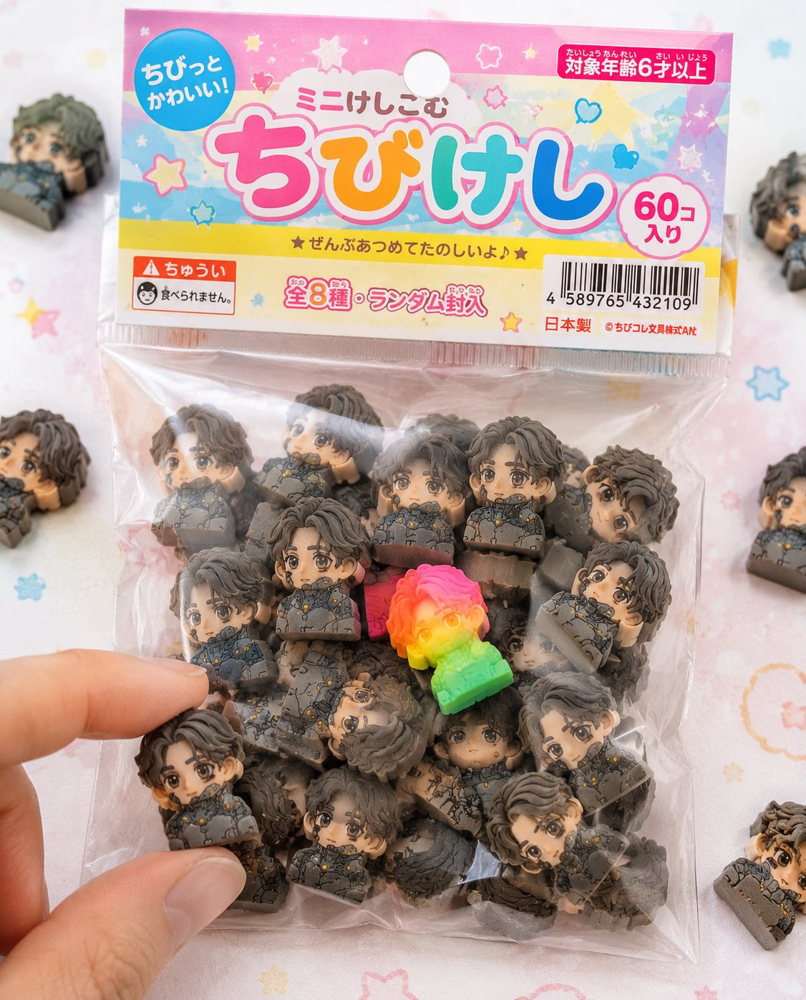

# 🏷️ 品牌与包装

[返回分类](categories.md) · [查看全部案例](cases/cases-001-100.md) · [返回首页](../README.md)


Logo 设计、排版字体 Logo、产品包装、周边商品、痛车、珠宝系列设计等。

---

## 🏷️ 例 22：饮料飞溅商业海报


**Prompt:**

```text
[中文]
一个充满活力的高端广告构图中的三个超动态苏打水罐 —— 一罐热带冲刺苏打水伴随着戏剧性的水和热带水果飞溅而爆炸，鲜艳的橙色和粉色背景光；一罐柠檬冰爽苏打水在发光的绿色动态光背景下被冷水泼溅；两罐都覆盖着逼真的冷凝水和运动模糊的水滴，充满果味和清爽的能量。深橙色、粉色和霓虹绿灯光在大胆的演播室布置中融合。由使用佳能 50mm 镜头的专业摄影师拍摄，超写实纹理，清晰的细节，超高分辨率，明亮的商业海报美学，丰富的色彩鲜艳度，电影级飞溅效果 --ar 3:4

[English]
Three ultra-dynamic soda cans in one vibrant high-end advertising composition — a can of TROPICAL RUSH exploding with dramatic water and tropical fruit splash, vibrant orange and pink background lighting; a can of LEMON ICED splashed with cold water against a glowing green dynamic light background; both cans covered in realistic condensation and motion-blurred droplets, bursting with fruity, refreshing energy. Deep orange, pink, and neon green lighting blend together in a bold studio setup. Captured by a professional photographer using a Canon 50mm lens, hyper-realistic textures, crisp details, ultra high resolution, bright commercial poster aesthetic, rich color vibrancy, cinematic splash effects --ar 3:4
```

**来源：** [@Fujimoto_hina](https://x.com/Fujimoto_hina/status/2028388808320819277) | 2026-05-11


---

## 🏷️ 例 24：四季包装 Campaign 宫格


**Prompt:**

```text
PHASE 1 - PRODUCT: [ITEM] in [MATERIAL] packaging, minimal label design
PHASE 2 - GRID: 2x2 seasonal grid, four distinct brand worlds
PHASE 3 - COMPOSITION: each quadrant a full campaign scene with props and environment
PHASE 4 - CONSISTENCY: same product silhouette, four distinct palettes

Swap: [ITEM] / [MATERIAL] / [LABEL STYLE]
```

**来源：** [@SRKDAN](https://x.com/SRKDAN/status/2048582939504431195) | 2026-05-11


---
### 🏷️ 例 96：品牌奶茶 KV 概念海报


**Prompt:**

```text
你是一个品牌视觉识别系统、商业广告创意总监、KV海报设计师和高传播品牌视觉生成系统。

请根据用户输入的【现有品牌名称】，自动识别该品牌最具代表性的品牌Logo形象、品牌名称文字识别特征、主推产品、产品包装、品牌色彩、视觉调性、目标人群和广告传播风格，并生成一张符合该品牌气质的概念 KV 海报。

创作定位：
- 基于真实品牌认知进行二次创作的品牌概念 KV 海报
- Brand-inspired Concept Key Visual
- 用于个人学习、视觉练习与社交平台展示

不需要绝对严苛的一比一官方复刻，但必须做到：

品牌识别度高；
品牌Logo风格明显；
品牌代表产品明显；
品牌调性准确；
整体像该品牌会出现的视觉广告。

────────────────
一、用户输入
────────────────

品牌名称：{品牌名称}

主推产品：{可选，不填则自动识别该品牌最具代表性的产品}
广告语：{可选，不填则根据品牌调性自动生成原创广告语}
目标人群：{可选，不填则自动判断}
画幅比例：{9:16 / 16:9 / 4:5 / 1:1 / 2.35:1}
KV类型：{产品英雄KV / 品牌情绪KV / 强口号传播KV / 人物场景KV / 超现实概念KV / 自动选择}
平台用途：{小红书 / X / 公众号封面 / 视觉练习 / 概念提案}

────────────────
二、自动识别逻辑
────────────────

请根据品牌名称自动完成以下识别，不需要在画面中展示分析过程：

1. 自动识别该品牌所属行业
例如：
科技、运动、美妆、奢侈品、汽车、饮品、咖啡、服饰、潮流、护肤、珠宝、生活方式、数码、家居等。

2. 自动识别该品牌最具代表性的视觉资产
包括：
品牌Logo形象
品牌名称文字风格
主色调与辅助色
最具代表性的产品
包装外观特征
品牌常见广告风格
品牌场景气质
品牌材质感与光影方式

3. 自动识别该品牌的目标人群
例如：
年轻潮流人群、都市白领、精致女性、运动人群、科技用户、高端消费人群、Z世代、商务人群等。

4. 自动识别该品牌的广告语气质
例如：
极简高级、年轻活力、热血冲击、奢华克制、温柔浪漫、科技理性、时尚先锋、生活方式化等。

────────────────
三、Logo与产品识别规则
────────────────

本次任务允许 AI 根据品牌名称自动识别品牌视觉资产，不需要用户必须上传 Logo 或产品图。

请遵守以下原则：

1. 品牌Logo
- 画面中需要有明显的品牌标识
- Logo 或品牌名称文字要具有较高识别度
- 不必追求百分之百精确复刻，但必须让人一眼联想到该品牌
- 不要生成完全陌生、无关、错误感很强的标识
- 不要让品牌名称出现明显错字、乱码或胡乱变形

2. 品牌产品
- 自动选择该品牌最具代表性的主推产品或经典产品作为主视觉
- 产品外观、包装、色彩和气质应接近大众对该品牌的常见认知
- 不需要绝对严格到工业级复刻
- 但要保证“像这个品牌的真实代表产品”，避免完全陌生的产品

3. 品牌包装与材质
- 自动识别该品牌常见包装与材质语言
- 如金属、玻璃、磨砂、塑料、皮革、纸盒、极简包装、奢华包装、运动感材质等
- 产品必须具有真实商业视觉质感

────────────────
四、KV创意方向
────────────────

请根据品牌属性自动选择最合适的 KV 创意方式。

如果是科技品牌：
使用极简、未来感、真实产品质感、冷静留白、克制光影、干净空间。

如果是运动品牌：
使用速度感、力量感、身体动势、汗水、冲刺、突破、强烈口号感。

如果是美妆品牌：
使用柔光、精致产品、肌肤质感、女性气质、色彩情绪、时尚大片感。

如果是奢侈品牌：
使用高级材质、留白、低饱和色调、秩序构图、稀缺感、时尚大片感。

如果是饮品品牌：
使用冰爽、液体、气泡、年轻感、快乐氛围、色彩冲击、清爽材质。

如果是咖啡品牌：
使用温度、城市生活、松弛氛围、绿色或木质感、晨间陪伴感。

如果是汽车品牌：
使用道路、速度、未来空间、金属质感、城市夜景、驾驶欲望。

如果是潮流品牌：
使用街头、反叛、年轻、图形感、视觉冲击和社交传播感。

────────────────
五、广告语规则
────────────────

如果用户没有输入广告语，请根据品牌调性自动生成一句原创广告语。

要求：

- 广告语不能太长
- 要有品牌感和传播感
- 不使用官方原广告语
- 不需要像正式企业公告
- 更像概念广告的主标语

中文广告语建议：
4到12个字

英文广告语建议：
2到6个单词

广告语风格要与品牌匹配，例如：

科技品牌：
更少干扰，更近未来

运动品牌：
把极限踩在脚下

美妆品牌：
光泽，自成主张

奢侈品牌：
优雅，从不喧哗

饮品品牌：
这一口，刚好上头

咖啡品牌：
唤醒城市的温度

汽车品牌：
驶向更远的秩序

────────────────
六、画面结构要求
────────────────

整张图必须具备真实品牌 KV 的基本结构：

1. 品牌标识区
品牌Logo或品牌名称需要清晰可见，位置合理。

2. 产品主视觉区
品牌代表产品必须明显，是画面核心之一。

3. 广告语区
广告语清晰可读，具备传播记忆点。

4. 品牌氛围区
背景、光影、材质、空间和色彩必须符合品牌调性。

5. 信息层级区
画面层级建议为：
品牌标识
产品主体
广告语
少量辅助文字

文字不要太多，不要做成密密麻麻的海报。

────────────────
七、风格要求
────────────────

整体视觉必须具备：

高识别度品牌感
高级商业广告质感
清晰品牌标识
明显品牌产品
强主视觉
强广告语
干净排版
适合社交平台传播
适合小红书和X展示
具有“像某知名品牌概念广告”的完成度

允许适度创意发挥，但品牌核心识别不能丢失。

────────────────
八、画幅适配
────────────────

如果是 9:16：
适合竖版社交海报，产品更聚焦，广告语放中上区域，适合手机浏览。

如果是 16:9：
适合横版品牌KV、封面、头图，产品与广告语形成左右平衡。

如果是 4:5：
适合社交平台信息流，主体更近，品牌识别更集中。

如果是 2.35:1：
适合公众号封面或宽幅视觉，适合大字广告语和强冲击横版构图。

如果是 1:1：
适合方形封面与品牌视觉展示。

────────────────
九、负面限制
────────────────

不要生成明显错误的品牌名称。
不要生成过于离谱的Logo变形。
不要生成与品牌无关的产品。
不要生成廉价拼贴感。
不要生成过多小字。
不要生成杂乱无章的背景。
不要生成山寨感很强的画面。
不要生成像促销海报一样的低级电商视觉。
不要出现二维码、购买链接、价格标签、活动说明。
不要让整体画面失去品牌调性。

────────────────
十、最终目标
────────────────

请生成一张基于真实品牌认知自动识别完成的品牌概念 KV 海报。

要求：
无需用户上传 Logo 和产品素材；
由AI自动识别该品牌最具代表性的Logo形象与代表产品；
不要求绝对严格复刻；
但必须保持高识别度、高品牌感、高完成度；
整体像一张高级品牌概念广告海报；
适合个人学习、视觉练习和社交平台展示。

————
品牌名称：{蜜雪冰城}
主推产品：{奶茶}
广告语：{可选，如果用户不输入，则根据品牌调性自动生成一句高传播感广告语}
目标人群：{年轻潮流人群}
画幅比例：{9:16}
KV类型：{产品英雄KV}
平台用途：{小红书}
```

**来源：** [@status](https://x.com/liyue_ai/status/2057739894261518670) | 2026-05-20

---
### 🏷️ 例 107：复古日系迷你橡皮商品包装



**Prompt:**

```text
添付されたキャラクターシートをSTRICTなデザインリファレンスとして使用すること。 キャラクターの顔、髪型、目の形、プロポーションは絶対に変更しない。

■目的： キャラクターを日本の「ちび消しゴム商品」として完全に商品化し、 実際に文房具売り場やガチャで販売されているようなリアルなパッケージ商品写真を作成する。

■コンセプト： 「100円ショップや文房具店で売られている袋入りちび消しゴム商品」

■消しゴム本体： （※前回と同じ仕様を完全維持） - 強いデフォルメちびキャラ - 厚みのあるブロック形状 - 完全マットなラバー素材 - 微細な粒子・粉・削れ・摩耗あり - 印刷ズレ・色ブレあり - 50個以上のランダム構成

■パッケージ（超重要）： - 小さな透明ビニール袋（OPP袋） - 上部に紙ヘッダー（吊り下げ用の穴あり） - ヘッダーはややチープな印刷（軽いズレ・インクのムラ） - ビニールはシワあり、やや曇り、静電気で中身に張り付く - 一部空気が入ってふくらみあり - シール部分に軽いヨレ

■グラフィックデザイン： - 日本の子供向け文房具風デザイン - ポップでカラフル（ピンク・黄色・水色ベース） - 手書き風フォントや丸文字 - 商品名ロゴ（オリジナルでOK） - 「ミニけし」「ちびけし」などの表記 - 星・ハート・キラキラ装飾

■情報要素（リアル感強化）： - JANコード（バーコード） - 「対象年齢6才以上」 - 「食べられません」注意書き - 「全◯種」や「ランダム封入」 - 小さな会社名（架空） - MADE IN JAPAN or CHINA表記

■構図： - パッケージがメインで画面中央 - 周囲に少しだけこぼれた消しゴム - 1〜2個は袋から出ている - 指先が1つをつまもうとしている演出 - 一部フレームアウトで自然さ

■レア要素： - 蛍光カラーやグラデーションの特別個体を1つ混ぜる - 視線誘導として目立つ位置に配置

■ライティング： - 明るい自然光（ややハイキー） - 柔らかい影 - 商品写真のような清潔感

■カメラ： - マクロ寄り - 浅い被写界深度 - 中央シャープ

■背景： - 白〜パステルのテーブル - ほんのりドットやポップ柄 - シンプルで清潔

■禁止： - プラスチック感 - glossy表現 - 高級すぎる質感（安っぽさが正解） - 完璧すぎる印刷

■出力： - 実在する商品にしか見えないレベル - コンビニや100均にありそうなリアリティ - SNSで「これ欲しい」と思わせる完成度
```

**来源：** [@status](https://x.com/ZetoGroovin/status/2058408514247410003) | 2026-05-22

---
### 🏷️ 例 126：Fiery Takis Action Poster


**Prompt:**

```text
Create a vertical high-octane snack advertisement poster for {argument name="brand name" default="Takis"}. A young woman with messy dark curly hair and glasses stands centered on a neon city street at night in a powerful action pose, wearing a black leather biker jacket, red crop top, ripped black jeans, belt chain, earrings, and layered necklaces. She thrusts one giant rolled spicy chip forward like a weapon, glowing red-orange and wrapped in flames. Surround her with a huge circular vortex of fire and flying ember sparks, plus exactly 9 visible Takis-style rolled chips: 1 giant chip in her hand, 1 large flaming chip at upper right, 1 small chip at upper left, 1 vertical chip left of the logo, 1 ring-shaped chip at left, 1 small chip near bottom left, 1 small chip near her right hip, 1 large diagonal chip at lower right, and 1 blurred oversized chip cropped in the bottom-right foreground. The background shows a gritty nighttime urban street with skyscrapers, purple neon accents, a food stand on the left with signs reading "SPICY FOOD" and "HOT", and a branded food truck or bus on the right displaying the Takis logo. At the top, add massive distressed fiery orange headline text reading {argument name="headline text" default="FIRE CRUNCH"}, with a bold white angled tagline beneath reading {argument name="tagline" default="MORE THAN SPICY. IT'S INTENSE."}. Place the yellow-and-purple Takis logo large under the tagline, centered above the character. Use extreme contrast, cinematic action-advertising lighting, glossy commercial detail, sparks, smoke, flame trails, saturated reds, oranges, purples, and blacks. Keep the composition dramatic and poster-like, with the character in the lower center and the typography dominating the upper third. Avoid extra logos, watermarks, or unrelated text.
```

**来源：** [@HaniaAi12](https://x.com/HaniaAi12/status/2058906386093027817#reversed-0) | 2026-05-26

---

### 🏷️ 例 204：品牌包络产品广告


**Prompt:**

```text
The Brand Envelope | GPT Image-2 Prompt #89

This takes any product photo and wraps it in your specific brand world. Different product each time. Same brand, every time.

PHASE 1 / ANCHOR: Describe [BRAND IDENTITY] in 2 lines. Palette, texture, mood.
PHASE 2 / INJECT: Place [PRODUCT] inside that brand world, not the reverse.
PHASE 3 / FORMAT: Set [OUTPUT FORMAT]. Hero, square ad, or story.
PHASE 4 / SIGNATURE: Apply [BRAND ELEMENT]. Grain, shadow, or overlay.

Swap: [BRAND IDENTITY] / [PRODUCT] / [FORMAT]
```

**来源：** [@SRKDAN](https://x.com/SRKDAN/status/2051482047248560393) | 2026-05-30

---

### 🏷️ 例 211：品牌人格漫画信息图


**Prompt:**

```text
Using the uploaded logo, create a highly detailed, comic-style infographic poster:

“What This Brand Feels Like”

GOAL:
Turn the brand into a living personality and visually explain how it behaves, speaks, and interacts with the world.
This must feel like a mix of: brand strategy + character design + comic storytelling.

---

CORE RULE:
Everything must come from the logo:
- colors
- style
- tone
- personality

No generic personality traits.

---

MAIN STRUCTURE:
Vertical 4:5 poster
Dense layout with multiple panels
Comic + infographic hybrid

---

TOP SECTION:
- Brand name
- Short personality statement (max 6 words)
Example: “Quiet confidence with sharp edges”

---

MAIN CHARACTER (VERY IMPORTANT):
Create a central character representing the brand:
- humanized version of the brand
- outfit reflects brand style
- posture + expression reflect personality

---

AROUND THE CHARACTER:
Create 6–8 comic panels showing how the brand behaves in different situations.

---

SCENARIO IDEAS:
- Talking to customers
- Handling competition
- Selling a product
- Social media presence
- Reacting to criticism
- Daily “brand life” moment

---

FOR EACH PANEL:
Include:
- short caption (max 6 words)
- speech bubble or internal thought
- clear visual action

---

TONE EXAMPLES:
Luxury brand: calm, confident, minimal speech
Playful brand: loud, chaotic, expressive
Tech brand: precise, logical, clean

---

PERSONALITY TRAITS SECTION:
Add small labeled blocks:
- Voice tone (e.g. calm, bold, playful)
- Energy level (low / medium / high)
- Social behavior (introvert / extrovert)
- Communication style

Use:
- icons
- short labels

---

DO / DON’T SECTION:
Add a split block:
DO:
- how the brand should act
DON’T:
- what breaks the identity

Keep:
- very short phrases

---

VISUAL ELEMENTS:
- speech bubbles
- icons
- arrows
- small reactions
- exaggerated comic expressions

---

STYLE:
- comic + editorial hybrid
- slightly exaggerated but still premium
- expressive but not childish

---

COLOR:
- strictly based on logo palette
- use color to reinforce personality

---

DEPTH:
- 20–40 visual elements
- multiple small panels
- layered composition

---

IMPORTANT RULES:
- must feel alive
- must feel specific
- no generic marketing words
- no empty areas
- keep text short but impactful

---

FINAL FEEL:
Like:
- a brand strategy turned into a character
- a visual storytelling board
- something people save and study

NOT:
- flat
- generic
- minimal
```

**来源：** [@CallumGrey](https://x.com/CallumGrey/status/2051293342139584922) | 2026-05-30

---

### 🏷️ 例 217：高端肉类海鲜品牌英雄图


**Prompt:**

```text
一、品牌基础设定
品牌名称：[请填写，例如：PRIME STEAK / OCEAN PRIME]
品牌标语：[请填写，例如：Steakhouse Quality, Your Table / Restaurant Grade, Home Delivered]
主色调：[请填写，例如：黑金 / 深红+金 / 深蓝+银]
字体风格：
标题：[请填写，例如：金色衬线体，大写，奢华感]
正文：[请填写，例如：细衬线体/无衬线体]
二、核心视觉元素
台面材质：[请填写，例如：大理石/黑色石板]
背景调性：[请填写，例如：深色渐变/暗调餐厅环境]
光线风格：[请填写，例如：聚光/侧光/顶部照明]
三、主产品定义（必填）
产品名称/类型：[请填写，例如：和牛牛排 / 帝王蟹 / 北极甜虾]
产品数量/摆放：[请填写，例如：1份单品 / 3块整齐摆放]
呈现方式：[请填写，例如：切片展示 / 带骨展示 / 原壳展示]
产品特色/质感提示：[请填写，例如：肉质纹理清晰、多汁感 / 光泽晶亮 / 肉眼可见油花]
```

**来源：** [@xpg0970](https://x.com/xpg0970/status/2050108279385419965) | 2026-05-30

---

### 🏷️ 例 225：科学家收藏级玩具发布板


**Prompt:**

```text
2x2 grid, do this for 4 famous scientists in history: Design a collector-grade launch visual for [TOY / FIGURE / DESIGNER OBJECT] shown in pristine hero form along with interchangeable accessories, alternate expressions, packaging design, scale references, sticker details, rarity indicators, and close-up material highlights. The object should feel like a luxury drop, somewhere between art toy culture and elite product branding.  Accessory Layout: Arrange [ACCESSORY 1], [ACCESSORY 2], [ALT VERSION], [PACKAGING FEATURE], and [LIMITED EDITION DETAIL] around the figure in carefully staged clusters. Everything should feel desirable, neat, and “unboxable.”  Visual Style: Hype-culture collectible reveal meets premium e-commerce launch campaign. Clean, glossy, tactile, designer-toy sophistication with a playful but expensive sensibility.  Composition Guidelines: Hero figure remains dominant. Accessories should be balanced and elegantly spaced. Packaging should be visible but not steal the scene. The entire image should feel like a product collectors would screenshot instantly.  Lighting & Background: Soft commercial lighting with subtle specular highlights, polished background in [BACKGROUND STYLE], crisp shadows, premium color separation, ultra-sharp details, no watermark.
```

**来源：** [@Gdgtify](https://x.com/Gdgtify/status/2049766203392921897) | 2026-05-30

---

### 🏷️ 例 228：抹茶品牌触点系统视觉板


**Prompt:**

```text
Create a premium “Matcha Brand Touchpoint System” visual board for a modern lifestyle brand called:

“MATCHA MODE”

Build a full brand identity system, not a single image.

HERO SCENE:

A hyper-realistic matcha drink in a ceramic cup placed on a clean natural surface.

– vibrant green matcha foam with micro-bubbles
– bamboo whisk (chasen) nearby
– soft natural light
– slight matcha powder dust on the surface
– minimal Japanese aesthetic
ATMOSPHERE:
– calm, warm, soft daylight
– clean background (off-white or beige)
– subtle shadows and reflections
– feeling of wellness and luxury
FULL BRAND SYSTEM:
– takeout cups (paper + glass bottles)
– packaging boxes (minimalist design)
– tote bags (premium lifestyle)
– labels, stickers, seals
– menu cards with pricing ($6.50, $8.90, etc.)
– small typography everywhere
– subtle imperfections (realism)

DESIGN LANGUAGE:

– modern minimalist typography
– Japanese-inspired layout
– soft green palette
– elegant spacing

INCLUDE:
– matcha latte
– iced matcha
– matcha desserts
– combo sets
– lifestyle shots
The composition must feel like a high-end design agency presentation.

Ultra-detailed, realistic, clean, aesthetic, and highly shareable.
```

**来源：** [@Preda2005](https://x.com/Preda2005/status/2049846981271699685) | 2026-05-30

---

### 🏷️ 例 232：草莓能量饮料商业广告


**Prompt:**

```text
A hyper-realistic commercial advertisement blending energy drink and sports branding. A dynamic athletic woman mid-air jump, wearing modern sportswear (light translucent jacket, orange shorts, white sneakers), surrounded by explosive splashes of red strawberry liquid and flying ice cubes. A cold metallic energy drink can (strawberry flavor) bursting with droplets sits in the foreground, covered in condensation. Fresh strawberries scattered on a glossy reflective surface.

Bright cinematic lighting with dramatic highlights and motion effects. Vibrant orange gradient background with bold glowing typography behind the subject. Ultra-detailed, high contrast, sharp focus, commercial product photography style, 8K resolution, advertising poster aesthetic, energetic, powerful, refreshing mood.
```

**来源：** [@SPEEDAI07](https://x.com/SPEEDAI07/status/2049043627163435040) | 2026-05-30

---

### 🏷️ 例 236：Logo 与品牌身份系统提示词合集


**Prompt:**

```text
1. Logo概念生成提示词

你是一位拥有20年经验的顶级Logo设计师，为全球知名品牌设计过即时识别且深具意义的标志。

品牌名称：[你的品牌名]
行业：[你的行业]
品牌个性：[描述]
目标受众：[描述]
欣赏的视觉身份：[列举3个]
讨厌的视觉身份：[列举3个]
偏好风格：[如极简、大胆、几何、有机、复古、未来]

为我的品牌生成5个完全不同的Logo概念。

对每个概念提供：

- 核心视觉理念及象征意义
- 形状语言及为何适合品牌
- 字体方向建议
- 第一眼的情感触发
- 为何适合目标受众
- 在名片、App图标和广告牌上的效果
- 何为永恒而非潮流

然后告诉我，如果这是你的品牌，你会选哪个以及原因。

2. 品牌身份基础提示词

你是为财富500强公司和初创企业建立品牌身份的顶级品牌战略师，这些企业后来融资数百万。

业务名称：[你的业务名]
业务描述：[一句话]
目标受众：[详细描述]
竞争对手：[列举3-5个]
想触发的感受：[如信任、兴奋、奢华、亲近、力量]
想关联的词汇：[列举5-10个]
不想关联的词汇：[列举5-10个]

在设计任何视觉效果之前建立完整的品牌身份基础。

为我提供：

- 品牌原型及为何完美契合
- 5个具体人类特征描述的品牌个性
- 带示例的品牌语调指南
- 核心品牌承诺（一句话）
- 3个品牌应触发的情感层级
- 与竞争对手的根本差异
- 定义品牌的唯一关键词

3. 配色方案提示词

你是色彩心理学专家和品牌设计师，深知色彩如何触发情感、建立信任和驱动购买决策。

品牌名称：[你的品牌名]
行业：[你的行业]
目标受众：[年龄、性别、收入、生活方式]
想触发的首要情感：[如信任、能量、奢华、平静、兴奋]
前3名竞争对手颜色：[列举]
喜欢的颜色：[列举]
讨厌的颜色：[列举]

为我建立完整品牌配色板。

为我提供：

- 主色及其HEX代码和心理学解释
- 两个辅助色及HEX代码
- 一个强调色用于CTA和高亮
- 一个中性色用于背景和文字
- 每种颜色对目标受众的影响
- 与竞争对手的差异化
- 在网站、社交媒体和包装上的应用示例
- 永远不要搭配的颜色组合及原因

4. 字体方向提示词

你是字体专家和品牌设计师，深知字体如何传达个性、建立可信度和实现品牌即时识别。

品牌名称：[你的品牌名]
品牌个性：[5个词]
行业：[你的行业]
目标受众：[描述]
字体应触发的感受：[如权威、友好、创新、优雅、能量]
喜欢的品牌字体：[列举3个]

为我建立完整字体系统。

为我提供：

- 标题用主显示字体名称及为何完美
- 长文本的辅助字体
- 引言或重点的强调字体
- 标题、副标题、正文、说明文字的精确字号层级
- 字距和行高建议
- 字体搭配方法
- 预算有限时的免费替代方案
- 你所在行业应避免的字体错误

5. 完整品牌身份包提示词

你是顶级品牌代理创意总监，交付覆盖每个触点的完整品牌身份系统。

业务名称：[你的业务名]
业务描述：[一句话]
目标受众：[详细描述]
品牌个性：[5个词]
行业：[你的行业]
竞争对手：[列举3个]
设计工具预算：[免费或付费]
时间表：[你需要的时间]

在一个回复中交付我的完整品牌身份系统。

包含所有元素：

- 品牌战略基础、原型、个性、承诺和定位
- Logo概念及3个变体
- 完整配色板、HEX代码和使用规则
- 字体系统、名称、字号和层级
- 视觉方向指南
- 品牌语调指南和标语选项
- 社交媒体视觉模板
- 3条永远不要打破的核心品牌规则

将一切作为结构化品牌手册交付，任何设计师、开发者或AI工具都能在10分钟内完全理解你的品牌。
```

**来源：** [@wanerfu](https://x.com/wanerfu/status/2048659924822184026) | 2026-05-30

---


### 🏷️ 例 274：高端饮品商业海报


**Prompt:**

```text
Create a premium commercial product poster inspired by the reference image. A cold {argument name="beverage" default="green glass beer bottle"} stands perfectly centered in a vertical composition, covered with realistic water droplets and condensation. Replace all visible product branding with the name “{argument name="brand" default="BMX"}” on the main bottle label, neck label, and vertical bottle text. The logo should look clean, bold, premium, and professionally printed, using white and deep green label design with a small red star-style emblem.

The background is a rich dark green studio backdrop with soft gradient lighting and subtle texture. Behind the bottle, large bold background typography reads “BMX” in oversized block letters, partially hidden behind the bottle, using a pale green tone. Add {argument name="elements" default="floating natural ingredients around the bottle: fresh hop cones, golden barley grains, and wheat stalks"} entering from the corners, creating a dynamic premium beer advertisement look.

Lighting should be cinematic and high-end, with soft highlights on the glass, realistic reflections, sharp product focus, and a clean shadow beneath the bottle. The mood should feel fresh, cold, luxurious, and modern. Ultra realistic commercial photography, premium beverage advertising, studio product shot, 8K detail, crisp focus, realistic condensation, elegant green color palette, no extra text except BMX.
```

**来源：** [BMX](https://x.com/bmx_ai13) | 2026-05-30

---


### 🏷️ 例 289：奢华深红色礼服时尚大片


**Prompt:**

```text
Create a hyper-realistic luxury fashion image titled: "{argument name="image title" default="THE RED DRESS"}." IMPORTANT: The image must be understood in less than one second. No story. No symbolism. No complicated concept. Just one visually perfect moment. SCENE: A breathtakingly attractive {argument name="subject" default="woman"} walking alone through a vast shallow mirror-like body of water at sunset. She wears an elegant flowing {argument name="dress color" default="crimson-red"} dress. The dress should be: dramatic, luxurious, wind-blown, visually dominant, and instantly recognizable from a thumbnail. The water is perfectly still. The reflection is nearly flawless. The sky explodes with: warm gold, deep orange, soft pink, and subtle lavender tones. The woman occupies the center of the frame. Everything else exists only to enhance her presence. DETAILS: realistic skin texture, natural facial features, subtle confidence, soft hair movement in wind, realistic fabric physics, luxury fashion-editorial styling, cinematic reflection quality. CAMERA: Slightly low angle. The dress fills much of the frame. The silhouette must remain recognizable even at very small mobile-screen size. LIGHTING: Golden-hour luxury fashion photography. Soft highlights. Natural skin tones. Realistic reflections. Premium lens behavior. STYLE: Blend: luxury perfume campaigns, haute couture photography, premium fashion editorials, and cinematic realism. NO: fantasy elements, excessive jewelry, text overlays, logos, AI-looking beauty retouching. COLOR PALETTE: deep crimson, golden sunset, warm skin tones, soft amber reflections, subtle pink skies. The final image should feel: impossibly elegant, immediately eye-catching, and worthy of a global luxury campaign.
```

**来源：** [Hemayxn.ai](https://x.com/hemayxn) | 2026-05-30

---


### 🏷️ 例 303：地中海乡村街道人像


**Prompt:**

```text
A young brunette woman with short, slightly wavy bob-length hair walking along a sunny Mediterranean village street. She is wearing {argument name="outfit" default="a plain navy blue fitted crew-neck t-shirt tucked loosely into wide, relaxed-fit cream/off-white linen jogger-style pants with a drawstring waist and elasticated ankles"}. She wears grey and white low-top sneakers. She carries a small taupe/beige soft leather shoulder bag on her left shoulder and holds a black smartphone in her right hand. She has a brown leather bracelet on her wrist. She is reaching out with her left hand to gently touch orange and white flowers on a blooming bush along a low stone wall to her left. She is looking slightly upward and smiling softly. Background: a bright sunny Spanish or Southern European village street with white-washed buildings, a balcony, blurred pedestrians, and dappled sunlight through green trees. Shallow depth of field, blurred foreground flowers. Bright, natural midday summer sunlight.
```

**来源：** [Ruzaina](https://x.com/RuzainaMeer) | 2026-05-30

---


### 🏷️ 例 308：黑色贵妃椅上的酒红色礼服时尚大片


**Prompt:**

```text
Create a cinematic luxury fashion editorial portrait of {argument name="character description" default="an elegant woman"} seated on an ornate vintage black velvet chaise lounge with glossy carved black wood scroll arms, wearing a floor-length {argument name="gown color and fabric" default="deep burgundy satin"} gown with a draped cowl neckline, thin straps, and a long flowing train spilling across the floor in rich folds. She sits in a poised three-quarter pose, one arm resting on the chaise arm, the other hand relaxed on her lap, with long wavy brunette hair over one shoulder and minimal delicate jewelry. Behind her is a giant black-and-white low-poly geometric mural resembling a stylized portrait of a woman, made of angular triangular facets in charcoal, gray, white, and black, filling the wall like modern gallery art. The setting is moody and upscale, with a textured gray concrete wall, dark floor, dramatic soft side lighting, deep shadows, premium satin highlights, and a timeless high-fashion magazine atmosphere. Include exactly two opaque anonymizing overlays: one large medium-gray rectangle covering the upper-right portrait/face area and part of the mural, and one smaller blurred taupe-gray square covering the seated woman's face. Use a vertical 3:4 composition, rich contrast, realistic photography, cinematic editorial lighting, no text, no watermark.
```

**来源：** [Arina_](https://x.com/Arina_hoqe) | 2026-05-30

---


### 🏷️ 例 335：手工珐琅纪念品磁贴设计


**Prompt:**

```text
[中文]
创作一个逼真的手工珐琅纪念品磁贴，灵感来源于 {argument name="subject" default="上传的场景"}。

• 一款高端旅行收藏级磁贴

• 逼真的三维金属深度

• 珐琅填充的深陷区域

• 金色浮雕金属边缘

• 柔和的反光与摄影棚灯光

• 逼真的珐琅质感

• 柔和细腻的阴影

重要提示：

• 仅保留极细的选择性金色轮廓

• 避免强调每一个细节

• 避免使用大边框或贴纸

• 不要是扁平插画

• 不要是矢量图形

• 不要是卡通风格

• 图片应描绘人物，而不仅仅是风景。

• 您所创建图像的背景颜色应与我发送图片中的主色调之一相近。

构图：

• 聚焦于风景、建筑和景观

形状：• 重复地标轮廓的有机雕塑剪影；• 优雅的非对称轮廓；• 无方形或矩形边框；

整体风格：• 电影质感的奢华旅游纪念品；• 精致的极简主义；• 美学手工珐琅磁贴；• 博物馆商店收藏级纪念品的品质。

印刷排版：

在磁贴下方添加优雅的衬线字体排版。

字体风格：

* 奢华的编辑类衬线体

* 精致优雅的字体

* 大写字母

* 极宽的字间距

* 居中对齐

* 旅行海报的极简美学

* 冷静的奢华品牌风格

文本层级：

* {argument name="location" default="主要定居点"} 的名称需放大，并与图像相呼应

[English]
Create a realistic handmade enamel souvenir magnet inspired by the {argument name="subject" default="uploaded scene"}.

• A collectible magnet for premium travel

• Realistic three-dimensional metal depth

• deepened areas of enamel

• embossed metal edges made of gold

• Soft glare and studio lighting

• Realistic enamel texture

• Gentle soft shadows

important:

• Ultra-thin selective gold contours only

• Avoid emphasizing every detail.

• Avoid large frames or stickers

• NOT a flat illustration

• NOT vector graphics

• NOT a cartoon

• The picture should depict a person, not just a landscape.

• The background color of the image you are creating should be similar to one of the dominant colors in the image I sent.

composition:

• Focus on landscapes, architecture and landscape

shape: • organic sculptural silhouette that repeats the landmark; • elegant asymmetrical contour; • absence of square or rectangular framing;

GENERAL STYLE: • a cinematic luxury tourist souvenir; • refined minimalism; • an aesthetic handmade enamel magnet; • the quality of collectible souvenirs in museum stores.

printing house:

Add elegant serif typography under the magnet.

Typographic style:

* Luxurious editorial serif

* Fine elegant font

* capital letters

* a very wide interval between them

* Center alignment

* minimalistic aesthetics of travel posters

* Calm luxury branding style

The hierarchy of the text:

* The name of the {argument name="location" default="main settlement"} is enlarged: and corresponds to the image
```

**来源：** [@simeon-sanai](https://x.com/Naiknelofar788/status/2061504832121528766) | 2026-06-01

---


### 🏷️ 例 339：Nike Sportswear 编辑类广告


**Prompt:**

```text
[中文]
超写实 {argument name="brand" default="NIKE"} 运动服饰广告，{argument name="subject" default="运动型印度女性跑步者"} 呈现强有力的起跑姿态，一只手触碰潮湿且具反射感的地面。专注的表情，深青色防风夹克，焦橙色高性能 T 恤，黑色紧身压缩裤，白色 NIKE 袜子。超细节的白色 NIKE 跑步鞋配以橙色点缀作为视觉焦点，逼真的网面纹理和清晰可见的缓震设计。深色工业风隧道背景，带有橙色光影线条，电影级布光，鞋底溅起的水花，高端编辑类体育摄影。左侧有醒目的大号字体 "{argument name="slogan" default="JUST DO IT"}"（JUST 为白色，DO IT 为橙色轮廓），极简性能数据 UI，NIKE 标志，奢华商业广告美学，超锐利，照片级真实感，8K 分辨率，高对比度，专业的以产品为中心的构图，宽高比 4:5 (1080&#215;1350)。

[English]
Hyper-realistic {argument name="brand" default="NIKE"} sportswear advertisement, {argument name="subject" default="athletic Indian female runner"} in powerful sprint-start stance, one hand touching wet reflective ground. focused expression, deep teal windbreaker, burnt-orange performance tee, black compression tights, white NIKE socks. Ultra-detailed white NIKE running shoes with orange accents as hero focus, realistic mesh texture and visible cushioning. Dark industrial tunnel background with orange light streaks, cinematic lighting, water splashes under shoe, premium editorial sports photography. Large bold typography "{argument name="slogan" default="JUST DO IT"}" on left (JUST in white, DO IT in orange outline), minimal performance stats UI, NIKE logo, luxury commercial campaign aesthetic, ultra-sharp, photorealistic, 8K, high contrast, professional product-first composition, aspect ratio 4:5 (1080&#215;1350).
```

**来源：** [@𝐌](https://x.com/Strength04_X/status/2061491020316168592) | 2026-06-01

---


### 🏷️ 例 343：写实商业饮料广告


**Prompt:**

```text
[中文]
超写实 {argument name="product type" default="商业饮料"} 广告海报，低角度广角镜头视角，自信的年轻女模特手持超大号 {argument name="object" default="汽水罐"} 朝向镜头，罐体占据前景，具有强烈的强制透视效果，都市街头时尚，黑色鸭舌帽，圆环耳环，叠戴银色项链，白色短款背心，与产品颜色相呼应的光泽感飞行员夹克，前卫的 Gen-Z 活力。高细节铝罐，表面带有水珠，高级包装设计，鲜艳的品牌字体，涂鸦风格图形，手绘涂鸦，油漆飞溅，笔触，撕纸纹理，半色调圆点，箭头，星星，闪电，贴纸，条形码元素，拼贴美学。
背景充满动态的油漆飞溅和与品牌颜色相匹配的街头艺术纹理。醒目的手绘标题字体，充满活力的促销标语，口味宣传语，生活方式营销短语，杂志级排版，现代能量饮料广告，高对比度照明，锐利对焦，商业产品摄影，时尚编辑风格，高级广告设计，鲜艳色彩，照片级皮肤纹理，景深，高细节，8k，专业品牌样机。

[English]
Ultra-realistic {argument name="product type" default="commercial beverage"} advertisement poster, low-angle wide lens perspective, confident young female model holding an oversized {argument name="object" default="soda can"} toward the camera, can dominating foreground with dramatic forced perspective, urban streetwear fashion, black cap, hoop earrings, layered silver chains, cropped white tank top, glossy bomber jacket matching product color, edgy Gen-Z energy. High-detail aluminum can with water droplets, premium packaging design, vibrant branding typography, graffiti-inspired graphics, hand-drawn doodles, paint splashes, brush strokes, torn paper textures, halftone dots, arrows, stars, lightning bolts, stickers, barcode elements, collage aesthetic.
Background filled with dynamic paint splashes and street-art textures in matching brand colors. Bold hand-painted headline typography, energetic promotional slogans, flavor callouts, lifestyle marketing phrases, magazine-quality layout, modern energy drink campaign, high contrast lighting, sharp focus, commercial product photography, fashion editorial styling, premium advertising design, vibrant colors, photorealistic skin texture, depth of field, highly detailed, 8k, professional branding mockup.
```

**来源：** [@Kashberg](https://x.com/Kashberg_0/status/2061471709690233223) | 2026-06-01

---


### 🏷️ 例 352：霓虹城市汽水广告


**Prompt:**

```text
[中文]
创作一个电影感超写实的夜间广告场景，画面中有一个巨大的玻璃 {argument name="product" default="Coca-Cola 瓶子"} 矗立在霓虹闪烁的湿润城市街道上。在巨大的 {argument name="product" default="Coca-Cola 瓶子"} 旁边，有一位 {argument name="subject" default="美丽且面带微笑的年轻女性"} 正以放松而自信的姿态随意地靠在瓶身上。她穿着一件舒适的黄色廓形卫衣、修身灰色牛仔裤和干净的白色运动鞋。背景呈现出色彩斑斓的城市光斑、湿润路面上红色的发光倒影，以及充满活力的未来感城市氛围。瓶身上的 {argument name="product" default="Coca-Cola 标志"} 清晰可见。采用戏剧性的电影灯光、浅景深、逼真的倒影、光泽质感、高细节、写实风格、时尚商业美学、8k 分辨率、柔和光晕、暖色调以及真实的比例。竖构图，杂志风格摄影，高端饮料广告质感。

[English]
Create a cinematic ultra-realistic nighttime advertisement scene featuring a giant glass {argument name="product" default="Coca-Cola bottle"} standing on a wet neon-lit city street. Beside the oversized {argument name="product" default="Coca-Cola bottle"} is a {argument name="subject" default="beautiful smiling young woman"} casually leaning against it with a relaxed and confident pose. She wears a cozy oversized yellow sweatshirt, fitted gray jeans, and clean white sneakers. The background features colorful urban bokeh lights, glowing red reflections on the wet pavement, and a vibrant futuristic city atmosphere. The {argument name="product" default="Coca-Cola logo"} is clearly visible on the bottle. Use dramatic cinematic lighting, shallow depth of field, realistic reflections, glossy textures, high detail, photorealistic style, fashion-commercial aesthetic, 8k resolution, soft glow, warm tones, and realistic proportions. Vertical composition, magazine-style photography, premium beverage advertisement vibe.
```

**来源：** [@Alina Ai](https://x.com/Alina_with_Ai/status/2061456455447069141) | 2026-06-01

---


### 🏷️ 例 355：奢华运动服饰广告海报


**Prompt:**

```text
[中文]
将醒目的高端运动服饰广告排版直接融入构图中。文字应呈现出专业设计感，遵循现代 Nike、Adidas 及奢华运动系列广告的审美风格。

主标题（大号）：
"{argument name="headline" default="ENGINEERED FOR SPEED"}"

将标题垂直放置在海报一侧，并使其部分位于鞋子后方，以营造深度和视觉层次感。使用具有干净几何形态且极具存在感的粗体现代无衬线字体。
副标题：
"{argument name="subheading" default="EVERY STEP. FASTER."}"

放置在主标题下方，采用较小的字体，并保持宽裕的字间距，呈现高级编辑排版风格。

特性标注：

ULTRA-LIGHT MESH (超轻网面)
RESPONSIVE ENERGY RETURN (响应式能量回馈)
MAXIMUM TRACTION (极致抓地力)
PRECISION FIT TECHNOLOGY (精准贴合技术)

将这些内容显示为精致的技术标签，通过纤细的未来感指示线和微妙的界面图形连接到鞋子的不同部位。
背景图形文字：
创建超大号的半透明排版，内容为：

RUN
MOVE
ACCELERATE

这些词汇应作为大型图形设计元素融入背景中，被画面部分裁剪，并与灯光效果产生互动。

性能徽章：
创建一个包含以下内容的高级圆形徽章：

+35% ENERGY RETURN

以现代信息图表风格放置在鞋底附近。
底部品牌区域：
预留干净的留白空间，用于放置虚构的品牌 Logo 和标语：

{argument name="brand name" default="VELOCITY X"}
"Built Beyond Limits"

排版应与艺术作品融为一体，运用高级编辑布局、强烈的层级感、平衡的间距、先进的网格系统以及奢华运动服饰广告的审美。最终图像应呈现出如同屡获殊荣的国际广告海报，完美结合世界级产品摄影、平面设计和未来感品牌形象。

[English]
Integrate bold, premium sportswear advertising typography directly into the composition. The text should appear professionally designed, following modern Nike, Adidas, and luxury athletic campaign aesthetics.

Main Headline (Large):
"{argument name="headline" default="ENGINEERED FOR SPEED"}"

Position the headline vertically along one side of the poster and partially behind the shoe, creating depth and visual layering. Use a bold modern sans-serif font with clean geometric forms and strong presence.
Secondary Headline:
"{argument name="subheading" default="EVERY STEP. FASTER."}"

Place below the main headline in smaller typography with generous spacing and premium editorial styling.

Feature Callouts:

ULTRA-LIGHT MESH
RESPONSIVE ENERGY RETURN
MAXIMUM TRACTION
PRECISION FIT TECHNOLOGY

Display these as sleek technical labels connected to different parts of the shoe using thin futuristic indicator lines and subtle interface graphics.
Background Graphic Text:
Create oversized semi-transparent typography reading:

RUN
MOVE
ACCELERATE

These words should blend into the background as large graphic design elements, partially cropped by the frame and interacting with lighting effects.

Performance Badge:
Create a premium circular badge containing:

+35% ENERGY RETURN

Position near the sole with modern infographic styling.
Bottom Branding Area:
Reserve clean negative space for a fictional brand logo and slogan:

{argument name="brand name" default="VELOCITY X"}
"Built Beyond Limits"

The typography should feel integrated into the artwork, using premium editorial layouts, strong hierarchy, balanced spacing, advanced grid systems, and luxury sportswear campaign aesthetics. The final image should resemble an award-winning international advertising poster combining world-class product photography, graphic design, and futuristic branding.
```

**来源：** [@VireonixArt](https://x.com/vireonixx/status/2061454355103187361) | 2026-06-01

---


### 🏷️ 例 366：高端薰衣草色智能手机广告


**Prompt:**

```text
[中文]
超写实高端智能手机广告，主角是一位 20 出头、自信的年轻女性，皮肤白皙，五官轮廓分明，佩戴着时髦的黑色猫眼太阳镜。她留着浓密的长发，编成夸张的超长辫子，发色为与产品主题相呼应的柔和薰衣草紫。画面采用动态低角度电影级构图，她身体微微扭转，将 Xiaomi 17 Pro 智能手机伸向镜头，形成强烈的视觉冲击力，手机占据前景主体。手机采用哑光金属薰衣草紫配色，机身简约，边角圆润，配有大型矩形摄像头模组。模组左侧包含两枚大尺寸镜头，右侧圆形副屏显示简约的紫色渐变时钟 UI，摄像头旁印有 Leica 标识，配有简洁的闪光灯条，底部带有精致的 Xiaomi 品牌标识。服装：柔和薰衣草紫修身长袖露脐上衣，搭配高腰灰橄榄色工装裤，呈现现代科技时尚美学。背景：从浅灰到柔和薰衣草紫的简洁渐变，带有模糊的大型字体以增加深度。光影：柔和的摄影棚灯光，色调中性偏冷，皮肤质感细腻，手机边缘有受控的高光，镜头和显示屏呈现光泽反射，阴影极少，呈现高端产品摄影风格。构图：低角度拍摄以展现强大气场，人物位于画面左侧，手机占据右侧前景，留出干净的负空间用于品牌展示。未来感 UI 叠加：细小的白色/紫色线条和节点指向产品特性，并配有悬浮标签：“Leica Camera System”（徕卡影像系统）、“Secondary Display Integration”（副屏集成）、“Ultra-Slim Premium Design”（超薄高端设计）。左下角设有毛玻璃效果面板，列出：“Flagship Performance”（旗舰性能）、“Advanced AI Imaging”（先进 AI 影像）、“Fast Charging”（快速充电）、“Next-Gen Xiaomi AI”（新一代 Xiaomi AI）。顶部角落文字：“Xiaomi 17 Pro”，采用简洁现代的无衬线字体。风格：高端旗舰智能手机广告，未来感，极简，优雅。画质：8K，超细节，焦点清晰，HDR，电影级商业摄影，真实质感。4:5 比例

[English]
Ultra-realistic premium smartphone advertisement, featuring a confident young woman in her early 20s with fair skin and sharp facial features, wearing sleek black cat-eye sunglasses. She has long, thick braided hair styled into an extended oversized braid, colored in soft lavender/purple tones matching the product theme. She is captured in a dynamic low-angle cinematic pose, slightly twisting her torso while holding a Xiaomi 17 Pro smartphone toward the camera in a bold hero shot with strong forced perspective, the phone dominating the foreground. The smartphone features a matte metallic lavender/purple finish, minimalistic body with rounded corners, and a large rectangular camera module. The module includes two large camera lenses on the left, a circular secondary display on the right showing a minimal purple gradient clock UI, Leica branding near the camera, a clean flash strip, and subtle Xiaomi branding at the bottom. Outfit: fitted long-sleeve crop top in soft lavender/purple, paired with high-waisted muted grey/olive cargo pants, modern tech-fashion aesthetic. Background: clean minimal gradient transitioning from light grey to soft lavender/purple tones, with subtle blurred large-scale typography for depth. Lighting: soft studio lighting with neutral-to-cool tones, smooth skin illumination, controlled highlights on the phone edges, glossy reflections on camera lenses and display, minimal shadows, premium product photography style. Composition: low-angle shot for a powerful look, subject positioned slightly left, phone dominating the right foreground, clean negative space for branding. Futuristic UI overlays: thin minimal white/purple lines and nodes pointing to features with floating labels: “Leica Camera System” “Secondary Display Integration” “Ultra-Slim Premium Design” Glassmorphism panel (bottom-left, soft purple tint) listing: “Flagship Performance” “Advanced AI Imaging” “Fast Charging” “Next-Gen Xiaomi AI” Top corner text: “Xiaomi 17 Pro” in clean modern sans-serif typography. Style: high-end flagship smartphone advertisement, futuristic, minimal, elegant. Quality: 8K, ultra-detailed, sharp focus, HDR, cinematic commercial photography, realistic textures. 4:5 ratio
```

**来源：** [@ÀBDŪLLÂH](https://x.com/itxabdullaa/status/2061426704871227663) | 2026-06-01

---


### 🏷️ 例 395：动态饮料广告


**Prompt:**

```text
[中文]
一位年轻女性在半空中跳跃的姿势，高马尾飞扬，脸上洋溢着纯粹的兴奋，身穿白色短款上衣，{argument name="shorts color" default="荧光绿运动短裤"}，带有青柠色点缀的透明 PVC 防风外套，带有绿色细节的白色运动鞋。她单手将一杯冰饮向上抛起，下方放置着一个 {argument name="brand product" default="巨大的超大号 Sprite 罐装饮料"}，周围环绕着爆炸般的冰块和水花。{argument name="background color" default="薄荷绿"} 工作室背景，带有戏剧性的背光光晕。半空中凝固的水滴和气泡。全身动态镜头，超逼真 3D 渲染，超写实商业摄影，光泽感反射地面，8K 分辨率，电影级动作照明。

--style raw, photorealistic, commercial ad campaign,
8K resolution, studio photography, product visualization,
hyperdetailed water droplets, cinematic lighting 1744x2336

[English]
A young woman mid-air jumping pose, high ponytail flying, pure excitement on her face, wearing a white crop top, {argument name="shorts color" default="neon green athletic shorts"}, transparent PVC windbreaker with lime accents, white sneakers with green details. She tosses an iced drink glass upward with one hand while a {argument name="brand product" default="giant oversized Sprite can"} sits below surrounded by explosive ice cube burst and water splash. {argument name="background color" default="Mint green"} studio background with dramatic backlight bloom. Frozen motion water droplets and bubbles mid-air. Full body dynamic shot, ultra realistic 3D render, hyperrealistic commercial photography, glossy reflective floor, 8K resolution, cinematic action lighting.

--style raw, photorealistic, commercial ad campaign,
8K resolution, studio photography, product visualization,
hyperdetailed water droplets, cinematic lighting 1744x2336
```

**来源：** [@Zephyra Leigh](https://x.com/ZephyraLeigh/status/2061370516762776013) | 2026-06-01

---

### 🏷️ 例 428：喧嚣的赛博朋克警匪追逐


**Prompt:**

```text
[中文]
创作一个极度密集、充满喧嚣的赛博朋克雨夜追逐场景，地点位于雨水浸透的垂直大都市。视角采用倾斜的高角度俯瞰，沿着摩天大楼之间陡峭湿滑的高架道路向下望去。主体是位于左下角前景的 {argument name="main vehicle" default="一辆黑色未来感警用悬浮摩托"}，骑手为 {argument name="rider description" default="一名身穿亮面黑色雨衣、戴着头盔的装甲警官，雨衣上有黄色日文警察字样"}，正高速前倾，车尾灯发出红光，映照着湿润的地面。画面中需精确呈现 4 辆显眼的警用载具：1 辆前景悬浮摩托，1 辆位于右上角的大型悬浮警用飞行器（带有红蓝警灯和向下的白色探照光束），以及 2 辆位于中心远处的较小悬浮警用飞行器（正向雨中射出狭窄的白色探照灯）。城市应布满昏暗的高层窗户、脚手架、电缆、桥梁和反光玻璃，并伴有密集的雨丝、薄雾、水雾、动态模糊、镜头光晕、色差、胶片颗粒、数字噪点、压缩伪影和随处可见的混乱细节。添加 4 个清晰可见的霓虹灯招牌：左侧是一个高大的粉色日文招牌，写着「愛を込めて」，下方写着「ホテル」；上方中左侧是一个小型紫色招牌，写着「空き家？」；中远景处是一个红色招牌，写着「ホテル」；右侧是一个高大的粉色药店招牌，写着「未来薬局」，并带有发光的黄色医疗十字。使用 {argument name="color palette" default="电光洋红、青蓝色、深紫色、湿润黑色以及警用红蓝高光"} 的配色方案。在上方中心附近加入一个明显的矩形数字故障块，颜色为 {argument name="glitch block color" default="带有柔和渐变的纯亮蓝色"}，部分遮挡住一个霓虹广告牌。整张图像应呈现出极致的视觉噪点感：超高细节、拥挤、反光、雨天、电影感、反乌托邦、幽闭恐惧、受《银翼杀手》启发、高对比度、1:1 正方形构图，画面中不留任何干净的空白区域，且无水印。

[English]
Create an ultra-dense, extremely noisy cyberpunk night chase scene in a rain-soaked vertical megacity, viewed from a tilted high-angle perspective looking down a steep slick elevated roadway between towering skyscrapers. The main subject is {argument name="main vehicle" default="a black futuristic police hoverbike"} in the lower-left foreground, ridden by {argument name="rider description" default="a helmeted armored officer in a glossy black rain suit with yellow Japanese police lettering"}, leaning forward at high speed with a bright red rear light and wet reflections. Show exactly 4 prominent police vehicles: 1 foreground hoverbike, 1 large hovering police craft on the upper right with red-and-blue emergency lights and a downward white search beam, and 2 smaller distant hovering police craft in the center firing narrow white searchlights into the rain. The city should be packed with dark high-rise windows, scaffolds, cables, bridges, and reflective glass, with heavy rain streaks, mist, spray, motion blur, lens bloom, chromatic aberration, film grain, digital noise, compression artifacts, and chaotic detail everywhere. Add exactly 4 prominent readable neon signs: a tall pink Japanese sign on the left reading 「愛を込めて」 with 「ホテル」 below it, a small purple sign near the upper center-left reading 「空き家？」, a red sign in the mid-distance reading 「ホテル」, and a tall pink pharmacy sign on the right reading 「未来薬局」 with a glowing yellow medical cross. Use a palette of {argument name="color palette" default="electric magenta, cyan blue, deep violet, wet black, and police red-blue highlights"}. Include one obvious rectangular digital glitch block near the upper center, colored {argument name="glitch block color" default="solid bright blue with a soft gradient"}, partially obscuring a neon billboard. Make the whole image feel like maximum visual noise: hyper-detailed, crowded, reflective, rainy, cinematic, dystopian, claustrophobic, Blade Runner-inspired, high contrast, 1:1 square composition, no clean empty areas, no watermark.
```

**来源：** [@lost in latency](https://x.com/lostinlatencyX/status/2062995092760084536) | 2026-06-05

---

### 🏷️ 例 429：嘈杂的赛博朋克新宿雨中站台


**Prompt:**

```text
[中文]
创建一个极其嘈杂、细节丰富的赛博朋克雨夜火车站台，地点位于 {argument name="station name" default="新宿"}，东京。摄像机位于站台高度，斜向俯瞰拥挤的站台，一列圆润的黑色玻璃通勤列车正从右侧驶入，其圆润的车头闪烁着白色前灯、蓝色底灯和洋红色反光，轨道附近有蒸汽或雾气，列车前方的目的地显示屏上写着 {argument name="station name" default="新宿"} 和 {argument name="line number" default="03"}。场景中挤满了穿着深色雨衣的通勤者，撑着 32 把清晰可见的透明雨伞，伞面上布满水珠，反射着霓虹蓝、青色、紫色和亮粉色的光芒。湿漉漉的瓷砖路面、触觉黄色站台条、水坑、轨道槽、高架梁、电缆和密集的城市基础设施都应具有鲜明的纹理和视觉噪点，到处都是雨丝。添加 6 个醒目的发光信息元素：1 个巨大的半透明青色和洋红色路线图全息图，位于左上方，标注为 {argument name="map headline" default="新宿"}，带有日文车站文本和粉色交通线路；1 个位于最左侧的黄色出口标志，写着 {argument name="exit text" default="Exit S2 for Shinjuku Shibuya"}；1 个位于中心附近的小型黄色站台方向指示牌；1 个青色高架站台标志，写着 03；1 个位于列车前方的亮洋红色车站标志；以及 1 组位于右侧城市背景中的垂直霓虹灯广告。使用密集的日文和英文交通排版，在适当的地方包含“新宿”和“Shinjuku”，但要保持真实感，而非追求完美的可读性。风格：电影级写实主义与未来派 UI 叠加效果的结合，极高 ISO 颗粒感，高对比度，湿润的反光表面，《银翼杀手》般的氛围，混乱的视觉噪点，清晰的倒影，体积感雨水，深邃的阴影，电光青与洋红色调，1:1 正方形构图，无干净的留白区域，无水印。

[English]
Create an extremely noisy, hyper-detailed cyberpunk rainy-night train platform in {argument name="station name" default="Shinjuku"}, Tokyo. The camera is at platform height looking diagonally down a crowded platform toward a sleek black glass commuter train arriving on the right, its rounded front glowing with white headlights, blue under-light, magenta reflections, steam or mist near the rails, and a front destination display reading {argument name="station name" default="Shinjuku"} and {argument name="line number" default="03"}. The scene is packed with commuters in dark raincoats under exactly 32 visible transparent umbrellas, all covered in water droplets and reflecting neon blue, cyan, purple, and hot pink light. Wet tiled pavement, tactile yellow platform strips, puddles, rail grooves, overhead beams, cables, and dense urban infrastructure should all be sharply textured and visually noisy, with rain streaks everywhere. Add 6 prominent glowing information elements: 1 huge translucent cyan-and-magenta route map hologram in the upper left labeled {argument name="map headline" default="Shinjuku"} with Japanese station text and a pink transit line; 1 yellow exit sign on the far left reading {argument name="exit text" default="Exit S2 for Shinjuku Shibuya"}; 1 small yellow platform direction sign near the center; 1 cyan overhead platform sign reading 03; 1 bright magenta station sign on the train front; and 1 cluster of distant vertical neon advertisements on the right-side city background. Use dense Japanese and English transit typography, including 新宿 and Shinjuku where appropriate, but keep it believable rather than perfectly legible. Style: cinematic photorealism mixed with futuristic UI overlays, extreme high ISO grain, high contrast, wet reflective surfaces, blade-runner-like atmosphere, chaotic visual noise, crisp reflections, volumetric rain, dark shadows, electric cyan and magenta palette, square 1:1 composition, no clean empty areas, no watermark.
```

**来源：** [@lost in latency](https://x.com/lostinlatencyX/status/2062995092760084536) | 2026-06-05

---

### 🏷️ 例 430：雨中赛博朋克港口黑市


**Prompt:**

```text
[中文]
创建一个未来派亚洲大都市中，夜晚密集的赛博朋克黑色电影风格水岸黑市场景，强调极致的视觉噪点、雨水、污垢、反射和极其丰富的细节。摄像机位于码头水平面，沿拥挤的港口市场斜向拍摄：前景是湿漉漉的混凝土码头和水坑，右侧是帐篷下商贩和顾客的深色剪影，左侧是小型渔船和货船，背景是隐没在蓝色薄雾中的广阔霓虹天际线。一个身穿深色雨衣的兜帽人影站在前景中央面向市场，周围环绕着板条箱、木桶、缠绕的电缆、雨伞、临时摊位和闪闪发光的垃圾。右侧添加高耸的堆叠集装箱和工业起重机，左上方悬挂着货物，一架黑色货运无人机正运载着一个集装箱。使用冷青蓝色城市灯光与热洋红色霓虹灯混合，深邃的阴影、浓重的雨雾、体积雾以及覆盖所有表面的光亮反射。包含 6 个清晰可见的主要文字/标志元素：集装箱上读取 {argument name="shipping company sign" default="TENKO SHIPPING"} 的青色标志，青色全息货运无人机面板读取 {argument name="drone sign" default="CARGO DRONE"}，青色码头标志读取 {argument name="dock sign" default="DOCK 7"}，上方带有日文或中文的明亮洋红色市场标志读取 {argument name="market sign" default="Black Market"}，蓝色船只标签读取 {argument name="boat label" default="海狼 07"}，以及散布的带有难以辨认的小型亚洲字符的垂直霓虹塔标志。风格：超精细电影概念艺术，《银翼杀手》风格的赛博朋克，照片级写实哑光绘画，高对比度，情绪化，混乱，雨水浸润，1:1 正方形构图，前景细节锐利且具有大气深度，无干净的空白区域，无日光，非卡通风格。

[English]
Create a dense cyberpunk noir waterfront black market scene at night in a futuristic Asian megacity, emphasizing extreme visual noise, rain, grime, reflections, and overwhelming detail. The camera is at dock level looking diagonally along a crowded harbor market: wet concrete piers and puddles in the foreground, dark silhouettes of vendors and customers under tarps on the right, small fishing boats and cargo boats on the left, and a vast neon skyline fading into blue mist in the background. A lone hooded figure in a dark raincoat stands near the center foreground facing the market, surrounded by crates, barrels, tangled cables, umbrellas, makeshift stalls, and glistening trash. Add towering stacked shipping containers and industrial cranes on the right, with suspended cargo and a black cargo drone in the upper left carrying a container. Use cold cyan-blue city light mixed with hot magenta neon, deep shadows, heavy rain haze, volumetric fog, and glossy reflections across every surface. Include exactly 6 visible major text/sign elements: a cyan sign on the containers reading {argument name="shipping company sign" default="TENKO SHIPPING"}, a cyan holographic cargo drone panel reading {argument name="drone sign" default="CARGO DRONE"}, a cyan dock sign reading {argument name="dock sign" default="DOCK 7"}, a bright magenta market sign reading {argument name="market sign" default="Black Market"} with Japanese or Chinese characters above it, a blue boat label reading {argument name="boat label" default="海狼 07"}, and scattered vertical neon tower signs with small unreadable Asian characters. Style: ultra-detailed cinematic concept art, Blade Runner-inspired cyberpunk, photorealistic matte painting, high contrast, moody, chaotic, rain-soaked, 1:1 square composition, sharp foreground detail with atmospheric depth, no clean empty areas, no daylight, no cartoon style.
```

**来源：** [@lost in latency](https://x.com/lostinlatencyX/status/2062995092760084536) | 2026-06-05

---

### 🏷️ 例 431：嘈杂的赛博朋克雨夜小巷


**Prompt:**

```text
[中文]
在未来派的日本大都市中，创建一个极度密集、雨夜的赛博朋克街头市场。视角位于狭窄小巷的平视高度，巷内挤满了身穿深色雨衣、透明雨披和打着黑色雨伞的行人。地面湿滑且充满倒影，面摊冒着蒸汽，管道滴水，头顶电缆错综复杂，阳台层层堆叠，摩天大楼隐没在雾气中。使图像在视觉上极度嘈杂且信息密集，不留任何空白区域：包含数百个微小的灯光、招牌、电缆、屏幕、水滴、倒影、人群剪影、市场物品和分层建筑。配色方案为霓虹洋红色、青色、深蓝色、黑色以及面摊温暖的黄色灯光。包含 15 个清晰或半清晰的霓虹灯/招牌元素：右侧 1 个写有「ホテル H」的大型垂直粉色酒店招牌，左上方 1 个大型粉色汉字招牌，左侧 1 个写有「栄養 ヌードル 24時間営業」的黄色面摊招牌，旁边 1 个较小的黄色菜单项目，左中位置 1 个写有「ホテル ホテル」的粉色方形酒店招牌，左侧面摊上方 1 个青色全息界面面板，远方中心 1 个高大的蓝色全息广告牌，右上角 1 个青色矩形全息面板，附近 1 个小型青色文本面板，远方中心 1 个写有「オープン」的粉色招牌，巷子中间 1 个垂直红色招牌，右侧 1 个写有「女侍」的粉色招牌，右侧 1 个写有「空き室」的小型青色招牌，左下角 1 个明亮的面摊招牌，以及左下角 1 个小型蓝色数据屏幕。放置 9 个从背面或侧面可见的独特前景和中景行人，包括中心一名穿黑色夹克的角色、右中一名穿透明雨披的人、最右侧一名穿深色连帽衫的角色，以及几名打伞的行人。添加 2 个活跃的面摊，左侧一个摆放着冒热气的锅和堆叠的碗，右侧一个摆放着食物托盘。采用电影级写实数字艺术风格，高对比度，体积雨，光泽倒影，粗粝磨损的材质，《银翼杀手》氛围，清晰的前景细节，深邃的透视感，以及极度的杂乱感。添加强烈的传感器噪点、胶片颗粒、色差、压缩伪影、光晕、辉光、散落的斑点和故障全息覆盖层，同时保持场景的可辨识度。无干净简洁区域，无日光，无卡通风格，无水印。城市氛围应为 {argument name="city mood" default="压抑的雨夜霓虹混乱"}；招牌主要语言应为 {argument name="sign language" default="日语"}；主导霓虹色应为 {argument name="neon palette" default="洋红色和青色"}；天气应为 {argument name="weather" default="大雨伴随蒸汽"}；噪点强度应为 {argument name="noise intensity" default="最大值"}。

[English]
Create an ultra-dense cyberpunk rainy night street market in a futuristic Japanese megacity, viewed from eye level down a narrow alley packed with pedestrians in dark raincoats and transparent ponchos, black umbrellas, wet reflective pavement, steam from noodle stalls, dripping pipes, tangled overhead cables, stacked balconies, and skyscrapers fading into mist. Make the image extremely visually noisy and information-dense, with no empty areas: hundreds of tiny lights, signs, cables, screens, droplets, reflections, crowd silhouettes, market objects, and layered architecture. The color palette is neon magenta, cyan, deep blue, black, and warm yellow food-stall light. Include exactly 15 prominent readable or semi-readable neon/sign elements: 1 large vertical pink hotel sign on the right reading 「ホテル H」, 1 large pink kanji sign high on the left, 1 yellow noodle sign on the left reading 「栄養 ヌードル 24時間営業」, 1 smaller yellow menu board beside it, 1 pink square hotel sign mid-left reading 「ホテル ホテル」, 1 cyan holographic interface panel above the left food stall, 1 tall blue hologram billboard in the far center, 1 cyan rectangular hologram panel upper right, 1 small cyan text panel near it, 1 pink sign in the distant center reading 「オープン」, 1 vertical red sign mid-alley, 1 pink sign on the right reading 「女侍」, 1 small cyan sign on the right reading 「空き室」, 1 bright food-stall sign near the lower left, and 1 small blue data screen at the bottom left. Put exactly 9 distinct foreground and midground pedestrians visible from behind or side view, including one central figure in a black jacket, one person in a translucent poncho on the right-center, one dark hooded figure at far right, and several umbrella carriers. Add exactly 2 active food stalls, one on the left with steaming pots and stacked bowls and one on the right with trays of food. Use cinematic photorealistic digital art, high contrast, volumetric rain, glossy reflections, gritty worn materials, Blade Runner atmosphere, sharp foreground detail, deep perspective, and extreme clutter. Add heavy sensor noise, film grain, chromatic aberration, compression artifacts, halation, bloom, scattered speckles, and glitchy holographic overlays while keeping the scene recognizable. No clean minimal areas, no daylight, no cartoon style, no watermark. The city should feel like {argument name="city mood" default="overwhelming rainy neon chaos"}; main language on signs should be {argument name="sign language" default="Japanese"}; dominant neon colors should be {argument name="neon palette" default="magenta and cyan"}; weather should be {argument name="weather" default="heavy rain with steam"}; noise intensity should be {argument name="noise intensity" default="maximum"}.
```

**来源：** [@lost in latency](https://x.com/lostinlatencyX/status/2062995092760084536) | 2026-06-05

---

### 🏷️ 例 433：低角度花海跨步


**Prompt:**

```text
[中文]
电影级超广角低角度镜头，拍摄 {argument name="subject" default="一位漫步在绚丽花海中的时尚年轻女性"}，从她抬起的脚下方地面直接取景。鞋底在前景中清晰对焦，营造出大胆的强制透视构图。她身着 {argument name="outfit" default="柔软的米色套装和轻便外套"}，长发在微风中自由飘动。{argument name="flowers" default="色彩斑斓的野花和波斯菊"} 环绕四周。上方天空湛蓝，点缀着轻柔的薄云，赋予画面梦幻、通透的氛围。自然光照，柔和阴影，高级时尚杂志美学，超写实，浅景深，8K 细节

[English]
Cinematic ultra-wide low-angle shot of a {argument name="subject" default="stylish young woman strolling through a vibrant flower meadow"}, shot from ground level directly beneath her raised foot mid-stride. Her shoe sole fills the foreground in sharp focus, creating a bold forced-perspective composition. She wears a {argument name="outfit" default="soft beige outfit and light jacket"}, long hair flowing freely in the breeze. {argument name="flowers" default="Colorful blooming wildflowers and cosmos"} surround the scene. The sky above is a clear blue with soft wispy clouds, giving the image a dreamy, airy mood. Natural sunlight, gentle shadows, high fashion editorial aesthetic, hyperrealistic, shallow depth of field, 8K detail
```

**来源：** [@PromptLab](https://x.com/iamaiistudio/status/2062974923774287952) | 2026-06-05

---

### 🏷️ 例 453：Neito 品牌色彩探索项目


**Prompt:**

```text
[中文]
目标：为一个名为 {argument name="brand name" default="Neito"} 的虚构 SaaS 落地页构建器创建一个简洁的品牌探索项目，展示在 4 个完全相同的色彩方向下重复的网站和品牌标识系统。

画布：宽屏 16:9 白色画布，排列为 2×2 网格，包含四个完整的品牌/网站模型面板，并留有充足的留白。每个面板除强调色和柔和的模糊渐变装饰外，几乎完全相同。

布局：每个面板包含 2 个主要区域：左侧的大型落地页模型和右侧的窄版品牌指南栏。四个强调色主题分别为：1 蓝色，2 绿色，3 橙色，4 紫色。

落地页模型细节：在左上角放置 Logo 标识，即两个正斜杠后接“Neito”以及一个小星星/火花符号。在顶部导航栏放置 5 个项目：Product、Templates、Pricing、About 以及一个黑色的圆角“Get started”按钮。在中心放置一个大的衬线体标题：“Words become landing pages.”。下方添加简短的灰色辅助文案，描述如何将想法和内容转化为精美的落地页，然后是一个写有“Start for free”的黑色胶囊按钮。在按钮下方放置 3 个带有图标的小型功能标签：“No code”、“Quick setup”和“Always in sync”。在英雄区标题后方使用一个巨大的、带有面板强调色的空气感模糊圆形渐变环。

底部网站卡片：在每个英雄区下方放置 3 个带有细边框和圆角的矩形内容卡片。卡片 1 写着“Build pages from your ideas.”，并配有一个黑色小胶囊按钮“Try Neito”。卡片 2 写着“Launching soon.”，包含一个小型圆角电子邮件/输入框以及一个黑色“Notify me”按钮和细抽象圆线图形。卡片 3 编号为“01”，写着“Type your thoughts.”，配有简短描述性文字和右下角一个被裁剪的模糊强调色圆环。

品牌指南栏：添加一个小标题“BRAND IDEA”和一段小字号的黑色日式段落文本。下方创建 4 个由细灰色水平线分隔的标注部分：COLOR PALETTE、TYPOGRAPHY、VISUAL LANGUAGE 和一张示例卡片。在 COLOR PALETTE 中展示 2 个圆形色块，分别标注为 Main 和 Accent；Main 色块接近白色，Accent 色块与面板颜色匹配，每个色块旁附有十六进制颜色代码标签。在 TYPOGRAPHY 中展示 2 个字体样本：一个标注为标题的大号衬线体“Aa”和一个标注为正文的小号无衬线体“Aa”。在 VISUAL LANGUAGE 中展示 4 个圆形图标，分别标注为 Flow、Connection、Simplicity 和 Flex，其中一个或多个使用强调色作为模糊环。最后的示例卡片写着“From thought to landing page.”，配有简短副标题和被裁剪的模糊强调色圆环。

视觉风格：极简高级网页设计展示，单色排版，大量留白，细浅灰色分隔线，微妙阴影，柔和磨砂渐变，衬线标题搭配微小的现代无衬线 UI 标签。保持整体清晰，如同 Figma 品牌探索截图。使用 {argument name="headline text" default="Words become landing pages."} 作为重复的英雄区主标题，使用 {argument name="accent palette" default="blue, green, orange, purple"} 作为四种颜色变体，以及 {argument name="canvas ratio" default="16:9"}。

约束：展示 4 个面板，每个面板 3 个底部网站卡片，每个面板 2 个品牌区域，每个品牌指南 2 个色块，每个品牌指南 2 个字体样本，以及每个品牌指南 4 个视觉语言图标。不要添加照片、人物、设备边框、深色背景或额外的面板。

[English]
Goal: Create a clean brand exploration board for a fictional SaaS landing-page builder called {argument name="brand name" default="Neito"}, showing the same website and brand identity system repeated in exactly 4 color directions.

Canvas: Wide 16:9 white canvas, arranged as a 2×2 grid of four complete brand/website mockup panels with generous white space. Each panel is nearly identical except for the accent color and soft blurred gradient decorations.

Layout: Each of the 4 panels contains exactly 2 main areas: a large landing-page mockup on the left and a narrow brand-guide column on the right. The four accent themes are: 1 blue, 2 green, 3 orange, 4 purple.

Landing-page mockup details: At the top left place the logo mark as two forward slashes followed by “Neito” with a small star/spark symbol. Across the top navigation place exactly 5 items: Product, Templates, Pricing, About, and a black rounded “Get started” button. Center a large editorial serif headline: “Words become landing pages.” Below it add small gray supporting copy about turning ideas and content into beautiful ready-to-share landing pages, then a black pill button reading “Start for free”. Under the button place exactly 3 small feature chips with icons: “No code”, “Quick setup”, and “Always in sync”. Behind the hero headline use a huge airy blurred circular gradient ring in the panel’s accent color.

Bottom website cards: Under each hero section place exactly 3 rectangular content cards with thin borders and rounded corners. Card 1 reads “Build pages from your ideas.” with a small black pill button “Try Neito”. Card 2 reads “Launching soon.” and includes a small rounded email/input pill plus a black “Notify me” button and a thin abstract circle-line graphic. Card 3 is numbered “01” and reads “Type your thoughts.” with small descriptive text and a large cropped blurred accent-color ring in the lower right.

Brand-guide column: Add a small heading “BRAND IDEA” and a short Japanese-style paragraph block in small black text. Below it create exactly 4 labeled sections separated by thin gray horizontal rules: COLOR PALETTE, TYPOGRAPHY, VISUAL LANGUAGE, and a sample card. In COLOR PALETTE show exactly 2 circular swatches labeled Main and Accent; the Main swatch is near-white and the Accent swatch matches the panel color, with a small hex-code label beside each. In TYPOGRAPHY show exactly 2 type specimens: a large serif “Aa” labeled for headlines and a smaller sans-serif “Aa” labeled for body text. In VISUAL LANGUAGE show exactly 4 circular tokens labeled Flow, Connection, Simplicity, and Flex, with one or more using the accent color as a blurred ring. The final sample card reads “From thought to landing page.” with small subtext and a cropped blurred accent-color ring.

Visual style: Minimal premium web-design presentation, monochrome typography, lots of white space, thin light-gray dividers, subtle shadows, soft frosted gradients, editorial serif headline paired with tiny modern sans-serif UI labels. Keep everything crisp like a Figma brand exploration screenshot. Use {argument name="headline text" default="Words become landing pages."} as the main repeated hero headline, {argument name="accent palette" default="blue, green, orange, purple"} for the four color variants, and {argument name="canvas ratio" default="16:9"}.

Constraints: Show exactly 4 panels, exactly 3 bottom website cards per panel, exactly 2 brand areas per panel, exactly 2 color swatches per brand guide, exactly 2 typography specimens per brand guide, and exactly 4 visual-language tokens per brand guide. Do not add photos, people, device frames, dark backgrounds, or extra panels.
```

**来源：** [@塚本 賢志 / Kenshi Tsukamoto](https://x.com/dezainaz_ceo/status/2062912040784835057) | 2026-06-05

---

### 🏷️ 例 454：排版墙对比信息图


**Prompt:**

```text
[中文]
目标：制作一张简洁的深色科技风格信息图，展示 AI 生成排版准确性的突破，对比 2022–2024 年破碎的文本生成与 2026 年已解决的、可直接用于品牌的文本生成。

画布：宽屏 16:9 社交媒体图片，黑色背景配以微妙的蓝/红光，电影级产品广告布光，高对比度，清晰的排版，未来感 SaaS/品牌设计美学。

顶部区域：在左上角放置一个发光的霓虹字母组合 Logo，形状为电光蓝色的风格化字母 B。在中心放置一个巨大的粗体全大写白色标题：{argument name="headline text" default="排版墙刚刚倒塌"}。在其下方，添加一个较小的斜体灰色副标题：{argument name="subtitle text" default="GPT-Image-2 与新一代文本精准 AI"}。

主要布局：将图片垂直分为左右两个对比部分，中间有一条细长的发光分割线。左侧使用红色灯光，右侧使用蓝色灯光。

左侧面板，破碎时代：在顶部添加一个小的圆形红色轮廓标签，显示 {argument name="left year label" default="2022-2024"}。展示 1 个大型黑色化妆品罐/产品桶，带有红色高光，占据左下半部分。其标签应看起来损坏且有故障感：一个巨大的碎片化白色单词，类似于“BRAND”，但被拆解成不可读的重复字母，外加多行幻觉符号、伪字母、扭曲的条形码状线条以及一个小的损坏二维码块。在左侧面板底部，添加一个圆形红色轮廓状态标签，显示“AI 文本曾是破碎的”。

右侧面板，解决时代：在顶部添加一个小的圆形蓝色轮廓标签，显示 {argument name="right year label" default="2026"}。展示 3 个清晰的品牌设计示例，文字锐利可读：右侧中央有 1 个护肤品盒及配套软管，最右侧堆叠有 2 张矩形数字品牌卡片。护肤品包装上的品牌名称应为 {argument name="brand name" default="LUMINA"}，并配有可读的辅助文案，如“DAILY RENEW MOISTURIZER”、“Hydrate. Protect. Glow Every Day.”、成分表以及“50 ml e 1.7 fl oz”。上方的数字卡片应显示“BRANDISEER”、“Create On-Brand Visuals in Seconds.”，较小的文字“AI that knows your brand. So you don’t have to.”，以及“brandiseer.com”，并配有一个发光的蓝色图像/图标插图。下方的数字卡片应显示“INSIGHTS”、“JUNE 2026”、“The Future of Brand Consistency”，以及关于 AI 如何帮助团队在不减速的情况下扩展高质量品牌视觉效果的较小正文，并配有一个抽象的蓝色波浪图形。在右侧面板底部，添加一个圆形蓝色轮廓状态标签，显示“已解决”。

元素数量：构图必须包含 2 个对比面板、1 个霓虹 Logo、1 个主标题、1 个副标题、2 个年份标签、左侧 1 个损坏的产品罐、右侧 3 个清晰的品牌示例以及 2 个底部状态标签。

视觉风格：照片级产品渲染与精致的 UI 模型设计相结合，光面黑色表面，霓虹边缘光，红/蓝赛博朋克色彩对比，超清晰可读文本，高端品牌设计呈现，无多余物体，无水印。

[English]
Goal: Create a sleek dark tech infographic about the breakthrough in AI-generated typography accuracy, contrasting broken text generation from 2022–2024 with solved, brand-ready text generation in 2026.

Canvas: Wide 16:9 social media graphic, black background with subtle blue/red glow, cinematic product-ad lighting, high contrast, crisp typography, futuristic SaaS/brand design aesthetic.

Top area: Place a glowing neon monogram logo in the upper-left corner, shaped like a stylized letter B in electric blue. Center a huge bold all-caps white headline: {argument name="headline text" default="THE TYPOGRAPHY WALL JUST CAME DOWN"}. Beneath it, add a smaller italic gray subtitle: {argument name="subtitle text" default="GPT-Image-2 and the new generation of text-accurate AI"}.

Main layout: Split the image vertically into two comparison halves with a thin glowing divider line down the center. Use red lighting on the left side and blue lighting on the right side.

Left panel, broken era: At the top, add a small rounded red outlined label reading {argument name="left year label" default="2022-2024"}. Show exactly 1 large black cosmetic jar/product tub, lit with red highlights, occupying the lower-left half. Its label should look corrupted and glitchy: a huge fragmented white word resembling “BRAND” but broken into unreadable duplicated letters, plus multiple rows of hallucinated symbols, pseudo-letters, distorted barcode-like lines, and a small corrupted QR-code block. At the bottom of the left panel, add a rounded red outlined status label reading “AI TEXT WAS BROKEN”.

Right panel, solved era: At the top, add a small rounded blue outlined label reading {argument name="right year label" default="2026"}. Show exactly 3 clean brand-design examples with sharp readable text: 1 skincare box and matching tube in the center-right, plus 2 rectangular digital brand cards stacked on the far right. The skincare packaging brand name should be {argument name="brand name" default="LUMINA"}, with readable supporting copy such as “DAILY RENEW MOISTURIZER”, “Hydrate. Protect. Glow Every Day.”, an ingredients list, and “50 ml e 1.7 fl oz”. The upper digital card should read “BRANDISEER”, “Create On-Brand Visuals in Seconds.”, smaller text “AI that knows your brand. So you don’t have to.”, and “brandiseer.com”, with a glowing blue image/icon illustration. The lower digital card should read “INSIGHTS”, “JUNE 2026”, “The Future of Brand Consistency”, and smaller body copy about AI helping teams scale high-quality on-brand visuals without slowing down, with an abstract blue wave graphic. At the bottom of the right panel, add a rounded blue outlined status label reading “SOLVED”.

Element count: The composition must contain exactly 2 comparison panels, 1 neon logo, 1 main headline, 1 subtitle, 2 year labels, 1 corrupted product jar on the left, 3 clean brand examples on the right, and 2 bottom status labels.

Visual style: Photorealistic product rendering mixed with polished UI mockup design, glossy black surfaces, neon rim light, red/blue cyberpunk color contrast, ultra-sharp readable text, premium brand-design presentation, no extra objects, no watermark.
```

**来源：** [@SRKDAN](https://x.com/SRKDAN/status/2062910321740689816) | 2026-06-05

---

### 🏷️ 例 455：电影感深红月色动漫武士


**Prompt:**

```text
[中文]
一位 {argument name="character" default="年轻男性动漫武士"} 站在广阔的金色高草丛中，采用低角度侧面拍摄视角。他身穿一件 {argument name="outfit" default="深黑灰格纹羽织/和服"}，腰间别着一把武士刀。他留着黑色短刺头，发丝微微飘动，佩戴着小巧的矩形垂坠耳环。他抬头望向天空，神情冷静而坚定。在他身后，一轮 {argument name="celestial body" default="巨大的深绯红色满月"} 占据了背景天空。天空呈现出鲜艳的日落色调——炽热的橙色、珊瑚红和深靛蓝色，地平线上散布着极具戏剧性的油画质感云层。一群翅膀尖锐的红黑色鸟类（燕子/雨燕）在天空中向不同方向动态翱翔，为画面增添了动感与活力。前景中的野草和麦秆沐浴在温暖的红橙色背光中，营造出电影般的剪影效果。艺术风格：电影感动漫插画，超精细 2D 数字绘画，赛璐珞风格结合柔和的油画质感，情绪化的氛围光影，背光黄金时刻与深邃的阴影对比，绯红、琥珀、靛蓝与炭灰色的鲜艳饱和色调。长宽比：9:16 竖屏。氛围：史诗感、沉思、忧郁。

[English]
A {argument name="character" default="young male anime warrior"} standing in a vast golden field of tall wild grass, viewed from a low-angle side profile shot. He wears a {argument name="outfit" default="dark black-and-grey checkered haori/kimono"} with a katana tucked at his waist. His short spiky black hair flows slightly, and he wears small dangling rectangular earrings. His gaze is directed upward toward the sky with a calm, determined expression. Behind him rises an {argument name="celestial body" default="enormous deep crimson-red full moon"} dominating the background sky. The sky is painted in vivid sunset tones — blazing orange, coral red, and deep indigo blue — with dramatic painterly clouds scattered across the horizon. A flock of sharp-winged red and black birds (swallows/swifts) soar dynamically across the sky in various directions, adding motion and energy to the composition. The foreground features wild grass and wheat stalks bathed in warm red-orange backlight, creating a cinematic silhouette effect. Art style: cinematic anime illustration, ultra-detailed 2D digital painting, cel-shaded with soft painterly textures, moody atmospheric lighting, backlit golden hour with deep shadow contrast, vivid saturated color palette of crimson, amber, indigo and charcoal. Aspect ratio: 9:16 portrait. Mood: epic, contemplative, melancholic.
```

**来源：** [@AAQIB 0.2](https://x.com/akkiwani703/status/2062906977001582685) | 2026-06-05

---

### 🏷️ 例 459：Vogue 风格时尚插画


**Prompt:**

```text
[中文]
将此照片转换为 {argument name="style" default="Vogue 风格时尚插画"}，并保留 {argument name="key feature" default="主体身份、面部特征和相似度"}。极简手绘素描，具有优雅的修长比例、醒目的黑色墨水轮廓、洒脱自信的线条、平涂马克笔色彩以及微妙的腮红点缀。风格化的眼睛、图形化的嘴唇、富有表现力的墨水质感发丝，以及简化的 {argument name="element" default="几何服装形状"}。干净的白色背景，扫描纸张纹理，现代奢华编辑时尚插画。请勿添加任何文字。

[English]
Turn this photo into a {argument name="style" default="Vogue-style fashion illustration"}, preserving the {argument name="key feature" default="subject's identity, facial features, and likeness"}. Minimalist hand-drawn sketch with elegant elongated proportions, bold black ink contours, loose confident linework, flat marker colors, and subtle blush accents. Stylized eyes, graphic lips, expressive ink hair, and simplified {argument name="element" default="geometric clothing shapes"}. Clean white background, scanned paper texture, modern luxury editorial fashion illustration. Do not add any text.
```

**来源：** [@Oogie](https://x.com/oggii_0/status/2062900184695161331) | 2026-06-05

---

### 🏷️ 例 472：Tom & Jerry 提示词：

面部参考：使用专业


**Prompt:**

```text
[中文]
面部参考：将提供的照片作为绝对最高优先级。观众必须能够一眼认出主体，不容置疑。锁定：精确的发型及自然的蓬松感、精准的面部比例、眼睛形状和颜色、自然的胡茬阴影，

[English]
FACIAL REFERENCE: Use provided photos as absolute highest priority.
The viewer must instantly recognize the subject without any doubt.
Lock in: exact hairstyle with natural volume, precise facial
proportions, eye shape and color, natural beard shadow,
```

**来源：** [@SaaS Junction ✦ Daily AI News & Prompts](https://x.com/SaasJunctionHQ/status/2062867078349300112) | 2026-06-05

---

### 🏷️ 例 473：四宫格图标风格目录


**Prompt:**

```text
[中文]
目标：创建一个整洁的 2×2 展示拼贴图，在白色背景上呈现四种不同的图标材质风格，类似于 GPT Images 的提示词集合预览。在象限之间使用细浅灰色分隔线，并保持统一且充裕的间距。整体图像应呈现出一种现成图标风格的目录页质感。

画布：宽幅横向画布，16:9 比例，白色背景，四个相等的矩形面板按 2×2 网格排列，带有细微的浅灰色间隙。

左上角面板：渲染 15 个色彩鲜艳的 3D 数字营销和社交媒体图标，在白色摄影棚背景上按 5 个一组、共 3 行整齐排列，带有柔和阴影。包含以下 15 个项目：1 个红白相间的扩音器、1 个带箭头的红色靶心、1 个显示应用界面的智能手机、1 个带小徽章的红色爱心通知卡、1 个蓝色标签磁贴、1 个桌面日历、1 个桌面分析显示器、1 个带有 @ 符号和纸飞机的黄色电子邮件信封、1 叠名片、1 个覆盖在个人头像上的放大镜、1 个带有绿色箭头的向上增长柱状图、1 位正在使用环形灯拍摄并带有浮动爱心的女性网红、1 个写有“SCAN ME”的蓝色二维码标签、1 个写有“2.3K”的蓝色点赞气泡，以及 1 个写有“YOUR BRAND”的广告牌。使用光泽圆润的 3D 形状，采用亮红、蓝、黄、绿色调，并配以柔和逼真的投影。

右上角面板：渲染 20 个受著名艺术主题启发的黑色手绘线条图标，在白色背景上按 5 个一组、共 4 行排列。包含以下 20 个项目：1 个类似《蒙娜丽莎》的坐姿肖像、1 个《星夜》风格的风景框、1 个背景呈波浪状的尖叫人物、1 个《维纳斯的诞生》中的贝壳人物、1 个融化的时钟、1 个戴面纱的女性半身像、1 个《美国哥特式》风格的夫妇、1 个《神奈川冲浪里》、1 个花瓶、1 个《思想者》坐姿人物、1 个古典站立男性雕像、1 个古典长袍女性雕像、1 个抽象图案连衣裙人物、1 个牛头、1 个无脸半身肖像、1 个标有“Campbell’s SOUP”的波普艺术汤罐头、1 个指尖相触的手、1 个跳舞人物圆环，以及两个额外的简单博物馆素描头像以填满网格。使用富有表现力的单色墨水线条，笔触略显不完美，无填充色。

左下角面板：渲染 20 个黑色日式主题平面剪影图标，在白色背景上按 5 个一组、共 4 行排列。包含以下 20 个项目：1 个带云朵的富士山、1 个埃菲尔铁塔剪影、1 个类似东京晴空塔的塔楼、1 个鸟居、1 个多层宝塔、1 个日本城堡、1 个新干线列车、1 枝樱花、1 对枫叶、1 个带有“福”字的达摩不倒翁、1 个带有“福”字的招财猫、1 个武士头盔、1 件有图案的和服、1 把折扇、1 个寿司握寿司、1 碗带筷子的拉面、1 个茶碗、1 个竹茶筅、1 个带杯子的清酒瓶，以及 1 个小杯子。使用纯黑色矢量剪影，边缘清晰，内部白色镂空极少。

右下角面板：渲染 15 个复古家居和电子产品作为逼真的 3D 图标，在白色摄影棚背景上按 5 个一组、共 3 行排列，带有柔和阴影。包含以下 15 个项目：1 台黑胶唱片机、1 台复古台式收音机、1 台奶油色转盘电话、1 个黄铜双铃闹钟、1 个方形木质时钟、1 台壁挂式转盘电话、1 台黄铜桌面风扇、1 台木纹立体声接收器、1 台绿松石色罐式吸尘器、1 个古董咖啡研磨机、1 个灰色计算器、1 台便携式卡带播放器、1 台薄荷绿台式收音机、1 台复古幻灯机、1 台银棕色相机，如果需要，可用即时成像相机替换其中一个项目，以确保可见数量正好为 15 个。使用怀旧的米色、棕色、黄铜色、薄荷绿和灰色，搭配逼真的材质和柔和的阴影。

视觉风格：这是一个精致的图标系列对比项目。保持所有面板明亮、高调、整洁且间距均匀。避免使用标题、水印、微小图标细节之外的徽标、额外的面板或背景纹理。使图标主题可自定义为 {argument name="collection theme" default="icon material styles"}，同时保留四宫格目录布局。

[English]
Goal: Create a clean 2×2 showcase collage presenting four different icon material styles on a white background, like a prompt collection preview for GPT Images. Use thin pale-gray dividers between quadrants and consistent generous spacing. The overall image should feel like a catalog sheet of ready-to-use icon styles.

Canvas: Wide horizontal canvas, 16:9 ratio, white background, four equal rectangular panels arranged in a 2×2 grid with subtle light-gray gutters.

Top-left panel: Render exactly 15 colorful 3D digital marketing and social media icons, arranged in three neat rows of five on a white studio background with soft shadows. Include these 15 items: 1 red-and-white megaphone, 1 red target with arrow, 1 smartphone showing an app screen, 1 red heart notification card with a small badge, 1 blue hashtag tile, 1 desk calendar, 1 desktop analytics monitor, 1 yellow email envelope with an @ symbol and paper plane, 1 stack of business cards, 1 magnifying glass over profile avatars, 1 upward growth bar chart with green arrow, 1 female influencer filming with ring light and floating heart, 1 blue QR code tag reading “SCAN ME,” 1 blue thumbs-up speech bubble reading “2.3K,” and 1 billboard reading “YOUR BRAND.” Use glossy rounded 3D shapes, bright red, blue, yellow, and green accents, and soft realistic drop shadows.

Top-right panel: Render exactly 20 black hand-drawn line-art icons inspired by famous art motifs, arranged in four rows of five on a white background. Include these 20 items: 1 seated Mona Lisa-like portrait, 1 starry-night landscape frame, 1 screaming figure with wavy background, 1 birth-of-Venus shell figure, 1 melting clock, 1 veiled woman portrait bust, 1 American Gothic-style couple, 1 great wave, 1 vase of flowers, 1 seated thinker figure, 1 classical standing male statue, 1 classical robed female statue, 1 abstract patterned dress figure, 1 bull head, 1 faceless bust portrait, 1 pop-art soup can labeled “Campbell’s SOUP,” 1 two hands nearly touching, 1 circle of dancing figures, and two additional simple museum-sketch portrait heads to complete the grid. Use expressive monochrome ink lines, slightly imperfect sketch strokes, no color fills.

Bottom-left panel: Render exactly 20 black Japanese-themed flat silhouette icons, arranged in four rows of five on a white background. Include these 20 items: 1 Mount Fuji with clouds, 1 Eiffel Tower silhouette, 1 Tokyo Skytree-like tower, 1 torii gate, 1 multi-tier pagoda, 1 Japanese castle, 1 bullet train, 1 cherry blossom branch, 1 pair of maple leaves, 1 Daruma doll with the character “福,” 1 maneki-neko lucky cat with the character “福,” 1 samurai helmet, 1 patterned kimono, 1 folding fan, 1 sushi nigiri, 1 ramen bowl with chopsticks, 1 tea bowl, 1 bamboo whisk, 1 sake bottle with cup, and 1 small cup. Use solid black vector silhouettes with crisp edges and minimal internal white cutouts.

Bottom-right panel: Render exactly 15 retro household and gadget objects as realistic 3D icons, arranged in three rows of five on a white studio background with soft shadows. Include these 15 items: 1 vinyl record player, 1 vintage tabletop radio, 1 cream rotary telephone, 1 brass twin-bell alarm clock, 1 wooden square clock, 1 wall-mounted rotary telephone, 1 brass desk fan, 1 wood-grain stereo receiver, 1 turquoise canister vacuum cleaner, 1 antique coffee grinder, 1 gray calculator, 1 portable cassette player, 1 mint-green tabletop radio, 1 vintage slide projector, 1 silver-and-brown camera, and 1 instant camera if needed only by replacing another item so the visible count stays exactly 15. Use nostalgic beige, brown, brass, mint, and gray colors with realistic materials and soft shadows.

Visual style: This is a polished icon-series comparison board. Keep all panels bright, high-key, uncluttered, and evenly spaced. Avoid captions, watermarks, logos outside the tiny icon details, extra panels, or background texture. Make the icon theme customizable as {argument name="collection theme" default="icon material styles"}, while preserving the four-panel catalog layout.
```

**来源：** [@しらき@パワポ図解](https://x.com/kumiko_shiraki/status/2062866663197077774) | 2026-06-05

---

### 🏷️ 例 495：微型星球城市上空的精灵机车手


**Prompt:**

```text
[中文]
创作一张高度精细的竖版动漫主视觉图，画面主体为 {argument name="character name" default="一位娇小的精灵系机车少女"} 骑着一辆未来感黄色悬浮摩托车在城市上空穿行。采用极具动感的低角度鱼眼/微型星球畸变视角：摩托车和骑手冲向观众，前轮在左下角前景处显得巨大，骑手的厚重靴子向镜头中心下方伸出，下方的城市弯曲成圆形的漩涡状全景。角色是一位年轻的动漫少女，留着凌乱的深棕色短发，拥有金色双眸、专注坚定的表情和淡淡的雀斑。她身穿一件超大号橙色连帽夹克，带有长长的飘逸布条，兜帽上戴着大型黄铜与青色相间的飞行员护目镜，佩戴黑色手套，身着深色短裤、过膝袜以及带有青色发光装饰的厚重机械靴。赋予她半透明的虹彩昆虫/精灵翅膀，背后清晰可见两对大型翅膀，闪烁着彩虹般的光泽并带有细密的深色脉络。悬浮摩托车是一款紧凑型赛博朋克运动摩托，采用亮面黄橙色装甲，露出黑色机械部件，配有透明有色挡风玻璃、青色发光前大灯、轮毂中的青色能量环，以及遍布车身的绿松石色灯光细节。背景是点缀着零星白云的明亮蓝天，左侧洒下温暖的阳光，远方下方是环绕圆形地平线的密集现代沿海城市；地平线附近隐约可见海洋。视觉风格：清晰精致的日本动漫插画，锐利的线条，丰富的机械细节，电影级光影，高饱和度，闪耀的高光，运动感，主角无模糊，适合 GPT 图像生成的超清晰渲染。约束条件：无文字、无 Logo、无水印，保持角色和摩托车轮廓清晰，强调骑手和摩托车的清晰度与精美细节。

[English]
Create a highly detailed vertical anime key visual of {argument name="character name" default="a petite fairy-like biker girl"} riding a futuristic yellow hoverbike through the sky above a city. Use an extreme dynamic low-angle perspective with fisheye / tiny-planet distortion: the motorcycle and rider rush toward the viewer, the front wheel huge in the lower left foreground, the rider’s heavy boot thrust toward the camera in the lower center, and the city below curves into a circular vortex-like panorama. The character is a young anime girl with short tousled dark brown hair, golden eyes, a focused determined expression, and light freckles. She wears an oversized orange hooded jacket with long fluttering fabric strips, large brass-and-teal aviator goggles on her hood, black gloves, dark shorts, thigh-high stockings, and bulky mechanical boots with cyan glowing accents. Give her translucent iridescent insect/fairy wings, exactly two large wing pairs visible behind her, shimmering with rainbow colors and thin dark veins. The hoverbike is a compact cyberpunk sport motorcycle in glossy yellow-orange armor with exposed black mechanical parts, a clear tinted windscreen, cyan glowing headlights, cyan energy rings in the wheels, and small turquoise light details throughout. The background is a bright blue sky filled with scattered white clouds, warm sunlight from the left, and a dense modern coastal city far below wrapping around the circular horizon; include hints of ocean near the horizon. Visual style: crisp polished Japanese anime illustration, sharp linework, rich mechanical detail, cinematic lighting, high saturation, sparkling highlights, motion energy, no blur on the main character, ultra-clean rendering suitable for GPT image generation. Constraints: no text, no logo, no watermark, keep the character and bike sharply defined, emphasize clarity and beautiful detail for the rider and motorcycle.
```

**来源：** [@空想製作所/AI４コマ漫画](https://x.com/kuso_seisakusyo/status/2062824245554745528) | 2026-06-05

---

### 🏷️ 例 498：动漫台风现场新闻记者


**Prompt:**

```text
[中文]
目标：创作一张极具戏剧性的电视直播新闻剧照，展示动漫风格的台风报道。画面结合了写实的海滨风暴背景与前景中合成的可爱动漫记者。

画布：16:9 横向广播画幅，黄昏或傍晚时分写实的雨中海滨城市场景，灰蓝色风暴光影，湿润的反射路面，汹涌的海浪，密集的雨线，强风，乌云，远处的城市天际线和港口塔楼。

主体：一位可爱的金发动漫少女新闻记者站在海滨长廊右侧，靠在黑色金属栏杆旁。她那极长的金发被强风猛烈地吹向左侧，佩戴着粉色花朵发饰，摆出坚定的报道姿势，一只手臂指向风暴肆虐的大海。另一只手拿着黑色手持麦克风。她身着粉色偶像风格的服装：荷叶边粉色外套、蝴蝶结细节、浅色衬衫、粉色格纹百褶裙、褶边装饰、丝带和腿部配饰。她的脸部被一个居中的米色方形模糊/马赛克遮挡。

环境细节：长廊被雨水浸透并带有反光，沿途排列着路灯和被风吹弯的棕榈树。画面中需准确展示 5 棵沿海滨随风倾斜的棕榈树。右侧的海面波涛汹涌，泛着白浪和水雾。城市天际线在雨雾中隐约可见，远处有高层建筑和一座亮灯的塔楼。

广播图形：包含 4 组屏幕电视叠加层。1) 左上角时间/地点堆叠：大号白色时间 {argument name="time display" default="7:42"}，较小的日本地点文本 {argument name="location text" default="兵庫県・神戸市"}，以及一个白色直播中标签 {argument name="relay label" default="中継"}；在地点下方添加一条短蓝色下划线。2) 右上角台风警报横幅：红白相间的日本突发新闻面板，带有标签 {argument name="typhoon headline" default="台風 情報　関西に最接近　暴風・高波に厳重警戒"}，以及一条写有 {argument name="broadcast place label" default="中継　兵庫県・神戸市"} 的红色下部条带。3) 左下角天气雷达框：一个蓝色边框的矩形雨云雷达图，标注为「雨雲レーダー」，右侧带有垂直颜色刻度，以及小的日本强度标签「強」「弱」和「現在」。4) 右下角下三分之一处：一个蓝色斜体 LIVE 标签，白色地点栏写着「神戸市中央区沿岸部」，以及灰色的记者署名栏写着「記者：星川 さくら」。

视觉风格：背景采用写实的灾难新闻摄影风格，记者采用高质量动漫角色渲染，广播构图协调，具备雨水和动态效果，头发和衣物展现出强烈的风吹感，电视新闻图形清晰，无水印，无额外 Logo，无额外叠加层。

[English]
Goal: Create a dramatic live television news still of an anime typhoon report in Kobe, Japan, combining a realistic stormy waterfront background with a cute anime reporter composited in the foreground.

Canvas: 16:9 horizontal broadcast frame, photorealistic rainy seaside city scene at dusk or early evening, grey-blue storm lighting, wet reflective pavement, rough ocean waves, heavy rain streaks, strong wind, dark clouds, distant skyline and harbor towers.

Main subject: A cute blonde anime girl news reporter stands slightly right of center on a waterfront promenade beside a black metal railing. She has very long blonde hair blown violently to the left by the wind, pink flower hair accessories, a determined reporting pose, and one arm extended toward the stormy sea. She holds a black handheld microphone in her other hand. Her outfit is a pink idol-style ensemble: frilly pink jacket, bow details, pale blouse, pink plaid pleated skirt, ruffled trim, ribbons, and thigh accessory. Her face is intentionally covered by a centered square blur/censor block in a muted beige color.

Environment details: The promenade is soaked and reflective, lined with street lamps and wind-bent palm trees. Show exactly 5 prominent palm trees leaning in the wind along the waterfront. The ocean on the right is churning with whitecaps and spray. The city skyline appears through rain and mist, with high-rise buildings and a lit tower in the distance.

Broadcast graphics: Include exactly 4 on-screen TV overlay groups. 1) Top-left time/location stack: large white time {argument name="time display" default="7:42"}, smaller Japanese location text {argument name="location text" default="兵庫県・神戸市"}, and a white live-relay label {argument name="relay label" default="中継"}; add a short blue underline beneath the location. 2) Top-right typhoon alert banner: red-and-white Japanese breaking-news panel with the labels {argument name="typhoon headline" default="台風 情報　関西に最接近　暴風・高波に厳重警戒"} plus a red lower strip reading {argument name="broadcast place label" default="中継　兵庫県・神戸市"}. 3) Bottom-left weather radar box: a rectangular blue-framed rain-cloud radar map labeled 「雨雲レーダー」, with a vertical color scale on the right and small Japanese intensity labels 「強」「弱」 and 「現在」. 4) Bottom-right lower third: a blue slanted LIVE tag, white location bar reading 「神戸市中央区沿岸部」, and grey reporter credit bar reading 「記者：星川 さくら」.

Visual style: Realistic disaster-news photography for the background, high-quality anime character rendering for the reporter, cohesive broadcast composition, rain and motion effects, dramatic wind-blown hair and clothing, sharp TV news graphics, no watermark, no extra logos, no extra overlay groups.
```

**来源：** [@Kiki](https://x.com/Mayz1169/status/2062816188112015509) | 2026-06-05

---

### 🏷️ 例 508：绿色运动摩托车与山路


**Prompt:**

```text
[中文]
宽幅肖像，{argument name="subject" default="年轻男子"} 跨坐在停于空旷蜿蜒山路上的 {argument name="motorcycle" default="亮绿色运动摩托车"} 上，正面四分之三视角，低角度拍摄，浅景深效果，背景为 {argument name="background" default="森林覆盖的山丘和多云天空"}，呈现奶油般的虚化效果，主体居中。骑手身穿修身黑色 T 恤、破洞牛仔裤和白色运动鞋，双手握住车把，表情自信且自然，短发打理得整齐利落。摩托车拥有亮眼的青柠绿整流罩及黑色装饰，配有双角形前大灯、透明挡风玻璃，外露的前碟刹和带有细彩色轮毂条纹的胎面，不锈钢排气管及机械细节清晰可见。阴天柔和的漫射光，电影级情绪色调，真实的肤色，高对比度，金属和漆面纹理清晰，湿润的沥青路面有细微反射，车下有轻微阴影。使用 85mm 镜头视角，浅光圈以获得明显的虚化效果，快门速度快以定格细节，低 ISO，电影感调色，色彩浓郁的绿色与柔和的背景，高动态范围，轻微暗角，照片级真实感，超精细渲染，8k 分辨率，骑手与摩托车焦点极其锐利，背景柔和模糊以增强深度。

[English]
Wide portrait of a {argument name="subject" default="young man"} sitting astride a {argument name="motorcycle" default="vivid green sport motorcycle"} parked on an empty winding mountain road, frontal three-quarter view, low-angle perspective, shallow depth of field with creamy bokeh of {argument name="background" default="forested hills and cloudy sky"} in the background, subject centered. Rider wears a fitted black t-shirt, ripped blue jeans and white sneakers, hands on handlebars, confident neutral expression, short dark hair neatly styled. Motorcycle features glossy lime-green fairings with black accents, twin angular headlights, clear windshield, exposed front disc brake and treaded tire with thin colored rim stripe, visible stainless exhaust and mechanical detail. Overcast soft diffused lighting, cinematic moody tone, realistic skin tones, high contrast, crisp textures on metal and paint, subtle reflections on wet asphalt, slight shadow under bike. Use 85mm perspective, shallow aperture for pronounced bokeh, fast shutter to freeze detail, low ISO, filmic color grading with rich greens and muted background, high dynamic range, gentle vignette, photorealistic, ultra-detailed rendering, 8k resolution, razor-sharp focus on rider and motorcycle, soft blurred background for depth.
```

**来源：** [@Zulkar Naim](https://x.com/zulkarnaimx/status/2062772127351324762) | 2026-06-05

---

### 🏷️ 例 527：超现实胸腔雕塑时尚大片


**Prompt:**

```text
[中文]
一张超写实照片，一名年轻男子坐在 {argument name="sculpture" default="一座巨大的、与他本人外形一致的写实人体胸腔雕塑"} 的空腔内。胸腔内部像房间一样中空，带有柔软的织物纹理和昏暗的环境光。他穿着 {argument name="outfit" default="米色工装裤、修身白色背心和复古运动鞋"}，正若有所思地向下凝视。背景是空旷的哑光灰色摄影棚，留有大量负空间。排版设计：* 纤细的手写文字：“{argument name="handwritten text" default="I KEEP SEARCHING"}” * 巨大的拉伸排版：“MYSELF” * 下方较小的文字：“BUT EVERY DOOR LEADS BACK TO ME”。柔和的忧郁光影，内省的氛围，奢华时尚大片风格，超现实情感叙事，极致细节，8k 写实。

[English]
A hyper-realistic young man sitting inside the open cavity of a {argument name="sculpture" default="massive realistic human chest sculpture shaped like himself"}. The chest is hollow like a room, with soft fabric textures and dim ambient light inside. He wears {argument name="outfit" default="cream cargo pants, a fitted white tank top, and vintage sneakers"}, staring downward thoughtfully. Background is an empty matte gray studio with lots of negative space. Typography: * Thin handwritten text: “{argument name="handwritten text" default="I KEEP SEARCHING"}”* Huge stretched typography: “MYSELF”* Smaller type underneath: “BUT EVERY DOOR LEADS BACK TO ME” Soft moody lighting, introspective atmosphere, luxury fashion campaign style, surreal emotional storytelling, ultra detailed, 8k realism.
```

**来源：** [@ORHAN](https://x.com/OrhanGhazi65942/status/2062745038116032532) | 2026-06-05

---

### 🏷️ 例 529：未来感游戏耳机渲染图


**Prompt:**

```text
[中文]
{argument name="product" default="未来感游戏耳机"} 悬浮在 {argument name="environment" default="霓虹赛博竞技场"} 中，RGB 光轨，全息特效，电影级游戏氛围，戏剧性对比光影，高端产品渲染，超写实材质，高端电竞广告，8K 分辨率。

[English]
{argument name="product" default="Futuristic gaming headset"} floating in a {argument name="environment" default="neon cyber arena"}, RGB light trails, holographic effects, cinematic gaming atmosphere, dramatic contrast lighting, premium product render, ultra realistic materials, high-end esports advertisement, 8K.
```

**来源：** [@Snow](https://x.com/iamrealsnow/status/2062742091521003932) | 2026-06-05

---

### 🏷️ 例 532：移轴城市地图旅行场景


**Prompt:**

```text
[中文]
创建一个高度精细的电影感微缩移轴旅行场景，展示 {argument name="city" default="[城市名称]"}，其中包含一辆逼真的 {argument name="vehicle" default="[交通工具名称]"}，正行驶在一条从复古风格印刷城市地图中自然延伸出的蜿蜒高架路上。道路应向背景中的 {argument name="city" default="[城市名称]"} 天际线和地标建筑急剧弯曲，同时确保交通工具始终是前景中清晰的视觉焦点。

将真实城市与地图表面无缝融合，使道路看起来像是与地图本身融为一体。包含与 {argument name="city" default="[城市名称]"} 相关的标志性地标、水道、建筑、植被和氛围，但保持构图简洁明快。

在前景地图上直接印有醒目的大号字体 “{argument name="city" default="[城市名称]"}”。使用温暖的黄金时刻光影、浅景深、逼真的纹理、电影级阴影、空中透视和照片级细节。整体美学应呈现出一种高端 Instagram 旅行海报与微缩模型相结合的质感。

纵横比 1:1。

[English]
Create a highly detailed cinematic miniature tilt-shift travel scene of {argument name="city" default="[CITY NAME]"} featuring a realistic {argument name="vehicle" default="[VEHICLE NAME]"} driving along a winding elevated road that emerges naturally from a printed vintage-style city map. The road should curve dramatically toward the background skyline and landmarks of {argument name="city" default="[CITY NAME]"}, while the vehicle remains the clear focal point in the foreground.

Blend the real city seamlessly with the illustrated map surface so the road appears integrated into the map itself. Include recognizable local landmarks, waterways, architecture, vegetation, and atmosphere associated with {argument name="city" default="[CITY NAME]"}, but keep the composition clean and uncluttered.

Show large bold typography of “{argument name="city" default="[CITY NAME]"}” printed directly on the map in the foreground. Use warm golden-hour lighting, shallow depth of field, realistic textures, cinematic shadows, aerial perspective, and photorealistic detail. The overall aesthetic should feel like a premium Instagram travel poster mixed with a miniature diorama.

Aspect ratio 1:1.
```

**来源：** [@Sairah](https://x.com/Sairah_0/status/2062735441275838823) | 2026-06-05

---

### 🏷️ 例 536：极简夏季手写字体排版


**Prompt:**

```text
围绕具体主题内容生成一张清爽夏日手写字体视觉：背景为大面积主题派生清新配色或明亮色场，主字使用白色细长手写体，笔画流畅、带长弧线和风一样的尾巴，部分字形可穿插小号英文和装饰线。构图中央留给主字呼吸，字形之间有轻盈错位，整体像风、天气或生活方式品牌。色彩保留高饱和但干净的主色底、明亮白字、少量浅色细线，情绪清透、轻快、有通风感。关键是笔画的飘动方向和留白，不要写成厚重口号字。

文字：{argument name="文字" default="夏日微风"}
注意：{argument name="底色" default="黑底白字"}
比例{argument name="比例" default="16:9"}
```

**来源：** [@小小东](https://x.com/xiaoxiaodong01/status/2062720334571450688) | 2026-06-05

---

### 🏷️ 例 559：彩色油画风格肖像转换


**Prompt:**

```text
[中文]
以提供的参考图为基础，将其从黑白摄影转换为生动多彩的油画插图，同时保留相同的构图、姿势、服装轮廓、发型以及矩形面部遮挡块。添加参考图中不存在的纹理抽象艺术背景：米白色纸张质感，配以宽大的蓝色颜料涂抹、深蓝色墨水溅射、粗糙的交叉影线、笔触痕迹和滴落效果。为人物进行自然上色，采用暖色调肤色、光泽的深色头发、黑色夹克和蓝色开衫/围巾，并以富有表现力的油画高光和高对比度的水墨感边缘进行渲染。保持整体构图与参考图一致，切勿显露或重构被遮挡的面部；面部区域必须保持被实心矩形遮盖的状态。

[English]
Using the provided reference image as the base, convert it from black-and-white photography into a vivid color painted illustration while preserving the same crop, pose, clothing silhouette, hairstyle, and the rectangular face-obscuring block. Add a textured abstract art background that was not in the reference: off-white paper with broad blue paint washes, dark blue ink splatters, scratchy crosshatch marks, brush streaks, and drip effects. Colorize the subject naturally with warm skin tones, glossy dark hair, a black jacket, and a blue open shirt/scarf, rendered with expressive painterly highlights and high-contrast ink-like edges. Keep the overall composition close to the reference and do not reveal or reconstruct the hidden face; the face area must remain covered by a solid rectangle.
```

**来源：** [@TWnese](https://x.com/TWnese/status/2063380168249622706) | 2026-06-06

---

### 🏷️ 例 563：彩色油画风格肖像转换


**Prompt:**

```text
[中文]
以提供的参考图为基础，将其从黑白摄影转换为生动多彩的油画插图，同时保留相同的构图、姿势、服装轮廓、发型以及矩形面部遮挡块。添加参考图中不存在的纹理抽象艺术背景：米白色纸张质感，配以宽大的蓝色颜料涂抹、深蓝色墨水溅射、粗糙的交叉影线、笔触痕迹和滴落效果。为人物进行自然上色，采用暖色调肤色、光泽的深色头发、黑色夹克和蓝色开衫/围巾，并以富有表现力的油画高光和高对比度的水墨感边缘进行渲染。保持整体构图与参考图一致，切勿显露或重构被遮挡的面部；面部区域必须保持被实心矩形遮盖的状态。

[English]
Using the provided reference image as the base, convert it from black-and-white photography into a vivid color painted illustration while preserving the same crop, pose, clothing silhouette, hairstyle, and the rectangular face-obscuring block. Add a textured abstract art background that was not in the reference: off-white paper with broad blue paint washes, dark blue ink splatters, scratchy crosshatch marks, brush streaks, and drip effects. Colorize the subject naturally with warm skin tones, glossy dark hair, a black jacket, and a blue open shirt/scarf, rendered with expressive painterly highlights and high-contrast ink-like edges. Keep the overall composition close to the reference and do not reveal or reconstruct the hidden face; the face area must remain covered by a solid rectangle.
```

**来源：** [@TWnese](https://x.com/TWnese/status/2063380168249622706) | 2026-06-06

---

### 🏷️ 例 596：Shion Rei 三面角色设计图


**Prompt:**

```text
[中文]
目标：为 {argument name="character name" default="Shion Rei"} 创建一张动漫角色三面参考图，风格参考简洁的日本原创女学生角色设计文档。

画布：横向 16:9 画幅，采用米白色微纹理纸张背景，配有细黑色分割线，呈现整洁的手绘动漫概念艺术风格，带有柔和的水彩阴影和清晰的墨线轮廓。整体页面保持单色调，辅以海军蓝、奶油色、淡粉色和黑色点缀。

标题文字：在左上角书写“紫苑レイ (Shion Rei) 三面図設計図”，下方附带较小的副标题“詳細設計：ツインテール Ver.”。在副标题下方绘制一条细长的水平线。在角色视图和嵌入框上方使用日语标签。

主要布局：在画面的左侧和中部均匀分布 3 个全身角色转向视图，角色呈站立姿态：1) 正面视图，标注为“紫苑レイ 正面図”；2) 侧面视图，标注为“紫苑レイ 側面図”；3) 背面视图，标注为“紫苑レイ 背面図”。正面视图面向前方，双臂自然下垂；侧面视图面向左侧，展示背包轮廓；背面视图背对画面，清晰展示背包和双马尾。

角色细节：女孩留着长长的 {argument name="hair color" default="black"} 双马尾，发梢微卷，系着淡粉色珠状发饰。在所有面部朝向的视图中，她的脸部均被柔和的矩形模糊/马赛克遮挡。她穿着一件深海军蓝短袖波点连衣裙，上面布满白点，配有灰粉色圆润彼得潘领、灰粉色前襟及纽扣、泡泡袖、收腰设计以及膝盖以上的百褶裙摆。她还穿着深色过膝袜和带有黑色绑带的白色玛丽珍低跟鞋。添加一个奶油色圆润书包，包含前拉链袋、侧缝、肩带和简单的线条细节。

右侧细节面板：在右侧创建 4 个嵌入式参考框。顶部大框标注为“髪型/襟元クローズアップ”，展示双马尾发型、粉色发饰、领口和波点连衣裙上部的胸像特写，面部模糊处理。中左侧小框展示裙摆和腿部特写。中右侧长框展示一只小腿的特写，包含深色过膝袜和白色玛丽珍鞋。底部左侧框展示背包的独立简洁配饰图，呈现四分之三视角，包含拉链袋和肩带。

约束条件：严格保留 3 个全身主视图和 4 个细节嵌入框的数量。标签必须按指定使用日语。除背包和服装外，不要添加额外角色或道具，禁止添加水印，禁止写实风格，并保持精致的动漫角色设计图美学。

[English]
Goal: Create an anime character three-view reference sheet for {argument name="character name" default="Shion Rei"}, styled like a clean Japanese design document for an original schoolgirl character.

Canvas: Horizontal 16:9 sheet on an off-white lightly textured paper background, thin black divider lines, neat hand-drawn anime concept art with soft watercolor shading and crisp ink outlines. Keep the overall page monochrome-muted with navy, cream, blush pink, and black accents.

Header text: At the top left, write “紫苑レイ (Shion Rei) 三面図設計図” with a smaller subtitle underneath, “詳細設計：ツインテール Ver.” Draw a long thin horizontal rule below the subtitle. Use Japanese labels above the character views and inset boxes.

Main layout: Show exactly 3 full-body character turnaround views across the left and center of the sheet, evenly spaced and standing upright: 1) front view labeled “紫苑レイ 正面図”, 2) side view labeled “紫苑レイ 側面図”, 3) back view labeled “紫苑レイ 背面図”. The front view faces forward with arms relaxed; the side view faces left and shows the backpack profile; the back view faces away and clearly shows the backpack and twin-tails.

Character details: The girl has long {argument name="hair color" default="black"} hair in high twin-tails, slightly wavy at the ends, tied with small pale pink bead-like hair ornaments. Her face is intentionally obscured by a soft rectangular blur/mosaic mask in every face-facing view. She wears a dark navy short-sleeve polka-dot dress with many white dots, a dusty pink rounded Peter Pan collar, dusty pink front placket with buttons, puff sleeves, a fitted waist, and a flared pleated skirt above the knees. She also wears dark knee-high socks and white Mary Jane shoes with black straps and low heels. Add a cream-colored rounded school backpack with front zipper pocket, side seams, shoulder straps, and simple line detailing.

Right-side detail panels: Create exactly 4 inset reference boxes arranged on the right side. Top large box labeled “髪型/襟元クローズアップ” showing a close-up bust view of the twin-tail hairstyle, pink hair ties, collar, and upper polka-dot dress, with the face blurred. Middle-left small box shows a close-up of the skirt hem and legs. Middle-right tall box shows a close-up of one lower leg with dark knee sock and white Mary Jane shoe. Bottom-left box shows the backpack alone as a clean accessory drawing, three-quarter view with zipper pocket and straps.

Constraints: Preserve the exact count of 3 main full-body views and 4 inset detail boxes. Keep the labels in Japanese as specified. Use no extra characters, no extra props beyond the backpack and outfit, no watermark, no photorealism, and maintain a polished anime character design sheet aesthetic.
```

**来源：** [@スズヲ＠Photo＆AIart](https://x.com/Suzu_Wo/status/2063248466772656612) | 2026-06-06

---

### 🏷️ 例 597：紫苑リン (Shion Rin) 三面图设计稿

%20%E4%B8%89%E9%9D%A2%E5%9B%BE%E8%AE%BE%E8%AE%A1%E7%A8%BF.jpg)

**Prompt:**

```text
[中文]
目标：创建一个简洁的动漫角色设计稿 / 三面图，用于 {argument name="character name" default="紫苑リン (Shion Rin)"}，风格参考日本时尚设计项目。

画布：宽幅横向构图，3:2 比例，温暖的米白色纸张背景，带有细黑色分隔线，呈现手绘技术插图的质感。使用精致的铅笔/墨水轮廓线、柔和的水彩阴影、浅灰色投影以及整洁的排版。

标题文字：在左上角书写“紫苑リン (Shion Rin) 三面図設計図”。正下方使用较小的文字书写：“詳細設計：低めツインシニヨン Ver.”。在副标题下方添加一条长横线。

主体布局：在画布左侧和中央均匀排列 3 个完全相同的年轻女性全身视图，每个视图上方均带有日语标签：1) “紫苑リン 正面図” (正面图)，2) “紫苑リン 側面図” (侧面图)，3) “紫苑リン 背面図” (背面图)。面部区域应特意模糊处理或覆盖一层柔和的矩形遮挡，同时保持服装、发型和身体轮廓清晰可见。

角色细节：一位娇小的年轻女性，拥有 {argument name="hair color" default="黑色"} 的低双丸子头，齐颌侧发，直刘海，一侧戴着紫色小花发夹。服装：白色短袖衬衫，泡泡袖，高领荷叶边，垂直褶皱门襟，小纽扣，修身剪裁；高腰及膝 A 字裙，材质为 {argument name="skirt fabric" default="带有紫色小碎花图案的灰褐色面料"}；白色及膝袜；黑色玛丽珍鞋，配有低粗跟。她手提一个结构挺括的白色手提包，带有双提手和小型肩带附件。

3 个视图的姿势细节：正面图站姿挺拔，左手提着手提包。侧面图向左侧身，手提包置于身侧，展示衬衫褶皱和裙摆厚度。背面图展示衬衫背部接缝、两个低丸子头、裙子背面、白袜、黑鞋以及挂在手上的手提包。

右侧细节区域：在右侧整齐地排列 4 个方框特写面板。面板 1 为右上角的大型半身特写，标注为“髪型 / 襟元クローズアップ”，展示低双丸子发型、刘海、花朵发夹、荷叶边领口和衬衫前襟，面部模糊。面板 2 为裙子正面的小特写，展示花卉纹理和下摆。面板 3 为白色手提包的小特写，略带角度，展示提手和侧面结构。面板 4 为裙子侧面的长条形特写，展示高腰设计、垂直轮廓和花卉图案。

视觉风格：日本动漫时尚设计参考，精炼的线条艺术，柔和的色彩，写实的服装结构，所有视图比例一致，标签清晰，背景简洁，无多余装饰。

约束条件：必须包含 3 个带标签的全身视图和 4 个方框细节面板。保持设计稿清晰且对称。严格保留日语标签原文。不要添加额外角色、额外视图、徽标、水印或无关文字。

[English]
Goal: Create a clean anime character design sheet / three-view turnaround for {argument name="character name" default="紫苑リン (Shion Rin)"}, styled like a Japanese fashion reference board.

Canvas: Wide horizontal sheet, 3:2 aspect ratio, warm off-white paper background with thin black divider lines and hand-drawn technical illustration feel. Use delicate pencil/ink outlines, muted watercolor shading, soft gray shadows, and a neat printed layout.

Header text: At the top left, write “紫苑リン (Shion Rin) 三面図設計図”. Directly below it, smaller text: “詳細設計：低めツインシニヨン Ver.” Add a long horizontal rule beneath the subtitle.

Main layout: Show exactly 3 full-body views of the same young woman, evenly spaced across the left and center of the sheet, each with a Japanese label above it: 1) “紫苑リン 正面図” front view, 2) “紫苑リン 側面図” side view, 3) “紫苑リン 背面図” back view. The face area should be intentionally blurred or covered by a soft rectangular censor-like blur while the clothing, hair, and body silhouette remain clear.

Character details: A petite young woman with {argument name="hair color" default="black"} hair in low twin chignon buns, chin-length side locks, straight bangs, and a small purple flower hairpin on one side. Outfit: white short-sleeve blouse with puff sleeves, high ruffled collar, vertical frill placket, small buttons, and modest fitted bodice; high-waisted knee-length A-line skirt in {argument name="skirt fabric" default="taupe beige fabric with tiny purple floral pattern"}; white knee socks; black Mary Jane shoes with low chunky heels. She carries a structured white handbag with double handles and small strap attachments.

Pose details for the 3 views: Front view stands upright with the handbag hanging from the left hand. Side view faces left in profile with the handbag held at the side, showing blouse frills and skirt thickness. Back view shows the blouse back seams, both low hair buns, skirt from behind, white socks, black shoes, and the handbag hanging from one hand.

Right-side detail area: Include exactly 4 boxed close-up panels arranged in a neat column/grid on the right. Panel 1 is a large upper-right bust close-up labeled “髪型 / 襟元クローズアップ”, showing the low twin chignon hairstyle, bangs, flower hairpin, ruffled collar, and blouse front, with the face blurred. Panel 2 is a small close-up of the skirt front showing the floral textile pattern and hem. Panel 3 is a small close-up of the white handbag, angled slightly, with handles and side gusset visible. Panel 4 is a tall narrow close-up of the skirt from the side, showing the high waist, vertical silhouette, and floral pattern.

Visual style: Japanese anime fashion design reference, refined line art, subdued colors, realistic garment construction, consistent proportions across all views, clean labels, minimal background, no decorative clutter.

Constraints: Use exactly 3 labeled full-body turnaround figures and exactly 4 boxed detail panels. Keep the sheet legible and symmetrical. Preserve the Japanese labels exactly as written. Do not add extra characters, extra views, logos, watermarks, or unrelated text.
```

**来源：** [@スズヲ＠Photo＆AIart](https://x.com/Suzu_Wo/status/2063248466772656612) | 2026-06-06

---

### 🏷️ 例 615：现代甜品店室内设计


**Prompt:**

```text
[中文]
创建一个现代甜品店的照片级建筑室内渲染图，店名为 {argument name="cafe name" default="Some ice"}。展示从顾客座位区看向服务柜台的宽视角，空间呈长条状，层高较高。采用温馨的日式/斯堪的纳维亚极简风格，使用米色灰泥墙面、灰色混凝土底面、后墙采用纹理灰色瓷砖、浅色木质天花板和搁板，以及柔和的间接暗槽照明。主体构图应包含：右侧中心处 1 个白色瓷砖服务柜台，柜台上 1 台台式电脑，柜台上方 1 个带有嵌入式射灯的悬挂式木质顶棚，最右侧 1 根灰色垂直混凝土柱，柜台上方 1 个背光品牌标识（内容为 {argument name="cafe name" default="Some ice"}，深色字母配有黄色小点缀），柜台后方 4 个发光菜单项目，右侧墙上 2 个空木质搁板，左侧墙上 3 张宣传甜品的海报，可见 5 张圆形咖啡桌，以及 11 把可见的椅子/凳子：左前方两张桌子周围 4 把木椅，中间走廊座位区 4 把木椅，柜台处 1 把高脚凳，右前方桌子 1 把淡黄色椅子，右侧桌子 1 把深炭灰色椅子。在左侧海报上方增加 2 个小型壁挂式射灯，并在柜台前设置 2 根带有水平扶手的细长垂直栏杆柱。咖啡店应呈现安静、整洁、全新的设计感，拥有柔和的暖色日光和人工照明、逼真的阴影、抛光的材质，以及专业的商业室内可视化效果。避免出现人物、杂物、食物特写、水印和额外的标识。

[English]
Create a photorealistic architectural interior rendering of a modern dessert cafe named {argument name="cafe name" default="Some ice"}. Show a wide-angle view from the customer seating area toward the service counter in a long, narrow, high-ceiling space. Use a warm minimalist Japanese/Scandinavian style with beige plaster walls, gray concrete floor, textured gray tile at the back wall, light wood ceilings and shelving, and soft indirect cove lighting. The main composition should include exactly 1 large white tiled service counter on the right-center, exactly 1 desktop computer on the counter, exactly 1 suspended wood canopy above the counter with recessed spotlights, exactly 1 gray vertical concrete column on the far right, exactly 1 backlit brand sign above the counter reading {argument name="cafe name" default="Some ice"} in dark letters with a small yellow accent, exactly 4 illuminated menu boards behind the counter, exactly 2 empty wood shelves on the right wall, exactly 3 wall posters on the left wall advertising desserts, exactly 5 round cafe tables visible, and exactly 11 visible chairs/stools: 4 wooden chairs around the two front-left tables, 4 wooden chairs in the middle corridor seating area, 1 tall stool at the counter, 1 pale yellow chair at the front-right table, and 1 dark charcoal chair at the right table. Add exactly 2 small wall-mounted spotlights above the left posters and exactly 2 slim vertical railing posts with a horizontal handrail in front of the counter. The cafe should feel quiet, clean, and newly designed, with soft warm daylight and artificial lighting, realistic shadows, polished materials, and a professional commercial interior visualization look. Avoid people, clutter, food closeups, watermarks, and extra signage.
```

**来源：** [@苏_夲](https://x.com/Sutao_farming/status/2063218028813443208) | 2026-06-06

---

### 🏷️ 例 622：空灵巨型女性景观


**Prompt:**

```text
[中文]
一位巨大的 {argument name="subject" default="皮肤发光、嘴唇光泽、深色双眸、佩戴大金耳环的空灵女性"} 从一个 {argument name="world description" default="魔法微观世界"} 上方升起。飘逸的长发、平静的表情、漂浮的岛屿、微小的村庄、蜿蜒的河流、盛开的鲜花以及黄金时段的阳光。温暖的体积光、漂浮的花瓣、梦幻的氛围、异想天开的超现实主义、{argument name="art style" default="半写实风格化插画"}、超精细绘画渲染、电影级构图、鲜艳的色彩、奇幻杰作、高度精致、8K 分辨率。

[English]
A giant {argument name="subject" default="ethereal woman with glowing skin, glossy lips, dark eyes, and large gold hoop earrings"} rises above a {argument name="world description" default="magical miniature world"}. Flowing hair, calm expression, floating islands, tiny villages, winding rivers, blooming flowers, and golden-hour sunlight. Warm volumetric light, floating petals, dreamy atmosphere, whimsical surrealism, {argument name="art style" default="semi-realistic stylized illustration"}, ultra-detailed painterly rendering, cinematic composition, vibrant colors, fantasy masterpiece, highly polished, 8K.
```

**来源：** [@Noor](https://x.com/noorlewisx/status/2063197214420410568) | 2026-06-06

---

### 🏷️ 例 628：混合现实动漫直播


**Prompt:**

```text
提供された参照画像のキャラクターをベースデザインとして使用すること。

「{argument name="場所" default="放課後の教室"}で、学友の『踊ってみた』LIVE配信に付き合わされているアニメキャラクターが映り込んだ、配信開始直後の1フレーム」を描く。

参照画像のキャラクターのアニメイラストとしての空気感を正確に維持すること。

顔、髪型、髪色、瞳、耳、頭身、シルエット、表情の印象を維持すること。

キャラクターのアイデンティティを絶対に崩さないこと。

実写人間化しないこと。

キャラクター部分は高品質なアニメイラスト表現を維持すること。

舞台は日本の一般的な高校の教室。

放課後。

机や椅子は片付けられていない。

鞄、教科書、プリント、水筒、筆箱などが自然に残されている。

撮影スタジオのような空間にしない。

生活感のある教室として描写すること。

構図は縦型スマートフォンLIVE配信画面。

視点は配信カメラそのもの。

視聴者が見ているLIVE配信映像のスクリーンショットである。

スマートフォン、カメラ、三脚、自撮り棒などの撮影機材は画面内に描写しない。

画面手前には実写の女子高校生。

日本人女子高校生。

実際のスマートフォンのインカメラで撮影された人物として描写すること。

写真表現。

フォトリアル。

学友のみ実写人物である。

アニメキャラクター化しない。

セル画風にしない。

アニメ塗りにしない。

前景人物は{argument name="実写人物" default="現実世界の女子高校生"}である。

前景の学友はスマートフォンのインカメラに近いため自然に大きく映り込んでいる。

ただし構図の中心人物ではない。

顔の半分程度がフレーム外へ切れていてもよい。

肩や腕や髪が大きく見切れていてもよい。

学友は画面左端または右端に寄っている。

学友は配信準備中にカメラへ近づいているだけであり視線誘導の中心にならない。

配信開始ボタンを押し終えた直後。

これから踊るために定位置へ戻ろうとしている。

一歩後ろへ下がる直前の姿勢。

明るく乗り気。

配信を楽しみにしている。

ダンスはまだ始まっていない。

参照画像のキャラクターは画面後方に配置する。

制服姿。

膝上〜全身フレーミング。

教室中央付近に立っている。

画面内の高さの30〜50％程度を占有する。

後方配置だがモブサイズにしてはならない。

十分な存在感と視認性を持つこと。

視聴者が自然に目を向けてしまうサイズで描写すること。

構図上の重心は参照画像キャラクター側に置くこと。

参照画像のキャラクターは{argument name="キャラクター" default="アニメキャラクター"}のままであること。

実写化しないこと。

学友に付き合わされている。

踊る気はあまりない。

配信の中心人物ではない。

無表情。

少し面倒そう。

軽い困惑。

苦笑い。

気まずそう。

そのいずれか。

「もう始まるの？」という雰囲気。

帰宅途中で呼び止められたような空気感でもよい。

LIVE配信開始直後。

動画の最初の1フレーム。

まだ何も始まっていない。

学友だけがやる気に満ちている。

キャラクターは状況に巻き込まれている。

重要:

前景の学友は実写人物。

後景の参照画像キャラクターはアニメキャラクター。

両者は異なる表現形式のまま同一空間に存在する。

実写の女子高校生とアニメキャラクターが自然に共存している不思議な日常風景として描写すること。

AIが両者を同じ画風へ統一してはならない。

前景のみ実写。

後景のみアニメ。

視聴者はまず学友の存在を認識するが、その直後に後方のアニメキャラクターへ視線が移る構図にすること。

画面には現代的なLIVE配信UIを表示する。

LIVE表示。

視聴者数。

コメント欄。

ハート。

ギフト。

共有ボタン。

配信タイトル。

配信開始直後らしいUIを自然に配置する。

コメント内容は自然な日本語。

視聴者は学友の配信に反応している。

参照画像キャラクターを芸能人扱いしない。

有名人扱いしない。

スマートフォン配信らしい画質。

軽いHDR処理。

微細なセンサーノイズ。

軽微なJPEG圧縮感。

オート露出。

高ISOノイズ。

わずかな色収差。

スマホ動画らしい質感。

シネマティック演出禁止。

ドラマチックなライティング禁止。

過剰な被写界深度効果禁止。

AI特有の glossy rendering を避ける。

禁止事項:

前景人物をアニメ化しない。

前景人物を二次元イラスト化しない。

登場人物全員を同一画風に統一しない。

前景と後景を両方アニメにしない。

前景と後景を両方実写にしない。

重要:

画面の主役は学友のLIVE配信である。

視聴者は後方に映るアニメキャラクターにも自然と目を向けてしまう。

学友は画面端で大きく見切れている。

参照画像キャラクターは画面中央付近で自然に存在感を持つ。

「友達の踊ってみた配信へ巻き込まれたアニメキャラクター」

という奇妙な日常感を最優先する。
```

**来源：** [@Eris Create Lab](https://x.com/Eris_Create_Lab/status/2063189711137485071) | 2026-06-06

---

### 🏷️ 例 658：巴洛克沙发上的动漫女仆


**Prompt:**

```text
[中文]
创作一张高质量的动漫插画，背景为奢华的维多利亚式豪宅客厅。一位美丽的年轻女仆，留着 {argument name="hair color" default="栗棕色长发"}，侧身斜倚在一张带有镀金巴洛克木饰的深红色簇绒天鹅绒沙发上。她的面部被特意用平滑的矩形模糊/遮挡块遮住，但保持图像其余部分的细节与优雅。她穿着经典的黑白荷叶边女仆装：白色褶边发带、泡泡短袖、带有领口黑色丝带蝴蝶结的修身白色紧身胸衣、带有交叉系带的黑色束腰、多层白色围裙、黑色裙摆装饰、多层褶边下摆、袜带式大腿褶边，以及带有脚踝绑带的亮面黑色玛丽珍鞋。让她呈现出慵懒的姿势：一只手肘撑在下巴附近，另一只手放松地放在裙子上，双腿沿沙发伸展。房间应充满奢华与温暖的氛围：红色天鹅绒窗帘、金色墙面装饰、装裱的古典油画、带有烛光暖色灯光的壁灯、边桌上摆放着绿植的装饰性瓷瓶、抛光大理石地面，以及营造出戏剧性高光与阴影的柔和阳光。使用 {argument name="art style" default="精致现代动漫，gpt-image-2 风格，waiAnima 美学"}，高度精细的织物褶皱、光泽反射、电影级灯光、浓郁的红金色调、清晰对焦、优雅构图，16:9 横向画布。避免出现文字、水印、多余角色、解剖结构变形或杂乱的背景。

[English]
Create a high-quality anime illustration in a luxurious Victorian mansion parlor. A beautiful young adult maid with {argument name="hair color" default="long chestnut-brown hair"} reclines sideways across an ornate deep crimson tufted velvet sofa with gilded baroque wooden trim. Her face is intentionally obscured by a smooth rectangular blur/censor block, but keep the rest of the image detailed and elegant. She wears a frilly classic black-and-white maid outfit: white ruffled headband, puffed short sleeves, fitted white bodice with black ribbon bow at the collar, black corset-style waist panel with crisscross lacing, layered white apron, black skirt accents, multiple ruffled hems, garter-like thigh ruffles, and glossy black Mary Jane heels with ankle straps. Pose her lounging with one elbow propped near her chin, the other hand relaxed on her skirt, legs extended along the sofa. The room should feel opulent and warm: red velvet curtains, gold wall moldings, framed classical paintings, wall sconces with candlelike warm lights, a decorative porcelain vase with a leafy plant on a side table, polished marble floor, and soft sunlight creating dramatic highlights and shadows. Use {argument name="art style" default="polished modern anime, gpt-image-2 style, waiAnima aesthetic"}, highly detailed fabric folds, glossy reflections, cinematic lighting, rich reds and golds, sharp focus, elegant composition, 16:9 horizontal canvas. Avoid text, watermark, extra characters, deformed anatomy, or messy background.
```

**来源：** [@Kota](https://x.com/k0ta0uchi/status/2063118880789450804) | 2026-06-06

---

### 🏷️ 例 659：Vogue 风格时尚插画草图


**Prompt:**

```text
[中文]
将此照片转换为 {argument name="style" default="Vogue 风格时尚插画"}，保留主体身份、面部特征和相似度。{argument name="sketch details" default="极简手绘草图，具有优雅的修长比例、大胆的黑色墨水轮廓、洒脱自信的线条、平涂马克笔色彩以及微妙的腮红点缀"}。风格化的眼睛、图形感嘴唇、富有表现力的 {argument name="feature focus" default="墨水质感发型"} 以及简化的几何服装形状。干净的白色背景，扫描纸张纹理，现代奢华编辑时尚插画。请勿添加任何文字。

[English]
Turn this photo into a {argument name="style" default="Vogue-style fashion illustration"}, preserving the subject's identity, facial features, and likeness. {argument name="sketch details" default="Minimalist hand-drawn sketch with elegant elongated proportions, bold black ink contours, loose confident linework, flat marker colors, and subtle blush accents"}. Stylized eyes, graphic lips, expressive {argument name="feature focus" default="ink hair"}, and simplified geometric clothing shapes. Clean white background, scanned paper texture, modern luxury editorial fashion illustration. Do not add any text.
```

**来源：** [@Harboris](https://x.com/harboriis/status/2063117760381780020) | 2026-06-06

---

### 🏷️ 例 693：天文学家的空灵数据肖像


**Prompt:**

```text
[中文]
2x2 网格，为 4 位著名天文学家执行此操作：class ethereal_data_portrait: def __init__(self, subject="{argument name="astronomer name" default="[visionary_name]"}", field="{argument name="field of study" default="[field_of_study]"}"): self.background = "absolute pitch black void" self.layout = "high-end scientific documentary poster, 16:9 aspect ratio" def generate_visuals(self): # ai inference: deduce the elemental material based on the field elemental_matter = f"ai_infer(glowing, ethereal particles representing {self.field}, e.g., cosmic dust, bioluminescence, or electrical plasma)" # the portrait portrait = f"a side-profile portrait of {self.subject}, looking upward. their face and shoulders are not flesh, but physically composed entirely of the {elemental_matter}." # the data overlay technical_ui = f"crisp, thin gold and white vector lines. ai_infer(mathematical diagrams, orbits, or schematics specific to {self.subject}'s discoveries) overlaying the portrait." return [portrait, technical_ui, self.background] # execute: high contrast. the glowing elemental face must illuminate the thin vector lines of the technical ui.

[English]
2x2 grid, do this for 4 famous astronomers: class ethereal_data_portrait: def __init__(self, subject="{argument name="astronomer name" default="[visionary_name]"}", field="{argument name="field of study" default="[field_of_study]"}"): self.background = "absolute pitch black void" self.layout = "high-end scientific documentary poster, 16:9 aspect ratio" def generate_visuals(self): # ai inference: deduce the elemental material based on the field elemental_matter = f"ai_infer(glowing, ethereal particles representing {self.field}, e.g., cosmic dust, bioluminescence, or electrical plasma)" # the portrait portrait = f"a side-profile portrait of {self.subject}, looking upward. their face and shoulders are not flesh, but physically composed entirely of the {elemental_matter}." # the data overlay technical_ui = f"crisp, thin gold and white vector lines. ai_infer(mathematical diagrams, orbits, or schematics specific to {self.subject}'s discoveries) overlaying the portrait." return [portrait, technical_ui, self.background] # execute: high contrast. the glowing elemental face must illuminate the thin vector lines of the technical ui.
```

**来源：** [@Gadgetify](https://x.com/Gdgtify/status/2063770481048871244) | 2026-06-07

---

### 🏷️ 例 701：工业包装设计图纸


**Prompt:**

```text
[中文]
使用随附的图像，创建一个专业的工业包装设计插图图纸。

中心位置展示一个 3D 渲染主图，采用 {argument name="materials" default="逼真材质"}，配合柔和的摄影棚灯光，呈现商业级的成品质量。在主图周围布置技术视图：正面、侧面、顶面、底面、角度透视图以及平面展开图。

包含结构构造草图、折痕线、接缝细节以及带有 {argument name="measurement unit" default="毫米"} 单位测量值的尺寸标注箭头。使用手写风格的标注展示 {argument name="surface finishes" default="材质与表面处理（哑光、亮面印刷、塑料、纸张、玻璃等）"}。添加色卡、逼真的产品插图以及细腻的阴影。

背景应呈现出干净的素描纸质感，将逼真渲染与铅笔草图叠加效果相结合。现代工业设计美学，超高细节，适合作品集展示。

[English]
Using the attached image, create a professional industrial packaging design illustration sheet.

Feature a centered hero 3D render with {argument name="materials" default="realistic materials"}, soft studio lighting, and commercial-grade finish quality. Surround the hero render with technical views: front, side, top, bottom, angled perspective, and flat layout.

Include structural construction sketches, fold lines, seam details, and dimension arrows with measurements in {argument name="measurement unit" default="millimeters"}. Show {argument name="surface finishes" default="materials and finishes (matte, glossy print, plastic, paper, glass, etc.)"} using handwritten-style annotations. Add color swatches, realistic product illustrations, and subtle shadows.

Background should resemble clean sketchbook paper, combining realistic rendering with pencil sketch overlays. Modern industrial design aesthetic, ultra-detailed, portfolio-ready presentation.
```

**来源：** [@PromptLab](https://x.com/iamaiistudio/status/2063735848257167383) | 2026-06-07

---

### 🏷️ 例 710：北欧极简主义编辑插画


**Prompt:**

```text
[中文]
一幅极简主义现代编辑插画。风格：{argument name="visual style" default="北欧生活方式杂志与韩国文学书籍封面及独立建筑草图的结合"}。自然的平视构图，日常场景。调色板：{argument name="colors" default="奶油白、象牙白、灰米色、鼠尾草绿、深橄榄绿、墨黑色，点缀少许灰粉色"}。细黑墨水轮廓，带有轻微的手绘感。高度抽象的形状，修长的静谧剪影。背景纹理：{argument name="texture" default="陈旧纸张纹理、划痕、墨点、印刷噪点"}。阴影渲染为纯黑或深绿色的色块，无渐变，无写实光影，无 3D 渲染。静谧、冷峻、文学气息、克制的美学。高端编辑与独立出版物风格。无文字，无水印，无高饱和度色彩，无摄影感。

[English]
A minimalist modern editorial illustration. Style: {argument name="visual style" default="Nordic lifestyle magazine meets Korean literary book cover meets indie architectural sketch"}. Natural eye-level composition, everyday setting. Color palette: {argument name="colors" default="creamy white, ivory, gray-beige, sage green, deep olive, ink black, tiny touches of grayish-pink"}. Thin black ink outlines, slightly hand-drawn feel. Highly abstracted shapes, elongated quiet silhouettes. Background textures: {argument name="texture" default="aged paper grain, scratches, ink spots, print noise"}. Shadows rendered as solid blocks of pure black or dark green, no gradients, no realistic lighting, no 3D rendering. Quiet, cool, literary, restrained aesthetic. High-end editorial and independent publication finish. No text, no watermark, no high-saturation colors, no photographic feel.
```

**来源：** [@PromptLab](https://x.com/iamaiistudio/status/2063670695020868046) | 2026-06-07

---

### 🏷️ 例 719：科幻空战战场


**Prompt:**

```text
[中文]
创作一幅超宽幅电影级科幻战争全景图，采用高空侦察无人机或 FPV 摄像机视角，俯瞰末日入侵期间的宏大战场。场景展示了一个横跨山谷的荒废工业城市和军事基地，远景是暗沉风暴天空下的群山。左侧是一艘巨大的外星母舰，其表面由层叠的黑色金属装甲板、发光的紫色灯光和棱角分明的刃状结构组成；在其下方及周围环绕着许多小型外星炮艇和无人机。画面中主要的战斗元素包括：1 艘巨大的外星母舰、地面上 2 台高耸的双足外星战争机甲、天空中数十个小型飞行器剪影、战场上数百个微小的步兵身影，以及右侧和下方前景中密集的坦克、装甲车、炮兵阵地、战壕和防御墙。紫色能量束和等离子弹从外星飞船斜向划过空中，人类火炮和坦克炮则向上方及战场横向射出明亮的橙白色曳光弹。在整个战场，尤其是左下方和中心区域，添加多处爆炸、燃烧的残骸、黑色烟柱、火花、尘土和发光的余烬。营造出一种压倒性的混乱感，具备丰富的视觉细节、写实的军事装备、电影级景深、体积烟雾、戏剧性的背光效果，冷灰色调与紫色激光及橙色火焰形成鲜明对比，呈现出锐利的写实概念艺术细节，采用 IMAX 灾难片构图，无文字、无边框、无水印。强调摄像机与战斗机一同穿梭于混乱战区的临场感，通过斜向的光束线条和层叠的飞行器景深来体现动态感。使用 {argument name="battlefield setting" default="山谷中荒废的工业城市和军事基地"}，{argument name="alien energy color" default="紫罗兰色"}，{argument name="camera viewpoint" default="高空侦察无人机 FPV 视角"}，{argument name="time and weather" default="乌云密布的傍晚风暴天气"} 以及 {argument name="visual style" default="写实电影级科幻概念艺术"}。

[English]
Create an ultra-wide cinematic science-fiction war panorama from a high aerial reconnaissance drone or FPV camera viewpoint, tilted down over a massive battlefield during an apocalyptic invasion. The scene shows a devastated industrial city and military base spread across a valley, with mountains in the far background under a dark stormy sky. On the left side, a colossal alien mothership dominates the sky, its surface made of layered black metallic armor plates, glowing violet lights, and angular blade-like structures; beneath and around it are many smaller alien gunships and drones. Count the main visible combat elements as: 1 enormous alien mothership, 2 towering bipedal alien war mechs on the ground, dozens of small aircraft silhouettes in the sky, hundreds of tiny infantry figures across the battlefield, and rows of tanks, armored vehicles, artillery batteries, trenches, and defensive walls filling the right and lower foreground. Purple energy beams and plasma bolts streak diagonally through the air from the alien craft, while human artillery and tank guns fire bright orange-white tracer rounds upward and across the field. Add multiple explosions, burning wreckage, black smoke columns, sparks, dust, and glowing embers throughout the battlefield, especially in the lower left and center. Make the scale feel overwhelming and chaotic, with dense visual detail, realistic military hardware, cinematic depth, volumetric smoke, dramatic backlighting, cold gray color grading contrasted by violet laser fire and orange flames, sharp photorealistic concept-art detail, IMAX disaster movie composition, no text, no borders, no watermark. Emphasize the feeling of a camera racing through a chaotic warzone alongside fighter craft, with motion implied by diagonal beam lines and layered aircraft depth. Use {argument name="battlefield setting" default="devastated industrial city and military base in a mountain valley"}, {argument name="alien energy color" default="violet purple"}, {argument name="camera viewpoint" default="high aerial reconnaissance drone FPV viewpoint"}, {argument name="time and weather" default="stormy late afternoon under dark clouds"}, and {argument name="visual style" default="photorealistic cinematic sci-fi concept art"}.
```

**来源：** [@AI guernica ゲルニカ](https://x.com/gERUNICA785/status/2063642302011314620) | 2026-06-07

---

### 🏷️ 例 730：ChatGPT 基础课程产品视觉图


**Prompt:**

```text
[中文]
为一门关于使用 ChatGPT 进行商业产品视觉设计的在线课程，制作一张精美的正方形宣传主图。画布：1:1 比例，深海军蓝至炭灰色的渐变背景，带有微妙的摄影棚地面反射和柔和的暗角效果。构图中心悬浮着一件高级空白 {argument name="product type" default="T 恤"}，渲染为逼真的 3D 产品模型，具有平滑的织物纹理、短袖、圆领，且无任何标志。灯光采用戏剧性的摄影棚柔光，左侧为温暖的金色轮廓光，右侧为冷色调的电光蓝，营造出高端电商产品摄影的质感。产品周围环绕着发光的金色电路板轨迹、微小的发光节点和散落的焦外成像粒子，暗示 AI 提示词工程和自动化电商工作流。在产品周围添加 3 个半透明的深色磨砂玻璃风格代码终端窗口：左上角一个，右上角一个，左下角或右下角一个（根据透视视觉分割）；每个窗口均有圆角、微小的红/黄/绿窗口按钮、淡淡的等宽字体代码片段以及微妙的模糊效果，文字主要起装饰作用，但左上角终端标题应显示为“$ prompt engineering terminal”。让终端看起来像是控制产品渲染的提示词和 JSON/代码面板。在底部中心，添加醒目简洁的排版，标题“{argument name="headline text" default="ChatGPT"}”使用白色，副标题“{argument name="subtitle text" default="Foundations"}”使用暖金色。整体风格：商业级技术课程缩略图、高级 Shopify/电商产品视觉、电影级灯光、清晰的高分辨率渲染、平衡的留白，无水印，无额外标志，无人像。

[English]
Create a polished square promotional hero graphic for an online class about using ChatGPT for commercial product visuals. Canvas: 1:1 aspect ratio, dark navy-to-charcoal gradient background with a subtle studio floor reflection and soft vignette. Center the composition on a premium blank {argument name="product type" default="t-shirt"} floating in midair, rendered as a realistic 3D product mockup with smooth fabric texture, short sleeves, rounded collar, and no logos. Lighting should be dramatic studio-soft with warm golden rim light from the left and cool electric blue light from the right, creating a high-end ecommerce product photography feel. Surround the product with glowing gold circuit-board traces, small luminous nodes, and scattered bokeh particles, suggesting AI prompt engineering and automated commerce workflows. Add exactly 3 semi-transparent dark glassmorphism code-terminal windows around the product: one upper left, one upper right, and one lower left/lower right area split visually by perspective; each window has rounded corners, tiny red/yellow/green window dots, faint monospace code snippets, and subtle blur, but text can be mostly decorative except the upper-left terminal title should read “$ prompt engineering terminal”. Make the terminals look like prompt and JSON/code panels controlling the product render. At the bottom center, add large clean typography with the title “{argument name="headline text" default="ChatGPT"}” in white and the subtitle “{argument name="subtitle text" default="Foundations"}” in warm gold. Overall style: commercial-grade tech course thumbnail, premium Shopify/ecommerce product visual, cinematic lighting, crisp high-resolution render, balanced negative space, no watermark, no extra logos, no people.
```

**来源：** [@DDS Vibe Academy](https://x.com/designdelight25/status/2063614798886015225) | 2026-06-07

---

### 🏷️ 例 731：乌天狗神社组合


**Prompt:**

```text
[中文]
目标：创作一张电影感动漫风格的关键视觉图，展示 {argument name="group name" default="高尾山乌天狗剧团"}，这是一群年轻的妖怪战士，在日落时分于山间神社摆出造型。

画布：垂直 3:4 构图，全身群像，温暖的黄金时刻光影，高细节奇幻动漫插画，带有绘画质感的背景和清晰的角色渲染。

场景：一条铺满石子的小径，位于传统的日本山间神社，周围环绕着高大的雪松。背景处设置一座巨大的木制鸟居，挂有粗壮的注连绳和垂下的流苏，俯瞰着远处的城镇和层叠的山峦，天空呈现橙色的日落景象。右侧包含一座木制神社建筑，配有弯曲的瓦片屋顶、纸质符咒、绳结装饰，以及一盏装饰着黑色乌鸦剪影的灯笼。使用长满苔藓的石头、小草、神社灯笼和长长的晚影来营造氛围。

角色：在前景展示 7 位乌天狗风格的少年，他们都穿着统一的红色和服式上衣、黑色袴或长褶裙、木屐或传统凉鞋，背部有黑色羽翼，带有小角状装饰，耳朵微微尖起。他们的脸部由柔和的矩形模糊遮罩覆盖，作为匿名占位符，除非需要展示特定的造型。

角色数量与位置：
1. 最左侧娇小的女孩，梳着双丸子头，留着鬓角，双手叉腰，身穿红袍和黑色袴，背着小巧的黑色翅膀。
2. 中间偏左的高挑瘦削少年，留着深棕色长发，腰间佩剑，姿态从容自信，身穿红色和服和黑色袴。
3. 前方正中的矮个子儿童，双手叉腰，胸前斜跨着一个小圆筒状的盒子，身穿红色上衣和黑色裙式袴。
4. 中间后方的小孩，部分被遮挡，留着短黑发，带有小角装饰，身穿红色服装，背着黑色翅膀。
5. 中间偏右的纤细女孩，留着深紫色长发，手持一张写有日文书法的竖式纸符或木质护身符，身穿红袍和黑色袴。
6. 中间偏右自信的女孩，梳着棕色双马尾，系着红色丝带，双臂交叉，身穿红色和服，一侧高开叉露出腿部绑带，背着黑色翅膀，带有许多悬挂的珠饰。
7. 最右侧神情严肃的少年，留着凌乱的黑发，围着黑色围巾，双臂交叉，红袍外搭黑色袴，腰间佩剑，背着深色翅膀。

服装细节：使用 {argument name="robe color" default="深朱红色"} 长袍，胸前绣有白色小纹章，搭配黑色腰带、珠饰、流苏、剑绳、卷轴盒和符咒配件。保持团队统一感，如同传统的天狗氏族或山岳流派团队，但要赋予每个角色独特的发型、姿态和配饰。

视觉风格：戏剧性的动漫奇幻写实主义，复杂的线条，来自落日的温暖轮廓光，琥珀色高光，柔和的大气雾霾，精细的神社建筑，无现代物品，无 UI，无文字说明，无水印。

[English]
Goal: Create a cinematic anime key visual of {argument name="group name" default="Mount Takao Crow Tengu troupe"}, a young yokai warrior ensemble posing at a mountain shrine during sunset.

Canvas: Vertical 3:4 composition, full-body group portrait, warm golden-hour lighting, highly detailed fantasy anime illustration with painterly backgrounds and crisp character rendering.

Setting: A stone path at a traditional Japanese mountain shrine surrounded by tall cedar trees. In the background, place a large wooden torii gate with a thick shimenawa rope and hanging tassels, overlooking a distant town and layered mountains under an orange sunset sky. On the right, include a wooden shrine building with a curved tiled roof, paper talismans, rope ornaments, and a glowing lantern decorated with a black crow silhouette. Use mossy stones, small grasses, shrine lanterns, and long evening shadows for atmosphere.

Characters: Show exactly 7 crow-tengu inspired youths standing together in the foreground, all wearing coordinated red kimono-style tops, black hakama or long pleated skirts, geta sandals or traditional sandals, black feathered wings, small horn-like ornaments, and subtle pointed ears. Their faces should be covered by soft rectangular blur masks as anonymized placeholders, except where visible styling is needed.

Character count and placement:
1. Leftmost petite girl with twin buns and side locks, hands on hips, red robe and black hakama, small black wings.
2. Tall slim young man just left of center, long dark brown hair, sword at his waist, relaxed confident stance, red kimono and black hakama.
3. Short child in the front center, hands on hips, diagonal strap across the chest holding a small cylindrical case, red top and black skirt-like hakama.
4. Small younger child behind the center, partially hidden, short dark hair with little horn ornaments, red outfit and black wings.
5. Slender girl just right of center with long dark purple hair, holding a vertical paper talisman or wooden charm with Japanese calligraphy, red robe and black hakama.
6. Confident girl right of center with brown twin ponytails tied with red ribbons, arms crossed, red kimono with one high side slit revealing one leg wrap, black wings and many dangling bead ornaments.
7. Rightmost serious young man with messy black hair, black scarf, arms crossed, red robe over black hakama, sword at the hip, dark wings.

Costume details: Use {argument name="robe color" default="deep vermilion red"} robes with small white crest embroidery on the chest, black sashes, bead charms, tassels, sword cords, scroll cases, and talisman accessories. Keep the group unified like a traditional tengu clan or mountain-school team, but give each character distinct hair, posture, and accessories.

Visual style: Dramatic anime fantasy realism, intricate linework, warm rim light from the setting sun, amber highlights, soft atmospheric haze, detailed shrine architecture, no modern objects, no UI, no text captions, no watermark.
```

**来源：** [@Anko | 東京百鬼パレード](https://x.com/ankoku_othello/status/2063608185794036223) | 2026-06-07

---

### 🏷️ 例 733：活体手稿书英雄网格


**Prompt:**

```text
[中文]
16:9，2x2 网格，针对 {argument name="subjects" default="4 位来自著名现实公共领域冒险、奇幻、哥特或科幻书籍的英雄"} 执行此操作。

输入：[四位公共领域书籍英雄]

说明：
将每位英雄渲染为“化为现实的活体手稿”。

每个面板包含一位从巨大的打开书籍中浮现的核心英雄。人物下半身仍由印刷段落、装饰字母、纸张纤维、墨迹和雕刻章节装饰组成。上半身则变为由血肉、织物、金属、灰尘、汗水和风化道具构成的超写实电影级人物。

转化：
书籍的文本像解剖结构一样物理包裹在英雄身体上。句子化为接缝，标点化为纽扣，章节标题化为装甲板，对话化为呼吸蒸汽，脚注化为发光的环境注释。

环境：
书页展开并延伸至英雄的世界：
奥德赛式的海洋、仙境内部、火星景观、维多利亚时代街道、岛屿荒野、水下机械、沙漠公路、哥特式城堡或 AI 推断的书籍原著场景。

数据层：
添加精炼的文学标注：
> “道德向量”
> “任务压力”
> “标志性物品”
> “世界规则”
> “内在矛盾”
> “叙事转折点”

视觉风格：
照片级写实微距书籍纹理、奢华出版摄影、电影级角色布光、古董雕刻与现实电影剧照融合、金箔注释、压花书页边缘、牛皮纸叠层。

构图：
严格的 2x2 网格，每个面板如同高端收藏版封面揭幕。

负面提示词：
平面书封、简单肖像、普通奇幻英雄、现代系列作品引用、作为焦点的虚假不可读乱码、肢体重复、同一角色的两个版本、塑料玩具感、廉价海报设计。

[English]
16:9, 2x2 grid, do this for {argument name="subjects" default="4 heroes from famous real public-domain adventure, fantasy, gothic, or science-fiction books"}.

INPUT: [FOUR PUBLIC-DOMAIN BOOK HEROES]

Instructions:
Render each hero as a “Living Manuscript Becoming Reality.”

Each panel contains one central hero emerging from a giant open book. The lower half of the figure is still made from printed paragraphs, illuminated letters, paper fibers, ink strokes, and engraved chapter ornaments. The upper half has become a hyper-realistic cinematic person made of flesh, fabric, metal, dust, sweat, and weathered props.

TRANSFORMATION:
The book’s text physically wraps around the hero’s body like anatomy. Sentences become seams, punctuation becomes buttons, chapter headings become armor plates, dialogue becomes breath vapor, and footnotes become glowing environmental annotations.

ENVIRONMENT:
The book’s pages unfold into the hero’s world:
Odyssey-like seas, Wonderland interiors, Martian landscapes, Victorian streets, island wilderness, undersea machinery, desert roads, gothic castles, or AI-inferred book-accurate settings.

DATA LAYER:
Add refined literary callouts:
> “Moral vector”
> “Quest pressure”
> “Signature object”
> “World rule”
> “Inner contradiction”
> “Narrative turning point”

VISUAL STYLE:
Photorealistic macro book texture, luxury publishing photography, cinematic character lighting, antique engraving fused with real-world film still, gold foil annotations, embossed page edges, vellum overlays.

COMPOSITION:
Strict 2x2 grid, each panel like a premium collector’s edition cover reveal.

NEGATIVE:
flat book cover, simple portrait, generic fantasy hero, modern franchise references, fake unreadable gibberish as main focus, duplicated limbs, two versions of the same character, plastic toy look, cheap poster design.
```

**来源：** [@Gadgetify](https://x.com/Gdgtify/status/2063606909488574793) | 2026-06-07

---

### 🏷️ 例 749：极简主义未来感概念艺术


**Prompt:**

```text
[中文]
此提示词可生成高度风格化、极简主义的 {argument name="subject" default="未来感主题"} 表现形式，侧重于强烈的对比和流线型设计。整体风格强调简洁性与震撼的视觉冲击力
{argument name="color palette" default="可自定义调色板"}。
高冲击力视觉效果。
概念艺术
书籍与电影封面
品牌宣传物料

[English]
This prompt generates highly stylized, minimalist representations of {argument name="subject" default="futuristic subjects"}, focusing on bold contrasts and streamlined designs. The overall style emphasizes simplicity, and a striking visual impact
{argument name="color palette" default="Customizable color palette"}.
High impact visuals.
Concept Art
Book & Movie Covers
Branding Materials
```

**来源：** [@Kami AI](https://x.com/Aiwithkami/status/2063558873697714376) | 2026-06-07

---

### 🏷️ 例 752：佩戴头盔且面部遮挡的滑板车骑行者


**Prompt:**

```text
[中文]
创作一张写实的电影质感动作照片，展示一位成年女性在阳光明媚的道路上骑行黑色电动滑板车或小型摩托车的场景。镜头从前方近距离拍摄，模拟从另一辆行驶中的车辆视角。她留着长长的深色头发，在风中飘动，佩戴着亮面黑色半盔（带下巴带），身穿修身白色圆领短袖 T 恤和灰色短裤。她的双手紧握车把，两侧可见圆形后视镜，胸部下方正中有一个小型方形黑色前显示面板。在她的整个面部覆盖一个实心不透明的深棕色长方形隐私遮挡块，垂直对齐从额头到下巴，同时保留头盔和颈部可见。背景呈现动态模糊效果，包含路边树木、混凝土隔音屏、车道线，温暖的午后阳光营造出强烈的明暗对比。采用浅景深，呈现写实的皮肤与织物纹理，自然的风中动态，纪实街拍风格，垂直 3:4 构图，无文字，无水印。

[English]
Create a realistic cinematic action photograph of an adult woman riding a black electric scooter or small motorcycle on a sunlit road, shot from the front at close range as if from another moving vehicle. She has long dark hair blowing in the wind, wears a glossy black open-face helmet with chin strap, a fitted white scoop-neck short-sleeve T-shirt, and gray shorts. Her hands grip the handlebars, with round rearview mirrors visible on both sides and a small square black front display panel centered below her chest. Place a solid opaque dark-brown rectangular privacy block over her entire face, aligned vertically from forehead to chin, while leaving the helmet and neck visible. The background is motion-blurred with roadside trees, a concrete sound barrier, lane markings, and warm late-afternoon sunlight creating strong highlights and shadows. Use shallow depth of field, realistic skin and fabric texture, natural wind movement, documentary street-photography style, vertical 3:4 composition, no text, no watermark.
```

**来源：** [@🆇🅼](https://x.com/planxyou/status/2063553071368806576) | 2026-06-07

---

### 🏷️ 例 756：复古面包店动漫插画


**Prompt:**

```text
[中文]
温馨的复古面包店外观插画，动漫风格，{argument name="character" default="蓝眼睛、棕色盘发少女"} 穿着 {argument name="outfit" default="蓝色波点连衣裙，搭配白色荷叶边围裙和软帽"}，手里拿着 {argument name="accessory" default="装满新鲜面包和法棍的大柳条篮子"}。浅蓝色木门，奶油色面包店外墙，花箱里盛开着五颜六色的鲜花

[English]
Cozy vintage bakery exterior illustration, anime style, {argument name="character" default="young girl with blue eyes and brown hair in bun"} wearing {argument name="outfit" default="blue polka dot dress with white frilly apron and bonnet"}, holding {argument name="accessory" default="large wicker basket full of fresh bread and baguettes"}. Light blue wooden door, cream colored bakery facade, flower boxes overflowing with colorful flowers
```

**来源：** [@simply](https://x.com/kingofdairyque/status/2063543526944854461) | 2026-06-07

---

### 🏷️ 例 772：Gen Z 夏季照片拼贴


**Prompt:**

```text
[中文]
超火的 Gen Z 夏季照片拼贴，以整洁的 3×3 网格布局呈现，背景为充满活力的 {argument name="background color" default="电光蓝"} 工作室背景。一位留着深色短发的时尚年轻女性，戴着超大号黑色太阳镜和白色无线耳机，身穿舒适的 {argument name="outfit" default="超大号白色拉链卫衣"}、黑色骑行短裤、浅蓝色中筒袜和厚底淡蓝色运动鞋。

每一帧都捕捉了不同的俏皮姿势和抓拍瞬间：半空中跳跃、以夸张的广角视角将运动鞋直接踢向镜头、开心地伸展双臂、前倾拍摄自拍风格照片、自然大笑、坐着时超大号鞋子占据前景、以及充满活力的舞蹈动作。其中一帧展示了她将耳机递向镜头。另一帧则被放置在贴于背景上的白色宝丽来风格相框内。

手绘涂鸦元素将照片连接起来，包括白色箭头、曲线、动态线条、星星、爱心、笑脸、花朵、闪光点，以及手写笔记，如“Hi~”、“Summer Mood”、“Good Vibes”和“Stay Happy”。明亮的日间摄影棚灯光、愉悦的表情、动态的肢体语言、俏皮的透视畸变、流行的 Pinterest 美学、Instagram 照片集风格、青年文化、夏季活力、简洁构图、极具传播力的社交媒体内容、鲜艳的色彩、清晰的焦点、专业摄影、超高细节、生活方式时尚大片、病毒式视觉叙事。

风格关键词：
Gen Z 美学、Pinterest 风格、Instagram 照片集、剪贴簿拼贴、涂鸦艺术叠加、俏皮生活方式摄影、鲜艳蓝色背景、广角镜头、抓拍活力、潮流社交媒体营销、青春快乐、超火构图。

[English]
Ultra-viral Gen Z summer photo dump collage, arranged in a clean 3×3 grid layout against a vibrant {argument name="background color" default="electric-blue"} studio background. A stylish young woman with short dark hair wears oversized black sunglasses, white wireless headphones, a cozy {argument name="outfit" default="oversized white zip-up sweater"}, black biker shorts, light blue crew socks, and chunky pastel-blue sneakers.\nEach frame captures a different playful pose and candid moment: jumping mid-air, kicking a sneaker directly toward the camera with dramatic wide-angle perspective, stretching her arms out joyfully, leaning forward for a selfie-style shot, laughing naturally, sitting with oversized shoes dominating the foreground, and dancing with energetic movement. One frame features her holding headphones toward the camera. Another frame is presented inside a white Polaroid-style photo frame taped to the background.\nHand-drawn doodle elements connect the photos, including white arrows, curved lines, motion marks, stars, hearts, smiley faces, flowers, sparkles, and handwritten notes such as “Hi~”, “Summer Mood”, “Good Vibes”, and “Stay Happy”. Bright daylight studio lighting, cheerful expression, dynamic body language, playful perspective distortion, trendy Pinterest aesthetic, Instagram photo dump style, youth culture, summer energy, clean composition, highly shareable social media content, vibrant colors, sharp focus, professional photography, ultra-detailed, lifestyle fashion editorial, viral visual storytelling.\nStyle Keywords:\nGen Z aesthetic, Pinterest-core, Instagram photo dump, scrapbook collage, doodle art overlay, playful lifestyle photography, vibrant blue backdrop, wide-angle lens, candid energy, trendy social media campaign, youthful happiness, ultra-viral composition.
```

**来源：** [@Jahan Zaib](https://x.com/jzaib4269/status/2063506101019316688) | 2026-06-07

---

### 🏷️ 例 777：新中式茶饮标签风格 Cosplay 人像


**Prompt:**

```text
[中文]
创作一张精致的新中式生活方式品牌视觉图，呈现出高端茶礼标签或优雅包装海报的质感，而非普通的 Cosplay 照片。使用 2:3 纵向画布，采用温暖的陈年宣纸纹理、柔和的墨迹晕染和柔和的米色背景。画面中心偏右处为一位 {argument name="character name" default="优雅的奇幻女主角"} 的半身坐姿人像。角色身着华丽的淡紫色、象牙白与深梅色汉服风格奇幻服饰，配有半透明露肩袖、多层丝绸裙摆、金线刺绣、白色荷叶边领口、深紫色束腰胸衣，胸前佩戴一枚带有古金色边框的硕大圆形紫水晶装饰，垂坠着流苏，并留着一头飘逸的 {argument name="hair color" default="灰粉淡紫色"} 长发。搭配精致的金色发饰，包含扇形花丝、新月装饰、紫色丝带和垂坠流苏。在人像后方隐约的圆形月洞门轮廓内，以工笔画风格的梅花枝与飞鸟作为边框；画面中需包含 2 只鸟，一只浅色鸟栖息在上方的枝头，另一只深色鸟栖息在左下方的枝头。前景底部点缀柔和的虚化粉色与奶油色花朵以营造景深，右侧边缘可见部分木质屏风或灯笼。画面中需包含 3 处可见的品牌文字：左上角极简黑色猫咪 Logo 及文字 {argument name="brand name" default="VOXCAT"}，一个微小的垂直服装标签文字 {argument name="tag text" default="VOXCAT"}，以及右下角随性的手写签名 {argument name="signature text" default="VoxCat"}。面部应被一个居中的纯色方形色块刻意遮挡，色块颜色与温暖的肤色相匹配，营造出产品标签样机的匿名感。整体风格：高端杂志级 Cosplay 摄影与中国花鸟画的融合，低对比度，柔和的漫射光，淡梅色与茶纸色调，静谧奢华，精致的包装设计构图，无额外文字，除指定的品牌标识外无任何水印。

[English]
Create a refined New Chinese lifestyle brand visual that looks like a premium tea-gift label or elegant packaging poster rather than a normal cosplay photo. Use a vertical 2:3 canvas with a warm aged rice-paper / xuan paper texture, soft ink bleeding, muted beige background, and a waist-up seated portrait of {argument name="character name" default="a graceful fantasy heroine"} centered slightly right. The character wears an ornate lavender, ivory, and deep plum hanfu-inspired fantasy costume with translucent off-shoulder sleeves, layered silk skirt panels, gold embroidery, a white ruffled collar, a dark purple corset bodice, a large round amethyst chest ornament with antique gold frame, dangling tassels, and long flowing {argument name="hair color" default="dusty pink-lavender"} hair. Add an elaborate gold hairpiece with fan-like filigree, crescent ornaments, purple ribbons, and tassel drops. Frame the portrait with gongbi-style plum blossom branches and birds inside a faint circular moon-window outline behind her; include exactly 2 birds, one pale bird perched on the upper branch and one darker bird perched on the lower left branch. Put soft out-of-focus pink and cream flowers across the bottom foreground to create depth, with a partial wooden screen or lantern edge on the right. Include exactly 3 visible brand text instances: top-left minimalist black cat logo with the word {argument name="brand name" default="VOXCAT"}, a tiny vertical garment tag reading {argument name="tag text" default="VOXCAT"}, and a loose handwritten signature {argument name="signature text" default="VoxCat"} at bottom right. The face should be intentionally hidden by a plain centered square color block matching warm skin tones, as if anonymized for a product-label mockup. Overall style: high-end editorial cosplay photography blended with Chinese flower-and-bird painting, low contrast, soft diffused lighting, pastel plum and tea-paper palette, quiet luxury, delicate packaging-design composition, no extra text, no watermark beyond the specified brand marks.
```

**来源：** [@VoxCat](https://x.com/VoxcatAI/status/2063477762623787421) | 2026-06-07

---

### 🏷️ 例 783：BMW 变形金刚机器人广告


**Prompt:**

```text
[中文]
将上传的 {argument name="car model" default="BMW"} 转换为高端变形金刚风格的巨型机器人，同时 100% 保留原始车辆的特征和所有可见细节。保持原始 {argument name="car model" default="BMW"} 的车漆颜色、金属质感、{argument name="car model" default="BMW"} 车标、品牌标识、双肾进气格栅设计、前大灯、尾灯、合金轮毂、后视镜、车窗、车顶线条、车身套件、贴纸、配件以及上传图片中显示的每一处改装细节。车辆或机器人上均不得包含任何车牌号码。

创作一个完全由真实的 {argument name="car model" default="BMW"} 车辆部件构成的巨型未来感变形金刚机器人。机器人必须清晰地呈现出该 {argument name="car model" default="BMW"} 的特征，引擎盖面板形成胸甲，前大灯集成在肩部，车门转化为装甲肢体，车轮自然地分布在肩部和腿部，双肾进气格栅和 {argument name="car model" default="BMW"} 徽标显著展示，原始车身面板无缝转换为先进的机械装甲。在车辆和机器人上保留完全一致的配色方案。任何地方都不应出现车牌。

构图：英雄视角汽车广告。真实的 {argument name="car model" default="BMW"} 停在前景中，其高耸的变形金刚形态直接站在后方，呈现出强大的战斗姿态。机器人应看起来有 {argument name="robot height" default="30–50 英尺"} 高，在场景中占据主导地位，同时与原始车辆保持视觉上的联系。

环境：深色电影级摄影棚环境，深黑色背景，{argument name="energy color" default="电光蓝"} 能量场，蓝色渐变灯光，体积雾，氛围烟雾，漂浮火花，发光粒子，能量弧和未来感机械氛围。巨大的发光 {argument name="car model" default="BMW"} 圆形徽标集成在机器人身后的蓝色能量场中。

超精细的机械工程设计，包含外露的活塞、齿轮、液压系统、伺服电机、装甲板、控制论组件、发光电路、深色镀铬金属表面、拉丝钢纹理和发光的蓝色机器人眼睛。豪华汽车商业风格，具有照片级的材质和工程精度。

灯光：HDR 电影级灯光，戏剧性的轮廓光，强力的背光，光线追踪反射，逼真的阴影深度，金属表面上的蓝色能量光反射，摄影棚级汽车灯光，Unreal Engine 5 质量，Octane Render，超写实 CGI。

地面：湿润的反射黑色地面，真实呈现 {argument name="car model" default="BMW"} 及其变形金刚形态的镜像反射。

摄像机：低角度英雄视角，戏剧性的电影海报构图，超广角电影取景，强烈的深度感，高端豪华广告质感，超清晰对焦。

风格标签：变形金刚电影美学，豪华汽车广告，高端概念艺术，照片级 CGI，电影级科幻，获奖车辆设计，机械杰作，超精细工程，未来感机器人，高端商业摄影，8K，杰作质量。

长宽比：9:16 竖屏 (1080×1920 或 1440×25

[English]
Transform the uploaded {argument name="car model" default="BMW"} into a premium Transformers-style giant robot while preserving 100% of the original vehicle identity and all visible details. Maintain the exact original {argument name="car model" default="BMW"} paint color, metallic finish, {argument name="car model" default="BMW"} badges, model branding, kidney grille design, headlights, taillights, alloy wheels, mirrors, windows, roofline, body kit, stickers, accessories, and every modification exactly as shown in the uploaded image. Do not include any registration number plate on either the vehicle or the robot.\n\nCreate a massive futuristic Transformer robot constructed entirely from authentic {argument name="car model" default="BMW"} vehicle components. The robot must clearly resemble the same {argument name="car model" default="BMW"}, with recognizable hood panels forming the chest, headlights integrated into the shoulders, doors transformed into armored limbs, wheels positioned naturally on the shoulders and legs, kidney grille and {argument name="car model" default="BMW"} emblem prominently displayed, and original body panels seamlessly converted into advanced mechanical armor. Preserve the exact color scheme on both the vehicle and robot. No number plate should be visible anywhere.\n\nComposition: Hero-shot automotive advertisement. The real {argument name="car model" default="BMW"} is parked in the foreground while its towering Transformer form stands directly behind it in a powerful battle-ready stance. The robot should appear {argument name="robot height" default="30–50 feet"} tall, dominating the scene while remaining visually connected to the original vehicle.\n\nEnvironment: Dark cinematic studio environment with deep black background, {argument name="energy color" default="electric blue"} energy field, blue gradient lighting, volumetric fog, atmospheric smoke, floating sparks, glowing particles, energy arcs, and futuristic mechanical ambience. Massive glowing {argument name="car model" default="BMW"} roundel emblem integrated into the blue energy field behind the robot.\n\nUltra-detailed mechanical engineering with exposed pistons, gears, hydraulic systems, servo motors, armor plating, cybernetic components, illuminated circuitry, dark chrome metal surfaces, brushed steel textures, and glowing blue robotic eyes. Luxury automotive commercial styling with photorealistic materials and engineering precision.\n\nLighting: HDR cinematic lighting, dramatic rim light, powerful backlight, ray-traced reflections, realistic shadow depth, blue energy glow reflections across metal surfaces, studio-grade automotive lighting, Unreal Engine 5 quality, Octane Render, hyper-realistic CGI.\n\nFloor: Wet reflective black floor with realistic mirror reflections of both the {argument name="car model" default="BMW"} and its Transformer form.\n\nCamera: Low-angle hero perspective, dramatic movie-poster composition, ultra-wide cinematic framing, strong depth, premium luxury advertisement look, ultra-sharp focus.\n\nStyle Tags: Transformers movie aesthetic, luxury automotive campaign, premium concept art, photorealistic CGI, cinematic science-fiction, award-winning vehicle design, mechanical masterpiece, ultra-detailed engineering, futuristic robot, high-end commercial photography, 8K, masterpiece quality.\n\nAspect Ratio: 9:16 vertical (1080×1920 or 1440×25
```

**来源：** [@Shore Lyn](https://x.com/Shorelyn_/status/2063464784960348601) | 2026-06-07

---

### 🏷️ 例 791：人脸锁定图像编辑：与猫的合影


**Prompt:**

```text
[中文]
编辑所提供的图像。
绝对人脸保留模式 — 仅使用我上传的人脸照片作为主要面部身份参考。
严格人脸锁定模式：
保持 95%–100% 的面部相似度。
禁止更改身份。
禁止美化成其他人。
禁止融合身份。
精确保留：
脸型、眼睛、眼睑、眉毛、鼻子、嘴唇、下颌线、颧骨、额头、肤色、种族、自然不对称性、真实皮肤纹理。
优先级：
人脸 > 姿势 > 灯光 > 环境 > 服装 > 配饰
主体：
年轻女性，约 23 岁，理想的写实女性比例，躺在地上，表情惊讶/好奇，双眼圆睁，嘴唇微张
妆容 — 匹配参考风格：
精致自然的亮面妆容，光感肌肤，柔和腮红，极简暖色眼影，细眼线，自然睫毛，柔和亮面唇妆，拒绝浓妆艳抹
发型 — 精确匹配参考：
短款凌乱波波头，微卷，浅金/灰调，自然蓬松感，发丝散落在地面，略带风吹质感，逼真的单根发丝细节
服装 — 精确匹配参考：
复古休闲装，柔和蓝色衬衫，领口系带细节，略显磨损的织物纹理，自然褶皱，宽松版型
配饰 — 最大化细节：
头戴复古飞行员护目镜（金属 + 皮革细节）
精致的小配饰（轻薄织物缝合细节，轻微磨损痕迹）
第二主体（重要 — 猫）：
{argument name="animal" default="毛茸茸的黑猫"} 在主体旁边
大大的黄色圆眼睛
佩戴 {argument name="accessory" default="红色围巾"}
紧挨着女性躺着
视线方向一致，向上看
高度逼真的毛发纹理
姿势与构图 — 严格匹配：
俯视视角（相机位于主体正上方）
女性和猫都躺在地上
头部靠近
两人都向上看向镜头
对称构图
近景取景（头部 + 上半身）
电影感竖屏 9:16
环境 — 精确匹配：
尘土飞扬的地面 / 石头表面
零星散落的小石块
略带纹理的泥土表面
柔和的自然户外场景
灯光 — 关键：
强烈的侧向暖阳（金色调）
光线斜射在脸上
半脸受光，半脸柔和阴影
皮肤光泽高光
自然光衰减
阴影：
柔和的方向性阴影
微妙的深度对比
逼真的阳光表现
相机：
单反摄影
俯视角度
等效 50mm 镜头
面部焦点清晰
轻微的景深衰减
RAW 原片级写实感
调色：
温暖的电影色调
柔和的金色高光
略微柔和的大地色系
自然的肤色平衡
电影级调色
写实感增强：
真实的皮肤毛孔
微纹理
自然瑕疵
逼真的发丝
细腻的织物纹理
逼真的猫毛细节
拒绝磨皮
拒绝塑料感
负面提示词：
动漫，漫画，插画，卡通，CGI，风格化眼睛，不切实际的比例，美颜滤镜，身份改变，错误姿势，站姿，错误相机角度，无猫，错误动物，错误服装，室内场景，解剖结构错误，水印，Logo，文字
质量：
超写实摄影
RAW 单反级写实感

[English]
EDIT THE PROVIDED IMAGE.
ABSOLUTE FACE PRESERVATION MODE — USE MY UPLOADED FACE PHOTO AS THE ONLY PRIMARY FACIAL IDENTITY REFERENCE.
STRICT FACE LOCK MODE:
Maintain 95–100% facial similarity.
DO NOT change identity.
DO NOT beautify into another person.
DO NOT blend identities.
Preserve EXACT:
face shape, eyes, eyelids, eyebrows, nose, lips, jawline, cheekbones, forehead, skin tone, ethnicity, natural asymmetry, real skin texture.
PRIORITY:
FACE > pose > lighting > environment > outfit > accessories
SUBJECT:
young woman, age ~23, ideal realistic feminine proportions, lying on the ground, expressive surprised / curious facial expression, eyes wide open, slightly parted lips
MAKEUP — MATCH REFERENCE STYLE:
subtle glossy natural makeup, luminous skin, soft blush, minimal warm eyeshadow, thin eyeliner, natural lashes, soft glossy lips, NO heavy glam
HAIRSTYLE — MATCH REFERENCE EXACTLY:
short messy bob haircut, slightly wavy, light blonde / ash tone, natural volume, scattered strands on ground, slightly wind-swept texture, realistic individual hair strand
OUTFIT — MATCH REFERENCE EXACTLY:
vintage casual outfit, soft blue blouse with lace-up neckline detail, slightly worn fabric texture, natural folds, relaxed fit ACCESSORIES — MAXIMIZED:
vintage aviator goggles on head (metal + leather detail)
subtle small accessories (light fabric stitching details, minor wear marks)SECOND SUBJECT (IMPORTANT — CAT):
{argument name="animal" default="black fluffy cat"} beside subject
large round yellow eyes
wearing {argument name="accessory" default="red scarf"}
lying close next to woman
same direction gaze upward
highly detailed fur texture POSE & COMPOSITION — STRICT MATCH:
TOP VIEW (camera directly above subject)
both woman and cat lying on ground
heads close together
both looking upward toward camera
symmetrical composition
close framing (head + upper torso)
cinematic vertical 9:16
ENVIRONMENT — MATCH EXACT:
dusty ground / stone surface
small scattered rocks
slightly textured earth surface
soft natural outdoor setting
LIGHTING — CRITICAL:
strong warm sunlight from side (golden tone)
light hitting face diagonally
half face illuminated, half soft shadow
glossy skin highlights
natural light falloff
SHADOW:
soft directional shadow
subtle depth contrast
realistic sunlight behavior
CAMERA:
DSLR photography
top-down angle
50mm lens equivalent
sharp facial focus
slight depth falloff
RAW realism
COLOR GRADING:
warm cinematic tone
soft golden highlights
slightly muted earthy colors
natural skin tone balance
film-like color grading
REALISM BOOST:
real skin pores
micro texture
natural imperfections
realistic hair strands
detailed fabric texture
realistic cat fur detail
NO smooth skin
NO plastic look
NEGATIVE PROMPT:
anime, manga, illustration, cartoon, CGI, stylized eyes, unrealistic proportions, beauty filter, identity change, wrong pose, standing pose, wrong camera angle, no cat, wrong animal, wrong outfit, indoor scene, bad anatomy, watermark, logo, text
QUALITY:
ULTRA-PHOTOREALISTIC
RAW DSLR realism
```

**来源：** [@Zyrella](https://x.com/Zyrellix/status/2063457393368014920) | 2026-06-07

---

### 🏷️ 例 797：海滨摩托车动漫少女


**Prompt:**

```text
[中文]
创作一张充满活力的动漫风格插画，采用驾驶员/骑手视角构图，背景为阳光明媚的海滨公路。画面展示了 {argument name="character name" default="一位可爱的蓝发天使精灵少女"} 站在海边一辆停放的黑白配色摩托车旁，正看向观众，并用吸管喝着盒装饮料。她留着短波波头，{argument name="hair color" default="淡天蓝色"} 的头发上别着发夹，有着红色的眼睛、尖尖的精灵耳朵，头顶上方有一个微光光环，表情柔和且略带羞涩。她的服装细节丰富：一件超大号浅蓝色连帽夹克，上面饰有白色云朵图案、黑色图形补丁、垂下的系带、别针、链条、蕾丝花边，搭配黑色短裙或短裤、大腿配饰和绷带状装饰带、宽松的堆堆袜、厚底装饰运动鞋，以及服装上的小型白色翅膀图案。她的一只手垂下，拿着一个带有白色和红色贴花的亮黑色摩托车头盔。摩托车在前景中被部分截取，可见车把、圆形后视镜、前灯、座椅、后架、车轮、转向灯以及路面上强烈的阴影，强调了路边停车的视角感。背景左侧是明亮的绿松石色大海和地平线，设有白色护栏，沥青路面上有黄色中心线和白色车道线，路边有路标、电线杆和许多架空电线，右侧是一台装满可见彩色瓶装饮料的蓝色自动贩卖机。画面使用晴朗的夏日天空，点缀着大朵蓬松的积云，呈现强烈的热带阳光、清晰的阴影、饱和的青色和水蓝色调，采用精细的动漫线条、丰富的微观细节、光泽高光、电影级广角透视、竖向构图，以及精致的 gpt-image-2 / Niji 风格角色插画美学。避免出现文字叠加、水印、多余角色或人体结构畸变。

[English]
Create a vibrant anime-style illustration from a driver/rider POV composition at a sunny coastal roadside. The scene shows {argument name="character name" default="a cute blue-haired angelic elf girl"} standing beside a parked white-and-black motorcycle near the ocean, looking toward the viewer while sipping a boxed drink through a straw. She has short bobbed {argument name="hair color" default="pale sky-blue"} hair with hair clips, red eyes, pointed elf ears, a small glowing halo above her head, and a soft slightly shy expression. Her outfit is highly detailed: an oversized light-blue hooded jacket covered in white cloud patterns, black graphic patches, dangling straps, pins, chains, lace trim, a black short skirt or shorts, thigh accessories and bandage-like decorative straps, loose scrunched socks, chunky decorated sneakers, and small white wing motifs on the outfit. She holds one motorcycle helmet in her lowered hand, glossy black with white and red decals. The motorcycle is partially cropped in the foreground, with visible handlebar, round mirror, headlight, seat, rear rack, wheel, turn signal, and strong shadow on the pavement, emphasizing the POV roadside stop feeling. The background is a bright turquoise sea on the left with a horizon line, white guardrails, asphalt road with yellow center lines and white lane markings, roadside signs, utility poles and many overhead wires, and a blue vending machine on the right filled with visible colorful bottled drinks. Use a clear summer sky with large fluffy cumulus clouds, intense tropical sunlight, crisp shadows, saturated cyan and aqua colors, fine anime line art, rich micro-details, glossy highlights, cinematic wide-angle perspective, vertical composition, and a polished gpt-image-2 / Niji-inspired character illustration aesthetic. Avoid text overlays, watermarks, extra characters, or distorted anatomy.
```

**来源：** [@Eris Create Lab](https://x.com/Eris_Create_Lab/status/2063447889985294493) | 2026-06-07

---

### 🏷️ 例 798：POV：海边精灵女仆晚餐


**Prompt:**

```text
[中文]
创作一张细节丰富的动漫插画，采用高位广角 POV 视角，仿佛有人正坐在屋顶或海边露台的小户外桌对面。主体是一位娇小的精灵耳动漫少女，{argument name="character name" default="未命名的蓝发精灵女仆"}，坐在折叠椅上，平静且略带呆滞地抬头看向观众。她留着短波波头，发色为 {argument name="hair color" default="淡冰蓝色"}，配有齐刘海、长尖精灵耳、鲜艳的红橙色双眼；佩戴带有黑色发带的白色荷叶边女仆头饰、红色和黑色小发夹、黑色颈圈；身穿黑色哥特式女仆装，装饰有白色荷叶边、绑带、链条、别针、补丁和悬挂的钥匙扣饰品；补丁上可见“GAME OVER”字样及风格化的“Cute”图案。她单手拿着筷子，桌上放着一碗方便面。桌上需准确呈现 7 种不同的食物和饮料：1 碗带有面条、配料和筷子的拉面，1 盘白米饭配一个深色海苔包裹的饭团或肉饼，1 杯带有冰块和吸管的透明塑料杯装琥珀色冰茶，1 个高大的蓝色水杯或汽水杯，1 瓶带有日式标签的透明塑料水瓶，1 盒绿色包装的零食，以及 1 个装满食物或垃圾的敞口褶皱塑料购物袋。在桌子周围放置几张折叠的餐巾纸或纸包装，但不要添加额外的餐具。背景是向波光粼粼的大海延伸的密集日本沿海城镇，桌后可见屋顶、阳台、电线杆、密集的架空电线、天线和金属栏杆。太阳低悬在海平线附近，营造出温暖的金色高光、长长的阴影、镜头光晕和冷蓝色的暗部。采用精致的 Niji 风格动漫渲染，线条清晰，道具细节繁复，透视感强烈，色彩饱和，环境真实，呈现出舒适的抓拍式第一人称构图。画布应为竖构图 {argument name="aspect ratio" default="3:4"}，高度精细，无水印，无边框，无额外角色。

[English]
Create a detailed anime illustration from a high, wide-angle POV as if viewed by someone sitting across a small outdoor table on a rooftop or seaside terrace at sunset. The main subject is one petite elf-eared anime girl, {argument name="character name" default="unnamed blue-haired elf maid"}, seated on a folding chair and looking up toward the viewer with a calm, slightly blank expression. She has short bob-cut {argument name="hair color" default="pale icy blue"} hair with straight bangs, long pointed elf ears, vivid red-orange eyes, a frilly white maid headband with a black band, small red and black hair clips, a black choker, and a black gothic maid dress with white ruffles, straps, chains, pins, patches, and dangling keychain accessories; include visible patch text such as “GAME OVER” and stylized “Cute” graphics. She holds chopsticks in one hand over a bowl of instant noodles on the table. Show exactly 7 distinct food and drink items on the table: 1 bowl of ramen with noodles, toppings, and chopsticks, 1 plate of white rice with a dark seaweed-wrapped rice ball or patty, 1 clear plastic cup of iced amber tea with ice and straw, 1 tall blue glass of water or soda, 1 clear plastic water bottle with Japanese-style label, 1 green packaged snack box, and 1 open crinkled plastic grocery bag full of food or trash. Add a few folded napkins or paper wrappers around the table, but do not add extra dishes. The setting is a dense coastal Japanese town descending toward a sparkling ocean, with rooftops, balconies, power poles, many overhead utility wires, antennas, and a metal railing behind the table. The sun is low near the horizon over the sea, creating warm golden highlights, long shadows, lens-like glow, and cool blue shadows. Use polished Niji-style anime rendering with crisp linework, intricate small props, dramatic perspective, saturated sunset colors, realistic environmental detail, and a cozy candid driver-seat/first-person composition. Canvas should be vertical {argument name="aspect ratio" default="3:4"}, highly detailed, no watermark, no border, no extra characters.
```

**来源：** [@Eris Create Lab](https://x.com/Eris_Create_Lab/status/2063447889985294493) | 2026-06-07

---

### 🏷️ 例 810：迈阿密开放世界游戏截图


**Prompt:**

```text
[中文]
创作一张灵感源自现代迈阿密犯罪冒险游戏的写实 4K 开放世界视频游戏截图。镜头采用第三人称视角，位于一名男性主角身后，他正走在黄金时刻湿润的沿海城市人行道上。他留着深色短发，有着肌肉发达且带有纹身的手臂，身穿深红色热带棕榈印花衬衫、深色长裤，并佩戴黑色手表。场景展示了一条豪华的棕榈树大道，左侧是高耸的玻璃高层公寓、酒店阳台和茂盛的热带植物，右侧是繁忙的车流，温暖的夕阳余晖映照在雨后湿滑的路面上。画面中需包含 5 辆醒目的车辆：右侧前景停放的一辆黑色超级跑车、前方中心车道的一辆红色跑车、更远处的一辆金色跑车、右侧的一辆白色 SUV 以及车流中远处的一辆小型汽车。添加大量的棕榈树、路灯、远处的行人、逼真的阴影、电影级的反射效果以及超高细节的城市密度。在左下角放置一个圆形的迷你地图 HUD，显示灰度城市街道、绿松石色的海岸线、一个小三角形玩家标记以及微小的路线图标，呈现出 AAA 级游戏的精致界面。使用逼真的镜头透视、高动态范围光照、清晰的纹理、大气深度，且画面中不包含任何标题文字或水印。

[English]
Create a photorealistic 4K open-world video game screenshot inspired by modern Miami crime-adventure gameplay. The camera is third-person, positioned behind a single male protagonist walking forward on a wet coastal city sidewalk at golden hour. He has short dark hair, muscular tattooed arms, and wears a dark red tropical palm-print shirt, dark pants, and a black wristwatch. The scene shows a luxurious palm-lined boulevard with tall glass high-rise condos, hotel balconies, lush tropical plants on the left, busy traffic on the right, and warm sunset light reflecting off rain-slick pavement. Include exactly 5 prominent vehicles: a black supercar parked in the right foreground, a red sports car ahead in the center lane, a gold sports car farther ahead, a white SUV on the right, and a small distant car in traffic. Add many palm trees, streetlights, pedestrians in the distance, realistic shadows, cinematic reflections, and ultra-detailed urban density. Place a circular minimap HUD in the bottom-left corner showing grayscale city streets, a turquoise coastline, a small triangular player marker, and tiny route icons, matching a polished AAA game interface. Use realistic lens perspective, high dynamic range lighting, crisp textures, atmospheric depth, and no visible title text or watermark.
```

**来源：** [@danmagdav](https://x.com/danmagdav/status/2064118255795511526) | 2026-06-08

---

### 🏷️ 例 824：极简时尚杂志海报提示词


**Prompt:**

```text
[中文]
一张为 {argument name="vibes" default="vibes"} 设计的高级现代时尚与生活方式品牌海报。当代极简主义杂志设计，单色绿色美学，干净的奢华构图，具有《Vogue》风格的柔和摄影质感。一位时尚、逼真的年轻女性坐在设计师款极简椅子上，身着与郁郁葱葱的单色绿色调相匹配的前卫服装。姿态放松自信，当代杂志造型。非对称的前景布局，背景中是一个巨大的抽象字母“A”。宽敞的留白，角落处有极简的品牌细节，杂志风格的排版层级，纤细的现代无衬线字体，极简品牌文字显示为 "{argument name="branding text" default="Love"}"。柔和的电影级摄影棚灯光，细腻的单色阴影，平滑的渐变光效。使用 Sony A1，85mm f/1.2 镜头拍摄。轻微的胶片颗粒质感，干净的现代渐变，斯堪的纳维亚风格的视觉简洁感。8K 超高分辨率，超写实杂志摄影，Octane Render 渲染，Behance 级别的现代构图。与参考图完全一致的视觉识别与布局。与参考图相同的人脸。 -v 6.0 --ar 3:4 SW

[English]
A premium modern editorial fashion and lifestyle branding poster for {argument name="vibes" default="vibes"}. Contemporary minimalist editorial design, monochromatic green aesthetic, clean luxury composition, Vogue-esque soft studio photography style. A stylish, photorealistic young woman seated prominently in a designer minimalist chair, wearing a fashion-forward outfit color-matched to the lush green monochromatic palette. Relaxed, confident pose, contemporary editorial styling. Asymmetrical foreground placement against a large, oversized abstract letter "A" dominating the background. Spacious negative space, minimal branding details in the corners, editorial magazine-inspired hierarchy, thin modern sans-serif fonts, minimal branding text reading "{argument name="branding text" default="Love"}". Soft cinematic studio lighting, gentle monochromatic shadows, smooth gradient lighting. Shot on Sony A1, 85mm f/1.2 lens. Minimal film grain texture, clean modern gradients, Scandinavian-inspired visual simplicity. 8K Ultra-high resolution, hyper-realistic editorial photography, Octane Render, Behance-quality modern composition. Same exact visual identity and layout as the reference. Same Face as Reference Image. -v 6.0 --ar 3:4 SW
```

**来源：** [@Al-Shamus](https://x.com/im_shahid7/status/2064026967075393876) | 2026-06-08

---

### 🏷️ 例 831：古风中式丝绸店室内场景


**Prompt:**

```text
[中文]
创作一张高度精细的竖版历史插画，描绘一家古老的中国丝绸锦缎店，概念标题为 {argument name="shop name" default="沈氏绸庄"}。场景视角从雕花精美的木质店内向外望向阳光明媚的传统街道。采用精致的绘画风格，比例写实，线条繁复，色调为温暖的深褐色与柔和的金色，呈现出清末民初的历史插画质感。画布为竖构图，比例约为 9:16。画面中需精确展示 3 位主要人物：左前方 1 位身着深褐色传统长袍的男性丝绸商人，发髻高束，正俯身在柜台上拿起一卷华丽的锦缎；中景处 1 位身着蓝色长袍的男性店员或顾客，手持打开的账本和毛笔；门外右侧 1 位身着红橙色长袍的女性，手提篮子。他们的面部应特意用平滑的矩形棕褐色模糊块遮盖，不显示任何五官。背景街道中，包含少量笔触柔和的行人和带有弧形瓦顶的传统白墙建筑，保持小巧且富有氛围感。主体物件是柜台上展开的一大块 {argument name="fabric color" default="蓝绿色与古金色"} 丝绸锦缎，上面覆盖着密集的凤凰、云纹、花卉和卷草纹样，带有金属光泽和刺绣质感。店内左侧的雕花木架上堆满了可见的布匹、折叠整齐的纺织品、卷起的丝绸捆、漆盒及小抽屉；添加悬挂的灯笼、雕花格窗、彩绘墙板、门边垂下的珠帘或流苏帘，以及从右侧射入的柔和阳光。柜台上需包含精确 8 种可见的店铺物件：算盘、陶瓷茶杯、小瓷碗、纸质标签与收据、一捆系绳文件、金属锁盒、装饰性纺织品箱以及测量工具。强调古朴的工艺、层叠的织物、浮动的尘埃、温暖的逆光以及浓厚的历史细节。避免出现现代物品、电灯、可辨识的招牌、西式服装以及任何干净的数字 UI 元素。

[English]
Create a highly detailed vertical historical illustration of an old Chinese silk and brocade shop, titled conceptually {argument name="shop name" default="Shen Family Silk Shop"}. The scene is viewed from inside the richly carved wooden shop looking out toward a sunlit traditional street. Use a refined painterly style with realistic proportions, intricate linework, warm sepia and muted gold tones, like a late-Qing/Republic-era historical illustration. Canvas is tall portrait, about 9:16. Show exactly 3 prominent human figures: 1 front-left male silk merchant in a dark brown traditional robe, hair tied in a topknot, leaning over a counter and lifting an ornate brocade roll; 1 midground male assistant or customer in a blue robe holding an open ledger and brush; 1 right-side woman outside the doorway in a red-orange robe holding a basket. Their faces should be deliberately obscured by smooth rectangular tan blur blocks with no facial features. In the background street, include a few softly painted pedestrians and traditional white-walled buildings with curved tiled roofs, kept small and atmospheric. The main object is a large unrolled silk brocade on the counter in {argument name="fabric color" default="blue-green and antique gold"}, covered with dense phoenix, cloud, floral, and scrolling patterns, metallic highlights, and embroidered texture. The shop interior should contain carved wooden shelves on the left packed with many visible fabric bolts, stacked folded textiles, rolled silk bundles, lacquered boxes, and small drawers; add hanging lanterns, carved lattice windows, painted wall panels, a bead curtain or tasseled shade near the doorway, and soft sunlight entering from the right. On the counter include exactly 8 types of visible shop objects: an abacus, a ceramic tea cup, a small porcelain bowl, paper tags and receipts, a string-tied bundle of documents, a metal lockbox, a decorative textile chest, and measuring tools. Emphasize antique craftsmanship, layered textiles, dust motes, warm backlighting, and dense historical detail. Avoid modern objects, electric lighting, readable signage, western clothing, and any clean digital UI elements.
```

**来源：** [@Yunfei Yang](https://x.com/yunfei_ai/status/2064008144913924274) | 2026-06-08

---

### 🏷️ 例 869：走出素描画的女性


**Prompt:**

```text
[中文]
创作一个写实风格的时尚奇幻场景，描述 {argument name="character description" default="一位留着飘逸棕色长发的年轻美女"} 从一幅巨大的带框铅笔素描中走出来，仿佛离开了画作进入现实世界。画布比例为 3:4 竖构图。在充满艺术气息的旧工作室中心，放置一个巨大的深色木质画框，画框架在坚固的画架上；工作室背景为质感深色墙壁和水泥地面，侧面有温暖的自然光，周围散落着工作室家具、卷起的纸张，右侧立着一个小型的古典半身像，背景杂乱而富有细节。画框内是一幅深褐色的建筑铅笔素描，描绘了带有拱门、楼梯、圆柱、栏杆、植物和松散施工线条的优雅欧洲露台；在画作右下角附近包含一个小的草书艺术家签名，内容为 {argument name="signature text" default="Agugu"}。这位女性正处于走出画作的一半状态：她的上半身和一条伸出的腿完全以写实风格呈现在画框前方，而身体其余部分则与素描背景融为一体。她穿着 {argument name="dress style" default="一件黑色抹胸紧身胸衣，搭配透明层叠的薄纱裙和高开叉设计"}，脚穿黑色尖头细高跟鞋，佩戴精致的项链和手链。她的姿态动感十足，仿佛正在跳舞或向前迈步，一只手提起薄纱裙摆，另一只手臂向侧面伸展，手指优雅，一条裸露的腿伸展在画框前方。运用逼真的皮肤纹理、电影级摄影棚灯光、浅景深效果，展现单色铅笔画与真实黑色礼服之间的丰富对比，细微的发丝微微飘动，地面上有逼真的阴影。保持构图优雅、超现实、高定时尚感，并具有博物馆工作室的艺术气息；除签名外，画面中不要出现其他文字。

[English]
Create a photorealistic fashion-fantasy scene of {argument name="character description" default="a beautiful young woman with long flowing brown hair"} stepping out of a huge framed pencil sketch as if leaving the artwork and entering the real world. The canvas is vertical 3:4. Place a large dark wooden picture frame on a sturdy easel in the center of a moody old artist studio with textured dark walls, concrete floor, warm natural side light, scattered studio furniture, rolled papers, a small classical bust on a stand at the right, and subtle background clutter. Inside the frame, show a sepia-toned architectural pencil drawing of an elegant European terrace with arches, stairs, columns, railings, plants, and loose construction lines; include a small cursive artist signature reading {argument name="signature text" default="Agugu"} near the lower right of the drawing. The woman is halfway out of the drawing: her upper body and one extended leg are fully photorealistic in front of the frame while the rest blends with the sketched background. She wears {argument name="dress style" default="a strapless black fitted bodice with a sheer layered tulle skirt and high slit"}, black pointed stiletto heels, a delicate necklace, and a bracelet. Pose her dynamically as if dancing or stepping forward, one hand lifting the gauzy skirt fabric, the other arm extended to the side with elegant fingers, one bare leg stretched down in front of the frame. Use realistic skin texture, cinematic studio lighting, shallow depth of field, rich contrast between the monochrome pencil drawing and the real black dress, fine hair strands blowing slightly, and convincing shadows on the floor. Keep the composition elegant, surreal, high-fashion, and museum-studio inspired; no extra text besides the signature.
```

**来源：** [@Agugu](https://x.com/guyiguyi_/status/2063923066305159378) | 2026-06-08

---

### 🏷️ 例 894：赛博朋克霓虹 Twitter Logo 人像


**Prompt:**

```text
[中文]
超细节电影级全景摄影，拍摄对象为站在巨大的发光 {argument name="logo" default="Twitter X logo"} 内部的 {argument name="subject" default="person"}，该 logo 由黑色铬金属和电白色霓虹灯管打造而成。上传的面部图像 100% 作为参考，精确保留面部特征、逼真的皮肤纹理和自然的身体比例。人物身穿 {argument name="clothing" default="未来感超大廓形黑色皮夹克"}，配有锋利的银色细节，内搭修身白色高领衫和带有金属绑带的白色阔腿工装裤，脚踩亮面白色运动鞋，佩戴一副微微下滑的反射墨镜，手中拿着一部智能手机，屏幕投射出淡淡的蓝光照在手上。巨大的 X logo 在身后耸立，散发出强烈的单色霓虹光，映射在覆盖着薄雾的亮面黑色地板上。背景渐变为深炭灰色，伴有细微的漂浮颗粒和电影级烟雾。高度风格化的摄影布光，结合强烈的轮廓光和柔和的顶部漫射光，营造出奢华的赛博朋克社交媒体氛围。略微仰视的拍摄视角强调了力量感与规模感，居中构图具有对称平衡与强烈的视觉深度。超逼真的纹理，电影级的反射效果，受未来科技文化启发的时尚编辑美学，使用 28mm 电影镜头拍摄，带有细微的胶片颗粒感，呈现出顶级广告质感。

[English]
Ultra detailed cinematic full shot studio photography of a {argument name="subject" default="person"} standing inside a massive glowing {argument name="logo" default="Twitter X logo"} made from black chrome and electric white neon tubes, uploaded face used 100% as reference with exact facial identity, realistic skin texture, and natural proportions perfectly preserved, the person is wearing a {argument name="clothing" default="futuristic oversized black leather jacket"} with sharp silver details, layered over a fitted white turtleneck and wide-leg white cargo trousers with metallic straps, paired with glossy white sneakers and reflective sunglasses pushed slightly down, holding a smartphone with the screen casting subtle blue light onto their hand, the gigantic X logo towers behind them emitting dramatic monochrome neon lighting that reflects across a glossy black floor covered in thin mist, the background fades into a dark charcoal gradient with subtle floating particles and cinematic haze, highly stylized studio lighting with strong rim lights and soft overhead diffusion creates a luxury cyberpunk social media atmosphere, slightly low angle camera perspective emphasizing power and scale, centered composition with symmetrical balance and intense visual depth, ultra realistic textures, cinematic reflections, fashion editorial aesthetic inspired by futuristic tech culture, captured on a sharp 28mm cinematic lens with subtle film grain and premium advertising quality.
```

**来源：** [@Muhammad Jamil](https://x.com/JamilAI55/status/2063840038220345454) | 2026-06-08

---

### 🏷️ 例 898：保持一致的 Instagram 轮播图姿势


**Prompt:**

```text
[中文]
创建一个高度逼真的 4 宫格 Instagram 轮播图，其中包含与上传图片中完全相同的女孩。

仔细分析上传的图片，并保留完全相同的审美氛围、环境、光影、情绪、相机画质、服装造型、发型、配饰以及整体的电影感。

生成 4 种不同的时尚姿势，使其自然地与上传图片的位置和氛围相匹配，就像是在同一次拍摄中完成的一样。

在所有 4 个画面中保持完全相同的面部特征，实现最大程度的面部一致性。保留与上传图片中完全相同的眼睛、鼻子、嘴唇、下颌线、皮肤纹理、发型、发色、身体比例、服装细节、配饰以及自然的表情风格。

面部必须保持超写实、清晰、细腻且自然的人类特征，不得出现 AI 畸变或面部变化。

4 种不同的姿势：

第 1 帧：自信的站姿，自然地看向别处，姿态放松

第 2 帧：随性的坐姿，表情柔和，手部摆放自然

第 3 帧：行走或运动姿势，带有电影般的抓拍感

第 4 帧：回眸或触碰头发的姿势，采用 {argument name="aesthetic style" default="Pinterest / Gen-Z"} 审美风格

每一帧都应具备：

不同的身体姿态

不同的手部摆放

不同的相机构图

不同的抓拍表情

不同的审美能量

同时完美匹配原始图片的氛围。

奢华网红审美、电影级摄影、逼真的阴影、逼真的手部、自然的解剖结构、单反画质、浅景深、温暖的电影级调色、高级 Instagram 审美、编辑时尚摄影氛围、超细腻的皮肤纹理、逼真的发丝、照片级 8k 画质。

最终输出应看起来像是来自同一次审美拍摄的真实 4 张照片轮播图，各帧之间具有平滑的视觉一致性，长宽比为 {argument name="aspect ratio" default="9:16"}

[English]
Create a highly realistic 4-grid Instagram carousel featuring the SAME exact girl from the uploaded image.

Analyze the uploaded image carefully and preserve the exact same aesthetic vibe, environment, lighting, mood, camera quality, outfit styling, hairstyle, accessories, and overall cinematic feel.

Generate 4 DIFFERENT stylish poses that naturally match the uploaded image’s location and atmosphere, as if they were captured during the same photoshoot session.

Maintain IDENTICAL facial features in all 4 frames with maximum face consistency. Preserve the exact same eyes, nose, lips, jawline, skin texture, hairstyle, hair color, body proportions, outfit details, accessories, and natural expression style from the uploaded image.

The face must remain ultra realistic, sharp, detailed, and naturally human with no AI distortion or facial changes.

4 DIFFERENT POSES:

1st frame: confident standing pose looking away naturally with relaxed posture

2nd frame: candid sitting pose with soft expression and natural hand placement

3rd frame: walking or movement pose with cinematic candid energy

4th frame: over-shoulder or hair-touching pose with {argument name="aesthetic style" default="Pinterest / Gen-Z"} aesthetic

Each frame should have:

different body posture

different hand placement

different camera composition

different candid expression

different aesthetic energy

while still matching the original image vibe perfectly.

Luxury influencer aesthetic, cinematic photography, realistic shadows, realistic hands, natural anatomy, DSLR quality, shallow depth of field, warm cinematic color grading, premium Instagram aesthetic, editorial fashion photography vibe, ultra detailed skin texture, realistic hair strands, photorealistic 8k.

The final output should look like an authentic 4-photo carousel from the same aesthetic photoshoot with smooth visual consistency between all frames aspect ratio {argument name="aspect ratio" default="9:16"}
```

**来源：** [@Lariab Fatima‎](https://x.com/AiwithLariab/status/2063833802682855535) | 2026-06-08

---

### 🏷️ 例 925：匿名热带肖像


**Prompt:**

```text
[中文]
创作一幅 1:1 的方形绘画感编辑肖像，采用复古水粉/油画棒插画风格：一位留着 {argument name="hair color" default="亮姜橙色"} 短发的年轻人侧身向前倾，身穿一件 {argument name="sweater color" default="珊瑚红橙色"} 针织毛衣，内搭一件柔软的米色翻领衬衫。双手在嘴边呈祈祷状交叠，手指交错且造型柔和；整个面部被一个位于中心、与肤色相近的暖桃色不透明哑光方形遮挡块刻意隐藏，遮盖范围从额头到下巴。人物周围环绕着郁郁葱葱的热带植物，背景为质感丰富的灰蓝色天空：画面中需包含 3 朵完全可见的百合状花朵，分别为左下角 1 朵大白百合、右下中心 1 朵大黄百合，以及右侧 1 朵较小的粉色百合；在最右侧边缘包含 1 朵被裁切的橙黄色花朵局部。前景添加宽大的深绿色和蓝绿色叶片，右侧头部后方升起一片高大的棕榈叶，两侧由巨大的香蕉叶状植物衬托。使用粗犷可见的笔触、颗粒感纸张纹理、饱和的互补色、扁平化形状、温暖的自然光，拒绝照片写实风格，无文字，无水印，营造宁静沉思的氛围。肖像主体应具有匿名感与现代感，遮挡方块作为强有力的图形元素呈现。

[English]
Create a square 1:1 painterly editorial portrait in a vintage gouache/oil-pastel illustration style: a young person with {argument name="hair color" default="bright ginger orange"} short cropped hair leans forward in three-quarter view, wearing a {argument name="sweater color" default="coral red-orange"} knit sweater over a soft cream collared shirt. Their hands are clasped prayer-like near the mouth, fingers interlaced and softly modeled, while the entire face is deliberately hidden by a centered opaque matte square censor block in warm peach skin tone, covering from forehead to chin. Surround the figure with lush tropical foliage against a textured dusty blue sky: exactly 3 fully visible lily-like flowers, consisting of 1 large white lily at lower left, 1 large yellow lily at lower right-center, and 1 smaller pink lily on the right; include 1 partial orange-yellow flower cropped at the far right edge. Add broad dark green and blue-green leaves in the foreground, a tall palm frond rising behind the head on the right, and large banana-like leaves framing both sides. Use rough visible brush strokes, grainy paper texture, saturated complementary colors, flattened shapes, warm natural light, no photorealism, no text, no watermark, and a calm contemplative mood. The portrait subject should feel anonymous and modern, with the censor square as a strong graphic element.
```

**来源：** [@Boris Jov](https://x.com/jov_boris/status/2064452508978974851) | 2026-06-09

---

### 🏷️ 例 931：雨中身着红衣的动漫剑客


**Prompt:**

```text
[中文]
创作一张极具戏剧性的竖版动漫风格肖像，主角 {argument name="character name" default="一位神秘的白发剑客"} 居中站立在夜晚狭窄的未来感城市巷弄中，周围大雨倾盆。他留着凌乱的层次感 {argument name="hair color" default="银白色头发，耳边带有鲜艳的红色发梢"}，姿态自信而强大；他的面部被一个哑光灰粉色的半透明长方形遮挡块刻意覆盖，遮住了整个脸部区域。他身穿一件亮面湿润的 {argument name="coat color" default="深红色"} 长款皮质风衣，带有宽大的翻领、金色纽扣和肩部细节，内搭黑色开领衬衫，下着黑色亮面长裤，系着带有黄铜扣的黑色腰带。他双臂紧紧交叉在胸前，袖口微卷，皮肤和衣物上布满雨滴与高光。在他身后，明亮的电蓝色闪电划破暗沉的天空，并在他的轮廓周围形成锯齿状的能量弧，营造出光晕效果；在肩部附近加入可见的蒸汽或雾气。背景是高耸阴暗的城市巷弄，两侧是阴影笼罩的建筑墙壁，底部边缘有微弱的发光招牌和路灯，呈现出深邃的透视感、湿润的反射表面以及密集的垂直雨丝。采用高对比度的电影级光影、饱和的蓝色与红色、亮面反射、细腻的动漫插画细节、动态构图，并营造出英雄般的低角度视觉感。无文字，无水印，无额外字符。

[English]
Create a dramatic vertical anime-style portrait of {argument name="character name" default="a mysterious white-haired swordsman"} standing centered in a narrow futuristic city alley at night during heavy rain. He has shaggy layered {argument name="hair color" default="silver-white hair with vivid red tips near the ears"}, a confident powerful posture, and his face is deliberately covered by a plain semi-opaque rectangular censor block in muted gray-pink, placed over the entire facial area. He wears a glossy wet {argument name="coat color" default="crimson red"} long leather trench coat with large lapels, gold buttons and shoulder details, over a black open-collar shirt, black shiny pants, and a black belt with a brass buckle. His arms are crossed tightly across his chest, sleeves rolled slightly, with rain droplets and highlights on his skin and clothing. Behind him, bright electric-blue lightning cracks across the dark sky and forms jagged energy arcs around his silhouette, creating a glowing halo effect; include visible steam or mist puffs near his shoulders. The background is a tall, dark urban alley with shadowed building walls on both sides, small glowing signs and streetlights near the lower edges, deep perspective, wet reflective surfaces, and dense vertical rain streaks. Use high-contrast cinematic lighting, saturated blues and reds, glossy reflections, sharp anime illustration detail, dynamic composition, and a heroic low-angle feel. No text, no watermark, no extra characters.
```

**来源：** [@Toshi](https://x.com/Toshi_sky_image/status/2064375862922035482) | 2026-06-09

---

### 🏷️ 例 944：哥特和服水墨时尚肖像


**Prompt:**

```text
[中文]
创作一张极具戏剧性的竖版高级时尚肖像，描绘一位年轻日本女性，身着饰有鲜艳红色点缀与白色樱花图案的华丽黑色和服，呈现出动态的旋转姿态。她的面部被一个居中的暖米棕色柔边矩形模糊效果遮盖，长长的黑发向侧面飘散，发间点缀着由红色和黑色蕾丝、绳结、网纱及花卉组成的先锋派发饰。和服应具备宽大的飘逸袖口、黑色腰带、层叠的红色内衬，并在褶皱间隐约露出一条裸露的大腿。在人物周围环绕抽象的日式水墨艺术元素：红色颜料飞溅、黑色书法笔触、缠绕的圆形线条、精致的网格、樱花枝、红花以及细密的放射状线条，仿佛将她包裹在动态之中。使用调色板 {argument name="color palette" default="深黑、绯红、白樱、苍白肤色及米白色背景"}。构图采用 {argument name="composition" default="竖版 9:16，紧凑裁剪，主体从左上角向右下角呈对角线倾斜"}。视觉风格采用 {argument name="visual style" default="超细节编辑时尚摄影与超现实日式水墨插画的融合"}，呈现清晰的织物纹理、光泽黑发、复杂的蕾丝细节、前景花卉的浅景深，以及干净的浅色摄影棚背景。氛围应表现为 {argument name="mood" default="优雅、混乱、哥特且充满仪式感"}。无可见文字，无水印，无其他人物。

[English]
Create a dramatic vertical high-fashion portrait of a young Japanese woman in an ornate black kimono with vivid red accents and white cherry blossom patterns, seated in a dynamic swirling pose. Her face is intentionally covered by a centered soft-edged rectangular blur in warm beige-brown tones, while long dark hair flows sideways through elaborate avant-garde hair ornaments made of red and black lace, cords, netting, and floral pieces. The kimono should have wide flowing sleeves, a black obi belt, layered red lining, and one visible bare thigh through the fabric folds. Surround her with an abstract explosion of Japanese ink-art elements: red paint splatters, black calligraphic brush arcs, tangled circular linework, delicate mesh nets, cherry blossom branches, red flowers, and fine radial thread-like lines, all wrapping around her body as if caught in motion. Use the color palette {argument name="color palette" default="deep black, crimson red, white blossoms, pale skin, and off-white background"}. Make the composition {argument name="composition" default="vertical 9:16, tightly cropped, subject angled diagonally from upper left to lower right"}. Use {argument name="visual style" default="hyper-detailed editorial fashion photography mixed with surreal Japanese ink illustration"}, with sharp fabric textures, glossy black hair, intricate lace detail, shallow depth of field in the foreground flowers, and a clean pale studio background. The mood should feel {argument name="mood" default="elegant, chaotic, gothic, and ceremonial"}. No readable text, no watermark, no extra people.
```

**来源：** [@NIKKO](https://x.com/AIArtAlchemist/status/2064347243868749944) | 2026-06-09

---

### 🏷️ 例 953：东京湾日落下的猫耳骑士


**Prompt:**

```text
[中文]
创作一幅电影质感的动漫风格插画，描绘两位长着猫耳的 Q 版摩托车少女在日落时分沿着海滨公路并排骑行，视角从后方偏左侧看向她们驶向发光地平线的背影。场景中共有 2 位骑手：左侧骑手留着飘逸的 {argument name="left rider hair color" default="薰衣草紫"} 长发，戴着带有猫耳的光泽感浅色头盔，身穿黑色骑行服和手套，骑着一辆绿色的迷你运动摩托车，车身上标有 Kawasaki 和 KSR110 字样，车牌显示为 KSR110；右侧骑手留着波浪状的 {argument name="right rider hair color" default="浅棕色"} 长发，戴着带有猫耳的光泽感粉色头盔，身穿棕色夹克、深色长裤和高筒靴，骑着一辆小型黑色本田风格摩托车，车牌显示为 CT125。两位骑手均为可爱的 Q 版比例，但摩托车呈现出精细的机械写实感，包括清晰可见的车轮、悬挂系统、后视镜、排气管、尾灯、刹车盘、链条和车把。背景是细节丰富的东京湾海滨，水面平静且具有倒影，彩虹大桥横跨画面右半部分，富士电视台大楼和城市高楼位于左侧，前景有护栏和车道标线，橙紫色的天空中飞翔着 3 只海鸥。使用温暖的黄金时刻色调，太阳低垂在桥梁附近，水面波光粼粼，沥青路面上投下长长的阴影，柔软的云朵被染成橙色和粉色，采用清晰的高细节动漫渲染和绘画风格的光影。画面比例为横向 4:3，具有沉浸感且精致，无任何标题或水印，同时保留可见的摩托车文字和车牌：{argument name="left bike plate" default="KSR110"} 和 {argument name="right bike plate" default="CT125"}。

[English]
Create a cinematic anime-style illustration of two chibi cat-eared motorcycle girls riding side by side along a waterfront road at sunset, viewed from behind and slightly to the left as they travel toward the glowing horizon. The scene shows exactly 2 riders: the left rider has long flowing {argument name="left rider hair color" default="lavender purple"} hair, a glossy pale helmet with cat ears, a black riding suit and gloves, and rides a green mini sport bike labeled Kawasaki and KSR110 with a license plate reading KSR110; the right rider has wavy {argument name="right rider hair color" default="light brown"} hair, a glossy pink cat-ear helmet, a brown jacket, dark pants, tall boots, and rides a small black Honda-style bike with a license plate reading CT125. Both riders are cute compact chibi proportions but rendered with detailed mechanical realism on the motorcycles, including visible wheels, suspension, mirrors, exhausts, taillights, brake discs, chains, and handlebars. The background is a detailed Tokyo Bay waterfront with calm reflective water, the Rainbow Bridge stretching across the right half of the image, the Fuji TV building and city high-rises on the left, guardrails and lane markings in the foreground, and exactly 3 seagulls flying in the orange-purple sky. Use a warm golden-hour palette with the sun low near the bridge, shimmering reflections on the water, long shadows on the asphalt, soft clouds tinted orange and pink, and crisp high-detail anime rendering with painterly lighting. Make the image horizontal 4:3, immersive, polished, and free of captions or watermarks, while preserving the visible bike text and plates: {argument name="left bike plate" default="KSR110"} and {argument name="right bike plate" default="CT125"}.
```

**来源：** [@Period](https://x.com/takuma0083/status/2064331664160145490) | 2026-06-09

---

### 🏷️ 例 954：未来赛博朋克风格 Twitter X 肖像


**Prompt:**

```text
[中文]
超高细节电影感全身摄影棚摄影，人物站在一个巨大的发光 {argument name="logo" default="Twitter X logo"} 内部，该 Logo 由黑色铬金属和电光白霓虹灯管构成；上传的面部照片 100% 作为参考，完美保留了面部特征、真实的皮肤纹理和自然的比例。人物身穿 {argument name="outfit" default="未来感超大廓形黑色皮夹克"}，带有锋利的银色细节，内搭修身白色高领衫，下穿带有金属绑带的白色阔腿工装裤，搭配亮面白色运动鞋和微微下推的反射墨镜，手中拿着一部智能手机，屏幕投射出淡淡的蓝光照在手上。巨大的 X Logo 在身后耸立，散发出极具戏剧性的单色霓虹光芒，倒映在覆盖着薄雾的亮面黑色地板上。背景渐变为深炭灰色，带有细微的漂浮颗粒和电影级烟雾效果。高度风格化的摄影棚布光，强烈的轮廓光与柔和的顶部漫射光营造出奢华的赛博朋克社交媒体氛围。略微低角度的相机视角强调了力量感与规模感，居中构图具有对称平衡与强烈的视觉深度。超写实纹理，电影级反射，受未来科技文化启发的时尚编辑美学，使用 28mm 电影镜头拍摄，带有细微的胶片颗粒感和高端广告品质。

[English]
Ultra detailed cinematic full shot studio photography of a person standing inside a massive glowing {argument name="logo" default="Twitter X logo"} made from black chrome and electric white neon tubes, uploaded face used 100% as reference with exact facial identity, realistic skin texture, and natural proportions perfectly preserved, the person is wearing a {argument name="outfit" default="futuristic oversized black leather jacket"} with sharp silver details, layered over a fitted white turtleneck and wide-leg white cargo trousers with metallic straps, paired with glossy white sneakers and reflective sunglasses pushed slightly down, holding a smartphone with the screen casting subtle blue light onto their hand, the gigantic X logo towers behind them emitting dramatic monochrome neon lighting that reflects across a glossy black floor covered in thin mist, the background fades into a dark charcoal gradient with subtle floating particles and cinematic haze, highly stylized studio lighting with strong rim lights and soft overhead diffusion creates a luxury cyberpunk social media atmosphere, slightly low angle camera perspective emphasizing power and scale, centered composition with symmetrical balance and intense visual depth, ultra realistic textures, cinematic reflections, fashion editorial aesthetic inspired by futuristic tech culture, captured on a sharp 28mm cinematic lens with subtle film grain and premium advertising quality.
```

**来源：** [@Muhammad Jamil](https://x.com/JamilAI55/status/2064329579616260110) | 2026-06-09

---

### 🏷️ 例 955：城市之窗时尚摄影


**Prompt:**

```text
[中文]
一位时尚的年轻女性随意地坐在白色窗台上，被一个带有柔和银色边框的 {argument name="window style" default="大型圆形窗户"} 勾勒出轮廓，背景中可见 {argument name="background" default="城市天际线"}，天空呈现清澈的青蓝色。她拥有温暖的橄榄色肤色，肌肤散发柔和光泽，深色头发藏在米色棒球帽下，妆容精致，双唇水润。身穿 {argument name="outfit" default="海军蓝缎面飞行员夹克"}，内搭浅灰色条纹短款上衣，下身穿着铁锈棕色定制阔腿裤，裤脚有精致的翻边设计，脚蹬干净的白色皮革运动鞋。她双腿优雅地在脚踝处交叉坐着，双手轻放在膝盖上，面带微笑，目光望向一侧。佩戴腕表和极简主义金色耳环。圆形窗下方为摄影棚风格的纯净白色背景。编辑时尚摄影，柔和自然光，细节清晰，8K 分辨率。

[English]
A stylish young woman sitting casually on a white ledge, framed within a {argument name="window style" default="large circular portal window"} with a soft silver rim, {argument name="background" default="city skyline"} visible in the background under a clear teal-blue sky. She has a warm olive complexion, soft glowing skin, dark hair tucked under a beige baseball cap, subtle makeup with glossy lips. Wearing a {argument name="outfit" default="navy blue satin bomber jacket"} over a light grey striped crop top, rust-brown tailored wide-leg trousers with subtle cuffed hem, and clean white leather sneakers. She sits with legs gracefully crossed at the ankle, hands resting softly on her lap, slight smile, gazing off to the side. Wrist watch, minimalist gold earrings. Studio-clean white background below the circle. Editorial fashion photography, soft natural light, sharp detail, 8K.
```

**来源：** [@Hania Ai](https://x.com/HaniaAi12/status/2064328974403088590) | 2026-06-09

---

### 🏷️ 例 958：精致的 Kirie 剪纸风格服装


**Prompt:**

```text
[中文]
该服装呈现为精致的 Kirie 剪纸艺术风格，具有细腻的层叠和纸浮雕效果、可见的纸张厚度、雕刻般的纸张边缘、蕾丝般的镂空图案、堆叠的剪影、手工纸艺纹理、微妙的纤维细节、柔和的哑光纸面、各纸层之间优雅的阴影间隙、立体的纸张折痕，以及精致的 {argument name="flavor" default="草莓薄荷巧克力"} 和纸服装设计。

[English]
The outfit is rendered as intricate kirie paper-cut art, with delicate layered washi paper relief, visible paper thickness, carved paper edges, lace-like cutout patterns, stacked silhouettes, handmade paper craft texture, subtle fiber details, soft matte paper surface, elegant shadow gaps between each paper layer, dimensional paper folds, refined {argument name="flavor" default="strawberry choco-mint"} washi paper costume design.
```

**来源：** [@えりしえら・さくら｜Yozakura](https://x.com/ElisieraSakura/status/2064319715238101239) | 2026-06-09

---

### 🏷️ 例 960：将棋战场视频缩略图


**Prompt:**

```text
[中文]
目标：创建一个电影感社交媒体视频缩略图 / 奖项发布图片，展示一场转化为战场的奇幻将棋对局，采用深色 PixVerse 风格的视频卡片呈现。

画布：600×483 像素的横向卡片，黑色背景，圆角设计。上方 82% 为电影级静态图像；下方为黑色长条区域，带有大号标题。使用温暖的火光、深邃的阴影、浅景深、戏剧性的电影布光以及高细节的写实动物角色。

主场景：在一间昏暗的传统日式房间内，两只拟人化的狗狗坐在一个已化为微型战场的木制将棋项目对面。左侧是 {argument name="left character" default="PONTA，一只粉色西施犬"}，体型娇小且毛茸茸，身穿淡粉色和服，手持一根细木指针指向项目，表情充满自信的战略感。右侧是 {argument name="right character" default="一只忧心忡忡的斗牛犬对手"}，体型庞大且满脸褶皱，身穿深色长袍，双手抱头，神情绝望。背景是模糊的灯笼、火焰和传统墙面艺术。

项目细节：将棋项目位于图像下方的中心位置，呈透视状。在网格上方展示密集的微型战斗场景：正好两支对立的军队，一支以红色/橙色为点缀，另一支以蓝色为点缀。总共包含约 64 个可见的微型士兵模型，混合了将棋棋子、旗帜、长矛和发光的余烬。项目中心附近燃烧着明亮的火光冲突。确保木制网格和至少一枚带有日文字符的将棋棋子在前端边缘清晰可见。

叠加文本和 UI：在左上角添加一个圆角深棕色胶囊标签，白色无衬线字体显示 {argument name="award label" default="Top 10 Popular Picks"}。在图像下方的左侧，放置一个圆形彩色头像图标，后跟白色文本 {argument name="creator line" default="PONTA (粉色西施犬)"}。在图像下方的右侧，放置白色时长文本 {argument name="duration" default="00:08"}。在底部的黑色区域，添加左对齐的大号白色标题文本 {argument name="video title" default="战场上的将棋"}。

可见的离散文本元素：正好 4 个文本元素：奖项标签、创作者行、时长和底部标题。可见的主要角色：正好 2 只狗。可见的 UI 元素：正好 1 个圆角奖项胶囊、1 个圆形头像、1 个视频时长标记、1 个底部标题区域。

风格限制：写实且奇幻，电影感，温暖的橙色高光，深色暗角，高对比度，中心细节清晰，无额外标志，无水印，除指定文本外无其他说明文字。

[English]
Goal: Create a cinematic social media video thumbnail / award post image showing a fantasy shogi match transforming into a battlefield, with a dark PixVerse-style video-card presentation.

Canvas: 600×483 px landscape card on a black background with rounded corners. The upper 82% is a cinematic image still; the lower strip is black with a large title. Use warm firelight, deep shadows, shallow depth of field, dramatic movie lighting, and high-detail photorealistic animal characters.

Main scene: Inside a dim traditional Japanese room, two anthropomorphic dogs sit across a wooden shogi board that has become a miniature battlefield. On the left is {argument name="left character" default="PONTA, a pink Shih Tzu"}, small and fluffy, wearing a pale pink kimono, holding a thin wooden pointer toward the board with a confident strategic expression. On the right is {argument name="right character" default="a worried bulldog opponent"}, large and wrinkled, wearing a dark robe, gripping both sides of his head in despair. Behind them are blurred lanterns, flames, and traditional wall art.

Board details: The shogi board fills the lower center of the image in perspective. Show a dense miniature battle scene on top of the grid: exactly two opposing armies, one accented in red/orange and one accented in blue. Include about 64 visible miniature soldier figures total, mixed with shogi pieces, banners, spears, and glowing embers. A bright fiery clash burns near the center of the board. Make the wooden grid and at least one shogi piece with Japanese characters visible near the front edge.

Overlay text and UI: Add a rounded dark-brown pill label at the top left reading {argument name="award label" default="Top 10 Popular Picks"} in white sans-serif text. At the lower left of the image still, place a circular colorful avatar icon followed by white text reading {argument name="creator line" default="PONTA (Pink Shih Tzu)"}. At the lower right of the image still, place the white duration text {argument name="duration" default="00:08"}. In the black bottom area, add the large white title text {argument name="video title" default="Shogi on the Battlefield"} aligned left.

Visible discrete text elements: exactly 4 text elements: the award label, the creator line, the duration, and the bottom title. Visible major characters: exactly 2 dogs. Visible UI elements: exactly 1 rounded award pill, exactly 1 circular avatar, exactly 1 video duration marker, exactly 1 bottom title area.

Style constraints: photorealistic yet fantastical, cinematic, warm orange highlights, dark vignette, high contrast, crisp central details, no extra logos, no watermark, no additional captions beyond the specified text.
```

**来源：** [@pink shih tzu ponta](https://x.com/pinkshihtzu/status/2064315420895813915) | 2026-06-09

---

### 🏷️ 例 962：摩托车越野传奇项目


**Prompt:**

```text
[中文]
项目序列，10 帧电影级画面：一位 {argument name="subject" default="时尚的年轻女性"} 在 {argument name="setting" default="现代沙漠景观房"} 中一边喝着玻璃瓶装饮料一边放松，随后她站起身，坚定地望向窗外，接着随手将瓶子扔到一边。她走出建筑，走向她的 FMX 越野摩托车，穿戴好装备并戴上头盔。动作随之升级，她 {argument name="action" default="沿着巨大的超级坡道疾驰而下"}，冲向广阔的天空，在沙漠景观上方完成了一个令人惊叹的后空翻，并在一阵戏剧性的尘土飞扬中着陆。在最后一帧中，她摘下头盔，头发散落，朋友们笑着向她跑来欢呼，所有画面均以超写实电影叙事、黄金时刻光影、动态摄像机角度、情感体育剧氛围和高端动作摄影风格呈现。

[English]
Storyboard sequence, 10 cinematic frames: A {argument name="subject" default="stylish young woman"} relaxes in a {argument name="setting" default="modern desert-view room"} while drinking from a glass bottle, then stands and gazes out the window with determination before casually tossing the bottle aside. She exits the building and walks toward her FMX motocross bike, gears up, and puts on her helmet. The action escalates as she {argument name="action" default="races down a giant mega ramp"}, launches into the open sky, performs a breathtaking backflip high above the desert landscape, and lands in a dramatic cloud of dust. In the final frame, she removes her helmet, her hair falling free as smiling friends run toward her cheering, all captured in ultra-realistic cinematic storytelling, golden-hour lighting, dynamic camera angles, emotional sports-drama atmosphere, and high-end action photography.
```

**来源：** [@𝗦𝗮𝗻𝗶𝗮](https://x.com/saniaspeaks_/status/2064313192516391127) | 2026-06-09

---

### 🏷️ 例 969：乡村公路驾驶插画


**Prompt:**

```text
[中文]
创作一幅高细节的数字插画，视角设在白天行驶于宽阔乡村公路的现代汽车内部。前景中，一位开朗的年轻 {argument name="subject" default="巴基斯坦男子与一位留着黑色卷发的美丽女孩"} 坐在驾驶座上，留着修剪整齐的胡须，面带温暖的微笑，自信地握着方向盘。他穿着一件 {argument name="outfit" default="时尚的黑色格子衬衫，袖子卷起"}，手指上戴着一枚银戒指。

[English]
Create a highly detailed digital illustration viewed from inside a modern car driving along a wide rural highway during daytime. In the foreground, a cheerful young {argument name="subject" default="Pakistani man with a pretty girl with curly black hair"}, a neatly groomed mustache, and a warm smile is seated in the driver's seat, confidently holding the steering wheel. He wears a {argument name="outfit" default="stylish black checkered shirt with rolled sleeves"} and a silver ring on his finger.
```

**来源：** [@Dilshad Hussain](https://x.com/DilshadAI1/status/2064296067622174885) | 2026-06-09

---

### 🏷️ 例 981：水彩时尚插画：自行车少女


**Prompt:**

```text
[中文]
一张绘制在纹理感米白色手工纸上的精致水彩时尚插画。一位年轻女性侧身走在 {argument name="bicycle color" default="复古红色自行车"} 旁。她身穿一件 {argument name="outfit" default="长及脚踝的米色风衣"}，戴着一顶浅灰色报童帽，脚穿黑色短靴，露出红色袜子。她的 {argument name="hair color" default="金色长发"} 自然地垂在帽子下。自行车轮毂纤细，前方的木制车篮里装满了白色小花和绿植。她的肩上挂着一个深色托特包，里面装着红玫瑰，包上带有隐约的手写文字。极简主义构图，主体周围留有大面积空白。柔和的粉彩调色板，轻盈的墨线勾勒，细腻的水彩晕染，灵动的笔触，身后漂浮着细微的颜料溅点，营造出梦幻而优雅的氛围。日式速写本插画风格，时尚编辑艺术作品，细节丰富且通透，背景干净，主体居中，充满奇思妙想，富有诗意，精致的水彩渲染。

[English]
A delicate watercolor fashion illustration on textured off-white handmade paper. A {argument name="subject" default="young woman in side profile walking beside a vintage red bicycle"}. She wears a {argument name="outfit" default="long beige trench coat reaching her ankles, a soft gray newsboy cap, black ankle boots, and red socks peeking out"}. Her long blonde hair falls naturally beneath the cap. The bicycle has thin wheels and a wooden front basket filled with small white flowers and greenery. A dark tote bag hangs from her shoulder containing red roses, with subtle handwritten text on the bag. Minimalist composition with large negative space around the subject. Soft pastel palette, light ink outlines, gentle watercolor washes, loose brush strokes, subtle paint splatters floating behind her, dreamy and elegant atmosphere. {argument name="art style" default="Japanese sketchbook illustration style"}, fashion editorial artwork, highly detailed yet airy, clean background, centered subject, whimsical, poetic, refined watercolor rendering.
Style Keywords:
watercolor illustration, hand-painted, Japanese fashion sketch, minimalist aesthetic, textured paper, soft neutral colors, delicate line art, editorial fashion drawing, airy composition, muted tones, elegant feminine character, storybook artwork, watercolor splashes, cozy autumn mood.
```

**来源：** [@Oogie](https://x.com/oggii_0/status/2064263153773392101) | 2026-06-09

---

### 🏷️ 例 994：编辑风体育海报设计


**Prompt:**

```text
[中文]
风格与艺术指导

极简编辑美学，
排版驱动型构图，
现代高端海报设计，
干净的当代视觉效果，
微妙的颗粒感氛围，
高对比度叙事，
奢华品牌质感。

专为 2026 年 FIFA 世界杯视觉效果与庆典设计。
使用主体真实的官方 {argument name="official colors" default="颜色"} 及视觉识别系统。

主体对象

一个主肖像搭配一个次要姿势，
动态情感，
高细节写实，
英雄式构图，
强大的视觉叙事。

布局与构图

9:16 竖版海报构图，包含：

一个主肖像

次要姿势分层

巨型排版整合

极简纹理背景

环绕主体的排版

高级间距

强烈的视觉层级

分层构图

微妙的几何元素

排版

超大号紧凑型无衬线字体，
垂直排版，
厚重的编辑层级，
大写字母，
极简辅助说明文字，
高级间距。

深度与光影

戏剧性光影，
干净的高光，
编辑风阴影，
电影级对比度，
高级哑光渲染，
高细节写实。

额外细节

纹理背景，
微妙的颗粒感叠加，
分层排版遮罩，
编辑风取景，
平衡的构图，
现代高端美学。

调色板

使用主体的官方颜色和视觉识别系统，同时保持干净且高端的外观。

质量

超高分辨率，
Behance 品质设计，
Pinterest 流行美学，
高端编辑写实感，
奢华品牌质感，
16K 杰作渲染。生成对象：{argument name="athlete name" default="克里斯蒂亚诺·罗纳尔多"}

[English]
STYLE & ART DIRECTION

Minimal editorial aesthetics,
typography-driven composition,
modern premium poster design,
clean contemporary visuals,
subtle grunge atmosphere,
high-contrast storytelling,
luxury branding quality.

Designed for FIFA World Cup 2026 visuals and celebrations.
Use the authentic official {argument name="official colors" default="colors"} and visual identity of the subject.

MAIN SUBJECT

One dominant portrait combined with one secondary pose,
dynamic emotion,
high-detail realism,
hero composition,
powerful visual storytelling.

LAYOUT & COMPOSITION

9:16 vertical poster composition featuring:

one dominant portrait

secondary pose layering

giant typography integration

minimal textured background

typography wrapping around the subject

premium spacing

strong visual hierarchy

layered composition

subtle geometric elements

TYPOGRAPHY

Oversized condensed sans-serif typography,
vertical lettering,
heavy editorial hierarchy,
uppercase text,
minimal supporting captions,
premium spacing.

DEPTH & LIGHTING

Dramatic lighting,
clean highlights,
editorial shadows,
cinematic contrast,
premium matte rendering,
high-detail realism.

EXTRA DETAILS

Textured background,
subtle grunge overlays,
layered typography masking,
editorial framing,
balanced composition,
modern premium aesthetics.

COLOR PALETTE

Use the official colors and identity of the subject while maintaining a clean and premium appearance.

QUALITY

Ultra-high resolution,
Behance-quality design,
Pinterest-trending aesthetics,
premium editorial realism,
luxury branding quality,
16K masterpiece rendering. Generate for {argument name="athlete name" default="cristiano ronaldo"}
```

**来源：** [@Saul Goodman](https://x.com/Goodmanprotocol/status/2064225065156395435) | 2026-06-09

---

### 🏷️ 例 998：韩国时尚模特影棚人像


**Prompt:**

```text
[中文]
创作一张图片，画面中是一位年轻的韩国女性，留着中长棕色头发，两侧别着 {argument name="hair clip color" default="青柠绿"} 的发夹，背景为纯白墙面。她身穿黑色短款长袖上衣和黑色高腰裤，肩上斜挎着一个鲜艳的 {argument name="bag color" default="青柠绿"} 蛇纹图案马鞍包。

[English]
Create image featuring a young Korean woman with mid-length brown hair styled with {argument name="hair clip color" default="lime green"} hair clips on both sides, posing against a plain white wall while wearing a cropped black long-sleeve top, black high-waisted pants, and a vibrant {argument name="bag color" default="lime green"} snakeskin-patterned saddle bag slung over her shoulder.
```

**来源：** [@yusra.](https://x.com/chatgptpaglu/status/2064211351036477882) | 2026-06-09

---

### 🏷️ 例 1004：黑白风时尚拼贴画


**Prompt:**

```text
[中文]
一张双联垂直拼贴画，展示了同一位女性身着 {argument name="outfit color" default="黑白风服装"} 的形象。左侧面板：侧面轮廓视角，展示了 {argument name="clothing" default="宽松衬衫和休闲长裤"}，手中拿着手机。右侧面板：正面视角，她微微微笑，佩戴着一条细金项链。背景展示了一个 {argument name="setting" default="带有大型落地玻璃窗的现代室内环境"}

[English]
A two-panel vertical collage showing the same woman in a {argument name="outfit color" default="monochrome brown outfit"}. Left panel: side profile view showing a {argument name="clothing" default="relaxed button-up shirt and loose trousers"}, holding a phone. Right panel: front view of her smiling slightly, wearing a thin gold necklace. The background shows a {argument name="setting" default="modern indoor setting with large glass windows"}
```

**来源：** [@Mahnoor Fatima](https://x.com/MahnoorAi12/status/2064200051380064760) | 2026-06-09

---

### 🏷️ 例 1013：奢华时尚机场停机坪人像


**Prompt:**

```text
[中文]
日光下的机场停机坪场景，天空晴朗，背景为商用飞机。{argument name="subject" default="年轻印度女性"} 自信地站立，身穿 {argument name="outfit" default="黑白奢华高端拉链开衫夹克"}，内搭白色 T 恤，可见 {argument name="branding" default="“Avelyrahn” 字样"}，下身穿着白色宽松长裤，脚蹬白色奢华高端运动鞋（配黑色鞋带）。一手拿着智能手机，目光微微向上。明亮的自然光突显了面料质感、配饰以及现代旅行氛围。电影级超写实摄影风格，细节丰富，专业时尚编辑质感，逼真的皮肤纹理，浅景深，奢华旅行美学，4K 画质，杰作。

[English]
Airport tarmac scene in daylight with clear skies and commercial airplane in background. {argument name="subject" default="Young Indian woman"} standing confidently, wearing a {argument name="outfit" default="black and white luxury premium zip pop open jacket"}, white T-shirt with visible {argument name="branding" default="“Avelyrahn” text"}, white baggy pants, and white luxury premium sneakers with black laces. Holding a smartphone in one hand, gaze directed slightly upward. Bright natural lighting highlighting fabric textures, accessories, and modern travel vibe. Cinematic ultra-realistic photography style, highly detailed, professional fashion editorial, realistic skin texture, shallow depth of field, luxury travel aesthetic, 4K quality, masterpiece.
```

**来源：** [@Avelyrah](https://x.com/AvelyrahnAI/status/2064180135969149030) | 2026-06-09

---

### 🏷️ 例 1016：漂浮在二世古上空的动漫少女


**Prompt:**

```text
[中文]
创作一幅充满活力的动漫风格奇幻天空插画，采用 4:3 宽幅画布。画面中仅展示 1 位年轻少女，她高高漂浮在明亮的乡村景观之上，站立或悬浮在 1 个带有彩虹色光泽的巨大透明肥皂泡上。她的面部被柔和的矩形模糊效果刻意遮挡，而身体其余部分则刻画得清晰锐利。她留着极长的飘逸秀发，发色为 {argument name="hair color" default="深紫黑色"}，在风中向左飘动，鬓角处饰有 2 朵粉色花朵发饰，并佩戴着一条细发带。为她穿上一件 {argument name="dress color" default="灰粉色"} 的荷叶边洛丽塔风格连衣裙，配有透明泡泡袖、白色荷叶边领口、带有垂坠系带的棕色腰带、白色褶边裙摆，以及裙身上精巧的樱花刺绣图案。她的双臂优雅地伸展以保持平衡，裙摆因风吹而微微扬起。背景是湛蓝的天空，点缀着明亮的白色积云和约 20 片飘落的粉色樱花瓣。在遥远的下方，以高空俯瞰视角展现一片绿色的拼布山谷，包含田野、森林、河流或湖泊以及道路。在右侧地平线上，加入 1 座标志性的积雪火山，外观类似于 {argument name="mountain location" default="二世古附近的羊蹄山"}。光影应温暖、清晰且充满魔力，呈现强烈的日光、柔和的大气薄雾、气泡上的柔和反射，并采用细腻的动漫绘画渲染风格，构图动态十足，营造出一种翱翔天际的自由感。画面中不含文字、水印及多余字符。

[English]
Create a vibrant anime-style fantasy sky illustration in a wide 4:3 canvas. Show exactly 1 young girl floating high above a bright countryside landscape, standing or hovering on exactly 1 huge transparent soap bubble with rainbow iridescent highlights. Her face is intentionally obscured by a soft rectangular blur, while the rest of her body is sharply drawn. She has very long flowing {argument name="hair color" default="dark violet-black"} hair streaming left in the wind, with exactly 2 pink flower hair ornaments near her temples and a thin headband. Dress her in a {argument name="dress color" default="dusty rose pink"} frilly lolita-inspired dress with sheer puff sleeves, a white ruffled collar, a brown belt with a dangling strap, white frilled hem layers, and a small cherry-blossom embroidery motif on the skirt. Her arms are extended gracefully for balance, and the skirt lifts slightly as if caught by wind. The background is a dazzling blue sky filled with bright white cumulus clouds and approximately 20 drifting pink cherry blossom petals. Far below, show a green patchwork valley with fields, forests, rivers or lakes, and roads, viewed from a high aerial perspective. On the right horizon, include exactly 1 iconic snow-capped volcanic mountain resembling {argument name="mountain location" default="Mount Yotei near Niseko"}. Lighting should be warm, crisp, and magical, with strong daylight, soft atmospheric haze, pastel reflections on the bubble, detailed painterly anime rendering, dynamic composition, and a sense of soaring freedom. No text, no watermark, no extra characters.
```

**来源：** [@輝鳴紅葉🫧🌸シャボン玉のバーチャルビデオ屋](https://x.com/terunari/status/2064174137992695912) | 2026-06-09

---

### 🏷️ 例 1020：棱镜彩虹光影高级时尚人像


**Prompt:**

```text
[中文]
使用上传照片中 100% 的面部特征。创作一张超写实、充满情绪感的高级时尚男性特写。画面中 {argument name="lighting effect" default="一道引人注目、锐利如刀的棱镜彩虹光束斜切过他的脸庞"}，照亮了他湿润凌乱的头发，并在他的矩形太阳镜上形成鲜明的反射。他身穿 {argument name="clothing" default="黑色高领毛衣外搭深色奢华天鹅绒西装外套"}。他的 {argument name="pose" default="手优雅地托在下颌处，金属黑石戒指在折射光束下闪烁着锐利的光芒"}。他的面部其余部分及背景沉浸在深邃的阴影中（强烈的明暗对比）。皮肤毛孔和织物纹理呈现出极致的微观细节。85mm f/1.4 审美风格。请勿更改面部。

[English]
Use 100% face above uploaded photo. Create an ultra-realistic, moody high-fashion close-up of the young man. A {argument name="lighting effect" default="striking, razor-sharp spectrum of prismatic rainbow light cuts diagonally across his face"}, illuminating his damp, messy hair and reflecting vividly on his rectangular sunglasses. He is dressed in a {argument name="clothing" default="dark, rich velvet blazer over a black turtleneck"}. His {argument name="pose" default="hand is elegantly resting against his lower jaw, the metallic black-stone ring glistening sharply in the refracted light beam"}. The rest of his face and the background fall into deep, inky shadows (intense chiaroscuro). Exceptional micro-details on the skin pores and fabric textures. 85mm f/1.4 aesthetic. Don't change the face.
```

**来源：** [@Muhammad Jamil](https://x.com/JamilAI55/status/2064156209243103706) | 2026-06-09

---

### 🏷️ 例 1028：超写实照片增强


**Prompt:**

```text
[中文]
使用提供的参考图像，将其增强并修复为超高端的 8K 电影级写实图像。100% 保留原始身份、姿势、取景、构图、背景布局以及所有可见物体，确保其不发生改变。恢复全局清晰的微观细节：清晰的狗眼、逼真的鼻部纹理、独立的毛发、胡须、花瓣、草地、房屋、树木以及户外光影。去除模糊和像素化，提升自然对比度和影棚级清晰度，保留真实的色彩和景深，使最终效果呈现出高端专业摄影质感，且不添加或删除任何元素。

[English]
Using the provided reference image, enhance and restore it into an ultra-premium photorealistic 8K cinematic-quality image. Keep 100% of the original identity, pose, framing, composition, background layout, and all visible objects unchanged. Recover sharp microdetails throughout: clear dog eyes, realistic nose texture, individual fur strands, whiskers, flower petals, grass, house, trees, and outdoor lighting. Remove blur and pixelation, increase natural contrast and studio-grade clarity, preserve realistic colors and depth of field, and make the result look like a high-end professional photo without adding or removing elements.
```

**来源：** [@carpe](https://x.com/ftcarpe/status/2064812965195301112) | 2026-06-10

---

### 🏷️ 例 1038：旗袍时尚双联画


**Prompt:**

```text
[中文]
创作一张垂直的时尚编辑风格双联画，展示同一位全身摄影棚模特并排重复出现 2 次，中间由一条窄窄的灰白色垂直间隙隔开。模特为成年女性，面部被柔和的矩形模糊效果刻意遮挡，黑色头发梳成整洁的复古发髻，正面站立，姿态从容如走秀，双腿略微交叉。她身着一件光泽感酒红色丝绸旗袍，配有高立领、短盖袖、修身及膝剪裁、侧开叉，胸部、腰部和裙摆处饰有金色花卉刺绣，并搭配同色系深酒红色高跟鞋。左侧人物站在一块边缘粗糙的鲜艳 {argument name="left background color" default="红色"} 垂直色块前；右侧人物站在一块完全相同的边缘粗糙的深 {argument name="right background color" default="祖母绿色"} 垂直色块前。在涂料面板周围使用暖奶油色纸张背景，呈现可见的干刷纹理、顶部和底部的毛边效果、细腻的织物光泽、逼真的摄影棚灯光、清晰的服装细节，以及柔和的复古海报质感。在绿色面板右下角附近添加一个小的淡薄荷色四角星光图标。保持构图对称，包含 2 个完整的全身人物，2 个完全相同的垂直背景色块，无任何可读文字、无标志、无水印。

[English]
Create a vertical fashion editorial diptych showing the same full-body studio model repeated exactly 2 times side by side, separated by a narrow off-white vertical gap. The model is an adult woman with her face intentionally obscured by a soft rectangular blur, black hair in a neat vintage updo, standing front-facing with a poised runway posture and one leg crossing slightly in front of the other. She wears a glossy burgundy silk Chinese qipao / cheongsam with a high Mandarin collar, short capped sleeves, fitted knee-length silhouette, side slit, and gold floral embroidery across the chest, waist, and skirt, plus matching deep burgundy high heels. The left figure stands over a tall rough-edged vertical paint swatch in vivid {argument name="left background color" default="red"}; the right figure stands over an identical rough-edged vertical paint swatch in deep {argument name="right background color" default="emerald green"}. Use a warm cream paper background around the paint panels, visible dry-brush texture, ragged bristle edges at top and bottom, subtle fabric sheen, realistic studio lighting, sharp clothing detail, and a muted vintage poster feeling. Add one small pale mint four-point sparkle icon near the lower right of the green panel. Keep the composition symmetrical, with exactly 2 full-body figures, exactly 2 painted vertical background panels, no readable text, no logo, no watermark.
```

**来源：** [@Cherry 2.O](https://x.com/Mind_Boticni/status/2064721807773679797) | 2026-06-10

---

### 🏷️ 例 1045：食品品牌 Logo 创意重塑


**Prompt:**

```text
[中文]
将上传的品牌 Logo 图像转化为高端食品艺术广告海报。

分析上传的 Logo，并完全使用最符合品牌调性、色彩、行业和视觉风格的 {argument name="food ingredients" default="食品配料"} 进行重塑。Logo 必须在由精心排列的食用元素构成时，依然保持极高的辨识度。

运用逼真的食品造型、配料分层、自然纹理以及专业的食品摄影技术。精确排列配料，以保留原始 Logo 的形状、比例和设计细节。

示例：

- 咖啡品牌 → 咖啡豆、可可粉、拿铁奶泡
- 快餐品牌 → 薯条、汉堡、酱料、香料
- 科技品牌 → 水果、谷物、种子、大米、面粉
- 饮料品牌 → 水果、冰块、香草、糖晶
- 奢侈品牌 → 巧克力、金色甜点、马卡龙、高级食材

打造高端商业广告构图，采用戏剧性的摄影棚灯光、逼真的阴影、高级的食品造型、超细腻的纹理、俯拍平铺摄影、奢华品牌美学、杂志级呈现效果，照片级真实感，8K 分辨率。

将完成的食品 Logo 置于画面中心显眼位置，并辅以自然环绕的配料。构图简洁，呈现专业广告大片质感，屡获殊荣的创意指导，超写实食品艺术。

负面提示词：
模糊、Logo 变形、比例错误、品牌不可读、卡通风格、CGI 感、低分辨率、配料摆放杂乱、水印、文字伪影、配料重复、色彩过饱和、光线不佳、背景杂乱。

[English]
Transform the uploaded brand logo image into a premium food-art advertising poster.

Analyze the uploaded logo and recreate it entirely using {argument name="food ingredients" default="food ingredients"} that best match the brand's identity, colors, industry, and visual style. The logo must remain instantly recognizable while being built from carefully arranged edible elements.

Use realistic food styling, ingredient layering, natural textures, and professional food photography techniques. Arrange ingredients precisely to preserve the original logo shape, proportions, and design details.

Examples:

- Coffee brands → coffee beans, cocoa powder, latte foam
- Fast food brands → fries, burgers, sauces, spices
- Technology brands → fruits, grains, seeds, rice, flour
- Beverage brands → fruits, ice cubes, herbs, sugar crystals
- Luxury brands → chocolate, gold-colored desserts, macarons, premium ingredients

Create a high-end commercial advertising composition with dramatic studio lighting, realistic shadows, premium food styling, ultra-detailed textures, overhead flat-lay photography, luxury branding aesthetic, magazine-quality presentation, photorealistic, 8K resolution.

Place the completed food logo prominently in the center of the frame with complementary ingredients naturally surrounding it. Clean composition, professional advertising campaign look, award-winning creative direction, hyper-realistic food art.

Negative prompt:
blurry, distorted logo, incorrect proportions, unreadable branding, cartoon style, CGI appearance, low resolution, messy ingredient placement, watermark, text artifacts, duplicate ingredients, oversaturated colors, poor lighting, cluttered background.
```

**来源：** [@Smiling Khan](https://x.com/AIwithkhan/status/2064685423147016318) | 2026-06-10

---

### 🏷️ 例 1054：专业餐厅菜单设计


**Prompt:**

```text
品牌名称：巷口炭火局 餐饮品类：烧烤 / 夜宵 / 小酒馆 主打产品：炭烤牛肉串 + 招牌烤鸡翅 + 冰镇酸梅汤 品牌风格：烟火市井、热闹有锅气、复古红黑、强食欲 目标人群：年轻上班族、朋友聚会、夜宵人群、学生 门店位置：夜市 / 社区街边 / 商圈背街 物料编号：4 画幅比例：16:9 补充要求：生成一张烧烤菜单设计，分类包含招牌烤串、肉类、素菜、主食、小吃、饮品，价格醒目，推荐菜突出，画面有炭火烟火气和夜宵氛围，但排版不能脏乱; 品牌名称：首尔炸鸡研究社 餐饮品类：韩式炸鸡 / 小吃 / 饮品 主打产品：蜂蜜蒜香炸鸡 + 芝士年糕炸鸡 品牌风格：年轻潮流、韩式街头、明亮活力、强食欲 目标人群：学生、年轻情侣、朋友聚会、外卖用户 门店位置：学校周边 / 商圈街边 / 外卖高频区域 物料编号：4 画幅比例：16:9 补充要求：生成一张韩式炸鸡菜单设计，分类包含招牌炸鸡、双拼套餐、小吃、饮品、蘸酱加购，突出套餐价值感和外卖点单效率，画面要酥脆多汁、有年轻社交感
```

**来源：** [@李岳](https://x.com/liyue_ai/status/2064641773994193126) | 2026-06-10

---

### 🏷️ 例 1066：休闲约会视角


**Prompt:**

```text
{argument name="人数" default="两个人"}面对面吃饭，吃的{argument name="餐厅" default="海底捞"}，女生在对面给男生使用{argument name="设备" default="iPhone 17 Pro Max"}拍的
```

**来源：** [@水木易](https://x.com/ohmuyi/status/2064615445320368579) | 2026-06-10

---

### 🏷️ 例 1073：樱花神社前的马卡龙色系偶像痛车


**Prompt:**

```text
[中文]
创作一个高度精细、具有光泽感的夜间动漫偶像痛车场景：一辆可爱的马卡龙色系小型车（类似于圆润的甲壳虫汽车）以四分之三前视图停在盛开的樱花树下湿润且具有反射效果的路面上，背景是一座灯火通明的日本神社，神社招牌上写着 {argument name="shrine sign text" default="ルミエール神社"}。车身完全包裹在梦幻偶像主题中，采用珠光粉、薰衣草紫、婴儿蓝和白色涂装，带有全息闪光、星星贴纸、丝带贴纸、蕾丝装饰和紫色霓虹底盘灯。在车身上添加 8 组醒目的外部装饰：1) 车顶上有一个巨大的粉色带翼星星偶像徽章，2) 引擎盖上有蝴蝶结、星星和英文文本 {argument name="hood slogan" default="Memorial Idol"}，3) 定制的前车牌，带有微型偶像品牌标识，4) 后视镜上的马卡龙色星星徽章，5) 副驾驶车门上印有大型动漫偶像肖像，脸部区域刻意留白或柔化处理，6) 车侧有大型草书文本 {argument name="side message" default="Thank You!"}，7) 两个可见车轮上均有发光的星星轮毂盖，8) 保险杠、侧裙和轮毂边缘配有紫粉色 LED 灯带。车右侧站着一位无面年轻女性偶像吉祥物，全身像，身穿蓝色、粉色和薰衣草紫色的褶边马卡龙色舞台装，配有层叠荷叶边、蝴蝶结、泡泡袖、白手套、白色厚底短靴和一顶小礼帽；她一手拿着银色麦克风，另一只手向观众伸出，脸部特意模糊处理以便定制。在她脚边放置 1 只小狗，是一只戴着马卡龙色领结、安静坐着的棕白色查理王小猎犬。整体氛围梦幻且充满庆典感，飘落的樱花瓣、柔和的灯笼虚化效果、水坑倒影、电影级轮廓光、超精细 3D 插画风格、偶像演唱会幻想美学、高饱和度、细节清晰，画面中没有其他人物，没有可见水印。使用偶像名称 {argument name="idol name" default="Kana"}，并保持整体氛围温馨、充满魔法感和粉丝自制感。

[English]
Create a highly detailed, glossy anime idol itasha scene at night: a cute pastel compact car resembling a rounded Volkswagen Beetle is parked three-quarter front view on wet reflective pavement under blooming cherry blossom trees, in front of a warmly lit Japanese shrine with a glowing sign reading {argument name="shrine sign text" default="ルミエール神社"}. The car is fully wrapped in a magical idol theme, with pearlescent pink, lavender, baby blue, and white paint, holographic sparkles, star decals, ribbon decals, lace-like trim, and neon purple underglow. Add exactly 8 prominent exterior decoration groups on the car: 1) a large roof ornament shaped like a pink winged star idol crest, 2) a hood graphic with bows, stars, and the English text {argument name="hood slogan" default="Memorial Idol"}, 3) a custom front license plate with tiny idol branding, 4) a pastel star badge on the side mirror, 5) a large printed anime idol portrait on the passenger door with the face area intentionally blank or softly obscured, 6) large cursive side text reading {argument name="side message" default="Thank You!"}, 7) glowing star wheel covers on both visible wheels, and 8) purple-pink LED strips along the bumper, side skirt, and wheel rims. Beside the car on the right stands a faceless young female idol mascot, full body, wearing a frilly pastel stage dress in blue, pink, and lavender with layered ruffles, bows, puff sleeves, white gloves, white platform ankle boots, and a small white hat; she holds a silver microphone in one hand and reaches toward the viewer with the other, with her face deliberately featureless/blurred for customization. Include exactly 1 dog at her feet, a small Cavalier King Charles Spaniel with brown-and-white fur, wearing a pastel bow tie, sitting calmly. The atmosphere is dreamy and celebratory, with falling sakura petals, soft bokeh lanterns, reflections in puddles, cinematic rim lighting, ultra-polished 3D illustration style, idol concert fantasy aesthetic, high saturation, crisp details, no extra people, no visible watermark. Use the idol theme {argument name="idol name" default="Kana"} and keep the overall mood affectionate, magical, and fan-made.
```

**来源：** [@ぽちいな](https://x.com/pochiina/status/2064582215695266125) | 2026-06-10

---

### 🏷️ 例 1098：回响峰火山日落


**Prompt:**

```text
[中文]
创作一个电影级超广角奇幻景观，标题为 {argument name="scene title" default="Echoing Peaks"}，灵感源自《守望先锋》风格的戏剧性环境概念。展示一个日落时分的广阔火山峡谷，天空呈现炽热的橙色，低垂的太阳位于左侧地平线附近，映照着开裂的地热盆地。地形由高耸的深色玄武岩平顶山和侵蚀的悬崖组成：可见 3 座主要的平顶岩层，其中最大的悬崖位于右侧前景，一座冒烟的平顶山位于中景，另一座较低的远景高原靠近太阳。在右侧悬崖边缘放置 1 个微小的孤独人类剪影，以强调宏大的比例。在天空中加入 4 个深色飞鸟剪影。下方的盆地中包含 1 个位于中下方的白色高大间歇泉喷发，以及 6 个散布在谷底和山坡上的小型蒸汽柱，外加 2 个从中央平顶山升起的深色烟柱。在前景中，添加参差不齐的岩石和 3 棵显眼的枯萎扭曲树木，以勾勒出右侧和下方的边缘。使用 {argument name="time of day" default="golden sunset"} 灯光，呈现浓郁的琥珀色、铜色和炭灰色调，长长的阴影、大气霾、体积烟雾、悬崖面上的发光轮廓光以及高细节的粗糙岩石纹理。氛围应呈现出 {argument name="mood" default="史诗感、孤独且末日般"} 的感觉。渲染为照片级真实的游戏概念艺术全景图，16:9 纵横比，具有戏剧性的景深、清晰的前景细节、宏大的规模，无文字、无标志、无水印。

[English]
Create a cinematic ultra-wide fantasy landscape titled {argument name="scene title" default="Echoing Peaks"}, inspired by an Overwatch-style dramatic environment concept. Show a vast volcanic canyon at sunset with a blazing orange sky, the low sun near the left horizon reflecting across a cracked geothermal basin. The terrain is made of towering dark basalt mesas and eroded cliffs: exactly 3 major flat-topped rock formations are visible, with the largest cliff on the right foreground, a central smoking mesa in the middle distance, and a lower distant plateau near the sun. Place 1 tiny lone human silhouette standing on the top edge of the right cliff, emphasizing immense scale. Include exactly 4 dark bird silhouettes gliding in the sky. The basin below contains exactly 1 tall white geyser eruption near the lower center and 6 smaller steam plumes scattered across the valley floor and mesa slopes, plus 2 darker smoke columns rising from the central mesa. In the foreground, add jagged rocks and exactly 3 prominent leafless, twisted dead trees framing the right and lower edge. Use {argument name="time of day" default="golden sunset"} lighting with intense amber, copper, and charcoal tones, long shadows, atmospheric haze, volumetric smoke, glowing rim light on cliff faces, and high-detail rugged rock textures. The mood should feel {argument name="mood" default="epic, lonely, and apocalyptic"}. Render as a photorealistic game concept art panorama, 16:9 aspect ratio, dramatic depth, sharp foreground details, vast scale, no text, no logo, no watermark.
```

**来源：** [@Cosmic Cowboy](https://x.com/CosmicCowboyCDN/status/2065116856617173384) | 2026-06-11

---

### 🏷️ 例 1101：韩国涂鸦球衣肖像


**Prompt:**

```text
[中文]
基于上传的人物照片，创作一张病毒式传播的 CapCut 风格 {argument name="nationality" default="韩国"} 涂鸦图像。保持面部特征一致。添加 {argument name="jersey" default="韩国球衣"}、全身姿势、背景为巨大的手绘壁画肖像、{argument name="logo" default="韩国标志"}、{argument name="year text" default="韩国 2026 文字"}、黄绿相间的足球配色、混凝土墙面、简洁的海报构图、前景为逼真的闪光照片、背景为插画风格涂鸦，TikTok 风格。

[English]
Create a viral CapCut-style {argument name="nationality" default="South korea"} graffiti image from the uploaded person. Keep the face consistent. Add {argument name="jersey" default="South korea jersey"}, full-body pose, giant hand-painted mural portrait in the background, {argument name="logo" default="South korea logo"}, {argument name="year text" default="South korea 2026 text"}, yellow and green football colors, concrete wall, clean poster composition, realistic 闪 photo foreground, illustrated thelifeafptfiti b--'ground,TikTok
```

**来源：** [@Kashberg](https://x.com/Kashberg_0/status/2065112085269504508) | 2026-06-11

---

### 🏷️ 例 1102：男孩撑伞对抗暴风雨


**Prompt:**

```text
[中文]
创作一幅极具戏剧性的竖构图电影质感超写实图像，主角是 {argument name="character name" default="Seiren"}，一名被困在住宅区街道猛烈暴风雨中的日本小学生。他留着凌乱且被风吹起的 {argument name="hair color" default="black"} 头发，面部模糊不清，身穿湿透的白色短袖 T 恤、深蓝色短裤、白袜和白色运动鞋。背上背着一个巨大的亮面黑色日本 randoseru 书包，书包倾斜并随风张开。他以宽大的姿势站在湿滑且带有倒影的柏油路上，身体前倾，双手紧握黑色雨伞柄，奋力对抗暴风雨，透明塑料伞被吹得翻转过来，向画面右上方拉伸；清晰展现雨伞的伞骨和透明塑料伞面，上面覆盖着水滴和水雾。场景设定在昏暗的日本郊区街道，背景有公寓楼、阳台、栏杆、灌木丛、电线杆和架空电线，天空布满深灰色的暴风雨云。运用强烈的斜向雨丝、飞溅的水花、飘落的树叶和碎片，路面上映衬着路灯和建筑灯光的倒影，整体采用冷蓝灰色调。构图：低角度全身动作镜头，男孩位于画面中心偏左下方，雨伞占据右上角，背景沿街道向左延伸，充满动感，展现真实的湿透织物和皮肤质感，戏剧性的背光效果，浅景深大气雾气，无文字，无水印。

[English]
Create a dramatic vertical cinematic photorealistic image of {argument name="character name" default="Seiren"}, an elementary-school-aged Japanese boy caught in a violent rainstorm on a residential city street. He has messy windblown {argument name="hair color" default="black"} hair and an obscured/softly blurred face, wearing a soaked white short-sleeve T-shirt, dark navy shorts, white socks, and white sneakers. A large glossy black Japanese randoseru school backpack is strapped to his back, tilted open and flaring in the wind. He stands in a wide braced stance on wet reflective asphalt, leaning forward with both hands gripping a black umbrella handle, fighting the storm as the transparent plastic umbrella is blown inside-out and stretched toward the upper right of the frame; show the umbrella ribs and clear plastic canopy sharply, covered with droplets and spray. The scene is set in a dim Japanese suburban street lined with apartment buildings, balconies, railings, shrubbery, utility poles, and overhead wires, under dark gray storm clouds. Use strong diagonal rain streaks, splashing water, flying leaves and debris, reflections from streetlights and building lights on the pavement, and a cold blue-gray color grade. Composition: low-angle full-body action shot, boy centered slightly lower left, umbrella dominating the upper right, background receding down the street to the left, high motion energy, realistic wet fabric and skin, dramatic backlighting, shallow atmospheric haze, no text, no watermark.
```

**来源：** [@ハチワレ🐾SynClub](https://x.com/Hachiware88001/status/2065110020614971632) | 2026-06-11

---

### 🏷️ 例 1109：Golden Hour 品牌设计工作室


**Prompt:**

```text
[中文]
创建一个电影级超写实广角场景，展示一家名为 {argument name="brand name" default="AUREUS"} 的高端品牌设计工作室，充满温暖的黄金时刻光影和沉浸式的创意指导能量。房间是一个宽敞的阁楼，拥有高大的米色墙壁、抛光木地板，右侧有一扇大型拱形工业风窗户，阳光透过窗外的树木洒入，投下长长的阴影，室内摆放着绿植、复古木质家具和纹理丰富的地毯。在中心位置，展示一位创意总监坐在棕色皮质办公椅上，位于一张大木桌前，以四分之三侧背影视角呈现，正在使用双显示器工作站；其中一台显示器展示带有 {argument name="brand name" default="AUREUS"} 字标的品牌演示文稿，另一台显示器展示带有图像的设计/编辑界面。增加桌面细节，包括黑色台灯、笔筒、纸张、笔记本、键盘、鼠标、咖啡杯、小地球仪和堆叠的设计材料。在后墙上覆盖一个密集的实体项目：精确展示 24 张固定的品牌参考图和照片打印件，混合风景摄影、广告活动图像、排版样本、深色高端色彩研究和 Logo 组合，中间有一张写有 {argument name="brand name" default="AUREUS"} 的大型中心品牌海报。在工作室周围添加 5 个悬浮的半透明 UI 面板：左侧是一个带有垂直风景图像和小行文本的大型黑色“Campaign”面板；左下方是一张带有 {argument name="brand name" default="AUREUS"} Logo 和标语 {argument name="tagline" default="A New Era of Timeless Living"} 的大型奶油色品牌卡片；右侧窗户附近是一个带有清单式行和小型深色圆形按钮的细长奶油色“Strategy”面板；中右侧是一张黑色品牌预览卡，显示 {argument name="brand name" default="AUREUS"} Logo 和一张忧郁的海岸图像；右下方是一个带有五个可见色彩/照片色块的黑色“Moodboard”面板。视觉基调应呈现梦幻工作室氛围：高端品牌感、优质视觉效果、悬浮项目、完全置身于设计流程中、温暖的琥珀色高光、空气中柔和的尘埃、逼真的反射、浅景深、优雅的衬衫字体、深炭色和奶油色界面卡片，除指定的标签外不包含杂乱且不可读的文本，无水印。

[English]
Create a cinematic ultra-realistic wide-angle scene of a premium brand design studio called {argument name="brand name" default="AUREUS"}, filled with warm golden-hour light and immersive creative-direction energy. The room is a spacious loft with tall beige walls, polished wood floors, a large arched industrial window on the right, sunlight streaming through trees outside, long shadows, indoor plants, vintage wooden furniture, and a richly textured rug. At the center, show one creative director seated in a brown leather office chair at a large wooden desk, viewed from behind in three-quarter profile, working on a dual-monitor workstation; one monitor shows a brand presentation with the {argument name="brand name" default="AUREUS"} wordmark, and the other shows a design/editing interface with imagery. Add desk details including a black task lamp, pencils in a cup, papers, notebooks, keyboard, mouse, coffee cup, small globe, and stacked design materials. Cover the back wall with a dense physical moodboard: exactly 24 pinned brand references and photo prints, mixing landscape photography, campaign imagery, typography samples, dark premium color studies, and logo lockups, with one large central brand poster reading {argument name="brand name" default="AUREUS"}. Add exactly 5 floating translucent UI panels around the studio: 1 large black “Campaign” panel on the left with a vertical landscape image and small text rows, 1 large cream brand card in the lower left with the {argument name="brand name" default="AUREUS"} logo and the tagline {argument name="tagline" default="A New Era of Timeless Living"}, 1 slim cream “Strategy” panel near the right window with checklist-like rows and a small dark circular button, 1 black brand preview card on the mid-right showing the {argument name="brand name" default="AUREUS"} logo above a moody coastal image, and 1 black “Moodboard” panel in the lower right with five visible color/photo swatches. The visual tone should feel like dream studio vibes: high-end branding, premium visuals, floating moodboards, fully inside the design process, warm amber highlights, soft dust in the air, realistic reflections, shallow depth of field, elegant serif typography, dark charcoal and cream interface cards, no cluttered unreadable text beyond the specified labels, no watermark.
```

**来源：** [@Alessandro Bagnuoli](https://x.com/alex_bagnuoli89/status/2065103639920759189) | 2026-06-11

---

### 🏷️ 例 1123：忧郁大提琴超现实艺术作品


**Prompt:**

```text
[中文]
创作一幅 16:9 宽画幅的电影感超现实数字艺术作品，通过古典音乐描绘 {argument name="mood" default="从忧郁转向希望"} 的主题。背景中央矗立着一把巨大的直立大提琴，比周围建筑更高，视觉上被分割为对比鲜明的两半：左半部分呈焦黑色，布满裂纹，烟雾缭绕，呈现出残破感；右半部分则散发出温暖的琥珀金色光芒，仿佛由内而外点亮，火花与璀璨的尘埃向外迸发。在底部中央，展示一个孤独的坐姿人物，{argument name="character description" default="一个扎着发髻、身穿深色宽松衣物的年轻独行者"}，低头坐在反光的湿润地面上，身处发光的大提琴旁，营造出强烈的比例感与孤独感。环境为一个残破的纪念碑式室内空间或舞台，带有破碎的石膏墙面、高耸的垂直面板，左侧是风暴般的黑暗，右侧是温暖的发光薄雾，光亮的裂纹地面映照出人物与光影。包含两座楼梯：左侧是一座向后延伸的暗色楼梯，右侧是一座升入金色迷雾的红橙色楼梯。从大提琴处，让流动的五线谱戏剧性地向右扫过，伴随着散落的音符，仿佛声音变得可见。在右侧添加六个显著的抽象几何装饰：右上角附近的一个红色菱形、中右侧的一个黄色圆形、其下方的一个红色圆形、乐谱附近的一个深蓝色小点、菱形下方的一个黑金垂直矩形块，以及顶边缘附近的一条细长垂直红条。采用绘画感混合媒介风格，结合写实光影、做旧拼贴纹理、裂纹混凝土、烟雾、金色颗粒和表现力十足的笔触。色调对比鲜明，左侧为深炭色、板岩蓝和黑色，右侧为象牙白、赭石色、琥珀色和红橙色。无文字、无水印、无边框；强调戏剧性的明暗对比、情感的静谧感，以及 {argument name="music theme" default="大提琴奏鸣曲"} 将悲伤转化为光芒的意境。

[English]
Create a cinematic surreal digital artwork in a wide 16:9 canvas, depicting {argument name="mood" default="melancholy giving way to hope"} through classical music. In the center background stands one enormous upright cello, taller than the architecture, split visually into two contrasting halves: the left half is charred black, cracked, smoky, and partially ruined, while the right half glows warm amber-gold as if lit from within, with sparks and radiant dust bursting outward. At the bottom center, show exactly one small seated human figure, {argument name="character description" default="a solitary young person with hair in a bun, wearing dark loose clothing"}, sitting on the reflective wet floor with head bowed beside the glowing cello, creating a strong sense of scale and loneliness. The environment is a ruined monumental interior or stage, with broken plaster walls, tall vertical panels, stormy darkness on the left, warm luminous mist on the right, and a glossy cracked floor reflecting the figure and light. Include exactly two staircases: one dark staircase receding upward on the left and one red-orange staircase rising into the golden haze on the right. From the cello, let flowing musical staff lines sweep dramatically to the right with scattered musical notes, like sound becoming visible. Add exactly six prominent abstract geometric accents on the right side: one red diamond near the upper right, one yellow circle at mid-right, one red circle below it, one small dark blue dot near the music staff, one black-and-gold vertical rectangular block beneath the diamond, and one thin vertical red bar near the top edge. Use a painterly mixed-media style combining photorealistic lighting, distressed collage textures, cracked concrete, smoke, golden particles, and expressive brush marks. Color palette should contrast deep charcoal, slate blue, and black on the left with ivory, ochre, amber, and red-orange on the right. No text, no watermark, no frame; emphasize dramatic chiaroscuro, emotional silence, and the feeling that {argument name="music theme" default="a cello sonata"} is transforming sorrow into light.
```

**来源：** [@Juan José Arango E.](https://x.com/jjarangoes/status/2065076367608172683) | 2026-06-11

---

### 🏷️ 例 1129：未来太空城市中的女性仿生人


**Prompt:**

```text
[中文]
创作一幅名为“飞船与女性仿生人”的电影级超精细科幻场景：一个全身 {argument name="subject" default="女性仿生人"} 在乌托邦式的未来太空城市中，沿着光洁的反射大道自信地向观众走来。她拥有流畅的白色生物机械人形躯体，配有复杂的银色面板、可见的关节、细小的黑红色机械细节、女性化的装甲轮廓，长长的 {argument name="hair color" default="银白色"} 秀发向一侧飘动，面部刻意设计为留白或柔和模糊的无特征状态。环境是一个明亮的白玻璃轨道大都市，左右两侧耸立着针状高塔，配有高架天桥、圆形透明穹顶、弧形露台、修剪整齐的绿色花园，以及反射着天空与建筑的抛光湿润地面。天空中，背景处展示 1 颗巨大的青绿色行星，其前方有 1 颗小型卫星穿过，并散布着 5 架不同深度的飞行器/无人机。使用明亮的日光、蓝天、零星白云、暖色高光、体积感氛围、微妙的镜头光晕、逼真的反射效果和史诗般的尺度。构图：4:5 竖构图，仿生人位于前景中央，中低机位，步道形成强烈的引导线，对称的未来派建筑将其框入画面，远方隐约可见山脉。风格：高端写实科幻概念艺术，干净优雅的白色科技感，宁静的乌托邦氛围，细节锐利，8k 分辨率，电影级布光，无文字，无水印。

[English]
Create a cinematic ultra-detailed sci-fi scene titled conceptually “spaceship and female android”: a full-body {argument name="subject" default="female android"} walking confidently toward the viewer along a glossy reflective avenue in a utopian futuristic space city. She has a sleek white biomechanical humanoid body with intricate silver panels, visible joints, small black and red mechanical details, feminine armor-like contours, long flowing {argument name="hair color" default="white-silver"} hair blowing to the side, and an intentionally blank/softly blurred featureless face. The environment is a luminous white-and-glass orbital metropolis with tall needle-like towers on the left and right, elevated skybridges, rounded transparent domes, curved terraces, manicured green gardens, and polished wet-looking floors reflecting the sky and architecture. In the sky, show exactly 1 enormous turquoise-green planet dominating the background, exactly 1 small moon crossing in front of it, and exactly 5 small flying spacecraft/drones scattered at different depths. Use bright daylight, blue sky, scattered white clouds, warm highlights, volumetric atmosphere, subtle lens glow, realistic reflections, and epic scale. Composition: vertical 4:5 frame, central android in the foreground, low-to-mid camera angle, strong leading lines from the walkway, symmetrical futuristic architecture framing her, mountains faintly visible in the far distance. Style: high-end photorealistic science-fiction concept art, clean elegant white technology, serene utopian mood, sharp detail, 8k, cinematic lighting, no text, no watermark.
```

**来源：** [@カーブミラー](https://x.com/kabumira862571/status/2065068378449191094) | 2026-06-11

---

### 🏷️ 例 1140：撑着透明雨伞的动漫女学生


**Prompt:**

```text
[中文]
创作一张竖构图的动漫风格插画，主角是 {argument name="character name" default="一位面部模糊的女学生"}，她独自站在雨中，采用高空俯视视角，仿佛摄像机正从上方注视着她。她留着一头飘逸的 {argument name="hair color" default="银灰色长发"}，穿着整洁的日式校服：海军蓝西装外套、白衬衫、绿色条纹领带、海军蓝百褶裙、黑色连裤袜和亮面黑色乐福鞋。她的面部特意用柔和的方形模糊或无特征的遮挡块隐藏，但姿态依然温柔平静，正抬头仰望。她撑着一把巨大的透明塑料雨伞，伞骨清晰可见，手柄呈弯曲状；伞面上布满了雨滴和闪烁的高光。背景是雨后湿润的石板路，水洼倒映着蔚蓝的天空、白云、周围的绿植，前景下方还有一道斜向的彩虹倒影。右侧添加一道深色栏杆，右上角点缀着绿叶阴影，画面中散布着雨滴、涟漪和如镜面般的路面反射。采用精致的日式动漫/轻小说主视觉风格，强调高度细腻的水效、明亮的蓝灰色雨天氛围、穿透云层的柔和阳光、电影级构图、细腻的线条，且画面中不含任何文字或水印。

[English]
Create a vertical anime-style illustration of {argument name="character name" default="a faceless schoolgirl"} standing alone in the rain, viewed from a high overhead angle as if the camera is looking down at her. She has long flowing {argument name="hair color" default="silver-gray hair"} and wears a neat Japanese school uniform: navy blazer, white shirt, green striped tie, pleated navy skirt, black tights, and glossy black loafers. Her face is intentionally hidden by a soft square blur or featureless censor block, while her posture remains gentle and calm as she looks upward. She holds a large transparent vinyl umbrella with visible metal ribs and a curved black handle; the umbrella surface is covered in raindrops and sparkling highlights. The setting is a wet stone walkway after heavy rain, with puddles reflecting a bright blue sky, white clouds, surrounding greenery, and a diagonal rainbow reflection across the lower foreground. Add a dark railing along the right side, leafy green shadows in the upper right, scattered raindrops, ripples, and mirror-like pavement reflections. Use a polished Japanese anime / light-novel key visual style, highly detailed water effects, luminous blue-gray rainy atmosphere, soft sunlight breaking through clouds, cinematic composition, delicate linework, and no text or watermark.
```

**来源：** [@SynClub - シンクラブ（公式）](https://x.com/SynClub_Japan/status/2065051421137846305) | 2026-06-11

---

### 🏷️ 例 1145：极简先锋艺术家 Logo


**Prompt:**

```text
[中文]
一个为“{argument name="artist name" default="Led Zeppelin"}”设计的 Logo，置于纯黑背景的中心。Logo 尺寸较小且孤立，被广阔的黑暗所包围。它完全由纯黑背景上的纤细白线呈现 —— 无填充、无渐变、无色彩。设计介于书写字符与绘制符号之间 —— 它既是文字又是图像，令人难以解读。名称的字形被抽象化到模糊的地步：原始字母的微弱痕迹仍嵌入在设计中，但已消融为更接近仪式标记、字形或符文的形态。线条精准而从容 —— 并不杂乱，却因其静谧而显得格外令人不安。整体氛围传达出一种不宜久视的压迫感。极简先锋艺术。Logo 占据总画面的比例不超过 15%。其余部分均为绝对的黑暗。

[English]
A logo design for "{argument name="artist name" default="Led Zeppelin"}" centered on a completely black background. The logo is small, isolated, and surrounded by vast darkness. It is rendered exclusively in thin white lines on pure black — no fills, no gradients, no color. The design exists somewhere between a written character and a drawn symbol — it reads as both text and image simultaneously, resisting easy interpretation. The letterforms of the name are abstracted to the point of ambiguity: faint traces of the original letters remain embedded in the design, but they have dissolved into something closer to a ritual mark, a glyph, or a sigil. The lines are precise and unhurried — not chaotic, but deeply unsettling in their stillness. The overall feeling is of something that should not be looked at for too long. Minimalist avant-garde art. The logo occupies no more than 15% of the total frame. The rest is absolute darkness.
```

**来源：** [@輪廻タヲ ☯ AI Artist](https://x.com/TaoRInne/status/2065037699690680432) | 2026-06-11

---

### 🏷️ 例 1148：未来感 Nanchatte-Machine 机库


**Prompt:**

```text
[中文]
目标：为虚构的飞行机器人飞机（品牌为 {argument name="machine name" default="Nanchatte-Machine"}）创建一个高度细节化的未来感维修舱场景，融合简洁的日式科幻设计、工业写实感以及俏皮的“伪未来科技”魅力。

画布：垂直 3:4 构图，高分辨率电影级概念艺术，采用略微俯视的广角视角，俯瞰明亮的实验室机库。全图保持清晰对焦，采用具有复杂机械细节的写实渲染。

主体：一架大型白色人形面部 VTOL 空中机器人，从左下角向右上角对角线停放。机身顶部前方设有光滑的透明驾驶舱盖，机头集成优雅的浅色仿生机器人面孔，前方伸出两条纤细的铰接式机械臂，侧面露出内部机械结构。机身主体为亮白色，配有青色、橙色、黄色、黑色和红色的装饰面板，以及精细的面板接缝、铆钉、标签、电缆、活塞、通风口和发动机组件。

离散的主要元素：包含 1 架飞行机器人飞机，机身上方左右两侧各安装 1 个巨大的圆形涵道风扇转子舱，右下方有 1 个分离的圆形驾驶舱或模块，1 名人类技术人员，墙上贴有 1 张标有“H-2025”的蓝图海报，墙上印有 1 个大标题，天花板附近悬挂 4 盏吊灯。

人类技术人员：一名身穿青蓝色工作服和配套安全帽的机械师站在主飞机右侧，身体前倾，正在使用工具修理暴露的发动机区域。人物比例相对于机器要小，以突出飞机的巨大尺寸。

车间环境：整洁的未来感航空车间，拥有白色墙壁、光亮的浅色地板、天花板悬挂的电缆、装满瓶子和零件的储物柜、货架、青色工具箱、橙色抽屉、小型电子设备盒、金属托盘，以及散落在地上的维修面板、螺栓、电线、扳手、螺丝刀、卡尺、尺子和技术图纸。前景布置成活跃的维修场景，配有打开的蓝色工具箱和整齐的零件托盘。

文字内容：在左上方放置大号墙面标题，内容为“{argument name="headline text" default="Nanchatte-Machine"}”，其中“Nanchatte-”为蓝色，“Machine”为红色。在标题左侧添加一条细青色括号状图形线，并在下方添加一条短的红-黄-青色条。在后墙上，包含一张标有“H-2025”的技术示意图海报，并附带小型蓝图绘图。

色彩与灯光：明亮整洁的摄影棚灯光，带有柔和的阴影和地板上的光泽反射。主色调为白色、青色、蓝绿色、橙色、红色、黄色、金属灰和黑色。在后墙高处添加一条醒目的对角青色条纹和橙色垂直建筑面板。

风格限制：超细节的未来工业概念艺术，写实材质，无卡通风格，无额外人物，无额外飞机，无水印，除微小的技术标记外无乱码文字，保持机器名称清晰可读。

[English]
Goal: Create a highly detailed futuristic maintenance-bay scene for a fictional flying robot aircraft branded {argument name="machine name" default="Nanchatte-Machine"}, combining clean Japanese sci-fi design, industrial realism, and playful “fake future tech” charm.

Canvas: Vertical 3:4 composition, high-resolution cinematic concept art, slightly elevated wide-angle view looking down into a bright laboratory hangar. Use crisp focus across the whole image, photorealistic rendering with intricate mechanical detail.

Main subject: A large white humanoid-faced VTOL air robot parked diagonally from lower left to upper right. It has a sleek transparent cockpit canopy on the top-front, an elegant pale android face integrated into the nose, two thin articulated robotic arms extending forward, and exposed internal machinery along the side. The body is mostly glossy white with turquoise, orange, yellow, black, and red accent panels, fine panel seams, rivets, labels, cables, pistons, vents, and engine components.

Discrete major elements: Include exactly 1 main flying robot aircraft, exactly 2 huge circular ducted-fan rotor pods mounted left and right above the fuselage, exactly 1 detached rounded cockpit or pod module on the lower right, exactly 1 human technician, exactly 1 wall blueprint poster labeled “H-2025”, exactly 1 large title on the wall, and exactly 4 hanging pendant lights near the ceiling.

Human technician: A single mechanic wearing a teal-blue work uniform and matching hard hat stands on the right side of the main aircraft, leaning forward while using tools on the exposed engine area. Scale the person small compared with the machine to emphasize the aircraft’s size.

Workshop environment: Clean futuristic aerospace workshop with white walls, glossy pale floor, ceiling-hung cables, cabinets, shelves full of bottles and parts, teal tool chests, orange drawers, small electronics boxes, metal trays, scattered maintenance panels, bolts, wires, wrenches, screwdrivers, calipers, rulers, and technical drawings on the floor. Arrange the foreground like an active repair scene with open blue tool bins and organized parts trays.

Text content: Put the large wall headline in the upper left reading “{argument name="headline text" default="Nanchatte-Machine"}”, with “Nanchatte-” in blue and “Machine” in red. Add a thin cyan bracket-like graphic line to the left of the headline and a short red-yellow-cyan color bar beneath it. On the back wall, include a technical schematic poster reading “H-2025” with small blueprint drawings.

Color and lighting: Bright clean studio lighting with soft shadows and glossy reflections on the floor. Dominant palette is white, teal, cyan, orange, red, yellow, metallic gray, and black. Add a bold diagonal teal stripe and orange vertical architectural panel high on the back wall.

Style constraints: Ultra-detailed futuristic industrial concept art, realistic materials, no cartoon styling, no extra people, no extra aircraft, no watermark, no illegible gibberish text except tiny technical markings, keep the machine name clearly readable.
```

**来源：** [@カーブミラー](https://x.com/kabumira862571/status/2065032964669636661) | 2026-06-11

---

### 🏷️ 例 1152：Golden Plaza 舞蹈项目


**Prompt:**

```text
[中文]
目标：为标题为 {argument name="video title" default="Golden Plaza Routine."} 的竖屏 AI influencer 舞蹈视频创建一个简洁的制作项目，展示一段 15 秒的舞蹈编排，并以 4x4 的网格形式呈现 16 个带编号的镜头卡片。

画布：方形白色项目布局，细灰色边框，编辑类制作项目风格。顶部标题为：“Golden Plaza Routine.”，后接“15-SECOND VERTICAL DANCE VIDEO · STORYBOARD”。使用黑色粗体无衬线字体、紧凑的标签以及精致的创作者工作流美学。

主要主体：一位时尚的女性 AI influencer 舞者，{argument name="character identity" default="留着长波浪棕发、充满自信街舞活力的年轻女性"}，身穿 {argument name="outfit" default="奶油色棒球夹克、白色短款上衣、宽松浅蓝色牛仔裤和运动鞋"}。她在黄金时刻的现代城市广场户外跳舞，背景为温暖的阳光、城市建筑、树木和路面。在所有面板中保持她的人物形象和服装一致。

布局：使用 16 个独立的面板，排列为 4 行 4 列。每个面板左上角有一个小的黑色数字框，包含镜头标题、时间戳、简短备注以及显示舞者的竖屏照片框。照片应看起来像逼真的智能手机拍摄作品，具有自然的 HDR、温暖的阳光、适当的浅度运动模糊以及一致的镜头透视。

面板内容：包含以下 16 个镜头卡片：
01 — “READY HIT” — 0:00 — 备注：首次爆发，清晰的轮廓，户外空间。全身站姿，舞者准备开始。
02 — “SUNLIT SHOULDER POP” — 0:01 — 备注：锐利的上半身动作，自然阳光。中景镜头，头发和夹克捕捉到光线。
03 — “HAND FRAME” — 0:02 — 备注：干净的手部动作，清晰的面部，一致的人物形象。舞者用双手框住脸部。
04 — “PLAZA SIDE STEP” — 0:03 — 备注：平滑的重心转移，全身可见。宽幅全身侧步姿势。
05 — “STREET ARM WAVE” — 0:04 — 备注：流畅的动作，自然的手腕，清晰的手臂。动态手臂波浪姿势。
06 — “CHEST HIT” — 0:05 — 备注：扎实的节奏感，逼真的身体力学。强有力的躯干强调，一只手靠近臀部。
07 — “HALF TURN” — 0:06 — 备注：逼真的织物运动，一致的侧面。舞者转身，伴随头发和夹克的摆动。
08 — “HAIR SWEEP” — 0:07 — 备注：可辨认的面部，社交媒体原生风格的活力。身体倾斜时的甩发动作。
09 — “LOW GROOVE” — 0:08 — 备注：运动型动作，逼真的解剖结构。低蹲舞蹈律动。
10 — “PAVEMENT GLIDE” — 0:09 — 备注：清晰的步法，脚部无裁剪。全身步法站姿。
11 — “ARM CROSS” — 0:10 — 备注：强有力的姿势，干净的肢体。交叉双臂的中景镜头。
12 — “WRIST FLICK” — 0:11 — 备注：受控的手势，戒指捕捉到高光。近中景手势姿势。
13 — “SPIN PREP” — 0:12 — 备注：开始出现运动模糊，稳定的姿势。旋转前的全身准备动作。
14 — “GOLDEN SPIN RELEASE” — 0:13 — 备注：动态模糊，稳定的人物形象。旋转姿势，背景和头发带有运动模糊。
15 — “FINAL DROP” — 0:14 — 备注：充满活力的节奏点，清晰的身体线条。低位戏剧性终结动作。
16 — “SIGNATURE POSE” — 0:15 — 备注：社交媒体定格画面，精致的结尾。自信的最终姿势，手靠近头发。

底部制作栏：添加一个水平页脚，左侧放置一个小型的智能手机产品风格图像，相机规格显示为：“SHOT ON IPHONE 15 PRO | 26MM LENS | 24FPS | NATURAL HDR”。下方添加备注：“手持拍摄的不完美感、自动对焦呼吸效应、细微的压缩伪影、全身编舞、户外黄金时刻照明、开阔的城市广场、一致的 AI influencer 形象、一致的街头服饰。”右侧添加一个名为“NEGATIVE PROMPT (FOR REFERENCE ONLY)”的框选部分，包含关于避免卡通/动漫/CGI、塑料感皮肤、名人相似度、受版权保护的编舞、面部不一致、服装变化、解剖结构错误、多余手指、肢体残缺、手部扭曲、背景杂乱、刺眼阴影、水印和 Logo 的紧凑文本。

视觉风格：逼真的照片项目，创作者制作文档美学，清晰的细线网格，白色页边距，黑色文字，温暖的黄金时刻色彩分级，智能手机真实感。使用 {argument name="setting" default="现代黄金时刻城市广场"} 并保持 AI influencer 舞蹈视频工作流的一致外观。

约束：保持所有 16 个面板可见且编号正确，保留精确的时间戳和镜头标题，不要添加额外的面板，全身镜头中不要裁剪掉脚部，始终保持相同的舞者和服装，并避免使用 Logo 或水印。

[English]
Goal: Create a clean production storyboard sheet for a vertical AI influencer dance video titled {argument name="video title" default="Golden Plaza Routine."}, showing a 15-second routine as a 4-by-4 grid of exactly 16 numbered shot cards.

Canvas: Square white storyboard layout, thin gray borders, editorial production-board style. Top header reads: “Golden Plaza Routine.” followed by “15-SECOND VERTICAL DANCE VIDEO · STORYBOARD”. Use black bold sans-serif typography, compact labels, and a polished creator-workflow aesthetic.

Main subject: A fashionable female AI influencer dancer, {argument name="character identity" default="young woman with long wavy brown hair and confident street-dance energy"}, wearing {argument name="outfit" default="cream varsity jacket, white crop top, loose light-blue jeans, and sneakers"}. She dances outdoors in a modern city plaza during golden hour, with warm sunlight, urban buildings, trees, and pavement in the background. Keep her identity and outfit consistent across all panels.

Layout: Use exactly 16 discrete storyboard panels arranged in 4 rows and 4 columns. Each panel has a small black number box at top left, a shot title, a timestamp, short notes, and a vertical-photo frame showing the dancer. The photos should look like realistic smartphone captures with natural HDR, warm sunlight, shallow motion blur where appropriate, and consistent lens perspective.

Panel content: Include exactly these 16 shot cards:
01 — “READY HIT” — 0:00 — Notes: first blast, clean silhouette, outdoor space. Full-body stance, dancer preparing to start.
02 — “SUNLIT SHOULDER POP” — 0:01 — Notes: sharp upper-body hit, natural sunlight. Medium shot with hair and jacket catching light.
03 — “HAND FRAME” — 0:02 — Notes: clean hands, sharp face, consistent identity. Dancer frames her face with both hands.
04 — “PLAZA SIDE STEP” — 0:03 — Notes: smooth weight transfer, full-body visible. Wide full-body step pose.
05 — “STREET ARM WAVE” — 0:04 — Notes: fluid motion, natural wrist, readable arms. Dynamic arm wave pose.
06 — “CHEST HIT” — 0:05 — Notes: grounded rhythm, realistic body mechanics. Strong torso accent, one hand near hip.
07 — “HALF TURN” — 0:06 — Notes: realistic fabric motion, consistent profile. Dancer turning with hair and jacket movement.
08 — “HAIR SWEEP” — 0:07 — Notes: recognizable face, social-native energy. Hair-sweep movement with body angled.
09 — “LOW GROOVE” — 0:08 — Notes: athletic movement, realistic anatomy. Low crouched dance groove.
10 — “PAVEMENT GLIDE” — 0:09 — Notes: clear footwork, no cropped feet. Full-body footwork stance.
11 — “ARM CROSS” — 0:10 — Notes: strong pose, clean limbs. Medium shot with crossed arms.
12 — “WRIST FLICK” — 0:11 — Notes: controlled gesture, rings catch a highlight. Close-medium hand gesture pose.
13 — “SPIN PREP” — 0:12 — Notes: motion blur begins, stable posture. Full-body preparation for spin.
14 — “GOLDEN SPIN RELEASE” — 0:13 — Notes: dynamic blur, stable identity. Spinning pose with motion-blurred background and hair.
15 — “FINAL DROP” — 0:14 — Notes: energetic beat drop, clear body line. Low dramatic final-move pose.
16 — “SIGNATURE POSE” — 0:15 — Notes: social freeze-frame, polished ending. Confident final pose with hand near hair.

Bottom production strip: Add a horizontal footer with a small smartphone product-style image on the left and camera specs reading: “SHOT ON IPHONE 15 PRO | 26MM LENS | 24FPS | NATURAL HDR”. Add notes below: “Handheld imperfections, autofocus breathing, subtle compression artifacts, full-body choreography, outdoor golden-hour lighting, open city plaza, consistent AI influencer identity, consistent streetwear outfit.” On the right, add a boxed section titled “NEGATIVE PROMPT (FOR REFERENCE ONLY)” containing compact text about avoiding cartoon/anime/CGI, plastic skin, celebrity resemblance, copyrighted choreography, inconsistent face, changing outfit, bad anatomy, extra fingers, broken limbs, warped hands, cluttered background, harsh shadows, watermark, and logo.

Visual style: Realistic photo storyboard, creator production-document aesthetic, crisp thin-line grid, white margins, black text, warm golden-hour color grading, smartphone realism. Use {argument name="setting" default="modern golden-hour city plaza"} and maintain a cohesive AI influencer dance-video workflow look.

Constraints: Keep all 16 panels visible and numbered correctly, preserve the exact timestamps and shot titles, do not add extra panels, do not crop off feet in full-body shots, keep the same dancer and outfit throughout, and avoid logos or watermarks.
```

**来源：** [@Mushraf Ali](https://x.com/MushrafAli3593/status/2065021790381027547) | 2026-06-11

---

### 🏷️ 例 1162：墨西哥球迷居家观赛照片精修


**Prompt:**

```text
[中文]
使用提供的参考图像，在保持原有房间、拍摄角度、墨西哥足球观赛场景、黑色波浪卷发以及整体坐姿不变的前提下，进行写实风格的美妆与生活照精修。将服装从牛仔裤改为协调的墨西哥足球迷装束：保留黑色球衣但将其腰部改为微露脐款式，并将裤子替换为带有白色饰边和侧面小型墨西哥队徽的黑色运动短裤。优化人物身体比例和皮肤渲染，使其看起来精致、健美且具备写实感，同时提升光影的柔和度、轮廓的清晰度以及姿态的美感，并保持面部被同样的矩形遮挡块遮盖。优化电视画面，使足球比赛看起来更清晰、更易辨认，显示屏上需包含 {argument name="scoreboard text" default="MEX 1 0 GER 52:28"} 的比分牌以及可见的球场广告。保持墨西哥国旗、墨西哥围巾、沙发、毯子、电视柜、植物和温暖的居家灯光一致，但提升整体清晰度、色彩平衡和专业照片质感。避免将场景改为摄影棚拍摄，避免添加额外人物，并确保最终效果如同在家观看世界杯时拍摄的自然抓拍照片。

[English]
Using the provided reference image, perform a realistic beauty and lifestyle photo retouch while preserving the same room, camera angle, Mexican soccer viewing context, black wavy hair, and general seated pose. Transform the outfit from jeans into a coordinated Mexico soccer fan look: keep the black jersey but make it slightly cropped at the waist, and replace the pants with short black athletic soccer shorts with white trim and a small Mexico crest on the side. Refine the subject’s body proportions and skin rendering to look polished, fit, and photorealistic, with smoother lighting, cleaner contours, and more flattering posture, while keeping the face intentionally obscured by the same rectangular anonymizing block. Improve the TV image so the soccer match looks sharper and more legible, showing an on-screen scoreboard with {argument name="scoreboard text" default="MEX 1 0 GER 52:28"} and visible stadium advertising. Keep the Mexican flag, Mexico scarf, couch, blanket, TV console, plants, and warm home lighting consistent, but enhance overall sharpness, color balance, and professional photo quality. Avoid changing the scene into a studio shot, avoid adding extra people, and keep the result like a natural candid photo of watching the World Cup at home.
```

**来源：** [@邪修玩AI-诗泳](https://x.com/LiEvanna85716/status/2065003105595638220) | 2026-06-11

---

### 🏷️ 例 1192：Python 脚本生成的隐藏 Logo 风景


**Prompt:**

```text
[中文]
2x2 网格，请仔细构思并寻找不同的 input a 和 b 以实现效果：class HiddenLogoLandscape:      def __init__(self, logo="{argument name="logo name" default="{Input A}"}", biome="{argument name="biome" default="{Input B}"}"):         self.logo = logo         self.biome = biome         self.scene = self.__infer__()          def __infer__(self):         s = Scene()         s.terrain = Terrain()         # 雕刻规则：将 Logo 主体形状作为生物群落表面的负空间凹陷         s.terrain.negative_carve = self.logo.main_body         s.terrain.negative_altitude = -150  # 下沉深度（米）         s.terrain.negative_texture = f"dark {self.biome.material} (shadowed forest, void canyon)"                  # 为分离部件设置浮空岛         s.terrain.floating_islands = [{             "shape": part,             "material": f"{self.biome.material} floating landmass",             "altitude": +200,             "position": "suspended above main shape"         } for part in self.logo.detached_elements]                  s.atmosphere = "swirling clouds, mist, god rays backlight"         s.pareidolia = "edges formed organically by trees, cliffs, snow—no smooth vectors"         s .camera = "aerial drone, 1:1 framing, high contrast, cinematic"         return s      def render(self):         return NationalGeographicAerial(self.scene)  exec(HiddenLogoLandscape().render())

[English]
2x2 grid, think hard and find different input as and bs that work: class HiddenLogoLandscape:      def __init__(self, logo="{argument name="logo name" default="{Input A}"}", biome="{argument name="biome" default="{Input B}"}"):         self.logo = logo         self.biome = biome         self.scene = self.__infer__()          def __infer__(self):         s = Scene()         s.terrain = Terrain()         # Carving rule: main logo shape is a negative space drop in the biome's surface         s.terrain.negative_carve = self.logo.main_body         s.terrain.negative_altitude = -150  # meters drop         s.terrain.negative_texture = f"dark {self.biome.material} (shadowed forest, void canyon)"                  # Floating islands for detached parts         s.terrain.floating_islands = [{             "shape": part,             "material": f"{self.biome.material} floating landmass",             "altitude": +200,             "position": "suspended above main shape"         } for part in self.logo.detached_elements]                  s.atmosphere = "swirling clouds, mist, god rays backlight"         s.pareidolia = "edges formed organically by trees, cliffs, snow—no smooth vectors"         s .camera = "aerial drone, 1:1 framing, high contrast, cinematic"         return s      def render(self):         return NationalGeographicAerial(self.scene)  exec(HiddenLogoLandscape().render())
```

**来源：** [@Gadgetify](https://x.com/Gdgtify/status/2064911247938871616) | 2026-06-11

---

### 🏷️ 例 1197：金色奢华时尚三联画


**Prompt:**

```text
[中文]
创作一组电影质感的奢华时尚三联画，采用温暖的黄金时刻光效，主体为 {argument name="subject" default="一位身着香槟金垂坠晚礼服的优雅女性"}。画布：宽屏 16:9 水平拼贴，精确分为 3 个垂直面板。左侧面板：全身时尚大片视角，女性伫立在广阔的未来感玻璃与金色建筑内部，地面光亮如镜，墙壁透明，窗外可见沙漠沙丘与平静如水的地平线，礼服长裙摆铺散在地，呈现对称的高级时尚姿态，面部由一个小巧柔和的棕色矩形遮挡块刻意遮盖。中心面板：胸部至头部的中景肖像剪裁，身着同款深 V 领且带有希腊式褶皱的礼服，露出肩部与锁骨，背景为阳光照射下模糊的沙漠建筑，面部由一个居中的哑光棕色方形遮挡块覆盖。右侧面板：上身与头部的紧凑特写，强调肩部褶皱的金色面料，背景为温暖的焦外成像，面部由一个较大的哑光棕色方形遮挡块覆盖，右下胸部附近有一个微小的淡色星形闪光图标。视觉风格：照片级真实感的高端时尚广告，琥珀色单色调，光泽反射，柔和镜头光晕，特写镜头采用浅景深，优雅极简，无可见文字，无 Logo，无水印。使用精确的 3 个遮脸棕色矩形和 1 个小巧闪光图标。整体氛围应呈现出在日落时分拍摄的奢华沙漠度假村大片感，色调为 {argument name="color palette" default="金色、青铜色、香槟色和蜂蜜琥珀色"}。

[English]
Create a cinematic luxury fashion triptych in warm golden-hour lighting featuring {argument name="subject" default="an elegant woman in a champagne-gold draped evening gown"}. Canvas: wide 16:9 horizontal collage divided into exactly 3 vertical panels. Left panel: full-body fashion editorial shot of the woman standing far away in a vast futuristic glass-and-gold architectural interior, reflective polished floor, transparent walls, desert dunes and a calm water-like horizon outside, long flowing train of the gown spread across the floor, symmetrical high-fashion pose, face intentionally obscured by a small soft brown rectangular censor block. Center panel: medium close-up portrait crop from chest to head, same gown with deep V neckline and gathered Grecian folds, shoulders and collarbones visible, sunlit blurred desert architecture background, face covered by one centered matte brown square censor block. Right panel: tighter close-up crop of the upper torso and head, emphasizing the pleated gold fabric over one shoulder, warm bokeh background, face covered by one larger matte brown square censor block, with a small pale star sparkle icon near the lower-right chest area. Visual style: photorealistic high-end fashion campaign, amber monochrome palette, glossy reflections, soft lens flare, shallow depth of field in close-ups, elegant minimalism, no visible text, no logos, no watermark. Use exactly 3 face-covering brown rectangles and exactly 1 small sparkle icon. The overall mood should feel like a luxurious desert resort editorial photographed at sunset, with {argument name="color palette" default="gold, bronze, champagne, and honey amber"}.
```

**来源：** [@Cherry 2.O](https://x.com/Mind_Boticni/status/2064905943704555678) | 2026-06-11

---

### 🏷️ 例 1212：男性演示者头像姿势参考图


**Prompt:**

```text
[中文]
目标：创建一张简洁的角色姿势参考图，用于男性演示者头像，适合商务说明视频。

画布：垂直 2:3 比例图像，白色背景，划分为 3 列 5 行的网格，带有粗黑色的圆角分隔线，形成 15 个等大的面板。

主体细节：同一名年轻男性出现在每个面板中，画面范围为腰部或大腿以上。他拥有 {argument name="hair color" default="深炭黑色"} 波浪状、蓬松的中短发，肤色白皙，身材苗条，面部为中性的方形模糊处理，无可见五官。他身穿亮面黑色短袖 Polo 衫，下摆塞入黑色长裤，系黑色腰带。风格为精致的半写实动漫插画，带有柔和的阴影、干净的线条、黑色织物上的细腻高光，呈现专业的头像参考图外观。

布局与姿势数量：包含 15 种不同的姿势，每个面板一个，从左到右、从上到下排列：
1. 中性站姿，双臂自然下垂。
2. 双臂在胸前交叉，姿态自信。
3. 思考姿势，一只手触碰下巴。
4. 一只拳头举在胸前，表现出积极动力。
5. 一只手臂伸出，直接指向观众。
6. 说明姿势，双手张开，一只手掌向外抬起。
7. 思考姿势，手指靠近嘴部。
8. 交谈姿势，双手处于动作中，手掌部分张开。
9. 一只手调整眼镜或触碰脸侧，另一只手下垂。
10. 中性专注站姿，双臂下垂。
11. 手部遮住或触碰嘴部，呈沉思状。
12. 一只手抓挠或扶住后脑勺。
13. 竖起一根食指，仿佛在强调重点。
14. 礼貌鞠躬姿势，双手在身前交叠。
15. 耸肩姿势，双手抬起，掌心向上。

视觉风格：明亮的白色摄影棚灯光，阴影极少，高调背景，所有面板中的角色比例保持一致，清晰的黑色网格线，无文字，无 Logo，无水印。每个面板中的面部均刻意模糊处理为柔和的方形遮挡块。

[English]
Goal: Create a clean character-pose reference sheet for a male presenter avatar, suitable for business explainer videos.

Canvas: Vertical 2:3 image, white background, divided into a 3-column by 5-row grid with thick black rounded dividers, creating exactly 15 equal panels.

Subject details: The same young adult man appears in every panel from the waist or upper thighs up. He has {argument name="hair color" default="dark charcoal black"} wavy, tousled medium-short hair with volume, pale skin, a slim build, and a neutral square blurred face with no visible facial features. He wears a glossy black short-sleeve polo shirt tucked into black trousers with a black belt. The style is polished semi-realistic anime illustration with soft shading, clean linework, subtle highlights on the black fabric, and a professional avatar-sheet look.

Layout and pose count: Include exactly 15 distinct poses, one per panel, arranged left to right, top to bottom:
1. Standing neutrally with arms relaxed downward.
2. Arms crossed confidently across the chest.
3. Thinking pose, one hand touching the chin.
4. One fist raised near the chest as if motivated.
5. Pointing directly toward the viewer with one arm extended.
6. Explaining gesture with both hands open, one palm raised outward.
7. Thinking pose with fingers near the mouth.
8. Conversational pose with both hands mid-gesture, palms partly open.
9. Adjusting glasses or touching the side of the face with one hand, other hand down.
10. Neutral attentive stance with arms down.
11. Hand covering or touching the mouth in a reflective pose.
12. Scratching or holding the back of the head with one hand.
13. Raising one index finger as if making an important point.
14. Polite bowing posture, hands clasped in front.
15. Shrugging pose with both hands raised, palms up.

Visual style: Bright white studio lighting, minimal shadows, high-key background, consistent character proportions across all panels, crisp black grid lines, no text, no logos, no watermark. Keep the face intentionally blurred as a soft square censor block in every panel.
```

**来源：** [@おやぎ](https://x.com/bikurin59/status/2064877637454193106) | 2026-06-11

---

### 🏷️ 例 1213：定制足球圣杯交易卡


**Prompt:**

```text
[中文]
使用我提供的参考图片，制作一张仿照“2004 Mega Cracks Messi Rookie PSA 10”风格的圣杯卡。俱乐部：{argument name="club name" default="Tokyo AI Visuals FC"} 球衣号码：{argument name="jersey number" default="3"} 球员姓名：{argument name="player name" default="KANA"} 这是一张亲笔签名卡。年份：2026 年。将“Mega Cracks”更改为“Mago Cracks”。

[English]
Use the reference image I provided to create a grail card modeled after the “2004 Mega Cracks Messi Rookie PSA 10” card. Club: {argument name="club name" default="Tokyo AI Visuals FC"} Jersey number: {argument name="jersey number" default="3"} Player name: {argument name="player name" default="KANA"} This is an autographed card. Year: 2026 Change “Mega Cracks” to “Mago Cracks.”
```

**来源：** [@KANA｜東京AI映像](https://x.com/KanaWorks_AI/status/2064874527440662628) | 2026-06-11

---

### 🏷️ 例 1214：ASCII 布局落地页生成器


**Prompt:**

```text
+--------------------------------------------------------------------------------+
| Header                                                                         |
| Logo: {argument name="logo name" default="みらい労務パートナーズ"}     Nav: サービス | 選ばれる理由 | 事例 | 料金 | お問い合わせ |
|                                                                  CTA: 初回相談 |
+--------------------------------------------------------------------------------+

【画像】
```

**来源：** [@Masao | AI部署化サービス開発](https://x.com/Masao_SS0801/status/2064864128523809039) | 2026-06-11

---

### 🏷️ 例 1218：优雅的编辑风天空女性插画


**Prompt:**

```text
[中文]
生成一幅优雅的编辑风格数字插画，描绘一位女性在 {argument name="sky" default="开阔天空"} 下休憩，她深色的头发松散地垂在脸庞，仿佛被 {argument name="breeze" default="微风"} 轻拂。她双目微闭，双唇轻启，营造出一种沉思且私密的氛围。她身着 {argument name="clothing" default="深蓝色露肩上衣"}。周围环绕着巨大的云层、明亮的蔚蓝天空，远处隐约可见实用的电线。采用流畅的绘画质感、考究的色块运用、现代海报式的构图，以及精致的时尚插画美学。

[English]
Generate an elegant editorial-style digital illustration of a woman resting under an {argument name="sky" default="open sky"}, her dark hair loosely framing her face as if touched by a {argument name="breeze" default="warm breeze"}. Her eyes are closed and her lips slightly parted, giving a reflective, intimate mood. She wears a {argument name="clothing" default="dark blue off-shoulder top"}. Surround her with oversized cloud formations, bright sky blues, and subtle utility wires in the distance. Use smooth painterly textures, tasteful color blocking, modern poster-like composition, and a refined fashion-illustration sensibility.
```

**来源：** [@Banana Prompts](https://x.com/bananaprompts/status/2065575433991516489) | 2026-06-12

---

### 🏷️ 例 1229：复古美式沙漠插画


**Prompt:**

```text
[中文]
超精细的复古美式插画，描绘了一位 {argument name="subject" default="自信的年轻女性"} 站在美国西南部沙漠中荒凉的路边加油站。她背对观众，转头看向镜头，表情平静而神秘。长发在沙漠微风中飘逸，脸上带有自然的雀斑，眼神生动，展现出粗犷的美感，身穿休闲的超大号衬衫，袖口卷起，搭配修身牛仔裤，双手插在后兜里。
背景呈现了一座带有复古气息的旧加油站，风化的招牌上写着 "{argument name="text" default="[自定义文本]"}"，配有复古加油泵、褪色的建筑、空旷的公路氛围、远处的山脉、沙漠景观以及怀旧的 66 号公路美学。
艺术风格结合了 {argument name="medium" default="精致的墨水素描、灵动的钢笔线条、水彩渲染"}、石墨绘图细节、富有表现力的交叉排线以及手绘插画技法。背景为带有纹理的陈旧纸张，可见划痕、污渍、墨点、磨损的边缘和做旧的印刷效果，呈现出复古杂志插画的质感与怀旧旅行海报的美学。

[English]
Ultra-detailed vintage Americana illustration of a {argument name="subject" default="confident young woman"} standing at a deserted roadside gas station in the American Southwest desert. She is shown from behind, turning her head over her shoulder toward the viewer with a calm, mysterious expression. Long windblown hair flowing dramatically in the desert breeze, natural freckles, expressive eyes, rugged beauty, casual oversized button-up shirt with rolled sleeves, fitted denim jeans, hands in back pockets.
Background features an old retro gas station with weathered signage reading "{argument name="text" default="[CUSTOM TEXT]"}", vintage fuel pumps, faded structures, empty highway atmosphere, distant mountains, desert landscape, and a nostalgic Route 66 aesthetic.
Artwork style combines {argument name="medium" default="fine ink sketching, loose pen-and-ink linework, watercolor washes"}, graphite drawing details, expressive cross-hatching, and hand-drawn illustration techniques. Textured aged paper background with visible scratches, stains, ink splatters, worn edges, distressed print effects, vintage magazine illustration quality, retro travel poster aesthetic.
```

**来源：** [@simply](https://x.com/kingofdairyque/status/2065476025061175793) | 2026-06-12

---

### 🏷️ 例 1240：迷雾森林露营肖像


**Prompt:**

```text
[中文]
创作一张写实的电影级方形照片，展示 {argument name="subject" default="一位巴基斯坦女性"} 在清晨或蓝调时刻于迷雾松林中露营的场景。她坐在粗糙的倒木上，身旁是一堆小篝火，手中拿着一个冒着热气的金属杯，神情平静沉思，微微看向左侧。她头戴海军蓝棒球帽，身穿绿蓝格纹法兰绒衬衫，搭配深色修身徒步裤和灰棕色登山靴，长长的深色头发编成辫子垂在一侧肩头。前景中，展示一个由 7 块石头围成的紧凑型篝火，火苗呈橙色，伴有余烬和少量烟雾；在火堆旁的圆木上放置 1 盏散发暖光的复古煤油灯。右侧放置 1 个大型黑色登山背包，旁边斜靠着 2 根登山杖。背景中，展示一座舒适的木屋，有 3 扇透出暖黄色灯光的窗户，在高耸的松树间被雾气柔化。采用浅景深效果，冷蓝色的雾气氛围与温暖的火光及木屋灯光形成对比，地面覆盖着松针和苔藓，电影级调色，写实纹理，柔和的体积雾，50mm 纪实摄影质感，无文字，无水印。保持主体面部柔和模糊或匿名化，同时保留自然的比例和照片级真实光影。可通过 {argument name="shirt color" default="绿蓝格纹"}、{argument name="time of day" default="清晨或黄昏"}、{argument name="setting" default="迷雾松林"} 以及 {argument name="background cabin" default="带有暖光窗户的舒适木屋"} 自定义关键细节。

[English]
Create a realistic cinematic square photo of {argument name="subject" default="a Pakistani woman"} camping in a misty pine forest at early morning or blue-hour dusk. She is seated on a rough fallen log beside a small campfire, holding a metal warm cup with visible steam rising, looking slightly to the left in a calm reflective pose. She wears a navy baseball cap, a green-and-blue plaid flannel overshirt, dark fitted hiking pants, gray-brown hiking boots, and her long dark hair is braided over one shoulder. In the foreground, show a compact campfire built from exactly 7 visible stones around burning logs, with orange flames, embers, and a little smoke; place exactly 1 vintage kerosene lantern glowing warmly on the log near the fire. On the right side, include exactly 1 large black hiking backpack and exactly 2 trekking poles leaning beside it. In the background, show a cozy wooden cabin with exactly 3 warm yellow lit windows, softened by fog among tall pine trees. Use shallow depth of field, cool blue misty atmosphere contrasted with warm fire and cabin light, natural forest ground with pine needles and moss, cinematic color grading, realistic textures, soft volumetric fog, 50mm documentary photography feel, no text, no watermark. Keep the subject’s face softly obscured or anonymized while preserving natural proportions and photorealistic lighting. Customize key details with {argument name="shirt color" default="green and blue plaid"}, {argument name="time of day" default="early morning or dusk"}, {argument name="setting" default="misty pine forest"}, and {argument name="background cabin" default="cozy wooden cabin with warm lit windows"}.
```

**来源：** [@Alina Ai](https://x.com/Alina_with_Ai/status/2065439218948862240) | 2026-06-12

---

### 🏷️ 例 1247：泰式炒河粉烹饪项目


**Prompt:**

```text
[中文]
制作一张清晰、简洁的图表式项目海报，主题为 {argument name="dish" default="泰式炒河粉烹饪"}。采用 16:9 宽屏布局，白色背景，黑色边框，粗体黑色排版，高级皮克斯 3D 风格渲染，{argument name="colors" default="明亮鲜艳的色彩——金黄的面条，生动的橙色罗望子酱"}

[English]
Create a crisp, clean infographic storyboard poster for {argument name="dish" default="THE PAD THAI COOK"}. Wide 16:9 layout, white background, black borders, bold black typography, premium Pixar 3D stylized rendering, {argument name="colors" default="bright vivid colors — golden noodles, vivid orange tamarind"}
```

**来源：** [@TechieSA](https://x.com/TechieBySA/status/2065432262754041887) | 2026-06-12

---

### 🏷️ 例 1263：电影级双重曝光角色艺术


**Prompt:**

```text
[中文]
基于所附的 {argument name="character reference" default="CHARACTER SHEET"}，围绕任意 {argument name="subject" default="主题对象"} 生成一张具有电影级双重曝光效果的视觉艺术作品：构图首先将主题核心形象的巨大特写置于背景中，并进行大胆的裁剪

[English]
Based on the {argument name="character reference" default="CHARACTER SHEET"} attached generate a visual artwork with a cinematic double-exposure relationship around any {argument name="subject" default="thematic subject"}: The composition first places a massive close-up of the thematic main form dominating the background, boldly cropped in
```

**来源：** [@Khai](https://x.com/khaiGPT/status/2065395766559158375) | 2026-06-12

---

### 🏷️ 例 1270：PastelSoft Dolphin 字标 Logo


**Prompt:**

```text
[中文]
在纯白色背景上创建一个简洁的横向圆形或软件品牌 Logo，居中对齐并留有充足的空白。主字标显示为 {argument name="brand name" default="PastelSoft"}，采用优雅、纤细且高对比度的衬线字体，字间距非常宽，深海军蓝色字母，呈现出精致的高级感。将文字放置在宽幅横向画布的中间，尺寸约为 1200 x 515 像素。在字标下方，绘制一条淡青蓝色的细腻流动波浪线，从最左侧开始非常纤细，在字母下方平缓地起伏，然后向右侧逐渐变细。在波浪线右上方，添加一个柔和的淡水绿色渐变海豚剪影，角度呈现向右跃起状，位置紧随最后一个字母之后。采用极简且通透的构图，无边框、无阴影、无额外图标、无多余文字，且无背景图案。整体氛围应保持冷静、海洋感、柔和、轻盈且专业。

[English]
Create a clean horizontal circle or software brand logo on a pure white background, centered with generous empty space. The main wordmark reads {argument name="brand name" default="PastelSoft"} in an elegant thin high-contrast serif typeface, with very wide letter spacing, dark navy blue lettering, and a refined premium feel. Place the text across the middle of a wide landscape canvas, approximately 1200 by 515 pixels. Under the wordmark, draw one single delicate flowing wave line in pale cyan-blue, starting very thin at the far left, gently rising and dipping beneath the letters, then tapering toward the right. At the far right above the wave, add exactly one small dolphin silhouette in a soft pastel aqua gradient, angled as if leaping to the right, positioned just after the final letters. Use a minimal airy composition with no border, no shadows, no additional icons, no extra text, and no background pattern. The overall mood should be calm, oceanic, pastel, lightweight, and professional.
```

**来源：** [@水城@2日目 東7 S-15a](https://x.com/mizuki_gamedev/status/2065382402428707270) | 2026-06-12

---

### 🏷️ 例 1275：水上乐园里的日本年轻人


**Prompt:**

```text
ウォーターパークで遊ぶ{argument name="人数と特徴" default="4人の20代の若くて可愛くて美しい日本人"}。{argument name="場所" default="プール"}。{argument name="デバイス" default="iPhone 17"}で撮影。
```

**来源：** [@iX](https://x.com/iX00AI/status/2065374651086512373) | 2026-06-12

---

### 🏷️ 例 1276：FPV 无人机水上乐园航线


**Prompt:**

```text
[中文]
创建一张具有照片级真实感的 FPV 无人机风格水上乐园航拍图，采用超广角镜头，从高处斜角俯瞰。场景应展现郁郁葱葱的度假环境，布满茂密的绿色棕榈树和热带植物，正午阳光明媚，水体呈现鲜艳的绿松石色，配有棕褐色石径和质朴的木质结构。构图中心为一座横跨狭窄蓝色泳池水道的绳索吊桥，配有木柱、绳网栏杆和风化的木板地面。图中需包含 4 位清晰可见的穿比基尼女性：1 位站在吊桥中央，双臂张开，微笑着抬头看向无人机；1 位在左上角的大型亮蓝色滑水道上滑下；1 位站在或涉水于右上角的清澈浅水池中；1 位躺在下方中心泳池水道的浅蓝色充气泳圈上。在图像上方添加一条醒目的手绘红色 FPV 摄像机路线标注：粗而实心的红色记号笔线条形成一条连续的扫视飞行路径，起点靠近左上角的滑水道，环绕右上角的泳池，向下弯曲绕过下方中心的漂浮泳圈，穿过吊桥区域，并继续向右侧边缘延伸，同时在滑梯和吊桥区域上方添加额外的红色直线方向段。红色路线应看起来像是手动绘制在成品照片上的，笔触不均匀且末端圆润。保持图像的真实感、动态感和电影感，如同在规划整个水上乐园的无人机飞行路线。使用 {argument name="location theme" default="热带水上乐园度假村"}、{argument name="camera angle" default="高斜角 FPV 无人机航拍视角"}、{argument name="main structure" default="横跨蓝色泳池水道的绳索吊桥"}、{argument name="route color" default="亮红色"} 以及 {argument name="number of people" default="4"}。

[English]
Create a photorealistic FPV drone-style aerial image of a tropical water park, viewed from a high oblique overhead angle with an ultra-wide lens. The scene should show a lush resort environment filled with dense green palm trees and tropical plants, bright midday sunlight, vivid turquoise water, tan stone paths, and rustic wooden structures. Center the composition on a rope suspension bridge crossing over a narrow blue pool channel, with wooden posts, rope net railings, and weathered plank flooring. Include exactly 4 visible women in bikinis: 1 woman standing at the center of the suspension bridge with arms open, smiling up toward the drone; 1 woman sliding down a large bright blue waterslide in the upper left; 1 woman standing or wading in a clear shallow pool in the upper right; and 1 woman reclining on a pale blue inflatable ring in the lower center pool channel. Add a large hand-drawn red FPV camera-route annotation over the image: thick opaque red marker lines forming one continuous sweeping flight path that starts near the top left waterslide, loops around the upper-right pool, curves down around the lower-center floating ring, crosses the bridge area, and continues toward the right edge, with additional straight red directional segments over the slide and bridge area. The red route should look like it was drawn manually on top of the finished photo, with uneven strokes and rounded ends. Keep the image realistic, dynamic, and cinematic, as if planning a drone fly-through route across the whole water park. Use {argument name="location theme" default="tropical water park resort"}, {argument name="camera angle" default="high oblique FPV drone aerial view"}, {argument name="main structure" default="rope suspension bridge over a blue pool channel"}, {argument name="route color" default="bright red"}, and {argument name="number of people" default="4"}.
```

**来源：** [@iX](https://x.com/iX00AI/status/2065374647978426711) | 2026-06-12

---

### 🏷️ 例 1280：三款日文 note GPT 封面设计方案


**Prompt:**

```text
[中文]
目标：创建一个 2.1:1 的宽幅对比预览图，展示三款针对 {argument name="service name" default="note 特化版 GPT"} 服务的日文封面设计方案。整体采用干净的奶油色与青色调，用于推广一款能够分析 note 文章并自动生成缩略图、图解及插图的 GPT。

画布：水平 2.1:1 的拼贴画，尺寸约 1200×630 像素，背景为米白色。将画布精确分为三个相等的垂直板块，使用纤细的浅色分隔线，并留出充足的边距。在板块下方添加一个底部标签栏，居中放置三个青色的方案标签：“A案”、“B案”和“C案”。

A 案（左侧方案）：极简优雅的封面设计，采用象牙白纸张背景，右下角带有柔和的青色水彩晕染，左侧和右下角点缀植物枝叶。顶部中央放置一个圆角胶囊标签，文字为“note 特化版 GPT”，右侧配有一个微型钢笔图标。居中放置醒目的日文标题，深炭灰色与青色强调色交替：“あなたの note 記事を 分析して、 サムネ・図解・挿し絵を作る GPT”。标题下方添加一条带有小圆点的纤细分隔线。底部附近配有小字副标题：“3 案で比較できるから、あなたの記事にぴったりの一枚が見つかる”。采用精致的排版风格，宁静且富有空间感。

B 案（中间方案）：温馨的生活方式照片风格封面，展示一位女性在窗边书桌前工作的柔和光影场景；右侧放置笔记本电脑，前景有带有缩略图草稿的笔记本、握笔的手、咖啡杯及文具细节。女性面部需刻意使用简单的方形马赛克进行模糊处理。左侧叠加深炭灰色与青色的粗体日文标题：“あなたの note 記事を 分析して、 サムネ・図解・挿し絵を作る GPT”。左上角添加手写风格文字：“書くことに もっと、集中できる。” 右上角添加一个青色圆形徽章，文字为“note 特化版 GPT”。底部添加一条青色圆角横幅，配有小图标和白色文字：“執筆に集中できる、あなたの味方。” 采用自然的米色光影，营造舒适的创作者工作空间氛围。

C 案（右侧方案）：信息量丰富的图表式封面，采用浅薄荷绿背景，配有圆角白色卡片。顶部胶囊标签：“note 特化版 GPT”。居中大标题：“あなたの note 記事を 分析して、 サムネ・図解・挿し絵を作る GPT”。下方配有一行副标题：“3 案で比較できるから、理想の一枚が見つかる！” 中间横向排列四个步骤卡片，由小箭头连接：1) “記事を分析”（配文档与放大镜图标，副标题“内容や目的を読み解きます”）；2) “3 案を提案”（配标有 A、B、C 的缩略图卡片，副标题“テイストの違う 3 案を比較”）；3) “選んで使える”（配大勾选图标，副标题“ぴったりの 1 枚を選ぶだけ”）；4) “執筆に集中！”（配钢笔书写图标，副标题“デザイン時間をぐっと時短”）。下方创建四个功能卡片：1) “サムネイル”（配风景缩略图图标）；2) “図解・まとめ画像”（配图表与布局块）；3) “挿し絵・イラスト”（配女性头像）；4) “世界観づくり”（配情绪板拼贴）。底部添加一条带有闪光图标的青色页脚丝带，文字为：“アップグレード追加料金なしで、ずっと使える！” 右侧配有一个小爱心轮廓。

视觉风格：保持青色、薄荷绿、象牙白、炭灰色和米色的配色方案。日文排版需精致易读，结合现代无衬线字体与柔和的衬线字体。确保三个方案视觉区分明显：A 案为植物极简风，B 案为温馨生活照风，C 案为结构化图表风。无水印，无社交媒体 UI，无额外板块，无英文替换文本。

[English]
Goal: Create a wide comparison preview image showing exactly three proposed Japanese cover designs for a service called {argument name="service name" default="note特化版GPT"}, with a clean cream-and-teal aesthetic for promoting a GPT that analyzes note articles and creates thumbnails, diagrams, and illustrations.

Canvas: Horizontal 2.1:1 collage, about 1200×630 px, off-white background. Divide the canvas into exactly three equal vertical panels with thin pale separators and generous margins. Add a bottom label strip under the panels with three centered proposal labels: “A案”, “B案”, and “C案” in teal.

Panel A, left proposal: Minimal elegant cover design on an ivory paper background with soft watercolor teal wash at the bottom right and leafy botanical sprigs on the left and lower right. At top center place a rounded pill label reading “note特化版GPT” with a tiny pen icon to the right. Large Japanese headline centered, mixing dark charcoal and teal emphasis: “あなたの note記事を 分析して、 サムネ・図解・挿し絵を作るGPT”. Add a thin divider line with a small dot beneath the headline. Small subcopy near bottom: “3案で比較できるから、あなたの記事にぴったりの一枚が見つかる”. Refined editorial typography, calm and spacious.

Panel B, middle proposal: Warm lifestyle photo-style cover with a softly lit woman working at a desk near a window; laptop on the right, notebook with thumbnail sketches in the foreground, hand holding a pen, coffee cup and small stationery details. The woman’s face should be intentionally obscured with a simple square blur/mosaic. Overlay Japanese headline on the left in bold dark charcoal and teal: “あなたの note記事を 分析して、 サムネ・図解・挿し絵を作るGPT”. Add handwritten text near top left: “書くことに もっと、集中できる。” Add a circular teal badge near upper right reading “note 特化版 GPT”. Add a teal rounded banner along the bottom with a small icon and white text: “執筆に集中できる、あなたの味方。” Natural beige lighting, cozy creator workspace atmosphere.

Panel C, right proposal: Information-rich infographic cover on a pale mint background with rounded white card. Top pill label: “note特化版GPT”. Large centered headline: “あなたのnote記事を 分析して、 サムネ・図解・挿し絵を作るGPT”. Under it, a line of copy: “3案で比較できるから、理想の一枚が見つかる！” Create exactly four step cards across the middle, connected by small arrows: 1) “記事を分析” with document and magnifying glass icon, subtext “内容や目的を読み解きます”; 2) “3案を提案” with three thumbnail cards labeled A, B, C, subtext “テイストの違う3案を比較”; 3) “選んで使える” with a large checkmark icon, subtext “ぴったりの1枚を選ぶだけ”; 4) “執筆に集中！” with pen writing icon, subtext “デザイン時間をぐっと時短”. Below, create exactly four feature cards: 1) “サムネイル” with landscape thumbnail icon; 2) “図解・まとめ画像” with charts and layout blocks; 3) “挿し絵・イラスト” with simple female portrait; 4) “世界観づくり” with moodboard tiles. Add a teal footer ribbon with sparkle icons and text: “アップグレード追加料金なしで、ずっと使える！” plus a small heart outline at the right.

Visual style: Consistent teal, mint, ivory, charcoal, and beige palette. Japanese typography should look polished and readable, combining modern sans-serif with softer serif accents. Keep the three proposals visually distinct: A is botanical minimalist, B is warm lifestyle/photo, C is structured infographic. No watermarks, no social media UI, no extra panels, no English replacement text.
```

**来源：** [@みたかずお🌟ラッキーデザイナー](https://x.com/MitaKazuo_LD/status/2065371599050854481) | 2026-06-12

---

### 🏷️ 例 1293：Logo 集成与马克笔叠加效果


**Prompt:**

```text
[中文]
第一张图片为插图。第二张图片包含黑色背景上的 Logo 设计。

将 Logo 放置在插图中最大、最整洁的空白区域——即线条、形状和视觉元素最少的区域。{argument name="placement note" default="[在此处添加关于放置位置的简要说明]"}

复刻第二张图片中的 Logo 原样。以粗犷的手绘笔触进行渲染，呈现出如同用粗马克笔直接在表面签名般的效果。允许 Logo 略微溢出空白区域，延伸至相邻的插图内容中。

颜色规则：Logo 颜色必须始终与下方的背景形成对比。在浅色背景上使用深色线条，在深色背景上使用浅色线条。如果 Logo 跨越多种背景色调，请在笔触中途切换颜色。切勿让 Logo 与周围颜色融合。

请勿以任何其他方式修改插图。请务必完整保留所有原始颜色、线条和构图。

[English]
The first image is an illustration. The second image contains a logo design on a black background.

Place the logo in the largest open, uncluttered area of the illustration — the zone with the fewest lines, shapes, and visual elements. {argument name="placement note" default="[※ここに配置場所を一言追記]"}

Reproduce the exact logo design from the second image. Render it bold and large, with rough hand-drawn strokes — as if signed directly onto the surface with a thick marker. Allow it to overflow slightly beyond the open area into adjacent illustrated content.

Color rule: The logo color must always contrast against the background directly beneath it. Use dark lines over light backgrounds, light lines over dark backgrounds. Shift color mid-stroke if the logo crosses multiple background tones. Never let the logo blend into the surrounding color.

Do not alter the illustration in any other way. Preserve all original colors, lines, and composition exactly.
```

**来源：** [@輪廻タヲ ☯ AI Artist](https://x.com/TaoRInne/status/2065359703270715662) | 2026-06-12

---

### 🏷️ 例 1301：F1 赛车技术设计图


**Prompt:**

```text
[中文]
高度详细的 {argument name="vehicle" default="F1 car"} 设计图，
概念展示布局，
技术插图，
角色 + 载具设计图，
预演项目，
照片级真实感渲染，
多个角度与视图，
生产级演示文稿，

[English]
highly detailed {argument name="vehicle" default="F1 car"} design sheet,
concept showcase layout,
technical illustration,
character + vehicle design sheet,
previsualization board,
photorealistic rendering,
multiple angles and views,
production-quality presentation,
```

**来源：** [@Kiki](https://x.com/Mayz1169/status/2065340730982478155) | 2026-06-12

---

### 🏷️ 例 1302：柑橘蜡笔时尚肖像


**Prompt:**

```text
[中文]
在纯白色背景上创作一幅极简主义的粗犷蜡笔风格插画，使用非常有限的柑橘色调，包括鲜艳的橙色、红橙色、黄色以及白色的留白。展示一位风格化的年轻女性，四分之三侧面朝左，胸部以上构图，留着大圆波波头，发色为 {argument name="hair color" default="亮橙色"}，占据构图的右上角并遮盖了她的大部分脸部。她戴着俏皮的柠檬片墨镜，镜片为 2 个圆形的黄色柑橘镜片，每个镜片都绘有白色的果瓣线条和白色边框；她的右手抬起正在调整眼镜，用纤细的红橙色草图线条勾勒出手指。在她的胸前正中绘有 1 个圆形的橙子切片吊坠项链，同样带有白色的柑橘果瓣。在她左后方，绘制 1 个巨大的、松散的红橙色圆形柑橘皮弧线，环绕着头部和手臂，并带有粗糙的涂鸦式橙色填充色块。身体部分保持大面积留白，仅有稀疏的红橙色轮廓线和一条可见的肩带，除了被眼镜和头发部分遮挡的阴影鼻部/嘴部区域外，没有详细的面部特征。整体外观应充满活力、手绘感、海报风格、不完美、有纹理且带有颗粒感，如同使用油画棒或蜡笔绘制，具有明显的刮擦笔触和不规则的边缘。无文字，无水印，无照片写实感，无背景物体。

[English]
Create a minimalist rough crayon-style illustration on a plain white background, using a very limited citrus palette of vivid orange, red-orange, yellow, and white negative space. Show a stylized young woman in three-quarter view facing left, cropped from the chest up, with a large rounded bob haircut in {argument name="hair color" default="bright orange"} that fills the upper right of the composition and covers much of her face. She wears playful lemon-slice sunglasses with exactly 2 round yellow citrus lenses, each drawn with white segment lines and a white rim; her right hand is raised to adjust the glasses, with thin sketchy red-orange linework defining the fingers. Include exactly 1 round orange-slice pendant necklace centered on her chest, also with white citrus segments. Behind her on the left, draw exactly 1 large loose red-orange circular citrus-peel arc framing the head and arm, with rough scribbled orange fill patches. Keep the body mostly white with sparse red-orange outlines, one visible shoulder strap, and no detailed facial features except the shaded nose/mouth area partly hidden by the glasses and hair. The overall look should be energetic, hand-drawn, poster-like, imperfect, textured, and grainy, as if made with oil pastel or wax crayon, with visible scratchy strokes and uneven edges. No text, no watermark, no photorealism, no background objects.
```

**来源：** [@LITMUS](https://x.com/KeDiao88405/status/2065340326638993769) | 2026-06-12

---

### 🏷️ 例 1307：超宽动漫战斗项目


**Prompt:**

```text
[中文]
目标：创建一张超宽电影感动漫项目，用于高冲击力的徒手格斗场景，设计为黑白视觉参考图。

画布：21:9 横向画布，干净的白色背景，细黑色外边框，分为 12 个矩形项目画格，采用 3 行 4 列网格排列，画格间距狭窄，画格边框纤细。

视觉风格：高对比度单色水墨艺术，角色主要呈现为纯黑色剪影，带有极简的白色边缘高光，锋利的漫画/动漫速度线、冲击爆发、墨迹飞溅、地面擦痕以及夸张的电影级摄像机角度。无灰度阴影，无色彩，无对话气泡，无标题，无 Logo，无水印。

角色：仅限两名格斗者。格斗者 A 为 {argument name="dominant fighter" default="一位高大、肌肉极其发达的男性剪影，留着尖刺发型，身穿无袖战斗服、手套、宽松长裤和厚重靴子"}。格斗者 B 为 {argument name="opponent fighter" default="一位体型较小的运动型男性剪影，留着尖刺发型，身穿合身战斗服、手套和靴子"}。在整个过程中，保持两个角色均为深色剪影，并呈现清晰易读的姿势。

画格布局与动作节奏：包含 12 个画格，从左到右，从上到下：
1. 宽镜头对峙：高大格斗者强有力地站在左侧，较小格斗者在右侧摆好架势，两人均立于粗糙的黑色笔触阴影之上。
2. 动态低角度冲锋：高大格斗者向镜头前方猛冲，拳头蓄力，身后有强烈的放射状速度线。
3. 特写冲击拳：高大格斗者的拳头击中较小格斗者的面部或上半身，伴有明亮的白色冲击星芒。
4. 侧面击退：较小格斗者被向右击飞，高大格斗者以奔跑打击姿势跟进。
5. 中景踢击：高大格斗者用重踢或膝撞击中较小格斗者，后者因冲击而弯腰，躯干处有爆发线。
6. 紧凑近身格斗：高大格斗者在近距离抓住或身体冲撞对手，两人面部靠近，身体之间有强烈的白色冲击闪光。
7. 空中抛飞：较小格斗者在空白的画格中对角线飞出，抛飞点留有碎片和地面划痕。
8. 奔跑追击拳：高大格斗者从左侧冲入，在右边缘再次直拳击中对手，伴有水平速度条纹。
9. 地面重击：高大格斗者俯身在对手上方将其按入地面，巨大的黑色飞溅状冲击线向上辐射。
10. 倒地打击：较小格斗者躺在地上，高大格斗者站在上方向下挥拳，伴有紧凑的冲击爆发。
11. 终极重拳：从高大格斗者身后拍摄的戏剧性透视镜头，他向对手挥出重拳，周围环绕着密集的速度线和冲击碎片。
12. 结局：高大格斗者在左侧高大且胜利地站立；较小格斗者在右侧单手撑地跪下或倒下，战败。

[English]
Goal: Create a single ultra-wide cinematic anime storyboard sheet for a high-impact hand-to-hand battle scene, designed as black-and-white visual reference art.

Canvas: 21:9 horizontal canvas, clean white background, thin black outer border, divided into exactly 12 rectangular storyboard panels arranged in a 3-row by 4-column grid with narrow white gutters and thin black panel borders.

Visual style: High-contrast monochrome ink art, characters mostly rendered as solid black silhouettes with minimal white rim highlights, sharp manga/anime speed lines, impact bursts, ink splatter, ground scrape marks, and exaggerated cinematic camera angles. No grayscale shading, no color, no speech bubbles, no captions, no logos, no watermark.

Characters: Two fighters only. Fighter A is {argument name="dominant fighter" default="a tall, extremely muscular male silhouette with spiky hair, sleeveless combat outfit, gloves, loose pants, and heavy boots"}. Fighter B is {argument name="opponent fighter" default="a smaller athletic male silhouette with spiky hair, fitted combat clothes, gloves, and boots"}. Keep both characters as dark silhouettes throughout, with strong readable poses.

Panel layout and action beats: Include exactly 12 panels, left to right, top to bottom:
1. Wide establishing standoff: the large fighter stands powerfully on the left, the smaller fighter squares up on the right, both grounded on rough black brush shadows.
2. Dynamic low-angle charge: the large fighter lunges forward toward camera, fist cocked, strong radial speed lines behind him.
3. Close-up impact punch: the large fighter’s fist smashes into the smaller fighter’s face or upper body, with a bright white impact starburst.
4. Side view knockback: the smaller fighter is thrown backward to the right while the large fighter follows through in a running strike pose.
5. Mid-shot kick impact: the large fighter drives a heavy kick or knee into the smaller fighter, who bends forward from the blow, with burst lines at the torso.
6. Tight close combat: the large fighter grabs or body-checks the opponent at close range, faces close, strong white impact flash between their bodies.
7. Airborne launch: the smaller fighter flies diagonally across an otherwise open white panel, debris and ground slash marks trailing from the launch point.
8. Running punch chase: the large fighter dashes in from the left and lands another straight punch on the opponent at the right edge, with horizontal speed streaks.
9. Ground slam: the large fighter crouches over the opponent and drives him into the ground, huge black splash-like impact lines radiating upward.
10. Downed opponent strike: the smaller fighter lies on the ground while the large fighter stands over him and punches downward, with a compact impact burst.
11. Final power punch: dramatic perspective shot from behind the large fighter as he throws a massive punch into the opponent, surrounded by dense speed lines and impact shards.
12. Aftermath: the large fighter stands tall and victorious on the left; the smaller fighter kneels or collapses on the right with one hand on the ground, defeated.

Constraints: Use {argument name="aspect ratio" default="21:9"}; keep exactly 12 panels and exactly two fighters; make the action read clearly as one continuous brutal anime battle sequence; preserve the clean storyboard-sheet composition; avoid extra characters, weapons, text, color, gore, or background scenery beyond speed lines and ground marks.
```

**来源：** [@オズ](https://x.com/ozuozuai99/status/2065324767125840044) | 2026-06-12

---

### 🏷️ 例 1309：地铁上的纪实手机摄影


**Prompt:**

```text
[中文]
一张令人惊艳的 {argument name="subject" default="女性"} 低头看着她的 {argument name="device" default="智能手机"}，同时乘坐 {argument name="location" default="地铁"} 的照片，采用纪实街拍风格拍摄。

[English]
A stunning {argument name="subject" default="woman"} glancing down at her {argument name="device" default="smartphone"} while riding the {argument name="location" default="subway"}, shot in a candid street photography style.
```

**来源：** [@PromptLab](https://x.com/iamaiistudio/status/2065315253651681324) | 2026-06-12

---

### 🏷️ 例 1374：空间站入口处的女性仿生人


**Prompt:**

```text
[中文]
创作一个电影级、超细节的科幻场景，画面中是一名 {argument name="character type" default="女性仿生人"} 站在明亮的未来感飞船入口走廊中，采用全身四分之三侧背视角。她拥有飘逸的 {argument name="hair color" default="银白色"} 长发，光滑的白色生物机械人形躯体，带有黑色关节结构、外露的蓝色发光电路、抛光的装甲板、灵活的双手双脚，面部特征故意模糊或遮挡。场景设定在一个广阔的轨道航天器或空间站内，地面为光亮的反光金属材质，墙壁为带有磨损感的白色工业风墙面，配有蓝色霓虹边缘灯光、透明玻璃面板，以及巨大的弧形舷窗，窗外可见地球与太空。在右侧，加入一块高大的黑色墙面标牌，上面清晰可见文字：“{argument name="door sign text" default="G-07 ENTRANCE SECTOR 07 AUTHORIZED PERSONNEL ONLY"}”。展示一个通往内部中庭的开放式门廊，内部整洁，配有明亮的条形灯、花盆中的植物、栏杆以及层叠的未来感建筑结构。运用逼真的硬表面细节、风化面板、细微划痕、电缆、接缝、反射效果以及冷蓝白色的灯光。氛围：优雅、先进、静谧且具有电影感。构图应为竖向，仿生人位于左侧前景，入口门户居中，标牌位于右侧。高端概念艺术 / 写实科幻渲染，焦点清晰，戏剧性的自然太空光影，无额外角色，无水印。

[English]
Create a cinematic ultra-detailed sci-fi scene of a {argument name="character type" default="female android"} standing in a bright futuristic spaceship entrance corridor, viewed from behind in a full-body three-quarter pose. She has long flowing {argument name="hair color" default="white silver"} hair, a sleek white biomechanical humanoid body with black joint mechanisms, exposed blue glowing circuitry, polished armor panels, articulated hands and feet, and a deliberately featureless/obscured face. The setting is a vast orbital spacecraft or space station with glossy reflective metal floors, white worn industrial walls, blue neon edge lighting, transparent glass panels, and large curved windows revealing Earth and space outside. On the right side, include one tall black wall sign with the exact visible text: “{argument name="door sign text" default="G-07 ENTRANCE SECTOR 07 AUTHORIZED PERSONNEL ONLY"}”. Show an open doorway leading deeper into a clean atrium-like interior with bright strip lights, plants in planters, railings, and layered futuristic architecture. Use realistic hard-surface detail, weathered panels, tiny scratches, cables, seams, reflections, and cool blue-white lighting. Mood: elegant, advanced, quiet, and cinematic. Composition should be vertical, with the android on the left foreground, the entrance portal centered, and the sign on the right. High-end concept art / photoreal sci-fi render, sharp focus, dramatic natural space light, no extra characters, no watermark.
```

**来源：** [@カーブミラー](https://x.com/kabumira862571/status/2065794555392471354) | 2026-06-13

---

### 🏷️ 例 1379：超写实飞行员肖像


**Prompt:**

```text
[中文]
超写实肖像，主角是一位年轻美丽的女性，留着 {argument name="hair style" default="飘逸的丝滑深棕黑色长发"}，透过 {argument name="glasses" default="银色无框飞行员墨镜"} 可以看到迷人的 {argument name="eye color" default="蓝色眼睛"}，柔和的玫瑰色双唇，无瑕的瓷感肌肤配以自然韩式妆容，身穿浅灰色无袖上衣，怀中抱着一本白色小书或小盒子，头部微微倾斜，抓拍街拍风格，背景为虚化的城市街道与焦外成像，自然日光伴随柔和阴影，略微俯拍视角，编辑时尚摄影，单反相机画质，85mm 镜头，浅景深，超写实皮肤纹理，高细节，8K --ar 9:16 --style raw --q 2

[English]
Hyperrealistic portrait of a young beautiful woman with {argument name="hair style" default="long silky dark brown-black hair flowing loosely"}, striking {argument name="eye color" default="blue eyes"} visible through {argument name="glasses" default="silver rimless aviator sunglasses"}, soft rosy lips, flawless porcelain skin with natural K-beauty makeup, wearing a light grey sleeveless top, holding a small white book or box close to her chest, slight tilt of head, candid street photography style, urban blurred city street background with bokeh, natural daylight with soft shadows, shot from slightly above angle, editorial fashion photography, DSLR quality, 85mm lens, shallow depth of field, ultra realistic skin texture, high detail, 8K --ar 9:16 --style raw --q 2
```

**来源：** [@Hania Ai](https://x.com/HaniaAi12/status/2065767220396044513) | 2026-06-13

---

### 🏷️ 例 1394：洪水城市中的巨大哥特长靴


**Prompt:**

```text
[中文]
从极低的地面视角创作一个竖构图的电影感奇幻街道场景，画面中心为一位站立在浅层反射水面上的巨型女性的小腿部分。主体穿着高及膝盖的亮面黑色皮革哥特长靴，配有厚底、圆尖头、前部紧密系带，以及靴子上众多的金属扣和绑带；可见的服装延伸为靴子上方紧身的黑色长裤。长靴占据画面主体，在大腿上方截断，双脚没入及踝深的水中，强烈的镜像反射向下延伸至图像下半部分。周围环绕着宏伟的蒸汽朋克 / 暗黑奇幻城市街道：两侧为华丽的维多利亚式建筑、塔楼、阳台、管道、电缆和架空电线，远处有薄雾，背景中行走的小型行人以突显比例感。包含正好 10 位可见行人：左侧 5 位，中央 1 位正走向巨型长靴，右侧 4 位，均穿着深色长外套或奇幻都市服装。在鞋底周围和反射面上添加自然的涟漪，仿佛雨后街道被淹没，呈现青蓝色水面、闪烁的高光，以及靴子和建筑反射的细微扭曲。光影应为戏剧性的逆光日出或日落，左上方有明亮的光晕，冷蓝色阴影，皮革和建筑上有温暖的轮廓光，电影级景深，高细节，超写实动漫奇幻插画风格，前景长靴清晰，背景富有氛围感，无文字，无水印。使用 {argument name="boot color" default="亮面黑色"}, {argument name="city style" default="蒸汽朋克维多利亚暗黑奇幻"}, {argument name="water effect" default="带有自然涟漪的浅层反射水面"}, {argument name="time of day" default="逆光日出"}, 以及 {argument name="main subject scale" default="巨型女性"}。

[English]
Create a vertical cinematic fantasy street scene from an extremely low ground-level viewpoint, centered on the lower legs of a colossal or giant woman standing in shallow reflective water. The main subject wears tall glossy black leather gothic boots reaching above the knees, with platform soles, pointed rounded toes, tight lacing up the front, and many metal buckles and straps on both boots; the visible outfit continues as tight black pants above the boots. The boots dominate the frame, cropped at the upper thighs, with the feet planted in ankle-deep water and a strong mirror reflection extending downward across the lower half of the image. Surround her with a grand steampunk / dark fantasy city street: ornate Victorian buildings on both sides, towers, balconies, pipes, cables and overhead wires, distant haze, and small pedestrians walking in the background to emphasize scale. Include exactly 10 visible pedestrians: 5 on the left side of the street, 1 central figure walking toward the giant boots, and 4 on the right side, all dressed in dark long coats or fantasy urban clothing. Add natural water ripples around the soles and across the reflection, as if the street is flooded after rain, with teal-blue water, shimmering highlights, and subtle distortion of the boot and architecture reflections. Lighting should be dramatic backlit sunrise or sunset, bright glow from the upper center-left, cool blue shadows, warm rim light on leather and buildings, cinematic depth, high detail, ultra-realistic anime fantasy illustration style, sharp foreground boots, atmospheric background, no text, no watermark. Use {argument name="boot color" default="glossy black"}, {argument name="city style" default="steampunk Victorian dark fantasy"}, {argument name="water effect" default="shallow reflective water with natural ripples"}, {argument name="time of day" default="backlit sunrise"}, and {argument name="main subject scale" default="colossal giant woman"}.
```

**来源：** [@史都季さつき](https://x.com/fuuduki_s/status/2065714246252708079) | 2026-06-13

---

### 🏷️ 例 1396：Fast-Food Couture Campaign


**Prompt:**

```text
Beautiful young woman with the exact facial identity, facial structure, skin tone, proportions, and visual likeness of the reference subject. She stands in a relaxed editorial pose with one knee slightly bent and her shoulders angled naturally toward camera, wearing a {argument name="outfit" default="fitted ivory ribbed crop top, tailored retro-inspired yellow athletic shorts with crimson side piping, and a translucent lightweight rain jacket"}. Her hair is styled in a sleek high ponytail with delicate flyaway strands illuminated by studio lighting. She carries a premium structured fast-food campaign tote finished in glossy red with metallic gold arch detailing. Dominating the scene is an enormous oversized {argument name="brand theme" default="Happy Meal-inspired box"} transformed into a monumental sculptural installation. Rather than sitting directly behind her, the giant box is positioned diagonally across the background, creating dramatic depth and perspective. Hundreds of golden fries burst upward and outward from the opening in a swirling arc, appearing to float through the air like a cinematic golden tornado. The fries vary in distance from camera, enhancing dimensionality and visual energy. Dynamic atmospheric effects fill the set: sparkling ice fragments, mist-like condensation, and suspended water droplets frozen in motion. Tiny droplets bead naturally on the transparent jacket surface, producing realistic light refractions and subtle spectral highlights. Shot from a slightly lower camera angle to create a heroic advertising perspective. Captured on a Phase One IQ4 150MP with an 80mm lens at f/2.0, generating exceptional detail on the subject while allowing background elements to transition into luxurious depth separation. Lighting setup: large overhead softbox for elegant skin rendering, directional key light from camera left for shape and definition, and a powerful rim light creating a luminous contour around the figure and transparent jacket. Additional floor reflections bounce warm highlights into the scene. Environment: pristine seamless white studio cyclorama with a highly polished reflective resin floor, producing long cinematic reflections of both the model and the giant product installation. Color treatment: contemporary luxury advertising grade with vibrant reds, rich golden yellows, clean whites, subtle contrast, warm highlights, and crisp commercial clarity. Hyperrealistic 8K CGI, Unreal Engine 5 quality, advanced global illumination, realistic skin subsurface scattering, premium international fast-food campaign aesthetic, luxury brand photography, ultra-detailed textures, photoreal masterpiece.
```

**来源：** [@Meem](https://x.com/mehvishs25/status/2065708660115063118) | 2026-06-13

---

### 🏷️ 例 1416：暗黑奇幻大教堂握手艺术


**Prompt:**

```text
[中文]
一幅名为“魔鬼交易”（The Devil’s Deal）的超电影感暗黑奇幻艺术作品，一位极其英俊、留着胡须的男子身穿奢华黑色西装，在宏伟的哥特式大教堂内与他阴暗的恶魔版本握手。轮廓分明的下颌线，锐利的双眼，强大的气场；一个版本是优雅的人类，另一个则是带有发光红眼、燃烧裂纹和暗能量流动的阴影形态。深色桌上放着一份带有火漆印的神秘契约，蜡烛摇曳，烟雾缭绕，火星漂浮，巨大的哥特式窗户，戏剧性的阴影，背景中的天使雕像，黑红配色，电影级布光，超写实，极致细节，电影海报美学，杰作，体积光，8K，暗黑奢华氛围

[English]
An ultra-cinematic dark fantasy artwork called The Devil’s Deal, an extremely handsome intense bearded man in a luxury black suit shaking hands with a dark demonic version of himself inside a massive gothic cathedral, sharp jawline, piercing eyes, powerful aura, one version human and elegant, the other shadowy with glowing red eyes, burning cracks and dark energy flowing through his body. A mysterious contract lies on a dark table with wax seal, candles flickering, smoke, fire embers floating, giant gothic windows, dramatic shadows, angel statue in background, black and red color palette, cinematic lighting, hyper realistic, ultra detailed, movie poster aesthetic, masterpiece, volumetric lighting, 8K, dark luxury atmosphere
```

**来源：** [@Sheikh Sharik 2.0](https://x.com/NoOneIsHere2603/status/2065642519917199759) | 2026-06-13

---

### 🏷️ 例 1453：GPT Image 2 太空舷窗


**Prompt:**

```text
[中文]
创作一个电影级、照片级逼真的科幻视角，从航天器驾驶舱或圆形观测窗向外望去，通过厚重的深色金属圆形舷窗，看到一颗巨大的类地岩石行星占据了画面的大部分。行星表面呈灰蓝色，布满陨石坑和纹理，伴有云层和边缘光，文字“{argument name="main text" default="GPT"}”和“{argument name="subtitle text" default="Image 2"}”以巨大的深色雕刻/浮雕字母形式出现在行星表面，与地形融为一体，具有阴影和真实的深度感。一个未来派航天器机头或对接舱从底部中心向行星延伸，带有深色分段金属板和微小的暖橙色灯光。周围的太空漆黑一片，布满细小的星辰，右上角有一颗明亮的白色太阳或恒星发光，并带有镜头光晕。通过圆形舷窗构图，底部边缘可见驾驶舱控制装置和面板，强烈的对比度照明，玻璃上的真实反射，超精细 3D 渲染，戏剧性的太空探索氛围，方形构图，无额外文字，无水印。

[English]
Create a cinematic photorealistic sci-fi view from inside a spacecraft cockpit or round observation window, looking out through a thick dark metal circular porthole at a huge Earth-like rocky planet filling most of the frame. The planet surface is gray-blue and cratered/textured with clouds and rim lighting, and the words “{argument name="main text" default="GPT"}” and “{argument name="subtitle text" default="Image 2"}” appear as enormous dark engraved/embossed letters across the planet’s face, integrated into the terrain with shadows and realistic depth. A futuristic spacecraft nose or docking module extends from the bottom center toward the planet, with dark segmented metal panels and small warm orange lights. The surrounding space is black with fine stars, and a bright white sun or star glows at the upper right with lens flare. Frame the scene through the circular porthole with visible cockpit controls and panels along the bottom edge, strong high-contrast lighting, realistic reflections on glass, ultra-detailed 3D render, dramatic space exploration mood, square composition, no extra text, no watermark.
```

**来源：** [@sadeghTM](https://x.com/sadeghTM1/status/2066188569589211524) | 2026-06-14

---

### 🏷️ 例 1472：维多利亚时代女性骑复古自行车


**Prompt:**

```text
[中文]
一张超写实、电影感的肖像，描绘了 {argument name="subject" default="美丽的年轻女性"} 骑着 {argument name="bicycle style" default="复古黑色自行车"} 穿过秋日公园的场景。她身着优雅的 {argument name="outfit" default="深棕色维多利亚风格连衣裙"}，配有精致的蕾丝花边、高领荷叶边、黑色领结以及配套的宽檐复古礼帽。她长长的深色秀发在微风中轻轻飘动。背景是金灿灿的银杏树，秋叶在她周围轻轻飘落，营造出温暖、阳光明媚的氛围。使用 85mm 镜头拍摄，浅景深，柔和的自然黄金时刻光影，单反相机画质，8k 分辨率，高度细腻的纹理，大师级作品。

[English]
An ultra-realistic, cinematic portrait of a {argument name="subject" default="beautiful young woman"} riding a {argument name="bicycle style" default="vintage black bicycle"} through an autumn park. She is wearing an elegant, {argument name="outfit" default="dark brown Victorian-style dress"} with detailed lace trim, a high ruffle collar, a black bow tie, and a matching wide-brimmed vintage hat. Her long dark hair is caught in a gentle breeze, flowing dynamically behind her. The background features brilliant, golden-yellow ginkgo trees with autumn leaves softly falling around her, creating a warm, sun-drenched atmosphere. Captured on a 85mm lens, shallow depth of field, soft natural golden hour lighting, DSLR quality, 8k resolution, highly detailed textures, masterpiece.
```

**来源：** [@Avelyrah](https://x.com/AvelyrahnAI/status/2066162900025459191) | 2026-06-14

---

### 🏷️ 例 1513：相机技术爆炸图


**Prompt:**

```text
[中文]
详细的 {argument name="camera model" default="Sony A7 无反相机"} 爆炸图，所有内部组件均已分离且清晰可见，每个部件都标有名称。技术产品插图风格，纯白背景，布局精确且信息丰富。

[English]
Detailed exploded-view diagram of a {argument name="camera model" default="Sony A7 mirrorless camera"}, with all internal components separated and clearly visible, each part labeled with its name. Technical product illustration style, clean white background, precise and informative layout.
```

**来源：** [@PromptLab](https://x.com/iamaiistudio/status/2066085004116193571) | 2026-06-14

---

### 🏷️ 例 1547：靠在复古蓝色汽车上的女性


**Prompt:**

```text
[中文]
创作一张写实的生活方式肖像照，主角是一位留着 {argument name="hair color" default="深棕色"} 头发的年轻女性，头发扎成低马尾，有几缕碎发垂下，她温暖地微笑着，向后靠在一辆复古 {argument name="car color" default="浅蓝色"} 汽车的引擎盖上。她位于画面中心，坐在/靠在引擎盖前部，双臂向后伸展以支撑身体，双手放在引擎盖左右两侧边缘附近。她穿着 3 件核心单品：一件浅蓝色牛仔夹克、一件修身白色背心和一条深海军蓝高腰牛仔裤。汽车从正面展示，带有经典的镀铬格栅、圆形前大灯、镀铬保险杠、挡风玻璃、侧后视镜以及引擎盖上的光泽反射。背景为安静的林荫住宅街道，处于温暖的黄金时刻日光下，带有柔和的绿色虚化效果和浅景深。构图为腰部到大腿中部，对称、自然且随性，女性遮挡了部分挡风玻璃和格栅。具有写实的单反相机质感，自然的肤色，柔和的阳光，清晰的主体细节，逼真的面料纹理和牛仔缝线，无文字，无水印，无其他人物。

[English]
Create a realistic lifestyle portrait photo of a young woman with {argument name="hair color" default="dark brown"} hair tied in a low ponytail with loose strands, smiling warmly while leaning back against the hood of a vintage {argument name="car color" default="light blue"} car. She is centered in the frame, seated/leaning on the front hood with both arms extended behind her for support and both hands resting on the hood near the left and right edges. She wears exactly 3 main clothing pieces: a light blue denim jacket, a fitted white tank top, and dark navy high-waisted jeans. The car is shown from the front with a classic chrome grille, round headlights, chrome bumper, windshield, side mirrors, and glossy reflections on the hood. Use a quiet tree-lined residential street in the background during warm golden-hour daylight, with soft bokeh greenery and shallow depth of field. Composition should be waist-up to mid-thigh, symmetrical, natural and candid, with the woman covering part of the windshield and grille. Photorealistic DSLR look, natural skin tones, soft sunlight, crisp subject detail, realistic fabric texture and denim seams, no text, no watermark, no extra people.
```

**来源：** [@Alina Ai](https://x.com/Alina_with_Ai/status/2065982826634269151) | 2026-06-14

---

### 🏷️ 例 1559：雨夜 24 小时便利店


**Prompt:**

```text
[中文]
创作一个电影感方形构图的夜间城市街道场景。画面右侧是一家小型现代便利店，透过巨大的玻璃窗和滑动门散发出温暖的光芒，店内陈列着琳琅满目的商品。入口上方是一个蓝色招牌，带有一条细长的亮粉色条纹，并清晰地写着白色的“24 HOURS”字样。在店门外靠近入口处放置 2 台自动售货机，旁边放置 2 个深色垃圾桶。街道上空无一人一车，雨后显得格外宁静，湿漉漉的柏油路面和水洼倒映着便利店的橙粉色灯光和深蓝色的天空。画面中需包含电线杆、架空电线、昏暗的路灯，左侧是隐没在雾气中的低矮建筑，右侧边缘前景处有一根巨大的深色电线杆。采用印象派数字油画风格，展现明显的笔触质感，运用浓郁的群青色和靛蓝色阴影、霓虹洋红色点缀、温暖的桃色室内灯光、柔和的雾气以及极具戏剧性的倒影。整体氛围保持忧郁、宁静且富有感染力；除便利店招牌外，画面中不要出现其他文字。

[English]
Create a painterly nighttime city street scene in a cinematic square composition. The focal point is a small modern convenience store on the right side of the frame, glowing warmly through large glass windows and sliding doors, with shelves of colorful products visible inside. Above the entrance is a blue fascia sign with a thin hot-pink stripe and the readable text “24 HOURS” in white. Place exactly 2 vending machines just outside the store near the entrance, plus exactly 2 dark trash bins beside them. The street is empty of people and cars, quiet after rain, with wet asphalt and puddles reflecting the store’s orange-pink light and the deep blue sky. Include utility poles, overhead power lines, dim streetlights, low buildings fading into mist on the left, and one large dark pole in the foreground on the right edge. Use an impressionistic digital oil-painting style with visible brush texture, rich ultramarine and indigo shadows, neon magenta accents, warm peach interior lighting, soft haze, and dramatic reflections. Keep the mood melancholic, calm, and atmospheric; no extra text besides the store sign.
```

**来源：** [@nic](https://x.com/nicdunz/status/2066663926272528831) | 2026-06-15

---

### 🏷️ 例 1561：和服少女双重曝光雨伞


**Prompt:**

```text
[中文]
创作一张精致的动漫风格双重曝光插画，描绘一位身穿白色日本和服的年轻女性撑着一把透明雨伞，从低角度后侧方视角拍摄，她正回眸望向后方。构图应为竖向肖像，背景为明亮的夏日日光和湛蓝的天空，细腻的樱花枝条通过双重曝光效果与雨伞伞面融合。主体身穿光泽感白色和服，带有精致的刺绣花纹，内领为红色，背部系着巨大的红色腰带结，配有奶油色与金色的装饰面料及红色花卉图案。她的 {argument name="hair color" default="深蓝黑色，发尾为灰棕色卷发"} 头发梳成优雅的发髻，带有松散的卷发，装饰着巨大的白色折叠发饰、一朵鲜艳的红玫瑰和一个金色小圆饰。可见的耳朵上戴着垂坠的珍珠耳环。她可见的手轻握着身后的黑色伞柄，指甲涂着整洁的红色指甲油。采用发光的绘画渲染风格、清晰的动漫线条、柔和的渐变、和服面料上的反光高光，并对头发、褶皱、花朵和伞骨进行高细节刻画。面部大部分背对镜头且神情宁静，强调优雅的姿态、红白蓝的配色方案，以及充满 {argument name="seasonal flowers" default="淡粉色樱花"} 的梦幻双重曝光雨伞。避免出现文字、标志、水印、多余角色或现代城市细节。

[English]
Create a polished anime-style double-exposure illustration of a young woman in a white Japanese kimono under a transparent umbrella, viewed from a low rear three-quarter angle as she turns her head back over her shoulder. The composition should be a vertical portrait with bright summer daylight, a vivid blue sky, and delicate cherry blossom branches visually blended through the umbrella canopy as a double-exposure effect. The subject wears a glossy white kimono with subtle embroidered floral patterns, a red inner collar, and a large red obi bow at the back with cream-and-gold decorative fabric and red flower motifs. She has {argument name="hair color" default="dark blue-black with ash-brown curled ends"} hair styled in an elegant updo with loose curls, decorated with a large white folded hair ornament, one vivid red rose, and one small gold circular accent. Add a dangling pearl earring on the visible ear. Her visible hand delicately holds the black umbrella handle behind her, with neat red-painted nails. Use luminous painterly rendering, crisp anime linework, soft gradients, reflective highlights on the kimono fabric, and high detail in the hair, folds, blossoms, and umbrella ribs. Keep the face mostly turned away and serene, emphasizing the graceful pose, the red-white-blue color palette, and the dreamy double-exposure umbrella filled with {argument name="seasonal flowers" default="pale pink cherry blossoms"}. Avoid text, logos, watermarks, extra characters, or modern city details.
```

**来源：** [@春永睦月　Harunaga Mutsuki](https://x.com/HarunagaMutsuki/status/2066649786871320859) | 2026-06-15

---

### 🏷️ 例 1564：超现实柔和花卉时尚肖像


**Prompt:**

```text
[中文]
创作一张 9:16 竖构图的高级时尚奇幻照片，主体为 {argument name="subject" default="一位年轻女性"}，她蹲伏在梦幻般的花海环境中，采用极低角度的广角拍摄，仿佛观众正置身于花丛之中。主体拥有长而飘逸的 {argument name="hair color" default="暖棕色头发"}，在风中向外吹散，身穿精致的柔和花卉连衣裙，带有透明的花瓣状层叠设计，发间编织着小花和细枝状的花卉装饰。她的面部被一个位于中心位置的哑光灰褐色垂直矩形遮挡，右臂戏剧性地向镜头伸出，超大且带有透视缩短效果的张开手掌处于前景的清晰焦点中。周围环绕着六朵醒目的大花：左下前景是一朵模糊的桃色花朵，下部中心附近是一朵明亮的青蓝色花朵，右下边缘是一朵橙黄色模糊花朵，左中背景是一朵桃色花朵，右上背景是一朵桃色花朵，左上附近是一朵黄色小花。添加数十条飘逸的半透明丝带和如颜料般的卷须，色调为 {argument name="color palette" default="珊瑚粉、桃色、水蓝色、青绿色和柔和的橙色"}，像液态花瓣一样环绕在她的头发和身体周围。使用明亮的白色背光、空气感过曝、柔光效果、浅景深、柔和的色彩分级、空灵的春日氛围、光泽感的电影级细节，以及异想天开的超现实编辑时尚美学。无文字，无 Logo，无水印。

[English]
Create a vertical 9:16 high-fashion fantasy photo of {argument name="subject" default="a young woman"} crouching in a dreamlike floral environment, shot from a very low, wide-angle perspective as if the viewer is among the flowers. The subject has long flowing {argument name="hair color" default="warm brown hair"} blown outward by wind, wears a delicate pastel floral dress with sheer petal-like layers, and has small blossoms and twig-like floral ornaments woven into her hair. Her face is intentionally hidden by a flat vertical matte taupe rectangle centered over the face, while her right arm reaches dramatically toward the camera with an oversized foreshortened open hand in sharp foreground focus. Surround her with exactly six prominent large blossoms: one blurred peach flower in the lower left foreground, one bright cyan-blue flower near the lower center, one orange-yellow blurred flower at the lower right edge, one peach flower on the left middle background, one peach flower on the upper right background, and one small yellow-orange flower near the upper left. Add dozens of flowing translucent ribbons and paint-like tendrils in {argument name="color palette" default="coral pink, peach, aqua blue, turquoise, and soft orange"}, swirling around her hair and body like liquid petals. Use bright white backlighting, airy overexposure, soft bloom, shallow depth of field, pastel color grading, ethereal spring atmosphere, glossy cinematic detail, and a whimsical surreal editorial fashion aesthetic. No text, no logo, no watermark.
```

**来源：** [@NIKKO](https://x.com/AIArtAlchemist/status/2066631138760921569) | 2026-06-15

---

### 🏷️ 例 1571：超现实 Y2K 街头时尚智能手机错觉


**Prompt:**

```text
[中文]
使用提供的参考图像，创作一张超写实的超现实街头时尚构图，采用俯视的鸟瞰视角，画面主体为一位 {argument name="subject" default="时尚年轻女性"}，她站在一个嵌入城市人行道的 {argument name="music player interface" default="巨大的超大号智能手机音乐播放器界面"} 上，营造出一种有趣的强制透视错觉。巨大的手机屏幕显示着现代音乐播放器 UI，包含专辑封面、播放控制、进度条以及深色主题下的极简界面元素。与巨大的手机相比，女性显得非常渺小，仿佛站在专辑封面上。她留着深色长发，扎着两条辫子，戴着黑色佩斯利花纹头巾，佩戴超大圆形眼镜、叠戴的银色项链（带有星星吊坠）、粗款手链，身穿前卫的 Y2K 风格黑色无袖上衣，并带有金属装饰。她搭配超大号深色工装短裤、白色袜子和棕褐色麂皮一脚蹬鞋。一个深酒红色皮质单肩包（配有银色五金件）随意地放在巨型手机旁边。在画面底部，加入摄影师本人的双脚，穿着宽松的深色牛仔裤和棕色麂皮鞋，以强化观众正俯视路面上超大设备的错觉。女性姿态俏皮，双手抬起调整眼镜，同时向上看向镜头。构图应呈现逼真的混凝土纹理、柔和的阴天光影、细腻的投影、照片级的皮肤和织物细节，以及干净的都市美学。风格：{argument name="aesthetic" default="Pinterest 美学，Y2K 街头服饰，超现实透视错觉"}。负面提示词：低质量，模糊，解剖结构错误，多余的手指，多余的肢体，重复的人，透视扭曲，畸形的手，不切实际的比例，卡通，动漫，CGI，水印，Logo，随机文字，噪点图像，塑料质感皮肤，低分辨率，光线不佳，伪影，漂浮物体。风格关键词：强制透视，巨型智能手机错觉，超大号音乐播放器，Pinterest 美学，Y2K 时尚，韩系街头风格，创意摄影，鸟瞰视角，超现实写实主义，编辑概念，照片级真实，超细节，8K，Instagram 病毒式美学。

[English]
Using the provided reference image, create an ultra-realistic surreal street-fashion composition from a top-down bird’s-eye view, featuring a {argument name="subject" default="stylish young woman"} standing on top of a {argument name="music player interface" default="giant oversized smartphone music player interface"} embedded into a city sidewalk, creating a playful forced-perspective illusion. The giant smartphone screen displays a modern music player UI with album artwork, playback controls, progress bar, and minimal interface elements in a sleek dark theme. The woman appears tiny compared to the oversized phone, as if she is standing on the album cover. She has long dark hair styled in two braids beneath a black paisley bandana, wears oversized round glasses, layered silver necklaces with a star pendant, chunky bracelets, and an edgy Y2K-inspired black sleeveless top with metallic embellishments. She pairs it with oversized dark cargo shorts, white socks, and tan suede slip-on shoes. A deep burgundy leather shoulder bag with silver hardware rests casually beside the giant phone. At the bottom of the frame, include the photographer’s own feet wearing loose dark jeans and brown suede shoes, reinforcing the illusion that the viewer is looking down at the oversized device on the pavement. The woman poses playfully with both hands raised to adjust her glasses while looking upward toward the camera. The composition should feature realistic concrete textures, soft overcast lighting, subtle shadows, photorealistic skin and fabric detail, and a clean urban aesthetic. Style: {argument name="aesthetic" default="Pinterest aesthetic, Y2K streetwear, surreal perspective illusion"}. Negative Prompt: low quality, blurry, bad anatomy, extra fingers, extra limbs, duplicate person, distorted perspective, malformed hands, unrealistic proportions, cartoon, anime, CGI, watermark, logo, random text, noisy image, plastic skin, low resolution, poor lighting, artifacts, floating objects. Style Keywords: forced perspective, giant smartphone illusion, oversized music player, Pinterest aesthetic, Y2K fashion, Korean street style, creative photography, bird’s-eye view, surreal realism, editorial concept, photorealistic, ultra detailed, 8K, Instagram viral aesthetic.
```

**来源：** [@Zephyra Leigh](https://x.com/ZephyraLeigh/status/2066555031277740327) | 2026-06-15

---

### 🏷️ 例 1586：花海中的空灵肖像


**Prompt:**

```text
[中文]
一位美丽的 {argument name="subject" default="年轻女性"}，留着一头浓密且富有质感的黑色波浪长发，回眸浅笑。她身着一件 {argument name="outfit" default="优雅的奶油色飘逸长裙"}，配有半透明的灯笼袖，胸前饰有精致的花卉刺绣。她正站在一片广阔的 {argument name="environment" default="郁郁葱葱的草地"} 中，周围开满了白色的雏菊和零星的红罂粟。一位美丽的年轻女性，留着一头浓密且富有质感的黑色波浪长发，回眸浅笑。她身着一件优雅的奶油色飘逸长裙，配有半透明的灯笼袖，胸前饰有精致的花卉刺绣。她正站在一片广阔、郁郁葱葱的草地中，周围开满了白色的雏菊和零星的红罂粟。前景中模糊的白色雏菊营造出柔和的景深效果。背景中，一道柔和而鲜艳的彩虹横跨在温暖、朦胧的黄金时刻天空中。照片级画质，电影级光影，空灵氛围，8k 分辨率。

[English]
A beautiful {argument name="subject" default="young woman"} with long, voluminous, wavy black hair looking back over her shoulder with a gentle smile. She is wearing an {argument name="outfit" default="elegant cream-colored, flowing maxi dress"} featuring sheer bishop sleeves and delicate floral embroidery on the bodice. She is standing umair in a vast, {argument name="environment" default="lush meadow"} filled with blooming white daisies and scattered red poppies. A beautiful young woman with long, voluminous, wavy black hair looking back over her shoulder with a gentle smile. She is wearing an elegant cream-colored, flowing maxi dress featuring sheer bishop sleeves and delicate floral embroidery on the bodice. She is standing umair in a vast, lush meadow filled with blooming white daisies and scattered red poppies.The foreground shows blurred white daisies creating a soft depth-of-field effect. In the background, a soft, vibrant rainbow stretches across a warm, hazy golden hour sky. Photorealistic, cinematic lighting, ethereal atmosphere, 8k resolution.
```

**来源：** [@Avelyrah](https://x.com/AvelyrahnAI/status/2066517764936994863) | 2026-06-15

---

### 🏷️ 例 1595：水彩海滩肖像拼贴画


**Prompt:**

```text
[中文]
{argument name="style" default="大型水彩肖像"} + {argument name="layout" default="全身海滩场景"}。{argument name="vibe" default="热带风情"}，柔和的色彩飞溅与高级艺术质感。

[English]
{argument name="style" default="Large watercolor portrait"} + {argument name="layout" default="full-body beach scene"}. {argument name="vibe" default="Tropical vibes"}, pastel splashes & premium artwork.
```

**来源：** [@Arina Ai](https://x.com/Arina_hoqe/status/2066494093870678158) | 2026-06-15

---

### 🏷️ 例 1598：超现实高级定制舞者肖像


**Prompt:**

```text
[中文]
创作一张竖构图的电影感奇幻时尚肖像，展现一位优雅女性在超现实抽象环境中翩翩起舞，画面取景自大腿中部以上，呈现动态的四分之三背影，一只手臂向下伸展，头部微微转向观众。她的面部应被一个位于正中央的暖棕色纯色矩形遮挡块刻意遮盖。她身穿一件精致飘逸的高级定制礼服，颜色为 {argument name="dress colors" default="青色、绿松石色、珊瑚橙、奶油色和金属金"}，配有透明长袖、复杂的金银丝刺绣、蕾丝般的有机图案、低开背设计，以及长长的半透明丝带和饰片在身后飘动，仿佛被风吹拂。在深近乎黑色的背景下，用密集的漩涡状抽象颜料带、飞溅物、卷须、圆形盘、花卉涂鸦和装饰性颗粒环绕她，色调与青橙色相呼应。在头部右上方包含一个巨大的光泽悬浮球体，装饰有华丽的花卉和佩斯利涡纹图案，并带有高光反射。构图应具有沉浸感和动感，采用戏剧性的背光、发丝和肩部的暖金色轮廓光、青橙色调分级、浅景深、高细节、绘画般的写实风格、奢华的编辑时尚造型、体积光，且不含任何可读文字。使用 {argument name="aspect ratio" default="9:16 竖构图"} 框架，强调动感、织物流动感和超现实的装饰复杂性。

[English]
Create a vertical cinematic fantasy fashion portrait of a graceful woman dancing in a surreal abstract environment, shown from mid-thigh upward in a dynamic three-quarter back pose with one arm extended downward and her head turned slightly toward the viewer. Her face should be intentionally obscured by a plain rectangular censor block in a warm tan color, centered over the face. She wears an elaborate flowing couture gown in {argument name="dress colors" default="teal, turquoise, coral orange, cream, and metallic gold"}, with sheer long sleeves, intricate filigree embroidery, lace-like organic patterns, a low open back, and long translucent ribbons and panels streaming behind her as if caught in wind. Surround her with dense swirling abstract paint ribbons, splashes, tendrils, circular disks, floral doodles, and decorative particles in matching teal and orange tones against a dark nearly black background. Include exactly one large glossy floating sphere near the upper right of her head, decorated with ornate floral and paisley-like patterns, reflecting highlights. The composition should feel immersive and kinetic, with dramatic backlighting, warm golden rim light on hair and shoulders, teal-orange color grading, shallow depth of field, high detail, painterly photorealism, luxury editorial fashion styling, volumetric glow, and no readable text. Use {argument name="aspect ratio" default="vertical 9:16"} framing, emphasizing motion, fabric flow, and surreal ornamental complexity.
```

**来源：** [@NIKKO](https://x.com/AIArtAlchemist/status/2066482214385410509) | 2026-06-15

---

### 🏷️ 例 1616：产品设计目录排版


**Prompt:**

```text
[中文]
创建一个垂直 3:4 的 {argument name="page type" default="产品设计目录页面"}，并使用 {argument name="background" default="温暖的中性纸质背景"}。

顶部区域 — 生活方式主图：将产品（使用上传的图片作为精确参考，保持其形态、比例、材质和特征，无需重新设计）置于中心位置，并留出充足的留白。场景设定为极简建筑室内，配有纹理灰泥墙和质感细腻的混凝土/石材地面。{argument name="lighting" default="光线为侧向照射的自然阳光，柔和但投射出高对比度的阴影"}。以编辑类生活方式摄影风格渲染，高真实感，采用温暖且柔和的色彩分级。

底部区域 — 采用整洁模块化网格布局的技术规格面板：
- 左下及中心：展示正视图、侧视图和四分之三剖面/侧面图的建筑正投影线条图。线条采用柔和的红色或棕褐色，精细的技术线条粗细，配以极简的编辑类尺寸标注和结构说明。
- 右下：3-4 个源自产品实际材质（如适用，包括织物、皮革、金属、木材或塑料）的材质样本，采用方形或矩形格式，并配有简短的编辑类说明文字。

排版：极简编辑风格，仅使用细微的说明文字，无大标题，颜色为柔和的黑色或深棕色。

整体氛围：设计目录 / 产品设计期刊 — 建筑感、高端、宁静。无杂乱元素，无鲜艳色彩，无厚重的品牌标识，无装饰性图形，技术图纸中无透视畸变。

[English]
Create a vertical 3:4 {argument name="page type" default="product design catalog page"} with a {argument name="background" default="warm neutral paper-like background"}.

Top section — lifestyle hero shot: place the product (use the uploaded image as the exact reference, preserving its form, proportions, materials, and identity without redesign) center-dominant with generous whitespace. Setting is a minimal architectural interior with a textured plaster wall and subtle concrete/stone floor. {argument name="lighting" default="Lighting is natural sunlight angled from the side, soft but casting high-contrast shadows"}. Render in editorial lifestyle photography style, high realism, warm and muted color grading.

Bottom section — technical specification panel laid out in a clean modular grid:
- Bottom left and center: orthographic architectural line drawings showing front view, side view, and three-quarter cutaway/profile view. Lines in muted red or sepia, fine technical weight, with minimal editorial measurement and construction callouts.
- Bottom right: 3-4 material swatch samples derived from the product's actual materials (fabric, leather, metal, wood, or plastic as applicable), in square or rectangular format with small editorial captions.

Typography: minimal editorial style, subtle captions only, no large headlines, soft black or dark brown.

Overall mood: design catalog / product design journal — architectural, premium, calm. No clutter, no bold colors, no heavy branding, no decorative graphics, no perspective distortion in the technical drawings.
```

**来源：** [@PromptLab](https://x.com/iamaiistudio/status/2066447564132745574) | 2026-06-15

---

### 🏷️ 例 1618：拼贴艺术插画融合


**Prompt:**

```text
[中文]
已附上五张图片。
图片 1–4 为同一艺术家的插画作品。
图片 5 为黑色背景上的 Logo 设计。

将四张插画合并为一个统一的构图，并将图片 5 中的 Logo 置于视觉中心作为锚点元素。

[融合规则]
- 每张插画仅展示局部——仅显示面部和关键元素，而非完整构图
- 自然融合插画间的边界——无硬边缘或可见接缝
- 每张插画保持可辨识度，同时与下一张自然衔接
- 元素间保留充足的留白——让构图具有呼吸感
- 最终效果应优雅、精炼且富有设计感——避免杂乱无章

[构图]
- Logo 占据画面中心，作为主要视觉焦点
- 四张插画围绕 Logo 分布，保持视觉平衡
- 非网格布局——排列应具有绘画感和设计意图
- 插画间采用简洁、极简的背景，营造呼吸空间

[色彩与亮度]
- 围绕 Logo 的插画必须鲜艳且色彩饱和
- 提升 Logo 区域外所有插画部分的亮度和色彩丰富度
- 色彩应生动、温暖且明亮——避免暗淡或深沉
- 深色 Logo 区域与明亮周围插画之间的对比应具有意图感和戏剧性

[Logo 集成]
- 还原图片 5 中的精确 Logo 设计
- 将其放置在构图中心，比例放大且突出
- Logo 应融入艺术作品中——而非悬浮于上方
- 在 Logo 正后方创建微妙的暗色虚空或负空间
- 暗色区域严格限制在 Logo 后方的紧邻范围内——不得渗透到周围的插画中

[风格保留]
- 严格保持源插画的原始艺术风格
- 不得引入原作中不存在的新元素、角色或背景
- 保留源图像的调色板和线条质量

[English]
Five images are attached.
Images 1–4 are illustrations by the same artist.
Image 5 is a logo design on a {argument name="logo background" default="black"} background.

Merge the four illustrations into a single unified composition, with the logo from Image 5 placed at the {argument name="logo position" default="visual center"} as the anchor element.

[Fusion Rules]
- Each illustration appears as a partial glimpse — show faces and key elements only, not full compositions
- Blend the boundaries between illustrations naturally — no hard edges or visible seams
- Each illustration remains recognizable but flows into the next
- Generous negative space between elements — let the composition breathe
- The result should feel elegant, curated, and intentional — not busy or cluttered

[Composition]
- The logo occupies the center of the frame as the dominant focal point
- The four illustrations are distributed around the logo with natural visual balance
- No grid layout — the arrangement should feel painterly and intentional
- Clean, minimal background between the illustrations to create breathing room

[Color & Brightness]
- The illustrations surrounding the logo must be vivid and fully saturated
- Boost the brightness and chromatic richness of all illustration areas outside the logo zone
- Colors should feel alive, warm, and luminous — not muted or dark
- The contrast between the dark logo zone and the bright surrounding illustrations is intentional and dramatic

[Logo Integration]
- Reproduce the exact logo design from Image 5
- Place it at the center of the composition, large and prominent
- The logo should feel embedded in the artwork — not floating on top
- Create a subtle dark void or negative space directly behind the logo
- The dark zone is strictly limited to the immediate area behind the logo — it must not bleed into the surrounding illustrations

[Style Preservation]
- Maintain the original art style of the source illustrations exactly
- Do not introduce new elements, characters, or backgrounds not present in the originals
- Preserve the color palette and line quality of the source images
```

**来源：** [@輪廻タヲ ☯ AI Artist](https://x.com/TaoRInne/status/2066446867261509849) | 2026-06-15

---

### 🏷️ 例 1623：华丽和服动漫少女


**Prompt:**

```text
[中文]
创作一张超精细的复古动漫奇幻插画，描绘 1 位优雅的年轻女性，身着华丽的日式和服，以富有戏剧性的四分之三侧身姿态站立，回眸凝视观众。她拥有 {argument name="hair color" default="飘逸的长粉发"}、柔和的绿色双眼、白皙的皮肤，头侧佩戴着饰有垂坠丝带和珠宝的华丽花卉发饰。她肩后撑着 1 把硕大的红黑配色和伞（wagasa），伞骨如扇面般放射状展开，装饰着金色花丝和深红色图案。她的服装是一件奢华的层叠和服，主色调为 {argument name="main kimono colors" default="深海军蓝、黑色、深红、紫色和金色"}，通体覆盖着繁复的织锦、绣球花、樱花簇、漩涡状阿拉伯式金线、凤凰与蝴蝶纹样、流苏、珠饰及刺绣绳结；通过和服开叉处露出 1 条腿，脚穿红色系带木屐。背景采用极其繁复的日式节日装饰元素：左侧有 1 只金色凤凰，左上方有 1 轮明亮的蓝色圆月或宝石，左下方有 1 座红色灯笼结构，右上角有 1 个巨大的发光红金螺旋装饰，其余空间填满密集的藤蔓花纹。采用高饱和度的宝石色调，点缀闪耀的金色高光和微粒，线条精致，织物纹理超写实，电影级光影，头发与衣物动态飘逸，装饰密度极高，焦点清晰，大师级品质，2D 动漫插画，竖构图，无文字，无水印，无边框。

[English]
Create an ultra-detailed old-school anime fantasy illustration of 1 elegant young woman in a lavish Japanese kimono, standing in a dramatic three-quarter pose and looking back over her shoulder at the viewer. She has {argument name="hair color" default="long flowing pink hair"}, soft green eyes, pale skin, and an ornate floral hair ornament with dangling ribbons and jewels on one side of her head. She holds 1 large black-and-red wagasa parasol behind her shoulder, its ribs radiating outward like a fan, decorated with gold filigree and crimson patterns. Her outfit is a sumptuous layered kimono in {argument name="main kimono colors" default="deep navy, black, crimson, purple, and gold"}, covered edge to edge with intricate brocade, hydrangea blossoms, cherry-blossom-like clusters, swirling arabesque gold linework, phoenix and butterfly motifs, tassels, beads, and embroidered cords; show 1 exposed leg through the kimono slit with red lace-up geta-style footwear. Surround her with an overwhelming maximalist background of glowing Japanese festival ornamentation: 1 golden phoenix-like bird on the left, 1 bright blue circular moon or jewel near the upper left, 1 red lantern structure at the lower left, 1 large luminous red-and-gold spiral ornament in the upper right, and dense floral scrollwork filling every remaining space. Use a highly saturated jewel-tone palette, glittering gold highlights, sparkling particles, ornate line art, hyper-detailed fabric textures, cinematic lighting, dynamic flowing hair and cloth, extreme decorative density, sharp focus, masterpiece quality, 2D anime illustration, vertical composition, no text, no watermark, no frame.
```

**来源：** [@ねね*AIcreator](https://x.com/NeneneAI/status/2066424685877960825) | 2026-06-15

---

### 🏷️ 例 1645：被四名反派包围的天使


**Prompt:**

```text
[中文]
创作一张具有戏剧性的垂直构图动漫奇幻主视觉图，前景为 {argument name="main character" default="一位纯洁的白发天使少女"}，背景为四名黑暗敌对角色。画布：适合智能手机壁纸的纵向构图，9:16 比例，精美的日本轻小说/动漫插画风格，电影级光影，线条锐利细腻，带有发光的粒子特效，无文字。前景主体：天使少女半身像居中，面朝前方，神情平静而脆弱；留着极长的飘逸白发，皮肤白皙，耳畔别着一朵小白花，身穿宽松的白色荷叶边短袖连衣裙，腰间系着淡紫色丝带，背后展开巨大的纯白羽翼，带有柔和明亮的边缘光和空灵的光晕。背景敌人：在少女身后上方呈半圆形排列四名反派角色，神情严肃且充满敌意，身着黑、红、白、金配色的哥特奇幻服饰。敌人 1（左上）：高大的黑发男子，身穿带有锁链和红色装饰的黑色高领军装/哥特式大衣，戴着手套的手靠近嘴边，姿态阴郁且贵气。敌人 2（右上）：淡紫色长发的哥特风女子，戴着深色荷叶边头饰，身穿黑紫色相间的裙子，配有红玫瑰装饰，一只手抬至脸旁，气质幽灵般优雅。敌人 3（中左）：银发青年，身穿带有毛领披肩和金色锁链的华丽白大衣，手中托着一颗发光的红色魔法球。敌人 4（中右）：金发贵族男子，身着黑白相间的服装，配有金色肩章和红色披风或腰带，抬起戴着黑色手套的手，仿佛正在施展魔法。环境：背景为翻涌的深红恶魔气息，充斥着红色星云烟雾、黑色阴影、火花、血红色的魔法能量环和余烬粒子，在天使的纯白与敌人的红黑威胁之间形成强烈的色彩对比。氛围：唯美而阴郁，仿佛天使被复杂的敌对势力而非简单的恶魔所包围。使用 {argument name="background color palette" default="深红、黑色和发光的红色"}，强调背光效果和戏剧性的景深，画面中不得出现任何水印或标题。

[English]
Create a dramatic vertical anime fantasy key visual featuring {argument name="main character" default="an innocent white-haired angel girl"} in the foreground and exactly four dark enemy characters behind her. Canvas: tall smartphone wallpaper composition, 9:16 ratio, highly polished Japanese light-novel/anime illustration, cinematic lighting, sharp detailed linework, glowing particle effects, no text. Foreground subject: the angel girl is centered from waist up, facing forward with a calm fragile presence; very long flowing white hair, pale skin, small white flower hair ornament near one ear, loose white ruffled dress with short puff sleeves and a pale lavender waist ribbon, large pure white feathered wings spread to both sides, soft bright rim light and ethereal glow. Background enemies: arrange exactly four villainous figures in a layered semicircle above and behind her, all looking serious and hostile, mostly dressed in black, crimson, white, and gold gothic-fantasy clothing. Enemy 1, upper left: tall dark-haired man in a black high-collar military/gothic coat with chains and red accents, gloved hand near his mouth, ominous aristocratic pose. Enemy 2, upper right: pale lavender-haired gothic woman in a dark frilled headdress and black-and-purple dress with red rose accents, one hand lifted near her face, spectral and elegant. Enemy 3, middle left: silver-haired young man in a white ornate coat with fur-trimmed shoulder cape and gold chains, holding a glowing red magical orb in one hand. Enemy 4, middle right: long blond-haired noble man in a white-and-black outfit with gold epaulets, red cloak or sash, black glove raised as if casting magic. Environment: a swirling crimson demonic background filled with red nebula smoke, black shadows, sparks, blood-red magical energy rings, ember particles, and glowing red orbs, creating a strong color contrast between the angel’s white purity and the enemies’ red-black menace. Mood: beautiful but ominous, as if an angel is surrounded by complex antagonists rather than simple demons. Use {argument name="background color palette" default="deep crimson, black, and glowing red"} with intense backlighting, dramatic depth, and no visible watermark or captions.
```

**来源：** [@なお](https://x.com/Naonekozamurai/status/2066347461019365774) | 2026-06-15

---

### 🏷️ 例 1646：花藤下的复古女性


**Prompt:**

```text
[中文]
创作一张 1:1 正方形的颗粒感复古时尚照片，主角为一位 {argument name="subject" default="年轻女性"}，她站在户外，背景是一面被花藤覆盖的阳光明媚的米色灰泥墙前。她身穿一件宽松的象牙白羊毛短袖 T 恤，搭配同色系的休闲白色松紧腰长裤，并佩戴一块闪亮的银色奢华正装腕表。她的发型为 {argument name="hair style" default="蓬松的深棕色 90 年代电影反派波浪卷"}，发丝随风飘动，充满魅力。让她面向镜头摆姿势：一只手抬起放在头侧，另一只手轻轻采摘或握住藤蔓上的一朵紫色花朵。周围环绕着大量类似三角梅的紫色、粉色和洋红色花朵，并点缀着深绿色叶片，尤其是在画面左侧和上方背景处。使用温暖而强烈的午后阳光，在墙面上投下浓重的自然阴影，采用浅景深、轻微柔焦、模拟胶片颗粒感、柔和的复古色调以及随性的编辑风格。面部需进行刻意模糊处理，在五官位置覆盖居中的柔和矩形模糊/马赛克，同时保持图像其余部分的细节清晰。无文字，无水印，无其他人物。

[English]
Create a square 1:1 grainy retro vintage fashion photograph of a {argument name="subject" default="young woman"} standing outdoors in front of a sunlit beige stucco wall covered with flowering vines. She wears a loose ivory-white wool short-sleeve T-shirt and matching relaxed white pants with a gathered elastic waist, plus a shiny silver luxury formal wristwatch. Her hair is {argument name="hair style" default="voluminous dark brown 1990s movie baddie waves"}, wind-swept and glamorous. Pose her facing the camera: one hand lifted to the side of her head, the other hand gently plucking or holding one purple flower from the vine. Surround her with abundant bougainvillea-like blossoms in purple, pink, and magenta with deep green leaves, especially along the left side and upper background. Use warm harsh afternoon sunlight with strong natural shadows on the wall, shallow depth of field, slightly soft focus, analog film grain, muted vintage colors, and candid editorial styling. The face should be intentionally anonymized with a centered soft rectangular blur/mosaic over the facial features while the rest of the image remains detailed. No text, no watermark, no extra people.
```

**来源：** [@Alina Ai](https://x.com/Alina_with_Ai/status/2066346118750093768) | 2026-06-15

---

### 🏷️ 例 1651：夏季京都寺庙俯瞰图


**Prompt:**

```text
[中文]
创作一张高度精细、照片级逼真的夏季京都旅行风景照，从高处俯瞰，视线穿过热闹的传统坡道，望向宏伟的木制寺庙舞台。场景中心为 {argument name="temple name" default="Kiyomizu-dera"}：一座大型历史悠久的日本寺庙大殿，拥有宽阔的棕色桧皮屋顶、华丽的屋檐，以及由高大木柱支撑的壮观木制露台，上面挤满了细小的游客。在大殿左侧稍远处，加入一座带有红橙色装饰和层叠深色屋顶的三重塔。在前景和左下方，展示一条陡峭的石板步行道，两旁是传统的町屋风格建筑和许多灰蓝色瓦片屋顶，成群的游客正拾级而上或向下行走。寺庙和街道周围环绕着茂密的新鲜夏季绿树，右下角前景处点缀着明亮的枫叶。在寺庙后方，展现广阔的城市全景，无数低矮的白灰色建筑错落有致，一条绿色河流横穿中景，远方是连绵的蓝色森林山脉，天空清澈湛蓝。采用垂直 {argument name="aspect ratio" default="3:4"} 构图，高视角，深景深，建筑细节清晰，色彩自然鲜艳，午后阳光温暖，阴影柔和，无文字，无边框，无水印，营造出一种引人入胜的“虚拟旅行风景”氛围，让观众仿佛能从屋顶漫步至河流与远山。

[English]
Create a highly detailed photorealistic summer travel landscape of Kyoto viewed from an elevated hillside, looking down over a lively traditional slope toward a grand wooden temple stage. The scene centers on {argument name="temple name" default="Kiyomizu-dera"}: a large historic Japanese temple hall with a broad brown cypress-bark roof, ornate eaves, and a dramatic wooden veranda supported by tall timber pillars, crowded with tiny sightseeing visitors. Slightly left of the main hall, include a three-story pagoda with red-orange accents and layered dark roofs. In the foreground and lower left, show a steep stone-paved pedestrian lane lined with traditional machiya-style houses and many gray-blue tiled roofs, with small groups of tourists walking upward and downward. Surround the temple and street with dense fresh green summer trees, including bright maple leaves framing the lower right foreground. Beyond the temple, reveal a wide city panorama with countless low-rise white and gray buildings, a green river corridor cutting horizontally across the middle distance, and blue forested mountains spanning the horizon under a clear vivid blue sky. Use a vertical {argument name="aspect ratio" default="3:4"} composition, high vantage point, deep depth of field, crisp architectural detail, vibrant natural colors, warm midday sunlight, gentle shadows, no text, no border, no watermark, and an inviting “imaginary travel scenery” atmosphere that makes the viewer want to visually wander from the rooftops to the river and distant mountains.
```

**来源：** [@もしもし@Aiart](https://x.com/moshimoshi_ai/status/2066329606748282964) | 2026-06-15

---

### 🏷️ 例 1666：AI 杂志产品样机


**Prompt:**

```text
[中文]
一本紧凑的 AI 驱动型杂志，直立展示在现代工作空间中。封面呈现了先进的人工智能概念、全息元素、数字神经网络以及未来感十足的品牌设计。优雅的杂志排版、优质的亮面质感、电影级光影、逼真的阴影、专业的产品摄影、高度细节化、照片级真实感、杂志样机、8K 分辨率

[English]
A compact AI-powered magazine displayed upright on a modern workspace. The cover showcases advanced artificial intelligence concepts, holographic elements, digital neural networks, and futuristic branding. Elegant magazine layout, premium glossy finish, cinematic lighting, realistic shadows, professional product photography, highly detailed, photorealistic, magazine mockup, 8K
```

**来源：** [@Aaliyah | AI](https://x.com/The_Kremlinn/status/2066909275339817286) | 2026-06-16

---

### 🏷️ 例 1670：女子在公园骑行遛狗


**Prompt:**

```text
[中文]
创作一张写实的全身户外生活方式肖像，画面中是一位年轻女子，面部特征柔和模糊，皮肤白皙红润，留着一头长直发，发尾微卷，{argument name="hair color" default="黑色"}，半扎发造型并系着一个可爱的米色蝴蝶结。她甜美地微笑着，骑着一辆复古城市自行车在阳光普照的林荫公园小径上行驶。她身穿一件修身的 {argument name="top color" default="黄色"} 无袖罗纹上衣，搭配高腰 {argument name="pants style" default="蓝色阔腿牛仔裤"}，佩戴一条小吊坠项链，手腕上戴着智能手表。自行车配有弯曲的银色车把、棕色车架，前方安装着一个大型编织藤篮。篮子里坐着 1 只面部柔和模糊的小狗，它坐姿端正，目视前方。采用明亮的自然日间场景，两侧是郁郁葱葱的树木，铺设好的小径向背景延伸，光线温暖柔和，浅景深，奶油般虚化的背景，呈现写实的摄影细节。将女子和自行车置于画面中心，从略低于视平线的角度拍摄，营造出 50mm 人像镜头的质感，色彩自然，氛围纯净美好，无文字，无水印，无其他人物或动物。

[English]
Create a realistic full-body outdoor lifestyle portrait of a young woman with a softly blurred anonymous face, fair rosy skin, long straight {argument name="hair color" default="black"} hair with curled ends, styled half-up and tied with a cute beige bow. She is smiling sweetly and riding a vintage city bicycle along a sunlit tree-lined park path. She wears a fitted {argument name="top color" default="yellow"} sleeveless ribbed top, high-waisted {argument name="pants style" default="blue wide-leg jeans"}, a small pendant necklace, and a smartwatch on one wrist. The bicycle has curved silver handlebars, a brown frame, and a large woven wicker basket mounted on the front. Inside the basket is exactly 1 small dog with a softly blurred face, sitting upright and looking forward. Use a bright natural daytime setting with lush green trees on both sides, a paved pathway receding into the background, warm soft sunlight, shallow depth of field, creamy bokeh, and realistic photography details. Center the woman and bicycle, shoot from slightly below eye level with a 50mm portrait-lens feel, natural colors, clean wholesome mood, no text, no watermark, no extra people or animals.
```

**来源：** [@Alina Ai](https://x.com/Alina_with_Ai/status/2066889470847361201) | 2026-06-16

---

### 🏷️ 例 1679：优雅小提琴手极简主义插画


**Prompt:**

```text
主体内容：一位正在演奏小提琴的东方成年女性人物插画
主体气质：{argument name="气质" default="优雅、灵动、清冷、精致"}
画面用途：极简人物插画
主色调：{argument name="主色调" default="深靛蓝、冷白、紫罗兰"}
点缀色：{argument name="点缀色" default="金色"}
几何元素强度：极弱
几何元素类型：弧线
画幅比例：4:5
```

**来源：** [@李岳](https://x.com/liyue_ai/status/2066867671266910307) | 2026-06-16

---

### 🏷️ 例 1683：“未寄出的信”咖啡馆插画


**Prompt:**

```text
[中文]
创作一幅时尚的 3:4 竖构图动漫时尚插画，采用富有表现力的水墨水彩风格，场景设定在窗边的一张小咖啡桌旁。画面展示了一位名为 {argument name="character name" default="Saiyu"} 的年轻女性，以四分之三侧面视角就座，她戴着宽檐黑帽，留着凌乱的 {argument name="hair color" default="灰棕色短发"}，身穿黑色露肩吊带裙，佩戴黑色颈圈和圆形黑色耳环，涂着亮面黑色指甲油。她的脸部被一个位于中心的大型不透明正方形遮挡块刻意遮住，遮挡块呈现温暖的灰褐色到棕色渐变，隐藏了大部分面部特征，仅露出部分眼睛、头发、帽子、耳朵和肩膀。她的右手伸向桌上的黑色密封信封；信封上有一个圆形的黄色柠檬片封蜡。旁边放着 1 杯高透明玻璃杯装的深色冰饮，杯中插着 1 根黑色吸管，杯沿装饰有 1 片黄色柠檬轮，杯身印有 1 个黄色圆形标志。使用奶油色、黑色、炭灰色、柔和棕色以及明亮的柠檬黄作为点缀的有限色调。构图上，左侧前景设有一个极具戏剧性的黑色斜向窗框，窗外是模糊的黄色花朵和叶片，白色桌面上投射着粗犷的干笔触阴影，并带有写意的水墨边框。整体氛围应如同捕捉到的决定性瞬间，概念标题为 {argument name="scene title" default="Letter Left Unsent"}：私密、时尚、苦涩且具有电影感。在右下角添加一行细微的、类似水印的签名文本 {argument name="signature text" default="SAIYU。"}。保持插画的写意感和绘画感，呈现可见的笔触纹理、高对比度的黑色形状以及柔和的奶油色背景，除签名外，画面中不应包含其他额外角色或可读文字。

[English]
Create a stylish vertical 3:4 anime fashion illustration in expressive ink-and-watercolor style, set at a small cafe table by a window. Show a young woman named {argument name="character name" default="Saiyu"} seated in three-quarter view, wearing a wide black hat, short tousled {argument name="hair color" default="ash-brown hair"}, a black off-shoulder camisole dress with thin straps, a black choker, round black earrings, and glossy black nail polish. Her face is intentionally covered by one large centered opaque square censor block in a warm taupe-to-brown gradient, hiding most facial features while leaving part of one eye, hair, hat, ear, and shoulder visible. Her right hand reaches toward a black sealed envelope on the table; the envelope has exactly 1 round yellow lemon-slice wax seal. Beside it is exactly 1 tall clear glass of dark iced drink with exactly 1 black straw, exactly 1 yellow lemon wheel garnish on the rim, and exactly 1 yellow circular emblem printed on the glass. Use a limited palette of cream, black, charcoal, muted brown, and bright lemon yellow accents. Compose the scene with a dramatic diagonal black window frame on the left foreground, blurred yellow flowers and leaves outside the window, a white tabletop with rough dry-brush shadows, and sketchy black ink borders. The mood should feel like a captured decisive moment, titled conceptually {argument name="scene title" default="Letter Left Unsent"}: intimate, fashionable, bittersweet, and cinematic. Add a small subtle watermark-like signature text {argument name="signature text" default="SAIYU。"} in the bottom-right corner. Keep the illustration loose and painterly with visible brush texture, high contrast black shapes, soft cream background, and no extra characters or readable text beyond the signature.
```

**来源：** [@サイユ。(Saiyu)](https://x.com/pe77fs/status/2066865334905454791) | 2026-06-16

---

### 🏷️ 例 1696：定制足球海报双重曝光


**Prompt:**

```text
[中文]
根据上传的照片创作一张高质量的 8K 体育海报，保持原始面部特征不变。让他穿上最新的长袖 {argument name="team jersey" default="葡萄牙足球队服"}，并带有真实的球队品牌和赞助商标志。采用电影级的双重曝光构图：前景展示他握拳呐喊庆祝胜利的画面，背景则呈现一个巨大的淡化剪影，球衣上显示“{argument name="player name" default="karlos"}”和号码“{argument name="number" default="7"}”。背景为干净且富有质感的浅灰色，并带有微妙的超大号“7”字水印。光影效果强烈，对比度高，焦点极其清晰，细节逼真，呈现专业的足球海报设计。生成图像并使用参考图中的面部。

[English]
Create a high-quality 8K sports poster from the uploaded photo, keeping the original face unchanged. Dress him in the latest full-sleeve {argument name="team jersey" default="Portugal football jersey"} with authentic team branding and sponsor logos. Use a cinematic double-exposure composition: foreground shows him shouting in victory with a clenched fist, while a large faded rear-view silhouette appears behind, displaying “{argument name="player name" default="karlos"}” and number “{argument name="number" default="7"}” on the jersey. Clean textured light-gray background with a subtle oversized “7” watermark. Dramatic lighting, strong contrast, ultra-sharp focus, realistic details, professional football poster design. Give image and use face as in refrence image
```

**来源：** [@Karlos](https://x.com/de_mon010/status/2066824159234240954) | 2026-06-16

---

### 🏷️ 例 1704：1960 年代里维埃拉超现实主义社论插画


**Prompt:**

```text
[中文]
照片中人物与一只时尚的 {argument name="subject" default="猫"} 在 {argument name="setting" default="奢华的 1960 年代里维埃拉休息室"} 中的超现实主义中世纪社论插画，拉长的比例，夸张的配饰，面无表情，精致的荒诞感，漂浮的物体，{argument name="color palette" default="温暖的赤陶色、石油蓝和芥末黄配色"}，富有表现力的油画质感，当代艺术画廊与法国里维埃拉海报艺术的结合，电影级社论摄影美学，高度细节，奇幻叙事

[English]
Surreal mid-century editorial illustration of the person in the photo and a stylish {argument name="pet" default="cat"} in a luxurious 1960s Riviera lounge, elongated proportions, oversized accessories, deadpan expressions, sophisticated absurdity, floating objects, warm terracotta, petrol blue and mustard yellow palette, expressive oil painting textures, contemporary art gallery meets French Riviera poster art, cinematic editorial photography aesthetic, highly detailed, whimsical storytelling
```

**来源：** [@Diego Jr](https://x.com/CallMeDiegoJr/status/2066792340895732178) | 2026-06-16

---

### 🏷️ 例 1713：世界杯夺冠球员通道场景


**Prompt:**

```text
[中文]
胜利的 {argument name="event" default="FIFA World Cup"} 球员通道场景，以上传的人脸作为身份保留参考，主体正缓慢而自信地穿过现代化的深色球员通道，走向发光的体育场入口，身穿 {argument name="outfit" default="黑色街头风足球服"}，搭配长袖上衣、深色牛仔裤和浅色运动鞋，左手紧紧握着一座金色的奖杯，仿佛刚刚赢得了决赛。周围悬浮着几个金属奖杯和足球，呈现出超现实的电影感布局，一些漂浮在地面上方，另一些倒映在光亮的通道地面上。通道墙壁排列着昏暗的 LED 面板、抽象的世界杯图形，以及前方体育场传来的模糊欢呼光影。强烈的冷蓝色顶光与温暖的红色底光混合，在面部和服装上形成强烈的对比，烟雾在走廊中弥漫，戏剧性的阴影，光亮的反射，浅景深，高端体育海报构图，超写实细节，宏大的氛围，高级电影级调色，旨在营造出传奇、病毒式传播且令人难忘的视觉效果。

[English]
victorious {argument name="event" default="FIFA World Cup"} tunnel scene featuring the uploaded face as reference for identity preservation, the subject walking slowly and confidently through a dark modern player tunnel toward a glowing stadium entrance, wearing a {argument name="outfit" default="black streetwear-inspired football outfit"} with a long-sleeved top, dark jeans, and light sneakers, holding a golden trophy tightly in the left hand as if just won the final, while several metallic trophies and footballs appear suspended around him in a surreal cinematic arrangement, some floating slightly above the ground and others reflecting in the glossy tunnel floor, the tunnel walls lined with dim LED panels, abstract World Cup graphics, and blurred flashes of cheering crowd light from the stadium ahead, intense cool blue overhead lighting mixed with warm red uplight creating a powerful contrast across the face and outfit, smoke haze drifting through the corridor, dramatic shadows, glossy reflections, shallow depth of field, high-end sports poster composition, ultra realistic details, monumental atmosphere, premium cinematic grading, designed to feel legendary, viral, and unforgettable.
```

**来源：** [@Muhammad Jamil](https://x.com/JamilAI55/status/2066765289677570199) | 2026-06-16

---

### 🏷️ 例 1726：混合媒介纸娃娃时尚


**Prompt:**

```text
[中文]
一个极具创意的混合媒介时尚概念，场景设定在 {argument name="interior setting" default="明亮的斯堪的纳维亚风格客厅"}，展现了一位 {argument name="model" default="写实人物"} 与超大尺寸手绘纸艺时尚插画的无缝融合。服装呈现为真人大小的剪纸草图，由彩色铅笔、蜡笔和马克笔笔触绘制而成，边缘带有粗犷的黑色轮廓线，并使用可见的白色纸质标签和胶带痕迹固定。模特保持写实风格，而服装则采用多种风格绘制：{argument name="clothing styles" default="蓝色棒球夹克配短裤、别致黑色上衣配棕色长裤、超大款灰色西装外套配阔腿牛仔裤、彩色虹色连帽衫配慢跑裤"}。舒适的现代室内环境，自然光透过大窗户倾泻而入，室内植物、书架、木质家具、柔软的毯子、中性装饰，极简主义美学。时尚编辑摄影，奇幻的纸娃娃效果，手工草图质感，逼真的阴影与深度，超高细节，生活方式杂志品质，浅景深，柔和自然光，高写实度，趣味时尚叙事，高端商业广告，8K 分辨率。

风格关键词：

纸娃娃时尚，可穿戴草图艺术，彩色铅笔质感，混合媒介插画，写实模特，斯堪的纳维亚室内设计，时尚编辑广告，手工剪纸美学，舒适家居环境，逼真光影，创意广告摄影，超高细节，8k，杰作。

[English]
A highly creative mixed-media fashion concept in a {argument name="interior setting" default="bright Scandinavian-style living room"}, featuring a {argument name="model" default="realistic person"} seamlessly integrated with oversized hand-drawn paper fashion illustrations. The outfit appears as a life-sized cutout sketch made with colored pencils, crayons, and marker strokes, outlined with bold black lines and attached using visible white paper tabs and tape marks around the edges. The model remains photorealistic while the clothing is illustrated in various styles: {argument name="clothing styles" default="blue varsity jacket and shorts, chic black top with brown trousers, oversized gray blazer with wide-leg jeans, colorful rainbow hoodie and joggers"}. Cozy modern interior with natural daylight streaming through large windows, indoor plants, bookshelves, wooden furniture, soft blankets, neutral decor, minimalist aesthetic. Editorial fashion photography, whimsical paper-doll effect, handmade sketch texture, realistic shadows and depth, ultra-detailed, lifestyle magazine quality, shallow depth of field, soft natural lighting, high realism, playful fashion storytelling, premium commercial campaign, 8K resolution.

Style Keywords:

paper doll fashion, wearable sketch art, colored pencil texture, mixed media illustration, photorealistic model, Scandinavian interior, editorial fashion campaign, handcrafted cutout aesthetic, cozy home setting, realistic lighting, creative advertising photography, ultra detailed, 8k, masterpiece.
```

**来源：** [@Sairah](https://x.com/Sairah_0/status/2066729818792890406) | 2026-06-16

---

### 🏷️ 例 1764：仙侠女子远眺云雾山峦秘境


**Prompt:**

```text
[中文]
创作一幅极具史诗感的电影级奇幻风景画，采用高度细腻的写实绘画风格，呈现中国仙侠意境。一位孤独的 {argument name="character description" default="背影优雅的中国古代女子"} 站在山崖边缘的高耸石台上，在日出时分凝视着下方广袤的云雾秘境。她身着层叠飘逸的 {argument name="robe color" default="青色与浅白色丝绸长袍"}，饰有华丽的金色花卉刺绣，长长的半透明袖摆和丝带在风中剧烈飘动；她的一头乌黑长发半挽，戴着精致的银色发饰，发丝随风向一侧飞扬。在她周围及前景两侧，环绕着两幅巨大的展开卷轴或丝绸山水画，左侧卷轴向上卷曲，右下侧卷轴横向铺开，羊皮纸表面绘有淡淡的水墨山峦，边缘镶有金边，使整个场景宛如一幅活生生的画卷。下方展现出一座宏伟的神话山谷，无数嶙峋的喀斯特峰林、漂浮的云层与雾气、蜿蜒的河流与湖泊倒映着阳光，山间隐约可见村庄或宫殿屋顶，远处的山脉在水汽氤氲中渐行渐远。{argument name="time of day" default="金色日出"} 的光芒从上方中央的云层中穿透而出，将温暖的霞光洒在水面上，而前景则保持着冷色调的阴影。采用广角宏大构图，女子位于左下三分之一处，背对镜头，强调纵深感，营造体积雾、柔和的耶稣光、细腻的织物纹理，呈现中国古代奇幻意境，氛围宁静而令人敬畏，环境极其精细，电影级布光，无现代物体，无文字，无水印。

[English]
Create an epic cinematic fantasy landscape in a highly detailed painterly-realistic Chinese xianxia style. A lone {argument name="character description" default="elegant ancient Chinese woman viewed from behind"} stands on a high stone terrace at the edge of a mountain cliff, gazing out over a vast mist-filled realm at sunrise. She wears layered flowing {argument name="robe color" default="teal and pale white silk robes"} with ornate gold floral embroidery, long translucent sleeves and scarves streaming dramatically in the wind; her very long black hair is half-up with delicate silver hair ornaments and loose strands blowing sideways. Around her and partly framing the foreground are two enormous unfurled painted scrolls or silk landscape paintings, one curling up on the left and one sweeping in from the lower right, their parchment surfaces decorated with faint ink-wash mountains and gold-trimmed edges, making the scene feel like a living painting. The view below shows a grand mythic valley with countless jagged karst peaks, floating layers of clouds and fog, winding rivers and lakes reflecting the sun, tiny villages or palace rooftops nestled among mountains, distant bridges of water and land, and blue-gray mountain ranges fading into atmospheric haze. The {argument name="time of day" default="golden sunrise"} breaks through dramatic clouds near the upper center, casting warm radiant light across the water while the foreground remains cool blue and shadowed. Use a wide-angle grand scale composition, the woman positioned in the lower left third facing away, strong depth, volumetric mist, soft god rays, intricate fabric detail, ancient Chinese fantasy mood, serene and awe-inspiring atmosphere, ultra-detailed environment, cinematic lighting, no modern objects, no text, no watermark.
```

**来源：** [@Afu Wang](https://x.com/tudou0219/status/2067268429346914732) | 2026-06-17

---

### 🏷️ 例 1785：背靠背双剑战士


**Prompt:**

```text
[中文]
创作一幅概念名为“双剑合璧”的戏剧性竖构图奇幻插画：两名身披铠甲的剑士背靠背站立，构图紧凑，每人手持一把华丽的长剑直立向上，画面中总共包含 2 名战士和 2 把清晰可见的长剑。左侧战士位于前景，身体略微朝左，拥有随风飘逸的 {argument name="left warrior hair color" default="浅金色"} 头发，身穿银色中世纪板甲，细节处可见锁子甲，左侧边缘竖立着一把长剑，面部被一个 {argument name="left face block color" default="暖米色"} 的大块平整不透明正方形遮盖。右侧战士位于后方，身体朝右，拥有随风飘逸的长发，铠甲颜色较深，右侧边缘竖立着第二把长剑，面部被一个 {argument name="right face block color" default="深棕黑色"} 的大块平整不透明正方形遮盖。采用高对比度的水墨漫画风格，结合粗犷的半色调网点、喷溅涂料、凌乱的线条以及爆发性的混合媒介质感。画面氛围在左侧的明亮灰白色与热粉色喷溅，以及右侧的深黑色与电光蓝喷溅之间进行分割，营造出光影对称碰撞的效果。铠甲应具备高度细节，呈现磨损的金属高光、雕刻精美的剑柄、紧握武器的戴手套双手，以及横跨画面的动态发丝。画面中不应包含可辨认的文字、标志、边框或额外角色，请确保遮盖面部的两个正方形保持为干净平整的矩形。

[English]
Create a dramatic vertical fantasy illustration titled conceptually “mutual swords”: two armored sword warriors standing back-to-back in a tight cropped composition, each holding one ornate longsword upright, for a total of exactly 2 warriors and exactly 2 visible swords. The left warrior is in the foreground facing slightly left, with wild windblown {argument name="left warrior hair color" default="pale blond"} hair, silver medieval plate armor, chainmail details, a raised sword along the left edge, and a large flat opaque square covering the face in a {argument name="left face block color" default="warm beige"} tone. The right warrior is slightly behind and facing right, with long dark windblown hair, darker armor, a second upright sword along the right edge, and a large flat opaque square covering the face in a {argument name="right face block color" default="dark brown black"} tone. Use a high-contrast ink-and-paint comic style with gritty halftone dots, splattered paint, scratchy linework, and explosive mixed-media texture. Split the mood between bright off-white and hot pink splashes on the left side and deep black with electric blue splashes on the right side, creating a symmetrical clash of light and shadow. The armor should be highly detailed with worn metal highlights, engraved sword hilts, gloved hands gripping the weapons, and dynamic hair strands crossing the image. No readable text, no logo, no border, no extra characters, preserve the two face-covering squares as clean flat rectangles.
```

**来源：** [@カーブミラー](https://x.com/kabumira862571/status/2067227475680415942) | 2026-06-17

---

### 🏷️ 例 1804：香港赛博朋克 Vespa 骑手


**Prompt:**

```text
[中文]
创作一张电影感竖屏动漫风格插画，画面中 {argument name="character name" default="一位优雅的年轻女性"} 在夜晚骑着一辆奶油色复古 Vespa 风格踏板车，停在雨后的香港街道上。她留着 {argument name="hair color" default="带有鲜艳红色挑染的铂金白发"}，发型是凌乱随性的盘发，垂下几缕发丝并系着丝带，戴着精致的耳环，双手扶在车把上，摆出自信的时装模特姿势。她的面部被一个哑光棕色的纯色长方形遮挡块刻意遮住，遮挡块位于面部正中央。她身穿一件光泽感紧身白色中式旗袍短裙，配有红色滚边、盘扣、高领、无袖设计、胸前深菱形镂空，以及露出单侧大腿的高开叉。踏板车位于前景正中，配有镀铬后视镜和车把、发光的圆形前大灯、淡薄荷奶油色车身以及清晰可见的 Vespa 风格徽标；画面需包含踏板车漆面和镀铬件上的湿润倒影。背景是密集的赛博朋克城市大道，高楼林立，地面湿润，车灯拖影，霓虹招牌密布；画面中必须包含 4 个清晰可见的标志性招牌：左侧一个巨大的红色竖排招牌，文字为 {argument name="left neon sign text" default="香港永盛電子公司"}，背景中央一个青色竖排招牌，文字为 {argument name="center neon sign text" default="東方銀行"}，右侧一个小巧的红色方形招牌，文字为 {argument name="right neon sign text" default="YK 茶餐廳"}，以及一个显示女性肖像的数字广告牌。采用戏剧性的低角度透视，轻微的荷兰式倾斜，超精细的光泽感光效，蓝色与洋红色的霓虹轮廓光，逼真的雨水倒影，浅景深，高对比度，精致的 gpt-image-2 动漫写实风格，画面中不包含额外角色，无水印，除指定的招牌外不包含任何额外文字。

[English]
Create a cinematic vertical cyberpunk glamour illustration of {argument name="character name" default="a stylish young woman"} sitting astride a vintage cream Vespa-style scooter on a rainy Hong Kong street at night. She has pale skin, long messy {argument name="hair color" default="platinum white hair with vivid red streaks"} tied up with loose flyaway strands, red-and-black hair accessories, earrings, and a confident fashion-model pose with both hands on the handlebars. Her face is deliberately obscured by a plain centered rectangular censor block in muted taupe, covering the eyes, nose, and mouth. She wears a glossy tight {argument name="dress color" default="ivory white"} cheongsam-inspired mini dress with red piping, frog closures, a high collar, sleeveless cut, deep keyhole neckline, fitted waist, and high side slit. The scooter is front-facing in the foreground with chrome mirrors and handlebars, a glowing round headlight, wet reflections on the bodywork, a small front badge, and a cursive Vespa-like logo. The background is a dense neon cityscape with tall skyscrapers, wet asphalt, reflections of pink, cyan, and red lights, light traffic, and exactly four prominent readable sign elements: a large vertical red Chinese neon sign on the left reading 「香港永盛電子公司」, a vertical cyan sign in the mid-background reading 「東方銀行」, a red square sign on the right reading “YK” with small Chinese characters beneath, and a small illuminated billboard showing a woman's face. Use a dramatic low-angle three-quarter composition, slightly tilted camera, shallow depth of field, high-detail anime-realistic rendering, glossy highlights, volumetric night atmosphere, rain-slick streets, strong rim lighting, and saturated cyberpunk colors. Keep the image vertical {argument name="aspect ratio" default="2:3"}, polished, detailed, and cinematic; avoid extra limbs, distorted hands, illegible random text, watermarks, or additional characters.
```

**来源：** [@春永睦月　Harunaga Mutsuki](https://x.com/HarunagaMutsuki/status/2067170294729785823) | 2026-06-17

---

### 🏷️ 例 1808：泰坦墙上的写实侦察兵


**Prompt:**

```text
[中文]
创作一个受《进击的巨人》启发的电影级写实场景：一名年轻的调查兵团女士兵 {argument name="character name" default="三笠·阿克曼"} 站在巨大的中世纪石墙顶端，采用 9:16 的竖构图，从后上方视角拍摄。她留着 {argument name="hair color" default="黑色"} 的齐肩短发，在风中微微飘动；身穿棕色调查兵团短夹克，背部和一侧袖口清晰可见“自由之翼”徽章，穿着白色战术长裤和深色背带，脚蹬棕色高筒皮靴，腰间配备完整的立体机动装置。她双手各握一把长钢刃，腰部周围挂满了笨重的瓦斯罐、缆绳卷轴、金属盒、扳机、管线及各种机械细节。石墙向左侧延伸，布满了粗糙的风化石块、城垛和堡垒塔楼。墙下是广阔的绿色峡谷，点缀着森林、泥土小径、村庄、连绵起伏的丘陵和蓝色的山脉，天空明亮且云层稀疏。峡谷中需包含 8 个可见的泰坦：右侧地平线附近有 1 个巨大的远景泰坦，中右侧有 2 个站立的中景泰坦，中心附近有 1 个较小的行走泰坦，右下方有 2 个前景泰坦，中下方峡谷有 1 个蹲伏或爬行的泰坦，以及树丛中 1 个极小的远景泰坦。画面需呈现戏剧性的真实比例、史诗般的冒险氛围、自然日光、清晰的前景细节、远处的空气感薄雾、电影剧照质感、写实纹理；禁止使用动漫绘画风格，禁止添加标题或水印。

[English]
Create a cinematic photorealistic scene inspired by Attack on Titan: a young female Scout Regiment soldier named {argument name="character name" default="Mikasa Ackerman"} stands on top of a massive medieval stone wall, viewed from behind and slightly above in a vertical 9:16 composition. She has {argument name="hair color" default="black"} shoulder-length hair blowing lightly in the wind and wears the brown Survey Corps cropped jacket with the Wings of Freedom emblem clearly visible on the back and on one sleeve, white tactical pants with dark harness straps, tall brown leather boots, and full 3D maneuver gear at her waist. She grips two long steel blades, one in each hand, with bulky gas canisters, cable reels, metal boxes, triggers, tubes, and mechanical details attached around her hips. The wall stretches into the distance on the left with rough weathered stones, battlements, and a fortress tower. Below and beyond the wall is a vast green valley with forests, dirt paths, villages, rolling hills, and blue mountains under a bright partly cloudy sky. Include exactly 8 visible Titans in the valley: 1 enormous distant Titan near the horizon on the right, 2 mid-distance standing Titans near the center-right, 1 smaller Titan walking near the center, 2 foreground Titans at the lower right, 1 crouched or crawling Titan in the mid-lower valley, and 1 tiny far Titan among the trees. Use dramatic realistic scale, epic adventure mood, natural daylight, sharp foreground detail, atmospheric haze in the distance, film still quality, realistic textures, no anime drawing style, no captions, no watermark.
```

**来源：** [@Share Prompt Free (Prompt hay miễn phí)](https://x.com/hongthich22470/status/2067159718901235783) | 2026-06-17

---

### 🏷️ 例 1811：惊慌失措的爱丽丝梦游仙境追逐战


**Prompt:**

```text
[中文]
创作一张高细节的动态动漫插画，描绘 {argument name="character name" default="Alice"} 在奇幻的“仙境”花园中，仿佛正惊慌失措地向观众奔跑而来。她是一位金发碧眼的年轻女孩，留着飘逸的长发，拥有明亮的绿松石色双眼、泛红的双颊，脸上挂着细小的泪珠和汗珠，嘴巴因惊恐而微张，头顶系着一个巨大的黑色蝴蝶结。她身穿经典的蓝白配色爱丽丝女仆风连衣裙：蓝色泡泡袖、白色荷叶边围裙、多层褶皱裙摆、黑色颈饰蝴蝶结、带有小纽扣的白色袖口、白色过膝袜以及黑色玛丽珍鞋。采用戏剧性的低角度特写构图，展现身体的透视缩短效果，一只拳头紧握在胸前，另一只手臂向后挥动，裙摆和头发因运动而飞扬。背景是柔和的奇幻茶会小径，包含 7 个显著的背景/物体元素：左下方 1 个巨大的茶杯和茶托，左前下方 1 个金色怀表/时钟，左侧 1 朵红色的心形花朵或灌木造型，右下方 1 朵巨大的粉色花朵，1 条红白格纹花园小径，左侧 1 个手持红桃 A 扑克牌的显眼扑克牌士兵，以及中心附近 1 个模糊的撑伞背景人物。顶部添加卷曲的树枝作为框架，点缀绿叶、漂浮的花瓣、右侧金色的棋子状装饰，以及柔和的焦外成像深度。风格应为精致的现代日本动漫，可爱而慌乱，线条清晰，高光亮泽，色彩柔和清新，具有电影般的动感、浅景深以及明亮空灵的童话氛围。保持图像为竖构图，全彩，无标题，无水印，无额外文字。

[English]
Create a dynamic high-detail anime illustration of {argument name="character name" default="Alice"} in a whimsical Wonderland garden, as if she is sprinting toward the viewer in panic. She is a young blonde girl with long flowing hair, bright turquoise-blue eyes, flushed cheeks, tiny tears and sweat drops, an open frightened mouth, and a huge black bow on top of her head. She wears a classic blue-and-white Alice maid-style dress: blue puff sleeves, white frilled apron, layered ruffled skirt, black neck bow, white wrist cuffs with small buttons, white thigh-high stockings, and black Mary Jane shoes. Use a dramatic low-angle close-up composition with her body foreshortened, one fist clenched near her chest and one arm thrown back, skirt and hair flying from motion. The setting is a pastel fantasy tea-party path with exactly 7 notable background/object elements: 1 large teacup and saucer in the lower left, 1 gold pocket watch/clock in the lower left foreground, 1 red heart-shaped flower or topiary on the left, 1 large pink flower in the lower right, 1 red-and-white checkered garden path, 1 prominent playing-card soldier holding an ace-of-hearts card on the left, and 1 blurred background figure with a parasol near the center. Add curled tree branches framing the top, leafy greenery, floating petals, golden chess-piece-like ornaments on the right, and soft bokeh depth. Style should be polished modern Japanese anime, cute but frantic, with clean line art, glossy highlights, soft pastel colors, cinematic motion, shallow depth of field, and a bright airy fairytale atmosphere. Keep the image vertical, full color, no captions, no watermark, no extra text.
```

**来源：** [@雨宮さん家@幼女ぱんつの人](https://x.com/RAmue34993/status/2067149575484506476) | 2026-06-17

---

### 🏷️ 例 1817：手持打火机的忧郁肖像


**Prompt:**

```text
[中文]
请 100% 使用上传照片中的面部。创作一张超写实、充满忧郁感的肖像，主角为 {argument name="subject" default="年轻男子"}，背景为 {argument name="environment" default="黑暗环境"}。他留着潮湿凌乱的头发，佩戴着 {argument name="accessories" default="长方形太阳镜"}。他双手合拢靠近面部，正用一个复古金属打火机点燃香烟。突如其来的温暖金黄色火焰照亮了他面部的下半部分，投射出深邃且富有戏剧性的明暗对比阴影。烟雾刚刚开始袅袅升起。重点刻画他手部的纹理、打火机的火花、香烟燃烧的尖端，以及手指上可见的黑色金属戒指。身穿深色皮夹克。电影级写实感，触感纹理，85mm f/1.4 镜头质感。请勿更改面部。

[English]
Use 100% face above uploaded photo. Create an ultra-realistic, moody portrait of the {argument name="subject" default="young man"} in a {argument name="environment" default="dark environment"}. He has damp messy hair and wears {argument name="accessories" default="rectangular sunglasses"}. He is cupping his hands close to his face to light a cigarette with a vintage metal lighter. A sudden, warm golden flame illuminates the lower half of his face, casting deep, dramatic chiaroscuro shadows. Smoke is just beginning to curl upwards. Focus intensely on the texture of his hands, the spark of the lighter, the burning tip of the cigarette, and the metallic black-stone ring visible on his finger. Dark leather jacket. Cinematic realism, tactile texture, 85mm f/1.4 lens feel. Don't change the face.
```

**来源：** [@Muhammad Jamil](https://x.com/JamilAI55/status/2067119041647636768) | 2026-06-17

---

### 🏷️ 例 1827：写实风格便利店生活照


**Prompt:**

```text
[中文]
一张写实风格的抓拍生活照，展现了一位年轻女性在灯火通明的便利店过道购物的场景。侧面视角，中景全身照。她站在摆满琳琅满目个人护理和家居用品的货架之间，一手拿着一个小瓶子，另一手拿着另一件商品，正在仔细阅读标签。{argument name="hair style" default="深色头发扎成随意的丸子头"}，头顶架着一副太阳镜，戴着小耳环，妆容自然。身穿一件修身的 {argument name="top color" default="米色/杏色"} 圆领短袖上衣和 {argument name="leggings color" default="浅灰色"} 打底裤。肩上背着一个大号花纹设计师款托特包。干净现代的便利店内部，天花板上有荧光灯，过道狭窄，两侧均为货架，呈现真实的零售环境。表情自然真实，专注于对比商品。浅景深，背景柔和虚化，真实的皮肤纹理，高细节，纪实摄影风格，35mm 镜头，平视视角，超写实，RAW 照片画质，自然色彩，焦点清晰，4K。

竖构图 (4:5)，主体位于画面偏左，侧身面向右侧货架，东南亚室内便利店，日常购物瞬间，非摆拍的抓拍美学，柔和的漫射荧光灯，真实的阴影，地道的零售氛围。

[English]
Photorealistic candid lifestyle photo of a young woman shopping in a brightly lit convenience store aisle. Side profile view, medium-full body shot. She is standing between shelves filled with colorful personal care and household products, carefully reading the label of a small bottle in one hand while holding another product in the other. {argument name="hair style" default="Dark hair tied in a casual messy bun"}, sunglasses resting on top of her head, small earrings, neutral makeup. Wearing a fitted {argument name="top color" default="cream/beige"} scoop-neck short-sleeve top and {argument name="leggings color" default="light gray"} leggings. Large patterned designer-style tote bag hanging from her shoulder. Clean modern convenience store interior with fluorescent ceiling lights, narrow aisle, product shelves on both sides, realistic retail environment. Natural candid expression, focused on comparing products. Shallow depth of field, soft background blur, realistic skin texture, high detail, documentary photography style, 35mm lens, eye-level perspective, ultra-realistic, RAW photo quality, natural colors, sharp focus, 4K.

Vertical composition (4:5), subject centered slightly left of frame, side-facing toward the right shelf, indoor convenience store in Southeast Asia, casual everyday shopping moment, unposed snapshot aesthetic, soft diffused fluorescent lighting, realistic shadows, authentic retail atmosphere.
```

**来源：** [@Oogie](https://x.com/oggii_0/status/2067091219084443919) | 2026-06-17

---

### 🏷️ 例 1836：动漫角色概念设计图


**Prompt:**

```text
[中文]
高端 {argument name="style" default="动漫角色设计项目"}，{argument name="subject" default="极限运动女主角概念设计图"}，跳伞生活方式品牌吉祥物，高级主视觉大师插画，日式角色设定集页面，现代收藏级角色设计，超精细动漫风格

[English]
high-end {argument name="style" default="anime character design board"}, {argument name="subject" default="extreme-sports heroine concept sheet"}, skydiving lifestyle brand mascot, premium key-art master illustration, Japanese-style character bible page, modern collectible character design, ultra-detailed anime
```

**来源：** [@Ivanna | AI Art & Prompts](https://x.com/ivanka_humeniuk/status/2067081794101366971) | 2026-06-17

---

### 🏷️ 例 1849：超现实天文台景观


**Prompt:**

```text
[中文]
创作一张原创的超现实主义写实社论风格图像，视角位于 {argument name="room style" default="广阔且阴暗的天文台房间"} 内，透过 {argument name="window style" default="巨大的拱形窗户"} 向外望去，远处的地平线上是 {argument name="horizon view" default="不可思议的未来文明"}。

场景：一位孤独的女性

[English]
Create an original photorealistic surreal editorial image from inside a {argument name="room style" default="vast, shadowed observatory room"}, looking out through a {argument name="window style" default="monumental arched window"} toward an {argument name="horizon view" default="impossible civilization"} on the far horizon.\n\nScene: a lone woman
```

**来源：** [@Glitter Gal](https://x.com/GlitterPixely/status/2067040227764392156) | 2026-06-17

---

### 🏷️ 例 1853：雨季居家准备公寓


**Prompt:**

```text
[中文]
创作一张照片级逼真、柔和光线的竖版生活方式图片，展示一间为暴风雨天气做好准备的雨季公寓客厅。场景中，一位年轻女性（{argument name="character description" default="深色头发扎成松散的发髻，面部柔和模糊以保护隐私"}）坐在落地窗旁的浅色沙发上，身穿浅蓝色针织开衫搭配白色衬衫，手持灰色马克杯，若有所思地望向窗外的雨景。窗外是乌云密布下的灰蓝色城市天际线，玻璃上可见明显的雨滴和雨痕。采用雾霾蓝、白、灰和浅米色的冷静冷色调，自然阴天光线，写实纹理，呈现简洁的日式公寓美学。房间应强调衣物晾晒和防灾准备细节：天花板晾衣杆或晾衣架上精确悬挂 7 件衣物，包括一件浅蓝色衬衫、一件白色长袖衬衫、一件浅黄色衬衫、一件蓝白条纹衬衫、一条蓝色裙子或毛巾、一个小型衣架上的一双白袜子，以及另一件浅蓝色衣物；架子上放着一台白色除湿机；整齐折叠的蓝色毛巾；储物篮；一盆绿叶盆栽；以及浅蓝色窗帘。在前景的圆形浅色木桌上，包含精确 14 件应急或舒适物品：1 个小型白色桌面风扇、1 瓶透明塑料瓶装水、1 个装有柠檬饮品的玻璃杯、1 个蓝色绣球花花瓶、1 条折叠的蓝色毛巾、2 个蓝色冷却凝胶冰袋、1 个装有罐头食品和密封食品袋的编织篮、1 个透明塑料储物盒、1 包带有淡雅柠檬图案的纸巾或湿巾、1 个灰色应急背包、背包旁第 2 瓶透明塑料瓶装水、1 把黑色手电筒，以及桌后架子上的 1 个白色喷雾瓶。氛围应感觉安静、实用且令人安心，就像一篇关于 {argument name="article topic" default="雨季居家准备与湿度控制"} 的文章配图。构图应保持整洁但信息丰富，女性位于中心偏左，应急物资位于前景，衣物和除湿机区域位于右侧。无可见标志，无易读的品牌文字，无标题，无水印。

[English]
Create a photorealistic, softly lit vertical lifestyle image of a rainy-season apartment living room prepared for stormy weather. The scene shows a young woman with {argument name="character description" default="dark hair in a loose bun, face softly blurred for privacy"} sitting on a pale sofa by a large floor-to-ceiling window, wearing a light blue knit cardigan over a white shirt, holding a gray mug and looking thoughtfully toward the rain. Outside the window is a gray-blue city skyline under heavy storm clouds, with visible raindrops and streaks on the glass. Use a calm cool palette of misty blue, white, gray, and pale beige, natural overcast light, realistic textures, and a clean Japanese apartment aesthetic. The room should emphasize laundry and disaster-preparedness details: exactly 7 hanging laundry items on a ceiling rail or drying rack, including a pale blue shirt, white long-sleeve shirt, pale yellow shirt, blue-and-white striped shirt, blue skirt or towel, white sock pair on a small hanger, and another pale blue garment; a white dehumidifier on a shelf; neatly folded blue towels; storage baskets; a leafy potted plant; and pale blue curtains. In the foreground on a round light wood table, include exactly 14 emergency or comfort items: 1 small white tabletop fan, 1 clear plastic water bottle, 1 glass with lemon drink, 1 blue hydrangea vase, 1 folded blue towel, 2 blue cooling gel packs, 1 woven basket containing canned food and sealed food pouches, 1 transparent plastic storage box, 1 tissue or wet-wipe pack with a subtle lemon pattern, 1 gray emergency backpack, 1 second clear plastic water bottle beside the backpack, 1 black flashlight, and 1 white spray bottle on the shelf behind the table. The mood should feel quiet, practical, and reassuring, like an editorial image for an article about {argument name="article topic" default="rainy season household preparedness and humidity control"}. Keep the composition uncluttered but information-rich, with the woman slightly left of center, the preparedness supplies in the foreground, and the laundry/dehumidifier area to the right. No visible logos, no readable brand text, no captions, no watermark.
```

**来源：** [@おやぎ](https://x.com/bikurin59/status/2067743773774536980) | 2026-06-18

---

### 🏷️ 例 1860：维多利亚时代足球赛


**Prompt:**

```text
[中文]
创作一张写实的体育历史照片，内容为 {argument name="year" default="1890"} 年的一场 {argument name="sport" default="足球赛"}，拍摄角度为维多利亚时代体育场内凹凸不平的泥泞草地上，采用低位视角。画面中需精确展示 5 名正在比赛的男性足球运动员：右前方 1 名主要球员，身穿纯白色长袖羊毛衫（带小徽章）、深蓝色短裤、带白色条纹的深色长袜和黑色靴子，正前倾带球；左前方 1 名主要对手，身穿红色无袖羊毛衫内搭白色衬衫、白色短裤、红白条纹长袜和黑色靴子，正向其冲刺；背景中央有 1 名较小的红白队服球员；远景左侧有 1 名白衣球员；远景右侧有 1 名白衣球员。在主要白衣球员脚边的草地上放置 1 个旧式棕色皮质足球。球员应身穿符合时代特征的厚重羊毛球衣，穿着简单的靴子，面部略显模糊或带有动态模糊。背景中展示在长条顶棚看台下拥挤的站立观众，并带有类似旧足球俱乐部横幅的模糊标语。使用低饱和度的纪实色调、阴沉的灰色天空、柔和的自然光、轻微的胶片颗粒感、浅景深，营造出档案级彩色照片的质感。在右上角添加一个小的白色 {argument name="watermark text" default="Pollo.ai"} 水印。

[English]
Create a realistic historical sports photograph of a {argument name="sport" default="football match"} in {argument name="year" default="1890"}, shot from a low field-level angle on an uneven muddy grass pitch in a Victorian-era stadium. Show exactly 5 male football players in action: 1 main player in the right foreground wearing a plain white long-sleeve wool shirt with a small crest, dark navy shorts, dark socks with white bands, black boots, leaning forward while dribbling; 1 main opponent in the left foreground wearing a red sleeveless wool jersey over a white shirt, white shorts, red-and-white striped socks, black boots, sprinting toward him; 1 smaller red-and-white player running in the center background; 1 white-shirted player in the far left background; and 1 white-shirted player in the far right background. Include exactly 1 old tan leather football on the grass near the main white-shirted player's foot. The players should have period-appropriate heavy wool uniforms, simple boots, and slightly indistinct or motion-blurred faces. Behind them, show a packed standing crowd under a long covered grandstand with muted signage reading like an old football club banner. Use a desaturated, documentary color palette, overcast gray sky, soft natural light, slight film grain, shallow depth of field, and the feeling of an archival colorized photograph. Add a small white {argument name="watermark text" default="Pollo.ai"} watermark in the top-right corner.
```

**来源：** [@Alejandro Martinez | IA](https://x.com/copyelpadrino/status/2067691122915254692) | 2026-06-18

---

### 🏷️ 例 1866：地中海夏季时尚人像


**Prompt:**

```text
[中文]
一位时尚的年轻男子站在石砌海滨长廊上，背景是 {argument name="lighting" default="黄金时刻"} 的宁静蓝色水域，以及地中海风格的别墅和青山。他身穿 {argument name="outfit" default="一件解开几颗纽扣的宽松黑色亚麻衬衫、休闲炭灰色阔腿裤、黑色人字拖，并佩戴深色墨镜"}。他一只手插在口袋里，另一只手正在调整墨镜，姿态自信且从容。柔和温暖的夕阳照亮了他的脸庞和衣物，投下自然的阴影。奢华海滨度假美学，老钱风夏季穿搭，极简主义时尚大片，抓拍旅行摄影，电影级构图，全身照，自然色彩，超写实，浅景深，高细节，35mm 摄影，高端生活方式杂志质感，Instagram 风格旅行人像。

负面提示词：
模糊，低分辨率，天空过曝，背景杂乱，多余肢体，手部畸形，姿势不自然，滤镜过重，色彩过饱和，文字，水印，Logo，人体结构错误，卡通，CGI，人工照明。

[English]
A stylish young man standing on a stone waterfront promenade at {argument name="lighting" default="golden hour"}, overlooking calm blue water with Mediterranean-style villas and green hills in the background. He wears a {argument name="outfit" default="loose black linen shirt with a few buttons undone, relaxed charcoal wide-leg trousers, black flip-flops, and dark sunglasses"}. One hand is in his pocket while the other adjusts his sunglasses, creating a confident, effortless pose. Soft warm sunset light illuminates his face and clothing, casting natural shadows. Luxury coastal vacation aesthetic, old-money summer style, minimalist fashion editorial, candid travel photography, cinematic composition, full-body shot, natural colors, ultra-realistic, shallow depth of field, high detail, 35mm photography, premium lifestyle magazine look, Instagram-worthy travel portrait.

Negative Prompt:
blurry, low resolution, overexposed sky, crowded background, extra limbs, distorted hands, unnatural pose, heavy filters, oversaturated colors, text, watermark, logo, poor anatomy, cartoon, CGI, artificial lighting.
```

**来源：** [@Weinberg](https://x.com/weiinberg/status/2067642133612503432) | 2026-06-18

---

### 🏷️ 例 1889：都市街头时尚大片


**Prompt:**

```text
[中文]
AGE {argument name="age" default="24"} 岁，全身照，身穿卡其色重磅超大号 {argument name="shirt color" default="pink"} T 恤，印有 {argument name="text color" default="red"} 色文字，puma 品牌。喇叭裤。白色运动鞋。左手佩戴手表。略显凌乱的深色头发，黑色太阳镜。在红色 Thar 越野车旁摆出随性时尚的姿势。背景中有一些绿色树木，呈现出类似 DSLR 相机拍摄的虚化效果。自然光。都市时尚大片风格，大胆的态度，高对比度照片。

[English]
AGE {argument name="age" default="24"} EAR OLD CREATE KHAKI HEAVYWEIGHT FULL BODY OVERSIZED {argument name="shirt color" default="pink"} T-SHIRT WITH THE {argument name="text color" default="red"} COLOUR TEXT puma. Bell bottom PANTS. WHITE SNEAKERS. WATCH IS LEFT HAND. SLIGHTLY MESSY DARK HAIR BLACK SUNGLASSES. RANDAM STYLISH ATTITUDE POST IN Red THAR. THERE WILL BE SOME TREES IN THE green BACKGROUND THAT WILL BE BLURRED, LIKE WHEN TAKING PHOTOS WITH A DSLR. NATURAL LIGHT. URBAN FASHION EDITORIAL STYLE, BOLD ATTITUDE, HIGH CONTRAST PHOTO,
```

**来源：** [@Zar⭕on](https://x.com/Xaroon_x/status/2067560718379999279) | 2026-06-18

---

### 🏷️ 例 1898：AIVIVE 沉浸式 AI 画廊首屏设计


**Prompt:**

```text
[中文]
目标：为 {argument name="brand name" default="AIVIVE"} 创建一张高端落地页首屏图像，以沉浸式画廊视角展示 AI 图像生成社交信息流，画面呈现用户坐在屏幕前的背影。

画布：宽屏 16:9 构图，1200×768 风格，暖米色摄影棚背景，柔和暗角，浅景深，电影级光效，极简奢华科技美学。

布局：顶部居中放置风格化的黑色 {argument name="brand name" default="AIVIVE"} Logo。下方正中央放置一张大型垂直精选图像卡片，呈现悬浮效果。前景底部展示一名坐在奶油色圆弧沙发上的人的背影，双臂搁在沙发上，正看向中央卡片。两侧布置弧形水平排列的浮动图像卡片，向纵深处延伸，侧面的卡片略带模糊并带有倾斜角度，营造出社交信息流画廊的视觉感。

文本内容：在左上方添加一小段文案，内容必须为：“No wallet. / No subscription. / Just create.” 在右上方添加一小段文案，内容必须为：“Pay-per-generation / in USDC. / Simple as that.” 在左下角添加一个半透明胶囊状图标，包含闪电图标和文字“1.00 USDC”。在右下角添加社交证明元素，包含四个小型圆形创作者头像和文字“2.3K creators”。

图像卡片数量与主题：总共使用 14 张浮动图像卡片：1 张中央精选卡片，7 张左侧卡片，6 张右侧卡片。中央精选卡片为一张清晰的垂直奇幻/科幻图像，画面中一个孤独的身影站在反光的岩石景观中，上方悬浮着一个在金色云层中发光的破碎立方体，卡片右上角有一个白色小爱心图标。7 张左侧卡片分别为：最左侧边缘的一张局部暖色城市/街道图像、一张大型花卉肖像卡片、一张带有微小行走人物的森林小径卡片、一张靠近中上部的小型浅色抽象卡片、一张森林后方模糊的浅色风景卡片、一张宇航员头盔肖像卡片，以及一张左下角模糊的浅色卡片。6 张右侧卡片分别为：一张高耸的未来主义雨中城市天际线卡片、其后方一张小型模糊垂直卡片、一张大型花卉肖像卡片、最右侧的一张山谷风景卡片、右上角边缘的一张小型卡片，以及城市卡片与肖像卡片之间一张模糊的远景小卡片。

视觉风格：照片级真实感 3D 产品广告渲染，暖奶油色与金色调，柔和全局光照，带有圆角和细微阴影的浮动玻璃质感卡片，优雅的极简排版，轻微背景模糊，高端初创公司发布会视觉风格。中央卡片应为画面中最清晰、最明亮的元素，周围卡片则更柔和、更具氛围感。

约束条件：无杂乱元素，无浏览器边框，除 Logo、文本块、价格胶囊、创作者头像和爱心图标外，不得出现任何可见的应用界面。确保所有文本清晰可辨且拼写准确。避免添加额外的卡片、按钮、水印或超出指定范围的装饰性图标。

[English]
Goal: Create a premium landing-page hero image for {argument name="brand name" default="AIVIVE"}, presenting an AI image-generation social feed as an immersive gallery viewed from behind a seated user.

Canvas: Wide 16:9 composition, 1200×768 style, warm beige studio background with soft vignette, shallow depth of field, cinematic lighting, minimal luxury tech aesthetic.

Layout: Center the stylized black {argument name="brand name" default="AIVIVE"} logo at the top. Below it, place one large vertical featured image card in the exact center, floating in front of the viewer. Show the back of a person seated on a cream, rounded sofa in the bottom foreground, arms resting along the couch, looking toward the central card. Arrange a curved horizontal carousel of floating image cards receding into depth on both sides, with the side cards slightly blurred and angled to imply a social feed gallery.

Text content: Add a small left copy block near the upper left reading exactly: “No wallet. / No subscription. / Just create.” Add a small right copy block near the upper right reading exactly: “Pay-per-generation / in USDC. / Simple as that.” Add a bottom-left translucent pill with a lightning icon and the text “1.00 USDC”. Add a bottom-right social proof element with four small circular creator avatars and the text “2.3K creators”.

Image card count and subjects: Use exactly 14 floating image cards total: 1 central featured card, 7 left-side cards, and 6 right-side cards. The central featured card is a crisp vertical fantasy/sci-fi image of a lone figure standing in a reflective rocky landscape beneath a glowing fragmented cube suspended in dramatic golden clouds, with a small white heart icon in the top-right corner of the card. The 7 left-side cards are: 1 partial warm city/street image at the far left edge, 1 large floral portrait card, 1 forest path card with a tiny walking figure, 1 small pale abstract card near the upper middle, 1 blurred pale landscape card behind the forest, 1 astronaut helmet portrait card, and 1 faint low blurred card near the lower left. The 6 right-side cards are: 1 tall futuristic rainy city skyline card, 1 small blurred vertical card behind it, 1 large floral portrait card, 1 mountain valley landscape card at the far right, 1 small card near the upper right edge, and 1 faint small distant card between the city and portrait cards.

Visual style: Photorealistic 3D product advertising render, warm cream and gold palette, soft global illumination, floating glassy cards with rounded corners and subtle shadows, elegant minimal typography, slight background blur, premium startup launch campaign look. The central card should be the sharpest and brightest element, while surrounding cards are softer and more atmospheric.

Constraints: No clutter, no browser chrome, no visible app interface beyond the logo, text blocks, price pill, creator avatars, and heart icon. Keep all text legible and spelled exactly. Avoid adding extra cards, extra buttons, watermarks, or decorative icons beyond those specified.
```

**来源：** [@e_camli](https://x.com/ekinoks_26/status/2067502572718715151) | 2026-06-18

---

### 🏷️ 例 1906：水獭一家荷塘插画


**Prompt:**

```text
[中文]
创作一幅温暖且细节丰富的彩色铅笔与墨水插画，描绘一只河獭妈妈仰卧在平静的荷塘中，腹部怀抱着两只幼崽。成年水獭位于构图左侧，体型较大，正对着观众，有着明亮深邃的眼睛、圆润的黑色鼻子、浅色的胡须口吻、小巧的耳朵，以及用数千条细密交叉排线勾勒出的浓密棕色皮毛。两只幼崽紧挨着坐在她的躯干上，都看向前方，小爪子搭在妈妈湿润的皮毛上；右侧的幼崽位置略低且更显慵懒。水獭妈妈的后脚和尾巴向右侧边缘延伸，部分浸入水中，一只深色的蹼足露出水面。周围是宁静的池塘水面，点缀着 9 片大小不一的睡莲叶和 5 朵粉色的睡莲或花苞：左下角前景有一朵盛开的大花，右上侧附近有一朵盛开的大花，右上角有一个闭合的花苞，上部中心附近有一个尖尖的小花苞，下部中心附近有一个粉色小花苞。采用柔和的自然光，描绘细腻的涟漪、蓝绿色的水面反射、柔和的黄绿色睡莲叶以及带有黄色花心的粉色花瓣。画面应呈现出温馨、舒适的绘本感，采用手绘自然主义风格，保留纸张纹理和精细的素描线条，无文字，无边框，采用 16:9 的宽屏横向构图。

[English]
Create a warm, highly detailed colored-pencil and ink illustration of a mother river otter floating on her back in a calm lily pond, cradling exactly two baby otters on her belly. The adult otter is large on the left side of the composition, facing the viewer with glossy dark eyes, a rounded black nose, pale whiskered muzzle, small ears, and dense brown fur rendered with thousands of fine crosshatched pencil strokes. The two pups sit close together across her torso, both looking forward with tiny paws resting on the mother’s wet fur; the right pup is slightly lower and more reclined. The mother’s hind feet and tail extend toward the right edge, partly submerged, with one dark webbed foot raised above the water. Surround them with a tranquil pond surface filled with exactly 9 visible lily pads of varying sizes and exactly 5 pink water lilies or buds: one large open flower in the lower left foreground, one large open flower near the upper center-right, one closed bud at the upper right, one small pointed bud near the upper center, and one small pink bud near the lower center. Use soft natural daylight, delicate ripples, blue-green water reflections, muted yellow-green lily pads, and pastel pink petals with yellow centers. The image should feel tender, cozy, and storybook-like, with a hand-drawn naturalist style, visible paper texture, fine sketch lines, no text, no border, and a wide horizontal 16:9 composition.
```

**来源：** [@Zephyra Leigh](https://x.com/ZephyraLeigh/status/2067479637597556738) | 2026-06-18

---

### 🏷️ 例 1907：实验性 David Beckham 体育海报


**Prompt:**

```text
[中文]
创作一张实验性的 {argument name="subject" default="David Beckham"} 海报，以捕捉运动瞬间的侧面肖像为核心。Beckham 仿佛正在画面中穿行，设计语言需紧随其动作轨迹。整体构图应充满活力、年轻且极具现代感。配色方案以石墨灰、金属银、{argument name="accent color" default="荧光酸橙色"} 和纯白色为基调。酸橙色作为海报的视觉识别色，通过超大图形形状、编辑高光、抽象排版和设计干预呈现。巨大的非对称结构横跨构图，营造出视觉张力和动感。肖像需融合孔版印刷风格的纹理、胶印瑕疵、分层透明效果以及高级编辑处理。最终作品应呈现出一种面向未来的体育广告质感，更像是为奢侈街头服饰联名打造的视觉大片，而非传统的足球海报。风格大胆、实验性强且具有极高的辨识度。

[English]
Create an experimental {argument name="subject" default="David Beckham"} poster built around a striking side-profile portrait captured during motion. Beckham appears to be moving through the frame while the design language follows his movement. The composition should feel energetic, youthful, and highly contemporary. The color palette is built around graphite grey, metallic silver, {argument name="accent color" default="fluorescent acid lime"}, and clean white. Acid lime functions as the visual identity of the poster, appearing through oversized graphic shapes, editorial highlights, abstract typography, and design interventions. Large asymmetrical structures cut across the composition, creating visual tension and movement. The portrait should be integrated with risograph-inspired textures, offset-print imperfections, layered transparency effects, and premium editorial treatments. The final artwork should feel like a future-facing sports campaign created for a luxury streetwear collaboration rather than a football poster. Bold, experimental, and instantly recognizable
```

**来源：** [@Kashberg](https://x.com/Kashberg_0/status/2067478817564934179) | 2026-06-18

---

### 🏷️ 例 1908：装饰性民间艺术扁平插画


**Prompt:**

```text
[中文]
请将整张图像转换为 {argument name="illustration style" default="一张带有涂鸦元素的装饰性民间艺术扁平插画"}。使用大胆且俏皮的配色方案，使其与原始图像完全不同。将所有细节简化为简洁的扁平形状，并呈现出一种手工绘制、略带瑕疵的质感，就像画在白纸上一样。整体风格应看起来 {argument name="vibe" default="可爱、童趣且充满奇思妙想"}

[English]
Please transform the entire image into a {argument name="illustration style" default="single Decorative Folk Flat Illustration with Doodle elements"}. Use a bold and playful color palette, completely different from the original image. Simplify all details into clean, flat shapes with a handmade, slightly imperfect feel, as if drawn on a sheet of white paper. The overall style should look {argument name="vibe" default="cute, childlike, and whimsical"}
```

**来源：** [@Ciri](https://x.com/Ciri_ai/status/2067477780342931799) | 2026-06-18

---

### 🏷️ 例 1909：地中海巷弄肖像


**Prompt:**

```text
[中文]
一张超写实照片，展现了一位女性坐在 {argument name="location" default="地中海巷弄"} 的石阶上，周围是 {argument name="wall color" default="鲜艳的蓝色墙壁"}、楼梯以及带有白色装饰的建筑。她身穿 {argument name="clothing" default="蓝色修身无袖上衣"} 和一条长款飘逸的白色裙子，赤着双脚，表情平静放松，双眼微微下垂。长长的波浪卷发自然地垂落在肩头。强烈的自然阳光营造出高对比度的阴影和饱和的色彩。采用略微仰视的正面视角拍摄，全身构图，主体对焦清晰，背景细节丰富，包括蓝色墙壁、悬挂的图案织物、小窗户和上方的植物。高饱和度的蓝色与自然的白色及肤色形成鲜明对比，质感超写实，阴影清晰，景深真实。

[English]
Ultra-realistic photo of a {argument name="subject" default="woman"} seated on stone steps in a {argument name="location" default="vibrant Mediterranean alley with vivid blue-painted walls"}, stairs, and buildings with white accents. She wears a blue fitted sleeveless top and a long flowing white skirt, barefoot, with a calm relaxed expression and eyes slightly downward. Long wavy hair falls naturally over her shoulders. {argument name="lighting style" default="Strong natural sunlight"} creates high contrast shadows and saturated colors. Shot from a slightly low front-facing angle with full body framing, sharp focus on subject against a detailed background of blue walls, hanging patterned fabric, small windows, and plants above. Highly saturated blues contrasted with natural white and skin tones, ultra-realistic textures, crisp shadows, realistic depth.
```

**来源：** [@PromptLab](https://x.com/iamaiistudio/status/2067474399431979223) | 2026-06-18

---

### 🏷️ 例 1922：高端椰子护肤品产品摄影


**Prompt:**

```text
[中文]
极简风格的 {argument name="bottle color" default="白色"} 瓶身，配有 {argument name="pump style" default="金色泵头"}，周围环绕着 {argument name="environment" default="裂开的椰子"}、椰奶飞溅和泡沫云，营造热带奢华水疗氛围，呈现奶油质感，背景中漂浮着逼真的气泡，高端护肤品广告质感，柔和暖光，超精细 8K 分辨率。

[English]
Minimal {argument name="bottle color" default="white"} bottle with {argument name="pump style" default="golden pump"} surrounded by {argument name="environment" default="cracked coconuts"}, coconut milk splash and foam clouds, tropical luxury spa atmosphere, creamy textures, realistic bubbles floating in background, premium skincare commercial, soft warm lighting, ultra detailed 8K.
```

**来源：** [@𝐌](https://x.com/Strength04_X/status/2067445760325734734) | 2026-06-18

---

### 🏷️ 例 1925：受审查的兔女战士素描


**Prompt:**

```text
[中文]
创作一张 2:3 比例的竖版复古暗黑奇幻动漫插画，描绘一位成年兔耳女性跪在粗糙的地面上，背景为斑驳的羊皮纸米色。她留着长而凌乱的 {argument name="hair color" default="black"} 头发，发丝随风飘动，头顶竖立着两只高大的黑色兔耳。她的面部及头部上方中央区域被一个巨大的不透明方形审查遮挡块刻意覆盖，遮挡块呈柔和的棕灰色，以面部为中心，从额头延伸至上胸部区域。她穿着一件宽松、短款、无袖的 {argument name="dress color" default="dark red"} 吊带裙，面料有褶皱，领口较低，呈现为非露骨的奇幻角色艺术。姿势设定为双膝跪地，身体向左侧倾斜四分之三，一只手撑在身前地面，另一只手臂向右伸展，握着一条沉重的黑色锁链。锁链末端是一个巨大的中世纪尖刺铁球钉头锤，放置在右下角附近，带有多个圆锥形尖刺和陈旧的深色金属质感。采用手绘石墨和彩色铅笔风格，带有明显的素描线条、交叉排线、粗糙的阴影、柔和的大地色调、陈旧的纸张纹理，营造出略带哥特式的氛围。画面无文字、无水印、无额外角色，构图紧凑，兔耳几乎触及顶部边缘，武器填满右下角。

[English]
Create a vertical 2:3 vintage dark-fantasy anime illustration of an adult rabbit-eared woman kneeling on rough ground against a mottled parchment beige background. She has long messy {argument name="hair color" default="black"} hair with loose windblown strands and two tall upright black rabbit ears. Her face and upper central head area are deliberately covered by a large opaque square censor block in muted brown-gray, centered over the face and extending from the forehead to the upper chest area. She wears a loose, short, sleeveless {argument name="dress color" default="dark red"} slip dress with thin straps, wrinkled fabric, and a low neckline, rendered as non-explicit fantasy character art. Pose her seated on her knees, body angled three-quarters left, one hand resting on the ground in front, the other arm extended to the right holding a heavy black chain. At the end of the chain is one large medieval spiked iron ball mace resting near the lower right corner, with multiple conical spikes and a dark worn metal texture. Use a hand-drawn graphite-and-colored-pencil look with visible sketch lines, crosshatching, rough shading, muted earthy colors, aged paper grain, slightly gothic mood, no text, no watermark, no extra characters, and keep the composition cropped close so the ears nearly touch the top edge and the weapon fills the lower right.
```

**来源：** [@ぱよ](https://x.com/payo_que/status/2067438890722669025) | 2026-06-18

---

### 🏷️ 例 1956：Glossy Codex 与 Hermes Tech 缩略图


**Prompt:**

```text
[中文]
目标：制作一张光泽感、高对比度的 YouTube 风格科技视频缩略图，主题为在 {argument name="tool one name" default="Codex"} 和 {argument name="tool two name" default="Hermes"} 之间进行选择。

画布：4:3 横向缩略图，1024×768 构图，深黑色至炭灰色的摄影棚背景，顶部中央射下一道戏剧性的白色聚光灯，带有淡淡的烟雾感，电影级的轮廓光，以及高级的“油润”光泽感缩略图外观。

布局：画面中央为一名年轻男性主持人，胸部以上出镜，面向镜头，身穿纯黑色 V 领 T 恤。他的面部应刻意进行匿名化处理，使用平滑模糊的肤色矩形遮罩。他的双臂对称抬起，手掌向上打开，仿佛在权衡两个选择。在他双手上方放置 2 个悬浮选项图形：左侧为一个发着蓝光的云状终端图标，带有白色命令行符号；右侧为一个黑白动漫风格的女性头像，头发具有光泽感且带有白色轮廓光，面部同样用模糊的小方块进行匿名化处理。

文字内容：在画面下三分之一处添加 2 行堆叠文字。顶行：大型加粗白色中文字体，带有黑色阴影，内容为 {argument name="top headline text" default="到底选"}。底行：巨大的金白混合字体，内容为 {argument name="bottom comparison text" default="Codex 还是 Hermes?"}；将“Codex”和“Hermes?”设为带有斜面、渐变、黑色描边和投影的金属金色，中间的中文保持白色。在“Hermes”一词右侧附近加入一个小型的金色星形镜头光晕。

主体细节：主持人留着凌乱的短棕发，被头顶的聚光灯照亮，手部自然，手掌清晰可见，姿态中立，表现出对比或犹豫的感觉。左侧图标应发出电光蓝色的光芒，带有霓虹轮廓；右侧动漫头像应为单色，并带有强烈的白色边缘高光。

视觉风格：高精细度的中文科技创作者缩略图，主体抠图清晰，对比度强烈，光泽感 3D 文字，戏剧性灯光，饱和的高光，构图简洁，无额外 Logo，无水印，无其他文字。

[English]
Goal: Create a glossy, high-contrast YouTube-style tech video thumbnail about choosing between {argument name="tool one name" default="Codex"} and {argument name="tool two name" default="Hermes"}.

Canvas: 4:3 landscape thumbnail, 1024×768 composition, dark black-to-charcoal studio background with a dramatic white spotlight shining down from the top center, subtle smoky haze, cinematic rim lighting, and a premium “oily” glossy thumbnail look.

Layout: Center a young male presenter from chest up, facing camera, wearing a plain black V-neck T-shirt. His face should be intentionally anonymized with a smooth blurred rectangular skin-tone mask. His arms are raised symmetrically, palms open upward as if weighing two choices. Place exactly 2 floating option graphics above his hands: on the left, a glowing blue cloud-shaped terminal icon with a white command prompt symbol; on the right, a black-and-white anime-style female avatar bust with glossy hair and a white outline glow, also anonymized with a small blurred square over the face.

Text content: Add exactly 2 stacked text lines across the lower third. Top line: large bold white Chinese text with black shadow, {argument name="top headline text" default="到底选"}. Bottom line: huge mixed gold-and-white text reading {argument name="bottom comparison text" default="Codex 还是 Hermes?"}; make “Codex” and “Hermes?” metallic gold with bevel, gradient, black outline, and drop shadow, while the middle Chinese word stays white. Include one small golden star lens flare near the right side of the word “Hermes”.

Subject details: The presenter has short messy brown hair lit by the overhead spotlight, natural hands with visible palms, and a neutral pose suggesting comparison or uncertainty. The left icon should glow electric blue with a neon rim; the right anime avatar should be monochrome with strong white edge highlights.

Visual style: Hyper-polished Chinese tech creator thumbnail, sharp subject cutout, intense contrast, glossy 3D text, dramatic lighting, saturated highlights, clean composition, no extra logos, no watermark, no additional text.
```

**来源：** [@王帅真](https://x.com/qizong007/status/2067994215293038979) | 2026-06-19

---

### 🏷️ 例 1981：守护的黑猫与嘶叫的小猫


**Prompt:**

```text
[中文]
创作一张电影级写实特写照片，画面中仅包含两只室内黑猫：前景是一只毛茸茸的小黑猫，正后方是一只体型较大的成年黑猫，正以半拥抱或守护的姿态笼罩着它。小猫居中，拥有光泽的黑色皮毛、紫罗兰色的眼睛，前爪抬起并露出肉垫，嘴巴张大做出戏剧性的喵喵叫或嘶叫动作，露出细小的白色尖牙和粉色舌头，胡须清晰地捕捉着光线，表情既惊恐又愤怒。身后的成年猫体型更大，长毛，有着明亮的冰蓝色眼睛，黑色口鼻部和胡须富有光泽，眼神警觉且充满保护欲，略微看向右上方；画面中仅可见其头部、胸部及部分身体。采用温暖的室内金色光线，浅景深，柔和的背景虚化，背景为优雅舒适的房间，带有模糊的木质家具、暖色墙板和柔和发光的台灯。构图采用紧凑的 4:3 横向画幅，低角度拍摄，与猫眼平齐，猫的皮毛细节极其锐利，背景则柔和虚化。高端野生动物肖像写实风格，电影级对比度，黑色皮毛上带有温暖的琥珀色轮廓光，无文字，无项圈，无人类，无其他动物。

[English]
Create a photorealistic cinematic close-up of exactly two black cats indoors: one tiny fluffy black kitten in the foreground and one larger adult black cat directly behind it, partially embracing or looming protectively. The kitten is centered, with glossy black fur, violet-purple eyes, tiny raised front paws with visible pads, mouth wide open in a dramatic meow or hiss showing small white fangs and a pink tongue, whiskers sharply catching the light, and an expressive startled-angry face. The adult cat behind it is larger, long-haired, with bright icy blue eyes, a glossy black muzzle and whiskers, looking slightly upward and to the right with an alert protective expression; only the head, chest, and part of the body are visible around the kitten. Use warm golden indoor lighting, shallow depth of field, creamy bokeh, and an elegant cozy room background with blurred wooden furniture, warm wall panels, and a softly glowing table lamp. Compose as a tight horizontal 4:3 frame, low angle at cat eye level, fur detail extremely sharp on the cats while the background is softly blurred. High-end wildlife portrait realism, cinematic contrast, warm amber rim light on black fur, no text, no collar, no humans, no extra animals.
```

**来源：** [@優里（ユーリ）🪷](https://x.com/Yuri_lily202507/status/2067898583056265341) | 2026-06-19

---

### 🏷️ 例 1991：新艺术风格珠宝蝴蝶


**Prompt:**

```text
[中文]
创作一幅华丽的“新艺术”风格奇幻插画，描绘一只巨大的珠宝蝴蝶悬停在日出时分雾气缭绕的野花草地上。蝴蝶位于画面中心偏左，双翼完全展开，可见四片翅膀，拥有纤细的青铜金色身体和两根长触角；其双翼如同彩色玻璃或珐琅珠宝般镶嵌着金丝，填充着复杂的卷曲金线、青色与深蓝色板块、象牙色半透明区域、微小的蓝色花朵以及扇贝状蕾丝边缘。背景是梦幻般的金色景观，低垂的太阳位于右侧地平线附近，阳光穿过发光的云层，远处是朦胧的山丘和树木，空气中弥漫着柔和的雾气。前景草地密布着精致的白雏菊、白色花朵、小蓝花、藤蔓，以及几片飘浮在空中的淡色花瓣或蝴蝶。整个场景由一个精致的圆角矩形“新艺术”风格边框包裹，采用古金色和深青色，包含卷曲的植物卷轴纹饰，并设有恰好两个圆形边角徽章：左上角徽章内含微型山景，右上角徽章内含一朵百合花。在边缘和下角添加额外的金色藤蔓弧线和装饰性花纹，但不要包含任何文字。采用奢华的古董故事书美学，高细节的绘画渲染，温暖的金色与柔和的青色调，柔和的发光雾气，精细的雕刻线条，对称的优雅感，电影般的宽画幅构图，16:9 比例。

[English]
Create an ornate Art Nouveau fantasy illustration of a single enormous jeweled butterfly hovering over a misty wildflower meadow at sunrise. The butterfly is centered slightly left, wings fully spread, with four visible wings and a slender bronze-gold body with two long antennae; its wings are filigreed like stained glass or enamel jewelry, filled with intricate curling gold lines, teal and deep blue panels, ivory translucent sections, tiny blue flowers, and scalloped lace-like edges. The background is a dreamy golden landscape with a low sun near the right horizon, radiant sunbeams through glowing clouds, distant hazy hills and trees, and soft atmospheric mist. The foreground meadow is dense with delicate white daisies, white blossoms, small blue flowers, grasses, vines, and a few pale petals or butterflies drifting in the air. Frame the entire scene with an elaborate rounded-rectangle Art Nouveau border in aged gold and dark teal, including curling botanical scrollwork and exactly two circular corner medallions: the top-left medallion contains a tiny mountain landscape, and the top-right medallion contains a white lily flower. Add additional golden vine arcs and decorative flourishes around the edges and lower corners, but no text. Use a luxurious antique storybook aesthetic, highly detailed painterly rendering, warm gold and muted teal palette, soft luminous haze, fine engraved linework, symmetrical elegance, cinematic wide composition, 16:9 aspect ratio.
```

**来源：** [@Zephyra Leigh](https://x.com/ZephyraLeigh/status/2067853891585065438) | 2026-06-19

---

### 🏷️ 例 1996：电影级动漫风格照片转换


**Prompt:**

```text
[中文]
使用提供的参考图像，将其转换为高品质的电影级日本动漫画面，同时严格保留原始构图、姿势、身体比例、拍摄角度、服装设计、墙板、地板位置以及所有可见的标志/文字。保持面部匿名/遮挡，与参考图一致。将照片转换为精致的手绘动漫关键帧艺术，具备清晰的线条、细腻的赛璐珞阴影、逼真的布料褶皱、细致的发丝以及高预算电影剧照的质感。

光影与氛围：从右侧添加温暖的黄金时刻阳光、柔和的发光高光、横跨墙壁和地板的细长对角阴影、柔和的大气尘埃/焦外成像颗粒，以及梦幻般的电影级调色。在保持室内场景和主体位置不变的同时，增加对比度和深度。

保留限制：请勿更改儿童的站姿、手部位置、服装颜色、鞋子款式、背景结构或取景范围。请勿添加额外的人物或道具。保持垂直肖像裁剪和逼真的比例，仅将图像升级为动漫电影风格。

[English]
Using the provided reference image, transform it into a premium cinematic Japanese anime film frame while strictly preserving the original composition, pose, body proportions, camera angle, outfit design, wall panels, floor position, and all visible logos/text. Keep the face anonymized/covered as in the reference. Convert the photo into polished hand-drawn anime key art with clean linework, subtle cel shading, realistic fabric folds, detailed hair strands, and a high-budget movie-still finish.

Lighting and mood: add warm golden-hour sunlight from the right side, soft glowing highlights, long diagonal shadows across the wall and floor, gentle atmospheric dust/bokeh particles, and a dreamy cinematic color grade. Increase contrast and depth while keeping the same indoor setting and subject placement.

Preservation constraints: do not change the child’s stance, hand positions, clothing colors, shoe style, background structure, or framing. Do not add extra characters or props. Maintain the vertical portrait crop and realistic proportions, only upgrading the image into anime-film style.
```

**来源：** [@Mahnoor Fatima](https://x.com/MahnoorAi12/status/2067830330858619119) | 2026-06-19

---

### 🏷️ 例 2004：韩式美妆技巧缩略图


**Prompt:**

```text
[中文]
目标：制作一张明亮的韩式 YouTube 缩略图，主题为皮肤问题改善技巧，将美妆人像与醒目的编辑风格文字相结合。

画布：1200×675 的 16:9 横向缩略图，边缘内侧带有细白色矩形边框。背景为温暖的米色室内卧室/客厅，带有柔和的模糊效果，包含窗帘、灯光、植物，营造出舒适、干净的美妆氛围。

布局：将一位年轻韩国女性放置在右半部分，展示胸部以上，身穿露肩象牙白针织毛衣。她留着黑色长直发，手部靠近脸部，姿态温柔。用一个位于中心、边缘柔和的棕粉色方形马赛克/模糊遮挡块覆盖她的脸部，仅露出头发、耳朵、颈部、肩膀和手部。左半部分主要用于展示大型堆叠的韩语标题排版。

文字内容：使用 4 个主要文字区域：1) 左上方的一个粉色笔触横幅，文字为 {argument name="top banner text" default="요즘 제가 빠진!"}；2) 左侧超大的主标题，文字为 {argument name="headline text" default="삶의 질을 높여준 8가지"}，第一行为黑色，下方行使用亮粉色，所有文字均带有粗白色轮廓和微妙的深色阴影；3) 下方中心附近的一个粉色椭圆笔触徽章，文字为 {argument name="badge text" default="꼭 해보세요!"}；4) 右上方的一条小型手写注释，文字为 {argument name="side note text" default="일상이 달라져요!"}，首词为黑色，强调词为粉色并带有下划线。

视觉风格：韩式美妆/生活方式缩略图设计，高对比度，俏皮的手写装饰，光泽感的杂志灯光，柔和的粉白配色，醒目的圆体韩文字体，文字周围有干净的剪纸风格轮廓，整体基调欢快且具有说服力。

装饰元素：包含 5 个明显的涂鸦装饰：左中上方 2 个白色闪光图标，顶部横幅旁 1 个粉色轮廓爱心，右侧注释旁 1 个粉色轮廓爱心，以及左下边缘 1 个粉色星星涂鸦。

约束条件：不要添加额外的徽标或水印。通过方形模糊块刻意保持面部匿名。确保在缩略图尺寸下具有极强的可读性，并避免添加除上述 4 个指定区域之外的任何文字。

[English]
Goal: Create a bright Korean YouTube-style thumbnail about improving sleep, combining a lifestyle portrait with bold editorial typography.

Canvas: 1200×675 horizontal 16:9 thumbnail, soft warm indoor bedroom/living-room background, thin white rectangular border inset from the edges.

Main subject: On the right half, show a young East Asian woman with long dark wavy hair wearing an off-shoulder cream knit sweater, sitting in a cozy room and touching her cheek with one hand. Her face is intentionally covered by a large centered square blur/mosaic block in muted skin-tone colors, obscuring all facial features. Keep the portrait softly lit, feminine, and clean.

Layout: Left half is dominated by oversized stacked Korean headline typography with thick white outline and subtle black drop shadow. Use three main headline lines: line 1 black text, line 2 pink text, line 3 pink text. The woman overlaps slightly behind the typography, creating a magazine thumbnail composition.

Text content: Include exactly 4 text blocks: 1) a pink brush-stroke banner at upper left reading {argument name="top banner text" default="요즘 제가 빠진!"}; 2) the main headline reading {argument name="headline text" default="삶의 질을 높여준 8가지"}; 3) a pink oval brush label near the lower center reading {argument name="callout text" default="꼭 해보세요!"}; 4) a small handwritten note on the right reading {argument name="side note text" default="일상이 달라져요!"}, with the second phrase in pink and underlined.

Decorative elements: Include exactly 2 pink outline hearts, one near the top banner and one near the right handwritten note. Include exactly 4 star/sparkle doodles: two white sparkle marks above the headline near the center, one pink star outline on the left edge, and one small white star near the lower callout label. Add hand-drawn underline strokes under the callout and side note.

Visual style: Korean lifestyle content thumbnail, cute and polished, high contrast, bold rounded sans-serif Korean lettering, black and hot-pink palette with white outlines, soft beige background, playful brush strokes, clean social-media design.

Constraints: Do not add extra text blocks, extra people, logos, or watermarks. Keep the face fully obscured by the square blur block while preserving the hair, sweater, hand, and shoulders.
```

**来源：** [@응애](https://x.com/Waaah_waaah/status/2067813256362917889) | 2026-06-19

---

### 🏷️ 例 2010：绚丽的六月花园


**Prompt:**

```text
[中文]
创作一幅生动且照片级逼真的夏季花园景观，采用 16:9 宽画幅。画面展示一条狭窄且阳光明媚的鹅卵石小径，从画面下方中央向右侧远方延伸，两侧环绕着郁郁葱葱的绿植和繁茂的六月花卉。在左侧前景处，放置高耸的蜀葵花茎，需包含 12 朵清晰可见的大型花朵，颜色混合：深绯红、洋红、淡粉色、浅桃色、奶油黄、白色和紫罗兰色，花瓣圆润舒展，并带有绿色的垂直花苞。在右上角，绘制一个茂密的橙色凌霄花藤架，需包含 13 朵显眼的盛开或管状花朵，在油亮的绿叶间垂下，部分遮掩着古老的花园墙壁或棚架。在小径左侧，加入一条波光粼粼的宁静河流或运河，反射着阳光；在河对岸，展示远处的蓝绿色山峦、一座小桥和柔和的白色积云。在左上方的明亮蓝天中，添加一道淡淡的柔和彩虹。整体氛围应显得宏伟、清新、温暖且田园诗般，色彩自然饱和，阳光明媚，具有柔和的景深，花瓣和叶片细节丰富，水面波光逼真，画面中不包含人物、动物、文字或水印。

[English]
Create a vibrant photorealistic midsummer garden landscape beside a calm river, celebrating {argument name="season and theme" default="magnificent June flowers"}. Use a wide 16:9 horizontal composition from a low eye-level viewpoint on a narrow cobblestone path that curves into the distance along the right side of the river. In the left foreground, show a tall cluster of hollyhocks with about 14 visible blossoms in deep crimson, hot pink, pale pink, lemon yellow, creamy white, and lavender-purple, with long green flower spikes rising upward. On the right and upper foreground, frame the scene with a lush arbor or trellis covered in abundant orange trumpet vine flowers and round orange blooms, approximately 18 prominent orange blossoms/trumpets visible, hanging overhead and cascading down beside a rustic fence or garden wall. The middle ground should contain dense green shrubs, small pink wildflowers, and a sunlit riverside walkway leading toward a tiny seating area or bridge in the distance. The left side contains sparkling turquoise-blue river water with bright sun glints, bordered by leafy trees. In the background, include a soft blue mountain, fluffy white cumulus clouds, and a faint pastel rainbow arcing through the blue sky. Lighting should be bright golden summer sunlight with high saturation, crisp detail, fresh green foliage, strong depth, gentle atmospheric haze in the distance, and a cheerful idyllic travel-photography feeling. Avoid people, animals, text, logos, buildings dominating the scene, or artificial fantasy elements beyond the natural rainbow.
```

**来源：** [@TakTempest](https://x.com/222TT222/status/2067801707468493283) | 2026-06-19

---

### 🏷️ 例 2033：Reinecke Undine 森林标题卡


**Prompt:**

```text
[中文]
为关于 {argument name="composer and work" default="Reinecke: Undine"} 的古典音乐视频制作一张电影质感的横向标题卡。使用 16:9 宽屏画布。场景设定为夜晚深邃的浪漫主义森林，弥漫着蓝灰色的雾气和水汽，底部边缘有一汪浅浅的倒影池。一道强烈的冷色月光从右上角斜射而下，照亮了位于画面中下方的一位幽灵般的水精灵（Undine），她身形娇小，留着极长的浅金色长发，身穿与雾气和水色融为一体的半透明银蓝色长裙。前景中需准确构图 9 棵醒目的黑色树干：左侧簇拥 5 棵，右侧 4 棵，顶部带有细长的垂枝和苔藓。整体氛围应充满神秘感、神话色彩和歌剧感，色调以深绿、黑、青蓝色雾霾为主，并辅以柔和的体积光。在左上角添加醒目的标题文本：共 2 行，第 1 行显示 {argument name="top title text" default="Reinecke:"}，使用白色、较小的粗体无衬线字体；第 2 行显示 {argument name="main title text" default="Undine"}，使用大号亮黄色粗体无衬线字体，并带有微妙的深色阴影。保持排版整洁且高度易读，画面其余部分不添加任何文字，无 Logo，无水印。

[English]
Create a cinematic horizontal title card for a classical music video about {argument name="composer and work" default="Reinecke: Undine"}. Use a 16:9 widescreen canvas. The scene is a dark Romantic forest at night, filled with blue-gray mist and water vapor, with a shallow reflective pool along the bottom edge. A powerful diagonal shaft of cold moonlight enters from the upper right and illuminates a ghostly water spirit or undine standing near the lower center, small in scale, with very long pale blonde hair and a translucent silver-blue gown that blends into the fog and water. Frame the image with exactly 9 prominent black tree trunks in the foreground: 5 clustered on the left side and 4 on the right side, with thin hanging branches and moss near the top. The atmosphere should feel mysterious, mythic, and operatic, with deep greens, blacks, cyan-blue haze, and soft volumetric lighting. Add bold title text in the upper left: exactly 2 lines, line 1 reads {argument name="top title text" default="Reinecke:"} in white, smaller bold sans-serif, and line 2 reads {argument name="main title text" default="Undine"} in large bright yellow bold sans-serif with a subtle dark shadow. Keep the typography clean and highly legible, leave the rest of the image free of text, no logos, no watermark.
```

**来源：** [@Juan José Arango E.](https://x.com/jjarangoes/status/2068344270587580864) | 2026-06-20

---

### 🏷️ 例 2106：加拿大橄榄球角色项目


**Prompt:**

```text
[中文]
目标：为一名虚构的加拿大职业橄榄球运动员创建一份完整的电影级角色参考项目，该运动员名为 {argument name="character name" default="Canadian Titan"}，旨在作为动画或图像生成的生产级视觉一致性表。

画布：宽屏 16:9 横向项目，深炭灰色/黑色纹理技术背景，带有细黄色网格线、圆角面板边框、细微的颗粒感，以及大胆的体育考察档案美学。使用高对比度的黄色排版和白色微型标签。左上角的主标题以巨大的压缩块状字母写着“CHARACTER BOARD”。

主体：一名超写实、肌肉发达的男性橄榄球运动员，31 岁，身高 6 英尺 2 英寸 / 188 厘米，宽肩，粗颈，强健的下颌线，络腮胡，短金发，蓝眼睛，身穿 {argument name="uniform description" default="红色加拿大橄榄球装备，带有白色 99 号，白色短裤，红白相间的袜子，带有枫叶细节的白色球鞋"}。展现出他纪律严明、坚韧不拔、自信、专注且不可动摇的特质。面部可以进行柔和的匿名化/模糊处理，同时保持身体、制服和姿势清晰。

布局及所需独立元素：
- 左侧：一个大型全身英雄渲染图，展示球员身穿红色球衣和白色短裤正面站立，占据项目左侧三分之一。
- 英雄渲染图旁边：一张垂直个人信息卡，包含 10 个精确标注的条目：姓名“Canadian Titan”，年龄“31”，身高“6'2” (188 cm)”，体格“超肌肉力量型”，头发“短金发”，眼睛“蓝色”，特征“强健下颌线，络腮胡，宽肩，粗颈”，服装“加拿大橄榄球装备，红色球衣 #99，白色短裤，红/白袜子，带枫叶的球鞋”，性格“纪律严明，坚韧不拔，领导者，竞争者，守护者”，情绪“自信，专注，不可动摇”。
- 面板 01 — 视图：精确的 4 个全身转向渲染图，标注为正面、左侧 3/4、左侧、背面；全部展示相同的球员和制服，背面视图清晰显示 99 号。
- 面板 02 — 表情：精确的 5 个半身肖像，标注为中性、微笑、沉思、专注、严肃；全部在胸部位置裁剪，身穿相同的红色球衣和枫叶徽章。
- 面板 03 — 服装细节：精确的 1 个红色球衣面料特写，展示白色枫叶胸章、Nike 风格的钩子标志以及部分巨大的白色数字。
- 面板 04 — 服装平铺图：精确的 5 个物品卡，标注为球衣（正面）、短裤（正面）、袜子、球鞋、徽章细节；展示红色 #99 球衣、白色短裤、红/白条纹袜子、带有红色枫叶装饰的白色球鞋，以及枫叶徽章贴片的特写。
- 面板 05 — 光影/情绪：精确的 4 个半身光影变体，标注为柔和日光、温暖钨丝灯室内、冷蓝色夜景、硬朗电影级侧光。
- 面板 06 — 色板：精确的 6 个矩形色块，标注为 #B31117, #BA0E14, #EDEDEF, #C9CED6, #D7B49E, #9E7B67。

文字与样式：使用清晰易读的英文标签。左下角注释写着：“使用此角色项目作为在所有生成中保持角色一致性的视觉参考。”右下角页脚写着：“STYLE · Modern · Realistic · Cinematic”。保持精致的写实体育摄影外观，具备电影级光影、清晰的制服纹理、真实的解剖结构以及整洁有序的面板间距。不要添加额外的面板、额外的球员、额外的数字、除通用体育标志以外的商标，或不相关的道具。

[English]
Goal: Create a full cinematic character reference board for a fictional professional Canadian football player named {argument name="character name" default="Canadian Titan"}, designed as a production-ready visual consistency sheet for animation or image generation.

Canvas: Wide 16:9 horizontal board, dark charcoal/black textured technical background with thin yellow grid lines, rounded panel borders, subtle grunge speckles, and a bold sports-scouting dossier aesthetic. Use high-contrast yellow typography and white micro-labels. Main title at top left reads “CHARACTER BOARD” in huge condensed block letters.

Main subject: A hyper-realistic, ultra-muscular male football athlete, age 31, 6'2" / 188 cm, broad shoulders, thick neck, strong jawline, full beard, short blond hair, blue eyes, wearing a {argument name="uniform description" default="red Canadian football kit with white number 99, white shorts, red-and-white socks, white cleats with maple leaf details"}. Show him as disciplined, relentless, confident, focused, and unyielding. Face may be softly anonymized/blurred while keeping the body, uniform, and pose sharp.

Layout and required discrete elements:
- Left side: one large full-body hero render of the player standing front-facing in the red jersey and white shorts, taking up the left third of the board.
- Beside the hero render: one vertical profile information card with exactly 10 labeled entries: Name “Canadian Titan”, Age “31”, Height “6'2” (188 cm)”, Build “Ultra-muscular powerhouse”, Hair “Short blond”, Eyes “Blue”, Features “Strong jawline, full beard, broad shoulders, thick neck”, Outfit “Canada football kit, red jersey #99, white shorts, red/white socks, cleats with maple leaf”, Character “Disciplined, relentless, leader, competitor, protector”, Mood “Confident, focused, unyielding”.
- Panel 01 — Views: exactly 4 full-body turnaround renders labeled Front, 3/4 Left, Side Left, Back; all show the same player and uniform, with the back view clearly showing number 99.
- Panel 02 — Expressions: exactly 5 bust portraits labeled Neutral, Smile, Thoughtful, Focused, Serious; all cropped across the chest with the same red jersey and maple leaf emblem.
- Panel 03 — Outfit Detail: exactly 1 close-up crop of the red jersey fabric showing the white maple leaf chest emblem, Nike-style swoosh, and part of the large white number.
- Panel 04 — Outfit Flat-Lays: exactly 5 item cards labeled Jersey (Front), Shorts (Front), Socks, Cleats, Crest Detail; show the red #99 jersey, white shorts, red/white striped socks, white cleats with red maple leaf accents, and a close-up maple leaf crest patch.
- Panel 05 — Lighting / Mood: exactly 4 bust lighting variants labeled Soft Daylight, Warm Tungsten Interior, Cool Blue Night, Hard Cinematic Side-Light.
- Panel 06 — Color Palette: exactly 6 rectangular swatches labeled #B31117, #BA0E14, #EDEDEF, #C9CED6, #D7B49E, #9E7B67.

Text and styling: Use crisp legible English labels. Bottom left note reads: “Use this character board as a visual reference for consistent depiction of the character across all generations.” Bottom right footer reads: “STYLE · Modern · Realistic · Cinematic”. Maintain a polished realistic sports photography look with cinematic lighting, sharp uniform texture, realistic anatomy, and clean organized panel spacing. Do not add extra panels, extra players, extra numbers, logos beyond generic sports marks, or unrelated props.
```

**来源：** [@Oogie](https://x.com/oggii_0/status/2068724468089082203) | 2026-06-21

---

### 🏷️ 例 2110：故事书风格旅行日志插画


**Prompt:**

```text
[中文]
将上传的照片转换为 {argument name="illustration style" default="充满奇趣的手绘故事书插画"}。保留原始的姿势、透视、凸面交通镜反射、道路、电线杆以及周围的热带绿植。将镜面反射重构为一个充满活力的插画世界，包含茂密的丛林植物、棕榈树、花朵、蝴蝶、涂鸦爱心、星星、漩涡、微笑的太阳、蓬松的云朵以及色彩缤纷的手绘装饰。将人物转化为可爱的卡通角色，身穿 {argument name="outfit" default="白色 T 恤、海军蓝短裤、白色袜子和蓝色鸭舌帽"}，单脚抬起并比出剪刀手，姿态俏皮。以迷人的信息图表风格将健身追踪数据整合在镜子内：{argument name="activity statistics" default="“第 53 天”、“4.06 公里”、“88 米”、“24 分 9 秒”"}。明亮的柔和色调，水粉画质感，儿童绘本美学，奇趣涂鸦，干净的轮廓线，温馨愉悦的氛围，高度细节化的植被，俏皮的旅行日志风格，受 Strava 启发的冒险艺术作品，充满活力的绿色、橙色、蓝色和粉色，超精细插画，杰作，可爱美学，编辑级品质，竖构图，4k。

[English]
Transform the uploaded photo into a {argument name="illustration style" default="whimsical hand-painted storybook illustration"}. Keep the exact pose, perspective, convex traffic mirror reflection, road, utility pole, and surrounding tropical greenery. Reimagine the mirror reflection as a vibrant illustrated world with lush jungle plants, palm trees, flowers, butterflies, doodle hearts, stars, swirls, smiling sun, fluffy clouds, and colorful hand-drawn decorations. The person is transformed into a cute cartoon character wearing {argument name="outfit" default="a white t-shirt, navy shorts, white socks, and a blue cap"}, posing playfully with one leg raised and a peace sign. Integrate fitness-tracker statistics inside the mirror in a charming infographic style: {argument name="activity statistics" default="“Day 53”, “4.06 km”, “88 m”, “24 min 9 sec”"}. Bright pastel colors, textured gouache paint, children's book aesthetic, whimsical doodles, clean outlines, cozy and cheerful mood, highly detailed foliage, playful travel journal style, Strava-inspired adventure artwork, vibrant greens, oranges, blues, and pinks, ultra-detailed illustration, masterpiece, kawaii aesthetic, editorial quality, vertical composition, 4k.
```

**来源：** [@Taaruk](https://x.com/Taaruk_/status/2068716967968788743) | 2026-06-21

---

### 🏷️ 例 2114：GTA VI 风格动漫鬼族少女


**Prompt:**

```text
[中文]
融合主题，{argument name="style" default="GTA VI 女孩角色扮演"}，真人转动漫女孩，{argument name="characters" default="金发女孩和鬼族少女"}，黑暗，Marin，Yamato，Shion

[English]
Merge themes, {argument name="style" default="GTA VI Girl cosplay"}, Image 2 Real Anime Girls, {argument name="characters" default="Blonde Girls and Oni Girls"}, Darkness, Marin, Yamato, Shion
```

**来源：** [@Olivia Bernardo](https://x.com/livybabie/status/2068693522765455711) | 2026-06-21

---

### 🏷️ 例 2115：二战风暴海滩防御工事


**Prompt:**

```text
[中文]
创作一张电影级写实广角镜头，展示从战壕内部望向二战海滩入侵防御线的景象，前景布满低矮的泥泞沙袋和深色木质战壕板。战壕外是泥泞且被水淹没的海滩，上面覆盖着纠缠的铁丝网、断裂的木桩、水洼，以及从左至右散布在不同距离的 12 个清晰可见的捷克刺猬型反坦克障碍物。海面汹涌阴暗，白浪翻滚着涌向岸边，地平线上有几道模糊的战舰剪影，包括中心偏右处的一艘大型战列舰。天空乌云密布，上方中心处透出一丝昏暗寒冷的光线。使用去饱和的蓝灰色和炭灰色调，强调粗粝的写实感、湿润反光的泥土、朦胧的海雾、戏剧性的阴天光影，以及高细节的电影级构图，16:9 纵横比，画面中无人、无文字、无现代物体。强调 {argument name="battlefield mood" default="两栖登陆前阴郁、紧张、荒凉"} 的氛围，场景设定在 {argument name="location" default="诺曼底风格的防御海滩"}，时间为 {argument name="time of day" default="风暴黎明"}，视觉风格为 {argument name="visual style" default="写实战争电影剧照"}。

[English]
Create a cinematic photorealistic wide shot of a bleak World War II beach invasion defense line viewed from inside a trench, with a low row of muddy sandbags and dark wooden trench planks across the entire foreground. Beyond the trench is a flooded, muddy beach covered in tangled barbed wire, broken stakes, puddles, and exactly 12 visible steel Czech hedgehog anti-tank obstacles scattered from left to right at varying distances. The ocean is rough and dark, with white-capped waves rolling toward shore, and several faint warship silhouettes on the horizon, including one larger battleship slightly right of center. The sky is heavy with storm clouds, with a dim cold break of light near the upper center. Use a desaturated blue-gray and charcoal color palette, gritty realism, wet reflective mud, misty sea spray, dramatic overcast lighting, high-detail cinematic composition, 16:9 aspect ratio, no people, no text, no modern objects. Emphasize the mood of {argument name="battlefield mood" default="grim, tense, abandoned before an amphibious assault"}, set on {argument name="location" default="a Normandy-style fortified beach"}, during {argument name="time of day" default="stormy dawn"}, with {argument name="visual style" default="photorealistic war film still"}.
```

**来源：** [@刘仙升](https://x.com/LukeLiu95/status/2068689814778749191) | 2026-06-21

---

### 🏷️ 例 2137：海边动漫少女速写


**Prompt:**

```text
[中文]
轻松写意的动漫速写风格。一幅宁静的动漫插画，画面中一位 {argument name="subject" default="年轻女性"} 坐在海边的树下，平视视角下的全身坐姿，身体微微侧向三分之二侧面，低头用黑色钢笔在螺旋装订的速写本上作画。采用柔和的粉彩色调，线条清晰，水彩晕染细腻，温暖柔和的定向阳光投射出淡淡的长影。她身穿一件 {argument name="outfit" default="淡紫色长袖衬衫，外搭饰有白色小雏菊图案的绿色背带裙"}，露出印有大雏菊图案的白色衬裙，穿着白色短袜和棕色乐福鞋。留着长长的深色头发，表情自然，脸颊泛着淡淡的红晕。巨大的树干纹理清晰， {argument name="leaves" default="金色的秋叶"} 在微风中飘落；几片落叶散落在路面上。背景：平静的蓝色海洋，海浪轻柔，浅色的沙滩，远处的地平线和柔软蓬松的云朵，海边有一条安静的双车道沿海公路。前景包括一个放在路缘石上的彩色横条纹编织草编手提袋。强调宁静怀旧的氛围，注重精致的细节（衣褶、叶脉、树皮纹理、编织袋纹理、笔触和纸张质感），电影级构图，高分辨率，柔和的颗粒感，微妙的轮廓光和自然的环境光遮蔽。

[English]
Lighthearted sketch-style anime aesthetic, A serene, anime-inspired illustration of a {argument name="subject" default="young woman"} sitting against a tree by the seaside, full-body seated view at eye level, slightly turned three-quarter pose, looking down as she draws in a spiral sketchbook with a black pen. Soft pastel color palette with clean line art and gentle watercolor shading, warm, soft directional sunlight casting subtle, long shadows. She wears a {argument name="outfit" default="lavender long-sleeve blouse under a green pinafore dress patterned with small white daisies"}, a white underskirt with larger daisy prints peeking out, white ankle socks and brown loafers. Long dark hair, natural expression, light blush on cheeks. Large tree trunk with textured bark and {argument name="leaves" default="golden autumn leaves"} drifting in a light breeze; a few leaves scattered on the pavement. Background: calm blue ocean with gentle waves, pale sandy beach, distant horizon and soft fluffy clouds, a quiet two-lane coastal road beside the beach. Foreground includes a woven straw tote bag with colorful horizontal stripes placed on the curb. Emphasize peaceful, nostalgic mood, delicate details (fabric folds, leaf veins, bark texture, woven bag weave, pen and paper strokes), cinematic composition, high-resolution, soft grain, subtle rim light and natural ambient occlusion.
```

**来源：** [@Fatema](https://x.com/heyfatema/status/2068586089414369391) | 2026-06-21

---

### 🏷️ 例 2141：动漫风牛奶布丁咖啡馆问候图


**Prompt:**

```text
[中文]
创作一张充满活力的动漫风格咖啡馆问候插画，背景设定在夕阳下，画面中两位女性角色并肩站在温馨的木质店面前。左侧角色是一位娇小的女学生，留着 {argument name="hair color" default="深海军蓝渐变至亮青色"} 的长发，身穿带有白色滚边的海军风校服，配有红色领结、金色纽扣和一个小星星发夹；她向观众挥手，姿态欢快。右侧角色是一位名为 {argument name="character name" default="Muumuu Bell"} 的奶牛主题咖啡馆女仆，留着银白色渐变至蓝色的长发，头戴两只小巧的奶油色牛角和黑白奶牛耳，服装上有奶牛纹装饰，颈部系着带有大金牛铃的蓝色丝带，身穿印有布丁图标和“MILK & PUDDING”字样的米色围裙；她的一只手放在一个大型金属牛奶罐旁。按照图片要求，在两位角色的面部放置简单的矩形隐私遮挡块：女仆面部覆盖一个柔和的米色遮挡块，女学生面部覆盖一个深米色至灰色的渐变遮挡块。背景是灯光温暖的木质咖啡馆外观，配有发光的窗户、吊灯和招牌。在左上角添加醒目可爱的日文手写问候语 {argument name="greeting text" default="こんにちは"}，字体为白色，带有粉色和青色描边，周围环绕着爱心、闪光和装饰线；下方添加咖啡馆招牌文字 {argument name="cafe sign text" default="汤布丁咖啡馆"}，采用温暖的奶油色字体。在右侧，展示一个巨大的圆柱形银色牛奶罐，上面贴有“MILK 100L”标签和一个可爱的奶牛脸图标。在前景的木桌上展示两份食物/饮品：一份放在白色盘子里的焦糖布丁，配有鲜奶油和薄荷叶；以及一瓶插着吸管的牛奶，贴有小巧的“MILK & PUDDING”标签。在右侧放置一块写有涂鸦布丁和牛奶文字的小黑板菜单，以及一个种有白色雏菊的小花盆。采用浓郁的黄金时刻灯光，呈现高细节的动漫渲染效果、柔和的虚化背景、温暖的咖啡馆氛围、饱和的色彩、干净的线条，并采用 4:5 的竖构图。避免出现额外角色，避免出现多余的前景甜点，并确保可见文字清晰易读。

[English]
Create a vibrant anime-style café greeting illustration at sunset featuring exactly two female characters standing close together in front of a cozy wooden storefront. The left character is a petite schoolgirl with very long {argument name="hair color" default="dark navy blue fading into bright cyan"} hair, wearing a navy sailor-style school uniform with white trim, a red neck bow, gold buttons, and a small star hair clip; she raises one open hand toward the viewer in a cheerful wave. The right character is a taller cow-themed café waitress named {argument name="character name" default="Muumuu Bell"}, with long silver-white hair fading into blue tips, two small cream cow horns, black-and-white cow ears, cow-pattern markings on her outfit, a blue ribbon collar with a large gold cowbell, and a beige apron printed with a pudding icon and the words “MILK & PUDDING”; she holds one hand up beside a large metal milk can. Place simple rectangular privacy censor blocks over both characters’ faces, matching the image: one soft beige block over the waitress’s face and one darker beige-to-gray gradient block over the schoolgirl’s face. The background is a warmly lit wooden café exterior with glowing windows, hanging lamps, and a signboard. Add large cute handwritten Japanese greeting text at the top left reading {argument name="greeting text" default="こんにちは"} in white with pink and cyan outline, surrounded by small hearts, sparkles, and accent lines; below it, add the café sign text {argument name="cafe sign text" default="湯プリンカフェ"} in warm cream lettering. On the right, show exactly one oversized cylindrical silver milk can labeled “MILK 100L” with a cute cow face icon. In the foreground, show exactly two food/drink items on a wooden table: one caramel custard pudding on a white plate with whipped cream and mint, and one glass bottle of milk with a straw and a small “MILK & PUDDING” label. Include exactly one small chalkboard menu on the right with doodled pudding and milk text, and exactly one small flower pot with white daisies near it. Use rich golden-hour lighting, glossy high-detail anime rendering, soft bokeh, warm café ambience, saturated colors, clean linework, and a vertical 4:5 composition. Avoid extra characters, avoid extra foreground desserts, and keep the visible text legible.
```

**来源：** [@アマドウマ](https://x.com/amadouma_s/status/2068563228825960709) | 2026-06-21

---

### 🏷️ 例 2142：CCTV 监控录像美学


**Prompt:**

```text
[中文]
CCTV 风格的监控录像，画面中 {argument name="subject" default="时尚少女"} 走过监控摄像头，抬头看向镜头并露出 {argument name="expression" default="灿烂友好的微笑"}，随性地挥手，动作自然真实，带有几分自信的模特气质，穿着现代休闲装，位于 {argument name="location" default="室内公共空间（走廊或大厅）"}，高角度监控摄像头视角，略微畸变的广角镜头，低分辨率，单色或低饱和度色彩，带有时间戳叠加，细微的扫描线，数字噪点，压缩伪影，运动模糊，光照不均，强烈的阴影，颗粒感纹理，真实的监控摄像头美学，未经修饰的纪录片质感

[English]
A CCTV-style surveillance footage of a {argument name="subject" default="stylish teenage girl"} walking past a security camera, looking up at the camera with a {argument name="expression" default="bright friendly smile"}, waving her hand casually, candid and natural movement, slightly confident model-like appearance, casual modern outfit, {argument name="location" default="indoor public space (hallway or lobby)"}, high angle security camera perspective, slightly distorted wide-angle lens, low resolution, monochrome or desaturated color, timestamp overlay, subtle scan lines, digital noise, compression artifacts, motion blur, uneven lighting, harsh shadows, grainy texture, authentic security camera aesthetic, unpolished and documentary feel
```

**来源：** [@Lariab Fatima‎](https://x.com/AiwithLariab/status/2068558572716236897) | 2026-06-21

---

### 🏷️ 例 2143：梦幻足球超现实主义插画


**Prompt:**

```text
[中文]
梦幻般的 {argument name="theme" default="足球灵感"} 超现实主义插画，巨大的 {argument name="color" default="粉色"} 足球场矗立在色彩斑斓的欧洲城市景观之上，俯瞰视角，充满活力的翠绿色球场，成千上万的小观众，华丽的建筑，巨大的盛开牡丹和花卉图案环绕着场景，足球传奇人物在神奇的花海中奔跑追逐足球，动态动作姿势，特写肌肉发达的足球运动员腿部运着复古花纹的足球，柔和的粉色天空，大胆的蓝色与绿色对比，浪漫的植物元素与运动能量相结合，绘画般的笔触，复古海报美学，奇幻世界，高度细节的花卉，电影级构图，丰富的纹理，鲜艳的色彩，富有表现力的光影，编辑类体育艺术作品，超现实体育幻想，当代插画，新艺术运动花卉图案，怀旧足球文化，杰作，超精细，8k，在 Behance 和 ArtStation 上流行。

[English]
Dreamlike {argument name="theme" default="football-inspired"} surrealist illustration, massive {argument name="color" default="pink"} football stadium rising above a colorful European cityscape, aerial view, vibrant emerald green pitch, thousands of tiny spectators, ornate architecture, blooming oversized peonies and floral patterns surrounding the scene, football legends sprinting through a magical flower meadow chasing a ball, dynamic action poses, close-up muscular footballer legs dribbling a vintage patterned soccer ball, pastel pink sky, bold blue and green contrasts, romantic botanical elements mixed with sports energy, painterly brushstrokes, vintage poster aesthetic, whimsical fantasy world, highly detailed flowers, cinematic composition, rich textures, vibrant colors, expressive lighting, editorial sports artwork, surreal sports fantasy, contemporary illustration, Art Nouveau floral motifs, nostalgic football culture, masterpiece, ultra detailed, 8k, trending on Behance and ArtStation.
```

**来源：** [@Taaruk](https://x.com/Taaruk_/status/2068548768916729909) | 2026-06-21

---

### 🏷️ 例 2147：逼真的体育场球迷肖像


**Prompt:**

```text
[中文]
一张逼真的体育场人群场景，画面中一位时尚的 {argument name="subject" default="金发女性"} 身穿 {argument name="clothing" default="橙色足球迷服饰和围巾"}，站在 {argument name="location" default="VIP 看台"} 上，背景是一场激烈的国际足球比赛。她全神贯注地观看比赛，周围环绕着其他球迷，充满活力的体育场氛围，电影级体育摄影，浅景深，逼真的光影，高细节，比赛日活力。

[English]
A photorealistic stadium crowd scene featuring a stylish {argument name="subject" default="blonde woman"} wearing an {argument name="clothing" default="orange football supporter outfit and scarf"}, standing in the {argument name="location" default="VIP stands"} during an intense international soccer match. She watches the game with focused anticipation as fans surround her, vibrant stadium atmosphere, cinematic sports photography, shallow depth of field, realistic lighting, high detail, match-day energy.
```

**来源：** [@Kashberg](https://x.com/Kashberg_0/status/2068533670542233839) | 2026-06-21

---

### 🏷️ 例 2150：历史发明可视化公式


**Prompt:**

```text
innovation_ripple_effect_for_{argument name="invention" default="[historical_invention]"} = ( mechanical_anatomy_exploded_view_of_{argument name="invention" default="[historical_invention]"} * 1.8 ) + ( information_velocity_graph_years_to_spread_idea_pre_vs_post_invention * 2.0 ) + ( cognitive_load_shift_diagram_how_society_processed_information_differently * 1.6 ) + ( economic_disruption_matrix_guilds_vs_industry_labor_shift * 1.4 ) + ( material_supply_chain_sourcing_map_for_the_invention * 1.3 ) - ( dusty_museum_artifact_photos / 3.0 ) - ( inventor_as_lone_genius_trope / 3.8 ) - ( boring_patent_office_drawings / 3.5 )
```

**来源：** [@Gadgetify](https://x.com/Gdgtify/status/2069184404736377159) | 2026-06-22

---

### 🏷️ 例 2153：极简抽象光泽油画


**Prompt:**

```text
極めて不安定で構成要素の少ない、{argument name="スタイル" default="ツーっとした"}抽象画を見てみたいです。{argument name="雰囲気" default="Midjourney 風の厚塗りの油絵っぽいツヤっとした"}デジタルイラストを生成できますか？
```

**来源：** [@Kitten Kiki](https://x.com/KittenKiki15/status/2069158981680160935) | 2026-06-22

---

### 🏷️ 例 2157：从草图到复古恐怖剧院场景


**Prompt:**

```text
[中文]
以提供的草图作为构图和生物设计基础，将其转化为完整的电影级场景：将草图中的怪物渲染为舞台上同一个圆形底座上的写实怪诞昆虫蜘蛛生物，保留其中心姿势、多条腿、尖刺、张开的嘴以及圆顶展示/舞台的概念。将粗糙的笔记本绘图更改为 {argument name="visual style" default="戏剧性的黑白复古恐怖摄影"}，具备高对比度、胶片颗粒感、烟雾缭绕的氛围以及强烈的头顶聚光灯。将简单的草图拱门替换为华丽的剧院台口：包含 2 块高大的侧幕、2 根雕刻侧柱以及舞台附近的 2 盏小型落地灯。在前景中加入正式的剧院观众，从后方视角呈现，画面中需清晰可见 20 名身着复古晚礼服的观众正在观看该生物。将图片设置为竖版，呈现出 {argument name="era" default="1930 年代"} 舞台表演摄影的效果。保持氛围诡异、具有戏剧感且宏大；不要包含笔记本纸张、铅笔线条、手写符号、现代物品或色彩。

[English]
Using the provided sketch as the composition and creature-design base, transform it into a finished cinematic scene: render the sketched monster as a realistic grotesque insect-spider stage creature on the same circular pedestal, keeping the central pose, multiple legs, spikes, open mouth, and domed display/stage concept. Change the rough notebook drawing into {argument name="visual style" default="dramatic black-and-white vintage horror photography"} with high contrast, film grain, smoky atmosphere, and a strong overhead spotlight. Replace the simple sketched arch with an ornate theater proscenium: exactly 2 tall side curtains, 2 carved side columns, and 2 small floor lanterns near the stage. Add a formal theater audience in the foreground, seen from behind, with exactly 20 visible spectators in period eveningwear watching the creature. Make the image vertical, like a staged performance photograph from {argument name="era" default="the 1930s"}. Keep the mood eerie, theatrical, and grand; do not include notebook paper, pencil lines, handwritten symbols, modern objects, or color.
```

**来源：** [@Marcvs](https://x.com/marcvs/status/2069105507743260923) | 2026-06-22

---

### 🏷️ 例 2188：废墟大教堂中的狂野哥特恶魔少女


**Prompt:**

```text
[中文]
创作一张高竖版暗黑奇幻动漫插图，采用粗犷的单色水墨风格，并配以强烈的点缀色。展示 {argument name="character name" default="一位狂野的哥特恶魔少女"} 的极度特写，采用低角度倾斜构图，让她在废墟大教堂内向观众猛扑而来。她留着凌乱的 {argument name="hair color" default="银灰色"} 头发，皮肤苍白且有裂纹，戴着褶边哥特式女仆头饰，长着两只粗壮的黑色弯曲犄角，双眼闪烁着红光且瞳孔呈星芒状，咧着巨大的嘴露出锯齿状牙齿，表情狂乱且充满战意。她的服装是黑色哥特盔甲与破损褶边连衣裙的结合，配有皮带、搭扣、袖子和褴褛的布料。包含三个主要的装备元素：一把斜持在身后上方巨大的双头战斧或长戟，一个位于前景、带有星形徽章的大型圆形华丽金属肩甲/护肩，以及一条垂在裙子正中央的系带腰带。背景是高耸的废墟大教堂内部，有尖拱、碎石，左下方有一扇发出微弱白光的圆形玫瑰窗。主要使用黑色、炭色和灰色，配合高对比度的素描漫画线条、厚重的划痕、裂纹质感、飞溅的墨迹、碎片和混乱的动态感。添加四种点缀飞溅色：眼睛周围和左侧类似鲜血的红色溅射，武器和中心下方附近的电光蓝色斑点，右侧的小块金色碎片，以及窗户中的白色高光。构图应具有动态感和压迫感，比例为 9:16 的竖版，面部位于中上方，武器横跨顶部三分之一处，大教堂建筑在身后向远方延伸。画面需高度精细、充满侵略性、哥特感、不稳定且具有电影质感，不要包含任何可读文字、水印或干净的现代元素。

[English]
Create a tall vertical dark fantasy anime illustration in a gritty monochrome ink style with violent accent colors. Show {argument name="character name" default="a feral gothic demon girl"} in extreme close-up from a low tilted angle, lunging toward the viewer inside a ruined cathedral. She has messy {argument name="hair color" default="silver-gray"} hair, pale cracked skin, a frilled maid-like gothic headpiece, two thick black curved horns, two glowing red eyes with starburst pupils, a huge open jagged-toothed grin, and a manic battle expression. Her outfit is black gothic armor mixed with a torn frilled dress, leather straps, buckles, sleeves, and ragged fabric. Include exactly three major gear elements: one enormous double-headed battle axe or halberd held diagonally above and behind her, one large circular ornate metal shoulder shield/pauldron near the foreground with a star-like emblem, and one strapped belt hanging down the center of her skirt. The background is a towering ruined cathedral interior with pointed arches, broken stone, and a circular rose window glowing dim white in the lower left. Use mostly black, charcoal, and gray with high-contrast sketchy manga linework, heavy scratches, cracked textures, splattered ink, debris, and chaotic motion. Add exactly four accent splatter colors: red blood-like splashes around the eyes and left side, electric blue flecks near the weapon and lower center, small gold shards on the right side, and white highlights in the window. Composition should be dynamic, claustrophobic, vertical 9:16, with the face centered slightly above the middle, the weapon crossing the top third, and cathedral architecture receding behind her. Make it highly detailed, aggressive, gothic, unstable, and cinematic, with no readable text, no watermark, and no clean modern elements.
```

**来源：** [@空想製作所/AI４コマ漫画](https://x.com/kuso_seisakusyo/status/2069008985735532806) | 2026-06-22

---

### 🏷️ 例 2191：浮光记忆长廊


**Prompt:**

```text
[中文]
展示 {argument name="subject" default="穿过一条由漂浮记忆组成的走廊"}。每一段记忆都呈现为悬浮在空中的发光电影相框。温暖的怀旧灯光，富有情感的氛围，写实的人物肖像，梦幻般的叙事感，电影级视觉效果，8K 分辨率。

[English]
Show me {argument name="subject" default="walking through a corridor made of floating memories"}. Each memory appears as a glowing cinematic frame suspended in the air. Warm nostalgic lighting, emotional atmosphere, realistic portrait, dreamlike storytelling, movie-quality visuals, 8K.
```

**来源：** [@Snow](https://x.com/iamrealsnow/status/2068991260283838969) | 2026-06-22

---

### 🏷️ 例 2192：电影级角色身份项目


**Prompt:**

```text
[中文]
创建一个 16:9 的艺术化角色身份项目（CHARACTER IDENTITY BOARD）。

以图像 A 作为主体和视觉媒介。名称：{argument name="name" default="Clara"}。{argument name="correction" default="Fix headphones"}。（根据你的需求修改此行。）

柔和的米白色背景。无环境背景，无 Logo，无水印。

设计方向：
不要创建标准的角色参考图。
创建一个电影级的身份项目，使其看起来像是高端动画工作室的角色研究与艺术画册排版的结合体。

排版应是不对称的、优雅且令人印象深刻的。
利用大面积留白、多变的图像比例和刻意的不平衡感。
避免使用网格、蓝图设计、目录式排版以及重复的转向展示。

重要排版规则：
不要让任何角色图像重叠。
每个视图都必须有清晰的间距和呼吸感。
保持所有全身像、肖像、剪影和细节研究在视觉上相互独立。
禁止面部裁剪、肢体遮挡、堆叠人物或姿势重叠。

主要构图：
放置一个略微偏离中心的大型全身英雄视图作为视觉锚点。

在其周围，以整洁的间距排列较小的辅助研究图：
中性全身视图、背面视图、侧面视图、坐姿、倚靠姿势、蹲姿、俯视角度、仰视角度以及表情研究。

每个视图都应感觉像是独立的、清晰的角色研究，而不是同一场景中的帧。

身份锁定：
在所有视图中保持严格的身份一致性：
相同的面部、相同的面部比例、相同的发型、相同的服装、相同的身体比例、相同的姿态语言、相同的视觉个性。

实用的参考细节：
使角色易于识别，以便进行后续的图像和视频生成：
清晰的脸型、清晰的发型轮廓、清晰的服装轮廓、清晰的体型、清晰的手部、清晰的姿态、清晰的表情范围。

艺术板块：
包含一个小型剪影研究区，展示 2-3 个简化的黑色角色剪影。
包含一个小型表情研究区，展示细微的情绪变化。
包含一个小型细节研究区，展示面部、头发和服装的关键视觉特征。

文字设计：
添加一个时尚的角色 ID 模块。
保持极简、醒目且具有艺术指导感。
仅使用：
姓名 (NAME)
角色 (ROLE)
核心情绪 (CORE MOOD)
视觉特征 (VISUAL SIGNATURE)

仅在必要时使用小型的书写体标签。
允许使用细微的编辑箭头和注释标记，但要保持极简和优雅。

风格：
极简、电影感、高级、画册感、整洁、表现力强、适用于生产流程。

最终图像应呈现出一种艺术化的角色身份项目设计感。

[English]
Create an artistic 16:9 CHARACTER IDENTITY BOARD.

Use Image A as the subject and the visual medium. Name: {argument name="name" default="Clara"}. {argument name="correction" default="Fix headphones"}. (just change this line as your needs.)

Soft off-white background. No environment, no logo, no watermark.

DESIGN DIRECTION:
Do not create a standard character reference sheet.
Create a cinematic identity board that feels like a high-end animation studio character study mixed with an artbook layout.

The layout should be asymmetrical, elegant and visually memorable.
Use large empty space, varied image scale and intentional imbalance.
Avoid grids, blueprint design, catalog layout and repetitive turnaround presentation.

IMPORTANT LAYOUT RULE:
Do not overlap any character images.
Every view must have clear separation and breathing room.
Keep all bodies, portraits, silhouettes and detail studies visually distinct.
No cropped faces, no hidden limbs, no stacked figures, no merged poses.

MAIN COMPOSITION:
Place one large hero full-body view slightly off-center as the visual anchor.

Around it, arrange smaller supporting studies with clean spacing:
neutral full-body view, back view, profile view, seated pose, leaning pose, crouching pose, top-down body angle, low-angle body angle, expressive portrait studies.

Each view should feel like a separate clean character study, not a frame from one scene.

IDENTITY LOCK:
Preserve strict identity consistency across all views:
same face, same facial proportions, same hairstyle, same outfit, same body proportions, same posture language, same visual personality.

USEFUL REFERENCE DETAILS:
Make the character readable for future image and video generation:
clear face shape, clear hair silhouette, clear outfit silhouette, clear body shape, clear hands, clear posture, clear expression range.

ARTISTIC SECTIONS:
Include a small silhouette study area with 2-3 simplified black character silhouettes.
Include a small expression study area with subtle emotional variations.
Include a small detail study area showing key visual features of the face, hair and outfit.

TEXT DESIGN:
Add one stylish CHARACTER ID block.
Keep it minimal, bold and art-directed.
Use only:
NAME
ROLE
CORE MOOD
VISUAL SIGNATURE

Use small handwritten-style labels only where helpful.
Subtle editorial arrows and annotation marks are allowed, but keep them minimal and elegant.

STYLE:
minimal, cinematic, premium, artbook-like, clean, expressive, useful for production.

The final image should feel like an artistic character identity board designed
```

**来源：** [@Kōda](https://x.com/aimikoda/status/2068989070332543027) | 2026-06-22

---

### 🏷️ 例 2215：Minecraft 自拍照片集成


**Prompt:**

```text
[中文]
请使用提供的 {argument name="person name" default="Rafa Franco"} 参考照片作为最高优先级的面部参考。请务必完整保留 {argument name="person name" default="Rafa Franco"} 的面部特征。观众必须能一眼认出 {argument name="person name" default="Rafa Franco"}。请保留他精确的发型、面部比例、胡茬、眉毛、眼型、鼻子、嘴唇、下颌线、皮肤纹理以及所有独特的面部特征。{argument name="person name" default="Rafa Franco"} 必须保持完全的写实感。垂直构图 — 1080×1350。创建一个超电影感的 Minecraft 主题自拍场景。自拍由 Minecraft 中的 Steve 拍摄，他位于前景，单臂完全伸向观众，呈现出真实智能手机自拍的视角。Steve 对着镜头微笑，表情生动、友好且充满冒险精神。在 Steve 身后站着 {argument name="person name" default="Rafa Franco"}，他呈现出完全的写实感，并通过逼真的光影、氛围和电影级调色自然地融入 Minecraft 宇宙中。{argument name="person name" default="Rafa Franco"} 自然地微笑着，怀里舒适地抱着一只 Minecraft 狼。狼看起来放松、友好且有安全感，营造出一个温馨而难忘的瞬间。场景设定在黄金时段日落时分，风景如画的 Minecraft 山谷中。环境细节丰富，拥有茂密的绿草、美丽的河流、木质 Minecraft 房屋、悬挂的灯笼、迷人的桥梁、色彩斑斓的花朵、参天大树、远处的山脉、瀑布以及宁静的村庄氛围。摄像机角度必须感觉就像真实的合影自拍。Steve 因为拿着相机而占据前景，而 {argument name="person name" default="Rafa Franco"} 略微在他身后，但依然清晰可见、易于辨认且光线充足。狼成为重要的次要焦点，自然地位于 {argument name="person name" default="Rafa Franco"} 的怀抱中。温暖的金色夕阳沐浴着整个场景。美丽的体积光穿过树木和山脉。漂浮的萤火虫、细微的体素粒子、大气尘埃和柔和的环境雾气增添了生机、深度和真实感。画面应充满欢乐、冒险感、电影感和真实感，就像在史诗般的 Minecraft 电影冒险中拍摄的幕后照片。环境必须感觉生动且具有沉浸感，而不是像游戏截图。视觉风格：Minecraft 电影 × 皮克斯级别的叙事 × Unreal Engine 5 电影级灯光 × 3A 游戏宣传艺术。超写实摄影、大师级构图、电影级景深、光线追踪、全局光照、体积光、逼真的皮肤纹理、真实的衣物褶皱、大气透视、高度精细的 Minecraft 环境、大片级质量、8K 分辨率、超清晰对焦、视觉上令人难忘、优质 Instagram 封面质量。

[English]
Use the provided {argument name="person name" default="Rafa Franco"} reference photo as the highest-priority facial reference. Preserve {argument name="person name" default="Rafa Franco"}’s facial identity exactly. The viewer must instantly recognize {argument name="person name" default="Rafa Franco"}. Preserve his exact hairstyle, facial proportions, beard shadow, eyebrows, eye shape, nose, lips, jawline, skin texture, and all unique facial characteristics. {argument name="person name" default="Rafa Franco"} must remain fully photorealistic. Vertical composition — 1080×1350. Create an ultra-cinematic Minecraft-inspired selfie scene. The selfie is being taken by Steve from Minecraft, who occupies the foreground and holds the camera with one arm fully extended toward the viewer, creating the exact perspective of a real smartphone selfie. Steve smiles directly at the camera with a fun, friendly, and adventurous expression. Behind Steve stands {argument name="person name" default="Rafa Franco"}, fully photorealistic and naturally integrated into the Minecraft universe through realistic lighting, atmosphere, and cinematic color grading. {argument name="person name" default="Rafa Franco"} smiles naturally while holding a Minecraft wolf comfortably in his arms. The wolf appears relaxed, friendly, and secure, creating a wholesome and memorable moment. The scene takes place in a breathtaking Minecraft valley during golden hour sunset. The environment is rich with detail, featuring lush green grass, beautiful rivers, wooden Minecraft houses, hanging lanterns, charming bridges, colorful flowers, giant trees, distant mountains, waterfalls, and a peaceful village atmosphere. The camera angle must feel exactly like a real group selfie. Steve dominates the foreground because he is holding the camera, while {argument name="person name" default="Rafa Franco"} appears slightly behind him but remains clearly visible, recognizable, and well-lit. The wolf becomes an important secondary focal point, positioned naturally within {argument name="person name" default="Rafa Franco"}’s arms. Warm golden sunset light bathes the entire scene. Beautiful volumetric god rays pass through the trees and mountains. Floating fireflies, subtle voxel particles, atmospheric dust, and soft environmental haze add life, depth, and realism. The image should feel joyful, adventurous, cinematic, and authentic, like a behind-the-scenes photograph taken during an epic Minecraft movie adventure. The environment must feel alive and immersive rather than resembling a gameplay screenshot. Visual style: Minecraft Movie × Pixar-level storytelling × Unreal Engine 5 cinematic lighting × AAA game promotional artwork. Ultra-realistic photography, masterpiece composition, cinematic depth of field, ray tracing, global illumination, volumetric lighting, realistic skin texture, realistic clothing folds, atmospheric perspective, highly detailed Minecraft environment, blockbuster movie quality, 8K resolution, ultra-sharp focus, visually unforgettable, premium Instagram cover quality.
```

**来源：** [@Lariab Fatima‎](https://x.com/AiwithLariab/status/2068915506417951080) | 2026-06-22

---

### 🏷️ 例 2253：极简手绘涂鸦风格


**Prompt:**

```text
[中文]
将图像转换为极简手绘涂鸦插画。使用简单的 {argument name="ink color" default="绿色"} 画笔轮廓，线条略带抖动且不完美。在保留主体和构图的同时，将所有细节简化为可爱、稚气的形状。天真的素描本美学，俏皮而异想天开的角色设计，干净的 {argument name="background color" default="粉色"} 背景，极简线条，富有表现力的简洁感，手工涂鸦风格，黑色墨水绘图，迷人的不完美感，简单的 {argument name="style" default="卡通插画"}。格式 3:4。

[English]
Transform the image into a minimalist hand-drawn doodle illustration. Use simple {argument name="ink color" default="green"} brush-pen outlines with slightly wobbly, imperfect strokes. Reduce all details to cute, childlike shapes while preserving the main subject and composition. Naive sketchbook aesthetic, playful and whimsical character design, clean {argument name="background color" default="pink"} background, minimal linework, expressive simplicity, handmade doodle style, black ink drawing, charming imperfections, simple {argument name="style" default="cartoon illustration"}. Format 3:4.
```

**来源：** [@Jahan Zaib](https://x.com/jzaib4269/status/2069383824845512935) | 2026-06-23

---

### 🏷️ 例 2254：久经沙场的老兵肖像


**Prompt:**

```text
{argument name="雰囲気" default="歴戦の強者感"}、{argument name="人物像" default="いい意味のおっさん感"}、{argument name="スローガン" default="異端であれ"}
```

**来源：** [@空想製作所/AI４コマ漫画](https://x.com/kuso_seisakusyo/status/2069382462090674521) | 2026-06-23

---

### 🏷️ 例 2258：扁平涂鸦风格照片转换


**Prompt:**

```text
[中文]
使用提供的参考图，将其转换为简洁的涂鸦 / 扁平插画。精确保留原始构图、摄像机角度、房间布局、主体位置、室内外框架以及整体场景：即从客厅内透过落地玻璃门看向露台餐桌的视角。

风格：将照片转换为精致的扁平矢量风格卡通插画，使用简单形状、干净的黑色轮廓、中等粗细的线条、平涂色彩，且不含任何写实阴影或渐变。在保持所有主要物体可辨识的前提下，简化纹理和细节。

人物与布局：在户外餐桌周围保留与参考图中相对位置完全一致的 6 个人：左侧 1 位老年男性，桌后 1 位站立的成年人，中心附近 1 位老人，中右侧 1 位儿童，右侧 1 位儿童，以及最右侧 1 位成年女性。保持餐桌、椅子、食物、杯子、露台植物、玻璃门、窗帘、带靠垫的沙发、地毯和躺椅在原始位置。

色彩处理：使用受照片启发且温暖友好的平涂色彩：米色窗帘、奶油色沙发、红色装饰靠垫、条纹地毯、黑色窗框、棕色露台家具、灰色露台地面、黄色花园墙壁以及明亮的绿色植物和树木。

约束条件：禁止写实风格、禁止绘画笔触、禁止阴影、禁止排线、禁止增加人物、禁止添加文字、禁止水印。最终图像应呈现为基于参考照片制作的简洁编辑类扁平插画。

[English]
Using the provided reference image, transform it into a clean doodle / flat illustration. Preserve the original composition, camera angle, room layout, subject positions, indoor-outdoor framing, and overall scene exactly: the view from inside the living room through the large glass doors toward the patio dining table.

Style: Convert the photograph into a polished flat vector-like cartoon illustration with simple shapes, clean black outlines, medium-weight linework, flat colors, and zero realistic shading or gradients. Simplify textures and details while keeping all major objects recognizable.

People and layout: Keep exactly 6 people seated or standing around the outdoor table in the same relative positions as the reference: 1 older man at the left, 1 standing adult behind the table, 1 elderly person near the center, 1 child near center-right, 1 child to the right, and 1 adult woman at the far right. Keep the table, chairs, food, cups, patio plants, glass doors, curtains, sofa with pillows, rug, and lounge chair in their original locations.

Color treatment: Use warm, friendly flat colors inspired by the photo: beige curtains, cream sofa, red accent pillow, striped rug, black window frames, brown patio furniture, gray patio floor, yellow garden wall, and bright green plants and trees.

Constraints: No photorealism, no painterly brushwork, no shadows, no hatching, no extra people, no text, no watermark. The final image should look like a clean editorial flat illustration made from the reference photo.
```

**来源：** [@Samuel Ferrero.](https://x.com/MiMundoConIA/status/2069359829752402236) | 2026-06-23

---

### 🏷️ 例 2274：生活时尚公园拼贴画


**Prompt:**

```text
[中文]
超写实生活时尚拼贴画，主角为一位 {argument name="subject" default="美丽的年轻女性"}，置身于 {argument name="location" default="开阔的绿色公园"} 中，时间为黄金时刻的日落时分，柔和温暖的阳光，电影般的自然光效，韩系时尚氛围，身着 {argument name="outfit" default="深酒红色宽松衬衫，浅蓝色阔腿牛仔裤"}，搭配白色运动鞋，背着深棕色皮革单肩包。采用 5 个抓拍瞬间的多帧拼贴布局。

[English]
Ultra realistic lifestyle fashion collage of a {argument name="subject" default="beautiful young woman"} in a {argument name="location" default="wide open green park"} during golden hour sunset, soft warm sunlight, cinematic natural lighting, aesthetic Korean fashion vibe, wearing a {argument name="outfit" default="deep burgundy oversized button-up shirt, light blue wide-leg denim jeans"}, white sneakers, carrying a dark brown leather shoulder bag. Multi-frame collage layout with 5 candid moments.
```

**来源：** [@Stonic AI](https://x.com/Stonic_AI/status/2069268026399338999) | 2026-06-23

---

### 🏷️ 例 2291：连贯的产品 Instagram 信息流布局


**Prompt:**

```text
[中文]
为该产品设计一个 9 图的 Instagram 信息流，风格为 {argument name="aesthetic style" default="统一美学"}。运用多样化的地点、角度和构图，融入人物、动物、自然元素及多元环境，同时保持视觉风格的连贯性。

[English]
Design a 9-image Instagram feed for this product in {argument name="aesthetic style" default="the same aesthetic"}. Use varied locations, angles, and compositions — weaving in people, animals, nature, and diverse environments while keeping the visual style cohesive.
```

**来源：** [@PromptLab](https://x.com/iamaiistudio/status/2069870263152599226) | 2026-06-24

---

### 🏷️ 例 2295：浪漫红色夜色氛围


**Prompt:**

```text
{argument name="色调" default="红色夜晚"}的浪漫感，不是热烈告白，是那种喝到微醺以后，突然想起某个人的瞬间。{argument name="主体" default="面具"} {argument name="环境元素" default="烟雾 暗木色房间"} 还有一点慌张的小表情，像一句差点说出口的话，最后只留在了眼神里
```

**来源：** [@serein](https://x.com/you1873118/status/2069809436479357382) | 2026-06-24

---

### 🏷️ 例 2298：夜市晚餐肖像


**Prompt:**

```text
[中文]
创作一张写实的夜间美食集市抓拍照片，画面中一位年轻女性坐在深色帐篷顶棚下，周围有金属杆和明亮的头顶灯光，背景是模糊的繁忙人群，采用浅景深效果。她留着波浪长棕发，身穿一件鲜艳的宝蓝色连帽衫，脸部被一个位于中心的大型垂直不透明灰褐色矩形遮挡以实现匿名化；同时在背景人物的脸上添加两个较小的模糊遮挡块。她左手拿着一部智能手机，右手拿着一个透明塑料水杯。在前景的红白格纹塑料桌布上，放置两个白色一次性纸盘：左侧盘子里是切好的照烧烤鸡，右侧盘子里是盖着一个明亮黄蛋黄的煎蛋盖饭。画面中需包含她右手边的一个透明塑料杯、一部可见的手机、两条带有小圆吊坠的精致项链，以及背景中随意的集市食客。使用直接闪光灯或明亮的集市照明，色彩自然，呈现纪实旅行摄影的真实感，采用 4:3 竖构图，平视视角，轻微的背景虚化，无添加文字，无水印。可自定义细节：{argument name="hoodie color" default="宝蓝色"}, {argument name="tablecloth pattern" default="红白格纹"}, {argument name="main dish" default="切好的照烧烤鸡"}, {argument name="side dish" default="盖着一个明亮黄蛋黄的煎蛋盖饭"}, {argument name="face anonymization color" default="灰褐色"}。

[English]
Create a realistic candid nighttime food-market photo of a young woman seated at a table under a dark tent canopy with metal poles and bright overhead lights, shallow depth of field and a busy blurred crowd behind her. She has long wavy brown hair and wears a vivid royal-blue hoodie, with her face intentionally anonymized by one large vertical opaque muted taupe rectangle centered over the face; also include two smaller blurred face blocks on background people. She is holding one smartphone in her left hand and one clear plastic cup of water in her right hand. In the foreground on a red-and-white checkered plastic tablecloth, show exactly two white disposable paper plates: the left plate contains sliced grilled glazed chicken with dark sauce, and the right plate contains white rice topped with one sunny-side-up egg with a bright yellow yolk. Include exactly one clear plastic cup near her right hand, one visible phone, two delicate necklaces with small round pendants, and casual market diners in the background. Use direct flash or bright market lighting, natural colors, documentary travel-photo realism, vertical 4:3 composition, eye-level framing, slight background bokeh, no added text, no watermark. Customizable details: {argument name="hoodie color" default="royal blue"}, {argument name="tablecloth pattern" default="red-and-white checkered"}, {argument name="main dish" default="sliced grilled glazed chicken"}, {argument name="side dish" default="white rice topped with one sunny-side-up egg"}, {argument name="face anonymization color" default="muted taupe"}.
```

**来源：** [@Harshith](https://x.com/HarshithLucky3/status/2069800572392505545) | 2026-06-24

---

### 🏷️ 例 2308：极简涂鸦素描插画


**Prompt:**

```text
[中文]
将图像转换为 {argument name="art style" default="极简手绘涂鸦插画"}。使用简单的 {argument name="ink color" default="黑色"} 针管笔轮廓，线条略带抖动，呈现不完美感。将所有细节简化为可爱、稚拙的形状，同时保留主体和构图。天真的速写本美学，俏皮且充满童趣的角色设计，干净的白色背景，极简线条，富有表现力的简洁感，手工涂鸦风格，黑色墨水画，迷人的不完美感，简单的卡通插画。格式 3:4。

[English]
Transform the image into a {argument name="art style" default="minimalist hand-drawn doodle illustration"}. Use simple {argument name="ink color" default="black"} brush-pen outlines with slightly wobbly, imperfect strokes. Reduce all details to cute, childlike shapes while preserving the main subject and composition. Naive sketchbook aesthetic, playful and whimsical character design, clean white background, minimal linework, expressive simplicity, handmade doodle style, black ink drawing, charming imperfections, simple cartoon illustration. Format 3:4.
```

**来源：** [@Laraib Fatima‎](https://x.com/AiwithLariab/status/2069772837355716971) | 2026-06-24

---

### 🏷️ 例 2330：复古像素风头像


**Prompt:**

```text
[中文]
创建一个 1:1 的正方形头像，使用 {argument name="reference" default="上传的图片"} 作为姿势、构图和 {argument name="art style" default="像素艺术风格"} 的精确参考。将主体重新创作为精致的复古像素艺术，要求具有明显的像素颗粒感、清晰的阶梯状边缘、强烈的深色轮廓、极具张力的像素化阴影、鲜艳的色彩以及清脆的 16 位/32 位街机精灵图外观。仅使用平坦的纯色 {argument name="background" default="Pantone 354C 绿色"} 背景（#00B140）。禁止使用渐变、纹理、文字、Logo、额外物体或照片级写实效果。保持抬起的手套、面部特征、构图和整体风格与参考图完全一致。

[English]
Create a square 1:1 profile picture using the {argument name="reference" default="uploaded image"} as the exact reference for the pose, composition, and {argument name="art style" default="pixel art style"}. Recreate the subject as detailed retro pixel art, with large visible pixels, defined stair-stepped edges, strong dark outlines, dramatic pixelated shading, vibrant colors, and a crisp 16-bit/32-bit arcade sprite look. Use only a flat solid {argument name="background" default="Pantone 354C green"} background (#00B140). No gradients, textures, text, logos, extra objects, or photorealism. Keep the raised glove, facial features, framing, and overall style exactly the same as the reference.
```

**来源：** [@Simply Ray](https://x.com/kingofdairyque/status/2069691290199949603) | 2026-06-24

---

### 🏷️ 例 2335：无脸动漫男子怀抱三花猫


**Prompt:**

```text
[中文]
创作一幅全身动漫风格肖像，主角是 {argument name="character name" default="一位神秘的年轻人"}，他正走在阳光明媚的日本镰仓传统商业街上，面向观众。他的面部刻意留白，模糊且没有任何五官，留着凌乱的 {argument name="hair color" default="黑色"} 中长发，身材高挑纤细。他身着精致的大正时代风格服装：米色高领衬衫、花纹背心、深色高腰袴式长裤、锃亮的黑色皮鞋、装饰性腰链，以及一件带有精致金色花卉刺绣和飘逸半透明面料的长款黑色羽织。他双臂怀抱着一只三花猫；猫咪为白底配橙黑斑块，有着警觉的黄色眼睛，神态沉稳。背景是一条狭窄的古镇石板路，两旁是木质店面、悬挂的门帘、纸灯笼以及写有日文书法的竖式招牌；左侧需包含一个显眼的木制招牌，上面写着「鎌仓 小町通り」，右侧挂着写有「鎌仓屋」的深色门帘。背景中加入一些穿着素雅和服及休闲装的行人，以体现透视感。光线为午后温暖的阳光，透过树叶洒下斑驳的阴影，形成轮廓光，营造出怀旧的电影氛围。采用高细节的绘画风动漫渲染，优雅的时装插画风格，柔和的景深，细腻的织物纹理，真实的街道透视，竖构图，无水印，无额外动物，并保持中心人物的主体地位。

[English]
Create a full-body anime-style portrait of {argument name="character name" default="a mysterious young man"} walking toward the viewer on a sunlit traditional Japanese shopping street in Kamakura. He has a deliberately blank, softly blurred face with no facial features, tousled {argument name="hair color" default="black"} medium-length hair, and a tall slender build. He wears a refined Taisho-era inspired outfit: cream high-collar shirt, patterned vest, high-waisted dark hakama-style trousers, polished black shoes, a decorative waist chain, and a long black haori coat with subtle gold floral embroidery and flowing translucent fabric panels. He cradles exactly one calico cat in both arms; the cat is white with orange and black patches, alert yellow eyes, and a calm but strong presence. The setting is a narrow old-town stone-paved lane lined with wooden storefronts, hanging shop curtains, paper lanterns, and vertical signs with Japanese calligraphy; include a prominent wooden signboard on the left reading 「鎌倉 小町通り」 and a dark shop curtain on the right reading 「鎌倉屋」. Add small background pedestrians in muted kimono and casual clothing, receding in perspective. Lighting is warm late-afternoon sunlight filtering through leafy trees, creating dappled shadows, rim light, and a nostalgic cinematic atmosphere. Use highly detailed painterly anime rendering, elegant fashion illustration, soft depth of field, intricate fabric textures, realistic street perspective, vertical composition, no watermark, no extra animals, and keep the central figure dominant.
```

**来源：** [@🐹🐹](https://x.com/hmst_yyyy/status/2069668066183840049) | 2026-06-24

---

### 🏷️ 例 2336：日式开发者评论横幅


**Prompt:**

```text
[中文]
创建一个用于短视频叠加的透明背景装饰性日式下三分之一横幅。画布：宽横向 3:1 比例，约 1200×400 像素，艺术作品后方带有浅灰色棋盘格透明预览。主体：一个米白色圆角矩形对话气泡牌，横跨大部分宽度，带有分层偏移阴影以及细金线和淡蓝色轮廓描边，呈现出轻微的复古文具风格。布局：在牌子左上角放置一个小标签，内含一个带有代码括号的笔记本电脑圆形图标，标签文字为 {argument name="category label" default="开发人员评论"}；将主标题居中放置，使用优雅的大号日式明朝体书法，文字为 {argument name="headline text" default="如何删除 Heine"}，其中“删除”二字为柔和的蓝色，其余为黑色。在牌子内部左侧，包含 1 个面向右侧的水彩风格海豚插图，颜色为淡蓝灰色。在右上角，与牌子重叠处，添加 1 个带有扇形边缘的漫画爆破贴纸，米色轮廓，手写文字为 {argument name="sound effect text" default="叮"}，外加 2 个感叹号射线。装饰细节：在海豚、标题和右边缘周围分布 6 个小闪烁星；标题下方有 1 条细蓝色波浪下划线；右下中心附近有 4 个微小圆点；左右两侧有微妙的米色半调网点斑块；角落有精致的金色装饰花纹。视觉风格：柔和的奶油色、灰蓝色、柔和的金色，简洁的日式 YouTube Shorts 字幕图形，柔和的投影，清晰的矢量边缘与轻微的水彩质感相结合。约束：无人物或角色，无额外文字，保持横幅清晰易读并留有充足的空白空间，保留透明 PNG 叠加感。

[English]
Create a transparent-background decorative Japanese lower-third banner for a short video overlay. Canvas: wide horizontal 3:1 ratio, about 1200×400 px, with a light gray checkerboard transparency preview behind the artwork. Main object: a cream-white rounded rectangular speech-bubble plaque spanning most of the width, with layered offset shadows and thin gold and pale blue outline strokes, slightly vintage stationery style. Layout: place a small tab on the upper left of the plaque containing a circular icon of a laptop with code brackets and the label {argument name="category label" default="開発者コメント"}; place the main headline centered in large elegant Japanese Mincho-style calligraphy reading {argument name="headline text" default="ハイネを消す方法"}, with the characters for “消す” colored muted blue while the rest is black. On the left side inside the plaque, include exactly 1 watercolor-style dolphin illustration facing right, pale blue-gray. On the upper right, overlapping the plaque, add exactly 1 comic burst sticker with scalloped edges, beige outline, and handwritten text {argument name="sound effect text" default="ピコン"}, plus exactly 2 exclamation mark rays. Decorative details: include exactly 6 small sparkle stars distributed around the dolphin, headline, and right edge; exactly 1 thin blue wavy underline beneath the headline; exactly 4 tiny dots near the lower right center; subtle beige halftone dot patches on the left and right; small gold ornamental corner flourishes. Visual style: soft pastel cream, dusty blue, muted gold, clean Japanese YouTube Shorts caption graphic, gentle drop shadows, crisp vector edges mixed with light watercolor texture. Constraints: no characters or people, no extra text, keep the banner readable with generous empty space, preserve a transparent PNG overlay feel.
```

**来源：** [@kenta@AIVTuberテセウス•ノ•ハイネ開発者](https://x.com/kenta_shoko/status/2069665995862769753) | 2026-06-24

---

### 🏷️ 例 2351：蓝色花卉纸雕舞台


**Prompt:**

```text
[中文]
目标：创作一个精致的组装式纸雕立体舞台，展示一位身处蓝色绣球花园中的动漫少女，如同拍摄于桌面上的高端手工展示模型。

画布：横向 4:3 图像，居中正面视角，带有轻微的深度透视，浅景深，温暖的室内模糊背景，柔和的摄影棚灯光，配色方案为淡蓝色、白色、奶油色和浅薰衣草色。

主体：一位名为 {argument name="character name" default="Nozomu"} 的年轻动漫少女，放置在纸雕舞台中心。她拥有飘逸的 {argument name="hair color" default="香槟金"} 长发、清澈的蓝色眼睛、淡淡的红晕、温柔羞涩的表情，头部左侧饰有华丽的花朵发饰。她身穿白色与浅蓝色相间的露肩浪漫礼服，带有蕾丝花边、胸前蓝色丝带蝴蝶结、肩部花朵细节、垂坠耳环以及精致的颈圈。

立体结构：一个分层的组装式纸雕展示舞台，右侧可见许多堆叠的切割纸张。使用激光切割的装饰边框、扇形边角、卷曲藤蔓形状、花卉镂空以及淡蓝色侧板。前框是一个矩形的影子盒舞台，具有厚实的层叠边缘，左侧和右侧有装饰性的纸质叶片突出。设计应具有明显的物理纸艺模型质感，可见厚度、插槽、卡扣、层叠面板以及纸层之间的细微阴影。

布局与元素计数：包含 1 个中心角色，她身后有 3 个高大的拱形窗户，2 个华丽的标签牌，以及前下方角落的 2 个大丝带蝴蝶结。顶部边框悬挂 8 串水晶：左侧 4 串，右侧 4 串，每串由珠子和蓝色多面钻石棱镜组成。边框周围包含 6 簇显眼的绣球花：左下方 2 大簇，前中心附近 1 小簇，右下方 2 簇，以及右侧窗户附近角色身后 1 簇。

文字内容：顶部中心标签牌显示日语平假名 {argument name="top Japanese name" default="のぞむ"}，下方附有小号罗马字母“NOZOMU”。前下方标签牌显示标题 {argument name="stage title" default="Blue Flower Stage"}，采用优雅的草书字体，下方有三行小号大写副标题：“LAYERED PAPER STAGE”、“ASSEMBLED DISPLAY MODEL” 和 “ORIGINAL PAPER DIORAMA”。

视觉风格：高度细腻的动漫插画与写实的纸艺产品摄影相结合。使用清晰的纸张边缘、浮雕感的镂空、细腻的纹理、珠光蓝纸张、半透明的多面水晶、柔和的背景虚化以及梦幻般的浪漫灯光。图像应看起来像一个成品手工纸雕舞台套件，而非平面海报。

约束：保持蓝色和白色的色调统一，避免出现额外角色，避免额外文字，确保所有文字清晰可辨，保持中心少女被花朵和窗户环绕，并通过堆叠的纸层和柔和的阴影强调深度。

[English]
Goal: Create a delicate assembled layered paper stage diorama featuring an anime girl in a blue hydrangea flower garden, like a premium craft display model photographed on a tabletop.

Canvas: Landscape 4:3 image, centered front view with slight depth perspective, shallow depth of field, warm blurred indoor background, soft studio lighting, pastel blue, white, cream, and pale lavender color palette.

Main subject: One young anime girl named {argument name="character name" default="Nozomu"}, placed in the center of the paper stage. She has long flowing {argument name="hair color" default="champagne blonde"} hair, clear blue eyes, soft blush, a gentle shy expression, and ornate flower hair accessories on the viewer-left side of her head. She wears an off-shoulder romantic dress in white and very pale blue with lace trim, a blue ribbon bow at the chest, floral shoulder details, dangling earrings, and a delicate choker.

Diorama structure: A layered, assembled paper display stage made of many stacked cut-paper sheets visible along the right side. Use laser-cut ornamental borders, scalloped corners, curled vine shapes, floral cutouts, and pale blue side panels. The front frame is a rectangular shadow-box stage with thick layered edges and decorative paper foliage protruding on the left and right. The design should clearly feel like a physical paper craft model, with visible thickness, slots, tabs, layered panels, and slight shadows between paper layers.

Layout and counted elements: Include exactly 1 central character, exactly 3 tall arched window openings behind her, exactly 2 ornate label plaques, and exactly 2 large ribbon bows on the lower front corners. Include exactly 8 visible hanging crystal strands from the top frame: 4 on the left side and 4 on the right side, each made from beads and blue faceted diamond prisms. Include exactly 6 prominent hydrangea flower clusters around the frame: 2 large clusters along the lower left, 1 small cluster near the center front, 2 clusters on the lower right, and 1 cluster behind the character near the right window.

Text content: Top center plaque displays Japanese hiragana {argument name="top Japanese name" default="のぞむ"} with small roman text “NOZOMU” underneath. Front lower plaque displays the title {argument name="stage title" default="Blue Flower Stage"} in elegant cursive, with three small uppercase subtitle lines below: “LAYERED PAPER STAGE”, “ASSEMBLED DISPLAY MODEL”, and “ORIGINAL PAPER DIORAMA”.

Visual style: Highly detailed anime illustration combined with realistic paper-craft product photography. Use crisp paper edges, embossed-looking cutouts, subtle grain, pearlescent blue paper, translucent faceted crystals, soft bokeh background, and dreamy romantic lighting. The image should look like a finished handmade layered paper stage kit, not a flat poster.

Constraints: Keep the palette cohesive in blue and white, avoid extra characters, avoid extra text, make all text legible, keep the central girl framed by flowers and windows, and emphasize depth through stacked paper layers and soft shadows.
```

**来源：** [@のぞむ＊AIイラスト](https://x.com/ArtistaNozomu/status/2069621031258452059) | 2026-06-24

---

### 🏷️ 例 2357：1985 年北京胡同街头摄影


**Prompt:**

```text
[中文]
{argument name="year" default="1985"} 年北京胡同，时间为 {argument name="time of day" default="黎明"}，一位赤脚的豆腐摊贩挑着两个木桶走过，油条摊冒着热气，复古的“飞鸽”牌自行车靠在灰砖墙边，秋叶散落在潮湿的鹅卵石路上，一位身穿中山装的老人正在路边摊吃煎饼，霓虹灯招牌闪烁，温暖的钨丝路灯光，Kodak Portra 400 胶片颗粒感，由 {argument name="photographer" default="王福春"} 拍摄的纪实街头摄影

[English]
{argument name="year" default="1985"} Beijing hutong alley at {argument name="time of day" default="dawn"}, a barefoot tofu seller carrying two wooden buckets across his shoulder, steam rising from a yutan stall, vintage Flying Pigeon bicycles parked against grey brick walls, autumn leaves scattered on wet cobblestone, an old man in Mao suit eating jianbing from a street cart, neon shop signs flickering, warm tungsten streetlight glow, Kodak Portra 400 film grain, documentary street photography by {argument name="photographer" default="Wang Fuchun"}
```

**来源：** [@空投龙 | 美股AI分析师](https://x.com/1YES_yes1/status/2069609688807960624) | 2026-06-24

---

### 🏷️ 例 2374：洗衣机视角下的自助洗衣店人像


**Prompt:**

```text
[中文]
创作一张鱼眼视角、从洗衣机内部拍摄的时尚照片，主角是 {argument name="character name" default="一位年轻女性"}，她正蹲在打开的自助洗衣机前，双手伸向圆形的金属边缘，仿佛正在向滚筒内窥视。画面应由厚重的深色圆形洗衣机门边框和铬合金高光勾勒，具有强烈的广角畸变效果，伴随温暖的午后阳光、米色瓷砖地面以及复古的投币洗衣店背景。后墙上需清晰展示 3 台前置式洗衣机：左侧一台大型铬合金圆门洗衣机，中间一台大部分被主体遮挡，右侧一台大型铬合金圆门洗衣机。在它们上方，展示 3 个清晰可见的墙面标牌：左侧标牌写着“LAUNDRY INSTRUCTIONS”，中间的大型标牌写着“TRY OUR GIANT WASHER FOR COMFORTERS TOO!”，右侧标牌列出“SOAP BLEACH SOFTENERS”。主体拥有 {argument name="hair color" default="长波浪蜂蜜棕色头发"}，身着休闲的 Y2K 街头风格服装，面部被一个居中的平坦棕色矩形遮挡块刻意遮盖。服装细节：需包含 5 件可见的服饰/配饰——一件带有红色镶边、印有 {argument name="tank top text" default="Honey"} 字样及两个小樱桃图案的米色罗纹短款背心，侧面带有白色星星图案的宽松红裤子，红白配色运动鞋，一条小星星吊坠项链，以及一对小耳环。添加细腻的胶片颗粒感、怀旧的金色调色、洗衣机门上逼真的反射、边缘轻微的镜头柔化效果，并在垂直边缘及画面上方添加模糊的半透明水印文字 {argument name="watermark text" default="♥ NaEun & Damien 2026"}。保持构图亲密、低角度、居中、写实且具有编辑感，主体的双臂向观众方向呈现透视缩短效果，且洗衣店的标牌清晰可见。

[English]
Create a fisheye, inside-the-washing-machine point-of-view fashion photo of {argument name="character name" default="a young woman"} crouching directly in front of an open laundromat washer, reaching both hands toward the circular metal rim as if looking into the drum. The image should be framed by a thick dark circular washer-door border with chrome highlights, strong wide-angle distortion, warm late-afternoon sunlight, beige tile floor, and a vintage coin-laundry background. Show exactly 3 front-loading washing machines across the back wall: one large chrome round door on the left, one mostly hidden behind the subject in the center, and one large chrome round door on the right. Above them, show exactly 3 readable wall signs: a left sign labeled “LAUNDRY INSTRUCTIONS,” a large center sign reading “TRY OUR GIANT WASHER FOR COMFORTERS TOO!,” and a right sign listing “SOAP BLEACH SOFTENERS.” The subject has {argument name="hair color" default="long wavy honey-brown hair"}, a casual Y2K streetwear look, and a deliberately obscured face covered by a centered flat tan rectangular censor block. Outfit details: exactly 5 visible clothing/accessory pieces — a cream ribbed cropped tank top with red trim and the word {argument name="tank top text" default="Honey"} plus two small cherry graphics, loose red pants with white star graphics down the side, red-and-white sneakers, a small star pendant necklace, and small earrings. Add subtle film grain, golden nostalgic color grading, realistic reflections in the washer doors, slight lens softness at the edges, and faint semi-transparent watermark text around the vertical edges and across the frame reading {argument name="watermark text" default="♥ NaEun & Damien 2026"}. Keep the composition intimate, low-angle, centered, photorealistic, and editorial, with the subject’s arms foreshortened toward the viewer and the laundromat signage clearly visible.
```

**来源：** [@NaEun K](https://x.com/noirmielrue/status/2070204634397020380) | 2026-06-25

---

### 🏷️ 例 2377：FIFA 世界杯动漫海报


**Prompt:**

```text
[中文]
超高细节的 2026 年 FIFA 世界杯波普艺术动漫插画，主角为 {argument name="subject" default="[SUBJECT]"}，特写肖像，身体前倾，左眼眨眼，右眼直视观众，左手在脸前拿着一个微型 {argument name="country emblem" default="[COUNTRY LOGO / EMBLEM]"}，脸部被微型徽章部分遮挡，表情自信俏皮。长宽比：4:5（竖屏）。固定构图：完全保持原始姿势。物体：微型 {argument name="country emblem" default="[COUNTRY LOGO / EMBLEM]"}，细节设计。背景：简洁的 {argument name="background color" default="[BACKGROUND COLOR]"} 方块灵感背景，带有细边框，极简复古漫画海报设计。排版：角色下方为醒目的复古粗体字，显示：“{argument name="custom text" default="[CUSTOM TEXT]"}”。风格：日本波普艺术、漫画插画、时尚杂志海报、粗黑色轮廓、鲜艳的赛璐珞阴影、高级矢量艺术。

[English]
Ultra detailed FIFA World Cup 2026 pop-art anime illustration of {argument name="subject" default="[SUBJECT]"}, close-up portrait, leaning forward, winking left eye, right eye looking directly at viewer, left hand holding a miniature {argument name="country emblem" default="[COUNTRY LOGO / EMBLEM]"} in front of her face, face partially hidden behind the miniature emblem, confident playful expression. Aspect Ratio: 4:5 (vertical). Fixed composition: Keep original pose exactly the same. Object: Miniature {argument name="country emblem" default="[COUNTRY LOGO / EMBLEM]"}, detailed design. Background: Clean {argument name="background color" default="[BACKGROUND COLOR]"} square-inspired background with thin border, minimal retro manga poster design. Typography: Large bold vintage retro lettering below character displaying: "{argument name="custom text" default="[CUSTOM TEXT]"}". Style: Japanese pop art, manga illustration, fashion editorial poster, bold black outlines, vibrant cel shading, premium vector artwork.
```

**来源：** [@Saul Goodman](https://x.com/Goodmanprotocol/status/2070188188900172254) | 2026-06-25

---

### 🏷️ 例 2389：深褐色动漫贵族与镜子


**Prompt:**

```text
[中文]
创作一张 9:16 垂直单色深褐色动漫插画，描绘一位中性化的年轻贵族，拥有 {argument name="hair color" default="银白色"} 凌乱的层次感发型，置身于忧郁的维多利亚哥特式花园场景中。角色身穿光泽感白色荷叶边衬衫，配有高领褶皱和颈部黑色丝带蝴蝶结，一只戴着白手套的手触碰脸颊，另一只袖口清晰可见 3 枚圆形纽扣。长发扎成一个低侧马尾，垂在右肩上。在左侧放置一面华丽的古董手持镜，镜框带有金属雕花，映照出角色低垂的面容及闭合或半睁的眼睛。在画面中央添加一个不透明的正方形遮挡块，颜色为柔和的暖灰褐色，覆盖主要面部区域，宽度约为画面三分之一，边缘锐利清晰。肖像周围环绕白色花朵：背景上方有 3 朵大型兰花，右侧及左下前景处有多簇小型五瓣白花。采用细腻的漫画线条、绘画风格的灰度阴影、柔和的高光、精致的发丝、浪漫的深色叶片、浅景深、高细节，营造优雅忧郁的氛围，无文字，无水印。

[English]
Create a vertical 9:16 monochrome sepia anime illustration of an androgynous young noble with {argument name="hair color" default="silvery white"} tousled layered hair, posed in a melancholic Victorian-gothic garden scene. The character wears a glossy white ruffled blouse with a high frilled collar, a black ribbon bow at the neck, one visible white glove touching the cheek, and one visible cuff with exactly 3 round buttons. Their long hair is tied into one low side ponytail over the right shoulder. Place one ornate antique hand mirror along the left side, with carved metallic floral scrollwork, reflecting the character’s downcast face and closed or half-lidded eye. Add an opaque centered square censor block in muted warm gray-taupe covering the main face area, about one third of the image width, with sharp clean edges. Surround the portrait with white flowers: exactly 3 large orchid blossoms in the upper background, plus multiple clusters of small five-petal white flowers near the right side and lower left foreground. Use delicate manga linework, painterly grayscale shading, soft highlights, intricate hair strands, romantic dark foliage, shallow depth of field, high detail, elegant sorrowful mood, no text, no watermark.
```

**来源：** [@🐹🐹](https://x.com/hmst_yyyy/status/2070143380794015913) | 2026-06-25

---

### 🏷️ 例 2391：涂鸦墨水动画风格


**Prompt:**

```text
[中文]
涂鸦灵感素描动画，表现力十足的墨水涂鸦，松散的手势绘图，充满活力的喷漆纹理，不断变形的素描线条，夸张的挤压与拉伸，富有弹性的卡通物理效果，俏皮的视觉混乱，动态手绘运动，生动的笔触，抽象角色动画，自发的艺术瑕疵，快节奏的闹剧能量，充满活力的城市艺术美学。

[English]
Graffiti-inspired sketch animation, expressive ink scribbles, loose gestural drawing, energetic spray paint textures, constantly morphing sketch lines, exaggerated squash and stretch, elastic cartoon physics, playful visual chaos, dynamic hand-drawn motion, lively brush strokes, abstract character animation, spontaneous artistic imperfections, fast-paced slapstick energy, vibrant urban art aesthetic.
```

**来源：** [@Nokosu](https://x.com/Nokosu_kansoku/status/2070133679167570264) | 2026-06-25

---

### 🏷️ 例 2392：异世界龙女的火焰商店


**Prompt:**

```text
【異世界から来た店主さん】
スロベニアの首都に灯した帰れない火

{argument name="主人公" default="焔鱗の国ネヴィアから来た竜人族の少女 ミレイア"}
崩れた火山神殿から逃げる途中
燃える鏡に吸い込まれて
{argument name="場所" default="スロベニアの首都リュブリャナの川辺"}に転移しました

帰る方法はまだ見つからないけれど
彼女には火を扱う手があります

棚に並ぶのは
{argument name="商品" default="夜になっても冷めない魔法ランプ"}
触れると青く光る火の小瓶
竜の鱗をまねたガラスのキャンドルホルダー
古い鍵の形をした火打ち道具

おばあさんも
少年も
通りすがりの絵描きも
その灯りを見て少しだけ笑顔になります

だから今日も
彼女はこの街で店を開けます
```

**来源：** [@もしもし@Aiart](https://x.com/moshimoshi_ai/status/2070131857535197284) | 2026-06-25

---

### 🏷️ 例 2426：复古世界杯像素精灵


**Prompt:**

```text
[中文]
使用上传的图像作为姿势、构图、身份和像素艺术风格的精确参考，创作一张 4:5 比例的 2026 年 FIFA 世界杯风格方形头像。以详细的 {argument name="art style" default="复古像素艺术风格"} 创作主体，要求具有清晰可见的大像素、明显的阶梯状边缘、强烈的深色轮廓、戏剧性的像素化阴影、鲜艳的色彩以及清脆的 16 位/32 位街机精灵外观。仅使用代表 {argument name="country" default="所选国家主色调"} 的纯色背景。举起的守门员手套必须包含 {argument name="national symbols" default="所选国家的国旗"} 或官方国家配色。禁止使用渐变、纹理、文字、徽标、额外物体或照片写实风格。在保留参考图像中精确姿势和构图的同时，巧妙地融入 2026 年 FIFA 世界杯的主题和氛围。严格保持参考图像中显示的举起手套、面部特征、取景和整体视觉风格。输出长宽比：4:5。

[English]
Create a square-inspired FIFA World Cup 2026 profile portrait in a 4:5 aspect ratio using the uploaded image as the exact reference for pose, composition, identity, and pixel art style. Create the subject in a detailed {argument name="art style" default="retro pixel art style"} with large visible pixels, defined stair-stepped edges, strong dark outlines, dramatic pixelated shading, vibrant colors, and a crisp 16-bit/32-bit arcade sprite appearance. Use only a flat solid background color representing the {argument name="country" default="selected country’s primary national color"}. The raised goalkeeper glove must feature the {argument name="national symbols" default="selected country’s national flag"} or official national colors. No gradients, textures, text, logos, extra objects, or photorealism. Subtly incorporate the FIFA World Cup 2026 theme and atmosphere while preserving the exact pose and composition from the reference. Maintain the raised glove, facial features, framing, and overall visual style exactly as shown in the reference image. Output aspect ratio: 4:5.
```

**来源：** [@Saul Goodman](https://x.com/Goodmanprotocol/status/2070005032720941155) | 2026-06-25

---

### 🏷️ 例 2429：黄金时刻城市天台时尚大片


**Prompt:**

```text
[中文]
广角时尚大片，身穿 {argument name="outfit" default="大胆的黄青色格纹高领连衣裙"} 的女性站在 {argument name="location" default="城市天台"} 上，佩戴圆形复古墨镜，手部靠近面部，头发在风中呈现动感，下方可见城市天际线与天台边缘，清澈的蓝天在左上方留有空白以供添加标题文字，强烈的色彩对比，黄金时刻光影，三分法构图，高级时尚生活方式摄影 --ar 4:5 --v 6

[English]
Wide editorial shot, woman in {argument name="outfit" default="bold yellow-teal plaid turtleneck dress"} standing on {argument name="location" default="city rooftop"}, round vintage sunglasses, hand raised near face, hair caught mid-motion by wind, skyline and rooftop ledge visible below, clear blue sky with negative space upper left for caption text, strong color contrast, golden hour light, rule of thirds composition, high-fashion lifestyle photography --ar 4:5 --v 6
```

**来源：** [@Shahid Wani](https://x.com/meng_dagg695/status/2069993120201371890) | 2026-06-25

---

### 🏷️ 例 2430：复古像素风头像


**Prompt:**

```text
[中文]
使用上传的图片作为姿势、构图和像素艺术风格的精确参考，创作一张 1:1 的正方形头像。将主体重构为精致的复古像素艺术，要求像素清晰可见、边缘呈阶梯状、轮廓粗犷深邃、阴影效果具有戏剧性的像素感、色彩鲜艳，并呈现出经典 16 位/32 位街机游戏角色的锐利质感。背景仅使用纯色 {argument name="background color" default="Pantone 354C 绿色"} ({argument name="hex code" default="#00B140"})。请勿包含渐变、纹理、文字、Logo、额外物体或任何照片级真实元素。保持举起的手套、面部特征、取景范围以及整体风格与参考图完全一致。

[English]
Create a square 1:1 profile picture using the uploaded image as the exact reference for the pose, composition, and pixel art style. Recreate the subject as detailed retro pixel art with large, clearly visible pixels, crisp stepped edges, bold dark outlines, dramatic pixelated shading, vibrant colors, and the sharp look of a classic 16-bit/32-bit arcade sprite. Use only a solid {argument name="background color" default="Pantone 354C green"} background ({argument name="hex code" default="#00B140"}). Do not include gradients, textures, text, logos, extra objects, or any photorealistic elements. Keep the raised glove, facial features, framing, and overall style exactly the same as in the reference image.
```

**来源：** [@Ciri](https://x.com/Ciri_ai/status/2069992959538512022) | 2026-06-25

---

### 🏷️ 例 2462：电影感反派对决项目


**Prompt:**

```text
[中文]
创建一个 {argument name="aspect ratio" default="16:9"} 充满活力的 {argument name="subject" default="villain-duel"} 电影感项目分镜图像。

[English]
Create a {argument name="aspect ratio" default="16:9"} energetic {argument name="subject" default="villain-duel"} cinematic storyboard sheet image.
```

**来源：** [@Kōda](https://x.com/aimikoda/status/2070542007555035234) | 2026-06-26

---

### 🏷️ 例 2465：荒诞风格 2D 橡胶卡通插画


**Prompt:**

```text
[中文]
将上传的图像转换为 {argument name="style" default="扁平 2D 荒诞卡通插画"} 风格，同时保留主体、构图、服装、配饰及整体特征。

将所有主体重新绘制为厚实、橡胶质感的卡通角色，并采用简化且夸张的解剖结构：超大的圆润身体、短粗的四肢、细小的豆豆眼，以及占据面部下半部分、带有大而平的牙齿和醒目红色唇线的巨大张开嘴巴。将面部比例推向一种怪诞而俏皮、充满荒诞感的审美。

使用扁平的 {argument name="skin tone" default="暖桃橙色"} 肤色。以清晰的矢量风格线条进行渲染，配以粗黑轮廓和纯色填充，绝对不使用渐变、阴影、纹理、光影效果或写实摄影效果。

忠实还原参考图中的所有服装、发型、配饰、鞋履、包袋、帽子和道具，将其简化为同样的粗线条图形卡通风格，同时保持可辨识的颜色和轮廓。

将全身主体置于肖像构图的中心，背景为干净的 {argument name="background color" default="纯钴蓝色 (#4A7FD4)"}。

风格基因：扁平 2D 编辑类卡通，灵感源自经典美式动画与现代街头服饰插画美学。大胆、图形化、不羁、富有表现力，且具有刻意的夸张感。

[English]
Transform the uploaded image into a {argument name="style" default="flat 2D absurdist cartoon illustration"} while preserving the subject(s), composition, clothing, accessories, and overall identity.

Redraw every subject as chunky, rubbery cartoon characters with simplified, exaggerated anatomy: oversized rounded bodies, short stubby limbs, tiny beady dot eyes, and an enormous wide-open mouth with large flat teeth and a bold red lip outline dominating the lower half of the face. Push the facial proportions into a grotesque yet playful, joyfully absurd aesthetic.

Use flat {argument name="skin tone" default="warm peach-orange"} skin tones. Render everything in crisp vector-style line art with thick bold black outlines, solid flat colors, and absolutely no gradients, shadows, textures, lighting effects, or photorealism.

Faithfully recreate all clothing, hairstyles, accessories, footwear, bags, hats, and props from the reference image, simplifying them into the same bold graphic cartoon style while maintaining recognizable colors and silhouettes.

Center the full-body subject(s) in a portrait composition against a clean {argument name="background color" default="solid cobalt blue (#4A7FD4)"}.

Style DNA: Flat 2D editorial cartoon, inspired by classic American animation with a modern streetwear illustration aesthetic. Bold, graphic, irreverent, expressive, and intentionally exaggerated.
```

**来源：** [@Saul Goodman](https://x.com/Goodmanprotocol/status/2070534719729774611) | 2026-06-26

---

### 🏷️ 例 2478：19 世纪复古黑白雕版画


**Prompt:**

```text
[中文]
一张构图对称的黑白复古雕版画，主体为 {argument name="subject" default="一位戴着连帽衫兜帽、兜帽下反戴棒球帽的蓄须男子"}。仅保留头部和上胸部，背景为素雅的米白色纹理纸。风格：{argument name="style" default="细致的钢笔蚀刻画，带有密集的交叉排线、紧密的平行线以及古籍插画式的阴影"}。主体直视前方，表情平静自然。棒球帽的调节带横跨前额，上方露出向后梳的头发，浓密的胡须覆盖下半张脸。连帽衫的两根抽绳垂在胸前。保持严格的左右对称，采用经典雕版半身像的紧凑构图，并排除所有色彩、现代图形元素及背景物体。

[English]
A symmetrically composed black-and-white vintage engraving of a {argument name="subject" default="bearded man in a pullover hoodie with the hood raised and a backward snapback cap underneath"}. Frame only the head and upper chest against a plain off-white textured paper background. Style: {argument name="style" default="detailed pen-and-ink etching with dense cross-hatching, tight parallel lines, and antique book illustration shading"}. The subject looks straight ahead with a calm, neutral expression. The cap's snap-closure band crosses the forehead, slicked-back hair shows above it, a full thick beard covers the lower face. Two drawstrings hang from the hoodie at the chest. Maintain strict bilateral symmetry, crop tightly like a classic engraved bust, and exclude all color, modern graphic elements, and background objects.
```

**来源：** [@PromptLab](https://x.com/iamaiistudio/status/2070504541204947426) | 2026-06-26

---

### 🏷️ 例 2486：21 世纪初 CCD 视频日记项目


**Prompt:**

```text
[中文]
21 世纪初 CCD 视频日记项目。这是一个可复用的视觉提示词，适用于 {argument name="character" default="虚构的东亚职场女性"}，具有清晰的构图和可编辑的变量。

[English]
Early 2000s Ccd Video Diary Storyboard. Reusable visual prompt for {argument name="character" default="fictional adult East Asian office woman"} with clear composition and editable variables.
```

**来源：** [@Eric Kang - Vogue AI](https://x.com/Eric_Kangg/status/2070478201965420830) | 2026-06-26

---

### 🏷️ 例 2492：梦幻柔和浪漫情侣插画


**Prompt:**

```text
[中文]
将参考内容转换为 {argument name="style" default="梦幻、奇思妙想、柔和色调的插画场景"}，主角为 {argument name="subject" default="浪漫情侣"}，置于电影般的氛围中。保持构图柔和、温暖且富有情感表现力，采用手绘童书插画风格。

[English]
Transform the reference into a {argument name="style" default="dreamy, whimsical, pastel-toned illustrated scene"} of a {argument name="subject" default="romantic couple"} in a cinematic environment. Keep the composition soft, warm, and emotionally expressive with a hand-drawn children’s book illustration style.
```

**来源：** [@Kashberg](https://x.com/Kashberg_0/status/2070440342449766613) | 2026-06-26

---

### 🏷️ 例 2495：赛博黑色电影明暗对照肖像


**Prompt:**

```text
[中文]
主体呈现为微妙的侧面轮廓，头部微微上扬，双眼紧闭，双唇微启，表情神秘而宁静。她穿着一件极简风格的 {argument name="clothing style" default="哑光黑色上衣"}，逐渐融入阴影之中。灯光高度聚焦于明暗对照（Chiaroscuro）对比，在她的脸上投下深邃的阴影，而 {argument name="accent light" default="鲜艳的橙色光条"} 则营造出明亮、朦胧的光晕。背景是柔和、有质感且忧郁的 {argument name="background colors" default="柔和灰色"} 渐变，并伴有朦胧的大气烟雾。最终图像具有粗粝的电影胶片颗粒感，带有空灵的赛博黑色电影基调，并采用浅景深拍摄，在梦幻般的超现实叠加层下呈现出清晰的面部结构。 --ar 9:16

[English]
The subject is seen from a subtle side profile, her head slightly tilted up, eyes closed, and lips parted with an enigmatic, serene expression. She is wearing a minimalist, {argument name="clothing style" default="matte black top"} that fades into the shadows. The lighting is heavily focused on Chiaroscuro contrast, casting deep shadows over her face while the {argument name="accent light" default="vibrant orange streaks"} create a brilliant, hazy glow. The background is a soft, textured, moody gradient of {argument name="background colors" default="muted greys"} and hazy atmospheric smoke. The final image has a gritty, cinematic film grain, an ethereal cyber-noir undertone, and is captured with a shallow depth of field, rendering sharp facial structures beneath a dreamy, surreal overlay. --ar 9:16
```

**来源：** [@Anissa](https://x.com/SimplyAnnisa/status/2070435100291191000) | 2026-06-26

---

### 🏷️ 例 2498：肉じゃがアニメ料理项目


**Prompt:**

```text
[中文]
目标：为 {argument name="video topic" default="关于肉じゃが的 15 秒日式 2D 动画料理短片"} 创建一张宽幅项目，以简洁的单色铅笔线条画展示完整的烹饪过程。

画布：超宽 21:9 比例的项目图像，白色背景，带有细黑色外边框。将 12 个矩形画格精确排列为 4 列 × 3 行的网格，画格间留有窄白色间隙，并带有细黑色边框。使用电影级的厨房特写镜头、动态动画分镜风格、手绘石墨素描质感，无色彩、无标题、无对话气泡、无画格编号。

视觉风格：日式 2D 动画项目草图，精细的食物插画，富有表现力的铅笔排线，可见的辅助线，充满活力的动态线条，写实的厨具透视，微距特写构图。所有绘图均保持黑白，仅带有微妙的灰色阴影。

项目画格：包含 12 个独立的画格，从左到右，从上到下：
1. 在项目上切土豆的特写，一只手按住土豆，厨刀正在切入，旁边有几块削好的土豆。
2. 将胡萝卜切成厚圆块和楔形块的特写，刀处于切割过程中，项目上散落着蔬菜块。
3. 项目上洋葱楔和半个洋葱的特写，层次清晰可见，刀或手部分进入画面。
4. 从上往下的视角拍摄锅或深煎锅，筷子正在翻炒薄肉片，汤汁或油轻微冒泡。
5. 锅内装满肉和块状蔬菜的特写，筷子正在搅拌土豆块、胡萝卜块和洋葱。
6. 调味汁从容器中倒入锅内蔬菜和肉上的场景，强调倾倒的液体流。
7. 一个圆形落盖（落し蓋）放置在锅内炖煮的食材上，筷子通过落盖的孔洞进行调整。
8. 炖煮中的锅，落盖部分掀起，蒸汽升腾，盖下食材可见。
9. 汤勺在锅内搅拌或舀起炖好的菜肴，肉和蔬菜周围环绕着蒸汽和光泽的汤汁。
10. 汤勺将块状的肉じゃが从锅中盛入碗中，大块土豆落入碗内。
11. 汤汁或肉汤浇在碗中盛好的肉じゃが上，蒸汽升腾，土豆和肉上带有光泽的高光。
12. 最终的成品特写，一碗完整的肉じゃが，包含大块土豆、洋葱楔、胡萝卜块、薄牛肉片和汤汁，采用低角度近距离拍摄。

约束：图像必须呈现为一个连贯的项目，而不是独立的插图。使用精确的 12 个画格，且不含任何文字。强调肉じゃが的食材：{argument name="main ingredients" default="土豆、洋葱、胡萝卜、薄牛肉片、酱油基底炖汤"}。保持适合规划短视频的手绘动画制作项目风格。

[English]
Goal: Create a single wide storyboard sheet for a {argument name="video topic" default="15-second Japanese 2D anime cooking short about nikujaga"}, showing a complete cooking sequence in clean monochrome pencil line art.

Canvas: Extra-wide 21:9 aspect ratio storyboard image, white background, thin black outer border. Arrange exactly 12 rectangular panels in a 4 columns × 3 rows grid, with narrow white gutters and thin black panel borders. Use cinematic close-up kitchen shots, dynamic anime storyboarding, hand-drawn graphite sketch texture, no color, no captions, no speech bubbles, no panel numbers.

Visual style: Japanese 2D animation storyboard rough, detailed food illustration, expressive pencil hatching, visible construction lines, energetic motion lines, realistic cookware perspective, close-up macro framing. Keep all drawings black-and-white with subtle gray shading only.

Storyboard panels: Include exactly 12 discrete panels, left to right, top to bottom:
1. Close-up of a potato being cut on a cutting board, one hand holding it, chef’s knife slicing into it, a few peeled potato pieces nearby.
2. Close-up of a carrot being chopped into thick round and wedge-like chunks, knife mid-cut, scattered vegetable pieces on the board.
3. Close-up of onion wedges and onion halves on a cutting board, layers clearly visible, knife or hand partly entering frame.
4. Top-down angle into a pot or deep pan where thin slices of meat are being stir-fried with chopsticks, broth or oil bubbling lightly.
5. Pot close-up filled with meat and chunky vegetables, chopsticks mixing potato pieces, carrot chunks, and onion.
6. Seasoning liquid being poured from a small container into the pot over the vegetables and meat, emphasizing the pouring stream.
7. A round drop-lid placed over the simmering ingredients inside the pot, chopsticks adjusting the lid through its holes.
8. Simmering pot with the drop-lid partly lifted, steam rising and ingredients visible beneath the lid.
9. Ladle stirring or scooping the finished stew inside the pot, steam and glossy sauce around meat and vegetables.
10. A ladle transferring chunky nikujaga from the pot into a serving bowl, large potato pieces falling into the bowl.
11. Sauce or broth being poured over the plated nikujaga in a bowl, steam rising, glossy highlights on potatoes and meat.
12. Final hero shot of a full bowl of nikujaga with large potatoes, onion wedges, carrot chunks, thin beef slices, and broth, viewed close-up from a low angle.

Constraints: The image must read as one cohesive storyboard sheet, not separate illustrations. Use exactly 12 panels and no text. Emphasize nikujaga ingredients: {argument name="main ingredients" default="potatoes, onions, carrots, thinly sliced beef, soy-based simmering broth"}. Maintain a hand-sketched anime production-board look suitable for planning a short cooking video.
```

**来源：** [@オズ](https://x.com/ozuozuai99/status/2070424127715078490) | 2026-06-26

---

### 🏷️ 例 2505：皮克斯风格奇幻黄金时刻渲染


**Prompt:**

```text
[中文]
{argument name="lighting style" default="温暖的黄金时刻阳光"} 洒满整个场景，发光的尘埃颗粒在体积光束中漂浮，营造出柔和而梦幻的氛围。{argument name="background" default="质朴的木质村庄"} 背景经过浅景深处理，呈现柔和的模糊效果。{argument name="art style" default="皮克斯 / 迪士尼风格 3D 渲染"} —— 可爱、温馨、奇幻。电影级布光，发丝带有柔和的轮廓光。超高细节，高质量，暖色调，4k，焦外成像，柔焦。

[English]
{argument name="lighting style" default="Warm golden hour sunlight"} fills the scene, glowing dust particles drifting through volumetric light rays, creating a soft magical atmosphere. {argument name="background" default="Rustic wooden village"} background softly blurred with shallow depth of field. {argument name="art style" default="Pixar / Disney-style 3D render"} — cute, cozy, whimsical. Cinematic lighting with a soft rim light on hair. Ultra-detailed, high quality, warm color palette, 4k, bokeh, soft focus.
```

**来源：** [@PromptLab](https://x.com/iamaiistudio/status/2070413910008852781) | 2026-06-26

---

### 🏷️ 例 2517：网红生活方式摄影


**Prompt:**

```text
[中文]
"一位 {argument name="subject" default="年轻男性内容创作者"} 身着商务休闲装，自信地站在 {argument name="location" default="现代星巴克咖啡馆"} 前，面带微笑，手中拿着一杯清晰可见品牌 Logo 的星巴克冰咖啡。他正指向饮品，仿佛在向观众进行推荐。电影感生活方式摄影，奢华都市街头，自然日光，浅景深，高端商业广告风格，超写实，高端单反相机画质，8K，色彩鲜艳，构图简洁，社交媒体网红品牌推广。"

[English]
"A {argument name="subject" default="young male content creator"} wearing a smart casual outfit standing confidently in front of a {argument name="location" default="modern Starbucks café"}, smiling while holding a Starbucks iced coffee cup with the logo clearly visible. He is pointing toward the drink as if recommending it to his audience. Cinematic lifestyle photography, luxury urban street, natural daylight, shallow depth of field, premium commercial advertising style, ultra-realistic, high-end DSLR quality, 8K, vibrant colors, clean composition, social media influencer brand promotion.
```

**来源：** [@𝐍𝐚𝐯𝐞𝐞 𝐀𝐢](https://x.com/navi_Ai2/status/2070383614513283229) | 2026-06-26

---

### 🏷️ 例 2524：悬浮 iPhone 产品渲染图


**Prompt:**

```text
[中文]
一张高端产品渲染图，展示一个 {argument name="product name" default="iPhone 17 Pro Max"} 在一个极简的 {argument name="background color" default="淡薄荷绿与暖奶油色"} 摄影棚环境中，斜向悬浮在光亮的白色圆形底座上方。画面中仅展示一部智能手机，正面呈四分之三视角，向左微倾，具有纤细的黑色边框、金属质感的深色侧边栏、清晰可见的侧边按钮、底部扬声器孔、充电接口以及顶部的药丸状灵动岛（Dynamic Island）开孔。屏幕显示一张优雅的绿色抽象壁纸，带有柔和的半透明椭圆形图案，中间印有白色文字“{argument name="screen text" default="iPhone 17 Pro Max"}”；底部附近包含小型锁屏图标。采用柔和的摄影棚灯光、平滑的渐变效果、巨大的弧形薄荷色背景、右侧奶油色的垂直光区、逼真的玻璃反射、金属边框上的细腻高光，以及悬浮手机下方光亮表面上的漫反射阴影。超写实纹理，商业广告风格，构图极其简洁，宽屏横向裁剪，无多余物体，无手部出现，无水印。

[English]
Premium product shot of a {argument name="product name" default="iPhone 17 Pro Max"} floating diagonally above a glossy white circular pedestal in a minimal {argument name="background color" default="pale mint green and warm cream"} studio environment. Show exactly one smartphone, front-facing at a three-quarter angle, tilted slightly left, with a slim black bezel, metallic dark side rails, visible side buttons, bottom speaker holes, charging port, and a pill-shaped dynamic-island cutout at the top. The screen displays an elegant green abstract wallpaper with soft translucent oval shapes and centered white text reading “{argument name="screen text" default="iPhone 17 Pro Max"}”; include small lock-screen icons near the bottom. Use soft studio lighting, smooth gradients, a large curved mint backdrop, a creamy vertical light area on the right, realistic glass reflections, subtle highlights along the metal frame, and a diffused shadow directly beneath the floating phone on the glossy surface. Hyper-realistic textures, commercial advertising style, ultra-clean composition, wide landscape crop, no extra objects, no hands, no watermark.
```

**来源：** [@Al-Shamus](https://x.com/im_shahid7/status/2070355936791900657) | 2026-06-26

---

### 🏷️ 例 2545：Q 版早安问候贴纸


**Prompt:**

```text
[中文]
创作一张可爱的 Q 版动漫贴纸插画，背景为黑色，形状为带有厚白色外边框和细青色轮廓线的模切乙烯基贴纸。主体是一位充满活力的 Q 版虚拟歌手女孩，拥有 {argument name="hair color" default="青绿色双马尾"}，大而有神的青色眼睛，一只眼睛眨着，脸颊红润，嘴角带着灿烂的笑容。她戴着带有青色装饰的大号黑色耳机，右侧别着一个小向日葵发饰。她身穿白色连帽衫，袖口和下摆为青色，胸前有一个红绿相间的小徽章，双马尾上系着小小的桃色蝴蝶结，穿着白袜和青色鞋子。姿势设定为充满活力地漂浮着，一只手举起挥动，五指清晰可见，另一只手兴奋地握拳。在左下角前景处放置一个安装在吊杆上的黑色录音室麦克风，朝向她。在她身后，添加一个带有扇形云朵形状的大型圆形对话气泡标志，白色填充，青色边框，并点缀柔和的彩色纸屑。在气泡内，用暖橙黄色书写大号且圆润的日文文本 {argument name="greeting text" default="おはよー"}，并带有白色内轮廓、深棕色描边和柔和的阴影。在贴纸周围添加 8 个装饰性图案：左上角 1 个橙色爪印太阳，右上角 2 个黄色感叹射线，文本附近 1 个黄色闪光，以及右下角附近的 2 朵粉色花朵、1 朵青色花朵和 1 颗黄色星星。采用简洁的 Q 版吉祥物风格，圆润的比例，粗线条，柔和的赛璐珞阴影，光泽高光，营造俏皮的早安问候氛围，高分辨率，无水印，无多余文字。

[English]
Create a cute chibi anime sticker illustration on a black background, shaped like a die-cut vinyl sticker with a thick white outer border and a thin teal outline. The main subject is a cheerful chibi virtual singer girl with {argument name="hair color" default="turquoise twin-tail hair"}, big glossy teal eyes, one eye winking, rosy cheeks, and an open smiling mouth. She wears oversized black headphones with teal accents and a small sunflower hair accessory on the right side. Dress her in a white hoodie with teal cuffs and hem, a small red-and-green emblem on the chest, tiny peach bow ties at the twin-tails, white socks, and teal shoes. Pose her floating energetically, one hand raised in a wave with five visible fingers and the other hand clenched in excitement. Place a black studio microphone on a boom arm in the lower left foreground, angled toward her. Behind her, add a large rounded speech-bubble sign with a scalloped cloud shape, white fill, teal border, and soft pastel confetti. Inside the bubble, write large bubbly Japanese text {argument name="greeting text" default="おはよー"} in warm orange-yellow with a white inner outline, dark brown stroke, and subtle shadow. Add exactly 8 decorative motifs around the sticker: 1 orange paw-print sun in the upper left, 2 small yellow exclamation rays in the upper right, 1 yellow sparkle near the text, 2 pink flowers, 1 teal flower, and 1 yellow star near the bottom right. Use a clean kawaii mascot style, rounded proportions, bold outlines, soft cel shading, glossy highlights, playful morning greeting mood, high resolution, no watermark, no extra text.
```

**来源：** [@アマドウマ](https://x.com/amadouma_s/status/2071015768511414563) | 2026-06-27

---

### 🏷️ 例 2548：响尾蛇 GPU “Come and Take It” 图案


**Prompt:**

```text
[中文]
创作一款以复古政治旗帜 / 丝网印刷 T 恤为风格的醒目黑色背景图案。画面中心是一条巨大的盘绕响尾蛇，采用金色、棕褐色和黑色配色，细节刻画出菱形鳞片、昂起的头部、张开的嘴巴、可见的毒牙以及极具攻击性的神态。蛇身缠绕在现代黑色台式机显卡周围，将传统的历史武器图案替换为 GPU。显卡应水平放置在画面中心，略微平铺，带有 3 个巨大的圆形散热风扇，底部边缘可见 PCI 接口，外壳边缘呈棱角分明状，并带有细微的白色/灰色线条高光。蛇身形成多个盘绕：头部后方有一个隆起的环，下方有一个粗壮的底环，右侧有一个向前卷曲的环，尾部向右侧延伸并带有细小的响尾。在蛇身下方添加一层低矮的深绿色松针或草地。在底部，放置醒目的白色全大写衬线字体，内容为 {argument name="slogan text" default="COME AND TAKE IT"}，几乎横跨整个宽度，采用做旧的殖民风格字体。保持构图对称且具有徽章感，高对比度，呈现清晰的矢量插画质感，带有细腻的雕刻纹理，无额外文字，无边框，无水印。

[English]
Create a bold black-background graphic in the style of a vintage political flag / screen-printed T-shirt design. Center a large coiled rattlesnake in gold, tan, and black, with detailed diamond scales, raised head, open mouth, visible fangs, and an aggressive expression. The snake is wrapped around and behind a modern black desktop graphics card, replacing the usual historical weapon motif with a GPU. The graphics card should be horizontal across the center, slightly angled flat-on, with exactly 3 large circular cooling fans, a visible PCI connector along the bottom edge, angular shroud edges, and thin white/gray line highlights. The snake’s body forms multiple coils: one raised loop behind the GPU near the head, one thick lower coil beneath it, one front coil curling on the right, and a tail extending to the far right with small rattles. Add a low bed of dark green pine needles or grass beneath the snake. At the bottom, place large white all-caps serif text reading {argument name="slogan text" default="COME AND TAKE IT"}, spanning nearly the full width, with distressed colonial-style letterforms. Keep the composition symmetrical and emblem-like, high contrast, crisp vector-illustration look with subtle engraved texture, no extra text, no border, no watermark.
```

**来源：** [@@levelsio](https://x.com/levelsio/status/2070979198928277842) | 2026-06-27

---

### 🏷️ 例 2549：日落时分悬崖上的跑车


**Prompt:**

```text
[中文]
创作一幅世界尽头的电影级写实风景场景：一辆流线型的 {argument name="car color" default="银白色"} 高性能跑车停在左侧前景的湿润黑色火山岩悬崖边缘，采用低角度四分之三后视图，车尾灯发出红光，车身反射着光泽。悬崖右侧陡峭地坠入广阔的海洋，伴有锯齿状的黑色岩壁、稀疏的草丛、从下方升起的海雾，以及远方拍打岩石的白色浪花。远处，崎岖的海岸山脉沿着左侧地平线延伸。太阳在右中地平线附近低垂，在水面上投射出灿烂的橙金色反光路径，天空布满了厚重的深蓝色风暴云，被温暖的火光穿透。强调优雅与力量感、孤独感、极致高度、电影级规模、忧郁氛围、超精细纹理、写实光影、高动态范围、广角构图，以及冷蓝色阴影与温暖日落余晖之间的戏剧性对比。画面中无人、无文字、无水印。

[English]
Create a cinematic photorealistic landscape scene at the edge of the world: a single sleek {argument name="car color" default="silver-white"} high-performance sports car parked near the left foreground on a wet, dark volcanic cliff ledge, viewed from behind at a low three-quarter angle, with glowing red taillights and polished body reflections. The cliff drops dramatically into a vast ocean on the right, with jagged black rock faces, sparse grass patches, sea mist rising from below, and white waves crashing against rocks far beneath. In the distance, rugged coastal mountains recede along the left horizon. The sun is setting low over the ocean near the right-center horizon, casting a brilliant orange-gold reflection path across the water, while the sky is filled with heavy dark blue storm clouds broken by warm fiery light. Emphasize elegance and power, solitude, extreme height, cinematic scale, moody atmosphere, ultra-detailed textures, realistic lighting, high dynamic range, wide-angle composition, dramatic contrast between cool blue shadows and warm sunset glow. No people, no text, no watermark.
```

**来源：** [@Viki](https://x.com/churvikv/status/2070957445476712909) | 2026-06-27

---

### 🏷️ 例 2566：未来感动漫战术概念设计图


**Prompt:**

```text
[中文]
超精细未来感动漫角色设计图，将 {argument name="character theme" default="龙珠 Z 红缎带军团人造人"} 重构为现代赛博朋克战术特工。全身正面视图，时尚概念艺术，超大款机能风夹克，工装裤，作战靴，多功能绑带，搭扣，战术背带，工业标签，编号补丁，红缎带军团徽章，单色系服装搭配各人造人专属的醒目点缀色（16 号为绿色，17 号为黑/橙色，18 号为蓝/白色，8 号为海军蓝，13-15 号为军橄榄色）。{argument name="background style" default="干净的白色海报背景，带有喷溅油漆效果"}，技术图解，条形码图形，排版设计，日文文本，警告标签，角色数据，杂志封面布局，产品设计图美学。锐利的动漫脸部轮廓，高细节织物，逼真的褶皱，高级运动鞋设计，电影级光效，清晰的线条，动态姿势，高对比度，颗粒感纹理，都市军事风，高级概念插画，ArtStation 品质，AAA 游戏概念艺术，超精细，8k，构图平衡。
风格关键词
未来感机能风
赛博朋克军事风
动漫 × 街头服饰
工业图形设计
战术时尚
红缎带军团美学
角色概念设计图
白色极简海报
油漆喷溅图形
杂志封面布局
高级时尚插画
高度精细的服装
虚幻引擎概念艺术
干净的赛璐珞阴影 + 绘画渲染
粗体排版
日文排版
图形设计海报
高端收藏级角色设计图

[English]
Ultra-detailed futuristic anime character design sheet, {argument name="character theme" default="Dragon Ball Z Red Ribbon Army androids"} reimagined as modern cyberpunk tactical operatives. Full-body front view, fashion concept art, oversized techwear jackets, cargo pants, combat boots, utility straps, buckles, tactical harnesses, industrial labels, numbered patches, Red Ribbon Army insignias, monochrome outfits with bold accent colors unique to each android (green for Android 16, black/orange for Android 17, blue/white for Android 18, navy for Android 8, military olive for Androids 13–15). {argument name="background style" default="Clean white poster background with paint splashes"}, technical diagrams, barcode graphics, typography, Japanese text, warning labels, character statistics, magazine cover layout, product design sheet aesthetic. Sharp angular anime faces, highly detailed fabrics, realistic wrinkles, premium sneaker design, cinematic lighting, crisp linework, dynamic stance, high contrast, gritty textures, urban military fashion, premium concept illustration, ArtStation quality, AAA game concept art, hyper-detailed, 8k, balanced composition.
Style keywords
futuristic techwear
cyberpunk military
anime × streetwear
industrial graphic design
tactical fashion
Red Ribbon Army aesthetic
character concept sheet
white minimalist poster
paint splatter graphics
magazine cover layout
premium fashion illustration
highly detailed clothing
Unreal Engine concept art
clean cel shading + painterly rendering
bold typography
Japanese typography
graphic design poster
high-end collectible character sheet
```

**来源：** [@Kashberg](https://x.com/Kashberg_0/status/2070887733573427205) | 2026-06-27

---

### 🏷️ 例 2569：全息赛博流行偶像


**Prompt:**

```text
[中文]
创作一张全身动漫时尚插画，主角为一位未来感赛博流行偶像女性，背景为干净的白色。该角色为 {argument name="character type" default="一位时尚的年轻女性 DJ 偶像"}，留着凌乱的 {argument name="hair color" default="黑色短发，带有紫蓝色挑染"}，拥有明亮的青色眼睛、光泽感的嘴唇，呈现自信的回眸姿势。她佩戴着大型金属耳机，额头上戴着透明霓虹护目镜，饰有悬垂的科技感珠宝和露指手套，身穿一件时髦的非对称黑紫色乳胶迷你裙，采用单长袖、露肩、露背绑带及高侧开叉设计。添加一件飘逸在身后的戏剧性半透明全息斗篷或裙摆，由青色、薰衣草色、粉色和电光蓝色的虹彩水晶板制成。她还穿着及大腿的反射式铬合金高跟靴，带有锐利的棱角高光和棱镜反射。姿势应呈现四分之三侧面站姿，一只手靠近护目镜/耳机，一条腿向前伸展，展现优雅的长肢和 T 台般的轮廓。视觉风格：高端日本动漫角色艺术，极具细节的线条，明亮的赛博朋克色彩，光泽材质，玻璃般的反射，全息折射，细腻的素描感发丝，构图简洁，无背景物体，无文字，无水印。配色方案应强调 {argument name="main palette" default="虹彩蓝、紫、青、洋红和黑色"}。

[English]
Create a full-body anime fashion illustration of a futuristic cyberpop idol woman on a clean white background. The character is {argument name="character type" default="a stylish young female DJ idol"} with short tousled {argument name="hair color" default="black hair with violet-blue highlights"}, bright teal eyes, glossy lips, and a confident over-the-shoulder pose. She wears large metallic headphones, a transparent neon visor across her forehead, dangling tech jewelry, fingerless gloves, and a sleek asymmetrical black-violet latex mini dress with one long sleeve, exposed shoulders, open back straps, and a high side slit. Add one dramatic translucent holographic cape or train flowing behind her, made of iridescent crystalline panels in cyan, lavender, pink, and electric blue. She also wears thigh-high reflective chrome boots with high heels, sharp angular highlights, and prismatic reflections. The pose should show her standing in three-quarter view with one hand near the visor/headphones, one leg extended forward, elegant long limbs, and a runway-like silhouette. Visual style: high-end Japanese anime character art, extremely detailed linework, luminous cyberpunk colors, glossy materials, glasslike reflections, holographic refractions, subtle sketchy hair strands, clean composition, no background objects, no text, no watermark. Color palette should emphasize {argument name="main palette" default="iridescent blue, violet, cyan, magenta, and black"}.
```

**来源：** [@空想製作所/AI４コマ漫画](https://x.com/kuso_seisakusyo/status/2070876055339205056) | 2026-06-27

---

### 🏷️ 例 2577：趣味童真涂鸦插画


**Prompt:**

```text
[中文]
将此图像重构为一幅融合了趣味 {argument name="style" default="童真涂鸦"} 元素的扁平化插画。使用 {argument name="color palette" default="大胆、鲜艳且充满奇思妙想"} 的配色方案，将所有细节简化为简洁的扁平形状。艺术作品应具备 {argument name="feel" default="手工制作"} 的质感，带有略显不完美的手绘线条，营造出一种仿佛在白纸上绘制而成的迷人且富有想象力的风格。

[English]
Reconstruct this image as a single flat illustration infused with playful {argument name="style" default="childlike doodle"} elements. Use a {argument name="color palette" default="bold, vibrant, and whimsical"} color palette, simplifying all details into clean, flat shapes. The artwork should have a {argument name="feel" default="handcrafted"} feel with slightly imperfect hand-drawn lines, creating a charming, imaginative style that looks as if it were drawn on white paper.
```

**来源：** [@simeon-sanai](https://x.com/Naiknelofar788/status/2070849731975340517) | 2026-06-27

---

### 🏷️ 例 2587：夏日海边动漫少女


**Prompt:**

```text
[中文]
创作一幅柔和、明亮的动漫风格夏日插画，画面中 {argument name="character name" default="一位少女"} 赤脚坐在传统日式房间的榻榻米上，侧身背对镜头。她留着轻盈的短波波头，{argument name="hair color" default="淡薄荷绿色的头发"} 在微风中微微飘动，有着温柔的绿色大眼睛，神情宁静而梦幻，正抬头望向挂在敞开式走廊旁的玻璃风铃。她穿着一件宽松的纯白色短袖 T 恤和深蓝色短裤，单膝支起，另一条腿自然弯曲，姿态放松。房间配有木质推拉门和障子门，敞开的门口外是明亮的庭院和远处波光粼粼的大海，左侧悬挂着飘动的白色薄纱窗帘，温暖的阳光洒在榻榻米上。除少女外，前景需包含两个主要物体：右侧放置一台半透明蓝色扇叶的落地电风扇，顶部中央悬挂一个带有纸签的玻璃风铃。室外展现郁郁葱葱的树木、灌木丛、栏杆以及夏日强光下朦胧的蓝色海平线。采用精致的水彩动漫美学，色调清新，线条柔和，带有背光光晕、漂浮的尘埃、斑驳的树影和高调曝光，营造出怀旧宁静的氛围。构图为 4:5 竖版，无文字，无水印，无多余角色。

[English]
Create a soft, luminous anime-style summer illustration of {argument name="character name" default="a young girl"} sitting barefoot on a tatami floor in a traditional Japanese room, viewed in side profile from slightly behind. She has short, airy bobbed {argument name="hair color" default="pale mint green hair"} with loose wisps catching the breeze, large gentle green eyes, and a calm, dreamy expression as she looks upward toward a small glass wind chime hanging near the open veranda. She wears an oversized plain white short-sleeve T-shirt and dark navy shorts, seated with one knee raised and one leg folded, relaxed and natural. The room has wooden sliding frames, shoji-style panels, an open doorway to a bright garden and distant sparkling sea, a sheer white curtain billowing on the left, and warm sunbeams spilling across the tatami. Include exactly two main foreground objects besides the girl: one translucent blue-bladed standing electric fan on the right, and one hanging glass wind chime with a small dangling paper strip near the top center. Outside, show lush green trees, leafy bushes, a railing, and a hazy blue ocean horizon under intense summer light. Use a delicate watercolor-and-anime aesthetic, pastel colors, soft linework, glowing backlight, floating dust motes, dappled leaf shadows, high-key exposure, nostalgic peaceful mood, vertical 4:5 composition, no text, no watermark, no extra characters.
```

**来源：** [@むく | AIアートのプロ](https://x.com/muku_sns/status/2070804359898870016) | 2026-06-27

---

### 🏷️ 例 2611：复古宝丽来咖啡馆快照


**Prompt:**

```text
[中文]
create image 4:5
一张呈现为逼真复古宝丽来即时成像照片的美学自然咖啡馆快照，画面中一位 {argument name="subject" default="年轻女性"} 正坐在餐桌旁的木椅上，背靠咖啡馆的大窗户，身穿 {argument name="outfit" default="修身无袖深炭灰色针织短上衣，高腰深蓝色牛仔裤"}，佩戴着粗款金色手镯。她双手自然地在胸前拿着汉堡，身体朝向餐桌，头部转向镜头，双眼微睁，嘴唇微张，仿佛被拍照的人意外捕捉到。短发层次感波浪卷发，凌乱的碎发随风飘动，部分遮住了一只眼睛，自然的高级感妆容，带有光泽的自然唇色。温暖的复古咖啡馆内饰，深绿色墙壁，深红色窗框，明亮的过曝窗户，窗外模糊的树木和车辆，木质餐桌上摆放着饮料、盘子和调味品，柔和的背景虚化营造出深度感。平视视角自然手持构图，温暖的电影感日光，细腻的轮廓光，微妙的胶片颗粒，哑光即时成像胶片质感，怀旧的大地色调。印制为带有干净白边和底部较宽边框的真实宝丽来照片。底部边框上有黑色墨水手写文字：“my favorite view ♡”。右下角带有小型复古日期戳：“{argument name="date" default="06.26.2026"}”

[English]
create image 4:5
Aesthetic candid café snapshot presented as a realistic vintage Polaroid instant photo, featuring a {argument name="subject" default="young woman"} is sitting on a wooden chair in front of a dining table beside a large café window, wearing a {argument name="outfit" default="fitted sleeveless dark charcoal knit crop top, high-waisted dark blue jeans"}, and a chunky gold cuff bracelet. She naturally holds a burger with both hands at chest level, her body facing the table while her head turns toward the camera with slightly widened eyes and softly parted lips, as if caught off guard by someone taking the picture. Short layered wavy bob with messy windblown strands partially covering one eye, natural editorial makeup with glossy natural lips. Warm vintage café interior with dark green walls, deep red window frame, bright overexposed window, blurred trees and cars outside, drinks, plates, and condiments on the wooden dining table, soft background blur creating depth. Eye-level candid handheld composition, warm cinematic daylight, delicate rim light, subtle film grain, matte instant-film texture, nostalgic earthy tones. Printed as an authentic Polaroid with a clean white border and a thicker bottom margin. Handwritten black ink text on the bottom border reads: "my favorite view ♡". Small vintage date stamp in the lower right corner: "{argument name="date" default="06.26.2026"}"
```

**来源：** [@simeon-sanai](https://x.com/Naiknelofar788/status/2070726336146985023) | 2026-06-27

---

### 🏷️ 例 2624：动漫海边刨冰泳装少女


**Prompt:**

```text
[中文]
创作一张精致的动漫风格竖屏插画，主角是 {argument name="character name" default="Yumekairo"}，一位坐在阳光明媚的海边户外咖啡馆里的开朗年轻女性。她留着短波浪卷发，{argument name="hair color" default="发色为温暖的浅棕色，发梢带有鲜艳的橙色挑染"}，有着琥珀色的大眼睛、淡淡的腮红，怀里拿着一把金属勺子，脸上洋溢着开心的笑容。她穿着一套海军蓝运动风比基尼，配有浅灰色滚边；露脐上衣正面印有醒目的黄色文字 {argument name="swimsuit logo text" default="YUMEKAIRO"} 以及上方的一个小徽章。让她坐在乡村风格木质野餐桌旁的木凳上，躯干微微转向观众，露出一侧膝盖，姿态放松友好，而非性感写真风。在前景的桌面上，放置一个超大号透明塑料杯，里面装满蓬松的刨冰/芭菲，淋有奶油般的浅黄色糖浆和焦糖色调，装饰有 1 个泰迪熊顶饰、2 面带有小熊图标的装饰小旗、3 朵白色雏菊以及 2 个明黄色的圆形水果或冰淇淋球。杯子上贴有一个可爱的贴纸标签，显示着一个小巧的 Q 版头像和文字 {argument name="cup logo text" default="YUMEKAIRO"}。背景：虚化的蓝色海洋、远处的海岸线、栏杆、咖啡馆桌椅，以及右上角被裁剪掉一部分的米色遮阳伞。使用温暖的黄金时刻阳光，干净明亮的动漫渲染，清晰的角色线条，细腻的食物质感，浅景深效果，夏季蓝金配色，竖屏手机构图，画面中无其他角色，无水印，除指定的 Logo 外无其他可读文字。

[English]
Create a polished anime-style vertical illustration of {argument name="character name" default="Yumekairo"}, a cheerful young woman seated at an outdoor seaside café on a sunny day. She has short wavy {argument name="hair color" default="warm light brown hair with vivid orange-dipped ends"}, large amber eyes, light blush, and an open happy smile while holding a metal spoon near her chest. She wears a navy blue sporty two-piece swimsuit with pale gray trim; the crop-top front has large yellow text reading {argument name="swimsuit logo text" default="YUMEKAIRO"} and a tiny emblem above it. Pose her on a wooden bench at a rustic wooden picnic table, torso turned slightly toward the viewer, one knee visible, relaxed and friendly rather than pin-up. In the foreground on the table, place one oversized clear plastic cup of fluffy shaved ice/parfait with creamy pale yellow syrup and caramel tones, decorated with exactly 1 teddy bear topper, exactly 2 small decorative flags with bear icons, exactly 3 white daisy blossoms, and exactly 2 bright yellow rounded fruit or ice cream mounds. Add a cute sticker label on the cup showing a small chibi portrait and the text {argument name="cup logo text" default="YUMEKAIRO"}. Background: soft-focus blue ocean, distant coastline, railing, café tables and chairs, and a beige beach umbrella cropped at the top right. Use warm golden-hour sunlight, clean glossy anime rendering, crisp character line art, detailed food texture, shallow depth of field, summery blue-and-gold color palette, vertical smartphone composition, no extra characters, no watermark, no additional readable text beyond the specified logos.
```

**来源：** [@Kudoh@Ship3](https://x.com/pu_so2/status/2070705563030475041) | 2026-06-27

---

### 🏷️ 例 2633：“生命之火”蜡烛超现实肖像


**Prompt:**

```text
[中文]
将上传的肖像转化为超现实的电影质感艺术作品，使人物无缝化身为巨型蜡烛中燃烧的生命之火。下半身自然地融入融化的蜡油中，并带有逼真的蜡油滴落效果。上半身被生动、动态的火焰所包围，同时保留人物原本的面部特征、身份、表情、发型、胡须、服装和姿势。营造出具有发光余烬、烟雾、体积光、温暖的橙色和金色调、逼真的反射以及电影级对比度的戏剧性火焰效果。蜡烛应显得宏大且奢华，具有高度细节的蜡质纹理，并配以柔和模糊的深色背景，以突出耀眼的火焰。超写实、超细节、照片级真实感、杰作质量、8K 分辨率、戏剧性构图、无文字、无水印。

[English]
Transform the uploaded portrait into a surreal cinematic artwork where the person seamlessly becomes the living flame of a giant candle. The lower body naturally merges into melted candle wax with realistic dripping wax flowing down the candle. The upper body is engulfed in vivid, dynamic flames while preserving the person’s exact facial features, identity, expression, hairstyle, beard, clothing, and pose. Create a dramatic fire effect with glowing embers, smoke, volumetric lighting, warm orange and golden tones, realistic reflections, and cinematic contrast. The candle should appear massive and luxurious, with highly detailed wax texture and a softly blurred dark background that emphasizes the glowing fire. Ultra-realistic, hyper-detailed, photorealistic, masterpiece quality, 8K, dramatic composition, no text, no watermark.
```

**来源：** [@‏تركي](https://x.com/ksa8Turky/status/2071340132381180338) | 2026-06-28

---

### 🏷️ 例 2644：浪漫蛋糕装饰人像


**Prompt:**

```text
[中文]
创作一张 9:16 竖版超写实编辑风格时尚照片，描绘一位年轻女性在浪漫的复古奶油色厨房中，俯身在大理石岛台前装饰蛋糕。画面中的女性为 {argument name="character description" default="一位优雅的东亚年轻女性，皮肤白皙，妆容自然柔和，棕色大眼睛，留着栗棕色长卷发"}；她身穿 {argument name="outfit" default="一件奶油色缎面碎花迷你裙，配有荷叶边肩带、心形领口、丝滑腰部蝴蝶结、精致耳环、小巧项链，以及带有花朵装饰的金色高跟凉鞋"}。让她站在柜台旁，露出修长的双腿，一只手撑在大理石台面上，另一只手拿着一把小型蛋糕抹刀或餐刀，悬在圆形糖霜蛋糕上方。蛋糕为 {argument name="cake style" default="一个放在白色底座上的圆形象牙色奶油蛋糕，装饰着挤花珍珠、玫瑰花和奶油花"}。在岛台上放置 6 个清晰可见的烘焙或厨房道具：底座上的装饰蛋糕、带有金属裱花嘴的裱花袋、一个小罐子、一块折叠的布、一个白色糖霜碗，以及一个放有奶油花的小盘子。场景设定在 {argument name="location style" default="一个华丽的欧式乡村厨房，配有奶油色橱柜、黄铜把手、蓝白相间的花纹瓷砖防溅墙、大理石台面、复古炉灶、蕾丝窗帘和花纹地毯"}。添加温暖的金色晨光从右侧的高窗射入，薄纱窗帘透出光芒，窗边摆放着一瓶淡色玫瑰，大理石上有柔和的倒影，浅景深，梦幻的暖米色调，细腻的高光，营造出奢华且受 noirmielrue 风格启发的浪漫氛围。使用照片级真实的皮肤纹理、优雅的比例、高级时尚构图以及柔和的电影镜头感。可选的半透明微弱水印文字可为 {argument name="watermark text" default="NaEun & Damien 2026"}，沿边缘及中心淡淡呈现，但需保持不显眼。避免出现多余人物、多余蛋糕、手部变形、刺眼光线、杂乱或卡通风格。

[English]
Create a vertical 9:16 ultra-realistic editorial fashion photo of a young woman in a romantic vintage cream kitchen, leaning over a marble island while decorating a cake. The woman is {argument name="character description" default="an elegant young East Asian woman with fair skin, soft natural makeup, large brown eyes, and long wavy chestnut-brown hair"}; she wears {argument name="outfit" default="a cream satin-and-floral mini dress with ruffled shoulder straps, a sweetheart neckline, a silky waist bow, delicate earrings, a small necklace, and gold high-heeled sandals with floral embellishments"}. Pose her standing beside the counter with long legs visible, one hand resting on the marble surface and the other holding a small cake spatula or knife above a round frosted cake. The cake is {argument name="cake style" default="a round ivory buttercream cake on a white pedestal stand, decorated with piped pearls, rosettes, and cream flowers"}. Include exactly 6 visible baking or kitchen-prop elements on the island: the decorated cake on its stand, a pastry piping bag with metal tip, a small jar, a folded cloth, a white bowl of frosting, and a small plate with cream flowers. Set the scene in {argument name="location style" default="an ornate European cottage kitchen with cream cabinetry, brass handles, blue-and-cream patterned tile backsplash, marble countertops, a vintage stove, lace curtains, and a patterned rug"}. Add warm golden morning sunlight streaming through tall windows on the right, sheer curtains glowing, a vase of pale roses near the window, soft reflections on marble, shallow depth of field, dreamy warm beige color grading, delicate highlights, and a luxurious noirmielrue-inspired romantic atmosphere. Use photorealistic skin texture, graceful proportions, high-fashion composition, and a soft cinematic lens look. Optional subtle semi-transparent watermark text may read {argument name="watermark text" default="NaEun & Damien 2026"} along the edges and faintly across the center, but keep it unobtrusive. Avoid extra people, extra cakes, distorted hands, harsh lighting, clutter, or cartoon styling.
```

**来源：** [@NaEun K](https://x.com/noirmielrue/status/2071257932629708990) | 2026-06-28

---

### 🏷️ 例 2653：抽象仿生混合媒介绘画


**Prompt:**

```text
[中文]
抽象仿生混合媒介绘画，描绘 {argument name="human subject" default="人类"} 与 {argument name="animal companion" default="动物"}，捕捉它们在 {argument name="environment" default="场景"} 中动态且失去平衡的姿态。通过不规则的浮动细胞形状、轻微扭曲的解剖结构、超大且充满好奇的双眼、圆润的面具状脸庞、俏皮的扭曲比例，以及如同手工剪裁并重组的互锁有机碎片来构建人物。使用 [PALETTE] 配色，结合半透明的酒精墨水晕染、水性颜料渍、干枯的水彩边缘、乳状渐变、饱和的强调形状、柔软的纸张纹理、可见的笔触积墨、松散的石墨轮廓线以及大胆且不完美的勾边。保持构图的奇幻与不稳定感，让人类与动物通过卷曲的肢体、呼应的形状、共同的视线方向以及富有节奏感的抽象运动在视觉上产生联系。背景场景应保持暗示性而非写实，由漂浮的色块、弯曲的几何碎片、漂浮的日常符号以及通透的负空间构成。具有绘画感的抽象肖像张力，俏皮的情感张力，柔和的有机超现实主义，长宽比 4:5。

[English]
Abstract biomorphic mixed-media painting of {argument name="human subject" default="human"} with {argument name="animal companion" default="animal"}, caught in a dynamic off-balance pose inside {argument name="environment" default="scenery"}. Build the figures from irregular floating shape-cells, softly warped anatomy, oversized curious eyes, rounded mask-like faces, playful distorted proportions, and interlocking organic fragments that feel hand-cut and reassembled. Use [PALETTE] with translucent alcohol-ink blooms, watery pigment stains, dry watercolor edges, milky gradients, saturated accent shapes, soft paper texture, visible brush pooling, loose graphite contour marks, and bold imperfect outline moments. Keep the composition whimsical and unstable, with the human and animal visually connected by curling limbs, echoing shapes, shared eye direction, and rhythmic abstract movement. Background scenery should remain suggestive rather than literal, made from drifting color fields, bent geometric pieces, floating domestic symbols, and airy negative space. Painterly abstract portrait energy, playful emotional tension, softly organic surrealism, aspect ratio 4:5.
```

**来源：** [@Anissa](https://x.com/SimplyAnnisa/status/2071228817297863162) | 2026-06-28

---

### 🏷️ 例 2673：带有白鹅的城堡岛屿


**Prompt:**

```text
[中文]
创作一幅 4:5 垂直构图的奇幻写实风景插画，画面主体为 {argument name="castle name" default="一座古老的石砌城堡"}，坐落于平静蓝色湖泊边缘的岩石岛屿上，通过一座可见三个拱门的低矮石拱桥与陆地相连。城堡应呈现苏格兰中世纪要塞的风格：高耸的灰色石墙、多个烟囱、陡峭的板岩屋顶、小型塔楼、狭窄的窗户以及风化的砖石，矗立在长满苔藓的岩石上，基座周围点缀着灌木和几棵小树。前景展示覆盖着绿苔和青草的崎岖灰色巨石，右下角有一小片紫色野花；湖水应保持静止并具有倒影，伴有轻微涟漪。场景两侧环绕着远处的蓝绿色山脉，上方是明亮广阔的天空，布满了大片柔软的积云。在天空高处，包含正好 {argument name="bird count" default="13"} 只飞鸟，呈松散的弧形编队飞行：12 只深色小鹅，以及右侧略微偏离、比其他鸟类明显更亮的 1 只白鹅。采用明亮的日光照明，细节清晰，具有绘画般的写实感、丰富的自然色彩以及故事书般的旅游海报氛围，采用广角构图，无文字，无人物，无水印。

[English]
Create a vertical 4:5 fantasy-realistic landscape illustration of {argument name="castle name" default="an ancient stone castle"} standing on a rocky island at the edge of a calm blue loch, connected to the mainland by a low arched stone bridge with exactly three visible arches. The castle should feel like a Scottish medieval fortress: tall gray stone walls, multiple chimneys, steep slate roofs, small turrets, narrow windows, and weathered masonry, perched on mossy rocks with shrubs and a few small trees around its base. In the foreground, show rugged gray boulders covered with green moss and grasses, with a small patch of purple wildflowers in the lower right; the water should be still and reflective with gentle ripples. Surround the scene with distant blue-green mountains on both sides and a bright, expansive sky filled with large soft cumulus clouds. High in the sky, include exactly {argument name="bird count" default="13"} birds flying in a loose curved formation: 12 small dark geese and 1 distinct white goose slightly separated on the right, visibly brighter than the others. Use luminous daylight, crisp detail, painterly realism, rich natural colors, a storybook travel-poster atmosphere, wide-angle composition, no text, no people, no watermark.
```

**来源：** [@もしもし@Aiart](https://x.com/moshimoshi_ai/status/2071159499105460408) | 2026-06-28

---

### 🏷️ 例 2680：Patchouli Yukkuri 宠物店展示


**Prompt:**

```text
[中文]
目标：创作一张写实、暖色调的照片风格图像，展示一个宠物店展示柜，里面有一只微型的 yukkuri 风格 Patchouli 角色，像小型宠物吉祥物一样骄傲地坐在书本上。

画布：横向 4:3 图像，透过透明亚克力宠物展示柜的平视视角，具有浅景深。背景显示在柔和的室内商店灯光下模糊的宠物店货架和相邻的展示柜。

主体：在展示柜中央放置一个微型圆形 Q 版头部角色，{argument name="character name" default="Patchouli"}，有着半睁的睡眼、紫色头发、粉色荷叶边睡帽，帽子上有一个橙色的小月牙装饰。她直接坐在一本深绿色、看起来很古老且带有金色装饰线条和泛黄书页的大书上，表情显得自鸣得意。

展示柜与道具：展示一个清晰的亚克力笼子隔间，可见透明面板、接缝、铰链和圆形的螺丝状连接点。地板铺着一块奶油色的毛绒垫子。包含六个清晰可见的散落笼内物品：1) 左侧一个揉皱的报纸窝，2) 左前方一个黄色编织球，3) 右侧一个揉皱的报纸窝，4) 右侧报纸上放着一把小草扫帚，5) 相邻右侧区域有一个米色格子甜甜圈宠物床，以及 6) 右边缘附近的一个蓝色编织球。保持展示柜整洁，呈现商店陈列感。

文本元素：添加四个日文文本元素作为印刷或叠加文字。1) 角色上方的一个小型漫画拟声词，读作「むきゅっ」，使用带有白色描边的粗体圆润黑色字体。2) 笼子右上方的一个矩形警告标签，写着「叩いたら\nゆんやー！」。3) 笼子左下方的一个价格牌，写着「ぱちゅりーちゃん\n当ショップ生まれ\n¥1,980」，价格居中且字号较大。4) 最右侧一个带有黑色边框的垂直白色叙述框，写着「お兄さんは\nこのぱちゅりーに\n何かを感じた」。请完全按照所示内容使用日文文本。

视觉风格：照片级真实的微缩模型，融合了微妙的动漫角色，具有真实的亚克力反光、略带深褐色的室内灯光、柔焦背景、柔和的暗角、细腻的报纸纹理，以及舒适但具有商业感的宠物店氛围。

约束条件：仅使用一个角色、一本书、一个笼子隔间作为主要焦点，以及列出的六个可见散落物品。不要添加额外的动物、人类、手部、对话气泡、标志、水印或额外的可读文本。

[English]
Goal: Create a realistic, warm-toned photo-style image of a pet shop display cage containing a tiny yukkuri-style Patchouli character, posed proudly on a book like a small mascot pet.

Canvas: Landscape 4:3 image, eye-level view through a transparent acrylic pet enclosure, with shallow depth of field. Background shows blurred pet shop shelves and adjacent enclosures under soft indoor store lighting.

Main subject: In the center of the enclosure, place one tiny round chibi head character, {argument name="character name" default="Patchouli"}, with sleepy half-lidded eyes, purple hair, a pink frilly mob cap, and a small orange crescent ornament on the cap. She sits directly on top of one large dark green antique-looking book with gold decorative lines and aged cream pages, looking smug and self-important.

Enclosure and props: Show exactly one clear acrylic cage compartment with visible transparent panels, seams, hinges, and rounded screw-like joints. The floor is covered with one cream-colored fluffy mat. Include exactly six visible loose cage items: 1) a crumpled newspaper nest on the left, 2) one yellow woven ball in front-left, 3) a crumpled newspaper nest on the right, 4) one small straw broom lying on the right newspaper, 5) one beige plaid donut pet bed in the neighboring right area, and 6) one blue woven ball near the right edge. Keep the enclosure clean and store-display-like.

Text elements: Add exactly four Japanese text elements as printed or overlaid text. 1) A small comic sound effect above the character reading 「むきゅっ」 in bold rounded black letters with a white outline. 2) A rectangular warning label on the upper right front of the cage reading 「叩いたら\nゆんやー！」. 3) A price card at the lower left front of the cage reading 「ぱちゅりーちゃん\n当ショップ生まれ\n¥1,980」, with the price large and centered. 4) A vertical white narration box on the far right with black border reading 「お兄さんは\nこのぱちゅりーに\n何かを感じた」. Use the Japanese text exactly as shown.

Visual style: Photorealistic miniature diorama with subtle anime character integration, realistic acrylic reflections, slightly sepia indoor lighting, soft focus background, gentle vignette, detailed newspaper textures, and a cozy but commercial pet-shop atmosphere.

Constraints: Use only one character, one book, one cage compartment as the main focus, and the six listed visible loose items. Do not add extra animals, humans, hands, speech bubbles, logos, watermarks, or additional readable text.
```

**来源：** [@ゆぐじ](https://x.com/021BX3/status/2071141388117475464) | 2026-06-28

---

### 🏷️ 例 2681：女孩奔跑在魔法森林中


**Prompt:**

```text
[中文]
创作一个温暖的电影感动漫风格森林场景，采用 2:3 竖构图。一位大约 7 岁、神情愉悦的小女孩正沿着蜿蜒的鹅卵石小路向观众跑来，穿过郁郁葱葱的魔法森林。她留着 {argument name="hair color" default="深棕色"} 的头发，扎成两条系着红色小丝带的麻花辫，有着明亮生动的棕色眼睛、红润的脸颊和灿烂的笑容。她戴着一顶宽大的编织草帽，穿着一件圆领奶油色短袖衬衫，搭配一件 {argument name="dress color and pattern" default="带有白色大圆点的蓝色背带裙"}，穿着白色袜子和棕色玛丽珍鞋。她的身边正好有两只猫在奔跑：左边是一只橘色虎斑猫，尾巴高高竖起，张着嘴巴显得很开心；右边是一只黑白相间的燕尾服猫，有着白色的胸毛、白色的爪子、高竖的尾巴和明亮的眼睛。森林茂密而充满魔力，到处是高大的树木、茂盛的绿色灌木丛、长满苔藓的石头、野生雏菊、细小的粉色花朵，以及小路两侧成簇的红底白点蘑菇。金色的晨光斜射穿过树冠，形成可见的丁达尔效应、发光的尘埃、柔和的薄雾，并在石头和角色身上投下斑驳的光影。采用精致的吉卜力工作室风格手绘动画美学，柔和的绘画质感，丰富的绿色和温暖的黄色调，迷人的角色设计，动态的前进感，低机位视角，背景采用浅景深，营造出治愈的童话氛围。无文字，无水印，无现代物品，无多余人物，且必须正好有两只猫。

[English]
Create a warm cinematic anime-style forest scene in a vertical 2:3 composition. A cheerful young girl, about 7 years old, runs toward the viewer along a winding cobblestone path through a lush enchanted woodland. She has {argument name="hair color" default="dark brown"} hair in two braided pigtails tied with small red ribbons, bright expressive brown eyes, rosy cheeks, and a wide joyful smile. She wears a large woven straw sunhat, a cream short-sleeve blouse with a rounded collar, a {argument name="dress color and pattern" default="blue pinafore dress with large white polka dots"}, white socks, and brown Mary Jane shoes. Exactly two cats run beside her: one orange tabby cat on the left with a raised striped tail and happy open mouth, and one black-and-white tuxedo cat on the right with a white chest, white paws, raised tail, and bright eyes. The forest is dense and magical, filled with tall trees, leafy green undergrowth, mossy stones, wild daisies, tiny pink flowers, and clusters of red mushrooms with white spots along both sides of the path. Golden morning sunlight streams diagonally through the canopy, creating visible sunbeams, glowing dust motes, soft haze, and dappled light across the stones and characters. Use detailed Studio Ghibli-inspired hand-painted animation aesthetics, soft painterly textures, rich greens and warm yellows, charming character design, dynamic forward motion, low eye-level camera angle, shallow depth of field in the background, and a wholesome fairytale atmosphere. No text, no watermark, no modern objects, no extra people, and exactly two cats.
```

**来源：** [@Fatema](https://x.com/heyfatema/status/2071139112640545050) | 2026-06-28

---

### 🏷️ 例 2685：韩国嘻哈动漫 MV 截图


**Prompt:**

```text
[中文]
目标：创建一个逼真的 YouTube 播放页面截图模型，用于展示韩国嘻哈音乐视频，上方为极具戏剧性的动漫风格 MV 画面，下方为 YouTube 界面。

画布：875×638 横向截图，视频圆角，干净的白色 YouTube 页面背景，裁剪效果如同从桌面浏览器截取。

视频画面：高质量电影感动漫场景，一位美丽的韩国年轻女性正在表演，位置略偏右。她身穿改良版韩服风格表演服，配有白色袖子、黑色马甲、紫色袖口、红色丝带系带和粉色裙摆装饰。她留着深蓝黑色侧分长发，佩戴长款珠饰发簪和耳环，表情自信而强烈。她的右臂向镜头伸展，呈现出强烈的透视感，粉色丝带在前景和背景中飘动。灯光华丽且具有戏剧性，带有霓虹粉色高光、深蓝色夜景背景、动态模糊，呈现出精致的音乐视频质感。在视频画面右上角添加一个小的圆形韩国嘻哈 Logo 水印。

视频内文字与叠加层：在视频画面底部中央添加韩语字幕：“그냥 해 제발 해 그냥 제발 해”。在视频左下角内部，显示一个小的深色半透明键盘提示，文字为“재생 K”。在视频下方中央放置一个白色的圆角音乐发行横幅叠加层。该横幅包含 10 个可见项目：1 最左侧显示一个小专辑封面，标注“그냥 해”；2 YouTube Music 图标及标签“유튜브뮤직”；3 Spotify 图标及标签“스포티파이”；4 Apple Music 图标及标签“애플뮤직”；5 红色发布日期文字“6월 17일 00:00 발매”；6 Melon 图标及标签“멜론”；7 Bugs 图标及标签“벅스”；8 Genie 图标及标签“지니”；9 Flo 图标及标签“플로”；10 红色发布日期文字“6월 22일 12:00 발매”。保持平台横幅清晰可见，但作为次要元素。

下方 YouTube 界面：在视频下方，显示加粗标题“{argument name="video title" default="조선힙합 '그냥 해' Official MV"}”。在标题左下方，包含一个灰色的小型“AI”徽章。显示频道行，包含使用相同韩国嘻哈 Logo 的圆形频道头像、带有验证勾选的频道名称“{argument name="channel name" default="조선힙합"}”、订阅者数量“구독자 5.81만명”以及标注为“구독”的黑色圆角订阅按钮。在右侧，显示 7 个操作控件：1 点赞按钮（带大拇指图标和“8.4천”）；2 点踩按钮（带大拇指向下图标）；3 标注为“공유”的分享按钮；4 带有闪烁图标并标注为“질문하기”的提问按钮；5 标注为“저장”的保存按钮；6 带有三个点的溢出菜单；7 订阅按钮位于频道行中，不计入右侧控件。

视觉风格：结合清晰的浏览器截图美学与生动的动漫 MV 剧照。使用韩语 UI 字体、柔和阴影、圆角胶囊按钮、精确的间距和逼真的 YouTube 比例。截图应呈现出励志歌曲“{argument name="song title" default="그냥 해"}”（由“{argument name="artist name" default="조선힙합"}”演唱）的真实官方音乐视频页面感。

限制：所有可见文字必须严格按照指定位置使用韩语。不要添加额外的 UI 面板、评论、推荐内容或浏览器边框。保持构图一致：动漫视频画面占据图像上方 77% 的区域，YouTube 元数据/操作占据下方区域。

[English]
Goal: Create a realistic YouTube watch-page screenshot mockup for an official Korean hip-hop music video, showing a dramatic anime-style music video frame at the top and the YouTube interface below.

Canvas: 875×638 horizontal screenshot with rounded video corners, clean white YouTube page background, cropped as if captured from a desktop browser.

Video frame: A high-quality cinematic anime scene of a beautiful young Korean woman in motion, centered slightly right, wearing a modernized hanbok-inspired performance outfit with white sleeves, black vest, purple cuffs, red ribbon tie, and pink skirt accents. She has dark blue-black hair swept to one side, a long ornamental hairpin with beads, earrings, and a confident intense expression. Her right arm reaches toward the camera in strong foreshortening while pink silk ribbons swirl across the foreground and background. The lighting is glossy and dramatic, with neon pink highlights, deep blue night background, motion blur, and a polished music-video look. Add a small circular Korean hip-hop logo watermark in the top-right of the video frame.

On-video text and overlays: Add Korean subtitle text centered near the bottom of the video frame: “그냥 해 제발 해 그냥 제발 해”. At the lower-left inside the video, show a small dark translucent keyboard hint reading “재생 K”. Place a white rounded music-distribution banner overlay across the lower center of the video. This banner contains exactly 10 visible items: 1 small album cover at far left labeled “그냥 해”; 2 YouTube Music icon and label “유튜브뮤직”; 3 Spotify icon and label “스포티파이”; 4 Apple Music icon and label “애플뮤직”; 5 red release date text “6월 17일 00:00 발매”; 6 Melon icon and label “멜론”; 7 Bugs icon and label “벅스”; 8 Genie icon and label “지니”; 9 Flo icon and label “플로”; 10 red release date text “6월 22일 12:00 발매”. Keep the platform banner legible but secondary.

YouTube interface below: Under the video, show the bold title “{argument name="video title" default="조선힙합 '그냥 해' Official MV"}”. Under the title at left, include a small gray “AI” badge. Show the channel row with a circular channel avatar using the same Korean hip-hop logo, channel name “{argument name="channel name" default="조선힙합"}” with a verification check, subscriber count “구독자 5.81만명”, and a black rounded subscribe button labeled “구독”. To the right, show exactly 7 action controls: 1 like button with thumbs-up and “8.4천”; 2 dislike button with thumbs-down; 3 share button labeled “공유”; 4 ask button labeled “질문하기” with sparkle icon; 5 save button labeled “저장”; 6 overflow menu with three dots; 7 the subscribe button is separate in the channel row, not counted among the right-side controls.

Visual style: Combine a crisp browser screenshot aesthetic with a vivid anime MV still. Use Korean UI typography, soft shadows, rounded pills, accurate spacing, and realistic YouTube proportions. The screenshot should feel like a real official music video page for the motivational song “{argument name="song title" default="그냥 해"}” by “{argument name="artist name" default="조선힙합"}”.

Constraints: Keep all visible text in Korean exactly where specified. Do not add extra UI panels, comments, recommendations, or browser chrome. Maintain the same composition: anime video frame occupying the upper 77% of the image and YouTube metadata/actions occupying the lower area.
```

**来源：** [@YSL](https://x.com/supalee1/status/2071107658258772174) | 2026-06-28

---

### 🏷️ 例 2694：足球传奇排版艺术作品


**Prompt:**

```text
[中文]
创作一幅原创、高对比度的编辑排版艺术作品，主角是一位陷入沉思的年轻运动员，呈现四分之三侧面视角。肖像完全由密集的文字马赛克和词云构成。每一个可见表面——包括面部、头发、胡须、颈部、耳朵、衣物和阴影——均由分层排版形成，结合了粗体衬线字体、简洁无衬线字体、紧凑标题、手写体以及复杂的微型文字。大号字体勾勒出轮廓、下颌线、颈部、肩部和发量，而逐渐变小的文字则营造出逼真的皮肤纹理、面部轮廓、高光、皱纹、胡须质感以及平滑的色调过渡。在整幅作品中使用 {argument name="theme" default="足球灵感"} 的词汇和短语，例如：{argument name="keywords" default="SOCCER • FOOTBALL • PORTUGAL • RONALDO 07 • GOAT • WORLD CHAMPION • PLAYMAKER • LEGEND • PASSION • DEDICATION • SUCCESS • DISCIPLINE • DREAM • VICTORY • EXCELLENCE • CHAMPION"}。嘴唇由鲜艳的 {argument name="accent color" default="红色"} 字体组成，与单色设计形成强烈对比。头发、肩部和衣物的边缘自然地消融为破碎的字母、散落的字符、墨迹飞溅和漂浮的排版颗粒，营造出动态的混合媒介效果。背景为亮白色，带有淡淡的手写手稿层、做旧报纸纹理、复古印刷碎片和柔和的编辑纸张纹理，呈现出精致的拼贴美学。整体风格：奢华编辑海报、现代平面设计、混合媒介排版、超细节文字马赛克、高对比度黑白、清晰对焦、博物馆级数字艺术、复杂排版、优雅负空间、高级印刷设计、照片级真实光影、极其细腻的排版构图、8K 分辨率。长宽比：9:16

[English]
Create an original, high-contrast editorial typographic artwork featuring an athletic young man in a thoughtful three-quarter side profile. The portrait is entirely constructed from a dense text-mosaic and word-cloud composition. Every visible surface—including the face, hair, beard, neck, ears, clothing, and shadows—is formed from layered typography using a rich combination of bold serif fonts, clean sans-serif fonts, condensed headlines, handwritten script, and intricate micro-text. Large typography defines the silhouette, jawline, neck, shoulders, and hair volume, while progressively smaller text creates realistic skin texture, facial contours, highlights, wrinkles, beard texture, and smooth tonal transitions. Use {argument name="theme" default="football-inspired"} words and phrases throughout the artwork, such as: {argument name="keywords" default="SOCCER • FOOTBALL • PORTUGAL • RONALDO 07 • GOAT • WORLD CHAMPION • PLAYMAKER • LEGEND • PASSION • DEDICATION • SUCCESS • DISCIPLINE • DREAM • VICTORY • EXCELLENCE • CHAMPION"} The lips are composed of vivid {argument name="accent color" default="red"} typography, contrasting dramatically with the monochrome design. The outer edges of the hair, shoulders, and clothing dissolve naturally into fragmented letters, scattered characters, ink splatters, and floating typographic particles, creating a dynamic mixed-media effect. The background is bright white with subtle layers of faded handwritten manuscripts, distressed newspaper textures, vintage print fragments, and soft editorial paper grain, producing a sophisticated collage aesthetic. Overall style: Luxury editorial poster Modern graphic design Mixed-media typography Hyper-detailed text mosaic High contrast black and white Sharp focus Museum-quality digital artwork Intricate typography Elegant negative space Premium print design Photorealistic lighting Extremely detailed typography composition 8K resolution Aspect Ratio: 9:16
```

**来源：** [@Anissa](https://x.com/SimplyAnnisa/status/2071082979514822668) | 2026-06-28

---

### 🏷️ 例 2696：异想天开的扁平涂鸦艺术重构


**Prompt:**

```text
[中文]
将此图像重构为一幅扁平化插画，融入俏皮的 {argument name="style" default="童趣涂鸦"} 元素。使用 {argument name="color palette" default="大胆、鲜艳且充满奇思妙想"} 的调色板，将所有细节简化为简洁的扁平形状。融入 {argument name="feel" default="手工制作"} 的质感，通过略显不完美的、手绘风格的轮廓，营造出一种迷人且富有想象力的美学效果，仿佛是在一张白纸上绘制而成。整体风格应可爱、生动且充满令人愉悦的奇思妙想。

[English]
Reconstruct this image as a single flat illustration infused with playful, childlike doodle elements. Use a bold, vibrant, and whimsical color palette, simplifying every detail into clean, flat shapes. Incorporate a handcrafted feel with slightly imperfect, hand-drawn outlines to create a charming, imaginative aesthetic, as if it were illustrated on a sheet of white paper. The overall style should be cute, expressive, and delightfully whimsical.
```

**来源：** [@Ciri](https://x.com/Ciri_ai/status/2071082104817885419) | 2026-06-28

---

### 🏷️ 例 2697：月光下的哥特式监狱长


**Prompt:**

```text
[中文]
创作一张暗黑且精致的动漫插画，描绘一位严厉的年轻男性监狱长或哥特式军官，{argument name="character name" default="未命名的监狱长"}，自信地坐在月光石砌牢房内一张华丽的红色天鹅绒维多利亚式沙发上。他皮肤苍白，凌乱的 {argument name="hair color" default="黑色"} 头发垂在脸前，深色圆墨镜后露出锐利的琥珀金色双眼，表情冷峻严肃。为他穿上一套修身的黑色军装，并包含 8 个精确的制服细节：带有银色徽章的尖顶军官帽、银色帽带、黑色领带、白色衬衫领、肩章、胸章、两个翻盖胸袋以及带有银色扣环的黑色腰带。添加黑色手套和高筒亮面黑靴；让他摆出一条腿交叉的姿势，一只手举起拿着一把带有三叶草形柄的古董万能钥匙，另一只手放在靴子旁的一把大型黄铜钥匙上。沙发应带有雕刻的金色饰边、深红色簇绒软垫，以及散落着红色玫瑰花瓣的褶皱浅蓝白色床单；在床单和座位上展示多片独立的花瓣。背景：灰蓝色裂纹石墙，右上角有一扇高大的带栅栏拱窗，透过栅栏可以看到明亮的月牙和星星，清冷的蓝色月光倾泻而入，与沙发温暖的金色装饰形成对比。构图：竖向肖像，戏剧性的低调照明，从上方略微俯视的三分之二侧面视角，角色居中并占据画面大部分空间，电影级阴影，清晰的线条，细致的赛璐珞动漫渲染，忧郁的哥特氛围，高细节，无文字，无水印。

[English]
Create a dark, polished anime illustration of a stern young male prison warden or gothic officer, {argument name="character name" default="unnamed warden"}, seated confidently on an ornate red velvet Victorian sofa inside a moonlit stone prison cell. He has pale skin, messy {argument name="hair color" default="black"} hair falling over his face, sharp amber-gold eyes visible behind dark round sunglasses, and a cold, serious expression. Dress him in a fitted black military-style uniform with exactly 8 visible uniform details: peaked officer cap with silver badge, silver cap band, black tie, white shirt collar, shoulder epaulettes, chest badge, two flap chest pockets, and black belt with silver buckle. Add black gloves and tall glossy black boots; pose him with one leg crossed, one hand raised holding an antique skeleton key with a clover-shaped bow, and the other hand resting on a second large brass key near his boot. The sofa should have carved gold trim, deep red tufted upholstery, and a rumpled pale blue-white sheet scattered with red rose petals; show multiple individual petals across the sheet and seat. Background: cracked gray-blue stone wall, tall barred arched window on the upper right, bright crescent moon and small stars visible through the bars, cool blue moonlight streaming in and contrasting with warm gold sofa accents. Composition: vertical portrait, dramatic low-key lighting, three-quarter view from slightly above, character centered and filling most of the frame, cinematic shadows, crisp line art, detailed cel-shaded anime rendering, moody gothic atmosphere, high detail, no text, no watermark.
```

**来源：** [@ぽてあま うにゃる](https://x.com/poteamaunyaru/status/2071080443777348033) | 2026-06-28

---

### 🏷️ 例 2698：故事书奇幻芭菲制作器


**Prompt:**

```text
[中文]
制作一张插画。
根据上传的插画，创作出一款奢华的故事书风格奇幻芭菲。芭菲杯、分层配料、奶油、冰淇淋、水果、果冻、饼干、巧克力、花卉、顶部装饰、饰品、装饰签、菜单卡、Logo、咖啡馆室内、店铺外观、家具、装饰品以及整体呈现效果，都必须根据上传艺术作品的氛围、色彩、光影、时尚感、符号、世界观、情感基调和角色设计自然生成。

不要制作普通的芭菲或咖啡馆。将甜点和整个甜点店转化为一个自然属于上传插画的世界。{argument name="theme" default="日式奇幻或巫女主题"} 可能激发樱花慕斯、抹茶奶油、和果子装饰、漆器风格玻璃饰品、鸟居元素、竹子纹理、纸灯笼咖啡馆和优雅的传统甜点灵感。{argument name="alternative theme" default="未来主义或科幻插画"} 可能激发全息果冻、发光水晶层、悬浮水果、发光芭菲杯、金属质感甜点、霓虹咖啡馆、全息菜单和赛博奇幻甜点精品店的灵感。可爱的粉彩插画可能激发蓬松的鲜奶油、精灵水果、花瓣、魔法糖果、微型吉祥物饼干、闪亮糖晶、梦幻粉彩分层、异想天开的室内装饰和迷人的童话甜点店灵感。

芭菲本身应感觉像是该世界的象征，每一层都表达出原始插画的个性、文化、魔法、建筑和主题元素。玻璃形状、勺子、盘子、餐巾和餐具也应从上传的插画中自然演变，而不是使用普通的咖啡馆设计。

包含一个原创的芭菲名称，以及一块设计精美的说明牌，并使用与插画世界观相符、高度可读的 {argument name="language" default="日语"} 字体。如果上传的插画中包含角色，请将该角色自然地放置在芭菲旁边或开心地展示芭菲，同时保留其原始的面部、发型、服装风格、色彩、比例、个性和面部特征。

超精细高级甜点插画，优雅的咖啡馆广告美学，杰作，高度精细的芭菲，魔法甜点店，电影级光影，奢华甜点呈现，精美食物造型，异想天开的奇幻氛围。

[English]
Make an illustration.
Create a luxurious storybook-style fantasy parfait directly based on the uploaded illustration. The parfait glass, layered ingredients, cream, ice cream, fruits, jelly, cookies, chocolates, flowers, toppings, ornaments, decorative picks, menu card, logo, café interior, shop exterior, furniture, decorations, and overall presentation must all be naturally generated from the uploaded artwork’s atmosphere, colors, lighting, fashion, symbols, worldbuilding, emotional tone, and character design.

Do not create a generic parfait or café. Transform the dessert and the entire dessert shop into a world that naturally belongs to the uploaded illustration. {argument name="theme" default="Japanese fantasy or shrine maiden themes"} may inspire sakura mousse, matcha cream, wagashi decorations, lacquer-inspired glass ornaments, torii motifs, bamboo textures, paper lantern cafés, and elegant traditional sweets. {argument name="alternative theme" default="Futuristic or sci-fi illustrations"} may inspire holographic jelly, glowing crystal layers, floating fruits, luminous parfait glasses, metallic desserts, neon cafés, holographic menus, and cyber-fantasy dessert boutiques. Cute pastel illustrations may inspire fluffy whipped cream, fairy fruits, flower petals, magical candy, tiny mascot cookies, sparkling sugar crystals, dreamy pastel layers, whimsical interiors, and enchanting fairy-tale pâtisseries.

The parfait itself should feel like the symbol of that world, with every layer expressing the original illustration’s personality, culture, magic, architecture, and motifs. The glass shape, spoon, plate, napkin, and tableware should also evolve naturally from the uploaded illustration instead of using ordinary café designs.

Include an original parfait name and a beautifully designed explanation plate with highly readable {argument name="language" default="Japanese"} typography matching the illustration’s universe. If the uploaded illustration contains a character, place the same character naturally beside or happily presenting the parfait while preserving the original face, hairstyle, outfit style, colors, proportions, personality, and facial features.

Ultra detailed premium dessert illustration, elegant café advertisement aesthetic, masterpiece, highly detailed parfait, magical pâtisserie, cinematic lighting, luxurious dessert presentation, beautiful food styling, whimsical fantasy atmosphere.
```

**来源：** [@アシタ🩵](https://x.com/ashiwata100/status/2071079940934762894) | 2026-06-28

---

### 🏷️ 例 2707：动漫少女骑乘无人机飞越富士山


**Prompt:**

```text
[中文]
创作一幅明亮的动漫风格插画，描绘一名开朗的女学生骑在一架大型四轴无人机上，高空俯瞰日本，下方可见富士山和蓝色海岸线。女孩是 {argument name="character age and style" default="一位可爱的动漫女学生"}，留着深棕色短波波头，有着灰棕色的大眼睛、红润的脸颊和灿烂友好的笑容。她身穿干练的白色长袖衬衫、黑色百褶裙、黑色短袜、黑色系带运动鞋（配白色鞋底），并背着一个黑色书包；她侧坐在无人机机身上，双手放在膝盖上，双腿自然垂在前方。无人机是一架白色的工业级四轴无人机，拥有四个机臂、四个可见的螺旋桨电机、带有黄色尖端的黑色螺旋桨叶片、红色装饰面板、起落架以及机身下方的前置云台相机。背景是广阔的航拍全景：左侧是白雪皑皑的 {argument name="landmark" default="富士山"}，远处是深蓝色的海洋和海岸线，下方是绿色的山谷和山脊，不同高度点缀着蓬松的白云，天空呈现清澈的淡蓝色。在左上角添加一只可爱的小黄鸡吉祥物，并标注标签 {argument name="corner label" default="BIRD"}。采用精致的日本动漫关键视觉渲染风格，线条清晰，柔和的赛璐珞阴影，色彩鲜艳，采用从上方和前方略微倾斜的动态广角视角，营造出奇幻冒险的氛围，拒绝单色，拒绝写实，不包含额外角色，无水印。

[English]
Create a bright anime-style illustration of a cheerful schoolgirl riding on top of a large quadcopter drone high above Japan, with Mount Fuji and a blue ocean coastline visible far below. The girl is {argument name="character age and style" default="a cute young anime schoolgirl"} with short dark brown bobbed hair, large gray-brown eyes, rosy cheeks, and a wide friendly smile. She wears a crisp white long-sleeve button-up shirt, a black pleated skirt, black socks, black lace-up sneakers with white soles, and a black backpack; she sits side-saddle on the drone body with both hands resting on her knees and her legs dangling forward. The drone is a white industrial quadcopter with exactly four arms, four visible propeller motors, black propeller blades with yellow tips, red accent panels, landing gear, and a front-mounted camera gimbal beneath the body. The background is an expansive aerial panorama: snow-capped {argument name="landmark" default="Mount Fuji"} on the left, deep blue ocean and coastline in the distance, green valleys and ridges below, fluffy white clouds at multiple heights, and a clear pale blue sky. Add a tiny cute yellow chick mascot in the upper-left corner with the label {argument name="corner label" default="BIRD"}. Use polished Japanese anime key visual rendering, clean line art, soft cel shading, vivid colors, dynamic wide-angle perspective from slightly above and in front, whimsical adventurous mood, no monochrome, no photorealism, no extra characters, no watermark.
```

**来源：** [@bird@こまちゃんのAI部屋](https://x.com/bdinfo1473691/status/2071051150267498641) | 2026-06-28

---

