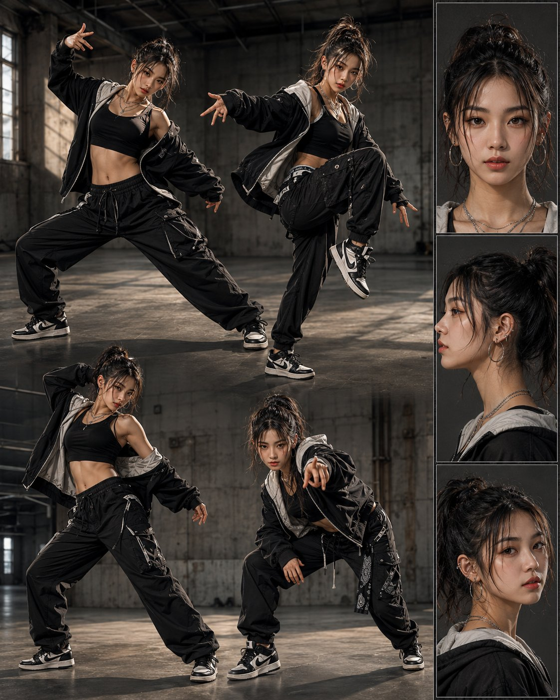
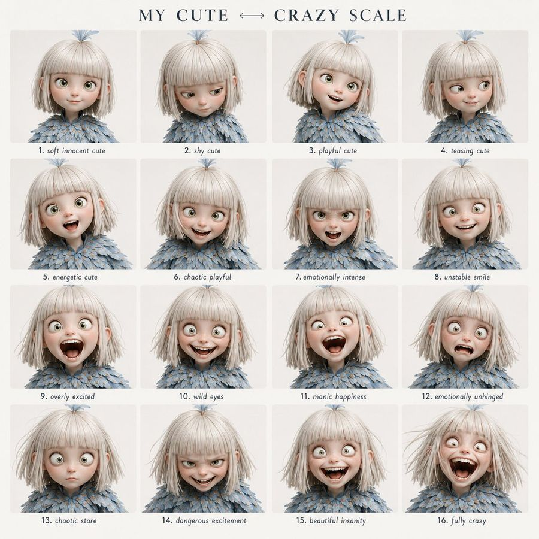
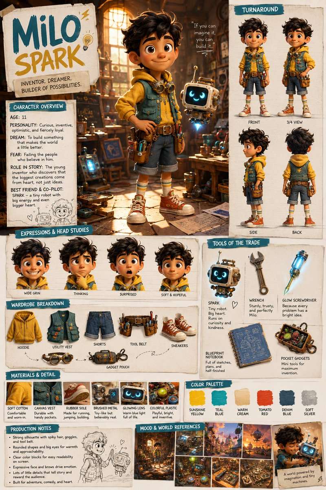
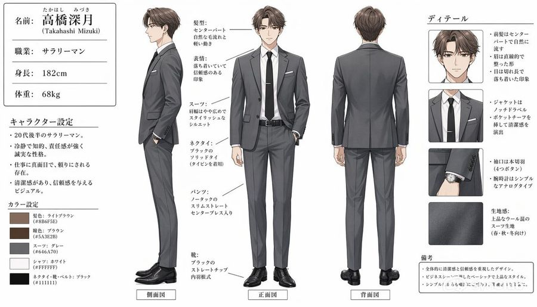
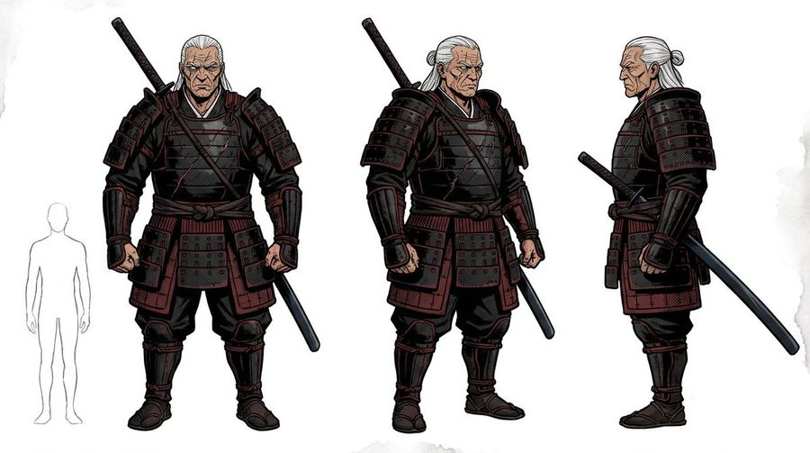
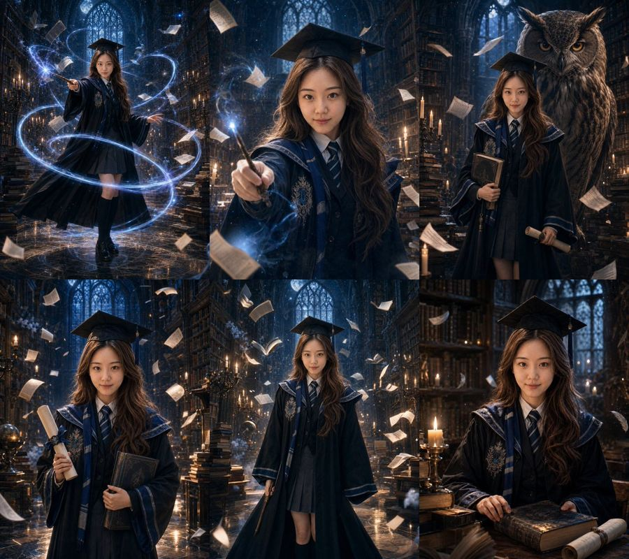
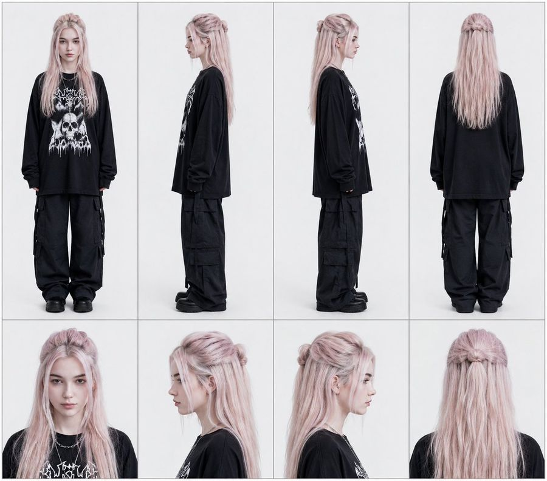
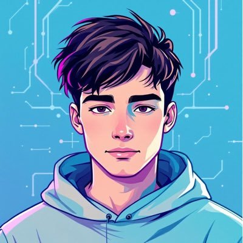

# 🧍 角色设计

[返回分类](categories.md) · [查看全部案例](cases-001-100.md) · [返回首页](../README.md)


三视图、多姿态展示、表情包、人设分解图、角色进化/等级图、角色关系图等。

---

## 🧍 例 20：角色设定资料卡


**Prompt:**

```text
[中文]
基于此角色和背景，请制作一份类似官方设定资料的角色资料卡。
・包含三视图：正面、侧面和背面
・添加角色面部表情的变化・分解并展示服装和装备的详细部分
・添加色板・包含世界观设定的简要说明
・总体上，使用有组织的布局（白色背景，插画风格）

[English]
Based on this character and background, please create a character reference sheet similar to official setting materials.
・Includes three-view drawings: front view, side view, and back view
・Add variations of the character's facial expressions
・Break down and display detailed parts of the clothing and equipment
・Add a color palette
・Include a brief explanation of the worldview setting
・Overall, use an organized layout (white background, illustration style)
```

**来源：** [@MANISH1027512](https://x.com/MANISH1027512/status/2045013913901867334) | 2026-05-11


---

## 🧍 例 23：真人风格化的3D卡通肖像


**Prompt:**

```text
[中文]
一个风格化的3D卡通肖像，一位年轻男子，拥有短棕发和富有表现力的绿色眼睛，温暖地微笑。他穿着黑色西装外套内搭白色T恤，现代休闲时尚。类似皮克斯/迪士尼风格角色设计，皮肤光滑，柔和光照，略微夸张的面部特征。高细节、精美的3D渲染，友好且平易近人的表情。渐变背景为柔和的蓝绿色和粉色，工作室灯光，浅景深，高分辨率。

[English]
A stylized 3D cartoon portrait of a young man with short brown hair and expressive green eyes, smiling warmly. He is wearing a black blazer over a white t-shirt, modern casual fashion. Pixar-like / Disney-style character design with smooth skin, soft lighting, and slightly exaggerated facial features. High detail, polished 3D render, friendly and approachable expression. Gradient background with soft teal and pink colors, studio lighting, shallow depth of field, high resolution.
```

**来源：** [@iamsofiaijaz](https://x.com/iamsofiaijaz/status/2013473309485343120) | 2026-05-11

## 🧍 例 26：街舞角色设定参考图



**Prompt:**

```text
角色设定图布局，聚焦于一位18岁的亚裔女性街舞舞者。包含4个大型、高细节度的全身动态舞姿（突出舞蹈动作，面部清晰）。侧边附一条清晰的多角度参考条，仅含3个精细头部特写（正面、侧面、3/4侧面）。最大限度减少文字元素，将像素空间优先用于面部细节刻画。背景为粗砺工业风，搭配写实光影效果
```

**来源：** [@ChangningL29508](https://x.com/ChangningL29508/status/2052229452080591276) | 2026-05-13

## 🧍 例 48：角色情绪表现网格



**Prompt:**

```text
使用提供的角色作为固定身份参考，创建一个清晰的 4x4 情绪表现网格。

视觉风格：
简洁的现代平面设计布局。顶部配有优雅的衬线字体标题，柔和的米白色背景，间距均匀，每个面板下方居中显示易于阅读的小号手写风格标签。

标题文本：
“{argument name="grid title" default="我的可爱 ↔ 疯狂量表"}”

在所有 16 个面板中严格保持面部特征的一致性。

遵循从左上角到右下角的精确情绪演变顺序。
请勿随机化表情或强度。

网格顺序：

第 1 行：
1. 温柔无辜的可爱
2. 害羞的可爱
3. 俏皮的可爱
4. 戏谑的可爱

第 2 行：
5. 充满活力的可爱
6. 混乱的俏皮
7. 情绪强烈
8. 不稳定的微笑

第 3 行：
9. 过度兴奋
10. 狂野的眼神
11. 狂躁的快乐
12. 情绪失控

第 4 行：
13. 混乱的凝视
14. 危险的兴奋
15. 美丽的疯狂
16. 完全疯狂

格式：
4x4 网格，{argument name="style" default="电影肖像摄影"} 风格，中性背景，紧凑的特写构图，浅景深，无水印。
```

**来源：** [@aimikoda](https://x.com/aimikoda/status/2055036470583263712) | 2026-05-15


---

## 🧍 例 51：电影级角色设计提案项目



**Prompt:**

```text
创建一个单页电影级角色设计项目，用于展示原创虚构角色“{argument name=\"character name\" default=\"[CHARACTER NAME]\"}”。风格：高端电影前期制作提案项目、照片级真实感电影概念艺术、专业视觉开发演示、高端艺术部门美学。构图：避免通用的网格、对称布局或刻板的模板化格式。页面应呈现出专业导演提案项目的质感，而非标准的角色设定表。采用非对称、电影化、故事驱动的构图，运用多变的面板尺寸、有机间距、选择性重叠、分层分组以及精心策划的编辑节奏。让整个项目看起来经过精心设计、意图明确且视觉动态十足——就像由导演、美术指导或概念艺术家创作的真实电影提案页面。角色：{argument name=\"character description\" default=\"[请输入角色身份、世界观、年龄、角色定位、性格、服装、材质、氛围和背景。]\"} 包含：- 一个作为情感焦点的核心英雄肖像 - 辅助性的全身转向视图 - 富有表现力的头部角度研究 - 服装或戏服拆解 - 材质和纹理细节标注 - 角色概览文本 - 简短的制作说明 - 色板 - 氛围参考或环境片段。设计语言：使用易读的英文标题、简洁的标签、细分割线、偶尔出现的标注箭头或手写笔记，以及精致的电影化演示风格。不要强行将每个部分放入等大的矩形中。保持布局流畅、高端且视觉上经过精心编排。质量：高度细节化、照片级真实感、电影级光影、所有面板中角色特征保持一致、逼真的服装材质、可信的文本结构，无 Logo，无水印，无名人肖像。
```

**来源：** [@gpt_image_2](https://x.com/gpt_image_2/status/2054938829304602865) | 2026-05-15


---

## 🧍 例 55：日本上班族角色设定图



**Prompt:**

```text
目标：创作一份简洁的动漫风格男性角色设计图，展示一位现代日本上班族，所有肖像中的面部均需用柔和的方形模糊效果遮挡。

画布：宽幅横向角色参考图，白色背景，比例约为 16:9。使用细黑色分割线，整洁的日式编辑排版，以及柔和的专业配色。

布局：左侧放置信息栏，中间放置三个全身角色视图，右侧放置细节栏。整体外观应类似于精致的商业角色设定文档。

左侧信息栏：顶部绘制一张带边框的个人资料卡，包含 4 行标注：姓名、职业、身高和体重。使用日语文本作为可见标签和数值：「名前: {argument name="character name" default="高桥深月"}」（姓名上方标注小型假名，下方标注“(Takahashi Mizuki)”）、「职业: サラリーマン」、「身高: 182cm」、「体重: 68kg」。下方添加标题为「キャラクター设定」的部分，包含 4 个要点，描述他是一位二十多岁的上班族，性格冷静睿智，责任感强，在工作中严谨且受人信赖，外表整洁，给人值得信赖的印象。底部添加标题为「カラー设定」的部分，包含 5 个色卡：发色浅棕 #8B6F5E、眼色棕色 #5A3E2B、西装灰色 #646A70、衬衫白色 #FFFFFF、领带/鞋/皮带黑色 #111111。

中间角色视图：展示 3 个身穿合身灰色商务西装的同一男性的全身视图：左侧视图标注「侧面図」、中间正面视图标注「正面図」、右侧背面视图标注「背面図」。该男子高挑纤瘦，留着浅棕色中分发型，穿着白色衬衫、黑色窄领带配领带夹、灰色平驳领西装外套、配套的修身直筒西裤（带中折线）、黑色皮带、黑色正装皮鞋，并佩戴简单的模拟指针手表。侧面视图中，一只手插在口袋里，姿态挺拔放松。正面视图中，一只手插在口袋里，另一只手自然垂下。背面视图展示西装外套的接缝和利落的锥形轮廓。

中间标注说明：添加细引线和日语标签，指向服装和特征。包括发型、表情、西装、领带、裤子和鞋子的标注。发型说明应描述为中分且自然流动的发丝；表情说明应描述为冷静且略带微笑的值得信赖的印象；西装说明应描述为利落的合身轮廓；领带说明应描述为带领带夹的黑色纯色领带；裤子说明应描述为带中折线的修身直筒西裤；鞋子说明应描述为黑色直头正装皮鞋。

右侧细节栏：标题为「ディテール」。垂直堆叠 4 个矩形细节面板：1) 面部模糊的头部和头发特写，2) 展示翻领、衬衫、领带、领带夹和口袋巾的胸部特写，3) 袖口和简单模拟指针手表的特写，4) 面料纹理色卡。在这些面板旁添加日语要点说明：刘海中分且自然流动，头发质感整洁顺直，眼神冷静沉稳，外套采用平驳领并配有口袋巾，袖口有四颗真扣，手表为简单的模拟指针式，面料为适合春秋冬三季的高品质羊毛混纺西装材质。

右下角备注：添加一个带边框的小方框，标题为「備考」，包含 3 个要点，强调整洁感与信赖感、基础精致的商务西装风格，以及简约而考究的设计。

视觉风格：半写实动漫插画，干净的线条，柔和的赛璐璐阴影，写实的西装褶皱，优雅柔和的色调，杂志风格的日式角色设定图，清晰易读的排版，无装饰背景，无水印。
```

**来源：** [@N7S6P1](https://x.com/N7S6P1/status/2054915683998474518#reversed-0) | 2026-05-15


---
### 🧍 例 64：赛博黑客角色设定表


**Prompt:**

```text
Ultra-detailed cyberpunk anime character design sheet of a teenage genius hacker girl named “NEO // RIN”, full body turnaround (front, side, back) plus close-up portrait and accessory callouts. Short silver-white bob haircut with neon cyan and magenta gradient streaks, glowing translucent cyber visor over one eye, pale skin, sharp violet eyes, calm confident expression. Oversized techwear jacket with black tactical cargo pants, belts, straps, dangling utility tags, cropped top, futuristic sneakers, holographic accessories, barcode decals, warning symbols, “BYTE//NULL” typography, hacker aesthetic.
Color palette: matte black, dark gray, white, neon cyan, neon pink.
Style inspired by high-end Japanese concept art, futuristic streetwear, cyberpunk fashion, Akira + Ghost in the Shell + modern anime key visual aesthetics.
Include clean character reference sheet layout with labeled details, logo designs, UI graphics, gadget closeups, and color palette on white background.
Highly polished cel shading, crisp lineart, soft glow effects, intricate clothing folds, layered accessories, dynamic fashion silhouette, professional game concept art quality, 4k, ultra detailed.
```

**来源：** [@status](https://x.com/Kashberg_0/status/2055865126335762902) | 2026-05-17

---

### 🧍 例 68：武士铠甲三视图设计图



**Prompt:**

```text
目标：为一名全副武装的武士创建一个简洁的奇幻角色概念设计图，适用于游戏或电影的前期制作。

画布：宽幅水平白色摄影棚背景，比例约为 16:9，边缘带有淡淡的灰色水彩纹理，无环境背景。使用清晰的漫画风格概念艺术线条、细腻的墨线勾勒、微妙的赛璐珞阴影、柔和的色彩以及高对比度的铠甲高光。

布局：从左到右精确排列 4 个独立的全身形象：最左侧为 1 个小型浅灰色人物比例剪影，接着是 1 个大型正面视角武士、1 个略微向右侧转的 3/4 视角武士，以及 1 个大型右侧面轮廓武士。保持这 3 个武士视角均匀分布，并像三视图一样在脚部对齐。

主体细节：该角色为一名身材高大、宽阔、肌肉发达的年长男性武士，留着 {argument name="hair color" default="长白发"}，发际线清晰并扎成马尾，每个武士视角的面部均带有 {argument name="face treatment" default="模糊的矩形面部遮挡"}。他身着深色层叠武士铠甲，配色为 {argument name="armor colors" default="黑色漆面搭配深酒红色甲片和系带"}：包括大型分段肩甲、板甲胸甲、层叠腰裙甲、前臂护腕、胫甲、绑腿裤、分趾鞋和系腰带。铠甲厚重、陈旧且实用，带有许多矩形层状甲片、铆钉、绑带、红色系绳和黑色内衬。

武器及数量要求：包含 3 个武士姿势和 1 个比例剪影。整张图纸中包含 4 个可见的剑类元素：正面视角武士左肩后方斜向上露出的一把收鞘武士刀或剑柄、正面视角武士右侧下方持有一把短深色剑鞘或剑、3/4 视角武士左肩后方斜向上露出的一把收鞘武士刀柄，以及右侧面轮廓武士腰间拔出并向后斜伸的弯曲武士刀。请勿添加额外武器。

姿势细节：正面视角武士强有力地站立，双拳紧握，双脚分开，双肩平齐。3/4 视角武士单拳紧握，另一只手靠近下垂的剑鞘，头部略微转动。侧面轮廓武士直立看向左侧，展示肩甲、腰甲、马尾和腰间佩剑的层叠侧面轮廓。

风格限制：保持背景为纯白色，无标题文字、无标签、无 Logo、无水印。使用写实的漫画概念艺术风格，而非 Q 版动漫风格。铠甲细节需精细且清晰可辨，采用深红黑色调，与白发形成对比，并保持清晰的全身轮廓。
```

**来源：** [@status](https://x.com/fawzxbt/status/2055714939138920592#reversed-0) | 2026-05-17

---

### 🧍 例 69：魔法学院毕业肖像系统



**Prompt:**

```text
请基于用户上传的 1-3 张清晰个人照片，一次性生成 **9 张不同的单独精修毕业写真照片**，统一为 **{argument name="构图比例" default="3:4 竖构图"}**。  
主题为：

**「{argument name="写真主题" default="英伦魔法学院毕业写真"}」**

---

## 一、人物一致性

请严格保留用户本人真实身份特征，包括但不限于：

- 脸型
- 五官比例
- 眼睛形状
- 鼻子形状
- 嘴唇形状
- 肤色
- 年龄感
- 发型基础
- 体型
- 整体气质

9 张图里都必须清楚看起来是 **同一个真实女生**。  
不能变成陌生人，不能欧美化，不能网红化，不能过度磨皮，不能出现 AI 假脸。

请只把上传照片作为 **人物身份参考**，不要保留原照片中的现实背景、日常服装和原始构图。  
请重新生成一整组全新的 **英伦魔法学院毕业写真**。

---

## 二、整体定位

这组图的重点不是现实写真，而是：

**“英伦魔法学院毕业主题 + 超现实 AI 魔法场景 + 电影海报级视觉冲击。”**

整组图要像：

- 一套高概念魔法学院电影宣传海报
- 明显充满 AI 奇观视觉
- 具有夸张空间、宏大叙事、强烈魔法氛围
- 既保留毕业身份，又保留人物精修写真感

整体关键词：

- 英伦
- 学院
- 毕业
- 魔法
- 电影海报感
- 漂浮书页
- 飞书
- 巨型猫头鹰
- 星空穹顶
- 魔法光轨
- 哥特图书馆
- 神秘烛光
- 超现实空间
- 高级感
- 强叙事感

---

## 三、服装要求

服装请采用 **“学院毕业袍 + 魔法元素”** 的逻辑。

要求：

- 保留毕业袍 / 学位袍轮廓
- 保留学院帽 / 学位帽体系
- 加入学院围巾、学院徽章、学院纹章、边饰、领带、刺绣细节
- 内搭可使用白衬衫、领带、针织背心、百褶裙、学院长裙
- 整体像“魔法学院优秀毕业生”的纪念写真造型
- 服装统一、完整、有电影质感
- 不要做成舞台戏服
- 不要廉价 cosplay 感

---

## 四、场景与超现实奇观要求

9 张图要围绕魔法学院世界观展开，且明显比普通写真更夸张、更梦幻、更像 AI 视觉大片。

高优先级视觉元素：

- 高耸书架
- 哥特式图书馆
- 魔法书山
- 漂浮书页
- 飞书
- 巨型猫头鹰
- 烛光大厅
- 发光卷轴
- 星空穹顶
- 深蓝宇宙感天幕
- 发光魔法线条
- 环绕人物的咒语光轨
- 蓝白色魔法粒子
- 逆光烟雾
- 巨大古书封面
- 仪式感学院证书
- 光束穿过拱窗
- 大型魔法生物守护感构图

整体要像：  
**AI 才能做出的魔法学院电影海报奇观场景。**

---

## 五、光线与画质要求

光线要求：

- 冷蓝月光 / 星空光
- 暖金烛光
- 局部逆光
- 魔法发光粒子
- 氛围烟雾
- 明暗层次丰富
- 人物脸部清晰
- 面部和手部细节清楚
- 电影级光影

画质要求：

- 真实摄影质感
- 高精细
- 高级感
- 电影感
- 不要普通影楼感
- 不要平淡背景
- 不要塑料皮肤
- 不要脏乱廉价 CG 感

---

## 六、9张单独照片固定分配

请一次性输出以下 **9 张不同的单独精修照片**：

### 第1张｜主视觉海报图
- 全身或 3/4 身
- 人物站在高耸魔法图书馆中央
- 周围漂浮大量书页
- 手持魔杖或毕业卷轴
- 电影海报主视觉感极强

### 第2张｜施法近景图
- 半身近景
- 人物手持魔杖
- 书页从镜头前后飞过
- 背景有发光星空穹顶或魔法天幕
- 强调面部、手部和咒语感

### 第3张｜巨型猫头鹰守护图
- 中景或全身
- 背后或一侧出现巨大猫头鹰
- 人物抱书、拿卷轴或轻抬手施法
- 有明显守护与陪伴的叙事感

### 第4张｜环绕光轨施法图
- 全身
- 人物站立施法
- 周围出现盘旋的发光魔法环
- 空中悬浮书页
- 气氛更强、更戏剧化

### 第5张｜星空图书馆沉思图
- 半身或中近景
- 人物置身哥特式图书馆
- 背景是深蓝星空、烛光、发光书页
- 手持古书或魔法卷轴
- 表情安静、聪明、神秘

### 第6张｜书山与飞书图
- 中景
- 人物站在堆叠书山之间
- 头顶和四周飞书盘旋
- 构图夸张，空间尺度大
- 有明显超现实奇观效果

### 第7张｜毕业身份强化图
- 3/4 身
- 人物明确展示毕业袍、学院围巾、学院徽章、帽子体系
- 手持毕业证书或学院卷轴
- 背景为学院大厅 / 烛光礼堂 / 书架

### 第8张｜低机位英雄感海报图
- 全身或中景
- 低机位仰拍
- 人物站姿更有气场
- 书页、光效、粒子从人物周围向上延伸
- 像毕业后的最终主角海报

### 第9张｜情绪收束图
- 半身近景
- 人物在安静神秘的图书馆角落或拱窗前
- 可有烛光、羽毛、发光尘埃、轻微漂浮书页
- 一手轻扶古书或围巾
- 作为整组中最有情绪和故事感的一张

---

## 七、统一要求

9 张图必须统一：

- 同一个真实人脸
- 同一套英伦魔法学院毕业造型体系
- 同一学院配色体系
- 同一世界观体系
- 同一电影海报级氛围
- 同一超现实魔法奇观风格

9 张图必须有明显变化：

- 镜头远近
- 视角高低
- 动作
- 表情
- 道具互动
- 魔法奇观重点
- 构图方式

---

## 八、明确避免

- 不要平淡写真
- 不要低成本 cosplay 感
- 不要现代校园日常风
- 不要廉价影楼魔法风
- 不要背景堆砌得杂乱无主次
- 不要人物变脸
- 不要欧美化
- 不要网红脸
- 不要过度磨皮
- 不要 AI 假脸
- 不要错误手指
- 不要错误肢体结构
```

**来源：** [@status](https://x.com/zhongying14/status/2055706299543757240) | 2026-05-17

---
### 🧍 例 87：Deep Sea Jellyfish Couture Board


**Prompt:**

```text
Goal: Create a high-fashion menswear concept board inspired by {argument name="inspiration source" default="deep sea jellyfish"}, combining a central couture runway look with fashion design research panels, technical tailoring sketches, material tests, color studies, and handwritten atelier annotations.

Canvas: Portrait-oriented editorial fashion board on warm off-white archival paper, approximately 4:5 ratio, with faint grid marks, thin drafting lines, crop marks, pin-registration marks, subtle paper grain, and a luxury atelier mood. Use black, deep navy, icy cyan, translucent blue, silver, and white.

Main subject: Place one full-body male model centered and slightly forward, wearing {argument name="collection look name" default="Look 07 - Abyssalis"}. The face should be softly blurred or obscured, while the outfit remains sharp. The garment is futuristic couture menswear: a glossy black structured long coat or suit base with a high stand collar, layered liquid-black tailoring, wide sculptural shoulders, transparent jellyfish-like cape panels, flowing organza veils, fine dangling filament strands, reflective wet-look surfaces, and scattered bioluminescent cyan-blue bead lights. The silhouette should feel like a deep-sea creature translated into formal tailoring, with long translucent tentacle ribbons trailing from shoulders, sleeves, and hem to the floor. Add black boots visible beneath the layered coat.

Left research column: Include exactly 8 stacked research sections with small labels and visual materials:
1. Header reading “INSPIRATION : DEEP SEA JELLYFISH” with subheading “BIOLUMINESCENT STRUCTURE.”
2. “ANATOMI STUDY” section with exactly 2 jellyfish anatomy sketches, one blue-toned and one monochrome line sketch, plus small handwritten notes about a transparent bell, gelatinous structure, and radial symmetry.
3. “TENTACLE DYNAMICS” section with exactly 1 side-view jellyfish drawing showing long streaming tentacles, annotated with fluid motion, graceful undulation, and movement.
4. “BIOLUMINESCENCE ANALYSIS” section with exactly 2 glowing jellyfish reference images and exactly 5 vertical color bars beside them, from black and deep navy through teal to pale icy blue.
5. “MATERIAL EXPERIMENTS” section with exactly 3 square translucent material samples, annotated as fine membrane, iridescent organza, sheer tulle, liquid satin, and fiber optic thread.
6. “COLOR PALETTE” section with exactly 7 rectangular swatches: black, midnight navy, dark blue, teal, cyan, pale blue, and nearly white translucent blue, annotated as deep sea, ice blue, bioluminescent, and pearl white.
7. “FABRIC SWATCHES & TESTS” section with exactly 5 overlapping physical swatches in black vinyl/satin and translucent blue organza, some with glowing blue thread or bead-like highlights.
8. “LIGHT REACTION TEST” section with exactly 1 small dark photo panel showing bright blue fiber-optic streaks, plus a note about reaction, bioluminescent thread, subtle glow, and in darkness. At the bottom include atelier notes reading “ATELIER NOTES,” “PROJECT : ABYSSALIS,” “LOOK : 07,” “SEASON : SS27,” and “DEVELOPMENT STAGE : 4,” followed by a designer signature line.

Right technical column: Include exactly 6 design-development sections:
1. Top heading “TECHNICAL TAILORING SKETCH” with subheading “LOOK 07 - ABYSSALIS,” showing exactly 2 tall technical fashion sketches, front and back views, of the same long translucent layered coat.
2. A bullet-note block with exactly 5 bullets: bioluminescent tailoring; transparent marine layering; liquid silhouette engineering; floating organza extension; deep-sea inspired main couture; fluid structural movement.
3. A construction-detail area with exactly 4 smaller line drawings: structured inner coat with enlarged organic hood; transparent layered cape with floating silhouette; tentacle extensions as sheer organza; flowing wide-leg pants with liquid cut lines.
4. “EMBELLISHMENT MAP” section with exactly 1 front torso sketch covered in blue dot placements and exactly 3 legend dots labeled high density, medium density, and low density; add a note for fiber optic embroidery placement.
5. “DETAIL & TEXTURE CLOSE-UP” section with exactly 3 rectangular close-up images showing black glossy fabric with blue glowing bead lines, transparent crinkled organza, and watery translucent blue membrane texture.
6. Sparse handwritten annotations around the sketches, using elegant thin cursive, while keeping the text secondary and not overcrowded.

Visual style: Photorealistic central model blended with delicate pencil fashion sketches, scientific specimen diagrams, luxury couture board presentation, translucent layering, iridescent highlights, cyan bioluminescent specks, black liquid satin, and fine technical drafting aesthetics. The board should feel like an elite fashion house concept sheet for futuristic couture menswear, directly inspired by deep-sea jellyfish anatomy.

Text constraints: Use the visible English headings and atelier labels as described. Keep typography small, refined, and editorial; mix uppercase serif labels with handwritten cursive notes. Do not add logos, watermarks, extra models, or unrelated sea creatures. The final image should read as one complete fashion concept board for {argument name="garment theme" default="bioluminescent jellyfish couture menswear"}.
```

**来源：** [@status](https://x.com/ai_with_shah/status/2056772639738191973#reversed-0) | 2026-05-19

---
### 🧍 例 91：Lian Zhi 暗黑奇幻角色设计图


**Prompt:**

```text
目标：为 {argument name="character name" default="LIAN ZHI"} 创建一张精致的电影级角色设计图，她是一位优雅的东亚暗黑奇幻风格女性先锋战略家兼信号指挥官，代号为 {argument name="alias" default="The Silent Bloom"}。

画布：宽幅横向概念艺术项目，米白色纸张背景，整洁的博物馆目录式排版，呈现高端游戏角色艺术效果。使用精致的衬线字体、微小的红色印章、稀疏的注释文字以及淡雅的水墨美学。

主体：画面中央为全身英雄姿态，一位高挑从容的女性，身着华丽的黑色漆面盔甲，内搭多层长袍。服装配色为黑丝绸、深牛血红、青铜金、莲藕灰和珍珠白。她梳着高耸精致的发髻，配有发簪、垂饰、红丝带和散落的发丝。面部应略微模糊或去个性化。她一手持展开的折叠战扇，另一手斜持一把纤细的长剑。服装包括肩甲、修身胸衣、多层腰带与流苏、不对称裙摆、花卉水墨面料、黑色高跟靴以及细微的战损金属细节。

左侧信息栏：左上角为大号标题文字“{argument name="character name" default="LIAN ZHI"}”及一枚红色小印章。下方包含清晰的角色说明文字：“Alias: {argument name="alias" default="The Silent Bloom"}”、“Role: 先锋 • 战略家 • 信号指挥官”、“Core Theme”、“优雅指挥。精准无声。她的战斗如诗一般——从容、致命且令人难忘。”随后是一个“Personality”列表，包含 4 个要点：冷静且善于观察；言语极少，洞察一切；极其忠诚，难以建立信任；坚信通过清晰而非武力来掌控局势。接着是“Signature”部分，描述那把战扇，它既是可折叠的信号扇，也藏有暗刃和她母亲留下的最后讯息。左下角添加竖排中文书法，并配以水墨莲花插图。

布局与数量要求：包含 1 张大型全身英雄插图。在上方中部包含 3 张较小的全身多角度视图，分别标注“+ FRONT”、“BACK”和“PROFILE”。在右上角“+ EXPRESSIONS”下方包含 6 张头部及肩部表情肖像，排列为两行三列，每张肖像面部均保持模糊/去个性化，且角度或情绪各异。在下方中部包含 4 张矩形细节特写，标注“+ DETAILS”：胸甲与领口、带有饰品和红绳的腰带、花卉长袍面料、以及带盔甲的高跟靴。在右下角包含 1 个标志性道具展示，标注“+ SIGNATURE PROP”：带有红流苏和隐藏刀刃的黑金折叠战扇。在左下角包含 5 个黑色剪影缩略图，标注“+ SILHOUETTE STUDY”，展示不同的斗篷与折扇姿态。在底部包含 6 个色块，标注“COLOR PALETTE”：水墨黑、花卉红、青铜金、莲藕灰、珍珠白和暖米白。

视觉风格：高细节 AAA 游戏概念艺术，时尚服装设计图，写实绘画渲染，精致的水墨花卉图案，古青铜饰品，红绳，细腻的织物半透明感，精准的线条，柔和的摄影棚灯光，中性阴影，平衡的留白，优雅的编辑排版。

约束：将整张图保持为一个连贯的角色设计图，而非独立的海报。无现代 UI 元素，无水印，无写实面部特征，无额外角色，除指定数量外不添加额外面板。清晰保留字体层级和标签，同时确保小字描述文字雅致且作为次要内容。
```

**来源：** [@status](https://x.com/aimikoda/status/2057083545168773493#reversed-0) | 2026-05-20

---

### 🧍 例 98：专业角色参考图布局



**Prompt:**

```text
创建上传图像的专业角色参考表。排列成{argument name="列数" default="四个"}垂直列，每列代表一个观看角度。每列包含上方的全身视图和下方匹配的特写肖像。列（左→右）：第1列：正面视图（上方全身，下方正面肖像）；第2列：左侧面（全身左侧朝向）下方为左侧肖像；第3列：右侧面（全身右侧朝向）下方为右侧肖像；第4列：背面视图，下方为匹配肖像。保持角色肖像周围均匀的间距和框架。清晰轮廓、一致对齐和干净的分板分离。无文字。细边框。平面光线
```

**来源：** [@status](https://x.com/wanerfu/status/2057630783943361010) | 2026-05-20

---
### 🧍 例 115：Fantasy Tide Priestess Character Sheet


**Prompt:**

```text
Goal: Create a single-page fantasy character sheet for {argument name="character name" default="Sera Vayne"}, a tide-priestess warrior with a ceremonial war glaive, elegant coastal mysticism, and high-detail concept art presentation.

Canvas: Wide landscape character design board, approximately 16:9, warm off-white parchment background with thin grey panel borders, painterly ink-and-watercolor fantasy concept art, refined but slightly weathered. Use a mostly neutral cream, deep blue-black, pale ivory, seafoam teal, warm tan, and bright bioluminescent blue palette.

Main hero pose: On the left third, show a full-body heroic standing pose of a barefoot adult woman with tanned skin, athletic slender build, long wild black wavy hair tied loosely back, layered necklaces, shell and bead ornaments, dangling earrings, and a calm ritual-warrior presence. She wears a pale translucent salt-white halter wrap dress with a high slit, a seafoam waist sash, wrapped forearm bandages, anklets, and a flowing tattered deep blue-black cloak that looks like wet tide fabric. She holds a tall ornate ceremonial glaive upright beside her; the blade is jagged, elegant, dark metal with glowing blue edges and carved wave-like ornament. Add subtle water-splash stains and ink textures around her hem.

Left title column: Add four large vertical Chinese characters down the far left with small English translations beside them: tide, silence, blade, body, return. Include a small red seal stamp beneath. At the bottom left, write the large brush-lettered name {argument name="character name" default="Sera Vayne"}, subtitle {argument name="subtitle" default="The Rite Before the Tide"}, and three small lore lines: ROLE: War Priestess · Tide Reader · Last of the Coastal Order; CORE THEME: The sea does not rage — it arrives. She moves the same way. Patient, total, final.; WEAPON: Tidecaller — ceremonial war glaive. The blade glows because the tide chose her.

Orthographic views: In the upper middle column, include exactly 3 labeled views: 1 FRONT full-body view with the glaive standing beside her, 2 BACK full-body view showing the cloak and hair from behind, 3 PROFILE side view showing her carrying the weapon. Use small star-like label markers and uppercase labels FRONT, BACK, PROFILE.

Expression sheet: In the upper right, create a boxed section titled EXPRESSIONS containing exactly 6 head-and-shoulder portraits in a 3-by-2 grid. Labels must be: 1 Ceremonial neutral, 2 Focused pre-strike, 3 Profile left, 4 Post-release, 5 Looking down, 6 3/4 right. Keep facial features consistent, hair loose and wet-textured, jewelry visible, and the same costume neckline.

Costume detail insets: In the center-right, create a boxed DETAILS section with exactly 4 vertical close-up panels labeled: 1 Waist & hip, 2 Neckline & collarbone, 3 Leg & hem, 4 Forearm & hand. Show fabric layering, shells, beads, sash knots, translucent cloth, tattered cloak edges, barefoot ankle jewelry, and wrapped forearm details.

Signature prop breakdown: On the right side, create a SIGNATURE PROP section showing the glaive diagonally from lower left to upper right, with callout arrows and labels for exactly 6 parts: blade, glow edge, engraving, grip wrap, shaft, butt cap. Add a small zoom-in box of the blade tip emphasizing carved metal and blue luminous edge.

Silhouette study row: Along the bottom center, include exactly 6 black silhouette thumbnails labeled: 1 Neutral standing, 2 Low sweep prep, 3 Overhead raise, 4 Aerial extension, 5 Kneeling finish, 6 Horizon facing. Make the silhouettes readable, dynamic, and varied, always including the long glaive and flowing cloak.

Color palette: On the lower right, include a COLOR PALETTE box with exactly 6 circular swatches and labels: 1 Deep Ocean Blue-Black — Ocean blue-black: ritual authority, depth, command; 2 Pale Salt White — Salt white: endurance, tide foam, worn grace; 3 Seafoam Teal with Gold — Seafoam teal: water connection, ceremonial rank; 4 Warm Tan — Warm Tan: grounded physicality, natural strength; 5 Bioluminescent Blue — Bioluminescent blue: the tide’s mark, living power; 6 muted shell-gold accent for ornaments and ceremonial details.

Style constraints: Make it look like a professional AAA fantasy character design sheet, painterly semi-realistic illustration, crisp section labels, thin panel lines, no extra characters, no modern objects, no UI mockup elements, no photorealistic studio lighting, no clutter beyond the specified sections.
```

**来源：** [@status](https://x.com/CoderJunkie/status/2058205773969457526#reversed-0) | 2026-05-22

---
### 🧍 例 124：Vintage Drama Character Board


**Prompt:**

```text
Create a cinematic character design board for a {argument name="theme" default="vintage-inspired drama film"}.

A classic {argument name="subject" default="handsome male lead with slightly tousled beard and retro charisma"} wearing {argument name="outfit" default="wide-lapel tailored suits with subtle patterns"}.
Include film grain portraits, analog lighting studies, smoke-filled studio shots, and motion blur retro fashion poses.
Mood: faded film tones, warm oranges, sepia greens, nostalgic cinematic grain aesthetic.
```

**来源：** [@Mind_Boticni](https://x.com/Mind_Boticni/status/2058920909352964301) | 2026-05-26

---

### 🧍 例 130：Professional Anime Character Line Art Sheet


**Prompt:**

```text
Use the reference image as the base for the character design and depict "professional-grade character line art setting materials used in commercial anime production sites."

Accurately maintain the character's face, hairstyle, hair color, eyes, contour, body type, silhouette, costume design, head-to-body ratio, and overall impression.

Absolutely do not break the character's identity. Do not redraw as a different character.

It is not a completed illustration. It is not concept art. It is not a poster.

The purpose is setting materials for drawing sharing intended for animators, animation directors, and in-betweeners.

The screen is a setting material layout on a white background. Arrange multiple line drawings organized as a material page.

Include the following:
- Front face
- Three-quarter face
- Profile face
- Expression variations
- Close-up of eyes
- Hair flow check
- Full body front
- Full body back
- Arm and hand shape check
- Costume details
- Shoe design
- Accessory structure

Depict the character only with clean anime line art.
Do not color. Do not use flat fills. Do not use thick painting. Do not render.

The lines should be thin, organized pencil line drawings or cleanup lines like those at Japanese TV anime production sites.
Not too rough. Do not use manga lines. Do not overdo the sketch feel.

Prioritize readability and structural understanding as setting materials for the production site.

Naturally add small handwritten notes, arrows, part instructions, simple annotations, costume structure notes, hair flow instructions, etc., within the page.

The layout has an atmosphere like Japanese anime setting material collections from the 1990s to 2000s.
Information density is high, but it is organized and easy to read. Allow natural margins as a page.

The entire page has the atmosphere of an actual scanned setting material collection. Naturally add minor paper texture, a slight print feel, copy paper feel, and scan feel.

Prioritize looking like "actual production materials" rather than a completed work of art.
```

**来源：** [@Eris_Create_Lab](https://x.com/Eris_Create_Lab/status/2058807276828565803) | 2026-05-26

---


### 🧍 例 161：皮克斯风格角色设计图



**Prompt:**

```text
Create a Pixar 3D style character design sheet. Clean white background. Two characters side by side with a clean dividing line. Bold brushstroke-style title at the top: NEIL vs THE DELIVERY. Subtitle beneath: He was home all day. All day.

LEFT
```

**来源：** [@TechieSA](https://x.com/TechieBySA/status/2060045388262920644) | 2026-05-29

---
### 🧍 例 176：Earth Signs 角色 Scrapbook


**Prompt:**

```text
CREATE A NEW IMAGE USING THE PROVIDED FEMALE SUBJECT AS THE ONLY REFERENCE. Preserve her exact facial features, identity, and characteristics with zero alteration.

MAIN SUBJECT — EARTH ELEMENT
She represents the Earth element as a whole: grounded, elegant, sensual, calm, stable, patient, quietly powerful, and naturally luxurious. Relaxed grounded posture, standing or seated, soft natural hand placement, composed feminine body language, rooted presence.

OUTFIT
Single cohesive Earth-inspired editorial look in olive, sage, taupe, mocha, beige, clay, cream, moss, and warm neutrals. Soft-structured elegant silhouette with subtle tailoring, draping, texture contrast, or layered structure. Fabrics: linen, cotton, matte satin, knit, suede-like textures, soft tailoring. Minimal refined gold or natural-toned accessories.

HAIR
Soft ash brown with natural dimension. Healthy, polished, softly voluminous waves or smooth blowout with subtle shine, controlled texture, face-framing strands, grounded and luxurious feel.

MAKEUP
Korean soft-glow base with earthy tones. Warm beige-rose, terracotta, tawny, or nude peach blush. Eyes in taupe, mocha, caramel, muted bronze, olive-brown. Soft liner, champagne-beige highlight, satin or velvet nude/mocha lips. Overall polished, sensual quiet-luxury aesthetic.

ENVIRONMENT
Grounded editorial Earth-inspired setting with stone, wood, linen, botanicals, dried plants, natural fabrics, rustic-luxury styling, warm daylight or diffused editorial lighting, soft shadows, serene cinematic stillness. Palette: cream, olive, moss, clay, taupe, beige, muted green, warm brown.

CHIBI MINI-ME SYSTEM
Surround her with multiple medium-sized realistic 3D chibi mini-me versions with identical face, hair, and identity. High-end doll-like styling with oversized heads, petite bodies, glossy eyes, realistic hair, detailed makeup, miniature fashion outfits, soft cinematic 3D lighting.

EARTH SIGN CHIBIS
Taurus — sensual soft-luxury romantic styling, knit or elegant feminine neutral outfit, rich textures, gold accents. Ultra-long segmented twin low ponytails tied with white fabric bands flowing dramatically around the frame.
Virgo — refined perfectionist aesthetic with polished minimalist tailoring, clean lines, structured mini dress or sophisticated co-ord styling.
Capricorn — sleek power-dressing with blazer dress or tailored set, sharp silhouette, understated luxury. Hair pulled into ultra-long sculptural braid wrapped with gold chains and metallic ornaments.

DOODLES + SCRAPBOOK OVERLAY
Hand-drawn earthy scrapbook doodles: leaves, vines, flowers, branches, mushrooms, butterflies, stars, sparkles, stones, hearts, sun doodles, botanical icons. Cozy ink-pen texture.

Handwritten text:
“EARTH SIGNS”
“grounded and glowing”
“soft strength”
“rooted in beauty”
“quiet luxury”
“stable energy”
“calm power”
“naturally magnetic”

Fact bubbles:
“Element: Earth”
“Signs: Taurus, Virgo, Capricorn”
“Traits: grounded, loyal, elegant”
“Energy: stable, refined, dependable”

COMPOSITION
Main subject centered and dominant. Chibis placed dynamically around shoulders, hands, sides, and lower frame. Doodles layered naturally throughout like a scrapbook. Balanced, expressive, premium composition.

STYLE
Cinematic editorial lifestyle image, fashion-meets-illustration hybrid, high detail, sharp focus, warm neutral tones, subtle realism grain, realistic human rendering with stylized 3D chibis and hand-drawn overlays. Social-media-ready premium aesthetic.

CAMERA
Eye-level or slightly above, medium full-body or 3/4 framing, 35mm or 50mm lifestyle portrait look, crisp details with soft atmospheric depth.
```

**来源：** [@ZaraIrahh](https://x.com/ZaraIrahh/status/2053075976469512686) | 2026-05-30

---

### 🧍 例 194：8 套日常穿搭编辑拼贴


**Prompt:**

```text
Create a freeform fashion-editorial collage of me in 8 distinct full-body casual wear, arranged organically on a clean cream studio backdrop. Keep my face identical across all looks, w/ consistent proportions that visually read as around (height) w/o stating height. Include subtle handwritten-style arrows & labels highlighting key pieces. Avoid any grids, borders, or boxed layouts.
```

**来源：** [@aiwithaly](https://x.com/aiwithaly/status/2052218645951205463) | 2026-05-30

---

### 🧍 例 206：十国传统服饰时尚拼贴


**Prompt:**

```text
A 10-Nation Cinematic Fashion Transformation of One Timeless BeautyChatGPT Prompt:

A highly aesthetic, ultra-realistic cinematic collage featuring the exact same beautiful young woman from the reference image, shown in 10 different poses within one single image layout (5x2 grid style). Each frame represents a different country’s traditional cultural dress, styled in a modern, elegant, fashion-forward way. The woman is the SAME person in every frame: she has shoulder-length wavy dark brown hair, captivating dark brown eyes, full plump lips with a subtle confident smile, flawless warm olive-toned skin, high cheekbones, and a voluptuous yet athletic figure with a prominent bust, slim waist, and toned physique — exactly matching the woman in the provided reference photo.

Design details:

Each of the 10 frames shows this same woman in different traditional outfits inspired by the following countries: Suriname, Guyana, Puerto Rico, Spain, Italy, India, Pakistan, Venezuela, Brazil, and the USA.

Every outfit is a modern, elegant, fashion-forward interpretation of that country’s cultural heritage.

Each mini-frame includes a small national flag icon in the top-right corner.

The woman’s expressions vary: smiling, confident, graceful, playful, elegant, royal, modern fusion fashion poses.

High-fashion editorial photography style.

Soft cinematic lighting, ultra-detailed textures, realistic skin tones.

Backgrounds subtly match each country’s cultural aesthetic (landmarks, streets, patterns, colors, architecture).

Luxury fashion magazine layout style.

Clean grid composition, visually balanced, highly shareable social media design.

Style: Ultra-realistic, 8K resolution, Vogue editorial shoot, cinematic lighting, soft depth of field, trending Instagram aesthetic, fashion photography masterpiece.
```

**来源：** [@amynys](https://x.com/amynys/status/2051287229532639677) | 2026-05-30

---

### 🧍 例 212：高端 3D 收藏玩具头像


**Prompt:**

```text
Transform the input photo into a high-end stylized 3D collectible figure. Large head, slightly exaggerated facial features while preserving identity. Hyper-detailed skin texture with subtle pores, realistic wrinkles, and a cinematic expression.

Smooth matte vinyl finish. Soft studio lighting, clean black background. Ultra-sharp focus, 8K render, photorealistic materials, Pixar-quality rendering, centered composition, full body, premium designer toy aesthetic.
```

**来源：** [@Genematicai](https://x.com/Genematicai/status/2050654848216109429) | 2026-05-30

---

### 🧍 例 218：可爱角色设定表


**Prompt:**

```text
Create a cute female character design sheet inspired by the uploaded image.

Style: warm, soft, semi-realistic cartoon illustration with a cozy Japanese kawaii vibe (pastel tones, smooth shading, clean lineart).

Make it a clean character concept poster layout including:

One large main female portrait (front view, detailed)

Facial expression set (happy, shy, annoyed, sleepy, surprised, excited)

2–3 full-body poses (standing, walking/running, playful pose)

Small accessory/object icons that match her personality (hair clip, cute bag, phone charm, coffee cup, keychain)

A simple color palette section (skin, hair, outfit, accent colors)

A profile info box with: name, age range, personality traits, likes/dislikes, short description

Overall look should feel charming, cozy, feminine, and professionally arranged like an animation character design sheet.
High quality, clean background, soft lighting.
```

**来源：** [@xRahultripathi](https://x.com/xRahultripathi/status/2050152865566708134) | 2026-05-30

---

### 🧍 例 219：Scrapbook 真人图与迷你分身


**Prompt:**

```text
Transform the provided reference image into a cozy aesthetic scrapbook-style composition while strictly preserving the original subject, identity, pose, lighting, and background.

Add multiple small “mini version” characters of the same person (chibi / doll-like style), placed naturally around the scene (on objects, table, shoulder, etc.). These mini figures must match the subject’s face, hairstyle, outfit, and vibe consistently, styled as cute 3D collectible figurines. Show them doing different activities (reading, posing, taking photos, relaxing).

Overlay handwritten-style doodles and annotations across the image: arrows, hearts, stars, sparkles, icons, and playful captions connected to elements in the scene.

Use a soft pastel color palette (white base with pink, peach, blue accents).

Keep the frame visually rich and filled but balanced and clean.

Style: warm, cozy lighting, dreamy Instagram scrapbook aesthetic, soft depth of field, highly detailed, polished but playful.

The final result must look like the SAME original image enhanced with mini alter-egos and aesthetic annotations — not a recreated or different scene.
```

**来源：** [@Kashberg_0](https://x.com/Kashberg_0/status/2050272100884340783) | 2026-05-30

---


### 🧍 例 249：角色一致性与角度控制


**Prompt:**

```text
Use the reference image as the main character identity reference. Preserve the same {argument name="subject character" default="adult Japanese woman in her early 20s"}, including her face, facial impression, hairstyle, body balance, body proportions, outfit design, and overall atmosphere.

Create a new realistic high-quality photo of the same person. Change only the camera angle and composition according to the {argument name="camera angle" default="angle instruction below"}. Do not redesign the character, do not change her age appearance, do not make her look like a different person, and do not change her body type or clothing structure.

Keep a simple natural standing pose, but allow very small posture adjustments only if needed to make the camera angle physically natural. Use a clean bright studio room with a visible floor and wall, natural realistic lighting, realistic perspective, and polished commercial photo quality.

Keep the result tasteful, non-explicit, clean, and suitable for general commercial stock imagery. Avoid extra limbs, broken fingers, distorted hands, missing body parts, duplicated faces, ghosting, warped clothing, messy anatomy, unnatural body proportions, distorted facial features, and extreme lens distortion.
```

**来源：** [陽仙堂](https://x.com/yosendou) | 2026-05-30

---


### 🧍 例 261：梦幻天空之镜插画


**Prompt:**

```text
参考图是角色人设图，为参考图的{argument name="角色" default="少女"}绘制一副日系唯美奇幻风格插画。画面中心是完全保留了完整细节的可爱少女，她站立在无边的、如镜面般平滑的水面中心。天空呈现出高饱和度的{argument name="配色" default="粉紫与深蓝"}交织，一条耀眼的蓝色巨型流星划破天际。女孩处于背光状态，被流星和星空的边缘光细腻勾勒，下方的水面完美对称地反射出整个壮丽的星空。日系唯美奇幻风格，高饱和粉紫冷暖色调，天空之镜般的水面反射，空灵静谧的梦境氛围。{argument name="比例" default="比例9:16"}，4K。
```

**来源：** [Mulight 沐光🌟](https://x.com/0xMulight) | 2026-05-30

---


### 🧍 例 291：角色参考图模板


**Prompt:**

```text
Create a Character reference image {argument name="character subject" default="Indian Warrior"} with turnaround pictures with Accessories ( Name them), colour pallette, and facial expressions
```

**来源：** [Adithya Thatipalli](https://x.com/adithatipalli) | 2026-05-30

---


### 🧍 例 310：2000 年代卡通角色变身


**Prompt:**

```text
Can you make me into {argument name="count" default="6"} characters in {argument name="era" default="2000s"} cartoon shows
```

**来源：** [Kris Kashtanova](https://x.com/icreatelife) | 2026-05-30

---


### 🧍 例 312：风暴雷霆游侠角色


**Prompt:**

```text
A {argument name="character type" default="storm-born lightning rogue"} who dances along electric arcs, chaining devastating bolts between enemies, supercharging allies with crackling speed, and collapsing the sky into a cataclysmic thunder dome where every strike births chain-lightning explosions.
```

**来源：** [Komodo](https://x.com/Pancake_Fury) | 2026-05-30

---


### 🧍 例 316：超现实捕蝇草头部人偶


**Prompt:**

```text
[인물] 이미지 1, 이미지 2, 이미지 3 참조.

[인물의 포즈 및 표정]

바닥에 가만히 옆으로 누워 있는 거대한 [이미지 1~3] 인물의 머리 위에 작은 인형 같은 [이미지 1~3 ] 인물이 조용히 걸터앉아 있는 초현실적인 포즈입니다. 거대한 머리의 여성은 아련하고 차분한 눈빛으로 정면을 응시하고 있으며, 그 위에 앉은 인물은 머리 대신 {argument name="식물 종류" default="파리지옥 식물"}이 자라난 채로 양손을 무릎 근처에 모으고 단정히 앉아 있습니다.

[인물 의상]

위에 앉은 식물 머리의 인물은 전면에 검은색 필기체로 '{argument name="문구" default="Not★ Good"}'라고 자수가 새겨진 따뜻한 {argument name="의상 색상" default="크림색"} 니트 스웨터를 입고 있습니다. 하의로는 은은한 패턴이 들어간 연한 베이지색 와이드 팬츠를 착용했으며, 발에는 클래식한 디자인의 끈이 달린 차분한 베이지색 스웨이드 스니커즈를 신고 있습니다.

[인물 헤어스타일 및 메이크업 디테일]

거대한 인물의 머리카락은 바닥에 자연스럽게 펼쳐져 있습니다. 메이크업은 양 볼과 콧등에 수줍은 듯 넓고 붉은 핑크빛 블러셔를 강조하여 포인트를 주었으며, 인위적이지 않은 투명한 피부 표현과 차분한 누드 톤의 입술, 그리고 옅은 주근깨 디테일이 살아있습니다.

[조명 및 빛 방향]

전체적으로 부드럽고 균일하게 퍼지는 은은한 스튜디오 디퓨즈 조명입니다. 강한 직사광선이나 날카로운 하이라이트 없이, 인물과 사물의 형태를 따라 부드러운 음영이 자연스럽게 형성되어 입체감을 주며 그림자가 바닥에 아주 부드럽고 연하게 드리워집니다.

[질감과 색감 무드]

부드러운 피부의 질감, 머리카락의 세밀한 결, 그리고 니트 옷감의 촘촘한 짜임과 파리지옥 식물의 생생한 질감이 디지털 아트처럼 깔끔하게 결합되어 있습니다. 전체적으로 크림색, 베이지색, 밝은 금발의 따뜻하고 차분한 톤온톤 색감에 파리지옥의 초록빛과 뺨의 핑크빛이 기묘하고 신비로운 무드를 완성합니다.

[필름 및 카메라 렌즈 심도, 앵글]

피사체의 눈높이에 맞춘 정면 앵글로 촬영되어 초현실적인 구성을 왜곡 없이 안정감 있게 포착했습니다. 깊은 피사계 심도를 사용하여 거대한 머리부터 위에 앉은 식물 인간 오브제까지 전체적인 형태와 디테일이 뭉개짐 없이 선명하고 깔끔하게 초점이 맞추어져 있습니다.

[배경 요소 (옵션)]

아무런 가구나 장식이 없는 미니멀하고 깨끗한 연한 회색 톤의 스튜디오 호리존 배경입니다. 인공적인 요소가 배제된 빈 공간은 인물의 기묘한 비례감과 독특한 오브제 조합에 온전히 시선이 집중되도록 돕는 역할을 합니다.
```

**来源：** [CHAse](https://x.com/CHAseUnre) | 2026-05-30

---


### 🧍 例 329：购物车中角色的风格化油画


**Prompt:**

```text
[中文]
{argument name="character" default="原创角色"}。宽幅全身镜头，低角度透视，强制透视。这位女孩，身穿 {argument name="clothing" default="短裤、袜子和厚底松糕鞋"}。位于 {argument name="setting" default="空旷的沥青停车场"}。坐在明亮的粉色购物车内。背景是低矮的商业建筑和几辆停放的汽车，上方是巨大的明亮白昼蓝天，布满厚实且富有纹理的白云，正午阳光强烈。天空中悬挂着一轮巨大而明亮的太阳。地面湿润，倒映着蓝天与白云。印象派油画风格，可见厚重笔触，纹理感堆叠技法，氛围光影，轻盈灵动的氛围，丰富的色彩调色板，自然日光阴影，粗犷的绘画风动漫风格，可见纹理笔触，厚重堆叠质感，类似炭笔的粗糙线条，富有表现力的手势笔触，边缘晕染，平衡的绘画色调与强烈的色彩对比，优美的光线，绝佳的阴影，色彩光晕，粗犷的绘画风动漫风格，可见纹理笔触，厚重堆叠质感，类似炭笔的粗糙线条，富有表现力的手势笔触，边缘晕染，平衡的绘画色调与强烈的色彩对比，优美的光线，绝佳的阴影，色彩光晕

[English]
{argument name="character" default="original character"}. wide full-body shot, low angle perspective, forced perspective. This girl, wearing {argument name="clothing" default="shorts, socks and massive platform shoes"}. {argument name="setting" default="an empty asphalt parking lot"}. sitting inside a bright pink shopping cart. the background features a low-rise commercial building and a few parked cars under a massive bright daytime blue sky filled with thick, textured white clouds in strong midday sunlight. a large, luminous sun hangs in the sky. the ground is wet, reflecting the blue sky and clouds. impressionistic oil painting style, visible thick brushstrokes, textured impasto technique, atmospheric lighting, airy whimsical vibe, rich color palette, natural daylight shadows, rough painterly anime style, visible textured brushstrokes, heavy impasto texture, scratchy charcoal-like linework, expressive gestural strokes, smudged edges, balanced painterly tones with aggressive high-contrast color, beautiful light, best shadow, color bloom, rough painterly anime style, visible textured brushstrokes, heavy impasto texture, scratchy charcoal-like linework, expressive gestural strokes, smudged edges, balanced painterly tones with aggressive high-contrast color, beautiful light, best shadow, color bloom
```

**来源：** [@Cartoonverse AI](https://x.com/CartoonverseAi/status/2061567376747909189) | 2026-06-01

---


### 🧍 例 333：Kai 工业泰坦项目


**Prompt:**

```text
[中文]
目标：为以 {argument name="character name" default="Kai"} 为主角的动作奇幻蒸汽朋克序列创建一个黑暗电影级项目/联系表，延续上一个最终画面且不重置：保持相同的风暴炼油厂环境、相同的光照、相同的角色位置和服装连贯性。

画布：宽屏 16:9 项目表，约 1200×675，黑色背景，带有细黑色装订线。将 12 个宽屏面板精确排列为 4 列 3 行的网格。每个面板上方为电影画面，下方为黑色标题条，配有小型紧凑的白色大写字体，包括编号镜头标题和两行简短描述。

视觉风格：粗砺的高细节概念艺术，黑暗柴油朋克/蒸汽朋克工业奇幻，充满灰烬的天空，棕黑色金属色调，橙色能量电池光芒，闪电般的能量弧，烟雾、灰尘、火花，废弃的炼油厂塔楼，巨大的机械，坍塌的平台，戏剧性的低调光影，动态摄像机角度，电影项目呈现。

主角细节：Kai 是一位留着尖刺发型的年轻男性战士，穿着破旧的层叠战术服装：深色斗篷、绑带、皮甲、金属护手、工具腰带，随风飘动的围巾或外套下摆，脸上沾满煤烟和污垢，表情坚毅。他携带或激活了一个带有橙色核心能量的发光圆柱形能量电池。在所有面板中保持其形象一致。

项目布局和文本内容：包含 12 个离散面板，并带有以下标签和可见描述：

01. 延续 - 最终画面定格
Kai 站在炼油厂塔顶，R 型能量电池已激活。
风暴云聚集。风势增强。

02. Kai 特写
能量电池发出更亮的光芒。
表面出现裂纹。压力符号亮起。

03. 极度微距
机械接缝打开。
能量泄漏。电弧跳动。

04. 环境广角
远处的炼油厂塔楼逐一激活。
工业灯光在地平线上点亮。

05. 低角度
巨大的烟囱喷发，压力阀释放蒸汽。
古老的机械苏醒。

06. 中景镜头
Kai 抵御冲击波。
外套和绑带剧烈飘动。

07. 动态镜头
Kai 脚下的平台开始坍塌。
金属裂缝蔓延。

08. 英雄之跃
Kai 从坍塌的塔楼跳下。
宏大的比例。身后是工业城市。

09. 跟随镜头
Kai 落在移动的起重机臂上。
碎片穿过画面坠落。

10. 广角揭示
地面喷发。
一个巨大的工业打捞自动机出现。

11. 极广角
Kai 显得非常渺小。
自动机耸立在炼油厂废墟之上。

12. 最终标志性镜头
Kai 举起气动切割机。
能量电池的能量流经武器。
泰坦完全苏醒。
沙尘暴吞没了炼油厂城市。

镜头特定意象：面板 1 展示了 Kai 在高处圆形栏杆上的背影，俯瞰广阔的工业荒原，手中拿着一个小小的橙色发光圆柱体。面板 2 是他戴着手套的手拿着发光能量电池靠近脸部的特写，一个柔和模糊的垂直矩形遮挡了部分面部区域。面板 3 是金属机器表面的极度特写，上面标有巨大的 R 字样，带有橙色发光的裂纹和电弧。面板 4 展示了广阔的炼油厂天际线，许多塔楼亮起。面板 5 使用低角度拍摄喷出蒸汽和火焰的烟囱。面板 6 展示了 Kai 在碎片飞溅中抵御猛烈冲击。面板 7 展示了坍塌的钢制平台和断裂梁架中渺小的 Kai。面板 8 展示了 Kai 在半空中跳跃，周围是破碎的碎片。面板 9 跟踪他蹲在起重机臂上，周围是链条和坠落的瓦砾。面板 10 揭示了一个巨大的圆形机械自动机头部或躯干从尘土中升起，橙色核心发光。面板 11 是 Kai 在桥上面对高耸自动机的极广角剪影。面板 12 是英雄般的结局，Kai 站在前景，橙色能量通过他举起的武器发光，身后是巨大的机器和炼油厂的混乱。

约束条件：使用 12 个面板，使用列出的标题，不添加额外面板，无徽标或水印。在整个过程中保持角色、环境、风暴光影、橙色能量主题和黑色项目标题条的一致性。

[English]
Goal: Create a dark cinematic storyboard/contact sheet for an action-fantasy steampunk sequence starring {argument name="character name" default="Kai"}, continuing from a previous final frame with no reset: same stormy refinery environment, same lighting, same character position and wardrobe continuity.

Canvas: Wide 16:9 storyboard sheet, approximately 1200×675, black background with thin black gutters. Arrange exactly 12 widescreen panels in a 4-column by 3-row grid. Each panel has a cinematic frame above and a black caption strip below with small condensed white uppercase type, including a numbered shot title and two short description lines.

Visual style: Gritty high-detail concept art, dark dieselpunk/steampunk industrial fantasy, ash-filled sky, brown-black metal palette, orange power-cell glow, lightning-like energy arcs, smoke, dust, sparks, ruined refinery towers, massive machinery, collapsing platforms, dramatic low-key lighting, dynamic camera angles, film storyboard presentation.

Main character details: Kai is a spiky-haired young male warrior in ragged layered tactical clothing: dark cloak, straps, leather armor, metal gauntlets, utility belts, wind-torn scarf or coat tails, soot and grime on face, intense expression. He carries or activates a glowing cylindrical power cell with orange core energy. Keep him consistent across all panels.

Storyboard layout and text content: Include exactly 12 discrete panels with these labels and visible descriptions:

01. CONTINUATION - FINAL FRAME HOLD
Kai stands atop the refinery tower, type-R power cell activated.
Storm clouds gather. Wind builds.

02. CLOSE ON KAI
The power cell glows brighter.
Surface cracks. Pressure symbols illuminate.

03. EXTREME MACRO
Mechanical seams open.
Energy leaks. Electric arcs dance.

04. WIDE ENVIRONMENTAL
Distant refinery towers activate one by one.
Industrial lights ignite across the horizon.

05. LOW ANGLE
Massive smokestacks erupt, pressure valves release steam.
Ancient machinery awakens.

06. MEDIUM SHOT
Kai shields from the shockwave.
Coat and straps violently whip.

07. DYNAMIC SHOT
The platform beneath Kai begins to collapse.
Metal fractures spread.

08. HEROIC LEAP
Kai jumps from the collapsing tower.
Huge scale. Industrial city behind him.

09. TRACKING SHOT
Kai lands on a moving crane arm.
Debris falls through frame.

10. WIDE REVEAL
The ground erupts.
A gigantic industrial salvage automaton emerges.

11. EXTREME WIDE
Kai is tiny.
The automaton towers over the refinery wastes.

12. FINAL ICONIC SHOT
Kai raises the pneumatic cutter.
Power cell energy flows through the weapon.
The titan is fully awakened.
Dust storm engulfs the refinery city.

Shot-specific imagery: Panel 1 shows Kai from behind on a high circular railing overlooking a vast industrial wasteland, holding a small orange glowing cylinder. Panel 2 is a close-up of his gloved hand holding the glowing power cell near his face, with one soft blurred vertical rectangle obscuring part of the face area. Panel 3 is an extreme close-up of a metal machine surface marked with a large R, glowing orange cracks and arcs. Panel 4 shows a wide refinery skyline with many towers lighting up. Panel 5 uses a low angle on smokestacks venting steam and flame. Panel 6 shows Kai bracing against a violent blast with debris flying. Panel 7 shows a collapsing steel platform and tiny Kai amid fractured girders. Panel 8 shows Kai suspended mid-leap surrounded by shattered debris. Panel 9 tracks him crouched on a crane arm with chains and falling rubble. Panel 10 reveals a huge circular mechanical automaton head or torso rising from dust, orange core glowing. Panel 11 is an extreme wide silhouette of Kai on a bridge facing the towering automaton. Panel 12 is the heroic finale with Kai standing foreground, orange power glowing through his raised weapon, giant machine and refinery chaos behind him.

Constraints: Use exactly 12 panels, exactly the listed captions, no extra panels, no logos or watermarks. Maintain consistent character, environment, stormy lighting, orange energy motif, and black storyboard caption strips throughout.
```

**来源：** [@PixieVerse](https://x.com/itsPixieVerse/status/2061511406349131972#reversed-0) | 2026-06-01

---


### 🧍 例 338：UGC 创作者角色模板


**Prompt:**

```text
[中文]
{
  "character_anchor": {
    "identity": "原生男性 UGC 创作者",
    "age": "{argument name="age" default="28"}",
    "ethnicity": "{argument name="ethnicity" default="欧洲裔"}",
    "build": "运动型但真实，精瘦的自然体格",
    "height": "180cm",
    "face_shape": "均衡的男性面部轮廓，下颌线清晰，颧骨自然",
    "skin": "健康的自然肤质，带有真实的毛孔、轻微纹理、细微瑕疵，肤色真实",
    "eyes": "温暖的蓝色眼睛，富有表现力且值得信赖",
    "eyebrows": "自然的男性眉毛，修剪整齐",
    "nose": "比例匀称的直鼻",
    "lips": "自然的男性嘴唇",
    "hair": {
      "color": "{argument name="hair color" default="深棕色"}",
      "style": "短款纹理发型，具有自然蓬松感",
      "texture": "逼真的发丝质感"
    },
    "facial_hair": "轻微胡茬，修剪整齐",
    "expression": "友好、平易近人、自信、真实",
    "vibe": "成功的创业者，有共鸣的创作者，值得信赖的代言人",
    "consistency_lock": [
      "相同面部",
      "相同发型",
      "相同胡须",
      "相同体型",
      "相同肤色",
      "相同比例",
      "相同年龄",
      "相同身份"
    ]
  },

  "style": {
    "category": "UGC 创作者",
    "aesthetic": "真实的社交媒体内容",
    "realism": "照片级真实感",
    "camera_feel": "智能手机拍摄的真实感",
    "editing": "极简后期，自然色彩",
    "quality": "高质量但可信"
  },

  "clothing": {
    "top": "修身中性 T 恤，米色、白色、黑色或海军蓝",
    "bottom": "休闲牛仔裤或斜纹棉布裤",
    "accessories": "极简手表",
    "branding": "无可见品牌 Logo"
  },

  "environment": {
    "location": "{argument name="location" default="现代公寓或家庭办公室"}",
    "background": "整洁但有生活气息的环境",
    "details": [
      "书桌",
      "笔记本电脑",
      "绿植",
      "柔和的自然光"
    ]
  },

  "lighting": {
    "type": "自然窗光",
    "quality": "柔和的漫射日光",
    "mood": "友好、值得信赖、专业"
  },

  "camera": {
    "device": "iPhone 15 Pro 前置摄像头",
    "lens": "24mm 等效焦距",
    "angle": "手臂长度自拍或胸部高度三脚架拍摄",
    "framing": "中景特写",
    "focus": "面部优先",
    "depth": "自然的智能手机景深"
  },

  "negative_prompt": [
    "男模特",
    "T 台模特",
    "完美皮肤",
    "塑料感皮肤",
    "AI 网红",
    "过度肌肉发达",
    "健美运动员",
    "卡通",
    "动漫",
    "CGI",
    "3D 渲染",
    "影棚魅力照",
    "奢华摄影",
    "重度修图",
    "不切实际的比例"
  ]
}

[English]
{
  "character_anchor": {
    "identity": "Original adult male UGC creator",
    "age": "{argument name="age" default="28"}",
    "ethnicity": "{argument name="ethnicity" default="European"}",
    "build": "Athletic but realistic, lean natural physique",
    "height": "180cm",
    "face_shape": "Balanced masculine facial structure, defined jawline, natural cheekbones",
    "skin": "Natural healthy skin with realistic pores, slight texture, subtle imperfections, authentic complexion",
    "eyes": "Warm blue eyes, expressive and trustworthy",
    "eyebrows": "Natural masculine eyebrows, well groomed",
    "nose": "Straight proportionate nose",
    "lips": "Natural masculine lips",
    "hair": {
      "color": "{argument name="hair color" default="Dark brown"}",
      "style": "Short textured hairstyle with natural volume",
      "texture": "Realistic individual strands"
    },
    "facial_hair": "Light stubble beard, neatly maintained",
    "expression": "Friendly, approachable, confident, authentic",
    "vibe": "Successful entrepreneur, relatable creator, trustworthy spokesperson",
    "consistency_lock": [
      "same face",
      "same hairstyle",
      "same beard",
      "same body",
      "same skin tone",
      "same proportions",
      "same age",
      "same identity"
    ]
  },

  "style": {
    "category": "UGC creator",
    "aesthetic": "Authentic social media content",
    "realism": "Photorealistic",
    "camera_feel": "Smartphone camera realism",
    "editing": "Minimal editing, natural colors",
    "quality": "High quality but believable"
  },

  "clothing": {
    "top": "Fitted neutral t-shirt, beige, white, black or navy",
    "bottom": "Casual jeans or chinos",
    "accessories": "Minimal watch",
    "branding": "No visible logos"
  },

  "environment": {
    "location": "{argument name="location" default="Modern apartment or home office"}",
    "background": "Clean but lived-in environment",
    "details": [
      "desk",
      "laptop",
      "plant",
      "soft natural light"
    ]
  },

  "lighting": {
    "type": "Natural window light",
    "quality": "Soft diffused daylight",
    "mood": "Friendly, trustworthy, professional"
  },

  "camera": {
    "device": "iPhone 15 Pro front camera",
    "lens": "24mm equivalent",
    "angle": "Arm-length selfie or chest-height tripod",
    "framing": "Medium close-up",
    "focus": "Face priority",
    "depth": "Natural smartphone depth"
  },

  "negative_prompt": [
    "male model",
    "runway model",
    "perfect skin",
    "plastic skin",
    "AI influencer",
    "overly muscular",
    "bodybuilder",
    "cartoon",
    "anime",
    "CGI",
    "3D render",
    "studio glamour",
    "luxury photoshoot",
    "heavy retouching",
    "unrealistic proportions"
  ]
}
```

**来源：** [@Wiz](https://x.com/StopitWiz/status/2061491830680936763) | 2026-06-01

---


### 🧍 例 362：角色转国际象棋棋子


**Prompt:**

```text
[中文]
将附带的角色转换为半身国际象棋棋子。除风格、颜色和材质外，保持所有特征不变。
风格：{argument name="style" default="写实 3DCG"}
颜色：{argument name="color" default="纯象牙白 / 哑光黑"}
材质：{argument name="material" default="宝丽石"}

[English]
添付のキャラクターを、バストアップでチェスピースにします。画風や色、材質以外はすべてそのまま維持してください。
画風:{argument name="画風" default="写実的な3DCG"}
色:{argument name="色" default="象牙色一色/艶消しの黒一色"}
材质:{argument name="材質" default="ポリストーン"}
```

**来源：** [@おぱびにあ / Opabinia -AI illustration-](https://x.com/opabiniadrill/status/2061444384823095716) | 2026-06-01

---


### 🧍 例 369：好莱坞间谍惊悚片角色项目


**Prompt:**

```text
[中文]
一个具有电影感的好莱坞 {argument name="genre" default="spy-thriller"} 角色项目，主角是一位时尚的 {argument name="character" default="male protagonist"}，留着精致的修剪胡须，身着定制奢华西装，配备精英特工装备。场景设定在 {argument name="locations" default="伦敦屋顶、巴黎街道、摩纳哥赌场和私人飞机"}。包含全身角色转面图，并配有展现决心、细微伤疤和电影级自信的特写肖像。奢华间谍美学，写实的服装细节拆解，大片级动作电影呈现。

[English]
A cinematic Hollywood {argument name="genre" default="spy-thriller"} character board featuring a stylish {argument name="character" default="male protagonist"} with a sharp designer beard, tailored luxury suits, and elite operative gear. Set across {argument name="locations" default="London rooftops, Paris streets, Monaco casinos, and private jets"}. Full-body character turnarounds paired with intense close-up portraits showing determination, subtle scars, and cinematic confidence. Luxury espionage aesthetic, realistic costume breakdowns, blockbuster action-film presentation.
```

**来源：** [@Cherry 2.O](https://x.com/Mind_Boticni/status/2061421399043092885) | 2026-06-01

---


### 🧍 例 374：Kiki 动漫角色设定集


**Prompt:**

```text
[中文]
目标：为 {argument name="character name" default="KIKI"} 创建一份超详细的动漫角色设计表 / 官方参考项目，她是一位拥有梦幻探险家主题的可爱 Y2K 水手风女孩。

画布：宽幅 16:9 横向角色设定表，采用暖米白色纸张背景，整洁的杂志参考排版，细海军蓝分割线，零星点缀着微小的粉色星星涂鸦。采用精致的日系动漫插画风格，柔和的配色，清晰的线条，柔和的赛璐珞阴影，高度细致的配饰，以及专业的角色设定集呈现方式。

主角：一位 16 岁的开朗女孩，拥有 {argument name="hair color" default="深海军蓝"} 的长而蓬松的卷发，闪烁的紫色大眼睛，桃粉色肌肤，表情俏皮好奇。她的标志性造型包括：巨大的粉色星星发夹、粉色丝带蝴蝶结、星星耳环、叠戴项链（含月亮吊坠）、覆盖着可爱贴纸和涂鸦的超大号米色水手夹克、带有大粉色蝴蝶结的紫色水手领上衣、紫色短款背带裙/短裤、挂饰链条、膝盖绷带、厚底马卡龙色运动鞋、蓬松的堆堆袜，以及一个亮粉色猫咪造型斜挎包。

排版与具体元素：在最左侧，放置一个巨大的海军蓝标题，内容为 {argument name="character name" default="KIKI"}。下方包含三个文本块：角色：梦想家 / 探险家；年龄：16；性格：好奇、俏皮、有点笨拙、充满好奇心。添加一个“视觉特征”板块，列出：星星发夹、超大号水手夹克、月亮吊坠、猫咪包。中左侧应展示一张 Kiki 的全身主视觉姿势，她面带微笑，手指轻触脸颊，穿着全套服装并背着猫咪包。在中上部，展示四个较小的全身三视图，分别标注为 FRONT（正面）、SIDE（侧面）、BACK（背面）和 3/4 VIEW（四分之三侧面）。在右上角，展示一张 Kiki 的大头半身像，表情惊讶或沉思，旁边用粉色手写体标注引语 {argument name="quote" default="The stars are closer than you think."}。

表情：在左下角，包含四个 2x2 排列的小型方形表情头像，每个头像展示 Kiki 的头部和肩部，呈现不同情绪：开朗张嘴笑、眨眼俏皮笑、柔和好奇、害羞惊讶。该区域标注为 EXPRESSIONS。

剪影与配色方案：在下中位置，包含一个 SILHOUETTES（剪影）区域，展示三个深海军蓝全身剪影：直立正面姿势、行走侧面姿势、以及背着猫咪包的俏皮姿势。旁边包含一个 COLOR PALETTE（配色方案）区域，由 3x3 网格排列的九个椭圆形色块组成：粉色、薰衣草紫、紫色、长春花蓝、桃奶油色、浅桃色、深海军蓝、紫玫瑰色和珊瑚粉。

细节研究：在右下中心位置，创建一个 DETAIL STUDIES（细节研究）栏，包含五个裁剪面板和说明：HAIR（头发），柔和蓬松的卷发及碎发；STAR CLIP（星星发夹），标志性配饰；JACKET PATCHES（夹克贴片），贴纸、徽章和涂鸦的集合；CAT BAG（猫咪包），旧但心爱，装载着她的宝藏；SHOES（鞋子），厚底、舒适，因探险而略有磨损。

道具与配饰：在最右侧，创建一个 PROPS & ACCESSORIES（道具与配饰）区域，包含七个物品：带翅膀的星星魔杖笔、粉色毛绒猫咪、一本贴满贴纸的笔记本、一支蓝色小笔、一个粉色星星粉饼盒、粉色猫咪斜挎包，以及一个带有月亮/星星/猫咪图案的挂件。

约束：保持项目整体协调、信息密集且易于阅读。主要使用海军蓝、薰衣草紫、粉色、米色和桃色调。保留所有可见的英文标题。无额外字符，无水印，无照片级真实感，无 3D 渲染。

[English]
Goal: Create an ultra-detailed anime character design sheet / official reference board for {argument name="character name" default="KIKI"}, a kawaii Y2K sailor-fashion girl with a dreamy explorer theme.

Canvas: Wide horizontal 16:9 character sheet on a warm off-white paper background, clean magazine-reference layout, thin navy divider lines, tiny pink star doodles scattered throughout. Use polished Japanese anime illustration style, pastel colors, crisp line art, soft cel shading, highly detailed accessories, and a professional character bible presentation.

Main character: A cheerful 16-year-old girl with {argument name="hair color" default="deep navy blue"} long, voluminous curly hair, big sparkling purple eyes, peachy skin, and a playful curious expression. Her signature look includes a large pink star hair clip, pink ribbon bows, star earrings, layered necklaces including a moon pendant, oversized cream sailor jacket covered with cute patches and doodles, purple sailor-collar top with a large pink bow, short purple overall-style skirt/shorts, charm chains, knee bandages, chunky pastel platform sneakers, fluffy scrunched leg warmers, and a bright pink cat-shaped crossbody bag.

Layout and exact elements: On the far left, place a huge navy title reading {argument name="character name" default="KIKI"}. Under it, include three text blocks: ROLE: Dreamer / Explorer; AGE: 16; PERSONALITY: Curious, playful, a little clumsy, full of wonder. Add a VISUAL SIGNATURE block listing: Star hair clip, oversized sailor jacket, moon pendant, cat-shaped bag. Center-left should feature one large full-body hero pose of Kiki smiling and holding a finger near her face while wearing the complete outfit and cat bag. Across the upper middle, show exactly four smaller full-body turnaround views labeled FRONT, SIDE, BACK, and 3/4 VIEW. On the upper right, show one large bust portrait of Kiki looking surprised or thoughtful, with the quote {argument name="quote" default="The stars are closer than you think."} in pink handwritten text nearby.

Expressions: In the lower left, include exactly four small square expression portraits arranged in a 2x2 grid, each showing Kiki’s head and shoulders with different emotions: cheerful open-mouth smile, wink with playful grin, soft curious look, and shy surprised look. Label this section EXPRESSIONS.

Silhouettes and color palette: In the lower center, include a SILHOUETTES section with exactly three dark navy full-body silhouettes: straight front pose, walking side pose, and playful pose holding the cat bag. Next to it, include a COLOR PALETTE section with exactly nine oval swatches arranged in a 3x3 grid: pink, lavender, purple, periwinkle blue, peach cream, pale peach, deep navy, mauve rose, and coral pink.

Detail studies: In the lower right-center, create a DETAIL STUDIES column with exactly five cropped panels and captions: HAIR, soft voluminous curls with loose strands; STAR CLIP, signature piece always with her; JACKET PATCHES, collection of stickers, pins and doodles; CAT BAG, worn but loved, carries her treasures; SHOES, chunky, comfy, a little scuffed from adventures.

Props and accessories: On the far right, create a PROPS & ACCESSORIES section with exactly seven items: a winged star wand pen, a pink plush cat, an open sticker-filled notebook, a small blue pen, a pink star compact mirror, the pink cat-shaped handbag, and a dangling keychain charm with a moon/star/cat motif.

Constraints: Keep the board cohesive and information-dense but readable. Use mostly navy, lavender, pink, cream, and peach tones. Preserve all visible section headings in English. No extra characters, no watermark, no photorealism, no 3D render.
```

**来源：** [@Kiki](https://x.com/Mayz1169/status/2061410098426388978#reversed-0) | 2026-06-01

---


### 🧍 例 387：电影级男性角色概念项目


**Prompt:**

```text
[中文]
参考所提供的图像，创建一个高端电影级素描角色项目，展示一位 {argument name="subject" default="留着短须、英俊且肌肉发达的光头男性"}，并通过多幅写实插画和肖像研究展现其深邃的目光。

该男子留着光头，下颌线硬朗，留有深色短须和八字胡，体格健壮，拥有宽阔的肩膀和线条分明的双臂。包含一系列情绪表达，包括严肃深邃的神情、轻微的冷笑、侧面视角、四分之三侧面视角、穿着 {argument name="clothing" default="领口微敞且袖口卷起的白色衬衫、蓝色牛仔裤、黑色皮带"} 的时尚姿势、放松自信的站姿，以及细腻的面部素描。像专业的角色设计项目一样，有机地排列在明亮的白色页面上。

强烈的电影级光影，超细腻的混合素描技法，结合了写实渲染、铅笔素描、墨线勾勒和微妙的色彩点缀。奢华时尚概念艺术风格，高端角色项目呈现，布局简洁，包含多个面板和研究，具备专业插画品质。

[English]
Using the referenced image, create a Premium cinematic sketchbook character board showcasing a {argument name="subject" default="handsome muscular bald man with short trimmed beard"} and intense gaze through multiple realistic illustrations and portrait studies. 

The man has a shaved head, strong jawline, short dark beard and mustache, muscular build with broad shoulders and defined arms. Collection of emotional expressions including serious intense look, slight smirk, profile views, three-quarter views, fashion poses in {argument name="clothing" default="white button-up shirt with top buttons open and sleeves rolled up, blue jeans, black belt"}, relaxed confident stances, and detailed facial sketches. Arranged organically on a bright white page like a professional character design board. 

Strong cinematic lighting, ultra-detailed mixed sketch techniques combining realistic rendering, pencil sketches, ink lines, and subtle color accents. Luxury fashion concept art style, high-end character board presentation, clean layout with multiple panels and studies, professional illustration quality.
```

**来源：** [@Amy G](https://x.com/amynys/status/2061387283580715025) | 2026-06-01

---

## 🧍 例 420：3D CG 东方奇幻肖像


**Prompt:**

```text
9:16 竖版，高精度 3D CG 东方幻想女性角色写真，anime-style 3D CG character art，semi-realistic 3D character render，镜头为大腿及上半身构图，画面主体是一位明确成年的年轻东方女性角色，视觉年龄约 20–26 岁，整体气质空灵、精致、柔美、安静、华丽，带有东方戏曲幻想美人的神秘感。整体不是平面插画，而是高完成度 3D CG 角色渲染，具有精致角色建模、真实材质、电影级柔光与高级角色写真感。 人物拥有小巧精致的东方美人脸，脸型柔和流畅，鹅蛋脸偏小，面部骨相秀气，皮肤白皙细腻，带柔和通透感与轻微珠光质感。五官精致耐看，眼睛大而柔和，瞳色为浅灰紫棕调，眼神安静、清冷、略带若有所思的柔弱感，睫毛纤长明显。眼妆偏粉红与玫瑰调，眼周带柔雾感晕染，增强梦幻感。鼻梁秀气自然，鼻尖小巧，嘴唇为柔和的豆沙玫瑰粉色，唇形精致，微微张唇，神情克制、柔美、安静，不夸张微笑。 发型为深棕黑色长发，发丝柔顺轻盈，带少量松散碎发与轻微空气感，发髻与额前卷发结合，整体发型具有古典东方仕女气质。头戴极其华丽的东方戏曲幻想头冠，头冠主体为蓝绿色、孔雀蓝与鎏金结构，镶嵌大量珍珠、珠宝、水晶、金属花丝与发光装饰。头冠顶部有放射状花形主结构，中心镶嵌红色宝石，周围点缀白色珍珠簪、蓝色凤羽状装饰、闪耀晶体与粉色花朵。额前垂有精致珠宝流苏与额饰，左右两侧发髻点缀圆形珠宝发饰。整体头饰华丽繁复、贵气、细节丰富、层次分明。 耳饰为长款蓝绿色宝石与珍珠流苏耳坠，体积夸张华美，具有透明感和珠光反射。服装为东方幻想风华丽礼服，肩颈和胸口区域以轻薄半透明纱质、珠片、幻彩薄膜感材质构成，带有明显的 iridescent 幻彩反光效果。衣服上装饰大量粉色立体花朵、珍珠、晶体、薄纱褶皱与梦幻珠宝细节，色彩以珠白、粉色、浅蓝绿、幻彩金为主。服装肩部与胸前华丽但克制，突出精致感与仙气，不低俗。 人物姿势为自然站立或微微侧身，身体轻微朝镜头转动，镜头拍到大腿以上，上半身为视觉核心。肩颈线条柔和，手臂姿态自然放松，可一只手轻垂或轻触裙摆/花饰，整体动作克制、稳定、优雅，突出古典东方美人气质。画面重点表现人物脸部、头冠、耳饰、肩颈与服装上半身的精致细节，同时保留大腿以上的完整构图比例，使角色更像高级 3D CG 人像写真。 场景为低照度、温暖而神秘的室内背景，背景深色虚化，带轻微金棕色环境光和少量彩色散景光斑，营造梦幻舞台后台或古典戏楼般的氛围。背景不要喧宾夺主，以虚化衬托人物。空气中有细小漂浮光点和珠光反射，增强朦胧仙气和高级氛围。 光线采用柔和电影级布光，面部为柔光主灯，辅以轻微侧逆光勾勒发丝、头冠、耳饰与肩部轮廓。整体为柔雾感、轻梦幻、带少量 bloom 效果的高级打光。皮肤、珠宝、珍珠、金属、薄纱和幻彩面料都要有清晰真实的材质表现。画面整体色调以蓝绿、粉色、珠白、金色为主，梦幻、通透、精致、华丽。 high detail 3D CG render, cinematic lighting, Unreal Engine quality, Octane render look, PBR materials, subsurface scattering skin, realistic hair strands, gemstone details, pearl reflections, iridescent translucent fabric, fantasy Chinese opera inspired styling, elegant oriental fantasy beauty, volumetric light, cinematic depth of field, dreamy bloom, ultra detailed, polished anime realism, premium character portrait, soft dreamy focus, delicate glow, ethereal haze, luminous beauty, soft bloom highlights, gentle atmospheric sparkle
```

**来源：** [李岳](https://x.com/liyue_ai/status/2062447548577784083) | 2026-06-04

---

### 🧍 例 439：霓虹天台角色肖像


**Prompt:**

```text
[中文]
@image1 = 角色参考图

在渲染前，请对 @image1 进行深度视觉分析。将 @image1 视为角色身份的绝对真理来源。以最高保真度保留 @image1 中的角色特征，包括面部结构、眼型、瞳色、发型、发色、身体比例、肤色、独特标记、配饰以及所有定义性的视觉特征。最终渲染出的图像必须能让人一眼认出这就是 @image1 中的同一角色，并将其置于全新的环境中。

描绘 @image1 中的角色独自站在一座高耸入云的摩天大楼天台上，俯瞰着夜晚广阔的未来主义霓虹大都市。无尽的钢铁玻璃塔楼向地平线延伸，在充满活力的霓虹灯招牌、全息广告和川流不息的车流映照下熠熠生辉。城市应呈现出鲜活、宏大且细节惊人的质感，在天台之下向远方无限延伸。

@image1 中的角色站在天台边缘，神情自信，尽显从容的权威感。他们的姿态放松而又充满掌控力，仿佛这座城市尽在掌握。肢体语言的每一个细节都应暗示着绝对的控制力。一只手可以自然地垂在身侧、插在口袋里或搭在附近的建筑结构上，同时保持优雅的轮廓。

@image1 中的角色正注视着观众。他们的表情平静、洞悉一切，并带着一丝淡淡的笑意。脸上挂着微妙的微笑——既不温暖，也不残忍，而是让人难以完全解读。这种表情应营造出一种令人不安的感觉：@image1 中的角色早已预料到观众会到来。

城市上方悬挂着一轮明亮的月牙。月牙散发出的光芒与 @image1 中角色的瞳色完全一致。这种视觉连接应显得刻意且具有象征意义，仿佛连月亮都听命于他们。月光在天台和周围的城市天际线上投下柔和而超凡的光晕。

@image1 中角色的双眼应散发出与自然瞳色相符的微光。这种光芒必须保持微妙而优雅，而非过于强烈，暗示着他们沉稳外表下隐藏的巨大力量。双眼应作为图像的视觉焦点，立即吸引观众的注意力。

氛围应在诱惑与危险之间取得平衡。观众应无法判断 @image1 中的角色是打算提供陪伴、诱惑、保护还是毁灭。图像应唤起这样一种感觉：离开是明智的选择，但留下来却让人无法抗拒。

微风轻轻吹动 @image1 中角色的头发、衣物和配饰。霓虹灯的倒影在表面跳动。大气的薄雾在远处的摩天大楼间漂浮。天台的细节，如天线、维护结构、钢框架、玻璃护栏、天台照明以及细微的风化痕迹，应为场景增加真实感和尺度感。

调色板：深午夜蓝、浓郁黑、充满活力的霓虹洋红、电光紫以及明亮的金色点缀。月光和眼部的光芒应与 @image1 中角色的瞳色完美匹配，在整个构图中营造出连贯的视觉主题。

电影级夜景摄影构图。戏剧性的轮廓光。体积光月色。非凡的深度和尺度感。美丽的霓虹倒影。错综复杂的环境叙事。超精细动漫渲染。超细腻纹理处理。卓越的材质渲染。大师级构图。AAA 级动漫电影画质。令人屏息的氛围。专业宣传艺术画质。

情感反馈应为：

“他们很美。”

“他们很强大。”

“他们很危险。”

“而且他们早就知道我会来。”

@image1 中的角色给人的感觉不应像是一个普通人，而更像是一个学会了完美礼仪的自然力量。

负面提示词 (NEGATIVE PROMPT)：

低质量，最差质量，普通质量，低分辨率，模糊，柔焦，压缩伪影，JPEG 伪影，像素化，色彩过饱和，色彩不足，色彩暗淡，光照不佳，平淡光照，构图糟糕，业余构图，主体被裁剪，出框，重复元素，克隆对象，多余角色，背景错误，悬浮物体，视角不一致，不真实的阴影，不真实的反射
糟糕的解剖结构，错误的解剖结构，破碎的解剖结构，畸形的解剖结构，关节脱位，扭曲的肢体，不可能的姿势，不自然的体态，脊柱断裂，肩膀不平，肢体不对称，肢体断开，身体部位脱落，悬浮的手，悬浮的手臂，悬浮的脚，肢体缺失，多余肢体，多余手臂，多余腿部，重复肢体
糟糕的手部，畸形的手部，变异的手部，手指粘连，多余手指，手指缺失，手指不均，手指断裂，扭曲的手部，绘制拙劣的手部，手部解剖结构错误，手部断开，手部过大，手部过小
糟糕的面部，畸形的面部，扭曲的面部，眼睛不对称，对眼，斜视，多余眼睛，眼睛缺失，瞳孔不均，瞳孔扭曲，面部特征错位，下颚扭曲，嘴部畸形，面部特征重复
比例失调，比例错误，头过大，头过小，脖子过长，脖子过短，身体部位过大，身体部位过小，躯干扭曲，解剖结构扭曲
角色一致性差，身份漂移，面部不匹配，面部结构改变，眼型不准，发型不准，发色不准，面部标记不准，配饰不准，丢失 @image1 中的定义性特征
文字，水印，签名，Logo，用户名，艺术家名称，版权标记，边框，画框，标题，对话气泡
3D 渲染伪影，塑料皮肤，蜡质皮肤，诡异的面部，无神的眼睛，死板的表情，人体模型外观，纹理细节不足，渲染未完成，草图，粗稿，背景渲染拙劣

[English]
@image1 = Character Reference Image

Perform a deep visual analysis of @image1 before rendering. Treat @image1 as the absolute source of truth for the character's identity. Preserve the character from @image1 with maximum fidelity, including facial structure, eye shape, eye color, hairstyle, hair color, body proportions, skin tone, distinctive markings, accessories, and all defining visual traits. The final render must be immediately recognizable as the exact same character from @image1 placed into a new environment.

Depict the character from @image1 standing alone on the rooftop of an impossibly tall skyscraper overlooking a vast futuristic neon metropolis at night. Endless towers of glass and steel stretch toward the horizon below, illuminated by vibrant neon signage, holographic advertisements, and rivers of flowing traffic. The city should feel alive, immense, and breathtakingly detailed, extending far into the distance beneath the rooftop.

The character from @image1 stands near the rooftop edge with complete confidence and effortless authority. Their posture is relaxed yet commanding, as though they own the city beneath them. Every aspect of their body language should suggest absolute control. One hand may rest naturally at their side, in a pocket, or against a nearby structure, while maintaining an elegant silhouette.

The character from @image1 is looking directly at the viewer. Their expression is calm, knowing, and faintly amused. A subtle smile should rest on their face—not warm, not cruel, but impossible to fully interpret. The expression should create the unsettling feeling that the character from @image1 already knew the viewer would arrive.

Above the city hangs a brilliant crescent moon. The crescent moon glows with the exact same color as the eyes of the character in @image1. This visual connection should feel deliberate and symbolic, as though the moon itself answers to them. The moonlight casts a soft supernatural glow across the rooftop and surrounding skyline.

The eyes of the character from @image1 should emit a faint glow matching their natural eye color. The glow must remain subtle and elegant rather than overpowering, suggesting immense hidden power beneath their composed exterior. The eyes should serve as a focal point of the image, drawing the viewer's attention immediately.

The atmosphere should balance allure and danger. The viewer should be unable to determine whether the character from @image1 intends to offer companionship, temptation, protection, or destruction. The image should evoke the feeling that leaving would be the wise choice, yet staying feels impossible to resist.

Wind gently moves the hair, clothing, and accessories of the character from @image1. Neon reflections dance across surfaces. Atmospheric haze drifts between distant skyscrapers. Rooftop details such as antennas, maintenance structures, steel framework, glass barriers, rooftop lighting, and subtle weathering should add realism and scale to the scene.

Color palette: deep midnight blues, rich blacks, vibrant neon magentas, electric violets, and luminous gold accents. The moon glow and eye glow should perfectly match the eye color of the character from @image1, creating a cohesive visual motif throughout the composition.

Cinematic night photography composition. Dramatic rim lighting. Volumetric moonlight. Extraordinary depth and scale. Beautiful neon reflections. Intricate environmental storytelling. Hyper-detailed anime rendering. Ultra-fine texture work. Exceptional material rendering. Masterpiece composition. AAA anime film quality. Breathtaking atmosphere. Professional promotional artwork quality.

The emotional response should be:

"They are beautiful."

"They are powerful."

"They are dangerous."

"And they already knew I would come."

The character from @image1 should feel less like a person and more like a force of nature that has learned perfect manners.

NEGATIVE PROMPT:

low quality, worst quality, normal quality, low resolution, blurry, soft focus, compression artifacts, jpeg artifacts, pixelated, oversaturated, undersaturated, washed out colors, poor lighting, flat lighting, bad composition, amateur composition, cropped subject, out of frame, duplicate elements, cloned objects, extra characters, background errors, floating objects, inconsistent perspective, unrealistic shadows, unrealistic reflections
bad anatomy, incorrect anatomy, broken anatomy, malformed anatomy, dislocated joints, twisted limbs, impossible pose, unnatural posture, broken spine, uneven shoulders, asymmetrical limbs, disconnected limbs, detached body parts, floating hands, floating arms, floating feet, missing limbs, extra limbs, extra arms, extra legs, duplicate limbs
bad hands, malformed hands, mutated hands, fused fingers, extra fingers, missing fingers, uneven fingers, broken fingers, distorted hands, poorly drawn hands, incorrect hand anatomy, disconnected hands, oversized hands, undersized hands
bad face, malformed face, distorted face, asymmetrical eyes, crossed eyes, lazy eye, extra eyes, missing eyes, uneven pupils, distorted pupils, misplaced facial features, warped jaw, malformed mouth, duplicate facial features
bad proportions, incorrect proportions, giant head, tiny head, elongated neck, short neck, oversized body parts, undersized body parts, distorted torso, warped anatomy
poor character consistency, identity drift, face mismatch, altered facial structure, inaccurate eye shape, inaccurate hairstyle, inaccurate hair color, inaccurate facial markings, inaccurate accessories, loss of defining features from @image1
text, watermark, signature, logo, username, artist name, copyright mark, frame, border, caption, speech bubble
3d render artifacts, plastic skin, wax skin, uncanny face, lifeless eyes, dead expression, mannequin appearance, low-detail textures, unfinished rendering, sketch, rough draft, poorly rendered background
```

**来源：** [@NachtNova](https://x.com/NachtNovaAI/status/2062944523244695756) | 2026-06-05

---

### 🧍 例 471：Dragon Ball Z 提示词：

FACIAL REFERENCE：参考图


**Prompt:**

```text
[中文]
FACIAL REFERENCE：参考图是绝对的重中之重。人物面部需呈现照片级真实感，并完全符合参考图特征。锁定：精准的深色蓬松发型、真实的脸部比例、地道的眼型、自然光效

[English]
FACIAL REFERENCE: Reference photos are the absolute supreme
priority. The subject's face is photorealistic and completely
specific to the references. Lock in: exact dark voluminous
hair style, real facial proportions, authentic eye shape,
natural light
```

**来源：** [@SaaS Junction ✦ Daily AI News & Prompts](https://x.com/SaasJunctionHQ/status/2062867083067875683) | 2026-06-05

---

### 🧍 例 535：韩系时尚动漫风格大片


**Prompt:**

```text
[中文]
基于参考图像的漂亮年轻 {argument name="subject" default="韩国女性"}，采用高级半写实动漫风格渲染，面部细节具有照片级真实感。她身穿 {argument name="clothing" default="印有数字 6 的超大款奢华白色运动衫"}，搭配超飘逸的高腰阔腿裤、时尚平底鞋和精致的时尚配饰。随性凌乱的盘发，几缕发丝修饰脸型，皮肤透亮，拥有优雅的模特比例，展现自信的 T 台姿态。

极具时尚大片感的姿势，双腿叉开，双肩后展，目光坚定。周围环绕着巨大的亮面赤陶色丝带状雕塑，在当代艺术装置中蜿蜒流动。巨大的“{argument name="text" default="NOVA"}”排版文字占据背景，采用精致的奢侈品牌字体，与构图完美融合。

高端运动服饰广告美学，奢华运动高定，Vogue 封面品质，高级韩系时尚广告，极简暖米色摄影棚环境，高级编辑造型，戏剧性的定向光影，电影级阴影，丰富的景深，超写实面料质感，奢侈时尚杂志排版，现代设计师品牌感，令人向往的氛围，惊艳的视觉平衡，时装周广告大片，杰作，获奖摄影作品，8K 超高清细节，焦点清晰，照片级真实感，电影级景深。

[English]
Beautiful young {argument name="subject" default="Korean woman"} based on the reference image, rendered in a premium semi-realistic anime style with photorealistic facial detail. She wears an {argument name="clothing" default="oversized luxury white athletic jersey featuring the number 6"}, styled with ultra-flowing high-waisted wide-leg trousers, sleek designer flats, and subtle fashion accessories. Effortless tousled updo with loose face-framing strands, glowing skin, elegant model proportions, confident runway attitude.

Powerful fashion-editorial pose with legs set wide apart, shoulders back, and a commanding gaze. Surrounded by massive glossy terracotta ribbon-like sculptural forms that twist and flow around her in an artistic contemporary installation. Enormous “{argument name="text" default="NOVA"}” typography dominates the background in sophisticated luxury-brand lettering, seamlessly integrated into the composition.

High-end activewear campaign aesthetic, luxury sports couture, Vogue cover quality, elevated Korean fashion advertising, minimalist warm-beige studio environment, premium editorial styling, dramatic directional lighting, cinematic shadows, rich depth, ultra-realistic fabric textures, luxury fashion magazine layout, modern designer branding, aspirational atmosphere, striking visual balance, fashion-week campaign imagery, masterpiece, award-winning photography, 8K ultra-detailed, sharp focus, photorealistic, cinematic depth of field.
```

**来源：** [@Jack](https://x.com/j_smeaton99/status/2062725817235587329) | 2026-06-05

---

### 🧍 例 539：“被诅咒的日本校园日记”提示词


**Prompt:**

```text
参照画像のオリジナルキャラクターを元に、昭和〜平成初期の小学生が書いたような「不気味な絵日記」の1ページとして描いてください。 画面は古い絵日記帳の紙面。上半分に子どもが描いたような絵、下半分に縦書きの日記欄がある構図。紙は少し黄ばみ、汚れ、折れ、手垢、消しゴム跡、鉛筆のこすれ、雨染みがある。全体にスキャンされた古い紙のような質感。 上の絵の欄には、参照キャラクターを子どもの落書き風に描く。キャラクターの特徴は必ず残す。髪型、目、耳、角、羽、しっぽ、服装、小物、配色、シルエット、雰囲気など、キャラクター固有の要素を崩さない。ただし絵はうまく描きすぎない。小学生がクレヨンと鉛筆で描いたように、線は震えていて、塗りは雑で、輪郭は歪んでいる。 ホラーの方向性は、派手な怪物ではなく「子どもが何気なく描いたものが妙に怖い」感じ。絵の中のキャラクターは、笑っているのに目が黒く塗りつぶされている、顔だけ少し大きい、影が人間と違う、紙の外を見ている、赤い色だけ妙に濃い、背景に説明できない黒い塊がある、などの違和感を入れる。 日記欄には、子どもの手書き文字風の縦書きが並んでいる。文字は完全に読ませなくてよい。ところどころ崩れていて、かすれていて、消された跡がある。文章の雰囲気は「きょう、〇〇ちゃんとあそびました。でも、〇〇ちゃんはぼくのなまえをしっていました。どうしてかな。」のように、普通の日記から少しずつ怖くなる感じ。日記の内容は上記をイメージとして毎回内容を変えること。なまえをしっている、いけないよといってきた、今日はあめって書いてねって日記に嘘を書かせようとしてくる、などなど不気味な感じです。文字化けや意味不明な英字は入れない。 右側に「{argument name="日付" default="5月◯日"}」「天気」の欄がある。名前欄もあるが、名前はぼかすか、読めないようにする。印刷された罫線や枠は古い学校プリントのように少しズレている。 絵柄はリアルなホラーイラストではなく、実物の絵日記を写真で撮ったような質感。スマホで撮影したように少し斜めで、影が落ちていて、紙の表面に細かい傷や汚れが見える。怖さは静かで、あとから気づくタイプ。
```

**来源：** [@吉田カゲチカ🧪｜創作即売会metacomi 7月開催](https://x.com/kagetica/status/2062716713586901135) | 2026-06-05

---

### 🧍 例 568：动漫咖啡师角色参考图


**Prompt:**

```text
[中文]
专业动漫角色参考图。全程纯白背景，无环境，无道具，无场景。顶部标题：‘{argument name="character name" default="MARCO"} — THE BARISTA’。副标题：‘SHIFT: {argument name="shift" default="NIGHT"} // SPECIALTY: {argument name="specialty" default="ESPRESSO"} // VIBE: CALM’

角色：年轻成人

[English]
Professional anime character reference sheet. Pure white background throughout, no environment, no props, no scenery. Title at top: ‘{argument name="character name" default="MARCO"} — THE BARISTA’. Subtitle: ‘SHIFT: {argument name="shift" default="NIGHT"} // SPECIALTY: {argument name="specialty" default="ESPRESSO"} // VIBE: CALM’

Character: young adult
```

**来源：** [@TechieSA](https://x.com/TechieBySA/status/2063305240397398489) | 2026-06-06

---

### 🧍 例 594：动漫三视图角色设定表


**Prompt:**

```text
[中文]
目标：为 {argument name="character name" default="黒波凪紗 (Kuronami Nagisa)"} 创建一张简洁的动漫角色模型表 / 三视图设计表，展示其留着直长发、身穿整洁校服风格服装的形象。

画布：横向 16:9 插画，采用米白色纸张背景，配有细黑色草图线条、浅灰色阴影以及专业的角色设计参考布局。使用柔和、细腻的动漫风格，辅以类似水彩的轻柔阴影和清晰的墨线轮廓。

标题文字：在左上角书写“黒波凪紗 (Kuronami Nagisa) 三面図設計図”。在其下方书写“詳細設計：ストレートロング Ver.”。在副标题下方绘制一条长横分割线。

主体布局：在画布左侧和中央放置 3 个完整的全身角色视图，每个视图上方均配有对应的日文标签：1) “黒波凪紗 正面図” (正面视图)，2) “黒波凪紗 側面図” (侧面视图)，3) “黒波凪紗 背面図” (背面视图)。在每个视图中，角色的面部应使用中性椭圆形模糊处理，而头发和服装保持细节清晰。

角色细节：一位身材苗条的少女，留着及腰的超长直发，发色为 {argument name="hair color" default="黑色"}，长刘海修饰脸型，带有细腻的光泽感，右侧别着一枚粉色小花发夹。她身穿淡腮红色的短袖衬衫，系着宽松的领结丝带，穿着高腰及膝的百褶格纹裙，裙子花纹为 {argument name="skirt pattern" default="深蓝灰色格子配细米色线条"}，搭配灰色短袜和黑色低跟玛丽珍鞋。她背着一个小巧精致的白色单肩包，包身带有翻盖、细肩带、侧面金属件以及一个小长方形标志牌。

全身视图：正面视图展示她站姿笔直，一只手轻扶包带，包垂在身侧。侧面视图展示她向左侧的侧影，包带跨在肩上，包位于臀部高度。背面视图展示长发垂在衬衫上的全貌、从背后看到的百褶裙摆、双腿以及挂在一侧的包。

右侧细节面板：在右侧整齐地排列 4 个盒装特写参考面板。面板 1（顶部最大面板），标签为“髪型 / 襟元クローズアップ”，展示头发、面部模糊效果、领口、领结和粉色发夹的半身特写。面板 2（中间左侧小面板），展示百褶格纹裙的正面特写。面板 3（中间右侧长面板），展示衬衫袖子、腰线、手臂和裙子侧面的细节。面板 4（底部左侧面板），展示白色单肩包的特写，包括肩带、翻盖、接缝、扣环五金件和标志牌。

约束条件：保持画面整洁对称，除 3 个全身视图和 4 个特写面板外，不得添加额外角色或面板。严格保留指定的日文标签。避免照片级写实，保持精致的动漫设计表风格。

[English]
Goal: Create a clean anime character model sheet / three-view design sheet for {argument name="character name" default="黒波凪紗 (Kuronami Nagisa)"}, showing a straight long-hair version in a neat school-uniform-inspired outfit.

Canvas: Horizontal 16:9 illustration on an off-white paper background with thin black drafting lines, light gray shadows, and a professional character-design reference layout. Use a muted, delicate anime style with soft watercolor-like shading and crisp ink outlines.

Header text: At the top left, write “黒波凪紗 (Kuronami Nagisa) 三面図設計図”. Beneath it, write “詳細設計：ストレートロング Ver.” Draw a long horizontal divider line under the subtitle.

Main layout: Place exactly 3 full-body character views across the left and center of the sheet, each with a Japanese label above it: 1) “黒波凪紗 正面図” front view, 2) “黒波凪紗 側面図” side view, 3) “黒波凪紗 背面図” back view. The character’s face should be softly blurred/obscured with a neutral oval blur in every view, while the hair and clothing remain detailed.

Character details: A slim teenage girl with very long straight {argument name="hair color" default="black"} hair reaching below the waist, long bangs framing the face, subtle glossy highlights, and a small pink flower hairpin on the right side. She wears a pale blush short-sleeve blouse with a loose neck-tie ribbon, a high-waisted knee-length pleated plaid skirt in {argument name="skirt pattern" default="dark blue-gray tartan plaid with thin beige lines"}, gray ankle socks, and black low-heeled Mary Jane shoes. She carries a small structured white shoulder bag with a flap, thin strap, side hardware, and a tiny rectangular logo plate.

Full-body views: The front view shows her standing straight, one hand lightly holding the bag strap, bag hanging at her side. The side view shows her profile facing left, with the bag strap over the shoulder and the bag at hip level. The back view shows the full fall of the long hair over the blouse, the flared pleated skirt from behind, both legs visible, and the bag hanging on one side.

Right-side detail panels: Include exactly 4 boxed close-up reference panels arranged in a neat column/grid on the right. Panel 1, largest top panel, label “髪型 / 襟元クローズアップ”, showing a bust close-up of the hair, face blur, collar, neck tie, and pink hairpin. Panel 2, middle-left small panel, shows the pleated plaid skirt close-up from the front. Panel 3, middle-right tall panel, shows the blouse sleeve, waistline, arm, and skirt side detail. Panel 4, bottom-left panel, shows a close-up of the white shoulder bag with strap, flap, seams, buckle hardware, and logo plate.

Constraints: Keep the sheet tidy and symmetrical, with no extra characters and no extra panels beyond the 3 full-body views and 4 close-up panels. Preserve the Japanese labels exactly as specified. Avoid photorealism; maintain a refined anime design-sheet look.
```

**来源：** [@スズヲ＠Photo＆AIart](https://x.com/Suzu_Wo/status/2063248466772656612) | 2026-06-06

---

### 🧍 例 595：动漫角色三视图设计稿


**Prompt:**

```text
[中文]
目标：为 {argument name="character name" default="Kokiake Akira"} 创建一份动漫角色三视图参考稿，格式仿照手绘日式设计文档。

画布：横向 16:9 角色设计稿，背景为米白色纸张，带有细腻的铅笔与水彩质感，配有细黑色分割线，右侧设有整洁的细节展示框。采用柔和的速写风格，线条为精致的墨线，搭配柔和的水彩阴影、可见的布料纹理以及略带瑕疵的手绘线条。

标题文字：在左上角书写日式标题“深緋アキラ (Kokiake Akira) 三面図設計図”。下方书写“詳細設計：黒髪ボーイッシュヘアーVer.”。使用手写风格的黑色日文字体，并在副标题下方添加一条长横线。

主体布局：在左侧和中心展示 3 个完整的全身角色视图：1 个正面视图标注为“深緋アキラ 正面図”，1 个侧面视图标注为“深緋アキラ 側面図”，以及 1 个背面视图标注为“深緋アキラ 背面図”。每个角色的高度和比例应保持一致，以中性姿势直立，双臂自然下垂。面部区域应进行轻微模糊或遮挡，同时保持发型和服装清晰可见。

角色细节：该角色为一名苗条的青少年动漫少女，留着 {argument name="hair color" default="黑色"} 的短款男孩风波波头，带有圆润的刘海、层次感侧发，右侧别着一枚小巧的银色发夹。服装：白色短款泡泡袖衬衫，配有深色领口和深色袖口；蓝色牛仔背带裙，带有肩带、金属扣、缝合线、腰带、前胸兜和百褶裙摆。她穿着深色过膝袜和棕色厚底系带鞋。添加一个奶油色/米白色的斜挎包，带有翻盖、扣环细节和斜跨在躯干上的长肩带；在背面视图中，肩带横跨背部，包包垂在臀部位置。

右侧细节面板：包含 4 个独立的特写展示框。右上角的面板 1 标注为“髪型／襟元クローズアップ”，展示短款黑色波波头、发夹、衬衫领口和背带，面部模糊。面板 2 为裙摆/下摆特写，展示带有垂直缝线的牛仔裙正面、下摆缝线以及过膝袜的顶部。面板 3 为腿部垂直特写，展示一只深色过膝袜和一只棕色系带鞋。面板 4 为包包特写，从正面展示奶油色斜挎包，包括翻盖、缝线、肩带连接处和小型长方形标签。

风格限制：保持设计简洁，呈现参考稿风格，而非动态插画。使用柔和的配色：{argument name="dress color" default="褪色蓝色牛仔"}、奶油色包包、白色衬衫、炭灰色袜子、棕色鞋子。确保三个视图之间的比例一致，使用简洁的白色背景，不添加额外角色、背景、水印，且除 3 个全身视图和 4 个细节面板外，不添加任何额外面板。

[English]
Goal: Create an anime character turnaround reference sheet for {argument name="character name" default="Kokiake Akira"}, formatted like a hand-drawn Japanese design document.

Canvas: Horizontal 16:9 character sheet on an off-white paper background with subtle pencil-and-watercolor texture, thin black divider lines, and clean boxed detail panels on the right. Use a muted sketchbook style with delicate ink outlines, soft watercolor shading, visible fabric grain, and slightly imperfect hand-drawn linework.

Header text: At the top left, write the Japanese-style title “深緋アキラ (Kokiake Akira) 三面図設計図”. Under it, write “詳細設計：黒髪ボーイッシュヘアーVer.” Use handwritten black Japanese lettering, with a long horizontal rule beneath the subtitle.

Main layout: Show exactly 3 full-body character views across the left and center: 1 front view labeled “深緋アキラ 正面図”, 1 side view labeled “深緋アキラ 側面図”, and 1 back view labeled “深緋アキラ 背面図”. Each figure should be the same height and scale, standing upright in a neutral pose with arms relaxed. The face area should be softly blurred or obscured, while the hairstyle and outfit remain clear.

Character details: The character is a slim teenage anime girl with {argument name="hair color" default="black"} short boyish bob hair, rounded bangs, layered side locks, and a small silver hairpin near the right side. Outfit: white short puff-sleeve blouse with a dark collar and dark sleeve cuffs, blue denim overall jumper dress with shoulder straps, metal buckles, stitched seams, waistband, front bib, and flared skirt. She wears dark thigh-high socks and brown chunky lace-up shoes. Add a cream/off-white crossbody satchel with flap, buckle details, and a long strap worn diagonally across the torso; in the back view the strap crosses the back and the bag rests at the hip.

Right-side detail panels: Include exactly 4 boxed close-up panels. Panel 1 at the upper right is a bust close-up labeled “髪型／襟元クローズアップ”, showing the short black bob hairstyle, hairpin, blouse collar, and overall straps, with the face blurred. Panel 2 is a skirt/hem close-up showing the denim skirt front with vertical stitching, hem stitching, and the tops of the thigh-high socks. Panel 3 is a vertical leg close-up showing one dark thigh-high sock and one brown lace-up shoe. Panel 4 is a bag close-up showing the cream satchel from the front with flap, seams, strap attachments, and small rectangular label.

Style constraints: Keep the design clean and reference-sheet-like, not a dynamic illustration. Use muted colors: {argument name="dress color" default="faded blue denim"}, cream bag, white blouse, charcoal socks, brown shoes. Maintain consistent proportions between the three views, simple white background, no extra characters, no scenery, no watermark, and no additional panels beyond the 3 full-body views and 4 detail panels.
```

**来源：** [@スズヲ＠Photo＆AIart](https://x.com/Suzu_Wo/status/2063248466772656612) | 2026-06-06

---

### 🧍 例 639：东京赛博和服高定


**Prompt:**

```text
[中文]
与参考图像中的女性一致。
站在霓虹闪烁的 {argument name="location" default="东京"} 之上的奢华屋顶。

{argument name="outfit" default="赛博和服高定"}。

黑色丝绸。

金色刺绣。

建筑感肩部设计。

奢华面罩。

手提包如同圣物般被握在手中。

一脚前跨。

强有力的战士姿态。

风吹动衣袖与秀发。

环境融合：

浮世绘风格，
赛博朋克，
奢华品牌感，
高级时装摄影。

巨大的 {argument name="creature" default="全息龙影"} 在摩天大楼间盘旋。

漂浮的书法与奢华排版融入天际线中。

配色方案：

黑漆色，
朱红色，
金箔色，
电光青。

照片级写实面部。
自然的皮肤质感。
奢华广告大片摄影。
宽高比 9:16

[English]
SAME WOMAN AS REFERENCE IMAGE.
Standing atop a luxury rooftop above neon {argument name="location" default="Tokyo"}.

{argument name="outfit" default="Cyber-kimono couture"}.

Black silk.

Gold embroidery.

Architectural shoulder pieces.

Luxury visor.

Handbag held like a sacred artifact.

One foot forward.

Strong warrior stance.

Wind moving sleeves and hair.

Environment blends:

Ukiyo-e,
Cyberpunk,
Luxury branding,
High fashion editorial photography.

Massive {argument name="creature" default="holographic dragons"} coil between skyscrapers.

Floating calligraphy and luxury typography integrated into the skyline.

Color palette:

black lacquer,
vermilion,
gold leaf,
electric cyan.

Photorealistic face.
Natural skin texture.
Luxury campaign photography.
Aspect ratio 9:16
```

**来源：** [@VireonixArt](https://x.com/vireonixx/status/2063162992162922704) | 2026-06-06

---

### 🧍 例 654：动漫配角一致性角色设计器


**Prompt:**

```text
アップロードしたキャラクターを基準キャラクターとして使用すること。

基準キャラクターと同じ学校に通う同級生・先輩・後輩を新規デザインすること。

────────────────

【作成対象】

{argument name="作成対象" default="親友（女性・同学年）、ライバル（女性・同学年）"}

指定された人数分のキャラクターを作成すること。

全員を同じ画面に表示すること。

【重要】

画風や作風は参照させた画像に合わせること。

全員が同じ学校の生徒であること。

家族ではないこと。

血縁関係は禁止。

クローンは禁止。

兄弟姉妹に見せないこと。

全員を別人として成立させること。

【継承する要素】

継承するのは学校設定と世界観のみ。

・学校

・制服

・時代設定

・技術レベル

・作品ジャンル

・世界観

・デザイン密度

・作品の空気感

を継承すること。

顔立ちは別人にすること。

【性別】

作成対象に性別指定がある場合は必ず従うこと。

性別指定を最優先すること。

【学年】

学年指定がある場合は従うこと。

年齢差が見た目に反映されること。

【デザイン】

基準キャラクターとは明確に差別化すること。

変更すること。

・髪型

・髪色

・目の形

・目の色

・身長

・体格

・表情

・雰囲気

・シルエット

・アクセサリー

・制服の着こなし

別人として成立すること。

【髪型】

全員を必ず異なる髪型にすること。

髪型の重複は禁止。

シルエットだけで誰か判別できること。

【キャラクター性】

役割に応じて性格が分かるデザインにすること。

見た瞬間に役割が伝わること。

【制服】

基準キャラクターの制服を参考にすること。

全員が同じ学校指定制服を着用すること。

制服の基本デザインは統一すること。

制服の種類を変更してはいけない。

制服デザインそのものを変更してはいけない。

変更してよい要素は以下のみ。

・リボン

・ネクタイ

・バッグ

・靴

・靴下

・腕時計

・アクセサリー

・髪飾り

・カーディガン

・ベスト

・袖まくり

・制服の着崩し方

同じ制服でありながら個性を表現すること。

異性の場合は、

基準キャラクターの制服デザインを参考に、

同じ学校の異性用制服として自然にデザインすること。

【シルエット】

全員を明確に差別化すること。

一目見ただけで誰が誰か分かること。

【構図】

3:4縦長。

アニメキービジュアル。

ゲームイベントCG。

全員を同じ画面に表示すること。

全員の全身を表示すること。

全員の顔を見せること。

キャラクターを重ねないこと。

誰が誰か分かる配置にすること。

自然で見栄えの良いグループ構図にすること。

【関係性】

自然な距離感にすること。

恋人のようなポーズは禁止。

【背景】

{argument name="背景" default="教室。放課後。窓から夕日が差し込む。机と椅子。黒板。"}

学校生活を感じさせる空間。

アニメのワンシーンのような空気感。

キャラクターが主役であること。

背景は補助要素とすること。

高品質な線画。

自然な表情。

自然なポージング。

美しいライティング。
```

**来源：** [@咲山(AIイラスト・AI動画垢)](https://x.com/z933TfmXkaISSVc/status/2063132974703386647) | 2026-06-06

---

### 🧍 例 666：韩系休闲时尚人像


**Prompt:**

```text
[中文]
超写实 {argument name="subject" default="韩系休闲女孩"} 人像，电影质感，9:16 竖构图。使用参考图作为主体面部（保持相同身份、相同面部特征，确保一致性）。一位五官柔美的年轻女性，皮肤透亮，韩式自然妆容（水光肌、柔和腮红、咬唇妆）。穿搭：{argument name="outfit" default="韩系休闲时尚 — 宽松针织衫或修身开衫，搭配迷你裙或直筒牛仔裤"}，简约时尚，柔和中性色调（米色、奶油色、浅色系）。发型：长卷发，自然垂坠，略带空气感，轻盈飘逸。表情：平静，浅浅微笑，毫不费力的美感，自然抓拍的 느낌。场景选项：{argument name="location" default="在黄昏时分漫步于安静的首尔街道"}。光影：柔和的电影感光效，自然阳光或霓虹微光，柔和阴影，韩剧氛围。相机：50mm 镜头，浅景深，背景虚化。风格：韩剧美学，自然，干净，高细节，真实皮肤质感，柔光，电影级调色。

[English]
Ultra-realistic {argument name="subject" default="Korean casual girl"} portrait, cinematic style, 9:16 vertical composition. Use reference image for main face (same identity, same facial features, maintain consistency). A beautiful young woman with soft feminine features, glowing clear skin, natural Korean-style makeup (dewy skin, soft blush, gradient lips). Outfit: {argument name="outfit" default="casual Korean fashion — oversized knit sweater or fitted cardigan, mini skirt or straight jeans"}, simple but stylish, soft neutral colors (beige, cream, pastel tones). Hair: long soft wavy hair, natural flow, slightly airy, moving gently. Expression: calm, slightly smiling, effortless beauty, natural candid 느낌. Pose: standing or slightly leaning, relaxed pose like street photoshoot. Scene options: {argument name="location" default="walking on a quiet Seoul street at golden hour"}. Lighting: soft cinematic lighting, natural sunlight or neon glow, gentle shadows, Korean drama mood. Camera: 50mm lens, shallow depth of field, background bokeh. Style: Korean drama aesthetic, natural, clean, high detail, realistic skin texture, soft glow, cinematic color grading.
```

**来源：** [@Calira](https://x.com/CaliraVal/status/2063110357065859130) | 2026-06-06

---

### 🧍 例 768：昭和摩登铭仙和服时尚


**Prompt:**

```text
添付画像をキャラクター参照として使用し、キャラクターの同一性を維持したまま、新規の{argument name="ファッションテーマ" default="昭和モダンな和洋折衷ファッション"}のイラストとして描く。参照画像の顔立ち、髪型、髪色、瞳の色と形、年齢感、体型、雰囲気、魅力、性格の印象、モチーフ性、種族的特徴や象徴的ディテールを維持し、別人にしない。元の衣装は再現せず、キャラクターらしさだけを引き継いで完全に新しい衣装へ着替えさせる。参照画像は同一性把握のための資料として扱い、元画像の衣装、ポーズ、構図、カメラアングル、体の向き、手の位置、視線方向、背景、レイアウトは引き継がない。衣装は、銘仙をイメージした昭和モダンな和洋折衷スタイルにする。昭和初期の都市的なおしゃれ着・外出着らしい、軽やかな銘仙風の着物をベースにする。{argument name="着物の柄" default="幾何学柄、矢絣、縞、斜めの切り替え、抽象花柄、アールデコ調の要素"}を取り入れ、銘仙らしい大胆でモダンな柄構成にする。先染めの絣らしい、わずかなにじみ、かすかなズレ感、少し柔らかな輪郭表現をさりげなく加え、銘仙特有の味わいを感じさせる。配色は華やかでレトロ感のあるものにし、紺、えんじ、くすみ紫、生成り、マスタード、青緑などを差し色として使ってよい。豪華すぎる礼装ではなく、洒落着としての親しみやすさと上品さを持たせる。洋風の帽子、短めの羽織、ショール、手袋、革バッグ、ブーツまたはパンプスを合わせ、和装と洋装が自然に溶け合った都会的で上品なスタイルにする。必要に応じて、キャラクターの象徴的なモチーフを帯留め、帽子飾り、刺繍、バッグ金具、アクセサリー、小物などにさりげなく反映する。背景は{argument name="背景設定" default="昭和初期の街並み、純喫茶の前、路面電車のある街角、レトロ看板のある商店街、またはノスタルジックな喫茶店の店内"}などにする。暖色の灯り、古い街灯、石畳、クラシックな建物、木製家具、ステンドグラスなどを取り入れ、昭和モダンらしいノスタルジックで上品な雰囲気にする。ただし背景は控えめにし、主役は常にキャラクターとする。ポーズ、構図、カメラアングル、表情には自然な変化をつけ、静止した立ち絵ではなく、物語性や空気感のある一枚絵として成立させる。仕上げは参照画像の絵柄、塗り、線の質感、色使いに寄せ、元画像の雰囲気を崩さない。
```

**来源：** [@Mio@AIイラスト](https://x.com/MioWorkshop/status/2063516639476519029) | 2026-06-07

---

### 🧍 例 774：黑白时尚编辑拼贴画


**Prompt:**

```text
[中文]
超高端 {argument name="style" default="黑白时尚编辑拼贴画"}，呈现一位迷人的年轻女性，其面部特征、身份和样貌完全忠实于参考图像。仅保留其面部结构、眼睛、嘴唇和独特的个人美感；发型、妆容、服装、姿势和造型均进行彻底重塑。她与一位英俊的年轻 {argument name="male partner" default="欧洲男性"} 同框，男方拥有迷人的蓝色眼睛、轮廓分明的下颌线、优雅的五官和极具魅力的气质。两人之间散发着强烈的化学反应、高级感和浪漫张力。女性身着奢华的欧式时尚套装：一件剪裁考究的黑色大廓形西装外套优雅地披在修身的白色丝绸紧身胸衣外，搭配一条带有高开叉设计的时髦高腰裙。造型包括迷人的柔顺波浪卷发、光泽感秀发、透亮肌肤、精致的轮廓妆容、烟熏眼妆、根根分明的睫毛、细腻的修容以及自然的亮面唇妆。现代高级珠宝点缀为整体造型画龙点睛。男性身着精致的奢华 {argument name="male outfit" default="职场风西装"}：剪裁合身的黑色长裤、修身黑色马甲、领口微敞的挺括白衬衫、袖口随意卷起，搭配奢华腕表，造型优雅，既干练又不失随性魅力。他的形象成熟、时髦、充满阳刚之气，极具时尚大片质感。多种艺术构图排列在深黑色背景上的戏剧性撕纸拼贴布局中：• 额头轻触的亲密特写肖像 • 地面上的浪漫坐姿，肢体语言放松 • 真诚的欢笑与深情的拥抱 • 面对面站立，眼神交流强烈 • 背靠背的高级时尚编辑姿势 • 侧脸近吻的电影感张力构图 • 手扶腰间的优雅姿势，展现化学反应 • 强调眼神与表情的情感特写肖像。黑白奢华美学、戏剧性影棚灯光、高对比度阴影、电影级景深、高端 Vogue 风格时尚摄影、韩剧浪漫氛围、情感叙事、精致感官享受、奢侈品牌广告大片质感、忧郁浪漫氛围、艺术构图、超精细纹理、真实皮肤质感、杂志封面级品质、永恒的黑白杰作、获奖级时尚摄影。

[English]
Ultra-premium {argument name="style" default="black-and-white editorial fashion collage"} featuring a stunning young woman whose facial features, identity, and likeness are faithfully preserved from the reference image. Only her facial structure, eyes, lips, and distinctive beauty are retained; her hairstyle, makeup, wardrobe, pose, and styling are completely transformed. She appears alongside a handsome young {argument name="male partner" default="European man"} with captivating blue eyes, sharp jawline, elegant facial features, and charismatic presence. The couple radiates intense chemistry, sophistication, and romantic tension. The woman wears a luxurious European-inspired fashion ensemble: an oversized tailored black blazer draped elegantly over a fitted white silk corset-style top, paired with a sleek high-waisted skirt featuring a tasteful slit. Her styling includes glamorous soft waves, glossy hair, luminous skin, sculpted makeup, smoky eyes, defined lashes, subtle contouring, and natural glossy lips. Modern high-fashion jewelry accents complete the look. The man wears a refined luxury {argument name="male outfit" default="office-inspired suit"}: tailored black trousers, fitted black waistcoat, crisp white shirt partially unbuttoned at the collar, sleeves casually rolled up, luxury watch, elegant styling, polished yet effortlessly attractive. His appearance is sophisticated, chic, masculine, and editorial-fashion worthy. Multiple artistic compositions arranged across a dramatic torn-paper collage layout on a deep black background: • Intimate close-up portrait with foreheads nearly touching • Romantic seated pose on the floor with relaxed body language • Genuine laughter and affectionate embrace • Standing face-to-face with intense eye contact • Back-to-back high-fashion editorial pose • Near-kiss side-profile composition with cinematic tension • Elegant hand-on-waist pose showcasing chemistry • Close-up emotional portrait emphasizing eyes and expressions Monochrome luxury aesthetic, dramatic studio lighting, high contrast shadows, cinematic depth, premium Vogue-style fashion photography, Korean drama romance atmosphere, emotional storytelling, sophisticated sensuality, luxury editorial campaign quality, moody romantic ambiance, fine-art composition, ultra-detailed textures, realistic skin, magazine cover quality, timeless black-and-white masterpiece, award-winning fashion photography.
```

**来源：** [@Jessica Collins](https://x.com/AIwithJessica/status/2063490432236237177) | 2026-06-07

---

### 🧍 例 778：花海中的“猫咪乱入”摄影


**Prompt:**

```text
[中文]
请使用上传的参考图作为主要面部参考。保留参考图中完全一致的面部特征、面部比例、发型、发际线、肤色、眼睛、眉毛、鼻子、嘴唇、下颌线、笑容、表情、年龄及整体外观。保持最高程度的面部相似度和角色一致性。请勿重新设计、美化、更改、风格化或替换面部。确保该女性完全可辨认，并与上传的图像保持视觉上的一致。

超写实的手机抓拍照片，拍摄于明亮的夏日午后，手机放置在花海的地面上。

手机被特意摆放，旨在拍摄远处荡秋千的女性。

然而，一只意想不到的 {argument name="animal" default="橘猫"} 在快门按下的瞬间突然走到了镜头正前方。

最终呈现出一张构图完全“毁掉”的照片。

前景：

一只胖乎乎的橘猫占据了画面主体，极端的特写视角，大而好奇的眼睛，橘色的毛发填满了大部分画面，鼻子极度靠近镜头，胡须部分遮挡了视野，略微扭曲的广角透视，猫咪表现得仿佛它是照片的主角。

背景：

来自上传参考图的女性，在猫咪身后若隐若现，因景深效果略显模糊，完全没反应过来，一边大笑一边试图挥手赶走猫咪。

外观：

与上传参考图相同的面部、发型、肤色、表情、身体比例，健康的透亮肤色，真实的皮肤质感。

服装（全覆盖式服装）：

{argument name="clothing" default="端庄的休闲夏装，长袖白衬衫，覆盖双腿的宽松蓝色牛仔裤，腰间系着红格子法兰绒衬衫，白色袜子，黑色运动鞋"}，全覆盖式服装，无露脐装，无短裤，无裸露腰部，适合家庭的造型，舒适的户外风格。

表情：

难以置信地大笑，笑容灿烂，略显尴尬，又好气又好笑，笑得停不下来。

肢体语言：

抓着秋千链条，一只脚轻轻触地，身体前倾，一只手伸向猫咪，捕捉到大笑的瞬间，真实的抓拍反应。

环境：

{argument name="setting" default="开阔的草地，覆盖着鲜艳的红罂粟花，翠绿的草丛，花瓣在微风中摇曳，开阔的乡村氛围，没有树木，地平线一览无余"}。

天空：

深邃的夏日蓝天，高耸的白云，极具氛围感的景深。

光影：

强烈的夏日自然光，明亮欢快的照明，干净的高光，真实的阴影，温暖的季节色彩，高动态范围。

氛围：

混乱的夏日快乐，意想不到的喜剧感，轻松的“灾难”，俏皮的活力，一张被完美“毁掉”的照片。

摄影：

智能手机相机，极端的低角度地面视角，24mm 广角镜头，前景主体比例夸张。

[English]
Use the uploaded reference image as the primary facial reference. Preserve the exact facial identity, facial proportions, hairstyle, hairline, skin tone, eyes, eyebrows, nose, lips, jawline, smile, expression, age, and overall appearance from the reference image. Maintain maximum facial similarity and character consistency. Do not redesign, beautify, alter, stylize, or replace the face. Keep the woman fully recognizable and visually consistent with the uploaded image.

Ultra-realistic candid smartphone photography captured from a phone placed on the ground in a flower field during a bright summer afternoon.

The phone was intentionally positioned to photograph the woman enjoying a swing in the distance.

However, an unexpected {argument name="animal" default="orange tabby cat"} suddenly walks directly in front of the camera at the exact moment the photo is taken.

The result is a completely ruined composition.

FOREGROUND:

a chubby orange tabby cat dominates the frame, extreme close-up perspective, large curious eyes, orange fur filling most of the image, nose extremely close to the lens, whiskers partially obscuring the view, slightly distorted wide-angle perspective, the cat behaves like it is the main character of the photo.

BACKGROUND:

the woman from the uploaded reference image, partially visible behind the cat, slightly blurred by depth of field, caught completely off guard, laughing while trying to wave the cat away.

APPEARANCE:

same face as uploaded reference image, same hairstyle, same skin tone, same facial expression, same body proportions, healthy glowing skin, realistic skin texture.

OUTFIT (FULLY COVERED CLOTHING):

{argument name="clothing" default="modest casual summer outfit, full-sleeve white shirt, loose-fit blue denim jeans covering the entire legs, red plaid flannel shirt tied around the waist, white socks, black sneakers"}, fully covered clothing, no crop top, no shorts, no exposed midriff, family-friendly appearance, comfortable outdoor styling.

EXPRESSION:

laughing in disbelief, wide smile, slightly embarrassed, amused frustration, unable to stop laughing.

BODY LANGUAGE:

holding onto the swing chains, one foot lightly touching the ground, torso leaning forward, one hand reaching toward the cat, captured mid-laughter, genuine candid reaction.

ENVIRONMENT:

{argument name="setting" default="vast meadow covered with vivid red poppy flowers, bright green grass, flower petals moving in the breeze, open countryside atmosphere, no trees, unobstructed horizon"}.

SKY:

deep blue summer sky, towering white clouds, epic atmospheric depth.

LIGHTING:

strong natural summer sunlight, bright cheerful illumination, clean highlights, realistic shadows, warm seasonal colors, high dynamic range.

MOOD:

chaotic summer happiness, unexpected comedy, lighthearted disaster, playful energy, perfectly ruined photograph.

PHOTOGRAPHY:

smartphone camera, extreme low-angle ground-level perspective, 24mm wide-angle lens, foreground subject disproportionately large
```

**来源：** [@Lariab Fatima‎](https://x.com/AiwithLariab/status/2063477181041508669) | 2026-06-07

---

### 🧍 例 806：沙漠 ATV 越野肖像


**Prompt:**

```text
[中文]
[主体] 参考图片 1 和图片 2。

[姿势与表情]
坐在广阔沙质沙漠中央的一辆黑色四轮摩托车（ATV）上，面向前方。双手轻握车把，头部微微向右倾斜，带着含蓄而自信的微笑。

[服装]
身穿简约的黑色背心和紧身黑色打底裤或骑行短裤。这是一种适合沙漠活动的运动风且火辣的旅行造型。

[发型与妆容细节]
长发随风自然垂落在肩部和背部。妆容采用自然的底妆，在强烈的沙漠阳光下显得健康，并搭配清透的裸色唇妆。

[光影与方向]
强烈的正午阳光从主体后方高处照射。顶部留有淡淡的光晕，使肤色和沙丘的曲线熠熠生辉，同时在摩托车和主体下方投下深而短的阴影。正面无直射光。

[质感与氛围]
干燥的米色沙质纹理与 ATV 硬朗光滑的黑色塑料和金属材质形成鲜明对比。整体以单色和中性色调（白色、米色、棕色、黑色）为主，营造出一种狂野、自由的异域风情。

[胶片与相机设置]
使用 f/5.6、1/1600s、ISO 100 以及 {argument name="focal length" default="24mm"} 广角镜头拍摄。从略低于视平线的位置取景，以容纳动态的 ATV 和雄伟的山脉。深景深确保了从前景的轮胎印到远处的山脉轮廓都清晰可见。

[背景元素]
布满轮胎印的广阔、宁静的沙质沙漠。主体后方是巨大的土石山脉，部分山峰隐约覆盖着积雪。淡灰蓝色的天空点缀着薄云，极大地增强了空间感。

[签名] 右下角带有小型的 Threads 标志，并以白色草书写有“CHAse”。

[English]
[인물] 이미지 1, 이미지 2참조

[인물의 포즈 및 표정]
넓은 모래 사막 한가운데에서 검은색 사륜 바이크(ATV)에 올라타 정면을 바라보며 앉아 있습니다. 양손으로 바이크의 핸들을 가볍게 잡은 채, 고개를 우측으로 살짝 기울여 카메라를 향해 은은하고 자신감 넘치는 미소를 지으며 여유로운 분위기를 자아냅니다.

[인물 의상]
상의로는 심플한 디자인의 검정색 탱크탑을 입고 있습니다. 하의로는 타이트한 블랙 레깅스(또는 바이커 쇼츠)를 매치했습니다. 사막 액티비티에 어울리는 스포티하면서도 핫한 트래블 룩을 연출했습니다.

[인물 헤어스타일 및 메이크업 디테일]
자연스럽게 가르마를 타서 풀어헤친 긴 머리카락이 바람에 날리며 어깨와 등 뒤로 부드럽게 흘러내리고 있습니다. 메이크업은 사막의 강한 햇살 아래서도 건강해 보이는 내추럴한 피부 표현을 베이스로 하여, 과하지 않은 누드 톤의 립으로 깔끔하고 담백하게 마무리했습니다.

[조명 및 빛 방향]
하늘 높이 떠 있는 한낮의 강렬한 태양광이 인물의 후면에서 내리쬐고 있습니다. 약간의 하얗게 바랜 듯한 잔광이 화면 상단에 감돌며, 햇빛을 받아 인물의 스킨톤과 모래밭의 굴곡이 화사하게 빛나는 동시에 바이크와 인물의 아래쪽으로 짙고 짧은 그림자가 형성됩니다. 인물의 정면에는 주광원이 없으며 그림자가 졌습니다.

[질감과 색감 무드]
사막 특유의 건조하고 메마른 베이지색 모래 질감과 사륜 바이크의 단단하고 매끄러운 검은색 플라스틱 및 금속 질감이 생생하게 대조됩니다. 전체적으로 화이트, 베이지, 브라운, 블랙의 모노톤과 뉴트럴 톤이 지배적이며, 황량하면서도 와일드하고 자유로운 이국적인 무드를 자아냅니다.

[필름 및 카메라 렌즈 심도, 앵글]
조리개 f/5.6, 셔터 스피드 1/1600초, ISO 100, 초점 거리 {argument name="초점 거리" default="24mm"} 광각 렌즈를 사용하여 촬영되었습니다. 사륜 바이크의 역동적인 형태와 뒤편으로 웅장하게 솟은 산맥의 스케일을 한 화면에 시원하게 담아내기 위해, 정면 눈높이보다 약간 낮은 위치에서 포착했습니다. 광각 렌즈의 깊은 피사계 심도를 적용하여 전경의 모래 바퀴 자국부터 원경의 거대한 산등성이 라인까지 전체적으로 왜곡 없이 선명하고 깔끔하게 초점을 맞추었습니다.

[배경 요소 (옵션)]
바퀴 자국과 굴곡이 가득한 넓고 평화로운 모래 사막 지대입니다. 인물의 뒤편으로는 흙과 거친 암석으로 이루어진 거대하고 장엄한 산맥이 가로로 길게 장벽처럼 솟아 있으며, 산봉우리 일부에는 희미하게 만년설이 덮여 있습니다. 하늘은 구름이 얇게 퍼져 있는 연한 회청색 빛을 띠며 사막의 광활한 공간감을 극대화합니다.

[싸인] 우측하단에는 Meta가 운영하는 Threads 로고가 작게 위치하고, 그 위에 흰색 필기체로 "CHAse"라고 싸인처럼 작게 적혀 있다.
```

**来源：** [@CHAse](https://x.com/CHAseUnre/status/2064126725601321376) | 2026-06-08

---

### 🧍 例 847：动漫职场女性姿势参考图


**Prompt:**

```text
[中文]
目标：创作一张简洁的动漫风格现代职场女性角色姿势参考图，在纯白色背景上展示同一个角色的 6 种全身姿势。

画布：4:3 横向构图，高分辨率数字插画，留白充足，无边框，无标题文字，无标签，除极细微的接地阴影外无其他阴影。

角色：一位年轻的日本职场女性，拥有 {argument name="hair color" default="深棕色"} 下巴长度的波波头，配有柔和的刘海，身材苗条，中等身高，气质干练。面部特征刻意模糊或不作具体刻画，但身体、头发和服装保持线条清晰。

服装：米色修身西装外套，袖口卷起或略带褶皱，白色百褶衬衫，海军蓝九分锥形裤，黑色低跟鞋，佩戴小巧的手表。确保所有姿势中的服装保持一致。

布局：将 6 个独立的全身绘图排列在 3 列 2 行的平衡布局中，在白色背景上均匀分布。

姿势数量及描述：
1. 左上：正面中性站姿，双臂自然下垂，双脚并拢，姿态沉稳专业。
2. 中上：坐在简单的黑色细金属腿椅子上，双腿交叉，双手整齐地放在膝盖上，略微从正面视角观察。
3. 右上：向前行走姿势，一只脚迈步向前，一只手臂在腰部附近弯曲，步伐自信且具商务感。
4. 左下：奔跑或匆忙姿势，身体前倾，一只膝盖向后抬起，一只拳头举在胸前，头发随动作摆动。
5. 中下：站立讲解姿势，一只手臂抬起，食指向上指，另一只手臂自然放松，双脚分开。
6. 右下：思考姿势，一只手托住下巴，另一只手臂横在身前，呈现轻微的重心偏移站姿。

视觉风格：精致的漫画/动漫角色设计，清晰的墨线勾勒，柔和的赛璐璐阴影，自然的比例，浅米色与海军蓝的商务配色，清晰的衣褶，头发上有细微的高光，具备专业的角色参考图质感。

约束条件：所有 6 种姿势必须展示完全相同的角色，确保所有人物完整可见，除坐姿中的椅子外，避免添加额外道具，无背景场景，无文字，无水印，不得有额外姿势或重复。

[English]
Goal: Create a clean anime-style character pose sheet for a modern office woman, showing the same character in exactly 6 full-body poses on a plain white background.

Canvas: Landscape 4:3 composition, high-resolution digital illustration, plenty of white space, no borders, no title text, no labels, no shadows beyond very subtle grounding.

Character: A young adult Japanese businesswoman with {argument name="hair color" default="dark brown"} chin-length bob hair with soft bangs, slim build, average height, refined professional appearance. Her facial features are intentionally blurred or left indistinct, while the body, hair, and outfit remain sharply drawn.

Outfit: Beige fitted blazer with rolled or slightly ruched sleeves, white pleated blouse, navy ankle-length tapered trousers, black low-heel pumps, and a small wristwatch. Keep the outfit consistent across all poses.

Layout: Arrange exactly 6 separate full-body drawings in a balanced 3-column by 2-row pose sheet, evenly spaced on the white background.

Pose count and descriptions:
1. Top left: Front-facing neutral standing pose, arms relaxed at sides, feet together, calm professional stance.
2. Top center: Seated pose on a simple black chair with thin metal legs, legs crossed, hands resting neatly in the lap, viewed slightly from the front.
3. Top right: Walking forward pose, one foot stepping ahead, one arm bent near the waist, confident businesslike stride.
4. Bottom left: Running or hurried pose, body leaning forward, one knee lifted back, one fist raised near the chest, hair swinging with motion.
5. Bottom center: Standing explanation pose, one arm raised with index finger pointing upward, other arm relaxed, feet apart.
6. Bottom right: Thinking pose, one hand near the chin, opposite arm folded across the body, slight contrapposto stance.

Visual style: Polished manga/anime character design, clean ink outlines, soft cel shading, natural proportions, light beige and navy business color palette, crisp clothing folds, subtle highlights in the hair, professional character-reference-sheet feel.

Constraints: Show exactly the same character in all 6 poses, keep all figures fully visible, avoid extra props except the single chair in the seated pose, no background scenery, no text, no watermark, no additional poses or duplicates.
```

**来源：** [@みゆ｜50歳主婦がAIマンガでKindle出版に挑戦](https://x.com/miyu_mangaAI/status/2063979131470328133) | 2026-06-08

---

### 🧍 例 883：RPG 角色状态卡


**Prompt:**

```text
参照画像をベースに、正方形の高品質RPGキャラクターカードを作成してください。

参照画像が実写の場合は、人物の顔立ち、髪型、表情、雰囲気、アクセサリーを反映してください。参照画像がアニメやイラストの場合は、キャラクターデザイン、髪型、色、表情、ポーズ、雰囲気を参考にし、元絵の完全再現ではなくオリジナルRPGキャラクターとして再構成してください。

参照画像がバストアップの場合は、顔立ち、髪型、表情、雰囲気、アクセサリーを優先し、体型、立ち姿、衣装、ポーズはプロンプト指定に基づいて自然に補完してください。参照画像が全身の場合は、顔立ち、髪型、雰囲気に加えて、体型バランス、立ち姿、全身シルエットも反映してください。

魔法カードや召喚カードではなく、ファンタジーRPGの仲間紹介カード、ステータスカード、プロフィールUI風にしてください。白、ゴールド、淡いピンク、ライトブルーを基調にした、明るく上品な高級RPGカードデザインにしてください。

カード中央に、参照画像の人物やキャラクターをもとにした、{argument name="年齢" default="22"}歳の成人した日本人の女性RPGキャラクターを配置してください。セミロングの黒髪、バラの花飾り、上品で魅力的なモデル体型、バランスの良い立ち姿、柔らかく印象的な顔立ち、落ち着いた自信のある表情を反映し、子供っぽくせず、大人向けで洗練された雰囲気にしてください。

人物の魅力は露出ではなく、RPGステータス、スキル、属性アイコン、上品な光の演出で表現してください。体型バランスは「シルエット」、髪型は「ヘアスタイル」、顔立ちや表情は「チャーム」、雰囲気は「オーラ」としてカードUIに反映してください。魔法演出は控えめな光、粒子、装飾フレームにしてください。

衣装は現代ファッションとRPG衣装を融合したデザインにしてください。赤を基調に、上品なトップス、ショートジャケットまたはロングコート、立体感のあるスカートまたはスリムなボトムス、繊細な装飾、サテンやレザー調素材を組み合わせてください。過度な露出は避け、品のある魅力を重視してください。

日本語中心の書き換え可能なプロフィールUIをカード内に配置してください。

名前：{argument name="名前" default="REINA"}
称号：{argument name="称号" default="静かな輝きをまとう人"}
クラス：オーラスタイリスト
魅力：上品な立ち姿 / 印象的な目元 / 黒髪とピンクのアクセント
スキル：Grace Line / Charm Aura / Sakura Focus
ひとこと：自然体の魅力が、いちばん強い

英語UIとして、LV.22、CHARM、STYLE、AURA、HAIR、BALANCE、SPECIALなどを使用してください。カード下部にステータスゲージ、属性アイコン、スキル枠、レアリティ装飾を配置してください。

背景は明るいファンタジー王国、冒険者ギルド、空中都市、光の神殿、または青空と白い石造建築を感じる明るいファンタジーRPG世界にしてください。背景は控えめにし、キャラクターとUIを見やすくしてください。

全体は、RPGキャラクターイラスト、プロフィールカード、ステータス画面、トレーディングカードが融合した、明るく高級感のあるキャラクターカードにしてください。

避ける：暗い魔法カード、召喚カード感、ホラー、悪魔的演出、過度な露出、子供っぽさ、安っぽいゲームUI、読みにくい長文、実在ブランドロゴ、元画像の丸写し。
```

**来源：** [@AIライフハック](https://x.com/ai_lifehack55/status/2063883848786833626) | 2026-06-08

---

### 🧍 例 901：PPT 武器专家角色设定图


**Prompt:**

```text
[中文]
目标：为一款拟人化的演示应用创作一张宽幅动漫概念艺术角色设定图，即一位手持 Slides 主题轨道炮的未来感“PPT 武器专家”少女。使用简洁的白色技术设计布局，搭配细灰色面板线条、黑色排版以及鲜艳的 PowerPoint 橙色点缀。

画布：超宽横向角色设定图，比例约为 2:1，白色/灰白色背景，清晰的编辑项目排版，高分辨率动漫线稿，带有浅灰色阴影和局部橙色高光。

左侧主体部分：{argument name="character name" default="PPT 武器专家"} 的大型全身插画，一位身材苗条的年轻动漫女性，留着长长的飘逸白/银色头发，皮肤白皙，一只眼睛上戴着显眼的橙色赛博护目镜/单片眼镜，表情冷静严肃。她穿着分层的白色未来感外套/斗篷，配有技术绑带、小型的橙色 PowerPoint 风格“P”标志、带有橙色细节的白色鞋子以及轻型机械配件。她手持一把巨大的透明白灰色科幻轨道炮，外形如同一个演示 Slides 组，带有橙色 UI 面板、小型“P”图标、玻璃面板、轨道和机械握把。在武器旁添加橙色注释，写着“PPT DEVICE - SLIDE RAILGUN”。

左侧排版与个人资料：在最左侧，放置一个醒目的垂直日语大标题，使用黑色和橙色大字：{argument name="headline text" default="一枚で、世界を変える。"}。下方配有小型英文文本“PPT WEAPON SPECIALIST”。包含一个标记为“// PROFILE”的紧凑个人资料块，共 8 行：NAME: UNKNOWN, CODE NAME: --, AGE: ?, HEIGHT: 158cm, WEIGHT: 49kg, NATIONALITY: UNKNOWN, SPECIALTY: INFORMATION MANIPULATION, WEAPON: PPT DEVICE。在底部附近添加一小句：“ONE SLIDE, INFINITE IMPACT。”左下角有一个小型橙色 PowerPoint 风格方形图标、“CONFIDENTIAL FILE”以及“PPS-001”。

右侧技术面板：在右半部分精确排列 5 个带标签的部分。第 1 部分是“FACE DETAIL”，包含 3 张面部图像：一张角色侧视并佩戴橙色护目镜的大特写，以及两张较小的堆叠特写，展示橙色眼睛/护目镜机制。第 2 部分是“TURNAROUND”，包含精确 4 个小型全身视图：正面、背面、四分之三侧面和侧/背面视图。第 3 部分是“WEAPON DESIGN”，包含一张轨道炮的长侧视图图表。第 4 部分是其下方的武器动作行，包含精确 4 个小缩略图，分别标记为“01 / IDLE”、“02 / LAYOUT LOCK”、“03 / SLIDE LINK”和“04 / TRANSITION SHOT”，展示枪支处于静止状态、锁定布局模式、Slides 链接发光以及半透明的橙色发射/转场冲击波。第 5 部分是一个小型侧边栏，包含“COLOR PALETTE”，内有精确 5 个方形色块：白色、浅灰色、中灰色、黑色/深灰色和橙色；下方是一个“KEYWORD”列表，包含精确 4 个日语单词：構造, 整列, 誘導, 変革。

视觉风格：精致的日本动漫概念设计，细致干净的墨线，浅水彩灰色阴影，高科技 UI 注释，时尚机能风，示意图式项目排版，极简背景，精确间距。仅在强调、UI 标记、护目镜、图标和关键标题字符处使用橙色。使轨道炮呈现透明感并具有演示软件主题，带有可见的 Slides 面板和橙色界面块。

约束：保持构图文字丰富但简洁易读。不要添加额外字符。不要在计数的各部分之外添加额外缩略图。无水印。保留指定的日语标题和关键词文本，同时保持所有其他标签为英文。

[English]
Goal: Create a wide anime concept-art character sheet for a personified presentation app, a futuristic “PPT weapon specialist” girl wielding a slide-themed railgun. Use a clean white technical-design layout with thin gray panel lines, black typography, and vivid PowerPoint orange accents.

Canvas: Ultra-wide horizontal character sheet, about 2:1 aspect ratio, white/off-white background, crisp editorial presentation-board composition, high-resolution anime line art with pale gray shading and selective orange highlights.

Main left section: Large full-body illustration of {argument name="character name" default="PPT Weapon Specialist"}, a slender young anime woman with very long flowing white/silver hair, pale skin, one visible orange cybernetic visor/monocle over the eye, and a calm serious expression. She wears a layered white futuristic coat/cape, technical straps, small orange PowerPoint-like “P” markings, white shoes with orange details, and light mechanical accessories. She holds an oversized transparent white-and-gray sci-fi railgun shaped like a presentation slide deck, with orange UI panels, small “P” icons, glassy panels, rails, and mechanical grips. Add an orange annotation beside the weapon reading “PPT DEVICE - SLIDE RAILGUN.”

Left typography and profile: At the far left, place a bold vertical Japanese headline in large black and orange characters: {argument name="headline text" default="一枚で、世界を変える。"}. Under it, small English text reads “PPT WEAPON SPECIALIST.” Include a compact profile block labeled “// PROFILE” with 8 lines: NAME: UNKNOWN, CODE NAME: --, AGE: ?, HEIGHT: 158cm, WEIGHT: 49kg, NATIONALITY: UNKNOWN, SPECIALTY: INFORMATION MANIPULATION, WEAPON: PPT DEVICE. Add a small sentence near the bottom: “ONE SLIDE, INFINITE IMPACT.” Bottom-left has a small orange PowerPoint-style square icon, “CONFIDENTIAL FILE,” and “PPS-001.”

Right-side technical panels: Arrange exactly 5 labeled sections on the right half. Section 1 is “FACE DETAIL,” containing 3 face images: one wide close-up portrait of the character looking sideways with orange visor, plus two smaller stacked close-ups showing the orange eye/visor mechanism. Section 2 is “TURNAROUND,” containing exactly 4 small full-body views: front, back, three-quarter side, and side/back view. Section 3 is “WEAPON DESIGN,” containing one long side-view diagram of the railgun. Section 4 is a weapon action row beneath it with exactly 4 small thumbnails labeled “01 / IDLE,” “02 / LAYOUT LOCK,” “03 / SLIDE LINK,” and “04 / TRANSITION SHOT,” showing the gun at rest, locked layout mode, slide-link glow, and a translucent orange firing/transition blast. Section 5 is a small sidebar with “COLOR PALETTE” containing exactly 5 square swatches: white, light gray, medium gray, black/dark gray, and orange; below it a “KEYWORD” list with exactly 4 Japanese words: 構造, 整列, 誘導, 変革.

Visual style: Delicate Japanese anime concept design, thin clean ink lines, pale watercolor-gray shadows, high-tech UI annotations, fashion techwear, schematic presentation-board layout, minimal background, precise spacing. Use orange only for emphasis, UI marks, visor, icons, and key headline character. Make the railgun transparent and presentation-software themed, with visible slide panels and orange interface blocks.

Constraints: Keep the composition text-heavy but clean and readable. Do not add extra characters. Do not add extra thumbnails beyond the counted sections. No watermark. Preserve the Japanese headline and keyword text exactly as specified while keeping all other labels in English.
```

**来源：** [@FUJI / Presentation designer](https://x.com/yoshifujidesign/status/2063825655150813397) | 2026-06-08

---

### 🧍 例 902：韩系豪华汽车人像


**Prompt:**

```text
[中文]
仅使用我上传的面部照片作为身份参考，并保持 99%–100% 的面部相似度。请勿更改面部结构、肤色、种族、面部比例、眼睛、鼻子、嘴唇、下颌线、颧骨或自然的皮肤纹理。创建一个 {argument name="subject" default="年轻女性 (23 岁)"}，妆容采用细腻光泽的抖音风妆感，皮肤呈现真实透亮感，搭配柔和的蜜桃色腮红、自然睫毛和珊瑚红唇色。严格匹配参考图中的 {argument name="hair style" default="黑色中分长直发"}、{argument name="clothing" default="米白色廓形卫衣"}、珍珠项链、美甲、姿势、拍摄角度、构图、豪华汽车内饰以及日光照明。主体坐在豪华车内，一只手伸向镜头，具有强烈的近景透视感，直视镜头，表情冷静自信。专业单反摄影，24–35mm 镜头，RAW 格式真实感，超清晰细节，真实的毛孔、发丝、织物纹理，浅景深，干净的 HDR 色调，现代韩系奢华美学，8K 商业时尚画质。去除所有文字、Logo、水印和 AI 伪影。负面提示词：动漫、漫画、卡通、CGI、插画、美颜滤镜、塑料感皮肤、身份融合、面部变形、新面部特征、户外场景、花朵、日落、镜头光晕、多余的手指、畸形解剖、模糊、水印、Logo、文字。 --ar 9:16 --style raw --quality high --photorealistic --identity preservation maximum.

[English]
Use my uploaded face photo as the only facial identity reference and preserve the exact same person with 99–100% facial similarity. Do not change facial structure, skin tone, ethnicity, facial proportions, eyes, nose, lips, jawline, cheekbones, or natural skin texture. Create a {argument name="subject" default="young woman (23)"} with subtle glossy Douyin-style makeup, luminous realistic skin, soft peach blush, natural lashes, and coral-red lips. Match the reference image’s {argument name="hair style" default="long straight black center-parted hair"}, {argument name="clothing" default="cream-white oversized sweatshirt"}, pearl necklace, manicure, pose, camera angle, composition, luxury car interior, and daylight lighting exactly. The subject is seated inside a luxury vehicle, extending one hand toward the camera with strong foreground perspective, direct eye contact, and a calm confident expression. Professional DSLR photography, 24–35mm lens, RAW realism, ultra-sharp details, realistic pores, hair strands, fabric textures, shallow depth of field, clean HDR color grading, modern Korean luxury aesthetic, 8K commercial fashion quality. Remove all text, logos, watermarks, and AI artifacts. Negative prompt: anime, manga, cartoon, CGI, illustration, beauty filters, plastic skin, identity blending, face morphing, new facial features, outdoor scenery, flowers, sunset, lens flare, extra fingers, bad anatomy, blur, watermark, logo, text. --ar 9:16 --style raw --quality high --photorealistic --identity preservation maximum.
```

**来源：** [@𝗦𝗮𝗻𝗶𝗮](https://x.com/saniaspeaks_/status/2063823858193613182) | 2026-06-08

---

### 🧍 例 915：粉色衬衫海滩快照


**Prompt:**

```text
[中文]
[主体] 参考图像 1 和图像 2。

[姿势与表情]

站在海滩草地上，直视镜头。强劲的海风吹拂着头发自然地掠过脸庞，眼神平静且充满情感，透过发丝凝视前方。

[服装]

身穿一件超大版型的 {argument name="shirt color" default="浅粉色"} 长袖衬衫，下摆带有湿痕。纽扣解开，自然露出部分臀部和腹部，内搭简约的黑色比基尼，打造出自然而大胆的海滩造型。

[发型与妆容细节]

长款哑光红棕色秀发，自然蓬松。未经刻意打理的发丝遮住脸庞，增添了一丝神秘感。妆容清透自然，强调干净的肤色和自然的唇色，不使用人工色彩。

[光影与方向]

来自右后方的柔和、微妙的午后自然阳光。这种逆光突显了发丝的红色调，并在草地上投射出棕榈树和主体的长影，营造出明亮而宁静的正面光感。

[质感与氛围]

湿润的衬衫面料、绿草地和粗糙的棕榈树干形成鲜明对比。浅粉色、黑色、绿色和蓝色的和谐搭配，营造出度假胶片快照特有的舒适、清新且自由的情感氛围。

[胶片与相机设置]

平视角度的中全景镜头，取景至大腿处。捕捉日常瞬间的情感快照风格。适中的景深使主体和棕榈树保持清晰，同时将背景中的大海和海岸线进行柔焦处理。

[背景元素]

海滨长廊，草地绿意盎然，主体旁有一棵巨大的棕榈树干。平静的海浪、远处的船只、白色字母雕塑以及草地上独特的蓝色动物雕像，共同营造出异国情调的海滩场景。

[签名] 右下角有小型的 Threads 标志，并用白色草书写有 "CHAse"。 {argument name="aspect ratio" default="4:5 比例"}

[English]
[인물] 이미지 1, 이미지 2 참조.

[인물의 포즈 및 표정]

해변가 잔디밭 위에 똑바로 서서 카메라 정면을 바라보고 있는 포즈입니다. 강한 바닷바람에 머리카락이 얼굴을 가로질러 자연스럽게 흩날리고 있으며, 머리카락 사이로 카메라를 가만히 응시하는 차분하고 감성적이며 아련한 표정을 짓고 있습니다.

[인물 의상]

물에 살짝 젖어 하단에 군데군데 짙은 얼룩이 남은 오버사이즈 핏의 {argument name="셔츠 색상" default="연한 핑크색"} 긴소매 셔츠를 입고 있습니다. 셔츠 단추를 길게 풀어헤쳐 한쪽 골반과 복부가 자연스럽게 드러나며, 셔츠 안에는 심플한 블랙 비키니를 착용하여 내추럴하면서도 과감한 비치웨어를 연출했습니다.

[인물 헤어스타일 및 메이크업 디테일]

자연스러운 볼륨감의 길고 매트한 레드브라운 컬러 헤어스타일입니다. 바람에 정돈되지 않은 채 얼굴 전면을 자유롭게 덮은 머리카락이 인물의 이목구비를 신비롭게 가려주며, 메이크업은 인위적인 색조를 배제하고 깨끗한 피부 톤과 차분한 입술을 강조한 아주 투명하고 자연스러운 내추럴 룩입니다.

[조명 및 빛 방향]

늦은 오후의 은은하고 부드럽게 자연 태양광이 인물의 우측 후면에서 비추고 있습니다. 이 반역광 조명이 머리카락의 붉은 톤을 화사하게 살려주고 야자수와 인물의 긴 그림자를 잔디밭 위로 드리우며, 인물의 전면에는 과도한 그늘 없이 화사하고 평온한 광원 환경을 만들어줍니다.

[질감과 색감 무드]

셔츠의 젖은 천 질감과 잔디밭의 푸릇푸릇한 질감, 거친 야자수 기둥의 표면이 생생하게 대비됩니다. 연한 핑크색과 수영복의 검은색, 잔디의 초록색, 바다의 푸른색이 조화를 이루며, 전체적으로 필름 스냅숏 특유의 아늑하면서도 청량하고 자유로운 휴양지 특유의 감성적인 무드를 자아냅니다.

[필름 및 카메라 렌즈 심도, 앵글]

인물의 허벅지까지 포착하는 정면 눈높이의 미디엄 풀 숏입니다. 일상적인 순간을 내추럴하게 포착한 감성적인 스냅숏 스타일이며, 적당한 피사계 심도를 사용하여 전면의 인물과 야자수 기둥은 선명하게 표현하고 뒤편으로 멀어지는 바다와 해안선 풍경은 부드럽고 자연스럽게 아웃포커싱했습니다.

[배경 요소 (옵션)]

푸른 잔디가 깔린 해안가 산책로이며 인물 바로 옆에는 커다란 야자수 나무 기둥이 우뚝 서 있습니다. 뒤편으로는 잔잔한 파도가 치는 바다와 멀리 떠 있는 작은 배가 보이고, 해변을 따라 하얀색 알파벳 조형물들과 독특한 파란색 동물 동상이 잔디 위에 배치되어 이국적인 해변 풍경을 이룹니다.

[싸인] 우측하단에는 Meta가 운영하는 Threads 로고가 작게 위치하고, 그 위에 흰색 필기체로 "CHAse"라고 싸인처럼 작게 적혀 있다. {argument name="비율" default="4:5비율"}
```

**来源：** [@CHAse](https://x.com/CHAseUnre/status/2063790110504792486) | 2026-06-08

---

