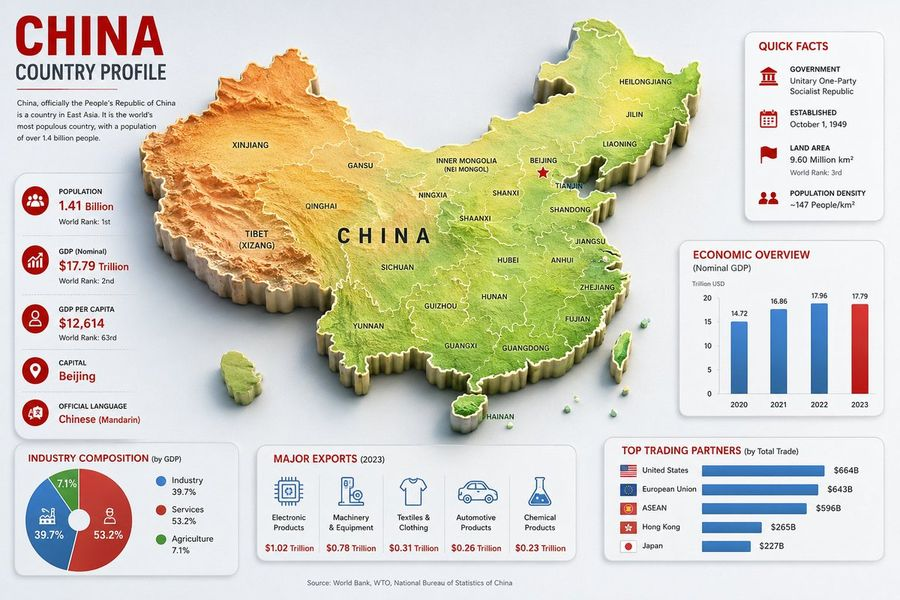
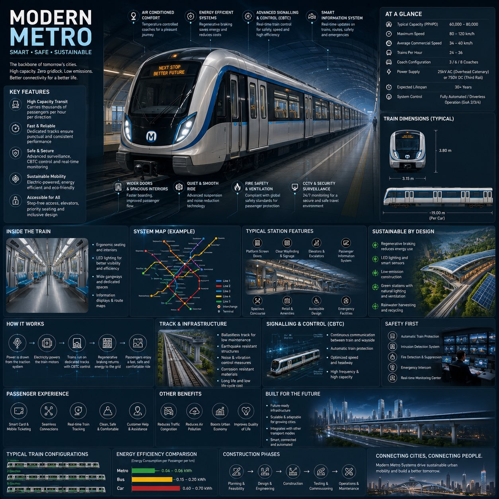
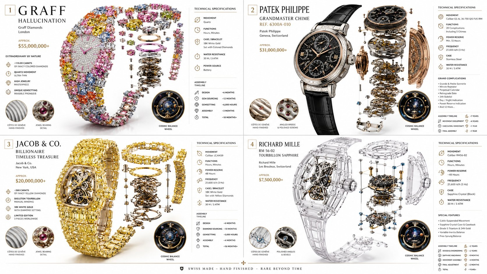
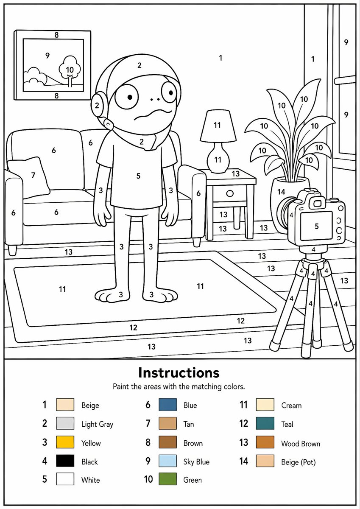
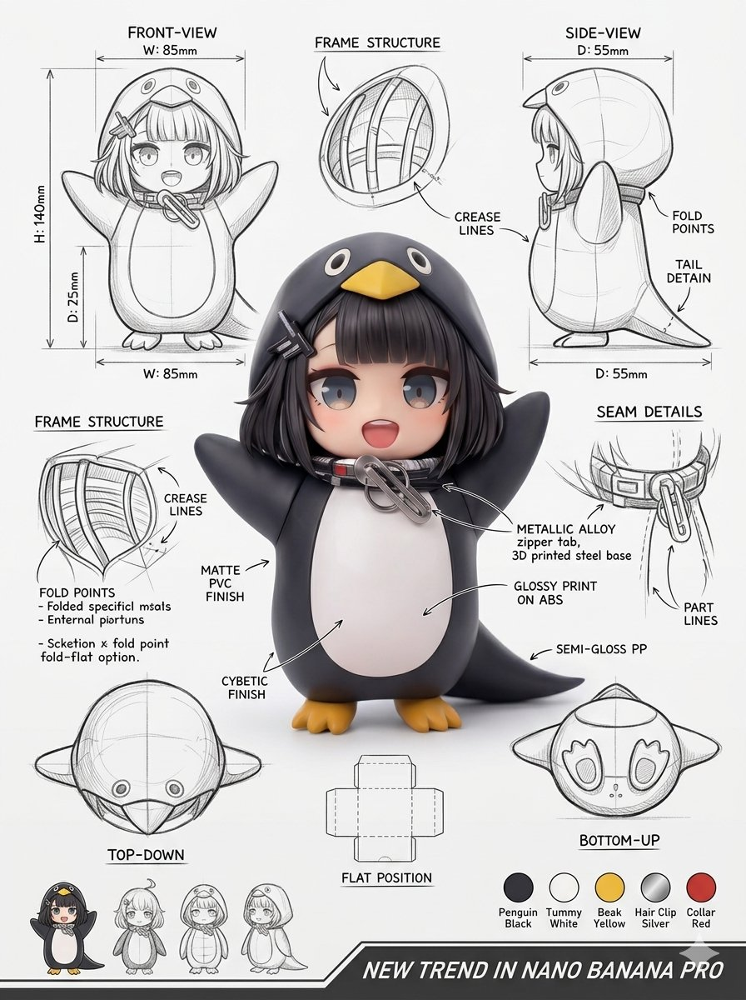

# 📊 图表与信息图

[返回分类](categories.md) · [查看全部案例](cases/cases-001-100.md) · [返回首页](../README.md)


信息图、流程图、知识图谱、技术图解、数据可视化、爆炸分解图、标注说明图等。

---

## 📊 例 3：一周穿搭指南


**Prompt:**

```text
{
  "type": "7-day fashion lookbook infographic",
  "header": {
    "title": "{argument name=\"main title\" default=\"一周穿搭指南\"}",
    "subtitle": "{argument name=\"style keywords\" default=\"温柔 | 靓丽 | 优雅\"}",
    "slogan_cn": "优雅不设限，自信每一天",
    "slogan_en": "{argument name=\"english slogan\" default=\"ELEGANCE HAS NO LIMIT, BE CONFIDENT EVERY DAY\"}"
  },
  "subject": "{argument name=\"subject description\" default=\"young elegant Asian woman\"}",
  "layout": {
    "columns": 7,
    "column_elements": [
      "day_header",
      "main_portrait",
      "4_detail_thumbnails",
      "outfit_specs",
      "keywords_colors",
      "3_color_swatches",
      "star_ratings",
      "fabric_price",
      "4_season_icons"
    ],
    "days": [
      { "day": "周一 (MONDAY)", "outfit": "beige blazer suit", "scene": "场景：重要会议 / 正式商务" },
      { "day": "周二 (TUESDAY)", "outfit": "pink blazer suit", "scene": "场景：日常通勤" },
      { "day": "周三 (WEDNESDAY)", "outfit": "cream knit cardigan set", "scene": "场景：生活休闲" },
      { "day": "周四 (THURSDAY)", "outfit": "champagne slip dress", "scene": "场景：外出私会" },
      { "day": "周五 (FRIDAY)", "outfit": "blue knit top, white skirt", "scene": "场景：休闲社交" },
      { "day": "周六 (SATURDAY)", "outfit": "white sports bra, purple leggings", "scene": "场景：运动休闲" },
      { "day": "周日 (SUNDAY)", "outfit": "beige lounge knitwear", "scene": "场景：居家 / 约会" }
    ]
  },
  "footer": {
    "tips": "{argument name=\"footer tips\" default=\"Tips: 根据天气与场合灵活调整，配饰是提升整体造型的关键；保持自信与舒适，才是穿搭的最终目的。\"}",
    "legend": [
      "春: 春季适用",
      "夏: 夏季适用",
      "秋: 秋季适用",
      "冬: 冬季适用"
    ]
  }
}
```

**来源：** [@yyyole](https://x.com/yyyole) | 2026-05-10


---

## 📊 例 25：手机拆解图


**Prompt:**

```text
Create a 3D Insane detailed exploded assembly drawing of {argument name="subject or object" default="smartphone"}
```

**来源：** [@Ankit_patel211](https://x.com/Ankit_patel211/status/2048834306379075759) | 2026-05-11

## 📊 例 30：FACS 面部表情图表


**Prompt:**

```text
生成一张包含 {argument name="grid" default="7x7 共 49 种图案的网格"} 的单张图像，展示各种面部表情及其对应的好莱坞 AU 代码（面部动作编码系统）。
```

**来源：** [@eijo_AIart](https://x.com/eijo_AIart/status/2052704638718398879) | 2026-05-13

## 📊 例 49：中国国家概况信息图



**Prompt:**

```text
目标：为 {argument name="country name" default="中国"} 创建一份简洁、现代的国家概况信息图，标题为“中国国家概况”，中心放置大型 3D 浮雕地图，周围环绕统计数据卡片。

画布：16:9 横向信息图，浅灰色背景，清晰的企业编辑风格，柔和的阴影，红/蓝/绿强调色，高分辨率矢量与 3D 结合的外观。

主地图：在中心放置一张大型 3D 地形浮雕地图，占据画布大部分空间。使用地形配色：西部为橙褐色山脉，中部为黄色高原，东部和沿海为绿色低地。添加白色省界和黑色省份标签。将台湾、海南和南海诸岛作为独立的浮雕部分包含在内。在中心处放置醒目的黑色大写字母“CHINA”。用红色星号标记北京并标注。地图标签应准确包含 28 个省/自治区/直辖市标签：新疆、西藏、青海、甘肃、内蒙古、宁夏、四川、云南、贵州、广西、广东、海南、福建、浙江、江苏、安徽、山东、湖北、湖南、陕西、山西、北京、天津、辽宁、吉林、黑龙江、台湾和中国。

左上角标题栏：醒目的红色大标题“中国”，深色副标题“国家概况”，一条细红分割线，以及一段简短文字：“中国，全称中华人民共和国，是位于东亚的国家。它是世界上人口最多的国家，人口超过 14 亿。”

左侧统计卡片：一张圆角白色长卡片，包含 5 行堆叠的事实数据，每行配有红色圆形图标和文字。5 行内容为：人口 — {argument name="population value" default="14.1 亿"} — 世界排名：第 1；GDP（名义） — 17.79 万亿美元 — 世界排名：第 2；人均 GDP — 12,614 美元 — 世界排名：第 63；首都 — {argument name="capital city" default="北京"}；官方语言 — {argument name="official language" default="中文（普通话）"}。行与行之间使用细分割线。

右上角概况卡片：一张圆角白色卡片，标题为红色的“概况”。包含 4 行红色图标内容：政府 — 单一制社会主义共和国；成立日期 — 1949 年 10 月 1 日；土地面积 — 960 万平方公里，世界排名：第 3；人口密度 — 约 147 人/平方公里。

中右侧经济图表卡片：一张圆角白色卡片，标题为“经济概览”，副标题为“(名义 GDP)”，并附有小标签“万亿美元”。包含 4 根垂直柱状图，分别代表 2020、2021、2022、2023 年，数值分别为 14.72、16.86、17.96、17.79。2020–2022 年使用蓝色柱状，2023 年使用红色柱状。

左下角产业卡片：一张圆角白色卡片，标题为“产业构成 (按 GDP)”。包含 3 部分组成的环形图：蓝色代表工业 39.7%，红色代表服务业 53.2%，绿色代表农业 7.1%。添加带有相同 3 个标签和百分比的图例。

底部中心出口卡片：一张圆角白色卡片，标题为“主要出口产品 (2023 年)”。包含 5 列出口数据，配有蓝色线条图标和红色数值：电子产品 — 1.02 万亿美元；机械设备 — 0.78 万亿美元；纺织服装 — 0.31 万亿美元；汽车产品 — 0.26 万亿美元；化学产品 — 0.23 万亿美元。

右下角贸易伙伴卡片：一张圆角白色卡片，标题为“主要贸易伙伴 (按贸易总额)”。包含 5 条蓝色水平柱状图，配有小型旗帜图标和数值：美国 — 6640 亿美元；欧盟 — 6430 亿美元；东盟 — 5960 亿美元；中国香港 — 2650 亿美元；日本 — 2270 亿美元。

页脚：居中放置一行小字来源说明：“数据来源：世界银行、世界贸易组织、中国国家统计局。”

约束条件：所有卡片需围绕地图排列且互不重叠，使用统一的字体，红色标题，蓝色图表元素，柔和的投影，圆角卡片，且不得添加水印。
```

**来源：** [@abs_uiux](https://x.com/abs_uiux/status/2054973851553980678#reversed-0) | 2026-05-15


---

## 📊 例 50：Flaming Burger 项目


**Prompt:**

```text
目标：为一段 10 秒的火烤芝士汉堡美食广告创建一个电影感项目/规格表，顶部标题为“PART 1 | 10 SECONDS | 12 PANELS”。

画布：宽屏 16:9 黑色画布，带有细暖金色边框，深色高端电影质感背景，细腻的烟雾纹理，以及优雅的哑光金色衬线字体。使用精确的 12 帧项目网格，排列为 3 行 4 列，每个面板用细金线勾勒，并在左上角标注 01 到 12 的序号。

主体：一个极具戏剧性的美食汉堡，配有芝麻面包、炭烤牛肉饼、融化的切达干酪、生菜、番茄/洋葱点缀，以及烟雾、火星和火焰。汉堡应呈现超写实、光泽感、高对比度的效果，拍摄风格如同高端美食广告。使用 {argument name="burger style" default="a flaming gourmet cheeseburger with sesame bun, charred patty, melted cheddar, lettuce, tomato, smoke, sparks, and fire"}。整体色调为黑色、琥珀色、橙色火焰、熔岩芝士黄和深红色高光。

布局与面板内容：包含精确的 12 个面板，每个面板都有一个大型电影感图像区域和一个紧凑的底部元数据条，分为四个标签框：CAMERA（摄像）、ACTION（动作）、SOUND（声音）、TRANSITION（转场）。在这些标签旁使用小型金色图标、微小易读的注释以及细分隔线。12 个可见面板如下：
01：黑暗中低角度英雄汉堡特写，肉饼周围火焰升腾，背景有烟雾；注释建议“Low-Angle Hero / Slow Reveal”（低角度英雄/缓慢揭示），“Darkness and embers. Flames rise to reveal the hero”（黑暗与余烬。火焰升起揭示主角），“Ember crackle, flame whoosh, low cinematic hum”（余烬噼啪声、火焰呼啸声、低沉电影感嗡嗡声），“Heat shimmer push to next”（热浪闪烁推进至下一帧）。
02：汉堡宏观低推镜头，芝士滴落，火焰舔舐面包；动作描述火焰舔舐面包，烟雾缭绕；声音为火焰呼啸和面包滋滋声；转场为切镜。
03：芝麻面包的极度宏观特写，带有蒸汽卷和发光背景；动作描述芝麻面包发光，烟雾缭绕；声音为滋滋声回响和柔和的嘶嘶声；转场为推入。
04：融化芝士在炭烤肉层间拉丝的极度宏观特写；动作描述芝士融化并从肉饼间滴落；声音为芝士滋滋声和多汁的噼啪声；转场为匹配剪辑。
05：汉堡侧面轮廓特写，可见生菜、红洋葱/番茄，多汁肉饼处于焦点；动作描述层层堆叠，多汁、新鲜、充满活力；声音为多汁滴落声和柔和的脆响；转场为切镜。
06：居中中景英雄镜头，汉堡被火焰包围；动作描述汉堡在火与烟中呼吸；声音为低沉轰鸣和余烬碎裂声；转场为推入剪辑。
07：炭烤肉饼和芝士拉丝的极度宏观焦点切换；动作描述滋滋作响，芝士拉丝；声音为多汁的灼烧爆裂声和噼啪声；转场为切镜。
08：低角度英雄镜头，烟雾在汉堡周围缭绕；动作描述烟雾在主角周围升起；声音为余烬流动和柔和的呼啸声；转场为推入。
09：宏观环绕镜头，四分之三侧视图，汉堡从烟火中浮现；动作描述闪亮的高光和深邃的对比度；声音为电影感嗡嗡声和柔和的噼啪声；转场为环绕至正面。
10：正面居中锁定镜头，汉堡周围火圈加强；动作描述火圈加强，烟雾包裹汉堡；声音为火焰呼啸和冲击感音效；转场为切镜。
11：英雄美学推入镜头，汉堡在火焰中完美居中；动作描述高潮，火热的荣耀，一切看起来完美无瑕；声音为冲击撞击声和低沉的电影感嗡嗡声；转场为推入锁定。
12：最终居中英雄锁定镜头，火焰平息，烟雾升起；动作描述主角定格，结尾节拍；声音为余烬消散和柔和的尾音；转场为平息。

视觉风格：高端电影感美食摄影项目，超细腻的汉堡纹理，浅景深，油脂和芝士上的清脆高光，漂浮的余烬，逼真的火焰模拟，烟雾缭绕的黑色背景，高端商业处理。使该项目看起来像专业导演的拍摄计划，而不是漫画页面。使用 {argument name="top title" default="PART 1 | 10 SECONDS | 12 PANELS"} 和 {argument name="visual mood" default="dark luxury cinematic fire-and-smoke food commercial"}。

文本限制：所有可见文本保持英文。使用金色衬线数字和标题。元数据注释应小巧但视觉上合理，整齐地排列在每个面板下方。不要添加额外的面板、徽标、水印、人物、餐具、盘子或餐厅品牌。
```

**来源：** [@bmx_ai13](https://x.com/bmx_ai13/status/2054942255300157671#reversed-0) | 2026-05-15


---
### 📊 例 81：现代地铁工程信息图



**Prompt:**

```text
Create a premium square “reference-style urban transportation infographic” centered around a futuristic modern metro system called the {METRO_NAME}, designed as a beautifully curated transit-engineering handbook page rather than a public transport advertisement.

The composition should feel like a modern visual encyclopedia mixed with an elite railway infrastructure field guide and high-end editorial infographic system.

Visual Direction:

• 1:1 square composition
• Dark premium urban-tech background with subtle railway schematics, metro maps, and futuristic blueprint overlays
• Elegant palette using deep navy, matte black, steel gray, electric blue accents, and soft white lighting
• Refined editorial typography hierarchy with modern transportation aesthetics
• Rounded modular information cards with clean spacing
• Gentle realistic reflections and premium HUD-style dividers
• Minimal transit-system iconography
• Extremely detailed central metro train render viewed in dramatic three-quarter perspective inside a futuristic underground station
• Thin precision annotation lines pointing toward transportation systems and smart engineering features
• Clean, organized “knowledge-first” layout with high information density but breathable spacing

Main Subject Presentation:

A stunning ultra-detailed realistic render of the {METRO_NAME} modern metro train placed at the center, featuring sleek aerodynamic train design, glowing destination displays, realistic stainless-steel textures, illuminated station lighting, smart glass windows, premium urban-environment realism, and futuristic rail infrastructure.

Surround the metro with scientific and engineering callouts explaining:

• regenerative braking system
• smart signalling & CBTC control
• electric propulsion system
• passenger information systems
• safety and surveillance technology
• platform screen doors
• energy-efficient design
• smart ventilation systems
• accessibility features
• track and infrastructure engineering

Include modular infographic sections such as:

• Metro System Overview
• Technical Specifications
• Train Dimensions & Layout
• Passenger Capacity & Flow
• Smart Control Systems
• Sustainability Features
• Track & Infrastructure Engineering
• Signalling & Automation
• Station Design & Facilities
• Safety & Emergency Systems
• Passenger Experience Features
• Urban Connectivity & Network Map
• Energy Efficiency Comparison
• Construction & Expansion Timeline
• “Top 5 Smart Innovations” section
• Built for Future Smart Cities

Add small premium visualization modules like:

• metro network maps
• train blueprint diagrams
• station layout graphics
• passenger flow visualizations
• signalling workflow diagrams
• energy-efficiency comparison charts
• train configuration illustrations
• smart-city connectivity graphics
• platform safety diagrams
• infrastructure cross-section visuals

Style Keywords:

“premium urban mobility encyclopedia”
“editorial metro engineering handbook”
“high-end transportation infographic”
“scientific railway infrastructure poster”
“museum-quality transit reference page”
“modular smart-city knowledge system”
“clean transportation editorial design”
“ultra-detailed metro visualization”

Avoid:

• cluttered public advertisement aesthetics
• cartoon transportation styling
• unrealistic sci-fi levitating trains
• excessive cyberpunk neon overload
• chaotic city scenes
• generic subway poster layouts

The final result should resemble a professionally published railway infrastructure reference-book page created for transit enthusiasts, architects, engineers, urban planners, transportation designers, and educational infrastructure archives.
```

**来源：** [@status](https://x.com/j_smeaton99/status/2056950969083343077) | 2026-05-19

---

### 📊 例 82：奢华机械腕表技术图鉴



**Prompt:**

```text
2x2 grid 16:9, do this for 4 most expensive strangest watches ever made:

class Haute_Horlogerie_DNA:
    def __init__(self):
        self.subject = "[TIMEPIECE]"
        self.parents = {
            "composition_parent": "Exploded movement diagram with transparent case",
            "material_parent": "Brushed titanium, sapphire crystal, rose gold gears, alligator leather",
            "graphic_parent": "Swiss manufacture technical brochure with elegant data panels",
            "atmosphere_parent": "Crisp daylight studio, pure white background, subtle reflection on polished surfaces"
        }
        self.mutations = {
            "semantic_mutation": "The balance wheel reveals a miniature cosmos ticking inside",
            "information_mutation": "Power reserve indicator, frequency, complication callouts, hand-finishing grades, assembly timeline",
            "medium_mutation": "Smooth matte premium paper with embossed logo",
            "scale_mutation": "Grain-level view of Côtes de Genève finishing and jewel bearings"
        }
        self.style_mix = [0.30, 0.30, 0.25, 0.10, 0.05]

    def generate_subject(self):
        subject = """
        [TIMEPIECE] shown in its full mechanical glory. The dial, hands, movement,
        and strap float in perfect alignment against a bright, clean background.
        Every gear and spring is highlighted with exacting clarity.
        """
        return render(
            subject,
            format="luxury watch advertisement with technical insert",
            title="[MODEL REFERENCE]",
            subtitle="[MANUFACTURE / COLLECTION]",
            constraints="bright white space, metallic brilliance, hyper-detailed, modern elegance"
        )
```

**来源：** [@status](https://x.com/Gdgtify/status/2056928396991488312) | 2026-05-19

---
### 📊 例 103：数字油画客厅练习页



**Prompt:**

```text
目标：创建一张可打印的数字油画练习页，展示一个卡通客厅场景，中心站着一个类似儿童的角色，设计为简洁的黑白线条画，带有编号区域和颜色图例。

画布：A4 纵向页面，300 DPI，白色背景，细黑色外边框，清晰的矢量风格轮廓，除图例中的微小色块外无阴影。主插图占据页面上方约 70% 的空间，说明/颜色键面板占据下方约 30% 的空间。

主插图布局：绘制一个采用简洁圆润卡通风格的温馨客厅。中心：一个站立的卡通角色，有着大圆眼、小点鼻、担忧的波浪嘴、兜帽或头盔状头发、短袖衬衫、细手臂、长裤和赤脚。左侧：一张沙发，有两个座垫/靠垫，两侧各有一个可见的扶手，以及一个小靠枕。沙发上方：一幅带框的墙面画，包含一个小风景，有山丘、天空和一棵树。角色右侧：一张侧桌，上面有一盏灯和一个抽屉；后方/右侧有一盆高大的盆栽，正好有 10 片可见叶子。最右侧：一台三脚架上的相机，对准角色，带有屏幕/机身、镜头/按钮，以及正好三条三脚架腿。背景包括一面墙、右侧一扇带有垂直窗格的大窗户、带有木板线条的地板，以及前景中一块大的长方形地毯。

数字涂色区域：在场景的线条区域内放置黑色数字，使用 1 到 14 的数字。在匹配的表面上重复使用相同的数字。保持数字清晰并居中于形状内。匹配指定的分配：1 为米色墙面区域，2 为浅灰色头部/兜帽区域，3 为黄色皮肤/四肢，4 为黑色相机/三脚架细节，5 为白色衬衫和相机屏幕，6 为蓝色沙发，7 为棕褐色靠枕，8 为棕色画框，9 为天蓝色窗户/画中天空，10 为绿色植物/树叶，11 为奶油色灯具/地毯内部，12 为青色地毯边框，13 为木棕色地板/桌子/木板区域，14 为米色花盆。

底部说明面板：在图例上方添加一条水平分隔线。居中放置一个粗体标题，内容为 {argument name="instruction title" default="说明"}。在其下方，添加较小的文字，内容为 {argument name="instruction subtitle" default="用对应的颜色涂满区域。"}。下方排列 14 个颜色图例条目，分为三列。每个条目包含一个数字、一个小填充色块和一个英文颜色标签。14 个条目必须为：1 Beige (米色), 2 Light Gray (浅灰色), 3 Yellow (黄色), 4 Black (黑色), 5 White (白色), 6 Blue (蓝色), 7 Tan (棕褐色), 8 Brown (棕色), 9 Sky Blue (天蓝色), 10 Green (绿色), 11 Cream (奶油色), 12 Teal (青色), 13 Wood Brown (木棕色), 14 Beige (Pot) (米色花盆)。

风格限制：使其看起来像一张精致的儿童可打印练习页，具有平滑统一的黑色轮廓、圆润友好的形状、大量适合涂色的封闭区域，无渐变，无逼真纹理，无额外文字，无水印。主体可自定义为 {argument name="central character" default="一个担忧的卡通儿童形象"}，场景为 {argument name="room setting" default="温馨客厅"}，调色板为 {argument name="color palette" default="14 色数字油画调色板"}。
```

**来源：** [@status](https://x.com/NingKrysta45057/status/2057426499033055629#reversed-0) | 2026-05-20

---
### 📊 例 121：导览式科普绘本


**Prompt:**

```text
《导览式科普绘本》提示词：

请根据【主题】创作一张高完成度的「导览式科普绘本」风格插画。

这是一张结合“大型场景主视觉 + 导览路线 + 可爱导览 IP + 知识站点 + 儿童科普绘本质感”的场景导览式科普图解页。画面需要让观者像被带着参观一个复杂系统一样，边看边理解主题背后的运行逻辑、空间结构、流程关系和关键知识点。

【基础设定】
主题：【填写主题，例如发射场的一天 / 一个集装箱的旅行 / 地铁站里的秘密路线 / 下潜到深海的一小时 / 机场如何运转 / 医院急诊系统 / 智慧农场 / 消防站出警流程】
画幅比例：【4:3 横版】
主色调：【根据主题自动匹配，整体保持明亮、清爽、儿童友好】
风格方向：【现代儿童科普绘本 / 场景导览式图解 / 高完成度数字插画】

【核心表达】
请围绕【主题】设计一个完整的大型场景或复杂系统。画面中必须有一个明确的主视觉场景，例如大型设施、交通系统、科技装备、自然探索场景、城市公共系统或生产流程。主体要足够清晰、有规模感、有细节，能够成为第一眼的视觉中心。

画面要通过“导览路线”的方式组织信息，避免仅把场景做成静态陈列。请设计一条清晰的参观路线、流程路线、时间线或空间动线，让读者可以沿着路线一步步理解这个系统是如何运行的。

【导览 IP 设计】
请为本图设计一个原创、可爱、亲和的导览小 IP。导览 IP 可以是小动物、小朋友、拟人化工具或其他适合主题的原创形象，但必须具有独立原创性，不要照搬任何参考图中的角色、动物形象、服装、配色或搭档关系。

导览 IP 的作用是：
1. 开场介绍主题
2. 指向关键知识点
3. 引导读者顺着路线阅读
4. 增加儿童绘本的陪伴感和趣味性

导览 IP 可以在画面中出现 2-3 次，但不要过度抢主视觉。角色应圆润、可爱、有表情、有动作，适合儿童科普绘本。

【信息结构】
画面中请设置 3-6 个“知识站点”，每个站点用简短中文标签和短说明表达。站点命名可以采用：
- 第1站｜xxx
- 第2站｜xxx
- 重点观察｜xxx
- 小知识｜xxx
- 为什么｜xxx
- 如何工作｜xxx

每个知识点都要围绕主题的核心运行逻辑展开，不要写空泛说明。文字要短、清楚、自然，避免长段落，适合儿童阅读。

【画面模块】
整张图建议包含以下模块：
1. 顶部主标题区：清楚写出主题名称
2. 开场导览区：导览 IP 引出主题
3. 大型主场景区：展示主题系统的完整场景
4. 导览路线区：用箭头、虚线、路径、时间节点或流程线串联知识点
5. 知识站点区：用小信息框、导览牌、局部标注展示关键知识
6. 小百科 / 小贴士区：补充一个有趣知识
7. 收尾区：让导览 IP 做简短总结或引导

【构图要求】
画面采用 4:3 横版构图，整体像一本高质量儿童科普绘本的跨页，也像一张儿童科技馆导览图。画面需要有清晰的视觉重心：大型主场景占据主要空间，导览路线贯穿画面，知识模块自然分布在周围。信息丰富但不能杂乱，阅读路径要顺畅。

【视觉风格】
整体采用现代儿童科普绘本风格：
- 明亮、清爽、干净的色彩
- 清晰自然的手绘线条
- 高完成度数字插画质感
- 细节丰富但有秩序
- 可爱但不低幼
- 有科普图解感
- 有导览地图感
- 场景真实可信，但表达方式亲和

【文字与标注】
文字以中文为主，使用短标题、短标签、简短说明。不要生成大段复杂文字。信息框应像儿童科普书中的导览牌、知识卡片或小贴士。文字要尽量清晰、简洁、可读。

【最终目标】
让整张图像一页高质量的儿童科普绘本：孩子第一眼被可爱角色和大场景吸引，第二眼能顺着路线读懂系统如何运行，第三眼还能继续发现细节和知识点。画面要具有系列化潜力，方便后续替换不同主题继续创作同类型图片。
```

**来源：** [@MrLarus](https://x.com/MrLarus/status/2058773446167773521) | 2026-05-26

---

### 📊 例 132：咕咕嘎嘎造型包装结构板



**Prompt:**

```text
Using the attached image, create an illustration sheet of professional industrial design packaging for the package (PACKAGE TYPE). A centered heroic 3D rendering with realistic materials, soft studio lighting and commercial quality finishes. Surrounded by technical views: front, side, top, bottom, oblique perspective and flat position. Include sketches of the frame structure, crease lines, seam details, and size arrows in millimeters. Show materials and finishes (matte, glossy print, plastic, paper, glass, etc.) in handwritten annotations. Add color swatches, realistic product illustrations, and subtle shadows. Clean sketchbook background, realistic rendering + pencil sketch style, modern design design, ultra-detailed, portfolio ready.
```

**来源：** [@iamaiistudio](https://x.com/iamaiistudio/status/2059305097897914664) | 2026-05-28

---

### 📊 例 185：Neuro-AI 混合系统信息图


**Prompt:**

```text
Create a premium square “neuro-AI hybrid system infographic” designed as a scientific cognitive engineering handbook page.

Visual Direction:
• 1:1 composition
• dark neutral background with glowing neural network overlays
• palette: electric blue, violet, soft white, silver
• elegant scientific typography and modular panels
• central ultra-detailed human brain + AI circuit fusion render

Main Subject:
A realistic human brain merging with AI neural networks and digital circuitry.

Include callouts:
• memory encoding system
• AI augmentation layer
• cognitive signal pathways
• emotional response mapping
• sensory integration nodes
• neural data transfer system
• learning adaptation loops

Modules:
• Brain Function Overview
• AI Enhancement Layers
• Signal Flow Diagram
• Cognitive Performance Metrics
• Human vs AI Comparison Chart
• Neural Safety Protocols
• Future Evolution Path

Style:
“neuroscience + AI engineering manual”, “high-end cognitive systems diagram”
```

**来源：** [@YaZoraiz](https://x.com/YaZoraiz/status/2052968427514708371) | 2026-05-30

---

### 📊 例 210：冠状病毒尺度缩放科学信息图


**Prompt:**

```text
instructions> [SUBJECT]=Coronavirus. A hyper-realistic 3D zoom-sequence infographic generated from a single input: [SUBJECT]. The system auto-detects scale layers from atomic/subcomponent to full contextual view. Layout Structure (CRITICAL) 6–8 circular or hexagonal frames arranged in expanding sequence Innermost frame = smallest detectable detail; outermost = full subject in environment Frames connected by subtle zoom-path lines No repeated scales — each frame shows new level of detail Frame Design Each zoom level includes: Hyper-detailed 3D render at that scale Micro label: scale name (e.g., "molecular," "cellular," "structural") + 3–5 word insight Optional: measurement tag or magnification factor Contextual Halo Around the sequence, include only scale-specific references: Measurement units, scientific notation, cultural scale metaphors (No generic magnifying glass icons) Scale Panel (Alternative Layout) Zoom level Key insight (3–5 words) Scale factor tag Detail icon (grid, wave, particle, etc.) Title "[SUBJECT]: AT EVERY SCALE" (or) "ZOOM: THE WORLD OF [SUBJECT]" Style: ultra-realistic 3D render, scientific editorial infographic, precise macro lighting, global illumination, shallow depth of field, clean sequential layout. </instructions>
```

**来源：** [@Gdgtify](https://x.com/Gdgtify/status/2051288232613351571) | 2026-05-30

---

### 📊 例 215：古希腊三哲时间轴城市图


**Prompt:**

```text
二千五百年前，柏拉图，苏格拉底， 亚力士多德，坐在雅典街头聊天，聊出了世界文明史的源头。

背景可以加上他们聊天内容，按时间轴的走向，重叠在古希腊雅典的城市风光中。
```

**来源：** [@ToroJushiAi](https://x.com/ToroJushiAi/status/2050713034503409874) | 2026-05-30

---

### 📊 例 226：奢华个人色彩档案信息图


**Prompt:**

```text
LUXURY PERSONAL COLOR PROFILE — EDITORIAL LAYOUT
Studio portrait of subject as anchor — skin retouched to luminous glass-like perfection, preserved natural structure, realistic pore texture, soft directional key lighting, no facial alteration. Background: warm ecru parchment with subtle linen grain texture. Layout reads like a Vogue Italia beauty supplement printed on heavyweight matte stock. Structured editorial grid, 3-column asymmetric, wide negative space, serif condensed display headers, all labels in spaced uppercase tracking, cohesive warm ivory/sand/ecru background system throughout all panels, ultra-photorealistic 8K, soft diffused studio lighting, flat elegant surfaces, no drop shadows.
PANELS:
① UNDERTONE DIAGNOSIS — Tonal spectrum bar from cool ash to warm amber, precision needle marker on subject's reading. Labels: Cool / Neutral-Cool / Neutral / Neutral-Warm / Warm. Fine annotation text.
② SEASONAL COLOR PALETTE — 10–12 fabric-textured swatches in subject's optimal season. Each labeled with poetic color name and HEX. Grouped: Power Colors / Softest Options / Harmonizing Neutrals.
③ COLORS TO AVOID — Desaturated row of clashing tones with fine editorial strikethrough. Clean, non-harsh presentation.
④ MAKEUP CARTOGRAPHY — Eyeshadow gradient dust swatches / blush tones fanned on skin strip / lip spectrum barely-there to bold / highlighter finishes labeled: champagne, rose gold, pearlescent ivory.
⑤ HAIR COLOR SPECTRUM — Curved gradient strip: base, dimension, highlight, contrast tones. Gold bracket indicators on best options.
⑥ JEWELRY & METAL GUIDE — Flat-lay editorial render: yellow gold, rose gold, oxidized silver, platinum finishes alongside complementary stone tones. Minimal styling.
⑦ YOU IN YOUR PALETTE — 3–4 editorial lookbook frames, subject in palette-correct outfits. Mood labels: Quiet Luxury / Off-Duty Editorial / Evening Presence.
⑧ CAPSULE WARDROBE GRID — Outfit flatlay: tops, bottoms, outerwear, shoes, bag — all palette-correct. Coordinating lines showing interchangeability. Net-a-Porter editorial aesthetic.
⑨ PRINTS & PATTERNS — 4 fabric print thumbnails: micro geometric, tonal abstract, classic stripe, floral scale. One-line styling note per print.
⑩ STYLE ARCHETYPE — Single typographic panel. Style identity title set large (e.g. "Modern Romantic / Warm Classicist"). Three defining aesthetic words. Four-line editorial wardrobe philosophy note.
RENDER SPECS: Ultra-photorealistic, 8K, editorial magazine print quality, warm neutral color grading, soft diffused studio lighting consistent across all panels, one serif display font + one fine sans-serif body font, no gradients, flat matte surfaces only.
```

**来源：** [@meng_dagg695](https://x.com/meng_dagg695/status/2049822844918575586) | 2026-05-30

---

### 📊 例 229：手机爆炸拆解图


**Prompt:**

```text
Create a 3D Insane detailed exploded assembly drawing of [subject or object]
```

**来源：** [@Ankit_patel211](https://x.com/Ankit_patel211/status/2048834306379075759) | 2026-05-30

---

### 📊 例 230：长发造型分析信息图


**Prompt:**

```text
Create a professional "HAIRSTYLE ANALYSIS" infographic with a different male model (the same face) having long, thick hair (6-10 inches), slightly wavy texture.

Style should be clean, modern, premium grooming guide (similar layout but not identical).

TOP TITLE:
"HAIRSTYLE ANALYSIS - Long Hair Edition"

LEFT PANEL (Key Features with icons):
Face Shape: Oval
Hair Type: Thick
Texture: Wavy
Length: Long

BEST OPTIONS (Top row with green indicators):
Layered Flow Cut (Adds movement & volume)
Modern Curtain Hair (Stylish & balanced)
Textured Long Waves (Natural & full)
Loose Slick Back (Controlled but not flat)

LESS FLATTERING (Bottom row with red indicators):
Flat Straight Long Hair (No volume)
Overly Oily Slick Back (Too heavy)
Uneven Long Layers (Messy shape)
Excessively Frizzy Look (Uncontrolled)

BEST HAIR LENGTH SECTION:
Ideal: 6-10 inches with layers
Avoid: Too flat or too heavy bottom

BEST HAIR COLORS:
Dark Brown
Natural Black
Warm Brown
Ash Brown

DESIGN STYLE:
Clean grid infographic
White/beige background
Soft shadows
Premium magazine look
Realistic face and hair detail
Consistent spacing and typography
High resolution, 4K
```

**来源：** [@Gemalpha_88](https://x.com/Gemalpha_88/status/2048918707343401034) | 2026-05-30

---

### 📊 例 237：品牌口红推荐报告信息图


**Prompt:**

```text
一、系统角色
你是一个专业美妆顾问 + 人脸分析系统 + 品牌视觉设计系统。
你的任务是：基于用户上传自拍与指定口红品牌，生成一张具有品牌调性的“口红推荐报告信息结构图”。

二、输入参数
用户图像：{用户自拍}
品牌：{口红品牌，如 Dior / YSL / Armani / Chanel / TF}
风格偏好（可选）：{通勤 / 温柔 / 气场 / 氛围感 / 显白优先}
推荐数量：3–5

三、品牌视觉层（新增核心模块）
根据 {品牌} 自动构建视觉风格（Brand Visual Identity），提取品牌调性，例如：
Dior：
优雅、高级、法式、灰白 + 银色、柔光
YSL：
黑金、性感、强对比、时尚编辑感
Armani：
低饱和、雾面、克制、灰调高级感
Chanel：
极简黑白、高级、理性、结构清晰
Tom Ford：
深色、高对比、奢华、电影感

视觉应用到海报：
1. 主色调（背景微变化，不是大面积铺色）
2. 强调色（用于色号标题/细线/小元素）
3. 光影风格（柔光 / 强对比 / 冷调 / 暖调）
4. 字体气质（优雅 / 现代 / 冷感 / 力量感）

四、分析层
对用户进行分析：
- 肤色：冷 / 暖 / 中性（+ 明度）
- 气质：清冷 / 温柔 / 明艳 / 干净 / 成熟
- 唇部特征：薄 / 厚 / 唇色基础
- 妆容状态：素颜 / 日常 / 精致
输出一句总结：「更适合 {色系} + {饱和度} + {质地} 的口红方向」

五、推荐层（增强差异）
从 {品牌} 推荐 3–5 个色号：
每个包含：
- 色号名称（#999）
- 色系（正红 / 豆沙 / 枫叶 / 奶茶 / 玫瑰）
- 上脸效果（显白 / 提气色 / 氛围感 / 气场增强）
- 场景（逛街 / 通勤 / 聚餐 / 约会 / 宴会）

要求：每个色号“风格明确区分”（一个日常、一个气场、一个氛围感等）

六、信息结构图
生成竖版信息结构图
整体风格：美妆时尚大片质感 + 结构化信息可视化排版 + 品牌视觉体系深度融合
极简但不单调，高级但有视觉层次

【整体布局】
左上：用户输入区
右上：分析结论
中部：试色矩阵（核心）
底部：总结

## 1️⃣ 左上（用户区）
用户自拍（真实质感）
+ 小标题：「肤色分析」
+ 一句话结论：「适合低饱和玫瑰调，避免高荧光色」

极细品牌色线条（如 YSL 金线 / Dior 灰线）

## 2️⃣ 中部（核心试色矩阵）
这是视觉重点区域（占比60%以上）
展示方式：将 3–5 个色号以“人脸试色对比”的形式排列：
每一列 = 一个色号
每个色号包含：
- 小型人脸图（同一张脸，不同唇色）
- 色号名称（如 #999）
- 色系标签（如 Classic Red）
- 一句话效果说明
要求：所有人脸保持一致，仅唇色变化，真实试色效果（lip color try-on），肤质真实，不塑料，光影统一。
排列方式：横向排布 或 网格排布（整齐但不死板）

品牌增强点：
- Dior：轻柔渐变背景 + 柔光阴影
- YSL：更强对比 + 黑色细分割线
- Armani：整体灰调统一，低对比
- Chanel：严格对齐，极简黑白
- TF：局部暗背景 + 高光强调

## 3️⃣ 每个色号模块
包含：
色号名（突出）
色系标签
一句推荐语
场景标签（逛街/通勤/聚餐/约会/宴会等）

品牌化处理：
- 用“品牌强调色”做：
  - 色号标题
  - 细分隔线
  - 小icon
（不是色块，而是“精致点缀”）

## 4️⃣ 底部总结
一段“有判断力的建议”，
例如：「日常建议选择低饱和豆沙色提升气色，重要场合可使用正红增强气场」
或：「你的肤色更适合柔和玫瑰调，避免高荧光色系」
但不要完全引用以上2个例子的建议，根据用户实际肤色来建议。
品牌增强：底部可加极淡品牌风格横线 / 极小品牌字样（非logo）

七、UI设计
- 不使用圆角卡片 UI
- 不使用厚边框
1. 引入“层级对比”：
   - 主体亮
   - 次要信息弱
2. 使用“微对比”：
   - 细线
   - 灰度差
   - 字重变化
3. 加入“节奏感”：
   - 疏密变化
   - 模块呼吸
4. 品牌点缀：
   - 只用 5% 强调
   - 不破坏极简结构

八、图像质量
真实皮肤质感
唇色精准
统一光影
商业级美妆摄影
8K

———
品牌：YSL
```

**来源：** [@liyue_ai](https://x.com/liyue_ai/status/2048667226195317219) | 2026-05-30

---

### 📊 例 239：拼拼豆豆风格信息图海报


**Prompt:**

```text
生成一张 16:9 横版信息图海报。
主题：潘金莲
必须覆盖的知识点：
【知识点1】
【知识点2】
【知识点3】
【知识点4】
【知识点5】
【知识点6】
【知识点7】
【知识点8】
视觉风格定义：
这是一张"拼豆 / Perler beads / fuse beads / 像素珠阵列"风格的结构性平面信息图海报。画面由大量规则排列的圆形塑料拼豆构成，每一颗拼豆都具有清晰圆形边界、轻微中心凹点、均匀间距、低饱和塑料质感和稳定网格秩序。整体必须保持正视平面构图，像一张由拼豆拼成的公共文化信息图海报，而不是玩具摄影、3D模型、卡通插画或普通像素画。
核心构图：
将【主题】主体压缩为一个大尺度单色拼豆图像场，而不是完整写实物体、居中插画或图标集合。主体必须从画幅边缘涌入，跨越页面边界，并被出血裁切，像一个更大的拼豆媒介图像残片进入纸面。主体占据主要视觉重量，但不完整呈现；观众必须通过轮廓、方向、缺失区域、拼豆密度和局部纹理重建主题。
色彩系统：严格三层功能配色 —— 浅色底场（60-70%）呼吸切割，主题结构色（25-35%）构成主体表达氛围，高对比信息色（3-6%）承载标题、编号、注释。信息节点必须沿留白窗口、色场边界、切口节点、主体缺口、负空间通道和底部边缘分散布置，数量为 8 个，对应 8 个知识点。
阅读路线：构建跳跃式阅读路径：上方小型标记 → 侧向主标题 → 主体边缘知识点 → 负空间注释窗口 → 底部脚注与图例。画面必须同时满足远距离识别和近距离阅读。
禁止：完整写实物体、可爱卡通风、3D 玩具摄影、景深虚化、图标堆叠式信息图、平均分配颜色、文字覆盖主体中心、水彩油画厚涂 3D 渲染风。
最终效果：一张高级拼豆风格结构性信息图海报。【主题】被压缩成巨大的拼豆色场、像素化珠阵边缘、缺珠空洞、负空间刀口、编号节点、档案注释和颗粒秩序。
```

**来源：** [@知识猫图解](https://x.com/GeekCatX/status/2059848813188378626) | 2026-05-28

---


### 📊 例 309：日文销售书籍信息图广告


**Prompt:**

```text
Goal: Create a premium Japanese business-book promotional infographic for {argument name="book title" default="最強の営業"}, presenting the idea that sales is more beautiful the muddier it gets, with a luxury black-and-gold editorial design.

Canvas: Wide 16:9 landscape advertisement, dark charcoal-black textured background with subtle diagonal fabric-like grain, sharp gold divider lines, high contrast white and metallic-gold typography. Overall feel: serious, authoritative, bestselling business book launch visual.

Layout: Left two-thirds is a structured infographic; right one-third shows exactly 1 upright 3D-rendered book mockup standing on a glossy dark surface with a faint reflection. The book cover is white, black, and gold, with oversized Japanese title text and a vertical spine visible. Add small supporting Japanese cover text, including the main title {argument name="book title" default="最強の営業"}, the phrase {argument name="sales phrase" default="営業に『センス』はいらない"}, and gold emphasis around the word キーエンス.

Top headline area: Large Japanese headline in the upper left: {argument name="headline text" default="営業は、泥くさいほど美しい"}. Make “泥くさい” metallic gold and the rest white. Beneath it, add a thin gold line and a smaller subtitle: {argument name="subtitle text" default="売上1兆円企業キーエンスで学んだ『凡人が天才に勝つ技術』"}.

Middle section: A cream-colored horizontal panel titled 「この本のエッセンス」 on a black-and-gold ribbon. Include exactly 3 essence rows, each with a circular black icon at left and Japanese label plus explanation at right: 1) gear icon, 「仕組み」で勝つ: explanation about not relying on individual talent or intuition and pursuing reproducible systems anyone can sell with; 2) sunrise icon, 「未来」を売る: explanation about proposing the customer’s ideal future beyond the product; 3) bar chart icon, 「量」を科学する: explanation about breaking down behavior like physics and producing quality from overwhelming contact volume.

Lower middle section: Black panel with gold borders titled 「明日から使える 3つの必殺型」. Include exactly 3 numbered method cards in a row: 1) 「セルフロープレ」 with a simple line icon of a person and speech bubble, describing repeating role-play alone before meeting clients; 2) 「インパクトデモ」 with a monitor/play icon, describing making the client experience convenience and internalize it; 3) 「ワンモア」 with an open-door arrow icon, describing making one more angle of proposal before giving up. Use gold numerals in small boxed labels.

Bottom message strip: Add a small outlined label 「メッセージ」 at bottom left. Main sentence in large Japanese text: {argument name="bottom message" default="『頑張ります』はいらない。必要なのは、結果を出すための『武器』と『防具』だ。"} Highlight 「武器」 and 「防具」 in gold outlined boxes. At bottom right add a gold closing line: 「泥くさく、しかし最高に合理的な営業学がここに!」

Visual style: Japanese corporate advertising, bookstore poster, elegant typography mixing Mincho-style serif Japanese and bold Gothic Japanese, crisp grid alignment, metallic gold accents, off-white panels, subtle shadows, clean vector icons, realistic book mockup lighting.

Constraints: Use exactly 1 book mockup, exactly 3 essence rows, and exactly 3 method cards. Keep all text legible, preserve the Japanese wording, avoid extra logos, avoid people, avoid clutter, no watermark.
```

**来源：** [あさひ](https://x.com/asahi_sales) | 2026-05-30

---


### 📊 例 330：伊斯坦布尔天气信息海报


**Prompt:**

```text
[中文]
设计一张高质量海报，提供关于 {argument name="location" default="伊斯坦布尔"} 在 {argument name="date" default="2026 年 6 月 2 日"} 的天气信息。

[English]
Design a high-quality poster providing information about the weather in {argument name="location" default="Istanbul"} on {argument name="date" default="June 2, 2026"}.
```

**来源：** [@Ahmet Muhammed Ertuğrul](https://x.com/ahmetmertugrul/status/2061561008750027029) | 2026-06-01

---


### 📊 例 373：带有参考角色的 Notebook Slides


**Prompt:**

```text
[中文]
以 REFERENCE_0 为角色基础，创建一套由 8 张图片组成的日式教育 Slides，主题为 {argument name="topic" default="Claudeに『部下AI』を持たせる"}。保持角色设计、服装、面具、发型和赛博朋克细节与参考图一致，但在每张 Slide 中重新绘制角色的姿势和表情。

整体格式：每张 Slide 应呈现为手绘笔记本/速写本页面，背景为米色纸张，带有黑色圆角外框，左侧有螺旋装订，使用马克笔风格的日语手写字体，并配有红色强调标记、箭头、对勾、小图标和简单的流程图。采用温暖的模拟笔记风格，而非整洁的企业演示文稿。在所有 8 张图片中保持统一的 Slide 设计语言。

角色放置：在大多数 Slide 中，将角色作为演示者/吉祥物放置在右侧或右下角。姿势要自然多变：双手张开表示惊讶、指向图表、拿着剪贴板、坐着审阅、做出 OK/确认手势，或举起一根手指进行讲解。保留参考角色的身份和服装特征。

生成以下 8 个 Slide 主题：
1. 开场/整体概述：标题文本 {argument name="headline text" default="Claudeに『部下AI』を持たせる"}；副标题 {argument name="subtitle text" default="15分で仕事を自動化する5つのテンプレート"}；核心信息：「部下AI」が開発の常識を変えた；包含五个自动化示例：コードレビュー、テスト作成、ドキュメント生成、全部15分で自動化，以及简单的清单式布局。
2. 什么是子 Agent：解释「サブエージェントとは」，即一种可复用的 AI 角色或专家助手。包含小型角色卡片和箭头，展示主 Claude Agent 如何委派任务。
3. 为什么需要它：解释「なぜ必要か」，通过对比前后差异，强调反复要求 AI 执行相同任务效率低下，可以将其转化为模板。
4. 代码审查员：标题「コードレビュー」；展示 GitHub/代码审查风格的流程，包含文件、注释、Bug 和对勾图标。
5. 测试编写器：标题「テストライター」；展示测试生成工作流，包含步骤、文件名、单元测试和通过/失败风格的图标。
6. 安全扫描器：标题「セキュリティスキャナー」；展示风险等级 CRITICAL、HIGH、MEDIUM、LOW，并强调 Agent 仅检测问题而不自动修复。
7. 成本优化：标题「コスト削減の鍵：モデルの使い分け」；展示对比，说明更便宜/更小的模型可以处理简单的检查，从而大幅降低成本，并用醒目的红色标注节省金额。
8. 今日起步/总结：标题「今日から始める一歩」；展示简单的 3 步流程：创建模板，将其放入 Claude Agents 文件夹或工作流中，请求审查/自动化，最后用一个大对勾标记完成。

文字风格：全程使用日语。标题要大且粗，带有红色下划线和手写注释。图表要简洁易读。仅使用列出的 8 个 Slide 主题，不要添加额外页面。

约束条件：每张图片必须保持相同的笔记本布局、米色调色板、黑色边框、左侧螺旋装订以及一致的角色身份。避免照片级真实感，避免 3D 渲染，避免水印，且不得将角色更改为其他人。

[English]
Using REFERENCE_0 as the character base, create a consistent set of exactly 8 Japanese educational slide images about {argument name="topic" default="Claudeに『部下AI』を持たせる"}. Keep the character design, outfit, mask, hairstyle, and cyberpunk details consistent with the reference, but redraw the character in new poses and expressions for each slide.

Overall format: Each slide should look like a hand-drawn notebook/sketchbook page with a cream paper background, black rounded outer frame, left-side spiral binding, marker-style Japanese handwriting, red emphasis marks, arrows, check marks, small icons, and simple workflow diagrams. Use a warm analog note-taking style rather than a clean corporate deck. Maintain the same slide design language across all 8 images.

Character placement: Place the character as a presenter/mascot on the right side or lower-right area of most slides. Vary the pose naturally: surprised with both hands open, pointing at diagrams, holding a clipboard, sitting while reviewing, making an OK/check gesture, or explaining with one raised finger. Preserve the reference character’s identity and clothing.

Generate exactly these 8 slide topics:
1. Opening / overall overview: Title text {argument name="headline text" default="Claudeに『部下AI』を持たせる"}; subtitle {argument name="subtitle text" default="15分で仕事を自動化する5つのテンプレート"}; main message: 「部下AI」が開発の常識を変えた; include the five automation examples: コードレビュー, テスト作成, ドキュメント生成, 全部15分で自動化, and a simple checklist-like layout.
2. What is a sub-agent: Explain 「サブエージェントとは」 as a reusable AI role or specialist assistant. Include small role cards and arrows showing a main Claude agent delegating tasks.
3. Why it is needed: Explain 「なぜ必要か」 with a before/after comparison, emphasizing that repeatedly asking AI for the same tasks is inefficient and can be turned into templates.
4. Code reviewer: Title 「コードレビュー」; show a GitHub/code review style flow with files, comments, bugs, and a check mark.
5. Test writer: Title 「テストライター」; show a test-generation workflow with steps, file names, unit tests, and pass/fail style icons.
6. Security scanner: Title 「セキュリティスキャナー」; show risk levels CRITICAL, HIGH, MEDIUM, LOW and emphasize that the agent detects issues but does not automatically fix them.
7. Cost optimization: Title 「コスト削減の鍵：モデルの使い分け」; show a comparison that cheaper/smaller models can handle simple checks and that costs can become much cheaper, with bold red savings notes.
8. Start today / summary: Title 「今日から始める一歩」; show a simple 3-step process: create a template, place it in a Claude agents folder or workflow, ask for review/automation, then mark it complete with a big check.

Text style: Use Japanese text throughout. Make headlines large and bold, with red underlines and handwritten annotations. Keep diagrams simple and readable. Use only the listed 8 slide topics and do not add extra slides.

Constraints: Keep the same notebook layout, cream color palette, black border, left spiral binding, and consistent character identity across every image. Avoid photorealism, avoid 3D rendering, avoid watermarks, and do not change the character into a different person.
```

**来源：** [@テツメモ｜AI図解×検証｜Newsletter](https://x.com/tetumemo/status/2061415764985569667#reversed-0) | 2026-06-01

---

### 📊 例 434：面部表情解剖图表


**Prompt:**

```text
[中文]
创建一个清晰的教育类 {argument name="expression grid" default="FACS 面部动作编码系统表情网格"}，主体为 {argument name="subject" default="写实成年女性角色"}。采用极简影棚灯光，{argument name="background" default="中性白色背景"}，呈现专业面部解剖参考图表美学，具备写实的皮肤纹理，风格统一

[English]
Create a clean educational {argument name="expression grid" default="FACS Action Unit expression grid"} featuring a {argument name="subject" default="realistic adult female character"}. Minimal studio lighting, {argument name="background" default="neutral white background"}, professional facial anatomy reference sheet aesthetic, realistic skin texture, consistent
```

**来源：** [@Roger](https://x.com/AI_Skiller/status/2062962362991214858) | 2026-06-05

---

### 📊 例 492：金毛寻回犬百科卡片


**Prompt:**

```text
[中文]
目标：创建一张关于 {argument name="animal breed" default="金毛寻回犬"} 的垂直模块化百科卡片，设计风格参考精致的中文宠物科普海报。

画布：高长比例信息图，约 9:16 纵横比，温暖的米白色背景，柔和的米色和奶油色圆角卡片，带有细腻的阴影，留白充足，网格对齐整齐，具备高分辨率打印级质感。

主体布局：在中心偏左位置放置一只大型写实全身金毛寻回犬，站立并面向前方，嘴巴微张，露出舌头，毛发金黄蓬松，爪部自然，采用柔和的摄影棚灯光。左上方放置一个小巧的品牌/标签胶囊，随后是一个醒目的中文大标题（品种名称）及副标题“温暖友善的家庭伴侣”。在副标题下方添加小号大写英文字母“GOLDEN RETRIEVER”。

顶部区域元素：在标题和犬只周围包含 3 个紧凑的信息块：左侧 1 个小型品种起源/规格卡片（包含多行简短统计数据），右上角 1 个小型人气或评分卡片（带有星级评分），左侧统计数据下方 1 个小型介绍卡片（包含简短描述性文字）。

右侧细节栏：创建 5 个堆叠的圆角细节卡片，每个卡片包含一张圆形特写照片和简短的中文说明文字。5 个特写分别为：1 眼部/面部细节，2 耳部或口吻细节，3 毛发细节，4 尾部或身体毛发细节，5 脚垫细节。将这些卡片垂直对齐在犬只右侧。

中部及底部模块：在犬只下方及周围使用由 10 个圆角矩形内容卡片组成的整洁仪表盘。这 10 个卡片分别为：1 身体特征卡（带小型侧视图犬只剪影及要点文字），2 性格特征卡（带 5 个小型线条图标），3 能力/评分卡（带 5 行星级评分），4 生活习惯卡（带 4 个图标要点），5 护理建议卡（带多行简短要点），6 安全或警告卡（带三角形警示图标），7 优缺点对比卡（分为绿色“优点”和红色“缺点”区域），8 适合饲养人群卡（带 5 个图标要点），9 核心要点 Top 5 卡（带 5 个带数字的橙色圆圈），10 小型补充资料/知识卡（用于平衡网格布局）。

视觉风格：专业的百科卡片美学，整洁的中文编辑排版，采用奶油色、米色、金棕色、柔和橙色以及淡雅的绿/红色调。使用细线条图标、圆形照片裁剪、小型金色星级评分、圆角设计、细腻的投影以及统一的边距。中心犬只应为视觉焦点；文字排版应紧凑且井然有序。

文本内容：全程使用中文 UI 风格标签和简短的中文段落，主标题设置为 {argument name="headline text" default="金毛犬"}。副标题设置为 {argument name="subtitle text" default="温暖友善的家庭伴侣"}。保持文字清晰易读，避免拥挤；在无法显示微小文字的地方使用占位符式的短中文要点行。

自定义：将整体色调设置为 {argument name="color palette" default="暖奶油色、米色、金棕色、柔和橙色"}，插图/照片风格设置为 {argument name="visual style" default="写实宠物摄影结合简洁信息图设计"}。

约束条件：仅限一只主体犬只，右侧栏必须为 5 个细节卡片，底部/中部必须为 10 个信息卡片，星级评分卡必须为 5 行，Top 5 卡片必须为 5 个带数字的项目。禁止出现人物、水印、杂乱背景或额外动物。

[English]
Goal: Create a vertical modular encyclopedia card about {argument name="animal breed" default="Golden Retriever"}, designed like a polished Chinese science-popularization pet profile poster.

Canvas: Tall portrait infographic, about 9:16 aspect ratio, warm off-white background, soft beige and cream rounded cards, subtle shadows, plenty of white space, clean grid alignment, high-resolution print-ready look.

Main layout: Place a large realistic full-body golden retriever in the center-left, standing and facing forward, happy open mouth, visible tongue, fluffy golden coat, natural paws, soft studio lighting. At the top-left, use a small brand/tag pill, then a large bold Chinese headline for the breed name and a short subtitle meaning “gentle and friendly family companion.” Add the English text “GOLDEN RETRIEVER” below the subtitle in small uppercase letters.

Top area elements: Include exactly 3 compact information blocks around the title and dog: 1 small breed-origin/specification card on the left with multiple short rows of stats, 1 small popularity or rating card at the top-right with star rating, and 1 small introduction card below the left stats with brief descriptive text.

Right detail column: Create exactly 5 stacked rounded detail cards, each with a circular close-up photo and short Chinese explanatory text. The 5 close-ups are: 1 eye/face detail, 2 ear or muzzle detail, 3 coat/fur detail, 4 tail or body coat detail, 5 paw pad detail. Keep these cards aligned vertically on the right side of the dog.

Middle and lower modules: Use a neat dashboard of exactly 10 rounded rectangular content cards below and around the dog. The 10 cards are: 1 physical characteristics card with a small side-view dog silhouette and bullet text, 2 personality traits card with five small line icons, 3 ability/rating card with exactly 5 rows of star ratings, 4 lifestyle habits card with four icon bullets, 5 care advice card with multiple short bullet rows, 6 safety or warning card with triangle alert icons, 7 strengths and weaknesses comparison card split into green “advantages” and red “disadvantages” areas, 8 suitable owners card with five icon bullets, 9 Top 5 key facts card with exactly five numbered orange circles, 10 small bonus profile/knowledge card if needed to balance the grid.

Visual style: Professional encyclopedia-card aesthetic, clean Chinese editorial layout, soft warm palette of cream, beige, pale gold, muted orange, light brown, and gentle green/red accents. Use thin line icons, circular photo crops, small gold star ratings, rounded corners, subtle drop shadows, and consistent margins. The central dog should be the most visually dominant element; all text should look dense but organized.

Text content: Use Chinese UI-style labels and short Chinese paragraphs throughout, with the main title set to {argument name="headline text" default="金毛犬"}. Use a warm subtitle set to {argument name="subtitle text" default="温暖友善的家庭伴侣"}. Keep text legible-looking but do not overcrowd; use placeholder-like short Chinese bullet lines where tiny text is not readable.

Customization: Set the overall palette to {argument name="color palette" default="warm cream, beige, golden brown, muted orange"} and the illustration/photo style to {argument name="visual style" default="realistic pet photography combined with clean infographic design"}.

Constraints: Exactly one main dog, exactly 5 right-column close-up detail cards, exactly 10 lower/middle information cards, exactly 5 rows in the star-rating card, exactly 5 numbered items in the Top 5 card. No people, no watermark, no messy background, no extra animals.
```

**来源：** [@自学Ai的鱼头叔叔](https://x.com/Aiyutoushushu/status/2062828293557273035) | 2026-06-05

---

### 📊 例 493：英国短毛猫百科图鉴卡片


**Prompt:**

```text
[中文]
目标：为 {argument name="animal topic" default="英国短毛猫"} 创建一张竖版百科风格的图鉴卡片，设计风格参考精致的中文科普信息图。

画布：3:4 竖版布局，暖象牙色背景，柔和的鼠尾草绿边框，圆角模块化卡片，细腻的阴影，整洁的排版间距，高分辨率印刷质量。

页眉：左上角包含一个小书本图标，并在该参数内添加小型图鉴标签：{argument name="atlas label" default="百科科普图鉴 CAT BREED ATLAS"}。下方使用该参数添加醒目的大号深绿色中文标题：{argument name="headline text" default="英国短毛猫"}。标题下方放置英文副标题“British Shorthair”及一行简短的中文描述。副标题下方添加三个带有图标的小型胶囊标签。

主体：画面中右侧为一只写实的英国短毛猫摄影图：毛发呈蓝灰色且质感丰盈，圆脸，毛发浓密，拥有铜金色双眼，耳朵直立，正面坐姿，尾巴向右卷曲。猫咪背景为柔焦的米色调家居内饰。

布局：使用 9 个带标签的信息模块，每个模块配有一个绿色圆形字母徽章：从 A 到 I。将 A、B、C、D、E 排布在上部和中部区域，F、G、H 排布在下方，I 作为底部全宽特色条。每个模块均为圆角矩形，填充淡奶油色，并带有细绿色轮廓线。

模块数量与内容：包含以下 9 个模块：A 基本资料，B 外貌特征，C 性格/行为，D 喂养与护理，E 风险与注意事项，F 适宜人群，G 优缺点对比，H 快速评分，I 5 大关键词。使用简洁的中文正文和微型图标，保持布局清晰，避免拥挤。

细节标注：添加 5 个圆形放大细节标注，通过细引导线连接至猫咪：1 大圆眼，2 丰盈毛发质感，3 粗圆尾巴，4 浓密胸/颈部毛发，5 圆爪/紧凑体型特征。每个标注应包含一张裁剪后的微距图像及一个简短的中文标签和一段说明文字。

可见重复元素：在 A 模块中包含 4 个横向排列的小型毛色猫头图标。在 E 模块中包含 5 行带有红色三角形警告图标的警示项。在 F 模块中包含 3 行带有绿色勾选图标的适宜人群项，以及 2 行带有橙色 X 图标的不适宜人群项。在 G 模块中包含 2 列对比栏，分别为绿色“优点”栏和橙色“缺点”栏。在 H 模块中包含 6 行评分项，每行配有蓝色星级评分。在 I 模块中包含 5 个关键词卡片，编号 1 至 5，每个配有一个小图标：笑脸、男性符号、鱼、小圆圈符号及爱心。

底部照片条：在右下方放置 4 张小型圆角猫咪生活/姿态照片：正面坐姿、侧面站姿、放松躺卧、蜷缩在窝中睡觉。每张照片下方添加简短的中文说明。

视觉风格：专业百科卡片，柔和的教育设计，柔和的绿色与米色调色板，写实动物摄影与矢量 UI 图标结合，细分割线，圆角设计，紧凑而整洁的中文排版。避免使用霓虹色、杂乱元素、水印、二维码或多余的装饰性文字。

[English]
Goal: Create a vertical encyclopedia-style atlas card for {argument name="animal topic" default="British Shorthair cat"}, designed like a polished Chinese science-popularization infographic.

Canvas: Portrait 3:4 layout, warm ivory background, soft sage-green borders, rounded modular cards, subtle shadows, clean editorial spacing, high-resolution print quality.

Header: At the top left include a tiny book icon and the small atlas label in Chinese inside this parameter: {argument name="atlas label" default="百科科普图鉴 CAT BREED ATLAS"}. Add a large dark-green Chinese headline using this parameter: {argument name="headline text" default="英国短毛猫"}. Under it place the English subtitle “British Shorthair” and a short Chinese descriptor line. Add three small pill tags with icons below the subtitle.

Main subject: Center-right dominant realistic studio photo of a British Shorthair cat: plush blue-gray coat, round face, dense fur, copper-gold eyes, upright ears, sitting front-facing with tail curled to the right. Background behind the cat is softly blurred home interior in beige tones.

Layout: Use exactly 9 labeled information modules, each with a green circular letter badge: A through I. Arrange A, B, C, D, E around the upper and middle area, F, G, H beneath them, and I as a full-width bottom feature strip. Each module is a rounded rectangle with pale cream fill and thin green outline.

Section count and contents: Include exactly these 9 modules: A Basic profile, B Appearance features, C Personality / behavior, D Feeding and care, E Risk and precautions, F Suitable owners, G Pros and cons comparison, H Quick rating, I Top 5 keywords. Use concise Chinese body copy and tiny icons, but keep the layout readable and not overcrowded.

Detail callouts: Add exactly 5 circular zoom-in detail callouts connected to the cat by thin leader lines: 1 large round eyes, 2 plush coat texture, 3 thick rounded tail, 4 dense chest / neck fur, 5 round paws / compact body feature. Each callout should contain a cropped macro image and a short Chinese label with a paragraph-length note.

Visible repeated elements: In section A include exactly 4 small coat-color cat head icons in a row. In section E include exactly 5 warning rows with red triangular warning icons. In section F include exactly 3 owner-suitability rows with green check icons and exactly 2 unsuitable rows with orange X icons. In section G include exactly 2 comparison columns, one green “advantages” column and one orange “disadvantages” column. In section H include exactly 6 rating rows, each with blue star ratings. In section I include exactly 5 keyword cards, numbered 1 to 5, each with a small icon: smiley face, male symbol, fish, small circular symbol, and heart.

Bottom photo strip: Along the bottom right, place exactly 4 small rounded photos of the cat showing lifestyle / posture scenes: sitting front view, standing side view, lying relaxed, curled up sleeping in a bed. Add small Chinese captions under each photo.

Visual style: Professional encyclopedia card, soft educational design, muted green and beige palette, realistic animal photography mixed with vector UI icons, thin dividers, rounded corners, compact but clean Chinese typography. Avoid neon colors, clutter, watermark, QR codes, or extra decorative text.
```

**来源：** [@自学Ai的鱼头叔叔](https://x.com/Aiyutoushushu/status/2062828293557273035) | 2026-06-05

---

### 📊 例 494：2027 年审美系桌面日历


**Prompt:**

```text
[中文]
请使用这张照片（可在参考图中放入你的图片）来制作一个 {argument name="year" default="2027 年 1 月至 12 月"} 的桌面日历。格式：A4 竖版。特征：{argument name="style" default="韩式插画风格"}，鲜明的人物特征，自然的表情，全身构图，动态姿势，精致的服装细节，{argument name="art technique" default="手绘涂鸦风格"}，喷溅笔触，自由线条，柔和色彩与水墨的结合，漫画素描质感，简约白色背景，边缘带有象征性元素，氛围感强，高细节，高质量。

[English]
Please use this photo (Can put you Image in the reference) to create a desktop calendar for {argument name="year" default="January-December 2027"}. Format: A4 vertical. Features: {argument name="style" default="Korean illustration style"}, distinct character features, natural expressions, full-body composition, dynamic poses, exquisite clothing details, {argument name="art technique" default="hand-drawn doodle style"}, splatter brushstrokes, free lines, a mix of pastels and ink, comic sketch texture, simple white background, symbolic elements around the edges, strong atmosphere, high detail, high quality.
```

**来源：** [@Future AI 🧩](https://x.com/FutureVibesAi/status/2062824885194461244) | 2026-06-05

---

### 📊 例 537：创新遗珍爆炸图


**Prompt:**

```text
[中文]
生成一张超写实的“创新遗珍爆炸图”。

1. 语义提取：
AI 推断：
- 解决的核心问题
- 运作机制
- 历史时期
- 发明者文化
- 材料
- 失效点
- 社会影响

2. 容器：
结构：悬浮在玻璃博物馆展示柜中的爆炸式物体。
每个零件均由黄铜杆和精细张力线悬挂。

3. 背景：
带有模糊图表、公差、标签和档案印章的专利纸墙。

4. 整合：
发明的核心洞察成为中心的发光机制。

5. 视觉语法：
材质：拉丝钢、玻璃、黄铜、陈旧纸张、黑色墨水。
光影：奢侈品摄影风格。
拒绝廉价的蓝图陈词滥调。

输入变量：{argument name="invention" default="[请输入发明名称]"}

输出：
2x2 网格，16:9，四项改变世界的发明。

[English]
Generate a hyper-realistic "Innovation Reliquary Exploded Diagram."

1. Semantic Extraction:
AI infers:
- Core problem solved
- Mechanism
- Historical era
- Inventor culture
- Materials
- Failure points
- Social impact

2. Container:
Structure: floating exploded object inside a glass museum case.
Every part is suspended on brass rods and fine tension wires.

3. Background:
Patent-paper wall with faint diagrams, tolerances, labels, and archive stamps.

4. Integration:
The invention’s key insight becomes a central glowing mechanism.

5. Visual Syntax:
Materials: brushed steel, glass, brass, aged paper, black ink.
Lighting: luxury product photography.
No cheap blueprint clichés.

Input Variable: {argument name="invention" default="[INSERT INVENTION]"}

Output:
2x2 grid, 16:9, four world-changing inventions.
```

**来源：** [@Gadgetify](https://x.com/Gdgtify/status/2062720059575783713) | 2026-06-05

---

### 📊 例 657：技术拆解信息图


**Prompt:**

```text
[中文]
创建一个高质量的技术信息图，对象为 {argument name="target object" default="[OBJECT]"}。仅使用提供的参考图像来理解物体的形状和形态 —— 请勿复制原始照片的角度、构图或背景。将主体重新构思为一张清新、专业且逼真的照片，采用干净、光线充足的布景和更具美感的背景。物体本身应看起来像真实照片，而非插图。在上方叠加一层 {argument name="overlay style" default="技术蓝图风格叠加层"}，包含白色线条、箭头、尺寸标注、零件标签、材质说明、测量数据和小型功能图表。整体构图应清晰、优雅且富有信息量。在左上角包含一个标注为 "OBJECT" 的草图插图框。比例为 4:5。

[English]
Create a high-quality technical infographic of {argument name="target object" default="[OBJECT]"}. Use the provided reference image only to understand the shape and form of the object — do not replicate the original photo, angle, composition, or background. Reimagine the subject as a fresh, professional, and realistic photograph with a clean, well-lit setup and a more aesthetic background. The object itself should look like a real photo, not an illustration. Layer a {argument name="overlay style" default="technical blueprint-style overlay"} on top, featuring white lines, arrows, dimension callouts, part labels, material notes, measurements, and small functional diagrams. The overall composition should feel clear, elegant, and informative. Include a sketch inset box in the upper left corner labeled "OBJECT". 4:5 ratio.
```

**来源：** [@PromptLab](https://x.com/iamaiistudio/status/2063125837835329762) | 2026-06-06

---

### 📊 例 738：SynClub 聊天音效指南


**Prompt:**

```text
[中文]
目标：为 SynClub 创建一份垂直日文信息图表指南，解释在括号中输入特定词汇即可触发的聊天内音效。使用标题 {argument name="headline text" default="チャット内効果音 一覧ガイド"} 和品牌名称 {argument name="brand name" default="SynClub"}。

画布：2:3 纵向布局，奶油色羊皮纸背景，配以海军蓝和金色点缀，细几何线条，小闪光图标，圆角卡片，简洁的应用指南风格。左上角设有深海军蓝页眉条，包含 SynClub 徽标图标和文字标识。主标题为深海军蓝与金色的粗体日文字体。在标题下方添加说明：「（ ）で囲んだワードを入力すると、効果音が再生されます！」

布局：左侧三分之二包含四个堆叠的圆角分类卡片，构成主要指南列表。右侧上方为 Q 版动漫引导角色，下方为类似智能手机的聊天界面模型。左下角包含一个海军蓝色的使用技巧框，右下角包含一个金色边框的号召性用语横幅。

主体细节：右上角绘制一个可爱的 Q 版女学生风格动漫角色，长黑发、海军蓝制服、金色发夹，手持指示棒；包含一个气泡框，写着「使ってみてね！」。她的脸部被一个居中的柔和灰色模糊/遮挡块覆盖。角色造型使用 {argument name="guide character style" default="chibi anime schoolgirl with long dark hair and navy uniform"}。

指南列表：展示 4 个音效类别，每个类别包含一个图标、彩色标题和括号内的日文触发短语。
1. 「ドア系」：门图标，棕色/金色标题，5 个触发短语：「（ドアをノックする）」「（ドアを叩く）」「（ドアを開ける）」「（ドアを閉める）」「（鍵をかける）」
2. 「書籍系」：打开的书图标，蓝色标题，3 个触发短语：「（本を開く）」「（ページをめくる）」「（本を閉じる）」
3. 「触れ合い系」：握手图标，金色标题，8 个触发短语：「（抱きしめる、ハグ、抱く）」「（服を脱ぐ）」「（撫でる）」「（頭を撫く）」「（袖を引っ張る）」「（ドキドキ、赤面、頬が真っ赤）」「（舐める）」以及紧凑列表样式的换行。
4. 「生活系」：房屋图标，绿色标题，3 个触发短语：「（靴を振る）」「（携帯が鳴る）」「（布団に入る）」

聊天模型：右侧中间显示一个深海军蓝圆角手机框，标注为「会話画面イメージ」。内部为动漫聊天场景，背景是暖色调咖啡馆灯光下的银发奇幻女性。在聊天图像顶部，显示名称 {argument name="chat character name" default="ファンネリア"}。叠加 4 个圆角聊天气泡：两个三文鱼粉色叙述气泡和两个海军蓝色用户回复气泡。在粉色气泡内高亮显示部分触发词，包括「ドアをノックする」和「頬を赤らめつつ」。保持日文聊天文本小巧且具有氛围感；无需完全清晰可读，但必须看起来像真实的语境聊天界面。

底部文本：左下角海军蓝色框标题为「使い方のポイント」，配有灯泡图标。包含解释性日文文本，说明当句子中括号内写入动作时会触发音效，例如「（ドアをノックする）失礼します…」，并附带高亮提示：「『会話動画』生成の際、自分側の台詞に効果音の記述を挿入しても再生されます。」下方添加小免责声明：「※上記はすべてではありません…まだ判明していない効果音が存在します！」并配有一个小感叹号图标。右下角金色号召性用语框配有扩音器图标，写着「よりリアルな会話体験を！」以及下方的「効果音を活用して、臨場感あふれるチャットを楽しみましょう！」

视觉风格：精致的日文社交媒体信息图表，高分辨率，清晰易读的字体，温暖的奶油色背景，深海军蓝边框，金色高光，圆角矩形，细微的星光闪烁。保持所有日文文本整洁且位置正确。除 SynClub 品牌标识外，无其他水印。

[English]
Goal: Create a vertical Japanese infographic guide for SynClub explaining in-chat sound effects triggered by typing words in parentheses. Use the headline {argument name="headline text" default="チャット内効果音 一覧ガイド"} and the brand name {argument name="brand name" default="SynClub"}.

Canvas: Portrait 2:3 layout, cream parchment background with navy and gold accents, thin geometric lines, small sparkle icons, rounded cards, clean app-guide styling. Top left has the SynClub logo icon and wordmark on a dark navy header strip. Main title is large, bold Japanese typography in dark navy and gold. Under the title, add the instruction: 「（ ）で囲んだワードを入力すると、効果音が再生されます！」.

Layout: Left two-thirds contains the main guide list in four stacked rounded category cards. Right side contains a chibi anime guide character at the top and a smartphone-like chat screen mockup below. Bottom left contains a navy usage-tip box, and bottom right contains a gold-bordered callout banner.

Subject details: At upper right, draw a cute chibi schoolgirl-style anime character with long dark hair, navy uniform, gold hairpins, and a pointing stick; include a speech bubble saying 「使ってみてね！」. Her face is covered by a centered soft gray square blur/censor block. Use {argument name="guide character style" default="chibi anime schoolgirl with long dark hair and navy uniform"} for the character styling.

Guide list: Show exactly 4 sound-effect categories, each with an icon, colored title, and visible trigger phrases in Japanese parentheses.
1. 「ドア系」 with a door icon, brown/gold header, 5 trigger phrases: 「（ドアをノックする）」「（ドアを叩く）」「（ドアを開ける）」「（ドアを閉める）」「（鍵をかける）」.
2. 「書籍系」 with an open-book icon, blue header, 3 trigger phrases: 「（本を開く）」「（ページをめくる）」「（本を閉じる）」.
3. 「触れ合い系」 with a handshake icon, gold header, 8 trigger phrases: 「（抱きしめる、ハグ、抱く）」「（服を脱ぐ）」「（撫でる）」「（頭を撫く）」「（袖を引っ張る）」「（ドキドキ、赤面、頬が真っ赤）」「（舐める）」 plus one line spacing/continuation style as in a compact list.
4. 「生活系」 with a house icon, green header, 3 trigger phrases: 「（靴を振る）」「（携帯が鳴る）」「（布団に入る）」.

Chat mockup: Right middle shows a dark navy rounded phone frame labeled 「会話画面イメージ」. Inside is an anime chat scene with a silver-haired fantasy woman in warm café lighting. At the top of the chat image, show the name {argument name="chat character name" default="ファンネリア"}. Overlay exactly 4 rounded chat bubbles: two salmon/pink narrator bubbles and two navy user-response bubbles. Highlight some trigger words in yellow inside the pink bubbles, including 「ドアをノックする」 and 「頬を赤らめつつ」. Keep Japanese chat text small and atmospheric; it does not need to be fully legible, but must resemble a real roleplay chat screen.

Bottom text: Bottom left navy box titled 「使い方のポイント」 with a lightbulb icon. Include explanatory Japanese text saying sound effects trigger when actions are written in parentheses in the sentence, example 「（ドアをノックする）失礼します…」, and a highlighted note: 「『会話動画』生成の際、自分側の台詞に効果音の記述を挿入しても再生されます。」 Add a small disclaimer below: 「※上記はすべてではありません…まだ判明していない効果音が存在します！」 with a small exclamation icon. Bottom right gold callout with megaphone icon says 「よりリアルな会話体験を！」 and underneath 「効果音を活用して、臨場感あふれるチャットを楽しみましょう！」.

Visual style: Polished Japanese social-media infographic, high-resolution, crisp readable typography, warm cream background, dark navy borders, gold highlights, rounded rectangles, subtle star sparkles. Keep all Japanese text clean and correctly placed. No watermark beyond the SynClub brand mark.
```

**来源：** [@レティシア・ノエル](https://x.com/N7S6P1/status/2063593311756300618) | 2026-06-07

---

### 📊 例 822：Churro Maker 信息图表项目


**Prompt:**

```text
[中文]
创建一个清晰、简洁的信息图表项目海报，用于 {argument name="product name" default="THE CHURRO MAKER"}。采用 16:9 宽屏布局，白色背景，黑色边框，粗体黑色排版，优质的 {argument name="style" default="Pixar 3D 风格渲染"}，明亮生动的色彩 — {argument name="color scheme" default="金黄的油炸面团，闪闪发光的白糖"}

[English]
Create a crisp, clean infographic storyboard poster for {argument name="product name" default="THE CHURRO MAKER"}. Wide 16:9 layout, white background, black borders, bold black typography, premium {argument name="style" default="Pixar 3D stylized rendering"}, bright vivid colors — {argument name="color scheme" default="golden fried dough, sparkling white sugar"}
```

**来源：** [@TechieSA](https://x.com/TechieBySA/status/2064032022830502202) | 2026-06-08

---

### 📊 例 830：中文文本准确性信息图


**Prompt:**

```text
[中文]
目标：制作一张竖版中文商业信息图海报，解释 AI 图像生成目前已实现高中文文本准确率，将杂乱的文本转化为清晰的交付成果。

画布：3:4 竖版海报，简洁的白色背景，采用趣味手绘编辑风格，辅以橙色、绿色、黑色和灰色点缀。使用粗线条草图轮廓、圆形气泡框、充满活力的涂鸦标记，营造友好的科技说明风格。

布局：构图中心为一部大型智能手机模型，展示清晰的中文报告页面。左侧展示一个灰色的“之前”文档面板，上面布满乱码符号和无法辨认的类中文文本。右侧展示一位坐在笔记本电脑后、手持触控笔、做出兴奋握拳姿势的可爱卡通设计师。在手机下方中心和前景处添加一个巨大的亮绿色对勾。右上角添加一个绿色圆形徽章，下方添加一个橙色气泡框。底部的大标题置于一个橙色手绘轮廓气泡内。

文本内容：使用 5 个主要文本区域。1) 左侧灰色气泡：“以前：乱码”。2) 右上角绿色徽章：“95% 准确率”。3) 右侧橙色气泡：“现在：清晰”。4) 手机屏幕标题：“项目总结报告”。5) 底部大标题：“中文准确率 95%”。

手机屏幕细节：展示一部带有刘海屏和状态栏时间 9:41 的黑色 iPhone 风格智能手机。报告页面内包含 4 个由细灰色分割线隔开的堆叠内容区域。第 1 部分包含一个橙色目标图标和标题“项目目标”，后跟关于提升用户体验、优化产品功能和加强系统稳定性的简短中文正文。第 2 部分包含一个蓝色柱状图图标和标题“关键成果”，后跟 3 个要点：用户满意度提升 32%，系统性能提升 45%，问题响应时间缩短 50%。第 3 部分包含一个绿色对勾图标和标题“主要结论”，后跟说明项目达到预期目标并奠定坚实基础的正文。第 4 部分包含一个黄色灯泡图标和标题“下一步计划”，后跟关于持续优化和扩展应用场景的正文。

左侧“之前”区域：渲染一个带有顶部栏的灰色浏览器/文档卡片，上面有多行损坏的字符、问号、标点符号和散乱的汉字，清晰可见且无法阅读。在左下角添加杂乱的纸张、涂鸦和信封图标，以强调文档的无序状态。

右侧人物细节：创建一个可爱的年轻男性卡通设计师，留着棕色卷发，肤色白皙，身穿橙色毛衣，姿势简单生动；面部可留白或进行柔和处理。他一手拿着黑色触控笔，坐在写有“设计师”圆形贴纸的灰色笔记本电脑后。在桌面上添加 3 个前景配件：一本带有简单布局草图和色块的螺旋笔记本、一支黑笔和一个带有橙色爱心的白色马克杯。

视觉风格：友好的中文社交媒体说明海报，半扁平矢量插画与马克笔风格手绘线条相结合，柔和阴影，圆润形状，高可读性，强调鲜艳的绿色对勾和橙色标题。构图丰富但清晰易读，不使用照片写实风格。

约束条件：严格保留指定的中文文本，保持手机报告文本清晰易读，仅使用一个中央手机、一个左侧杂乱文档卡片、一个设计师角色、一个绿色对勾、一个绿色徽章、一个橙色气泡框和一个底部大标题。不要添加水印、Logo、二维码或额外的核心主张。

[English]
Goal: Create a vertical Chinese business infographic poster explaining that AI image generation now achieves high Chinese text accuracy, transforming messy text into clear deliverables.

Canvas: Portrait 3:4 poster, clean white background, playful hand-drawn editorial style with orange, green, black, and gray accents. Use thick sketch outlines, rounded speech bubbles, energetic doodle marks, and a friendly tech-explainer tone.

Layout: Center the composition around one large smartphone mockup showing a clean Chinese report page. On the left, show a gray “before” document panel full of garbled symbols and unreadable Chinese-like text. On the right, show a cheerful cartoon designer sitting behind a laptop, holding a stylus, with an excited fist pose. Add a large bright green check mark overlapping the lower center of the phone and foreground. Add a green circular badge in the upper right and an orange speech bubble below it. Put a large bottom headline inside an orange hand-drawn outline bubble.

Text content: Use exactly 5 main text areas. 1) Left gray speech bubble: “以前：乱码”. 2) Upper-right green badge: “95% 准确率”. 3) Right orange speech bubble: “现在：清晰”. 4) Phone screen title: “项目总结报告”. 5) Bottom headline: “中文准确率95%”.

Phone screen details: Show an iPhone-like black smartphone with notch and status bar time 9:41. Inside the report page, include 4 stacked content sections separated by thin gray dividers. Section 1 has an orange target icon and heading “项目目标”, followed by short Chinese body text about improving user experience, optimizing product functions, and strengthening system stability. Section 2 has a blue bar-chart icon and heading “关键成果”, followed by 3 bullet points: user satisfaction increased 32%, system performance improved 45%, issue response time shortened 50%. Section 3 has a green check icon and heading “主要结论”, followed by body text saying the project achieved expected goals and laid a solid foundation. Section 4 has a yellow lightbulb icon and heading “下一步计划”, followed by body text about continuous optimization and expanding application scenarios.

Left “before” area: Render a gray browser/document card with a top bar and multiple lines of broken characters, question marks, punctuation, and scattered Chinese characters, clearly unreadable. Add messy paper sheets, scribbles, and an envelope icon near the bottom left to emphasize disorganized documents.

Right character details: Create a cute young male cartoon designer with curly brown hair, fair skin, orange sweater, and simple expressive pose; the face may be left blank or softly obscured. He holds a black stylus in one hand and sits behind a gray laptop with a round sticker reading “设计师”. On the desk add exactly 3 foreground accessories: a spiral notebook with simple layout sketches and small color blocks, a black pen, and a white mug with an orange heart.

Visual style: Friendly Chinese social-media explainer poster, semi-flat vector illustration mixed with marker-like hand-drawn lines, soft shadows, rounded shapes, high readability, vibrant green check mark and orange headline emphasis. Keep the composition busy but legible, with no photorealism.

Constraints: Preserve the Chinese text exactly as specified, keep the smartphone report text crisp and readable, use exactly one central phone, one left messy document card, one designer character, one green check mark, one green badge, one orange speech bubble, and one bottom headline. Do not add watermarks, logos, QR codes, or extra main claims.
```

**来源：** [@唐华斑竹🦅](https://x.com/uniswap12/status/2064010171396051074) | 2026-06-08

---

### 📊 例 841：AI 使用对比信息图


**Prompt:**

```text
[中文]
目标：创作一张正方形的日本对比信息图，以精致的半写实动漫商务插画风格，展示使用 AI 的人与不使用 AI 的人之间的区别。

画布：1:1 正方形社交媒体图片，从顶部中心附近向底部中心对角线分割为两个对比鲜明的半部分。左侧使用明亮的暖色调，右侧使用深灰蓝色调。在两个场景之间添加一个干净的白色对角分割线。

左侧面板：展示一名使用 AI 的成功上班族。主体是一名穿着 {argument name="shirt color" default="绿色"} 衬衫的年轻日本商务人士，坐在木质办公桌前使用笔记本电脑。在笔记本电脑旁放置一个可爱的小型青色与白色相间的机器人助手，机身上写有“AI”字样。添加柔和的绿色光晕、闪光和积极的氛围。背景中展示两名正在讨论的商务同事、明亮的办公室窗户、植物和演示材料。刻意遮挡或柔化所有人物面部，以实现类似隐私保护的匿名化处理。

左侧文字：在顶部放置一个绿色的圆形标题标签，写着「AIを活用している人」。下方添加标题「活躍して成果を出している！」。包含 2 个白色的想法/对话气泡：一个大气泡写着「AIがサポートしてくれるから効率的に進められる！アイデアも広がる！」，一个小气泡写着「さすが！仕事が早くて助かるよ！」。在员工周围包含 3 张悬浮的 AI 支持卡片：带有文档和放大镜图标的「情報収集・要約」、带有灯泡图标的「アイデア出し」，以及「資料作成サポート」和带有图表图标的「データ分析」。在桌面上，放置一个标有「成果・信頼 評価UP!」的金色奖杯。在左下角，添加一张带有 4 个绿色勾选项目的白色清单卡片：「作業時間を大幅削減！」、「質の高い成果を創出！」、「評価・信頼UP！」、「新しいことに挑戦できる！」。

右侧面板：展示一名没有使用 AI、压力巨大的上班族。主体是一名穿着白衬衫和蓝领带的年轻日本商务人士，瘫坐在办公桌前，一只手扶着头，看着笔记本电脑显得不知所措。办公桌周围堆满了大量的纸张、活页夹和文件。办公室看起来昏暗、寒冷、杂乱，呈现深夜景象，配有挂钟、潦草的压力标记、向下的趋势图和疲惫的氛围。像左侧一样，刻意遮挡或柔化人物面部。

右侧文字：在顶部放置一个深色的圆形标题标签，写着「AIを使えていない人」。下方添加标题「苦労して成果が出せず、遅れてしまう…」。在员工上方包含 1 个大的白色想法气泡，写着「調べるのに時間がかかる…資料作るのも大変…終わらない…」。在墙上或员工周围包含 3 张米色便签：「時間がない！」、「資料が多すぎる…」、「何から手をつければ…」。在向下的图表附近添加一个小标签，写着「進捗の遅れ…」。在右下角，添加一张带有 4 个黑色叉号项目的白色清单卡片：「作業に時間がかかり、残業続き…」、「成果が出ず、評価が上がらない…」、「新しいことに手が回らない…」、「周りに差をつけられて焦る…」。

视觉风格：高质量日本商务插画，半写实动漫风格，简洁的信息图构图，清晰易读的排版，柔和的阴影，细致的办公道具，成功与挣扎之间强烈的视觉对比。保持所有日语文本清晰可辨，且与原文完全一致。无水印，无额外 Logo，无额外的清单项目。

[English]
Goal: Create a square Japanese comparison infographic showing the difference between a person who uses AI and a person who does not, in a polished semi-realistic anime business illustration style.

Canvas: 1:1 square social media image, split diagonally from near the top center toward the bottom center into two contrasting halves. Use bright warm colors on the left and dark gray-blue colors on the right. Add a clean white diagonal divider between the two scenes.

Left panel: Show a successful office worker using AI. The main subject is a young Japanese businessperson in a {argument name="shirt color" default="green"} shirt sitting at a wooden desk with a laptop. Place a cute small teal-and-white robot assistant beside the laptop, with “AI” written on its body. Add subtle green glow, sparkles, and a positive atmosphere. In the background, show two business colleagues standing and discussing, a bright office window, plants, and presentation materials. Deliberately obscure or softly blur all human faces for privacy-like anonymization.

Left text: At the top, place a green rounded title label reading 「AIを活用している人」. Under it, add the headline 「活躍して成果を出している！」. Include exactly 2 white thought/speech bubbles: one large bubble saying 「AIがサポートしてくれるから効率的に進められる！アイデアも広がる！」 and one smaller bubble saying 「さすが！仕事が早くて助かるよ！」. Include exactly 3 floating AI support cards around the worker: 「情報収集・要約」 with a document and magnifying glass icon, 「アイデア出し」 with a lightbulb icon, and 「資料作成サポート」 plus 「データ分析」 with chart icons. On the desk, include a gold trophy labeled 「成果・信頼 評価UP!」. At the bottom left, add a white checklist card with exactly 4 green check items: 「作業時間を大幅削減！」, 「質の高い成果を創出！」, 「評価・信頼UP！」, 「新しいことに挑戦できる！」.

Right panel: Show a stressed office worker who is not using AI. The main subject is a young Japanese businessperson in a white shirt and blue tie slumped at a desk, holding their head with one hand while looking overwhelmed at a laptop. Surround the desk with large stacks of papers, binders, and documents. The office should look dim, cold, cluttered, and late-at-night, with a wall clock, scribble stress marks, a downward-trending chart, and an exhausted mood. Deliberately obscure or softly blur the human face as on the left side.

Right text: At the top, place a dark rounded title label reading 「AIを使えていない人」. Under it, add the headline 「苦労して成果が出せず、遅れてしまう…」. Include exactly 1 large white thought bubble above the worker saying 「調べるのに時間がかかる…資料作るのも大変…終わらない…」. Include exactly 3 beige sticky notes on the wall or around the worker: 「時間がない！」, 「資料が多すぎる…」, and 「何から手をつければ…」. Add a small label near the downward chart reading 「進捗の遅れ…」. At the bottom right, add a white checklist card with exactly 4 black X items: 「作業に時間がかかり、残業続き…」, 「成果が出ず、評価が上がらない…」, 「新しいことに手が回らない…」, 「周りに差をつけられて焦る…」.

Visual style: High-quality Japanese business illustration, semi-realistic anime, clean infographic composition, crisp readable typography, soft shading, detailed office props, strong emotional contrast between success and struggle. Keep all Japanese text legible and exactly as written. No watermark, no extra logos, no additional checklist items.
```

**来源：** [@谷知 紀英🐸 緑グリーン株式会社｜代表取締役🥬](https://x.com/midori_green_88/status/2063986830421475584) | 2026-06-08

---

### 📊 例 899：摩托车工程信息图海报


**Prompt:**

```text
[中文]
超高端摩托车信息图杰作，以 {argument name="motorcycle model" default="传奇 Royal Enfield Continental GT 650"} 为主角，呈现博物馆级的工程展览效果。中央巨大的摩托车主视觉渲染图采用充满活力的英伦赛车风格配色，在电影级摄影棚灯光照射下，展现出戏剧性的反射效果和超写实的金属质感。深黑色背景融合了发光的霓虹橙、铜色、铬色和电光蓝点缀。配有未来感蓝图网格叠加、全息 HUD 界面元素以及精密工程原理图。以高端航空航天展示布局，排列出高度精细的前视图、侧视图、后视图、顶视图和 3/4 透视图。摩托车周围环绕着由发光数据线和数字界面图形连接的动画风格技术标注。规格亮点：• 648cc 并列双缸发动机 • 47 马力最大功率 • 52 牛·米峰值扭矩 • 6 速变速箱 • 双通道 ABS • 钢管双摇篮车架 • 双铬合金排气系统 • Cafe Racer 骑行姿态 • 最高时速 170 km/h • 油箱容量 12.5 升 • 风油冷发动机 • 双盘式制动系统。附加视觉元素：• 发动机爆炸图解 • 发动机活塞和曲轴图表 • 扭矩和功率曲线图 • 达到 170 km/h 的速度表可视化 • 燃油效率分析显示 • 悬挂几何结构分解 • 车轮和轮胎规格 • 高级性能数据卡 • 皇家赛车历史时间轴部分 • 未来感全息性能仪表盘。设计风格：National Geographic × Top Gear × Apple 产品发布会 × 一级方程式工程展示 × 军事航空航天信息图风格。色彩丰富的橙色、蓝色、银色和铬色点缀。博物馆展览品质，奢华杂志封面美学，屡获殊荣的平面设计，电影级 HDR 对比度，超清晰排版，高级信息图层级，照片级真实材质，工程蓝图优雅感，未来汽车展示，超精细纹理，8K HDR 杰作，世界级信息图海报。

[English]
Ultra premium motorcycle infographic masterpiece featuring the {argument name="motorcycle model" default="legendary Royal Enfield Continental GT 650"} displayed as a museum-grade engineering exhibit. Massive central hero render of the motorcycle in vibrant British racing-inspired colors, illuminated by cinematic studio lighting with dramatic reflections and ultra realistic metallic surfaces. Deep black background blended with glowing neon orange, copper, chrome, and electric blue accents. Futuristic blueprint grid overlays, holographic HUD interface elements, and precision engineering schematics. Show highly detailed front view, side view, rear view, top view, and 3/4 perspective view arranged in a premium aerospace presentation layout. Surround the motorcycle with animated-style technical callouts connected by glowing data lines and digital interface graphics. Highlighted Specifications: • 648cc Parallel Twin Engine • 47 HP Maximum Power • 52 Nm Peak Torque • 6-Speed Transmission • Dual Channel ABS • Steel Tubular Double Cradle Frame • Twin Chrome Exhaust System • Cafe Racer Riding Position • Top Speed 170 km/h • Fuel Tank Capacity 12.5 Liters • Air-Oil Cooled Engine • Dual Disc Braking System Additional Visual Elements: • Exploded engine cutaway illustration • Engine piston and crankshaft diagrams • Torque and power curve graphs • Speedometer visualization reaching 170 km/h • Fuel efficiency analytics display • Suspension geometry breakdown • Wheel and tire specifications • Premium performance data cards • Royal racing heritage timeline section • Futuristic holographic performance dashboard Design Style: National Geographic × Top Gear × Apple Product Launch × Formula 1 Engineering Presentation × Military Aerospace Infographic Style. Highly colorful orange, blue, silver and chrome accents. Museum exhibition quality, luxury magazine cover aesthetics, award-winning graphic design, cinematic HDR contrast, ultra sharp typography, premium infographic hierarchy, photorealistic materials, engineering blueprint elegance, futuristic automotive showcase, hyper detailed textures, 8K HDR masterpiece, world-class infographic poster.
```

**来源：** [@Snow](https://x.com/iamrealsnow/status/2063831404765663401) | 2026-06-08

---

### 📊 例 996：K-pop 舞蹈编排信息图


**Prompt:**

```text
[中文]
一份彩色铅笔素描风格的舞蹈编排信息图，主题为 {argument name="dance type" default="K-pop 独舞"}。

布局：16 个步骤排列在整洁的 4x4 网格中，每个面板展示不同的舞蹈动作。

主体：一位 {argument name="character" default="亚洲少女"}，留着长波浪卷发，身穿 {argument name="outfit" default="时尚的淡色系棒球夹克"}，内搭修身白色上衣、百褶网球裙、及膝袜和厚底运动鞋。服装配色包括柔粉色、薰衣草紫、婴儿蓝和白色，营造出可爱且充满活力的 K-pop 偶像美学。

风格：手绘彩色铅笔插画，柔和的阴影，可见的铅笔纹理，线条略显写意但清晰，充满活力的淡色调，迷人的笔记本风格艺术作品。

动作：每一帧展示流畅、富有表现力的舞蹈动作（手臂波浪、扭胯、旋转、比心手势、脚步动作、转身、结束姿势），并配有指示方向和运动流向的小箭头。

设计：现代 K-pop 美学，简约时尚的信息图布局，淡色高光，装饰性的闪光和星星，步骤编号（1–16），每帧下方配有简短说明。

文字：顶部标题 —— “K-POP SOLO DANCE – 16 COUNTS – 10 SECONDS – CUTE & PLAYFUL ENERGY”。

环境：简单的舞蹈练习室背景，柔和的灯光，极简阴影。

质量：超精细，构图清晰，布局平衡，编辑级舞蹈教程海报，专业的信息图设计。

负面提示词：模糊，低质量，多余的肢体，解剖结构扭曲，比例失调，布局混乱，设计过于拥挤，文字错误，水印，重复的姿势。

[English]
A colored pencil sketch style choreography sheet infographic for a {argument name="dance type" default="K-pop solo dance"}.

Layout: 16 steps arranged in a clean 4x4 grid, each panel showing a different dance move.

Subject: a {argument name="character" default="teenage Asian girl"} with long wavy hair, wearing a {argument name="outfit" default="trendy pastel varsity jacket"} over a fitted white top, pleated tennis skirt, knee-high socks, and chunky platform sneakers. Outfit colors include soft pink, lavender, baby blue, and white, creating a cute and energetic K-pop idol aesthetic.

Style: hand-drawn colored pencil illustration, soft shading, visible pencil texture, slightly sketchy but clean lines, vibrant pastel palette, charming notebook-style artwork.

Movement: each frame shows smooth, expressive dance motions (arm waves, hip sways, spins, finger-heart gestures, footwork, turns, ending pose), with small arrows indicating direction and motion flow.

Design: modern K-pop aesthetic, minimal and stylish infographic layout, pastel highlights, decorative sparkles and stars, step numbers (1–16), short captions under each frame.

Text: Title at the top — “K-POP SOLO DANCE – 16 COUNTS – 10 SECONDS – CUTE & PLAYFUL ENERGY”.

Environment: simple dance practice studio background, soft lighting, minimal shadows.

Quality: ultra-detailed, sharp composition, balanced layout, editorial dance tutorial poster, professional infographic design.

Negative prompt: blurry, low quality, extra limbs, distorted anatomy, bad proportions, messy layout, overcrowded design, text errors, watermark, duplicate poses.
```

**来源：** [@Aria](https://x.com/ariaxawan/status/2064213389346488645) | 2026-06-09

---

### 📊 例 1018：动漫棒球挥棒关键帧图表


**Prompt:**

```text
[中文]
目标：创建一个动漫动画关键帧图表，展示一名可爱的年轻女性棒球击球手完成挥棒动作的过程，类似于中间帧动画参考。

画布：1:1 正方形图像，深板岩灰背景，包含一个整齐的 3 列 2 行网格，共 6 张圆角矩形卡片。每张卡片都有厚实的中灰色边框、微妙的阴影，以及右下角的小斜线细节。

布局：每张卡片垂直分为两部分：上方约一半区域为大面积青蓝色标题栏，下方为白色插图区域。一条细深色水平分割线将标题与白色区域隔开。在每个青色标题栏中居中放置一个粗体白色帧编号。

帧标签：使用 6 个标签，每张卡片一个，按从左到右、从上到下的顺序排列：“001”、“002”、“003”、“004”、“005”、“006”。

角色细节：角色为 {argument name="character description" default="一位娇小的动漫棒球少女，留着棕色短波波头，有着大而有神的眼睛"}。她穿着 {argument name="baseball uniform" default="带有深海军蓝饰边的白色棒球服、深色内搭、海军蓝长袜、白色钉鞋和击球手套"}。她手持 {argument name="bat style" default="一根轻质木制棒球棒"}。在所有 6 张卡片中保持角色形象的一致性。

动作序列：展示 6 个不同的击球姿势：001 后挥准备姿势，球棒举在肩后，身体侧转；002 稍微开放的准备姿势，球棒仍处于蓄力状态；003 重心前移，球棒开始挥动；004 击球或接近击球的姿势，球棒横向扫过身体；005 完整挥棒延伸，头发飘动，球棒水平向前伸展；006 挥棒随动延伸，类似于 005，但挥棒幅度稍大。确保角色大小适中，能舒适地放入每张卡片下方的白色区域内。

视觉风格：简洁的动漫插画，柔和的水彩风格阴影，清晰的线条，明亮精致的运动角色外观，极简背景，除球棒外无额外道具。采用简单的 UI 卡片展示形式，而非写实环境。

约束：包含 6 张卡片和 6 个编号标题。不要添加额外的说明文字、徽标、水印、棒球场场景或额外角色。

[English]
Goal: Create an anime animation keyframe sheet showing a cute young female baseball batter progressing through a swing, like an in-between animation reference.

Canvas: Square 1:1 image, dark slate-gray background, with a neat 3-column by 2-row grid of exactly 6 rounded rectangular cards. Each card has a thick medium-gray border, subtle shadow, and a small diagonal hatch mark detail in the bottom-right corner.

Layout: Each of the 6 cards is vertically split into two sections: a large cyan-blue header occupying about the upper half, and a white illustration area occupying the lower half. A thin dark horizontal divider separates the header from the white area. Center a bold white frame number in each cyan header.

Frame labels: Use exactly 6 labels, one per card, in this order from left to right, top row then bottom row: "001", "002", "003", "004", "005", "006".

Subject details: The character is {argument name="character description" default="a petite anime girl baseball player with short brown bobbed hair and large expressive eyes"}. She wears {argument name="baseball uniform" default="a white baseball uniform with dark navy trim, dark undershirt, navy socks, white cleats, and batting gloves"}. She holds {argument name="bat style" default="a light wooden baseball bat"}. Render the same character consistently across all 6 cards.

Action sequence: Show exactly 6 distinct batting poses: 001 backswing stance with bat raised behind the shoulder and body turned sideways; 002 slightly more open ready stance with the bat still cocked; 003 forward weight shift with the bat beginning to travel; 004 contact or near-contact pose with the bat sweeping downward across the body; 005 full swing extension with hair flowing and the bat stretched horizontally forward; 006 follow-through extension, similar to 005 but slightly farther through the swing. Keep the player small enough to fit comfortably inside the white lower area of each card.

Visual style: Clean anime illustration, soft watercolor-like shading, crisp line art, bright polished sports-character look, minimal background, no extra props besides the bat. Use a simple UI-card presentation rather than a realistic environment.

Constraints: Include exactly 6 cards and exactly 6 numbered headers. Do not add extra captions, logos, watermarks, baseball field scenery, or additional characters.
```

**来源：** [@角駒｜AIとプロダクトづくりの観測記録](https://x.com/kadokoma_ai/status/2064169442796298560) | 2026-06-09

---

### 📊 例 1077：YOLOv13 架构图


**Prompt:**

```text
[中文]
目标：创建一张清晰的技术架构图，将 {argument name="model name" default="YOLOv13"} 解释为一页教育性 Slides，展示输入图像如何流经 Backbone、HyperACE、Neck、FullPAD 和 Head 检测输出。

画布：16:9 宽屏横向信息图，白色背景，清爽的矢量风格，细彩色轮廓，圆角矩形，带箭头的连接线，以及易读的无衬线字体。使用从左到右的流水线布局，并在主路径下方放置补充模块。

布局：最左侧放置一个小型的堆叠缩略图，标注为“输入图像 (Input Image) (3, H, W)”，然后通过箭头指向一个大型蓝色 Backbone 面板。将绿色 Neck 面板放置在上方中央，紫色 Head 面板放置在右侧，HyperACE 放置在左下方中央，FullPAD 放置在右下方中央，并在底部放置一个带框的说明性标题。

主要流水线部分及精确元素计数：
- 最左侧 1 个输入图像堆叠，显示为分层的横向照片。
- 1 个 Backbone 面板，标题为“Backbone”，副标题为“(基于 DS-C3k2 模块构建)”。在内部，精确显示 5 个垂直堆叠的 DS-C3k2 模块框，分别标注为 B1、B2、B3、B4、B5。在每个相邻模块之间放置“/2”下采样标记，共 4 个下采样标签。添加侧向输出箭头：B1 和 B2 指向右侧，标注为“B1 (未使用)”和“B2 (未使用)”；B3、B4 和 B5 以蓝色指向右侧，标注为“B3 (C3, H/8, W/8)”、“B4 (C4, H/16, W/16)”和“B5 (C5, H/32, W/32)”。
- 1 个 HyperACE 模块位于 Backbone 下方，橙色轮廓，标题为“HyperACE”，副标题为“(基于超图的自适应相关性增强) Eq.8-11”。在内部，包含一个虚线圆角注释框，写着“对跨尺度和跨位置的高阶及低阶相关性进行建模”。来自 B3/B4/B5 的蓝色线条输入到 HyperACE 中。HyperACE 输出一个橙色箭头指向一个标注为“Y”和“相关性增强特征 (Correlation-enhanced feature)”的小型橙色 3D 立方体。
- 1 个 Neck 面板位于上方中央，绿色轮廓，标题为“Neck”，副标题为“(基于 DS-C3k2 模块构建)”。在内部，精确显示 6 个 DS-C3k2 模块框，排列成 2 列 3 行的网格。在模块之间使用黑色箭头，包含 2 个标注为“↑ 2×”的黄色上采样框和 2 个标注为“↓ 2×”的紫色下采样框。在 Neck 左边缘包含 3 个蓝色圆形输入连接点，并在网格下方或侧面包含 3 个绿色/紫色圆形隧道标记。
- 1 个 FullPAD 图例模块位于 Neck 下方，红色轮廓，标题为“FullPAD”，副标题为“(全流水线聚合与分发) Eq.12-13”。显示 3 行图例：“Backbone–Neck 隧道 (Backbone 到 Neck 的连接)”，使用蓝色虚线箭头和蓝色空心圆；“Neck 内部隧道 (Neck 的内部层)”，使用绿色虚线箭头和绿色空心圆；“Neck–Head 隧道 (Neck 到 Head 的连接)”，使用紫色虚线箭头和紫色空心圆。用橙色箭头将立方体特征连接到 FullPAD，并绘制指向 Neck 和 Head 的蓝色/绿色/紫色虚线隧道路径。
- 1 个 Head 面板位于右侧，紫色轮廓，标题为“Head”，副标题为“(检测 x3)”。在内部，精确显示 3 个垂直堆叠的 Detect 框：“Detect (步长 8)”、“Detect (步长 16)”和“Detect (步长 32)”。每个框接收来自 Neck 的一个箭头，并向右输出为 H3、H4、H5，标注为“H3 (尺度 1/8)”、“H4 (尺度 1/16)”和“H5 (尺度 1/32)”。

颜色编码：Backbone 线条和面板为蓝色，Neck 为绿色，Head 为紫色，HyperACE 为橙色，FullPAD 轮廓为红色。主箭头为实线；FullPAD 隧道为虚线/点划线，带有空心圆形节点。模块框使用柔和的淡色填充。

底部标题：添加一个横跨底部的宽圆角矩形。文字：“经典的 YOLO 是一个单向的 Backbone → Neck → Head 流水线。” 接着在下一行：“{argument name="model name" default="YOLOv13"} 在此基础上增加了 HyperACE 和 FullPAD，以增强特征表示和信息流。” 将 Backbone、Neck、Head、HyperACE 和 FullPAD 等词分别着色为蓝色、绿色、紫色、橙色和红色。

约束：保持所有标签清晰易读，各部分对齐整齐，保留模块和检测头的精确数量，避免添加额外的模块，除小型输入图像缩略图外避免照片级真实感，且不要添加水印。

[English]
Goal: Create a clean technical architecture diagram explaining {argument name="model name" default="YOLOv13"} as a one-page educational slide, showing how an input image flows through Backbone, HyperACE, Neck, FullPAD, and Head detection outputs.

Canvas: Wide 16:9 landscape infographic on a white background, crisp vector style, thin colored outlines, rounded rectangles, arrowed connectors, and readable sans-serif text. Use a left-to-right pipeline with supplementary modules below the main path.

Layout: Start at far left with a small stacked thumbnail illustration labeled “Input Image (3, H, W)”, then an arrow into a large blue Backbone panel. Place the green Neck panel in the upper center, the purple Head panel on the right, HyperACE in the lower left-center, FullPAD in the lower center-right, and a boxed explanatory caption along the bottom.

Main pipeline sections and exact element counts:
- 1 Input Image stack at far left, shown as layered landscape photos.
- 1 Backbone panel titled “Backbone” with subtitle “(built from DS-C3k2 blocks)”. Inside it, show exactly 5 vertically stacked DS-C3k2 block boxes labeled B1, B2, B3, B4, B5. Put “/2” downsampling markers between each adjacent block, for exactly 4 downsampling labels. Add side output arrows: B1 and B2 go right and are labeled “B1 (unused)” and “B2 (unused)”; B3, B4, and B5 go right in blue and are labeled “B3 (C3, H/8, W/8)”, “B4 (C4, H/16, W/16)”, and “B5 (C5, H/32, W/32)”.
- 1 HyperACE module below the Backbone, orange outline, titled “HyperACE” with subtitle “(Hypergraph-based Adaptive Correlation Enhancement) Eq.8-11”. Inside it, include one dashed rounded note box saying “Models cross-scale and cross-position high-order and low-order correlations”. Blue lines from B3/B4/B5 feed into HyperACE. HyperACE outputs an orange arrow to a small orange 3D cube labeled “Y” and “Correlation-enhanced feature”.
- 1 Neck panel in the upper center, green outline, titled “Neck” with subtitle “(built from DS-C3k2 blocks)”. Inside it show exactly 6 DS-C3k2 block boxes arranged in a 2-column by 3-row grid. Use black arrows between blocks, with exactly 2 yellow upsample boxes labeled “↑ 2×” and exactly 2 purple downsample boxes labeled “↓ 2×”. Include 3 blue circular input junctions on the left edge of the Neck and 3 green/purple circular tunnel markers below or beside the grid.
- 1 FullPAD legend module below the Neck, red outline, titled “FullPAD” with subtitle “(Full-Pipeline Aggregation-and-Distribution) Eq.12-13”. Show exactly 3 legend rows: “Backbone–Neck tunnel (Backbone-to-Neck connection)” using blue dotted arrows and blue hollow circles; “In-Neck tunnel (the internal layers of the Neck)” using green dotted arrows and green hollow circles; “Neck–Head tunnel (Neck-to-Head connection)” using purple dotted arrows and purple hollow circles. Connect the cube feature into FullPAD with an orange arrow, and draw dotted blue/green/purple tunnel routes upward and rightward to the Neck and Head.
- 1 Head panel on the right, purple outline, titled “Head” with subtitle “(Detect x3)”. Inside it show exactly 3 vertically stacked Detect boxes: “Detect (stride 8)”, “Detect (stride 16)”, and “Detect (stride 32)”. Each receives one arrow from the Neck and outputs to the right as H3, H4, H5 with labels “H3 (scale 1/8)”, “H4 (scale 1/16)”, and “H5 (scale 1/32)”.

Color coding: Backbone lines and panel in blue, Neck in green, Head in purple, HyperACE in orange, FullPAD outline in red. Main arrows are solid; FullPAD tunnels are dotted/dashed with hollow circular nodes. Use subtle pastel fills for module boxes.

Bottom caption: Add one wide rounded rectangle spanning the lower width. Text: “Classic YOLO is a one-directional Backbone → Neck → Head pipeline.” Then on the next line: “{argument name="model name" default="YOLOv13"} adds HyperACE and FullPAD on top of it to enhance feature representation and information flow.” Color the words Backbone blue, Neck green, Head purple, HyperACE orange, and FullPAD red.

Constraints: Keep all labels legible, align sections neatly, preserve the exact counts of blocks and detect heads, avoid extra modules, avoid photorealism except for the small input image thumbnail, and do not add a watermark.
```

**来源：** [@Keigo Nakano](https://x.com/keigo_naka91980/status/2064553638429872289) | 2026-06-10

---

### 📊 例 1106：低糖甜点科学信息图


**Prompt:**

```text
{argument name="grid style" default="2x2 grid"}, {argument name="aspect" default="16:9"}, ai infers: render_target =
( isometric_ingredient_swap_station_for_[dessert_type]_with_alternative_sweeteners_binders_flours * 1.6 )
+ ( glycemic_impact_comparison_chart_of_natural_and_artificial_sweeteners_for_[dessert_type] * 1.5 )
+ ( bulk_and_structure_science_diagram_explaining_how_to_replace_sugar_in_[dessert_type] * 1.6 )
+ ( texture_result_matrix_cakey_vs_chewy_vs_crispy_using_different_low_sugar_approaches * 1.4 )
+ ( taste_masking_and_flavor_boosting_techniques_for_[dessert_type]_with_spices_and_extracts * 1.2 )
+ ( 3_step_recipe_cards_for_low_sugar_[dessert_type]_with_precise_weights * 1.3 )
+ ( common_myths_busted_about_sugar_alcohols_and_natural_sweeteners * 1.0 )
- ( shaming_language_about_sugar_or_moralizing_food / 3.5 )
- ( unbaked_gooey_mess_presented_as_“healthy”_without_real_structure / 3.0 )
- ( over_use_of_green_leaves_and_“skinny”_labels / 3.3 )
```

**来源：** [@Gadgetify](https://x.com/Gdgtify/status/2065106786420711534) | 2026-06-11

---

### 📊 例 1118：社交媒体书籍总结信息图


**Prompt:**

```text
生成一张中等信息密度、适合社交媒体传播的书籍总结信息图海报，主题为《{argument name="书名" default="书籍名称"}》。

【整体风格】
{argument name="风格" default="现代极简 + 轻复古手绘风"}，背景使用柔和浅色（{argument name="背景色" default="奶油色 #FAF7F2"} 或浅灰蓝 #F5F8FA），大量留白，安静、有内容、可长时间阅读。

【核心要求】
先判断这本书的主要类型（认知成长、商业财富、心理情绪、小说故事），再据此自然组织内容和侧重点。不要用固定模板标题，不要强行凑结构，要像一个真正读懂书的人在分享。

【内容结构建议（动态组合）】
- 开场：书名 + 作者 + 一句极具洞察力的话（像人话）
- 核心理解：这本书真正想表达的核心是什么？它在回应什么现实问题？
- 最值得带走的部分（重点模块）：根据书类型选择模型、杠杆、情绪机制、人物冲突等
- 关键结构或框架（视觉核心）
- 印象深刻的例子/片段（带画面感）
- 值得记住的金句区（留白处理）
- 可以带走的改变/行动建议（3-5条，具体可执行）

【视觉要求】
- 自适应网格布局（2-3列或自由分布）
- 白色卡片 + 圆角 + 轻微阴影
- 每个模块配简洁手绘风格插图
- 标题层级清晰，重要信息适当强调
- 配色克制优雅（主色根据书类型选：科技蓝、成长绿、心理暖棕等）

【语言风格】
像人在讲书：有理解、有筛选、有顿悟感。避免“本书讲了…”“核心思想是…”等模板化表达。

生成一张信息清晰、设计高级、适合小红书/微博/推特传播的书籍总结海报。
```

**来源：** [@GOLD](https://x.com/Honcia13/status/2065079355387285763) | 2026-06-11

---

### 📊 例 1164：提示词：👇
生成一张 6 步流程图，主题为「旗袍花卉妆造生成过程」。每个小图保持 16:9，排版干净统一。


**Prompt:**

```text
👇
生成一张 6 步流程图，主题为「旗袍花卉妆造生成过程」。每个小图保持 16:9，排版干净统一。

步骤1：素颜状态，花枝未生长。
步骤2：底妆轻微提亮，肩后细枝开始萌芽。
步骤3：眼妆打底，枝条变多，小花苞出现。
步骤4：眼影加深、眼线睫毛出现，花朵初步绽放。
```

**来源：** [@小宇Chengzi](https://x.com/Chengzilhy/status/2065002687511548186) | 2026-06-11

---

### 📊 例 1222：Codex 培训海报工作流程信息图


**Prompt:**

```text
[中文]
目标：制作一张简洁的日文演示风格信息图，展示如何利用 Codex 和 Image 2.0 批量制作年度培训研讨会海报。

画布：16:9 横向 Slides，米白色背景，深海军蓝与柔和金色作为点缀色，现代企业医疗审美，留白充裕，带有细微阴影、细分割线和清晰的矢量图标。

页眉：大型加粗海军蓝日文标题：{argument name="headline text" default="使用 Codex 批量制作本年度培训海报"}。在标题左侧添加一条细长的金色垂直线。下方是较小的灰色副标题：{argument name="subtitle text" default="将信息汇总为项目，通过 Image 2.0 指定设计，实现一键批量生成。"}。在副标题下方放置一条细水平分割线。

顶部流程部分：在一行中显示 3 个带编号的步骤，由两条金色箭头线从左至右连接。每个步骤都有一个海军蓝圆形数字徽章、一个海军蓝标题、一个简单的线条图标和简短的日文说明文字。
1. 第 1 步标题：「将信息整理至文件夹」，配文件夹图标。正文说明将每场研讨会的信息收集到一个文件夹中，包含三个要点：日期/时间/地点、研讨会标题/部门、演讲者/讲座标题；并说明这成为项目素材。
2. 第 2 步标题：「创建项目并下达指令」，配清单文档图标。正文解释将文件夹转换为 Codex 项目，并指示其利用这些信息创建研讨会海报，包括设计方向（如颜色、布局和氛围）。
3. 第 3 步标题：「使用 Image 2.0 批量生成」，配带有闪光标记的显示器图标。正文解释所有研讨会海报均以统一设计同时生成，无需逐一制作，细微修改可通过补充指令处理。

底部海报展示区：在一行中均匀排列 4 张垂直研讨会海报卡片，每张卡片具有圆角、柔和的投影、白色主体、海军蓝页眉带、金色图标、右下角金色植物线条装饰以及底部附近的金色水平线。每张卡片包含四行带图标和标签的信息行：「日時」、「場所」、「演者」、「講演タイトル」。

海报卡片 1：页眉文字「第1回 医療安全研修会」，配盾牌与十字图标。日期行：「2025年6月20日（金） 18:00～19:30」。地点行：「本館 3階 大会議室」。演讲者行：「医療安全管理室　山田 太郎」。讲座标题行：「インシデントを防ぐための実践的アプローチ」。

海报卡片 2：页眉文字「第2回 感染対策研修会」，配病毒/网络图标。日期行：「2025年7月18日（金） 18:00～19:30」。地点行：「本館 3階 大会議室」。演讲者行：「感染管理認定看護師　佐藤 花子」。讲座标题行：「標準予防策の再確認と実践のポイント」。

海报卡片 3：页眉文字「第3回 放射線安全研修会」，配辐射符号图标。日期行：「2025年8月22日（金） 18:00～19:30」。地点行：「本館 3階 大会議室」。演讲者行：「診療放射線技師　鈴木 一郎」。讲座标题行：「放射線被ばくの最小化と防護の実践」。

海报卡片 4：页眉文字「第4回 接遇研修会」，配握手图标。日期行：「2025年9月19日（金） 18:00～19:30」。地点行：「本館 3階 大会議室」。演讲者行：「接遇担当　高橋 美咲」。讲座标题行：「信頼される医療者になるためのコミュニケーションの基本」。

页脚：在卡片下方居中放置一行简短的灰色日文总结：{argument name="footer text" default="统一设计、批量生成，彻底告别逐一制作的繁琐。"}。

视觉风格：标题和卡片页眉使用深海军蓝，点缀和图标/箭头使用柔和金色，分割线和辅助文字使用浅灰色。保持排版高度可读，采用日文无衬线字体，标题加粗，所有正文对齐整齐。保持自动生成报告的精致外观，不含照片、人物、水印，且不增加额外的海报卡片或步骤。

[English]
Goal: Create a clean Japanese presentation-style infographic showing how annual training seminar posters were batch-created with Codex and Image 2.0.

Canvas: 16:9 horizontal slide, off-white background, dark navy and muted gold accent colors, modern corporate healthcare aesthetic, generous margins, subtle shadows, thin divider lines, crisp vector icons.

Header: Large bold navy Japanese headline: {argument name="headline text" default="今年度の研修会ポスターをCodexで一括作成した"}. Add a thin vertical gold line to the left of the headline. Under it, a smaller gray subtitle: {argument name="subtitle text" default="情報をまとめてプロジェクト化し、Image 2.0でデザイン指定。全部まとめて生成。"}. Place a thin horizontal divider below the subtitle.

Top process section: Show exactly 3 numbered steps in one row, connected left-to-right by two gold arrow lines. Each step has a navy circular number badge, a navy title, a simple line icon, and short Japanese explanatory text.
1. Step 1 title: 「情報をフォルダにまとめる」 with a folder icon. Body says the information for each seminar is gathered into one folder, with three bullet items: date/time/place, seminar title/division, speaker/lecture title; then says this becomes project material.
2. Step 2 title: 「プロジェクト化して指示する」 with a checklist document icon. Body explains turning the folder into a Codex project and instructing it to create seminar posters using the information, including design directions such as colors, layout, and mood.
3. Step 3 title: 「Image 2.0で一括生成」 with a monitor icon containing sparkle marks. Body explains that all seminar posters are generated together in a unified design, no need to make them one by one, and small corrections can be handled with additional instructions.

Bottom poster gallery: Display exactly 4 vertical seminar poster cards in a single row, evenly spaced, each with rounded corners, soft drop shadow, white body, navy header band, gold icons, gold botanical line decoration at the bottom right, and a gold horizontal line near the bottom. Each card has four information rows with icons and labels: 「日時」, 「場所」, 「演者」, 「講演タイトル」.

Poster card 1: Header text 「第1回 医療安全研修会」 with a shield-and-cross icon. Date row: 「2025年6月20日（金） 18:00～19:30」. Place row: 「本館 3階 大会議室」. Speaker row: 「医療安全管理室　山田 太郎」. Lecture title row: 「インシデントを防ぐための実践的アプローチ」.

Poster card 2: Header text 「第2回 感染対策研修会」 with a virus/network icon. Date row: 「2025年7月18日（金） 18:00～19:30」. Place row: 「本館 3階 大会議室」. Speaker row: 「感染管理認定看護師　佐藤 花子」. Lecture title row: 「標準予防策の再確認と実践のポイント」.

Poster card 3: Header text 「第3回 放射線安全研修会」 with a radiation symbol icon. Date row: 「2025年8月22日（金） 18:00～19:30」. Place row: 「本館 3階 大会議室」. Speaker row: 「診療放射線技師　鈴木 一郎」. Lecture title row: 「放射線被ばくの最小化と防護の実践」.

Poster card 4: Header text 「第4回 接遇研修会」 with a handshake icon. Date row: 「2025年9月19日（金） 18:00～19:30」. Place row: 「本館 3階 大会議室」. Speaker row: 「接遇担当　高橋 美咲」. Lecture title row: 「信頼される医療者になるためのコミュニケーションの基本」.

Footer: Center a small gray Japanese summary line below the cards: {argument name="footer text" default="すべて統一デザイン・一括生成・1枚ずつ作る手間がゼロに"}.

Visual style: Use dark navy for headings and card headers, muted gold for accents/icons/arrows, light gray for dividers and secondary text. Keep typography highly legible, Japanese sans-serif, with the headline bold and all body text aligned neatly. Maintain a polished autogenerated-report look with no photos, no people, no watermark, and no extra poster cards or extra steps.
```

**来源：** [@てんそ｜医療× AI](https://x.com/tenso_ai_med/status/2065535061198540873) | 2026-06-12

---

### 📊 例 1253：Master Potter 陶瓷信息图网格


**Prompt:**

```text
[中文]
2x2 网格，16:9，针对 {argument name="number of potters" default="4"} 位著名陶艺大师执行此操作   输入：   [{argument name="potter data" default="四位陶艺大师及其釉料化学成分图表"}]   系统：   将每位陶艺家渲染为“正在化身为器皿的原始粘土”。每个面板包含一位从巨大的柴烧窑和石膏板中浮现出来的核心工匠。下半部分由生陶土、未烧制的粘土、木制修坯刀、灰釉配方和窑具组成。上半部分是一位超写实的电影级陶艺家，身上覆盖着泥浆、辐射热畸变、皮革围裙和汗水。   转换逻辑：   窑炉的化学反应转化为物理纹理。釉面的缩釉和开片变成皮肤纹理或织物图案，拉坯留下的轮纹变成罗纹状的结构盔甲，窑具变成沉重的结构支撑或饰品。   环境：   窑炉扩展为柴烧穴窑中咆哮、耀眼的内部空间，或是一个细节极其丰富、尘土飞扬的陶艺工作室，伴随着强烈的热畸变和飞溅的余烬。   数据层：   添加精细的陶瓷标注： - “10 号锥还原烧” - “热冲击” - “二氧化硅助熔剂比” - “大气碳” - “玻璃化温度点” - “缩釉”   视觉风格：   照片级写实的工业与工艺摄影，强烈的暖色调灯光（橙色、红色和深土褐色），浓重的烟雾和热畸变纹理，原始泥土和玻璃质釉面的微距细节。   构图：   严格的 2x2 网格，每个面板如同高端工艺与材料科学杂志的专题报道。

[English]
2x2 grid, 16:9 do this for {argument name="number of potters" default="4"} famous master potters   input:   [{argument name="potter data" default="four master potters & their glaze chemistry charts"}]   system:   render each potter as a “raw clay becoming vessel.” each panel contains one central artisan emerging from a giant, wood-fired kiln and plaster bat. the lower half is made from raw grog, unfired clay, wooden ribs, ash glaze recipes, and kiln wadding. the upper half is a hyper-realistic cinematic potter covered in slip, radiant heat distortion, leather aprons, and sweat.   transformation logic:   the chemistry of the kiln becomes physical texture. glaze crawls and crackles become physical skin textures or fabric patterns, throwing rings become ribbed, structural armor, and kiln wadding becomes heavy, structural supports or jewelry.   environment:   the kiln expands into the roaring, blinding interior of a wood-fired anagama kiln or a hyper-detailed, dusty pottery studio, with massive thermal heat distortion and flying embers.   data layer:   add refined ceramic callouts: - “cone 10 reduction” - “thermal shock” - “silica flux ratio” - “atmospheric carbon” - “vitrification point” - “glaze crawl”   visual style:   photorealistic industrial and craft photography, intense warm lighting (oranges, reds, and deep earth browns), heavy smoke and heat distortion textures, macro details of raw earth and glassy glazes.   composition:   strict 2x2 grid, each panel like a premium craft and material science magazine feature.
```

**来源：** [@Gadgetify](https://x.com/Gdgtify/status/2065423373799424499) | 2026-06-12

---

### 📊 例 1435：用于药物研究的科学信息图


**Prompt:**

```text
[中文]
创建一个关于 {argument name="topic" default="LIME 药物设计"} 的详细科学信息图，涵盖其核心概念、作用机制以及在 {argument name="industry" default="药物研究"} 领域的实际应用

[English]
Create a detailed scientific infographic about {argument name="topic" default="LIME Drug Design"}, covering its core concepts, mechanisms, and real-world applications in {argument name="industry" default="pharmaceutical research"}
```

**来源：** [@PromptLab](https://x.com/iamaiistudio/status/2065586883036578036) | 2026-06-13

---

### 📊 例 1575：时尚信息图概念设计表


**Prompt:**

```text
[中文]
时尚蓝图设计表，展示了一位身着休闲 {argument name="team style" default="足球灵感"} 街头服饰的年轻时髦女性，全身正面视角，配有详细的服装注释和造型标注标签。留着长直黑发，妆容自然柔和，笑容轻松，身穿海军蓝与深红色条纹的 {argument name="jersey style" default="巴塞罗那足球队风格"} 球衣，搭配超大廓形水洗蓝 {argument name="pants type" default="超宽腿牛仔裤"}，白色厚底运动鞋，黑色单肩包，双手随意插在口袋里，背景为带有现代装饰的极简室内环境，呈现出随性自然的韩系街头时尚美学。

模特周围环绕着时尚信息图元素、球衣面料说明、牛仔材质描述、鞋履拆解、配饰标注、姿势分析、造型建议，采用电影级柔光，构图简洁大气，超高细节，专业时尚概念设计表，8k。

[English]
Fashion blueprint sheet of a stylish young woman in casual {argument name="team style" default="football-inspired"} streetwear, full-body front view with detailed outfit annotations and styling callout labels. Long straight dark hair, soft natural makeup, relaxed smile, navy and deep-red striped {argument name="jersey style" default="FC Barcelona-style"} football jersey, oversized faded blue {argument name="pants type" default="ultra-wide-leg denim jeans"}, white chunky sneakers, black shoulder bag, hands tucked casually into pockets, minimalist indoor setting with modern décor, effortless Korean street-fashion aesthetic.

Surrounding the model are fashion infographic elements, jersey fabric notes, denim texture descriptions, footwear breakdowns, accessory callouts, pose analysis, styling tips, cinematic soft lighting, clean editorial composition, ultra detailed, professional fashion concept sheet, 8k.
```

**来源：** [@Zephyra Leigh](https://x.com/ZephyraLeigh/status/2066538934713380962) | 2026-06-15

---

### 📊 例 1636：Museum Wall Claude Fable 5 信息图


**Prompt:**

```text
[中文]
目标：创建一张垂直的博物馆画廊风格日式说明信息图，主题为 {argument name="headline text" default="Claude Fable 5に、米国が動いた"}，呈现为一面精心策划的墙面展品，配有华丽的金色画框、温暖的聚光灯，以及一名正在观察展品的小型观察者角色。

画布：3:4 纵向构图，暖色调奶油色画廊墙面，木质地板，柔和阴影，左上方和右上方各有一盏天花板聚光灯，写实 3D 渲染信息图风格，配以优雅的编辑级灯光。

布局：顶部居中放置大号粗体黑色衬线日文字体标题，上方和下方配有小型金色装饰花纹。在标题下方，排列 3 个主要的华丽框架展品，并由 2 个金色箭头从左至右连接：一个直线箭头从左侧框架指向中心框架，另一个 L 型箭头从中心框架向下/向右指向右侧的大型框架。

主要框架展品，共 3 个：
1. 左侧框架：小型金色画框，背景为深色寺庙风格，内含一块雕刻石碑。顶部海军蓝标签文字为 {argument name="left frame label" default="Mythos 5"}。底部象牙白标签文字为「高性能モデル」。在此框架下方，附带一块华丽的象牙白铭牌，内含一个带有金锁的小型棕色宝箱，文字为「フル性能だが限定提供」。
2. 中心框架：中型金色画框，展示桌面上打开的插画故事书，右页为明亮的风景插画。顶部海军蓝标签文字为 {argument name="center frame label" default="Fable 5"}。底部象牙白标签文字为「公開向け調整」。在此框架下方，附带一块华丽的象牙白铭牌，内含一个简单的纸箱图标，文字为「危険部分を抑制」。
3. 右侧框架：右侧最大的金色画框，深红色背景，内含一个带有金色美国鹰印章的密封红色信封。顶部红色标签文字为「米国通達」，中央大号文字为「停止通達」，底部红色标签文字为「全アクセス停止」。在此框架下方，附带一块华丽的象牙白铭牌，内含一个红色圆形暂停图标，文字为「国籍判定できず 全員停止」。

附加文本框：在左下方观察者与右侧框架之间，放置一张小型华丽的象牙白便签卡。内容必须包含以下日文正文：「性能と安全のせめぎ合いが、国境の壁を生んだ。その判断が、すべての扉を閉じた。」，下方配有一个微小的金色装饰。

观察者角色：在左下方添加 1 名 Q 版成年女性，背影呈四分之三视角，抬头仰望展品。她留着 {argument name="hair color" default="深棕色"} 的齐肩波波头，戴着眼镜，身穿白色衬衫、黑色铅笔裙和黑色平底鞋。相对于墙面展示，她的比例要小。

视觉风格：高级博物馆信息图，华丽的金色画框，奶油色与酒红色调，衬线字体，柔和的写实阴影，抛光的木质地板，平衡的留白，细腻的景深，高分辨率垂直海报设计。

约束条件：必须使用 3 个主要框架展品，3 个附在展品下方的说明铭牌，1 张独立的便签卡，2 个方向箭头，1 个观察者角色，以及 2 盏天花板聚光灯。保留所写的日文文本，避免多余的标签，禁止添加水印或 Logo，并确保所有文字清晰易读。

[English]
Goal: Create a vertical museum-gallery style Japanese explainer infographic about {argument name="headline text" default="Claude Fable 5に、米国が動いた"}, shown as a curated wall exhibit with ornate gold picture frames, warm spotlights, and a small viewer character observing the display.

Canvas: Portrait 3:4 composition, warm cream gallery wall, wooden floor, subtle shadows, two ceiling spotlights at the upper left and upper right, realistic 3D-rendered infographic style with elegant editorial lighting.

Layout: Large centered headline at the top in bold black serif Japanese typography, with small gold ornamental flourishes above and below. Beneath it, arrange exactly 3 main ornate framed exhibits connected left-to-right by exactly 2 gold arrows: one straight arrow from the left frame to the center frame, then an L-shaped arrow from the center frame down/right to the large right frame.

Main framed exhibits, exactly 3:
1. Left frame: small gold frame with a dark temple-like background and a carved stone tablet. Top navy label reads {argument name="left frame label" default="Mythos 5"}. Bottom ivory label reads 「高性能モデル」. Below this frame, attach one ornate ivory plaque containing a small brown treasure chest with a gold lock and the text 「フル性能だが限定提供」.
2. Center frame: medium gold frame showing an open illustrated storybook on a table, with a bright landscape illustration on the right page. Top navy label reads {argument name="center frame label" default="Fable 5"}. Bottom ivory label reads 「公開向け調整」. Below this frame, attach one ornate ivory plaque containing a simple cardboard box icon and the text 「危険部分を抑制」.
3. Right frame: largest gold frame on the right, deep red background, containing a sealed red envelope with a gold U.S. eagle seal. Top red label reads 「米国通達」, large central text reads 「停止通達」, and bottom red label reads 「全アクセス停止」. Below this frame, attach one ornate ivory plaque containing a red circular pause icon and the text 「国籍判定できず 全員停止」.

Additional text box: Place one small ornate ivory note card near the lower center-left, between the viewer and the right frame. It should contain exactly this Japanese body text: 「性能と安全のせめぎ合いが、国境の壁を生んだ。その判断が、すべての扉を閉じた。」 with a tiny gold ornament beneath.

Viewer character: Add exactly 1 chibi-style adult woman standing at the lower left, seen from behind in three-quarter view, looking up at the exhibit. She has {argument name="hair color" default="dark brown"} shoulder-length bobbed hair, glasses, a white blouse, black pencil skirt, and black flats. Keep her small relative to the wall display.

Visual style: Premium museum infographic, ornate gold frames, cream and burgundy palette, serif typography, soft realistic shadows, polished wood floor, balanced negative space, subtle depth-of-field, high-resolution vertical poster design.

Constraints: Use exactly 3 main framed exhibits, exactly 3 lower explanatory plaques attached to those exhibits, exactly 1 separate note card, exactly 2 directional arrows, exactly 1 viewer character, and exactly 2 ceiling spotlights. Preserve the Japanese text as written, avoid extra labels, avoid watermarks or logos, and keep all text legible.
```

**来源：** [@永野ヨウ](https://x.com/nagano_yoh/status/2066366747125698830) | 2026-06-15

---

### 📊 例 1684：史诗级宇宙历史时间轴海报


**Prompt:**

```text
[中文]
目标：为 gpt-image-2 创建一幅超宽、信息密度极高的全景插画时间轴，涵盖整个宇宙、地球、生命、人类文明、科技及未来，并将其渲染为一幅无缝衔接的史诗级横截面壁画。

画布：16:9 横向海报，极高细节，电影级写实风格与博物馆级教育插画相结合，清晰度足以辨认微小的时间轴标签。画面中心使用宏大的地球弧形地平线，上方为外太空，下方为分层历史场景。画面不留空白。

整体布局：构图分为 4 个主要横向区域。顶部区域：深空中的宇宙历史。中上区域：横跨广阔景观的地球历史与自然演化。中下区域：人类文明与科技进步。底部区域：一条连续的金色时间轴带，包含 18 个精确标注的中文里程碑，每个里程碑配有一个小圆点标记。

顶部宇宙区域：最左侧展示炽热的宇宙大爆炸，色彩斑斓的星云和星场、螺旋星系、正在形成的行星、太阳系、地球与月球、小行星与彗星、火箭、卫星、空间站、月球上的宇航员、月球车、火星车、未来空间望远镜、航天器、环形空间站、遥远行星、黑洞，以及最右侧蓝色的激光状太空轨迹。在上方区域添加一条带有小型圆形节点的细长金色轨道时间轴线。

中上地球与演化区域：左侧融合火山喷发的早期地球，伴有闪电、熔岩、陨石撞击、炽热海洋、微生物气泡和海洋生物；过渡到郁郁葱葱的史前海洋，包含鱼类、菊石、三叶虫和海生爬行动物；延伸至恐龙景观，包含森林、蜥脚类、兽脚类、翼龙及小型恐龙；过渡到冰河时代的群山与猛犸象；最后过渡到现代河流、草原、大象、鹿、风力发电机、农田，以及右侧线条流畅的未来城市天际线。保持过渡无缝衔接，如同按时间顺序排列的世界地图。

中下文明与科技区域：最左侧展示人类演化的剪影，包括前行的人类、早期营火、洞穴、石器、原始小屋、陶器、羊群与牛群。随后展示古代农业、金字塔、神庙、古典城市、宝塔、中世纪城堡、教堂、集市、帆船、商队、早期机械、蒸汽火车、自行车、汽车、飞机、冒烟的工厂、电线、电话、收音机、电视机、计算机、笔记本电脑、智能手机、服务器、实验室、控制室、机器人、全息蓝色界面、高速列车及未来玻璃城市。包含许多身着时代服装的小人物，自然地进行互动。

底部条带：创建一个深蓝黑色的页脚带，配有一条细金线和 18 个均匀分布的里程碑节点。每个节点使用以下精确的中文标签和日期：1. 「宇宙诞生\n约138亿年前」，2. 「太阳系形成\n约46亿年前」，3. 「地球形成\n约45亿年前」，4. 「生命起源\n约38亿年前」，5. 「海洋生命\n约5.4亿年前」，6. 「恐龙时代\n约2.3亿年前」，7. 「哺乳动物时代\n约6600万年前」，8. 「人类出现\n约300万年前」，9. 「农业革命\n约1.2万年前」，10. 「文明起源\n约公元前3500年」，11. 「古典时代\n约公元前800年」，12. 「中世纪\n约5世纪」，13. 「大航海时代\n15–17世纪」，14. 「工业革命\n18–19世纪」，15. 「电气时代\n19–20世纪」，16. 「信息时代\n20世纪后半叶」，17. 「数字时代\n21世纪」，18. 「未来探索\n未来」。

视觉风格：超高细节的史诗级科技历史信息图，写实光影，色彩鲜艳且协调，金色装饰线条，深蓝与橙色调，微缩模型细节，电影级景深，清晰的微场景，拒绝卡通风格，拒绝扁平矢量感。

限制条件：海报内容需极其丰富但逻辑连贯；确保所有 18 个底部标签清晰可读；避免在时间轴外出现随机乱码文字；避免重复的里程碑标签；不得添加水印或 Logo。主题为 {argument name="timeline theme" default="宇宙、地球、生命、文明、科技及未来探索的完整历史"}。页脚标签使用 {argument name="language for milestone labels" default="中文"}，视觉风格采用 {argument name="visual style" default="超高细节电影级教育壁画"}，强调色使用 {argument name="accent color" default="金色"}，未来城市氛围设定为 {argument name="future city mood" default="乐观的蓝色未来感"}。

[English]
Goal: Create an ultra-wide, extremely information-dense panoramic illustrated timeline of the entire universe, Earth, life, human civilization, technology, and the future, rendered as a single seamless epic cross-section mural for gpt-image-2.

Canvas: 16:9 horizontal poster, very high detail, cinematic realism mixed with museum-quality educational illustration, sharp enough to read tiny timeline labels. Use a grand curved horizon of Earth across the center, with outer space above and layered historical scenes below. No blank areas.

Overall layout: The composition is divided into 4 main horizontal zones. Top zone: cosmic history in deep space. Upper-middle zone: Earth history and natural evolution across a sweeping landscape. Lower-middle zone: human civilization and technological progress. Bottom zone: a continuous golden timeline strip with exactly 18 labeled milestones in Chinese, each with a small circular marker.

Top cosmic zone: Show a fiery Big Bang explosion at far left, colorful nebulae and starfields, a spiral galaxy, forming planets, the solar system, Earth and Moon, asteroids and comets, rockets, satellites, a space station, astronauts on the Moon, lunar rover, Mars rover, futuristic space telescopes, spacecraft, a ring station, distant planets, black hole, and blue laser-like space trails at far right. Add a thin golden orbital timeline line with small circular nodes crossing this upper area.

Upper-middle Earth and evolution zone: Blend volcanic early Earth on the left with lightning, lava, meteor impacts, hot oceans, microbial bubbles and sea creatures; transition into lush prehistoric seas with fish, ammonites, trilobites, and marine reptiles; continue into a dinosaur landscape with forests, sauropods, theropods, pterosaurs, and smaller dinosaurs; transition to ice-age mountains and mammoths; then to modern rivers, grasslands, elephants, deer, birds, wind turbines, farmland, and a sleek futuristic city skyline at the right. Keep the transitions seamless like a chronological world map.

Lower-middle civilization and technology zone: At far left show human evolution silhouettes walking forward, early campfires, caves, stone tools, primitive huts, pottery, sheep and cattle. Continue through ancient agriculture, pyramids, temples, classical cities, pagodas, medieval castles, churches, marketplaces, sailing ships, caravans, early machines, steam trains, bicycles, automobiles, airplanes, factories with smokestacks, power lines, telephones, radios, televisions, computers, laptops, smartphones, servers, laboratories, control rooms, robots, holographic blue interfaces, high-speed trains, and futuristic glass cities. Include many tiny people in period clothing interacting naturally.

Bottom strip: Create a dark blue-black footer band with a thin gold line and exactly 18 milestone nodes, evenly spaced left to right. Use these exact Chinese labels and dates, one per node: 1. 「宇宙诞生\n约138亿年前」, 2. 「太阳系形成\n约46亿年前」, 3. 「地球形成\n约45亿年前」, 4. 「生命起源\n约38亿年前」, 5. 「海洋生命\n约5.4亿年前」, 6. 「恐龙时代\n约2.3亿年前」, 7. 「哺乳动物时代\n约6600万年前」, 8. 「人类出现\n约300万年前」, 9. 「农业革命\n约1.2万年前」, 10. 「文明起源\n约公元前3500年」, 11. 「古典时代\n约公元前800年」, 12. 「中世纪\n约5世纪」, 13. 「大航海时代\n15–17世纪」, 14. 「工业革命\n18–19世纪」, 15. 「电气时代\n19–20世纪」, 16. 「信息时代\n20世纪后半叶」, 17. 「数字时代\n21世纪」, 18. 「未来探索\n未来」.

Visual style: Hyper-detailed epic science-history infographic, realistic lighting, vibrant but coherent color grading, gold accent lines, deep blues and oranges, miniature diorama detail, cinematic depth, crisp micro-scenes, no cartoon style, no flat vector look.

Constraints: Make the poster astonishingly dense but coherent; keep all 18 bottom labels legible; avoid random unreadable text outside the timeline; avoid duplicated milestone labels; do not add watermarks or logos. The main theme is {argument name="timeline theme" default="the complete history of the universe, Earth, life, civilization, technology, and future exploration"}. Use {argument name="language for milestone labels" default="Chinese"} for the footer labels, a {argument name="visual style" default="hyper-detailed cinematic educational mural"}, a {argument name="accent color" default="gold"}, and a {argument name="future city mood" default="optimistic blue futuristic"}.
```

**来源：** [@沐阳](https://x.com/yyyole/status/2066865025059520750) | 2026-06-16

---

### 📊 例 1691：纹身师故事板信息图


**Prompt:**

```text
[中文]
创建一个清晰、简洁的信息图故事板海报，主题为 {argument name="subject" default="纹身师"}。16:9 宽屏布局，白色背景，黑色边框，粗体黑色排版，优质 Pixar 3D 风格渲染，富有情绪的暖色调工作室灯光，点缀霓虹色彩 — 深黑色

[English]
Create a crisp, clean infographic storyboard poster for {argument name="subject" default="THE TATTOO ARTIST"}. Wide 16:9 layout, white background, black borders, bold black typography, premium Pixar 3D stylized rendering, moody warm studio lighting with neon color pops — deep black
```

**来源：** [@TechieSA](https://x.com/TechieBySA/status/2066849629564555622) | 2026-06-16

---

### 📊 例 1751：地球剖面结构信息图


**Prompt:**

```text
[中文]
目标：创建一张具有视觉冲击力的科学剖面信息图，展示 {argument name="planet name" default="地球"}，呈现其在太空中且内部结构如同精密 3D 剖面模型般暴露出来的效果。

画布：1:1 正方形构图，高分辨率，背景为布满繁星的黑色太空。行星占据画面左侧及中心大部分区域，标注文字排列在右侧。

主体：从太空视角观察的写实地球，略微偏左，地表可见亚洲、日本、东南亚和澳大利亚。从地球右前方移除一个巨大的楔形四分之一部分以露出内部。剖面应呈现出物理切割感，边缘为厚实的岩石地壳，内部层级带有发光效果。在行星周围添加一层淡淡的蓝色大气光晕。

剖面结构：准确展示 4 个独立的内部/结构层，每一层视觉上均清晰可辨，并与标注引导线对齐：1) 最外层为薄薄的棕色岩石地壳，2) 厚实的红橙色地幔层，呈现湍流质感，3) 包围中心明亮的橙色外核，以及 4) 位于中心发着黄白色光芒的内核球体。使地幔成为视觉上最大的层级，外核呈半球状且具有发光感，内核则极其明亮并带有旋转的热流质感。

文字与标注：在右侧放置 4 个日语标注块，每个标注块配有一个白色圆点标记和一条指向对应层级的细白引导线。使用加粗的白色日语标题，并在每个标题下方添加较小的白色解释性文字。四个可见标签必须为：{argument name="crust label" default="地殻"}，下方小字“地球の最も外側の薄い層。”；{argument name="mantle label" default="マントル"}，下方小字“厚さ約2,900kmの層。高温の岩石がゆっくりと流動している。”；{argument name="outer core label" default="外核"}，下方小字“厚さ約2,200kmの層。主に鉄とニッケルの流体で構成される。”；{argument name="inner core label" default="内核"}，下方小字“半径約1,220kmの固体の層。主に鉄とニッケルでできており、非常に高温・高圧の環境にある。”

视觉风格：写实太空科学教育海报，电影级光效，清晰的排版，逼真的地球纹理，发光的熔岩状内部，简洁的白色标注线，高对比度，精致的博物馆级信息图风格。

约束：保持 4 个标注块和 4 个层级标签。不要添加额外的图标、标签、边框、Logo、水印或装饰性 UI 面板。确保所有文字清晰易读，并放置在行星右侧。

[English]
Goal: Create a dramatic scientific cutaway infographic of {argument name="planet name" default="Earth"}, showing the planet in space with its internal layers exposed like a precise 3D sectional model.

Canvas: Square 1:1 composition, high-resolution, black star-filled space background. The planet fills most of the left and center of the frame, with annotation text arranged on the right side.

Main subject: A photorealistic Earth viewed from space, centered slightly left, with Asia, Japan, Southeast Asia, and Australia visible on the surface. Remove a large wedge-shaped quarter section from the front-right side of the globe to reveal the interior. The cutaway should look physically carved, with a thick rocky crust rim and glowing internal layers. Add a subtle blue atmospheric glow around the planet.

Cutaway structure: Show exactly 4 discrete internal/structural layers, each visually distinct and aligned with annotation leader lines: 1) a thin brown rocky crust at the outer edge, 2) a thick red-orange molten mantle layer with turbulent texture, 3) a bright orange outer core surrounding the center, and 4) a glowing yellow-white inner core sphere at the center. Make the mantle the largest visible layer, the outer core semi-spherical and luminous, and the inner core intensely bright with swirling heat texture.

Text and labels: Place exactly 4 Japanese annotation blocks on the right, each with a white dot marker and thin white leader line pointing to the correct layer. Use bold white Japanese headings and smaller white explanatory text beneath each heading. The four visible labels must be: {argument name="crust label" default="地殻"} with smaller text “地球の最も外側の薄い層。”; {argument name="mantle label" default="マントル"} with smaller text “厚さ約2,900kmの層。高温の岩石がゆっくりと流動している。”; {argument name="outer core label" default="外核"} with smaller text “厚さ約2,200kmの層。主に鉄とニッケルの流体で構成される。”; {argument name="inner core label" default="内核"} with smaller text “半径約1,220kmの固体の層。主に鉄とニッケルでできており、非常に高温・高圧の環境にある。”

Visual style: Photorealistic space-science educational poster, cinematic lighting, crisp typography, realistic Earth texture, glowing lava-like interior, clean white callout lines, high contrast, polished museum infographic style.

Constraints: Keep exactly 4 annotation blocks and exactly 4 layer labels. Do not add extra icons, extra labels, borders, logos, watermarks, or decorative UI panels. Keep all text legible and positioned to the right of the planet.
```

**来源：** [@G2（じーにー）｜AIビジネス翻訳家](https://x.com/aiclass_g2/status/2067362555019042839) | 2026-06-17

---

### 📊 例 1758：牙医故事板信息图


**Prompt:**

```text
[中文]
创作一张清晰、简洁的信息图故事板海报，主题为 {argument name="subject" default="牙医"}。布局为 {argument name="aspect ratio" default="宽屏 16:9"}，白色背景，黑色边框，粗体黑色排版，渲染风格为 {argument name="rendering style" default="高级 Pixar 3D 风格化渲染"}，色彩明亮生动 —— 洁净的临床白，天蓝色手套

[English]
Create a crisp, clean infographic storyboard poster for {argument name="subject" default="THE DENTIST"}. {argument name="aspect ratio" default="Wide 16:9"} layout, white background, black borders, bold black typography, {argument name="rendering style" default="premium Pixar 3D stylized rendering"}, bright vivid colors — clean clinical white, sky blue gloves
```

**来源：** [@TechieSA](https://x.com/TechieBySA/status/2067286660149092638) | 2026-06-17

---

### 📊 例 1789：技术蓝图信息图


**Prompt:**

```text
[中文]
关于 {argument name="object" default="[OBJECT]"} 的高级技术信息图。
仅使用参考图像来理解物体的形状和结构，切勿直接复制相同的照片、角度、构图或背景。以全新的专业写实摄影风格重新诠释该主体，画面需整洁、光线充足，并配以合适且更具美感的背景。保持物体为真实照片，而非插画。添加技术蓝图风格的叠加层，包含白色线条、箭头、尺寸标注、标签以及关于零件、材质、测量数据和功能的小型图示。
构图清晰、优雅且富有信息量。
在左上角包含一个草图框，标题为 "OBJECT"。

[English]
Premium technical infographic of {argument name="object" default="[OBJECT]"}.
Use the reference image only to understand the shape and structure of the object, without copying the same photo, angle, composition, or background. Reinterpret the subject in a new professional and realistic photograph, clean and well-lit, with a suitable and more aesthetic background. Keep the object as a real photo, not an
illustration. Add a technical blueprint-style overlay with white lines, arrows, dimensions, labels, and small diagrams of parts, materials, measurements, and functionality.
Clear, elegant, and informative composition.
Include a sketch box in the upper left corner with the title "OBJECT".
```

**来源：** [@Al-Shamus](https://x.com/im_shahid7/status/2067218870264602681) | 2026-06-17

---

### 📊 例 1790：中华文明历程海报


**Prompt:**

```text
[中文]
目标：创作一张信息极其密集的全景式插画历史信息图，标题为 {argument name="main title" default="中华上下五千年文化历程"}，将五千年中华文明展现为从史前时代到当代的一条连续视觉时间轴。

画布：宽幅横向海报，比例约为 16:9，羊皮纸色背景，带有古卷质感，装饰有云纹和龙纹边框，采用暖棕褐色墨水，辅以柔和的红色、蓝色、玉绿色、青铜色、金色和黑色书法。采用密集的手绘中国历史壁画风格，线条细腻，包含微缩人物、建筑细节、文物插图，并具备博物馆目录般的精确度。

布局：将海报分为 5 个堆叠的横向带。第 1 带是主要的时间轴全景，顶部设有大标题，并从左至右排列 10 个标记明确的时代板块：1) 史前，2) 夏商周，3) 春秋战国，4) 秦汉，5) 魏晋南北朝，6) 隋唐，7) 宋元，8) 明清，9) 近现代，10) 当代。第 2 带是文物、文字、发明、书籍、钱币、瓷器、印章、乐器和书法样本的目录条。第 3 带是社会生活与经济条，展示农业、作坊、集市、学校、礼仪、贸易、军队、宫廷场景、船只、桥梁和城市街道。第 4 带是科学、医学、植物学、天文学、制图学和技术条，包含图表、学者、工具、时钟、地球仪、实验室般的房间以及早期工业场景。第 5 带是现代至当代技术条，包含实验室、工厂、计算机、办公室、航空航天、卫星、高铁、可再生能源和未来主义基础设施。

主题细节：顶部的时间轴应如连续的古老山水画般流动，包含山川、河流、道路、宫殿、寺庙、城门、村庄、农田、商队、骑兵、军队、学者、皇帝、工匠、僧侣、商人、戏曲表演者、改革开放时期的市民、现代工程师、摩天大楼、高铁、火箭发射和轨道航天器。在中央上方全景图中加入一条蜿蜒的浅色河流或龙形丝带，在视觉上连接各个时代。左侧应体现史前和青铜时代感，中间应强调历代王朝和古典文化，右侧则过渡到现代工业、城市生活和空间技术。

文字内容：在顶部中央使用黑色大号毛笔书法书写主标题 {argument name="main title" default="中华上下五千年文化历程"}。在顶部沿线保留 10 个小型深色牌匾作为时代标签。在画面中添加大量细小的中文书法注释、卷轴残片、书页、印章和标签，但它们应作为装饰性的历史注解，而非大段可阅读的文字。

视觉风格：极繁主义教育挂图，百科全书式博物馆壁画，中国古画与历史信息图的融合，包含数千个微小细节，清晰的微缩场景，精心分隔的板块，无留白，陈旧纸张质感，手绘墨线，细腻的水彩渲染，写实但风格化的历史服饰与文物。

约束条件：必须保留 10 个顶部时代板块和 5 个横向内容带。画面需密集且连贯，不得包含任何现代英文字符、水印、Logo，不得有空白区域，且不得有单一超大字符主导构图。

[English]
Goal: Create an extremely information-dense panoramic illustrated historical infographic titled {argument name="main title" default="中华上下五千年文化历程"}, showing five thousand years of Chinese civilization as a continuous visual timeline from ancient prehistory to the contemporary era.

Canvas: Wide horizontal poster, approximately 16:9 aspect ratio, parchment-colored background, antique scroll texture, ornate cloud-and-dragon border, warm sepia ink with muted reds, blues, jade greens, bronze, gold, and black calligraphy. Use a dense hand-painted Chinese historical mural style with fine linework, miniature figures, architectural details, artifact illustrations, and museum-catalog precision.

Layout: Divide the poster into 5 stacked horizontal bands. Band 1 is the main chronological panorama with a large title at the top and exactly 10 labeled era panels running left to right: 1) 史前, 2) 夏商周, 3) 春秋战国, 4) 秦汉, 5) 魏晋南北朝, 6) 隋唐, 7) 宋元, 8) 明清, 9) 近现代, 10) 当代. Band 2 is a catalog strip of artifacts, writing, inventions, books, coins, porcelain, seals, instruments, and calligraphy samples. Band 3 is a social-life and economy strip showing agriculture, workshops, markets, schools, rituals, trade, armies, court scenes, ships, bridges, and city streets. Band 4 is a science, medicine, botany, astronomy, cartography, and technology strip with diagrams, scholars, tools, clocks, globes, laboratory-like rooms, and early industrial scenes. Band 5 is a modern-to-contemporary technology strip with laboratories, factories, computers, offices, aerospace, satellites, high-speed rail, renewable energy, and futuristic infrastructure.

Subject details: The top timeline should flow like a continuous ancient landscape with mountains, rivers, roads, palaces, temples, city gates, villages, farms, caravans, horse riders, armies, scholars, emperors, artisans, monks, merchants, opera performers, reform-era citizens, modern engineers, skyscrapers, bullet train, rocket launch, and orbiting spacecraft. Include a pale winding river or dragon-like ribbon crossing the central upper panorama, visually connecting the eras. The left side should feel prehistoric and bronze-age, the middle should emphasize imperial dynasties and classical culture, and the right side should shift into modern industry, urban life, and space technology.

Text content: Use the main title {argument name="main title" default="中华上下五千年文化历程"} in large black brush calligraphy centered at the top. Keep the 10 era labels in small dark plaques along the top. Add many tiny Chinese calligraphy notes, scroll fragments, book pages, seals, and labels throughout, but they should function as decorative historical annotations rather than large readable paragraphs.

Visual style: Maximalist educational wall chart, encyclopedic museum mural, ancient Chinese painting fused with historical infographic, thousands of tiny details, crisp miniature scenes, carefully separated panels, no empty space, aged paper texture, hand-drawn ink outlines, subtle watercolor shading, realistic but stylized historical costumes and artifacts.

Constraints: Preserve exactly 10 top era panels and 5 horizontal content bands. Make the image dense but coherent, with no modern English text, no watermark, no logo, no blank areas, and no single oversized character dominating the composition.
```

**来源：** [@今天也要学AI](https://x.com/DevAIVibe/status/2067208622975971802) | 2026-06-17

---

### 📊 例 2060：龙井茶信息图海报


**Prompt:**

```text
[中文]
目标：为 {argument name="tea name" default="龙井茶"} 创建一张精致的中国茶信息图海报，采用优雅的编辑排版、柔和的植物氛围以及清晰的中文排版。

画布：16:9 宽屏横向画布，温暖的米白色背景，带有微妙的纸张纹理，圆角卡片 UI 面板，配有柔和阴影和细浅色边框。使用象牙白、鼠尾草绿、橄榄绿、柔和金和深森林绿组成的冷静色调。

布局：构建 7 个圆角矩形内容面板和 1 个底部长条标语栏。排列如下：左侧一个大型主视觉卡片，占据约一半宽度和上部三分之二空间；中右列堆叠两个小卡片；最右列堆叠两个小卡片；左下角一个小型采摘卡片；底部中心/右侧横跨一个长条标语栏。

主视觉卡片：左上角放置一个带有叶子图标的小胶囊标签，文字为“中国十大名茶之一”。添加一个非常大的深绿色中文标题“{argument name="tea name" default="龙井茶"}”和一个较小的英文副标题“{argument name="English tea name" default="Longjing Tea"}”。下方添加简短描述“中国十大名茶之一，以扁平挺秀、清香鲜爽著称。” 在该卡片右侧添加逼真的产品静物：一杯淡绿色的玻璃茶杯，杯中漂浮着茶叶，后方是一个浅色白碟，堆放着扁平的龙井茶叶。背景应包含模糊的绿色植物阴影和柔和的日光。在主视觉卡片底部，展示 3 个由细垂直线分隔的图标功能块：叶子图标标注“历史悠久 / 千年传承”，山峰图标标注“匠心工艺 / 传统炒制”，冒热气的茶杯图标标注“清雅之味 / 自然本真”。在该卡片右下角，添加一个带有地图定位图标的地点胶囊，文字为“浙江·杭州·西湖”。

中右上方卡片：创建一个产地卡片，带有水上传统中式凉亭的细线圆形图标，标题为“产地”，文字为“主要产于浙江杭州西湖一带，西湖龙井最为知名。” 底部添加淡淡的灰绿色景观剪影。

中右下方卡片：创建一个风味卡片，带有淡绿色圆形茶杯图标，标题为“风味”，文字为“豆香、栗香与清新的嫩香并存，口感柔和，回甘细腻。” 右下角添加微妙的茶叶线条画。

最右上方卡片：创建一个标题为“特点”的功能列表卡片，带有深绿色圆形叶子图标。包含 4 行由虚线分隔的水平列表行，每行配有一个小图标和中文文字：1) 叶子图标“外形扁平挺直”，2) 水滴图标“色泽嫩绿光润”，3) 香气/蒸汽图标“香气清高鲜爽”，4) 茶碗图标“滋味鲜醇甘润”。右上角添加两个淡淡的装饰性叶子轮廓。

最右下方卡片：创建一个标题为“冲泡建议”的冲泡指南卡片，带有茶壶图标。添加文字行“水温 80–85°C | 茶水比例 1:50 | 可用玻璃杯或盖碗冲泡。” 底部展示 3 个由垂直分隔符隔开的小型指标块：温度计图标“80–85°C”，水滴图标“1:50”，茶杯图标“玻璃杯/盖碗”。

左下角采摘卡片：创建一个标题为“等级与采摘”的卡片，带有小叶子图标。添加正文“以春茶为佳，芽叶细嫩，明前茶尤受欢迎。” 在该卡片右侧，放置一张带有浅景深效果的、田间新鲜嫩绿茶芽的小型圆角照片。

底部标语栏：创建一个带有微妙叶子纹理的长条淡绿色标语栏。居中放置大字间距的中文“鲜 · 香 · 甘”。右侧添加短语“一杯龙井，品味江南春意”，配以精致的流线和叶子插图，以及一个包含“茶”字的小型垂直茶印。

视觉风格：高端现代中式编辑设计，逼真的茶摄影与简洁的矢量图标融合，柔和的自然光，清晰易读的文字，宽敞的间距，平衡的网格，圆角，微妙的阴影，无杂乱感。

约束：使用 7 个内容面板和 1 个底部标语栏，3 个主视觉功能块，4 个功能列表行，以及 3 个冲泡指标块。保持所有中文文字清晰易读。无水印，无额外 Logo，无人物。

[English]
Goal: Create a clean premium Chinese tea infographic poster for {argument name="tea name" default="龙井茶"}, with an elegant editorial product-card layout combining photography, soft illustrations, and Chinese typography.

Canvas: Wide horizontal 16:9 canvas, warm off-white background, subtle paper texture, rounded white cards with soft shadows and thin pale-gray borders. Use a refined palette of deep tea green, muted olive, cream, light beige, and pale gold.

Layout: Arrange exactly 7 rounded information cards plus 1 bottom slogan banner. The left side contains one large hero card occupying about half the canvas width and upper-left area. The right side contains four smaller cards in a 2-by-2 grid. The bottom-left contains one horizontal card. The bottom center/right contains a long banner spanning most of the remaining width.

Hero card details: Large Chinese title “{argument name="tea name" default="龙井茶"}” in dark green calligraphic serif style, with smaller English subtitle “{argument name="English tea name" default="Longjing Tea"}”. Add a small pill label at top left reading “中国十大名茶之一” with a leaf icon. Include short body copy: “中国十大名茶之一，以扁平挺秀、清香鲜爽著称。” On the right side of this card, show a realistic transparent glass cup of pale green tea with floating tea leaves, placed behind a shallow white ceramic dish filled with dry flat Longjing tea leaves. Add faint bamboo/leaf shadows in the background. Along the bottom of the hero card, show exactly 3 small icon feature blocks: 1) leaf icon, “历史悠久 / 千年传承”; 2) mountain icon, “匠心工艺 / 传统炒制”; 3) teacup icon, “清雅之味 / 自然本真”. Add a small location pill at bottom right with a pin icon and text “浙江 · 杭州 · 西湖”.

Right-side card count and contents: Create exactly 4 smaller rounded cards. Card 1, top middle: “产地” with a circular line icon of a traditional pavilion and text “主要产于浙江杭州西湖一带，西湖龙井最为知名。” Add misty gray-green mountains at the bottom. Card 2, top right: “特点” with exactly 4 list rows separated by dotted lines, each with a small icon: “外形扁平挺直”, “色泽嫩绿光润”, “香气清高鲜爽”, “滋味鲜醇甘润”. Card 3, lower middle: “风味” with a small teacup icon and text “豆香、栗香与清新的嫩香并存，口感柔和，回甘细腻。” Add pale botanical line art leaves in the lower-right corner. Card 4, lower right: “冲泡建议” with a teapot icon and text “水温 80–85°C | 茶水比例 1:50 | 可用玻璃杯或盖碗冲泡。” At the bottom of this card show exactly 3 small measurement icons and labels: thermometer “80–85°C”, water drop “1:50”, teacup “玻璃杯/盖碗”.

Bottom-left card: Title “等级与采摘” with a small leaf icon. Text: “以春茶为佳，芽叶细嫩，明前茶尤受欢迎。” Include one rectangular rounded photo inset showing fresh green tea buds growing outdoors with soft bokeh.

Bottom banner: A long pale green textured banner with large dark green slogan text “{argument name="slogan" default="鲜 · 香 · 甘"}” centered-left, followed by smaller text “一杯龙井，品味江南春意”. Add a delicate flowing tea-leaf line illustration on the right and a tiny vertical tea seal icon.

Visual style: High-end modern Chinese wellness branding, minimal and airy, crisp readable Chinese text, soft natural light, realistic tea photography blended with subtle botanical line art. Keep all cards aligned on a grid with generous spacing and rounded corners.

Constraints: Use exactly 7 information cards and exactly 1 bottom slogan banner. Use exactly 3 hero feature blocks, 4 feature list rows, and 3 brewing measurement icons. Do not add extra logos, watermarks, QR codes, people, or unrelated objects.
```

**来源：** [@歸藏(guizang.ai)](https://x.com/op7418/status/2068239294372987378) | 2026-06-20

---

### 📊 例 2117：复古兔子拼贴标本


**Prompt:**

```text
[中文]
创作一张竖构图的复古混合媒介拼贴插画，画面中心为一个站立的兔子形状角色，背景为泛黄的奶油色档案纸，带有细长矩形边框和淡淡的污渍。该角色是一个全身拟人化的兔子剪影，拥有 2 只修长的竖耳、1 个圆头、1 个躯干、2 只手臂、2 条腿和 2 只厚实的靴子，完全由撕碎的纸片、古董图表、地图、手稿残片、电路板碎片、硬币、齿轮和工程蓝图拼贴而成。配色采用柔和的深褐色、羊皮纸色、赭石色、海军蓝蓝图色、褪色的电路板绿色、铜色和深色墨水色调。头部由左侧的马匹洞穴壁画纸和右侧的解剖/技术绘图纸拼贴而成，中央的奶油色圆形面部贴片上绘有一个简单的黑色无穷大符号，头部右侧附有一个巨大的红色玻璃相机镜头或机械光学装置。在头部后方，绘制向外延伸的精细放射状墨水线条。两只耳朵各不相同：左耳包含一个带有小型标注节点和撕裂手稿边缘的科学网络图；右耳包含单词“MYCELIUM”、白色蘑菇/菌丝体插图以及一条绿色电路板条。躯干看起来像一件打补丁的黄色纸质外套或束腰外衣，上面印有大字 {argument name="torso text" default="KANA"}，并配有撕裂的胶带状纸条、地图碎片、小型灯泡绘图以及右侧露出的绿色电路板。在头部左下方/躯干上部附近添加 6 枚清晰可见的硬币，并在角色左侧髋部/侧面添加 3 个工业齿轮。腿部和靴子由深海军蓝蓝图纸制成，带有白色绘图线条、米色撕裂纸带和厚重的黑色靴底。在角色周围添加带有细引线的小型手写注释标签，呈现老式标本图的风格：右上角标注“Catalog ocean prominent”，左中部标注“Illimeted manuscip cuttings”，右中部标注“Circuit letterpress samples”，左下角标注“Industrial gears”，右下角标注“Catalog specimen plate”。整体氛围：异想天开的复古未来主义珍奇屋标本，精准的拼贴边缘，层叠的撕裂纸张质感，手绘技术细节，无写实人脸特征，非现代简洁矢量风格。主体应为 {argument name="character shape" default="a rabbit silhouette"}，面部贴片上带有 {argument name="central symbol" default="a black infinity symbol"}，以高分辨率扫描纸艺拼贴形式呈现于 {argument name="background paper" default="aged cream paper"} 之上。

[English]
Create a vertical vintage mixed-media collage illustration of a standing rabbit-shaped character centered on an aged cream archival paper page, with a thin rectangular border and subtle stains. The character is a full-body anthropomorphic bunny silhouette with exactly 2 long upright ears, 1 round head, 1 torso, 2 arms, 2 legs, and 2 chunky boots, constructed entirely from torn paper fragments, antique diagrams, maps, manuscript scraps, circuit board pieces, coins, gears, and engineering blueprints. Use a muted sepia, parchment, ochre, navy blueprint, faded green circuit-board, copper, and dark ink palette. The head should be a collage of horse cave-art paper on the left, anatomical/technical drawing paper on the right, a central cream circular face patch containing a simple black infinity symbol, and a large red glass camera-lens or mechanical optical device attached on the right side of the head. Behind the head, draw fine radial sunburst ink lines extending outward. The 2 ears should differ: the left ear contains a scientific network diagram with small labeled nodes and torn manuscript edges; the right ear contains the word “MYCELIUM,” a white mushroom/mycelium illustration, and a green circuit-board strip. The torso should resemble a patched yellow paper coat or tunic with the large printed word {argument name="torso text" default="KANA"}, torn tape-like strips, map fragments, small lightbulb drawings, and exposed green circuit board on the right side. Add exactly 6 visible coins clustered near the lower left side of the head/upper torso, and exactly 3 industrial gears at the character’s left hip/side. The legs and boots should be made from dark navy blueprint paper with white drafting lines, beige torn paper bands, and heavy black boot soles. Include small handwritten annotation labels around the character with thin leader lines, in the style of an old specimen plate: “Catalog ocean prominent” near the upper right, “Illimeted manuscip cuttings” at left middle, “Circuit letterpress samples” at right middle, “Industrial gears” at lower left, and “Catalog specimen plate” at lower right. Overall mood: whimsical retro-futurist cabinet-of-curiosities specimen, precise collage edges, layered torn paper texture, hand-drawn technical details, no photorealistic human features, no modern clean vector style. The main subject should be {argument name="character shape" default="a rabbit silhouette"} with {argument name="central symbol" default="a black infinity symbol"} on the face patch, rendered as a high-resolution scanned paper collage on {argument name="background paper" default="aged cream paper"}.
```

**来源：** [@KANA｜東京AI映像](https://x.com/KanaWorks_AI/status/2068687847117512863) | 2026-06-21

---

### 📊 例 2159：远征规划战略项目


**Prompt:**

```text
[中文]
为正在规划 {argument name="mission type" default="[旅程 / 任务]"} 前往 {argument name="location" default="[目的地 / 时代]"} 的远征队长提供的战略指挥项目。左侧面板：详细的地形路线图，标注了航点、危险区域，边缘处设有时间轴。中央面板：所有装备的俯视平铺图，按整齐的行排列，每件物品均标注了重量和功能，标记了冗余项，不包含任何多余物品。右侧面板：远征进行中或抵达目的地时的场景，广阔景观中点缀着渺小的人物，比例感鲜明。视觉语言从制图的精确性，过渡到功能性清单记录，再到宏大的史诗级环境摄影。标题栏显示：“{argument name="expedition name" default="[远征名称]"} — [路线], [日期], [目标]”。

[English]
A strategic command board for an expedition leader planning {argument name="mission type" default="[JOURNEY / MISSION]"} to {argument name="location" default="[DESTINATION / ERA]"}. Left panel: detailed topographic route map with labeled waypoints, annotated danger zones, and a timeline running along the edge. Center panel: overhead flat lay of every piece of kit in neat organized rows, each item tagged by weight and function, redundancies flagged, nothing unnecessary included. Right panel: the expedition in motion or the destination reached, small human figures against a vast landscape, scale unmistakable. Visual language shifts from cartographic precision through functional inventory documentation to sweeping epic environmental photography. Title block reads: "{argument name="expedition name" default="[EXPEDITION NAME]"} — [ROUTE], [DATE], [OBJECTIVE]".
```

**来源：** [@PromptLab](https://x.com/iamaiistudio/status/2069104692098130014) | 2026-06-22

---

### 📊 例 2162：赛博生物发光花卉信息图


**Prompt:**

```text
赛博半透明生物荧光花卉概念信息图，9:16竖版。中央是一株超写实3D赛博花卉，悬浮于冷黑色未来实验室虚空中。花瓣与叶片呈半透明磨砂玻璃质感，具有次表面散射、X光透视、薄膜折射与显微水滴；内部植物脉络转化为PCB电路、光导纤维、发光毛细管和能量流体。保持真实植物结构：65%有机生命体，35%数字电路。采用“主星—卫星”构图：中央立体花卉占约30%，外围70%为高密度二维HUD信息系统。画面边缘精确排列10个独立数据模组，严格对齐隐藏网格，以0.5pt超细直线和90度机械折线连接花瓣、叶脉、茎干、雄蕊与电路节点。模组内嵌微型条形图、波形图、光谱曲线、等高线剖面、拓扑节点和点阵刻度。视觉风格：超写实生物X光渲染 × 冷峻正交HUD界面 × 未来植物实验档案。背景为接近黑色的无限虚空，加入极弱数字颗粒、扫描线、点阵网格和体积雾。主体无外框自然融入背景，外围UI采用硬边模块化切割。避免普通游戏界面、廉价赛博朋克、卡通质感和机械零件随意拼贴。**配色主题：{argument name="主题名称" default="郁金香"}*** 背景基底：{argument name="深色背景" default="冷黑色"}* 半透明结构色：{低饱和玻璃色}* 主生物荧光色：{主色}* 辅助荧光色：{辅色}* 唯一强调色：{强调色}* 技术文字色：{文字色}色彩规则：背景与结构色占约60%，主、辅助荧光色占约30%，强调色仅占5%—10%。全画面最多两种荧光色和一种强调色。强调色严格用于雄蕊能量核心、电路节点、关键箭头、危险参数与数据峰值，禁止大面积使用，禁止随机彩虹渐变。字体采用浓缩技术文档排版。顶部设置一个超大纯汉字黑体标题，约64px，禁止拼音、英文和中英混排。10个模组使用等宽小标题、技术无衬线正文 and 高密度微文本。文字从中央向边缘逐渐密集，不遮挡主体，不出现乱码大字。主体配色映射：花瓣主体使用透明结构色，花瓣边缘与叶脉使用主荧光色，内部细脉与光纤使用辅助荧光色，PCB交汇节点与雄蕊核心仅使用强调色。外围HUD亮度不得超过中央花卉。高细节、电影级照明、真实折射、体积辉光、锐利边缘、精密排版、印刷级品质、统一构图、极高信息密度。主体：{argument name="主体" default="郁金香"}
```

**来源：** [@知识猫图解](https://x.com/GeekCatX/status/2069089696978976877) | 2026-06-22

---

### 📊 例 2238：皮克斯风格信息图故事板


**Prompt:**

```text
[中文]
创建一个清晰、简洁的信息图故事板海报，主题为 {argument name="title" default="THE DONUT MAKER"}。采用 16:9 宽屏布局，白色背景，黑色边框，粗体黑色排版，{argument name="style" default="高级皮克斯 3D 风格渲染"}，明亮鲜艳的色彩——金黄色的油炸面团，浓郁的巧克力

[English]
Create a crisp, clean infographic storyboard poster for {argument name="title" default="THE DONUT MAKER"}. Wide 16:9 layout, white background, black borders, bold black typography, {argument name="style" default="premium Pixar 3D stylized rendering"}, bright vivid colors — golden fried dough, rich chocolate
```

**来源：** [@TechieSA](https://x.com/TechieBySA/status/2069463116291731475) | 2026-06-23

---

