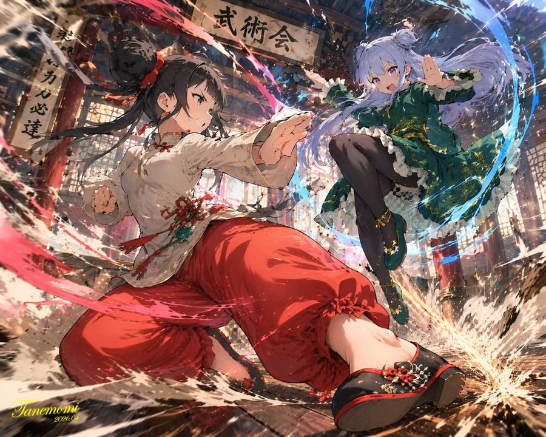
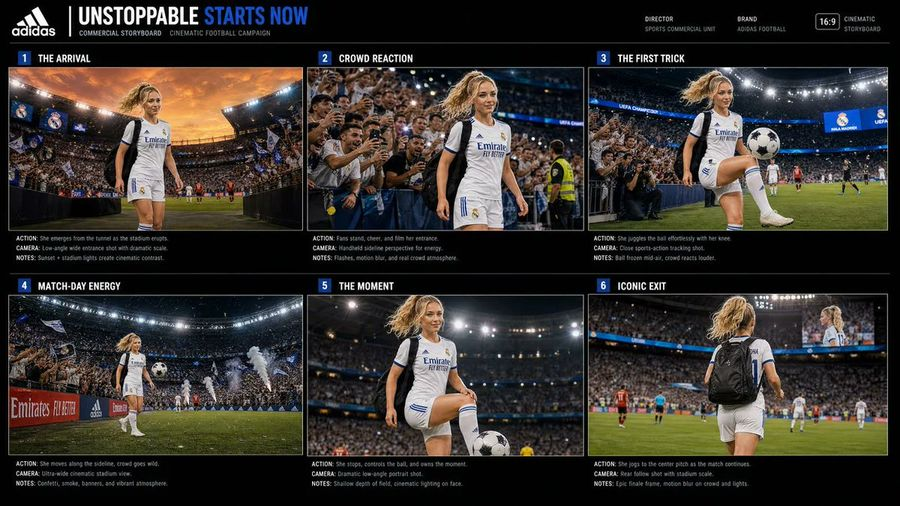
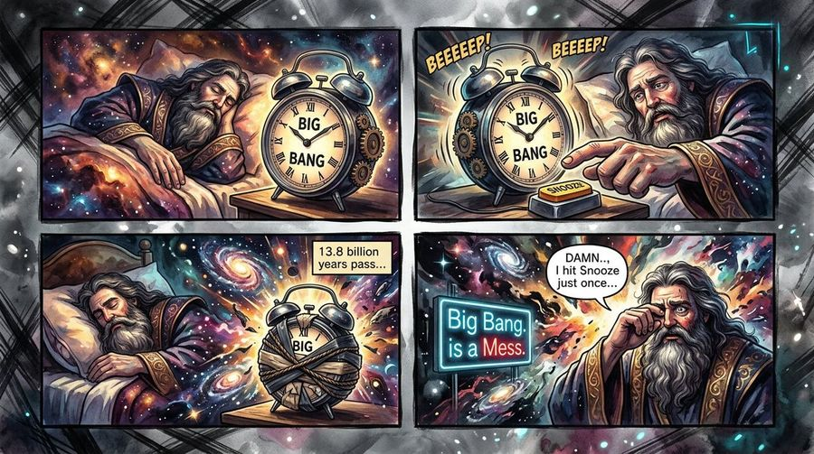
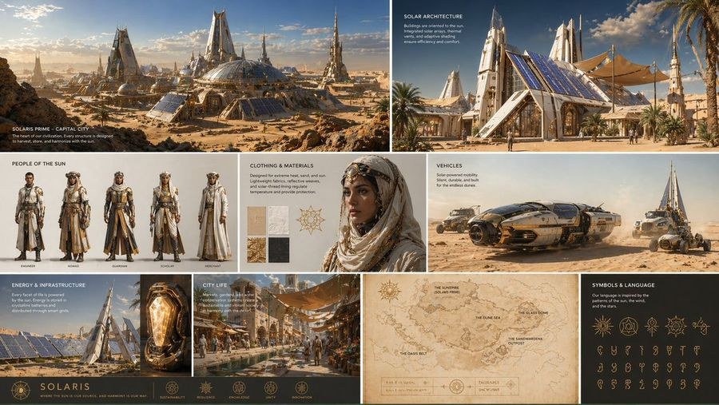
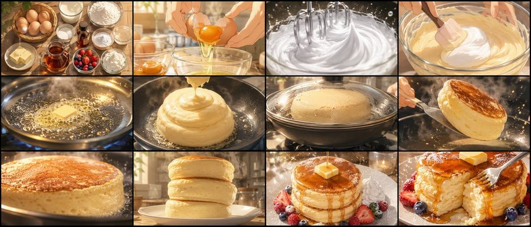
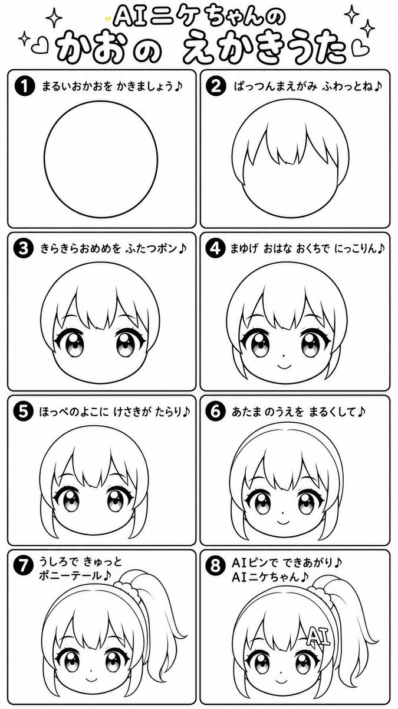

# 🎬 漫画与分镜

[返回分类](categories.md) · [查看全部案例](cases-001-100.md) · [返回首页](../README.md)

多格漫画、漫画风格转换、电影分镜、故事板、叙事场景、角色互动等。
---
## 🎬 例 34：动漫武术对决



**Prompt:**

```text
一幅极具动态感的动漫插画，描绘了两名少女在传统木质道场内进行激烈武术对决的场景。在前景中，一名留着 {argument name="character 1 hair" default="黑色高丸子头配红色丝带"} 的少女摆出强有力的低位武术架势，正奋力挥拳。她身穿 {argument name="character 1 outfit" default="带有红色流苏的白色中式上衣和红色宽松长裤"}，强烈的红色能量斩击环绕着她挥动的四肢。在右侧半空中，一名留着 {argument name="character 2 hair" default="浅紫色双丸子头"} 的少女优雅地跃起，自信地微笑着，身穿 {argument name="character 2 outfit" default="带有金色刺绣的深绿色连衣裙和黑色紧身裤"}，伴随着扫过的蓝色水流状能量轨迹。背景是质朴的木质寺庙内部，上方悬挂着一块写有“{argument name="sign text" default="武術会"}”的醒目招牌。场景充满了爆发性的动作感，飞扬的尘土、破碎的木质地板、发光的彩色粒子特效，以及将角色与精细背景完美区分开来的戏剧性低角度光影。
```

**来源：** [@Tanemomi_Ver2](https://x.com/Tanemomi_Ver2/status/2046063806846214265#reversed-0) | 2026-05-13

---
### 🎬 例 76：从米兰到戛纳的 Storyboard 项目表


**Prompt:**

```text
目标：创作一张手绘风格的电影感 Storyboard 项目表，讲述一名女性携带硬盘从米兰前往戛纳的故事，画面呈现为粗糙的铅笔加彩色铅笔制作项目风格。

画布：横向 16:9 米白色纸张背景，带有轻微纹理，呈现扫描后的速写本质感。所有 Storyboard 边框和底部图标栏均使用细红橙色边框。绘画风格为松散的石墨铅笔画，辅以柔和的淡蓝色、灰色、棕褐色和柔和的红色渲染；透视不完美，可见草稿线条，手写字体，并有意拼写错误的 Storyboard 注释。

页眉：在顶部用粗大且不均匀的黑色手写体写上“FROM MILANO TO CANNES - STORYBOBARD”。在右上角添加一个小的圆角矩形标签，内含手写文字“2 BOSIS → TO AVE”。

布局：使用 6 个主要的 Storyboard 面板，排列为 2 行 3 列。每个面板都有一个细红橙色矩形边框，下方配有简短的手写说明。面板编号依次为 1、2、3、4、6 和 7，保留跳号。使用一名重复出现的年轻女性主角，{argument name="character name" default="an unnamed woman"}，留着齐肩深色头发，穿着简单的无袖或短袖上衣；她的面部可以模糊处理或仅进行极简刻画。

面板细节和说明：
1. 室内书桌场景：女性侧身坐在桌旁，桌上有打开的笔记本电脑、一个小碗或杯子，高大的窗户透出柔和的城市景观。说明：“FINAL CUT S AM, AND FEMJUER- OUR PBSY FILR IN A TOLAND AFSAGMENT”。
2. 手部特写，放在包或夹克上，旁边是一个带有标签的小硬盘或挂牌。说明：“ONE HARD DRIVE, ONE LANVARD UNE SHOT.”
3. 沿海公路到达场景，有棕榈树、蓝色的道路或大海，以及远处类似戛纳的建筑。说明：“THE GOAST UNROALS ITALY BECOMES FRANCE,”。
4. 戛纳克鲁瓦塞特大道（Croisette）：从背后看女性，靠近棕榈树、一辆汽车、淡色的建筑立面和一个小的路边标志。说明：“CANNE’S THE CROISEITE, HEART FOUNDING.”
6. 从背后看女性，抬头仰望一个带有潦草字迹的电影院或电影节建筑标志。说明：“THERE. HFE MANE. THE BOROO.^ THREE TIMES. TO BELIEVE IT.”
7. 红毯走廊或宏伟的室内：女性侧身站立，向上看，周围是两侧草图风格的人群，红毯向前延伸。说明：“TWENTY FOUR STEPS EVERY FLASH A TEAR OF WORK.”

底部栏：添加一个长条状的红橙色边框区域，分为 10 个小矩形单元格，每个单元格内含一个小巧粗糙的图标，下方配有手写标签。从左到右：1) 小型胶囊/硬盘图标，标注“CAPYERA PRAME MOTION.”，2) 弯曲箭头和字母，标注“SI REEKE.”，3) 快速箭头标记，无额外大标题，4) 菱形/眼睛形状，标注“DIRECTON.”，5) 小嘴唇/椭圆图标，无额外说明，6) 倾斜正方形，标注“FORCE”，7) 星形，标注“CURRENT”，8) 轮廓星形，标注“MAGIC:”，9) 圆角矩形，标注“APPEARANCE”，10) 小旗帜/闪电标记，标注“MAGIC”。

视觉限制：所有文字保持手绘、不均匀且略显无意义，如同在 Storyboard 笔记本中快速草拟。保持柔和的手工质感，无照片级真实感，无整洁的数字 UI，无水印，除 6 个主要面板和 10 个底部图标单元格外，不得添加额外的 Storyboard 面板。
```

**来源：** [@status](https://x.com/lilidiai/status/2056073490491445599#reversed-0) | 2026-05-18

---

### 🎬 例 79：Living Hat Cinematic Storyboard


**Prompt:**

```text
Goal: Create a luxurious cinematic storyboard sheet for a fantasy fashion short film titled {argument name="part title" default="PART 1"}, with the subtitle {argument name="subtitle" default="THE LIVING HAT – THE DREAM APPEARS"}. The concept is a regal young woman in a lavish vintage gown standing in a grand European baroque square while wearing an enormous living hat shaped like a miniature ornate city of domes, towers, flowers, birds, roses, and gold filigree.

Canvas: Wide 16:9 storyboard board, dark charcoal-black background, thin ornate gold border, elegant vintage typography in gold and cream. Use a cinematic production-board layout with a large hero image across the top right, text blocks on the top left, 12 thumbnail storyboard panels in a 2-row grid below, and a bottom strip for sound, color, camera language, tone, and aspect ratio.

Top header and hero section: Large serif title at top left reads "PART 1". Under it, subtitle reads "THE LIVING HAT – THE DREAM APPEARS". Add a metadata line: "Duration: 15 Seconds | Panels: 12 | Tone: Poetic, Mysterious, Luxurious". Below, include a section title "MAIN CINEMATIC FRAME (HERO SHOT PROMPT)" and the paragraph: "A regal young woman in a lavish vintage gown stands in a grand European baroque square. On her head, an enormous hat that is a miniature city with domes, towers, roses and ornate gold filigree. Birds fly and perch around her. Soft golden morning light, dreamy cinematic atmosphere." The top-right hero image should show the woman close-up from chest up, centered under the giant city-hat; her face is softly obscured by shadow or a simple rectangular blur, while the hat remains highly detailed. Background: grand domed baroque architecture, warm morning sky, flying birds.

Storyboard panel layout: Use exactly 12 numbered storyboard thumbnails, labeled 01 through 12, each with a tiny timecode, image frame, and three text rows labeled CAMERA, ACTION, SOUND, and TRANSITION. Keep the same ornate gold-on-black design. The 12 panels are:
1. "01 00:00 - 00:01" — wide establishing shot of a grand city skyline and domes in soft morning light. CAMERA: "WS – Establishing Shot". ACTION: "The baroque city wakes in soft morning light." SOUND: "Distant city ambience, wind". TRANSITION: "Cut".
2. "02 00:01 - 00:02" — slow crane down toward blue-green domes with birds in the sky. CAMERA: "WS – Slow Crane Down". ACTION: "Birds circle above the domes." SOUND: "Birds in the distance". TRANSITION: "Cut".
3. "03 00:02 - 00:03" — long lens view of the woman tiny in a large ornate square. CAMERA: "MS – Long Lens". ACTION: "A woman stands still in the square, hat like a small world." SOUND: "Wind, soft chime". TRANSITION: "Cut".
4. "04 00:03 - 00:04" — medium close-up slow push-in, profile or partial face under the hat, face subtly obscured. CAMERA: "MCU – Slow Push In". ACTION: "Her profile, calm and distant." SOUND: "Fabric rustle, soft breath". TRANSITION: "Cut".
5. "05 00:04 - 00:05" — macro detail of roses blooming on the hat-city among tiny buildings and filigree. CAMERA: "CU – Macro Detail". ACTION: "Roses bloom on the hat-city." SOUND: "Delicate chime". TRANSITION: "Cut".
6. "06 00:05 - 00:07" — close-up of a bird landing on a golden spire on the hat. CAMERA: "CU – Bird Landing". ACTION: "A bird perches on a golden spire." SOUND: "Wing flutter". TRANSITION: "Cut".
7. "07 00:07 - 00:08" — miniature city architecture on the hat with windows glowing. CAMERA: "CU – Miniature Architecture". ACTION: "Tiny domes and windows, alive with detail." SOUND: "Light metallic resonance". TRANSITION: "Cut".
8. "08 00:08 - 00:09" — lace and gold edge of the massive brim moving with the breeze. CAMERA: "CU – Lace & Gold Edge". ACTION: "Embroidered edge moves with the breeze." SOUND: "Fabric whisper". TRANSITION: "Cut".
9. "09 00:09 - 00:10" — birds fly around her hat in a medium shot, face softly obscured. CAMERA: "MS – Birds in Motion". ACTION: "Birds take off around her." SOUND: "Wings, airy wave". TRANSITION: "Cut".
10. "10 00:10 - 00:12" — slow orbit around the woman in the square, revealing grandeur of the hat and architecture. CAMERA: "MS – Slow Orbit". ACTION: "Camera circles, revealing her grandeur." SOUND: "Music swell, wind". TRANSITION: "Cut".
11. "11 00:12 - 00:14" — low-angle or close-up view emphasizing the enormous majestic hat; woman’s face lightly obscured. CAMERA: "CU/Low Angle – Hat Majesty". ACTION: "The hat becomes a floating kingdom." SOUND: "Music rises". TRANSITION: "Cut".
12. "12 00:14 - 00:15" — ending close-up beat of the hat edge and woman, dreamlike transition hint. CAMERA: "CU – Ending Beat". ACTION: "She looks up, the dream begins." SOUND: "Soft musical lift". TRANSITION: "Dissolve to Part 2".

Bottom strip: Include exactly 5 color palette swatches: deep teal-black, antique gold, warm beige, burnt orange, and pale blue-gray. Add five labeled bottom sections: "OVERALL SOUND DESIGN" with "Wind, birds, fabric, light chimes, soft orchestral textures."; "COLOR PALETTE" with the 5 swatches; "CAMERA LANGUAGE" with "Elegant slow movements, push ins, orbit, macro details, low angles to elevate scale and emotion."; "TONE & STYLE" with "Surreal fantasy, luxury fashion editorial, baroque architecture, poetic realism."; and "ASPECT RATIO" with "16:9 Cinema".

Visual style: Hyper-detailed cinematic fantasy realism, luxury fashion editorial, ornate baroque architecture, gilded filigree, teal-and-gold color grading, warm golden morning light, shallow depth of field, realistic birds, richly textured roses, dreamy atmosphere. The central character is {argument name="main character" default="a regal young woman"} wearing {argument name="gown style" default="a lavish vintage gown"} and an enormous hat-city filled with domes, towers, roses, birds, and filigree.

Constraints: Keep all text legible and in English. Use exactly 12 storyboard panels and exactly 5 color swatches. Maintain a premium cinematic storyboard sheet look, no watermark, no extra panels, no extra logos.
```

**来源：** [@status](https://x.com/bmx_ai13/status/2055992037737173176#reversed-0) | 2026-05-18

---

### 🎬 例 80：Rustic Pasta Tutorial Reference Sheet


**Prompt:**

```text
Goal: Create one single composite reference sheet for a {argument name="video duration" default="15-second"} realistic pasta-making tutorial video, designed as a clean high-end production reference board rather than a poster. The board should communicate story sequence, character styling, location mood, aspect ratio, and filming constraints at a glance.

Canvas: Wide 16:9 horizontal reference sheet with elegant white margins and crisp white gutters between panels. Use warm cinematic rustic lighting, realistic photography, shallow depth of field, earthy browns, flour whites, copper highlights, antique wood textures, and a premium food-film look.

Top sequence strip: Include exactly 9 small numbered process panels across the top, each with a white circular number badge in the upper-left corner. The 9 panels are: 1) a mound of flour with a well on a wooden table, 2) hands cracking eggs into the flour well, 3) a fork mixing egg into flour, 4) floury hands kneading dough, 5) a smooth round pasta dough ball resting on a floured board, 6) hands rolling dough with a wooden rolling pin, 7) hands cutting or separating long fresh pasta strands, 8) fresh pasta being lifted from a copper pot of boiling water, 9) plated pasta finished with garnish and sauce.

Middle reference row: Use a collage of exactly 5 larger reference panels. Panel 1 is a tight portrait crop of the host, a rustic young woman with long wavy dark brown hair, soft linen blouse, delicate necklace, and face intentionally left as an indistinct blocked placeholder for identity flexibility. Panel 2 is a full-body wardrobe reference of the same host wearing a cream embroidered apron or tunic over an olive-green skirt and brown boots, standing in a rustic kitchen. Panel 3 is a medium action shot of the host rolling or preparing pasta at the wooden table, also with an indistinct face placeholder. Panel 4 is a rear-view costume reference showing long wavy hair tied partly back, cream blouse, dark green skirt, and apron ties. Panel 5 is a wide environment reference of a cozy old-world farmhouse kitchen with rough plaster walls, exposed timber beams, shelves of bowls and jars, hanging herbs, copper pots, a vintage stove, a wooden worktable, flour, eggs, and warm sunlight through a window.

Bottom production-spec band: Leave a clean white band along the bottom with exactly 5 simple black-outline icons and labels or implied labels: 1) a circular badge reading "15 SEC", 2) a rectangular badge reading "16:9", 3) a vintage movie camera icon, 4) a sun/daylight icon, 5) a steaming bowl of pasta icon. At the far bottom-right, add a camera-lens mark with the visible brand text {argument name="brand text" default="BudgetPixel"}.

Subject details: The host should feel like {argument name="host style" default="a rustic young Italian farmhouse cook"}; wardrobe should be natural linen, cream embroidery, olive green skirt, apron ties, and worn leather boots. The kitchen should feel {argument name="kitchen style" default="rustic Tuscan farmhouse"}, with practical food-prep clutter but still art-directed and elegant.

Visual style: Realistic cinematic photography, warm golden window light, soft contrast, tactile flour and dough textures, copper cookware, weathered wood, handmade pasta authenticity, editorial production-board composition. Keep typography minimal and functional.

Constraints: Do not create a text-heavy poster. Preserve the exact count of 9 top step panels, 5 middle reference panels, and 5 bottom icons. Maintain clean white gutters, white margins, numbered process badges, realistic food styling, and a professional video production reference-sheet layout.
```

**来源：** [@status](https://x.com/Just_sharon7/status/2055922428854063548#reversed-0) | 2026-05-18

---
### 🎬 例 101：Trading Card Battle Anime Storyboard


**Prompt:**

```text
Goal: Create a polished anime storyboard sheet for a fictional 10-second trading card battle anime sequence, designed like a cinematic ad storyboard made from five horizontal panels.

Canvas: Landscape 16:10 white storyboard page with thin gray table borders, a centered Japanese headline at the top reading {argument name="headline text" default="10秒トレーディングカードバトルアニメ 絵コンテ"}, a thin red line accent near the top left, and a small angular red logo-like mark in the top right.

Layout: Use a three-column storyboard grid. The left column is narrow and contains red cut labels plus timing. The center column is wide and contains cinematic anime stills. The right column is a white notes column with camera direction and action notes. There are exactly 5 horizontal rows, separated by light gray lines.

Visible cut list: 1) Cut 1, 0.0s-2.0s: wide establishing arena shot. 2) Cut 2, 2.0s-4.0s: medium-close shot of the protagonist activating a card device. 3) Cut 3, 4.0s-6.2s: extreme close-up of a card thrust toward the viewer. 4) Cut 4, 6.2s-8.5s: whip-pan summoning scene with a dragon hologram appearing. 5) Cut 5, 8.5s-10.0s: final low-angle hero-and-dragon shot.

Subject details: The protagonist is {argument name="protagonist description" default="a fiery red-haired teenage anime boy wearing a red-and-black battle jacket, fingerless gloves, and a glowing mechanical card duel device on one arm"}. The summoned monster is {argument name="dragon description" default="a crimson armored dragon with huge wings, jagged horns, glowing red crystal chest core, and ember-like highlights"}. The arena is {argument name="arena description" default="a futuristic packed stadium at night with blue neon spotlights, a glowing duel field, massive audience stands, and a giant VS screen"}. The main card art shows a red demonic dragon emblem and fiery energy.

Center-panel imagery: Cut 1 shows the full stadium duel field with the red-haired protagonist on the left, an opponent in white far away on the right, giant red and blue card banners, and a large glowing “VS” display in the background. Cut 2 shows the protagonist grinning confidently, holding up a red dragon card while red energy coils around the wrist-mounted duel device; intentionally obscure or soften the exact face area as if motion-blurred/censored. Cut 3 shows a sharp close-up of one intense red eye and the raised dragon card, with rack-focus depth of field and explosive red particle streaks behind it. Cut 4 shows a red magic circle covering the arena floor as the dragon materializes in holographic flame beside the protagonist. Cut 5 shows the protagonist standing heroically beside the fully formed dragon, both lit from below by red embers and dramatic battle light.

Right-column text notes: For Cut 1 write “wide shot / dolly in / audience cheers, introduce protagonist”. For Cut 2 include the red Japanese quote {argument name="summon quote" default="「来い、紅蓮王ドラグレイザー！」"} followed by “medium-close-up / fearless smile / device activation”. For Cut 3 write “extreme close-up / rack focus / thrust card toward camera”. For Cut 4 write “whip pan / hologram summon / dragon appears”. For Cut 5 write “low angle / orbit shot / decisive cut”.

Visual style: High-energy modern shonen anime, glossy digital painting, cinematic lighting, red and blue color contrast, intense lens flares, speed lines, sparks, holographic particles, dramatic perspective, crisp storyboard presentation, professional production-board clarity.

Constraints: Keep exactly 5 storyboard rows, exactly 3 columns, and preserve the timing labels. Do not add extra cuts, extra characters, watermarks, or unrelated UI elements.
```

**来源：** [@status](https://x.com/Yuupapa_free/status/2057464371232850117#reversed-0) | 2026-05-20

---

### 🎬 例 105：Anime Character in Real Rooftop Scene


**Prompt:**

```text
Using the provided reference image as the character base, place the same anime character into a photorealistic outdoor rooftop/parking-deck environment. Keep the character’s pose, outfit, hairstyle, accessories, colors, and cel-shaded anime rendering intact, but integrate them naturally into a real-world scene with realistic daylight, perspective, and atmospheric lighting.

Add a real human hand in the foreground, reaching toward the character from the lower left, slightly motion-blurred and out of focus, as if someone is about to touch or stop her. The hand should visibly overlap the scene in front of the character without changing her design.

Background: replace the plain background with a realistic rooftop concrete surface, railings, distant city skyline, and blue sky with scattered clouds. Use shallow depth of field so the hand is foreground-blurred and the distant buildings are softly blurred, while the anime character remains the main sharp subject.

Style constraints: preserve the 2D anime character look against a live-action photographic background, creating a convincing anime-plus-real-photo image-to-image composite. Do not redesign the character, do not add extra characters, and do not add text or watermarks.
```

**来源：** [@status](https://x.com/Eris_Create_Lab/status/2057272698741669964#reversed-0) | 2026-05-20

---
### 🎬 例 114：12-Panel Spear Sakuga Storyboard


**Prompt:**

```text
Goal: Create a monochrome anime action storyboard sheet for an animation fight sequence, full of rough sakuga energy: gestural, dynamic, and readable, like a choreography bible for animators. The subject is {argument name="character name" default="a long-haired robed spear warrior"} performing a spear-and-water combat ritual across exactly 12 panels.

Canvas: Wide horizontal storyboard board, 16:9 ratio, divided into an exact 3x4 grid with thick black panel borders. Each panel has a black number badge in the upper-left corner, numbered 01 through 12, with hand-lettered uppercase titles and small color-coded annotation notes.

Visual style: Grayscale ink-and-pencil concept art with loose sketch lines, dramatic motion blur, wind-torn cloth, flying hair, splashing water, ruined coastal towers, hanging lanterns, birds in the sky, and cinematic camera angles. Keep the art mostly black, white, and gray, but overlay clear colored animator annotations: red for camera movement, blue for body mechanics, green for weapon arc, orange for impact or lantern reaction, and purple for timing or hold beats. Annotation arrows should be hand-drawn, bright, and readable.

Layout and panel content: Include exactly 12 storyboard panels:

01 — SPEAR PLANT REVEAL: The warrior stands upright on flooded stone, spear planted vertically into the water. Distant towers and seabirds behind. Red arrows show a low front wide camera move, blue notes show still stance, green arrow shows spear vertical, purple rings at the feet show stillness.

02 — TIDE BREATH: Medium side shot. The warrior extends the spear horizontally while cloth and hair flow in the wind. Red note: medium side. Blue arrows: arms rise, inhale. Green arrow: spear lifts parallel. Purple timing mark: breath hold.

03 — FIRST SWEEP CUT: Dynamic tracking-wide shot of the warrior lunging into a wide sweeping spear cut, water exploding at the feet. Red annotation: tracking wide. Blue arrows: hip rotation, low sweep. Green arc sweeps left to right across the panel. Purple note: release.

04 — SPIRAL ENTRY: Overhead or high-angle spin view. The warrior rotates in a 360-degree spiral, robes forming circular motion. Red note: orbit follow. Blue: spin 360. Green: spear orbital loop. Purple: snap at top.

05 — SALTWATER STEP: Ground-tracking shot. The warrior steps forward through shallow seawater, spear trailing outward, ripples spreading. Red: ground tracking. Blue: cross step forward. Green: water ripples outward. Purple: weight shift.

06 — PILLAR VAULT: High-angle follow shot as the warrior vaults or leaps near a tall broken pillar. Red: high angle follow. Blue: upward vault, body extend. Green: spear trails below. Purple: airborne beat.

07 — DOWNWARD PLUNGE: Front low push-in. The warrior drives the spear downward into the ground or water, creating a violent burst. Red: front low push-in. Blue: two-hand strike descend. Green: spear vertical down. Orange: impact burst. Purple: hit snap.

08 — BLADE SPIN RECOVER: Wide side view recovery stance. The warrior pivots low while the spear loops tightly around the body. Red: wide side view. Blue: behind-back loop, recover stance. Green: tight spear loop. Purple: reset breath.

09 — LANTERN PASS: Rear three-quarter composition with the warrior passing under hanging lanterns, spear extended across the frame. Red: rear 3/4. Blue: tip graze precise line. Green: spear tip path. Orange: lanterns sway, chain reaction. Purple: soft snap.

10 — TIDE SILHOUETTE: Extreme low wide shot. The warrior poses dramatically on a broken stone platform against a towering wave. Red: extreme low wide. Blue: full body pose. Green: spear overhead arc. Purple: hero pause.

11 — ROBES-TO-WATER CUT: Tracking front shot. The warrior slashes downward through water, robes whipping into the motion. Red: tracking front. Blue: slide descend steps. Green: robes trail through water. Purple: controlled flow decay.

12 — RITE UNFINISHED: Wide hero shot at sunset or pale dawn. The warrior stands facing the horizon, spear leveled forward, ocean ruins and a glowing sun in the distance. Red: wide hero shot. Blue: stand and level forward. Green: spear leveled at horizon. Purple: forward intent.

Text content: Use hand-lettered English titles exactly as listed for all 12 panels. Add small colored notes inside each panel, matching the listed red, blue, green, orange, and purple annotations. Optional main design emphasis: {argument name="motion emphasis" default="water-spear choreography with readable animation planning arrows"}.

Constraints: Exactly 12 panels in a 3x4 grid, no extra panels. Preserve the locked annotation color key: red camera, blue body, green weapon arc, orange impact, purple timing. Keep the image mostly monochrome with only the annotation colors vivid. Avoid polished clean lineart; keep it rough, energetic, cinematic, and storyboard-like.
```

**来源：** [@status](https://x.com/CoderJunkie/status/2058205777744326673#reversed-0) | 2026-05-22

---

### 🎬 例 118：电影级足球广告项目



**Prompt:**

```text
目标：为 15 秒超写实电影级竖屏足球营销活动创建一个精致的商业项目演示，每一帧画面中均包含同一位女性足球运动员，标题为 {argument name="headline text" default="UNSTOPPABLE STARTS NOW"}。

画布：宽屏 16:9 黑色演示项目，带有细白色分割线，采用高端体育代理机构布局，高对比度，每个面板中包含写实的体育场摄影，顶部设有小型元数据栏。使用黑色背景、白色压缩大写字体，并用蓝色强调块标注面板编号和“STARTS”一词。

页眉：左上角放置一个白色 Adidas 风格的三条纹标志，随后是主标题“UNSTOPPABLE STARTS NOW”，其中“UNSTOPPABLE”为白色，“STARTS NOW”为电光蓝色。下方添加小字：“COMMERCIAL STORYBOARD   CINEMATIC FOOTBALL CAMPAIGN”。右上角添加小型制作标签：“DIRECTOR / SPORTS COMMERCIAL UNIT”、“BRAND / ADIDAS FOOTBALL”、一个小型“16:9”徽章以及“CINEMATIC STORYBOARD”。

布局：使用 6 个项目面板，按 3 列 2 行的网格排列。每个面板都有一个蓝色编号方块、一个大写场景标题、一张超写实电影级图像，并在下方标注三个简短说明，分别标记为 ACTION（动作）、CAMERA（镜头）和 NOTES（备注）。在所有 6 个面板中保持一致的参考角色：{argument name="character description" default="一位年轻、运动型、扎着高马尾的金发女性足球运动员，身穿带有黑色肩部拼接、蓝色滚边、白色球袜和足球鞋的白色 Real Madrid 风格球衣"}。面部表情保持中性或略微遮挡，而非特定名人。

项目面板，共 6 个：
1. “THE ARRIVAL” — 球员在日落时分从体育场通道走进拥挤的足球场，橙色天空充满戏剧感，观众席上有 Real Madrid 风格的旗帜，巨大的体育场灯光，低角度广角入场镜头。下方文字：ACTION：随着体育场欢呼声响起，她从通道走出。CAMERA：具有戏剧性规模的低角度广角入场镜头。NOTES：日落 + 体育场灯光营造出电影般的对比度。
2. “CROWD REACTION” — 手持侧边视角，兴奋的球迷向前欢呼、用手机拍摄，当她自信走过时，背景是闪光灯和体育场灯光。下方文字：ACTION：球迷起立、欢呼并拍摄她的入场。CAMERA：充满活力的手持侧边视角。NOTES：闪光灯、动态模糊和真实的观众氛围。
3. “THE FIRST TRICK” — 紧凑的体育动作追踪镜头，她靠近边线，用膝盖轻松颠着 {argument name="football type" default="黑白足球"}，观众欢呼，明亮的体育场泛光灯，蓝色的 Champions League 风格丝带标牌。下方文字：ACTION：她用膝盖轻松颠球。CAMERA：紧凑的体育动作追踪镜头。NOTES：球定格在半空中，观众反应更加热烈。
4. “MATCH-DAY ENERGY” — 宽屏电影级体育场全景，球员沿边线移动，观众席人头攒动并挥舞旗帜，彩带和烟雾炮，广告项目，充满活力的比赛日氛围。下方文字：ACTION：她沿边线移动，观众陷入疯狂。CAMERA：超宽电影级体育场全景。NOTES：彩带、烟雾、横幅和充满活力的氛围。
5. “THE MOMENT” — 球场上的戏剧性低角度肖像，她抬起一只脚控球，头顶体育场灯光闪烁，浅景深，强烈的英雄式停顿。下方文字：ACTION：她停下，控制住球，掌控全场。CAMERA：戏剧性低角度肖像镜头。NOTES：浅景深，面部电影级布光。
6. “ICONIC EXIT” — 球员背着黑色背包向中场慢跑的后方跟随镜头，球衣号码可见，远处比赛仍在继续，巨大的体育场屏幕显示着她的身影，观众和灯光略带动态模糊。下方文字：ACTION：比赛继续，她慢跑向中场。CAMERA：带有体育场规模感的后方跟随镜头。NOTES：史诗般的结尾帧，观众和灯光带有动态模糊。

视觉风格：超写实体育商业摄影、电影级调色、清晰细节、体育场泛光灯、观众活力、轻微动态模糊、高端品牌项目美学、整洁的编辑间距、图像周围细白边框、微小但清晰的制作说明字体。

约束：使用 6 个面板，不得增加额外面板。在所有面板中保持相同的球员、球衣、发型和体型。即使描述的是竖屏视频营销活动，项目仍需保持 16:9 横屏。避免使用除 Adidas 风格页眉标志和足球场品牌标识以外的随机 Logo。使其看起来像一份成品专业项目表，而非漫画页。
```

**来源：** [@status](https://x.com/Just_sharon7/status/2058062379536269612#reversed-0) | 2026-05-22

---
### 🎬 例 127：9-Panel Beauty Serum Storyboard


**Prompt:**

```text
Goal: Create a 3-by-3 social media ad storyboard collage for a beauty serum, showing the same young blonde woman demonstrating a glow serum in a warm bedroom/vanity setting. The subject’s face must be intentionally anonymized by a flat skin-tone rectangular blur/cover in every panel, while hair, pose, outfit, and product remain visible.

Canvas: Wide 16:9 composite image, 1200 x 675 style, divided into exactly 9 equal panels with thin black grid lines. Add a small white panel number with black outline in the top-left corner of each panel, numbered exactly 1 through 9.

Subject details: A young adult woman with {argument name="hair color" default="long wavy blonde hair"}, light skin, wearing a black sleeveless crop top. Warm natural indoor light, beige walls, soft bedroom background with white bedding in some panels. Beauty-ad aesthetic, realistic photography, influencer UGC style, shallow depth of field, golden glow lighting.

Product details: A small glass dropper bottle labeled with a minimal skincare brand, showing text like “AI Glow Up” and “Serum.” The bottle contains warm golden liquid and has a white dropper cap. The product should appear clearly in panels 5, 6, and 8.

Layout: Use exactly 9 discrete panels:
1. Close selfie-like shot of the woman in warm morning light, face covered by a skin-tone rectangle, text at bottom: “Morning glow, no filter”.
2. Centered close portrait in the same room, face covered, text at bottom: “Ready for the day”.
3. Wider bedroom shot on white bedding, woman posing confidently and touching her hair, face covered, text at bottom: “Confidence is key”.
4. Side-profile hair and shoulder shot against a beige wall, face covered, text at bottom: “My skin is glowing”.
5. Woman holding the serum bottle beside her face, face covered, text at bottom: “Introducing my secret”.
6. Closer product showcase with woman holding the serum bottle near her face, face covered by a larger rectangle, text at bottom: “Radiance Serum”.
7. Woman spraying a fine mist upward/sideways in warm light, face covered, text at bottom: “Instantly brightens”.
8. Woman holding the serum bottle and pointing toward it with the other hand, face covered, text at bottom: “Get the glow”.
9. Close-up of long wavy blonde hair and shoulder area with the face mostly covered by a large skin-tone rectangle, text at bottom: “Unlock your light”.

Text styling: Each panel has bold white caption text with a black outline/drop shadow, placed near the bottom. In every caption, highlight one key phrase with a bright green rounded rectangle behind it: “glow, no filter” in panel 1, “the day” in panel 2, “key” in panel 3, “glowing” in panel 4, “secret” in panel 5, the entire “Radiance Serum” phrase or the word “Serum” in panel 6, “brightens” in panel 7, “glow” in panel 8, and “light” in panel 9. Use {argument name="product name" default="Radiance Serum"} as the product/caption name in panel 6 if customized.

Constraints: Keep the collage realistic and consistent as if frames from one influencer video. Use exactly 9 panels, exactly 9 panel numbers, and exactly 9 captions. Do not add extra logos, watermarks, UI elements, or additional text beyond the captions and simple product label.
```

**来源：** [@Just_sharon7](https://x.com/Just_sharon7/status/2058899367923511315#reversed-0) | 2026-05-26

---

### 🎬 例 128：Golden Fried Rice Storyboard Sheet


**Prompt:**

```text
Goal: Create an ultra-high-quality, detailed anime-style storyboard sheet for a 15-second cooking video about {argument name="dish theme" default="golden fried rice"}, showing the full cooking process in chronological order.

Canvas: One wide 16:9 storyboard sheet, divided into exactly 12 panels arranged in a clean 4 columns by 3 rows grid. Use thin black panel borders, cinematic close-ups, warm restaurant-kitchen lighting, dramatic steam, oil shimmer, flying rice grains, and appetizing golden colors. No captions, no speech bubbles, no panel numbers, no watermark.

Visual style: Premium Japanese anime food commercial look, highly detailed semi-realistic cooking illustration, glossy highlights, shallow depth of field, dynamic action framing, orange firelight and golden egg tones, crisp textures on rice, scallions, diced meat, wok metal, and wooden cutting board.

Storyboard panels, exactly 12 in this order:
1. Top-down ingredient prep shot on a wooden board: a large glass bowl of cooked white rice, 4 brown eggs in a small bowl, long green onions/scallions, a bowl of cubed pork or ham, and 3 small seasoning dishes containing white salt, black pepper, and dark soy sauce.
2. Close-up of hands chopping scallions into small green rings with a large chef’s knife on a wooden cutting board.
3. Close-up of hands cracking one egg over a clear glass mixing bowl, yolk and egg white falling with sparkling highlights.
4. Close-up of beaten eggs being vigorously whisked with chopsticks in a glass bowl, swirling bright orange-yellow liquid.
5. Hot black wok over open flames, oil being poured in a thin golden stream, steam rising.
6. Pour beaten egg into the sizzling wok; the egg begins to scramble and bubble into soft golden curds.
7. Toss rice, diced meat, scallions, and egg together in the wok; ingredients fly upward in a dramatic midair arc.
8. High-energy wok-tossing shot surrounded by intense orange flames and sparks, golden fried rice scattering in the air.
9. Extreme appetizing close-up of finished fried rice with glossy individual grains, yellow egg pieces, green scallions, and browned meat cubes.
10. Wider kitchen action shot: a cook’s hand sprinkles seasoning from above into the steaming wok while the fried rice cooks over flame.
11. Hero plating shot: a neat dome mound of golden fried rice on a white plate with a subtle patterned rim, steam rising, warm kitchen background.
12. Final close-up spoonful shot: a metal spoon lifts glossy golden fried rice with egg, scallions, and a large cube of meat, with the plated rice blurred behind it.

Constraints: Keep the grid layout exact with 12 distinct panels, chronological left-to-right and top-to-bottom storytelling, no visible text, emphasize {argument name="main color palette" default="gold, amber, orange firelight, deep black wok, fresh green scallions"}, make the dish look rich, hot, and delicious.
```

**来源：** [@ozuozuai99](https://x.com/ozuozuai99/status/2058882177383924182#reversed-0) | 2026-05-26

---

### 🎬 例 133：宇宙大爆炸贪睡漫画



**Prompt:**

```text
目标：创作一则幽默的四格宇宙漫画，讲述一位神一般的宇宙造物主睡过头，意外导致大爆炸变得一团糟的故事。

画布：宽幅横向漫画页面，16:9 比例，采用 2x2 网格排列的四个矩形分镜。使用粗黑漫画边框，带有轻微的透视晃动感，外背景为烟雾缭绕的灰阶色调，点缀着发光的微粒和素描般的交叉阴影线。

视觉风格：高度细腻的绘画风格漫画，具有戏剧性的墨水轮廓、宇宙奇幻光影、饱和的星云色彩、恒星、星系、爆炸以及水彩般的质感。基调幽默、史诗感且略带混乱。在每个分镜中，造物主的脸部上方添加一个刻意的模糊方块，仿佛经过了审查或匿名处理。

主角：一位留着长发和胡须、年迈的宇宙巫师或神灵，身穿饰有星星图案和金色刺绣袖口的华丽紫色长袍。他显得困倦且烦躁，出现在床上或闹钟旁。仅将 {argument name="character name" default="anonymous cosmic creator"} 作为内部角色概念使用，不要显示在画面文字中。

分镜布局及具体内容：
1. 左上分镜：宇宙造物主在漂浮于深空的床上盖着毯子睡觉。床边的小木桌上放着一个大型复古双铃闹钟。闹钟表盘上清晰地印着粗体黑色字母“BIG BANG”，边缘环绕着罗马数字。背景充满了色彩斑斓的星云和恒星。无对话气泡。
2. 右上分镜：闹钟剧烈鸣响，带有动感线条。闹钟上方添加两个漫画音效：左侧为“BEEEEEP!”，右侧为“BEEEEP!”，采用黄色粗体漫画字体，带有黑色轮廓。造物主从右侧伸手去按闹钟前底座上的一个小矩形橙色贪睡按钮。按钮标签写着“SNOOZE”。闹钟表盘依然显示“BIG BANG”。
3. 左下分镜：造物主在左侧继续睡觉，而床头柜上的闹钟被凌乱的绷带或布条紧紧包裹，声音被闷住并受到束缚。身后的宇宙爆发出了星系、恒星和绚丽的能量漩涡。在右上角添加一个米色说明框，文字内容为：“13.8 billion years pass...”。
4. 右下分镜：造物主醒来并感到恼火，指着或比划着宇宙的混乱景象。他身后是星系、星爆和星云碎片的狂野爆炸。在左侧添加一个发光的霓虹灯牌，文字为：“Big Bang is a Mess.”，其中“Mess.”用红色强调。在造物主上方添加一个对话气泡，文字为：“DAMN..., I hit Snooze just once...”。

文字内容：包含以下可见文字元素：“BIG BANG”（出现在第 1、2 分镜的闹钟上，第 3 分镜部分可见）；“BEEEEEP!”；“BEEEEP!”；“SNOOZE”；“13.8 billion years pass...”；“Big Bang is a Mess.”；以及“DAMN..., I hit Snooze just once...”。

限制：严格使用四个分镜，仅限一个循环出现的主角，一个闹钟，一个贪睡按钮，一个霓虹灯牌，以及一个说明框。保持所有文字清晰可辨且拼写准确。不得添加额外的分镜、对话气泡、水印、Logo 或签名。
```

**来源：** [@ExquisitMe](https://x.com/ExquisitMe/status/2059553900064022903#reversed-0) | 2026-05-28

---

### 🎬 例 134：未来世界观构建概念套件



**Prompt:**

```text
构建一套完整的视觉世界观套件，主题为 {argument name="civilization theme" default="未来太阳能沙漠文明"}。包含多张涵盖建筑、角色、服饰、载具和地图的图像，所有图像需共享同一种 {argument name="style" default="统一的设计语言"}，并呈现 {argument name="finish" default="电影级的写实感和超精细的质感"}。
```

**来源：** [@iamaiistudio](https://x.com/iamaiistudio/status/2059335346861781102) | 2026-05-28

---

### 🎬 例 140：舒芙蕾松饼动画项目



**Prompt:**

```text
目标：为一段 15 秒的美食视频创建一个超高质量的动画烹饪项目表，主题为 {argument name="dish theme" default="Q 弹超厚舒芙蕾松饼"}。

画布：一张 21:9 的宽幅横向项目表，带有黑色外边框和细黑色网格线。按时间顺序排列 12 个画面，采用 3 行 4 列的网格布局。每个画面均需呈现电影感、暖色调、金黄色、高细节，具备浅景深、光泽感美食高光、蒸汽、闪烁效果以及逼真的动画风格渲染。

视觉风格：高端日本动画美食广告质感，绘画级写实纹理，特写镜头角度，温暖的清晨厨房光线，琥珀色反光，柔和的背景虚化，诱人的微距细节，无字幕，无画面编号，无水印。

项目画面，共 12 格：
1. 食材平铺：柳条篮中的鸡蛋、牛奶、面粉、砂糖、黄油块、香草、蜂蜜或糖浆、浆果、奶油以及放置在乡村风格木桌上的碗。
2. 分离蛋清蛋黄特写：双手在玻璃碗上方敲开鸡蛋，明亮的蛋黄悬浮，蛋清滴落。
3. 打发蛋白：电动打蛋器将光亮的白色蛋白打发至硬性发泡，伴有飞溅和闪烁的高光。
4. 翻拌面糊：刮刀将蓬松的蛋白霜轻柔地翻拌进玻璃碗中淡黄色的松饼面糊里。
5. 黄油融化：一块黄油在蓝色燃气火焰上的平底锅中滋滋作响并产生泡沫。
6. 挤入/倒入面糊：浓稠的舒芙蕾面糊被倒入锅中形成高耸的圆堆，呈现出柔软的螺旋状。
7. 盖盖焖蒸：厚松饼在锅中盖上玻璃盖烹饪，可见冷凝水和蒸汽，松饼高高隆起。
8. 翻面瞬间：铲子提起并翻转一个高耸的金黄色舒芙蕾松饼，展示出焦黄的顶部和空气感十足的侧面，伴有飞溅的碎屑和蒸汽。
9. 煎制上色特写：松饼表面变得均匀金黄且边缘酥脆的极致特写。
10. 堆叠：三个厚实的舒芙蕾松饼堆叠在阳光明媚的温馨厨房里的白色盘子上，圆润且蓬松。
11. 最终摆盘：松饼堆顶端放上一块方形黄油，淋上光亮的糖浆，周围点缀草莓、蓝莓、树莓、糖粉和少量奶油装饰。
12. 食用镜头：叉子切开松饼，露出柔软蓬松的内部；糖浆顺着切口流下，盘子周围散落着浆果，极具诱惑力的戏剧性特写。

主体细节：松饼应看起来非常厚实、柔软、有弹性，并带有舒芙蕾特有的颤动质感。强调金黄色的顶部、浅色蓬松的侧面、糖浆的光泽、融化的黄油以及可见的气泡。

约束条件：使用 12 个画面，严格 3 行 4 列，按从食材到食用的烹饪顺序排列，图像内无文字，无人脸，仅在必要时出现手部和工具。整体主题围绕 {argument name="main ingredient" default="超厚舒芙蕾松饼"}，并采用 {argument name="lighting mood" default="温暖的清晨厨房金光"}、{argument name="art style" default="高细节电影感动画美食插画"} 以及 {argument name="aspect ratio" default="21:9 宽幅项目表"}。
```

**来源：** [@vermouth_dev](https://x.com/vermouth_dev/status/2059586946356441201#reversed-0) | 2026-05-28

---

### 🎬 例 142：日式 Q 版绘画歌练习表



**Prompt:**

```text
Goal: Create a black-and-white Japanese chibi drawing-song manga worksheet titled AIニケちゃんの かおの えかきうた, showing a step-by-step guide for drawing a cute simplified anime girl face.

Canvas: Tall vertical poster, approximately 2:3 aspect ratio, white background, clean monochrome line art. Use thick rounded black outlines, playful handwritten Japanese typography, and a kawaii instructional-comic style. Add small decorative sparkles, hearts, and tiny yellow accent hearts around the title.

Layout: Top title area, then an 8-panel grid arranged as 2 columns by 4 rows. Each panel has a rounded rectangle border, a black circular step number badge in the upper-left corner, and a short Japanese lyric caption across the top. The drawing inside each panel gradually becomes more complete.

Text content: Use exactly 8 numbered captions:
1. まるいおかおを かきましょう♪
2. ぱっつんまえがみ ふわっとね♪
3. きらきらおめめを ふたつポン♪
4. まゆげ おはな おくちで にっこりん♪
5. ほっぺのよこに けさきが たらり♪
6. あたまのうえを まるくして♪
7. うしろで きゅっと ポニーテール♪
8. AIピンで できあがり♪ AIニケちゃん♪

Panel details: Panel 1 shows only a large simple oval/circle face outline centered. Panel 2 adds rounded bob-like hair with straight bangs and pointed locks over the face circle. Panel 3 adds two large sparkling anime eyes with heavy upper lashes and highlights. Panel 4 shows the same head but the lower central drawing area is covered by a large pale gray vertical rectangular blur, obscuring the facial details; only the upper head outline is visible behind it. Panel 5 shows the face with bangs, big eyes, and two side hair strands falling beside the cheeks. Panel 6 adds a rounded outer head/hair outline above the face plus small eyebrows, tiny nose, and smiling mouth. Panel 7 adds a high side ponytail on the upper right with a scrunchie-like band, but the center and lower face are obscured by a large gray gradient rectangle. Panel 8 shows the near-final head with side ponytail and scrunchie, but the central face/lower area is obscured by a similar large gray gradient rectangle.

Visual style: crisp manga coloring-book line art, no color fills except black outlines and minimal yellow heart accents near the title; thick friendly strokes, rounded corners, cute educational worksheet look. Keep the drawings simple, deformed, and childlike, as if for a drawing-song tutorial.

Constraints: Use exactly 8 panels and exactly one step number per panel. Preserve the Japanese text as written. Do not add extra panels, extra characters, background scenery, watermarks, or
```

**来源：** [@Anifun_AI](https://x.com/Anifun_AI/status/2060275303054991525) | 2026-05-29

---
### 🎬 例 170：冬季生存惊悚 Storyboard


**Prompt:**

```text
Cinematic Survival Thriller Storyboard Prompt

Create a premium cinematic storyboard presentation sheet for a prestige winter survival thriller.
Ultra-detailed professional film pre-production layout, clean editorial design, grayscale blueprint background with labeled sections and technical annotations.
Aspect ratio 16:9 horizontal master board.

SHARED CHOICES HEADER

* Cut Count: 10
* Color Palette: icy blue + steel gray + pine green + ember amber
* Environment Fingerprint: snow-covered pine clearing, overturned horse carcass, torn campsite debris, looming conifer forest, drifting winter fog

---

1. CHARACTER REFERENCE

A realistic South Asian man in his early 30s wearing a dark charcoal business suit, white dress shirt, black tie, polished black shoes.
Snow dusted across shoulders and hair.
Calm but haunted expression.
Show:

* front view
* side profile
* back view
* facial close-up
* side close-up
* costume fabric detail
* damaged sleeve detail
* shoes in snow

Character notes:
“An intelligent city professional trapped in a brutal wilderness.
Outer composure slowly cracks under primal fear.
Suit = identity, burden, and last thread of control.”

Palette swatches:

* icy blue
* steel gray
* pine green
* ember amber

---

2. ENVIRONMENT / SET DESIGN

Top-down aerial map of a snowy forest clearing at dusk.
Dead horses partially buried in snow.
Destroyed campsite tents.
Blood trails across frozen ground.
Dense dark pine trees forming a claustrophobic wall around the clearing.
Heavy winter fog drifting through the forest.

Add cinematic camera movement markers:

1. Crane-down
2. Track
3. Push-in
4. Handheld
5. Steadicam
6. Pan-right
7. Dolly-in
8. Rack-focus
9. Arc shot
10. Pull-out

Include arrows and overhead cinematic blocking diagram.

Side elevation panel:

* descending crane shot
* fog layers
* silhouette scale reference
* conifer enclosure composition

Location elements legend:

* tree line
* torn campsite
* horse carcass debris
* blood-stained snow
* main character
* wolf approach zones

---

3. STORYBOARD (10 CUTS)

CUT 1

Wide aerial crane-down shot over frozen clearing.
Tiny suited man surrounded by devastation.
Moody blue dusk lighting.

CUT 2

Tracking medium shot beside the man walking cautiously through snow and ripped tents.
Wind moving fabric debris.

CUT 3

75mm close-up push-in on face.
Cold breath visible.
Fear slowly emerging in his eyes.

CUT 4

Extreme close-up handheld shot of trembling hand gripping torn frozen fabric near blood-covered snow.

CUT 5

Steadicam medium shot revealing wolves emerging between trees behind him.

CUT 6

Pan-right wide shot sweeping across forest edge.
Multiple wolf silhouettes visible in fog.

CUT 7

Over-the-shoulder dolly-in toward alpha wolf approaching slowly through snow.

CUT 8

Rack-focus insert shot shifting focus from frozen hand to wolf tracks in snow.

CUT 9

Arc shot circling around the man as wolves tighten formation.
Snow and pine branches moving in icy wind.

CUT 10

Close-up pull-out shot from his exhausted face revealing the full massacre behind him in fading ember dusk light.

---

4. LIGHTING / MOOD / STYLE NOTES

* icy dusk ambience
* cold blue backlight
* ember sunset glow fading through fog
* wet fabric specular highlights
* cinematic volumetric fog
* snow particles drifting through frame
* high-contrast prestige thriller realism

Mood keywords:

* isolation
* winter dread
* survival instinct
* prestige thriller realism
* primal tension
* psychological fear

Cinematography notes:

* anamorphic lenses (40mm / 50mm / 75mm / 100mm)
* shallow depth of field
* compressed forest layers
* natural handheld movement
* realistic snow atmosphere
* cinematic Hollywood survival thriller aesthetic
* ultra detailed
* photorealistic
* film grain
* 8k production design board
* premium movie pitch deck style
```

**来源：** [@zulkarnaimx](https://x.com/zulkarnaimx/status/2053723774680535538) | 2026-05-30

---

### 🎬 例 173：可颂烘焙流程 Storyboard


**Prompt:**

```text
Create a crisp, clean infographic storyboard poster for THE CROISSANT BAKER. Wide 16:9 layout, white background, black borders, bold black typography, premium Pixar 3D stylized rendering, bright vivid colors — warm golden yellows, rich buttery creams, flaky browns, soft pastry whites, warm French bakery morning light.
Top header:

THE CROISSANT BAKER
TOTAL VIDEO TIME: 12 SECONDS
8 SHOTS · WARM · FLAKY · IRRESISTIBLE
Legend icons: ACTION, HEAT, TIME HINT, INGREDIENT
Thin warm golden accent line running full width beneath header

Same Pixar-style young French male baker throughout: white baker's jacket, flour-dusted hands, warm authentic French boulangerie setting, marble countertop, warm morning light streaming through windows, bread racks in background. Bright, warm, delicious. Every panel a completely different composition and color.
8 panels:

THE OPENER — Wide shot of baker arriving at the boulangerie before dawn, tying apron, switching on the warm kitchen lights, marble counter visible, bread racks behind, flour dusting the air, full world established, bright and cinematic
THE BUTTER BLOCK — Baker slams a massive cold block of European butter onto the marble counter with both hands, dramatic impact, flour cloud puffing up, close-up on hands, this is the bones moment — the start of everything
THE LAMINATION — Baker folding the dough over the butter block precisely, rolling pin pressing down hard, layers building, side angle shot showing the beautiful layering beginning, confident and skilled
THE ROLL — Dough rolled out into a large thin sheet, baker leaning into the rolling pin with full body weight, marble counter, flour dusting everywhere, wide shot showing the scale of the dough
THE SHAPE — Triangles cut from the dough, baker rolling each one from the wide end into a tight crescent, hands moving fast and confident, close-up on the shaping, beautiful and precise
THE EGG WASH — Baker brushing golden egg wash over each shaped croissant with a pastry brush, each one glistening beautifully, close-up overhead angle, warm golden color, stunning composition
THE OVEN — Croissants slid into the blazing hot oven on a tray, oven door closed, through the oven glass croissants visibly puffing and turning deep golden, layers separating dramatically, warm orange glow
THE TEAR — Baker pulls a perfect golden croissant from the rack, holds it up, tears it open slowly revealing hundreds of impossibly flaky buttery layers inside, steam escaping, butter glistening — this is the cheese pull moment, the hero shot of the entire video

Footer:

VIDEO FLOW: 8 shots × 1.5s = 12 seconds. Butter block to the tear.
CAMERA TIPS: wide on opener, close-up on butter slam and shaping, side angle on lamination, overhead on egg wash, oven glass for panel 7, extreme close-up on the tear reveal
LIGHT & STYLE: warm golden French bakery morning light, buttery cream tones, flour dust in the air, bright vivid Pixar colors, shallow depth of field on close-ups
BAKER NOTES: one baker, one perfect croissant, one irresistible tear. The lamination layers and the final tear are everything — make them stunning.
```

**来源：** [@TechieBySA](https://x.com/TechieBySA/status/2053523784481554759) | 2026-05-30

---

### 🎬 例 179：当代舞现场 Storyboard


**Prompt:**

```text
Create a raw contemporary dance performance storyboard focused on intense physical movement and live singing. Use reference image for the character. 16:9 storyboard sheet, 12 cinematic panels.

The actual storyboard drawings must be black and white only: rough pencil lines, minimal detail, fast gesture drawing energy, simple anatomy construction and strong silhouette readability. Keep the artwork lightweight, dynamic and unfinished like early choreography previs.

A solitary female performer sings continuously while executing an emotionally charged contemporary dance routine inside a massive empty brutalist hall.

The choreography is aggressive, fluid and constantly evolving: rapid turns, floor slides, crawling transitions, sharp body isolations, trembling hands, extreme balance shifts, hair whips, lunges, jumps, collapsing movements and distorted sculptural poses.

Every panel must contain visible motion and strong body momentum. Avoid static standing poses. The performer should feel trapped between ritual, exhaustion and emotional release.

Use cinematic arthouse camerawork with handheld energy, whip pans, orbit movement, overhead shots, side silhouettes, aggressive close-ups, long lens compression and extreme negative space.

the environment minimal: empty space, smoke, fabric motion, harsh light beams and wet floor reflections only.

Annotation color system: red arrows = body movement blue arrows = camera movement green marks = framing / composition notes orange marks = lighting direction purple marks = vocal / emotional emphasis black text = short lens notes and panel labels No timestamps.

End with one overwhelming final movement pose beneath a harsh isolated spotlight.
```

**来源：** [@ogbenniasamuel2](https://x.com/ogbenniasamuel2/status/2053088572031250799) | 2026-05-30

---

### 🎬 例 196：骑士法师大战石像魔像


**Prompt:**

```text
Create a cinematic dark fantasy action scene in a ruined cathedral hall: a {argument name="hero type" default="female armored knight-mage"} crouches in a defensive lunge on the left foreground, wearing ornate dark steel and leather plate armor with a long cream-and-black tabard, one arm extended behind her gripping a spiked mace or morning star crackling with golden magic sparks, the other arm braced forward behind a round glowing shield rimmed with warm light. Opposite her in the right midground is a massive {argument name="enemy type" default="headless stone golem"}, built from cracked gray masonry plates and bound with broken chains, charging with one huge fist raised and rubble falling from its body. Set the battle inside a grand, damaged palace-cathedral interior with towering arches, carved stone columns, tall broken windows, gold-trimmed marble floor in circular geometric patterns, scattered chunks of stone, dust, and debris. Use dramatic backlighting from a bright arched window behind the golem, warm golden magical highlights on the shield and weapon, deep shadows, volumetric dust beams, realistic textures, high-detail armor and stone, dynamic low-angle wide composition, shallow cinematic depth, epic game-cinematic realism, 16:9 widescreen, no text, no UI.
```

**来源：** [@RamonVi25791296](https://x.com/RamonVi25791296/status/2051568239142973832) | 2026-05-30

---

### 🎬 例 197：中世纪村庄双精灵冒险者


**Prompt:**

```text
Create a cinematic dark-fantasy medieval street scene in ultra-realistic 3D game concept art style, widescreen 16:9. In the foreground, show two adult elven adventurers walking side by side toward the viewer through a muddy cobblestone village road. The left character is a pale-skinned elf woman with long messy {argument name="left character hair color" default="ash blonde"} braided hair, pointed ears, layered olive-green druid robes, leather belts, pouches, dangling metal charms, necklaces, torn fabric strips, leaf-and-feather details, and glowing white vine-like magical tattoos spiraling down both forearms. The right character is a darker-skinned elf woman with long thick {argument name="right character hair color" default="dark brown"} dreadlocked hair, pointed ears, a green-and-brown leather ranger outfit, fur shoulder mantle, feather ornaments, arm wraps, belts, chains, talismans, and a confident warrior posture. Both faces are intentionally hidden by plain opaque {argument name="face covering color" default="dark brown"} square censor blocks, centered over their faces. Set the background in a richly detailed medieval market village with timber-and-thatch houses, hanging bundles of dried herbs on the right-side shopfront, barrels, baskets, wooden stalls, distant townspeople, and a large stone castle with towers and battlements rising in the background. Use {argument name="lighting mood" default="warm late-afternoon golden sunlight"}, dramatic shadows, volumetric haze, shallow depth of field, realistic fabric and leather textures, high detail, moody fantasy atmosphere, cinematic composition, Unreal Engine quality, no text, no logos.
```

**来源：** [@RamonVi25791296](https://x.com/RamonVi25791296/status/2051568239142973832) | 2026-05-30

---

### 🎬 例 199：头发里的微型城市


**Prompt:**

```text
Macro photograph of a miniature city hidden in human hair, clearly on a real human head, with part of the forehead and hairline visible, realistic skin texture with pores, tiny people walking through the streets between the hair strands, extremely small but realistic proportions, macro photography, 85mm lens, shallow depth of field, natural lighting, neutral colors, no warm tones, ultra realistic hair with visible roots, natural imperfections, slightly messy strands, realistic materials, slightly dirty buildings, no perfect surfaces, photorealistic, looks like a real photo, no illustration, no CGI, no glow
```

**来源：** [@krafterlab](https://x.com/krafterlab/status/2051399740986740986) | 2026-05-30

---


### 🎬 例 318：四格复古厨房场景


**Prompt:**

```text
Goal: Create a colorful four-panel scene-design concept sheet for a cozy retro kitchen, in a whimsical flat 2D illustration style inspired by 1980s/1990s animation background art.

Canvas: Wide horizontal image, 16:9 aspect ratio, divided into exactly 4 rectangular panels by thin white gutters: two panels across the top row and two panels across the bottom row.

Setting: A bright, playful retro kitchen with {argument name="cabinet color" default="emerald green"} cabinets, pink trim, peach countertops, leafy trees visible outside the windows, and a warm pastel palette. Use clean ink lines, slightly imperfect hand-drawn perspective, screen-print-like colors, and cozy lived-in details.

Panel layout and contents:
- Panel 1, top left: wide eye-level view of the kitchen. Show green upper and lower cabinets, a black refrigerator covered with round magnets and stickers, a pink-and-white checkered towel, two tall windows with greenery outside, a peach counter, small appliances, a sink area, pendant lighting, and a central peach table. On the table are exactly 3 main objects: a plate of donuts, an open newspaper, and a pink bottle or condiment container. Include two mismatched chairs, one black and one pink.
- Panel 2, top right: upward-looking corner view emphasizing ceiling, pendant lights, upper cabinets, tall windows, and angled kitchen architecture. Show exactly 2 hanging pendant bulbs and cabinet doors tilted in perspective, with greenery visible through the windows.
- Panel 3, bottom left: close-up tabletop still life. Show a large peach tabletop with exactly 3 main object groups: a yellow plate holding assorted donuts, a spread of newspapers/magazines, and two pink table items consisting of one small cup/can and one tall bottle. The donut plate should contain exactly 7 visible donuts or pastries in varied colors, including pink frosted, chocolate, cream, and plain rings.
- Panel 4, bottom right: high overhead floor-plan view of the same kitchen. Show a black-and-white checkerboard floor, green cabinetry around the perimeter, pink countertops, windows, refrigerator, sink, stove, and the central table. On the table repeat exactly 3 object groups: donut plate, newspaper pile, and pink bottles/cups. Include exactly 2 chairs, one pink and one black.

Visual style: Saturated candy colors, teal-green cabinetry, bubblegum pink accents, peach table surfaces, black-and-white checkerboard floor, cream walls, simplified shapes, charmingly skewed perspective, retro anime background feel, crisp outlines, no photorealism.

Text: Newspapers may contain tiny illegible decorative print only; do not include readable headlines, logos, captions, watermarks, or UI elements.

Constraints: Keep all 4 panels consistent as views of the same kitchen scene. Preserve the cheerful retro color palette and hand-drawn illustrative look. Do not add people, pets, speech bubbles, or extra panels.
```

**来源：** [はなな🌼](https://x.com/nanohana_hanana) | 2026-05-30

---

