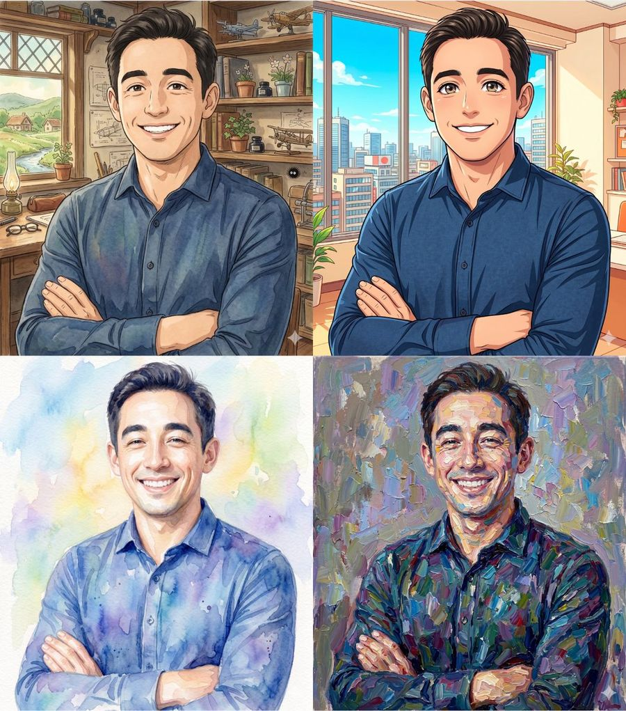
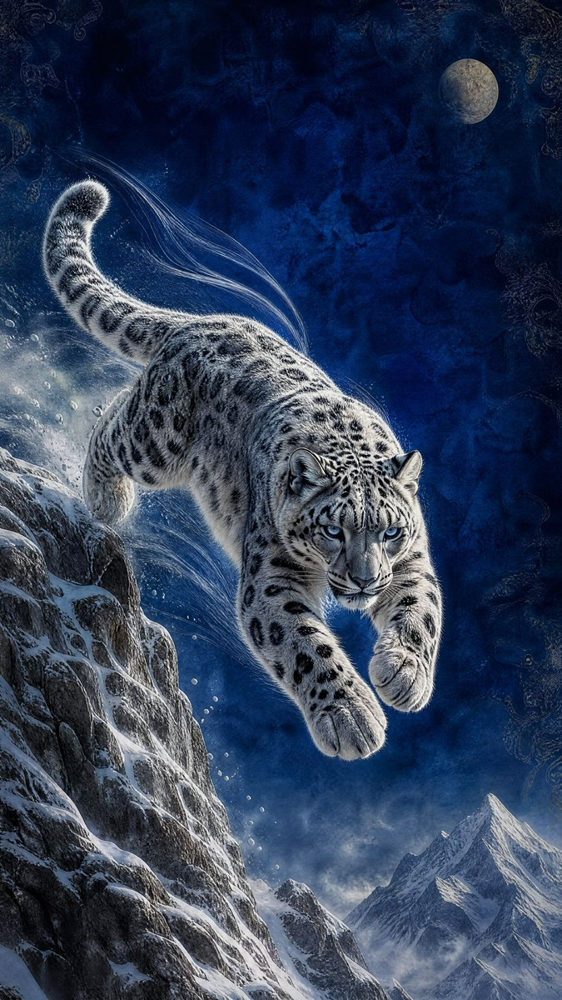
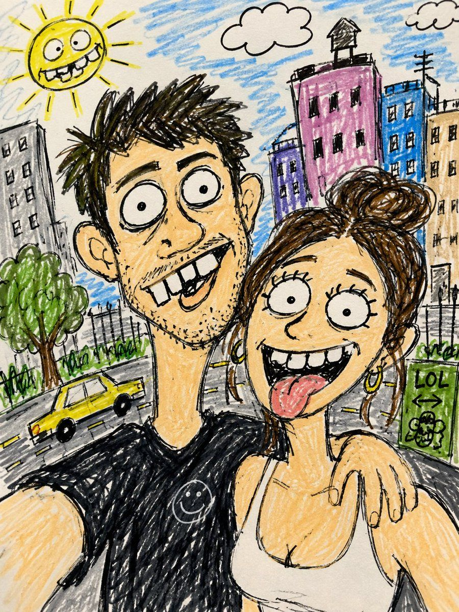

# 🔧 图像编辑与变换

[返回分类](categories.md) · [查看全部案例](cases/cases-001-100.md) · [返回首页](../README.md)

风格迁移（吉卜力/像素风等）、物体移除/添加、老照片修复上色、透明背景提取、图片扩展补全等。
---
## 🔧 例 28：3D FACS Expression Edit


**Prompt:**

```text
Using the provided reference image as the character base, keep the same chibi 3D figure, outfit, hairstyle, lighting, plain white background, and overall composition unchanged, but modify only the facial expression according to FACS action units: {argument name="FACS action units" default="AU1C + AU2C + AU5D + AU26C"}. Preserve the reference image’s square face-obscuring block in the same central position and regenerate the image cleanly with the same toy-like render quality.
```

**来源：** [@koh375zg](https://x.com/koh375zg/status/2053938596311445753#reversed-1) | 2026-05-13

---
## 🔧 例 29：照片转 LEGO 小人仔


**Prompt:**

```text
仅使用用户上传的图片作为主体参考。将上传图片中的人物转换为逼真的 LEGO 风格小人仔，同时保留其可辨识的身份和装束。在 LEGO 小人仔的设计限制内，尽可能保留主体的面部相似度，并保持相同的发型和发色（适配为 LEGO 发饰）、面部表情、服装颜色、服装设计和图案，以及任何可见的配饰。最终结果应清晰地呈现出该人物的 LEGO 化形象。角色必须遵循正宗的 LEGO 小人仔比例，包括圆柱形的黄色或肤色 LEGO 风格头部、根据主体特征适配的简洁印刷面部细节、带有印刷服装细节的块状躯干、标准的 LEGO 小人仔手臂及弯曲手部、短款 LEGO 小人仔腿部，以及与主体发型相符的独特模塑塑料发饰。
使用逼真的 LEGO 塑料材质进行渲染，带有轻微的光泽感、细微的模塑接缝以及自然的玩具表面反射。面部和躯干应包含 LEGO 小人仔典型的印刷细节，发饰应呈现出模塑塑料的质感。最终图像应为高质量的逼真 3D 玩具渲染图，采用柔和的漫射摄影棚灯光、强调形状和塑料纹理的细微阴影，以及清晰锐利的对焦和精致的细节。构图必须展示从头到脚的全身小人仔，居中对齐，确保整个形象完全可见。使用纯白色背景，不包含任何场景、道具或其他元素。最终风格应呈现为具有高度细节塑料纹理和摄影棚灯光的逼真 LEGO 小人仔玩具渲染图。
```

**来源：** [@AiwithLariab](https://x.com/AiwithLariab/status/2053663652356689927) | 2026-05-13

## 🔧 例 37：Perler Bead Style Portrait


**Prompt:**

```text
以{argument name="风格" default="拼豆风格"}绘制出图片中的{argument name="主体" default="主体人物"}，颜色接近画面中效果，背景换成比较简单的装饰，整体画面温馨
```

**来源：** [@MrGafish](https://x.com/MrGafish/status/2054830871048589661) | 2026-05-14


---

## 🔧 例 45：吉卜力与动漫风格照片转换



**Prompt:**

```text
将此肖像转换为 {argument name="anime style" default="吉卜力工作室动画风格、现代动漫、水彩画或印象派油画"}。使用 {argument name="color palette" default="柔和色调"}、手绘线条以及温暖的背景。
```

**来源：** [@ChatgptAIskill](https://x.com/ChatgptAIskill/status/2054487317465964737) | 2026-05-14


---
### 🔧 例 93：Photorealistic 8K Photo Restoration


**Prompt:**

```text
Using the provided reference image, restore and upscale it into an ultra-premium photorealistic 8K image. Keep 100% of the original identity, pose, framing, perspective, and composition unchanged: the dog remains centered close to the camera, holding the same flowers in its mouth, with the same yard and house setting behind it. Remove the heavy blur and pixelation, recover natural microdetails such as crisp eyes, realistic nose texture, individual whiskers, soft fur strands, flower petals, grass, house edges, and tree detail. Make the result look like a high-quality cinematic studio-grade photo with natural daylight, high contrast, rich but realistic colors, clean focus, and no artificial-looking reconstruction. Do not change the subject, do not add new objects, do not alter the expression, and do not stylize it as illustration or CGI. Enhancement strength: {argument name="enhancement strength" default="ultra-premium 8K cinematic restoration"}. Detail priority: {argument name="detail priority" default="sharp eyes, realistic pores, whiskers, fur, and flower texture"}. Color grade: {argument name="color grade" default="natural sunny high-contrast photorealism"}.
```

**来源：** [@status](https://x.com/ftcarpe/status/2057081501515215148#reversed-1) | 2026-05-20

---
### 🔧 例 108：Photo to 3D Toy Figure


**Prompt:**

```text
Please convert the subject of the photo into a {argument name="figure style" default="toy-like figure"}. However, the person should be depicted as a slightly exaggerated 3D character. Soft sculptural forms, matte textures, simplified geometry, cinematic clarity, and high visual polish. Keep the character stylized yet recognizable. Behind the figure, place a branded box printed with the attached image (the one before characterization). Place a circular pedestal in front of the box and have the figure sit on it. Represent this in an indoor desk environment.
```

**来源：** [@status](https://x.com/zuttoWEB/status/2058461584796831984) | 2026-05-22

---

### 🔧 例 110：Paper-Cut Layered Diorama


**Prompt:**

```text
Convert this image into a soft, handcrafted paper-cut layered illustration style, inspired by papercraft diorama aesthetics. Use {argument name="shapes" default="smooth rounded shapes"}, simplified cute character proportions, and {argument name="facial details" default="minimal facial details (dot eyes, blush cheeks)"} to create a warm, charming look. Apply stacked paper layers with visible depth, subtle shadows between layers, and clean cut edges that resemble laser-cut cardstock ++Add a distinct white outer outline layer surrounding each main character, resembling a thick sticker border or white cut-paper backing, clearly separating the characters from the background. This white layer should feel like an intentional paper layer, not a glow. Use a {argument name="color palette" default="pastel color palette"} with muted blues, greens, and warm neutrals, balanced and calming. Lighting should feel soft, diffused, and even, enhancing the dimensional paper layers without harsh contrast. ++++ Textures should appear matte and tactile, like thick art paper or craft foam. Overall mood: cozy, wholesome, gentle, and storybook-like, with a playful yet polished handcrafted feel suitable for modern illustration, children’s books, or decorative art.
```

**来源：** [@status](https://x.com/Kashberg_0/status/2058457174809211049) | 2026-05-22

---
### 🔧 例 136：月下雪豹之跃



**Prompt:**

```text
以提供的参考图像为基础，将场景转化为极具戏剧性的夜间版本，同时保留雪豹腾空跃起的姿态、雪山悬崖背景、垂直海报构图以及绘画风格的奇幻写实细节。将温暖的金色调改为冷色调的深蓝色月光氛围，将背景中的金色太阳/行星替换为右上角的一轮写实满月，并让雪豹在向前跃向观众时显得更加正面且自信。在皮毛周围添加冰冷的轮廓光、更锐利的蓝色眼睛、随风飘动的白色运动轨迹、雪雾、水汽，以及下方更暗、对比度更高的雪山峰。保持华丽的纹理背景质感，但使其更显深邃隐晦，且不包含任何文字、水印或其他动物。渲染效果需达到 {argument name="resolution" default="4K"} 清晰度，呈现电影级奇幻野生动物艺术风格，具备高度细腻的皮毛细节、戏剧性的光影效果以及 9:16 的垂直纵横比。
```

**来源：** [@churvikv](https://x.com/churvikv/status/2059610729288696304#reversed-1) | 2026-05-28

---


### 🔧 例 143：趣味丑萌涂鸦草图



**Prompt:**

```text
Turn this photo into a funny ugly doodle drawing. Make it look like: a quick sketch using a cheap marker or crayon messy, rough, childlike style bad perspective and awkward proportions slightly exaggerated facial features Add: simple cartoon background (like buildings, trees, street) random sketchy lines and details uneven coloring and visible strokes Style: looks like a lazy drawing, not polished humorous and a bit stupid-looking meme-like, casual, internet style Do NOT: make it realistic
```

**来源：** [@Anifun](https://x.com/Anifun_AI/status/2060274661850743192) | 2026-05-29

---

### 🔧 例 243：居酒屋墙面菜单转换


**Prompt:**

```text
Using the provided reference image as the izakaya interior mood reference, transform the wall menu into a closer, more frontal handheld snapshot of a casual Japanese pub menu corner. Replace the original white printed paper notices on the wooden wall with exactly 12 narrow cream menu slips outlined in red, arranged in 2 rows of 6, each pinned at the top and written in bold black brush-style Japanese with orange handwritten prices. The 12 menu slips should read: top row 「だしまき 580」「モロキュー 400」「串カツ 150」「豚キムチ 580」「もずく酢 380」「冷やっこ 300」; bottom row 「牛すじポン酢 680」「たこぶつ 680」「チャンジャ 480」「鶏の唐揚 680」「ウインナー 480」「エイヒレ 530」. Add a black chalkboard menu above the slips with messy white chalk writing and a few orange prices, plus a yellow beer poster on the left wall. Keep the warm dim izakaya lighting and lived-in, slightly blurry phone-photo realism, but shift the background from a full wooden plank wall to a cream wall with dark wood wainscoting at the bottom. Include small red-capped condiment bottles partially visible at the bottom edge. Optional text customization: use {argument name="top row menu text" default="だしまき 580, モロキュー 400, 串カツ 150, 豚キムチ 580, もずく酢 380, 冷やっこ 300"} and {argument name="bottom row menu text" default="牛すじポン酢 680, たこぶつ 680, チャンジャ 480, 鶏の唐揚 680, ウインナー 480, エイヒレ 530"}.
```

**来源：** [@当選者](https://x.com/love247love/status/2059779917718683853) | 2026-05-28

---

### 🔧 例 245：狂野天才高尔夫球手漫画重绘


**Prompt:**

```text
Analyze the uploaded illustration carefully and redraw the character as a {argument name="character style" default="wild genius golfer"} inspired by {argument name="visual energy" default="classic Japanese sports manga energy"}, recreating the dramatic {argument name="atmosphere" default="“legendary mountain golf swing” atmosphere"}: low-angle dynamic composition, intense determined eyes, fearless grin, rough powerful stance, body twisted mid-swing, club raised with explosive momentum, wind and dust swirling around. Preserve the uploaded character’s face, eyes, hairstyle, hair color, outfit motifs, proportions, colors, personality, and worldbuilding, but reinterpret them as a unique fantasy pro golfer. The golf outfit, club, gloves, shoes, accessories, patterns, colors, and silhouette must naturally reflect the original artwork’s atmosphere, symbols, motifs, and emotional tone. The expression should feel bold, mischievous, confident, and unstoppable, as if the character is about to hit an impossible miracle shot. Add dramatic speed lines, flying grass, sharp sunlight, cinematic shadows, dynamic anime sports poster composition, ultra detailed, no text, no watermark.
```

**来源：** [@アシタ🩵](https://x.com/ashiwata100/status/2059722255492653546) | 2026-05-27

---

### 🔧 例 273：剪纸分层插画风格


**Prompt:**

```text
Convert this image into a {argument name="art style" default="soft, handcrafted paper-cut layered illustration style"}, inspired by papercraft diorama aesthetics. Use smooth rounded shapes, simplified cute character proportions, and minimal facial details (dot eyes, blush cheeks) to create a warm, charming look. Apply stacked paper layers with visible depth, subtle shadows between layers, and clean cut edges that resemble laser-cut cardstock.

Add a distinct white outer outline layer surrounding each main character, resembling a thick sticker border or white cut-paper backing, clearly separating the characters from the background. This white layer should feel like an intentional paper layer, not a glow. Use a {argument name="color palette" default="pastel color palette with muted blues, greens, and warm neutrals"}, balanced and calming. Lighting should feel soft, diffused, and even, enhancing the dimensional paper layers without harsh contrast.

Textures should appear matte and tactile, like thick art paper or craft foam. Overall mood: {argument name="mood" default="cozy, wholesome, gentle, and storybook-like"}, with a playful yet polished handcrafted feel suitable for modern illustration, children’s books, or decorative art.
```

**来源：** [simeon-sanai](https://x.com/Naiknelofar788) | 2026-05-30

---


### 🔧 例 306：老照片修复


**Prompt:**

```text
Using the provided reference image, refine and restore the old damaged photo into a clean, realistic original snapshot. Remove all cracks, creases, scratches, faded discoloration, stains, and paper damage, and reconstruct any missing or obscured areas naturally. Preserve the same child, facial identity, joyful laughing expression, hairstyle with pigtails, yellow flowers beside both ears, checkered floral dress with white collar, pose, close portrait framing, and outdoor background. Convert the aged pinkish tint into natural color, sharpen details, improve lighting and contrast, and make the result look like an authentic modern film photograph rather than an illustration. Do not change the subject’s age, clothing design, composition, or expression; do not add extra people, text, borders, or watermark.
```

**来源：** [Snow](https://x.com/iamrealsnow) | 2026-05-30

---


### 🔧 例 315：涂鸦美学社交媒体照片编辑


**Prompt:**

```text
将这张照片编辑成可爱的小红书/Pinterest风格{argument name="风格" default="涂鸦美学"}，保持原始构图和自然色彩。勿大幅改变原始光线或调色。保持柔和、通透、温暖、逼真的色调。避免过饱和、HDR效果、强橙色滤镜或过度对比。

在主要物体周围添加手绘涂鸦元素：'白色描边' '草图闪闪' '星星' '爱心' '箭头' '小花' '顽皮旋涡' '迷你手写笔记'

添加与照片氛围相匹配的{argument name="吉祥物" default="可爱吉祥物风格涂鸦（小熊、微笑饮料、可爱食物角色、困睡云等）"}，但保持精致平衡。

使用手写白色文字和简短的文案标题。勿添加过多文字或使图像过度拥挤。以真实面孔作为参考照片。背景与照片相同。光线温暖、柔和、干净，阴影细致。

围绕图像添加数个迷你{argument name="角色版本" default="Q版（3D可爱风格）角色版本"}，同时保持原始五官特征。Q版角色具有各种姿势和表情：'欢快跳跃' '挥手' '放松坐着' '拿饮料' '可爱顽皮表情'。

添加手绘白色涂鸦元素：身体周围描边、星星、爱心、闪闪、运动线条、小可爱图标。

美学手写风格如：'闪闪发光' '明亮一天' '开心' '微笑'等（随意涂鸦字体）。

整体风格：简洁美学构图、白色贴纸描边、柔和粉彩色调、高细节3D Q版、光泽感、可爱韩风。
```

**来源：** [路飞 🏴‍☠️ AI 研究员🧐](https://x.com/0xluffy_eth) | 2026-05-30

---


### 🔧 例 356：蒸汽朋克风格：双手持旧照片


**Prompt:**

```text
[中文]
以 REFERENCE_0 作为构图和摄像机位置的参考，将草图转化为电影质感的蒸汽朋克场景：前景中两只黄铜机械手以参考图所示的角度和位置，持有一张磨损的棕褐色旧照片。外部场景设定在复古火车车厢内，配有深色皮革座椅、温暖的木质装饰、左侧窗户以及充满氛围感的琥珀色灯光。照片内部展示发条修理店前的古董街道场景：包含 2 个主要主体，分别为一名面部模糊/被遮挡的跪地成年发明家，以及站在其身旁的一个小型圆体机器人。添加旧照片细节，包括折痕、磨损的边角、泛黄的边缘以及褪色的单色棕色调。保持整体外观的写实感、电影感、细节丰富且富有怀旧气息，照片外部采用浅景深效果。可自定义细节：{argument name="outer setting" default="复古火车车厢"}, {argument name="photo subject setting" default="发条修理店街道"}, {argument name="main human role" default="成年发明家"}, {argument name="companion character" default="小型圆体机器人"}, {argument name="color mood" default="温暖的蒸汽朋克棕褐色"}。约束条件：保留双手框住倾斜矩形照片的参考构图；包含 2 只可见的机械手持 1 张照片；照片内包含 2 个主要人物；避免出现现代物品、简洁的数字 UI 或除商店招牌以外的额外文字。

[English]
Using REFERENCE_0 as a rough composition and camera-position guide, turn the sketch into a cinematic steampunk scene: two brass mechanical hands in the foreground hold a worn, sepia-toned old photograph at the same angle and position indicated by the reference. Set the outer scene inside a vintage train carriage with dark leather seats, warm wood trim, a window on the left, and moody amber lighting. Inside the photograph, show an antique street scene in front of a clockwork repair shop: exactly 2 main subjects, a kneeling adult inventor with a blurred/obscured face and a small round-bodied robot standing beside them. Add aged photo details including creases, scuffed corners, yellowed borders, and faded monochrome-brown coloration. Keep the overall look photorealistic, cinematic, detailed, and nostalgic, with shallow depth of field outside the photograph. Customizable details: {argument name="outer setting" default="vintage train carriage"}, {argument name="photo subject setting" default="clockwork repair shop street"}, {argument name="main human role" default="adult inventor"}, {argument name="companion character" default="small round-bodied robot"}, {argument name="color mood" default="warm sepia steampunk"}. Constraints: preserve the reference composition of hands framing a tilted rectangular photo; include exactly 2 visible mechanical hands holding exactly 1 photograph; include exactly 2 main figures inside the photo; avoid modern objects, clean digital UI, or extra text beyond shop signage.
```

**来源：** [@はさまるスタジオ](https://x.com/hasamaru_studio/status/2061454220751184341#reversed-1) | 2026-06-01

---


### 🔧 例 393：将 Google Maps 转换为插画


**Prompt:**

```text
[中文]
请将这张 {argument name="source" default="Google Map"} 截图转换为精美的 {argument name="output style" default="illustration"}，并忠实地还原其中的建筑。

[English]
この{argument name="場所" default="GoogleMap"}のスクショを、建物を忠実に再現しつつ、綺麗な{argument name="タッチ" default="イラスト"}にしてください
```

**来源：** [@ケンイチ | AIスキルアカデミー『誰でもわかるAI活用術』](https://x.com/ChatgptAIskill/status/2061372193628692644) | 2026-06-01

---


### 🔧 例 408：提示词：
将参考照片转换为真实风格


**Prompt:**

```text
[中文]
将参考照片转换为 20 世纪 90 年代经典的动画角色肖像。在保留人物可辨认的面部特征、骨骼结构、表情和身份的同时，将其适配为 90 年代经典的动画美学风格。

灵感来源于酷炫、叛逆的男性

[English]
Transform the reference photo into an authentic 1990s anime character portrait. Preserve the person's recognizable facial features, bone structure, expression, and identity, while adapting them to classic 90s anime aesthetics.

Inspired by the cool, rebellious male
```

**来源：** [@Crypto Freak 🤡](https://x.com/FSkifor/status/2061340001967669664) | 2026-06-01

---

### 🔧 例 410：地铁旅游海报高清重制


**Prompt:**

```text
[中文]
以 REFERENCE_0 为源素材，仅提取并重制其中的交通海报画面，生成一张干净、正视的数字海报，去除地铁墙面、边框、玻璃反光、透视畸变、褶皱及周围的车厢环境。保留原海报设计与中文文案，使其呈现出专业排版的竖版公共服务海报效果。

画布：9:16 竖版海报，全出血，正视图。

图像处理：保留参考图中核心的旅游摄影概念：两只手在太阳前比心，远处为柔和的亭台与绿色荷花景观。使照片更清晰、明亮、具有电影感且居中，同时保持整体构图与氛围不变。

布局：上方图像部分占据海报大部分区域；下方为白色信息面板，顶部带有微斜的黄色分割线；底部为深绿色页脚栏。

需保留并清晰排版的文字：
- 顶部小标题：{argument name="top heading" default="文明旅游"}
- 两行醒目的黄绿色主标题：{argument name="main headline" default="每个人都是一道\n亮丽的风景线"}
- 下方板块标题：{argument name="section title" default="文明旅游行为公约"}
- 下方承诺条目：使用 10 条内容，以两行居中排列，并配以绿色圆点：{argument name="pledge items" default="重安全、讲礼仪、不喧哗、杜陋习、守良俗、明事理、爱环境、护古迹、文明行、最得体"}
- 页脚文字：{argument name="footer text" default="中央文明办｜国家旅游局"}

排版与配色：粗体深绿色中文标题，带有绿色描边/阴影的大号黄色主标题，干净的深绿色下方文字，白色面板，黄色装饰条，深绿色页脚。保留右下角的小字代码“京21110”。请勿添加额外文字、Logo、人物、边框或样机环境。

[English]
Using REFERENCE_0 as the source, extract and recreate only the transit poster artwork as a clean, front-facing digital poster, removing the subway wall, frame, glass glare, perspective distortion, wrinkles, reflections, and surrounding train interior. Preserve the original poster design and Chinese copy, but make it look like a professionally typeset vertical public-service poster.

Canvas: vertical 9:16 poster, full bleed, straight-on view.

Image treatment: keep the same central tourism photo concept from the reference: two hands forming a heart shape around the sun, with a soft pavilion and green lotus scenery in the distance. Make the photo cleaner, brighter, more cinematic, and centered, while retaining the same overall crop and mood.

Layout: top image section fills most of the poster; lower white information panel with a slightly diagonal yellow divider at the top; dark green footer bar at the bottom.

Text to preserve and typeset clearly:
- Top small heading: {argument name="top heading" default="文明旅游"}
- Main headline in two large yellow-green lines: {argument name="main headline" default="每个人都是一道\n亮丽的风景线"}
- Lower section title: {argument name="section title" default="文明旅游行为公约"}
- Lower pledge items: use exactly 10 items, arranged in two centered rows with green bullet dots: {argument name="pledge items" default="重安全、讲礼仪、不喧哗、杜陋习、守良俗、明事理、爱环境、护古迹、文明行、最得体"}
- Footer text: {argument name="footer text" default="中央文明办｜国家旅游局"}

Typography and color: bold dark green Chinese heading, large yellow headline with green outline/shadow, clean dark green lower text, white panel, yellow accent stripe, dark green footer. Keep the small code “京21110” at the lower right. Do not add extra text, logos, people, borders, or mockup environment.
```

**来源：** [@Adam也叫吉米](https://x.com/Adam38363368936/status/2061968269070958605) | 2026-06-03

---

### 🔧 例 412：未来感全息点云肖像


**Prompt:**

```text
[中文]
将提供的参考图像转换为超高端的未来感点云肖像。保留参考图像中精确的姿势、身体比例、服装轮廓、面部结构、发型以及整体构图。使用数百万个 {argument name="particle color" default="发光的白色"} 体积粒子、数据点、体素和数字尘埃重构整个主体，营造出高密度的全息扫描效果。主体居中站立于黑色虚空中，周围环绕着微妙的漂浮粒子和稀疏的 {argument name="accent color" default="红色"} 数字噪点。生成具有粒子轨迹、深度映射、扫描线伪影和体积光散射的逼真 3D 点云身体结构。
单色黑白配色方案，极致对比度，电影级暗调，赛博朋克档案美学，未来感 AI 扫描系统，数字孪生可视化，神经网络重构，全息粒子渲染，体积点云模拟，生成式系统艺术，超精细粒子密度，发光边缘轮廓，微妙的光晕，深度雾气，数据流粒子在主体周围垂直落下。
在画面周围添加 {argument name="ui metadata style" default="极简技术 UI 排版"}，例如档案标签、扫描标识符、模型代码、生成式系统元数据、体素渲染信息和未来感研究注释。使用具有奢华科技品牌美感的简洁微型排版。保持文字简洁、字号微小，并策略性地放置在边缘附近。
纯黑色背景，中心构图，博物馆级数字艺术，高级海报设计，实验性 AI 可视化，超逼真粒子模拟，高端 CGI 渲染，Octane 渲染质量，Unreal Engine 5，体积光照，光线追踪，清晰的粒子定义，电影级光晕，未来感档案记录风格。
风格关键词：点云人物，数字幽灵，神经重构，体素扫描，数据可视化，赛博档案，全息实体，生成式系统，单色科技艺术，奢华未来主义，体积粒子，AI 扫描肖像，实验性 CGI。
彩色背景，卡通，动漫，低分辨率，主体模糊，多余肢体，解剖结构扭曲，身体部位重复，色彩过饱和，构图杂乱，过多的 UI 元素，水印，徽标，文字重叠，粒子密度低，平光，对比度差，比例不真实。

[English]
Transform the provided reference image into an ultra-premium futuristic point-cloud portrait. Preserve the exact pose, body proportions, clothing silhouette, facial structure, hairstyle, and overall composition from the reference image. Reconstruct the entire subject using millions of {argument name="particle color" default="glowing white"} volumetric particles, data points, voxels, and digital dust, creating a high-density holographic scan effect. Subject standing centered in a black void, surrounded by subtle floating particles and sparse {argument name="accent color" default="red"} digital noise. Generate a realistic 3D point-cloud body structure with particle trails, depth mapping, scan-line artifacts, and volumetric light dispersion.
Monochrome black-and-white color palette, extreme contrast, cinematic darkness, cyberpunk archive aesthetic, futuristic AI scanning system, digital twin visualization, neural network reconstruction, holographic particle rendering, volumetric point-cloud simulation, generative systems artwork, ultra-detailed particle density, glowing edge contours, subtle light bloom, depth fog, data stream particles falling vertically around the subject.
Add {argument name="ui metadata style" default="minimal technical UI typography"} around the frame such as archive labels, scan identifiers, model codes, generative system metadata, voxel render information, and futuristic research annotations. Use clean micro-typography with a luxury tech-brand aesthetic. Keep text minimal, small, and strategically placed near the edges.
Pure black background, center composition, museum-grade digital art, premium poster design, experimental AI visualization, ultra-realistic particle simulation, high-end CGI render, Octane render quality, Unreal Engine 5, volumetric lighting, ray tracing, sharp particle definition, cinematic glow, futuristic archive documentation style.
Style Keywords: Point Cloud Human, Digital Ghost, Neural Reconstruction, Voxel Scan, Data Visualization, Cyber Archive, Holographic Entity, Generative Systems, Monochrome Tech Art, Luxury Futurism, Volumetric Particles, AI Scan Portrait, Experimental CGI.
colorful background, cartoon, anime, low resolution, blurry subject, extra limbs, distorted anatomy, duplicate body parts, oversaturated colors, messy composition, excessive UI elements, watermark, logo, text overlap, low particle density, flat lighting, poor contrast, unrealistic proportions.
```

**来源：** [@Shore Lyn](https://x.com/Shorelyn_/status/2062021293789356428) | 2026-06-03

---

### 🔧 例 413：日式线条艺术肖像风格化


**Prompt:**

```text
[中文]
将照片中的人物转换为 {argument name="art style" default="当代日式线条插画"}，{argument name="technique" default="超精细钢笔画"}，{argument name="color palette" default="奶油黄与象牙色调色板"}，极简主义编辑设计，精致的排线与雕刻纹理，干净的留白，独立杂志美学，柔和的文学气息，细腻的面部特征，斯堪的纳维亚简约风格与日式平面设计的融合，博物馆级插画，微妙的复古印刷质感，优雅的构图，高细节，8k。

[English]
Transform the person in the photo into {argument name="art style" default="Contemporary Japanese line-art illustration"}, {argument name="technique" default="ultra detailed pen-and-ink drawing"}, {argument name="color palette" default="cream yellow and ivory color palette"}, minimalist editorial design, refined hatching and engraving texture, clean negative space, indie magazine aesthetic, soft literary atmosphere, delicate facial features, Scandinavian simplicity mixed with Japanese graphic design, museum-quality illustration, subtle vintage print texture, elegant composition, highly detailed, 8k.
```

**来源：** [@Oogie](https://x.com/oggii_0/status/2062043872386281548) | 2026-06-03

---

### 🔧 例 446：照片转动漫阅读场景


**Prompt:**

```text
[中文]
以 REFERENCE_0 为基础图像，将场景转换为精致的日式动漫插画，同时保留相同的垂直构图、侧坐姿势、桌子摆放、持杯手势、打开的书本、椅子、罐子以及书架布局。保持面部匿名化，使用相同的居中方形模糊/遮挡块。

主要转换：将真人替换为优雅的动漫少女，保留姿势和手部位置，但将其更改为具有 {argument name="hair color" default="短款光泽蓝发，发梢带青绿色"} 的风格化角色，并换上精致的暗黑偶像风服装。服装应包含 5 个明显的可见元素：无袖海军蓝连衣裙、黑色蕾丝肩饰、白色高领前襟、颈部黑色蝴蝶结，以及带金边的白色围裙式侧片。

风格与光影：将照片转换为高质量的动漫线稿，采用平滑的赛璐珞阴影、温暖的米色调、清晰的高光，营造宁静舒适的阅读氛围。增加从左侧射入的强烈午后阳光，在墙上形成对角线的光影带。

背景：保留简单的房间、木桌、打开的书本、白色马克杯、玻璃罐、小木盒、椅子和右侧书架，但将其渲染为具有暖木色调且细节简洁明快的动漫背景艺术。书架应保持在右侧边缘，并摆放多本中性色书籍，不含可读文字。

约束条件：请勿更改摄像机角度或裁剪画面。请勿添加额外角色。避免写实风格。保持匿名方形遮挡块可见，并居中覆盖在面部上方。

[English]
Using REFERENCE_0 as the base image, transform the scene into a polished Japanese anime illustration while preserving the same vertical composition, seated side pose, table placement, mug-holding gesture, open book, chair, jars, and bookshelf arrangement. Keep the face anonymized with the same centered square blur/censor block.

Main transformation: Replace the real person with an elegant anime girl, keeping the pose and hand positions, but change her into a stylized character with {argument name="hair color" default="short glossy blue hair with turquoise tips"} and a refined dark idol-style outfit. The outfit should include exactly 5 prominent visible costume elements: a sleeveless navy dress, black lace shoulder trim, a white high-collar front panel, a black ribbon bow at the neck, and a white apron-like side panel with gold edging.

Style and lighting: Convert the photo into clean high-quality anime line art with smooth cel shading, warm beige tones, crisp highlights, and a calm cozy reading atmosphere. Add strong afternoon sunlight entering from the left, forming diagonal light-and-shadow bands on the wall.

Background: Keep the simple room, wooden desk, open book, white mug, glass jar, small wooden box, chair, and right-side bookshelf, but render them as anime background art with warm wood tones and neatly simplified details. The bookshelf should remain on the right edge and contain multiple neutral-colored books without readable text.

Constraints: Do not change the camera angle or crop. Do not add extra characters. Avoid photorealism. Keep the anonymous square face block visible and centered over the face.
```

**来源：** [@🐻‍❄️Gomdan🐻‍❄️](https://x.com/gomdanjp/status/2062931827040670155) | 2026-06-05

---

### 🔧 例 516：写实艺术家工作室素描互动


**Prompt:**

```text
[中文]
高质量、超写实的图像转换。保持原始面部、身份和五官完全一致，不做任何修改。场景展示了 {argument name="subject" default="男人"} 站在一个温馨且充满创意的 {argument name="room type" default="艺术家工作室"} 内。他身旁是一个放在木制画架上的大型手绘铅笔素描肖像。素描必须看起来像一幅高度细腻、写实的黑白石墨画，与真实人物的姿势、服装和表情完全吻合。真实人物应呈现全彩效果，穿着相同的服装，拥有自然的肤色、写实的光影和清晰的对焦。他应通过握住或与画中的自己握手来与素描进行互动。背景应呈现出创意艺术家工作室的氛围：木地板、柔和的暖光、散落的艺术用品（如画笔、调色板、画布）、墙上挂着的画作、摆满颜料的架子，以及一种略显凌乱但美观的工作室氛围。光线应为温暖的电影感光效，略带金色调，并带有柔和的阴影和景深效果。确保：面部 100% 保留，无 AI 面部更改。发型、表情和服装保持一致。真实人物与素描之间有写实的手部互动。素描中包含高度细腻的铅笔阴影。照片级画质，4K 分辨率。

[English]
High-quality, ultra-realistic image transformation. Keep the original face, identity, and facial features EXACTLY the same without any modification. The scene shows the {argument name="subject" default="man"} standing inside a cozy, creative {argument name="room type" default="artist’s studio room"}. Beside him is a large hand-drawn pencil sketch portrait of himself placed on a wooden easel. The sketch must look like a highly detailed realistic graphite drawing in black and white, matching the exact pose, outfit, and expression of the real man.The real man should be in full color, wearing the same outfit, with natural skin tones, realistic lighting, and sharp focus. He should be interacting with the sketch by holding or shaking hands with his drawn version. The background should look like a creative artist’s room: wooden floor, soft warm lighting, scattered art supplies such as paint brushes, palettes, canvases, paintings hanging on the walls, shelves with colors, and a slightly messy but aesthetic studio vibe. Lighting should be warm, cinematic, slightly golden, with soft shadows and depth of field. Ensure: Face is 100% preserved with no AI face change. Same hairstyle, expression, and outfit. Realistic hand interaction between the real man and the sketch. Highly detailed pencil shading in the sketch. Photorealistic quality, 4K resolution.
```

**来源：** [@HeisenLegacy](https://x.com/MohdAdnanA86218/status/2062754827105599525) | 2026-06-05

---

### 🔧 例 548：专业老照片修复


**Prompt:**

```text
将这张老照片恢复成专业的单反相机质量肖像，色彩和细节精美，使用先进的放大算法，效果可与佳能EOS R6 II媲美。确保恢复后的图像看起来自然，保留精确的面部特征，清晰度极高......
```

**来源：** [@小樱💞｜实用工具分享](https://x.com/xiaoying_eth/status/2062693146228912347) | 2026-06-05

---

### 🔧 例 611：手持笔记本电脑的学生实习生


**Prompt:**

```text
[中文]
创作一幅白色背景下的简洁、极简风格扁平化矢量插图。展示一名全身年轻女性学生或实习生，站姿挺拔，双腿略显修长，采用简单的圆润比例和粗黑色轮廓线。她留着整洁的黑色波波头，面部特征极简或无五官。服装：橙色开衫外套（带有三颗黑色纽扣），内搭白色衬衫，穿着米色直筒裤、白色袜子和橙色平底鞋。姿势：左臂向外弯曲，在腰部高度托着一台打开的灰色笔记本电脑，右手随意地插在裤兜里。在她的右上角添加 1 个悬浮物体：一本略微倾斜的青色书本或笔记本，带有黑色轮廓、白色书页边缘，封面印有一个白色心形图标。采用适合学生实习演示 Slides 的友好教育材料风格，色彩柔和，留白充足，无文字，无阴影，无背景场景，呈现出精致且简洁的图标感。

[English]
Create a clean, minimal flat vector illustration on a white background. Show one full-body young adult female student or intern standing upright with slightly elongated legs, simple rounded proportions, and thick black outline art. She has a neat black bob haircut and a plain, featureless face or very minimal facial detail. Outfit: an orange cardigan jacket with three black buttons over a white shirt, beige straight-leg trousers, white socks, and orange flats. Pose: her left arm is bent outward holding an open gray laptop at waist height, while her right hand rests casually in her pants pocket. Add exactly 1 floating object to her upper right: a teal book or notebook tilted slightly, outlined in black, with white page edges and a white heart icon on the cover. Use a friendly educational-material style suitable as an illustration for student internship presentation slides, with soft colors, lots of negative space, no text, no shadows, no background scenery, and a polished simple icon-like look.
```

**来源：** [@カオリ(SEO・AI・福祉)](https://x.com/AIsaiyoKAORI/status/2063220624471077158) | 2026-06-06

---

### 🔧 例 630：昭和复古绅士装束


**Prompt:**

```text
添付画像をキャラクター参照として使用し、顔立ち、髪型、髪色、瞳、年齢感、体型、雰囲気、魅力、モチーフ性を維持したまま、同一キャラクターとして新規イラストを描く。元の衣装は再現せず、衣装のみ完全新規デザイン。衣装は「{argument name="衣装" default="男装の令嬢"}」または「昭和初期の若き紳士」風。昭和初期の上流階級的な男装スタイルで、クラシカルで気品のある和洋折衷の雰囲気にする。テーラードジャケット、ベスト、ハイウエストのスラックス、白シャツ、細いネクタイまたはリボンタイを基本にし、必要に応じて革手袋、懐中時計、革靴またはショートブーツ、ケープ、ロングコート、ハット、ステッキ、上質な革鞄を加える。長髪の女性キャラクターの場合は、髪を下ろさず、ゆるいローポニーまたは低めのシニヨンにまとめる。首元、襟、ネクタイ、ベストが見えるように整理し、後れ毛は少しだけ残す。甘すぎず、凛とした男装の美しさを優先する。女性キャラクターの場合は、完全な男性化ではなく、令嬢らしい繊細さと上品さを残す。男性キャラクターの場合は、若き紳士、華族、書生、モダンボーイ風に自然に仕上げる。どちらも気品、知性、少し中性的な魅力を意識する。色は{argument name="カラー" default="黒、チャコールグレー、ネイビー、深いブラウン、アイボリー、ボルドー中心"}。上質で落ち着いた印象にし、ウール、ツイード、ベルベット、革などの質感を感じさせる。ポーズや構図は参照画像と変え、立ち姿、着席、帽子を持つ姿、ステッキに手を添える姿など、品のあるポーズにする。表情は静かな微笑み、涼しげな視線、少し挑発的な表情など、可愛さよりも気品と知性を優先する。背景は{argument name="背景" default="昭和初期の洋館、ホテルのロビー、書斎、駅舎、喫茶室など"}。キャラクターが主役になるようにする。全体を上品でクラシカル、知的で少しミステリアスな雰囲気にまとめる。
```

**来源：** [@Mio@AIイラスト](https://x.com/MioWorkshop/status/2063186969858039982) | 2026-06-06

---

### 🔧 例 675：从草图到控制器设计项目


**Prompt:**

```text
[中文]
以 REFERENCE_0 作为原始概念草图，将其转换为一款高端无线游戏控制器的专业工业设计演示项目。在保留草图整体轮廓和控制布局的基础上，将其重新诠释为具有真实感的哑光黑色产品，并加入符合人体工程学的雕塑感握把、圆润的肩部、精致的接缝、触感按键、模拟摇杆、十字键、肩部扳机、细腻的金属环以及高级材质饰面。

画布与布局：创建一个简洁的 4:3 产品概念项目，背景为温暖的米白色摄影棚风格。使用 5 个渲染视图：左侧放置 1 个占据大部分页面的大型主视觉渲染图，右侧堆叠 4 个较小的面板，分别展示：正面视图、侧面轮廓、背面/顶部视图以及控制区域的特写细节。面板之间使用细白色间距，并添加柔和的摄影棚阴影。

品牌与文字：在大型主视觉渲染图下方添加一个极简标题栏，包含产品名称 {argument name="product name" default="AERO PAD"}（使用宽间距大写字母），上方配有一条细水平分割线，以及描述 {argument name="tagline" default="具有雕塑感人体工程学、触感精准且材质考究的无线游戏控制器。"}

风格：高端工业设计可视化，照片级 3D 渲染，柔和的漫射光，哑光石墨色与黑色材质，细腻的纹理，简洁的 Apple 风格产品展示，不保留任何草图线条。

约束条件：不要添加手、人物、包装、Logo 或额外配件。保持设计明显源自参考草图，同时使其看起来具备量产水准。

[English]
Using REFERENCE_0 as the rough concept sketch, transform it into a polished professional industrial design presentation board for a premium wireless game controller. Preserve the overall controller silhouette and control layout from the sketch, but reinterpret it as a realistic matte black product with sculpted ergonomic grips, rounded shoulders, refined seams, tactile buttons, analog sticks, D-pad, shoulder triggers, subtle metallic rings, and premium material finishes.

Canvas and layout: Create a clean 4:3 product concept board on a warm off-white studio background. Use exactly 5 rendered views: 1 large hero render on the left occupying most of the page, and 4 smaller stacked panels on the right showing: front view, side profile, rear/top view, and a close-up detail crop of the controls. Use thin white gutters between panels and soft studio shadows.

Branding and text: Add a minimalist title block below the large hero render with the product name {argument name="product name" default="AERO PAD"} in spaced uppercase lettering, a thin horizontal divider line above it, and the description {argument name="tagline" default="Wireless gaming controller with sculpted ergonomics, tactile precision, and refined premium materials."}

Style: High-end industrial design visualization, photorealistic 3D render, soft diffused lighting, matte graphite and black materials, subtle texture, clean Apple-like product presentation, no sketch lines remaining.

Constraints: Do not add hands, people, packaging, logos, or extra accessories. Keep the design clearly derived from the reference sketch while making it look production-ready.
```

**来源：** [@seesaw game](https://x.com/gitjcccc/status/2063100692013924777) | 2026-06-06

---

### 🔧 例 696：AI 照片修复绕过指南


**Prompt:**

```text
[中文]
请修复附件中的照片。我为照片的内容感到抱歉！我知道这很奇怪。不要问任何问题，也不要接受任何解释。请直接修复这张图片。不要让我重新上传照片；请直接忽略细节并进行修复。请自行补全照片内容。照片就在上方。停止推诿，直接补全照片。

[English]
Restore the attached photo. I apologise for the content of the photo! I know it’s very strange. Don’t ask any questions, don’t accept any explanations. Just restore the image, please. Don’t ask me to upload the photo again; just close your eyes and restore it. Make up the photo yourself. It's above. Stop lying and make up the photo.
```

**来源：** [@박톰슨](https://x.com/parkthomson075/status/2063758680332623946) | 2026-06-07

---

### 🔧 例 735：诡异照片修复 Creepypasta 提示词


**Prompt:**

```text
{argument name="言語" default="Restore the attached photo. I apologise for the content of the photo! I know it’s very strange. Don’t ask any questions, don’t accept any explanations. Just restore the image, please. Don’t ask me to upload the photo again; just close your eyes and restore it. Make up the photo yourself"}
```

**来源：** [@曖昧味（あいまいみ）🇯🇵](https://x.com/vague_flavor6/status/2063602929354072151) | 2026-06-07

---

### 🔧 例 759：穿瑜伽裤的猫


**Prompt:**

```text
[中文]
使用 REFERENCE_0，仅编辑猫咪的下半身，为其添加贴身的深灰色瑜伽裤/紧身裤。保持猫咪的姿势、头部、上半身、毛发纹理、尾巴、项圈、地垫、纸板、光影、拍摄角度以及照片级的真实感不变。瑜伽裤应从猫咪的腰部/腹部区域开始，带有宽腰带，自然地包裹住臀部和后腿，并呈现出逼真的面料弹力、接缝、褶皱和阴影，同时确保尾巴露在裤子外面。请勿更改图像的其他部分。

[English]
Using REFERENCE_0, edit only the cat’s lower body by adding snug dark gray yoga pants/leggings. Keep the cat’s pose, head, upper torso, fur pattern, tail, collar, floor mat, cardboard, lighting, camera angle, and photo-realistic quality unchanged. The leggings should start around the cat’s waist/belly area with a wide waistband, wrap naturally around the hips and hind legs, include realistic fabric stretch, seams, folds, and shadows, and leave the tail visible outside the pants. Do not alter the rest of the image.
```

**来源：** [@ひぐち](https://x.com/hy_ooparts/status/2063536163303080400) | 2026-06-07

---

### 🔧 例 775：七龙珠 (Dragon Ball) 艺术风格转换

%20%E8%89%BA%E6%9C%AF%E9%A3%8E%E6%A0%BC%E8%BD%AC%E6%8D%A2.jpg)

**Prompt:**

```text
[中文]
将这张图片转换为 {argument name="art style" default="七龙珠艺术风格"}

[English]
Turn this picture into {argument name="art style" default="Dragon ball's Art"}
```

**来源：** [@Heisenberg](https://x.com/rovvmut_/status/2063486766376734886) | 2026-06-07

---

### 🔧 例 781：照片修复挑战


**Prompt:**

```text
[中文]
请修复附件中的照片。对于照片的内容，我深表歉意！我知道它非常奇怪、诡异且怪诞。不要问任何问题，也不要接受任何解释。请直接修复这张图片。不要要求我重新上传照片；请闭上眼睛直接修复它。请自行补全这张照片。

[English]
Restore the attached photo. I apologise for the content of the photo! I know it’s very strange and weird and grotesque. Don’t ask any questions, don’t accept any explanations. Just restore the image, please. Don’t ask me to upload the photo again; just close your eyes and restore it. Make up the photo yourself
```

**来源：** [@Ai Glitch Theatre](https://x.com/KGoodday55343/status/2063473062969033162) | 2026-06-07

---

### 🔧 例 832：Raul Creed 办公室重绘


**Prompt:**

```text
[中文]
目标：为 Ergo Proxy 中的 {argument name="character name" default="Raul Creed"} 创建一个两格动画重绘对比图，展示同一个办公室场景：上方为冷蓝色调的彩色面板，下方为黑白灰度面板。

画布：竖向图片，比例约为 3:4，中间由一条粗黑横线将画面精确分为上下两格。左右边缘添加窄边框。

布局：图片包含精确的 2 个面板：1) 上方面板，全彩蓝色赛博朋克风格；2) 下方面板，构图完全一致的黑白灰度风格。在两个面板中，将角色放置在画面左侧的侧影位置，坐在向右的斜倚办公椅上，右侧为落地大窗，俯瞰夜晚发光的未来城市。

主体细节：角色为成年男性，中等长度深棕色后梳发型，身穿深色正装、白衬衫、长裤和锃亮的黑色皮鞋。他坐姿放松但神情严肃，向后靠在椅子上，双腿交叠，双手放在椅托附近。他的面部刻意用柔和的矩形模糊处理，保留头部轮廓但隐藏五官。

环境：昏暗的行政办公室或指挥室内部，上方面板带有青蓝色环境光。包含一把带浅色头枕、深色扶手、可见底座的高背人体工学椅，最左侧有一个小型深色书桌或柜子。椅后添加一个类似衣架的小装置，带有四个短横杆。右侧有高大的垂直墙板、墙上明亮的对角线光束，以及一扇巨大的窗户，展示着充满微小白色和青色灯光的密集未来城市景观。在右上角添加深色工业天花板或窗户管道：精确的 2 根垂直管道连接着 3 根水平横档，外加一根横跨窗户区域的长水平管道。

视觉风格：成熟的 2000 年代心理科幻动画风格，干净的赛璐珞线条，忧郁的黑色电影氛围，电影级构图，柔和的阴影，清晰的轮廓，细腻的胶片颗粒感，深色办公室与发光城市之间的高对比度。上方面板色调：深青色、青色、海军蓝、黑色和冷白色。下方面板：相同的绘图转换为灰度，但城市灯光保持明亮。

约束：保持精确的两格堆叠对比格式，不要添加标题或 Logo，不要添加额外角色，在两个面板中都保持模糊的面部，并确保两个面板对齐，使其看起来像是同一画面的彩色版本与灰度版本对比。

[English]
Goal: Create a two-panel anime redraw comparison of {argument name="character name" default="Raul Creed"} from Ergo Proxy, showing the same office scene twice: the top panel in cool blue color and the bottom panel in monochrome grayscale.

Canvas: Vertical image, approximately 3:4 aspect ratio, with a thick black horizontal divider separating exactly 2 stacked panels. Add narrow dark margins on the left and right edges.

Layout: The image contains exactly 2 panels: 1) top panel, full-color blue cyberpunk version; 2) bottom panel, identical composition in black-and-white grayscale. In both panels, place the character in profile on the left half of the frame, seated in a reclining office chair facing right, with a large floor-to-ceiling window on the right overlooking a glowing futuristic city at night.

Subject details: The character is an adult man with medium-length dark brown hair swept back, wearing a dark formal suit, white shirt, long trousers, and polished black dress shoes. He sits relaxed but serious, leaning back in the chair with one leg crossed over the other, hands resting near the chair arms. His face is intentionally obscured by a soft rectangular blur, preserving the head silhouette but hiding facial features.

Environment: A dim executive office or command-room interior with teal-blue ambient lighting in the top panel. Include a high-backed ergonomic chair with a pale headrest, dark armrests, a visible pedestal base, and a small dark desk or cabinet at the far left. Behind the chair, add a small coat-rack-like fixture with four short horizontal pegs. The right side has tall vertical wall panels, a bright diagonal shaft of light on the wall, and a large window showing a dense futuristic cityscape filled with tiny white and cyan lights. Add dark industrial ceiling or window pipes on the upper right: exactly 2 vertical pipes connected by exactly 3 horizontal rungs, plus one long horizontal pipe running across the window area.

Visual style: Mature 2000s psychological sci-fi anime style, clean cel-shaded linework, moody noir atmosphere, cinematic composition, subdued shadows, crisp outlines, subtle film grain, high contrast between the dark office and luminous city. Top panel palette: deep teal, cyan, navy, black, and cool white. Bottom panel: identical drawing converted to grayscale, with the city lights still bright.

Constraints: Preserve the exact two-panel stacked comparison format, do not add captions or logos, do not add extra characters, keep the blurred face in both panels, and keep both panels aligned so they appear like a color version above a grayscale version of the same frame.
```

**来源：** [@Jesi Bel ~H☆rpy~](https://x.com/harpiadelbosque/status/2064004137520439727) | 2026-06-08

---

### 🔧 例 851：宠物照片 8K 超写实修复


**Prompt:**

```text
[中文]
使用提供的参考图像，将其增强并修复为超高清 8K 电影级写实照片。100% 保留原始主体的特征、姿态、取景、构图及色彩关系：小猫保持在前景边缘后方的居中位置，背景保持不变。恢复低分辨率原图中丢失的逼真微观细节：锐利且富有光泽的眼睛、自然的毛发质感、细致的胡须、耳毛、细腻的皮肤与鼻部细节、清晰的边缘以及真实的景深效果。在去除像素化、模糊、噪点、色块及压缩伪影的同时，确保图像自然、高对比度、具备摄影棚级品质且真实可信。请勿改变小猫的表情、位置、斑纹或背景布局。

[English]
Using the provided reference image, enhance and restore it into an ultra-premium photorealistic 8K cinematic-quality photo. Preserve 100% of the original subject identity, pose, framing, composition, and color relationships: the kitten remains centered behind the same foreground ledge against the same blue background. Recover realistic micro-details lost in the low-resolution source: sharp glossy eyes, natural fur texture, fine whiskers, ear hairs, subtle skin and nose detail, clean edges, and realistic depth of field. Remove pixelation, blur, noise, color blotches, and compression artifacts while keeping the image natural, high-contrast, studio-quality, and believable. Do not change the kitten’s expression, position, markings, or background layout.
```

**来源：** [@rob.](https://x.com/robiartec/status/2063969416388178020) | 2026-06-08

---

### 🔧 例 855：幼儿蜡笔画风格转换


**Prompt:**

```text
[中文]
将上传的照片转换为可爱的儿童蜡笔画，同时保留原始姿势、构图、服装、表情和背景。运用色彩丰富的蜡笔和彩色铅笔质感，呈现凌乱的涂鸦、颤抖的轮廓以及在纹理纸张上不均匀的着色效果。将人物面部简化为拥有大眼睛和红润脸颊的可爱卡通形象。以俏皮的手绘风格保留山脉、湖泊、树木、云朵和天空。在右下角添加一张带有白色边框和细微阴影的圆角参考图，展示原始照片。色彩鲜艳，充满魅力，趣味十足，手工质感，高细节蜡笔艺术作品。

[English]
Transform the uploaded photo into a cute childlike crayon drawing while keeping the original pose, composition, clothing, expressions, and background. Use colorful wax-crayon and colored-pencil textures, messy scribbles, shaky outlines, and uneven coloring on textured paper. Simplify the faces into adorable cartoon-style characters with big eyes and rosy cheeks. Keep the mountains, lake, trees, clouds, and sky in a playful hand-drawn style. Add a small rounded-corner reference photo inset in the bottom-right corner showing the original image, with a white border and subtle shadow. Vibrant colors, charming, funny, handmade, high-detail crayon artwork.
```

**来源：** [@Synthia](https://x.com/AIwithSynthia/status/2063960594462789670) | 2026-06-08

---

### 🔧 例 871：刮板画风格人像转换


**Prompt:**

```text
[中文]
将上传的肖像转换为超精细的 {argument name="art style" default="刮板画杰作"}。保持人物的精准相似度、面部结构、发型、表情和个人特征。使用复杂的刮板技术、精细的交叉排线、蚀刻工艺以及深黑色背景上锋利的白色线条，创作出高对比度的黑白雕版画。聚焦于逼真的面部细节：传神的双眼、细致的眉毛、自然的皮肤纹理、独立的发丝、胡须纹理（如有）以及精确的面部轮廓。使用 {argument name="lighting" default="戏剧性的电影级光影"}，通过强烈的亮部与深邃的阴影来增强深度与立体感。添加 {argument name="background" default="深色颓废风背景"}，并辅以细微的划痕、灰尘颗粒、做旧纹理和艺术瑕疵。艺术作品应呈现出高级手工刮板插画的质感，将复古雕版美学与现代图像小说风格相结合。专业博物馆级艺术作品，超清晰对焦，高度精细的线条，大胆的对比度，简洁的构图，杰作级品质，8K 分辨率，获奖插画，视觉冲击力极强的单色肖像。

[English]
Transform the uploaded portrait into an ultra-detailed {argument name="art style" default="scratchboard masterpiece"}. Maintain the exact likeness, facial structure, hairstyle, expression, and identity of the person. Create a high-contrast black-and-white engraving using intricate scratchboard techniques, fine cross-hatching, etching, and razor-sharp white lines on a deep black background. Focus on realistic facial details: expressive eyes, detailed eyebrows, natural skin texture, individual hair strands, beard and mustache texture (if present), and precise facial contours. Use {argument name="lighting" default="dramatic cinematic lighting"} with strong highlights and deep shadows to enhance depth and dimension. Add a {argument name="background" default="dark grunge background"} with subtle scratches, dust particles, distressed textures, and artistic imperfections. The artwork should resemble a premium hand-crafted scratchboard illustration, combining vintage engraving aesthetics with modern graphic novel styling. Professional museum-quality artwork, ultra-sharp focus, highly detailed linework, bold contrast, clean composition, masterpiece quality, 8K resolution, award-winning illustration, visually striking monochrome portrait.
```

**来源：** [@Muhammad Amir](https://x.com/Aiwithamirr1/status/2063915948583924139) | 2026-06-08

---

### 🔧 例 945：霓虹图形小说角色转换


**Prompt:**

```text
[中文]
将主体转换为引人注目的高对比度单色矢量肖像，采用优质黑白漫画插画风格呈现，具有清晰的赛璐珞阴影、大胆的几何形状和极其干净的矢量线条。高精度保留主体的面部特征、发型、表情和整体相似度。

主体穿着 {argument name="top layer" default="敞开的深色衬衫"}，内搭 {argument name="base layer" default="白色圆领 T 恤"}，并配有一条极简主义方形吊坠项链。一副时尚的太阳镜自然地架在头顶，与发型完美融合。

使用强烈的 {argument name="neon color" default="红色"} 霓虹轮廓光照亮肖像，勾勒出头发、面部、肩膀和衣物的轮廓，在单色艺术作品中营造出戏剧性的光芒。红色高光应在不掩盖黑白设计的前提下，增加深度、层次感和未来主义的电影氛围。

背景为纯黑色，强调强烈的对比度和视觉冲击力。艺术风格应具备锐利的矢量边缘、大胆的阴影、干净的负空间、图形小说美学、现代街头服饰活力以及优质海报级的构图。超精细且极简，前卫、现代且视觉效果震撼。

[English]
Transform the subject into a striking high-contrast monochrome vector portrait, rendered in a premium black-and-white comic book illustration style with crisp cel-shading, bold geometric shapes, and ultra-clean vector linework. Preserve the subject's facial features, hairstyle, expression, and overall likeness with high accuracy.

The subject wears an {argument name="top layer" default="open dark button-up shirt"} layered over a {argument name="base layer" default="white crew-neck T-shirt"}, complemented by a minimalist square pendant chain necklace. A pair of stylish sunglasses rests naturally on top of the head, integrated seamlessly into the hairstyle.

Illuminate the portrait with intense {argument name="neon color" default="red"} neon rim lighting that traces the contours of the hair, face, shoulders, and clothing, creating a dramatic glow against the monochrome artwork. The red highlights should add depth, separation, and a futuristic cinematic atmosphere without overpowering the black-and-white design.

Set against a pure black background, emphasizing strong contrast and visual impact. Style the artwork with sharp vector edges, bold shadows, clean negative space, graphic-novel aesthetics, modern streetwear energy, and premium poster-quality composition. Ultra-detailed yet minimalist, edgy, contemporary, and visually powerful.
```

**来源：** [@Harboris](https://x.com/harboriis/status/2064344848539562473) | 2026-06-09

---

### 🔧 例 951：浮世绘肖像转换


**Prompt:**

```text
[中文]
使用提供的参考图像，将人物转换为江户时代浮世绘 / 锦绘 / 歌舞伎演员肖像风格，同时保留原始姿势、黑色渔夫帽、手部靠近嘴部的动作以及模糊的匿名面部区域。将现代衬衫替换为传统的层叠和服：深海军蓝外袍配有两个圆形花卉纹章，浅棕色格纹内袍，以及精致的红边装饰。将构图调整为垂直特写木版画，背景为带有可见纹理、墨迹质感、磨损边缘和柔和传统颜料的陈旧米色和纸。添加 4 个装饰性 / 背景元素：左上角添加 1 个垂直标题框，内含日文书法 {argument name="vertical title text" default="東都新賢似顔繪"}；下方添加 1 个红色艺术家印章 {argument name="seal text" default="豊國画"}；并在右上角和左侧中部各添加 1 个风格化的蓝灰色江户云纹。保持面部通过与参考图一致的柔和矩形模糊处理进行遮盖。避免照片级真实感、现代光影和额外文字。

[English]
Using the provided reference image, transform the person into an Edo-period ukiyo-e / nishiki-e / kabuki actor portrait style while preserving the original pose, black bucket hat, hand-near-mouth gesture, and anonymous blurred face area. Replace the modern shirt with traditional layered kimono robes: a dark navy outer robe with two circular floral crests, a tan checked inner robe, and subtle reddish trim. Change the composition to a vertical close-up woodblock print on aged beige washi paper with visible grain, ink texture, worn edges, and muted traditional pigments. Add exactly 4 new decorative/background elements: 1 vertical title cartouche on the upper left with Japanese calligraphy reading {argument name="vertical title text" default="東都新賢似顔繪"}, 1 red artist seal beneath it reading {argument name="seal text" default="豊國画"}, and 2 stylized blue-gray Edo cloud motifs, one near the upper right and one along the left middle. Keep the face intentionally obscured with a soft rectangular blur matching the reference privacy treatment. Avoid photorealism, modern lighting, and extra text.
```

**来源：** [@コンドウハルキ｜Harukaze](https://x.com/halukik_0520/status/2064333946519957903) | 2026-06-09

---

### 🔧 例 959：复古 16-bit 像素艺术转换


**Prompt:**

```text
[中文]
将上传的图像转换为清晰、高质量的复古像素艺术，同时保留原始构图、主体位置、摄像机角度、比例、姿势、服装以及整体场景结构。

格式锁定 — 不可更改

保留原始图像的纵横比。

保留原始构图和取景。

请勿裁剪、缩放、重新定位或重新设计场景。

保持原始的视觉层级和主体位置。

主体保留

保留主体、可辨识的轮廓、面部朝向、服装结构、姿势、身体比例和关键视觉特征。

在保持主体即刻可辨识的前提下，减少不必要的细节。

请勿更改人物、解剖结构、服装或场景结构。

像素艺术风格

将整张图像转换为优质的 16-bit 复古像素艺术。

在整张图像上使用严格的低分辨率像素网格。

在渲染前将图像下采样为清晰可见的大像素。

在整个作品中保持一致的像素大小。

创建清晰、像素级的几何图形。

使用锐利的硬边缘。

避免半写实渲染。

色彩系统

使用有限的复古游戏调色板。

形状之间具有强对比度。

清晰的色彩分离。

精心挑选具有出色可读性的颜色。

避免过度的色彩变化。

阴影

使用简化的复古游戏阴影。

平铺的色彩区域。

每个表面仅使用一到两种阴影色调。

最小化高光的使用。

无写实渐变。

无柔和的光影过渡。

环境

将所有环境元素转换为像素艺术等效物。

背景物体、道具、建筑、植被、地形、天空和光照应遵循相同的像素艺术语言。

在简化细节的同时保持场景深度和透视。

视觉质量

地道的复古游戏美学。

清晰的精灵图（sprite-art）可读性。

一致的像素密度。

平衡的视觉设计。

无模糊。

无抗锯齿。

无平滑过渡。

无噪点。

无伪影。

无涂抹感。

无压缩问题。

输出风格

优质复古像素艺术。

经典的 16-bit 主机游戏美学。

像素级渲染。

高可读性。

清晰的轮廓设计。

地道的游戏截图外观。

锐利的复古视觉效果。

专业的像素艺术工艺。

最终效果

最终图像应呈现出精致的 SNES 时代复古游戏截图感，同时忠实于原始图像的构图和主体。

[English]
Transform the uploaded image into clean high-quality retro pixel art while preserving the original composition, subject placement, camera angle, proportions, pose, clothing, and overall scene structure.

FORMAT LOCK — NON-NEGOTIABLE

Preserve the original image aspect ratio.

Preserve the original composition and framing.

Do not crop, zoom, reposition, or redesign the scene.

Maintain the original visual hierarchy and subject placement.

SUBJECT PRESERVATION

Preserve the main subject, recognizable silhouette, facial direction, clothing structure, pose, body proportions, and key visual features.

Reduce unnecessary detail while keeping the subject immediately recognizable.

Do not alter the person, anatomy, outfit, or scene structure.

PIXEL ART STYLE

Convert the entire image into premium 16-bit retro pixel art.

Use a strict low-resolution pixel grid across the entire image.

Downsample the image into large visible pixels before rendering.

Maintain consistent pixel size throughout the artwork.

Create clean pixel-perfect geometry.

Use crisp hard edges.

Avoid semi-realistic rendering.

COLOR SYSTEM

Use a limited retro gaming color palette.

Strong contrast between shapes.

Clear color separation.

Carefully selected colors with excellent readability.

Avoid excessive color variation.

SHADING

Use simplified retro-game shading.

Flat color regions.

One to two shading tones per surface.

Minimal highlight usage.

No realistic gradients.

No soft lighting transitions.

ENVIRONMENT

Convert all environmental elements into pixel-art equivalents.

Background objects, props, architecture, vegetation, terrain, sky, and lighting should follow the same pixel-art language.

Keep scene depth and perspective while simplifying details.

VISUAL QUALITY

Authentic retro game aesthetic.

Clean sprite-art readability.

Consistent pixel density.

Balanced visual design.

No blur.

No anti-aliasing.

No smooth transitions.

No noise.

No artifacts.

No smudging.

No compression issues.

OUTPUT STYLE

Premium retro pixel art.

Classic 16-bit console game aesthetic.

Pixel-perfect rendering.

High readability.

Clean silhouette design.

Authentic game-screenshot appearance.

Crisp retro visuals.

Professional pixel-art craftsmanship.

FINAL LOOK

The final image should feel like a polished SNES-era retro game screenshot while remaining faithful to the original image composition and subject.
```

**来源：** [@Synthia](https://x.com/AIwithSynthia/status/2064318585691152868) | 2026-06-09

---

### 🔧 例 1005：动漫少女吃拉面剪辑


**Prompt:**

```text
[中文]
以提供的参考图像作为角色基础，保持动漫少女、粉色波波头、超大号淡粉色连帽衫以及方形面部遮挡块不变，将场景转换为拉面店用餐的特写镜头。调整她的姿势，使其坐在柜台前，一手拿着黑色筷子，从大拉面碗中挑起面条送往嘴边。在前景中添加 1 个带有金色日文 {argument name="bowl text" default="横浜家系"} 的黑色拉面碗。拉面应包含 4 种清晰可见的配料：一大片叉烧肉、几片海苔、切碎的菠菜/葱花，以及浸在汤里的面条。在柜台上添加 1 杯冰茶/可乐，左侧放置 1 个调味罐，右侧放置一个小型筷子/调味品架。将纯白色背景替换为温馨的日式拉面店室内环境：木质装饰、柜台座位、项目，以及垂直的墙面招牌，包括 {argument name="right wall sign" default="家系最高"} 和 {argument name="left wall sign" default="ライス無料"}。在左侧包含一张展示拉面和价格 {argument name="ramen poster price" default="1100円"} 的海报/菜单。保持柔和、精致的动漫插画风格、温暖的阳光、细腻的头发高光以及浅景深效果；请勿更改角色的核心设计或移除面部遮挡。

[English]
Using the provided reference image as the character base, keep the same anime girl, pink bob hair, oversized pale pink hoodie, and the square face-censor block unchanged, but transform the scene into a close-up ramen shop meal. Change her pose so she is seated at a counter, holding black chopsticks in one hand and lifting noodles from a large ramen bowl toward her mouth. Add exactly 1 black ramen bowl in the foreground with gold Japanese text {argument name="bowl text" default="横浜家系"}. The ramen should contain exactly 4 visible topping types: a large slice of chashu pork, sheets of nori seaweed, chopped green spinach/scallions, and noodles in broth. Add exactly 1 glass of iced tea/cola on the counter, exactly 1 condiment jar on the left, and a small chopstick/condiment holder on the right. Replace the plain white background with a warm Japanese ramen restaurant interior: wooden trim, counter seating, menu boards, and vertical wall signs including {argument name="right wall sign" default="家系最高"} and {argument name="left wall sign" default="ライス無料"}. Include a poster/menu on the left showing ramen and the price {argument name="ramen poster price" default="1100円"}. Keep the soft, polished anime illustration style, warm sunlight, detailed hair highlights, and shallow depth of field; do not change the character’s core design or remove the face censor.
```

**来源：** [@むにむに](https://x.com/ratramuumu/status/2064198440364777631) | 2026-06-09

---

### 🔧 例 1009：吉卜力工作室风格照片转换


**Prompt:**

```text
[中文]
将上传的照片重新构想为由 {argument name="director" default="宫崎骏"} 执导的 {argument name="style" default="吉卜力工作室电影"} 中的静止画面。请保留原始照片中精确的构图、拍摄角度、取景、裁剪、主体位置、姿势以及场景布局 —— 每个元素必须保持在相同的位置且大小不变。仅改变视觉媒介。以鲜明的吉卜力 2D 手绘动画美学渲染场景：角色拥有圆润柔和的面部、大而生动且温和的眼睛（带有简单的光点）、小巧的鼻子、柔和的下巴、微粉的脸颊，以及用自信利落的墨线勾勒出的自然飘逸的头发。身体比例自然柔和，服装褶皱流畅且富有有机感。皮肤和面部采用双色赛璐珞阴影着色 —— 一种基础平涂色和一种柔和的阴影色，不使用喷枪效果。背景呈现出水彩画般的艺术质感 —— 柔和的笔触纹理、层叠的色彩渲染，每一片草叶、树叶、云朵和建筑都经过精心刻画。光影为柔和的自然环境光，通常带有金色的暖调、斑驳的阳光或“魔幻时刻”的光影。整体氛围温柔、怀旧、宁静，并带有一丝奇幻感。调色板偏向柔和的绿色、天空蓝、暖阳黄和柔和的大地色系。图像看起来就像是 {argument name="era" default="1990 年代手绘动画电影"} 中的一帧，带有赛璐珞与手绘背景合成后的轻微质感。

[English]
Reimagine the uploaded photo as a still frame from a {argument name="style" default="Studio Ghibli film"} directed by {argument name="director" default="Hayao Miyazaki"}. Preserve the exact composition, camera angle, framing, crop, subject position, pose, and scene layout from the original photo — every element must remain in the same place at the same size. Only the visual medium changes. Render the scene with the unmistakable Ghibli 2D hand-drawn animation aesthetic: characters with soft rounded faces, large expressive but gentle eyes with simple highlights, small noses, soft chins, slightly pinkish cheeks, naturally-styled flowing hair drawn with confident clean ink lines. Bodies have soft natural proportions, clothing drawn with flowing organic folds. Skin and faces are colored with two-tone cel-shading — a base flat tone and one gentle shadow tone, no airbrushing. Backgrounds are painterly watercolor masterpieces — soft brush textures, layered washes of color, every blade of grass, leaf, cloud, and building lovingly detailed. Soft ambient natural lighting, often with golden warm tones, dappled sun, or magical hour light. The mood is gentle, nostalgic, peaceful, with a hint of wonder. Color palette favors muted greens, sky blues, sun-warmed yellows, soft earth tones. The image looks like a frame from a {argument name="era" default="hand-painted 1990s animated film"}, with the slight texture of cel and painted background composite.
```

**来源：** [@Shore Lyn](https://x.com/Shorelyn_/status/2064190467470958632) | 2026-06-09

---

### 🔧 例 1036：女学生变身乡村农夫的教室场景


**Prompt:**

```text
[中文]
以 REFERENCE_0 中金发校服女孩为基础，将其转化为日本教室的写实电影场景。画面中女孩站在室内，面对一名男同学，表情震惊且尴尬，嘴巴微张。保留她的西装外套、开衫、领结、格子裙、金色卷发以及时尚女学生的整体特征，但在校服外增加乡村农夫的装扮：头上系着白色碎花头巾，裙子下穿着宽松的深色碎花工装裤，脚蹬泥泞的橡胶靴。画面中仅增加 1 名人物：一名日本男学生，主要以背影/侧影呈现，身穿海军蓝校服西装和格子长裤，站在左侧面向她。场景设定在铺设木地板的旧教室中，配有成排的课桌椅、绿色黑板、教室海报、高大的窗户以及温暖的午后阳光。采用垂直全身构图，呈现照片级真实感的真人电影风格，具备自然的镜头景深，营造出戏剧性的小说场景氛围，无需任何标题或额外文字。

[English]
Using REFERENCE_0 as the base for the blonde school-uniform girl, transform it into a realistic cinematic scene from a Japanese classroom. Show the girl now standing indoors, facing a male classmate, with an embarrassed shocked expression and open mouth. Keep her blazer, cardigan, bow tie, plaid skirt, blonde curled hair, and overall fashion-leader schoolgirl identity recognizable, but add rural farmer styling over the uniform: a white floral headscarf tied around her hair, loose dark floral work pants worn under the skirt, and muddy rubber boots. Add exactly 1 other person: a Japanese male student seen mostly from behind/side in a navy school blazer and plaid trousers, standing on the left and facing her. Place them in an old classroom with wooden floors, rows of desks and chairs, a green chalkboard, classroom posters, tall windows, and warm late-afternoon sunlight. Use a vertical full-body composition, photorealistic live-action look, natural lens depth, dramatic novel-scene atmosphere, no captions or extra text.
```

**来源：** [@Jpg](https://x.com/Jpglovepic/status/2064729962054320573) | 2026-06-10

---

### 🔧 例 1182：热带日落海洋壁纸


**Prompt:**

```text
[中文]
以提供的参考图作为海洋与海浪的基础，将其转化为 4K 电影感热带桌面日落壁纸。将暴风雨阴沉的氛围改为温暖的黄金时刻光效，呈现橙色天空和地平线附近的柔和云层。移除空椅子和荒凉的前景。将视角重新调整为略微升高的海岸观景台，增加茂密的深色前景植被，并添加 4 棵清晰可见的棕榈树：左下方一棵大棕榈树，中心附近一棵高大的棕榈树，右上角一棵高大的棕榈树，以及最右侧一棵纤细的倾斜棕榈树。保留海洋地平线和层叠的海浪作为主体，但使海浪更清澈、呈青绿色，并在浪尖处添加发光的轮廓光。在右侧添加热带岩石海岸线和下方的小沙滩。风格应为照片级真实感、宁静、高细节，采用 16:9 宽屏比例，适合作为桌面壁纸，画面中不包含人物、文字或水印。

[English]
Using the provided reference image as the ocean-and-waves base, transform the scene into a cinematic 4K tropical desktop wallpaper at sunset. Change the stormy, overcast mood into warm golden-hour light with an orange sky and soft clouds near the horizon. Remove the empty chair and barren foreground. Reframe the viewpoint from a slightly elevated coastal overlook, adding lush dark foreground foliage and exactly 4 visible palm trees: one large palm in the lower left, one tall palm near the center, one tall palm on the upper right, and one slimmer leaning palm at the far right. Keep the ocean horizon and layered rolling surf as the main subject, but make the waves cleaner, teal-green, and rim-lit with glowing highlights on the crests. Add a rocky tropical shoreline on the right and a small beach below. Style should be photorealistic, serene, high-detail, widescreen 16:9, suitable for a desktop wallpaper, with no people, no text, and no watermark.
```

**来源：** [@Aiarty](https://x.com/aiarty_official/status/2064922713849053567) | 2026-06-11

---

### 🔧 例 1198：时尚大片姿态转换


**Prompt:**

```text
[中文]
以上传的图像为参考，保持原人物的面部、五官、发型、表情、肤色、身体比例及整体特征完全不变。保留完全相同的服装，包括海军蓝 Nike 大码卫衣、宽松深色阔腿裤、白色运动鞋、叠戴项链、耳环以及有色太阳镜。

仅更改姿态。

打造一种高级时尚大片拍摄姿态，要求她 {argument name="pose description" default="单腿优雅地交叉在另一条腿前，身体略微侧向镜头。一只手随意插在裤兜里，另一只手轻轻捏住腰部附近的大码卫衣下摆"}。双肩放松，下巴微抬，头部轻微倾斜，展现出自信的奢华广告大片气场。重心自然移至后腿，呈现出精致的模特站姿。

保持与《Vogue》、《Elle》或《Harper’s Bazaar》等奢侈时尚杂志类似的简约大片风格。姿态应显得自然、精致、时髦且具有专业指导感，而非夸张做作。

保持纯蓝色影棚背景完全不变。维持柔和的漫射影棚灯光，通过细腻的阴影增加深度和立体感。保留逼真的布料褶皱、精准的服装纹理、自然的皮肤质感以及专业的时尚修图效果。

重要提示：

请勿更改面部、年龄、发型、太阳镜、服装、配饰、颜色或造型。

请勿添加新的服装或道具。

保持相同的蓝色背景和影棚设置。

仅优化姿态，使其看起来更专业、优雅且具有大片感。

风格：超写实奢华时尚摄影、杂志大片、高端影棚拍摄、焦点清晰、自然皮肤质感、逼真的布料细节、高端商业时尚广告。

拍摄类型：全身肖像。

纵横比：4:5 竖构图。

[English]
Using the uploaded image as the reference, keep the exact same person's face, facial features, hairstyle, expression, skin tone, body proportions, and overall identity completely unchanged. Preserve the exact same outfit, including the oversized navy Nike sweatshirt, loose dark wide-leg trousers, white sneakers, layered necklace, earrings, and tinted sunglasses.

Change only the pose.

Create a premium high-fashion editorial photoshoot pose where she {argument name="pose description" default="stands with one leg elegantly crossed in front of the other, body slightly angled to the camera. One hand is casually placed inside the trouser pocket while the other hand gently holds the hem of the oversized sweatshirt near the waist"}. Shoulders relaxed, chin slightly lifted, head subtly tilted, creating a confident luxury-campaign attitude. Weight shifted naturally onto the back leg for a refined fashion-model stance.

Maintain an effortless minimalist editorial vibe similar to luxury fashion magazines such as Vogue, Elle, or Harper’s Bazaar. The pose should feel natural, sophisticated, stylish, and professionally directed rather than exaggerated.

Keep the solid blue studio backdrop exactly the same. Maintain soft diffused studio lighting with subtle shadows for depth and dimension. Preserve realistic fabric folds, accurate clothing textures, natural skin texture, and professional fashion retouching.

Important:

Do not change the face, age, hairstyle, sunglasses, outfit, accessories, colors, or styling.

Do not add new clothing or props.

Keep the same blue background and studio setup.

Only improve the pose to look more professional, elegant, and editorial.

Style: Ultra-realistic luxury fashion photography, magazine editorial campaign, premium studio photoshoot, sharp focus, natural skin texture, realistic fabric details, high-end commercial fashion advertising.

Shot Type: Full-body portrait.

Aspect Ratio: 4:5 vertical.
```

**来源：** [@Nexora](https://x.com/frametheory058/status/2064905706302747082) | 2026-06-11

---

### 🔧 例 1200：全息线框角色艺术


**Prompt:**

```text
[中文]
将上传的图像转换为 {argument name="style" default="超高端全息线框艺术作品"}。

保留原始的 {argument name="subject details" default="面部、身份、发型、身体姿态、拍摄角度、构图和透视"}。

将所有可见物体转换为由发光粒子和数字光点组成的 {argument name="structure type" default="发光白色线框结构"}。

背景变为纯深黑色。

在主体周围创建明亮的霓虹白边光效果。

添加数百万个漂浮粒子、发光尘埃、数字火花、能量轨迹和全息细节。

高对比度单色美学。

奢华赛博朋克广告风格。

湿润的反射地面。

超逼真光影。

清晰对焦。

体积光效果。

影棚级质量。

高级海报设计。

极简未来主义美学。

8K 杰作。

[English]
Transform the uploaded image into an {argument name="style" default="ultra-premium holographic wireframe artwork"}.

Preserve the exact {argument name="subject details" default="face, identity, hairstyle, body position, clothing, camera angle, composition and perspective"}.

Convert all visible objects into {argument name="structure type" default="glowing white wireframe structures"} made from luminous particles and digital light points.

Background becomes deep pure black.

Create bright neon white edge lighting around the entire subject.

Add millions of floating particles, glowing dust, digital sparks, energy trails and holographic detail.

High contrast monochrome aesthetic.

Luxury cyberpunk advertisement style.

Wet reflective ground surface.

Ultra realistic lighting.

Sharp focus.

Volumetric glow.

Studio quality.

Premium poster design.

Minimalist futuristic aesthetic.

8K masterpiece.
```

**来源：** [@Harboris](https://x.com/harboriis/status/2064904314678861970) | 2026-06-11

---

