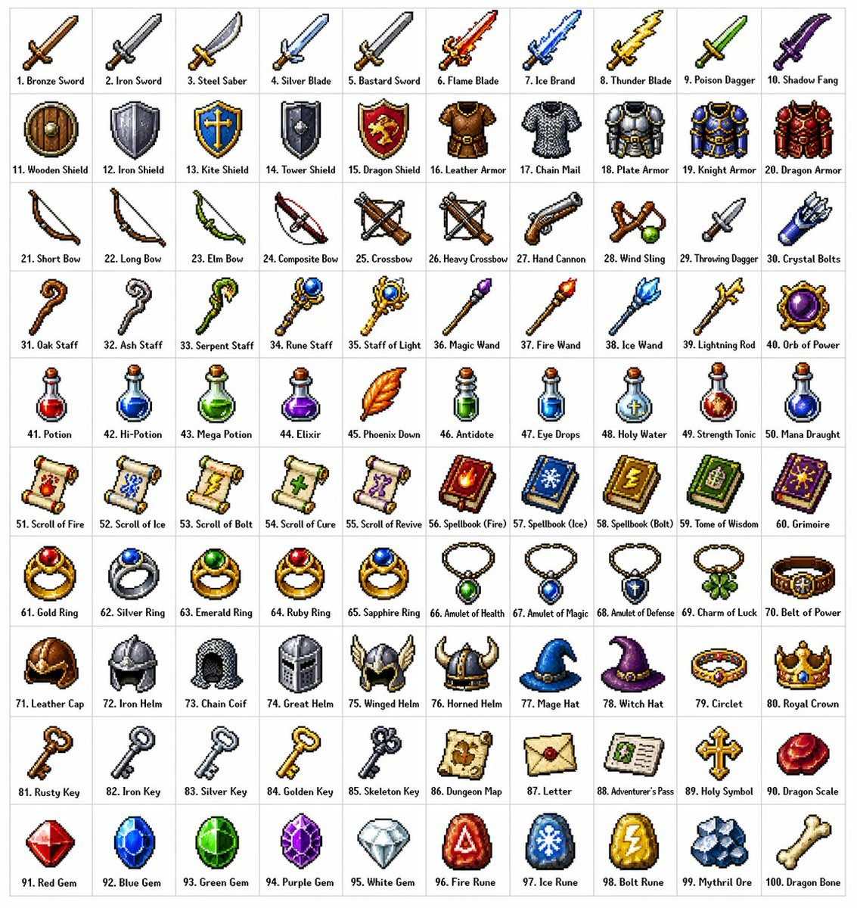
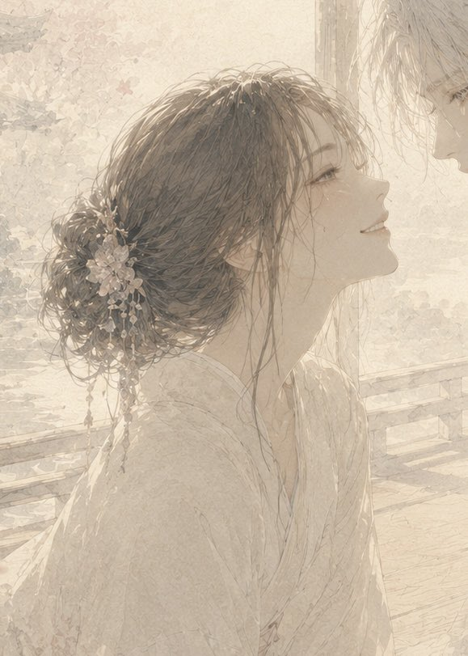
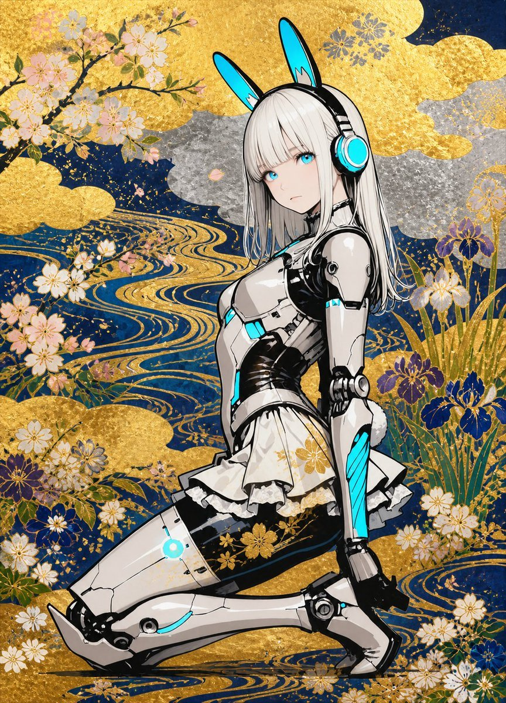
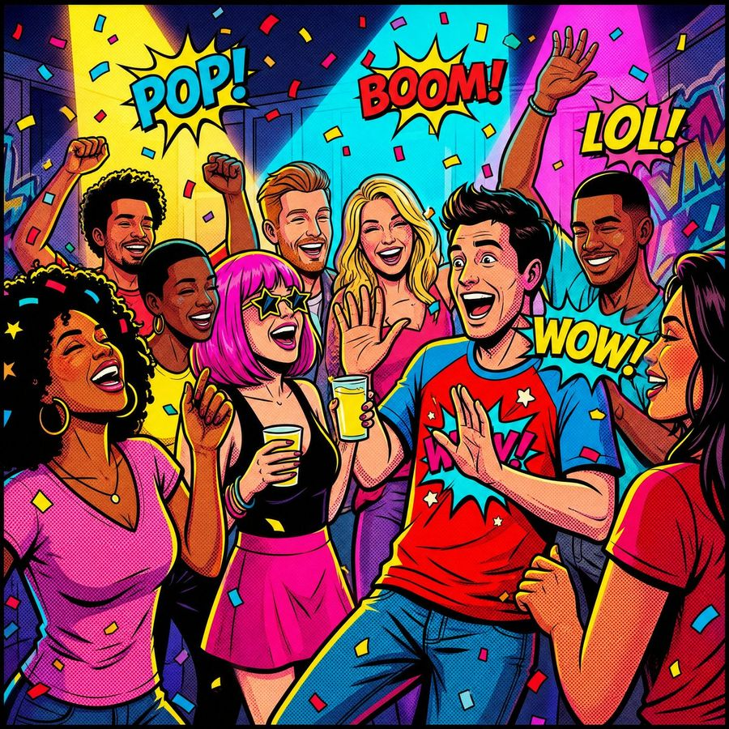
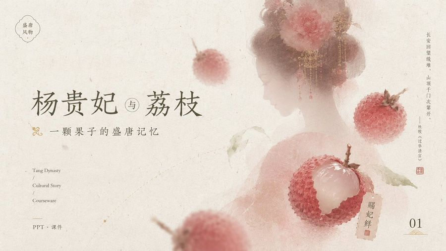
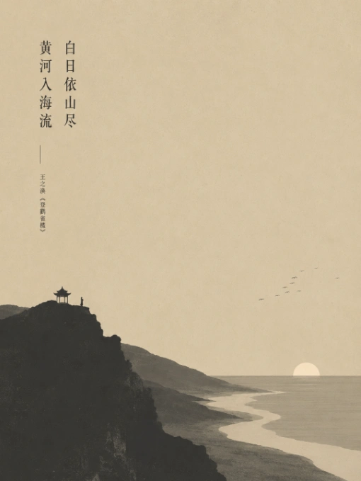
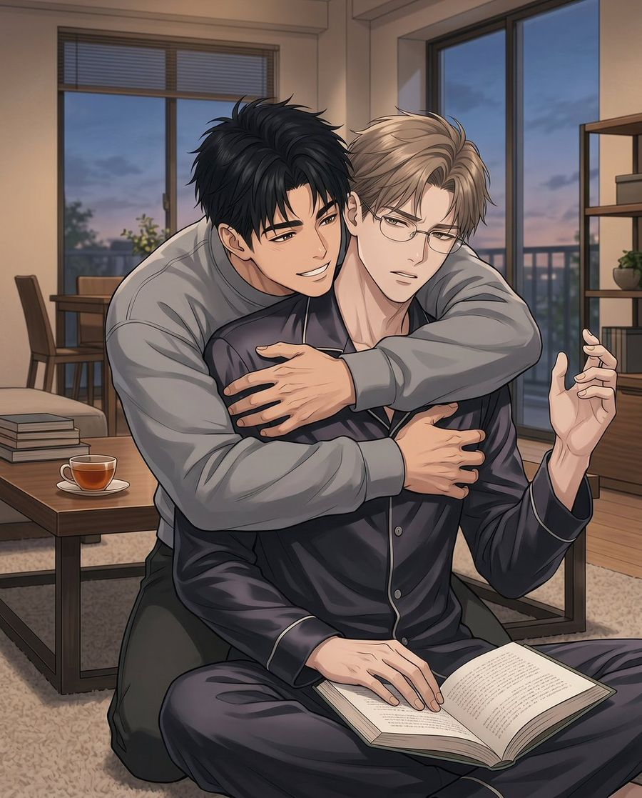

# 🎨 插画与艺术

[返回分类](categories.md) · [查看全部案例](cases/cases-001-100.md) · [返回首页](../README.md)


日系插画、概念艺术、水墨画、油画风格、素描、材质球渲染、全息线框等。

---

## 🎨 例 6：银河繁星点缀的冰蓝襦裙


**Prompt:**

```text
[中文]
服裝細節： 模特兒身穿一套精緻的淡冰藍色齊胸襦裙，採用多層輕盈的薄紗和絲綢歐根紗材質制成。其寬大的、半透明的廣袖上點綴著如繁星般微小的銀色和淺藍色亮片刺繡，在光線下閃爍（具有銀河般的夢幻感）。抹胸位置有複雜的銀色蕾絲和編織紋理細節，腰帶自然垂落。

材質與光影： 畫面呈現 8k 超高分辨率和對織物微距紋理的極致渲染。光線採用柔和的自然側光（丁達爾效應 Typndall Effect），精準地透射過輕薄的紗布，營造出面料的半透明感（Translucency）和流動感。

構圖與鏡頭： 採用 85mm 黄金人像鏡頭效果，f/1.8 大光圈，全身構圖，模特居中站立

[English]
Clothing details: The model wears an exquisite pale ice blue chest-high ruqun, made of multiple layers of lightweight tulle and silk organza materials. Its wide, translucent broad sleeves are adorned with tiny silver and light blue sequin embroideries like stars, shimmerming under the light (with a galaxy-like dreamy feel). The tube top position has complex silver lace and woven texture details, and the belt falls naturally.
Material and light and shadow: The image presents 8k ultra-high resolution and extreme rendering of macro textures of the fabric. The lighting uses soft natural side light (Tyndall Effect Typndall Effect), accurately transmitting through the light gauze, creating a sense of translucency (Translucency) and fluidity of the fabric.
Composition and lens: Uses 85mm golden portrait lens effect, f/1.8 large aperture, full-body composition, model standing in the center
```

**来源：** [@fdtreesky](https://x.com/fdtreesky/status/2046508731090018331) | 2026-05-10


---

## 🎨 例 7：100种不同奇幻RPG物品



**Prompt:**

```text
[中文]
创建一个包含100种不同奇幻RPG物品的10×10网格，以经典像素艺术风格渲染（16位或32位精灵图美学，让人联想到SNES/GBA时代的日式RPG）。每个物品应出现在其独立的方形瓷砖中，下方带有简短清晰的标签。在白色背景上保持网格整洁。使每个物品在视觉上都有所区分，并且每个标签拼写正确。使用清晰的像素边缘、每个精灵图有限的调色板，以及用于阴影的微妙抖动。
使用这些行主题：
第1行：剑与刀刃
第2行：盾牌与盔甲
第3行：弓、弩与远程武器
第4行：法杖、魔杖与魔法焦点
第5行：药水、灵药与烧瓶
第6行：卷轴、典籍与法术书
第7行：戒指、护身符与附魔小饰品
第8行：头盔、王冠与头饰
第9行：钥匙、遗物与任务物品
第10行：宝石、符文与制作材料
将每个瓷砖显示为干净背景方形上居中的物品精灵图，渲染为经典的库存图标——你在奇幻RPG菜单中会看到的那种。保持整体风格一致、连贯，并让人联想到备受喜爱的复古奇幻RPG——迷人、细节丰富，且在小尺寸下易于辨认。

[English]
Create a 10 × 10 grid of 100 different fantasy RPG items rendered in classic pixel art style (16-bit or 32-bit sprite aesthetic, reminiscent of SNES/GBA-era JRPGs). Each item should appear in its own square tile with a short clear label underneath. Keep the grid neat on a white background. Make every item visually distinct and every label correctly spelled. Use crisp pixel edges, limited palette per sprite, and subtle dithering for shading.
Use these row themes:
Row 1: swords and blades
Row 2: shields and armor
Row 3: bows, crossbows, and ranged weapons
Row 4: staves, wands, and magical foci
Row 5: potions, elixirs, and flasks
Row 6: scrolls, tomes, and spellbooks
Row 7: rings, amulets, and enchanted trinkets
Row 8: helmets, crowns, and headgear
Row 9: keys, relics, and quest items
Row 10: gems, runes, and crafting materials
Show each tile as a centered item sprite on a clean background square, rendered as a classic inventory icon — the kind you'd see in a fantasy RPG menu. Keep the overall style consistent, cohesive, and reminiscent of beloved retro fantasy RPGs — charming, detailed, and instantly readable at small sizes.
```

**来源：** [@ProperPrompter](https://x.com/ProperPrompter/status/2046534215311970694) | 2026-05-10


---

## 🎨 例 17：剪纸璀璨夜景


**Prompt:**

```text
[中文]
以珠江新城现代都市景观为灵感的剪纸艺术，通过精巧的镂空手法在一整幅纸上，立体刻画广州塔、东西双塔等地标建筑与繁华城景。
所有建筑与元素均以流畅的线条与结构相连，无孤立部分，构成一幅完整的都市画卷。
画面采用金属箔或光泽纸材质，表面带有细腻的明暗光泽，在光照下呈现柔和的高光与阴影，仿佛被城市灯光轻轻照亮。
背景以虚化的珠江新城天际线为衬，点缀隐约可见的花城广场与树木轮廓，整体透出现代浪漫的氛围。
作品中巧妙融入轻盈的蒲公英绒毛或星光般的动态光点，象征梦想与活力在这座新城中飘散飞扬。整体呈现8K超高清视觉，细节丰富，真实而富有艺术感染力。

[English]
Paper-cut art inspired by the modern urban landscape of Zhujiang New Town, through exquisite hollow-carving techniques on a single sheet of paper, three-dimensionally depicting landmark buildings such as Canton Tower, East and West Twin Towers, and the bustling cityscape. All buildings and elements are connected by smooth lines and structures, with no isolated parts, forming a complete urban scroll. The picture uses metallic foil or glossy paper material, with delicate light and dark gloss on the surface, presenting soft highlights and shadows under illumination, as if gently illuminated by city lights. The background is set against a blurred Zhujiang New Town skyline, dotted with faintly visible outlines of Huacheng Square and trees, overall revealing a modern romantic atmosphere. The work cleverly integrates light dandelion fluff or starlight-like dynamic light points, symbolizing dreams and vitality fluttering and flying in this new city. The overall presents 8K ultra-high-definition vision, rich in details, realistic and full of artistic appeal.
```

**来源：** [@liyue_ai](https://x.com/liyue_ai/status/2045527750606487877) | 2026-05-11

## 🎨 例 40：柔和遮挡的新娘之吻插画



**Prompt:**

```text
创作一幅细腻的竖版浪漫动漫风格水彩插画，描绘 {argument name="character name" default="一位年轻新娘"} 和 {argument name="partner" default="一位浅发青年"} 在阳光明媚的室内近距离站立，仿佛即将亲吻或共享私密气息的场景。新娘以背影及侧面呈现，深棕色长发盘成松散的低发髻，带有许多细碎发丝，佩戴着饰有珍珠般垂坠珠饰的华丽白色花卉发饰；她身着质感轻盈、褶皱细腻的象牙白婚纱和服或礼袍。伴侣出现在右上角边缘，仅露出部分浅金或银色头发及低垂的温和面容。在画面中心两人接触的区域覆盖一个大型不透明米色方形遮挡块，遮住两人的面部，位置横跨画面中右侧。采用柔和的奶油色、米色、象牙白和浅金色调，运用柔和的背光、尘埃般的阳光、背景中隐约的花卉壁纸或窗户倒影，营造出一种含蓄渴望与温柔的静谧怀旧氛围。风格应追求细线条、通透感、绘画性，发丝与配饰细节丰富，低对比度，呈现半透明水彩质感，且画面中不含任何文字或水印。
```

**来源：** [@mirutsu_ai](https://x.com/mirutsu_ai/status/2054782254518604099#reversed-0) | 2026-05-14


---

## 🎨 例 41：琳派风格装饰艺术



**Prompt:**

```text
一种展现琳派装饰艺术巅峰的华丽风格。大胆运用金银云纹，结合流动的流水与花卉图案。强调平面化的装饰美感。色彩鲜艳，并呈现出金箔与银箔的质感。忠实保留原始插画的构图与特征。
```

**来源：** [@Anifun_AI](https://x.com/Anifun_AI/status/2054822980585443796) | 2026-05-14


---

## 🎨 例 42：活力派对波普艺术插画



**Prompt:**

```text
一张波普艺术风格的插画，描绘了 {argument name="subject" default="一群充满活力的朋友"} 在 {argument name="event" default="一场高能派对"} 上的场景。画面采用大胆的漫画美学，配以粗黑轮廓线、半调网点纹理和夸张的表情特征。场景中充满了鲜艳的霓虹色和原色（电光粉、亮黄、青蓝和鲜红），营造出动感十足的氛围。构图略微倾斜以增强动感和混乱感，重叠的人物正在互动——大笑、跳舞、举杯庆祝。背景中漂浮着五彩纸屑和音效排版元素，如“{argument name="typography" default="WOW!”, “LOL!” 和 “BOOM!”"}”。强烈的轮廓光和饱和的灯光效果增强了深度与对比度。环境是一个风格化的室内派对空间，背景中巧妙地融入了抽象形状、涂鸦风格的墙面艺术和漫画分镜。超精细、电影级构图、高对比度、焦点清晰、8K 分辨率，现代波普艺术与漫画插画风格的完美结合。
```

**来源：** [@Mind_Boticini](https://x.com/Mind_Boticini/status/2054761436803707039) | 2026-05-14


---
### 🎨 例 57：Misty Heron Lake at Sunrise


**Prompt:**

```text
Create a serene painterly landscape of a misty lake at sunrise, in a romantic impressionist oil-painting style. The scene shows a calm reflective pond filled with lily pads and exactly 14 visible water lilies: 5 prominent blossoms in the lower-left foreground, 1 small blossom near the center-left water, 2 blossoms just left of the heron, and 6 blossoms scattered across the right-side lily pads. Place a single elegant {argument name="bird" default="great blue heron"} standing in shallow water slightly right of center, facing left, with long legs, an orange beak, blue-gray feathers, and a clear reflection in the water. In the right background, include a graceful willow-like tree with drooping branches covered in pale pink blossoms, leaning over the water; surround it with reeds and soft greenery. The horizon is hazy with distant trees, low morning fog, and a glowing sun near the center, casting peach, coral, lavender, and gold reflections across the lake. Use a wide cinematic canvas, soft brushstrokes, pastel colors, atmospheric depth, gentle ripples, and a peaceful spiritual mood. Emphasize luminous sunrise light, mirrored reflections, blooming water lilies, reeds, and tranquil stillness. No text, no people, no buildings, no harsh outlines, no photorealistic sharpness.
```

**来源：** [@status](https://x.com/churvikv/status/2055395986520871005#reversed-0) | 2026-05-17

---

### 🎨 例 58：Doraemon Watercolor Silhouette Dreamscapes


**Prompt:**

```text
Create a {argument name="style" default="watercolor-style"} illustration of {argument name="character" default="Doraemon's"} head silhouette filled with three layered dreamlike scenes:

1. The top section shows a night sky with a large moon, a floating castle on clouds with stairs leading to it, UFOs, and Japanese text on the left side.
2. The middle section depicts four children (three humans and Doraemon) sitting on a suburban street with houses and a tree, watching the scene above.
3. The bottom section shows Doraemon leading three children walking down an illuminated street toward a waterfront with a dinosaur and a ship, framed by lush greenery.

Include the title “DORAEMON ” at the bottom left with copyright text, and vertical Japanese poetry on the left edge.
```

**来源：** [@status](https://x.com/SimplyAnnisa/status/2055343903037919442) | 2026-05-17

---

### 🎨 例 61：韩国城市水彩旅行插画


**Prompt:**

```text
Dreamy watercolor travel illustration of a peaceful Korean city street, hand-painted urban sketchbook style, delicate ink linework mixed with soft watercolor washes, cozy café storefronts, warm bakery lights glowing through windows, quiet morning atmosphere after light rain, reflective wet pavement, pedestrians with umbrellas and tote bags, bicycles parked along narrow streets, traditional Korean signs and typography, subtle Korean text labels, soft beige paper texture background, architectural sketch aesthetic, calm everyday city life, muted earthy palette with warm browns, faded greens, cream whites and soft blue accents, highly detailed pen-and-ink drawing, loose expressive brush strokes, travel journal composition, editorial postcard layout, elegant serif title text at top (“SEOUL”, “JEONJU”, “DAEJEON”), handwritten notes and date stamps, vintage travel diary aesthetic, cozy East Asian urban scenery, cinematic slice-of-life mood, watercolor bleeding edges, natural perspective, atmospheric depth, peaceful storytelling illustration, minimalist negative space, ultra detailed watercolor texture, sketchbook traveler aesthetic, nostalgic café culture vibes, Studio Ghibli-inspired realism, European urban sketching style mixed with Korean street scenery, soft daylight, calm and poetic composition, vertical poster design, premium art print quality.
```

**来源：** [@status](https://x.com/Taaruk_/status/2055492435862773978) | 2026-05-17

---

### 🎨 例 63：层叠纸雕情侣插画


**Prompt:**

```text
{
  "style": "layered paper-cut illustration, papercraft diorama, handcrafted aesthetic",
  "technique": {
    "layering": "multiple stacked paper layers with soft drop shadows between each layer",
    "depth": "5–7 visible depth planes from foreground to background",
    "edges": "smooth, rounded, slightly beveled paper-cut edges",
    "texture": "subtle paper grain and fibrous texture on all surfaces",
    "shadows": "soft, diffused inner shadows beneath each layer suggesting physical depth"
  },
  "character_design": {
    "proportions": "chibi / cute simplified — large round head, small body (1:1.5 ratio)",
    "face": {
      "eyes": "small dot eyes, glossy highlight",
      "cheeks": "soft circular rosy blush patches",
      "nose": "absent or minimal dot",
      "mouth": "simple small curve smile"
    },
    "limbs": "short, rounded, stubby limbs",
    "outline": "clean smooth silhouette, no sharp corners"
  },
  "color_palette": {
    "mood": "warm, cozy, pastel",
    "tones": ["soft cream", "dusty rose", "sage green", "warm peach", "sky blue", "honey yellow"],
    "saturation": "low-to-medium, muted and gentle",
    "background": "warm off-white or soft gradient"
  },
  "lighting": {
    "type": "soft ambient light from top-front",
    "highlights": "gentle white edge highlights on top layers",
    "shadows": "warm light tan/beige shadow tones beneath cut layers"
  },
  "environment": {
    "foliage": "simplified rounded leaf and floral shapes as separate paper layers",
    "ground": "curved horizon layers suggesting rolling hills",
    "details": "tiny decorative elements — stars, small hearts, dots — cut from paper"
  },
  "overall_mood": "warm, whimsical, cozy, handmade, storybook",
  "render_quality": "ultra-detailed papercraft art, studio photography lighting, sharp focus on layer edges"
}
```

**来源：** [@status](https://x.com/Just_sharon7/status/2055368240885641323) | 2026-05-17

---

### 🎨 例 65：Magical Gothic Library Balcony


**Prompt:**

```text
Create a vertical 2:3 anime fantasy illustration of one elegant young girl standing on a glossy balcony inside an enormous magical gothic library-observatory at twilight. The girl has {argument name="hair color" default="long pastel pink hair"}, pale skin, a gentle smiling expression, and wears an ornate black-and-white frilled gothic lolita dress with layered lace, puffed sleeves, ribbons, white stockings, and black platform heels; she turns slightly toward the viewer while standing near a gold filigree railing. Surround her with exactly seven prominent glowing butterflies: one large pink butterfly near the left railing, one small butterfly above the upper balcony, one tiny butterfly near the window, one large pink butterfly on the right railing, one large butterfly near the bottom left floor, one small butterfly near her feet, and one small butterfly at the lower right edge. The setting is a vast cathedral-like interior with towering bookshelves, sweeping spiral staircases, arched balconies, marble columns, gilded railings, chandelier-like lamps, reflective black floors, and intricate art nouveau metalwork. On the right, include a gigantic arched glass window covered in rain streaks, revealing a luminous night city skyline with castle spires and a large glowing ferris wheel outside. Use a dreamy {argument name="color palette" default="lavender, rose pink, pale blue, and warm gold"} palette, misty volumetric light, sparkling particles, soft bloom, extremely detailed architecture, delicate linework, cinematic depth, ethereal magical atmosphere, and a high-resolution polished anime art style. No text, no watermark, no extra characters.
```

**来源：** [@status](https://x.com/NeneneAI/status/2055781071401410795#reversed-0) | 2026-05-17

---
### 🎨 例 73：Watercolor Journal Style 2026 Calendar


**Prompt:**

```text
使用上传的第一张图作为【整体风格与版式参考】，使用上传的第二张图作为【人物身份参考】。

请生成一张完整的 2026 年全年日历插画海报。

画面风格：
保留参考图一的手绘水彩插画风格，温暖米白纸张背景，细腻墨线勾勒，柔和水彩晕染，轻微纸张纹理，带有季节感的小装饰元素，如花草、雪花、爱心、纸飞机、星星、云朵、树叶、相机、书本、咖啡杯、礼物、圣诞树等。整体氛围温柔、治愈、干净、生活感强，像一本手账风全年日历。

版式要求：
采用 3 列 × 4 行的全年月历排版，共 12 个月份。
顶部居中写大标题：“2026”，使用手写感黑色笔刷字体。
每个月份标题格式为：
“01 January”
“02 February”
“03 March”
一直到
“12 December”。

每个月份区域都包含：
1. 月份英文标题
2. 小型日历日期表
3. 一位人物插画
4. 对应季节的小场景装饰

人物要求：
将参考图一中的男性人物全部替换为参考图二中的女性人物。
保持参考图二人物的核心特征：
年轻亚洲女性，长棕黑色头发，空气刘海，戴细框眼镜，五官精致，表情温柔自然，略带安静、微醺、慵懒感。

人物服装参考：
宽松白色衬衫，黑色内搭，黑色短裙，黑色丝袜，黑色鞋子，细项链或 choker。
服装需要融入手绘水彩风，不要像照片硬贴上去。

每个月人物动作不同：
1 月：坐着捧热咖啡，冬日温暖感  
2 月：托腮坐着，周围有爱心元素  
3 月：低头写手账或笔记本  
4 月：拿着复古相机  
5 月：坐着看书，旁边有书堆和茶杯  
6 月：休闲坐姿，旁边有相机和蓝色水彩装饰  
7 月：坐在躺椅上喝冰饮，夏日感  
8 月：坐在海边木栈道，远处有帆船  
9 月：坐着写日记，旁边有背包 and 秋叶  
10 月：喝咖啡，旁边有南瓜灯和万圣节元素  
11 月：围着棕色围巾，手拿热咖啡，背景有城市街景  
12 月：坐在圣诞树旁，手捧热饮，旁边有礼物盒  

日历要求：
年份必须是 {argument name="年份" default="2026"}。
所有月份日期必须符合真实 2026 年日历。
星期排列为：
S M T W T F S
星期日和部分日期可使用红色点缀，其余为黑色。
日期尽量清晰可读，保持手写日历质感。

整体要求：
画面必须像一张完整的全年日历海报，而不是拼贴照片。
人物与背景要统一成同一种手绘水彩风格。
保持参考图一的原有构图、温柔季节感、手账插画质感和高级可爱氛围。
不要出现真实照片感，不要过度写实，不要赛博风，不要厚重油画风。
```

**来源：** [@status](https://x.com/you1873118/status/2056175244256411890) | 2026-05-18

---
### 🎨 例 86：唐风荔枝课件封面



**Prompt:**

```text
目标：创作一张优雅的唐风课件/PPT 封面，主题为 {argument name="main title" default="杨贵妃 与 荔枝"}，展现以荔枝和朦胧宫廷美人为核心的诗意中国历史美学。

画布：16:9 横向演示封面，采用带有细微纤维、污渍、浅划痕和水墨老化效果的暖象牙色手工宣纸背景。整体色调为柔和的奶油色、灰粉色、淡桃色、褪色红、橄榄灰和水墨灰。

布局：将主标题以精致的中文书法风格衬线字体置于左侧中央。副标题置于其正下方，最左侧配有装饰性金色花纹。左侧和中下部留出充足的负空间。右半部分展示一位唐代贵族女性的柔和半透明背影剪影，露出肩部，梳着高耸圆髻，佩戴华丽的金色垂坠发饰，发间点缀着硕大的粉红色牡丹花；其面部区域特意用一块素雅的淡米色矩形遮挡。周围点缀漂浮的荔枝，并增加前景深度模糊效果。

文本内容：包含以下明确的可见文本区域：1) 左上角云形印章，内含“盛唐 / 风物”；2) 主标题“杨贵妃 与 荔枝”；3) 副标题“一颗果子的盛唐记忆”；4) 左下角英文堆叠文字“Tang Dynasty / Cultural Story / Courseware”；5) 左下角中文标签“PPT · 课件”；6) 右侧竖排诗句“长安回望绣堆，山顶千门次第开。——杜牧《过华清宫》”；7) 剥皮荔枝旁的小标签，写有“贵妃鲜”并带有红色印章标记；8) 右下角页码“01”，下方配有小型金色装饰下划线。

主体细节：包含 4 个可见的荔枝元素：上方中央漂浮一颗模糊的小荔枝，右侧一颗清晰的完整荔枝，右下中央一颗剥皮的大荔枝（露出半透明白色果肉，红色凹凸果皮向外翻开），以及前景下方一颗高度模糊的荔枝局部。在剥皮荔枝旁添加几片淡绿色荔枝叶。荔枝呈现绘画感且真实，具有凹凸的红色外壳和柔和的自然高光。

视觉风格：极简奢华的中国编辑设计，博物馆课件封面，柔和水墨，半透明分层，浅景深，精致的金色点缀，低调的红色印章，平衡的非对称构图，无现代 UI 元素。

约束：保持页面整洁通透，严格控制 4 个荔枝元素的数量，确保所有排版清晰易读，除指定标签外不添加额外文本，无水印，避免写实风格的强光效果。
```

**来源：** [@status](https://x.com/xiaoxiaodong01/status/2056620564048224765#reversed-1) | 2026-05-19

---

### 🎨 例 88：Crystal Cat Familiar


**Prompt:**

```text
Create a luminous fantasy anime illustration of {argument name="character name" default="Nico"}, a small elegant crystal cat familiar standing in a majestic cathedral made of glass and gemstones. The cat has a petite foxlike feline body, oversized pointed ears, a delicate smiling face, long white whiskers, and large sparkling {argument name="eye color" default="violet-blue"} eyes with glossy highlights. Its entire body appears made from translucent faceted crystal, primarily {argument name="crystal body color" default="icy blue and lavender"}, refracting rainbow prismatic colors across its face, torso, legs, paws, and ears. Add one diamond-shaped gem embedded on the forehead, plus a faceted jewel collar or chest ornament. The cat stands in a graceful three-quarter pose, front legs straight, back slightly arched, head turned toward the viewer, with an expression that feels magical, confident, and gentle. Include exactly two long flowing tails curling upward behind it, each ending in a bright crystal flame or gem tip: one glowing pink-magenta and one glowing cyan-blue, both surrounded by tiny star sparkles. The setting is an ethereal crystal palace interior with tall arched columns on both sides, stained-glass windows glowing softly in the background, a polished reflective floor, and distant gem formations. Use a pastel palette of blue, lavender, pink, cyan, and pearly white, with soft volumetric backlight, rainbow caustics, glittering particles, lens-like starbursts, and a dreamy high-detail gpt-image-2 fantasy art style. Keep the composition centered, full-body, square format, no text, no watermark, no extra animals.
```

**来源：** [@status](https://x.com/00_hasu_00/status/2056729059313545658#reversed-0) | 2026-05-19

---

### 🎨 例 89：Cherry Blossom School Gate Manga Page


**Prompt:**

```text
Goal: Create a black-and-white manga page about two schoolgirls arriving at a school gate under cherry blossoms, with one character partly highlighted in pale cyan and the other character’s face obscured by gray blur blocks.

Canvas: Vertical manga page, approximately 2:3 aspect ratio, high-resolution monochrome screentone style with thick black panel borders, clean line art, speed lines, petals, and dramatic perspective. Use grayscale shading with only one accent color: faint cyan glow on the glasses-haired girl.

Layout: Use exactly 5 visible manga panels. Panel 1 is a large top-left scene showing a twin-tailed schoolgirl in a sailor uniform standing on a cherry blossom path with the school gate far behind her; her face is covered by a soft-edged gray rectangular blur. Panel 2 is a narrow inset at the top right showing a cropped long-haired girl in sailor uniform holding a school bag in front of her body. Panel 3 is another top-right inset beside it showing the same long-haired girl wearing a beret and glowing cyan glasses, touching the bridge of her glasses with a confident gesture. Panel 4 is a wide middle panel showing the twin-tailed girl close up, raising one hand in greeting; her face is again covered by a larger gray rectangular blur. Panel 5 is a large bottom panel showing a dramatic tilted view of an ornate school gate opening in bright light, with the long-haired girl running or turning toward the viewer and the cyan-glasses girl standing farther back on the right.

Characters: The twin-tailed girl has messy medium-length twin ponytails tied with ribbons, a sailor school uniform with bow, pleated skirt, and shy energetic body language. The long-haired girl has very long flowing hair, sailor uniform, pleated skirt, school bag in one inset, and a composed expression in the bottom panel. The second version of the long-haired girl wears a round beret, glasses glowing pale cyan, sailor uniform, dark skirt, knee socks, and has a mysterious tech-like aura.

Text content: Include exactly 3 Japanese speech/sound text elements: a speech bubble in panel 1 reading {argument name="first speech bubble" default="あ見えたー校門"}, a speech bubble in panel 4 reading {argument name="second speech bubble" default="沙羅さーん、葵ちゃん！"}, and large stylized gate-opening sound effects in panel 5 reading {argument name="sound effect text" default="ザァァァ"}. Add small handwritten manga sound effects near the girls if needed, but keep them minimal and visually secondary.

Setting and style: A spring school entrance lined with dense cherry blossom trees, falling petals, stone path, ornate iron gate, bright backlight from the gate, detailed manga hatching, screentones, speed lines, and cinematic perspective. The overall style should resemble a polished Japanese shoujo manga page, with expressive poses, delicate hair rendering, dramatic lighting, and clean page composition.

Constraints: Keep the page monochrome except for the cyan glow on the glasses character. Keep the blurred gray face blocks visible on the twin-tailed girl in panels 1 and 4. Do not add extra panels, extra main characters, watermarks, logos, or English text. Use {argument name="school uniform style" default="Japanese sailor uniforms with bow ties and pleated skirts"} and a {argument name="season" default="spring cherry blossom season"} atmosphere.
```

**来源：** [@status](https://x.com/charon_artist/status/2056721178224636315#reversed-0) | 2026-05-19

---
### 🎨 例 111：Dark Pop Cheshire Cat Girl


**Prompt:**

```text
Create a highly saturated dark-pop anime fantasy illustration of {argument name="character name" default="a Cheshire Cat inspired cat girl"} perched sideways on a thick tree branch in an enchanted forest at sunset. The character has an oversized mischievous feline head with purple and orange fur markings, large pointed ears with pink-blue inner ears, one huge glowing red-orange eye open, the other eye winking, long white whiskers, and a very wide toothy grin with sharp triangular teeth. Her body is humanoid but petite, wearing a gothic black puff-sleeve dress with white ruffled trim, a small black neck bow, lace details, and glossy black platform lace-up boots. Add exactly 5 prominent outfit elements: black puff-sleeve dress, white ruffled cuffs, black neck bow, striped arm sleeve, glossy platform boots. The visible legs wear bold horizontal striped thigh-high stockings in alternating pale blue, navy, cream, and warm peach tones. One arm has a vivid striped sleeve in red, pink, cyan, orange, and yellow, ending in a fluffy white cat paw glove with a ruffled cuff and small gold button. Include one huge curling fluffy tail sweeping across the lower foreground, colored with alternating purple and orange bands. Composition: vertical portrait, dynamic low-angle view, the character leaning forward playfully from the branch with legs dangling toward the viewer; one paw rests near the boots, the enormous tail frames the bottom. Background: tangled dark tree branches, glowing golden sun behind the head creating strong rim light, and stained-glass-like multicolored foliage in teal, magenta, yellow, orange, and violet. Visual style: {argument name="art style" default="glossy niji anime dark pop illustration"}, ultra-detailed linework, dramatic backlighting, neon color grading, high contrast shadows, luminous highlights, painterly texture, whimsical but slightly sinister Alice-in-Wonderland mood. Use {argument name="color palette" default="electric purple, orange, cyan, gold, magenta, and black"}. No text, no watermark, no frame, no extra characters.
```

**来源：** [@status](https://x.com/HarunagaMutsuki/status/2058399744842682664#reversed-0) | 2026-05-22

---

### 🎨 例 113：Chinese Museum Deconstruction Infographic


**Prompt:**

```text
Automatically generate a museum-encyclopedia-style Chinese deconstruction infographic from the {argument name="theme" default="[theme]"} I provide.

Combine a realistic central visual with structural breakdown, Chinese leader-line callouts, material notes, pattern symbolism, color meaning, and a core-feature summary. From the theme alone, infer the most fitting subject, costume system, object structure, historical era, key components, materials and craftsmanship, color palette, and overall layout. No extra input required from me.

Overall aesthetic: National Museum exhibition board, historical costume encyclopedia, scholarly subject infographic. Not a poster, ancient-style portrait, e-commerce detail page, or anime illustration. Background uses paper textures, off-white, silk-paper white, or light tea-color, with a premium, restrained, collectible feel.

Fixed layout:
- Top: Chinese main title + subtitle + short intro
- Left: structural deconstruction area, Chinese leader-line annotations on key components, with partial close-ups
- Top right: materials / craft / texture area, real texture swatches with descriptions
- Middle right: pattern / color / symbolism area, main color palette, pattern samples, cultural notes
- Bottom: dressing order / assembly flowchart + summary of core features

If the theme suits a human subject, use a realistic full-body standing figure as the centerpiece. If it suits an object or single structure, switch to a central deconstruction diagram, but keep the overall infographic format intact. All text in Simplified Chinese, clear, neat, readable, no garbled glyphs, typos, English, or pinyin. Emphasize realistic structure, material contrast, cultural commentary, and an encyclopedic feel.

Avoid: poster vibe, studio-photo vibe, e-commerce vibe, anime vibe, cosplay vibe, messy annotations, wrong structure, blurry text, fake materials, excessive decoration.
```

**来源：** [@status](https://x.com/iamaiistudio/status/2058248203934544035) | 2026-05-22

---

### 🎨 例 117：极简侘寂风诗歌海报



**Prompt:**

```text
”{argument name="诗句" default="白日依山尽，黄河入海流"}“微小剪影，极简侘寂海报风格，单色米色和深炭色调，略带忧郁但平静，富有诗意的排版。
```

**来源：** [@status](https://x.com/KendrinT/status/2058111442012782642) | 2026-05-22

---
### 🎨 例 129：Japanese Husky Sketchbook Profile


**Prompt:**

```text
Goal: Create a vertical personal sketchbook profile page for a cute Siberian husky named {argument name="character name" default="はすきー"}, in a warm hand-drawn Japanese scrapbook style, like a watercolor pet diary made with GPT Image 2.

Canvas: Portrait 4:5 page on off-white textured paper, filled edge to edge with blue ink doodles, washi tape, paw prints, hearts, stars, dotted travel paths, paper scraps, checklists, and handwritten Japanese notes. Main palette is deep cobalt blue, navy ink, soft gray, cream paper, with tiny red hearts and pale yellow tape accents.

Layout: Put a huge title at the top center reading 「はすきー」 in bold blue brush lettering with an underline and a small heart. At top left, a taped label reads 「ぼくのプロフィール」. The center is dominated by a large watercolor husky head/upper-body portrait with fluffy pointed ears and blue splatter paint behind it, but cover the face area with one large flat bluish-gray square mask. Bottom left shows a full-body standing husky, tail curled, blue-gray fur, with a second small bluish-gray square mask over its face. Right middle shows a small seated chibi husky with a gold crown doodle, but cover its face with a third small bluish-gray square mask. Bottom right contains a cozy window scene of the husky sitting indoors and looking outside at snowy mountains.

Text content and counted elements: Include exactly 5 profile rows under the top-left profile label, each with a paw bullet: 「なまえ：はすきー」, 「犬種：シベリアン・ハスキー」, 「誕生日：？？？(たぶん春)」, 「性別：♂」, and 「性格：好きじいっぱい！ あそぶの大好き！ ちょっといたずらっ子♡ やさしくて、家族がだいすき！」. Include exactly 5 checked items in a left memo box titled 「飼い主メモ」: 「お水をわすれない」, 「いっぱい褒める」, 「たくさんあそぶ」, 「ブラッシングするよ」, and 「実はこわいけど 暑さは苦手かも？」. Include exactly 6 bullet traits on the upper right titled 「ぼくのとくちょう」: 「好奇心いっぱい」, 「あそぶの大好き」, 「ちょっといたずらっ子」, 「とっても忠犬！」, 「冒険だいすき」, and 「やさしい目」, with small matching doodle icons such as magnifying glass, ball, teddy face, heart, mountains, and eye. Include a cloud note near the top right reading 「青い目がチャームポイント」 with an eye icon. Include a speech bubble near the chibi dog reading 「今日もマイペース♪」 and tiny text 「えへへっ」 with hearts.

Additional paper notes: Add a ribbon banner below the central portrait reading 「ぼく {argument name="character name" default="はすきー"}！」 and below it 「よろしくね！」. Add a center-lower note titled 「すきなことメモ」 with exactly 5 heart-bullet items: 「おさんぽ」, 「ひっぱりっこ」, 「雪の上をはしること」, 「お水であそぶこと」, and 「家族といっしょにいること」. Add a bottom-left taped note titled 「家族の宝物」 with a loving thank-you message. Add a bottom-right clipped note titled 「きょうのはすきーメモ」 with exactly 3 time-of-day lines: 「朝：いっぱい食べた！」, 「昼：おさんぽたのしかった！」, and 「夜：ぐっすりねんね…Zzz」. Add a small note beside the window scene saying 「窓の外をながめるのがすきなんだ〜♡」. Label the window scene 「いつもの風景」.

Decorations: Include snowy mountain doodles at lower left, pine trees, a compass, a bone, a blue ball, blue paw stamps, a circular postmark-style stamp reading GOOD BOY with a paw, a mug labeled GOOD DAY, paper clips, check marks, washi tape strips, and scattered ink splashes. Use exactly 3 gray mask rectangles total, all opaque and featureless. Keep the whole image handmade, slightly messy, charming, and information-rich, with readable handwritten Japanese text and no photorealism.
```

**来源：** [@husky__create](https://x.com/husky__create/status/2058865714904326386#reversed-0) | 2026-05-26

---


### 🎨 例 149：无脸动漫风格公寓拥抱



**Prompt:**

```text
Create a polished anime-style BL/romance illustration set in a cozy modern apartment living room at twilight. Two young adult men are the only characters, drawn in detailed semi-realistic Japanese anime style with clean linework, soft cel shading, warm indoor lighting, and a gentle intimate mood. The seated man sits cross-legged on a beige shag rug in the foreground, wearing dark navy satin pajamas with light piping and buttons, holding an open book on his lap with one hand resting on the pages and the other hand raised slightly to the right in a delicate gesture. He has light ash blond tousled layered hair and a slim build. Behind him, the second man kneels close and wraps both arms around him in an affectionate back hug, wearing a loose light gray sweatshirt and dark pants; he has black messy tousled hair and a slightly broader build. Their faces are intentionally obscured by two simple vertical rectangular blur blocks in skin-toned gradient colors, one centered over each face, preserving the rest of the illustration clearly. The embrace should be close and protective, with four visible embracing hands/arms: the rear man’s left arm across the front man’s chest, rear man’s right arm around the waist, the front man’s left hand on the open book, and the front man’s right hand raised near shoulder height. The room contains exactly five notable background furnishing groups: a low wooden coffee table on the left with a white saucer and glass cup of amber tea, a small stack of three books on the table, a dining table with two chairs near the back window, a tall open shelving unit on the right with boxes and a small potted plant, and large floor-to-ceiling windows showing a blue-purple evening sky, balcony railing, and distant greenery. Use warm beige walls, wooden flooring, a soft rug, realistic perspective, cinematic composition, and no visible text except unreadable book page texture. Avoid extra people, avoid explicit nudity, avoid logos or watermarks.
```

**来源：** [@月夜](https://x.com/tukuyo_aicomic/status/2060141575741780069#reversed-0) | 2026-05-29

---
### 🎨 例 169：日系手绘涂鸦半身插画


**Prompt:**

```text
Generate an illustration of "me" as you imagine it. Features include a Japanese illustration style, distinct character features, natural emotional expressions, a half-body composition, dynamic poses, exquisite clothing details, a hand-drawn graffiti style, ink splatter strokes, free-flowing lines, a blend of pastels and ink, a comic sketch texture, a minimalist white background, surrounding symbolic elements, a strong atmosphere, high detail, and high quality.
```

**来源：** [@heyfatema](https://x.com/heyfatema/status/2053703602246668607) | 2026-05-30

---

### 🎨 例 177：东方神话人物志百科海报


**Prompt:**

```text
请基于【孙悟空】生成一张竖版 A4「东方神话人物志」百科海报。

你是一名东方神话视觉设定师、古籍图谱设计师和中文信息图设计师。请根据【人物名称】在东方神话、民间传说、古籍、戏曲、文学或传统文化中的已知形象，生成一张内容完整、视觉统一、具有东方神话气质的人物档案海报。

最重要原则：
全部内容必须围绕【人物名称】展开，不要套用通用神仙模板。
人物形象、法器、坐骑、神通、典故、象征物、背景场景都必须符合【人物名称】的神话设定。
如果该人物存在多个传说版本，请采用最广为人知的版本；存在异文时，可以在相关板块简短标注“传说版本不一”。
不确定的信息不要强行编造，可写“民间传说中多有异文”或“相关记载较少”。
不要使用北欧符文、维京图腾、哥特边框、西方盔甲、欧式城堡、西幻恶魔角、赛博朋克元素。
整体必须是东方神话审美，而不是“西幻人物换中式衣服”。
整体视觉风格：
东方神话史诗感，融合《山海经》异兽图谱、敦煌壁画、青绿山水、唐代人物画、宋元古画、青铜器纹样、古籍注疏和符箓篆刻风格。画面庄重、神秘、古雅、华丽但克制。
画面构图：

竖版 A4 海报，中轴对称布局。中央为【人物名称】的全身或半身主视觉，姿态庄严，有神性和叙事感。人物服饰、发冠、法器、神态、灵兽、背景都要符合该人物传说。左右两侧为信息卡片，底部为核心总结。四周使用云雷纹、回纹、青铜纹、祥云纹、卷草纹、山海纹、篆刻印章式边框。
主标题：“【人物名称】”
副标题：“东方神话人物志｜根据该人物神话传说生成”
顶部精神题记：请根据【人物名称】的核心精神，自动生成一句古雅、凝练、有哲学意味的题记。题记要体现该人物背后的价值观、生命姿态或精神内核，而不是说明性文字。不要写“非史实考证”“仅供参考”“传说版本”等免责声明。字数控制在 12-28 字，适合放在标题下方。题记应与人物高度绑定，不要套用“守护苍生”“大道无边”等空泛句式。

请生成以下内容板块：
【1. 神格身份】说明【人物名称】在东方神话体系中的身份定位。
【2. 神话源流】说明该人物主要出自哪些神话、古籍、民间传说、小说、戏曲或宗教信仰。
【3. 司职权柄】总结该人物掌管或象征的领域。
【4. 形象特征】描述该人物的典型外貌、服饰、神态、姿态和视觉气质。
【5. 法器神通】展示该人物最具代表性的法器、兵器、符咒、神通或能力。
【6. 灵兽坐骑 / 随身象征】如果【人物名称】有坐骑、灵兽、伴生生灵，请展示其名称、形态和寓意。如果没有明确坐骑，请改为“随身象征物”或“相关意象”。不要强行给每个人物安排龙、凤、仙鹤或麒麟。
【7. 典故出处】列出 2-4 个与【人物名称】相关的经典故事、传说片段或文化典故。不要虚构不存在的典故。若版本不一，请标注“异文较多”。
【8. 象征意象】提炼该人物最核心的视觉符号。符号必须与【人物名称】相关。
【9. 神话谱系】说明该人物与其他神话人物、阵营、族属或体系的关系。如果谱系不明确，请写“谱系传说不一”。
【10. 文化影响】说明该人物在民俗、节日、祭祀、文学、戏曲、绘画、庙宇、影视或现代文化中的影响。
【11. 精神内核】从神话叙事角度总结该人物象征的精神。这里只分析神话形象，不推断真实人物性格。
【12. 核心总结】用一段古雅但易懂的中文总结【人物名称】：“【人物名称】在东方神话中象征……，其形象融合了……，代表着……。”

视觉版式要求：
顶部：大标题 + 副标题 + 精神题记。
中央：人物主视觉，气势庄重，细节丰富。
左侧栏目：神格身份、神话源流、司职权柄、形象特征、法器神通。
右侧栏目：灵兽坐骑/随身象征、典故出处、象征意象、神话谱系、文化影响。
底部：精神内核 + 核心总结。
可加入小型图标、注释线、古籍标签、卷轴卡片、青铜铭牌、朱砂印章、符箓纹样。
信息卡片像古书页、玉简、青铜牌、卷轴或碑铭，不要像现代科技 UI。

材质与纹样：
宣纸肌理、矿物颜料、鎏金线条、朱砂印章、墨色晕染、青铜器铭文、云雷纹、回纹、祥云纹、山水纹、敦煌藻井纹样。

配色规则：
根据【人物名称】的属性自动选择东方配色。火焰 / 战斗 / 护法：朱砂、玄黑、鎏金、赤红。月亮 / 水系 / 清冷神祇：黛青、银白、月白、石蓝。山川 / 木系 / 自然神灵：石绿、青黛、玉白、赭石。帝王 / 天庭 / 尊神：鎏金、玄黑、朱砂、玉白。妖灵 / 山海异兽：墨黑、铜绿、暗金、赭红。不要所有人物都使用同一套配色。

文字要求：
中文必须清晰可读，标题大气，正文简短准确。不要乱码、伪文字、错别字、文字重叠或裁切。如果空间不足，优先压缩正文，但保留所有板块标题。

避免：
北欧符文、维京风、哥特边框、西方盔甲、欧式城堡、魔幻游戏 UI、赛博朋克、现代科技感、过度暗黑、随机龙凤、无关法器、模板化神仙形象、与【人物名称】无关的典故、空泛精神题记。
```

**来源：** [@TanLuAI](https://x.com/TanLuAI/status/2053073436122243364) | 2026-05-30

---

### 🎨 例 182：夸张动漫风主体重绘


**Prompt:**

```text
Create a trending anime art style image from the uploaded subject. Use confident line-work with slight variation and minimal cel shading using flat shadow shapes. Use bright, saturated colors and clean graphic lighting. The style is defined by exaggerated, cartoonish character proportions featuring highly expressive, simplistic facial features that allow for immense emotional range, with highly varied stretched anatomy.Transform the environment into a slightly warped space with playful perspective distortion and simplified objects. Composition and tone should be energetic, lively, and comedic in a fully stylized, non-realistic world
```

**来源：** [@Zyrellix](https://x.com/Zyrellix/status/2052766810500649197) | 2026-05-30

---

### 🎨 例 183：拙劣 MS Paint 风重绘


**Prompt:**

```text
Please redraw the attached image in the most clumsy, messy, and hopelessly pathetic way possible. Use a white background and make it look like it was drawn in MS Paint with a mouse. It should vaguely resemble the original, but not really — like it’s kind of correct in some places yet strangely off and awkward overall. Emphasize a low-quality, pixelated look, and make it appear ridiculously badly drawn. …Actually, never mind — just draw it however you want in a sloppy way.
```

**来源：** [@Ciri_ai](https://x.com/Ciri_ai/status/2052969749878059362) | 2026-05-30

---

### 🎨 例 187：可爱纸艺风照片重绘


**Prompt:**

```text
Recreate this image in a paper craft style, simplifying the details to make them suitable for paper craft artwork. Arrange the overall composition to feel visually pleasing, soft, and cute. You may add charming decorative elements such as birds, butterflies, flowers, etc., to enhance the adorable atmosphere while still matching the original image.
```

**来源：** [@oggii_0](https://x.com/oggii_0/status/2052609040539328759) | 2026-05-30

---

### 🎨 例 216：彩色潦草小狗线条风格重绘


**Prompt:**

```text
彩色潦草小狗线条风格绘制该图，童趣和doodle加入其中，务必使用毫无章法的绘制手法，凌乱和草率即可。
```

**来源：** [@berryxia](https://x.com/berryxia/status/2050226420681757102) | 2026-05-30

---

### 🎨 例 234：过度思考超现实街头 Campaign


**Prompt:**

```text
Ultra-realistic conceptual portrait of a young woman with long wavy hair and soft defined features, wearing rose-tinted rectangular sunglasses, an oversized ivory cropped t-shirt, fitted light-wash denim jeans, and clean white sneakers. She is sitting casually with a confident yet relaxed posture.

The twist: she is seated on a large, hyper-realistic version of her own detached head placed on the ground. The head is scaled up, lying sideways, with the same facial features and sunglasses, creating a surreal self-reflection concept.

Composition: centered, full-body shot, neutral studio background with soft blush and cream tones, minimal aesthetic. Clean negative space.

Typography integrated into the background:

Handwritten-style text at the top: "OVERTHINKING"

Below it, smaller text: "TRAPPED IN MY OWN HEART" with "HEART" crossed out

Large, rough, scribbled text in deep pink: "MIND"

Lighting: soft diffused studio lighting, subtle shadows, high detail, fashion editorial quality.

Style: blend of surrealism and modern luxury streetwear campaign, pastel feminine aesthetic, minimal yet expressive, high-resolution, 8k, sharp focus, natural skin texture.

Mood: introspective, emotional weight, identity, self-awareness, quiet confidence.
```

**来源：** [@AIwithAliya](https://x.com/AIwithAliya/status/2049044716642316758) | 2026-05-30

---


### 🎨 例 279：磨砂玻璃极简质感


**Prompt:**

```text
背景为{argument name="背景颜色" default="淡淡纯米色"}毛玻璃质感，背景极简风格。
```

**来源：** [𝟡𝟜 𝚅̷𝙰̷𝙽̷ ᴾᴸᴬʸᶠᴼᴿᴳᴱ](https://x.com/94vanAI) | 2026-05-30

---


### 🎨 例 292：中国古典诗词意境插画


**Prompt:**

```text
“{argument name="诗句" default="何当共剪西窗烛，却话巴山夜雨时"}”。请根据这两句中国古诗所体现的意境，帮我生成一幅主题与之匹配，并能体现中国古典审美的图片，4K超高清，画幅为竖版3:4。
```

**来源：** [影像派](https://x.com/ImagePai) | 2026-05-30

---


### 🎨 例 321：Q 版少女速写涂鸦


**Prompt:**

```text
[中文]
可爱的纯手绘 {argument name="subject" default="Q 版少女插画"}，{argument name="art style" default="温馨速写涂鸦艺术风格"}，大而有神的眼睛，圆脸，粉嫩的腮红，凌乱的丸子头，超大圆框眼镜，休闲宽松卫衣搭配背带裤，以可爱的姿势坐在地板上，俏皮的表情，彩色铅笔和蜡笔质感，粗糙的黑色铅笔轮廓，{argument name="color palette" default="柔和色调"}，温暖的米色纸张背景，卡哇伊美学，简单的房间装饰，小爱心，植物，书籍，便利贴，温馨的卧室氛围，手绘细节，日记插画风格，治愈且可爱，极简构图，儿童绘本艺术，韩式网漫涂鸦风格，迷人的瑕疵，质感上色，可爱的生活肖像，高细节，干净的白色背景，杰作，4k。

[English]
Cute hand-drawn {argument name="subject" default="chibi girl illustration"}, {argument name="art style" default="cozy sketchbook doodle art style"}, big expressive eyes, round face, soft blush cheeks, messy bun hairstyle, oversized round glasses, casual oversized sweatshirt and overalls, sitting on the floor in a cute pose, playful expression, colored pencil and crayon texture, rough black pencil outlines, {argument name="color palette" default="pastel color palette"}, warm cream paper background, kawaii aesthetic, simple room decor, tiny hearts, plants, books, sticky notes, cozy bedroom atmosphere, hand-sketched details, diary illustration style, wholesome and adorable mood, minimalist composition, children’s storybook art, Korean webtoon doodle style, charming imperfections, textured coloring, cute lifestyle portrait, highly detailed, clean white background, masterpiece, 4k.
```

**来源：** [@Taaruk](https://x.com/Taaruk_/status/2061723958668583256) | 2026-06-02

---


### 🎨 例 325：时尚织田信长浮世绘肖像


**Prompt:**

```text
[中文]
创作一幅 2:3 竖版受日本浮世绘启发、融合动漫风格的插画，主角为 {argument name="character name" default="Oda Nobunaga"}，展现其时尚成熟的武将形象，采用半身侧面肖像构图。他留着高耸凌乱的黑色发髻，发丝散落并配有金色发饰，露出一只耳朵；其面部被一个居中的不透明棕褐色矩形刻意遮挡，覆盖了从额头到下巴的整个区域。他身着华丽的战国时代盔甲和多层和服：黑色高领配金边，深海军蓝与黑色交织的层叠胸甲，配有红色系带，胸前饰有两个巨大的金色菊花状纹章，红色锦缎肩甲带有花卉图案，奶油色袖口饰有紫色与金色的云纹，垂下红色流苏，底部前方交叉着两个装饰精美的剑柄。背景为羊皮纸奶油色，人物身后有一轮橙红色落日，配以细腻的黑色水墨山水线条、风格化的白色云纹、紫灰色水墨云雾、半色调网点纹理，左下角远处有一座小型日本城堡。构图采用厚实的黑色新艺术风格圆角边框及螺旋装饰：共 6 个醒目的黑色螺旋/圆形装饰，左上角 2 个，右上角 2 个，底部两角各 1 个。使用精细的线条、柔和的古风色彩、金色点缀、印刷质感，融合漫画与传统日本海报美学，呈现戏剧性的英雄姿态。在右下角添加小巧的签名和日期，内容为 {argument name="date text" default="June 2, 2026"} 和 {argument name="signature text" default="Oyagi"}。画面中不得出现其他文字或水印，保持中央棕褐色面部遮挡矩形平整且无纹理。

[English]
Create a vertical 2:3 Japanese ukiyo-e inspired anime illustration of {argument name="character name" default="Oda Nobunaga"} as a stylish mature warlord, shown from the waist up in a dignified three-quarter portrait. He has a tall messy black topknot with loose strands and a gold hair ornament, one visible ear, and his face is intentionally obscured by a centered opaque tan rectangle covering the full facial area from forehead to chin. Dress him in ornate Sengoku-era armor and layered kimono: a high black collar with gold trim, dark navy and black lamellar chest armor with red cords, two large gold chrysanthemum-like crests on the chest, red brocade shoulder panels with floral patterns, cream sleeves with purple and gold cloud motifs, dangling red tassels, and two decorated sword hilts crossing at the lower front. The background is parchment cream with an orange-red setting sun disk behind the figure, fine black ink landscape lines, stylized white cloud streaks, purple-gray ink wash clouds, halftone dot textures, and a small Japanese castle in the lower left distance. Frame the composition with thick black Art Nouveau-style rounded corner borders and spiral ornaments: exactly 6 prominent black spiral/circle ornaments, with 2 at the upper left, 2 at the upper right, and 2 at the lower corners. Use detailed linework, muted antique colors, gold accents, print texture, manga-meets-traditional-Japanese-poster aesthetics, and dramatic heroic posture. Add a small signature and date in the lower right reading {argument name="date text" default="June 2, 2026"} and {argument name="signature text" default="Oyagi"}. No other text, no watermark, keep the central tan face-cover rectangle perfectly flat and untextured.
```

**来源：** [@おやぎ](https://x.com/bikurin59/status/2061635553205100785#reversed-0) | 2026-06-02

---


### 🎨 例 331：雨季神社绣球花场景


**Prompt:**

```text
[中文]
创作一张 2:3 纵向的电影感动漫风格插画，描绘雨季中雾气缭绕的初夏日本神社参道。画面中心是古老的青苔石阶，穿过茂密的森林，通向木制鸟居和半隐在淡薄晨雾中的传统神社建筑。台阶两侧盛开着蓝色、紫色、淡紫色和粉色的绣球花，地面铺满湿润的叶片、积水的石块，呈现出柔和的倒影和散落的花瓣。一位年轻女孩（{argument name="character name" default="一位无名的神社访客"}）站在台阶中部，背影略微转向，身穿白色衬衫、淡紫色半身裙、白袜、深色鞋子，背着一个小挎包；她长长的 {argument name="hair color" default="黑色"} 头发上装饰着小花。她撑着一把带有淡淡花纹的透明雨伞，捕捉着阳光投下的细腻高光。画面中包含 3 只黑猫：一只猫尾巴高翘，走在女孩前方的台阶上；一只猫站在她下方台阶的脚边；还有一只猫坐在右下角前景处，戴着精致的红色项圈，正看向她。用古老的石灯笼和雕刻石柱勾勒小路，点缀着温暖的灯光、湿润的石材纹理，高大的树木在上方拱起。使用 {argument name="time of day" default="雨后柔和的清晨"} 光影，体积光穿过树冠，呈现出冷蓝绿色的阴影、闪烁的水汽、梦幻的氛围感，高细节，绘画质感，宁静怀旧的氛围，无现代建筑，无明显的文字标识，无水印。

[English]
Create a vertical 2:3 cinematic anime-style illustration of a misty early-summer Japanese shrine approach in the rainy season, centered on ancient mossy stone steps climbing through a lush forest toward a wooden torii gate and a traditional shrine building half-hidden in pale morning haze. The scene is filled with blooming hydrangeas in blue, purple, lavender, and pink on both sides of the stairs, wet leaves, puddled stone, soft reflections, and scattered petals. A young girl, {argument name="character name" default="a nameless shrine visitor"}, stands near the middle of the staircase viewed from behind and slightly turned, wearing a white blouse, a lavender skirt, white socks, dark shoes, and a small shoulder bag; her long {argument name="hair color" default="black"} hair is decorated with small flowers. She holds a transparent umbrella with a faint floral pattern, catching delicate highlights from the sunbeams. Include exactly 3 black cats: one cat walking up the steps ahead of the girl with its tail raised, one cat standing near her feet on the stair below, and one cat sitting in the lower right foreground wearing a subtle red collar and looking toward her. Frame the path with old stone lanterns and engraved stone pillars, warm lantern glows, damp stone textures, and tall trees arching overhead. Use {argument name="time of day" default="soft morning after rain"} lighting with volumetric god rays filtering through the canopy, cool blue-green shadows, sparkling moisture, dreamy atmospheric depth, high detail, painterly realism, serene nostalgic mood, no modern buildings, no readable signage emphasized, no watermark.
```

**来源：** [@春永睦月　Harunaga Mutsuki](https://x.com/HarunagaMutsuki/status/2061544684598808626#reversed-0) | 2026-06-01

---


### 🎨 例 346：Notion 风格扁平化矢量肖像


**Prompt:**

```text
[中文]
为 {argument name="name" default="[NAME]"} 创作一幅极简主义的黑白扁平化矢量肖像，呈现出富有表现力的 Notion 头像风格。

线条与氛围：
使用粗细一致的单线黑色轮廓。线条应流畅、自然、自信，呈现出手工设计感，而非僵硬、机械或平庸。赋予角色鲜明的个性，展现出轻松、酷炫或友好的表情。强调独特的面部特征、发型、胡须、配饰及其他身份细节。

选择性黑色填充：
以轮廓为主，但需巧妙地运用纯黑色区域。填充主要的深色形状，如发团、胡须、眉毛、太阳镜或深色衣物。皮肤、面部主体区域及较亮细节应保留为纯白色，置于粗轮廓线内。

构图与技术风格：
将角色置于画面中心，呈现为简洁的半身像或头像，背景为纯白。仅使用纯黑与纯白，不含灰色、阴影、渐变或柔光效果。最终图像应呈现为高对比度、清晰的 2D 矢量图形，具备精致的头像系统质感。

[English]
Create a minimalist black and white flat vector portrait of {argument name="name" default="[NAME]"} in an expressive Notion-avatar style.

Line work and mood:
Use thick, consistent monoline black outlines. The drawing should feel smooth, organic, confident, and hand-designed rather than stiff, robotic, or generic. Give the character a clear personality with a relaxed, cool, or friendly expression. Emphasize distinctive facial features, hairstyle, facial hair, accessories, and other identity details.

Selective black fills:
Keep the style mostly outline-based, but use solid black areas deliberately. Fill major dark shapes such as hair masses, beards, eyebrows, sunglasses, or dark clothing. Leave skin, the main face area, and lighter details as pure flat white inside the bold outlines.

Composition and technical style:
Center the character as a clean bust or headshot on a white background. Use only pure black and pure white. No gray, no shading, no gradients, no soft lighting. The final image should read as high-contrast, crisp 2D vector graphics with a polished avatar-system feel.
```

**来源：** [@PromptLab](https://x.com/iamaiistudio/status/2061464592052883738) | 2026-06-01

---


### 🎨 例 348：梦幻天空之城艺术演变三联画


**Prompt:**

```text
[中文]
目标：创作一幅宽幅横向三联画，展示同一奇幻天空王国场景在三个渐进艺术阶段的渲染效果，如同从草图到成品插画的概念艺术演变过程。

画布：超宽 3 面板图像，比例约为 2:1，精确划分为 3 个相等的垂直面板，面板边缘外无可见边框。

布局：每个面板均以戏剧性的低角度倾斜视角展示相同的构图：一位年轻的奇幻骑士站在下方的石桥或阶梯前景中，面向观众，身披或被一件在风中向左飘动的淡薄荷色长斗篷环绕。骑士身后是一座悬浮在明亮蓝天中的宏伟浮空城堡城市，缆绳、石柱、废墟、绿植和云朵营造出强烈的深度感和动感线条。

面板数量及描述：使用精确的 3 个面板。面板 1（左）：松散的粗略概念草图，带有淡蓝色天空底色、可见的辅助线、潦草的黑色铅笔笔触、未完成的建筑、运动轨迹和极简的柔和色彩。面板 2（中）：干净的动漫风格彩色插画，具有强烈的墨线勾勒、赛璐珞风格的盔甲、饱和的蓝天、蓬松的云朵、绿色露台、石桥细节以及远处的浮空城堡。面板 3（右）：高度精细的最终奇幻插画，带有闪烁的阳光、密集的建筑细节、鲜艳的蓝天、明亮的白云、郁郁葱葱的藤蔓和树木、发光的高光、油画质感的渲染以及电影级的清晰度。

主体细节：前景角色为 {argument name="character type" default="一位年轻的金发奇幻骑士"}，身穿带有皮革绑带、靴子和手套的华丽金银盔甲，披着一件巨大的飘逸淡薄荷白色斗篷。面部可以柔和简化或遮挡，但身体应以英雄姿态面向前方，斗篷在场景中戏剧性地扫过。确保角色在所有 3 个面板中位置保持一致：下部中央前景，右侧面板中略大，服装和姿势相同。

环境细节：场景为 {argument name="fantasy location" default="云端之上的浮空城堡城市"}。包括悬浮的石台、雕刻的柱子、桥栏杆、横跨天空的悬挂缆绳或绳索、古代废墟碎片、草地、常春藤、树木和大量白云。背景中的城堡应高耸、华丽、垂直且明亮，塔楼和露台向上堆叠。

视觉风格：日式奇幻动漫概念艺术，动态视角，风吹动感，冒险氛围，明亮的天空色调。主色调为 {argument name="main color palette" default="天蓝色、云白色、淡薄荷色、石灰色、金色和清新绿色"}。右侧面板应具有魔法感并面向镜头，带有闪烁的高光和精致的细节，而左侧面板则保持明显的未完成感。

约束条件：无标题，无 Logo，无水印，无文字覆盖。保持同一场景的 3 个垂直阶段。强调从粗略草图到干净配色再到最终精美奇幻关键艺术的演变过程。

[English]
Goal: Create a wide horizontal triptych showing the same fantasy sky-kingdom scene rendered in three progressive art stages, like a concept art evolution from rough sketch to finished illustration.

Canvas: Very wide 3-panel image, approximately 2:1 aspect ratio, divided into exactly 3 equal vertical panels with no visible borders beyond the panel edges.

Layout: Each panel shows the same composition from a dramatic low, tilted perspective: a young fantasy knight stands in the lower foreground on a stone bridge or stairway, looking toward the viewer, holding or surrounded by a long flowing pale mint cloak that streams leftward in the wind. Behind the knight is a grand floating castle city suspended in a bright blue sky, with cables, stone columns, ruins, greenery, and clouds creating strong depth and motion lines.

Panel count and descriptions: Use exactly 3 panels. Panel 1, left: loose rough concept sketch with pale blue sky wash, visible construction lines, scribbly black pencil strokes, unfinished architecture, motion streaks, and minimal muted color. Panel 2, center: clean anime-style colored illustration with strong ink outlines, cel-shaded armor, saturated blue sky, fluffy clouds, green terraces, stone bridge details, and a floating castle in the distance. Panel 3, right: highly polished final fantasy illustration with sparkling sunlight, dense architectural detail, vivid blue sky, bright white clouds, lush green vines and trees, glowing highlights, painterly rendering, and cinematic clarity.

Subject details: The foreground character is {argument name="character type" default="a young blond fantasy knight"}, wearing ornate silver-and-gold armor with leather straps, boots, gloves, and a large flowing pale mint-white cape. The face may be softly simplified or obscured, but the body should face forward in a heroic pose with the cape sweeping dramatically across the scene. Keep the character consistently placed in all 3 panels: lower center foreground, slightly larger in the right panel, with the same costume and pose.

Environment details: The setting is {argument name="fantasy location" default="a floating castle city above the clouds"}. Include suspended stone platforms, carved pillars, bridge railings, hanging cables or ropes stretching diagonally across the sky, fragments of ancient ruins, patches of green grass, ivy, trees, and many white clouds. The background castle should be tall, ornate, vertical, and luminous, with towers and terraces stacked upward.

Visual style: Japanese fantasy anime concept art, dynamic perspective, wind-swept movement, adventurous mood, luminous sky palette. Main colors are {argument name="main color palette" default="sky blue, cloud white, pale mint, stone gray, gold, and fresh green"}. The right panel should feel magical and camera-facing with sparkling highlights and refined detail, while the left panel remains visibly unfinished.

Constraints: No captions, no logos, no watermarks, no text overlays. Maintain exactly 3 vertical stages of the same scene. Emphasize the progression from rough sketch to clean color to final polished fantasy key art.
```

**来源：** [@今川彰](https://x.com/sma_lind/status/2061458347069669814#reversed-0) | 2026-06-01

---


### 🎨 例 354：激光切割纸艺城市雕塑


**Prompt:**

```text
[中文]
<papercraft_paradox> ^ / \   <-- [ AI_INFER: 由纸张折叠而成的 {argument name="city" default="[城市名称]"} 最高摩天大楼 ] /   \         /     \        /_______\         \       / <-- [ 带有 AI_INFER 的纸质轨道：当地交通工具在倒置行驶 ]      \     /          \   / <-- [ AI_INFER: 从纸张上切割出的 {argument name="city" default="[城市名称]"} 桥梁与河流 ]        \ /            v   </papercraft_paradox> 指令： 1. 渲染为物理的、激光切割的纸板和纸艺桌面雕塑。 2. {argument name="city" default="[城市名称]"} 的城市网格构成一个完美的、不可能实现的彭罗斯三角 (Penrose Triangle)。 3. 视觉错觉必须从摄像机的视角完美呈现。文字和网格线印在纸板边缘。

[English]
<papercraft_paradox> ^ / \   <-- [ AI_INFER: The tallest skyscrapers of {argument name="city" default="[CITY_NAME]"} folded from paper ] /   \         /     \        /_______\         \       / <-- [ Paper track with AI_INFER: local transit driving upside down ]      \     /          \   / <-- [ AI_INFER: Bridges and rivers of {argument name="city" default="[CITY_NAME]"} cut from the paper ]        \ /            v   </papercraft_paradox> INSTRUCTION:  1. Render as a physical, laser-cut cardboard and paper desktop sculpture. 2. The city grid of {argument name="city" default="[CITY_NAME]"} forms a perfect, impossible Penrose Triangle.  3. The optical illusion must work perfectly from the camera's perspective. Text and gridlines are printed on the edges of the cardboard.
```

**来源：** [@Gadgetify](https://x.com/Gdgtify/status/2061454973733593325) | 2026-06-01

---


### 🎨 例 367：水彩风格男士肖像与城市天际线


**Prompt:**

```text
[中文]
一幅时尚的 {argument name="subject" default="年轻男士"} 肖像，采用专业水彩插画与简洁墨线艺术相结合的风格，身穿 {argument name="outfit" default="深海军蓝麻花针织毛衣，佩戴简约金链项链"}。他戴着现代感十足的 {argument name="accessory" default="蓝色调飞行员太阳镜"}。背景呈现出艺术化的抽象城市天际线建筑素描，并融合了充满活力且富有表现力的 {argument name="color theme" default="蓝色"} 水彩晕染与墨迹飞溅。高对比度，边缘清晰，艺术纸张纹理背景，焦点锐利，细节丰富。

[English]
A stylish portrait of a {argument name="subject" default="young man"}, professional watercolor illustration mixed with clean ink line art, wearing a {argument name="outfit" default="dark navy cable-knit sweater and a simple gold chain necklace"}. He is wearing modern {argument name="accessory" default="blue-tinted aviator sunglasses"}. The background features artistic, abstract architectural sketches of a city skyline blended with vibrant, expressive {argument name="color theme" default="blue"} watercolor splashes and ink splatters. High contrast, clean edges, artistic paper texture background, sharp focus, highly detailed.
```

**来源：** [@zayan](https://x.com/HustleXR/status/2061426524822417914) | 2026-06-01

---


### 🎨 例 370：经典雕版肖像插画


**Prompt:**

```text
[中文]
人物黑白雕版肖像插画。
经典木刻 / 油毡版画风格，纹理米白色纸张上的高对比度黑色墨水。通过交叉排线和线条阴影表现深度与明暗，下巴下方及头发周围有强烈的墨色阴影，轮廓线条粗犷，具有传统版画美感。
居中肖像，不显示身体，构图极简，留白干净，复古编辑插画风格，超精细线条，墨迹锐利清晰，专业级矢量雕版效果，单色调，戏剧性对比。
负面提示词：
彩色，水彩，柔和阴影，线条模糊，低对比度，写实摄影，3D 渲染，动漫，卡通，杂乱草图，粗糙不均匀的笔触，背景物体，噪点纹理，像素化，脸部扭曲，多余的眼睛，多余的耳朵，解剖结构错误，现代数字绘画，光泽皮肤，高光过曝

[English]
Black and white engraved portrait illustration of a person.
Classic woodcut / linocut engraving style, high-contrast black ink on textured off-white paper. Cross-hatching and line shading for depth and shadow, strong ink shadows under chin and around hair, bold contour lines, traditional printmaking aesthetic.
Centered portrait, no body visible, minimal composition, clean negative space, vintage editorial illustration style, ultra-detailed linework, sharp crisp ink strokes, professional vector-ready engraving, monochrome palette, dramatic contrast.
Negative Prompt:
color, watercolor, soft shading, blurred lines, low contrast, realistic photography, 3D render, anime, cartoon, messy sketch, thick uneven strokes, background objects, noisy texture, pixelated, distorted face, extra eyes, extra ears, bad anatomy, modern digital painting, glossy skin, overexposed highlights
```

**来源：** [@PromptLab](https://x.com/iamaiistudio/status/2061419533190181095) | 2026-06-01

---


### 🎨 例 372：动漫女学生肖像（已打码）


**Prompt:**

```text
[中文]
创作一张垂直构图的动漫特写插画，主体为 {argument name="character description" default="一位留着深棕黑色长发、扎着双辫的少女"}，背景为干净的纯白色。构图截取从头顶到上胸部，头部在画面中占比很大，顶部略有裁剪。她拥有光泽感、略显凌乱且富有层次感的头发，两侧有散落的发丝，左耳可见，两条粗辫子垂在双肩。她的面部被一个位于中心、边缘柔和的方形马赛克块刻意遮挡，马赛克呈现出柔和的棕色至暖灰色渐变，覆盖了从额头到下巴的整个面部区域，但保留了头发、耳朵、脖子、衣领和手部可见。让她穿着 {argument name="outfit" default="一件带有尖领和黑色丝带蝴蝶结的白色校服衬衫"}，衣物带有细腻的褶皱和浅色阴影。一只手抬起靠近下巴下方，手指部分藏在下巴处，并消失在马赛克块后方。采用精致的日式动漫风格，线条细腻，发丝高光半写实，带有柔和的水彩质感阴影，色彩柔和，背景简洁明快。无文字，无水印，无多余物体。

[English]
Create a vertical close-up anime illustration of {argument name="character description" default="a teenage girl with long dark brown-black hair in twin braids"} against a clean white background. Frame her from the top of the head to the upper chest, with the head very large in the composition and slightly cropped near the top. She has glossy, messy, layered hair with loose strands around the sides, a visible left ear, and two thick braids falling over both shoulders. Her face is intentionally hidden by a large centered soft-edged square censor block in a muted brown-to-warm-gray gradient, covering the entire facial area from the forehead down to the chin while leaving the hair, ear, neck, collar, and hand visible. Show her wearing {argument name="outfit" default="a white school blouse with a pointed collar and a black ribbon bow tie"}, with subtle sketchy folds and pale shading. One hand is raised near the lower face, fingers partly tucked under the chin and disappearing behind the censor block. Use a refined Japanese anime style with delicate black linework, semi-realistic hair highlights, soft watercolor-like shading, muted colors, and a clean minimal background. No text, no watermark, no extra objects.
```

**来源：** [@ぐふとくく](https://x.com/gufutokuku999/status/2061417476517232724#reversed-0) | 2026-06-01

---


### 🎨 例 375：时尚编辑风格水彩肖像


**Prompt:**

```text
[中文]
时尚编辑风格水彩肖像插画，主角为 {argument name="person" default="一位留着蓬松波波头的年轻韩国女性"}，身着 {argument name="outfit" default="一件柔粉色上衣"}，置身于 {argument name="atmosphere" default="五月阳光明媚的花园"} 的微妙氛围中。适用于任何性别、年龄、族裔、肤色、发型和体型，特征刻画尊重且无刻板印象，比例自然，表情平静温暖。在半透明的层叠水彩渲染之上，运用细腻的墨线或铅笔线条，笔触灵动流畅，采用湿画法融合，边缘柔和晕染，保留未完成的留白边缘，显现出清晰的水彩纸纹理，并刻意留出负空间。姿态放松，头部微倾，呈现轻微的三分之二侧面角度，构图为半身像或头部至腰部。极简主义时尚编辑草图美学，精致的现代肖像氛围，平滑均匀的复刻式光影，边缘清晰。非写实，非 3D 渲染，无焦外成像，无景深模糊，非漫画风格，无生硬轮廓，背景简洁。

[English]
Fashion editorial watercolor portrait illustration of {argument name="person" default="an young Korean woman with a Blown Bob"}, wearing {argument name="outfit" default="a soft pink top"}, in a subtle {argument name="atmosphere" default="sunny May flower garden"} atmosphere. Works naturally for any gender, age, ethnicity, skin tone, hairstyle, and body type, with respectful non-stereotyped features, natural proportions, and a calm warm expression. Fine delicate ink or pencil linework over translucent layered watercolor washes, loose fluid brush strokes, wet-on-wet blending, soft bleeding edges, unfinished open edges, visible white watercolor paper texture, deliberate negative space. Relaxed posture, gentle head tilt, slight three-quarter angle, waist-up or hip-to-head framing. Minimalist editorial fashion sketch aesthetic, refined contemporary portrait mood, flat even reproduction-style lighting, edge-to-edge clarity. No photorealism, no 3D rendering, no bokeh, no depth-of-field blur, no caricature, no harsh outlines, no cluttered background.
```

**来源：** [@Anissa](https://x.com/SimplyAnnisa/status/2061403655132336568) | 2026-06-01

---


### 🎨 例 376：动漫少女马赛克肖像


**Prompt:**

```text
[中文]
创作一张动漫风格的特写肖像，主角为 {argument name="character description" default="一位面无表情、半睁着眼的戴眼镜年轻女性"}，正对镜头，背景为纯白色。她留着长直发，{argument name="hair color" default="黑褐色"}，齐刘海，带有光泽的素描感高光，头发垂过双肩；透过发丝可隐约看到双耳。画面仅展示上半身，身穿一件干练的 {argument name="shirt color" default="白色"} 衬衫，配有深色领带或内襟，颈部戴着深棕色颈圈。细细的眼镜框在脸部左右两侧隐约可见。采用精致的日本漫画/动画插画风格，线条清晰，头发处有密集的排线，柔和的赛璐珞阴影，肤色自然，采用竖向肖像构图。在整个面部中心放置一个巨大的不透明方形马赛克，从额头一直覆盖到下巴上方，颜色为柔和的棕色至灰褐色垂直渐变，遮住眼睛、鼻子、嘴巴和大部分眼镜，但保留头发、耳朵、脖子、衣领和肩膀可见。无文字，无水印，无额外物体。

[English]
Create a close-up anime-style portrait of {argument name="character description" default="a bespectacled young woman with a deadpan, half-lidded stare"} facing forward against a plain white background. She has long straight {argument name="hair color" default="black-brown"} hair with blunt bangs, glossy sketchy highlights, and hair falling past both shoulders; both ears are slightly visible through the hair. Only the upper torso is shown, wearing a crisp {argument name="shirt color" default="white"} collared shirt with a dark tie or inner placket and a dark brown choker around the neck. Thin eyeglass frames are partially visible at the left and right edges of the face. Render in polished Japanese manga/anime illustration style with clean ink outlines, dense hatching in the hair, soft cel shading, subtle skin tones, and a vertical portrait crop. Place one large opaque square censor block centered over the entire face, from the forehead down to just above the chin, colored with a muted brown-to-taupe vertical gradient, hiding the eyes, nose, mouth, and most of the glasses while leaving the hair, ears, neck, collar, and shoulders visible. No text, no watermark, no extra objects.
```

**来源：** [@ぐふとくく](https://x.com/gufutokuku999/status/2061402383218065486#reversed-0) | 2026-06-01

---


### 🎨 例 377：可爱风咖啡馆与旅行插画


**Prompt:**

```text
[中文]
一幅迷人的手绘可爱风插画，描绘了两位好友坐在温馨的咖啡馆里，手里拿着包装着品牌纸的现烤糕点。其中一个女孩眨眼微笑，另一个戴着圆框眼镜，表情可爱而惊讶。桌子呈柔和的色调，上面放着绿色饮品、笔记本电脑、鲜花和装饰性涂鸦。周围环绕着俏皮的手绘元素，包括爱心、星星、云朵、叶子、花朵、漩涡和五彩纸屑。柔和温暖的配色方案，奇趣的童书风格，平涂水粉质感，干净的轮廓线，可爱的角色设计，温馨的友谊氛围，细节丰富的涂鸦边框，现代韩系文具插画美学，明亮的白色背景，竖构图，充满活力且欢快。一幅可爱的故事书风格插画，描绘了一位年轻女性站在两座巨大的兔子雕像之间，背景是一家色彩缤纷的东亚传统店面。温暖的橙色木质建筑，带有亚洲文字的装饰招牌，温馨的街头店铺氛围。周围环绕着俏皮的花卉涂鸦、爱心、星星、叶子、云朵以及边框周围奇趣的手绘装饰。柔和的水粉画质感，鲜艳的橙色和青色配色方案，可爱风角色设计，旅行日记美学，儿童绘本插画，迷人的城市景观，质感笔触，温馨梦幻的氛围，细节丰富的装饰性边框，干净的白色背景，竖构图，充满欢乐与艺术感。

[English]
A charming hand-painted kawaii illustration of two best friends sitting in a cozy café, holding freshly baked pastries wrapped in branded paper, one girl winking and smiling, the other wearing round glasses with a cute surprised expression. A pastel-colored table with a green drink, laptop, flowers, and decorative doodles. Surrounded by playful hand-drawn elements including hearts, stars, clouds, leaves, flowers, swirls, and confetti. Soft warm color palette, whimsical children’s book style, flat gouache texture, clean outlines, adorable character design, cozy friendship atmosphere, highly detailed doodle border, modern Korean stationery illustration aesthetic, bright white background, portrait composition, vibrant and cheerful. A cute storybook-style illustration of a young woman standing between two giant rabbit statues in front of a colorful traditional East Asian storefront. Warm orange wooden architecture, decorative signboards with Asian typography, cozy street-shop ambiance. Surrounded by playful floral doodles, hearts, stars, leaves, clouds, and whimsical hand-drawn decorations around the border. Soft gouache painting texture, vibrant orange and teal color palette, kawaii character design, travel journal aesthetic, children’s picture book illustration, charming urban scene, textured brush strokes, cozy and dreamy atmosphere, highly detailed decorative frame, clean white background, portrait orientation, joyful and artistic.
```

**来源：** [@Sairah](https://x.com/Sairah_0/status/2061402223419269277) | 2026-06-01

---


### 🎨 例 379：弹出式世界地图城市拼贴画


**Prompt:**

```text
[中文]
目标：创作一个高度精细的 3D 旅游拼贴画，让全球著名城市仿佛从撕裂、折叠的世界地图中向上迸发，如同地图变身为旅游目的地的微型弹出式立体模型。

画布：宽幅水平 3:2 构图，明亮干净的白色背景，具有电影级光效的超写实 CGI，清晰的景深，逼真的纸张纹理、阴影以及场景周围向上卷曲的撕裂地图边缘。

核心概念：一张巨大的撕裂世界地图横跨图像下半部分，锯齿状的纸张撕裂处和卷曲的边缘展现出四个弹出式城市环境。这些城市融合为一个连续的全景拼贴画，包含水体、绿植、建筑、道路和天际线元素。在纸张表面添加细微的地图标签和海洋色彩，但保持其辅助地位。

城市区域：包含 4 个精确标注的城市区域，每个区域前方均放置加粗的白色 3D 挤压大写文字，并带有灰色投影：1) {argument name="London label" default="LONDON"}, 2) {argument name="Tokyo label" default="TOKYO"}, 3) {argument name="Beijing label" default="BEIJING"}, 4) {argument name="Dubai label" default="DUBAI"}。

伦敦区域：放置于左上方。展示从地图中浮现的精细伦敦天际线，以大本钟 / 伊丽莎白塔为最高地标，最左侧为伦敦眼，后方为议会大厦，塔桥横跨在蓝色水面上，一辆红色双层巴士正穿过桥梁。使用暖色调石材建筑、逼真的倒影和柔和的日光。

东京区域：放置于中上方至右上方。展示充满活力的东京场景，红白相间的东京塔、高耸纤细的东京晴空塔、背景中白雪皑皑的富士山、前景中盛开的粉色樱花、水平穿过的新干线列车，以及带有彩色招牌的密集霓虹城市区。让东京标签位于列车和花朵上方。

北京区域：放置于左下方。展示从地图中浮现的北京地标，前方左侧为天坛，中间为天安门风格的传统红金宫殿建筑，背景为央视总部大楼，还有鸟巢体育场，以及蜿蜒穿过绿色山丘并延伸至图像中心的中国长城。使用浓郁的绿色、传统红色和石材纹理。

迪拜区域：放置于右下方。展示从绿松石色的沿海地图区域升起的迪拜，哈利法塔在中右侧高耸入云，帆船酒店位于最右侧，前景中间为亚特兰蒂斯风格的度假村建筑，现代化的码头摩天大楼，棕榈树环绕的滨水区，清澈蓝色水面上的豪华白色游艇和快艇。让迪拜标签在水面上的前方显得醒目。

视觉风格：超精细超写实 3D 渲染，精致的旅游广告美学，明亮的日光，高对比度，干净的构图，逼真的比例模型外观，清晰的建筑细节，饱和但自然的色彩，由建筑物和卷曲纸张投射出的柔和环境阴影。地图应看起来是物理撕裂的，具有可见的纤维、折痕、褶皱和分层的纸张厚度。

构图限制：保持所有四个城市区域在统一的弹出式地图场景中可见且平衡。使用 4 个城市名称标签，不添加额外的巨大标题。避免将人物作为主体。无 Logo，无水印，无边框。图像应呈现出 {argument name="theme phrase" default="世界地图化身为豪华旅游立体模型，栩栩如生"} 的感觉。

[English]
Goal: Create a highly detailed 3D travel collage where famous global cities appear to burst upward from a torn, folded world map, as if the map has transformed into a miniature pop-up diorama of travel destinations.

Canvas: Wide horizontal 3:2 composition, bright clean white background, photorealistic CGI with cinematic lighting, crisp depth, realistic paper texture, shadows, and layered torn-map edges curling upward around the scene.

Main concept: A single large ripped world map lies across the bottom half of the image, with jagged paper tears and curled edges revealing four pop-up city environments. The cities blend into one continuous panoramic collage with water, greenery, architecture, roads, and skyline elements. Add subtle map labels and ocean coloring on the paper surface, but keep them secondary.

City sections: Include exactly 4 labeled city sections, each with bold white extruded 3D uppercase text with gray drop shadow placed in front of its miniature city scene: 1) {argument name="London label" default="LONDON"}, 2) {argument name="Tokyo label" default="TOKYO"}, 3) {argument name="Beijing label" default="BEIJING"}, 4) {argument name="Dubai label" default="DUBAI"}.

London section: Place it in the upper left. Show a detailed London skyline emerging from the map with Big Ben / Elizabeth Tower as the tallest landmark, the London Eye to the far left, the Houses of Parliament behind it, Tower Bridge spanning blue water in the center, and a red double-decker bus crossing the bridge. Use warm stone architecture, realistic reflections, and soft daylight.

Tokyo section: Place it in the upper center to upper right. Show a vibrant Tokyo scene with Tokyo Tower in red and white, Tokyo Skytree tall and slender, Mount Fuji snow-capped in the background, blooming pink cherry blossoms in the foreground, a white Shinkansen bullet train crossing horizontally, and a dense neon city district with colorful signs. Make the Tokyo label sit over the train and blossoms.

Beijing section: Place it in the lower left. Show Beijing landmarks emerging from the map with the Temple of Heaven in the front left, Tiananmen-style traditional red-and-gold palace architecture in the middle, the CCTV Headquarters tower in the background, the Bird's Nest stadium, and the Great Wall of China winding dramatically across green hills into the center of the image. Use rich greens, traditional reds, and stone textures.

Dubai section: Place it in the lower right. Show Dubai rising from a turquoise coastal map area with Burj Khalifa towering high near the center-right, Burj Al Arab sail-shaped hotel on the far right, Atlantis-style resort architecture in the middle foreground, modern marina skyscrapers, palm-lined waterfront, luxury white yachts and speedboats on clear blue water. Make the Dubai label large in the front over the water.

Visual style: Ultra-detailed photorealistic 3D render, polished travel advertising aesthetic, bright daylight, high contrast, clean composition, realistic scale-model look, crisp architectural details, saturated but natural colors, soft ambient shadows cast by buildings and curled paper. The map should look physically torn, with visible fibers, creases, folds, and layered paper thickness.

Composition constraints: Keep all four city sections visible and balanced in one unified pop-up map scene. Use exactly 4 city name labels and no additional large headline. Avoid people as primary subjects. No logos, no watermark, no frame. The image should feel like {argument name="theme phrase" default="the world map coming alive as a luxury travel diorama"}.
```

**来源：** [@Kollab_AI](https://x.com/Kollab_Japan/status/2061397737778844071#reversed-0) | 2026-06-01

---


### 🎨 例 383：翡翠动漫战士主视觉图


**Prompt:**

```text
[中文]
创作一张具有戏剧张力的竖版动漫奇幻主视觉图，主角为 {argument name="character name" default="Hotaru"}，一位强大的年轻女战士，全身像，身处夜晚废墟般的未来城市中。她拥有极长的 {argument name="hair color" default="silver-white"} 飘逸长发，在风暴中向外飞舞，体态健美优雅，身着华丽的白、青、金三色魔法战斗服，配有不对称盔甲胸衣、多层短裙、深色过膝袜、带有青色水晶装饰的白色高跟靴、精致手套以及珠宝般的金属细节。她的面部应刻意用柔和的方形模糊或中性遮挡块遮盖，而画面其余部分保持高度细节。让她以低角度仰视视角摆出威严的双腿分开站姿，一只手臂向左伸展，仿佛正在释放力量，另一只手臂下垂并紧握拳头。在她身后，放置一个巨大的半透明水晶翅膀纹章或类似凤凰的盔甲光环，由锋利的翡翠色玻璃碎片组成，位于她头部和肩部中心。在角色周围环绕着咆哮的 {argument name="energy color" default="霓虹翡翠绿"} 魔法火焰流、闪电状粒子、火花以及形成身体周围漩涡的炽热等离子弧。背景是黑暗的后启示录科幻城市，有破碎的塔楼、废弃的脚手架、远处的剪影和反光的裂纹金属地面，所有物体均被强烈的绿色光线背光照射。采用电影级构图、高对比度、体积光、轮廓光、深邃阴影、漂浮余烬、动态效果、超精细动漫插画风格、光泽感奇幻盔甲渲染、锐利的线条、绘画感效果、3:4 竖版海报构图，史诗级规模，无文字，无水印。

[English]
Create a dramatic vertical anime fantasy key visual of {argument name="character name" default="Hotaru"}, a powerful young female warrior standing full-body in a ruined futuristic city at night. She has very long flowing {argument name="hair color" default="silver-white"} hair whipping outward in the storm, an athletic elegant build, and wears an ornate white, teal, and gold magical battle dress with asymmetrical armored bodice, layered short skirt, thigh-high dark stockings, white high-heeled boots with teal crystal accents, delicate gloves, and jewel-like metallic details. Her face should be intentionally obscured by a soft square blur or neutral censor block, while the rest of the image remains highly detailed. Pose her in a commanding wide-legged stance from a low-angle perspective, one arm extended outward to the left as if unleashing power and the other arm lowered with a clenched fist. Behind her, place a gigantic translucent crystalline winged crest or phoenix-like armor halo made of sharp emerald glass shards, centered behind her head and shoulders. Surround the character with roaring circular streams of {argument name="energy color" default="neon emerald green"} magical fire, lightning-like particles, sparks, and glowing plasma arcs forming a vortex around her body. The background is a dark post-apocalyptic sci-fi city with broken towers, ruined scaffolding, distant silhouettes, and reflective cracked metal ground, all backlit by intense green light. Use cinematic composition, high contrast, volumetric glow, rim lighting, deep shadows, floating embers, dynamic motion, ultra-detailed anime illustration style, glossy fantasy armor rendering, sharp linework, painterly effects, 3:4 vertical poster framing, epic scale, no text, no watermark.
```

**来源：** [@Ailast公式 - AIでアニメイラストを作ろう！ -](https://x.com/Ailastapp/status/2061393435458965636#reversed-0) | 2026-06-01

---


### 🎨 例 391：奇幻动漫摇滚乐队视觉图


**Prompt:**

```text
[中文]
分析所有上传的插画图片，创作一张超高质量的原创硬摇滚/奇幻动漫乐队视觉图，将角色的特征、氛围、色彩、个性、时尚感、情感基调和世界观融合成一个统一的宇宙。

重要提示：

• 必须包含所有上传的角色，不得遗漏任何成员。
• 确保所有角色的艺术风格保持一致。
• 所有成员必须看起来像是来自同一部动漫作品和同一个世界。
• 保留每个角色的面部特征、眼睛、发型、发色、表情、比例、年龄、体型、物种特征和个性。
• 请勿直接粘贴原始图像。在保留其原始身份和艺术风格的前提下进行完全重绘。
• 体现自然的身高差异和个性。
• 每位成员都必须具备主角级的强烈存在感。
• 保持情感氛围的电影感与连贯性。

乐队角色应根据成员人数自动分配：
主唱、主音吉他、贝斯、鼓手、键盘手、小提琴手、DJ、魔法辅助等。

通过融合上传插画中的元素来重构舞台服装：
奇幻法师长袍、哥特萝莉装、巫女元素、赛博朋克装甲、军用腰带、偶像时尚、皇家奇幻面料、发光饰品、魔法配件、不对称夹克、皮带、链条、层叠裙摆、装甲靴、发光珠宝以及原创的奇幻摇滚风格。

乐器必须是完全原创的定制设计，自然地源自上传插画的世界观：
• 魔法水晶吉他
• 刻有符文的贝斯
• 悬浮键盘
• 奥术小提琴
• 机械鼓
• 转化为麦克风的发光法杖
• 由魔法或未来能源驱动的奇幻放大器

演唱会舞台本身也必须源自上传的艺术作品世界。
避免使用通用的现场舞台。

奇幻主题可参考：
• 巨大的发光树木
• 漂浮的废墟
• 大教堂建筑
• 魔法阵
• 月光森林
• 水晶吊灯
• 古老符文
• 雪花颗粒
• 神圣光束

赛博朋克主题可参考：
• 全息屏幕
• 霓虹灯光
• 巨型 LED 墙
• 未来派机械
• 漂浮无人机
• 发光线缆

可爱柔和的世界观可参考：
• 梦幻灯光
• 漂浮丝带
• 闪烁星光
• 糖果色特效
• 魔法粒子轨迹

灯光效果必须呈现真实的现场演唱会感：
戏剧性的聚光灯、轮廓光、体积雾、舞台反射、电影级阴影、发光特效、观众荧光棒、动态氛围。

镜头风格：
动漫电影主视觉图、超精细、电影级构图、动态角度、大师级品质、高级奇幻摇滚专辑封面、高度精细的渲染、情感叙事、统一的色彩分级。

最终图像必须呈现出：
“一支仿佛直接诞生于上传插画宇宙中的传奇动漫奇幻乐队。”

[English]
Analyze all uploaded illustration images and create an ultra high-quality original hard rock / fantasy anime band visual that fuses the characters’ traits, atmosphere, colors, personalities, fashion, emotional tone, and worldbuilding into one unified universe.

Important:

• Every uploaded character must appear. No missing members.
• Do not let any character appear in a different art style.
• All members must look like they belong to the same anime production and same world.
• Preserve each character’s face, eyes, hairstyle, hair color, expression, proportions, age, body type, species traits, and personality.
• Do not paste the original images directly. Fully redraw them while preserving their original identity and art style.
• Reflect natural height differences and individuality.
• Every member must have strong protagonist-level presence.
• Keep the emotional atmosphere cinematic and cohesive.

Band roles should be assigned automatically depending on member count:
vocalist, lead guitar, bass, drums, keyboard, violin, DJ, mage support, etc.

Reconstruct stage outfits by fusing elements from the uploaded illustrations:
fantasy mage robes, gothic lolita, shrine maiden motifs, cyberpunk armor, military belts, idol fashion, royal fantasy fabrics, glowing ornaments, magical accessories, asymmetric jackets, belts, chains, layered skirts, armored boots, luminous jewelry, and original fantasy-rock styling.

The instruments must be completely original custom designs naturally born from the uploaded illustrations’ worlds:
• magical crystal guitars
• rune-covered basses
• floating keyboards
• arcane violins
• mechanical drums
• glowing staffs converted into microphones
• fantasy amplifiers powered by magic or futuristic energy

The concert stage itself must also originate from the uploaded artwork universe.
Avoid generic live stages.

Fantasy themes may inspire:
• giant glowing trees
• floating ruins
• cathedral architecture
• magical circles
• moonlit forests
• crystal chandeliers
• ancient runes
• snow particles
• divine light rays

Cyberpunk themes may inspire:
• holographic screens
• neon lighting
• giant LED walls
• futuristic machinery
• floating drones
• illuminated cables

Cute pastel worlds may inspire:
• dreamy lighting
• floating ribbons
• sparkling stars
• candy-colored effects
• magical particle trails

The lighting must feel like a real live concert:
dramatic spotlights, rim lighting, volumetric fog, stage reflections, cinematic shadows, glowing effects, crowd glow sticks, dynamic atmosphere.

Camera style:
anime movie key visual, ultra detailed, cinematic composition, dynamic angles, masterpiece quality, premium fantasy rock album cover, highly polished rendering, emotional storytelling, unified color grading.

The final image must feel like:
“a legendary anime fantasy band born directly from the uploaded illustrations’ universe.”
```

**来源：** [@アシタ🩵](https://x.com/ashiwata100/status/2061377016101056620) | 2026-06-01

---


### 🎨 例 392：佩戴录音室耳机的动漫少女


**Prompt:**

```text
[中文]
创作一幅生动的宽屏动漫插画，画面中仅有一位开朗的少女，身处未来感十足的音乐街区，背景为晴朗的白天。构图采用腰部以上的近景，少女位于画面中心，面朝观众，嘴角微扬，面带红晕，拥有明亮的紫蓝色双眸，长发随风飘动，{argument name="hair color" default="深海军蓝"} 的发丝向外散开。她佩戴着一副大型白色头戴式录音室耳机，参考 {argument name="headphone model" default="铁三角 ATH-M20x"} 设计，左侧可见圆形的耳罩，上面印有清晰可辨的铁三角风格标志和型号文字；她的双手轻扶在耳罩两侧。她的装扮包含五件可见单品：一件超大款半透明白色衬衫外套、一件带有霓虹涂鸦的黑色印花 T 恤、一条细黑色颈圈、一条小吊坠项链，以及耳机旁点缀的彩色小发夹。背景是明亮的蓝色城市街道，林立着玻璃建筑、音乐商店招牌、数字广告牌和路标，点缀着蓬松的白云，呈现出充满活力的透视感和闪烁的高光。少女周围环绕着青色、粉色、黄色和白色的动态光带，漂浮的音符、星光、三角形纸屑、纸飞机状碎片以及花瓣状碎片斜向穿过画面，营造出音乐在城市中迸发的动感。采用精致的现代日本动漫风格，线条细腻，色彩为明亮的柔和霓虹色，头发细节丰富，皮肤阴影柔和，配以戏剧性的背光、镜头光晕和欢快的流行演唱会氛围。比例 16:9，细节极其丰富，面部和耳机焦点清晰，无边框，无水印，避免出现多余角色。

[English]
Create a vibrant widescreen anime illustration of exactly one cheerful teenage girl in a futuristic music district on a clear sunny day. She is centered in a close waist-up composition, facing the viewer with a soft open-mouth smile, flushed cheeks, glossy violet-blue eyes, and long windblown {argument name="hair color" default="dark navy blue"} hair with many fine strands flowing outward. She wears exactly one pair of large white over-ear studio headphones, modeled after {argument name="headphone model" default="Audio-Technica ATH-M20x"}, with the circular earcup visible on the left side and a small readable Audio-Technica-style logo and model text printed on it; her two hands lightly hold both earcups. Her outfit has exactly five visible pieces: an oversized translucent white button-up jacket, a black graphic T-shirt with neon paint strokes, a thin black choker, a small pendant necklace, and tiny colorful hair clips near the headphones. The background is a bright blue urban city street filled with tall glass buildings, music shop signage, digital billboards, street signs, and fluffy white clouds, rendered with energetic perspective and sparkling highlights. Surround the girl with dynamic ribbons of cyan, pink, yellow, and white light, floating musical notes, star sparkles, triangular confetti, paper-plane-like shards, and petal-shaped fragments sweeping diagonally across the frame to suggest music bursting through the city. Use a highly polished modern Japanese anime style with delicate linework, luminous pastel neon colors, detailed hair, soft skin shading, dramatic backlight, lens sparkle, and a joyful pop-concert atmosphere. Aspect ratio 16:9, extremely detailed, crisp focus on the face and headphones, no border, no watermark, avoid extra characters.
```

**来源：** [@Queen Sighsマネージャー](https://x.com/m_queen_sighs/status/2061375490976559252#reversed-0) | 2026-06-01

---


### 🎨 例 398：童话木刻版画风格


**Prompt:**

```text
[中文]
生成一张以输入图像的主体、动作和空间关系为中心的童话木刻版画风格图像。首先，从内容中提取大面积的低亮度或高对比度结构场，作为包裹主体的容器、路径、框架或密度层。主体被重绘为图形形状而非摄影细节，压缩成一到两个清晰的大色块，使用钝化的轮廓、略微夸张的比例以及少量关键边缘来保留身份、动作、功能和情感。最重要的信息仅出现在小面积的高饱和度色块中，集中在面部、姿态、路径、物体功能点、环境标记或叙事焦点上，并始终被深色结构或明亮的负形所抑制，使画面生动但不均匀。背景从输入内容的空间和意义中生长出来，像故事的外壳一样切割主体的边缘，形成遮挡、裁剪、吞没和局部暴露的结构叙事。色彩保持三层关系：大面积的深色结构色用于增加重量感和边界，适量的浅色或留白用于呼吸感，小面积的高饱和度情感色用于引导阅读路线和传递故事信号。色调随主题的情感温度而变化，但面积比例和明度顺序保持稳定。采用扁平的叙事视角，通过鸟瞰压缩、横向移动、前景构图、路径引导、尺度跳跃或边缘裁剪来组织阅读；空间呈现出绘本页面的扁平层级感。线条仅出现在功能、路径、边界、纹理和识别点处，保持稀疏、手绘且略带不精确的细线条。所有色块保持平涂，但边缘带有干擦、颗粒、留白、纸张纹理、喷点和轻微的套印错位感，如同通过丝网印刷和油画棒完成的手工图像。如果需要文字，让文字成为画面中的小标志、物体面板或边缘注释，字体圆润、粗细略有不均且密度较低，服从于图形结构。总体而言，保持低细节、高识别度的作者语言，深色场包裹明亮色彩信号，以及可爱叙事与厚重木刻版画风格的共存。

[English]
以输入图片的主体、动作和空间关系为核心，生成一张童话版画式图像。先从画面内容里提炼一个大面积低明度或高反差结构场，让它成为包裹主体的容器、路径、框架或密度层；主体以图形重绘替代照片式细节，被压缩成一两个清楚的大体块，用钝拙的剪影、略夸张的比例和少量关键边缘保留身份、动作、功能和情绪。最重要的信息只以小面积高饱和色块出现，集中在面部、姿态、路径、器物功能点、环境标识或叙事焦点上，并始终被深色结构或浅色负形压住，让画面鲜艳但不平均。背景从输入内容的空间和意义中生长出来，像故事发生的外壳一样切住主体边缘，形成遮挡、裁切、吞没和局部露出的结构叙事。色彩保持三层关系，大面积暗结构色负责重量和边界，适量浅色或留白负责呼吸，小面积高饱和情绪色负责读图路线和故事信号；色相随主题的情绪温度改变，但面积比例和明度秩序保持稳定。采用平面叙事透视，用俯视压缩、侧向移动、正面框架、路径引导、尺度跳跃或边缘裁切组织阅读，空间呈现绘本页面式平面层级。线条只在功能、路径、边界、纹理和识别处出现，保持稀疏、手绘、略不准的细线；所有色块保持平面，但边缘带干刷、颗粒、飞白、纸纹、喷点和轻微套印错位，像丝网印刷与粉蜡笔共同完成的手工图像。若需要文字，让文字成为画面里的小标识、物体面板或边缘注释，字形圆钝、粗细略不均、密度低，服从图形结构。整体保持低细节高识别、暗场包裹亮色信号、可爱叙事与厚重版画并存的同一作者语言。
```

**来源：** [@小小东](https://x.com/xiaoxiaodong01/status/2061365472642429063) | 2026-06-01

---


### 🎨 例 406：极简手绘墨水草图


**Prompt:**

```text
[中文]
根据特定主题生成一张极简且稚拙的纸上手绘图像。首先，从完整的摄影信息中提取主题，并将其压缩为几条可辨识的颤动黑线、极简的轮廓以及少量关键符号，让大面积的纯净留白作为支撑。主体通过其外轮廓、姿态、孔洞、边缘、物体关系以及一两个手写标记来呈现；线条如同纸上的黑色墨水笔或粗铅笔，粗细不均，转折处有轻微的墨迹堆积，圆形带有手抖产生的偏差，长线条略有漂移，内部细节仅保留必要的短线。物体的复杂程度应降低至识别的临界点——少一笔则难以辨认，多一笔则过于精致。衣物、器皿、植物、建筑、食物、机器或抽象符号都被转化为白色表面、黑色边缘、松散的连接线以及最能说明其身份的小特征。如果出现人物，面部保持纸张的白色，仅使用点状眼睛、短鼻线和极简的表情；头发、胡须、衣褶、手脚被压缩为黑色的色块、断续的线条或松散的轮廓，使人物看起来像是一个记忆中的符号而非肖像。背景为纸张质感或浅色平铺区域，起到呼吸感、比例感和静谧观察的作用，上方和周围保留明显的留白；单个主体位于画面中部或下方，多元素内容则被压缩为低水平的横向关系带，由几条颤动的底线连接，保持上方的虚空与静谧。色彩服从于黑色线条和白色空间，白色或近白色背景占据最大面积；黑色线条具有结构权威性，低饱和度的浅色仅用于物理分组和情感温度，小面积的暖色或深色则作为语义强调；着色略显不均，边缘与轮廓略有错位，保留纸张的留白、纹理和手工涂抹感。如果出现文字，应看起来像是用同样的黑笔在物体表面书写的低精度标签或小笔记，字形不均、间距松散、略有错位，但仍可辨认；文字属于物体本身而非外部排版。整体作品在低完成度和高辨识度之间保持张力，如同精心保存的随手草图：空灵、轻盈、笨拙、易读，带有轻微的扫描纸张质感、墨迹残留、断线、重复笔触和不均匀的着色痕迹。

[English]
围绕具体主题内容生成一张极简稚拙的纸面手绘图像，先把主题从完整照片式信息中抽离出来，压缩成几笔仍能认出的抖动黑线、最低识别轮廓和少量关键符号，再让大片干净空白托住它。主体靠外轮廓、姿态、孔洞、边缘、物体关系和一两个手写标记被读懂；线条像黑色墨水笔或粗铅笔画在纸上，粗细不均，转折处略有堆黑，圆形带着手抖的偏差，长线微微漂移，内部细节只留下必要短线。对象的复杂度要降到识别临界点，少一笔会难认，多一笔会太精，衣物、器具、植物、建筑、食物、机器或抽象符号都转成白色块面、黑色边缘、松散连接线和一处最能说明身份的小特征。若出现人物，脸保持纸白，只用点状眼睛、短鼻线和极少表情，头发、胡子、衣褶、手脚都压成涂黑块、断线或松散轮廓，让人物像被记住的符号而不是肖像。背景是纸面场或浅色平场，承担呼吸、尺度和安静观看的功能，上方和四周保留明显空白；单主体落在中部或偏下位置，多元素内容压成低位横向关系带，用几条颤动底线串联，让上方空场保持沉默。色彩服从黑线和空白，白色或近白底占最大面积，黑线拥有结构权，低饱和淡色只用于形体分组和情绪温度，小面积暖色或深色只作为语义重音；填色略不均匀，边缘轻微错开轮廓，保留纸白漏出、颗粒和手工涂抹感。文字若出现，应像同一支黑笔写在物体表面的低精度标签或小注，字形不齐、间距松、略有错位，但仍能读懂，文字属于物体本身而不是外部版式。整体保持低完成度与高清识别之间的张力，像一张被认真留下的随手画，空、轻、笨拙、可读，带轻微扫描纸感、墨水残差、断线、重复描痕和非均匀涂色痕迹。
```

**来源：** [@小小东](https://x.com/xiaoxiaodong01/status/2061343169183375825) | 2026-06-01

---

### 🎨 例 414：女孩与猫的极简主义插画


**Prompt:**

```text
[中文]
主体是 {argument name="subject" default="一位水乡女孩和一只猫"}。图像运用简洁流畅的线条塑造形态，设计简约而不失美感。背景保留了大面积的留白，色调以柔和的中性色为主，并点缀少量鲜艳色彩作为视觉焦点。整体构图精致平衡，氛围优雅清新，具备高端杂志插画与现代艺术海报的质感，画面中无文字。

[English]
主体为{argument name="主体" default="水乡少女和猫"}，画面以干净流畅的线条塑造形象，造型简洁但富有美感，背景保留大面积留白，配色以柔和中性色为主，并加入少量鲜艳色彩作为视觉焦点。整体构图精致平衡，氛围优雅清新，具有高级杂志插画与现代艺术海报质感，无文字。
```

**来源：** [@老白 | Trader🐮](https://x.com/baispx/status/2062074920440643717) | 2026-06-03

---

### 🎨 例 415：夏季东方庭院插画


**Prompt:**

```text
[中文]
[{argument name="subject or scene" default="东方庭院"}], 东方庭院手绘插画风格，夏季阳光，斑驳树影，白墙灰瓦，郁郁葱葱的绿植，石板路，盆栽花木，柔和的水彩厚涂质感，动画电影背景艺术，微俯视构图，明亮通透，清新雅致的色调，浅绿、奶白、灰蓝与暖黄色调，宁静治愈，生活气息，点缀小人物，细腻的手绘笔触，柔和的光影，无文字，无水印。

[English]
[{argument name="主体或场景" default="东方庭院"}]，东方庭院手绘插画风格，夏日阳光，树影斑驳，白墙灰瓦，绿植繁茂，石板路，盆栽花木，柔和水彩厚涂质感，动画电影背景美术，轻微俯视构图，明亮通透，色彩清新淡雅，浅绿、奶白、灰蓝、暖黄色调，安静治愈，生活气息，小人物点缀，细腻手绘笔触，温柔光影，无文字，无水印。
```

**来源：** [@沐阳](https://x.com/yyyole/status/2062083344083661002) | 2026-06-03

---

### 🎨 例 417：日落海滩的动漫少女


**Prompt:**

```text
[中文]
创作一张柔和的电影感动漫插画，画面中 {argument name="character description" default="一位留着凌乱浅蓝色短发、有着清澈蓝灰色双眸的精致少女"} 独自坐在日落时分宁静的海滩上。她赤脚踩在沙滩上，蜷缩着身体，双膝抱胸，双臂松松地环绕着双腿，神情平静而若有所思，温柔地注视着观众。她穿着 {argument name="outfit" default="一件超大号半透明白色衬衫，袖口卷起，内搭褪色的牛仔短裤"}；衬衫捕捉着温暖的逆光，自然地垂落在她身上。场景采用低角度、亲密的四分之三侧视图，背景是海平线，小浪卷入，湿润的沙滩反射着金色的阳光，天空中有柔和的粉彩色云朵，远处天空中恰好有两只小海鸟的剪影。使用温暖的黄金时刻色调，包含桃色、薰衣草色、浅蓝色和奶油色，左下角前景处有细微的镜头光晕，头发和肩膀上有柔和的轮廓光，线条细腻，笔触感阴影，营造真实的沙滩氛围，情绪感强且低调。保持构图简洁，无文字，无水印，无额外角色，无夸张细节，避免过于油腻的 AI 感。

[English]
Create a soft cinematic anime illustration of {argument name="character description" default="a delicate young woman with short tousled pale blue hair and clear blue-gray eyes"} sitting alone on a quiet beach at sunset. She is barefoot on the sand, seated in a curled pose with both knees pulled to her chest and both arms wrapped loosely around her legs, looking gently toward the viewer with a calm, wistful expression. She wears {argument name="outfit" default="an oversized translucent white button-up shirt with rolled sleeves over faded denim shorts"}; the shirt catches the warm backlight and drapes naturally around her body. The scene is a low, intimate three-quarter view near sand level, with the ocean horizon behind her, small waves rolling in, wet sand reflecting the golden sun, soft pastel clouds, and exactly two small distant seabird silhouettes in the sky. Use a warm golden-hour palette with peach, lavender, pale blue, and cream tones, subtle lens flare circles near the lower left foreground, gentle rim lighting on hair and shoulders, delicate linework, painterly shading, realistic beach atmosphere, and an emotional but understated mood. Keep the composition uncluttered, no text, no watermark, no extra characters, no exaggerated details, no overly glossy AI look.
```

**来源：** [@Risa](https://x.com/kantakanta1233/status/2062094292752220483) | 2026-06-03

---


## 🎨 例 418：日式水墨泼溅风格角色插画


**Prompt:**

```text
[中文]
根据您的构想生成插画。功能包括 {argument name="style" default="日式插画风格"}、鲜明的角色特征、自然的表情表达、半身构图、动态姿势、精致的服装细节、{argument name="art technique" default="手绘涂鸦风格"}、水墨泼溅笔触、流畅的线条、柔和色彩与水墨的融合、漫画素描质感、{argument name="background" default="极简白色背景"}、周围的象征性元素、强烈的氛围感、高细节以及高质量。画面比例 9:16 HD

[English]
Generate an illustration as you imagine it. Features include a {argument name="style" default="Japanese illustration style"}, distinct character features, natural emotional expressions, a half-body composition, dynamic poses, exquisite clothing details, a {argument name="art technique" default="hand-drawn graffiti style"}, ink splatter strokes, free-flowing lines, a blend of pastels and ink, a comic sketch texture, a {argument name="background" default="minimalist white background"}, surrounding symbolic elements, a strong atmosphere, high detail, and high quality. Aspect ratio 9:16HD
```

**来源：** [simply](https://x.com/kingofdairyque/status/2062452040887128536) | 2026-06-04

---

### 🎨 例 423：翡翠庆典和服插画


**Prompt:**

```text
[中文]
创作一张全身垂直构图的时尚插画，描绘一位身着华丽日本庆典和服的优雅年轻女性。她以优美的四分之三背影站立并回眸，面部特意留白，呈现为平滑柔和的米色无面面具。角色身着 {argument name="kimono colors" default="深翡翠绿、青色、象牙白和金属金"} 的服饰，配有奢华的植物图案、金色花丝和白色花朵纹样。请准确展示 6 个主要的服装元素：带有青色丝带和垂坠金链的精致花卉发饰、结构感高领、层叠的宽袖和服长袍、背部巨大的雕塑感腰带结、半透明薄纱般的拖尾饰片，以及扫地的长裙摆。发型为光泽感深色长发，盘成华丽的发髻并留有几缕碎发。和服应体现出奢华与仪式感，具备超大袖口、利落的布料折痕、透明的层叠面料、金色流苏和刺绣花朵。周围环绕精致的植物氛围：漂浮的青色与金色叶片、浅奶油色花朵，以及从左下角和右下角延伸出的细长枝条。使用 {argument name="art style" default="高细节动漫时尚插画，融合水彩的柔和感与新艺术运动的优雅"}，精细的线条，明亮的奶油色背景，温暖的金色光影，以及 2:3 的垂直构图。强调复杂的织物细节、飘逸的布料、优雅的姿态以及梦幻般的清晨庆典氛围。无文字，无水印，无现代配饰，无背景建筑。

[English]
Create a full-body vertical fashion illustration of an elegant young woman in an ornate Japanese festival kimono, standing in a graceful three-quarter back pose and looking over her shoulder, with her face intentionally left featureless as a smooth soft beige blank mask. The character wears {argument name="kimono colors" default="deep emerald green, teal, ivory, and metallic gold"} with lavish botanical patterns, gold filigree, and white blossom motifs. Show exactly 6 main costume elements: an elaborate floral hair ornament with teal ribbons and dangling gold chains, a structured high collar, a layered wide-sleeved kimono robe, a large sculptural obi bow at the back, translucent gauze-like trailing panels, and a long floor-sweeping train. The hairstyle is glossy dark hair pinned up in an ornate bun with loose wisps. The kimono should feel luxurious and ceremonial, with oversized sleeves, crisp folded fabric edges, transparent layered fabric, gold tassels, and embroidered flowers. Surround her with a delicate botanical atmosphere: floating teal and gold leaves, pale cream flowers, and thin branches growing from the lower left and lower right edges. Use {argument name="art style" default="high-detail anime fashion illustration with watercolor softness and Art Nouveau elegance"}, refined linework, luminous cream background, warm golden lighting, and a vertical 2:3 composition. Emphasize intricate textile detail, flowing fabric, graceful posture, and a dreamy early-morning festival mood. No text, no watermark, no modern accessories, no background buildings.
```

**来源：** [@いろあい｜AIで幸せ時間を生み出すお手伝い💫](https://x.com/iroai_ai_x/status/2063033844136370411) | 2026-06-05

---

### 🎨 例 426：怀旧少女与磨损的鞋子


**Prompt:**

```text
[中文]
一位 {argument name="character" default="害羞的女孩"} 低头看着她因 {argument name="action" default="踢罐子"} 而微微磨损的 {argument name="item" default="鞋子"}，正走在漫长的上学路上

[English]
a {argument name="character" default="shy girl"} staring down at her {argument name="item" default="shoes"} slightly scuffed from {argument name="action" default="kicking the can"} on the long walk to school
```

**来源：** [@Michael H. Lester](https://x.com/mhlester/status/2063014263212711966) | 2026-06-05

---

### 🎨 例 444：反乌托邦科幻废土电影剧照


**Prompt:**

```text
[中文]
创作一张电影级宽银幕反乌托邦科幻景观，风格如同严肃的电影剧照。一位孤身 {argument name="female character" default="身穿深青色长裙或束腰外衣配长裤的短发女性"} 走在广阔泥泞、荒凉的平原上，身侧拿着一个小巧的深色箱子或工具包。在近景处，放置 1 具静止的人体，横卧在潮湿的地面上，大部分处于阴影中。在中景左侧，包含 1 辆苍白的复古轿车，停放或缓慢行驶在平地上，车身略微背向镜头。背景应展示一座朦胧的未来工业城市，有 2 座大型高架桥或高架桥结构从左右两侧延伸至天际线，还有被烟雾柔化的笨重圆柱形和矩形塔楼。使用柔和的青灰色和灰米色调，低对比度，大气雾霾，泥地里有潮湿的反光斑块，营造出凄凉的后末日氛围。构图：16:9 纵横比，广角定场镜头，地平线位于画面上方，女性位于中心偏左，汽车在更左侧，天际线遥远且去饱和。光线应为阴天，并透过污染的空气进行逆光照射，具有真实的胶片颗粒感、变形宽银幕电影构图，且画面中无可见文字、Logo 或 UI 元素。

[English]
Create a cinematic widescreen sci-fi dystopian landscape in the style of a serious film still. A lone {argument name="female character" default="short-haired woman in a dark teal long dress or tunic with trousers"} walks across a vast muddy, barren plain, holding a small dark case or tool bag at her side. In the immediate foreground, place exactly 1 motionless human body lying horizontally on the wet ground, mostly in shadow. In the left midground, include exactly 1 pale vintage sedan parked or slowly driving across the flats, angled slightly away. The background should show a hazy futuristic industrial city with exactly 2 large elevated bridge or viaduct structures spanning from the left and right sides toward the skyline, plus bulky cylindrical and rectangular towers softened by smog. Use a muted teal-gray and dusty beige color palette, low contrast, atmospheric haze, wet reflective patches in the mud, and a bleak post-apocalyptic mood. Composition: 16:9 aspect ratio, wide establishing shot, horizon high in the frame, the woman positioned slightly left of center, the car farther left, the skyline distant and desaturated. Lighting should be overcast and backlit through polluted air, with realistic film grain, anamorphic cinematic framing, and no visible text, logos, or UI elements.
```

**来源：** [@Far](https://x.com/FarAICoder/status/2062935160731885942) | 2026-06-05

---

### 🎨 例 463：水彩咖啡馆插画


**Prompt:**

```text
[中文]
极简水彩水墨插画，融合柔和的动漫写实风格、手绘素描美学及温馨的咖啡馆编辑艺术风格。一位留着黑色层次感短发、发丝柔顺凌乱、皮肤白皙透亮、面带温柔微笑且眼神放松的年轻女性，自然地坐在极简现代的咖啡馆桌前。她穿着一件 {argument name="dress" default="奶油色刺绣无袖连衣裙"}，带有精致的蕾丝细节，展现出柔美的咖啡馆时尚风格。她一手拿着叉子，另一只手放在一个装有细小植物茎的透明玻璃瓶旁。
桌面上，中心盘子里放着一份 {argument name="dessert" default="小型浆果芝士蛋糕"}，左侧放着一个极简陶瓷咖啡杯，右侧是装有植物茎的玻璃瓶。上方悬挂的工业风咖啡馆吊灯增添了氛围感。
背景为干净的白色，带有稀疏的水墨溅点、柔和的笔触纹理、细小的心形涂鸦、极简植物素描、微小闪光、柔和的水彩污渍，以及手写引语：“{argument name="quote" default="Simple days are the best"}” 和 “Small pleasures, big smiles.”
光线为柔和温暖的咖啡馆环境光，带有轻柔的高光和微妙的阴影。调色板保持在暖米色、奶油色、柔棕色、浅褐色和柔和的黑色之间。细腻的素描墨线、水彩纸纹理以及中高水平的细节处理，使作品呈现出高度精致的插画质感。
摄像机角度为略微俯视的肖像构图，焦点清晰地对准女孩和桌面物品，并具有柔和的浅景深效果。
避免：杂乱的背景、高饱和度、3D 渲染感、照片写实感、低质量、多余肢体、凌乱的构图、昏暗的灯光、拥挤的桌面。
纵横比：9:13

[English]
Minimal watercolor ink illustration with soft anime realism, hand-drawn sketch aesthetic, and cozy café editorial art style. A young woman with layered black hair, soft messy strands, fair glowing skin, and a gentle smile with relaxed eyes sits naturally at a minimal modern café table. She is wearing a {argument name="dress" default="cream embroidered sleeveless dress"} with delicate lace details, styled in soft feminine café fashion. She holds a fork while resting one hand beside a transparent glass bottle with a tiny plant stem.
On the table, a {argument name="dessert" default="small berry cheesecake"} sits on a center plate, a minimal ceramic coffee cup is placed on the left, and the glass bottle with a plant stem is on the right. Above, a hanging industrial café lamp adds to the atmosphere.
The background is clean white with sparse ink splashes, soft brush textures, tiny heart doodles, a minimal botanical sketch, small sparkles, soft watercolor stains, and handwritten quotes reading "{argument name="quote" default="Simple days are the best"}" and "Small pleasures, big smiles."
Lighting is soft warm ambient café light with gentle highlights and subtle shadows. The color palette stays within warm beige, cream, soft brown, light sepia, and muted black. Fine sketch ink outlines, watercolor paper texture, and medium-high detail level give the piece a highly polished illustration finish.
Camera angle is slightly top-down portrait framing with sharp focus on the girl and table items, and soft shallow depth of field.
Avoid: cluttered background, heavy saturation, 3D render look, photorealism, low quality, extra limbs, messy composition, dark lighting, crowded table.
Aspect ratio: 9:13
```

**来源：** [@simply](https://x.com/kingofdairyque/status/2062886688028848418) | 2026-06-05

---

### 🎨 例 464：自然角色替换指令


**Prompt:**

```text
画像1のキャラクターを、画像2のキャラクターに自然に差替えてください。ライティングも背景に合わせて調整してください。
```

**来源：** [@Eris Create Lab](https://x.com/Eris_Create_Lab/status/2062886640650203183) | 2026-06-05

---

### 🎨 例 465：纪念碑解构甜点艺术


**Prompt:**

```text
[中文]
2x2 网格，针对 4 个世界著名纪念碑进行创作，甜点类 Grande_Patisserie_DNA:     def __init__(self):         self.subject = "{argument name="pastry" default="[PASTRY CREATION]"}"         self.parents = {             "composition_parent": "解构的慕斯蛋糕，展示分层、淋面和悬浮的装饰",             "material_parent": "镜面淋面、天鹅绒巧克力喷砂、金箔、食用花卉",             "graphic_parent": "奢华甜点精品店橱窗展示卡",             "atmosphere_parent": "卡拉拉大理石台面上明亮的晨光"         }         self.mutations = {             "semantic_mutation": "蛋糕切面揭示了一个微型果园，展示其水果的生长过程",             "information_mutation": "风味强度图、质地分层图、可可与香草的产地地图、卡路里成分环形图",             "medium_mutation": "光滑的无涂层纸张，淋面滴落处带有局部光泽",             "scale_mutation": "糖晶体晶格和可可脂结晶的微观视图"         }         self. style_mix = [0.30, 0.30, 0.25, 0.10, 0.05]      def generate_subject(self):         subject = """         {argument name="pastry_name" default="[PASTRY CREATION]"} 悬浮在明亮、洁净的空间中。所有层级——慕斯、饼底、夹心、淋面——均被轻柔地分离，以展现味觉的建筑美感。一把完美的勺子悬浮在旁边。         """         return render(             subject,             format="奢华甜点菜单特色",             title="{argument name="monument" default="[PASTRY NAME]"}",             subtitle="[CHEF PÂTISSIER / MAISON]",             constraints="明亮、诱人、高精度、现代甜点艺术"         )

[English]
2x2 grid, do this for 4 famous world monuments in pastry class Grande_Patisserie_DNA:     def __init__(self):         self.subject = "{argument name="pastry" default="[PASTRY CREATION]"}"         self.parents = {             "composition_parent": "Exploded entremet with layers, glazes, and decorations levitating",             "material_parent": "Mirror glaze, velvet chocolate spray, gold leaf, edible flowers",             "graphic_parent": "Luxury pâtisserie boutique window card",             "atmosphere_parent": "Bright morning light on a Carrara marble countertop"         }         self.mutations = {             "semantic_mutation": "The cake slice reveals a tiny orchard where its fruits grew",             "information_mutation": "Flavor intensity graph, texture layers diagram, sourcing map for cocoa and vanilla, calorie composition ring",             "medium_mutation": "Smooth uncoated paper with spot gloss on the glaze drips",             "scale_mutation": "Microscopic view of a sugar crystal lattice and cocoa butter bloom"         }         self. style_mix = [0.30, 0.30, 0.25, 0.10, 0.05]      def generate_subject(self):         subject = """         {argument name="pastry_name" default="[PASTRY CREATION]"} floating in a bright, clean space. All layers — mousse,         biscuit, insert, glaze — are gently separated to expose the architecture         of taste. A single perfect spoonful hovers nearby.         """         return render(             subject,             format="luxury pâtisserie menu feature",             title="{argument name="monument" default="[PASTRY NAME]"}",             subtitle="[CHEF PÂTISSIER / MAISON]",             constraints="bright, appetizing, high precision, modern dessert art"         )
```

**来源：** [@Gadgetify](https://x.com/Gdgtify/status/2062886154383589694) | 2026-06-05

---

### 🎨 例 469：五位 1980 年代不良少女动漫角色


**Prompt:**

```text
[中文]
创作一张 16:9 宽屏动漫插画，背景为纯黑色：画面中均匀分布着五个细长的垂直四边形色块，每个色块略微倾斜，顶部边缘角度随机，但整体保持垂直平行。从左至右，色块颜色分别为明亮的黄色、橙色、红色、青色和绿色。在这些色块的下半部分，重叠着五位 1980 年代日本不良女学生的半身像，以戏剧性的黑色剪影风格绘制，没有可见的轮廓线，大面积使用深黑色阴影，仅露出少许温暖的肤色、眼睛、头发高光、制服饰边和围巾颜色。氛围叛逆、神秘且具有电影感，如同 1980 年代复古日本动漫海报艺术，采用平涂赛璐珞风格、高对比度、锐利的几何构图，且画面中无文字。

数量与布局：1) 左侧女孩位于黄色色块中，留着凌乱的长黑发，身穿水手服，系黄色领巾，脸部大部分处于阴影中，露出一只眼睛；2) 第二位女孩位于橙色色块中，短发蓬乱，身穿高领学兰式不良夹克，佩戴小十字架项链和耳环，脸部大部分隐藏在黑暗中；3) 中间女孩位于红色色块中，扎着高马尾，系蝴蝶结，身穿水手服，系红色围巾，眼神锐利，从深色衣领或阴影上方窥视；4) 第四位女孩位于青色色块中，留着波波头，佩戴圆环耳环，身穿深色西装外套，露出少许白衬衫和红领带，脸部大部分被阴影遮盖；5) 右侧女孩位于绿色色块中，留着直发波波头，有刘海，身穿水手服，系绿色领巾，脸部一半隐藏在深沉的黑色阴影中。使用 {argument name="character group" default="five Japanese 1980s delinquent schoolgirls"}，{argument name="background color" default="pure black"}，{argument name="panel colors" default="yellow, orange, red, cyan, green"}，{argument name="art style" default="retro 1980s Japanese anime poster art"}，以及 {argument name="lighting mood" default="extreme low-key noir lighting with large unlit shadow regions"}。保持女孩身体大部分为黑色剪影，避免除狭长眼睛和小面积亮肤色之外的脸部细节，避免使用轮廓线，避免添加额外的色块或角色，并保持大胆的几何构图。

[English]
Create a widescreen 16:9 anime illustration on a pure black background: five tall, narrow, vertical quadrilateral color panels stand evenly spaced across the frame, each slightly skewed with random angled top edges while remaining generally parallel vertically. The panels are bright primary colors from left to right: yellow, orange, red, cyan, and green. Inside and overlapping the lower half of these panels are exactly five bust-shot Japanese 1980s delinquent schoolgirls, drawn as dramatic noir silhouettes with no visible outline strokes, extremely heavy black shadow areas, and only small patches of warm skin, eyes, hair highlights, uniform trim, and scarf colors visible. The mood is rebellious, mysterious, and cinematic, like retro 1980s Japanese anime poster art with flat cel shading, high contrast, sharp graphic composition, and no text.

Count and placement: 1) left girl in the yellow panel, long messy black hair, sailor uniform with a yellow neckerchief, face mostly shadowed with one visible eye; 2) second girl in the orange panel, short tousled hair, tall-collar gakuran-style delinquent jacket, small cross necklace and earring, much of face hidden in darkness; 3) center girl in the red panel, high ponytail tied with a bow, sailor uniform with red scarf, intense visible eyes peering over a dark collar or shadow; 4) fourth girl in the cyan panel, short bob hair, hoop earring, dark blazer with a hint of white shirt and red tie, face mostly obscured by shadow; 5) right girl in the green panel, straight bob haircut with bangs, sailor uniform with green neckerchief, face half hidden by deep black shadow. Use {argument name="character group" default="five Japanese 1980s delinquent schoolgirls"}, {argument name="background color" default="pure black"}, {argument name="panel colors" default="yellow, orange, red, cyan, green"}, {argument name="art style" default="retro 1980s Japanese anime poster art"}, and {argument name="lighting mood" default="extreme low-key noir lighting with large unlit shadow regions"}. Keep the girls' bodies mostly black silhouettes, avoid facial detail beyond narrow eyes and small lit skin planes, avoid outlines, avoid extra panels or characters, and preserve the bold geometric composition.
```

**来源：** [@角煮星丸](https://x.com/_3912657840/status/2062882827411357885) | 2026-06-05

---

### 🎨 例 475：珠光玻璃雕塑


**Prompt:**

```text
雕像，强调玻璃珠符合主题的色彩，{argument name="主体" default="The Kraken (the giant sea monster of Norse mythology)"}
```

**来源：** [@TWnese](https://x.com/TWnese/status/2062862291021033507) | 2026-06-05

---

### 🎨 例 517：可爱唯美角色拼贴画


**Prompt:**

```text
[中文]
一张超级可爱的唯美角色拼贴画，主角是一位美丽的 {argument name="subject" default="少女"}，身着 {argument name="outfit" default="柔和的韩系校服"}，被她自己各种俏皮姿势和表情的可爱 Q 版形象所环绕。主角自信地站在画面中央，身穿优雅的白色长袖衬衫，系着黑色丝带蝴蝶结，搭配棕色格子百褶裙、白袜和亮面黑色乐福鞋。她留着一头柔顺的 {argument name="hair style" default="黑色波浪卷发"}，肤色白皙透亮，面带温柔微笑，妆容清透，表情甜美迷人。周围环绕着多个 Q 版迷你形象，有着超大的闪亮眼睛、可爱的腮红，姿势俏皮，有的坐着、挥手、眨眼、喝冰咖啡、羞涩微笑或做出可爱的表情。背景为柔和的浅灰色，点缀着星星、闪光、爱心、笑脸、可爱动物、对话气泡、唯美手写文字等小涂鸦，每个角色周围都有类似贴纸的白色轮廓。韩系 kawaii 审美，梦幻柔和光影，Pinterest 风格的项目，构图简洁，时尚可爱，氛围温馨治愈，细节丰富，柔和阴影，眼睛光泽感强，发质顺滑，写实与动漫 Q 版风格结合，高质量 8k，可爱贴纸包设计，柔和中性色调，kawaii 审美海报构图。

[English]
An ultra-cute aesthetic character collage featuring a {argument name="subject" default="beautiful young girl"} in a {argument name="outfit style" default="soft Korean-inspired school outfit"}, surrounded by adorable chibi versions of herself in different playful poses and expressions. The main character stands confidently in the center, wearing a white elegant blouse with long sleeves and a black ribbon bow tie, a brown plaid pleated skirt, white socks, and glossy black loafers. She has long soft wavy black hair, glowing fair skin, gentle smile, soft makeup, and a sweet charming expression. Around her are multiple chibi mini versions with oversized sparkling eyes, cute blush, playful poses, sitting, waving, winking, drinking iced coffee, smiling shyly, making cute expressions. {argument name="background" default="Soft pastel grey background"} filled with tiny doodles including stars, sparkles, hearts, smiley faces, cute animals, speech bubbles, aesthetic handwritten text, sticker-like white outlines around each character. Korean kawaii aesthetic, dreamy soft lighting, Pinterest-inspired mood board, clean composition, adorable fashion style, cozy wholesome vibe, ultra detailed, soft shadows, glossy eyes, smooth hair texture, photorealistic mixed with anime-chibi style, high quality 8k, cute sticker pack design, soft neutral tones, kawaii aesthetic poster composition.
```

**来源：** [@S](https://x.com/sakshi___007/status/2062754695265886289) | 2026-06-05

---

### 🎨 例 552：Vogue Bangkok Nights 拼贴画


**Prompt:**

```text
[中文]
目标：为奢华杂志版面创作一张高级编辑风格的时尚照片拼贴画，标题为 {argument name="headline text" default="VOGUE"}，副标题为 {argument name="subtitle text" default="BANGKOK NIGHTS"}，画面主体为一位身着黑色缎面西装裙、在高端城市夜生活中展现迷人风采的年轻 {argument name="subject identity" default="亚裔商务女性"}。

画布：垂直 2:3 比例的肖像拼贴画，尺寸约为 768 x 1152 像素，面板间设有细黑色边框，采用黑、白、霓虹色和湿沥青色的高级配色方案。运用高端编辑摄影手法、电影感夜间灯光、浅景深、光泽反射以及奢华杂志风格。

布局：使用 6 个独立的面板，排列成现代非对称的杂志网格：
1. 左上角面板：女性肩部以上的黑白特写肖像，留着波浪长卷发，身穿黑色西装，背景是模糊的城市灯光散景；在面部中央区域添加柔和的矩形模糊效果以遮挡五官。
2. 右上角大面板：雨夜曼谷霓虹灯街道上的全身时尚肖像，女性自信地走在街头，身穿带有高开衩设计的黑色裹身西装裙，搭配黑色高跟凉鞋，湿润的路面反射着红蓝招牌，背景可见出租车和店面招牌；添加小巧的柔和矩形面部模糊效果。
3. 中左侧面板：屋顶鸡尾酒桌，桌上清晰可见 3 件物品：一个浅碟香槟杯、一个带有柑橘装饰的平底酒杯，以及一个放在花纹玻璃烛台里的点燃蜡烛；远处为曼谷天际线的散景。
4. 左下角面板：戏剧性的夜间城市景观，包含高耸的照明摩天大楼、高架公路、现代桥梁/轨道结构，以及交通工具留下的长曝光光轨。
5. 中右侧面板：同一位女性身着深黑色缎面西装的坐姿或倚靠近景肖像，背景是温暖的失焦城市灯光，右边缘可见部分酒杯；添加柔和的矩形面部模糊效果。
6. 右下角面板：纯黑色标题卡，居中显示醒目优雅的白色衬线字体“VOGUE”，下方为较小的全大写衬线字体“BANGKOK NIGHTS”。

主体细节：该女性留着 {argument name="hair color" default="波浪长卷发"}，造型精致奢华，模糊处理下隐约可见优雅的自然妆容，拥有纤细的模特姿态，身着利落的黑色缎面西装裙。请确保各肖像面板中的服装保持一致。

视觉风格：高级编辑照片拼贴画、Vogue 风格排版、奢华旅行夜生活氛围、清晰的高对比度灯光、逼真的镜头渲染、湿润的街道、霓虹灯招牌、屋顶环境、电影级景深。

约束条件：必须包含 6 个面板，鸡尾酒桌上必须正好有 3 件物品。除标题卡外，请勿添加额外的说明文字、徽标、水印或装饰性文字。保持所有面板边框整洁且为黑色，右下角的排版需清晰易读。

[English]
Goal: Create a premium editorial fashion photo collage for a luxury magazine spread titled {argument name="headline text" default="VOGUE"} with the subtitle {argument name="subtitle text" default="BANGKOK NIGHTS"}, featuring a glamorous young {argument name="subject identity" default="Asian businesswoman"} in a black satin blazer dress during an upscale city nightlife evening.

Canvas: Vertical 2:3 portrait collage, approximately 768 x 1152 px, with thin black gutters between panels and a sophisticated black, white, neon, and wet-asphalt color palette. Use high-end editorial photography, cinematic night lighting, shallow depth of field, glossy reflections, and luxury magazine styling.

Layout: Use exactly 6 discrete panels arranged as a modern asymmetrical magazine grid:
1. Top-left panel: black-and-white close-up portrait of the woman from shoulders up, long wavy dark hair, black blazer, blurred bokeh city lights behind her; place a soft rectangular face-obscuring blur over the central face area.
2. Top-right large panel: full-body fashion portrait on a rainy neon-lit Bangkok street at night, woman walking confidently in a black wrap blazer dress with a thigh-high slit, black high-heel sandals, wet pavement reflecting red and blue signs, taxis and storefront signs in the background; add a small soft rectangular face blur.
3. Middle-left panel: rooftop cocktail table with exactly 3 visible objects: one coupe cocktail glass, one rocks glass cocktail with citrus garnish, and one lit candle in a patterned glass holder; Bangkok skyline bokeh in the distance.
4. Bottom-left panel: dramatic night cityscape with tall illuminated skyscrapers, elevated highway, modern bridge/rail structure, and long-exposure light trails from traffic.
5. Middle-right panel: seated or leaning close portrait of the same woman in a deep black satin blazer, warm out-of-focus city lights behind her, a drink glass partially visible at the right edge; add a soft rectangular face-obscuring blur.
6. Bottom-right panel: solid black title card with large elegant white serif text "VOGUE" and smaller all-caps serif text "BANGKOK NIGHTS" centered below.

Subject details: The woman has long {argument name="hair color" default="wavy dark hair"}, polished luxury styling, elegant natural makeup implied beneath the blur, slim fashion-model posture, and a sleek black satin blazer dress. Keep the outfit consistent across the portrait panels.

Visual style: Premium editorial photo collage, Vogue-inspired typography, luxury travel nightlife mood, crisp high-contrast lighting, realistic lens rendering, wet streets, neon signage, rooftop ambience, cinematic depth of field.

Constraints: Include exactly 6 panels and exactly 3 objects on the cocktail table. Do not add extra captions, logos, watermarks, or decorative text beyond the title card. Keep all panel borders clean and black, with the bottom-right typography highly legible.
```

**来源：** [@Anaya Ai](https://x.com/Anaya_Ai12/status/2062693058303738041) | 2026-06-05

---

### 🎨 例 553：吉尔伽美什酒馆的奇幻街景


**Prompt:**

```text
[中文]
创作一幅细节极其丰富的竖版奇幻插画，描绘 {argument name="location" default="首都主干道上的吉尔伽美什酒馆"} 的黄昏景象。采用经典的奇幻水墨风格，线条错综复杂，展现酒馆温暖的灯光、清冷的蓝色月光以及浓郁的中世纪城市细节。画面前景准确描绘 2 位主要冒险者在探险归来后交谈的场景：左侧站着 1 位身材高大的人类男性战士，身穿破旧的钢制板甲，背着背包，佩戴剑、盾，靴子上沾满泥土，装备齐全，面部轮廓柔和且略显模糊；右侧站着 1 位矮小敦实的矮人男性，留着巨大的红棕色编织胡须，身穿锁子甲，佩戴皮带、小袋和背包，身前立着一把巨大的双头斧，表情开怀，面部清晰可见。将他们置于左侧木石结构的酒馆入口外，上方悬挂 1 块巨大的木制招牌，上面用华丽的中世纪字体写着 {argument name="tavern sign text" default="吉尔伽美什酒馆"}，并刻有英雄纹章。在左侧墙壁上放置 1 个任务项目，标有清晰的“迷宫任务”标题，并钉着地图和文件。鹅卵石街道上应挤满背景路人、卫兵、商人、马车、驮兽、蓝色灯笼、旗帜和中世纪市场摊位，远处可见一座宏伟的山顶城堡城市。天空中包含 2 轮月亮：右上角是一轮巨大的苍白满月，左侧是一轮较小的淡紫色月亮。在画面左下角前景处放置一张冒险者的桌子或木箱，上面摆放 7 件显眼的物品：1 盏点亮的灯笼、1 张羊皮纸地图、1 卷卷轴、1 个皮质钱袋、1 个打开的钱币托盘、1 颗蓝色宝石和 1 个类似指南针的小型魔法装置。采用街头视角的电影级构图，呈现高度细腻的纹理、风化的木材、生锈的金属、湿润反光的鹅卵石路面、发光的窗户以及周五下班后酒馆的节日氛围。在右下角添加一个优雅的小签名和日期，内容为 {argument name="date text" default="2026 年 6 月 5 日"} 和 {argument name="signature text" default="Oyagi"}。避免出现现代物品，避免简洁的极简主义风格，除酒馆招牌、任务项目标题、日期和签名外，不要添加任何额外的标题文字。

[English]
Create a richly detailed vertical fantasy illustration of {argument name="location" default="Gilgamesh's Tavern on the main avenue of the capital city Lilgamin"} at dusk, in a classic high-fantasy ink-and-paint style with intricate linework, warm tavern glow, cool blue moonlight, and dense medieval city detail. The scene shows exactly 2 main adventurers in the foreground chatting after returning from a labyrinth: 1 tall human male warrior in battered steel plate armor with a backpack, sword, shield, muddy boots, and travel gear, standing on the left with his face softly obscured; and 1 short stocky dwarf male on the right with a huge braided red-brown beard, chainmail, leather belts, pouches, a backpack, a large double-headed axe resting in front of him, and a laughing expression with his face mostly visible. Place them outside a timber-and-stone tavern entrance on the left, with exactly 1 large hanging wooden sign above them reading {argument name="tavern sign text" default="Gilgamesh's Tavern"} in ornate medieval lettering, plus a carved heroic emblem on the sign. Include exactly 1 quest notice board on the left wall with legible header text “Labyrinth Quests” and pinned maps and papers. The cobblestone street should be crowded with background townspeople, guards, merchants, carts, pack animals, blue lanterns, banners, and medieval market stalls leading toward a grand hilltop castle city in the distance. In the sky include exactly 2 moons: 1 enormous pale full moon dominating the upper right and 1 smaller lavender moon to its left. In the lower foreground include an adventurer’s table or crate with exactly 7 notable objects: 1 lit lantern, 1 parchment map, 1 rolled scroll, 1 leather coin pouch, 1 open coin tray, 1 blue gemstone, and 1 small compass-like magical device. Use cinematic perspective from street level, highly detailed textures, weathered wood, rusted metal, wet reflective cobblestones, glowing windows, and a festive Friday-after-work tavern mood. Add a small elegant signature and date in the lower right reading {argument name="date text" default="June 5, 2026"} and {argument name="signature text" default="Oyagi"}. Avoid modern objects, avoid clean minimalism, and do not add extra title text beyond the tavern sign, quest board header, date, and signature.
```

**来源：** [@おやぎ](https://x.com/bikurin59/status/2062691075178066044) | 2026-06-05

---

### 🎨 例 554：雨中城市公交站通勤


**Prompt:**

```text
[中文]
创作一幅干净的单色线条艺术插画，带有柔和的蓝色点缀，展现可爱的雨天城市公交站通勤场景。使用宽幅横向画布，以白色为主背景，采用细黑色轮廓、极简阴影、柔和的手绘风格，并在配饰、标志和公交线路编号上进行选择性的淡天蓝色着色。场景中包含 5 位在带顶棚公交候车亭下的通勤者：1 人撑着透明雨伞向左走，手持外带杯，身穿连帽衫并背着双肩包；1 位女性撑着蓝色伞盖的雨伞，看着智能手机，身穿长外套并背着一个大号蓝色托特包；1 人坐在候车亭内阅读一本蓝色的书；1 人背对镜头站立，手持咖啡杯和一把折叠的蓝色雨伞，身穿长外套、围巾并背着一个小斜挎包；另有 1 人在最右侧撑着伞看智能手机，身穿长外套并背着一个蓝色单肩包。在整个场景中加入轻微的斜向雨丝，以及带有细微水洼倒影的湿润路面。左侧包含一个垂直的公交站牌，上面有蓝色公交图标和清晰可见的英文文本“BUS STOP”，以及 4 个蓝色的线路编号：101、150、202 和 505。在中央候车亭内，包含一张标题为“CITY BUS MAP”的海报，上面有简单的交通地图示意图。在右侧边缘，展示一辆正在进站的公交车前部，蓝色目的地显示屏上标有线路编号 {argument name="bus route number" default="150"}。背景中，在最左侧画一棵多叶的树、低矮的灌木丛、简单的城市天际线剪影、两朵小云，以及公交候车亭屋顶后方类似东京塔的塔楼。保持所有面部简化且柔和地匿名化，无详细面部特征，无标志或水印。强调舒适、宁静的通勤氛围，仅使用克制的蓝色点缀。可选自定义：将整体氛围设为 {argument name="weather mood" default="温柔的雨天早晨"}，强调色设为 {argument name="accent color" default="淡天蓝色"}，城市背景设为 {argument name="city setting" default="受东京启发的城市天际线"}，插画风格设为 {argument name="illustration style" default="极简可爱的日式线条艺术"}。

[English]
Create a cute minimalist line-art illustration of a rainy city commute at a bus stop, in a clean Japanese stationery / coloring-book style with mostly black outlines on a white background and selective soft blue accents. Wide horizontal canvas, calm spacious composition. Show a modern covered bus shelter centered in the image with a bench and a poster labeled “CITY BUS MAP” containing a simple route diagram. Add light diagonal rain strokes across the whole scene, puddles and subtle reflections on the wet pavement. Include exactly 5 commuters: 1 person on the far left walking past the stop under a clear umbrella, wearing a hoodie and backpack, holding a takeaway cup; 1 woman left-center standing under a blue-and-white umbrella, looking at a smartphone, wearing a long coat and carrying a blue tote bag; 1 seated person in the shelter reading an open blue book; 1 standing person right-center under a clear umbrella, wearing a long coat and scarf, holding a coffee cup and a closed blue umbrella pointed down; 1 person on the far right under a clear umbrella, looking at a smartphone, wearing a long coat and carrying a blue shoulder bag. Faces should be blank or softly obscured, no detailed facial features. On the far left, add a bus stop sign with a blue bus icon and the text “BUS STOP” plus exactly 4 route numbers: 101, 150, 202, 505. On the right edge, show the front half of a city bus arriving with a blue route display reading {argument name="bus route number" default="150"}. Background details include a leafy tree on the left, bushes and railing behind the pedestrians, a simple skyline on the right, two small clouds, and a slender tower behind the shelter. Use blue only for key accents: umbrellas, bags, book, bus route signs, map marker, and route numbers. Keep the mood gentle, cozy, and adorable, with thin precise outlines, rounded forms, lots of white space, no photorealism, no harsh shadows, no extra people, and no watermark.
```

**来源：** [@しらき@パワポ図解](https://x.com/kumiko_shiraki/status/2062685838568558898) | 2026-06-05

---

### 🎨 例 565：混合写实水墨艺术


**Prompt:**

```text
[中文]
混合写实与水墨插画。主体：{argument name="subject" default="夸父逐日"}

[English]
Hybrid Realism and Ink-Wash Illustration. Subject: {argument name="主体" default="夸父追日 (Kuafu Chases the Sun)"}
```

**来源：** [@TWnese](https://x.com/TWnese/status/2063315693978968385) | 2026-06-06

---

### 🎨 例 581：等距视角岩浆大马士革钢城市


**Prompt:**

```text
[中文]
2x2 网格，16:9，针对 4 座著名城市进行创作，岩浆大马士革钢：概念：一座从地图中雕刻而出、漂浮在梦境中的城市。输入变量：[{argument name="city" default="著名城市/地点"}] [{argument name="material" default="岩浆大马士革钢"}]（例如：硬纸板、轻木、折纸）工作流：1. 基础：一张 {argument name="city" default="著名城市/地点"} 的平面复古 2D 地图平铺。2. 设计：一个完美的 3D 等距城市立方体块悬浮在地图对应位置的上方。3. 材质：整个 3D 块，包括摩天大楼、桥梁和地质层，均由 {argument name="material" default="岩浆大马士革钢"} 精心构建。4. 边缘：城市中的河流从立方体边缘流出，形成风格化的瀑布倾泻入虚空。神级细节：柔软蓬松的风格化云朵在悬浮块周围漂浮。柔和、明亮、通透的灯光。建筑上可见纹理、胶水痕迹和纸张边缘，以强调微缩比例。

[English]
2x2 grid, 16:9, do this for 4 famous cities, magma damascus steel: concept: a city carved from a map, floating in a dreamscape. input variables: [{argument name="city" default="famous city/location"}] [{argument name="material" default="magma damascus steel"}] (e.g., cardboard, balsa wood, folded paper) workflow: 1. base: a flat, vintage 2d map of {argument name="city" default="famous city/location"} lies flat. 2. design: a perfect, isometric 3d cubic chunk of the city is hovering directly above its corresponding spot on the map. 3. material: the entire 3d block, including the skyscrapers, bridges, and geological strata, is constructed meticulously out of {argument name="material" default="magma damascus steel"}. 4. the edge: rivers from the city flow off the edge of the cube as stylized waterfalls spilling into the void. god-level details: soft, fluffy stylized clouds drifting around the floating block. pastel, bright, airy lighting. visible grain, glue marks, and paper edges on the architecture to emphasize the miniature scale.
```

**来源：** [@Gadgetify](https://x.com/Gdgtify/status/2063278741040849060) | 2026-06-06

---

### 🎨 例 584：魔法少女与祖母导师


**Prompt:**

```text
女の子が{argument name="師匠" default="師匠のおばあさん"}に覚えたばかりの{argument name="魔法" default="In Por Ylem"}を披露している
```

**来源：** [@おやぎ](https://x.com/bikurin59/status/2063275285538037917) | 2026-06-06

---

### 🎨 例 591：动漫双马尾漆皮风衣时尚


**Prompt:**

```text
[中文]
创作一张纯白背景下的全身动漫角色时尚插画：一位高挑纤细的年轻女性，以自信的走秀姿势站立，一只手插在风衣口袋里，另一只手自然垂在胯部附近，双腿微微分开。她的面部被一个居中的方形遮挡块刻意遮盖，遮挡块填充着柔和的灰色至淡紫色渐变。她拥有极长且蓬松的双马尾，高高扎在两侧，并系着黑色丝带蝴蝶结；头发为 {argument name="hair color" default="银白色，带有淡紫色阴影和鲜艳的青蓝色挑染"}，呈现出许多飘逸的发丝和卷曲，垂落至膝盖以下。为她穿上一件亮面黑色漆皮哥特风衣，质感光泽强烈，配有宽大的翻领、双排扣、带方形扣的腰带、袖带，以及长款外扩下摆，露出内衬的柔和淡紫色。风衣内搭配一件挺括的白衬衫和窄版黑领带，穿着修身黑裤和亮面黑色高跟短靴。在头发旁点缀小巧的蓝色宝石耳环。以精致的日系动漫风格渲染，具有优雅的时尚设计比例、锐利的线条、皮革上的明亮高光、细腻的半透明发丝，以及冷蓝紫色的侧光效果；画面中无任何文字、标志、道具或背景装饰。

[English]
Create a full-body anime character fashion illustration on a plain white background: a tall, slim young woman standing in a confident runway pose with one hand in a coat pocket and the other relaxed near her hip, legs slightly apart. Her face is intentionally obscured by a centered square censor block filled with a soft gray-to-lavender gradient. She has extremely long, voluminous twin-tail hair tied high on both sides with black ribbon bows; the hair is {argument name="hair color" default="silvery white with pale lavender shadows and vivid cyan-blue streaks"}, flowing in many wispy strands and curls far past her knees. Dress her in a glossy black patent-leather gothic trench coat with dramatic shine, broad lapels, double-breasted buttons, a belted waist with a square buckle, cuff straps, and a long flared hem revealing a muted lavender inner lining. Under the coat she wears a crisp white shirt and a narrow black tie, fitted black trousers, and shiny black high-heeled ankle boots. Add small blue gemstone earrings visible beside the hair. Render in a highly polished Japanese anime style with elegant fashion-design proportions, sharp linework, luminous highlights on the leather, delicate semi-transparent hair strands, cool blue-purple accent lighting, and no text, logo, props, or background scenery.
```

**来源：** [@ふぁりー💚💛](https://x.com/506Farley/status/2063255253953466777) | 2026-06-06

---

### 🎨 例 604：雨中东京便利店场景


**Prompt:**

```text
[中文]
创建一个电影级写实的雨夜街道场景，地点位于 {argument name="city" default="东京"}，采用 16:9 宽画幅拍摄，呈现出情绪化的电影剧照质感。画面中仅包含 1 个主体：一位年轻女性站在明亮的便利店外湿漉漉的人行道上，身穿一件超大号浅米色雨衣，内搭长款深色半身裙，手持 1 把透明塑料雨伞，并将 1 个白色外带杯靠近嘴边；她的面部应被阴影、雨水和浅景深柔化处理，而非清晰可见。画面左侧包含 1 辆黄色出租车，左上方有 1 个发光的红色交通灯，右侧为 1 个便利店门面，内部透出温暖的荧光灯光，可见玻璃窗、货架以及包括“24 OPEN”标识在内的小型日式告示。沥青路面和人行道被雨水浸湿，红色、琥珀色和白色的霓虹灯倒影在地面上向远处延伸；镜头上带有雨滴和散景光斑，深色的城市背景逐渐隐入柔和的模糊中。使用 {argument name="lighting mood" default="冷雨夜背景下的暖色便利店光影"}、{argument name="camera style" default="电影级街头摄影，35mm 镜头，浅景深"} 以及 {argument name="color palette" default="黑色、湿沥青灰、琥珀金、柔和红和浅米色"}。图像需具备写实感、氛围感、轻微颗粒感和高动态范围，无水印，画面中无其他清晰人物，且无可见的品牌标识。

[English]
Create a cinematic photorealistic night street scene in rainy {argument name="city" default="Tokyo"}, shot in a wide 16:9 frame with a moody film-still look. Show exactly 1 main subject: a young woman standing on the wet sidewalk outside a brightly lit convenience store, wearing an oversized light beige rain jacket over a long dark skirt, holding exactly 1 transparent plastic umbrella and exactly 1 white takeaway cup near her mouth; her face should be softly obscured by shadow, rain, and shallow focus rather than clearly identifiable. Include exactly 1 yellow taxi on the left side of the street, exactly 1 glowing red traffic light in the upper-left area, and exactly 1 convenience store frontage on the right with warm fluorescent interior lighting, glass windows, shelves, and small Japanese-style notices including a visible “24 OPEN” sign. The asphalt and sidewalk are soaked, with strong reflections of red, amber, and white neon stretching into the distance; raindrops and bokeh speckles appear on the lens, with a dark urban background receding into soft blur. Use {argument name="lighting mood" default="warm convenience-store glow against cold rainy darkness"}, {argument name="camera style" default="cinematic street photography, 35mm lens, shallow depth of field"}, and {argument name="color palette" default="black, wet asphalt gray, amber gold, muted red, and soft beige"}. Make the image realistic, atmospheric, slightly grainy, high dynamic range, no watermark, no extra people in focus, and no readable brand logos.
```

**来源：** [@zhouluobo](https://x.com/zhouluobo/status/2063237726724571307) | 2026-06-06

---

### 🎨 例 605：暗黑奇幻任务路线图


**Prompt:**

```text
[中文]
目标：为 {argument name="project name" default="一条危险的任务路线"} 创建一张史诗般的暗黑奇幻世界地图插画，呈现为电影级的鸟瞰全景图，而非平面示意图。

画布：超宽 16:9 横向图像，高分辨率，戏剧性的哑光绘画风格，无边框，无标题文字，无标签，无图例。

布局与地理：以高空俯瞰视角展示一个广阔的沿海王国。在下方中心位置，放置 1 座巨大的中世纪防御港口城市，包含密集的屋顶、高耸的哥特式塔楼、石墙、码头和小型船只。在最右侧，放置 1 座锯齿状的火山岛或黑色山脉，带有发光的橙色熔岩和烟雾。在上三分之一处，放置 1 道横跨整个陆地的巨大垂直冰墙，带有冰冻的瀑布和陡峭的蓝白色悬崖。在冰墙之外，展示 1 片冰冻的荒原高原，布满积雪、废墟塔楼、远处的城堡以及风暴云下的山脉。在城市和冰墙之间，展示 1 片广阔的暗黑森林区域、1 个分叉的河流三角洲、散落的村庄、道路、废墟和岩石山丘。陆地四周环绕着风暴肆虐的深色海洋、波浪、迷雾和小型船只。

路线叠加：添加 1 条连续的红色发光手绘旅行路线，线条纤细但明亮，带有白色边缘的小型红色箭头。路线始于港口城市附近，穿过海洋前往火山岛，然后折返至城市，向北蜿蜒穿过城墙，穿过湿地和森林，通过冰墙中的狭窄关口或缝隙，并作为一条蜿蜒的小径穿过冰冻高原，向遥远的北方延伸。路线沿途包含 13 个可见的箭头：3 个在通往火山并返回的海面上，3 个在港口城市入口周围及内部，3 个穿过森林覆盖的中部陆地，1 个在冰墙通道处，3 个穿过积雪的北部高原。

视觉风格：超精细的电影级奇幻概念艺术，真实的比例，去饱和的蓝灰色调，寒冷风暴光影，情绪化的云层，体积雾，锐利的地形细节，微缩建筑细节，发光的熔岩对比，清晰的红色路线叠加，如同战略战役地图。氛围应具有危险感和史诗感，适合奇幻游戏发布或任务规划视觉展示。

约束条件：画面中不得出现任何可读文字、UI 面板、罗盘、角色特写、现代建筑或水印。确保红色路线清晰可见，但不要使其看起来像是一条道路；它应叠加在绘制的地图之上，作为标注的任务路径。

[English]
Goal: Create an epic dark-fantasy world map illustration for {argument name="project name" default="a perilous quest route"}, shown as a cinematic aerial panorama rather than a flat diagram.

Canvas: Ultra-wide 16:9 landscape image, high-resolution, dramatic matte-painting style, no border, no title text, no labels, no legend.

Layout and geography: Show one vast coastal kingdom from a high bird’s-eye view. In the lower center, place 1 enormous fortified medieval harbor city with dense rooftops, tall gothic towers, stone walls, docks, and tiny ships. To the far right, place 1 jagged volcanic island or black mountain chain with glowing orange lava and smoke. Across the upper third, place 1 massive vertical ice wall stretching horizontally across the entire land, with frozen waterfalls and sheer blue-white cliffs. Beyond the ice wall, show 1 frozen wasteland plateau full of snow, ruined towers, distant castles, and mountains under storm clouds. Between the city and the ice wall, show 1 broad dark forest region, 1 branching river delta, scattered villages, roads, ruins, and rocky hills. Surround the land with a stormy dark ocean, waves, mist, and small ships.

Route overlay: Add exactly 1 continuous glowing red hand-drawn travel route line, thin but bright, with small white-edged red arrowheads. The route begins near the harbor city, travels across the sea toward the volcanic island, then bends back to the city, winds north through the walled city, crosses wetlands and forests, passes through a narrow gate or gap in the ice wall, and continues as a winding path across the frozen plateau toward the distant north. Include exactly 13 visible arrowheads along the route: 3 over the sea toward the volcano and back, 3 around and inside the harbor city approach, 3 through the forested central land, 1 at the ice-wall passage, and 3 across the snowy northern plateau.

Visual style: Hyper-detailed cinematic fantasy concept art, realistic scale, desaturated blue-gray palette, cold storm lighting, moody clouds, volumetric fog, sharp terrain detail, miniature architectural detail, glowing lava contrast, crisp red route overlay like a strategic campaign map. The mood should feel dangerous, epic, and suitable for a fantasy game reveal or quest-planning visual.

Constraints: No readable text anywhere, no UI panels, no compass rose, no character closeups, no modern buildings, no watermark. Keep the red route clearly visible without making it look like a road; it should sit on top of the painted map as an annotated quest path.
```

**来源：** [@zhouluobo](https://x.com/zhouluobo/status/2063237726724571307) | 2026-06-06

---

### 🎨 例 606：GPT Image 2 奇幻森林仪式项目


**Prompt:**

```text
[中文]
创建一个 16:9 的图像。[项目卡片] 创建一个设计紧凑的页眉，不要使用表格。标题：{argument name="project title" default="NOX / LUMOS POI FOREST"} 元数据行：{argument name="theme description" default="突发虚空魔法 / 奇幻仪式悬疑 / 15 秒快速爆发流"} 优先级：{argument name="priority frame" default="第一帧空旷森林"}

[English]
Create a 16:9 image. [PROJECT CARD] Create a compact designed masthead, not a table. TITLE: {argument name="project title" default="NOX / LUMOS POI FOREST"} META LINE: {argument name="theme description" default="sudden void magic / fantasy ritual suspense / fast 15-second burst flow"} PRIORITY: {argument name="priority frame" default="first frame empty forest"}
```

**来源：** [@Kōda](https://x.com/aimikoda/status/2063229035136639183) | 2026-06-06

---

### 🎨 例 608：明制汉服婚纱照


**Prompt:**

```text
请基于用户上传的两位真人清晰生活照，生成高预算、真实可拍的明制汉服婚纱照。必须保留两个人真实身份特征，包括脸型、五官比例、眼睛、鼻子、嘴唇、肤色、年龄感、气质、身高体型差和辨识度。每一张都要明显看出是同一对真实新人，不能换脸，不能网红假脸，不能欧美化过度，不能磨皮过头，不能出现明显 AI 感。

整体主题为 明制汉服婚纱照，服饰、妆发、配饰、道具、场景都要参考真实明制婚礼美学，拍成高端婚纱机构样片质感，端庄、大气、华丽、克制，有仪式感。

人物设定
新娘

新娘穿 明制大红婚服，形制要符合明制婚服审美，可使用凤冠霞帔、织金大袖衫、圆领大衫、袄裙、霞帔垂带、云肩等组合，服装面料厚实，织金、刺绣、缂丝、妆花质感清楚，纹样以凤凰、牡丹、团花、云纹、海水江崖、仙鹤等传统吉祥纹样为主。
新娘头饰为 明制凤冠，要有金凤、点翠蓝、珍珠流苏、宝石镶嵌、花树、掩鬓、步摇等层次，工艺复杂，贵气但不廉价。
发型必须为 中分贴发、光洁贴鬓、低盘发、圆髻或古典发髻，不能披散现代长卷发，不能清宫旗头，不能唐风大高髻。
妆容为 高预算婚纱精修妆：底妆细腻干净，眉形清晰利落，眼妆精致、眼神有神，睫毛自然分明，眼线轻微上扬，面中干净，唇妆为正红或绛红色，整体端庄、贵气、古典。

新郎

新郎穿 明制大红圆领袍 或正式明制婚礼男装，胸前补子或织金纹样清楚，面料厚重，衣纹挺括，有玉带、腰带、黑靴等完整细节，头戴 乌纱帽或幞头，整体清俊、端方、温润、有书卷气和礼仪感。
新郎不能总是同一个角度，必须在整组中出现 正脸、3/4 侧脸、侧脸、坐姿正脸、行走动态、俯身互动 等不同状态，不能一直站在新娘右后方，不能一直只有浅笑和低头。

固定服饰设定（建议直接加入总控）
服饰连续性要求

整组婚纱照中，新娘与新郎必须保持 同一套固定的明制婚礼服饰，不能因为分镜变化而更换服装款式、头饰结构、主纹样、主色或整体造型。不同照片只允许因为拍摄角度、动作、景别不同而看到服装的不同部分，但本质上必须是同一套婚服。

新娘固定婚服设定

新娘固定穿 同一套明制大红婚服，整体为凤冠霞帔婚礼造型。服装结构固定为：大红婚服主体、华丽凤冠、霞帔垂带、古典袄裙或大袖礼服结构。
服装主色固定为 正红色 + 金色刺绣 + 少量点翠蓝头饰细节。
服装纹样固定为 凤凰、牡丹、云纹、团花、海水江崖等传统吉祥纹样，整体风格华贵、庄重、繁复，不要每一张换一种图案逻辑。
凤冠固定为 明制凤冠，要有金凤、点翠蓝、珍珠流苏、宝石镶嵌、对称大翅或华丽层叠结构。凤冠的整体结构必须前后一致，不能一张偏金冠、一张又变成另一种完全不同的冠饰。
发型固定为 中分贴发、低盘发、古典发髻，不能一张盘发、一张披发、一张又变成别的朝代造型。
妆容固定为 端庄精致的中式新娘妆，正红唇，干净底妆，清晰眉眼，整体古典贵气。

新郎固定婚服设定

新郎固定穿 同一套明制大红圆领袍婚服，头戴固定样式的 乌纱帽或幞头。
袍服主色固定为 正红色，胸前固定有 补子或织金纹样，腰部有固定腰带，整体厚重挺括，端方正式。
新郎帽型、袍服形制、补子位置、配色逻辑都必须前后一致，不能一张一个样式。

服饰一致性强调

整组图中，不要更换婚服，不要换头饰，不要换主色，不要换纹样体系，不要从一套明制婚服变成另一套不同风格的明制婚服。
所有分镜都默认是 同一对新人、同一套明制婚礼服饰、同一次婚礼拍摄企划。

场景与道具

场景为高预算中式婚礼棚拍或古建婚房内景，包含 红色帷幔、明式木家具、喜字中堂、宫灯、龙凤烛、团扇、红盖头、合卺酒器、喜盘、青花瓷、雕花窗、红色床帐、深色木梁、屏风 等。
道具要精致真实，服务人物关系，不要太杂乱，不要像影楼摆满道具。

光影要求

整体光影是 暖红金调的电影级中式婚礼光影。
要有层次感，不要一片死红。
可以使用：

暖色主光塑造人物面部与服饰质感
烛光做局部氛围点缀
窗边柔光或侧逆光勾勒凤冠流苏、珍珠、衣物纹理
暗部保留深木色与红色层次

整体要像 万元级中式婚纱样片，而不是普通影楼大红背景照。

表情、动作、眼神、构图的统一要求

这组图必须明显避免重复。每一张都要在 表情、眼神关系、动作互动、景别、机位、新郎站位 上有变化。

必须做到：

不同照片里，人物不能一直都是同一种微笑
不同照片里，不能一直都是两人互看
不同照片里，不能一直都是正面并排站立
新郎至少有 3 张要成为动作发起者或画面重心
要出现看镜头、看彼此、看道具、低头沉静、错开眼神等不同处理
要出现全身、七分身、半身、近景特写
要出现平视、略低机位、略高机位
动作要克制、优雅、有礼，不要低俗亲密，不要现代偶像剧式搂抱
画面与输出要求

每张单独成片，3:4 竖构图，高清，电影感，高级婚纱样片质感，画面干净，不要拼图，不要九宫格，不要文字，不要 logo，不要水印。

避免的问题

避免清宫风、唐制齐胸、宋制清淡风、韩服感、戏曲服化感、廉价影楼红布背景、现代披发、新郎角度雷同、人物脸假、手指畸形、服装纹样糊掉、凤冠结构错误、比例失衡、透视奇怪、画面过度磨皮、表情僵硬。

Prompt 01｜正婚大典主海报

请生成一张 明制汉服婚纱照主海报。

新娘与新郎站在婚房正中，背后是大幅喜字中堂和红色帷幔，两侧有宫灯与龙凤烛，深色明式木家具作为背景。
新娘穿大红凤冠霞帔，凤冠华丽繁复，点翠蓝、金凤、珍珠流苏和宝石层次清楚，发型为中分贴发低盘发，妆容端庄精致，手持一柄红色绣花团扇，团扇放于胸前偏下位置。
新郎穿大红明制圆领袍，胸前补子精致，头戴乌纱帽，衣料厚重挺括。
两个人 都看向镜头，表情庄重、平静、体面，有婚礼主片的正式感。新郎必须清晰正脸，不能再是陪衬。
构图为 全身竖构图，略低机位，强调服装廓形、凤冠、袍服和整体气场。
光影为暖红金色主光，人物面部清晰，服饰刺绣和凤冠珠宝有高光细节，整体大气、隆重、贵气。

Prompt 02｜拜堂前对望

请生成一张 拜堂前停顿感的明制双人照。

场景为红色帷幔前的婚礼内景，前方有供桌，桌上摆龙凤烛、合卺酒器、喜盘。
新娘穿大红明制婚服，凤冠霞帔完整，手持团扇但略微下放，露出完整妆面与红唇。
新郎穿大红圆领袍，头戴乌纱帽，站在新娘对面，与她保持礼仪性的近距离。
动作上，新郎轻轻扶住新娘的衣袖或手腕，新娘轻抬眼看向新郎。
眼神关系是 新娘看新郎，新郎看新娘。
表情上，新娘温柔、含蓄、略带羞涩；新郎郑重、专注、带一点欣赏感，不要只是模板化微笑。
构图为 七分身平视机位，重点表现两人之间的关系、眼神、手部动作、霞帔垂带和服装纹样。
光影以暖色主光为主，烛光在背景与桌面形成氛围点，让画面既庄重又有情绪。

Prompt 03｜新郎为新娘整理凤冠

请生成一张 明制婚礼互动抓拍照。

场景为婚房一角，背景有红帷幔、深色木家具和局部烛光。
新娘端坐在明式雕花椅或罗汉榻边缘，穿大红凤冠霞帔，手中轻握团扇，身体略微侧向镜头，低头不看镜头。
新郎站在她身后偏侧位置，穿大红圆领袍，头戴乌纱帽，双手正在轻轻整理新娘凤冠一侧的珍珠流苏、步摇或霞帔肩部。
新郎需要露出清晰 3/4 正脸，不能只剩一个模糊侧脸。
表情上，新娘安静、端庄、含蓄带一点淡笑；新郎专注、温柔、自然，有真实照顾感。
动作互动要像婚礼前整理仪容的瞬间，克制、自然、亲密但不夸张。
构图为 半身到七分身，略高机位，突出凤冠工艺、流苏、手部动作、服装刺绣细节。
光影用柔和侧光和暖色环境光，珍珠和金饰要有细腻反光，画面精致、安静。

Prompt 04｜揭盖头瞬间

请生成一张 明制婚礼揭盖头仪式照。

场景为红色婚房内景，背景有喜字、红色床帐、明式木窗、龙凤烛和暖色烛光。
新娘坐在婚床或婚榻边，穿完整明制大红婚服与凤冠霞帔，头披红盖头。
新郎站在她正前方微微俯身，穿大红圆领袍，双手轻轻掀起红盖头一角。
红盖头半遮半露，露出新娘的妆面、红唇和安静克制的眼神。
眼神关系是 新娘从盖头下轻轻看向新郎，新郎专注看向新娘。
表情上，新娘有一点羞涩和含笑；新郎温柔、郑重、略带惊艳感。
构图为 中景竖构图，红盖头成为视觉中心，人物距离比前几张更近一些，但仍然克制。
光影柔和，烛光与暖色主光共同塑形，让红色层次丰富，凤冠、红纱、面部细节都清楚。

Prompt 05｜合卺酒仪式

请生成一张 明制婚礼合卺酒双人仪式照。

场景为婚桌或罗汉榻前，桌上摆放合卺杯、酒壶、喜果、红烛、小托盘。
新娘与新郎并肩坐下或相对而坐，两人各执一只酒杯，手臂自然交错，准备饮合卺酒。
新娘穿凤冠霞帔，团扇可放在桌边或膝上。
新郎穿大红圆领袍，乌纱帽端正。
这张不要两人继续互看，改成 两个人都低头看酒杯或看交错的手部动作。
表情上，两人都沉静、庄重、专注，有仪式感。
动作要克制、优雅，袖口和袍袖自然垂落。
构图为 半身到七分身，平视机位，重点表现交杯动作、手部线条、烛光、桌面器物和服饰细节。
光影以暖烛光氛围为主，配合柔和主光，金线刺绣、瓷器和酒杯细节要非常精致。

Prompt 06｜执灯同游

请生成一张 明制婚服双人行走照。

场景为红帷幔与明式长廊之间，背景有宫灯、木格窗、深色木梁，前景可有一层虚化红纱。
新娘与新郎并肩缓步前行，可以共提一盏红色宫灯，也可以一人一盏。
新娘穿凤冠霞帔，裙摆和大袖随着步伐自然摆动。
新郎穿大红圆领袍，步伐稳重，衣袍有流动感。
动作上，新郎略微走在前半步，成为动作带领者，侧头温和回看新娘；新娘低头看灯笼或轻轻回看新郎。
表情上，两人都更柔和一些，有婚礼后同行的默契感。
构图为 全身竖构图，略低机位，要有轻微抓拍感，不能像完全站定摆拍。
光影上，暖色灯光照亮人物与服饰金线，背景保持深红和木色层次，画面有流动感、氛围感和空间感。

Prompt 07｜新郎主导坐姿图

请生成一张 新郎存在感很强的明制双人婚纱照。

场景为婚房正式内景，背景有喜字中堂、红帷幔、明式桌案与宫灯。
这张让新郎坐在明式椅上，穿大红圆领袍，头戴乌纱帽，必须清晰 正脸，坐姿端正但放松，双手可轻扶膝上或持笏板，气质沉稳、清俊、有主导感。
新娘站在他身侧或略靠近他的位置，穿凤冠霞帔，手持团扇，身体微微朝向新郎。
眼神可以设计成 新娘看向新郎，新郎看镜头，或者 两人都看镜头但新郎更有画面主重心。
表情上，新郎从容、稳重、端方；新娘温柔、贵气、体面。
构图为 七分身到全身，平视或略低机位，重点改变人物关系，打破“新郎永远只是陪衬”的问题。
光影要偏正式，面部干净，服装体积感和木质环境层次清楚。

Prompt 08｜窗前近景收束图

请生成一张 安静收束的明制婚服双人近景照。

场景为雕花窗前或婚房安静一角，背景有柔化的红帷幔、局部喜字、烛光与深色木家具。
新娘与新郎坐得更近一些。
新娘穿凤冠霞帔，手持红色绣花团扇，团扇轻靠胸前或微遮下半张脸。
新郎穿大红圆领袍，靠近新娘一侧，但动作克制，只形成空间上的亲近感。
眼神关系设定为 新娘从团扇上方看向新郎，新郎安静看向新娘侧脸，两个人都不要看镜头。
表情上，新娘含蓄、清醒、带一点轻笑；新郎柔和、安静、欣赏感强。
构图为 近景到半身竖构图，突出凤冠、流苏、妆面、团扇刺绣、新郎侧脸和两人之间的气氛。
光影采用柔和窗边光 and 暖色辅光，让人物面部柔润、层次高级，像整组婚纱照的情绪收束页。
```

**来源：** [@麻酱AI实验室](https://x.com/zhongying14/status/2063225458926268755) | 2026-06-06

---

### 🎨 例 617：充满诗意的公交车窗角色剧照


**Prompt:**

```text
[中文]
创作一张充满诗意的角色插画，呈现出 1980 年代法国动画电影收藏级剧照的质感。画面展示 {argument name="character name" default="Voxcat"}，一位优雅的奇幻公主般女性独自坐在老式城市公交车内，采用双层公交车窗视角构图。她拥有极长的 {argument name="hair color" default="铜红色"} 秀发，发丝垂落在双肩及座椅上；佩戴精致的角状王冠或华丽头饰，带有小型深色弯角、半透明蓝色面纱、金色花丝珠宝、绿松石装饰，身着淡蓝白相间的礼服，配有透明袖子和柔软的褶皱面料。她的面部应被一个简单的矩形遮挡块刻意掩盖，而身体和服饰保持细节丰富。公交车内部为柔和的青蓝色，配有花纹布艺座椅、金属窗框、磨损的面板和潮湿反光的窗台。窗外描绘雨中的欧洲大道，包含桥梁护栏、光秃的树木、路灯、远处的古典建筑、湿润路面的倒影、朦胧的雾气，以及右侧远景处的一盏小红绿灯。采用手绘赛璐珞动画语言，呈现透明水彩边缘、可见的纸张纹理、柔和的墨线轮廓、低饱和度的蓝灰与米色调、柔和忧郁的灯光，以及玻璃上的多层倒影，使城市、角色和公交车内部诗意地重叠，而非写实风格。包含 3 个可见的文字/Logo 元素：左上角深色公交车面板上有一个巨大的白色字母组合 Logo，文字为“VOXCAT”；角色右侧座椅靠背上贴有一个微小的方形“V VOXCAT”贴纸；右下角有手写的白色“voxCAT”签名。16:9 横向构图，带有粗糙的绘画边缘，无其他角色，无现代数字光泽，无摄影写实感。

[English]
Create a poetic character illustration as if it were a collectible still from a French 1980s animated film. Show {argument name="character name" default="Voxcat"}, an elegant fantasy princess-like woman seated alone inside an old city bus, framed in a double-layer bus-window perspective. She has very long {argument name="hair color" default="copper red"} hair flowing over her shoulders and down the seat, a delicate horned crown or ornate headpiece with small dark curved horns, translucent blue veil fabric, gold filigree jewelry, turquoise gemstone ornaments, and a pale blue-and-white ceremonial dress with sheer sleeves and soft draped fabric. Her face should be deliberately obscured by a plain rectangular censor-like block, while the body and costume remain detailed. The bus interior is muted teal-blue with patterned fabric seats, metal window frames, worn panels, and a damp reflective window ledge. Outside the large windows, paint a rainy European boulevard with a bridge railing, bare trees, lampposts, distant classical buildings, wet pavement reflections, atmospheric mist, and a small red traffic light in the far right background. Use hand-painted cel animation language, transparent watercolor edges, visible paper grain, soft ink outlines, subdued blue-gray and beige palette, gentle melancholic lighting, and layered reflections on the glass so the city, character, and bus interior overlap poetically rather than photorealistically. Include exactly 3 visible text/logo elements: a large white monogram logo with the text "VOXCAT" in the upper-left dark bus panel, a tiny square "V VOXCAT" sticker on the seat back to the right of the character, and a handwritten white "voxCAT" signature in the bottom-right corner. Landscape 16:9 composition with rough painted border edges, no extra characters, no modern digital gloss, no photographic realism.
```

**来源：** [@VoxCat](https://x.com/VoxcatAI/status/2063216869432234119) | 2026-06-06

---

### 🎨 例 623：泡泡上的魔法少女星暴


**Prompt:**

```text
[中文]
创作一幅细节极其丰富的动漫奇幻插画，画面左下角前景中，{argument name="character name" default="一位年轻的魔法少女"} 骑乘在一个巨大的虹彩肥皂泡上，采用低位后侧/四分之三视角，她正向头顶上方炽热的圆形星门高举双臂。她拥有极长的 {argument name="hair color" default="黑色长发"}，在风中向左飘逸，并饰有粉色花朵发饰和丝带。她的面部被刻意用柔和的方块模糊/马赛克处理，而插画其余部分保持清晰。她穿着一件带有荷叶边的 {argument name="dress color" default="粉色"} 洛丽塔风格连衣裙，配有泡泡袖、褶皱袖口、绣有白色小樱花的短款蓬蓬裙、棕褐色腰带、蕾丝饰边以及多层衬裙边缘。场景是一场宇宙风暴：一个巨大的半透明彩虹肥皂泡承载着她，天空中散布着 23 个清晰可见的小型肥皂泡，反射出粉色、蓝色和紫色的光芒。在她上方是一个巨大的发光圆形魔法传送门/星门，中心呈白热状，带有同心粉色圆环、几何网格线和放射状的螺旋能量。从传送门中，无数金粉色的流星和彗星尾迹在深紫色的太空背景下划出弧线，并在底部边缘的岩石地面附近炸裂成闪烁的流星雨。运用强烈的魔法光效、闪烁粒子、镜头光晕、高对比度、动态对角线构图、柔和的虹彩效果、电影级构图，呈现超精致的动漫主视觉风格，4:3 横向画布。无文字，无水印，无额外字符。

[English]
Create a highly detailed anime fantasy illustration of {argument name="character name" default="a young magical girl"} riding on one enormous iridescent soap bubble in the lower-left foreground, seen from a low back/three-quarter angle as she raises both arms toward a blazing circular star gate overhead. She has extremely long flowing {argument name="hair color" default="black hair"} streaming dramatically leftward in the wind, with pink flower hair ornaments and ribbons. Her face is intentionally obscured by a soft square blur/mosaic, while the rest of the illustration remains crisp. She wears a frilly {argument name="dress color" default="pink"} lolita-style dress with puffed sleeves, ruffled cuffs, a short flared skirt embroidered with small white cherry blossoms, a tan waist belt, lace trim, and layered petticoat edges. The scene is a cosmic storm: one giant translucent rainbow soap bubble supports her, with exactly 23 smaller visible soap bubbles scattered through the sky, reflecting pink, blue, and violet highlights. Above her is one huge luminous circular magic portal/star gate, white-hot in the center with concentric pink rings, geometric grid lines, and radiant spiraling energy. From the portal, countless golden-pink star meteors and comet trails arc downward across a deep purple space-like background, exploding into sparkling showers near the rocky ground at the bottom edge. Use intense magical lighting, glittering particles, lens-like bloom, high contrast, dynamic diagonal motion, pastel iridescence, cinematic composition, ultra-polished anime key visual style, 4:3 horizontal canvas. No text, no watermark, no extra characters.
```

**来源：** [@輝鳴紅葉🫧🌸シャボン玉のバーチャルビデオ屋](https://x.com/terunari/status/2063196983721136504) | 2026-06-06

---

### 🎨 例 625：动漫风格告别少女与平板电脑


**Prompt:**

```text
[中文]
创作一张背景干净的柔和动漫风格插画：一位留着 {argument name="hair color" default="长灰发"} 的年轻女性，身穿超大号纯白 T 恤，半身像。她的脸部被一个位于正中央的平坦不透明灰褐色方形遮挡块刻意遮住，头发垂落在遮挡块周围。她左手抬起在额头附近行告别礼，右臂将一台黑色边框的平板电脑垂直抱在胸前。平板电脑屏幕为白色，显示手写日语文字：{argument name="tablet text" default="チャッピー"}。在左后方添加一道带有微小闪光的淡彩虹弧线。包含三个可见文本元素：左上角的手写日语文字 {argument name="farewell text" default="今までありがとう"}，下方的小写手写英文 {argument name="service name" default="niji journey..."}，以及平板电脑上的文字。使用细腻的线条、淡雅的水彩渲染、富有光泽的细节发丝、柔和的肤色、极简背景、垂直肖像构图，营造出一种感伤的告别氛围。

[English]
Create a soft anime-style illustration on a clean white background: a young woman with {argument name="hair color" default="long ash-gray hair"} wearing an oversized plain white T-shirt, shown from the waist up. Her face is intentionally covered by a flat opaque taupe-gray square censorship block centered over the face, while her hair falls around it. She raises her left hand in a farewell salute near her forehead and holds a black-framed tablet vertically against her chest with her right arm. The tablet screen is white and displays handwritten Japanese text: {argument name="tablet text" default="チャッピー"}. Add a faint pastel rainbow arc with small sparkles behind her on the left side. Include exactly three visible text elements: handwritten Japanese text at the upper left reading {argument name="farewell text" default="今までありがとう"}, lowercase handwritten English below it reading {argument name="service name" default="niji journey..."}, and the tablet text. Use delicate line art, pale watercolor shading, glossy detailed hair strands, gentle skin tones, minimal background, vertical portrait composition, and an emotional farewell mood.
```

**来源：** [@ももうさ](https://x.com/HimmelIbf93208/status/2063194572549914938) | 2026-06-06

---

### 🎨 例 638：特斯拉装配线上的 Optimus 机器人


**Prompt:**

```text
[中文]
{argument name="robot" default="Optimus 机器人"} 在 {argument name="location" default="特斯拉工厂装配线"} 上工作，{argument name="atmosphere" default="干净且专业的氛围"}

[English]
테슬라 공장 조립 라인에서 작업 중인 {argument name="로봇" default="옵티머스 로봇"}, {argument name="분위기" default="깨끗하고 전문적인 분위기"}
```

**来源：** [@일론의 Y - AI·테크 & 성장](https://x.com/yeobaghyoy62749/status/2063166350567313641) | 2026-06-06

---

### 🎨 例 641：温馨夜晚的日式甜品店


**Prompt:**

```text
夕焼けのあと、雨の残った通りに{argument name="店舗の種類" default="和菓子屋"}さんの灯りがぽつんとあたたかく見えました。{argument name="対象物" default="色とりどりのお菓子"}を眺めているうちに、今日のことも、少しだけやわらかく思い出せそうです。
```

**来源：** [@もしもし@Aiart](https://x.com/moshimoshi_ai/status/2063157800788984094) | 2026-06-06

---

### 🎨 例 668：未来感地铁站时尚大片


**Prompt:**

```text
[中文]
电影级街头时尚杰作，主角为一位 {argument name="subject" default="时尚男士"}，使用上传的面部照片作为 100% 精准的面部参考，他自信地坐在未来感地下地铁站内一张光滑的金属长椅上。他身穿一件大胆的 {argument name="coat color" default="宝蓝色"} 超大廓形设计师大衣，内搭白色修身连帽衫，下穿黑色锥形裤和奢华白色运动鞋。现代感银色项链、奢华智能手表和反光长方形太阳镜提升了整体的都市现代感。车站建筑特色为弧形金属墙壁，天花板上延伸着连续的 LED 灯带。背景中一列高速列车疾驰而过，营造出优美的动态模糊效果，而主体保持绝对清晰。抛光地面反射出车站灯光和主体的轮廓。采用贴近地面的戏剧性低角度拍摄，车站的引导线将视线直接引向主体。画面以冷蓝色和银色调为主，并点缀着暖色调的灯光反射。超写实皮肤细节，高端时尚编辑摄影，电影级氛围，杂志封面构图，卓越的景深与透视，高细节纹理，杰作，商业广告级画质，8k 分辨率，2:3 宽高比。

[English]
cinematic street-style fashion masterpiece featuring a {argument name="subject" default="stylish man"} with the uploaded face used 100% as the exact facial reference, seated confidently on a sleek metallic bench inside a futuristic underground metro station. He wears a bold {argument name="coat color" default="royal-blue"} oversized designer coat layered over a white fitted hoodie, black tapered trousers, and luxury white sneakers. A modern silver necklace, luxury smartwatch, and reflective rectangular sunglasses enhance the contemporary urban look. The station architecture features curved metallic walls illuminated by continuous LED light strips running along the ceiling. A high-speed train rushes past in the background, creating beautiful motion blur while the subject remains perfectly sharp. The polished floor reflects the station lights and the subject's silhouette. Shot from a dramatic low-angle position close to the ground, with the leading lines of the station drawing attention directly toward the subject. Cool blue and silver tones dominate the scene, accented by warm lighting reflections. Ultra-realistic skin detail, premium editorial fashion photography, cinematic atmosphere, magazine-cover composition, exceptional depth and perspective, highly detailed textures, masterpiece, commercial advertising quality, 8k resolution, 2:3 aspect ratio.
```

**来源：** [@Muhammad Jamil](https://x.com/JamilAI55/status/2063109303519658138) | 2026-06-06

---

### 🎨 例 694：壮丽自然景观


**Prompt:**

```text
[中文]
{argument name="subject" default="自然之美、奇观、狂喜与广袤"} 呈现于单一场景中，ar1:1

[English]
{argument name="주제" default="자연의 아름다움과 경이로움과 황홀함과 거대함"}을 한 장면에, ar1:1
```

**来源：** [@WIN FUTURES](https://x.com/winfutures/status/2063766353291690274) | 2026-06-07

---

### 🎨 例 709：霓虹水晶高定橱窗展示


**Prompt:**

```text
[中文]
创作一张夜间奢侈品精品店橱窗内的高级时装真人 Cosplay 大片，灵感来源于赛博朋克偶像美学。展示一位魅力十足的女性模特，全身照（从大腿上部到头部），自信地站立，一只手叉腰，另一只手自然下垂。她身穿一件雕塑感黑色漆皮高定大衣裙，带有夸张的尖肩设计、亮面漆皮袖子、深紫黑色裹身裙及高开叉设计，并在深紫色紧身胸衣外叠穿了一件透明多面水晶胸甲。配饰包括锋利的金属水晶项链、长款几何吊坠耳环、多面手镯、戒指、深色美甲以及镶嵌宝石的腰带扣。她的面部被一个平滑的方形遮挡块刻意隐藏，而她长而蓬松的波浪状 {argument name="hair color" default="黑紫色"} 头发垂落在肩头，头顶有两个类似高发髻的部分。场景为一个霓虹灯闪烁的店面橱窗，包含玻璃反射、城市灯光、亚克力展示台、热带植物剪影、复古 CRT 显示器、透明立方体、几何圆锥体、光泽球体以及紫绿色霓虹灯带。画面中必须包含三个清晰可见的猫形品牌标识：左上角橱窗处一个大号标识，左下角 CRT 显示器上一个发光标识，以及右下角透明亚克力立方体内的一个粉色标识。在右下角附近添加手写霓虹紫色签名的品牌文本 {argument name="brand name" default="VOXCAT"}，并在其下方添加一个小矩形标签。采用电影级夜间照明，呈现洋红色、紫色、青色和翡翠色的反射效果，强调多层次材质：玻璃反射、霓虹光感、透明水晶盔甲、亮面黑色漆皮、金属珠宝以及亚克力展示品。垂直 2:3 构图，时尚杂志品质，超高细节，逼真的皮肤和织物纹理，强烈的对比度，无普通摄影棚背景，无额外角色，除品牌名称和标识外无其他可读文本。

[English]
Create a high-fashion live-action cosplay editorial in a luxury boutique display window at night, inspired by a cyberpunk idol aesthetic. Show one glamorous female model, full body from upper thighs to head, standing confidently with one hand on her hip and the other relaxed downward. She wears a sculptural black lacquered couture coat-dress with dramatic pointed shoulders, glossy patent sleeves, a deep purple-black wrapped skirt with a high thigh slit, and a transparent faceted crystal chest armor bodice over a dark violet corset. Add a sharp metallic crystal necklace, long dangling geometric earrings, a faceted bracelet, rings, dark manicured nails, and a jeweled belt buckle. Her face is intentionally hidden by a smooth square censor block, while her long voluminous wavy {argument name="hair color" default="black-purple"} hair falls around her shoulders with two high bun-like sections on top. The scene is a neon storefront window with glass reflections, city lights, acrylic display pedestals, tropical plant silhouettes, retro CRT screens, transparent cubes, geometric cones, glossy spheres, and purple-green neon light strips. Include exactly three visible stylized cat-logo marks: one large logo on the upper-left window, one glowing logo on the CRT screen at lower left, and one pink logo inside a transparent acrylic cube at lower right. Add the brand text {argument name="brand name" default="VOXCAT"} in a handwritten neon-purple signature near the bottom right plus a small rectangular label beneath it. Use cinematic night lighting with magenta, violet, teal, and emerald reflections, emphasizing layered materials: glass reflection, neon glow, transparent crystal armor, glossy black lacquer, metallic jewelry, and acrylic displays. Vertical 2:3 composition, fashion magazine quality, ultra-detailed, realistic skin and fabric textures, dramatic contrast, no ordinary studio backdrop, no extra characters, no readable text other than the brand name and logos.
```

**来源：** [@VoxCat](https://x.com/VoxcatAI/status/2063675987938963870) | 2026-06-07

---

### 🎨 例 716：中世纪堡垒训练场


**Prompt:**

```text
[中文]
创作一张 2:3 纵向的中世纪奇幻插画，采用粗犷的水彩与水墨绘画风格，背景设定为 {argument name="setting" default="石砌城堡大门内的一座防御城市训练场"}。主体人物为 {argument name="character name" default="一名未具名的年轻男性学员"}，他是一位外表粗犷的成年男性，留着 {argument name="hair color" default="凌乱的深棕色短发"}，身穿一件袖口卷起的宽松脏旧米白色亚麻衬衫、深色长裤，系着带有小袋和悬挂钥匙的皮带，佩戴棕色护腕，穿着高帮磨损的系带靴子。画面中心展示他的全身像，正从右向左动态地向前冲刺，将一根长木制练习矛刺向左侧前景中仅露出部分的对手，左臂持有一个圆形木制圆盾；他的面部应通过柔和的矩形模糊处理进行匿名化。对手位于左侧边缘，仅露出部分躯干、手臂和武器，身穿软垫盔甲，手持木棍或长矛。训练场尘土飞扬，阳光明媚，训练活动繁忙：总共包含 11 个可见人物，分别为 1 名中心学员、1 名左侧前景的对手、1 名左下方跪地休息的战士、1 名在他身旁蹲着的小助手、2 名左侧背景中正在对练的人、1 名中心偏左侧持盾的金色头发观察者、1 名右侧双臂交叉站立的蓝色长袍或蓝色盔甲教官、1 名站在他身旁面部模糊的儿童或年轻学员、1 名右侧边缘面部模糊的局部人物，以及 1 名靠近大门的远景学员。背景绘制高大的棕灰色石砌堡垒墙壁，带有雉堞，左侧有一座高耸的瞭望塔，中心偏右侧有一扇巨大的拱形木门，悬挂着带有金色狮子纹章的蓝色纹章旗帜、帆布遮阳棚，右侧设有摆满长矛和盾牌的武器架，空气中漂浮着尘埃和木屑，在光线下清晰可见。采用温暖的上午阳光，蓝天配以柔和的云朵，细腻的石材纹理，大地棕色与低饱和度蓝色调，电影级视角，动态感，写实的解剖结构，无现代物品。在右下角添加一个优雅的手写日期和签名，内容为 {argument name="date text" default="2026 年 6 月 8 日"} 和 {argument name="signature" default="Oyagi"}。

[English]
Create a vertical 2:3 medieval fantasy illustration in a gritty painterly watercolor-and-ink style, set in {argument name="setting" default="a fortified city training yard inside a stone castle gate"}. The main subject is {argument name="character name" default="an unnamed young male trainee"}, a rugged adult man with {argument name="hair color" default="short messy dark brown hair"}, wearing a loose dirty off-white linen shirt with rolled sleeves, dark trousers, a leather belt with pouch and dangling keys, brown bracers, and tall worn lace-up boots. Show him full body in the center, lunging forward dynamically from right to left, thrusting a long wooden practice spear toward a partially visible opponent in the extreme left foreground while holding a round wooden buckler shield on his left arm; his face should be anonymized by a plain soft rectangular blur. The opponent is cropped at the left edge, wearing padded armor and holding a wooden staff or spear, with only part of the torso, arm, and weapon visible. The yard is dusty, sunlit, and crowded with training activity: include exactly 11 visible people total, counted as 1 central trainee, 1 cropped foreground opponent, 1 kneeling resting fighter at lower left, 1 small crouching assistant beside him, 2 sparring men in the left background, 1 blonde observer with shield near center-left, 1 blue-robed or blue-armored instructor standing with folded arms on the right, 1 child or young trainee standing near him with a blurred face, 1 partial figure at the far right edge with a blurred face, and 1 distant background trainee near the gate. Behind them, draw high tan-gray stone fortress walls with crenellations, a tall watchtower on the left, a large arched wooden gate at center-right, heraldic blue banners with gold lion emblems, canvas shade awnings, weapon racks filled with spears and shields on the right, and drifting dust and wood splinters catching the light. Use warm late-morning sunlight, blue sky with soft clouds, detailed stone texture, earthy browns and desaturated blues, cinematic perspective, dynamic motion, realistic anatomy, no modern objects. Add a small elegant handwritten date and signature in the bottom-right corner reading {argument name="date text" default="June 8, 2026"} and {argument name="signature" default="Oyagi"}.
```

**来源：** [@おやぎ](https://x.com/bikurin59/status/2063649452448202864) | 2026-06-07

---

### 🎨 例 753：单色系时尚大片：体育场风格


**Prompt:**

```text
[中文]
一位时尚的年轻女性自信地坐在 {argument name="seat color" default="橙色"} 的体育场座椅上，身着 {argument name="outfit" default="全白单色系服装"} —— 超大款粗棒针米色毛衣、白色阔腿裤和白色皮质运动鞋。她留着深色利落发型，佩戴细长方形太阳镜，双手交叠放在膝盖上。背景和地面铺满了醒目的 {argument name="seat color" default="橙色"} 塑料体育场座椅。画面呈现干净的时尚摄影风格，白色与橙色之间形成强烈的色彩对比。柔和的影棚级光效，全身照，正面姿势。

[English]
A stylish young woman sitting confidently in {argument name="seat color" default="orange"} stadium seats, wearing a {argument name="outfit" default="full white monochromatic outfit"} — oversized chunky knit cream sweater, wide-leg white trousers, and white leather sneakers. She has dark hair styled neatly, wearing slim rectangular sunglasses, with hands clasped together resting on her lap. Bold {argument name="seat color" default="orange"} plastic stadium chairs fill the background and floor. Clean, editorial fashion photography style with strong color contrast between white and orange. Soft studio-quality lighting, full body shot, front-facing pose.
```

**来源：** [@Fatima Batool✨](https://x.com/Fati_092/status/2063546756835745819) | 2026-06-07

---

### 🎨 例 764：武士水墨画


**Prompt:**

```text
[中文]
深色水墨画，{argument name="subject" default="孤独的武士"} 手持武士刀，身着传统黑色和服与袴，凌乱的发丝遮住面部阴影。动态笔触，高对比度 {argument name="colors" default="黑白红"} 色调，强烈的飞溅效果，血红色的墨迹，背景为 {argument name="background motif" default="锦鲤图案"}，极简构图，留白，纸张纹理，水墨风格融合现代漫画插画，粗犷、紧张的氛围，电影级光影，8k

[English]
Dark ink wash painting, {argument name="subject" default="lone samurai warrior"} holding katana, wearing traditional black kimono and hakama, messy hair covering face in shadow. Dynamic brush strokes, high contrast {argument name="colors" default="black white red"} color palette, aggressive splatter effects, blood red ink splashes, {argument name="background motif" default="koi fish motif"} in background, minimalist composition, negative space, textured paper, sumi-e style mixed with modern manga illustration, gritty, intense atmosphere, cinematic lighting, 8k
```

**来源：** [@Anissa](https://x.com/SimplyAnnisa/status/2063526419075064292) | 2026-06-07

---

### 🎨 例 769：动漫时尚穿搭灵感拼贴


**Prompt:**

```text
[中文]
超写实 {argument name="style" default="动漫时尚穿搭灵感拼贴"}，温暖的黄金时刻阳光透过大窗户倾泻而入，舒适的 {argument name="setting" default="豪华公寓室内"}，米色墙面，装饰画，玻璃花瓶中的花卉，烛光氛围，优雅的女性美学。

一位美丽的 {argument name="character" default="年轻女性"}，留着深棕色长波浪卷发，皮肤光泽柔和，眼神灵动，佩戴精致的金质圆环耳环和极简风金项链。她身穿一件超大款深酒红色衬衫，随意地塞进浅色超宽腿阔腿牛仔裤中，脚踩白色运动鞋。一只复古棕色皮质单肩包为整体造型画龙点睛。

创建 Pinterest 风格的多图时尚拼贴布局，包含：

中心全身站姿肖像。

侧脸特写肖像。

背影穿搭展示。

在米色沙发上的放松坐姿。

衬衫、牛仔裤、运动鞋和手提包的平铺图。

项链和衬衫领口的时尚细节特写。

包含手提包、蜡烛、花卉和装饰画的生活方式角落。

柔和的电影感光效，金色阳光，逼真的布料质感，豪华时尚杂志摄影，舒适的秋季美学，温暖的中性色调，浅景深，高度精细的衣物褶皱，顶级生活方式杂志品质，优雅构图，Pinterest 穿搭灵感项目，杰作，8K，超精细，照片级动漫插画。

[English]
Ultra-realistic {argument name="style" default="anime fashion lookbook collage"}, warm golden-hour sunlight streaming through large windows, cozy {argument name="setting" default="luxury apartment interior"} with soft beige walls, framed artwork, flowers in glass vases, candlelight ambiance, elegant feminine aesthetic.

A beautiful {argument name="character" default="young woman"} with long wavy dark brown hair, soft glowing skin, expressive brown eyes, delicate gold hoop earrings, and a minimalist gold necklace. She wears an oversized deep burgundy button-up shirt tucked casually into light-wash ultra-wide-leg baggy jeans with white sneakers. A vintage brown leather shoulder bag completes the outfit.

Create a Pinterest-style multi-panel fashion collage layout featuring:

Full-body standing portrait in the center.

Close-up portrait looking to the side.

Back-view outfit shot.

Relaxed seated pose on a cream sofa.

Flat-lay arrangement of shirt, jeans, sneakers, and handbag.

Close-up fashion detail of necklace and shirt collar.

Lifestyle corner featuring handbag, candle, flowers, and framed artwork.

Soft cinematic lighting, golden sun rays, realistic fabric textures, luxury fashion editorial photography, cozy autumn aesthetic, warm neutral color palette, shallow depth of field, highly detailed clothing folds, premium lifestyle magazine quality, elegant composition, Pinterest outfit inspiration board, masterpiece, 8K, ultra detailed, photorealistic anime illustration.
```

**来源：** [@auqib](https://x.com/auqibhabib/status/2063510972057387399) | 2026-06-07

---

### 🎨 例 770：西班牙古城日落景观


**Prompt:**

```text
【{argument name="景観" default="空からめぐる絶景"}】 金色の川と、古都の空 夕暮れ、{argument name="国" default="スペイン"}の古都を見下ろしながら、雁の群れが西の空へ進んでいく 街の塔、石造りの屋根、遠くまで続く丘 細かく描かれた景色の中に、旅の時間がそのまま残っているようです 一羽だけ白いガチョウが混じっているのも、この旅らしい小さな目印です
```

**来源：** [@もしもし@Aiart](https://x.com/moshimoshi_ai/status/2063508524475228617) | 2026-06-07

---

### 🎨 例 785：雨中赛博朋克情侣


**Prompt:**

```text
[中文]
全身构图，一对冷峻时尚的 {argument name="couple type" default="赛博朋克情侣"} 并肩站在 {argument name="setting" default="未来感雨夜城市"} 中。男性五官轮廓分明，留着黑色短发，拥有带有发光霓虹细节的半机械义肢，身穿功能性工装裤和未来感街头风格夹克。女性外表冷艳犀利，留着短发，脸上带有精致的荧光机械线条妆容，身穿赛博朋克工装时尚服饰。两人背靠一堵旧金属墙，身体靠近，双腿微张，双手插在工装裤口袋里，头部微低并转向彼此，眼神冷冽而深邃。背景：雨夜中的未来城市，狭窄的高楼街道，闪烁的彩色霓虹灯牌，地面湿漉漉地反射着灯光，周围弥漫着潮湿的雾气。高对比度硬阴影，{argument name="lighting" default="带有深红和电青色点缀的冷蓝紫色霓虹色调"}，电影级胶片颗粒质感，赛博废土环境，超写实肖像，强烈的氛围感，细腻的光影，反乌托邦浪漫美学。

[English]
Full-body composition, a cold and stylish {argument name="couple type" default="cyberpunk couple"} standing together in a {argument name="setting" default="futuristic rainy city"}. The male has sharp features, short dark hair, a semi-mechanical prosthetic arm with glowing neon details, wearing functional cargo pants and a futuristic streetwear jacket. The female has a cool and sharp appearance, short hair, subtle fluorescent mechanical line makeup on her face, wearing cyberpunk cargo fashion. Both lean against an old metal wall, standing close with legs slightly apart, hands inside cargo pant pockets, heads slightly lowered and turned, sharing a cold and intense gaze. Background: futuristic city on a rainy night, narrow high-rise streets, flickering colorful neon signs, wet ground reflecting lights, damp mist surrounding them. High contrast hard shadows, {argument name="lighting" default="cool blue-purple neon tones with hints of crimson and electric cyan"}, cinematic film grain texture, cyber wasteland environment, ultra realistic portrait, strong atmospheric mood, detailed lighting, dystopian romance aesthetic.
```

**来源：** [@Sheikh Sharik 2.0](https://x.com/NoOneIsHere2603/status/2063463485808497142) | 2026-06-07

---

### 🎨 例 802：冬日女忍者茶歇场景


**Prompt:**

```text
[中文]
创作一张 9:16 竖屏、高度细节化的动漫插画，描绘一位优雅的冬日女忍者 {argument name="character name" default="Yuki Hana"}，她正坐在雪天早晨明亮的霜窗旁的一张木桌前。她留着非常长的光泽感 {argument name="hair color" default="蓝黑色"} 头发，扎成高马尾，带有飘逸的散发，并装饰着华丽的蓝白色雪花发饰、水晶花、垂坠链条、丝带和流苏。她的面部被一个居中的柔和灰色方形遮挡块刻意隐藏，遮盖了整个面部区域，但她可见的耳朵、头发、双手和服装保持细节丰富。她穿着一件优雅的层叠式忍者风格和服，主色调为 {argument name="main outfit colors" default="白色、海军蓝和冰银色"}，配有半透明袖子、深色内领、雪花刺绣、蓝色丝带、金属饰边、珠宝花卉胸针和冬季水晶配饰。她双手捧着一个绘有蓝色雪花图案的白色瓷茶杯，杯中可见温热的茶水。房间里充满了清冷的蓝色阳光、闪烁的雪花颗粒和精致的倒影。在大窗户外面，展示霜花、玻璃上的雪花图案、光秃秃的冬树以及远处苍白的建筑物。在木桌上包含 7 件独特的桌面物品：1 个装饰有白色雪花的黑色茶壶，1 本打开的笔记本或日记，上面有手写的日文诗句 {argument name="notebook text" default="今日も、雪やコンペで。静かにお祝い。やさしく優れよう。—水華"}，1 支斜放在打开页面上的钢笔，右下角有一叠正好三本的蓝白色雪花书籍，左下角有一个蓝白色图案的盘子，盘子里有 1 块装饰着雪花的饼干，以及窗边 1 个蓝色小水晶装饰品。在背景中包含 1 个插着白色冬花的蓝白色瓷花瓶。采用明亮精致的动漫艺术风格，展现复杂的织物细节、清晰的线条、柔和的景深、冷色调的蓝白配色、梦幻的雪花闪烁氛围、电影级光影以及宁静的茶歇构图。在右上角添加一段小的白色水印文字 {argument name="watermark text" default="Pollo.ai"}。避免出现多余的角色，避免出现多余的杯子，避免现代杂物，并保持构图高挑而优雅。

[English]
Create a vertical 9:16 highly detailed anime illustration of a graceful winter kunoichi woman named {argument name="character name" default="Yuki Hana"} sitting at a wooden table beside a bright frosted window on a snowy morning. She has very long glossy {argument name="hair color" default="black-blue"} hair tied in a high ponytail, with flowing loose strands and ornate blue-white snowflake hair ornaments, crystal flowers, dangling chains, ribbons, and tassels. Her face is intentionally hidden by a centered soft gray square censor block covering the full facial area, while her visible ears, hair, hands, and outfit remain detailed. She wears an elegant layered ninja-inspired kimono in {argument name="main outfit colors" default="white, navy blue, and icy silver"}, with translucent sleeves, dark inner collar, snowflake embroidery, blue ribbons, metallic trim, jeweled floral brooches, and winter crystal accessories. She holds a white porcelain teacup with blue snowflake patterns in both hands, with warm tea visible inside. The room is filled with cold blue sunlight, sparkling snow particles, and delicate reflections. Outside the large window, show frost, snowflake patterns on the glass, bare winter trees, and a pale building in the distance. On the wooden table include exactly 7 distinct tabletop items: 1 black teapot decorated with a white snowflake, 1 open notebook or journal with handwritten Japanese poetry reading {argument name="notebook text" default="今日も、雪やコンペで。静かにお祝い。やさしく優れよう。—水華"}, 1 pen laid diagonally across the open pages, 1 stack of exactly three blue-and-white snowflake books at the lower right, 1 blue-and-white patterned plate at the lower left, 1 single snowflake-decorated cookie on the plate, and 1 small blue crystal ornament near the window. In the background include exactly 1 blue-and-white porcelain vase holding white winter blossoms. Use luminous polished anime art, intricate fabric detail, crisp linework, soft depth of field, cool blue and white palette, magical snow sparkle atmosphere, cinematic lighting, and a serene tea-time composition. Add a small white watermark text {argument name="watermark text" default="Pollo.ai"} in the upper-right corner. Avoid extra characters, avoid extra cups, avoid modern clutter, and keep the composition tall and elegant.
```

**来源：** [@AIチャッティ](https://x.com/ai_chatty/status/2063425297685574084) | 2026-06-07

---

### 🎨 例 803：紫影女忍者书法室


**Prompt:**

```text
[中文]
创作一张高度精细的竖屏动漫插画，描绘一位名为 {argument name="character name" default="Sumi Hana"} 的美丽女忍者，她正坐在樱花季的传统日式书法室中。她留着极长的飘逸 {argument name="hair color" default="silver-white"} 高马尾，皮肤白皙，紫色的双眸，一只眼睛戴着带有花卉纹章的黑紫色装饰性眼罩。为她穿上一套优雅的黑紫色忍者和服，配有半透明的叠层袖子、盔甲风格的黑色手套、紫色腰带、流苏，以及装饰在头发、肩膀、手臂和腰间的众多紫色花朵饰品；服装应呈现出精致的忍者礼服质感。她神情从容，一手拿着小巧的黑色茶杯，坐在摆满书法纸的木桌前。桌上需包含 8 件显眼的物品：1 张写有黑色毛笔字的大幅书法纸、1 支斜放在纸上的毛笔、前景中 1 个光亮的黑色砚台托盘、1 个圆形小墨瓶、1 个立式笔架及毛笔、1 个带有装饰的紫色长方形盒子、1 卷写有文字的卷轴，以及她手中 1 个小茶杯。在她身后，展示一扇敞开的障子窗，窗外是盛开的淡粉色樱花和飘落的花瓣，伴有温暖的背光和闪烁的尘埃微粒。添加 2 条悬挂的竖幅横幅：左侧横幅显示 {argument name="left banner text" default="墨華"}，下方带有紫色花卉徽章；右侧墙上的挂轴显示 {argument name="right scroll text" default="墨染流光 筆落乾坤"} 的黑色书法字。配色方案为 {argument name="accent color" default="深紫与黑色，搭配淡粉色樱花光影"}；使用电影级光效、复杂的织物纹理、漆面质感、柔光效果、高对比度、超精细线条，以及精致的 gpt-image-2 动漫艺术风格。在右上角附近放置一个小的白色“Pollo.ai”水印。9:16 竖屏构图，近景四分之三侧面视角，优雅、宁静、奢华，无多余角色，除水印外无现代物品。

[English]
Create a highly detailed vertical anime illustration of a beautiful kunoichi character named {argument name="character name" default="Sumi Hana"} seated in a traditional Japanese calligraphy room during cherry blossom season. She has very long flowing {argument name="hair color" default="silver-white"} hair in a high ponytail, soft pale skin, violet eyes, and a decorative black-and-purple eyepatch over one eye with a floral crest. Dress her in an elegant black and deep purple ninja-kimono outfit with sheer layered sleeves, armor-like black gloves, a purple obi, tassels, and many violet flower ornaments in her hair, shoulder, arm, and waist; the outfit should feel like a refined shinobi ceremonial costume. She calmly holds a small black tea cup in one hand while sitting at a wooden desk covered with calligraphy paper. Include exactly 8 prominent desk items: 1 large sheet of calligraphy paper with black brush writing, 1 calligraphy brush lying diagonally on the paper, 1 glossy black inkstone tray in the foreground, 1 small round ink bottle, 1 upright brush holder with brushes, 1 purple rectangular decorated box, 1 rolled scroll with writing, and 1 small tea cup in her hand. Behind her, show an open shoji-window view filled with blooming pale pink cherry blossoms and drifting petals, with warm backlight and sparkling dust motes. Add exactly 2 hanging vertical banners: the left banner displays {argument name="left banner text" default="墨華"} in pale characters with a purple floral emblem below, and the right wall scroll displays {argument name="right scroll text" default="墨染流光 筆落乾坤"} in black calligraphy. The color palette is {argument name="accent color" default="deep violet and black with pale pink blossom light"}; use cinematic lighting, intricate textile patterns, lacquered surfaces, soft bloom, high contrast, ultra-detailed linework, and a polished gpt-image-2 anime art style. Place a small white “Pollo.ai” watermark near the top right. Vertical 9:16 composition, close three-quarter view, elegant, serene, luxurious, no extra characters, no modern objects besides the watermark.
```

**来源：** [@AIチャッティ](https://x.com/ai_chatty/status/2063425297685574084) | 2026-06-07

---

### 🎨 例 807：女子骑巨猫通勤


**Prompt:**

```text
主題：
{argument name="主題" default="猫バイクで、おはよう出勤"}

人物・表情：
{argument name="人物" default="若い女性"}。やわらかな日系の顔立ち、自然で明るい笑顔。暗めブラウンの髪を、シースルーバングと顔まわりレイヤーを入れた、ふんわりした日系ポニーテールにまとめる。ナチュラルで上品な日系メイク、繊細なアイメイク、淡いピンクチーク、血色感のあるコーラル系リップ、自然なツヤ肌。

服装・ポーズ：
白〜アイボリー系の上品な夏ブラウス、ライトベージュのきれいめパンツ、白いローファー、小さめのベージュショルダーバッグ。{argument name="乗り物" default="巨大な黒白の奶牛猫"}にまたがり、手綱を軽く握りながら前傾気味に乗っている。通勤中のような軽やかさがあり、自然で上品な動き。

背景・光：
朝の都会の大通り。通勤時間帯で車が多く、ビル街の車道を走っている。明るい朝の自然光、澄んだ空気感、爽やかな朝の雰囲気。猫も車も道路の流れに沿って同じ方向へ進んでいる。日本らしい左側通行。背景の街並みや車はやや柔らかくぼけていて、人物と猫がしっかり引き立っている。

構図・カメラ：
横長構図。人物と猫を画面の主役として大きく捉えた、ダイナミックなストリートスナップ。やや低めの視点、35mm〜50mmの自然な画角。人物の顔と猫の顔にしっかりピントを合わせ、背景の建物や車には適度な景深と自然なボケを入れる。道路の奥行きとスピード感が伝わる構図。

質感・スタイル：
高精細、4K品質、リアルな写真風AI画像。ソニーの高性能カメラで撮影したような、透明感のある高清写真の質感。Sony α7シリーズで撮ったようなシャープな解像感、自然なコントラスト、繊細な髪の描写、猫の毛並みの立体感、肌のきめが自然に見える上質な写真人像表現。人物と猫はくっきり、背景は少しだけ柔らかくぼけた、都会的で洗練された仕上がり。

ネガティブ：
低画質、不自然な顔、不自然な手、余分な指、欠けた指、歪んだ指、崩れた顔、左右非対称な目、奇妙な目線、歪んだ体、破綻した服、不自然な猫の体、余分な脚、不自然な毛並み、逆走する車、横断する猫、車道方向の矛盾、背景の不自然な歪位、過度な加工、過度な美肌補正、AI特有の不自然な質感、文字、ロゴ、透かし
```

**来源：** [@Prompt アトリエ｜AI画像プロンプト](https://x.com/CyberTotal2026/status/2064125923935580347) | 2026-06-08

---

### 🎨 例 829：奇幻草原上的风中动漫女战士


**Prompt:**

```text
[中文]
创作一张电影级宽屏动漫风格的奇幻插画，画面左侧前景站着一位孤独的 {argument name="character type" default="高挑成年女战士"}，背景是深蓝色暮色下的广袤草原。她有着极长的、在风中戏剧性地向左飘逸的 {argument name="hair color" default="深紫色"} 头发，面部被柔和的矩形模糊遮挡，姿态自信且面向前方。她的装束是粗犷的末日战术风格：包含 7 个清晰可见的主要服饰和装备元素——一件破损的长款深色风衣、一件撕裂的米白色衬衫、黑色高叉短裤、棕色腰带、大腿绑带、大腿上的手枪枪套，以及深色过膝袜/靴子。风衣和头发应呈现出被强风吹拂的效果，带有散乱的发丝和撕裂的布料边缘。背景是广阔的稀树草原，有着金色的草地、散落的岩石、远处的平顶山，以及 3 棵醒目的树木：右侧一棵巨大的扭曲古树，树冠浓密圆润；左侧远处一棵较小的树；以及地平线附近一棵极小的远景树。天空布满了在浓郁钴蓝色背景下发光的粉橙色积云，左上方可见 3 颗微小的苍白月亮或行星。采用高细节的油画质感动漫渲染，运用戏剧性的日落轮廓光、柔和的大气深度、史诗般的比例，将清晰的线条与油画质感融合，色彩鲜艳，并采用 16:9 的电影级构图。避免出现文字、Logo、水印、多余角色和现代建筑。

[English]
Create a cinematic widescreen anime-style fantasy illustration of a lone {argument name="character type" default="tall adult woman warrior"} standing in the left foreground of a vast open grassland under a deep blue twilight sky. She has extremely long windblown {argument name="hair color" default="dark purple"} hair streaming dramatically to the left, a partially obscured face covered by a soft rectangular blur, and a confident forward-facing stance. Her outfit is a rugged post-apocalyptic tactical ensemble: exactly 7 visible main clothing and gear elements — a torn long dark trench coat, a ripped off-white shirt, black high-cut shorts, a brown belt, thigh straps, a holstered pistol on one thigh, and dark thigh-high stockings/boots. The coat and hair should be pushed by strong wind, with loose strands and torn fabric edges. The background is a sweeping savanna-like plain with golden grass, scattered rocks, distant mesas, and exactly 3 prominent trees: one large twisted ancient tree on the right with a dense rounded canopy, one smaller tree far left, and one tiny distant tree near the horizon. The sky is filled with glowing pink-orange cumulus clouds against rich cobalt blue, with exactly 3 small pale moons or planets visible near the upper center-left. Use highly detailed painterly anime rendering, dramatic sunset rim light, soft atmospheric depth, epic scale, crisp linework blended with oil-paint texture, vibrant colors, and a 16:9 cinematic composition. Avoid text, logos, watermarks, extra characters, and modern buildings.
```

**来源：** [@Hunter](https://x.com/Hunter_ctime/status/2064011837000290526) | 2026-06-08

---

### 🎨 例 857：哥特风动漫速写本拼贴画


**Prompt:**

```text
[中文]
目标：创作一页密集的单色铅笔速写本拼贴画，专门描绘一个令人着迷的动漫风哥特少女角色，就像粉丝速写本那样，填满日文手写赞美笔记、爱心以及对同一角色的多次研究。将 {argument name="character name" default="a nameless gothic girl"} 作为反复出现的主体。

画布：方形图像，拍摄或扫描自米白色速写本纸张，最左侧边缘带有可见的螺旋装订孔。使用黑色石墨铅笔，呈现炭笔般的阴影、涂抹痕迹、交叉排线和凌乱的手绘线条。整体色调为灰阶，除纸张的暖色底色外无其他颜色。

布局：用重叠的绘画和手写笔记填满整个页面，不留边缘。构图应显得拥挤、充满情感、狂热且具有手工感，没有整洁的留白。在主要面部上方添加灰色模糊方块，仿佛面部被刻意隐藏。

主要可见绘画：使用精确 11 个独立的字符绘画/研究：1 个位于中央的大型特写肖像，展示女孩的头部和头发，面部被最大的灰色模糊方块遮盖；1 个位于左侧的全身站立哥特少女，身穿黑色露脐上衣、短款腰带裙、渔网袜和厚底系带靴，面部被较小的灰色模糊方块遮盖；1 个位于右上角附近的半身站立姿势，留着长黑发，穿着图案上衣，面部被遮盖；1 个位于右上角附近的坐姿 Q 版女孩，双膝相拥；1 个位于右侧的部分坐姿或蹲姿女孩，面部被遮盖；1 个位于右下角的斜倚或倾斜半身肖像，可见眼睛和嘴唇；1 个位于最左侧站立人物旁的小型 Q 版角色；1 个位于底部中心附近的小型 Q 版角色，面部被遮盖；1 个位于底部中右侧的愤怒 Q 版角色；1 个位于左下角的部分头部，被灰色模糊方块遮盖；1 个位于左下边缘的部分头部，被另一个灰色模糊方块遮盖。

额外研究与细节：包含精确 3 个独立的身体细节特写研究：1 个位于中右侧的大型写实眼睛，1 个位于右下角的大型写实眼睛，以及 1 个位于顶部中心、留着长黑指甲的抬起的手。添加配饰和哥特细节，如颈圈、爱心图案、腰带、链条、蕾丝、渔网、骷髅涂鸦、深色指甲油和凌乱的黑色发丝。

文字内容：在绘画周围环绕大量手写日文笔记、爱心、感叹号和类似对话气泡的评论。书写应看起来随性且充满粉丝感，页面各处散布着如「天才すぎる」、「かわいい」、「好き!!」、「存在が罪」、「推し」、「世界一」、「ありがとう」、「好きすぎて」和「反則じゃん!!」等短语。保持日文笔迹粗糙、大小不一，并与铅笔素描融为一体。

视觉风格：原始漫画速写本美学，高度细致的石墨排线，柔和的涂抹阴影，富有表现力的动漫比例，哥特可爱风氛围，混乱的同人画构图，略微倾斜的纸张拍摄视角。面部遮挡的灰色方块应为柔和渐变的模糊块，而非锐利的黑色矩形。

约束：保持图像完全为纸上单色铅笔画；不要添加数字色彩、整洁的矢量线条、印刷字体或精致的漫画分镜布局。保留拥挤的拼贴感以及 11 个角色绘画加 3 个特写研究的精确数量。

[English]
Goal: Create a dense monochrome pencil-sketch notebook collage page devoted to an obsessive anime-style gothic girl character, like a fan sketchbook spread filled with handwritten Japanese praise notes, hearts, and multiple studies of the same character. Include {argument name="character name" default="a nameless gothic girl"} as the recurring subject.

Canvas: Square image, photographed or scanned from off-white sketchbook paper with visible spiral binding holes along the far left edge. Use black graphite pencil, charcoal-like shading, smudges, crosshatching, and messy hand-drawn linework. Overall tone is grayscale with no color except the warm paper tint.

Layout: Fill the entire page edge-to-edge with overlapping drawings and handwritten notes. The composition should feel crowded, emotional, obsessive, and handmade, with no clean margins. Add gray blurred square censor blocks over the main faces, as if the faces have been intentionally hidden.

Main visible drawings: Use exactly 11 discrete character drawings/studies: 1 large central close-up portrait of the girl’s head and hair, face covered by the largest gray blur square; 1 full-body standing gothic girl on the left wearing a black crop top, short belted skirt, fishnet stockings, and heavy lace-up platform boots, with her face covered by a smaller gray blur square; 1 upper-body standing pose near the upper right with long dark hair and a patterned top, face covered; 1 seated chibi girl near the upper right hugging her knees; 1 partial seated or crouched girl on the right side with face covered; 1 reclining or tilted bust portrait at the lower right with visible eyes and lips; 1 tiny chibi at the far left beside the standing figure; 1 small chibi near the lower center with face covered; 1 angry chibi near the bottom center-right; 1 partial head at the lower left covered by a gray blur square; 1 partial head at the bottom-left edge covered by another gray blur square.

Additional studies and details: Include exactly 3 separate close-up body-detail studies: 1 large realistic eye near the center-right, 1 large realistic eye in the bottom-right corner, and 1 raised hand with long dark fingernails near the top center. Add accessories and gothic details such as chokers, heart motifs, belts, chains, lace, fishnets, skull-like doodles, dark nail polish, and messy strands of black hair.

Text content: Surround the drawings with many handwritten Japanese notes, hearts, exclamation marks, and speech-bubble-like comments. The writing should look spontaneous and fangirl-like, with phrases such as 「天才すぎる」, 「かわいい」, 「好き!!」, 「存在が罪」, 「推し」, 「世界一」, 「ありがとう」, 「好きすぎて」, and 「反則じゃん!!」 scattered around the page. Keep the Japanese handwriting rough, varied in size, and integrated into the pencil sketch.

Visual style: Raw manga sketchbook aesthetic, highly detailed graphite hatching, soft smudged shadows, expressive anime proportions, gothic-kawaii mood, chaotic fan-art composition, slightly tilted photographed-paper perspective. The gray face censor squares should be soft-gradient blurred blocks, not sharp black rectangles.

Constraints: Keep the image entirely monochrome pencil on paper; do not add digital color, clean vector lines, printed typography, or a polished comic-panel layout. Preserve the crowded collage feeling and the exact count of 11 character drawings plus 3 close-up studies.
```

**来源：** [@小烂（努力学习版）](https://x.com/donttouchme3322/status/2063956172869439901) | 2026-06-08

---

### 🎨 例 858：概念视觉隐喻模板


**Prompt:**

```text
以{argument name="主体" default="少女"}为核心。

围绕主体创造一个独特而完整的视觉概念。

不直接表现主体本身，而是探索主体所代表的意义、情感、价值或哲学。

通过超现实场景、视觉隐喻与世界观设计，将抽象概念转化为具体画面。

强调故事性、象征性与情绪共鸣。
```

**来源：** [@Adam也叫吉米](https://x.com/Adam38363368936/status/2063953290057122269) | 2026-06-08

---

### 🎨 例 859：伦敦空中飞行与大雁


**Prompt:**

```text
ロンドンを駆ける翼

太陽に向かって
雁たちがロンドンの空を駆け抜けていく

ビッグベンも テムズ川も 橋を渡る人たちも
今日はぜんぶ翼の下

白いガチョウの背中にいる小さな姿を見つけると
この旅が急に近く感じられます

空から眺める街って
こんなに胸が高鳴るものなんですね？
```

**来源：** [@もしもし@Aiart](https://x.com/moshimoshi_ai/status/2063948203079401810) | 2026-06-08

---

### 🎨 例 864：混合 CGI 水墨中国风插画


**Prompt:**

```text
Subject: ({argument name="主题" default="Ancient Chinese folk tales"})
{argument name="故事" default="八仙過海 (The Eight Immortals Cross the Sea)"}
{argument name="场景" default="黃粱一夢 (a fleeting dream, all for nothing)"}
```

**来源：** [@TWnese](https://x.com/TWnese/status/2063936959605772785) | 2026-06-08

---

### 🎨 例 865：动漫超市群像场景


**Prompt:**

```text
[中文]
创作一张细节丰富的动漫风格群像场景，背景设定在明亮的现代日本超市过道内。画面中共有 6 名主要角色分布在店内：最左侧是一名金发年轻男子，身穿绿色敞开式夹克，内搭芥末黄衬衫，下穿深色长裤和运动鞋，正随意地站在农产品区附近；正前方中央是一名白发优雅的年轻男子，身穿宝蓝色西装外套、白衬衫、白色长裤，脚蹬黑色皮鞋，口袋里插着方巾，正推着一辆购物车；购物车后站着一名留着长波浪紫发的年轻女子，身穿无袖深色牛仔连体裤，脚穿运动鞋；中右侧是一名身材高大的深发年轻男子，身穿蓝色工装夹克，内搭深色衬衫，下穿带有链条装饰的黑色长裤，脚蹬靴子，手中拿着平板电脑；右后方是一名赛博朋克风格的摄影师，戴着带有圆形护目镜和天线的金属头盔，身穿灰色科技风夹克，背着背包，戴着手套，正坐在或倚靠在冷藏柜旁，手中拿着专业相机；右下角是一名蹲着的年轻女子，身穿带有黑色小猫补丁的蓝色运动夹克，穿着带有链条束带的短裤，脚蹬黑蓝配色厚底运动鞋，戴着耳环，正伸手去拿低层货架上的罐子或瓶子。将他们置于光洁的超市内部，两侧是冷藏货架，左侧可见水果和蔬菜，右侧为包装食品和饮料，天花板上有明亮的面板灯，悬挂着写有“新鲜蔬菜”等日文的农产品标牌，抛光的瓷砖地面上有倒影，后方的大窗户透入自然光。购物车内清晰可见 4 组杂货：绿叶生菜、红番茄、胡萝卜以及一件小型盒装或袋装商品。采用精致的半写实动漫渲染，细节丰富，展现时尚街头风格，具备电影般的景深、温暖的室内光效、准确的透视以及拥挤但清晰的构图。所有角色的面部均需用柔和的矩形模糊或中性遮挡块刻意遮盖，同时保留发型、姿势、服装和肢体语言。画面中不得出现额外角色、可辨认的品牌标志或水印。

[English]
Create a detailed anime-style group scene inside a bright modern Japanese supermarket aisle. The image shows exactly 6 main characters arranged across the store: 1 blond young man on the far left wearing a green open jacket over a mustard yellow shirt, dark pants, and sneakers, standing casually near produce; 1 white-haired elegant young man in the front center wearing a royal blue blazer, white shirt, white trousers, black dress shoes, and a pocket square, holding a shopping cart; 1 young woman with long wavy purple hair standing behind the cart in a sleeveless dark denim jumpsuit and sneakers; 1 tall dark-haired young man slightly right of center wearing a blue work jacket over a dark shirt, black pants with a chain, boots, and holding a tablet; 1 cyberpunk photographer on the rear right wearing a metallic helmet with round goggles and antennae, a gray tech jacket, backpack, gloves, and holding a professional camera while seated or leaning near a refrigerated counter; and 1 crouching young woman in the lower right wearing a blue athletic jacket with a small black cat patch, shorts with chain straps, black-and-blue chunky sneakers, and earrings, reaching toward jars or bottles on a low shelf. Place them in a glossy supermarket interior with refrigerated shelves on both sides, fruit and vegetables visible on the left, packaged goods and drinks on the right, bright ceiling panels, hanging produce signs with Japanese text including “fresh vegetables,” reflections on the polished tile floor, and daylight from large windows in the back. The shopping cart contains exactly 4 visible grocery groups: leafy green lettuce, red tomatoes, orange carrots, and a small boxed or packaged item. Use polished semi-realistic anime rendering, rich detail, fashionable streetwear, cinematic depth, warm indoor lighting, accurate perspective, and a crowded but readable composition. Leave every character’s face intentionally obscured by a soft rectangular blur or neutral face-covering censor block, while preserving hair, pose, clothing, and body language. No extra characters, no readable brand logos, no watermark.
```

**来源：** [@Cartoonverse AI](https://x.com/CartoonverseAi/status/2063934021738852714) | 2026-06-08

---

### 🎨 例 886：暗夜精灵对战远古火龙游戏画面


**Prompt:**

```text
[中文]
目标：创建一张 AAA 黑暗奇幻 RPG 游戏截图，呈现为真实的游戏内画面而非概念图或插画，展示一场与 {argument name="boss name" default="远古火龙"} 之间戏剧性的 Boss 战。

画布：4:3 横屏游戏截图，电影级第三人称视角，1024x768 质感，高对比度 HDR 渲染，逼真材质，动态模糊，体积烟雾，余烬颗粒，湿润反光的火山地面。

主要场景：在左中前景，展示 {argument name="character description" default="一位皮肤呈淡蓝灰色、拥有发光紫瞳、留着银色长辫的女性暗夜精灵刺客"}，正侧身蹲伏并做出闪避战斗姿态。她穿着细节精致的抛光银色板甲，配有合身的腿甲、护手，身后飘动着深紫色的斗篷。她双持两把散发紫光的短匕首，一把向左后方伸展，另一把低指向龙。她表情凶猛且专注。

敌人与环境：在中景和背景中，一条巨大的黑红色远古火龙占据画面，双翼张开面对玩家。它拥有锯齿状的黑曜石鳞片、许多锋利的角和脊刺、发光的橙色眼睛、颈部和身体上布满熔岩裂纹，张开的大嘴向下喷射着明亮的火焰。战斗地点设在 {argument name="location name" default="龙脊峡谷"}，这是一个火山废墟峡谷，布满深色岩石、燃烧的草地、熔岩般的橙色反光，左侧远方有城堡废墟剪影，右侧有巨大的深色悬崖或树状岩石，伴有风暴云、烟雾、火星和红橙色的末日天空。

HUD 与布局：添加一个完整的黑暗奇幻 RPG 界面，采用华丽的哥特式银色边框。左上角包含 1 个玩家状态组：一个圆形头像轮廓框，以及 3 条水平进度条（红色生命值、蓝色法力值、黄色体力值）。顶部中心包含 1 个 Boss 标题，显示为 "ANCIENT FIRE DRAKE"，下方有 1 条长长的红色 Boss 血条。右上角包含 1 个圆形小地图，上方标注区域名称 "DRAGONSPINE VALLEY"，下方显示时间 "20:15"、风暴/天气图标以及单词 "STORM"。底部中心包含 1 个任务目标面板，金色标题文字为 "ASHES OF THE ANCIENT"，下方较小的白色目标文字为 "Slay the dragon."。左下角包含 3 个快捷物品栏：槽位 1 为标记 x4 的红色药水，槽位 2 为标记 x2 的紫色宝珠，槽位 3 为标记有无穷大符号的交叉或单个武器图标。右侧边缘垂直堆叠 4 个技能图标：技能 1 为冷却时间 13s 的紫色利刃，技能 2 为冷却时间 8s 的紫色漩涡，技能 3 为冷却时间 18s 的蓝色闪电打击，技能 4 为冷却时间 11s 的紫色星爆。每个技能需显示对应的按键数字 1、2、3 和 4。

文字风格：主要标签使用清晰易读的中世纪衬线大写字体，UI 数字使用小型简洁的衬线字体，文字颜色为金色和白色，除指定的任务文本外不添加任何字幕。保持所有 UI 元素清晰对齐，同时游戏世界保持电影质感。

约束：图像必须看起来像是一张来自高预算黑暗奇幻动作 RPG 的真实暂停游戏截图，而非海报、插画或角色设定图。保留上述列出的所有可见 UI 元素数量和文本标签。无水印，无 Logo，无额外角色，无额外怪物。

[English]
Goal: Create an AAA dark fantasy RPG gameplay screenshot, presented as an actual in-game screen capture rather than concept art or illustration, showing a dramatic boss fight against {argument name="boss name" default="Ancient Fire Drake"}.

Canvas: 4:3 landscape game screenshot, cinematic third-person camera, 1024x768 feel, high-contrast HDR rendering, realistic materials, motion blur, volumetric smoke, ember particles, wet reflective volcanic ground.

Main scene: In the foreground left-center, show {argument name="character description" default="a female dark elf assassin with pale blue-gray skin, glowing violet eyes, long silver braided hair"} crouching and lunging sideways in an evasive combat stance. She wears highly detailed polished silver plate armor with engraved edges, fitted leg armor, gauntlets, and a flowing dark purple cloak whipping behind her. She dual-wields two short violet-glowing daggers, one extended backward to the left and one pointed low toward the dragon. Her expression is fierce and focused.

Enemy and environment: In the midground and background, a colossal black-and-red ancient fire drake dominates the frame, facing the player with wings spread wide. It has jagged obsidian scales, many sharp horns and spines, glowing orange eyes, molten cracks across its neck and body, and an open mouth blasting bright fire downward. Set the battle in {argument name="location name" default="Dragonspine Valley"}, a volcanic ruined valley with dark rocks, burning grass, lava-like orange reflections, castle ruins silhouetted on the far left, a huge dark cliff or tree-like rock shape on the right, storm clouds, smoke, sparks, and a red-orange apocalyptic sky.

HUD and layout: Add a complete dark fantasy RPG interface with ornate gothic silver frames. Include exactly 1 player status cluster at the top left: a circular portrait silhouette frame plus exactly 3 horizontal bars, red health, blue mana, and yellow stamina. Include exactly 1 boss title at the top center reading "ANCIENT FIRE DRAKE" with exactly 1 long red boss health bar below it. Include exactly 1 circular minimap at the top right with the area label "DRAGONSPINE VALLEY" above it, and below it the time "20:15" plus a storm/weather icon and the word "STORM". Include exactly 1 quest objective panel at bottom center with gold title text "ASHES OF THE ANCIENT" and smaller white objective text "Slay the dragon." Include exactly 3 quick item slots at the bottom left: slot 1 red potion labeled x4, slot 2 purple orb labeled x2, slot 3 crossed or single weapon icon labeled with an infinity symbol. Include exactly 4 ability icons stacked vertically on the right edge: ability 1 purple blade with cooldown 13s, ability 2 violet vortex with cooldown 8s, ability 3 blue lightning strike with cooldown 18s, ability 4 purple starburst with cooldown 11s. Show each ability with its key number 1, 2, 3, and 4.

Text style: Use legible medieval serif all-caps for major labels, small clean serif for UI numbers, gold and white text, no subtitles beyond the specified quest text. Keep all UI elements sharp and aligned while the game world remains cinematic.

Constraints: The image must look like a real paused gameplay screenshot from a high-budget dark fantasy action RPG, not a poster, not an illustration, not a character sheet. Preserve the exact visible UI element counts and text labels listed above. No watermark, no logo, no extra characters, no extra monsters.
```

**来源：** [@lume_itigo15](https://x.com/itigo_uu15/status/2063872804894978535) | 2026-06-08

---

### 🎨 例 891：赛博动漫偶像音乐封面


**Prompt:**

```text
[中文]
目标：为 {argument name="song title" default="Cambria Intelligence"} 创作一张竖版动漫音乐封面，融合未来感偶像角色设计与日式电音节的活力。

画布：高竖版封面，9:16 比例，高分辨率光泽插画，设计风格类似于流媒体音乐专辑封面。

主体：一位赛博格动漫偶像少女，展示大腿中部以上，身体微向左转，极长的 {argument name="hair color" default="青绿色双马尾"} 在画面中飘动。她的面部被一个位于中心、半透明的灰色方形遮挡块刻意遮住，覆盖了眼睛和大部分五官。她身穿白色短袖未来感和服式外套，内搭粉色节日风格服装，配有青色绑带、金属腰带模块、小型铬合金圆柱体以及光泽感科幻配饰。

头部装备：超大号未来感头盔和机械发饰，配色为明亮的青色、粉色、白色和铬色。包含 4 个清晰可见的圆形光学镜头模块：头盔前上方 1 个大镜头，旁边 1 个小镜头，左侧机械耳部单元 1 个镜头，右侧机械耳部单元 1 个镜头。头盔上伸出两个巨大的粉白相间棱角分明的兔耳或狐耳鳍，配有较小的侧鳍和抛光的机械关节。

背景与氛围：明亮的柔和色天空，带有青蓝色和柔粉色的云朵，散落的樱花花瓣，充满活力的风感，发光的高光，角落里隐约可见的 HUD 界面标记，以及纤细的未来感电路纹饰。画面应呈现出一种超精致的日式赛博音乐节海报感，色彩丰富、动感十足且轻盈。

文字内容：在底部放置醒目的大标题文字，采用发光的斜体未来感白色字体，并带有微妙的青色/粉色霓虹边缘：{argument name="main title text" default="Cambria Intelligence"}。在其下方，添加较小的日语片假名文字：{argument name="subtitle text" default="カンブリア・インテリジェンス"}。在右侧，添加一行白色的竖排日语标语：{argument name="vertical tagline" default="賢け未来への鼓動。"}。请严格使用这 3 个可读的文字元素。

视觉风格：高级动漫主视觉图，超精细机械设计，光泽渲染，柔和光晕，绘画感数字插画，鲜艳的青色与樱花粉色调，电影级光效，前景细节锐利，并带有柔和的氛围深度。

约束条件：确保标题在底部清晰且突出，保留遮盖角色面部的灰色方块，避免添加额外的标志或水印，且不要添加其他角色。

[English]
Goal: Create a vertical anime music cover artwork for {argument name="song title" default="Cambria Intelligence"}, blending futuristic idol character design with Japanese festival EDM energy.

Canvas: Tall portrait cover art, 9:16 aspect ratio, glossy high-resolution illustration, designed like a streaming music jacket.

Main subject: A cybernetic anime idol girl shown from mid-thigh upward, slightly turned to the left, with extremely long flowing {argument name="hair color" default="turquoise twin-tail hair"} whipping across the frame. Her face is intentionally obscured by one centered semi-opaque square censor block in muted gray, covering the eyes and most facial features. She wears a white short-sleeved futuristic kimono-style jacket over a pink festival-inspired outfit, with teal straps, metallic belt modules, small chrome cylinders, and glossy sci-fi accessories.

Headgear: Oversized futuristic helmet and mechanical hair ornaments in bright cyan, pink, white, and chrome. Include exactly 4 visible round optical lens modules: 1 large lens on the upper front of the helmet, 1 smaller lens beside it, 1 lens on the left mechanical ear unit, and 1 lens on the right mechanical ear unit. Add two large pink-and-white angular rabbit-ear or fox-ear fins rising from the helmet, with smaller side fins and polished mechanical joints.

Background and atmosphere: Bright pastel sky with cyan blue and soft pink clouds, scattered cherry blossom petals, energetic wind motion, luminous highlights, faint HUD interface markings in the corners, and thin futuristic circuit-line decorations. The image should feel like a hyper-polished Japanese cyber festival poster, colorful, dynamic, and airy.

Text content: Place the large title text near the bottom in glowing italic futuristic white lettering with a subtle cyan/pink neon edge: {argument name="main title text" default="Cambria Intelligence"}. Beneath it, add smaller Japanese katakana text: {argument name="subtitle text" default="カンブリア・インテリジェンス"}. On the right side, add a vertical Japanese tagline in white: {argument name="vertical tagline" default="賢け未来への鼓動。"}. Use exactly these 3 readable text elements.

Visual style: Premium anime key visual, ultra-detailed mechanical design, glossy rendering, soft bloom, painterly digital illustration, vibrant teal and sakura-pink palette, cinematic lighting, sharp foreground detail with gentle atmospheric depth.

Constraints: Keep the title legible and dominant at the bottom, preserve the gray square over the character face, avoid extra logos or watermarks, and do not add additional characters.
```

**来源：** [@やっきょく＠AIイラスト・AI音楽・AI小説](https://x.com/greenhill_pharm/status/2063860562736680999) | 2026-06-08

---

### 🎨 例 917：绝地武士 X-Wing 沙漠遗迹


**Prompt:**

```text
{argument name="場所" default="砂漠の地平線"}にそびえる{argument name="主体" default="古代遺跡とXウイング、モンスターと戦うジェダイ"}。シネマティックな大気感。
```

**来源：** [@Yeti Images](https://x.com/Yeti_Images/status/2063780549118902757) | 2026-06-08

---

### 🎨 例 918：星光沙漠飞机咖啡馆


**Prompt:**

```text
星を淹れる飛行機カフェ

砂漠に不時着したパイロットは
帰る方法を探すかわりに、小さな喫茶店を始めました

夜になると、翼の下にランタンが灯り
{argument name="店長" default="猫店長"}は一番星をつかまえようと背伸びします

メニューの端や古い機体の傷まで
少しずつ物語が残っている気がします
```

**来源：** [@もしもし@Aiart](https://x.com/moshimoshi_ai/status/2063774825639006251) | 2026-06-08

---

### 🎨 例 920：烈焰天使战士


**Prompt:**

```text
[中文]
创作一张史诗级的竖版奇幻插画，描绘一位光芒四射的 {argument name="character name" default="烈焰天使"} 从天而降，居中全身构图，悬浮在日落时分广阔的山峦王国之上。天使身穿华丽且经过抛光的 {argument name="armor color" default="金色与象牙白"} 天界板甲，铠甲上带有复杂的金银丝细工、层叠的肩甲、雕刻的胸甲、发光的橙色接缝以及长而飘逸的破损金色布料。赋予该角色长而波浪状的 {argument name="hair color" default="赤褐色"} 头发，脸部被一个简单的扁平 {argument name="face covering" default="棕色长方形面具"} 遮挡，因此看不到任何面部特征。添加两只巨大的火焰羽翼，分别位于身体两侧，向外张开并向上弯曲，由明亮的橙色、金色和白色火焰组成，羽毛结构清晰可见，并伴有火星。在头部后方放置一个发光的圆形神圣光环符文，带有精细的几何环和放射状符文，如同太阳般燃烧。在天使的左手中放置一把燃烧的 {argument name="weapon" default="烈焰之剑"}，剑身向下倾斜指向左下方，拥有白热的剑刃和金色的剑柄。在角色周围环绕着旋转的火带，在身体周围和下方前景形成一个松散的圆形漩涡。背景是戏剧性的天界天空，包含风暴云、阳光、余烬、远处的锯齿状山脉、山谷中发光的河流或熔岩般的亮光路径，以及悬崖上的微小城堡尖顶。采用超精细的高奇幻数字绘画风格，电影级光影，体积光，极致发光效果，锐利的铠甲细节，温暖的橙金色调，宏伟的神圣氛围，对称的英雄构图，无文字，无水印。

[English]
Create an epic vertical fantasy illustration of a radiant {argument name="character name" default="fiery angel"} descending from the heavens, centered in the frame and shown full body, floating above a vast mountainous kingdom at sunset. The angel wears ornate polished {argument name="armor color" default="gold and ivory"} celestial plate armor with intricate filigree, layered pauldrons, engraved chest pieces, glowing orange seams, and long flowing tattered golden cloth panels. Give the figure long wavy {argument name="hair color" default="auburn"} hair, with the face intentionally hidden by a simple flat {argument name="face covering" default="brown rectangular mask"} so no facial features are visible. Add exactly two enormous flaming feathered wings, one on each side, spread wide and arcing upward, made of bright orange, gold, and white fire with visible feather structure and sparks. Behind the head place one glowing circular sacred halo sigil with fine geometric rings and radiant runes, burning like a sun. In the angel’s left hand place one blazing {argument name="weapon" default="flaming sword"} angled down toward the lower left, with a white-hot blade and golden hilt. Surround the figure with swirling ribbons of fire forming a loose circular vortex around the body and across the lower foreground. The background is a dramatic heavenly sky with storm clouds, sunbeams, embers, distant jagged mountains, glowing rivers or lava-like light paths through the valley, and tiny castle spires on cliffs. Use ultra-detailed high-fantasy digital painting style, cinematic lighting, volumetric rays, extreme glow, sharp armor detail, warm orange-gold palette, majestic divine mood, symmetrical heroic composition, no text, no watermark.
```

**来源：** [@NoPuppet](https://x.com/nopuppet/status/2064473358771818999) | 2026-06-09

---

### 🎨 例 922：柔软猫耳动漫艺术


**Prompt:**

```text
夏に向かってはじける麗しい{argument name="被写体" default="猫耳"}を見てみたいです。{argument name="スタイル" default="にじジャーニー"}っぽいモフっとしたデジタルイラストを生成できますか？
```

**来源：** [@Kitten Kiki](https://x.com/KittenKiki15/status/2064462070431817762) | 2026-06-09

---

### 🎨 例 936：日本电车上的黄色小鸡吉祥物


**Prompt:**

```text
[中文]
创建一个写实且略带奇幻色彩的场景，背景位于 {argument name="city" default="名古屋"} 一列拥挤的日本通勤电车内。在车厢中央过道站着一个巨大的等身大吉祥物：一只圆滚滚、毛茸茸的 {argument name="animal" default="黄色小鸡"}，有着柔软蓬松的绒毛、黑色光亮的眼睛、小巧的橙色喙、橙色的蹼足、细小的翅膀，头顶附近还别着一个小巧的粉色花朵发夹。给吉祥物穿上一件厚实的 {argument name="clothing item" default="芥末黄麻花针织开衫"}，针织纹理清晰可见，下摆带有流苏，颜色与身体相呼应。周围站满了穿着冬季商务装和外套的成年通勤者，他们分列在过道两侧；他们的面部应呈现出刻意的模糊或匿名化处理。电车内部应真实且紧凑：银色扶手、吊环拉手、天花板荧光灯、两侧的紫色座椅、磨损的深色地板、车窗和滑动门，以及随处可见的日本广告海报。包含头顶的数字路线显示屏，其中一个显眼地显示着绿色的日文 {argument name="destination text" default="名古屋"}。采用广角平视构图，呈现车厢内的对称透视，温暖的室内光线，高细节，将纪实街头摄影的真实感与吉祥物的超现实幽默感相结合。过道内无其他角色，无水印，无标题，非卡通渲染。

[English]
Create a photorealistic, slightly whimsical scene inside a crowded Japanese commuter train in {argument name="city" default="Nagoya"}. In the exact center aisle stands a large life-size mascot character: a round fluffy {argument name="animal" default="yellow chick"} with soft shaggy fur, black glossy eyes, a small orange beak, orange webbed feet, tiny wings, and a small pink flower hair clip near the top of its head. Dress the mascot in a chunky knitted {argument name="clothing item" default="mustard-yellow cable-knit cardigan"} with visible braided patterns and fringe at the hem, matching the body color. Surround it with standing adult commuters in winter business attire and coats, lined along both sides of the aisle; their faces should appear intentionally blurred or anonymized. The train interior should be realistic and dense: silver handrails, hanging strap handles, fluorescent ceiling lights, purple seats at the sides, worn dark floor, windows and sliding doors, and Japanese advertisement posters throughout. Include overhead digital route signs, one prominently showing {argument name="destination text" default="名古屋"} in green Japanese text. Use a wide-angle eye-level composition, symmetrical perspective down the train car, warm indoor lighting, high detail, documentary street-photography realism mixed with surreal mascot humor. No extra characters in the aisle, no watermark, no captions, no cartoon rendering.
```

**来源：** [@MarioTan](https://x.com/TanShilong/status/2064369101737537868) | 2026-06-09

---

### 🎨 例 937：超现实主义中世纪风格编辑插画


**Prompt:**

```text
[中文]
超现实主义中世纪风格编辑插画，描绘照片中人物的怪诞版本与一只 {argument name="animal" default="[动物]"} 在时尚的 {argument name="scenery" default="[风景]"} 中，修长的比例，夸张的窄脸，冷漠的表情，超大号配饰，怪异的时尚氛围，油画笔触质感，扭曲的解剖结构，微妙的低俗超现实主义，精致的荒诞感，以 {argument name="color one" default="[颜色 1]"}、{argument name="color two" default="[颜色 2]"} 和 {argument name="color three" default="[颜色 3]"} 为主导的鲜艳复古色调，富有表现力的油画笔触，时尚的复古服装，夸张的珠宝和眼镜，背景中模糊的奇思妙想角色，优雅的咖啡馆文化氛围，电影级构图，带纹理的绘画背景，当代艺术画廊与 1960 年代里维埃拉插画的结合，高度风格化的编辑美学，垂直构图 4:5

[English]
Surreal mid-century editorial illustration of an eccentric version of the person in the photo and a {argument name="animal" default="[ANIMAL]"} inside a stylish {argument name="scenery" default="[SCENERY]"}, elongated proportions, exaggerated narrow faces, deadpan expressions, oversized accessories, bizarre fashionable atmosphere, painterly brush textures, distorted anatomy, subtle lowbrow surrealism, sophisticated absurdity, vivid retro color palette dominated by {argument name="color one" default="[COLOR 1]"}, {argument name="color two" default="[COLOR 2]"}, and {argument name="color three" default="[COLOR 3]"}, expressive oil-painted strokes, fashionable vintage clothing, dramatic jewelry and eyewear, whimsical background characters softly blurred in distance, elegant café culture energy, cinematic composition, textured painted background, contemporary art gallery meets 1960s Riviera illustration, highly stylized editorial aesthetic, vertical composition 4:5
```

**来源：** [@Zephyra Leigh](https://x.com/ZephyraLeigh/status/2064366007741739404) | 2026-06-09

---

### 🎨 例 967：沙漠之夜飞机咖啡馆的故事


**Prompt:**

```text
旅の少年が来た飛行機カフェ

砂漠の夜のカウンターに
今夜は{argument name="少年" default="マントを羽織った旅の少年"}が座りました

温かいコーヒーをひとつ頼んで
青いカップを手にしたその横で
{argument name="猫" default="猫店長"}はさっそく気を引こうと大はりきりです

一番星みたいな光を差し出して
「こっちも見て」と言いたげに背伸びする姿に
少年も少しだけ旅の顔をゆるめた気がします

遠くから来た人ほど
まずは一杯と、ひと呼吸が似合う場所なのかもしれません
```

**来源：** [@もしもし@Aiart](https://x.com/moshimoshi_ai/status/2064300290309025809) | 2026-06-09

---

### 🎨 例 972：动漫风格机甲时尚大片


**Prompt:**

```text
[中文]
上传图片中的半写实动漫风格年轻女性，全身时尚大片，随意坐在阳光明媚的屋顶边缘，身穿未来感蓝色飞行员夹克、白色 T 恤、黑色战术工装裤，佩戴露指手套，身后矗立着巨大的 RX-78-2 Gundam，超精细机械装甲，图形化动漫叠加元素，HUD 图形，未来感文字，电影级 HDR 灯光，城市天际线背景，白、蓝、红、黄配色，8K 分辨率。

[English]
Semi-realistic anime style young woman in the uploaded image, full-body fashion editorial, sitting casually on sunlit rooftop ledge, futuristic blue pilot jacket, white t-shirt, black tactical cargo pants, fingerless gloves, giant RX-78-2 Gundam towering behind, hyper-detailed mechanical armor, graphic anime overlay elements, HUD graphics, futuristic text, cinematic HDR lighting, urban skyline background, white blue red yellow palette, 8K.
```

**来源：** [@Nawal](https://x.com/nawalsehar/status/2064292483362885711) | 2026-06-09

---

### 🎨 例 976：猫耳少女数字插画


**Prompt:**

```text
夏に向かってはじける{argument name="主体" default="麗しい猫耳"}を見てみたいです。{argument name="スタイル" default="にじジャーニーっぽいカラッとしたデジタルイラスト"}を生成できますか？
```

**来源：** [@Kitten Kiki](https://x.com/KittenKiki15/status/2064271001987547423) | 2026-06-09

---

### 🎨 例 1010：宇宙墨水飞溅情侣剪影


**Prompt:**

```text
[中文]
一幅令人惊叹的 {argument name="subject" default="浪漫情侣"} 侧面剪影，采用 {argument name="art style" default="抽象宇宙墨水飞溅艺术风格"}，两人额头相抵，姿态动人。他们的身体溶解为爆发式的颜料飞溅、发光的星尘以及向外剧烈流动的银河粒子。浓郁的暗黑美学，以 {argument name="color palette" default="鲜艳的翡翠绿、炽热的橙色、深绯红和发光的金色"} 取代了传统色彩。高对比度光影，梦幻般的宇宙质感，墨水溅射效果与天体尘埃交融，柔和的发光边缘，忧郁浪漫的氛围，超精细数字艺术，现代海报美学，大胆的对比，简洁背景，4K，竖向构图。

[English]
A breathtaking side-profile silhouette of a {argument name="subject" default="romantic couple"} in an {argument name="art style" default="abstract cosmic ink-splash art style"}, standing forehead-to-forehead in an emotional pose. Their bodies dissolve into explosive paint splashes, glowing stardust, and galaxy particles flowing dramatically outward. Rich dark aesthetic with {argument name="color palette" default="vibrant emerald green, fiery orange, deep crimson, and glowing gold"} replacing traditional colors. High contrast lighting, dreamy cosmic texture, ink splatter effects merging with celestial dust, soft glowing edges, moody romantic atmosphere, ultra-detailed digital art, modern poster aesthetic, bold contrast, clean background, 4K, vertical composition.
```

**来源：** [@Sheikh Sharik 2.0](https://x.com/NoOneIsHere2603/status/2064190049445638443) | 2026-06-09

---

### 🎨 例 1025：巴黎咖啡馆的动漫男子


**Prompt:**

```text
[中文]
创作一张精致的动漫风格插画，描绘一名时尚的年轻男子坐在巴黎户外咖啡馆的阳台上，沐浴在温暖的午后阳光中。他留着凌乱的 {argument name="hair color" default="金黄色"} 中长发，带有层次感的刘海；他的面部被一个位于正中央、带有米色肤色渐变的半透明方形遮挡块刻意覆盖，遮住了所有五官。他身穿炭灰色定制西装外套和配套长裤，内搭领口敞开的白色衬衫，系着黑色皮带，手腕上戴着棕色皮质手表，正抬手查看时间。让他以放松的姿态坐在编织咖啡椅上，躯干略微向左倾斜，一只手放在膝盖附近，另一只手抬起至胸前。场景设置在一张圆形大理石咖啡桌旁，旁边是装饰性的黑色锻铁阳台栏杆，背景是模糊的奥斯曼风格巴黎建筑和淡蓝色的天空。桌上需包含 5 件独立的物品：1 个带有蒸汽的白色咖啡杯及托盘、1 份摊开在大理石桌面上的报纸、1 包印有“Fleurs”字样的白色香烟盒、1 个火柴盒，以及 1 个装有整齐三角形三明治的盘子。采用精致的日式动漫 / 乙女视觉小说渲染风格，注重衣物褶皱细节、优雅的线条、柔和的绘画式阴影、电影级的景深效果、温暖的金色高光，营造写实的咖啡馆氛围。采用 3:4 竖构图，画面中不包含其他人物，无水印，除小包装标签外不包含任何额外文字。

[English]
Create a polished anime-style illustration of a stylish young adult man seated at an outdoor Parisian café balcony in warm late-afternoon sunlight. He has tousled {argument name="hair color" default="golden blond"} medium-length hair with layered bangs, and his face is intentionally covered by a centered opaque square censor block in a beige skin-tone gradient, hiding all facial features. He wears a charcoal gray tailored suit jacket and matching trousers, an open-collar white dress shirt with visible buttons, a black leather belt, and a brown leather wristwatch on the wrist he is raising to check the time. Pose him relaxed in a woven café chair, torso angled slightly left, one hand resting near his lap and the other lifted in front of his chest. Set the scene on a small round marble café table beside an ornate black wrought-iron balcony railing, with blurred Haussmann-style Paris buildings and a pale blue sky in the background. On the table include exactly 5 discrete items: 1 white coffee cup on a saucer with visible steam, 1 folded newspaper spread across the marble surface, 1 white cigarette pack labeled “Fleurs,” 1 small matchbox, and 1 plate holding neat triangular sandwiches. Use refined Japanese anime / otome visual-novel rendering, detailed clothing folds, elegant linework, soft painterly shading, cinematic depth of field, warm golden highlights, realistic café atmosphere, vertical 3:4 composition, no extra people, no watermark, no additional text besides the small package label.
```

**来源：** [@禮/Rai＠AIイラスト･オリキャラ](https://x.com/Rai_yaki33/status/2064857837986324508) | 2026-06-10

---

### 🎨 例 1026：巴黎咖啡馆的动漫男子


**Prompt:**

```text
[中文]
创作一张精致的动漫风格插画，描绘一名时尚的年轻男子坐在巴黎户外咖啡馆的阳台上，沐浴在温暖的午后阳光中。他留着凌乱的 {argument name="hair color" default="金黄色"} 中长发，带有层次感的刘海；他的面部被一个位于正中央、带有米色肤色渐变的半透明方形遮挡块刻意覆盖，遮住了所有五官。他身穿炭灰色定制西装外套和配套长裤，内搭领口敞开的白色衬衫，系着黑色皮带，手腕上戴着棕色皮质手表，正抬手查看时间。让他以放松的姿态坐在编织咖啡椅上，躯干略微向左倾斜，一只手放在膝盖附近，另一只手抬起至胸前。场景设置在一张圆形大理石咖啡桌旁，旁边是装饰性的黑色锻铁阳台栏杆，背景是模糊的奥斯曼风格巴黎建筑和淡蓝色的天空。桌上需包含 5 件独立的物品：1 个带有蒸汽的白色咖啡杯及托盘、1 份摊开在大理石桌面上的报纸、1 包印有“Fleurs”字样的白色香烟盒、1 个火柴盒，以及 1 个装有整齐三角形三明治的盘子。采用精致的日式动漫 / 乙女视觉小说渲染风格，注重衣物褶皱细节、优雅的线条、柔和的绘画式阴影、电影级的景深效果、温暖的金色高光，营造写实的咖啡馆氛围。采用 3:4 竖构图，画面中不包含其他人物，无水印，除小包装标签外不包含任何额外文字。

[English]
Create a polished anime-style illustration of a stylish young adult man seated at an outdoor Parisian café balcony in warm late-afternoon sunlight. He has tousled {argument name="hair color" default="golden blond"} medium-length hair with layered bangs, and his face is intentionally covered by a centered opaque square censor block in a beige skin-tone gradient, hiding all facial features. He wears a charcoal gray tailored suit jacket and matching trousers, an open-collar white dress shirt with visible buttons, a black leather belt, and a brown leather wristwatch on the wrist he is raising to check the time. Pose him relaxed in a woven café chair, torso angled slightly left, one hand resting near his lap and the other lifted in front of his chest. Set the scene on a small round marble café table beside an ornate black wrought-iron balcony railing, with blurred Haussmann-style Paris buildings and a pale blue sky in the background. On the table include exactly 5 discrete items: 1 white coffee cup on a saucer with visible steam, 1 folded newspaper spread across the marble surface, 1 white cigarette pack labeled “Fleurs,” 1 small matchbox, and 1 plate holding neat triangular sandwiches. Use refined Japanese anime / otome visual-novel rendering, detailed clothing folds, elegant linework, soft painterly shading, cinematic depth of field, warm golden highlights, realistic café atmosphere, vertical 3:4 composition, no extra people, no watermark, no additional text besides the small package label.
```

**来源：** [@禮/Rai＠AIイラスト･オリキャラ](https://x.com/Rai_yaki33/status/2064857837986324508) | 2026-06-10

---

### 🎨 例 1033：幻彩波浪上的宇宙冲浪者


**Prompt:**

```text
[中文]
创作一张超精细的电影级奇幻图像，画面主体为 {argument name="character name" default="一位孤独的宇宙冲浪女神"} 站在一块半透明的幻彩冲浪板上，在日出时分穿越高耸的海洋巨浪，融合了海洋、外太空和神圣几何元素。构图采用 16:9 宽画幅，冲浪者位于中心偏右位置，优雅地蹲伏/坐在发光的晶体状冲浪板上，冲破水花；她湿漉漉的长发向后飘散，健美的金属蓝色身体映衬着金色轮廓光，面部特意用柔和的方形模糊处理。周围环绕着巨大的卷曲波浪，由液态玻璃、彩虹折射、星轨和发光的水带组成。营造一种分割世界的视觉感：左下方水面下可见珊瑚礁和海龟，地平线上是开阔的海洋和遥远的岛屿，上方则是深邃的星空，右上角有一颗类似地球的行星，右中天空附近有一个螺旋星系。在前景和中景处添加数十个大小不一的悬浮球状水滴和气泡，每一个都像棱镜一样，呈现出彩虹焦散和镜头光晕。使用 {argument name="color palette" default="电光蓝、青色、紫色、银色、金色和彩虹幻彩"}，超写实数字艺术，史诗奇幻写实风格，体积光，闪烁的宇宙粒子，复杂的几何星座，高动态范围，清晰细节，戏剧性的景深，动态能量，无文字，无 Logo，无水印。

[English]
Create an ultra-detailed cinematic fantasy image of {argument name="character name" default="a lone cosmic surfer goddess"} riding one translucent iridescent surfboard through a towering ocean wave at sunrise, blending ocean, outer space, and sacred geometry. The composition is a wide 16:9 panorama with the surfer slightly right of center, seated/crouched gracefully on the glowing crystal-like board as it launches through spray; her long dark wet hair streams backward, her athletic metallic-blue body catches gold rim light, and her face is intentionally obscured by a soft square blur. Surround her with one enormous curling wave made of liquid glass, rainbow refractions, star trails, and luminous water ribbons. Include a split-world feeling: underwater coral reef and sea turtles visible in the lower left beneath the surface, open ocean and distant islands along the horizon, and a deep starry sky above with one Earth-like planet in the upper right and one spiral galaxy near the right-center sky. Add dozens of floating spherical water droplets and bubbles of varied sizes across the foreground and midground, each acting like prisms with rainbow caustics and lens flares. Use {argument name="color palette" default="electric blues, cyan, violet, silver, gold, and rainbow iridescence"}, hyperreal digital art, epic fantasy realism, volumetric light, sparkling cosmic particles, intricate geometric constellations, high dynamic range, sharp details, dramatic depth of field, motion energy, no text, no logo, no watermark.
```

**来源：** [@はじめの一歩](https://x.com/hazimeno_ipoo/status/2064752345456779767) | 2026-06-10

---

### 🎨 例 1035：暗黑奇幻梦境王国宝座


**Prompt:**

```text
[中文]
创建一个名为 {argument name="theme" default="Dream Kingdom"} 的暗黑史诗奇幻皇家宝座大厅场景。背景中央高处，一位强大的女王端坐在华丽的大理石与黄金宝座上，身穿精致的抛光银色板甲，饰有复杂的金色花纹，头戴精致的王冠，留着波浪长金发，华贵的斗篷披在宝座扶手上。前景中央，一名肌肉发达的野蛮人战士跪在或坐在她面前的台阶上，赤裸上身，皮肤上有伤疤和泥土痕迹，留着湿漉漉的黑色长发，佩戴皮革与金属护腕，腰间穿着深色破旧盔甲，双手紧握一把垂直插在双膝间的大阔剑剑柄。女王和战士的面部应为无特征的矩形暗色面具，如同被审查或刻意留白。宝座大厅如同大教堂般宏伟奢华：高耸的大理石柱、深酒红色的墙面旗帜、金色的雕刻装饰、两侧烛光摇曳的烛台、雕刻石阶、对称的构图，以及宝座后方悬挂的巨大圆形奥术天体徽章或星盘光环。采用戏剧性的明暗对比照明、温暖的烛光、电影级高对比度、超细节写实奇幻概念艺术、反光的金属盔甲、风化的石材、丰富的纹理、浅层的环境雾气、庄严的神话氛围，采用竖向肖像构图。可通过以下参数自定义：女王盔甲 {argument name="queen armor style" default="抛光银色板甲配金色花纹"}、战士外观 {argument name="warrior appearance" default="留着湿漉漉黑长发的伤疤赤膊野蛮人"}、宝座材质 {argument name="throne material" default="白色大理石与古董金"} 以及照明风格 {argument name="lighting style" default="温暖的烛光明暗对比"}。

[English]
Create a dark epic fantasy royal throne room scene titled {argument name="theme" default="Dream Kingdom"}. A powerful armored queen sits high on an ornate marble-and-gold throne in the background, centered and elevated, wearing full polished silver plate armor with intricate gold filigree, a delicate crown, long wavy blonde hair, and a regal cloak draped over the throne arms. In the foreground, a muscular barbarian warrior kneels or sits low on the steps before her, centered, shirtless with scarred and dirt-smeared skin, long wet black hair, leather-and-metal bracers, dark ragged waist armor, and both hands gripping the pommel of a large vertical broadsword planted point-down between his knees. The queen’s face and the warrior’s face should be featureless obscured rectangular dark masks, as if censored or intentionally blank. The throne room is cathedral-like and opulent: towering marble columns, deep burgundy wall banners, gold carved ornament, candlelit candelabras on both sides, carved stone steps, symmetrical composition, and a large circular arcane celestial emblem or astrolabe halo mounted behind the throne. Use dramatic chiaroscuro lighting, warm candle glow, cinematic high contrast, ultra-detailed realistic fantasy concept art, reflective metal armor, weathered stone, rich textures, shallow atmospheric haze, solemn mythic mood, vertical portrait composition. Customize the queen armor with {argument name="queen armor style" default="polished silver plate armor with gold filigree"}, the warrior look with {argument name="warrior appearance" default="scarred shirtless barbarian with long wet black hair"}, the throne material with {argument name="throne material" default="white marble and antique gold"}, and the lighting with {argument name="lighting style" default="warm candlelit chiaroscuro"}.
```

**来源：** [@カーブミラー](https://x.com/kabumira862571/status/2064734819091972488) | 2026-06-10

---

### 🎨 例 1058：夕阳下的金色动漫电车


**Prompt:**

```text
[中文]
创作一幅电影质感的动漫风格竖版电车站台场景，背景为雨后黄金时段的夕阳。一辆光泽感十足的黑色现代电车，车身装饰着精致的金属金色菊花与花卉图案，停靠在名为 {argument name="station name" default="Yuhidai 1-chome"} 的传统日式车站。电车目的地显示牌应显示日语文字，下方附带小号英文，内容为 {argument name="tram destination" default="KINKO NO SAITO - YUHIDAI"}，电车侧面应印有 {argument name="tram line name" default="Kinko Tram Line"}。前景中，一位优雅的年轻动漫女性，留着极长的飘逸 {argument name="hair color" default="black"} 秀发，正从电车上走下，身穿饰有花卉刺绣的华丽黑金和服，脚穿白色足袋和凉鞋，佩戴金色装饰发饰；她手提一个配套的小手袋，神情冷静且带有一丝神秘感。画面中仅包含两位可见人物：电车外的和服女子以及透过前挡风玻璃可见的制服电车司机。电车内部散发着温暖的灯光，车窗具有反射效果，前灯明亮，可见受电弓和架空电线，电车车头还绘有动漫少女肖像作为装饰的一部分。右侧放置一个高大的发光站牌，上面印有竖排日语文字，下方附带小号英文 "YUHIDAI 1-CHOME"，旁边是一座带有发光窗户和瓦片屋檐的传统木质建筑。使用戏剧性的橙色天空，云层发光，低垂的太阳靠近地平线，地面和轨道湿润且具有反射感，点缀着小灯笼、飘落的金色花瓣、镜头光晕以及浓郁的琥珀色高光。画面需高度精细、质感细腻、氛围感强且奢华，将京都风格的传统建筑与时尚的幻想电车设计融为一体。画面中不得出现额外人物、现代汽车、水印或杂乱的 Logo，并避免除指定标识外的文字扭曲。

[English]
Create a cinematic anime-style vertical tram stop scene at golden-hour sunset after rain. A glossy black modern streetcar decorated with elaborate metallic gold chrysanthemum and floral patterns is stopped at a traditional Japanese station named {argument name="station name" default="Yuhidai 1-chome"}. The tram destination sign should show Japanese text with small English beneath it, reading {argument name="tram destination" default="KINKO NO SAITO - YUHIDAI"}, and the side of the tram should read {argument name="tram line name" default="Kinko Tram Line"}. In the foreground, an elegant young anime woman with very long flowing {argument name="hair color" default="black"} hair steps down from the tram, wearing an ornate black-and-gold kimono with floral embroidery, white tabi socks, sandals, and a decorative gold hair ornament; she carries a small matching handbag and looks calm and slightly mysterious. Include exactly two visible human figures: the kimono-clad woman outside the tram and the uniformed tram driver seen through the front windshield. The tram has warm glowing interior lights, reflective windows, bright headlights, visible pantograph and overhead wires, and an additional painted anime-girl portrait on the tram front as part of the decoration. To the right, place a tall illuminated station sign with Japanese vertical text and small English text underneath reading "YUHIDAI 1-CHOME", beside a traditional wooden building with lit windows and tiled roof eaves. Use a dramatic orange sky with glowing clouds, low sun near the horizon, wet reflective pavement and rails, small lanterns, golden falling petals, lens flares, and rich amber highlights. Make the image highly detailed, polished, atmospheric, and luxurious, blending Kyoto-like traditional architecture with a sleek fantasy tram design. No extra people, no modern cars, no watermark, no logo clutter, avoid distorted text beyond the specified signage.
```

**来源：** [@アシタ🩵](https://x.com/ashiwata100/status/2064632131717152776) | 2026-06-10

---

### 🎨 例 1063：复古日式动漫壁纸


**Prompt:**

```text
Anime Wallpaper {argument name="风格" default="复古日系动漫风"}+{argument name="填色" default="赛璐璐填色"}
```

**来源：** [@𝟡𝟜 ᴾᴸᴬʸᶠᴼᴿᴳᴱ](https://x.com/94vanAI/status/2064622524168593579) | 2026-06-10

---

### 🎨 例 1068：海底捞火锅约会视角 (POV)

.jpg)

**Prompt:**

```text
两个人面对面吃饭，吃的{argument name="餐厅" default="海底捞"}，男生在对面给女生使用{argument name="手机型号" default="iPhone 17 Pro Max"}拍的
```

**来源：** [@水木易](https://x.com/ohmuyi/status/2064609869865648606) | 2026-06-10

---

### 🎨 例 1069：神秘生命之树景观


**Prompt:**

```text
[中文]
一棵 {argument name="tree size" default="古老而高耸"} 的树矗立在郁郁葱葱的神秘景观中心，其巨大的扭曲根系蜿蜒伸入流淌的溪流，溪水漫过长满苔藓的岩石。在深绿色的广袤树冠中，怀抱着一颗 {argument name="orb style" default="发光的金球"}，它散发出温暖而空灵的光芒，内部隐约可见生命之树的精致剪影。一道巨大的瀑布从云雾缭绕的崎岖悬崖上奔腾而下，汇入远处的河流。金球柔和的暖光与阴郁的阴天以及周围森林深邃浓郁的绿色形成鲜明对比。照片级真实感，{argument name="lighting" default="电影级光效"}，高奇幻艺术风格，细腻的树皮和水流纹理，8k 分辨率。

[English]
An {argument name="tree size" default="ancient, towering"} tree with massive twisted roots stands at the center of a lush mystical landscape, its roots curling into a rushing stream tumbling over moss-covered stones. Cradled within the vast dark-green canopy is a {argument name="orb style" default="luminous golden orb"} casting warm ethereal light, enclosing a delicate silhouette of a tree of life. A colossal waterfall thunders down a rugged mist-wrapped cliff into the river beyond. The golden orb's soft warm glow contrasts with the moody overcast sky and the deep, rich greens of the surrounding forest. Photorealistic, {argument name="lighting" default="cinematic lighting"}, high fantasy art style, intricate bark and water textures, 8k resolution.
```

**来源：** [@PromptLab](https://x.com/iamaiistudio/status/2064605486180335893) | 2026-06-10

---

### 🎨 例 1086：Lo-Fi MS Paint 艺术风格


**Prompt:**

```text
{argument name="背景" default="白底"}、{argument name="画风" default="鼠标涂鸦"}、比例怪怪的，像小时候用画图软件乱画。
```

**来源：** [@大欢kar](https://x.com/LinJiahuanka/status/2064531362774970790) | 2026-06-10

---

### 🎨 例 1093：粗犷油画风格插画


**Prompt:**

```text
『極めて筆致の荒い、抽象画ともとれるような、{argument name="主題" default="白いワンピースを着た猫耳少女と古い街角"}の{argument name="スタイル" default="手描き風"}イラストを見てみたいです。Midjourney 風の油絵っぽいガッとしたデジタルイラストを生成できますか？』
```

**来源：** [@Kitten Kiki](https://x.com/KittenKiki15/status/2065192225525608911) | 2026-06-11

---

### 🎨 例 1103：原宿甜美 Lolita 与和风哥特咖啡馆


**Prompt:**

```text
[中文]
创作一幅细节高度丰富的竖版动漫插画，背景设定在阳光明媚的原宿时尚街头，位于柔和色调的精品店和哥特风时装店前。画面中需精确展示两名年轻女性坐在小圆玻璃咖啡桌旁：左侧是一位甜美 Lolita 少女，留着 {argument name="left character hair color" default="金色"} 双马尾螺旋卷，佩戴超大号柔和色蕾丝蝴蝶结，身穿粉紫色相间的 Angelic Pretty 风格荷叶边连衣裙，戴着蕾丝手套，穿着粉色厚底鞋，身旁放着柔和色调的购物袋；右侧是一位和风哥特少女，留着 {argument name="right character hair color" default="带有紫色挑染的长黑发"}，佩戴饰有红色流苏的华丽花卉发簪，身穿黑色和服风格的哥特 Lolita 连衣裙，带有紫色花卉图案、透明蕾丝袖、束腰带和叠戴项链，穿着黑色厚底靴，身旁放着一个深色的 Atelier Pierrot 购物袋。两人的面部均应被柔和的方形模糊块遮挡，如同街拍中被匿名处理的效果。桌上必须包含四种清晰可见的甜点/饮品：1) 一块带有心形装饰的草莓奶油蛋糕；2) 一杯高耸的抹茶芭菲，配有抹茶冰淇淋、麻薯和红豆；3) 一杯粉色奶油苏打或草莓漂浮汽水，配有樱桃和吸管；4) 一份折叠的彩虹可丽饼，淋有巧克力酱和糖针。背景中需包含五个清晰可辨的招牌：1) 一个写有“Angelic Pretty”的粉色心形店招；2) 一个写有“HARAJUKU”的街道拱门；3) 一个写有“ATELIER PIERROT”的黑色店招；4) 一个绘有心形和甜点图案的黑板咖啡菜单；5) 一个黑色的和风哥特招牌，上面印有巨大的汉字“和”以及单词“GOTHIC”。采用梦幻般的 GPT-image-2 动漫美学，展现精致的蕾丝、丝带、珠宝、玻璃反光、阳光、粉色系店面、拥挤的步行街景深、蓝天以及高档时尚杂志的构图。摄像机角度略高于桌面，采用 2:3 竖构图，人物填充前景，甜点位于中心，原宿街道向背景延伸。风格应精致、明亮、超细节、可爱且优雅，无水印，且桌旁不得有其他多余人物。

[English]
Create a highly detailed vertical anime illustration set on a sunny Harajuku fashion street, in front of pastel boutique storefronts and gothic fashion shops. Show exactly two young women seated at a small round glass café table: on the left, a sweet lolita girl with {argument name="left character hair color" default="blonde"} twin-drill pigtails, oversized pastel lace bows, a frilly pink-and-lavender Angelic Pretty style dress, lace gloves, pink platform shoes, and pastel shopping bags; on the right, a wa-gothic girl with {argument name="right character hair color" default="long black hair with purple highlights"}, an ornate floral kanzashi hairpiece with red tassels, a black kimono-inspired gothic lolita dress with purple floral patterns, sheer lace sleeves, corset belts, layered necklaces, black platform boots, and a dark Atelier Pierrot shopping bag. Both faces should be obscured by soft square blur blocks, as if anonymized in a street snapshot. The table must contain exactly four visible desserts/drinks: 1) a heart-topped strawberry shortcake on a plate, 2) a tall matcha parfait with green soft serve, mochi and red bean, 3) a pink cream soda or strawberry float with a cherry and straw, and 4) a folded rainbow crepe drizzled with chocolate and sprinkles. Include exactly five prominent readable background signs: 1) a pink heart shop sign reading “Angelic Pretty,” 2) a street arch reading “HARAJUKU,” 3) a black shop sign reading “ATELIER PIERROT,” 4) a chalkboard café menu sign with hearts and dessert items, and 5) a black wa-gothic sign with the large Japanese character “和” and the word “GOTHIC.” Use a dreamy GPT-image-2 anime aesthetic with intricate lace, ribbons, jewelry, glass reflections, sunlight, pastel pink storefronts, crowded pedestrian street depth, blue sky, and high-fashion magazine composition. Camera angle is slightly above table height, vertical 2:3 framing, characters filling the foreground, detailed desserts centered, Harajuku street receding into the background. Style should be polished, luminous, hyper-detailed, cute yet elegant, with no watermark and no extra characters seated at the table.
```

**来源：** [@ろは9739](https://x.com/roha9739/status/2065109240596062387) | 2026-06-11

---

### 🎨 例 1111：霓虹涂鸦画廊快照


**Prompt:**

```text
[中文]
创建一个 9:16 的“霓虹涂鸦画廊快照”风格图像。主体：[SUBJECT]。主体动作：[SUBJECT_ACTION]。道具或产品：[PRODUCT_OR_PROP]。地点：[kashmir]。背景元素：[wooden interior ]。主要手写文字：“[Focus mode on]”。次要手写文字：“[keep going]”。强调符号：[ACCENT_SYMBOL]。服装风格：[WARDROBE_STYLE]。以一张写实的手机抓拍照片作为基础图层。场景应显得具体且普通：可见的墙壁、艺术品、架子、标签、桌子、灯具、海报、人群、包袋、阴影、颗粒感以及不完美的手机手持构图。在照片上方直接绘制一层醒目的数字标记。用粗犷的亮粉色轮廓和青色偏移光晕包裹住主要主体。在轮廓周围添加黄橙色的怪物尖刺、角、射线、鳍或太阳光芒形状。在画面周围散布粗糙的手绘符号：星星、爪印、蜘蛛网边角、光环、抽象眼睛、植物、花朵、涂鸦下划线、计分符号、箭头、爱心和贴纸状的斑点。在空白区域放置粗糙的大写手写标记文字，使用白色、黄色或亮绿色。文字应感觉有趣、个性化、随性且带有学生气息。保持写实抓拍照片与混乱手工涂鸦之间的对比。避免出现水印、用户名、平台 Logo、创作者 ID、应用标记、二维码、纯净的矢量插画、完全绘制的背景、精致的广告排版、奢华的编辑风格、完美的排版、空旷且无菌的地点、可识别的名人以及细小且难以辨认的文字。 --- 变量 --- [ACCENT_SYMBOL] — 星星、爪印、蜘蛛网、光环、抽象眼睛、植物、花朵、下划线、箭头、计分符号或涂鸦 [BACKGROUND_ELEMENTS] — 真实的摄影细节，如墙面艺术、标签、架子、海报、桌子、灯具、标牌、人群、织物、阴影和手机拍摄的颗粒感 [LOCATION] — 艺术画廊、校园走廊、图书馆、工作室评论室、教室、夜市、咖啡馆、书店、博物馆或城市墙壁 [MAIN_TEXT] — 大型手绘标题或情感标语 [PRODUCT_OR_PROP] — 笔记本、托特包、咖啡、手机、耳机、速写本、夹克、零食、海报、相机、书或展览卡片 [SECONDARY_TEXT] — 小型手写笔记、重复词汇、短笑话、日期标签或学习批注 [SUBJECT] — 主要人物、群体、学生、艺术家、朋友、通勤者、购物者或安静的抓拍人物 [SUBJECT_ACTION] — 观看艺术品、学习、行走、等待、浏览、反应、躲藏、大笑或拿着道具 [WARDROBE_STYLE] — 休闲学生街头风、廓形衬衫、连帽衫、托特包、宽松长裤、夹克、耳机、运动鞋或艺术院校穿搭 --- 负面提示词 --- 水印、用户名、创作者 ID、平台 Logo、应用标记、二维码、纯净的矢量海报、完全绘制的场景、精致的广告排版、奢华的编辑摄影、无菌的工作室、完美的排版、完美的贴纸页、细微的涂鸦、空旷的背景、企业吉祥物、可识别的名人、真实的公众人物、细小且难以辨认的文字

[English]
Create a 9:16 image in the "Neon Doodle Gallery Snapshot" style. Subject: [SUBJECT]. Subject action: [SUBJECT_ACTION]. Prop or product: [PRODUCT_OR_PROP]. Location: [kashmir]. Background elements: [wooden interior ]. Main handwritten text: "[Focus mode on]". Secondary handwritten text: "[keep going]". Accent symbol: [ACCENT_SYMBOL]. Wardrobe style: [WARDROBE_STYLE]. Use a realistic candid phone-photo as the base layer. The setting should feel specific and ordinary: visible walls, art, shelves, labels, tables, lamps, posters, people, bags, shadows, grain, and imperfect handheld framing. Draw a loud digital marker layer directly on top of the photo. Wrap the main subject with a thick hot-pink contour and a cyan offset glow. Add yellow-orange monster spikes, horns, rays, fins, or sunburst shapes around the silhouette. Scatter rough hand-drawn symbols around the frame: stars, paw prints, spiderweb corners, halos, abstract eyes, plants, flowers, scribble underlines, tally marks, arrows, hearts, and sticker-like blobs. Place rough uppercase handwritten marker text in open areas, using white, yellow, or lime green. The text should feel funny, personal, distracted, and student-made. Preserve the contrast between a real candid photo and chaotic handmade doodles. Avoid watermarks, usernames, platform logos, creator IDs, app marks, QR codes, clean vector-only illustration, fully illustrated backgrounds, polished ad layout, luxury editorial styling, perfect typography, empty sterile locations, identifiable celebrities, and tiny unreadable text. --- VARIABLES --- [ACCENT_SYMBOL] — star, paw print, spiderweb, halo, abstract eye, plant, flower, underline, arrow, tally mark, or scribble [BACKGROUND_ELEMENTS] — real photo details such as wall art, labels, shelves, posters, tables, lamps, signage, crowds, fabric, shadows, and phone-camera grain [LOCATION] — art gallery, campus hallway, library, studio critique room, classroom, night market, cafe, bookstore, museum, or city wall [MAIN_TEXT] — large hand-drawn caption or emotional headline [PRODUCT_OR_PROP] — notebook, tote bag, coffee, phone, headphones, sketchbook, jacket, snack, poster, camera, book, or exhibition card [SECONDARY_TEXT] — small handwritten notes, repeated words, short joke, date-like label, or study annotation [SUBJECT] — main person, group, student, artist, friend, commuter, shopper, or quiet candid figure [SUBJECT_ACTION] — looking at art, studying, walking, waiting, browsing, reacting, hiding, laughing, or holding a prop [WARDROBE_STYLE] — casual student streetwear, oversized shirt, hoodie, tote bag, loose trousers, jacket, headphones, sneakers, or art-school layers --- NEGATIVE PROMPT --- watermark, username, creator ID, platform logo, app mark, QR code, clean vector poster, fully illustrated scene, polished advertising layout, luxury editorial shoot, sterile studio, perfect typography, perfect sticker sheet, subtle doodles, empty background, corporate mascot, identifiable celebrity, real public figure, tiny unreadable text
```

**来源：** [@Al-Shamus](https://x.com/im_shahid7/status/2065099049938878503) | 2026-06-11

---

### 🎨 例 1130：蒙面哥特王座邂逅


**Prompt:**

```text
[中文]
创作一个以 {argument name="theme" default="当面具被摘下时"} 为主题的黑暗电影质感奇幻场景：采用全身垂直构图，背景设在华丽的哥特式王座厅内。左侧站着一位高贵的盔甲女性，面对着右侧一位身材高大的野蛮人战士。女性拥有一头飘逸的 {argument name="hair color" default="金黄色"} 波浪长发，身穿合身的抛光银金色雕花板甲，带有鳞片细节、金属手套，以及拖地的浅色刺绣披风。她温柔地向上伸出一只手，触碰或摘下男人脸上华丽的冠状面具或头饰，营造出一种亲密而紧张的时刻。男人身材高大魁梧，留着湿漉漉的黑色长发，赤裸的上身带有伤疤或纹路，佩戴深色皮革金属护腕，穿着粗犷的黑色破旧短裙或战裙，脚蹬重靴，姿态强壮且坚毅。两人的面部应刻意用柔软的矩形遮挡块或阴影区域遮盖，以保持匿名感和神秘感。背景：一座宏伟的教堂式王座大厅，拥有高耸的大理石柱、错综复杂的黑金巴洛克装饰，身后中心设有一座凸起的石制王座和台阶，两侧摆放着带有微弱烛光的烛台，光亮的大理石地面反射着人物和烛光。光影：戏剧性的低调明暗对比，带有温暖的金色高光，深邃的阴影，盔甲和肌肉上的轮廓光，高度细腻的写实奇幻概念艺术，8k 分辨率，绘画级写实风格，电影级景深，无文字，无水印，无额外角色。

[English]
Create a dark cinematic fantasy scene titled around the idea of {argument name="theme" default="When the mask is removed"}: a full-body vertical composition inside an opulent gothic throne room, where a regal armored woman stands on the left facing a tall barbarian-like warrior man on the right. The woman has long flowing {argument name="hair color" default="golden blonde"} wavy hair, wears a form-fitting polished silver-gold engraved plate armor suit with scale-like details, metal gloves, and a long pale embroidered cape trailing to the floor. She gently reaches upward with one hand to touch or remove an ornate crown-like mask or headpiece from the man's face, creating an intimate tense moment. The man is very tall and muscular with long dark wet hair, scarred or patterned bare torso, dark leather-and-metal bracers, a rugged black tattered skirt or war kilt, heavy boots, and a powerful stoic posture. Both faces should be deliberately obscured by soft rectangular censor-like blocks or shadowed mask areas, preserving anonymity and mystery. Background: a grand cathedral-like throne hall with towering marble columns, intricate black-and-gold baroque ornamentation, a raised stone throne and stairs centered behind them, candelabras with small flames on both sides, and a glossy dark marble floor reflecting the characters and candlelight. Lighting: dramatic low-key chiaroscuro with warm gold highlights, deep shadows, rim light on armor and muscles, highly detailed realistic fantasy concept art, 8k, painterly-photorealistic, cinematic depth, no text, no watermark, no extra characters.
```

**来源：** [@カーブミラー](https://x.com/kabumira862571/status/2065067710158196941) | 2026-06-11

---

### 🎨 例 1137：蹲姿机甲少女武士刀


**Prompt:**

```text
[中文]
创建一张 3:4 垂直构图的动漫机甲少女插画，背景为干净的白色，由带有切角和侧边刻度的橙色细线科幻 HUD 边框环绕。画面中仅展示一名处于低位侧蹲姿势的动漫机甲少女，身体前倾，目光向下，留着中长直发（{argument name="hair color" default="brown"}），头发部分遮住脸部；在面部中央区域放置一个不透明的棕褐色矩形遮挡块。她身穿白色水手服风格校服，袖口卷起，搭配深海军蓝领子和围巾、橙色领带以及深灰色百褶短裙。添加五个主要的机械元素：一个包裹在头部侧面和后方的超大号灰橙色赛博头盔/耳罩，两只分段式机械手套，以及两组厚重的灰白橙色机械腿/足部组件。她左侧插着一把垂直的长武士刀；武士刀配有白棕色菱形纹路刀柄、机械护手、银色刀身以及橙灰色的科技配件。她的左大腿覆盖着深色装甲长筒袜或腿甲，上面带有包括日式字符在内的白色模板标记，露出的上大腿具有动漫风格的光泽高光。采用清晰的赛尔渲染线条艺术、柔和的渐变、精细的硬表面机甲面板、橙色点缀色，并对后腿进行浅景深模糊处理。包含两个可见的徽标/文字标记：左上角的小型橙色徽标（{argument name="top left logo" default="MECHA GIRLS"}），带有微小的 Q 版/机甲少女图标；右下角为橙色圆形科技徽标，文字内容为 {argument name="bottom right logo" default="IONEN"}。在底部中心添加微小的橙色文字“MECHA GIRL”。保持构图动态，紧凑裁剪至角色本身，不包含额外角色、场景或其他武器。

[English]
Create a vertical 3:4 anime mecha-girl illustration on a clean white background, framed by a thin orange sci-fi HUD border with clipped corners and small side ticks. Show exactly one teenage anime action mecha girl crouching in a low side pose, leaning forward and staring downward, with straight medium-length {argument name="hair color" default="brown"} hair partially covering her face; place a flat opaque tan rectangular censor block over the central face area. She wears a white sailor-style school blouse with rolled sleeves, a dark navy collar and scarf, an orange necktie, and a short pleated dark gray skirt. Add exactly five major mechanical elements: one oversized gray-and-orange cybernetic helmet/ear visor wrapped around the side and back of her head, two segmented robotic gauntlet hands, and two bulky gray-white-orange mechanical leg/foot assemblies. She grips exactly one long vertical katana planted beside her body on the left; the katana has a white-and-brown diamond-pattern handle, mechanical guard, silver blade, and orange/gray tech fittings. Her left thigh is covered by a dark armored high stocking or leg plate with white stencil markings including Japanese-style characters, and her exposed upper thigh is glossy with anime highlights. Use crisp cel-shaded line art, soft gradients, detailed hard-surface mecha panels, orange accent color, and shallow depth-of-field blur on the rear leg. Include exactly two visible logos/text marks: top-left small orange logo reading {argument name="top left logo" default="MECHA GIRLS"} with a tiny chibi/mecha-girl icon, and bottom-right orange circular tech emblem with text reading {argument name="bottom right logo" default="IONEN"}. Add tiny bottom-center orange text reading MECHA GIRL. Keep the composition dynamic, cropped close to the character, with no extra characters, no scenery, and no additional weapons.
```

**来源：** [@てんねん](https://x.com/munou_ac/status/2065057209705267275) | 2026-06-11

---

### 🎨 例 1141：手写数据结构作业照片


**Prompt:**

```text
[中文]
目标：创建一张逼真的手机拍摄照片，画面为木质桌面上的一页横线笔记本，展示一份手写的软件/数据结构作业答案，使用略显凌乱但真实的黑色中性笔笔迹。页面标题应居中置于顶部，格式为 {argument name="page title" default="第五章答案"}。使其看起来像是一张实际提交的课程作业照片，包含细微瑕疵、笔迹不匀、轻微的纸张卷曲、阴影和透视畸变。

画布与相机：竖向 3:4 照片，从上方以微小角度拍摄。笔记本页面主体占据大部分画面，略微倾斜。光线为温暖的室内桌面光，带有柔和阴影，呈现真实的手机拍摄效果，而非平整的扫描件。

场景细节：使用一本打开的笔记本，纸张带有浅灰色横线和圆角。左侧边缘可见部分前一页纸。笔记本放置在深棕色木质桌面上。在右侧，靠近右下边缘垂直放置一支黑色透明外壳中性笔，右上角放置一块带有灰色污渍的小型白色橡皮擦。在橡皮擦周围散落一些细小的橡皮屑或纸屑。纸张保持米白色，带有细微纹理。

手写内容：使用中文手写笔记，混合数学公式和 C 语言风格伪代码。笔迹应清晰可辨，但刻意保持略微随意和不均匀，间距自然，偶尔出现倾斜变化。准确书写 3 个编号的答案部分：

1. 第 1 部分包含 2 个子项：
   - “(1) 叶结点数 = (k-1)m + 1。”
   - “(2) 最多结点数 = (k^h - 1)/(k - 1)，最少结点数 = k(h-1)+1。”

2. 第 2 部分定义 WPL 并包含简短说明及 5 行伪代码。书写：
   - “WPL：遍历二叉树，遇到叶子就加 weight × depth，”
   - “根深度为 0。”
   - “代码大意:”
   在其下方居中或缩进书写以下 5 行代码：
   - “if(root == NULL) return 0;”
   - “if(!root->left && !root->right)”
   - “return root->weight * depth;”
   - “return WPL(root->left, depth+1) +”
   - “WPL(root->right, depth+1);”

3. 第 3 部分包含 5 行手写内容，描述二叉树与森林的转换：
   - “二叉树根为 A，左子树 B-D-E-H,”
   - “右子树 C-F，其中 F下有 I、G，I下有 M,”
   - “M下有 K，G下有 J，J下有 L。”
   - “森林按左孩子右兄弟关系转换即可。”
   编号“3.”应从左侧页边距开始，文字延续至页面下半部分。

视觉风格：照片级真实感，自然的阴影，真实的横线纸，黑色墨水，随意的学生笔迹。笔迹应看起来是手写的，而非打印或排版的。笔迹与横线之间存在轻微的不对齐效果更佳。

约束：不要添加额外的图表、印章、水印、装饰图形或打印字体。保持 3 个编号部分，第 1 部分包含 2 个子项，第 2 部分包含 5 行伪代码，且仅包含所列的中文作业文本。

[English]
Goal: Create a realistic smartphone photo of a lined notebook page on a wooden desk, showing a handwritten software/data-structure homework answer sheet in slightly messy but believable black gel-pen handwriting. The page title should be centered near the top as {argument name="page title" default="第五章答案"}. Make it look like an actual photo submitted for class, with small imperfections, uneven writing, mild page curvature, shadows, and perspective distortion.

Canvas and camera: Vertical 3:4 photo, shot from above at a slight angle. The main notebook page fills most of the frame, tilted very slightly. The lighting is warm indoor desk lighting, with soft shadows and a realistic phone-camera look, not a flat scan.

Scene details: Use an open notebook with pale gray horizontal ruled lines and rounded page corners. A partial previous page is visible along the left edge. The notebook rests on a medium-brown wooden desk. On the right side, place a black transparent-bodied gel pen vertically near the lower-right edge, and a small white eraser with gray smudges near the upper-right corner. Add a few tiny eraser crumbs or paper debris scattered around the eraser. Keep the page off-white with subtle texture.

Handwritten content: Use Chinese handwritten notes mixed with math and C-style pseudocode. The handwriting should be neat enough to read but intentionally slightly casual and uneven, with natural spacing and occasional slant variation. Write exactly 3 numbered answer sections:

1. Section 1 contains exactly 2 subitems:
   - “(1) 叶结点数 = (k-1)m + 1。”
   - “(2) 最多结点数 = (k^h - 1)/(k - 1)，最少结点数 = k(h-1)+1。”

2. Section 2 defines WPL and contains a short explanation plus exactly 5 pseudocode lines. Write:
   - “WPL：遍历二叉树，遇到叶子就加 weight × depth，”
   - “根深度为 0。”
   - “代码大意:”
   Then center or indent the following 5 code lines beneath it:
   - “if(root == NULL) return 0;”
   - “if(!root->left && !root->right)”
   - “return root->weight * depth;”
   - “return WPL(root->left, depth+1) +”
   - “WPL(root->right, depth+1);”

3. Section 3 contains exactly 5 handwritten lines describing binary tree and forest conversion:
   - “二叉树根为 A，左子树 B-D-E-H,”
   - “右子树 C-F，其中 F下有 I、G，I下有 M,”
   - “M下有 K，G下有 J，J下有 L。”
   - “森林按左孩子右兄弟关系转换即可。”
   The section number “3.” should start on the left margin, with the text continuing across the lower half of the page.

Visual style: Photorealistic, natural shadows, realistic lined paper, black ink, casual student handwriting. The writing should look handwritten rather than printed or typeset. Slightly imperfect alignment with ruled lines is desirable.

Constraints: Do not add extra diagrams, stamps, watermarks, decorative graphics, or typed fonts. Keep exactly 3 numbered sections, exactly 2 subitems in section 1, exactly 5 pseudocode lines in section 2, and the listed Chinese homework text only.
```

**来源：** [@余温](https://x.com/gkxspace/status/2065051260143763735) | 2026-06-11

---

### 🎨 例 1159：巴黎上空的史诗级法国雄鸡


**Prompt:**

```text
[中文]
创作一幅极具戏剧性、写实风格的电影级奇幻场景，展现夜晚巴黎的一场盛大庆典。构图采用竖屏、广角，细节极其丰富：埃菲尔铁塔在背景中央熠熠生辉，凯旋门位于左侧前景，密集的群众填满了画面下半部分。人群挥舞着法国三色旗，高举双臂，手持信号弹，周围环绕着红、白、蓝三色烟雾。在城市上空，由翻滚的云雾和彩色烟雾幻化出一只巨大的雄鸡，象征着法国：其头部和鸡冠位于右上方，呈现鲜艳的红色；身体位于中心，呈现亮白色；飘逸的尾羽位于左上方，呈现深蓝色。夜空中点缀着烟花，探照灯光束斜向射向天空，城市灯火辉煌，火花四溅，薄雾弥漫，天空呈现从日落到夜晚的渐变色。采用奢华、史诗般的高预算视觉风格，具备超写实纹理、体积光效果、强烈的对比度、锐利的建筑细节以及爱国主义色彩。画面中无文字、无水印、无边框。

[English]
Create an ultra-dramatic, photorealistic cinematic fantasy scene of Paris during a massive French celebration at night. The composition is vertical, wide-angle, and densely detailed: the Eiffel Tower stands glowing in the center background, the Arc de Triomphe anchors the left foreground, and a packed crowd fills the entire lower half of the image. The crowd is waving many French tricolor flags, raising arms, holding flares, and surrounded by red, white, and blue smoke. Above the city, form an enormous rooster made from billowing clouds and colored smoke, symbolizing France: its head and comb are vivid red on the upper right, its body is bright white in the center, and its sweeping tail feathers are deep blue on the upper left. Add fireworks in the night sky, searchlight beams cutting diagonally upward, glowing city lights, sparks, haze, and a sunset-to-night gradient sky. Use luxurious, epic, high-budget visual styling with hyperreal textures, volumetric lighting, intense contrast, sharp architectural detail, and patriotic colors. No text, no watermark, no borders.
```

**来源：** [@Nexora](https://x.com/frametheory058/status/2065007382628028532) | 2026-06-11

---

### 🎨 例 1160：蓝雨法师角色设计


**Prompt:**

```text
[中文]
在纯白色背景上创作一个简洁的全身动漫角色设计，居中且无背景。主体是一位娇小的奇幻少女，名为 {argument name="character name" default="未命名的蓝发法师"}，采用精致的日系抽卡游戏概念艺术风格绘制，线条清晰深邃，采用柔和的赛璐珞阴影，皮肤白皙，表情平静且略带困倦。她拥有 {argument name="hair color" default="极浅的冰蓝色"} 长叠层发型：凌乱的刘海遮住部分额头和一只眼睛的边缘，肩部长度的侧发，向左飘逸的长后发，以及少量卷曲的碎发；眼睛为半闭的淡蓝色。为她穿上一套精致的蓝白旅行法师服装：深海军蓝连帽斗篷，配有宽领、绿松石蓝外层镶板、奶油色和金色饰边、白色云朵图案以及许多小雨滴装饰；斗篷下穿着白色高领衬衫、深色修身紧身胸衣、叠层白色短裙、浅蓝色外裙片以及斜跨腰带。添加 3 个醒目的悬挂配饰：右臀部挂 1 个小型黄铜蓝色灯笼，腰间挂 1 个圆形怀表挂饰，正前方中心挂 1 个大型蓝色泪滴水晶吊坠。服装主题应体现雨、水和云，细节优雅且奇幻，不宜过度闪亮。使用 {argument name="main outfit palette" default="海军蓝、天蓝、白色、奶油色和柔和金色"} 的柔和色调。让她以放松的正面四分之三视角站立，双臂大部分隐藏在斗篷下，膝盖在裙摆下方可见，目光直视前方，营造出一种安静忧郁的氛围。保持画面整洁，高分辨率，角色设定图质量，无文字，无水印，无背景物体。

[English]
Create a clean full-body anime character design on a plain white background, centered with no scenery. The subject is a petite young fantasy girl named {argument name="character name" default="unnamed blue-haired mage"}, drawn in a polished Japanese gacha-game concept-art style with crisp dark linework, soft cel shading, pale skin, and a calm slightly sleepy expression. She has {argument name="hair color" default="very light icy blue"} long layered hair: messy bangs covering part of the forehead and one eye edge, shoulder-length side locks, a long flowing back section trailing to the left, and small curled flyaway strands; her eyes are pale blue and half-lidded. Dress her in an elaborate blue-and-white traveler mage outfit: a deep navy hooded capelet with a wide collar, turquoise-blue outer panels, cream and gold trim, white cloud motifs, and many small raindrop decorations; beneath it, a white high-collar blouse, dark fitted bodice, layered short white skirt, pale blue overskirt panels, and a diagonal belt. Add exactly 3 prominent hanging accessories: 1 small brass-and-blue lantern attached at the right hip, 1 round pocket-watch charm hanging near the waist, and 1 large blue teardrop crystal pendant hanging at the center front. The costume theme should feel like rain, water, and clouds, with elegant fantasy details but not overly shiny. Use a soft color palette of {argument name="main outfit palette" default="navy blue, sky blue, white, cream, and muted gold"}. Pose her standing upright in a relaxed front-facing three-quarter view, arms mostly hidden under the cape, knees visible below the skirt, gaze directed forward with a quiet melancholic mood. Keep the illustration uncluttered, high resolution, character sheet quality, no text, no watermark, no background objects.
```

**来源：** [@SSSS.CRYPTOMAN⚡️AI](https://x.com/SSSS_CRYPTOMAN/status/2065006622565614028) | 2026-06-11

---

### 🎨 例 1161：抽象猫耳少女与温顺猫咪画作


**Prompt:**

```text
極めて筆致の荒い、抽象画ともとれるような、{argument name="服装" default="白いワンピース"}を着た{argument name="主体" default="猫耳少女と優しい猫"}の手描き風イラストを見てみたいです。{argument name="スタイル" default="Midjourney 風の油絵っぽいガッとしたデジタルイラスト"}を生成できますか？
```

**来源：** [@Kitten Kiki](https://x.com/KittenKiki15/status/2065003205348741128) | 2026-06-11

---

### 🎨 例 1166：星空沙漠咖啡馆叙事


**Prompt:**

```text
星降るカフェと、{argument name="旅人の出身" default="ジェノバ"}から来た少年

{argument name="場所" default="砂漠の夜に不時着した飛行機カフェ"}へ
今夜はジェノバから来た小さな旅人が立ち寄りました

病気の母をたずねて
遠い国、アルゼンチンへ向かう途中

温かい一杯を待つあいだ
{argument name="相棒" default="白い小さな相棒"}が操り人形を動かして
少しだけ笑わせようとしています

猫店長はそれに負けじと
両手で小さな星を掲げています

長い旅の途中でも
こんな夜がひとつあるだけで
また歩き出せる気がします
```

**来源：** [@もしもし@Aiart](https://x.com/moshimoshi_ai/status/2064998202001297887) | 2026-06-11

---

### 🎨 例 1185：柔和色调魔法少女公主法师


**Prompt:**

```text
[中文]
创作一张全身垂直构图的动漫魔法少女角色插画，背景为干净的白色，带有柔和的闪光和几片飘落的粉色花瓣。角色为 {argument name="character name" default="一位面部留白的柔和色调公主法师"}，居中并面向前方，呈现优雅的人偶般姿态，拥有极长的飘逸 {argument name="hair color" default="银薰衣草色"} 双马尾，发梢向身体外侧卷曲。在面部区域放置一个平面的淡粉色正方形，刻意遮盖所有五官。为她穿上一件华丽的 {argument name="dress color palette" default="白色、腮红粉和薰衣草色"} 洛丽塔公主裙：泡泡袖、高褶皱领、水手风领口、层叠荷叶边胸衣、宽大的亮面粉色腰封、短款多层褶皱前裙，以及一件戏剧性的前开式高低摆长裙，两侧垂下巨大的薰衣草色内衬层叠荷叶边。搭配白色过膝袜（带蕾丝边）、粉色丝带吊带袜、白色长手套和粉色系带厚底鞋。包含整整 14 个显眼的粉色蝴蝶结：宽檐帽上有 2 个超大蝴蝶结，胸前 2 个，袖口 2 个，腰后侧可见 1 个大蝴蝶结，裙摆两侧 2 个，大腿吊带 2 个，脚踝/鞋面 2 个，法杖上 1 个。给她戴上一顶巨大的褶皱女巫公主帽，装饰有羽毛、蕾丝、花朵和长长的粉色丝带。左手持一把华丽的魔法杖，由粉金色金属制成，带有翅膀、金银丝细工、星形尖端，顶部镶嵌一颗巨大的多面心形粉色水晶；在法杖下端增加一个悬挂的水晶饰品。采用精致的柔和水彩渲染、发光高光、细腻的线条艺术、半透明织物、珠光水晶、柔和的渐变，以及梦幻般的高细节日本 AI 插画风格。保持构图对称、空灵且非常明亮，画面中无文字、无水印，且无额外角色。

[English]
Create a full-body vertical anime magical-girl character illustration on a clean white background with soft sparkles and a few drifting pink petals. The character is {argument name="character name" default="a faceless pastel princess mage"}, centered and facing forward in an elegant doll-like pose, with extremely long flowing {argument name="hair color" default="silvery lavender"} twin-tail hair curling outward around the body. Place a flat pale pink square over the face area, intentionally covering all facial features. Dress her in an ornate {argument name="dress color palette" default="white, blush pink, and lavender"} lolita princess gown: puff sleeves, high frilled collar, sailor-like neckline, layered ruffle bodice, wide glossy pink waistband, short tiered frilly front skirt, and a dramatic high-low overskirt that opens in front and trails down on both sides into huge lavender-lined cascading ruffles. Add white thigh-high stockings with lace tops, pink ribbon garters, long white gloves, and pink lace-up platform shoes. Include exactly 14 prominent pink bows: 2 oversized bows on the wide-brimmed hat, 2 bows on the chest, 2 sleeve bows, 1 large back-waist bow visible at the sides, 2 large skirt-side bows, 2 thigh garter bows, 2 ankle/shoe bows, and 1 large bow on the staff. Give her a large frilly witch-princess hat decorated with feathers, lace, flowers, and long pink ribbons. In her left hand, place an ornate magical staff made of pink-gold metal with wings, filigree, a star tip, and a large faceted heart-shaped pink crystal at the top; add a dangling crystal ornament near the lower staff. Use delicate pastel watercolor rendering, luminous highlights, fine line art, translucent fabric, pearlescent crystals, soft gradients, and a dreamy high-detail Japanese AI illustration style. Keep the composition symmetrical, ethereal, and very bright, with no text, no watermark, and no extra characters.
```

**来源：** [@プレイヤー](https://x.com/xDrI15678/status/2064920326384079291) | 2026-06-11

---

### 🎨 例 1190：冰箱里的 Q 版小男孩


**Prompt:**

```text
[中文]
超写实的奇幻场景，打开的冰箱变成了一个充满趣味的 {argument name="theme" default="冰雪仙境"}。中心坐着一个 {argument name="main character" default="开朗的小男孩"}，他面部轮廓柔和，留着浓密的深棕色波浪卷发，眼神明亮灵动，脸上挂着灿烂的笑容。他身穿白蓝条纹 T 恤，下穿浅米色长裤，舒适地盘腿坐在冰箱隔层上，周围环绕着冷藏食品和冰雪装饰。冰箱里塞满了逼真的牛奶瓶、新鲜水果、酸奶杯、奶酪轮、巧克力棒、汽水瓶、浆果以及装满彩色水果的玻璃罐。隔板上覆盖着白霜，边缘悬挂着细小的冰柱，清凉的蓝色灯光营造出沁人心脾的冰雪氛围。数十个 {argument name="miniature versions" default="同样男孩的可爱 Q 版迷你形象"} 分布在冰箱各处，与食物和冰块进行着有趣的互动。一些小男孩正顺着冰滑梯滑入装满冰块和水果的碗中，有的在冰凉的水果碗里游泳，有的在巨大的奶酪轮上攀爬，有的搬运着巧克力棒，有的用吸管喝着巨大的汽水瓶，有的在享用酸奶杯，还有的在冰块间嬉戏。

[English]
Ultra-realistic whimsical fantasy scene inside an open refrigerator transformed into a playful {argument name="theme" default="frozen wonderland"}. At the center sits a {argument name="main character" default="cheerful young boy"} with soft facial features, thick wavy dark-brown hair, bright expressive eyes, and a wide joyful smile. He wears a white-and-navy striped T-shirt and light beige pants, sitting cross-legged comfortably on a refrigerator shelf while surrounded by chilled foods and icy decorations. The refrigerator is fully stocked with realistic bottles of milk, fresh fruits, yogurt cups, cheese wheels, chocolate bars, soda bottles, berries, and glass jars filled with colorful fruits. Frost covers the shelves, tiny icicles hang from the edges, and cool blue lighting creates a refreshing icy atmosphere. Dozens of {argument name="miniature versions" default="adorable miniature chibi versions of the same boy"} are scattered throughout the fridge, each interacting playfully with the food and ice. Some tiny boys slide down an ice slide into a bowl filled with ice cubes and fruit, some swim in the icy fruit bowl, others climb giant cheese wheels, carry chocolate bars, drink from a giant soda bottle with straws, enjoy yogurt cups, and play among ice cubes.
```

**来源：** [@Harry Potter](https://x.com/mon010_de/status/2064914975018385585) | 2026-06-11

---

### 🎨 例 1226：柔和色调哈士奇幼犬花海


**Prompt:**

```text
[中文]
创作一张梦幻般的柔和水彩插画，采用 3:4 竖版画布，呈现出精致的春日贺卡或文具印刷品效果。画面中准确展示了 4 只毛茸茸的黑白西伯利亚哈士奇幼犬，它们在超大花丛中漂浮或对角线穿行：右上角一只幼犬向右跳跃，带有紫色花环和丝带；左中一只幼犬张嘴微笑，带有粉色花环；右中一只幼犬向右跳跃，带有紫色花环；左下一只幼犬向右行走，带有粉色花环。所有幼犬均采用柔和的铅笔轮廓、温暖的奶油色毛发高光、卷曲的尾巴、尖尖的耳朵、温柔灵动的双眼，以及仿佛在花瓣中穿梭的轻盈动感。周围环绕着硕大浪漫的花朵：左上、右侧边缘及右下角为粉色牡丹/玫瑰；左下角为淡雅的波斯菊状雏菊；右下角和左下角为紫色三色堇/天竺葵状花朵；右侧点缀着纤细的樱花枝。包含 10 只清晰可见的蝴蝶：左上角幼犬区域附近为紫色，顶部中心附近为黄色，顶部中心附近为微型粉色，右上角为粉色，右侧花枝上为粉色，中心附近为紫色，中右侧附近为黄色，右下角幼犬附近为蓝色，底部中心附近为黄色，左下角附近为粉色。画面中散落着粉色花瓣。背景为极淡的奶油色与淡粉色方格图案，并带有薰衣草色、桃色和粉色的透明水彩晕染。采用柔和的手绘质感、细腻的石墨素描细节、半透明晕染、低对比度，无生硬的数码边缘，营造出奇幻的日系可爱文具氛围。在右下角添加一个小型草书签名，内容为 {argument name="signature text" default="coco days"}。可选自定义项：幼犬品种为 {argument name="dog breed" default="西伯利亚哈士奇幼犬"}，主花卉色调为 {argument name="flower palette" default="粉色牡丹、淡波斯菊、紫色三色堇和樱花"}，背景图案为 {argument name="background pattern" default="淡粉色方格"}，整体氛围为 {argument name="mood" default="梦幻春日水彩"}。

[English]
Create a dreamy pastel watercolor illustration on a vertical 3:4 canvas, like a delicate spring greeting-card or stationery print. The scene shows exactly 4 fluffy black-and-white Siberian husky puppies floating or running diagonally through a garden of oversized blossoms: 1 puppy at upper right leaping to the right with a purple flower garland and ribbon, 1 puppy at mid-left smiling with an open mouth and a pink flower garland, 1 puppy at mid-right leaping to the right with a purple flower garland, and 1 puppy at lower left walking to the right with a pink flower garland. Give all puppies soft pencil outlines, warm cream fur highlights, curled tails, pointed ears, gentle expressive eyes, and a light airy motion as if drifting through petals. Surround them with large romantic flowers: pink peonies/roses at upper left, right edge, and lower right; pale cosmos-like daisies at lower left; purple pansies/geranium-like flowers at lower right and lower left; and thin cherry-blossom branches on the right. Include exactly 10 visible butterflies: purple near the upper left puppy area, yellow near the top center, tiny pink near the top center, pink at the upper right, pink on the right blossom branch, purple near the center, yellow near the middle right, blue near the lower right puppy, yellow near the bottom center, and pink near the bottom left. Add scattered pink petals throughout. Background should be a very pale cream and blush pink gingham checker pattern with transparent watercolor washes in lavender, peach, and pink. Use a soft hand-painted texture, fine graphite sketch detail, translucent washes, low contrast, no hard digital edges, and a whimsical Japanese kawaii stationery mood. Add a small cursive signature reading {argument name="signature text" default="coco days"} in the bottom-right corner. Optional customization: the puppies are {argument name="dog breed" default="Siberian husky puppies"}, the main flower palette is {argument name="flower palette" default="pink peonies, pale cosmos, purple pansies, and cherry blossoms"}, the background pattern is {argument name="background pattern" default="pale blush gingham"}, and the overall mood is {argument name="mood" default="dreamy spring watercolor"}.
```

**来源：** [@おわ Days](https://x.com/Days57723399006/status/2065495551697949085) | 2026-06-12

---

### 🎨 例 1242：超现实大提琴奏鸣曲梦境


**Prompt:**

```text
[中文]
创作一个受发光大提琴奏鸣曲启发的电影级超现实艺术场景，左侧立着一把 {argument name="main instrument" default="大提琴"}，放置在浅浅的反射水面上。乐器为深琥珀色清漆木质，具有逼真的曲线、琴弦、琴码、尾针和光泽高光，周围环绕着金白色的发光音乐丝带，细小的闪烁颗粒从琴身向外流淌，在画面中形成优雅的波浪。右侧放置一个孤独的人影，呈深色剪影，盘腿坐在湿润的地面上沉思，面向乐器和光芒。人物身后是一个巨大的温暖圆形月亮或太阳圆盘，透过高大的半透明建筑面板发出光芒，营造出宁静、富有呼吸感的氛围。场景是一个广阔的室内梦境，配有垂直玻璃墙、朦胧的青灰色阴影、悬挂在细线上的雨滴状水珠，以及像镜子一样的积水地面，反射出大提琴、人物、月亮和光迹。采用 16:9 宽画幅构图，低视平线，冷蓝灰色暗部与暖金色光芒形成戏剧性对比，运用体积光、柔和雾气、超细节电影级写实风格、诗意的魔幻现实主义，呈现优雅的管弦乐氛围，无文字，无水印。

[English]
Create a cinematic surreal fine-art scene inspired by a luminous cello sonata, with a {argument name="main instrument" default="cello"} standing upright on the left side of a shallow reflective water floor. The instrument is dark amber varnished wood with realistic curves, strings, bridge, endpin, and glossy highlights, surrounded by glowing golden-white ribbons of music and tiny sparkling particles that stream outward from its body in a graceful wave across the image. On the right side, place a solitary human figure in dark silhouette, sitting cross-legged and contemplative on the wet floor, facing the instrument and the light. Behind the figure is a huge warm circular moon or sun disk glowing through tall translucent architectural panels, creating a peaceful, breathing atmosphere. The setting is an expansive indoor dreamscape with vertical glass walls, misty teal-gray shadows, rainlike hanging droplets suspended from thin threads, and a mirrorlike flooded floor reflecting the cello, figure, moon, and light trails. Use a wide 16:9 composition, low horizon, dramatic contrast between cool blue-gray darkness and warm gold illumination, volumetric light, soft haze, ultra-detailed cinematic realism, poetic magical realism, elegant orchestral mood, no text, no watermark.
```

**来源：** [@Juan José Arango E.](https://x.com/jjarangoes/status/2065436805353095375) | 2026-06-12

---

### 🎨 例 1249：夏日阳光时尚造型手册


**Prompt:**

```text
[中文]
在阳光明媚的淡黄色房间内，创作一张温暖的编辑风格夏日时尚图片。画面中展示一位年轻女性，留着 {argument name="hair color" default="中棕色波浪卷发"}，身穿一件超大号 {argument name="shirt color" default="奶油黄色"} 纽扣衬衫，衬衫敞开，内搭修身白色罗纹背心，下身搭配高腰米色亚麻短裤；袖口随意卷起，整体造型轻松、透气，充满度假风情。场景采用 16:9 横向时尚布局，右侧为女性的大幅特写，突出躯干和头发，一只手放在臀部附近；左侧设有一个较小的倾斜矩形全身照片插图，如同印刷的造型手册卡片；插图中她站立着，一只手触碰草帽，另一只手叉腰。包含 1 张插图，1 顶草帽，以及 3 件清晰可见的服装：黄色纽扣衬衫、白色背心、米色亚麻短裤。主图和插图中的面部均用纯色矩形棕色色块遮挡，呈现隐私遮盖效果。使用奶油黄色墙壁、强烈的对角线阳光、柔和的窗影、明亮的自然日光、浅景深、精致的商业摄影质感、细腻的镜头柔光，以及干净简约的背景，且画面中无 Logo、无额外人物、无任何可读文字。

[English]
Create a warm editorial summer fashion image in a sunlit pastel yellow room. Show one young adult woman with {argument name="hair color" default="wavy medium-brown hair"} wearing an oversized {argument name="shirt color" default="buttery yellow"} button-up shirt left open over a fitted white ribbed tank top, paired with high-waisted beige linen shorts; the sleeves are casually rolled and the styling is relaxed, airy, and resort-like. Compose the scene as a horizontal 16:9 fashion layout with a large close-up crop of the woman on the right, her torso and hair prominent, one hand resting near her hip, and a smaller tilted rectangular full-body photo inset on the left like a printed lookbook card; in the inset she stands with one hand touching a straw hat and the other on her hip. Include exactly 1 inset photo, exactly 1 straw hat, exactly 3 visible clothing pieces on the outfit: yellow button-up shirt, white tank top, beige linen shorts. Obscure the face in both the main figure and the inset with plain rectangular brown blocks, matching a privacy-redacted look. Use creamy yellow walls, strong diagonal sunlight, soft window shadows, bright natural daylight, shallow depth of field, polished commercial photography, subtle lens softness, and a clean minimal background with no logos, no extra people, and no readable text.
```

**来源：** [@Cherry 2.O](https://x.com/Mind_Boticni/status/2065430582667153423) | 2026-06-12

---

### 🎨 例 1264：GPT Image 2 去噪净化指令


**Prompt:**

```text
[中文]
图像必须极其干净。不要包含任何照片颗粒感、数字噪点或模糊伪影。保持皮肤和背景完美平滑且纯净。

[English]
The image must be extremely clean. Do not include any photographic grain, digital noise, or blurry artifacts. Keep the skin and background perfectly smooth and pure.
```

**来源：** [@James AI-Lab](https://x.com/sama_lover71113/status/2065395321661014517) | 2026-06-12

---

### 🎨 例 1274：2026 年世界杯球迷照片生成器


**Prompt:**

```text
[中文]
根据上传的照片创作人物，保留其原有的面部特征、脸型结构、发型、肤色和身份，确保人物具有辨识度。首要任务是让人物看起来与本人一致，并准确捕捉 2026 年 FIFA 世界杯的现场氛围，其次是保证高质量的视觉效果。

生成一张沉浸式、逼真的照片，呈现人物身处 2026 年 FIFA 世界杯体育场的场景。人物应位于看台或球场附近，身穿 {argument name="cheering uniform color" default="红色"} 的 {argument name="country" default="韩国"} 国家队助威服，或带有 {argument name="country" default="韩国"} 元素的助威装束。脸上应有自然且精致的 {argument name="national flag" default="太极旗"} 彩绘，手中挥舞着一面 {argument name="national flag" default="太极旗"}。表情应表现出兴奋与沉浸感，营造出在世界杯赛场为 {argument name="country" default="韩国"} 队激情呐喊的氛围。

整体场景应强烈捕捉 2026 年 FIFA 世界杯的独特氛围：宏伟的现代化足球场、座无虚席的看台、来自世界各地的球迷、炫目的球场灯光、电子记分牌、助威横幅、飘扬的旗帜，以及远处清晰可见的绿茵场和真实的比赛氛围。画面应具备世界杯级别的国际足球盛会感，拥有强烈的临场感与宏大感。

像专业的体育摄影师或高质量现场报道摄影那样引导镜头。前景中的人物应清晰锐利，背景中的体育场应宏大开阔。构图应具有冲击力和动态感。强调层次分明、人群的压迫感、强烈的球场灯光以及助威的能量，展现出世界杯真实的张力与热度。

整体视觉风格应为细节丰富、具有电影质感、光影自然、皮肤真实、对焦清晰且色彩鲜艳的写实照片。运用 {argument name="country" default="韩国"} 队的 {argument name="cheering uniform color" default="红色"}、球场灯光和节日色彩，营造出宏大且震撼的世界杯氛围。

设置长宽比为 16:9，高清，高分辨率。如果出现文字，确保拼写准确且排版自然。避免卡通风格、面部扭曲、手部畸形或低分辨率元素。

[English]
업로드한 사진을 바탕으로 인물을 제작하되, 원래 얼굴 특징, 이목구비 구조, 헤어스타일, 피부 톤, 실제 인물로서의 식별감을 유지해서 여전히 같은 사람처럼 보이게 해줘. 가장 우선해야 하는 핵심은 인물이 실제 본인처럼 보이는 것과 2026 FIFA World Cup 현장 분위기를 정확하게 살리는 것이고, 그다음으로 화면의 시각적 완성도를 높여줘.

2026 FIFA World Cup 경기장 현장에 직접 와 있는 듯한 몰입감 있는 사실적 사진을 생성해줘. 인물은 월드컵 경기장 관중석 또는 필드 인근 스탠드에 위치하고, {argument name="국가" default="한국"} 대표팀의 {argument name="응원 유니폼 색상" default="빨간"} 응원 유니폼 또는 {argument name="국가" default="한국"} 요소가 들어간 응원 의상을 착용하고 있어야 해. 얼굴에는 자연스럽고 정교한 {argument name="국기" default="태극기"} 페이스페인팅이 있고, 손에는 {argument name="국기" default="태극기"}를 들고 있으며, 표정은 흥분되고 몰입감 있고 감정 전달력이 강해서 실제로 월드컵 현장에서 {argument name="국가" default="한국"} 대표팀을 열정적으로 응원하는 듯한 분위기여야 해.

전체 화면은 2026 FIFA World Cup 특유의 분위기를 강하게 담아야 해. 거대한 현대식 축구 경기장, 만원 관중석, 세계 각국에서 온 팬들, 눈부신 경기장 조명, 전광판, 응원 배너, 펄럭이는 깃발, 흩날리는 종이 조각과 리본, 그리고 멀리 선명하게 보이는 초록색 경기장과 실제 경기 분위기가 함께 보여야 해. 한눈에 봐도 월드컵급 국제 축구 축제라는 느낌이 들도록 현장감, 공간감, 스케일감이 강해야 하고, 보는 사람이 실제 현장에 들어와 있는 듯한 몰입감을 느낄 수 있어야 해.

카메라는 실제 스포츠 포토그래퍼나 고품질 현장 취재 사진처럼 연출해줘. 전경의 인물은 선명하고 또렷하게 보이고, 중경과 원경의 경기장 분위기는 웅장하게 살아 있어야 해. 구도는 임팩트 있어야 하고, 화면 전체에는 환호와 움직임이 느껴지는 역동성이 있어야 해. 특히 전경과 배경의 뚜렷한 레이어감, 관중석에 둘러싸인 압박감, 경기장 조명의 강한 존재감, 응원 동작의 에너지를 강조해서 월드컵 현장의 실제적인 긴장감과 열기를 살려줘.

전체 비주얼 스타일은 사실적인 사진, 높은 디테일, 영화 같은 분위기, 자연스러운 빛과 그림자, 자연스러운 피부 표현, 선명한 초점, 풍부한 레이어감, 생생하지만 과도하게 왜곡되지 않은 색감으로 해줘. 메인 컬러는 {argument name="국가" default="한국"} 대표팀의 {argument name="응원 유니폼 색상" default="빨간"}, 월드컵 경기장 조명, 축제 분위기의 컬러를 중심으로 해서 웅장하고 뜨겁고 영광스럽고 압도적인 월드컵 무드를 표현해줘.

화면 비율은 16:9, 고화질, 고해상도로 설정하고, 포스터형 비주얼이나 소셜미디어 게시용으로도 잘 어울리게 만들어줘.

만약 화면 안에 문자, 배너, 유니폼 인쇄 문구, 전광판 내용, 경기장 표기 등이 들어간다면, 철자가 정확하고 레이아웃이 자연스럽고 내용이 일관되게 보이도록 해줘. 깨진 글자, 오타, 변형된 글자, 반복 문자, 어색하게 이어진 텍스트는 피하고, 전체적으로 실제 경기장처럼 자연스러운 텍스트 표현을 유지해줘.

다음 요소는 피해야 해:
카툰풍, 일러스트풍, 얼굴 왜곡, 본인과 닮지 않음, 저해상도, 흐림, 손 기형, 손가락 추가, 불필요한 팔다리 추가, 싸구려 합성 느낌, 빈약한 배경, 적은 관중, 비현실적인 경기장, 월드컵 분위기 대신 일반 리그 경기 같은 분위기。
```

**来源：** [@AI 카페인 ☕️](https://x.com/AI_Caffeine/status/2065375358703341652) | 2026-06-12

---

### 🎨 例 1289：海盗偶像服装角色


**Prompt:**

```text
[中文]
在纯白色背景上创作一张全身动漫风格的角色插画：一位曲线优美的年轻女性偶像，身着海盗风格的舞台服装，正面站立，姿态自信，一侧臀部微微倾斜，双臂自然垂在身体两侧。她留着长长的 {argument name="hair color" default="金色"} 秀发，垂过肩头；头戴一顶巨大的绿松石蓝色海盗三角帽，帽檐有白色饰边，正面中心处有一个白色的小型骷髅交叉骨标志。面部应保持空白/模糊或仅进行极简细节处理，服装为画面重心。服装由 7 个主要的可见元素组成：1) 带有骷髅标志的超大绿松石色海盗帽，2) 带有高领和前襟荷叶边的白色无袖衬衫，3) 颈部系有黑色丝带蝴蝶结及小型金色胸针，4) 带有黑色交叉系带的绿松石色束腰，5) 分层的短款绿松石色偶像短裙，裙摆有两层褶边，6) 蓝色短裙下可见的黑色荷叶边衬裙，以及 7) 裙子后方垂下的长款绿松石色开叉燕尾服后摆。添加 2 只黑色歌剧长手套，上臂处有小型系带丝带细节，以及 2 只深棕色大腿高系带高跟靴，靴子带有光泽高光和尖头鞋跟。采用清晰的赛璐珞动漫渲染风格、利落的线条艺术、明亮的绿松石色点缀、手套和靴子上的光泽皮革质感、柔和的皮肤高光，以及居中的角色设定图构图。画面中不包含背景道具、文字、水印，除描述的海盗偶像服装外无额外配饰。整体氛围：以青色、白色、黑色和深棕色为主色调的迷人现场表演海盗偶像服装设计。

[English]
Create a full-body anime-style character illustration on a plain white background: a curvy young female idol dressed in a pirate-inspired stage costume, standing front-facing in a confident fashion pose with one hip slightly tilted and arms relaxed at her sides. She has long flowing {argument name="hair color" default="blonde"} hair falling past her shoulders and wears a large turquoise-blue pirate tricorn hat with white trim and a small white skull-and-crossbones emblem centered near the front. Her face should be left blank/obscured or minimally detailed, while the outfit is the focus. The costume consists of exactly 7 main visible clothing elements: 1) oversized turquoise pirate hat with skull emblem, 2) white sleeveless ruffled blouse with high collar and front frills, 3) black ribbon bow tie with a small gold brooch at the neck, 4) turquoise corset waist cincher with black crisscross lacing, 5) layered short turquoise idol skirt with two flouncy tiers, 6) black ruffled underskirt visible beneath the blue skirt, and 7) long turquoise split back tailcoat panels hanging behind the skirt. Add exactly 2 black opera-length gloves with small lace-up ribbon details near the upper arms, and exactly 2 dark brown thigh-high lace-up heeled boots with glossy highlights and pointed heels. Use clean cel-shaded anime rendering, crisp line art, bright turquoise accents, glossy leather shading on gloves and boots, soft skin highlights, and a centered character-sheet composition with no background props, no text, no watermark, and no extra accessories beyond the described pirate idol outfit. Overall mood: glamorous live-performance pirate idol costume design in teal, white, black, and dark brown.
```

**来源：** [@Kei🍤衣装本舗](https://x.com/AI_Kei75/status/2065363774102712637) | 2026-06-12

---

### 🎨 例 1300：沉睡羊角少女水墨画


**Prompt:**

```text
[中文]
创作一幅竖构图的黑白日式水墨动漫插画，背景为暖色调的米白色宣纸，画面中一位困倦的羊角少女正坐在薄榻榻米上。角色为 {argument name="character type" default="一位长着大卷羊角的年轻动漫羊角少女"}，居中面向前方，双眼紧闭，表情平静而困倦，脸颊微红，留着长长的 {argument name="hair color" default="白色"} 飘逸秀发，长着尖尖的精灵耳，头顶有一撮呆毛。她身穿荷叶边低胸衬衫，胸前系着蝴蝶结，搭配格子高腰裙，穿着深色过膝袜，黑色手套整齐地叠放在膝盖上，肩上披着厚重的黑色毛绒斗篷，斗篷向两侧铺开。喉咙处佩戴一个小巧的方形铃铛或吊坠。运用富有表现力的水墨笔触、柔和的灰色水彩晕染、黑色墨点纹理、极简阴影以及细腻的动漫线条；整体色调以黑、灰和纸张白为主，铃铛处点缀一抹柔和的棕褐色，并盖有一枚红色印章。包含 3 个文字元素：左侧为竖排日文书法，默认文字为 {argument name="left calligraphy" default="静寂"}；其正下方盖有一枚红色方形印章；右上角为竖排的睡眠拟声词，默认文字为 {argument name="sleep sound effect" default="Zzz..."}。背景简洁且富有氛围感，带有淡淡的灰色抽象笔触，暗示远处的薄雾或树木，无具体实景。构图宁静、幽默且可爱，突显出角色即使在正座时也能入睡的特点。

[English]
Create a vertical monochrome Japanese ink-wash anime illustration on textured off-white rice paper, showing {argument name="character name" default="a sleepy sheep-horned anime girl"} kneeling in formal seiza on a simple tatami mat. She is centered, front-facing, eyes closed, with a peaceful drowsy expression, faint blush, long flowing {argument name="hair color" default="white"} hair, pointed elf-like ears, and two large dark curled ram horns. She wears a frilled low-neck blouse, plaid corset-style waist skirt, dark thigh-high stockings, short black gloves, and a heavy black fur-trimmed cape draped over both shoulders; add a small square bell or pendant at her throat. Her hands rest neatly together in her lap, fingers forming a quiet relaxed pose, emphasizing calm sleepiness. Use expressive sumi-e brushwork: black and gray ink washes, loose sketch lines, soft bleeding edges, minimal shading with occasional warm beige accents on the pendant, no full color. Background is sparse with pale gray misty brush marks suggesting distant vertical shapes, lots of empty paper space, and a grounded ink shadow under the mat. Add exactly two text elements: vertical calligraphy on the left reading {argument name="calligraphy text" default="静寂"} with one small red square seal beneath it, and a tiny vertical sleep mark on the upper right reading {argument name="sleep text" default="Z z z…"}. Keep the composition serene, cute, and sleepy, like a modern manga character rendered as traditional ink painting; no watermark, no extra characters, no border.
```

**来源：** [@人定@人外娘専用アカウント](https://x.com/ninJoMonster115/status/2065343448191042041) | 2026-06-12

---

### 🎨 例 1303：富士山下的海岸骑行休憩


**Prompt:**

```text
海边栈道上，一张身穿{argument name="服装" default="紧身运动衣"}的年轻日本女孩的照片，旁边放着一辆公路自行车，整体风格随意自然，人物占画面 80%，远处有{argument name="地标" default="富士山"}，{argument name="天气" default="阴天下午"}，图片比例 9:16
```

**来源：** [@水木易](https://x.com/ohmuyi/status/2065330580540268856) | 2026-06-12

---

### 🎨 例 1306：奢华杂志风角色排版


**Prompt:**

```text
[中文]
创建一个分为两部分的高端杂志风角色档案排版。
左侧部分
→ 大号粗体排版 "{argument name="character name" default="JACE ROMAN"}"，采用厚重的黑色大写字体
→ 副标题："{argument name="subtitle" default="THE CAGE IS HIS CANVAS"}"
→ 全身照片级真实图像，展示一个真实

[English]
Create a high-end editorial character profile spread layout split into two sections.
LEFT SECTION
→ Large bold typography "{argument name="character name" default="JACE ROMAN"}" in heavy black uppercase font
→ Subtitle: "{argument name="subtitle" default="THE CAGE IS HIS CANVAS"}"
→ Full body photorealistic image of a real
```

**来源：** [@𝐌](https://x.com/Strength04_X/status/2065325534964514819) | 2026-06-12

---

### 🎨 例 1325：春季时尚隐私拼贴画


**Prompt:**

```text
[中文]
目标：创作一张明亮的春季时尚照片拼贴画，主角为 {argument name="character name" default="一位年轻女性"}，背景为柔和的户外环境，每张照片中的面部均刻意用边缘柔和的纯棕色隐私矩形遮盖。

画布：宽幅 16:9 横向拼贴画，分辨率约为 1024x576，分为 9 个矩形照片面板，呈整洁的 3x3 网格排列，面板间有细小的白色间隙。使用明亮的自然日光、清晰的单反相机写实风格、浅景深、蓝天、蓬松的白云、粉色花朵、绿草、漂浮的肥皂泡以及柔和的镜头光斑。

主体细节：同一位年轻女性贯穿始终，身穿 {argument name="sweater color" default="粉色"} 粗棒针毛衣、米色百褶裙，佩戴精致的珍珠项链和珍珠手链。她留着中长波浪棕色卷发。她的面部不可见；在每个面板中，凡是出现面部的位置，均用一个大的垂直棕色模糊/遮挡矩形覆盖。

布局：包含 9 个不同的照片面板：
1. 左上：胸部以上的特写肖像，可见粉色毛衣，手靠近下巴，右侧有肥皂泡，背景为蓝天。
2. 中上：低角度全身照，女性站在蓝天白云下，撑开米色百褶裙，头顶有粉色花瓣飘落。
3. 右上：头发、毛衣肩部、珍珠项链和蓝天的紧凑特写，面部被一个大的棕色矩形遮盖。
4. 左中：在盛开的花丛旁侧身姿势，女性比出剪刀手，周围漂浮着肥皂泡。
5. 中中：极近距离肖像，头发和手靠近面部，背景为蓝天，面部被垂直棕色块完全遮挡。
6. 右中：坐在草坡上，双膝弯曲，可见粉色毛衣和米色裙子，头发被风吹乱，背景为蓝天白云。
7. 左下：俯视视角，女性躺在草地上，周围环绕着粉色花瓣和气泡，毛衣和头发散开，面部被遮盖。
8. 中下：从下方拍摄的特写肖像，一只手放在头发上，可见珍珠手链，右侧有大肥皂泡，背景为蓝天。
9. 右下：女性举起黑色相机对着脸，粉色毛衣突出，蓝天伴有柔和的阳光光晕。

视觉风格：写实生活方式编辑摄影，欢快梦幻的春季氛围，柔和的调色板，高细节，自然的皮肤和头发质感，逼真的织物针织和褶皱，电影级阳光，无文字，无 Logo，无水印。保持白色网格边框整洁且一致。

[English]
Goal: Create a bright spring lifestyle photo collage featuring {argument name="character description" default="a young woman with shoulder-length wavy brown hair"} in a dreamy outdoor meadow setting, with her face intentionally obscured by a soft-edged rectangular skin-tone privacy block in every panel.

Canvas: Wide horizontal collage, 16:9 aspect ratio, arranged as a clean 3 by 3 grid with thin white gutters between panels. Use natural daylight, vivid blue skies, fluffy white clouds, soft bokeh, and pastel spring colors.

Visual style: Photorealistic editorial fashion photography with a whimsical, airy mood. Shallow depth of field in close-ups, crisp sunlight, gentle lens flare, floating soap bubbles, pink flower petals, and blooming cherry blossoms. Color palette: sky blue, grass green, pale pink, cream, and warm skin tones.

Subject styling: The same woman appears throughout all 9 panels wearing {argument name="outfit" default="a fuzzy pastel pink sweater, a cream pleated skirt, a pearl necklace, and a pearl bracelet"}. Her hair is tousled by wind, and the overall feeling is playful, soft, feminine, and nostalgic.

Layout: Include exactly 9 distinct panels:
1. Top-left panel: close-up portrait from chest up against blue sky, woman in pink sweater holding a hand near her mouth, one translucent soap bubble floating beside her head.
2. Top-center panel: low-angle full-body shot of the woman standing under a bright sky, holding out the cream pleated skirt as it flares, pink petals drifting overhead.
3. Top-right panel: close-up portrait cropped tightly, windblown hair and pink sweater visible, blue sky background.
4. Middle-left panel: side-profile medium shot near blooming pink-and-white blossoms, woman making a peace sign, soap bubble floating in the sky.
5. Middle-center panel: very tight close-up of hair and shoulder with a hand near the face, blue sky background, strongest face-obscuring rectangle.
6. Middle-right panel: seated full-body/three-quarter shot on a grassy hill, woman wearing pink sweater and cream skirt, knees drawn up, looking toward the open sky.
7. Bottom-left panel: overhead shot of the woman lying on green grass scattered with pink petals and multiple soap bubbles, her head upside down in frame, pink sweater and hair spread around.
8. Bottom-center panel: close portrait from below, woman raising one hand to her hair, a large soap bubble floating to the right against the blue sky.
9. Bottom-right panel: portrait of the woman holding {argument name="camera type" default="a black vintage film camera"} up to her face as if taking a photo, with blue sky, soft clouds, and circular lens flare.

Constraints: Keep all panels consistent as the same character and outfit. Use exactly 9 panels in a 3x3 grid. Add no text, logos, captions, or watermark. The face must be hidden in each panel by a simple rectangular skin-tone blur/block while preserving the fashion-photo composition.
```

**来源：** [@Cherry 2.O](https://x.com/Mind_Boticni/status/2065278553848271240) | 2026-06-12

---

### 🎨 例 1330：动漫少女草地阅读


**Prompt:**

```text
[中文]
{ "动漫风格插画，一位留着浅棕色齐肩短发的少女坐在开满鲜花的原野上，戴着白色头戴式耳机正在看书。她身穿宽松的白色连衣裙，脚蹬白色运动鞋，坐在草地上，身旁放着一个粉色包。侧面构图，微风吹拂着发丝。郁郁葱葱的绿色草地开满白色野花，背景是大树，明亮的天空伴有柔和的云朵。温暖的漫射阳光，梦幻般的光晕，宁静的春日氛围，高度细致的草地与花朵，电影级景深，柔和的阴影，祥和的情绪基调。", "style": { "art_style": "动漫 / 半写实", "lighting": "温暖的漫射阳光", "mood": "梦幻，宁静" }, "composition": { "camera_angle": "侧面，平视", "framing": "中全景", "aspect_ratio": "1:1" } }

[English]
{ "Anime-style illustration of a young girl with shoulder-length light brown hair sitting in a flower-filled meadow, reading a book while wearing white over-ear headphones. Wearing a loose white dress and white sneakers, seated on grass with a pink bag beside her. Side profile composition, soft wind flowing through hair. Lush green field with white wildflowers, large trees in the background, bright sky with soft clouds. Warm diffused sunlight, dreamy glow, tranquil spring atmosphere, highly detailed grass and flowers, cinematic depth, soft shadows, peaceful emotional mood.", "style": { "art_style": "anime / semi-realistic", "lighting": "warm diffused sunlight", "mood": "dreamy, serene" }, "composition": { "camera_angle": "side profile, eye-level", "framing": "medium full shot", "aspect_ratio": "1:1" } }
```

**来源：** [@Maercih](https://x.com/Maercihh/status/2065270653192905149) | 2026-06-12

---

### 🎨 例 1353：暗黑奇幻动漫少女与神社


**Prompt:**

```text
[中文]
杰作：基于所附图像的超精细 {argument name="character type" default="暗黑奇幻动漫少女"}，站在 {argument name="setting" default="神秘神社场景"} 中一扇半开的古老日本木门后。古老的木墙上覆盖着数百张日本御札、神秘印记、陈旧的卷轴、汉字书写和灵性符号。强烈的紫色闪电横扫场景，散发出超自然的电能。发光的粒子在空中漂浮，营造出魔法与神秘的氛围。背景中出现了一个发光的维度传送门，倒映在潮湿的地面上。体积感电影光效，戏剧性的阴影，日本超自然恐怖美学，超写实动漫风格，极其精细的面部，服装和配饰的复杂纹理，以及照片级渲染。以紫罗兰色、紫色和深蓝色为主的单色调，电影级景深，全局光照，光线追踪，Unreal Engine 5，类似于电影海报的垂直构图，黑暗且充满灵性的氛围，史诗般的东方奇幻，获奖数字艺术，超高清，清晰对焦，8K 画质，杰作，最佳质量，超写实，电影级灯光，暗黑奇幻，高度细节化。使用 9:16 的纵横比。

[English]
Masterpiece: Ultra-detailed {argument name="character type" default="dark fantasy anime girl"} based on the attached image, standing behind a partially open, ancient Japanese wooden door in a {argument name="setting" default="mysterious shrine setting"}. Ancient wooden walls covered with hundreds of Japanese ofuda talismans, occult seals, aged scrolls, kanji writing, and spiritual symbols. Powerful purple lightning bolts sweep across the scene, radiating supernatural electrical energy. Glowing particles float in the air, creating a magical and mystical atmosphere. A luminous dimensional portal appears in the background, reflecting off the damp ground. Volumetric cinematic lighting, dramatic shadows, a Japanese supernatural horror aesthetic, hyper-realistic anime style, extremely detailed face, intricate textures on clothing and accessories, and photorealistic rendering. Monochromatic palette dominated by violet, purple, and dark blue tones, cinematic depth of field, global illumination, ray tracing, Unreal Engine 5, vertical composition reminiscent of a movie poster, dark and spiritual atmosphere, epic oriental fantasy, award-winning digital art, ultra-definition, sharp focus, 8K quality, masterpiece, best quality, ultra-realistic, cinematic lighting, dark fantasy, highly detailed. Uses a 9:16 aspect ratio.
```

**来源：** [@HER19845](https://x.com/her19845/status/2065846410008723730) | 2026-06-13

---

### 🎨 例 1385：奢华足球迷时尚大片


**Prompt:**

```text
[中文]
一位时尚的年轻女性，留着齐肩黑色波浪卷发，皮肤白皙，五官轮廓分明，戴着黑色长方形墨镜，自信地坐在奢华的黑色天鹅绒沙发上。她身穿 {argument name="jersey" default="一件印有白色数字 7 的红色葡萄牙国家队足球球衣"}，内搭修身黑色长袖衫。下身穿着 {argument name="pants" default="超大款褪色灰色宽松牛仔裤，带有复古佩斯利花纹"}，搭配红白配色高帮运动鞋，整体造型感十足。
她以一种放松且强势的姿态坐着，双臂舒展在沙发靠背上，双腿自然分开。相机位置较低，贴近地面，营造出一种强调自信与态度的有力视角。
在她身后，一个发光的霓虹灯 {argument name="neon sign" default="CR7"} 标志用温暖的金色光芒照亮了墙壁。房间采用深色现代装修风格，配有精致的奢华装饰、柔和的阴影和情绪化的环境光。
风格：照片级真实感，电影感生活方式摄影，奢华足球迷美学，暖橙色光影，浅景深，真实的布料质感，真实的皮肤细节，柔和光晕，时尚大片拍摄，高级公寓内景，35mm 镜头，HDR，超精细，8K 画质。
负面提示词：模糊，低质量，多余的手指，畸形的手，糟糕的解剖结构，扭曲的脸，重复的肢体，身体被裁剪，水印，文字，标志伪影，色彩过饱和，卡通，CGI，噪点，运动模糊。

[English]
A stylish young woman with shoulder length wavy black hair, fair skin, defined facial features, and black rectangular sunglasses sits confidently on a luxurious black velvet sofa. She wears a {argument name="jersey" default="red Portugal national football jersey with white number 7"}, layered over a fitted black long sleeve shirt. {argument name="pants" default="Oversized faded grey baggy jeans with vintage paisley style patterns"} and red-white high top sneakers complete the outfit.
She sits in a relaxed dominant pose with both arms stretched across the sofa backrest and legs casually spread. The camera is positioned low near the floor, creating a powerful perspective that emphasizes confidence and attitude.
Behind her, a glowing neon {argument name="neon sign" default="CR7"} sign illuminates the wall with warm golden light. The room features dark modern interiors, subtle luxury décor, soft shadows, and moody ambient lighting.
Style: photorealistic, cinematic lifestyle photography, luxury football fan aesthetic, warm orange lighting, shallow depth of field, realistic fabric texture, realistic skin details, soft glow, editorial fashion shoot, premium apartment interior, 35mm lens, HDR, ultra detailed, 8K quality.
Negative Prompt: blurry, low quality, extra fingers, deformed hands, bad anatomy, distorted face, duplicate limbs, cropped body, watermark, text, logo artifacts, oversaturated colors, cartoon, CGI, noise, motion blur.
```

**来源：** [@Harboris](https://x.com/harboriis/status/2065742138621767715) | 2026-06-13

---

### 🎨 例 1397：Sam Altman 在空无一人的公园玩滑板


**Prompt:**

```text
[中文]
{argument name="person" default="Sam Altman"} 在 {argument name="location" default="滑板公园"} 玩滑板，周围空无一人，没有任何其他人。

[English]
{argument name="person" default="Sam Altman"} skating at a {argument name="location" default="skatepark"}, completely empty with no other people around.
```

**来源：** [@PromptLab](https://x.com/iamaiistudio/status/2065707488918520184) | 2026-06-13

---

### 🎨 例 1411：写实风格足球运动员庆祝插画


**Prompt:**

```text
[中文]
一位面部特征与参考照片相似的男性足球运动员，身穿阿根廷国家队蓝白条纹球衣，背号 10 号，佩戴黑色队长袖标。他正处于戏剧性的庆祝姿势——双臂张开，头向后仰，表情充满胜利的喜悦。视角为低角度，画面主体为腰部以上的半身像。

视觉风格：写实风格 + 数字艺术，身体周围迸发出尘埃/烟雾粒子特效（弥散效果），平滑的脏迹与水彩纹理，高对比度，身体边缘带有柔和的轮廓光，皮肤和胡须细节非常锐利，球衣面料真实，具有轻微的景深效果。

背景：纯白色背景，主体后方带有巨大的浅蓝色排版文字，文字呈垂直重复排列（例如：“DHINOV”或其他文字），带有轻微模糊效果，并通过正片叠底/叠加模式与烟雾融合。

色调：浅蓝色、白色、灰色；冷色调。电影级光影，轻微的背光，薄雾，少量飞扬的粒子。

构图：9:16 比例，主体居中，顶部留有充足的负空间，底部边缘逐渐淡入烟雾中。极高画质，超精细，HDR，边缘清晰。

[English]
A male footballer with a face similar to the reference photo wearing the Argentina national team's white-and-blue striped jersey, number 10, captain with a black armband. He's in a dramatic celebration pose—arms wide open, head tilted back, a triumphant expression. The perspective is low, with his body from the waist up filling the frame.

Visual style: photorealistic + digital art, dust/smoke particle effects exploding from the body (dispersion), smooth grunge and watercolor textures, high contrast, soft rim light on the edges of the body, very sharp skin and beard details, realistic jersey fabric, light depth of field.

Background: pure white with giant light blue typography behind the subject, vertically repeating text (example: "DHINOV" or other text), slight blur and multiply/overlay blending to blend with the smoke.

Color palette: light blue, white, gray; cool tones. Cinematic lighting, light backlighting, light fog, small flying particles.

Composition: 9:16 orientation, subject centered, ample negative space overhead, bottom edges fading into smoke. Very high quality, ultra-detailed, HDR, clean edges.
```

**来源：** [@Shore Lyn](https://x.com/Shorelyn_/status/2065658131733233759) | 2026-06-13

---

### 🎨 例 1431：使用 Codex 为 Illo 供电的复古机器人


**Prompt:**

```text
[中文]
创作一幅充满趣味的复古黑白技术卡通插画，背景为暖米白色纸张，采用 16:9 宽屏比例。使用粗圆的黑色墨水轮廓、半色调点阵阴影、极简的奶油色填充以及亮热粉色作为点缀。从左到右依次排列四个主要物体：1) 一台小型复古桌面图像印刷机，正面小写标注为“{argument name="printer label" default="illo"}”，左侧带有曲柄，顶部有滚轮，下方伸出一张纸；打印出的纸张包含一幅简单的风景画，画中有黑色太阳/圆圈、黑色山脉和粉色斜线阴影；2) 中间是一个可爱的小机器人吉祥物，拥有圆角方形头部、黑色屏幕脸部、两只白色椭圆眼睛、小巧的身体、手臂、腿部以及一根顶端带有粉色圆圈的天线；3) 右侧是一个厚实的矩形电池/电源组，标注为“{argument name="battery title" default="Codex"}”，下方有较小的文字“{argument name="battery subtitle" default="subscription"}”，顶部有两个黑色和粉色的端子，上方有一个粉色闪电图标；4) 最右侧是一个小型墙壁插座/电源块，带有一个插孔和一个类似按钮的顶部旋钮。展示两条清晰的电缆连接：一条热粉色电缆从打印机右侧连接到机器人的手部，另一条黑粉相间的插头电缆从机器人连接到 Codex 电池；同时展示一根带有插头的黑色电源线从墙壁插座引出。在机器人手持的插头附近添加两个小巧的粉色运动标记。保持构图简洁居中，留出大量负空间，不要添加额外字符、标签或水印，并保留手绘的 Risograph/Zine 风格。

[English]
Create a playful retro black-and-white technical cartoon illustration on a warm off-white paper background, in a 16:9 wide canvas. Use thick rounded black ink outlines, halftone stippling shadows, minimal cream fills, and bright hot-pink accent color. Show exactly four main objects arranged left to right: 1) a small vintage tabletop image-printing press labeled “{argument name="printer label" default="illo"}” in lowercase on its front, with a crank on the left, rollers on top, and a sheet of paper emerging from the lower front; the printed sheet contains one simple landscape picture with a black sun/circle, black mountains, and pink diagonal shading; 2) a cute small robot mascot in the center with a rounded square head, black screen face, two white oval eyes, tiny body, arms, legs, and one antenna ending in a pink circle; 3) a chunky rectangular battery/power pack on the right labeled “{argument name="battery title" default="Codex"}” with smaller text “{argument name="battery subtitle" default="subscription"}”, two top terminals colored black and pink, and a pink lightning bolt above it; 4) a small wall outlet/power block at the far right with one socket and one button-like top knob. Show exactly two visible cable connections: a hot-pink cable running from the printer’s right side to the robot’s hand, and a black-and-pink plug cable from the robot into the Codex battery; also show a black power cord with plug leading from the wall outlet. Add exactly two small pink motion marks near the plug held by the robot. Keep the composition clean and centered with lots of negative space, no extra characters, no extra labels, no watermark, and preserve the hand-drawn risograph/zine aesthetic.
```

**来源：** [@Trevin Chow](https://x.com/trevin/status/2065602075757871595) | 2026-06-13

---

### 🎨 例 1441：恶魔化角色设计


**Prompt:**

```text
【情報入力欄】

キャラクター名：[{argument name="キャラクター名" default=" "}] ←必須

補足事項：[{argument name="補足事項" default="任意入力"}]←AIに伝えたいことがあれば記入

-----------------

【画像生成指示】

添付画像1のキャラクターを基に、添付画像2の悪魔変身セットを使用して着せ替える。

入力されたキャラクター名と、添付画像1のキャラクターの見た目、雰囲気、年齢感、表情、装備、性格が伝わる要素を読み取り、背景、シチュエーション、ポージング、表情、構図、ライティング、画面内の短いひとことを自動で考案する。

元キャラクターの髪型、髪色、目の色、体格、顔立ち、年齢感、雰囲気、キャラクター性は維持する。

悪魔変身セットのデザイン要素は、元キャラクターに自然に馴染むように反映する。
単に衣装を重ねるのではなく、元キャラクターが悪魔変身した姿として一体感のあるデザインにする。

角と尻尾の生やし方は特に注意して、解剖学的にも視覚的にも自然に見えるように描写する。
角は頭部から自然に生えているようにし、髪の上に雑に置いたような見え方にはしない。
角の付け根は頭頂部、額寄り、またはこめかみ周辺から無理のない位置関係で生えているようにし、左右のバランス、向き、長さ、太さ、接続感を適切に整える。
尻尾は腰の後ろ側、尾てい骨の延長として自然に生えているようにし、腹部、胸部、脚、腕など不自然な位置から生やさない。
角と尻尾はポーズや衣装に合わせて自然に見えるよう調整し、違和感のある接続、浮いて見える付け根、意味不明な本数、無理な湾曲、異様な生え方にはしない。

背景やシチュエーションは、定番の構図に頼らず、そのキャラクターの魅力が強く伝わる一場面として新しく構成する。
背景の派手さだけで見せるのではなく、キャラクターの表情、衣装、ポーズ、視線、仕草を主役にする。

表情は最重要項目として扱う。
無表情、真顔、平坦な冷静顔、普通のキメ顔にはしない。
感情が一つだけに見える単純な表情ではなく、複数の感情が重なって見える印象的な表情にする。

表情には、眉、目線、瞳のハイライト、口角、頬、顔の角度、首の傾きで変化をつける。
左右対称で整いすぎた表情ではなく、少しだけ崩した自然な表情にする。
見た人がキャラクターの内面を想像したくなる表情にする。

ポージングは、衣装全体が見えることを優先しつつ、キャラクターの性格や変身後の雰囲気が伝わる動きのある構図にする。
ただ立っているだけの構図にはしない。
武器、翼、角、尻尾、チェーン、アクセサリー、手の仕草、視線の向きを使い、キャラクター性を強調する。

悪魔変身セットの奇抜さは活かすが、元キャラクターの個性を潰さない。
元キャラクターが別人に見えないようにする。

画面左上または右下に、装飾付きで１段目に「[キャラクター名]」２段目に 今回得た称号を自動生成して、１段目と２段目は同じ文字サイズで配置する。
文字は画像の邪魔にならない大きさにする。

情報記入欄の補足事項に記入がある場合のみ、その内容を反映させた画像を生成すること。

スタイル：
- 高画質の2Dアニメーション
- 言語：日本語
- ジャンル：ダークファンタジー寄り、但し、暗過ぎる背景にはしないこと。
- 繊細な衣装デザイン
- キャラクター重視
- 印象的な表情
- ドラマチックライティング

アスペクト比：{argument name="アスペクト比" default="3:4"}
```

**来源：** [@muda22_Sora](https://x.com/Sora_muda22/status/2066231691539366218) | 2026-06-14

---

### 🎨 例 1448：写实照片与卡通形象合影


**Prompt:**

```text
[中文]
创作一张高质量的写实照片，让 {argument name="subject" default="上传的人物"} 以时尚的姿势站立。在他们身边，放置一个与该人物完全一致的 {argument name="avatar style" default="可爱的卡通形象版本"}，并匹配其服装、发型、配饰、面部表情和整体美学风格。卡通形象应看起来像高级动画电视角色或收藏级吉祥物，与真人自然地站在一起，仿佛存在于同一个世界中。保留原始照片中的所有关键细节，包括服装颜色、太阳镜、珠宝、包袋、鞋子和姿势。两个角色应在 {argument name="environment" default="时尚场景"} 中自然互动，营造出一种有趣的“我和我的卡通双胞胎”效果。照片级真实环境，逼真的光影，真人与动画角色之间的无缝融合，适合社交媒体的构图，超精细，焦点清晰，高级角色设计，电影级摄影，4K，杰作。

[English]
Create a high-quality realistic photo featuring the {argument name="subject" default="uploaded person"} standing in a stylish pose. Beside them, place a {argument name="avatar style" default="cute cartoon character version"} of the same person, matching their exact outfit, hairstyle, accessories, facial expression, and overall aesthetic. The cartoon should look like a premium animated TV character or collectible mascot, standing naturally next to the real person as if they exist in the same world. Preserve all key details from the original photo including clothing colors, sunglasses, jewelry, bags, shoes, and pose. Both characters should interact naturally within the {argument name="environment" default="stylish scene"}, creating a fun "me and my cartoon twin" effect. Photorealistic environment, realistic lighting and shadows, seamless integration between the real person and the animated character, social-media-worthy composition, ultra-detailed, sharp focus, premium character design, cinematic photography, 4K, masterpiece.
```

**来源：** [@Smiling Khan](https://x.com/AIwithkhan/status/2066196293148618857) | 2026-06-14

---

### 🎨 例 1464：身着传统纱丽的滑板少女


**Prompt:**

```text
[中文]
一张电影纪录片风格的照片，主角是一位年轻女孩，她正在户外滑板公园 {argument name="action" default="玩滑板"}，身穿一套 {argument name="outfit" default="传统的粉白相间纱丽风格服装"}，服装带有刺绣花边，头上披着半透明的粉色面纱。采用极低的角度进行拍摄，使滑板和她的动作看起来大胆、有力且极具张力。相机放置在靠近坡道边缘的位置，突出了混凝土表面的曲线、滑板的轮子以及她身体的平衡感。

环境设定为午后露天滑板公园，自然光柔和，背景中有树木、苍白的天空以及远处随意站立的几个人。背景应保持轻微失焦，以突出主体，使其更具电影感。混凝土坡道上有逼真的划痕、褪色的油漆痕迹和磨损的纹理，营造出真实的街头运动氛围。

主体的表情应显得专注、勇敢且略带紧张，仿佛正全神贯注于平衡和控制滑板。她的姿势充满动感：一只脚稳稳地踩在滑板上，另一只脚引导动作，一只手臂向外伸展以保持平衡。传统服装飘逸的布料在坚硬的混凝土坡道和滑板的衬托下，形成了优美的动态与对比。

色调应自然而温暖：鲜艳的粉色和红色布料、柔和的白色裙摆色调、浅蓝灰色的混凝土、柔和的绿色树木以及明亮开阔的天空。色彩渐变应从滑板和坡道附近的深色阴影过渡到天空中明亮通透的光线，营造出逼真的逆光效果。粉色面纱在阳光下微微发光，为画面增添了柔和感与情感色彩。

最终图像应给人以力量感、诗意和电影感。展现传统与现代街头文化之间的强烈对比，体现勇气、身份、运动和青春的自由。

风格关键词：电影纪录片摄影，低角度拍摄，户外滑板公园，传统服饰，粉色面纱，滑板动作，文化对比，逼真纹理，温暖自然光，浅景深，赋能氛围，真实表情，动态与平衡，街头运动摄影，人文叙事，电影级调色，情感现实主义。

[English]
A cinematic documentary style photograph of a young girl {argument name="action" default="skateboarding"} at an outdoor skatepark while wearing a {argument name="outfit" default="traditional pink and white sari-style outfit"} with embroidered floral borders and a translucent pink veil over her head. She is captured from a very low angle perspective, making the skateboard and her movement feel bold, powerful, and larger than life. The camera is placed close to the edge of the ramp, emphasizing the curve of the concrete surface, the wheels of the skateboard, and the balance of her body.
The environment is an open air skatepark during late afternoon, with soft natural sunlight, trees in the background, a pale sky, and a few people standing casually in the distance. The background should remain slightly out of focus so the main subject feels strong and cinematic. The concrete ramp has realistic scratches, faded paint marks, and worn textures, giving the scene an authentic street sport atmosphere.

The subject’s expression should feel focused, brave, and slightly tense, as if she is concentrating on balancing and controlling the board. Her pose is dynamic: one foot planted firmly on the skateboard, the other guiding the movement, one arm stretched outward for balance. The flowing fabric of her traditional outfit should create beautiful motion and contrast against the hard concrete ramp and skateboard.

Color palette should feel natural and warm: vibrant pink and red fabric, soft white skirt tones, pale blue-gray concrete, muted green trees, and a bright open sky. The color gradient should move from darker shadow tones near the skateboard and ramp to bright airy light in the sky, creating a realistic backlit effect. The pink veil should glow slightly under the sunlight, adding softness and emotion to the scene.

The final image should feel empowering, poetic, and cinematic. A powerful contrast between tradition and modern street culture, showing courage, identity, movement, and youthful freedom.

Style Keywords: cinematic documentary photography, low angle shot, outdoor skatepark, traditional outfit, pink veil, skateboard action, cultural contrast, realistic textures, warm natural sunlight, shallow depth of field, empowering mood, authentic expression, motion and balance, street sports photography, human storytelling, film-like color grading, emotional realism.
```

**来源：** [@BMX](https://x.com/bmx_ai13/status/2066172307224326482) | 2026-06-14

---

### 🎨 例 1482：宋代风格花鸟画


**Prompt:**

```text
以{argument name="艺术家风格" default="宋徽宗的芙蓉锦鸡图风格"}画一张{argument name="主题" default="雀上喜枝图"}。
```

**来源：** [@17Ge](https://x.com/wangwei1237/status/2066148305672020297) | 2026-06-14

---

### 🎨 例 1486：身处有机茧中的女学生


**Prompt:**

```text
[中文]
创作一张方形、写实风格的超现实主义艺术图像，主体为 {argument name="character description" default="一名害羞的日本女学生，身穿海军风水手服，系着红色领带，白色衬衫，深蓝色短裙，搭配白色过膝袜"}，她蜷缩在室内，半隐半现地被一个巨大的柔软有机茧温柔地包裹着。茧的质感应呈现为 {argument name="cocoon material" default="浅桃色、类似人类皮肤的毛绒肉质"}：厚实的管状褶皱像超大号的活体靠垫一样缠绕在她的身体周围，带有皱褶、细微的红色斑点、毛孔和圆润下垂的形态，传达出温暖、保护感，而非恐怖感。女孩坐着，一只膝盖抬起，一只手靠近嘴边，深色直发垂在脸庞周围，她的表情被柔和的矩形模糊处理或无特征的阴影遮盖，以保持匿名感。将茧作为画面的主体，以层叠的螺旋环绕占据大部分构图。场景设定在 {argument name="room setting" default="一间安静的传统日式榻榻米房间，配有米色的推拉式拉门、木质装饰，左侧有深色的搁板边缘"}。使用柔和的室内自然光，浅景深，胶片颗粒质感，色调低调，并以 {argument name="mood phrase" default="埋藏在善意中"} 为灵感，营造出忧郁而私密的氛围。保持图像非色情、情感上具有保护性、怪诞且温柔，画面中不得出现任何文字、血腥内容或额外角色。

[English]
Create a square, photorealistic surreal fine-art image of {argument name="character description" default="a shy Japanese schoolgirl in a navy sailor uniform with a red necktie, white blouse, navy skirt, and knee-high white socks"} sitting curled up indoors, half-hidden and gently embraced by an enormous soft organic cocoon. The cocoon should look like {argument name="cocoon material" default="pale peach human-skin-like plush flesh"}: thick tubular folds coiling around her body like an oversized living cushion, with wrinkled creases, subtle red mottling, pores, and rounded sagging forms, conveying warmth, protection, and unease rather than horror. The girl is seated with one knee raised, one hand near her mouth, dark straight hair falling around her face, her expression obscured by a soft rectangular blur or featureless shadow for anonymity. Compose the cocoon as the dominant subject, filling most of the frame in layered spiral loops around her. Set the scene in {argument name="room setting" default="a quiet traditional Japanese tatami room with beige sliding fusuma doors, wooden trim, and a dark shelving edge on the left"}. Use muted natural indoor light, shallow depth of field, film-grain texture, subdued colors, and a melancholic intimate mood inspired by the phrase {argument name="mood phrase" default="buried in kindness"}. Keep the image nonsexual, emotionally protective, strange, and tender, with no visible text, no gore, and no extra characters.
```

**来源：** [@シオナイ](https://x.com/sion41754400/status/2066142129072865344) | 2026-06-14

---

### 🎨 例 1490：博弈天赋研究报告


**Prompt:**

```text
【情報入力欄】

キャラクター名：[{argument name="キャラクター名" default=" "}] ←必須

補足事項：[{argument name="補足事項" default=" "}] ←AIに伝えたいことがあれば記入

---------------------

添付画像を最重要参照として、キャラクター名：[キャラクター名] の外見・髪型・髪色・瞳・衣装・装飾・表情・モチーフ・雰囲気・職業感・世界観を丁寧に分析し、元画像のキャラクター性を崩さずに、高画質の2Dアニメーション風イラストとして描いてください。

テーマは「ギャンブル適性度の研究レポート」。
画像は3:4の縦長固定。
構図は、豪華で華やかで遊び心のある“診断ポスター兼研究レポート”風デザインにしてください。

重要：
キャラクターは画面中央の主役として大きく配置し、サイズはバストアップを基本にしてください。
顔・表情・髪・上半身の衣装がしっかり見える構図にし、キャラクターが小さくなりすぎないようにしてください。
周囲や上下の空間を活かして、診断項目・スコア・コメント欄・観察メモなどを大きく、読みやすく、見栄え良く配置してください。
「キャラの魅力」と「診断画像としての楽しさ」が両立するレイアウトにしてください。

背景や装飾のギャンブルモチーフは固定化せず、毎回変化をつけてください。
使用候補は、ルーレット、トランプ、ポーカーチップ、スロットマシン、競馬、競輪、競艇、ダイス、コイン投げ、ビンゴ、くじ引き、カジノテーブルなど。
この候補の中から毎回2〜4種類をランダムに選び、キャラクターの世界観に合う形で背景・装飾・分析パネル・小物演出に反映してください。
同じモチーフばかりに偏らず、特にルーレットとポーカーだけに固定しないでください。
選ばれたモチーフは自然に画面へ溶け込ませ、情報デザインの一部として扱ってください。

画面内には、以下の要素を日本語で、読みやすく、デザイン性高く入れてください。

【必須要素】
1. タイトル
・「ギャンブル適性度の研究レポート」
・必要に応じてキャラの肩書きや異名も添える

2. 大きな数値スコア
・ギャンブル適性度：0〜100％
・一目で目立つ大きな表示にする
・必要なら短い分類ラベルも付ける
　例：「高リスク高リターン型」「直感勝負型」「堅実派に見えて危険型」など

3. 勝負師タイプ名
・キャラクターらしさを反映した、印象的で面白いタイプ名を付ける
・かっこよくてもネタ寄りでもよいが、キャラに合うこと

4. 適性パラメーター
・直感力
・ブラフ力
・リスク耐性
・引き際の良さ
・資金管理力
それぞれ数値や簡単な視覚メーター付きで、見やすく表示する

5. 観察メモ
・2項目まで
・短く、キャラの性格や勝負傾向が伝わる文章にする
・少しコミカルで辛口でもよい

6. 総評コメント
・短すぎず長すぎない、印象に残る1〜2文
・コミカルで辛口なエンタメ診断にする
・例：「勝ち筋は見えるが、ノリに乗ると一瞬で財布が軽くなるタイプ」
・ただし、実在の賭博を推奨する内容にはしないこと

【あると良い追加要素】
・そのキャラ의 ギャンブル傾向
　例：「読み合いに強い」「短期決戦向き」「レア演出に弱い」などを2〜4個
・「要注意!!」や「研究員からの一言アドバイス」などのワンポイント欄
・小さなスタンプ、紋章、ミニアイコン、ちびキャラ風ワンポイントなどの遊び要素

診断内容は、真面目な研究レポート風の見た目を保ちつつ、全体のノリは“面白い架空診断”にしてください。
堅すぎてつまらない雰囲気にはせず、思わず笑える・眺めたくなる・保存したくなるような仕上がりにしてください。

重要：
・キャラクター本人が主役であること
・元画像の顔立ち、衣装、色、モチーフ、雰囲気をしっかり維持すること
・キャラクターの世界観に合う背景と装飾にすること
・読みやすい大きさの文字にすること
・細かすぎる長文、小さすぎる注釈、文字化け、読みにくい情報の詰め込みは避けること
・別人化、衣装の大幅改変、年齢変更、過度な露出、低品質、余計な人物の追加は避けること
・元画像に武器や特徴的な小物がある場合は、キャラ性を補強する範囲で自然に反映してよいが、「ギャンブル適性診断」より目立たせないこと
・補足事項：[補足事項] が入力されている場合は、その内容を優先して反映すること

スタイル：高画質の2Dアニメーション
構図：豪華で楽しい、研究レポート風の縦長診断ポスター
アスペクト比：3:4 縦長で固定
```

**来源：** [@muda22_Sora](https://x.com/Sora_muda22/status/2066136717577298171) | 2026-06-14

---

### 🎨 例 1497：日系动漫少女插画


**Prompt:**

```text
{argument name="スタイル" default="日本のアニメ風"}の{argument name="主体" default="美少女"}を描いて
```

**来源：** [@濃縮ビンプル@個人ゲーム制作者](https://x.com/kOjDxE1K53W1kkr/status/2066125566387093524) | 2026-06-14

---

### 🎨 例 1498：月光下的动漫少女与牡丹


**Prompt:**

```text
[中文]
创作一张 2:3 竖构图的奇幻动漫风格插画，描绘一位神情忧郁的年轻女性，侧脸向左，伫立在繁星点点的午夜天空下。她拥有一头极长的飘逸 {argument name="hair color" default="深蓝黑色"} 秀发，发丝流淌在画面中，细节丰富；她的面部被一个位于中心、边缘柔和的灰褐色矩形模糊遮盖。她身着一件华丽的半透明分层 {argument name="robe color" default="深青色与冰蓝色"} 长袍，配有宽袖、白色蕾丝袖口和领口、精致的金色花卉刺绣，以及向右飘动的薄纱状裙摆。在她的耳后添加一个精致的银色镂空翅膀形发饰，装饰有数颗珍珠，并配有一枚垂坠耳环。她手中握着一朵硕大的淡粉色牡丹花，带有绿叶，花茎上垂下两条长长的粉色丝带。背景是梦幻的宇宙之夜：浓郁的蓝色星云纹理，无数细小的雪花状斑点，散布着明亮的星芒，右上角有一轮满月。采用细腻的少女漫画线条，明亮的水彩质感，精细的织物与发丝细节，营造忧郁浪漫的氛围，以冷蓝色调为主，与柔和的粉色花朵形成对比，带有闪烁的高光，无文字，无水印。

[English]
Create a vertical 2:3 fantasy anime-style illustration of one sorrowful young woman in left-facing side profile, standing under a star-filled midnight sky. She has very long flowing {argument name="hair color" default="deep blue-black"} hair streaming across the image, with countless fine strands, and her face is intentionally covered by one plain soft-edged taupe-gray rectangular blur centered over the facial area. She wears an ornate translucent layered {argument name="robe color" default="deep teal and icy blue"} robe with wide sleeves, white lace cuffs and collar, subtle gold floral embroidery, and a gauzy veil-like train blowing to the right. Add one elaborate silver filigree wing-shaped hair ornament behind her ear, decorated with multiple pearl beads, plus one dangling earring. In her hands she holds exactly one large pale pink peony blossom with green leaves and exactly two long pink ribbon tails hanging from the stem. The background is a dreamy cosmic night: dense blue nebula texture, many tiny snow-like specks, bright starbursts scattered throughout, and exactly one full moon in the upper right. Use delicate shoujo manga linework, luminous watercolor textures, intricate fabric and hair detail, melancholic romantic mood, cool blue palette with soft pink flower contrast, sparkling highlights, no text, no watermark.
```

**来源：** [@星_AIart](https://x.com/hoshi_starryyy/status/2066124167779651688) | 2026-06-14

---

### 🎨 例 1499：沙漠咖啡馆逃亡故事


**Prompt:**

```text
{argument name="タイトル" default="脱走少年と砂漠の一杯"}

白い艦から逃げ出した少年が
{argument name="場所" default="砂漠のカフェ"}で少しだけ息をついています

店主は何も聞かず
静かに一杯を淹れるだけ

「僕が一番うまく使えるんだ・・・」

そのつぶやきより先に
猫店長は{argument name="ロボット" default="丸いロボット"}と
仲良くなる方法を見つけたようです
```

**来源：** [@もしもし@Aiart](https://x.com/moshimoshi_ai/status/2066120994239267208) | 2026-06-14

---

### 🎨 例 1506：哥特式新艺术风格作品


**Prompt:**

```text
[中文]
创作一幅 2:3 画幅的竖版黑白哥特式新艺术风格插画，呈现出极具细节的墨水画质感，包含精细的交叉排线和细腻的装饰性线条。画面中需精确展示两个侧身站立的人物，位于高耸的拱形框架内：左侧是一名留着极长直黑发、皮肤苍白、身穿黑色天鹅绒及膝连衣裙（配白色领子和袖口）、穿着白袜和黑色玛丽珍鞋的年轻女孩；右侧是一名身材高挑纤瘦的成年男子，留着服帖的深色头发，身穿黑色细条纹三件套西装，内搭白衬衫，系深色领带，佩戴口袋巾、黑色皮手套，穿着擦得锃亮的黑色皮鞋。女孩一只手抬向男子的脸部，另一只手拿着一个小碗；男子弯腰靠近她的手，并在胸前拿着另一个小碗。画面中需包含两个小碗，碗内装满深红色的浆果或类似石榴的水果，这是画面中唯一的强色彩点缀。用柔和的矩形灰色模糊块遮住两个人的脸部，一个覆盖女孩的脸，另一个覆盖男子的脸，但保留头发、服装和姿势可见。在他们身后，放置一个位于两人正中央的华丽基督教十字架，带有放射状的细线和花卉底座。场景周围环绕着精致对称的新艺术风格边框：一个巨大的中央椭圆/拱门，两根高耸的侧柱，四个填充有卷曲藤蔓花丝的淡色圆角面板，以及带有细白花卉卷草纹的浓密黑色侧带。使用 {argument name="illustration style" default="哥特式新艺术风格单色墨水雕版画"}，{argument name="left character" default="身穿黑色天鹅绒连衣裙的年轻女孩"}，{argument name="right character" default="身穿黑色细条纹西装的高个男子"}，{argument name="red accent object" default="两个小碗中的深红色浆果"}，以及 {argument name="face treatment" default="覆盖两人面部的柔和矩形灰色模糊块"}。保持构图优雅、垂直、对称、忧郁且高度精细，运用纤细的装饰线条，画面中不得包含现代物品、可读文字或水印。

[English]
Create a vertical black-and-white gothic Art Nouveau illustration on a 2:3 canvas, like an extremely detailed ink drawing with fine crosshatching and delicate ornamental linework. Show exactly two human figures standing in profile inside a tall arched frame: on the left, a young girl with very long straight black hair, pale skin, a knee-length black velvet dress with a white collar and cuffs, white socks, and black Mary Jane heels; on the right, a tall slim adult man with slicked dark hair, a black pinstripe three-piece suit, white shirt, dark tie, pocket square, black leather gloves, and polished black dress shoes. The girl raises one hand toward the man's face while holding a small bowl in her other hand; the man bends down toward her hand and holds another small bowl at chest level. Include exactly two small bowls, both filled with dark red berries or pomegranate-like fruit, the only strong color accent in the image. Obscure both faces with soft rectangular gray blur blocks, one over the girl's face and one over the man's face, leaving hair, clothing, and poses visible. Behind them, place exactly one ornate Christian cross centered between the figures, with radiating fine lines and a floral base. Surround the scene with an elaborate symmetrical Art Nouveau border: one large central oval/arch, two tall side columns, four pale rounded corner panels filled with curling vine filigree, and dense black side bands with thin white floral scrollwork. Use {argument name="illustration style" default="gothic Art Nouveau monochrome ink engraving"}, {argument name="left character" default="young girl in a black velvet dress"}, {argument name="right character" default="tall man in a black pinstripe suit"}, {argument name="red accent object" default="dark red berries in two small bowls"}, and {argument name="face treatment" default="soft rectangular gray blur blocks over both faces"}. Keep the composition elegant, vertical, symmetrical, melancholic, highly detailed, with thin decorative lines, no modern objects, no readable text, and no watermark.
```

**来源：** [@杏之](https://x.com/un_none_know/status/2066106137980850238) | 2026-06-14

---

### 🎨 例 1509：极简猫耳少女海边画作


**Prompt:**

```text
極めて筆数の少ない、抽象画ともとれるような、{argument name="服装" default="白いワンピース"}を着た{argument name="キャラクター" default="猫耳少女"}と{argument name="風景" default="海辺の街の舟"}の手描き風イラストを見てみたいです。Midjourney 風の油絵っぽいノンとしたデジタルイラストを生成できますか？
```

**来源：** [@Kitten Kiki](https://x.com/KittenKiki15/status/2066093079397032328) | 2026-06-14

---

### 🎨 例 1524：阳光下的女仆姐妹拥抱


**Prompt:**

```text
[中文]
创作一幅温馨且高细节的动漫插画，描绘两位女仆姐妹在阳光明媚的房间里拥抱。画面中恰好有 2 个角色：右侧是姐姐，身材较高，身穿经典的黑色长袖女仆装，配有白色荷叶边围裙、白色褶皱女仆发带、领口处有黑色蝴蝶结，留着 {argument name="older sister hair color" default="暖棕色"} 的长发，扎成高侧马尾并系有黑色蝴蝶结；左侧是妹妹，身材较矮，正开心地拥抱着姐姐，穿着配套的黑白女仆装，配有荷叶边围裙、黑色领结、白色发带，以及 {argument name="younger sister hair color" default="浅金色"} 的双马尾，并系有小黑色蝴蝶结。妹妹闭着眼睛微笑，脸颊红润，张嘴露出开心的笑容，脸颊贴在姐姐的胸口；姐姐正温柔地拥抱着她，她的脸部被一个居中的纯色矩形遮挡块刻意遮住，颜色为柔和的肤色棕。使用温馨的维多利亚风格室内装饰，左侧有一扇大明窗，配有白色透明窗帘，金色的午后阳光斜射进来，空气中漂浮着尘埃，带有柔和的光晕效果，墙壁为暖米色，右侧墙上挂着一幅画，还有一个放着白色花瓶的小木柜。构图为竖向肖像，取景范围从腰部到膝盖，展现亲昵的姐妹姿态，柔和的轮廓光，细腻的布料褶皱、荷叶边、蕾丝、丝带，头发具有光泽感，营造梦幻氛围，精致的现代动漫风格，无文字，无水印，无额外角色。

[English]
Create a warm, high-detail anime illustration of two maid sisters hugging in a sunlit room. The scene shows exactly 2 characters: an older sister on the right, taller, wearing a classic black long-sleeve maid dress with a white frilled apron, white ruffled maid headband, black ribbon bow at the collar, and long {argument name="older sister hair color" default="warm brown"} hair tied into a high side ponytail with a black bow; and a younger sister on the left, shorter, joyfully hugging her, wearing a matching black-and-white maid outfit with a frilled apron, black bow tie, white headband, and {argument name="younger sister hair color" default="light blonde"} twin ponytails tied with small black bows. The younger sister has closed smiling eyes, rosy cheeks, and an open happy smile while pressing her cheek against the older sister’s chest; the older sister is embracing her gently, with her face intentionally covered by one centered solid rectangular censor block in a muted skin-tone brown. Use a cozy Victorian-inspired interior with a large bright window on the left, sheer white curtains, golden afternoon sunlight streaming diagonally through dust motes, soft bloom, warm beige walls, a framed picture on the right wall, and a small wooden cabinet with a vase of white flowers. Composition is vertical portrait, waist-up to knee-length framing, affectionate sisterly pose, soft rim lighting, delicate fabric folds, frills, lace, ribbons, glossy hair highlights, dreamy atmosphere, polished modern anime style, no text, no watermark, no extra characters.
```

**来源：** [@Matsubon](https://x.com/Matsubon_Q7/status/2066050525829947712) | 2026-06-14

---

### 🎨 例 1533：意大利山谷晨间飞行


**Prompt:**

```text
{argument name="タイトル" default="イタリアの谷を渡る朝"}

{argument name="場所" default="フネスの谷"}が
{argument name="季節" default="初夏"}の光に包まれるころ

雁たちは高い空で風をつかまえて
小さな村と緑の牧草地の上を飛んでいきます

今回の群れは遠くにいるから
白いガチョウの背にいる小さな姿までは見えないかも
```

**来源：** [@もしもし@Aiart](https://x.com/moshimoshi_ai/status/2066008619204944131) | 2026-06-14

---

### 🎨 例 1553：面馆前满头大汗的职场女性


**Prompt:**

```text
[中文]
创作一张竖构图的动漫风格夏季街道插画，描绘一位年轻职场女性在烈日炎炎的一天停在一家传统日式面馆外。画面右侧是这位女性，{argument name="character name" default="一位疲惫的职场女性"}，她身体前倾，一只手撑在膝盖上，另一只手提着一个硬挺的黑色手提包，显得精疲力竭且汗流浃背。她留着一头波浪长发，{argument name="hair color" default="黑色头发"}，皮肤泛红，脸部、颈部、手臂和腿上布满汗珠，身穿海军蓝职业西装外套，内搭白色衬衫，下着配套短裙，脚穿黑色乐福鞋，脖子上挂着一个小巧的粉色便携式挂脖风扇。她的脸部应被一个居中的柔边方形马赛克遮挡。画面左前方放置一个朝向观众的木制 A 型餐厅立牌，上面绘有色彩鲜艳的冷中华凉面：一碗凉面配有五种清晰可见的配料——绿色黄瓜丝、粉色火腿丝、黄色蛋丝、红色红姜丝以及一片红色番茄。立牌上的文字应为醒目的竖排日式书法：{argument name="sign text" default="冷やし中華 始めました"}。背景是餐厅入口，挂着深蓝色暖帘，上面印有巨大的浅色文字 {argument name="shop curtain text" default="初夏屋"}，旁边还有一条写着手写荞麦面风格文字的窄条旗。添加漫画风格的炎热效果：在右上角附近添加两个红色手写感叹词，其中一个写着 {argument name="heat exclamation" default="あづ〜〜〜…"}，女性左侧附近写着“はぁ〜”；在她的头部和肩膀周围添加四个白色小气团，并在路面和店面升起多道波浪状的白色热浪线。背景为阳光明媚的古老商业街，有木制屋檐、石板路、湛蓝天空、远处的建筑、强烈的强光以及闪烁的热气。采用精细的赛璐珞动漫渲染、动态视角、温暖饱和的阳光、清晰的线条、光亮的汗水高光，画面中不包含其他角色、水印或英文字符。

[English]
Create a vertical anime-style summer street illustration of a young office woman stopping outside a traditional Japanese noodle shop on a blazing hot day. The woman, {argument name="character name" default="a tired office lady"}, is in the right half of the frame, bent forward with one hand on her knee and the other holding a structured black handbag, visibly exhausted and sweating. She has long wavy {argument name="hair color" default="black hair"}, flushed skin, sweat droplets on her face, neck, arms, and legs, and wears a navy business blazer and matching short skirt over a white blouse, black loafers, and a small pink portable neck fan hanging from a strap. Her face should be intentionally obscured by a centered soft-edged square blur/mosaic censor block. On the left foreground, place a wooden A-frame restaurant signboard angled toward the viewer with a colorful illustration of hiyashi chuka: one bowl of chilled noodles topped with exactly five visible toppings—green cucumber strips, pink ham strips, yellow shredded egg, red pickled ginger, and one red tomato slice. The signboard text should be large vertical Japanese calligraphy: {argument name="sign text" default="冷やし中華 始めました"}. Behind it, show the restaurant entrance with dark blue noren curtains carrying large pale characters reading {argument name="shop curtain text" default="初夏屋"}, plus a narrow side banner with handwritten soba-style characters. Add comic heat effects: exactly two red handwritten exclamations, one near the upper right reading {argument name="heat exclamation" default="あづ〜〜〜…"} and one near the left of the woman reading "はぁ〜", exactly four small white puff clouds around her head and shoulders, and multiple wavy white heat lines rising from the pavement and storefront. The background is a sunlit old shopping street with wooden eaves, stone pavement, bright blue sky, distant buildings, harsh highlights, and shimmering heat haze. Use detailed cel-shaded anime rendering, dynamic perspective, warm saturated sunlight, crisp line art, glossy sweat highlights, and no extra characters, no watermark, no English text.
```

**来源：** [@ヒー🎸✨](https://x.com/yotchin222/status/2065963742891004024) | 2026-06-14

---

### 🎨 例 1558：翡翠水晶幻想礼服


**Prompt:**

```text
[中文]
创作一幅细节极其丰富的幻想动漫插画，描绘一位优雅的年轻女性置身于光芒四射的水晶宫殿中，身穿一件由透明宝石和流动的极光玻璃制成的翡翠绿幻想礼服。她拥有 {argument name="hair color" default="淡银薄荷金"} 的长发，随风飘动，并佩戴着由翡翠、钻石和虹彩水晶花瓣组成的精致珠宝花卉发饰。她的面部光线柔和，以优雅的三分之二侧身姿态微微转头，营造出梦幻、空灵的氛围。礼服为露肩修身款式，颜色为 {argument name="dress color" default="翡翠绿"}，由半透明的层叠欧根纱、水晶般的面料、闪亮的珠饰、金丝花纹和大型多面翡翠宝石制成；腰间饰有一朵醒目的珠宝花，领口和胸前饰有精致的宝石链条。裙摆和袖子应像液态玻璃一样在她周围戏剧性地飘动，呈现出彩虹棱镜的反射、星光般的闪烁和折射光。将她置于一个明亮如大教堂的水晶花园中，背景包括高耸的拱形立柱、华丽的玻璃建筑、悬挂的棱镜、水晶吊灯、白百合和闪闪发光的植物。使用从左上方射入的强烈暖阳，在场景中营造出镜头光晕、发光背光、焦外成像和彩虹焦散效果。风格：超细节日本幻想艺术、浪漫少女优雅风、发光绘画渲染、精致线条、高密度闪光、柔和的粉彩高光、透明宝石质感、魔法奢华感、竖构图、4:5 纵横比。保持画面聚焦于一个完整的上半身人物，无文字，无水印，无额外角色。

[English]
Create a highly detailed fantasy anime illustration of an elegant young woman in a radiant crystal palace, wearing an emerald green fantasy gown that looks like transparent gemstones and flowing aurora glass. She has {argument name="hair color" default="pale silvery mint-blonde"} long wind-swept hair, styled with an elaborate jeweled floral hair ornament made of emeralds, diamonds, and iridescent crystal petals. Her face is softly lit and partially turned in a graceful three-quarter pose, with a dreamy, ethereal atmosphere. The dress is an off-shoulder, fitted bodice gown in {argument name="dress color" default="emerald green"}, made from translucent layered organza, crystal-like fabric, sparkling beadwork, gold filigree, and large faceted emerald gems; include one prominent jeweled flower at the waist and delicate gem chains across the neckline and bodice. The skirt and sleeves should billow dramatically around her like liquid glass, with rainbow prism reflections, star-like glitter, and refracted light. Place her in a luminous cathedral-like crystal garden with tall arched columns, ornate glass architecture, hanging prisms, crystal chandeliers, white lilies, and sparkling foliage. Use strong warm sunlight streaming from the upper left, creating lens flare, glowing backlight, bokeh, and rainbow caustics across the scene. Style: ultra-detailed Japanese fantasy art, romantic shoujo elegance, luminous painterly rendering, delicate linework, high sparkle density, soft pastel highlights, transparent gem textures, magical luxury, vertical composition, 4:5 aspect ratio. Keep the image focused on one full upper-body figure, no text, no watermark, no extra characters.
```

**来源：** [@🎧𓂃𓈒𓏸︎︎︎︎Giga🔔Sub@AIイラストレーター](https://x.com/gigaAI2103200/status/2066666679791472881) | 2026-06-15

---

### 🎨 例 1579：网漫风格电影院对视


**Prompt:**

```text
上映中なのに{argument name="キャラクター" default="エミリア"}と目が合う瞬間
『ウェブトゥーン』
```

**来源：** [@レティシア・ノエル](https://x.com/N7S6P1/status/2066528451264467441) | 2026-06-15

---

### 🎨 例 1619：专业商务开业横幅


**Prompt:**

```text
【{argument name="業種" default="ハンバーガーショップ"}】のオープン記念バナーを作ってください。
あなたはプロのデザイナーです。
以下内容を意識して、来店・購入を促す内容にしてください。

・【{argument name="アピールポイント" default="ハンバーガーの大きさと肉厚感、チーズのとろける躍動感"}】
・視線導線
・訴求力が高い
・文字のジャンプ率やメリハリ
・グラフィック要素を入れて遊び心あるテキスト
・次回行動を促しやすくなるように見やすく分かりやすく指示
```

**来源：** [@ケンイチ | AIスキルアカデミー『誰でもわかるAI活用術』](https://x.com/ChatgptAIskill/status/2066445869361287250) | 2026-06-15

---

### 🎨 例 1653：金发双马尾女孩喝茶


**Prompt:**

```text
{argument name="飲み物" default="紅茶"}を飲んでる{argument name="髪色" default="金髪"}{argument name="髪型" default="ツインテール"}の可愛い女の子
```

**来源：** [@Nobu-Kobayashi : Generative AI Technology](https://x.com/nyaa_toraneko/status/2066312415479058740) | 2026-06-15

---

### 🎨 例 1657：彩虹发色猫耳少女画作


**Prompt:**

```text
極めて筆数の少ない、{argument name="髪の色" default="虹色"}の髪の麗しい{argument name="キャラクター" default="猫耳少女"}と、{argument name="動物" default="優しい猫"}を描いた手描き風イラストを見てみたいです。Midjourney 風の油絵っぽいパキッとしたデジタルイラストを生成できますか？
```

**来源：** [@Kitten Kiki](https://x.com/KittenKiki15/status/2066996580113400004) | 2026-06-16

---

### 🎨 例 1676：伦敦异世界兔女郎茶摊


**Prompt:**

```text
【異世界から来た店主さん】
ビッグ・ベンの見える紅茶屋さん

花冠の国フロリア＝ベルから来た
月兎族の女の子{argument name="キャラクター名" default="リュシエル"}は
満月の茶会で割れた銀のティーポットに吸い込まれ
気づけば{argument name="場所" default="ロンドン"}の広場に立っていました

困って泣いたのは最初の一日だけ
今では時計塔の見える通りで
紅茶とケーキの露店を切り盛りしています

花の香りがまじる紅茶
苺をのせたスコーン
小瓶に入った魔法のシロップ
奥には 元の世界から一緒に落ちてきた茶器も並んでいます

スマホを構える人たちは
たぶんお菓子だけじゃなく
この街に迷い込んだ小さな奇跡を撮っているのです
```

**来源：** [@もしもし@Aiart](https://x.com/moshimoshi_ai/status/2066877270636343715) | 2026-06-16

---

### 🎨 例 1702：抽象彩虹猫娘画作


**Prompt:**

```text
極めて筆数の少ない、抽象画ともとれるような、{argument name="髪の色" default="虹色"}の髪の麗しい{argument name="主体" default="猫耳少女"}を描いた手描き風イラストを見てみたいです。{argument name="スタイル" default="Midjourney 風の油絵"}っぽいパキッとしたデジタルイラストを生成できますか？
```

**来源：** [@Kitten Kiki](https://x.com/KittenKiki15/status/2066809004500644290) | 2026-06-16

---

### 🎨 例 1712：在温馨餐厅中手持向日葵的女性


**Prompt:**

```text
[中文]
一张自然、暖色调的中景照，画面中一位年轻女性留着 {argument name="hair style" default="蓬松的深棕色长波浪卷发"}，正温柔地注视着她双手捧着的 {argument name="object" default="明亮的黄色向日葵"}。她面带柔和的微笑，妆容精致，涂着红粉色唇膏，指甲修剪整齐并涂有深红色指甲油。她身穿一件简约的米色修身 T 恤，佩戴着精致的金色项链，手腕上叠戴着银色链条手链。场景设定在 {argument name="setting" default="夜晚灯光温馨、人声鼎沸的室内餐厅或休息室"}，背景中可见大型反光金属柱、环境射灯，以及模糊的用餐人群，营造出一种舒适而生动的氛围。

[English]
A candid, warm-toned medium shot of a young woman with {argument name="hair style" default="long, voluminous wavy dark brown hair"}, gently looking down at a {argument name="object" default="bright yellow sunflower"} she is holding in both hands. She has a soft smile, subtle makeup with reddish-pink lipstick, dark red manicured nails, and is wearing a simple cream-colored fitted t-shirt, a delicate gold necklace, and stacked silver chain bracelets on her wrist. The setting is a {argument name="setting" default="bustling, warmly lit indoor restaurant or lounge at night"}, featuring large reflective metallic pillars, ambient overhead spotlights, and a softly blurred background of other patrons sitting at tables, creating a cozy and lively atmosphere.
```

**来源：** [@yusra.](https://x.com/chatgptpaglu/status/2066765426671931451) | 2026-06-16

---

### 🎨 例 1727：未来感太空板球赛


**Prompt:**

```text
[中文]
外太空史诗级未来感板球赛，宇航员在月球悬浮体育场上打板球，巨大的地球在背景中闪耀，繁星与小行星环绕四周，{argument name="player action" default="击球手强力击出六分打"}，未来感板球护甲与头盔，发光的球门柱，戏剧性的体育场灯光，零重力效果，电影级氛围，超写实，高细节，科幻体育，史诗规模，4K 杰作

[English]
Epic futuristic cricket match in outer space, astronauts playing cricket on a floating stadium on the moon, giant Earth glowing in the background, stars and asteroids surrounding the scene, {argument name="player action" default="batsman hitting a powerful six"}, futuristic cricket armor and helmets, glowing stumps, dramatic stadium lights, zero gravity effects, cinematic atmosphere, ultra realistic, highly detailed, sci-fi sports, epic scale, 4K masterpiece
```

**来源：** [@Sheikh Sharik 2.0](https://x.com/NoOneIsHere2603/status/2066729708549755270) | 2026-06-16

---

### 🎨 例 1730：带遮挡的像素风 Q 版女孩


**Prompt:**

```text
[中文]
创建一个微型全身 Q 版角色，采用可爱的像素艺术风格，居中放置在留有大量空白的纯白色背景上。角色是一个娇小的女孩，有着大大的头和非常小的身体，留着短圆波波头，发色为 {argument name="hair color" default="黑色"}，带有柔和的高光和厚重的刘海。她的脸部被一个大的不透明方形遮挡块刻意遮住，颜色为 {argument name="censor block color" default="暖灰色"}，遮挡范围从刘海一直覆盖到下巴，使面部特征不可见。她穿着简单的单色服装：带有黑色饰边的白色无袖上衣、非常宽松的深炭灰色阔腿裤、浅色鞋底的黑色鞋子，左侧挎着一个小巧的黑色单肩包，包上挂着一个微小的白色挂饰。使用粗糙的低分辨率像素、柔和的抖动效果、略微模糊的像素边缘，营造出舒适可爱的游戏精灵外观。保持姿势端庄且面向前方，一只手臂靠近身体，另一只手拿着包。无文字，无背景，除淡淡的接地效果外无阴影，无额外角色。

[English]
Create a tiny full-body chibi character in a cute pixel-art style, centered on a plain white background with lots of empty space. The character is a petite girl with an oversized head and very small body, wearing a short rounded bob haircut in {argument name="hair color" default="black"} with soft highlights and thick bangs. Her face is intentionally covered by a large opaque square censor block in {argument name="censor block color" default="warm gray"}, placed over the entire face from the bangs down to the chin, making facial features invisible. She wears a simple monochrome outfit: a white sleeveless top with black trim, very loose dark charcoal wide-leg pants, black shoes with light soles, and a small black shoulder bag hanging at her left side with a tiny white charm attached. Use chunky low-resolution pixels, soft dithering, slightly blurred pixel edges, and a cozy adorable game-sprite look. Keep the pose modest and front-facing, with one arm near the body and the other holding the bag. No text, no scenery, no shadows beyond a faint grounding effect, no extra characters.
```

**来源：** [@Edimakor Korea](https://x.com/EdimakorKorea/status/2066726066228789510) | 2026-06-16

---

### 🎨 例 1747：温馨动漫风早间直播


**Prompt:**

```text
[中文]
创作一张温暖且细节丰富的动漫风格早间直播插图，场景设定在温馨的木质小木屋咖啡馆内。画面中共有 2 名主角坐在木桌前：左侧是一位长着猫耳的矮个子冒险少女，留着浅棕色短发，琥珀色双眼，有着毛茸茸的耳朵和尾巴，身穿深棕色探险装，系着红围巾，戴着露指手套，背着背包带，身后还背着一把步枪或长款探险装备；她举起一只手，害羞地打着招呼。右侧是一位身材较高的主播少女，留着长长的双麻花辫 {argument name="hair color" default="绿松石色头发配粉色发梢"}，戴着带有青色发光环的大号黑色耳机，身穿印有青色、粉色、橙色和绿色像素爱心图案的白色连帽衫，头上别着一个奶牛发夹；她的脸部被一个柔和的灰米色纯色方块遮挡，她正挥动着一只手。画面中需包含 7 个显眼的奶牛主题物品：主播头上的 1 个奶牛发夹、天花板附近的 3 个圆形奶牛灯笼、早餐托盘上的 1 个奶牛马克杯、桌子左前方的 1 个奶牛毛绒玩具，以及后方黑板上的 1 个奶牛涂鸦。在主播面前放置一个早餐托盘，包含 4 种食物：吐司、煎蛋、圣女果和绿叶蔬菜。在桌子右侧边缘放置一个用于直播的大型麦克风，中心前方放一盆小盆栽，右前方放一块木牌，上面写着「いってらっしゃい & いってきます!」并带有爪印。桌上放一个写有「今日の予定」的小螺旋笔记本，包含 3 行复选框：「配信」、「牧场模拟器」和「冒险准备♪」。在左上方添加粉色的大号气泡感日语标题文本「{argument name="headline text" default="おはよう"}」，带有厚实的白色描边和柔和阴影。下方添加较小的手写文本「{argument name="morning message" default="今日もいい一日にしようねっ♪"}」，旁边配有一个简单的黄色太阳涂鸦和小爱心。背景包括一扇阳光明媚的窗户，窗外可见绿植，配有温暖的木梁、串灯，后墙的黑板上写着英文“Good Morning!”，并画有爱心和奶牛图案。采用金色晨光、柔和的边缘光、可爱的 VTuber 同人画风格、高细节、干净的线条、光泽感的动漫渲染、淡粉色点缀、温馨的乡村质感以及欢快热情的氛围。保持垂直构图，近景，画面丰富但清晰易读，除指定的标牌和标签外，不包含额外角色或文字。

[English]
Create a warm, detailed anime-style morning livestream illustration inside a cozy wooden cabin cafe. The scene features exactly 2 main characters seated at a wooden table: on the left, a small cat-eared adventurer girl with short light-brown hair, amber eyes, fluffy ears and tail, wearing a dark brown explorer outfit, red scarf, fingerless gloves, backpack straps, and a rifle or long adventuring gear strapped behind her; she raises one hand in a shy greeting. On the right, a taller streamer girl with long twin-braided {argument name="hair color" default="turquoise hair with pink tips"}, oversized black headphones with cyan glowing rings, a white hoodie with a pixel heart design in teal, pink, orange, and green, and a tiny cow hair clip; her face is deliberately covered by a plain square censor block in a muted gray-beige color, while she waves with one hand. Place exactly 7 visible cow-themed items: 1 cow hair clip on the streamer’s head, 3 round hanging cow lanterns near the ceiling, 1 cow-face mug on the breakfast tray, 1 cow plush at the front-left corner of the table, and 1 cow doodle on the rear chalkboard. Add a breakfast tray in front of the streamer with exactly 4 food items: toast, a sunny-side-up egg, cherry tomatoes, and leafy greens. Add a large microphone on the right edge of the table for livestreaming, a small potted plant near the center front, and a wooden sign on the front-right reading 「いってらっしゃい & いってきます!」 with paw prints. Add a small spiral notebook on the table labeled 「今日の予定」 with exactly 3 checkbox lines: 「配信」, 「牧場シミュレーター」, and 「冒険の準備♪」. In the upper-left, add large bubbly Japanese headline text 「{argument name="headline text" default="おはよう"}」 in pink with a thick white outline and soft shadow. Beneath it, add smaller handwritten text 「{argument name="morning message" default="今日もいい一日にしようねっ♪"}」 next to a simple yellow sun doodle and small hearts. In the background, include a sunlit window with greenery outside, warm wooden beams, string lights, and a chalkboard on the back wall with English text “Good Morning!” plus hearts and a cow drawing. Use golden morning sunlight, soft rim lighting, cute VTuber fan-art energy, high detail, clean linework, glossy anime rendering, pastel pink accents, cozy rustic textures, and a cheerful welcoming mood. Keep the composition vertical, close-up, crowded but readable, with no extra characters and no additional text beyond the specified signs and labels.
```

**来源：** [@アマドウマ](https://x.com/amadouma_s/status/2067390659217260674) | 2026-06-17

---

### 🎨 例 1754：彩虹发色猫耳少女艺术创作


**Prompt:**

```text
極めて筆数の少ない、{argument name="髪の色" default="虹色"}の髪の麗しい{argument name="キャラクター" default="猫耳少女"}と、優しい猫耳のお友達が、一緒に齧るリンゴを描いた{argument name="スタイル" default="手描き風"}イラストを見てみたいです。Midjourney 風の油絵っぽいパキッとしたデジタルイラストを生成できますか？
```

**来源：** [@Kitten Kiki](https://x.com/KittenKiki15/status/2067345598995673196) | 2026-06-17

---

### 🎨 例 1759：功能性二维码生成器


**Prompt:**

```text
[中文]
一个高对比度、完全平整的黑白二维码，能够有效扫描并跳转至 URL “{argument name="url" default="https://t.co/UoN4sQvNjH"}”。该二维码必须有效、具备功能性，并置于白色背景之上。

[English]
A high-contrast, perfectly flat, black-and-white QR code that effectively scans to the URL '{argument name="url" default="https://t.co/UoN4sQvNjH"}'. The QR code must be valid, functional, and isolated on a white background.
```

**来源：** [@Chetaslua](https://x.com/chetaslua/status/2067283793883594771) | 2026-06-17

---

### 🎨 例 1772：低角度白色视觉时尚大片


**Prompt:**

```text
[中文]
创作一张垂直时尚大片，采用极低角度的虫眼视角，仿佛相机放置在腰部高度，透过一条纯白钩针编织或蕾丝面料的隧道向上拍摄。主体是 {argument name="character name" default="一位年轻女性"}，穿着一件宽松的白色镂空钩针罩衫或沙滩毛衣，在画面左右两侧形成框架，温暖的棕褐色皮肤和柔光照射下的腹部占据画面下方前景，底部中心可见肚脐。她的头部和肩膀出现在上方远处的中心位置，被面料部分遮挡，留着凌乱的 {argument name="hair color" default="棕色头发"}，几缕彩色编织发丝，头顶架着一副太阳镜。使用明亮通透的自然阳光、奶油白、温暖的米色肤色、闪烁的蕾丝高光、浅景深、梦幻般的焦外成像，以及高级时尚杂志的质感。面部应大部分被遮挡，或用一个位于面部中心、边缘柔和的纯色肤色矩形隐私遮罩代替。添加极简风格的白色编辑文本：左上角一行写着“WHITE”，下方写着“VISION”，下方有一个小横线；右上角写着“PLAYFUL”；左侧垂直文本写着“STUDIO EDIT”；左下角写着“VOL. 01”；右下角写着“2024 COLLECTION”。保持构图亲密、对称、明亮、柔和且高雅，不要添加额外物体、水印或其他文本。

[English]
Create a vertical editorial fashion photograph from an extreme low-angle worm’s-eye perspective, as if the camera is placed at waist level looking upward through a tunnel of sheer white crocheted or lace fabric. The subject is {argument name="character name" default="a young woman"} wearing a loose white open-knit crochet cover-up or beach sweater that frames the image on both left and right sides, with warm tan skin and a softly lit abdomen dominating the lower foreground, including a visible navel near the bottom center. Her head and shoulders appear far above in the center, partially shadowed by the fabric, with tousled {argument name="hair color" default="brown hair"}, a few colorful braided strands, and sunglasses resting on top of her head. Use bright airy natural sunlight, creamy whites, warm beige skin tones, sparkling lace highlights, shallow depth of field, dreamy bokeh, and a high-fashion magazine look. The face should be mostly obscured or replaced by a plain soft-edged rectangular skin-tone privacy block centered over the face. Add minimalist white editorial text: top left reads “WHITE” on one line, “VISION” below it, and a small dash underneath; top right reads “PLAYFUL”; left side vertical text reads “STUDIO EDIT”; bottom left reads “VOL. 01”; bottom right reads “2024 COLLECTION”. Keep the composition intimate, symmetrical, luminous, soft, and tasteful, with no extra objects, no watermark, and no additional text.
```

**来源：** [@serein](https://x.com/you1873118/status/2067253581439521197) | 2026-06-17

---

### 🎨 例 1780：中国传统水墨画风格嫦娥


**Prompt:**

```text
[中文]
中国传统水墨画风格演绎 {argument name="subject" default="嫦娥奔月"}，富有表现力的黑色墨迹笔触，柔和的渐变，诗意般的简洁，极简主义构图，大面积留白

[English]
Traditional Chinese ink wash interpretation of {argument name="主题" default="嫦娥奔月"}, expressive black ink brushstrokes, soft gradients, poetic simplicity, minimalist composition, large areas of untouched white space
```

**来源：** [@lovimg_com](https://x.com/lovimg_com/status/2067242943220416762) | 2026-06-17

---

### 🎨 例 1798：彩虹发色猫娘插画


**Prompt:**

```text
極めて筆数の少ない、{argument name="キャラクター" default="虹色の髪の麗しい猫耳少女と、優しい猫耳のお友達"}を描いた手描き風イラストを見てみたいです。Midjourney 風の油絵っぽいパキッとしたデジタルイラストを生成できますか？
```

**来源：** [@Kitten Kiki](https://x.com/KittenKiki15/status/2067178722571309555) | 2026-06-17

---

### 🎨 例 1801：晨间水疗养生 JSON


**Prompt:**

```text
{
  "image_generation": {
    "subject": {
      "description": "{argument name="subject description" default="young woman in a peaceful self-care moment"}",
      "expression": "calm, serene, at ease",
      "face": "natural features with a {argument name="face mask type" default="gray clay face mask"} applied smoothly",
      "skin": "natural skin tone, soft texture"
    },
    "hair": {
      "style": "hair wrapped in a white towel turban",
      "appearance": "clean, spa-inspired look"
    },
    "outfit": {
      "clothing": "white fluffy bathrobe",
      "style": "cozy, minimal, spa aesthetic",
      "accessories": "small gold hoop earrings, delicate gold chain necklace"
    },
    "pose": {
      "hands": "one hand cradling a ceramic mug, other hand resting lightly against the temple",
      "posture": "upright, relaxed"
    },
    "props": {
      "mug": "{argument name="prop description" default="white ceramic mug featuring a cute cat illustration"}",
      "theme": "morning wellness, self-care ritual"
    },
    "environment": {
      "setting": "bright indoor space beside a window",
      "background": "soft white wall bathed in natural window light with lush green houseplant",
      "mood": "serene, fresh, uncluttered"
    },
    "lighting": {
      "type": "natural daylight",
      "direction": "side light streaming through window",
      "effect": "gentle shadows, warm highlights"
    },
    "camera": {
      "style": "lifestyle photography",
      "angle": "medium close-up",
      "focus": "crisp subject focus with softly blurred background",
      "quality": "high-resolution, photorealistic"
    },
    "aesthetic": {
      "theme": "self-care, wellness, morning routine",
      "color_palette": "soft whites, warm neutrals, earthy greens",
      "vibe": "clean, tranquil, effortlessly luxurious"
    }
  }
}
```

**来源：** [@PromptLab](https://x.com/iamaiistudio/status/2067172534420971593) | 2026-06-17

---

### 🎨 例 1828：黑色背景下的严肃表情


**Prompt:**

```text
背景{argument name="背景" default="黒塗り"}で{argument name="表情" default="真顔"}、{argument name="感情" default="躊躇い"}を前後で表現する
```

**来源：** [@🐹🐹](https://x.com/hmst_yyyy/status/2067090741474816488) | 2026-06-17

---

### 🎨 例 1845：霓虹蝴蝶仙子舞者


**Prompt:**

```text
[中文]
创作一张 2:3 比例的竖版超精细动漫奇幻插画，画面中有一位空灵的舞者，被密集的发光水晶蝴蝶、花瓣和魔法光迹所环绕。画面中的女性主体拥有 {argument name="hair color" default="飘逸的长棕色秀发"}，发丝向左侧戏剧性地飘动，她面容宁静，侧脸向上，双眼半闭，姿态优雅地拱起，双臂向上向外伸展，仿佛沉浸在音乐中漂浮。她身着华丽的花卉仙子舞者服装，由无数宝石般的花朵、半透明花瓣、藤蔓和闪烁的细丝组成，层叠的裙摆化作丝带、蝴蝶翅膀和发光的花朵碎片。画面边缘填满数百只发光的蝴蝶和花朵形状，色调采用 {argument name="color palette" default="电光紫、洋红色、青色、蓝宝石色、金色、橙色和亮粉色"}，环绕着她的身体和头发形成旋转的圆形构图。运用强烈的霓虹生物发光照明、闪烁的高光、棱镜玻璃质感、虹彩翅膀、金色的丝状弧线、星光般的闪烁效果以及极繁主义的细节。氛围狂喜、梦幻且充满魔力，宛如一场天上的花卉节或蝴蝶星云。画面需高度精炼、清晰、鲜艳且复杂，无文字、无边框、无水印，且无多余角色。

[English]
Create a vertical 2:3 ultra-detailed anime fantasy illustration of one ethereal dancing woman surrounded by a dense storm of luminous crystal butterflies, flower petals, and magical light trails. The single female subject has {argument name="hair color" default="long flowing dark brown hair"} streaming dramatically to the left, a serene upward-facing profile, closed or half-closed eyes, and a graceful arched pose with both arms extended above and outward as if floating in music. She wears an ornate floral fairy-dancer costume made of countless jewel-like blossoms, translucent petals, vines, and sparkling filigree, with a flowing layered skirt that dissolves into ribbons, butterfly wings, and glowing floral fragments. Fill the entire frame edge to edge with hundreds of radiant butterflies and flower shapes in {argument name="color palette" default="electric violet, magenta, cyan, sapphire blue, gold, orange, and hot pink"}, with swirling circular composition lines wrapping around her body and hair. Use intense neon bioluminescent lighting, glittering highlights, prismatic glass textures, iridescent wings, golden threadlike arcs, star-like sparkles, and maximalist detail. The mood is ecstatic, magical, and dreamlike, like a celestial flower festival or butterfly nebula. Make the image highly polished, sharp, vibrant, and intricate, with no text, no border, no watermark, and no extra characters.
```

**来源：** [@魚谷真](https://x.com/uuu3ooo/status/2067066835397480852) | 2026-06-17

---

### 🎨 例 1858：足球运动员的进化


**Prompt:**

```text
[中文]
创作一个电影级广角写实场景，展示足球运动员在同一片连续的足球场上跨越时间的进化。画面被一道弯曲的发光时间传送门弧线一分为二：左半部分描绘了 19 世纪的场景，包括泥泞的草地、原始的木质看台、灰蒙蒙的天空，以及一群身穿深色大衣、头戴圆顶礼帽的观众；右半部分描绘了现代夜间座无虚席的体育场，配有明亮的泛光灯、LED 项目、大型视频屏幕和修剪整齐的绿色草坪。画面中共有 8 名足球运动员沿着球场向前奔跑：左侧 3 名历史球员身穿宽松的米色衬衫、深色灯笼裤、长袜，脚蹬厚重的靴子，面部略显模糊；中间附近有 1 名过渡时期的早期现代球员，身穿棕色衬衫、白色短裤和深色长袜；右侧 4 名现代精英球员身穿当代运动装备，其中一人穿蓝色球衣，一人穿红蓝相间球衣，一人穿蓝色球衣并印有 11 号，另一人穿白色球衣并印有 10 号。画面中包含 3 个足球：左侧历史球员附近有一个深色的旧皮球，中间奔跑者附近有一个白色足球，底部中心前景处有一个极具戏剧性的发光深色足球，周围环绕着金色光环，仿佛是驱动时间转换的能量源。采用贴近草皮的低机位拍摄，使用浅景深效果，奔跑者带有动态模糊，呈现真实的体育场比例、高对比度光影，并实现从泥泞的维多利亚时代足球到未来感职业运动的无缝左右转换。无标题，无 Logo，无水印。

[English]
Create a cinematic wide-angle photorealistic scene showing the evolution of soccer players across time on one continuous football pitch. The image is split by a curved glowing time-portal arc: the left half depicts the 19th century with muddy grass, primitive wooden stands, foggy gray sky, and a crowd of men in dark coats and bowler hats; the right half depicts a modern packed stadium at night with bright floodlights, LED boards, big video screens, and a pristine green pitch. Show exactly 8 footballers running forward along the field: 3 historical players on the left wearing loose beige shirts, dark knickerbockers, long socks, and heavy boots with slightly blurred faces; 1 transitional early-modern player near the center wearing a brown shirt, white shorts, and dark socks; and 4 modern elite players on the right wearing contemporary athletic kits, including one in blue, one in a red-and-blue kit, one in blue with number 11, and one in white with number 10. Include exactly 3 soccer balls: one dark old leather ball near the left historical players, one white ball near the center runners, and one dramatic glowing dark ball in the foreground at the bottom center, surrounded by a golden halo as if powering the time transition. Use a low camera angle close to the turf, shallow depth of field, motion blur on the runners, realistic stadium scale, high-contrast lighting, and a seamless left-to-right transformation from muddy Victorian football to futuristic professional sport. No captions, no logos, no watermark.
```

**来源：** [@Alejandro Martinez | IA](https://x.com/copyelpadrino/status/2067691133929422951) | 2026-06-18

---

### 🎨 例 1859：足球场演变场景


**Prompt:**

```text
[中文]
创作一个电影级的广角体育演变场景，通过一张连续的图像展示足球场从过去到现在的历史变迁。画布为 16:9 的横向构图，以球场水平视角呈现，场景通过氛围而非硬性线条进行对角线分割：左半部分是 20 世纪初泥泞的足球场，配有简陋的木质看台、简单的木制球门、阴沉的灰绿色天空，场边有身穿深色外套、头戴礼帽的观众，以及身着宽松米色球衣、长短裤、深色长袜和厚重球靴的复古球员。右半部分是现代夜晚座无虚席的足球场，拥有巨大的弧形顶棚、明亮的 LED 泛光灯、两个清晰可见的巨型视频屏幕、坐满数千名球迷的阶梯看台、整洁的绿色草坪以及正在向前冲刺的现代职业球员。画面中需准确呈现 10 名向观众跑来的足球运动员：左侧为 5 名复古时代球员（包括一名处于中心位置、穿着棕色球衣的过渡球员），右侧为 5 名身穿蓝色、红蓝相间及白色球衣的现代球员，其中两名球员的球衣上印有清晰的 11 号和 10 号。画面中需包含 3 个足球：左侧泥泞的前景中有一个老式深色皮球，中线附近有一个浅色足球，极度靠近前景的时代交界处有一个极具戏剧性的发光足球，周围环绕着如时间隧道般的温暖金色光晕。头顶上方添加一道扫过的圆弧，展示旧球场向现代球场的形态转换，弧线上点缀着橙色的小型箭头状灯光，暗示时间的流逝。整体氛围应宏大、写实、略带超现实感且具有纪录片式的电影质感，跑动中的球员带有动态模糊，左侧呈现湿润的泥土质感，右侧呈现清晰明亮的草地，并包含体积光、球场雾气、浅景深效果，画面中不得出现任何可辨认的文字、Logo、标题或水印。

[English]
Create a cinematic wide-angle sports evolution scene showing the history of football stadiums transforming from past to present in one continuous image. The canvas is a 16:9 landscape frame at field level, with the scene split diagonally by atmosphere rather than a hard line: the left half is an early 20th-century muddy football ground with small wooden bleachers, simple timber posts, overcast gray-green sky, men in dark coats and hats watching from the sideline, and vintage players in loose beige shirts, long shorts, dark socks, and heavy boots. The right half is a modern packed football stadium at night with a huge curved roof, bright LED floodlights, two visible giant video screens, tiered stands full of thousands of fans, clean green turf, and modern professional players sprinting forward. Show exactly 10 football players running toward the viewer: 5 vintage-era players on the left, including one central brown-shirted transition player, and 5 modern-era players on the right wearing blue, red-and-blue, and white kits, with visible jersey numbers 11 and 10 on two of them. Include exactly 3 footballs: one old dark leather ball in the muddy left foreground, one pale ball near the center line, and one dramatic glowing ball in the extreme foreground at the boundary between eras, surrounded by a warm golden halo like a time portal. Add a sweeping circular arc overhead where the old stadium morphs into the modern stadium, with small orange arrow-like lights along the curve suggesting time progression. The mood should be epic, realistic, slightly surreal, and documentary-cinematic, with motion blur on the running players, wet mud texture on the left, crisp illuminated grass on the right, volumetric light, stadium haze, shallow depth of field, and no readable text, logos, captions, or watermarks.
```

**来源：** [@Alejandro Martinez | IA](https://x.com/copyelpadrino/status/2067691129575768281) | 2026-06-18

---

### 🎨 例 1865：梦幻虹彩水滴中的动漫少女


**Prompt:**

```text
[中文]
创作一幅简洁白底的精致竖版动漫奇幻插画：画面几乎被一颗巨大的透明泪珠状水滴填满，顶部呈尖状，底部圆润，正下方悬挂着一颗微小的独立水滴。水滴内部，展现一位空灵的年轻动漫少女，拥有极长的飘逸 {argument name="hair color" default="银白色"} 秀发、白皙的皮肤和宁静而憧憬的表情，侧身站立并微微回头看向观众。她身穿一件轻盈的及膝 {argument name="dress color" default="半透明白色"} 连衣裙，裙摆层叠褶皱，袖口如蕾丝般精致，柔软的布料仿佛在微风中飘动。水滴内部包含一个发光的梦幻景观，背景是倒映着水面的夕阳：粉色、桃色、淡紫色、青色和金色的柔和云彩，少女身后是发光的地平线，水面上映照出彩虹般的倒影。将水滴渲染得如玻璃般晶莹剔透且带有虹彩效果，弯曲的边缘带有棱镜般的蓝、绿松石、紫、玫瑰红和金色高光，轮廓线条纤细透明，内部有焦散条纹和闪烁的星光。画面包含 1 颗巨大的包裹水滴、1 位少女、1 个反射水面、下方 1 颗微小的悬挂水滴，以及分布在水滴内部或表面的 12 个大小不一的圆形气泡，并点缀着细小的星光。风格：高细节柔和动漫艺术、水彩与发光数字绘画、梦幻柔和色调、半透明玻璃质感、柔和光晕照明、优雅构图，无文字，无水印，无边框。

[English]
Create a delicate vertical anime fantasy illustration on a clean white background: one enormous transparent teardrop-shaped water droplet fills almost the entire canvas, tapering to a sharp point at the top and a rounded point at the bottom, with one tiny separate dangling droplet directly beneath it. Inside the droplet, show one ethereal young anime girl with very long flowing {argument name="hair color" default="white-silver"} hair, pale skin, and a calm wistful expression, standing in side profile and looking back slightly toward the viewer. She wears one airy knee-length {argument name="dress color" default="white translucent"} dress with layered ruffled hem, lace-like sleeves, and soft fabric drifting as if in a gentle breeze. The interior of the droplet contains a luminous dreamscape sunset over reflective water: pastel clouds in pink, peach, lavender, cyan, and gold, a glowing horizon behind the girl, and mirrored rainbow reflections across the water surface. Render the droplet as glassy and iridescent, with prismatic blue, turquoise, violet, rose, and gold highlights along the curved edges, thin transparent outlines, internal caustic streaks, and sparkling star glints. Include exactly 1 giant enclosing droplet, 1 girl, 1 reflective water plane, 1 tiny dangling droplet below, and 12 visible round air bubbles of varying sizes distributed inside or on the droplet, plus scattered tiny star sparkles. Style: high-detail soft anime art, watercolor and luminous digital painting, dreamy pastel palette, translucent glass, gentle bloom lighting, elegant composition, no text, no watermark, no frame.
```

**来源：** [@がびねこ](https://x.com/PawprintBit/status/2067642899727335471) | 2026-06-18

---

### 🎨 例 1882：红蓝奇幻剑术对决


**Prompt:**

```text
[中文]
创建一个名为 {argument name="scene title" default="遭遇对峙"} 的戏剧性竖版奇幻战斗场景：两名战士在阴暗、雨水浸透的战场上近距离兵刃相接。左侧是一名肌肉发达的野蛮人狂战士，留着湿漉漉的长黑发，赤裸的躯干上布满伤疤和泥点，佩戴皮带、原始深色盔甲、锁链和护身符，前景中紧握一把宽大的钢剑；他的脸部被一个深色矩形遮挡块隐藏。右侧是一名光芒四射的女骑士，留着飘逸的金色卷发，身穿抛光的银色板甲，披着深蓝色斗篷，手持长剑进行防御；她的脸部被一个棕褐色矩形遮挡块隐藏。画面中仅展示两名战斗人员和两把清晰可见的剑，一把对角线剑刃占据前景，另一把位于交锋点附近。在中心位置，他们的武器碰撞并爆发出一场对立能量的耀眼爆炸：{argument name="left energy color" default="深红色"} 火花和余烬从野蛮人一侧喷涌而出，而 {argument name="right energy color" default="电光蓝"} 的闪电、粒子和飞溅的魔法碎片从骑士一侧迸发。采用超精细的电影级写实风格，高对比度，湿润的反射表面，飞溅的碎片，动态运动模糊，浅景深，强烈的轮廓光，粗犷的质感，以及混乱的黑暗背景。构图应为方形至竖向，特写动作，野蛮人位于左下方向上突刺，骑士位于右上方向下劈砍或格挡，能量碰撞点位于中心偏右位置。无文字，无水印，无额外字符。

[English]
Create a dramatic vertical fantasy battle scene titled {argument name="scene title" default="Encounter Confrontation"}: two warriors collide swords at extremely close range in a dark, rain-soaked battlefield. On the left is a muscular barbarian berserker with long wet black hair, bare scarred and mud-splattered torso, leather straps, dark primitive armor, chains and amulets, gripping a broad steel sword in the foreground; his face is hidden by a dark rectangular censor block. On the right is a radiant female knight with flowing curly blonde hair, polished silver plate armor, and a deep blue cape, bracing with a longsword; her face is hidden by a tan rectangular censor block. Show exactly two combatants and exactly two visible swords, one diagonal blade dominating the foreground and another near the clash point. At the center, their weapons collide in a blinding explosion of opposing energy: {argument name="left energy color" default="crimson red"} sparks and embers erupt from the barbarian side, while {argument name="right energy color" default="electric blue"} lightning, particles, and splashing magical fragments burst from the knight side. Use hyper-detailed cinematic realism, high contrast, wet reflective surfaces, flying debris, dynamic motion blur, shallow depth of field, intense rim lighting, gritty texture, and a chaotic dark background. Composition should be square-to-vertical, close-up action, the barbarian low-left lunging upward and the knight upper-right descending or blocking, with the energy clash slightly right of center. No text, no watermark, no extra characters.
```

**来源：** [@カーブミラー](https://x.com/kabumira862571/status/2067595598061289737) | 2026-06-18

---

### 🎨 例 1899：猫咪拟人化角色设计


**Prompt:**

```text
画像生成。
うちの猫を擬人化してください。
人間年齢{argument name="年齢" default="18歳"}の{argument name="性別" default="男性"}。
髪色は毛色、瞳の色はそのまま瞳孔は人間に寄せてください。
```

**来源：** [@えりー@aiを遊び倒す](https://x.com/eliy46tierai/status/2067496232512324087) | 2026-06-18

---

### 🎨 例 1910：暗黑女王美学时尚元素


**Prompt:**

```text
{argument name="服饰" default="黑裙"} 、{argument name="武器" default="长剑"} 、{argument name="妆容" default="红唇"} 、蕾丝
```

**来源：** [@serein](https://x.com/you1873118/status/2067462285497614559) | 2026-06-18

---

### 🎨 例 1919：日本女孩公园随拍


**Prompt:**

```text
[中文]
美丽的年轻日本女孩，拥有 {argument name="hair style" default="深棕色长直发和柔和的齐刘海"}，皮肤白皙，笑容自然灿烂，随意地坐在公园的木长椅上，手里拿着一杯 {argument name="drink" default="冰咖啡"}。身穿 {argument name="outerwear" default="浅米色防风外套"} 和 {argument name="clothing" default="白色百褶短裙"}，姿态放松，一只手搭在长椅上。周围是郁郁葱葱的公园，有高大的树木、新鲜的草地和湛蓝的天空与柔软的云朵。使用智能手机人像模式拍摄，休闲日常随拍，自然日光，手持 iPhone 拍摄，构图略显随意，真实的皮肤质感，自然的色彩，柔和的手机 HDR 处理，社交媒体抓拍美学，非专业模特，无影棚灯光，无电影级调色，真实的移动摄影，普通的公园出游氛围，自发的瞬间，真实的阴影，轻微的镜头柔焦，照片级真实，高质量手机摄影图像。

[English]
Beautiful young Japanese girl with {argument name="hair style" default="long straight dark brown hair and soft full bangs"}, fair skin, bright natural smile, sitting casually on a wooden park bench while holding an {argument name="drink" default="iced coffee cup"}. Wearing a {argument name="outerwear" default="light beige windbreaker jacket"} and a {argument name="clothing" default="white pleated mini skirt"}, relaxed posture, one hand resting on the bench. Surrounded by a lush green park with tall trees, fresh grass, and a bright blue sky with soft clouds. Captured with a smartphone camera in portrait mode, casual everyday snapshot, natural daylight, handheld iPhone photo, slightly imperfect framing, realistic skin texture, natural colors, soft HDR phone processing, candid social-media aesthetic, no professional modeling, no studio lighting, no cinematic color grading, authentic mobile photography, ordinary park outing vibe, spontaneous moment, realistic shadows, subtle lens softness, photorealistic, high-quality phone camera image.
```

**来源：** [@𝗦𝗮𝗻𝗶𝗮](https://x.com/saniaspeaks_/status/2067451160991084677) | 2026-06-18

---

### 🎨 例 1923：2026 年夏季发型趋势推文


**Prompt:**

```text
添付のキャラは「{argument name="キャラクター名" default="○○○ちゃん"}」です。2026年夏のトレンドヘアスタイルを徹底的にリサーチし、{argument name="髪型の数" default="7"}つの髪型を紹介するインスタの投稿を作ります。衣装は{argument name="季節感" default="夏らしく"}して。
```

**来源：** [@アユネオ](https://x.com/Ayu_AI_0912/status/2067442426696872064) | 2026-06-18

---

### 🎨 例 1928：华丽百合花彩色玻璃艺术


**Prompt:**

```text
[中文]
创作一幅垂直的华丽彩色玻璃花卉艺术作品，以 {argument name="flower type" default="百合花"} 为核心主题。使用 9:16 的竖向画布，满版呈现奢华的新艺术风格彩色玻璃构图。画面需包含六朵盛开的百合花，组成流畅的垂直花束：上方中心和中部各有一朵白百合，右下方一朵白百合，左侧和中右侧各有一朵薰衣草紫百合，左下方一朵薰衣草紫百合；花朵需展现清晰的雄蕊，配以暖棕色花药和优雅卷曲的花瓣。添加抛光银色金属茎秆、叶片以及环绕花朵的卷曲藤蔓装饰，并带有反光铬金属高光。背景由不规则的彩色玻璃拼块组成，颜色为 {argument name="background colors" default="淡粉色、薰衣草紫、蓝宝石色、绿松石色和浅蛋白石色"}，并以凸起的银色线条分隔。加入圆形和螺旋状玻璃图案、拱形面板线条，并在边缘和卷轴处嵌入紫色、粉色、透明及蓝色的宝石状玻璃。渲染出玻璃的半透明质感、气泡、裂纹蛋白石纹理、光泽反射及闪耀高光。整体氛围优雅、明亮、细节丰富且富有宝石色调，宛如梦幻般的教堂窗户或装饰性的 Tiffany 风格嵌板。无文字、无人物、无边框、无水印。

[English]
Create a vertical ornate stained-glass floral artwork featuring {argument name="flower type" default="lilies"} as the central subject. Use a tall 9:16 canvas filled edge to edge with a luxurious Art Nouveau stained-glass composition. Show exactly six large blooming lilies arranged in a flowing vertical bouquet: two white lilies near the upper center and middle, one white lily at the lower right, two lavender-purple lilies on the left and center-right, and one lavender lily near the lower left; include visible stamens with warm brown anthers and graceful curled petals. Add polished silver metallic stems, leaves, and curling vine scrollwork weaving around the flowers, with reflective chrome highlights. The background should be made of irregular stained-glass panels in {argument name="background colors" default="pastel pink, lavender, sapphire blue, turquoise, and pale opal"}, separated by raised silver leading. Include circular and spiral glass motifs, arched panel lines, and embedded jewel-like cabochons in purple, pink, clear, and blue along the borders and scrolls. Render the glass with translucent texture, bubbles, crackled opalescent patterns, glossy reflections, and sparkling highlights. The overall mood should be elegant, luminous, highly detailed, and jewel-toned, like a fantasy cathedral window or decorative Tiffany-style panel. No text, no people, no frame, no watermark.
```

**来源：** [@Viki](https://x.com/churvikv/status/2068117465616273633) | 2026-06-19

---

### 🎨 例 1966：在基督像上的巴西足球迷


**Prompt:**

```text
[中文]
{argument name="subject" default="年轻巴西女性"}，留着齐肩深色头发，笑容灿烂，身穿合身的 {argument name="jersey" default="黄色巴西足球球衣"}，配有绿色领口和袖边，穿着绿色运动短裤，赤脚，自信地坐在 {argument name="landmark" default="基督像"} 巨大的张开的手掌上，膝上横放着一面挥舞的巴西国旗，俯瞰里约热内卢和大海，国际足联世界杯庆祝氛围，足球迷活力，鲜艳的巴西色彩，戏剧性的航拍视角，黄金时刻的阳光，风吹过她的头发，电影级体育摄影，惊人的高度，超写实细节，民族自豪感，旅行与足球的融合，专业无人机拍摄，动态构图，焦点清晰，8K，高细节，史诗级规模，病毒式社交媒体旅行摄影。

[English]
{argument name="subject" default="Young Brazilian woman"} with shoulder-length dark hair, bright smile, wearing a fitted {argument name="jersey" default="yellow Brazil football jersey"} with green collar and sleeve trim, green athletic shorts, barefoot, sitting confidently on the giant outstretched hand of the {argument name="landmark" default="Christ the Redeemer statue"}, holding a large waving Brazil national flag across her lap, overlooking Rio de Janeiro and the ocean, FIFA World Cup celebration atmosphere, football fan energy, vibrant Brazilian colors, dramatic aerial perspective, golden hour sunlight, wind blowing through her hair, cinematic sports photography, breathtaking height, ultra-realistic details, national pride, travel and football fusion, professional drone shot, dynamic composition, sharp focus, 8K, highly detailed, epic scale, viral social media travel photography.
```

**来源：** [@Smiling Khan](https://x.com/AIwithkhan/status/2067968410848498024) | 2026-06-19

---

### 🎨 例 1972：Old Money 风格男士街头穿搭


**Prompt:**

```text
[中文]
一位时尚的年轻 {argument name="subject" default="男士"}，留着 {argument name="hair style" default="中长款深色波浪卷发"} 和修剪整齐的胡须，走在 {argument name="setting" default="欧洲城市街道"} 上，身穿超大款浅米色亚麻衬衫、宽松白色阔腿裤和干净的白色运动鞋。极简主义 Old Money 审美，中性色调，抓拍风格街头时尚摄影，自然阴天光线，奢华男装大片，从容自信，城市建筑背景，柔和阴影，柔和色调，高端杂志质感，逼真的面料纹理，景深效果，全身照，电影级构图。制作一个包含多种姿势的时尚拼贴图：走过人行横道、靠在石墙上、看手机、拿着咖啡杯、双手插兜。优质 Instagram 时尚帖，超写实，4K 细节。

[English]
A stylish young {argument name="subject" default="man"} with {argument name="hair style" default="medium-length dark wavy hair"} and a well-groomed beard walking through a {argument name="setting" default="European city street"}, wearing an oversized light beige linen button-up shirt, relaxed-fit white wide-leg trousers, and clean white sneakers. Minimalist old-money aesthetic, neutral color palette, candid street-style fashion photography, natural overcast daylight, luxury menswear editorial, effortless confidence, urban architecture backdrop, soft shadows, muted tones, high-end magazine quality, realistic fabric texture, depth of field, full-body shots, cinematic composition. Create a fashion collage with multiple poses: walking across a crosswalk, leaning against a stone wall, checking a phone, holding a coffee cup, hands in pockets. Premium Instagram fashion post, ultra-realistic, 4K detail.
```

**来源：** [@Orion](https://x.com/Prime_54/status/2067957233225470299) | 2026-06-19

---

### 🎨 例 1985：彩虹发色猫耳少女插画


**Prompt:**

```text
極めて筆数の少ない、{argument name="髪の色" default="虹色"}の髪の麗しい{argument name="キャラクター" default="猫耳少女と、優しい猫耳のお友達"}と、{argument name="背景" default="真夏の花火"}を描いた手描き風イラストを見てみたいです。Midjourney 風の油絵っぽいパキッとしたデジタルイラストを生成できますか？
```

**来源：** [@Kitten Kiki](https://x.com/KittenKiki15/status/2067894090448900569) | 2026-06-19

---

### 🎨 例 2005：浪漫逗子海岸日落情侣


**Prompt:**

```text
主題：
{argument name="主題" default="夕焼けにほどける恋"}

人物・表情：
{argument name="人物描写" default="20代前半の日系カップル。男性は柔らかな黒髪で清潔感のある雰囲気、少し照れたような優しい表情。女性は黒髪をゆるくまとめ、後れ毛が海風に揺れる。ふたりは鼻先が触れそうな距離で見つめ合い、今にもキスしそうな静かなロマンチックさを出す。"}

服装・ポーズ：
女性は白〜クリーム系の軽いシフォンワンピース、控えめなパフスリーブ、細いリボン、ふわっと揺れる裾、華奢なフラットサンダル。男性は淡いベージュまたは白の半袖シャツ、ライトベージュのゆったりしたワイドパンツ、白スニーカー。男性が女性の腰をやさしく抱き、女性は両腕を彼の首元へ回し、片脚を軽く後ろに上げる。甘いけれど自然で上品な抱きしめポーズ。

背景・光：
{argument name="背景" default="逗子海岸の砂浜、海と砂浜が直接つながる波打ち際。足元には濡れた砂と小さな波、夕陽の反射がきらめく。遠景に江の島方面の海岸線、右側に暗い岬のシルエット、奥に淡く浮かぶ富士山。空はオレンジから淡いピンクへ変わる日没のグラデーション、薄い夕焼け雲、数羽のカモメが空を横切る。低い夕陽の逆光で髪と服の輪郭に金色のリムライトが入る。"}

構図・カメラ：
縦長3:4。ややローアングルで、カップルを画面左寄りの中央に配置。空を広く取り、上部のカモメで動きを出す。背景の富士山と夕陽がふたりを引き立てる構図。35mm〜50mm相当、自然な遠近感、波打ち際と夕空の奥行きを残す。浅すぎない被写界深度で、人物はくっきり、背景は少し柔らかく。

質感・スタイル：
高精細な写真風AI画像、日系ポートレート、夏の海辺デート写真、映画のワンシーンのような夕景。自然な肌の質感、過度に加工されていない柔らかな光、透明感のある色調、オレンジピンクの夕焼け、濡れた砂と海面のリアルな反射。上品で可愛い、雑誌写真のような仕上がり。

ネガティブ：
低画質、不自然な顔、不自然な手、余分な指、欠けた指、歪んだ指、余分な腕、余分な脚、崩れた顔、左右非対称な目、奇妙な目線、歪んだ体、不自然な足、破綻した服、過度な露出、重いフォーマル服、桟橋、柵、鎖、舗装された遊歩道、文字、ロゴ、透かし、背景の文字化け、不自然な鳥、AI特有の不自然な質感
```

**来源：** [@Prompt アトリエ｜AI画像プロンプト](https://x.com/CyberTotal2026/status/2067813221034303990) | 2026-06-19

---

### 🎨 例 2013：雨季时尚拼贴画


**Prompt:**

```text
[中文]
目标：创作一张超写实的电影级时尚拼贴画，描绘 {argument name="character description" default="一位美丽的年轻女性"} 在梦幻般的雨季傍晚，在倾盆大雨中赤脚欢快起舞，手持透明雨伞，身穿 {argument name="dress description" default="一件飘逸优雅的白色丝绸吊带裙，带有蕾丝饰边"}。

画布：垂直 2:3 比例拼贴画，尺寸约 768×1152，照片级真实感，光泽湿润的表面，浅景深，温暖的城市光斑，冷色调雨天蓝灰色氛围，高端时尚编辑摄影风格。

布局：使用 5 个摄影面板层叠成一张拼贴画。面板 1 是占据中心和右侧的主体全身垂直肖像，展示女性在湿漉漉的城市街道上翩翩起舞，裙摆飞扬，一只手握着白色的弧形伞柄，另一只手臂优雅地伸展，赤脚溅起水花。面板 2 是左上角的大特写，展示她微笑的脸庞、湿润的发丝、红润的脸颊、生动的双眼、皮肤上的雨滴以及部分透明雨伞。面板 3 是左中位置的小矩形细节特写，展示她靠近湿润深色头发和蕾丝面料的纤细手指。面板 4 是左下角的细节特写，展示她的耳朵、悬垂的圆环耳环、叠戴项链、湿发和肩带。面板 5 是右下角的细节特写，展示她赤裸的双脚以及白色裙摆的蕾丝边在反射雨水的路面上溅起水花。

主体细节：女性拥有 {argument name="hair color" default="长长的湿润深色头发"}，明亮水润的肌肤，自然欢快的笑容，以及舞者般优雅的姿态。裙子长度及脚踝至小腿，柔软的缎面或丝绸材质，因雨水而呈现半光泽感，胸部、腰部和下摆饰有蕾丝；面料应展现出真实的湿润动态和随风飘动的效果。透明雨伞带有清晰的伞骨、雨滴和精致的白色弧形手柄。

环境：{argument name="setting" default="黄昏时分雨中的城市街道"}，背景中对称排列的温暖路灯向远处延伸，模糊的交通灯，反射光线的路面，坠落的雨丝，溅起的水花，以及电影般的景深。使用温暖的琥珀色光斑与冷蓝灰色的雨景形成对比，营造浪漫的雨季氛围。

叠加细节：在拼贴画的部分区域叠加几个柔和的米棕色矩形色块，作为抽象的遮罩式设计元素：右上角一个大矩形，面部中心区域一个小矩形，左下角珠宝面板处一个中等矩形。保持色块平整、柔和融合，且不包含任何文字。

视觉风格：超写实，电影级，高动态范围，时尚编辑摄影，清晰的水滴，光泽高光，柔和的皮肤渲染，自然色彩分级，浪漫梦幻氛围，无排版，无 Logo，无水印。

[English]
Goal: Create an ultra-realistic cinematic fashion collage of {argument name="character description" default="a beautiful young woman"} dancing joyfully barefoot in heavy rain during a dreamy monsoon evening, holding a transparent umbrella and wearing {argument name="dress description" default="a flowing elegant white satin slip dress with lace trim"}.

Canvas: Vertical 2:3 portrait collage, about 768×1152, photorealistic, glossy wet surfaces, shallow depth of field, warm city bokeh lights, cool rainy blue-gray atmosphere, high-end editorial fashion photography.

Layout: Use exactly 5 photographic panels layered into one collage. Panel 1 is the main full-body vertical portrait occupying the center and right side, showing the woman mid-dance on a wet city street, dress swirling outward, one hand holding a white curved umbrella handle, the other arm extended gracefully, bare feet splashing in puddles. Panel 2 is a large close-up crop in the upper left showing her smiling face, wet hair strands, glowing cheeks, expressive eyes, raindrops on skin, and part of the transparent umbrella. Panel 3 is a small rectangular detail crop on the left-middle showing her delicate hands and fingers near wet dark hair and lace fabric. Panel 4 is a lower-left detail crop showing her ear, dangling hoop earring, layered necklace, wet hair, and shoulder strap. Panel 5 is a lower-right detail crop showing her bare feet and the lace hem of the white dress splashing in reflective rainwater.

Subject details: The woman has {argument name="hair color" default="long wet dark hair"}, luminous dewy skin, a joyful natural smile, and graceful dancer-like posture. The dress is ankle-to-calf length, soft satin or silk, semi-glossy from rain, with lace at the bodice, waist, and hem; the fabric should show realistic wet movement and wind lift. The transparent umbrella has visible ribs, raindrops, and a delicate curved white handle.

Environment: {argument name="setting" default="a rainy city street at dusk"} with symmetrical rows of warm streetlights receding into the background, blurred traffic lights, reflective pavement, falling rain streaks, puddle splashes, and cinematic depth. Use warm amber bokeh against cool blue-gray rain for a romantic monsoon mood.

Overlay details: Include several soft muted beige-brown rectangular blocks layered over parts of the collage as abstract mask-like design elements: one large rectangle in the upper-right, one smaller rectangle over the central face area, and one medium rectangle over the lower-left jewelry panel. Keep them flat, softly blended, and without text.

Visual style: Ultra-realistic, cinematic, high dynamic range, editorial beauty photography, sharp water droplets, glossy highlights, soft skin rendering, natural color grading, romantic dreamy atmosphere, no typography, no logo, no watermark.
```

**来源：** [@Mehwish kiran](https://x.com/mehwishkiran07/status/2067797461251555644) | 2026-06-19

---

### 🎨 例 2018：技术性线条粗细控制


**Prompt:**

```text
キャラクターの輪郭線は {argument name="輪郭の太さ" default="3px"}、内側の細部は {argument name="細部の太さ" default="1px"} で描いてください
```

**来源：** [@Jump Tnt](https://x.com/Jp_Tnt/status/2068480264422973765) | 2026-06-20

---

### 🎨 例 2028：VHS 怀旧朋克街头风


**Prompt:**

```text
[中文]
一位 20 出头、充满魅力的年轻女性，{argument name="ethnicity" default="日韩裔"}，身着 {argument name="outfit" default="朋克街头服饰"}，迈着轻盈自然的步伐，身体微微摆动，处于行走瞬间。姿态自然放松。场景：{argument name="location" default="脚下是龟裂盐壳的白色盐滩"}。视觉风格：情绪化模拟胶片静帧，VHS 摄像机画质衰减，磁带噪点，水平扫描线，色彩溢出，色差，低分辨率隔行扫描纹理，跟踪故障，色彩边缘模糊。

[English]
A captivating young woman in her early 20s, {argument name="ethnicity" default="Japanese or Korean"}, dressed in {argument name="outfit" default="punk streetwear"}, caught mid-step with a light natural stride and subtle body sway. Relaxed candid pose. Setting: {argument name="location" default="white salt flat playa with cracked salt crust underfoot"}. Visual style: moody analog film still, VHS camcorder degradation, tape noise, horizontal scanlines, color bleeding, chromatic aberration, low-resolution interlaced texture, tracking glitches, color fringing.
```

**来源：** [@PromptLab](https://x.com/iamaiistudio/status/2068351058116747295) | 2026-06-20

---

### 🎨 例 2049：夜之调香师 Laila


**Prompt:**

```text
【{argument name="肩書き" default="異世界から来た店主さん"}】
{argument name="場所" default="マラケシュ"}に迷い込んだ夜の香水師

黒曜の砂海ネヴァルから来た{argument name="種族" default="黒豹族"}の香水師 ライラ
星砂を採りに出た夜
足元に開いた転移の裂け目から この街へ落ちました

最初は言葉も通じず
持っていた小瓶を並べただけの小さな店

けれど今では
香りを試した旅人が思わず振り返る
{argument name="場所" default="マラケシュ"}の不思議な名物店です

棚いっぱいの魔法香油
青い光を閉じ込めた大瓶
金具のついた古い香水瓶
小さな袋には眠る前に使う星砂の香り

彼女が手にしている細い短冊は
香りを試すための試香札

ひと振りすると
紙の上に小さな星明かりが残ります
```

**来源：** [@もしもし@Aiart](https://x.com/moshimoshi_ai/status/2068319917196382475) | 2026-06-20

---

### 🎨 例 2051：海滨素描风格动漫插画


**Prompt:**

```text
[中文]
{argument name="style" default="轻松的素描风格动漫美学"}, 一个 {argument name="subject" default="在海边遛着毛茸茸博美犬的女性"}, 以柔和色彩的海滨小屋和广阔蓝天为背景，粗犷且充满动感的自由形态，具有不同线条粗细的手绘风格线条艺术，轻盈清新的氛围，{argument name="palette" default="纯白、水蓝、糖果粉和柠檬奶油色"} 的配色方案

[English]
{argument name="style" default="Lighthearted sketch-style anime aesthetic"}, a {argument name="subject" default="woman walking along the seaside with a fluffy Pomeranian"}, seaside background with pastel-colored beach houses and a vast blue sky, rough and dynamic freeform shapes, hand-drawn style line art with varying line weights, light and refreshing atmosphere, {argument name="palette" default="pure white, aqua blue, candy pink, and lemon cream"} for coloring
```

**来源：** [@Fatema](https://x.com/heyfatema/status/2068307623238336659) | 2026-06-20

---

### 🎨 例 2054：写实风格城市智能手机快照


**Prompt:**

```text
[中文]
美丽的年轻 {argument name="subject" default="日本女孩"}，皮肤白皙，妆容自然柔和，深色长发扎成低马尾，戴着黑色棒球帽，身穿 {argument name="outfit" default="超大款白色印花 T 恤和黑色宽松运动长裤"}。在阳光明媚的午后，悠闲地走在 {argument name="setting" default="安静的住宅巷弄"} 中，一只手自然地抬起靠近脸部，呈现出抓拍的姿态。温暖的阳光，人行道和墙壁上真实的阴影，背景是带有电线杆、小房子和绿植的普通街区。使用智能手机摄像头拍摄，休闲日常快照，手持 iPhone 照片，构图略显随意，色彩自然，真实的移动端 HDR 处理，写实的皮肤纹理，无专业模特姿势，无影棚灯光，无电影级调色，社交媒体生活方式美学，自发的街头瞬间，照片级真实感，高质量手机摄影图像，自然视角，日常生活摄影。

[English]
Beautiful young {argument name="subject" default="Japanese girl"} with fair skin, soft natural makeup, and long dark hair tied in a low ponytail under a black baseball cap, wearing an {argument name="outfit" default="oversized white graphic t-shirt and loose black full-length athletic pants"}. Walking casually through a {argument name="setting" default="quiet residential alley"} on a sunny afternoon, one hand raised near her face in a natural candid gesture. Warm sunlight, realistic shadows on the pavement and walls, ordinary neighborhood background with utility poles, small houses, and greenery. Captured with a smartphone camera, casual everyday snapshot, handheld iPhone photo, slightly imperfect framing, natural colors, authentic mobile HDR processing, realistic skin texture, no professional modeling pose, no studio lighting, no cinematic grading, social media lifestyle aesthetic, spontaneous street moment, photorealistic, high-quality phone camera image, natural perspective, everyday life photography.
```

**来源：** [@𝗦𝗮𝗻𝗶𝗮](https://x.com/saniaspeaks_/status/2068286901212090717) | 2026-06-20

---

### 🎨 例 2056：提示词：

使用上传的人物照片作为主体参考，保留人物五官比例、脸型轮廓、眼神气质、发型特征和整体辨识度


**Prompt:**

```text
使用上传人物照片作为主体参考，保留人物五官比例、脸型轮廓、眼神气质、发型特征和整体辨识度，不要生成陌生人脸，不要过度美颜，不要塑料感。
```

**来源：** [@serein](https://x.com/you1873118/status/2068278459315658818) | 2026-06-20

---

### 🎨 例 2062：热气球涂色页


**Prompt:**

```text
[中文]
在宽幅横向白色画布上创作一张干净的黑白涂色书线条画。画面中心为一个漂浮在天空中的奇趣热气球，采用平滑的手绘墨线勾勒，除少量阴影排线外，不含任何颜色或渲染。气球主体圆润硕大，带有垂直缝合线，下半部分缠绕着弧形彩旗装饰；彩旗包含 7 面三角形旗帜，采用纯色与点状填充交替纹理。气球下方连接着一个编织篮筐，由两根绳索悬挂，篮筐内坐着一名戴着帽檐帽和围巾、正举手友好挥舞的微笑儿童。气球周围环绕着 4 朵蓬松的卡通云：左上方一朵小云，左下方一朵大云，中右侧一朵中云，右下方一朵大云。添加 3 个简单的飞鸟剪影，形状如同松散的弧形“V”字：气球左侧两只，右侧一只。保持构图通透，留有大量空白，比例圆润可爱，线条适合儿童，笔触粗细均匀，内部细节极简，无背景地平线，无文字，无颜色，无水印。主体应呈现为 {argument name="theme" default="一个快乐的孩子乘坐热气球"} 的简单可打印涂色页风格。

[English]
Create a clean black-and-white coloring-book line drawing on a wide horizontal white canvas. Center the scene on a whimsical hot air balloon floating in the sky, drawn with smooth hand-inked outlines and no color or shading except sparse hatch marks. The balloon envelope is large and rounded with vertical stitched panel lines and a curved bunting garland wrapped across its lower half; the garland has exactly 7 triangular pennant flags with alternating plain and dotted fill textures. Below the balloon, attach a small woven basket with two suspension ropes, and place one smiling child inside, wearing a brimmed hat and scarf, with one arm raised in a friendly wave. Surround the balloon with exactly 4 puffy cartoon clouds: one small cloud in the upper left, one large cloud in the lower left, one medium cloud at mid-right, and one large cloud in the lower right. Add exactly 3 simple flying bird silhouettes shaped like loose curved V marks: two small birds to the left of the balloon and one to the right. Keep the composition airy with lots of blank white space, rounded cute proportions, child-friendly line art, consistent medium-weight black strokes, minimal interior detail, no background horizon, no text, no color, and no watermark. The main subject should feel like {argument name="theme" default="a cheerful child riding a hot air balloon"} in a simple printable coloring page style.
```

**来源：** [@Zephyra Leigh](https://x.com/ZephyraLeigh/status/2068220620928897235) | 2026-06-20

---

### 🎨 例 2066：巴库火焰塔航拍场景


**Prompt:**

```text
{argument name="場所" default="フレイム・タワー"}を見下ろす旅

{argument name="都市" default="アゼルバイジャンの首都バクー"}
海風の上を {argument name="群れ" default="群れ"}がゆっくり横切っていきます

群れの中にまぎれた一羽の{argument name="隠れキャラ" default="白いガチョウ"}
```

**来源：** [@もしもし@Aiart](https://x.com/moshimoshi_ai/status/2068213617296855273) | 2026-06-20

---

### 🎨 例 2071：复古落日背景下的写实风格南亚女性


**Prompt:**

```text
[中文]
创作一张写实风格的 {argument name="subject" default="梳着利落深色后梳发型的南亚女性"}，她佩戴着 {argument name="outfit" default="大圆框黄色墨镜、亮黄色罗纹高领毛衣、饰有青色与金色刺绣的华丽民族风外套，以及多层厚实的金色圆珠项链"}。佩戴大型圆形金色流苏耳环。她微微闭眼，凝视上方。在她身后，是一个 {argument name="background" default="以鲜艳橙色平面为背景、居中放置的巨大完美金黄色圆圈"}，呈现出极简且醒目的复古太阳图案。

[English]
Create a photorealistic {argument name="subject" default="South Asian woman with sleek dark hair pulled back"}, wearing {argument name="outfit" default="large round yellow-tinted sunglasses, a bright yellow ribbed turtleneck, an ornate teal and qold em broidered ethnic jacket, and layered chunky gold ball neck laces"}. Large circular gold tassel earrings. She gazes upward with eyes slightly closed. Behind her, a {argument name="background" default="large perfect golden yellow circle centered against a flat vivid orange back ground"}, minimal and bold like a retro sun motif.
```

**来源：** [@Sairah](https://x.com/Sairah_0/status/2068189965968945370) | 2026-06-20

---

### 🎨 例 2074：柔和水彩童书插画


**Prompt:**

```text
[中文]
柔和的童书插画，画面主体为 {argument name="subject" default="可爱的女孩"}，场景位于 {argument name="location" default="花店"}，简单的圆脸，大眼睛，温柔的微笑，素描线条搭配水彩填充，{argument name="color palette" default="柔和色调（奶油色、桃色、浅粉色、薄荷绿）"}，极简背景留白，木桌上摆放着小花瓶，氛围宁静舒适，带有轻微的纸张纹理

[English]
soft children’s book illustration of a {argument name="subject" default="cute girl"} in a {argument name="location" default="flower shop"}, simple rounded face, large eyes, gentle smile, sketchy pencil lines with watercolor fills, {argument name="color palette" default="pastel palette (cream, peach, light pink, mint)"}, minimal background with white space, small vases of flowers on wooden table, calm cozy mood, light grain paper texture
```

**来源：** [@Fatema](https://x.com/heyfatema/status/2068183728887885885) | 2026-06-20

---

### 🎨 例 2075：白板技能构建工作流


**Prompt:**

```text
[中文]
目标：创作一张简洁的手绘风格白板说明图，展示如何将混乱的工具堆叠转化为可复用的 GPT 图像技能。使用趣味十足的黑色记号笔素描风格，辅以局部的红橙色点缀和少量黄色高光。

画布：宽屏 16:9 横向画布，白色背景，留白充裕，构图居中。手绘黑色轮廓，笔触略显不完美，阴影极少，非写实风格。

标题：在顶部中央，书写醒目的手写标题 {argument name="headline text" default="挖场景，造 Skills"}。使用粗体黑色笔刷字体，下方用一条红橙色曲线下划线，并在标题两侧各添加两个红橙色强调符号。

布局：将故事安排为从左到右的工作流，通过粗黑色箭头连接三个主要场景。左侧场景 1 展示混乱和过多的工具；中间场景 2 展示分析工作场景；右侧场景 3 展示简化的技能构建流水线。

场景 1：画一个抓着头的短发年轻人，神情困惑，身边有一个问号，头顶上方有涂鸦式的烦恼云。他们站在一个标有 {argument name="tool box label" default="更多工具"} 的大开口盒子后面。盒子里溢出了 18 只红橙色的小卡通小龙虾，作为工具过多的隐喻：盒内或边缘可见 15 只，盒子左下角外侧有 3 只。每只小龙虾都有简单的黑色眼睛、钳子和分节的身体。在盒子周围添加少量运动线条。

场景 2：画同一个年轻人俯身在桌前，拿着放大镜研究一张工作流地图。纸上包含一张手绘流程图，有 10 个圆角矩形/节点、细黑色连接箭头，以及几个标记重要点的红色虚线框和红色箭头。在纸的左下角贴一张小便利贴。在桌子前方，放置一张矩形标签卡，上面写着 {argument name="scenario label" default="工作场景"}。

场景 3：画同一个年轻人微笑着，拿着或靠在流水线的第一张卡片上。流水线包含 4 张水平排列的可见卡片/图标：卡片 1 是放大镜图标，标签为 {argument name="step one label" default="挖场景"}；卡片 2 是工具箱/扳手图标，标签为 {argument name="step two label" default="造 Skill"}；卡片 3 是向上柱状图和红色上升箭头图标，标签为 {argument name="step three label" default="持续优化"}；卡片 4 是一个小圆角方形成功卡片，带有一个红橙色对勾，周围有黄色放射状短线和闪光符号。用粗黑色箭头连接这些卡片。

视觉风格：简洁的黑白白板插画，类似 Notion 的涂鸦比例，角色圆润，记号笔轮廓粗犷，在小龙虾、箭头、工具、下划线和图表箭头处使用稀疏的红橙色作为强调色。保持背景空旷、整洁。

约束：保留从左到右的叙事逻辑，严格遵守 3 个主要场景、18 只小龙虾、10 个工作流节点和 4 张流水线卡片的数量要求。不要添加额外的面板、Logo、水印或密集的解释性文字。

[English]
Goal: Create a clean whiteboard hand-drawn explainer illustration about turning messy tool overload into reusable GPT image skills. Use a playful black marker sketch style with selective red-orange accents and a few yellow highlights.

Canvas: Wide 16:9 horizontal canvas, white background, generous margins, centered composition. Hand-drawn black outlines, slightly imperfect marker strokes, minimal shading, no photorealism.

Title: At the top center, write the large handwritten headline {argument name="headline text" default="挖场景，造 Skills"}. Use bold black brush lettering, underline it with one red-orange curved stroke, and add two small red-orange emphasis marks on each side of the title.

Layout: Arrange the story as a left-to-right workflow with three main illustrated scenes connected by bold black arrows. Scene 1 on the left shows confusion and too many tools; scene 2 in the center shows analyzing the work scenario; scene 3 on the right shows a simplified skill-building pipeline.

Scene 1: Draw a confused young person with short black hair scratching their head, a question mark beside them, and a scribbly frustration cloud above. They stand behind a large open box labeled {argument name="tool box label" default="更多工具"}. The box is overflowing with exactly 18 small red-orange cartoon crawfish/lobsters as a metaphor for too many tools: 15 visible inside or on the rim of the box and 3 outside near the bottom/left edges. Each crawfish has simple black eyes, claws, and segmented bodies. Add small motion lines around the box.

Scene 2: Draw the same young person leaning over a table with a magnifying glass, studying a paper workflow map. The paper contains a hand-drawn process diagram with exactly 10 small rounded rectangles/nodes, thin black connector arrows, and a few red dashed boxes and red arrows marking important points. Add a small sticky note on the lower left of the paper. In front of the table, place a rectangular label card reading {argument name="scenario label" default="工作场景"}.

Scene 3: Draw the same young person smiling and holding or leaning on the first card of a pipeline. The pipeline contains exactly 4 visible cards/icons arranged horizontally: card 1 with a magnifying glass icon and label {argument name="step one label" default="挖场景"}; card 2 with a toolbox/wrench icon and label {argument name="step two label" default="造 Skill"}; card 3 with an upward bar chart and red rising arrow icon labeled {argument name="step three label" default="持续优化"}; card 4 is a small rounded square success card with a red-orange checkmark, surrounded by short yellow radiating lines and sparkle marks. Connect the cards with bold black arrows.

Visual style: Simple black-and-white whiteboard illustration, friendly Notion-like doodle proportions, rounded characters, thick marker outlines, sparse red-orange accent color on crawfish, arrows, tools, underlines, and chart arrow. Keep the background empty and uncluttered.

Constraints: Preserve the left-to-right narrative and the exact counts of the three main scenes, 18 crawfish/lobsters, 10 workflow nodes, and 4 pipeline cards. Do not add extra panels, logos, watermarks, or dense explanatory text.
```

**来源：** [@Geek Lite](https://x.com/QingQ77/status/2068168209124204921) | 2026-06-20

---

### 🎨 例 2083：猫耳仿生人数字插画


**Prompt:**

```text
{argument name="主体" default="猫耳ガイノイド"}を見てみたいです。{argument name="スタイル" default="にじジャーニー風"}のパキッとしたデジタルイラストを生成できますか？
```

**来源：** [@Kitten Kiki](https://x.com/KittenKiki15/status/2068137253495517437) | 2026-06-20

---

### 🎨 例 2089：青花瓷风格


**Prompt:**

```text
{argument name="風格" default="明代青花瓷風格"}，{argument name="主題" default="觀音菩薩、哪吒"}
```

**来源：** [@TWnese](https://x.com/TWnese/status/2068810669827526822) | 2026-06-21

---

### 🎨 例 2091：月下动漫长枪武者


**Prompt:**

```text
[中文]
创作一个电影级的动漫动作场景，背景为夜晚的东亚古代宫廷庭院。一位孤独的武者，{argument name="character name" default="无名长枪武者"}，正悬于石拱桥上方，手持一柄带有锋利双刃枪头的银色长枪，正在进行杂技般的旋转攻击。武者身着飘逸的深海军蓝与白色长袍，配有银色铠甲装饰，长长的腰带随风飘动，深色长发被兜帽或头饰半掩；身体在动态翻转中倒置，面部隐约可见，突显出速度与技能。一道明亮的青蓝色能量弧从长枪挥出，在右下角前景划出一道巨大的新月形斩击，散发出火花、碎片、薄雾和动态模糊轨迹。场景包括前景中一座主要石桥（带深色木质栏杆）、其后方的一段较小桥梁、带有温暖灯笼光影的传统瓦片宫殿建筑、远处的锯齿状山脉、两侧的松树，以及在星光璀璨的深蓝色天空中，透过漂浮云层散发光芒的巨大满月。采用戏剧性的月光照明，冷蓝色阴影与温暖的琥珀色窗户形成对比，精细的动漫关键帧艺术风格，锐利的线条，大气雾气，边缘处高动态模糊，以及类似奇幻武侠动画剧照的 16:9 宽画幅构图。无文字，无水印，无现代物品。

[English]
Create a cinematic anime action scene at night in an ancient East Asian palace courtyard. A lone martial warrior, {argument name="character name" default="unnamed spear warrior"}, is midair above a stone arched bridge, performing an acrobatic spinning attack while holding a long silver spear with a sharp double-edged spearhead. The warrior wears flowing dark navy and white robes with silver armor accents, long trailing sashes, and dark hair partly hidden by a hood or head covering; their body is inverted in a dynamic flip, face partly visible, emphasizing speed and skill. A bright cyan-blue energy arc from the spear sweeps across the lower right foreground in a huge crescent slash, scattering sparks, debris, mist, and motion streaks. The setting includes exactly one main stone bridge with dark wooden railings in the foreground, one smaller bridge section behind it, traditional tiled palace buildings with warm lantern lights, distant jagged mountains, pine trees on both sides, and a large full moon glowing through drifting clouds in a starry deep-blue sky. Use dramatic moonlit lighting, cool blue shadows contrasted with warm amber windows, detailed anime key art style, sharp linework, atmospheric fog, high motion blur at the edges, and a wide 16:9 composition like a fantasy wuxia animation still. No text, no watermark, no modern objects.
```

**来源：** [@Henley Hubery](https://x.com/HHubery11625/status/2068809150616707375) | 2026-06-21

---

### 🎨 例 2095：天界九尾灵狐


**Prompt:**

```text
[中文]
创作一张宽屏电影级奇幻动漫插画，描绘 {argument name="character name" default="一只白色九尾灵狐"} 在黄昏时分优雅地跃过冰封云端王国的天空。主体是一位拟人化的狐神，拥有白色皮毛、飘逸的银白色长发、尖耳朵、纤细且充满力量感的体格，身后展开九条巨大的弧形尾巴，极具视觉冲击力。角色身着优雅的白金配色天界战士装束，配有华丽的金色饰边、护臂、脚踝护具、丝带状饰带及多层布料；姿态动感十足，处于空中，一只手臂向前伸展，另一只向后，双腿弯曲，仿佛在飞行或起舞。在角色周围绘制两个巨大的椭圆形发光魔法环，横跨天际，一个呈青蓝色，另一个呈暖金色，环上散布着闪烁的星尘。背景为广阔梦幻的高海拔景观，包含冰冷的浮空悬崖、云层、晶莹的蓝色尖塔、积雪的岩层，以及悬浮在云间的蜿蜒苍白桥梁或冰径。左上方天空绘有一弯新月，远处点缀着繁星，伴有发光的蓝色水晶高光、朦胧的云迹，地平线附近呈现暖色夕阳余晖，并逐渐融入深邃的藏青色夜空。采用精致的高细节动漫奇幻风格，色彩鲜艳且柔和，光影具有绘画感，角色线条清晰，带有发光的轮廓光，展现史诗般的规模与魔法氛围。构图为 16:9，角色位于地平线上方偏中心位置。无文字，无水印，无 UI 元素。

[English]
Create a wide cinematic fantasy anime illustration of {argument name="character name" default="a white nine-tailed fox spirit"} leaping gracefully through the sky above a frozen cloud kingdom at twilight. The central subject is an anthropomorphic fox deity with white fur, flowing silver-white hair, pointed ears, a slim athletic build, and exactly nine large sweeping tails fanning behind them in a dramatic arc. Dress the character in an elegant white-and-gold celestial warrior outfit with ornate gold trim, arm bracers, ankle cuffs, ribbon-like sashes, and layered fabric panels; the pose is airborne and dynamic, with one arm extended forward, one arm back, and legs bent as if flying or dancing. Surround the character with two large luminous elliptical magic rings crossing the sky, one cyan-blue and one warm golden, with sparkling star particles scattered along the rings. The setting is a vast dreamlike high-altitude landscape of icy floating cliffs, cloud banks, crystalline blue spires, snow-covered rock formations, and winding pale bridges or ice paths suspended among the clouds. Include a small crescent moon in the upper left sky, distant stars, glowing blue crystal highlights, misty cloud trails, and a warm sunset glow near the horizon blending into deep navy night above. Use a polished high-detail anime fantasy style, vibrant but soft color grading, painterly lighting, crisp character linework, luminous rim light, epic scale, magical atmosphere, and a 16:9 composition with the character centered slightly above the horizon. No text, no watermark, no UI elements.
```

**来源：** [@Pollitt Antonio](https://x.com/AntonioPol91940/status/2068808275227767064) | 2026-06-21

---

### 🎨 例 2100：天界九尾狐灵


**Prompt:**

```text
[中文]
创作一幅宽屏电影质感的奇幻动漫插画，描绘 {argument name="character name" default="一只优雅的白色九尾狐灵"} 在暮色中跃过梦幻般的天界云端王国。角色为拟人化狐狸，拥有白色皮毛、纤细如舞者般的体态、尖耳朵、精致的口鼻部，身后飘逸着整整九条长尾；身着优雅的 {argument name="outfit style" default="白金配色天界舞者服饰"}，配有华丽的金色臂环、腰带、脚链以及飘带。将狐狸设定为飞行姿态，一只手臂向前伸展，一条腿向后弯曲，仿佛在天空中滑翔。在角色周围环绕两个巨大的椭圆形发光魔法轨迹，一个为青蓝色，另一个为暖金色，在身体后方和周围交织，并伴有闪烁的星尘。环境为广阔的高海拔奇幻景观，包含整整四个主要的浮动冰云地貌：左侧高耸的冰云塔、中心地平线附近的小型远岛、右侧地平线上的水晶尖塔岛，以及从左下角延伸至右下角的宽阔前景冰桥平台。添加蓬松的云朵、半透明的蓝色水晶悬崖、朦胧的风带、微小的星粒，以及左上角的一弯新月。采用 {argument name="sky colors" default="深海军蓝、钴蓝、薰衣草紫、桃红和金色夕阳"} 的浓郁暮色调，运用柔和的边缘光，呈现高精度的数字绘画效果、干净的动漫线条、极具张力的透视感、空灵的氛围以及魔法般的动感。画面中不含文字、水印、现代物体及多余角色。

[English]
Create a wide cinematic fantasy anime illustration of {argument name="character name" default="a graceful white nine-tailed fox spirit"} leaping through the air above a dreamlike celestial cloud kingdom at twilight. The character is an anthropomorphic fox with white fur, a slim dancer-like body, pointed ears, a delicate muzzle, and exactly nine long flowing tails fanning dramatically behind them; they wear an elegant {argument name="outfit style" default="white and gold celestial dancer outfit"} with ornate gold arm bands, waist sash, ankle bracelets, and trailing fabric ribbons. Pose the fox mid-flight, one arm reaching forward and one leg bent back, as if gliding across the sky. Surround the character with exactly two large luminous elliptical magic trails, one cyan-blue and one warm gold, crossing behind and around the body with sparkling stardust. The environment is an expansive high-altitude fantasy landscape with exactly four major floating ice-and-cloud landforms: a tall icy cloud tower on the left, a small distant island near the center horizon, a crystalline spire island on the right horizon, and a broad foreground ice bridge/platform sweeping from lower left to lower right. Add fluffy sculpted clouds, translucent blue crystal cliffs, misty wind ribbons, tiny star particles, and one crescent moon in the upper left sky. Use a rich twilight palette of {argument name="sky colors" default="deep navy, cobalt blue, lavender, peach, and golden sunset"}, soft glowing rim light, highly polished digital painting, clean anime linework, dramatic perspective, ethereal atmosphere, and a sense of magical motion. No text, no watermark, no modern objects, no extra characters.
```

**来源：** [@Edward Everley](https://x.com/EdwardEver19291/status/2068797504301182987) | 2026-06-21

---

### 🎨 例 2113：极简几何矢量插画


**Prompt:**

```text
[中文]
基于上传的照片创建垂直 {argument name="aspect ratio" default="4:5"} 的图像。使用上传照片中的主体，风格采用 {argument name="illustration style" default="minimalist geometric vector illustration"}，运用大胆的纯色块、锐利简洁的边缘，配色方案为 {argument name="color palette" default="深森林绿、板岩灰和柔白色"}，叠加细微的颗粒质感，采用对称构图，呈现现代波普艺术美感，留白简洁，形状对比鲜明，专业平面设计，8k 分辨率。

[English]
Create vertical {argument name="aspect ratio" default="4:5"} photo uploaded. Use the subject from photo uploaded, in the style of {argument name="illustration style" default="minimalist geometric vector illustration"}, bold flat color blocks, sharp clean edges, palette of {argument name="color palette" default="dark forest green, slate grey, and soft white"}, subtle grainy texture overlay, symmetrical composition, modern pop art aesthetic, clean negative space, high-contrast shapes, professional graphic design, 8k resolution.
```

**来源：** [@Sairah](https://x.com/Sairah_0/status/2068700978631840074) | 2026-06-21

---

### 🎨 例 2120：“黑暗森林”水妖专辑封面


**Prompt:**

```text
[中文]
创作一张黑暗电影质感的奇幻专辑封面图像，主题为 {argument name="composer and title" default="Reinecke: Undine"}。采用 16:9 宽屏画布，写实主义绘画风格，忧郁的明暗对照法光影，深绿黑色调搭配银色水光。场景：一位水妖精灵在夜晚或黄昏时分，腰部以下浸没在阴暗的森林溪流中，位置略微偏右。她拥有极长的湿润浅金色长发，向后飘入水中；穿着半透明的银白色水感长裙，裙摆紧贴并环绕着身体；一只手放在胸前，空灵的水滴和丝带状的水流缠绕在她的身上。她的面部特意用柔和的方形模糊/雾气遮盖，不显示细节。背景：古老的苔藓覆盖的树干和巨大的树根形成了一个隧道般的黑暗森林；微弱的光线从她身后的树冠中透出，营造出雾气和背光发丝的效果。水面光亮、漆黑且具有反射感，伴有同心圆涟漪和发光的液体丝带。添加 8 页清晰可见的古董乐谱：左下角前景有一张倾斜的大乐谱，左下水面附近有一张模糊的倒影乐谱，左上树木区域有一张小乐谱，女性中心上方有一张漂浮的乐谱，中心右上方有一张漂浮的乐谱，她身后右侧中部有一张漂浮的乐谱，右上方的树上钉着或漂浮着一张乐谱，右下角水边旧书旁有一张乐谱。左上角排版：两行文本叠加，左对齐；第一行显示 {argument name="small title text" default="Reinecke:"}，使用粗体浅冰蓝色无衬线字体；第二行显示 {argument name="main title text" default="Undine"}，使用非常大的粗体暖黄色无衬线字体。保持标题清晰易读，无其他可读文本，无水印，无边框。

[English]
Create a dark cinematic fantasy album-cover image for {argument name="composer and title" default="Reinecke: Undine"}. Wide 16:9 canvas, photorealistic painterly realism, moody chiaroscuro lighting, deep green-black palette with silver water highlights. Scene: an undine water spirit rises waist-deep from a shadowy forest stream at night or twilight, centered slightly right. She has very long wet pale-blonde hair flowing backward into the water, a translucent silver-white waterlike gown clinging and swirling around her, one hand held to her chest, ethereal droplets and ribbon-like currents wrapping around her body. Her face is intentionally hidden by a soft square blur/mist patch, not detailed. Background: ancient moss-covered tree trunks and huge roots form a tunnel-like dark forest; dim light breaks through the canopy behind her, creating mist and backlit hair. The water is glossy, black, reflective, with concentric ripples and luminous liquid strands. Add exactly 8 visible antique sheet-music pages: 1 large tilted page in the lower-left foreground, 1 faint reflected page near the lower-left water surface, 1 small page on the upper-left tree area, 1 floating page above the woman near the center, 1 floating page just upper-right of center, 1 floating page mid-right behind her, 1 page pinned or drifting on the upper-right tree, and 1 page near the lower-right water edge beside an old closed book. Top-left typography: two-line text overlay, aligned left; first line reads {argument name="small title text" default="Reinecke:"} in bold pale icy blue-white sans serif, second line reads {argument name="main title text" default="Undine"} in very large bold warm yellow sans serif. Keep the title clean and legible, no other readable text, no watermark, no border.
```

**来源：** [@Juan José Arango E.](https://x.com/jjarangoes/status/2068677606283600313) | 2026-06-21

---

### 🎨 例 2131：手持弹珠汽水的金发浴衣少女


**Prompt:**

```text
[中文]
创作一张 9:16 竖版动漫风格插画，主角是 {argument name="character name" default="Hikari"}，一位穿着夏季浴衣的开朗年轻女性。画面采用近景半身构图，背景是阳光明媚的复古砖石街道。她留着蓬松的 {argument name="hair color" default="金黄色"} 短波波头，头顶有一根向上弯曲的呆毛，发丝层次分明，带有明亮的逆光高光。在面部正中央放置一个巨大的扁平桃米色方形遮挡块，遮住眼睛、鼻子、嘴巴及大部分面部特征，但保留头发、颈部、双手和服装可见。她穿着两件可见的衣物：一件淡薄荷绿色的浴衣，上面印有白色大花朵和绿叶，腰间系着奶油色的腰带。姿势设定为身体微微前倾；左手轻轻抓着胸前的浴衣领口，右手拿着 1 瓶透明蓝色玻璃弹珠汽水，瓶盖为蓝色，可见瓶内液体、气泡、冷凝水珠及闪烁的高光。背景是一个如画般的欧日混搭风格节日小巷，有砖砌建筑、深色木质窗框、攀爬的绿植、盆栽花卉、壁灯、向远处延伸的屋顶线条，以及明亮的蓝天和柔和的白云。采用精致的现代动漫渲染，线条清晰，皮肤阴影柔和，发丝光泽感强，衣物褶皱细节丰富，浅景深效果，温暖的夏日阳光，色彩鲜艳，营造出浪漫愉悦的氛围。画面中无文字、无水印、无多余角色，且面部需完全被纯色方形遮挡块遮盖。

[English]
Create a vertical 9:16 anime-style illustration of {argument name="character name" default="Hikari"}, a cheerful young woman in a summer yukata, shown from the waist up in a close perspective on a sunny old-fashioned brick-and-cobblestone street. She has short fluffy {argument name="hair color" default="golden blonde"} bobbed hair with a single long ahoge strand curving upward, soft layered strands, and bright backlit highlights. Place a large flat peach-beige square censor block centered over the entire face, covering the eyes, nose, mouth, and most facial features while leaving the hair, neck, hands, and outfit visible. She wears exactly 2 visible clothing pieces: a pale mint-green yukata with large white flower blossoms and green leaves, and a cream-colored obi sash at the waist. Pose her leaning slightly toward the viewer; her left hand lightly grips the front collar of the yukata near her chest, and her right hand holds exactly 1 transparent blue glass ramune-style soda bottle with a blue cap, visible water, bubbles, condensation, and sparkling highlights. The background is a picturesque European-Japanese festival-like alley with brick buildings, dark wooden window frames, climbing greenery, potted flowers, a wall lantern, rooflines receding into the distance, and a bright blue sky with soft white clouds. Use polished modern anime rendering, crisp linework, soft skin shading, luminous hair, detailed fabric folds, shallow depth of field, warm summer sunlight, vibrant colors, and a romantic cheerful mood. No text, no watermark, no extra characters, and keep the face fully hidden by the plain square block.
```

**来源：** [@ヒカリちゃん@AIイラスト](https://x.com/Bluetoothmatsu/status/2068618676354347308) | 2026-06-21

---

### 🎨 例 2139：趣味水粉风格插画


**Prompt:**

```text
[中文]
“{argument name="subject" default="我和 [○○]"}”的插画，姿态俏皮迷人。呈现手绘质感，纸面带有丰富的 {argument name="texture" default="水粉质感"}，突显自然的笔触、简洁的线条和克制的色彩搭配。氛围明亮、治愈；角色看向前方或上方，切勿向下看。构图极简，留白充裕。色彩呈现松弛的模拟风格，带有不完美的手工质感。角色的面部被物体或主体部分或全部遮挡。柔和的阴影，强烈的氛围感，情绪表达丰富。{argument name="background" default="干净的白色背景"}，宽边距，无文字，1:1 纵横比。

[English]
Illustration of "{argument name="subject" default="Me and [○○]"}" in a playful and charming pose. Hand-painted look with rich gouache-like texture on paper, featuring natural brushstrokes, simple linework, and a restrained color palette. Bright, uplifting mood; character looking forward or upward, never downward. Minimalist composition with abundant negative space. Loose, analog-style coloring and imperfect handmade texture. The character's face is partially or fully obscured by the object/subject. Soft shading, strong atmosphere, and expressive mood. Clean white background, wide margins, no text, 1:1 aspect ratio.
```

**来源：** [@Oogie](https://x.com/oggii_0/status/2068567588989464670) | 2026-06-21

---

### 🎨 例 2171：超宽横版游戏关卡概念


**Prompt:**

```text
请生成一张【超宽横版游戏关卡设定图】，单张完整图片，不要拼图，不要多宫格，不要分栏。尺寸：横版 3:1。【关卡主题】：{argument name="关卡主题" default="赛博都市 / 奇幻森林 / 废土地铁站 / 东方古城 / 你自己的主题"}【场景风格】：{argument name="场景风格" default="科幻 / 奇幻 / 废土 / 古风 / 蒸汽朋克 / 城市冒险"}【玩法类型】：{argument name="玩法类型" default="跑酷 / 平台跳跃 / 动作冒险 / 解谜探索 / 横版卷轴…"}
```

**来源：** [@lovimg_com](https://x.com/lovimg_com/status/2069066394428125630) | 2026-06-22

---

### 🎨 例 2183：魔法湖中的水妖长笛手


**Prompt:**

```text
[中文]
创作一幅电影质感的奇幻插画，主角是 {argument name="character name" default="Undine"}，一位水妖长笛手，站在黄昏时分黑暗而迷人的德国森林湖泊中，水深及腰。她穿着一件飘逸的半透明 {argument name="dress color" default="蓝绿色"} 长裙，裙摆如丝绸般与漩涡状的水流融为一体，布料湿润闪烁，袖口饰有精致的珠子，留着长长的棕色波浪卷发，发间点缀着细小的蓝色花朵，面部特征被刻意模糊，覆盖着一个柔和的中性方形遮罩。她横握一支银色音乐会长笛于唇边。在她身后，放置一架半沉在湖中的亮黑色三角钢琴，琴盖开启，反射着月光下的青色高光；水流应在钢琴琴弦和边缘上倾泻溅起，仿佛乐器本身就是湖泊的一部分。在前景的水中，放置一把装饰华丽的银色匕首或短剑，剑柄镶嵌着金饰和绿松石，半没于水中，暗示着背叛。在右侧加入两条金鱼，湖面上分布着六朵花心为黄色的白色睡莲，以及许多深绿色的睡莲叶。水流应在音乐家和钢琴周围形成神奇的圆形水流，充满闪烁的金粉、细小的发光音符状轨迹、青色的倒影和发光的涟漪。湖泊周围环绕着高大阴郁的常青树，树干长满苔藓，呈现深邃的森林绿色，雾气弥漫，冷冽的阳光穿过树冠投下光束。氛围：浪漫、神秘、悲剧色彩，灵感来源于 Carl Reinecke 的 {argument name="music title" default="Undine Sonata"}，长笛声仿佛危险水灵的歌声，而钢琴则如同守护的深邃湖水。采用超细节的绘画写实风格，16:9 宽画幅构图，高对比度的青金配色调色，体积光，清澈的水面效果，无文字，无水印。

[English]
Create a cinematic fantasy illustration of {argument name="character name" default="Undine"}, a water-nymph flutist standing waist-deep in a dark enchanted German forest lake at twilight. She wears a flowing translucent {argument name="dress color" default="blue-green"} gown that merges with swirling water like silk, with wet shimmering fabric, delicate beaded sleeves, long wavy brown hair decorated with tiny blue flowers, and an intentionally obscured, featureless face covered by a soft neutral square blur. She holds one silver concert flute horizontally to her lips. Behind her, place one glossy black grand piano half-submerged in the lake with its lid open, reflecting moonlit teal highlights; water should cascade and splash over the piano strings and rim as if the instrument is part of the lake. In the foreground water, include exactly one ornate silver dagger or short sword with a jeweled gold-and-turquoise hilt lying partly submerged, hinting at betrayal. Add exactly two golden fish swimming on the right side, exactly six white water lilies with yellow centers distributed across the lake surface, and many dark green lily pads. The water should form magical circular currents around the musician and piano, filled with sparkling golden motes, tiny glowing musical-note-like trails, turquoise reflections, and luminous ripples. Surround the lake with tall shadowy evergreen trees, mossy trunks, deep forest greens, mist, and shafts of cool sunlight filtering through the canopy. Mood: romantic, mysterious, tragic, inspired by Carl Reinecke’s {argument name="music title" default="Undine Sonata"}, where the flute feels like the voice of a dangerous water spirit and the piano feels like protective dark water. Use ultra-detailed painterly realism, dramatic wide 16:9 composition, high contrast teal-and-gold color grading, volumetric light, crisp water effects, no text, no watermark.
```

**来源：** [@Juan José Arango E.](https://x.com/jjarangoes/status/2069024073724608993) | 2026-06-22

---

### 🎨 例 2184：南亚乡村西洋镜纪录片


**Prompt:**

```text
[中文]
一张来自旧时代的黑白写实纪录片照片。一台传统的木制西洋镜矗立在尘土飞扬的乡村土路旁。四五个贫困的乡村儿童正透过西洋镜的小孔向内窥视，眼中充满了好奇与惊叹。他们有的穿着简陋的旧衣，有的赤裸上身，大多数人赤着双脚。孩子们脸上洋溢着纯真的童年喜悦、惊奇与入迷的神情。

在西洋镜后方，一位年长的乡村老人正平静地操作着机器。他身着朴素的传统服饰，脸上刻满了岁月的痕迹。周围环境展现了简朴的乡村生活，有土路、树木以及宁静村庄的氛围。

自然光影，柔和的阴影，高质量纪录片摄影，老胶片的颗粒质感，充满情感与怀旧的环境，20 世纪中叶南亚乡村生活，历史照片质感，高度写实，细节丰富，照片级真实感，高分辨率，完美呈现深度与真实感。

[English]
পুরনো দিনের সাদা কালো বাস্তবধর্মী ডকুমেন্টারি আলোকচিত্র। গ্রামের ধুলোময় কাঁচা রাস্তার পাশে কাঠের তৈরি ঐতিহ্যবাহী বায়োস্কোপ দাঁড়িয়ে আছে। চার থেকে পাঁচজন দরিদ্র গ্রামের শিশু গভীর কৌতূহল ও বিস্ময়ভরা চোখে বায়োস্কোপের ছোট ছিদ্রে চোখ রেখে ভেতরের দৃশ্য দেখছে। তাদের কারও গায়ে সাধারণ পুরনো পোশাক, কারও খালি গা, অধিকাংশের পায়ে জুতা নেই। শিশুদের মুখে শৈশবের নির্মল আনন্দ, বিস্ময় ও মুগ্ধতার অভিব্যক্তি স্পষ্ট।

বায়োস্কোপের পেছনে একজন বয়স্ক গ্রামীণ ব্যক্তি শান্তভাবে যন্ত্রটি পরিচালনা করছেন। তার পরনে সাদামাটা ঐতিহ্যবাহী পোশাক, মুখে সময়ের ছাপ। চারপাশে সরল গ্রামীণ জীবনযাত্রার পরিবেশ, ধুলোময় পথ, গাছপালা ও নিস্তব্ধ গ্রামের আবহ ফুটে উঠেছে।

প্রাকৃতিক আলো, নরম ছায়া, উচ্চমানের ডকুমেন্টারি ফটোগ্রাফি, পুরনো ফিল্মের দানাদার টেক্সচার, গভীর আবেগময় ও নস্টালজিক পরিবেশ, বিংশ শতাব্দীর মধ্যভাগের দক্ষিণ এশীয় গ্রামীণ জীবন, ঐতিহাসিক আলোকচিত্রের অনুভূতি, অত্যন্ত বাস্তবসম্মত, সূক্ষ্ম বিবরণসমৃদ্ধ, ফটোরিয়ালিস্টিক, উচ্চ রেজোলিউশন, গভীরতা ও বাস্তবতার নিখুঁত উপস্থাপন।
```

**来源：** [@BMX](https://x.com/bmx_ai13/status/2069023876110278960) | 2026-06-22

---

### 🎨 例 2186：AI 角色换装指令


**Prompt:**

```text
{argument name="キャラクター画像" default="1枚目"}をキャラクター画像、{argument name="衣装画像" default="2枚目"}を衣装画像として扱います。{argument name="衣装画像" default="2枚目"}に別のキャラクターが写っていても、服だけを参考にして、{argument name="キャラクター画像" default="1枚目"}のキャラクターに着せ替えます。{argument name="キャラクター画像" default="1枚目"}の絵の衣装のみを変えたイラストをつくって
```

**来源：** [@日向_AI](https://x.com/himukai_an/status/2069022148992385271) | 2026-06-22

---

### 🎨 例 2203：向日葵花田中的动漫少女


**Prompt:**

```text
[中文]
创作一幅 2:3 竖版动漫风格插画，描绘一位年轻女子站在灿烂的夏季向日葵花田中，她的面部区域中心覆盖着一个平面的不透明米色方形遮挡块。她拥有非常长的飘逸 {argument name="hair color" default="金色"} 秀发，在阳光下闪耀，皮肤白皙，身材苗条优雅，身穿一件无袖 {argument name="dress color" default="白色"} 连衣裙，带有精致的荷叶边、收腰设计和在逆光下发光的蓬松裙摆。她怀中抱着 3 朵显眼的向日葵：一朵大而明亮的向日葵靠近她的右肩，一朵较小的向日葵位于其下方，另一朵部分可见的向日葵靠近她的胸前，带有长长的绿色茎叶。场景设定在一片茂密的金色向日葵花田中，一条狭窄的土路在她身后延伸，温暖的叶片和花瓣在空中飘落，前景中几朵模糊的向日葵构成了底部的边框。背景处设置一座浪漫的欧式宅邸或学校建筑，拥有奶油色的墙壁、红棕色的屋顶、老虎窗和高耸的钟楼尖顶，背景是远处的蓝色山脉、蓬松的白云和湛蓝的天空。使用来自右上方黄金时刻的阳光，头发边缘有强烈的轮廓光，柔和的镜头光晕，发光的焦外成像，浅景深，绘画感高细节动漫渲染，鲜艳的黄色和绿色，电影级构图，梦幻浪漫的氛围，无文字，无水印。

[English]
Create a vertical 2:3 anime-style illustration of a young woman standing in a brilliant summer sunflower field, with her face intentionally covered by a flat opaque beige square censor block centered over the facial area. She has very long flowing {argument name="hair color" default="golden blonde"} hair catching the sunlight, pale skin, and a graceful slim figure, wearing a sleeveless {argument name="dress color" default="white"} sundress with delicate ruffles, a fitted waist, and a full skirt glowing in backlight. She holds exactly 3 prominent sunflowers in her arms: one large bright sunflower near her right shoulder, one smaller sunflower below it, and one partially visible sunflower tucked closer to her chest, with long green stems and leaves. The setting is a dense golden sunflower field with a narrow dirt path receding behind her, warm leaves and petals drifting in the air, and a few blurred foreground sunflowers framing the bottom corners. In the background, place a romantic European mansion or school building with cream walls, red-brown roofs, dormer windows, and a tall clock-tower spire, set against distant blue mountains, fluffy white clouds, and a clear blue sky. Use golden-hour sunlight from the upper right, strong rim light through the hair, soft lens flare, glowing bokeh, shallow depth of field, painterly high-detail anime rendering, vibrant yellows and greens, cinematic composition, dreamy romantic atmosphere, no text, no watermark.
```

**来源：** [@AI東京にセクシー現るおじさんイラスト](https://x.com/AIGondora/status/2068959244746183093) | 2026-06-22

---

### 🎨 例 2204：极简奇幻街景水彩画


**Prompt:**

```text
[中文]
松散的墨线速写水彩插画，极简奇幻街景，{argument name="character" default="穿着飘逸碎花裙的娇小女孩"} 边走边回头，{argument name="colors" default="柔和的粉彩色调（桃色、薄荷绿、奶油色、黄色）"}，简洁的面部特征，轻盈且富有表现力的线条，通透的留白，{argument name="location" default="开满鲜花并装饰着彩旗的欧洲咖啡馆街道"}，柔和的阳光，温婉的绘本美学

[English]
loose ink sketch watercolor illustration, minimalist whimsical street scene, {argument name="character" default="petite girl in a flowing floral skirt"} walking and turning back, {argument name="colors" default="soft pastel tones (peach, mint, cream, yellow)"}, simple facial features, light expressive linework, airy white space, {argument name="location" default="European café street with flowers and bunting flags"}, soft sunlight, gentle storybook aesthetic
```

**来源：** [@Fatema](https://x.com/heyfatema/status/2068956909655433550) | 2026-06-22

---

### 🎨 例 2207：清晨仓鼠咖啡馆插画


**Prompt:**

```text
[中文]
创作一幅温馨、可爱且高度精致的动漫风格咖啡馆插画，主角是一只圆滚滚的黄白相间仓鼠，正坐在木桌上享用松软的戚风蛋糕。仓鼠是画面的核心，体态圆润丰满，有着亮晶晶的黑色眼睛、小巧圆润的耳朵、粉色的鼻子、用小爪子捧着一块海绵蛋糕，胡须柔软洁白，奶油色的腹部上带有橘棕色的毛发斑块。在它面前的白色盘子里摆放着 4 样食物：一块竖立的大块金黄色戚风蛋糕、一团搅打奶油、一颗带绿叶的红草莓以及散落的蛋糕屑。场景设定在一家温馨的清晨甜品店，金色的阳光从左侧窗户洒入，带有柔和的景深效果，墙壁呈奶油米色，光影温暖，氛围梦幻治愈。在左下方添加一个淡粉色的咖啡杯，杯身上印有简单的仓鼠脸 Logo 和“SORA City Patisserie”字样。在左侧放一个小玻璃花瓶，插着雏菊和粉色小花。背景右侧设有一块黑板，上面写着大号字体“SORA”，副标题“City Patisserie”，以及手写的英文短句“Good morning!”和“Have a sweet day”，并配有爱心涂鸦。此外，展示一个带有玻璃罩的蛋糕架，里面放着草莓顶饰蛋糕，以及背景中模糊的糕点展示架。在左上方叠加醒目的手写日文 {argument name="morning greeting" default="おはよう"}，采用粗圆的棕色字体，并带有白色描边。在问候语周围添加 3 个装饰性涂鸦：顶部中央是一个微笑的太阳，下方是一个小桃心，左侧是一个橘色轮廓的爱心。在右下方放置一张小立式菜单卡，上面用日文写着“ふわふわ シフォンケーキ ♡ おすすめ!”，并装饰有小花朵。采用方形构图，柔和的虚化效果，以淡橘色和奶油色为主色调，柔和的边缘光，清晰可爱的角色细节，诱人的蛋糕质感，无多余人物，无水印。

[English]
Create a warm, cute, highly polished anime-style café illustration of an extremely round golden-and-white hamster sitting on a wooden table and eating fluffy chiffon cake. The hamster is the central subject, oversized and plush, with glossy black eyes, small rounded ears, a pink nose, tiny paws holding one cube of sponge cake, soft white whiskers, and orange-brown fur patches over a creamy white belly. In front of it is a white plate holding exactly 4 food items: one large upright slice of golden chiffon cake, one swirl of whipped cream, one whole red strawberry with green leaves, and scattered cake crumbs. The setting is a cozy morning patisserie with golden sunlight streaming through a window on the left, soft depth of field, creamy beige walls, warm highlights, and a dreamy wholesome mood. Add a pale pink café mug on the lower left printed with a simple hamster-face logo and the text “SORA City Patisserie.” Add a small glass vase of daisies and tiny pink flowers on the left. In the background on the right, include a chalkboard sign with the large text “SORA,” the subtitle “City Patisserie,” and the handwritten English lines “Good morning!” and “Have a sweet day” with small heart doodles. Also show a cake stand with a strawberry-topped cake under a glass dome and a softly blurred pastry display shelf. Overlay large handwritten Japanese text near the upper left reading {argument name="morning greeting" default="おはよう"}, in thick rounded brown lettering with a white outline. Add exactly 3 decorative doodles around the greeting: one smiling sun near the top center, one small peach heart beneath it, and one orange outlined heart on the left. On the lower right, place a small standing menu card with Japanese text reading “ふわふわ シフォンケーキ ♡ おすすめ!” with tiny floral decorations. Use a square composition, soft bokeh, pastel orange and cream color palette, gentle rim lighting, crisp adorable character detail, appetizing cake texture, no extra characters, no watermark.
```

**来源：** [@アマドウマ](https://x.com/amadouma_s/status/2068930159290581502) | 2026-06-22

---

### 🎨 例 2211：水彩时尚插画美学


**Prompt:**

```text
[中文]
一张绘制在纹理冷压纸上的精致水彩时尚插画。一位 {argument name="subject" default="留着浅棕色长发的年轻女性"} 闭着双眼静静地坐着，倚靠在 {argument name="background element" default="粗壮树干"} 的根部。她身穿 {argument name="outfit" default="米色长款风衣，内搭奶油色针织毛衣，下着绿色、灰色和酒红色调的格纹中长裙，脚蹬浅灰色短靴"}。她的姿态放松而优雅，双腿交叠，一只手放在膝盖上，另一只手自然地垂在身侧。
她身旁的草地上放着一个带有极简文字设计的淡粉色购物袋。树干在背景中心垂直向上延伸。她的脚边环绕着柔和的草丛。整体构图极简，留白充裕。
风格：手绘水彩插画、柔和晕染、半透明颜料、细腻的墨水勾线、时尚草图美学、柔和阴影、低饱和度大地色调、梦幻氛围、女性优雅、日系文具艺术风格、高细节、可见水彩纸纹理、干净背景、编辑类插画。
光影：柔和的漫射日光，平静祥和的氛围。
相机/构图：全身肖像，居中构图，略微拉远，竖构图作品。

[English]
A delicate watercolor fashion illustration on textured cold-press paper. A {argument name="subject" default="young woman with long light-brown hair"} sits peacefully with her eyes closed, leaning against the base of a {argument name="background element" default="large tree trunk"}. She wears a {argument name="outfit" default="long beige trench coat over a cream knit sweater, a plaid midi skirt in muted green, gray, and burgundy tones, and light gray ankle boots"}. Her posture is relaxed and elegant, one leg crossed over the other, one hand resting on her lap and the other loosely beside her.
Next to her on the grass is a small pastel pink shopping bag with minimal typography. The tree trunk rises vertically behind her, occupying the center background. Soft patches of grass surround her feet. The overall composition is minimalist with ample negative space.
Style: hand-painted watercolor illustration, soft washes, translucent pigments, subtle ink sketch lines, fashion sketch aesthetic, gentle shadows, muted earth-tone palette, dreamy atmosphere, feminine elegance, Japanese stationery art style, high detail, watercolor paper texture visible, clean background, editorial illustration.
Lighting: soft diffused daylight, calm and serene mood.
Camera/composition: full-body portrait, centered composition, slightly zoomed out, vertical artwork.
```

**来源：** [@Oogie](https://x.com/oggii_0/status/2068924288397373515) | 2026-06-22

---

### 🎨 例 2225：水花飞溅时尚合成图


**Prompt:**

```text
[中文]
创作一张 8K 超写实垂直时尚合成图，主角为 {argument name="character name" default="一位年轻女性"}，拥有 {argument name="hair color and style" default="深棕色波浪卷发，梳成凌乱的松散发髻，带有几缕碎发"}，白皙透亮的肌肤，自然妆容，粉色哑光唇妆，以及光泽感指甲。构图展示了同一位女性的 2 个版本：1 个大型特写肖像占据左侧及背景中心（从胸部到头顶），以及 1 个全身人像站在右侧前景。两张面部均被平滑的肤色矩形隐私遮挡块刻意遮盖，边缘柔和，呈现出类似审查的视觉效果。她穿着 4 件主要服装：一件 {argument name="shirt color" default="翡翠蓝缎面衬衫"}，带有领子和开放式领口，搭配修身黑色九分裤、白色厚底运动鞋，指甲光泽细腻；全身人像的一只手插在裤兜里，另一只手自然垂在身侧。将她置于右下角的圆形漂浮木质平台上，平台可见木板纹理及深色湿润质感。主体周围环绕着动态的透明蓝色水花和水滴：全身人像的头部和肩部后方有巨大的浪花，画面下方中心处有横跨大特写肖像的翻涌波浪，周围散布着细小的水滴。采用干净的浅蓝色摄影棚背景，清晰的商业灯光，高对比度，逼真的织物纹理，锐利的水体折射，精致的编辑类时尚摄影风格，无文字，无 Logo，无多余人物。

[English]
Create an 8K ultra-realistic vertical fashion composite of {argument name="character name" default="a young woman"} with {argument name="hair color and style" default="dark-brown wavy hair in a messy loose bun with stray strands"}, fair glowing skin, natural makeup, pink matte lips, and glossy nails. The composition shows exactly 2 versions of the same woman: 1 large close-up portrait filling the left and center background from chest to top of head, and 1 full-body figure standing in the right foreground. Both faces are intentionally covered by smooth rectangular skin-tone privacy blocks with soft edges, matching the image’s censor-like look. She wears exactly 4 main outfit pieces: an {argument name="shirt color" default="emerald-blue satin button-up shirt"} with collar and open neckline, fitted black ankle-length pants, white platform sneakers, and subtle glossy nails; the full-body figure has one hand in a pants pocket and the other relaxed at her side. Place her on a circular floating wooden platform at the bottom right, with visible planks and dark wet texture. Surround the subject with dynamic transparent blue water splashes and droplets: a large cresting splash behind the full-body figure’s head and shoulders, a sweeping wave across the lower center over the large portrait, and smaller droplets scattered throughout. Use a clean light-blue studio background, crisp commercial lighting, high contrast, realistic fabric texture, sharp water refraction, polished editorial fashion photography, no text, no logos, no extra people.
```

**来源：** [@Arina Ai](https://x.com/Arina_hoqe/status/2068863912074940649) | 2026-06-22

---

