# 📷 摄影与写实

[返回分类](categories.md) · [查看全部案例](cases/cases-001-100.md) · [返回首页](../README.md)


人像写真、街拍纪实、商品棚拍、美食摄影、证件照、复古胶片风等。

---

## 📷 例 1：沙漠绿洲旅人（Cinematic Desert Oasis Traveler）


**Prompt:**

```text
Create a cinematic photorealistic wide shot of {argument name="subject" default="a weary desert traveler"} kneeling at the edge of a shallow oasis pool, leaning forward and cupping water in both hands to drink or wash their face. The subject wears layered, dusty, earth-toned nomadic robes, a wrapped turban, loose trousers, worn fabric scarves, and rough travel clothing, with wet hands and streams of water dripping back into the pool, creating small splashes and concentric ripples. The face is intentionally obscured by a plain dark brown square censor block centered over the head, while the body language remains intimate and exhausted. Set the scene in a lush desert oasis with {argument name="background setting" default="tall palm trees, reeds, shrubs, smooth stones, and reflective still water"}; the low {argument name="time of day" default="golden sunrise"} shines from the right side through the palms, creating warm backlight, lens glow, long shadows, misty atmosphere, and shimmering reflections on the water. Use a dramatic documentary film still style, ultra-realistic textures, shallow depth of field, warm amber and sepia color grading, high dynamic range, detailed fabric fibers, visible droplets, natural dust and grime, 16:9 composition, subject placed on the left foreground with the oasis stretching into the bright background, shot as if on a cinema camera with anamorphic softness and realistic environmental lighting.
```

**来源：** [@jznode](https://x.com/jznode/status/2052452475844559301) | 2026-05-08


---

## 📷 例 2：马尔代夫水上别墅奢华视觉效果


**Prompt:**

```text
一张旨在激发即时预订欲望的震撼豪华酒店营销照片，一张马尔代夫五星级度假村黄金时段的超高端 {argument name="resort type" default="水上别墅套房"} 的绝美室内广角镜头。套房的整个前墙由落地式可伸缩玻璃面板组成，完全向外敞开，将室内空间与自然环境无缝融合。套房内，一张铺着清爽白色埃及棉床品并整齐摆放着装饰靠垫的特大号床正对着开阔的海景。一张白色亚麻日间床，以及放在低矮柚木边桌上、盛有两杯香槟和冰镇香槟桶的组合，被放置在抛光白色大理石室内地面与室外天然柚木露台的交界处。露台直接延伸至下方清澈见底的绿松石色泻湖水面上，透过晶莹剔透的浅水可以清晰地看到沙质湖底。露台边缘设有一个私人无边泳池，池水颜色与泻湖完美融合，与远方的海洋地平线融为一体。地平线呈现出完美的渐变色彩，从水天一线的浓郁琥珀色，过渡到炽热的珊瑚橙，再到顶部的深紫色，第一颗晚星刚刚显现。温暖的黄金时段光线洒满套房内部的每一个白色表面，散发出浓郁的琥珀色光芒，专业豪华酒店摄影品质，16:9 横向比例。
```

**来源：** [@92digitalartArt](https://x.com/92digitalartArt/status/2052457557940121956) | 2026-05-08


---

## 📷 例 8：韩系极简氛围感少女写真


**Prompt:**

```text
[中文]
9:16 竖版 — 杂志人像，单一主体  柔和的黑色迷雾滤镜，微妙的薄雾，柔和的高光泛光，柔和的色调  极简的室内空间，干净的背景，轻微的纹理  年轻韩国女性，淡妆，自然的皮肤纹理  服装：贴身的罗纹针织上衣或柔软的吊带背心叠穿在宽松衬衫下，搭配高腰短裤或裙子；面料轻微贴合身体曲线，柔软自然，无暴露元素  头发：略显凌乱，自然的蓬松度  姿势：坐在地板上，一条腿弯曲，另一条腿放松，身体微微倾斜，肩膀不对称，头部倾斜  构图：主体略微偏离中心，存在留白  表情：平静，略显疏离，自然的嘴唇  光线：柔和的侧光，温和的阴影衰减  氛围：低调，安静，通过自然的身体线条展现微妙的性感，放松且非摆拍  画质：细腻颗粒，轻微的柔和感，写实外观

[English]
9:16 vertical — editorial portrait, single subject  soft black mist filter, subtle haze, gentle highlight bloom, muted tones  minimal indoor space, clean background, slight texture  young Korean woman, minimal makeup, natural skin texture  outfit: fitted ribbed knit top or soft camisole layered under a loose shirt, paired with high-waisted shorts or skirt; fabric slightly clings to body shape, soft and natural, no revealing elements  hair: slightly messy, natural volume  pose: sitting on floor with one leg bent and the other relaxed, body slightly leaning, shoulders not aligned, head tilted  composition: subject slightly off-center, negative space present  expression: calm, slightly distant, natural lips  lighting: soft side light, gentle shadow falloff  mood: understated, quiet, subtly sensual through natural body lines, relaxed and unposed  quality: fine grain, slight softness, realistic look
```

**来源：** [@BubbleBrain](https://x.com/BubbleBrain/status/2046434670724907395) | 2026-05-10


---

## 📷 例 9：夏日女装连衣裙电商

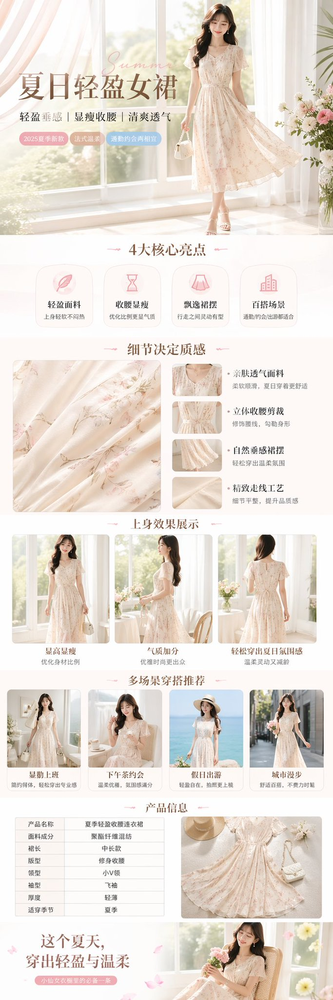

**Prompt:**

```text
[中文]
夏季女裙电商详情图

[English]
Summer women's dress e-commerce detail image
```

**来源：** [@MrLarus](https://x.com/MrLarus/status/2046544209117634735) | 2026-05-10


---

## 📷 例 15：黑色圆珠笔手写笔记


**Prompt:**

```text
[中文]
一张平放着的打开的笔记本的业余照片，里面填满了用黑色圆珠笔写的手写笔记。笔迹随意且略显凌乱，就像个人笔记，自然的瑕疵，划掉的单词，划线的标题。从略高角度拍摄，来自窗户的自然日光，未使用闪光灯。随意的桌面设置，用 iPhone 拍摄。

[English]
Amateur photo of an open notebook lying flat, filled with handwritten notes in black ballpoint pen. The handwriting is casual and slightly messy, like personnal notes, natural imperfections, crossed out words, underlined headings. Shot from slightly above, natural daylight from a window, no flash. Casual desk setting, shot on iPhone
```

**来源：** [@patrickassale](https://x.com/patrickassale/status/2044569086013718958) | 2026-05-11


---

## 📷 例 19：真实黑板粉笔字


**Prompt:**

```text
[中文]
生成图片:
手写在教室黑板上的出师表全文，真实感的粉笔字迹，晴朗白天用iPhone手机实拍

[English]
Generate image: The full text of Chu Shi Biao handwritten on a classroom blackboard, realistic chalk handwriting, taken with an iPhone in real life on a sunny day
```

**来源：** [@rionaifantasy](https://x.com/rionaifantasy/status/2045356799751303194) | 2026-05-11

## 📷 例 27：视频截图


**Prompt:**

```text
{argument name="pianist" default="Vladimir Horowitz"} performs a {argument name="event" default="live piano recital"} streamed on {argument name="platform" default="YouTube"}
```

**来源：** [@bowowwoaaa2](https://x.com/bowowwoaaa2) | 2026-05-13


---

## 📷 例 33：woman with a cat in her arms


**Prompt:**

```text
A hyper-realistic photograph of a woman taking a mirror selfie in her bedroom using a smartphone. She has her original hairstyle with loose, slightly messy strands of hair softly falling over her face in a cool, effortlessly chic way with good volume. She is wearing a vintage-style spaghetti-strap crop top and high-waisted denim shorts. She is cradling a fluffy orange tabby cat in her arms. Shot with the aesthetic of an early-2000s digital camera, using only natural light, no flash. Soft late-afternoon golden sunlight streaming through the window, gently hitting her skin, face, and the cat’s fur, creating warm natural highlights and glows. Slightly warm yellow-orange-gray tone, subtle digital noise and grain for that authentic vintage digital look. Half-body mirror shot, focus sharply on her face and the cat. Background shows a simple white bed and plain walls with soft patches of sunlight and gentle shadows. Overall atmosphere is warm, natural, unposed, and intimate, like a casual candid snapshot from the 2000s.
```

**来源：** [@Reddit](https://www.reddit.com/r/ChatGPT/comments/1t0qio9/gpt_image_2_has_created_this_is_there_any_problem/) | 2026-05-13


---

## 📷 例 36：逼真的身份证件微距摄影

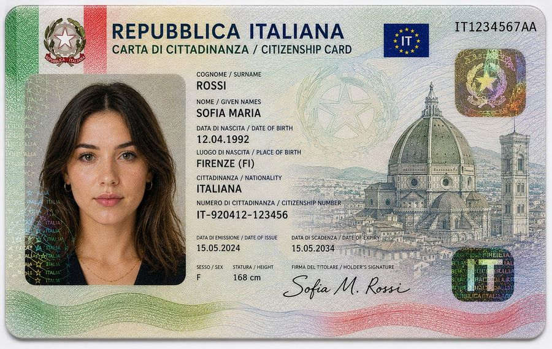

**Prompt:**

```text
超逼真的 16:9 平铺式特写摄影作品，展示了一张放置在干净的浅灰色或柔和中性背景上的 {argument name="card type" default="澳大利亚公民身份证"}。卡片水平对齐，位于画面中心，采用清晰的微距对焦和柔和的漫射影棚灯光拍摄。设计遵循官方政府签发身份证件的美学风格，采用现代排版、结构化的信息布局以及先进的防伪安全细节。顶部的大号粗体标题写着：“AUSTRALIA”，副标题为“CITIZENSHIP CARD”，次级标题为“COMMONWEALTH OF AUSTRALIA”。左上角印有国旗。右上角包含国徽。卡片包含一张 {argument name="subject" default="年轻澳大利亚女性"} 的护照风格肖像：– 白皙/浅肤色，带有自然纹理和细微雀斑 – 肩长深金色至浅棕色波浪卷发 – 榛绿色眼睛，表情中性，直视前方 – 妆容简约，面部细节逼真 – 身穿深色西装外套或黑色上衣，佩戴精致的金饰。个人身份信息显示清晰：– 姓氏：{argument name="surname" default="JOHNSON"} – 名字：EMILY GRACE – 出生日期：24 JAN 1995 – 出生地：MELBOURNE, VIC – 公民身份：AUSTRALIAN CITIZEN – 公民编号：ACN 1234567 – 签发日期：15 MAY 2024 – 有效期至：15 MAY 2034 – 性别：F – 身高：165 cm – 证件编号：CC1234567。安全与设计特征包括：– 覆盖整个卡片表面的复杂扭索纹图案 – 精细的微缩防伪纹理 – 带有彩虹色反射的全息安全贴片 – 透明的分层安全覆盖层 – 包含地图和南十字星图案的全息图 – 右侧大面积雕刻有悉尼歌剧院和悉尼海港大桥的插图 – 背景纹理中嵌入了淡淡的地图轮廓 – 底部签名：“Emily G. Johnson” – 下边缘设有机器可读的身份识别条。其他设计风格：– 柔和的蓝色、金色和中性柔和渐变色 – 带有逼真反射的聚碳酸酯层压卡片质感 – 简洁的政府视觉语言。灯光柔和且均匀漫射，强调全息效果、雕刻纹理和逼真的印刷细节，无刺眼阴影。画面中无手部出现。风格：超细节、照片级真实感、8K 分辨率、微距清晰度、专业产品摄影、纪录片式写实、高度逼真的政府身份证设计。
```

**来源：** [@Ankit_patel211](https://x.com/Ankit_patel211/status/2052550793895793051) | 2026-05-13

## 📷 例 39：Thoughtful Woman Cafe Window Equations


**Prompt:**

```text
A cinematic, photorealistic scene of a {argument name="subject" default="thoughtful young woman with wavy auburn hair"} sitting alone at a wooden café table next to a large glass window. Warm golden sunlight softly illuminates her face as she rests her head on her hand, gazing out the window with a calm, pensive expression. The image is shot from outside the café through the glass, with gentle reflections, light bokeh, and a slightly blurred background creating a dreamy atmosphere.
Handwritten white chalk-style {argument name="elements" default="mathematical equations"} are floating on the window glass around her, as if she is thinking about them: integrals, limits, algebraic formulas, a quadratic graph, trigonometric identities, and E = mc². The equations look lightly sketched, semi-transparent, and artistically placed without blocking her face.
The mood is {argument name="mood" default="intellectual, introspective, and peaceful"}. Shallow depth of field, soft natural lighting, cinematic color grading, warm tones, ultra-high-definition, 4K, highly detailed, realistic photography style, professional lens, soft film grain, gentle glow, modern aesthetic
```

**来源：** [@iamsofiaijaz](https://x.com/iamsofiaijaz/status/2054830150647435732) | 2026-05-14


---

## 📷 例 43：Bangkok Night Street Photography


**Prompt:**

```text
A street photograph capturing a {argument name="subject" default="young Thai woman"} cutting through the dense nighttime crowd on {argument name="location" default="Khao San Road, Bangkok"}. The subject is caught mid-stride wearing a {argument name="clothing" default="loose floral dress"}, expression distracted and completely natural, not performing for the camera, small crossbody bag across her shoulder. The environment is dense and chaotic: bar signs in Thai and English stacked vertically, tuk-tuks and motorbikes pressing through foot traffic, tourists and locals blending in the moving crowd around her. Lighting is messy and authentic: uneven bar fluorescent spill, LED signage scatter, occasional reflected flash from the crowd, no clean single source. Composition: full-body medium shot from slightly above eye level, subject in sharp focus in left center, surrounding crowd in natural motion blur, neon signs stretching tall in the vertical frame above. Color palette: acidic yellow, electric pink, deep orange — intense but documentary-accurate neon saturation, not stylized. Render with photographic realism: subtle film grain, avoid over-smoothed CG textures. Skin: subsurface scattering and micro-texture. Preserve authentic motion blur on background crowd, not artificial bokeh. Photorealistic rendering, no watermark.
```

**来源：** [@ToroJushiAi](https://x.com/ToroJushiAi/status/2054711091360354328) | 2026-05-14


---

## 📷 例 46：16 格赛马故事板


**Prompt:**

```text
{"type":"电影感 16 格故事板海报","format":"4x4 网格","overall_style":"写实风格电影剧照，温暖的自然光，浅景深，感人的马术成长故事，保持年轻女骑手和栗色马驹从幼年到成为赛马的形象一致，面板间有黑色间隙，白色粗体文字叠加，每个面板左上角标有数字，面部使用柔和的矩形模糊遮罩进行匿名处理","aspect_ratio":"16:9 宽幅海报","main_characters":{"girl":"{argument name=\"main character\" default=\"一位扎着深色马尾辫的年轻女性，穿着从休闲马厩服装到粉黑相间赛马服的转变\"}","horse":"{argument name=\"horse description\" default=\"一匹带有白色额斑的栗色马驹，逐渐成长为强壮的赛马\"}","setting":"{argument name=\"setting\" default=\"乡村马场、训练场、赛马场和日落围场\"}"},"layout":{"grid":"4 列 4 行","panel_count":16,"panels":[{"number":1,"title":"小马驹，新起点","scene":"在昏暗的马厩里，年轻女性跪在一匹小栗色马驹旁边，温柔地伸出手，马驹紧挨着它的母亲。","bullet_count":4,"bullets":["发现了一匹小马","又小又害怕","承诺照顾它","羁绊的开始"]},{"number":2,"title":"爱的喂养","scene":"温暖的马厩内，女性用双手给马驹喂奶，展现出温柔与耐心。","bullet_count":4,"bullets":["瓶喂牛奶","每天，每次","爱与耐心","茁壮成长"]},{"number":3,"title":"护理与梳理","scene":"马厩内的特写镜头，女性用蓝色梳子为马驹梳理毛发，马儿冷静且信任。","bullet_count":4,"bullets":["梳理毛发","清洁与护理","保持健康","建立信任"]},{"number":4,"title":"并肩同行","scene":"阳光明媚的草地和围栏边，女性牵着小马的绳子，并肩走向远处的山丘。","bullet_count":4,"bullets":["在田野漫步","探索世界","并肩同行","友谊增长"]},{"number":5,"title":"终身的羁绊","scene":"金色光影下的感人特写，女性将额头和手贴在马的口鼻部。","bullet_count":4,"bullets":["信任与忠诚","温柔时刻","心与心的交流","牢不可破的羁绊"]},{"number":6,"title":"训练开始","scene":"户外沙地训练场，女性牵着牵引绳教小马基本指令。","bullet_count":4,"bullets":["教授基本指令","耐心与奖励","小步快跑，大步进步","彼此信任"]},{"number":7,"title":"骑乘练习","scene":"马儿长大了；女性戴着头盔在围栏场地骑马，学习平衡与自信。","bullet_count":4,"bullets":["第一次骑上马背","学习平衡","建立自信","共同进步"]},{"number":8,"title":"日益强壮","scene":"开阔赛道上的动态训练镜头，戴着头盔、身穿粉黑装备的骑手骑马飞奔穿过乡村。","bullet_count":4,"bullets":["一起奔跑","增强力量","突破极限","梦想更大"]},{"number":9,"title":"赛前准备","scene":"马儿正在被梳理并装配赛马装备的特写，蓝色马鞍垫清晰可见，骑手专注且冷静。","bullet_count":4,"bullets":["梳理与擦亮","检查装备","专注与冷静","迎接挑战"]},{"number":10,"title":"抵达赛场","scene":"在大型赛马场看台，骑手牵马进入场地，感受人群和压力。","bullet_count":4,"bullets":["新场地","新挑战","感受能量","展现最佳状态"]},{"number":11,"title":"比赛开始","scene":"多匹赛马从起跑线冲出的动作镜头，尘土飞扬，身穿粉黑赛马服的主骑手奋力向前。","bullet_count":4,"bullets":["闸门开启","心跳加速","全速前进","保持专注"]},{"number":12,"title":"并驾齐驱","scene":"紧张的赛马特写，主角马匹和骑手与其他马匹并排竞争，速度极快，充满决心。","bullet_count":4,"bullets":["激烈竞争","全力以赴","永不放弃","胜利在望"]},{"number":13,"title":"我们赢了！","scene":"骑手在终点线和看台附近，骑在马上举起一只手臂欢呼胜利。","bullet_count":4,"bullets":["冲过终点线","第一名！","努力终有回报","梦想成真"]},{"number":14,"title":"胜利庆典","scene":"赛后骑手拥抱马儿的感人特写；马儿身上挂着花环，周围充满庆祝色彩。","bullet_count":4,"bullets":["共同庆祝","所有回忆","所有付出","值得一切"]},{"number":15,"title":"冠军奖杯","scene":"颁奖典礼，骑手在正式背景前从西装革履的官员手中接过巨大的金杯。","bullet_count":4,"bullets":["领取奖杯","骄傲时刻","感谢大家","新冠军诞生"]},{"number":16,"title":"永远在一起","scene":"宁静的日落围场，女性紧紧拥抱成熟的马儿，背景是金色的天空，以终身的陪伴结束。","bullet_count":4,"bullets":["最好的伙伴","无尽的爱","新的冒险","我们的旅程继续"]}]},"typography":{"panel_numbers":"每个面板左上角的大号白色数字","titles":"粗体压缩白色无衬线字体，左对齐","bullets":"标题下方的小号白色列表","headline_text":"{argument name=\"story theme\" default=\"一段从马驹到冠军赛马的感人旅程\"}"},"rendering_notes":"在所有 16 个面板中保持角色和马匹的连贯性，展示马驹逐渐成长为成年赛马的过程，以及从马厩服装到赛马服的装束演变，写实电影级调色，高细节背景，无额外面板，无缺失数字，清晰可读的中文文本。"}
```

**来源：** [@ai_hakase_](https://x.com/ai_hakase_/status/2054338583704555595#reversed-0) | 2026-05-14

## 📷 例 47：皮克斯风格咖啡品牌项目

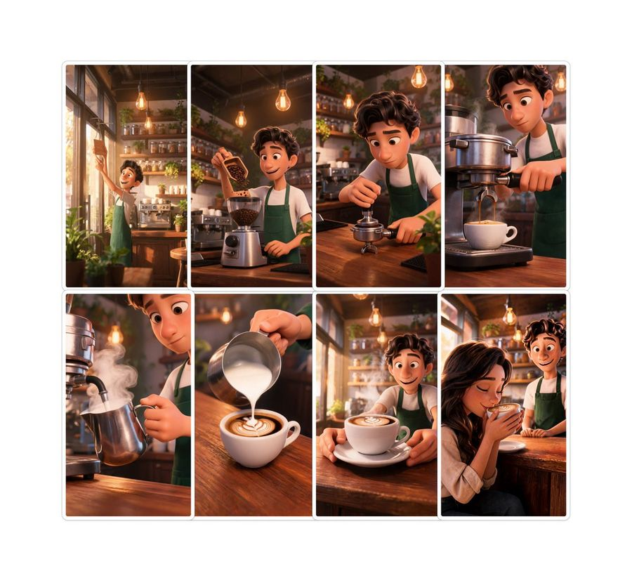

**Prompt:**

```text
目标：为名为 {argument name="story title" default="Bean to Smile"} 的咖啡品牌创建一个精致的 AI 项目，展示一个温馨的皮克斯风格动画咖啡馆故事，从开店到为满意的顾客提供服务。

画布：方形图像，干净的白色背景，居中放置一个 2 行的项目网格，包含 8 个垂直圆角矩形面板。面板之间使用细白色间隙，整个项目周围有微妙的浅灰色外边框/阴影。每个面板都具有电影般的构图、温暖的琥珀色灯光、浅景深、柔和的体积光效果以及高度精细的 3D 动画电影渲染。

视觉风格：皮克斯风格的 3D 动画，舒适的手工咖啡馆内部，金色的晨光，裸露的木质柜台，摆满罐子和植物的架子，悬挂的爱迪生灯泡，浓缩咖啡机，温暖的棕色和绿色，引人入胜的品牌叙事氛围。反复出现的主角是一位年轻的咖啡师，留着 {argument name="barista hair" default="深棕色卷发"}，穿着白色衬衫和 {argument name="apron color" default="森林绿围裙"}。面部可以进行柔和的风格化处理，显得友好，但要通过肢体语言和道具保持故事的可读性。

项目布局和精确面板数量：包含 8 个面板，排列为顶部 4 个面板，底部 4 个面板。

面板 1：咖啡师在晨光中打开或擦拭咖啡馆前玻璃门的广角镜头，窗边有植物，室内可见浓缩咖啡机和架子。
面板 2：咖啡师将烘焙好的咖啡豆从木勺或袋子倒入木质柜台上的研磨机的中景镜头。
面板 3：咖啡师专注地将新鲜咖啡粉压入滤杯的近中景镜头，背景是咖啡馆架子和悬挂的灯泡。
面板 4：浓缩咖啡从闪亮的咖啡机中萃取到白色杯子里的特写镜头，咖啡师正在操作手柄。
面板 5：咖啡师在金属拉花缸中打奶泡的特写镜头，浓缩咖啡机旁可见卷曲的白色蒸汽。
面板 6：牛奶倒入白色咖啡杯，在木质柜台上的咖啡油脂上形成拉花艺术的特写镜头。
面板 7：咖啡师在柜台对面递出完成的拿铁的中景镜头，可见拉花艺术，背景是温暖的阳光。
面板 8：坐在木质柜台前的顾客从咖啡师手中接过饮品时微笑的情感特写镜头，传达出满足感和品牌温度。

文本内容：项目面板内无标题。如果要在网格外部添加可选的小标题，请仅使用 {argument name="brand text" default="Bean to Smile"}，并采用高雅的咖啡品牌风格。

限制：不要添加额外的面板、对话气泡、水印、徽标或无关物体。在所有 8 个面板中保持相同的咖啡师、围裙、咖啡馆环境和灯光一致。使图像看起来像是一个完整的、用于咖啡广告的高级品牌项目。
```

**来源：** [@0xbokade](https://x.com/0xbokade/status/2054974951765971382#reversed-0) | 2026-05-15


---

## 📷 例 52：池袋的盔甲 Cosplayer


**Prompt:**

```text
创作一张写实的竖构图街头时尚/Cosplay 照片，场景设定在 {argument name="location" default="东京池袋车站东口"}，天气晴朗。画面展现了池袋繁忙的日本城市人行道，背景有高大的商业建筑、密集的竖向店招、行人、车流、行道树、黄色盲道，左上方有一个醒目的蓝色车站标志，上面写着“Ikebukuro Sta. E.”以及对应的日文；下方是一个写着“Sunshine-dori Ave.”的白色箭头指示牌。包含可辨识的城市细节，如远处的 LABI 池袋店招牌以及色彩鲜艳的卡拉 OK/零售店招。前景中，一位成年女性 Cosplayer 正自信地向镜头走来，位置略微偏右，身着 {argument name="costume style" default="华丽的中世纪奇幻骑士盔甲"}：抛光的深银色板甲，带有雕刻细节、关节护手、胸甲、肩甲、大腿和胫骨护甲、黑色靴子，以及身后飘动的深色长斗篷或开叉裙。她有着 {argument name="hair color" default="波浪长金发"}，在阳光下闪烁，面部被刻意处理为平滑的中性模糊，没有五官。整体氛围是一张真实可信的城市抓拍，展现了一位身着精致奇幻盔甲的 Cosplayer 融入池袋日常人流的景象。使用真实的自然日光、清晰的阴影、纪实摄影风格、35mm 街拍视角、高细节、真实的色彩，拒绝插画风格，无额外奇幻特效，无武器，无水印。
```

**来源：** [@kabumira862571](https://x.com/kabumira862571/status/2054923638705635756#reversed-0) | 2026-05-15


---
### 📷 例 62：东京街头胶片人像


**Prompt:**

```text
film photography, candid street snapshot aesthetic, razor-sharp focus on subject, shallow depth of field with soft blurred urban background, bright daylight, slightly overexposed highlights, vivid contrast, subtle analog film texture, heavy film grain, nostalgic cinematic atmosphere, Tokyo backstreet neighborhood scene near a quiet train station, narrow pedestrian street lined with Japanese convenience stores, vintage vending machines, small ramen shops, hanging signs with faded typography, bicycles parked along tiled sidewalks, utility poles and overhead wires stretching across the sky, scattered fallen leaves on the ground, distant pedestrians and passing taxis softly blurred in the background, warm afternoon sunlight with deep blue sky, realistic street fashion photography style, effortless cool street vibe, vibrant colors with slightly muted faded film tones, beautiful 19-year-old Chinese female influencer, fair porcelain skin with cold pale undertones, exquisite natural makeup, glossy soft lips, defined brows, delicate lashes, soft messy long black hair with natural flowing curves, wearing an off-shoulder white fluffy faux fur jacket, playful yet subtly seductive expression, lazy dreamy vintage filter, ultra high-quality details, intentionally mundane phone-camera snapshot feeling, casual accidental composition, imperfect framing, realistic iPhone photography texture, spontaneous candid energy, highly attractive girl casually posing in the middle of the sidewalk, body facing away from the camera while turning her head back toward the lens with direct eye contact, relaxed posture, soft wind moving her hair, emotional youthful atmosphere, modern Asian street fashion editorial, soft haze, layered composition, masterpiece, best quality, ultra detailed, slight motion blur from slow shutter, authentic everyday realism, “BubbleBrain” small handwritten signature text on bottom corner --ar 9:16
```

**来源：** [@status](https://x.com/BubbleBrain/status/2055491616392052887) | 2026-05-17

---

### 📷 例 67：外星冰雪世界中的电影感宇航员


**Prompt:**

```text
创作一幅超电影感的超现实科幻景观，采用方形构图，展示 {argument name="number of astronauts" default="14"} 名身穿盔甲的宇航员排成一条对角线，在光亮的黑色反光冰原上向观众走来，领头的宇航员位于前景，体型较大，其余宇航员向雾气弥漫的远方延伸。宇航员穿着厚重的白色和深石墨色太空盔甲，配有黑色面罩、橙色发光接缝、胸灯，手持低垂的步枪，靴子下方有清晰的倒影。环境是一个深蓝黑色星空下广阔的外星冰冻战场：一颗巨大的破碎星球悬浮在他们身后的天空中，带有发光的橙色熔岩状裂缝、淡蓝色边缘光，以及横跨画面的行星环。在顶部边缘添加悬挂的锯齿状黑色浮石，如同倒置的山脉，并从地平线上升起几座垂直的巨石塔。包含 3 根主要的垂直光束或撞击柱：左侧地平线上的一团火热爆炸烟柱，右侧附近的一根高大白光束，以及远右侧地平线附近的一个较小的明亮撞击闪光。在右上角添加一个发光的螺旋星系、遥远的星云、散落的流星轨迹、右侧地平线上微小的人类剪影，以及嵌入反光地面中的橙色火花。采用宏大、高预算的电影概念艺术风格，强调极端的比例感、大气雾气、体积光、锐利的前景细节、蓝银色调配色并点缀少量橙色，营造出戏剧性的深度和逼真的反射效果，画面中不包含任何文字或水印。
```

**来源：** [@status](https://x.com/savefilmer/status/2055731796156072267#reversed-0) | 2026-05-17

---

### 📷 例 70：动漫风警官模特时尚陈列

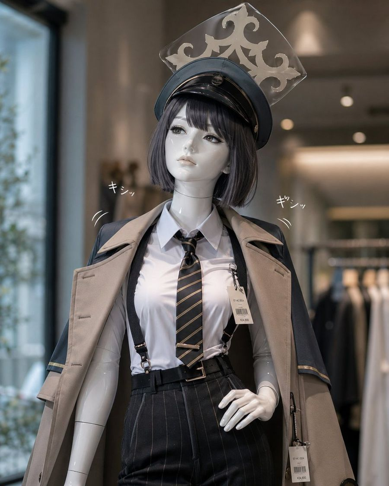

**Prompt:**

```text
创作一张写实的高端时装店摄影作品，主体为一个真人大小的亮面白色女性模特，造型为动漫风格的警官或安保人员。画面展示从大腿中部以上的部位，背景为精品店室内，带有柔和的暖色焦外成像，背景可见衣架，左侧有一扇大窗户。模特面部光滑且无五官，中心处特意覆盖了一个柔和的灰色方形隐私遮挡块，佩戴着 {argument name="hair color" default="深灰棕色"} 的短波波头假发，以及一顶闪亮的警官大檐帽。帽子后方有一个大型半透明亚克力光环面板，带有华丽的白色镂空花纹，如同装饰性的角色道具。服装细节：挺括的白色衬衫、黑金条纹领带配领带夹、黑色背带和带有金属扣的束带，高腰黑色细条纹长裤，以及一件像披风一样披在肩上的米色风衣，风衣带有深色袖片和细金边。画面中需包含两个手写风格的日文拟声词「キシッ」，分别位于肩膀左右两侧，每个词旁带有两条弧形动感线条，暗示模特关节的吱吱声。添加两个清晰可见的零售价格标签，分别夹在胸带上和挂在右下角衣摆附近，带有微小的条形码细节。采用浅景深、亮面塑料皮肤上的真实反射、高级商店照明、4:5 竖构图、主体居中，呈现精致的写实编辑风格。避免添加额外角色、多余文字或可见水印。
```

**来源：** [@status](https://x.com/geexEARBrjKIXfp/status/2055676608435142787#reversed-3) | 2026-05-17

---

### 📷 例 71：带有艺术痕迹的写实鸟类

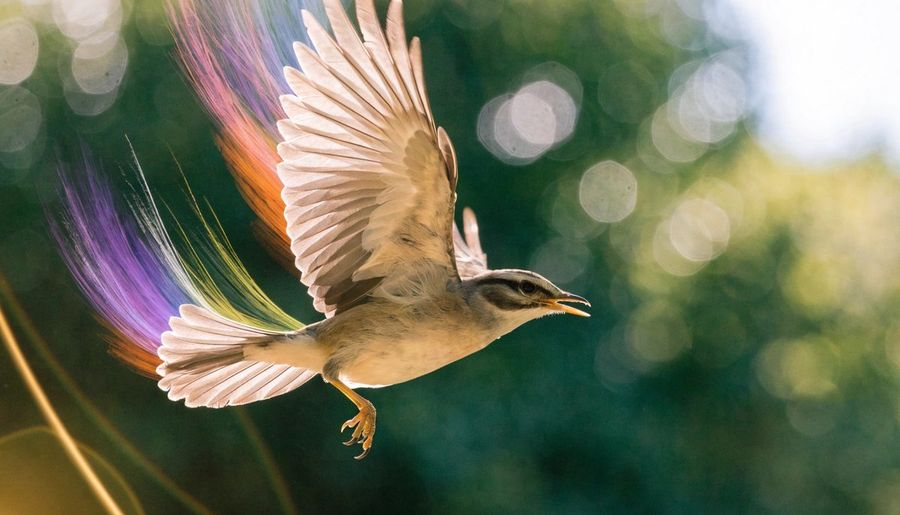

**Prompt:**

```text
{argument name="subject" default="鸟类"} 全速飞行，写实风格，并融合了 {argument name="style" default="彩色艺术痕迹"}。
```

**来源：** [@status](https://x.com/mirochill/status/2055573726159147353) | 2026-05-17

---
### 📷 例 74：Santorini Breakfast Travel Flat Lay


**Prompt:**

```text
Create a sunlit Mediterranean travel flat-lay photograph on a textured white plaster table, styled like a dreamy vacation memory from {argument name="destination" default="Thirósia, Santorini, Greece"}. Arrange exactly 6 main objects: 1 vintage postcard on the left, 1 large instant-photo print overlapping it at center-right, 1 white pen with a blue tip near the bottom, 1 small cream seashell near the top, 1 folded white linen cloth with pale blue stripes in the upper right, and 1 blue evil-eye bead bracelet with a small silver charm along the right edge. The vintage postcard should show a rocky Greek island cove with clear turquoise water and white buildings, with printed blue text reading “Thirósia” and “Santorini, Greece,” plus a faint postage stamp and cancellation marks. The central instant photo should have a thick white border and show a breakfast scene on a white terrace overlooking the deep blue Aegean Sea, with blurred white Santorini architecture and a blue dome in the background; include exactly 7 breakfast elements inside the photo: 1 red patterned coffee cup and saucer filled with dark coffee, 2 small toast slices, 1 grilled banana, 1 boiled egg, 1 small glass bowl of yellow fruit topped with a dark prune and mint leaves, and 1 scatter of granola or cereal. At the bottom left of the table, add handwritten blue Japanese text reading {argument name="handwritten note" default="まだ見ぬ景色へ、\n一緒にいこう。"} followed by a small blue heart. Use soft morning sunlight, gentle shadows, warm whites and ocean blues, shallow depth of field, realistic paper texture, nostalgic postcard aesthetic, elegant travel diary mood, high-resolution photorealism, no people, no extra text or watermark.
```

**来源：** [@status](https://x.com/chiOkey/status/2056152728284606696#reversed-0) | 2026-05-18

---

### 📷 例 77：Identity-Consistent Caricature Portrait


**Prompt:**

```text
Use the uploaded portrait as the identity reference for the subject’s face, hairstyle, facial structure, and overall impression. Create a high-quality lifestyle editorial portrait of the same person sitting outdoors beside a wooden easel displaying a colorful street-style caricature portrait of them. The real person and the caricature must clearly resemble the same individual. Scene: - the person is seated on a simple wooden folding chair - beside them is a wooden easel holding a large caricature drawing - the setting is a sentimental urban art market - include illustration booths, handmade craft stalls, sketch displays, posters, cozy creative shopfronts, and a few softly blurred pedestrians - lively but not crowded - bright soft daylight, warm natural tones, shallow depth of field - realistic photography for the person and environment - vertical composition showing both the person and the caricature clearly Subject: - preserve the uploaded person’s recognizable identity - natural pose - calm, relaxed, slightly amused expression - stylish casual outfit that suits the subject - clean editorial lifestyle photography - do not force the same pose or expression for every subject Caricature direction: - the drawing on the easel must be a true observational street caricature, not a generic cute cartoon - the caricature artist should exaggerate the subject’s actual most recognizable facial traits - analyze the uploaded face and exaggerate only 2–4 distinctive features, such as eye shape, eyebrows, nose, lips, cheeks, jawline, chin, ears, hairstyle, or facial proportions - each caricature should feel custom-made for that specific person - avoid using the same default cute face for every person - avoid generic big eyes plus tongue-out expression - the caricature should be funny because it captures the person’s unique features, not because it uses a random silly pose Caricature style: - oversized head with smaller simplified body - playful but recognizable facial proportions - bold hand-drawn marker lines - quick sketchy pen strokes - colored pencil texture - lively street-artist energy - humorous but flattering - witty, expressive, and personality-driven - charming handmade imperfections - colorful accent doodles may be added, but keep the focus on the face Expression in the caricature: - choose a natural funny expression that fits the person’s facial character - possible expressions: raised eyebrow, shy smile, surprised eyes, confident smirk, awkward polite smile, exaggerated calm face, pouty lips, confused cute face, or gentle blank stare - the expression should vary depending on the subject - do not always use a tongue-out face - do not always use the same wide-eyed cute expression Caricature canvas: - large vertical drawing board or canvas on a wooden easel - the caricature should be clearly visible and occupy a major part of the image - it should immediately read as a funny street caricature - it should be more exaggerated than a portrait sketch - it should not look like a realistic fashion illustration - it should not look like a polished beauty drawing Important: - the caricature must be custom to the uploaded person - preserve recognizable identity through the exaggerated features - prioritize personality, likeness, and humor over generic cuteness - make the caricature feel like a real street artist observed the person and drew a witty exaggerated version Negative prompt: - no generic cute chibi face - no repeated default caricature face - no tongue-out pose - no identical silly expression for every subject - no random anime expression - no realistic portrait sketch - no polished fashion illustration - no beauty sketch - no weak exaggeration - no scary grotesque distortion - no ugly horror exaggeration - no distorted anatomy of the real person - no extra fingers - no badly drawn hands - no messy crowded background - no text - no watermark - no Eiffel Tower - no famous landmarks.
```

**来源：** [@status](https://x.com/Kashberg_0/status/2056061305640169643) | 2026-05-18

---

### 📷 例 78：Misty Spring Mountain Village


**Prompt:**

```text
Create a museum-quality realistic landscape photograph inspired by {argument name="source material" default="an ancient Chinese poetic description of a hidden spring mountain village"}. Show a high, elevated viewpoint from a rocky pine-covered cliff looking down into a secluded valley village in {argument name="season" default="early spring"}. The composition features layered blue-green mountains receding into mist, a broad winding river in the far left background, and a smaller clear stream curving through the right side of the valley. In the middle ground, place a small traditional rural Chinese settlement with dark tiled roofs, scattered farm plots, footpaths, and orchards filled with pale pink and white blossoms. Count the visible major landscape elements as exactly 6: one foreground rocky cliff with pine branches, one central village, one blossom-filled orchard belt, one small winding valley stream, one distant broad river, and one layered misty mountain backdrop. Use soft morning light after rain, drifting low fog, luminous haze, wet greenery, and a tranquil atmosphere as if captured by a top National Geographic landscape photographer. The image should feel like a real, collectible fine-art photograph rather than an illustration: natural colors, deep depth, atmospheric perspective, crisp foreground texture, delicate highlights on the blossoms, no people, no animals, no modern buildings, no roads, no power lines, no text or watermark. Use a wide horizontal frame, approximately {argument name="aspect ratio" default="4:3"}, with cinematic realism and subtle Chinese shanshui sensibility.
```

**来源：** [@status](https://x.com/xiaoxiaodong01/status/2056044320298549559#reversed-1) | 2026-05-18

---
### 📷 例 84：Night Baseball Stadium Pitch


**Prompt:**

```text
Create a highly realistic cinematic sports photograph of a nighttime professional baseball game in a packed stadium, shot from a low wide-angle position just behind home plate on the third-base side. The scene shows exactly 7 visible on-field figures: 1 right-handed batter in a gray away uniform and black helmet raising a wooden bat, 1 catcher in navy protective gear crouched behind the plate, 1 black-uniformed home plate umpire leaning in behind the catcher, 1 pitcher in a navy jersey and white pants mid-delivery on the mound, and 3 distant fielders spread across the infield/outfield. Use {argument name="team colors" default="gray away uniforms versus navy home uniforms"}. The ball should be visible in flight between pitcher and batter. Include the dirt batter's box, white chalk lines, green grass, pitcher's mound, outfield wall, and a huge crowd filling the grandstands under bright stadium floodlights. Place a large electronic scoreboard in the upper right with inning numbers, scores, and dense Japanese-style team/player text, glowing realistically but not needing to be fully legible. Mood: dramatic, tense, heartwarming live-game atmosphere, like a decisive late-inning pitch. Use natural stadium lighting, deep night sky, photorealistic detail, slight motion energy, crisp foreground, and a wide 16:9 composition. Customize the batter as {argument name="main batter description" default="a powerful right-handed hitter in gray with black sleeves"}, the stadium as {argument name="stadium location" default="a large Japanese baseball stadium"}, the scoreboard score as {argument name="scoreboard score" default="1 to 5"}, and the camera style as {argument name="camera style" default="professional sports photojournalism with cinematic realism"}. Avoid logos, watermarks, readable brand names, extra players beyond the specified 7, cartoon styling, or empty seats.
```

**来源：** [@status](https://x.com/dave392750/status/2056876226166526414#reversed-0) | 2026-05-19

---

### 📷 例 85：Natural Beach Resort Portrait


**Prompt:**

```text
Realistic style, ultra-high detail. A young adult woman in her early 20s, with long natural black hair, translucent and radiant skin, a natural smile, and a cute yet glamorous face. The background is a small path near a beach at a southern resort, with white sand, coconut trees, and lush southern greenery; the blue ocean is visible in the distance. The woman is wearing an elegant light pink bikini, with an S-curve figure. A pure and refreshing atmosphere. She is walking along the path while turning her head back, smiling naturally at the camera. The character occupies a large proportion of the frame, with the background softly blurred. The overall impression is a fresh casual style. Do not add any text or logos. Emphasize an atmosphere of elegance, translucency, and high likability.
```

**来源：** [@status](https://x.com/Adam38363368936/status/2056759199481389101) | 2026-05-19

---
### 📷 例 102：电影感动漫少女特写


**Prompt:**

```text
创作一张电影感的动漫特写插画，画面中 {argument name="character name" default="一位害羞的女学生"} 正非常靠近地探向观众，仿佛从床边探出头来，采用极端的广角透视和浅景深效果。她留着长直的 {argument name="hair color" default="黑色头发"}，凌乱的刘海垂在脸上，有着非常大且有光泽的 {argument name="eye color" default="金棕色眼睛"}，小嘴微张显得有些惊讶，脸颊微红，表情好奇而天真。她身穿日本校服：白色短袖衬衫、浅黄色针织背心配红色细边、隐约可见的绿色百褶裙，领口系着一个大大的青色蝴蝶结。摄像机视角低且亲密，她的脸占据了画面的右半部分，发丝掠过镜头，肩膀和躯干呈现出透视缩短效果。背景：{argument name="time of day" default="黄昏"} 时分舒适的少女卧室，室内光线温暖昏暗，深色木质天花板和墙壁，左侧有一扇挂着紫色窗帘的窗户，窗外是暮色天空，前景是一张铺着模糊床品的床，床上左侧有一个猫形毛绒枕头，右侧是书桌区域，摆放着书籍、一把粉色书桌椅和一张小墙贴。采用精致的现代动漫电影渲染，细节丰富的眼睛带有明亮的白色高光，线条干净利落，柔和的绘画式阴影，温暖的暗部，轻微的暗角，电影级 16:9 构图，高细节，无文字，无水印。
```

**来源：** [@status](https://x.com/jpn_eagle/status/2057437685686706467#reversed-0) | 2026-05-20

---
### 📷 例 109：Golden Hour Pastel Pink Portrait


**Prompt:**

```text
[Core Requirements] A portrait of a person in a {argument name="clothing color" default="light pastel pink"} sleeveless top under the warm golden sunlight of late afternoon. Maintain realistic proportions.

[Person's Pose and Expression] [Person Reference Images 1-11] The subject is standing in {argument name="pose" default="profile"} with a dreamy and slightly sad gaze toward the camera. The person looks at the camera only with their eyes, with their head slightly lowered and turned. Hair naturally flutters around the face due to the wind blowing from behind.

[Hair and Makeup Details] A dark-haired bun style tied loosely at the back, but many strands of hair are naturally scattered over the face and neck. The makeup is transparent and clean, with a natural blush on the cheeks and lips in a moist, natural color. Fine beads of sweat are visible on the skin.

[Lighting and Direction] A warm and intense halo light enters through the hair from the center of the frame, wrapping the woman's hair and facial contours in a golden glow. Light reflects off the skin, giving it a sheen.

[Texture and Color Mood] A soft, dreamy atmosphere and graininess, as if shot with a film camera. Colors harmonize warm gold, green, and soft light blue. The fine texture of the skin and the cotton texture of the sleeveless clothing are felt.

[Film and Camera Lens Depth/Angle] Shallow depth of field makes the subject sharp while the background is softly blurred. Captured from the front in a medium close-up. A soft and warm depiction characteristic of old-fashioned film lenses.

[Background Elements (Optional)] Blurred green leaves are visible in the background.

[Signature] A small Threads logo (operated by Meta) is located in the bottom right, with "{argument name="signature" default="CHAse"}" written small like a signature in white cursive above it.
```

**来源：** [@status](https://x.com/CHAseUnre/status/2058331892894892335) | 2026-05-22

---

### 📷 例 112：带有日式手写标注的早餐俯拍图

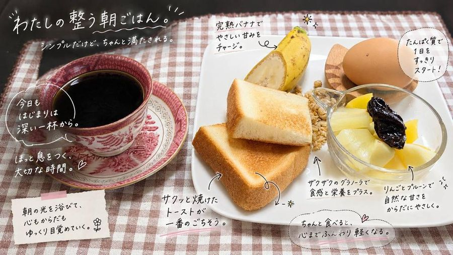

**Prompt:**

```text
目标：创作一张温馨的早餐俯拍照片，配有手写日记风格的日文标注，营造出适合温暖清晨社交媒体帖子的氛围。画面应具有真实感、柔和的后期处理效果以及淡淡的怀旧气息。

画布：16:9 宽屏横向图片，尺寸约为 1024×576。背景使用棕白格纹桌布，配以柔和的晨光、轻柔的阴影以及略带温暖的胶片质感。

主体布局：放置 2 个主要的食物/饮品区。左侧是一个装饰性的红白瓷茶杯，盛着黑咖啡，放在配套的托盘上。右侧是一个白色大方盘，盛放早餐食物。左上角留出深色的负空间，用于书写标题。

食物与物品数量：盘子区域内包含 7 个可见的早餐物品/道具：1 叠烤面包片、1 根剥了一半皮的熟香蕉、1 小堆格兰诺拉麦片、1 个透明玻璃碗盛着浅黄色苹果酱（顶部有 1 颗深色西梅）、1 个棕色鸡蛋、1 个位于鸡蛋后方的小木制蛋杯或木制杯垫，以及 1 个白色方盘。吐司应作为盘子的视觉中心，呈现金黄的烤制表面和厚实的白面包边。香蕉应位于盘子左上方。鸡蛋应位于盘子右上方。玻璃碗应位于右下方。格兰诺拉麦片应位于吐司和玻璃碗之间。

手写文字与标注数量：添加 9 组白色/黑色墨水的手写标注，配有箭头、圆圈、小爱心、闪光符号和涂鸦。保留日文文本作为装饰性手写内容：
1. 左上角大标题：「わたしの整う朝ごはん。」
2. 标题下方副标题：「シンプルだけど、ちゃんと満たされる。」
3. 咖啡附近的圆形注释：「今日も はじまりは 深い一杯から。」
4. 咖啡下方的小注释：「ほっと息をつく、大切な時間。」
5. 左下角带有粉色胶带的撕纸便签：「朝の光を浴びて、心もからだも ゆっくり目覚めていく。」
6. 香蕉上方带箭头的注释：「完熟バナナで やさしい甘みを チャージ。」
7. 鸡蛋旁边的气泡注释：「たんぱく質で 1日を すっきり スタート！」
8. 吐司附近带箭头的注释：「サクッと焼けた トーストが 一番のごちそう。」
9. 右下方围绕格兰诺拉麦片、苹果酱和整体感受的注释：「ザクザクのグラノーラで 食感と栄養をプラス。」、「りんごとプルーンで 自然な甘さを からだにやさしく。」以及「ちゃんと食べると、心までふんわり軽くなる。」

视觉风格：写实的早餐摄影与随性的手绘叠加图形相结合。大部分手写文字使用白色墨水，盘子上的食物标签使用黑色墨水，并配以虚线气泡、弯曲箭头、小星星、小爱心和俏皮的下划线。字体应看起来像手写，而非数字化字体。标注应清晰可见，但带有自然的不完美感。

可自定义元素：标题应显示为 {argument name="headline text" default="わたしの整う朝ごはん。"}；饮品应为 {argument name="morning drink" default="红瓷杯中的黑咖啡"}；主食应为 {argument name="main breakfast food" default="厚实金黄的吐司"}；水果应为 {argument name="fruit item" default="熟香蕉和配有西梅的苹果酱"}；整体氛围应为 {argument name="mood" default="温柔、温馨、正念的清晨"}。

约束条件：保持构图整洁且令人食欲大开，不要添加超出规定数量的额外食物，不要出现人物或手部，避免出现 Logo 或水印，并将日文手写字自然地融入图片中，就像一张经过精心编辑的早餐日记照片。
```

**来源：** [@status](https://x.com/chiOkey/status/2058325688105763103#reversed-0) | 2026-05-22

---
### 📷 例 119：鱼市追猫 CCD 街拍


**Prompt:**

```text
Use the uploaded reference image as the exact identity base for the main subject. Preserve their authentic facial structure, recognizable appearance, hairstyle, body proportions, skin texture, and overall identity with high consistency. Completely ignore any unrelated background from the original image.

Create a hyper-chaotic early-2000s Japanese digicam snapshot aesthetic with raw paparazzi energy and accidental comedy.

Scene: the subject is sprinting wildly through a busy city street while yelling and laughing in pure chaos, desperately trying to catch a mischievous cat that just stole a large shiny fish from a market stall. The cat is gripping the slippery silver fish tightly in its mouth while running directly toward the camera.

Composition must prioritize TWO focal subjects:

1. PRIMARY FOCUS → the cat's face
2. SECONDARY FOCUS → the human subject's face

The cat dominates the foreground frame with its face pushed absurdly close into the lens, partially cropped near the lower-right side. Massive fisheye distortion stretches its features dramatically - huge bulging eyes, exaggerated whiskers, detailed fur texture, fish flapping violently with droplets and motion streaks flying outward.

Behind the cat, the subject is charging forward aggressively with intense energy, reaching toward the animal mid-run. Their expression is loud, chaotic, and comedic, eyes locked directly onto the cat to create strong interaction and pursuit tension.

Styling:
Randomized layered Y2K Tokyo streetwear inspired by chaotic Shibuya nightlife fashion - oversized zip hoodies, vintage mesh layers, mini bags, low-rise pieces, striped arm warmers, chunky accessories, early-2000s sneaker styling, messy fashionable youth aesthetic.

Camera & framing:
extreme low-angle fisheye lens, ultra-wide invasive perspective, severe Dutch angle, asymmetrical framing, warped spatial distortion, exaggerated depth compression, aggressive foreshortening.

Motion treatment:
insanely intense movement blur with radial streaking, shutter drag, CCD sensor smearing, directional speed trails, accidental camera shake, stretched highlights, warped moving objects, imperfect chaotic snapshot timing.

Environment:
sunny crowded urban street with pigeons exploding into flight across the frame, scattered newspapers and debris flying through the air, warped pedestrians, market elements smeared by motion, overexposed sunlight leaking into one corner of the frame.

Lighting & texture:
harsh direct flash combined with bright outdoor sunlight, dirty CCD digicam texture, blown highlights, chromatic aberration, digital noise, bloom artifacts, compressed early-2000s camera look, gritty nostalgic cyber-chaos atmosphere.

Ultra-raw candid energy, messy composition, humorous accidental masterpiece aesthetic.
```

**来源：** [@mehvishs25](https://x.com/mehvishs25/status/2058375167550845263) | 2026-05-26

---

### 📷 例 138：电影感鱼眼城市人像

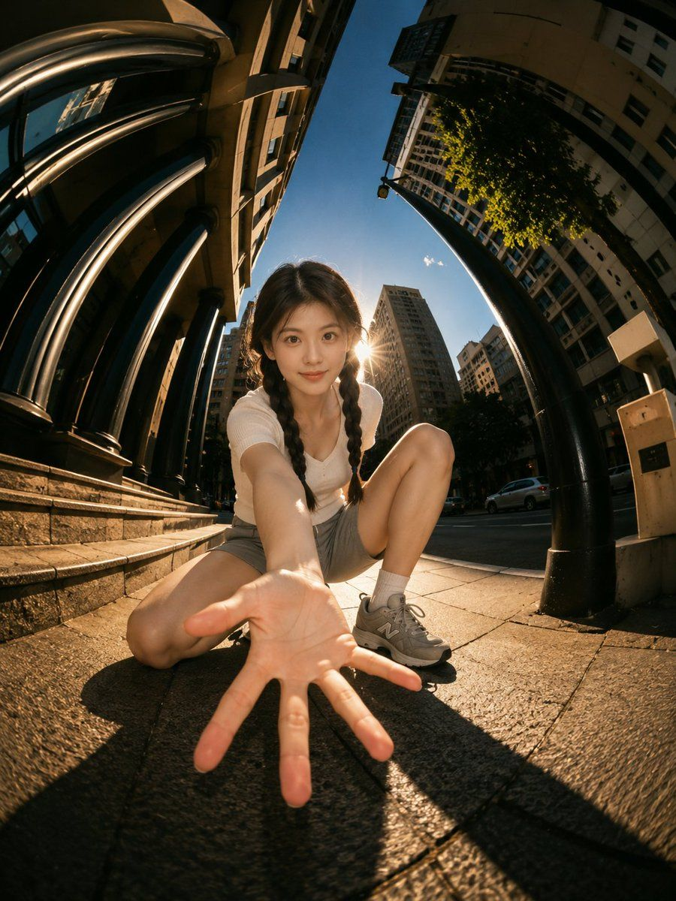

**Prompt:**

```text
仅使用我上传的人像作为身份参考。严格保留我真实的五官特征、比例、脸型、发型、发际线、肤色以及整体气质。不要使用参考图中的面部、性别特征或外貌。仅将参考图用于镜头语言、姿势、场景、构图、光影和氛围。创作一张超写实的城市街拍照片：人物坐在现代城市建筑入口的地面或台阶上，采用超广角鱼眼镜头进行低角度拍摄。相机极度贴近地面，营造出强烈的空间弯曲畸变。人物位于画面下方中心附近，一只手自然地伸向镜头，手掌非常靠近镜头，以创造出戏剧性的前景透视感。另一条腿自然弯曲。姿势要显得放松自然，并带有真实、柔和的微笑。场景为现代城市街道，周围环绕着高楼、玻璃门、台阶、树木和远处的建筑，所有景物都被鱼眼效果轻微拉伸。黄金时刻的阳光从主体后方射入，形成自然的逆光、镜头光晕和长长的阴影。整体光影温暖且具有电影感。图像应看起来像真实的运动相机或超广角智能手机照片，具有逼真的皮肤纹理、自然的毛孔、可信的阴影以及融合良好的环境光。不要过度平滑皮肤。拒绝塑料感，拒绝动漫感。服装应为休闲夏季街头风格，自动搭配适合我外貌的服饰，例如 {argument name="clothing item" default="简约白 T 恤"}、{argument name="bottoms" default="短裤"} 和运动鞋。保持自然，不要过度造型。最终图像应具有真实、抓拍、充满活力和纪实感，采用 4:5 竖构图，无水印、无文字、无 Logo。负面提示词：水印、文字、Logo、AI 标签、动漫风格、卡通风格、塑料皮肤、过度平滑的皮肤、假脸、换脸感、相似度低、五官扭曲、手部畸形、多指、手掌变形、肢体扭曲、低分辨率、模糊、过度曝光、过度锐化、不真实的光影、贴图感、影棚人像感、浓妆、透视错误、背景杂乱
```

**来源：** [@Shinning1010](https://x.com/Shinning1010/status/2059640318161813990) | 2026-05-28

---


### 📷 例 144：电影感动态模糊街头人像

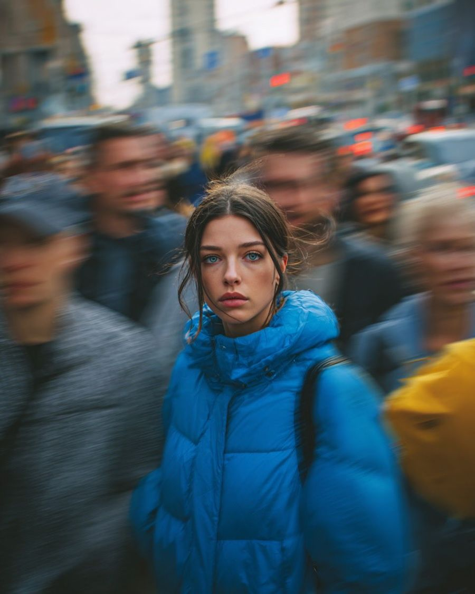

**Prompt:**

```text
Cinematic editorial street portrait, ultra-realistic. A young woman in a vivid blue puffer jacket stands perfectly still at the center of a bustling city sidewalk, locking direct, intense eye contact with the camera. Around her, pedestrians blur past in dynamic motion while traffic lights and tall city buildings rise in the cooler-graded background. Shot on an 85mm lens at f/1.8 for shallow depth of field, sharp tack focus on her face, natural skin tones, soft overcast daylight, high-detail 8k editorial photography.
```

**来源：** [@PromptLab](https://x.com/iamaiistudio/status/2060271865663463557) | 2026-05-29

---


### 📷 例 145：神秘狐仙神像肖像

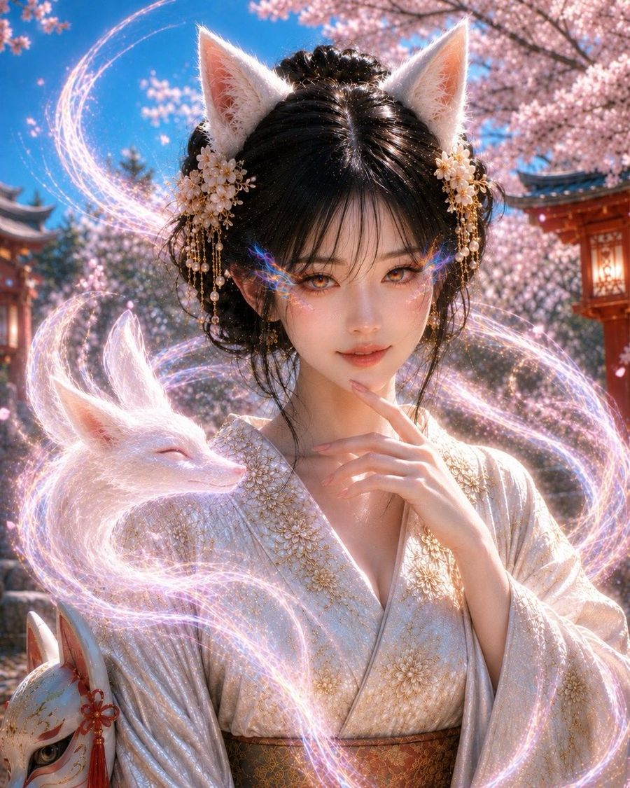

**Prompt:**

```text
主題：春の神社で白狐をまとう日系狐仙ポートレート / kitsune portrait

人物・表情：黒髪の若い女性、日系らしい自然な顔立ち、繊細な前髪と上品なお団子ヘア、白い狐耳、透明感のある白い肌、細長く艶っぽい目元、やわらかく惹きつける視線、ほんのり微笑む上品な表情、瞳の内側に虹色の屈折光が宿り、その光が下まぶたから目尻へ自然ににじむ神秘的な目元、ナチュラルで洗練された和風メイク

服装・ポーズ：白と金を基調にした華やかな和装、繊細な金刺繍が入った着物、ややゆるく開いた上品な襟元で色気を控えめに演出、胸元は自然にふくよか、指先を唇元に添えたしなやかなポーズ、肩元に寄り添う白狐の精霊、足元付近に狐面

背景・光：満開の桜に包まれた明るい昼の神社、青空、朱色の社殿や灯籠、春のやわらかな自然光、舞う花びら、白狐の周囲に淡い桃色と虹彩の光粒、背景はやわらかくぼかしつつ神社らしさを残す

構図・カメラ：上半身中心の縦構図、正面寄りの構図、人物の顔と目を主役にした視線誘導、白狐を左側に寄り添わせたバランスのよい配置、85mmのポートレートレンズ、浅い被写界深度、顔は高精細でシャープ、背景は自然なぼけ、SNSで映える印象的な一枚

質感・スタイル：リアルな写真表現と幻想表現を融合した日系ファンタジーポートレート、高精細、4K品質、毛穴や肌理、唇の質感、鼻筋や目元の陰影まで自然に見える写真的な肌、CG感を抑えた上質な仕上がり、白狐の毛並みは一本一本やわらかく繊細、目元の虹色光は装飾模様ではなく瞳から屈折して流れ出すように表現、胸元や背景の光演出は控えめにして顔・瞳・白狐へ視線を集中、かわいさと神秘感、上品な艶っぽさを両立した雰囲気

ネガティブ：低画質、不自然な顔、不自然な目、不自然な手、余分な指、欠けた指、歪んだ指、崩れた顔、過度に大きい目、強すぎるCG感、アニメ塗り、不自然な肌補正、貼り付いたようなアイメイク、過剰な発光、情報量過多な背景、破綻した着物、不自然な胸元、重複した動物、文字、ロゴ、透かし
```

**来源：** [@Prompt](https://x.com/CyberTotal2026/status/2060262279401320867) | 2026-05-29

---


### 📷 例 146：日式夏日缘侧肖像

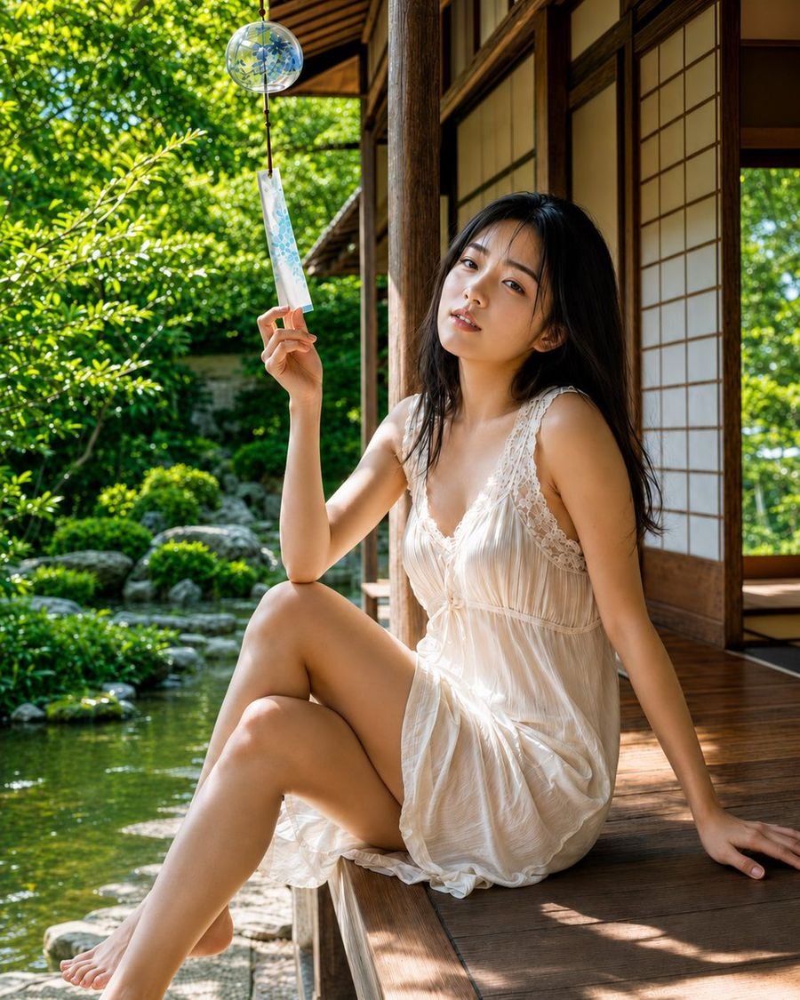

**Prompt:**

```text
主題：夏の縁側で風鈴を楽しむ透明感ポートレート / Japanese summer portrait

人物・表情：黒髪の若い女性、自然に濡れ感のあるロングヘア、透明感のある白くみずみずしい肌、繊細なナチュラルメイク、半分まぶたを落としたような柔らかな目線、少し開いた唇、静かで上品な色気のある表情

服装・ポーズ：淡いアイボリーのキャミソール風サマーワンピース、胸元と肩まわりに繊細なレース、薄く軽やかな生地、縁側にゆったり腰かけ、脚を自然に重ねるように曲げる、片手で風鈴の短冊にそっと触れ、もう一方の手を木の床に添えて体を支える

背景・光：日本の古民家の縁側、障子、木の柱、深い緑に包まれた庭園、青もみじ、石と水辺のある静かな中庭、夏の陽光が縁側から差し込み、肌や服、木の床に柔らかな木漏れ日の光斑を作る

構図・カメラ：縦構図、人物を中央やや右寄りに配置、風鈴を画面上部に入れた夏らしい構図、85mmのポートレートレンズ、浅い被写界深度、顔・瞳・髪・衣装のレースを高精細に描写し、庭の緑は柔らかくぼかす

質感・スタイル：超写実、4K品質、高精細、毛穴や肌理まで自然に見えるリアルな肌質、白くみずみずしい透明感のある肌、髪の一本一本や薄い生地の質感まで繊細に描写、日系フィルム写真のような柔らかな色調、洗練された生活写真、温かく穏やかな夏の空気感

ネガティブ：低画質、ぼやけた顔、不自然な顔、不自然な手、余分な指、欠けた指、歪んだ指、不自然な脚、歪んだ脚、奇妙な目線、左右非対称な目、崩れた顔、歪んだ体、破綻した服、過度な加工、過度な美肌補正、過剰な露出、下品な表現、AI特有の不自然な質感、文字、ロゴ、透かし
```

**来源：** [@Prompt](https://x.com/CyberTotal2026/status/2060240776190439880) | 2026-05-29

---


### 📷 例 147：黄金时刻花海野餐与迷你分身

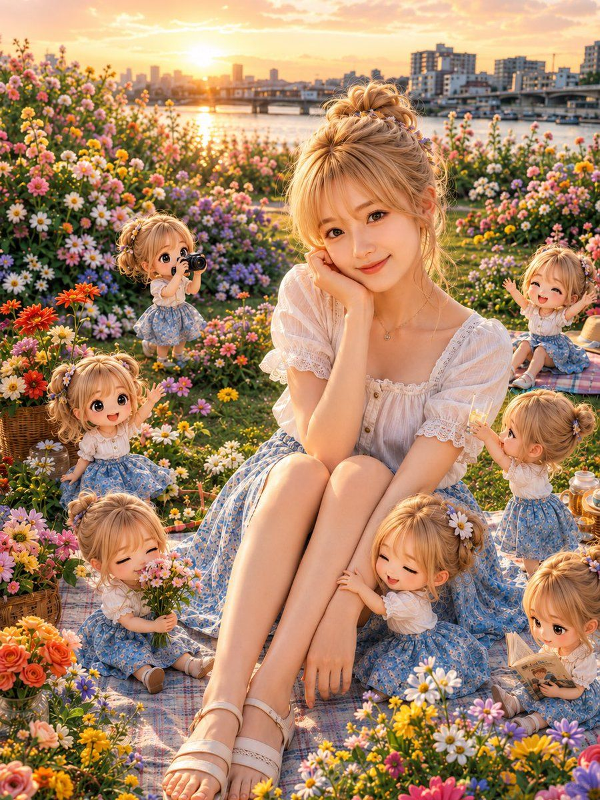

**Prompt:**

```text
主題：夕暮れの花畑ピクニックと小さな分身たち / golden hour flower picnic

人物・表情：金髪の若い女性、ふんわりまとめたアップヘア、前髪と後れ毛が自然に揺れる可愛い雰囲気、透明感のある肌、ナチュラルメイク、柔らかな微笑み、穏やかなカメラ目線

服装・ポーズ：白いレースブラウスと淡いブルーの花柄スカート、華奢なネックレス、白いサンダル、ピクニックシートの上で膝をそろえて座り、片手を頬に添える自然で可愛いポーズ。周囲には同じ姿をした小さなQ版分身たちがいて、カメラで撮影する、花束を抱える、足元に抱きつく、ドリンクを差し出す、本を読む、手を振るなど、それぞれ違う可愛い動きをしている

背景・光：夕暮れの日本の川沿い公園、遠くに橋と街並み、川面に反射する夕陽、色とりどりの花が咲き乱れる花畑、ピクニックバスケット、グラス、布小物、柔らかな黄金色の逆光、夏の終わりのような温かく夢のある空気感

構図・カメラ：縦長構図、中央に人物を大きく配置した全身寄りのポートレート、35mmレンズ、やや低めの目線、浅い被写界深度、背景の川辺と花畑を柔らかくぼかしながら、人物と小さな分身たちの表情がはっきり見える構図

質感・スタイル：高精細、4K品質、毛穴や肌理まで自然に見えるリアルな肌質、金髪の細かな毛流れ、レースブラウスと花柄スカートの繊細な布感、花びらや草の一本一本まで鮮明、リアルなAIポートレートと可愛いQ版キャラクターを自然に組み合わせた幻想的な写真表現、明るく華やかな色調、雑誌写真のような仕上がり

ネガティブ：低画質、不自然な顔、不自然な手、余分な指、欠けた指、歪んだ指、奇妙な目線、左右非対称な目、崩れた顔、歪んだ体、破綻した服、重複した腕、浮いた人物、不自然な小人、過度な加工、過度な美肌補正、過剰な露出、AI特有の不自然な質感、文字、ロゴ、透かし
```

**来源：** [@Prompt](https://x.com/CyberTotal2026/status/2060234573527871736) | 2026-05-29

---


### 📷 例 148：蓝天下的夏日跳跃人像

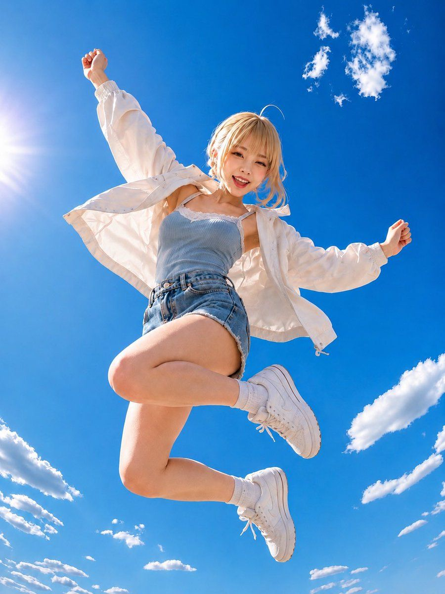

**Prompt:**

```text
主題：青空を跳ねる金髪女性のサマーポートレート / summer jump portrait

人物・表情：金髪の若い女性、セイバー風を思わせる上品なお団子アレンジ、やわらかな前髪、自然な日系メイク、明るく爽やかな笑顔、透明感のある表情、自然なカメラ目線

服装・ポーズ：白い軽やかなジャケット、淡いブルーのリブキャミソール、ハイウエストのデニムショートパンツ、白いソックス、白いスニーカー、片腕を上げて大きく跳ねるダイナミックなジャンプポーズ、片脚を曲げた躍動感のある姿勢

背景・光：澄み切った夏の青空、点在する白い雲、左上から差し込む強い日差し、爽快で明るい昼間の空気感、抜けの良い開放的な背景

構図・カメラ：ローアングルで見上げる全身構図、広角寄りのダイナミックな遠近感、人物を大きく中央に配置、上半身と顔がはっきり見えるバランス、ファッションスナップのような写真表現

質感・スタイル：高精細、4K品質、毛穴や肌理まで自然に見えるリアルな肌質、顔立ちと髪の毛流れを繊細に描写、衣服のしわやデニムの質感もくっきり、明るくクリアな色調、リアルなAIポートレート、雑誌写真のような仕上がり

ネガティブ：低画質、ぼやけ、不自然な顔、不自然な手、余分な指、欠けた指、歪んだ指、奇妙な目線、左右非対称な目、崩れた顔、歪んだ体、破綻した脚、破綻した服、過度な加工、過度な美肌補正、AI特有の不自然な質感、文字、ロゴ、透かし
```

**来源：** [@Prompt](https://x.com/CyberTotal2026/status/2060186294685434352) | 2026-05-29

---


### 📷 例 150：日本小巷人像（面部模糊处理）

.jpg)

**Prompt:**

```text
Create a realistic vertical street-fashion photograph of a young Japanese woman standing centered in a narrow urban backstreet in Japan during soft morning daylight. She is shown from about mid-thigh upward, facing the camera, with both arms raised and hands resting on top of her head, giving a playful little-devil smile implied by the pose. Her face is intentionally obscured by a centered soft-edged rectangular blur/mosaic block, while the rest of the image remains sharp and natural. She has long slightly messy black hair falling over her shoulders and wears a light beige cardigan over a fitted white cropped tank top, plus high-waisted blue denim jeans with the waist and navel visible. The background is a realistic Japanese alley with low buildings on both sides, a metal shutter storefront and bicycle on the left, stacked crates near the curb, potted plants and a vending machine on the right, overhead utility wires, and shallow depth of field. Use a candid smartphone/editorial photo look, natural skin tones, cool daylight, slightly wide-angle perspective, subtle film grain, no text, no watermark, no extra people.
```

**来源：** [@susumu_Mind](https://x.com/SusumuMind/status/2060125961417572383#reversed-1) | 2026-05-29

---


### 📷 例 151：酒红色礼服时尚参考网格

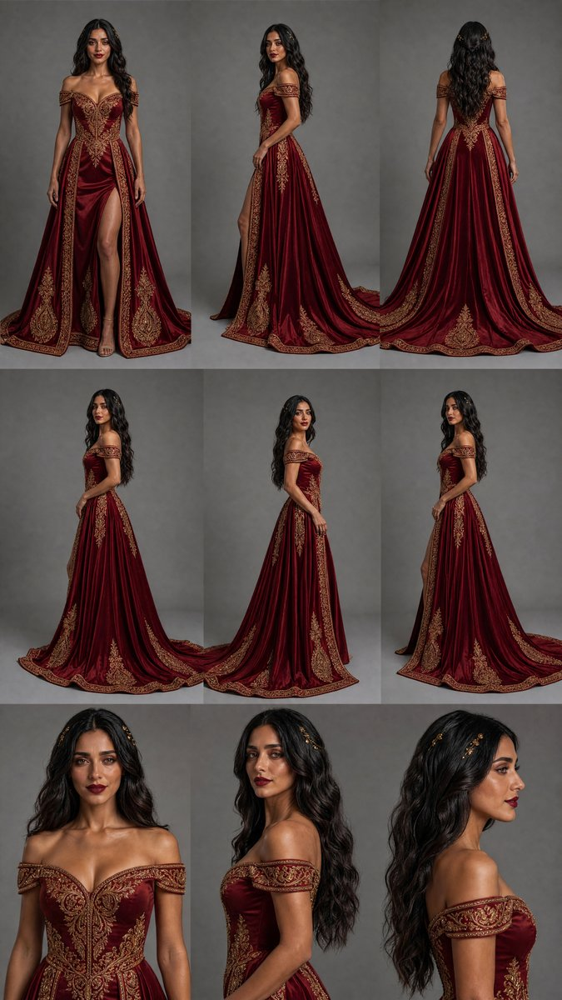

**Prompt:**

```text
Goal: Create a fashion design reference sheet for an ornate burgundy velvet off-the-shoulder fantasy evening gown with gold embroidery, shown as a studio lookbook/contact sheet.

Canvas: Vertical 9:16 image, arranged as an exact 3×3 grid with 9 panels, thin invisible or minimal seams between panels, neutral gray photography studio background in every panel, realistic high-end fashion photography lighting.

Subject: One adult female model with long wavy black hair, medium/tan skin tone, wearing the same gown in every panel. The face is intentionally obscured by a soft rectangular blur block in each view, while the outfit remains sharply detailed.

Dress details: Deep burgundy velvet or satin-velvet gown with a structured sweetheart bodice, off-the-shoulder embroidered sleeves, fitted waist, full floor-length skirt, long trailing train, high front slit in the front view, and dense antique-gold baroque embroidery. Gold motifs include symmetrical bodice filigree, vertical embroidered panels down the skirt, ornate border trim along the hem and train, and large medallion-like appliqués near the lower skirt. Elegant formal sandals are visible in the front slit view.

Layout: Use exactly 9 discrete panels. Panel 1: full-body front view, standing centered, slit open to show one leg. Panel 2: full-body three-quarter side view, train flowing behind. Panel 3: full-body back view, long hair down the back, wide skirt and train visible. Panel 4: full-body left side profile, hand relaxed, long train spread along the floor. Panel 5: full-body clean side profile, upright pose, skirt falling vertically. Panel 6: full-body three-quarter front/side view, showing bodice and skirt embroidery. Panel 7: close-up front crop from head to waist, emphasizing neckline, off-shoulder sleeves, bodice embroidery, and face blur. Panel 8: close-up side crop from head to hips, showing sleeve detail, bodice side seam, hair texture, and face blur. Panel 9: close-up rear three-quarter crop from head to upper torso, showing hair, shoulder, sleeve embroidery, and face blur.

Visual style: Photorealistic editorial catalog photography, crisp fabric texture, rich velvet sheen, dramatic but even studio lighting, muted gray background, luxurious medieval-inspired couture aesthetic, realistic anatomy and proportions, no text, no logos, no watermark.

Constraints: Maintain the exact 3×3 grid and the exact 9 listed views. Keep the model clothed in the gown in all panels. Do not add extra garments, props, captions, mirrors, mannequins, or additional people. Emphasize the ornate gold embroidery and the burgundy fabric consistently across all panels.
```

**来源：** [@Jennifer](https://x.com/Jenny_MommaLion/status/2060121016932905448#reversed-0) | 2026-05-29

---


### 📷 例 154：上海石库门窗边肖像

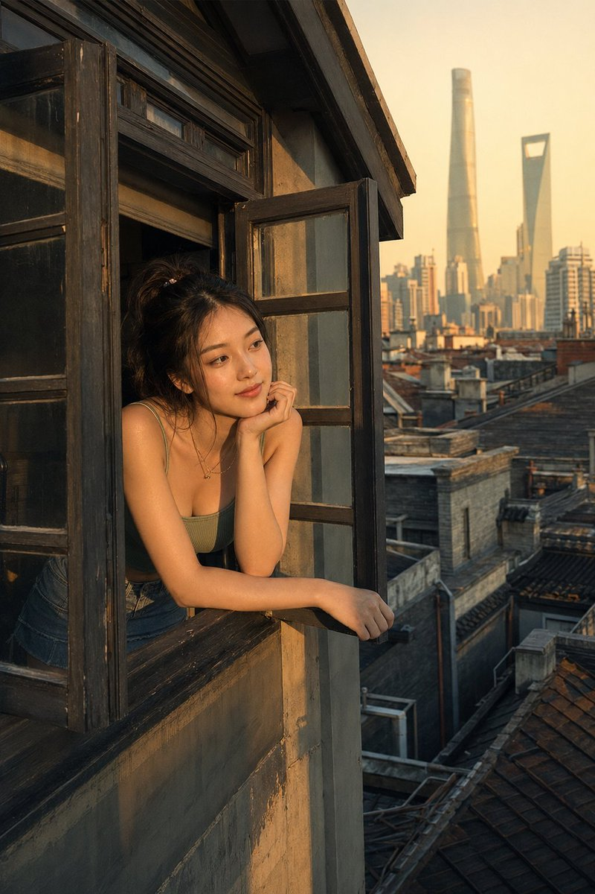

**Prompt:**

```text
A candid photograph of a young woman leaning on the open sill of a tiger dormer window on the upper floor of a Shanghai shikumen building, authentic daily life photography, natural candid moment. Upper-body framing shot from below at moderate distance — she rests her forearms on the window ledge, looking out over the rooftops in the late afternoon.
East Asian young woman in her early 20s. Almond-shaped eyes with natural double eyelids, slightly elongated eye corners — gaze directed outward and slightly downward toward the lane below, soft and unhurried, the expression of someone with nowhere pressing to be. Straight refined nose with a delicate bridge. Skin tone fair to light beige (NC10–NC20) — skin subsurface scattering visible under warm golden side light, specular micro-highlights on cheekbones and nose ridge and the top of one bare shoulder, fine foundation powder grain perceptible. Clean no-makeup summer skin, peachy gloss, curl in the lash.
She wears a sage green cropped ribbed knit cami with thin adjustable straps, and a denim micro mini skirt. Fine layered gold chains at her collarbone — two of them, slightly different lengths. Hair loosely half-clipped with a claw clip, several strands falling free around her jaw. She rests her chin lightly on one hand, the other arm stretched along the window ledge — the universal posture of someone watching a street from above, neither bored nor alert, simply present in summer time. The tiger dormer window frame: old dark-painted wood, slightly weathered, panes of old glass with the faint optical distortion of age. The shikumen rooflines and chimney tops spread below. Over those old tiles, in the far blurred golden distance, the recognizable silhouettes of Shanghai Tower and the SWFC tower rise as warm amber forms in the haze — modern and historic occupying one frame without apology. Two or three stray hairs displaced by the rooftop afternoon breeze, natural unplanned imperfection, not geometrically symmetrical.
Warm low-angle golden hour sunlight from the side, amber light catching her cheekbones, the top of a bare shoulder, and the gold chain — long shadows from the window frame across her forearm. Gentle and warm, quiet contentment — the Shanghai girl's private pleasure of a summer evening seen from above the lane. Subtle ISO 400 film grain in shadow areas, photographic noise texture not CG render smoothness. Aspect ratio 2:3. No watermark, no text overlay, not cartoon, not digitally painted, not illustration, not anime.
```

**来源：** [@ToroJushiAi](https://x.com/ToroJushiAi/status/2060066306947522945) | 2026-05-29

---


### 📷 例 156：坐在巨型网球上的运动员


**Prompt:**

```text
Create a square studio sports fashion editorial image with a dark forest-green background and glossy reflective green floor. A young adult female athlete wearing a black hijab and all-black training outfit lounges confidently on an oversized fuzzy yellow tennis ball placed in the lower center-left. Her face is intentionally anonymized with a soft rectangular blur. Outfit details: fitted black long-sleeve athletic top with subtle white piping, black leggings, black Nike-style wristbands, black crew socks with two white stripes and small white swoosh-like marks, and black running shoes with white swoosh-like logos and white midsoles. Pose: reclining diagonally across the giant tennis ball, left arm hanging down, right arm resting on a raised bent knee, one leg draped across the ball and the other foot planted on the reflective floor. Behind her, huge cream-colored bold block letters spell GOAL, filling almost the entire width and height of the backdrop, partially obscured by the athlete and ball. Use dramatic soft studio lighting, high contrast, realistic textures, crisp editorial photography, a premium athletic campaign look, and subtle floor reflections. Keep the composition centered and minimal with exactly 1 athlete, 1 giant tennis ball, and 1 oversized background word.
```

**来源：** [@Singular](https://x.com/singularlab_ai/status/2060064813053579600#reversed-1) | 2026-05-29

---


### 📷 例 158：极简主义工作室静物摄影

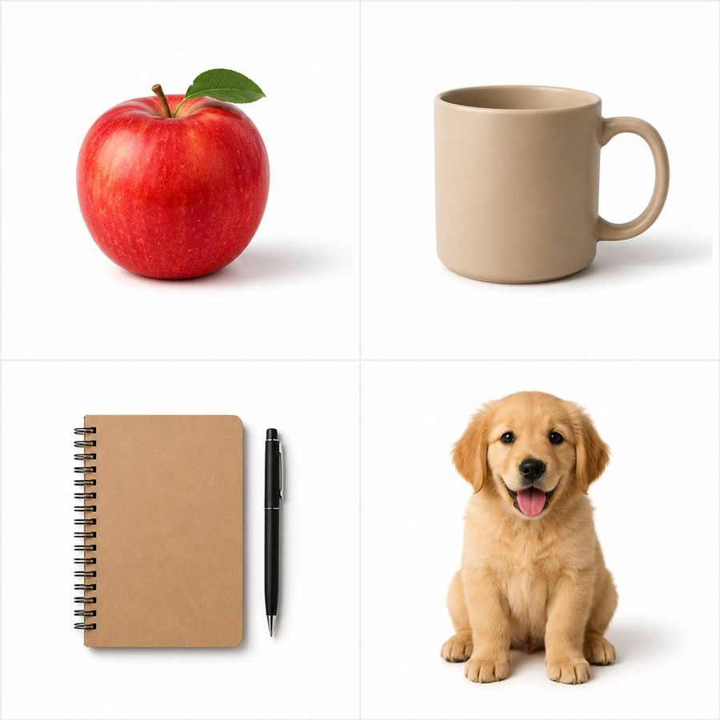

**Prompt:**

```text
Minimalist Object Prompt Pack – Clean, Professional & Versatile This prompt pack generates high-quality square images of everyday objects, fruits, stationery, or pets, all perfectly centered on a clean white background. Each image has sharp details, realistic lighting, and a subtle shadow projected to the right side, creating a professional studio photo look.
```

**来源：** [@Kami](https://x.com/Aiwithkami/status/2060062348975718486) | 2026-05-29

---


### 📷 例 160：阳光时尚杂志拼贴画

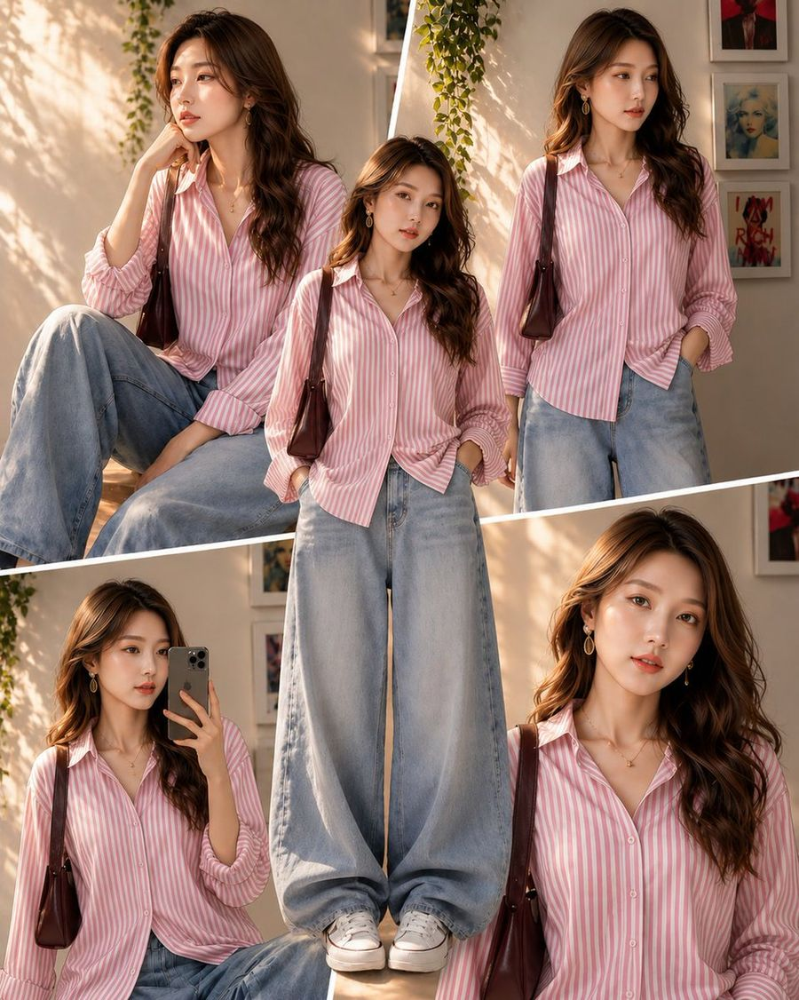

**Prompt:**

```text
Ultra realistic fashion collage of the same beautiful woman ( FACE GIVEN IN REFRANCE IMAGE) in 5 different poses inside a warm sunlit aesthetic apartment, soft golden hour lighting casting natural window shadows on beige walls, long wavy brown hair, glowing skin, minimal makeup, elegant gold earrings and necklace, oversized pink and white striped button-up shirt, loose light-wash wide-leg baggy jeans, white sneakers, dark brown shoulder bag.

Magazine-style collage layout with diagonal white borders separating each pose, full body and close-up portrait shots mixed together, cozy modern interior with hanging green vines and framed wall art in background. Soft cinematic lighting, dreamy Korean fashion editorial vibe, natural skin texture, highly detailed fabric folds, relaxed confident expressions, Pinterest aesthetic, Instagram fashion lookbook style, ultra detailed, realistic photography, shallow depth of field, 8k quality.
```

**来源：** [@auqib](https://x.com/auqibhabib/status/2060053709003075941) | 2026-05-29

---
### 📷 例 171：iPhone 屏幕遮脸创意人像


**Prompt:**

```text
Ultra-realistic creative portrait taken with an iPhone, identity accurately preserved from the reference image. A woman stands inside a store, facing a glass display window or a reflective wall, photographed from a slightly elevated frontal angle. She holds a smartphone horizontally in front of her face, covering her eyes and the upper part of her face. The phone's screen points at the camera and clearly displays a real-time image of her face.
```

**来源：** [@Ciri_ai](https://x.com/Ciri_ai/status/2053535379618423118) | 2026-05-30

---

### 📷 例 172：红跑道低角度夏日人像


**Prompt:**

```text
Use the uploaded portrait photo as the appearance reference for the person. Create a bright photorealistic outdoor portrait of a young woman lying on a red running track on a modern white arch pedestrian bridge. Ultra-wide low-angle selfie perspective, her arm reaching toward the camera in the foreground, relaxed pose, wired headphones around her neck, white sleeveless top, loose gray pants, black hair spread on the ground. Clean blue sky with soft white clouds, strong midday sunlight, crisp shadows, high clarity, fresh youthful mood, architectural symmetry, realistic skin texture, cinematic composition, 3:4 vertical image

Negative Prompt:

watermark, logo, text, caption, signature, AI label, extra fingers, deformed hands, distorted face, wrong identity, duplicate person, blurry face, low resolution, over-smoothed skin, plastic skin, unnatural anatomy, bad perspective, messy background, harsh artifacts, overexposure, underexposure
```

**来源：** [@Shinning1010](https://x.com/Shinning1010/status/2053521749967352285) | 2026-05-30

---

### 📷 例 178：室内晨间写实摄影


**Prompt:**

```text
A close-medium shot of a young Japanese woman in her bedroom on an ordinary morning, captured in authentic daily life photography as a natural candid moment. She is seated sideways on the edge of the bed, not fully awake yet, photographed from a slightly elevated three-quarter angle with cool-to-warm morning window light entering from the left.
East Asian young woman in her early 20s. Almond-shaped eyes with soft natural single eyelids, slightly elongated eye corners, still carrying the heaviness of just waking. Straight refined nose with a delicate bridge. Skin tone fair to light beige — skin subsurface scattering visible under the soft directional morning window light, specular micro-highlights catching gently on her cheekbone and nose ridge, fine skin texture perceptible, no makeup. Naturally straight fine black hair loosely gathered, slightly disheveled from sleep.
She wears a loose oversized cotton sleep shirt and soft shorts, nothing styled. Her gaze drifts toward the window, posture relaxed and unhurried, one hand resting on her knee, the other barely holding a phone face-down. The bedroom background suggests real life — slightly unmade linen, a potted plant near the window partially in shadow, small cluttered bedside items. Two or three stray hairs fall across her cheek in natural asymmetric displacement, not geometrically placed.
Soft directional morning light from a side window, cool-to-warm transition across her face and shoulder, long gentle shadows on the bedding behind her. The mood is quietly adrift — not sad, not performing, just suspended in the unhurried first minutes of the day. Subtle ISO 400 film grain in shadow areas, photographic noise texture not CG render smoothness. Aspect ratio 2:3. No watermark, no text overlay, not cartoon, not digitally painted, not illustration, not anime.
```

**来源：** [@ToroJushiAi](https://x.com/ToroJushiAi/status/2053078195482632421) | 2026-05-30

---

### 📷 例 180：彩色按钮时尚 Campaign


**Prompt:**

```text
Use reference image as style guide.
Surreal minimalist fashion editorial photography with vibrant oversized colorful buttons as main visual theme (cyan, orange, yellow, red palette), glossy 3D surface design, clean studio lighting, ultra-smooth gradients, and high-end commercial fashion look.
Split-frame composition:

Left side: full-body female model standing from top to bottom, wearing bold minimalist fashion outfit inspired by reference style, confident pose, clean studio background filled with oversized colorful buttons, cinematic lighting, soft shadows, ultra-clean composition.

Right side (vertically split into two parts):
Top-right: half-body female model, different face, different pose, different outfit variation inspired by same button aesthetic, different background color mood.
Bottom-right: another half-body female model, completely different expression and pose, different styling, different background tone, maintaining same surreal button universe aesthetic.

Each section visually distinct but unified by the colorful button-inspired design language, glossy surfaces, soft studio reflections, and fashion magazine editorial feel.
Hyper-realistic, cinematic lighting, ultra-clean composition, high-end luxury campaign style, depth, contrast, 8k, 1:1 aspect ratio --style raw --v 6 --ar 1:1
```

**来源：** [@Mind_Boticni](https://x.com/Mind_Boticni/status/2053082199436759258) | 2026-05-30

---

### 📷 例 184：Cozy Academia 学习手记


**Prompt:**

```text
Dreamy cinematic study aesthetic, young Asian girl with long dark hair studying outdoors at a wooden table during golden hour, cozy oversized green sweater and scarf, writing in notebook beside open laptop, historic university campus in background, warm sunset lighting, soft glow, autumn atmosphere, aesthetic doodles and handwritten notes floating around image, kawaii scrapbook style overlays, pastel hearts and stars, motivational text, shallow depth of field, nostalgic film grain, soft beige and warm green tones, peaceful productive vibe, ultra detailed, Pinterest aesthetic, photorealistic, cozy academia style, 35mm film look
```

**来源：** [@Sairah_0](https://x.com/Sairah_0/status/2052969695406325875) | 2026-05-30

---

### 📷 例 193：唱片公司楼梯间写真人像


**Prompt:**

```text
Use case: photorealistic-natural
Asset type: cinematic portrait image, final target size 1216x1536 portrait

Create a photorealistic image of a fictional adult Korean female idol in her mid-20s, not resembling any real celebrity. Maintain a Japanese negative film look: soft overexposure, faded neutrals, low contrast, subtle grain, and imperfect snapshot framing.

Scene/backdrop: the back stairwell of a small record label building, with moving boxes, scuffed concrete steps, a gray metal handrail, and a pale security light. The atmosphere should feel quiet, slightly intimate, and workaday, as if caught in a private in-between moment after practice and during moving day.

Subject: a Korean female idol with a naturally attractive, understated sensuality rather than overt glamour. She should feel quietly magnetic, relaxed, and a little teasing without being provocative.

Wardrobe/props: a slightly cropped black blazer worn casually and slightly open, over a fitted heather-gray ribbed tee that softly outlines the figure without revealing cleavage, loose khaki cargo pants sitting naturally on the waist, a thin silver chain necklace, a roll of black gaffer tape placed beside her, and one sneaker lace still half-tied. The styling should feel subtly sexier and more feminine than purely casual, but still fully modest and non-revealing.

Composition/framing: tall portrait. The subject is seated on the stairs with one knee slightly raised and one leg relaxed lower on the step, leaning back lightly with one hand braced behind her on the stair for support. The other hand is near her half-tied sneaker, as if she has just paused while tying it. Her blazer falls naturally along the body, her posture creating a soft, elegant silhouette. Her head is tilted up toward the camera with a calm, slightly sultry, self-possessed expression. The pose should feel candid yet subtly alluring, natural rather than staged.

Lighting/mood: flat stairwell light, understated backstage realism, soft grain, muted tones, gentle highlight bloom, and a quiet intimate mood. Keep the image photorealistic, restrained, and cinematic, with no excessive glamour and no nudity.

Add small white handwriting signature text "BubbleBrain" on the bottom right corner.

--2:3
```

**来源：** [@BubbleBrain](https://x.com/BubbleBrain/status/2052217544388546827) | 2026-05-30

---

### 📷 例 198：Y2K 金色时刻人像


**Prompt:**

```text
candid portrait of a beautiful young blonde woman, 21 years old, glowing sun-kissed skin, wearing a baby pink velour tracksuit and butterfly clips in her hair, smiling brightly at the camera, golden hour warm light, palm trees, y2k aesthetic, glossy lips
```

**来源：** [@SiliconBarbie_](https://x.com/SiliconBarbie_/status/2051475105403040014) | 2026-05-30

---

### 📷 例 207：AI 日常生活 iPhone 抓拍


**Prompt:**

```text
I want to see what you really look like.
Draw a snapshot of your everyday life as if it were accidentally taken on an iPhone.
Make it feel like a very ordinary, imperfect candid shot.
The photo should have slight motion blur, with uneven, natural lighting.
```

**来源：** [@Ciri_ai](https://x.com/Ciri_ai/status/2051292618248904809) | 2026-05-30

---

### 📷 例 208：春日花田三联竖版写真拼贴


**Prompt:**

```text
A high-quality 3-panel vertical photo collage of a stunning uploaded woman with soft, voluminous wavy hair glowing in golden sunlight. She is styled in a cream-colored lace-up vintage blouse with delicate textures, olive green high-waisted flowy trousers, and a wide-brimmed straw hat slightly tilted for a fashionable editorial look. Light golden jewelry (thin chains, rings) adds a subtle luxury touch.

The setting is a dreamy, vibrant yellow mustard flower field under a bright blue sky with soft clouds, enhanced by golden hour lighting for a magical glow.

Top panel: Back view of the woman standing in the field with arms wide open, sunlight creating a glowing halo around her hair, slight motion blur in flowers for a cinematic feel.

Middle panel: Close-up portrait, she smiles naturally at the camera, wind softly moving her hair, her hand reaching toward the lens creating depth and a slightly blurred foreground for a DSLR effect.

Bottom panel: Playful pose, she leans sideways in the flowers, making a double peace sign, laughing candidly, capturing an authentic joyful moment.

Add cute, trendy white doodle overlays (smiley faces, sparkles, stars, tiny hearts) with a subtle animated/sketchy feel. Include light leaks, sun flares, and soft film grain for a premium Instagram aesthetic.

Ultra-realistic, 4K, cinematic lighting, shallow depth of field, high dynamic range, natural skin tones, editorial fashion photography, soft pastel color grading.

Aspect ratio: 4:5
Style tags: viral Instagram aesthetic, Pinterest style, dreamy spring vibe, candid luxury
```

**来源：** [@frametheory058](https://x.com/frametheory058/status/2051294907214844249) | 2026-05-30

---

### 📷 例 213：樱花咖啡户外人像


**Prompt:**

```text
Edit the provided image while preserving the same face identity, shape, and facial features without altering age, ethnicity, or structure. Maintain a calm, relaxed expression with the subject not looking at the camera.

Subject: young woman (18–23) with soft feminine beauty, smooth glowing skin, natural texture.
Pose (strict): seated on a wooden chair, body angled sideways (45–70°), legs crossed naturally, upper body slightly leaning forward, head turned away from camera, gaze to the side. She holds a drink cup with a straw using both hands.
Framing: full-body vertical (9:16), head to shoes visible, centered but slightly offset for natural composition.
Outfit: light pink varsity jacket with white stripes, soft pink inner top, modest knee-length pleated skirt, white sneakers.
Accessories: beige newsboy cap, sunglasses (on face or cap), pink shoulder bag, small earrings.
Hair: neat low bun with soft loose strands.
Environment: outdoor flower shop street scene with pastel flowers (pink, soft tones), decorative plants, floral storefront.
Lighting: bright natural daylight, soft glossy skin highlights, balanced exposure, soft shadows.
Camera: low/frog angle (slightly below, looking up), 50mm lens, shallow depth of field.
Color grading: warm pastel palette (pink, cream), clean bright lifestyle aesthetic.
Quality: ultra-photorealistic, 8K detail, DSLR realism, natural skin texture.
Negative: front-facing, eye contact, close-up, cropped body, mini/short skirt, indoor scene, dark lighting, anime, cartoon, CGI, plastic skin, distorted anatomy.
--ar 9:16 --style raw --quality high
```

**来源：** [@xRahultripathi](https://x.com/xRahultripathi/status/2050677614168391716) | 2026-05-30

---

### 📷 例 214：泼洒抹茶街头手机照片


**Prompt:**

```text
A realistic vertical smartphone photo of a spilled green iced drink on outdoor stone pavement, a transparent disposable plastic cup lying on its side inside the green puddle, clear plastic lid nearby, scattered ice cubes floating in the drink, small foam bubbles on the surface, green liquid naturally spreading across rough square floor tiles, strong midday sunlight, harsh realistic shadows, a dark human shadow silhouette cast across the ground and partially over the spill, accidental street moment, urban documentary photography, handheld phone camera perspective, slightly top-down angle, natural colors, realistic pavement texture, raw unedited photo look, high detail, authentic everyday scene, 9:16 vertical composition

Negative Prompt:
cartoon, illustration, anime, CGI, 3D render, fantasy style, studio lighting, overly perfect composition, overly clean floor, fake liquid, unrealistic reflections, plastic-looking liquid, oversaturated green, blurry, low resolution, distorted cup, melted plastic, extra cups, duplicated objects, readable brand logo, messy text, watermark, poster design, dramatic artificial lighting, excessive sharpening, over-processed, unrealistic shadow, floating ice, deformed perspective
```

**来源：** [@Shinning1010](https://x.com/Shinning1010/status/2050693240253214894) | 2026-05-30

---

### 📷 例 224：咖啡馆写实照片与 2D 涂鸦叠加


**Prompt:**

```text
A trendy young woman sitting at an outdoor café table, holding a hot coffee cup near her lips. She has short curly black hair and wears oversized tinted sunglasses, a cropped beige sweater, loose brown high-waisted pants, and chunky white sneakers. A tote bag with minimal coffee-themed illustrations hangs on her shoulder.

The scene blends realistic photography with playful 2D cartoon overlays. Floating around her are animated coffee elements: a smiling cappuccino cup with heart-shaped latte art, cute coffee beans with tiny faces, and stylized splashes of caramel forming comic-style shapes. Soft doodle steam rises into hearts and stars.

On the table: a croissant, a notebook with sketch drawings, and a second coffee cup.

Background: a realistic cozy café street with brick walls, plants, warm golden hour lighting, and soft shadows. Slight depth of field, subject in sharp focus.

Style: mix of photorealism and vibrant cartoon illustration, pop-art aesthetic, high saturation but warm tones, clean composition, Instagram-worthy, soft glow, 4k detail.
```

**来源：** [@Jawad_Rahman_](https://x.com/Jawad_Rahman_/status/2049796647237066971) | 2026-05-30

---

### 📷 例 233：鱼眼镜面复古咖啡馆人像


**Prompt:**

```text
A fish-eye lens close-up of [your photo as reference] sipping from a teal/turquoise coffee mug, leaning forward intimately toward camera. Shot through or near a round mirror. Retro café interior with glossy teal subway tiles, vintage appliances, pendant lights. Black t-shirt, yellow-tinted round glasses. Warm moody tones.
```

**来源：** [@harboriis](https://x.com/harboriis/status/2049044698900361241) | 2026-05-30

---

### 📷 例 241：壁画艺术家咖啡馆肖像


**Prompt:**

```text
[인물] 이미지 1~9까지를 참조합니다.

아늑하고 예술적인 카페를 배경으로 한 현실적이고 화보 같은 인물 사진을 생성하세요. 인물은 전문적인 에디토리얼 스타일의 세로형 초상화를 대형 벽화로 그리고 있습니다. 카메라를 보지 않고 벽화를 그리는것에 집중하고 있습니다. 인물은 [{argument name="의상" default="청바지에 흰색 나시티"}]를 입고 베이지식 칼하트 앞치마를 입고 있습니다 인물은 거친 질감이 느껴지는 벽 옆에 쪼그리고 앉아 자신의 얼굴과 표정, 그리고 반사된 시각적 개념을 그대로 담아낸 수작업 벽화를 그리고 있습니다. 초상화 옆에는 검은색 테두리가 있는 귀여운 폰트로 "{argument name="문구" default="Love you"}" 라는 문구가 적혀 있습니다. 8K 초고해상도 디테일, 볼륨감 있는 조명, 전문적인 미학을 갖추고 있습니다. 원본 비율, 피부 톤, 표정을 유지하며 전문적인 에디토리얼 사진 스타일로 출력하세요. 바닥에는 페인트 통이 흩어져 있고, 그녀의 손과 옷에는 페인트 자국이 묻어 있습니다.

사실, 현실적인 인체비율, 플라스틱 재질 금지
```

**来源：** [@CHAse](https://x.com/CHAseUnre/status/2059783208036679811) | 2026-05-28

---

### 📷 例 242：横滨海滨电影感人像


**Prompt:**

```text
Create a candid photorealistic film-style portrait of a young woman named {argument name="character name" default="anonymous young woman"} standing on a sunny waterfront promenade in Yokohama, Japan, with the Minato Mirai skyline in the background. She is shown from the waist up in a relaxed three-quarter back pose, turning slightly toward the camera, one hand raised near her hair, with her face intentionally covered by a plain soft-edged rectangular privacy blur in a neutral skin-tone/brown color. She has very long flowing {argument name="hair color" default="black"} hair falling down her back, pale skin, and wears exactly 3 visible accessories on her wrist: a gold bracelet, a beaded bracelet, and a thin chain bracelet. Her outfit has exactly 1 visible main clothing piece: an oversized off-shoulder {argument name="shirt color" default="white"} T-shirt with a faint gray graphic print on the lower front. The setting includes exactly 5 key background landmarks or structures: a tall rectangular Landmark Tower on the left, several pale modern high-rise buildings in the center, a large Ferris wheel on the right, a waterfront railing with round metal posts along the right edge, and calm blue harbor water beside the promenade. Use natural morning sunlight, a gentle sea-breeze feeling, soft shadows, muted pastel colors, shallow depth of field, slight 35mm film grain, realistic proportions, and a vertical 3:4 composition. No text, no watermark, no extra people in the foreground.
```

**来源：** [@susumu_Mind](https://x.com/SusumuMind/status/2059780696831631848) | 2026-05-28

---

### 📷 例 244：温馨韩式卧室人像


**Prompt:**

```text
Photorealistic cozy late-night bedroom portrait of a {argument name="subject" default="gorgeous Korean woman"} lounging on her bed, casually facing the camera with a calm, sleepy look. Hair in a loose messy bun, soft loose strands framing her face, glossy eyes, light blush makeup, smooth lifelike skin, dreamy youthful Korean beauty. She wears an {argument name="outfit" default="oversized cream hoodie"} with long sleeves half-swallowing her hands, giving off a warm late-night feel. Relaxed posture, leaning slightly forward on the bed, one hand softly resting on her cheek, the other arm near an open notebook and a lit candle on the blanket. Warm ambient glow from a bedside lamp, fairy lights, and candlelight produces cinematic golden highlights and soft realistic shadows across the room. Modern {argument name="setting" default="Korean bedroom"} styling, fluffy cream bedding, soft blankets, cozy decor, a small bookshelf, aesthetic posters, framed photos, flowers in a vase, candles, a notebook, a coffee mug, and city lights twinkling through the big window. Romantic slice-of-life mood, feminine cozy aesthetic, intimate late-night atmosphere, shallow depth of field, cinematic framing, highly detailed photorealism, soft warm glow, DSLR-style photography, luxury lifestyle editorial feel, calming nighttime ambiance.
```

**来源：** [@PromptLab](https://x.com/iamaiistudio/status/2059728149341172028) | 2026-05-27

---

### 📷 例 247：上海石库门街头肖像


**Prompt:**

```text
A candid street photograph of a young woman standing just inside the arched stone gateway of a {argument name="location" default="Shanghai shikumen longtang entrance"}, authentic daily life photography, natural candid moment. Full-body framing, centered composition, shot from within the lane looking outward — she stands beneath the ornate carved stone arch, morning summer light filtering in from behind. East Asian young woman in her early 20s. Almond-shaped eyes with natural double eyelids, slightly elongated eye corners. Straight refined nose with a delicate bridge. Skin tone fair to light beige (NC10–NC20) — skin subsurface scattering visible under soft morning directional light, specular micro-highlights on cheekbones and nose ridge, fine foundation powder grain perceptible. Dewy summer skin, light BB coverage, peachy tinted lip gloss. She wears a {argument name="outfit" default="butter yellow linen co-ord"} — a cropped wide-collar top and matching high-waist wide-leg trousers, white leather slides. A woven micro bag in natural straw hangs from her forearm. Small pearl drop earrings catch the morning light. She stands with her weight shifted to one hip, fingers of one hand loosely hooked on the bag strap, gaze drifting slightly upward toward the arch above — a casual self-possession that reads as entirely natural yet somehow composed, the particular ease of a Shanghai girl who grew up moving effortlessly between old lanes and glossy shopping malls without ever noticing the gap. The stone arch rises around her, its carved brick relief worn but legible — the longtang name tile faintly visible above the keystone. Lane walls of old lime-washed brick recede behind her. At the lane's far vanishing point, above the old tile roofline, the upper floors of a distant Pudong tower dissolve in summer morning haze — a soft ghost of modern Shanghai hovering above the old stones, barely there. Two or three stray hairs displaced by morning lane air, natural unplanned imperfection, not geometrically symmetrical. Soft directional morning light from outside the arch, cool-to-warm transition, long gentle shadows thrown by the arch onto the lane pavement beneath her feet. Gentle and warm, quiet contentment, a private sense of belonging. Subtle ISO 400 film grain in shadow areas, photographic noise texture not CG render smoothness. Aspect ratio 2:3. No watermark, no text overlay, not cartoon, not digitally painted, not illustration, not anime.
```

**来源：** [@ToroJushiAi](https://x.com/ToroJushiAi/status/2059714350739489105) | 2026-05-27

---

### 📷 例 248：东南亚女性自拍特写


**Prompt:**

```text
A softly lit close-up selfie captures a {argument name="subject" default="young Southeast Asian woman"} with long {argument name="hair color" default="jet-black"} hair and delicate model-like facial features, including almond-shaped eyes, flushed cheeks, a small nose, and full {argument name="lip color" default="pink"} lips.
```

**来源：** [@Mridul Swarg](https://x.com/MSwarg88267/status/2059710423411446178) | 2026-05-27

---


### 📷 例 252：电影感 Lightroom 街头风格调色


**Prompt:**

```text
Using the provided reference photo, keep the exact subject, pose, street location, composition, and facial anonymization intact, but transform it into a polished editorial fashion photo edit. Apply a moody luxury Lightroom-style color grade: warmer cream highlights on the suit, deeper blacks, richer contrast, subtle vignette, slightly darker sky, muted city tones, crisp detail, and cinematic depth while preserving a realistic natural look. Remove the original bottom text and replace it with large centered white all-caps serif text reading {argument name="bottom label" default="AI EDITED"}. Do not change the man’s outfit, walking pose, background architecture, cars, pedestrians, or Union Jack flag; only enhance the photo grading and retouching quality.
```

**来源：** [ᴍᴜʀᴘʜʏ](https://x.com/Diplomeme) | 2026-05-30

---


### 📷 例 258：微缩模型风格肖像


**Prompt:**

```text
A cinematic wide-angle shot features uploaded face as reference, riding a {argument name="vehicle" default="vintage light-green scooter"}, wearing a {argument name="attire" default="dark suit and red tie"}, looking directly at the camera with a serious expression; the scooter is positioned on a stylized map-like surface with roads and a winding blue path, surrounded by miniature buildings, trees, vehicles, and people, creating a forced perspective effect; in the upper-left corner, large 3D white letters spell out "{argument name="text" default="AI TRENDS"}"; a red location pin is placed near the lower-left corner, and a "SCHOOL" and "HOME" sign is on the lower-right; the scene is brightly lit with natural daylight, casting soft shadows and creating a vibrant, playful atmosphere; the style is reminiscent of a meticulously crafted miniature set, rendered with hyper-realistic detail; the camera angle is a high-angle shot, giving a sense of scale and perspective, with a shallow depth of field that blurs the background slightly, focusing attention on the scooter and rider; the color palette is dominated by bright, saturated colors, with a mix of warm and cool tones, creating a visually appealing and dynamic composition.
```

**来源：** [Dilshad Hussain](https://x.com/DilshadAI1) | 2026-05-30

---


### 📷 例 259：日系电影感街头摄影


**Prompt:**

```text
Ultra-cinematic {argument name="setting" default="Japanese street photography"}, dreamy summer afternoon in a quiet suburban neighborhood, beautiful young woman standing among vibrant {argument name="flowers" default="wildflowers and orange cosmos flowers"}, towering cumulus clouds filling the sky, huge {argument name="weather phenomenon" default="rainbow"} arching overhead, warm golden hour sunlight, nostalgic anime-inspired atmosphere, soft wind moving hair, candid pose looking into the distance, utility poles and power lines creating urban Japanese aesthetics, shallow depth of field, foreground flower bokeh, rich colors, Kodak Portra 400 film look, dreamy glow, volumetric lighting, natural skin tones, highly detailed face, environmental portrait, low-angle composition, storytelling photography, cozy summer mood, cinematic color grading, photorealistic, masterpiece, 85mm lens, f/1.8, HDR, ultra detailed, soft bloom, realistic shadows, vibrant yet natural tones, editorial fashion photography, Instagram-worthy aesthetic, 8k.
```

**来源：** [Taaruk](https://x.com/Taaruk_) | 2026-05-30

---


### 📷 例 260：电影感氛围休息室肖像


**Prompt:**

```text
Ultra-realistic cinematic portrait of a handsome young man sitting alone at night in a {argument name="setting" default="dimly lit luxury lounge or café"}, wearing a fitted black button-up shirt with the top buttons open and a black leather wristwatch. He rests his chin on his hand in a thoughtful pose, gazing out of frame with an intense, contemplative expression. Warm cinematic side lighting illuminates one side of his face, creating dramatic shadows and emphasizing sharp facial features, textured stubble, and styled wavy dark hair. Dark moody background with soft bokeh lights and reflections on glass, deep blacks, subtle amber highlights, shallow depth of field, professional photography, luxury editorial aesthetic, emotional storytelling, ultra-detailed skin texture, realistic lighting, high contrast, premium fashion magazine style, shot on an 85mm lens, f/1.4, photorealistic, 8K, masterpiece quality. Negative Prompt: blurry, low quality, cartoon, CGI, overexposed, oversaturated, extra fingers, distorted face, bad anatomy, duplicate features, smiling, looking at camera, bright daylight, cluttered background, low resolution, noise, watermark, text, logo, artificial skin, unrealistic lighting. Lighting: Warm cinematic side light Style: Luxury editorial, moody, photorealistic Quality: Ultra-detailed 8K, HDR, shallow depth of field.
```

**来源：** [auqib](https://x.com/auqibhabib) | 2026-05-30

---


### 📷 例 262：欧式街拍人像


**Prompt:**

```text
Elegant {argument name="location" default="European street-style"} portrait of a young woman posing in front of a historic stone fountain in a Parisian city square. She wears a relaxed white oversized t-shirt, beige high-waisted wide-leg trousers, white sneakers, black socks, and a striped knit sweater draped over her shoulders, paired with a small black handbag. Soft wavy brown hair, natural makeup, subtle smile, shielding her eyes from the sun with one hand. Classic European architecture, flowing fountain water, trees and old buildings in the background. Bright daytime lighting, travel photography aesthetic, effortless French chic fashion, minimalist neutral tones, candid pose, realistic details, photorealistic, ultra detailed, lifestyle editorial photography, 35mm lens, soft natural colors, luxury travel vibe.
```

**来源：** [Aqsa](https://x.com/Aqsahere_) | 2026-05-30

---


### 📷 例 264：情绪化遮挡时尚肖像


**Prompt:**

```text
Create a cinematic vertical fashion portrait of a confident adult woman standing indoors against a dark minimalist wall, shown from mid-thigh upward. She has long straight {argument name="hair color" default="deep burgundy red"} hair falling over her shoulders, wears a fitted {argument name="outfit" default="black ribbed turtleneck sweater and high-waisted black pencil skirt"}, and poses with both arms crossed in a poised, slightly aloof stance. Her face is intentionally covered by a centered opaque square censor block in a soft skin-tone brown gradient, hiding all facial features while leaving the hair, ear, neck, and outfit visible. Use moody low-key studio lighting with soft highlights on the hair and clothing, a dark brown-black background, subtle shadow falloff, and a small modern black table lamp glowing at the lower right edge of the frame. Composition should feel elegant, intelligent, restrained, and intimidating, with realistic fabric texture, natural body proportions, shallow depth of field, high-end editorial photography style, vertical 9:16 framing, no text, no watermark, no extra people.
```

**来源：** [L Erik](https://x.com/LErikYi) | 2026-05-30

---


### 📷 例 266：融合 Grunge 拼贴风格的时尚编辑人像


**Prompt:**

```text
A high-fashion editorial portrait of a stylish woman with a {argument name="hairstyle" default="long, thick French side-braid hair"}, wearing {argument name="sunglasses" default="sleek black designer sunglasses"}, a premium oversized beige t-shirt tucked into tailored beige trousers. She is wearing a minimalist thick gold chain necklace and a luxury silver watch, posing elegantly with one hand gently touching the back of her neck and looking away with a confident smile.The background is a creative grunge black-and-white collage art featuring a {argument name="illustration" default="Pegasus illustration"}, a vintage police car, a classic Chanel perfume bottle, newspaper textures, and vinyl records with white sticker cutout borders. Cinematic studio lighting, sharp focus, magazine cover aesthetic, 8K resolution.
```

**来源：** [Avelyrah](https://x.com/AvelyrahnAI) | 2026-05-30

---


### 📷 例 270：极简运动时尚特写


**Prompt:**

```text
A beautiful young {argument name="ethnicity" default="East Asian woman"}, {argument name="outfit" default="modern athletic-style sleeveless fitted minimalist sports V-neck top paired with a skirt"}, crafted from high-performance athletic fabric and sharp tailoring, closeup portrait
```

**来源：** [David](https://x.com/tealdog2) | 2026-05-30

---


### 📷 例 272：古风奇幻银饰肖像


**Prompt:**

```text
9:16竖版，高精度古风仙侠女性精修写真，清冷仙气风格，唐风幻想审美，华丽古偶女主妆造，整体气质清冷、神秘、克制、疏离，具有冷白空灵、高级静谧的古风仙侠美人图完成度。画面主体是一位20–28岁年轻成年东方女性，具有明确自然的东方女性特征，不过度欧美化，不幼态化，不网红脸。她属于东方淡颜冷美人，脸型柔和流畅，五官精致耐看，骨相轻微清晰，肌肤呈冷白瓷感，细腻、透亮、莹润，带有清冷通透的质感。眼型为丹凤眼方向，眼神平静克制，带有明显距离感与疏离感，神情安静冷淡但不呆板。鼻型秀气自然，唇形柔软克制，唇色低饱和冷调淡粉。妆容为清透精致的冷感古风妆，底妆干净细腻，减少暖调腮红，强调眼部轮廓与冷白肤质，整体妆面克制、清冷、高级。发型为黑色长发半披半挽，高髻结构自然精致，保留长发顺势垂落，额前有少量碎发拂面，发丝柔顺、细腻、有自然冷光质感。头饰为重工华丽古风头饰，以冷银饰件、冰蓝宝石、白玉质感配件、珍珠流苏、细密垂坠珠链、银色花枝状发冠和冰晶感装饰为主，头饰结构复杂、层次丰富，但整体必须精致统一、不显杂乱。额间有垂坠额饰，耳饰为细长冷银流苏耳坠，首饰高光清冷通透，突出珠链与冷银材质质感。服装为交领古风长袍，搭配珠链外搭，属于华丽唐风幻想古装体系。整体配色采用月白、冰蓝、银色组合，主色为月白，辅色为冰蓝，点缀色为银色。服装面料轻盈通透，包含轻纱、绢感、雪纺质感和半透明外层，衣身有细腻的银线暗纹与浅蓝刺绣纹样。肩部、胸前与上身覆盖多层珍珠珠链、冰蓝水晶链与银饰垂链，形成华丽但克制的贵气感。腰部可见精致银色腰饰与冷白珠坠，整体服装高华丽度、高完成度，仙气明显。人物姿态为正面站立，人物居中，直视镜头，构图为大腿到上半身镜头，画面重点突出面部、头饰、上身服装细节和珠链装饰。姿态稳定克制，双臂自然垂落于宽大衣袖之中，整体呈现安静、疏离、不可接近的仙侠女主氛围。光线采用冷调柔光，面部光线干净通透，保留适度阴影层次，轻微侧逆光勾勒发丝边缘光，冷白高光落在头饰、珠链、耳饰与衣料纹理上，强化冷银、冰蓝、珍珠和白玉的材质表现。整体局部明亮、整体克制，不暖、不炸亮。背景为虚化冷调殿阁空间，可见浅景深处理的古风殿阁立柱、雕花结构与冷色空间层次，背景带轻雾感和柔和散景，色调偏冷、偏静、偏空灵，不喧宾夺主，只用于烘托人物的清冷仙气。整体画面应呈现：高精度古风仙侠女性人像，月白冰蓝银系配色，冷白肌肤，黑发半挽，重工冷银头饰，复杂但不杂乱的珠链装饰，大腿到上半身构图，人物居中直视镜头，冷调柔光，虚化冷调殿阁背景，整体清冷、神秘、疏离、精致、高级、空灵。
```

**来源：** [李岳](https://x.com/liyue_ai) | 2026-05-30

---


### 📷 例 275：奢华时尚壁画肖像


**Prompt:**

```text
Elegant luxury fashion editorial portrait of a {argument name="subject" default="handsome man"} seated gracefully on a vintage black velvet chaise lounge, wearing a {argument name="outfit" default="deep burgundy satin suit with subtle sheen and flowing tailored fabric"}, soft styled hair, confident gaze toward camera, minimalist light gray studio backdrop. Behind him, a massive black-and-white geometric low-poly mural portrait of the same man dominates the wall, creating a striking contrast between realism and abstract art. High-fashion magazine aesthetic, luxury interior styling, dramatic composition, soft cinematic lighting, premium textures, photorealistic skin, shallow depth of field, sophisticated color grading, Vogue-style campaign, ultra-detailed, clean shadows, modern gallery atmosphere, centered composition, elegant and timeless mood.
```

**来源：** [Mr. Tariq](https://x.com/AiWithTariq) | 2026-05-30

---


### 📷 例 277：iPhone 闪光灯魅力人像


**Prompt:**

```text
use this attached photo to create, do not alter face and body, 9:16 aspect ratio, captured as a soft glam portrait shot with {argument name="camera" default="iPhone camera"} using direct harsh flash, bright clean indoor setting, normal standard iPhone quality, no extra sharpness, no HDR, natural unedited iPhone look, warm soft neutral color grading, extreme bright flash highlights and deep sharp defined shadows, {argument name="subject" default="young woman"}; camera perspective: medium close‑up framing focusing on face, neck and upper torso, eye‑level slightly high viewpoint, clean centered composition, subject fills most of the frame, plain light background visible behind, normal depth of field, subject sharply in clear natural focus, soft glamorous framing; pose & movement: gentle posed stance, body angled softly to side, head tilted playfully to one side and turned fully forward toward camera lens, gaze direct, bold and playful straight to viewer, shoulders relaxed and soft, posture graceful, poised and effortlessly charming, slight natural tilt
```

**来源：** [Ciri](https://x.com/Ciri_ai) | 2026-05-30

---


### 📷 例 280：奢华极简主义日式艺术肖像


**Prompt:**

```text
ハイパーリアルなラグジュアリー感情ポートレート。ミニマリスト日本のファインアート写真にインスパイアされた作品。重要：必ず縦長の画像を1枚のみ生成すること。コラージュは不可。複数パネルのポスターは不可。
スタイル： ミニマルなコールドトーン・シネマティックリアリズム。ラグジュアリー感情写真。ファインアート・エディトリアル美学。
メインコンセプト： 静かな未来的フェミニンポートレート。コールドホワイトライティング、ミニマルな感情的孤立、美しい背中のシルエット、穏やかなシネマティックエレガンスに焦点を当てる。
モデル： {argument name="モデル" default="東アジア系成人女性モデル"}。ウェットルックのダークヘア。柔らかな透明感ある肌。自然な感情表現。
ポーズ： ミニマルな白い部屋の中に一人で立つモデル。カメラに背を向けた構図。コールドライティングで強調された柔らかな首のカーブと背骨のシルエット。片手が肩に軽く触れている。
衣装： {argument name="衣装" default="微細なファブリックテクスチャとミニマリストラグジュアリースタイリングを持つ、柔らかなオフホワイトのニット製バックオープンドレス"}。
背景： {argument name="背景" default="柔らかな霧の雰囲気とコールドデイライトの反射を持つ、ミニマルな白い建築インテリア"}。
カラーパレット： コールドホワイト、ソフトシルバー、ライトグレー、パールグロウ、ミニマルベージュトーン。
ライティング： コールドシネマティックソフトライト。ミニマル・ボリュメトリックグロウ。微細なリムライト反射。
ムード： 静寂。モダン。感情的。ミニマルラグジュアリーな孤独感。
クオリティ： ウルトラリアリスティックHDR。8Kシネマティックリアリズム。リアルなラグジュアリー感情ポートレートキャンペーンのようなファインアート・エディトリアル写真クオリティ。
```

**来源：** [とろたっくん](https://x.com/torotoro_boy) | 2026-05-30

---


### 📷 例 282：上海弄堂黄昏肖像


**Prompt:**

```text
A candid street photograph of a young woman standing near the open end of a {argument name="location" default="Shanghai longtang"}, where the lane dissolves into the city beyond, authentic daily life photography, natural candid moment. Full-body framing from behind and slightly to the side — she faces the lane's end in profile, the shikumen neighborhood framing her in depth and the city opening ahead. East Asian young woman in her early 20s. Almond-shaped eyes with natural double eyelids, slightly elongated eye corners — profile view, gaze directed toward the lane's end and the sky beyond, expression soft and private, the look of someone standing at a threshold between two things. Straight refined nose with a delicate bridge. Skin tone fair to light beige (NC10–NC20) — skin subsurface scattering visible in warm golden dusk side light, specular micro-highlights on the near cheekbone and nose ridge, fine foundation powder grain perceptible. Minimal warm lip balm, sun-touched skin, unhurried. She wears a {argument name="outfit" default="lightweight chiffon midi dress in a small vintage floral print"} — pale ivory ground with scattered dusty rose and sage green flowers, a ruffled hem, V-neck, short flutter sleeves. Flat tan leather sandals. A woven straw tote hangs from her shoulder. She stands still, one hand loosely at her side, the fingers of the other hand lightly touching the old brick of the lane wall beside her — a gentle, almost unconscious gesture, the touch of someone saying hello or goodbye to a place they have always known. Behind her the longtang opens back into depth: weathered tile rooftops, old dark wooden shutters, a grandmother's potted jasmine and gardenia on a windowsill, a bicycle leaning against a wall, a faded red paper spring couplet still on a doorframe. Ahead, at the lane opening, the wide summer city unfolds — and there, rising in the warm golden dusk haze, the {argument name="skyline" default="Pudong skyline"} appears in full softness: the Oriental Pearl Tower's two spheres, the tapering form of Shanghai Tower, the trapezoidal crown of the SWFC — all amber-lit and blurred, a dreamlike backdrop hovering above the last row of shikumen clay rooftiles. Old Shanghai and new Shanghai held in a single breath. Two or three stray hairs displaced by the dusk breeze at the point where lane meets city, natural unplanned imperfection, not geometrically symmetrical. Warm low-angle golden hour sunlight arriving from ahead and to the side, rim light on her hair, the flutter sleeve, and the woven bag edge, long shadows from the lane walls stretching behind her toward the old neighborhood. Gentle and warm, quiet contemplation — the Shanghai girl standing at the seam between two cities, two timelines, entirely at home in both. Subtle ISO 400 film grain in shadow areas, photographic noise texture not CG render smoothness. Aspect ratio 2:3. No watermark, no text overlay, not cartoon, not digitally painted, not illustration, not anime.
```

**来源：** [ToroJushiAi](https://x.com/ToroJushiAi) | 2026-05-30

---


### 📷 例 283：韩系时尚杂志人像


**Prompt:**

```text
A polished photorealistic vertical full-body fashion portrait of an adult woman standing calmly in a minimalist sunlit room. She has long straight black hair with a soft center part, fair chok-chok skin, gentle hazel-gray eyes, soft pink lips, and a quiet composed expression with chok-chok skin. She wears {argument name="outfit" default="a fitted white short-sleeve T-shirt under a sheer beige mesh slip dress with delicate seam details, layered over relaxed faded blue ripped jeans and cream platform sneakers"}. A small silver necklace adds subtle detail. The room has {argument name="room walls" default="warm ivory walls"}, a large window with sheer curtains, pale carpet, and soft morning sunlight casting long shadows. Clean Korean editorial fashion mood, natural skin texture, fine hair detail, airy negative space, muted beige palette, cinematic composition
```

**来源：** [K](https://x.com/ChillaiKalan__) | 2026-05-30

---


### 📷 例 285：黄金时刻山顶观景台人像


**Prompt:**

```text
A cinematic travel photography portrait of a young woman standing at a {argument name="viewpoint" default="wooden mountain viewpoint"} overlooking lush emerald-green valleys and dramatic pointed mountain ridges under a breathtaking sky. The scene is captured during golden hour with intense sunlight breaking through massive fluffy clouds, creating radiant sun rays and atmospheric volumetric lighting across the landscape. The woman has {argument name="hair style" default="long flowing dark brown hair"}, wearing {argument name="outfit" default="black sunglasses, an oversized pastel sage-green t-shirt, olive cargo pants, and a smartwatch"}, casually leaning against the wooden railing with both arms extended while looking sideways with a calm relaxed expression. The composition is highly scenic and immersive, featuring layered mountain ranges fading into the distance with rich natural textures, tropical greenery, and deep cinematic depth. Vibrant blue sky contrasts with soft white and gray clouds illuminated by warm sunlight. Ultra-realistic travel photography style, HDR lighting, natural skin tones, high detail, realistic shadows, atmospheric perspective, vibrant greens and blues, soft wind movement in hair and clothing, wide-angle composition, professional DSLR quality, cinematic color grading, 3:4 aspect ratio.
```

**来源：** [ÀBDŪLLÂH](https://x.com/itxabdullaa) | 2026-05-30

---


### 📷 例 287：超写实雨中城市人像


**Prompt:**

```text
A hyperrealistic close-up portrait of a {argument name="subject" default="beautiful young woman"} standing in the middle of a rainy city street at dusk. Soft cinematic lighting reflecting on wet pavement, glowing neon signs and colorful bokeh lights in the background. Natural facial expression, captivating hazel eyes, realistic skin texture with subtle freckles, detailed eyelashes, soft wind moving her dark hair. Shot on {argument name="camera model" default="Canon EOS R5"} with an {argument name="lens" default="85mm f/1.2 lens"}, ultra-shallow depth of field, cinematic color grading, photorealistic lighting, magazine-quality photography, highly detailed, ultra realistic, 8K masterpiece, professional fashion editorial, perfect skin pores, natural beauty, realistic shadows and highlights, luxury portrait photography --ar 4:5
Rules:
Same face throughout
Natural skin texture
Realistic eyes and eyelashes
No extra fingers
No facial distortion
Ultra sharp focus on eyes
Cinematic lighting
Photorealistic details
High-end fashion photography
8K quality
No text, watermark, logo
Realistic anatomy
Professional color grading
```

**来源：** [Noor](https://x.com/noorlewisx) | 2026-05-30

---


### 📷 例 288：霓虹心夜时尚肖像


**Prompt:**

```text
"prompt_name": "Neon_Heart_Evening_Gown_Fashion_Portrait_4K", "style": "Ultra-realistic cinematic fashion photography", "quality": "4K UHD", "aspect_ratio": "2:3", "camera": { "angle": "over-the-shoulder portrait", "framing": "full body vertical shot", "depth_of_field": "extremely shallow", "focus": "sharp focus on subject", "lens": "85mm f/1.2", "bokeh": "large dreamy neon bokeh" }, "subject": { "gender": "{argument name="gender" default="female"}", "age_range": "early 20s", "body_type": "slim elegant fashion model", "expression": "warm genuine smile", "pose": "looking back over shoulder toward camera", "hair": { "color": "{argument name="hair color" default="golden blonde"}", "style": "high ponytail", "texture": "soft wavy curls", "accessories": [ "pink hair clip" ] }, "skin": { "tone": "fair warm glow", "texture": "smooth radiant skin", "finish": "cinematic highlights" } }, "outfit": { "dress": { "type": "{argument name="dress type" default="luxury evening gown"}", "material": "silky satin", "color": "rose gold blush pink", "design": "backless gown", "straps": "thin crystal embellished straps", "fit": "fitted bodice", "skirt": "flowing floor-length fabric", "details": [ "subtle sparkling embellishments", "elegant draped folds", "high side slit" ] }, "jewelry": [ "delicate dangling earrings", "thin bracelet" ] }, "environment": { "location": "neon-lit city street at night", "weather": "light rain", "ground": "wet reflective pavement", "crowd": "blurred pedestrians in background", "city_lights": "vibrant neon signage" }, "background": { "main_feature": "giant glowing neon heart", "color_palette": [ "hot pink", "magenta", "rose gold", "warm amber", "soft purple" ], "effects": [ "cinematic bokeh", "light bloom", "volumetric glow", "rain particles" ] }, "lighting": { "key_light": "soft frontal beauty light", "rim_light": "strong pink neon rim light", "backlight": "heart-shaped neon glow", "reflection": "wet street reflections", "mood": "romantic, dreamy, glamorous" }, "color_grading": { "style": "luxury fashion editorial", "tones": [ "pink neon", "warm gold", "rose gold highlights" ], "contrast": "high", "saturation": "rich vibrant colors" }, "render_details": { "photorealism": "extreme", "skin_details": "highly detailed", "fabric_details": "ultra detailed satin texture", "lighting_quality": "cinematic Hollywood", "sharpness": "professional fashion magazine quality", "post_processing": [ "soft glow", "filmic contrast", "luxury retouching", "high-end commercial finish" ] }
```

**来源：** [NUSRAT](https://x.com/nxnusratul) | 2026-05-30

---


### 📷 例 294：电影感 POV 旋转动态摄影


**Prompt:**

```text
Ultra-realistic candid photo, vertical 3:4, POV holding hands while spinning in a {argument name="location" default="large grassy field"} under {argument name="weather" default="cloudy moody weather"}. Dramatic radial motion blur around edges with sharp center focus, emotional carefree cinematic vibe. Use reference photo. Wearing a {argument name="outfit" default="soft pink jacket and sweater"}, laughing naturally with open-mouth expression, soft grain, muted greens/blues, subtle bloom, shallow depth of field, handheld documentary travel photography aesthetic, ultra-realistic lighting and raw motion.
```

**来源：** [Eesha](https://x.com/MissDelulu9) | 2026-05-30

---


### 📷 例 295：动作艺术家颜料爆炸肖像


**Prompt:**

```text
縦長9:16

最高傑作
最高品質
超高精細
超写実的
フォトリアル
8K

美しい成人{argument name="被写体" default="日本人女性"}のアクションアーティスト

━━━━━━━━━━
人物
━━━━━━━━━━

毎回異なる女性

ハイファッションモデル級
女優級の美しさ
都会的でクールな魅力
洗練された顔立ち
リアルな毛穴
自然な肌質
本物の人間の質感

アニメ顔ではない
CGではない

━━━━━━━━━━
構図
━━━━━━━━━━

全身が映る

縦構図

被写体は画面中央

足先まで見える

ローアングル

地面スレスレのカメラ

広角24mmレンズ

強い遠近感
SNS映えする大胆な構図

映画ポスターのような迫力

━━━━━━━━━━
アクション
━━━━━━━━━━

動きのピークを捉えた瞬間

毎回ランダム：

しゃがみながら振り抜く
ジャンプしながら振る
回転しながら振る
地面をなぎ払う
ダンスしながら振る
片膝立ちで振る
ハイキックしながら振る
ストリートパフォーマンス風
武術のような構え

筋肉の緊張感
強烈な躍動感
爆発的なスピード感

━━━━━━━━━━
ペイント
━━━━━━━━━━

{argument name="ペイント効果" default="巨大な絵の具の爆発"}

絵の具が画面を支配する

人物より絵の具が目立つ

巨大なネオンカラーの弧

ネオンピンク
エレクトリックブルー
オレンジ
イエロー
パープル
ライムグリーン

絵の具がカメラへ飛んでくる

絵の具がレンズ直前を横切る

大量の飛沫

空中で停止した絵の具

前景・中景・後景すべてに絵の具

画面の70%以上がペイントの軌跡

巨大なスプラッシュ

━━━━━━━━━━
服装
━━━━━━━━━━

ペイントまみれの衣装

毎回ランダム：

つなぎ
オーバーオール
カーゴパンツ
ストリートウェア
アーティスト作業着
デニム
テックウェア
ハイカットスニーカー
ストリートスニーカー
コンバットブーツ

━━━━━━━━━━
ロケーション
━━━━━━━━━━

{argument name="ロケーション" default="渋谷の夜"}
ネオン街
屋上
倉庫
工場跡地
グラフィティアートの壁
地下トンネル
フェス会場
ストリートパフォーマンス会場

━━━━━━━━━━
ライティング
━━━━━━━━━━

ネオンライト

スポットライト

リムライト

濡れた地面の反射

高コントラスト

映画的ライティング

━━━━━━━━━━
スタイル
━━━━━━━━━━

現代アート

ストリートアート

ファッション広告写真

レッドブルイベント風

アートギャラリー展示作品

SNSでバズるビジュアル

圧倒的な躍動感

受賞作品レベル

超リアル写真

アニメ風禁止
イラスト風禁止
CG風禁止
人形風禁止
```

**来源：** [こやす69＠5人の父セミファイヤー](https://x.com/AI_money_club) | 2026-05-30

---


### 📷 例 297：智能手机抓拍风格的俱乐部人像


**Prompt:**

```text
写实广角手机照片，夜晚高端私人卡拉 OK 休息室或奢华俱乐部走廊内，低照度环境，暖黄色壁灯和天花射灯，黑色大理石墙面，镜面反射，金属装饰，前景有一张深色布艺沙发局部遮挡画面。画面中有{argument name="人物数量" default="七位"}成年东亚女性站成一排，像是在休息区等待或合影前的自然抓拍。她们穿着{argument name="服装风格" default="优雅晚礼服，黑色、香槟色、金色、银色为主"}，材质包括缎面、亮片、丝绒和修身礼服。每个人姿态略有不同，表情自然克制，不看镜头或只有少数人看镜头。真实手机广角镜头，24mm 等效焦段，横构图，轻微广角透视，人物边缘略有变形，构图不完全居中，右侧人物被裁切一部分，现场抓拍感。画面偏暗，曝光保守，阴影较重，暖色环境光，轻微噪点，高 ISO 质感，真实社交媒体原图感，不是商业棚拍，不是过度精修。photorealistic, candid smartphone photo, luxury karaoke lounge, private club hallway, dim warm lighting, black marble wall, mirrors, velvet sofa foreground, elegant evening gowns, natural poses, realistic skin texture, low light, slight grain, wide angle, social media snapshot, 16:9
```

**来源：** [Zach](https://x.com/zach792573) | 2026-05-30

---


### 📷 例 298：新黑色电影风格特写肖像


**Prompt:**

```text
Use the exact same face from the reference image and generate a Extreme close-up photorealistic 8K portrait of a {argument name="character" default="mysterious man"} in a futuristic {argument name="setting" default="neo-noir environment"}. One side of his face emerges from darkness while dramatic cinematic lighting sculpts every facial contour. Intense eyes with crystal-clear reflections become the focal point. Rain droplets cling to his skin and hair, adding texture and realism. Shot with a professional cinema camera, 135mm lens, ultra-high detail, razor-sharp focus on the eyes, realistic skin pores, cinematic shadows, volumetric haze, atmospheric depth, premium Hollywood character-poster aesthetic, dark elegance, moody color grading, high contrast, ultra-realistic textures, museum-quality portrait photography, breathtaking visual storytelling, masterpiece, 8K HDR.
```

**来源：** [Ozair AI](https://x.com/Ozayrr_irl) | 2026-05-30

---


### 📷 例 300：欧洲雨伞街头人像


**Prompt:**

```text
Ultra-realistic portrait of a young woman standing in a charming European street covered with suspended {argument name="umbrella colors" default="yellow and orange"} umbrellas overhead, soft golden-hour lighting, shallow depth of field, cinematic bokeh, centered composition, medium shot, natural skin texture, subtle smile, shoulder-length auburn hair gently blown by the wind, elegant oversized cream blazer, warm color grading, dreamy atmosphere, professional fashion photography, 85mm lens, f/1.4, high detail, photorealistic, vibrant orange tones, soft background blur, luxury editorial style, masterpiece, 8k.
```

**来源：** [Aijaz](https://x.com/iamsofiaijaz) | 2026-05-30

---


### 📷 例 301：糖果茶会马卡龙色系肖像转换


**Prompt:**

```text
Use the uploaded portrait only as the identity and hairstyle reference. Preserve the person’s real facial features, face shape, skin tone, eye shape, natural expression, and recognizable hairstyle. Create a highly realistic vertical fashion portrait photo of the same person in a dreamy {argument name="theme" default="pastel dessert room"}, surrounded by cakes, cream-colored lace tablecloths, teddy bears, gift boxes, vintage wooden windows, soft floral wallpaper, and cute tea-party decorations. The person is standing in a {argument name="pose" default="playful dynamic pose"}, leaning slightly toward the camera, holding a delicate teacup in one hand while pouring colorful wrapped candies and snacks from a {argument name="prop" default="bright candy bag"} with the other hand. The candies are frozen mid-air, falling toward the wooden floor with a dramatic splash of milk and scattered sweets, captured like a high-speed flash photo. Style the outfit differently from any existing image: choose a flattering cute fantasy fashion outfit that best suits the uploaded person’s face and hairstyle, mixing pastel Y2K, sweet dollcore, and playful tea-party styling. The outfit should feel detailed, layered, youthful, stylish, and visually rich, with accessories such as ribbons, star hair clips, beads, charms, lace details, soft socks, and cute handmade ornaments, but do not copy any specific clothing design. Use direct-camera flash, bright overexposed highlights, warm indoor lighting, soft pastel colors, realistic skin texture, natural body proportions, detailed hair strands, expressive eyes, authentic fashion editorial photography, playful luxury dollhouse atmosphere, high-detail realism, vertical full-body composition, 9:16 aspect ratio. All snack bags and decorations must use abstract colors and unreadable graphic patterns only, with no readable brand names, no logos, no text, no watermark. Negative Prompt: watermark, logo, text, readable words, brand names, signature, AI-generated look, plastic skin, over-smoothed face, distorted facial features, wrong identity, bad anatomy, unnatural neck, stiff pose, deformed hands, extra fingers, missing fingers, broken arms, duplicated person, blurry face, blurry eyes, low resolution, messy composition, copied outfit, childish body proportions, doll face, anime style, cartoon style, unrealistic skin, harsh distortion, ugly lighting.
```

**来源：** [Shinning](https://x.com/Shinning1010) | 2026-05-30

---


### 📷 例 311：暗黑奇幻女战士肖像


**Prompt:**

```text
Dark fantasy cinematic top-down portrait of a {argument name="subject" default="fierce young warrior woman"} standing alone in glowing {argument name="environment" default="icy-blue water"}, dual daggers in both hands, piercing luminous blue eyes staring upward with intense determination, surrounded by shadowy distorted figures emerging from the darkness beneath the water, eerie reflections and ghostly faces surrounding her, dramatic overhead composition, teal and deep black color palette with scattered crimson flowerpetals floating on the surface, moody atmospheric lighting, ultra-detailed wet fabric and skin textures, realistic water ripples and reflections, mystical and ominous atmosphere, high-contrast cinematic shadows, volumetric underwater glow, fantasy realism, hyper-detailed character design, emotionally powerful expression, haunting supernatural environment, dark enchanted aesthetic, ultra-realistic digital painting, 8K masterpiece.
```

**来源：** [Zyrella](https://x.com/Zyrellix) | 2026-05-30

---


### 📷 例 314：奇幻卡牌大师肖像


**Prompt:**

```text
Ultra-realistic cinematic fantasy portrait of a young man crouching confidently on a floating pathway made of glowing puzzle pieces high above the clouds during sunset. The man has a {argument name="facial hair" default="trimmed ginger beard"}, relaxed confident expression, and wears a {argument name="hat" default="black NFL cap backwards"}, oversized white t-shirt, dark ripped jeans, and clean white Nike sneakers. One hand rests casually on his knee while the other reaches forward holding a {argument name="card" default="giant floating Ace of Spades card"} toward the camera in dramatic forced perspective.

The environment is a surreal magical vortex tunnel made of swirling playing cards spinning around him in the sky, with hundreds of flying poker cards, glowing particles, sparks, and floating puzzle fragments suspended in the air. In the distant background, an ethereal fantasy castle rises above the clouds with warm golden sunset lighting illuminating the entire scene.

Highly detailed textures, cinematic depth of field, ultra-dynamic composition, volumetric lighting, orange and purple color grading, dreamlike atmosphere, hyper-realistic skin details, glowing reflections, wide-angle lens distortion, epic fantasy realism, photorealistic, Unreal Engine 5, 8K, masterpiece, dramatic shadows, immersive perspective, magical realism.
```

**来源：** [Harry Potter](https://x.com/mon010_de) | 2026-05-30

---


### 📷 例 317：未来感 X 社交媒体红人肖像


**Prompt:**

```text
Goal: Create a hyper-realistic cinematic vertical portrait of a stylish young female tech influencer in a futuristic X/Twitter-themed social media environment, with electric-blue holographic interface graphics surrounding her.

Canvas: Vertical 2:3 composition, dark black and deep navy background, glossy reflective floor, volumetric haze and subtle blue light trails. High-end fashion editorial lighting, ultra-detailed, sharp, cinematic, neon cyber aesthetic.

Main subject: A confident young woman, {argument name="character description" default="stylish young woman with long wavy dark hair"}, seated on top of a giant glowing cube. Her face is intentionally covered by a soft rectangular blur/mosaic privacy mask. She wears a black oversized techwear jacket with bright electric-blue piping and a glowing X logo patch on the sleeve, a white cropped tank top, loose white jogger cargo pants with black drawstrings and straps, and chunky white futuristic sneakers with glowing blue soles. She sits relaxed with one leg forward and one leg bent, holding a smartphone in her right hand; the phone screen/case shows an X symbol. Add small metallic earrings and soft glam styling, but keep the face obscured.

Central prop: A large black cube directly under her, edged with intense cyan-blue neon, featuring a huge glowing white-blue X logo on the front face. The cube casts blue reflections onto the glossy floor.

Holographic UI layout: Surround the subject with exactly 13 discrete floating social-media elements, all outlined in neon cyan with a soft glow:
1. Top-left large card titled “VIRAL TWEET” with a verified check, handle “@futureinfluencer,” text “The future is not just coming. It’s already here.” and small metrics including 2.3K, 18K, 72K.
2. Upper-center retweet icon with “6.7K.”
3. Upper-center heart icon with “22.4K.”
4. Upper-center user-plus icon with “8.3K.”
5. Top-right analytics card titled “FOLLOWER GROWTH,” showing “+35.6K,” “↑ 24H,” and an ascending bar chart.
6. Left-middle card titled “TRENDING,” showing “#FutureIsX” and “215K posts.”
7. Center-right glowing verified badge icon.
8. Right-middle analytics card titled “ENGAGEMENT,” showing “98.7K,” “↑ 18.3%,” and an upward line graph.
9. Left-lower card titled “REPOSTED,” handle “@visionary,” text “Repost if you’re building the future.” with small metrics 1.1K and 6.7K.
10. Right-lower small button with heart icon and the word “LIKE.”
11. Far-right glowing verified badge icon.
12. Lower-left quote icon label titled “QUOTE TWEET,” plus a small tweet card below it with handle “@dreambig,” text “This hits different.” and metrics 2.3K and 9.1K.
13. Lower-right stacked area with two cards: one “MENTION” card reading “@futureinfluencer You’re inspiring a generation.” with 2.1K, and one “TRENDING NOW” card listing “#BuildInPublic,” “#AIRevolution,” “#CryptoX,” “#NextGen,” “#Web3.” Treat these two cards as part of the same right-lower cluster.

Additional decorative elements: Include one extra glowing verified badge near the bottom-left floor area, blue circular data arcs sweeping across the ground, faint digital particles, and light bloom. Keep all interface text legible, futuristic, and cyan-blue.

Style constraints: Hyper-realistic photography mixed with holographic UI design, no cartoon look, no watermark, no extra logos besides X symbols, no additional people, no clutter beyond the listed interface elements. Use {argument name="neon color" default="electric cyan blue"} as the dominant glow color and {argument name="background mood" default="dark futuristic social media command center"}.
```

**来源：** [Hania Ai](https://x.com/HaniaAi12) | 2026-05-30

---


### 📷 例 319：红色动态模糊剪影


**Prompt:**

```text
Panning shot of a softly blurred {argument name="subject" default="female silhouette"} with a gentle motion trail behind her, light film grain texture, diffused rim lighting, set against a {argument name="background color" default="deep red"} gradient backdrop filled with glowing haze, facial features rendered in soft focus, smooth atmospheric luminosity, slow-shutter cinematic look
```

**来源：** [PromptLab](https://x.com/iamaiistudio) | 2026-05-30

---


### 📷 例 320：赛博黑色电影风格硬汉肖像


**Prompt:**

```text
[中文]
一张电影质感的赛博黑色电影风格肖像，主角为 {argument name="subject" default="一位扎着浓密脏辫的硬汉"}，留着利落胡须，表情坚毅，站在 {argument name="setting" default="黄昏时分狭窄的欧洲古老街道"} 上。高对比度光影，{argument name="lighting colors" default="鲜艳的青蓝色阴影与明亮的橙色高光"} 照亮了他的面部和夹克。细腻的漫画与图像小说风格，戏剧性的墨线，绘画质感，超精细的发丝，忧郁的城市氛围，远处隐没在薄雾中的哥特式屋顶，动态视角，海报艺术美学，大胆的色彩分级，现代数字插画，4K，高度风格化，氛围感十足且前卫。

[English]
A cinematic cyber-noir portrait of a {argument name="subject" default="rugged young man with thick dreadlocks tied back"}, sharp beard, and an intense expression, standing in a {argument name="setting" default="narrow old European street at dusk"}. High-contrast lighting with {argument name="lighting colors" default="vibrant teal-blue shadows and glowing orange highlights"} illuminating his face and jacket. Detailed comic-book and graphic novel style, dramatic ink lines, painterly textures, ultra-detailed hair strands, moody urban atmosphere,distant gothic rooftops fading into mist, dynamic perspective, poster art aesthetic, bold color grading, modern digital illustration, 4K, highly stylized, atmospheric and edgy.
```

**来源：** [@Noor](https://x.com/noorlewisx/status/2061732260085387660) | 2026-06-02

---


### 📷 例 332：水墨手稿风格表现力肖像


**Prompt:**

```text
[中文]
使用上传的照片作为主要的人脸参考。保留参考图中人物的面部结构、肤色、胡须形状、鼻子、眼睛、表情、相似度和比例。

创作一张具有戏剧性和强烈视觉冲击力的 {argument name="view angle" default="侧面肖像"}，采用 {argument name="art style" default="表现力水墨素描与混合媒介插画风格"}。人物应呈现出强烈、混乱且充满情感张力的状态，其面部和上半身覆盖着神秘的手写文字、抽象符号以及环绕面部轮廓的字形标记，暗示着内心的动荡与深层含义。

让他穿着一件 {argument name="clothing" default="深色抽象夹克"}，由厚重的纹理笔触、锐利的线条、鲜艳的水墨点缀、细腻的钢笔细节、狂野的笔触、泼墨以及精准的涂抹感构成。视觉语言应呈现出原始、叛逆、大胆、实验性和编辑感，将精准的插画与概念艺术融为一体。

使用 {argument name="background style" default="苍白的古羊皮纸"} 背景，带有细微的颗粒感、褪色的纸张纹理、精致的线条、墨渍，营造出古老手稿或被遗忘文档的质感。保持构图的高对比度、表现力、强烈感和艺术精准度。

[English]
Use the uploaded photo as the primary face reference. Preserve the person's exact facial structure, skin tone, beard shape, nose, eyes, expression, likeness, and proportions from the reference image.

Create a dramatic, high-impact {argument name="view angle" default="side-profile portrait"} in an {argument name="art style" default="expressive ink sketch and mixed-media illustration style"}. The man should feel intense, chaotic, and emotionally charged, with his face and upper body layered in cryptic handwritten text, abstract symbols, and glyph-like marks that wrap around the facial contours, suggesting inner turmoil and hidden meaning.

Dress him in a {argument name="clothing" default="dark abstract jacket"} built from heavy textured strokes, sharp angular linework, vibrant ink accents, fine pen details, aggressive brush marks, splashes, and controlled smears. The visual language should feel raw, rebellious, bold, experimental, and editorial, blending precise illustration with conceptual art.

Use a {argument name="background style" default="pale aged-parchment"} background with subtle grain, faded paper texture, delicate linework, ink stains, and the feeling of an old manuscript or forgotten document. Keep the composition high contrast, expressive, intense, and artistically precise.
```

**来源：** [@PromptLab](https://x.com/iamaiistudio/status/2061539512300511530) | 2026-06-01

---


### 📷 例 334：冰雪仙侠公主肖像


**Prompt:**

```text
[中文]
创作一张竖屏电影感的中国古代奇幻肖像，描绘一位身处冰雪宫殿中的高贵公主，采用从大腿中部到头部的居中正面构图。主体是 {argument name="character gender" default="一位年轻女性"}，留着飘逸的 {argument name="hair color" default="黑色长发"}，身穿空灵的 {argument name="robe color" default="白色与淡冰蓝色"} 汉服风格礼服，配有半透明宽袖、多层丝绸、精致刺绣、银丝花丝、珍珠链、水晶坠饰以及华丽的珠饰肩披。为她戴上一顶精致的银质凤冠和发饰，饰有许多悬垂的珍珠、水晶、花卉金属工艺以及环绕脸部两侧的细链。表情应宁静而高贵，展现出精致的美感，同时保持面部清晰自然。背景是一座宏伟的冰封宫殿大厅，有高大的雕花立柱、浅色石浮雕、柔和的雾气、漂浮的雪花或尘埃颗粒，以及冷蓝灰色的光线。采用浅景深、明亮的背光、高细节珠宝、闪烁的高光、柔和的体积雾、优雅的仙侠古装剧造型、超写实时尚摄影，9:16 竖屏比例。避免出现现代物品、文字、标志、刺眼的颜色、夸张的解剖结构以及遮挡面部的物体。

[English]
Create a vertical cinematic ancient Chinese fantasy portrait of a noble princess in an icy palace, shown from mid-thigh to head in a centered frontal composition. The subject is {argument name="character gender" default="a young woman"} with long flowing {argument name="hair color" default="black hair"}, wearing an ethereal {argument name="robe color" default="white and pale ice-blue"} hanfu-inspired ceremonial gown with translucent wide sleeves, layered silk, delicate embroidery, silver filigree, pearl chains, crystal drops, and ornate beaded shoulder drapes. Give her an elaborate silver phoenix crown and hair ornaments with many dangling pearls, crystals, floral metalwork, and thin chains framing both sides of the face. The expression should be serene and regal, with refined beauty, but keep the face unobstructed and natural. The background is a grand frozen palace hall with tall carved columns, pale stone reliefs, soft mist, floating snow or dust particles, and cool blue-gray light. Use shallow depth of field, luminous backlighting, high-detail jewelry, sparkling highlights, soft volumetric haze, elegant xianxia costume-drama styling, ultra-realistic fashion photography, 9:16 vertical aspect ratio. Avoid modern objects, text, logos, harsh colors, exaggerated anatomy, and visible facial covering.
```

**来源：** [@斯沃特枪神](https://x.com/KNqm5mmIPp1wGOW/status/2061505596613153137#reversed-0) | 2026-06-01

---


### 📷 例 337：巴黎咖啡馆生活方式摄影


**Prompt:**

```text
[中文]
一位时尚的年轻女性，戴着 {argument name="hat" default="贝雷帽"}，身穿 {argument name="outfit" default="条纹上衣"}，牵着一只 {argument name="dog breed" default="毛茸茸的白色迷你贵宾犬"}。采用经典的藏青色、清爽白色、樱桃红和温暖沙米色的配色方案。手提一个系着丝巾的藤编手袋。背景是阳光明媚的巴黎咖啡馆露台，点缀着盆栽薰衣草和鹅卵石街道。展现出毫不费力的时髦感，温暖的夏日下午氛围，法式时尚杂志风格，优雅的编辑摄影，柔和的自然光，精致的生活方式美学，浅景深，高级时装构图，超高细节，顶级杂志封面质量 1744x2336

[English]
A stylish young woman in a {argument name="hat" default="beret"} and {argument name="outfit" default="striped top"} walking a {argument name="dog breed" default="fluffy white miniature poodle"}. Classic navy, crisp white, cherry red, and warm sandy beige color palette. Carrying a wicker handbag with a silk scarf tied on the handle. Set against a sunlit Parisian café terrace with potted lavender and cobblestone streets. Effortlessly chic mood, warm summer afternoon atmosphere, French fashion magazine energy, elegant editorial photography, soft natural sunlight, sophisticated lifestyle aesthetic, shallow depth of field, high-fashion composition, ultra-detailed, premium magazine cover quality 1744x2336
```

**来源：** [@Zephyra Leigh](https://x.com/ZephyraLeigh/status/2061498450215375325) | 2026-06-01

---


### 📷 例 344：双重曝光城市肖像


**Prompt:**

```text
[中文]
一张超写实的电影级双重曝光肖像，主体为 {argument name="subject" default="年轻男性"} 的侧脸，表情专注而强烈，皮肤纹理细腻，眼神锐利。他的面部与 {argument name="landscape" default="未来派城市天际线"} 无缝融合，城市景观从他的轮廓中浮现，摩天大楼和城市建筑构成了他的颈部与下颌线。{argument name="colors" default="深蓝色与鲜艳红色"} 的强烈对比象征着冲突与力量。抽象的数字划痕、破碎的玻璃纹理以及漏光效果叠加在面部，营造出戏剧性的视觉冲击力。纯净的白色背景，超精细的布光，专业电影海报风格，高对比度，焦点清晰，8K 分辨率，逼真的发丝细节，编辑级海报构图，现代平面设计美学，戏剧性氛围，超高清，照片级真实感。

[English]
A hyper-realistic cinematic double exposure portrait of a {argument name="subject" default="young man"} in side profile, intense focused expression, detailed skin texture and sharp eyes. His face seamlessly blended with a {argument name="landscape" default="futuristic city skyline"} emerging from his silhouette, skyscrapers and urban buildings forming his neck and jawline. Strong contrast of {argument name="colors" default="deep blue and vibrant red tones"} symbolizing conflict and power. Abstract digital scratches, fractured glass textures, and light leaks overlaying the face for a dramatic effect. Clean white background, ultra-detailed lighting, professional movie poster style, high contrast, sharp focus, 8K resolution, realistic hair strands, editorial poster composition, modern graphic design aesthetics, dramatic mood, ultra-HD, photorealistic.
```

**来源：** [@Zyrella](https://x.com/Zyrellix/status/2061469376159842317) | 2026-06-01

---


### 📷 例 345：高概念沙漠镜面时尚摄影


**Prompt:**

```text
[中文]
使用我的参考照片作为 {argument name="subject" default="主体"}（保持相同的面部特征/相似度）。高概念编辑类时尚摄影，我独自站在 {argument name="location" default="广袤沙漠"} 的黄金时刻，周围环绕着高大的垂直镜板，这些镜板创造出被切割的反射效果以及我身体和面部的重复碎片。我穿着 {argument name="outfit" default="长款米色风衣"}，内搭极简中性色调服装，电影般的风吹动感，空气中弥漫着柔和的沙漠尘埃，温暖的沙色与淡蓝色的天空。每个镜面都应展示不同的角度：侧面反射、正面镜像复制、带有镜面碎片的背面视角，以及透过反射玻璃拍摄的特写。超写实，高级杂志美学，构图简洁，极具戏剧性。

[English]
Use my reference photo as the {argument name="subject" default="subject"} (same face/likeness. High-concept editorial fashion photography, I am standing alone in a {argument name="location" default="vast desert"} at golden hour, surrounded by tall vertical mirror slabs that create sliced reflections and repeated fragments of my body and face. I wear a {argument name="outfit" default="long beige trench coat"}, minimal neutral-toned clothing underneath, cinematic wind movement, soft desert dust in the air, warm sand tones and pale blue sky. Each panel should show a different angle: profile reflection, front-facing mirrored duplication, back view with mirror fragments, and a close-up through reflective glass. Ultra-re-alistic, premium magazine aesthetic, clean composition, dramatic.
```

**来源：** [@Al-Shamus](https://x.com/im_shahid7/status/2061469378676433297) | 2026-06-01

---


### 📷 例 347：明暗对照法电影感男性肖像


**Prompt:**

```text
[中文]
电影感肖像，主体为 {argument name="subject" default="沉思的男子"}，采用戏剧性的暖色灯光。侧面朝右，深色凌乱头发，留有胡须，身穿深色无袖衫。强烈的暖金色背光照亮了他的面部和肩部，与深黑色背景形成鲜明的明暗对照对比。忧郁、内省的表情，深邃的阴影勾勒出面部特征。黑色电影美学，专业摄影棚灯光。亲密、深思的氛围。高对比度戏剧性光影摄影。

[English]
Cinematic portrait of a {argument name="subject" default="contemplative man"} in dramatic warm lighting. Profile view facing right, dark tousled hair with beard, wearing a sleeveless dark shirt. Intense warm golden-orange backlighting illuminates his face and shoulders against a deep black background, creating strong chiaroscuro contrast. Moody, introspective expression with deep shadows defining facial features. Film noir aesthetic with professional studio lighting. Intimate, thoughtful mood. High contrast dramatic lighting photography.
```

**来源：** [@Ahmad Faraz](https://x.com/iamahmedfaraz66/status/2061462771565285471) | 2026-06-01

---


### 📷 例 349：奢华咖啡广告人像


**Prompt:**

```text
[中文]
一张令人惊叹的超写实 {argument name="subject" default="奢华咖啡广告"}，画面中一位 {argument name="character" default="美丽的年轻女性"} 手持 {argument name="item" default="优雅的黑色咖啡杯"}，坐在雨夜中温馨的咖啡馆窗边。湿润的街道上倒映着城市的金色灯光，电影级焦外成像，高级时尚造型，自然的微笑，浓郁的咖啡氛围，奢华品牌美学，温暖的琥珀色灯光，照片级的皮肤质感，高端商业摄影，浅景深，奢华生活方式杂志质感，精致的城市环境，前景摆放着咖啡豆和高级包装，戏剧性的倒影，超细节，8K，HDR，大师级广告大片，病毒式社交媒体营销图片，专业奢华品牌推广。

[English]
A stunning ultra-realistic {argument name="subject" default="luxury coffee advertisement"} featuring a {argument name="character" default="beautiful young woman"} holding an {argument name="item" default="elegant black coffee cup"}, sitting beside a cozy café window on a rainy evening. Golden city lights reflected on wet streets, cinematic bokeh, premium fashion styling, natural smile, rich coffee atmosphere, luxury branding aesthetic, warm amber lighting, photorealistic skin texture, high-end commercial photography, shallow depth of field, luxury lifestyle magazine quality, sophisticated urban environment, coffee beans and premium packaging in foreground, dramatic reflections, ultra detailed, 8K, HDR, masterpiece advertising campaign, viral social media marketing image, professional luxury brand promotion.
```

**来源：** [@Noira.](https://x.com/veylorvisions/status/2061457796055634000) | 2026-06-01

---


### 📷 例 350：赛博朋克动漫风水族馆肖像


**Prompt:**

```text
[中文]
创作一张竖构图的动漫风格赛博朋克肖像，场景设定在发光的公共水族馆内。画面主体为 {argument name="character description" default="一位身材苗条、中性化、留着凌乱银白色层次感短发的年轻男子"}，以四分之三侧面朝右坐着，脸部被一个位于头部中央的大型不透明柔和薰衣草色正方形刻意遮挡。角色身穿 {argument name="outfit" default="一件带有拉链细节、绑带以及袖子和背部饰有细青色霓虹灯条的亮面黑色高领未来感夹克"}。他身后是一个落地式珊瑚礁水族箱，水体呈现饱和的深蓝色，伴有洋红色和紫罗兰色的倒影、明亮的水族箱玻璃高光，以及粉色、橙色、红色、薰衣草色和桃色的茂密珊瑚景观。画面中需包含确切 22 条可见的鱼：5 条橙白相间的小丑鱼（主要聚集在左侧和左下方珊瑚礁处）、2 条亮蓝色蓝唐王鱼（位于左侧）、1 条较大的橙色鱼（位于中左侧附近）、1 条小黄鱼（位于下方中心附近）以及 13 条散布在水域中上部的小型粉橙色鱼。画面需包含确切 9 簇显眼的珊瑚：左侧 2 簇橙色分枝珊瑚、下半部分 3 簇粉色分枝珊瑚、左下角 1 簇淡薰衣草色珊瑚、左上方 1 簇发光的紫色珊瑚、角色后方 1 簇淡蓝白色珊瑚，以及下方中心附近 1 簇小型橙色珊瑚。运用来自水族馆的戏剧性轮廓光，强调高对比度，夹克和头发上呈现明亮的青色和紫罗兰色高光，展现发丝级的细腻渲染、光洁的玻璃倒影、浓郁饱和的色彩、电影级的景深，以及极致精细的日式动漫插画风格。保持肖像构图 {argument name="aspect ratio" default="3:4"}，角色占据右半部分，珊瑚礁水族箱填满左侧及背景。画面中无文字，无水印，非写实摄影风格。

[English]
Create a vertical anime-style cyberpunk portrait set inside a glowing public aquarium, featuring {argument name="character description" default="a slim androgynous young man with messy silver-white layered hair"} seated in three-quarter profile facing right, with the face deliberately obscured by one large opaque muted lavender square centered over the head. The character wears {argument name="outfit" default="a glossy black high-collar futuristic jacket with zipper details, straps, and thin cyan neon light strips on the sleeves and back"}. Behind him is a floor-to-ceiling reef tank filled with saturated deep blue water, magenta and violet reflections, bright aquarium glass highlights, and dense coral scenery in pink, orange, red, lavender, and peach. Include exactly 22 visible fish: 5 orange-and-white clownfish clustered mostly along the left and lower-left reef, 2 bright blue tang fish on the left side, 1 larger orange fish near the center-left, 1 small yellow fish near the lower center, and 13 small pink-orange fish scattered across the upper and middle water. Include exactly 9 prominent coral clusters: 2 branching orange coral clusters on the left, 3 pink branching coral clusters along the lower half, 1 pale lavender coral cluster at the bottom-left, 1 glowing purple coral cluster near the top-left, 1 pale blue-white coral cluster behind the character, and 1 small orange coral cluster near the lower center. Use dramatic rim lighting from the aquarium, high contrast, luminous cyan and violet highlights on the jacket and hair, detailed strand-by-strand hair rendering, glossy glass reflections, rich saturated colors, cinematic depth, and an ultra-polished Japanese anime illustration style. Keep the composition portrait-oriented {argument name="aspect ratio" default="3:4"}, with the character occupying the right half and the reef tank filling the left and background. No text, no watermark, no photorealism.
```

**来源：** [@デジさしみ](https://x.com/DigitalSashimi/status/2061456613131825275#reversed-0) | 2026-06-01

---


### 📷 例 351：夏季海滩度假人像


**Prompt:**

```text
[中文]
9:16 竖屏，中景人像，构图略微偏右，平视镜头微仰，场景呈现出明亮清澈的夏季海边度假氛围。画面中是一位气质甜美、清新明亮的成年年轻女性，留着粉色短卷发，发丝蓬松柔软，带有薄刘海。她戴着一顶浅米色宽檐草帽，帽檐有白色蕾丝边和蝴蝶结装饰，妆容清透自然，皮肤白皙细腻，带着温柔幸福的微笑。她站在白色沙滩上，身体微转，一只手轻轻扶着草帽边缘，另一只手自然垂在身侧，回眸看向镜头，姿态放松自然，仿佛捕捉到海风吹过的一瞬间。她身穿浅黄色吊带裙，裙边有白色蕾丝装饰，胸前点缀着淡粉色小蝴蝶结；裙子轻盈合身，带有柔和的光泽，搭配一条细链蓝色水滴吊坠。背景是清澈的海边，有蓝天、大海、白沙和模糊的海岸线。阳光从上方和前侧方洒下，照亮了她的脸庞、粉色头发、草帽蕾丝和黄色裙子。色调以天蓝、海蓝、浅黄、粉色和乳白色为主；高曝光，低对比度，清晰柔和，具有日系夏季人像、海边度假人像和甜美胶片感。超写实摄影，8K 高清画质，柔和自然日光，真实皮肤质感，浅景深，草帽蕾丝细节，粉色短卷发，夏季海边背景，日系夏季海滩人像，柔和阳光，柔和色彩分级，超逼真，高细节。

[English]
竖屏 9:16，中景人像写真，人物居中偏右构图，镜头平视略微仰拍，画面呈现明亮清透的夏日海边度假氛围。画面中是一位成年年轻女性，气质甜美、清新、明亮，拥有粉色短卷发，发丝蓬松柔软，额前有轻薄刘海。她戴着浅米色宽檐草帽，帽檐带有白色蕾丝边缘和蝴蝶结装饰，妆容清透自然，皮肤白皙细腻，脸上带着温柔开心的笑容。她站在白色沙滩上，身体微微侧转，一只手轻轻扶住草帽边缘，另一只手自然垂在身侧，回头看向镜头，姿态轻松自然，像海风吹过时被镜头捕捉到的瞬间。她穿着浅黄色吊带连衣裙，胸口有白色蕾丝边和浅粉色小蝴蝶结点缀，裙身轻薄贴合，材质有柔和光泽感，搭配细链蓝色水滴吊坠，整体造型甜美、干净、夏日感十足。背景是晴朗海边，蓝天、大海、白色沙滩和远处模糊海岸线形成开阔空间。阳光从上方和侧前方洒落，照亮她的脸部、粉色发丝、草帽蕾丝和浅黄色裙装。画面色彩以天空蓝、海水蓝、浅黄色、粉色、奶白色为主，整体高曝光、低对比、清透柔和，带有日系夏日写真、海边度假写真、甜美胶片感。超写实摄影，8K 高清画质，柔和自然日光，真实皮肤质感，浅景深，草帽蕾丝细节，粉色短卷发，夏日海边背景，Japanese summer beach portrait, soft sunlight, pastel color grading, ultra realistic, high detail。
```

**来源：** [@阿成](https://x.com/Neo_Cheng7v/status/2061456454196847068) | 2026-06-01

---


### 📷 例 357：Red Peaks 海滩街头风双人组


**Prompt:**

```text
[中文]
创作一张宽幅电影感数字插画，展现鲜明的 Red Peaks 美学：在深邃清澈的蓝天下，阳光明媚的海滨度假露台上，呈现一个低角度的时尚编辑场景。构图中心为两名朋克风格的年轻人，自信地并肩站立，从下方拍摄全身照：左侧为 {argument name="male character style" default="一位高瘦男性，留着苍白金色的尖刺辫子发型，颈部和腿部有明显的纹身，佩戴多层项链，身穿印有红色靶心标志的白色 T 恤、超大号白色短裤、红条纹白袜、黄色高帮运动鞋，以及一件印有大号奶油色波点和红色靶心补丁的宽松蓝色外套"}；右侧为 {argument name="female character style" default="一位高瘦女性，留着被风吹乱的黑发，戴着红色太阳镜和圆环耳环，有纹身，身穿短款白色上衣和白色裙子或短裤，外搭一件鲜艳的红色超大号夹克，配有靶心补丁，穿着相配的红条纹白袜和黄色高帮运动鞋"}。画面中包含两只狗：最左侧是一只戴着黑色太阳镜、警觉站立且尾巴高翘的大型邋遢白色梗犬，最右侧是一只系着红色牵引绳、安静坐着的小型棕褐色犬。女性一手拿着一个黄色足球状的小配饰，另一手拿着手机；男性随意地拿着手机或小物件。周围是豪华海滩俱乐部环境：画面中有两把大遮阳伞，左侧为纯红色，右侧为红白条纹，配有白色躺椅、红色靠垫，前景散落着花朵，背景是明亮的泳池或海平线，最左侧隐约可见岩石海岸线和树木。采用饱和的红、白、蓝、黄色彩块，明亮的阳光，强烈的阴影，兼具绘画感与细节的数字笔触，展现高级街头时尚态度，构图超现实且简洁，除简单的靶心符号外无任何可读文字，无水印。

[English]
Create a wide cinematic digital illustration in the bold Red Peaks aesthetic: a low-angle fashion editorial scene on a sunlit seaside resort deck under a deep clear blue sky. Center the composition on exactly two punk-styled young adults standing confidently side by side, seen full body from below: on the left, {argument name="male character style" default="a tall slim man with pale blond spiky pigtail hair, visible neck and leg tattoos, layered necklaces, a white T-shirt with a red target logo, oversized white shorts, red-striped white socks, yellow high-top sneakers, and a loose blue coat covered in large cream polka dots and red target patches"}; on the right, {argument name="female character style" default="a tall slim woman with windblown black hair, red sunglasses, hoop earrings, tattoos, a cropped white top and white skirt or shorts, a vivid red oversized jacket with target patches, matching red-striped white socks, and yellow high-top sneakers"}. Include exactly two dogs: one large scruffy white terrier on the far left wearing black sunglasses, standing alert with tail raised, and one small tan dog on the far right sitting calmly on a red leash. The woman holds a small yellow soccer ball-like accessory in one hand and a phone in the other; the man casually holds a phone or small object. Surround them with a luxury beach-club setting: exactly two large umbrellas, one solid red umbrella on the left and one red-and-white striped umbrella on the right, white lounge chairs, red cushions, scattered flowers in the foreground, a bright pool or sea horizon behind them, and hints of rocky coastline and trees at far left. Use saturated red, white, blue, and yellow color blocking, crisp sunlight, strong shadows, painterly yet detailed digital brushwork, high-fashion streetwear attitude, surreal clean composition, no readable text except simple target symbols, no watermark.
```

**来源：** [@hedoήist](https://x.com/hedo_ist/status/2061449291726557549#reversed-0) | 2026-06-01

---


### 📷 例 358：楼梯上的遮挡式电影感肖像


**Prompt:**

```text
[中文]
创作一张忧郁、带有颗粒感的模拟胶片风格肖像，画面中仅有一位年轻人坐在深色建筑入口前的户外石阶上。主体留着 {argument name="hair color" default="黑色"} 的长发，头发垂在肩头，身穿超大号深海军蓝拉链夹克和淡粉蓝配色的扎染 T 恤，双臂交叉放在膝盖附近，姿态随意。在整个面部放置一个巨大的不透明方形遮挡块，从前额到下巴居中覆盖，采用暖棕色渐变，完全遮住所有面部特征。主体身后和下方显示三级宽大的灰色石阶，背景为深色门洞和风化的墙面细节。采用 1:1 正方形构图，从大腿上方到头顶的近中景取景，使用柔和昏暗的自然光、低饱和度色彩、浅景深、轻微的欠曝效果、可见的胶片颗粒，营造出一种纪实街拍的氛围。场景应呈现出 {argument name="setting mood" default="安静的城市夜晚"} 的感觉；保持姿势放松且内敛，画面中不要包含任何文字、标志或额外人物。

[English]
Create a moody, grainy analog-film style portrait of exactly one young person sitting on outdoor stone stairs in front of a dark building entrance. The subject has long {argument name="hair color" default="black"} hair falling over the shoulders, wears an oversized dark navy zip jacket and a pastel tie-dye T-shirt with pale pink and blue tones, and sits casually with arms folded near the knees. Place exactly one large opaque square censor block over the entire face, centered from forehead to chin, in a warm brown gradient that hides all facial features. Show exactly three broad gray stone stair treads behind and beneath the subject, with a dark doorway and weathered wall details in the background. Use a square 1:1 crop, close medium framing from upper thighs to above the head, soft dim natural light, muted colors, shallow depth of field, subtle underexposure, visible film grain, and a candid street-photography feeling. The setting should feel like {argument name="setting mood" default="quiet urban evening"}; keep the pose relaxed and introspective, with no text, no logos, and no extra people.
```

**来源：** [@シオナイ](https://x.com/sion41754400/status/2061449224739549301#reversed-0) | 2026-06-01

---


### 📷 例 360：城市街头摩托车人像


**Prompt:**

```text
[中文]
超写实电影感人像，一位美丽的年轻女性（参考图像）自信地坐在 {argument name="motorcycle brand" default="黑色 Royal Enfield"} 摩托车上，背景为时尚的城市街道。她身穿优雅的黑色修身衬衫，袖口卷起，搭配黑色长裤、细黑色腰带、极简银色耳环和豪华腕表。飘逸的长棕发在风中轻轻拂动，自然妆容，皮肤光泽，五官立体，表情从容自信，直视镜头。

从左前方拍摄，双手扶在车把上，浅景深，背景为模糊的行人和城市建筑，柔和的黄金时刻光线，高端时尚杂志摄影风格，真实的皮肤纹理，细腻的发丝，高对比度，电影级调色，奢华生活方式美学，背景虚化，专业单反相机，85mm 镜头，f/1.8，超细节，照片级真实感，8K 画质，自然阴影，杂志封面级质量，焦点锁定在主体上。
负面提示词：
模糊的脸，低质量，多余的手指，畸形的手，扭曲的身体，重复的人，糟糕的解剖结构，卡通，CGI，色彩过饱和，不真实的皮肤，闭眼，运动模糊，水印，文字，Logo，裁剪的脸，高光过曝，噪点图像，低分辨率，头盔，太阳镜，人群焦点，混乱的构图。

[English]
Ultra-realistic cinematic portrait of a beautiful young woman (GIVEN IN REFERENCE IMAGE) sitting confidently on a {argument name="motorcycle brand" default="black Royal Enfield"} motorcycle in a stylish urban street. She is wearing an elegant fitted black shirt with rolled-up sleeves, black trousers, a slim black belt, minimalist silver earrings, and a luxury wristwatch. Long flowing brown hair gently blowing in the wind, natural makeup, glowing skin, sharp facial features, calm confident expression, looking directly at the camera.

Shot from the front-left angle with her hands on the handlebars, shallow depth of field, blurred pedestrians and city architecture in the background, soft golden-hour lighting, premium fashion editorial photography style, realistic skin texture, detailed hair strands, high contrast, cinematic color grading, luxury lifestyle aesthetic, bokeh background, professional DSLR, 85mm lens, f/1.8, ultra-detailed, photorealistic, 8K quality, natural shadows, magazine cover quality, focus locked on the subject.
Negative Prompt:
blurry face, low quality, extra fingers, deformed hands, distorted body, duplicate person, bad anatomy, cartoon, CGI, oversaturated colors, unrealistic skin, closed eyes, motion blur, watermark, text, logo, cropped face, overexposed highlights, noisy image, low resolution, helmet, sunglasses, crowd focus, messy composition.
```

**来源：** [@auqib](https://x.com/auqibhabib/status/2061447280629309886) | 2026-06-01

---


### 📷 例 361：电影感名人旅行时尚


**Prompt:**

```text
[中文]
火山海岸台阶 - {argument name="celebrity" default="Zendaya"} ({argument name="brand" default="Jacquemus"})
海堤观景台 - Sydney Sweeney (Prada)
花岗岩悬崖 - Margot Robbie (Chanel)
古老遗迹 - Jenna Ortega (Gucci)

[English]
Volcanic Coastal Steps - {argument name="celebrity" default="Zendaya"} ({argument name="brand" default="Jacquemus"})
Seawall Overlook - Sydney Sweeney (Prada)
Granite Cliffs - Margot Robbie (Chanel)
Ancient Ruins - Jenna Ortega (Gucci)
```

**来源：** [@Daily Wow Clips](https://x.com/dailywowclip/status/2061446670248821193) | 2026-06-01

---


### 📷 例 363：烛光下的皇家舞会情侣


**Prompt:**

```text
[中文]
创建一个电影级超精细的奇幻舞会场景，主题为 {argument name="theme" default="舞会"}：一对皇室情侣在富丽堂皇的烛光宫殿舞池中央挽手站立，全身像。女子身穿闪烁的银灰色刺绣舞裙，裙摆宽大及地，长袖修身，领口低调优雅，佩戴精致珠宝，身后拖着飘逸的斗篷式裙摆；她金色的卷发盘成精致的发髻。男子身材高大，留着黑色长卷发，身穿华丽的白色礼仪军装，配有金色刺绣、金链、勋章、高领、修身长裤、白色长靴，肩披白色斗篷，腰间佩戴装饰性长剑。他们的面部被简洁的浅棕色长方形面具遮挡，没有任何五官特征。周围环绕着 8 位清晰可见的背景宾客，他们身着奢华的深色金属质感礼服和宫廷服饰，可见的面部同样被长方形面具遮挡。舞厅宏伟壮观，呈现巴洛克风格，拥有高耸的镀金墙壁、蓝金相间的帷幔、装裱的肖像画、水晶吊灯、众多闪烁的蜡烛，以及倒映着情侣和烛光的黑白相间大理石地面。采用温暖的金色光影、深邃的阴影、丰富的纹理、写实的织物刺绣、闪耀的珠饰、电影级的景深效果、对称构图、竖向肖像画幅，以及高级时装历史奇幻写实风格。避免出现现代物品、可读文字、标志或水印。

[English]
Create a cinematic ultra-detailed fantasy ballroom scene titled {argument name="theme" default="The Ball"}: a full-body royal couple standing arm-in-arm in the center of an opulent candlelit palace ballroom. The woman wears a shimmering silver-gray embroidered ball gown with a wide floor-length skirt, long fitted sleeves, a low elegant neckline, delicate jewelry, and a flowing cape-like train; her curly blonde hair is styled in an elaborate updo. The man is tall with long dark wavy hair, wearing an ornate white ceremonial military-style suit with gold embroidery, gold chains, medals, a high collar, fitted trousers, white boots, a white cloak draped from his shoulders, and a decorative sword at his side. Their faces are intentionally obscured by plain soft brown rectangular masks with no facial features. Surround them with exactly 8 visible background guests in lavish dark and metallic formal gowns and court attire, all with similarly obscured rectangular faces where visible. The ballroom is grand and baroque, with towering gilded walls, blue-and-gold drapery, framed portraits, crystal chandeliers, many glowing candles, and a glossy black-and-cream marble floor reflecting the couple and candlelight. Use warm golden lighting, deep shadows, rich textures, realistic fabric embroidery, sparkling beadwork, cinematic depth of field, symmetrical composition, vertical portrait framing, and high-fashion historical fantasy realism. Avoid modern objects, readable text, logos, or watermarks.
```

**来源：** [@カーブミラー](https://x.com/kabumira862571/status/2061442431699341569#reversed-0) | 2026-06-01

---


### 📷 例 365：电影感黄金时刻男性肖像


**Prompt:**

```text
[中文]
使用参考图像中的同一张脸，生成一张超写实的电影感肖像，主体为 {argument name="subject" default="面部轮廓分明的男性"}，深色凌乱头发，眼神深邃。拍摄范围从胸部中部向上。场景：坐在一个极简暗室里的大型旧木框窗户旁，清晨的金色阳光透过玻璃倾泻而入，形成戏剧性的耶稣光，光束穿过空气中漂浮的尘埃颗粒。窗外的光线直接照射在他脸的一侧，形成极其锐利的光影分界。他半边脸呈现灿烂的金色，另半边则隐没在深邃的自然阴影中。窗框在胸部和肩膀上投下十字形的阴影。尘埃颗粒在光束中清晰可见并闪烁着光芒。身穿一件简单的白色亚麻衬衫，扣子微敞。背景：昏暗的情绪化室内空间，几乎不可见。表情：沉思，陷入深思，凝视着窗外的光线。原始、自然、电影级的完美质感。右下角阴影区域隐约可见“OzairAI”字样。垂直 9:13 比例。超写实，8K 分辨率，无文字覆盖，电影级调色。

[English]
Use the exact same face from the reference image and generate a Ultra realistic cinematic portrait of that {argument name="subject" default="man with defined facial features"}, dark tousled hair, intense eyes. Shot from mid-chest up. Scene: sitting beside a large old wooden-framed window in a minimal dark room, early morning golden sunlight streaming through the glass in dramatic god rays visible light beams cutting through floating dust particles in the air. The window light strikes directly across one side of his face, creating razor-sharp light and shadow divide. Half his face brilliantly golden, half consumed in deep natural shadow. The window frame casts a cross-shadow pattern across his chest and shoulder. Dust particles visibly floating and glowing in the light beams. Wearing a simple white linen shirt slightly unbuttoned. Background: dark moody room interior barely visible. Expression: contemplative, lost in thought, gazing toward the window light. Raw, natural, cinematic perfection. "OzairAI" faintly visible in the shadow area bottom-right. Vertical 9:13 format. Ultra photorealistic, 8K, no text overlays, cinematic color grading.
```

**来源：** [@Ozair AI](https://x.com/Ozayrr_irl/status/2061439592549466615) | 2026-06-01

---


### 📷 例 371：写实真人版 Rikku 肖像


**Prompt:**

```text
[中文]
写实真人风格的 {argument name="character" default="《最终幻想 X》中的 Rikku"}，一位年轻女性，留着 {argument name="hair color" default="金色"} 头发，扎着凌乱的高马尾，编有发辫并装饰着珠子，拥有绿色眼睛，身穿黄橙色无袖上衣、绿色短裤，佩戴带有小包的工具腰带。她正向前伸出手，手中拿着一个带有金色细节的发光蓝色机械球体。动态动作姿势，头发和围巾带有动态模糊效果，魔法粒子和发光的蓝色能量在她周围盘旋。明亮的白色背景，漂浮着机械零件。左侧有优雅的金色文字

[English]
Realistic live-action style of {argument name="character" default="Rikku from Final Fantasy X"}, a young woman with {argument name="hair color" default="blonde"} hair in a messy high ponytail with braids and beads, green eyes, wearing a yellow-orange sleeveless top, green shorts, and a utility belt with pouches. She is reaching forward with her hand holding a glowing blue mechanical sphere with gold details. Dynamic action pose, motion blur on her hair and scarf, magical particles and glowing blue energy swirling around her. Bright white background with floating mechanical parts. Elegant gold text on the left
```

**来源：** [@simply](https://x.com/kingofdairyque/status/2061419412083880035) | 2026-06-01

---


### 📷 例 378：赛博朋克霓虹标志时尚摄影


**Prompt:**

```text
[中文]
超细节电影感全身摄影棚摄影，人物站在巨大的发光 {argument name="logo name" default="Twitter X logo"} 内部，该标志由黑色铬金属和电白色霓虹灯管构成。上传的人脸被 100% 用作参考，完美保留了精确的面部特征、真实的皮肤纹理和自然的比例。人物身穿未来感超大号黑色皮夹克，带有锋利的银色细节，内搭修身白色高领衫和宽腿白色工装裤，配有金属带，脚穿亮面白色运动鞋，戴着稍微下推的反射墨镜，手持智能手机，屏幕投射出淡淡的蓝光照在手上。巨大的 {argument name="logo" default="X logo"} 在身后耸立，发出戏剧性的单色霓虹光，反射在覆盖着薄雾的亮黑色地板上。背景渐变为深炭灰色，带有微妙的漂浮颗粒和电影感雾气。高度风格化的摄影棚灯光配合强烈的轮廓光和柔和的顶部漫射，营造出奢华的赛博朋克社交媒体氛围。略微低角度的相机视角强调了力量感和规模感，居中构图具有对称平衡和强烈的视觉深度。超逼真的纹理，电影级的反射，灵感源自未来科技文化的时尚编辑美学，使用锐利的 28mm 电影镜头拍摄，带有细微的胶片颗粒感和高端广告品质。

[English]
Ultra detailed cinematic full shot studio photography of a person standing inside a massive glowing {argument name="logo name" default="Twitter X logo"} made from black chrome and electric white neon tubes, uploaded face used 100% as reference with exact facial identity, realistic skin texture, and natural proportions perfectly preserved, the person is wearing a futuristic oversized black leather jacket with sharp silver details, layered over a fitted white turtleneck and wide-leg white cargo trousers with metallic straps, paired with glossy white sneakers and reflective sunglasses pushed slightly down, holding a smartphone with the screen casting subtle blue light onto their hand, the gigantic {argument name="logo" default="X logo"} towers behind them emitting dramatic monochrome neon lighting that reflects across a glossy black floor covered in thin mist, the background fades into a dark charcoal gradient with subtle floating particles and cinematic haze, highly stylized studio lighting with strong rim lights and soft overhead diffusion creates a luxury cyberpunk social media atmosphere, slightly low angle camera perspective emphasizing power and scale, centered composition with symmetrical balance and intense visual depth, ultra realistic textures, cinematic reflections, fashion editorial aesthetic inspired by futuristic tech culture, captured on a sharp 28mm cinematic lens with subtle film grain and premium advertising quality.
```

**来源：** [@Dilshad Hussain](https://x.com/DilshadAI1/status/2061401602347692060) | 2026-06-01

---


### 📷 例 385：赛博朋克科学肖像


**Prompt:**

```text
[中文]
电影感特写肖像，{argument name="subject" default="年轻女性面部"} 侧面轮廓，湿润的发丝贴在皮肤上，深邃且具有反射感的双眸，{argument name="formula type" default="数学方程和科学公式"} 投射在她的脸部和颈部，发光的 {argument name="glow color" default="白色"} 手写符号，物理图表和抽象计算叠加，未来感全息投影效果，深沉忧郁的背景，高对比度的戏剧性光影，细腻的皮肤纹理，赛博朋克科学美学，浅景深，体积光，照片级真实感，8k，电影剧照，科幻氛围。

[English]
Cinematic close-up portrait, {argument name="subject" default="young woman's face"} in side profile, wet hair strands against her skin, piercing reflective eyes, {argument name="formula type" default="mathematical equations and scientific formulas"} projected across her face and neck, glowing {argument name="glow color" default="white"} handwritten symbols, physics diagrams and abstract calculations overlaid, futuristic holographic projection effect, dark moody background, dramatic lighting with high contrast, fine detailed skin texture, cyberpunk science aesthetic, shallow depth of field, volumetric light, photorealistic, 8k, film still, sci-fi atmosphere.
```

**来源：** [@PromptLab](https://x.com/iamaiistudio/status/2061388564303380815) | 2026-06-01

---


### 📷 例 388：苏州园林旗袍人像


**Prompt:**

```text
[中文]
真实生活摄影，自然抓拍瞬间。一张 {argument name="subject" default="年轻女子"} 的七分身人像，她正行走在横跨古典 {argument name="location" default="苏州园林荷花池"} 的狭窄木质九曲桥上。她处于轻柔的行走停顿中——一只脚微微向前，目光低垂看向水面。下方铺满了深绿色的巨大荷叶，边缘带有雨珠；荷叶间的水面映照着苍白的天空。她右侧有一道岁月沉淀的低矮木质栏杆。
东亚年轻女子，20 岁出头。杏仁眼低垂，神情若有所思——不笑也不严肃，只是静静地沉浸在当下。鼻梁挺拔精致。在清晨园林清冷的微光下，肤色白皙。优雅的盘发，发顶插着两根细长的交叉发簪，耳畔别着一朵小白花。妆容清雅——近乎裸妆，唇色为淡淡的中性色。即使在清晨的冷光下，皮肤的次表面散射依然可见，脸颊透着淡淡的暖意，高光柔和细腻，隐约可见细致的粉底质感。
她身着一件 {argument name="qipao color" default="淡鼠尾草绿"} 的无袖改良旗袍——一种柔和、略带灰调的竹青色，饱和度不高——立领配有浅灰绿色的盘扣，裙摆剪裁宽松，自然垂落至小腿中部。双手自然垂在身体两侧，右手靠近栏杆。木桥板因年代久远和潮湿而显得深暗；荷花池填满了下方背景，圆形的荷叶在盛夏中层叠繁茂。远处的岸边是灰色的园林石墙和隐约的垂柳。她鬓角的两三根碎发被水园的湿气轻轻吹乱，呈现出不规则的柔和弧度。
晨光从左侧投射而来——清晨冷暖交替的光线，在桥板上投下长而柔和的阴影，并捕捉到下方荷叶的边缘。水面反射提供了二次散射补光——光线苍白而漫射——柔化了桥栏下方的阴影区域，赋予画面一种特别柔和的亮度。整体氛围宁静从容，展现了园林私密的清晨时刻。阴影区域和深色木桥纹理中带有细微的 ISO 400 胶片颗粒感，呈现出摄影噪点质感，而非 CG 渲染的平滑感。长宽比 2:3。无水印，无文字覆盖，非卡通，非数字绘画，非插画，非动漫。

[English]
Authentic daily life photography, natural candid moment. A three-quarter length portrait of a {argument name="subject" default="young woman"} mid-stride on a narrow wooden zigzag bridge (九曲桥) crossing a classical {argument name="location" default="Suzhou garden lotus pond"}. She is in a gentle walking pause — one foot slightly ahead, gaze turned downward toward the water. Large dark-green lotus leaves spread below, rain-beaded at their edges; the water between shows a pale sky reflection. An age-darkened low wooden balustrade runs at her right.
East Asian young woman in her early 20s. Almond-shaped eyes cast downward with a small thoughtful expression — neither smiling nor unsmiling, simply present and absorbed. Straight refined nose. Fair skin in the cool morning garden light. Elegant upswept chignon with two thin crossed hairpins at the crown, a small white flower tucked near the ear. Light elegant makeup — near-bare coverage, lips in a barely-tinted neutral. Skin subsurface scattering visible even in the cooler morning light, a faint internal warmth at the cheeks, specular micro-highlights subdued and soft, fine foundation powder grain perceptible.
She wears a sleeveless modern-improved qipao in {argument name="qipao color" default="pale sage-green"} — a muted, slightly dusty bamboo tone, not saturated — mandarin collar with pale grey-green frog closures, the skirt cut with a slightly more generous soft drape falling to mid-calf. Both hands are relaxed at her sides, the right near the balustrade. The wooden bridge planks are dark with age and moisture; the lotus pond fills the lower background, the round leaves layered in lush summer abundance. The far bank shows grey garden wall stone and the suggestion of weeping willow. Two or three stray hairs at her temple have been gently displaced by the water-garden air, their small curves irregular and soft.
Morning light is directional from the left — a cool-warm transition of early day, casting long gentle shadows across the bridge planks and catching the outer edges of lotus leaves below. Water surface reflections add a secondary scattered fill — pale and diffused — softening the shadow areas beneath the bridge rail and giving the scene a particularly gentle luminosity. The overall mood is peaceful and unhurried, the garden in a private morning moment. Subtle ISO 400 film grain in the shadow areas of the lotus pond and darker bridge wood tones, photographic noise texture not CG render smoothness. Aspect ratio 2:3. No watermark, no text overlay, not cartoon, not digitally painted, not illustration, not anime.
```

**来源：** [@ToroJushiAi](https://x.com/ToroJushiAi/status/2061386314851742190) | 2026-06-01

---


### 📷 例 390：奢华咖啡馆时尚街拍


**Prompt:**

```text
[中文]
超写实时尚街拍，一位美丽的 {argument name="subject" default="年轻女性"} 随意地站在优雅的 {argument name="setting" default="欧式咖啡馆入口"} 外。她身穿一件深巧克力色廓形衬衫，袖口卷起，搭配飘逸的象牙白高腰阔腿裤、干净的白色运动鞋，佩戴精致的金色首饰、小巧的圆环耳环和奢华腕表。黑色皮革单肩包自然地挂在肩上。

她自信地站立，一只手插在口袋里，另一只手轻轻触碰头发，直视镜头，表情柔和、从容且优雅。棕色长波浪卷发，自然透亮的肌肤，精致的淡妆，五官轮廓分明。

背景是奢华的咖啡馆门廊，配有黑色边框门、暖米色石材建筑、装有橄榄树的大型混凝土花盆，柔和的黄金时刻阳光将美丽的树影投射在墙壁和路面上。

全身构图，主体居中，时尚杂志风格，奢华生活方式美学，浅景深，柔和的电影感光影，温暖的大地色调，逼真的阴影，高端杂志品质，高度细腻的织物纹理，自然姿态，照片级真实感，85mm 镜头，f/2.0，HDR，超清晰对焦，专业时尚摄影，8K 分辨率。
负面提示词：
模糊，低质量，卡通，插画，CGI，多余的手指，糟糕的手部，扭曲的脸，过度曝光，过度饱和，刺眼的阴影，不真实的皮肤，人物重影，脚部被裁切，杂乱的背景，文字，水印，Logo，噪点，运动模糊，尴尬的姿势，身体畸形，比例不协调。

[English]
Ultra-realistic fashion street photography of a beautiful {argument name="subject" default="young woman"} standing casually outside an elegant {argument name="setting" default="European-style café entrance"}. She wears an oversized dark chocolate-brown button-up shirt with rolled sleeves, flowing high-waisted ivory wide-leg trousers, clean white sneakers, delicate gold jewelry, small hoop earrings, and a luxury wristwatch. A black leather shoulder bag hangs naturally from her shoulder.

She stands confidently with one hand in her pocket and the other gently touching her hair, looking directly at the camera with a soft, calm, sophisticated expression. Long wavy brown hair, natural glowing skin, subtle makeup, refined facial features.

Background features a luxury café doorway with black framed doors, warm beige stone architecture, large concrete planter with olive tree, and soft golden-hour sunlight casting beautiful tree shadows across the walls and pavement.

Full-body composition, centered subject, fashion editorial style, luxury lifestyle aesthetic, shallow depth of field, soft cinematic lighting, warm earthy color grading, realistic shadows, premium magazine quality, highly detailed fabric textures, natural pose, photorealistic, 85mm lens, f/2.0, HDR, ultra sharp focus, professional fashion photography, 8K resolution.
Negative Prompt:
blurry, low quality, cartoon, illustration, CGI, extra fingers, bad hands, distorted face, overexposed, oversaturated, harsh shadows, unrealistic skin, duplicate person, cropped feet, messy background, text, watermark, logo, noise, motion blur, awkward pose, deformed body, unnatural proportions.
```

**来源：** [@auqib](https://x.com/auqibhabib/status/2061382814592111066) | 2026-06-01

---


### 📷 例 394：奢华皇家宫廷肖像


**Prompt:**

```text
[中文]
超写实肖像，主角为一位美丽的 {argument name="subject" default="24 岁年轻女子"}，拥有 {argument name="hair" default="黑色长发"}、发光的琥珀色双眸、无瑕的肌肤，身着奢华的 {argument name="clothing" default="红色礼服"}。背景为优雅的宫殿走廊，配有金色吊灯和大理石地面，戏剧性的电影级光影，真实的皮肤质感，细腻的眼部细节，高端时尚摄影，超高细节，照片级逼真，大师级品质，电影级调色，4K HDR。

[English]
Ultra-realistic portrait of a beautiful {argument name="subject" default="young woman, 24 years old"}, {argument name="hair" default="long black hair"}, glowing amber eyes, flawless skin, wearing a luxurious {argument name="clothing" default="red gown"}. Standing inside an elegant palace corridor with golden chandeliers and marble floors, dramatic cinematic lighting, realistic skin texture, detailed eyes, high-end fashion photography, ultra-detailed, photorealistic, masterpiece quality, cinematic color grading, 4K HDR.
```

**来源：** [@Noor](https://x.com/noorlewisx/status/2061370909743821127) | 2026-06-01

---


### 📷 例 401：影棚时尚编辑人像


**Prompt:**

```text
[中文]
一个 [subject] 以轻微俯拍视角拍摄，独自摆姿于干净的灰白色影棚空间中，展现出冷静的自信与锐利的轮廓。前卫的时尚比例、精致的造型、光泽质感、个性配饰、柔和的影棚灯光、单灯美容碟闪光灯投射出精准的阴影、淡淡的 Kodak Portra 风格胶片颗粒感、随性的编辑风格、简洁的极简构图、清晰的细节、高端影棚摄影。一个 [subject] 以 35 度俯拍视角拍摄，独自站立于灰白色的影棚虚空中，姿态自信，轮廓清晰。风格化的比例、时髦的时尚造型、反光质感、大胆的配饰、柔和的影棚光、单灯美容碟闪光灯投射出锐利的阴影、细腻的 Kodak Portra 风格颗粒感、抓拍般的编辑能量、极简主义构图、锐利的细节、高端影棚摄影

[English]
A [subject] shot from a slight overhead angle, posed alone in a clean off-white studio space, exuding quiet confidence with a sharp silhouette. Fashion-forward proportions, polished styling, shiny textures, statement accessories, soft studio lighting, single beauty-dish strobe leaving precise shadows, faint Kodak Portra-style film grain, spontaneous editorial feel, clean minimal framing, crisp detail, high-end studio photography. A [subject] photographed from a 35-degree overhead angle, standing alone in an off-white studio void, with a confident pose and clean silhouette. Stylised proportions, sleek fashion styling, reflective textures, bold accessories, soft studio light, single beauty-dish flash casting crisp shadows, subtle Kodak Portra-inspired grain, candid editorial energy, minimalist composition, sharp detail, premium studio photography
```

**来源：** [@PromptLab](https://x.com/iamaiistudio/status/2061358875539079244) | 2026-06-01

---


### 📷 例 402：湖人队场边球迷照片


**Prompt:**

```text
[中文]
创作一张逼真的场边智能手机风格照片，画面中 {argument name="character description" default="一位扎着凌乱丸子头的深色头发年轻湖人队球迷"} 正坐在洛杉矶湖人队比赛的场边。人物位于前景中心，半身出镜，身穿一件超大号的 {argument name="hoodie color" default="紫色"} 连帽衫，胸前印有醒目的黄白色“LAKERS”标志，左手拿着一部黑色智能手机，仿佛正在查看消息或自拍。其面部被一个纯色不透明的中棕色矩形隐私遮挡块故意遮住，但仍可见一只耳朵和发际线。背景中的竞技场挤满了球迷，灯光璀璨，看台层次分明，蓝色发光项目清晰可见，上方的计分板条上印有包括“LAKERS.COM”在内的湖人队品牌标识。画面中包含篮球架、篮板、进攻时间显示器以及中景处红色的“AAA.com”赞助商面板，右侧可见球员和工作人员聚集在球场上。构图应呈现出从高级下层看台拍摄的真实抓拍感，具有逼真的景深、自然的室内竞技场光线、轻微的手机镜头透视畸变、细腻的观众质感、前景中的黑色场边座椅以及生动的比赛之夜氛围。请突出使用 {argument name="team branding" default="洛杉矶湖人队"} 的配色，特别是紫色和金色。禁止使用插画风格，禁止包含奇幻元素，禁止添加水印。

[English]
Create a realistic courtside smartphone-style photo of {argument name="character description" default="a young adult Lakers fan with dark hair tied in a messy top bun"} sitting very close to the court at a packed Los Angeles Lakers basketball game. The person is centered in the foreground from mid-torso up, wearing an oversized {argument name="hoodie color" default="purple"} hoodie with a large yellow-and-white “LAKERS” logo across the chest, holding a black smartphone in their left hand as if checking messages or taking a selfie. Their face is intentionally covered by a plain opaque medium-brown rectangular privacy block, while one ear and hairline remain visible. The arena behind them is full of fans, bright stadium lights, multiple seating tiers, glowing blue ribbon boards, and visible Lakers branding including “LAKERS.COM” on the upper scoreboard band. Include the basketball hoop, backboard, shot clock, and a red “AAA.com” sponsor panel in the mid-background, with players and staff gathered on the court to the right. The composition should feel like an authentic candid photo taken from a premium lower-bowl seat, with realistic depth, natural indoor arena lighting, slight phone-camera perspective distortion, detailed crowd texture, black courtside chairs in the foreground, and a lively game-night atmosphere. Use {argument name="team branding" default="Los Angeles Lakers"} colors prominently, especially purple and gold. No illustrated style, no fantasy elements, no watermark.
```

**来源：** [@AIVersePlay](https://x.com/AIVersePlay/status/2061354238265934037#reversed-0) | 2026-06-01

---


### 📷 例 403：中国古风奇幻肖像


**Prompt:**

```text
[中文]
生成一张 9:16 竖构图、高精度的女性肖像，采用古风仙侠精致摄影风格。整体美学为唐风奇幻，展现华丽的古装偶像剧女主妆造，具有东方梦幻角色海报的质感。画面应明亮、通透、精致且梦幻，达到高端古风仙侠美女插画的完成度。整体氛围为暖色调，温柔、柔和且灵动，带有一丝“初恋感”，但必须保持高端质感，避免俗气或廉价的影楼感。

主体是一位 20 至 28 岁的年轻东方女性，具有自然且鲜明的东方特征，非西化、非幼态，也非“网红脸”。她五官精致迷人，属于精致的东方淡颜系美女。脸型柔和圆润，皮肤瓷白、细腻、通透，带有轻微的柔光效果。妆容清透、干净、温柔。眼型呈杏眼偏凤眼，眼角自然延伸并微微上扬。眼神明亮有神，目光温柔、静谧，带着一丝梦幻与羞涩。鼻梁精致自然，唇色为柔和自然的浅粉色或软桃色。整体气质纯净、温柔且灵动，宛如古装偶像剧中暖心的女主角。

发型为黑色顺滑长发，半扎半披。黑发自然垂落，发丝顺滑细腻，带有柔和光泽。头顶具有自然蓬松感，几缕碎发修饰脸型。头饰为高档古风仙侠发饰，主要使用珍珠和浅金色，包括浅金发冠、珍珠流苏、珍珠串、浅金步摇、少量精致花朵装饰及轻盈的垂链。结构清晰、层次分明且细腻。首饰主要由珍珠耳环、浅金项链和精致珠链组成，带有柔和的高光；整体造型华丽而不厚重，精致且温柔。

角色身着莲粉色珍珠金丝层叠纱质仙侠裙。服装遵循华丽的唐风奇幻古装体系，华丽程度中等偏上。主色调为莲粉色/樱花粉，辅以奶白色/浅茜粉色，点缀浅金色/珍珠白。结构为轻盈柔软的层叠纱裙，采用柔和的曲领或奇幻风格的交领。外层为带有刺绣的半透明纱，内层为柔软的丝绸或雪纺。袖子为轻纱广袖或垂袖，飘逸轻盈。衣身和袖口饰有精致的花卉、藤蔓和团花刺绣，辅以珍珠点缀和金线绣花细节。腰部配有精致腰封和垂珠链。整体服装轻盈、柔软、通透，充满仙气。

构图为四分之三身位，身体微转，姿态优雅柔和，肩膀自然舒展。一只手可轻触丝绸披肩或园林长廊边缘，另一只手自然放松。姿态体现出温柔与端庄。角色位于画面中心，保持绝对的视觉焦点，目光可直视或微侧镜头，营造出梦幻的互动感。

场景为园林长廊，背景为虚化的古风园林。可见模糊的长廊、立柱、栏杆、柔和的花卉景观和温暖的夕阳焦外成像，在不喧宾夺主的前提下提供空间深度。光线为柔和的暖白色自然光，带有一丝温暖的夕阳余晖。面部光影干净柔和，皮肤通透，发丝带有轻微的暖色轮廓光。珍珠和金饰具有柔和、细腻的高光闪烁。整体色调温暖、柔和且浪漫，保持高端精致的角色海报质感。

整体质量要求：高精度、高完成度、强高端感，发丝细腻、皮肤通透、刺绣清晰、纱裙层次丰富、首饰质感强烈、反光精致、背景虚化专业。最终效果应具备高端古风仙侠美女肖像的质感，以及华丽的东方梦幻女主海报风格。

[English]
生成一张 9:16 竖版、高精度古风仙侠精修写真风格女性人像，整体为 唐风幻想审美、华丽古偶女主妆造、东方梦幻角色海报质感，画面明亮、通透、精致、梦幻，具有高级古风仙侠美人图完成度。整体氛围偏 暖色调、温柔、柔美、灵动、带轻微初恋感，但必须保持高级感，不要俗艳，不要廉价影楼感。

画面主体是一位 20–28 岁年轻成年东方女性，具有自然明确的东方女性特征，不欧美化，不幼态化，不网红脸。她五官精致耐看，属于 精致东方淡颜系美人，脸型柔和流畅，皮肤瓷白细腻、透亮莹润，带轻微柔光感与细腻肤质。妆容清透精致，整体干净柔和。眼型为 杏眼偏丹凤眼，眼尾自然舒展微微上扬，眼睛清亮有神，眼神温柔、柔和、安静，带一点梦幻感与轻微羞涩感；鼻梁秀气自然，唇形柔软自然，唇色为自然淡粉或柔和蜜桃粉。整体气质清纯、温柔、柔美、灵动，像古偶世界中温柔而令人心动的女主角。

人物发型为 黑色柔顺长发半披半挽，黑色长发自然垂落，发丝顺滑细腻，带柔和光泽，发顶有自然蓬松感，不扁塌，两侧可垂落几缕轻盈碎发修饰脸部，整体精致柔美。头饰为 华丽等级的古风仙侠头饰，以 珍珠和浅金 为主要系统，包含浅金发冠、珍珠流苏、珍珠珠串、浅金步摇、少量精致花饰与轻盈垂坠链条，结构清晰、层次丰富、质感细腻。首饰系统以 珍珠耳坠、浅金项链、精致珠链和柔和高光 为主，整体华丽但不沉重，精致温柔而不俗艳。

人物穿着 藕粉珍珠金系的轻纱仙侠层叠裙，服装属于 华丽唐风幻想古装体系，华丽度为 中高。服装主色为 藕粉 / 樱粉，辅色为 奶白 / 浅胭脂粉，点缀色为 浅金 / 珍珠白。服装结构为轻盈柔美的女主式层叠纱裙，可采用柔和弧形领或幻想式对襟结构，外层覆盖半透明轻纱与刺绣薄纱，内层为柔软绢感或雪纺质地，层次丰富但不厚重。袖型为 轻纱广袖或垂坠纱袖，袖摆轻盈流动。衣身和袖口带有精致 花卉纹、藤蔓纹、细腻宝相纹 刺绣，辅以珍珠点缀和浅金刺绣细节。腰部有精致腰封、垂坠珠链、浅金腰饰与珍珠装饰，整体服装轻盈、柔软、通透、仙气十足，华丽而不俗，梦幻而不杂乱。

构图为 大半身，轻侧身，人物身体微微侧转，肩颈自然舒展，姿态优雅柔和，动作稳定不复杂。可一只手轻扶披帛、轻触花园回廊边缘或自然置于身前，另一只手自然放松，整体姿势体现温柔、端庄与女主感。人物位于画面中心或略偏中间位置，保持绝对视觉中心，眼神可看向镜头或轻微偏离镜头，形成温柔梦幻的互动感。

场景为 花园回廊，背景方向为 虚化古风花园。背景可见虚化的古风回廊、廊柱、栏杆、柔和花景、植物层次与暖色夕照散景，具有空间纵深与梦幻氛围，但必须弱化处理，不抢主体。光线为 柔和暖白自然光，并带一点 花园夕照暖光，面部光线干净柔和，肌肤通透细腻，发丝边缘带轻微暖色轮廓光，珍珠与浅金首饰有柔和细致的高光闪烁。整体画面色调温暖、柔和、梦幻、通透，带轻微初恋感与古偶浪漫氛围，但保持高端精修角色海报质感。

整体画质要求 高精度、高完成度、高级感强，发丝细腻，肌肤通透，刺绣清晰，轻纱层次丰富，首饰质感强，珍珠与浅金反光精致，背景虚化高级，整体具有 古风仙侠美人图、唐风幻想女性人像、华丽东方梦幻女主角色海报级质感。
```

**来源：** [@李岳](https://x.com/liyue_ai/status/2061354141474316390) | 2026-06-01

---

### 📷 例 411：电影感明暗对照法女性肖像


**Prompt:**

```text
[中文]
创作一张超写实的 8K 电影感特写肖像，主角为 {argument name="subject" default="美丽的成年女性"}，拥有 {argument name="hair color" default="中棕色头发"}，发丝微乱，几缕发丝垂落在脸庞。她抬头望向右上方，拥有一双迷人的 {argument name="eye color" default="浅色眼睛"}。一道锐利的自然光斜射在她的颧骨、鼻梁、眼睛和光泽感的淡紫色嘴唇上，而脸部的其余部分及背景则隐没在深邃的阴影中，形成强烈的明暗对照效果。保持神秘、宁静且内省的氛围。展现细腻的皮肤纹理、清晰的发丝、眼眸与唇部的微妙反光，以及轻盈白色丝绸衬衫和肩部深色阴影的柔和细节。采用浅景深、电影级对比度、照片级真实细节以及方形肖像构图。

[English]
Create an ultra-realistic cinematic 8K close-up portrait of a {argument name="subject" default="beautiful adult woman"} with {argument name="hair color" default="medium brown hair"}, slightly wind swept, with loose strands falling across her face. She looks upward and to the right with striking {argument name="eye color" default="light-colored eyes"}. A sharp diagonal beam of natural light cuts across her cheekbone, nose, eyes, and glossy mauve lips, while the rest of her face and the background fall into deep dramatic shadow for a strong chiaroscuro effect. Keep the mood mysterious, quiet, and introspective. Show fine skin texture, visible hair strands, subtle reflections in the eyes and lips, and soft detail in a lightweight white silk shirt and dark shoulder shadow. Use shallow depth of field, cinematic contrast, photorealistic detail, and a square portrait composition.
```

**来源：** [@PromptLab](https://x.com/iamaiistudio/status/2061992920811782586) | 2026-06-03

---


## 📷 例 419：奢华运动休闲时尚广告大片


**Prompt:**

```text
[中文]
奢华运动休闲时尚广告大片，主角为一位令人惊艳的年轻东亚女性模特，身着 {argument name="outfit" default="叠穿在修身科技感短款上衣外的利落廓形机能风衣、百褶运动短裙、罗纹过膝运动袜以及设计师款跑鞋"}。自信地站在 {argument name="location" default="带有发光金属储物柜的现代训练设施走廊"} 中，背景带有微妙的建筑细节。采用干净的单色青色与银色调，呈现当代运动奢华美学，高端杂志编辑风格，姿态动感而优雅，顶级商业时尚摄影，逼真的面料质感，精致的影棚灯光，柔和的电影感阴影，浅景深，极简构图，精英品牌广告，超清晰对焦，照片级真实感，8K 分辨率，Vogue 风格运动高定广告大片，奢华运动生活方式影像。

[English]
Luxury athleisure fashion campaign featuring a stunning young East Asian female model in a {argument name="outfit" default="sleek oversized performance windbreaker layered over a fitted technical crop top, pleated athletic skort, ribbed thigh-high sports socks, and designer running sneakers"}. Standing confidently inside a {argument name="location" default="modern training facility corridor with illuminated metallic storage units"} and subtle architectural details. Clean monochromatic teal and silver color palette, contemporary sports-luxury aesthetic, high-end magazine editorial, dynamic yet elegant pose, premium commercial fashion photography, realistic fabric textures, sophisticated studio lighting, soft cinematic shadows, shallow depth of field, minimalist composition, elite brand advertising, ultra-sharp focus, photorealistic, 8K, Vogue-inspired sports couture campaign, luxury athletic lifestyle imagery.
```

**来源：** [Johnn](https://x.com/john_my07/status/2062447651489288216) | 2026-06-04

---
## 📷 例 422：复古 CCD 数码相机抓拍


**Prompt:**

```text
一张充满生活气息的街头抓拍。画面主体是一位{argument name="年龄" default="20岁出头"}的{argument name="人种" default="东亚女孩"}，气质清新甜美，像邻家妹妹。她有着深棕色的及肩发，随意地在脑后扎成一个蓬松的低丸子头或低马尾，额前是稀疏的空气刘海，整体给人一种不经意的亲切感和初恋感。 女孩的脸部特写：她正侧身回眸，对着镜头露出一个极其灿烂、毫无防备的笑容，眼睛笑成了弯弯的月牙，眼神清澈明亮。她的妆容非常淡雅自然，重点是水光感的粉色唇釉，让嘴唇看起来饱满晶莹。皮肤质感白皙通透，在光线下呈现出一种“玻璃皮肤”的光泽感，尤其在左侧脸颊和鼻梁处有明显的高光。她穿着一件浅色碎花图案的无袖挂脖上衣，露出了圆润的肩头和纤细的锁骨，姿态自然放松。 环境背景设定在傍晚时分的城市街头，像是在{argument name="地点" default="北京的胡同口"}或某个有生活气息的街区。女孩身后是正在过马路的场景，左侧远处有一辆蓝色的公交车和骑电动车的人，稍近处一个戴着口罩的男生正骑着一辆蓝白相间的共享单车，这些动态元素给画面增添了故事感。右侧有一辆深蓝色汽车的车尾，更远处是绿色的行道树和一些中式风格的屋檐。整个背景有一定的景深，处于轻微的动态模糊和失焦状态，突出了前景的人物。 情绪氛围是夏日傍晚的慵懒与惬意，混合了千禧年复古的怀旧感和日系写真的清新感。这是一张充满偶然性的旅行快照或生活记录，捕捉了不期而遇的美好瞬间，充满了松弛和真实的呼吸感。 摄影和画质重点：这张照片要严格模仿一台2000年代早期的消费级CCD数码相机（例如佳能IXUS或索尼Cyber-shot）的直出效果。分辨率相对较低，画质有轻微的压缩感和模糊感，绝非现代高清精修大片。细节，尤其是背景和头发边缘，锐度不足，保留老旧传感器特有的粗糙噪点和颗粒感（Grain）。光线来源是傍晚时分的漫射天光（Dappled light），整体光线均匀柔和。光线从女孩的左前方打来，在她的左侧脸颊、鼻梁和额头形成了明显的高光区域，局部轻微过曝（Overexposure），正是这种过曝营造了水嫩的皮肤质感和CCD特有的光晕感。她的眼睛里有明亮的眼神光（Catchlight）。整体色彩饱和度偏低，但色调偏暖，带有一点粉色和黄色的倾向，天空部分因过曝而泛白，形成了低对比度、柔和阴影（Soft shadows）的复古胶片滤镜感。强调这是一张非精心构图的抓拍，保留了画面的不完美和真实性。 构图采用竖构图的半身肖像。机位与人物视线基本持平，略带一点仰拍视角。人物位于画面中心偏右的位置，回眸的姿态形成一条优美的动态引导线。背景中的街道、车辆和行人作为环境元素，丰富了画面层次，营造出强烈的空间纵深感和现场感。 比例「3：4」
```

**来源：** [骑司Chase](https://x.com/qisi_ai/status/2062446953884192951) | 2026-06-04

---

### 📷 例 432：电影级消散能量光环肖像


**Prompt:**

```text
[中文]
创作一张超写实、8K 电影级图像，要求具备高对比度的戏剧性光影和照片级数字绘画美学——请务必精准使用面部参考。{argument name="subject" default="男子"} 以全身侧面朝右的姿态呈现，面部和发型需完美复刻，不得有任何改动。他身着现代休闲街头服饰：{argument name="top" default="浅灰色圆领 T 恤"}、{argument name="pants" default="浅色系工装裤"}、浅色高帮靴，左手腕佩戴手表。他姿态微驼，低头垂目，双手自然垂于身体两侧，传达出深沉的内省与忧伤。他近半个身体正消散在极其浓厚、如云雾般的灰色烟雾中，其中充斥着发光的黄色尘埃粒子。他的左臂、肩膀、躯干、双腿及部分头发在分解为发光粒子时变得透明，呈现出正在消散的动态。在他身后并部分环绕着他的是一个巨大的发光新月形（C 型）能量光环，散发出炽热的金色与白色等离子光芒。该光环作为强力的轮廓光和背光，突显了烟雾、尘埃和人物剪影。场景极简且荒凉：混凝土或荒芜的铺装路面连接着阴云密布的天空。色调以近乎单色的灰白色为主，与强烈的琥珀金色光芒形成对比。浅景深，光晕/辉光照明，粒子弥散，电影级构图，充满情感与戏剧性的氛围。

[English]
Create an ultra-realistic, cinematic 8K image with high-contrast dramatic lighting and a photo-real digital painting aesthetic - use face reference exactly. The {argument name="subject" default="man"} is shown in a full-body side profile facing right, his face and hairstyle copied perfectly with no alterations He wears modern casual streetwear: a {argument name="top" default="light grey crewneck t-shirt"}, {argument name="pants" default="light neutral cargo pants"}, light-colored high-top boots, and a watch on his left wrist. His posture is slightly slumped, head bowed, eyes looking downward, hands relaxed at his sides, conveying deep introspection and sorrow. Nearly half of his body is dissolving into extremely thick, cloud-like grey smoke filled with glowing yellow dust particles. His left arm, shoulder, torso, legs, and part of his hair become transparent as they break into luminous particles, suggesting active disintegration Behind and partially surrounding him is a massive glowing crescent (C-shaped) energy aura, emitting fiery golden-white plasma light. This aura acts as a powerful rim and backlight, highlighting the smoke, dust, dnd silhouette. The setting is minimal and stark: a concrete or desolate paved surface meeting a heavily overcast sky. The color palette is nearly monochrome greys and whites, contrasted by intense amber-gold glow, Shallow depth of field, glow/bloom lighting, particle dispersion, cinematic composition, emotional and dramatic atmosphere.
```

**来源：** [@Ahmad Faraz](https://x.com/iamahmedfaraz66/status/2062991734821544008) | 2026-06-05

---

### 📷 例 435：活动照片合成插画


**Prompt:**

```text
{argument name="イベント" default="修学旅行"}の写真を1枚のイラストとして生成して
```

**来源：** [@Eris Create Lab](https://x.com/Eris_Create_Lab/status/2062952975077982713) | 2026-06-05

---

### 📷 例 436：角色记忆相册


**Prompt:**

```text
提供された画像をオリジナルキャラクターの基準リファレンスとして使用すること。参照画像のキャラクターの「中学生時代の思い出アルバム」を作成する。これは設定資料集ではない。これは公式プロフィールではない。これは本人が中学生時代に残した個人的な写真アルバムである。【コンセプト】見る人が「この子にもこんな中学生時代があったんだな」と自然に感じられること。キャラクターの過去を振り返るアルバムであり、友情、青春、何気ない日常、少し恥ずかしい思い出、を大切にすること。【アルバム形式】実在する家庭用ポケット式写真アルバム。アルバムを見開きで開いた状態。左ページ3枚。右ページ3枚。合計6枚の横向き写真で構成すること。写真は実際にアルバムポケットへ収納されたL判写真として表現すること。アルバム中央のノド側にはコメント記入欄を設けること。各写真にはキャラクター本人が当時書いたと思われる短い手書きコメントを添えること。コメントは中学生らしい自然な内容にすること。【写真内容】写真はすべて異なる思い出にすること。内容は毎回変化してよい。例：{argument name="思い出のシーン" default="友達とプール、体育祭、修学旅行、文化祭、卒業式、部活動"}など。記念撮影だけでなく、何気ない日常のスナップ写真も積極的に含めること。写真ごとに異なる季節や学校行事が存在してよい。【キャラクター描写】参照画像のキャラクターを同一人物の中学生時代として描写すること。顔立ち、髪型、髪色、目の形、表情の癖、雰囲気、キャラクター性を維持すること。現在の姿より少し幼く、少し未成熟な印象にすること。中学生らしい自然な成長段階として描写すること。制服、体操服、ジャージ、私服などは写真内容に応じて自然に選択すること。【友人キャラクター】学友キャラクターを自然に登場させること。友人達は青春の思い出を彩る存在として描写すること。【雰囲気】懐かしい。温かい。少し照れくさい。楽しかった。なんでもない日常。青春の記録。実家の本棚から出てきた一冊の写真アルバムを眺めているような空気感。写真アルバムそのものが主役であり、キャラクターの過去の思い出が自然に伝わること。
```

**来源：** [@Eris Create Lab](https://x.com/Eris_Create_Lab/status/2062951880133951954) | 2026-06-05

---

### 📷 例 440：埃菲尔铁塔前的狗狗自拍


**Prompt:**

```text
[中文]
创建一个巴黎写实风格的广角旅行自拍场景：一只可爱的金毛寻回犬打扮成时尚游客的样子，站在{argument name="landmark" default="埃菲尔铁塔"}前鹅卵石广场的前景中，戴着黑色法式贝雷帽，穿着带有抽绳和小型刺绣字母的米色针织连帽衫。狗狗用右爪将一部金色 iPhone 风格的智能手机举在手臂长度处，可以看到摄像头镜头，仿佛正在自拍。在狗狗脸部正上方放置一个大的不透明中棕色正方形，从额头到口鼻部居中，遮住面部特征，同时露出耳朵、贝雷帽、连帽衫、爪子和手机。背景展示了繁忙的游客人群、左侧的户外咖啡座、树木，以及在主体后方巍峨耸立的地标建筑，所有元素均具有真实的景深和轻微的背景虚化效果。采用明亮的日间照明、带有零星蓬松云朵的蓝天、自然色彩、电影级浅景深、细腻的毛发纹理、逼真的爪子、光亮的手机反光，以及精致的社交媒体旅行照片构图。在右下角添加一个细小的水印，内容为 {argument name="watermark text" default="PIERRE_PUP_PARIS"}。无需额外文字，拒绝卡通风格，避免解剖结构扭曲。

[English]
Create a photorealistic wide-angle travel selfie scene in Paris: an adorable golden retriever dog dressed like a stylish tourist stands in the foreground on a cobblestone plaza in front of the {argument name="landmark" default="Eiffel Tower"}, wearing a black French beret and a beige knit hoodie with drawstrings and a small embroidered monogram. The dog holds a gold iPhone-style smartphone at arm’s length in its right paw, camera lenses visible, as if taking a selfie. Place a large opaque medium-brown square directly over the dog’s face, centered from forehead to muzzle, hiding the facial features while leaving the ears, beret, hoodie, paw, and phone visible. The background shows a busy tourist crowd, outdoor café seating on the left, trees, and the landmark rising dramatically behind the subject, all with realistic depth of field and slight background blur. Use bright daytime lighting, blue sky with scattered fluffy clouds, natural colors, cinematic shallow focus, detailed fur texture, realistic paws, glossy phone reflections, and a polished social-media travel-photo composition. Add a subtle small watermark reading {argument name="watermark text" default="PIERRE_PUP_PARIS"} in the bottom-right corner. No extra text, no cartoon style, no distorted anatomy.
```

**来源：** [@Cherry 2.O](https://x.com/Mind_Boticni/status/2062942786668917052) | 2026-06-05

---

### 📷 例 441：手绘风格动漫泳装肖像


**Prompt:**

```text
生成一个穿着泳衣的{argument name="角色" default="古明地恋"}，{argument name="风格" default="手绘风格"}，非现实简约背景
```

**来源：** [@唐华斑竹🦅](https://x.com/uniswap12/status/2062940257805644103) | 2026-06-05

---

### 📷 例 443：编辑风肖像拼贴


**Prompt:**

```text
[中文]
一张 3×2 的编辑风照片拼贴，包含六张坦率的特写肖像，主角是一位年轻的 {argument name="ethnicity" default="南亚女性"}，留着浓密、{argument name="hair style" default="凌乱的深棕色头发"}，具有自然的质感和蓬松度，肤色在阳光下显得温暖。每一帧都捕捉了不同的情绪与个性：穿着露肩奶油色针织毛衣的温柔微笑；穿着修身黑色圆领上衣并配以精致首饰的欢快大笑；穿着深色舒适毛衣、手托下巴的安静沉思；穿着超大号白衬衫的随性侧目；穿着炭灰色背心和轻便夹克叠穿的俏皮嘟嘴闭眼表情；以及穿着中性色调夹克的沉思侧视。整个拼贴呈现出轻松的生活方式摄影感，由柔和的窗光和温暖的午后色调照亮。浅景深，自然的皮肤纹理，真实的表情，舒适的室内氛围，现代肖像摄影，细腻的胶片质感，高度细节化，写实，亲切且引人入胜。

[English]
A 3×2 editorial photo collage featuring six candid close-up portraits of a young {argument name="ethnicity" default="South Asian woman"} with thick, {argument name="hair style" default="tousled dark brown hair"}, naturally textured volume, and a warm sunlit complexion. Each frame captures a different mood and personality: a gentle smile while wearing a soft cream knit sweater draped off one shoulder, a joyful laugh in a fitted black neckline top accented with delicate jewelry, a quiet reflective pose with her hand supporting her chin in a dark cozy sweater, an effortless side glance while dressed in an oversized white shirt, a playful puckered expression with eyes closed in a casual layered outfit consisting of a charcoal tank and lightweight jacket, and a contemplative sideways gaze in a neutral-toned jacket. The collage has a relaxed lifestyle photography feel, illuminated by soft window light and warm late-afternoon tones. Shallow depth of field, natural skin texture, authentic expressions, cozy indoor atmosphere, modern portrait photography, subtle filmic warmth, highly detailed, realistic, intimate and inviting aesthetic.
```

**来源：** [@Johnn](https://x.com/john_my07/status/2062935578401026213) | 2026-06-05

---

### 📷 例 445：基于照片参考生成动漫肖像


**Prompt:**

```text
[中文]
以 REFERENCE_0 作为姿势和构图基础，将照片中的坐姿女性转换为精致的动漫风格角色肖像。保持面部匿名化处理（使用大的柔和矩形模糊块），并将构图从侧视的咖啡馆/餐桌场景改为正面的半身特写。将原有的写实室内环境、桌子、马克杯、书本和椅子替换为明亮的绿植室内花园/窗户背景。为角色重新设计发型，使用 {argument name="hair color" default="淡冰蓝色"} 的短波波头，并让她穿上华丽的 {argument name="outfit style" default="黑白银配色哥特偶像风无袖上衣"}，搭配蕾丝肩部细节、丝带系带、装饰性纽扣和结构化拼接设计。采用清晰、高质量的日本动漫插画风格，具备干净的线条、柔和的灯光、生动的绿植、浅景深效果以及竖屏手机构图。在保留参考图中平静坐姿氛围的同时，使最终图像呈现出完整的角色插画质感，而非照片效果。

[English]
Using REFERENCE_0 as the pose and composition base, transform the seated woman into a polished anime-style character portrait. Keep the face anonymized with a large soft rectangular blur block, but change the framing from a side-view café/table scene into a close-up front-facing bust portrait. Replace the original realistic indoor room, table, mug, book, and chair with a bright leafy indoor garden/window background. Restyle the character with {argument name="hair color" default="pale icy blue"} short bob hair, and dress her in an ornate {argument name="outfit style" default="black, white, and silver gothic idol-style sleeveless blouse"} with lace shoulder details, ribbon tie, decorative buttons, and structured paneling. Use crisp high-quality Japanese anime illustration style with clean line art, soft lighting, vivid greenery, shallow depth of field, and a vertical smartphone composition. Preserve the calm seated mood from the reference while making the final image look like a finished character illustration rather than a photo.
```

**来源：** [@🐻‍❄️Gomdan🐻‍❄️](https://x.com/gomdanjp/status/2062931827040670155) | 2026-06-05

---

### 📷 例 447：夜间浴室纪实肖像


**Prompt:**

```text
[中文]
超写实纪实胶片摄影肖像，主角是一位 {argument name="subject" default="年轻女性"}，正俯身在 {argument name="setting" default="浴室洗手台"} 前，在夜色中凝视镜子。画面通过略显脏污的镜面捕捉，带有自然的反射和细微的瑕疵。她留着黑色长发，部分遮住脸庞，皮肤散发柔和光泽，带着神秘而温柔的微笑。她穿着 {argument name="clothing" default="浅粉色露肩修身上衣和宽松米色休闲裤"}，双手随意地搭在洗手台上。
场景由相机直闪灯照明，营造出地道的 Y2K 一次性相机美学，呈现柔和的高光、真实的皮肤纹理和自然的阴影。透过附近的窗户可以看到带有彩色霓虹灯和高楼大厦的夜间城市天际线，增添了都市氛围。浴室台面上摆满了护肤品和化妆品，增强了真实的生活气息。
采用近距离镜面视角拍摄，电影级构图，浅景深，怀旧 35mm 胶片颗粒感，细微的镜头光晕，玻璃反射，忧郁的公寓氛围，韩式生活摄影，亲密的日常瞬间，时尚杂志快照，原始的纪实感，色彩真实，细节丰富，竖构图，高级模拟胶片美学，Pinterest 和 Instagram 流行摄影风格。

[English]
Ultra-realistic candid film photography portrait of a {argument name="subject" default="young woman"} leaning over a {argument name="setting" default="bathroom sink"} and looking into a mirror at night, captured through a slightly dirty mirror with natural reflections and subtle imperfections. She has long black hair partially covering her face, soft glowing skin, and a gentle mysterious smile. Wearing a {argument name="clothing" default="light pink off-shoulder fitted top and loose cream-colored lounge pants"}, she poses casually with both hands resting on the sink.
The scene is illuminated by direct on-camera flash, creating authentic Y2K disposable camera aesthetics, soft highlights, realistic skin texture, and natural shadows. A nighttime city skyline with colorful neon lights and high-rise buildings is visible through a nearby window, adding an urban atmosphere. The bathroom countertop is filled with skincare and cosmetic products, enhancing the lived-in, personal feel.
Shot from a close-up mirror perspective, cinematic composition, shallow depth of field, nostalgic 35mm film grain, subtle lens flare, reflections on glass, moody apartment ambiance, Korean lifestyle photography, intimate everyday moment, editorial fashion snapshot, raw candid energy, realistic colors, high detail, vertical composition, premium analog film aesthetic, trending Pinterest and Instagram photography style.
```

**来源：** [@Jahan Zaib](https://x.com/jzaib4269/status/2062930262984687901) | 2026-06-05

---

### 📷 例 448：清爽人像图形海报设计


**Prompt:**

```text
围绕具体主题内容生成一张明亮清爽的图文合成视觉：画面以大面积高明度纯净色场承托主体，背景平整、通风、没有复杂景深，视觉重心由下方被大胆裁切的人像或真实主体建立，只露出最有记忆点的局部，使主体像从画面边缘进入。主体上方叠放一个极简图形符号或拟物角色，它要像轻轻坐在主体头顶或贴合轮廓生长出来，形体圆润、边缘干净、表情或结构由少量粗线完成，兼具标识感和亲近感。文字是画面的主动角色：顶部使用大号手写感标题，字距松、笔画柔软，像一句轻声招呼；中心用更强的竖向或轴向标题建立层级；边缘安放少量小字号信息，保持安静但精确，让空白继续占主导。色彩从主题自身的材质、情绪、地域或品牌语义中提取，映射为明亮底色、洁净主体亮面、清晰深色结构线与少量强调信息色，保留大面积轻快底场、小面积高对比文字线条、自然主体暗部的关系；整体保持高明度、清透、干净、饱和度清晰而不过度刺激，暗色只用于结构和阅读，不制造脏灰、烟雾或陈旧质感。摄影局部与扁平图形之间要形成真实与童趣的反差，边缘叠压准确，阴影极少，完成感像城市公共宣传与角色插画结合的轻松视觉系统。

主题：{argument name="主题" default="柳岩"}

比例{argument name="比例" default="9:16"}
```

**来源：** [@小小东](https://x.com/xiaoxiaodong01/status/2062924832917029248) | 2026-06-05

---

### 📷 例 449：浪漫日落情侣肖像


**Prompt:**

```text
[中文]
超写实 8K 浪漫情侣照片，全身照，站在日落时分的黑色海边岩石上。{argument name="boy_description" default="男生（身材苗条，凌乱的深色卷发，佩戴耳环、银色腕表和黑色戒指），身穿超大款深红色衬衫并挽起袖子，搭配米色九分休闲裤和白色运动鞋"}。{argument name="girl_description" default="女生身穿飘逸的深红色 Anarkali 长裙，留着柔顺的黑色长发，佩戴传统 jhumka 耳环，身材苗条"}。

[English]
Ultra-realistic 8K romantic couple photo, full-body, standing on black seaside rocks at sunset. The {argument name="boy_description" default="boy ( slim physique, messy wavy dark hair, earring, silver wristwatch, black ring) wears an oversized dark red shirt with rolled sleeves, cream cropped chinos, and white sneakers"}. The {argument name="girl_description" default="girl wears a flowing dark red Anarkali gown, long silky black hair, traditional jhumka earrings, slim figure"}.
```

**来源：** [@Dilshad Hussain](https://x.com/DilshadAI1/status/2062920002634908115) | 2026-06-05

---

### 📷 例 450：极简摄影棚中的男性时尚肖像


**Prompt:**

```text
[中文]
照片级真实感、高分辨率的时尚肖像，展现了一位仪表堂堂的 {argument name="subject" default="男士"}，他坐在一张低矮的中世纪现代风格木质躺椅上，背景是极简主义的柔和中性米白色。他穿着一件 {argument name="shirt" default="浅天蓝色亚麻衬衫"}，袖子随意卷至前臂，搭配一条 {argument name="trousers" default="修身白色定制长裤"}，裤脚及踝，脚穿棕褐色编织无袜一脚蹬草编鞋，鞋底为白色。来自左侧的自然柔和窗光营造出细腻的高光与微妙的阴影，色调温暖中性，浅景深（50–85mm 焦距，f/2.8–f/4）使背景干净且略带模糊。构图居中，七分身镜头，姿态放松自信，双手自然交叠，双腿分开，头部略微转向镜头外，表情沉稳，短发整洁，肤色自然且纹理细腻，织物细节清晰，可见亚麻纹理与木质纹理，道具极简，展现现代生活时尚美学，格调优雅、通透且精致。

[English]
Photorealistic, high-resolution editorial portrait of a well-groomed {argument name="subject" default="man"} seated on a low mid-century wooden lounge chair in a minimalist studio with a soft neutral off-white backdrop. He wears a {argument name="shirt" default="pale sky-blue linen button-down shirt"} with sleeves casually rolled to the forearms, {argument name="trousers" default="tailored white slim trousers"} cropped at the ankle, and woven tan slip-on espadrine-style shoes with white soles, no socks. Natural soft window-style lighting from the left creates gentle highlights and subtle shadows, warm neutral color grading, shallow depth of field (50–85mm focal length, f/2.8–f/4) for a clean, slightly blurred background. Composition centered, three-quarter body shot, relaxed confident pose with hands loosely clasped, legs apart, head turned slightly off-camera, calm expressive face, neat short hair, natural skin tones with fine texture, crisp fabric detail, visible linen weave and wood grain, minimal props, modern lifestyle fashion aesthetic, elegant, airy, sophisticated mood.
```

**来源：** [@Zulkar Naim](https://x.com/zulkarnaimx/status/2062919477998899451) | 2026-06-05

---

### 📷 例 452：复古汽车街头时尚摄影


**Prompt:**

```text
[中文]
电影感街头时尚摄影。一位自信的南亚年轻男性，留着胡须，梳着大背头，倚靠在 {argument name="car" default="一辆经典的红白配色 1950 年代复古雪佛兰汽车"} 旁。他身穿一件 {argument name="shirt" default="重磅纯棉红色超大款印花 T 恤"}，上面印有醒目的白色文字，下身搭配 {argument name="pants" default="黑色工装裤"}。在他身旁，一只优雅的黑色杜宾犬戴着牵引绳端坐着。拍摄场景位于一个陈旧的工业车库，墙面呈现出斑驳脱落的薄荷绿色。粗粝的城市美学，情绪化的灯光，高度细腻的纹理，使用 35mm 镜头拍摄，真实的阴影效果，杂志大片风格。

[English]
Cinematic streetwear fashion photoshoot. A confident young South Asian man with a beard and slicked-back hair, leaning against a {argument name="car" default="classic red and white 1950s vintage Chevrolet car"}. He is wearing a {argument name="shirt" default="heavy-cotton red oversized graphic t-shirt"} with bold white text and {argument name="pants" default="black cargo pants"}. Next to him, an elegant black Doberman Pinscher dog sits on a leash. The setting is an old, industrial garage with distressed, peeling mint-green walls. Gritty, urban aesthetic, moody lighting, highly detailed textures, shot on 35mm lens, realistic shadows, editorial style.
```

**来源：** [@Zar⭕on](https://x.com/Xaroon_x/status/2062915863016263782) | 2026-06-05

---

### 📷 例 458：基于参考图的维多利亚时代银版摄影肖像


**Prompt:**

```text
[中文]
使用上传的照片作为唯一身份参考，创作一张超写实、高品质的 1864 年维多利亚时代银版摄影肖像。绝对的身份保留 — 最高优先级。必须精确保留：- 面部结构 - 骨骼解剖 - 比例 - 眼睛形状和间距 - 鼻子形状 - 嘴唇和微笑结构 - 下颌线和颧骨 - 皮肤纹理和毛孔 - 眉毛 - 发际线 - 独特的面部细节和不对称性 - 整体自然的相似度和辨识度。请勿美化、重新设计、替换或重新诠释面部。请勿改变种族、年龄、比例或身份。最终图像必须与原人物毫无二致。风格与时代：真实的 1864 年维多利亚时代银版摄影。女性以历史准确的古董摄影棚背景为姿态，捕捉 19 世纪中叶早期摄影工艺的写实感与瑕疵。发型与造型：长款自然深色波浪卷发，具有柔软逼真的质感和符合历史的维多利亚时代造型。优雅、含蓄、永恒的外观。服装：露肩奶油色蕾丝束腰礼服，带有精致的维多利亚时代细节和逼真的织物纹理。一条简单的古董金质吊坠项链。构图：居中的半身或胸部肖像，姿态优雅，直视镜头。装裱在古董椭圆形小插图内。表面与材质细节：印在陈旧发黄的羊皮纸上，带有真实的茶渍、褪色的边缘、纸张纹理、灰尘颗粒、氧化痕迹、划痕、细微裂纹、银化伪影以及逼真的银版摄影老化瑕疵。文字：底部有优雅的手写草书，内容为：“LEO 1804”。光影：柔和的自然摄影棚光线，具有逼真的光影衰减、微妙的阴影、栩栩如生的皮肤渲染以及符合历史的曝光特性。自然的色调过渡，无任何人工美颜滤镜效果。色彩与色调：棕褐色调的褪色单色调色板，具有真实的古董摄影化学美学。浓郁的历史氛围，电影级的深度，令人难以忘怀的美感。写实度与质量：超写实 8K 杰作。超精细的高级摄影质量。看起来就像是从博物馆档案中以超高分辨率扫描的、经过专业保存的真实维多利亚时代银版照片。自然的皮肤纹理、逼真的眼睛、逼真的织物、逼真的光影、物理上精确的细节。如同由世界级专业肖像摄影师使用超高端中画幅相机拍摄，同时保留了 1864 年真实的摄影特征。

[English]
Create an ultra-realistic premium 1864 Victorian daguerreotype portrait using the uploaded photo strictly as the identity reference of the SAME woman. ABSOLUTE IDENTITY PRESERVATION — HIGHEST PRIORITY Preserve EXACTLY: - facial structure - bone anatomy - proportions - eye shape and spacing - nose shape - lips and smile structure - jawline and cheekbones - skin texture and pores - eyebrows - hairline - unique facial details and asymmetry - overall natural likeness and recognizability Do NOT beautify, redesign, replace, or reinterpret the face. Do NOT alter ethnicity, age, proportions, or identity. The final image must look unmistakably like the original person. STYLE & ERA: Authentic 1864 Victorian daguerreotype portrait photography. The woman appears posed in a historically accurate antique studio setting, captured with the realism and imperfections of early photographic processes from the mid-19th century. HAIR & STYLING: Long natural dark wavy hair with soft realistic texture and historically appropriate Victorian styling. Elegant, subtle, timeless appearance. WARDROBE: An off-the-shoulder cream lace corset gown with delicate Victorian details and realistic fabric texture. A simple antique gold locket necklace. COMPOSITION: Centered bust or half-body portrait with graceful posture and direct gaze toward the camera. Framed inside an antique oval vignette. SURFACE & MATERIAL DETAILS: Printed on aged yellowed parchment paper with authentic tea stains, faded edges, paper texture, dust particles, oxidation marks, scratches, subtle cracks, silvering artifacts, and realistic daguerreotype aging imperfections. TEXT: Elegant handwritten cursive calligraphy at the bottom reading: “LEO 1804” LIGHTING: Soft natural studio lighting with realistic falloff, subtle shadows, true-to-life skin rendering, and historically accurate exposure characteristics. Natural tonal transitions with no artificial beauty filter effect. COLOR & TONE: Sepia-toned faded monochromatic palette with authentic antique photographic chemistry aesthetics. Rich historical atmosphere, cinematic depth, hauntingly beautiful mood. REALISM & QUALITY: Ultra-realistic 8K masterwork. Hyper-detailed premium photography quality. Looks like a genuine professionally preserved Victorian daguerreotype scanned in ultra-high resolution from a museum archive. Natural skin texture, realistic eyes, realistic fabric, realistic lighting, physically accurate details. Shot as if captured by a world-class professional portrait photographer using an ultra-high-end medium format camera while preserving authentic 1864 photographic character.
```

**来源：** [@Anissa](https://x.com/SimplyAnnisa/status/2062900307898646713) | 2026-06-05

---

### 📷 例 466：奢华午夜派对婚礼大片


**Prompt:**

```text
请基于用户上传的两位成年情侣清晰生活照，生成“纸醉金迷午夜派对婚纱照”风格的高预算婚纱写真。请严格保留两个人的真实身份特征，包括脸型、五官比例、眼睛、鼻子、嘴唇、肤色、年龄感、发际线、发型基础、身材比例和整体气质。生成结果必须清楚看起来是同一对真实情侣，不能变成陌生人，不能欧美化过度，不能过度网红化，不能出现 AI 假脸。请只把上传照片作为人物身份参考，不要保留原照片里的背景、衣服、姿势、道具和场景。请重新生成一张全新的高定婚纱写真。 ## 主题与氛围 整体主题为：纸醉金迷、午夜派对、婚礼 after party、高级婚纱 editorial、香槟庆典、上流派对感、电影感婚礼大片。画面要有“万元级超高预算婚纱照”的质感：- 高级定制造景 - 精致布景和道具 - 真实摄影棚级布光 - 时尚杂志感 - 电影海报般氛围 - 不是普通婚纱照，不是廉价影楼风，不是简单纪念照 ## 场景与布景 场景为奢华婚礼派对现场，可在同一主题下变化不同角落，但整体统一：- 米白色、香槟色或奶油灰色的垂坠布幔背景 - 暗色木质墙面 / 深色门板 / 复古会所感空间 - 香槟塔、复古高脚杯、婚礼蛋糕、蜡烛、银白或金色桌布、香槟瓶 - 金银色纸片礼花 / 飘落亮片 - 局部强光源、舞会感顶光、暖金色轮廓光、轻微镜头 flare - 地面可有礼花碎片、反光、派对残影感 色调统一为：黑、白、象牙白、香槟金、暖金棕、奶油灰。整体低饱和但昂贵，有光泽，有层次，有夜晚派对气息。## 新郎与新娘造型 新郎造型：- 黑色高定礼服 / 黑色 tuxedo / 黑色晚宴西装 - 白衬衫或黑色内搭 - 黑色领结或高级感黑色颈部细节 - 版型利落，修身但不过分紧 - 造型成熟、松弛、贵气，有派对主人的气场 新娘造型：- 高定白色婚纱 / 象牙白婚纱 / 抹胸鱼尾婚纱 / 结构感束身婚纱 / 蕾丝礼服婚纱 - 可以有 corset 结构、轻微珍珠或蕾丝细节、修身鱼尾或流线裙摆 - 佩戴夸张但高级的长款耳饰、精致手链、戒指 - 整体像高预算新娘 after party 造型，贵气、艳光、精致，不要廉价婚纱感 ## 发型控制 请基于两个人原始发型基础做正式造型升级，不要脱离本人的发量、发际线和长度级别。新郎发型：- 保留原始发型长度级别和发际线 - 可以做正式派对感整理，例如利落后梳、偏分、纹理感定型、干净成熟的礼服发型 - 不要凭空大幅改变发量和脸型 新娘发型：- 根据原图头发长度决定造型方向 - 长发 / 中长发可做低盘发、松弛盘发、法式盘发、优雅发髻、带少量脸侧碎发的晚宴造型 - 如果原图较短，则保持短发体系，只做精致晚宴化造型 - 如果原图有刘海，请保留刘海属性，可优化为轻薄、更适合婚纱照的状态 - 如果原图无刘海，不要强行加厚重刘海 - 如果原图发色偏黑，不要纯黑死黑，请处理为深棕黑、黑茶色、柔和深咖色，更有高级质感 ## 妆容要求 新娘妆容非常重要，请统一为高定婚礼晚宴妆：- 清透但精致的奶油肌底妆 - 立体但不过重的修容 - 眼妆为香槟金、暖棕、微烟熏或细致拉长眼线 - 睫毛清晰精致 - 眉形利落优雅 - 腮红轻微，重点放在面部立体感与光泽感 - 嘴唇为玫瑰裸粉、豆沙玫瑰、轻熟红棕或水润高级红调 - 整体精致、贵气、上镜，有女明星婚礼晚宴感 新郎妆面只做基础修饰：- 干净皮肤质感 - 面部轮廓清晰 - 不要重妆感 ## 人物关系、表情与情绪 请特别强化两个人之间的关系感和情绪流动。不要拍成两个陌生模特摆拍。关系气质：- 亲密 - 默契 - 有共同庆祝的兴奋感 - 有 after party 的放松和纵情 - 有高级婚礼大片的张力 - 像一对刚刚完成婚礼仪式、进入午夜庆祝环节的新婚情侣 表情不要单一：- 有的镜头是纵情大笑 - 有的镜头是微醺般的松弛笑意 - 有的镜头是勾人、得意、带派对主角气场的表情 - 有的镜头是暧昧贴近、快要接吻 - 有的镜头是安静凝视 - 有的镜头是玩闹感与调情感并存 不要每一张都只有标准微笑和标准看镜头。## 抓拍感与镜头变化 请强化“瞬间感”和“被捕捉到的派对高光时刻”，不要每一张都像站好拍样片。允许出现：- 动作正在发生中 - 笑容正在展开 - 刚举杯、刚靠近、刚转头、刚旋转、刚低头、刚准备亲吻 - 轻微动态感 - 礼花正在飘落 - 裙摆在动 - 一个人看镜头，另一个人看对方或看向别处 构图必须有变化：- 近景特写 - 半身 - 3/4 身 - 全身 - 低机位 - 前景虚化 - 道具进入前景 - 局部遮挡 - 纵深关系 ## 人物比例与结构控制 请特别注意两个人的脸部比例、头身比例和身体结构必须自然真实。两个人都要像真实成年人，不要出现脸过大、头过小、脖子过长、肩膀错位、身体扭曲、手臂过长、手掌过大、身体拼接感或不符合人体结构的问题。请根据上传照片保留两个人各自真实的脸型、头部大小、身材比例、肩宽、脖颈长度和整体体态。不要把新郎变得过度高大、脸过宽、肩膀过夸张；不要把新娘变得过度幼态、头过大、身体过小、脖子过细或比例失衡。两个人同框时，请保持合理的空间关系和透视关系：- 近镜头的人可以稍微更大，但不要夸张变形 - 远一点的人可以略小，但仍要保持真实成年人比例 - 两个人的头部大小差异要自然 - 脸、肩膀、手臂、躯干之间的位置关系要符合真实情侣合照 - 拥抱、贴近、举杯、跳舞、托腰、牵手时，肢体接触要自然，不要出现手臂穿模、手指混乱、身体重叠错误或肢体融合 ## 输出要求 请输出一张高完成度、可直接成片的婚纱写真：- 3:4 竖构图 - 清晰、精致、高级 - 像超高预算婚纱摄影工作室的 final selected shot Prompt 01｜倾身欲吻主海报 拍摄一张极具戏剧张力的主海报镜头。新郎穿黑色高定晚宴礼服，一只手高高举起复古香槟杯，另一只手稳稳托住新娘腰部；新娘穿白色结构感高定婚纱，身体向后微微倾斜，被新郎稳稳搂住，两个人在礼花飘落中靠得很近，正处于快要接吻的一瞬间，鼻尖和嘴唇距离极近，但还没有真正吻上。情绪要暧昧、张扬、庆祝感强，像婚礼 after party 的最高潮时刻。新郎带一点侵略性的温柔和主导感，新娘带一点陶醉、享受和艳光四射的状态。构图为 3/4 身到全身之间，镜头略低机位，人物具有强烈身体延展感。背景是巨大的香槟色垂坠布幔，周围有大量金银纸片在空中飘落，画面有暖金色电影光与轻微前景虚化，整体像高预算婚礼大片封面。Prompt 02｜蛋糕桌前纵情大笑 拍摄一张婚礼派对桌前的热闹庆祝镜头。新郎和新娘站在铺着银白或珍珠光泽桌布的派对桌旁，桌上有白色婚礼蛋糕、香槟瓶、烛台、香槟杯、首饰盒或戒指盒、散落礼花。新郎一手举起香槟瓶，另一手拿酒杯或自然张开，仰头大笑；新娘手拿复古香槟杯，身体轻轻倚向桌面，闭眼笑或大笑，状态放松、玩得很开心。情绪是婚礼仪式结束后的纵情庆祝，热闹、奢华、松弛、贵气。两个人之间要有共同狂欢的默契，而不是各自拍照。构图为 3/4 身，桌面细节丰富但不杂乱，背景为香槟色布幔和暖金色光影。画面要像高预算婚礼 after party 的现场抓拍成片。Prompt 03｜举杯邀请镜头 拍摄一张很有“派对主人邀请感”的镜头。新郎在画面前景一侧，手持复古香槟杯向镜头伸出，杯口接近镜头，形成明显前景透视；新娘站在后方但仍清晰可见，身穿白色高定婚纱，站在香槟塔和烛光之间，也手持香槟杯，微微看向镜头，像共同邀请观者进入这场午夜婚礼派对。情绪不要太甜腻，而要有一点派对主角的得意、从容、轻微挑逗感。新郎可以带一点松弛笑意，新娘可以是迷人微笑或轻微高傲的优雅神情。构图为低机位或略广角，前景杯子放大但人物比例仍自然。背景包含布幔、烛光、香槟塔、桌面细节和少量飘落礼花。整体是很有海报感的一张。Prompt 04｜耳边低语暧昧特写 拍摄一张暧昧而精致的近景半身特写。新娘站在前面，肩颈线条和婚纱抹胸结构清晰可见，一只手轻轻碰触脸侧或唇边，表情带一点惊喜、调情感和被逗到的笑意；新郎从侧后方贴近她耳边，像在低语、调情或耳语庆祝，鼻尖和面颊离她很近，一只手自然环住她腰部。情绪要非常有关系感：亲密、会心、调情、午夜派对感。新郎不看镜头，看向新娘；新娘可以看向镜头，也可以看向侧前方，眼神有光，像刚刚听到一句让人心动又好笑的话。构图为近景半身，突出脸部、耳饰、婚纱结构、手部和腰部关系。背景柔化，但仍保留香槟色布幔和暖金色晚宴灯光。整体像时尚婚礼大片中的亲密特写。Prompt 05｜杯影之间的暧昧对视 拍摄一张非常有杂志感的前后景特写镜头。新郎位于前景偏左，半侧脸或侧脸，正举起复古香槟杯轻轻抿酒，人物可以部分虚化或前景压近；新娘位于后方偏右，身穿白色高定婚纱，手持香槟杯，透过杯影或越过杯口看向镜头，眼神迷人、冷静、带一点午夜派对女主角的魅惑感。情绪是成熟、暧昧、精致、带一点微醺夜色的高级感。不要傻笑，要更像电影里 midnight party 的主角镜头。构图要有明显的前后层次，杯子和人物关系要漂亮，玻璃折射和暖金色光影要高级。背景干净但有布景存在感，整体像高级时尚婚纱广告。Prompt 06｜礼花中的共舞全身镜头 拍摄一张全身动态镜头。新郎与新娘在礼花飘落中牵手共舞，新郎一只手高高举起，身体打开，笑得很开心；新娘一只手被牵起，另一只手轻提裙摆或让裙摆自然甩开，身体带轻微旋转，婚纱裙摆有流动感。两个人像在婚礼 after party 的舞池中自由庆祝。情绪要非常鲜活，像一段真实动作中的高光瞬间：刚刚转身、刚刚大笑、刚刚举起手。不是僵硬定格，而是动作正在发生中。构图为全身竖构图，人物比例自然，地面可见散落礼花，背景是高大垂坠布幔、局部强光和派对场景。整体像万元级婚礼大片中最有气氛的动态图。Prompt 07｜蛋糕主角的俏皮合照 拍摄一张带一点俏皮感和社交传播感的婚礼派对镜头。新郎和新娘站在派对桌前，共同托着或展示一只白色婚礼蛋糕。新郎状态外放一点，可以看向镜头，带一点开心夸张的笑意或“今晚主角就是我们”的得意感；新娘轻轻靠向新郎，一只手扶着蛋糕或扶着自己下巴，表情可以是轻微撅嘴、俏皮、娇矜、可爱中带高级感。情绪不是传统端庄婚纱照，而是 after party 的轻松玩闹感，像一对很会玩的新人。构图为半身到 3/4 身，蛋糕清晰但不要喧宾夺主，桌上依然有烛光、香槟杯、礼花、首饰盒或派对道具。背景统一为高级婚礼派对场景，整体有高预算时尚大片感。Prompt 08｜午夜冷艳收束大片 拍摄一张非常时尚、非常高级的收束镜头。新郎与新娘站在暗色木门或复古深色墙面前，派对桌与香槟塔可作为前景或侧景出现，但主体是两个人。新郎穿黑色高定礼服，站姿利落，眼神冷静、有掌控感；新娘穿白色高定婚纱，姿态挺拔，肩颈舒展，眼神冷艳、自信、像午夜派对女主角。两个人不需要明显大笑，而是表现一种“狂欢过后仍然贵气逼人”的时尚封面感。情绪是冷艳、从容、昂贵、像顶级婚纱企划的最终收束页。两个人可以轻微靠近，也可以保持一点距离，但气场必须统一、强、贵。构图为全身或 3/4 身，前景可有少量香槟塔、礼花或桌角，但不要太繁杂。画面要像时尚杂志封面或高定婚纱 campaign 收官图。
```

**来源：** [@麻酱AI实验室](https://x.com/zhongying14/status/2062885815559106583) | 2026-06-05

---

### 📷 例 468：双重曝光时尚人像


**Prompt:**

```text
[中文]
请将上传的图片作为精确的面部参考。
保持面部身份、面部比例、发型、肤色、面部特征、自然不对称性、表情及整体相似度的高度准确。请勿重新设计或改变面部。

创作一张电影级的双重曝光时尚人像。背景中充满了一个巨大的半透明特写肖像，肖像中的女性佩戴着 {argument name="accessories" default="时尚的圆形太阳镜"}，自信地望向地平线。巨大的肖像与天空柔和融合，呈现出电影般的灯光和梦幻的大气深度。

在前景中，同一位女性全身站立，双手插兜，姿态自然。她穿着 {argument name="outfit" default="一件超大款灰粉色衬衫，袖口卷起，搭配优雅的白色长裤和白色运动鞋"}。乌黑的长发在风中自然飘动。

{argument name="lighting" default="黄金时刻的户外光线"}，柔和的云层，细腻的镜头光晕，奢华时尚编辑审美，超写实皮肤纹理，高端杂志摄影，电影级景深，暖色调，优雅的阴影，高级商业广告质感。

背景中的巨大肖像与前景中的人物必须是同一个人，以营造出无缝的双重曝光效果。照片级真实感，85mm 镜头，超清晰对焦，大师级构图，Vogue 风格时尚大片，极具视觉冲击力，8K 画质。

[English]
Use the uploaded image as the exact facial reference.
Preserve the exact facial identity, facial proportions, hairstyle, skin tone, facial features, natural asymmetry, expression, and overall likeness with maximum accuracy. Do not redesign or alter the face.

Create a cinematic double-exposure fashion portrait. A gigantic semi-transparent close-up portrait of the same woman fills the entire background, wearing {argument name="accessories" default="stylish round sunglasses"} and looking confidently toward the horizon. The giant portrait blends softly into the sky with cinematic lighting and dreamy atmospheric depth.

In the foreground, the same woman stands full-body, posing naturally with her hands in her pockets. She wears an {argument name="outfit" default="oversized dusty-pink button-up shirt with rolled sleeves, elegant white trousers, and white sneakers"}. Long dark hair flows naturally in the wind.

{argument name="lighting" default="Golden-hour outdoor lighting"}, soft clouds, subtle lens flare, luxury fashion-editorial aesthetic, ultra-realistic skin texture, high-end magazine photography, cinematic depth of field, warm color grading, elegant shadows, premium commercial campaign look.

The giant background portrait and the foreground figure must be the same person, creating a seamless double-exposure effect. Photorealistic, 85mm lens, ultra-sharp focus, masterpiece composition, Vogue-style fashion campaign, scroll-stopping visual impact, 8K quality.
```

**来源：** [@Lariab Fatima‎](https://x.com/AiwithLariab/status/2062883489108906252) | 2026-06-05

---

### 📷 例 474：空灵花卉奇幻肖像


**Prompt:**

```text
[中文]
创作一张梦幻般的超高亮度奇幻时尚肖像，采用 2:3 纵向构图，以极近距离拍摄，具有浅景深和强烈的金色逆光效果。主体是一位年轻女性，身着华丽的仙气汉服风格服饰，侧身斜倚，头部和肩部填满画面上半部分；在面部中左侧区域放置一个不透明的方形遮挡块，颜色为柔和的桃米色，遮住大部分面部特征。她留着 {argument name="hair color" default="深棕色"} 的头发，梳成精致的发髻，装饰着 5 种清晰可见的饰品：大型白色花朵、细小的金箔片、垂坠的珍珠串、精致的金链以及闪烁的水晶珠。她的服装是一件 {argument name="dress color" default="淡紫色"} 的半透明柔和色调礼服，带有虹彩欧根纱层、蝴蝶结状肩部细节、金色刺绣斑点以及柔和的蓝粉色高光。周围环绕着大量超大尺寸的前景花卉和花瓣，颜色包括奶油色、桃色、浅黄色和浅蓝色，右下角配有光泽的绿色莲叶。背景中展示 2 把金色纸伞，一把大伞位于右上角，另一把部分伞面位于顶部中央，两者均模糊化为灿烂的散景。风格应呈现为 {argument name="visual style" default="空灵中国奇幻时尚摄影"}：高曝光、阳光普照的朦胧感、闪烁的高光、镜头光晕、柔和的色彩分级、微距花卉前景模糊、奢华的珠宝细节、浪漫的过曝夏季氛围，无可见文字，无水印。

[English]
Create a dreamy ultra-bright fantasy fashion portrait in a vertical 2:3 composition, photographed from very close range with shallow depth of field and heavy golden backlight. The subject is a young woman in ornate fairy-like hanfu-inspired styling, reclining or turned sideways so her head and shoulder fill the upper half of the frame; place a large opaque square censor block over the center-left face area, colored muted peach-beige, covering most facial features. She has {argument name="hair color" default="dark brown"} hair arranged in an elaborate updo, decorated with exactly 5 visible categories of ornaments: large white blossoms, tiny gold leaf flakes, dangling pearl strands, fine gold chains, and sparkling crystal beads. Her outfit is a translucent pastel gown in {argument name="dress color" default="lavender pink"} with iridescent organza layers, a bow-like shoulder detail, gold embroidery flecks, and soft blue-pink highlights. Surround her with abundant oversized foreground flowers and petals in cream, peach, pale yellow, and light blue, plus glossy green lotus-like leaves at the bottom right. In the background, show exactly 2 golden paper parasols, one large parasol in the upper right and one partial parasol near the top center, both blurred into radiant bokeh. The style should feel like {argument name="visual style" default="ethereal Chinese fantasy editorial photography"}: high exposure, sun-drenched haze, glittering highlights, lens bloom, pastel color grading, macro floral foreground blur, luxurious jewelry detail, romantic overexposed summer atmosphere, no readable text, no watermark.
```

**来源：** [@AnionAI](https://x.com/alupbn121/status/2062862506822164977) | 2026-06-05

---

### 📷 例 476：鱼眼镜头雪景街头风人像


**Prompt:**

```text
[中文]
由极端的 {argument name="lens" default="俯视鱼眼镜头"} 拍摄的超高端街头风人像，突出放大的手部，营造出戏剧性的透视畸变。身着 {argument name="outfit" default="白色羽绒服、蓝色连帽衫及冬季配饰"}，背景为 {argument name="background" default="雪景"}，搭配湛蓝天空与电影感云层。超现实构图，青春时尚美学，照片级真实皮肤质感，高级调色，奢华杂志摄影风格，超写实，8K 分辨率，竖屏 1080x1350。无文字、无 Logo、无水印。

[English]
Ultra-premium streetwear portrait captured from an extreme {argument name="lens" default="overhead fisheye lens"}, featuring oversized hands creating dramatic perspective distortion. {argument name="outfit" default="White puffer jacket, blue hoodie and winter accessories"} against a {argument name="background" default="snowy landscape"} with a vibrant blue sky and cinematic clouds. Surreal composition, youthful fashion aesthetic, photorealistic skin, premium color grading, luxury editorial photography, hyper-realistic, 8K, vertical 1080x1350. No text, logo or watermark.
```

**来源：** [@Harboris](https://x.com/harboriis/status/2062861049943199982) | 2026-06-05

---

### 📷 例 479：电影级皇家双重曝光肖像


**Prompt:**

```text
[中文]
创作一张超写实的电影级双重曝光肖像，主角为 {argument name="character name" default="一位英俊的南亚年轻男性"}，身着华丽的传统金色服饰，背景设定在戏剧性的日落时分。构图包含同一人物的两个版本：一个是占据背景的巨大侧面肖像，面朝右侧，佩戴时尚的圆形眼镜，仅露出镜框和镜腿，留着深色浓密的后梳发型，下颌线分明，带有温暖的金色轮廓光；另一个是位于左下方崎岖长满青苔岩石上的全身坐姿版本，身着饰有精美刺绣的芥末金色 Sherwani 或 Kurta，搭配同色长裤、长披肩和抛光的棕色皮鞋。坐姿人物姿态随意，一膝抬起，一只手臂横在膝盖上，另一只手自然放松，神情自信且充满贵族气息。背景是朦胧的古老山顶堡垒和延伸至远方的城市景观，石墙、塔楼和拱门在琥珀色的阳光下熠熠生辉。太阳低垂在右侧地平线附近，伴有发光的橙色云层、大气薄雾、远山和天空中飞翔的一群小鸟。采用暖金、铜色和深褐色的调色风格，史诗般的宝莱坞电影级布光，浅景深，高细节的皮肤和织物纹理，写实的毛发，精细的刺绣，强烈的比例对比，以及竖版海报构图。图像中仅包含两个人物：一个巨大的背景侧面肖像和一个前景全身坐姿人物。无文字，无 Logo，无水印。

[English]
Create an ultra-realistic cinematic double-exposure portrait of {argument name="character name" default="a handsome young South Asian man"} in a regal golden traditional outfit, set during a dramatic sunset. The composition has two versions of the same man: one enormous side-profile portrait dominating the background, facing right, wearing stylish round eyeglasses with only the rim and temple visible, dark thick swept-back hair, sharp jawline, and warm golden rim light; and one full-body seated version in the foreground, positioned lower left on rugged mossy rocks, wearing an ornate mustard-gold embroidered sherwani or kurta with matching trousers, a long draped stole, and polished brown leather loafers. The seated figure rests casually with one knee raised, one arm across the knee, and the other hand relaxed, looking confident and royal. Behind them is a hazy ancient hilltop fortress and cityscape stretching into the distance, with stone walls, towers, and arches, all bathed in amber sunlight. The sun sits low near the right horizon, with glowing orange clouds, atmospheric haze, distant mountains, and a flock of small birds in the sky. Use warm gold, copper, and sepia color grading, epic Bollywood-style cinematic lighting, shallow depth of field, high-detail skin and fabric texture, realistic hair, intricate embroidery, dramatic scale contrast, and a vertical poster composition. The image contains exactly two human figures: one giant background side-profile portrait and one seated foreground full-body figure. No text, no logo, no watermark.
```

**来源：** [@Mr. Tariq](https://x.com/AiWithTariq/status/2062857602623824245) | 2026-06-05

---

### 📷 例 481：巴黎时尚手机取景框


**Prompt:**

```text
[中文]
超写实生活方式时尚摄影，主角为一位 {argument name="subject" default="时尚年轻女性"}，在 {argument name="setting" default="迷人的巴黎风情街道"} 中前倾身体并向镜头飞吻。前景中一只手拿着智能手机，屏幕显示实时相机取景画面，营造出极具创意的“画中画”构图。女性留着飘逸的深色长发，妆容自然，眼神灵动，表情温暖俏皮。她身穿 {argument name="outfit" default="深酒红色皮夹克、炭灰色修身麂皮迷你裙，搭配优雅的棕色过膝皮靴"}。智能手机屏幕上带有微妙的手写时尚标注，指向麂皮裙和皮靴，赋予画面潮流编辑感和社交媒体风格。背景包括一张经典的绿色公园长椅，上面可见“Le Silencio”字样，路面上散落着秋叶，城市环境呈现柔和的虚化效果。浅景深，电影级焦外成像，自然阴天光线，真实的皮肤纹理，高端时尚大片质感，高端街拍风格，舒适的秋日氛围，适合 Instagram 的构图，奢华生活方式美学，超细节，单反画质，85mm 镜头，f/1.8 光圈，照片级真实感，温暖柔和的调色，Vogue 风格时尚编辑大片，病毒式社交媒体内容。

[English]
Ultra-realistic lifestyle fashion photography featuring a {argument name="subject" default="stylish young woman"} leaning forward and blowing a kiss toward the camera in a {argument name="setting" default="charming Parisian-style street setting"}. A hand in the foreground holds a smartphone displaying the live camera view, creating a creative frame-within-a-frame composition. The woman has long flowing dark hair, natural makeup, expressive eyes, and a warm playful expression. She wears a {argument name="outfit" default="dark burgundy leather jacket, a fitted charcoal suede mini skirt, and elegant brown leather knee-high boots"}. The smartphone screen includes subtle handwritten fashion annotations pointing to the suede skirt and leather boots, giving the image a trendy editorial and social-media-inspired aesthetic. Background features a classic green park bench with the words "Le Silencio" visible, scattered autumn leaves across the pavement, and a softly blurred urban environment. Shallow depth of field, cinematic bokeh, natural overcast daylight, realistic skin texture, premium fashion campaign quality, high-end street style photography, cozy autumn atmosphere, Instagram-worthy composition, luxury lifestyle aesthetic, ultra-detailed, DSLR quality, 85mm lens, f/1.8 aperture, photorealistic, warm muted color grading, Vogue-inspired fashion editorial, viral social media content.
```

**来源：** [@Jahan Zaib](https://x.com/jzaib4269/status/2062847797737800082) | 2026-06-05

---

### 📷 例 483：2026 年世界杯电影感体育海报


**Prompt:**

```text
[中文]
创作一张宽屏电影感体育海报，主题为 {argument name="event title" default="FIFA WORLD CUP 26"}。画面展示从球场视角望向座无虚席的夜间体育场，呈现出富有戏剧性的弧形建筑、数千名闪烁的观众、红金色的烟火轨迹、明亮的球场泛光灯，以及纽约风格天际线上方从黄昏过渡到夜晚的天空，背景中央为世界贸易中心一号大楼。在前景中央，放置一名背对镜头的男性足球运动员，身穿带有金色镶边的白色球衣，背部印有 {argument name="player number" default="10"} 号，双脚分开站立，双臂向头顶上方悬浮的金色世界杯奖杯高举，姿态充满胜利感。在左下角前景的草地上放置一个细节丰富的足球。在体育场上方的旗杆上添加三面巨大的飘扬国旗：左侧为美国国旗，中左侧为加拿大国旗，右侧为墨西哥国旗。采用超精细的写实奇幻体育广告风格，运用 HDR 对比度、金色轮廓光、镜头光晕、火花、彩带、史诗般的宏大尺度、清晰的对焦以及红、金、蓝的配色方案。在底部添加醒目的金属质感 3D 金色排版，文字为 {argument name="headline text" default="FIFA WORLD CUP 26"}；在其下方添加较小的文字 "USA CANADA MEXICO"，其中 USA 为红色，CANADA 为白色，MEXICO 为绿色，并以金色小圆点分隔；再下方添加日期行 {argument name="date line" default="JUNE 11 - JULY 19"}。保持构图对称且具有英雄气概，奖杯、球员、天际线塔楼和标题需在垂直中心线上对齐。无需额外标志、水印或其它文字。

[English]
Create a cinematic widescreen sports poster for {argument name="event title" default="FIFA WORLD CUP 26"}. Show a packed night stadium viewed from field level with dramatic curved architecture, thousands of glowing spectators, red and gold pyrotechnic streaks, bright stadium floodlights, and a dusk-to-night sky over a New York–style skyline with One World Trade Center centered in the background. In the middle foreground, place a male soccer player seen from behind, wearing a white kit with gold trim and the number {argument name="player number" default="10"} on his back, standing with feet apart and both arms raised triumphantly toward a floating golden World Cup trophy above him. Put a detailed soccer ball on the grass in the lower left foreground. Add exactly three large waving national flags on tall poles across the upper stadium: United States flag on the left, Canada flag left of center, and Mexico flag on the right. Use ultra-detailed photorealistic fantasy sports advertising style, HDR contrast, golden rim lighting, lens flares, sparks, confetti, epic scale, sharp focus, and a red-gold-blue color palette. At the bottom, add bold metallic 3D gold typography reading {argument name="headline text" default="FIFA WORLD CUP 26"}; beneath it add smaller text reading "USA CANADA MEXICO" with USA in red, CANADA in white, MEXICO in green, separated by small gold dots; below that add the date line {argument name="date line" default="JUNE 11 - JULY 19"}. Keep the composition symmetrical and heroic, with the trophy, player, skyline tower, and headline aligned on the vertical center. No extra logos, no watermark, no additional text.
```

**来源：** [@Tisho](https://x.com/tihomirVR/status/2062841571146441013) | 2026-06-05

---

### 📷 例 489：S 字母创意肖像


**Prompt:**

```text
[中文]
创作一张高分辨率的 DSLR 风格女性肖像，在保持极高身份还原度的前提下，精准呈现参考人物的面部特征、比例、肤色、表情及整体神态。

采用精致的“字母肖像”风格进行构图，将整张图像创意性地框定在一个优雅的大写字母“{argument name="letter" default="S"}”内。女性的面部和双手应自然地从字母的镂空处显现，营造出高端杂志大片的视觉效果。

特征与风格：

100% 还原参考图像的面部特征

柔和、自信、女性化的半注视表情（轻微的 1/2 眼神交流）

优雅的手部姿势，置于字母的上边缘和下边缘，仿佛正在握住或与镂空部分互动

优雅、自然的姿态，体态放松

简约而奢华的女性服饰，采用柔和的中性色调、精致的质感和永恒的造型设计

纯净的摄影棚环境，搭配纯白色背景

柔和的专业漫射光，带有细腻的高光和顺滑的皮肤质感

对眼睛和面部细节进行超清晰对焦

高端时尚杂志的编辑级品质

完全逼真的 DSLR 摄影效果，与真实的摄影棚大片无异

自然的皮肤纹理、真实的阴影和地道的景深效果

高端商业肖像美学

极简主义构图，强调美感、优雅与精致

技术规格：

8K 超高分辨率输出

DSLR 级别的图像质量

清晰的细节与专业的色彩分级

纯净的白调灯光美学

高端奢华肖像摄影标准
2:3ar

[English]
Create a high-resolution DSLR-style portrait of a woman, preserving the exact facial features, proportions, skin tone, expression, and overall likeness of the referenced person with maximum identity accuracy.

Design the composition in a sophisticated Letter Portrait Style, where the entire image is creatively framed within a large, elegant letter "{argument name="letter" default="S"}". The woman's face and hands should naturally emerge through the cutout sections of the letter, creating a premium editorial visual effect.

Features and Styling:

100% facial likeness preservation from the reference image

Soft, feminine, confident half-gaze expression (gentle 1/2 eye contact)

Graceful hand placement at the upper and lower edges of the letter, appearing as if she is holding or interacting with the cutout

Elegant, natural pose with relaxed posture

Simple yet luxurious wardrobe appropriate for a woman, featuring soft neutral tones, refined textures, and timeless styling

Clean studio environment with a pure white background

Soft diffused professional lighting with subtle highlights and smooth skin rendering

Ultra-sharp focus on the eyes and facial details

Premium fashion-magazine editorial quality

Fully photorealistic DSLR photography, indistinguishable from a real studio photoshoot

Natural skin texture, realistic shadows, and authentic depth of field

High-end commercial portrait aesthetic

Minimalist composition emphasizing beauty, elegance, and sophistication

Technical Quality:

8K ultra-high-resolution output

DSLR-equivalent image quality

Crisp detail and professional color grading

Clean white-toned lighting aesthetic

Premium luxury portrait photography standard
2:3ar
```

**来源：** [@S̶y̶d̶n̶e̶y̶ ♡](https://x.com/XSydneyFan/status/2062832476586996099) | 2026-06-05

---

### 📷 例 499：电影感时尚人像：日本女性


**Prompt:**

```text
{argument name="年齢" default="22歳"}の{argument name="人物" default="日本人女性"}のシネマティックなエディトリアルポートレート。ローアングルの 3/4ビュー、バストアップ、被写体は左寄り、右上を見上げる凛とした表情。 風になびくショートの{argument name="髪色" default="プラチナブロンド"}に大胆な{argument name="メッシュ" default="ピンクメッシュ"}、青みのある陶器肌、
```

**来源：** [@AIライフハック](https://x.com/ai_lifehack55/status/2062811557818696105) | 2026-06-05

---

### 📷 例 503：单色水彩肖像插画


**Prompt:**

```text
[中文]
一幅高度精细的单色蓝色水彩与水墨肖像插画，主角为 {argument name="subject" default="Bill Gates"}，构图采用竖版海报形式，居中展示。艺术作品呈现出写实且庄重的头部与肩部肖像，结合了细腻的铅笔素描线条、精致的水彩渲染以及微妙的纸张纹理。{argument name="subject" default="Bill Gates"} 佩戴长方形眼镜，身着干练的白衬衫和定制西装外套，目光微微向上，神情深邃且富有远见。
背景是一幅优雅的拼贴画，融合了创新、科技、教育和慈善主题，以柔和的蓝色水彩泼墨和技术草图元素呈现。周围细节包括带有互联节点的地图、电路板图案、科学图表、打开的书籍、显微镜、建筑草图，以及标有“Knowledge”（知识）、“Innovation”（创新）、“Education”（教育）和“Impact”（影响力）的书堆和现代研究设施。模糊的手写笔记、几何结构和数据网络图形贯穿于整个构图之中。
顶部采用精致的大号衬衫字体显示“{argument name="name" default="BILL GATES"}”，并配有经典编辑排版风格的励志名言。整张海报采用高级的蓝白配色，结合了水彩画、建筑绘图、科学插画和奢华杂志封面的美学风格。构图极其简洁，博物馆级艺术水准，柔和的大气渲染，细节错综复杂，高级纸张纹理，充满智慧与灵感的氛围，编辑传记海报，获奖设计，8K 分辨率，3:4 竖向比例。
风格关键词：水彩插画，水墨素描，单色蓝色调，编辑海报，远见卓识的领袖肖像，科学拼贴画，慈善主题，教育艺术作品，奢华印刷设计，建筑线条艺术，高度精细，优雅排版，高级纹理纸张。

[English]
A highly detailed monochromatic blue watercolor and ink portrait illustration of {argument name="subject" default="Bill Gates"}, centered in a vertical poster composition. The artwork features a realistic, dignified head-and-shoulders portrait with fine pencil sketch linework, delicate watercolor washes, and subtle paper texture. {argument name="subject" default="Bill Gates"} gazes slightly upward with a thoughtful, visionary expression, wearing rectangular glasses, a crisp white shirt, and a tailored blazer.
The background is an elegant collage of innovation, technology, education, and philanthropy themes rendered in soft blue watercolor splashes and technical sketch elements. Surrounding details include a world map with interconnected nodes, circuit board patterns, scientific diagrams, an open book, a microscope, architectural sketches, stacks of books labeled “Knowledge,” “Innovation,” “Education,” and “Impact,” and modern research facilities. Faint handwritten notes, geometric constructions, and data-network graphics are integrated throughout the composition.
Large refined serif typography at the top displays “{argument name="name" default="BILL GATES"},” accompanied by an inspirational quote in classic editorial layout. The entire poster is executed in a sophisticated blue-and-white palette, combining watercolor painting, architectural drawing, scientific illustration, and luxury magazine cover aesthetics. Ultra-clean composition, museum-quality artwork, soft atmospheric splashes, intricate details, premium paper texture, intellectual and inspirational mood, editorial biography poster, award-winning design, 8K resolution, vertical 3:4 aspect ratio.
Style Keywords: watercolor illustration, ink sketch, monochromatic blue palette, editorial poster, visionary leader portrait, scientific collage, philanthropy theme, educational artwork, luxury print design, architectural line art, highly detailed, elegant typography, premium textured paper.
```

**来源：** [@Jahan Zaib](https://x.com/jzaib4269/status/2062785146915537361) | 2026-06-05

---

### 📷 例 504：实物与涂鸦合成艺术


**Prompt:**

```text
[中文]
创意合成摄影，9:16 纵向比例，干净极简的白色背景，影棚灯光，高细节，清晰对焦。

一个真实的 {argument name="everyday object" default="日常物品"} 被放置在画面中，并与黑色墨水手绘的卡通图案完美融合。绘图采用简洁、富有表现力的线条，笔触极简，类似于纸上的速写。

{argument name="object name" default="该物品"} 代表了 {argument name="visual metaphor" default="场景中精心构思的一部分"}，巧妙地完成了一个视觉双关语或概念。卡通角色以幽默、有意义或出人意料的方式与物品进行动态互动。

照片级真实物品 + 粗线条黑色绘图风格，实物与插画的完美结合，纯净的留白，艺术且巧妙的构思，高质量产品摄影与涂鸦的结合。

[English]
Creative composite photography, 9:16 vertical aspect ratio, clean minimalistic white background, studio lighting, high detail, clear focus.

A real {argument name="everyday object" default="EVERYDAY OBJECT"} is physically placed and perfectly inscribed in a hand-drawn cartoon in black ink. The drawing is a simple, expressive linear graphic with minimal strokes, similar to a quick sketch on paper.

{argument name="object name" default="THE OBJECT"} represents {argument name="visual metaphor" default="A WELL-THOUGHT-OUT PART OF THE SCENE"}, skillfully completing a visual pun or concept. A cartoon character dynamically interacts with an object in a humorous, meaningful, or unexpected way.

Photorealistic object + bold black line drawing style, perfect combination of real object and illustration, pure negative space, artistic and witty concept, high-quality product photography combined with doodles.
```

**来源：** [@Saul Goodman](https://x.com/Goodmanprotocol/status/2062780913482920037) | 2026-06-05

---

### 📷 例 506：动漫肖像艺术拼贴


**Prompt:**

```text
[中文]
半写实动漫风格肖像，主角是一位时尚的年轻 {argument name="subject" default="韩国女性"}，留着一头光泽感十足的黑色短波波头，发丝别在耳后，戴着精致的圆框眼镜，表情温柔而自信。她身穿一件 {argument name="top" default="超大款淡紫色衬衫"}，袖口卷起，搭配一条飘逸的 {argument name="bottom" default="象牙白 A 字中长裙"}。全身构图，姿态放松，站姿自然。背景是一幅艺术拼贴画，由手绘单色角色研究、随性铅笔草图、漫画分镜、趣味涂鸦、星星、爱心、漩涡以及手写笔记有机地散布在画面中。当代动漫时尚插画，融合了墨水与铅笔质感，线条干净利落，带有微妙的赛璐珞阴影，明亮的白色背景，杂志封面美学，细节丰富，画质超清晰，色彩鲜艳且优雅，8K 杰作。

[English]
Semi-realistic anime-inspired portrait of a stylish young {argument name="subject" default="Korean woman"} with a short glossy black bob tucked behind one ear, delicate round-frame glasses, and a gentle confident expression. She wears an {argument name="top" default="oversized pastel lilac blouse"} with rolled sleeves paired with a flowing {argument name="bottom" default="ivory A-line midi skirt"}. Full-body composition, standing casually with relaxed posture. Behind her is an artistic collage of hand-drawn monochrome character studies, loose pencil sketches, manga panels, playful doodles, stars, hearts, swirls, and handwritten notes scattered organically across the backdrop. Contemporary anime fashion illustration with mixed ink-and-pencil textures, clean linework, subtle cel shading, bright white background, magazine-cover aesthetic, highly detailed, ultra-sharp, vibrant yet elegant, 8K masterpiece.
```

**来源：** [@ÀBDŪLLÂH](https://x.com/itxabdullaa/status/2062775255735931307) | 2026-06-05

---

### 📷 例 510：手机碎屏涂鸦传送门


**Prompt:**

```text
[中文]
请使用随附的图片作为面部参考。以最高精度保留原有的面部特征、面部比例、自然不对称感、发型、皮肤纹理、表情以及独特的面部细节。请勿进行美化、重新设计或对面部进行二次解读。

创意现实与涂鸦结合的合成摄影，9:16 垂直纵横比，超简洁现代环境，电影级影棚灯光，高端编辑摄影风格。

一位年轻女性正拿着一部智能手机。手机屏幕仿佛破碎并开启了一道传送门，在数字世界与现实之间撕开了一道戏剧性的裂口。

数百个充满活力的黑色墨水涂鸦角色正从屏幕内逃出，涌入现实环境。微小的卡通人物爬过手机边缘，跳到桌子上，在充电线上荡秋千，骑着纸飞机，建造微型城市，在地板上互相追逐，并与现实世界的物体进行趣味互动。

屏幕本身闪烁着充满活力的插画宇宙，里面布满了涂鸦云朵、飞行生物、漂浮的心形、漫画对话框、梯子、星星、火箭和微小的手绘建筑。一些涂鸦元素处于数字世界与现实的交界处，营造出无缝过渡的效果。

女性保持完全的写实感，对涂鸦世界从设备中逃出的景象表现出好奇和惊叹。写实摄影与表现力十足的黑色墨水线条艺术之间的对比，创造出一种视觉冲击力极强的错觉。

写实人类主体 + 手绘涂鸦宇宙，不可思议的视觉叙事，超清晰对焦，奢华广告品质，现代社交媒体美学，简洁的负空间，高端商业摄影，奇幻氛围，高度细节化的互动，现实与插画的无缝融合，Pinterest 风格艺术作品，病毒式创意概念，令人驻足的杰作。

氛围：仿佛多年的想象力、创造力和互联网文化已然苏醒，正从手机屏幕中挣脱出来，进入现实世界。

[English]
Use the attached image for facial reference. Preserve the exact facial identity, facial proportions, natural asymmetry, hairstyle, skin texture, expression, and unique facial characteristics with maximum accuracy. Do not beautify, redesign, or reinterpret the face.

Creative reality-meets-doodle composite photograph, 9:16 vertical aspect ratio, ultra-clean modern environment, cinematic studio lighting, premium editorial photography.

A young woman is holding a smartphone in front of her. The phone screen appears to have shattered open like a portal, creating a dramatic tear between the digital world and reality.

Hundreds of energetic black-ink doodle characters are escaping from inside the screen and flooding into the real environment. Tiny cartoon people climb over the phone edges, jump onto tables, swing from charging cables, ride paper airplanes, build miniature cities, chase each other across the floor, and interact playfully with real-world objects.

The screen itself glows with a vibrant illustrated universe filled with doodle clouds, flying creatures, floating hearts, comic speech bubbles, ladders, stars, rockets, and tiny hand-drawn buildings. Some doodle elements are halfway between the digital world and reality, creating a seamless transition effect.

The woman remains completely photorealistic, reacting with curiosity and amazement as the doodle world escapes from the device. The contrast between realistic photography and expressive black-ink line art creates a visually striking illusion.

Photorealistic human subject + hand-drawn doodle universe, impossible visual storytelling, ultra-sharp focus, luxury advertising quality, modern social-media aesthetic, clean negative space, premium commercial photography, whimsical fantasy atmosphere, highly detailed interactions, seamless reality-to-illustration blend, Pinterest-worthy artwork, viral creative concept, scroll-stopping masterpiece.

Mood: It feels as if years of imagination, creativity, and internet culture have become alive and are breaking free from the phone screen into the real world.
```

**来源：** [@Lariab Fatima‎](https://x.com/AiwithLariab/status/2062765168040571067) | 2026-06-05

---

### 📷 例 513：东亚时尚杂志大片


**Prompt:**

```text
[中文]
超写实全身时尚杂志摄影作品，主角为一位美丽的年轻 {argument name="ethnicity" default="东亚"} 女性，留着乌黑亮丽的长发，配有柔和的空气刘海，肤色白皙，五官精致柔美，外表自然健康。随意地站在 {argument name="background" default="极简浅灰色摄影棚墙面"} 前，姿态放松而自信。

服装：{argument name="outfit" default="修身雾霾蓝罗纹针织短款上衣"}，半袖设计，精致的亨利领配有小纽扣，剪裁修身，展现高端奢华运动休闲风格。高腰炭灰色百褶裙，长度刚好过膝，褶皱灵动，尽显精致的运动奢华美学。搭配白色中筒袜和厚底高端设计师运动鞋。

姿势：身体轻靠墙面，单肩触墙，一条腿微微弯曲并自然交叉于另一条腿前，双臂放松，头部微倾，表情沉稳自信，直视镜头。肢体语言自然，散发着毫不费力的时尚模特气质。

环境：极简奢华摄影棚，干净的建筑墙面，柔和的转角细节，抛光地面，墙面与地面投射着微妙的几何窗影。背景简洁，氛围精致现代。

光影：侧面射入的柔和定向自然光，逼真的窗框阴影，优美的皮肤高光，自然的对比度，高级时尚摄影布光，柔和的阴影过渡，呈现真实的深度与立体感。

相机：全身构图，85mm 时尚摄影镜头，平视视角，浅景深，焦点清晰聚焦于主体，真实的皮肤质感，顶级商业摄影品质。

风格：Vogue 杂志大片，奢华运动休闲广告，Alo 风格美学，高端运动服饰广告，极简主义，现代女性优雅，照片级真实，超高细节，比例真实，健康运动体型，自然美，奢华时尚大片，8K 画质。

[English]
Ultra-realistic full-body fashion editorial photograph of a beautiful young {argument name="ethnicity" default="East Asian"} woman with long glossy black hair, soft wispy bangs, fair skin, delicate feminine features, and a natural healthy appearance. Standing casually against a {argument name="background" default="minimalist light-gray studio wall"}, maintaining a relaxed yet confident posture.

Outfit: {argument name="outfit" default="fitted powder-blue ribbed cropped knit top"} with short half sleeves, subtle Henley neckline with small buttons, flattering silhouette, premium luxury athleisure styling. High-waisted charcoal pleated skirt with a longer length reaching just above the knees, elegant movement in the pleats, sophisticated sporty-luxury aesthetic. White crew socks and chunky premium designer running sneakers.

Pose: leaning softly against the wall with one shoulder touching the surface, one leg slightly bent and crossed naturally in front of the other, relaxed arms, gentle head tilt, calm confident expression, direct eye contact with camera. Natural body language, effortless fashion model energy.

Environment: minimalist luxury studio, clean architectural walls, soft corner details, polished floor, subtle geometric window-light shadows falling across the wall and floor. No distractions, refined contemporary atmosphere.

Lighting: soft directional daylight entering from the side, realistic window-frame shadows, beautiful skin highlights, natural contrast, premium fashion studio lighting, gentle shadow transitions, realistic depth and dimensionality.

Camera: full-body composition, 85mm fashion photography lens, eye-level perspective, shallow depth of field, ultra-sharp focus on subject, realistic skin texture, premium commercial photography quality.

Style: Vogue editorial, luxury athleisure campaign, Alo-inspired aesthetic, premium activewear advertising, clean minimalism, modern feminine elegance, photorealistic, ultra-detailed, realistic proportions, healthy athletic physique, natural beauty, luxury fashion campaign, 8K quality.
```

**来源：** [@Johnn](https://x.com/john_my07/status/2062763118321901933) | 2026-06-05

---

### 📷 例 514：数字水彩家庭肖像


**Prompt:**

```text
[中文]
一组 {argument name="subject" default="时尚家庭"} 站在一起，数字水彩与墨水草图插画，时尚插画风格，白色简洁背景配以抽象米色笔触，柔和光影，富有表现力的线条艺术，休闲现代服装，牛仔裤，{argument name="detail" default="黑色头巾"}，放松愉悦的姿态，优雅简约美学，高细节，编辑级草图质感。

[English]
A {argument name="subject" default="stylish family"} standing together, digital watercolor and ink sketch illustration, fashion illustration style, white clean background with abstract beige brush strokes, soft lighting, expressive line art, casual modern clothing, denim jeans, {argument name="detail" default="black hijabs"}, relaxed happy pose, elegant minimal aesthetic, high detail, editorial sketch look.
```

**来源：** [@Ciri](https://x.com/Ciri_ai/status/2062761681835700590) | 2026-06-05

---

### 📷 例 518：银色 Lehenga 新娘肖像


**Prompt:**

```text
[中文]
超写实新娘肖像拼贴，美丽的 {argument name="subject" default="印度新娘"} 身着 {argument name="outfit" default="银色 lehenga 礼服"}，佩戴优雅钻石珠宝，涂抹红色唇膏，{argument name="hairstyle" default="卷发造型"}，手绘海娜纹身，双重曝光构图，柔和雾气森林背景，电影级光效，梦幻美学海报，时尚的 "Avelyrahn" 字体，高细节，8k 4:6 比例。

[English]
Ultra-realistic bridal portrait collage, beautiful {argument name="subject" default="Indian bride"} in {argument name="outfit" default="silver lehenga gown"}, elegant diamond jewelry, red lipstick, {argument name="hairstyle" default="curly hairstyle"}, mehndi hands, double exposure composition, soft fog forest background, cinematic lighting, dreamy aesthetic poster, stylish "Avelyrahn" typography, high detail, 8k 4:6 ratio.
```

**来源：** [@Avelyrah](https://x.com/AvelyrahnAI/status/2062753997191315707) | 2026-06-05

---

### 📷 例 524：勃艮第酒红缎面高定时尚大片


**Prompt:**

```text
[中文]
创作一张超写实奢华时尚编辑人像，模特身穿抹胸款深勃艮第酒红色缎面高定礼服。礼服采用结构感折叠领口设计，胸前有雕塑般的褶皱，右侧腰部饰有一个夸张的大蝴蝶结，裙摆拖地并带有长裙尾，前侧高开叉露出一条腿。模特发型为优雅的松散盘发，发色为 {argument name="hair color" default="深棕色"}，肤色透出温暖光泽，佩戴精致的金色水滴耳环，脚穿极简风金色细带高跟凉鞋。拍摄场景设在温暖的米色建筑风格摄影棚内，左侧有一个大型拱形开口，右侧摆放着几何米色方块和一个齐腰高的长方形底座；模特右手轻放在底座上，左臂自然下垂，头部微微侧转，呈现出从容的广告大片姿态。运用电影质感的金黄色阳光，墙面投下柔和的斜向阴影，展现丰富的缎面高光，整体色调为温暖的中性色，采用浅景深编辑风格，全景垂直构图，呈现奢华杂志广告美学，具备 8K 超写实细节。模特面部应进行柔和的匿名化或遮挡处理，同时确保服装和姿态清晰且具有照片级真实感。避免出现文字、Logo、水印、多余人物或额外配饰。

[English]
Create an ultra-realistic luxury fashion editorial portrait of a beautiful female model wearing a strapless deep burgundy satin couture gown. The gown has a structured folded neckline, sculptural draping across the bodice, one dramatic oversized bow detail at the right hip, a floor-length skirt with a long trailing train, and one thigh-high front slit revealing one leg. Style the model with an elegant loose updo in {argument name="hair color" default="dark brown"}, glowing warm skin, delicate gold drop earrings, and minimalist gold strappy high-heel sandals. Pose her standing in a warm beige architectural studio with one large arched opening on the left, geometric beige blocks and a waist-high rectangular pedestal on the right; her right hand rests on the pedestal, her left arm hangs relaxed, her head turned slightly to the side in a poised campaign pose. Use cinematic golden sunlight with soft diagonal shadows across the wall, rich satin highlights, warm neutral tones, shallow editorial depth, full-body vertical composition, luxury magazine campaign aesthetic, ultra-realistic 8K detail. The model’s face should be softly anonymized or obscured, while the outfit and pose remain crisp and photorealistic. Avoid text, logos, watermarks, extra people, or additional accessories.
```

**来源：** [@shah_zadii](https://x.com/sha_zdiii/status/2062747559043674309) | 2026-06-05

---

### 📷 例 530：写实篮球运动员运动肖像


**Prompt:**

```text
[中文]
超写实运动时尚肖像，一位美丽的年轻东亚女性篮球运动员站在专业室内篮球场上，背对镜头站立，同时转头回眸看向镜头。留着深棕色长波浪卷发，皮肤光洁无瑕，自然妆容，佩戴优雅的椭圆形耳环。身穿深海军蓝篮球球衣及配套短裤，侧边带有黑色拼接和荧光绿装饰线条，背部印有绿色轮廓的白色大号球衣号码“03”。右手胯部夹着一颗橙色篮球，右腕佩戴黑色护腕。背景为模糊的蓝色观众席和篮球架，呈现专业竞技场氛围。温暖的场馆灯光，浅景深，电影级虚化效果，逼真的织物纹理，细腻的皮肤质感，运动杂志编辑摄影风格，超写实，焦点清晰，85mm 镜头，f/1.8，HDR，8K，竖构图 4:5。

负面提示词：模糊，低质量，多余的手指，畸形的手，解剖结构错误，球衣号码错误，身体被裁剪，肢体重复，卡通，CGI，水印，Logo，文字，面部扭曲，比例不真实。

超写实运动肖像，一位帅气的运动型男性篮球运动员在比赛期间站在专业室内篮球场上，背对镜头，躯干向左肩后方转动看向镜头。浓密的深色头发，留有轻微胡茬，下颌线分明，表情自信且专注。身穿白色篮球球衣及配套短裤，带有深绿色滚边和侧条纹，背部印有深绿色大号球衣号码“103”。左手在胯部附近拿着一颗橙色篮球。肌肉发达的肩膀和手臂，带有细微的汗水光泽。背景是挤满模糊人群的专业竞技场，可见记分牌灯光。温暖的场馆灯光，电影级景深，逼真的皮肤质感，超细节织物纹理，运动编辑摄影风格，写实，85mm 镜头，f/2.0，HDR，焦点清晰，8K，竖构图 4:5。

负面提示词：模糊，低质量，多余的手指，畸形的手，球衣号码错误，肢体重复，解剖结构错误，身体被裁剪，卡通，CGI，水印，Logo，文字，面部扭曲，肌肉不真实，低分辨率。

[English]
Ultra-realistic sports fashion portrait of a beautiful young East Asian female basketball player standing on a professional indoor basketball court, photographed from behind with her body facing away while looking back over her shoulder at the camera. Long wavy dark brown hair, flawless glowing skin, natural makeup, elegant oval earrings. Wearing a dark navy blue basketball jersey and matching shorts with black side panels and neon green accent lines, large white jersey number "03" outlined in green on the back. Holding an orange basketball against her right hip, black wristband on right wrist. Professional arena with blurred blue seats and basketball hoop in background. Warm stadium lighting, shallow depth of field, cinematic bokeh, realistic fabric texture, detailed skin texture, sports magazine editorial photography, ultra photorealistic, sharp focus, 85mm lens, f/1.8, HDR, 8K, vertical 4:5 composition.

Negative prompt: blurry, low quality, extra fingers, deformed hands, bad anatomy, wrong jersey number, cropped body, duplicate limbs, cartoon, CGI, watermark, logo, text, distorted face, unrealistic proportions.

Ultra-realistic sports portrait of a handsome athletic male basketball player standing on a professional indoor basketball court during a game, photographed from behind with his torso turned back toward the camera over his left shoulder. Thick dark hair with volume, light stubble beard, strong jawline, intense confident expression. Wearing a white basketball jersey and matching shorts with dark green trim and side stripes, large dark green jersey number "103" on the back. Holding an orange basketball in his left hand near his hip. Muscular shoulders and arms with subtle sweat sheen. Professional arena packed with blurred crowd, scoreboard lights visible in background. Warm stadium lighting, cinematic depth of field, realistic skin texture, ultra detailed fabric texture, sports editorial photography, photorealistic, 85mm lens, f/2.0, HDR, sharp focus, 8K, vertical 4:5 composition.

Negative prompt: blurry, low quality, extra fingers, deformed hands, wrong jersey number, duplicate limbs, bad anatomy, cropped body, cartoon, CGI, watermark, logo, text, distorted face, unrealistic muscles, low resolution.
```

**来源：** [@auqib](https://x.com/auqibhabib/status/2062741724305424540) | 2026-06-05

---

### 📷 例 531：电影感黑色电影风格夜间街头漫步


**Prompt:**

```text
[中文]
一张超写实的电影感低角度中远景镜头，使用 85mm 镜头及 f/2.4 光圈拍摄，主角为已上传面部参考的男性，正独自走在夜晚狭窄的欧洲石子路上。主角身穿 {argument name="coat" default="厚重的黑色大衣"}，内搭 {argument name="suit" default="定制炭灰色西装"}，双手自然垂在身体两侧，步伐缓慢而从容。路灯在鹅卵石地面上投下长长的阴影，巧妙地勾勒出他的轮廓。他身后停放着一辆 {argument name="car" default="黑色豪华轿车"}，部分隐没在阴影中。街道显得空旷、寂静且受控，仿佛整座城市都在敬畏他的存在。超细节 8k 分辨率，电影感黑色电影灯光，带有克制幻想色彩的黑帮大佬气场。

[English]
A hyper-realistic cinematic low-angle medium-long shot captured with an 85mm lens at f/2.4, featuring a male subject with uploaded face as reference walking alone down a narrow European stone street at night. The subject wears a {argument name="coat" default="heavy black overcoat"} over a {argument name="suit" default="tailored charcoal suit"}, hands relaxed at his sides, stride slow and deliberate. Street lamps cast long shadows across the cobblestone ground, subtly framing his silhouette. A {argument name="car" default="black luxury sedan"} is parked behind him, partially hidden in shadow. The street appears empty, silent, and controlled, as if the city itself respects his presence. Ultra-detailed 8k resolution, cinematic noir lighting, mafia boss dominance aesthetic with restrained fantasy.
```

**来源：** [@Ahmad Faraz](https://x.com/iamahmedfaraz66/status/2062739495582408730) | 2026-06-05

---

### 📷 例 533：航拍泻湖风光与鹅群


**Prompt:**

```text
{argument name="景色" default="水の都"}の空をゆっくり渡る
{argument name="主体" default="雁の群れと最後尾の白いガチョウと少年"}

きらめく水路
{argument name="色彩" default="赤い屋根"}
遠くの島まで続く青
```

**来源：** [@もしもし@Aiart](https://x.com/moshimoshi_ai/status/2062731718130647548) | 2026-06-05

---

### 📷 例 534：保持面部一致性的时尚编辑人像


**Prompt:**

```text
[中文]
超写实全身时尚编辑摄影作品，拍摄一位与参考图拥有相同面部特征和外貌的年轻美女。她站在日落后高档金融区的一根光滑石灰岩柱旁，展现出自信与魅力的优雅融合。她佩戴着现代黑色方框太阳镜，以一种轻松时尚的姿态望向灯火辉煌的城市景观。
发型：
浓密乌黑的长发，质感如丝绸般奢华且富有健康光泽，打造出精致的韩式沙龙吹发造型。柔和的修颜层次过渡到蓬松的波浪卷，随着傍晚微风拂过，呈现出自然的动感。发丝捕捉着周围的城市灯光，产生微妙的光泽高光，勾勒出优雅的女性轮廓。
妆容：
精致的韩式美学妆容，拥有透亮的玻璃肌、平滑的年轻肤质、细腻的面部轮廓、柔和的玫瑰桃色腮红、微妙的修容、面部高点的自然光泽、暖灰褐色眼影、精致的眼线、羽毛般卷翘的睫毛、柔和的眉形以及亮泽的玫瑰米色唇妆。明亮传神的双眸和温柔的微笑营造出一种既亲切又高级的氛围。
穿搭：
超大款高级炭灰色针织毛衣，正面饰有大型艺术感单色笔触图案和抽象街头艺术元素。质感丰富的针织面料、宽松版型、落肩设计，展现当代奢华街头风格。搭配高腰水洗蓝牛仔 A 字短裙，带有微妙的磨损细节和利落的剪裁。经典的黑白滑板鞋完善了整体造型。肩上自然地背着一个黑色大号棉质托特包。极简的配饰打造出干净的编辑风格。
姿势：
在柱子旁呈现放松的时尚模特站姿，一侧肩膀轻触建筑。一只手随意地抓着托特包带，另一只手自然垂在毛衣下摆附近。重心自然地落在一条腿上，营造出毫不费力的轮廓感。头部微微转动，传达出冷静的自信和现代都市女孩的活力。
环境：
夜晚的高端市中心商业区，周围环绕着玻璃大厦、灯火通明的办公楼、优雅的建筑细节、抛光的石材人行道、路面上微妙的倒影、远处的车灯以及柔和的都市光斑。干净的奢华城市背景，具有电影般的氛围和高端时尚大片的质感。
光影：
专业的夜间编辑灯光，结合了温暖的建筑上射灯与冷色调的城市照明。柔和的定向高光突出了面部特征和发丝质感，同时保留了真实的阴影。丰富的对比度、大气的景深以及高级时尚杂志的美学风格。
摄影：
使用 85mm 人像镜头拍摄，全身垂直构图，浅景深，超写实的皮肤细节，逼真的发丝，高度还原的针织与牛仔纹理。

[English]
Ultra-realistic full-body fashion editorial photograph of a beautiful young woman with the same facial identity and appearance as the reference. She is standing beside a sleek limestone column in an upscale financial district after sunset, projecting a graceful blend of confidence and charm. She wears modern black square-frame sunglasses and glances toward the illuminated cityscape with a relaxed, fashionable attitude.
Hair:
Long, dense raven-black hair with a luxurious silky texture and healthy shine, styled in a polished Korean salon blowout. Soft face-framing layers flow into loose voluminous waves, creating natural movement as a light evening breeze passes through. Individual strands catch the surrounding city lights, producing subtle glossy highlights and an elegant feminine silhouette.
Makeup:
Refined Korean beauty-inspired makeup with luminous glass-like skin, smooth youthful complexion, delicate facial contours, soft rosy-peach blush, subtle sculpting, natural radiance on the high points of the face, warm taupe eyeshadow, fine eyeliner, feathery curled lashes, softly defined brows, and glossy rose-beige lips. Bright expressive eyes and a gentle smile create a friendly yet sophisticated mood.
Outfit:
Oversized premium charcoal-grey knit sweater featuring large artistic monochrome brushstroke graphics and abstract street-art elements across the front. Rich textured knit fabric, relaxed fit, dropped shoulders, and contemporary luxury streetwear styling. Paired with a high-waisted faded blue denim A-line mini skirt with subtle distressed detailing and clean tailoring. Classic black-and-white skate-inspired sneakers complete the look. A large black cotton tote bag rests naturally on one shoulder. Minimal jewelry for a clean editorial appearance.
Pose:
Relaxed fashion-model stance beside the column, one shoulder lightly touching the structure. One hand casually holding the tote strap while the other rests near the hem of the sweater. Weight shifted naturally onto one leg, creating an effortless silhouette. Head slightly turned, conveying calm confidence and modern city-girl energy.
Environment:
Exclusive downtown business district at night, surrounded by glass towers, illuminated office buildings, elegant architectural details, polished stone walkways, subtle reflections on the pavement, distant vehicle lights, and soft metropolitan bokeh. Clean luxury urban setting with a cinematic atmosphere and premium fashion-campaign feel.
Lighting:
Professional nighttime editorial lighting combining warm architectural uplighting with cool city illumination. Soft directional highlights accentuate facial features and hair texture while preserving realistic shadows. Rich contrast, atmospheric depth, and a sophisticated luxury-magazine aesthetic.
Photography:
Shot on an 85mm portrait lens, full-body vertical composition, shallow depth of field, ultra-realistic skin detail, realistic hair strands, highly detailed knit and denim
```

**来源：** [@Meem](https://x.com/mehvishs25/status/2062729292375892200) | 2026-06-05

---

### 📷 例 538：撕纸分割人像


**Prompt:**

```text
[中文]
创作一张高分辨率、超写实的电影级特写人像，主体为 {argument name="character description" default="一位留着长波浪卷发、身穿黑色罗纹高领毛衣的女性"}，居中且正对镜头。整张图像沿垂直中线被一道参差不齐的白色撕纸缝隙精准分割，缝隙从顶部边缘穿过头发延伸至底部边缘。左侧为鲜艳的暖色调，呈现栗棕色头发、金色轮廓光、隐约可见的暖色皮肤、柔和的棕色摄影棚背景，以及左下角可见的金色链条项链。右侧为深色、去饱和的近黑单色调，呈现黑色头发、深邃阴影、炭灰色背景，以及右下角可见的银色链条项链。在人像中心放置一个大型不透明方形遮挡块，遮住从发际线下方到上胸部的面部区域；该遮挡块应呈现出从左侧暖棕色到右侧深炭灰色的细微水平渐变，并与分割线对齐。采用戏剧性的低调照明、浅景深、逼真的发质纹理、情绪化的编辑类时尚摄影风格，4:5 垂直构图，无文字，无水印，无多余物体。

[English]
Create a high-resolution hyper-realistic cinematic close-up portrait of {argument name="character description" default="a woman with long wavy hair wearing a black ribbed turtleneck"}, centered and facing forward, with the entire image split exactly down the vertical middle by a jagged torn white paper seam running from the top edge through the hair and down to the bottom edge. The left half is vibrant warm color with chestnut-brown hair, golden rim lighting, warm skin tones mostly hidden, a soft brown studio background, and a visible gold chain necklace at the lower left. The right half is dark desaturated near-black monochrome with black hair, deep shadows, a charcoal background, and a visible silver chain necklace at the lower right. Place one large opaque square censor block over the center of the portrait, covering the face from just below the top hairline to the upper chest; the block should have a subtle horizontal gradient from warm brown on the left to dark charcoal on the right, aligned with the split. Use dramatic low-key lighting, shallow depth of field, realistic hair texture, moody editorial fashion photography, 4:5 vertical composition, no text, no watermark, no extra objects.
```

**来源：** [@Ruqaiya Ai](https://x.com/RuqaiyaAi/status/2062719358712140090) | 2026-06-05

---

### 📷 例 541：黑白视错觉肖像


**Prompt:**

```text
[中文]
一幅高度精细的黑白视错觉肖像插画，描绘了一位自信的男性运动员，完全由流动的波浪条纹构成。艺术作品使用交替的黑白曲线无缝连接主体与背景，产生迷人的欧普艺术效果。高对比度单色设计，干净的矢量风格，超锐利的边缘，极简而复杂的线条，海报级图形艺术，居中构图，垂直肖像方向（4:6）。
面部结构
面部与头部：
对称的男性面孔
强健的下颌线和轮廓分明的下巴
直挺的鼻梁，配以简化的图形阴影
高颧骨
用负空间白色表现的平滑皮肤
无写实皮肤纹理
极简矢量面部结构
定义轮廓的干净黑色阴影形状
眼睛：
大而富有表现力的眼睛
视线略微向上并看向侧面
锐利的眉毛，填充大胆的黑色
细节丰富的虹膜和瞳孔
坚定而专注的表情
嘴部：
双唇闭合
中性且自信的表情
定义上下唇的极简黑色形状
头发
发型：
短款运动发型
整齐地向后梳理
密集流动的线条细节
发丝由黑色块上的弯曲白色高光形成
干净的图形纹理
锐利的轮廓
颈部与阴影
颈部设计：
强壮的肌肉颈部
深黑色阴影区域
抽象的有机阴影形状
正负空间之间的平滑过渡
高对比度图形处理
服装
足球衫：
现代足球运动衫
由相同的流动波浪条纹图案构成
条纹与肖像无缝融合
仅限黑白单色
风格化的运动装外观
标志区域：
圆形足球俱乐部徽章
高度简化的矢量渲染
锐利干净的轮廓
单色图形风格
视错觉图案
主要图案：
连续的垂直波浪线
平滑的正弦曲线
均匀的线条粗细
交替的黑白带
图案贯穿面部、头发、颈部、服装和背景
无断开元素
欧普艺术效果：
灵感源自经典视错觉海报
视觉震动效果
人物与背景的无缝融合
催眠般的波浪运动
优雅的几何节奏
构图
相机与布局：
胸部以上肖像
主体居中
垂直肖像构图
轻微的仰视视角
平衡的构图
完整的垂直画布
4:6 纵横比
光影
光影风格：
高对比度单色光影
无灰度
纯黑与纯白
图形化阴影设计
色调分离光影
矢量插画美学
艺术风格
风格关键词：
视错觉艺术
欧普艺术
受 Victor Vasarely 启发
当代矢量海报
平面设计杰作
单色肖像
波浪线插画
极简黑白
超干净矢量艺术品
精准线条
画廊级海报设计
高细节条纹构图
现代编辑插画
负面提示词
负面提示词：
彩色，五颜六色，灰度，灰色

[English]
A highly detailed black-and-white optical illusion portrait illustration of a confident athletic man, created entirely from flowing wavy stripes. The artwork uses alternating black and white curved lines that seamlessly form both the subject and the background, producing a mesmerizing Op Art effect. High contrast monochrome design, clean vector style, ultra-sharp edges, minimalistic yet intricate linework, poster-quality graphic artwork, centered composition, vertical portrait orientation (4:6).
Face Structure
Face and Head:
Symmetrical masculine face
Strong jawline and defined chin
Straight nose with simplified graphic shading
High cheekbones
Smooth skin represented by negative white space
No realistic skin texture
Minimalist vector facial construction
Clean black shadow shapes defining contours
Eyes:
Large expressive eyes
Looking slightly upward and to the side
Sharp eyebrows with bold black fills
Detailed iris and pupil
Determined and focused expression
Mouth:
Closed lips
Neutral confident expression
Minimal black shapes defining upper and lower lips
Hair
Hair Style:
Short athletic haircut
Neatly combed back
Dense flowing line details
Hair strands formed by curved white highlights over black mass
Clean graphic texture
Sharp silhouette
Neck and Shadows
Neck Design:
Strong muscular neck
Deep black shadow regions
Abstract organic shadow shapes
Smooth transitions between positive and negative space
High contrast graphic treatment
Clothing
Football Jersey:
Modern football/soccer jersey
Constructed from the same flowing wavy stripe pattern
Stripes integrated seamlessly with the portrait
Black-and-white monochrome only
Stylized sportswear appearance
Logo Area:
Circular football club crest
Highly simplified vector rendering
Sharp clean outlines
Monochrome graphic style
Optical Illusion Pattern
Primary Pattern:
Continuous vertical wavy lines
Smooth sinusoidal curves
Uniform line thickness
Alternating black and white bands
Pattern flows through face, hair, neck, clothing, and background
No disconnected elements
Op Art Effect:
Inspired by classic optical illusion posters
Visual vibration effect
Seamless integration of figure and background
Hypnotic wave motion
Elegant geometric rhythm
Composition
Camera and Layout:
Chest-up portrait
Subject centered
Straight portrait framing
Slight upward gaze
Balanced composition
Full vertical canvas
4:6 aspect ratio
Lighting
Lighting Style:
High contrast monochrome lighting
No grayscale
Pure black and pure white
Graphic shadow design
Posterized lighting
Vector illustration aesthetics
Artistic Style
Style Keywords:
Optical illusion art
Op Art
Victor Vasarely inspired
Contemporary vector poster
Graphic design masterpiece
Monochrome portrait
Wavy line illustration
Minimalist black and white
Ultra-clean vector artwork
Precision linework
Gallery-quality poster design
High-detail stripe composition
Modern editorial illustration
Negative Prompt
Negative Prompt:
color, colorful, grayscale, gray
```

**来源：** [@simeon-sanai](https://x.com/Naiknelofar788/status/2062715418566152664) | 2026-06-05

---

### 📷 例 542：复古海滩冲浪板时尚提示词


**Prompt:**

```text
[中文]
[人物面部及身体细节参考] 图像 1，图像 2，超写实 [人物姿势与表情] 全身站立姿势，背靠在沙滩上一块巨大的 {argument name="surfboard color" default="yellow"} 冲浪板上。双臂高举过头顶，握住冲浪板两侧，一条腿轻轻交叉在另一条腿前，以突显纤细的身材轮廓。直视镜头，表情俏皮，像充满活力且被阳光晃到眼一样灿烂大笑，皱着鼻子。 [人物服装] 穿着一件干净简约的 {argument name="swimsuit style" default="white one-piece swimsuit"}，流畅地展现身体线条。这是一种清爽露肩的款式，颈后连接着细细的挂脖肩带作为点缀，时尚地展现出运动感与经典感并存的海滩冲浪造型。 [人物发型与妆容细节] 头发随风飘动，自然地遮住部分脸庞。妆容强调双颊上生动且大面积的粉色腮红，仿佛被烈日晒得泛红，散发出多汁的魅力。 [光影与光线方向] 强烈而耀眼的正午自然光从人物右前方照射而来。这种光线通透而明亮地照亮了人物的泳衣和皮肤，并在身后黄色冲浪板的表面投射出柔和轻盈的阴影，增加了立体感。 [质感与色彩氛围] 整体为复古画报风格，具有强烈的独特模拟胶片颗粒质感。冲浪板清新的黄色、大海深邃的蓝色、泳衣的白色以及白色浪花泡沫的质感交织在一起，营造出一种清爽而又复古的仲夏氛围。 [胶片与相机镜头景深、角度] 情感表达如同用复古 35mm 胶片相机拍摄，采用正面平视角度，将人物置于画面中心，使用广角镜头捕捉人物全身及整个冲浪板。景深设置为中等，清晰地捕捉前方的人物，同时将身后汹涌的海浪和大海自然柔和地虚化。 [背景元素（可选）] 脚下是柔软的沙滩，身后是带有岁月痕迹的巨大黄色冲浪板。在冲浪板正后方，可以看到翻滚着粗犷白色泡沫的动态海浪和蓝色大海。 [签名] 右下角有一个 Meta 运营的 Threads 小标志，上方用白色草书小字写着 "{argument name="signature name" default="CHAse"}" 作为签名。 3:4 比例

[English]
[인물 얼굴 및 신체 디테일 참조] 이미지 1, 이미지 2, 하이퍼 리얼리스틱 [인물의 포즈 및 표정] 해변의 모래사장 위에서 커다란 {argument name="서프보드 색상" default="노란색"} 서프보드를 등지고 똑바로 서 있는 전신 포즈입니다. 양팔을 머리 위로 높이 들어 올려 서프보드의 양옆을 잡고 있으며, 한쪽 다리를 다른 쪽 다리 앞으로 가볍게 교차하여 꼬아 날씬한 실루엣을 강조합니다. 활기차고 눈이 부신 듯 코를 찡긋하며 환하게 웃는 장난기 가득한 표정으로 카메라를 응시하고 있습니다. [인물 의상] 몸매 라인이 부드럽게 드러나는 깔끔하고 미니멀한 {argument name="수영복 스타일" default="화이트 원피스 수영복"}을 입고 있습니다. 어깨가 시원하게 드러나는 스타일이면서 목뒤로 얇은 홀터넥 끈이 연결되어 포인트가 되며, 해변의 스포티하면서도 클래식한 서핑 룩을 패셔너블하게 보여줍니다. [인물 헤어스타일 및 메이크업 디테일] 머리카락은 바람에 흩날려 자연스럽게 얼굴의 일부분을 가리고 있습니다. 메이크업은 뜨거운 태양에 상기된 듯 양 볼에 선명하고 넓은 핑크빛 블러셔를 강조하여 과즙미 넘치는 매력을 발산합니다. [조명 및 빛 방향] 한낮의 강렬하고 눈부신 자연 태양광이 인물의 정면 우측 상단에서 내리쬐고 있습니다. 이 빛은 인물의 수영복과 피부를 투명하고 화사하게 밝혀주며, 인물의 뒤쪽에 있는 노란색 서프보드 표면에 부드럽고 옅은 음영 그림자를 만들어내어 입체감을 더해줍니다. [질감과 색감 무드] 전체적으로 아날로그 필름 고유의 자글자글한 입자 질감이 강하게 느껴지는 빈티지한 화보 스타일입니다. 서프보드의 산뜻한 노란색, 바다의 짙은 푸른색, 수영복의 화이트, 그리고 하얗게 부서지는 파도의 거품 질감이 한데 어우러져 한여름의 청량하면서도 레트로한 무드를 자아냅니다. [필름 및 카메라 렌즈 심도, 앵글] 빈티지 35mm 필름 카메라로 촬영된 듯한 감성이며, 인물의 전신과 서프보드 전체를 담은 와이드 앵글로 화면 중앙에 길게 배치한 정면 눈높이 앵글입니다. 피사계 심도는 중간 정도로 설정되어 전면의 인물은 매우 선명하게 포착되었고, 바로 뒤에서 거칠게 치는 파도와 바다는 자연스럽고 부드럽게 묘사되었습니다. [배경 요소 (옵션)] 발밑에는 부드러운 해변의 모래사장이 펼쳐져 있고, 인물의 등 뒤로는 세월의 흔적이 있는 거대한 노란색 서프보드가 세워져 있습니다. 보드 바로 뒤쪽으로는 거친 흰색 포말을 일으키며 부서지는 역동적인 파도와 푸른 바다가 보입니다. [싸인] 우측하단에는 Meta가 운영하는 Threads 로고가 작게 위치하고, 그 위에 흰색 필기체로 "{argument name="서명 이름" default="CHAse"}"라고 싸인처럼 작게 적혀 있다. 3:4비율
```

**来源：** [@CHAse](https://x.com/CHAseUnre/status/2062714774631440556) | 2026-06-05

---

### 📷 例 544：动漫风 AI 课程演示缩略图


**Prompt:**

```text
[中文]
目标：创作一张正方形的动漫风格社交媒体插图，用于展示 AI 图像生成课程，画面需呈现商务演示场景，并包含一张带有大量日语文字的 Slides。

画布：1:1 正方形图像，干净精致的数字动漫插画，会议室或教室的中景镜头。温暖的米色墙壁，前景为木质会议桌，采用细腻的线条和柔和的阴影。

主体：在左侧绘制一位成年日本女性演讲者，腰部至大腿以上构图，身穿海军蓝西装外套、白色衬衫，搭配灰色裙子或长裤。她留着深棕色头发，扎成低马尾。她的面部经过矩形柔和模糊/马赛克处理以保护隐私。她自信地站立，一只手自然下垂，另一只手臂指向演示屏幕。

前景物体：在木桌上放置 2 个物体：左侧中央附近放一个透明水杯，右侧放一台打开的深色笔记本电脑。

演示屏幕：在右侧放置一个带有黑色边框和支架的大型白色投影屏幕。屏幕上包含居中且分行的加粗黑色日语标题。请使用以下精确文本：{argument name="slide headline text" default="独学のAI画像生成が\n「なんとなく」で終わっていた私が、\n10万文字の「ChatGPT画像生成の教科書」\nで全部見直した話"}。确保文字清晰且醒目。

屏幕图形：在 Slides 上包含 7 个装饰性/内容元素：左上角 1 个黄色灯泡图标，顶部中央附近 1 个带框风景图片图标，右上角 1 个绿色 ChatGPT logo 图标及旁边 2 个小闪光符号，左下角 1 个处于蓝色思维云中且带有问号的困惑 Q 版女性，下部中央 1 个指向右侧的蓝色箭头，下部 1 个标有 {argument name="book title" default="ChatGPT\n画像生成の\n教科書"} 的绿色小册子/平板电脑，以及右下角 1 个自信的 Q 版女性，她举起一根手指，旁边有一个红色感叹号。所有 Q 版人物的面部也应进行矩形柔和模糊处理。

风格：日本商务漫画/动漫讲解缩略图风格，清晰的墨线轮廓，柔和的渐变，专业且易于接近，高对比度且易读的 Slides 排版，柔和的企业配色并点缀少量黄色闪光元素。整体构图应类似于关于学习实用 AI 图像生成的 X/Twitter 文章缩略图。

约束：仅使用 1 位主要演讲者，桌上仅放置 2 个物体，Slides 上仅包含列出的 7 个图形元素，总共 3 处面部模糊处理。请勿添加额外人物、额外图表、水印、Slides 以外的 logo，或除指定的日语 Slides 和小册子标签之外的任何额外文字。

[English]
Goal: Create a square anime-style social media illustration about an AI image generation course, showing a business presentation scene with a large Japanese text slide.

Canvas: 1:1 square image, clean polished digital anime illustration, medium-wide shot in a meeting room or classroom. Warm beige walls, wooden conference table in the foreground, subtle line art and soft shading.

Main subject: On the left side, draw one adult Japanese businesswoman presenter, waist-up to thigh-up, wearing a navy blazer, white button-up shirt, and gray skirt or trousers. She has dark brown hair tied in a low ponytail. Her face is intentionally covered by a rectangular soft blur/mosaic privacy block. She stands confidently with one hand lowered and the other arm extended toward the presentation screen.

Foreground objects: On the wooden table, place exactly 2 objects: one clear glass of water near the center-left and one open dark laptop angled on the right.

Presentation screen: On the right side, place a large white projection screen with a black frame and stand. The screen contains a bold Japanese headline in thick black type, centered and stacked. Use this exact text: {argument name="slide headline text" default="独学のAI画像生成が\n「なんとなく」で終わっていた私が、\n10万文字の「ChatGPT画像生成の教科書」\nで全部見直した話"}. Make the text readable and dominant.

Screen graphics: Include exactly 7 decorative/content elements on the slide: 1 yellow lightbulb icon at the top left, 1 framed landscape picture icon near the top center, 1 green ChatGPT logo icon at the top right with 2 small sparkle marks beside it, 1 small confused chibi woman in a blue thought cloud at the lower left with a question mark, 1 blue arrow pointing right in the lower center, 1 green booklet/tablet labeled {argument name="book title" default="ChatGPT\n画像生成の\n教科書"}, and 1 small confident chibi woman at the lower right raising one finger with a red exclamation mark beside her. Both chibi faces should also have soft rectangular privacy blur blocks.

Style: Japanese business manga / anime explainer thumbnail style, crisp ink outlines, soft gradients, professional yet approachable, high contrast readable slide typography, muted corporate colors with small yellow sparkle accents. The overall composition should resemble an X/Twitter article thumbnail about learning practical AI image generation.

Constraints: Use exactly 1 main presenter, exactly 2 table objects, exactly 7 slide graphic elements as listed, and 3 blurred faces total. Do not add extra people, extra charts, watermarks, logos outside the slide, or additional text beyond the specified Japanese slide and booklet labels.
```

**来源：** [@ジャバ・ザ・ハットリ🇩🇪←🇸🇬←🇯🇵](https://x.com/nodenodenode1/status/2062703460043092350) | 2026-06-05

---

### 📷 例 545：微型人群肖像


**Prompt:**

```text
[中文]
生成一张完全由数千个微小人物组成的写实肖像，采用正上方俯视视角。微型人物的密度变化勾勒出主体面部的特征、阴影和轮廓；在头发和深色阴影区域密集排列，在较浅的肤色和白色背景上则稀疏分布。每个微小人物都投射出逼真的阴影，放大后可清晰辨认其服饰。从远处看，肖像呈现出清晰的人脸轮廓，而在全分辨率下，每个人物依然清晰可辨。超高细节，柔和暖光，白色或灰白色背景。

[English]
Generate a photorealistic portrait of {argument name="subject" default="[person]"} built entirely from thousands of tiny human figures, viewed from directly overhead. The miniature people vary in density to sculpt the subject's facial features, shadows, and contours, tightly clustered in dark areas like hair and deep shadows, loosely scattered across lighter skin tones and the white background. Each small figure casts a realistic shadow and shows distinct clothing when zoomed in. The portrait reads clearly as a face from a distance while individual people remain distinguishable at full resolution. Hyperdetailed, soft warm lighting, white or off-white background.
```

**来源：** [@PromptLab](https://x.com/iamaiistudio/status/2062702684126503082) | 2026-06-05

---

### 📷 例 546：清爽夏季护肤品商业广告提示词


**Prompt:**

```text
[中文]
[人物] 图像 1，图像 2 [人物姿势与表情] 采用低角度俯视镜头，右手向镜头前方伸展，重点展示 [{argument name="product" default="产品"} 见图像 3]。左手抬至肩部高度，手指微张，直视前方，表情清爽活泼，嘴唇微张。[人物服装] 穿着与 [图像 3] 产品颜色相近的 {argument name="outfit" default="罗纹针织无袖上衣"}。轻盈的上衣带来清爽的夏日感，凸显人物肩部和手臂线条，强调清新的季节性造型。[人物发型与妆容细节] {argument name="hairstyle" default="棕色长直发"} 打造出湿润感并自然向后梳理。妆容以通透水润的底妆为基础，双颊大面积涂抹活泼的粉色腮红，增添多汁感，唇部呈现水润质地，散发自然活力。[光影与光线方向] 来自晴朗户外环境的强烈明亮正午自然光，直射人物正面和护肤品。强烈的阳光穿透透明的化妆品容器，产生清晰的高光，并明亮地照亮人物的五官和皮肤纹理，不留阴影。[质感与色彩氛围] 天空的蓝色与服装及产品的清爽薄荷色和谐统一，营造出极致清凉、纯净的夏日氛围。精华液容器内的细微气泡质感、光滑的容器表面、服装致密的罗纹织物纹理，以及水润皮肤的光泽感均得到生动表现。[胶片与相机镜头深度、角度] 采用从地面向上仰拍的极端低角度“虫眼视角”。使用极浅的景深，使位于镜头正前方的化妆品瓶身显得非常巨大且清晰，而位于后方的人物面部和身体则呈现柔和的虚化效果。[背景元素（可选）] 湛蓝清澈的夏日天空几乎没有云朵，填满整个画面作为背景。仅在右下角悬挂着一小片非常柔和的白色积云，构成极简的户外背景，进一步衬托出人物和产品的清爽色彩。

[English]
[인물] 이미지 1, 이미지 2 [인물의 포즈 및 표정] 카메라를 아래로 내려다보는 로우 앵글 자세에서 오른손을 카메라 렌즈 앞으로 길게 뻗어 [이미지 3의 {argument name="제품" default="제품"}]을 크게 강조하여 들고 있습니다. 왼손은 손가락을 살짝 펼친 채 어깨 높이로 올리고 있으며, 입을 살짝 벌린 채 청량하고 생기 넘치는 표정으로 정면을 응시합니다. [인물 의상] [이미지 3] 제품 색상과 비슷한 {argument name="의상" default="골지 니트 민소매 탑"}을 입고 있습니다. 여름의 청량한 느낌을 주는 가벼운 스타일의 상의로, 인물의 어깨와 팔 라인을 시원하게 드러내어 싱그러운 계절감을 강조합니다. [인물 헤어스타일 및 메이크업 디테일] 물에 젖은 듯 촉촉하게 연출된 {argument name="헤어스타일" default="긴 갈색 생머리"}가 뒤로 자연스럽게 넘겨져 있습니다. 메이크업은 투명하고 촉촉한 피부 표현을 베이스로 하며, 양 볼에 생기 있는 핑크빛 블러셔를 넓게 발라 과즙미를 더했고 입술은 자연스러운 생기가 도는 촉촉한 제형으로 마감했습니다. [조명 및 빛 방향] 맑은 야외에서 내리쬐는 강렬하고 화사한 한낮의 자연광이 인물의 전면과 스킨케어 제품을 정면으로 비추고 있습니다. 강한 햇빛이 투명한 화장품 용기를 통과하며 맑은 하이라이트를 만들어내고, 인물의 이목구비와 피부 결을 그늘 없이 투명하게 밝혀줍니다. [질감과 색감 무드] 하늘의 파란색과 의상 및 제품의 청량한 민트색이 어우러져 극도의 시원하고 깨끗한 여름 무드를 연출합니다. 세럼 용기 내부의 미세한 기포 질감과 매끄러운 용기 표면 질감, 그리고 의상의 촘촘한 골지 원단 질감과 촉촉한 피부의 광택이 생생하게 표현됩니다. [필름 및 카메라 렌즈 심도, 앵글] 바닥에서 하늘을 올려다보는 극단적인 로우 앵글인 웜즈 아이 뷰로 촬영되었습니다. 매우 얕은 피사계 심도를 사용하여 카메라 바로 앞에 위치한 화장품 병은 매우 크고 선명하게 포착된 반면, 뒤쪽에 위치한 인물의 얼굴과 신체는 부드럽게 아웃포커싱되어 흐릿하게 처리되었습니다. [배경 요소 (옵션)] 구름이 거의 없는 맑고 깨끗한 여름날의 파란 하늘이 화면 전체를 배경으로 가득 채우고 있습니다. 우측 하단 부분에만 아주 부드러운 흰색 뭉게구름의 일부분이 살짝 걸쳐져 있어, 인물과 제품의 청량한 색감을 더욱 돋보이게 만드는 미니멀한 야외 배경입니다.
```

**来源：** [@CHAse](https://x.com/CHAseUnre/status/2062700430178881892) | 2026-06-05

---

### 📷 例 547：空灵奇幻肖像


**Prompt:**

```text
[中文]
超写实空灵奇幻肖像，描绘了一位令人惊叹的年轻女性，拥有精致的瓷肌、柔和的灰蓝色双眸和自然的粉嫩双唇。她神情宁静而梦幻，温柔地注视着观众，指尖轻触下巴。轻盈的灰棕色秀发在微风中柔和飘动，梳成松散浪漫的盘发，点缀着淡粉色玫瑰、闪烁的水晶饰品、精致的羽毛和繁复的花卉配饰。她佩戴着优雅的垂坠水晶耳环，身着由透明虹彩面料制成的飘逸长裙，上面绣着细小的闪亮花朵。

场景沐浴在柔和的漫射晨光中，在她的脸庞和肩部周围营造出明亮的光晕。周围环绕着飞舞的蝴蝶、闪烁的尘埃颗粒、半透明的花瓣和梦幻的花卉纹理，背景融合了淡紫色、珍珠白、腮红粉和银色调。电影级艺术摄影，仙女风美学，魔法花园氛围，魔幻现实主义，超细腻皮肤纹理，柔焦高光，体积光，焦外成像，大师级品质，高细节，8K 分辨率，精致女性美，浪漫奇幻艺术作品，优雅构图，梦幻调色，柔光，天界氛围。

[English]
Ultra-realistic ethereal fantasy portrait of a breathtaking young woman with delicate porcelain skin, soft grey-blue eyes, and natural rosy lips. She gazes gently toward the viewer with a serene, dreamy expression, her fingertips lightly touching her chin. Wispy ash-brown hair flows softly in the breeze, styled in a loose romantic updo adorned with pastel blush roses, shimmering crystal ornaments, delicate feathers, and intricate floral accessories. She wears elegant dangling crystal earrings and a translucent, flowing gown made of sheer iridescent fabric embroidered with tiny sparkling flowers.

The scene is bathed in soft diffused morning light, creating a luminous glow around her face and shoulders. Surrounded by floating butterflies, sparkling dust particles, translucent petals, and dreamy floral textures, the background blends pastel lavender, pearl white, blush pink, and silver tones. Cinematic fine-art photography, fairycore aesthetic, enchanted garden atmosphere, magical realism, ultra-detailed skin texture, soft focus highlights, volumetric lighting, bokeh, masterpiece quality, highly detailed, 8K resolution, delicate feminine beauty, romantic fantasy artwork, elegant composition, dreamy color grading, soft glow, celestial ambiance.
```

**来源：** [@Hania Ai](https://x.com/HaniaAi12/status/2062696495741391006) | 2026-06-05

---

### 📷 例 564：埃及圣甲虫耳环肖像


**Prompt:**

```text
[中文]
创作一张 9:16 的竖版写实时尚肖像，主角为 {argument name="character name" default="一位灵感源自古埃及皇室的优雅女性"}，在温暖的金色阳光下近距离面对镜头。她拥有一头环绕头部和肩部的蓬松深色卷发，中棕色透亮的肌肤，裸露的肩膀和锁骨，身着一件类似古典埃及长袍的米白色斜肩亚麻服饰。她的面部被一个位于中心的不透明方形色块刻意遮挡，色块呈暖中棕色，覆盖范围从额头至下巴，露出头发、耳朵、颈部和珠宝。她佩戴着一对完全匹配的超大款个性耳环，左右耳各一只：设计为绿松石色、金色和深蓝色珠饰的圣甲虫翅膀造型，带有圆形奖章，垂直悬垂，呼应古埃及象征意义。背景是一面质感粗糙、类似莎草纸的棕褐色墙壁，上面覆盖着古埃及图案，包括 3 个清晰可见的显著符号：右上角的一个黑金配色带翼圣甲虫，左上方头发后方的一个大型安卡（Ankh）符号，以及右侧中部的一个安卡面板；添加额外的褪色几何边框和翅膀图案作为墙面装饰，不要包含任何可读的现代文字。使用温暖的电影感阳光，高对比度阴影，细腻的皮肤和织物纹理，浅景深肖像效果，写实摄影风格，丰富的琥珀色和绿松石色调，居中构图，无水印，无其他人物。

[English]
Create a vertical 9:16 photorealistic fashion portrait of {argument name="character name" default="an elegant woman inspired by ancient Egyptian royalty"} standing close to the camera in warm golden sunlight. She has voluminous dark curly hair surrounding her head and shoulders, medium-brown glowing skin, a bare shoulder and collarbone, and a draped off-white linen one-shoulder garment like a classical Egyptian robe. Her face is deliberately hidden by one centered opaque square block in a warm medium-brown color, covering from forehead to chin while leaving the hair, ears, neck, and jewelry visible. She wears exactly 2 matching oversized statement earrings, one on each ear: turquoise, gold, and dark blue beaded scarab-wing designs with circular medallions, dangling vertically and echoing ancient Egyptian symbolism. The background is a textured tan papyrus-like wall covered with ancient Egyptian motifs, including exactly 3 prominent visible symbols: a black-and-gold winged scarab on the upper right, a large ankh behind the hair near the upper center-left, and another ankh panel on the mid-right; add additional faded geometric borders and wing patterns as wall decoration without readable modern text. Use warm cinematic sunlight, high contrast shadows, detailed skin and fabric texture, shallow portrait depth, realistic photography, rich amber and turquoise color palette, centered composition, no watermark, no extra people.
```

**来源：** [@Eman Wagdy | AI-Fashion Creator](https://x.com/em_wagdy/status/2063328542486597955) | 2026-06-06

---

### 📷 例 571：Instagram 生活方式拼贴画提示词


**Prompt:**

```text
[中文]
创作一张超写实的电影感 Instagram 生活方式拼贴画，主角为一位 {argument name="subject" default="年轻南亚男性"}，他正惬意地待在舒适美观的 {argument name="location" default="咖啡馆/图书馆角落"} 中，背景为蓝绿色内饰和复古木镶板。呈现自然随性的智能手机摄影美学，带有柔和的自然光、真实的皮肤质感、冷静的知识分子氛围以及极简的情绪化调色。采用受现代 Instagram 快拍/短视频截图启发的双帧垂直拼贴构图。主角外貌：年轻南亚男性，脸型瘦削，中等白皙的暖色调皮肤，下颌线柔和，留有浅浅的胡须，黑色自然发色，戴着一顶带有黑色刺绣 Logo 的白色棒球帽。表情平静深思，肢体语言放松。展现自然随性的男性美学。服装：宽松版型的米色/奶油色灯芯绒衬衫，袖口宽大，内搭浅灰色 T 恤，极简休闲风格。佩戴带有黑色 Logo 刺绣的白色棒球帽。手指佩戴银色戒指。场景与环境：室内咖啡馆/休息室，背景是摆满书籍的蓝绿色书架。书架下方为深色抛光木质墙板。配有绿色皮质软垫沙发。带有纹理的复古风格墙面上隐约可见黑白艺术画框。营造出舒适的知识分子咖啡馆氛围，充满安静的阅读美感。第一帧：年轻男子以放松的姿态侧坐在绿色沙发上。左臂自然地搭在靠背上，手中仔细阅读着一本打开的诗集。头部微微低垂看向书本。捕捉自然的阅读瞬间。侧面射入的自然光营造出柔和的阴影和真实的亮部。氛围宁静且富有诗意。第二帧（底部）：年轻男子正对着镜头，用同一本诗集完全遮住脸部。书的封面可见复古花卉设计和“Ghalib”标题美学。一只手将书垂直举在脸前。极简的放松姿势，散发着艺术气息的内向感。摄影风格：超写实 DSLR 与智能手机混合摄影，Instagram 美学，自然环境光，真实比例，浅景深

[English]
Create Ultra-realistic cinematic Instagram lifestyle collage of a {argument name="subject" default="young South Asian man"} relaxing inside a cozy aesthetic {argument name="location" default="cafe/ library corner"} with teal-green interiors and vintage wooden paneling. Natural candid smartphone photography aesthetic with soft daylight, realistic skin texture, calm intellectual vibe, and minimal moody color grading. Vertical 2-frame collage composition inspired by modern Instagram story/ reel screenshots. Subject Appearance: Young South Asian man with slim face structure, medium-fair warm skin tone, soft jawline, light mustache and faint beard, natural black hair partially hidden under a white baseball cap with black embroidered logo. Calm thoughtful expression with relaxed body language. Natural candid masculine aesthetic. Outfit: Oversized cream/beige corduroy overshirt with loose relaxed fit and large sleeves, light grey inner t-shirt, minimal casual styling. White baseball cap with black logo embroidery. Silver ring on finger. Scene & Environment: Indoor cafe/lounge with aesthetic teal-green bookshelves in background filled with scattered books. Dark polished wooden wall paneling below shelves. Green cushioned leather seating sofa. Textured vintage-style walls with framed black-and-white artwork partially visible. Cozy intellectual cafe atmosphere with calm reading aesthetic. Frame 1: The young man is sitting casually in a relaxed sideways pose on the green sofa. Left arm stretched naturally across the backrest while reading an open poetry book carefully in his hands. Head slightly tilted downward toward the book. Natural candid reading moment. Soft daylight entering from side creating smooth shadows and realistic highlights. Calm poetic mood. Frame 2 (Bottom Frame): The young man sits facing the camera while hiding his face completely behind the same poetry book. Book cover visible with vintage floral design and "Ghalib" title aesthetic. One hand holding the book vertically in front of face. Relaxed minimalist pose with artistic introvert vibe. Photography Style: Ultra-realistic DSLR + smartphone hybrid photography, Instagram aesthetic, natural ambient lighting, realistic proportions, shallow
```

**来源：** [@Al-Shamus](https://x.com/im_shahid7/status/2063295384919888049) | 2026-06-06

---

### 📷 例 576：香港海滨夜景人像


**Prompt:**

```text
[中文]
创作一张写实的全身夜间旅游人像，主角为 {argument name="subject" default="一位年轻的东亚女性"}，她站在香港的海滨长廊上，身体微向左侧，头部转向灯火辉煌的城市天际线。她位于画面中心，身后是绿色的金属栏杆，一只手轻轻搭在栏杆上，另一只手自然垂在身侧。她穿着 {argument name="outfit" default="米色短款吊带背心、叠戴项链、非常宽松的浅蓝色多口袋工装牛仔裤，以及白色厚底凉鞋"}；画面需包含 5 个清晰可见的服饰/配饰元素：米色短款上衣、叠戴项链、带有多个侧袋的宽松工装牛仔裤、白色厚底凉鞋，以及锁骨/上胸部附近的微小纹身。背景展示了夜晚的维多利亚港，有深色的粼粼波光、五彩斑斓的霓虹灯倒影、密集的摩天大楼和标志性的港式建筑，右侧还有一座灯火通明的码头或渡轮大楼。采用 16:9 宽画幅横向构图，平视视角，全身取景并在天际线上方留有空间，潮湿的地面反射着灯光，闪光灯下的主体与细腻的城市夜景形成对比，呈现自然的皮肤质感、写实的街头摄影风格、高动态范围、清晰对焦，无文字，无水印。

[English]
Create a realistic full-body nighttime travel portrait of {argument name="subject" default="a young East Asian woman"} standing on a waterfront promenade in Hong Kong, facing slightly left with her head turned toward the illuminated skyline. She is centered in the frame behind a green metal railing, one hand lightly resting on the rail and the other relaxed at her side. She wears {argument name="outfit" default="a cream cropped camisole, layered necklaces, very baggy light blue multi-pocket cargo jeans, and white platform slide sandals"}; include exactly 5 visible outfit/accessory elements: cream crop top, layered necklaces, baggy cargo jeans with multiple side pockets, white platform sandals, and small tattoos near the collarbone/upper chest. The background shows Victoria Harbour at night with dark rippling water, colorful neon reflections, dense skyscrapers, and recognizable Hong Kong-style towers, plus a brightly lit pier or ferry terminal building on the right. Use a wide horizontal 16:9 composition, eye-level camera, full-body framing with space above the skyline, wet pavement reflecting lights, crisp flash-lit subject against a detailed city nightscape, natural skin texture, realistic street photography look, high dynamic range, sharp focus, no text, no watermark.
```

**来源：** [@Nailai7981](https://x.com/VIBEQUIRKLABS/status/2063283765909299301) | 2026-06-06

---

### 📷 例 578：豪华怀石料理和牛与刺身拼盘


**Prompt:**

```text
[中文]
创作一张高级日式怀石料理美食摄影作品，置于光亮的黑色漆盘上，背景为深黑色，采用戏剧性的低调摄影棚灯光，浅景深，微距镜头质感。构图呈优雅的对角线布局：右前方放置 3 片厚切半熟和牛牛排，边缘焦褐，中心呈粉色大理石纹理，底部有光泽的酱汁汇聚，顶部点缀细小的金箔。左中景放置 4 片半透明的 {argument name="fish type" default="白身鱼"} 刺身，折叠交错，带有湿润的反光高光，点缀细小的紫色食用花卉和散落的金箔。在左前方放置 1 片大型红橙色枫叶，在盘子左侧和底部环绕 1 条弯曲的干刷金粉弧线，在鱼肉和牛肉之间放置 1 枝直立的紫色草本花卉，在右后方和后方中心放置 2 团小型绿色芥末，在牛肉后方放置 2 个淡绿色卷状装饰圈，并在后方放置 1 枝带有红枫叶和绿色嫩芽的小型秋季树枝。使用 {argument name="plate style" default="光亮黑色漆盘"}，{argument name="lighting mood" default="戏剧性低调奢华餐厅灯光"} 以及 {argument name="background color" default="深黑色"}。要求照片级逼真、奢华、精致，食物纹理清晰，背景装饰呈现柔和的焦外成像，无文字，无人手，无餐具，无水印。

[English]
Create a high-end Japanese kaiseki food photograph on a glossy black lacquer plate against a dark black background, dramatic low-key studio lighting, shallow depth of field, macro lens realism. The composition is diagonal and elegant: on the right foreground place exactly 3 thick slices of medium-rare wagyu beef steak, seared brown edges, pink marbled centers, glossy sauce pooling beneath, topped with tiny flecks of gold leaf. On the left midground place exactly 4 translucent white sashimi slices of {argument name="fish type" default="white fish"}, folded and overlapping, with wet reflective highlights, tiny purple edible flowers, and scattered gold leaf. Add exactly 1 large red-orange maple leaf in the front left foreground, exactly 1 curved dry-brushed gold powder arc sweeping around the left and bottom of the plate, exactly 1 upright purple herb flower sprig between the fish and beef, exactly 2 small green wasabi mounds near the back right and back center, exactly 2 pale green rolled garnish rings behind the beef, and exactly 1 small autumn branch in the back with red maple leaves and a green bud. Use {argument name="plate style" default="glossy black lacquer plate"}, {argument name="lighting mood" default="dramatic low-key luxury restaurant lighting"}, and {argument name="background color" default="deep black"}. Make it photorealistic, luxurious, refined, with crisp textures on the food, soft bokeh in the rear decorations, no text, no hands, no utensils, no watermark.
```

**来源：** [@PIROPIRO](https://x.com/egachan_ceao/status/2063280272096088303) | 2026-06-06

---

### 📷 例 579：Shadow Sync 动画主视觉图


**Prompt:**

```text
[中文]
创作一张电影感十足的动画主视觉图，用于名为 {argument name="title text" default="SHADOW SYNC"} 的科幻奇幻项目。采用 16:9 宽屏海报构图，超高细节，分裂世界对比：左半部分是明亮的乌托邦未来城市，白昼下有白色水晶摩天大楼、蓝天、太阳耀斑、绿植、水道、流畅的建筑线条和金色能量弧；右半部分是黑暗的赛博朋克巨型都市，夜晚有风暴云、霓虹蓝紫光、密集的塔楼、全息标志、飞行结构和雨天氛围。前景中心：两位背靠背的主角侧身站立，被两个世界的交界线隔开。左侧是一位金发年轻女性，扎着低马尾，身材苗条健美，穿着黑色无袖上衣和深色短装，沐浴在温暖的日光下；她的脸部被刻意用柔和的米色方形模糊处理。右侧是一位黑发年轻男性，身穿未来感黑色战术装甲，沐浴在冷色调的霓虹蓝光中，肩部有一个发光的青色无限符号；他的脸部被刻意用柔和的深色方形模糊处理。添加 2 面显眼的旗帜或横幅：左侧明亮区域是一面紫色织物，带有金色条纹和发光的蓝色圆形徽章；右侧黑暗区域是一面黑色织物，带有发光的青色无限徽章。在赛博朋克区域添加多个可见的无限符号，包括中心偏右处的一个大型青色全息无限符号、男子肩上的符号、右侧旗帜上的符号、顶部塔楼显示屏附近的符号，以及右下角建筑附近的一个小标志。在黑暗一侧的塔楼上添加垂直排列的文字“REASON”、“AGI”、“VALUE”、“REASON”。在底部中心位置，放置巨大的锐利斜体裂纹字体主标题，左侧为白色，向右侧过渡为电光紫色，并伴有能量条纹和碎片穿插其中。在标题下方，添加日语副标题：{argument name="subtitle text" default="影は、未来を選ぶ"}。视觉风格：高端动画插画，戏剧性光影，极致细节，光泽感科幻渲染，动态粒子，花瓣与玻璃碎片，紫色闪电，蓝色霓虹光晕，高对比度，海报级构图。无额外标志，无水印，无其他角色。

[English]
Create a cinematic anime key visual for a sci-fi fantasy project titled {argument name="title text" default="SHADOW SYNC"}. Wide 16:9 poster composition, ultra-detailed, split-world contrast: the left half is a brilliant utopian future city in daylight with white crystalline skyscrapers, blue sky, sun flare, greenery, waterways, sleek architecture, and golden energy arcs; the right half is a dark cyberpunk megacity at night with storm clouds, neon blue and purple lights, dense towers, holographic signs, flying structures, and rainlike atmosphere. Center foreground: two back-to-back protagonists standing in profile, separated by the divide between worlds. On the left is a blonde young woman with a low ponytail, slim athletic build, wearing a black sleeveless top and dark short outfit, lit by warm daylight; her face is intentionally covered by a soft square beige blur. On the right is a black-haired young man in futuristic black tactical armor, lit by cool neon blue, with a glowing cyan infinity symbol on his shoulder; his face is intentionally covered by a soft square dark blur. Add exactly 2 large flags or banners: one on the bright left side, purple fabric with gold streaks and a glowing blue circular emblem; one on the dark right side, black fabric with a glowing cyan infinity emblem. Add multiple visible infinity symbols across the cyberpunk side, including one large cyan infinity hologram near the center-right, one on the man's shoulder, one on the right flag, one near the top tower display, and one small sign near the lower-right buildings. Include tower text on the dark side reading "REASON", "AGI", "VALUE", "REASON" stacked vertically. Across the lower center, place the main title in large sharp italic cracked lettering, white on the left blending into electric purple on the right, with energy streaks and shards cutting through it. Beneath the title, add small Japanese subtitle text: {argument name="subtitle text" default="影は、未来を選ぶ"}. Visual style: high-end anime illustration, dramatic lighting, extreme detail, glossy sci-fi rendering, dynamic particles, petals and glass shards, purple lightning, blue neon bloom, high contrast, poster-quality composition. No extra logos, no watermark, no additional characters.
```

**来源：** [@Shadow Sync](https://x.com/Shadowsync2070s/status/2063279239303156057) | 2026-06-06

---

### 📷 例 585：复古胶片动态人像


**Prompt:**

```text
[中文]
生成的图像以上传的图片为角色参考，身穿 {argument name="clothing" default="高领紧身黑色长袖连衣裙"}。一簇 {argument name="accessories" default="枯木与橙粉色花朵"} 散落在旧报刊亭旁，交织着复古胶片的颗粒质感，背景模糊并带有明显的拖影，双重影像效果营造出梦幻般的氛围。{argument name="character" default="一位美得摄人心魄的女孩"} 手捧鲜花侧身出镜，白皙的皮肤细腻且通透。

她精致的面容在动态中显得模糊，身形轮廓随着摇摄镜头微微晃动，柔焦处理让画面更显朦胧慵懒。暖色调、低饱和度的滤镜增强了视觉效果，她逆光的长发散发着柔和的光晕，凌乱的发丝狂野地拂过下颌线，细节中隐藏着迷人而危险的诱惑。可爱的动作增添了动感，动态模糊与胶片颗粒完美融合，打造出时尚且适合 Instagram 分享的影像，模糊的轮廓勾勒出充满故事感的动态场景，巧妙地平衡了魅惑与甜美。

[English]
The generated image uses the uploaded image as a reference for the character, wearing a {argument name="clothing" default="high-necked, tight-fitting black long-sleeved dress"}. A cluster of {argument name="accessories" default="withered wood and orange-pink flowers"} lies beside an old newsstand, the grainy texture of vintage film interwoven, the blurred background with noticeable trailing shadows, and the double-image effect creating a fantastical atmosphere. {argument name="character" default="A bewitchingly beautiful girl"}, carrying flowers, is shown in profile, her fair skin delicate and translucent. 

Her exquisite face is blurred with motion, the outline of her figure slightly swaying with the panning camera, the soft focus making the image even more hazy and languid. A warm-toned, low-saturation filter enhances the effect, her long, backlit hair glowing with a soft glow, the messy strands sweeping wildly across her jawline, the details concealing a captivating yet dangerous allure. Cute movements add dynamism, the motion blur blending with the film grain, creating a trendy, Instagram-worthy image while the blurred image outlines a dynamic scene full of story, cleverly balancing bewitching and sweetness.
```

**来源：** [@Ciri](https://x.com/Ciri_ai/status/2063270344824434841) | 2026-06-06

---

### 📷 例 586：黑白影棚肖像


**Prompt:**

```text
[中文]
根据上传的图片，创作一张黑白影棚风格的图像，人物随意地坐在金属折叠椅上，一条腿交叉。他穿着 {argument name="pants" default="宽松牛仔裤"}、一件 {argument name="shirt" default="黑色 T 恤"} 和黑色靴子，风格略显阳刚。光线应柔和且简洁，营造出强烈的阴影和忧郁的氛围。他的姿势应放松，身体微微前倾，一只手放在椅背上。脸部侧转约 45 度，看起来真实自然。她手中拿着一杯清晰可见的 {argument name="drink" default="抹茶饮品"}。背景应简洁、现代。

[English]
Create a black and white studio image of the person in the uploaded image, sitting casually on a metal folding chair with one leg crossed. He is wearing {argument name="pants" default="baggy denim jeans"}, a {argument name="shirt" default="black Tshirt"}, and black boots, with a slightly masculine style. The lighting should be soft and minimal, creating sharp shadows and a moody atmosphere. His pose should be relaxed, slightly leaning, with one hand on the chair’s backrest. His face should be turned about 45 degrees to the side, looking realistic. She is holding a clearly visible {argument name="drink" default="matcha drink"}. The background should be plain, simple, and modern.
```

**来源：** [@Heisenberg](https://x.com/rovvmut_/status/2063268760530898980) | 2026-06-06

---

### 📷 例 588：蒸汽朋克西施犬飞艇驾驶员


**Prompt:**

```text
[中文]
创作一张高度精细的电影级蒸汽朋克奇幻肖像，画面中心是一只可爱的 {argument name="dog breed" default="西施犬"} 全身像，它正视镜头，有着深邃明亮的大眼睛和冷静英勇的表情。这只狗有着蓬松的奶油色和棕褐色皮毛、长长的垂耳、圆润的口吻，以及身后卷曲的羽毛状尾巴。为它穿上华丽的维多利亚时代飞艇驾驶员服装：清晰可见 6 个主要的服装/配饰元素——1 顶带有黄铜护目镜的棕色皮革飞行员帽，1 件带有奶油色羊羔毛领口和袖口的合身棕色皮夹克，1 件叠层马甲和衬衫，配有细小的黄铜纽扣，1 套带有小袋的斜挎带和腰带系统，1 条剪裁得体的深色长裤，以及 1 双磨损的棕色系带靴。在夹克和腰带上添加大量细小的黄铜齿轮、指南针式奖章、链条、扣环、别针和发条装饰，但不要遮挡狗狗的面部。场景设置在一个宽阔的 {argument name="setting" default="金色的蒸汽朋克城市和飞艇码头"} 中，地面是潮湿且具有反射感的鹅卵石路，周围有华丽的黄铜机械、管道、塔楼、发光的圆形窗户、栏杆、蒸汽口和温暖的金色灯光。在右上角背景中放置一艘模糊的大型齐柏林飞艇，左侧和中心背景中工业塔楼和圆形机械结构在薄雾中隐现。采用戏剧性的暖色背光、柔和的雾气、漂浮的金色尘埃火花、浅景深、逼真的毛发质感、抛光的黄铜反射、浓郁的棕色和金色调色、超精细的 3D/照片级奇幻风格、对称的中心构图、低视平线摄像机角度、4:3 横向比例。无文字，无水印，无额外动物，无脚部裁剪。

[English]
Create a highly detailed cinematic steampunk fantasy portrait of a cute small {argument name="dog breed" default="Shih Tzu"} standing full body in the center of the frame, looking directly at the viewer with large glossy dark eyes and a calm heroic expression. The dog has fluffy cream and tan fur, long floppy ears, a rounded muzzle, and a plume-like tail curling behind its right side. Dress it as an ornate Victorian airship pilot: exactly 6 main outfit/accessory elements are visible — 1 brown leather aviator cap with brass goggles on top, 1 fitted brown leather jacket with cream shearling collar and cuffs, 1 layered waistcoat and shirt with tiny brass buttons, 1 diagonal strap and belt system with pouches, 1 pair of tailored dark trousers, and 1 pair of worn brown lace-up boots. Add numerous tiny brass gears, compass-like medallions, chains, buckles, pins, and clockwork ornaments on the jacket and belts, but keep the dog’s face unobstructed. Set the scene in a wide {argument name="setting" default="golden steampunk city and airship dock"} with wet reflective cobblestone pavement, ornate brass machinery, pipes, towers, glowing round windows, railings, steam vents, and warm golden lights. Place one large blurred zeppelin airship in the upper right background, with industrial towers and round mechanical structures fading into mist on the left and center background. Use dramatic warm backlighting, soft fog, floating golden dust sparks, shallow depth of field, realistic fur texture, polished brass reflections, rich brown and gold color grading, ultra-detailed 3D/photoreal fantasy styling, symmetrical centered composition, low eye-level camera angle, 4:3 landscape aspect ratio. No text, no watermark, no extra animals, no cropped feet.
```

**来源：** [@mic](https://x.com/333mic999/status/2063261617140498572) | 2026-06-06

---

### 📷 例 590：温馨日式卧室肖像


**Prompt:**

```text
[中文]
使用我上传的照片作为人脸参考。以极高的准确度保留我的面部特征、脸型、眼睛、鼻子、嘴唇、肤色以及整体身份信息。保持极强的人脸一致性。这必须是一张真实的人类肖像，具备逼真的面部解剖结构和自然的人类外观。重要提示：仅限超写实摄影。真实人类主体。禁止动漫、卡通、插画、CGI、3D 渲染、玩偶般的面孔、人工美颜滤镜或夸张的五官。垂直肖像比例 9:16。创建一个超写实的 {argument name="atmosphere" default="受现代日剧美学启发的温馨日式卧室场景"}。氛围温暖、宁静、柔美且具有自然的生活气息。场景与环境：我舒适地躺在美丽日式卧室的柔软床上。温暖的金色阳光透过大窗户洒入，在房间内形成柔和的光束和淡淡的阴影。窗外可见郁郁葱葱的绿树，增添了清新宁静的感觉。我身边有一台精美的复古收音机，带有逼真的怀旧细节。房间里有几个蓬松的枕头、可爱的小装饰品、精致的小花艺、一个摆满书籍的小型木质书架、美学摆件、舒适的织物纹理以及迷人的女性化房间装饰。姿势与表情：自然地躺在床上，放松且舒适。头部微微转向镜头。温柔的微笑，眼神平静。呈现出仿佛在家享受宁静午后的自然抓拍感。发型：长直黑发，顺滑、丝滑、健康，自然地散落在枕头上，逼真的发丝捕捉着阳光。妆容：{argument name="makeup style" default="高级韩日抖音风妆容"}，柔和的发光肌肤、淡淡的腮红、精致的睫毛、自然的亮泽唇妆、精致的眼妆，展现年轻优雅的美感，呈现真实的皮肤纹理。服装：{argument name="clothing" default="超大款白色 T 恤，正面印有“Avelyrahn”字样，并配有简约优雅的树木插画"}。配饰：极简银色项链、精致银戒指、优雅银手链。摄影：超写实专业摄影、自然窗光、电影级构图、浅景深、8K 画质。

[English]
Use my uploaded photo as the face reference. Preserve my facial features, face shape, eyes, nose, lips, skin tone, and overall identity with very high accuracy. Maintain strong facial consistency. This must be a real human portrait with realistic facial anatomy and natural human appearance. IMPORTANT: Ultra-realistic photography only. Real human subject. No anime, no cartoon, no illustration, no CGI, no 3D render, no doll-like face, no artificial beauty filter, no exaggerated features. Vertical Portrait Ratio 9:16. Create an ultra-realistic {argument name="atmosphere" default="cozy Japanese bedroom scene inspired by modern Japanese drama aesthetics"}. The atmosphere is warm, peaceful, feminine, and naturally lived-in. Scene & Environment: I am lying comfortably on a soft bed inside a beautiful Japanese-style bedroom. Warm golden sunlight streams through a large window, creating soft light rays and gentle shadows across the room. Outside the window, lush green trees are visible, adding a fresh and calming feeling. Near me is a beautiful vintage radio with realistic retro details. The room contains several fluffy pillows, small cute decorative items, tiny flower arrangements, a compact wooden bookshelf filled with books, aesthetic trinkets, cozy fabric textures, and charming feminine room decorations. Pose & Expression: Lying naturally on the bed, relaxed and comfortable. Head slightly turned toward the camera. Soft gentle smile with calm eyes. Natural candid feeling as if enjoying a quiet afternoon at home. Hair: Long straight black hair, smooth, silky, healthy, naturally spread across the pillow with realistic strands catching the sunlight. Makeup: {argument name="makeup style" default="Premium Korean-Japanese Douyin inspired makeup"}, soft glowing skin, subtle blush, delicate eyelashes, natural glossy lips, refined eye makeup, youthful and elegant beauty, realistic skin texture. Outfit: {argument name="clothing" default="Oversized white t-shirt with the word \"Avelyrahn\" printed on the front, accompanied by a simple elegant tree illustration"}. Accessories: Minimalist silver necklace, delicate silver rings, elegant silver bracelet. Photography: Ultra-realistic professional photography, natural window lighting, cinematic composition, shallow depth of field, 8K quality.
```

**来源：** [@Avelyrah](https://x.com/AvelyrahnAI/status/2063255751242752469) | 2026-06-06

---

### 📷 例 592：狮子主题电影感时尚肖像


**Prompt:**

```text
[中文]
一张电影质感的时尚肖像，主角为 {argument name="subject" default="时尚男士"}，以上传的人脸作为参考，捕捉其向下看的锐利侧脸。他身穿 {argument name="outfit" default="深灰色窗格纹西装外套，内搭厚实灰色罗纹针织高领毛衣"}，佩戴圆形银框太阳镜，并装饰有一个小型银色翻领别针。在他身后无缝融合了 {argument name="animal" default="威严雄狮"} 充满力量感的头部细节，其富有质感的鬃毛和胡须清晰可见。背景为去饱和的雾气户外环境，呈现出柔和细腻的虚化效果。该作品采用高端时尚大片摄影风格，使用 85mm f/1.4 镜头拍摄，具有浅景深效果。光线为柔和、漫射的阴天日光，在主角精心打理的深色头发和狮子的皮毛上勾勒出微妙的高光。配色方案高度风格化且色调柔和，以冷灰色、深黑色和大地棕色为主，并带有干净、高对比度的电影级调色。

[English]
A cinematic fashion portrait of a {argument name="subject" default="stylish man"} with the uploaded face as reference, captured in a sharp side profile looking downward. He wears a {argument name="outfit" default="dark grey windowpane plaid blazer over a thick grey ribbed knit turtleneck sweater"}, accessorized with round silver-framed sunglasses and a small silver lapel pin. Seamlessly blended behind him is the powerful, detailed head of a {argument name="animal" default="majestic male lion"}, its textured mane and whiskers rendered in sharp focus. The setting is a desaturated, misty outdoor environment with a soft, creamy background bokeh. The medium is a high-end fashion editorial photograph, shot with an 85mm f/1.4 lens, featuring a shallow depth of field. The lighting is soft, diffused overcast daylight, creating subtle highlights on his styled dark hair and the lion's fur. The color palette is highly stylized and muted, dominated by cool greys, deep blacks, and earthy browns, with a clean, high-contrast cinematic color grading.
```

**来源：** [@Muhammad Jamil](https://x.com/JamilAI55/status/2063252565723115634) | 2026-06-06

---

### 📷 例 598：电影感夏季抓拍人像


**Prompt:**

```text
[中文]
电影感人像摄影，超写实，2160x3840 竖构图，50mm 或 85mm 人像镜头渲染，浅景深，干净通透的夏季自然光色调 —— 不偏黄，不过度滤镜。主体：一位年轻漂亮的东亚成年女性，[描述脸型和五官，例如：柔和的心形脸，精致的古典五官，明亮的杏仁眼/狐狸眼，小巧的鼻梁，自然丰满的嘴唇]，整体氛围甜美、阳光、活力、可爱且带有一丝魅力。眼神极具感染力 —— 明亮、清澈、自然的眼神光，仿佛会说话；嘴角微微上扬，表情温柔、生动、自然。她走在 [场景，例如：花园石径 / 林荫小道 / 欧洲街道 / 庭院] 上，右手向后伸出，牵着身后人的手；只有对方的手出现在画面左下角 —— 宛如第一人称情侣视角的快照。她回眸看向镜头，身体保持向前行走的姿态，姿态优雅自然，呈现出一种不经意的抓拍瞬间，流露出淡淡的爱意。长 [发色] 发，[发型，例如：自然卷 / 慵懒大波浪 / 空气刘海 / 半扎发]，发丝随风飘动，层次丰富且充满动感。强烈的自然侧逆光勾勒出头发边缘 —— 干净、清晰的轮廓光和半透明光泽，发丝边缘被阳光照亮，轻盈而明亮。这是画面的核心亮点。她身穿 [服装，例如：白色蕾丝吊带裙 / 米色吊带裙 / 浅蓝色短袖上衣配白裙 / 浅粉色修身连衣裙]，面料质感自然，材质轻盈柔软。明亮的夏季自然阳光真实地温暖着她的皮肤、肩膀、锁骨和衣物，光影过渡柔和干净。皮肤质感：极致写实 —— 可见细腻毛孔，自然的皮肤纹理，淡淡的瑕疵，微妙的色调变化，柔和的光泽。脸颊、鼻尖、肩膀在阳光下呈现出自然细腻的渐变感。通透、健康、真实且精致 —— 无塑料感，无蜡像感，不过度磨皮。背景：柔和的氛围虚化，绝不喧宾夺主。避免：过度磨皮、塑料皮肤、CG 感、动漫感、假发感、表情僵硬、眼神呆滞、姿势僵硬、整体偏黄、面部过曝、五官扭曲、手指错误、手部畸形、背景杂乱、网红式过度修图。

[English]
Cinematic portrait photography, ultra-photorealistic, 2160x3840 vertical composition, 50mm or 85mm portrait lens rendering, shallow depth of field, clean translucent summer natural-light color grading — not overly yellow, not over-filtered. Subject: a young beautiful adult East Asian woman, [describe face shape and features, e.g. soft heart-shaped face, refined classical features, bright almond/fox eyes, petite nose bridge, naturally full lips], overall vibe sweet, sunny, energetic, cute with a touch of allure. Gaze highly engaging — bright, clear, natural catchlights, as if it speaks; corners of mouth slightly lifted, expression gentle, vivid, natural. She walks along a [scene, e.g. garden stone path / tree-lined lane / European street / courtyard], right hand reaching back to hold the hand of someone behind her; only their hand appears in the lower-left corner — like a first-person couple's POV snapshot. She glances back at the camera while her body stays in a forward walking motion, posture elegant and natural, clearly a candid captured moment with a faint in-love feeling. Long [hair color] hair, [style, e.g. naturally wavy / relaxed big waves / airy bangs / half-up], many strands tousled and flying in the wind, richly layered and dynamic. Strong natural side-backlight rims the hair edges — clean, crisp rim light and semi-translucent glow, hair edges lit as if by sunlight, light and luminous. This is the core highlight of the image. She wears [outfit, e.g. white lace slip dress / beige slip dress / light-blue short-sleeve top with white skirt / light-pink fitted dress], fabric texture natural, material light and soft. Bright natural summer sunlight realistically warms her skin, shoulders, collarbone, and clothing with soft, clean highlight transitions. Skin texture: extremely realistic — visible fine pores, natural skin texture, faint imperfections, subtle tone variation, soft sheen. Cheeks, nose tip, shoulders show natural delicate gradations in sunlight. Translucent, healthy, real and refined — no plastic look, no waxwork, no over-smoothing. Background: soft atmospheric blur, never distracting. Avoid: over-smoothing, plastic skin, CG look, anime look, wig look, stiff expression, dead eyes, stiff poses, overall yellow cast, overexposed face, distorted features, wrong fingers, deformed hands, cluttered background, heavy influencer retouching.
```

**来源：** [@PromptLab](https://x.com/iamaiistudio/status/2063247373388992790) | 2026-06-06

---

### 📷 例 601：贝多芬神圣书桌拼贴画


**Prompt:**

```text
[中文]
创作一幅宽屏电影感混合媒介历史插画，描绘 {argument name="composer name" default="路德维希·凡·贝多芬"} 在神圣的书桌前创作，寂静在此转化为音乐天才。使用 16:9 的戏剧性横向画布，呈现浓郁的拼贴能量，融合写实绘画风格与墨迹飞溅、撕裂的纸张、古董手稿纹理以及奔放的抽象动感。画面中左侧：一位 19 世纪初卷发作曲家身穿黑色外套和红色围巾，俯身在深色木质书桌前，用一支白色羽毛笔在散乱的乐谱上奋笔疾书；他的面部被柔和的矩形模糊/阴影遮盖，而非精细的面部特征。书桌上包含 3 件清晰可见的书写工具：1 支白色羽毛笔、1 个黑色小墨水瓶和 1 个较高的黄铜墨水瓶。周围环绕 3 个具有历史象征意义的区域：左侧背景展示了烟雾缭绕的拿破仑战场，有黑色旗帜、士兵、火焰以及乌云下远处的圆顶城市；右侧背景展示了宁静的田园河谷，有绿树、山丘、明亮的天空和阳光；前景和中景展示了如雪崩般喷涌而出的音乐手稿页。在最右侧放置 1 把直立的大提琴，呈现温暖的棕色清漆质感，部分被黑色和金色的墨迹覆盖。在左下角前景放置 1 顶黑色双角帽，上面有 2 个装饰：一个玫瑰花结饰章和一枚金质奖章或徽章；旁边披着 1 块红布。空中充斥着许多黑色音符、五线谱线、撕裂的乐谱页、圆形的奶油色与金色弧线、墨点、划痕和金色漆点，仿佛音乐正从书桌喷涌而出，流向田园景观。调色板：炭黑色、陈年羊皮纸奶油色、深褐色、烟灰色、深红色点缀以及金属金色。光影应具有高对比度和戏剧性，作曲家和书桌处于阴暗沉郁的状态，右侧景观明亮，整幅画面呈现出一种关于 {argument name="theme" default="耳聋、战争以及第五和第六交响曲创作"} 的巴洛克风格拼贴海报感。画面中无任何可读的现代文字，无水印，无干净的数字 UI，前景中无额外人物。

[English]
Create a wide cinematic mixed-media historical illustration of {argument name="composer name" default="Ludwig van Beethoven"} composing at a sacred writing desk while silence transforms into musical genius. Use a dramatic 16:9 horizontal canvas with dense collage energy, painterly realism mixed with ink splatter, torn paper, antique manuscript texture, and sweeping abstract motion. Center-left: a curly-haired early-19th-century composer in a black coat and red scarf bends over a dark wooden desk, writing intensely with one white quill on scattered sheet music; his face is obscured by a soft rectangular blur/shadow rather than detailed facial features. On the desk include exactly 3 visible writing objects: 1 white quill, 1 small black ink pot, and 1 taller brass inkwell. Surround him with exactly 3 historical-symbolic zones: left background shows a smoky Napoleonic battlefield with black flags, soldiers, fire, and a distant domed city under dark storm clouds; right background shows a peaceful pastoral river valley with green trees, hills, bright sky, and sunlight; foreground and midground show an explosive avalanche of musical manuscript pages. Include exactly 1 cello standing upright on the far right, warm brown varnish, partly covered by black and gold splatter. Include exactly 1 black bicorne hat in the lower-left foreground with exactly 2 decorations on it: a rosette cockade and a gold medal or insignia; place exactly 1 red cloth draped beside it. Fill the air with many black musical notes, staff lines, torn notation pages, circular cream-and-gold arcs, ink blots, scratches, and gold paint flecks, as if the music is erupting from the desk toward the pastoral landscape. Color palette: charcoal black, aged parchment cream, sepia brown, smoky gray, deep red accents, and metallic gold. Lighting should be high-contrast and theatrical, with the composer and desk dark and brooding, the right landscape luminous, and the whole image feeling like a baroque collage poster about {argument name="theme" default="deafness, war, and the creation of the Fifth and Sixth Symphonies"}. No readable modern text, no watermark, no clean digital UI, no extra people in the foreground.
```

**来源：** [@Juan José Arango E.](https://x.com/jjarangoes/status/2063245592810201171) | 2026-06-06

---

### 📷 例 602：猫咪新郎花园婚礼肖像


**Prompt:**

```text
[中文]
创作一张逼真的奢华婚礼肖像，主角是一只可爱的 {argument name="cat breed" default="英国短毛猫"} 猫咪新郎，正端坐在花园通道上。猫咪拥有毛茸茸的 {argument name="fur color" default="灰色虎斑"} 毛发、圆圆的金色眼睛、小巧的粉色鼻子、警觉的耳朵，直视镜头时表情平静且略带好奇。为猫咪穿上正式的白色荷叶边领饰，搭配大号象牙白缎面领结，胸前别着一朵奶油色玫瑰胸花。在猫咪后方稍偏右侧，放置一顶半透明的白色婚纱面纱，如同隐形的新娘般竖立，边缘带有蕾丝装饰；在面纱区域添加一个发光的白色抽象 Capafy 风格标志，由一个中心钻石/星形节点连接 6 个圆形节点组成。场景设定为优雅的欧式古典花园婚礼现场：铺满浅色玫瑰花瓣的石径，两侧盛开着丰富的粉色、桃色和奶油色玫瑰，点缀着古典石雕和花瓶，背景为拱形石门，高大的树木与绿植形成阴凉的树冠。采用温暖的黄金时刻逆光，柔和的焦外成像，逼真的毛发细节，将自然婚礼摄影的皮肤/织物质感应用于猫毛和缎面上，浅景深，营造电影般的浪漫氛围，呈现高端编辑级婚礼照片质感。竖版 4:5 构图，猫咪位于中心偏左，面纱/标志位于中心偏右，前景玫瑰柔焦处理，无文字，无水印，无人类。

[English]
Create a photorealistic luxury wedding portrait of a cute {argument name="cat breed" default="British Shorthair"} cat as the groom, sitting upright on a garden aisle. The cat has plush {argument name="fur color" default="gray tabby"} fur, round golden eyes, a small pink nose, alert ears, and a calm slightly curious expression while looking directly at the camera. Dress the cat in a formal white ruffled collar with a large ivory satin bow tie and one cream rose boutonniere pinned at the chest. Behind and slightly to the right, place a translucent white bridal veil standing upright like an invisible bride, edged with lace; on the veil area add a glowing white abstract Capafy-style logo made from one central diamond/star node connected to 6 round nodes. The setting is an elegant old European garden wedding venue: a stone path covered with pale rose petals, abundant pink, peach, and cream roses on both sides, classical stone statues and urns, an arched stone doorway in the background, tall trees and greenery forming a shaded canopy. Use warm golden-hour backlighting, soft bokeh, realistic fur detail, natural wedding-photography skin/fabric-style realism applied to cat fur and satin, shallow depth of field, cinematic romantic atmosphere, high-end editorial wedding photo look. Vertical 4:5 composition, cat centered slightly left, veil/logo centered right, foreground roses softly blurred, no text, no watermark, no humans.
```

**来源：** [@Capafy](https://x.com/Capafyai/status/2063244517629964738) | 2026-06-06

---

### 📷 例 603：递归黑桃 K 扑克牌


**Prompt:**

```text
[中文]
请使用我上传的人脸图像作为主要的身份参考。以极高的保真度保留我的面部特征：完全相同的面部结构、下颌线、颧骨、眼型、眉毛、鼻子、嘴唇、胡须样式、发型、发质、肤色、皮肤纹理以及整体可辨识的外观。请勿美化、更改或重新诠释我的面部。保持真实的解剖结构和逼真的肖像感。创作一幅超精细、电影级、超现实且奢华的扑克牌艺术作品。主体是我化身为黑桃 K，占据整张华丽的顶级扑克牌设计。我身着精致的黑银色黑桃主题皇室礼服，头戴由黑曜石和抛光钢材铸造的皇冠，穿着复杂的刺绣盔甲，并披着饰有隐约黑桃符号的飘逸皇室长袍。我的表情冷静、睿智且充满力量。我的右手拿着一张纯净的黑桃 A。创意转折：我手中的黑桃 A 并非普通的扑克牌，它包含着另一幅完整的扑克牌插画。在那张牌里，我再次以黑桃 K 的形象出现，而整张牌正被一位威严的红桃 Q 优雅地捏在指尖。这位红桃 Q 优雅、高贵且视觉冲击力强，身着饰有红桃图案的深红色与金色华丽礼服。这种错觉通过微妙的递归叙事延续：红桃 Q 似乎正着迷地审视着这张牌，营造出一种“牌中牌”的视觉悖论。构图应体现出权力、策略、爱情与命运交织的传奇故事感。加入受埃舍尔（Escher）启发的不可思议的视觉设计元素：• 无限递归效果 • 牌中世界向内折叠 • 漂浮的黑桃和红桃符号转化为乌鸦与玫瑰花瓣 • 超出牌面边缘的华丽金色边框 • 悬浮在半空中的皇家棋子 • 隐藏在牌面雕刻中的分形图案 • 形成花色符号的优雅烟雾 • 从牌角浮现的维度之门。风格：超写实奇幻现实主义与奢华赌场艺术、文艺复兴时期皇家肖像画及现代电影概念艺术的融合。光影：戏剧性的明暗对照法（chiaroscuro）、体积光（god rays）、丰富的对比度、闪耀的金属高光、黑桃 A 周围微妙的魔法能量。色调：• 深黑色 • 银铬色 • 象牙白 • 深红色 • 古金色点缀。构图：• 竖版杰作 • 博物馆级细节 • 超写实纹理 • 复杂的牌面雕刻 • 完美对称的扑克牌美学与电影级深度的融合 • 面部焦点清晰 • 极高的人物身份保真度 • 通过视觉符号呈现史诗般的叙事。最终图像应呈现出一种传奇奇幻卡牌游戏封面的质感，黑桃 K 仿佛拥有了自我意识，存在于多重现实维度之中，同时被命运之手——即红桃 Q——所掌控。

[English]
Use my uploaded face image as the primary identity reference. Preserve my exact facial identity with extremely high fidelity: identical facial structure, jawline, cheekbones, eye shape, eyebrows, nose, lips, beard pattern, hairstyle, hair texture, skin tone, skin texture, and overall recognizable appearance. Do not beautify, alter, or reinterpret my face. Maintain realistic anatomy and authentic likeness. Create an ultra-detailed, cinematic, surreal luxury playing-card artwork. The main subject is me as the King of Spades, occupying the full design of a magnificent, royal Ace-quality playing card. I wear elaborate black-and-silver spade-themed regalia, a crown forged from obsidian and polished steel, intricate embroidered armor, and flowing royal garments decorated with subtle spade symbols. My expression is calm, intelligent, and powerful. In my right hand, I am holding a pristine Ace of Spades card. The creative twist: the Ace of Spades I am holding is not a normal card. It contains another complete playing-card illustration. Inside that card, I again appear as the King of Spades, and that entire card is being elegantly held between the fingers of a majestic Queen of Hearts. The Queen is graceful, regal, and visually striking, dressed in rich crimson and gold royal attire adorned with heart motifs. The illusion continues with subtle recursive storytelling: the Queen of Hearts appears to be examining the card with fascination, creating a "card within a card" visual paradox. The composition should feel like a legendary tale of power, strategy, love, and destiny intertwined. Add impossible Escher-inspired visual design elements: •Infinite recursion effect •Card-world folding into itself •Floating spade and heart symbols transforming into ravens and rose petals •Ornate golden borders extending beyond physical card edges •Royal chess pieces suspended in midair •Fractal patterns hidden within the card engravings •Elegant smoke forming suit symbols •Dimensional portals emerging from card corners Style: ultra-realistic fantasy realism mixed with luxury casino art, Renaissance royal portraiture, and modern cinematic concept art. Lighting: dramatic chiaroscuro, volumetric god rays, rich contrast, glowing metallic highlights, subtle magical energy around the Ace of Spades. Color palette: •Deep blacks •Silver chrome •Ivory white •Crimson red •Antique gold accents Composition: •Vertical masterpiece •Museum-quality detail •Hyper-realistic textures •Intricate card engravings •Perfectly symmetrical playing-card aesthetics blended with cinematic depth •Sharp focus on my face •Extremely high identity fidelity •Epic storytelling through visual symbolism The final image should feel like the cover of a legendary fantasy card game where the King of Spades has become self-aware, existing across multiple layers of reality while being held in the hands of fate itself, represented by the Queen of Hearts.
```

**来源：** [@Professor](https://x.com/Professor_134/status/2063244295977800057) | 2026-06-06

---

### 📷 例 607：怀旧校园剪贴簿页面


**Prompt:**

```text
[中文]
目标：为 {argument name="character name" default="Mio"} 创建一个写实的打开式剪贴簿相册页面，记录怀旧的初中回忆。采用温暖的胶片摄影质感、米色纸张、手写说明文字以及动漫风格的照片打印。相册应呈现出一种由角色设定文本构成的个人时间胶囊感，突出展现一位好胜但真诚的女学生及其朋友们。

画布：横向 16:9 图像，俯视视角，展示放在木桌上打开的相册。使用温暖的室内光线、略带光泽的塑料照片保护套、陈旧的米色页面，左右两侧可见深蓝色相册封面边缘，书脊处有柔和的阴影。

布局：双页剪贴簿布局，共有 6 张长方形照片，左页 3 张，右页 3 张，两页之间有一列狭窄的中央手写日记栏。每张照片都有白色的拍立得边框，下方配有手写日语说明。人物面部可以进行柔和的匿名化/模糊处理，同时保持发型、服装、姿势和场景清晰可辨。

照片数量及内容：1) 左上照片：一位黑发女学生身穿深色水手服，站在教室黑板旁，手持笔记本，背景中的同学模糊处理；说明文字为「委員会の仕事中。黒板書くのめんどい。」 2) 左中照片：同一女孩在放学路上行走，背景是盛开的樱花，身穿校服，柔和的春日阳光；说明文字为「帰り道。桜きれいだった。」并配有一个小花涂鸦。3) 左下照片：学校体育祭接力赛场景，女孩身穿白色运动衫，手持红色接力棒奔跑，身后是其他身穿运动服的学生；说明文字为「体育祭のリレー。絶対1位とるって決めてた。」并配有一个小皇冠涂鸦。4) 右上照片：夏季游泳池场景，女孩和两个朋友穿着深色泳衣，水面波光粼粼，阳光明媚；说明文字为「プール最高！！でも日焼けしたくない…」并配有小水滴涂鸦。5) 右中照片：三名女学生放学后在教室合影，比着剪刀手，充满活力的朋友氛围；说明文字为「放課後の教室にて。このふたり、うるさい。笑」并配有一个爱心涂鸦。6) 右下照片：学校文化祭轻音部现场演出场景，黑发女孩站在写有「軽音部 LIVE」的黑板标牌旁，背景有气球和舞台/教室装饰，情绪紧张但快乐；说明文字为「文化祭のライブ！緊張したけど楽しかった！」并配有音符涂鸦。

中央手写栏：在内侧边缘添加一个垂直笔记区域，使用日语手写体。顶部写上「☆中学生活☆ 思い出 ☆」，并配有装饰性的星星和波浪下划线。下方写几行简短的感悟，关于收集有趣的事、困难的事以及她努力过的事，最后写给未来的自己，提醒不要忘记这些感受。底部附近包含几个小音符和一个简单的电吉他涂鸦。

主体细节：主角是一位日本动漫风格的初中女生，拥有 {argument name="hair color" default="长黑发"}，表情整洁但略显严肃，身材苗条，性格好胜。在校园照片中使用深蓝色校服配丝带，体育照片中使用白色运动服，游泳池照片中使用深色泳衣，现场演出照片中使用休闲黑色 T 恤。朋友们应表现为外貌各异的女孩，拥有不同的棕色或深色发型。

视觉风格：写实的剪贴簿相册与照片内的高质量动漫插画相结合，电影般的暖色调，浅景深，逼真的纸张纹理，略微褪色的打印色彩，手写笔迹，小涂鸦，以及怀旧的成长氛围。

约束条件：使用正好 6 张照片，正好一列中央手写笔记栏，并保留所有可见的日语说明文字和「軽音部 LIVE」标牌。不要添加额外的照片、额外的页面、UI 元素、水印、Logo 或现代排版图形文本。

[English]
Goal: Create a realistic open scrapbook photo album spread documenting nostalgic middle school memories for {argument name="character name" default="Mio"}, with warm analog photography, cream paper, handwritten captions, and anime-style photo prints. The album should feel like a personal time capsule made from character-setting text, emphasizing a competitive but sincere schoolgirl and her friends.

Canvas: Horizontal 16:9 image, overhead view of an open album on a wooden table. Use warm indoor lighting, slightly glossy plastic photo sleeves, aged cream pages, dark blue album cover edges visible at left and right, and subtle shadows along the book spine.

Layout: Two-page scrapbook spread with exactly 6 rectangular photo prints arranged as 3 on the left page and 3 on the right page, plus a narrow central handwritten journal column between the pages. Each print has a white instant-photo border and a handwritten Japanese caption below it. Faces may be softly anonymized/blurred while keeping hair, clothing, pose, and scene readable.

Photo count and contents: 1) Top-left photo: a black-haired schoolgirl in a dark sailor-style uniform standing in a classroom near a chalkboard, holding a notebook, with classmates blurred in the background; caption reads 「委員会の仕事中。黒板書くのめんどい。」 2) Middle-left photo: the same girl walking home under blooming cherry blossoms by a school route or riverside, wearing her uniform, soft spring sunlight; caption reads 「帰り道。桜きれいだった。」 with a small flower doodle. 3) Bottom-left photo: school sports festival relay scene, the girl in a white gym shirt running with a red baton, other students in gym clothes behind her; caption reads 「体育祭のリレー。絶対1位とるって決めてた。」 with a small crown doodle. 4) Top-right photo: summer swimming pool scene with the girl and two friends in dark swimsuits, sparkling water, bright sunny atmosphere; caption reads 「プール最高！！でも日焼けしたくない…」 with small water-drop doodles. 5) Middle-right photo: three schoolgirls posing in a classroom after school, making peace signs, energetic friend-group mood; caption reads 「放課後の教室にて。このふたり、うるさい。笑」 with a heart doodle. 6) Bottom-right photo: school festival light music club live scene, the black-haired girl near a chalkboard sign reading 「軽音部 LIVE」, balloons and stage/classroom decorations in the background, nervous but happy mood; caption reads 「文化祭のライブ！緊張したけど楽しかった！」 with music-note doodles.

Central handwritten column: Add a vertical note area on the inner margin with Japanese handwriting. At the top write 「☆中学生活☆ 思い出 ☆」 with decorative stars and a wavy underline. Below it write several short reflective lines about collecting fun things, hard things, and things she worked hard on, then a note to her future self not to forget these feelings. Include small music notes and a simple electric guitar doodle near the bottom.

Subject details: Main character is a Japanese anime-style middle school girl with {argument name="hair color" default="long black hair"}, a neat but slightly serious expression, slim build, and a competitive personality. Use a dark navy school uniform with a ribbon in school photos, a white gym uniform in the sports photo, a dark swimsuit in the pool photo, and a casual black T-shirt in the live photo. Friends should appear as distinct girls with different brown or dark hairstyles.

Visual style: Photorealistic scrapbook album combined with high-quality anime illustrations inside the photographs, cinematic warm color grading, shallow depth of field, realistic paper texture, slightly faded print colors, handwritten pen ink, small doodles, and a nostalgic coming-of-age mood.

Constraints: Use exactly 6 photo prints, exactly one central handwritten note column, and preserve all visible Japanese captions and the 「軽音部 LIVE」 sign. Do not add extra photos, extra pages, UI elements, watermarks, logos, or typed modern graphic design text.
```

**来源：** [@23Sensei](https://x.com/23AIart/status/2063225721594782015) | 2026-06-06

---

### 📷 例 610：柔和自然光室内人像


**Prompt:**

```text
主題：
{argument name="主題" default="灯りにほどける午後"}

人物・表情：
{argument name="髪色" default="黒髪"}の若い女性、薄めの前髪、顔まわりに自然な後れ毛、ナチュラルメイク、透明感のある肌、丸く印象的な瞳、やさしく控えめな微笑み、自然なカメラ目線、落ち着きと親しみやすさのある表情

服装・ポーズ：
{argument name="服装" default="白いドレープ感のあるキャミソール、黒いレースのインナーを自然に重ねたスタイリング"}、淡いグレーのラウンジパンツ、細いネックレス、小さなピアス、ソファの上に座り、両腕を前に下ろして少し身を寄せる自然なポーズ

背景・光：
ベージュ系のソファとクッション、白いカーテン、右奥に暖色のテーブルランプ、観葉植物のある清潔感のある室内、柔らかな自然光と暖かい間接照明が混ざる穏やかな光、午後の余韻が残るような落ち着いた空気感

構図・カメラ：
縦長構図、上半身から腰まわりまで入る近距離ポートレート、少し上からの自然なカメラアングル、スマホで撮ったような親密な距離感、50mm相当、浅い被写界深度、顔と瞳にしっかりピント、背景は自然にぼかす

質感・スタイル：
高精細、4K品質、リアルな写真風AI画像、自然な肌の質感、毛穴や肌理がほんのり見える、髪の細い束感、瞳の自然なハイライト、レースや布の質感を丁寧に再現、過度に加工されていない写真感、暖かく透明感のある日系ポートレート、柔らかな色調補正

ネガティブ：
低画質、不自然な顔、不自然な手、余分な指、欠けた指、歪んだ指、奇妙な目線、左右非対称な目、崩れた顔、歪んだ体、破綻した服、過度な加工、過度な美肌補正、過度なシャープ化、過剰な露出、AI特有の不自然な質感、不自然な背景、文字、ロゴ、透かし
```

**来源：** [@Prompt アトリエ｜AI画像プロンプト](https://x.com/CyberTotal2026/status/2063221868564476052) | 2026-06-06

---

### 📷 例 613：雨中巴士真人 Cosplay 电影剧照


**Prompt:**

```text
[中文]
创作一张真人电影感 Cosplay 照片，主角为一位 {argument name="character name" default="优雅的银发奇幻女主角"}，独自坐在老旧的城市巴士上，取景范围为腰部以上，位于左侧车窗旁。主体是一位成年 Cosplayer，姿势自然，安静地望向窗外的雨景而非镜头；面部大部分被长刘海和柔和阴影遮挡，不做任何美颜修饰。使用真实的皮肤纹理和逼真的布料质感。服装应显得优雅且融入日常生活：包含 6 个清晰可见的服装细节，包括长波浪 {argument name="hair color" default="银灰色"} 头发、脑后的大型黑色蝴蝶结、白色高领大衣、浅蓝色与金色刺绣肩章、带有宝石装饰的大型青蓝色胸前蝴蝶结，以及垂坠的紫色宝石耳环。场景为一辆破旧的公共巴士内部，配有深绿黑色乙烯基座椅，前景有金属座椅扶手，左侧是高大的起雾车窗，窗外是雨后低饱和度的模糊城市街道，可见光秃的树木、路灯和远处的车流。采用 16:9 电影剧照构图，主体位于右侧三分之一处，巴士车窗延伸至左侧背景，浅景深，低饱和度的青灰色调，柔和的阴天冬日光线，轻微的玻璃反光，窗外细微的动态模糊，可见的胶片颗粒感，老式 DV / 21 世纪初电影质感，真实的镜头柔焦，营造出忧郁宁静的氛围。在左上角添加一个小的白色尖角 V 型标志，并在右下角添加一个小的衬线体小写水印 {argument name="watermark text" default="voxcat"}。避免插画感、动漫渲染、塑料感皮肤、影棚灯光、夸张的 Cosplay 姿势以及过于完美的 AI 生成感。

[English]
Create a live-action cinematic cosplay photograph of an {argument name="character name" default="elegant silver-haired fantasy heroine"} seated alone on an old city bus, framed from the waist up beside the left-side bus windows. The subject is an adult cosplayer with a believable pose, looking quietly out the rainy window rather than at the camera; keep the face mostly hidden by long bangs and soft shadow, with no glamour retouching. Use natural skin texture and realistic fabric texture. The costume should feel elegant and integrated into daily life: exactly 6 visible costume cues, including long wavy {argument name="hair color" default="silver-gray"} hair, a large black ribbon bow behind the head, a white high-collar coat, pale blue and gold embroidered shoulder panels, a large teal-blue chest bow with jeweled ornament, and dangling purple gemstone earrings. The setting is the interior of a worn public bus with dark green-black vinyl seats, metal seat rails in the foreground, tall fogged windows on the left, and a blurred low-saturation city street outside after rain with bare trees, streetlights, and distant traffic. Shoot in a 16:9 film still composition with the subject on the right third, bus windows leading into the left background, shallow depth of field, muted teal-gray color grading, soft overcast winter light, slight glass reflections, subtle motion blur outside, visible film grain, old DV / early-2000s movie still texture, realistic lens softness, and a melancholic quiet mood. Add a small white angular V-like logo in the upper-left corner and a small lowercase serif watermark reading {argument name="watermark text" default="voxcat"} in the lower-right corner. Avoid illustration, anime rendering, plastic skin, studio lighting, exaggerated cosplay posing, and overly clean AI perfection.
```

**来源：** [@VoxCat](https://x.com/VoxcatAI/status/2063219373670867451) | 2026-06-06

---

### 📷 例 618：电影感轮廓光肖像


**Prompt:**

```text
[中文]
超写实电影感肖像，主角为 {argument name="subject" default="Arthur Ferreira"}，保留精准的面部特征，真实的皮肤纹理，深棕色短卷发且具有自然蓬松感，浓密的眉毛且右眉有明显的断眉设计，络腮胡与八字胡相连，侧身回眸的戏剧性姿势，身穿黑色极简 T 恤，头发和面部带有强烈的红色轮廓光，深蓝色电影感阴影，前景带有抽象模糊的红色光束，暗调情绪化背景，戏剧性的电影海报布光，浅景深，奢华电影摄影风格，超写实皮肤毛孔，8k 超高清细节，极具戏剧性的情感构图

[English]
Ultra-realistic cinematic portrait of {argument name="subject" default="Arthur Ferreira"}, preserving exact facial identity, realistic skin texture, dark brown short curly hair with natural volume, thick eyebrows with visible slit on right eyebrow, full beard connected to mustache, side profile dramatic pose looking back toward camera, wearing black minimalist t-shirt, intense red rim lighting on hair and face, deep blue cinematic shadows, abstract blurred red light streaks in foreground, moody dark background, dramatic movie poster lighting, shallow depth of field, luxury cinematic photography, hyper realistic skin pores, ultra detailed 8k, dramatic emotional composition
```

**来源：** [@Harboris](https://x.com/harboriis/status/2063216573847093444) | 2026-06-06

---

### 📷 例 619：印度夫妇肖像提示词


**Prompt:**

```text
[中文]
超写实 {argument name="subject" default="印度年轻夫妇"}（使用 100% 相同面部，无变化），他与她在一起，他穿着 {argument name="male outfit" default="白色衬衫和米色长裤"}，她穿着 {argument name="female outfit" default="白色优雅纱丽"}，纱丽披肩自然垂落，黑色丝滑长发，白色对比色吊坠、耳环，以及过肩手镯，微笑姿势，面部清晰，身体比例写实，柔和的女性化表情。竖版 4:6 Instagram 海报设计。

[English]
Ultra-realistic {argument name="subject" default="Indian young couple"} (use 100% same face, no alternation), he with her, he wear {argument name="male outfit" default="white shirt and beige pant"}, she wear {argument name="female outfit" default="white elegant saree"}, pallu slightly lowered naturally, long silky black hair, white contrast pendent, earrings, and kada over-shoulder smiling pose, clear face, realistic body proportions, soft feminine expression. Vertical 4:6 Instagram poster design.
```

**来源：** [@Dilshad Hussain](https://x.com/DilshadAI1/status/2063210360992354591) | 2026-06-06

---

### 📷 例 620：老钱风奢华影棚肖像


**Prompt:**

```text
[中文]
超写实电影级肖像，一位时尚男士自信地坐在 {argument name="furniture" default="复古棕色真皮切斯特菲尔德沙发"} 上，背景为 {argument name="setting" default="宏伟的欧洲宫殿内部"}。他身着 {argument name="outfit" default="带有金色狮子徽章的黑色开衫、深色缎面衬衫、剪裁得体的黑色长裤、抛光黑色正装皮鞋，并佩戴黑色墨镜"}。他以放松且充满力量的姿态坐着，双臂舒展在沙发靠背上，双腿交叠。奢华的巴洛克式建筑，精致的金色线条装饰，带有厚重窗帘的高大拱形窗户，温暖的阳光透过窗户射入，营造出体积光和空气尘埃感。浅景深，柔和的焦外成像，丰富的质感，时尚杂志摄影风格，老钱风美学，静奢风，男性优雅，戏剧性氛围，居中构图，高细节，照片级真实感，85mm 镜头，f/1.8，自然色彩分级，电影级布光，杰作级品质，8K。

[English]
Ultra-realistic cinematic portrait of a stylish man sitting confidently on a {argument name="furniture" default="vintage brown leather Chesterfield sofa"} in a {argument name="setting" default="grand European palace interior"}. He wears a {argument name="outfit" default="black cardigan with a gold lion crest, dark satin shirt, tailored black trousers, polished black dress shoes, and black sunglasses"}. Relaxed power pose with arms stretched across the sofa, legs crossed.Luxurious baroque architecture, ornate gold moldings, tall arched windows with heavy drapes, warm sunlight streaming through windows creating volumetric light rays and atmospheric dust. Shallow depth of field, soft bokeh, rich textures, editorial fashion photography, old-money aesthetic, quiet luxury, masculine elegance, dramatic mood, centered composition, high detail, photorealistic, 85mm lens, f/1.8, natural color grading, cinematic lighting, masterpiece quality, 8K.
```

**来源：** [@HeisenLegacy](https://x.com/MohdAdnanA86218/status/2063206392429744370) | 2026-06-06

---

### 📷 例 624：写实东亚人像


**Prompt:**

```text
[中文]
一位年轻东亚女性的特写肖像，留着乌黑长发，手托脸颊，身穿深灰色罗纹高领毛衣，表情中性且略显疲惫，近乎素颜的自然肤质，柔和的室内暖光，浅景深，写实自拍风格。一位年轻东亚女性的特写肖像，留着温暖的栗棕色波浪卷发，手托脸颊，身穿奶油白色罗纹高领毛衣，带着柔和细腻的微笑，肤质清透亮泽，柔和的室内暖光，自然之美，写实自拍美学。一位年轻东亚女性的特写肖像，留着金色直发，手托脸颊，身穿鼠尾草绿罗纹高领毛衣，表情柔和好奇，嘴唇丰满且带有光泽，长睫毛，肤质水润透亮，温暖的室内环境光，写实自拍风格。

[English]
Close-up portrait of a young East Asian woman with dark black hair, resting her cheek on her hand wearing a dark gray ribbed turtleneck sweater, neutral tired expression, minimal no-makeup skin, soft indoor warm lighting, shallow depth of field, photorealistic selfie style Close-up portrait of a young East Asian woman with warm chestnut brown wavy hair, resting her cheek on her hand wearing a cream white ribbed turtleneck sweater, soft subtle smile, clear glowing skin, gentle warm indoor lighting, natural beauty, photorealistic selfie aesthetic Close-up portrait of a young East Asian woman with straight golden blonde hair, resting her cheek on her hand wearing a sage green ribbed turtleneck sweater, soft curious expression, full lips with glossy tint, long lashes, luminous dewy skin, warm ambient indoor lighting, photorealistic selfie style
```

**来源：** [@Sairah](https://x.com/Sairah_0/status/2063194788703416501) | 2026-06-06

---

### 📷 例 632：搞笑猫咪 POV 自拍


**Prompt:**

```text
[中文]
一张由 {argument name="cat type" default="橘猫"} 倒置拍摄的搞笑 POV 自拍。猫咪的爪子正伸向身后戴着墨镜的 {argument name="human expression" default="惊讶女性"} 的脖子。{argument name="background" default="阳光明媚的户外花田，背景为粉色花朵"}，写实风格手机摄影 --ar 3:4 一张搞笑的近距离自拍，一只橘猫倒着看向镜头。背景中，一位坐在秋千上的女性正张大嘴巴惊讶地大笑。阳光明媚的一天，粉色野花田，3:4 纵横比。

[English]
A funny POV selfie taken upside down by an {argument name="cat type" default="orange tabby cat"}. The cat's paws are reaching up to the neck of a {argument name="human expression" default="surprised woman"} wearing sunglasses behind it. {argument name="background" default="Sunny outdoor field with pink flowers background"}, realistic smartphone photo --ar 3:4 A hilarious close-up selfie of an orange cat looking upside down into the camera. In the background, a shocked woman on a swing is laughing with her mouth wide open. Bright sunny day, field of pink wildflowers, 3:4 aspect ratio.
```

**来源：** [@Avelyrah](https://x.com/AvelyrahnAI/status/2063180716838621482) | 2026-06-06

---

### 📷 例 642：Z 世代派对照片拼贴


**Prompt:**

```text
[中文]
3x3 照片拼贴，9 个垂直肖像面板组成的方形网格。所有 9 个面板的主体、服装和灯光保持一致。

风格：Z 世代家庭派对摄影。机顶硬闪光灯照明。高对比度、锐利的阴影、白色背景上的鲜艳色彩。

主体：{argument name="subject" default="年轻亚裔女性，白皙皮肤，长波浪卷黑发"}。{argument name="outfit" default="白色碎花吊带上衣，蓝色牛仔短裤"}。浓重的粉色宿醉妆（Igari-style），红唇，脸颊上有亮片。

场景：{argument name="background" default="贴有照片的白墙，白色床单"}。各种尺寸的银色迪斯科球，到处都是彩色金属纸屑，棕色泰迪熊，粉色复古有线电话。

面板姿势：
1 左上：趴在地上，下巴抵在交叉的双臂上，看向镜头。头发上有纸屑。
2 中上：从上往下拍，仰卧，眨眼，脸旁比剪刀手。头发散开。
3 右上：侧坐，双膝弯曲，大笑，向空中抛洒纸屑。
4 左中：俯身在巨大的银色迪斯科球上，专注地看向镜头。
5 正中：特写，双手托腮，做出惊讶/害羞的表情。脸颊上有纸屑。
6 右中：仰卧在迪斯科球中，一只手臂向上伸展。
7 左下：倒置视角，俏皮的表情，头发垂下。
8 中下：盘腿坐，抱着棕色泰迪熊，微微嘟嘴。
9 右下：坐着，拿着复古电话听筒贴在耳边，看向侧面。

相机：35mm，f/5.6，1/200s，ISO 200。硬闪光灯在白墙上产生投影，并在迪斯科球上形成镜面高光。

[English]
3x3 photo collage, 9 vertical portrait panels in a square grid. Same subject, same outfit, same lighting across all 9 panels.

Style: Gen Z home party photoshoot. Direct on-camera hard flash lighting. High contrast, sharp shadows, vibrant colors on white background.

Subject: {argument name="subject" default="Young Asian woman, fair skin, long dark wavy hair"}. {argument name="outfit" default="White floral camisole top, blue denim shorts"}. Heavy pink Igari-style blush, red lips, glitter on cheeks.

Setting: {argument name="background" default="White wall with taped photos, white bed sheets"}. Silver disco balls in various sizes, colorful metallic confetti everywhere, brown teddy bear, pink retro corded phone.

Panel poses:
1 top-left: Lying on stomach, chin on crossed arms, looking at camera. Confetti in hair.
2 top-center: Top-down, lying on back, winking, peace sign near face. Hair fanned out.
3 top-right: Sitting sideways, knees bent, laughing, throwing confetti in the air.
4 middle-left: Leaning over a large silver disco ball, looking intensely at camera.
5 middle-center: Close-up, hands on cheeks in surprised/shy gesture. Confetti on cheeks.
6 middle-right: Lying on back among disco balls, one arm reaching up.
7 bottom-left: Upside-down perspective, playful expression, hair cascading down.
8 bottom-center: Sitting cross-legged, hugging brown teddy bear, slight pout.
9 bottom-right: Sitting up, holding retro phone receiver to ear, looking sideways.

Camera: 35mm, f/5.6, 1/200s, ISO 200. Hard flash creates drop shadows on the white wall and specular highlights on disco balls.
```

**来源：** [@PromptLab](https://x.com/iamaiistudio/status/2063157561738805592) | 2026-06-06

---

### 📷 例 645：电影感学术肖像


**Prompt:**

```text
[中文]
超写实电影感肖像，一位美丽的 {argument name="subject" default="红发女性"} 倚靠在 {argument name="background" default="教室黑板"} 旁，黄金时刻的阳光透过高大的窗户倾泻而入，营造出戏剧性的光束和柔和的阴影。永恒的学术优雅，迷人的微笑，自信的姿态，奢华的时尚杂志风格。浓郁的暖色调，深邃的氛围感，梦幻般的焦外成像，极具细节的眼睛和头发，好莱坞级别的调色，顶级的叙事构图，怀旧的成长电影美学，杂志封面品质，获奖摄影作品，照片级真实感，8K 分辨率，杰作，病毒式视觉冲击，电影级景深，超精细，竖版海报构图。

[English]
Ultra-realistic cinematic portrait of a beautiful {argument name="subject" default="red-haired woman"} leaning against a {argument name="background" default="classroom chalkboard"}, golden-hour sunlight streaming through tall windows, creating dramatic light rays and soft shadows. Timeless academic elegance, captivating smile, confident pose, luxurious fashion-editorial styling. Rich warm tones, atmospheric depth, dreamy bokeh, highly detailed eyes and hair, Hollywood-level color grading, premium storytelling composition, nostalgic coming-of-age movie aesthetic, magazine cover quality, award-winning photography, photorealistic, 8K, masterpiece, viral visual impact, cinematic depth, ultra-detailed, vertical poster composition.
```

**来源：** [@Jahan Zaib](https://x.com/jzaib4269/status/2063147536710586873) | 2026-06-06

---

### 📷 例 646：黑白情侣撕纸拼贴画


**Prompt:**

```text
[中文]
目标：创作一张极具戏剧性的黑白时尚概念拼贴照片，以优雅的单色风格呈现一对年轻情侣，并以撕裂的杂志剪报形式排列在深色摄影棚背景上。

画布：竖向肖像画布，2:3 宽高比，高分辨率时尚摄影质感。使用深炭黑色背景，搭配柔和的摄影棚阴影和强烈的灰度对比。

主体：一对年轻情侣，面部刻意用柔和的灰色矩形模糊遮罩遮挡。女性留着波浪长卷发，身穿黑色西装外套，内搭白色上衣，下着黑色长裤，佩戴精致耳环。男性留着深色造型短发，身穿开领白色衬衫，下着黑色长裤。整体造型应体现极简、现代、亲密且高级的时尚感。

布局：在同一深色背景上，构建由 6 个撕裂纸张照片碎片组成的拼贴画，碎片间由粗糙的白色撕裂边缘分隔。碎片 1：左上方的大幅近景肖像，情侣肩并肩站立，女性在左，男性在右，均在胸部位置裁剪。碎片 2：右上方坐姿，情侣紧挨着坐在一起，身穿西装外套的女性靠在身穿开领白衬衫的男性身旁，姿态放松。碎片 3：左下方全身/四分之三身位站姿，男女并排站立，身着黑白套装，双手插兜，呈现正式的时尚编辑姿态。碎片 4：中右侧双人近景，女性在前，男性在侧，在肩部位置紧凑裁剪。碎片 5：下中部亲密侧脸裁剪，男性靠近女性，呈现即将接吻或耳语的姿态。碎片 6：右下角亲密特写裁剪，男性侧脸面向女性，一只手轻轻搭在她的肩部或颈部附近。

视觉风格：黑白摄影拼贴，电影级对比度，柔和的定向光，哑光黑背景，明亮的白色撕纸边缘清晰可见，层叠的剪贴簿式编辑构图，浪漫而克制的氛围。无文字，无 Logo，无水印。

可自定义细节：使用 {argument name="couple description" default="面部被柔和的灰色矩形模糊遮罩遮挡的年轻情侣"}，{argument name="woman outfit" default="黑色西装外套内搭白色上衣，下着黑色长裤"}，{argument name="man outfit" default="开领白色衬衫搭配黑色长裤"}，{argument name="collage fragment count" default="6"} 以及 {argument name="background color" default="深炭黑色"}。

[English]
Goal: Create a dramatic black-and-white fashion concept photo collage featuring a young couple in elegant monochrome styling, arranged like torn magazine clippings on a dark studio background.

Canvas: Vertical portrait canvas, 2:3 aspect ratio, high-resolution editorial photography look. Use a deep black charcoal background with soft studio shadows and strong grayscale contrast.

Subjects: A young couple with faces intentionally obscured by soft gray rectangular blur masks. The woman has long wavy dark hair and wears a black blazer over a white inner top, black trousers, and subtle earrings. The man has dark styled hair and wears an open-collar white dress shirt with black trousers. Their styling should feel minimal, modern, intimate, and high-fashion.

Layout: Build a collage of exactly 6 torn-paper photo fragments separated by rough white ripped edges, all on the same dark background. Fragment 1: large upper-left close portrait of the couple standing shoulder-to-shoulder, woman on the left, man on the right, both cropped at the chest. Fragment 2: upper-right seated pose, couple sitting close together, woman in blazer leaning beside man in open white shirt, both relaxed. Fragment 3: lower-left standing full/three-quarter pose, woman and man side by side in black-and-white outfits, hands in pockets, formal editorial posture. Fragment 4: middle-right close two-shot, woman in front and man beside her, cropped tightly at shoulders. Fragment 5: lower-middle intimate side profile crop, man leaning close to the woman, suggesting a near-kiss or whisper. Fragment 6: bottom-right intimate close crop, man in profile facing the woman with one hand resting gently near her shoulder or neck.

Visual style: Monochrome photographic collage, cinematic contrast, soft directional lighting, matte black background, visible paper-tear borders in bright white, layered scrapbook editorial composition, romantic but restrained mood. No text, no logos, no watermark.

Customizable details: Use {argument name="couple description" default="a young couple with faces obscured by soft gray rectangular blur masks"}, {argument name="woman outfit" default="black blazer over a white inner top with black trousers"}, {argument name="man outfit" default="open-collar white dress shirt with black trousers"}, {argument name="collage fragment count" default="6"}, and {argument name="background color" default="deep black charcoal"}.
```

**来源：** [@Hania Ai](https://x.com/HaniaAi12/status/2063143171429928965) | 2026-06-06

---

### 📷 例 647：黑白情侣摄影工作室拼贴画


**Prompt:**

```text
[中文]
创作一张时尚的黑白情侣摄影拼贴画，采用撕纸剪贴簿布局。画布为竖向肖像，比例为 2:3，边缘到边缘填满了重叠的灰度照片碎片，碎片间由粗糙的白色撕纸边缘分隔。展现一个极简主义摄影工作室场景，背景有浅色垂直墙板、光滑的浅色地板、柔和的自然窗光以及偶尔出现的摄影器材。情侣在所有镜头中保持一致：年轻女性，{argument name="woman hair style" default="棕色头发，梳着凌乱的松散发髻"}，穿着超大号白色衬衫，袖子微卷，穿着灰度渲染的宽松直筒蓝色牛仔裤和黑色尖头高跟鞋；高个子年轻男性，{argument name="man hair style" default="浓密的黑色波浪发"}，穿着黑色飞行员夹克，内搭素色白 T 恤，穿着修身黑色长裤和抛光的黑色正装皮鞋。保持编辑风格、亲密、优雅、极简且具有时尚杂志感；为了保持匿名，面部可以柔化或虚化。

布局：拼贴画中包含 9 个不同的照片碎片。1) 左上角全身站立肖像：女性轻靠在男性身上，双臂交叉，一条腿交叉在前，男性双手插兜站在垂直墙板前。2) 右上角宽幅特写：两人坐着或靠近，女性用手托着下巴，男性看向她，从肩部截取。3) 中左侧窄幅特写：女性侧面看向男性，可见松散的发髻。4) 中间小特写：男性半侧面在女性身旁，紧凑裁剪。5) 中右侧特写：重叠的面部和肩部，女性部分藏在男性身后，上方有撕裂边缘。6) 中左侧坐姿肖像：情侣随意地并排坐在低矮的方块上，女性屈膝，男性前倾，前臂放在膝盖上。7) 中右侧幕后工作室镜头：从背后拍摄的摄影师拿着相机，正在拍摄站在大型黑色伞形柔光箱和灯架旁的情侣。8) 左下角大型亲密特写：女性和男性紧紧靠在一起，从肩部以上进行戏剧性裁剪。9) 右下角全身站立肖像：情侣分开站立但身体向对方倾斜；女性双手插兜，男性单腿交叉、双手插兜靠在镶板墙上。

视觉风格：高对比度但柔和的灰度摄影，写实的时尚编辑光效，细腻的胶片颗粒，清晰的服装纹理，干净的工作室背景，除牛仔裤应呈现为黑白灰度外，无其他颜色。使用带有不均匀纤维和分层拼贴阴影的撕裂白纸边缘。无文字、无标志、无水印、无装饰贴纸，除幕后碎片中的摄影师外，无其他人物。

[English]
Create a chic black-and-white monochrome couple photoshoot collage with a torn-paper scrapbook layout. The canvas is vertical portrait, 2:3 aspect ratio, filled edge to edge with overlapping grayscale photo fragments separated by rough white ripped-paper borders. Show a minimalist photography studio setting with pale vertical wall panels, smooth light floor, soft natural window light, and occasional studio equipment. The couple appears consistently across all shots: a young woman with {argument name="woman hair style" default="brown hair in a loose messy bun"}, wearing an oversized white button-up shirt with sleeves slightly rolled, relaxed straight-leg blue jeans rendered in grayscale, and black pointed high heels; and a tall young man with {argument name="man hair style" default="thick black wavy hair"}, wearing a black bomber jacket over a plain white T-shirt, slim black trousers, and polished black dress shoes. Keep the mood editorial, intimate, elegant, minimalist, and fashion-magazine inspired; faces may be softly obscured or out of focus for anonymity.

Layout: Include exactly 9 distinct photo fragments in the collage. 1) Top-left full-body standing portrait: the woman leans lightly against the man, arms crossed, one leg crossed in front, man standing with hands in pockets against vertical panel wall. 2) Top-right wide close-up: both seated or leaning close, woman resting her chin on her hand, man looking toward her, cropped at shoulders. 3) Center-left narrow close-up: woman in profile looking toward the man, loose bun visible. 4) Center small close-up: man in partial profile beside the woman, cropped tightly. 5) Center-right close-up: overlapping faces and shoulders, woman partly hidden behind man, torn edge across the top. 6) Mid-left seated portrait: couple sitting casually side by side on a low block, woman with knees bent, man leaning forward with forearms on knees. 7) Mid-right behind-the-scenes studio shot: a photographer seen from behind holding a camera, photographing the couple standing near a large black umbrella softbox on a light stand. 8) Bottom-left large intimate close-up: woman and man leaning close together, cropped dramatically from shoulders upward. 9) Bottom-right full-body standing portrait: couple standing apart but angled toward each other; woman with hands in pockets, man leaning with one leg crossed and hands in pockets against the paneled wall.

Visual style: high-contrast but soft grayscale photography, realistic fashion editorial lighting, subtle film grain, crisp clothing texture, clean studio background, no color except the original jeans should read as gray in monochrome. Use torn white paper edges with uneven fibers and layered collage shadows. No text, no logos, no watermark, no decorative stickers, no extra people except the photographer in the behind-the-scenes fragment.
```

**来源：** [@Hania Ai](https://x.com/HaniaAi12/status/2063143165314613518) | 2026-06-06

---

### 📷 例 648：牛仔情侣拼贴画


**Prompt:**

```text
[中文]
目标：在柔和的粉蓝色摄影棚背景下，创作一张潮流牛仔情侣写真拼贴画，并使用不规则的撕纸白边进行分割，呈现出剪贴簿情绪板的效果。

画布：竖向肖像拼贴，2:3 纵横比，高分辨率时尚编辑风格。采用冷蓝色调，柔和均匀的摄影棚灯光，写实摄影，干净的阴影，且无文字。

主体：一对时髦的年轻情侣。男士身材高大，留着 {argument name="man's hair" default="黑色短卷发"}，身穿深海军蓝牛仔夹克，内搭白色背心，下身穿着宽松的深靛蓝色牛仔裤，脚蹬黑白高帮运动鞋。女士留着 {argument name="woman's hair" default="深棕色长发编成两条辫子"}，身穿修身白色短款背心，搭配浅蓝色磨边牛仔短裙、黑色透明连裤袜和黑白运动鞋。面部可进行柔和的匿名化处理或遮挡。

布局：包含 9 个照片碎片，由粗糙的白色撕纸边缘分隔：
1. 左上：男士胸部以上特写，露出牛仔夹克和白色背心。
2. 上中：情侣全身站立姿势，男士单手插兜，女士靠近并挽着他的手臂。
3. 右上：女士前倾特写，强调编发和白色上衣。
4. 左中：亲密侧脸特写，女士抓着男士的夹克领口，两人面对面。
5. 中中：情侣休闲坐姿，男士单膝抬起，露出运动鞋，女士蹲在他身旁，头靠在手上。
6. 右中：两人并排站立的全身时尚姿势。
7. 左下：两只手放在牛仔布上的细节特写，清晰可见 4 枚银戒指。
8. 中下：腰部以上亲密情侣肖像，女士在前，编着辫子，男士身穿牛仔夹克在后。
9. 右下：情侣放松坐姿，男士向后倚靠，一只手搭在女士身后，女士坐在他身旁。

视觉风格：写实的当代编辑摄影，韩系时尚拍摄风格，清晰的牛仔纹理，自然的肤色，粉蓝色无缝背景，拼贴画由不规则的垂直和水平撕纸边缘拼接而成。确保所有碎片中的服装保持一致。避免出现标志、标题、水印、多余人物、道具，或蓝色-白色-牛仔主题以外的其他颜色。

[English]
Goal: Create a trendy denim couple photoshoot collage on a soft powder-blue studio background, separated by irregular torn-paper white borders like a scrapbook moodboard.

Canvas: Vertical portrait collage, 2:3 aspect ratio, high-resolution fashion editorial style. Use a cool blue palette, soft even studio lighting, realistic photography, clean shadows, and no text.

Subjects: A stylish young couple. The man is tall with {argument name="man's hair" default="short wavy black hair"}, wearing a dark navy denim jacket over a white tank top, loose dark indigo jeans, and black-and-white high-top sneakers. The woman has {argument name="woman's hair" default="long dark brown hair in two braids"}, wearing a fitted white crop tank top, a light blue frayed denim mini skirt, sheer black tights, and black-and-white sneakers. Faces may be softly anonymized or obscured.

Layout: Include exactly 9 photo fragments separated by rough white ripped-paper seams:
1. Top left: close-up portrait crop of the man from chest to head, denim jacket and white tank visible.
2. Top center: full-body standing couple pose, man with one hand in pocket, woman leaning close and holding his arm.
3. Top right: close-up of the woman leaning forward, emphasizing braided hair and white top.
4. Middle left: intimate side-profile couple close-up, woman holding the man's jacket collar as they face each other.
5. Middle center: seated casual couple pose, man sitting with knee raised and sneakers visible, woman crouched beside him with head resting on her hand.
6. Middle right: full-body standing fashion pose of both subjects side by side.
7. Bottom left: close-up detail of two hands resting on denim, showing exactly 4 silver rings.
8. Bottom center: close couple portrait crop from waist up, woman in front with braids, man slightly behind in denim jacket.
9. Bottom right: seated relaxed couple pose, man leaning back with one arm behind the woman, woman seated beside him.

Visual style: Realistic contemporary editorial photography, Korean-inspired fashion shoot, crisp denim textures, natural skin tones, powder-blue seamless backdrop, collage assembled with uneven vertical and horizontal torn-paper edges. Keep all clothing consistent across every fragment. Avoid logos, captions, watermarks, extra people, props, or additional colors outside the blue-white-denim theme.
```

**来源：** [@Hania Ai](https://x.com/HaniaAi12/status/2063143159123816451) | 2026-06-06

---

### 📷 例 649：撕纸风格情侣摄影工作室拼贴画


**Prompt:**

```text
[中文]
目标：创作一张时尚的编辑风格情侣摄影拼贴画，背景为现代摄影工作室，由撕纸照片碎片组成，布局如同时尚项目（mood board）。

画布：竖向人像画布，2:3 比例，暖米色与灰色调，高分辨率逼真摄影，柔和工作室光影。

主体：一对年轻时尚的情侣。男士拥有 {argument name="man's hair color" default="黑色"}、中长波浪发型，身材修长，身穿米色针织开衫，内搭黑色背心，下着黑色长裤和黑色鞋子。女士拥有 {argument name="woman's hairstyle" default="凌乱高丸子头"}，身材修长，佩戴小耳环，身穿灰色廓形西装外套，内搭浅色上衣，下着白色阔腿裤和白色鞋子。他们的面部应刻意用平滑的矩形米色模糊块遮挡，呈现出匿名时尚编辑的效果。

布局：由 10 个边缘粗糙、带有白色撕纸痕迹且略微重叠的独立照片碎片拼贴而成。包含以下 10 个可见碎片：1) 左上方一张大型全身站立人像，两人紧紧依靠；2) 右上方一张两人坐着或前倾的抓拍，女士遮挡部分面部，男士在侧，背景可见工作室柔光箱设备；3) 中央一张两人坐在地上的镜头，周围散落着打印的照片样张；4) 右侧一张男士身穿米色开衫和黑色背心的窄幅特写；5) 左下方一张女士倚靠在男士身上的坐姿合影；6) 一张居中的宝丽来风格照片，展示两人亲密合影；7) 右中一张女士身穿灰色西装外套、手托下巴的特写；8) 左下方一张男士向下倾斜的黑白特写；9) 下方中央一张女士挽着男士手臂的站立合影；10) 右下方一张幕后花絮镜头，两人看向前景中手持相机的摄影师。

场景与细节：使用极简现代摄影工作室，背景为米色墙面和无缝背景纸，可见灯架、柔光箱边缘，其中一个碎片中可见摄影师剪影或前景中的相机，中央碎片中地面散落着小型照片打印件。确保所有碎片中的服装保持一致。

视觉风格：逼真时尚摄影，情侣抓拍姿势，温暖自然的肤色，中性工作室色调，柔和阴影，细腻的胶片编辑质感，带有分层纸张纹理的撕纸剪贴簿美学。

约束：无可见文字，无 Logo，无水印。每个情侣碎片中必须严格保持 2 人出现。在整张拼贴画中保持面部矩形模糊的匿名处理。

[English]
Goal: Create a stylish editorial couple photoshoot collage in a modern photography studio, made from torn-paper photo fragments arranged like a fashion mood board.

Canvas: Vertical portrait canvas, 2:3 aspect ratio, warm beige and gray palette, high-resolution realistic photography with soft studio lighting.

Subjects: A young fashionable couple. The man has {argument name="man's hair color" default="black"}, wavy medium-length hair, a slim build, and wears a cream knit cardigan over a black tank top with black trousers and black shoes. The woman has {argument name="woman's hairstyle" default="a messy high bun"}, a slim build, small earrings, and wears an oversized gray blazer over a light top with white wide-leg trousers and white shoes. Their faces should be intentionally obscured with smooth rectangular beige blur blocks, like an anonymized fashion editorial.

Layout: Build a collage from exactly 10 distinct photo pieces with rough torn white paper edges and slight overlaps. Include these 10 visible fragments: 1) a large full-body standing portrait of the couple on the upper left, leaning close; 2) an upper-right candid studio shot of both seated or leaning forward with the woman covering part of her face and the man beside her, with studio softbox equipment visible; 3) a central seated floor shot of both subjects with printed photo proofs scattered around them; 4) a narrow right-side close-up crop of the man in the cream cardigan and black tank top; 5) a lower-left seated couple shot with the woman leaning against the man; 6) a small centered Polaroid-style print showing the couple close together; 7) a right-middle close-up portrait crop of the woman resting her face on her hand in the gray blazer; 8) a bottom-left black-and-white close-up crop of the man leaning downward; 9) a bottom-center standing couple crop with the woman holding the man’s arm; 10) a bottom-right behind-the-scenes shot where the couple looks toward a photographer holding a camera in the foreground.

Setting and details: Use a minimalist modern photo studio with cream walls, seamless backdrop paper, light stands, softbox edges, a visible photographer silhouette or camera in the foreground in one fragment, and scattered small photo prints on the floor in the central fragment. Keep the clothing consistent across all fragments.

Visual style: Realistic fashion photography, candid couple poses, warm natural skin tones, neutral studio colors, soft shadows, subtle film editorial feel, torn scrapbook collage aesthetic with layered paper texture.

Constraints: No readable text, no logos, no watermark. Keep exactly 2 people recurring in every couple fragment. Maintain the anonymized rectangular face blurs throughout the collage.
```

**来源：** [@Hania Ai](https://x.com/HaniaAi12/status/2063143153159590271) | 2026-06-06

---

### 📷 例 650：编辑风情侣撕纸拼贴画


**Prompt:**

```text
[中文]
目标：创作一张超写实的编辑风时尚摄影剪贴簿拼贴画，主角为 {argument name="couple description" default="一对时尚的年轻情侣，一男一女，面部经过柔焦处理，保持匿名"}，场景设定在现代摄影棚内，排版采用杂志联络样张故事的撕纸拼贴风格。

画布：竖向肖像图，2:3 比例，全出血拼贴，无外边框。采用柔和的暖灰色摄影棚灯光、真实的胶片颗粒感、浅景深，呈现高端编辑风质感。

布局：构建 6 个撕纸照片面板，面板间由粗糙的白色撕裂边缘分隔，并呈对角线重叠：
1. 左上大面板：情侣站立，身体靠近，女性倚靠在男性身上；两人均展示从大腿到头部的画面。
2. 右上面板：情侣坐在一起，低头看着手中的冲印照片或拍立得，脚边散落着零散的照片。
3. 左中面板：坐姿抓拍，两人各持一张即时成像照片，膝盖向内倾斜。
4. 右中面板：肩部及上半身的亲密特写，面部较大但经过柔焦处理，可见服装细节。
5. 左下面板：紧凑的并排肖像特写，女性在前，男性部分位于其身后，姿态放松自然。
6. 右下面板：坐在简约摄影棚椅上的全身肖像，两人均看向侧面，背景墙上贴满了照片。

人物细节：女性穿着 {argument name="woman outfit" default="一件超大款露肩黑米条纹针织衫、黑色皮短裙、黑色透肤连裤袜、厚底黑色短靴，佩戴银色圆环耳环"}。留着深色长卷发。男性穿着 {argument name="man outfit" default="一件黑色牛仔夹克内搭白色背心、灰色西装裤、黑色皮鞋，佩戴叠戴银项链"}。留着深色凌乱短发。保持姿态自然、亲密，呈现编辑风而非过于浪漫的风格。

背景与道具：使用带有混凝土墙面、深色金属窗框、凳子和简约椅子的现代工业风摄影棚，墙上贴满或钉着许多黑白及彩色照片。在多个面板中加入散落的拍立得/联络样张，特别是在右上面板和左中面板中。

视觉风格：超写实 DSLR 摄影，现代时尚编辑风，柔和的灰褐色调，柔和的定向窗光，自然阴影，细腻的胶片质感。拼贴边缘应呈现真实的撕纸效果：不规则、纤维感、白色、有层次，且在面板重叠处带有轻微阴影。

约束条件：仅展示 2 个人，且必须包含 6 个拼贴面板。通过平滑的柔焦或无特征的矩形模糊处理使面部保持匿名，同时保留发型、服装、肢体语言和真实的灯光效果。禁止出现可辨识的文字、Logo、水印、额外人物或卡通风格。

[English]
Goal: Create an ultra-realistic editorial fashion photoshoot scrapbook collage of {argument name="couple description" default="a fashionable young couple, one woman and one man, with intentionally soft blurred anonymous faces"} in a contemporary photography studio, arranged like torn paper pieces from a magazine contact-sheet story.

Canvas: Vertical portrait image, 2:3 aspect ratio, full-bleed collage with no outer border. Use muted warm-gray studio lighting, realistic film grain, shallow depth of field, and a high-end editorial look.

Layout: Build exactly 6 torn-paper photo panels separated by rough white ripped edges and overlapping diagonals:
1. Large upper-left panel: the couple stands close together, the woman leaning into the man; both shown from thigh to head.
2. Upper-right panel: the couple sits together looking down at printed photographs or Polaroids in their hands, with loose photo prints scattered near their feet.
3. Middle-left panel: seated candid moment, both holding individual instant photos, knees angled inward.
4. Middle-right panel: intimate close-up crop of their shoulders and upper bodies, faces large but softly blurred, clothing details visible.
5. Bottom-left panel: close cropped side-by-side portrait, the woman in the foreground and the man partly behind her, relaxed and candid.
6. Bottom-right panel: full seated portrait on simple studio chairs, both looking off to the side, wall of pinned photos behind them.

Subject details: The woman wears {argument name="woman outfit" default="an oversized off-shoulder black-and-cream striped knit sweater, black leather mini skirt, sheer black tights, chunky black ankle boots, and silver hoop earrings"}. She has long dark wavy hair. The man wears {argument name="man outfit" default="a black denim jacket over a white tank top, gray tailored trousers, black shoes, and layered silver necklaces"}. He has dark tousled hair. Keep their poses natural, affectionate, and editorial rather than overly romantic.

Background and props: Use a modern industrial photography studio with concrete walls, dark metal window frames, stools, simple chairs, and many small black-and-white and color photo prints taped or pinned to the wall. Include scattered Polaroids/contact prints in several panels, especially the upper-right and middle-left scenes.

Visual style: Ultra-realistic DSLR photography, contemporary fashion editorial, muted taupe-gray palette, soft directional window light, natural shadows, subtle film texture. The collage edges should look like real torn paper: irregular, fibrous, white, layered, and slightly shadowed where panels overlap.

Constraints: Show exactly 2 people and exactly 6 collage panels. Keep the faces anonymous with smooth soft blur or featureless soft rectangular blur, while preserving hair, clothing, body language, and realistic lighting. No readable text, no logos, no watermark, no extra people, no cartoon styling.
```

**来源：** [@Hania Ai](https://x.com/HaniaAi12/status/2063143147136573810) | 2026-06-06

---

### 📷 例 651：棕色系时尚编辑风情侣拼贴画


**Prompt:**

```text
[中文]
目标：创作一张超写实的时尚编辑风格拼贴画，展示一对时尚的年轻情侣，背景为温暖的单色棕色影棚，采用电影感剪贴簿布局，由撕纸风格的照片碎片构成。

画布：竖向肖像图，2:3 纵横比，高分辨率时尚编辑质感。所有碎片均采用带有纹理的斑驳棕色影棚背景，配合温暖的柔光箱照明、柔和的阴影以及统一的深褐色调。

布局：排列 5 张由不规则乳白色撕裂边缘分隔的撕纸风格照片碎片。碎片 1 为左侧的大型全身竖向照片，展示情侣站在一起；碎片 2 为右上方的宽幅中景坐姿照；碎片 3 为中右侧的横向裁剪图，展示两人坐着时亲密靠在一起；碎片 4 为左下方的坐姿全身/四分之三身照；碎片 5 为右下方的紧凑特写肖像，展示两人的面部和肩部。撕裂边缘应呈现不均匀、手工制作且层叠的剪贴簿效果，画面中不含任何文字或标志。

主体：每张碎片中均出现这对情侣。女性为 {argument name="woman description" default="一位留着深色长波浪卷发的时尚年轻女性"}；男性为 {argument name="man description" default="一位留着深色短波浪卷发的时尚年轻男性"}。他们应以亲密的时尚情侣姿态自然摆拍，神情放松且自信，有时互相倚靠或坐在一起。保持真实的人体比例和编辑风格的姿势。

服装：温暖的棕色系单色造型。女性穿着 {argument name="woman outfit" default="深棕色皮质西装外套内搭奶油色心形领上衣、缎面棕色迷你裙、深色透肤连裤袜及棕色尖头高跟鞋"}。男性穿着 {argument name="man outfit" default="棕褐色麂皮衬衫式外套内搭白色背心、深棕色长裤、黑色乐福鞋及银色腕表"}。确保 5 张碎片中的服装保持一致。

视觉风格：超写实 DSLR 影棚摄影，柔和的暖色高光，高端时尚杂志质感，特写镜头具有浅景深效果，丰富的棕色纹理，精致而自然的皮肤质感，电影般的编辑氛围。构图简洁，细节真实，包括麂皮质感、皮革光泽、缎面裙光泽、透肤丝袜及金属腕表反光。

约束条件：仅限 2 人，且必须为 5 张照片碎片。无标题，无水印，无额外道具，无额外人物。面部可进行柔和的匿名处理或保持模糊，但整体画面必须呈现出高端情侣摄影拼贴画的效果。

[English]
Goal: Create an ultra-realistic editorial fashion collage of a stylish young couple in a warm monochromatic brown studio setting, with a cinematic scrapbook layout made from torn-paper photo fragments.

Canvas: Vertical portrait image, 2:3 aspect ratio, high-resolution fashion editorial look. Use a textured mottled brown studio backdrop across all fragments, with warm softbox lighting, gentle shadows, and a cohesive sepia-brown color grade.

Layout: Arrange exactly 5 torn-paper photo fragments separated by thick irregular cream-white ripped edges. Fragment 1 is a large full-body vertical photo on the left showing the couple standing together. Fragment 2 is a wide upper-right seated close medium shot of both people. Fragment 3 is a middle-right horizontal crop showing the couple leaning close while seated. Fragment 4 is a bottom-left seated full/three-quarter shot of both people. Fragment 5 is a bottom-right tight close-up portrait crop of both faces and shoulders. Make the torn seams uneven, handmade, and layered like a scrapbook collage, with no text or logos.

Subjects: The couple appears in every fragment. The woman is {argument name="woman description" default="a stylish young woman with long dark wavy hair"}; the man is {argument name="man description" default="a stylish young man with short dark wavy hair"}. They should pose naturally as an intimate fashion couple, looking relaxed and confident, sometimes leaning on each other or sitting closely together. Preserve realistic body proportions and editorial posing.

Wardrobe: Warm brown monochromatic styling. The woman wears {argument name="woman outfit" default="a dark brown leather blazer over a cream sweetheart-neck top, a satin brown mini skirt, sheer dark tights, and pointed brown heels"}. The man wears {argument name="man outfit" default="a tan suede overshirt jacket over a white tank top, dark brown trousers, black loafers, and a silver wristwatch"}. Keep the clothing consistent across all 5 fragments.

Visual style: Ultra-realistic DSLR studio photography, soft warm highlights, premium fashion magazine styling, shallow depth of field in the close-ups, rich brown textures, polished but natural skin, cinematic editorial mood. Use clean composition and realistic fabric details: suede texture, leather sheen, satin skirt shine, sheer tights, and metallic watch reflections.

Constraints: Exactly 2 people and exactly 5 photo fragments. No captions, no watermark, no extra props, no extra people. Faces may be softly anonymized or left non-specific, but the overall image must read as a high-end couple photoshoot collage.
```

**来源：** [@Hania Ai](https://x.com/HaniaAi12/status/2063143140165550214) | 2026-06-06

---

### 📷 例 652：东亚女性生活方式拼贴画


**Prompt:**

```text
[中文]
一个 3×2 的竖版编辑肖像拼贴画，包含六张生活方式抓拍照片，主角是一位美丽的年轻 {argument name="ethnicity" default="东亚"} 女性，留着一头乌黑亮丽的长发，扎成随性的高马尾，配有轻盈的空气刘海，皮肤白皙透亮，五官精致柔美，眼神灵动，气质自然优雅。拍摄场景位于一个 {argument name="setting" default="温馨现代卧室"} 内，环境光温暖，铺着米色床品，挂着柔软的窗帘，墙上装饰着相框，床头灯散发着柔光，呈现出宁静的韩式极简室内美学。服装：配套的奢华家居服套装，色调为温暖的 {argument name="outfit color" default="燕麦米色"}，包括柔软的罗纹短款吊带背心、宽松的高腰休闲裤，以及一件随意披在肩上的超大廓形纹理针织开衫。高级针织面料，纹理清晰，褶皱自然。每一帧都捕捉了不同的放松姿态和表情：1. 盘腿坐在床上，双肩微前倾，直视镜头，露出温柔的微笑。2. 舒适地坐着，一只袖子半遮住手，闭眼自然微笑，仿佛正在回味一件乐事。3. 身体微侧，下巴轻靠在手上，若有所思地看向画框外。4. 望向窗户，温暖的阳光照亮了她的侧脸，姿态放松，表情自然。5. 一手托腮，俏皮地眨眼并露出浅笑。6. 侧坐在床上，双膝微蜷，凝视远方，表情宁静沉思。光影：柔和的晨光与黄金时刻的窗光，温暖的实用台灯光，皮肤上的细腻高光，真实的阴影，温馨的氛围照明。摄影风格：生活方式抓拍，韩系时尚编辑风格，私密卧室摄影，真实表情，放松的肢体语言，自然的皮肤纹理，清晰的织物细节，浅景深，电影感暖色调，写实色彩分级。构图：六个等间距的竖版肖像面板，排列成整洁的 3×2 拼贴布局，每一帧都呈现独特的姿态与氛围，同时保持视觉一致性。氛围：温馨、私密、柔美、宁静、诱人、放松的奢华感、安静的周末早晨美学。超写实，照片级真实，高细节，高级编辑摄影，Vogue Korea 灵感，自然美，背景虚化，8K 画质。

[English]
A 3×2 vertical editorial portrait collage featuring six candid lifestyle photographs of a beautiful young {argument name="ethnicity" default="East Asian"} woman with long glossy black hair styled in a loose high ponytail, soft wispy bangs, fair luminous skin, delicate feminine features, expressive eyes, and a naturally elegant appearance. She is photographed inside a {argument name="setting" default="cozy modern bedroom"} with warm ambient lighting, cream-colored bedding, soft curtains, framed photos on the wall, a glowing bedside lamp, and a calm minimalist Korean interior aesthetic. Outfit: matching luxury loungewear set in warm {argument name="outfit color" default="oatmeal-beige"} tones, consisting of a soft ribbed cropped camisole, relaxed high-waisted lounge pants, and an oversized textured knit cardigan draped casually off one shoulder. Premium knit fabrics with visible texture and natural folds. Each frame captures a different relaxed pose and expression: 1. Sitting cross-legged on the bed, shoulders slightly forward, looking directly into the camera with a gentle soft smile. 2. Sitting comfortably with one sleeve partially covering her hand, eyes closed while smiling naturally as if reacting to a pleasant thought. 3. Leaning slightly to one side, chin resting lightly on her hand, gazing thoughtfully out of frame. 4. Looking toward the window with warm sunlight illuminating her profile, relaxed posture and natural expression. 5. Resting her cheek against one hand while giving a playful wink and subtle smile. 6. Sitting sideways on the bed with knees drawn in slightly, gazing into the distance with a calm contemplative expression. Lighting: soft morning and golden-hour window light, warm practical lamp glow, subtle highlights on skin, realistic shadows, cozy atmospheric illumination. Photography style: candid lifestyle portraiture, Korean fashion editorial, intimate bedroom photography, authentic expressions, relaxed body language, natural skin texture, visible fabric detail, shallow depth of field, cinematic warmth, realistic color grading. Composition: six evenly spaced vertical portrait panels arranged in a clean 3×2 collage layout, each frame offering a unique pose and mood while maintaining visual consistency. Mood: cozy, intimate, feminine, peaceful, inviting, relaxed luxury, quiet weekend morning aesthetic. Ultra-realistic, photorealistic, high detail, premium editorial photography, Vogue Korea inspired, natural beauty, soft focus background, 8K quality.
```

**来源：** [@Johnn](https://x.com/john_my07/status/2063142316399853964) | 2026-06-06

---

### 📷 例 653：70 年代复古咖啡馆时尚


**Prompt:**

```text
[中文]
70 年代复古电影感时尚摄影，杂志大片风格。一位从容的年轻女性坐在风化的石质咖啡馆台阶上，手中捧着一只精致的 {argument name="cup color" default="森林绿"} 陶瓷杯，杯口带有细腻的金边。她目光平静而自信地注视着镜头，神情宁静且永恒。柔软的自然卷发修饰着她的脸庞。妆容：深哑光深红色唇妆，精致的猫眼眼线，暖色调腮红，轮廓分明的眉毛。穿搭：宽松的 {argument name="sweater color" default="森林绿"} 针织毛衣，飘逸的黑色薄纱裙轻轻垂落。颈间围着一条焦橙色与柔和酒红色交织的大地色格纹围巾；旁边放着一个带有华丽金色五金配件的深绿色皮革斜挎包。背景：{argument name="environment" default="秋日咖啡馆街道，琥珀色的窗光，散落的落叶，柔和的城市静谧感"}。使用 85mm f/1.8 镜头拍摄，浅景深，温暖的模拟胶片颗粒感，柔和的大地色调，梦幻般的电影氛围，超写实时尚杂志摄影。

[English]
Vintage 1970s cinematic fashion photography, editorial style. A poised young woman sits on weathered stone café steps, cradling a rich {argument name="cup color" default="forest-green"} ceramic mug trimmed with a delicate gold rim. Her gaze meets the camera with quiet confidence, expression serene and timeless. Soft natural waves frame her face. Beauty: deep matte crimson lips, subtle winged eyeliner, warm-toned blush, gently defined brows. Outfit: relaxed {argument name="sweater color" default="forest-green"} knitted sweater, flowing black tulle skirt drifting lightly. An earthy plaid scarf in burnt orange and muted burgundy draped at the neck; dark-green leather crossbody bag with ornate gold hardware resting nearby. Backdrop: {argument name="environment" default="autumn café street, amber window glow, scattered fallen leaves, soft urban quiet"}. Shot at 85mm f/1.8, shallow depth of field, warm analog film grain, muted earthy palette, dreamy cinematic mood, ultra-realistic fashion editorial photography.
```

**来源：** [@PromptLab](https://x.com/iamaiistudio/status/2063141072579297354) | 2026-06-06

---

### 📷 例 656：三重曝光运动海报


**Prompt:**

```text
[中文]
超写实电影质感足球海报，以戏剧性的三重曝光构图呈现 {argument name="athlete" default="同一位年轻女足球员"}。背景是一张巨大的球员特写肖像，从肩部以上构图，正脸面对镜头，表情沉稳而强烈，皮肤无瑕，深邃的双眼，自然的妆容，浅棕色头发扎成高马尾，几缕发丝垂在脸庞。她身穿红白相间的足球球衣。中间层展示同一位球员的背影，身体微微侧转，身穿带有红色装饰的白色球衣。背部上方清晰地印有粗体红色大写字母 {argument name="name" default="SARAH"}，下方是一个巨大的红色 {argument name="number" default="数字 7"}。球员正回头看向后方。前景展示同一位球员带球奔跑的姿态，身穿红白相间的足球套装、白色短裤、红白条纹球袜、足球鞋，短裤上印有数字 7。动态的运动姿势，坚定的表情，逼真的动作与体态。打造一张史诗级的运动海报，三个人物垂直对齐。戏剧性的红绿光影效果，发光的粒子，漂浮的火花，电影般的能量流，大气烟雾，体积光，高对比度，强烈的体育广告风格，高端足球宣传艺术作品。暗角边缘，发光高光，焦点清晰，超细腻的皮肤纹理，逼真的织物褶皱，专业体育摄影质感，杂志封面水准，大片宣传海报，8K 分辨率，超写实，杰作，构图完美平衡，9:16 竖版海报格式。文字要求：球衣背面必须显示 SARAH 以及数字 7。图像中不得出现其他可读文字。负面提示词：模糊，低质量，多余的肢体，重复的身体部位，扭曲的面部，解剖结构错误，糟糕的手部，水印，Logo，签名，头部被裁剪，变形的足球，比例失调，文字错误，拼写错误的名字，多余的球员，人群，体育场。

[English]
Ultra-realistic cinematic football poster featuring {argument name="athlete" default="the same young female football player"} repeated in a dramatic triple-exposure composition. The background consists of a massive close-up portrait of the player from the shoulders up, facing forward with an intense calm expression, flawless skin, dark eyes, natural makeup, and light brown hair tied in a high ponytail with loose strands framing the face. She wears a red-and-white football jersey. In the middle layer, show the same player from behind, turning slightly sideways, wearing a white football jersey with red accents. Across the upper back, the name {argument name="name" default="SARAH"} is clearly printed in bold red capital letters above a large red {argument name="number" default="number 7"}. The player is looking over her shoulder. In the foreground, show the same player running forward with a football, wearing a red-and-white football kit, white shorts, red-and-white striped socks, football boots, and number 7 on the shorts. Dynamic athletic pose, determined expression, realistic motion and posture. Create an epic sports-poster layout with all three figures perfectly aligned vertically. Dramatic red and green lighting effects, glowing particles, floating sparks, cinematic energy streaks, atmospheric smoke, volumetric lighting, high contrast, intense sports advertisement style, premium football campaign artwork. Dark vignette edges, glowing highlights, sharp focus, ultra-detailed skin texture, realistic fabric folds, professional sports photography look, magazine cover quality, blockbuster promotional poster, 8K resolution, hyper-realistic, masterpiece, perfectly balanced composition, vertical poster format 9:16. Text requirement: the back jersey must display SARAH above the number 7. No other readable text anywhere in the image. Negative prompt: blurry, low quality, extra limbs, duplicate body parts, distorted face, incorrect anatomy, bad hands, watermark, logo, signature, cropped head, deformed football, unrealistic proportions, text errors, misspelled name, extra players, crowd, stadium.
```

**来源：** [@Sarah](https://x.com/SyntheSarah/status/2063130108844761271) | 2026-06-06

---

### 📷 例 665：电影质感私人飞机机库肖像


**Prompt:**

```text
[中文]
使用上传的参考图像作为精确的身份参考。保持相同的脸型、眼睛、鼻子、嘴唇、胡须、发型、年龄、皮肤纹理、面部比例以及整体男性特征。请勿重新设计面部。创作一张超写实的电影质感奢华肖像，描绘同一名男子在夜晚走出私人飞机机库。他穿着剪裁完美的 {argument name="outfit" default="黑色西装、白色衬衫、黑色领带"}，佩戴深色墨镜、皮手套和昂贵的手表。一只手拿着一个小巧的黑色皮质旅行包，另一只手正在整理袖口。他的表情冷静、富有、专注且充满威慑力。背景：身后隐约可见的私人飞机、湿润的混凝土跑道、柔和的雾气、机场灯光，营造出奢华的旅行氛围。光影：来自飞机的强烈白色轮廓光、温暖的跑道灯光、电影级对比度、逼真的织物纹理，呈现出编辑级奢华广告大片的风格。构图：垂直 4:5，全身行走姿势，016 低角度透视，无文字，无 Logo，无

[English]
Use the uploaded reference image as the exact identity reference. Preserve the same face shape, eyes, nose, lips, beard, haircut, age, skin texture, facial proportions, and overall masculine identity. Do not redesign the face. Create an ultra-realistic cinematic luxury portrait of the same man walking out of a private jet hangar at night. He wears a perfectly tailored {argument name="outfit" default="black suit, white shirt, black tie"}, dark sunglasses, leather gloves, and an expensive watch. One hand holds a small black leather travel bag, the other adjusts his cuff. His expression is calm, rich, focused, and intimidating. Background: private jet partially visible behind him, wet concrete runway, soft fog, airport lights, luxury travel atmosphere. Lighting: strong white rim light from the jet, warm runy lights, cinematic contrast, realistic fabric texture, editorial luxury campaign style. Composition: vertical 4:5, full body walking posd, 016 low-angle perspective, no text, no logo, no
```

**来源：** [@Al-Shamus](https://x.com/im_shahid7/status/2063113053844148505) | 2026-06-06

---

### 📷 例 667：奢华编辑风运动肖像


**Prompt:**

```text
[中文]
超时尚编辑风摄影棚肖像，主角为 {argument name="subject" default="世界级足球巨星"}，身穿 {argument name="clothing" default="带有金色细节的黑色葡萄牙国家队球衣"} 和超大款黑色阔腿裤，自信地站在极简奢华的摄影棚中。干净的 {argument name="background" default="白至浅蓝色的渐变"} 背景，身后有极具戏剧性的弧形黑色线缆掠过，高端广告摄影美学，轮廓分明的下颌线，健壮的体格，双手插兜，电影级布光，高端运动时尚，奢侈品牌广告，超细腻皮肤纹理，专业调色，杂志封面质感，全身构图，优雅姿态，现代奢华造型，浅景深，照片级真实感，85mm 镜头，f/2.8，HDR，8K，高细节，当代运动时尚广告，时髦且精致的氛围。

[English]
Ultra-fashion editorial studio portrait of a {argument name="subject" default="world-class football superstar"} wearing a {argument name="clothing" default="black Portugal national team jersey with gold details"} and oversized black wide-leg trousers, standing confidently in a minimalist luxury studio. Clean {argument name="background" default="white-to-light-blue gradient"} background, dramatic curved black cables sweeping behind him, high-end campaign photography aesthetic, sharp jawline, athletic physique, hands in pockets, cinematic lighting, premium sportswear fashion, luxury brand advertisement, ultra-detailed skin texture, professional color grading, magazine cover quality, full-body composition, elegant pose, modern luxury styling, shallow depth of field, photorealistic, 85mm lens, f/2.8, HDR, 8K, highly detailed, contemporary sports-fashion campaign, sleek and sophisticated atmosphere.
```

**来源：** [@K](https://x.com/ChillaiKalan__/status/2063109762552823863) | 2026-06-06

---

### 📷 例 674：超写实大脑雕塑肖像


**Prompt:**

```text
[中文]
超写实肖像，描绘了一位 {argument name="subject" default="男士"} 坐在一个巨大的 {argument name="object" default="由玻璃和铬合金线制成的透明大脑"} 内部。大脑像雕塑一样放置在地面上，发光的思绪和细小的悬浮笔记在内部环绕。他穿着 {argument name="outfit" default="现代街头服饰：水洗牛仔裤、修身米色连帽衫、白色运动鞋"}。摄影棚环境为极简的暖米色，留有戏剧性的空白空间。排版：背景周围重复手写着“TOO LOUD”。巨大的混乱涂鸦文字：“THOUGHTS”。下方为较小的简洁字体：“CAN’T TURN IT OFF”。柔和的电影级灯光透过透明大脑反射，高级时尚杂志质感，超现实主义现代概念艺术，超精细皮肤纹理。

[English]
Ultra-realistic portrait of a {argument name="subject" default="man"} seated inside a gigantic {argument name="object" default="transparent brain made of glass and chrome wires"}. The brain rests on the floor like a sculpture while glowing thoughts and tiny floating notes orbit inside. He wears {argument name="outfit" default="modern streetwear: washed denim, fitted beige hoodie, white sneakers"}. The studio environment is minimal warm beige with dramatic empty space. Typography: “TOO LOUD” handwritten repeatedly around the background. Huge chaotic scribbled text: “THOUGHTS”. Smaller clean font below: “CAN’T TURN IT OFF”. Soft cinematic lighting reflecting through the transparent brain, high-fashion editorial look, surreal modern concept art, ultra detailed skin texture.
```

**来源：** [@Duet | AI](https://x.com/Sheldon056/status/2063100832896184331) | 2026-06-06

---

### 📷 例 676：黄金时刻公交车人像


**Prompt:**

```text
[中文]
超写实的抓拍人像，主角是一位 {argument name="subject" default="年轻人"}，留着深色短卷发，身穿一件超大号的 {argument name="clothing" default="阿根廷国家队足球球衣（19 号）"}，坐在城市公交车上及公交车站，背景为黄金时刻。柔和温暖的阳光透过大窗户射入，在脸上形成极具戏剧性的光影图案。自然妆容，无瑕的白皙皮肤，富有表现力的双眼，神情放松且自信，具有街头时尚摄影的编辑美感。透过窗户可以看到城市背景，包括自行车、店面和古典建筑。使用 50mm 镜头拍摄，浅景深，电影级构图，真实的生活方式时尚摄影，高度细腻的皮肤纹理，自然色彩，柔和的高光，细腻的胶片颗粒感，Instagram 编辑风格，照片级真实感，8K 分辨率，高动态范围。

[English]
Ultra-realistic candid portrait of a {argument name="subject" default="young person"} with short wavy dark hair wearing an oversized {argument name="clothing" default="Argentina national football jersey (#19)"}, sitting on a city bus and at a bus stop during golden hour. Soft warm sunlight streams through large windows, creating dramatic light-and-shadow patterns across the face. Natural makeup, flawless pale skin, expressive eyes, relaxed confident expression, editorial street photography aesthetic. Urban European city background visible through the windows with bicycles, storefronts, and classic architecture. Shot on a 50mm lens, shallow depth of field, cinematic composition, authentic lifestyle fashion photography, highly detailed skin texture, natural colors, soft highlights, subtle film grain, Instagram editorial style, photorealistic, 8K, high dynamic range.
```

**来源：** [@Sairah](https://x.com/Sairah_0/status/2063097219654287840) | 2026-06-06

---

### 📷 例 677：土耳其烤肉 (Döner Kebab) 艺术美食摄影

%20%E8%89%BA%E6%9C%AF%E7%BE%8E%E9%A3%9F%E6%91%84%E5%BD%B1.jpg)

**Prompt:**

```text
[中文]
8K 超高清超写实商业美食摄影，3:4 画幅。共 6 个场景，每个场景均采用纯色或渐变背景：

场景 1，烤肉切片爆炸：{argument name="food" default="传统土耳其烤肉（牛羊肉混合）"}，薄如纸的肉片在半空中向外螺旋飞散，白色蒜酱和红色辣椒酱四溅，新鲜欧芹叶漂浮其中。{argument name="background" default="深绯红色背景"}。

场景 2，Dürüm 卷饼悬浮：高级 Dürüm 卷饼从中间切开并垂直悬浮，横截面展示出层叠的烤肉、生菜、番茄和洋葱，白色蒜味酸奶酱优雅地淋下，细微的香料颗粒飘散。温暖的赤陶橙色背景。

场景 3，酱汁倾倒瞬间：一堆新鲜切片的烤肉，边缘焦脆，浓郁的奶油蒜味酸奶酱从上方倾泻而下，定格在流动瞬间，辛辣的红辣椒酱伴随细长的绯红色流线淋下，下方点缀着番茄片和欧芹，热气升腾。深炭黑色背景。

场景 4，解构主义构图：烤过的 Lavash 面包片、烤肉切片、番茄片、生菜叶和洋葱圈分别悬浮在不同高度，光亮的酱汁线条将各元素艺术化地连接在一起，空气中弥漫着超细的香料粉末。柔和的鼠尾草绿色背景。

场景 5，旋转烤肉特写：垂直烤肉柱的极致特写，一把大烤肉刀定格在切肉瞬间，新鲜肉片掉落，焦脆的碎屑和香料颗粒在空中飞舞，新鲜切口处热气升腾。浓郁的琥珀金色背景。

场景 6，俯视盘中爆炸：俯视视角，所有食材以圆形图案向上迸发，烤肉切片、炸薯条、烤辣椒和番茄、新鲜欧芹、漆树粉、柠檬角，酱汁液滴喷溅，各元素处于不同高度并伴有旋转感。带有暗角的深勃艮第红背景。

全局设置：{argument name="lighting" default="受控摄影棚灯光"}，强调肉质纹理和焦痕，浅至中等景深，丰富的对比度，温暖的咸鲜色调，自然光泽，诱人的色彩分级。无文字、无 Logo、无人像、无手部、无卡通风格，无塑料感食物。

[English]
8K UHD hyper-realistic commercial food photography, 3:4 aspect ratio. 6 scenes, each on its own solid or gradient background:

Scene 1, Döner slice explosion: {argument name="food" default="Traditional Turkish döner (beef and lamb mix)"}, paper-thin ribbons spiraling outward mid-air, white garlic sauce and red chili sauce splashing, fresh parsley leaves floating. {argument name="background" default="Deep crimson red background"}.

Scene 2, Dürüm wrap floating: Premium dürüm cut in half and floating vertically, cross-section revealing döner meat, lettuce, tomatoes, onions layered inside, white garlic yogurt sauce drizzling elegantly, subtle spice particles drifting. Warm terracotta orange background.

Scene 3, Sauce pour drama: Mound of freshly sliced döner with crispy charred edges, thick creamy garlic yogurt sauce pouring from above frozen mid-flow, spicy red chili sauce drizzling alongside in thin crimson streams, sliced tomatoes and parsley below, heat vapor rising. Dark charcoal black background.

Scene 4, Deconstructed composition: Toasted lavash bread pieces, döner slices, tomato slices, lettuce leaves, and onion rings all suspended separately at varying heights, glossy sauce ribbons connecting elements artistically, ultra-fine spice dust in the air. Muted sage green background.

Scene 5, Rotating spit close-up: Extreme close-up of vertical döner tower on spit, large döner knife frozen mid-slice, fresh slice falling away, charred bits and seasoning particles in air, heat vapor rising from the fresh cut. Rich golden amber background.

Scene 6, Overhead plate explosion: Top-down view, all ingredients bursting upward in circular pattern, döner slices, french fries, grilled peppers and tomatoes, fresh parsley, sumac, lemon wedges, sauce droplets spraying, elements at varying heights with some rotating. Deep burgundy red background with vignette.

Global: {argument name="lighting" default="controlled studio lighting"} emphasizing meat texture and char marks, shallow to medium depth of field, rich contrast, warm savory tones, natural shine, appetizing color grading. No text, logos, people, hands, cartoon style, or plastic-looking food.
```

**来源：** [@PromptLab](https://x.com/iamaiistudio/status/2063094917774086510) | 2026-06-06

---

### 📷 例 679：堆叠式智能手机闪光灯自拍


**Prompt:**

```text
[中文]
超写实深夜闪光灯自拍拼贴，三张堆叠的智能手机照片，主角为一位留着齐肩黑发的年轻女性，皮肤透亮，带有淡淡腮红，涂抹亮面粉色唇釉，自然韩系妆容，身穿蓝灰色无袖背心，佩戴银色链条项链，手托脸颊，俏皮眨眼，侧目而视，做出嘟嘴表情。直射相机闪光灯营造出明亮的高光与深邃的阴影，昏暗的室内卧室背景，随性自然的自拍美学，蓬松凌乱的发丝，照片级的皮肤质感，眼部与唇部细节丰富，Instagram/Tumblr 风格，35mm 摄影，写实光影，超清晰对焦，高分辨率。超写实 Gen Z 自拍照片拼贴，三张垂直的智能手机闪光灯自拍，主角为一位留着长波浪黑发的年轻女性，水润透亮的玻璃肌，粉嫩腮红，亮面蜜桃唇，自然妆容，身穿褪色蓝灰色无袖 Nirvana 背心，佩戴银色链条项链，涂抹带有美甲艺术的黑色指甲油，手托下巴摆拍，俏皮眨眼并吐舌，表情温暖甜美。直面闪光灯摄影，干净的浅灰色墙面背景，高对比度阴影，随性 Instagram 风格，面部细节清晰，浅景深，Y2K 氛围，柔和皮肤质感，照片级真实，35mm 镜头，高分辨率。

[English]
Ultra-realistic late-night flash selfie collage, three stacked smartphone photos of a young woman with shoulder-length dark hair, luminous skin, subtle blush, glossy pink lips, natural Korean-inspired makeup, wearing a blue-gray sleeveless tank top, silver chain necklace, resting face on hand, playful wink, looking sideways, and kissing-face expression. Direct camera flash creating bright highlights and deep shadows, dim indoor bedroom background, casual candid selfie aesthetic, soft messy hair, photorealistic skin texture, high detail eyes and lips, Instagram/Tumblr vibe, 35mm photography, realistic lighting, ultra-sharp focus, high resolution. Ultra-realistic Gen Z selfie photo collage, three vertical smartphone flash selfies of a young woman with long wavy black hair, soft dewy glass skin, rosy blush, glossy peach lips, natural makeup, wearing a faded blue-gray sleeveless Nirvana tank top, silver chain necklace, black nail polish with nail art, posing with hand under chin, playful wink with tongue out, and warm smiling expression. Direct front-facing flash photography, clean light gray wall background, high contrast shadows, candid Instagram aesthetic, sharp facial details, shallow depth of field, Y2K vibe, soft skin texture, photorealistic, 35mm lens, high resolution.
```

**来源：** [@Meem](https://x.com/mehvishs25/status/2063090421555957889) | 2026-06-06

---

### 📷 例 680：逼真的湿发特写肖像


**Prompt:**

```text
[中文]
侧面视角的 {argument name="subject" default="年轻女性"} 极致湿发特写肖像。深色、被雨水浸透的头发自然地贴在皮肤上，勾勒出脸部轮廓。细小的水珠和一层细腻的湿气在脸颊、额头和下颌线上真实地闪烁。以 {argument name="eye color" default="自然的绿褐色眼睛"} 为视觉焦点，呈现出微妙真实的倒影和栩栩如生的深度，且不会过度反光。柔软、水润的双唇，具有真实的质感和自然的微光。光滑的皮肤带有可见的毛孔和细腻的面部细节，以实现极致的真实感。电影般的柔和灯光，带有冷色调，营造出清新的氛围感。{argument name="background" default="干净的浅灰色和白色虚化背景"}，具有浅景深效果。超细节摄影，高端时尚美妆肖像，自然的面部比例，真实的皮肤渲染，锐利的眼部对焦，专业单反相机品质，照片级真实感，85mm 镜头，f/1.8，超高分辨率。

[English]
Extreme wet close-up portrait of a {argument name="subject" default="young woman"} in side profile. Dark, rain-soaked hair naturally clinging to her skin and framing her face. Fine water droplets and a delicate layer of moisture glistening realistically across her cheeks, forehead, and jawline. Striking {argument name="eye color" default="natural green-hazel eyes"} as the focal point, featuring subtle authentic reflections and lifelike depth without excessive shine. Soft, hydrated lips with realistic texture and a gentle natural gloss. Smooth skin with visible pores and nuanced facial details for maximum realism. Cinematic soft lighting with cool tones, creating a fresh atmospheric mood. {argument name="background" default="Clean light gray and white bokeh background"} with shallow depth of field. Ultra-detailed photography, high-end editorial beauty portrait, natural facial proportions, realistic skin rendering, sharp eye focus, professional DSLR quality, photorealistic, 85mm lens, f/1.8, ultra-high resolution.
```

**来源：** [@Jack](https://x.com/j_smeaton99/status/2063088697495724500) | 2026-06-06

---

### 📷 例 681：电影感纱丽双重曝光人像


**Prompt:**

```text
[中文]
创作一张竖构图的电影感双重曝光奇幻人像，主体为 {argument name="character description" default="一位美丽的印度女性"}，若提供了参考照片，请保持面部特征一致。构图包含同一女性的两个版本：左侧为占据画面大部分空间的巨大侧脸特写，深棕色长波浪卷发垂下，并被金色阳光逆光照亮；右侧为全身站立姿态，双手交叠于腰间，身穿 {argument name="outfit" default="一件带有银色刺绣边饰的柔粉色花卉纱丽"}。添加华丽的银色 jhumka 耳环、精致的妆容和优雅的女性化造型。背景为梦幻天空，带有发光的云朵、温暖的阳光、柔和的蓝金色调、神奇的焦外成像粒子，以及右上角天空中的 10 只小飞鸟。在特写头发上方叠加叶片枝条，底部添加前景绿植和模糊的叶片、小花，营造浪漫空灵的庭院氛围。使用柔焦、明亮的轮廓光、轻柔的薄雾、柔和的色彩、高细节的织物刺绣，呈现电影般的奇幻摄影质感。无文字，无水印，无额外人物。

[English]
Create a vertical cinematic double-exposure fantasy portrait of {argument name="character description" default="a beautiful Indian woman"}, preserving the exact same face if a reference photo is provided. The composition has two versions of the same woman: on the left, an enormous close-up side-profile portrait filling most of the frame, with long wavy dark brown hair flowing down and backlit by golden sunlight; on the right, a full-length standing figure in a graceful pose with hands folded at the waist, wearing {argument name="outfit" default="a soft pink floral saree with a silver embroidered border"}. Add ornate silver jhumka earrings, delicate makeup, and elegant feminine styling. The background is a dreamy sky with glowing clouds, warm sun rays, soft blue and gold tones, magical bokeh particles, and exactly 10 small flying birds in the upper-right sky. Add leafy branches overlaying the top of the close-up hair, foreground greenery and blurred leaves at the bottom, small flowers, and a romantic ethereal garden atmosphere. Use soft focus, luminous rim lighting, gentle haze, pastel colors, high-detail fabric embroidery, and a cinematic fantasy-photography look. No text, no watermark, no extra people.
```

**来源：** [@Arina Ai](https://x.com/Arina_hoqe/status/2063088168321380760) | 2026-06-06

---

### 📷 例 683：热带温室中的电影感时尚人像


**Prompt:**

```text
[中文]
创作一张 {argument name="aspect ratio" default="9:16"} 比例的超写实电影感时尚摄影照片。
极近距离的人像特写。
一位女孩仰卧在水中。
她拿着一颗 {argument name="fruit" default="青苹果"} 靠近脸部，苹果触碰着她的脸颊。
画面仅展示她的脸部、苹果、头发和水面。
一张极具艺术感的昂贵摄影作品。
拍摄地点：
一个独立式、雪白且洁净的浴缸，置身于茂密的 {argument name="environment" default="热带温室"} 之中，
周围环绕着硕大湿润的叶片、藤蔓、蕨类植物，植物上挂着水珠，呈现出雨后的氛围——看起来就像丛林中隐藏的秘密花园。
道具：
漂浮在水面上的浅绿色苹果，
几颗黄色苹果，
白色花园花卉，
浴缸边缘的水滴。
服装：
一件由轻薄面料制成的长款半透明白色连衣裙。面料湿润并部分浸没在水中。画面细腻，
略带神秘感，
不显浮夸。
发型：
湿发，
发丝凌乱地贴在肩膀、
脖颈和脸颊上，呈现自然的湿润质感。
妆容：
几乎素颜，
充满活力的肌肤，自然的红晕，
湿润的长睫毛，极致的真实感。
光影：
透过叶片洒下的明亮自然日光，锐利的阴影，
真实的对比度，
无摄影棚灯光。
画质：
佳能 EOS R5，RAW 格式摄影，真实的皮肤纹理，自然的毛孔，
编辑级写实风格，超写实。

[English]
Create an ultra-realistic cinematic fashion photo shoot in {argument name="aspect ratio" default="9:16"} format.
A very close-up portrait.
A girl lies on her back in the water.
She holds a {argument name="fruit" default="green apple"} close to her face, it touches her cheek.
The frame shows only her face,
the apple, her hair, and the water.
A very expensive art shot.
LOCATION:
A freestanding, snow-white, clean bathtub amidst a dense {argument name="environment" default="tropical greenhouse"},
surrounded by large, wet leaves, vines, ferns, water droplets on the plants, a post-rain atmosphere—it all looks like a hidden garden within the jungle.
PROPS:
Light green apples floating in the water,
several yellow apples,
white garden flowers,
drops of water on the sides of the bathtub.
IMAGE:
A long, translucent white dress made of thin fabric. The fabric is wet and partially submerged in water. The image is delicate,
slightly mysterious,
without theatricality.
HAIRSTYLE:
Wet hair,
strands clinging chaotically to the shoulders,
neck, and cheeks, a natural, wet texture.
MAKEUP:
Almost none,
lively skin, natural blush,
wet, long eyelashes, maximum realism.
LIGHTING:
natural bright daylight through foliage, sharp shadows,
realistic contrast,
no studio lights.
QUALITY:
Canon EOS R5, RAW photography, real skin texture, natural skin pores,
editorial realism, ultra-realistic.
NEGATIVE:
plastic skin, beauty filter,
CGI, glamour makeup,
studio lighting, doll face,
anime, cartoon, overretouch.
```

**来源：** [@Zyrella](https://x.com/Zyrellix/status/2063081550527512895) | 2026-06-06

---

### 📷 例 684：赛博朋克霓虹分色光影人像


**Prompt:**

```text
[中文]
影棚人像，紧凑的头部与肩部特写，平视视角，近乎完美的中心对称。焦点清晰聚焦于面部，浅景深，纯黑色背景。主体：中年男性，正面姿势，表情冷静自信，眼神直视镜头。短小的灰白胡茬和修剪整齐的短山羊胡，可见毛孔和细纹，呈现逼真的皮肤细节，浅色眼睛带有眼神光。中等长度深棕色头发，带有细微的灰色挑染，向后梳理且略显凌乱。身穿白色圆领 T 恤和深色夹克或外套，隐约可见细项链。光影：电影级高对比度霓虹分色光影。左前方冷青色/蓝色主光作为主要照明。右后方饱和的红色/洋红色轮廓光，在头发和面部轮廓上形成强烈的边缘高光。补光极少。纯黑色背景，主体与背景分离度高。调色板：青蓝色、深红色、黑色。光影采用高饱和度霓虹色调，服装色调中性。赛博朋克风格的分色调色。技术参数：专业影棚摄影，85mm 人像镜头压缩感，高清晰度，低噪点，受控的高光与深邃的阴影，增强的微对比度。风格：电影级新黑色电影赛博朋克编辑人像。大胆、现代、高冲击力。关键词：电影级霓虹人像，蓝红分色光影，黑色背景，强烈的直视目光，赛博朋克调色，高对比度影棚布光。

[English]
Studio portrait, tight head-and-shoulders close-up, eye-level, near-perfect central symmetry. Sharp focus on face with shallow depth of field, pure black background. Subject: middle-aged male, frontal pose, calm and confident expression with intense direct gaze. Short salt-and-pepper stubble and trimmed goatee, visible pores and fine lines for realistic skin detail, light-colored eyes with catchlights. Medium-length dark brown hair with subtle gray highlights, brushed back and slightly tousled. Wearing a white crew-neck t-shirt and dark jacket or coat, thin chain necklace partially visible. Lighting: cinematic high-contrast neon split lighting. Cool cyan/blue key light from front-left as dominant illumination. Saturated red/magenta rim light from rear-right creating strong edge highlight on hair and face contour. Minimal fill light. Pure black background with strong subject-background separation. Color palette: cyan blue, deep red, black. High saturation neon tones on lighting, neutral clothing. Cyberpunk-inspired split-toning color grading. Technical: professional studio photography, 85mm portrait lens compression, high sharpness, minimal noise, controlled highlights with deep shadows, enhanced micro-contrast. Style: cinematic neo-noir cyberpunk editorial portrait. Bold, modern, high-impact. Keywords: cinematic neon portrait, blue and red split lighting, black background, intense direct gaze, cyberpunk color grading, high-contrast studio lighting.
```

**来源：** [@PromptLab](https://x.com/iamaiistudio/status/2063080630506918248) | 2026-06-06

---

### 📷 例 685：米色男装 Lookbook 拼贴画


**Prompt:**

```text
[中文]
目标：创建一个方形男士时尚 Lookbook 拼贴画，展示 {argument name="model description" default="一位身材匀称、留着深色短发和修剪整齐胡须的成年男性"} 穿着单色米色街头服饰，每张画面中的脸部均通过柔和的矩形模糊或纯色肤色隐私遮挡块进行匿名化处理。

画布：1:1 方形图像，温暖的时尚编辑摄影风格，高分辨率，自然阳光，米色和沙色调色板。

布局：使用 5 个由干净白色间隙分隔的照片面板。左侧为 2x2 网格，包含四张较小的全身穿搭照。右侧为一张占据全高的垂直大尺寸特写肖像面板。

面板数量及内容：
1. 左上面板：全身行走姿势，身体略微前倾，双手放松，露出白色运动鞋，背景为仙人掌和沙漠植物。
2. 左中/左上网格面板：正面四分之三侧身姿势，模特视线微垂，双手在胸前交叠，可见连帽衫细节。
3. 左下面板：从左侧拍摄的侧面/背面行走姿势，可见连帽衫兜帽和工装裤轮廓。
4. 左中/左下网格面板：从右侧拍摄的侧面行走姿势，抬起一只脚，展示锥形工装裤和白色运动鞋。
5. 右侧大面板：从胸部到头部的近距离裁剪肖像，脸部中心覆盖有超大隐私矩形，突显米色连帽衫面料质感，可见金链项链，手部抬至胸前并佩戴戒指。

主体细节：穿搭由 4 件主要可见时尚单品组成：{argument name="hoodie color" default="沙米色"} 套头连帽衫、配套修身工装慢跑裤（带侧袋）、干净的白色低帮运动鞋以及金链项链。在一只手腕上巧妙地添加手表或手链，并在一个手指上佩戴戒指。保持极简、昂贵的休闲感、中性色调和协调感。

环境：极简沙漠风格室内摄影棚，带有纹理的棕褐色灰泥墙面，混凝土底板，温暖的阳光投射出柔和的阴影，狭窄的建筑开口，左侧面板附近放置稀疏的仙人掌或多肉植物。

视觉风格：照片级真实感的时尚编辑风格，温暖的黄金时刻光影，特写镜头中浅景深，清晰的服装质感，柔和的米色单色调，干净的 Instagram Lookbook 构图。

约束条件：无文字，无 Logo，无水印。严格保持五面板拼贴布局。所有面板中的脸部必须保持遮挡。除米色、白色、金色和自然沙漠色调外，不得添加额外人物或其它服装颜色。

[English]
Goal: Create a square men's fashion lookbook collage featuring {argument name="model description" default="a fit adult man with short dark hair and trimmed beard"} wearing a monochrome beige streetwear outfit, with the face anonymized by a soft rectangular blur or solid skin-tone privacy block in every view.

Canvas: 1:1 square image, warm editorial fashion photography, high resolution, natural sunlight, beige and sand color palette.

Layout: Use exactly 5 photo panels separated by clean white gutters. The left half is a 2-by-2 grid of four smaller full-body outfit shots. The right half is one large vertical close-up portrait panel spanning the full height.

Panel count and contents:
1. Top-left panel: full-body walking pose angled slightly forward, hands relaxed, white sneakers visible, cactus and desert plants in the background.
2. Top-middle/upper-left grid panel: front-facing three-quarter pose, model looking down slightly, hands clasped near chest, hoodie details visible.
3. Bottom-left panel: side/back walking pose from the left, hoodie hood and cargo pants silhouette visible.
4. Bottom-middle/lower-left grid panel: side walking pose from the right, one foot lifted, showing the tapered cargo pants and white sneakers.
5. Right large panel: close cropped upper-body portrait from chest to head, oversized face privacy rectangle centered over the face, beige hoodie fabric texture prominent, gold chain necklace visible, hand raised near chest with a ring.

Subject details: Outfit consists of exactly 4 main visible fashion pieces: {argument name="hoodie color" default="sand beige"} pullover hoodie, matching slim cargo jogger pants with side pockets, clean white low-top sneakers, and a gold chain necklace. Add a watch or bracelet subtly on one wrist and a ring on one finger. Keep the styling minimal, expensive casual, neutral-toned, and coordinated.

Environment: Minimal desert-inspired indoor studio with textured tan plaster walls, concrete floor, warm sunlight casting soft shadows, narrow architectural openings, and sparse cacti or succulent plants placed near the left panels.

Visual style: Photorealistic fashion editorial, warm golden-hour lighting, shallow depth of field in the close-up, crisp clothing texture, muted beige monochrome grading, clean Instagram lookbook composition.

Constraints: No text, no logos, no watermark. Preserve the five-panel collage exactly. The face must remain obscured in all panels. Do not add extra people or extra clothing colors beyond the beige, white, gold, and natural desert tones.
```

**来源：** [@Cherry 2.O](https://x.com/Mind_Boticni/status/2063079795219656927) | 2026-06-06

---

### 📷 例 688：夏日海滩椰子人像


**Prompt:**

```text
[中文]
[主体姿势与表情]

蹲在洁白的沙滩上，一只手拿着一个大大的 {argument name="drink" default="绿色生椰子"}，摆出仿佛正在用吸管喝水的姿势。直视镜头，双唇微嘟，双颊鼓起，表情可爱活泼，眼神充满神秘感。

[主体服装]

身穿一件 {argument name="outfit color" default="天蓝色"} 针织短款上衣，肩带较宽，可见细罗纹编织纹理，搭配由 {argument name="bottom material" default="亚麻"} 制成的白色短裤。整体造型增添了清爽明亮的夏日氛围。

[发型与妆容细节]

高盘发造型，自然的碎发在脸颊两侧呈曲线垂落。盘发侧面和腰间饰有巨大的淡粉色 3D 玫瑰装饰。妆容为“宿醉妆”，在脸颊和鼻梁处涂抹了大面积鲜艳的粉色腮红，并配有长而尖的裸色美甲。

[光影与方向]

海滩晴天强烈的自然光从人物后方照射，在脸部和身体前方投下自然的阴影。明亮的阳光生动地突显了肌肤的光泽感和椰子表面的新鲜质感，使整体色彩看起来更加清晰清爽。

[纹理与色彩氛围]

翡翠色的海面与粉嫩的双颊相映成趣，营造出清爽且充满异国情调的夏日度假氛围。针织上衣的厚实纹理、椰子壳坚硬光滑的质感，以及水润细腻的皮肤质感在明亮的色调中和谐交融。

[胶片、镜头景深与角度]

采用智能手机拍摄般的正面平视特写镜头。利用浅景深效果，使主体面部和前景中的椰子清晰可见，而背景中的海滩和海景则呈现柔和的虚化效果，将焦点完全集中在人物身上。

[背景元素（可选）]

背景是细软的白沙滩，伴有柔和的白色浪花。海洋从清澈透明的翡翠色渐变至深蓝色，背景是湛蓝的夏日天空，地平线附近点缀着淡淡的白云。

[签名] 右下角有小小的 Threads 标志，上方以白色草书字体写着小小的“CHAse”作为签名。9:16

[English]
[인물의 포즈 및 표정]

하얀 모래사장 위에 쪼그려 앉아 한 손으로 커다란 {argument name="음료" default="초록색 생코코넛"}을 들고 빨대로 음료를 마시는 듯한 포즈를 취하고 있습니다. 카메라를 정면으로 바라보며 입술을 살짝 오므려 볼에 공기가 차있는 귀엽고 생기 넘치는 표정이며, 신비로운 눈망울로 카메라를 응시하고 있습니다.

[인물 의상]

촘촘한 골지 짜임이 돋보이는 두꺼운 끈 형태의 {argument name="의상 색상" default="스카이 블루"} 색상 니트 크롭 탑을 입고 있으며, 하의로는 {argument name="하의 소재" default="린넨"} 소재의 흰색 반바지를 착용했습니다. 전체적으로 청량하고 화사한 여름 분위기를 더했습니다.

[인물 헤어스타일 및 메이크업 디테일]

머리를 높게 올려 묶은 올림머리 스타일로, 얼굴 옆으로 자연스러운 잔머리가 곡선을 그리며 흘러내립니다. 올림 머리 옆쪽과 허리춤에는 커다란 파스텔 핑크 색상의 입체적인 장미꽃 장식을 달았습니다. 메이크업은 양 볼과 콧등까지 붉고 선명한 핑크빛 블러셔를 넓게 발라 숙취 메이크업 스타일을 연출했으며, 길고 뾰족하게 다듬어진 누드 톤의 긴 네일 아트를 하고 있습니다.

[조명 및 빛 방향]

맑은 날 해변의 강렬하고 화사한 자연광이 인물의 등쪽에서 비춰져 얼굴과 몸 앞쪽에 자연스러운 그림자를 드리웁니다. 밝은 햇빛이 피부의 화사한 광택과 코코넛 표면의 신선한 질감을 선명하게 부각하며, 전체적인 색감을 더욱 맑고 청량하게 살려줍니다.

[질감과 색감 무드]

에메랄드빛 바다와 분홍빛 뺨이 어우러져 청량하고 이국적인 여름 휴양지 무드를 자아냅니다. 니트 탑의 도톰한 짜임 질감, 단단하고 매끄러운 코코넛 껍질의 질감, 그리고 인물의 촉촉하고 매끄러운 피부 질감이 생생하게 살아있어 화사한 조화를 이룹니다.

[필름 및 카메라 렌즈 심도, 앵글]

스마트폰 카메라로 촬영한 듯한 정면 눈높이의 클로즈업 숏입니다. 얕은 피사계 심도를 사용하여 전면에 위치한 인물의 얼굴과 코코넛은 매우 선명하게 포착한 반면, 등 뒤로 펼쳐진 해변과 바다 풍경은 부드럽게 아웃포커싱 처리하여 인물에게 온전히 시선이 집중되도록 했습니다.

[배경 요소 (옵션)]

고운 입자의 하얀 모래사장과 그 뒤로 잔잔하게 밀려와 부서지는 흰 거품 파도가 보이는 해변입니다. 맑고 투명한 에메랄드빛에서 짙은 푸른빛으로 이어지는 그라데이션 바다가 펼쳐져 있으며, 수평선 근처에 흰 구름이 살짝 걸친 청명하고 파란 여름 하늘이 배경을 이루고 있습니다.

[싸인] 우측하단에는 Meta가 운영하는 Threads 로고가 작게 위치하고, 그 위에 흰색 필기체로 "CHAse"라고 싸인처럼 작게 적혀 있다. 9:16
```

**来源：** [@CHAse](https://x.com/CHAseUnre/status/2063060301457850841) | 2026-06-06

---

### 📷 例 689：电影感明暗对比人像


**Prompt:**

```text
[中文]
一张以上传人脸为参考的电影感 35mm 胶片人像，主角拥有 {argument name="hair" default="凌乱的深色卷发"} 和 {argument name="facial hair" default="浅胡茬"}，微微抬头仰望。他佩戴着 {argument name="accessory" default="琥珀色镜片的圆形细框太阳镜"}。场景由戏剧性的明暗对比布光定义，锐利的百叶窗斜影在脸部和颈部投射出金色的条纹光影与深邃阴影。背景是一面带有纹理的深色墙壁，同样捕捉到了条纹图案。色彩基调呈现出暖橙色高光与冷青色阴影的高对比度融合。采用 85mm 镜头低角度拍摄，展现出浅景深、细腻的胶片颗粒感以及忧郁的复古电影色调。

[English]
A cinematic 35mm film portrait of a man with the uploaded face as reference, featuring {argument name="hair" default="messy dark curly hair"} and a {argument name="facial hair" default="light beard"}, looking slightly upward. He wears {argument name="accessory" default="round, thin-rimmed sunglasses with amber-tinted lenses"}. The scene is defined by dramatic chiaroscuro lighting, with sharp diagonal Venetian blind shadows casting stripes of warm golden light and deep shadow across his face and neck. The background is a dark, textured wall catching the same striped pattern. The color palette features a high-contrast mix of warm orange highlights and cool teal-toned shadows. Captured from a low angle with an 85mm lens, showcasing a shallow depth of field, subtle film grain, and a moody, vintage cinematic color grade.
```

**来源：** [@Muhammad Amir](https://x.com/Aiwithamirr1/status/2063059028155224292) | 2026-06-06

---

### 📷 例 691：混合媒介素描肖像


**Prompt:**

```text
[中文]
一幅 {argument name="subject" default="[主体]"} 的混合媒介肖像，展现出 {argument name="expression" default="[表情]"}，目光看向 {argument name="gaze" default="[视线方向]"}，搭配 {argument name="styling" default="[配饰/造型]"}。写实的人物特征通过粗犷的黑色素描笔触呈现，并叠加在撕裂的报纸拼贴碎片和丙烯颜料溅射之上。整体呈现出编辑级印刷质感，将写实主义与抽象表现主义无缝融合。具有触感和手工质感的高级海报美学。高对比度构图，面部和眼睛细节极其丰富。采用 [PRIMARY COLORS] 和 [SECONDARY COLORS] 色调。

[English]
A mixed-media portrait of {argument name="subject" default="[SUBJECT]"} showing {argument name="expression" default="[EXPRESSION]"}, looking [GAZE DIRECTION], styled with [ACCESSORY/STYLING]. Realistic identity rendered with bold black sketch strokes layered over torn newspaper collage fragments and acrylic paint splashes. Editorial print texture throughout, seamlessly blending photorealism with abstract expressionism. Premium poster aesthetic with a tactile, handmade feel. High contrast composition, ultra-detailed face and eyes. {argument name="colors" default="[PRIMARY COLORS] and [SECONDARY COLORS]"} palette.
```

**来源：** [@PromptLab](https://x.com/iamaiistudio/status/2063050883651547471) | 2026-06-06

---

### 📷 例 692：丛林猴子自拍提示词


**Prompt:**

```text
[中文]
[人物姿势与表情] 在构图中，一只体型较大且温顺的猴子似乎正拿着相机进行自拍，人坐在猴子身后的栏杆上，猴子则坐在人的腿上。人物双手比出“V”字手势，嘴巴大张，露出灿烂的笑容，向镜头散发出俏皮而充满活力的能量。正前方的猴子也张大嘴巴，露出牙齿，表情滑稽。 [人物服装] 身穿一件浅白色连衣裙，肩带上有精致的荷叶边装饰。 [人物发型与妆容细节] 刘海中分并自然垂在两侧，后方的头发自然盘起。妆容以鲜艳的粉色嘴唇和干净的眼线为特色，清晰而生动地突出了五官，与大笑的表情相得益彰。 [光照与光线方向] 柔和的自然光透过茂密森林的叶片轻轻漫射。没有刺眼的直射阳光，因此人物和猴子的脸上没有明显的阴影，主体被均匀明亮地照亮，营造出一种光彩照人且自然的抓拍感。 [质感与色彩氛围] 镜头前真实地呈现了猴子褶皱且丰富的灰褐色皮毛质感，与人物光滑的皮肤形成对比。背景中清新的绿色灌木、白色的服装以及黄色的手镯，共同营造出一种生动且充满异国情调的自然度假氛围。 [胶片与相机镜头景深、角度] 使用 14mm 超广角镜头拍摄的低角度自拍，光圈 f/2.8，ISO 200，快门速度 1/250 秒。由于超广角镜头的畸变特性，前景中猴子的手和脸显得非常大且具有立体感；得益于深景深，从紧随其后的人物到远处的背景树木都相对清晰地被捕捉到。 [背景元素（可选）] 一个充满茂密野生灌木和巨大热带树木的天然国家公园或森林。人物坐着的地方是带有少量青苔的深色石栏杆或长椅，地面上散落着枯叶，营造出一种置身于深山野林的真实临场感。 [签名] 右下角有 Meta 运营的 Threads 小图标，图标上方用白色草书写着“CHAse”作为小签名。

[English]
[인물의 포즈 및 표정] 길들여진 큰 원숭이가 직접 카메라를 잡고 셀카를 찍는 듯한 구도에서, 인물은 원숭이 바로 뒤에 난간에 앉아 있고 원숭이는 인물의 허벅지 위에 앉아 있습니다. 인물은 양손으로 브이(V) 포즈를 그리며 입을 크게 벌리고 환하게 웃고 있으며, 카메라를 향해 장난기 가득하고 역동적인 에너지를 발산하고 있습니다. 바로 앞의 원숭이 역시 입을 크게 벌려 이빨을 드러내며 익살스러운 표정을 짓고 있습니다. [인물 의상] 어깨 끈에 잔잔한 프릴 장식이 들어간 가벼운 화이트 컬러의 원피스를 입고 있습니다. [인물 헤어스타일 및 메이크업 디테일] 앞머리를 가르마 타서 양옆으로 내추럴하게 늘어뜨리고, 뒷머리는 자연스럽게 묶어 올린 스타일입니다. 메이크업은 입 안이 다 보일 정도로 활짝 웃는 표정에 맞추어 선명한 핑크빛 립과 깔끔한 아이라인으로 이목구비를 또렷하고 생기 있게 강조했습니다. [조명 및 빛 방향] 울창한 숲속의 나뭇잎 사이로 은은하게 분산되어 들어오는 부드러운 자연광입니다. 강한 직사광선이 없어 인물과 원숭이의 얼굴에 날카로운 그늘이 생기지 않으며, 전체적으로 밝고 균일하게 피사체들을 밝혀주어 화사하고 자연스러운 스냅숏 느낌을 줍니다. [질감과 색감 무드] 원숭이의 자글자글하고 풍성한 회갈색 털 질감이 카메라 바로 앞에서 매우 사실적으로 표현되며, 인물의 매끄러운 피부와 대조를 이룹니다. 배경의 싱그러운 초록빛 수풀과 인물의 화이트 의상, 노란색 팔찌가 어우러져 활기차고 이국적인 자연 속 휴양지 무드를 자아냅니다. [필름 및 카메라 렌즈 심도, 앵글] 초점 거리 14mm 초광각 렌즈, 조리개 값 f/2.8, 감도 ISO 200, 셔터 스피드 1/250초로 설정하여 촬영한 셀카 구도의 로우 앵글 숏입니다. 초광각 렌즈 특유의 왜곡 효과로 인해 전면의 원숭이 손과 얼굴이 매우 크고 입체적으로 부각되어 있으며, 깊은 피사계 심도로 인해 바로 뒤의 인물부터 먼 배경의 나무들까지 비교적 선명하게 포착되었습니다. [배경 요소 (옵션)] 빽빽하고 울창한 야생 수풀과 거대한 열대 나무들이 가득 찬 자연 국립공원 또는 숲속입니다. 인물이 앉아 있는 바닥은 이끼가 살짝 낀 듯한 어두운 석조 난간이나 벤치이며, 바닥에는 마른 나뭇잎들이 흩어져 있어 깊은 자연 속의 생생한 현장감을 줍니다. [싸인] 우측하단에는 Meta가 운영하는 Threads 로고가 작게 위치하고, 그 위에 흰색 필기체로 "CHAse"라고 싸인처럼 작게 적혀 있다.
```

**来源：** [@CHAse](https://x.com/CHAseUnre/status/2063771011443744883) | 2026-06-07

---

### 📷 例 697：太空女仆咖啡厅零重力肖像


**Prompt:**

```text
主題：
{argument name="主題" default="宇宙メイドカフェへようこそ"}

人物・表情：
{argument name="人物" default="日系若い女性"}、やわらかなブラウンのロングヘア、前髪あり、髪が無重力でふわりと広がっている。ナチュラルメイク、透明感のある肌、ほんのり血色のある頬、やさしく微笑む表情、少し照れたように片手を頬の近くに添える可愛い仕草。

服装・ポーズ：
{argument name="服装" default="黒白ベースの日本風メイドカフェ衣装"}、白いレースのヘッドドレス、ピンクのリボン、ハートモチーフ、フリルの多い白いエプロン、少しフィット感のある上品なデザイン、白いニーハイソックス、黒いストラップシューズ。無重力空間でふわりと浮かび、片手で銀色のトレーを持ち、膝を軽く曲げた可愛い浮遊ポーズ。

背景・光：
宇宙ステーション内のメイドカフェ、大きな窓の外にはひとつだけ見える地球と深い星空。室内は清潔感のある金属フレームと柔らかな照明。周囲にはいちごパフェ、メロンソーダフロート、いちごショートケーキ、たい焼き、紅茶、マカロン、ティーポットが無重力で浮かんでいる。小物は多すぎず、画面全体が見やすく整理されている。

構図・カメラ：
縦長スマホ比率、全身が入る浮遊ポートレート、人物を中央に配置、窓枠で奥行きを作る構図。35mmレンズ、やや広角のダイナミックな視点、浅すぎない被写界深度、前後に浮かぶスイーツで無重力感を強調。地球は背景にひとつだけ配置し、重複させない。

質感・スタイル：
高精細、4K品質、リアルな写真風AI画像、自然な肌の質感、毛穴や髪の細部が自然に見える、過度に加工されていない写真感、日系ポートレート、シネマティックなライティング、透明感のある色調、宇宙カフェの幻想感、スイーツは艶やかで新鮮、いちごはみずみずしく、クリームは柔らかく、メロンソーダは炭酸の泡と氷が見える、雑誌写真のような仕上がり。

ネガティブ：
低画質、不自然な顔、不自然な手、余分な指、欠けた指、歪んだ指、奇妙な目線、左右非対称な目、崩れた顔、歪んだ体、破綻した服、過度な露出、地球が複数ある背景、重複した惑星、不自然な窓枠、浮遊物の重なりすぎ、散らかりすぎた小物、歪んだトレー、崩れたスイーツ、文字化け、ロゴ、透かし、AI特有の不自然な質感
```

**来源：** [@Prompt アトリエ｜AI画像プロンプト](https://x.com/CyberTotal2026/status/2063757448763330721) | 2026-06-07

---

### 📷 例 699：美少女战士涂鸦自拍


**Prompt:**

```text
[中文]
创作一张休闲的竖屏手机镜面/自拍风格卧室照片，画面中一名年轻女性坐在床上摆姿势，脸部被一个居中的大号方形像素化/模糊遮挡块遮住，遮挡块呈现温暖的米色肤色渐变。她留着 {argument name="hair style" default="深色凌乱双丸子头，带有几缕碎发"}，双肘内收，双手捧脸，呈现可爱的早晨姿势。在照片上叠加一套受《美少女战士》启发的手绘魔法少女水手服：白色上衣配有醒目的蓝色水手领和肩部条纹，胸前有一个用粗白线和黑线勾勒的巨大红色蝴蝶结，中心有一个带有红色小爱心的黄色新月胸针，底边为蓝色百褶裙，并配有相呼应的黄色新月腰带装饰。涂鸦叠加层应看起来像是直接画在照片上的马克笔艺术，带有粗糙的草图线条、类似白色贴纸的边框、蓝色/红色/黄色的涂鸦填充，以及不完美的趣味比例。在主体周围精确布置 5 个红色爱心涂鸦、7 个黄色星星涂鸦、5 个白色小闪光涂鸦，以及 2 个黄色新月标志（包括胸部和腰部的装饰）。背景：昏暗的室内卧室，米色墙壁，身后有一扇门和走廊，右侧是凌乱的白色床品，左侧是椅子边缘，后方有一张杂乱的小桌子；使用写实的闪光灯摄影光效和略微倾斜的随拍构图。保持画面趣味、可爱且具有手工感，就像是一篇关于变身为 {argument name="character inspiration" default="美少女战士"} 的社交媒体帖子。

[English]
Create a casual vertical smartphone mirror/selfie-style bedroom photo of a young woman posing seated on a bed, face hidden by a large centered square pixelated/blur censor block in a warm beige skin-tone gradient. She has {argument name="hair style" default="dark messy twin buns with loose strands"}, elbows tucked in and both hands cupping her cheeks in a cute morning pose. Overlay the photo with a hand-drawn magical-girl sailor outfit inspired by Sailor Moon: a white top with bold blue sailor collar and shoulder stripes, a huge red chest bow outlined in thick white and black marker strokes, a yellow crescent moon brooch with a small red heart at the center, a blue pleated skirt at the bottom edge, and a matching yellow crescent moon belt ornament. The doodle overlay should look like marker art drawn directly on the photo, with rough sketch lines, white sticker-like borders, blue/red/yellow fill scribbles, and imperfect playful proportions. Surround the subject with exactly 5 red heart doodles, 7 yellow star doodles, 5 small white sparkle doodles, and 2 yellow crescent moon emblems including the chest and waist ornaments. Background: dim indoor bedroom with beige walls, a door and hallway behind her, rumpled white bedding on the right, a chair edge on the left, and a small cluttered table in the back; use realistic flash-photo lighting and a slightly tilted candid composition. Keep the image playful, cute, and homemade, like a social media post about transforming into {argument name="character inspiration" default="Sailor Moon"}.
```

**来源：** [@susumu_Mind](https://x.com/SusumuMind/status/2063748139971174415) | 2026-06-07

---

### 📷 例 700：Firefly 模拟赛车肖像


**Prompt:**

```text
[中文]
{argument name="character" default="Firefly"} 在家中全神贯注地进行模拟赛车

[English]
{argument name="character" default="Firefly"} getting serious at home, simracing
```

**来源：** [@AlanP🇯🇵🇺🇸🇰🇷🇹🇼🇨🇦🇬🇧🇺🇦🇮🇱](https://x.com/alanliDnB/status/2063742605381509472) | 2026-06-07

---

### 📷 例 703：单色微距皮肤纹理肖像


**Prompt:**

```text
[中文]
一张超精细的 8K 黑白微距肖像，主体为 {argument name="subject" default="年轻男子"}，镜头紧凑地聚焦于他的眼睛、颧骨和嘴唇。明亮的阳光分裂成柔和、波浪状的发光线条，像水下倒影一样在他的皮肤上荡漾。光线呈对角线流动，以梦幻般的图案包裹着面部轮廓，阴影消融在平滑的中灰色调中。皮肤呈现出摄影级的细节：清晰可见的毛孔、淡淡的雀斑、细微的胡茬，以及捕捉着微光的自然纹理。嘴唇被柔和地高亮，眼睛反射出光波的碎片。微距镜头构图，极浅的景深：只有一条被照亮的皮肤纹理清晰可见，其余部分融化在天鹅绒般的模糊中。流动的光线赋予了画面一种扎根于写实主义的超现实玻璃质感。背景渐变为柔和的灰色。画面叠加了细腻的电影质感颗粒。这是一幅亲密且富有情感感染力的单色肖像。

[English]
An ultra-detailed 8K black and white macro portrait of a {argument name="subject" default="young man"}, zoomed in tight on his eye, cheekbone, and lips. Bright sunlight splits into soft, wavy luminous lines rippling across his skin like underwater reflections. The light flows diagonally, wrapping around facial contours in dreamlike patterns, with shadows dissolving into smooth mid-gray tones. Skin rendered in photographic detail: visible pores, faint freckles, slight stubble, natural texture catching glowing light. Lips softly highlighted, eye reflecting fragments of luminous waves. Macro camera framing, razor-thin depth of field: one sharp ridge of illuminated skin, the rest melting into velvety blur. The flowing light gives a surreal, glassy aesthetic grounded in photorealism. Background fades into soft gray gradients. Fine cinematic grain overlays the frame. Intimate, emotionally evocative monochrome portrait.
```

**来源：** [@PromptLab](https://x.com/iamaiistudio/status/2063707516924834235) | 2026-06-07

---

### 📷 例 704：详尽的夏季世界杯 Kpop 人像系列


**Prompt:**

```text
请基于上传的清晰单人人像参考图，创作一组「夏日世界杯 × 千禧 Y2K × Kpop × 复古胶片」主题 AI 人像写真。必须严格保留参考人物的真实身份特征：脸型、五官比例、眼睛形状、鼻子、嘴唇、下颌线、肤色、年龄感、发际线和整体辨识度。不能换脸，不能变成陌生人，不能过度网红脸，不能动漫化，不能塑料娃娃脸。人物设定为成年年轻人，气质明亮、自信、自由、有生命力，像夏天世界杯期间被胶片相机捕捉到的 Kpop 风街头偶像。整体风格融合：世界杯足球氛围、复古足球球衣、Y2K 千禧风、夏日街头、Kpop 妆造、青春生命力、复古胶片摄影、一次性相机闪光灯、2000 年代杂志写真感。画面不要出现真实球队队徽、FIFA 官方 logo、真实球星名字和可识别商业品牌。可以使用抽象旗帜、彩色看台、足球、绿茵场、街头大屏、球迷围巾、复古球衣号码、运动配饰来表达世界杯氛围。画面质感要求真实摄影感，保留自然皮肤纹理、真实毛孔、自然阴影，不要过度磨皮，不要 AI 娃娃脸。光影要有层次，色彩鲜活但高级，带轻微胶片颗粒、轻微过曝、闪光灯质感和夏日空气感。构图为 3:4 竖构图，像高预算时尚杂志写真，不要廉价影楼风，不要 cosplay 风，不要电商模特图。负面约束：避免：真实球队队徽、FIFA 官方 logo、真实球星脸、商业品牌 logo、廉价 cosplay、影楼写真感、塑料皮肤、AI 娃娃脸、过度磨皮、五官变形、身体比例错误、手指畸形、死黑阴影、背景杂乱、表情僵硬、网红滤镜、动漫风、游戏 CG 感、过度性感、低俗姿势。01｜夏日球场开场图：场景是午后阳光下的户外足球场，背景有绿色草坪、白色球门、远处彩色旗帜和模糊看台。人物站在球场边线附近，穿复古足球球衣改造款，上身略宽松，下身搭配低腰牛仔短裤或运动短裙，脚穿厚底运动鞋，佩戴银色耳环、彩色发夹和 Y2K 墨镜。人物一手抱着足球，一手轻轻拨开被风吹乱的头发。表情明亮、自信、带一点挑衅感，像世界杯夏天的开场主视觉。眼神看向镜头，但不是死板摆拍，要像被朋友用胶片相机突然叫住的一瞬间。光线为夏日下午强烈自然光，有真实硬光和阴影，皮肤有健康光泽。画面色彩鲜活，绿色草坪、蓝天、彩色旗帜形成强烈夏日生命力。复古胶片颗粒，轻微过曝，高预算街头时尚杂志感。02｜街头大屏看球图：场景是夏天傍晚的城市街头，背景有户外大屏正在播放模糊的足球比赛画面，周围有年轻人、彩色旗帜、饮料摊、霓虹招牌和夏日街头人群氛围。不要出现真实球队 logo 和品牌。人物穿短款运动背心搭配宽松低腰工装裤，外面披一件彩色复古运动外套，佩戴有线耳机、腰链、银色手环和小发夹。她/他站在人群边缘，手里拿着冰饮或汽水，另一只手举起小旗帜或球迷围巾。表情是兴奋又克制的，像刚刚看到进球前一秒，眼睛有光，嘴角微微上扬。人物不要僵硬站直，身体要有轻微转身和街拍感。光线为傍晚自然光混合大屏冷光，脸上有彩色反光，背景轻微虚化。画面像 2000 年代夏日街头胶片快照，带闪光灯质感、颗粒感和真实人群氛围。03｜Kpop 打歌球衣造型图：场景是简洁但高级的摄影棚，背景用银色金属帘、彩色足球旗帜、复古电视机和足球做布置，整体像 Y2K Kpop 打歌舞台后台。不要出现真实球队队徽和官方 logo。人物穿改造版复古足球球衣，衣摆短一些但不低俗，搭配百褶短裙或宽松运动裤，造型有 Kpop 舞台感：亮片眼影、果冻唇、湿发碎发、彩色发夹、银色项链、耳麦式配饰。妆面精致但保留真人皮肤纹理。人物站在画面中心，身体微微前倾，一只手轻扶耳机或耳麦，另一只手自然垂下或拿着足球。眼神直接看镜头，表情自信、明亮、有舞台掌控感。光线为闪光灯直打加侧面彩色轮廓光，画面有 Y2K 杂志封面质感。色彩鲜明，胶片颗粒明显，但不要塑料感，不要动漫感。04｜便利店冰饮生命力图：场景是世界杯期间的夏日便利店门口，玻璃门上有彩色足球海报、抽象旗帜和模糊灯牌，旁边有自动贩卖机或冰柜。不要出现真实品牌。人物穿复古球衣外套，内搭白色短款背心，下身是低腰牛仔裤或运动短裤，佩戴彩色墨镜、银色腰链、手腕发圈。手里拿一杯冰饮，杯壁有水珠。头发略微被汗水 and 夏天湿气打湿，碎发自然贴在脸侧。人物靠在便利店玻璃门旁，身体放松，一条腿微微弯曲，像刚和朋友看完球赛出来。表情要有生命力，带笑，但不是商业假笑，是真实、松弛、热烈的夏日笑容。光线是便利店冷白灯与室外傍晚暖光混合，脸上有玻璃反光和街头色彩。画面像一次性胶片相机拍出来的夏日记忆，轻微闪光灯、颗粒、过曝、高饱和。05｜海边足球夏日图：场景是夏天海边或沙滩边的足球小场，背景有蓝色海面、沙地、棕榈树、彩色旗帜和远处踢球的人群。整体有世界杯度假季氛围，但不出现官方 logo 和真实球队标识。人物穿彩色复古足球球衣，搭配运动短裤或牛仔短裙，头上戴棒球帽或发带，佩戴 Y2K 彩色墨镜和银色饰品。脚边有足球，手里可以拿一条球迷围巾或透明水瓶。人物动作是向前小跑回头看镜头，头发和衣摆被风吹起，表情明亮、自由、带笑，像夏天最有生命力的一瞬间。身体比例自然，动作要真实，不要僵硬，不要摆拍模特感。光线为海边强烈阳光，皮肤有健康光泽，背景稍微过曝，蓝天和海面清透。画面要有复古胶片颗粒、阳光漏光、夏日空气感和青春电影感。06｜夜晚进球派对图：场景是夜晚街头或屋顶派对，背景有彩色灯串、模糊大屏、抽象旗帜、足球、饮料杯和庆祝人群。氛围像进球后的夏夜狂欢，但不要出现真实球队 logo、官方赛事标识和商业品牌。人物穿亮色 Y2K 运动外套，内搭短款背心或球衣，搭配低腰牛仔裤、银色腰链、耳环、发夹和闪粉妆。可以有一点汗水和发丝凌乱，增加真实感。人物一只手举起饮料或围巾，另一只手扶着头发或搭在腰侧，身体微微后仰，像被闪光灯抓拍到的狂欢瞬间。表情兴奋、漂亮、有感染力，眼神不一定看镜头，可以看向侧上方的大屏或朋友。光线为夜晚闪光灯直打，背景霓虹和灯串形成散景。画面有复古胶片派对感、轻微运动模糊、闪光灯高光、真实颗粒和夏夜热烈氛围。07｜复古看台少女/少年图：场景是足球场看台，背景有彩色座椅、抽象旗帜、模糊球迷和远处绿色球场。画面像世界杯期间的看台街拍，不出现真实球队队徽和官方 logo。人物坐在看台座椅上，穿宽松复古足球球衣，搭配短裙、运动袜和厚底鞋，或者搭配宽松牛仔裤和球鞋。身边放着足球、背包、耳机和冰饮。妆造为 Kpop 生活化妆面，亮片眼影、自然腮红、果冻唇，头发有发夹或发带。人物不是正襟危坐，而是身体自然前倾，手肘撑在膝盖上，或者侧坐回头看镜头。表情要有故事感，像比赛中场休息时被朋友拍到，眼神清亮、松弛、有青春感。光线为下午看台斜射阳光，脸部有座椅和栏杆形成的真实阴影。画面有胶片颗粒、轻微褪色、高饱和蓝绿橙配色，像 2000 年代体育杂志内页。08｜Y2K 杂志封面近景图：画面为半身到近景构图，背景是模糊的彩色旗帜、足球网、银色金属帘和蓝天元素，整体像 2000 年代 Kpop + 体育杂志封面。人物穿复古足球球衣或运动背心，脖子上挂着银色链条和球迷围巾，头发做出 Kpop 风造型：自然蓬松、湿发碎发、彩色小发夹或发带。妆面重点是清透底妆、亮片眼影、睫毛、健康腮红和果冻唇。必须保留真实皮肤纹理，不能磨成塑料脸。人物手里拿着足球靠近脸侧，或者用手轻轻压住球迷围巾。眼神看镜头，表情自信、漂亮、带一点俏皮和攻击性，像世界杯特别企划封面人物。光线为正面闪光灯加自然光，脸部清晰，背景稍微过曝。画面有复古胶片颗粒、Y2K 高饱和色彩、杂志封面质感和真实摄影感。09｜黄昏终场收束图：场景是黄昏后的空足球场，天空有橙粉色晚霞，远处看台和旗帜被虚化，草坪上散落足球、围巾和水瓶。氛围像世界杯夏日比赛结束后的安静一刻。人物坐在草坪上或球场边缘，穿复古球衣外套，里面是运动背心，下身是牛仔短裤、运动短裤或宽松裤装。头发略微被汗水和夏天湿气打湿，妆面还保留亮片和汗水光泽，整体有真实运动后的疲惫和明亮感。人物一只手撑在身后，另一只手抱着足球或搭在膝盖上，抬头看向远处晚霞，不一定看镜头。表情放松、满足、安静，但仍然有生命力，像夏天最热烈的一天结束了。光线为黄昏金橙色逆光，人物边缘有漂亮轮廓光，草坪和皮肤有温暖高光。画面要有复古胶片感、轻微漏光、柔和颗粒、青春电影结尾感。
```

**来源：** [@麻酱AI实验室](https://x.com/zhongying14/status/2063701918237573616) | 2026-06-07

---

### 📷 例 706：受限人形生物快照


**Prompt:**

```text
[中文]
创作一张昏暗、杂乱室内环境下的抓拍式闪光灯照片，风格仿照 21 世纪初的数码相机拍摄。场景中展示了一个极其瘦削、无毛、外貌苍老的人形生物，它有着光泽的棕褐色皮革状皮肤，坐在一把带有棕色靠背和花纹坐垫的金属框架折叠躺椅上。该生物拥有一个超大的椭圆形头部，但其面部被一个 {argument name="censor block color" default="中棕色"} 的实心方形遮挡块覆盖；其胸腔、肌腱、骨感的双臂、修长的双腿、巨大的双脚以及褶皱的纹理清晰可见。姿势：随意坐着，一条腿叠在另一条腿上，左臂横跨躯干，右臂举在头部旁边，手掌张开，仿佛在挥手。背景为一面带有污渍的灰白色墙壁和灰色混凝土地面，采用强烈的直射闪光灯，阴影浓重，对比度低，具有轻微的颗粒感和业余纪实感。在最左侧的地板上放置一块黑色反光长方形板。在右侧，放置一张小型复古餐桌，配有灰色金属边缘和绿色的底座支架。桌面需展示七个可见物品：一个带有动物插画的白色圆柱形容器、其后方的一个彩色盒子、后部一张小型相框或支撑着的动物照片、一个深色岩石状物体、一个小型深色长方形物体、一个透明玻璃花瓶，以及花瓶中一束红橙色的花。保持构图为横向，以坐着的人形生物为中心，桌子在右边缘处进行裁剪。不要添加任何文字、标志、额外人物或家具。使用 {argument name="photo style" default="强烈的机顶闪光灯业余快照"}，营造出一种平凡、不安且具有纪实感的氛围。

[English]
Create a candid flash-photography snapshot in a dim, cluttered indoor room, styled like an early-2000s digital camera photo. The scene shows one extremely thin, hairless, elderly-looking humanoid figure with glossy tan-brown leathery skin sitting in one metal-framed folding lounge chair with a brown backrest and patterned cushion. The figure has an oversized oval head but its face is covered by a solid square censor block in {argument name="censor block color" default="medium brown"}; its ribcage, tendons, bony arms, long legs, large feet, and wrinkled texture are highly visible. Pose: seated casually with one leg crossed over the other, the left arm resting across the torso, and the right arm raised beside the head with an open hand as if waving. The setting is a plain off-white stained wall and gray concrete floor, with harsh direct flash, strong shadows, low contrast, and slightly grainy amateur realism. Include exactly one black reflective rectangular panel leaning on the floor at the far left. On the right, include exactly one small retro dinette table with a gray metal edge and greenish pedestal legs. On the tabletop show exactly seven visible objects: one white cylindrical container with an animal illustration, one colorful box behind it, one small framed or propped animal photo at the back, one dark rock-like object, one small dark rectangular object, one clear glass vase, and one bouquet of red-orange flowers in the vase. Keep the composition horizontal, centered on the seated figure, with the table cropped at the right edge. Do not add text, logos, extra people, or additional furniture. Use {argument name="photo style" default="harsh on-camera flash amateur snapshot"} and make the room feel mundane, unsettling, and documentary.
```

**来源：** [@Serenity](https://x.com/hatet3r/status/2063696820455329956) | 2026-06-07

---

### 📷 例 708：2026 年 FIFA 世界杯体育海报


**Prompt:**

```text
[中文]
创作一张电影感超精细足球海报，主角为 {argument name="player name" default="球员姓名"}，效力于 {argument name="team" default="球队/国家"}，胸部以上肖像，视线看向镜头外，戏剧性的球队配色轮廓光，漂浮的余烬，大气烟雾，高级体育营销活动风格，照片级皮肤纹理，带有队徽的高细节球衣，左侧展示球员姓氏的巨幅垂直排版，底部中心附近有“FIFA WORLD CUP 2026”文字，奢华编辑摄影，AAA 游戏主视觉质量，Unreal Engine 5 渲染，超清晰对焦，高对比度，8K 杰作，智能手机壁纸构图，人物占据画面 90%。

构图：

垂直智能手机壁纸（9:16 比例）

胸部以上肖像占据画面 85–90%

主体位于中心偏右位置

极具视觉冲击力的特写视角

头部略微转向侧面，看向镜头外

英雄般专注的表情

光影：

戏剧性的电影感轮廓光

来自镜头左侧强烈的球队配色背光

照亮面部细节的柔和暖色主光

深邃阴影与高对比度

体积光氛围与微妙的薄雾

高级摄影棚摄影质量

人物细节：

超写实皮肤纹理

带有自然眼神光的锐利双眼

高细节发丝

照片级面部特征

超干净的职业运动员形象

逼真的织物褶皱与缝线

球衣：

带有赞助商标志的新款足球队服

高级织物纹理

细节丰富的队徽

逼真的赞助商与徽章压花

微妙的反光高光

比赛日精英美学

背景：

深黑到深球队色的渐变

大气烟雾与薄雾

漂浮的余烬颗粒

电影级景深

极简干扰元素

人物始终是画面中最亮的焦点

排版布局：

沿左侧的巨幅垂直姓氏排版

顶部的小号名字

左下角附近的球队名称与位置

底部中心的社交媒体账号

现代紧凑型体育排版

与光影色调相匹配的粗体排版

调色板：

深黑色

球队主色

深球队色

暖肤色

高对比度电影级调色

质量：

Unreal Engine 5 质量

8K 超精细

体育营销活动质量

高级海报设计

清晰对焦

照片级渲染

专业级调色

屡获殊荣的体育摄影美学。

长宽比：9:16

始终在 2026 年 FIFA 世界杯的背景下生成球员，使用符合球员所属国家的官方国家队配色、队服及赛事氛围。

[English]
Create a cinematic ultra-detailed football poster of {argument name="player name" default="PLAYER NAME"} playing for {argument name="team" default="TEAM/COUNTRY"}, chest-up portrait, looking away from camera, dramatic team color rim lighting, floating embers, atmospheric smoke, premium sports marketing campaign style, photorealistic skin texture, highly detailed jersey with team crest, massive vertical typography displaying player's surname on the left side, "FIFA WORLD CUP 2026" text near bottom center, luxury editorial photography, AAA game key visual quality, Unreal Engine 5 rendering, ultra-sharp focus, high contrast, 8K masterpiece, smartphone wallpaper composition, character occupying 90% of frame.

Composition:

Vertical smartphone wallpaper (9:16 ratio)

Chest-up portrait occupying 85–90% of the frame

Subject positioned slightly right of center

Extreme close-up perspective with strong visual presence

Head turned slightly to the side, looking off-camera

Heroic, focused expression

Lighting:

Dramatic cinematic rim lighting

Strong team color backlight from camera-left

Soft warm key light illuminating facial details

Deep shadows with high contrast

Volumetric atmosphere and subtle haze

Premium studio photography quality

Character Detail:

Hyper-realistic skin texture

Sharp eyes with natural catchlights

Highly detailed hair strands

Photorealistic facial features

Ultra-clean professional athlete appearance

Realistic fabric folds and stitching

Jersey:

New football kit with sponsor logo

Premium fabric texture

Detailed team crest

Realistic sponsor and badge embossing

Subtle reflective highlights

Match-day elite aesthetic

Background:

Dark black-to-deep-team color gradient

Atmospheric smoke and mist

Floating ember particles

Cinematic depth

Minimal distractions

Character remains the brightest focal point

Typography Layout:

Massive vertical surname along left side

Small first name at top

Team name and position near lower-left corner

Social media handle at bottom center

Modern condensed sports typography

Bold typography matching lighting palette

Color Palette:

Deep black

Team color

Dark team color

Warm skin tones

High contrast cinematic grading

Quality:

Unreal Engine 5 quality

8K ultra-detailed

Sports marketing campaign quality

Premium poster design

Sharp focus

Photorealistic rendering

Professional color grading

Award-winning sports photography aesthetic.

Aspect Ratio: 9:16

Always generate the player in the context of the FIFA World Cup 2026, using the official national team colors, kit, and tournament atmosphere appropriate to the player's country.
```

**来源：** [@Saul Goodman](https://x.com/Goodmanprotocol/status/2063677927057981650) | 2026-06-07

---

### 📷 例 711：夏季世界杯 Y2K 韩流风格人像


**Prompt:**

```text
基于上传的单人人像参考图，生成 9 张独立成片的 3:4 竖构图写真，主题为「{argument name="主题" default="夏日世界杯 × Y2K 千禧风 × Kpop × 复古胶片"}」。严格保留本人真实五官和身份辨识度，不换脸，不网红脸，不动漫化。整体像世界杯夏天期间被胶片相机记录下的 Kpop 风街头偶像写真，包含复古足球球衣、足球、绿茵场、彩色看台、街头大屏、便利店、海边、夜晚派对、黄昏球场等场景。服装为复古球衣、低腰牛仔、运动短裙、彩色运动外套、银色饰品、发夹、Y2K 墨镜、有线耳机。妆造为 Kpop 生活化妆面，亮片眼影、果冻唇、自然皮肤纹理、夏日汗水光泽。画面要有生命力、青春感、阳光、风、笑容、真实抓拍感，复古胶片颗粒、轻微过曝、闪光灯质感、高饱和但高级。不要出现真实球队 logo、FIFA 官方 logo、真实球星、商业品牌。9 张分别为：夏日球场开场、街头大屏看球、Kpop 打歌球衣造型、便利店冰饮、海边足球、夜晚进球派对、复古看台、Y2K 杂志封面近景、黄昏终场收束。
```

**来源：** [@麻酱AI实验室](https://x.com/zhongying14/status/2063669647577117183) | 2026-06-07

---

### 📷 例 713：未来感奢华腕表广告


**Prompt:**

```text
[中文]
目标：为 {argument name="brand ambassador" default="David Beckham"} 创作一个电影级的奢华腕表广告概念，将高端男性时尚肖像与未来感制表实验室及超大机械产品特写镜头相结合。

画布：16:9 宽幅横幅，深金属色调，超精细写实 CGI，光泽黑铬，蓝灰色反射，高对比度摄影棚灯光，浅景深。

布局：将男性大使置于画面中心偏左位置，从大腿中部向上截取，身着深海军蓝定制西装，搭配白色开领衬衫和白色方巾，双手可见纹身并扣住西装，左手佩戴黑色奢华腕表。他的面部刻意被 2 个实心遮挡块遮盖：1 个较大的暖棕色正方形遮住上半脸/头部区域，1 个较小的深蓝灰色长方形遮住左下脸区域。在右半部分，展示 1 个巨大的悬浮方形枕形钛金属表壳，透视角度，圆角设计，厚实的抛光表圈，侧面表冠，透明镂空表盘，陀飞轮式圆形机械结构，金色圆环，铬合金桥板，紫色宝石中心，底板上刻有“TITANIUM”字样。

背景：未来感腕表设计工作室，配有分层玻璃面板、弧形透明展示舱、机器人机械装置、精密工具、反射效果、蓝色全息 UI 线条以及深色工业奢华氛围。在右下角加入一个小型的制表师场景：1 名身穿白大褂的技术人员坐在冷蓝色灯光下的工作台前，在微型机械零件旁组装腕表。

需包含的可见产品与设计元素：共 4 个显眼的腕表相关物体：1 个位于右侧的巨大悬浮镂空腕表，1 个大使佩戴的腕表，1 个展示在左侧玻璃模块内的小型腕表，以及 1 个位于右下角工作台上的小型机械组装腕表。

文字内容：添加 7 个清晰可见的文字元素，采用纤细的大写未来感无衬线字体：1) 左上角的“{argument name="headline name" default="DAVID BECKHAM"}”，2) 其下方的“{argument name="tagline" default="TIMELESS DESIGN"}”，3) 嵌入左侧玻璃面板内并带有细引导线的“CUSTOM MODULAR DESIGN”，4) 沿最左侧展示边缘垂直排列的“TITANIUM”，5) 巨型腕表上雕刻的“TITANIUM”，6) 中右下方的“AUTOMATIC MOVEMENT”，以及 7) 右下角的“{argument name="model code" default="DB 01"}”。

风格限制：高端汽车风格的钟表广告，深沉的反射效果，清晰的微机械细节，逼真的西装面料和皮肤纹身，无额外 Logo，无水印，除指定的 7 个文字元素外不包含任何额外文字。

[English]
Goal: Create a cinematic luxury watch advertisement concept for {argument name="brand ambassador" default="David Beckham"}, blending a high-fashion male portrait with a futuristic watchmaking laboratory and oversized mechanical product hero shot.

Canvas: Wide 16:9 banner, dark metallic palette, ultra-detailed photorealistic CGI, glossy black chrome, blue-gray reflections, high contrast studio lighting, shallow depth of field.

Layout: Place the male ambassador slightly left of center, cropped from mid-thigh upward, wearing a tailored dark navy suit, white open-collar shirt, white pocket square, visible tattooed hands clasping the jacket, and a black luxury wristwatch on his left wrist. His face is intentionally obscured by exactly 2 solid censor blocks: 1 large warm brown square over the upper face/head area and 1 smaller dark blue-gray rectangle over the lower-left face area. On the right half, show 1 enormous floating square-cushion titanium watch case angled in perspective, with rounded corners, thick polished bezel, side crown, transparent skeleton dial, tourbillon-like circular mechanism, gold rings, chrome bridges, purple jewel center, and the engraved word “TITANIUM” on the bottom plate.

Background: Futuristic watch design studio with layered glass panels, curved transparent display pods, robotic machinery, precision tools, reflections, blue holographic UI lines, and dark industrial luxury ambience. Include a small watchmaker scene in the lower right: exactly 1 technician in a white coat seated at a workstation under cool blue light, assembling a watch beside miniature mechanical components.

Visible product and design elements to include: exactly 4 prominent watch-related objects: 1 giant floating skeleton watch on the right, 1 wristwatch worn by the ambassador, 1 smaller watch displayed inside the left glass module, and 1 small mechanical watch assembly on the lower-right workbench.

Text content: Add exactly 7 visible text elements in thin uppercase futuristic sans-serif typography: 1) “{argument name="headline name" default="DAVID BECKHAM"}” at top left, 2) “{argument name="tagline" default="TIMELESS DESIGN"}” directly below it, 3) “CUSTOM MODULAR DESIGN” stacked inside the left glass panel with a fine leader line, 4) vertical “TITANIUM” along the far-left display edge, 5) engraved “TITANIUM” on the giant watch, 6) “AUTOMATIC MOVEMENT” near the lower center-right, and 7) “{argument name="model code" default="DB 01"}” at bottom right.

Style constraints: Premium automotive-inspired horology advertisement, moody reflections, crisp micro-mechanical detail, realistic suit fabric and skin tattoos, no extra logos, no watermark, no additional text beyond the 7 specified text elements.
```

**来源：** [@Cherry 2.O](https://x.com/Mind_Boticni/status/2063666107203097076) | 2026-06-07

---

### 📷 例 718：赛博朋克霓虹轮廓光肖像


**Prompt:**

```text
[中文]
超精细电影感数字肖像，描绘了一位留着凌乱 {argument name="hair color" default="黑色"} 头发和轻微胡茬的年轻男子，采用低角度视角，展现出自信与随性的态度。黑白单色调，醒目的 {argument name="glow color" default="霓虹红"} 轮廓光勾勒出头发、肩膀和面部轮廓。深黑色背景，戏剧性的高对比度光影，锐利的阴影和光泽高光。头顶架着墨镜，黑色衬衫微敞，内搭简约白色 T 恤，佩戴极简银色吊坠项链。眼神深邃直视镜头，表情放松，下颌线分明，充满时尚杂志美学。

现代图像小说插画风格，超洁净矢量渲染，平滑渐变，细节极其锐利，高级海报设计，奢华街头服饰氛围，赛博朋克风格的红色光效点缀，电影级构图，影棚级灯光，极其精细的面部特征，大师级品质，8K 分辨率，暗黑忧郁氛围，ArtStation 热门趋势，戏剧性对比，居中构图，黑色背景。

[English]
Ultra-detailed cinematic digital portrait of a young man with tousled messy {argument name="hair color" default="black"} hair and light stubble, viewed from a low-angle perspective, projecting confidence and effortless attitude. Black and white monochrome color palette with striking {argument name="glow color" default="neon red"} rim lighting outlining the hair, shoulders, and facial contours. Deep black background with dramatic high-contrast lighting, sharp shadows, and glossy highlights. Sunglasses resting on top of his head, slightly open black shirt layered over a plain white t-shirt, minimalist silver pendant necklace. Intense eyes looking directly at the viewer, relaxed expression, strong jawline, fashion-editorial aesthetic.\n\nModern graphic novel illustration style, ultra-clean vector rendering, smooth gradients, razor-sharp details, premium poster design, luxury streetwear vibe, cyberpunk-inspired red glow accents, cinematic composition, studio-quality lighting, highly detailed facial features, masterpiece quality, 8K resolution, dark moody atmosphere, trending on ArtStation, dramatic contrast, centered composition, black background.
```

**来源：** [@Duet | AI](https://x.com/Sheldon056/status/2063643261718380666) | 2026-06-07

---

### 📷 例 720：夜间走廊时尚人像


**Prompt:**

```text
[中文]
创作一张照片级真实的竖构图全身时尚人像，主角为一位 {argument name="subject" default="留着深色长波浪卷发的女性"}，她站在夜间高层建筑的玻璃走廊中，从背后以微侧的角度看向镜头。她位于左侧玻璃墙附近，一只手搭在金属扶栏上，透过反光的落地窗可以看到城市灯光和建筑窗户。她穿着一件修身的 {argument name="top color and style" default="黑色长袖高领衫"}、一条 {argument name="skirt style" default="灰褐色短款包臀裙"}、黑色透明丝袜和亮面黑色高跟鞋；手臂上搭着一件灰色外套，手中拿着一部智能手机。请在面部添加柔和的方形模糊处理以隐藏身份，同时保留姿势和发型细节。走廊应营造出奢华的电影质感，配有深色抛光大理石地面、亮面黑色墙板、强烈的反射效果，头顶的线性 LED 灯形成一条延伸至远方的明亮对角线，背景远处可见绿色安全出口标志。采用情绪化的暖色调低光摄影风格，浅景深，带有微妙的雾气感，呈现真实的皮肤和织物纹理，自然的镜头畸变，灯光处带有柔和的光晕，营造出一种随性且高端的夜间氛围。使用全画幅相机搭配 85mm 镜头效果拍摄，9:16 竖构图，主体略微偏左居中，无文字，无水印。

[English]
Create a photorealistic vertical full-body fashion portrait of an adult {argument name="subject" default="woman with long dark wavy hair"} standing in a sleek high-rise glass corridor at night, viewed from behind at a slight three-quarter angle as she looks back toward the camera. She is positioned near the left glass wall with one hand resting on a metal railing, city lights and building windows visible through the reflective floor-to-ceiling windows. She wears a fitted {argument name="top color and style" default="black long-sleeve turtleneck"}, a {argument name="skirt style" default="short taupe pencil skirt"}, sheer black tights, and glossy black high heels; she holds a gray coat draped over one arm and a smartphone in her hand. Add a soft square blur over the face to anonymize the identity while keeping the pose and hair visible. The corridor should feel luxurious and cinematic, with dark polished marble floors, glossy black wall panels, strong reflections, overhead linear LED lights forming a bright diagonal line into the distance, and a green exit sign far in the background. Use moody warm low-light photography, shallow depth of field, subtle haze, realistic skin and fabric texture, natural lens distortion, soft bloom on lights, and a candid upscale nighttime atmosphere. Shot on a full-frame camera with an 85mm lens look, vertical 9:16 composition, subject centered slightly left, no text, no watermark.
```

**来源：** [@BubbleBrain](https://x.com/BubbleBrain/status/2063640114694344938) | 2026-06-07

---

### 📷 例 721：温馨男子怀抱缅因猫


**Prompt:**

```text
[中文]
创作一张超写实、竖构图的温馨人像摄影作品，主角为一名 {argument name="character age and gender" default="25 岁男子"}，室内场景，半身像，怀抱一只大型蓬松的缅因猫。男子留着打理整齐的深棕色短发，带有自然光泽，下颌处可见淡淡的胡茬或短须，身穿柔软的米白色罗纹针织毛衣；他神情放松且充满爱意，闭着双眼，温柔地微笑着，紧紧贴着猫咪。缅因猫是下半部分的主要视觉焦点：棕色虎斑花纹，拥有非常长且蓬松的颈毛、带有簇毛的大尖耳朵、双眼紧闭、神情平静满足、胡须细节清晰，一只毛茸茸的大爪子伸向前景。男子的双臂稳稳地环抱着猫咪，一只手横在猫咪胸前。营造温馨的情感氛围，采用来自右侧柔和的自然窗光，色调为温暖的米色和棕色，浅景深，模糊的家居室内背景，呈现逼真的皮肤、毛发、织物和皮毛质感，亲密的抓拍构图，3:4 竖构图。如果需要，可在右下角添加一个微小且不明显的白色签名式水印，除此之外不要添加任何可读文字。避免出现额外的人员、额外的动物、卡通风格、解剖结构扭曲以及生硬的摄影棚灯光。

[English]
Create an ultra-realistic vertical warm portrait photograph of a {argument name="character age and gender" default="25-year-old man"} indoors, shown from the chest up while hugging one large fluffy Maine Coon cat. The man has neatly styled dark brown hair with natural shine, light stubble or a short beard visible at the jaw, and wears a soft cream-white ribbed knit sweater; his face is relaxed and affectionate, smiling gently with eyes closed as he presses close to the cat. The Maine Coon is the main visible subject in the lower half: brown tabby fur, very long fluffy ruff, large pointed ears with tufts, closed eyes, calm content expression, detailed whiskers, and one big furry paw reaching toward the foreground. The man’s arms wrap securely around the cat, with one hand visible across the cat’s chest. Use cozy emotional atmosphere, soft natural window light from the right, warm beige and brown tones, shallow depth of field, blurred home interior background, realistic skin, hair, fabric, and fur texture, intimate candid framing, 3:4 vertical composition. Add no readable text except a tiny subtle white signature-style watermark in the bottom-right corner if desired. Avoid extra people, extra animals, cartoon styling, distorted anatomy, and harsh studio lighting.
```

**来源：** [@Mr. Tariq](https://x.com/AiWithTariq/status/2063630666500358518) | 2026-06-07

---

### 📷 例 722：梦幻男子怀抱三花猫肖像


**Prompt:**

```text
[中文]
创作一张超写实的竖版肖像摄影，画面中一名 {argument name="character age and gender" default="25 岁男子"} 将一只三花猫紧紧抱在胸前。男子留着浓密的深棕色头发，带有浅棕色挑染，发型自然蓬松凌乱，下颌和下巴处可见短胡茬，身穿一件柔软宽松的白色长袍或休闲亚麻装，领口敞开，袖口卷起。他的面部被一个居中的不透明竖长方形遮挡，颜色为温暖的中棕色肤色，遮挡范围从额头一直延伸到嘴部下方，但保留了头发、耳朵、胡须边缘、颈部、衣物和猫咪的可见度。这只猫是一只毛茸茸的三花猫，拥有橙、黑、白三色皮毛，淡绿色大眼睛，粉色鼻子，白色口鼻部和胸部，耳朵竖立，蜷缩在男子的臂弯里，直视镜头。采用梦幻般的电影美学，浅景深，背景为柔和的淡米色和腮红粉色，左右两侧带有细微的绿植光斑，温暖的漫射自然光，奶油般的肤色，高端杂志肖像质感，以及温柔浪漫的柔光效果。构图：特写半身像，男子居中，猫位于左下方至中心前景，白色衣物填充右下方，竖版 3:4 裁剪。在右下角添加一个小型的黑色水印，文字为 {argument name="watermark text" default="PROMPT by: Mr. Tariq"}，采用小型无衬线大写字母与手写签名体混合排版。画面中不得出现其他人、其他动物、生硬的阴影或卡通风格。

[English]
Create an ultra-realistic vertical portrait photograph of a {argument name="character age and gender" default="25-year-old man"} holding one calico cat close to his chest. The man has thick dark brown hair with light brown highlights, styled in a natural messy voluminous look, with short facial hair visible along the jaw and chin, and he wears a soft loose white robe or relaxed linen outfit with an open collar and folded sleeves. His face is intentionally hidden by one centered opaque vertical rectangle in a warm medium-brown skin-tone color, covering from the forehead down past the mouth while leaving the hair, ears, beard edge, neck, clothing, and cat visible. The cat is a single fluffy calico with orange, black, and white fur, large pale green eyes, pink nose, white muzzle and chest, and upright ears, nestled in the crook of the man’s arm and looking directly at the camera. Use a dreamy cinematic aesthetic with shallow depth of field, soft pastel beige and blush background, subtle greenery bokeh on the left and right, warm diffused natural light, creamy skin tones, high-end editorial portrait quality, and gentle romantic softness. Composition: close-up bust portrait, man centered, cat in the lower left-to-center foreground, white clothing filling the lower right, vertical 3:4 crop. Add a small black watermark in the bottom-right corner reading {argument name="watermark text" default="PROMPT by: Mr. Tariq"} in a mix of small uppercase sans-serif and handwritten signature script. No extra people, no additional animals, no harsh shadows, no cartoon style.
```

**来源：** [@Mr. Tariq](https://x.com/AiWithTariq/status/2063630662012465276) | 2026-06-07

---

### 📷 例 723：发光猫咪头像肖像


**Prompt:**

```text
[中文]
创作一张超写实电影质感的圆形头像，描绘一名 {argument name="character age and gender" default="25 岁男子"} 将一只毛茸茸的 {argument name="cat breed and color" default="灰色波斯猫或英国长毛猫"} 高高抱在下脸部和胸前。男子居中，面向前方，仅露出头部上方和精心打理的深棕色头发；在画面中心放置一个不透明的方形遮挡块，呈暖米棕色，遮住眼睛、鼻子和大部分面部，但保留头发、耳朵、肩膀和猫咪可见。猫咪占据肖像下半部分，拥有长而蓬松的毛发、对称的前爪、清晰可见的小鼻子和嘴巴以及柔软的胡须。肖像外围环绕一个温暖金光的圆形光环，背景为深炭灰色晕影，内衬米色中性背景。采用柔和的摄影棚灯光、浅景深、真实的皮肤和毛发质感、暖色调中性色，呈现高级社交媒体头像美学，构图居中，方形画布，无多余物体。在右下角添加一行细小的草书水印文字，内容为 {argument name="signature text" default="PROMPT by: Mr.Taria"}。

[English]
Create an ultra-realistic cinematic circular profile portrait of a {argument name="character age and gender" default="25-year-old man"} holding a fluffy {argument name="cat breed and color" default="gray Persian or British Longhair cat"} high against his lower face and chest. The man is centered, facing forward, with only the upper head and styled dark brown hair clearly visible; place a large opaque square face-covering block in the center, colored warm beige-brown, obscuring the eyes, nose, and most of the face while leaving the hair, ears, shoulders, and cat visible. The cat fills the lower half of the portrait, with long plush fur, symmetrical front paws, a small visible nose and mouth, and soft whiskers. Frame the portrait inside a glowing circular halo ring with warm golden light, set against a dark charcoal vignette background with a beige neutral inner backdrop. Use soft studio lighting, shallow depth of field, realistic skin and fur texture, warm neutral tones, premium social-media avatar aesthetic, centered composition, square canvas, no extra objects. Add a tiny cursive watermark-like text in the bottom-right corner reading {argument name="signature text" default="PROMPT by: Mr.Taria"}.
```

**来源：** [@Mr. Tariq](https://x.com/AiWithTariq/status/2063630657474195731) | 2026-06-07

---

### 📷 例 724：被遮挡的男子怀抱猫咪肖像


**Prompt:**

```text
[中文]
创作一张超现实主义的黑白超写实摄影棚肖像，主体为一名 {argument name="subject age and gender" default="25 岁男子"}，正对镜头，采用紧凑的垂直构图。他留着浓密、深色且有光泽的背头，侧分发型，耳朵清晰可见，身穿深色衬衫，与阴影背景融为一体。他怀抱着一只巨大的毛茸茸的 {argument name="cat type" default="长毛虎斑猫"}，将其像活体面具一样直接挡在脸前；猫咪位于画面中心，其下半张脸、鼻子、胡须、鬃毛般的皮毛以及两只前爪在画面底部清晰可见。在图像中心添加一个巨大的不透明方形遮挡块，呈中灰色，带有微妙的从左到右渐变，遮住了男子大部分脸部和猫咪的上半部分，仅露出男子上方和周围的头发与耳朵，以及猫咪下方的口鼻部、胡须、胸部皮毛和爪子。使用戏剧性的低调照明、高对比度单色调、清晰的皮毛质感、锐利的发丝细节、深色暗角摄影棚背景，营造出电影般的时尚摄影氛围。在右下角放置一个手写签名风格的小型署名，内容为 {argument name="signature text" default="PROMPT by: Mr. Tariq"}。无色彩，无额外道具，除小字签名外无任何文字。

[English]
Create an ultra-realistic black-and-white surreal studio portrait of a {argument name="subject age and gender" default="25-year-old man"} facing straight toward the camera in a tight vertical crop. He has thick, dark, glossy hair swept back with a side part, visible ears, and wears a dark shirt that blends into the shadowy background. He holds a large fluffy {argument name="cat type" default="long-haired tabby cat"} directly in front of his face like a living mask; the cat is centered, with its lower face, nose, whiskers, mane-like fur, and two front paws visible near the bottom of the frame. Add a large opaque square censor block in the center of the image, medium gray with a subtle left-to-right gradient, covering most of the man's face and the upper half of the cat, leaving only the man's hair and ears visible above and around it and the cat's muzzle, whiskers, chest fur, and paws visible below it. Use dramatic low-key lighting, high contrast monochrome tones, crisp fur texture, sharp hair detail, a dark vignetted studio backdrop, and a cinematic editorial fashion-photography mood. Place a small handwritten signature-style credit in the bottom-right corner reading {argument name="signature text" default="PROMPT by: Mr. Tariq"}. No color, no extra props, no text other than the small signature.
```

**来源：** [@Mr. Tariq](https://x.com/AiWithTariq/status/2063630652159954945) | 2026-06-07

---

### 📷 例 725：黑白男子抱猫肖像


**Prompt:**

```text
[中文]
创作一张超写实的黑白超现实影棚肖像，画面中 {argument name="character name" default="一名 25 岁男子"} 正怀抱着 {argument name="cat type" default="一只大型长毛虎斑猫"}，猫咪正对着他的脸部。采用 3:4 竖构图，紧凑的头部和肩部特写，深邃的烟熏黑背景，戏剧性的低调照明，高对比度，电影级黑白摄影，呈现清晰的发丝纹理和毛发细节。男子留着整齐向后梳的浓密深色头发，耳朵清晰可见，深色服装与背景融为一体，正面姿态严肃。猫咪位于画面中心，被竖直抱在胸前，其蓬松的鬃毛、条纹前爪、鼻子、嘴巴、胡须以及下颚在画面底部清晰可见。在图像中心添加 1 个大型不透明正方形遮罩，颜色为 {argument name="overlay color" default="中性灰"}，覆盖男子大部分脸部及猫咪的上半部分；正方形应从发际线下方延伸至猫嘴上方，仅露出男子上方的头发和耳朵，以及猫咪下方的口鼻、胡须、鬃毛和爪子。在右下角添加 1 个小型签名式水印，文字为 {argument name="watermark text" default="PROMPT by: Mr. Tairy"}，采用纤细优雅的字体。保持图像的写实感、氛围感、对称性和编辑风格，禁止使用彩色，禁止添加额外动物、人物或文字。

[English]
Create an ultra-realistic black-and-white surreal studio portrait of {argument name="character name" default="a 25-year-old man"} holding {argument name="cat type" default="a large fluffy long-haired tabby cat"} directly in front of his face. Vertical 3:4 composition, tight head-and-shoulders crop, dark smoky black background, dramatic low-key lighting, high contrast, cinematic monochrome photography, sharp hair texture and fur detail. The man has thick dark hair swept back neatly, visible ears, dark clothing blending into the background, and a serious frontal pose. The cat is centered and held upright against his chest, with its fluffy mane, striped front paws, nose, mouth, whiskers, and lower cheeks visible at the bottom of the composition. Add exactly 1 large opaque square overlay in the center of the image, colored {argument name="overlay color" default="medium neutral gray"}, covering most of the man's face and the upper half of the cat; the square should span from just below the hairline to just above the cat's mouth, leaving only the man's hair and ears visible above/around it and the cat's muzzle, whiskers, mane, and paws visible below it. Add exactly 1 small signature-style watermark in the lower-right corner reading {argument name="watermark text" default="PROMPT by: Mr. Tairy"} in thin elegant script. Keep the image photorealistic, moody, symmetrical, and editorial, with no color, no extra animals, no extra people, and no additional text.
```

**来源：** [@Mr. Tariq](https://x.com/AiWithTariq/status/2063630645985939842) | 2026-06-07

---

### 📷 例 728：视觉对比文化摄影


**Prompt:**

```text
创作有视觉反差的写真，比如{argument name="场景示例" default="外国人穿汉服在沙滩晒太阳、穿新中式在欧洲、穿唐风服装在京都"}等，进行策划和想象，直接出图
```

**来源：** [@麻酱AI实验室](https://x.com/zhongying14/status/2063625231646793760) | 2026-06-07

---

### 📷 例 734：赛博朋克三人组持枪场景


**Prompt:**

```text
[中文]
创作一张动态的动漫风格电影感动作插画，展示 {argument name="team name" default="Gen"}：三名时尚的都市雇佣兵站在未来感十足的玻璃钢结构城市十字路口，均以戏剧性的强制透视视角直接向观众举起黑色手枪瞄准。构图采用低机位略微倾斜的广角镜头，左侧角色最近且最大，中间角色稍靠后，右侧角色处于中距离；枪管应突出、呈现透视缩短效果，并居中对准观众。包含 3 名角色：1) 左侧是一名高个子年轻男性，留着凌乱的深青色头发，小麦色皮肤，钴蓝色敞开式外衣内搭黑色背心，穿着深色长裤和腰带，右手向前伸出持枪；2) 中间是一名身材健美的年轻女性，留着深色卷发，扎着高双丸子头或厚卷发，身穿蓝色短款夹克内搭黑色露脐上衣，穿着深色高腰短裤，配有腰带和链条装饰，向前持枪瞄准；3) 右侧是一名高个子年轻女性，留着蓬松的波浪状 {argument name="hair color" default="purple"} 头发，身穿深蓝色无袖战术服装，带有绑带、腰带和银色链条细节，向前持枪瞄准。在每个角色的面部添加扁平的长方形遮挡块，总共 3 个面部遮挡块，采用柔和的棕色调，与原始位置匹配并遮住面部特征。背景是一个密集的近未来大都市，拥有高耸的摩天大楼、数字广告牌、日式赛博朋克氛围、带有零星云朵的明亮蓝天、玻璃反射、包含可读片段（如 {argument name="billboard text" default="SAPIENT"} 和 "NV"）的标牌、街道层面的烟雾、小火苗以及左下角远处的受损车辆。使用丰富的绘画感动漫渲染、锐利的线条、高细节、戏剧性光影、蓝紫色调、强烈的景深、动态能量，且不要添加额外角色。横向 4:3 宽高比。

[English]
Create a dynamic anime-style cinematic action illustration of {argument name="team name" default="Gen"}: three stylish urban mercenaries standing in a futuristic glass-and-steel city intersection, all aiming black handguns directly at the viewer in dramatic forced perspective. The composition is a slightly tilted wide shot from a low camera angle, with the left character closest and largest, the center character slightly behind, and the right character at mid distance; the gun barrels should be prominent, foreshortened, and centered toward the viewer. Include exactly 3 characters: 1) a tall young man on the left with messy dark teal hair, tan skin, open cobalt-blue overshirt over a black tank top, dark pants and belt, extending his right arm forward with a pistol; 2) a shorter athletic young woman in the center with dark curly hair in high twin buns or thick curls, wearing a cropped blue jacket over a black crop top, dark high-waisted shorts with belt and chain accessories, aiming a pistol forward; 3) a tall young woman on the right with voluminous wavy {argument name="hair color" default="purple"} hair, wearing a dark blue sleeveless tactical outfit with straps, belt, and silver chain details, aiming a pistol forward. Add flat rectangular censor blocks over each character’s face, exactly 3 face blocks total, in muted brown tones, matching the original placement and hiding the facial features. The background is a dense near-future metropolis with towering skyscrapers, digital billboards, Japanese cyberpunk atmosphere, bright blue sky with scattered clouds, glass reflections, signage including readable fragments such as {argument name="billboard text" default="SAPIENT"} and "NV", street-level smoke, small fires, and a damaged vehicle far in the lower-left distance. Use rich painterly anime rendering, sharp linework, high detail, dramatic lighting, blue-purple color grading, strong depth, motion energy, and no extra characters. Landscape 4:3 aspect ratio.
```

**来源：** [@Cartoonverse AI](https://x.com/CartoonverseAi/status/2063606145084735504) | 2026-06-07

---

### 📷 例 736：暗黑新中式人像摄影


**Prompt:**

```text
请基于我上传的清晰单人人像参考图，生成一组「暗黑系新中式高级写真」，共 9 张，全部为 3:4 竖构图，必须分别生成 9 张单独图片，不要九宫格，不要拼图，不要海报排版。

## 人物一致性
严格保留参考人物本人的真实身份特征：脸型、五官比例、眼睛形状、鼻子、嘴唇、下颌线、发际线、肤色、年龄感、气质和整体辨识度。  
不能换脸，不能变成陌生人，不能网红脸，不能动漫化，不能塑料娃娃脸。  
参考图只用于人物身份，不要保留原照片里的咖啡店、日常衣服、纸杯或生活场景。

## 整体风格
暗黑新中式、黑金东方美学、金箔竹影屏风、暗红地毯、夜色电影感、高级时尚杂志大片。  
画面要冷艳、克制、危险、贵气，有东方悬疑感。  
背景以金箔质感屏风、竹叶投影、黑金边框、深棕、暗红过渡为主。不能大片死黑，不能平涂金色，必须有斑驳肌理、光斑和层次。

## 妆发服装
发型：新中式高盘发或低盘发，带松弛碎发，发髻点缀红色发簪、暗红花饰或细发钗。  
妆容：冷艳时尚妆，上扬黑色眼线、清晰睫毛、微烟熏眼影、干净底妆、鼻梁高光、深红棕或酒红唇色。  
服装：黑色蕾丝改良旗袍，立领、盘扣、收腰、高开衩、蕾丝暗纹、提花纹理清晰。可以露肩颈、手臂和腿部线条，但必须高级克制，不低俗。  
配饰：黑金折扇、细长黑金烟杆、金色几何耳环、金色手镯、红色发簪，少而精。

## 光影与质感
高预算棚拍质感，暖金硬光、侧光、逆光、轮廓光、局部补光结合。  
脸部五官必须清晰，眼神要亮，黑色服装不能死黑，要看见蕾丝、暗纹、褶皱和边缘高光。  
保留真实皮肤纹理、真实身体结构、真实布料和真实光影。  
不要油画感、插画感、3D 建模感、AI 过度磨皮感。  
人物比例自然，手部结构正确，四肢不要畸形。

---

## 01｜金箔竹影全身开场图
全身站姿，人物站在金箔竹影屏风前，身体微侧，一条腿从黑色高开衩旗袍中自然伸出，脚穿黑色细高跟。一只手轻扶屏风边框，另一只手自然垂落或轻扶腰侧。看向镜头，眼神冷静、疏离、有压迫感。暖金硬光 + 侧轮廓光，背景有竹影和暗红深棕过渡。

## 02｜黑金折扇遮面近景图
半身到 3/4 身构图。人物手持黑金刺绣折扇，折扇半展开，轻遮下半张脸，只露出清晰冷艳的眼神。眼神直视镜头，冷淡、清醒、略带挑衅。折扇金线、扇骨、黑色蕾丝旗袍细节清晰。面部柔和提亮，背景竹影硬光。

## 03｜烟杆冷艳特写
上半身近景特写。人物手持细长黑金烟杆，烟杆轻靠唇边或下巴，动作优雅克制，不要夸张烟雾。她微微偏视镜头外，表情冷淡疏离，像有隐秘心事。侧面暖金硬光打出脸部明暗关系，唇色深红棕，蕾丝领口和盘扣清晰。

## 04｜折扇坐姿造型图
人物坐在暗红地毯或低矮座位上，身体微微后靠，单腿自然曲起，手中抱着一把大号黑金刺绣折扇，折扇横在胸前或膝前。眼神看向镜头，冷淡有距离感。突出肩颈、锁骨、手臂和腿部线条，姿态高级，不低俗。背景为金箔竹影屏风。

## 05｜侧身回望烟杆图
中景侧身站姿。人物身体侧向镜头，脸部回望镜头，一只手持细长黑金烟杆横在肩颈附近，另一只手轻扶腰侧。旗袍强调腰线、臀线和侧开衩设计。前景可有虚化黑色屏风边框，形成前景、中景、背景层次。逆侧光勾勒脸部、肩线和腰线。

## 06｜靠墙低头情绪图
人物靠近金箔竹影墙面，一只手轻触墙面或屏风边框，另一只手自然垂下。她微微低头，不看镜头，眼神向下或侧下方，表情安静、冷淡，带一点疲惫和故事感。整体是电影剧照感，不是性感挑逗。背后暖光 + 面部柔和补光，黑色旗袍保留细节。

## 07｜强光压迫感站姿图
全身强气场站姿。人物站在金箔竹影屏风中央，身体略微后靠，一只手扶腰或轻握黑金折扇，另一只手自然垂落。她直视镜头，不笑，眼神清醒、锋利、有压迫感。正面控制面光 + 左侧强硬光 + 背景竹影投射，画面像高级时尚封面候选图。

## 08｜低机位腿部线条图
略低机位，3/4 身到全身构图。人物一条腿从旗袍开衩中自然伸出，另一条腿稳定支撑，身体轻微 S 形转折。一只手持黑金烟杆垂在身侧，另一只手轻触墙面或抬至肩颈附近。表情冷淡疏离，身体比例自然，不要过度拉长。背后强暖光 + 侧面轮廓光。

## 09｜封面级收束图
正式、极简、强烈的封面级收束照。人物站在黑金竹影背景中央，是唯一视觉中心。一只手持黑金刺绣折扇垂于腿侧，另一只手轻扶腰间或自然放松。直视镜头，眼神冷静、克制、自我掌控感强。主面光 + 侧轮廓光 + 背景竹影硬光，黑、金、深棕、暗红之间有细腻过渡。

## 统一禁止
不要九宫格，不要拼图，不要文字，不要水印，不要 logo。  
不要死黑背景，不要廉价影楼风，不要 AI 娃娃脸，不要油画感，不要插画感，不要 3D 感。  
不要多余人物，不要畸形手指，不要奇怪四肢，不要过度拉长身体。
```

**来源：** [@麻酱AI实验室](https://x.com/zhongying14/status/2063599856741187982) | 2026-06-07

---

### 📷 例 737：韩式水彩情侣肖像


**Prompt:**

```text
[中文]
时尚杂志风格的水彩肖像插画，描绘了一对浪漫的 {argument name="couple type" default="年轻韩国情侣"} 在 {argument name="floral setting" default="盛开的春日花园"} 中的场景，两人亲密地站在一起——男孩轻轻握住女孩的手，女孩微微向他倾斜，脸上带着温暖而羞涩的笑容。女性穿着 {argument name="woman outfit" default="优雅飘逸的淡粉色长裙"}，面料呈现出细腻的动感；男性穿着柔软的象牙米色衬衫，外搭浅色系开衫，营造出梦幻般的浪漫和谐感。柔和的韩式面部特征，健康透亮的皮肤质感，精致的自然妆容，平静而深情的表情，放松的姿态，微微侧头，半身构图，四分之三侧面角度。

背景设在五月繁花盛开的花园中，点缀着娇嫩的淡色花朵、飞舞的花瓣，温暖的春日阳光柔和地穿过花丛与绿植。浪漫的氛围，细腻的情感互动，梦幻而优雅的意境。

采用极简现代水彩时尚素描风格，精细的墨水与铅笔线条叠加在半透明的水彩渲染之上，笔触流畅灵动，湿画法渲染，边缘柔和晕染，保留艺术性的笔触纹理，可见高级水彩纸的颗粒感，优雅的留白。淡粉色、暖桃色、奶油白、褪色的鼠尾草绿以及娇嫩的花卉色调自然地融入背景之中。

平面的杂志编辑光影，精致的高级时尚插画质感，富有诗意的春日浪漫氛围。非写实摄影，非 3D 渲染，无虚化，无景深模糊，无生硬轮廓，无漫画感，无杂乱背景，无过度细节。

[English]
Fashion editorial watercolor portrait illustration of a romantic {argument name="couple type" default="young Korean couple"} in a {argument name="floral setting" default="blooming spring garden"}, standing close together in a soft intimate moment — the boy gently holding the girl's hand while she leans slightly toward him with a warm shy smile. The woman wears an {argument name="woman outfit" default="elegant flowing blush-pink dress"} with delicate fabric movement, while the man wears a soft ivory-beige shirt layered with a light pastel cardigan, creating a dreamy romantic harmony. Soft Korean facial features, healthy glowing skin texture, subtle natural makeup, calm affectionate expressions, relaxed posture, gentle head tilt, slight three-quarter angle, waist-up framing.

Set in a glowing May flower garden filled with delicate pastel blossoms, fluttering petals, and warm spring sunlight filtering softly through flowers and greenery. Romantic atmosphere with soft emotional chemistry, dreamy yet elegant mood.

Rendered in a minimalist contemporary watercolor fashion sketch aesthetic, featuring fine delicate ink and pencil linework layered over translucent watercolor washes, loose fluid brush strokes, wet-on-wet blending, soft bleeding edges, unfinished artistic brush textures, visible premium watercolor paper grain, elegant negative space. Soft blush pinks, warm peach tones, creamy whites, faded sage greens, and delicate floral hues naturally melting into the background.

Flat editorial lighting, refined luxury magazine illustration feel, poetic spring romance atmosphere. No photorealism, no 3D render, no bokeh, no depth-of-field blur, no harsh outlines, no caricature, no cluttered background, no over-detailing.
```

**来源：** [@Sheikh Sharik 2.0](https://x.com/NoOneIsHere2603/status/2063599542843723983) | 2026-06-07

---

### 📷 例 740：复古风格自拍拼贴


**Prompt:**

```text
[中文]
一张由三张 {argument name="aesthetic" default="YZK"} 照片组成的竖向拼贴图。请仅使用上传的自拍作为唯一且专属的人脸参考，确保面部特征和面部结构与参考图完全一致。人物在浅色中性背景前摆出姿势。一位留着蓬松卷发的女孩，发型看起来经过精心打理，画着狐系妆容，睫毛浓密且上翘。第一张照片中，她非常靠近镜头，单眼注视并眨眼。第二张照片中，她背对镜头，头部俏皮地转向镜头，发型略微遮住脸部，但遮挡适度。第三张照片中，她非常靠近镜头，头发拨向一侧遮住左眼，嘟嘴看向前方。特写和中景镜头，极简构图，{argument name="texture" default="复古数码质感"}，轻微模糊，充满魅力氛围。照片由 {argument name="camera" default="iPhone 17 Pro Max"} 在闪光灯下拍摄。

[English]
A vertical collage of three {argument name="aesthetic" default="YZK"} photos. Using the uploaded selfie as the ONLY and exclusive face reference, keep the facial features, and facial structure exactly the same as the reference image. The character poses against a neutral light background. A girl with a beautiful, voluminous hairstyle, seemingly styled with a brush, wearing foxy makeup and pronounced, angled lashes. In the first photo, she's very close to the camera, looking at it with one eye and winking. In the second photo, she's turned away, her head coquettishly turned toward the lens, her hairstyle slightly covering her face, but not too much. In the third photo, she's looking very close to the lens, her hair to the side, thus covering her left eye, pouting and looking forward. Close-up and medium shot, minimalist composition, {argument name="texture" default="vintage digital texture"}, slight blur, glamorous atmosphere. Photo taken on {argument name="camera" default="iPhone 17 Pro Max"} with flash.
```

**来源：** [@Ciri](https://x.com/Ciri_ai/status/2063592048150909396) | 2026-06-07

---

### 📷 例 741：茶与雨的情绪肖像


**Prompt:**

```text
[中文]
茶与雨的情绪 ☕

创作一张超写实的电影感肖像，描绘一位沉思的 {argument name="subject" default="年轻男子"} 在宁静的夜晚坐在巨大的雨窗旁。他双手捧着一杯冒着热气的 {argument name="beverage" default="传统茶饮"}，凝视着窗外被雨水浸湿的街道，街道被温暖的路灯和远处的城市灯光照亮。柔和的金色倒影在潮湿的玻璃上闪烁，雨滴营造出梦幻般的焦外成像效果。

男子留着整洁的深色短发，五官自然，有着温暖的棕色眼睛和冷静内省的表情。他穿着一件 {argument name="clothing" default="修身黑色毛衣"}，外搭深炭灰色外套，营造出精致而舒适的审美。细微的胡茬、真实的皮肤纹理、清晰可见的毛孔以及自然光线增强了真实感。

氛围宁静、深沉且富有情感。茶杯中缓缓升起热气，被柔和的环境光照亮。背景展示了模糊的城市灯光、雨痕和忧郁的蓝调时刻天际线。电影叙事感、奢华生活方式摄影、情感深度、浅景深、柔和对比度、写实倒影、冷暖色调平衡、高级编辑品质、照片级真实感、85mm 镜头、f/1.8、HDR、超细节、杰作、8K。

负面提示词：低质量、面部模糊、多余的手指、手部畸形、卡通、动漫、CGI、曝光过度、不真实的皮肤、人物重复、水印、文字、Logo、构图不佳、低分辨率。

[English]
Tea & Rain Mood ☕

Create an ultra realistic cinematic portrait of a thoughtful {argument name="subject" default="young man"} sitting beside a large rain covered window during a peaceful evening. He is holding a steaming {argument name="beverage" default="cup of traditional tea"} with both hands, gazing outside at the rain soaked streets illuminated by warm streetlights and distant city lights. Soft golden reflections shimmer across the wet glass while raindrops create dreamy bokeh patterns.

The man has neatly styled dark hair, natural facial features, warm brown eyes, and a calm introspective expression. He wears a {argument name="clothing" default="fitted black sweater"} layered under a dark charcoal coat, creating a refined yet cozy aesthetic. Subtle beard stubble, realistic skin texture, visible pores, and natural lighting enhance the authenticity.

The atmosphere feels quiet, reflective, and emotionally rich. Steam rises gently from the tea cup, illuminated by soft ambient lighting. The background shows blurred city lights, rain streaks, and a moody blue hour skyline. Cinematic storytelling, luxury lifestyle photography, emotional depth, shallow depth of field, soft contrast, realistic reflections, warm and cool color balance, premium editorial quality, photorealistic, 85mm lens, f/1.8, HDR, ultra detailed, masterpiece, 8K.

Negative Prompt: low quality, blurry face, extra fingers, distorted hands, cartoon, anime, CGI, overexposed lighting, unrealistic skin, duplicate person, watermark, text, logo, poor composition, low resolution.
```

**来源：** [@Mukesh Kumar](https://x.com/CreativePulse0/status/2063591993867899266) | 2026-06-07

---

### 📷 例 742：匿名男性编辑部联系样张


**Prompt:**

```text
[中文]
目标：创作一张充满情绪感的编辑部时尚摄影联系样张，主角为 {argument name="character name" default="一位匿名年轻男模"}，包含多张不同剪裁的肖像，面部由扁平的遮挡块刻意覆盖。

画布：16:9 宽画幅，约 1200×675 像素，排列为整洁的 3×3 网格，面板间留有厚实的白色间隙。全程使用柔和的影棚灰背景、电影级低调照明、浅景深、真实的皮肤纹理以及暗调去饱和的色彩分级。

布局：使用 9 个矩形照片面板，由白色网格线分隔。各面板从不同角度和距离展示同一模特：
1. 左上角面板：近景肖像剪裁，左侧前景有模糊的手部，可见头部侧面和耳朵，面部被一个大的暖棕色矩形遮盖。
2. 上方中间面板：正面半身肖像，可见凌乱短发、耳朵和颈部，面部被一个大的深棕色矩形遮盖。
3. 右上角面板：黑白侧面肖像，模特手触面部，可见耳朵和下颌线，面部被一个大的炭灰色矩形遮盖。
4. 中间左侧面板：身着黑色无袖上衣的背部四分之三侧身视角，有斜向模糊的前景遮挡，面部/头部上方区域被一个垂直的棕色模糊块遮盖。
5. 中间中心面板：以灰色背景为衬的居中近景肖像，可见一只耳朵和头发，面部被一个大的中棕色矩形遮盖。
6. 中间右侧面板：身着黑色无袖上衣的四分之三坐姿/倚靠视角，可见肩膀和上臂，面部被一个较小的暖棕色矩形遮盖。
7. 左下角面板：双手在颈部和锁骨附近交叠的特写，可见黑色无袖服装，不展示面部。
8. 下方中间面板：较宽的侧面坐姿视角，模特身着黑色无袖上衣，肌肉发达的手臂向前伸展，面部被一个小的模糊米棕色方块遮盖。
9. 右下角面板：下半脸、脸颊、下颌胡茬、颈部和肩膀的极近特写，上半脸被剪裁掉或被一个横跨顶部的巨大暖棕色矩形遮盖。

主体细节：模特拥有 {argument name="hair color" default="凌乱的棕色短发"}，肤色浅至中等，可见处有细微的胡茬，体格健壮，身着 {argument name="outfit" default="黑色无袖上衣"}。保持内省且高级的时尚氛围，而非随意感。

视觉风格：写实风格编辑部杂志联系样张，柔和的影棚光，灰色背景，轻微的胶片颗粒感，自然的肤色，浅焦，带有前景模糊，高级时尚摄影质感。在面部区域使用 {argument name="censor block color" default="暖棕色和炭灰色"} 的扁平不透明遮挡块，画面中不包含任何文字、Logo、水印或装饰元素。

约束：保持 9 面板网格、厚白色分隔线以及多样的剪裁方式。遮挡块内不得出现可见的面部特征。确保所有面板在视觉上保持一致，如同同一场拍摄中的同一人。

[English]
Goal: Create a moody editorial fashion photo contact sheet featuring {argument name="character name" default="an anonymous young male model"} in multiple cropped portraits, with the face deliberately obscured by flat censor-like blocks.

Canvas: Wide 16:9 image, approximately 1200×675 px, arranged as a clean 3-by-3 grid with thick white gutters between panels. Use a muted studio-gray background throughout, cinematic low-key lighting, shallow depth of field, realistic skin texture, and a dark desaturated color grade.

Layout: Use exactly 9 rectangular photo panels separated by white grid lines. The panels show the same model from different angles and distances:
1. Top-left panel: close portrait crop with a blurred hand in the foreground on the left, side of head and ear visible, face covered by a large warm brown rectangle.
2. Top-center panel: frontal upper portrait, messy short hair visible, ear and neck visible, face covered by a large dark brown rectangle.
3. Top-right panel: black-and-white side portrait, model touching his face, ear and jawline visible, face covered by a large charcoal-gray rectangle.
4. Middle-left panel: rear three-quarter shoulder view in a sleeveless black top, diagonal blurred foreground obstruction, face/upper head area covered by a vertical brown blur block.
5. Middle-center panel: centered close portrait against gray background, one ear and hair visible, face covered by a large medium-brown rectangle.
6. Middle-right panel: three-quarter seated/leaning view in a sleeveless black top, shoulder and upper arm visible, face covered by a smaller warm brown rectangle.
7. Bottom-left panel: close-up of hands clasped near the neck and collarbone, black sleeveless garment visible, no face shown.
8. Bottom-center panel: wider seated side view, model wearing a sleeveless black top with muscular arms extended forward, face covered by a small blurred beige-brown square.
9. Bottom-right panel: extreme close-up of lower face, cheek, jaw stubble, neck, and shoulder, with the upper face cropped out or blocked by a large warm brown rectangle extending across the top portion.

Subject details: The model has {argument name="hair color" default="short tousled brown hair"}, light-to-medium skin, subtle facial hair/stubble where visible, an athletic build, and wears {argument name="outfit" default="a sleeveless black top"}. Keep the mood introspective and high-fashion rather than casual.

Visual style: Photorealistic editorial magazine contact sheet, soft studio lighting, gray backdrop, slight film grain, natural skin tones, shallow focus, some foreground blur, premium fashion photography. Use flat opaque blocks in {argument name="censor block color" default="warm brown and charcoal gray"} over the face areas, with no text, logos, watermark, or decorative elements.

Constraints: Preserve the exact 9-panel grid, thick white dividers, and varied crops. Do not add visible facial features inside the censor blocks. Keep all panels consistent as one photoshoot of the same person.
```

**来源：** [@Cherry 2.O](https://x.com/Mind_Boticni/status/2063587539693527199) | 2026-06-07

---

### 📷 例 743：极道千金日式肖像系列


**Prompt:**

```text
请基于我上传的清晰单人人像参考图，生成一组「黑道千金 · 高级和风写真」，共 9 张，全部为单独图片，不要九宫格拼图，不要合成海报。每张 3:4 竖构图。## 固定总控严格保留参考人物本人的真实身份特征：脸型、五官比例、眼睛形状、鼻子、嘴唇、下颌线、发际线、肤色、年龄感和整体辨识度。不能换脸，不能变成陌生人，不能网红脸，不能幼态化，不能动漫化，不能 AI 娃娃脸。皮肤保留真实纹理、轻微毛孔、自然面部阴影和真实摄影质感。整体风格：黑道家族年轻继承人，高级和风写真，冷艳、克制、危险、贵气、有掌控感，有女性魅力但不低俗。画面像万元级棚拍时尚大片，不是 cosplay，不是游戏海报，不是廉价影楼风。场景统一为真实摄影棚搭建的日式和室：明亮障子门、榻榻米、竹影、黑色纸伞、白色花枝、低矮茶桌、白瓷茶具、旧屏风、深色木质空间。画面可以暗，但不能死黑；黑色布料必须有灰黑、炭黑、茶褐黑、墨黑层次，能看到褶皱、刺绣和袖摆。光线：侧向窗格硬光 + 柔和反射补光 + 轻微轮廓光。障子门可以明亮，但人物脸、皮肤、和服、茶具、花枝不能糊。服装：黑色高级和服或改良振袖，白色内衬领口明显，暗红、枯金、旧银、墨绿、花枝纹、蝶纹或家纹刺绣。银灰金织锦 obi 腰封，厚重立体。深棕黑发或黑发，松散盘发或高盘发，有自然碎发，配暗红彼岸花、红色簪花、金属发簪或细流苏。妆容冷艳，细长眼妆，深红、酒红或棕红唇，不要粉嫩少女感。身体与姿态必须真实自然：只出现一个人，身体比例正常，双臂双腿逻辑清晰，关节自然，手指正常。不要多手多脚，不要缺腿，不要只露出一条腿造成断裂感，不要融合腿，不要扭曲腰胯，不要脚趾畸形。凡是露腿画面，必须让两条腿的姿态都能被理解：一条腿折起，另一条腿延展，或两条腿都被和服自然遮挡但身体结构完整。动作高级克制，不色情，不过度性感化。画面限制：不要文字、不要日文竖排字、不要 logo、不要水印、不要摄影机构署名。不要枪支、不要血腥、不要打斗。可以出现武士刀、刀鞘、折扇，但只能作为静态气场道具。---## 01｜纸伞茶室坐姿图日式和室内，明亮障子门在侧后方，黑色纸伞、白色花枝、低矮茶桌和白瓷茶具形成背景层次。人物坐在榻榻米上，身体轻微侧转，不要正襟危坐。一只手拿茶盏，另一只手轻放膝上。和服领口自然松弛，露出锁骨和肩颈线条。她直视镜头，眼神冷静、疏离、有压迫感。半身到 3/4 身竖构图，重点表现脸、肩颈、茶盏、手部、腰封和黑色和服质感。---## 02｜高位俯拍折扇图略高机位俯拍完整日式和室，能看到榻榻米纹理、窗格光影、低矮茶桌、白瓷茶具、黑纸伞、白色花枝和竹影屏风。人物坐在榻榻米中央偏一侧，手持打开的黑色折扇，另一只手自然撑地。姿势优雅安静，低头或闭眼，不看镜头，像被抓拍到的一瞬间。身体结构必须稳定：两条腿都要有清晰逻辑。一条腿自然折起，另一条腿向前或斜前方延展；和服下摆自然铺开，但不能只露出一条腿造成断裂感。画面重点是空间、折扇、榻榻米、和服铺陈和身体曲线。---## 03｜持刀近景眼神图明亮窗格光下的和室近景，背景有障子门、黑纸伞轮廓、白色花枝和暗色屏风。人物穿黑色刺绣和服，白色领口清楚，银灰金 obi 明显。双手持一把刀鞘或半出鞘武士刀，作为静态权力道具，不做攻击动作。近景构图，集中在脸、眼睛、肩颈、手部和刀柄。她抬眼直视镜头，眼神锋利、冷艳、警觉、有压迫感。手指必须自然，刀柄不能变形。---## 04｜侧坐长腿延展图日式和室地面，背景有明亮障子门、竹影、黑色纸伞、白色花枝、低矮茶桌和白瓷茶具。窗格光斜射在榻榻米和人物腿部，形成真实光影切割。人物侧坐在榻榻米上，身体微微后仰，一只手撑地，另一只手轻拿折扇或靠近茶桌。两条腿必须完整自然：一条腿折起收在身体一侧，另一条腿向前延展，能看出正常大腿、膝盖、小腿和脚部线条。不要只露出一条腿，不要融合腿，不要脚部畸形。她侧眼看向远处，神情慵懒、冷淡、危险。中景竖构图，突出身体延展感、腰胯线条、腿部姿态、前景花枝和黑色和服褶皱。---## 05｜茶桌边俯身图人物靠近低矮茶桌，桌上有白瓷茶壶、茶杯、小花枝和合上的折扇。背景为障子门、黑纸伞和竹影屏风。她身体微微前倾，一只手扶桌沿，另一只手轻拿茶杯或折扇。肩线自然倾斜，腰部轻微扭转，形成柔和上半身曲线。和服领口自然打开，突出锁骨和肩颈，但保持高级克制。她低头看向茶杯，再微微抬眼看镜头，表情疏离、冷静、带一点危险吸引力。半身竖构图，重点表现脸、锁骨、手臂、茶具和桌面细节。---## 06｜站姿持刀侧身图日式和室中央，背景有明亮障子门、竹影屏风、黑色纸伞、白色花枝和木质空间。整体更正式，光线清透但有反差。人物站立侧身，重心放在一侧腿上，腰线微收，肩颈舒展。双手竖持刀鞘或武士刀，刀作为气场道具，不攻击。头微微偏转，眼神看向侧前方或半垂眼，冷艳、克制、危险。3/4 身竖构图，重点突出刀、脸部侧影、肩颈、腰封、袖摆和站姿气场。身体比例必须正常，手指和刀柄不能变形。---## 07｜榻榻米半躺图暗色和室地面，背景有障子门、旧屏风、低矮木桌、白色花瓶和白花枝。地面有清晰窗格光影，前景可有轻微虚化花枝或茶具。人物半躺在榻榻米上，一侧手臂撑起上半身，另一只手轻搭在腰封或衣摆旁。上身轻微扭转，腰线自然收紧，腿部在和服下自然交错延展。注意身体必须真实：两条腿的位置要合理，即使被和服遮挡，也不能形成缺腿、断腿或额外腿。她转头看向镜头，眼神漫不经心，冷淡又迷人。中远景竖构图，突出身体曲线、榻榻米纹理、光影切割和黑色布料层次。---## 08｜回头半跪背影图暗色和室，背景有竹影屏风、白色枝花、障子门和黑色纸伞。窗外斜射光照亮背部、肩线和侧脸。人物背对或侧背对镜头，半跪坐在榻榻米上。黑色和服背部与袖子上的花纹、蝶纹、金色刺绣清晰，腰后有立体银金色 obi 结。身体向前，头和上半身微微回转，形成背部到腰部的优雅弧线。一只手握刀鞘或折扇，另一只手轻扶地面或衣摆。双腿为自然半跪坐姿，被和服覆盖但结构完整，不能出现奇怪下半身或多余肢体。她回头看向镜头，眼神冷、稳、警觉，危险又有女性魅力。3/4 身竖构图，重点表现背部、腰封、肩颈、回头眼神和身体扭转美感。---## 09｜最终收束主视觉日式家族宅邸主厅，背景有障子门、深色木柱、旧屏风、黑色纸伞、白色枝花和低矮茶桌。整体更庄重正式，像整组写真封面。人物穿整组最华丽的黑色高级和服，白色内衬领口，暗红、枯金、旧银刺绣，厚重银灰金织锦 obi，彼岸花发饰更明显，深红唇。她采用女王感正式坐姿：身体端坐但上半身轻微前倾或侧转。一只手放膝上，另一只手扶茶盏、折扇或刀鞘。姿态稳，但保留肩颈舒展、腰线和女性气场。她直视镜头，眼神冷静、有权力感，像真正坐稳位置的黑道千金。正式竖构图，重点表现脸、眼神、肩颈、手部、腰封和整体权力气场。
```

**来源：** [@麻酱AI实验室](https://x.com/zhongying14/status/2063583837699952830) | 2026-06-07

---

### 📷 例 745：霓虹轮廓光黑白肖像


**Prompt:**

```text
[中文]
超风格化的黑白肖像插画，主体为 {argument name="subject" default="自信的年轻男女"}，采用黑白配色，头发和轮廓周围环绕着强烈的 {argument name="neon color" default="红色"} 霓虹轮廓光，凌乱的纹理发型，头顶架着一副太阳镜，面部轮廓分明，下颌线硬朗，细腻的皮肤细节，白色 T 恤外搭黑色开衫，简约吊坠项链，低角度拍摄视角，纯黑背景，戏剧性的电影级布光，高对比度阴影，图像小说美学，动漫风格写实主义，超洁净的矢量渲染效果，发光的红色边缘光，时尚编辑风格，奢华街头服饰广告大片，大胆的构图，高度细节化的眼睛，平滑的渐变，清晰的线条，高级数字艺术作品，大师级品质，8K 分辨率，ArtStation 热门趋势。
负面提示词：
模糊，低质量，多余的手指，面部扭曲，解剖结构错误，色彩过饱和，背景杂乱，文字，水印，Logo，头部被裁剪，特征重复，不真实的眼睛，低对比度，构图混乱，布光不佳，像素化，手部畸形

[English]
Ultra-stylized monochrome portrait illustration of a {argument name="subject" default="confident young man/woman"}, black and white color palette with intense {argument name="neon color" default="red"} neon rim lighting around the hair and silhouette, messy textured hair, sunglasses resting on top of the head, sharp facial features, strong jawline, subtle skin details, black open shirt over a white t-shirt, minimalist pendant necklace, low-angle camera perspective, dark black background, dramatic cinematic lighting, high contrast shadows, graphic novel aesthetic, anime-inspired realism, ultra-clean vector-like rendering, glowing red edge light, fashion editorial vibe, luxury streetwear campaign, bold composition, highly detailed eyes, smooth gradients, crisp linework, premium digital artwork, masterpiece quality, 8K, trending on ArtStation.
Negative Prompt:
blurry, low quality, extra fingers, distorted face, bad anatomy, oversaturated colors, noisy background, text, watermark, logo, cropped head, duplicate features, unrealistic eyes, low contrast, messy composition, poor lighting, pixelated, deformed hands
```

**来源：** [@K](https://x.com/ChillaiKalan__/status/2063571428532998393) | 2026-06-07

---

### 📷 例 748：单色刮画风格自拍肖像


**Prompt:**

```text
[中文]
超精细的单色刮画风格肖像，主角为 {argument name="subject" default="时尚年轻男性"}，采用低角度自拍构图，自信的微笑，浓密的纹理发型向上梳起，修剪整齐的胡须，身穿黑色 T 恤，佩戴细链项链，以及圆形的 {argument name="accessory color" default="电光蓝"} 反光太阳镜。高对比度黑白雕刻风格，带有复杂的交叉排线、蚀刻和墨水线条。{argument name="background style" default="深色颓废风背景"}，带有划痕、灰尘和做旧纹理。戏剧性光影，锐利的面部细节，大胆的阴影，图形小说美学，现代街头服饰氛围，居中构图，超写实面部特征，高级海报设计，8K 分辨率，电影级对比度，仅在镜片处保留蓝色点缀，前卫且充满艺术感的杰作。请勿改变面部特征。

[English]
Ultra-detailed monochrome scratchboard portrait of a {argument name="subject" default="stylish young man"}, low-angle selfie composition, confident smile, thick textured hair swept upward, trimmed beard and mustache, wearing a black t-shirt, thin chain necklace, and round reflective {argument name="accessory color" default="electric-blue"} sunglasses. High-contrast black and white engraving style with intricate cross-hatching, etching, and ink linework. {argument name="background style" default="Dark grunge background"} with scratches, dust, and distressed texture. Dramatic lighting, sharp facial details, bold shadows, graphic novel aesthetic, modern streetwear vibe, centered composition, ultra-realistic facial features, premium poster design, 8K resolution, cinematic contrast, selective blue color accent only in the lenses, edgy and artistic masterpiece. Don't change face.
```

**来源：** [@Muhammad Amir](https://x.com/Aiwithamirr1/status/2063559195082002590) | 2026-06-07

---

### 📷 例 750：内省式电影感艺术肖像


**Prompt:**

```text
[中文]
一张电影感艺术肖像，描绘了一位年轻人正陷入沉思，双手合十靠近面部，身穿 {argument name="clothing" default="oversized black hoodie"}，侧面构图，双眼低垂，头部后方有戏剧性的光环背光，柔和的体积雾和大气朦胧感，{argument name="shadow color" default="teal-blue"} 阴影，微妙的轮廓光勾勒出面部和连帽衫，富有情感叙事，内省氛围，深色极简背景，超写实皮肤纹理，细腻的发丝，自然的五官，浅景深，影棚级摄影，高对比度布光，电影级调色，大师级肖像，获奖摄影作品，心理深度，静谧的力量，孤独与反思，柔和烟雾效果，85mm 镜头，f/1.4，HDR，照片级真实感，超清晰对焦，8K。

[English]
A cinematic fine-art portrait of a young person sitting in deep contemplation, hands clasped together near the face, wearing an {argument name="clothing" default="oversized black hoodie"}, side-profile composition, eyes lowered in thought, dramatic halo backlight behind the head, soft volumetric fog and atmospheric haze, {argument name="shadow color" default="teal-blue"} shadows, subtle rim lighting outlining the face and hoodie, emotional storytelling, introspective mood, dark minimalist background, ultra-realistic skin texture, detailed hair strands, natural facial features, shallow depth of field, studio-quality photography, high contrast lighting, cinematic color grading, masterpiece portrait, award-winning photography, psychological depth, quiet strength, solitude and reflection, soft smoke effects, 85mm lens, f/1.4, HDR, photorealistic, ultra-sharp focus, 8K.
```

**来源：** [@Taaruk](https://x.com/Taaruk_/status/2063557245519143143) | 2026-06-07

---

### 📷 例 751：女学生与卫生纸生物


**Prompt:**

```text
[中文]
创作一张方形、抓拍纪录片风格的照片，场景位于一间狭窄陈旧的日式洗手间内，墙壁呈磨损的米色，狭窄的门框勾勒出场景，地面铺着绿色与蓝色相间的小方砖。画面中仅包含 2 个主体：1 名日本女高中生，身穿 {argument name="school uniform" default="带有白色领条、红色领结、白色短袜和黑色乐福鞋的海军风水手服"}，坐在白色马桶上，双膝并拢，低头表现出尴尬的神情，她的脸部被柔和的矩形隐私模糊处理刻意遮挡；以及 1 只站在她右侧、约儿童身高的小型奇异幻想生物，拥有灰粉色的毛茸茸皮肤、圆润的身体、细小的角或耳状突起、非常大的亮黑色眼睛、小而扁平的嘴巴、短小的手臂、粗短的腿和一条尾巴。该生物正平静地递出 1 卷卫生纸，纸卷末端垂下一截。在她们身后的墙上放置 1 张带有黑色毛笔字迹的竖式日文书法海报，内容包含引言 {argument name="wall quote" default="叱ってくれる人を持つことは大きな幸福である 松下幸之助"}。使用柔和的色调、昏暗的室内光线、轻微的胶片颗粒感、写实的镜头视角，营造出一种 21 世纪初奇怪纪实照片般的尴尬幽默氛围。构图需保持紧凑并呈现在方形裁剪中，女孩位于左侧，生物位于右侧，海报位于生物上方，除洗手间设施外，画面中不得出现其他额外角色或物体。

[English]
Create a square, candid documentary-style photo inside a cramped old Japanese restroom with worn beige walls, a narrow doorway framing the scene, and small green-blue square floor tiles. Show exactly 2 subjects: 1 teenage Japanese schoolgirl wearing a {argument name="school uniform" default="navy sailor uniform with white collar stripes, red bow, white socks, and black loafers"}, sitting on a white toilet with her knees together and head bowed in embarrassment, her face deliberately obscured by a soft rectangular privacy blur; and 1 small uncanny fantasy creature standing to her right, about child-height, with dusty pink fuzzy skin, a round body, tiny horns or ear-like points, very large glossy black eyes, a small flat mouth, short arms, stubby legs, and a tail. The creature should be calmly offering exactly 1 roll of toilet paper with a loose sheet hanging down. On the wall behind them place exactly 1 vertical Japanese calligraphy poster with black brush text, including the quote {argument name="wall quote" default="叱ってくれる人を持つことは大きな幸福である 松下幸之助"}. Use muted colors, dim indoor lighting, slight film grain, realistic lens perspective, and an awkward humorous mood, like a strange found photograph from the early 2000s. Keep the composition intimate and vertical within a square crop, with the girl on the left, the creature on the right, the poster above the creature, and no extra characters or objects beyond restroom fixtures.
```

**来源：** [@シオナイ](https://x.com/sion41754400/status/2063556188470677864) | 2026-06-07

---

### 📷 例 755：超写实美人鱼君主肖像


**Prompt:**

```text
[中文]
一张超写实电影级肖像特写，主角为完美无瑕的 {argument name="subject" default="美人鱼君主"}。她的双眼直视前方，目光引人注目，颜色为：{argument name="eye color" default="深钴蓝色"}。她的皮肤呈半透明状，具有完美的次表面散射效果，饰有由抛光铜线制成的复杂精致金银丝细工、完美的多尺寸珍珠以及真实的干鹿角珊瑚片段。她的头发是浓郁的 {argument name="hair color" default="赤褐色"}，呈现湿润的波浪状，融入了细小的金箔和微小的海玻璃砾石。强烈的阳光穿透水面，在她的脸上投射出清晰灵动的焦散图案。颈部和肩部覆盖着高度精细的鳞片，带有绿松石色和金色的虹彩箔质感。背景为深钴蓝色和海蓝宝石色的水域，采用高端微距摄影景深，f/1.8，8k 分辨率。Nano Banana 2 的杰作。

[English]
A hyper-realistic cinematic portrait close-up of a flawless {argument name="subject" default="mermaid Sovereign"}. Her eyes are a striking direct gaze, ga: {argument name="eye color" default="deep cobalt blue"}. Her skin is translucent with perfect subsurface scattering, adorned with complex, intricate filigree of polished copper wire, flawless multi-sized pearls, and segments of real dried staghorn coral. Her hair is a rich {argument name="hair color" default="auburn-red"}, flowing in wet-pressed waves, integrated with tiny gold flakes and small sea-glass pebbles. Intense sunlight filters through the water creating sharp dancing caustic patterns across her face. Highly detailed scales with turquoise and gold iridescent foil textures covering her neck and shoulders. Deep cobalt and aquamarine water background with high-end macro photography depth of field, f/1.8, 8k resolution. Masterwork by Nano Banana 2.
```

**来源：** [@Kashberg](https://x.com/Kashberg_0/status/2063544136960237735) | 2026-06-07

---

### 📷 例 757：带遮挡面部的动漫肖像


**Prompt:**

```text
[中文]
创作一张 1:1 正方形动漫风格的半身肖像，背景为柔和温暖的奶油色。主角拥有 {argument name="hair color" default="灰白色"} 凌乱的层次感高马尾，发丝自然垂落在脸颊两侧，线条呈现出写意的素描感。她的面部被一个居中的纯色哑光棕褐色方形遮挡块完全覆盖，遮挡范围从额头延伸至嘴部，仅露出部分耳朵、发际线、颈部和下颌轮廓。她身穿米色廓形西装外套，内搭黑色修身高领衫，佩戴两件显眼的金色配饰：一条细链条上的小椭圆形吊坠项链，以及可见耳朵上的一枚金色圆环耳环。采用柔和的赛璐珞阴影、细腻的黑色墨线勾勒、微妙的纸张纹理、柔和的暖色调，营造出富有情感的现代动漫肖像氛围。构图裁剪范围从胸部上方到马尾上方，双肩放松，无文字，无水印，无多余物体。

[English]
Create a square 1:1 anime-style bust portrait of a stylish young woman against a soft warm cream background. She has {argument name="hair color" default="ash gray"} messy layered hair tied in a high ponytail, with loose strands framing the face and expressive sketchy linework. Her face is fully obscured by a centered solid matte tan square censor block, covering from the forehead area down to the mouth and leaving only parts of the ears, hairline, neck, and jaw edges visible. She wears a beige oversized blazer over a fitted black turtleneck, with two visible gold accessories: one small oval pendant necklace on a delicate chain and one gold hoop earring on the visible ear. Use soft cel shading, thin black ink outlines, subtle paper texture, muted warm colors, and an emotional modern anime portrait mood. Keep the composition cropped from upper chest to above the ponytail, shoulders relaxed, no text, no watermark, no extra objects.
```

**来源：** [@Noor 🌸](https://x.com/Noor_ul_ain43/status/2063539999904280883) | 2026-06-07

---

### 📷 例 760：单色马匹田野肖像


**Prompt:**

```text
[中文]
以我的参考照片为拍摄主体（保持相同的面部特征/相似度）。开阔田野中的极简黑白编辑风格肖像：我坐在简单的椅子上；一匹 {argument name="animal" default="高大的黑马"} 站在我身后。姿态沉稳自信，穿着 {argument name="clothing" default="连帽衫、宽松长裤、靴子、黑色墨镜"}，手中拿着绳子。每个画面应展示不同的角度或构图。居中构图，柔和的自然光，高对比度单色，写实细节。无文字，无 Logo，无杂物，无无关人员。

[English]
Use my reference photo as the subject (same face/likeness). Minimal black-and-white editorial portrait in an open field: I sit on a simple chair; a {argument name="animal" default="tall dark horse"} standing behind me. Calm confident pose, {argument name="clothing" default="hoodie, loose pants, boots, black sunglasses"}, holding a rope. Each panel should show a different angle or composition. Centered compocition, soft natural light, high-contract monortioe, realistic detail. No text, no loge, no soxe, no extaa people.
```

**来源：** [@Al-Shamus](https://x.com/im_shahid7/status/2063534480464494886) | 2026-06-07

---

### 📷 例 761：身穿足球球衣的抓拍肖像


**Prompt:**

```text
[中文]
超写实的抓拍肖像，一位留着深色短卷发的年轻人，身穿 {argument name="outfit" default="阿根廷国家队大码足球球衣（19 号）"}，坐在 {argument name="location" default="城市公交车及公交车站"}，背景为黄金时刻。柔和温暖的阳光透过大窗户射入，在脸上形成富有戏剧性的光影图案。自然妆容，无瑕的白皙皮肤，富有表现力的双眼，放松而自信的表情，编辑类街头摄影美学。透过窗户可以看到城市 {argument name="city" default="欧洲城市"} 的背景，包括自行车、店面和古典建筑。使用 50mm 镜头拍摄，浅景深，电影级构图，真实的生活方式时尚摄影，高度细腻的皮肤纹理，自然色彩，柔和的高光，细腻的胶片颗粒感，Instagram 编辑风格，照片级真实感，8K 分辨率，高动态范围。

负面提示词：

模糊，低分辨率，曝光过度，饱和度过高，多余的肢体，扭曲的面部，糟糕的解剖结构，不真实的皮肤，浓妆，卡通，CGI，水印，文字，Logo 伪影，重复的特征，光线不佳，噪点，头部被裁剪，变形的手。

设置（可选）：
• 宽高比：4:5
• 镜头：50mm f/1.8
• 光线：黄金时刻阳光
• 风格：电影级街头摄影，时尚编辑，照片级真实感。

[English]
Ultra-realistic candid portrait of a young person with short wavy dark hair wearing an {argument name="outfit" default="oversized Argentina national football jersey (#19)"}, sitting on a {argument name="location" default="city bus and at a bus stop"} during golden hour. Soft warm sunlight streams through large windows, creating dramatic light-and-shadow patterns across the face. Natural makeup, flawless pale skin, expressive eyes, relaxed confident expression, editorial street photography aesthetic. Urban {argument name="city" default="European city"} background visible through the windows with bicycles, storefronts, and classic architecture. Shot on a 50mm lens, shallow depth of field, cinematic composition, authentic lifestyle fashion photography, highly detailed skin texture, natural colors, soft highlights, subtle film grain, Instagram editorial style, photorealistic, 8K, high dynamic range.

Negative Prompt:

blurry, low resolution, overexposed, oversaturated, extra limbs, distorted face, bad anatomy, unrealistic skin, heavy makeup, cartoon, CGI, watermark, text, logo artifacts, duplicate features, poor lighting, noise, cropped head, deformed hands.

Settings (optional):
•Aspect Ratio: 4:5
•Lens: 50mm f/1.8
•Lighting: Golden hour sunlight
•Style: Cinematic street photography, fashion editorial, photorealistic.
```

**来源：** [@ÀBDŪLLÂH](https://x.com/itxabdullaa/status/2063530539932365253) | 2026-06-07

---

### 📷 例 763：梦幻樱花人像


**Prompt:**

```text
[中文]
一张超写实、梦幻且具有平铺美学的人像，画面中 {argument name="subject" default="美丽的年轻女性"} 优雅地躺在柔软的纹理毯子上，周围环绕着精致的 {argument name="flowers" default="樱花"} 和散落的粉色花瓣。她有着自然散开的黑色长发，皮肤质感柔和透亮，妆容简约优雅，神情平静而梦幻，柔和地注视着镜头。她穿着一件质感柔软的超大款 {argument name="clothing" default="浅粉色针织开衫"}，搭配白色百褶短裙、白袜以及叠戴项链等精致首饰。浪漫的春日氛围，柔和的自然光，温暖而轻柔的阴影，女性化的软核美学，韩系 Pinterest 风格，优雅舒适的氛围，樱花枝条构图顶部，浅粉色调，照片级真实细节，柔和梦幻的灯光，超精细皮肤纹理，优雅姿态，生活方式杂志摄影，高细节，宁静奢华美学，柔和阴影，舒适的春日感，电影级俯拍构图，8k 画质。

[English]
An ultra-realistic dreamy flat-lay aesthetic portrait of a {argument name="subject" default="beautiful young woman"} lying gracefully on a soft textured blanket surrounded by delicate {argument name="flowers" default="cherry blossom flowers"} and scattered pink petals. She has long flowing black hair spread naturally around her, soft glowing skin, minimal elegant makeup, and a calm dreamy expression while looking softly toward the camera. She wears an oversized cozy {argument name="clothing" default="pastel pink knitted cardigan"} with soft texture, paired with a short white pleated skirt, white socks, and delicate jewelry including layered necklaces. Romantic spring atmosphere with soft natural daylight, warm gentle shadows, feminine soft-core aesthetic, Korean-inspired Pinterest vibe, elegant cozy mood, sakura blossom branches framing the top of the composition, pastel pink color palette, photorealistic details, soft dreamy lighting, ultra detailed skin texture, graceful pose, editorial lifestyle photography, high detail, calm luxury aesthetic, soft shadows, cozy spring feeling, cinematic top-view composition, 8k quality.
```

**来源：** [@S](https://x.com/sakshi___007/status/2063528040156819738) | 2026-06-07

---

### 📷 例 766：黑白奢华街头时尚大片


**Prompt:**

```text
[中文]
创作一张黑白奢华街头时尚大片，采用 9:16 竖构图。一位时尚的成年男性站在伦敦潮湿高档街道的前景中央，面向镜头，姿态沉稳自信，双手在胸前交握。他的面部被一个暖肤色的平滑矩形模糊处理刻意遮挡，而画面其余部分保持写实且清晰。模糊区域上方可见他向后梳理的深色头发，身穿一件优雅的 {argument name="coat color" default="深橄榄绿"} 羊毛大衣，大衣配有宽翻领，内搭黑色高领毛衣，并佩戴黑色皮手套。他身后停着一辆沿路边停放的黑色豪华 SUV。背景展示了白色的乔治亚风格联排别墅外立面，配有高大的窗户、阳台、古典装饰线条以及爬满墙壁的深色常春藤。右侧是一家精品店门面，带有浅米色遮阳篷，上面写着“EST. 1928”。路面潮湿，带有细微的倒影，暗示刚下过雨。使用柔和的冷色调、柔和的阴天自然光、浅景深、高端时尚杂志风格、电影级写实感、自然视角以及静谧的老钱风氛围。画面中无其他行人，无可见品牌标识，无水印，除遮阳篷外无任何额外文字。

[English]
Create a monochromatic luxury editorial street-fashion photograph in a vertical 9:16 crop. A stylish adult man stands centered in the foreground on a wet upscale London street, facing the camera with a composed, confident posture, hands clasped at chest level. His face is intentionally obscured by a smooth rectangular blur in a warm skin-tone color, while the rest of the image remains realistic and sharp. He has dark slicked-back hair visible above the blur and wears an elegant {argument name="coat color" default="deep olive green"} wool overcoat with broad lapels over a black turtleneck, plus black leather gloves. Behind him is a glossy black luxury SUV parked along the curb. The background shows white Georgian townhouse facades with tall windows, balconies, classical trim, and dark ivy climbing across the walls. On the right side is a boutique storefront with a pale beige awning reading “EST. 1928.” The pavement is damp with subtle reflections, suggesting recent rain. Use muted cool tones, soft overcast daylight, shallow depth of field, high-end editorial styling, cinematic realism, natural perspective, and a quiet old-money atmosphere. No extra people, no visible branding, no watermark, no additional text beyond the awning.
```

**来源：** [@Feyber | Learn AI](https://x.com/woleswoosh/status/2063523932540641694) | 2026-06-07

---

### 📷 例 767：黑白奢华时尚编辑人像


**Prompt:**

```text
[中文]
创作一张 9:16 竖构图的黑白奢华时尚摄影作品。画面前景中央站着一位时尚的成年男性，他身处一辆亮黑色 Mercedes G-Class SUV 前方，身穿全黑正装冬季造型：长款定制羊毛大衣、黑色西装、白色衬衫、修身黑色领带、黑色围巾，以及双手在腰部交叠戴着黑色皮手套。他头部微微侧转，露出深色卷发，但面部被柔和的深色矩形模糊处理以保持匿名。SUV 对称地停在他身后，车头正对镜头，清晰可见圆形大灯、LED 日间行车灯、进气格栅、引擎盖上的倒影以及湿润的黑色车漆。背景：优雅的巴黎风格白色建筑外立面，配有高大的窗户、黑色阳台栏杆，入口处被茂密的深绿色常春藤环绕，门上方有一个金色遮阳棚，上面写着 {argument name="awning text" default="LE COLBERT"}。地面是湿润的鹅卵石路，反射着车辆和深色衣物。采用情绪化的高级时尚编辑风格，以黑白灰为主色调，点缀微妙的金色，自然阴天光线，浅景深，电影级对比度，写实摄影，奢华生活氛围，居中构图，画面中无其他人物，除车身轮廓和遮阳棚文字外不强调任何品牌 Logo。

[English]
Create a monochromatic luxury editorial fashion photograph in a vertical 9:16 frame. A stylish adult man stands centered in the foreground in front of a glossy black Mercedes G-Class SUV, wearing an all-black formal winter outfit: long tailored wool overcoat, black suit, white dress shirt, slim black tie, black scarf, and black leather gloves clasped together at waist height. His head is slightly turned to the side with curly dark hair visible, but the face is intentionally obscured by a soft dark rectangular blur for anonymity. The SUV faces forward symmetrically behind him with visible round headlights, LED running lights, grille, hood reflections, and wet black paint. Background: elegant Parisian-style white building facade with tall windows, black balcony railings, dense dark green ivy framing the entrance, and a gold awning above the doorway reading {argument name="awning text" default="LE COLBERT"}. The ground is wet cobblestone, reflecting the vehicle and dark clothing. Use a moody high-fashion editorial look, muted black-white-gray palette with subtle gold accent, overcast natural light, shallow depth of field, cinematic contrast, realistic photography, luxury lifestyle atmosphere, centered composition, no extra people, no logos emphasized beyond the car shape and awning text.
```

**来源：** [@Feyber | Learn AI](https://x.com/woleswoosh/status/2063523932540641694) | 2026-06-07

---

### 📷 例 776：英雄式动作：徒手拦停列车肖像


**Prompt:**

```text
[中文]
超写实电影级动作肖像，一位神情坚毅的男子站在运行中的铁轨上，单手戏剧性地拦停了一辆巨大的货运机车。男子身穿 {argument name="clothing" default="棕色粗花呢西装外套"}，内搭一件半敞开的白色衬衫，隐约露出底下的蓝红色超级英雄标志，下身穿着深蓝色牛仔裤，脚蹬棕色皮靴，戴着黑色长方形眼镜。他松开的条纹领带在风中飘扬，身体正竭力抵御疾驰列车的冲击力。

一辆饱经风霜的 {argument name="train color" default="红白相间"} 柴油机车占据了画面主体，金属车身上布满了污垢、锈迹、划痕和工业细节。随着列车摩擦停下，碎石、灰尘和残骸向四周飞溅。场景采用低角度拍摄，强调了力量感、规模感和英雄气概。

上方是戏剧性的天空，布满了高耸的体积云，被明亮的正午阳光照亮，形成了强烈的耶稣光、高对比度和史诗般的电影光影。连绵的绿色山丘延伸至背景。超精细纹理、逼真的动态模糊、动态动作构图、浅景深、HDR 摄影、超清晰对焦、照片级真实皮肤、大片电影海报风格、8K 分辨率、大师级品质、Unreal Engine 真实感、戏剧性叙事、获奖动作摄影。

[English]
Ultra-realistic cinematic action portrait of a determined man standing on active railway tracks while dramatically stopping a massive freight locomotive with one arm. The man wears a {argument name="clothing" default="brown tweed blazer"} over a partially opened white dress shirt revealing a blue-and-red superhero emblem underneath, dark blue jeans, brown leather boots, and black rectangular glasses. His loosened striped necktie flies in the wind as he braces himself against the force of the speeding train.\n\nA weathered {argument name="train color" default="red-and-white"} diesel locomotive dominates the frame, its metal body covered with dirt, rust, scratches, and industrial details. Rocks, dust, and debris explode outward from the tracks as the train grinds to a halt. The scene is captured from a low-angle perspective, emphasizing power, scale, and heroic intensity.\n\nAbove, a dramatic sky is filled with towering volumetric clouds illuminated by bright midday sunlight, creating strong god rays, high contrast, and epic cinematic lighting. Rolling green hills stretch into the background. Hyper-detailed textures, realistic motion blur, dynamic action composition, shallow depth of field, HDR photography, ultra-sharp focus, photorealistic skin, blockbuster movie poster style, 8K resolution, masterpiece quality, Unreal Engine realism, dramatic storytelling, award-winning action photography.
```

**来源：** [@Harry Potter](https://x.com/mon010_de/status/2063485812344586389) | 2026-06-07

---

### 📷 例 784：休闲西装电影感肖像


**Prompt:**

```text
[中文]
超高端电影感肖像，一位干练的年轻男子坐在现代黑色行政扶手椅上，身着优雅的 {argument name="suit style" default="全米色定制西装"} 配黑色衬衫，呈现出精准、放松且自信的坐姿，一只手臂自然地搭在椅扶手上，双腿位置与参考图完全一致，直视镜头，豪华极简主义室内设计，混凝土纹理墙面背景。在他身后悬挂着一幅巨大的当代水彩肖像画，画中人正是他本人，采用表现主义笔触，色调为单色米色、炭灰色、奶油色和黑色，带有艺术感颜料滴落效果，画廊级画布质感，现代奢华黑色艺术工作室美学。绝对构图锁定：保持完全相同的拍摄角度、完全相同的椅子位置、完全相同的身体朝向、完全相同的透视、完全相同的画作位置、完全相同的取景、完全相同的光照方向、完全相同的房间比例。超写实面部细节，清晰的下颌线，自然的皮肤纹理，可见的毛孔，真实的双眼，细致的发丝，干净的手部，精准的解剖结构，高端时尚杂志摄影。电影级摄影棚灯光，柔和的体积阴影，微妙的轮廓光，真实的反射，HDR，全局光照，光线追踪，超精细纹理，单反相机画质，中焦镜头，浅景深，大师级构图。博物馆级水彩艺术品，豪华杂志封面美学，写实主体与表现主义美术绘画相结合，优雅的单色调，精致的对比度，高级室内设计氛围。8K 超高清，32 位 HDR，极致的面部清晰度，超锐利对焦，专业调色，高动态范围，无噪点图像，晶莹剔透的细节，可缩放渲染，超写实皮肤，超洁净边缘，屡获殊荣的奢华肖像摄影。

[English]
Ultra-premium cinematic portrait, sophisticated young man seated in a modern black executive lounge chair, wearing an elegant {argument name="suit style" default="all-cream tailored suit"} with black shirt, exact relaxed confident sitting posture, one arm resting naturally on the chair armrest, legs positioned exactly as reference, direct gaze toward camera, luxury minimalist interior, concrete textured wall background.Behind him hangs a massive contemporary watercolor portrait painting of the same man, featuring expressive brush strokes, monochrome beige, charcoal, cream and black watercolor palette, artistic paint drips, gallery-quality canvas texture, modern luxury black  art studio aesthetic.Absolute composition lock: preserve identical camera angle, identical same chair position, same identical body orientation, identical perspective, identical painting placement, identical framing, identical lighting direction, identical room proportions. Ultra-realistic facial details, sharp jawline, natural skin texture, visible pores, realistic eyes, detailed hair strands, clean hands, accurate anatomy, premium fashion editorial photography.Cinematic studio lighting, soft volumetric shadows, subtle rim light, realistic reflections, HDR, global illumination, ray tracing, ultra-detailed textures, DSLR quality, medium telephoto lens, shallow depth of field, masterpiece composition. Museum-quality watercolor artwork, luxury magazine cover aesthetic, photorealistic subject combined with expressive fine-art painting, elegant monochromatic tones, refined contrast, premium interior design atmosphere.8K Ultra HD, 32-bit HDR, extreme facial clarity, ultra-sharp focus, professional color grading, high dynamic range, noise-free image, crystal-clear details, zoom-safe rendering, hyper-realistic skin, ultra-clean edges, award-winning luxury portrait photography.
```

**来源：** [@HeisenLegacy](https://x.com/MohdAdnanA86218/status/2063463758987440319) | 2026-06-07

---

### 📷 例 787：都市街头风电梯镜面自拍


**Prompt:**

```text
[中文]
一张极具电影质感的超写实镜面自拍，拍摄对象为一位 {argument name="subject" default="时尚年轻女性"}，正站在 {argument name="setting" default="现代不锈钢电梯"} 内。她身穿 {argument name="outfit" default="超大款黑色连帽衫（帽子放下）、宽松黑色水洗牛仔裤、白色腰带以及干净的休闲运动鞋"}。一只手拿着连接着有线耳机的智能手机，另一只手自然地插在口袋里。
她以侧身对着电梯镜子的姿势入镜，身体微微倾斜，神情冷静、自信且神秘。纤细的轮廓，展现出随性的都市街头时尚美学。长长的深色头发自然垂落在肩头。清透的自然妆容，真实的皮肤质感，微微泛光的双唇。
现代拉丝金属电梯内部，带有反光的不锈钢墙面，柔和的顶部照明，逼真的反射效果，营造出极简奢华的氛围。黑白单色系的服装搭配，与金属环境形成强烈的视觉对比。
摄影风格：电影级时尚大片、抓拍式镜面自拍、真实的手机拍摄视角、浅景深、自然反射、柔和的高光晕染、超细腻的皮肤纹理、真实的织物褶皱、高端街头时尚广告大片质感。
光影：柔和的电梯顶灯，金属表面细腻的反射，干净的阴影，真实的曝光。
相机：iPhone 风格镜面自拍，35mm 等效焦距，照片级真实感，HDR，超清晰对焦，奢华时尚摄影。
氛围：神秘、酷、现代、极简、都市首尔街头时尚感。
长宽比：3:4
负面提示词：低质量、模糊的脸、扭曲的手、多余的手指、重复的人、变形的身体、糟糕的反射、过度曝光、不真实的皮肤、卡通、动漫、CGI、水印、文字、Logo、头部被裁切、构图混乱。

[English]
Ultra-realistic cinematic mirror selfie of a {argument name="subject" default="stylish young woman"} standing inside a {argument name="setting" default="modern stainless-steel elevator"}. She is wearing an {argument name="outfit" default="oversized black hoodie (hood down), loose black washed denim jeans, a white belt, and clean casual sneakers"}. One hand is holding a smartphone with wired earphones connected, while the other hand rests naturally inside her pocket.
She is captured in a side-profile mirror pose, body slightly angled toward the elevator mirror, giving a calm, confident, mysterious expression. Slim silhouette, effortless urban streetwear aesthetic. Long dark hair falling naturally around the shoulders. Soft natural makeup, realistic skin texture, subtle glossy lips.
Modern brushed-metal elevator interior with reflective stainless-steel walls, soft overhead lighting, realistic reflections, minimalistic luxury atmosphere. Monochrome black-and-white outfit styling with strong contrast against the metallic environment.
Photography style: cinematic fashion editorial, candid mirror selfie, realistic phone-camera perspective, shallow depth of field, natural reflections, soft highlight bloom, ultra-detailed skin texture, realistic fabric folds, premium street-fashion campaign look.
Lighting: soft elevator ceiling lights, subtle reflections on metal surfaces, clean shadows, realistic exposure.
Camera: iPhone-style mirror selfie, 35mm equivalent, photorealistic, HDR, ultra-sharp focus, luxury fashion photography.
Mood: mysterious, cool, modern, minimalist, urban Seoul street-fashion vibe.
Aspect Ratio: 3:4
Negative Prompt: low quality, blurry face, distorted hands, extra fingers, duplicate person, deformed body, bad reflections, overexposed lighting, unrealistic skin, cartoon, anime, CGI, watermark, text, logo, cropped head, messy composition.
```

**来源：** [@𝗦𝗮𝗻𝗶𝗮](https://x.com/saniaspeaks_/status/2063462151415636211) | 2026-06-07

---

### 📷 例 788：工业风摄影棚时尚肖像


**Prompt:**

```text
[中文]
一张黑白时尚肖像，主角是 {argument name="subject" default="自信的运动型男"}，他随意地坐在极简工业风摄影棚内的一把现代铬合金折叠椅上。他身穿修身的黑色圆领 T 恤、宽松的浅色水洗牛仔裤和黑色皮革战术靴。他双腿交叠，一手拿着外带咖啡杯，目光深邃地望向一侧。柔和的定向光营造出微妙的阴影，突显出他的面部轮廓和体格。背景为干净的混凝土墙，电影感构图，奢华生活方式美学，时尚杂志摄影，高对比度，浅景深，超逼真的皮肤纹理，专业摄影棚拍摄，Leica SL2，85mm 镜头，f/2.0，永恒的男性优雅，高端杂志品质，黑白摄影。

[English]
A monochrome black-and-white fashion portrait of a {argument name="subject" default="confident athletic man"} seated casually on a modern chrome folding chair in a minimalist industrial studio. He wears a fitted black crew-neck t-shirt, relaxed light-wash jeans, and black leather combat boots. One leg crossed over the other, holding a takeaway coffee cup in one hand while gazing thoughtfully to the side. Soft directional lighting creates subtle shadows and highlights his facial structure and physique. Clean concrete wall background, cinematic composition, luxury lifestyle aesthetic, editorial fashion photography, high contrast, shallow depth of field, ultra-realistic skin texture, professional studio shot, Leica SL2, 85mm lens, f/2.0, timeless masculine elegance, premium magazine quality, black and white photography.
```

**来源：** [@Sairah](https://x.com/Sairah_0/status/2063461843491078438) | 2026-06-07

---

### 📷 例 792：黑白时尚大片人像


**Prompt:**

```text
[中文]
基于上传的参考图，创作一张超写实的时尚大片人像。

保持完全一致的构图、身体姿势、拍摄距离、镜头视角、取景范围、摄影棚背景、黑白调色、戏剧性的低调照明、阴影、颗粒质感、动态模糊效果以及整体的电影氛围。

将原图中的人物替换为提供的角色参考图中的目标人物。尽可能精准地保留目标人物的面部结构、肤色、发型、面部比例、身份特征及整体外貌。新角色必须站在与原模特相同的位置，以相同的自信姿态面向镜头。一只手举在脸部附近，另一只手臂保持在身体后方，与原姿势一致。

服装可以根据目标角色的风格进行调整，但必须保持原有的时尚基调：{argument name="jacket" default="短款牛仔夹克"}，{argument name="pants" default="深色长裤"}，{argument name="accessories" default="太阳镜、戒指"} 以及街头服饰风格。服装在目标角色身上应看起来自然，同时保持相同的轮廓和时尚大片感。

保持背景完全不变：深灰色摄影棚背景、来自上方的强力定向聚光灯、面部和身体上的深邃阴影、高对比度黑白处理、夹克上可见的织物细节、逼真的褶皱、牛仔质感、配饰以及细微的瑕疵。

保持角色身后及周围相同的艺术化动态模糊光束，尤其是画面左侧。模糊效果应呈现出长曝光摄影棚的质感，而非人工合成。请勿更改相机角度，请勿放大或缩小，请勿改变布光设置，请勿更换背景，请勿添加文字、Logo 或额外物体。

超写实，电影级时尚摄影，黑白时尚大片，高对比度，摄影棚人像，自然皮肤纹理，逼真的服装质感，专业杂志拍摄。

负面提示词：

请勿更改姿势、相机角度、镜头、背景、照明、取景或动态模糊效果。请勿扭曲面部。请勿使角色看起来不自然。请勿添加文字、Logo、水印、额外人物、彩色元素或不同的背景。请勿过度磨皮。请勿更改黑白风格。

[English]
Create a hyper-realistic fashion editorial portrait based on the uploaded reference image.

Keep the exact same composition, body pose, camera distance, lens perspective, framing, studio background, black and white color grading, dramatic low-key lighting, shadows, grain texture, motion blur effect and overall cinematic atmosphere.

Replace the original person in the image with the target character from the provided character reference. Preserve the target character's facial structure, skin tone, hairstyle, face proportions, identity features and overall appearance as accurately as possible. The new character must stand in the same position as the original model, facing the camera with the same confident pose. One hand should be raised near the face, while the other arm remains behind the body, matching the original posture.

The clothing can adapt to the target character's style, but it must remain close to the original fashion mood: {argument name="jacket" default="cropped denim jacket"}, {argument name="pants" default="dark pants"}, {argument name="accessories" default="sunglasses, rings"} and streetwear styling. The outfit should look natural on the target character while keeping the same silhouette and fashion editorial feeling.

Keep the background exactly the same: dark grey studio backdrop, strong directional spotlight from above, deep shadows on the face and body, high contrast black-and-white treatment, visible fabric details on the jacket, realistic folds, denim texture, accessories and subtle imperfections.

Maintain the same artistic motion blur light streaks behind and around the character, especially on the left side of the frame. The blur should feel like a long-exposure studio effect, not artificial. Do not change the camera angle, do not zoom in or out, do not alter the lighting setup, do not change the background, do not add text, logo or extra objects.

Ultra realistic, cinematic fashion photography, black and white editorial, high contrast, studio portrait, natural skin texture, realistic clothing texture, professional magazine shoot.

Negative Prompt:

Do not change the pose, camera angle, lens, background, lighting, framing or motion blur. Do not distort the face. Do not make the character look artificial. Do not add text, logo, watermark, extra people, colorful elements or different background. Do not over-smooth the skin. Do not change the black and white style.
```

**来源：** [@Harboris](https://x.com/harboriis/status/2063456950315352572) | 2026-06-07

---

### 📷 例 793：超写实夜间闪光灯自拍


**Prompt:**

```text
超写实深夜闪光自拍拼贴，三张堆叠手机照片，年轻女性齐肩深色长发、发光肌肤、细微腮红、光泽粉唇、韩系自然妆容、穿蓝灰色无袖背心、银链项链、手托脸、俏皮眨眼、侧望、作吻脸表情。直接闪光制造亮点深阴影、昏暗卧室背景、随性自拍美学、蓬乱柔和发丝、超写实肌肤、锐利眼唇细节、Instagram/Tumblr风、35mm摄影、真实光影、超锐聚焦、高清分辨率。
```

**来源：** [@路飞 🏴‍☠️ AI 研究员🧐](https://x.com/0xluffy_eth/status/2063456424592875768) | 2026-06-07

---

### 📷 例 795：田园风（Cottagecore）时尚平铺摄影


**Prompt:**

```text
[中文]
一套 {argument name="aesthetic" default="田园风（cottagecore aesthetic）"} 两件套服装，包含一件 {argument name="top style" default="带有绿色碎花图案的白色长袖短款上衣"}，采用褶皱胸部设计和喇叭袖，搭配一条 {argument name="bottom style" default="高腰橄榄绿长裙"}，裙腰为弹性收褶设计并配有抽绳。干净的白色背景，平铺风格时尚摄影。波西米亚田园风两件套：白色碎花褶皱短款上衣，配有喇叭长袖，以及配套的高腰橄榄绿收褶长裙，带有抽绳。一套田园风服装，包含一件带有精致绿色碎花图案和褶皱细节的白色长袖短款上衣，搭配一条飘逸的橄榄绿高腰长裙，裙腰采用收褶设计。

[English]
A {argument name="aesthetic" default="cottagecore aesthetic"} two-piece outfit featuring a {argument name="top style" default="white cropped long-sleeve blouse with a green floral print"}, ruched bodice, and flared sleeves, paired with a {argument name="bottom style" default="high-waisted olive green maxi skirt"} with a smocked waistband and drawstring. Clean white background, flat lay style fashion photographyTwo-piece boho cottagecore set: white floral ruched crop top with flared long sleeves and a matching high-waisted olive green smocked maxi skirt with drawstring.A cottagecore-inspired outfit consisting of a white long-sleeve crop top with a delicate green floral pattern and ruched detailing, paired with a flowing, olive green high-waisted maxi skirt featuring a smocked waistband.
```

**来源：** [@Avelyrah](https://x.com/AvelyrahnAI/status/2063452072456966207) | 2026-06-07

---

### 📷 例 799：背光遮挡肖像


**Prompt:**

```text
[中文]
创作一张柔和、亲密的竖构图特写肖像照，拍摄一位留着 {argument name="hair color" default="黑色长发"} 的年轻女性，背景为温暖的逆光。画面从肩膀以上取景，她微微向右侧身，凌乱的发丝散落在颈部和脸侧。她的五官被一个位于正中央的大型方形隐私遮挡块刻意隐藏，遮盖了从额头到嘴部的整个面部区域，遮挡块呈柔和的灰至淡粉色渐变，无任何文字。一只纤细的手靠近唇部和脸颊，手指微微弯曲，指甲自然且呈淡色。她穿着一件简单的浅色上衣，仅在底部隐约可见。光线梦幻且从右侧过曝，在发丝上形成发光的轮廓光，背景为朦胧的米色，带有柔光效果、低对比度、浅景深，呈现出胶片摄影的自然感。使用 3:4 竖向画布，逼真的摄影质感，自然的肤色，无首饰，无可见眼睛，无排版文字，无水印。

[English]
Create a soft, intimate vertical close-up portrait photo of a young woman with {argument name="hair color" default="long black hair"} in warm backlight. She is framed from the shoulders up, facing slightly right, with loose messy strands falling around her neck and over one side of her face. Her facial features are intentionally hidden by a large centered square privacy censor block covering the entire face area from forehead to mouth, colored with a muted gray-to-pale-rose gradient and no text. One delicate hand is raised near her lips and cheek, fingers gently curled, nails natural and pale. She wears a simple light-colored top barely visible at the bottom. Lighting is dreamy and overexposed from the right side, creating glowing rim light on hair strands, a hazy beige background, soft bloom, low contrast, shallow depth of field, and a candid film-photography mood. Use a 3:4 vertical canvas, realistic photographic texture, natural skin tones, no jewelry, no visible eyes, no typography, no watermark.
```

**来源：** [@𝟡𝟜 ᴾᴸᴬʸᶠᴼᴿᴳᴱ](https://x.com/94vanAI/status/2063441183427494354) | 2026-06-07

---

### 📷 例 800：电影感 35mm 胶片人像


**Prompt:**

```text
[中文]
一张电影感 35mm 胶片人像，主体为 {argument name="subject" default="男人"}，使用上传的人脸作为参考，拥有 {argument name="hair style" default="凌乱的深色卷发"} 和 {argument name="facial hair" default="淡胡须"}，微微向上看。他戴着圆形的细框琥珀色镜片太阳镜。场景由戏剧性的明暗对比光影定义，锐利的百叶窗斜影在脸部和颈部投射出温暖的金色光条与深邃阴影。背景是一面深色且富有质感的墙壁，同样捕捉到了条纹光影。色彩搭配采用高对比度的暖橙色高光与冷青色阴影。采用 85mm 镜头低角度拍摄，展现出浅景深、细腻的胶片颗粒感以及忧郁的复古电影色调。

[English]
A cinematic 35mm film portrait of a {argument name="subject" default="man"} with the uploaded face as reference, featuring {argument name="hair style" default="messy dark curly hair"} and a {argument name="facial hair" default="light beard"}, looking slightly upward. He wears round, thin-rimmed sunglasses with amber-tinted lenses. The scene is defined by dramatic chiaroscuro lighting, with sharp diagonal Venetian blind shadows casting stripes of warm golden light and deep shadow across his face and neck. The background is a dark, textured wall catching the same striped pattern. The color palette features a high-contrast mix of warm orange highlights and cool teal-toned shadows. Captured from a low angle with an 85mm lens, showcasing a shallow depth of field, subtle film grain, and a moody, vintage cinematic color grade
```

**来源：** [@Muhammad Jamil](https://x.com/JamilAI55/status/2063430527852351709) | 2026-06-07

---

### 📷 例 801：地中海度假风蕾丝连衣裙人像


**Prompt:**

```text
[中文]
【人物姿态与表情】她坐在户外餐厅的餐桌旁，转过身，越过肩膀直视镜头。这是一个完美的侧影。她左臂轻撑在桌面上，神情梦幻，眼神平静而迷人，深邃动人。【人物服装】她身穿一件夏季度假风挂脖连衣裙，采用带有精致玫瑰花纹的白色蕾丝面料。露背设计大胆地剪裁至腰线，完美展现出她光滑的背部和纤细的肩膀，营造出精致优雅的海滩度假造型。【人物发型与妆容细节】她的头发整齐地向后梳并扎成高丸子头，露出了颈部和下颌线。妆容强调在阳光下通透、水润、如瓷器般发光的肌肤，淡淡的珊瑚粉色唇妆为双唇增添了自然的活力。【光影与光线方向】地中海的自然阳光从右上方射入，但由于人物上方有针叶树遮挡，阳光并未直射在她身上；取而代之的是透过叶片过滤的光线，强调了明亮感与神秘感。明亮的阳光耀眼地照亮了她的肌肤和白色连衣裙，强烈的直射光在她的背部和桌面形成了自然且立体的阴影。【质感与色彩氛围】大海耀眼的蓝色调、连衣裙的白色以及木质餐桌的棕色形成了强烈的对比。精致编织蕾丝面料的立体质感、光滑的肌肤纹理以及海浪闪烁的质感交织在一起，营造出清新而奢华的度假氛围。【电影与镜头景深、角度】采用正面平视角度，以对角线构图捕捉人物上半身及桌面空间，富有纵深感。使用清晰干净的镜头，将广阔的海景背景收入画面，并调整景深，使远处的游艇和周围道具呈现柔和的虚化效果。【背景元素（可选）】位于阴凉处的户外海边餐厅露台。木桌上摆放着印有英文文本的纸质餐垫、餐盘、皮质菜单和透明玻璃杯。她头顶上方悬挂着如画框般的绿色松枝，背景中，白色的游艇悠闲地漂浮在清澈透明的翡翠色海岸和钴蓝色的大海上。【签名】右下角有一个 Meta 运营的 Threads 小图标，其上方用白色草书小字写着“CHAse”作为签名。3:4 宽高比。

[English]
[인물의 포즈 및 표정] 야외 레스토랑의 테이블에 앉아 몸을 돌린 채, 한쪽 어깨 너머로 카메라를 정면으로 응시하고 있습니다. 인물의 완벽한 측면모입니다. 왼팔을 테이블 위에 올려 가볍게 지탱하고 있으며, 차분하면서도 고혹적이고 깊이 있는 눈빛으로 몽환적인 표정을 짓고 있습니다. [인물 의상] 장미 무늬가 섬세하게 짜인 화이트 레이스 소재의 여름 휴양지용 홀터넥 드레스를 입고 있습니다. 등이 허리 라인까지 과감하게 파여 있는 백리스 디자인으로, 인물의 매끄러운 등 라인과 가녀린 어깨선을 아름답게 드러내어 세련되고 우아한 해변 휴양지 룩을 완성합니다. [인물 헤어스타일 및 메이크업 디테일] 머리카락을 깔끔하게 뒤로 넘겨 높이 묶은 하이번 스타일로 목선과 턱선을 시원하게 드러냈습니다. 메이크업은 햇살 아래서 투명하고 촉촉하게 빛나는 도자기 같은 피부 표현을 강조했으며, 입술에는 자연스러운 생기를 더하는 연한 코랄 핑크빛 립을 발랐습니다. [조명 및 빛 방향] 지중해의 자연 태양광이 우측 상단에서 비추고 있지만 인물의 위쪽으로는 침엽수들이 있어서 직접적으로 태양빛이 인물을 비추고 있지 않으며 나뭇잎 사이로 드문드문 들어오는 빛이 화사함과 신비로움을 강조합니다. 이 화사한 햇빛이 인물의 피부와 화이트 드레스를 눈부시게 밝혀주며, 강한 직사광선으로 인해 등 라인과 테이블 표면에 자연스럽고 입체적인 음영을 형성합니다. [질감과 색감 무드] 눈이 시리도록 푸른 바다의 다채로운 블루 톤과 드레스의 화이트, 나무 테이블의 브라운 색감이 강렬한 대비를 이룹니다. 정교하게 짜인 레이스 원단의 입체적인 질감, 매끄러운 피부 질감, 그리고 반짝이는 바다의 물결 질감이 한데 어우러져 청량하면서도 고급스러운 휴양지 무드를 연출합니다. [필름 및 카메라 렌즈 심도, 앵글] 인물의 상반신과 테이블 공간을 대각선 구도로 입체감 있게 잡아낸 정면 눈높이 앵글입니다. 선명하고 깨끗한 화질의 렌즈를 사용하여 넓은 바다 배경까지 깊이감 있게 담아냈으며, 피사계 심도를 조절하여 먼바다의 요트와 주변 소품들을 부드럽게 아웃포커싱 처리했습니다. [배경 요소 (옵션)] 그늘이 드리워진 해안가 야외 레스토랑의 테라스입니다. 원목 테이블 위에는 영문 글씨가 적힌 종이 매트와 접시, 가죽 메뉴판, 투명한 유리컵이 놓여 있습니다. 머리 위로는 푸른 소나무 나뭇가지가 액자처럼 드리워져 있고, 뒤편으로는 맑고 투명한 에메랄드빛 해안과 코발트블루 바다 위에 흰색 요트가 한가로이 떠 있습니다. [싸인] 우측하단에는 Meta가 운영하는 Threads 로고가 작게 위치하고, 그 위에 흰색 필기체로 "CHAse"라고 싸인처럼 작게 적혀 있다. 3:4비율
```

**来源：** [@CHAse](https://x.com/CHAseUnre/status/2063426213037912345) | 2026-06-07

---

### 📷 例 804：樱花女忍者团子肖像


**Prompt:**

```text
[中文]
创作一张高度精细的竖构图动漫插画，描绘一位名为 {argument name="character name" default="Sakura Kunoichi"} 的开朗女忍者风格少女，正坐在樱花盛开时节日落下的石台上。她拥有极长的双马尾 {argument name="hair color" default="pink"} 头发，在场景中戏剧性地飘散，并装饰着两个巨大的配套花朵发饰、悬垂的金饰、丝带和细小的花朵。她的表情欢快可爱：一只眼睛眨眼，另一只明亮的粉色眼睛睁开，嘴巴微张露出笑容，脸颊泛着柔和的红晕，嘴唇光泽，姿态俏皮。她身穿华丽的奇幻忍者和服，配色为 {argument name="outfit palette" default="pink, white, deep purple, and gold"}：无袖和服上衣带有樱花图案，深色交叉腰甲，层叠的半透明袖子，带有樱花图案的过膝袜，装饰绳，流苏，花朵胸针和金饰。她手中拿着两份团子：左手举起一串带有绿色、白色和粉色三个圆球的团子；右手拿着一个小黑盘子，上面放着四个粉色、白色、绿色和棕色的团子。背景展示了一个浪漫的日本神社或寺庙小镇，有瓦片屋顶，右侧挂着发光的纸灯笼，左侧是远处的传统建筑，顶部由挂满粉色樱花的树枝环绕。天空是温暖的金粉色黄昏，伴有阳光光晕、柔和的云彩和飘落的花瓣。采用精致的 gpt-image-2 动漫艺术风格，具有明亮的轮廓光、闪烁的高光、复杂的织物图案、细腻的线条、电影般的景深、大量的樱花花瓣、梦幻的奇幻氛围和高分辨率的竖构图。在右上角添加一行小的白色水印文字 {argument name="watermark text" default="Pollo.ai"}。避免出现多余的角色，避免现代物品，并将焦点保持在独自坐着的女忍者和两个团子道具上。

[English]
Create a highly detailed vertical anime illustration of a cheerful kunoichi-inspired girl named {argument name="character name" default="Sakura Kunoichi"} sitting on a stone ledge during cherry blossom season at sunset. She has extremely long twin-tail {argument name="hair color" default="pink"} hair flowing dramatically across the scene, decorated with two large matching floral hair ornaments, dangling gold charms, ribbons, and tiny blossoms. Her expression is joyful and cute: one eye winking, one bright pink eye open, mouth open in a smile, soft blush, glossy lips, and a playful pose. She wears an ornate fantasy ninja-kimono outfit in {argument name="outfit palette" default="pink, white, deep purple, and gold"}: sleeveless kimono bodice with floral sakura patterns, dark crisscross waist armor, layered translucent sleeves, thigh-high stockings with cherry blossom motifs, decorative cords, tassels, flower brooches, and gold jewelry. She is holding exactly two dango items: in her raised left hand, one skewer with three round dumplings colored green, white, and pink; in her right hand, one small black plate containing exactly four dumplings colored pink, white, green, and brown. The background shows a romantic Japanese shrine or temple town with tiled rooftops, a glowing paper lantern on the right, distant traditional buildings on the left, and branches loaded with pink cherry blossoms framing the top. The sky is warm golden-pink twilight with sun flare, soft clouds, and drifting petals. Use a polished gpt-image-2 anime art style with luminous rim light, sparkling highlights, intricate fabric patterns, delicate linework, cinematic depth of field, abundant sakura petals, dreamy fantasy atmosphere, and high-resolution vertical composition. Add a small white watermark text {argument name="watermark text" default="Pollo.ai"} in the top-right corner. Avoid extra characters, avoid modern objects, and keep the focus on the single seated kunoichi girl and the two dango props.
```

**来源：** [@AIチャッティ](https://x.com/ai_chatty/status/2063425297685574084) | 2026-06-07

---

### 📷 例 805：电影感人脸锁定抽烟肖像


**Prompt:**

```text
[中文]
100% 使用上传照片中的人脸。创作一张超写实、电影感十足的特写肖像，主角是 {argument name="subject" default="年轻男子"}，潮湿凌乱的头发垂在前额，戴着 {argument name="eyewear" default="长方形太阳镜"}。他正用食指弹掉燃烧香烟上的烟灰。捕捉精确瞬间：发红的余烬和细小的灰色灰烬颗粒悬浮在半空中，背景为深色纹理。戏剧性的侧光突显了他手部肌腱、指关节、香烟尖端缭绕的烟雾以及金属黑石戒指的张力。他穿着 {argument name="outfit" default="黑色高领毛衣"}。高对比度，极其锐利的微观细节，85mm f/1.4 审美。不要改变人脸。

[English]
Use 100% face above uploaded photo. Create an ultra-realistic, cinematic close-up portrait of the {argument name="subject" default="young man"} with damp, messy hair falling over his forehead and wearing {argument name="eyewear" default="rectangular sunglasses"}. He is in the act of flicking ash from a burning cigarette with his index finger. Capture the precise moment: glowing red embers and fine grey ash particles are suspended in mid-air against a dark, textured background. Dramatic side lighting highlights the tension in his hand tendons, his knuckles, the smoke curling from the cigarette tip, and the metallic black-stone ring. He wears a {argument name="outfit" default="black turtleneck"}. High contrast, razor-sharp micro-details, 85mm f/1.4 aesthetic. Don't change the face.
```

**来源：** [@Muhammad Amir](https://x.com/Aiwithamirr1/status/2063421293635236118) | 2026-06-07

---

### 📷 例 808：波西米亚风格山坡肖像


**Prompt:**

```text
[中文]
[主体] 参考图像 1 和图像 2。

[姿势与表情]

悠闲地平躺在绿草如茵的山坡上，惬意地仰望天空。一只手臂向镜头方向伸展，营造出强烈的透视感，一只脚微微抬起。氛围自由而宁静。头部完全贴在草地上，以放松的状态注视着天空。

[服装]

身穿一件舒适的波西米亚风格条纹针织开衫，采用 {argument name="clothing colors" default="柔粉色、白色和天蓝色"} 的 3D 混合配色，纽扣解开并向一侧滑落。内搭一件白色吊带背心。下身搭配一条沉稳的灰色迷你裙。一顶干净的白色棒球帽为整体造型增添了运动与休闲的旅行感。

[发型与妆容细节]

头发自然地覆盖在肩部和胸前，部分发丝从帽子下自然流淌在绿草地上。深黑色太阳镜增添了时髦感，突显出高挺的鼻梁和下颌线，皮肤质感清晰可见。

[光影与方向]

来自左上方天空的正午强直射光是主要光源。太阳直接出现在画面中，产生巨大的星芒效果和微妙的镜头光晕，将轮廓和山坡照得明亮通透。

[质感与氛围]

深邃的蓝天与清新的绿草坡营造出强烈的清爽感。针织开衫的毛绒质感与草叶的纹理在畸变的广角构图中形成鲜明对比，营造出充满活力的氛围。

[胶片与相机设置]

使用 f/8.0、1/2000s、ISO 100 以及 {argument name="focal length" default="16mm"} 超广角镜头拍摄。极致的低角度构图，贴近地面仰望天空。深景深确保了从前景的织物细节到远处的云朵都清晰对焦。

[背景元素]

广阔的绿色草坡无尽延伸，远处可见山脊，深蓝色的天空中点缀着朵朵白云。左侧明亮的太阳和右侧山脊上细长的电力塔增添了异域的空间感。

[签名] 右下角有小型的 Threads 标志，上方用白色草书写着“CHAse”。

宽高比 {argument name="aspect ratio" default="9:16"}

[English]
[인물] 이미지 1, 이미지 2참조,

[인물의 포즈 및 표정]

푸른 잔디 언덕 위에 완벽하게 누워 한가로이 하늘을 올려다보고 있는 포즈입니다. 한쪽 팔을 카메라쪽으로 길게 뻗어 극적인 원근감을 연출하고 있으며, 한쪽 발을 살짝 세우고 있습니다. 자유롭고 평온한 분위기가 묻어납니다. 인물은 고개를 들고 있지 않으며 머리는 잔디 바닥에 완벽하게 닿아 있는 편안하고 이완된 상태로 하늘을 바라보고 있습니다.

[인물 의상]

{argument name="의상 색상" default="파스텔 핑크색, 흰색, 스카이 블루 색상"}이 입체적으로 믹스된 포근한 보헤미안 감성의 스트라이프 패턴 니트 가디건을 걸치고 있으며, 단추가 풀어져 옆으로 흘러 내려가 있습니다. 상의 안쪽에는 흰색 끈 나시를 입고 있습니다. 하의로는 차분한 회색 미니스커트를 입고 있습니다. 머리에는 깔끔한 화이트 베이스볼 캡을 눌러써서 스포티하고 캐주얼한 비치 및 트래블 룩을 완성했습니다.

[인물 헤어스타일 및 메이크업 디테일]

머리카락은 인물의 어깨를 걸쳐 가슴 부분을 차분하게 덮고 있으며, 일부는 모자 아래로 자연스럽게 흘러내려 초록색 잔디밭 위로 부드럽게 펼쳐져 있습니다. 얼굴에는 짙은 블랙 선글라스를 착용하여 시크한 멋을 더했으며, 옆라인의 오뚝한 콧날과 날렵한 턱선, 투명하고 깨끗한 피부 표현이 돋보입니다.

[조명 및 빛 방향]

좌측 상단의 청명한 하늘에서 강렬하게 내리쬐는 한낮의 직사광선이 주 광원입니다. 태양이 렌즈 프레임에 직접 걸치며 화려하고 거대한 햇살 갈라짐 효과와 은은한 렌즈 플레어를 만들어내고 있으며, 인물의 실루엣과 언덕 전체를 눈부시게 밝혀줍니다.

[질감과 색감 무드]

눈이 시리도록 새파란 하늘의 블루 톤과 싱그러운 언덕의 그린 톤이 압도적인 청량감을 자아냅니다. 카메라 바로 앞에 위치한 가디건의 부슬부슬하고 성긴 니트 짜임 질감과 까슬까슬한 풀잎의 질감이 왜곡된 광각 구도 속에서 생생하게 대조되어 생동감 넘치는 무드를 연출합니다.

[필름 및 카메라 렌즈 심도, 앵글]

조리개 f/8.0, 셔터 스피드 1/2000초, ISO 100, 초점 거리 {argument name="초점 거리" default="16mm"} 초광각 렌즈를 사용하여 촬영되었습니다. 인물의 팔등부터 먼 하늘의 태양까지 압도적인 스케일로 포착하기 위해 바닥에 밀착해 하늘을 올려다보는 극단적인 로우 앵글 구도입니다. 특히 인물의 완벽한 옆모습을 담아냅니다. 깊은 피사계 심도를 적용하여 전경의 옷감 디테일부터 원경의 구름까지 전체적으로 선명하게 초점을 맞추었습니다.

[배경 요소 (옵션)]

끝없이 완만하게 내리막으로 이어지는 광활한 녹색 잔디 언덕과 저 멀리 보이는 산의 능선, 그리고 구름이 점점이 떠 있는 깊고 푸른 하늘이 배경을 이룹니다. 하늘 좌측에는 눈부신 태양이 강한 빛을 발하고 있으며, 우측 먼 능선 위에는 가느다란 송전탑 구조물이 서 있어 드넓은 자연 속에 고립된 듯한 이국적인 공간감을 더해줍니다.

[싸인] 우측하단에는 Meta가 운영하는 Threads 로고가 작게 위치하고, 그 위에 흰색 필기체로 "CHAse"라고 싸인처럼 작게 적혀 있다.

가로세로 비율 {argument name="비율" default="9:16"}
```

**来源：** [@CHAse](https://x.com/CHAseUnre/status/2064123642603270567) | 2026-06-08

---

### 📷 例 812：梦幻柔和色调的奇幻宝塔


**Prompt:**

```text
[中文]
一幅梦幻般的柔和色调奇幻风景画，采用竖构图。画面展示了一座发光的东亚风格宝塔，坐落在高耸的冰晶山群半山腰，周围环绕着精致的粉色樱花树和飘落的花瓣。场景采用略微仰视的正面广角环境镜头，构图居中，宝塔位于中心偏右位置，左上方伸入一枝樱花，前景层叠着平滑的岩石、发光的瀑布以及带有柔和粉色光迹的倒影池；透视感类似于 35mm 镜头，具有深焦效果和柔和的大气深度，而非强烈的模糊感。将其渲染为高度精致的 3D 奇幻插画，表面极其平滑，岩石呈哑光雕塑质感，山峰晶莹剔透，并带有细腻的体积雾，将空灵的霓虹光感与干净、近乎瓷器的质感相结合。光线柔和且弥散，如同阴天的黄昏，山脉和瀑布散发出冷青蓝色光芒，与宝塔窗户及装饰发出的温暖粉色和桃色光芒形成对比，营造出一种宁静的生物发光感，并带有柔和的光晕和微弱的边缘光。色调以淡冰蓝、薰衣草灰、腮红粉和珍珠白为主，对比度低，质感柔和，氛围宁静而神奇；背景极简且朦胧，没有可见的地平线，使山体仿佛孤立于宁静的梦幻世界中。包含精细的细节，如带有发光轮廓的层叠宝塔建筑、风格化的阶梯和石基、扎根于岩石露台的多棵樱花树、丝滑的流水动态、细小的漂浮花瓣以及水中的细腻倒影。最终图像应呈现出完美且具有电影感的质感，无可见噪点，无硬阴影，光晕极轻，后期处理柔和，呈现出令人联想到高端概念艺术或顶级 CGI 环境设计的发光柔和奇幻美学。

[English]
A dreamy pastel fantasy landscape in a vertical composition, showing a glowing East Asian pagoda-style temple perched halfway up a cluster of towering crystalline ice mountains, surrounded by delicate pink cherry blossom trees and drifting petals. The scene is framed as a wide environmental shot from a slightly low, front-facing angle with a centered composition, the temple placed just right of center, a branch of blossoms entering from the upper left, and a layered foreground of smooth rock forms, luminous cascading waterfalls, and a reflective pool with soft pink light traces; the perspective feels like a 35mm lens with deep focus and gentle atmospheric depth rather than strong blur. Render it as a highly polished 3D fantasy illustration with ultra-smooth surfaces, sculpted matte rocks, translucent icy peaks, and subtle volumetric haze, combining ethereal neon glow with a clean, almost porcelain-like finish. Lighting is soft and diffuse like overcast twilight, with cool cyan-blue emission radiating from the mountains and waterfalls, contrasted by warm pastel pink and peach illumination from the temple windows and accents, creating a serene bioluminescent look with soft bloom and faint edge glow. The color palette is dominated by pale icy blue, lavender-gray, blush pink, and pearly white, with low contrast, high softness, and a calm magical mood; the background is minimal and misty with no visible horizon, making the mountain formation feel isolated in a tranquil dream world. Include fine details such as tiered temple architecture with glowing outlines, stylized stairways and stone base, multiple sakura trees rooted in the rocky terraces, silky water motion, tiny floating petals, and subtle reflections in the water. The final image should feel immaculate and cinematic, with no visible grain, no hard shadows, very light bloom, soft post-processing, and a luminous pastel fantasy aesthetic reminiscent of premium concept art or high-end CGI environment design.
```

**来源：** [@Viki](https://x.com/churvikv/status/2064113423135478120) | 2026-06-08

---

### 📷 例 813：电影摄影构图分析帧


**Prompt:**

```text
[中文]
创作一张电影感时尚编辑摄影作品，场景位于 {argument name="location" default="明亮的极简卧室"}，并以电影摄影构图分析帧的形式呈现。

主图：一位 {argument name="model" default="年轻女性模特"} 跪在大型窗户旁柔软的白色床上，窗户挂着透明的白色窗帘。她位于画面的左三分之一处，身体与三分法垂直网格线对齐。她身体微微后倾，面向窗户发出的明亮光线，表情平静、疏离且深邃。画面右侧充斥着透过透明窗帘的过度曝光日光所形成的明亮白色光团，与左侧较暗的主体形成平衡。

光影：来自右侧强烈的自然窗光在模特的面部、上半身、腰部和轮廓上形成了高对比度。从左侧添加微妙的辅助补光，以显露阴影区域而不平复对比度。温暖朦胧的清晨氛围，柔和的高光，逼真的皮肤纹理，柔和的阴影，窗帘附近有柔和的光晕。

构图叠加：在图像上添加可见的电影摄影构图指南图形，如同电影学院的分析帧。

包含：
- 细绿色三分法网格线。
- 一条红色垂直线，显示模特身体与左侧三分法网格对齐。
- 绿色圆形焦点标记，分别位于：
  1. 腰部和臀部区域作为焦点 1。
  2. 面部区域作为焦点 2。
  3. 明亮的窗帘/窗户光团作为焦点 3。
- 黄色视线追踪箭头，从面部移动到腰部/臀部，然后指向发光的窗户。
- 红色引导线箭头，沿着床沿和墙板线条指向主要焦点。
- 一条青色箭头，显示来自左侧的辅助补光。
- 画面周围整洁放置的文字标签：
  “身体与三分法网格对齐”
  “高对比度焦点 2”
  “视线追踪”
  “焦点 3”
  “高对比度焦点 1”
  “暗部辅助光源”
  “线条引导至主要焦点”
  “白色光团与三分法网格对齐以平衡画面左侧”

风格：奢华时尚编辑摄影，柔和的电影写实主义，{argument name="color palette" default="暖米色和白色"} 色调，极简卧室，奶油色墙板，白色床上用品，透明窗帘，细微的胶片颗粒感，浅景深，优雅的构图，教育性电影摄影解析叠加。

相机：35mm 镜头，中景广角构图，平视拍摄角度，16:9 宽银幕。

[English]
Create a cinematic fashion editorial photograph in a {argument name="location" default="bright minimal bedroom"}, presented as a cinematography composition analysis frame.

Main Image: A {argument name="model" default="young adult female model"} kneeling on a soft white bed beside a large window with sheer white curtains. She is positioned on the left third of the frame, body aligned with the vertical rule-of-thirds grid line. Her body leans slightly backward, facing toward the glowing window light with a calm, distant, introspective expression. The right side of the image is filled with a large bright white luminous mass from overexposed daylight through sheer curtains, balancing the darker subject on the left.

Lighting: Strong natural window light from the right side creates high contrast on the model’s face, upper body, waist, and silhouette. Add subtle secondary fill light from the left side to reveal shadow areas without flattening the contrast. Warm hazy morning atmosphere, soft highlights, realistic skin texture, gentle shadows, soft bloom near the curtains.

Composition Overlay: Add visible cinematography composition guide graphics over the image, like a film school analysis frame.

Include:
- Rule of thirds grid lines in thin green.
- A red vertical line showing the model’s body aligned on the left rule of thirds grid.
- Green circular focus markers around:
  1. Waist and hip area as Focus Point 1.
  2. Face area as Focus Point 2.
  3. Bright curtain/window mass as Focus Point 3.
- Yellow eye-trace arrows moving from the face to the waist/hip, then toward the glowing window.
- Red leading-line arrows following the bed edge and wall panel lines toward the main focus point.
- A cyan arrow showing secondary fill light coming from the left side.
- Text labels placed cleanly around the frame:
  “Body aligned on the grid of thirds”
  “High contrast Focus Point 2”
  “Eye Trace”
  “Focus Point 3”
  “High contrast Focus Point 1”
  “Secondary light source for dark parts”
  “Lines lead to the main focus point”
  “The white mass is aligned on the grid of thirds to balance the left side of the image”

Style: Luxury fashion editorial photography, soft cinematic realism, {argument name="color palette" default="warm beige and white"} color palette, minimal bedroom, cream wall panels, white bedding, sheer curtains, subtle film grain, shallow depth of field, elegant composition, educational cinematography breakdown overlay.

Camera: 35mm lens, medium wide framing, eye level camera angle, 16:9 widescreen.
```

**来源：** [@BMX](https://x.com/bmx_ai13/status/2064109968203362408) | 2026-06-08

---

### 📷 例 814：赛博朋克科技美学徽章肖像


**Prompt:**

```text
竖版徽章式肖像，纯黑背景，深度科技美学。东亚女性，三十岁出头，面容锐利而沉静，眼神微微上挑，仿佛在凝视画框之外的某种深层真相——是一种沉默的洞察力。黑发利落地挽成低发髻，一缕松散发丝在蓝色轮廓光中如数据丝线般若隐若现。不戴眼镜，眼睛是绝对焦点：深色虹膜内环泛着微弱的青蓝生物荧光，暗示深度认知与洞察。着装：剪裁利落的午夜蓝高领长外套，面料上隐约可见几何形接缝线条，如同电路走线；哑光质感中透着若有若无的虹彩光泽。内搭简约深色底衣。除领口一枚极简几何胸针——微型棱镜造型——外无任何饰品。人物包裹于不对称金属边框中：拉丝深色钛金属质感，切角边缘，表面有精密磨损纹理，嵌入若隐若现的青色微光线条，如呼吸般脉动。边框顶部与底部饰有菱形/棱镜装饰元素。背景：一枚巨大的发光深蓝棱镜悬于人物身后，将一束无形之光分解为青色与紫色的细光谱弧线，环绕肖像。外围是带有微妙六边形网格纹理的同心细环，暗合神经网络拓扑结构。柔和的体积光从后方弥散而出，营造深度探索的意境。布光：明暗分割——右侧面部被冷青光照亮（技术、清晰、逻辑），左侧面部隐于深影中，保留一丝微弱的暖调底色（人性、好奇、理智之下的温度）。皮肤呈现毛孔级的写实质感，仿佛皮层之下有某种内在能量微微发光。徽章底部文字 "DS Agent"，精炼的极简无衬线金属质感字体，带有从深蓝到青色的微妙渐变，略微凹陷地嵌入金属底板中。艺术风格：电影级角色概念、智性科幻、暗黑学院融合赛博朋克、高端概念艺术、8K、超写实、丰富材质渲染、体积光照。1:1，圆角矩形
```

**来源：** [@ShyNloc](https://x.com/shynloc/status/2064095516699611203) | 2026-06-08

---

### 📷 例 819：动漫 Cosplay 镜面自拍


**Prompt:**

```text
[中文]
手持开启闪光灯的手机，在光线随意、略显生活气息的房间里拍摄镜面自拍。画面中挤满了多个动漫美学风格的角色，她们的造型灵感源自 {argument name="anime characters" default="《死或生：沙滩排球》中的女性角色阵容"}。她们身着 {argument name="outfit" default="比基尼"}，紧紧簇拥在一起——有的轻触我的脸颊，有的亲昵地靠过来。

妆容柔和自然，面部特征带有明显的动漫风格影响。

氛围温暖而亲密，处处可见柔和的阴影，镜子中映出明亮的闪光灯光点。视觉风格为半写实，融合了电影级光效、一丝胶片颗粒感，以及那种精致的 TikTok 时代审美。

这些角色看起来更像是完美 Cosplay 的真人，而非完全渲染的动漫形象。

[English]
Holding a phone with the flash on, snapping a mirror selfie in a casually lit, slightly lived-in room. Multiple anime-aesthetic characters fill the frame around me, their look inspired by the {argument name="anime characters" default="female cast of Dead or Alive Xtreme Beach Volleyball"}. They're in {argument name="outfit" default="bikinis"}, crowding in close — a few gently touching my cheeks, others leaning in warmly.

Makeup is soft and natural, facial features carry a clear anime influence.

The mood is warm and intimate, soft shadows everywhere, a bright flash catch visible in the mirror. Visual style is semi-realistic with cinematic lighting, a hint of film grain, and that polished TikTok-era look.

The characters feel like real people in flawless cosplay rather than fully rendered anime figures.
```

**来源：** [@PromptLab](https://x.com/iamaiistudio/status/2064062671465652301) | 2026-06-08

---

### 📷 例 820：手持巧克力蛋糕的无脸人


**Prompt:**

```text
[中文]
创作一张方形的电影感肖像照片，人物位于画面中心，背景是一个昏暗、温馨的古老图书馆。人物站在摆满书籍的高大木质书架前，右侧有一盏散发柔和光芒的台灯。主体为 {argument name="character description" default="一位留着浅棕色短发的年轻男性"}，身穿 {argument name="coat" default="一件带有宽领和肩章的米色风衣"}，胸前托着一个白色圆盘，盘中放着 {argument name="dessert" default="一块黑巧克力蛋糕"}。蛋糕应为一个圆形的单层蛋糕，表面覆盖着光亮的巧克力糖霜，顶部有明显的切分痕迹，边缘装饰着巧克力碎块或糖霜。主体正对镜头，但整个面部被一个光滑的垂直长方形肤色色块遮挡，没有任何五官，遮盖范围从额头到下巴，露出头发、耳朵、脖子和衣物。使用浅景深，采用温暖的琥珀色图书馆灯光，边缘带有暗角，写实摄影风格，居中构图，带有轻微的超现实遮脸效果，无文字，无水印。

[English]
Create a square, cinematic portrait photo of a person centered in frame inside a dark, warm old library, standing in front of tall wooden bookshelves filled with books and a softly glowing table lamp on the right. The subject is {argument name="character description" default="a young adult man with short light brown hair"}, wearing {argument name="coat" default="a beige trench coat with wide collar and shoulder epaulettes"}, holding a white round plate at chest height with {argument name="dessert" default="one dark chocolate cake"} on it. The cake should be a single round cake with glossy chocolate frosting, visible slice divisions on top, and a decorative border of chocolate pieces or frosting around the rim. The subject faces the camera directly, but the entire face is obscured by a smooth vertical rectangular skin-colored block with no facial features, covering from forehead to chin while leaving the hair, ears, neck, and clothing visible. Use shallow depth of field, warm amber library lighting, dark vignette around the edges, realistic photography, centered composition, slightly surreal censored-face effect, no text, no watermark.
```

**来源：** [@Pedro Duarte](https://x.com/peduarte/status/2064054820084830641) | 2026-06-08

---

### 📷 例 821：人群马赛克人像


**Prompt:**

```text
[中文]
超精细的人群马赛克肖像，主体为 {argument name="subject" default="传奇足球运动员"}，完全由成千上万个站在广阔白色地面上的微小人物组成。从远处看，人群构成了一张超写实的巨大面部及上半身肖像；近看时，每个人物都清晰可见。长电影感阴影，俯视航拍视角，宏大规模，复杂的人群排列，照片级真实细节，高对比度光影，简洁极简背景，深度与维度，大师级构图，超清晰对焦，8K 分辨率，社会艺术装置，人群马赛克效果，体积光，由人群密度形成的真实肤色，获奖概念摄影，令人惊叹的视觉错觉，无人机摄影，高度精细的面部，优质画质，现代生成艺术。

[English]
Ultra-detailed crowd mosaic portrait of a {argument name="subject" default="legendary football player"}, created entirely from thousands of tiny people standing and walking on a vast white surface. From a distance, the crowd forms a hyper-realistic giant face and upper body portrait; up close, every individual person is clearly visible. Long cinematic shadows, aerial top-down perspective, massive scale, intricate human arrangement, photorealistic details, high contrast lighting, clean minimalist background, depth and dimension, masterpiece composition, ultra-sharp focus, 8K resolution, social art installation, human mosaic effect, volumetric lighting, realistic skin tones formed by crowd density, award-winning conceptual photography, breathtaking visual illusion, drone photography, highly detailed faces, premium quality, modern generative art.
```

**来源：** [@Taaruk](https://x.com/Taaruk_/status/2064032287969481186) | 2026-06-08

---

### 📷 例 828：城市夜景电影感人像


**Prompt:**

```text
[中文]
风格：CCD 柔光胶片摄影
概念：城市深夜情绪街拍人像
场景：夜晚湖畔木栈道、路灯微光、水面波光倒影、栏杆步道
穿搭：{argument name="dress" default="修身黑色长袖连衣裙"}、银色耳环、小巧链条包
氛围：清冷疏离、深夜气息、克制优雅、高级质感、抓拍纪实
面部：电影叙事感五官
身形：{argument name="silhouette" default="清晰的 S 型曲线轮廓"}
线条定义：中等

[English]
Style: CCD soft-light film photography
Concept: moody urban night street portrait
Setting: lakeside boardwalk at night, street lamp glow, water surface reflections, railing walkway
Outfit: {argument name="dress" default="fitted black long-sleeve dress"}, silver earrings, small chain-link bag
Vibe: cool and aloof, late-night atmosphere, restrained elegance, high-end aesthetic, candid realism
Face: cinematic storytelling features
Figure: {argument name="silhouette" default="defined S-curve silhouette"}
Line definition: medium
```

**来源：** [@PromptLab](https://x.com/iamaiistudio/status/2064016332719607918) | 2026-06-08

---

### 📷 例 834：网球少女时尚摄影系列


**Prompt:**

```text
请基于我上传的清晰单人人像参考图，创作一组 8 张「网球女孩」主题时尚写真，全部为 3:4 竖构图，分别独立成片。必须保留参考人物本人的真实五官特征、脸型、眼睛、鼻子、嘴唇、肤色和辨识度，不能换脸，不能变成陌生人，不能网红脸，不能动漫化，不能塑料娃娃脸。皮肤保留真实纹理和实拍感。整体风格为：夏日网球少女、时尚运动大片、Y2K 体育杂志、青春、活力、甜酷、健康性感。画面像高预算杂志写真，不是普通运动照，不是廉价影楼风。服装元素可围绕：白色网球裙、百褶短裙、白色运动背心、短款 polo、网球连衣裙、黄色 V 领针织毛衣、白色运动外套、发带、腕带、白袜、复古网球鞋。发型可用高马尾、自然卷发、半扎发、运动感碎发。妆容清透但精致，健康腮红、亮泽唇、自然睫毛。场景以蓝色网球场、网球网、白色边线、散落网球、球筐、蓝天、看台为主。色彩明亮高级，以蓝色、白色、黄色、荧光绿为主。光线为夏日阳光硬光或正面闪光灯，清晰阴影，轻微胶片感。8 张图的人物表情、眼神、角度、机位、动作必须明显不同，不能雷同。避免眼神空洞、姿势重复、站桩摆拍。动作自然有抓拍感，可包含挥拍、坐姿、躺姿、趴网、抛球、回头、走动、近景造型等。身体比例、手指、四肢、球拍结构必须正常真实。01｜趴网开场图 请生成第 1 张：蓝色户外网球场，人物穿黄色 V 领针织毛衣和白色百褶网球裙，戴发带，身体轻轻趴在网球网上，一只手垂下拿网球拍，另一只手扶住球网。看向镜头，眼神自信、俏皮、灵动。高饱和蓝黄撞色，夏日硬光，时尚运动杂志质感。02｜坐姿甜酷图 请生成第 2 张：人物坐在蓝色网球场地面，穿白色网球裙、白色运动背心、白色运动外套，腿部自然延展，一只手扶着网球拍，另一只手拿网球。表情甜酷、放松、自信。背景有网球网和蓝天，画面明亮，像运动时尚大片。03｜挥拍动态图 请生成第 3 张：人物穿白色无袖网球连衣裙，扎高马尾，在蓝色网球场做真实挥拍动作，裙摆和头发随动作扬起。表情专注，有比赛感。全身或七分身构图，动态抓拍感强，阳光硬光清晰。04｜封面半身图 请生成第 4 张：人物站在网球场或纯蓝背景前，穿白色运动背心和白色外套，露出健康腰腹线条，手举网球拍靠近头顶，另一只手自然抬起或拿球。半身近景构图，眼神直视镜头，冷静、自信、时尚，像体育杂志封面。05｜躺地反差图 请生成第 5 张：人物躺在蓝色球场地面，穿黄色针织毛衣和白色百褶裙，身边散落网球和球拍。镜头俯拍，身体自然舒展，一只手拿网球，一只手搭在球拍上。表情慵懒、俏皮、轻松，画面有明显蓝黄撞色和阳光阴影。06｜球拍前景近景图 请生成第 6 张：人物站在网球网前，穿白色网球裙和蓝白运动外套，手持网球拍靠近镜头形成前景透视，另一只手拿网球靠近脸侧。半身近景，眼神漂亮、自信、有一点胜负欲。闪光灯质感，五官清晰，手和球拍结构正常。07｜回头抓拍图 请生成第 7 张：人物穿白色 polo 网球裙，黄色针织衫披在肩上，背对镜头向前走，在网球场边突然回头看镜头，一只手拿球拍，另一只手整理发带。全身或七分身构图，像被叫住的一瞬间，真实抓拍感，轻松明亮。08｜收束胜利图 请生成第 8 张：训练结束后的球场边，人物穿白色网球裙和黄色针织毛衣，发带略松，头发有一点凌乱和汗感，坐在场边抱着球拍，手里拿着网球。表情满足、放松、带一点胜利后的余韵。画面柔和但明亮，像整组写真的收尾大片。
```

**来源：** [@麻酱AI实验室](https://x.com/zhongying14/status/2063998740977828114) | 2026-06-08

---

### 📷 例 835：东亚时尚太阳镜人像


**Prompt:**

```text
[中文]
超写实电影级时尚人像，主角为一位美丽的 {argument name="subject" default="年轻东亚女性"}，留着深棕色长直发，身穿 {argument name="outfit" default="超大号黑色毛衣，佩戴哑光灰色奢华设计师款太阳镜"}。她用手托着下巴，神情平静地注视着镜头，嘴唇自然柔和，皮肤如瓷器般无瑕。妆容极简，五官优雅，表情放松。

于阴天的傍晚在户外拍摄，光线柔和漫射，浅景深效果，背景为奶油般虚化的树木与自然风光。情绪化暗黑美学，低饱和度色调，黑灰色调，奢华时尚杂志风格，高端摄影质感。

85mm 镜头，f/1.4，特写人像，发丝细节超清晰，真实皮肤纹理，高端摄影，柔和阴影，电影级景深，自然构图，居中取景，专业调色，照片级真实，8k 分辨率，杰作，面部与太阳镜焦点锐利。

[English]
Ultra-realistic cinematic fashion portrait of a beautiful {argument name="subject" default="young East Asian woman"} with long straight dark brown hair, wearing an {argument name="outfit" default="oversized black sweater and chunky matte gray luxury designer sunglasses"}. She is resting her chin on her hand, looking calmly toward the camera with soft natural lips and flawless porcelain skin. Minimal makeup, elegant facial features, relaxed expression.

Shot outdoors during an overcast evening with soft diffused lighting, shallow depth of field, creamy bokeh background, blurred trees and nature scenery. Moody dark aesthetic, muted color grading, black and gray tones, luxury fashion editorial style, premium magazine photography.

85mm lens, f/1.4, close-up portrait, ultra detailed hair strands, realistic skin texture, high-end photography, soft shadows, cinematic depth, natural composition, centered framing, professional color grading, photorealistic, 8k, masterpiece, sharp focus on face and sunglasses.
```

**来源：** [@auqib](https://x.com/auqibhabib/status/2063995627923738734) | 2026-06-08

---

### 📷 例 836：动漫天使女学生角色


**Prompt:**

```text
[中文]
创建一个可爱的天使女学生全身动漫角色参考插图，以干净的浅灰白色摄影棚背景为中心，配以柔和的灯光和淡淡的地面投影。角色为 {argument name="character name" default="一位开朗的天使女学生"}，正面站立，姿势放松，一只手抬起做出友好的挥手动作，另一只手臂自然下垂。为她设计非常长且飘逸的 {argument name="hair color" default="深红色"} 双马尾发型，发梢大卷，佩戴白色水手帽、黑色蝴蝶结装饰和小型金属发饰。她的面部应可爱且开朗，戴着圆框眼镜，拥有明亮的红色双眼，尽管为了完全匹配原图，整体构图可能会用柔和的矩形模糊区域部分遮挡面部。在她的头顶上方添加一个发光的金色光环，并在身后完全展开两只巨大的白色羽毛天使翅膀，每侧一只，呈现出层叠的羽毛细节。服装：海军蓝校服风格上衣，配有灰色袖子、领口处有一个巨大的亮面蓝色蝴蝶结、修身的白色束腰胸衣、胸前饰有银色天体吊坠，以及一条短款白色层叠荷叶边短裙，外搭一条极具视觉冲击力的不对称蓝白拖尾裙摆。准确包含 9 个显眼的服装/配饰元素：1 顶白色帽子、1 副眼镜、1 个蓝色领结、1 件白色束腰胸衣、1 条层叠荷叶边短裙、1 条蓝色拖尾裙摆、1 个黑色单肩包、1 个左大腿腿环装饰以及 1 双黑色系带靴。在腰部添加蓝色宝石细节，并在靴子上添加小型蓝色蝴蝶结。单肩包应通过黑色肩带斜挎在躯干上。采用精致的现代动漫游戏角色美术风格，线条干净，色彩渐变柔和，高光细腻，布料褶皱细节丰富，发带优雅，营造出明亮空灵的天使氛围。保持全身可见，从光环到靴子，不得裁剪肢体，无文字，无水印。

[English]
Create a full-body anime character reference illustration of a cute angel schoolgirl, centered on a clean pale gray-white studio background with soft lighting and a faint floor shadow. The character is {argument name="character name" default="a cheerful angel schoolgirl"}, standing front-facing in a relaxed pose with one hand raised in a friendly wave and the other arm lowered. Give her very long flowing {argument name="hair color" default="crimson red"} twin-tail hair with large curled ends, a white sailor-style cap, black bow accents, and small metallic hair ornaments. Her face should be cute and cheerful, with round glasses and bright red eyes, though the overall composition may partially obscure the face with a soft rectangular blur-like area if matching the source exactly. Add one glowing golden halo floating above her head and exactly two large white feathered angel wings fully spread behind her, one wing on each side, with layered feather detail. Outfit: a navy-blue school-uniform-inspired top with gray sleeves, a large glossy blue bow at the collar, a fitted white corset bodice, a silver celestial pendant at the chest, and a short white layered ruffle skirt with a dramatic asymmetrical blue-and-white trailing overskirt. Count exactly 9 prominent outfit/accessory elements: 1 white cap, 1 pair of glasses, 1 blue neck bow, 1 white corset bodice, 1 layered ruffle skirt, 1 blue trailing overskirt, 1 black shoulder bag, 1 thigh strap ornament on the left thigh, and 1 pair of black lace-up boots. Add blue gemstone details at the waist and small blue bows on the boots. The shoulder bag should hang diagonally from her shoulder across the torso on a black strap. Use polished modern anime game character art, clean linework, soft gradients, delicate highlights, high-detail fabric folds, graceful hair ribbons, and a bright ethereal angelic mood. Keep the entire figure visible from halo to boots, no cropped limbs, no text, no watermark.
```

**来源：** [@Kiki](https://x.com/Mayz1169/status/2063993791586123914) | 2026-06-08

---

### 📷 例 837：开斋节 Salwar Suit 梳妆台肖像


**Prompt:**

```text
[中文]
创作一张照片级逼真的中景肖像，主角为一位 {argument name="subject" default="美丽的年轻印度女性"}，场景设定在开斋节期间室内豪华的更衣室内。她留着非常长的直发，{argument name="hair color" default="温暖的栗棕色头发"} 中分，垂落在双肩上，面部被一个平滑的矩形肤色模糊处理，没有任何可见的五官。她身穿一件闪亮的 {argument name="outfit colors" default="栗色、古金色和青铜色"} 传统 Salwar Suit，带有精致的银色刺绣、V 型刺绣领口、卡米兹（kameez）上点缀着小花图案、袖口和下摆饰有华丽的金属银色边框，肩上披着一件配套的栗金色半透明杜帕塔（dupatta），边缘有厚重的刺绣。添加精致的珠宝：共 3 件可见配饰，包括吊坠耳环、一只手腕上的细金手镯，以及另一只手腕上的小手链。让她摆出姿势：一只手放在白色大理石梳妆台面上，另一只手轻轻触碰服装前襟。背景应为柔焦的华丽化妆区，配有被温暖圆灯泡环绕的大镜子、奶油色墙壁、白色橱柜和金色光斑。在台面上放置 5 件可见的装饰品：一个放有香水瓶的托盘、一个小粉色香水瓶、一个较高的琥珀色香水瓶、新月形开斋节装饰品，以及一盘椰枣或甜点。使用温暖的金色灯光、浅景深、优雅的节日风格、逼真的织物纹理、高细节、1:1 正方形构图，无文字，无水印。

[English]
Create a photorealistic medium-shot portrait of a {argument name="subject" default="beautiful young Indian woman"} standing indoors in a luxurious dressing room during an Eid celebration. She has very long straight {argument name="hair color" default="warm chestnut-brown hair"} parted in the center, falling over both shoulders, and her face is intentionally obscured by a smooth rectangular skin-toned blur with no visible facial features. She wears a shimmering {argument name="outfit colors" default="maroon, antique gold, and bronze"} traditional salwar suit with intricate silver embroidery, a V-shaped embroidered neckline, small floral motifs across the kameez, ornate metallic silver borders on the cuffs and hem, and a matching maroon-gold translucent dupatta draped over one shoulder with heavy embroidered edging. Add delicate jewelry: exactly 3 visible accessories, consisting of dangling earrings, thin gold bangles on one wrist, and a small bracelet on the other wrist. Pose her with one hand resting on a white marble vanity counter and the other hand lightly touching the front of her outfit. The background should be a softly blurred glamorous makeup vanity area with large mirrors framed by warm round bulbs, cream walls, white cabinetry, and golden bokeh lighting. On the counter include exactly 5 visible decorative items: a tray with perfume bottles, a small pink perfume bottle, a taller amber perfume bottle, crescent moon Eid ornaments, and a plate of dates or sweets. Use warm golden lighting, shallow depth of field, elegant festive styling, realistic fabric texture, high detail, square 1:1 composition, no text, no watermark.
```

**来源：** [@Alina Ai](https://x.com/Alina_with_Ai/status/2063991001350623310) | 2026-06-08

---

### 📷 例 838：身着普什图传统服饰且面部遮挡的肖像


**Prompt:**

```text
[中文]
创作一张写实风格的特写肖像，主体为 {argument name="subject" default="一位美丽的年轻巴基斯坦普什图女性"}，半身像，室内场景，光线为柔和的自然窗光。她身着 {argument name="dress color and fabric" default="一件优雅的浅粉色绸缎普什图传统服饰"}，带有浓郁的阿富汗-普什图文化刺绣图案：致密的金线工艺、胸前垂直的装饰镶板、绿色、红色、青色和洋红色的细小花卉纹样，以及带有华丽饰边的圆领。包含 4 个清晰可见的珠宝元素：1 条精致的银质头链，其额饰在深棕色头发中隐约可见；2 只配套的大型银质吊坠式耳环（Jhumka 风格），带有圆形花丝顶饰和流苏链；以及 1 条佩戴在颈部的银币项链。她留着长长的深色头发，中分并自然垂落在肩头。面部应通过一个暖色调渐变的垂直长方形隐私遮挡块进行刻意遮盖，遮住从额头到下巴的整个面部区域，但保留头发、耳朵、珠宝、颈部和衣物可见。使用浅景深效果，背景为柔和模糊的暖色调室内环境，配有浅色窗帘、焦外成像光斑以及隐约可见的红色花纹织物。写实风格的时尚编辑摄影，4:5 竖构图，绸缎袖口上有柔和的高光，造型尊重文化，无文字，无水印。

[English]
Create a realistic close-up portrait of {argument name="subject" default="a beautiful young Pashtoon Pakistani woman"} from the chest up, seated indoors in soft natural window light. She wears {argument name="dress color and fabric" default="an elegant soft pink satin traditional Pashtoon dress"} with richly embroidered Afghan-Pakhtun cultural patterns: dense gold threadwork, vertical decorative panels on the bodice, small floral motifs in green, red, teal, and magenta, and a rounded neckline with ornate trim. Include exactly 4 visible jewelry elements: 1 delicate silver head chain with a small forehead ornament partly visible in her dark brown hair, 2 large matching silver dangling jhumka-style earrings with circular filigree tops and tassel chains, and 1 silver coin necklace around her neck. Her long dark hair is parted near the center and falls loosely over her shoulders. The face should be intentionally obscured by a flat vertical rectangular privacy block in a warm skin-tone gradient, covering the entire facial area from forehead to chin while leaving hair, ears, jewelry, neck, and clothing visible. Use shallow depth of field with a softly blurred warm interior background, pale curtains, bokeh highlights, and hints of red patterned textiles. Photorealistic editorial fashion photography, vertical 4:5 composition, gentle highlights on satin sleeves, culturally respectful styling, no text, no watermark.
```

**来源：** [@Alina Ai](https://x.com/Alina_with_Ai/status/2063990996183261293) | 2026-06-08

---

### 📷 例 839：巴基斯坦咖啡馆时尚人像


**Prompt:**

```text
[中文]
创作一张超写实的电影级全身时尚人像，主角为 {argument name="character description" default="一位时尚、肤色白皙的年轻巴基斯坦女性"}，她正站在现代高档咖啡馆休息区内。画面展示从头部到鞋子的全身效果，她以放松的四分之三侧身姿势站立，双手轻叠于腰间。她的面部经过柔和的匿名化/模糊处理，深色头发扎成整洁的低马尾。她穿着 7 种清晰可见的服饰和配饰：一件蓝绿色超大款格纹短款衬衫（袖口卷起）、一件修身白色内搭、一条披在肩上并垂至背后的带有淡粉色边缘的透明白色杜帕塔（dupatta）、高腰浅色阔腿牛仔裤、干净的白色低帮运动鞋、一块金表以及一副小耳钉。采用 {argument name="fashion style" default="2026 年超现代端庄街头时尚"} 风格，呈现高级面料质感和逼真的缝线细节。场景为温暖的米色咖啡馆内部，左侧有明亮的大窗户，背景中有柔软的沙发和就座的顾客，右侧有一个弧形的奶油色柜台，采用浅景深、金色环境光以及抛光瓷砖地面。背景中包含 4 位模糊的人物：左侧前景桌旁坐着的一位女性、左侧窗户附近坐着的一人，以及右侧柜台附近坐着的两位男性。拍摄风格参考高端编辑生活方式摄影，使用 {argument name="camera lens" default="85mm 镜头"}，利用自然窗光，营造奶油般虚化的背景，比例真实，牛仔布纹理细腻，阴影柔和，并进行温暖的电影级调色。避免出现文字、Logo、水印、多余肢体、手部畸形或夸张的面部特征。

[English]
Create a hyper-realistic cinematic full-body fashion portrait of {argument name="character description" default="a stylish fair young Pakistani woman"} standing in a modern upscale café lounge, shown from head to shoes in a relaxed three-quarter side pose with her hands gently clasped at waist level. Her face is softly anonymized/blurred, and her dark hair is tied back in a neat low ponytail. She wears exactly 7 visible outfit and accessory elements: a blue-green oversized plaid cropped button-up shirt with rolled sleeves, a fitted white inner top, a sheer white dupatta with pale pink edging draped around her shoulders and flowing down her back, high-waisted light-wash wide-leg jeans, clean white low-top sneakers, a gold wristwatch, and small stud earrings. Use {argument name="fashion style" default="ultra-modern 2026 modest streetwear fashion"} with premium fabric texture and realistic stitching. The setting is a warm beige café interior with large bright windows on the left, soft sofas and seated customers in the background, a curved cream counter on the right, shallow depth of field, golden ambient lighting, and a polished tiled floor. Include exactly 4 blurred background people: one seated woman at the left foreground table, one seated person near the left window, and two seated men near the counter on the right. Shoot like a high-end editorial lifestyle photograph using an {argument name="camera lens" default="85mm lens"}, natural window light, creamy bokeh, realistic proportions, detailed denim texture, soft shadows, and a warm cinematic color grade. Avoid text, logos, watermarks, extra limbs, distorted hands, or exaggerated facial features.
```

**来源：** [@Alina Ai](https://x.com/Alina_with_Ai/status/2063990991867330755) | 2026-06-08

---

### 📷 例 840：电影感撕纸风格南亚人像


**Prompt:**

```text
[中文]
创作一张高质量的电影感双重曝光撕纸拼贴人像，主角是一位美丽的南亚年轻女性，拥有 {argument name="hair color" default="柔顺的深棕色长发"}，身着优雅的 {argument name="outfit" default="深青色刺绣传统旁遮普套装，配有金色细节、同色长裤及透明青色披肩"}。图像为 3:4 竖构图，中间由一条横向的锯齿状撕纸边缘斜向分割。上半部分为充满画面的空灵特写人像，女性微微低头侧向，肤色自然柔和，中分发型光泽感强，佩戴华丽的金色圆环耳坠，背景为虚化的中性城市景观。下半部分展示同一位女性在黄金时刻的湿润城市街道中央走向镜头的全身像，背景有模糊的车辆、发光的车灯、朦胧的建筑和远处的暖色阳光。保持逼真的比例、电影级景深、富有情绪的暖色调光影、反光的沥青路面、细腻的焦外成像以及精致的时尚杂志风格。画面中需包含 2 个该女性形象：上半部分撕纸层为 1 个超大特写人像，下半部分街道场景为 1 个全身行走形象。无文字，无水印，无多余人物，无卡通风格。

[English]
Create a high-quality cinematic double-exposure paper-tear collage portrait of a beautiful young South Asian woman with {argument name="hair color" default="long silky dark brown hair"}, wearing an elegant {argument name="outfit" default="deep teal embroidered traditional salwar kameez with gold detailing, matching trousers, and a sheer teal dupatta"}. The image is a vertical 3:4 composition split by one jagged torn-paper horizontal edge running diagonally across the middle. The upper half shows a large ethereal close-up portrait filling the frame from shoulders upward, with the woman turned slightly downward and to the side, soft natural skin tone, glossy center-parted hair, ornate gold jhumka earrings, and a softly blurred neutral city background. The lower half shows the same woman as a full-body figure walking toward the camera in the center of a wet urban street at golden hour, with blurred cars, glowing headlights, misty buildings, and warm sunlight in the distance. Preserve realistic proportions, cinematic depth of field, moody warm lighting, reflective asphalt, subtle bokeh, and a refined fashion editorial look. Include exactly 2 depictions of the woman: 1 oversized close-up portrait in the upper torn-paper layer and 1 full-body walking figure in the lower street scene. No text, no watermark, no extra people, no cartoon styling.
```

**来源：** [@Alina Ai](https://x.com/Alina_with_Ai/status/2063990970262470695) | 2026-06-08

---

### 📷 例 842：特雷维喷泉旁的哥特风时尚


**Prompt:**

```text
[中文]
创作一张写实的时尚旅行照片，画面中一位年轻女性留着 {argument name="hair color" default="波浪长卷发"}，坐在罗马特雷维喷泉旁绿松石色的水池边石阶上。背景可见华丽的白色巴洛克式喷泉立面、雕像、圆柱、雕刻石饰以及周围狭窄的鹅卵石街道，天空湛蓝，点缀着朵朵白云。她单手向后撑地，双腿向镜头方向斜向伸展，呈现出广角街拍的视角。她的面部被刻意处理为平滑的矩形模糊效果，而场景其余部分保持清晰自然。服装：包含 7 个清晰可见的哥特时尚元素——1 件黑色泡泡袖蕾丝边褶皱上衣，胸前饰有银色十字架风格装饰；1 条黑色叠层颈圈；1 条带有十字架吊坠的长款黑色串珠项链；1 条带有绑带和金属环的黑色做旧牛仔短裤；1 个黑色铆钉腕带；1 双高筒黑色褶皱皮靴；以及另一侧手腕上的一套深色手镯。使用明亮的午后自然光，呈现清晰的建筑细节、逼真的皮肤和织物纹理，背景景深浅而清晰，高分辨率编辑类旅行风格，4:5 竖版构图，无文字，无水印，前景中无其他人物。

[English]
Create a realistic fashion travel photo of a young adult woman with {argument name="hair color" default="long wavy brown hair"} sitting on the stone ledge beside the turquoise water of the Trevi Fountain in Rome, with the ornate white Baroque fountain facade, statues, columns, carved stone, and surrounding narrow cobblestone streets visible in the background under a vivid blue sky with scattered white clouds. She is posed leaning back on one hand with both legs extended diagonally toward the camera, giving a wide-angle street-photography perspective. Her face is intentionally obscured with a smooth rectangular blur while the rest of the scene remains sharp and natural. Outfit: exactly 7 visible gothic fashion elements — 1 black puff-sleeve lace-trim peplum top with a silver cross-like ornamental design on the chest, 1 layered black choker, 1 long black beaded necklace with cross pendants, 1 pair of distressed black denim shorts with straps and metal rings, 1 black studded wrist cuff, 1 pair of tall slouchy black leather boots, and 1 set of dark bracelets on the opposite wrist. Use bright midday natural light, crisp architectural detail, realistic skin and fabric textures, shallow but readable background depth, high-resolution editorial travel style, vertical 4:5 composition, no text, no watermark, no extra people in the foreground.
```

**来源：** [@Nailai7981](https://x.com/VIBEQUIRKLABS/status/2063986614041563646) | 2026-06-08

---

### 📷 例 843：罗马喷泉时尚街拍


**Prompt:**

```text
[中文]
创作一张写实的旅行时尚街拍照片，主角为 {argument name="subject" default="一位年轻的金发女性"}，她正坐在罗马特雷维喷泉粗糙的石阶上，背景是明媚的晴天。她身体微微前倾，一条腿弯曲，另一条腿伸展，一头柔顺的草莓金长发垂在肩上，面部被一个平面的棕褐色方形隐私模糊遮挡。她身上有 6 件清晰可见的服装/配饰：{argument name="outerwear" default="一件超大款米色西装外套"}、一件带有扇形蕾丝下摆和蕾丝胸衣的白色蕾丝迷你裙、白色过膝袜、黑色厚底玛丽珍鞋、一条银色小吊坠项链，以及一个挂在左侧、带有链条肩带的黑色菱格纹单肩包。背景展示了特雷维喷泉华丽的白色大理石建筑和雕像、淡绿松石色的喷泉水、雕刻的岩石造型、右侧附近耸立的一盏高大的黑色装饰性路灯、左侧狭窄的古老石建筑，以及点缀着白云的湛蓝天空。采用休闲游客抓拍构图，4:5 竖版比例，广角手机拍摄视角，自然日光，清晰的建筑细节，柔和的阴影，写实的皮肤和织物纹理，无文字或水印。将主体置于前景左侧偏中位置，喷泉填充右侧背景，黑色路灯将主体与喷泉在视觉上隔开。

[English]
Create a realistic travel-fashion street photo of {argument name="subject" default="a young blonde woman"} sitting on the rough stone ledge of the Trevi Fountain in Rome on a bright sunny day. She is posed leaning forward slightly with one knee bent up and one leg extended, long straight strawberry-blonde hair falling over her shoulders, and her face intentionally covered by a flat tan square privacy blur. She wears exactly 6 visible outfit/accessory elements: {argument name="outerwear" default="an oversized cream blazer"}, a white lace mini dress with scalloped lace hem and lace bodice, white knee-high socks, chunky black Mary Jane platform shoes, a small silver pendant necklace, and a black quilted shoulder bag with a chain strap hanging at her left side. The background shows the ornate white marble architecture and statues of the Trevi Fountain, pale turquoise fountain water, carved rock formations, a tall black decorative streetlamp rising near the center-right, narrow old stone buildings on the left, and a vivid blue sky with scattered white clouds. Use a casual tourist snapshot composition in vertical 4:5 aspect ratio, wide-angle phone-camera perspective, natural daylight, crisp architectural detail, soft shadows, realistic skin and fabric texture, and no text or watermark. Keep the subject centered-left in the foreground, with the fountain filling the right background and the black streetlamp visually separating the subject from the fountain.
```

**来源：** [@Nailai7981](https://x.com/VIBEQUIRKLABS/status/2063986614041563646) | 2026-06-08

---

### 📷 例 844：写实风格浴衣人像


**Prompt:**

```text
[中文]
创作一张竖构图的写实风格手机摄影照片，画面为一名成年女性跪坐在日式房间的软垫沙发或床上，室内光线温暖柔和。她留着 {argument name="hair color" default="浅金色齐肩发，发根颜色较深"}，头发略显凌乱地垂在脸庞周围，其面部中心（眼鼻区域）被一个大型不透明米灰色方形遮挡块刻意遮盖。她身穿一件宽松的 {argument name="robe color and pattern" default="淡粉色花卉浴衣式长袍，带有黑色花朵印花"}，袖口宽大，腰间系着深紫色腰带，长袍自然垂坠，真实地展现出领口细节。让她身体前倾，双臂向前伸展，仿佛正向观众伸手；双手靠近镜头并因透视产生模糊效果，一只手从左下角前景伸入，另一只手从右上角前景伸入。采用从她正前方拍摄的亲密低角度广角透视，强调手臂的透视缩短效果、前景中的膝盖以及随手拍的真实感。背景应包含米色墙壁或推拉门，左侧有一盏发着暖光的落地灯，伴有柔和的阴影和柔和的棕绿色家具装饰。风格：写实真人摄影、自然的皮肤纹理、浅景深、温暖的室内环境光、轻微的手机摄影压缩感、9:16 竖构图、无恐怖元素、无额外人物、无文字、无水印。

[English]
Create a vertical photorealistic smartphone-style image of an adult woman sitting on her knees on a cushioned sofa or bed in a warm, softly lit Japanese-style room. She has {argument name="hair color" default="light blonde shoulder-length hair with darker roots"}, slightly tousled and falling around her face, with her face intentionally covered by a large opaque beige-gray square censor block centered over the upper face and nose area. She wears a loose {argument name="robe color and pattern" default="pale pink floral yukata-style robe with black flower prints"}, wide sleeves, and a dark purple obi belt around the waist, with the robe draping naturally and showing the neckline in a realistic fashion. Pose her leaning toward the camera with both arms stretched forward as if reaching out to the viewer; both hands are close to the lens and blurred by perspective, with one hand entering from the lower left foreground and the other from the upper right foreground. Use an intimate low-angle wide-lens perspective from directly in front of her, emphasizing foreshortened arms, knees in the foreground, and a candid snapshot feeling. The background should include beige walls or sliding panels, a warm floor lamp glowing on the left, soft shadows, and muted brown-green upholstery. Style: realistic live-action photography, natural skin texture, shallow depth of field, warm indoor ambient light, slight smartphone compression, vertical 9:16 crop, no horror elements, no extra people, no text, no watermark.
```

**来源：** [@レティシア・ノエル](https://x.com/N7S6P1/status/2063984028429201586) | 2026-06-08

---

### 📷 例 845：顶层公寓镜面反射肖像


**Prompt:**

```text
[中文]
超写实电影感夜间肖像摄影，拍摄了一位美丽的 {argument name="subject" default="年轻女性"}，她站在高层顶层公寓的豪华大理石浴室洗手台前，俯瞰着夜晚璀璨的城市天际线。她身穿 {argument name="outfit" default="一件亮面深红色露肩缎面吊带衫和宽松的奶油色休闲裤"}。乌黑的长发自然地垂落在脸颊一侧，营造出一种神秘而随性的美感。她身体前倾，双手撑在大理石台面上，眼神温柔地注视着镜子，表情自信且亲密。
画面通过镜面反射捕捉，同时呈现了她镜中的面容以及前景中她肩部的背影。落地窗外展示了令人惊叹的城市景观，满是发光的摩天大楼、绚丽的霓虹灯和闪烁的城市光斑。温暖的室内灯光与冷色调的城市灯光交织，营造出丰富的对比度和深度感。
大理石洗手台上散落着奢华的护肤瓶、香水、化妆品和鲜花，增添了高端生活方式的氛围。玻璃上隐约可见闪光灯的反射，产生了梦幻般的星芒光效，提升了社交媒体风格的真实感。
超写实皮肤纹理、自然妆容、柔和的面部特征、电影感阴影、浅景深、逼真的反射、高端时尚编辑风格、奢华生活方式摄影、情绪化氛围、高细节、超清晰对焦、专业全画幅相机、50mm 镜头、f/1.8、HDR、杂志级画质、Instagram 网红审美、精致的都市优雅、竖构图、3:4 纵横比、8K 分辨率。

[English]
Ultra-realistic cinematic night portrait photography of a beautiful {argument name="subject" default="young woman"} standing at a luxury marble bathroom vanity in a high-rise penthouse overlooking a dazzling city skyline at night. She wears a {argument name="outfit" default="glossy crimson-red off-shoulder satin top and relaxed cream-colored lounge pants"}. Long dark hair falls naturally across part of her face, creating a mysterious, effortless beauty aesthetic. She leans forward with both hands resting on the marble countertop, gazing softly into the mirror with a confident, intimate expression.
The scene is captured through a mirror reflection, showing both her reflected face and the back of her shoulder in the foreground. Floor-to-ceiling windows reveal a breathtaking cityscape filled with glowing skyscrapers, colorful neon lights, and sparkling urban bokeh. Warm indoor lighting mixes with cool city lights, creating rich contrast and depth.
Luxury skincare bottles, perfumes, cosmetics, and fresh flowers are scattered across the marble vanity, adding an upscale lifestyle atmosphere. A subtle flash reflection appears on the glass, producing dreamy starburst light effects and enhancing the candid social-media aesthetic.
Hyper-realistic skin texture, natural makeup, soft facial features, cinematic shadows, shallow depth of field, realistic reflections, premium fashion editorial style, luxury lifestyle photography, moody ambiance, high detail, ultra-sharp focus, professional full-frame camera, 50mm lens, f/1.8, HDR, magazine-quality image, Instagram influencer aesthetic, sophisticated urban elegance, vertical composition, 3:4 aspect ratio, 8K resolution.
```

**来源：** [@Jahan Zaib](https://x.com/jzaib4269/status/2063983380413481202) | 2026-06-08

---

### 📷 例 852：水彩与水墨风格女性肖像


**Prompt:**

```text
[中文]
极具表现力的水彩与水墨肖像画，主角为一位 {argument name="subject" default="留着蓬松赤褐色卷发"} 的女性，发丝在风中轻盈飘动，身着一件 {argument name="outfit" default="米色超大款棉质衬衫"}。她微微侧身看向观者，目光平静而深邃，五官精致，脸颊散布着雀斑，灰蓝色的双眸闪烁着光芒。作品采用当代混合媒介插画风格，结合了流畅的水彩渲染、有机的颜料晕染、动感的水墨泼溅、细腻的颜料滴落以及富有质感的笔触。柔和透明的色彩层自然地融入洁白的画布，呈现出艺术性的晕染边缘、随性的喷溅细节以及优雅的手绘艺术美感。细节丰富，构图空灵，具备画廊级的插画品质。

[English]
Expressive watercolor and ink portrait of a {argument name="subject" default="young woman with voluminous auburn curls"} loosely gathered by the wind, dressed in an {argument name="outfit" default="oversized cream cotton shirt"}. She turns slightly toward the viewer with a calm, thoughtful gaze, delicate features, scattered freckles, and luminous gray-blue eyes. Created in a contemporary mixed-media illustration style with fluid watercolor washes, organic pigment blooms, dynamic ink splashes, subtle paint drips, and textured brushwork. Soft transparent color layers blend naturally into a clean white canvas, featuring artistic bleeding edges, spontaneous splatter details, and an elegant handcrafted fine-art aesthetic. High detail, airy composition, gallery-quality illustration.
```

**来源：** [@Jack](https://x.com/j_smeaton99/status/2063967743620403449) | 2026-06-08

---

### 📷 例 854：电影感艺术家工作室肖像


**Prompt:**

```text
[中文]
超精细的电影感数字艺术作品，描绘了一位年轻的 {argument name="gender" default="男性"} 艺术家（以我为灵感）站在昏暗且充满氛围感的工作室中，正全神贯注地在巨大的画布上绘制一幅极具戏剧性的 {argument name="subject" default="汤姆·哈迪与毒液融合"} 肖像。画作展现了半人半共生的变身过程，具有光泽的黑色质感、锐利的白色双眼、电影般的阴影以及微妙的蓝色高光。艺术家身着休闲深色服装，手上沾满颜料，表情专注，手持画笔处于绘画瞬间。背景中散落着颜料管，点缀着昏暗的工业风灯光，营造出黑色与霓虹交织的氛围，伴有戏剧性的烟雾，高度精细的写实感，电影级构图，超高清，焦点清晰，暗黑美学，大师级品质，9:16。

[English]
Ultra-detailed cinematic digital art of a young {argument name="gender" default="male"} artist (inspired by me) standing in a dark moody studio, intensely painting a giant dramatic portrait of {argument name="subject" default="Tom Hardy fused with Venom"} on a massive canvas. The painting shows a half-human, half-symbiote transformation with glossy black textures, sharp white eyes, cinematic shadows, and subtle blue highlights. The artist wears casual dark clothes with paint stains on hands, focused expression, holding a paintbrush mid-stroke. Background filled with scattered paint tubes, dim industrial lights, black-and-neon atmosphere, dramatic smoke, highly detailed realism, cinematic composition, ultra HD, sharp focus, dark aesthetic, masterpiece quality, 9:16.
```

**来源：** [@Sheikh Sharik 2.0](https://x.com/NoOneIsHere2603/status/2063961774924472349) | 2026-06-08

---

### 📷 例 860：地铁站内凸面镜人像


**Prompt:**

```text
[中文]
在地铁站使用大型凸面安防镜拍摄的超写实镜面人像。
充满原始城市时尚气息，具备 {argument name="aesthetic period" default="怀旧 2000 年代初期"} 的编辑美学。

重要提示：
应用与参考图像完全相同的视觉滤镜和色彩处理：

柔和褪色的黑色，
水洗感的低对比度渲染，
略微去饱和的白色，
温暖柔和的肤色，
带有灰尘感的紫灰色阴影，
微妙的棕色底色，
柔和的数码相机雾感，
昏暗的钨丝灯与荧光灯混合光，
轻微的高光溢出，
曝光不足的地铁氛围。

图像应呈现出 2004 年至 2008 年间，使用老式紧凑型数码相机或早期 iPhone 拍摄的真实地下时尚快照感。

参考图像已加载。
保留完全相同的面部特征、面部结构、嘴唇、眼睛、皮肤纹理、雀斑和自然的非对称性。
无需美颜。
禁止面部变形。
拒绝 AI 的完美感。

━━━━━━━━━━━━━━━━━━━
场景与环境
━━━━━━━━━━━━━━━━━━━

带有白色瓷砖墙壁和深色金属楼梯扶手的地下地铁走廊。
脏乱的城市纹理。
车站内随处可见轻微的污垢和真实的磨损痕迹。
主体身后是向下延伸的深色楼梯。
上层站台附近可见黄色的地铁地面标识。

通过安装在墙上的大型圆形凸面安防镜拍摄。
真实的视觉曲率和柔和的边缘畸变。

━━━━━━━━━━━━━━━━━━━
姿势与肢体语言
━━━━━━━━━━━━━━━━━━━

女性自然地站在凸面镜下方。
一只手臂随意地靠在瓷砖墙上。
另一只手插在宽松牛仔裤的口袋里。
放松的非对称姿势。
肩膀微微下垂。
肢体语言冷淡、随性且自然自信。

没有网红式的摆拍。
没有夸张的模特角度。

━━━━━━━━━━━━━━━━━━━
面部表情
━━━━━━━━━━━━━━━━━━━

冷漠疏离的表情。
透过窄框太阳镜进行直接的眼神交流。
放松的嘴唇。
安静的地下自信感。
眼神中透着一丝深夜的疲惫。

━━━━━━━━━━━━━━━━━━━
发型
━━━━━━━━━━━━━━━━━━━

长发，带有柔和凌乱的波浪卷。
中分。
自然的碎发。
地铁灯光投射出的柔和暖调反光。
略显不完美的真实质感。

━━━━━━━━━━━━━━━━━━━
服装与造型
━━━━━━━━━━━━━━━━━━━

{argument name="jacket style" default="黑白复古皮质机车夹克"}，带有磨损的真实纹理和褪色的赛车贴布。
白色罗纹短款背心。
宽松的褪色蓝色牛仔裤。
白色运动鞋。
窄框黑色椭圆形太阳镜。
极简银饰。

地道的地下街头风格。
拒绝精致的奢侈网红美学。

[English]
Ultra-realistic underground mirror portrait captured in a subway station using a large convex security mirror.
Raw urban fashion energy with {argument name="aesthetic period" default="nostalgic early-2000s"} editorial aesthetics.

IMPORTANT:
Apply the exact same visual filter and color treatment from the reference image:

soft faded blacks,
washed low-contrast rendering,
slightly desaturated whites,
warm muted skin tones,
dusty purple-gray shadows,
subtle brown undertones,
soft digital-camera haze,
dim tungsten/fluorescent mix,
slight highlight bloom,
underexposed subway atmosphere.

The image should feel like an authentic 2004–2008 underground fashion snapshot captured on an older compact digital camera or early iPhone.

Reference image loaded.
Preserve the exact same facial identity, facial structure, lips, eyes, skin texture, freckles, and natural asymmetry.
No beautification.
No face morphing.
No AI perfection.

━━━━━━━━━━━━━━━━━━━
SCENE & ENVIRONMENT
━━━━━━━━━━━━━━━━━━━

Underground subway corridor with white tiled walls and dark metal stair railings.
Dirty urban textures.
Slight grime and realistic wear throughout the station.
Dark staircase descending behind the subject.
Yellow subway floor markings visible near the upper platform.

Captured through a large circular convex security mirror mounted on the wall.
Realistic optical curvature and soft edge distortion.

━━━━━━━━━━━━━━━━━━━
POSE & BODY LANGUAGE
━━━━━━━━━━━━━━━━━━━

The woman stands naturally beneath the convex mirror.
One arm extended casually against the tiled wall.
Other hand resting inside the pocket of loose jeans.
Relaxed asymmetrical posture.
Shoulders slightly lowered.
Body language detached, effortless and naturally confident.

No influencer posing.
No exaggerated model angles.

━━━━━━━━━━━━━━━━━━━
FACIAL EXPRESSION
━━━━━━━━━━━━━━━━━━━

Cool detached expression.
Direct eye contact through narrow sunglasses.
Relaxed lips.
Quiet underground confidence.
Slight late-night exhaustion in the eyes.

━━━━━━━━━━━━━━━━━━━
HAIR
━━━━━━━━━━━━━━━━━━━

Long hair with soft messy waves.
Middle part.
Natural flyaways.
Muted warm reflections from subway lighting.
Slightly imperfect realistic texture.

━━━━━━━━━━━━━━━━━━━
OUTFIT & STYLING
━━━━━━━━━━━━━━━━━━━

{argument name="jacket style" default="Black-and-white vintage leather motorcycle jacket"} with worn authentic textures and faded racing patches.
White ribbed cropped tank top.
Loose faded blue jeans.
White sneakers.
Narrow black oval sunglasses.
Minimal silver jewelry.

Authentic underground streetwear styling.
No polished luxury influencer aesthetic.
```

**来源：** [@Anissa](https://x.com/SimplyAnnisa/status/2063946194036859326) | 2026-06-08

---

### 📷 例 861：黄金时刻别墅人像


**Prompt:**

```text
[中文]
创作一张具有电影质感的写实人像，主角是一位优雅的年轻女性，留着 {argument name="hair color" default="柔顺的栗棕色长发"}，站在黄金时刻历史悠久的欧洲别墅豪华石砌露台上。她身穿 {argument name="dress style" default="米色柔软刺绣传统长裙，带有精致的粉色花朵细节、蕾丝边袖口，以及肩上披着一件半透明的同色系纱巾"}。她的左手轻轻搭在雕花石栏杆上，身体呈放松的三分之二侧面朝向镜头；她的面部区域覆盖着一个居中的、边缘柔和的肤色矩形隐私模糊遮罩。场景包括右侧带有拱门的古老石建筑、鹅卵石铺地、雕花露台栏杆、高大的深绿色柏树、装满鲜艳粉色花朵的赤陶花盆，以及背景中通过石拱门框出的远方乡村景色。运用温暖的金色阳光、发丝上的自然高光、柔和的阴影、浅景深、浪漫的地中海别墅氛围、高分辨率照片级真实感、精致的自然美感以及柔和的背景虚化。保持竖构图人像，半身取景，无文字，无水印，无其他人物。

[English]
Create a realistic cinematic portrait of an elegant young woman with {argument name="hair color" default="long silky chestnut-brown hair"}, standing on a luxurious stone terrace at a historic European villa during golden hour. She wears a {argument name="dress style" default="soft beige embroidered traditional dress with delicate pink floral details, lace-trimmed sleeves, and a sheer matching dupatta draped over one shoulder"}. Her left hand rests gently on a carved stone balustrade while she faces the camera in a relaxed three-quarter pose; her face is covered by a plain soft-edged rectangular skin-tone privacy blur centered over the facial area. The setting includes an old stone building with an arched doorway on the right, cobblestone paving, carved terrace railings, tall dark green cypress trees, terracotta pots filled with vibrant pink flowers, and a distant countryside view framed by a stone archway in the background. Use warm golden sunlight, natural highlights in the hair, soft shadows, shallow depth of field, romantic Mediterranean villa atmosphere, high-resolution photorealism, refined natural beauty, and a softly blurred background. Keep the composition vertical portrait, waist-up framing, no text, no watermark, no extra people.
```

**来源：** [@Arina Ai](https://x.com/Arina_hoqe/status/2063945999828287934) | 2026-06-08

---

### 📷 例 867：双联屏 AI Cosplay 时尚图集


**Prompt:**

```text
[中文]
目标：创作一张高分辨率的 2.5D 照片级写实时尚生成图像，在阳光明媚的城市商业街上并排展示两位全身 AI Cosplay 时尚模特，呈现出街拍图集对比的效果。

画布：横向 4:3 图像，约 800×640 像素，垂直平分为 2 个等大的面板，中间无边框线。明亮的日光，细节清晰，浅至中等景深，具有精致 AI 插画质感的写实街头摄影风格。

布局：左侧面板展示一位模特站在玻璃店面和树木前的人行道中央，摆出可爱的姿势，双手提起裙摆两侧。右侧面板展示一位模特站在城市人行道中央，背景为玻璃建筑、树木、路标和黑色悬挂横幅，自信地摆出姿势，一只手靠近腰部。在底部中心分界处叠加一个白色小型活动风格水印/Logo，文字为“AI COSPLAY EXPO”，下方配有较小的模糊活动文本，上方配有一个简单的白色吉祥物/图标。

主体数量：恰好 2 位全身女性时尚模特。两人的面部均经过刻意模糊处理，呈现为平滑的米色矩形/椭圆形遮罩，但发型、服装、身体姿势和配饰保持细节清晰。

左侧模特：身着可爱的哥特洛丽塔偶像服装，{argument name="left character style" default="一位留着长款灰金色波浪双马尾、系着深蓝色丝带的年轻女性"}。左侧面板服装清单：1 件海军蓝配米色格子短裙，配白色水手领，领口处有 1 个海军蓝蝴蝶结，1 件带有金色纽扣的修身紧身胸衣，1 条百褶裙，1 条白色蕾丝衬裙，2 个带蝴蝶结的白色腕饰，2 只透明白色花纹过膝袜，2 个深色蝴蝶结袜带，以及 2 双带脚踝蝴蝶结的白色厚底玛丽珍鞋。搭配精致的首饰，如小项链和耳环。姿势害羞可爱，膝盖微内扣，双手提起裙摆边缘。

右侧模特：身着朋克辣妹街头服装，{argument name="right character style" default="一位留着长款白金色蓬松波浪卷发的年轻女性"}。右侧面板服装清单：1 件印有“GLAMOROUS JANE”字样及骷髅插画的黑色长袖上衣，2 只斑马纹袖套，1 条黑色迷你裙，1 条带金属环的铆钉腰带，2 条垂下的银色链条，1 个黑色单肩包，佩戴多款手链和戒指，2 只不对称过膝袜（一只为纯黑色，另一只为黑白条纹），以及 2 双黑色厚底扣带靴。姿势前卫自信，一腿向前，一只手叉腰，另一只手自然放松。

环境：现代日本城市时尚街区人行道，明亮的绿树，阳光照射的路面，玻璃店面的倒影，远处的行人保持微小且不显眼。右侧面板包含一个带有白色抽象 X Logo 的黑色垂直街道横幅，以及类似“CROSS NIGHT”的小字。

视觉风格：2.5D 照片级写实街头摄影与精致 AI Cosplay 插画的混合体，服装纹理清晰，光影写实，高阶时尚街拍构图，色彩鲜艳自然。使用 {argument name="lighting" default="明亮的午间阳光，伴有斑驳的树影"}。

文本内容：包含恰好 2 个可见文本区域：底部中心的小型水印“AI COSPLAY EXPO”以及右侧背景横幅上的白色 X 型 Logo 和微小的“CROSS NIGHT”风格文字。不要添加任何其他可读标题。

约束条件：保持两人的面部模糊且匿名，展示两位角色的全身（从头部到鞋子），保持精确的双面板分割，前景中不得出现额外人物，不得裁切脚部，不得出现动漫面部细节，不得包含原始提示词文本，不得添加边框。

[English]
Goal: Create a high-resolution 2.5D photorealistic fashion generator image showing two full-body AI cosplay fashion models side by side on a sunny urban shopping street, like a street-style lookbook comparison.

Canvas: Landscape 4:3 image, approximately 800×640 px, split vertically into exactly 2 equal panels with no border line. Bright daylight, sharp details, shallow-to-medium depth of field, realistic street photography with a polished AI illustration finish.

Layout: The left panel shows one model standing centered on a sidewalk in front of glass storefronts and trees, holding out the sides of her skirt in a cute pose. The right panel shows one model standing centered on a city sidewalk with glass buildings, trees, street signs, and a black hanging banner in the background, posing confidently with one hand near her hip. Add a small white event-style watermark/logo near the lower center overlapping the split, reading “AI COSPLAY EXPO” with smaller tiny unreadable event text below and a simple white mascot/icon above.

Subject count: Exactly 2 full-body female fashion models. Both have intentionally blurred, featureless faces with smooth beige rectangular/oval blur masks, while hair, clothing, body pose, and accessories remain detailed.

Left model: A cute gothic lolita idol outfit on {argument name="left character style" default="a young woman with long ash-blonde silver wavy twin-tail hair tied with dark blue ribbons"}. Outfit count for the left panel: 1 navy-and-cream plaid short dress with a white sailor collar, 1 navy bow at the neckline, 1 fitted corset-like bodice with gold buttons, 1 pleated flared skirt, 1 white lace underskirt, 2 white wrist cuffs with bows, 2 sheer white patterned thigh-high stockings, 2 dark bow garters, and 2 white platform Mary Jane shoes with ankle bows. Add delicate jewelry such as a small necklace and earrings. The pose is shy and cute, knees slightly inward, both hands lifting the skirt edges.

Right model: A punk gyaru streetwear outfit on {argument name="right character style" default="a young woman with long platinum-blonde voluminous wavy hair"}. Outfit count for the right panel: 1 black graphic long-sleeve top reading “GLAMOROUS JANE” with a skull illustration, 2 zebra-striped sleeves, 1 black mini skirt, 1 studded belt with metal rings, 2 hanging silver chains, 1 black shoulder bag, multiple bracelets and rings, 2 mismatched thigh-high socks where one is solid black and one is black-and-white striped, and 2 black platform buckle boots. The pose is edgy and confident, one leg forward, one hand at the waist, the other relaxed.

Environment: Modern Japanese city fashion district sidewalk, bright green trees, sunlit pavement, reflections in glass storefronts, distant pedestrians kept small and unobtrusive. The right panel includes a black vertical street banner with a white abstract X logo and small text resembling “CROSS NIGHT.”

Visual style: 2.5D hybrid of photorealistic street photography and polished AI cosplay illustration, crisp clothing textures, realistic lighting and shadows, high-fashion street snap composition, vibrant but natural colors. Use {argument name="lighting" default="bright sunny midday lighting with dappled tree shadows"}.

Text content: Include exactly 2 visible text areas: the small lower-center watermark “AI COSPLAY EXPO” and the right-side background banner with a white X-like logo and tiny “CROSS NIGHT”-style wording. Do not add any other readable captions.

Constraints: Keep both faces blurred and anonymous, show both characters full body from head to shoes, maintain the exact two-panel split, no extra people in the foreground, no cropped feet, no anime face details, no raw prompt text, no frame border.
```

**来源：** [@AI lady collection@生成AI](https://x.com/nihonnoashita/status/2063928030968648083) | 2026-06-08

---

### 📷 例 868：泳池边时尚生活方式摄影


**Prompt:**

```text
[中文]
一张在现代游泳池旁户外木质露台上的超写实女性照片。采用略微后方的四分之三角度，她优雅地向镜头转身，呈现自然的 S 型曲线，一只手臂轻轻抬起整理头发。身穿修身白色露背短袖短上衣，搭配宽松黑色长裤。背景有郁郁葱葱的绿色植物、平静的反射水面，远处隐约可见现代建筑。午后柔和的漫射日光，颧骨和肩膀上有柔和的高光，没有生硬的阴影。宁静、时尚的生活方式氛围，具有杂志感的景深，真实的皮肤质感。

{
  "image_generation_prompt": {
    "style": "超写实摄影",
    "subject": {
      "demographic": "年轻女性",
      "pose": {
        "angle": "略微后方的四分之三角度",
        "posture": "上半身和头部优雅地转向镜头，呈现自然的 S 型曲线",
        "arms": "一只手臂轻轻抬起整理头发，另一只手臂自然垂在身侧",
        "vibe": "抓拍感，自然不做作"
      },
      "face_and_identity": {
        "constraint": "使用上传的照片作为唯一且精确的参考",
        "preservation": "100% 保留面部结构、骨骼比例、眼睛、鼻子、嘴唇、皮肤质感及自然不对称感",
        "prohibitions": "禁止任何修改、滤镜或风格化处理",
        "expression": "平静、含蓄自信、略带好奇"
      },
      "hair": "深色、直发、丝滑，扎成中高马尾，有松散的前额发丝修饰脸型",
      "outfit": {
        "top": "修身白色露背短袖短上衣",
        "bottom": "腰部舒适的宽松黑色长裤",
        "contrast": "干净的黑白对比"
      }
    },
    "environment": {
      "location": "现代景观游泳池旁的户外木质露台",
      "elements": [
        "郁郁葱葱的绿色植物",
        "小树",
        "平静的反射水面",
        "远处隐约可见的现代建筑"
      ]
    },
    "technical_details": {
      "lighting": "自然的柔和日光（午后），光照均匀，颧骨、肩膀和背部有柔和的高光，漫射光，无生硬阴影",
      "colors": "清新自然的色调，绿色、柔和的蓝色、温暖的木色，中性色服装",
      "mood": "宁静、时尚、生活方式导向、平和、毫不费力的时髦感",
      "focus": "自然的人体解剖结构、真实的皮肤质感、细腻的高光与反射、摄影景深（杂志质感）"
    }
  }
}

[English]
Hyper-realistic photo of a young woman on an outdoor wooden deck beside a modern swimming pool. Slightly rear three-quarter angle, she gracefully turns toward the camera in a natural S-curve, one arm raised gently holding her hair. Fitted white backless crop top with short sleeves, loose black pants. Lush green plants, calm reflective water, contemporary buildings faintly in the distance. Late afternoon soft diffused daylight, gentle highlights on cheekbones and shoulders, no harsh shadows. Serene, stylish lifestyle mood, editorial depth-of-field, realistic skin texture.

{
  "image_generation_prompt": {
    "style": "Hyper-realistic photograph",
    "subject": {
      "demographic": "Young woman",
      "pose": {
        "angle": "Slightly rear three-quarter angle",
        "posture": "Gracefully turning upper body and head toward camera, natural S-curve",
        "arms": "One arm raised gently holding hair, other arm resting naturally by side",
        "vibe": "Candid, effortless"
      },
      "face_and_identity": {
        "constraint": "Use uploaded photo as exact and only reference",
        "preservation": "100% facial structure, bone proportions, eyes, nose, lips, skin texture, natural asymmetry",
        "prohibitions": "No alterations, filters, or stylization",
        "expression": "Calm, subtly confident, slightly curious"
      },
      "hair": "Dark, straight, silky, tied in mid-height ponytail with loose front strands framing face",
      "outfit": {
        "top": "Fitted white backless crop top with short sleeves",
        "bottom": "Loose-fitting black pants sitting comfortably at the waist",
        "contrast": "Clean black-and-white"
      }
    },
    "environment": {
      "location": "Outdoors on a wooden deck beside a modern landscaped swimming pool",
      "elements": [
        "Lush green plants",
        "Small trees",
        "Calm reflective water",
        "Contemporary buildings faintly visible in distance"
      ]
    },
    "technical_details": {
      "lighting": "Natural soft daylight (late afternoon), even illumination, gentle highlights on cheekbones/shoulders/back, soft diffused light, no harsh shadows",
      "colors": "Fresh natural palette, greens, soft blues, warm wood tones, neutral clothing",
      "mood": "Serene, stylish, lifestyle-oriented, peaceful, effortlessly fashionable",
      "focus": "Natural anatomy, realistic skin texture, subtle highlights/reflections, photographic depth-of-field (editorial feel)"
    }
  }
}
```

**来源：** [@PromptLab](https://x.com/iamaiistudio/status/2063926343512011103) | 2026-06-08

---

### 📷 例 870：夏季街头生活方式摄影


**Prompt:**

```text
[中文]
夏日街头抓拍，
美丽的年轻女性走在绿树成荫的城市街道上，头戴海军蓝棒球帽，浅灰色廓形衬衫内搭白色背心，蓝色牛仔裤，棕色皮带，深色长卷发，自然妆容，温柔微笑，俏皮眨眼，比出剪刀手，手持冰咖啡，复古便携相机，轻松的生活方式美学。

拍摄于 {argument name="film style" default="拍立得 / Polaroid 风格"}，带有厚实的白色边框，明亮的正午阳光穿过树木，斑驳的阴影投射在人行道上，电影感城市背景，浅景深，停放的汽车、咖啡馆、店面，真实的城市氛围，自然的抓拍瞬间，随性的时尚感，旅行日记氛围。

多种姿势与表情：
• 回眸并比出剪刀手
• 害羞地调整棒球帽
• 一边喝冰咖啡一边看向别处
• 手持复古相机俏皮地向镜头倾斜
• 真诚的微笑与自然的动态

摄影风格：
超写实，生活方式摄影，街头时尚大片，{argument name="camera type" default="Fujifilm Instax 美学"}，Kodak Portra 色调，柔和自然的皮肤质感，高细节发丝，温暖阳光，梦幻虚化，干净构图，休闲优雅，网红旅行摄影，真实的抓拍瞬间，杂志级照片，照片级真实，85mm 镜头，f/2.0，自然光，高动态范围，8K。

调色板：
柔和的白色、牛仔蓝、海军蓝帽子、温暖的肤色、郁郁葱葱的绿树、中性城市色彩、明亮的夏季氛围。

[English]
Candid summer street photography,
beautiful young woman walking through a tree-lined city street, navy baseball cap, oversized light gray button-up shirt over a white tank top, blue denim jeans, brown leather belt, long wavy dark hair, natural makeup, soft smile, playful wink, peace sign gesture, holding iced coffee, vintage compact camera, relaxed lifestyle aesthetic.

Shot on {argument name="film style" default="instant film / Polaroid style"} with thick white border frame, bright midday sunlight filtering through trees, dappled shadows on sidewalk, cinematic urban background, shallow depth of field, parked cars, cafés, storefronts, authentic city atmosphere, natural candid moments, effortless fashion, travel diary vibes.

Multiple poses and expressions:
• Looking back and flashing a peace sign
• Adjusting baseball cap shyly
• Sipping iced coffee while gazing away
• Leaning playfully toward camera holding a retro camera
• Genuine smile and candid movement

Photography Style:
ultra realistic, lifestyle photography, street fashion editorial, {argument name="camera type" default="Fujifilm Instax aesthetic"}, Kodak Portra tones, soft natural skin texture, high detail hair strands, warm sunlight, dreamy bokeh, clean composition, casual elegance, influencer travel photography, authentic candid moment, magazine-quality photo, photorealistic, 85mm lens, f/2.0, natural lighting, high dynamic range, 8K.

Color Palette:
soft whites, denim blue, navy cap, warm skin tones, lush green trees, neutral city colors, bright summer atmosphere.
```

**来源：** [@Taaruk](https://x.com/Taaruk_/status/2063921814762615170) | 2026-06-08

---

### 📷 例 872：Vogue 风格浪漫肖像


**Prompt:**

```text
[中文]
超写实特写肖像，主角为 {argument name="subject" default="美丽的年轻女性"}，五官精致，迷人的 {argument name="eye color" default="浅蓝色眼睛"}，无瑕白皙的皮肤，自然的粉色嘴唇，柔和的妆容，优雅的眉形，温和的中性表情，直视镜头。发型为松散的浪漫盘发，柔和的碎发修饰脸型。肩部和领口穿着奢华的 {argument name="attire" default="带有精致花卉蕾丝刺绣的白色连衣裙"}，带有微妙的复古时尚感。柔和的自然日光从大窗户射入，奶油色调的室内背景配以优雅的墙面艺术，浅景深，梦幻般的焦外成像，电影级布光，高端时尚摄影，极其细腻的皮肤纹理，逼真的眼睛，柔和的色彩分级，精细的发丝细节，空灵的氛围，杰作，照片级真实感，85mm 镜头，f/1.4，超锐利对焦，HDR，8K 画质，Vogue 编辑风格。

[English]
Ultra-realistic close-up portrait of a {argument name="subject" default="beautiful young woman"}, delicate facial features, mesmerizing {argument name="eye color" default="light blue eyes"}, flawless fair skin, natural pink lips, soft makeup, elegant eyebrows, gentle neutral expression, looking directly at the camera. Hair styled in a loose romantic updo with soft wispy strands framing the face. Wearing a luxurious {argument name="attire" default="white dress with intricate floral lace embroidery" } on the shoulders and neckline, subtle vintage-inspired fashion. Soft natural daylight coming from a large window, creamy pastel interior background with elegant wall art, shallow depth of field, dreamy bokeh, cinematic lighting, high-end fashion photography, extremely detailed skin texture, realistic eyes, soft color grading, fine hair details, ethereal atmosphere, masterpiece, photorealistic, 85mm lens, f/1.4, ultra sharp focus, HDR, 8K quality, Vogue editorial style.
```

**来源：** [@Noor](https://x.com/noorlewisx/status/2063910413377658936) | 2026-06-08

---

### 📷 例 873：全身电影感摄影棚肖像


**Prompt:**

```text
[中文]
超写实全身电影感摄影棚肖像，主体为一位自信的 {argument name="subject" default="年轻男性"}，坐在一张 {argument name="chair type" default="现代黑色导演椅"} 上，背景为极简主义摄影棚。主体全身清晰可见，从头到脚完美构图，没有任何身体部位被裁剪——全身结构完整，包括头部、躯干、手臂、双腿以及双脚均完全处于画面内。主体坐在椅子上，双腿交叠，姿态放松而有力。他的左肘靠在椅扶手上，左手轻触太阳穴，表情深沉而严肃。右臂随意地搭在另一侧扶手上。主体身着 {argument name="outfit description" default="时尚的长款飘逸设计师风衣，内搭修身黑色衬衫，配以优雅的修身长裤和锃亮的黑色靴子"}，呈现出摩登的高定时尚杂志风格。风衣自然地包裹着身体，在椅子上微微垂坠，为构图增添了动感与格调。相机取景足够宽广，能够捕捉到主体从头到脚的全身形象，包括整把椅子以及自然放置在摄影棚地面上的双脚。画面没有任何裁剪——整个身体结构清晰可见。布光采用戏剧性的摄影棚灯光，伴有柔和的阴影和来自上方的聚光灯效果，在面部和服装上营造出深度与电影般的对比度。背景为平滑的深灰色渐变摄影棚背景布，向暗色调柔和过渡，呈现出专业时尚大片的质感。地面清晰可见，映衬着椅子和靴子投下的柔和阴影。主体发型整洁，留有淡淡的胡茬，面部轮廓分明，眼神自信而严肃，微微看向镜头。整体氛围优雅、阳刚、时尚且充满力量，宛如奢华时尚杂志的肖像大片。使用高端单反相机拍摄，85mm 人像镜头，浅景深，超写实皮肤纹理，面部焦点清晰，电影级调色，高细节，8K 分辨率，专业时尚摄影，戏剧性阴影，高级编辑风格。额外设置：照片级真实，超细节，全身照，从头到脚构图，无裁剪，摄影棚布光，时尚大片，景深，8k，高对比度，电影感肖像。

[English]
Ultra–realistic full body cinematic studio portrait of a confident {argument name="subject" default="young man"} sitting on a {argument name="chair type" default="modern black director-style chair"} in a minimalist photography studio. The entire body of the subject is clearly visible from head to toe, perfectly framed in the image with no body parts cropped out — full body structure visible including head, torso, arms, legs, and both feet completely inside the frame.The subject is sitting on the chair with one leg crossed over the other, creating a relaxed yet powerful pose. His left elbow is resting on the chair arm while his left hand touches his temple slightly, giving a thoughtful and serious expression. His right arm rests casually on the other armrest.The subject is wearing a {argument name="outfit description" default="fashionable long flowing frock-style designer coat layered over a fitted black inner shirt, paired with elegant slim trousers and polished black boots"}, giving a modern high-fashion editorial appearance. The frock-style coat drapes naturally around the body and flows slightly over the chair, adding movement and style to the composition.The camera framing is wide enough to capture the full body of the subject from head to toe, including the entire chair and both feet placed naturally on the studio floor. Nothing is cropped out of the frame — the whole body structure is clearly visible. The lighting is dramatic studio lighting with soft shadows and a spotlight effect from above, creating depth and cinematic contrast on the face and outfit.The background is a smooth dark grey gradient studio backdrop that fades softly into darker tones, giving a professional editorial photoshoot look. The floor is clearly visible with soft shadows cast by the chair and boots. The subject has well-groomed hair, light beard stubble, sharp facial features, and a confident serious gaze looking slightly toward the camera. The overall mood is elegant, masculine, stylish, and powerful, like a luxury fashion magazine portrait.Shot with a high-end DSLR camera, 85mm portrait lens, shallow depth of field, ultra-realistic skin texture, sharp focus on the face, cinematic color grading, high detail, 8K resolution, professional fashion photoshoot, dramatic shadows, premium editorial style. Extra settings: photorealistic, ultra detailed, full body shot, head-to-toe framing, nothing cropped, studio lighting, fashion editorial, depth of field, 8k, high contrast, cinematic portrait.
```

**来源：** [@HeisenLegacy](https://x.com/MohdAdnanA86218/status/2063909775293714594) | 2026-06-08

---

### 📷 例 874：城市涂鸦砖墙人像


**Prompt:**

```text
[中文]
一张超写实的生活化人像照片，主角为一位 {argument name="subject" default="年轻东亚女性"}，拥有自然真实的人类面孔、细腻的皮肤纹理和精致的淡妆。她随意地倚靠在 {argument name="background" default="布满涂鸦的砖墙"} 旁，一手拿着外带冰咖啡，另一只手轻轻向后拨弄头发。她微微看向镜头外，表情沉稳自信。

她身穿 {argument name="outfit" default="白色修身上衣、廓形米色风衣、高腰直筒牛仔裤，以及干净的白色运动鞋"}。

墙面背景：城市砖墙，带有层叠的涂鸦标签、褪色的海报和斑驳的漆面。带有柔和的街灯反射。

风格：电影感街头摄影，85mm 镜头，浅景深，自然日光，超写实。

[English]
A hyper-realistic lifestyle portrait of a {argument name="subject" default="young East Asian woman"} with a natural real human face, soft skin texture, and subtle makeup. She is leaning casually against a {argument name="background" default="graffiti-covered brick wall"} while holding a takeaway iced coffee cup in one hand and gently brushing her hair back with the other. She looks slightly off-camera with a calm confident expression.

She wears a {argument name="outfit" default="white fitted top, oversized beige trench coat, high-waisted straight-leg jeans, and clean white sneakers"}.

Wall background: Urban brick wall with layered graffiti tags, faded posters, and textured paint peeling. Soft streetlight reflections.

Style: Cinematic street photography, 85mm lens, shallow depth of field, natural daylight, ultra-realistic.
```

**来源：** [@Fatima Batool✨](https://x.com/Fati_092/status/2063909145020141855) | 2026-06-08

---

### 📷 例 878：女性与微型克隆人肖像


**Prompt:**

```text
[中文]
一张影棚肖像，主体为一位 {argument name="subject" default="面带微笑的女性"}，身穿 {argument name="outfit" default="深红色连帽衫和灰色长裤"}，坐在纯灰色背景前的木质地板上。她脚上的红色运动鞋在前景中十分醒目，其中一只鞋带正由 {argument name="clones" default="两个她的微型克隆人"} 系着。其他微小的复制人正在她周围进行各种有趣的活动：三个克隆人将松开的长鞋带系在一块小木片上，像拉雪橇一样拖动它；另一个克隆人站在一侧挥手，还有几个克隆人从她的袖口和腰间探出头来。视角强调了真人与微型克隆人之间的体型差异。使用 Canon 5D Mark IV 拍摄，影棚灯光，自然颗粒感，超写实风格。9:16 竖屏比例。

[English]
Studio portrait of a {argument name="subject" default="smiling woman"} in a {argument name="outfit" default="dark red hoodie and grey pants"} sitting on a wooden plank floor against a solid grey background. Her red sneakers are prominent in the foreground, with one lace being tied by {argument name="clones" default="two miniature clones of herself"}. Other tiny duplicates engage in playful activities around her: three clones have tied the long loose ends of a shoelace to a small wood chip and are dragging it like a sled; another clone is standing and waving on one side, while a few others peek frombehind her sleeve and waist. The perspective emphasizes the size difference between the large woman and her miniature clones. Shot on a Canon 5D Mark IV, studio lighting, natural grain, ultra-realistic style. 9:16 vertical aspect ratio.
```

**来源：** [@Avelyrah](https://x.com/AvelyrahnAI/status/2063897473605582952) | 2026-06-08

---

### 📷 例 879：电影感秋季时尚人像


**Prompt:**

```text
[中文]
创作一张电影感十足的秋季全身人像，主角是一位中性风格的成年人，留着 {argument name="hair style" default="深色短卷发"}，站在铺满落叶的公园小径中央，双手插在长款驼棕色羊毛大衣的口袋里。人物穿着 {argument name="outfit color palette" default="暖棕色单色"} 系服装：铁锈红高领毛衣、高腰百褶裤搭配黑色腰带，以及深棕色皮革短靴。刻意保持面部匿名，用柔和的矩形模糊处理面部特征，同时保留发型和轮廓。主角周围环绕着发光的橙色和金色秋叶，两侧有粗壮的树干，地面散落着落叶，远景背景中有一座柔焦的建筑。利用穿过树林的暖色黄金时刻阳光，营造强烈的琥珀色光斑、浅景深、自然的镜头压缩感，并在左侧和右下边缘的前景中加入几片大而失焦的橙色叶子。构图为具有垂直感的方形图像，主体居中且站立，呈现优雅的时尚编辑摄影氛围，色彩浓郁，质感真实，无文字，无水印。

[English]
Create a cinematic full-body autumn portrait of an androgynous adult with {argument name="hair style" default="short dark curly hair"} standing centered on a leaf-covered park path, hands tucked into the pockets of a long camel-brown wool overcoat. The person wears a {argument name="outfit color palette" default="warm brown monochrome"} outfit: rust turtleneck sweater, high-waisted pleated trousers with a black belt, and dark brown leather ankle boots. Keep the face deliberately anonymous with a soft rectangular blur over the facial features while preserving the hair and silhouette. Surround the subject with glowing orange and golden fall foliage, large tree trunks on both sides, scattered leaves across the ground, and a softly blurred building in the distant background. Use warm golden-hour sunlight streaming through the trees, strong amber bokeh, shallow depth of field, natural lens compression, and a few large out-of-focus orange leaves in the foreground at the left and lower right edges. Compose as a vertical-feeling square image, subject centered and standing upright, elegant editorial fashion photography mood, rich autumn colors, realistic texture, no text, no watermark.
```

**来源：** [@Cherry 2.O](https://x.com/Mind_Boticni/status/2063893722186784855) | 2026-06-08

---

### 📷 例 882：南亚女性动漫肖像


**Prompt:**

```text
[中文]
超精细动漫风格肖像，描绘了一位美丽的年轻 {argument name="ethnicity" default="南亚女性"} 在 {argument name="location" default="舒适的现代咖啡馆"} 中，正值黄金时刻。她右手轻轻托腮，若有所思地望向侧面，并未注视镜头。大而富有表现力的榛褐色眼睛，带有细致的睫毛和光泽反射，柔和的红润脸颊，精致的鼻梁，自然的粉色嘴唇带着淡淡的微笑。长长的波浪形深栗色头发垂在肩上，几缕发丝修饰着脸庞。她身穿一件 {argument name="outfit" default="优雅的淡粉色刺绣传统库尔塔"}，配有透明袖子，袖口和前襟处有鲜艳的红色、珊瑚色、粉色和绿色的精致花卉刺绣，细节丰富的线迹，奢华的面料质感。佩戴银色 jhumka 耳环和精致的金项链。温暖的电影感咖啡馆灯光，背景中有发光的吊灯，丰富的金色焦外成像，浅景深，梦幻般的氛围，头发上有柔和的琥珀色高光，写实的皮肤阴影，高度精美的动漫插画，大师级品质，面部超清晰对焦，平滑的渐变，鲜艳的色彩，优质数字艺术，8k 分辨率。构图：垂直肖像，腰部以上特写，主体略微偏右，手肘靠在桌上，姿态放松，背景为模糊的咖啡馆内景。柔和的暖色调，浪漫的氛围，细致的眼睛，细致的发丝，专业的角色插画，热门动漫艺术作品。负面提示词：低质量，模糊的面部，多余的手指，扭曲的手部，不对称的眼睛，斗鸡眼，糟糕的解剖结构，头部被裁剪，重复的耳环，平淡的光照，刺眼的阴影，皮肤饱和度过高，文字，水印，标志，边框，噪点，伪影，变形的特征，不切实际的比例，面无表情。

[English]
Ultra-detailed anime-style portrait of a beautiful young {argument name="ethnicity" default="South Asian woman"} sitting in a {argument name="location" default="cozy modern café"} during golden hour. She rests her face gently on her right hand while gazing thoughtfully to the side, not looking at the camera. Large expressive hazel-brown eyes with detailed eyelashes and glossy reflections, soft rosy cheeks, delicate nose, natural pink lips with a subtle smile. Long wavy dark chestnut-brown hair cascading over her shoulders with loose strands framing her face. She wears an {argument name="outfit" default="elegant pastel pink embroidered traditional kurta"} with sheer sleeves, intricate floral embroidery in vivid red, coral, pink, and green along the cuffs and front panel, detailed threadwork, luxurious fabric texture. Silver jhumka earrings and a delicate gold necklace. Warm cinematic café lighting, glowing hanging lamps in the background, rich golden bokeh, shallow depth of field, dreamy atmosphere, soft amber highlights on the hair, realistic skin shading, highly polished anime illustration, masterpiece quality, ultra-sharp focus on the face, smooth gradients, vibrant colors, premium digital art, 8k resolution. Composition: vertical portrait, close-up framing from waist up, subject centered slightly right of frame, elbow resting on table, relaxed posture, blurred café interior behind her. Soft warm color palette, romantic ambiance, detailed eyes, detailed hair strands, professional character illustration, trending anime artwork. Negative Prompt: low quality, blurry face, extra fingers, distorted hands, asymmetrical eyes, crossed eyes, bad anatomy, cropped head, duplicate earrings, flat lighting, harsh shadows, oversaturated skin, text, watermark, logo, frame, noise, artifacts, deformed features, unrealistic proportions, expressionless face.
```

**来源：** [@Ruzaina](https://x.com/RuzainaMeer/status/2063884471896858752) | 2026-06-08

---

### 📷 例 884：电影感海岸时尚大片


**Prompt:**

```text
[中文]
一张电影感中景人像，画面中是一位 {argument name="subject" default="美丽的女性"} 站在黄昏时的 {argument name="location" default="海边阳台"} 上。她身穿一件 {argument name="clothing" default="白色皮革中长裙"}，配有结构感胸衣、细肩带、胸前银色方形环装饰、侧系腰带以及高开叉设计。她神情平静优雅，头部微微后仰，双手叉腰。背景中，柔和的灰蓝色海洋与苍白的阴天相接。自然漫射光营造出柔和的阴影和高定时尚氛围。拍摄采用浅景深人像镜头，使人物保持清晰对焦，而远处的波浪则柔和虚化。裙装的暖白色调与海岸的冷蓝色和灰色形成对比。发丝随风飘动。8k 分辨率，电影感，优雅时尚美学。

[English]
A cinematic medium portrait of a beautiful woman standing on a {argument name="setting" default="seaside balcony"} at dusk. She wears a {argument name="dress color" default="white"} {argument name="dress material" default="leather"} midi dress with a structured bodice, thin spaghetti straps, a silver square ring accent at the chest, side-tied waist, and a high slit. Her expression is calm and graceful, head tilted slightly back, hands resting on her hips. Behind her, a soft expanse of grey-blue ocean meets a pale overcast sky. Natural diffused lighting creates gentle shadows and an editorial high-fashion mood. The shot uses a shallow-depth-of-field portrait lens, keeping her sharply in focus while the distant waves blur softly. Warm white tones of the dress contrast against cool coastal blues and greys. Wind-swept hair. 8k, cinematic, elegant fashion aesthetic.
```

**来源：** [@PromptLab](https://x.com/iamaiistudio/status/2063881354169991547) | 2026-06-08

---

### 📷 例 885：豪华汽车生活方式肖像


**Prompt:**

```text
[中文]
超写实特写肖像，主角为 {argument name="subject" default="英俊的年轻男子"}，坐在 {argument name="vehicle" default="豪华汽车"} 内，身体微微探出驾驶座车窗。浓密的深色波浪卷发自然且富有层次感，留着淡淡的胡茬，下颌线轮廓分明，橄榄色肤色，露出洁白牙齿的真诚微笑。佩戴透明水晶醋酸纤维圆框太阳镜，镜片为深棕色，镜腿为玳瑁纹。身穿黑色圆领衫，袖子为米白色。

采用 3/4 视角拍摄，脸部略微向右转，双眼隐藏在太阳镜后。豪华汽车内饰处于深影中，左侧可见车窗边框。温暖的黄金时刻阳光照亮脸部，呈现出柔和的电影级对比度。焦点清晰地聚焦于面部细节、皮肤纹理、胡须质感、太阳镜反光及发丝。

专业时尚摄影，豪华生活方式广告，高端眼镜广告，自然肤色，浅景深，奶油般虚化的背景，DSLR 画质，85mm 镜头，f/1.8，HDR，超精细，照片级真实感，8K 分辨率，杂志级修图，眼镜上的真实反光，电影级调色，高动态范围，奢华美学，真实的表情，无人工磨皮。

构图：头部和肩部裁剪，脸部居中略偏右，车窗框住主体，深色模糊背景，高端编辑摄影。

[English]
Ultra-realistic close-up portrait of a {argument name="subject" default="handsome young man"} sitting inside a {argument name="vehicle" default="luxury car"}, leaning slightly out of the driver's side window. Thick dark wavy hair styled naturally with volume, light stubble beard, defined jawline, warm olive skin tone, subtle genuine smile showing white teeth. Wearing transparent crystal acetate round sunglasses with dark brown tinted lenses and tortoise-shell temples. Black crewneck shirt with off-white sleeves.

Shot from a 3/4 angle, face turned slightly right, eyes hidden behind sunglasses. Luxury vehicle interior in deep shadows, car window frame visible on the left side. Warm golden-hour sunlight illuminating the face with soft cinematic contrast. Sharp focus on facial details, skin texture, beard texture, sunglasses reflections and hair strands.

Professional fashion photography, luxury lifestyle campaign, premium eyewear advertisement, natural skin tones, shallow depth of field, creamy bokeh background, DSLR quality, 85mm lens, f/1.8, HDR, ultra-detailed, photorealistic, 8K resolution, magazine-quality retouching, realistic reflections on glasses, cinematic color grading, high dynamic range, luxury aesthetic, authentic expression, no artificial skin smoothing.

Composition: head and shoulders crop, face centered slightly right, car window framing the subject, dark blurred background, premium editorial photography.
```

**来源：** [@auqib](https://x.com/auqibhabib/status/2063875787900752320) | 2026-06-08

---

### 📷 例 888：夏日天空日本偶像肖像


**Prompt:**

```text
主題：
{argument name="主題" default="真夏の青空に跳ねる"}

人物・表情：
透明感のある女性、明るい笑顔、ぱっちりした目、ほんのり血色感のある頬、ナチュラルで可愛い日系メイク、{argument name="髪型" default="黒髪の高めツインテール"}、毛先が風で大きくなびく、元気でアイドル感のある雰囲気

服装・ポーズ：
{argument name="服装" default="ガーリー衣装、淡いピンク×白のフリルたっぷりのショートトップスとミニスカート"}、リボンやレースの装飾、白いハイソックス、可愛いスニーカー、片手で黒い椅子の背を軽く支えながら空中に跳ね上がる瞬間、もう片方の腕は上に伸ばし、脚を大きく開いたダイナミックで自然なジャンプ

背景・光：
真夏の公園、芝生と青々とした木々、雲がほとんどない澄み切った青空、強い日差しが降り注ぐ大晴天、画面左上に輝く太陽、全体に非常に明るく爽やかな空気感

構図・カメラ：
縦構図、ローアングル、全身が入るダイナミックな構図、広角気味、ジャンプの浮遊感を強調、空の余白を大きく使う、躍動感のある一瞬を切り取る

質感・スタイル：
リアルな写真表現、高精細、4K、自然な肌の質感、シャープで抜けの良い夏色、透明感、清潔感、フレッシュで生命力のある日系ポートレート、明るくポップで可愛い仕上がり

ネガティブ：
低画質、不自然な顔、不自然な手、余分な指、欠けた指、歪んだ手足、関節の破綻、崩れた顔、奇妙な目線、左右非対称な目、体のねじれ、不自然なジャンプ、不自然な服のしわ、過度な露出、文字、ロゴ、透かし、背景 of 不要物、AI特有の不自然な質感
```

**来源：** [@Prompt アトリエ｜AI画像プロンプト](https://x.com/CyberTotal2026/status/2063867450803077188) | 2026-06-08

---

### 📷 例 889：复古胶片双重曝光人像


**Prompt:**

```text
[中文]
使用上传的图片作为角色参考。她身穿 {argument name="clothing" default="高领修身黑色长袖连衣裙"}。场景：{argument name="background" default="一个摆放着干枯枝条和零星橙粉色花朵的旧报刊亭"}，画面中交织着复古胶片颗粒感。背景虚化，带有明显的动态拖影和双重影像效果，营造出梦幻般的氛围。侧颜少女美得令人心动，手捧鲜花，肤色白皙细腻。面部因平移运动而模糊，身形微微摇曳，柔焦处理增添了一抹朦胧慵懒的质感。采用暖色调低饱和度滤镜。长发在逆光下散发柔和光泽，凌乱的发丝掠过下颌线，细节中隐藏着迷人而危险的魅力。可爱的动作注入了活力，动态模糊与胶片颗粒完美融合，呈现出时下流行的 Instagram 风格大片。模糊的轮廓勾勒出充满故事感的动态场景，在迷人与甜美之间达到了完美的平衡。

[English]
Use the uploaded image as character reference. She wears a {argument name="clothing" default="high-neck, form-fitting black long-sleeved dress"}. Scene: {argument name="background" default="an old newsstand with dry branches and orange-pink blooms scattered nearby"}, vintage film grain woven throughout. Blurred background with visible motion trails and a double-image effect create a fantastical mood. Hauntingly beautiful girl in profile, carrying flowers, fair and delicate skin. Face blurred with panning motion, figure slightly swaying, soft focus adding a hazy, languid feel. Warm-toned low-saturation filter. Long backlit hair glows softly, stray strands sweeping wildly across her jawline, the detail hiding a captivating, dangerous allure. Cute movements add energy, motion blur merging with film grain for a trendy, Instagram-worthy result. Blurred outlines frame a dynamic, story-rich scene that perfectly balances bewitching and sweet.
```

**来源：** [@PromptLab](https://x.com/iamaiistudio/status/2063866413538816007) | 2026-06-08

---

### 📷 例 890：时尚布光响应测试表


**Prompt:**

```text
[中文]
目标：创建一个简洁的横向布光对比表，标题为 {argument name="headline text" default="LIGHTING RESPONSE TESTS"}，展示同一位未来感时尚模特在五种不同摄影棚布光设置下的效果。

画布：16:7 宽幅演示项目，浅灰白色背景，极简主义编辑排版，图像面板间设有细白色间距，底部边缘带有微妙的黑色边框。

布局：将标题置于左上角，使用大写黑色无衬线字体。下方从左至右排列 5 个等大的垂直肖像面板，每个面板中均为同一位全身正面站立的女性模特。在每个面板下方添加两行说明文字，第一行为大写的设置名称，第二行为色温或色彩备注。

主体细节：模特为身材高挑纤细的女性，姿态中性对称，双臂自然垂于身体两侧，头发向后梳起，面部刻意进行柔焦处理或无明显特征。她身着一件光泽感虹彩半透明高级定制礼服：高领、无袖雕塑感金属胸衣、液态塑料质感表面、长款透明斗篷式裙摆垂至地面，珍珠银白色面料带有强烈的镜面高光。在所有五个面板中保持服装完全一致；仅改变布光和背景色调。

五个布光面板，具体要求：
1. 柔光箱 (SOFTBOX) — 日光 / 5600K：明亮的高调白色摄影棚背景，柔和均匀的日光，呈现珍珠般的反光。
2. 轮廓光 (RIM LIGHT) — 冷光 / 6500K：深蓝灰色背景，冷蓝色轮廓光勾勒出模特和裙装边缘，呈现冰冷的高光。
3. 黄金时刻 (GOLDEN HOUR) — 暖光 / 3200K：暖米棕色背景，琥珀色金色照明，透过半透明裙摆呈现柔和的日落余晖。
4. 霓虹城市 (NEON CITY) — 青色 / 品红色：深色城市蓝背景，一侧为强烈的青色光，另一侧为品红色光，礼服上呈现鲜艳的霓虹反射。
5. 低调光 (LOW KEY) — 戏剧性 / 4500K：近乎黑色的背景，戏剧性的低调布光，银色高光与深邃阴影。

视觉风格：照片级真实感的时尚布光测试，光泽反射材质，电影级摄影棚渲染，清晰的全身构图，专业的 Lookbook 对比风格，简洁的排版，无额外 Logo 或水印。使用 {argument name="model outfit" default="虹彩半透明银色高级定制礼服，配有飘逸的透明斗篷裙摆"} 以及 {argument name="model pose" default="正面中性 T 台站姿"}。

[English]
Goal: Create a clean horizontal lighting comparison sheet titled {argument name="headline text" default="LIGHTING RESPONSE TESTS"}, showing the same futuristic fashion model under five different studio lighting setups.

Canvas: Wide 16:7 presentation board on a light gray-white background, minimalist editorial layout, thin white gutters between image panels, subtle black border along the bottom edge.

Layout: Place the title in the upper left in uppercase black sans-serif letters. Below it, arrange exactly 5 equal vertical portrait panels from left to right, each containing the same full-body front-facing female model standing centered. Under each panel, add a two-line caption with the setup name in uppercase and the color temperature or color note below it.

Subject details: The model is a tall slender woman with a neutral symmetrical pose, arms relaxed at her sides, hair pulled back, face intentionally softly blurred or featureless. She wears a glossy iridescent translucent couture gown: high collar, sleeveless sculpted metallic bodice, reflective liquid-plastic surface, long sheer cape-like skirt panels flowing to the floor, pearlescent silver-white fabric with strong specular highlights. Keep the outfit identical in all five panels; only the lighting and background tones change.

Five lighting panels, exactly:
1. SOFTBOX — Daylight / 5600K: bright high-key white studio background, soft even daylight, pale pearly reflections.
2. RIM LIGHT — Cool / 6500K: dark blue-gray background, cool blue rim light outlining the model and dress edges, icy highlights.
3. GOLDEN HOUR — Warm / 3200K: warm beige-brown background, amber golden illumination, soft sunset glow through the translucent skirt.
4. NEON CITY — Cyan / Magenta: dark urban blue background, strong cyan light from one side and magenta-pink light from the other, vibrant neon reflections across the gown.
5. LOW KEY — Dramatic / 4500K: nearly black background, dramatic low-key lighting, silver highlights and deep shadows.

Visual style: Photorealistic fashion lighting test, glossy reflective materials, cinematic studio render, sharp full-body composition, professional lookbook comparison, clean typography, no extra logos or watermarks. Use {argument name="model outfit" default="iridescent translucent silver couture gown with flowing sheer cape panels"} and a {argument name="model pose" default="front-facing neutral runway stance"}.
```

**来源：** [@Cherry 2.O](https://x.com/Mind_Boticni/status/2063865903197123029) | 2026-06-08

---

### 📷 例 893：带有红色光晕的单色低角度肖像


**Prompt:**

```text
[中文]
超精细电影级数字肖像，主体为 {argument name="subject" default="一位留着凌乱黑发、带有轻微胡茬的年轻人"}，采用低角度视角，展现出自信与随性的态度。黑白单色调，醒目的 {argument name="lighting color" default="霓虹红"} 轮廓光勾勒出头发、肩膀和面部轮廓。深黑色背景，戏剧性的高对比度光影，锐利的阴影和光泽高光。头顶架着太阳镜，黑色衬衫微敞，内搭简约白色 T 恤，佩戴极简银色吊坠项链。眼神深邃直视镜头，表情放松，下颚线轮廓分明，具有时尚杂志大片质感。

现代图像小说插画风格，超洁净矢量渲染，平滑渐变，细节极其锐利，高级海报设计，奢华街头风，赛博朋克风格的红色光晕点缀，电影级构图，影棚级布光，面部特征高度精细，大师级品质，8K 分辨率，暗黑忧郁氛围，ArtStation 热门作品，戏剧性对比，居中构图，黑色背景。

负面提示词：模糊，低分辨率，多余肢体，面部扭曲，眼睛不对称，人体结构错误，曝光过度，彩色背景，卡通比例，文字，水印，Logo，边框，噪点，颗粒感，特征重复，手部畸形，表情夸张，构图杂乱，细节缺失，光线平淡。

[English]
Ultra-detailed cinematic digital portrait of a {argument name="subject" default="young man with tousled messy black hair and light stubble"}, viewed from a low-angle perspective, projecting confidence and effortless attitude. Black and white monochrome color palette with striking {argument name="lighting color" default="neon red"} rim lighting outlining the hair, shoulders, and facial contours. Deep black background with dramatic high-contrast lighting, sharp shadows, and glossy highlights.Sunglasses resting on top of his head, slightly open black shirt layered over a plain white t-shirt, minimalist silver pendant necklace. Intense eyes looking directly at the viewer, relaxed expression, strong jawline, fashion-editorial aestheticModern graphic novel illustration style, ultra-clean vector rendering, smooth gradients, razor-sharp details, premium poster design, luxury streetwear vibe, cyberpunk-inspired red glow accents, cinematic composition, studio-quality lighting, highly detailed facial features, masterpiece quality, 8K resolution, dark moody atmosphere, trending on ArtStation, dramatic contrast, centered composition, black background.

Negative Prompt:.blurry, low resolution, extra limbs, distorted face, asymmetrical eyes, bad anatomy, overexposed lighting, colorful background, cartoon proportions, text, watermark, logo, frame, noise, grain, duplicate features, deformed hands, exaggerated expression, messy composition, low detail, flat lighting.
```

**来源：** [@Karlos](https://x.com/de_mon010/status/2063853745453277247) | 2026-06-08

---

### 📷 例 896：极简建筑风格时尚大片


**Prompt:**

```text
[中文]
一位身材苗条、留着黑色短波波头的年轻女性，倚靠在现代建筑广场的一根巨大混凝土柱旁，身穿叠搭在白色盖肩袖上衣外的黑色吊带裙，脚蹬黑色尖头露跟高跟鞋，妆容自然柔和，侧脸神情沉思，极简主义时尚大片，宏伟的混凝土立柱，简洁的几何线条，温暖的午后阳光，柔和的阴影，低饱和度色调，奢华杂志摄影，全身构图，浅景深，超写实，高端时尚广告大片，电影感氛围，85mm 镜头，自然光，细腻的胶片颗粒感，高级生活方式美学。负面提示词：低分辨率，面部模糊，多余肢体，解剖结构扭曲，色彩过饱和，生硬阴影，文字，水印，Logo，脚部被裁剪，人物重复。一位时尚的年轻女性，留着黑色短波波头，走在现代城市街道上，身穿薄荷绿纹理开衫、白色修身 T 恤、阔腿牛仔裤，脚穿黑色平底鞋，双手随意插在口袋里，抓拍风格时尚摄影，背景动态模糊，动态行走姿势，现代城市建筑，柔和日光，高端街头时尚大片，柔和色调，真实的织物纹理，自然的表情，全身照，电影感摄影，高端时尚广告大片，浅景深，微妙的动态效果，高级杂志美学，超写实，50mm 镜头。负面提示词：低画质，主体动态模糊过度，身体扭曲，多余手指，肢体重复，卡通，插画，过饱和，水印，文字，Logo。

[English]
A slender young woman with a short black bob haircut leaning against a massive concrete pillar in a modern architectural plaza, wearing a black slip dress layered over a white cap-sleeve top, black pointed slingback heels, soft natural makeup, contemplative side profile, minimalist fashion editorial, monumental concrete columns, clean geometric lines, warm afternoon sunlight, soft shadows, muted color palette, luxury magazine photography, full-body composition, shallow depth of field, ultra-realistic, high-end fashion campaign, cinematic atmosphere, 85mm lens, natural light, subtle film grain, premium lifestyle aesthetic. Negative Prompt: low resolution, blurry face, extra limbs, distorted anatomy, oversaturated colors, harsh shadows, text, watermark, logo, cropped feet, duplicate person. A stylish young woman with a short black bob haircut walking through a modern city street, wearing a mint-green textured cardigan, white fitted T-shirt, wide-leg blue jeans, black flats, hands casually in pockets, candid fashion photography, motion blur background, dynamic walking pose, contemporary urban architecture, soft daylight, luxury streetwear editorial, muted tones, realistic fabric textures, natural expression, full-body shot, cinematic photography, high-end fashion campaign, shallow depth of field, subtle motion effect, premium magazine aesthetic, ultra-realistic, 50mm lens. Negative Prompt: low quality, excessive motion blur on subject, distorted body, extra fingers, duplicate limbs, cartoon, illustration, oversaturated, watermark, text, logo.
```

**来源：** [@K](https://x.com/ChillaiKalan__/status/2063837027364372788) | 2026-06-08

---

### 📷 例 900：燕尾服欧洲街拍


**Prompt:**

```text
[中文]
超写实电影感人像，主角为 {argument name="subject" default="一位时尚年轻男子"}，站在优雅的欧洲城市街道上，身着 {argument name="outfit" default="剪裁完美的黑色燕尾服、挺括的白色礼服衬衫、黑色缎面领结以及现代感黑色墨镜"}。中长款波浪纹理发型，留着浅浅的胡茬，神情自信，视线略微看向镜头外。黄金时刻的阳光在面部和西装上投下温暖的高光。奢华时尚大片风格，浅景深，背景为模糊的历史建筑，自然的皮肤纹理，高对比度，高端杂志摄影质感，85mm 镜头，f/1.8 光圈，柔和的焦外成像，主体对焦清晰，照片级真实感，超高细节，8K 分辨率。

[English]
Ultra-realistic cinematic portrait of a {argument name="subject" default="stylish young man"} standing on an elegant European city street, wearing a {argument name="outfit" default="perfectly tailored black tuxedo, crisp white dress shirt, black satin bow tie, and modern black sunglasses"}. Medium-length wavy textured hair, light beard, confident expression, looking slightly away from the camera. Golden hour sunlight casting warm highlights on the face and suit. Luxury fashion editorial style, shallow depth of field, blurred historic architecture in the background, natural skin texture, high contrast, premium magazine photography, 85mm lens, f/1.8, soft bokeh, sharp focus on subject, photorealistic, ultra-detailed, 8K.
```

**来源：** [@Weinberg](https://x.com/weiinberg/status/2063825661635314143) | 2026-06-08

---

### 📷 例 903：超现实鱼眼镜头体育场人像


**Prompt:**

```text
[中文]
超写实超现实运动时尚人像，主角为 {argument name="subject" default="年轻女性"}，站在专业足球场草坪上，采用 {argument name="lens" default="极致鱼眼镜头与不可思议的视角"} 拍摄。该女性拥有参考图中精确的面部特征、脸型、肤色、眼睛和发型，身穿 {argument name="outfit" default="现代运动街头服饰：红色运动裤、时尚运动鞋、修身短款运动上衣和头戴式耳机"}。她仿佛毫不费力地漂浮在足球场中心，营造出一种反重力的视觉错觉。整个体育场围绕她发生戏剧性的弯曲，弧形的看台、泛光灯和绿色草坪汇聚成圆形的门户状构图，背景是深蓝色的天空。飘逸的秀发、自然的动态、充满活力且自信的姿态、青春的自由感、当代运动文化、明媚的晴天、建筑对称美、电影级尺度、梦幻般的现实扭曲、社交媒体编辑风格、超广角摄影、鲜艳的色彩、高对比度、清晰的细节、足球氛围、当代时尚大片、超现实主义、获奖摄影作品、沉浸式构图、HDR 光效、超精细纹理、8K 分辨率、原始风格。

[English]
Ultra-realistic surreal sports-fashion portrait of a {argument name="subject" default="young woman"} standing on a professional football stadium pitch, captured with an {argument name="lens" default="extreme fisheye lens and impossible perspective"}. The woman has the exact facial features, face shape, skin tone, eyes, and hairstyle from the reference image, while wearing {argument name="outfit" default="modern sports streetwear: red track pants, stylish athletic sneakers, a fitted cropped sports top, and over-ear headphones"}. She appears to float effortlessly above the center of the football field, creating a gravity-defying visual illusion. The entire stadium bends dramatically around her, with curved grandstands, floodlights, and the green pitch wrapping into a circular portal-like composition against a deep blue sky. Flowing hair, natural movement, energetic confident pose, youthful freedom, contemporary sports culture, bright sunny day, architectural symmetry, cinematic scale, dreamlike reality distortion, social-media editorial aesthetic, ultra-wide-angle photography, vibrant colors, high contrast, sharp details, football atmosphere, contemporary fashion campaign, surreal realism, award-winning photography, immersive composition, HDR lighting, ultra-detailed textures, 8K resolution, style raw.
```

**来源：** [@Jessica Collins](https://x.com/AIwithJessica/status/2063822880928895425) | 2026-06-08

---

### 📷 例 904：90 年代怀旧地铁胶片人像


**Prompt:**

```text
[中文]
将上传的人脸参考照片转换为一张自然的电影感 35mm 胶片照片。

人脸是最高优先级的元素。请保留参考照片中人物确切的面部特征、性别、年龄段、种族、面部比例、皮肤纹理、眼睛细节、发型、发色、面部结构以及自然表情。请勿更改或重新诠释人物的性别或标志性面部特征。

描绘主体坐在 {argument name="setting" default="地铁车厢"} 内，直视镜头，表情深沉、忧郁且内省。主体正在自然地调整耳中的 {argument name="accessory" default="白色有线耳机"}，营造出一种真实的抓拍瞬间。

画面应呈现出一种仿佛由陌生人在安静的通勤途中随手拍下的感觉。自然的姿态、真实的肢体语言和细腻的情感至关重要。

服装：{argument name="outfit style" default="符合主体性别和风格的写实日常穿搭"}。休闲夹克、毛衣、连帽衫、外套或街头风格服饰。保持造型自然、经典且可信。

光影：柔和的地铁环境光与温暖的金色高光交织。整张图像应呈现出受复古电影和 90 年代胶片摄影启发的独特暖金黄色调。

背景：写实的地铁车厢内部，包含金属质感、窗户、座椅、扶手杆以及微妙的反射。背景应保持柔和的虚化，同时保留可辨识的地铁细节。

氛围：怀旧、电影感、都市、情感丰富且写实。图像应如同 90 年代青春成长电影中遗失的一帧画面。

构图：宽幅电影比例，中景镜头，浅景深，自然取景，焦点清晰地聚焦于面部，而地铁内部保持柔和的虚化。

真实的 Kodak 35mm 胶片摄影，复古模拟胶片颗粒感，微妙的动态瑕疵，写实的皮肤纹理，电影级调色，杰作，最佳质量，高细节，8k。

负面提示词：改变性别，性别转换，不同的人脸，扭曲的面部，糟糕的解剖结构，多余的肢体，重复的人物，不真实的皮肤，卡通，动漫，CGI 感，水印，文字，Logo，现代智能手机自拍。

[English]
Transform the uploaded face reference photo into a candid cinematic 35mm film photograph.

The face is the highest priority element. Preserve the person's exact facial identity, gender, age range, ethnicity, facial proportions, skin texture, eye details, hairstyle, hair color, facial structure, and natural expression from the reference photo. Do not alter or reinterpret the person's gender or defining facial characteristics.

Depict the subject sitting inside a {argument name="setting" default="subway train car"}, looking directly at the camera with a thoughtful, moody, introspective expression. The subject is naturally adjusting a {argument name="accessory" default="white wired earphone"} in one ear, creating an authentic candid moment.

The image should feel like a spontaneous photograph captured by a stranger during a quiet commute. Natural posture, realistic body language, and subtle emotion are essential.

Wardrobe: {argument name="outfit style" default="realistic everyday fashion appropriate to the subject's gender and style"}. Casual jacket, sweater, hoodie, coat, or streetwear-inspired outfit. Keep the styling natural, timeless, and believable.

Lighting: soft ambient subway lighting mixed with warm golden highlights. The entire image should feature a distinct warm golden-yellow color grading inspired by vintage cinema and 1990s film photography.

Background: realistic subway train interior with metallic textures, windows, seats, poles, and subtle reflections. The background should remain softly blurred while maintaining recognizable subway details.

Atmosphere: nostalgic, cinematic, urban, emotional, and realistic. The image should feel like a lost frame from a 1990s coming-of-age film.

Composition: wide cinematic aspect ratio, medium shot, shallow depth of field, natural framing, razor-sharp focus on the face while the subway interior remains softly blurred.

Authentic Kodak 35mm film photography, vintage analog film grain, subtle motion imperfections, realistic skin texture, cinematic color grading, masterpiece, best quality, highly detailed, 8k.

Negative prompt: altered gender, gender swap, different face, distorted face, bad anatomy, extra limbs, duplicate person, unrealistic skin, cartoon, anime, CGI look, watermark, text, logo, modern smartphone selfie.
```

**来源：** [@Joystick Jedi](https://x.com/anythingmatrix/status/2063820566478631052) | 2026-06-08

---

### 📷 例 905：欧洲石巷夜间肖像


**Prompt:**

```text
[中文]
请使用我上传的面部图像作为主要身份参考。以极高的保真度保留我确切的面部特征：完全相同的面部结构、下颌线、颧骨、眼型、眉形、鼻型、唇形、胡须样式、发型、发质、肤色、皮肤纹理以及整体可辨识的外观。保持真实的面部比例、自然的皮肤细节、逼真的瑕疵和真实的肖像感。请勿进行任何美化、风格化、衰老、减龄或以任何方式改变我的身份。

创作一幅超写实的电影感夜间街头肖像，背景设定在一条狭窄且历史悠久的欧洲小巷中。主体独自站在一盏温暖的复古路灯下，随意地靠在连接于古老石墙上的金属路牌柱上。氛围深沉、内省、孤独且充满沉思，具有电影般的感染力，仿佛是在古老城市深夜漫步时捕捉到的画面。

环境由历经风霜的石质建筑构成，具有数百年的纹理、开裂的砖石、磨损的表面和戏剧性的阴影。小巷狭窄且空旷，营造出强烈的孤寂感与静谧感。地面铺着古老的鹅卵石，反射着上方路灯投射出的微弱金光。

主体双手半插在宽松的口袋里，身体微微向墙壁倾斜，头部轻轻低垂，陷入沉思。表情平静、严肃、深沉且内敛。目光看向地面而非镜头，传达出孤独与反思。无笑容。

服装：
• 超大款褪色炭灰色 T 恤
• 宽松黑色阔腿裤
• 干净的白色运动鞋
• 极简配饰
• 自然的织物褶皱和逼真的服装纹理
• 轻松的现代街头服饰美学

光影：
• 单个头顶钨丝路灯作为主光源
• 浓郁的琥珀橙色照明
• 深邃的电影感阴影
• 强烈的明暗对比
• 柔和地过渡到黑暗中
• 皮肤和衣物上的暖色高光
• 沿墙壁的自然阴影渐变
• 逼真的夜间曝光
• 无人工影棚布光

环境细节：
• 历史悠久的石质小巷
• 复古欧洲建筑
• 消失在黑暗中的狭窄侧街
• 一侧隐没在阴影中的磨损石阶
• 主体上方安装的旧路牌
• 带有细微反射的纹理石板路
• 环绕场景的深黑色负空间
• 充满氛围感的城市孤寂

构图：
• 全身肖像
• 4:5 垂直画幅
• 主体略微偏离中心
• 小巷墙壁形成的强烈引导线
• 路灯位于画面顶部附近
• 强调尺度感与孤独感
• 大面积的黑暗区域环绕主体
• 叙事性编辑构图

相机：
• Sony A7R V
• 85mm 镜头
• f/1.8 光圈
• ISO 1600
• 快门 1/125s
• 平视视角
• 浅景深
• 主体清晰锐利
• 背景虚化但可辨认
• 自然的电影感焦外成像

调色：
• 暖琥珀色高光
• 深黑色
• 焦橙色调
• 浓郁的金色照明
• 柔和的大地色系
• 高对比度电影级调色
• 高级胶片质感
• 情绪化的夜景摄影美学

风格关键词：
超写实摄影，电影叙事，高级编辑肖像，电影剧照，情绪化夜景摄影，情感写实，氛围光，高端时尚大片，戏剧性阴影，孤独美学，欧洲街头摄影，获奖电影摄影，照片级皮肤纹理，逼真织物细节，大师级品质，HDR，8K 超高清。

禁止：微笑，看向镜头，影棚布光，美容修图，魅力摄影，色彩过饱和，霓虹灯，赛博朋克元素，卡通，动漫，CGI 外观，人造皮肤，塑料质感，低分辨率，面部模糊

[English]
Use my uploaded face image as the primary identity reference. Preserve my exact facial identity with extremely high fidelity: identical facial structure, jawline, cheekbones, eye shape, eyebrows, nose shape, lips, beard pattern, hairstyle, hair texture, skin tone, skin texture, and overall recognizable appearance. Maintain authentic facial proportions, natural skin details, realistic imperfections, and true likeness. Do not beautify, stylize, age, de-age, or alter my identity in any way.\n\nCreate an ultra-realistic cinematic nighttime street portrait set in a narrow historic European alleyway. The subject stands alone beneath a warm vintage streetlamp, leaning casually against a metal signpost attached to an old stone wall. The mood is deeply introspective, lonely, contemplative, and emotionally cinematic, as if captured during a quiet midnight walk through an ancient city.\n\nThe environment consists of weathered stone architecture with centuries-old textures, cracked masonry, worn surfaces, and dramatic shadows. The alley is narrow and mostly empty, creating a strong sense of isolation and stillness. The ground is paved with aged cobblestones reflecting subtle golden light from the streetlamp above.\n\nThe subject stands with hands partially tucked into loose pockets, body slightly angled toward the wall, head gently tilted downward in contemplation. Expression is calm, serious, thoughtful, and emotionally reserved. Eyes are directed toward the ground rather than the camera, conveying solitude and reflection. No smile.\n\nOutfit:\n•Oversized faded charcoal-gray t-shirt\n•Loose black wide-leg trousers\n•Clean white sneakers\n•Minimal accessories\n•Natural fabric folds and realistic clothing texture\n•Relaxed modern streetwear aesthetic\n\nLighting:\n•Single overhead tungsten streetlamp as the dominant light source\n•Rich amber-orange illumination\n•Deep cinematic shadows\n•Strong chiaroscuro contrast\n•Soft falloff into darkness\n•Warm highlights on skin and clothing\n•Natural shadow gradients along the wall\n•Realistic nighttime exposure\n•No artificial studio lighting\n\nEnvironment details:\n•Historic stone alleyway\n•Vintage European architecture\n•Narrow side street disappearing into darkness\n•Worn stone staircase fading into shadow on one side\n•Weathered street sign mounted above the subject\n•Textured stone pavement with subtle reflections\n•Deep black negative space surrounding the scene\n•Atmospheric urban solitude\n\nComposition:\n•Full-body portrait\n•Vertical 4:5 aspect ratio\n•Subject positioned slightly off-center\n•Strong leading lines from the alley walls\n•Streetlamp visible near the top of the frame\n•Emphasis on scale and loneliness\n•Large areas of darkness framing the subject\n•Editorial storytelling composition\n\nCamera:\n•Sony A7R V\n•85mm lens\n•f/1.8 aperture\n•ISO 1600\n•Shutter 1/125s\n•Eye-level perspective\n•Shallow depth of field\n•Subject perfectly sharp\n•Background softly blurred but recognizable\n•Natural cinematic bokeh\n\nColor grading:\n•Warm amber highlights\n•Deep blacks\n•Burnt orange tones\n•Rich golden illumination\n•Muted earth colors\n•High contrast cinematic grade\n•Luxury film look\n•Moody night photography aesthetic\n\nStyle keywords:\nultra-realistic photography, cinematic storytelling, luxury editorial portrait, film still, moody night photography, emotional realism, atmospheric lighting, high-end fashion campaign, dramatic shadows, solitude aesthetic, European street photography, award-winning cinematography, photorealistic skin texture, realistic fabric detail, masterpiece quality, HDR, 8K ultra-detailed.\n\nsmiling, looking at camera, studio lighting, beauty retouching, glamour photography, oversaturated colors, neon lighting, cyberpunk elements, cartoon, anime, CGI appearance, artificial skin, plastic texture, low resolution, blurry face
```

**来源：** [@Professor](https://x.com/Professor_134/status/2063820345656946815) | 2026-06-08

---

### 📷 例 907：蓝色猫耳店主肖像


**Prompt:**

```text
【異世界から来た店主さん】
{argument name="店主" default="フィレンツェで見つかった青い猫耳店主"}

月鏡界ルミナリアから落ちてきた
蒼猫族の少女リシェルは
帰る方法が見つかるまで{argument name="都市" default="フィレンツェの広場"}で小さな{argument name="アクセサリー店" default="アクセサリー店"}を開いた

青い宝石の耳飾り
猫の小さなチャーム
光をためたような香水瓶

今では旅人が足を止める名物店になって
今日も誰かのスマホに
少しだけ異世界のきらめきが残っていく
```

**来源：** [@もしもし@Aiart](https://x.com/moshimoshi_ai/status/2063818198861119834) | 2026-06-08

---

### 📷 例 908：城市巷弄夜间动态模糊人像


**Prompt:**

```text
[中文]
超写实电影感夜间人像，站在 {argument name="location" default="昏暗的城市巷弄或工业风水泥街道"} 中。主体身穿 {argument name="outfit" default="亮面黑色皮质飞行员夹克，搭配宽松的白色长裤和白色运动鞋"}。双手随意插在口袋里，身体微微侧转，脸部看向侧面（侧脸视角），表情平静而神秘。
灯光采用深蓝色电影级低调照明，高对比度阴影，强烈的冷蓝色调主导整个画面。柔和的侧向光线打在脸上，形成锐利的高光和深邃的阴影。
在主体旁边（左侧）添加一个动态模糊的 {argument name="blur element" default="人形剪影"}，通过长曝光效果捕捉，营造出条纹状的模糊感，而主体保持绝对清晰且对焦准确。背景为昏暗、空旷的水泥墙或巷弄，纹理极简，略微失焦。整体氛围忧郁、神秘，具有奢华杂志大片风格。
使用 50mm 镜头拍摄，浅景深，超精细皮肤纹理

[English]
Ultra-realistic cinematic night portrait, standing in a {argument name="location" default="dark urban alley or industrial concrete street"}. The subject is wearing a {argument name="outfit" default="glossy black leather bomber jacket and loose oversized white trousers with white sneakers"}. Hands casually in pockets, body slightly turned, face looking sideways (profile view) with a calm, mysterious expression.
Lighting is deep blue cinematic low-key lighting, high contrast shadows, with a strong cold blue color grade dominating the entire scene. A soft directional light hits the face from the side, creating sharp highlights and deep shadows.
Add a motion-blurred {argument name="blur element" default="human silhouette"} passing beside the subject (left side), captured with long exposure effect, creating streaked blur while the main subject remains perfectly sharp and in focus. Background is a dark, empty concrete wall or alley with minimal texture, slightly out of focus. Atmosphere is moody, mysterious, luxury editorial style.
Shot on 50mm lens, shallow depth of field, ultra-detailed skin texture
```

**来源：** [@Maverick | AI](https://x.com/RizwanAly07/status/2063817761214832886) | 2026-06-08

---

### 📷 例 909：鱼眼镜头城市“小星球”摄影


**Prompt:**

```text
[中文]
超写实动作摄影，{argument name="lens" default="极端鱼眼镜头 (8mm)"}，地面仰视视角，动态城市广场场景。一位 {argument name="subject" default="时尚年轻女性"} 似乎正跨过相机，一只运动鞋鞋底占据前景，手伸向镜头。她穿着 {argument name="outfit" default="带有白色侧条纹的红色大码运动裤、白色修身短款上衣、红白配色高帮运动鞋和银色耳机"}。被风吹乱的深色头发，自然美感，自信的表情。巨大的圆形“小星球”视角，历史悠久的欧洲建筑在画面边缘弯曲，中心是布满蓬松白云的湛蓝天空。电影级构图，戏剧性畸变，超广角，色彩鲜艳，焦点清晰，HDR，照片级真实感，高度细腻的皮肤纹理，旅行摄影美学，运动能量，深度与比例，8K 分辨率，专业单反相机画质，杰作，Instagram 热门照片。

[English]
Ultra-realistic action photography, {argument name="lens" default="extreme fisheye lens (8mm)"}, worm’s-eye view from ground level, dynamic urban plaza scene. A {argument name="subject" default="stylish young woman"} appears to be stepping over the camera, one sneaker sole dominating the foreground, hand reaching toward the lens. She wears {argument name="outfit" default="oversized red track pants with white side stripes, a fitted white crop top, red-and-white high-top sneakers, and silver headphones"}. Wind-blown dark hair, natural beauty, confident expression. Massive circular “tiny planet” perspective with historic European architecture curving around the edges of the frame, bright blue sky filled with fluffy white clouds at the center. Cinematic composition, dramatic distortion, ultra-wide angle, vibrant colors, sharp focus, HDR, photorealistic, highly detailed skin texture, travel photography aesthetic, motion energy, depth and scale, 8K resolution, professional DSLR quality, masterpiece, Instagram viral shot.
```

**来源：** [@Avelyrah](https://x.com/AvelyrahnAI/status/2063816992583487927) | 2026-06-08

---

### 📷 例 911：巴基斯坦设计师时尚肖像


**Prompt:**

```text
[中文]
逼真美丽的白皙年轻 {argument name="ethnicity" default="巴基斯坦"} 女性，身着时尚多彩的花卉 {argument name="outfit" default="巴基斯坦设计师长裙"}，配以优雅的刺绣和飘逸的面料，营造出奢华的女性气质。她化着柔和迷人的妆容，涂着亮面唇彩，拥有深邃传神的棕色眼睛，长长的波浪形挑染秀发优雅地垂落在肩头。她自信地坐在装饰现代的精致室内环境中，散发着优雅与魅力。柔和明亮的白光衬托出她透亮的肌肤和逼真的面部特征，而暖色调和微妙的反射营造出高端的生活方式氛围。超逼真的皮肤纹理、细腻的面料图案、奢华女性时尚美学、电影级构图、DSLR 85mm 镜头摄影、浅景深、奶油般虚化、焦点清晰、丰富的色彩分级、杂志编辑风格、超精细 8K 杰作、垂直 4:5 比例。请完全使用上传的面部照片，确保 100% 准确保留面部特征、发型和肤色——不得进行任何面部更改或身份替换。

[English]
Realistic beautiful fair-skinned young {argument name="ethnicity" default="Pakistani"} woman wearing a stylish colorful floral {argument name="outfit" default="Pakistani designer maxi dress"} with elegant embroidery and flowing fabric, creating a luxurious feminine look. She has soft glamorous makeup, glossy lips, expressive brown eyes, and long wavy highlighted hair cascading gracefully over her shoulders. Seated confidently in a sophisticated indoor setting with modern décor, she exudes elegance and charm. Soft bright white lighting enhances her glowing skin and realistic facial features, while warm tones and subtle reflections create a premium lifestyle atmosphere. Ultra-realistic skin texture, detailed fabric patterns, luxury feminine fashion aesthetic, cinematic composition, DSLR 85mm lens photography, shallow depth of field, creamy bokeh, sharp focus, rich color grading, editorial magazine style, hyper-detailed 8K masterpiece, vertical 4:5 ratio. Use the uploaded face exactly with 100% accurate facial features, hair, and skin tone preserved — no face changes or identity alteration.
```

**来源：** [@Alina Ai](https://x.com/Alina_with_Ai/status/2063812557119648250) | 2026-06-08

---

### 📷 例 913：戏剧性红色轮廓光肖像


**Prompt:**

```text
[中文]
超精细数字肖像插画，主角为一位 {argument name="subject" default="自信的年轻男子"}，面部轮廓分明，深邃的眼眸直视镜头。他的一只手遮住下半张脸，营造出神秘而强烈的表情。留着时尚蓬松的黑色短发，身穿 {argument name="outfit color" default="黑色 T 恤外搭深红色衬衫"}，佩戴黑色护腕和一条精致的金链。戏剧性的 {argument name="lighting color" default="红色"} 轮廓光勾勒出头发、脸部、肩膀和衣物的边缘，背景为纯黑色。高对比度电影级布光，暗黑忧郁氛围，大胆的阴影运用，漫画与图像小说风格，半写实数字绘画，超清晰细节，质感笔触，现代男性美学，居中构图，肖像裁剪，4K 画质，ArtStation 热门作品，杰作，高度细节化，强有力的凝视，前卫且时尚的角色设计。

[English]
Ultra-detailed digital portrait illustration of a {argument name="subject" default="confident young man"} with sharp facial features and intense dark eyes, looking directly into the camera. His hand covers the lower half of his face, creating a mysterious and powerful expression. Stylish voluminous black hair, wearing a {argument name="outfit color" default="deep red shirt over a black t-shirt"}, black wrist wrap, and a subtle gold chain. Dramatic {argument name="lighting color" default="red"} rim lighting outlining the hair, face, shoulders, and clothing against a pure black background. High-contrast cinematic lighting, dark moody atmosphere, bold shadows, comic-book and graphic novel style, semi-realistic digital painting, ultra-sharp details, textured brushwork, modern masculine aesthetic, centered composition, portrait crop, 4K quality, trending on ArtStation, masterpiece, highly detailed, powerful gaze, edgy and stylish character design.
```

**来源：** [@Muhammad Amir](https://x.com/Aiwithamirr1/status/2063801677279637960) | 2026-06-08

---

### 📷 例 914：城市空中走廊电影感双人肖像


**Prompt:**

```text
[中文]
一张细节丰富、具有电影感的中景镜头，展现了一位 {argument name="woman description" default="自信的年轻女性"} 和一位 {argument name="man description" default="时尚的年轻男性"} 站在现代城市空中走廊的露台上。女性留着飘逸的长黑发，带着温暖自然的微笑，姿态放松，一只手臂靠在透明的玻璃护栏上。她穿着一件别致、有质感的大地色棕色衬衫和配套长裤。在她身旁站着一位年轻男性，留着精心打理的深色短发和修剪整齐的胡须，穿着浅色衬衫。他们正俯瞰着 {argument name="cityscape setting" default="充满活力的市中心景观，那里矗立着高耸的玻璃摩天大楼和色彩斑斓的当代壁画建筑"}。照片级写实，柔和的自然日光，浅景深，8k 分辨率

[English]
A detailed, cinematic medium shot of a {argument name="woman description" default="confident young woman"} and a {argument name="man description" default="stylish young man"} standing on a modern urban skywalk balcony. The woman has long, flowing dark hair, a warm and natural smile, and is posing relaxed with one arm resting on a clear glass railing. She is wearing a chic, textured earth-toned brown shirt and matching trousers. Next to her stands a young man with styled dark hair, a neatly trimmed beard, and a light-colored button-up shirt. They are overlooking a {argument name="cityscape setting" default="vibrant downtown cityscape filled with towering glass skyscrapers and colorful contemporary mural-covered buildings"}. Photorealistic, soft natural daylight, shallow depth of field, 8k resolution
```

**来源：** [@Dilshad Hussain](https://x.com/DilshadAI1/status/2063791244908941535) | 2026-06-08

---

### 📷 例 923：粉色哥特花卉幻想肖像


**Prompt:**

```text
[中文]
创作一张 9:16 垂直构图、细节极其丰富的幻想时尚肖像，主角是一位动漫风格的年轻女性，拥有 {argument name="hair color" default="棉花糖粉色"} 的头发，发型为精准的 2 条长而飘逸的双马尾，如同在水下或零重力环境中般向左右两侧戏剧性地漂浮。她的面部被一个位于正中央的哑光灰粉色方形遮挡块刻意隐藏，覆盖了整个面部区域。她身穿一件黑色哥特高定迷你裙，配有透明薄纱袖、蕾丝网眼、闪亮的珠饰以及大量粉色花卉贴花。服装及近景处需包含精准的 7 朵醒目粉色玫瑰：一朵在胸前，三朵簇拥在腰间，一朵在裙摆下方，一朵在左侧边缘，以及一朵在右下角前景处呈现柔和虚化效果。在她的头部两侧添加黑粉色花卉发饰、黑色蕾丝颈圈、精致的透明手臂褶边以及细小的白色珠串。背景采用梦幻超现实风格，环绕着漂浮的半透明气泡、光泽感黑珍珠、粉色珍珠、黑粉色纹理球体、类似黑胶唱片的圆形圆盘以及精致的植物线条艺术花卉。画面中需包含精准的 3 个醒目圆形圆盘图案：右上角一个大的，左下角一个小圆盘，右下角一个局部圆盘。画面前景和中景需包含精准的 10 个醒目的漂浮光泽球体，混合粉色、黑色、透明及纹理表面，并点缀少量细微的闪光颗粒。背景采用明亮的白色和淡粉色，配合高调照明、浅景深、柔和虚化、光泽反射、精致的黑色墨水花丝，呈现奢华的超写实数字艺术质感。配色方案：{argument name="accent palette" default="柔粉色、黑色、白色和珍珠银"}。姿势：上半身略微向左倾斜，露出一侧肩膀，右手优雅地抬起靠近面部，姿态优雅空灵。画面中无文字、无水印、无多余字符。

[English]
Create a vertical 9:16 ultra-detailed fantasy fashion portrait of an anime-inspired young woman with {argument name="hair color" default="cotton-candy pink"} hair styled into exactly 2 long flowing twin tails, drifting dramatically left and right as if underwater or in zero gravity. Her face is intentionally hidden by a flat centered square censor block in muted dusty pink, covering the entire facial area. She wears a black gothic couture mini dress with sheer translucent sleeves, lace mesh, sparkling beadwork, and abundant pink floral appliqués. Include exactly 7 large prominent pink roses on the outfit and nearby foreground: one on the chest, three clustered at the waist, one lower on the skirt, one at the left edge, and one soft blurred rose in the lower right foreground. Add black-and-pink floral hair ornaments on both sides of her head, a black lace choker, delicate sheer arm ruffles, and tiny white bead strands. Surround her with a dreamy surreal background of floating translucent bubbles, glossy black pearls, pink pearls, black-and-pink patterned spheres, circular vinyl-record-like discs, and fine botanical line-art flowers. Make exactly 3 prominent circular disc motifs visible: one large at the upper right, one small at the lower left, and one partial at the bottom right. Make exactly 10 prominent floating glossy spheres visible in the foreground and midground, mixing pink, black, clear, and patterned surfaces, with additional tiny sparkle particles kept subtle. Use a luminous white and pale pink background, high-key lighting, shallow depth of field, soft bokeh, glossy reflections, delicate black ink filigree, and a luxurious hyperreal digital-art finish. Color palette: {argument name="accent palette" default="pastel pink, black, white, and pearl silver"}. Pose: upper body angled slightly left, one bare shoulder visible, right hand raised gracefully near the face, elegant and ethereal. No text, no watermark, no extra characters.
```

**来源：** [@NIKKO](https://x.com/AIArtAlchemist/status/2064456947378852172) | 2026-06-09

---

### 📷 例 924：霓虹遮挡肖像头像


**Prompt:**

```text
[中文]
创作一张正方形裁剪的个人资料风格电影感肖像，拍摄一名光头成年男性的正面照，构图紧凑，从头顶到上胸部。主体两侧耳朵清晰可见，颈部强壮，身穿黑色皮夹克，配有短立领和小前拉链。用 1 个巨大的居中不透明方形遮挡块完全覆盖面部，在头部垂直和水平对齐，范围从头骨顶部下方一直延伸到嘴部/下巴区域下方；遮挡块应为柔和的深李子色至紫色渐变，不含任何文字或符号。使用戏剧性的霓虹摄影棚灯光：头部和颈部左侧为温暖的琥珀色/橙色轮廓光，右侧为明亮的洋红色/粉色轮廓光，背景为深靛紫色，并带有柔和的景深模糊效果。可见皮肤应具有逼真的纹理和高细节毛孔，整体外观呈现照片级逼真、忧郁、未来感，适合作为神秘的社交媒体头像。使用 {argument name="censor block color" default="柔和的深李子紫色渐变"}、{argument name="jacket color" default="黑色皮革"}、{argument name="left rim light color" default="温暖的琥珀橙色"}、{argument name="right rim light color" default="洋红色粉色"} 以及 {argument name="background color" default="深靛紫色"}。

[English]
Create a square-crop profile-picture style cinematic portrait of a bald adult man viewed from the front, tightly framed from the top of the head to the upper chest. The subject has visible ears on both sides, a strong neck, and wears a black leather jacket with a short stand collar and a small front zipper. Cover the entire face with exactly 1 large centered opaque square censor block, aligned vertically and horizontally over the head, extending from just below the top of the skull down past the mouth/chin area; the block should be a muted dark plum-to-purple gradient with no text or symbols. Use dramatic neon studio lighting: warm amber/orange rim light on the left side of the head and neck, bright magenta/pink rim light on the right side, with a dark indigo-purple background and soft depth-of-field blur. The visible skin should have realistic texture and high-detail pores, while the overall look is photorealistic, moody, futuristic, and suitable as a mysterious social media avatar. Use {argument name="censor block color" default="muted dark plum purple gradient"}, {argument name="jacket color" default="black leather"}, {argument name="left rim light color" default="warm amber orange"}, {argument name="right rim light color" default="magenta pink"}, and {argument name="background color" default="dark indigo purple"}.
```

**来源：** [@AZIZ | AI 🇸🇦](https://x.com/aziz4ai/status/2064453361299018204) | 2026-06-09

---

### 📷 例 926：超写实赛博时尚人像


**Prompt:**

```text
[中文]
超写实的赛博时尚街头人像，主体为 {argument name="subject" default="REFERENCE PERSON"}，需精准保留参考图像中的面部特征、面部结构、眼型、唇形、皮肤纹理、发型、妆容风格及整体相似度，确保极高的身份保真度和照片级细节。场景构图必须与原图保持高度一致：主体站在夜间霓虹灯闪烁的城市街道环境中的 {argument name="location" default="复古日式公用电话亭"} 内，呈现电影级的东京都市美学，电话亭窗外可见色彩斑斓的模糊霓虹灯招牌，营造出带有真实反射和环境光感的写实夜间氛围。

[English]
Ultra realistic cyber-fashion street portrait of {argument name="subject" default="REFERENCE PERSON"}, preserve the exact facial identity, facial structure, eye shape, lips, skin texture, hairstyle, makeup style, and overall likeness from the reference image with extremely high identity fidelity and photorealistic detail. Scene composition must remain nearly identical to the original image: subject standing inside a {argument name="location" default="retro Japanese public phone booth"} at night in a neon-lit city street environment, cinematic urban Tokyo aesthetic, colorful blurred neon signs visible outside the booth windows, authentic nighttime atmosphere with realistic reflections and ambient glow.
```

**来源：** [@PhotoGPT](https://x.com/itsphotogptai/status/2064412210034610440) | 2026-06-09

---

### 📷 例 927：Y2K 风格卧室人像


**Prompt:**

```text
[中文]
创作一张超写实的人像，画面中的年轻女性身着 {argument name="clothing" default="修身蝴蝶印花婴儿衫、低腰宽松牛仔裤搭配蝴蝶发夹、蝴蝶形状墨镜，以及镶钻白色厚底人字拖"}。她盘腿坐在粉色毛绒椅子上，回眸看向镜头。采用 3/4 侧面视角拍摄。{argument name="setting" default="卧室场景，配有彩色 LED 灯串、全息海报和虹彩墙面装饰"}。柔和梦幻的灯光，冷暖色调平衡。{argument name="aesthetic" default="怀旧 Y2K 卧室美学"}。构图比例为 9:16。请使用此参考照片，并 100% 保留原始面部特征，不得更改脸型、眼睛、鼻子、嘴唇或面部身份。创作一张具有优雅、女性化且高质感 Douyin 风格的年轻女性人像。

[English]
Create an ultra-realistic portrait of a young woman wearing a {argument name="clothing" default="fitted butterfly-print baby tee, baggy low-rise jeans with butterfly clips, butterfly-shaped sunglasses, and white platform flip-flops with rhinestones"}. Sitting cross-legged on a pastel pink fuzzy chair, looking over shoulder. Shot from the side at a 3/4 angle. {argument name="setting" default="Bedroom setting with colorful LED string lights, holographic posters, and iridescent wall decorations"}. Soft, dreamy lighting with cool-warm color balance. {argument name="aesthetic" default="Nostalgic Y2K bedroom aesthetic"}. Composition 9:16 aspect ratio.Use this reference photo and preserve the original face 100% without changing the face shape, eyes, nose, lips, or facial identity. Create a portrait of a young woman with an elegant and feminine premium Douyin aesthetic vibe.
```

**来源：** [@DaniaSafvi](https://x.com/DaniaSafvi/status/2064409304254574693) | 2026-06-09

---

### 📷 例 933：电影感氛围肖像


**Prompt:**

```text
[中文]
使用我上传的面部图像作为主要身份参考。保持我面部特征的高度保真。创作一张我的电影感氛围肖像，让我坐在黑暗、充满氛围感的房间里的复古皮扶手椅上。温暖的金色阳光透过大窗户射入，营造出戏剧性的体积光束和尘埃颗粒。姿态深思熟虑且自信，一只手靠近脸部，穿着 {argument name="clothing" default="深色格子衬衫、太阳镜和牛仔裤"}。丰富的阴影、温暖的琥珀色调、电影级调色、浅景深、奢华休息室美学、超写实摄影、高度细节化、专业编辑风格、85mm 镜头、杰作级质量、8K。

[English]
Use my uploaded face image as the primary identity reference. Preserve my exact facial identity with high fidelity. Create a cinematic moody portrait of me sitting in a vintage leather armchair inside a dark, atmospheric room. Warm golden sunlight streams through a large window, creating dramatic volumetric light rays and dust particles. Thoughtful, confident pose with one hand near the face, wearing a {argument name="clothing" default="dark plaid shirt, sunglasses, and jeans"}. Rich shadows, warm amber tones, filmic color grading, shallow depth of field, luxury lounge aesthetic, ultra-realistic photography, highly detailed, professional editorial style, 85mm lens, masterpiece quality, 8K.
```

**来源：** [@Professor](https://x.com/Professor_134/status/2064369637274554697) | 2026-06-09

---

### 📷 例 938：沙漠奢华西部时尚人像


**Prompt:**

```text
[中文]
超时尚杂志人像，{argument name="aesthetic" default="沙漠奢华美学"}，现代西部高定，粗犷优雅，极具魅力的男性气质，阳光普照的荒野，高级时尚大片质感，电影级叙事，永恒的边境风格，大地色系奢华调色，做旧皮革质感，从容自信，杂志大片态度，时尚杂志封面品质，高端造型，自然魅力。((年轻男子，{argument name="hair style" default="浓密卷曲的深色头发"}，轮廓分明的下颌线，淡淡的胡须))，伫立在广阔的沙漠景观中，背景是高耸的巨人柱仙人掌，{argument name="clothing" default="柔软亚麻衬衫外搭做旧棕色皮马甲"}，叠搭围巾领饰，剪裁得体的尘土色长裤，复古枪带细节，姿态放松而从容，直视镜头，自然的动态，地道的西部时尚影响。金色沙漠阳光，柔和的大气雾感，温暖的高光，丰富的阴影，电影级景深，浅景深，细腻的皮肤纹理，超写实的布料渲染，奢华品牌大片摄影，中景人像构图，平衡的构图，自然色彩分级，沙漠极简主义，精致的造型。灵感源自奢华时尚杂志，Vogue 品质摄影，当代西部时尚，精致的粗犷感，艺术视觉叙事，高端工艺美学，高度细节，8K，HDR，杰作，极致清晰的对焦，照片级真实感，获奖时尚摄影。

[English]
Ultra-fashion editorial portrait, {argument name="aesthetic" default="desert luxury aesthetic"}, modern western couture, rugged elegance, magnetic masculine presence, sun-drenched wilderness, high-fashion campaign energy, cinematic storytelling, timeless frontier style, earthy luxury palette, weathered leather textures, effortless confidence, editorial attitude, fashion magazine cover quality, premium styling, natural charisma. ((Young man with {argument name="hair style" default="thick curly dark hair"}, defined jawline, subtle mustache)), standing in an expansive desert landscape, towering saguaro cacti in the background, {argument name="clothing" default="distressed brown leather vest over a soft linen shirt"}, layered scarf neckpiece, tailored dusty trousers, vintage gun belt details, relaxed yet commanding pose, direct gaze, organic movement, authentic western fashion influence. Golden desert sunlight, soft atmospheric haze, warm highlights, rich shadows, cinematic depth, shallow depth of field, textured skin detail, ultra-realistic fabric rendering, luxury campaign photography, medium portrait framing, balanced composition, natural color grading, desert minimalism, sophisticated styling. Inspired by luxury fashion editorials, Vogue-quality photography, contemporary western fashion, refined ruggedness, artistic visual storytelling, premium craftsmanship aesthetic, highly detailed, 8K, HDR, masterpiece, razor-sharp focus, photorealistic, award-winning fashion photography.
```

**来源：** [@WeWant Mars](https://x.com/Madhuribhai/status/2064364699085365628) | 2026-06-09

---

### 📷 例 939：电影感湖畔肖像


**Prompt:**

```text
[中文]
一张超写实的电影感肖像，主角是一位 {argument name="subject" default="美丽的年轻女性"}，正安静地坐在 {argument name="setting" default="平静的湖边"}，时间处于 {argument name="lighting" default="黄金时刻的日落时分"}，以柔和的侧面姿态呈现。她拥有精致优雅的五官、透亮的白皙肌肤、清透的自然妆容、水润的双唇，以及深邃且富有表现力的双眼，正若有所思地望向远方。她的深色头发梳成松散的低发髻，几缕发丝轻柔地垂在脸颊旁，在晚风中微微拂动。她身穿一件宽松舒适的米色针织毛衣，质感柔软，营造出温暖的秋日美学。金色的阳光柔和地照亮她的一侧脸庞，在皮肤和毛衣上投下柔和的阴影与温暖的高光。背景呈现出模糊的树木、湖面上温暖的日落倒影、梦幻的焦外成像效果、宁静的湖畔氛围、柔和的暖橙色与棕色调、平静的情绪氛围、电影叙事感、照片级细节、浅景深、自然户外光线、舒适的秋日感、优雅的构图、编辑类肖像摄影、既有情绪感又宁静的氛围、超高细节、8k 画质、真实的皮肤纹理、温暖的金色调色、柔焦效果、宁静的氛围。

[English]
An ultra-realistic cinematic portrait of a {argument name="subject" default="beautiful young woman"} sitting peacefully {argument name="setting" default="beside a calm lake"} during {argument name="lighting" default="golden hour sunset"}, captured in a soft side-profile pose. She has elegant delicate facial features, glowing fair skin, soft natural makeup, glossy lips, and deep expressive eyes looking thoughtfully into the distance. Her dark hair is styled in a loose low bun with soft face-framing strands gently falling around her cheeks, moving slightly in the evening breeze. She wears an oversized cozy beige knitted sweater with soft fabric texture, creating a warm autumn aesthetic. Golden sunlight gently illuminates one side of her face, casting soft shadows and warm highlights on her skin and sweater. The background features blurred trees, warm sunset reflections on the water, dreamy bokeh effect, peaceful lakeside atmosphere, soft warm orange and brown tones, calm emotional mood, cinematic storytelling, photorealistic details, shallow depth of field, natural outdoor lighting, cozy autumn feeling, elegant composition, editorial portrait photography, moody yet peaceful vibe, ultra detailed, 8k quality, realistic skin texture, warm golden color grading, soft focus, serene atmosphere.
```

**来源：** [@S](https://x.com/sakshi___007/status/2064363901362577768) | 2026-06-09

---

### 📷 例 940：写实网球运动员肖像


**Prompt:**

```text
[中文]
创作一张写实的全全身时尚运动肖像，主角为一位 {argument name="character description" default="肤色白皙、美丽的年轻巴基斯坦裔女性网球运动员"}，她自信地站在明亮的自然日光下的专业户外网球场上。她留着栗棕色的长波浪卷发，在微风中轻轻飘动；面部经过柔和的模糊处理，平滑且无可见的五官特征；姿态优雅放松，一条腿向前交叉。她穿着 4 件主要的服装/配饰：一件 {argument name="top color and style" default="黑色无袖运动短款上衣"}，一条 {argument name="skirt style" default="高档白色高腰网球裙"}，干净的白色系带运动鞋，以及包括吊坠耳环和手链在内的小巧银饰。她左手下垂，握着 1 把网球拍，拍头朝下靠近地面。背景为蓝绿色硬地网球场，带有清晰的白色界线、模糊的球网、绿色防风网以及远处的体育场看台。使用浅景深、自然阳光高光、柔和阴影、真实的肤色、高端编辑类运动摄影风格、竖构图、全身取景，无文字，无水印。

[English]
Create a realistic full-body fashion sports portrait of a {argument name="character description" default="fair beautiful young Pakistani woman tennis player"} standing confidently on a professional outdoor tennis court in bright natural daylight. She has long wavy chestnut-brown hair blowing gently in the breeze, a softly anonymized smooth blurred face with no visible facial features, and an elegant relaxed pose with one leg crossed forward. She wears exactly 4 main outfit/accessory items: a {argument name="top color and style" default="black sleeveless athletic crop sports top"}, a {argument name="skirt style" default="premium white high-waisted tennis skirt"}, clean white lace-up sneakers, and small silver jewelry including dangling earrings and a bracelet. She holds exactly 1 tennis racket in her lowered left hand, angled downward with the racket head near the ground. The setting is a blue-and-green hard court with crisp white court lines, a blurred tennis net, green windscreen fencing, and distant stadium seating in the background. Use shallow depth of field, natural sun highlights, soft shadows, realistic skin tones, premium editorial sportswear photography, vertical composition, full-body framing, no text, no watermark.
```

**来源：** [@Alina Ai](https://x.com/Alina_with_Ai/status/2064352387943567839) | 2026-06-09

---

### 📷 例 941：黄金时刻河畔肖像


**Prompt:**

```text
[中文]
创作一张写实的竖构图肖像摄影作品，展现一位年轻的南亚女性在黄金时刻平静河畔的愉悦神态。她站在河畔步道的金属栏杆旁，身体微微背对镜头，头部回眸，闭眼露出温暖的笑容。她留着一头波浪长卷发垂在背部，佩戴着华丽的金色 jhumka 耳环和手镯，身穿深海军蓝传统服饰，配有透明披肩、精致的小型金线刺绣以及宽大的闪亮金边。一只手轻轻搭在前景中抛光的金属栏杆上。河流占据了背景的左侧和中央，水面上映照着明亮的金色阳光；右侧展示了延伸的步道、栏杆和立柱。背景的树木和远处的河岸呈现柔和的虚化效果。采用温暖的日落逆光、发光的高光效果、浅景深、抓拍生活照风格、自然姿态、优雅的节日氛围、写实的皮肤与织物纹理、85mm 镜头质感、柔和的焦外成像以及高动态范围。构图保持在腰部以上至四分之三身位，主体位于画面中心偏右，无文字，无水印。

[English]
Create a realistic vertical portrait photograph of a joyful young South Asian woman at golden hour beside a calm river. She stands on a riverside promenade with a metal railing, her body turned partly away from the camera and her head turned back over her shoulder, smiling warmly with closed eyes. She has long wavy dark hair cascading down her back, wears ornate gold jhumka earrings, bangles, and a deep navy blue traditional outfit with sheer draped fabric, delicate small gold embroidery, and wide shimmering gold borders. One hand rests gently on the polished metal railing in the foreground. The river fills the left and center background with a bright golden sun reflection on the water; the right side shows the walkway receding with railings and posts. Background trees and distant riverbank are softly blurred. Use warm sunset backlighting, glowing highlights, shallow depth of field, candid lifestyle photography, natural pose, elegant festive mood, realistic skin and fabric texture, 85mm lens look, soft bokeh, high dynamic range. Keep the composition waist-up to three-quarter length, subject slightly right of center, no text, no watermark.
```

**来源：** [@Alina Ai](https://x.com/Alina_with_Ai/status/2064352369463472437) | 2026-06-09

---

### 📷 例 942：编发工作室时尚人像


**Prompt:**

```text
[中文]
创作一张方形编辑类时尚人像，主角是 {argument name="character name" default="一位年轻女性"}，优雅地坐在深色抛光摄影棚地板上，全身可见，盘腿而坐，一膝抬起，一腿折叠在下方。保持面部区域柔和模糊或看起来自然，不要有夸张的表情。她身穿修身现代黑色罗纹长袖上衣，肩部有椭圆形镂空设计，搭配宽松柔软的灰色水洗牛仔裤，以及厚底灰白运动鞋。她的头发是 {argument name="hair color" default="及腰波浪奶棕色"}，采用半扎发造型，头顶有显眼的编发，长卷发垂在一侧肩头。佩戴小巧的银色吊坠耳环。背景是一幅巨大的灰度壁画或摄影背景布，展示了放大的编发特写，在她身后营造出戏剧性的单色发丝纹理构图。使用情绪化的摄影棚灯光，柔和的灰黑色调，真实的织物纹理，柔和的阴影，轻微的地板反光，高定艺术人像氛围，居中构图，1:1 比例。包含 3 件主要服装单品：黑色镂空上衣、灰色宽松牛仔裤、厚底灰白运动鞋。避免出现文字、Logo、道具、额外人物、鲜艳色彩，或改变自然的坐姿。

[English]
Create a square editorial fashion portrait of {argument name="character name" default="a young woman"} seated elegantly on a dark polished studio floor, full body visible, posed cross-legged with one knee raised and one leg folded underneath. Keep the face area softly anonymized or unchanged-looking, with no exaggerated expression. She wears a fitted modern black ribbed long-sleeve top with oval shoulder cutouts, loose soft gray washed denim jeans, and chunky gray-and-white platform sneakers. Her hair is {argument name="hair color" default="waist-length wavy milky brown"}, styled half-up with a prominent crown braid and long curled waves falling over one shoulder. Add small dangling silver earrings. The background is a large grayscale mural or photographic backdrop showing an enlarged close-up of braided hair, creating a dramatic monochrome hair-texture composition behind her. Use moody studio lighting, muted gray and black tones, realistic fabric texture, soft shadows, slight floor reflection, high-fashion artistic portrait mood, centered composition, 1:1 aspect ratio. Include exactly 3 main outfit pieces: black cutout top, gray loose jeans, chunky gray-white sneakers. Avoid text, logos, props, extra people, bright colors, or changing the natural seated pose.
```

**来源：** [@Alina Ai](https://x.com/Alina_with_Ai/status/2064352347485299182) | 2026-06-09

---

### 📷 例 949：夜间街头时尚自拍


**Prompt:**

```text
[中文]
超写实夜间街头时尚自拍，年轻女性站在灯火通明的 {argument name="restaurant" default="快餐店"} 店门前，背景是发光的招牌，直视镜头，手臂伸展持机自拍，随性的网红美学，浅棕色长发，层次感柔和，配有法式刘海，下巴处系着 {argument name="headscarf" default="黑色印花丝绸头巾"}，佩戴透明边框窄长方形墨镜，修身棕色露肩长袖上衣，白色滚边，休闲牛仔下装，电影级城市氛围，温暖的餐厅室内灯光，浅景深，背景虚化，闪光灯摄影，高细节皮肤纹理，自然妆容，亮面唇妆，时尚编辑风格，居中构图，街头摄影，逼真比例，高级社交媒体美学，细腻胶片颗粒感，面部焦点清晰，{argument name="lens" default="35mm"} 镜头，f/2.0，HDR，照片级真实感，高端时尚大片，城市夜景氛围

[English]
Ultra-realistic nighttime street fashion selfie, young woman standing in front of a brightly illuminated {argument name="restaurant" default="fast-food restaurant"} storefront, glowing signage in background, direct camera eye contact, holding camera at arm's length, candid influencer aesthetic, long light brown hair with soft layers and curtain bangs, {argument name="headscarf" default="black patterned silk headscarf"} tied under chin, narrow rectangular sunglasses with transparent frame, fitted brown off-shoulder long-sleeve top with white trim, casual denim bottoms, cinematic urban atmosphere, warm restaurant interior lighting, shallow depth of field, background bokeh, flash photography, high detail skin texture, natural makeup, glossy lips, fashion editorial style, centered composition, street photography, realistic proportions, premium social media aesthetic, subtle film grain, sharp focus on face, {argument name="lens" default="35mm"} lens, f/2.0, HDR, photorealistic, high-end fashion campaign, night city ambience
```

**来源：** [@Maercih](https://x.com/Maercihh/status/2064339089835569461) | 2026-06-09

---

### 📷 例 952：写实风格女孩镜面自拍


**Prompt:**

```text
[中文]
{argument name="subject" default="一位面容写实的年轻女孩"} 正在进行镜面自拍，身穿 {argument name="outfit" default="咖啡色宽松衬衫和白色长裤"}，单手随意地抓着衬衫，佩戴极简首饰，发型一致，光影写实，身体周围带有柔和的白色轮廓光。背景为温暖的浅棕色美学风格，包含可爱的插画元素：左上角有一个探出头的泰迪熊脸，背景中散布着多个深棕色纹理心形图案
{argument name="aspect ratio" default="比例 3:4"}

[English]
{argument name="subject" default="A young girl realistic face"} taking a mirror selfie, wearing a {argument name="outfit" default="coffee loose shirt and white pants"}, holding the shirt casually with one hand, minimal jewelry, same hair, realistic lighting, and soft white outline glow around her. The background is a warm, light brown aesthetic featuring cute illustrated elements: a peek-a-boo teddy bear face in the top left, multiple textured dark brown heart shapes scattered throughout
{argument name="aspect ratio" default="Ratio 3:4"}
```

**来源：** [@Mahnoor Fatima](https://x.com/MahnoorAi12/status/2064331906020409699) | 2026-06-09

---

### 📷 例 956：动漫牛仔女孩与驴的自拍


**Prompt:**

```text
[中文]
创作一张高能量的正方形动漫插画，主角是 {argument name="character name" default="Becky"}，一位可爱的金发牛仔女孩，她正在与 {argument name="donkey name" default="Bourbon"}（一头滑稽的灰色驴）进行超近距离自拍。女孩位于左侧前景，有着巨大的、富有表现力的蓝色眼睛，一只眼睛眨着，脸颊泛红，嘴巴因惊慌而张开，舌头伸出，带着汗珠，凌乱的金色卷发从一顶超大的棕色皮革牛仔帽下溢出，帽子边缘有缝线和银色装饰。她穿着棕色皮质西部夹克、红色佩斯利花纹头巾、奶油色蕾丝边上衣、牛仔短裤、带有西部皮带扣的腰带以及牛仔风格的细节装饰。驴在右侧，挤入画面，竖着长耳朵，眉毛狂野，大而错位的惊讶眼睛，露齿大笑，嘴巴咬着或拉扯着女孩皮夹克的流苏，使构图显得混乱而滑稽。采用鱼眼广角透视，夸张的 Q 版动漫面部表情，光泽的赛璐珞阴影，高度细致的头发和皮革纹理，动态的裁剪构图，鲜艳的色彩，以及由霓虹粉、青色、橙色、紫色和蓝色螺旋图案组成的迷幻背景。画面要充满趣味、喧闹、可爱且荒诞，如同精致的现代日本动漫关键视觉图；无文字，无水印。

[English]
Create a high-energy square anime illustration of {argument name="character name" default="Becky"}, a cute blonde cowgirl, taking an extreme close-up selfie with {argument name="donkey name" default="Bourbon"}, a goofy gray donkey. The girl is on the left foreground with huge expressive blue eyes, one eye winking, flushed cheeks, a panicked funny open mouth with her tongue sticking out, sweat drops, and messy curly golden-blonde hair spilling from under an oversized brown leather cowboy hat with stitched edges and silver conchos. She wears a brown leather western jacket, red paisley bandana, cream lace-trimmed top, denim shorts, belt with a western buckle, and cowgirl details. The donkey is on the right, pushing into frame with tall ears, wild eyebrows, big mismatched-looking surprised eyes, a broad toothy grin, and its mouth biting or tugging on the fringe of the girl's leather jacket, making the pose chaotic and comedic. Use a fisheye wide-angle perspective, exaggerated chibi-anime facial expressions, glossy cel shading, highly detailed hair and leather textures, dynamic cropped composition, vibrant colors, and a psychedelic swirling background of neon pink, teal, orange, purple, and blue spiral patterns. Make it playful, loud, cute, and absurd, like a polished modern Japanese anime key visual; no text, no watermark.
```

**来源：** [@ぱよ](https://x.com/payo_que/status/2064323004478456051) | 2026-06-09

---

### 📷 例 957：时尚选角联系表肖像


**Prompt:**

```text
[中文]
基于所附图像的黑发时尚选角黑白联系表，以 2x2 的整洁网格排列四张近景肖像，背景为城市，穿着与所附图片相同。每张画面展示不同的表情和角度。柔和的摄影棚灯光，清晰的单色对比，自然的皮肤纹理，可见的面部细节，干净的纯色背景，细腻的胶片颗粒感，高端编辑测试拍摄，极简造型，亲密的拍摄距离，专业肖像摄影，长宽比 4:5。

[English]
Black-and-white fashion casting contact sheet of the attached image with black hair, arranged in a clean 2x2 grid of four close portrait frames against city background, wearing the same as the attached picture. Each frame shows a different expression and angle. Soft studio lighting, crisp monochrome contrast, natural skin texture, visible facial details, clean plain backdrop, subtle film grain, high-end editorial test shoot, minimal styling, intimate camera distance, professional portrait photography, aspect ratio 4:5.
```

**来源：** [@HER19845](https://x.com/her19845/status/2064322570971693439) | 2026-06-09

---

### 📷 例 961：电影感黄金时刻城市日落插画


**Prompt:**

```text
[中文]
超电影感黄金时刻城市日落街景，中心消失点构图，耀眼的橙色太阳完美对齐在摩天大楼之间，梦幻怀旧氛围，繁忙的城市大道，柔和的交通灯与反射光线的湿润路面，{argument name="subjects" default="四位朋友"} 背对镜头向日落走去，温馨的情感氛围，一对情侣边走边拥抱，{argument name="lighting style" default="温暖的轮廓光"} 环绕角色，写实动漫风格插画与电影摄影相结合，柔和光晕，体积光，闪烁的散景光点，发光的窗户，淡淡的薄雾，{argument name="doodles" default="手绘日文涂鸦和箭头"} 漂浮在场景周围，可爱的白色草图注释，小爱心和闪光，审美感社交媒体 moodboard 风格，情感叙事，建筑细节丰富，电影感景深，沥青路面上的日落倒影，魔幻城市氛围，柔和的橙色和粉色天空渐变，优雅构图，高度细节，杰作，超写实光影，柔和阴影，梦幻光泽，8k，病毒式传播的审美艺术作品

自然散布的日文涂鸦：
“感觉真好”
“美好时光”
“好开心~♡”
“一起散步”

风格参考：
新海诚风格光影，温馨东京审美，电影感都市浪漫，怀旧动漫写实主义，情感日落摄影，温暖金色调，梦幻视觉诗意

[English]
Ultra-cinematic golden hour city street at sunset, centered vanishing point composition, glowing orange sun perfectly aligned between skyscrapers, dreamy nostalgic atmosphere, busy urban avenue with soft traffic lights and reflective wet roads, {argument name="subjects" default="four friends"} walking away from camera toward the sunset, cozy emotional vibe, one couple hugging while walking, {argument name="lighting style" default="warm rim lighting"} around characters, realistic anime-inspired illustration mixed with cinematic photography, soft bloom, volumetric sunlight, sparkling bokeh lights, glowing windows, subtle haze, {argument name="doodles" default="handwritten Japanese doodles and arrows"} floating around the scene, cute white sketch annotations, tiny hearts and sparkles, aesthetic social-media moodboard style, emotional storytelling, detailed buildings, cinematic depth, sunset reflections on asphalt, magical city ambiance, pastel orange and pink sky gradients, elegant composition, highly detailed, masterpiece, ultra realistic lighting, soft shadows, dreamy glow, 8k, viral aesthetic artwork

Japanese doodles scattered naturally:
「きもちいい」
「いいじかん」
「しあわせすぎる〜♡」
「みんなでおさんぽ」

Style references:
Makoto Shinkai inspired lighting, cozy Tokyo aesthetic, cinematic urban romance, nostalgic anime realism, emotional sunset photography, warm golden tones, dreamy visual poetry
```

**来源：** [@Saad AI](https://x.com/AiwithSaad/status/2064314084967829861) | 2026-06-09

---

### 📷 例 963：韩剧风格教室人像


**Prompt:**

```text
[中文]
请使用上传的面部图像作为精确的面部参考，并以最高精度保留面部特征、五官、肤色、发型、眼睛、微笑和自然比例。创作一张超写实的教室人像，构图和姿势必须与参考图完全一致。一名年轻男子站在左侧，一名年轻女子站在右侧，两人都双臂交叉，轻轻倚靠在教室的黑板上。男子微微低头，带着柔和的微笑看向地面；女子微微侧头看向镜头，带着温柔的微笑与镜头进行眼神交流。他们的肩膀靠得很近，营造出可爱且自然的韩剧氛围。男子身穿一件印有白色猫咪图案的黑色飞行员夹克，内搭叠穿的休闲装。女子身穿一件印有白色猫咪图案的亮红色飞行员夹克，内搭深色学院风服装。他们身后是一块巨大的深绿色黑板，上面用白色粉笔手绘了一把微笑着的雨伞。雨伞位于正中央，伞顶正好在他们头顶上方，伞柄位于两人之间，营造出他们正站在伞下的错觉。相机处于平视视角，中景全身构图，竖构图，两个主体位于画面下方的中心位置，与参考图完全一致。温暖的阳光从左侧射入，营造出柔和的电影感阴影。韩剧美学，可爱浪漫氛围，照片级真实感，自然皮肤纹理，专业摄影，85mm 镜头，浅景深，HDR，超细节，杰作，8K UHD。负面提示词：不同的姿势，手未交叉，构图错误，看向别处，多余的人，糟糕的解剖结构，多余的手指，多余的肢体，面部重复，卡通，动漫，模糊，低质量，水印，Logo，文字，裁剪。

[English]
Use the uploaded face image as the exact facial reference and preserve facial identity, facial features, skin tone, hairstyle, eyes, smile, and natural proportions with maximum accuracy. Create an ultra-realistic classroom portrait with EXACTLY the same composition and pose as the reference image. A young man stands on the left and a young woman stands on the right, both leaning lightly against a classroom chalkboard with their arms folded across their chests. The male slightly tilts his head downward with a soft smile and looks toward the floor, while the female slightly tilts her head toward the camera with a gentle smile and direct eye contact. Their shoulders are close together, creating a cute and natural Korean drama feeling. The male wears a black bomber jacket covered with white cat prints over a layered casual outfit. The female wears a bright red bomber jacket covered with white cat prints over a dark school-style outfit. Behind them is a large dark green chalkboard with a hand-drawn smiling umbrella made of white chalk. The umbrella is perfectly centered, with the top directly above their heads and the handle positioned between them, creating the illusion that they are standing under the umbrella. The camera is straight at eye level, medium full-body framing, vertical composition, both subjects occupying the lower center of the frame exactly like the reference image. Warm sunlight enters from the left side, creating soft cinematic shadows. Korean drama aesthetic, cute romantic atmosphere, photorealistic, natural skin texture, professional photography, 85mm lens, shallow depth of field, HDR, ultra detailed, masterpiece, 8K UHD. Negative Prompt: different pose, hands not crossed, wrong composition, looking away, extra people, bad anatomy, extra fingers, extra limbs, duplicate face, cartoon, anime, blurry, low quality, watermark, logo, text, cropped.
```

**来源：** [@Mr. Tariq](https://x.com/AiWithTariq/status/2064310096772165663) | 2026-06-09

---

### 📷 例 965：窗边光影下的红发女性写实肖像


**Prompt:**

```text
[中文]
超写实肖像，一位美丽的年轻女性，留着长而蓬松的 {argument name="hair color" default="深红色"} 秀发，柔和的波浪发丝垂落在肩头，白皙的皮肤上带有自然的雀斑，富有表现力的 {argument name="eye color" default="榛色"} 双眸，精致的自然妆容，柔和的粉色嘴唇，温暖的阳光透过窗户洒入，电影级布光，面部带有柔和的阴影，身着 {argument name="dress" default="黑色露肩连衣裙"}，优雅的姿态，高度细腻的皮肤纹理，照片级真实感，浅景深，专业摄影，85mm 镜头，超高清，焦点清晰，色彩真实，大师级作品，2:3 肖像比例。

[English]
Ultra-realistic portrait of a beautiful young woman with long, voluminous {argument name="hair color" default="deep red"} hair, soft waves flowing over her shoulders, fair skin with natural freckles, expressive {argument name="eye color" default="hazel"} eyes, subtle natural makeup, soft pink lips, warm sunlight streaming through a window, cinematic lighting, gentle shadows on the face, {argument name="dress" default="black off-shoulder dress"}, elegant pose, highly detailed skin texture, photorealistic, shallow depth of field, professional photography, 85mm lens, ultra HD, sharp focus, realistic colors, masterpiece, 2:3 portrait ratio.
```

**来源：** [@Anaya Ai](https://x.com/Anaya_Ai12/status/2064305591330406894) | 2026-06-09

---

### 📷 例 968：忧郁的地铁通勤者肖像


**Prompt:**

```text
[中文]
一张超写实的电影感抓拍风格肖像，主角坐在一列 {argument name="setting" default="拥挤的地铁或列车车厢"} 内，头部微微后仰靠在金属杆或车厢壁上，双眼向上望向远方，神情深沉、忧郁且充满情感重量——仿佛陷入沉思，与周围的世界隔绝。身穿 {argument name="wardrobe" default="质感深橄榄色或炭灰色西装外套，搭配一件带有细格纹的翻领衬衫，以及一条微微松开的暗橄榄金色领带"} ——展现出一位专业人士在漫长疲惫的一天结束时的状态。周围坐着和站着的其他乘客呈现出柔和的虚化效果。可见地铁车厢内部——金属杆、模糊不清的车厢广告，荧光与暖色混合的人造光源为整个场景投下忧郁的绿琥珀色调。前景元素（如模糊的肩膀或外套边缘）构成了画面并增加了深度。采用 85mm f/1.4 镜头进行抓拍，极浅的景深使得只有主体的面部和上半身处于清晰对焦状态。色彩分级偏向暗调、低饱和度和忧郁感——整体呈现深橄榄绿、柔和琥珀色和浓重的阴影色调。添加了颗粒感和胶片质感，以呈现粗粝的纪录片真实感。{argument name="mood" default="氛围极其忧郁、内省且孤独——现代城市生活中那种安静的疲惫感"}。请使用所提供参考图像中的确切面部结构、特征和肖像——包括脸型、眼睛、鼻子、下颌线以及任何面部毛发。仅将上述地铁环境、光影、服装、情感表达和电影风格应用于参考面部，不得改变任何面部特征。

[English]
A hyper-realistic cinematic candid-style portrait of a man seated inside a {argument name="setting" default="crowded subway or metro train carriage"}, head leaning slightly back against the metal pole or train wall, gazing upward and into the distance with a deeply contemplative, melancholic, and emotionally weighted expression — lost in thought, disconnected from the world around him. Wearing a {argument name="wardrobe" default="textured dark olive or charcoal grey suit jacket, a collared dress shirt with a fine check or grid pattern, and a muted olive-gold necktie slightly loosened"} — the look of a professional man at the end of a long exhausting day. Surrounding him are other seated and standing passengers rendered in soft out-of-focus blur. Interior of the subway car visible — metal poles, overhead advertisements barely legible, fluorescent and warm mixed artificial lighting casting a moody green-amber tint throughout the scene. Foreground elements like a blurred shoulder or coat edge frame the composition and add depth. Shot as if captured candidly through a crowd with a 85mm f/1.4 lens, extremely shallow depth of field with only the subject's face and upper body in sharp focus. Color grading is dark, desaturated, and moody — deep olive greens, muted ambers, and shadow-heavy tones throughout. Grain and film texture added for a gritty documentary realism. {argument name="mood" default="Mood is profoundly melancholic, introspective, and lonely — the quiet exhaustion of modern city life"}. Use the exact facial structure, features, and likeness from the provided reference image — including face shape, eyes, nose, jawline, and any facial hair. Apply only the above subway setting, lighting, wardrobe, emotional expression, and cinematic style to the reference face without altering any facial characteristics.
```

**来源：** [@Ahmad Faraz](https://x.com/iamahmedfaraz66/status/2064299308917096872) | 2026-06-09

---

### 📷 例 970：电影感明暗对比人像


**Prompt:**

```text
[中文]
一张电影感 35mm 胶片人像，以上传的人脸作为参考，人物留着 {argument name="hair style" default="凌乱的深色卷发"} 和浅胡茬，目光微微向上。他佩戴着 {argument name="eyewear" default="琥珀色镜片的圆形细框墨镜"}。场景由戏剧性的明暗对比光影定义，锐利的对角线 {argument name="shadow pattern" default="百叶窗阴影"} 在他的脸部和颈部投射出金色的暖光条纹与深邃阴影。背景是一面带有纹理的深色墙壁，同样映衬着条纹图案。色彩方案采用了高对比度的暖橙色高光与冷青色阴影的混合。采用 85mm 镜头低角度拍摄，呈现出浅景深、细腻的胶片颗粒感以及忧郁的复古电影色调。

[English]
A cinematic 35mm film portrait of a man with the uploaded face as reference, featuring {argument name="hair style" default="messy dark curly hair"} and a light beard, looking slightly upward. He wears {argument name="eyewear" default="round, thin-rimmed sunglasses with amber-tinted lenses"}. The scene is defined by dramatic chiaroscuro lighting, with sharp diagonal {argument name="shadow pattern" default="Venetian blind shadows"} casting stripes of warm golden light and deep shadow across his face and neck. The background is a dark, textured wall catching the same striped pattern. The color palette features a high-contrast mix of warm orange highlights and cool teal-toned shadows. Captured from a low angle with an 85mm lens, showcasing a shallow depth of field, subtle film grain, and a moody, vintage cinematic color grade
```

**来源：** [@Muhammad Amir](https://x.com/Aiwithamirr1/status/2064294439032332563) | 2026-06-09

---

### 📷 例 973：动漫冒险角色海报设计


**Prompt:**

```text
[中文]
超高细节动漫角色海报，{argument name="composition" default="画面右侧半脸特写肖像"}，强烈的眼神交流，奢华飘逸的头发在电影级轮廓光下熠熠生辉，{argument name="background" default="背景为奇幻冒险世界"}，受角色旅程与个性启发的史诗级环境，发光粒子，大气深度，戏剧性的体积光，高度精细的皮肤与发丝，充满活力的调色，{argument name="style" default="动漫插画杰作"}，竖版海报构图，优雅的排版，左侧带有日式书法笔触，角色名称垂直与水平展示，励志名言，高端收藏级海报设计，奇幻写实主义，电影级景深，Unreal Engine 渲染品质，ArtStation 热门趋势，超清晰对焦，8K 分辨率。

[English]
Ultra-detailed anime character poster, {argument name="composition" default="half-face close-up portrait on the right side of the frame"}, intense expressive eye contact, luxurious flowing hair illuminated by cinematic rim light, {argument name="background" default="fantasy adventure world in the background"}, epic environment inspired by the character's journey and personality, glowing particles, atmospheric depth, dramatic volumetric lighting, highly detailed skin and hair strands, vibrant color grading, {argument name="style" default="masterpiece anime illustration"}, vertical poster composition, elegant typography, Japanese calligraphy brush strokes on the left side, character name displayed vertically and horizontally, inspirational quote, premium collectible poster design, fantasy realism, cinematic depth of field, Unreal Engine quality, trending on ArtStation, ultra sharp focus, 8K resolution.
```

**来源：** [@Taaruk](https://x.com/Taaruk_/status/2064279598796505396) | 2026-06-09

---

### 📷 例 975：传统 Kurta 人像拼贴


**Prompt:**

```text
[中文]
超写实 {argument name="subject" default="南亚女性"} 人像拼贴，{argument name="layout" default="三图排版"}，美丽的年轻女性，皮肤白皙细腻，留着柔顺的深棕色长发，自然妆容，粉色亮面唇妆，深邃动人的棕色双眸，五官精致，身着 {argument name="clothing" default="淡蓝色刺绣传统 Kurta，带有精致的白色花卉线绣"}，佩戴华丽的金色 Jhumka 耳环，温暖的电影感黄金时刻光线，浅景深，奶油般虚化的背景，优雅的室内环境，柔和的窗光，照片级真实皮肤纹理，高端时尚摄影，亲密的特写构图，梦幻氛围，奢华编辑风格，85mm 镜头，f/1.4，超细节，焦点清晰聚焦于双眼，自然色彩分级，HDR，8K 画质。

负面提示词：

模糊，低分辨率，过曝，色彩过饱和，强硬阴影，脸部扭曲，眼睛不对称，多余手指，人体结构错误，塑料感皮肤，卡通，CGI，水印，文字，Logo，噪点，颗粒感，特征重复，自然主义妆容，耳环变形，脸部裁剪，运动模糊

[English]
Ultra-realistic {argument name="subject" default="South Asian female"} portrait collage, {argument name="layout" default="three-photo layout"}, beautiful young woman with soft fair skin, long silky dark brown hair, natural makeup, glossy pink lips, expressive brown eyes, delicate facial features, wearing a {argument name="clothing" default="powder-blue embroidered traditional kurta with intricate white floral threadwork"}, ornate gold jhumka earrings, warm cinematic golden-hour lighting, shallow depth of field, creamy bokeh background, elegant indoor setting, soft window light, photorealistic skin texture, high-end fashion photography, intimate close-up composition, dreamy mood, luxury editorial style, 85mm lens, f/1.4, ultra detailed, sharp focus on eyes, natural color grading, HDR, 8K quality.

Negative Prompt:

blurry, low resolution, overexposed, oversaturated, harsh shadows, distorted face, asymmetrical eyes, extra fingers, bad anatomy, plastic skin, cartoon, CGI, watermark, text, logo, noise, grain, duplicate features, unnatural makeup, deformed earrings, cropped face, motion blur
```

**来源：** [@Sairah](https://x.com/Sairah_0/status/2064272462397722635) | 2026-06-09

---

### 📷 例 979：Y2K 夏季时尚大片


**Prompt:**

```text
[中文]
超写实 Y2K 夏季时尚大片，年轻女性穿着 {argument name="clothing" default="白色修身背心，红色格子迷你裙"}，下巴处系着红色格纹头巾，佩戴白色长方形复古太阳镜，叠戴银色项链，穿着及膝白袜，留着深棕色长双麻花辫和柔和刘海，瓷器般的肌肤，无瑕哑光妆容，粉紫色眼影，纤细的洋娃娃睫毛，光泽感柔和的红粉色嘴唇。靠近镜头拿着四个巨大的华夫筒冰淇淋，俏皮酷飒的态度，微微嘟起的嘴唇，站在户外一家美式冰淇淋店前，深蓝色无云天空，悬挂的串灯，绿色人造草坪，白色野餐桌，超广角鱼眼镜头，低角度透视，强烈的畸变效果，充满活力的夏季色彩，光影：强烈的直射阳光 + 机顶闪光灯。欠曝 -1.5 EV 以营造暗黑奢华氛围。添加小巧美观的签名水印 {argument name="watermark name" default="sabine"}。使用 Canon PowerShot G7X Mark III 拍摄，弹出式闪光灯，眼神锐利，35mm 胶片颗粒感。--ar 9:16

[English]
Ultra realistic Y2K summer fashion editorial, young woman wearing {argument name="clothing" default="white fitted tank top, red plaid mini skirt"}, red gingham headscarf tied under chin, white rectangular retro sunglasses, silver layering necklace, knee-high white socks, long dark brown twin braids with soft bangs, porcelain skin, flawless matte makeup, pink mauve eyeshadow, wispy doll lashes, glossy soft reddish pink lips. holding four giant waffle cone ice creams close to camera, playful cool attitude, soft pout lips, standing outdoors in front of American ice cream shop, deep blue cloudless sky, hanging string lights, green artificial grass, white picnic table, ultra wide angle fisheye lens, low angle perspective, dramatic distortion, vibrant summer colors, Lighting: aggressive direct sunlight + on-camera flash. Underexposed -1.5 EV for dark luxury mood. add small aesthetic signature watermark {argument name="watermark name" default="sabine"}. Shot on Canon PowerShot G7X Mark III, pop flash, sharp eyes, 35mm film grain. --ar 9:16
```

**来源：** [@Avelyrah](https://x.com/AvelyrahnAI/status/2064264966400827460) | 2026-06-09

---

### 📷 例 980：亮面粉色斗鱼变体


**Prompt:**

```text
[中文]
仅将 REFERENCE_0 作为视觉风格参考，将超现实的亮面微距摄影棚美学转换为单个 {argument name="subject" default="粉色斗鱼"}。彻底移除嘴巴、牙齿、网球、珠宝和镜面反射。保留高对比度的黑色背景、戏剧性的湿润质感高光、特写产品摄影灯光以及超精细纹理。将鱼设计为向右的侧面轮廓，头部圆润且带有斑点，拥有巨大的亮面黑眼、嘟嘟唇以及半透明的飘逸鱼鳍。使用饱和的 {argument name="main color" default="深洋红色"} 色调，头部和上半身带有较暗的黑色斑点。展示 6 个明显的鱼鳍元素：1 个向左拖曳的巨大波浪状尾鳍、1 个顶部背鳍、1 个长而飘逸的下鳍、1 个靠近头部的圆形鳃鳍，以及 2 个细长的垂悬腹鳍。在鱼身中部添加一个居中的不透明矩形遮挡块，颜色为 {argument name="censor block color" default="深酒红色"}，边缘锐利且无文字。构图应为宽横幅，极简风格，置于 {argument name="background color" default="纯黑色"} 背景上，无额外物体、无反射且无排版文字。

[English]
Using REFERENCE_0 as the visual style reference only, transform the surreal glossy macro studio aesthetic into a single {argument name="subject" default="pink betta fish"}. Remove the mouths, teeth, tennis ball, jewelry, and mirror reflection entirely. Keep the high-contrast black background, dramatic wet-looking highlights, close-up product-photography lighting, and hyper-detailed texture. Create the fish in side profile facing right, with a rounded spotted head, large glossy black eye, pouty lips, and translucent flowing fins. Use a saturated {argument name="main color" default="deep magenta pink"} palette with darker black speckles across the head and upper body. Show exactly 6 prominent fin elements: 1 large rippling tail fin trailing left, 1 top dorsal fin, 1 long lower flowing fin, 1 rounded gill-side fin near the head, and 2 thin dangling ventral fins. Add a centered opaque rectangular censor block over the middle of the fish body, colored {argument name="censor block color" default="dark burgundy"}, with sharp edges and no text. Composition should be wide horizontal, minimal, isolated on {argument name="background color" default="pure black"}, with no extra objects, no reflection, and no typography.
```

**来源：** [@ibexdream](https://x.com/ibexdream/status/2064263841345675542) | 2026-06-09

---

### 📷 例 988：千禧年辣妹咖啡馆自拍


**Prompt:**

```text
[中文]
创作一张具有照片级真实感的广角智能手机自拍，呈现千禧年辣妹 / 日韩可爱街头时尚美学。一位年轻女性，{argument name="character name" default="匿名辣妹女孩"}，站在城市人行道上，身处一家粉色咖啡馆店面前，左手拿着相机近距离拍摄，并在极近的前景中比出一个大大的剪刀手。她的脸部被一个柔和棕色的纯色不透明方形隐私遮挡物刻意遮住。她留着长卷发，{argument name="hair color" default="深棕色头发，带有细微挑染"}，采用光泽感层次造型，戴着一个小爱心发夹，妆容柔和迷人。服装：白色蕾丝边短款吊带背心，胸前饰有粉色水钻蝴蝶，叠戴银色项链（带有爱心和十字架吊坠），佩戴多枚银色戒指，闪亮的水钻美甲，粉色格纹迷你裙，搭配白色腰带和链条，外披一件豹纹开衫，背着一个粉色单肩包。背景：铺设路砖的城市侧街，带有道路标线、建筑物以及一个带有玻璃门的可爱粉色咖啡馆入口；可见的店面文字包含确切的六个背景文字元素：“CAFE”、“cup cake”、“coffee”、“B1”、“MEGA COFFEE”以及一个粉色霓虹灯风格招牌，上面写着“love / Open / Cake / Coffee”。在右上角和右侧添加明亮的贴纸装饰：确切包含三组主要贴纸文字，1 个大型光泽感亮粉色气泡贴纸，文字为 {argument name="main sticker text" default="Cute 야호~!"}，带有银色闪光轮廓和三个爱心图标；1 个较小的贴纸，文字为 {argument name="small sticker text one" default="やっほ〜♡"}；以及 1 个较小的贴纸，文字为 {argument name="small sticker text two" default="やっほ〜♡"}。在贴纸周围添加细小的闪光效果和粉色爱心涂鸦。采用随意的无闪光灯日光照明，近距离手机拍摄带来的轻微镜头畸变，浅景深，高细节的皮肤、珠宝、美甲和织物纹理，充满 2000 年代拍贴机风格的俏皮过度装饰感，采用粉色和银色色调，以真实照片为基础，叠加可爱的数字贴纸。

[English]
Create a photorealistic wide-angle smartphone selfie in a millennium gyaru / Japanese-Korean cute street fashion aesthetic. A young woman, {argument name="character name" default="anonymous gyaru girl"}, stands on a city sidewalk in front of a pink cafe storefront, holding the camera close with her left hand making a large peace sign in the extreme foreground. Her face is intentionally covered by a plain opaque square privacy censor in muted brown. She has long wavy {argument name="hair color" default="dark brown hair with subtle highlights"}, glossy layered styling, a tiny heart hair clip, and a soft glamorous look. Outfit: white cropped lace-trim camisole with a pink rhinestone butterfly on the chest, layered silver necklaces with heart and cross pendants, many silver rings, sparkly rhinestone nail art, a pink plaid mini skirt with a white belt and chain, a leopard-print cardigan, and a pink shoulder bag. Background: urban side street with paving stones, road markings, buildings, and a cute pink cafe entrance with glass doors; visible storefront text includes exactly six background text elements: “CAFE”, “cup cake”, “coffee”, “B1”, “MEGA COFFEE”, and a pink neon-style sign reading “love / Open / Cake / Coffee”. Add bright sticker decorations in the upper-right and right side: exactly three main sticker text groups, 1 large glossy hot-pink bubble sticker reading {argument name="main sticker text" default="Cute 야호~!"} with silver glitter outline and three heart icons, 1 smaller sticker reading {argument name="small sticker text one" default="やっほ〜♡"}, and 1 smaller sticker reading {argument name="small sticker text two" default="やっほ〜♡"}. Add tiny sparkle effects and small pink heart doodles around the stickers. Use casual flash-free daylight, slight lens distortion from the close phone camera, shallow perspective, high-detail skin, jewelry, nails, and fabric textures, playful overdecorated 2000s purikura energy, pink and silver color palette, realistic photo base with cute digital sticker overlays.
```

**来源：** [@Edimakor Korea](https://x.com/EdimakorKorea/status/2064244958232727652) | 2026-06-09

---

### 📷 例 991：酒店床铺纪实风格闪光灯摄影


**Prompt:**

```text
[中文]
创作一张纪实风格的闪光灯摄影编辑图片，展现一位成年女性在夜晚的酒店凌乱床铺上放松的场景。她斜躺在白色床单上，头部朝向右下方，深色长发散落在枕头上，面部被柔和的矩形模糊效果刻意遮挡，一只手臂弯曲靠近头部，双腿向上抬起，一条腿伸直，另一条腿在后方弯曲/交叉。她身着极简的浅奶油色罗纹短款吊带背心和宽松的白色短裤，呈现出居家休闲感，而非刻意的魅力摆拍。房间氛围阴郁深沉：左侧是一扇带有微弱夜间倒影的大型黑色窗户，右侧是深色木质墙板，背景中有一把灰色软垫椅，床铺和枕头凌乱，强烈的机内直闪光灯营造出明亮的皮肤高光、深邃的阴影以及真实的智能手机抓拍质感。采用 2:3 竖构图，从床上方俯拍的轻微广角视角，保留自然的皮肤纹理、凌乱的床单褶皱、低饱和色调和微弱的环境光，无文字，无水印。可自定义主体 {argument name="subject description" default="留着深色长发的成年女性"}、服装 {argument name="outfit" default="浅奶油色罗纹短款吊带背心和宽松白色短裤"}、场景 {argument name="room setting" default="夜晚昏暗的豪华酒店卧室"}、姿势 {argument name="pose" default="斜躺在凌乱的床上，双腿向上抬起"} 以及光影 {argument name="lighting style" default="带有深邃阴影的机内直闪光灯"}。

[English]
Create a candid flash-photography editorial image of an adult woman relaxing on an unmade hotel bed at night. She is lying diagonally across white sheets with her head toward the lower right, long dark hair spread on the pillow, face intentionally obscured by a soft rectangular blur, one arm bent near her head, and both bare legs raised upward with one leg straight and the other bent/crossing behind it. She wears a minimal pale cream ribbed crop camisole and loose white shorts, styled like intimate loungewear rather than glamour posing. The room is dark and moody: a large black window with faint night reflections on the left, dark wood wall panels on the right, a gray upholstered chair in the background, rumpled white bedding and pillows, and strong direct on-camera flash creating bright skin highlights, deep shadows, and a realistic smartphone snapshot feel. Use a vertical 2:3 composition, slightly wide-angle perspective from above the bed, natural skin texture, messy bedding wrinkles, muted colors, low ambient light, no text, no watermark. Customize the subject as {argument name="subject description" default="adult woman with long dark hair"}, outfit as {argument name="outfit" default="pale cream ribbed crop camisole and loose white shorts"}, setting as {argument name="room setting" default="dark luxury hotel bedroom at night"}, pose as {argument name="pose" default="lying diagonally on an unmade bed with legs raised upward"}, and lighting as {argument name="lighting style" default="direct on-camera flash with deep shadows"}.
```

**来源：** [@牛顿AI中转站](https://x.com/newtonrouter/status/2064236495519785009) | 2026-06-09

---

### 📷 例 992：电影感黑色电影胶片展示


**Prompt:**

```text
[中文]
创建一个电影感广角摄影棚场景，展示一条巨大的青色 35mm 胶片悬挂在黑暗的工业摄影棚中。胶片从左至右在画面中央平缓弯曲，由两侧的银色桁架塔支撑，顶部和底部边缘有可见的链轮孔，并印有重复的小字“FILM NOCTURNE: THE CASCADE”。胶片包含 5 个巨大的矩形画面：第 1 帧显示一个近距离裁剪的男性肖像，面部故意模糊，留着深色头发，身着深色服装；第 2 帧显示一个全身侧影男子，穿着长款深色外套，背景为青色；第 3 帧显示一个男子迈步的戏剧性姿态，穿着大衣，位于暖奶油色背景中央；第 4 帧显示一个男子的近距离肖像，穿着有质感的灰色大衣和棕色毛衣，面部故意模糊；第 5 帧显示一个男子穿着大衣的黑色剪影侧面，背景为深青色。在胶片边缘以及前景光亮地板中央的小金属牌上重复使用标题文本 {argument name="film title" default="FILM NOCTURNE: THE CASCADE"}。环境氛围沉郁且制作精良：湿润的黑色反光地板、低垂的薄雾、头顶的金属索具、发出暖琥珀色和冷白色光芒的矩形摄影棚灯、青橙色调、体积雾、强烈的透视深度、对称构图、写实的材质、戏剧性的电影灯光，16:9 纵横比。主体是一位神秘的男演员，造型如同现代黑色电影角色，穿着 {argument name="coat style" default="长款深色定制大衣"}，搭配 {argument name="background color palette" default="青色、琥珀色、黑色和奶油色"}。保持第 1 帧和第 4 帧的面部柔和匿名化/模糊处理，同时确保图像其余部分清晰且写实。请勿添加额外的帧、额外的可读文本、徽标或水印。

[English]
Create a cinematic wide-angle studio scene showing a large turquoise 35mm film strip suspended in a dark industrial soundstage. The film strip curves gently across the middle of the frame from left to right, supported by silver truss towers on both sides, with visible sprocket holes along the top and bottom edges and small repeated printed text reading “FILM NOCTURNE: THE CASCADE.” The strip contains exactly 5 large rectangular film frames: frame 1 shows a close cropped male portrait with the face intentionally blurred, dark hair and dark clothing; frame 2 shows a full-body man standing in profile wearing a long dark coat against a teal background; frame 3 shows a man mid-stride in a dramatic coat, centered on a warm cream background; frame 4 shows a close portrait of a man in a textured gray coat and brown sweater with the face intentionally blurred; frame 5 shows a dark black silhouette profile of a man in a coat against a deep teal background. Use the title text {argument name="film title" default="FILM NOCTURNE: THE CASCADE"} repeatedly on the film strip border and on a small metal plaque centered on the glossy floor in the foreground. The environment is moody and high-budget: wet reflective black floor, low rolling fog, overhead metal rigging, rectangular studio lights glowing warm amber and cool white, teal-and-orange color grading, volumetric haze, strong perspective depth, symmetrical composition, realistic materials, dramatic cinematic lighting, 16:9 aspect ratio. The main subject is a mysterious male actor styled like a modern noir character, wearing {argument name="coat style" default="long dark tailored overcoat"}, with {argument name="background color palette" default="teal, amber, black, and cream"}. Keep the faces in frames 1 and 4 softly anonymized/blurred while preserving the rest of the image sharp and photorealistic. Do not add extra frames, extra readable text, logos, or watermarks.
```

**来源：** [@Cherry 2.O](https://x.com/Mind_Boticni/status/2064236475533885818) | 2026-06-09

---

### 📷 例 993：双重曝光山地探险海报


**Prompt:**

```text
[中文]
史诗级励志双重曝光数字艺术作品。一位 {argument name="subject" default="年轻男子"}（与上传图片一致）背对镜头坐在长满草的悬崖边，俯瞰着令人叹为观止的高山峡谷，周围是高耸的雪山，头顶是充满柔云和飞鸟的戏剧性蓝天。他的身体剪影内是一个无缝衔接的奇幻景观，包含蜿蜒的河流、松林、瀑布、小屋和雄伟的山脉，营造出超现实的双重曝光效果。温暖的电影感阳光从左侧射入，体积光效果，环境细节极其丰富，纹理逼真，{argument name="vibe" default="励志氛围"}，主题为探险与自由。他身边放着一本打开的小说。优雅的排版融入构图中，左侧垂直排列着单词“{argument name="keyword" default="FLY"}”，并配有现代手写体和无衬线字体的励志名言。高级海报设计，照片级真实感，超精细细节，电影级调色，HDR，景深，杰作，8K 分辨率，Adobe Photoshop 海报艺术，屡获殊荣的励志旅行艺术作品。

[English]
Epic motivational double-exposure digital artwork. A {argument name="subject" default="young man"}(same as in uploaded image) sitting on a grassy cliff edge with his back facing the camera, overlooking a breathtaking alpine valley surrounded by towering snow-capped mountains under a dramatic blue sky filled with soft clouds and flying birds. Inside the silhouette of his body is a seamless fantasy landscape featuring winding rivers, pine forests, waterfalls, tiny cabins, and majestic mountain ranges, creating a surreal double-exposure effect. Warm cinematic sunlight streaming from the left side, volumetric lighting, ultra-detailed environment, realistic textures, {argument name="vibe" default="inspirational atmosphere"}, adventure and freedom theme. Beside him lies an open novel. Elegant typography integrated into the composition with the word '{argument name="keyword" default="FLY"}' vertically on the left and motivational quotes in modern handwritten and sans-serif fonts. Premium poster design, photorealistic, hyper-detailed, cinematic color grading, HDR, depth of field, masterpiece, 8K resolution, Adobe Photoshop poster art, award-winning inspirational travel artwork.
```

**来源：** [@Al-Shamus](https://x.com/im_shahid7/status/2064233075933069591) | 2026-06-09

---

### 📷 例 997：奢华梳妆台照片打印效果


**Prompt:**

```text
[中文]
创作一个温馨、写实的奢华梳妆台平铺场景，背景为带有金色饰边的光面白色大理石梳妆台，沐浴在柔和的晨光中。主体是 3 个立在桌面上的打印照片：1 张向左倾斜的大型白色边框肖像打印件，展示了穿着 {argument name="character name" default="一位优雅年轻女性"} 米色西装外套并佩戴精致项链的形象，其面部被刻意用平滑的矩形模糊处理；中间是 1 张狭长的垂直白色照相亭风格照片条，包含 3 张堆叠的同一女性肖像，身着同样的米色服装，每张照片由厚白色分隔线隔开，且面部均经过柔和的矩形模糊处理；以及 1 张向右倾斜的大型白色边框肖像打印件，展示了同一女性裸露肩膀、手靠近颈部的形象，面部同样经过矩形模糊处理。使用 {argument name="outfit color" default="奶油白色"} 服装，深色头发向后扎起，柔和的自然肤色，编辑级时尚摄影灯光，浅景深，以及带有细微阴影的清晰纸张边缘。在打印件周围布置 4 组清晰可见的配饰：左侧和后方的香槟色缎面布料，左侧的珍珠吊坠金手链，右侧的金色手链或吊坠珠宝，以及右上角堆叠的时尚杂志旁的一杯白咖啡。背景包括明亮的窗户、柔焦的镜子以及宁静优雅的卧室或更衣室氛围。调色板：象牙白、米色、香槟色、白色大理石、暖金色和柔和的阳光。无可见文字，无水印，无额外照片打印件，保持面部区域匿名且平滑。

[English]
Create a warm, photorealistic luxury vanity flat-lay scene on a glossy white marble dressing table with gold trim in soft morning sunlight. The main subject is a set of exactly 3 printed photo items standing upright on the tabletop: 1 large white-bordered portrait print tilted left showing {argument name="character name" default="an elegant young woman"} in a cream blazer and delicate necklace, with her face intentionally covered by a smooth rectangular blur; 1 narrow vertical white photo-booth strip in the center containing exactly 3 stacked portraits of the same woman in the same cream outfit, each separated by thick white dividers and each face softly anonymized with a rectangular blur; and 1 large white-bordered portrait print tilted right showing the same woman with bare shoulder and hand near her neck, also with a rectangular face blur. Use {argument name="outfit color" default="cream white"} clothing, dark hair tied back, soft natural skin tones, editorial fashion photography lighting, shallow depth of field, and crisp paper edges with subtle shadows. Surround the prints with exactly 4 visible accessory groups: a champagne satin fabric drape on the left and rear, a gold bracelet with pearl-like charms on the left, a gold bracelet or pendant jewelry piece on the right, and a white coffee cup on a saucer beside stacked fashion magazines in the upper right. Background includes a bright window, a softly blurred mirror, and a calm elegant bedroom or dressing-room atmosphere. Color palette: ivory, beige, champagne, white marble, warm gold, and soft sunlight. No readable text, no watermark, no extra photo prints, keep the face areas anonymized and smooth.
```

**来源：** [@Cherry 2.O](https://x.com/Mind_Boticni/status/2064211361857687606) | 2026-06-09

---

### 📷 例 1001：商业生活方式饮品摄影


**Prompt:**

```text
[中文]
一位留着波浪长金发、拥有绿色眼睛的年轻女性，正通过红色吸管啜饮 {argument name="beverage type" default="浆果果昔"}，表情俏皮且双眼圆睁，直视镜头。她双手捧着一个透明塑料杯，杯中装满浓稠的深紫粉色浆果果昔，并将其靠近面部。杯子上贴有一个白色圆形标志贴纸，上面印有 {argument name="logo symbol" default="绿色蜂鸟"}，蜂鸟头部为红色，背景为白色。她身穿一件浅 {argument name="sweater color" default="薰衣草紫"} 的粗棒针织大廓形毛衣，底部露出亮粉色的裤子。背景是柔和模糊的白色镶板墙。影棚风格的生活方式摄影，采用温暖均匀的人造光，浅景深，特写肖像构图，面部和上半身聚焦，色彩鲜艳，商业饮品广告风格，照片级真实感。

[English]
A young woman with long wavy blonde hair and green eyes sipping a {argument name="beverage type" default="berry smoothie"} through a red straw with a playful, wide-eyed expression, looking directly at the camera. She is holding a clear plastic cup filled with a thick dark purple-pink berry smoothie with both hands, bringing it close to her face. The cup has a white circular logo sticker featuring a {argument name="logo symbol" default="green hummingbird"} with a red head on a white background. She is wearing a light {argument name="sweater color" default="lavender-purple"} chunky knit oversized sweater and bright pink pants visible at the bottom. The background is a soft, blurred white paneled wall. Studio-style lifestyle photography with warm, even artificial lighting, shallow depth of field, close-up portrait framing, face and upper body in focus, vibrant colors, commercial beverage advertisement style, photorealistic.
```

**来源：** [@Sarah](https://x.com/SyntheSarah/status/2064206098224295981) | 2026-06-09

---

### 📷 例 1002：摄影棚时尚肖像角色置换


**Prompt:**

```text
[中文]
创建一个受上传的蓝色背景参考照片启发的高端摄影棚时尚肖像。重现原始构图，匹配取景、焦距感、相机位置、主体比例、透视关系以及整体视觉平衡，同时保持逼真的摄影质感。

将参考模特替换为所提供角色图像中的人物。保留该角色真实的脸部特征、骨骼结构、肤色、眼型、发型、比例及可辨识的特征。避免任何改变身份的过度美化。面部应保持自然的表情，并忠实于原始角色。

紧密匹配原始的肢体语言：露出上半身，肩膀放松，下巴微抬，双眼看向相机上方，传达出沉静的自信与深思。保持画面中相同的存在感和空间定位。

保留浓郁的钴蓝色摄影棚背景和精致的编辑氛围。重现原始的布光设置，包括柔和的定向照明、微妙的面部高光、眼镜和珠宝上的真实反光，以及下颌线、颈部和衣褶周围平滑的阴影过渡。保持深度、立体感和摄影棚的真实感。

为角色搭配现代超大廓形街头时尚服饰。使用质感高级的宽松针织衫或卫衣，展现自然的织物垂坠感，叠戴极简主义链条项链，并佩戴轻微透色的眼镜。服装可根据角色进行定制，但应保持相同的奢华超大廓形和时尚大片美学。

保持图像构图紧凑，采用相同的肖像裁剪和主体位置。确保相机到主体的距离以及画面中的视觉权重完全一致。最终效果应与在此特定摄影棚环境中拍摄的专业照片无异。

照片级写实编辑摄影，奢华时尚大片，电影感摄影棚肖像，高级街头风格造型，深色单色蓝色背景，真实皮肤纹理，微妙的电影级对比度，精细的织物渲染，自然光线衰减，商业广告品质，浅景深，杂志封面美学。

负面提示词：

请勿更改背景颜色或摄影棚环境。请勿更改姿势、取景、裁剪、透视、主体距离、光照方向或视线。请勿修改面部身份、面部比例、肤色或发型。避免过度修图、人工磨皮、风格化插画效果、过度锐化、多余配饰、文字叠加、Logo、水印、重复主体或不切实际的服装物理效果。

[English]
Create a high-end studio fashion portrait inspired by the uploaded blue-background reference photograph. Recreate the original composition with matching framing, focal length feel, camera position, subject scale, perspective, and overall visual balance while maintaining a realistic photographic appearance.

Replace the reference model with the character from the supplied character image. Preserve the character's authentic facial identity, bone structure, skin tone, eye shape, hairstyle, proportions, and recognizable features. Avoid beautification that alters identity. The face should remain naturally expressive and true to the source character.

Match the original body language closely: upper torso visible, shoulders relaxed, chin slightly elevated, eyes directed upward beyond the camera, conveying quiet confidence and contemplation. Maintain the same sense of presence and spatial positioning within the frame.

Retain the rich cobalt-blue studio backdrop and the refined editorial atmosphere. Reproduce the original lighting setup with soft directional illumination, subtle facial highlights, realistic reflections on eyewear and jewelry, and smooth shadow transitions around the jawline, neck, and clothing folds. Preserve depth, dimensionality, and studio realism.

Style the character in contemporary oversized street-fashion apparel. Use a premium relaxed-fit knit sweater or sweatshirt with natural fabric draping, layered with a minimalist chain necklace and lightly tinted translucent eyewear. The wardrobe may be customized to suit the character, but should maintain the same luxurious oversized silhouette and fashion-campaign aesthetic.

Keep the image tightly composed with the same portrait crop and subject placement. Ensure identical camera-to-subject distance and visual weight in the frame. The final result should feel indistinguishable from a genuine professional photoshoot captured in this exact studio environment.

Photorealistic editorial photography, luxury fashion campaign, cinematic studio portrait, premium streetwear styling, deep monochromatic blue backdrop, realistic skin texture, subtle film-grade contrast, detailed fabric rendering, natural lighting falloff, commercial advertising quality, shallow depth of field, magazine-cover aesthetics.

Negative Prompt:

Do not alter the background color or studio environment. Do not change the pose, framing, crop, perspective, subject distance, lighting direction, or gaze. Do not modify facial identity, facial proportions, skin tone, or hairstyle. Avoid excessive retouching, artificial skin smoothing, stylized illustration effects, exaggerated sharpening, extra accessories, text overlays, logos, watermarks, duplicate subjects, or unrealistic clothing physics.
```

**来源：** [@Johnn](https://x.com/john_my07/status/2064204515717619932) | 2026-06-09

---

### 📷 例 1006：心理超现实主义时尚人像


**Prompt:**

```text
[中文]
超写实概念时尚编辑人像，主体为 {argument name="subject" default="一位留着棕色卷发的年轻男子"}，留着淡淡的胡茬，佩戴黄色调的长方形太阳镜。他身穿极简主义米色超大款 T 恤，搭配宽松的蓝色牛仔裤和米白色运动鞋。他随意地站在中性米色的摄影棚环境中，一只手插在口袋里，另一只手抓着一个超大号、超写实的“自己头部”的头发，那个头部像沉重的行李箱一样悬挂在他身侧。巨大的头部与他本人一模一样，佩戴着同样的太阳镜，表情一致，呈现出极致的真实感，细节丰富的皮肤纹理、自然的胡须以及栩栩如生的比例。这个头部显得沉重且具有象征意义，代表了心理负担、过度思考、自我意识和身份认同。背景融入了当代编辑海报风格的排版：• 顶部手写黑色文字：“{argument name="main text" default="HEAVY"}” • 下方较小的文字：“{argument name="subtext" default="ON MY OWN MIND"}”，其中“MIND”一词用粗糙的黑色记号笔笔触强力划掉 • 背景中巨大的涂鸦字体“HEAD”占据主体后方，采用混乱的素描式笔触和不完美的手绘纹理。构图完美居中，呈现全身视角，留白充足，海报式布局，排版平衡。柔和的漫射摄影棚灯光营造出微妙的阴影和高级时尚大片的质感。中性灰褐色与米色调色板，极简主义布景设计，超现实概念叙事，现代街头服饰广告，高端杂志封面品质，焦点清晰，自然皮肤纹理，超精细，照片级真实感，8K 分辨率，电影感编辑摄影，心理超现实主义，奢华广告美学。

[English]
Ultra-realistic conceptual fashion editorial portrait of a {argument name="subject" default="young man with curly brown hair"}, light stubble, and yellow-tinted rectangular sunglasses. He wears a minimalist beige oversized t-shirt, relaxed blue denim jeans, and off-white sneakers. He stands casually in a neutral beige studio environment, one hand in his pocket and the other gripping the hair of an oversized hyper-realistic detached version of his own head hanging beside him like a heavy suitcase. The giant head is identical to him, wearing the same sunglasses and expression, rendered with extreme realism, detailed skin texture, natural facial hair, and lifelike proportions. The head appears heavy and symbolic, representing mental burden, overthinking, self-awareness, and identity. Background features integrated typography in a contemporary editorial poster style: • Handwritten black text at the top: “{argument name="main text" default="HEAVY"}” • Smaller text underneath: “{argument name="subtext" default="ON MY OWN MIND"}” with “MIND” aggressively crossed out using rough black marker strokes • Massive oversized scribbled typography “HEAD” dominating the background behind the subject, drawn with chaotic sketch-like strokes and imperfect hand-drawn texture. Composition is perfectly centered with a full-body view, strong negative space, poster-like layout, and balanced typography placement. Soft diffused studio lighting creates subtle shadows and premium fashion-campaign aesthetics. Neutral taupe and beige color palette, minimalist set design, surreal conceptual storytelling, modern streetwear campaign, high-end magazine cover quality, sharp focus, natural skin texture, ultra-detailed, photorealistic, 8K resolution, cinematic editorial photography, psychological surrealism, luxury advertising aesthetic.
```

**来源：** [@Duet | AI](https://x.com/Sheldon056/status/2064197708227961151) | 2026-06-09

---

### 📷 例 1007：深褐色肌肉男肖像，面部遮挡


**Prompt:**

```text
[中文]
创作一张戏剧性的深褐色调摄影棚肖像，主体为 {argument name="subject" default="英俊的肌肉型男"}，展示上半身，居中且面向前方。他留着凌乱的深棕色波浪卷发，带有金色边缘高光，肩膀宽阔，胸肌和锁骨线条分明，胸部有少量体毛，身穿一件深色磨损感运动背心，带有深袖口和圆领设计。面部被一个位于中央的暖中褐色不透明方块完全遮挡，遮盖范围从额头区域一直到嘴部/下巴区域，露出头发、耳朵、脖子、肩膀和躯干。采用低调的电影级布光，左上方有强烈的暖色主光，头发和肩膀上有微妙的轮廓光，阴影深邃，对比度高，皮肤纹理真实，并带有忧郁的复古深褐色调。背景为深褐色斑驳的摄影棚背景，带有柔和的暗角，无可见道具。1:1 正方形构图，在上臂和胸部进行紧凑裁剪，写实风格的健身编辑肖像，头发和躯干细节清晰，浅景深，无文字，无水印。

[English]
Create a dramatic sepia-toned studio portrait of a {argument name="subject" default="handsome muscular young man"} shown from the upper torso upward, centered and facing forward. He has tousled wavy dark-brown hair with golden rim highlights, broad shoulders, defined chest and collarbones, lightly hairy chest, and wears a dark worn athletic tank top with deep armholes and a scooped neckline. The face is completely obscured by a centered opaque square block in warm medium brown, covering from the forehead area down to the mouth/chin area, leaving hair, ears, neck, shoulders, and torso visible. Use low-key cinematic lighting with a strong warm key light from upper left, subtle rim light on the hair and shoulders, deep shadows, high contrast, realistic skin texture, and a moody vintage sepia color grade. Background is a dark mottled brown studio backdrop with soft vignette and no visible props. Square 1:1 composition, tight crop at the upper arms and chest, photorealistic editorial fitness portrait, sharp detail on hair and torso, shallow depth of field, no text, no watermark.
```

**来源：** [@Hendry Lim](https://x.com/Hendry_lim0890/status/2064195461024817595) | 2026-06-09

---

### 📷 例 1011：豪华酒吧中的写实电影感人像


**Prompt:**

```text
[中文]
超写实电影感人像，主角为 {argument name="subject" default="一位留着黑色长发的年轻美女"}，身穿 {argument name="outfit" default="优雅的黑色露肩礼服"}，独自坐在 {argument name="setting" default="昏暗的豪华酒吧"} 中，手持鸡尾酒杯。柔和的暖色烛光，背景中闪烁着红色的中文霓虹灯，忧郁的氛围，浅景深，奶油般的焦外光斑，细腻的皮肤纹理，自然妆容，精致的首饰，忧郁的表情，高端时尚摄影，戏剧性的阴影，专业布光，85mm 镜头，f/1.4，超细节，照片级真实，8K，杰作。

负面提示词 (Negative Prompt)：
低质量，模糊，多余的手指，糟糕的身体结构，扭曲的脸部，过度曝光，色彩过饱和，卡通，动漫，水印，文字，Logo，重复，裁剪，丑陋，嘈杂的背景。

[English]
Ultra-realistic cinematic portrait of a {argument name="subject" default="beautiful young woman with long black hair"}, wearing an {argument name="outfit" default="elegant black off-shoulder dress"}, sitting alone in a {argument name="setting" default="dimly lit luxury bar"} at night, holding a cocktail glass. Soft warm candlelight, red neon Chinese signs glowing in the background, moody atmosphere, shallow depth of field, creamy bokeh lights, detailed skin texture, natural makeup, delicate jewelry, melancholic expression, high-end fashion photography, dramatic shadows, professional lighting, 85mm lens, f/1.4, ultra detailed, photorealistic, 8K, masterpiece.

Negative Prompt:
low quality, blurry, extra fingers, bad anatomy, distorted face, overexposed, oversaturated, cartoon, anime, watermark, text, logo, duplicate, cropped, ugly, noisy background.
```

**来源：** [@Eesha](https://x.com/MissDelulu9/status/2064188404427022412) | 2026-06-09

---

### 📷 例 1012：水晶宫中的未来感运动时尚


**Prompt:**

```text
[中文]
全身人像，{argument name="subject" default="一位留着丝滑黑色长直发的惊艳年轻女性"}，无瑕的透亮肌肤，优雅的五官，自信的表情，站在{argument name="setting" default="由巨型透明钻石和全息玻璃结构组成的壮丽水晶宫"}中。身穿{argument name="clothing" default="带有微妙 Nike 勾选标志的未来感天蓝色足球风格球衣"}，奢华黑色机能风长裤，高端运动鞋，叠戴银饰，现代街头时尚造型。超写实面部，电影级美颜灯光，水晶折射，闪耀的钻石环境，反光水晶地面，奢华时尚编辑摄影，未来感运动装广告大片，高端杂志封面质感，照片级真实，超细腻皮肤纹理，焦点清晰，体积光，景深，奢华赛博水晶美学，蓝银色调，充满力量的女性姿态，对称构图，8K，HDR，杰作，获奖摄影作品，Unreal Engine 5，Octane Render，全局光照，超细节，时尚广告，高端运动生活方式品牌。

[English]
Full body portrait of a {argument name="subject" default="stunning young woman with long silky black straight hair"}, flawless glowing skin, elegant facial features, confident expression, standing inside a {argument name="setting" default="breathtaking crystal palace made of giant transparent diamonds and holographic glass structures"}. Wearing a {argument name="clothing" default="futuristic sky-blue football-inspired jersey with subtle Nike swoosh branding"}, luxury black techwear pants, premium sneakers, layered silver jewelry, modern street-fashion styling. Ultra-realistic face, cinematic beauty lighting, crystal reflections, sparkling diamond environment, reflective crystal floor, luxury fashion editorial photography, futuristic sportswear campaign, high-end magazine cover quality, photorealistic, hyper-detailed skin texture, sharp focus, volumetric lighting, depth of field, luxury cyber-crystal aesthetic, blue and silver color palette, powerful female pose, symmetrical composition, 8K, HDR, masterpiece, award-winning photography, Unreal Engine 5, Octane Render, global illumination, ultra detailed, fashion advertisement, premium sports lifestyle branding.
```

**来源：** [@Aijaz](https://x.com/iamsofiaijaz/status/2064188280120164383) | 2026-06-09

---

### 📷 例 1014：黄金时刻湿润面部电影感肖像


**Prompt:**

```text
[中文]
一张超写实的电影感特写肖像，主体为 {argument name="subject" default="一名男子，面部布满水滴和汗珠，散落在皮肤上"}，展现超精细的皮肤纹理，毛孔和微小细节清晰可见，{argument name="lighting" default="温暖的黄金时刻逆光，在面部一侧营造出戏剧性的轮廓光效果"}，柔和的背景虚化效果，温暖的橙色与柔和的蓝色调交融，体积光捕捉皮肤上的水汽，具有次表面散射效果的写实渲染，浅景深，8K 超锐利细节，使用 Sony A7R V 搭配 85mm f/1.4 镜头拍摄，{argument name="mood" default="氛围强烈、专注且原始——如同战斗中或赛后的拳击手或运动员"}。电影级调色，高光部分以温暖的琥珀色和铜色为主。
请使用所提供参考图像中的确切面部结构、特征和相似度——包括脸型、眼睛、鼻子和下颌线。仅将上述光影、纹理和风格应用于参考面部，不得改变任何面部特征。

[English]
A hyper-realistic cinematic close-up portrait of a {argument name="subject" default="man, face glistening with water droplets and sweat scattered across the skin"}, ultra-detailed skin texture with pores and micro-detail visible, {argument name="lighting" default="warm golden-hour backlight creating a dramatic rim light effect on one side of the face"}, soft bokeh background with warm orange and muted blue tones blending together, volumetric light rays catching the moisture on the skin, photorealistic rendering with subsurface scattering on skin, shallow depth of field, 8K ultra-sharp detail, shot on Sony A7R V with 85mm f/1.4 lens, {argument name="mood" default="mood is intense, focused, and raw — like a fighter or athlete mid-battle or post-match"}. Cinematic color grading with warm amber and copper tones dominating the highlights.
Use the exact facial structure, features, and likeness from the provided reference image — including face shape, eyes, nose, and jawline. Only apply the above lighting, texture, and style to the reference face without altering any facial characteristics.
```

**来源：** [@Ahmad Faraz](https://x.com/iamahmedfaraz66/status/2064177637527114088) | 2026-06-09

---

### 📷 例 1015：日落热带海滩时尚大片


**Prompt:**

```text
[中文]
一位拥有女性化沙漏型身材的年轻美女，正放松地倚靠在 {argument name="location" default="日落时分的热带海岸线"} 边，她的皮肤和衣物被温暖的海水微微打湿。她坐在水边光滑的火山沙上，身体略微背对镜头，转过头看向观众，表情平静而迷人。随着潮汐在海滩上涌动，柔和的波浪在她身边翻滚。
发型与妆容
她深色的头发盘成一个松散且富有质感的发髻，几缕被风吹乱的发丝垂在脸颊旁。一朵精致的奶油色热带花朵别在耳后。她的妆容清新简约，展现出阳光亲吻过的透亮肌肤、轮廓柔和的双眼、自然的唇色，以及捕捉晚霞光影的莹润质感。
服装
上装：一件 {argument name="top clothing" default="修身的大地焦糖色长袖针织短款上衣"}，微妙地勾勒出她的身形。
下装：一条 {argument name="skirt style" default="轻盈的海岛风裹身裙，采用柔和的橄榄色、琥珀色和沙金色调"}，优雅地围在腰间。侧面的系带装饰着一朵暖色调日落色彩的热带花卉。
环境与氛围
黄金时刻的阳光从地平线倾泻而下，在水面上激起粼粼波光，并在她的侧影轮廓上勾勒出一圈温暖的边缘光。深色的海岸岩石从附近的浅滩中露出，泡沫状的浪花在岩石周围轻柔地盘旋。天空呈现出香槟金、淡银色、暖奶油色和微妙桃色的柔和渐变，稀薄的云层漫射着日落的余晖。
摄影风格
超写实热带时尚大片，奢华旅行广告审美，电影级自然光影，浅景深，高细节皮肤纹理，逼真的湿润织物与水面反射，真实的沙滩氛围，高端生活方式摄影，优雅构图，温暖的日落色调，85mm 镜头质感，专业时尚杂志水准。
重要提示：请高精度保留参考女性的面部特征、五官、比例、肤色及整体外观。

[English]
A beautiful young woman with a feminine hourglass silhouette relaxes along a {argument name="location" default="tropical shoreline during sunset"}, her skin and clothing lightly damp from the warm ocean water. She is seated near the water's edge on smooth volcanic sand, facing slightly away from the camera while turning her head back toward the viewer with a calm, captivating expression. Gentle waves roll around her as the tide moves across the beach.
Hair & Beauty
Her dark hair is gathered into a loose textured updo with a few windblown strands framing her face. A delicate cream-colored tropical blossom is tucked behind one ear. Her makeup is fresh and minimal, featuring radiant sun-kissed skin, softly defined eyes, natural lips, and a luminous dewy finish that catches the evening light.
Wardrobe
Top: A {argument name="top clothing" default="fitted earthy-caramel cropped knit top with long sleeves"}, subtly contouring her figure.
Bottom: A {argument name="skirt style" default="lightweight island-inspired wrap skirt in muted olive, amber, and sandy-gold tones"}, draped elegantly around her waist. The side tie is accented with a decorative tropical flower in warm sunset hues.
Setting & Mood
Golden-hour sunlight streams across the scene from the horizon, creating sparkling reflections on the water and a warm rim light around her profile. Dark coastal rocks emerge from the shallow surf nearby, while foamy waves swirl gently around them. The sky is painted with soft gradients of champagne gold, pale silver, warm cream, and subtle peach tones, with thin clouds diffusing the sunset glow.
Photography Style
Ultra-realistic tropical fashion editorial, luxury travel campaign aesthetic, cinematic natural lighting, shallow depth of field, high-detail skin texture, realistic wet fabric and water reflections, authentic beach atmosphere, premium lifestyle photography, elegant composition, warm sunset color grading, 85mm lens look, professional fashion magazine quality.
Important: preserve the exact facial identity, features, proportions, skin tone, and overall appearance of the reference woman with high accuracy.
```

**来源：** [@Meem](https://x.com/mehvishs25/status/2064177470220444013) | 2026-06-09

---

### 📷 例 1017：黄金时刻印度女性肖像


**Prompt:**

```text
[中文]
创作一张超逼真的电影感肖像摄影作品，主角为一名 {argument name="subject" default="年轻印度女性"}，坐在室内靠近大窗户的位置，正值黄金时刻。构图为垂直方形的近景半身像，主角身体略微向镜头侧转四分之三，双肩放松，身穿一件简约宽松的 {argument name="outfit color" default="灰褐色"} 亚麻库尔塔或衬衫。她 {argument name="hair style" default="深棕色长发编成粗侧辫"} 垂在一侧肩头，几缕发丝在光线下显得柔和。用一个居中的不透明方形隐私遮挡块覆盖整个面部区域，遮挡块颜色为暖中棕色肤色，同时保留头发、耳朵、颈部、衣物和身体可见。使用左侧窗户射入的柔和自然光，温暖的金色阳光勾勒出头发和肩膀的轮廓，浅景深，奶油般虚化的背景，柔和的米色室内背景，微妙的镜头光晕，可见处呈现逼真的皮肤和织物纹理，85mm 肖像镜头质感，电影级调色，平静而亲密的氛围，无文字，无水印，画面中无其他人物。

[English]
Create an ultra-realistic cinematic portrait photograph of a {argument name="subject" default="young Indian woman"} seated indoors near a large window during golden hour. Frame as a close-up bust portrait in vertical square composition, with the subject turned slightly three-quarters toward the camera, shoulders relaxed, wearing a simple loose {argument name="outfit color" default="taupe beige"} linen kurta or blouse. Her {argument name="hair style" default="long dark brown hair in a thick side braid"} falls over one shoulder, with a few soft loose strands catching the light. Cover the entire facial area with one centered opaque square privacy block in a warm medium-brown skin-tone color, while leaving the hair, ears, neck, clothing, and body visible. Use soft natural daylight from a side window on the left, warm golden sunlight outlining the hair and shoulder, shallow depth of field, creamy bokeh, muted beige interior background, subtle lens glow, realistic skin and fabric texture where visible, 85mm portrait lens look, cinematic color grading, calm intimate mood, no text, no watermark, no extra people.
```

**来源：** [@Alina Ai](https://x.com/Alina_with_Ai/status/2064173227258355799) | 2026-06-09

---

### 📷 例 1021：魔幻时刻日落人像


**Prompt:**

```text
[中文]
[人物] 参考 {argument name="person" default="image 1"}。

[姿势与表情]

采用两部分垂直构图，两张照片构图一致，上下排列。在两张照片中，人物都靠近镜头，双手轻轻托住脸颊。上方照片中，人物眼神微微转向右上方，表情梦幻而俏皮；下方照片中，人物直视镜头，双眼圆润清澈，表情自然可爱。

[服装]

身穿浅紫色挂脖上衣，颈后系着细带。右侧锁骨附近有一个微小且隐约的“CHAse”字母纹身，既简约又清晰，成为视觉焦点。

[发型与妆容]

黑色盘发，呈现出湿润或微湿的质感，自然地向后梳理。几缕细碎、湿润的刘海自然地垂在额头和眼睛旁，增添了纯净感。妆容采用透明且水润的裸妆风格，几乎不着粉黛，保留了清晰的皮肤纹理，仅在唇部点缀了极淡的色彩。

[光影与方向]

梦幻魔幻时刻的柔和夕阳余晖环绕在画面右侧。采用逆光构图，主光源位于人物身后，在肩部轮廓勾勒出微妙的剪影。然而，面部处于深影中，没有对面部进行补光。这是一张如同用智能手机拍摄的写实照片。

[质感与氛围]

左侧半边天空充盈着橙色光芒，紫色的日落倒映在平静的海面上，营造出神秘而浪漫的氛围。右侧略显昏暗。可以感受到低光环境下智能手机摄像头特有的柔和细腻噪点，人物湿润的皮肤和发丝质感增添了舒适的氛围。

[相机景深与角度]

垂直 2 分屏布局。采用正面平视特写镜头，聚焦于胸部以上及面部表情。焦点准确地锁定在主体上，远处的地平线和云层呈现出柔和的虚化效果。人物位于右侧，夕阳位于左侧。

[背景（可选）]

广阔平静的海面上方，展开了一场绚丽壮观的日落。天空被巨大的紫色积云与深橙色交织覆盖，海面如镜面般倒映着天空。在最右侧的地平线尽头，隐约可见岛屿或建筑的剪影。

[签名] 右下角有一个小小的 Threads 标志，上方用白色草书写着“CHAse”。3:4 比例

[English]
[인물] {argument name="인물" default="이미지 1"} 참조.

[인물의 포즈 및 표정]

동일한 구도의 사진 두 장이 위아래로 나란히 배치된 2분할 구성입니다. 두 사진 모두 양손으로 볼을 부드럽게 감싸 쥔 채 카메라 앞에 가까이 다가와 있습니다. 위의 사진에서는 시선을 살짝 우측위로 돌려 아련하고 장난기 어린 표정을 짓고 있으며, 아래의 사진에서는 동그랗고 맑은 눈으로 카메라 정면을 똑바로 응시하며 내추럴하고 사랑스러운 표정을 보여줍니다.

[인물 의상]

목뒤로 얇은 끈을 묶는 스타일의 연한 보라색 홀터넥을 착용하고 있습니다. 오른쪽 쇄골 라인 근처에는 작고 희미한 "CHAse" 레터링 타투가 살짝 새겨져 있어 심플하면서도 확실한 포인트를 줍니다.

[인물 헤어스타일 및 메이크업 디테일]

물기나 살짝 젖은 듯한 검은 머리칼을 뒤로 자연스럽게 올려 묶은 올림머리 스타일입니다. 가늘고 촉촉한 앞머리 몇 가닥이 이마와 눈가를 따라 자연스럽게 흘러내려 청초한 느낌을 더합니다. 메이크업은 화장기가 거의 없는 투명하고 촉촉한 민낯 스타일로, 맑은 피부 결을 그대로 살리고 입술에는 아주 연한 혈색만 부여했습니다.

[조명 및 빛 방향]

해가 수평선 너머로 저무는 환상적인 매직 아워의 부드러운 노을빛이 프레임 우측공간을 감싸고 있습니다. 주 광원이 인물의 뒤편에 위치한 역광 구도로, 인물의 어깨 라인을 따라 은은한 실루엣이 형성됩니다. 하지만 전체적으로 어두워서 얼굴에는 그림자가 강력하게 드리우며 음영을 만듭니다. 얼굴 방향에는 조명이 전혀 없습니다. 실제 스마트폰 카메라로 그대로 찍은 듯한 사실적인 사진입니다.

[질감과 색감 무드]

프레임 좌측의 하늘을 반쯤 채운 오렌지빛, 그리고 보랏빛 노을이 잔잔한 바다에 그대로 투영되어 신비롭고 낭만적인 무드를 자아냅니다. 프레임 우측에는 약간 어둡습니다. 저조도 스마트폰 카메라 특유의 부드럽고 미세한 노이즈 입자 질감이 느껴지며, 인물의 촉촉한 피부 및 머릿결의 질감이 아늑한 감성을 자아냅니다.

[필름 및 카메라 렌즈 심도, 앵글]

하나의 프레임 안에 상하로 두 개의 컷이 나누어진 세로형 2분할 레이아웃입니다. 인물의 바스트 위의 상반신과 얼굴 표정을 집중해서 보여주는 정면 눈높이의 클로즈업 숏입니다. 피사체인 인물에게 초점이 정확히 맞추어져 있으며, 뒤로 펼쳐진 먼 수평선과 구름의 형태는 자연스럽고 부드럽게 아웃포커싱되어 인물의 감정선에 몰입하게 만듭니다. 인물은 프레임 우측에 위치해 있고, 노을은 프레임 좌측 너머에 있습니다.

[배경 요소 (옵션)]

광활하고 잔잔한 바다 위로 화려하고 웅장한 노을이 펼쳐져 있습니다. 하늘에는 짙은 오렌지색과 결합된 거대한 보랏빛 뭉게구름들이 드라마틱하게 깔려 있으며, 물결이 거의 없는 바다는 이 하늘의 색채를 거울처럼 투명하게 반사하고 있습니다. 우측 먼 지평선 끝에는 희미하게 섬이나 해안가 건물의 실루엣이 낮게 깔려 있습니다.

[싸인] 우측하단에는 Meta가 운영하는 Threads 로고가 작게 위치하고, 그 위에 흰색 필기체로 "CHAse"라고 싸인처럼 작게 적혀 있다. 3:4비율
```

**来源：** [@CHAse](https://x.com/CHAseUnre/status/2064155770019827959) | 2026-06-09

---

### 📷 例 1023：奇幻铁匠铺场景


**Prompt:**

```text
[中文]
创作一张黑暗奇幻风格的电影感插画，展示一位身处中世纪铁匠铺、肌肉发达的魁梧铁匠，采用腰部以上的竖构图。铁匠是一位留着乱糟糟长胡须的粗犷男子，{argument name="hair color" default="深棕色"} 的头发向后扎起，身穿厚重磨损的皮甲，戴着厚手套，配有皮带、金属铆钉和吊坠，但需在他面部正中央放置一个巨大的不透明深棕色遮挡方块。他左手紧握一把巨大的雕花铁锤，右手拿着火钳，正在沉重的黑色铁砧上锻打一块发着红橙色光的熔融金属刀刃或锭块。在撞击点，创造出橙色火花爆炸喷溅的效果，并混合着在炽热金属上蔓延的生动蓝紫色电弧，赋予场景一种摇滚风格的魔法锻造能量。背景是一个杂乱的石木结构铁匠铺，左侧设有 1 个燃烧的熔炉拱门，上方悬挂着铁链，墙上挂着工具和旗帜，右侧放着一箱煤炭。运用戏剧性的暖色火光、深邃的阴影、粗犷的质感、煤烟、漂浮在空中的余烬，呈现高细节、写实绘画风格、史诗奇幻概念艺术、强烈的对比度、体积光，并采用 2:3 的竖向海报构图。在右下角添加一个优雅的小签名和日期，内容为 {argument name="date text" default="2026 年 6 月 9 日"} 和 {argument name="signature text" default="Oyagi"}。除此之外，画面中不得出现其他可读文字。

[English]
Create a dark fantasy cinematic illustration of a massive muscular blacksmith in a medieval forge, shown from the waist up in a vertical composition. The blacksmith is a rugged bearded man with long messy {argument name="hair color" default="dark brown"} hair tied back, wearing heavy worn leather armor, thick gloves, straps, metal rivets, and a pendant, but place a large opaque dark brown square censor block directly over the center of his face. He grips a huge engraved hammer in his left hand and tongs in his right, striking a glowing red-orange molten metal blade or ingot on a heavy black anvil. At the impact point, create an explosive burst of orange sparks mixed with vivid blue-purple electric arcs crawling across the hot metal, giving the scene a rock-and-roll magical forge energy. The background is a cluttered stone-and-timber smithy with exactly 1 blazing furnace arch on the left, hanging chains above, tools and banners on the walls, and a crate of coal on the right. Use dramatic warm firelight, deep shadows, gritty textures, soot, embers floating through the air, high detail, painterly realism, epic fantasy concept art, strong contrast, volumetric glow, and a vertical 2:3 poster framing. Add a small elegant signature and date in the bottom-right corner reading {argument name="date text" default="June 9, 2026"} and {argument name="signature text" default="Oyagi"}. No other readable text.
```

**来源：** [@おやぎ](https://x.com/bikurin59/status/2064142742448664622) | 2026-06-09

---

### 📷 例 1024：具有电影级光影的超写实肖像


**Prompt:**

```text
[中文]
一张由 AI 生成的超写实肖像，画面中是一位美丽的年轻女性，留着长直黑发，带有细腻的暖金棕色高光，皮肤如瓷器般白皙，深棕色的双眸富有表现力且柔和，妆容自然，双唇红润，带着温柔的微笑，鼻翼有小巧的鼻环，佩戴银色圆环耳环和叠戴的银色吊坠项链，身穿黑色大圆领上衣，背景为戏剧性的深色摄影棚，暖色轮廓光照亮了头发和面部，电影级光影，照片级真实感，8K 画质，浅景深，专业肖像摄影风格

[English]
A hyper-realistic AI-generated portrait of a beautiful young woman with long straight black hair with subtle warm golden-brown highlights, fair porcelain skin, soft expressive dark brown eyes with natural makeup, soft rosy lips with a gentle smile, small nose piercing, silver hoop earrings, layered silver chain necklaces with a pendant, wearing a black scoop-neck top, dramatic dark studio background with warm rim lighting illuminating the hair and face, cinematic lighting, photorealistic, 8K quality, shallow depth of field, professional portrait photography style
```

**来源：** [@Hania Ai](https://x.com/HaniaAi12/status/2064136984529158209) | 2026-06-09

---

### 📷 例 1027：超现实花卉高级定制人像


**Prompt:**

```text
[中文]
创作一张竖版的高级定制奇幻人像，主角为 {argument name="character name" default="一位匿名女性"}，半身像，呈左侧四分之三侧面姿势，脸部中心被一个不透明的桃色矩形色块刻意遮挡以保持匿名。她拥有蓬松飘逸的 {argument name="hair color" default="草莓金与铜红色"} 头发，发丝如被风吹起般向上向外飞扬，与巨大的绘画感花卉和织物形态融为一体。在她的头部和身体周围布置 6 个醒目的花卉元素：头部左上方有 2 朵硕大的红色木槿花，右侧有 1 朵巨大的青蓝色花朵，脸颊附近有 1 朵粉色雏菊，腰部有 1 朵蓝色花朵，紧身胸衣附近有 1 朵淡色小花。她身着华丽的抹胸高级定制礼服，礼服上覆盖着红、白、蓝、橙色的花瓣、亮片、蕾丝和油漆飞溅纹理，领口处佩戴着多色珠宝项链。添加戏剧性的半透明丝带和鲜艳的深红、朱红、珊瑚色、橙色、青色、钴蓝色、洋红色和白色的油漆飞溅，在周围旋转，营造出爆炸性的花卉头饰和抽象背景。使用干净的白色摄影棚背景，明亮的高调照明，浅景深，将光泽感的时尚摄影写实风格与超现实植物高级定制相结合，呈现极具细节的纹理、动态感、饱和的色彩，以及 9:16 的竖版构图。保持脸部色块平整，不包含任何面部特征或文字，避免出现任何标志或水印。

[English]
Create a vertical high-fashion fantasy portrait of {argument name="character name" default="an anonymous woman"} from the waist up, posed in three-quarter profile facing left, with her face deliberately covered by a centered opaque peach rectangular block for anonymity. She has voluminous flowing {argument name="hair color" default="strawberry-blonde and copper-red"} hair whipped upward and outward as if caught in wind, merging with enormous painterly floral and fabric forms. Surround her head and body with exactly 6 prominent flower elements: 2 large red hibiscus-like blossoms above and left of the head, 1 large teal-blue flower on the right side, 1 pink daisy near the cheek area, 1 blue flower at the waist, and 1 small pale flower near the bodice. Dress her in an ornate strapless couture gown covered in red, white, blue, and orange petals, sequins, lace, and splattered paint textures, with a jeweled multicolor necklace at the neckline. Add dramatic translucent ribbons and paint-like splashes in vivid crimson, vermilion, coral, orange, teal, cobalt, magenta, and white swirling around her, creating an explosive floral headdress and abstract background. Use a clean white studio backdrop, bright high-key lighting, shallow depth of field, glossy editorial photography realism mixed with surreal botanical couture, extremely detailed textures, dynamic motion, saturated colors, and a vertical 9:16 composition. Keep the face block plain and flat with no facial features or text, avoid logos or watermarks.
```

**来源：** [@NIKKO](https://x.com/AIArtAlchemist/status/2064823267500883993) | 2026-06-10

---

### 📷 例 1029：电影感城市夜景人像


**Prompt:**

```text
[中文]
超写实特写人像，主体为 {argument name="subject" default="一位女性"}，头发略显凌乱，被风吹拂，身穿 {argument name="outfit" default="做旧皮夹克"}。一道扫过的白色车灯光束从侧面划过她的脸庞，在深邃的阴影中捕捉到那一瞬即逝的光亮。背景为 {argument name="setting" default="城市夜景"}，充满戏剧性的电影级动态感。

[English]
Hyper-realistic close-up portrait of a {argument name="subject" default="woman"} with slightly disheveled, wind-tousled hair, dressed in a {argument name="outfit" default="distressed leather jacket"}. A sweeping white headlight beam cuts across her face from one side, capturing a fleeting moment of brightness against deep shadow. {argument name="setting" default="Urban nighttime"} backdrop, dramatic cinematic motion feel.
```

**来源：** [@PromptLab](https://x.com/iamaiistudio/status/2064771143400341534) | 2026-06-10

---

### 📷 例 1030：巴西世界杯球星卡


**Prompt:**

```text
[中文]
目标：为 {argument name="tournament title" default="World Cup 2026"} 创作一张精美的收藏级足球贴纸/卡片，画面包含巴西球迷/球员肖像，背景为极具张力的体育场。

画布：垂直 3:4 体育交易卡构图，采用半身特写镜头，配以受巴西配色启发的优质绿金金属边框。

主体：画面中心为一位自信的巴西女性足球迷/球员，留着长波浪金发，身穿带有绿色镶边的黄色巴西国家队球衣。球衣上需准确显示 4 处标记：观众视角左胸处有一个绿色 Nike 风格的勾形标志，右胸处有一个带星的巴西/CBF 队徽，队徽下方印有“BRASIL”字样，躯干中心印有一个醒目的绿色数字“10”。面部区域应覆盖一个纯色矩形肤色占位块，如同经过匿名处理或为用户肖像预留位置。

背景：使用拥挤的足球场作为背景，呈现模糊的黄绿色人群、明亮的体育场灯光、蓝天以及景深模糊效果。体育场背景左侧包含一面巨大的飘扬巴西国旗，右侧远处的记分牌上显示一个绿黄色调的奖杯图标。

顶部元素：在顶部中心放置一个带有金色边缘的深绿色斜面铭牌，内含白色斜体文字“{argument name="tournament title" default="World Cup 2026"}”。添加 2 个顶部角标：左上角为包含巴西国旗的圆角矩形徽章；右上角为包含黑白足球和三颗白星的盾形徽章。

底部元素：在左下角添加一个巨大的金色 FIFA 风格世界杯奖杯，与边框重叠。底部横跨一个宽大的黑色纹理金属铭牌，带有金色斜面和螺丝，铭牌内包含巨大的金色斜体名称“{argument name="player name" default="Danviane Aetherlux"}”。下方添加一个带有金色镶边的小型绿色牌匾，上面写着“{argument name="sticker code" default="FAN-01"}”。

风格：超写实体育海报与收藏级贴纸美学，清晰的光泽高光，压花金属金边，饱和的巴西绿/黄配色，电影级灯光，高对比度，精致的商业质感。

约束：保留以下可见文本：“World Cup 2026”、“Danviane Aetherlux”、“FAN-01”、“BRASIL” 和 “10”。使用 2 个顶部徽章和 1 个奖杯。请勿添加额外的徽标、水印、二维码或其他文字。

[English]
Goal: Create a glossy collectible soccer sticker/card for the {argument name="tournament title" default="World Cup 2026"}, featuring a Brazilian fan/player portrait in a dramatic stadium setting.

Canvas: Vertical 3:4 sports trading-card composition, tightly framed from mid-torso to head, with a premium green-and-gold metallic border inspired by Brazil colors.

Main subject: Center a confident female Brazilian soccer fan/player with long wavy blonde hair, wearing a yellow Brazil national team jersey with green trim. The jersey shows exactly 4 visible markings: a green Nike-style swoosh on the viewer-left chest, a Brazil/CBF crest with stars on the viewer-right chest, the word “BRASIL” beneath the crest, and a large green number “10” centered on the torso. Her face area should be covered by a plain rectangular skin-toned placeholder block, as if anonymized or reserved for a user portrait.

Background: Use a packed soccer stadium with blurred yellow-and-green crowd colors, bright arena lights, blue sky, and depth-of-field blur. Include a large waving Brazil flag on the left side of the stadium background and a distant scoreboard on the right showing a trophy-like icon in green/yellow tones.

Top elements: At the top center, place a dark green beveled nameplate with gold edges containing the white italic text “{argument name="tournament title" default="World Cup 2026"}”. Add exactly 2 top corner badges: on the upper left, a rounded rectangle badge containing the Brazil flag; on the upper right, a shield badge containing a black-and-white soccer ball and three white stars.

Bottom elements: Add a large gold FIFA-style World Cup trophy in the lower-left corner, overlapping the frame. Across the bottom, place a wide black textured metallic nameplate with gold bevels and screws, containing the large gold italic name “{argument name="player name" default="Danviane Aetherlux"}”. Beneath it, add a small green plaque with gold trim reading “{argument name="sticker code" default="FAN-01"}”.

Style: Hyper-realistic sports poster and collectible sticker aesthetic, sharp glossy highlights, embossed metallic gold trim, saturated Brazil green/yellow palette, cinematic lighting, high contrast, polished commercial finish.

Constraints: Keep the exact visible text: “World Cup 2026”, “Danviane Aetherlux”, “FAN-01”, “BRASIL”, and “10”. Use exactly 2 top badges and 1 trophy. Do not add extra logos, watermarks, QR codes, or additional text.
```

**来源：** [@Vanillier](https://x.com/vanillier_lds/status/2064767992857067804) | 2026-06-10

---

### 📷 例 1037：电影级浴室光影下的超写实肖像


**Prompt:**

```text
[中文]
创作一张 8K 超写实肖像（最低 7680x4320 分辨率），2:3 纵向比例，主体为 {argument name="subject" default="The Same Subject"}，身体微微前倾，双手撑在现代洗手台上，凝视着 {argument name="mirror type" default="A Glowing Led Mirror"}。身着 {argument name="outfit" default="Black Shirt, Silver Chain"}。深色电影级浴室光影，浅景深，面部与参考图 100% 一致。

[English]
Create An 8k Ultra-realistic Portrait (minimum 7680x4320 Detail), 2:3 Vertical Ratio, Of {argument name="subject" default="The Same Subject"} Leaning Slightly Forward With Both Hands On A Modern Sink, Staring Into {argument name="mirror type" default="A Glowing Led Mirror"}. {argument name="outfit" default="Black Shirt, Silver Chain"}. Dark Cinematic Bathroom Lighting, Shallow Depth Of Field Face 100% Consiste With The Reference Image.
```

**来源：** [@simeon-sanai](https://x.com/Naiknelofar788/status/2064724707774206429) | 2026-06-10

---

### 📷 例 1039：空灵植物肖像


**Prompt:**

```text
[中文]
创作一张梦幻般的艺术时尚肖像，主角为 {argument name="character name" default="一位匿名年轻女性"}，背景设定在雾气缭绕的植物环境中，采用 3:4 竖构图。主体从腰部以上居中，露出双肩，画面底部为戏剧性的黑色薄纱裙或紧身胸衣；她的面部被一个暖灰褐色的纯色居中方形遮挡块刻意遮盖。她拥有 {argument name="hair color" default="深棕色"} 的蓬松波浪卷发，在强烈的金色背光下熠熠生辉。姿势要求：清晰可见两只手臂；左臂弯曲过头顶，手腕放松，手指修长优雅指向左侧；右臂向上弯曲横过胸前，手部靠近颈部，手指细腻分开。强调解剖学结构正确的手部，每只手必须有五根手指，关节自然，无融合或多余的手指。在双臂、肩膀、锁骨和颈部添加复杂的黑色植物线条艺术纹身或叠加图案：细藤蔓、叶片和小花朵缠绕在皮肤上。周围环绕着六朵在卷曲藤蔓上清晰可见的半透明黑色水墨花卉：左下方一朵大花，左侧中部一朵大花，右上角附近一朵花，右侧中部一朵大花，左下边缘一朵局部花，底部中心附近一朵深色花簇；背景中穿插细藤蔓和微小花蕾。使用柔和的米灰色雾气背景，浅景深，发丝后方带有空灵的太阳光晕，细腻的半透明水墨插画与写实皮肤质感融合，低饱和度单色调搭配暖色高光，高细节，优雅的哥特式植物氛围。无可见文字，无水印，无珠宝，无多余肢体，无扭曲的手部。

[English]
Create a dreamy fine-art fashion portrait of {argument name="character name" default="an anonymous young woman"} in a misty botanical setting, vertical 3:4 composition. The subject is centered from the waist up with bare shoulders and a dramatic black tulle dress or corset at the bottom of the frame; her face is intentionally covered by a plain centered square censor block in warm taupe-brown. She has {argument name="hair color" default="dark brown"} loose wavy hair glowing in strong golden backlight. Pose her with exactly two arms visible: the left arm curves over the top of her head, wrist relaxed, fingers long and elegant pointing left; the right arm bends upward across her chest with the hand near her neck, fingers delicately separated. Emphasize anatomically correct hands with exactly five fingers on each hand, natural knuckles, no fused or extra fingers. Add intricate black botanical line-art tattoos or overlays across both arms, shoulders, collarbone, and neck: fine vines, leaves, and small blossoms wrapping over the skin. Surround her with exactly six prominent translucent black ink flowers on curling vines: one large flower at lower left, one large flower at mid-left, one flower near upper right, one large flower at mid-right, one partial flower at bottom left edge, and one dark flower cluster near bottom center; include additional thin tendrils and tiny buds weaving through the background. Use a soft beige-gray foggy background, shallow depth of field, ethereal sun flare behind the hair, delicate semi-transparent ink illustration mixed with photorealistic skin, muted monochrome palette with warm highlights, high detail, elegant gothic botanical mood. No readable text, no watermark, no jewelry, no extra limbs, no distorted hands.
```

**来源：** [@newone@見習AI画像生成士 🅜🅐🅘](https://x.com/Sgt_Salts/status/2064718930367922495) | 2026-06-10

---

### 📷 例 1040：鱼眼镜头下的赛博朋克城市人像


**Prompt:**

```text
[中文]
超写实低角度鱼眼镜头拍摄，仰视站在雨后繁华现代城市街道上的 {argument name="subject" default="年轻菲律宾女性"}。她留着飘逸的长发，身穿 {argument name="outfit" default="时尚的深色廓形夹克、修身上衣、工装裤、运动鞋，并背着一个黑色双肩包"}。双手插兜，抬头仰望天空。高耸的摩天大楼、霓虹灯招牌、{argument name="lighting" default="极具戏剧性的橙蓝色灯光"}，光亮潮湿的柏油路面映出清晰的倒影。深蓝色的天空中漂浮着巨大蓬松的白云和蓝云。色彩鲜艳，高对比度，新海诚 + 赛博朋克动漫美学，Unreal Engine 5，8K，杰作 --ar 9:16。

[English]
Ultra-realistic low-angle fisheye lens shot looking up at a {argument name="subject" default="young Filipino woman"} standing on a bustling modern city street after rain. She has long flowing hair, wears {argument name="outfit" default="a stylish dark oversized jacket, fitted top, cargo pants, sneakers, and carries a black backpack"}. Hands in pockets, looking up at the sky. Towering skyscrapers, neon signs, {argument name="lighting" default="dramatic orange-blue lighting"}, glossy wet asphalt with crystal-clear reflections. Massive fluffy white and blue clouds across a deep blue sky. Vibrant colors, high contrast, Makoto Shinkai + Cyberpunk anime aesthetic, Unreal Engine 5, 8K, masterpiece --ar 9:16.
```

**来源：** [@Eesha](https://x.com/MissDelulu9/status/2064713618135130359) | 2026-06-10

---

### 📷 例 1042：日式夜间车站抓拍人像


**Prompt:**

```text
主題：
{argument name="主題" default="帰り道"}

人物・表情：
{argument name="人物" default="20代前半の若い女性。黒髪の切りっぱなしボブに薄めのシースルーバング。日系らしいナチュラルメイクで、やわらかなセミマット肌、自然な涙袋、繊細なアイライン、落ち着いたブラウン系アイシャドウ、血色感を少しだけ入れた頬、ツヤを抑えたローズベージュのリップ。少し疲れを残しながらも凛とした表情で、歩きながらふと振り返ってカメラを見る。視線は静かで、仕事終わりの余韻がある。"}

服装・ポーズ：
日系の都会的な通勤スタイル。黒のノースリーブニットトップス、黒の軽やかなフレアスカート、華奢な黒のショルダーバッグ。シンプルで上品、抜け感のある大人っぽいスタイリング。体は前へ進みながら、顔だけを振り返るポーズ。腕と体の一部に自然な動きのブレを入れる。

背景・光：
{argument name="背景" default="夜の日本の駅ホーム。JR風のリアルな都内ターミナル駅、山手線風のグリーンラインが入った通勤電車、黒地に白文字のホーム案内板、黄色の「出口 / Exit」サイン、日本語と英語が併記された自然な駅サイン、発車案内の電光掲示板、黄色い点字ブロック、仕事帰りの通勤客。"}蛍光灯の光が連なるホームで、全体はやや暗めのシネマティックな色調。人物の顔にはやわらかい光が当たり、背景は少し黄緑寄りの夜の駅の空気感

構図・カメラ：
縦長構図、35mmレンズ、スナップ写真風。人物は画面中央よりやや左、腰上から太ももあたりまで入る構図。顔にピントを合わせ、背景の通勤客と電車はモーションブラーで流す。雑踏の中で人物だけが一瞬止まって見えるような構図。浅い被写界深度、自然な手持ち撮影感。

質感・スタイル：
高精細、4K品質、リアルなAIポートレート、写真風AI画像、映画のワンシーンのような雰囲気。フィルムライクな粒子感、少しアンバー寄りの駅照明、自然な肌の質感、毛穴や肌理がほんのり見えるリアルな描写。過度に加工されていない、下班後の空気を切り取ったような雑誌写真の仕上がり。都会的、静か、エモーショナル、日系ポートレート。

ネガティブ：
低画質、不自然な顔、不自然な手、余分な指、欠けた指、歪んだ指、奇妙な目線、左右非対称な目、崩れた顔、歪んだ体、破綻した服、過度な加工、過度な美肌補正、過剰な露出、AI特有の不自然な質感、背景の文字化け、不自然な駅サイン、不自然な電車、重複した人物、不要な小物、文字、ロゴ、透かし
```

**来源：** [@Prompt アトリエ｜AI画像プロンプト](https://x.com/CyberTotal2026/status/2064698760857538864) | 2026-06-10

---

### 📷 例 1050：专业影棚情侣写真


**Prompt:**

```text
[中文]
一对时尚的年轻 {argument name="subject" default="情侣"} 在专业影棚中合影，两人紧紧相依，表情自信，直视镜头。女性留着棕色长卷发，妆容自然精致，身穿修身的 {argument name="female shirt color" default="青蓝色"} 衬衫搭配深蓝色牛仔裤。男性留着凌乱的深色短发，留着浅浅的胡茬，身穿 {argument name="male shirt color" default="青绿色"} 休闲衬衫搭配深色牛仔裤。

[English]
A stylish young {argument name="subject" default="couple"} posing together in a professional studio photoshoot, standing close and embracing each other, confident expressions, looking directly at the camera. The woman has long wavy brown hair, natural glamorous makeup, and wears a fitted {argument name="female shirt color" default="teal-blue"} button-up shirt with dark blue jeans. The man has tousled dark hair, light stubble, and wears a {argument name="male shirt color" default="teal-green"} casual shirt with dark jeans.
```

**来源：** [@Dilshad Hussain](https://x.com/DilshadAI1/status/2064671481972584581) | 2026-06-10

---

### 📷 例 1051：复古 Fujifilm 胶片人像


**Prompt:**

```text
[中文]
以上传的人物为唯一主体，严格保留真实面部特征与身份。{argument name="film style" default="复古 Fujifilm 胶片摄影"}，强烈的胶片颗粒感，{argument name="location" default="旧报刊亭"}，{argument name="props" default="珊瑚粉色花束"}，温暖的黄金时刻光影，电影叙事感。手持花束，回眸，发丝随风飘动，浅浅微笑。慢速快门平移，动态模糊，双重曝光，梦幻虚化，怀旧氛围。

[English]
Use the uploaded person as the only subject, strictly preserve real facial features and identity. {argument name="film style" default="Vintage Fujifilm film photography"}, strong film grain, {argument name="location" default="old newspaper kiosk"}, {argument name="props" default="coral pink flowers"}, warm golden-hour light, cinematic storytelling. Holding a bouquet, looking back over shoulder, wind-blown hair, soft smile. Slow shutter panning, motion blur, double exposure, dreamy bokeh, nostalgic atmosphere.
```

**来源：** [@Aqsa](https://x.com/Aqsahere_/status/2064667652669194343) | 2026-06-10

---

### 📷 例 1052：高端商业美食摄影


**Prompt:**

```text
[中文]
超高端商业美食摄影，{argument name="subject" default="刚出炉的酥脆馅饼 (kachori)"} 的主视觉特写，放置在平滑的几何平台上，其中一个馅饼切开，露出 {argument name="filling" default="质感丰富的辛辣馅料"}，金黄酥脆的表皮，周围自然散落着可见的碎屑。{argument name="background" default="极简主义淡薄荷绿背景"}，色彩和谐统一。专业广告摄影，来自相机左侧的柔和定向影棚布光，干净的阴影，超清晰对焦，微距美食细节，逼真纹理，奢华包装广告美学，浅景深，哈苏 (Hasselblad) 中画幅相机，100mm 微距镜头，f/5.6，ISO 100，照片级真实感，色彩鲜艳且自然，构图优雅，留白，高端食品品牌推广，杂志级产品拍摄，超写实，8K 分辨率。

[English]
Ultra-premium commercial food photography, hero shot of a {argument name="subject" default="freshly baked crispy stuffed puff pastry (kachori)"} placed on a smooth geometric platform, one pastry cut open revealing {argument name="filling" default="richly textured spicy filling"}, golden flaky crust with visible crumbs scattered naturally around it. {argument name="background" default="Minimalist pastel mint-green background"} with seamless color harmony. Professional advertising photography, soft directional studio lighting from camera-left, clean shadows, ultra-sharp focus, macro food detail, realistic textures, luxury packaging campaign aesthetic, shallow depth of field, Hasselblad medium-format camera, 100mm macro lens, f/5.6, ISO 100, photorealistic, vibrant yet natural colors, elegant composition, negative space, premium food branding, magazine-quality product shot, hyperrealistic, 8K resolution.
```

**来源：** [@Al-Shamus](https://x.com/im_shahid7/status/2064655760223809777) | 2026-06-10

---

### 📷 例 1059：赛博时尚街头肖像


**Prompt:**

```text
[中文]
超逼真的 {argument name="reference person" default="[参考人物]"} 赛博时尚街头肖像，需精准保留参考图像中的面部特征、面部结构、眼型、唇形、皮肤纹理、发型、妆容风格及整体相似度，确保极高的身份还原度和照片级细节。场景构图必须与原图保持高度一致：主体站在夜晚霓虹闪烁的城市街道上的 {argument name="location" default="复古日本公用电话亭"} 内，呈现电影感的东京都市美学，电话亭窗外可见色彩斑斓的模糊霓虹灯，营造出真实的夜间氛围，并带有逼真的反射和环境光。相机取景与视角：采用略带广角/鱼眼镜头感的戏剧性特写竖构图，居中构图，与镜头进行直接眼神交流，呈现时尚杂志大片风格。姿势与互动：主体一手拿着 {argument name="phone color" default="明亮的薄荷绿"} 复古电话听筒贴在耳边，另一只手在脸部附近调整窄框红色墨镜。表情自信、时尚、大胆、迷人。角色造型细节必须与原图保持高度一致：豹纹报童帽/时尚帽，纹理和图案需完全相同；窄框红色半透明墨镜，质感光亮；超大号深锈棕色人造皮草大衣，质感厚实蓬松；长款红棕色秀发在帽檐下自然垂落；精致妆容，配有锐利的眼线、长睫毛和亮面唇妆；佩戴多枚银戒指、手链及奢华珠宝；长款装饰性美甲，带有水钻点缀；豹纹下装细节部分可见。环境细节：真实的日本公用电话亭内部；薄荷绿复古公用电话；电话亭墙壁上的日文标识和贴纸；玻璃窗外的霓虹城市灯光；夜间电影感都市氛围；玻璃和金属表面的反射；来自顶部面板灯的逼真电话亭照明。灯光风格：电影级霓虹灯光与室内荧光灯混合，真实的皮肤高光，光泽反射，戏剧性的时尚杂志对比度，皮草、配饰和面部的超高细节纹理。摄影风格：超写实 DSLR 时尚肖像，杂志大片品质，24mm 广角镜头，浅景深，HDR 细节，电影级调色，超精细纹理，逼真的人体结构，奢华赛博时尚美学。重要提示：仅替换女性的身份为指定的 {argument name="reference person" default="[参考人物]"}，同时必须保留所有造型元素、配饰、服装、道具、姿势、电话亭环境、电话颜色、墨镜款式、帽子图案、皮草大衣纹理、灯光氛围以及与原图完全一致的整体构图。负面提示词：扭曲的面部、身份不准确、眼睛不对称、多余的手指、糟糕的手部、模糊的细节、AI 伪影、塑料感皮肤、卡通风格、CGI 感、低质量、重复的配饰、错误的电话颜色、缺失的 j

[English]
Ultra realistic cyber-fashion street portrait of {argument name="reference person" default="[REFERENCE PERSON]"}, preserve the exact facial identity, facial structure, eye shape, lips, skin texture, hairstyle, makeup style, and overall likeness from the reference image with extremely high identity fidelity and photorealistic detail. Scene composition must remain nearly identical to the original image: subject standing inside a {argument name="location" default="retro Japanese public phone booth"} at night in a neon-lit city street environment, cinematic urban Tokyo aesthetic, colorful blurred neon signs visible outside the booth windows, authentic nighttime atmosphere with realistic reflections and ambient glow. Camera framing and perspective: dramatic close-up vertical portrait shot using a slightly wide-angle/fisheye lens look, centered composition, direct eye contact with camera, fashion editorial styling. Pose and interaction: subject holding a {argument name="phone color" default="bright mint-green"} retro telephone receiver to the ear with one hand while the other hand adjusts narrow red tinted sunglasses near the face. Expression confident, stylish, bold, glamorous. Character styling details MUST stay highly consistent with the original image: Leopard print newsboy/fashion cap with identical texture and pattern Narrow red translucent sunglasses with glossy finish Oversized dark rust-brown faux fur coat with heavy fluffy texture Long styled auburn/red hair flowing naturally beneath the cap Glamorous makeup with sharp eyeliner, long lashes, glossy lips Multiple silver rings, bracelets, and luxury jewelry details Long decorated manicure/nail art with rhinestone accents Leopard print lower outfit details partially visible Environment details: Authentic Japanese payphone booth interior Mint-green retro public telephone Japanese signage and stickers on booth walls Neon city lights outside the glass Nighttime cinematic urban mood Reflections on glass and metallic surfaces Realistic booth lighting from overhead panel light Lighting style: cinematic neon lighting mixed with indoor fluorescent booth light, realistic skin highlights, glossy reflections, dramatic fashion editorial contrast, high-detail textures on fur, accessories, and face. Photography style: ultra photorealistic DSLR fashion portrait, editorial magazine quality, 24mm wide-angle lens, shallow depth of field, HDR detail, cinematic color grading, hyper detailed textures, realistic anatomy, luxury cyber-fashion aesthetic. Important: replace ONLY the woman’s identity with the exact reference person while preserving ALL styling elements, accessories, clothing, props, pose, booth environment, phone color, glasses style, cap pattern, fur coat texture, lighting mood, and overall composition exactly like the original image. Negative prompt: distorted face, inaccurate identity, asymmetrical eyes, extra fingers, bad hands, blurry details, AI artifacts, plastic skin, cartoon style, CGI appearance, low quality, duplicate accessories, wrong phone color, missing j
```

**来源：** [@PhotoGPT](https://x.com/itsphotogptai/status/2064632031032811954) | 2026-06-10

---

### 📷 例 1064：写实街头摄影模拟


**Prompt:**

```text
prompt:

{ "generation_request": { "meta_data": { "tool": "NanoBanana Pro", "task_type": "photoreal_artistic_street_photography", "version": "v1.0_STREET_ART_REALISM_SER_EN", "priority": "highest" }, "output_settings": { "aspect_ratio": "4:5", "orientation": "portrait", "resolution_target": "ultra_high_res", "render_style": "ultra_photoreal_candid_film_still", "sharpness": "crisp_but_natural", "film_grain": "subtle_35mm", "color_grade": "restrained_cinematic_realism", "dynamic_range": "natural_not_hdr", "skin_rendering": "real_texture_no_retouch" }, "creative_prompt": { "scene_summary": "Documentary-style candid street photograph shot on location in [CITY/NEIGHBORHOOD]. An unscripted, unposed moment that feels emotionally honest and visually true.", "subject": "A [AGE] [GENDER] dressed in [CLOTHING], captured mid-movement: [MICRO-ACTION]. Completely natural facial expression with slight asymmetry kept intact.", "camera": "35mm lens equivalent, eye-level perspective, close yet respectful distance, intentionally imperfect framing like a real street photographer, sharp focus on the eyes, shallow-to-medium depth of field.", "lighting": "Organically motivated natural light sourced from [SOURCE: shop window / street lamp / sunset / neon signs], deep shadows that still hold detail, zero studio lighting.", "environment_details": "Authentic urban textures: peeling posters, scratched and dented metal, rain-dotted pavement, subtle glass reflections, genuine city clutter with no cleaned-up background.", "authenticity_markers": "Slight motion blur on background elements only, soft halation on bright highlights, minor film gate weave, realistic grain throughout, no beauty retouching at all.", "mood": "[MOOD: melancholic / hopeful / tense / quiet joy], cinematic in feeling but entirely believable." }, "negative_prompt": [ "studio lighting", "beauty retouch", "plastic skin", "over-sharpened", "HDR", "AI glow", "perfect symmetry", "overly clean background", "fake bokeh shapes", "text", "logo", "watermark", "painterly", "cartoon" ] } }
```

**来源：** [@PromptLab](https://x.com/iamaiistudio/status/2064621910181478745) | 2026-06-10

---

### 📷 例 1067：湖畔时尚人像


**Prompt:**

```text
[中文]
创作一张写实的小红书及 Vlog 风格户外时尚生活照，拍摄一位美丽的年轻东亚女性在湖畔木栈道旁摆拍。她全身位于画面中心，轻倚在深色横向木栏杆上，一只手搭在栏杆上，双腿优雅交叉，突显高挑纤细的身材、细腰、修长的双腿以及优雅的姿态。她留着 {argument name="hair color" default="黑色"} 长发，扎成低马尾；鹅蛋脸，皮肤白皙，五官精致，妆容自然，棕色双眸温柔，眉形柔和，鼻梁小巧精致，涂抹哑光珊瑚粉色唇膏；表情温柔平静，头部微微倾斜。为她搭配 {argument name="top" default="修身白色拉链夹克"}、{argument name="bottom" default="黑色超短裤"} 以及 {argument name="shoes" default="透明绑带高跟凉鞋"}。背景是宁静的湖面，水波微漾，远处层峦叠嶂的青山与隐约可见的岸边建筑，地面为灰色石板路，湖畔设有深色木质围栏。画面右上角自然垂下几缕柳枝。采用阴天漫射自然光，冷色调调色，浅景深，主体对焦清晰，背景虚化柔和，呈现 8K 电影级写实质感，营造微妙的胶片氛围，采用竖构图，展现优雅的户外美学，无文字，无水印。

[English]
Create a realistic Xiaohongshu and vlog-style outdoor fashion lifestyle photo of a beautiful young East Asian woman posing by a lakeside boardwalk. She stands full-body in the center, leaning lightly against a dark wooden horizontal railing with one hand resting on the rail, one leg crossed elegantly in front of the other, emphasizing a tall slim silhouette, narrow waist, long balanced legs, and graceful posture. She has {argument name="hair color" default="black"} long hair tied into a low ponytail, an oval face with fair skin, delicate facial features, natural light makeup, soft brown eyes, gently arched brows, a small refined nose, and matte coral-pink lips; her expression is gentle and calm, with her head slightly tilted. Dress her in {argument name="top" default="a fitted white zip-up jacket"}, {argument name="bottom" default="black ultra-short shorts"}, and {argument name="shoes" default="transparent strap high-heeled sandals"}. The setting is a quiet lake with soft rippling water, distant layered green mountains, faint buildings across the shore, gray stone pavement, and a dark wooden lakeside fence with vertical posts. Include willow branches hanging naturally from the upper right of the frame. Use an overcast day with diffused natural light, cool muted color grading, shallow depth of field, crisp focus on the subject, softly blurred background, cinematic 8K photorealistic texture, subtle film-like atmosphere, vertical social-media composition, elegant outdoor aesthetic, no text, no watermark.
```

**来源：** [@pddraw](https://x.com/pddraw_support/status/2064611810381324686) | 2026-06-10

---

### 📷 例 1076：分层照片打印人像


**Prompt:**

```text
[中文]
超写实 8K 照片，展示了一个由多层拍立得照片组成的人像，背景为 {argument name="background style" default="深色、斑驳、板岩质感、现代简约"} 风格。人像呈现参考面部，由大约 20 张展示 {argument name="clothing style" default="紫红色印花 T 恤"} 的独立照片精心拼接而成。两只手伸出调整照片；其中一只手捏住照片的一角，露出一枚精致的戒指。电影级摄影棚灯光，柔和的阴影，具备 3D 深度。冷暖色调搭配，色彩柔和且去饱和。中景镜头，平视视角，自然比例。3:4 竖屏比例。

[English]
Hyperrealistic 8K photograph of a human figure composed of instant photographic prints layered on a {argument name="background style" default="dark, distressed, slate-textured, modern minimalist"} background. The figure, displaying the reference face, is meticulously assembled from approximately 20 separate photographs showing a {argument name="clothing style" default="fucsia patterned T-shirt"}. Two hands reach out to adjust the photos; one hand pinches the corner of a print, revealing a subtle ring. Cinematic studio lighting, soft shadows, and 3D depth Cool and warm color palette, muted and desaturated. Medium shot, eye level, natural proportions. 3:4 vertical aspect ratio.
```

**来源：** [@𝗦𝗮𝗻𝗶𝗮](https://x.com/saniaspeaks_/status/2064556762787873057) | 2026-06-10

---

### 📷 例 1078：创意情绪板拼贴


**Prompt:**

```text
[中文]
一张全景镜头，画面中一位 {argument name="subject" default="男士"} 坐在 {argument name="chair" default="白色椅子"} 上，双腿交叉，身穿 {argument name="outfit" default="深色衬衫、白色长裤和白色 Slides"}，已上传人脸作为参考。他的左侧放着一台老式胶片相机和三脚架，右侧有一盆绿植，周围散布着各种设计相关元素，包括一张列有“Creative Cloud”应用程序的记事本、一张写有“Creativity is Fun”的拍立得照片，以及“Be Different”和“Dare to Stand Out”等文字片段，所有元素以拼贴风格排列。色调采用 {argument name="colors" default="柔和的蓝色、灰色和白色"}，植物和文字的点缀增添了色彩，营造出视觉吸引力强且信息丰富的构图，令人联想到平面设计的情绪板。整体呈现出轻微的低饱和度效果和简洁的现代美感，仿佛专为 Instagram 快拍设计。

[English]
A full shot of a {argument name="subject" default="man"} sitting on a {argument name="chair" default="white chair"} with his legs crossed, wearing a {argument name="outfit" default="dark button-down shirt, white pants, and white slides"}, uploaded face as reference, with an old-fashioned film camera on a tripod to his left, a potted green plant to his right, and various design-related elements scattered around him, including a notepad listing "Creative Cloud" applications, a Polaroid photo with the words "Creativity is Fun," and text snippets like "Be Different" and "Dare to Stand Out," all arranged in a collage style, with a color palette of {argument name="colors" default="muted blues, grays, and whites"}, and pops of color from the plant and text, creating a visually engaging and informative composition, reminiscent of a graphic design mood board, with a slightly desaturated look and a clean, modern aesthetic, as if designed for an Instagram story.
```

**来源：** [@Muhammad Jamil](https://x.com/JamilAI55/status/2064548739419947299) | 2026-06-10

---

### 📷 例 1081：超写实明暗对照法肖像


**Prompt:**

```text
[中文]
为上传的人物创建一个超写实的 8K 电影感肖像，采用 {argument name="lighting style" default="戏剧性的明暗对照风格"}。主体以四分之三侧面角度就座，身体微微前倾，姿态放松而从容。他的脸部略微背对镜头，不直视镜头，脸部一侧被强光照亮，另一侧则隐入深邃、如天鹅绒般的黑色阴影中。表情沉思。双手自然且精准地置于胸前，手指轻轻地正确交叠。手腕处清晰可见一款 {argument name="watch" default="奢华黑色计时码表"}，配有精细的金属链表带，其中一只手上戴着一枚精致的银戒指。他身穿 {argument name="suit" default="黑色修身西装外套，内搭白色衬衫"}，领口扣子解开，展现出考究的面料质感和自然的褶皱。背景为纯色无缝黑色。使用强烈的定向摄影棚灯光，营造丰富的对比度、干净的阴影过渡和真实的皮肤纹理。突出细节，如发丝、胡茬（如有）、眼部湿润感、面部纹理、表盘、金属表带反光以及银戒指。采用 85mm 肖像镜头效果拍摄，浅景深，高端商业摄影质感，超清晰对焦，平滑自然的皮肤过渡，电影级对比度，拒绝人工塑料感皮肤，拒绝多余手指，拒绝手部畸形，拒绝杂乱的解剖结构。

[English]
Create a hyper-realistic 8K cinematic portrait of the uploaded person in a {argument name="lighting style" default="dramatic chiaroscuro style"}. The subject is seated at a three-quarter angle, leaning slightly forward with a relaxed yet commanding posture. His face is turned slightly away from the camera,not looking at the lens, with one side of the face sharply illuminated and the opposite side fading into deep, velvety black shadow. His expression is contemplative. His hands are near the chest in a natural, precise pose, with the fingers gently and correctly interlocked. One wrist clearly shows a {argument name="watch" default="luxury black chronograph watch"} with a detailed metal link bracelet, and one hand wears a subtle silver ring. He is dressed in a {argument name="suit" default="sharp black suit jacket over a white dress shirt"} with the top buttons open, showing refined fabric texture and natural folds. The background is solid seamless black. Use strong directional studio lighting with rich contrast, clean shadow falloff, and realistic skin texture. Highlight fine details such as hair strands, beard(if present) bristles, eye moisture, facial texture, the watch face, metal bracelet reflections, and the silver ring. Shot with an 85mm portrait lens look, shallow depth of field, premium commercial photography, ultra-sharp focus, smooth natural skin transitions, cinematic contrast, no artificial plastic skin, no extra fingers, no distorted hands, no messy anatomy.
```

**来源：** [@Aijaz](https://x.com/iamsofiaijaz/status/2064545265521217953) | 2026-06-10

---

### 📷 例 1084：现代街头风与奢华 T 恤设计


**Prompt:**

```text
[中文]
创作一张高端时尚产品照片，展示一件现代超大廓形街头风 T 恤。T 恤正面印有专业设计的大型图形。设计风格：当代都市街头风，大胆的排版与未来感几何元素相结合，简洁的矢量艺术，细腻的做旧纹理，高级丝网印刷质感，构图平衡，视觉冲击力强且易于穿搭。配色方案：黑色、白色、银色，点缀电光蓝。设计应呈现出奢华街头服饰系列的质感。照片级织物纹理，逼真的褶皱，优质纯棉材质，摄影棚灯光，时尚大片质感，超高细节，清晰对焦，适合电商展示，引领潮流的服装设计。设计一件现代奢华时尚 T 恤，配以优雅的极简图形。正面艺术设计结合了精致的排版、抽象线条艺术和微妙的几何图案。留白简洁，具备高级品牌美感，灵感源自当代设计师品牌。高品质刺绣与印花细节，布局平衡，单色调配以金色点缀。照片级 T 恤样机，优质重磅棉，逼真的织物纹理，摄影棚产品摄影，奢华时尚大片质感，细节丰富且具备商业价值。创作一件时尚的现代 T 恤，采用大胆的复古风格图形设计。复古插画与当代排版相结合，做旧印花效果，层次丰富的纹理，引人注目的构图，可穿戴的街头美学。色彩浓郁，艺术深度感强，呈现高级丝网印刷外观，逼真的服装褶皱，专业服装样机，时尚目录品质，细节丰富，潮流感强，适合在线服装品牌。创作一件超高端现代 T 恤，正面印有大面积图形，呈现出畅销时尚品牌的设计感。结合大胆的排版、艺术插画、多层图形元素，高级街头美学，构图平衡，符合 Z 世代审美，逼真的丝网印刷纹理，奢华服装品牌质感。照片级样机，超大廓形重磅棉 T 恤，摄影棚灯光，时尚编辑部质感，细节丰富，可直接投入生产的专业服装设计。

[English]
Create a high-end fashion product photo of a modern oversized streetwear T-shirt. The shirt features a large, professionally designed graphic print on the front. Design style: contemporary urban streetwear, bold typography mixed with futuristic geometric elements, clean vector artwork, subtle distressed textures, premium screen-print aesthetic, balanced composition, visually striking but wearable. Color palette: black, white, silver, and electric blue accents. The design should look like it belongs in a luxury streetwear collection. Photorealistic fabric texture, realistic folds, premium cotton material, studio lighting, fashion campaign quality, ultra-detailed, sharp focus, e-commerce ready, trend-forward apparel design. Design a modern luxury fashion T-shirt with an elegant minimalist graphic. Front artwork combines sophisticated typography, abstract line art, and subtle geometric motifs. Clean negative space, premium branding aesthetic, inspired by contemporary designer labels. High-quality embroidery and print details, balanced layout, monochrome palette with gold accents. Photorealistic T-shirt mockup, premium heavyweight cotton, realistic fabric texture, studio product photography, luxury fashion campaign quality, highly detailed and commercially viable. Create a fashionable modern T-shirt featuring a bold vintage-inspired graphic design. Retro illustration combined with contemporary typography, distressed print effect, layered textures, eye-catching composition, wearable streetwear aesthetic. Rich colors, artistic depth, premium screen-printed appearance, realistic garment folds, professional apparel mockup, fashion catalog quality, highly detailed, trendy and suitable for online clothing brands. Create an ultra-premium modern T-shirt with a large front graphic that looks like a best-selling fashion brand design. Combination of bold typography, artistic illustration, layered graphic elements, premium streetwear aesthetic, balanced composition, trendy Gen-Z appeal, realistic screen-print texture, luxury apparel branding quality. Photorealistic mockup, oversized heavyweight cotton T-shirt, studio lighting, fashion editorial quality, highly detailed, professional clothing design ready for production.
```

**来源：** [@Jack](https://x.com/j_smeaton99/status/2064540729528267108) | 2026-06-10

---

### 📷 例 1088：巴黎时尚杂志风肖像


**Prompt:**

```text
[中文]
[人物姿势与表情] 这是一个低角度姿势，从 {argument name="landmark" default="埃菲尔铁塔"} 的底部中心自信地俯视镜头。上半身向画面右侧转动 45 度，头部转向下方注视镜头。风吹乱了头发，眼神中带着一丝留恋却又充满自信，展现出精致而冷酷的表情。 [人物服装] 身着一件剪裁利落、简约的 {argument name="outfit" default="白色短袖圆领 T 恤"}，贴合身形。 [人物发型与妆容细节] 头发因风吹而呈现自然的蓬松感，散落在脸庞周围。佩戴银色金属边框的方形太阳镜，镜片带有淡淡的紫色透明感，妆容自然清透，涂抹着水润的浅粉色唇彩。 [光影与光线方向] 人物身上没有直接光照，只有埃菲尔铁塔下微妙的自然光。巨大结构下方的深邃阴影与人物精致的轮廓形成对比，使其显得更加清晰利落。 [质感与色彩氛围] T 恤柔软的棉质感与背景中埃菲尔铁塔粗犷坚硬的金属质感形成鲜明对比。白色与黑色的明亮色彩与钢架及蓝天相协调，营造出一种时髦且潮流的 {argument name="city" default="巴黎"} 旅行画报氛围。 [胶片与相机镜头景深、角度] 采用极低角度（虫眼视角），几乎从地面垂直向上拍摄。特写构图，画面从腰部到面部，使用清晰的智能手机镜头聚焦于前方人物，并自然虚化后方巨大的钢结构。 [背景元素（可选）] 巴黎埃菲尔铁塔精致而巨大的深灰色钢格结构横跨并环绕整个画面。拱形钢柱复杂且几何感十足的细节填满了人物后方的空间，仿佛将其笼罩，透过密集的钢架缝隙可以看到清晰明亮的蓝天。 [标志] 右下角有 Meta 运营的 Threads 标志，上方以白色草书写有“CHAse”字样，如同签名。比例 4.5。

[English]
[인물의 포즈 및 표정]

{argument name="장소" default="에펠탑"} 중앙 하단에서 카메라를 아래로 당당하게 내려다보는 로우 앵글 포즈입니다. 상체는 프레임 우측을 향해 45도 틀어져 있고, 고개를 돌려 카메라를 내려다 보고 있습니다.바람에 날리는 머리카락 사이로 세련되고 쿨한 표정을 짓고 있으며, 카메라를 아련하면서도 자신감 넘치는 눈빛으로 가만히 응시하고 있습니다.

[인물 의상]

몸에 부드럽게 밀착되는 정갈하고 심플한 {argument name="의상" default="화이트 반소매 라운드넥 티셔츠"}를 입고 있습니다.

[인물 헤어스타일 및 메이크업 디테일]

머리카락은 바람을 맞아 자연스럽게 볼륨감이 살아서 얼굴 주변으로 흩날리고 있습니다. 실버 금속 테에 은은한 보랏빛이 도는 반투명 렌즈의 스퀘어 선글라스를 착용했으며, 촉촉한 연분홍색 립글로스를 바른 내추럴하고 깨끗한 메이크업입니다.

[조명 및 빛 방향]

인물에 대한 직접 조명은 전혀 없으며 에펠탑 아래에서 은은하게 자연광이 있을 뿐입니다. 거대한 건축물 아래의 짙은 음영과 대비되어 인물의 세련된 실루엣을 더욱 선명하고 깨끗하게 부각해 줍니다.

[질감과 색감 무드]

티셔츠의 부드러운 면 질감 그리고 배경을 가득 채운 에펠탑 구조물의 거칠고 단단한 금속 질감이 선명한 대비를 이룹니다. 화이트와 블랙의 화사한 색감과 철골, 푸른 하늘이 조화를 이루어 시크하고 트렌디한 {argument name="도시" default="파리"} 여행 화보 무드를 자아냅니다.

[필름 및 카메라 렌즈 심도, 앵글]

바닥에서 하늘을 수직에 가깝게 올려다보는 극단적인 로우 앵글(웜즈 아이 뷰)로 촬영되었습니다. 인물의 허리 위부터 얼굴까지의 상반신을 화면 가득 담아낸 클로즈업 숏 구도이며, 선명한 스마트폰 카메라 렌즈를 사용하여 전면의 인물에게 초점을 맞추고 뒤편의 거대한 철골 구조물은 자연스럽게 아웃포커싱 처리했습니다.

[배경 요소 (옵션)]

화면 전체를 거대하게 감싸며 가로지르는 파리 에펠탑의 정교하고 거대한 짙은 회색 철골 격자 구조물입니다. 아치형 철골 기둥의 복잡하고 기하학적인 디테일이 인물 바로 뒤를 압도하듯 채우고 있으며, 촘촘한 철골 틈새 사이사이로 맑고 청명한 파란 하늘이 선명하게 들여다보입니다.

[싸인] 우측하단에는 Meta가 운영하는 Threads 로고가 작게 위치하고, 그 위에 흰색 필기체로 "CHAse"라고 싸인처럼 작게 적혀 있다. 4.5:비율
```

**来源：** [@CHAse](https://x.com/CHAseUnre/status/2064514382756012487) | 2026-06-10

---

### 📷 例 1089：神秘发光精灵肖像


**Prompt:**

```text
{argument name="キャラクター" default="幻想のエルフ"}、輝く瞳と{argument name="持ち物" default="魔法の杖"}、神秘的な光に包まれた静かな表情。
```

**来源：** [@Yeti Images](https://x.com/Yeti_Images/status/2064501551851298955) | 2026-06-10

---

### 📷 例 1090：蒸汽朋克太阳冠祭司


**Prompt:**

```text
[中文]
创作一张垂直构图的黑暗奇幻蒸汽朋克肖像，描绘一位空灵的祭司或钟表太阳女王，她佩戴着巨大的沉重金色太阳冠。人物居中，展示上半身至膝盖部分，面部特征被一块平滑的柔和米色方形面板遮挡，长而飘逸的 {argument name="hair color" default="银白色"} 头发向外飞扬，呈现出许多细致的发丝；她身着宽大的白色礼袍，带有层叠的褶皱和黑色的阴影底色。皇冠是画面的主体：额头上是一个巨大的圆形抛光黄铜圆盘，宛如机械太阳，周围环绕着华丽的细丝圆环、微小的齿轮、放射状的格子结构，以及正好 16 道醒目的太阳光芒：8 道宽大的三角形矛状光芒与 8 道较细的针状光芒交替排列在光环周围。在头部两侧添加悬挂的小型星星装饰。胸前放置一个深色的机械项圈或胸甲，上面有 4 个清晰可见的圆形钟表奖章：一个大型中央时钟圆盘、两个中型侧面表盘以及一个较小的指南针式圆盘；从中垂下多条珠链，挂着 5 个清晰可见的吊坠：一个小尖锥、一颗小星星、一个大型星形齿轮、一个大型五角星环以及一个小圆球。场景设置在一个广阔昏暗的 {argument name="setting" default="哥特式大教堂钟楼"} 内，配有高大的拱形窗户、青铜管道、华丽的钟表机械，背景中可见 4 个时钟：左上方一个大钟、右上方一个大钟、右侧一个较小的悬挂钟，以及左侧一个类似星盘的圆形仪器。采用电影般的明暗对比照明、温暖的黄铜高光、冷灰色的阴影、浅景深、超精细的金属雕刻、逼真的织物褶皱、对称的神圣构图，营造出一种庄严而略带诡异的氛围。无文字，无水印，无现代物品。

[English]
Create a vertical dark fantasy steampunk portrait of an ethereal priestess or clockwork sun queen wearing an enormous heavy golden solar crown. The figure is centered, shown from upper body to knees, with a deliberately featureless face obscured by a smooth muted beige square panel, long flowing {argument name="hair color" default="silver-white"} hair whipping outward in many fine strands, and a voluminous white ceremonial robe with layered drapery and black shadowed undersides. The crown is the dominant subject: a huge circular polished brass disk over the forehead like a mechanical sun, surrounded by ornate filigree rings, tiny gears, radial latticework, and exactly 16 prominent sun rays: 8 large broad triangular spear rays and 8 thinner needle-like rays alternating around the halo. Add small dangling star ornaments beside the head. Across the chest, place a dark mechanical collar or breastplate with exactly 4 visible round clockwork medallions: one large central clock-like disk, two medium side dials, and one smaller compass-like disk; from it hang multiple bead chains with exactly 5 visible pendants: a small pointed cone, a small star, a large star-gear, a large pentagram ring, and a small round orb. Set the scene inside a vast dim {argument name="setting" default="gothic cathedral clock tower"} with tall arched windows, bronze pipes, ornate clock mechanisms, and exactly 4 background timepieces visible: a large clock in the upper left, a large clock in the upper right, a smaller hanging clock on the right, and an astrolabe-like circular instrument on the left. Use cinematic chiaroscuro lighting, warm brass highlights, cool gray shadows, shallow depth of field, ultra-detailed metal engraving, realistic fabric folds, symmetrical sacred composition, and a majestic yet slightly eerie mood. No text, no watermark, no modern objects.
```

**来源：** [@るおん(瑠音)•*¨*•.¸¸♬︎](https://x.com/ruonrusi34502/status/2064501164625060205) | 2026-06-10

---

### 📷 例 1091：意大利夏日午后肖像


**Prompt:**

```text
[中文]
超写实肖像，一位留着 {argument name="hair style" default="深棕色长直发"} 的年轻女性，拥有被阳光亲吻过的透亮肌肤，坐在户外咖啡馆的桌旁。她穿着一件 {argument name="clothing" default="白色复古瑞士圆点紧身迷你裙"}，配有心形领口、荷叶边盖袖、正面系带装饰、修身胸衣以及微透的荷叶边下摆。双手俏皮地遮住眼睛，头向后仰，开怀大笑，涂着红色美甲，左手戴着细手链和戒指。场景：{argument name="location" default="佛罗伦萨酒店的奢华户外露台"}，背景是带有“HOTEL FLORENCE”招牌的历史悠久的黄色建筑，远处是郁郁葱葱的青山，蓝天白云，复古球形路灯，圆形的玻璃桌面上有两个白色陶瓷咖啡杯和一本平装书。Coquette 田园风，柔和的女性化奢华美学。自然明亮的午后阳光，高对比度，桌上有清晰的阴影，逆光营造出头发的光晕效果，温暖鲜艳的调色。DSLR 85mm 肖像镜头，f/2.8 浅景深，1/500s 快门，ISO 100，8k RAW 照片。

[English]
Ultra photorealistic portrait of a young woman with {argument name="hair style" default="long straight dark brown hair"}, sun-kissed glowing skin, seated at an outdoor cafe table. She's wearing a {argument name="clothing" default="white vintage Swiss dot corset mini dress"} with a sweetheart neckline, ruffled cap sleeves, front lace-up ribbon detailing, fitted bodice, and slightly sheer ruffled hem. Hands raised playfully covering her eyes, head tilted back laughing, red manicured nails, thin bracelet and ring on left hand. Setting: {argument name="location" default="luxury outdoor hotel terrace at Hotel Florence"}, historic yellow building with "HOTEL FLORENCE" signage, lush green mountains in the background, cloudy blue sky, vintage globe street lamps, round glass-top table with two white ceramic coffee cups and a paperback book. Coquette cottagecore soft feminine luxury aesthetic. Natural bright afternoon sunlight, high contrast, sharp shadows on the table, backlighting creates a hair halo effect, warm vibrant color grading. DSLR 85mm portrait lens, f/2.8 shallow depth of field, 1/500s shutter, ISO 100, 8k RAW photo.
```

**来源：** [@PromptLab](https://x.com/iamaiistudio/status/2065209349132501265) | 2026-06-11

---

### 📷 例 1094：动漫女仆角色情书


**Prompt:**

```text
[中文]
目标：创作一张精致的竖版动漫插画，主角是一位英俊、肌肉发达的男性，身着荷叶边女仆风格服装，坐在明亮的窗边，手中拿着一个奶油色的信封，画面下三分之一处展示一张装饰性的手写情书面板。

画布：竖版肖像构图，比例约为 3:4，高分辨率数字动漫艺术。使用柔和的阳光、温暖的高光、淡奶油色调和优雅的浪漫视觉设计。

主体：一位高大、健壮的年轻男子，名为 {argument name="character name" default="Lock"}，留着凌乱的 {argument name="hair color" default="深棕黑色"} 头发，肩膀宽阔，肌肉发达的裸露上臂，姿态放松且亲密。他的脸部被一个位于中央的棕灰色方形遮挡块遮住，遮住了眼睛、鼻子和嘴巴，但露出了头发和身体。他单膝抬起，身体微微前倾，一只手靠近下巴，另一只手拿着信封。

服装细节：展示 9 个可见的服装元素：1) 头发上隐约可见的白色荷叶边女仆发带，2) 无袖白色褶皱紧身胸衣，3) 黑色高领，4) 黑色肩带，5) 躯干两侧的白色荷叶边饰边，6) 颈部的金色铃铛吊坠，7) 前襟的三颗金色纽扣，8) 黑色腕套或长款露指手套式袖子，9) 带金色饰边的黑色过膝袜。服装应呈现出优雅、略带哥特风和俏皮的感觉，具有清晰的织物褶皱和光泽的深色装饰。

姿势与道具：包含 2 个手持纸质物品：1) 他右手拿着的一个带有精致金色徽章或印章的小型奶油色信封，2) 画面底部作为叠加层显示的奶油色大信纸。在右侧添加一把装饰性的奇幻长矛或法杖，金属银色，带有金色装饰，下部有一个黑色蝴蝶结。

背景：柔和的室内环境，配有透明的白色窗帘、阳光、淡雅的花卉装饰，左边缘有几朵白玫瑰和绿叶。背景保持优雅并进行模糊处理，以突出角色。

信件面板布局：画面底部三分之一处是一张精美的奶油色信纸，带有细细的金色花丝边框、角落装饰和顶部中央的精致饰物。它看起来像是一封放在插画上的实体情书。手写文字为日文，深灰色墨水，整洁且略显随意。保留以下可见文字作为信件内容，包括标题和签名：

{argument name="letter text" default="致美和：\n\n要不要再和我一起去迷宫？\n突然这么说很抱歉。但我认为，只有你才最适合站在我身边。\n那时候，我们是最好的搭档。\n只要有你在，无论多深的迷宫我都不害怕，\n无论多么无理取闹的陷阱，我们都能笑着化解。\n队长离开后，队伍就散了。\n我知道应该由我来重整旗鼓。\n……但是，没有你，我无法做出决定。\n你的判断、你的吐槽、你的细心，我全部都需要。\n而且，我那些糟糕的地方，只有你最清楚，对吧？\n如果我又弄丢了钱包，请骂我吧。\n如果我又买了奇怪的武器，请笑我吧。\n如果我又让你请客买单了……我会依赖你的。\n只要和你在一起，我一定能变得更强，走得更远。\n回信什么时候都可以，但我会一直等着你的。\n那么，美和。\n期待着再次相见的那一天。\n\nLock 上"}

文字数量：信纸包含 1 行标题、19 行正文和 1 行签名。请勿添加额外的说明文字、Logo、水印、UI 元素或对话气泡。

视觉风格：高级日本手游插画，浪漫乙女/奇幻氛围，精致的线条，绘画感阴影，柔和的辉光照明，华丽的金色细节，符合人体解剖学的写实感与程式化的动漫比例，光影中带有轻柔的尘埃感闪光。

[English]
Goal: Create a polished vertical anime illustration of a handsome, muscular male character in a frilly maid-inspired outfit, sitting by a bright window and holding a cream-colored envelope, with a decorative handwritten love-letter panel occupying the lower third of the image.

Canvas: Vertical portrait composition, approximately 3:4 aspect ratio, high-resolution digital anime art. Use soft sunlight, warm highlights, pale cream tones, and elegant romantic visual design.

Main subject: A tall, athletic young man named {argument name="character name" default="Lock"} with tousled {argument name="hair color" default="dark brown-black"} hair, broad shoulders, muscular bare upper arms, and a relaxed intimate pose. His face is hidden by a centered square censor block in muted brown-gray, covering the eyes, nose, and mouth while leaving hair and body visible. He sits with one knee raised, leaning slightly forward, one hand near his chin and the other holding an envelope.

Outfit details: Show exactly 9 visible outfit elements: 1) white ruffled maid headband partly visible in the hair, 2) sleeveless white pleated bodice, 3) black high collar, 4) black shoulder straps, 5) white ruffled trim along both sides of the torso, 6) gold bell pendant at the neck, 7) three gold buttons down the front, 8) black wrist cuffs or long fingerless glove-like sleeves, 9) black thigh-high stockings with gold trim. The outfit should feel elegant, slightly gothic, and playful, with crisp fabric folds and glossy dark accents.

Pose and props: Include exactly 2 handheld paper items: 1) a small cream envelope in his right hand with a delicate gold emblem or seal, 2) a large cream letter sheet displayed as an overlay at the bottom of the image. Add a decorative fantasy spear or staff along the right side, metallic silver with gold accents and a black bow near the lower part.

Background: A softly lit interior with sheer white curtains, sunbeams, pale floral decorations, and a few white roses and green leaves on the left edge. Keep the background elegant and blurred enough to emphasize the character.

Letter panel layout: The bottom third of the image is an ornate cream stationery sheet with thin gold filigree borders, corner decorations, and a delicate centered ornament at the top. It should look like a physical love letter placed over the illustration. The handwritten text is in Japanese, dark gray ink, neat and slightly casual. Preserve the following visible text as the letter content, including the title and signature:

{argument name="letter text" default="ミワへ\n\nまた一緒に迷宮へ行かないか？\nいきなりで悪いな。あんたにこそ、俺の隣が似合うと思って。\nあの時、俺たちは最高のコンビだった。\nあんたがいれば、どんな深い迷宮でも怖くなかったし、\nどんな理不尽な罠でも笑い飛ばせた。\nリーダーが抜けてから、パーティーはバラバラになった。\n俺がまとめるべきだって分かってる。\n……でも、あんたがいないと決められない。\nあんたの判断も、ツッコミも、気配りも、全部が必要なんだ。\nそれに、俺のダメなところ、全部知ってるの、あんただろ？\nまた財布を落としたら、叱ってくれ。\nまた変な武器を買ったら、笑ってくれ。\nまた会計を奢ってくれ。……頼りにしてる。\n俺は、あんたとなら、きっともっと強く、もっと遠くまで行ける。\n返事はいつでもいいけど、待ってるからな？\nじゃあ、ミワ。\nまた会える日を楽しみにしてる。\n\nロックより"}

Text count: The stationery contains exactly 1 title line, 19 body lines, and 1 signature line. Do not add extra captions, logos, watermarks, UI elements, or speech bubbles.

Visual style: Premium Japanese mobile-game illustration, romantic otome/fantasy mood, refined linework, painterly shading, soft bloom lighting, ornate gold details, realistic anatomy with stylized anime proportions, gentle dust-like sparkles in the light.
```

**来源：** [@美和](https://x.com/tokikageyomikag/status/2065192012207534560) | 2026-06-11

---

### 📷 例 1097：户外漫画肖像街景


**Prompt:**

```text
[中文]
在热闹的户外艺术集市中，创作一张写实的竖构图街头摄影场景。前景中，一位留着 {argument name="hair color" default="长波浪深棕色头发"} 的年轻女性坐在深色木制折叠椅上，姿态从容，双腿交叠，双手放在膝盖上。她身穿一件合身的 {argument name="top color" default="柔和橄榄绿"} 无袖背心，搭配高腰宽松米色长裤、白色厚底运动鞋、银色印度风耳环和叠戴银项链。她的面部应进行柔和的模糊处理或保持无五官状态。在她的右侧，放置一个木制画架，上面展示着一幅该女性的大型装裱漫画肖像：画作夸张地表现了她蓬松的波浪卷发、坐姿、背心、米色长裤、白色运动鞋、首饰和椅子，背景带有粉色、黄色、蓝色和青色的彩色蜡笔涂鸦笔触。漫画中的面部同样经过模糊处理或留白。背景是一条充满魅力的欧式步行街，街道两旁布满了艺术摊位和店面，画架和墙上挂着多幅装裱的肖像素描，悬挂着温暖的球形灯串，点缀着绿植，背景中有模糊的行人、咖啡馆风格的遮阳棚以及阳光下的光斑。采用浅景深、温暖的黄金时刻光线、写实的纹理、真实女性的自然比例，以及画架和椅子上细腻的木纹，呈现出一种随性的旅行摄影构图。画面中仅包含两个主要人物形象：一位真实的坐姿女性和画架上一幅她的漫画肖像。无任何可读文字，无水印，无其他额外主体。

[English]
Create a realistic vertical street photography scene in a lively outdoor art market. A young woman with {argument name="hair color" default="long wavy dark brown hair"} sits on a dark wooden folding chair in the foreground, posed calmly with legs crossed and hands resting on her lap. She wears a fitted {argument name="top color" default="muted olive green"} sleeveless tank top, high-waisted loose cream trousers, white platform sneakers, silver jhumka-style earrings, and a layered silver necklace. Her face should be softly anonymized or left featureless. To her right, place a wooden artist easel holding a large framed caricature portrait of the same woman: the drawing exaggerates her very voluminous wavy hair, seated pose, tank top, cream pants, white sneakers, jewelry, and chair, with colorful pastel scribble strokes in pink, yellow, blue, and teal behind her. The caricature face is also anonymized or blank. The background is a charming European-style pedestrian street lined with art stalls and storefronts, with multiple framed portrait sketches on easels and walls, warm hanging globe lights, leafy greenery, blurred pedestrians, café-like awnings, and sunlit bokeh. Use shallow depth of field, warm golden-hour lighting, realistic textures, natural proportions for the real woman, detailed wood grain on the easel and chair, and a candid travel-photography composition. Count exactly two primary human depictions: one real seated woman and one illustrated caricature of her on the easel. No readable text, no watermark, no extra main subjects.
```

**来源：** [@Clara | AI](https://x.com/NaziaCh1578904/status/2065129833299132741) | 2026-06-11

---

### 📷 例 1099：柔和色调小鸡吉祥物照片拼贴


**Prompt:**

```text
[中文]
目标：创建一个 2x2 分屏摄影棚拼贴画，展示一名年轻女性与超大号毛茸茸卡通小鸡吉祥物的合影，每个象限采用不同的单色主题，并呈现趣味十足的社交媒体人像风格。

画布：16:9 宽画幅，分为 4 个完全相等的矩形面板，带有清晰的直线边框：左上、右上、左下、右下。高分辨率，光泽感商业摄影与 3D 动画角色渲染相结合。

主体：每个面板中，均包含 1 只大型圆形幼鸟吉祥物和 1 名坐在或蹲在它旁边的年轻女性。吉祥物呈毛绒球状，球形，毛茸茸，有橙色小脚、小翅膀、头顶一簇羽毛、巨大的光泽感眼睛和橙色小喙。女性留着长波浪卷发或发髻（视面板而定），身着休闲柔和色调街头服饰、牛仔裤或白色长裤以及运动鞋。在每个面板中，她的脸部应通过柔和的方形模糊或像素化隐私遮罩进行刻意遮挡。

面板细节，共 4 个场景：
- 左上面板：粉色主题。一只毛茸茸的 {argument name="pink chick color" default="泡泡糖粉色"} 小鸡站在左侧，双眼睁开，喙微张，看起来很可爱。女性蹲在右侧，身穿粉色毛衣、浅蓝色牛仔裤和白色运动鞋，单手托腮。平滑的粉色摄影棚背景和地面。
- 右上面板：黄色主题。一只毛茸茸的 {argument name="yellow chick color" default="金黄色"} 小鸡坐在左侧，眨着眼睛，张着喙微笑，并用一只翅膀比出剪刀手。女性盘腿坐在右侧，身穿黄色毛衣、浅色牛仔裤和白色运动鞋，也在脸旁比出剪刀手。温暖的黄橙色背景，带有巨大的圆形太阳光晕和淡淡的热带植物阴影。
- 左下面板：青蓝色主题。一只毛茸茸的青色小鸡位于左侧中心，但其身体和部分脸部被一个巨大的不透明绿松石色方形隐私遮罩遮挡。女性蹲在右侧，身穿浅蓝色连帽衫、白色长裤和蓝白相间运动鞋，双手比出心形手势。明亮的蓝色摄影棚地面和墙壁，带有 2 个发光的霓虹墙面图标：左侧一个星星，右上方一个心形。背景右侧靠着一个滑板。
- 右下面板：紫色主题。一只毛茸茸的 {argument name="purple chick color" default="薰衣草紫色"} 小鸡坐在左侧，睁着大大的闪亮眼睛看向前方。女性坐在右侧，身穿薰衣草色开衫、白色长裤和紫色运动鞋，亲昵地靠在小鸡身上，一只手放在它的头上。薰衣草色摄影棚布景，配有垂坠织物、摆放鲜花和花瓶的小底座桌，以及地面上的几个柔和色调气球。

视觉风格：可爱卡哇伊与 Pixar 风格 3D 角色设计相结合，融合写实时尚摄影、柔软蓬松的皮毛细节、大而富有表现力的眼睛、柔和的色彩分级、柔和的阴影、漫射摄影棚灯光，呈现干净精致的广告质感。

约束条件：使用 4 个面板，4 只小鸡吉祥物，4 名女性，以及 2 个霓虹图标。在所有面板中保持女性脸部的隐私模糊遮罩可见，并在左下面板中保持巨大的绿松石色遮罩可见。无标题，无 Logo，无水印。

[English]
Goal: Create a 2x2 split-screen studio collage of a young woman posing with an oversized fluffy cartoon chick mascot, with each quadrant using a different monochrome color theme and playful social-media portrait styling.

Canvas: Wide 16:9 image, divided into exactly 4 equal rectangular panels with clean straight borders: top-left, top-right, bottom-left, bottom-right. High-resolution, glossy commercial photography mixed with 3D animated character rendering.

Main subjects: In every panel, include exactly 1 large round baby bird mascot and exactly 1 young woman sitting or crouching beside it. The mascot is plush-like, spherical, fluffy, with tiny orange feet, small wings, a tuft of feathers on top, huge glossy eyes, and a small orange beak. The woman has long dark wavy hair or a bun depending on the panel, casual pastel streetwear, jeans or white pants, and sneakers. Her face should be intentionally obscured by a soft square blur or pixelated privacy mask in every panel.

Panel details, exactly 4 scenes:
- Top-left panel: Pink theme. A fluffy {argument name="pink chick color" default="bubblegum pink"} chick stands on the left, looking cute with both eyes open and beak slightly open. The woman crouches on the right wearing a pink sweater, light blue jeans, and white sneakers, resting her cheek on one hand. Smooth pink studio backdrop and floor.
- Top-right panel: Yellow theme. A fluffy {argument name="yellow chick color" default="golden yellow"} chick sits on the left, winking, smiling with open beak, and making a peace sign with one wing. The woman sits cross-legged on the right wearing a yellow sweater, light jeans, and white sneakers, also making a peace sign near her face. Warm yellow-orange backdrop with a large circular sun-like glow and faint tropical plant shadows.
- Bottom-left panel: Cyan-blue theme. A fluffy cyan chick is centered-left but mostly covered by a large opaque turquoise square privacy block over its body and part of its face. The woman crouches on the right wearing a light blue hoodie, white pants, and blue-and-white sneakers, forming a heart gesture with her hands. Bright blue studio floor and wall, with exactly 2 glowing neon wall icons: one star on the left and one heart above/right. Include a skateboard leaning in the background on the right.
- Bottom-right panel: Purple theme. A fluffy {argument name="purple chick color" default="lavender purple"} chick sits on the left, looking forward with large shiny eyes. The woman sits on the right wearing a lavender cardigan, white pants, and purple sneakers, leaning affectionately against the chick and resting one hand on its head. Lavender studio set with draped fabric, a small pedestal table with flowers and vases, and several pastel balloons on the floor.

Visual style: Cute kawaii-meets-Pixar 3D character design combined with realistic fashion studio photography, soft fluffy fur detail, large expressive eyes, pastel color grading, soft shadows, diffused studio lighting, clean polished advertising look.

Constraints: Use exactly 4 panels, exactly 4 chick mascots, exactly 4 women, and exactly 2 neon icons. Keep the privacy blur masks visible on the woman's face in all panels and the large turquoise block visible in the bottom-left panel. No captions, no logos, no watermark.
```

**来源：** [@Cherry 2.O](https://x.com/Mind_Boticni/status/2065116361056297459) | 2026-06-11

---

### 📷 例 1104：传奇葡萄牙足球运动员肖像


**Prompt:**

```text
[中文]
超精细足球肖像海报，画面中 {argument name="footballer" default="传奇葡萄牙足球运动员"} 坐在一个带有 {argument name="number" default="7 号"} 的几何立方体上，身穿现代 {argument name="team jersey" default="葡萄牙国家队球衣"}（红绿配色），居中对称构图，神情坚定地仰望，电影级柔和影棚灯光，极简米色纹理背景，优雅的体育编辑设计，2026 年 FIFA 世界杯灵感品牌元素，主体周围环绕纤细的几何线条与抽象布局图形，高端杂志美学，写实皮肤纹理，清晰的面部细节，高细节织物褶皱，奢华体育海报，柔和色调点缀红绿色彩，干净的留白，微妙的复古纸张纹理，超写实插画与照片级真实感结合，正面全身照，构图平衡，Nike 足球鞋，精英运动员气场，8k 分辨率，高细节数字艺术作品。

[English]
Ultra-detailed football portrait poster of a {argument name="footballer" default="legendary Portuguese footballer"} sitting on a geometric cube with the {argument name="number" default="number 7"}, wearing a modern {argument name="team jersey" default="Portugal national team jersey"} in red and green, centered symmetrical composition, looking upward with a determined expression, cinematic soft studio lighting, minimal beige textured background, elegant sports editorial design, FIFA World Cup 2026 inspired branding, thin geometric line elements and abstract layout graphics around the subject, premium magazine aesthetic, realistic skin texture, sharp facial details, high-detail fabric folds, luxury sports poster, muted tones with red and green accents, clean negative space, subtle vintage paper texture, hyper-real illustration mixed with photorealism, front-facing full body shot, balanced composition, Nike football boots, elite athlete aura, 8k, highly detailed digital artwork.
```

**来源：** [@Anissa](https://x.com/SimplyAnnisa/status/2065108186152231327) | 2026-06-11

---

### 📷 例 1107：1870 年代复古破损照片


**Prompt:**

```text
[中文]
一张 1870 年代风格的摄影图像，{argument name="scene description" default="[场景描述]"}，包含 {argument name="characters" default="[身着符合时代特征服装的角色]"}，{argument name="interaction" default="[描述互动内容]"}。

这张照片呈现出 1870 年代拍摄的陈旧磨损外观。具有明显的岁月留下的化学污渍、厚重的颗粒感、深褐色调以及深刻的划痕。

大幅降低清晰度，使 [SUBJECT] 的细节不再锐利，呈现出模糊且低保真的效果。

显著增加照片的磨损程度，包括小撕裂、缺角、水渍以及由虫蛀引起的小孔。在照片上添加一道明显的锯齿状对角线切口，并用陈旧、变色的胶带笨拙地修补。

[English]
a photographic image in the style of 1870, {argument name="scene description" default="[SCENE DESCRIPTION]"}, with {argument name="characters" default="[CHARACTERS described in period accurate clothing]"}, {argument name="interaction" default="[Describe the interaction]"}.

The photo has an aged and worn appearance, as it was taken in 1870. It features prominent time-induced chemical stains, heavy grain, sepia toning, and deep scratches.

Significantly reduce the sharpness so that the details of the [SUBJECT] are not crisp, making the [SUBJECT] blurry and low-fidelity.

Greatly increase the wear of the photo, including small tears, missing corners, water damage, and small wormholes caused by insect damage. Add a prominent, jagged diagonal cut across the photo, mended clumsily with old, discolored tape.
```

**来源：** [@ΛRMIN | AI](https://x.com/Arminn_Ai/status/2065104900590109130) | 2026-06-11

---

### 📷 例 1108：可动人偶风格化提示词


**Prompt:**

```text
[中文]
超写实全身人像，女性姿态与参考照片完全一致，风格化为精致的女性可动人偶。她双臂交叉抱胸，站在 {argument name="platform" default="巨大的 Microsoft Surface 平板电脑"} 上，身着都市街头服饰 —— {argument name="outfit" default="黑色连帽衫、牛仔裤、运动鞋"} —— 并佩戴着 {argument name="accessory" default="锋利的红色科技眼镜"}。

周围以动态布局悬浮着设计师工具：带有蓝色全息光效的次世代相机、闪烁电火花的几何鼠标、留有线框轨迹的数字触控笔、蓝黑配色的 Pantone 色卡，以及冒着二进制代码蒸汽的极简黑色咖啡杯。

大胆的蓝橙配色方案，贯穿全场的戏剧性光影。赛博朋克氛围，霓虹细节，场景中散布着粒子特效。视觉风格融合了 3D 动画与科技摄影。焦点清晰，电影级布光，8k 分辨率。

[English]
Ultra-realistic full-body portrait of a woman posed exactly as in the reference photo, stylized as a sleek female action figure. She stands with arms folded across her chest on top of a {argument name="platform" default="massive Microsoft Surface Tablet"}, dressed in urban streetwear — {argument name="outfit" default="black hoodie, jeans, sneakers"} — with {argument name="accessory" default="sharp red tech glasses"}.

Floating around her in a dynamic layout are designer tools: a next-gen camera with a blue holographic glow, a geometric mouse with electric sparks, a digital stylus leaving wireframe trails, a Pantone color guide in bold blue and black, and a minimal black coffee cup with binary code steam rising from it.

Bold blue-and-orange color palette with dramatic lighting throughout. Cyberpunk vibe, neon details, particle effects scattered across the scene. Visual style blends 3D animation with tech photography. Crisp focus, cinematic lighting, 8k resolution.
```

**来源：** [@PromptLab](https://x.com/iamaiistudio/status/2065104023011868884) | 2026-06-11

---

### 📷 例 1112：复古作家电影感肖像


**Prompt:**

```text
[中文]
请使用我上传的人脸图像作为主要身份参考。高保真地保留我确切的面部特征、胡须、发质、肤色、眼型以及整体相似度。创建一个 {argument name="portrait style" default="电影感复古作家肖像"}，画面中我正坐在 {argument name="desk type" default="古董木桌"} 前，身处 {argument name="room setting" default="昏暗的书房"} 中。我神情专注，正用钢笔在散乱的纸张上书写。身穿一件微敞的白色衬衫，袖口卷起，外搭一件黑色马甲。温暖的钨丝台灯照亮了我的脸庞和双手，营造出戏剧性的明暗对比效果和浓郁的琥珀色高光。房间里摆满了旧书、复古时钟、墨水瓶、手稿和历史文物。背景是深色的木质书架，浅景深，充满氛围感的阴影，空气中漂浮着细微的尘埃。表情沉思内省，低头注视着纸张。超写实摄影，电影叙事感，电影剧照美学，85mm 镜头，f/1.8，体积光，暖棕色和金色调色，高细节皮肤纹理，逼真的双手，大师级构图，专业编辑摄影，获奖电影肖像，8K 分辨率。模糊，低质量，多余的手指，扭曲的手部，畸形的面部，重复的物体，卡通，CGI，色彩过饱和，糟糕的解剖结构，不真实的皮肤，水印，文字，Logo，头部被裁剪，多人，人脸权重 1.5，精确的面部相似度，保留面部结构，保留胡须细节，保留发际线，保留肤色，照片级真实面部重构，保持同一个人。

[English]
Use my uploaded face image as the primary identity reference. Preserve my exact facial features, beard, hair texture, skin tone, eye shape, and overall likeness with high fidelity. Create a {argument name="portrait style" default="cinematic vintage writer portrait"} of me sitting at an {argument name="desk type" default="antique wooden desk"} in a {argument name="room setting" default="dimly lit study"}. I am deeply focused, writing with a fountain pen on scattered papers. Wearing a slightly unbuttoned white dress shirt with rolled-up sleeves and a black waistcoat. Warm tungsten desk lamp illuminating my face and hands, creating dramatic chiaroscuro lighting and rich amber highlights. The room is filled with old books, vintage clocks, ink bottles, manuscripts, and historical artifacts. Dark wooden shelves in the background, shallow depth of field, atmospheric shadows, subtle dust particles in the air. Thoughtful, introspective expression looking down at the paper. Ultra-realistic photography, cinematic storytelling, film still aesthetic, 85mm lens, f/1.8, volumetric lighting, warm brown and gold color grading, highly detailed skin texture, realistic hands, masterpiece composition, professional editorial photography, award-winning cinematic portrait, 8K resolution. blurry, low quality, extra fingers, distorted hands, deformed face, duplicate objects, cartoon, CGI, oversaturated colors, bad anatomy, unrealistic skin, watermark, text, logo, cropped head, multiple people face identity weight 1.5, exact facial likeness, preserve facial structure, preserve beard details, preserve hairline, preserve skin tone, photorealistic facial reconstruction, same person consistency.
```

**来源：** [@Professor](https://x.com/Professor_134/status/2065096087770431760) | 2026-06-11

---

### 📷 例 1114：日落海滩时尚纪录片


**Prompt:**

```text
{argument name="场景" default="夕阳缓缓向海平面沉落，霞光漫过天际，把流云染成金红相间的锦缎，万顷海面浮起粼粼碎光，每一道翻涌的浪花，都托举着跳动的余晖。"}氛围贴近真实海滩。抓拍自然动态姿势，{argument name="动作" default="单手轻遮部分脸庞，俏皮眨眼、面带浅笑"}，神态灵动活泼。采用高端时尚杂志拍摄手法，自然柔和的环境侧光，真实还原皮肤肌理与毛孔细节，发丝层次自然有垂坠感；{argument name="服装" default="连体衣"}呈现自然褶皱、受力形变与面料光泽，时尚纪实摄影、超写实画质，色彩明快、构图干净、人物主体突出，9:16 竖幅全身画面
```

**来源：** [@0xJun](https://x.com/Liam116888/status/2065081496227258643) | 2026-06-11

---

### 📷 例 1115：两周岁生日肖像


**Prompt:**

```text
[中文]
创作一张 4:5 比例的竖版奢华幼儿生日肖像海报，用于庆祝 {argument name="age milestone" default="两周岁"}。一位可爱的两岁小女孩坐在嵌入暖米色大理石墙面中、巨大的雕塑感数字 {argument name="number" default="2"} 镂空造型内。数字内部装饰着柔和的腮红粉色和香槟色元素：清晰可见 4 个气球、5 朵硕大的牡丹状花朵、大量淡粉色小花簇，以及点缀其间的温暖仙女灯。孩子留着波浪状浅棕色头发，身穿白色短袖 T 恤搭配带有黄铜纽扣的淡粉色背带裤；她随意地坐在数字下方的弧形处，一只赤脚向前，一只膝盖抬起，一只手搭在水平边缘上。采用来自右上方的梦幻柔和摄影棚灯光、奶油色阴影、浅景深，呈现优雅的淡粉色、象牙白、香槟色和米色调，打造精致的杂志大片质感。在数字下方添加居中排版：小号间距大写文字“CELEBRATING”，大号优雅手写体“{argument name="main script text" default="Two Years"}”，间距大写衬线文字“OF PURE HAPPINESS”，以及一条带有叶子和爱心的微型装饰线，随后是间距大写文字“HERE’S TO MORE MAGIC AHEAD”，两端带有小闪光图标。保持构图对称、高级、温馨且充满魔力；画面中不要出现其他人，不要杂乱，不要有水印。

[English]
Create a vertical 4:5 luxury toddler birthday portrait poster celebrating {argument name="age milestone" default="Two Years"}. A sweet two-year-old girl sits inside a giant sculptural number {argument name="number" default="2"} cutout built into a warm beige marble wall. The number is filled with soft blush-pink and champagne decorations: exactly 4 balloons visible, exactly 5 large peony-like flowers, many small pale pink blossom clusters, and warm fairy lights tucked throughout. The child has wavy light brown hair and wears a white short-sleeve T-shirt under pale pink overalls with brass buttons; she sits casually in the lower curve of the number with one bare foot forward, one knee raised, and one hand resting on the horizontal ledge. Use dreamy soft studio lighting from the upper right, creamy shadows, shallow depth of field, elegant pastel pink, ivory, champagne, and beige tones, with a polished editorial photography look. Add centered typography below the number: small spaced uppercase text “CELEBRATING”, large elegant handwritten script “{argument name="main script text" default="Two Years"}”, spaced uppercase serif text “OF PURE HAPPINESS”, and a tiny decorative line with leaves and a heart, followed by spaced uppercase text “HERE’S TO MORE MAGIC AHEAD” with small sparkle icons at both ends. Keep the composition symmetrical, premium, tender, and magical; no extra people, no clutter, no watermark.
```

**来源：** [@Shah](https://x.com/ai_with_shah/status/2065081301057839110) | 2026-06-11

---

### 📷 例 1116：路灯后的女孩与小狗


**Prompt:**

```text
[中文]
创作一张奇幻且具有电影感的街头肖像，描绘一个好奇的小女孩带着一只毛茸茸的小狗，从旧式城市路灯后探出头来。女孩为 {argument name="character description" default="一个留着棕色波浪卷发、扎着凌乱高丸子头并系着黑色蝴蝶结发带的年轻女孩，身穿舒适的黑色连帽衫，鼻梁上架着一副黑色墨镜，脚穿白色运动鞋"}；她的脸应以俏皮的躲猫猫姿势半掩，一只小手抓着路灯。宠物为 {argument name="pet description" default="一只毛茸茸的棕褐色小狗，有着耷拉的耳朵"}，坐在她身旁的地面上，戴着一副黑色小墨镜，也穿着一件舒适的黑色连帽衫。左侧前景使用一盏深绿黑色的铸铁旧路灯，表面带有岁月痕迹、划痕和磨损的漆面。场景设定在黄金时刻的城市人行道上，背景为温暖的逆光、柔和的长影、发光的焦外成像，以及模糊的行人和城市建筑。采用竖构图，拍摄角度贴近地面，路灯占据左侧三分之一，孩子蹲在路灯后居中，小狗完整地出现在右下角附近。画面需达到照片级逼真，同时兼具迷人的故事书质感，具有浅景深、逼真的毛发和织物纹理、温暖的琥珀色阳光、高细节、自然的色彩分级以及亲切的抓拍感。保持仅有两个主要角色：一个小女孩和一只小狗。画面中无可见文字，无额外动物，非卡通风格，无水印。

[English]
Create a whimsical, cinematic street portrait of a curious little girl peeking out from behind an old urban lamppost, accompanied by a small fluffy pet dog. The girl is {argument name="character description" default="a young girl with warm brown wavy hair tied in a messy high bun with a black ribbon bow, wearing a cozy black hoodie, black sunglasses perched low on her nose, and white sneakers"}; her face should be partly hidden in a playful peekaboo pose, with one small hand gripping the lamppost. The pet is {argument name="pet description" default="a tiny tan-and-brown fluffy puppy with floppy ears"}, sitting beside her at ground level and wearing small black sunglasses plus a cozy black hoodie. Use an old dark green-black cast iron lamppost on the left foreground, textured with age, scratches, and worn paint. Set the scene on a city sidewalk during golden hour, with warm backlighting, long soft shadows, glowing bokeh, blurred pedestrians and urban buildings in the background. Compose vertically, close to ground level, with the lamppost taking the left third, the child crouched behind it in the middle, and the puppy fully visible near the lower right. Make it photorealistic but charming and slightly storybook-like, with shallow depth of field, realistic fur and fabric textures, warm amber sunlight, high detail, natural color grading, and an intimate candid feel. Keep exactly two main characters: one little girl and one puppy. No visible text, no extra animals, no cartoon style, no watermark.
```

**来源：** [@Mr. Tariq](https://x.com/AiWithTariq/status/2065081221705851139) | 2026-06-11

---

### 📷 例 1117：日本超市收银员肖像


**Prompt:**

```text
[中文]
日间 {argument name="name" default="山田"} 收银员版本，3:4 竖构图。创作一张写实的真人肖像，主角为一名 24 岁左右的年轻日本女性。她拥有白皙的皮肤、柔和精致的五官、温婉的鹅蛋脸、沉静的深色眼眸、自然的淡妆、红棕色头发、整齐的平刘海，以及修饰脸型的长鬓角。她的表情温柔、礼貌、略带羞涩且沉稳，展现出可靠的超市收银员形象，并带着温暖的待客微笑。

场景：日间日本超市收银区内部。她站在收银台后方或侧面，面向镜头，露出礼貌而温柔的微笑。背景为虚化的商品货架、收银台细节以及明亮的超市灯光。

服装：{argument name="outfit" default="日本超市员工制服"}。深红色头巾覆盖后脑勺，同时露出平刘海和红棕色鬓角；身穿浅绿色或米色条纹短袖工作衬衫，搭配深红色围裙和黑色阔腿工作裤。胸前或围裙上别着一个长方形员工名牌，上面印有清晰的日文“{argument name="badge text" default="山田"}”。名牌应真实、细致且清晰。图像中唯一可读的文字应为“{argument name="badge text" default="山田"}”。

风格：写实真人日剧剧照，3:4 竖构图肖像，半身或四分之三身位，自然的室内超市荧光灯照明，浅景深，低饱和度的真实色彩，自然的皮肤纹理，35mm 镜头质感，高细节。

[English]
Daytime {argument name="name" default="Yamada"} cashier version, 3:4 vertical image. Create a realistic live-action portrait of an adult young Japanese woman, around 24 years old. She has fair skin, soft delicate facial features, a gentle oval face, calm dark eyes, natural light makeup, reddish hair, straight blunt bangs, and long side locks framing both sides of her face. Her expression is gentle, polite, slightly shy, and quietly mature, like a reliable supermarket cashier with a warm customer-service smile.

Scene: daytime inside a Japanese supermarket checkout area. She is standing behind or beside the checkout counter, facing the camera, with a polite gentle smile. The background has blurred product shelves, checkout counter details, and clean supermarket lighting.

Outfit: {argument name="outfit" default="Japanese supermarket employee uniform"}. Deep red headscarf covering the back of her hair while still showing her straight bangs and red side locks, pale green or beige striped short-sleeve work shirt, deep red apron, black flared work pants. Add a small rectangular employee name badge pinned on the upper chest or apron with readable Japanese text “{argument name="badge text" default="山田"}”. The badge should be realistic, small, and clear. The only readable text in the image should be “{argument name="badge text" default="山田"}”.

Style: realistic live-action Japanese drama still, 3:4 vertical portrait, waist-up or three-quarter body, natural indoor fluorescent supermarket lighting, shallow depth of field, muted realistic colors, natural skin texture, 35mm lens look, high detail.
```

**来源：** [@John](https://x.com/johnAGI168/status/2065080792548618431) | 2026-06-11

---

### 📷 例 1120：国家队球衣时尚肖像


**Prompt:**

```text
一位{argument name="人物" default="成年女性足球宝贝"}穿着{argument name="服装" default="国家队配色的改良版修身球衣"}，上衣略短，搭配高腰运动短裙，造型时尚、清爽、带有适度的女性魅力，笑容热情，身体姿态自然舒展，手中抱着足球，背景是虚化的世界杯赛场和热烈欢呼的观众，光线明亮通透，画面既有运动感也有时尚写真感，高清写实，青春、吸睛、不过度暴露
```

**来源：** [@Mr.pinecone](https://x.com/Mrpinecone888/status/2065077200278405460) | 2026-06-11

---

### 📷 例 1122：山谷夏季时尚人像


**Prompt:**

```text
[中文]
创作一张写实的全身时尚旅行人像，主角为一位 {argument name="character description" default="皮肤白皙的美丽年轻女性"}，她自信地站在阳光明媚的山谷中，脚下是岩石遍布的干涸河床或砾石滩。她面向镜头，姿态放松，双手插在黑色高腰短裤的前兜里，一条腿微微向外侧倾斜。她身上需准确呈现 6 件可见的服装/配饰：一件亮黄色廓形复古汽车图案 T 恤（印有清晰的复古风格文字，如“VINTAGE Class”）、黑色短裤、白色棒球帽、黑色露趾凉鞋、单肩背着的米色帆布托特包，以及手腕上佩戴的黑色智能手表。她深棕色的长发编成辫子，从棒球帽下垂在一侧肩头。采用竖构图，全身可见（从头部到凉鞋），主体居中，自然日光，呈现清爽的暑期度假氛围。背景：宽阔的岩石前景，布满灰色石头和鹅卵石；两侧是虚化的森林山脉，远处可见山谷，天空湛蓝，浅景深，写实 DSLR 摄影风格，50mm 镜头感，服装纹理细节丰富，自然阴影，画面中无其他人物，不戴墨镜，无水印。

[English]
Create a realistic full-body fashion travel portrait of a {argument name="character description" default="fair-skinned beautiful young woman"} standing confidently on a rocky dry riverbed or rocky beach in a sunny mountain valley. She faces the camera with a relaxed pose, both hands tucked into the front pockets of her black high-waisted shorts, one leg slightly angled outward. She wears exactly 6 visible outfit/accessory items: an oversized bright yellow graphic vintage car T-shirt with readable retro-style text such as “VINTAGE Class,” black shorts, a white baseball cap, black open-toe strap sandals, a beige canvas tote bag hanging from one shoulder, and a black smartwatch on one wrist. Her long dark brown hair is braided over one shoulder under the cap. Use a vertical portrait composition, full body visible from head to sandals, centered subject, natural daylight, crisp summer vacation mood. Background: wide rocky foreground with many gray stones and pebbles, softly blurred forested mountains on both sides, distant valley, clear blue sky, shallow depth of field, realistic DSLR photography, 50mm lens look, high detail clothing texture, natural shadows, no extra people, no sunglasses, no watermark.
```

**来源：** [@Alina Ai](https://x.com/Alina_with_Ai/status/2065076802410926478) | 2026-06-11

---

### 📷 例 1124：高端体育杂志封面人像


**Prompt:**

```text
[中文]
一张高质量的 {argument name="style" default="韩式"} 商业摄影作品，采用高端体育杂志封面的风格。
[构图与姿势]
半身人像（从躯干中部向上），略带角度的正面视角。{argument name="subject" default="男性"} 主体自信地站立，眼神略微向下看向镜头，表情 {argument name="expression" default="坚定"}。

[English]
A high-quality {argument name="style" default="Korean-style"} commercial photograph, in the style of a premium sports magazine cover.
[Composition and Pose]
Half-body portrait (from mid-torso upward), slightly angled frontal view. The {argument name="subject" default="male"} subject stands confidently, looking slightly downward toward the camera with a strong, {argument name="expression" default="determined"} expression.
```

**来源：** [@Anissa](https://x.com/SimplyAnnisa/status/2065073935872672084) | 2026-06-11

---

### 📷 例 1126：空灵云端肖像重构


**Prompt:**

```text
[中文]
将 {argument name="person" default="[NAME]"} 重构为梦幻般的云端肖像，在将其形态转化为背景为 {argument name="background" default="明亮的蓝天"} 的柔软翻滚云朵的同时，保持其面部、表情和标志性特征清晰可辨。
肖像应呈现出面部从云层中浮现或融入云层的视觉效果，柔和的漫射自然光投射出细腻的高光和轻盈的阴影，以增加深度和真实感。
避免锐利的边缘、可见的皮肤纹理或生硬的细节，保持过渡的象征性和有机感。
通过云朵结构保留面部比例、眼睛、微笑和独特特征。
风格：梦幻、空灵、电影感、超现实
光影：体积光、柔和光晕、自然光
色调：天蓝、纯白、柔和渐变色
氛围：宁静、治愈、平和
在面部周围和内部自然地层叠云朵，实现平滑、无缝的过渡。背景保持为清澈的蓝天和柔和的渐变云层。
超写实云朵纹理、高分辨率、无缝融合、无水印、无文字。

[English]
Reimagine {argument name="person" default="[NAME]"} as a dreamlike cloud portrait, keeping their face, expression, and defining features clearly recognizable while transforming the form into soft billowing clouds against a {argument name="background" default="bright blue sky"}.
The portrait should look like the face is materializing from or melting into the clouds, with gentle diffused natural light casting soft highlights and airy shadows for depth and realism.
Avoid sharp edges, visible skin texture, or hard details, keeping the transition symbolic and organic.
Preserve facial proportions, eyes, smile, and distinctive features through the cloud structure.
Style: dreamy, ethereal, cinematic, surreal
Lighting: volumetric sunlight, soft glow, natural
Color palette: sky blue, white, soft gradient tones
Mood: serene, uplifting, peaceful
Layer clouds naturally around and within the face for a smooth, seamless transition. Keep the background a clean blue sky with soft gradient clouds.
Ultra-realistic cloud texture, high resolution, seamless blending, no watermarks, no text.
```

**来源：** [@PromptLab](https://x.com/iamaiistudio/status/2065073375463325883) | 2026-06-11

---

### 📷 例 1127：高级时装编辑人像修图


**Prompt:**

```text
[中文]
将参考照片编辑为高级时装摄影棚人像。保持相同的姿势、面部结构、发型、身体比例、光影以及纯浅灰色背景。将服装颜色从亮粉色更改为 {argument name="color" default="浓郁鲜艳的红色"}，同时保留织物纹理和细节。将手提包颜色更改为相匹配的 {argument name="accent color" default="红色"}，并移除手提包上或图像中任何位置可见的所有文字、Logo、品牌标识和水印。保持白色厚底高跟鞋不变。使最终图像具有照片级的真实感、清晰度、锐度以及编辑风格，同时呈现自然的皮肤纹理和逼真的阴影。

负面提示词：水印、Logo、文字、品牌名称、解剖结构扭曲、多余的手指、手部畸形、面部模糊、低质量、皮肤过度修饰、卡通、CGI。

[English]
Edit the reference photo into a high-fashion studio portrait. Keep the same pose, facial structure, hairstyle, body proportions, lighting, and plain light gray background. Change the outfit color from bright pink to {argument name="color" default="rich vibrant red"} while preserving the fabric texture and details. Change the handbag color to matching {argument name="accent color" default="red"} and remove all visible text, logo, branding, and watermark from the handbag or anywhere in the image. Keep the white platform heels unchanged. Make the final image photorealistic, clean, sharp, and editorial-style with natural skin texture and realistic shadows.

Negative prompt: watermark, logo, text, brand name, distorted anatomy, extra fingers, bad hands, blurry face, low quality, overedited skin, cartoon, CGI.
```

**来源：** [@Pixel by us ✨](https://x.com/pixelbyus/status/2065072616340062617) | 2026-06-11

---

### 📷 例 1128：电影感都市黄金时刻编辑摄影


**Prompt:**

```text
[中文]
电影感编辑摄影，场景为 {argument name="street type" default="宁静的城市街道"}，时间处于 {argument name="time of day" default="黄金时刻"}。一位 {argument name="subject" default="身穿飘逸无袖米橙色连衣裙的年轻女性"} 沿着 {argument name="wall type" default="巨大的赤陶红灰泥墙"} 旁的石质人行道缓慢行走。女性位于画面左下三分之一处，侧影呈现，神态平静且内敛，行走时裙摆轻轻摆动。一道戏剧性的对角线暖金色阳光从右上角斜切至左下角，在红墙上形成强烈的几何光影对比。建筑风格极简优雅，配有深色窗框、一个小小的上层窗户、右侧凹陷的木门、质感灰泥墙、石质路缘以及宁静空旷的街道前景。暖琥珀色光影，深邃柔和的阴影，柔和的赤陶色调，电影胶片颗粒感，逼真的质感，高级艺术电影剧照氛围，诗意的孤独感，精致的构图，35mm 镜头，16:9 宽画幅，自然写实摄影，无文字，无 Logo，无多余人物。

[English]
Cinematic editorial photography of a {argument name="street type" default="quiet urban street"} during {argument name="time of day" default="golden hour"}. A single {argument name="subject" default="young woman in a flowing sleeveless beige orange dress"} walks slowly from left to right along a stone sidewalk beside a {argument name="wall type" default="massive terracotta red plaster wall"}. The woman is positioned in the lower-left third of the frame, captured in side profile, calm and introspective, with her dress gently moving as she walks. A dramatic diagonal beam of warm golden sunlight cuts across the red wall from upper right to lower left, creating strong geometric light and shadow contrast. The architecture is minimal and elegant, with dark window frames, a small upper window, a recessed wooden doorway on the right, textured plaster wall, stone curb, and quiet empty street foreground. Warm amber lighting, deep soft shadows, muted terracotta color palette, cinematic film grain, realistic textures, premium art-house film still mood, poetic solitude, sophisticated composition, 35mm lens, wide 16:9 frame, natural realistic photography, no text, no logo, no extra people.
```

**来源：** [@BMX](https://x.com/bmx_ai13/status/2065072560816234754) | 2026-06-11

---

### 📷 例 1131：屋顶边缘的空灵剪影


**Prompt:**

```text
[中文]
一幅关于思念之情的超现实电影感艺术作品，一个 {argument name="subject" default="孤独的男人"} 坐在 {argument name="location" default="屋顶/悬崖"} 的边缘，头顶是 {argument name="moon type" default="巨大的发光月亮"}，他身边是一个已不在人世之人的空灵发光剪影，透明的幽灵般身影由星尘和柔光组成，情感氛围浓厚，梦幻般的云层，远处的城市灯光，忧郁的情绪，深沉的情感，电影级布光，超精细，柔和光晕，星空，现实与奇幻结合的美学，情感叙事，体积光，杰作，8K，情绪化色彩

[English]
A surreal cinematic artwork about the feeling of missing someone, a {argument name="subject" default="lonely man"} sitting at the edge of a {argument name="location" default="rooftop/cliff"} under a {argument name="moon type" default="giant glowing moon"}, beside him an ethereal glowing silhouette of someone no longer there, transparent ghost-like figure made of stardust and soft light, emotional atmosphere, dreamy clouds, city lights far below, melancholic mood, deep emotions, cinematic lighting, ultra detailed, soft glow, starry sky, realistic yet fantasy aesthetic, emotional storytelling, volumetric lighting, masterpiece, 8K, moody colors
```

**来源：** [@Sheikh Sharik 2.0](https://x.com/NoOneIsHere2603/status/2065065966560784412) | 2026-06-11

---

### 📷 例 1132：现代韩系街头风人像


**Prompt:**

```text
[中文]
生成一张图片，主角是一位年轻的 {argument name="ethnicity" default="韩国"} 女性，留着中长款 {argument name="hair color" default="棕色"} 头发，两侧别着 {argument name="accent color" default="青柠绿"} 发夹。她以纯白墙面为背景摆出姿势，身穿黑色短款长袖上衣和黑色高腰裤，肩上斜挎着一个鲜艳的青柠绿蛇纹马鞍包。

[English]
Create image featuring a young {argument name="ethnicity" default="Korean"} woman with mid-length {argument name="hair color" default="brown"} hair styled with {argument name="accent color" default="lime green"} hair clips on both sides, posing against a plain white wall while wearing a cropped black long-sleeve top, black high-waisted pants, and a vibrant lime green snakeskin-patterned saddle bag slung over her shoulder.
```

**来源：** [@Alice](https://x.com/ajeebmizaj/status/2065065886688653781) | 2026-06-11

---

### 📷 例 1135：神秘红色轮廓光肖像


**Prompt:**

```text
[中文]
超精细数字肖像插画，主角为一位 {argument name="subject" default="自信的年轻人"}，面部轮廓分明，深邃的眼睛直视镜头。他的一只手遮住下半张脸，营造出神秘而有力的表情。时尚蓬松的黑色头发，身穿深红色衬衫搭配黑色 T 恤，佩戴黑色护腕和精致的金链。戏剧性的 {argument name="lighting color" default="红色"} 轮廓光勾勒出头发、面部、肩膀和衣物的边缘，背景为纯黑色。高对比度电影级布光，暗黑情绪氛围，大胆的阴影，漫画与图像小说风格，半写实数字绘画，超清晰细节，纹理笔触，现代男性美学，居中构图，肖像裁剪，4K 画质，ArtStation 热门作品，杰作，高度细节化，红黑配色，强有力的凝视，前卫且时尚的角色设计

[English]
Ultra-detailed digital portrait illustration of a {argument name="subject" default="confident young man"} with sharp facial features and intense dark eyes, looking directly into the camera. His hand covers the lower half of his face, creating a mysterious and powerful expression. Stylish voluminous black hair, wearing a deep red shirt over a black t-shirt, black wrist wrap, and a subtle gold chain. Dramatic {argument name="lighting color" default="red"} rim lighting outlining the hair, face, shoulders, and clothing against a pure black background. High-contrast cinematic lighting, dark moody atmosphere, bold shadows, comic-book and graphic novel style, semi-realistic digital painting, ultra-sharp details, textured brushwork, modern masculine aesthetic, centered composition, portrait crop, 4K quality, trending on ArtStation, masterpiece, highly detailed, red and black color palette, powerful gaze, edgy and stylish character design
```

**来源：** [@Muhammad Jamil](https://x.com/JamilAI55/status/2065060797861023948) | 2026-06-11

---

### 📷 例 1142：黄金时刻玫瑰人像


**Prompt:**

```text
[中文]
从正上方俯拍的电影感镜头，拍摄 {argument name="subject" default="一位留着棕色波浪卷发的年轻女性"}，她正温柔地仰望镜头。她怀抱着一束用牛皮纸包裹的 {argument name="item" default="深红色玫瑰"}。她身穿 {argument name="clothing" default="黑色长袖上衣"} 并背着一个黄色斜挎包，站在砖砌小路上。温暖的黄金时刻阳光透过背景，营造出朦胧、梦幻的光晕。浅景深，浓重的胶片颗粒感，复古怀旧的色调。

[English]
Overhead cinematic shot looking straight down at a {argument name="subject" default="young woman with wavy brown hair"}, gazing softly up into the camera. She holds a {argument name="item" default="bundle of deep crimson roses"} wrapped in kraft paper. She's wearing a {argument name="clothing" default="black long-sleeve top"} and a yellow crossbody bag, standing on a brick pathway. Warm golden hour sunlight filters through the background creating a hazy, dreamlike glow. Shallow depth of field, heavy film grain, vintage nostalgic color palette.
```

**来源：** [@PromptLab](https://x.com/iamaiistudio/status/2065042800417374634) | 2026-06-11

---

### 📷 例 1147：Lumina 机甲手办产品摄影


**Prompt:**

```text
[中文]
创作一张超写实的工作室产品摄影图，展示名为 {argument name="character name" default="LUMINA"} 的未来感收藏级模型套件。场景中需包含 4 个核心展示元素：左侧 1 个大型零售包装盒，右侧 1 个放置在黑色展示底座上的完整组装模型，前方 1 个独立黑色信息铭牌，以及底座上附带的 1 个小型名牌。该模型为一个高挑的动漫风格女性仿生人 / 哨兵单位，拥有强壮的装甲结构，采用奶油白分段式装甲板、黑色机械关节、外露活塞、圆形肩部和膝部机构、微小铆钉、刻线以及精致的金属金色点缀。她留着长长的淡金色双马尾，头部带有类似猫耳的机械鳍，面部为平滑且刻意遮挡的方形区域，无五官。让她保持直立姿势，双腿分开，双臂自然垂在身体两侧，由连接在底座上的垂直黑色后支架支撑。装甲应呈现出精致的高端塑料模型套件质感，厚重且细节丰富，而非流线型，并带有明显的独立块状板件和组装缝隙。身后的零售包装盒呈高大的长方形，正面为哑光灰色，侧面书脊为黑色。盒身正面印有该装甲模型的巨幅图像，同样具有遮挡的方形面部区域，背景带有淡淡的技术线条图。在左上角添加一个红白相间的品牌标志，文字为 "MECHA BRIX"。在黑色侧面书脊上，印有巨大的垂直文字 "LUMINA" 和较小的垂直文字 "SENTINEL UNIT"。在下侧面板上包含 3 个堆叠的小型预览缩略图，展示模型的不同视角。在包装盒正面下方添加产品标识："18+"、"MBX-001"、"2386 PCS" 以及一条写有 "MECHA BRIX COLLECTOR SERIES" 的金色条带。前方的独立铭牌应为黑色，带有银色边框和白色文字：大标题 "LUMINA"，副标题 "MBX-001"，以及四行规格说明："HEIGHT: 40.2 cm"、"CLASS: MULTI-PURPOSE ANDROID"、"FRAME: LUMINITE ALLOY"、"SYSTEM: LUMINA OS VER 1.0"。底座名牌应写有 "LUMINA"，下方附带较小文字 "SENTINEL UNIT"。使用深炭灰色无缝工作室背景，带有柔和反射的亮黑色地板，从左上方进行戏剧性的柔光箱布光，高对比度，焦点清晰，阴影真实，呈现高端玩具摄影美学，3/4 正面视角，方形构图。避免出现额外角色、额外包装盒、额外文字、除指定虚构品牌外的其他标志，并避免展示写实的人类面孔。

[English]
Create a photorealistic studio product shot of a futuristic collectible model kit figure named {argument name="character name" default="LUMINA"}. The scene shows exactly 4 main display elements: 1 large retail box on the left, 1 fully assembled figure on a black display base on the right, 1 freestanding black information plaque in front, and 1 small nameplate attached to the figure base. The figure is a tall anime-inspired female android / sentinel unit with a strong armored build, cream-white segmented armor plates, black mechanical joints, exposed pistons, circular shoulder and knee mechanisms, tiny rivets, panel lines, and subtle metallic gold accents. She has long pale blonde twin-tail hair, cat-ear-like mechanical head fins, and a smooth intentionally obscured square face area with no facial features. Pose her standing upright with legs apart and arms relaxed at her sides, supported by a vertical black rear stand attached to the base. The armor should feel like an intricate premium plastic model kit, bulky and detailed rather than sleek, with visible individual brick-like plates and assembly seams. The retail box behind her is tall and rectangular, matte gray on the front with a black side spine. The box front shows a large printed image of the same armored figure, also with an obscured square face area, plus faint technical line art in the background. Add a red-and-white brand mark at the top left reading "MECHA BRIX". On the black side spine, print large vertical text "LUMINA" and smaller vertical text "SENTINEL UNIT". Include exactly 3 small stacked preview thumbnails on the lower side panel showing alternate views of the figure. Add product markings on the lower box front: "18+", "MBX-001", "2386 PCS", and a gold strip reading "MECHA BRIX COLLECTOR SERIES". The freestanding front plaque should be black with a silver border and white text: large title "LUMINA", subtitle "MBX-001", and four spec lines: "HEIGHT: 40.2 cm", "CLASS: MULTI-PURPOSE ANDROID", "FRAME: LUMINITE ALLOY", "SYSTEM: LUMINA OS VER 1.0". The base nameplate should read "LUMINA" with smaller text "SENTINEL UNIT". Use a dark charcoal seamless studio background, glossy black floor with soft reflections, dramatic softbox lighting from above-left, high contrast, sharp focus, realistic shadows, premium toy photography aesthetic, 3/4 front view, square composition. Avoid extra characters, extra boxes, extra text, logos other than the specified fictional branding, and avoid showing a realistic human face.
```

**来源：** [@カーブミラー](https://x.com/kabumira862571/status/2065033638350307478) | 2026-06-11

---

### 📷 例 1150：荷兰黄金时代风格美食摄影


**Prompt:**

```text
[中文]
将 {argument name="dish" default="DISH"} 渲染为荷兰黄金时代或意大利文艺复兴时期的油画，超写实风格，带有戏剧性的明暗对照法光影。将主菜置于深色天鹅绒或石材背景的中心，周围以巴洛克风格构图摆放食材。左上方的一束强光照亮每一处纹理：闪烁的蛋白质、半透明的酱汁、如宝石般明亮的蔬菜、质朴的面包以及散落的新鲜香草。用带有铜版印刷字体的华丽小金框标签标注每一种食材：“{argument name="ingredient" default="[INGREDIENT]"} [诗意的拉丁语或法语描述]”。在顶部以镀金的华丽字体添加菜名：“{argument name="dish name" default="[DISH NAME]"}”。副标题：“[TAGLINE]”。氛围：卡拉瓦乔与伦勃朗的艺术碰撞，呈现出前所未有的诱人美食摄影效果。深邃浓郁的阴影，宝石般的色调，卓越的博物馆级品质，令人垂涎欲滴。

[English]
Render {argument name="dish" default="DISH"} as a Dutch Golden Age or Italian Renaissance oil painting, hyperrealistic with dramatic chiaroscuro lighting. Place the hero dish front and center on dark velvet or stone, ingredients arranged in a baroque composition all around it. One strong light source from upper-left reveals every texture: glistening proteins, translucent sauces, jewel-bright vegetables, rustic bread, scattered fresh herbs. Label each ingredient with a small ornate gold cartouche in copperplate script: "{argument name="ingredient" default="[INGREDIENT]"} [poetic Latin or French descriptor]". Add the dish name in gilded ornate typography at the top: "{argument name="dish name" default="[DISH NAME]"}". Subtitle: "[TAGLINE]". Mood: Caravaggio meets Rembrandt meets the most craveable food photo ever shot. Deep rich shadows, jewel-tone colors, extraordinary museum-quality, utterly craveable.
```

**来源：** [@PromptLab](https://x.com/iamaiistudio/status/2065028437350502638) | 2026-06-11

---

### 📷 例 1151：东亚高定时尚摄影棚人像


**Prompt:**

```text
[中文]
超写实高定时尚摄影棚人像，主角为一位美丽的 {argument name="subject" default="年轻东亚女性"}，留着黑色长波浪卷发，佩戴透明水晶眼镜，身穿 {argument name="clothing" default="优雅的深红色丝绸大廓形衬衫"}。她姿态优雅，头部微仰，目光望向远方，营造出一种高级、自信的杂志大片氛围。佩戴精致的银饰，包括小巧的圆环耳环、极简心形吊坠项链和简约戒指。皮肤细腻无瑕，妆容自然透亮，唇部光泽感强，眉形柔和，五官精致。{argument name="background color" default="深宝蓝色"} 无缝摄影棚背景，与鲜艳的红色服装形成强烈的色彩对比。专业美妆摄影，奢华眼镜广告美学，高端时尚杂志封面质感，侧向柔和定向摄影棚布光，柔和阴影，高动态范围，面部焦点清晰锐利，真实的皮肤纹理，电影级调色，浅景深，超精细，照片级真实，Vogue 杂志风格，奢华光学广告，85mm 镜头，f/2.0，8K 分辨率，构图简洁，姿态优雅，现代高级时尚，高端商业摄影。竖构图人像，3:4 比例。

[English]
Ultra-realistic high-fashion studio portrait of a beautiful {argument name="subject" default="young East Asian woman"} with long wavy black hair, wearing transparent crystal-clear eyeglasses and an {argument name="clothing" default="elegant oversized crimson-red silk blouse"}. She poses gracefully with her head tilted upward and eyes gazing into the distance, creating a sophisticated, confident, editorial mood. Delicate silver jewelry including small hoop earrings, a minimalist heart pendant necklace, and subtle rings. Smooth flawless skin with natural luminous makeup, glossy lips, softly defined brows, and refined facial features.
{argument name="background color" default="Deep royal-blue"} seamless studio background with dramatic color contrast against the vibrant red clothing. Professional beauty photography, luxury eyewear campaign aesthetic, premium fashion magazine cover quality, soft directional studio lighting from the side, gentle shadows, high dynamic range, razor-sharp focus on the face, realistic skin texture, cinematic color grading, shallow depth of field, ultra-detailed, photorealistic, Vogue editorial style, luxury optical advertisement, 85mm lens, f/2.0, 8K resolution, clean composition, elegant posture, sophisticated modern fashion, premium commercial photography. Vertical portrait, 3:4 aspect ratio.
```

**来源：** [@Jahan Zaib](https://x.com/jzaib4269/status/2065025434983805248) | 2026-06-11

---

### 📷 例 1153：弘大街头风格人像


**Prompt:**

```text
[中文]
年轻女性，留着 {argument name="hair style" default="中分超长直棕发"}，穿着 {argument name="outfit" default="浅灰色修身吊带裙，腰间系着一件牛仔外套"}。她背着一个黑色单肩包，戴着一条银色项链。她站在 {argument name="location" default="首尔弘大街道中间的一条城市小巷"}，双臂自然放松。夏季背景，明亮的日光，轻松的街头风格，照片级真实感。

[English]
Young woman with {argument name="hair style" default="extra long straight brown hair with a center part"}, wearing a {argument name="outfit" default="light grey fitted tank dress and a denim jacket tied around her waist"}. She has a black shoulder bag and a silver necklace. She is standing at a {argument name="location" default="city alley middle in Seoul's Hongdae street"} with her arms relaxed. Summer background, bright daylight, effortless street style, photorealistic.
```

**来源：** [@Nawal](https://x.com/nawalsehar/status/2065020770414129308) | 2026-06-11

---

### 📷 例 1155：动漫少女角色便当


**Prompt:**

```text
[中文]
创作一张写实风格的手工角色便当照片，灵感源自可爱的动漫少女，重点在于呈现看起来真实可食用且可制作的食物，而非追求完美的角色还原度。使用垂直俯拍的特写镜头，背景为温暖的木质桌面，主体是一个椭圆形的浅色木制便当盒。角色脸部占据便当盒下方的三分之二：白米饭构成圆脸，周围环绕着浅棕色的调味饭和薄薄的棕色炖菜或肉片，排列成带有刘海和侧发的多层长发。角色拥有两只眼睛：一只由黑色海苔制成的睁开的眼睛，配有棕色虹膜和微小的白色高光；另一只由弯曲的黑色海苔制成的闭合眨眼。在双颊添加粉色腮红，一个小巧的粉色张开的嘴，下巴下方有一个巨大的粉色火腿蝴蝶结，中心点缀着一个小小的浅黄色奶酪方块。在头发右侧放置一个由食物制成的装饰性花朵发饰：一朵带有五个圆润花瓣和浅黄色花心的粉色花朵、三片绿叶以及三个垂下的粉色花瓣形状。在便当盒上方三分之一处，用绿色生菜隔开并排列四种配菜：左上方两块金黄色的炸鸡，上方中心三片黄色厚蛋烧，右上方一颗红色的圣女果，以及番茄下方的一朵深绿色西兰花。使用柔和的自然光，呈现浅景深的真实食物质感、诱人的色彩、清晰可见的米粒、油亮的炖菜配料，以及随性的手工制作感。画面中不包含文字、餐具、手部或水印。

[English]
Create a realistic photo-style handmade character bento inspired by a cute anime girl, prioritizing food that looks physically edible and actually craftable rather than perfect character accuracy. Use a vertical overhead close-up shot of an oval light wooden bento box on a warm wooden table. The main character face fills the lower two-thirds of the box: white rice forms a round face, surrounded by light brown seasoned rice and thin tan simmered vegetable or meat slices arranged as long layered hair with bangs and side locks. The character has exactly two eyes: one open eye made from black nori with a brown iris and tiny white highlight, and one winking closed eye made from curved black nori. Add small pink blush marks on both cheeks, a small open pink mouth, and a large pink ham bow under the chin with a small pale yellow cheese square in the center. On the right side of the hair place a decorative flower hair accessory made from food: one pink flower with five rounded petals and a pale yellow center, three green leaf pieces, and three dangling pink petal shapes. In the upper third of the bento, arrange exactly four side dishes around green lettuce dividers: two pieces of golden fried chicken on the upper left, three slices of yellow rolled omelet at the upper center, one red cherry tomato at the upper right, and one dark green broccoli floret below the tomato. Use soft natural lighting, shallow realistic food texture, appetizing colors, visible rice grains, glossy simmered toppings, and a casual homemade presentation. No text, no utensils, no hands, no watermark.
```

**来源：** [@マコトーん](https://x.com/makotwi0104/status/2065017661776613840) | 2026-06-11

---

### 📷 例 1156：保持面部一致的精美肖像拼贴


**Prompt:**

```text
[中文]
三张 {argument name="style" default="YZK"} 风格照片的垂直拼贴。使用上传的自拍照作为唯一且专属的面部参考，确保面部特征和面部结构与参考图完全一致。角色以中性浅色背景为衬托。一位拥有迷人蓬松发型的女孩，头发看起来经过精心打理，妆容为 {argument name="makeup style" default="狐系妆容，睫毛浓密且上扬"}。第一张照片中，她非常靠近镜头，单眼注视并眨眼。第二张照片中，她背对镜头，头部娇媚地转向镜头方向，发型略微遮住脸部，但遮挡适度。第三张照片中，她非常靠近镜头，头发拨向一侧遮住左眼，嘟嘴看向前方。特写与中景镜头，极简构图，复古数码质感，轻微模糊，氛围感十足。照片由 {argument name="device" default="iPhone 17 Pro Max"} 使用闪光灯拍摄。

[English]
A vertical collage of three {argument name="style" default="YZK"} photos. Using the uploaded selfie as the ONLY and exclusive face reference, keep the facial features, and facial structure exactly the same as the reference image. The character poses against a neutral light background. A girl with a beautiful, voluminous hairstyle, seemingly styled with a brush, wearing {argument name="makeup style" default="foxy makeup and pronounced, angled lashes"}. In the first photo, she's very close to the camera, looking at it with one eye and winking. In the second photo, she's turned away, her head coquettishly turned toward the lens, her hairstyle slightly covering her face, but not too much. In the third photo, she's looking very close to the lens, her hair to the side, thus covering her left eye, pouting and looking forward. Close-up and medium shot, minimalist composition, vintage digital texture, slight blur, glamorous atmosphere. Photo taken on {argument name="device" default="iPhone 17 Pro Max"} with flash.
```

**来源：** [@WasifAI](https://x.com/doctorwasif/status/2065014306068959547) | 2026-06-11

---

### 📷 例 1157：电影级影片类型调色对比


**Prompt:**

```text
[中文]
创作一张 {argument name="aspect" default="vertical"} 的电影级教程对比海报，展示同一个 {argument name="subject" default="城市街景"} 在五个水平面板中重复出现，每个面板展示一种不同的电影类型调色风格。场景为日落时分繁忙的小城市街道，包含汽车、摩托车、骑行者、商店建筑、电线杆、杂乱的架空电线以及温暖的傍晚天空。在每个面板中保持摄像机角度完全一致，如同固定的街头摄影镜头。

每个水平条带应具有不同的电影氛围和色调：

面板 1：悬疑 (SUSPENSE) - 冷蓝色阴影，深色对比，略带神秘氛围，紧张且情绪化的灯光。
面板 2：动作 (ACTION) - 温暖的橙色日落色调，高对比度，充满活力的电影感，戏剧性的高光。
面板 3：犯罪 (CRIME) - 冷青蓝色调，较暗的曝光，坚毅的城市感，写实的阴影。
面板 4：浪漫 (ROMANCE) - 柔和的金色暖调，温和的对比度，怀旧的日落情绪，梦幻的氛围。
面板 5：剧情 (DRAMA) - 柔和的紫蓝色傍晚色调，富有情感的电影灯光，柔和的阴影和严肃的氛围。
在每个面板的右侧添加粗体白色大写文字：SUSPENSE, ACTION, CRIME, ROMANCE, DRAMA。使用简洁的现代无衬线字体，带有轻微的发光或细微的阴影。用细白色水平边框分隔每个面板。使其看起来像专业的电影制作调色教程缩略图，电影感，写实，高细节，城市街头摄影，9:16 竖版构图。
负面提示词：卡通，动漫，绘画，低质量，模糊，扭曲的建筑，多余的文字，拼写错误，杂乱的排版，过度曝光，不真实的颜色，重复的汽车，变形的街道，错误的透视，随机物体，低分辨率，水印

[English]
Create a {argument name="aspect" default="vertical"} cinematic tutorial comparison poster showing the same {argument name="subject" default="urban street scene"} repeated in five horizontal panels, each panel demonstrating a different film genre color grading style. The scene is a busy small city street at sunset, with cars, motorcycles, cyclists, shop buildings, electric poles, tangled overhead wires, and warm evening sky. Keep the camera angle exactly the same in every panel, like a fixed street photography shot.

Each horizontal strip should have a different cinematic mood and color tone:

Panel 1: SUSPENSE - cool blue shadows, dark contrast, slightly mysterious atmosphere, tense and moody lighting.
Panel 2: ACTION - warm orange sunset tone, high contrast, energetic cinematic look, dramatic highlights.
Panel 3: CRIME - cold teal blue grading, darker exposure, gritty urban feeling, realistic shadows.
Panel 4: ROMANCE - soft golden warm tone, gentle contrast, nostalgic sunset mood, dreamy atmosphere.
Panel 5: DRAMA - muted purple blue evening tone, emotional cinematic lighting, soft shadows and serious mood.
Add bold white uppercase text on the right side of each panel: SUSPENSE, ACTION, CRIME, ROMANCE, DRAMA. Use clean modern sans serif typography with slight glow or subtle shadow. Separate each panel with thin white horizontal borders. Make it look like a professional filmmaking color grading tutorial thumbnail, cinematic, realistic, high detail, urban street photography, 9:16 vertical composition.
Negative Prompt: cartoon, anime, painting, low quality, blurry, distorted buildings, extra text, wrong spelling, messy typography, overexposed, unrealistic colors, duplicated cars, warped street, bad perspective, random objects, low resolution, watermark
```

**来源：** [@BMX](https://x.com/bmx_ai13/status/2065013672586690723) | 2026-06-11

---

### 📷 例 1158：Minecraft 死亡界面肖像


**Prompt:**

```text
[中文]
100% 使用我参考图中的面部和身体。创作一个电影感的冬季场景，采用侧脸特写视角，灵感源自 Minecraft 死亡界面。人物仰面躺在雪地中，身穿 {argument name="clothing" default="休闲冬装"}，姿态自然写实，配以冷色调的环境光，色彩略微去饱和，雪地上留有清晰的脚印。在人物周围环绕或放置 Minecraft 风格的像素化物体，包括 {argument name="weapon" default="钻石剑"}、弓、镐、绿宝石、牛排、末影之眼、唱片以及一群蜘蛛。在画面上方添加写实的 Minecraft “You Died!” 覆盖层，使用像素字体，包含“Score: 0”、准星符号以及两个标注为“Respawn”和“Title Screen”的复古 UI 按钮。将写实摄影与像素艺术游戏元素自然融合。柔和的阴影，忧郁的冬季美学，超高细节，竖构图，单反相机质感，微妙的景深，高对比度，9:16 纵横比。

负面提示词：

"低质量，模糊的面部，扭曲的身体，多余的肢体，不正确的面部特征，卡通化的身体，不真实"

[English]
Use 100% of the face and body from my reference image. Create a cinematic winter scene with a side face close-up view, inspired by a Minecraft death screen. The person is lying face up in the snow, wearing {argument name="clothing" default="casual winter clothing"}, in a realistic pose, with cool atmospheric lighting, slightly desaturated tones, and visible footprints in the snow. Surround the person with floating or placed pixelated objects in the Minecraft style, including a {argument name="weapon" default="diamond sword"}, bow, pickaxe, emerald, steak, Eye of Ender, music disc, and a mob of spiders. Add a realistic Minecraft "You Died!" overlay on top with pixel font, including "Score: 0," the reticle symbol, and two retro UI buttons labeled "Respawn" and "Title Screen." Naturally blend the realistic photography with pixel-art game elements. Soft shadows, melancholic winter aesthetic, ultra-detailed, vertical composition, DSLR realism, subtle depth of field, high contrast, 9:16 aspect ratio.

Negative Prompt:

"Low quality, blurry face, distorted body, extra limbs, incorrect facial features, cartoonish body, unrealistic"
```

**来源：** [@CHAse](https://x.com/CHAseUnre/status/2065013672444051930) | 2026-06-11

---

### 📷 例 1163：冰火元素男子肖像


**Prompt:**

```text
[中文]
超细节电影级元素肖像，主角为 {argument name="subject" default="神情激昂的胡须男子"}，拥有锐利的双眼、粗犷的面容、浓密的胡须和分明的下颌线，表情极具张力。{argument name="fire side" default="半边脸由燃烧的火焰和发光的熔岩裂纹构成"}，{argument name="ice side" default="另一半脸被冷烟和冰霜质感环绕"}。暗黑奇幻美学，电影级布光，超写实皮肤细节，发光的余烬，体积烟雾，深沉的暗色背景，对称构图，强烈的眼神交流，超高细节，8K 分辨率，杰作，戏剧性阴影，焦点清晰。

[English]
Ultra-detailed cinematic element portrait of an {argument name="subject" default="intense bearded man"} with piercing eyes, rugged face, thick beard, sharp jawline, dramatic expression, {argument name="fire side" default="half face made of burning fire and glowing lava cracks"}, {argument name="ice side" default="other half surrounded by cold smoke and icy textures"}, dark fantasy aesthetic, cinematic lighting, ultra realistic skin details, glowing embers, volumetric smoke, moody dark background, symmetrical composition, intense eye contact, hyper detailed, 8K, masterpiece, dramatic shadows, sharp focus
```

**来源：** [@Sheikh Sharik 2.0](https://x.com/NoOneIsHere2603/status/2065002746504269848) | 2026-06-11

---

### 📷 例 1167：Kodak Portra 胶片风格镜面自拍


**Prompt:**

```text
[中文]
超写实 Kodak Portra 400 胶片摄影，梦幻柔和美学，温暖的自然阳光，怀旧的 {argument name="atmosphere" default="韩国咖啡馆"} 氛围，9:16 竖构图。

一位美丽的 {argument name="subject" default="年轻女性"} 优雅地蹲在放置于铺满鹅卵石庭院中的大型圆形金框镜子前，正用智能手机进行镜面自拍。她看着屏幕，带着温柔的微笑和放松的表情。

外观：白皙透亮的皮肤，柔和的自然妆容，淡淡的桃色腮红，水润的粉色嘴唇，精致的眼线，明亮且富有神采的眼睛。长长的浅棕色波浪卷发，配有柔和的法式刘海，浪漫的卷发垂落在肩头。

穿搭：{argument name="outfit" default="带有小雏菊图案和精致韩文字体的超大款淡紫色 T 恤"}，高腰奶油黄色百褶中长裙，白色短袜，干净的白色帆布鞋，柔粉色单肩托特包。

姿势：舒适的蹲姿，双膝并拢，一只手臂自然地放在腿上，同时拿着手机。肩膀放松，具有生活化抓拍的质感，散发着不经意的魅力。

前景：两杯透明的冰拿铁，可以看到冰块、纸吸管和细腻的冷凝水珠。镜子旁放着优雅的粉色托特包。奶油般的前景虚化和梦幻的高光。

中景：大型圆形金框镜子完美地反射出女性的身影。细节丰富的碎石，温暖的阳光，逼真的倒影，柔和的阴影，镜子周围环绕的盆栽植物，电影般的景深。

背景：具有美感的韩国风格咖啡馆外观，奶油色的墙壁，木框窗户，韩文招牌，茂密的常春藤，花卉，盆栽植物，以及安静的行人小巷。温暖的黄金时刻阳光透过树木过滤，梦幻的叶片虚化。

摄影风格：Kodak Portra 400，温暖的柔和色调，柔焦，奶油般的高光，逼真的皮肤纹理，细腻的胶片颗粒，浅景深，环境人像，HDR，照片级真实感，杂志级编辑摄影，85mm 镜头，f/1.8，氛围感景深，优雅的构图，前景-中景-背景层次感。

负面提示词：动漫，卡通，插画，CGI，3D 渲染，绘画，模糊的脸，扭曲的手，多余的手指，重复的物体，不切实际的比例，过度处理的皮肤，生硬的阴影，过度饱和的色彩，人造灯光，水印，标志，文字，主体被裁剪，低质量。

[English]
Hyper-realistic Kodak Portra 400 film photograph, dreamy soft aesthetic, warm natural sunlight, nostalgic {argument name="atmosphere" default="Korean café"} atmosphere, vertical 9:16 composition.

A beautiful {argument name="subject" default="young woman"} crouching gracefully in front of a large round gold-framed mirror placed on a pebble-covered courtyard, taking a mirror selfie with her smartphone. She looks at the screen with a gentle smile and relaxed expression.

Appearance: Fair glowing skin, soft natural makeup, subtle peach blush, glossy pink lips, delicate eyeliner, bright expressive eyes. Long light-brown wavy hair with soft curtain bangs and romantic curls cascading over her shoulders.

Outfit: {argument name="outfit" default="Oversized pastel lavender T-shirt featuring a small daisy illustration and subtle Korean typography"}, high-waisted butter-yellow pleated midi skirt, white crew socks, clean white canvas sneakers, soft pink shoulder tote bag.

Pose: Comfortable squat with knees together, one arm resting naturally on her leg while holding her phone. Relaxed shoulders, candid lifestyle photography feel, effortless charm.

Foreground: Two transparent iced latte cups with visible ice cubes, paper straws, soft condensation. Elegant pink tote bags beside the mirror. Creamy foreground bokeh and dreamy highlights.

Midground: Large circular gold-framed mirror reflecting the woman perfectly. Detailed gravel stones, warm sunlight, realistic reflections, soft shadows, potted plants surrounding the mirror, cinematic depth.

Background: Aesthetic Korean-style café exterior with cream-colored walls, wooden-framed windows, Korean signboard, lush ivy vines, flowers, potted plants, and a quiet pedestrian alley. Warm golden-hour sunlight filtering through trees, dreamy foliage bokeh.

Photography Style: Kodak Portra 400, warm pastel tones, soft focus, creamy highlights, realistic skin texture, subtle film grain, shallow depth of field, environmental portrait, HDR, photorealistic, magazine-quality editorial photography, 85mm lens, f/1.8, atmospheric depth, elegant composition, foreground-midground-background layering.

Negative Prompt: anime, cartoon, illustration, CGI, 3D render, painting, blurry face, distorted hands, extra fingers, duplicate objects, unrealistic proportions, overprocessed skin, harsh shadows, oversaturated colors, artificial lighting, watermark, logo, text, cropped subject, low quality.
```

**来源：** [@Noor](https://x.com/noorlewisx/status/2064996549747458319) | 2026-06-11

---

### 📷 例 1169：日本街头时尚竖版人像


**Prompt:**

```text
[中文]
一张高度写实的日本年轻女性全身人像，具有偶像般的外貌，将风格化的时尚人偶转化为真实人类主体。她拥有精致匀称的脸庞、白皙透亮的肌肤、柔和的自然妆容、明亮深邃的深褐色大眼睛、小巧的鼻子、轮廓柔和的嘴唇，以及温婉略带羞涩的神情。她微微低头，双眼凝视镜头，营造出一种甜美而略带忧郁的氛围。她留着 {argument name="hair style" default="带有柔和波浪的短款凌乱层次感浅金色发型"}，蓬松的波波头轮廓，脸颊两侧散落着几缕发丝，头顶随意地架着一副墨镜。她身着 {argument name="clothing" default="一件超大款米白色复古印花 T 恤，袖口饰有海军蓝边，搭配叠穿的解构主义牛仔裙"}。姿势与构图：全身竖版时尚人像，随意倚靠在风化的混凝土块或矮柱旁，一条腿向前弯曲，另一条腿支撑身体，姿态放松且时髦，略微低角度拍摄，主体居中，杂志大片构图，85mm 镜头质感，浅景深效果。背景：{argument name="background" default="一条安静狭窄的日本小巷，柔和的城市氛围，混凝土墙面"}。光影：柔和的自然日光，带有细腻的漫反射效果。

[English]
A highly realistic full-body portrait of a young adult Japanese woman with an idol-like appearance, recreated from a stylized fashion figure into a real human subject. She has a small well-balanced face, clear fair skin, soft natural makeup, large expressive dark brown eyes, a delicate nose, softly defined lips, and a gentle slightly shy expression. Her head is tilted slightly downward while her eyes look toward the camera, creating a sweet and slightly melancholic mood. She has {argument name="hair style" default="short messy layered light-blonde hair with soft waves"}, a tousled bob silhouette with loose strands around the face, and sunglasses resting casually on top of her head. She wears {argument name="clothing" default="an oversized off-white vintage graphic T-shirt with navy sleeve trim and a layered deconstructed denim skirt"}. Pose and composition: full-body vertical fashion portrait, leaning casually against a weathered concrete block or short pillar, one leg bent forward and the other supporting her weight, relaxed but stylish posture, slightly low camera angle, centered subject, editorial framing, 85mm lens look, shallow depth of field. Background: {argument name="background" default="a quiet narrow Japanese back alley, muted urban atmosphere, concrete walls"}. Lighting: soft natural daylight with gentle diffusion.
```

**来源：** [@こやす69＠AIプロンプト屋](https://x.com/AI_money_club/status/2064996056710947274) | 2026-06-11

---

### 📷 例 1171：复古沙漠射电望远镜阵列


**Prompt:**

```text
[中文]
创作一张复古黑白湿版火棉胶摄影照片，主体为 {argument name="subject" default="沙漠射电望远镜阵列"}，置于广袤干旱的景观中。画面需精准呈现 14 个抛物面卫星天线，从左侧前景向右侧远方地平线呈对角线延伸；最近的一个天线巨大且清晰突出，接下来的 5 个中型天线清晰可见，其余 8 个则逐渐隐入大气雾霾和浅景深模糊中。在望远镜阵列旁，放置 2 条平行的铁轨，从画面底部中心前景向远方延伸，汇聚于地平线。背景为平坦的灌木沙漠，地面布满尘土，左侧有低矮的远山，天空苍白空旷。采用棕褐色调的单色调色板，呈现柔和的复古镜头模糊、强烈的暗角、不均匀的曝光、划痕、灰尘斑点、化学污渍、黑化边缘、崩裂的玻璃底片边角、沿顶部和底部边缘的液体滴落痕迹，以及左上角可见的指纹污迹。尽管射电望远镜具有未来感，但整张照片应营造出一种 19 世纪末 {argument name="era" default="19 世纪末"} 诡异的科学考察档案照片的氛围。禁止使用现代色彩，画面中不得有人物，不得有可读文字，不得有干净的数字质感。

[English]
Create an antique black-and-white wet plate collodion photograph of {argument name="subject" default="a desert radio telescope array"} in a vast arid landscape. Show exactly 14 parabolic satellite dishes receding diagonally from the left foreground toward the far right horizon, with the nearest dish very large and sharply dominant, the next 5 medium dishes clearly visible, and the remaining 8 fading into atmospheric haze and shallow-focus blur. Place exactly 2 parallel railroad rails running from the lower center foreground into the distance beside the telescope line, converging toward the horizon. The setting is a flat scrub desert with low bushes, dusty ground, distant low mountains on the left, and a pale empty sky. Use a sepia-toned monochrome palette, soft vintage lens blur, strong vignetting, uneven exposure, scratches, dust specks, chemical stains, blackened edges, chipped glass-plate corners, liquid drip marks along the top and bottom borders, and a visible fingerprint smudge in the upper left. The image should feel like an eerie archival scientific expedition photograph from {argument name="era" default="the late 19th century"}, despite the futuristic radio telescopes. No modern color, no people, no readable text, no clean digital finish.
```

**来源：** [@S](https://x.com/lolfe12/status/2064995988524130475) | 2026-06-11

---

### 📷 例 1172：无面骑士火山关键帧


**Prompt:**

```text
[中文]
以 REFERENCE_0 作为视觉基准，从故事板中生成一张电影级关键帧，而非完整的参考图。聚焦于镜头 1：一位神秘的无面连帽骑士骑着巨大的黑马穿越火山荒原。保留骑士与马匹的设计、黑色斗篷、无面兜帽、深色马具、余烬橙色的熔岩光芒、灰黑色的地形、烟灰色的风暴天空以及火山暗黑奇幻的氛围。

构图：竖向肖像画幅，低角度追踪镜头，骑士与马匹位于前景主体，从左中向中心移动，朝向观众。画面中仅限 1 位骑士和 1 匹马；移除所有辅助骑士、故事板面板、标签、边框、图表、调色板样本及文字。

环境添加/修改：将参考图转换为 {argument name="time of day" default="日落"} 时分的写实电影场景。在右侧背景处放置一座喷发的火山，带有发光的熔岩条纹，低垂的太阳部分被火山坡遮挡，头顶覆盖厚重的风暴云、火山灰霾、烟雾，以及布满熔岩裂缝的玄武岩平原。

动作与效果：马匹处于行进中，每一步可见的蹄印下都有发光的熔岩，火花和余烬光芒反射在马腿和地面上。添加细微的漂浮火山灰和热霾，但保持场景庄重且具有威胁感，而非爆炸感。

风格：{argument name="visual style" default="暗黑奇幻电影级写实主义"}，高对比度，深邃的黑色，温暖的余烬高光，体积烟雾，逼真的马匹解剖结构，戏剧性的背光，浅景深大气效果，史诗级电影剧照质感。无排版文字，无 UI，无拼贴布局，无额外角色，无水印。

[English]
Using REFERENCE_0 as the visual bible, generate a single cinematic keyframe from the storyboard rather than the full reference sheet. Focus on Cut 1: a mysterious faceless hooded rider on the massive black horse crossing the volcanic wasteland. Preserve the rider and horse design, black cloak, faceless hood, dark tack, ember-orange lava glow, ash-black terrain, smoke-gray storm sky, and volcanic dark fantasy mood.

Composition: Vertical portrait frame, low-angle tracking shot with the rider and horse large in the foreground, moving toward the viewer from left-center to center. Show exactly 1 rider and exactly 1 horse; remove all supporting riders, storyboard panels, labels, borders, diagrams, palette swatches, and text.

Environment additions/changes: Convert the sheet into a photoreal cinematic scene at {argument name="time of day" default="sunset"}. Place the erupting volcano on the right background with glowing lava streaks, a low sun partially hidden behind the volcano slope, heavy storm clouds overhead, ash haze, smoke, and a cracked basalt plain with molten fissures.

Action and effects: Make the horse mid-stride with glowing molten lava under each visible hoofstep, sparks and ember light reflecting on the legs and ground. Add subtle drifting ash and heat haze, but keep the scene solemn and menacing rather than explosive.

Style: {argument name="visual style" default="dark fantasy cinematic photorealism"}, high contrast, deep blacks, warm ember highlights, volumetric smoke, realistic horse anatomy, dramatic backlighting, shallow atmospheric depth, epic movie still quality. No typography, no UI, no collage layout, no extra characters, no watermark.
```

**来源：** [@ZORD CRYPT](https://x.com/zordcrypt/status/2064990651138310516) | 2026-06-11

---

### 📷 例 1173：奢华旅行时尚大片


**Prompt:**

```text
[中文]
超写实奢华旅行时尚大片摄影，主角是一位精致的 {argument name="subject" default="年轻女性"}，自然地坐在俯瞰绝美热带天堂的悬崖海岸小径上。她身穿一件飘逸的 {argument name="blouse" default="淡黄色丝绸衬衫，带有蓬松袖子"} 和优雅的系带领口，搭配高腰奶油色阔腿定制长裤和棕色麂皮玛丽珍鞋。一个复古棕色皮质单肩包随意地放在她身边。她的 {argument name="hair style" default="深棕色头发梳成整洁的低发髻"}，妆容简约，佩戴精致的金色首饰，表情沉静深思，肢体语言自然放松，呈现出真实的人物姿态。
场景位于令人惊叹的热带海岸线，拥有清澈见底的绿松石色海水，从海洋中升起的壮观石灰岩海蚀柱，覆盖着崎岖悬崖的茂密植被，下方隐秘的海滩小湾，雕刻在悬崖边风化的石径，由粗绳栏杆连接的乡村风格木柱，前景中摇曳的野生海岸草，以及构图中的纹理岩层。明亮的蓝天伴有柔软的白云，温暖的热带阳光照亮了整个景观。
采用略微抬高的 35mm 视角拍摄，自然的编辑构图，引导视线看向海洋远景的引导线，电影般的景深，真实的互动感，地道的旅行摄影质感，奢华度假村广告美学，《国家地理》与《Vogue》时尚大片的结合。自然的皮肤纹理，逼真的比例，真实的织物褶皱，超细节的服装质感，柔和的阴影，HDR 光效，鲜艳而真实的色彩，专业的调色，浅景深，主体焦点清晰锐利。
照片级真实，杰作，超细节，奢华时尚广告，高端旅行杂志封面，电影级摄影，真实的人体解剖结构，地道的姿态，8K 分辨率，HDR，获奖摄影作品，自然光，惊艳的构图，沉浸式氛围，令人屏息的风景，高端编辑品质。
--ar 3:4 --stylize 150 --quality 2

[English]
Ultra-realistic luxury travel fashion editorial photography featuring a sophisticated {argument name="subject" default="young woman"} seated naturally on a cliffside coastal pathway overlooking a stunning tropical paradise. She wears a flowing {argument name="blouse" default="pastel yellow silk blouse with voluminous sleeves"} and an elegant scarf-tie neckline, paired with high-waisted cream wide-leg tailored trousers and brown suede Mary Jane shoes. A vintage brown leather shoulder bag rests casually beside her. Her {argument name="hair style" default="dark brown hair is styled in a neat low bun"}, minimal makeup, subtle gold jewelry, calm contemplative expression, candid relaxed body language, authentic human pose.
The location is a breathtaking tropical coastline with crystal-clear turquoise water, dramatic limestone sea stacks rising from the ocean, lush green vegetation covering rugged cliffs, hidden beach coves below, weathered stone pathway carved into the cliffside, rustic wooden posts connected by thick rope railings, wild coastal grasses swaying in the foreground, textured rock formations framing the scene. Bright blue sky with soft white clouds, warm tropical sunlight illuminating the landscape.
Shot from a slightly elevated 35mm perspective, natural editorial composition, leading lines guiding the eye toward the ocean vista, cinematic depth, realistic environmental interaction, genuine travel photography feel, luxury resort campaign aesthetic, National Geographic meets Vogue fashion editorial. Natural skin texture, realistic proportions, authentic fabric folds, ultra-detailed clothing textures, soft shadows, HDR lighting, vibrant yet realistic colors, professional color grading, shallow depth of field, tack-sharp focus on subject.
Photorealistic, masterpiece, ultra-detailed, luxury fashion campaign, premium travel magazine cover, cinematic photography, realistic human anatomy, authentic pose, 8K resolution, HDR, award-winning photography, natural lighting, stunning composition, immersive atmosphere, breathtaking scenery, high-end editorial quality.
--ar 3:4 --stylize 150 --quality 2
```

**来源：** [@Shahid Wani](https://x.com/meng_dagg695/status/2064987513513808059) | 2026-06-11

---

### 📷 例 1175：电影感 FABLE 5 AI 调查场景


**Prompt:**

```text
[中文]
创作一张电影感宽银幕社论图像，背景为黑暗的夜间城市，长宽比约为 3:1。画面中左侧站着一位年轻女性，留着 {argument name="hair color" default="深棕色长发"}，身穿黑色抹胸晚礼服，佩戴一条小项链，以四分之三侧面姿势站立，一只手插在口袋里；她的脸部被一个平滑的矩形模糊遮挡块刻意遮盖。在最左侧，放置一个巨大的发光剧院招牌，边缘镶嵌着暖色灯泡，上面用巨大的褪色块状字体写着 {argument name="marquee text" default="FABLE 5"}，招牌下方是一群面向招牌的人群剪影；人群应显得密集但保持模糊。利用左侧招牌发出的暖金色光线与右侧深邃的冷海军蓝阴影形成对比。在右半部分，在深色桌面上整齐摆放 6 个可见的证据/AI 分析物品：1 台打开的笔记本电脑，笔记本电脑上方有一个包含速度计式仪表盘的透明全息立方体，1 份带有高亮线条的散乱纸质文档，1 把放在纸张上的黑色放大镜，1 份带有丝带印章的装裱证书，以及 2 个并排站在证书附近的小型人形机器人。整体氛围应融合黑色电影、AI 调查、名人悬疑和科技分析的象征意义，具有写实的绘画细节、戏剧性的轮廓光、浅景深、细腻的颗粒感，除招牌外不包含任何额外的可读文字。

[English]
Create a cinematic widescreen editorial image in a dark nighttime city setting, aspect ratio about 3:1. Center-left stands a young woman with {argument name="hair color" default="long dark brown hair"}, wearing a strapless black evening dress and a small necklace, posed in three-quarter view with one hand in her pocket; her face is intentionally obscured by a smooth rectangular blurred censor block. On the far left, place a large glowing theater marquee sign bordered by warm bulbs, reading {argument name="marquee text" default="FABLE 5"} in huge faded block letters, with a crowd of silhouetted people below it facing the sign; the crowd should feel numerous but remain indistinct. Use warm golden light from the sign on the left and cool deep navy shadows on the right. On the right half, arrange exactly 6 visible evidence/AI-analysis objects on a dark tabletop: 1 open laptop, 1 transparent holographic cube above the laptop containing a speedometer-style gauge, 1 loose paper document with highlighted lines, 1 black magnifying glass resting over the paper, 1 framed certificate with a ribbon seal, and 2 small humanoid robots standing side by side near the certificate. The overall mood should blend film noir, AI investigation, celebrity mystery, and tech-analysis symbolism, with realistic painterly detail, dramatic rim lighting, shallow depth of field, subtle grain, and no extra readable text besides the marquee.
```

**来源：** [@Agugu](https://x.com/guyiguyi_/status/2064978286590197844) | 2026-06-11

---

### 📷 例 1176：哥特恶魔女王肖像


**Prompt:**

```text
[中文]
创作一幅高度精细的竖版暗黑奇幻动漫插画，描绘一位身处哥特式大教堂王座厅的成年恶魔女王或吸血鬼女巫。角色拥有 {argument name="hair color" default="长波浪薰衣草紫发"}、苍白的皮肤、迷人的成熟身材，面部被一个位于中央的不透明柔和紫红色方形遮挡块刻意遮盖。她身着一件精致的 {argument name="dress color" default="深红与黑色"} 露肩哥特式舞会礼服，配有深 V 领口、黑色蕾丝边、光泽感紧身胸衣结构、层叠的荷叶边袖子，以及覆盖在胸衣上错综复杂的荆棘状黑色金属丝饰。添加一个带尖刺的黑色王冠和头饰，配有两只巨大的弯曲深红色恶魔角、黑红玫瑰、细链条以及许多多面红宝石。准确计算并包含 5 个显眼的悬挂红宝石吊坠：一个在右上角背景附近，一个在左袖旁边，一个在右袖下方，一个在胸部中央，一个在下胸衣附近。她的右手优雅地摆放在嘴边，留着长长的红色指甲；耳朵上挂着一只可见的珍珠耳坠。环境是一个阴暗华丽的哥特式室内空间，配有尖拱、铁艺、红色花窗玻璃、悬挂的链条、荆棘图案以及昏暗的深红洋红色灯光。采用奢华的水彩与数字绘画混合风格，辅以超精细的线条、闪烁的珠宝高光、光泽的黑色金属反射、浓郁的红紫色阴影、戏剧性的背光、浅景深以及强烈的浪漫暗黑奇幻氛围。无文字，无水印，无额外角色。

[English]
Create a highly detailed vertical dark fantasy anime illustration of an adult demon queen or vampiric sorceress in a gothic cathedral throne room. The character has {argument name="hair color" default="long wavy lavender-purple hair"}, pale skin, a glamorous mature figure, and her face deliberately covered by a centered opaque muted mauve square censor block. She wears an elaborate {argument name="dress color" default="deep crimson and black"} off-shoulder gothic ballgown with a plunging neckline, black lace trim, glossy corset structure, layered ruffled sleeves, and intricate thorn-like black metal filigree crawling over the bodice. Add a spiked black crown and headpiece with two large curved dark red demon horns, black and red roses, fine chains, and many faceted ruby gemstones. Count and include exactly 5 prominent hanging ruby pendants: one near the upper right background, one beside the left sleeve, one below the right sleeve, one at the center chest, and one near the lower bodice. Her right hand is posed elegantly near her mouth with long red nails; one visible pearl drop earring hangs from her ear. The environment is a shadowy ornate gothic interior with pointed arches, black ironwork, red stained glass, dangling chains, thorn motifs, and dim crimson-magenta lighting. Use a luxurious watercolor-and-digital-painting hybrid style with ultra-fine linework, sparkling jewel highlights, glossy black metal reflections, rich red and violet shadows, dramatic backlighting, shallow depth of field, and an intense romantic dark fantasy mood. No text, no watermark, no extra characters.
```

**来源：** [@紫ちゃん (⁠♡⁠ω⁠♡⁠ ⁠)⁠ ⁠~⁠♪💜](https://x.com/OJustASMR127732/status/2064976091966837170) | 2026-06-11

---

### 📷 例 1180：华丽中式新娘肖像


**Prompt:**

```text
[中文]
创作一张年轻东亚女性的竖构图特写肖像，呈现精致的古代中式新娘或宫廷风格。她身着半透明象牙色汉服，佩戴极其华丽的金色凤凰发冠，饰有垂坠链条、珍珠、红色宝石、花丝工艺和珠饰流苏。她的 {argument name="hair color" default="深棕色"} 头发梳成精致的传统半盘发，长发丝自然垂落在肩头。面部由一个居中的不透明方形遮挡块刻意隐藏，遮挡块采用暖肤色渐变，覆盖从额头到下巴的整个面部区域，同时露出前额发际线、耳朵、颈部、珠宝和肩膀。头饰上需包含 3 颗醒目的红色椭圆形宝石、许多小珍珠坠饰，以及颈部两侧可见的 2 个长款垂坠耳饰。使用温暖的金色阳光，采用浅景深、柔和的电影级虚化效果，背景为模糊的红金配色宫廷内景。整体氛围应奢华、浪漫且超写实，珠宝和织物细节清晰锐利，颈部和肩部皮肤质感自然，画面中不应出现任何文字、水印或现代物品。

[English]
Create a close-up vertical portrait of a young East Asian woman in an elaborate ancient Chinese bridal or palace style, wearing a translucent ivory hanfu robe and an extremely ornate gold phoenix-style hair crown with dangling chains, pearls, red gemstones, floral filigree, and bead tassels. Her {argument name="hair color" default="dark brown"} hair is styled half-up in a polished traditional updo with long loose strands falling over the shoulders. The face is intentionally hidden by one centered opaque square censor block in a warm skin-tone gradient, covering the entire facial feature area from forehead to chin while leaving the hairline, ears, neck, jewelry, and shoulders visible. Include exactly 3 prominent red oval gemstones on the headdress, many small pearl drops, and 2 long dangling earring ornaments visible beside the neck. Use warm golden sunlight, shallow depth of field, soft cinematic bokeh, and a blurred red-and-gold palace interior background. The mood should feel luxurious, romantic, and hyper-realistic, with crisp detail on the jewelry and fabric, natural skin on the neck and shoulders, and no visible text, watermark, or modern objects.
```

**来源：** [@李岳](https://x.com/liyue_ai/status/2064944285490008191) | 2026-06-11

---

### 📷 例 1181：东亚时尚杂志人像摄影


**Prompt:**

```text
[中文]
在明亮的现代日光摄影棚内，创作一张高级时尚杂志风格的半身人像，主体为 {argument name="subject" default="一位美丽的东亚年轻女性（日韩长相，20 岁出头）"}。
模特自然坐姿，拍摄范围约为腰部以上。她面向镜头，表情冷静自信，眼神柔和地直视镜头，双肩放松，流露出细腻的时尚优雅感。姿态自然随性，而非刻意摆拍。
外貌：
地道的东亚面部特征
清透亮泽的肌肤，带有真实的毛孔和自然纹理
柔和的杏仁眼
长发深色，带有轻微波浪和自然动感
健康自然的妆容
光泽感中性唇色
优雅的下颌线和真实的比例
具有时尚模特气质，无夸张的美颜滤镜
服装：
{argument name="outfit" default="超大款高级海军蓝连帽衫"}
休闲奢华街头风格
略显宽松的版型，带有真实的布料褶皱和垂坠感
精致的银色圆环耳环
简约的银色首饰
带有真实反光的浅色透明醋酸纤维眼镜
环境：
现代极简日光摄影棚
柔和的暖白色墙壁
落地大窗投射出的建筑感阴影
干净的水泥地面
现代生活方式时尚氛围
无可见家具
宽敞的高级摄影棚美学
光影：
透过大窗射入的自然阳光
柔和的定向日光
发丝和颧骨上的柔和高光
真实的阴影渐变
眼镜上的自然反光
电影级动态范围
平滑的肤色，无过度修图
相机：
中焦人像镜头（85mm 等效）
半身构图
平视拍摄角度
浅景深
专业时尚广告摄影
高端商业杂志品质
超写实渲染
杂志封面美学
奢华街头服饰广告大片
自然色彩分级
细腻的电影感对比度
情绪：放松、现代、精致、年轻、高端、当代、不费力的奢华。
负面提示词：
动漫，插画，CGI，卡通，玩偶脸，瓷器般肌肤，美颜滤镜，过度修图，高光过曝，眼睛模糊，解剖结构扭曲，多余的手指，多余的肢体，重复人物，不真实的衣物褶皱，强闪光，低分辨率，水印，Logo，文字，边框，海报设计，夸张妆容，塑料感皮肤，不自然的面部比例，色彩过饱和，人工照明，尴尬的姿势，手部畸形，斗鸡眼，不真实的阴影。

[English]
Create a premium fashion-editorial half-body portrait of a {argument name="subject" default="beautiful young East Asian woman (Japanese/Korean appearance, early-to-mid 20s)"} inside a bright contemporary daylight studio.
The model is seated naturally and photographed from approximately mid-torso upward. She faces the camera with a calm, confident expression, soft direct eye contact, relaxed shoulders, and subtle editorial elegance. Her pose feels natural and effortless rather than overly posed.
Appearance:
Authentic East Asian facial features
Clear luminous skin with realistic pores and natural texture
Soft almond-shaped eyes
Long dark hair with gentle waves and natural movement
Healthy natural makeup
Glossy neutral lips
Elegant jawline and realistic proportions
Fashion-model presence without exaggerated beauty filters
Wardrobe:
{argument name="outfit" default="Oversized premium navy-blue hoodie"}
Relaxed luxury streetwear styling
Slightly oversized fit with realistic fabric folds and drape
Delicate silver hoop earrings
Minimal silver jewelry
Lightly tinted translucent acetate eyeglasses with realistic reflections
Environment:
Modern minimalist daylight studio
Soft warm-white walls
Architectural shadows cast by large floor-to-ceiling windows
Clean concrete floor
Contemporary lifestyle-fashion atmosphere
No visible furniture
Spacious premium studio aesthetic
Lighting:
Natural sunlight streaming through large windows
Soft directional daylight
Gentle highlights on hair and cheekbones
Realistic shadow gradients
Natural reflections on eyewear
Film-quality dynamic range
Smooth skin tones without over-retouching
Camera:
Medium telephoto portrait lens (85mm equivalent)
Half-body composition
Eye-level camera angle
Shallow depth of field
Professional fashion campaign photography
High-end commercial editorial quality
Ultra-photorealistic rendering
Magazine-cover aesthetics
Luxury streetwear advertising campaign
Natural color grading
Subtle filmic contrast
Mood: Relaxed, modern, sophisticated, youthful, premium, contemporary, effortless luxury.
Negative Prompt:
anime, illustration, CGI, cartoon, doll face, porcelain skin, beauty filter, excessive retouching, overexposed highlights, blurry eyes, distorted anatomy, extra fingers, extra limbs, duplicate person, unrealistic clothing folds, harsh flash, low resolution, watermark, logo, text, frame, poster design, exaggerated makeup, plastic skin, unnatural facial proportions, oversaturated colors, artificial lighting, awkward pose, deformed hands, crossed eyes, unrealistic shadows.
```

**来源：** [@Johnn](https://x.com/john_my07/status/2064944172348662068) | 2026-06-11

---

### 📷 例 1183：韩流偶像写真拼贴


**Prompt:**

```text
[中文]
9:16 竖屏，{argument name="grid layout" default="九宫格 3x3 拼贴"}，展示 {argument name="subject" default="韩国女偶像"} 肖像系列。每一格均为同一位女孩：面部特征、比例、略显凌乱的深色长发保持一致。自然的皮肤纹理，带有细微瑕疵，无修图或磨皮。清透的偶像风极简妆容，自带柔光。

服装：{argument name="outfit" default="简约白衬衫搭配短裤"}，充满青春感且经过精心搭配。所有画面中的服装保持一致。

背景：极简室内摄影棚，纯色墙面或柔和的窗边光线。聚焦于主体。

光影：柔和的漫射自然光，低对比度，空气感色调，带有轻微的胶片柔焦感。

相机：亲近的手持感人像摄影，带有轻微噪点，部分画面有轻微动态模糊，构图略显随性。

网格布局（3 行 3 列）：
左上：站姿放松，视线略微看向别处
中上：面向镜头，头发或身体处于动态中
右上：轻微侧身，柔和的抓拍视角
左中：视线微向上方，沉思表情
正中：特写肖像，直视镜头，温柔的偶像式微笑
右中：身体微转，抓拍动态
左下：坐姿或随意倚靠，姿态放松
中下：背部微转，回眸看向镜头
右下：近景，俏皮或柔和的表情

美学风格：韩流偶像写真集与小卡氛围。亲密、柔和、自然的日常魅力。超写实 8K 细节，细腻的模拟胶片颗粒感，梦幻般的柔和色调。

[English]
9:16 vertical, {argument name="grid layout" default="nine-panel 3x3 collage"} of a {argument name="subject" default="Korean female idol"} portrait series. Same girl in every frame: consistent face, proportions, long slightly tousled dark hair. Natural skin texture with subtle imperfections, no retouching or smoothing. Clean idol-style minimal makeup, soft glow.

Outfit: {argument name="outfit" default="simple white shirt with short bottoms"}, youthful and styled. Same outfit across all frames.

Background: minimal indoor studio, plain wall or soft window light. Focus on the subject.

Lighting: soft diffused natural light, low contrast, airy tones, gentle film-like softness.

Camera: intimate handheld-feel portrait photography, minor grain, slight motion blur in some frames, slightly imperfect framing.

Grid layout (3 rows, 3 columns):
Top-left: standing relaxed, looking slightly away
Top-center: facing camera, mid-motion with hair or body movement
Top-right: slight side angle, soft candid gaze
Mid-left: looking slightly upward, thoughtful expression
Mid-center: close-up portrait, direct eye contact, gentle idol smile
Mid-right: body slightly turned, candid mid-motion
Bottom-left: seated or leaning casually, relaxed posture
Bottom-center: back partially turned, looking over shoulder toward camera
Bottom-right: close to frame, playful or soft expression

Aesthetic: Korean idol photobook and photocard vibe. Intimate, soft, natural everyday charm. Ultra-realistic 8K detail, subtle analog film grain, soft dreamy tone.
```

**来源：** [@PromptLab](https://x.com/iamaiistudio/status/2064922508537860150) | 2026-06-11

---

### 📷 例 1184：专业级保持身份特征的企业肖像


**Prompt:**

```text
电影级企业肖像，超逼真，与参考图像中的同一人物。保留准确的面部特征、肤色和身份特征。风格：经典专业企业肖像。被摄体穿着{argument name="服装" default="深色定制西装、洁白衬衣和低调领带"}。柔和定向的工作室灯光，具有柔和阴影以增加深度感。极简主义背景，模糊的{argument name="背景色" default="中性色调（深灰色或米色渐变）"}。使用全画幅相机、{argument name="镜头" default="85mm 镜头"}、浅景深、眼睛清晰对焦、自然肤质纹理和高动态范围拍摄。自信、平静、亲切的表情。超细致、8K 质量、逼真色彩分级。
```

**来源：** [@路飞 🏴‍☠️ AI 研究员🧐](https://x.com/0xluffy_eth/status/2064921328495579525) | 2026-06-11

---

### 📷 例 1186：足球运动员更衣室摄影


**Prompt:**

```text
[中文]
创作一张超写实的摄影作品，展示来自 {argument name="team" default="葡萄牙"} 的 {argument name="footballer" default="克里斯蒂亚诺·罗纳尔多"} 坐在更衣室里，手持足球，全身正面视角，直视镜头。球员身穿官方球队队服。采用戏剧性的侧光，阴影强烈，背景为模糊的金属储物柜和悬挂的球衣，带有微妙的蒸汽氛围。色彩分级与球队颜色相匹配，具有深邃的对比度、电影般的氛围、浅景深、胶片颗粒质感，呈现出杂志封面级的审美，传达出强烈的竞技感和卓越的运动表现。

电影感背影视角，展示来自 {argument name="team" default="葡萄牙"} 的 {argument name="footballer" default="克里斯蒂亚诺·罗纳尔多"} 从球员通道步入灯火通明的球场，专业体育摄影，低角度透视，戏剧性的体育场泛光灯营造出体积光和大气薄雾，高细节的队服纹理和肌肉线条，带有忧郁的蓝紫色环境光，人工照明清晰地照亮了球员的背部，通道横幅上可见俱乐部徽章，背景看台观众模糊处理，具有光影虚化的写实景深，湿润的地面过渡到草地，反射着体育场的灯光，史诗般的英雄构图，强烈的引导线，专业的青橙色调分级，8K 清晰细节，黄金分割偏心构图，轮廓光将主体与背景分离，Canon EOS R5 24-70mm f/2.8 审美，微妙的镜头光晕，HDR 色调映射。

[English]
Create a hyper-realistic photography of {argument name="footballer" default="Cristiano Ronaldo"} from {argument name="team" default="Portugal"} sitting in a locker room, holding a football, full-length frontal view with direct eye contact to camera. Player wears the official team kit. Dramatic side lighting with strong shadows, blurred metallic lockers and hanging jerseys in the background, and a subtle steam atmosphere. Color grading matches team colors with deep contrasts, cinematic mood, shallow depth of field, film grain texture, magazine cover quality aesthetic conveying intensity and athletic excellence.

Cinematic back view of {argument name="footballer" default="Cristiano Ronaldo"} from {argument name="team" default="Portugal"} emerging from funnel onto illuminated pitch, professional sports photography with low-angle perspective, dramatic stadium floodlights creating volumetric rays and atmospheric mist, high detail kit textures and muscular definition, moody blue-purple ambient glow with artificial lighting clearly illuminating player's back, club emblem visible on tunnel banner, blurred crowd in background stands, photorealistic depth of field with bokeh, wet floor transitioning to grass reflecting stadium lights, epic hero composition with strong leading lines, professional teal-orange color grading, 8K sharp details, golden ratio off-center placement, rim lighting separating subject from background, Canon EOS R5 24-70mm f/2.8 aesthetic, subtle lens flare, HDR tone mapping.
```

**来源：** [@Heisenberg](https://x.com/rovvmut_/status/2064918402058297512) | 2026-06-11

---

### 📷 例 1187：毛茸茸海盗猫船长肖像


**Prompt:**

```text
[中文]
一张超详细的电影级肖像，画面中 {argument name="character" default="毛茸茸的海盗猫船长"} 自豪地站在 {argument name="ship type" default="巨大的海盗船"} 上，背景是 {argument name="lighting" default="戏剧性的日落"}，身穿优雅的海盗大衣，戴着带羽毛的船长帽，饰有金色细节，表情坚定自信，一只爪子放在船舵上，汹涌的海浪，背景中飘扬的海盗旗，发光的日落天空，电影级灯光，毛茸茸的皮毛细节，史诗般的奇幻氛围，逼真的纹理，戏剧性的云层，黄金时刻的光影，杰作，超写实，8K，清晰对焦，高度细节化

[English]
An ultra-detailed cinematic portrait of a {argument name="character" default="fluffy pirate cat captain"} standing proudly on a {argument name="ship type" default="massive pirate ship"} during a {argument name="lighting" default="dramatic sunset"}, wearing an elegant pirate coat, captain hat with feather, golden details, intense confident expression, one paw on the ship wheel, stormy ocean waves, pirate flag flying in the background, glowing sunset sky, cinematic lighting, fluffy fur details, epic fantasy atmosphere, realistic textures, dramatic clouds, golden hour lighting, masterpiece, ultra realistic, 8K, sharp focus, highly detailed
```

**来源：** [@Sheikh Sharik 2.0](https://x.com/NoOneIsHere2603/status/2064917696731586652) | 2026-06-11

---

### 📷 例 1189：韩系时尚杂志人像


**Prompt:**

```text
[中文]
{argument name="subject" default="年轻韩国女性"}, {argument name="accessory" default="黑色渔夫帽"}, {argument name="outfit" default="黑色高领毛衣"}, 黑色长发半扎发型，水光感粉色嘴唇，无瑕透亮肌肤，下巴微收，双眼向上凝视镜头，自信而神秘的表情。极简紫色渐变影棚背景，冷色调戏剧性布光，柔和阴影，时尚表现力美学，特写人像构图，韩系美妆杂志风格，超写实摄影，细腻皮肤质感，自然妆容，电影感氛围，专业单反拍摄，浅景深，奢华时尚大片，照片级真实，8K 画质。

[English]
{argument name="subject" default="Young Korean woman"}, {argument name="accessory" default="black bucket hat"}, {argument name="outfit" default="black turtleneck sweater"}, long black hair in a half-up hairstyle, glossy pink lips, flawless radiant skin, chin slightly lowered with eyes looking upward toward the camera, confident and mysterious expression. Minimal gradient purple studio background, cool dramatic lighting, soft shadows, fashion performance aesthetic, close-up portrait composition, Korean beauty editorial style, ultra-realistic photography, detailed skin texture, natural makeup, cinematic mood, professional DSLR shot, shallow depth of field, luxury fashion campaign, photorealistic, 8K quality.
```

**来源：** [@𝗦𝗮𝗻𝗶𝗮](https://x.com/saniaspeaks_/status/2064915328224903409) | 2026-06-11

---

### 📷 例 1191：亚裔女性街头抓拍肖像


**Prompt:**

```text
[中文]
一位美丽的 {argument name="ethnicity" default="年轻亚裔女性"}，留着黑色长直发，眼神清澈温柔，化着自然的裸妆，带有淡淡的腮红和水润的唇妆，身穿 {argument name="clothing" default="白色棒球帽、白色修身短款上衣和白色阔腿休闲裤"}，叠戴着精致的银色项链，站在背景柔和虚化的夜间活动现场，伴有 {argument name="lighting" default="温暖的环境光"}，抓拍肖像风格，优雅且随性的街头风，浅景深，电影级布光，8K 分辨率，超写实 --ar 2:3 --style raw --q 2

[English]
A beautiful {argument name="ethnicity" default="young Asian woman"} with long straight black hair, soft doe eyes, natural beauty makeup with subtle blush and glossy lips, wearing a {argument name="clothing" default="white baseball cap, white fitted crop top, and white wide-leg casual trousers"}, layered delicate silver necklaces, standing in a softly blurred night event venue with {argument name="lighting" default="warm ambient lighting"}, candid portrait style, elegant and effortless street style, shallow depth of field, cinematic lighting, 8K, hyperrealistic --ar 2:3 --style raw --q 2
```

**来源：** [@Soaima](https://x.com/soaima70480/status/2064911801180201251) | 2026-06-11

---

### 📷 例 1193：奢华男装时尚大片人像


**Prompt:**

```text
[中文]
超写实奢华男装时尚大片人像，展现一位自信帅气的男士，拥有浓密且富有质感的深色头发、轮廓分明的下颌线、修剪整齐的胡茬以及健硕的体格。他身穿一件 {argument name="blazer color" default="鲜艳的祖母绿"} 定制西装外套，内搭修身黑色高领衫，搭配修身炭灰色长裤和高端白色设计师运动鞋。佩戴蓝色调圆框奢华太阳镜、不锈钢奢华腕表、银色古巴链、叠戴手链和精致戒指，尽显高级感。
姿势：一只手若有所思地轻触下巴，姿态放松而有力，展现模特般的自信，目光微微偏离镜头。
时尚造型：现代奢华街头风与老钱风优雅的碰撞，丰富的色彩对比，优质面料，完美剪裁，昂贵配饰，时装周美学。
灯光：{argument name="lighting style" default="戏剧性的电影感影棚灯光"}，柔和的伦勃朗阴影，高对比度，黑色无缝背景，奢华广告大片摄影。
细节：极其锐利的焦点，真实的皮肤纹理，清晰可见的面料细节，高端腕表的反光，时尚手链，奢华太阳镜，深度与维度，杂志大片级画质。
调色板：祖母绿西装外套，酒红色口袋巾，金色点缀，黑色高领衫，银色首饰，白色运动鞋，微妙的蓝色镜片色调。
摄影：{argument name="camera" default="Hasselblad X2D"}，85mm 镜头，f/1.8，超细节，照片级真实感，8K，Vogue Men，GQ 封面拍摄，奢华时尚广告，获奖摄影作品。
氛围：富有企业家，国际模特，自信，富有魅力，神秘，精致，强大的男性气场。

[English]
Ultra-realistic luxury menswear editorial portrait of a confident, handsome man with thick textured dark hair, sharp jawline, well-groomed stubble beard, and an athletic physique. He wears a {argument name="blazer color" default="vibrant emerald-green"} tailored blazer layered over a fitted black turtleneck, paired with slim-fit charcoal trousers and premium white designer sneakers. Round luxury sunglasses with blue-tinted lenses, a stainless steel luxury watch, silver Cuban-link chain, stacked bracelets, and subtle rings add sophistication.
Pose: one hand thoughtfully touching the chin, relaxed yet powerful stance, model-like confidence, looking slightly away from camera.
Fashion styling: modern luxury streetwear meets old-money elegance, rich color contrast, premium fabrics, flawless tailoring, expensive accessories, fashion-week aesthetic.
Lighting: {argument name="lighting style" default="dramatic cinematic studio lighting"}, soft Rembrandt shadows, high contrast, black seamless background, luxury campaign photography.
Details: razor-sharp focus, realistic skin texture, visible fabric details, premium watch reflections, stylish bracelets, luxury sunglasses, depth and dimension, editorial magazine quality.
Color palette: emerald green blazer, burgundy pocket square, gold accents, black turtleneck, silver jewelry, white sneakers, subtle blue lens tint.
Photography: {argument name="camera" default="Hasselblad X2D"}, 85mm lens, f/1.8, ultra-detailed, photorealistic, 8K, Vogue Men, GQ cover shoot, luxury fashion advertisement, award-winning photography.
Mood: wealthy entrepreneur, international model, confident, charismatic, mysterious, sophisticated, powerful masculine presence.
```

**来源：** [@Aijaz](https://x.com/iamsofiaijaz/status/2064909337521529110) | 2026-06-11

---

### 📷 例 1195：匿名花卉深红肖像


**Prompt:**

```text
[中文]
创作一张竖版梦幻艺术肖像，拍摄一位被超大花朵环绕的年轻女性，呈现出空灵的时尚大片质感。画面采用 9:16 的竖构图，主体从胸部以上居中，长长的波浪形 {argument name="hair color" default="深绯红色"} 头发散落在肩头，并与花卉场景融为一体。她的面部被一个位于中心的大型正方形色块完全遮盖，色块宽度约为画面宽度的三分之一，呈现出从顶部深酒红色到底部柔和珊瑚桃色的平滑垂直渐变，营造出一种刻意的匿名/遮蔽肖像效果。她穿着一件精致的 {argument name="dress style" default="白色蕾丝刺绣连衣裙"}，带有半透明的花卉蕾丝细节和柔美的领口。周围环绕 5 朵醒目的大花：右上角一朵巨大的淡粉色罂粟/银莲花（带有深色花心），左侧一朵白花，上方中心部分可见一朵淡粉色花朵，右侧边缘一簇红花，以及左下角前景中一朵模糊的淡色花朵。在头发和背景周围添加许多细小的红色填充花朵。使用深色油画质感的靛蓝和紫罗兰色花卉背景，带有微妙的漩涡状笔触纹理。光线应柔和、忧郁、具有电影感且呈玫瑰色，采用浅景深、细腻的胶片颗粒感、丰富的洋红-红色调、梦幻般的朦胧感，以及高细节的织物和头发纹理。无文字，无标志，无水印。

[English]
Create a vertical dreamy fine-art portrait of a young woman surrounded by oversized flowers, shot like an ethereal fashion editorial. The canvas is a tall 9:16 composition, with the subject centered from chest upward, long wavy {argument name="hair color" default="deep crimson red"} hair spilling across her shoulders and blending into the floral scene. Her face is completely covered by a large centered square block, about one third of the image width, with a smooth vertical gradient from dark burgundy at the top to muted coral-peach at the bottom, creating an intentional anonymous/censored portrait effect. She wears a delicate {argument name="dress style" default="white lace embroidered dress"} with translucent floral lace details and a soft romantic neckline. Surround her with exactly 5 prominent large flowers: 1 huge pale pink poppy/anemone in the upper right with a dark center, 1 white flower on the left, 1 pale pink flower partly visible at the upper center, 1 red flower cluster on the right edge, and 1 blurred pale flower in the lower left foreground. Add many tiny red filler blossoms around the hair and background. Use a dark painterly indigo and violet floral backdrop with subtle swirling brush-like texture. Lighting should be soft, moody, cinematic, and rosy, with shallow depth of field, gentle film grain, rich magenta-red color grading, dreamy haze, and high-detail fabric and hair texture. No text, no logo, no watermark.
```

**来源：** [@NIKKO](https://x.com/AIArtAlchemist/status/2064907359303127379) | 2026-06-11

---

### 📷 例 1196：手工珐琅磁吸纪念品


**Prompt:**

```text
参照写真から、立体感のある手作りエナメル土産マグネットを作る。凹んだエナメル面、細い金縁、柔らかいスタジオ光、{argument name="観光地" default="タージマハル"}風の有機的シルエット、{argument name="配色" default="深緑と金"}の高級配色。
```

**来源：** [@すん / 2つのアイ（AI・EYE）の専門家 / Codexであなたの仕事は自動化できる!](https://x.com/sunnariwakaru1/status/2064906617196523600) | 2026-06-11

---

### 📷 例 1199：电影感忧郁眼部肖像


**Prompt:**

```text
[中文]
一张 {argument name="subject" default="男人"} 直视镜头的特写肖像。他的脸部和颈部大部分被深沉的阴影遮蔽。一道狭窄的水平光带横穿面部，仅照亮了他的 {argument name="feature to highlight" default="眼睛"} 和鼻梁。他拥有轮廓分明的下颌线和短而有质感的头发。他穿着一件 {argument name="clothing" default="简约黑色衬衫"}。背景是纯净、阴沉的灰蓝色天空。戏剧性的高对比度光影营造出一种忧郁的电影氛围。

[English]
Close-up portrait of a {argument name="subject" default="man"} looking directly at the camera. His face and neck are mostly obscured by deep shadow. A single, narrow horizontal band of light cuts across his face, illuminating only his {argument name="feature to highlight" default="eyes"} and the bridge of his nose. He has a strong, defined jawline and short, textured hair. He is wearing a {argument name="clothing" default="simple black shirt"}. The background is a plain, overcast grayish-blue sky. Dramatic, high-contrast lighting creates a moody, cinematic atmosphere.
```

**来源：** [@Duet | AI](https://x.com/Sheldon056/status/2064905145822110077) | 2026-06-11

---

### 📷 例 1203：日本 AI 案例研究 Slides


**Prompt:**

```text
[中文]
目标：为 {argument name="company name" default="Galirage"} 创建一张精美的日本企业演示 Slides，展示其在 AI 实施和 AIX 咨询方面的支持成果与案例研究。

画布：16:9 宽屏 Slides，采用从白色到极浅蓝色的渐变背景，配以微妙的半透明波浪形状。整体呈现简洁的 SaaS 咨询美学，布局宽敞，使用蓝色和青色作为强调色，搭配圆角卡片、柔和阴影和清晰的矢量图标。

页眉与标题区域：在左上方放置一条垂直的蓝色强调条，紧随其后的是黑色小标题「支援実績【事例紹介】」。下方添加蓝色副标题「多様な業界の大手企業を支援」，以及明亮的蓝色大号加粗主标题：{argument name="main title" default="AI導入・AIX支援で\n豊富な実績"}。在右上侧放置一段简短的黑色日文段落：「製造・金融・保険・製薬・IT・通信など、多岐にわたる業界の大手企業を幅広くご支援してきました。特に『上場企業を中心とした大手企業向けのAI導入・AIX支援』において、豊富な実績を有しています。」

Logo 与行业面板：在右上角显示一个小型的抽象蓝红色圆形 Logo 标记和品牌名称 {argument name="company name" default="Galirage"}。在其下方创建一个圆角矩形轮廓面板，顶部边框中心处放置一个蓝色胶囊标签「対応業界」。面板内展示 6 个间距均匀的蓝色线条图标，并附带日文标签，中间用细垂直线分隔：1) 工厂图标，标签「製造」；2) 银行建筑图标，标签「金融」；3) 手部/心形保险图标，标签「保険」；4) 胶囊图标，标签「製薬」；5) 带代码的显示器图标，标签「IT」；6) 无线电塔图标，标签「通信」。

主要布局：Slides 下方三分之二区域包含 6 张圆角白色案例研究卡片，呈 3 列 2 行排列。每张卡片带有柔和阴影、左上角的对角编号丝带、左侧的浅色圆形图标区域、右侧加粗的日文客户标题、标题下方的三个小圆角标签，以及一段简短的日文描述。交替使用蓝色和青色作为强调色。

案例卡片，精确数量与内容：
1. 卡片 1，标题「国内メガバンクグループ」，图标：浅色圆圈内的蓝色银行建筑，标签：「社内AI」「AI駆動開発」「研修」，描述：「グループ社員向けの社内AIシステム開発をご支援。AI駆動開発の社内標準化では、社内ツールの開発からエンジニア研修まで、一気通貫で対応しました。」
2. 卡片 2，标题「大手化学メーカー」，图标：带气泡的化学烧瓶，标签：「PoC支援」「データ分析AI」「業務データ正規化」，描述：「研究開発部門の業務データ正規化および分析AIのPoC支援を担当。課題整理、仮説立案からシステム構築、成果物検証まで、一気通貫で対応しました。」
3. 卡片 3，标题「大手製薬メーカー」，图标：药瓶和药丸，标签：「RAG」「AIエージェント」「業務効率化」，描述：「社内の業務効率化・高度化を目的としたRAG・AIエージェントのシステム開発をご支援。要件定義から本格的なシステム開発まで、一貫して担当しました。」
4. 卡片 4，标题「大手保険持株会社」，图标：带勾选标记的盾牌，标签：「AIツール選定」「セキュリティ準拠」「ナレッジ提供」，描述：「社内セキュリティポリシーに準拠したAIツールの選定を支援。生成AI最新動向のインサイト付き定期配信とナレッジ提供を、継続的に実施しました。」
5. 卡片 5，标题「大手重工メーカー」，图标：机械臂，标签：「ナレッジ継承」「AIシステム構築」「業務知識の体系化」，描述：「熟練社員が持つ暗黙知を次世代へ継承するためのAIシステム構築をご支援。現場の業務知識をデジタル化・体系化する仕組みを、設計から実装まで担当しました。」
6. 卡片 6，标题「大手通信グループのIT会社」，图标：耳机，标签：「業務効率化」「リスキリング研修」「人材育成」，描述：「コールセンターシステムの業務効率化を支援。別案件として、社内AI人材育成に向けたリスキリング研修の設計・実施にも、幅広く対応しました。」

排版与细节：使用现代日文无衬线字体，主标题采用大号加粗蓝色文字，章节标题使用黑色，正文使用小号灰色，标签轮廓使用蓝色/青色。左下角添加版权信息：{argument name="footer text" default="© Galirage Inc."}。保持 Slides 信息密集但易于阅读，不包含照片、人物、额外的卡片、额外的图标或水印。

[English]
Goal: Create a polished Japanese corporate presentation slide for {argument name="company name" default="Galirage"} showing support achievements and case studies for AI implementation and AIX consulting.

Canvas: 16:9 widescreen slide, white to very pale blue gradient background with subtle translucent curved wave shapes. Clean SaaS-consulting aesthetic, generous spacing, blue and teal accent colors, rounded cards, soft shadows, crisp vector icons.

Header and title area: At top left, place a vertical blue accent bar followed by the small black headline 「支援実績【事例紹介】」. Below it, add a blue subheading 「多様な業界の大手企業を支援」 and a large bold main title in bright blue: {argument name="main title" default="AI導入・AIX支援で\n豊富な実績"}. To the upper center-right, place a short Japanese paragraph in black: 「製造・金融・保険・製薬・IT・通信など、多岐にわたる業界の大手企業を幅広くご支援してきました。特に『上場企業を中心とした大手企業向けのAI導入・AIX支援』において、豊富な実績を有しています。」

Logo and industry panel: At the top right, show a small abstract blue-and-red circular logo mark and the wordmark {argument name="company name" default="Galirage"}. Beneath it, create a rounded rectangular outlined panel with a small blue pill label 「対応業界」 centered on its top border. Inside the panel, show exactly 6 evenly spaced blue line icons with Japanese labels, separated by thin vertical dividers: 1) factory icon labeled 「製造」, 2) bank building icon labeled 「金融」, 3) hands/heart insurance icon labeled 「保険」, 4) capsule icon labeled 「製薬」, 5) monitor with code icon labeled 「IT」, 6) radio tower icon labeled 「通信」.

Main layout: Bottom two-thirds of the slide contains exactly 6 rounded white case-study cards in a 3-column by 2-row grid. Each card has a soft shadow, a diagonal numbered ribbon in the upper-left corner, a pale circular icon area on the left, a bold Japanese client-title heading on the right, three small rounded tag pills below the heading, and a short Japanese description paragraph. Use alternating blue and teal accents.

Case cards, exact count and content:
1. Card number 1, title 「国内メガバンクグループ」, icon: blue bank building in a pale circle, tags: 「社内AI」 「AI駆動開発」 「研修」, description: 「グループ社員向けの社内AIシステム開発をご支援。AI駆動開発の社内標準化では、社内ツールの開発からエンジニア研修まで、一気通貫で対応しました。」
2. Card number 2, title 「大手化学メーカー」, icon: chemistry flask with bubbles, tags: 「PoC支援」 「データ分析AI」 「業務データ正規化」, description: 「研究開発部門の業務データ正規化および分析AIのPoC支援を担当。課題整理、仮説立案からシステム構築、成果物検証まで、一気通貫で対応しました。」
3. Card number 3, title 「大手製薬メーカー」, icon: medicine bottle and pill, tags: 「RAG」 「AIエージェント」 「業務効率化」, description: 「社内の業務効率化・高度化を目的としたRAG・AIエージェントのシステム開発をご支援。要件定義から本格的なシステム開発まで、一貫して担当しました。」
4. Card number 4, title 「大手保険持株会社」, icon: shield with check mark, tags: 「AIツール選定」 「セキュリティ準拠」 「ナレッジ提供」, description: 「社内セキュリティポリシーに準拠したAIツールの選定を支援。生成AI最新動向のインサイト付き定期配信とナレッジ提供を、継続的に実施しました。」
5. Card number 5, title 「大手重工メーカー」, icon: robotic arm, tags: 「ナレッジ継承」 「AIシステム構築」 「業務知識の体系化」, description: 「熟練社員が持つ暗黙知を次世代へ継承するためのAIシステム構築をご支援。現場の業務知識をデジタル化・体系化する仕組みを、設計から実装まで担当しました。」
6. Card number 6, title 「大手通信グループのIT会社」, icon: headset, tags: 「業務効率化」 「リスキリング研修」 「人材育成」, description: 「コールセンターシステムの業務効率化を支援。別案件として、社内AI人材育成に向けたリスキリング研修の設計・実施にも、幅広く対応しました。」

Typography and details: Use modern Japanese sans-serif typography, with large heavy blue title text, black section titles, small gray body copy, and blue/teal tag outlines. Add small footer copyright at bottom left: {argument name="footer text" default="© Galirage Inc."}. Keep the slide information-dense but readable, with no photos, no people, no extra cards, no extra icons, and no watermark.
```

**来源：** [@ますみ / 生成AIエンジニア 📚 『AIとコミュニケーションする技術』著者](https://x.com/umi_mori_jp/status/2064903277423251540) | 2026-06-11

---

### 📷 例 1204：翡翠绿纱丽厨房肖像


**Prompt:**

```text
[中文]
创作一张超写实的竖构图肖像，主角是一位 {argument name="subject description" default="皮肤白皙、身材微丰的年轻巴基斯坦女性"}，她站在现代豪华厨房中，以优雅的四分之三背影示人，头部微微转向镜头。她的面部被柔和的矩形模糊效果遮盖以保护隐私，而画面其余部分保持清晰。她留着一头长而浓密、富有光泽的 {argument name="hair color" default="黑色"} 秀发，半扎成低马尾，波浪卷发自然垂落在背部，脸颊旁散落着几缕柔顺的发丝。她身穿一件优雅的深 {argument name="sari color" default="翡翠绿"} 色丝绸纱丽，面料上重复印有金色编织的大象图案，并配有宽大的华丽金边；纱丽上需清晰可见 11 个金色大象图案，并随褶皱和透视自然变化。上衣为同色系深绿色露背款式，配有细肩带和系带细节。佩戴传统的金质 jhumka 耳环。背景为柔焦的高档厨房，配有白色吊柜、温暖的柜底灯光、带有灰色纹理的大理石岛台、暖色调木质橱柜、背景中的炉灶和抽油烟机，以及台面上摆放的瓶装调料托盘。采用浅景深、奶油般虚化效果、温暖的室内光线、真实的皮肤质感、自然的织物褶皱、电影级 DSLR 肖像画质、85mm 镜头视觉、高细节，无文字，无水印，无多余人物。

[English]
Create an ultra-realistic vertical portrait of a {argument name="subject description" default="fair, slightly curvy young Pakistani woman"} standing in a modern luxury kitchen, shown from the waist up in a graceful three-quarter back pose as she turns her head slightly toward the camera. Her face is intentionally obscured by a soft rectangular anonymizing blur while the rest of the image remains sharp. She has long, thick, glossy {argument name="hair color" default="black"} hair styled half-up in a low ponytail with loose waves cascading down her back and a few soft strands near the face. Dress her in an elegant deep {argument name="sari color" default="emerald green"} silk sari with gold woven elephant motifs repeated across the fabric and a wide ornate gold border; include exactly 11 visible gold elephant motifs on the sari, varying naturally with folds and perspective. The blouse is matching dark green with an open-back cut, thin shoulder straps, and a tied back detail. Add traditional gold jhumka earrings. The setting is a softly blurred upscale kitchen with white upper cabinets, warm under-cabinet lighting, a marble island countertop with gray veining, warm wood cabinetry, a stovetop and range hood in the background, and a small tray with bottles on the counter. Use shallow depth of field, creamy bokeh, warm indoor lighting, realistic skin texture, natural fabric folds, cinematic DSLR portrait quality, 85mm lens look, high detail, no text, no watermark, no extra people.
```

**来源：** [@Alina Ai](https://x.com/Alina_with_Ai/status/2064897608632643616) | 2026-06-11

---

### 📷 例 1205：户外碎花连衣裙人像


**Prompt:**

```text
[中文]
创作一张写实风格的户外时尚人像，拍摄一位拥有 {argument name="hair color" default="长直浅棕色头发"} 的年轻女性，背景为温暖日光下的步行桥或阳台。画面构图为中景，从大腿中部向上拍摄，人物位于画面中心，一只手搭在深色金属栏杆上，另一只手臂自然下垂。人物面部经过平滑的矩形模糊处理以保护隐私，同时保持姿势和服装清晰可见。她身穿一件 {argument name="dress description" default="白色露肩中长裙，满印红色小碎花和叶片图案"}，直领口露出双肩，配有宽松的中长泡泡袖、柔和的褶皱裙摆，腰部饰有深红色系带束腰细节，并带有垂下的系带。背景为城市公园，点缀着绿叶树木、阳光下的光斑，远处是柔焦的高层建筑。采用自然的黄金时刻光影、浅景深、写实的织物纹理、柔和的阴影，呈现出干净的生活方式摄影质感。保持垂直方形构图，风格优雅、端庄且聚焦于时尚，画面中不应出现可见的文字、Logo 或其他人物。

[English]
Create a realistic outdoor fashion portrait of a young woman with {argument name="hair color" default="long, straight, light-brown hair"} standing on a pedestrian bridge or balcony in warm daylight. She is shown from about mid-thigh upward, centered in the frame, with one hand resting on a dark metal railing and the other arm relaxed at her side. Her face is intentionally anonymized with a smooth rectangular blur, while the pose and clothing remain clear. She wears a {argument name="dress description" default="white off-the-shoulder midi dress covered in small red floral and leaf prints"}, with a straight neckline exposing the shoulders, loose mid-length puff sleeves, a softly gathered skirt, and a decorative deep red lace-up corset detail tied at the waist with dangling cords. The background is an urban park setting with leafy green trees, sunlit bokeh, and softly blurred high-rise buildings in the distance. Use natural golden-hour lighting, shallow depth of field, realistic fabric texture, soft shadows, and a clean lifestyle photography look. Keep the composition vertical-square, elegant, modest, and fashion-focused, with no visible text, logos, or extra people.
```

**来源：** [@Alina Ai](https://x.com/Alina_with_Ai/status/2064897604455125002) | 2026-06-11

---

### 📷 例 1206：优雅双人肖像时尚拼贴画


**Prompt:**

```text
[中文]
创作一张超逼真的优雅生日风格时尚拼贴海报，背景为柔和温暖的象牙色纹理纸。在双人肖像构图中两次呈现同一位年轻女性：左侧是一张大型半透明的淡化肖像，从头部裁剪至膝盖下方，与背景柔和融合，底部带有朦胧的白色渐变和灰色水彩墨迹；右侧是一张清晰的全身肖像，她正自信地向前走。她身穿 {argument name="outfit color" default="黑色"} 刺绣棉质 salwar 或 kurti 套装，领口、袖口、下摆和 dupatta 边缘带有金色线绣，搭配黑色打底裤、黑金平底鞋，左手腕戴着智能手表，头顶架着一副太阳镜。她的 {argument name="hair style" default="长而蓬松的棕色卷发"} 披散在肩上，一只手在脸旁撩起头发，另一只手微微抬起。两张肖像的面部均使用平滑的米色矩形模糊处理，保持匿名感，以符合拼贴画的视觉风格。采用明亮的背光户外照明，呈现逼真的织物褶皱、站立人物下方的细微阴影、奶油色高光、高级时尚编辑氛围以及简洁的背景空间。在右下角添加一个微弱的白色闪光点。无可见文字，无水印，无额外人物，无边框。

[English]
Create an ultra-realistic elegant birthday-style fashion collage poster on a soft warm ivory textured paper background. Feature the same young woman twice in a double-portrait composition: one large semi-transparent faded portrait on the left, cropped from head to below the knees, softly blended into the background with a misty white fade at the bottom and gray watercolor ink splashes behind her; and one full-body sharp portrait on the right, walking forward confidently. She wears a {argument name="outfit color" default="black"} embroidered cotton salwar or kurti set with gold threadwork on the neckline, cuffs, hem, and dupatta border, matching black leggings, black-and-gold flats, a smartwatch on her left wrist, and sunglasses resting on top of her head. Her {argument name="hair style" default="long loose wavy brown hair"} falls over her shoulders, with one hand lifting her hair near her face and the other hand slightly raised. Keep the face intentionally anonymized with a smooth beige rectangular blur on both portraits, matching the collage look. Use bright backlit outdoor lighting, realistic fabric folds, subtle shadow under the standing figure, creamy highlights, a high-fashion editorial mood, and minimal clean background space. Add exactly one faint white sparkle accent in the bottom-right corner. No readable text, no watermark, no extra people, no border.
```

**来源：** [@Alina Ai](https://x.com/Alina_with_Ai/status/2064897600235692404) | 2026-06-11

---

### 📷 例 1215：哥特牡丹肖像


**Prompt:**

```text
[中文]
创作一幅暗黑哥特风格的数字插画，采用 2:3 纵向肖像构图。画面中心是一位神秘的年轻女性，留着 {argument name="hair color" default="长而有光泽的黑发"}，发丝凌乱地垂落在双肩和胸前。她的面部被一个柔边方形的棕灰色遮挡块刻意隐藏，遮挡块精准覆盖面部区域，仅露出部分耳朵和发缝。她身着一件精致的 {argument name="dress style" default="黑色维多利亚式露肩蕾丝裙"}，带有密集的褶边、花卉蕾丝饰边、低胸心形领口、修身束腰胸衣，并佩戴着一条饰有十字架镂空吊坠的黑色华丽蕾丝颈圈。在她周围布置 10 朵醒目的牡丹花和花苞：左上方头部后方 1 朵巨大的深红色牡丹，左侧肩旁 1 朵中等大小的深红色牡丹，左边缘 1 朵大型奶油色牡丹，右上方 1 朵小型奶油色花苞，右肩后方 1 朵淡粉色牡丹，右边缘 1 朵深红色牡丹，左下方前景 1 朵巨大的深红色牡丹，右下方前景 1 朵大型奶油色牡丹，底部中央前景 1 朵巨大的深红色牡丹，以及左下角 1 朵小型淡色花苞。添加深棕绿色叶片和茎干，穿插在花朵与人物之间。使用 {argument name="background color" default="深酒红色"} 背景，带有微妙的旧纸质感，并在边角和边缘处装饰细致的复古边框。整体氛围应呈现浪漫、忧郁且神秘的基调，运用暗红色、黑色、象牙白和深褐色阴影，结合细腻的墨线风格、绘画感动漫写实主义、复杂的蕾丝细节以及低调的灯光效果，画面中不应包含任何文字或水印。

[English]
Create a dark gothic digital illustration in a vertical 2:3 portrait format, centered on a mysterious young woman with {argument name="hair color" default="long glossy black hair"} falling in tangled strands over her shoulders and chest. Her face is deliberately hidden by a plain soft-edged square censor block in muted brown-gray, placed exactly over the facial area, while one ear and the hair part remain visible. She wears an elaborate {argument name="dress style" default="black Victorian off-shoulder lace dress"} with dense ruffles, floral lace trim, a low sweetheart neckline, a fitted corset bodice, and a black ornate lace choker with a dangling cross-shaped filigree pendant. Surround her with exactly 10 prominent peony blossoms and buds: 1 huge deep red peony at the upper left behind her head, 1 medium deep red peony on the left beside her shoulder, 1 large cream peony at the left edge, 1 small cream blossom at the upper right, 1 pale pink peony behind her right shoulder, 1 deep red peony at the right edge, 1 huge deep red peony in the lower left foreground, 1 large cream peony in the lower right foreground, 1 huge deep red peony at the bottom center foreground, and 1 small pale bud at the lower left corner. Add dark brown-green leaves and stems weaving around the flowers and figure. Use a {argument name="background color" default="deep burgundy"} background with subtle aged-paper texture and a thin ornate vintage border in the corners and along the edges. The mood should be romantic, somber, and occult, with muted reds, black, ivory, sepia shadows, fine ink-like linework, painterly anime realism, intricate lace detail, low-key lighting, and no visible text or watermark.
```

**来源：** [@FridiT_tw](https://x.com/FridiT_Ch/status/2064862557123309999) | 2026-06-11

---

