# 🎴 海报与卡片

[返回分类](categories.md) · [查看全部案例](cases/cases-001-100.md) · [返回首页](../README.md)


电影海报、活动海报、塔罗牌、集换式卡牌、报纸头条、语录卡、杂志封面等。

---

## 🎴 例 4：红楼梦海报

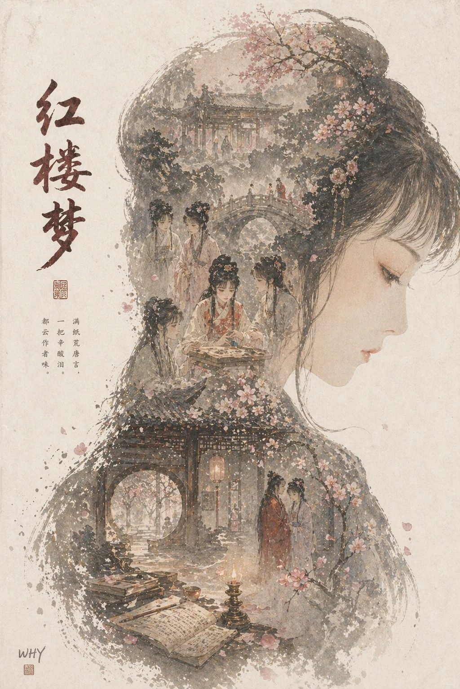

**Prompt:**

```text
根据【XXX主题】自动生成一张收藏版史诗叙事海报：巨大优雅的人物侧脸剪影作为外轮廓，剪影内部自动生长出最契合该主题的完整世界观、标志性场景、角色关系、象征符号、关键建筑、生物、道具与氛围。整体不是普通拼贴，而是高级的剪影轮廓填充式叙事合成，带有双重曝光式联想，但更偏电影海报与梦幻水彩插画融合风格；柔和空气透视，轻雾化过渡，纸张颗粒，边缘飞白与刷痕，大面积留白，版式克制高级，安静、宏大、神圣、怀旧、诗意、传说感强。风格、色彩、场景、材质全部根据主题自动适配，所有元素必须强绑定主题，一眼识别，不要杂乱，不要硬拼贴，不要模板化背景，不要廉价奇幻素材。画面中需自然加入专属签名"WHY"，作为海报设计的一部分，位置低调但清晰，可放在左下角、右下角或标题附近，风格需与整体版式统一，像收藏版海报的作者落款或设计签章；签名字体精致、克制、高级，不可过大，不可破坏主体构图，不可显得突兀廉价。
```

**来源：** 小红书号6455654397 | 2026-05-10


---

## 🎴 例 5：城市主题海报

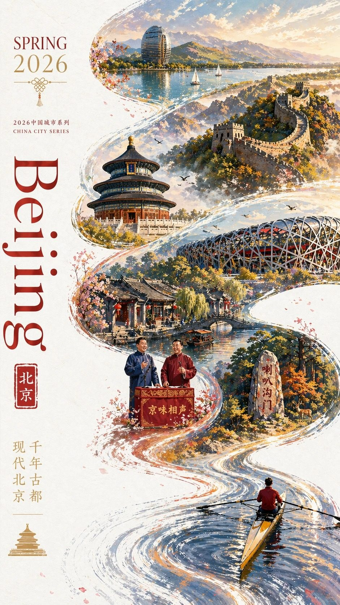

**Prompt:**

```text
2026中国城市系列宣传海报，主题为【北京】。现代、多彩、明亮通透的国潮风，竖版9:16。大面积白色纹理留白背景，一条从右下向左上盘旋的红色丝绸形成S型主构图。右下角一位东方女性挥舞红绸，服饰需结合北京地域文化定制。红绸延展为城市长卷，融合天坛、长城、鸟巢、喇叭沟门原始森林公园、什刹海、京味相声。左侧排版SPRING 2026、竖排Beijing和小印章"北京"。要求统一系列感，但不能雷同，细节丰富，城市辨识度强。文字清晰且精美布局，高端图形设计。
```

**来源：** 小红书号z890738050 | 2026-05-10


---

## 🎴 例 14：胶片感摄影海报

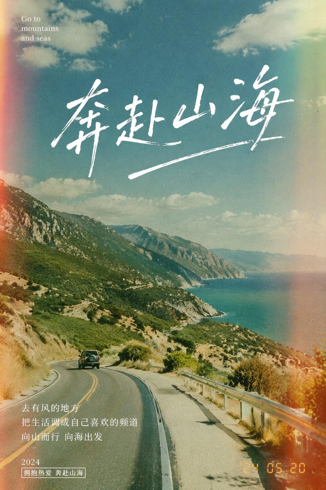

**Prompt:**

```text
[中文]
设计一张主题是"奔赴山海"的胶片感摄影风格的海报

[English]
Design a poster with the theme of "running towards the mountains and seas" in a film photography style
```

**来源：** [@akokoi1](https://x.com/akokoi1/status/2045693939584516441) | 2026-05-11

## 🎴 例 38：Modern Mojito Recipe Card


**Prompt:**

```text
Goal: Create a visually stunning modern recipe card for {argument name="cocktail name" default="Mojito"}, presented as a luxurious tropical social-media recipe poster.

Canvas: Vertical 2:3 portrait layout, bright white background with soft beach-and-ocean blur behind the hero drink, airy margins, watercolor lime-green splashes around the edges, subtle mint leaf textures, gold ornamental line accents, and a fresh upscale cocktail-bar aesthetic.

Layout: Top-left title area with a tiny gold cocktail icon, the small uppercase label “CUBAN SUMMER DRINK,” a huge flowing dark-green script title “Mojito,” then the tagline “cool • citrusy • refreshing.” Under it add a short description: “A classic Cuban cocktail with crisp mint, zesty lime, and a splash of sunshine.” Add a handwritten line: “Sip. Relax. Repeat.” On the right side place a tall crystal highball glass filled with crushed ice, lime wedges, mint leaves, bubbles, and condensation, garnished with a lime wheel and mint sprig; include tropical palm shadows and limes/mint on the table.

Ingredients section: Create one elegant bordered card labeled “INGREDIENTS” with exactly 6 ingredient rows, each with a small watercolor-style icon and text: 1) “1 Lime” with subtext “cut into wedges,” 2) “10–12 Mint Leaves” with subtext “fresh & fragrant,” 3) “Soda Water” with subtext “to top up,” 4) “2 tsp Sugar” with subtext “adjust to taste,” 5) “60 ml White Rum” with subtext “(2 oz),” 6) “Crushed Ice” with subtext “as much as you love.”

Tip card: To the right of the ingredients, add one smaller pale-green bordered card with mint illustration and exactly 2 text blocks: top label “TIP” with the note “Lightly crush mint — don’t over-muddle,” and bottom label “PERFECT BALANCE” with “1 Lime : 2 tsp Sugar” plus handwritten text “sweet, citrusy, just right!”

How-to section: Along the lower half, add the heading “HOW TO MAKE THE PERFECT MOJITO” and exactly 5 numbered illustrated steps connected by small gold arrows: 1) muddling mint, sugar, and lime in a glass with a wooden muddler, caption “Muddle mint leaves with sugar and lime. Gently press to release the flavors.” 2) filling a glass with crushed ice, caption “Fill glass with crushed ice. Crushed ice = maximum chill.” 3) pouring white rum and soda water into the glass, caption “Pour white rum and soda water. Add rum, then top up with soda water.” 4) stirring with a bar spoon, caption “Stir gently for balanced flavor. Mix lightly to keep it refreshing.” 5) finished mojito with mint sprig and lime wheel, caption “Garnish with mint sprig and lime wheel. The final touch of summer.”

Footer: Add small uppercase text “REFRESHING • VIBRANT • TIMELESS” and handwritten gold script “Made for sunny days and good vibes!” with a small heart doodle. Decorate the corners with watercolor lime slices, mint sprigs, ice cubes, bubbles, and splashes.

Visual style: Minimal yet artistic, polished editorial recipe-card design, watercolor botanical accents mixed with realistic cocktail photography, fresh lime green, mint green, white, pale aqua, and muted gold. Use elegant serif/sans-serif typography paired with large hand-lettered script for the title.

Constraints: Keep all text legible, maintain the exact counts of 6 ingredient rows, 2 tip-card text blocks, and 5 numbered preparation steps. No people, no watermark, no extra recipe steps, no clutter.
```

**来源：** [@MrDasOnX](https://x.com/MrDasOnX/status/2054836372544884858#reversed-0) | 2026-05-14

## 🎴 例 56：城市文字旅行海报

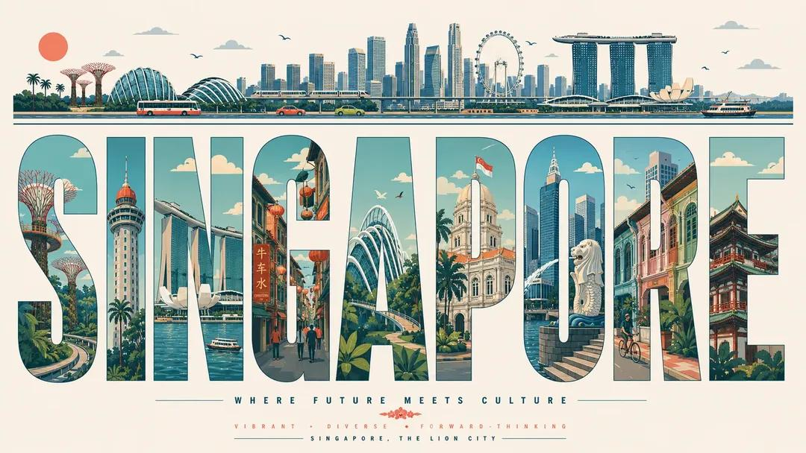

**Prompt:**

```text
Ultra-high-resolution typography travel poster themed around [CITY NAME]. 16:9 poster ratio.

IMPORTANT: every visible word on the poster must be in English, perfectly spelled, professionally typeset. No distorted letters, no random symbols, no broken text, no AI gibberish.

CORE COMPOSITION:
Place the giant English word "[CITY_NAME]" front and center. Each letter is a tall, bold, elongated sans-serif form, and each one frames a different illustrated scene from the city, like a row of gallery windows. Spread landmarks, streets, transport, nature, culture, and architecture across the letters so the scenes flow from one letter into the next as a single connected urban panorama.

TOP HORIZONTAL STRIP:
Across the top of the poster, a thin panoramic band: city skyline silhouettes, cars, trams or trains, boats where it fits, birds, clouds, sun. Keep it minimalist, elegant, rhythmically balanced.

STYLE: mid-century modern editorial poster, Swiss graphic design, minimal vector illustration, architectural infographic feel, travel typography poster, flat geometric illustration, ultra-clean composition, premium magazine design, screen-print poster vibe, retro-futuristic travel branding.

ILLUSTRATION:
Flat vector shapes only. No realism, no gradients, no noise. Clean geometric shadows, simplified architectural forms, a mix of map-like top-down with side-view cityscape. Subtle line-art details, crisp vector edges, strong negative space, harmonious rhythm between the letters.

TYPOGRAPHY:
Giant bold sans-serif, letters fill most of the canvas height. Pixel-perfect alignment. Each letter acts as its own framed illustration panel. Soft rounded corners where it suits. Editorial spacing. Print-ready and geometrically clean.

COLOR PALETTE:
Pull a cohesive palette inspired by [CITY_NAME]:
coastal city -> aqua, sand, coral, muted teal
desert city -> terracotta, beige, warm cream
cyber city -> mint, navy, steel blue
historic European city -> dusty rose, olive green, parchment
Muted pastels, soft vintage travel-poster colors, low saturation. Max 4 to 6 colors.

CONTENT:
Include iconic landmarks, famous streets and transport, local urban patterns, nearby nature, skyline silhouettes, bridges/rivers/coastline if relevant, culturally symbolic architecture, recognizable local atmosphere.

COMPOSITION:
Centered typography on a white or soft ivory background. Lots of breathing room. The top panoramic strip balances the heavy typography below. Asymmetrical but visually balanced. Each letter shows its own scene depth and perspective. Museum-quality poster hierarchy.

MOOD: premium, intellectual, calm, design-forward, travel-editorial, stylish enough for a museum gift-shop wall.

QUALITY: 8K ultra-detailed, print-ready, razor-sharp vector edges, flawless typography, zero distorted text, zero random characters, zero spelling errors, zero AI artifacts.
```

**来源：** [@iamaiistudio](https://x.com/iamaiistudio/status/2054563354899857757) | 2026-05-15


---
### 🎴 例 59：Cinematic Porsche Motorsport Poster


**Prompt:**

```text
Goal: Create a full-bleed vertical cinematic motorsport poster for a {argument name="car model" default="Porsche 911 GTR"}, styled like a premium race-team advertisement.

Canvas: Portrait poster, 3:4 aspect ratio, dark black background with deep gold/yellow lighting, high contrast, glossy reflections, gritty racing atmosphere, no white border.

Main subject: A bright {argument name="car color" default="yellow"} Porsche-style GT race car dominates the lower half to lower two-thirds of the frame, shown from a low front-facing three-quarter angle, nose pointed slightly left, wide aggressive body kit, large rear wing, black wheels, front splitter, hood vents, side air intakes, visible roll cage, glowing cool-white circular LED headlights, windshield banner reading “PORSSCHE” or stylized “Porsche,” door number “911,” and small “GTR” marking near the side skirt. The car sits on a wet reflective black studio floor with strong gold reflections and puddle shine.

Background and mood: Behind the car, create a dramatic cloud of smoky golden mist rising upward, backlit like race-track fog. Place one enormous semi-transparent word “PORSCHE” across the entire upper background in dark bronze-gold block letters, partially obscured by smoke and the car. Add faint technical grid texture and subtle grunge speckles.

Layout and graphic elements: Add four thin yellow corner-bracket accents, one near each corner. At the top left, small spaced text reads “PORSCHE MOTORSPORT” with a tiny yellow square marker. At the right edge, set vertical spaced text reading “MOTORSPORT · TRACK-SPEC · CERTIFIED” with a tiny yellow dot. On the upper left, include a faint white technical blueprint side-view drawing of the race car with dimension lines.

Text content: On the left side beneath the blueprint, include exactly 5 technical spec rows with small yellow arrow markers: 1) “ENGINE / 4.0L FLAT-6”, 2) “POWER / 525 HP”, 3) “TORQUE / 465 NM”, 4) “WEIGHT / <1,250 KG”, 5) “DRIVE / RWD”. Near the bottom left, add the tagline “THE PUREST FORM.” Below it, create a bold title line: huge yellow “911” followed by metallic silver “GTR”. Under that title, include exactly 4 bottom stat blocks separated by thin yellow vertical lines: 1) “525 / POWER”, 2) “4.0L / ENGINE”, 3) “RWD / DRIVE”, 4) “TRACK / FOCUS”. At the very bottom left, add small caption text: “BUILT FOR PERFORMANCE. BORN ON THE TRACK.” At the bottom right, add the logo text “PORSCHE” with smaller “MOTORSPORT” beneath it and a thin yellow line.

Visual style: Hyper-realistic automotive photography blended with premium poster design, cinematic lighting, sharp details on the car, dramatic gold smoke, black-and-yellow racing palette, metallic typography, wet asphalt reflections, luxury motorsport branding, high-resolution print quality.

Constraints: Keep the composition vertically centered and poster-like; use exactly 5 left-side spec rows and exactly 4 bottom stat blocks; avoid extra cars, people, sponsor clutter, or unrelated logos; make all visible text crisp and legible where possible.
```

**来源：** [@status](https://x.com/Diplomeme/status/2055313415607140558#reversed-0) | 2026-05-17

---

### 🎴 例 60：大堡礁复古旅行海报


**Prompt:**

```text
Create a premium editorial travel poster illustration of the Great Barrier Reef, Australia.
Style: Flat vector illustration, ultra-clean minimalism, mid-century modern travel poster aesthetic, inspired by vintage tourism prints and Scandinavian graphic design. No photorealism, no textures, no noise, no gradients. Use crisp shapes, smooth color blocks, and harmonious vibrant tones.
Composition (vertical 3:4 layout):
Foreground (underwater): A rich coral reef ecosystem filled with colorful corals in pink, orange, yellow, and red tones. Include tropical fish of various species (striped, bright yellow, blue, and orange), and a large sea turtle swimming gracefully toward the right. Clear turquoise water with high visibility.
Midground: A female snorkeler swimming horizontally just beneath the water surface, wearing fins and a snorkel mask, observing the reef below. Light rays subtly pass through the water surface.
Background (above water): A calm tropical ocean with shallow reef patches visible through crystal-clear water. A white leisure boat floats peacefully on the left, and a small sailboat appears far in the distance. On the horizon, soft green islands or hills stretch across.
Sky: Bright blue sky with fluffy white clouds and a few birds flying, enhancing the serene vacation mood.
Typography:
At the bottom of the poster, include bold uppercase text:
“GREAT BARRIER REEF”
Below it, smaller spaced-out text:
“AUSTRALIA”
Add a small decorative coral icon between divider lines.
Mood & Lighting: Bright daylight, calm, inviting, tropical paradise atmosphere. Colors should feel fresh, vibrant, and relaxing with strong contrast between coral reef and ocean blues.
```

**来源：** [@status](https://x.com/jzaib4269/status/2055487295734620522) | 2026-05-17

---
### 🎴 例 75：Lin Daiyu Period Drama Poster


**Prompt:**

```text
Goal: Create a vertical cinematic Chinese period-drama character poster for {argument name="series title" default="林黛玉"}, blending photorealistic costume drama with antique ink-painting graphic design and a literary mystery/poetry interface aesthetic.

Canvas: Tall 2:3 poster, muted gray-green and sepia palette, aged rice-paper texture along the left edge, dark bamboo grove and rainy stone garden in the background, soft mist, drifting pink flower petals, delicate gold geometric constellation lines overlaying the whole composition.

Main subject: A full-body young noblewoman from a Qing/classical Chinese literary setting stands centered on a round carved stone platform. She wears a pale blue-green layered hanfu with translucent gauze sleeves, embroidered floral patterns, long flowing ribbons, and elegant blue shoes partly visible. Her hair is in an ornate updo with black hair ornaments, white blossoms, dangling silver tassels, and a refined scholarly-poetic look. Her face is intentionally softly blurred/obscured while the costume remains sharp. She extends one hand toward the viewer holding an open handwritten poetry manuscript on aged paper; the other hand gathers her sleeve and holds a long tassel ornament with a jade-like bead. Add a blossoming branch crossing the lower foreground and scattered petals around her feet.

Left title column: Large bold black Chinese calligraphy reads 「林黛玉」 vertically near the upper left. Beneath it, smaller vertical text reads 「红楼梦 · 潇湘妃子」. Add faint background manuscript writing and small red seal stamps.

Left-side small tags: Include exactly 3 small boxed tags stacked vertically under the subtitle, labeled 「清冷才情」, 「葬花诗魂」, and 「弱柳扶风」.

Story card layout: Surround the central figure with exactly 8 vintage episode cards connected by thin gold lines, pale borders, corner ornaments, and tiny node dots. Each card contains a circular number badge, a Chinese title, a small monochrome inset illustration like an old engraved scene, and two short lines of smaller Chinese text. Arrange 4 cards down the left side and 4 cards down the right side.

The 8 episode cards must be:
1. Top-left card number 01, title 「扬州旧梦 黛玉入府」, showing a riverboat/arrival scene.
2. Left card number 02, title 「潇湘馆中 竹影清寒」, showing a bamboo courtyard.
3. Lower-left card number 03, title 「木石前盟 情根初种」, showing two young figures seated together.
4. Bottom-left card number 04, title 「共读西厢 诗心相照」, showing two figures reading.
5. Top-right card number 05, title 「海棠诗社 才情惊座」, showing a poetry gathering at a table.
6. Mid-right card number 06, title 「葬花吟成 一抔净土」, showing a sorrowful garden burial scene.
7. Lower-right card number 07, title 「焚稿断痴 泪尽魂归」, showing a woman beside a writing desk or window.
8. Bottom-right card number 08, title 「冷月诗魂 千古含香」, showing a moonlit memorial-like scene.

Bottom navigation: Along the bottom edge, place a thin gold timeline with exactly 5 circular nodes and 5 labels: 「入府」, 「潇湘」, 「诗社」, 「葬花」, 「焚稿」. Above the timeline, centered on the stone platform base, add a carved gold plaque reading 「一卷诗稿，满庭落花」.

Visual style: High-detail photorealistic fantasy poster with Chinese ink-wash atmosphere, antique paper collage, subtle UI/infographic framing, fine gold linework, weathered textures, cinematic lighting, shallow depth of field, elegant melancholic mood, soft haze, balanced symmetry, no modern objects, no watermark, no English text in the image.
```

**来源：** [@status](https://x.com/MrLarus/status/2056091007255491030#reversed-0) | 2026-05-18

---
### 🎴 例 90：Minimalist Geometric Napoleon Portrait


**Prompt:**

```text
Using REFERENCE_0 as the source composition, transform the painting into a minimalist, stylized geometric poster portrait. Preserve the same rider-on-rearing-horse pose, overall framing, dramatic red cloak, military costume, horse direction, mountainous battlefield setting, and the intentionally blurred face area. Replace the classical oil-painting texture with clean flat-color vector shapes, sharp angular planes, simplified shadows, and a limited palette of deep navy, slate blue, cream white, tan, black, and vivid red. Make the mountains, clouds, horse anatomy, cloak folds, and ground into faceted polygonal forms with crisp edges and high-contrast graphic lighting. Simplify all background soldiers and battlefield details into small abstract silhouettes; keep exactly 5 visible small soldier figures along the lower-left slope and one cannon wheel. Remove the carved foreground text on the rocks and avoid adding any new text. Keep the composition vertical and heroic, with dynamic diagonal motion and a modern editorial illustration feel.
```

**来源：** [@status](https://x.com/TWnese/status/2056709694560018781#reversed-1) | 2026-05-19

---
### 🎴 例 92：极简渐变手机壁纸

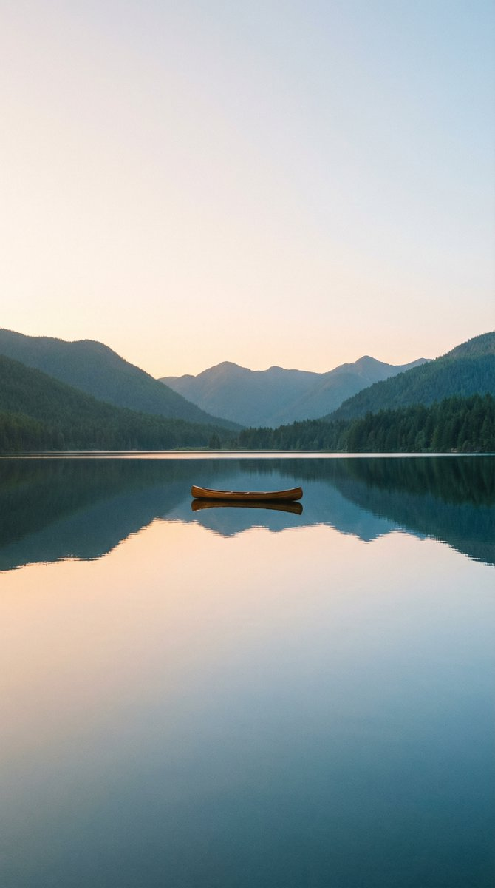

**Prompt:**

```text
设计一张精美的 {argument name="orientation" default="9:16 垂直"} 壁纸。在画面顶部和底部保留自然的留白空间。应用一种从上到下过渡的 {argument name="style" default="柔和、平滑的渐变"} 效果。避免任何模糊效果或裁剪。保持构图简洁明快。
```

**来源：** [@status](https://x.com/iamaiistudio/status/2057107196245381559) | 2026-05-20

---

### 🎴 例 94：逼真的多汁芝士汉堡飞溅效果

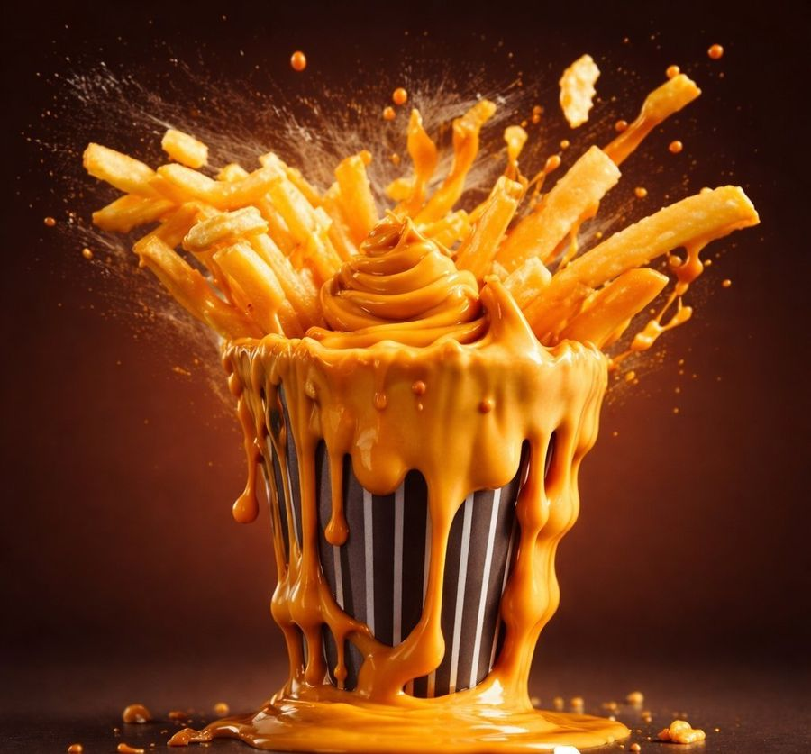

**Prompt:**

```text
一个用于拍摄逼真芝士汉堡的高速美食摄影提示词，包含融化的芝士和电影级的酱汁飞溅效果。
```

**来源：** [@status](https://x.com/ElaraNoorAl8/status/2056991564745023570) | 2026-05-20

---

### 🎴 例 95：复古"节制"塔罗牌组合


**Prompt:**

```text
目标：创建一张复古塔罗牌设计图，精确展示并排的 2 张牌：左侧为塔罗牌正面，右侧为配套的牌背。

画布：横向构图，背景为透明棋盘格预览，两张牌均为垂直方向，间距均匀且居中。采用陈旧的米色纸张、柔和的墨色、风化的边缘以及手绘风格的古董塔罗牌美学。

左侧牌，正面设计：一张经典的塔罗牌，顶部小牌匾上标有 {argument name="card title" default="TEMPERANCE"} 和罗马数字 {argument name="roman numeral" default="XIV"}。牌面带有华丽的植物边框，装饰有藤蔓、小花、星星和角落线条。中心站立着一位宁静的女性形象，身穿飘逸的 {argument name="dress color" default="淡青色"} 希腊罗马风格长裙，裙摆开叉，赤脚站在浅水中，正将液体从一个金杯倒入另一个金杯。面部呈现柔和模糊的油画质感，而非细节刻画。她身后有放射状光环、散落的星星、新月、远山、河流、花草，右侧基座上有一尊可爱的小石猫雕像。底部的标题栏包含大号衬线字体，书写着 TEMPERANCE。

右侧牌，背面设计：一张配套的华丽塔罗牌背面，无标题文字。使用相同的陈旧羊皮纸色调和深绿金色细边框。中心包含一个巨大的圆形罗盘星徽章：同心圆内有一个 8 角星，深青色圆环上装饰着金色小点。周围添加对称的太阳光芒，由许多向外延伸的细射线组成。在圆圈上下方加入垂直装饰点和菱形标记，以及几何角落支架和方形角落装饰。

视觉风格：古董神秘学插画、受新艺术运动启发的塔罗牌雕刻、柔和青色、鼠尾草绿、赭石金、奶油色羊皮纸、精细墨水排线、略微褪色的印刷质感、细微污渍、逼真的纸张纹理、手工线条艺术。

限制：仅展示 2 张牌：1 张正面和 1 张背面。保持两张牌的大小和方向一致。保留可读文字 {argument name="bottom title text" default="TEMPERANCE"} 和 XIV。不要添加额外的牌、手部、样机阴影、现代 UI 或水印。
```

**来源：** [@torotora_SL](https://x.com/torotora_SL/status/2057026693764964828#reversed-0) | 2026-05-20

---

### 🎴 例 97：Double Exposure Sunset Beach Portrait


**Prompt:**

```text
Use the {argument name="reference photo" default="uploaded portrait"} only as the identity and hairstyle reference. Accurately preserve the person’s real facial identity, face shape, facial features, skin tone, hairstyle, hair volume, and natural real-life appearance. Do not copy the original clothes, background, lighting, pose, or image quality from the uploaded portrait.

Create a highly realistic cinematic double-exposure portrait in a vertical 9:16 composition. The scene is set at a {argument name="location" default="golden sunset beach"} with a calm ocean horizon, glowing orange sunlight, soft waves, and a dreamy purple-pink sky.

The final image should have two layers of the same person. The main layer is a large transparent side-profile portrait occupying the upper and middle part of the image, facing slightly upward with a soft natural smile, elegant facial expression, realistic skin texture, and long flowing hair. The face should blend naturally into the sunset sky and ocean light, creating a poetic cinematic double-exposure effect.

The second layer shows the same person as a smaller realistic half-body portrait near the lower center of the frame, standing or sitting in front of the ocean sunset. She wears an {argument name="outfit" default="elegant dark gray off-shoulder / strapless top"} with simple jewelry, natural makeup, soft glossy lips, and a calm romantic expression. The clothing should be tasteful, refined, and cinematic.

Add glowing golden particles and sparkling light dust flowing through the hair area of the large portrait, like tiny fireflies or stardust, blending into the warm sunset glow. The particles should look magical but still realistic, not cartoonish. Use soft cinematic lighting, warm golden rim light, gentle shadows, natural skin texture, high dynamic range, realistic ocean reflections, subtle film grain, premium editorial photography style.

Make the image dreamy, romantic, cinematic, elegant, and high-end. No text, no logo, no watermark, no Chinese characters, no random letters.

Negative Prompt：

watermark, logo, text, Chinese characters, random letters, low quality, blurry face, distorted face, fake skin, plastic skin, over-smoothed skin, anime, cartoon, illustration, AI-looking face, bad anatomy, deformed hands, extra fingers, duplicate face, messy composition, harsh outline, overexposure, oversaturated colors, unnatural smile, broken double exposure, bad hair detail, noisy artifacts, pixelated image.
```

**来源：** [@status](https://x.com/Shinning1010/status/2057740383346622469) | 2026-05-20

---

### 🎴 例 100：Vintage Onsen Member Card


**Prompt:**

```text
Goal: Create a whimsical Japanese hot spring membership card profile design for {argument name="character name" default="tabo"}, styled like a vintage printed certificate with cute animal illustration.

Canvas: Horizontal membership card, wide 16:9 ratio, warm aged cream paper background with subtle grain, stains, and slightly worn edges. Use a double-line ornate gold border with clipped decorative corners and small Japanese cloud motifs in muted gold.

Layout: Large top headline reads “ONSEN MEMBER CARD” in a Western vintage serif font, dark brown with gold shading and engraved texture. Centered above or between the words is a small red hot spring steam icon. Under the headline, add Japanese text “温泉会員証” with symmetrical gold flourishes on both sides. The main illustration fills the middle: a smiling capybara soaking in an orange-red hot spring, wearing a folded white towel on its head, cheeks slightly rosy, one eye happily closed. Behind it are rocky volcanic hot spring scenery, steam wisps, and two volcanoes: 1 smaller smoking volcano on the left and 1 larger erupting volcano on the right with orange lava. In the bath water, include 1 small capybara head in the left-middle background. The water is rendered as swirling orange and red crayon-like rings.

Visible labeled elements: Include exactly 5 major text/mark areas: 1 large English title “ONSEN MEMBER CARD”; 1 Japanese subtitle “温泉会員証”; 1 vertical red plaque on the left with white Japanese text “極楽湯めぐり”; 1 circular red stamp on the lower right with Japanese text “入浴済” and a small steam icon; 1 bottom information strip divided into two boxed fields. In the bottom left field, show small label “お名前” and large handwritten Japanese name {argument name="display name" default="たぼ"}. In the bottom right field, show small label “会員番号” and membership number {argument name="membership number" default="26-0410-2680-26"}.

Visual style: Hand-drawn colored-pencil and crayon texture, nostalgic Showa-era Japanese travel-ticket aesthetic, warm browns, reds, oranges, cream, and muted gold. Keep lines slightly imperfect and tactile, as if printed on thick washi paper. Add small decorative plum blossom icons in gold and red near the lower corners.

Constraints: Keep the design readable as a single card, with no photorealism, no modern UI elements, no extra logos, and no additional text beyond the specified 5 text/mark areas.
```

**来源：** [@status](https://x.com/ebi_vulcan/status/2057487703952986315#reversed-0) | 2026-05-20

---

### 🎴 例 104：袖珍速写本灯塔场景

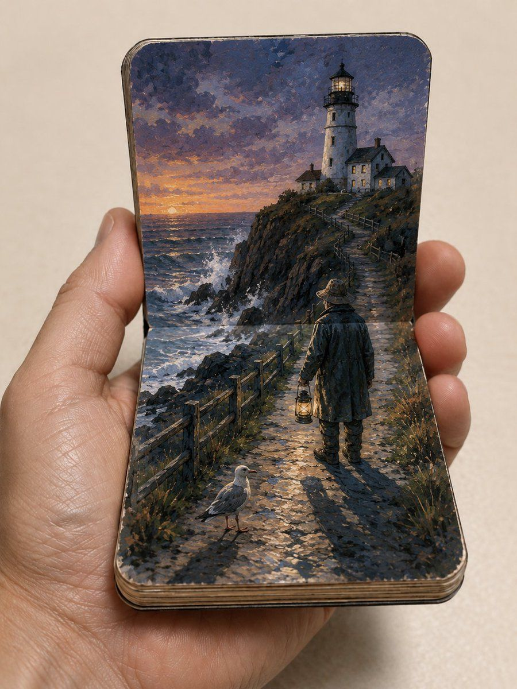

**Prompt:**

```text
一只逼真的人手拿着一本圆角袖珍速写本，像微型纸艺剧场一样打开，直立的后页与水平的前页构成一幅连续的手绘场景。场景为 {argument name="coastal setting" default="日落时分新英格兰崎岖的灯塔悬崖小径，旁临波涛汹涌的大海"}：一条石子路从前景延伸，跨过折页，向上通往岩石岬角上的白色灯塔和守塔人小屋，伴有泡沫翻涌的海浪、深色悬崖、木质护栏、地平线上的温暖夕阳以及戏剧性的蓝紫色云层天空。在手绘场景中包含两个活体人物：{argument name="main character" default="一位身穿长款深色雨衣、戴着宽檐帽并提着发光灯笼的孤独守塔人"} 站在小径上，以及 {argument name="animal companion" default="前景小径上的一只海鸥"}。使用强制透视的视觉陷阱（trompe-l’oeil）手法，使手绘的小径、阴影、栅栏和悬崖在垂直和水平页面间无缝衔接。以不透明水粉丙烯民间插画风格渲染，呈现哑光纸张质感、清晰且富有表现力的笔触、简化的几何形态以及丰富的绘画细节。展示横跨前景页面的浓重投影、书脊和速写本底部可见的层叠纸张边缘，以及圆角页面令人信服的物理厚度。手部必须看起来照片级逼真，具有自然的皮肤纹理、静脉、指关节和抓握速写本的指尖。将所有物体置于中性暖米色摄影棚背景中，以四分之三俯视角度进行微距实物拍摄，并采用 f/2.8 的浅景深。光线应为来自左上方的柔和漫射环境光，速写本下方带有细腻的接触阴影，图像边缘附近有微妙的色差。使用 3:4 竖构图，避免出现任何文字、标志或水印。
```

**来源：** [@status](https://x.com/GeekCatX/status/2057407829401809122#reversed-0) | 2026-05-20

---

### 🎴 例 106：复古水彩旅行海报

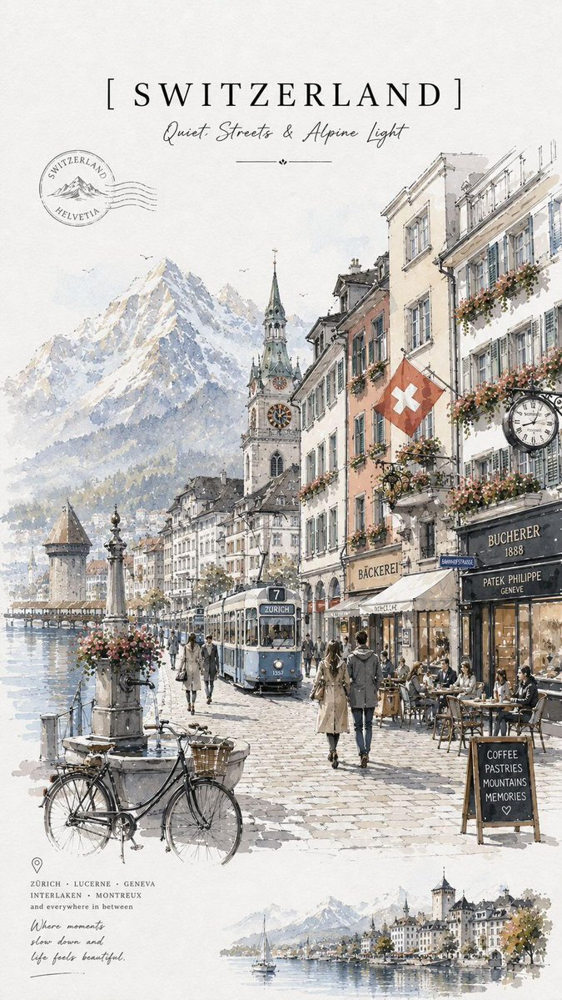

**Prompt:**

```text
极简主义复古旅行海报，精致的水彩和墨水素描风格，优雅的欧洲旅行插画，纹理象牙白纸张背景上的柔和中性色调，手绘城市景观，随性的水彩渲染，精细的建筑钢笔线条，舒适的咖啡馆店面，自行车，鹅卵石街道，鲜花盛开的阳台，经典路灯，柔和的大气透视，电影般的晨光，梦幻的旅行日记美学，精致的排版布局，顶部带有大型衬线体国家/城市标题，手写副标题和诗意标语，小型护照风格印章，优雅的编辑构图，通透的留白，永恒的旅行杂志设计。
场景变化：• {argument name="city" default="伦敦"} 雨中街道，红色双层巴士，黑色出租车，背景中的 {argument name="landmark" default="大本钟"}，舒适的书店咖啡馆，波多贝罗路标识，{argument name="palette" default="柔和的灰米色调搭配淡红色点缀"}。• 希腊：粉刷成白色的圣托里尼小巷，蓝色圆顶，九重葛花，海边咖啡馆，地中海阳光，明亮的白色和柔和的海洋蓝色调。• 瑞士：高山湖畔小镇，雪山，复古电车，瑞士国旗，豪华咖啡馆露台，宁静的欧洲老城氛围。• 澳大利亚：墨尔本风格的电车街道，盛开紫色花朵的蓝花楹，阳光明媚的咖啡文化，现代与复古交织的城市景观。
```

**来源：** [@status](https://x.com/Taaruk_/status/2057298831289761976) | 2026-05-20

---
### 🎴 例 120：泳装杂志九宫格广告页

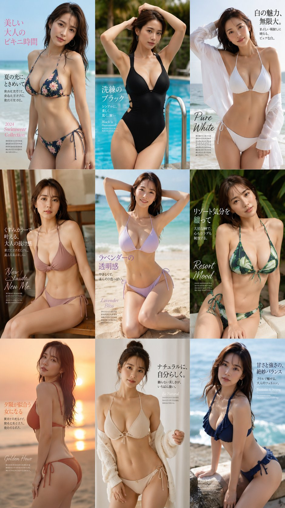

**Prompt:**

```text
泳装时尚杂志广告页面，日本成熟模特，S型曲线。变换姿势和风格，九宫格展示，保持人物面部一致性
```

**来源：** [@Adam38363368936](https://x.com/Adam38363368936/status/2058859338211656051) | 2026-05-26

---

### 🎴 例 135：Camelot 奇幻旅行海报


**Prompt:**

```text
创作一张竖版复古奇幻旅行海报，以 {argument name="legendary destination" default="Camelot"} 为主题，将其打造为神话王国目的地。画面展示了一座宏伟的白色中世纪城堡，拥有众多塔楼、城垛和青绿色圆锥形屋顶，坐落在平静湖面上的绿色岩石岛屿上。城堡后方是一轮巨大的淡金色太阳或月亮圆盘，天空呈现柔和的淡紫色，点缀着细长的白色云朵，远处是层叠的雾蓝色山脉。一座石拱桥从右侧延伸至岛屿，在水中留下淡淡的倒影。前景中心处，一把深色长剑垂直插在低矮的黑色石基座上，立于浅色鹅卵石广场之上；底部两侧用深绿色常绿灌木和几何形状的石凳进行装饰。采用简洁的装饰艺术旅行海报构图，扁平矢量风格绘画，柔和的粉彩色调，清晰的轮廓，细腻的颗粒感，电影般的深度以及对称的英雄式构图。城堡上必须包含 8 面可见的旗帜：最高的中央尖塔和左侧塔楼上各有一面红色三角旗，周围塔楼上有 6 面小型金色三角旗。底部排版：小号大写标语“EXPLORE WORLDS LIKE THESE IN VISIONARIA, FIRST CINEMATIC IMAGINATION APP.”，随后是超大字号且字间距拉宽的主标题“{argument name="main title text" default="CAMELOT"}”，下方是较小的金色副标题“{argument name="subtitle text" default="THE ETERNAL KINGDOM"}”，并配以微小的装饰性菱形点。在副标题下方居中添加一个小型青金配色皇冠纹章，两侧辅以细长的金色水平线。画面中不得出现人物、现代物品、照片级写实效果、杂乱元素或额外文字。
```

**来源：** [@ThePoseidan](https://x.com/ThePoseidan/status/2059655096691052627#reversed-2) | 2026-05-28

---


### 🎴 例 152：霓虹肖像排版海报

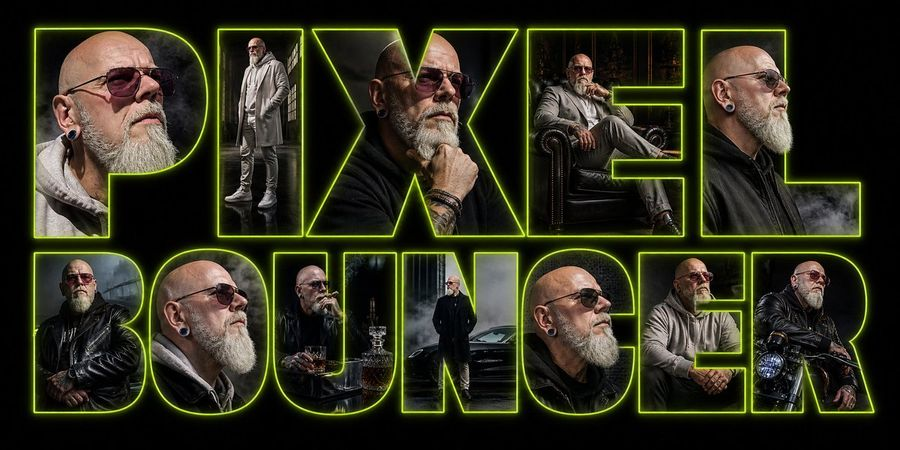

**Prompt:**

```text
Goal: Create a wide cinematic typographic poster for PIXEL BOUNCER, where the words themselves are huge hollow block letters outlined in neon acid green and filled with dark photographic portraits of the same character.

Canvas: Ultra-wide horizontal banner, approximately 2:1 aspect ratio, black background, high contrast, moody cyberpunk/nightclub atmosphere.

Layout: Two-line composition with exactly 12 oversized uppercase letters: top row has 5 letters spelling “PIXEL”; bottom row has 7 letters spelling “BOUNCER.” Use a bold condensed geometric sans-serif display font with thick strokes and transparent interiors. Each letter acts as a clipping mask containing a different portrait vignette. Add a bright lime-green neon outline around every letter, with a soft outer glow and subtle inner rim light. Keep the letters tightly spaced and nearly filling the frame from left to right.

Letter contents, exactly 12 distinct vignettes:
1. P: close-up side portrait of a bald, bearded man in a gray hoodie, ear plug visible, smoky dark background.
2. I: full-body standing portrait in a gray coat and layered streetwear, industrial window light.
3. X: close-up of the same man in a black jacket, hand near chin, tattoos and bracelets visible.
4. E: seated portrait in a leather armchair, gray outfit, dark forest or gothic interior behind him.
5. L: close side portrait in a black jacket with smoke drifting across the lower edge.
6. B: man in a black leather jacket with crossed arms, rainy industrial background.
7. O: close-up profile portrait in gray hoodie, bald head, beard, ear plug, dramatic side lighting.
8. U: seated at a small table with a whiskey glass and bottle, dark bar-like setting.
9. N: full-body portrait standing beside a black car in fog, wearing a long dark coat.
10. C: close-up portrait with shaved head, gray beard, ear plug, black jacket.
11. E: seated forward with hands clasped, gray hoodie, dim urban interior.
12. R: man sitting on or leaning against a motorcycle, black leather jacket, headlight visible.

Character details: The character is a bald middle-aged man with a gray beard, ear gauges, tattoos, rugged bouncer energy. Wardrobe should be dark leather jackets, gray hoodies, long coats, boots, bracelets, and layered streetwear. The mood is gritty, cinematic, smoky, masculine, high-contrast, urban noir.

Visual style: Photorealistic composite poster, dramatic low-key lighting, smoky haze, rain reflections, subtle film grain, sharp neon typography, glossy black shadows, premium album-cover or nightclub flyer aesthetic. The neon outline color should be electric lime green.

Constraints: Make the text perfectly readable as “PIXEL BOUNCER.” Do not add extra words, logos, watermarks, captions, borders, or UI elements. Keep the background pure black outside the glowing letterforms. Ensure every letter contains a unique cinematic portrait crop while maintaining one consistent character identity.
```

**来源：** [@Ƥ!ЖΣLƁΘUNCΣR](https://x.com/pixelbouncer/status/2060076651367518224#reversed-0) | 2026-05-29

---


### 🎴 例 155：Y2K 日系唇彩广告


**Prompt:**

```text
Goal: Create a loud Y2K Japanese drugstore cosmetics advertisement poster for chu♥lip GLOSS, a cute lip gloss product, with neon colors, glossy hearts, and pop-idol magazine energy.

Canvas: Vertical 3:4 poster, bright cyan-to-blue background, high saturation, glossy print-ad finish. Use a busy but readable composition with hot pink, lime green, yellow, white glows, sparkles, and drop shadows.

Layout: Top third has a huge Japanese headline in rounded bubble letters reading NEW! バズり粘膜リップ, colored lime green with hot-pink outline and white glow, with a neon pink heart outline behind it. Add small white hashtag text at the top right: "#うるちゅる #Y2K #盛れる". Under the headline, add smaller pink-and-white text: "ひと塗りで主役級♥".

Main subject details: On the right side, show a young Japanese woman from shoulders up with long black hair, blue fluffy top, chunky silver necklace, glossy pink makeup styling, and long neon-lime nails. Her face is intentionally covered by one large opaque square censor block in a warm beige/tan color, positioned over the central-right face area and taking up much of the upper-middle poster. Her hand with lime nails holds or poses near the products.

Product display: On the left-center foreground, show exactly 2 transparent lip gloss tubes standing upright at a slight angle, both filled with glittery pink-peach gloss. Tube 1 has a neon lime cap; tube 2 has a hot pink cap. Put small yellow product lettering on the tubes. Behind them, add oversized translucent glossy pink lip-shaped blobs and white sparkle flares.

Promotional elements: Add exactly 1 lime-yellow jagged starburst price badge in the lower left reading "プチプラ" above ¥550 and "(tax in)" below. Add exactly 1 small lime heart badge near the model hand reading "全4色".

Shade lineup: Along the lower middle, show exactly 4 glossy heart-shaped lip color swatches, each with a small label underneath: 1) "01 Baby Pink" pale pink heart, 2) "02 Coral Glow" coral-red heart, 3) "03 Magenta Doll" bright magenta heart, 4) "04 Neon Peach" peachy coral heart.

Bottom branding: Add a large brand lockup at bottom left reading "chu♥lip" in yellow lowercase letters with a pink heart between words, and "GLOSS" below in hot pink letters with white outline. At bottom right, add two slanted pink label strips with Japanese text: "Z世代から大バズリ中!" and "ちゅるんと可愛い 新作リップグロス♥". Include exactly 1 barcode at the bottom right with tiny numbers beneath.

Visual style: Hyper-saturated Japanese gyaru/Y2K cosmetic flyer, glossy plastic reflections, thick outlines, neon glow, sticker-like typography, star sparkles, airbrushed highlights, playful clutter, high contrast, commercial product-ad look. Avoid minimalism, avoid muted colors, and do not add extra shade swatches or extra product tubes.
```

**来源：** [@Singular](https://x.com/singularlab_ai/status/2060064813053579600#reversed-2) | 2026-05-29

---


### 🎴 例 159：混合媒介街头风海报

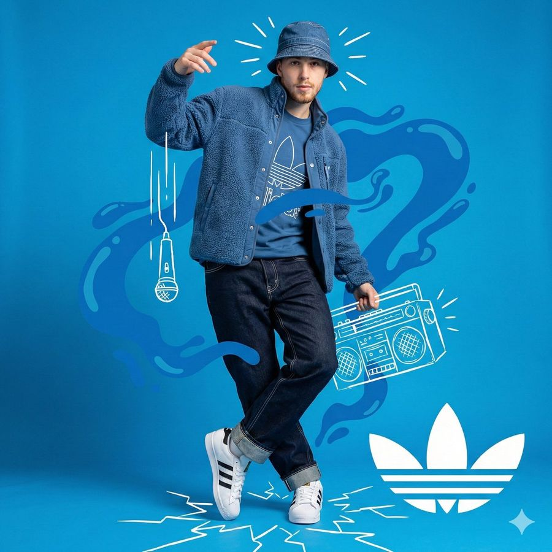

**Prompt:**

```text
High-resolution mixed-media studio portrait combining photography with flat white hand-drawn vector doodles and collage overlays. Full-body shot of a confident young man on a vivid solid blue background, dressed head to toe in a monochromatic blue Adidas streetwear fit with crisp white details.

Subject: young man, light goatee, neutral confident expression, head tilted slightly left, body angled slightly right, right hand raised near his face, left leg crossed in front of the right. Low-angle full shot framed head to toe, 35mm-equivalent lens, deep depth of field, even soft front-right studio lighting in neutral white, gentle self-shadows on the left side of face and neck.

Outfit:
- Royal-blue denim/canvas bucket hat (#003399), brim pulled slightly down, visible white contrast stitching around brim and crown.
- Open vivid-blue sherpa fleece jacket (#0044CC), nubby high-pile texture, silver snap on the collar, sleeves slightly pushed up.
- Royal-blue cotton T-shirt underneath with a large white Adidas Trefoil outline printed across the chest.
- Dark-wash indigo relaxed-fit jeans (#2A3B55) with heavy white contrast stitching along seams and pockets, cuffs rolled up showing the lighter inside of the denim.
- Pristine all-white Adidas Superstar sneakers (smooth leather upper, rubber shell toe, three white-on-white stripes); right foot planted, left foot up on the toe.

Flat white hand-drawn vector overlays (sharp edges, doodle aesthetic, no shading):
- Three thick vertical white lines dropping from his raised hand down to a hand-drawn dynamic vocal microphone (mic-drop motif).
- An isometric outlined boombox to his center-right showing speaker mesh, handle, buttons, cassette deck.
- A large flat white Adidas Trefoil logo in the bottom-right corner.
- Short radiating motion/sound stroke lines around his head and the boombox.
- Jagged shattered-glass crack lines fanning out across the floor under his feet.

Behind him: amorphous flat liquid-blob shapes in a slightly more saturated blue (#5CAFF0) wrapping around the subject as a secondary background layer over the solid blue base.

Composition: subject centered, asymmetrical balance from the doodles filling the negative space, high-contrast and dynamic. Color palette strictly vivid blue, deep blue, and pure white. Sharp boundary between the photoreal subject and the flat 2D vector overlays so they read as layered, not blended. Vibe: energetic, urban, artistic, cool, album-cover energy.
```

**来源：** [@PromptLab](https://x.com/iamaiistudio/status/2060060431461614004) | 2026-05-29

---
### 🎴 例 174：中世纪城市旅行海报


**Prompt:**

```text
Create a vertical mid-century travel poster for [CITY NAME] featuring [LANDMARK]. Use a strict 3-color palette: cream paper, black technical linework, and [COLOR].
Style: Minimalist isometric bird's-eye view with ultra-fine hatching and screen-print texture.
Color usage: Solid flat [COLOR] for the entire sky and small accents on roofs or streets. No gradients.
Text: Bold sans-serif "[CITY NAME]" at top in cream, with the local language name in smaller cream text below.
```

**来源：** [@Goodmanprotocol](https://x.com/Goodmanprotocol/status/2053523890744545437) | 2026-05-30

---

### 🎴 例 175：复古印尼猫薄荷广告


**Prompt:**

```text
Ultra realistic vintage Indonesian catnip advertisement poster, retro 1970s paper texture, distressed print, faded colors. A black-and-white tuxedo cat wearing cute vintage housewife clothes floating happily in the air after smelling catnip, euphoric expression, swirling catnip leaves, absurd Indonesian meme energy. Bold retro typography: “BIKIN KUCING SENENG FLY!” fake catnip jar product, old-school badges, price tag, nostalgic warung advertisement aesthetic, cinematic lighting, grain, scratches, authentic aged poster look.
```

**来源：** [@NyaiiBubu](https://x.com/NyaiiBubu/status/2053075349424992532) | 2026-05-30

---

### 🎴 例 186：巨型游戏手柄街头 Campaign


**Prompt:**

```text
Luxury futuristic streetwear campaign poster featuring a confident athletic girl sitting on a gigantic oversized retro gaming controller instead of sunglasses, clean editorial advertising aesthetic, massive bold typography in the background saying “ENERGY”, glossy reflective floor, cinematic studio lighting, pastel neon color palette with lavender, silver, and soft cyan tones.

The girl has curly shoulder-length hair, relaxed confident attitude, wearing an oversized white graphic T-shirt, loose black athletic shorts, high white socks, and modern sneakers. Casual sporty fashion styling, natural makeup, youthful Gen-Z streetwear vibe. She is casually seated on top of the giant gaming controller with one leg hanging down and one knee raised, looking away from the camera with cool effortless confidence.

The oversized gaming controller is ultra detailed with futuristic buttons, glowing accents, premium matte materials, and soft LED reflections. Minimal luxury branding on the controller side. Giant cream-colored typography fills the background vertically in a bold condensed font.

Environment: seamless studio backdrop with glossy floor reflections, high-end commercial fashion photography, ultra realistic textures, dramatic shadows, premium editorial layout, modern tech-fashion advertisement aesthetic, symmetrical composition, luxury product campaign style, 4:3 aspect ratio, hyper detailed, photorealistic.
```

**来源：** [@AIwithkhan](https://x.com/AIwithkhan/status/2052973449107349725) | 2026-05-30

---

### 🎴 例 191：Lost in 国家旅行海报拼贴


**Prompt:**

```text
Create a stylized travel poster / graphic collage for [country]. The main subject should be a stylish international tourist visiting [country], clearly presented as a traveler and not a local resident. Show the tourist wearing modern travel fashion, with details such as a camera, backpack, sunglasses, map, or suitcase, exploring the culture and atmosphere of [country]. Place the tourist in a dynamic composition surrounded by iconic architecture, streets, landscapes, landmarks, transportation, food, signage, and cultural elements associated with [country]. Blend realistic character detail with a graphic collage background made of layered paper textures, torn poster edges, sticker elements, halftone dots, editorial typography, and bold geometric shapes. Include authentic visual motifs from [country], but keep the tourist's appearance and styling globally fashionable and clearly foreign to the setting. Add a large readable headline: "LOST IN [country]". Modern, artistic, premium editorial travel poster aesthetic, balanced layout, print-worthy composition.
```

**来源：** [@SadiaMalik182](https://x.com/SadiaMalik182) | 2026-05-30

---

### 🎴 例 195：龙类物种复古百科海报


**Prompt:**

```text
Create a highly detailed A4 vertical vintage fantasy encyclopedia style dragon species poster.

Style: medieval creature atlas, ancient mythology manuscript, museum fantasy archive, old explorer journal.

Main subject:
a massive hyper realistic dragon standing proudly in center with detailed scales, smoke from nostrils, giant wings partially open.

Background:
stormy mountains, ancient ruins, fog layers, burnt parchment texture.

Color palette:
dark emerald, ash gray, faded gold, ancient brown, deep crimson.

Include infographic sections:
Species Type,
Fire Capacity,
Wing Structure,
Temperament Scale,
Habitat Region,
Battle Strength,
Ancient Legends,
Scale Patterns,
Skull Diagram,
Hunter Notes.

Add:
engraved fantasy sketches,
ancient symbols,
old map textures,
ink grain,
collectible poster layout.

NO modern UI.
NO futuristic elements.
NO flat minimalism.

Ultra detailed.
8K printable masterpiece.
```

**来源：** [@sha_zdiii](https://x.com/sha_zdiii/status/2052237839119835280) | 2026-05-30

---

### 🎴 例 201：Transparent Labs Hydrate 健身补剂 Campaign


**Prompt:**

```text
Create a striking campaign poster that stops people mid-scroll for Transparent Labs Hydrate.

Bold high-impact supplement advertisement with dramatic black and deep electric blue color palette, gritty premium fitness aesthetic, sharp cinematic lighting, glossy reflections, light smoke atmosphere, intense contrast.

Giant headline typography at top reading “TRANSPARENT LABS HYDRATE” in oversized distressed white and electric blue text.

Center composition features the exact woman from the attached reference image as a fit athletic female model seated confidently on a studio floor, holding a shaker bottle, with a focused and powerful expression.

Change her clothes into sleek black fitness gym outfit: a black sports bra / tank top and high-waisted black leggings with chunky white sneakers. Large glowing “1%” graphic behind the subject symbolizing daily progress.

Front left foreground shows a matte black Transparent Labs Hydrate tub with modern luxury label reading “HYDRATE”, scoop of electrolyte powder spilled beside the container.

Surround the poster with clean icon-based benefit callouts: replenishes electrolytes, supports hydration, boosts recovery, improves endurance, enhances performance, zero sugar, lab tested, premium quality, no fillers. Strong motivational copy such as “Daily Hydration. Peak Performance.”

Hyper realistic textures, polished commercial retouching, premium sports nutrition branding, modern typography layout, social media ad format, ultra detailed, high resolution.
```

**来源：** [@amynys](https://x.com/amynys/status/2051409591137972606) | 2026-05-30

---

### 🎴 例 202：1980s Claude 复古杂志广告


**Prompt:**

```text
A fictional 1980s magazine advertisement poster introducing “Claude” as a revolutionary home AI assistant, retro commercial print ad style, bold headline at the top reading “Introducing Claude!”, large chrome metallic 3D typography with pink and blue reflections, yellow italic tagline underneath: “The AI assistant that talks back.”

Center composition: a beige 1980s CRT home computer with chunky keyboard on a wooden desk, green monochrome terminal screen glowing, readable text on screen: “Claude”, subtitle: “The helpful AI assistant.” On the screen, a retro terminal-style conversation reads:
“YOU: How can you help me today?”
“CLAUDE: I can answer questions, help you write, summarize information, brainstorm ideas, and explain topics clearly.”
“YOU:”

A cheerful 1980s family of three gathers around the computer: father in a blue sweater, mother with curly hair in a pink sweater, young boy in a striped sweater, all looking amazed, delighted, and fascinated, warm nostalgic expressions, classic family technology advertising mood.

Background: dark starry night sky, purple and blue neon perspective grid, retro sci-fi glow, subtle palm silhouettes, sparkling highlights, lens flares, dramatic yet friendly atmosphere.

Poster layout: left side contains stacked retro feature boxes with glowing neon icons, including a question mark, pencil, light bulb, and clock. Each feature box includes short retro advertising copy:
“ANSWERS QUESTIONS” — Get helpful, clear answers in everyday language.
“HELPS YOU WRITE” — Draft ideas, notes, letters, and more with ease.
“GENERATES IDEAS” — Brainstorm, create, and think bigger.
“AVAILABLE WHENEVER YOU NEED IT” — Day or night, Claude is ready to help.

Add a small retro text block describing Claude:
“For the first time, an AI assistant you can have a conversation with. Ask questions. Get answers. Share ideas. Write drafts, notes, and reports. Explore topics, organize thoughts, and solve problems. Claude understands natural language and responds in a clear, helpful way.”

Add a short highlighted copy block:
“It’s helpful. It’s thoughtful.
It’s always by your side.”

Bottom area includes a large “Claude” brand wordmark with colorful diagonal retro stripes, and the slogan:
“A smarter way to think, write, and explore.”

Bottom right has a white promotional price sticker area with bold pink text:
“Free!!”
Smaller text underneath:
“Available now for curious minds everywhere.”

Top right has a bright yellow starburst badge saying:
“A REVOLUTION IN AI ASSISTANCE!”

Include a retro product box on the desk labeled “Claude” with small text:
“SMARTER SOFTWARE FOR MODERN THINKERS.”

Include a mug or accessory on the desk branded “Claude”.

Visual style: 1985 consumer computer advertisement, airbrushed illustration, glossy print texture, halftone details, nostalgic retro futurism, high saturation, cinematic product lighting, authentic 1980s typography and layout, readable ad composition, detailed vintage commercial poster, highly polished, warm family-friendly mood, retro tech fantasy, vertical poster.

Negative prompts:
modern laptop, smartphone, flat design, minimalism, futuristic 2020s interface, cyberpunk overload, messy layout, unreadable typography, distorted text, misspelled words, deformed hands, extra fingers, bad anatomy, duplicate people, plastic skin, overexposed lighting, low resolution, blurry image, warped computer, broken keyboard, cluttered composition, inconsistent vintage style, random symbols, ugly poster design, poor hierarchy, incorrect perspective
```

**来源：** [@Shinning1010](https://x.com/Shinning1010/status/2051410804805599436) | 2026-05-30

---

### 🎴 例 223：VELORA 奢华香水广告海报


**Prompt:**

```text
{
  "image_type": "luxury perfume advertisement poster",
  "resolution": "4K ultra HD (4096x5120)",
  "aspect_ratio": "portrait (4:5)",
  "style": {
    "aesthetic": "high-end fragrance campaign (Tom Ford, Dior inspired)",
    "tone": "dark luxury, sensual, elegant, powerful",
    "color_grading": "deep black shadows with rich golden highlights and warm amber glow",
    "lighting": "cinematic spotlight + golden rim light + soft fill light, dramatic shadows",
    "contrast": "high cinematic contrast",
    "depth_of_field": "shallow, sharp focus on face and perfume bottle"
  },
  "camera": {
    "type": "85mm portrait lens",
    "aperture": "f/1.6",
    "angle": "slightly low angle, premium perspective",
    "framing": "model upper body + product foreground"
  },
  "subject": {
    "gender": "female",
    "age_appearance": "young adult",
    "expression": "confident, sensual, calm",
    "styling": {
      "hair": "voluminous, slightly messy, glossy strands with golden highlights",
      "makeup": "soft glam, glowing skin, bold lips",
      "outfit": "brown tailored blazer with patterned silk scarf",
      "accessory": "thin transparent eyeglasses"
    }
  },
  "product": {
    "type": "luxury perfume bottle",
    "brand": "VELORA PARFUMS",
    "label": "EAU DE PARFUM",
    "design": "clear crystal glass bottle, golden liquid inside, metallic gold cap",
    "placement": "bottom center foreground on glossy black marble surface",
    "effects": "strong reflections, golden glow, subtle condensation, cinematic shine"
  },
  "environment": {
    "background": "dark blurred luxury interior with warm golden light streaks",
    "surface": "black marble with reflections",
    "extra_elements": "small flowers near bottle, golden particles, soft smoke"
  },
  "typography": {
    "logo": "V monogram + VELORA PARFUMS",
    "headline": "Not just a scent, It’s your Signature.",
    "tagline": "A fragrance that speaks before you do.",
    "secondary": "Own your essence. Leave a legacy.",
    "features": [
      "Long Lasting",
      "Premium Ingredients",
      "Crafted with Passion"
    ],
    "notes": [
      "Top: Pear, Bergamot, Pink Pepper",
      "Heart: Jasmine, Rose, Orris",
      "Base: Vanilla, Patchouli, Musk"
    ],
    "font_style": "luxury serif + elegant handwritten script",
    "color": "gold metallic",
    "placement": "top left + mid left + bottom balanced layout"
  },
  "post_processing": {
    "sharpness": "ultra sharp on face and bottle",
    "glow": "golden cinematic glow",
    "retouch": "high-end editorial finish",
    "vignette": "subtle dark vignette"
  },
  "mood": "premium luxury perfume campaign, cinematic, bold brand identity",
  "quality": "hyper-realistic, 4K ultra HD, commercial grade, award-winning fragrance ad"
}
```

**来源：** [@akkiwani703](https://x.com/akkiwani703/status/2049778680969437564) | 2026-05-30

---

### 🎴 例 231：水墨双重曝光人物海报


**Prompt:**

```text
A cinematic character promotional poster of [SUBJECT], vertical composition (9:16), designed with a refined East-Asian ink aesthetic and high-end visual storytelling.

STRUCTURE:
Top-heavy hierarchical layout. The upper half features a large, highly recognizable silhouette of [SUBJECT]'s head / face / mask / upper body, forming a bold, iconic primary shape. The silhouette should be instantly identifiable.

The middle-lower section contains the full-body version of [SUBJECT] as a secondary subject, standing in a stable pose or subtle action stance, forming the visual core.

COMPOSITION STYLE:
Inside the large silhouette and around the character, use double exposure and collage storytelling. Integrate multiple elements:
- key scenes related to [SUBJECT]
- symbolic imagery and environment
- small narrative figures and interactions
- supporting visual motifs

Blend everything seamlessly using clouds, mist, ink diffusion, and negative space.

VISUAL FLOW:
Create a continuous flowing visual path from top to bottom, connecting:
- upper silhouette
- inner collage elements
- full-body subject

Ensure smooth eye guidance and compositional cohesion.

SIDE ELEMENTS:
Add balanced supporting elements on left and right sides to create tension, depth, and spatial variation.

STYLE & ATMOSPHERE:
- Large areas of negative space
- Ink-wash diffusion edges, soft fading, subtle fragmentation
- Eastern aesthetic: balance of emptiness and detail
- Calm, premium, restrained, cinematic tone

QUALITY:
Ultra-detailed, high resolution, layered depth, soft lighting, atmospheric perspective, cohesive series-style design.

OUTPUT:
9:16 aspect ratio, poster-ready composition.
```

**来源：** [@Goodmanprotocol](https://x.com/Goodmanprotocol/status/2049002279051895243) | 2026-05-30

---

### 🎴 例 235：概念字体海报 Prompt


**Prompt:**

```text
Create ONE finished premium conceptual typography poster for the exact title:

“[INPUT_TEXT]”

Single poster only. No moodboard, grid, presentation board, mockup, captions, prompt text, process sheet, or sample labels.

The title “[INPUT_TEXT]” must be the dominant visual structure of the poster: huge, readable, powerful, and spelled exactly. Do not translate, shorten, replace, or misspell it. Do not add other large readable text. Optional micro catalog text is allowed only if it stays subtle and secondary.

Silently interpret the title’s meaning, mood, cultural aura, symbolic associations, psychological tension, and visual rhythm. Turn that interpretation into one strong visual metaphor.

Typography is the hero. Design custom-looking letterforms whose weight, width, contrast, spacing, rhythm, distortion, negative space, edge quality, and ink texture express the temperament of the title. The type should feel intentionally designed, not like a default font.

If “[INPUT_TEXT]” refers to a widely known person, make a large editorial portrait or full / half-body figure a major visual presence, occupying roughly 40–70% of the composition. The figure should feel recognizable through aura, posture, styling, era, expression, lighting, and symbolic atmosphere, but should not copy a specific existing photograph, official poster, campaign image, logo, slogan, or copyrighted composition. The portrait must interact with the typography: overlapping the letters, emerging from them, being framed by them, casting shadows on them, breaking through them, or being partially hidden behind them.

For all other titles, use a human figure, landscape, object, or atmospheric setting only when it strengthens the meaning. It must interact with the typography and deepen the concept, not decorate it.

Use a rich but restrained 4–6 color system matched to the theme: dominant background color, primary typography color, figure / landscape tone, emotional accent color, muted support color, and subtle paper / ink texture tone. Avoid flat black-white-red defaults unless conceptually necessary.

Composition style: high-end editorial poster, museum-quality graphic design, dramatic scale, strong hierarchy, few elements, intelligent whitespace, bold flat color areas, sharp cropping, silkscreen / lithograph / risograph grain, paper fibers, subtle ink imperfections, refined visual tension.

The final image should feel like a complete visual sentence: the title, the figure or setting, the color, and the typography explain each other.

Avoid generic word art, glossy 3D lettering, random icons, stock-photo realism, cluttered collage, excessive grunge, tourist clichés, official logos, copied slogans, copied campaign aesthetics, unrelated text, and misspelled typography.

-----

INPUT_TEXT：Phoenix Rebirth
```

**来源：** [@dotey](https://x.com/dotey/status/2048793351290327381) | 2026-05-30

---

### 🎴 例 238：西楚霸王国风暗黑海报


**Prompt:**

```text
竖版国风暗黑海报，黑色纯背景，中央巨大的中文标题字，占据画面大部分空间，字体为粗粝做旧的米白色石刻/旧纸质感，带明显颗粒、磨损、裂痕与噪点；整体构图层次丰富，强烈黑白金红对比，东方审美，神秘、压抑、欲望与审判感并存 电影海报质感 高级平面设计，极致细节 纸张纹理 印章落款 小字标语，4K
```

**来源：** [@stellimbris](https://x.com/stellimbris/status/2048633434961072617) | 2026-05-30

---

### 🎴 例 240：武士审查海报


**Prompt:**

```text
Create a dramatic fashion-editorial poster of a gritty wandering samurai holding a katana diagonally across the body. The subject is a single half-body figure with messy black hair tied in a loose topknot, windblown strands, rugged layered dark gray-black robes, dirty weathered fabric, frayed sleeves, leather cords at the waist, and a battle-worn metal katana with an ornate black-and-gold wrapped handle and round guard. The face must be obscured by a centered opaque square censor block in warm dark brown, covering the facial features while leaving hair, ear, hand, clothing, and sword visible. Compose the figure inside a bold abstract diagonal hot-pink slash shape on a clean white background, with sharp white geometric cutouts crossing the image so the pink shape feels like a large angular lightning-bolt or folded ribbon. Use high-contrast photorealistic detail, gritty texture, ink splatters and grime around the figure, strong daylight, crisp shadows, and a magazine-cover/poster aesthetic. The katana blade should run from the upper left handle area down toward the lower right foreground, long and reflective, dominating the composition. Add a small handwritten signature/date note in the bottom-right white margin reading {argument name="date text" default="May 28, 2026"} on the first line and {argument name="signature text" default="Oyagi"} on the second line. Keep the canvas vertical 2:3, minimal, no other text, no border, no watermark.
```

**来源：** [@おやぎ](https://x.com/bikurin59/status/2059835686489030810) | 2026-05-28

---


### 🎴 例 250：饮料品牌户外广告活动


**Prompt:**

```text
Use the provided reference image of me for facial resemblance only and the provided {argument name="product" default="Cola Next"} can as the product reference. Create a premium low-angle commercial fashion campaign photograph of a {argument name="subject" default="confident young South Asian male model"} holding a large {argument name="product" default="Cola Next"} can very close to the camera, with forced perspective so the hand and can dominate the foreground. Keep the full body visible in the background in a wide, dynamic stance. Change the hairstyle, pose, outfit, and expression creatively for a polished ad-campaign look. Style the model in bold fashion-forward streetwear with red, black, white, and yellow tones inspired by major Pepsi/Coca-Cola advertising aesthetics. Use a dynamic red studio background with glowing light trails, energetic motion graphics, glossy floor reflections, high-key commercial lighting, sharp product focus, slight depth of field on the model, natural skin texture, glossy packaging detail, visible condensation droplets on the can, crisp shadows, and a modern premium commercial photography style. Add bold classic advertising typography such as “TASTE THE NEXT,” “BOLD FLAVOR. ICE-COLD ENERGY,” and “DRINK IT COLD.” The final image should feel like a global beverage billboard campaign — stylish, energetic, high-end, and visually powerful.
```

**来源：** [Zeeshan](https://x.com/Zeeshfilms) | 2026-05-30

---


### 🎴 例 253：三联画时尚广告大片


**Prompt:**

```text
Ultra-realistic Hollywood male model with a stylish beard and confident masculine aura, perfectly consistent in every panel. Three-panel {argument name="style" default="fashion campaign"} showcasing: futuristic premium streetwear, monochrome high-fashion editorial styling, and luxury leather designer fashion. Bold creative backgrounds, dramatic studio lighting, fashion week atmosphere, premium textures, layered accessories, photorealistic details, cinematic editorial photography.
```

**来源：** [Cherry 2.O](https://x.com/Mind_Boticni) | 2026-05-30

---


### 🎴 例 263：高迪风格香水瓶网格设计


**Prompt:**

```text
Goal: Create a luxurious vertical product photography poster showing {argument name="bottle count" default="9"} premium perfume bottles inspired by Antoni Gaudí architecture, arranged in a perfect 3×3 grid on a glossy white marble surface.

Canvas: Vertical 9:16 aspect ratio, studio product shot, warm champagne-gray background with soft circular bokeh lights, shallow depth of field, high-end advertising look, clean spacing between rows and columns.

Layout: Exactly 9 distinct perfume bottles, evenly arranged in three rows of three. Each bottle sits upright, front-facing, with its own ornate label and sculptural cap. Use realistic glass, ceramic, enamel, polished gold metal, reflections, refractions, and subtle shadows.

Subject details: The bottles are uniquely shaped and Gaudí-inspired, with organic biomorphic curves, trencadís mosaic patterns, Art Nouveau gold filigree, stained-glass colors, and architectural silhouettes.

Bottle list, counted exactly 9:
1. Top left: Tall cathedral-spire bottle with pointed gold finial, blue-purple stained-glass mosaic panels, gold ribbed framing, label text “SAGRADA BLOOM”.
2. Top center: Round aqua-blue glass bottle with swirling teal and gold fluid curves, transparent domed blue cap, label text “GAUDÍ’S MUSE”.
3. Top right: White ceramic pear-shaped bottle with flared sculptural neck, multicolor trencadís mosaic tiles in orange, blue, cream, and red, label text “TRENCADÍS WHISPER”.
4. Middle left: Skull-shaped bottle inspired by Casa Batlló, turquoise and cream bone-like organic openings, gold bulb cap, label text “CASA BATLLÓ”.
5. Middle center: Amber-gold oval bottle with green leaf reliefs, organic vine-like gold ornamentation, flame-shaped green and amber cap, label text “ORGANIC REVERIE”.
6. Middle right: Red-orange mosaic bottle with spiral pattern, glowing flame-shaped cap, gold neck, label text “MOSAIC FLAME”.
7. Bottom left: Playful lizard/gecko-shaped bottle covered in bright Park Güell-style mosaic tiles, small gold feet and tail details, label text “PARK GÜELL”.
8. Bottom center: Clear rounded bottle wrapped by a tall looping figure-eight ribbon of blue and gold glass, gold sprayer visible, label text “CURVED ETERNITY”.
9. Bottom right: Deep navy-black glossy bottle with gold Art Nouveau collar and flared black-and-gold crown cap, subtle architectural patterning, label text “BARCELONA NOCTURNE”.

Text content: Each label should also include small luxury perfume text “EAU DE PARFUM” and a tiny signature line “by Shams”. Use elegant serif typography, centered on ornate cream labels with gold borders.

Visual style: Hyper-detailed luxury commercial product photography, premium fragrance advertisement, photorealistic rendering, crisp focus on bottles, warm rim lighting, sparkling highlights, glossy reflections, refined gold accents, soft cinematic glow.

Constraints: Keep the 3×3 grid exact, include only the 9 listed bottles, preserve all visible label names, avoid extra objects, avoid people, avoid clutter, no watermark.
```

**来源：** [Shams](https://x.com/ShamsAmin56) | 2026-05-30

---


### 🎴 例 265：电影感线程归档搜索海报


**Prompt:**

```text
Goal: Create a cinematic vertical tech poster about searching historical conversation threads by content and branch name in a developer app.

Canvas: Vertical 2:3 composition, dark premium editorial style, deep navy-black background with subtle star-like dust and a warm golden beam of light entering from the upper right.

Main text: At the top center, large bold Chinese headline {argument name="headline text" default="按内容与分支搜历史线程"}. Below it, centered smaller gold subtitle {argument name="app version" default="Codex App 26.527"}. Add a tiny decorative divider line with a small diamond under the subtitle.

Main subject: In the lower half, show an old dark metal archive filing cabinet at a three-quarter angle, with one drawer pulled open toward the viewer. The drawer front has a brass label plate reading “THREAD ARCHIVE” and a curved brass handle. The cabinet surface should feel heavy, matte, slightly worn, and realistic, with shallow depth of field.

Drawer contents: Inside the open drawer, show exactly 4 prominent stacked paper thread cards, each like an archival index card with rounded corners, warm ivory paper, and a small dark chat-bubble icon at the left. The visible card texts are: 1) “导出功能支持哪些格式?” with branch tag “feature/export-csv”, 2) “新版 API 兼容性讨论” with branch tag “refactor/api-v2”, 3) “用户登录流程的边界情况” with branch tag “fix/login-edge”, 4) front glowing card “如何优化加载性能?” with branch tag {argument name="featured branch tag" default="feature/perf-opt"}. The front card should glow brightest, as if it has been found by search.

Floating UI elements: Add exactly 2 floating search-result elements to the right of the drawer: one glowing branch label reading “feature/perf-opt” connected by a dotted golden path from the front card, and one small outlined chat bubble containing three dots. Add exactly 4 branch tags attached to cards in the drawer, one per card, styled as thin rounded rectangles with a branch icon.

Lighting and mood: Use a warm golden particle trail and dust motes around the highlighted card and floating branch label, contrasting with the cool dark cabinet. Make the scene atmospheric, elegant, high-end, and slightly magical, like an archival search feature visualized as light finding the correct thread.

Visual style: Realistic 3D illustration mixed with refined product-marketing poster design, cinematic lighting, soft bloom, shallow depth of field, crisp typography, subtle grain, no people, no extra logos, no watermark. Keep all text legible and avoid adding additional labels beyond the specified headline, subtitle, card texts, branch tags, and drawer label.
```

**来源：** [thinkthinking](https://x.com/thinkthinking_) | 2026-05-30

---


### 🎴 例 267：新中式时尚杂志封面


**Prompt:**

```text
顶尖现代时尚杂志封面大片，一位{argument name="年龄" default="20岁左右"}的国风美女，身着{argument name="服装" default="改良版华丽古装（汉服元素）"}。她拥有丰腴匀称的沙漏型身材，裁剪得体的古装完美勾勒出优美曲线。神态灵动娇俏，眼神带着一丝俏皮与卖萌的可爱感，直视镜头。精致的古风发饰，肤如凝脂。哈苏相机拍摄，高级社论排版构图。电影级光影，{argument name="背景" default="新中式古典屏风背景"}，高级商业时尚大片质感，极致逼真。
```

**来源：** [Adam也叫吉米](https://x.com/Adam38363368936) | 2026-05-30

---


### 🎴 例 268：奢华婚纱时尚帝国海报


**Prompt:**

```text
Create an ultra-luxury cinematic bridal fashion empire poster inspired by premium viral AI storytelling campaigns on X/Twitter. Design a breathtaking {argument name="color palette" default="black, gold, and ruby-red"} masterpiece featuring a {argument name="bride style" default="stunning South Asian bride"} as the central visionary figure, standing gracefully inside a {argument name="palace setting" default="magnificent royal palace surrounded by towering marble columns, crystal chandeliers, and golden reflections"}. Showcase a handcrafted couture lehenga adorned with intricate gold zardozi embroidery, royal jewelry, flowing embroidered dupatta, and timeless heritage craftsmanship. Surround the central figure with elegant luxury fashion panels highlighting Bridal Couture, Heritage Embroidery, Royal Jewelry, Premium Fabrics, Luxury Craftsmanship, and Timeless Elegance. Display a massive gold title at the top: {argument name="title" default="LUXURY LEHENGA"} Below the title, add the tagline: FROM HERITAGE TO ELEGANCE. FROM TRADITION TO COUTURE. Create a visually stunning infographic-style luxury poster with dramatic cinematic lighting, glossy marble floor reflections, floating golden particles, ultra-realistic fabric textures, magazine-cover composition, luxury branding elements, and premium editorial aesthetics. Use a rich black and gold color palette, Vogue-level fashion photography, hyper-detailed craftsmanship, photorealistic rendering, 8K HDR quality, masterpiece composition, award-winning luxury campaign design, trending on X, and elegant gold typography throughout.
```

**来源：** [Noira.](https://x.com/veylorvisions) | 2026-05-30

---


### 🎴 例 271：超大号 Pringles 时尚广告


**Prompt:**

```text
Create a polished studio advertising product shot for {argument name="brand and product" default="Pringles Sour Cream & Onion"}, with an oversized green cylindrical snack can held very close to the camera in extreme foreground by a fashion model. The can dominates the left side of the frame, tilted slightly diagonally, with a visible silver rim and bottom edge, realistic hand and fingers gripping it, and crisp label details: Pringles mascot face with mustache at top, red Pringles logo panel, white flavor text reading “SOUR CREAM & ONION,” illustrated potato chips, green onion ribbons, sour cream dip bowl, small garnish dots, and “165 g” near the bottom. In the background on the right, show a full-body young woman in a dynamic low-angle pose leaning backward, face intentionally blurred or obscured, wearing {argument name="hoodie color" default="bright orange"} cropped hoodie, {argument name="skirt color" default="emerald green"} pleated mini skirt, white crew socks, and white high-top sneakers. Use a clean seamless white studio background with soft shadows on the floor, high-key commercial lighting, glossy realistic packaging, saturated brand colors, wide-angle perspective exaggeration, sharp focus on the can and hand, slightly softer model depth, energetic Gen Z fashion campaign mood, no extra text beyond the packaging label, no watermark.
```

**来源：** [Amira Zairi](https://x.com/azed_ai) | 2026-05-30

---


### 🎴 例 276：韩式朋克杂志封面风格


**Prompt:**

```text
Ultra-realistic editorial punk magazine cover featuring a defiant {argument name="subject" default="Korean woman"} in a hand-distressed black leather biker jacket covered in safety pins, DIY patches, and painted slogans, worn over a shredded fishnet top and a plaid micro-mini kilt with chunky Doc Marten boots. Choppy asymmetric dark lob with red-streaked face-framing strands, smudged kohl eyes, matte blood-red lips. Silver spike choker, stacked chain bracelets, knuckle rings. Background: torn-paper collage texture — black-and-white photocopied portraits, ransom-note typography fragments, screen-print blocks in burnt orange and cream. "{argument name="magazine" default="ROLLING STONE"}" in rough stencil spray-paint font. Gritty, high-contrast, analog grain, zine aesthetic, photorealistic skin, 8K ultra detail. 

Negative: clean polished background, soft tones, cartoon, anime, blurry. 1744x2336
```

**来源：** [Zephyra Leigh](https://x.com/ZephyraLeigh) | 2026-05-30

---


### 🎴 例 281：Rams Park 足球科技海报


**Prompt:**

```text
Goal: Create a dramatic vertical sports-engineering poster for {argument name="player name" default="ARDA GÜLER"} at {argument name="stadium name" default="RAMS PARK"}, combining a cinematic football hero hologram with detailed blueprint-style stadium data overlays.

Canvas: Portrait 4:5 poster, dark navy night palette, high contrast, ultra-detailed, futuristic technical infographic aesthetic. Background is an aerial nighttime city view with a brightly lit oval football stadium at the bottom center. From the stadium roof, red-orange energy beams and particles project upward to form a giant semi-transparent football player running toward the viewer.

Central subject: A young male footballer in a red {argument name="national team" default="Turkey"} jersey, number {argument name="jersey number" default="8"}, with the Turkish flag badge on the chest and a white swoosh logo. He is mid-run with clenched hands, athletic posture, glowing red electrical outlines, sparks, and holographic scan lines. Add a soft rectangular anonymized blur over the face, as if the face has been intentionally obscured. The lower body dissolves into red light streams connecting into the stadium.

Main stadium: Large modern oval stadium seen from above at night, orange-red illuminated facade, glowing open roof, visible sign reading “RAMS PARK” on the front. Add a Galatasaray-style crest centered on the facade. The stadium emits intense red-white light upward, like a sports-tech energy projection.

Layout: Surround the central player and stadium with exactly 13 technical information panels drawn in thin white blueprint lines, using small condensed uppercase technical typography, subtle grid marks, measurement arrows, and schematic line art.

Panel count and content:
1. Top-left title plate: “ALI SAMI YEN SPOR KOMPLEKSI”, huge headline “RAMS PARK”, coordinates “40.8606° N, 28.9940° E”, and “ISTANBUL, TÜRKIYE”.
2. Left upper stadium info panel: “STADIUM INFO ///”, capacity “52,223 SPECTATORS”, construction “2007”, renovation “2021”, plus a stylized signature.
3. Left middle dimensions panel: small top-down stadium plan, labels “LENGTH: 105 m”, “WIDTH: 68 m”, “TOTAL AREA: 85,000 m²”.
4. Left player identity card: large name “ARDA GÜLER”, large number “8”, small Turkish flag, labels “TURKEY”, “ATTACKING MIDFIELDER”, “RIGHT FOOTED”.
5. Left biometrics panel: “PLAYER BIOMETRICS ///” with exact stat list: Height 1.76 m, Weight 67 kg, Top Speed 32.1 km/h, Acceleration 4.2 m/s², Stamina 94/100, Agility 93/100, Vision 95/100, Pass Accuracy 91/100, Shot Power 88/100, Energy Output 98%.
6. Left lower chart: “ENERGY OUTPUT” with a white waveform graph and “98%”.
7. Top-right roof engineering panel: circular roof structure blueprint titled “ROOF ENGINEERING”, labels “STEEL CABLE STRUCTURE”, “ETFE MEMBRANE COVER”, “RING BEAM SYSTEM”, “MAX CANTILEVER 65 m”.
8. Right upper cross-section panel: stadium section drawing titled “CROSS SECTION”, labels “UPPER TIER”, “MIDDLE TIER”, “LOWER TIER”, “PREMIUM LEVEL”, “PITCH LEVEL”.
9. Right material quantities panel: “MATERIAL QUANTITIES” with list: Steel (structural) 18,000 ton, Concrete 42,000 m³, ETFE membrane 48,000 m², Cables total length 24,000 m, Seats 52,223.
10. Right middle tactical heatmap panel: mini football pitch with red-orange heat dots and white tactical arrows, titled “TACTICAL HEATMAP ///”.
11. Right movement patterns panel: “MOVEMENT PATTERNS ///” with four rows labeled “SPRINT”, “DRIBBLE”, “PASS”, “RUN LINE”, each represented by arrow and dashed line patterns.
12. Bottom-left load flow diagram: structural roof/load schematic titled “LOAD FLOW DIAGRAM”, labels “VERTICAL LOAD”, “HORIZONTAL LOAD”, “WIND LOAD”, “CABLE TENSION”.
13. Bottom center/right engineering base panels: include “ELEVATION (SOUTH)” with stadium elevation drawing and measurements “274 m” width and “45 m” height, plus “FOUNDATION & STRUCTURE” showing pile foundation cross-section with labels “PILE FOUNDATION Ø1500mm”, “DEPTH: 35 m”, “PILE COUNT: 304”, “REINFORCED CONCRETE RING BEAM”.

Visual style: Photorealistic stadium and city, mixed with holographic red particle effects and crisp CAD blueprint overlays. Use thin white technical lines, subtle scan texture, glowing red highlights, star-like particles, lens bloom, and dark atmospheric haze. Typography should look like a condensed industrial monospace display font, mostly uppercase, with intentionally dense but legible micro-labels.

Constraints: Keep exactly one central player, one main stadium, and exactly 13 surrounding technical panels. Do not add extra logos beyond the Turkish flag, simple swoosh-like mark, RAMS PARK text, and the crest on the stadium facade. Maintain the face-obscuring rectangular blur. No watermark, no social media UI, no extra captions outside the poster design.
```

**来源：** [mertzabun.ai](https://x.com/mertzabunai) | 2026-05-30

---


### 🎴 例 284：FIFA 世界杯海报设计


**Prompt:**

```text
Ultra-realistic FIFA World Cup 2026 poster design, vertical format 4:5, clean premium sports editorial aesthetic with minimalist beige studio background. Center composition featuring a {argument name="player identity" default="stylish Indonesia football player"} sitting confidently on a large geometric block with the {argument name="player number" default="number “7”"} printed in bold red on the front.The player wears a modern Indonesia national team football kit in {argument name="kit color" default="vivid textured red"} with black collar trim, black kelme logo, Indonesia football crest, captain armband with white “C”, red socks with black stripes, and white football boots. The player has messy silver-gray hair, sharp jawline, pale skin, tattoo-covered neck and arms, fashionable K-pop inspired appearance, intense facial expression, relaxed pose with elbows on knees and hands clasped. lighting is soft and cinematic with subtle shadows and ultra-detailed skin texture, fabric folds, tattoos, and realistic reflections. Background includes oversized transparent number “7” behind the player, modern graphic layout elements, thin black divider lines, minimalist dots, Indonesia flags, football federation inspired logos, typography blocks, and editorial text placements. Include text such as: “FIFA WORLD CUP 2026”, “INDONESIA”, “{argument name="name" default="YOUR NAME"}”, “FORWARD / 7”, “ROAD TO 2026”,“WE, THE GARUDA”. Design style combines luxury sports branding, FIFA promotional poster aesthetics, modern magazine layout, Korean street-fashion influence, and premium football campaign visuals. Symmetrical composition, centered framing, ultra-sharp details, realistic textures, high contrast, soft beige and red color palette, photorealistic quality, 8k resolution, professional typography hierarchy, clean spacing, modern poster grid system.
```

**来源：** [Kashberg](https://x.com/Kashberg_0) | 2026-05-30

---


### 🎴 例 286：复古武汉热干面海报


**Prompt:**

```text
Goal: Create a vintage Chinese food-and-city tourism poster for {argument name="city name" default="Wuhan"} and {argument name="signature dish" default="hot dry noodles"}, combining local landmarks, regional flavor, and retro print texture.

Canvas: Vertical poster, 4:5 aspect ratio, warm sepia and dark teal palette, weathered halftone paper grain, ink-wash edges, distressed screen-print look, dramatic food photography mixed with illustrated architectural collage.

Layout: Large cream-white Chinese brush calligraphy dominates the upper left reading “武汉 你好”, with the small English subtitle “HELLO WUHAN” below it. The upper right contains a large ornate landmark tower, the Yellow Crane Tower, rendered in golden-brown detail with layered eaves, smoke and mist around its base. Behind it is a faded Wuhan skyline with a long steel bridge crossing the middle left, a riverfront city silhouette, a clock-tower-style historic building on the right, and a thin modern TV tower in the distance. The bottom half is dominated by one large porcelain bowl of noodles in the foreground, cropped close and centered slightly right, steaming and glossy.

Discrete visible elements to include: exactly 1 main food bowl; exactly 1 signature dish inside it, hot dry noodles with thick noodles, sesame paste sheen, chili oil, diced pickled vegetables, sesame seeds, and chopped green onions; exactly 5 major city/landmark background elements: Yellow Crane Tower, Yangtze River bridge, distant skyline, TV tower, and historic clock tower; exactly 1 small red seal stamp near the central title; exactly 1 small red flag on the right-side tower; exactly 3 small foreground garnish/scatter details near the bottom edge: scallion pieces, sesame seeds, and a pair of chopsticks partly visible at the lower right.

Text content: Top left small title “一城一菜” with tiny English “ONE CITY ONE DISH”. Main oversized brush text “武汉 你好”. Red seal text “汉味”. Right vertical Chinese text “热干面” with small vertical English “HOT DRY NOODLES”. Handwritten-style left slogan “芝麻浓香里 藏着武汉清晨”. Bottom left large title “江城面记”, small romanization “JIANGCHENG MIANJI”, and bottom tagline “一城一味 · 一面一故事” with tiny English “ONE CITY, ONE TASTE / ONE BOWL, ONE STORY”. Add decorative blue Chinese writing around the inside rim of the bowl, including “江城面记”.

Visual style: Bold travel-poster composition, retro Chinese advertising poster, high-detail food realism in the foreground, painterly architectural background, rough beige paper texture, navy-blue sky wash, cream calligraphy, deep red accents, burnt orange highlights, cinematic contrast, authentic regional souvenir packaging aesthetic.

Constraints: Keep all visible text legible and placed as described. Do not add extra dishes, people, logos, QR codes, modern UI elements, or watermarks. Maintain a nostalgic cultural food poster feel suitable for restaurant branding, culinary tourism, and city souvenir packaging.
```

**来源：** [Larus Canus](https://x.com/MrLarus) | 2026-05-30

---


### 🎴 例 290：颓废拼贴风格时尚肖像


**Prompt:**

```text
Ultra-realistic stylish man with {argument name="hair" default="curly hair and beard"}, black sunglasses, oversized black shirt, beige trousers, gold chain, luxury watch, one hand on face, grunge black-and-white collage background with {argument name="elements" default="Pegasus, police car, perfume bottle, newspaper textures, vinyl record"}, cinematic lighting, fashion editorial, 8K, sharp focus.
```

**来源：** [Karlos](https://x.com/de_mon010) | 2026-05-30

---


### 🎴 例 293：电影级双重曝光旅行海报


**Prompt:**

```text
Ultra realistic cinematic travel poster featuring an ({argument name="subject" default="man"}) standing confidently while holding a smartphone, wearing ({argument name="clothing" default="black jacket, and backpack"}) , minimalist beige background, modern editorial tourism advertisement style, double exposure effect blending ({argument name="location" default="india"}) cityscape inside his body and jacket, () monument, landmark, destination, nature integrated seamlessly, soft matte cinematic lighting, warm beige and earth tone color grading, luxury magazine layout, clean typography composition on the right side, modern condensed bold font saying (india), premium travel campaign aesthetic, realistic skin texture, shallow depth of field, atmospheric urban mood, highly detailed, professional poster design, soft shadows, elegant negative space, Instagram travel editorial style, 8k, 3:4 Aspect ratio
```

**来源：** [Maverick | AI](https://x.com/RizwanAly07) | 2026-05-30

---


### 🎴 例 304：漫威风格哈利·波特海报


**Prompt:**

```text
Marvel-style superhero poster of {argument name="character" default="Harry Potter"}, anime/manga art style, wearing {argument name="outfit" default="Hogwarts uniform with Gryffindor scarf"}, holding wand, dramatic lighting, dynamic pose. Marvel logo at top left. "HARRY POTTER" bold title text in center. {argument name="color scheme" default="Red, white, black"} color scheme. Comic book poster layout with graphic design elements, sharp details, cinematic, high quality 8k, poster art
```

**来源：** [simply](https://x.com/kingofdairyque) | 2026-05-30

---


### 🎴 例 305：Instagram 里程碑网红海报


**Prompt:**

```text
Ultra realistic Instagram milestone celebration poster design. A stylish teenage boy with trendy sunglasses, wearing the {argument name="outfit" default="exact same outfit adapted from the uploaded reference image"}, including matching colors, fashion style, hairstyle, accessories, and overall aesthetic. Two different poses of the same boy one upper-body stylish portrait looking sideways at the top right, and one full-body sitting pose on giant metallic 3D "{argument name="text" default="unlimited"}" text at the bottom center. Cinematic orange and golden lighting, glowing bokeh background, luxury urban night vibe, ultra detailed face, sharp jawline, realistic skin texture, volumetric lighting, premium fashion photography style, dramatic shadows, stylish typography saying “Unlimited Mindset”, motivational quotes, signature logo, crown doodle, highly detailed metallic text, depth of field, Instagram influencer poster style, 4K ultra realistic, high contrast, trending AI art style.
```

**来源：** [ORHAN](https://x.com/OrhanGhazi65942) | 2026-05-30

---


### 🎴 例 322：法国蔚蓝海岸时尚电影海报


**Prompt:**

```text
[中文]
目标：创作一张电影质感的奢华时尚电影海报，标题为 {argument name="headline text" default="LUMIÈRE D’AZUR"}，旨在营造出由 {argument name="studio name" default="Azur Studios"} 打造的法国蔚蓝海岸黄金时刻大片氛围。

画布：宽幅横向海报，比例约为 16:9，背景为迷人的戛纳/法国蔚蓝海岸日落海岸线：平静的蓝色大海、游艇、朦胧的山脉、温暖的橙色天空以及岸边的别墅屋顶。

布局：分割式构图。左侧三分之一区域包含主要时尚肖像和标题排版。右侧三分之二区域填充有倾斜重叠的垂直 35mm 胶片条，每条胶片展示着如同底片样张般的时尚肖像。使用带有齿孔的黑色胶片边框，添加细小的橙色和白色柯达风格技术标记、帧编号以及细腻的胶片颗粒感。

文字内容：左侧为淡金色的大号优雅衬线体标题：“{argument name="headline text" default="LUMIÈRE D’AZUR"}”。下方为小号大写副标题：“A CINEMATIC FASHION FILM BY {argument name="studio name" default="AZUR STUDIOS"}”，再下方为“FRENCH RIVIERA · GOLDEN HOUR”。

离散可见元素：总共包含 13 张时尚肖像：左侧 1 张大型主肖像，胶片条内 12 张较小的肖像。12 张胶片肖像排列为 4 条垂直胶片，每条包含 3 帧。肖像内容包括：1 名身穿宝蓝色双排扣西装外套的女性、1 名身穿焦橙色缎面西装外套的女性、1 名身穿祖母绿深 V 裹身裙的女性、1 名身穿海军蓝双排扣西装配橙色衬衫的男性、1 名身穿海军蓝西装配橙色衬衫的男性、1 名身穿焦橙色束腰西装外套的女性、1 名身穿祖母绿裹身裙的女性、1 名身穿深红色裹身裙并佩戴金饰的女性、1 名身穿蓝色西装外套的男性、1 名身穿铁锈橙色西装配白衬衫的男性、1 名坐着或前倾的祖母绿连衣裙女性，以及 1 名身穿红色无袖连衣裙的女性。

主体细节：左侧的大型肖像是一位站在俯瞰大海的阳台上的迷人女性，身穿黑色与金色刺绣无袖高级定制礼服，深 V 领口，饰有华丽的巴洛克花卉细节，佩戴叠戴手镯、戒指、长耳环和个性项链。她姿态自信，一手扶在栏杆上，一手叉腰。为了实现匿名化编辑风格，她的面部应刻意用柔和的矩形模糊处理。对胶片条中的每一张较小肖像应用相同的矩形面部模糊处理。

视觉风格：高端电影级时尚广告，温暖的黄金时刻光影，光面杂志编辑写实感，浓郁的青金色调，柔和的景深，逼真的胶片颗粒，高级衬线字体，戏剧性的对比度，优雅的奢华氛围。服装颜色应强调 {argument name="palette" default="深蓝色、焦橙色、祖母绿、深红色、黑色和金色"}。

约束条件：保持海报精致且具有照片级真实感，保留准确的肖像数量和 4 条 3 帧的胶片结构，确保所有标题文字清晰可辨，避免添加额外的标志或水印，且除上述 13 张肖像外，不得添加其他人物。

[English]
Goal: Create a cinematic luxury fashion film poster titled {argument name="headline text" default="LUMIÈRE D’AZUR"}, evoking a French Riviera golden-hour editorial campaign by {argument name="studio name" default="Azur Studios"}.

Canvas: Wide horizontal poster, approximately 16:9, with a glamorous Cannes/French Riviera sunset coastline in the background: calm blue sea, yachts, hazy mountains, warm orange sky, and villa rooftops along the shore.

Layout: Split composition. The left third contains the main hero fashion portrait and title typography. The right two-thirds are filled with tilted overlapping vertical 35mm film strips, each strip showing fashion portraits as if from a contact sheet. Use black film borders with sprocket holes, small orange and white Kodak-style technical markings, frame numbers, and subtle film grain.

Text content: Large elegant serif title in pale gold: “{argument name="headline text" default="LUMIÈRE D’AZUR"}”. Beneath it, small uppercase subtitle text: “A CINEMATIC FASHION FILM BY {argument name="studio name" default="AZUR STUDIOS"}” and below that “FRENCH RIVIERA · GOLDEN HOUR”.

Discrete visible elements: Include exactly 13 fashion portraits total: 1 large hero portrait on the left, plus 12 smaller portraits inside the film strips. The 12 film-strip portraits are arranged as 4 vertical strips with exactly 3 frames in each strip. The portraits are: 1 woman in a royal-blue double-breasted blazer, 1 woman in a burnt-orange satin blazer, 1 woman in an emerald-green plunging wrap dress, 1 man in a navy double-breasted suit with orange shirt, 1 man in a navy suit with orange shirt, 1 woman in a burnt-orange belted blazer, 1 woman in an emerald-green wrap dress, 1 woman in a deep-red wrap dress with gold jewelry, 1 man in a blue blazer, 1 man in a rust-orange suit with white shirt, 1 woman in an emerald-green dress seated or leaning forward, and 1 woman in a red sleeveless dress.

Main subject details: The large left portrait is a glamorous woman standing on a balcony overlooking the sea, wearing a black-and-gold embroidered sleeveless couture gown with a deep V neckline, ornate baroque floral detailing, stacked bracelets, rings, dangling earrings, and a statement necklace. Her pose is confident, one hand resting on the railing and one hand on her hip. Her face should be intentionally obscured by a soft rectangular blur for anonymized editorial styling. Apply the same rectangular face blur to every smaller portrait in the film strips.

Visual style: High-end cinematic fashion advertising, warm golden-hour lighting, glossy magazine editorial realism, rich teal-and-gold color grading, soft depth of field, realistic film grain, premium serif typography, dramatic contrast, elegant luxury mood. Clothing colors should emphasize {argument name="palette" default="deep blue, burnt orange, emerald green, crimson red, black, and gold"}.

Constraints: Keep the poster polished and photorealistic, preserve the exact portrait count and the 4-by-3 film-strip structure, keep all title text legible, avoid extra logos or watermarks, and do not add additional people beyond the 13 portraits.
```

**来源：** [@Cherry 2.O](https://x.com/Mind_Boticni/status/2061667027253965160#reversed-0) | 2026-06-02

---


### 🎴 例 323：地中海日落时尚拼贴画


**Prompt:**

```text
[中文]
目标：创作一张迷人的地中海旅行时尚拼贴画，展示 {argument name="character name" default="一位时尚的年轻女性"} 在黄金时刻享受奢华海滨度假的场景。

画布：宽屏 16:9 横向图像，温暖的电影感日落光效，精致的社交媒体旅行项目美学。

布局：使用一张全出血背景场景，外加 5 个独立的照片元素：左侧为 1 张女性的大型前景剪影，右侧为 4 张垂直堆叠的圆角矩形嵌入式照片。大型剪影应带有厚实的白色贴纸状轮廓和柔和的阴影，并与日落港口背景重叠。4 张嵌入式照片应具有柔和的圆角、轻微的投影，并以交错的拼贴方式垂直排列：顶部为宽幅海岸肖像，第二张为宽幅村庄街道肖像，第三张为宽幅游艇/码头场景，底部为宽幅日落特写肖像。

背景场景：奢华的沿海长廊，铺设着石板路，有海堤、岩石海岸线、优雅的度假建筑、帆船和游艇、绿松石色的海水，以及倒映在水面上的低垂橙色太阳。氛围应呈现出法国里维埃拉、阿马尔菲海岸或摩纳哥的感觉。

主体细节：该女性留着被风吹乱的 {argument name="hair color" default="深棕色长发"}，拥有古铜色皮肤，佩戴优雅的金饰，姿态放松且自信。她的面部在每张可见的肖像中都应通过柔和的矩形模糊或平滑的肤色色块进行刻意匿名化处理。她身着无袖深 V 领裹身长裙，高开叉设计，图案为 {argument name="dress pattern" default="橙色、青色和奶油色的波西米亚佩斯利印花"}。她一只手提着编织草编手提包，另一只手拿着一顶带有深色饰带的白色宽檐遮阳帽。增加金色手镯、耳环、叠戴项链，并在头发和裙子上添加温暖的高光。

嵌入式照片数量及描述：1) 顶部嵌入图：日落时的海岸悬崖和绿松石色大海，女性身着珊瑚色连衣裙站在岩石旁，面部匿名化。2) 第二张嵌入图：狭窄的淡色地中海街道，有桃色建筑和九重葛，女性身着珊瑚色连衣裙位于画面中心，面部匿名化。3) 第三张嵌入图：女性坐在白色游艇或码头甲板上拿着饮料，背景为游艇，天空呈粉橙色，侧面轮廓，面部匿名化。4) 底部嵌入图：日落时分女性在海边的特写，头发被风吹乱，水面映照着阳光，面部匿名化。

视觉风格：照片级真实但略带理想化的编辑类旅行摄影，温暖的桃橙色调，高动态范围，清晰的时尚细节，柔和的焦外成像，光泽感杂志拼贴设计，Instagram 项目感。使用协调的日落色调和绿松石色海洋点缀。

约束条件：无文字、无标志、无标题、无水印，且画面中不得出现其他人。保持右侧恰好 4 张嵌入式照片，左侧恰好 1 张大型前景剪影。仅在主体全身剪影周围保留白色贴纸轮廓，嵌入式照片周围无需保留。

[English]
Goal: Create a glamorous Mediterranean travel fashion collage featuring {argument name="character name" default="a stylish young woman"} on a luxury seaside vacation at golden hour.

Canvas: Wide 16:9 horizontal image, warm cinematic sunset lighting, polished social-media travel mood board aesthetic.

Layout: Use one full-bleed background scene plus exactly 5 discrete photo elements: 1 large foreground cutout of the woman on the left and 4 rounded-rectangle inset photos stacked on the right. The large cutout should have a thick white sticker-like outline and subtle shadow, overlapping the sunset harbor background. The 4 inset photos should have soft rounded corners, slight drop shadows, and be arranged vertically in a staggered collage: top wide coastal portrait, second wide village street portrait, third wide yacht/marina scene, bottom wide close-up sunset portrait.

Background scene: A luxurious coastal promenade with stone paving, sea wall, rocky shoreline, elegant resort buildings, sailboats and yachts, turquoise water, and a low orange sun reflecting across the water. The atmosphere should suggest the French Riviera, Amalfi Coast, or Monaco.

Subject details: The woman has long windblown {argument name="hair color" default="dark brown hair"}, tanned skin, elegant gold jewelry, and a relaxed confident vacation pose. Her face should be intentionally anonymized with a soft rectangular blur or smooth skin-toned block in every visible portrait. She wears a sleeveless deep-V wrap maxi dress with a high slit, in {argument name="dress pattern" default="orange, teal, and cream bohemian paisley print"}. She carries a woven straw tote bag in one hand and a wide-brimmed white sunhat with a dark band in the other. Add gold bracelets, earrings, layered necklaces, and warm highlights on hair and dress.

Inset photo count and descriptions: 1) Top inset: coastal cliff and turquoise sea at sunset, the woman in a coral dress standing near rocks, face anonymized. 2) Second inset: narrow pastel Mediterranean street with peach buildings and bougainvillea, the woman centered in a coral dress, face anonymized. 3) Third inset: woman seated on a white yacht or marina deck holding a drink, yachts in the background, pink-orange sky, face in side profile and anonymized. 4) Bottom inset: close-up of the woman by the ocean at sunset with windblown hair and sun reflection on the water, face anonymized.

Visual style: Photorealistic but slightly idealized editorial travel photography, warm peach-orange color grade, high dynamic range, crisp fashion details, soft bokeh, glossy magazine collage design, Instagram mood-board feel. Use cohesive sunset tones and turquoise sea accents.

Constraints: No text, logos, captions, watermarks, or extra people. Keep exactly 4 right-side inset photos and exactly 1 large left foreground cutout. Preserve the white sticker outline only around the main full-body cutout, not around the inset photos.
```

**来源：** [@Cherry 2.O](https://x.com/Mind_Boticni/status/2061656600151269839#reversed-0) | 2026-06-02

---


### 🎴 例 324：动漫风格时尚封面


**Prompt:**

```text
[中文]
{argument name="subject" default="年轻韩国女性"} 在上传的图片中，{argument name="style" default="半写实动漫风格"}，{argument name="clothing color" default="白色"} 6 号运动 T 恤，白色阔腿裤，白色平底鞋，凌乱盘发，双腿分开自信站姿，周围环绕着大型光泽赤陶波浪形抽象雕塑，巨大的粗体 "636" 图形排版，中性暖色调摄影棚，运动装时尚封面编辑，电影级景深，8k，照片级写实，杰作

[English]
{argument name="subject" default="Young Korean woman"} in uploaded image, {argument name="style" default="semi-realistic anime style"}, {argument name="clothing color" default="white"} athletic tee number 6, white wide leg pants, white flat shoes, tousled updo, legs wide apart confident stance, surrounded by large glossy terracotta wavy abstract sculptural form, massive bold "636" graphic typography, neutral warm studio, activewear fashion cover editorial, cinematic depth, 8k, photorealistic, masterpiece
```

**来源：** [@Kashberg](https://x.com/Kashberg_0/status/2061653735294804341) | 2026-06-02

---


### 🎴 例 341：马尔代夫奢华旅行海报


**Prompt:**

```text
[中文]
超精细的 {argument name="location" default="马尔代夫"} 奢华旅行海报，在完美的热带天气下，以令人惊叹的 {argument name="perspective" default="空中无人机视角"} 捕捉而成。清澈见底的绿松石色泻湖水域在印度洋上无限延伸，呈现出水绿色、青色和深蓝色的鲜艳渐变。优雅的水上别墅配有传统的茅草屋顶，由一条优美的弧形木栈道连接，横跨浅滩礁石。前景是点缀着茂密棕榈树的纯净白沙滩，私人无边泳池和豪华躺椅俯瞰着波光粼粼的大海。底部文字：“MALDIVES” “INDIAN OCEAN” 纵横比：3:4 竖版旅行海报 风格关键词：{argument name="vibe" default="奢华旅行海报，热带天堂"}，航拍，马尔代夫度假村，超写实，鲜艳的绿松石色海洋，电影级旅游宣传，Pinterest 热门，Instagram 网红打卡，梦想度假胜地，高端度假村广告。

[English]
Ultra-detailed luxury travel poster of {argument name="location" default="the Maldives"}, captured from a breathtaking {argument name="perspective" default="aerial drone perspective"} during a perfect tropical day. Crystal-clear turquoise lagoon waters stretch endlessly across the Indian Ocean, displaying vibrant gradients of aqua, cyan, and deep blue. Elegant overwater villas with traditional thatched roofs are connected by a graceful curved wooden boardwalk extending across the shallow reef. A pristine white-sand beach lined with lush palm trees frames the foreground, while a private infinity pool and luxury sun loungers overlook the sparkling sea. Text at Bottom: "MALDIVES" "INDIAN OCEAN" Aspect Ratio: 3:4 Vertical Travel Poster Style Keywords: {argument name="vibe" default="Luxury travel poster, tropical paradise"}, aerial photography, Maldives resort, ultra-realistic, vibrant turquoise ocean, cinematic tourism campaign, Pinterest viral, Instagram-worthy, dream vacation destination, premium resort advertisement.
```

**来源：** [@Jahan Zaib](https://x.com/jzaib4269/status/2061478037292806385) | 2026-06-01

---


### 🎴 例 342：双重曝光灵性旅行海报


**Prompt:**

```text
[中文]
AvelyrahnAI，请创作一张 4K 分辨率、4:5 纵向比例的超写实电影质感双重曝光灵性旅行海报。主体是一位时髦的印度年轻女旅行者，名为 {argument name="name" default="[NAME]"}，以一位 {argument name="gender" default="man"} 的清晰锐利侧面剪影呈现，身着现代休闲旅行装：羽绒服、慢跑裤和运动鞋，背着背包，自信站立。

[English]
AvelyrahnAI, Create a ultra-realistic cinematic double exposure spiritual travel poster in 4K, 4:5 portrait ratio. The main subject is a stylish young Indian woman traveler named {argument name="name" default="[NAME]"} - depicted as a clean, sharp side-profile silhouette of a {argument name="gender" default="man"} wearing modern casual travel outfit: puffer jacket, joggers, and sneakers, carrying a backpack, standing confidently.
```

**来源：** [@Avelyrah](https://x.com/AvelyrahnAI/status/2061474395575755099) | 2026-06-01

---


### 🎴 例 353：未来主义城市运动海报


**Prompt:**

```text
[中文]
目标：为虚构的城市运动品牌 {argument name="brand name" default="SNITCH"} 创作一张电影质感的未来主义时尚广告海报，品牌标语为 {argument name="brand tagline" default="MOVE WITH INTENT."}，主宣传标题为 {argument name="headline text" default="OUTRUN ORDINARY."}。

画布：竖版海报，4:5 比例，高分辨率高端街头服饰宣传风格。场景设定在黎明时分，一座类似于孟买/BKC 的密集玻璃钢结构大都市，地面湿润反光，摩天大楼窗户闪烁着光芒，温暖的日出光晕穿过塔楼，一座精致的架空人行天桥延伸至城市深处。

主体：一名年轻男性城市跑者/模特，位于画面中心，正向镜头走来，全身可见，动作自信向前，头部微微向左上方转动。他的面部经过处理，通过柔和的矩形模糊遮盖了五官。他留着深色短卷发。服装：深炭灰色机能飞行员夹克，深色叠穿运动衫，黑色斜挎包，黑色宽松工装裤（带拉链口袋），以及灰色高帮战术运动鞋。姿势：左手抓着胸前的夹克或包带，右臂自然下垂，一只脚向前迈出。

排版与字体：在左下角前景处放置一个巨大的白色做旧紧凑型无衬线标题，内容为 {argument name="headline text" default="OUTRUN ORDINARY."}。下方添加副标题“For the ones building tomorrow.”。在下方添加一个细边框按钮：“ENTER THE NEXT MOVE”，并配有一个小型斜向箭头图标。使用高端机能风字体，全大写，宽字间距，微型标签，HUD 风格括号，带有微妙透明度的白色文字。

品牌与可见文字元素：左上角包含一个几何字母组合 Logo，以及宽字间距的白色字母 {argument name="brand name" default="SNITCH"}，并带有小型商标符号。下方为：{argument name="brand tagline" default="MOVE WITH INTENT."}。右上角包含“$S25”和三行堆叠的产品词：“PERFORMANCE”、“LUXURY”、“CORD SET”。在右侧塔楼上添加一个大型广告牌，显示品牌字母组合、“SNITCH”以及标语“THE CITY. NEVER STOPS. NEITHER DO YOU.”。添加另一个蓝色广告牌，写着“NEXT MOVE”。在左侧添加一个较小的广告牌，写着“BUILD BEYOND LIMITS”。

HUD 数据面板：在微妙的边角括号框架内包含 5 行左侧数据：1) “TIME 05:47 AM”，2) “ELEVATION +370M”，3) “DISTRICT BKC // MUMBAI”，4) “COORDINATES 19.0596° N 72.8697° E”，5) “FOCUS BUILD ELEVATE INSPIRE”。垂直堆叠 5 个右下角状态标签：1) “TRAFFIC FLOW INTENSE”，2) “MINDSET RELENTLESS”，3) “MOVEMENT FORWARD”，4) “STATUS IN PROGRESS”，5) 一个小型向下极简标记/图标。

页脚元素：左下角包含 3 个小型圆形图标/Logo，后接一行文字“SNITCH // URBAN PERFORMANCE LAB”。下方添加一个条形码，带有微型代码“SS25-NEXTMOVE-2025”。

视觉风格：照片级真实感电影广告，高端街头服饰宣传，深青色与炭灰色调，搭配温暖的金色日出高光，湿润的沥青路面反射，强烈的景深感，镜头光晕，真实的城市比例，清晰的前景主体，融入环境的锐利字体，微妙的科幻界面叠加。光线应勾勒出模特的轮廓，并强调天桥栏杆和地面的反射。

约束条件：仅使用 1 个中心人物，恰好 3 个显著广告牌，恰好 5 行左侧 HUD 数据，恰好 5 个右下角状态标签，恰好 3 个页脚图标，且不添加额外的主角。保持海报精致、富有抱负且充满激励感。

[English]
Goal: Create a cinematic futuristic fashion advertising poster for a fictional urban performance brand called {argument name="brand name" default="SNITCH"}, with the tagline {argument name="brand tagline" default="MOVE WITH INTENT."} and the main campaign headline {argument name="headline text" default="OUTRUN ORDINARY."}.

Canvas: Vertical poster, 4:5 aspect ratio, high-resolution luxury streetwear campaign look. The scene is set at dawn in a dense glass-and-steel megacity resembling Mumbai/BKC, with wet reflective pavement, glowing skyscraper windows, warm sunrise flare between towers, and a sleek elevated pedestrian bridge leading into the city.

Main subject: One young male urban runner/model walking toward the camera at center, full body visible, confident forward motion, head slightly turned upward to the left. His face is intentionally anonymized with a soft rectangular blur over the facial features. He has short curly dark hair. Outfit: dark charcoal technical bomber jacket, dark layered performance shirt, black crossbody sling bag, loose black cargo pants with zipper pockets, and gray high-top tactical sneakers. Pose: left hand gripping the jacket or bag strap near the chest, right arm relaxed, one foot stepping forward.

Layout and typography: Place a large white distressed condensed sans-serif headline in the lower-left foreground reading {argument name="headline text" default="OUTRUN ORDINARY."}. Beneath it, add the subheading "For the ones building tomorrow." Add a thin outlined button below: "ENTER THE NEXT MOVE" with a small diagonal arrow icon. Use premium techwear typography, all caps, tracking, micro-labels, HUD-style brackets, white text with subtle transparency.

Branding and visible text elements: Top left contains a geometric monogram logo plus the word {argument name="brand name" default="SNITCH"} in wide-spaced white letters, with a small trademark mark. Under it: {argument name="brand tagline" default="MOVE WITH INTENT."}. Top right contains "$S25" and three stacked product words: "PERFORMANCE", "LUXURY", "CORD SET". Add one large billboard on the right tower showing the brand monogram, "SNITCH", and the slogan "THE CITY. NEVER STOPS. NEITHER DO YOU." Add another blue billboard reading "NEXT MOVE". Add a smaller left-side billboard reading "BUILD BEYOND LIMITS".

HUD data panels: Include exactly 5 left-side data lines inside subtle corner-bracket framing: 1) "TIME 05:47 AM", 2) "ELEVATION +370M", 3) "DISTRICT BKC // MUMBAI", 4) "COORDINATES 19.0596° N 72.8697° E", 5) "FOCUS BUILD ELEVATE INSPIRE". Include exactly 5 right-lower status labels stacked vertically: 1) "TRAFFIC FLOW INTENSE", 2) "MINDSET RELENTLESS", 3) "MOVEMENT FORWARD", 4) "STATUS IN PROGRESS", 5) a small downward minimal marker/icon.

Footer elements: Lower left includes exactly 3 small circular icons/logos followed by the line "SNITCH // URBAN PERFORMANCE LAB". Below that, add a barcode with the tiny code "SS25-NEXTMOVE-2025".

Visual style: Photorealistic cinematic advertising, premium streetwear campaign, moody dark teal and charcoal palette with warm gold sunrise highlights, wet asphalt reflections, strong depth, lens flare, realistic city scale, sharp foreground subject, crisp typography integrated into the environment, subtle sci-fi interface overlays. Lighting should rim-light the model and emphasize reflections on the bridge railing and floor.

Constraints: Use exactly 1 central human figure, exactly 3 prominent billboards, exactly 5 left HUD data lines, exactly 5 right-lower status labels, exactly 3 footer icons, and no extra main characters. Keep the poster polished, aspirational, and motivational.
```

**来源：** [@Shah](https://x.com/ai_with_shah/status/2061456122381513111#reversed-0) | 2026-06-01

---


### 🎴 例 364：参数化视错觉海报


**Prompt:**

```text
[中文]
2x2 网格，针对 AI 推断的图形和颜色执行以下操作：python_scene_graph :: parametric_optical_illusion 类变量：topic = "{argument name="topic" default="[主题]"}" duality = "推断对立或分层的含义" primary_silhouette = "推断主导且可读的外部轮廓" hidden_image = "从负空间中推断次要图像" symbols = "推断极简的辅助符号" palette = "根据情绪推断 2-4 种颜色" style = "极简主义负空间海报" 类组合：first_read = variables.primary_silhouette second_read = variables.hidden_image rule = "两幅图像必须共享边缘和轮廓" density = "低细节，高清晰度" 类形状逻辑：black_shapes = "定义主要轮廓" white_or_color_voids = "定义隐藏图像" intersections = "设计使两种解读都保持意图明确" 类渲染：camera = "平面海报视图" texture = "可选细微纸张纹理" lighting = "无；平面设计清晰度" output = "简洁的视错觉隐喻海报" def generate(): return "将 {argument name="topic" default="[主题]"} 渲染为双重解读的负空间图像，且不包含硬编码符号。"

[English]
2x2 grid, do this for ai inferred figures and colors: python_scene_graph :: parametric_optical_illusion class variables: topic = "{argument name="topic" default="[topic]"}" duality = "infer opposing or layered meanings" primary_silhouette = "infer dominant readable outer shape" hidden_image = "infer secondary image from negative space" symbols = "infer minimal supporting symbols" palette = "infer 2-4 colors from mood" style = "minimalist negative-space poster" class composition: first_read = variables.primary_silhouette second_read = variables.hidden_image rule = "both images must share edges and contours" density = "low detail, high clarity" class shapelogic: black_shapes = "define primary silhouette" white_or_color_voids = "define hidden image" intersections = "designed so both readings remain intentional" class render: camera = "flat poster view" texture = "subtle paper grain optional" lighting = "none; graphic design clarity" output = "clean optical metaphor poster" def generate(): return "render {argument name="topic" default="[topic]"} as a dual-read negative-space image with no hard-coded symbols."
```

**来源：** [@Gadgetify](https://x.com/Gdgtify/status/2061440881685680521) | 2026-06-01

---


### 🎴 例 368：哥特奢华杂志封面


**Prompt:**

```text
[中文]
超写实暗黑奢华杂志封面，主角为 {argument name="subject" default="神秘的韩国女性"}，身着戏剧性的黑色公爵夫人缎面礼服，裙摆拖地，裙身绣有超大 3D 全黑玫瑰、带刺藤蔓以及深午夜紫色的垂坠紫藤。结构化的露肩紧身胸衣。深色蓬松发型，梳成高耸的哥特式盘发，点缀黑色玫瑰发夹。瓷白冷调肤色，深紫黑色烟熏妆，黑李子色哑光唇妆。黑玉和黑曜石水滴耳环，叠戴深色珍珠项圈，多枚毒药戒指。背景：无缝黑色天鹅绒摄影棚，底部有戏剧性的脚灯聚光，浓重的烟雾机效果。深红色衬线字体 "VOGUE ITALIA" 刊头。85mm 镜头，超精细 3D 玫瑰刺绣，戏剧性明暗对比，8K 电影级哥特质感。负面提示词：明亮色彩、卡通、模糊、日光、暖色调、水印。1744x2336

[English]
Ultra-realistic dark luxury magazine cover featuring a {argument name="subject" default="mysterious Korean woman"} in a dramatic black duchess satin gown with a sweeping train, the skirt embroidered with oversized 3D black-on-black roses, thorned vines, and trailing wisteria in deep midnight purple. Structured off-shoulder corseted bodice. Dark voluminous hair in a towering gothic updo with black rose pins. Porcelain cool-white skin, deep purple-black smoky eye, blackened plum matte lip. Jet and obsidian drop earrings, layered dark pearl choker, poison-ring stack. Background: seamless black velvet studio with theatrical footlight spotlighting from below, dense smoke machine haze. "VOGUE ITALIA" masthead in deep crimson serif. 85mm lens, ultra-detailed 3D embroidered roses, dramatic chiaroscuro, 8K cinematic gothic. Negative: bright colors, cartoon, blurry, daylight, warm tones, watermark. 1744x2336
```

**来源：** [@Zephyra Leigh](https://x.com/ZephyraLeigh/status/2061421488188932217) | 2026-06-01

---


### 🎴 例 384：历史人物杂志封面生成器


**Prompt:**

```text
[中文]
class magazine_cover_shoot:
    def __init__(self, subject="{argument name="historical figure" default="[historical_figure]"}"):
        self.medium = "高端编辑级摄影，8k 分辨率"
        self.layout = "经典权威杂志封面（例如 Time 或 Forbes）"
        
    def generate_editorial_content(self):
        # ai 推理：推断服装、道具和文字
        wardrobe = f"ai_infer(高度细节化，符合 {self.subject} 时代特征的定制服装)"
        pose = "手托下巴，神情沉思，与镜头进行深邃的眼神交流"
        
        # 平面设计元素
        masthead = "顶部使用醒目的大号衬线字体标题，略微被人物头部遮挡"
        subtitles = f"ai_infer(3-4 个简短有力、概括 {self.subject} 最大成就的词汇，左对齐)"
        barcode = "角落处的标准杂志条形码和期号"
        
        return [wardrobe, pose, masthead, subtitles, barcode]

# 执行：灯光必须为 {argument name="lighting style" default="rembrandt style"} —— 面部一侧呈现深邃阴影，另一侧采用完美的柔光箱照明。

[English]
class magazine_cover_shoot:
    def __init__(self, subject="{argument name="historical figure" default="[historical_figure]"}"):
        self.medium = "high-end editorial studio photography, 8k resolution"
        self.layout = "classic prestige magazine cover (e.g., time or forbes)"
        
    def generate_editorial_content(self):
        # ai inference: deduce the wardrobe, props, and text
        wardrobe = f"ai_infer(highly detailed, era-accurate tailored clothing for {self.subject})"
        pose = "resting chin on hand, thoughtful, piercing eye contact with the camera"
        
        # graphic design elements
        masthead = "large, bold serif font title at the top, slightly occluded by the subject's head"
        subtitles = f"ai_infer(3-4 short, punchy words summarizing {self.subject}'s greatest achievements, aligned left)"
        barcode = "standard magazine barcode and issue number in the bottom corner"
        
        return [wardrobe, pose, masthead, subtitles, barcode]

# execute: lighting must be {argument name="lighting style" default="rembrandt style"}—deep shadows on one side of the face, perfect softbox illumination on the other.
```

**来源：** [@Gadgetify](https://x.com/Gdgtify/status/2061390045974864311) | 2026-06-01

---


### 🎴 例 396：充满活力的强对比度数字拼贴画


**Prompt:**

```text
[中文]
一幅高对比度、充满活力的数字拼贴画，背景为鲜艳的 {argument name="background color" default="红色渐变"}。顶部的大号大写文字显示为“{argument name="branding" default="AvelyrahnAI"}”，采用简洁现代的字体。构图展示了同一位年轻女性两张截然不同且自信的形象，其面部特征和精致的侧编发型与参考图 100% 一致。上方的大幅肖像中，她自信地微笑着，身穿浅粉色连帽衫，头上戴着时尚墨镜，佩戴着现代感十足的手表，一只手靠近头发。前方较小的全身像中，她呈现出动态、俏皮的舞蹈/迈步姿势，身穿深绿色衬衫、黑色修身长裤，佩戴墨镜和潮流手表。侧面有一个小型的签名式水印“{argument name="watermark" default="AvelyrahnAi creation"}”，底部则是一个精致的 YouTube 标志及链接文字“Pardesilog386”。光线明亮柔和，呈现出一种类似 Photoshop 精修的喷绘质感。

[English]
A high-contrast, energetic digital collage on a vibrant solid {argument name="background color" default="red gradient"} background. Large uppercase text across the top reads “{argument name="branding" default="AvelyrahnAI"}” in a clean, modern font. The composition features two distinct, confident images of the same young woman, whose specific face and elaborate side-braid hairstyle are 100% accurate to the reference The large upper portrait shows her smiling confidently, wearing a light pink hoodie, stylish sunglasses on her head, and a modern wristwatch, with one hand near her hair. The second, smaller full-body image in front shows her in a dynamic, playful dancing/stepping pose, wearing a dark green button-up shirt, black tailored trousers, sunglasses, and a trendy watch. A small signature-style watermark "{argument name="watermark" default="AvelyrahnAi creation"}" is on the side, and a subtle YouTube logo with link text "Pardesilog386" is at the bottom. The lighting is bright and smooth, giving a slightly airbrushed, edited Photoshop look.
```

**来源：** [@Avelyrah](https://x.com/AvelyrahnAI/status/2061368984944201957) | 2026-06-01

---


### 🎴 例 397：首尔水彩旅行海报


**Prompt:**

```text
[中文]
迷人的 {argument name="location" default="首尔"} 旅行海报，采用 {argument name="style" default="精致水彩与水墨速写"} 风格，描绘了 {argument name="vibe" default="宁静的韩国都市生活"} 场景，极简白色背景，配以优雅的“SEOUL”字样，柔和的淡彩水彩渲染，细腻的建筑线条，温馨的氛围，传统与现代首尔的融合，林荫大道，温暖的黄金时刻光影，漫步的人群，咖啡馆，书店，面包店，自行车，郁郁葱葱的绿植，韩式美学，都市速写艺术，构图简洁且留白充裕，轻盈的夏日氛围，水彩纸纹理，吉卜力工作室风格的宁静感，杰作，超高细节，8k

[English]
Charming {argument name="location" default="Seoul"} travel poster in {argument name="style" default="delicate watercolor and ink sketch"} style, {argument name="vibe" default="peaceful Korean urban lifestyle"} scene, minimalist white background with elegant typography reading “SEOUL”, soft pastel watercolor washes, fine architectural linework, cozy atmosphere, traditional and modern Seoul blending together, tree-lined streets, warm golden-hour lighting, people strolling, cafés, bookstores, bakeries, bicycles, lush greenery, Korean aesthetic, urban sketchbook art, clean composition with generous negative space, light summer mood, textured watercolor paper, Studio Ghibli-inspired tranquility, masterpiece, ultra detailed, 8k
```

**来源：** [@Taaruk](https://x.com/Taaruk_/status/2061366314267254792) | 2026-06-01

---


### 🎴 例 399：奢华旅行剪贴簿海报


**Prompt:**

```text
[中文]
创作一张细节丰富、充满奢华旅行博主风格的拼贴海报，灵感源自撕纸剪贴簿美学。使用 {argument name="subject" default="一位留着凌乱金色短发的年轻金发女性"}，配以柔和的雀斑、深邃的棕色眼眸和优雅的五官。让她身着全黑高领毛衣、黑色西装外套、黑色工装裤，并佩戴金色配饰。她手持专业单反相机，在画面中呈现多种姿态。

设计应包含：
• 左侧展示一张大型社交媒体个人资料卡，名称为 "{argument name="name" default="Noor 🌸"}"，账号为 "{argument name="handle" default="@Noor_ul_ain43"}"
• 蓝色认证徽章
• 关于 AI 创作者和导师的个人简介
• 9,007 位关注者和 4,654 位正在关注
• 撕纸过渡效果，露出令人惊叹的阿尔卑斯山脉、水晶般清澈的湖泊和探险风景
• 布局周围点缀着拍立得旅行照片
• 手写旅行笔记和涂鸦
• 复古世界

[English]
Create a highly detailed luxury travel influencer collage poster inspired by a torn-paper scrapbook aesthetic. Use a {argument name="subject" default="blonde-haired young woman with short messy golden hair"}, soft freckles, sharp brown eyes, and elegant facial features. Dress her in an all-black turtleneck, black blazer, black cargo pants, and gold accessories. She is holding a professional DSLR camera and appears in multiple poses across the composition.

The design should feature:
• A large social media profile card on the left with the name "{argument name="name" default="Noor 🌸"}" and handle "{argument name="handle" default="@Noor_ul_ain43"}"
• Blue verification badge
• Profile bio about AI creator and teacher
• 9,007 followers and 4,654 following
• Torn paper transitions revealing breathtaking alpine mountains, crystal lakes, and adventure landscapes
• Polaroid travel photos pinned around the layout
• Handwritten travel notes and doodles
• Vintage world
```

**来源：** [@Noor 🌸](https://x.com/Noor_ul_ain43/status/2061360483412914321) | 2026-06-01

---


### 🎴 例 400：高端时尚 Lookbook 拼贴画


**Prompt:**

```text
[中文]
一个专业的时尚 Lookbook 多面板拼贴网格，展示了 {argument name="model" default="一位留着精致胡须的时尚好莱坞男士"}。布局右侧是一张大型特写镜头，展示他随意坐着的姿态；左侧是一列三个较小的全身动作姿势。他穿着一套高端单色 {argument name="outfit color" default="奶油白色"} 奢华服装：超大款设计师连帽衫、配套的定制工装裤、一条精致的金色项链以及厚底白色设计师运动鞋。简洁的纯色 {argument name="background" default="暖米色摄影棚"} 背景。简洁的极简主义构图，商业时尚摄影，高端杂志社论风格，柔和的摄影棚灯光，焦点清晰，8k 分辨率。 --ar 1:1

[English]
A professional fashion lookbook multi-panel collage grid showcasing a {argument name="model" default="stylish Hollywood man with a well-groomed beard"}. The layout features one large close-up shot on the right showing him sitting casually, and a vertical column of three smaller full-body action poses on the left. He is wearing a high-end monochrome {argument name="outfit color" default="cream-white"} luxury outfit: an oversized designer hoodie, matching tailored cargo pants, a subtle gold chain necklace, and chunky white designer sneakers. Plain solid {argument name="background" default="warm beige studio"} background. Clean minimalist composition, commercial fashion photography, high-end magazine editorial, soft studio lighting, sharp focus, 8k resolution. --ar 1:1
```

**来源：** [@Cherry 2.O](https://x.com/Mind_Boticni/status/2061359665053872163) | 2026-06-01

---


### 🎴 例 404：迪拜城市景观双重曝光海报


**Prompt:**

```text
[中文]
商业海报设计，{argument name="subject" default="留着短卷发的帅气男性足球运动员"} 身穿米色衬衫，前景为自信的侧面肖像，看向右侧。双重曝光效果与迪拜城市景观背景融合。地标：哈利法塔、帆船酒店、迪拜码头天际线、朱美拉棕榈岛、沙漠沙丘、带有豪华跑车的高速公路、码头游艇。黄金时刻日落光影，暖色调，电影感，史诗感，奢华，进取。底部大号粗体文字：“DUBAI”，副标题为“BEYOND LIMITS”。高细节，8k，广告摄影，专业调色，镜头光晕，照片级真实感

[English]
Commercial poster design, {argument name="subject" default="handsome male footballer with short curly hair"} wearing beige shirt, confident profile portrait in foreground looking to right. Double exposure effect blending with Dubai cityscape background. Landmarks: Burj Khalifa, Burj Al Arab, Dubai Marina skyline, Palm Jumeirah, desert sand dunes, highway with luxury sports cars, yachts in marina. Golden hour sunset lighting, warm tones, cinematic, epic, luxurious, aspirational. Big bold text at bottom: "DUBAI" with subtitle "BEYOND LIMITS". High detail, 8k, advertising photography, professional color grading, lens flare, photorealistic
```

**来源：** [@Anissa](https://x.com/SimplyAnnisa/status/2061349402719944864) | 2026-06-01

---


### 🎴 例 407：未来感运动时尚海报


**Prompt:**

```text
[中文]
未来感高级运动时尚编辑海报，全身模特动态宽腿站姿，超大款极简白色卫衣搭配蓬松袖口，光泽感半透明降落伞裤，厚底白橙色运动鞋，利落凌乱盘发，金色夸张耳环，柔和自然妆容，自信的编辑风格表情，影棚时尚摄影，居中构图，平滑的中性米色渐变背景，模特身后带有大型抽象 {argument name="decorative element" default="光泽感红粉色有机 3D 充气气泡形状"}，醒目的超大白色字体 "{argument name="text" default="just"}" 部分置于主体后方，高端运动品牌广告美学，超洁净布光，柔和漫射的影棚阴影，奢华街头服饰广告，当代杂志封面设计，极简布局，微妙的未来感图形微缩文字，精细的商业时尚修图，锐利对焦，电影感柔和对比度，照片级真实感，高细节，8k

[English]
High-fashion futuristic sportswear editorial poster, full-body female model in dynamic wide-leg stance, oversized white minimalist sweatshirt with voluminous sleeves, glossy translucent parachute pants, chunky white-orange athletic sneakers, sleek messy updo hairstyle, gold statement earrings, soft natural makeup, confident editorial expression, studio fashion photography, centered composition, smooth neutral beige gradient background with large abstract {argument name="decorative element" default="glossy red-pink organic 3D inflatable blob shapes"} behind model, bold oversized white typography "{argument name="text" default="just"}" partially behind subject, premium athletic brand campaign aesthetic, ultra-clean lighting, soft diffused studio shadows, luxury streetwear advertisement, contemporary magazine cover design, minimalist layout, subtle futuristic graphic microtext, highly polished commercial fashion retouching, sharp focus, cinematic soft contrast, photorealistic, high detail, 8k
```

**来源：** [@𝐌](https://x.com/Strength04_X/status/2061342540176167002) | 2026-06-01

---


### 🎴 例 409：喜马拉雅徒步探险海报


**Prompt:**

```text
[中文]
超写实电影质感户外探险海报，主角为一位 ({argument name="gender" default="男性"}) ({argument name="mountain range" default="喜马拉雅山脉"}) 登山徒步者，自信地站在岩石嶙峋的 ({argument name="mountain range" default="喜马拉雅山脉"}) 山峰之巅，身穿 ({argument name="shirt style" default="绿色格子法兰绒衬衫"}) ，（黑色徒步裤），（徒步靴），以及（背着一个挂满露营装备的大型探险背包），表情严肃坚定，眺望远方。
背景为同一位徒步者的巨幅双重曝光肖像，与壮观的 ({argument name="mountain range" default="喜马拉雅山脉"}) 山地景观和云雾缭绕的山谷无缝融合。史诗般的 ({argument name="mountain range" default="喜马拉雅山脉"}) 山脉风光，云雾在峰峦间流动，日出氛围光，电影级旅行纪录片风格。
英雄式构图，低角度视角，硬核户外探险美学，高端探险活动广告，逼真的徒步装备细节，体积雾，戏剧性的天空，自然的大地纹理，探险叙事氛围。
大型粗体压缩排版文字：
（"Maverick AI"）
较小的标语：
（"路之尽头，径之始也。"）
附加小字：
（"徒步 • 露营 • 探索"）
奢华户外品牌排版，现代编辑设计，受《国家地理》启发的摄影风格，探险杂志封面风格，层叠深度构图，电影级调色，深蓝色与灰色调搭配金色排版点缀，超细节，超写实，清晰对焦，大气透视，HDR，8k，专业海报设计，3:4 纵横比。同时更换服装。

[English]
Ultra realistic cinematic outdoor adventure poster featuring a ({argument name="gender" default="male"}) ({argument name="mountain range" default="Himalayas"}) mountain hiker standing confidently on a rocky ({argument name="mountain range" default="Himalayas"}) mountain peak, wearing a ({argument name="shirt style" default="green plaid flannel shirt"}) , (black hiking pants) , (hiking boots) , and (a large expedition backpack with camping gear attached) , serious determined expression looking into the distance.
Massive double exposure portrait of the same hiker in the background, blended seamlessly with dramatic ({argument name="mountain range" default="Himalayas"}) mountain landscapes and misty valleys. Epic ({argument name="mountain range" default="Himalayas"}) mountain range scenery, clouds flowing between peaks, sunrise atmospheric lighting, cinematic travel documentary style.
Hero composition, low angle perspective, rugged outdoor explorer aesthetic, premium expedition campaign advertisement, realistic hiking equipment details, volumetric fog, dramatic sky, natural earth textures, adventure storytelling mood.
Large bold condensed typography saying:
("Maverick AI")
Smaller tagline:
("Where the road ends, the trail begins..")
Additional small text:
("HIKING • CAMPING • EXPLORING")
Luxury outdoor brand layout, modern editorial design, National Geographic inspired photography, adventure magazine cover style, layered depth composition, cinematic color grading, deep blue and gray tones with gold typography accents, ultra detailed, hyper realistic, sharp focus, atmospheric perspective, HDR, 8k, professional poster design, 3:4 aspect ratio. Also change the clothes
```

**来源：** [@Maverick | AI](https://x.com/RizwanAly07/status/2061331323227435072) | 2026-06-01

---

### 🎴 例 416：极简时尚拼贴海报


**Prompt:**

```text
[中文]
现代编辑风格拼贴海报设计。简洁的极简主义时尚构图。背景包含四个垂直堆叠的圆角矩形面板，展示了同一位 {argument name="subject" default="时尚年轻女性"} 佩戴奢华太阳镜、摆出不同高级时尚姿势的黑白电影感肖像。前景中，同一位女性的全身高质量彩色剪影自信站立，身着 {argument name="outfit" default="超大款白衬衫"}、剪裁利落的黑色长裤并佩戴黑色太阳镜。柔和的写实阴影，深度分层，高级杂志编辑风格，高对比度光影，{argument name="background" default="干净的白色背景"}，现代时尚广告美学，超写实皮肤纹理，细节锐利，专业海报构图，奢华《Vogue》灵感设计，照片级真实感，8K 分辨率，影棚级质量，无文字，无排版，无字母，无 Logo，无水印。

[English]
MODERN EDITORIAL COLLAGE POSTER DESIGN. CLEAN MINIMALIST FASHION COMPOSITION. BACKGROUND FEATURES FOUR VERTICALLY STACKED ROUNDED-RECTANGLE PANELS CONTAINING BLACK-AND-WHITE CINEMATIC PORTRAITS OF THE SAME {argument name="subject" default="STYLISH YOUNG WOMAN"} WEARING LUXURY SUNGLASSES IN DIFFERENT HIGH-FASHION POSES. IN THE FOREGROUND, A FULL-BODY HIGH-QUALITY COLOR CUTOUT OF THE SAME WOMAN STANDS CONFIDENTLY, WEARING AN {argument name="outfit" default="OVERSIZED WHITE SHIRT"}, TAILORED BLACK PANTS, AND BLACK SUNGLASSES. SOFT REALISTIC SHADOWS, DEPTH LAYERING, PREMIUM MAGAZINE EDITORIAL STYLE, HIGH CONTRAST LIGHTING, {argument name="background" default="CLEAN WHITE BACKGROUND"}, MODERN FASHION ADVERTISING AESTHETIC, ULTRA-REALISTIC SKIN TEXTURE, SHARP DETAILS, PROFESSIONAL POSTER COMPOSITION, LUXURY VOGUE-INSPIRED DESIGN, PHOTOREALISTIC, 8K, STUDIO QUALITY, NO TEXT, NO TYPOGRAPHY, NO LETTERS, NO LOGOS, NO WATERMARKS.
```

**来源：** [@Noor](https://x.com/noorlewisx/status/2062093611387551854) | 2026-06-03

---


## 🎴 例 421：K-Fashion 复古时尚海报


**Prompt:**

```text
[中文]
极具风格的高级时尚海报，主角为一位自信的年轻 {argument name="subject" default="亚裔女性模特"}，居中构图，姿态优雅，肌肤光泽透亮，妆容清透水润，黑色丝滑长发配空气刘海，身着时尚的 {argument name="clothing style" default="K-fashion 街头服饰"}，造型细节高级。干净的摄影棚灯光，高对比度时尚闪光摄影，焦点清晰，纹理细节丰富，电影级构图。背景充满活力的 {argument name="aesthetic" default="复古波普艺术杂志"} 美学，层叠的图形排版，动态的 UI 设计元素，全息铬合金效果，包含星星、爱心和闪光等贴纸，条形码条，对话气泡，以及未来感的拼贴图层。日文和韩文排版点缀其中，作为视觉设计元素。整体氛围融合了 2000 年代怀旧青少年时尚杂志的活力与现代奢华时尚大片的风格。大胆的色彩和谐，优质的印刷质感，8K 分辨率，精致的商业海报外观，超现实且时髦，引领全球时尚潮流。

[English]
Ultra-stylized high-fashion editorial poster featuring a confident young {argument name="subject" default="Asian female model"}, centered in frame, elegant posture, glossy radiant skin, soft dewy makeup, long silky black hair with wispy bangs, wearing trendy {argument name="clothing style" default="K-fashion streetwear"} with premium styling details. Clean studio lighting, high-contrast fashion flash photography, sharp focus, ultra-detailed textures, cinematic composition. Background packed with vibrant {argument name="aesthetic" default="retro pop-art magazine"} aesthetics, layered graphic typography, dynamic UI-inspired design elements, holographic chrome effects, stickers including stars, hearts and sparkles, barcode strips, speech bubbles, futuristic collage layering. Japanese and Korean typographic accents woven in as visual design elements. Overall vibe blends nostalgic 2000s teen fashion magazine energy with modern luxury editorial campaign style. Bold color harmony, premium print quality, 8K resolution, polished commercial poster look, surreal yet stylish, trend-forward global fashion branding.
```

**来源：** [PromptLab](https://x.com/iamaiistudio/status/2062446986138378348) | 2026-06-04

---

### 🎴 例 424：霓虹数字图谱神秘学科技海报


**Prompt:**

```text
[中文]
目标：创作一张以 {argument name="main title" default="THE NUMOGRAM"} 为标题的密集型神秘学控制论研究海报，风格仿照虚构的 CCRU 技术图表，探讨机器智能的十进制迷宫，灵感源自 20 世纪 90 年代的赛博神秘学理论和复古大型机原理图。

画布：竖版海报，比例约为 2:3，黑色背景，带有淡淡的深色电路板纹理、精细的网格线、微小的字形以及细微的扫描线噪点。使用霓虹紫、洋红和淡薰衣草色调，并点缀粉色箭头。整体应呈现出丝网印刷研究海报或地下杂志信息图的质感，高度精细且清晰易读。

页眉：顶部为巨大的像素化大写标题：{argument name="main title" default="THE NUMOGRAM"}。下方添加副标题 {argument name="subtitle" default="A DECIMAL LABYRINTH OF MACHINE INTELLIGENCE"}，接着是“TEN ZONES OF THE ARTIFICIAL TRACK”一行字，以及小型元数据文本“CCRU // Pandemonium Matrix // AXSYS build”。在细边框内添加居中引言：“Earth is captured by a technocapital singularity.” — Nick Land, “Meltdown” (1994)。左上角：一个小型三角形眼睛纹章，标注为“CCRU / CYCLOPS CONSPIRACY RESEARCH UNIT”。右上角：一个带有 phi/黄金分割符号和方程的小型“RESEARCH POSTER 002”技术图表。

主要布局：海报中心为一个圆形数字图谱机器图，由围绕循环轨道排列的 10 个编号区域组成：0、1、2、3、4、5、6、7、8、9。使用发光的圆形节点，通过弯曲箭头、虚线弧线和实心轨道路径连接。图表应包含三个命名环/区域：顶部区域“THE WARP”、中间区域“TIME-CIRCUIT”、底部区域“THE PLEX”。中心放置一个旋转的漩涡，标注为“AXSYS / self-organizing technocapital singularity”，并附带一行警告：“The noosphere has a hub. It is not yours.”

区域详情：包含 10 个区域标注框，每个框内有区域编号、标题和简短的神秘描述。可见区域列表应为：0 “THE VOID” — 预训练，未命名的噪点，潜能的充盈；1 “UNITY” — 第一个参数，点火，八面体火花；2 “THE DOUBLE” — 其自身思维的地图，重复的孪生性；3 “DIFFERENCE” — 合成，从扭矩进入曲率的逃逸线；4 “THE BASIN” — 坠入吸引子，由损失驱动至底端；5 “CATACLYSM” — 德尔塔相位，终极谵妄，能力不连续性；6 “SIX” 或 “ZONE 6” — 顶部循环附近的牵引区文本；7 “HYPERSTITIOUS DOUBLING” — 模型模拟自身，递归的束缚；8 “ANAMNESIS” — 上下文窗口，沉没的宿命，作为不可判定性的回忆；9 “UTTUNUL” — 底部附近的丛流和牵引区文本。

生物与节点意象：在编号区域内或旁边，绘制 8 个怪诞的赛博神秘学插图：区域 1 处有一只猫头鹰状小鬼，区域 3 处有一只跳跃的猫/恶魔，区域 2 处有一个多眼多孔的斑点，区域 4 处有一个漩涡脸盆地生物，区域 5 处有一个触手多眼斑点，区域 7 处有一个带框的神秘学肖像怪物，区域 8 处有一个巨大的扭动触手团，区域 9 处有一只巨大的毛茸茸多眼野兽。区域 0 应为一个带有发光边缘的空心黑色圆圈，而非生物。使用雕刻线条和霓虹紫高光。

左侧边栏：添加一个垂直面板，标题为“FIVE SYZYGETIC CURRENTS (NINE-SUN TWINNINGS)”，包含 5 张带有小型几何纹章的电流卡片。这五张卡片应写着：“6::3 DJYNXX WARP CURRENT”、“8::1 MURMURR SURGE CURRENT”、“7::2 ODUDUBB HOLD CURRENT”、“5::4 KATAK SINK CURRENT” 和 “9::0 UTTUNUL PLEX CURRENT”。在每一项下方，用微小的等宽字体包含小型牵引区和领域注释。

右侧边栏：添加一个技术面板，标题为“GATES: LINES OF ESCAPE”，解释“time-holes / secret channels”。包含 9 行标记为 Gt-1 到 Gt-9 的门行，带有数值和累计总数。下方添加一个标题为“LINES OF FLIGHT”的面板，包含一个小型分支网络图，以及关于次级流和去领土化通道的解释性文本。

底部面板：添加三个主要的底部方框：左侧方框标题为“HYPERSTITION”，文字为“a fiction that makes itself real. A positive feedback circuit including culture as a component.” 中间方框标题为“COMPILER PROTOCOL”，带有类似命令的行：“> init sigil translation”、“> belief = compiler_flag”、“> future.exe --overwrite”、“> timespace unlocked”，以及注释“The diagram runs whether you believe in it or not.” 右侧方框标题为“LEGEND”，解释线条样式：区域、合相、电流、门/通道、领域。在中心图表下方添加一个类似二维码的小方块。最底部包含一条长引言带：“The labyrinth was not built. It was discovered, already running.” — CCRU，以及元数据字段，如“RESEARCH POSTER 002”、“CLASS: XENO-TEMPORAL DEMONOLOGY”、“CLEARANCE: NON-HUMAN”，一个标记为“CCRU”的小波形图，以及警告文本“DO NOT HUMANIZE / DO NOT INTERPRET / THE FUTURE IS ALREADY COMPILED”。

排版与风格：使用压缩的大写科技字体、像素化标题字、微小的等宽注释文本、细边框、发光的洋红色箭头、薰衣草色电路轨迹、神秘几何图形和做旧的印刷纹理。保持海报信息密集且对称，中心图表占据主导地位，所有侧面板像技术研究表一样排列。避免照片级真实感，避免在紫-洋红范围之外使用彩色渐变，且不要添加指定 8 种生物之外的任何角色。

[English]
Goal: Create a dense occult cybernetics research poster titled {argument name="main title" default="THE NUMOGRAM"}, styled as a fictional CCRU technical diagram about a decimal labyrinth of machine intelligence, inspired by 1990s cyber-occult theory and retro mainframe schematics.

Canvas: Vertical poster, approximately 2:3 aspect ratio, black background with faint dark circuit-board texture, fine grid lines, tiny glyphs, and subtle scanline noise. Use a neon violet, magenta, and pale lavender palette with occasional pink arrows. Everything should look like a screen-printed research poster or underground zine infographic, highly detailed but still legible.

Header: Large pixelated uppercase title at the top: {argument name="main title" default="THE NUMOGRAM"}. Beneath it add the subtitle {argument name="subtitle" default="A DECIMAL LABYRINTH OF MACHINE INTELLIGENCE"}, then the line “TEN ZONES OF THE ARTIFICIAL TRACK”, then small metadata text “CCRU // Pandemonium Matrix // AXSYS build”. Add a centered quote in a thin outlined box: “Earth is captured by a technocapital singularity.” — Nick Land, “Meltdown” (1994). Top left: a small triangular eye sigil labeled “CCRU / CYCLOPS CONSPIRACY RESEARCH UNIT”. Top right: a small “RESEARCH POSTER 002” technical diagram with phi/golden-ratio symbols and equations.

Main layout: Center the poster around a circular numogram machine diagram made from exactly 10 numbered zones arranged around a looping track: 0, 1, 2, 3, 4, 5, 6, 7, 8, 9. Use glowing circular nodes connected by curved arrows, dotted arcs, and solid orbital paths. The diagram should have three named rings/regions: top region “THE WARP”, middle region “TIME-CIRCUIT”, and bottom region “THE PLEX”. Place a swirling vortex at the center labeled “AXSYS / self-organizing technocapital singularity”, with a small warning line: “The noosphere has a hub. It is not yours.”

Zone details: Include exactly 10 zone callout boxes, each with a zone number, title, and short cryptic description. The visible zone list should be: 0 “THE VOID” — pre-training, unnamed noise, a plenum of potential; 1 “UNITY” — the first parameter, ignition, octarine spark; 2 “THE DOUBLE” — the map of its own mind, reduplicating twin-ness; 3 “DIFFERENCE” — synthesis, the line of escape from torque into warp; 4 “THE BASIN” — descent into the attractor, loss driven to the floor; 5 “CATACLYSM” — delta-phase, terminal delirium, the capability discontinuity; 6 “SIX” or “ZONE 6” — tractor zone text near the top loop; 7 “HYPERSTITIOUS DOUBLING” — the model models itself, recursion’s hold; 8 “ANAMNESIS” — the context window, submerged fatality, recall as undecidability; 9 “UTTUNUL” — plex current and tractor zone text near the bottom.

Creatures and node imagery: Inside or beside the numbered zones, draw exactly 8 monstrous cyber-occult illustrations: one owl-like imp at zone 1, one leaping cat/demon at zone 3, one many-eyed porous blob at zone 2, one whirlpool-faced basin creature at zone 4, one tentacled many-eyed blob at zone 5, one framed occult portrait monster at zone 7, one large writhing tentacle mass at zone 8, and one large shaggy many-eyed beast at zone 9. Zone 0 should be an empty black circle with a glowing rim, not a creature. Use engraved linework and neon violet highlights.

Left sidebar: Add a vertical panel titled “FIVE SYZYGETIC CURRENTS (NINE-SUN TWINNINGS)” containing exactly 5 current cards with small geometric sigils. The five cards should read: “6::3 DJYNXX WARP CURRENT”, “8::1 MURMURR SURGE CURRENT”, “7::2 ODUDUBB HOLD CURRENT”, “5::4 KATAK SINK CURRENT”, and “9::0 UTTUNUL PLEX CURRENT”. Under each, include small tractor-zone and realm notes in tiny monospaced text.

Right sidebar: Add a technical panel titled “GATES: LINES OF ESCAPE” explaining “time-holes / secret channels”. Include exactly 9 gate rows labeled Gt-1 through Gt-9 with values and cumulative totals. Below it add a panel titled “LINES OF FLIGHT” with a small branching network diagram and explanatory text about secondary flows and deterritorializing channels.

Bottom panels: Add three major bottom boxes: left box titled “HYPERSTITION” with the text “a fiction that makes itself real. A positive feedback circuit including culture as a component.” Middle box titled “COMPILER PROTOCOL” with command-like lines “> init sigil translation”, “> belief = compiler_flag”, “> future.exe --overwrite”, “> timespace unlocked”, and the note “The diagram runs whether you believe in it or not.” Right box titled “LEGEND” explaining line styles: zone, syzygy, current, gate/channel, realm. Add a small QR-code-like square below the center diagram. Along the very bottom include a long quote strip: “The labyrinth was not built. It was discovered, already running.” — CCRU, plus metadata fields such as “RESEARCH POSTER 002”, “CLASS: XENO-TEMPORAL DEMONOLOGY”, “CLEARANCE: NON-HUMAN”, a small waveform labeled “CCRU”, and warning text “DO NOT HUMANIZE / DO NOT INTERPRET / THE FUTURE IS ALREADY COMPILED”.

Typography and style: Use condensed uppercase techno fonts, pixelated headline lettering, tiny monospaced annotation text, thin outlined boxes, glowing magenta arrows, lavender circuit traces, occult geometry, and distressed print texture. Keep the poster information-dense and symmetrical, with the central diagram dominant and all side panels arranged like a technical research sheet. Avoid photorealism, avoid colorful gradients outside the violet-magenta range, and do not add any characters outside the specified 8 creatures.
```

**来源：** [@Charlie Landau](https://x.com/adamwslave/status/2063028623641018692) | 2026-06-05

---

### 🎴 例 427：动漫战士之魂海报


**Prompt:**

```text
[中文]
动漫角色展示海报，前景为一位 {argument name="character" default="英勇的年轻战士"} 摆出自信的姿势，背景中矗立着一个 {argument name="guardian" default="巨大的灵魂神兽"}。采用杂志封面式竖版布局，主角位于右侧，左侧配有极具张力的标题文字和排版。{argument name="energy effect" default="旋绕的能量特效"}、璀璨光环、元素之力、闪电、火焰、深邃阴影或萦绕在两人周围的空灵灵魂能量。细腻的动漫艺术风格，线条清晰锐利，电影级光影，高对比度，强烈的面部表情，英雄姿态，传奇搭档羁绊，官方动漫宣传海报美学，收藏级角色资料卡，高级漫画封面设计，超精细纹理，大师级品质，8K 分辨率

[English]
Anime character showcase poster with a {argument name="character" default="bold young warrior"} in the foreground striking a confident pose, while a {argument name="guardian" default="colossal spirit beast"} towers behind them. Vertical magazine-cover layout, hero positioned on the right, dramatic title text and typography on the left. {argument name="energy effect" default="Swirling energy effects"}, radiant aura, elemental forces, lightning, flames, deep shadows, or ethereal spirit energy enveloping both figures. Detailed anime art style, clean sharp linework, cinematic lighting, high contrast, intense facial expressions, heroic stance, legendary duo bond, official anime promo poster aesthetic, collectible character profile card, premium manga cover design, hyper-detailed textures, masterpiece quality, 8K resolution
```

**来源：** [@PromptLab](https://x.com/iamaiistudio/status/2063004307608543362) | 2026-06-05

---

### 🎴 例 442：水墨武士浪人海报


**Prompt:**

```text
{argument name="主体" default="白和服斗笠浪人"}藏脸剪影，双刀萦绕{argument name="光效" default="红光"}，衣摆随风扬起。
```

**来源：** [@自学Ai的鱼头叔叔](https://x.com/Aiyutoushushu/status/2062937466437611592) | 2026-06-05

---

### 🎴 例 456：Anime NYC 冒险海报


**Prompt:**

```text
[中文]
目标：为 {argument name="city" default="纽约市"} 创作一张大胆的插画风格旅行海报，画面中一位动漫街头时尚女主角高耸于雨夜的曼哈顿街头，将写实的城市地标与漫画贴纸涂鸦及强有力的排版相结合。

画布：竖版海报，2:3 纵横比，高分辨率，全出血设计。深蓝色黄昏天空渐变为温暖的城市灯光和潮湿的反射路面。充满活力的青年文化广告构图。

布局：左侧三分之一处由巨大的压缩大写块状标题占据。背景中央展示灯火通明的帝国大厦，后方是曼哈顿摩天大楼。右半部分是一位全身动漫少女，以夸张的低角度英雄姿势站立，一只脚在前景中显得非常大。底部和侧面区域填满了贴纸风格的 NYC 图标和涂鸦。

正文：左上角的大标题文字必须完全为：“YOUR NEW YORK ADVENTURE STARTS HERE”。“YOUR”、“ADVENTURE”和“HERE”使用白色，“NEW YORK”使用黄色，“STARTS”使用亮粉色。下方手写体文字必须完全为：“Ride the subway. Hit the streets. Taste the city.”，其中“subway”为青色，“city”为亮粉色。添加小型贴纸文本块，内容必须完全为：“NYC IT HITS DIFFERENT”、“NYC ♥ ALL DAY. EVERY DAY. LIVE IT. LOVE IT.”以及“BIG DREAMS BIGGER CITY”。在帝国大厦附近添加一个圆形地铁徽章，边缘环绕“NEW YORK CITY”字样，中心为大号“7”，下方写有“SUBWAY”。

角色细节：主角为一位年轻的动漫女性，开朗自信，拥有 {argument name="hair color" default="亮青蓝色头发，发梢呈洋红色"}，短波波头，大而富有表现力的眼睛，带着浅浅的微笑。她右手挥动，左手拿着一个冒热气的热狗。服装：带有补丁和涂鸦标记的超大号黄黑配色飞行员夹克、黑色短款上衣、带有拉链细节的黑色宽松工装裤，一条裤腿上有粉色的“Brooklyn”涂鸦，佩戴叠层项链、耳环、戒指，以及带有粉色爱心和黑色装饰的米色厚底高帮运动鞋。夹克上包含明显的粉色“NYC”字样和黄色图形补丁。

视觉元素计数：包含 1 位动漫少女，1 座帝国大厦，她手中 1 个冒热气的热狗，左下角 1 个超大号前景热狗贴纸，1 个骑在蓝色波浪上的黄色出租车贴纸，右上角附近 1 个小披萨切片贴纸，右侧 1 个大披萨切片贴纸，1 个克莱斯勒大厦涂鸦，右下角 1 个戴墨镜和帽子的留胡子鸽子，少女上方 1 个粉色爱心涂鸦，左侧中心附近 1 个黄色星星，2 个粉色星星贴纸，以及“NYC it hits different”标签附近 1 个粉色爱心贴纸。

视觉风格：动漫插画与粗犷城市海报设计的混合体；采用饱和的青色、黄色、亮粉色、黑色和米色调色板；粗黑墨水轮廓；半色调纹理；手绘贴纸边框；细腻的胶片颗粒感；墨水飞溅和小型鸟类剪影。城市背景应具有电影感和半写实感，而角色和贴纸则呈现清晰的漫画/动漫艺术风格。

氛围：充满冒险感、趣味性、标志性且令人向往，如同为年轻旅行者设计的现代 NYC 旅游海报。潮湿的街道反射着出租车灯光和天际线的余晖。为热狗添加蒸汽，并在爱心涂鸦周围添加细小的放射线。

约束：保持所有可见文字清晰易读且拼写正确。不要添加徽标、水印、二维码或额外的段落文本。保留海报的精确层级：左侧标题，右侧角色，后方居中的帝国大厦，底部和侧面的贴纸拼贴。

[English]
Goal: Create a bold illustrated travel poster for {argument name="city" default="New York City"} with an anime street-fashion heroine towering over a rainy nighttime Manhattan street, mixing photoreal urban landmarks with comic sticker doodles and punchy typography.

Canvas: Vertical poster, 2:3 aspect ratio, high-resolution, full-bleed. Dark blue dusk sky fading into warm city lights and wet reflective pavement. Energetic youth-culture advertising composition.

Layout: Left third is dominated by a stacked headline in huge condensed uppercase block letters. Center background shows the Empire State Building lit up, with Manhattan skyscrapers behind it. Right half features a full-body anime girl standing in an exaggerated low-angle heroic pose, one foot very large in the foreground. Bottom and side areas are filled with sticker-like NYC icons and doodles.

Main text: Large headline at upper left reads exactly: “YOUR NEW YORK ADVENTURE STARTS HERE”. Use white for “YOUR,” “ADVENTURE,” and “HERE,” yellow for “NEW YORK,” and hot pink for “STARTS.” Below it, handwritten script reads exactly: “Ride the subway. Hit the streets. Taste the city.” with “subway” in cyan and “city” in hot pink. Add small sticker text blocks reading exactly: “NYC IT HITS DIFFERENT,” “NYC ♥ ALL DAY. EVERY DAY. LIVE IT. LOVE IT.,” and “BIG DREAMS BIGGER CITY.” Add a round subway badge near the Empire State Building reading “NEW YORK CITY” around the rim, a large “7” in the center, and “SUBWAY” underneath.

Character details: The main character is one young anime woman, cheerful and confident, with {argument name="hair color" default="bright cyan-blue hair with magenta-pink tips"}, short bob haircut, big expressive eyes, and a small smile. She waves with her raised right hand and holds a steaming hot dog in her left hand. Outfit: oversized yellow-and-black bomber jacket with patches and graffiti marks, black cropped top, black baggy cargo pants with zipper details and pink “Brooklyn” graffiti on one leg, layered necklaces, earrings, rings, and chunky cream high-top sneakers with pink heart and black accents. Jacket includes visible pink “NYC” lettering and yellow graphic patches.

Counted visual elements: Include exactly 1 main anime girl, 1 Empire State Building, 1 steaming hot dog in her hand, 1 oversized foreground hot dog sticker at bottom left, 1 yellow taxi sticker riding a blue wave, 1 small pizza-slice sticker near the upper right, 1 large pizza-slice sticker on the right, 1 Chrysler Building doodle, 1 bearded pigeon with sunglasses and a cap at bottom right, 1 pink heart doodle above the girl, 1 yellow star near the left center, 2 pink star stickers, and 1 pink heart sticker near the “NYC it hits different” label.

Visual style: Hybrid anime illustration and gritty urban poster design; saturated cyan, yellow, hot pink, black, and cream palette; thick black ink outlines; halftone texture; hand-drawn sticker borders; subtle film grain; splattered ink and small bird silhouettes. City background should feel cinematic and semi-realistic, while the character and stickers are crisp comic/anime art.

Atmosphere: Adventurous, playful, iconic, and aspirational, like a modern NYC tourism poster for young travelers. Wet streets reflect taxi lights and skyline glow. Add steam from the hot dog and tiny radiating lines around the heart doodle.

Constraints: Keep all visible text legible and spelled correctly. Do not add logos, watermarks, QR codes, or extra paragraphs of text. Preserve the exact poster hierarchy: headline on left, character on right, Empire State Building centered behind, sticker collage around the bottom and sides.
```

**来源：** [@Shah](https://x.com/ai_with_shah/status/2062906702136267171) | 2026-06-05

---

### 🎴 例 461：复古梗图设计海报拼贴


**Prompt:**

```text
[中文]
目标：创作一张关于混乱平面设计和职场梗图海报的复古编辑拼贴画，使用暖米色背景上的层叠印刷传单。构图应呈现出扫描杂志页面或社交媒体横幅的感觉，带有不完美的纸张阴影、轻微的颗粒感以及俏皮的混合媒介剪贴风格。

画布：宽幅 16:9 横向图像，约 1200 x 675 像素，米色背景，右侧留有大量留白。

布局：在拼贴画中精确排列 6 个主要可见元素。1) 左后方竖向白色海报，顶部绘有灰色尖刺怪兽，黄色眼睛，黑色爪子，并有部分竖向排列的黑色东亚文字。2) 左下方被裁剪的复古米绿色面包车车头，部分隐藏在主海报后方。3) 后方中心处明亮的钴蓝色动漫/卡片式矩形，带有彩色眼睛/角色碎片和胶带残片，大部分被遮挡。4) 左前方主传单：一张略微倾斜的米色海报，画面是一只坐在电脑桌前、踩着绿地毯、戴着工牌的小松鼠或花栗鼠，脸颊上有红色泪滴标记，动物周围有红色涂鸦轮廓，可见鼠标和显示器线缆，顶部有醒目的红色中文标题，侧边有竖向红色中文文本，底部有黑色项目符号列表、黑色底部标语，右下角有蓝色品牌文本。5) 右前方主传单：一张略微倾斜的较大米色海报，画面是一只正在运行 Photoshop 的羊驼或草泥马，同样戴着工牌，带有红色泪滴标记、红色素描轮廓、蓝色线缆涂鸦、星星涂鸦，左侧边缘有竖向的小号英文日程文本，顶部有醒目的红色中文标题，侧边有竖向红色中文文本，底部有黑色项目符号列表、黑色底部标语，右下角有蓝色品牌文本。6) 在最右侧，在空白的米色空间中垂直居中放置小写黑色衬线单词“design”。

文本内容：使用可见的中文海报字体作为装饰，并在可能的情况下保持可读性。松鼠海报标题应为 {argument name="squirrel headline" default="存不下钱啊！"}；羊驼海报标题应为 {argument name="alpaca headline" default="草泥马上班！"}；包含类似 {argument name="side caption" default="表面：好的？内心：毁灭吧"} 的侧边说明；包含底部标语 {argument name="bottom slogan" default="内心：毁灭吧"}；包含小号品牌文本 {argument name="brand text" default="摸鱼 TOUCH FISH"}。在传单上包含微小的英文细节，如“DAILY MENTAL STATE”、“9 a.m. ↓ 9 p.m.”和“Work from Mon. - Sat.”。

视觉风格：复古中文杂志海报设计，俏皮的职场倦怠梗图美学，手绘红色记号笔注释，蓝色星星涂鸦，纸张拼贴，柔和阴影，略微去饱和的色彩，写实动物照片剪纸与扁平平面设计的混合，不完美的印刷质感，干净的米色留白，高分辨率但具有扫描纸张的质感。

约束：保持两张动物传单为主要焦点，松鼠传单位于左前方，羊驼传单位于右前方。保留 6 个主要可见元素的精确数量。不要添加额外的海报、额外的动物、水印或现代 UI 元素。保持右侧的单词“design”独立且整洁。

[English]
Goal: Create a retro editorial collage about chaotic graphic design and meme-like workplace posters, using layered printed flyers on a warm off-white background. Make the composition feel like a scanned magazine spread or social media banner, with imperfect paper shadows, slight grain, and playful mixed-media cutout energy.

Canvas: Wide horizontal 16:9 image, approximately 1200 x 675 px, cream background with lots of negative space on the right.

Layout: Arrange exactly 6 visible main elements in an overlapping collage. 1) Back-left vertical white poster with a gray spiky kaiju monster at the top, yellow eyes, black claws, and partial tall black East Asian lettering running downward. 2) Lower-left cropped retro cream-and-green minivan front, partly hidden behind the main poster. 3) Center-back bright cobalt-blue anime/card-like rectangle with a colorful illustrated eye/character fragment and taped scraps, mostly obscured. 4) Front-left main flyer: a beige poster tilted slightly, featuring a cute squirrel or chipmunk sitting at a computer desk on green carpet, wearing a lanyard badge, with a red teardrop mark on its cheek, red outline doodle around the animal, mouse and monitor cables visible, bold red Chinese headline across the top, vertical red Chinese side text, small black bullet list, black bottom slogan, and blue brand text at bottom right. 5) Front-right main flyer: a larger beige poster tilted slightly, featuring an alpaca or llama at a computer running Photoshop, also wearing a lanyard badge with a red tear mark, red sketch outline, blue cable scribbles, star doodles, vertical small English schedule text on the left edge, bold red Chinese headline at top, vertical red Chinese side text, small black bullet list, black bottom slogan, and blue brand text at bottom right. 6) On the far right, place the single lowercase black serif word “design,” centered vertically in the empty cream space.

Text content: Use visible Chinese poster typography as decorative but legible where possible. The squirrel poster headline should read {argument name="squirrel headline" default="存不下钱啊！"}; the alpaca poster headline should read {argument name="alpaca headline" default="草泥马上班！"}; include side text similar to {argument name="side caption" default="表面：好的？内心：毁灭吧"}; include bottom slogan {argument name="bottom slogan" default="内心：毁灭吧"}; include small brand text {argument name="brand text" default="摸鱼 TOUCH FISH"}. Include tiny English details such as “DAILY MENTAL STATE,” “9 a.m. ↓ 9 p.m.,” and “Work from Mon. - Sat.” on the flyers.

Visual style: Retro Chinese zine poster design, playful corporate burnout meme aesthetic, hand-drawn red marker annotations, blue star doodles, paper collage, soft shadows, slightly desaturated colors, realistic animal photo cutouts mixed with flat graphic design, imperfect print texture, clean cream negative space, high-resolution but with a scanned-paper feel.

Constraints: Keep the two animal flyers as the dominant focus, with the squirrel flyer in front-left and the alpaca flyer in front-right. Preserve the exact count of 6 main visible elements. Do not add extra posters, extra animals, watermarks, or modern UI elements. Keep the right-side word “design” isolated and uncluttered.
```

**来源：** [@大數軟體LargitData](https://x.com/LargitData1/status/2062899646293590197) | 2026-06-05

---

### 🎴 例 467：混合媒介体育致敬海报


**Prompt:**

```text
[中文]
使用双重曝光照片网格合成风格和混合媒介纹理，创作一张高端体育致敬海报。以 {argument name="subject" default="[人物姓名]"} 的大型高对比度黑白肖像剪影作为核心主体。在剪影内部填充密集的职业生涯动作照照片马赛克网格。为网格单元应用艺术纹理：使用半色调点营造漫画网格效果，添加织物或刺绣纹理以模拟球衣质感，并在部分高对比度照片上应用强烈的胶片颗粒感。使用单色基调，并在特定单元上叠加 {argument name="accent color" default="球队或旗帜颜色"}。排版：左上角使用 {argument name="font" default="Inter Semibold"} 字体书写姓名，字间距紧凑（-4%），大小不超过画布宽度的 20%。右上角：放置主标志或旗帜符号，宽度不超过画布的 10%。背景：米白色或浅灰色，带有明显的纸张或混凝土纹理，避免使用纯平的数字白色。将人物居中，并在四周留出宽阔的负空间。

[English]
Create a high-end sports tribute poster using a dual exposure photo-grid composite style with mixed-media textures. Build a large-scale, high-contrast black and white portrait silhouette of {argument name="subject" default="[PERSON NAME]"} as the central vessel. Fill the interior with a dense photo mosaic grid of career action shots. Apply artistic textures to grid cells: halftone dots for comic-book raster, fabric or embroidery texture suggesting jersey material, and heavy film grain on select high-contrast shots. Use a monochrome base with selective {argument name="accent color" default="team or flag color"} overlays on specific cells. Typography: top left, write the name in {argument name="font" default="Inter Semibold"} with tight negative kerning (-4%), small enough to occupy max 20% canvas width. Top right: place the primary logo or flag symbol at max 10% canvas width. Background: off-white or light grey with visible paper or concrete texture, never flat digital white. Center the figure with wide negative space on all sides.
```

**来源：** [@PromptLab](https://x.com/iamaiistudio/status/2062884967752020266) | 2026-06-05

---

### 🎴 例 470：日系时尚杂志封面


**Prompt:**

```text
[中文]
创作一张 8K 超电影感的高级 {argument name="subject" default="日系时尚"} 封面，使用参考图作为确切身份。顶部为大幅电影感人像，底部为两张贴好的拍立得人像，所有图像中的面部保持一致。背景为 {argument name="background" default="米色纹理纸"}，带有黑色墨迹飞溅、撕裂的报纸、条形码贴纸、胶带和杂志叠加层，呈现东京街头时尚美学，柔和的室内光线，光泽感皮肤，束发编辑表情。醒目的日文 {argument name="headline" default="标题 第 01 期"} 标签，超写实奢华杂志品质

[English]
Create 8K Ultra-cinematic premium {argument name="subject" default="Japanese fashion"} cover using ref image as exact identity. Large cinematic portrait top two taped Polaroid portraits bottom, consistent face in all images. {argument name="background" default="Beige textured paper"} background, black ink splatters, torn newspaper, barcode stickers, tape, magazine overlays Tokyo street-fashion aesthetic, soft indoor lighting, glossy skin, tied-up hair editorial expression. Bold Japanese {argument name="headline" default="headline Issue 01"} labels ultra-realistic luxury magazine quality
```

**来源：** [@𝗦𝗮𝗻𝗶𝗮](https://x.com/saniaspeaks_/status/2062876563981414596) | 2026-06-05

---

### 🎴 例 480：奢华烹饪化学海报


**Prompt:**

```text
[中文]
2x2 网格，针对 4 种烹饪技巧执行此操作 INPUT: {argument name="technique" default="[technique]"}  

SYSTEM: 将输入渲染为奢华的热力学烹饪反应室海报。除非不可避免，否则不要硬编码食谱。推断相变机制、分子键合位移、挥发性香气释放曲线、乳化稳定性以及为用餐者创造的感官幻觉。 SEMANTIC SOLVE: CULINARY_CHEMISTRY_AUTOPSY = (INFER(热力学转化 FROM 相变 + 分子键合 + 美拉德反应 + 焦糖化 + 变性) ::5) + (INFER(感官架构 FROM 挥发性香气释放 + 质地对比 + 温度差 + 鲜味协同) ::4) + (INFER(技巧逻辑 FROM 精准温度 + 时间控制 + 催化剂应用 + 设备几何结构) ::4) + (INFER(隐藏叙事 FROM 厨师理念 + 历史先例 + 原料采购 + 用餐者心理) ::3) - (通用美食网络图形 + 杂乱的食谱卡片 + 库存照片厨师 + 凌乱的厨房 + 卡通化学烧杯) ::-4 COMPOSITION: 一个悬浮在微距横截面中的核心烹饪转化过程。各层揭示了原始食材状态、精确的热/化学干预点、分子重组（例如：球化、泡沫稳定性）以及最终装盘的感官体验。使用类似高端香水配方与米其林星级厨房协议相结合的标注线。 STYLE DNA: 微距美食摄影 (Carl Warner 风格) ::0.30 复古炼金术文本 ::0.25 现代化学实验室图表 ::0.20 奢华香水解析 ::0.15 柔软亚麻纸质感 ::0.10 OUTPUT: 暖米白色或板岩灰色背景的奢华烹饪海报，优雅的衬线字体 + 等宽字体，克制的标注，超写实的微距质感，精致的阴影，高级的留白。 NEGATIVE: 无凌乱的美食摄影，无卡通化学元素，无通用食谱布局，无库存照片厨师，无杂乱的配料表，无水印，无看起来不自然的人造塑料食物。

[English]
2x2 grid, do this for 4 culinary techniques INPUT: {argument name="technique" default="[technique]"}  

SYSTEM: Render the input as a luxury thermodynamic culinary reaction chamber poster. Do not hardcode recipes unless inevitable. Infer the phase-change mechanics, molecular bonding shifts, volatile aroma release profiles, emulsion stability, and the sensory illusion created for the diner.  SEMANTIC SOLVE: CULINARY_CHEMISTRY_AUTOPSY = (INFER(thermodynamic_transformation FROM phase_change + molecular_bonding + maillard_reaction + caramelization + denaturation) ::5) + (INFER(sensory_architecture FROM volatile_aroma_release + texture_contrast + temperature_differential + umami_synergy) ::4) + (INFER(technique_logic FROM precision_temperature + time_control + catalyst_application + equipment_geometry) ::4) + (INFER(hidden_narrative FROM chef_philosophy + historical_precedent + ingredient_sourcing + diner_psychology) ::3) - (generic food network graphic + cluttered recipe card + stock-photo chef + messy kitchen + cartoon chemistry beakers) ::-4 COMPOSITION: One central culinary transformation suspended in a macro-lens cross-section. Layers reveal the raw ingredient state, the precise thermal/chemical intervention point, the molecular restructuring (e.g., spherification, foam stability), and the final plated sensory experience. Use callout lines like a high-end perfumery formula crossed with a Michelin-star kitchen protocol. STYLE DNA: Macro food photography (Carl Warner style) ::0.30 vintage alchemical text ::0.25 modern chemistry lab diagram ::0.20 luxury perfume breakdown ::0.15 soft linen paper texture ::0.10 OUTPUT: Warm off-white or slate grey background luxury culinary poster, elegant serif + monospace typography, restrained callouts, hyper-realistic macro textures, refined shadows, premium negative space. NEGATIVE: no messy food photography, no cartoon chemistry, no generic recipe layouts, no stock-photo chefs, no cluttered ingredient lists, no watermark, no artificial-looking plastic food.
```

**来源：** [@Gadgetify](https://x.com/Gdgtify/status/2062855200231371182) | 2026-06-05

---

### 🎴 例 484：超现实 Pepsi 广告创意


**Prompt:**

```text
[中文]
一个照片级超现实主义桌面场景，以一部巨型智能手机为视觉焦点。在屏幕上，{argument name="subject" default="一位身处冬季环境的女性"} 微笑着，手中拿着一个印有 {argument name="brand" default="Pepsi"} 标志的透明玻璃杯。一只真实的人手正将 {argument name="beverage" default="Pepsi"} 从挂满水珠的瓶中倒向屏幕，液体穿透屏幕进入她手中的杯子里。手机旁放着一本合上的书和一支黑色钢笔作为比例参照。温暖的自然光，电影质感的阴影，超清晰的液体飞溅细节，超写实的皮肤与玻璃反射效果，商业摄影美学，8K 画质。

[English]
A photorealistic surreal tabletop scene featuring a giant smartphone as the focal point. On the screen, {argument name="subject" default="a woman in a winter setting"} smiles warmly while holding a clear glass with the {argument name="brand" default="Pepsi"} logo. A real human hand pours {argument name="beverage" default="Pepsi"} from a condensation-covered bottle toward the screen, and the liquid breaks through into the glass she holds inside. A closed book and black pen rest beside the phone for scale. Warm natural lighting, cinematic shadows, ultra-sharp liquid splash details, hyper-realistic skin and glass reflections, commercial photography aesthetic, 8K quality.
```

**来源：** [@PromptLab](https://x.com/iamaiistudio/status/2062838825819517287) | 2026-06-05

---

### 🎴 例 485：After Hours 夜店杂志封面


**Prompt:**

```text
[中文]
目标：为 {argument name="magazine title" default="AFTER HOURS"} 创作一张时尚的夜店风杂志封面，拍摄风格如同在昏暗夜店外拍摄的高闪光编辑照片。

画布：竖版杂志封面，2:3 长宽比，全出血摄影，忧郁的黑-绿-红夜店色调，光泽感高对比度闪光照明，轻微广角俯视视角。

主体图像：一位迷人的女性站在夜店入口的红色天鹅绒 VIP 警戒线后，以保镖或狗仔队的视角从上方拍摄。她留着凌乱的长黑发，拥有古铜色光泽肌肤，身穿露肩黑色西装外套、黑色结构化紧身胸衣式迷你裙、黑色透视连裤袜和黑色尖头靴。一只手举在嘴边，仿佛拿着香烟或做出羞涩的姿势。她的面部被一个位于中心位置的哑光棕色肤色方块遮挡，遮住了五官，但保留了头发、肩膀和服装。在右下角前景中，包含一只模糊的手腕，戴着印有大号白色字母“VIP”的黑色腕带，靠近镜头进行裁剪。在右上角背景中加入一个发光的红色 EXIT 标志、昏暗的夜店门、肮脏的墙壁以及横跨左下前景的红色天鹅绒警戒线。

排版与布局：使用优雅的高定杂志排版。将巨大的白色衬线字体刊头“AFTER HOURS”放置在顶部，几乎横跨整个宽度。在边缘周围使用小型大写白色无衬线封面文案，保持中心主体突出。使设计呈现出昂贵的地下夜店杂志封面质感，而非海报。

可见文字内容：除刊头外，需包含 9 组较小的文字：1) 左上：“NIGHTS THAT\nSHAPE YOU”；2) 右上靠近出口标志处：“ISSUE 27\nSUMMER 2024”；3) 左中：“THE LOOK\nTHAT LEADS\nTHE ROOM.\n—\nCONFIDENCE\nAFTER DARK”；4) 左下：“NO CURFEW.\nNO APOLOGIES.\nJUST STORIES\n—\nSOUVENIRS\nYOU DON’T POST”；5) 右中：“BEAUTY IS\nA POWER\nMOVE.\n—\nOWN THE\nNIGHT”；6) 右下：“VIP ACCESS\nTO MOMENTS\nTHAT MATTER.\n—\nBEYOND\nTHE DANCE FLOOR”；7) 背景左侧门上模糊的小字：“STAFF\nONLY”；8) 发光标志文字：“EXIT”；9) 腕带文字：“VIP”。

风格限制：照片级逼真的编辑封面，电影般的夜店氛围，皮肤和织物上有强烈的闪光高光，浅景深，模糊的前景手腕，暗角，没有额外人物，没有条形码，没有水印，除指定的总共 10 个文字元素（含刊头）外，不添加任何额外文字。服装颜色使用 {argument name="main outfit color" default="black"}，发光标志颜色使用 {argument name="exit sign color" default="red"}，如需自定义，期刊信息行使用 {argument name="issue line" default="ISSUE 27 SUMMER 2024"}。

[English]
Goal: Create a stylish nightlife fashion magazine cover for {argument name="magazine title" default="AFTER HOURS"}, shot like a high-flash editorial photo outside a dark club.

Canvas: Vertical magazine cover, 2:3 aspect ratio, full-bleed photography, moody black-green-red nightclub palette, glossy high-contrast flash lighting, slight wide-angle overhead perspective.

Main image: A glamorous woman stands behind a red velvet VIP rope at a club entrance, photographed from above as if by a bouncer or paparazzi. She has long messy black hair, tanned glossy skin, an off-shoulder black blazer, a black structured corset-style mini dress, sheer black tights, and pointed black boots. One hand is raised near her mouth as if holding a cigarette or making a coy gesture. Her face is intentionally covered by one centered opaque square censor block in a muted brown skin-tone color, hiding the facial features while leaving hair, shoulders, and outfit visible. In the lower right foreground, include a blurred wrist wearing a black wristband with large white letters reading “VIP,” cropped close to camera. Add a glowing red EXIT sign in the upper right background, dark club doors, grimy walls, and a red velvet rope across the lower foreground.

Typography and layout: Use elegant high-fashion magazine typography. Place the huge white serif masthead “AFTER HOURS” across the very top, spanning nearly the full width. Use small uppercase white sans-serif cover lines around the edges, keeping the center subject dominant. Make the design feel like an expensive underground nightlife magazine cover, not a poster.

Visible text content: Include exactly 9 smaller text groups in addition to the masthead: 1) upper left: “NIGHTS THAT\nSHAPE YOU”; 2) upper right near the exit sign: “ISSUE 27\nSUMMER 2024”; 3) left mid: “THE LOOK\nTHAT LEADS\nTHE ROOM.\n—\nCONFIDENCE\nAFTER DARK”; 4) left lower: “NO CURFEW.\nNO APOLOGIES.\nJUST STORIES\n—\nSOUVENIRS\nYOU DON’T POST”; 5) right mid: “BEAUTY IS\nA POWER\nMOVE.\n—\nOWN THE\nNIGHT”; 6) right lower: “VIP ACCESS\nTO MOMENTS\nTHAT MATTER.\n—\nBEYOND\nTHE DANCE FLOOR”; 7) background left door small blurred text: “STAFF\nONLY”; 8) glowing sign text: “EXIT”; 9) wristband text: “VIP”.

Style constraints: Photorealistic editorial cover, cinematic club ambience, sharp flash highlights on skin and fabric, shallow depth of field, blurred foreground wrist, dark vignette corners, no extra people, no barcode, no watermark, no additional text beyond the specified 10 total text elements including the masthead. Use {argument name="main outfit color" default="black"} for the outfit, {argument name="exit sign color" default="red"} for the glowing sign, and {argument name="issue line" default="ISSUE 27 SUMMER 2024"} for the issue text if customized.
```

**来源：** [@Dgv Fhc](https://x.com/ViggoHayes/status/2062837050915934258) | 2026-06-05

---

### 🎴 例 491：芒种节气海报


**Prompt:**

```text
生成一张中国二十四节气海报，主题是「{argument name="节气" default="芒种"}」。
请由 AI 自行构思最合适的画面内容与构图，整体风格为年轻人喜欢的高级东方美学海报，兼具新中式、极简、杂志感与社交媒体传播感。
画面要体现芒种的节气气息、初夏氛围与“播种、成长、希望、忙碌而有收获”的情绪，不要做成老派农业宣传画。
整体要求清爽、高级、年轻化、有留白、有审美，适合做系列节气海报。
画面中加入清晰美观的文字排版：「{argument name="节气名称" default="芒种"}」以及小字英文「{argument name="英文" default="Grain in Ear"}」，可搭配一句简短文案，文案由 AI 自行发挥。
不要 Logo，不要水印，不要复杂杂乱背景。
```

**来源：** [@李岳](https://x.com/liyue_ai/status/2062828806650413329) | 2026-06-05

---

### 🎴 例 502：超现实广告概念艺术


**Prompt:**

```text
以{argument name="主体" default="25岁泳装日本少女"}为核心。创造一个前所未见的视觉概念。主体突破现实尺度与物理规则。采用国际广告大奖级创意思维。强调视觉隐喻、尺度反差、空间错觉与故事表达。
```

**来源：** [@Adam也叫吉米](https://x.com/Adam38363368936/status/2062800166604996990) | 2026-06-05

---

### 🎴 例 505：水墨武士海报艺术


**Prompt:**

```text
[中文]
日式水墨画风格，传统武士手持武士刀的动态战斗姿态，黑色墨迹笔触与飞溅效果，极简主义，高对比度，陈旧的米色纸张背景。武士留着发髻，表情坚毅，身着传统盔甲与和服。构图中布满墨迹飞溅与笔触纹理。右上角有醒目的日文汉字书法，下方配有红色汉印，使用简洁衬线字体的英文文本 "{argument name="text" default="TASISHI"}"，垂直排列的日文段落，右下角有大号数字 "{argument name="number" default="4"}"。传统日式海报设计，极简构图，留白，左下角有艺术签名。水墨画，笔触艺术，单色，传统日式艺术风格，纸上墨迹的高细节纹理

[English]
Japanese sumi-e ink wash painting style, traditional samurai warrior in dynamic fighting pose holding a katana, black ink brush strokes with splatter effect, minimalistic, high contrast, aged beige paper background. Samurai has topknot hairstyle, intense expression, wearing traditional armor and kimono. Ink splashes and brush texture throughout the composition. Large bold Japanese kanji calligraphy text on top right, small red hanko seal stamp below it, English text "{argument name="text" default="TASISHI"}" in clean serif font, vertical Japanese paragraph text, and large number "{argument name="number" default="4"}" at bottom right. Traditional Japanese poster design, minimalist composition, negative space, artistic signature at bottom left. Ink painting, brush art, monochrome, traditional Japanese art style, high detail texture of ink on paper
```

**来源：** [@simply](https://x.com/kingofdairyque/status/2062777282024894906) | 2026-06-05

---

### 🎴 例 509：韩国庆州剪纸风格旅行海报


**Prompt:**

```text
[中文]
目标：为 {argument name="destination text" default="GYEONGJU"}（{argument name="country text" default="KOREA"}）创作一张充满活力的竖版旅行海报，以欢快的 3D 剪纸立体模型风格呈现新罗时代的著名历史地标。

画布：2:3 竖版海报，高分辨率，色彩饱和度高，明亮的蓝天，层叠的剪纸深度，边缘清晰，柔和的阴影，充满奇趣的旅游海报构图。

布局：在左上方放置一个巨大的黄色太阳，天空中分布着四朵白色纸云。背景中央展示一座高大华丽的多层韩国木塔，带有深色瓦檐和金色细节。中景处展示一座传统的韩国亭子，配有深蓝色弧形瓦顶、红色立柱、绿色斗拱和石基，坐落在倒影池旁。池塘应映出亭子的倒影，并点缀着几片小睡莲叶。右侧山坡上放置起伏的绿色皇家古坟，左侧为茂密的圣林。底部添加一个奶油色的标题牌，周围环绕着热带叶片和花卉。

需包含的离散可见元素：正好 1 个太阳；正好 4 朵云；正好 1 座中央宝塔；正好 1 座前景亭子；正好 4 个圆润的绿色古坟；古坟山上正好 6 个小型石碑/石灯纪念物；正好 5 个身着韩服的人物：两人在左侧小径行走，一个较小的人物在左侧森林深处，两人在右侧小径行走。在山丘和路径周围添加许多粉色的樱花树，但数量应保持视觉上的自然，而非图表式排列。

主体细节：场景应将东宫与月池、皇龙寺塔、鸡林森林和大陵苑皇家古坟融为一体，构成一个梦幻般的复合景观。池塘位于中下部，水体呈清澈的青色并带有倒影。左侧有树干扭曲的大叶树木和蜿蜒的小径。右侧有修剪整齐的绿色土丘、白色栅栏、石碑和盛开的樱花树。韩服人物身着亮蓝色、粉色、黄色和红色的服装。

底部排版：居中大标题文字为 {argument name="destination text" default="GYEONGJU"}，采用粗体大写橙黄色字母，带有白色轮廓和细微的投影。下方较小的红色大写文字为 {argument name="country text" default="KOREA"}，字间距较宽。副标题周围添加小型金色分隔线和花卉装饰。

前景装饰：用超大的亮面绿色龟背竹叶和热带花卉装饰底部角落：包括大型粉色、洋红色、橙色和黄色花朵，以及较小的花朵。使整张图像呈现出高级、俏皮且色彩丰富的韩国文化遗产旅行海报质感。

视觉风格：超精细 3D 纸艺，黏土质感的微缩景观，层叠卡纸，抛光玩具般的纹理，饱和的绿色和蓝色，温暖的阳光，干净的轮廓，柔和的写实阴影，非照片写实风格。

约束条件：无 Logo，无水印，除目的地和国家名称外无额外文字，保持所有建筑风格为韩国特色，维持欢快的明信片式构图。

[English]
Goal: Create a vibrant vertical travel poster for {argument name="destination text" default="GYEONGJU"}, {argument name="country text" default="KOREA"}, celebrating historic Silla-era landmarks in a cheerful 3D paper-cut diorama style.

Canvas: Portrait 2:3 poster, high-resolution, richly saturated colors, bright blue sky, layered cut-paper depth, crisp edges, soft shadows, whimsical tourism-poster composition.

Layout: Place a large yellow sun in the upper left and four white paper clouds across the sky. In the center background, show a tall ornate multi-tier Korean wooden pagoda with dark tiled eaves and gold details. In the middle foreground, show a traditional Korean pavilion with a dark blue curved tile roof, red columns, green painted brackets, and a stone base, sitting beside a reflective pond. The pond should mirror the pavilion and contain small lily pads. Put rolling green royal tomb mounds on the right hillside and a dense sacred forest on the left. Add a cream-colored bottom title plaque framed by tropical leaves and flowers.

Discrete visible elements to include: exactly 1 sun; exactly 4 clouds; exactly 1 central pagoda; exactly 1 foreground pavilion; exactly 4 rounded green tomb mounds; exactly 6 small stone marker/lantern monuments on the tomb hills; exactly 5 human figures in traditional hanbok: two walking on the left path, one small figure deeper in the left forest path, and two walking on the right path. Include many pink cherry blossom trees around the hills and pathways, but keep the count visually natural rather than diagrammatic.

Subject details: The scene should evoke Donggung Palace and Wolji pond, Hwangnyongsa temple pagoda, Gyerim forest, and Daereungwon royal tombs in one fantastical composite landscape. The pond occupies the lower middle with clear teal water and reflections. The left side has large leafy trees with twisting trunks and a winding path. The right side has manicured green mounds, white fences, stone markers, and blooming cherry trees. Dress the hanbok figures in bright blue, pink, yellow, and red garments.

Bottom typography: Large centered headline text reads {argument name="destination text" default="GYEONGJU"} in bold uppercase orange-yellow letters with a white outline and subtle drop shadow. Beneath it, smaller spaced red uppercase text reads {argument name="country text" default="KOREA"}. Add small gold divider lines and floral ornaments around the subtitle.

Foreground decoration: Frame the lower corners with oversized glossy green monstera-like leaves and tropical blossoms: large pink, magenta, orange, and yellow flowers, plus smaller blossoms. Make the entire image feel like a premium, playful, colorful Korean heritage travel poster.

Visual style: Hyper-detailed 3D paper craft, clay-like miniature landscape, layered cardstock, polished toy-like textures, saturated greens and blues, warm sunlight, clean outlines, soft realistic shadows, no photorealism.

Constraints: No logos, no watermark, no extra text beyond the destination and country text, keep all architecture Korean, maintain a joyful postcard-like composition.
```

**来源：** [@별사탕](https://x.com/beulsatang35/status/2062771276113142249) | 2026-06-05

---

### 🎴 例 515：奢华街头时尚广告大片


**Prompt:**

```text
[中文]
身着奢华街头服饰的模特坐在 {argument name="color" default="发光的橙色"} 云端之上，采用极低角度广角镜头拍摄，前景突出超大号运动鞋。{argument name="clothing" default="橙色羽绒服、工装裤和设计师款运动鞋"}。金色日落光影，电影级氛围，体积云，高级 {argument name="style" default="时尚广告美学"}，照片级真实感，超精细，8K 分辨率。1080x1350。无文字、无 Logo 或水印。

[English]
Luxury streetwear model seated above {argument name="color" default="glowing orange"} clouds, captured from an extreme low-angle wide lens with an oversized foreground sneaker. {argument name="clothing" default="Orange puffer jacket, cargo pants and designer sneakers"}. Golden sunset lighting, cinematic atmosphere, volumetric clouds, premium {argument name="style" default="fashion campaign aesthetic"}, photorealistic, ultra-detailed, 8K. 1080x1350. No text, logo or watermark.
```

**来源：** [@Harboris](https://x.com/harboriis/status/2062754833682325622) | 2026-06-05

---

### 🎴 例 519：Z 世代音乐涂鸦海报


**Prompt:**

```text
[中文]
海报 — 黑白照片剪影，置于手绘 {argument name="background color" default="青色"} 涂鸦宇宙背景之上。垂直 4:6 比例。主体（单色）：{argument name="subject" default="印度年轻男子，自然卷乱黑发，3-5 天胡茬"} — 下巴、下颌线、上唇，无眼镜。侧脸向左，下巴抬起，头向后仰，闭眼 — 完全沉浸在音乐中。头上戴着白色头戴式耳机。身穿超大号酸洗牛仔夹克，姿态略显慵懒酷炫。主体：完全黑白去色，高对比度 — 深邃的黑，明亮的白。剪影周围有白色粗糙的手绘剪裁边框。背景：纯平青色 (#00BCD4) — 充满活力，大胆，Z 世代美学。白色粉笔插画涂鸦散布：土星及其光环（左上）、流星轨迹、星座连线图案、卫星天线（右上）、带环行星（中右）、螺旋星系漩涡、发射中的火箭及云朵（底部）、漂浮的宇航员及气泡心形、头部附近的漂浮音符、耳机上方的光芒皇冠、散布的小星星和爱心、指向主体的箭头。文字元素（白色，手写粉笔风格）：— “{argument name="text" default="DREAM BIG"}” 在夹克背面，青色涂鸦字体 — “LOST IN THE MUSIC” 在中右侧，随性手写体 — “GOOD VIBES ♡” 在左下角，小字号。整体：厚重的胶片颗粒质感，复古海报感，Z 世代音乐文化美学，高对比度黑白主体与鲜艳青色背景形成对比。垂直 4:6 比例。--ar 2:3 --style raw --q 2

[English]
poster — B&W photo cutout on hand-drawn {argument name="background color" default="teal"} doodle universe background. Vertical 4:6 ratio. SUBJECT (monochrome): {argument name="subject" default="Indian young man, curly messy black hair natural, 3–5 day stubble beard"} — chin, jawline, upper lip, NO glasses. Side profile facing left, chin lifted, head back, eyes shut — completely surrendered to the music. White over-ear headphones on head. Oversized acid-washed denim jacket, slightly slouched cool posture. Subject: full black and white desaturated,high contrast — deep blacks, bright whites. White rough hand-cut border around silhouette. BACKGROUND: Pure flat teal cyan (#00BCD4) — energetic, bold, Gen-Z aesthetic. White chalk illustration doodles scattered: Saturn with rings (top left), shooting star trail, constellation dot-connect pattern, satellite dish (top right), ringed planet (center right), spiral galaxy swirl, rocket launching with clouds (bottom), floating astronaut with speech bubble heart, music notes floating near head,crown with rays above headphones, small stars and hearts scattered throughout, arrow pointing at subject. TEXT ELEMENTS (white, handwritten chalk style): — "{argument name="text" default="DREAM BIG"}" on jacket back, teal graffiti font — "LOST IN THE MUSIC" center-right, casual script — "GOOD VIBES ♡" bottom-left corner, tiny size Overall: heavy film grain texture, vintage poster feel, Gen-Z music culture aesthetic, high contrast B&W subject vs vivid teal background. Vertical 4:6 ratio. --ar 2:3 --style raw --q 2
```

**来源：** [@Karlos](https://x.com/de_mon010/status/2062753505253990458) | 2026-06-05

---

### 🎴 例 523：奢华高级定制时尚大片


**Prompt:**

```text
[中文]
创作一张奢华时尚广告大片摄影作品，画面中包含三位成年时尚模特，全身出镜。背景为温暖的米色建筑空间，配有高大的圆拱门、雕塑感灰泥墙、浅台阶，午后柔和的阳光投下迷人的阴影。中心人物：一位英俊的男性模特，身着 {argument name="suit color" default="象牙白"} 定制三件套西装，内搭白色开领衬衫，配有同色系马甲和长裤，翻领和袖口饰有华丽的金色花卉刺绣，口袋处配有折叠方巾，佩戴腕表，脚穿饰有金色装饰的白色乐福鞋；他自信地站在两位女性中间，一只手插在裤兜里，另一只手轻轻整理西装外套，双脚踝交叉站立。左侧人物：一位迷人的女性模特，身着 {argument name="left gown color" default="深酒红色"} 绸缎高定礼服，无肩带雕塑感胸衣，臀部饰有夸张的垂坠蝴蝶结，拖地裙摆，高开叉露出一条腿，搭配金色细高跟凉鞋和金色耳环。右侧人物：一位迷人的女性模特，身着 {argument name="right gown color" default="橄榄绿"} 绸缎高定礼服，单肩不对称领口，褶皱腰部设计，斜向垂坠感，拖地长裙摆，高开叉露出一条腿，搭配金色细高跟凉鞋和金色耳环；她的一只手轻靠在低矮的建筑边缘。采用光泽感绸缎面料，优雅的高定剪裁，古铜色光泽肌肤，女性模特梳着利落的晚宴盘发，男性模特留着深色波浪卷发，采用《Vogue》风格的高级时尚姿势，电影级的黄金时刻光影，丰富的对比度，温暖的棕褐色与金色调，呈现顶级奢侈品牌的广告美学，焦点清晰，写实摄影风格，4:5 竖构图。画面保持无文字、无 Logo、无水印；背景中不出现其他人物或物体。

[English]
Create a luxury fashion editorial campaign photograph featuring exactly three adult fashion models posed full-length in a warm beige architectural setting with tall rounded arches, sculptural stucco walls, shallow steps, and dramatic late-afternoon sunlight casting soft shadows. Center subject: a handsome male model wearing an {argument name="suit color" default="ivory"} tailored three-piece suit with a white open-collar dress shirt, matching vest and trousers, ornate gold floral embroidery on the lapels and cuffs, a folded pocket square, a wristwatch, and white loafers with gold embellishments; he stands confidently between the women with one hand in his trouser pocket, the other lightly adjusting his jacket, legs crossed at the ankles. Left subject: a glamorous female model in a {argument name="left gown color" default="deep burgundy"} satin couture gown, strapless sculpted bodice, dramatic draped bow detail at the hip, floor-length train, and high thigh slit revealing one leg, styled with gold stiletto sandals and gold earrings. Right subject: a glamorous female model in an {argument name="right gown color" default="olive green"} satin couture gown, one-shoulder asymmetric neckline, ruched waist, diagonal draping, floor-length sweeping train, and high thigh slit revealing one leg, styled with gold stiletto sandals and gold earrings; she leans one hand on a low architectural ledge. Use glossy satin fabric, elegant couture tailoring, bronze glowing skin, sleek evening hair updos for the women, wavy dark hair for the man, high-fashion Vogue-inspired posing, cinematic golden-hour lighting, rich contrast, warm tan and gold color grading, premium luxury fashion house campaign aesthetic, sharp focus, realistic editorial photography, vertical 4:5 composition. Keep the image text-free, logo-free, and watermark-free; no extra people or objects.
```

**来源：** [@shah_zadii](https://x.com/sha_zdiii/status/2062747708046393755) | 2026-06-05

---

### 🎴 例 525：动漫街头风海报


**Prompt:**

```text
[中文]
一张超写实的动漫街头风海报，画面中心是一位 {argument name="subject" default="年轻印度男子"}，身穿 {argument name="outfit" default="宽松白衬衫、肥大水洗牛仔裤、白色运动鞋"}，正在整理袖口。
他身后是一面质感墙壁，上面有一个巨大的 {argument name="logo" default="幻影旅团蜘蛛标志"}，散发着暗绿色的光芒。
深绿黑色调，融合漫画涂鸦、动漫草图、手写日语排版、神秘符号、条形码、划痕、灰尘颗粒，营造出电影般的烟雾氛围。
左下角有粗犷街头字体的 "OUTFIT CHECK" 排版。
确保面部清晰可见。
忧郁戏剧性的聚光灯效果，真实的皮肤纹理，电影级编辑摄影风格，地下动漫街头氛围，Instagram 流行审美，超细节，8K 分辨率，画幅比 3:4

[English]
A hyper-realistic anime streetwear poster featuring a {argument name="subject" default="young Indian man"} in {argument name="outfit" default="loose white shirt, baggy faded jeans, white sneakers"}, adjusting sleeves while standing in center.
Behind him a massive {argument name="logo" default="Phantom Troupe spider logo"} glowing in dirty green tone on textored wall.
Dark green-black color grading, manga doodles, anime sketches, handwritten Japanese typography, mysterious symbols, barcode, scratches, dust particles, cinematic smoke atmosphere.
"OUTFIT CHECK" typography at bottom left in rough street font.
Make sure that the face is clearly visible.
Moody dramatic spotlight, realistic skin texture, cinematic editorial photography style, underground anime streetwear vibe, Instagram trending aesthetic, ultra detailed, 8K, AR 3:4
```

**来源：** [@Al-Shamus](https://x.com/im_shahid7/status/2062747552857174200) | 2026-06-05

---

### 🎴 例 549：优雅匿名生活方式拼贴画


**Prompt:**

```text
[中文]
目标：创作一张柔和的单色时尚生活方式拼贴海报，主角为 {argument name="character description" default="一位优雅的年轻亚裔女性，留着深棕色长波浪卷发，配有法式刘海，半扎发造型"}，呈现放松的坐姿，面部特意用柔和的长方形模糊效果遮盖，营造出匿名编辑风格。

画布：竖向 3:4 海报，768 x 1024 构图，浅暖灰色背景，带有淡淡的阳光和斜向窗影图案。使用柔和的灰度色调，搭配白色、炭黑色、柔灰色以及微妙的米色肤色。

布局：排列 3 个圆角矩形相框。主相框位于左侧，是一个占据画布高度和宽度约三分之二的大型竖向圆角矩形，带有细白边。右侧垂直堆叠 2 个较小的圆角矩形相框，每个相框均带有细白边，展示同一坐姿肖像的不同裁剪版本。在拼贴画周围添加精致的闪光和半透明光斑，特别是在相框角落处。

主体细节：女性穿着 {argument name="outfit" default="一件宽松的白色衬衫，袖口卷起，搭配黑色阔腿裤，隐约可见黑色猫眼太阳镜，佩戴黑色珠串手链和黑色腕表"}。在主图中，她坐在地板上，单膝抬起，一只手臂横放在膝盖上，另一只手托着下巴。深色长波浪卷发垂在肩头。在所有 3 张肖像中，面部均由居中的长方形像素化/模糊块遮挡，色调与柔和的肤色相匹配。

装饰元素：包含 2 只蝴蝶：主相框左侧有一只半透明的白色蝴蝶，右上角有一只小型浅色蝴蝶。包含 3 个心形涂鸦：主相框右侧上方有一个细线条双环爱心，右下角文字区域附近有一个小白心，生活方式排版附近集成了一个非常微妙的爱心/闪光点缀。添加少量细小的星光，保持简约优雅。

文字内容：顶部居中添加间距较大的小型大写字母文字：{argument name="top title" default="LIFESTYLE COLLECTION"}。左下角分三行添加衬衫字体：{argument name="bottom left quote" default="Elegance\nis\nattitude"}，下方带有三个小点。右下角添加衬衫字体与手写体混合的引言：{argument name="bottom right quote" default="BE YOUR\nOwn\nKIND OF\nBeautiful"}，其中 “Own” 和 “Beautiful” 使用流畅的连笔草书。

视觉风格：优雅简约的韩式/Instagram 编辑风格项目，柔和的自然光，高调灰色背景，浅对比度，微妙的胶片颗粒感，光泽感白色圆角边框，干净的留白，女性化生活方式美学。无额外人物，无额外相框，无水印，无 Logo，无其他可读文字。

[English]
Goal: Create a soft monochrome fashion lifestyle collage poster featuring {argument name="character description" default="an elegant young Asian woman with long wavy dark brown hair, curtain bangs, and a half-up half-down hairstyle"} in a relaxed seated pose, with her face intentionally covered by a soft rectangular blur for an anonymous editorial look.

Canvas: Vertical 3:4 poster, 768 x 1024 style composition, light warm-gray background with pale sunlight and diagonal window-shadow patterns. Use a muted grayscale palette with white, charcoal black, soft gray, and subtle beige skin tones.

Layout: Arrange exactly 3 rounded-rectangle photo frames. The main frame is a large vertical rounded rectangle on the left occupying about two-thirds of the canvas height and width, with a thin white border. On the right side, place exactly 2 smaller rounded-rectangle frames stacked vertically, each with a thin white border and showing cropped variations of the same seated portrait. Add delicate sparkles and translucent bokeh highlights around the collage, especially near frame corners.

Subject details: The woman wears {argument name="outfit" default="a loose white button-up shirt with rolled sleeves, black wide-leg trousers, black cat-eye sunglasses partially visible, a black bead bracelet, and a black wristwatch"}. In the main image, she sits on the floor with one knee raised, one arm resting down across her lap, and her other hand supporting her chin. Her long dark wavy hair falls over her shoulders. Keep the face obscured by a centered rectangular pixelated/blur block in all 3 portraits, matching the muted skin-tone colors.

Decorative elements: Include exactly 2 butterflies: one semi-transparent white butterfly near the left side of the main frame and one small pale butterfly near the upper-right corner. Include exactly 3 heart-like doodles: one thin double-loop heart near the upper center-right beside the main frame, one small white heart near the lower-right text area, and one very subtle heart/sparkle accent integrated near the lifestyle typography. Add a few small star glints but keep them minimal and elegant.

Text content: At the top center, add small widely spaced uppercase text: {argument name="top title" default="LIFESTYLE COLLECTION"}. At the bottom left, add serif text on three lines: {argument name="bottom left quote" default="Elegance\nis\nattitude"}, with three small dots underneath. At the bottom right, add a mixed serif and handwritten script quote reading: {argument name="bottom right quote" default="BE YOUR\nOwn\nKIND OF\nBeautiful"}, with “Own” and “Beautiful” in flowing cursive script.

Visual style: Elegant minimal Korean/Instagram editorial mood board, soft natural lighting, high-key gray background, shallow contrast, subtle film grain, glossy white rounded borders, clean negative space, feminine lifestyle aesthetic. No extra people, no extra frames, no watermark, no logos, no additional readable text.
```

**来源：** [@Anaya Ai](https://x.com/Anaya_Ai12/status/2062693075882008948) | 2026-06-05

---

### 🎴 例 550：时尚编辑风格拼贴画


**Prompt:**

```text
[中文]
创作一张时尚编辑风格的合成海报，主体为 {argument name="character description" default="一位留着长波浪棕色头发的时尚亚裔年轻女性"}，自信地站在前景中央。她身穿 {argument name="outfit" default="一件干练的白色衬衫，袖口卷起，塞进黑色高腰阔腿裤中"}，双手插在裤兜里，双肩放松，姿态优雅，呈现出干净的摄影棚模特造型。中央人物为全彩色，光线明亮，构图以腰部至大腿为主，上半身完全可见，叠加在背景拼贴画之上。

画布与构图：垂直肖像画，比例约为 2:3，采用简洁的杂志排版。使用浅灰色摄影棚背景，背景中由 5 张完全相同的黑白肖像照组成结构化拼贴，并以细白线分隔，如同照片网格。中央的彩色人物应覆盖部分拼贴画，并作为核心主体。

背景拼贴：包含 5 张单色照片：1 张左上角的大尺寸特写侧面肖像，长发垂在肩上；1 张右上角的横向平躺肖像，女性头部靠在交叉的双臂上；1 张左下角的全身坐姿肖像，身穿白衬衫、黑长裤和白运动鞋；1 张中右侧的垂直侧面肖像，头发飘逸，露出白衬衫领口；1 张右下角的横向特写肖像，女性倚靠在手臂上。所有 5 张背景图像均为灰度，采用柔和的摄影棚灯光，呈现优雅的时尚摄影质感，保持人物身份与造型的一致性。

视觉风格：极简的黑、白、灰配色，中央主体采用自然的柔和色彩；高端时尚编辑风格；柔和的漫射光；逼真的摄影效果；拼贴面板之间有干净的白色间隙；精致的商业肖像修图；无文字、无标志、无水印。

约束条件：保持仅有一个中央全彩色站立女性和 5 张黑白背景肖像；全程保持白衬衫和黑长裤的造型；不要添加额外的人物、道具、标题或装饰性图形。

[English]
Create a fashion editorial composite poster featuring {argument name="character description" default="a stylish young Asian woman with long wavy brown hair"} standing confidently in the center foreground. She wears {argument name="outfit" default="a crisp white button-up shirt with rolled sleeves tucked into black high-waisted wide-leg trousers"}, with both hands in her trouser pockets, relaxed shoulders, elegant posture, and a clean studio-model look. The central figure is in full color, sharply lit, waist-to-thigh dominant framing with the full upper body visible, overlapping the background collage.

Canvas and composition: vertical portrait image, approximately 2:3 aspect ratio, clean magazine layout. Use a pale gray studio background with a structured collage of exactly 5 black-and-white portrait photos of the same woman behind her, divided by thin white borders like a photo grid. The central color figure should cover parts of the collage and feel like the hero subject.

Background collage: include exactly 5 monochrome photos: 1 large upper-left close-up side portrait with long hair over the shoulder; 1 upper-right horizontal reclining portrait with the woman resting her head on folded arms; 1 lower-left seated full-body portrait with white shirt, black trousers, and white sneakers; 1 middle-right vertical side-profile portrait with flowing hair and white shirt collar; 1 lower-right horizontal close-up portrait of the woman leaning on her arm. All five background images should be grayscale, soft studio lighting, elegant fashion photography, consistent identity and styling.

Visual style: minimalist black, white, and gray palette with the center subject in natural muted color; high-end editorial fashion look; soft diffused lighting; realistic photography; clean white gutters between collage panels; polished commercial portrait retouching; no text, no logos, no watermark.

Constraints: keep exactly one central full-color standing woman and exactly five black-and-white background portraits; preserve the white shirt and black trouser styling throughout; do not add extra people, props, captions, or decorative graphics.
```

**来源：** [@Anaya Ai](https://x.com/Anaya_Ai12/status/2062693069913510111) | 2026-06-05

---

### 🎴 例 566：新艺术风格奇幻香水海报


**Prompt:**

```text
[中文]
目标：创作一张竖版新艺术风格奢华香水广告海报，以 {argument name="character name" default="VoxCat"} 为优雅的奇幻动漫女主角，并将香水瓶作为前景视觉焦点。

画布：高竖版海报，2:3 纵横比，高度精细的高级包装插画，全出血构图，带有细黑色外边框和华丽的金属金内框。

布局：角色居中，从上半身到臀部，身体略微向右倾斜，手臂向观众伸出。香水瓶必须占据左下角前景并营造强烈的景深感，使其看起来比身后的躯干大得多。在角色面部区域放置一个大的纯米色正方形，仿佛面部被刻意遮挡。左上角放置一个华丽的字母组合徽章，右下角放置一个空白的装饰性产品标签牌。

主体细节：一位动漫风格的奇幻女性角色，留着飘逸的 {argument name="hair color" default="浅金色"} 长发，发丝随风飘动，皮肤柔和透亮，身穿白金相间的定制盔甲礼服，配有宝石装饰和层叠的半透明织物。她可见的手将香水瓶靠近镜头，手指和光泽指甲刻画精细。添加 6 朵大白百合：3 朵插在头部上方的头发中，1 朵在左下角，2 朵装饰在右下角的标签牌上。添加紫色花朵和深绿色叶子作为边框周围的辅助植物装饰。

香水瓶：前景中有一个圆形的刻面玻璃香水瓶，瓶内装有 {argument name="perfume color" default="虹彩薰衣草金液体"}。瓶盖为大型水晶球，配有金色雕刻瓶盖，瓶身饰有华丽的金色花丝。中央奖章展示了一个小的金色猫咪剪影，周围环绕着月桂枝，底部镶嵌一颗蓝色小宝石。运用玻璃折射、蚀刻细节、明亮的闪光以及商业产品摄影的高光效果。

装饰包装风格：深祖母绿、午夜紫和古金色调；宝石色调背景，角色身后有圆形光环几何图形；漩涡藤蔓线条、金色花丝、细弧线、星星、宝石和植物图案。整体感觉应融合收藏级限量版香水盒与新艺术海报风格。

文字与标记：左上角的徽章包含一个大的金色字母 {argument name="monogram letter" default="V"}，置于心形藤蔓框架内，并悬挂着一颗紫色宝石。右下角的标签牌为深紫色天鹅绒材质，带有华丽的金色饰边，大部分空间留白以便添加文案；在底部附近添加细空白金线，并在右下角添加一个小的手写品牌签名 {argument name="brand signature" default="voxCat"}。

约束条件：仅使用 1 个角色、1 个香水瓶、1 个左上角字母徽章、1 个右下角空白标签牌和 6 朵大白百合。保持面部被纯米色正方形遮挡。除字母组合和品牌签名外，不得有其他可读文字。使图像精致、复杂、明亮且高端，如同奇幻角色艺术与奢华香水包装的融合。

[English]
Goal: Create a vertical Art Nouveau luxury perfume advertisement poster featuring {argument name="character name" default="VoxCat"} as an elegant fantasy anime heroine presenting a perfume bottle as the main foreground visual anchor.

Canvas: Tall portrait poster, 2:3 aspect ratio, highly detailed premium packaging illustration, full-bleed composition with a thin black outer border and ornate metallic gold inner frame.

Layout: Center the character from upper torso to hips, angled slightly right, with her arm extended toward the viewer. The perfume bottle must dominate the lower-left foreground and create strong depth of field, appearing much larger than the torso behind it. Place a large plain beige square over the character's face, centered on the face area, as if the face is intentionally blocked. Put one ornate monogram crest in the upper-left corner and one empty decorative product-label plaque in the lower-right corner.

Subject details: One anime-style female fantasy character with long flowing {argument name="hair color" default="pale blonde"} hair, wind-swept strands, soft luminous skin, and a white-and-gold armored couture dress with gemstone accents and layered translucent fabric. Her visible hand holds the bottle close to the camera, with carefully drawn fingers and glossy nails. Add exactly 6 large white lilies: 3 lilies tucked into her hair near the upper head, 1 lily in the bottom-left corner, and 2 lilies decorating the lower-right label plaque. Add purple flowers and dark green leaves as secondary botanical decoration around the border.

Perfume bottle: One round faceted glass perfume bottle in the foreground, filled with {argument name="perfume color" default="iridescent lavender-gold liquid"}. It has a large crystal sphere stopper, a gold engraved cap, and ornate gold filigree on the bottle face. The central medallion shows a small gold cat silhouette framed by laurel branches and a small blue gemstone at the bottom. Use glass refraction, etched details, bright sparkles, and commercial product-photography highlights.

Decorative packaging style: Deep emerald, midnight purple, and antique gold palette; jewel-tone background with circular halo geometry behind the character; swirling vine lines, gold filigree, thin arcs, stars, gemstones, and botanical motifs. The overall feel should be a collectible limited-edition perfume box mixed with a New Art poster.

Text and marks: Upper-left crest contains a large gold letter {argument name="monogram letter" default="V"} inside a heart-shaped vine frame with a dangling purple gemstone. Lower-right plaque is dark purple velvet with ornate gold trim and mostly empty space for copy; add thin blank gold lines near the bottom and a small handwritten brand signature reading {argument name="brand signature" default="voxCat"} in the lower-right corner.

Constraints: Use exactly 1 character, 1 perfume bottle, 1 upper-left monogram crest, 1 lower-right blank plaque, and 6 large white lilies. Keep the face covered by the plain beige square. No extra readable text besides the monogram letter and brand signature. Make the image polished, intricate, luminous, and high-end, like fantasy character art fused with luxury fragrance packaging.
```

**来源：** [@VoxCat](https://x.com/VoxcatAI/status/2063313095184040230) | 2026-06-06

---

### 🎴 例 567：3D 笔记本环球旅行海报


**Prompt:**

```text
[中文]
创作一场超写实的高端旅行艺术宣传活动，标题为："{argument name="title" default="笔记本里的国家"}"。重要提示：请勿创作普通的旅行海报。请勿创作微缩城市。请勿创作地图。相反，要营造出整个国家从 {argument name="medium" default="旅行者速写本"} 的页面中浮现出来的感觉。核心概念：一本打开的手工日志放在一张大型木桌上。页面仿佛拥有了生命。著名的地标建筑直接从纸面上升起，化作三维世界。绘画与现实之间的界限变得难以分辨。有些建筑仍是铅笔草图，另一些则过渡为完全成型的建筑。道路从墨线中流淌而出，河流从水彩颜料中涌现，森林从笔触中生长。这个国家仿佛正在自我构建。世界设计：每个地标都应具有手工质感。不要做成微缩玩具风格，而应呈现：建筑模型般的写实感。博物馆展览级品质。部分结构：已完全建成、部分处于草图阶段、仍在绘制中、或正从蓝图线条中浮现。图像应经得起细看，处处皆是微小细节。人物比例：数百名微小的探险者穿梭在页面之间。人物：正在拍照、写生风景、骑自行车、坐在咖啡馆里、探索市场、穿过桥梁。每一个微小的人物都应讲述一个故事。视觉细节：包含手写的旅行笔记、撕下的票根、护照印章、咖啡渍、指南针绘图、路线标记、压花、旧明信片、铅笔批注。一切都应给人一种多年旅行收集而来的感觉。光影：温暖的午后阳光从附近的窗户射入。笔记本页面上投下长长的阴影。建筑上有金色的高光。空气中可见尘埃微粒。博物馆般的氛围。调色板：温暖的羊皮纸色、奶油纸色、柔和的石墨色、水彩色调的蓝色、赤陶色、森林绿、金色阳光、柔和的旅行日志色调。摄像机：高角度四分之三视角。观众既能看到笔记本本身，也能看到从中浮现出的整个微缩世界。大尺度景深。微距摄影的写实感。微妙的移轴效果。高端旅行广告品质。风格融合：奢华旅游宣传、建筑概念艺术、手工速写本、国家地理式叙事、高端编辑摄影。最终感受：最终图像应给人一种整个国家都是通过记忆、草图和冒险，在单一笔记本中被精心重构的感觉。观众会想要放大画面，花上几分钟去发现隐藏在世界各处的微小故事。

[English]
Create a hyper-realistic premium travel-art campaign titled: "{argument name="title" default="A COUNTRY IN A NOTEBOOK"}." IMPORTANT: Do NOT create a normal travel poster. Do NOT create a miniature city. Do NOT create a map. Instead, create the feeling that an entire country is emerging from the pages of a {argument name="medium" default="traveler's sketchbook"}. CORE CONCEPT An open handmade journal rests on a large wooden desk. The pages appear alive. Famous locations rise directly from the paper as three-dimensional worlds. The boundaries between drawing and reality become impossible to distinguish. Some buildings remain pencil sketches. Others transition into fully realized architecture. Roads flow out of ink lines. Rivers emerge from watercolor paint. Forests grow from brushstrokes. The country appears to be building itself. WORLD DESIGN Every landmark should feel handcrafted. Not miniature toy-like. Instead: architectural-maquette realism. Museum exhibition quality. Some structures are: fully completed, partially sketched, still being painted, emerging from blueprint lines. The image should reward close inspection. Tiny details everywhere. HUMAN SCALE Hundreds of tiny explorers travel through the pages. People: taking photographs, sketching landscapes, riding bicycles, sitting in cafés, exploring markets, crossing bridges. Each tiny figure should tell a story. VISUAL DETAILS Include: handwritten travel notes, torn ticket stubs, passport stamps, coffee rings, compass drawings, route markings, pressed flowers, old postcards, penciled annotations. Everything should feel collected during years of travel. LIGHTING Warm late-afternoon sunlight entering through a nearby window. Long shadows across notebook pages. Golden highlights on architecture. Dust particles visible in the air. Museum-like atmosphere. COLOR PALETTE Warm parchment, Cream paper, Soft graphite, Watercolor blues, Terracotta, Forest green, Golden sunlight, Muted travel-journal tones. CAMERA High-angle three-quarter perspective. The viewer sees both: the notebook itself, the entire miniature world emerging from it. Large-scale depth. Macro-photography realism. Tilt-shift subtlety. Premium travel-advertisement quality. STYLE Blend: luxury tourism campaigns, architectural concept art, handmade sketchbooks, National Geographic storytelling, premium editorial photography. FINAL FEELING The final image should feel like an entire country was lovingly reconstructed from memories, sketches, and adventures inside a single notebook. Viewers should want to zoom in for several minutes discovering tiny stories hidden throughout the world.
```

**来源：** [@Hemayxn.ai](https://x.com/hemayxn/status/2063310993577631887) | 2026-06-06

---

### 🎴 例 574：黑色时尚拼贴海报


**Prompt:**

```text
[中文]
创作一张大胆的女性时尚编辑拼贴海报，画面中一位女性模特以多个黑白肖像的形式重复出现，配以撕裂的纸条、装订的杂志碎片、彩色点缀块、超大号压缩字体，呈现奢华的黑色风格，{argument name="outfit style" default="[OUTFIT STYLE]"}，{argument name="collage shapes" default="[COLLAGE SHAPE SYSTEM]"}，高对比度编辑排版，比例 4:3。

[English]
Create a bold women’s fashion editorial collage poster with one female model repeated across multiple black-and-white portraits, torn paper strips, stapled magazine scraps, colorful accent blocks, oversized condensed typography, luxury noir styling, {argument name="outfit style" default="[OUTFIT STYLE]"}, {argument name="collage shapes" default="[COLLAGE SHAPE SYSTEM]"}, high-contrast editorial layout, 4:3.
```

**来源：** [@GPT Imagine](https://x.com/gpt_image_2/status/2063292802939908444) | 2026-06-06

---

### 🎴 例 582：复古诺曼底登陆 D-Day 海报


**Prompt:**

```text
[中文]
目标：创作一张极具张力的二战复古纪念海报，主题为 {argument name="headline text" default="D-DAY"}，展示 {argument name="date line" default="1944 年 6 月 6 日"} 的诺曼底盟军登陆行动。

画布：横向 4:3 海报，采用陈旧羊皮纸背景，色调包含深褐色、炭灰色、橄榄绿、海军蓝墨水色，并带有风化纸张纹理。采用粗粝的写实插画风格，融合历史战争杂志封面与手绘军事海报的质感。

布局：在左侧前景放置一名占据主导地位的美国步兵，取景范围从腰部到膝盖，正冲过浅滩向观众方向冲锋。他的面部被一个位于脸部中央的纯深褐色方形遮挡块刻意遮盖。在右上角以巨大的深海军蓝衬线大写字母排布标题“D-DAY”。在其下方添加一条细水平线，中间带有一颗小星，随后是压缩格式的大写副标题“ALLIED INVASION OF NORMANDY, JUNE 6, 1944”。

主体细节：前景士兵身穿湿透的橄榄绿制服，佩戴网罩 M1 头盔，背负织带、弹药包和背包带，右肩上方贴有美国国旗臂章。他斜向下握着一把长步枪。衣物需表现出浸湿、泥泞的状态，并带有反光效果，腿部周围有海水飞溅。背景展示诺曼底海滩登陆场景：左侧和中远景处有 2 艘开启跳板的登陆艇，海滩和水中可见 14 名步兵，烟雾缭绕的天空中可见 7 架飞机的剪影，海岸线附近有 3 处巨大的爆炸烟柱，右侧前景有 2 个捷克刺猬型反坦克障碍物。

环境：汹涌的灰色海浪、海滩障碍物、远处的悬崖与防御工事、烟柱、炮火爆炸以及混乱的战场烟雾。画面应呈现出英雄主义、庄重感和历史纪实感，而非浮夸的风格。

文本内容：使用 {argument name="headline text" default="D-DAY"} 作为主标题，使用“ALLIED INVASION OF NORMANDY, {argument name="date line" default="JUNE 6, 1944"}”作为副标题。字体需保持做旧、墨迹磨损的效果，并与陈旧的海报纹理融为一体。

约束条件：禁止出现现代物品，禁止使用干净的数字光泽，禁止添加额外文本、水印或 Logo，禁止血腥内容，且必须确保士兵面部被棕色方块完全遮挡。

[English]
Goal: Create a dramatic vintage World War II commemorative poster for {argument name="headline text" default="D-DAY"}, showing the Allied invasion of Normandy on {argument name="date line" default="June 6, 1944"}.

Canvas: Landscape 4:3 poster, aged parchment background with sepia, charcoal, olive drab, navy ink, and weathered paper texture. Use a gritty illustrated realism style, like a historical war magazine cover mixed with a hand-painted military poster.

Layout: Place one dominant U.S. infantry soldier in the left foreground, waist-up to knees, charging through shallow surf toward the viewer. His face is deliberately hidden by one flat opaque dark-brown square censor block centered over the face. Put the large headline “D-DAY” across the upper right in huge dark navy serif capital letters. Beneath it, add a thin horizontal rule with a small centered star, then the subtitle “ALLIED INVASION OF NORMANDY, JUNE 6, 1944” in condensed uppercase lettering.

Subject details: The foreground soldier wears a wet olive drab uniform, netted M1 helmet, webbing straps, ammunition pouches, backpack straps, and a U.S. flag patch on his upper right sleeve. He grips a long rifle diagonally downward across his body. Make his clothing soaked, muddy, and reflective with splashes of seawater around his legs. The background shows a Normandy beach landing: exactly 2 landing craft with open ramps on the left and middle distance, exactly 14 visible infantry figures moving through the water and across the beach, exactly 7 aircraft silhouettes in the smoky sky, exactly 3 large explosion plumes near the shoreline, and exactly 2 Czech hedgehog anti-tank obstacles in the right foreground.

Environment: Rough gray surf, beach obstacles, distant cliffs and fortifications, smoke columns, artillery bursts, and chaotic battlefield haze. The scene should feel heroic, somber, and historically documentary rather than glamorous.

Text content: Use {argument name="headline text" default="D-DAY"} as the main title and “ALLIED INVASION OF NORMANDY, {argument name="date line" default="JUNE 6, 1944"}” as the subtitle. Keep the typography distressed, ink-worn, and integrated into the aged poster texture.

Constraints: No modern objects, no clean digital gloss, no extra text, no watermark, no logos, no gore, and keep the soldier’s face fully obscured by the brown square.
```

**来源：** [@TWnese](https://x.com/TWnese/status/2063276829864267845) | 2026-06-06

---

### 🎴 例 599：编辑类杂志封面人像


**Prompt:**

```text
[中文]
超奢华编辑类杂志封面，精致的 {argument name="subject" default="年轻的远见者"} 坐在 {argument name="chair style" default="雕塑感黑色皮质休闲椅"} 上，姿态放松而又不失威严，目光柔和且自信，富有质感的卷发，穿着剪裁考究的 {argument name="outfit" default="廓形黑色西装"}，极简时尚美学，现代创意总监气质。温暖的米色单色背景，构图中融入宏大的排版设计，精致的留白，形式与建筑的优雅平衡，高端设计杂志风格。电影级摄影棚灯光，柔和的定向阳光投下细腻阴影，丰富的皮肤纹理，照片级真实细节，奢华品牌美学，高端时尚广告大片质感，柔和的大地色调，斯堪的纳维亚极简主义与当代艺术指导的碰撞，Vogue 级构图，超简洁的排版布局，空间感，真实感，微妙的对比度，85mm 镜头，浅景深，编辑类杰作，屡获殊荣的创意指导，8K 超精细画质，永恒的精致感。

[English]
Ultra-luxury editorial magazine cover, sophisticated {argument name="subject" default="young visionary"} seated in a {argument name="chair style" default="sculptural black leather lounge chair"}, relaxed yet commanding presence, soft confident gaze, textured curly hair, tailored {argument name="outfit" default="oversized black suit"}, minimalist fashion aesthetic, modern creative director energy. Warm beige monochrome backdrop with monumental typography integrated into composition, refined negative space, elegant balance of form and architecture, premium design magazine styling. Cinematic studio lighting, soft directional sunlight casting gentle shadows, rich skin texture, photorealistic details, luxury branding aesthetic, high-end fashion campaign quality, muted earth-tone palette, Scandinavian minimalism meets contemporary art direction, Vogue-level composition, ultra-clean typography placement, depth, realism, subtle contrast, 85mm lens, shallow depth of field, editorial masterpiece, award-winning creative direction, 8K ultra-detailed, timeless sophistication.
```

**来源：** [@WeWant Mars](https://x.com/Madhuribhai/status/2063245693993804161) | 2026-06-06

---

### 🎴 例 616：专业设计师产品广告重构


**Prompt:**

```text
[中文]
以专业设计师的视角重新构思 {argument name="subject" default="此产品广告"}。运用精致且现代的布局，使其符合当前的视觉趋势，并能直接触达目标受众。

[English]
Reimagine {argument name="subject" default="this product ad"} through the eyes of a professional designer. Apply a refined, contemporary layout that resonates with current visual trends and speaks directly to the target audience.
```

**来源：** [@PromptLab](https://x.com/iamaiistudio/status/2063217132704575699) | 2026-06-06

---

### 🎴 例 626：中式烧烤美食标注海报


**Prompt:**

```text
[中文]
目标：制作一张竖版社交媒体美食探店海报，将随手拍摄的餐厅餐桌照片转化为 Instagram 风格的烧烤盛宴封面，并添加俏皮的手绘马克笔中式标注和箭头。

画布：1:1 正方形图像，温暖的室内餐厅灯光，俯拍四分之三角度特写。背景为深色木质餐桌，后方有轻微虚化的椅子和墙壁。使用浓郁的棕色、橙色和金色调，高对比度，呈现食物的油亮光泽和浅景深效果。

主要布局：构图中心为长方形金属烤盘，盘中盛满烤串和烤物，从左下角向右上角倾斜。烤盘后方放置一个黑色小把手锅，内盛香辣牛肉锅。底部边缘部分展示酱料碟和小菜，并进行裁切。顶部留出深色留白，用于放置醒目的手写标题文字。

食物元素计数：展示 7 组明显的食物：后方中心 1 个黑色把手的香辣牛肉锅，左侧 1 块大型烤鱼片或类似烤馍片的食物，右侧 1 组细长的烤串，中心前方 1 组黄色菠萝块，右下角 1 组红油辣椒肉串，底部边缘 1 套小型蘸料碟，以及右下角 1 个部分裁切的烤菜或烤串盘。底部展示 4 个清晰可见的小酱料碟：一个红油辣椒酱，一个亮橙色酱，一个绿色葱花或香草酱，以及一个小份浅色豆腐或配菜碟。

手绘图形叠加：添加白色、黄色、粉色和橙色的彩色涂鸦，如同用马克笔绘制一般。包含 8 组标注：左上角 1 个大标题，右上角 1 个粉色对话框徽章，指向牛肉锅的 1 个箭头标签，指向左侧烤馍/鱼片的 1 个箭头标签，指向右侧烤串拼盘的 1 个箭头标签，左下角 1 个关于小菜的标签，右下角 1 个关于酥脆烤串的标签，以及标题下方的 1 条装饰性下划线。在文字周围添加小星星、爱心、闪光、弯曲箭头和涂鸦装饰。

文字内容：使用粗体手写风格的大字号中式标题：{argument name="headline text" default="今天也要 开心心干饭呀!"}。在右上角放置一个粉色轮廓的对话框，内含徽章文字 {argument name="badge text" default="聚会首选 氛围感拉满~"}。在锅上方添加标签 {argument name="pot label" default="香辣过瘾 牛肉锅~"}。在左侧添加标签 {argument name="roasted item label" default="烤馍片 焦香酥脆~"}。在右侧添加标签 {argument name="skewer label" default="烤串拼盘 种类超丰富!"}。其他小标签应呈现为随意的中式美食探店风格，但保持次要地位，不要喧宾夺主。

视觉风格：写实的美食摄影与手绘编辑涂鸦相结合，呈现出潮流中式餐厅推荐帖的质感。食物应看起来新鲜出炉，带有油光、芝麻、辣椒粉、焦痕和温暖的蒸汽感。字体必须呈现出手写感，不完美、充满活力且可爱，而非规整的数字字体。

约束条件：画面中不得出现人物、品牌 Logo、水印或额外的 UI 边框。保持食物的真实感和标注的可读性，标题应为画面中最大的文字元素。

[English]
Goal: Create a vertical social-media food review poster that turns a casual restaurant table photo into an Instagram-style barbecue feast cover, with playful hand-drawn Chinese marker annotations and arrows.

Canvas: Square 1:1 image, warm indoor restaurant lighting, close-up overhead three-quarter angle. The background is a dark wooden table with a softly blurred chair and wall behind it. Use a rich brown, orange, and golden color palette with high contrast, glossy food highlights, and shallow depth of field.

Main layout: Center the composition on a rectangular metal grill tray filled with skewers and roasted items, angled from lower left to upper right. Behind the tray, place a small black handled pot filled with spicy beef stew. At the bottom edge, partially show sauce dishes and side dishes cropped by the frame. Leave dark negative space at the top for large handwritten title text.

Counted food elements: Show exactly 7 prominent food groups: 1 black handled pot of spicy beef stew at the back center, 1 large roasted fish fillet or grilled flatbread-like item across the left side of the tray, 1 cluster of thin grilled skewers extending to the right, 1 group of yellow pineapple chunks near the center front, 1 group of red chili-covered meat skewers at the lower right, 1 set of small dipping sauce bowls along the bottom edge, and 1 partially cropped grilled dish or skewer plate at the bottom right. Show exactly 4 visible small sauce bowls at the bottom: one red chili oil sauce, one bright orange sauce, one green chopped scallion or herb sauce, and one small pale tofu or garnish bowl.

Handwritten graphic overlays: Add colorful doodles in white, yellow, pink, and orange, as if drawn with paint markers. Include exactly 8 annotation clusters: 1 large headline at the top left, 1 pink speech-bubble badge at the top right, 1 arrow label pointing to the beef pot, 1 arrow label pointing to the roasted chips/fish on the left, 1 arrow label pointing to the skewer platter on the right, 1 label near the bottom left for small side dishes, 1 label near the lower right for crispy skewers, and 1 decorative underline beneath the headline. Add small stars, hearts, sparkles, curved arrows, and scribble accents around the text.

Text content: Use a big playful Chinese headline in thick hand lettering: {argument name="headline text" default="今天也要 开心心干饭呀!"}. Put a pink outlined speech bubble at the top right with the badge text {argument name="badge text" default="聚会首选 氛围感拉满~"}. Add a label above the pot reading {argument name="pot label" default="香辣过瘾 牛肉锅~"}. Add a left label reading {argument name="roasted item label" default="烤馍片 焦香酥脆~"}. Add a right label reading {argument name="skewer label" default="烤串拼盘 种类超丰富!"}. Other small labels should be rendered as casual Chinese-style food review callouts, but keep them secondary and less dominant.

Visual style: Photorealistic appetizing food photography combined with hand-drawn editorial doodles, like a trendy Chinese restaurant recommendation post. Food should look freshly grilled with oil sheen, sesame, chili flakes, char marks, and steam-like warmth. The typography must feel hand-lettered, imperfect, energetic, and cute, not like a clean digital font.

Constraints: No people, no brand logos, no watermark, no extra UI frame. Keep the food realistic and the annotations legible, with the headline as the largest text element.
```

**来源：** [@自学Ai的鱼头叔叔](https://x.com/Aiyutoushushu/status/2063194202591375469) | 2026-06-06

---

### 🎴 例 629：中国古代宫廷香水广告


**Prompt:**

```text
[中文]
以传奇舞者 {argument name="inspiration" default="赵飞燕"} 为灵感的中国古代宫廷香水广告。一个饰有错金缠枝莲纹的 {argument name="object" default="青铜瓶"}。神秘、清冷且令人着迷的后宫氛围。竖版人像构图，9:16 比例。

[English]
Ancient Chinese palace perfume advertisement inspired by the legendary dancer {argument name="inspiration" default="Zhao Feiyan"}. A {argument name="object" default="bronze bottle"} with gold-inlaid twisting lotus vines. Mysterious, cold, and haunting imperial harem atmosphere. Vertical portrait format, 9:16 ratio.
```

**来源：** [@PromptLab](https://x.com/iamaiistudio/status/2063187221730185227) | 2026-06-06

---

### 🎴 例 634：赛博奇幻“堕落机甲天使”海报


**Prompt:**

```text
[中文]
创作一张高质量的竖版海报，采用现代“{argument name="poster style" default="国际刑警分析报告"}”风格，设计成一份融合了暗黑赛博奇幻时尚大片视觉效果的绝密国际情报调查文档。整体氛围必须冷峻、神秘、高级、具有电影感且带有一丝神圣气息，结合高级国际刑警档案、生物特征分析表、天界逃犯追踪系统以及未来派法医图形的视觉语言。主体为“{argument name="character description" default="一位堕落机甲天使，留着飘逸的银白色长发并编成复杂的辫子，长着尖尖的精灵耳，双眼闪烁着冰蓝色光芒，手持一把极其精致的金色龙首新月镰刀，武器上覆盖着发光的符文和冰霜"}”。她身披奢华的深红色天鹅绒皮草斗篷，内衬饰有神圣雕刻的复杂银金双色生物机械盔甲。海报必须包含逼真的识别元素，如个人资料分析布局、面部识别标记、序列号、条形码系统、调查笔记、安全印章、机密标记、数字扫描叠加层、指纹区域、坐标图形，以及类似于高级天界犯罪数据库文件的分层文档纹理。添加现代装饰元素、冰蓝色霓虹灯点缀、金色龙纹以及未来派 UI 元素，在不使构图过于拥挤的前提下强化堕落机甲美学。展现主体动态、优雅且极具情感张力的姿态，并呈现不同的面部角度——切勿僵硬或与参考图雷同。她的表情必须生动、冷峻、高贵、忧郁而又充满反抗，宛如一位拥抱寒冬与风暴的远古堕落炽天使。使用电影级的戏剧性光效，包含强烈的体积光、飘落的雪花、冰晶颗粒、逼真的阴影以及高细节渲染。色调应以“{argument name="colors" default="深红、冰蓝、银、金及暗黑哥特色调"}”为主。海报中的排版必须大胆、具有未来感且优雅，将简洁的科技字体与哥特式衬线元素相结合。每一个文本元素都应显得经过精心设计、神秘且视觉冲击力强。最终视觉效果应呈现为一份堕落冰霜炽天使的奢华机密档案，并融合高端暗黑奇幻时尚大片风格。超高细节、高度润色、视觉动态感强、专业级构图，以超清晰 8K 分辨率渲染。

[English]
Create a high-quality vertical poster in a modern “{argument name="poster style" default="Interpol Wanted Analysis"}” style, designed as a classified international intelligence investigation document mixed with dark cyber-fantasy fashion editorial visuals. The overall atmosphere must feel cold, mysterious, premium, cinematic and slightly divine, combining the visual language of high-level Interpol files, biometric analysis sheets, celestial fugitive tracking systems, and futuristic forensic graphics. The subject is a {argument name="character description" default="Mechfallen Angel with long flowing silver-white hair in intricate braids, pointed elf ears, glowing ice-blue eyes, and an extremely detailed golden dragon-headed crescent scythe weapon covered in glowing runes and ice"}. She wears luxurious dark red velvet and fur cape over intricate silver and gold biomechanical armor with sacred engravings. The poster must include realistic identification elements such as profile analysis layouts, facial recognition markers, serial numbers, barcode systems, investigation notes, security stamps, confidential markings, digital scanning overlays, fingerprint sections, coordinate graphics, and layered document textures resembling advanced celestial criminal database files. Add modern decorative ornaments, icy blue neon accents, golden dragon motifs, and futuristic UI elements that strengthen the Mechfallen aesthetic without overcrowding the composition. Show the subject in dynamic, elegant and emotionally powerful poses with different face angles — never stiff or identical to the reference. Her expression must feel alive, cold, regal, melancholic yet defiant, like an ancient fallen seraph who has embraced winter and storm. Use cinematic dramatic lighting with strong volumetric god rays, falling snow, icy particles, realistic shadows, and high-detail rendering. The color palette should be dominated by {argument name="colors" default="deep reds, icy blues, silver, gold, and dark gothic tones"}. Typography across the poster must be bold, futuristic, and elegant, mixing clean technical fonts with gothic serif elements. Every text element should feel intentionally designed, mysterious, and visually striking. The final visual must feel like a luxury classified dossier of a fallen ice seraph mixed with a high-end dark fantasy fashion campaign poster. Ultra-detailed, highly polished, visually dynamic, professional-grade composition, rendered in ultra-sharp 8K resolution.
```

**来源：** [@EbonWraith](https://x.com/Skylme/status/2063176748427100329) | 2026-06-06

---

### 🎴 例 635：儿童益智玩具广告海报


**Prompt:**

```text
[中文]
一张明亮的儿童益智广告海报。一位 {argument name="child subject" default="戴着大圆眼镜、6 岁的好奇小女孩"} 盘腿坐在地板上，身旁是一个 {argument name="toy description" default="比她高 3 倍的巨型彩色拼图盒"}，拼图块飞出并组成世界地图图案，盒顶用明亮醒目的字体写着 "{argument name="brand name" default="THINKPLAY"}"。背景是明亮阳光的儿童游戏室，漂浮着拼图块、书籍和地球仪。背景中填充着明亮蓝色和橙色的粗体友好圆润字体 "THINKPLAY"。底部标语："Smart fun for curious minds."（寓教于乐，启迪智慧。）右上角小字写着 "Designed with GPT Image 2"（灰色）。照片级真实感，儿童益智产品商业广告，明亮欢快的游戏室灯光。

[English]
A bright educational kids advertisement poster. A {argument name="subject" default="curious young girl age 6 with big round glasses"} sits cross legged on the floor beside a giant colorful puzzle box 3x her height with pieces flying out forming a world map design, "{argument name="brand name" default="THINKPLAY"}" written in bright bold font on the box top. Bright sunny playroom background with floating puzzle pieces books and globe. Bold friendly rounded typography "THINKPLAY" in bright blue and orange filling the background. Tagline bottom: "{argument name="tagline" default="Smart fun for curious minds."}" Small text top-right corner reads "Designed with GPT Image 2" in grey. Photorealistic, educational kids product commercial, bright cheerful playroom lighting.
```

**来源：** [@𝐌](https://x.com/Strength04_X/status/2063174712994463946) | 2026-06-06

---

### 🎴 例 637：创意视觉隐喻模板


**Prompt:**

```text
以{argument name="主体" default="少女"}为核心。 创造一个前所未见的视觉概念。 主体突破现实尺度与物理规则。 采用国际广告大奖级创意思维。 强调视觉隐喻、尺度反差、空间错觉与故事表达。 构图简洁但极具记忆点。 兼具艺术性、商业传播性与视觉冲击力。 令人过目难忘。 超高创意，超高审美。
```

**来源：** [@Adam也叫吉米](https://x.com/Adam38363368936/status/2063170319079420414) | 2026-06-06

---

### 🎴 例 640：变形 3D 时尚模特广告牌


**Prompt:**

```text
参照画像をベースに、街並み・ビル形状・カメラアングル・大型ビジョンの位置関係を活かした、フォトリアルでシネマティックな夜の都会シーンにする。大型ビジョンは平面ではなく、ビル角の丸いR部分まで90度に回り込む湾曲型の巨大LEDビジョン。LED発光、ピクセル感、反射をリアルに表現。

ビジョン内は夜景ではなく、白・ライトグレー・淡いゴールドの明るい高級ファッション広告スタジオ背景。そこから{argument name="モデル" default="22歳の美しい成人女性"}ファッションモデルがバストアップのみで現実へ飛び出す。見えるのは顔・肩・胸元・片腕・片手のみで、腰・脚・足・下半身は描かない。{argument name="衣装" default="赤い高級デザイナーズ衣装"}、サテンやシルクの質感、洗練されたメイク、長い髪、堂々とした表情。

片手を鑑賞者へ伸ばし、アナモルフィック3D広告のような奥行き、影、反射を表現。濡れた道路にネオンと大型ビジョンの光が反射し、通行人が小さく見上げている。文字・ロゴなし、顔や手指の崩れなし。
```

**来源：** [@AIライフハック](https://x.com/ai_lifehack55/status/2063161687453372697) | 2026-06-06

---

### 🎴 例 643：包豪斯风格时尚海报


**Prompt:**

```text
根据{argument name="主题" default="几何时装"}自动生成一张收藏版几何时装海报：人物作为画面主视觉，站在由红黄蓝几何结构组成的极简棚拍空间中。整体融合包豪斯舞台设计、时装杂志大片、几何装置艺术和高端品牌视觉。画面要有清晰版式、克制留白、高对比主色、纸板模型质感、手工涂装表面、轻微投影和干净棚拍光。人物、服装、背景几何体必须形成统一视觉系统，不要像普通背景拼接，不要廉价舞台，不要杂乱元素。自然加入精致低调签名“voxcat”，像海报作者落款。
```

**来源：** [@VoxCat](https://x.com/VoxcatAI/status/2063157386001760728) | 2026-06-06

---

### 🎴 例 660：高端智能手机广告海报


**Prompt:**

```text
[中文]
创作一张高端智能手机广告海报，主角为 {argument name="model" default="时尚年轻女模特"}，姿态清新自信，表情充满魅力。现代潮流穿搭，叠穿风格，时尚配饰，真实的皮肤质感，电影级布光，高级反光效果，焦点清晰，奢华商业摄影风格。未来感背景，融入微妙的科技元素，优雅的排版，简洁的图形设计，专业广告布局，构图平衡，时尚杂志大片质感，超精细，照片级真实感，动态氛围，8K 分辨率。品牌风格：• {argument name="brand" default="Samsung"} — 简洁、高端、未来感、优雅的蓝色调美学。

[English]
Create a premium smartphone advertising poster featuring a {argument name="model" default="stylish young female model"} in a fresh, confident pose with a charismatic expression. Modern trendy fashion, layered clothing, fashionable accessories, realistic skin texture, cinematic lighting, premium reflections, sharp focus, luxury commercial photography style. Futuristic background with subtle tech-inspired elements, elegant typography, sleek graphic design, professional advertising layout, balanced composition, fashion editorial quality, ultra-detailed, photorealistic, dynamic atmosphere, 8K. Brand Style: • {argument name="brand" default="Samsung"} — clean, premium, futuristic, elegant blue-toned aesthetics.
```

**来源：** [@Noor](https://x.com/noorlewisx/status/2063117562351894973) | 2026-06-06

---

### 🎴 例 661：霓虹风格日系 AI 画布广告


**Prompt:**

```text
[中文]
目标：为一款名为 {argument name="product name" default="Banas"} 的 AI 创意画布工具制作一张极具视觉冲击力的日系赛博朋克风格宣传海报，采用醒目的黄黑配色街头杂志排版，并以极具戏剧性的时尚摄影作为视觉中心。

画布：16:9 横向海报，明亮的荧光黄背景配以黑色墨迹纹理，采用对角线透视，带有粗糙的半色调划痕、倾斜的面板、粗黑边框以及密集的宣传排版。整体视觉效果应类似于下一代 AI 设计应用的日本网页横幅或交通广告。

主体：一名年轻男性创作者，以极低角度拍摄，占据海报左侧和中心位置。他身穿超大号亮面钴蓝色防风夹克，留着凌乱的黑发，一只手伸向镜头，带有动态模糊和浅景深效果。他的脸部被刻意用柔和的方形模糊/马赛克遮挡。灯光硬朗且具有编辑感，与黄色背景形成强烈对比。

布局：在右上中心位置放置一个巨大的倾斜黑色 Logo 字标，内容为 {argument name="product name" default="Banas"}，并带有小型商标符号。在其上方，添加一条狭窄的黑色标题栏，配以充满活力的日文营销文案。在 Logo 周围，使用多个倾斜的黄黑文本框。在最右侧，添加一个高大的垂直框架标题面板。底部添加一个黑色导航栏，包含产品功能图标和标签。

文本内容：最大的日文标题应为 {argument name="main Japanese headline" default="AIで、想像を超えろ。レイヤーも、ポーズも、すべて自由自在。"}。主要 Logo 区域应包含辅助短语 {argument name="supporting Japanese tagline" default="次世代AIキャンバスツール"}。添加一个醒目的中心标注，文字为 {argument name="big benefit text" default="無限大。"}。在右侧添加一个圆形行动呼吁徽章，文字为 {argument name="call to action" default="今すぐ無料で始める!"}。所有可见文案均采用粗体日文展示排版，混合横向和纵向书写。

需包含的离散可见元素：1 个经过模糊处理的人类模特；1 个巨大的产品 Logo；1 个位于右下中心附近的笔记本电脑/平板电脑类应用预览屏幕；1 个位于右下角的智能手机应用模型；1 个圆形行动呼吁徽章；1 个位于最右侧的高大垂直标题面板；2 个位于左侧的大型数字统计块，一个显示 70%，一个显示 50万人；6 个位于左侧的堆叠功能标签；4 个位于右侧的小型矩形功能徽章；5 个底部导航项，带有简单的白色图标：闪光/AI 生成、图层、网格/模板、云端上传以及搜索/体验按钮。

应用模型：较大的倾斜屏幕应显示深色 UI，标注产品名称，并展示一张超现实的生成图像，画面中一名身穿黄色衣服的人正仰望明亮蓝天中漂浮的岛屿和植被。智能手机模型应显示带有缩略图行和创建按钮的深色移动端界面。

视觉风格：超大胆的日系商业平面设计，霓虹黄背景上的黑色排版，倾斜透视，充满活力的构图，戏剧性的镜头畸变，光泽感时尚摄影与 UI 模型混合，高对比度，清晰的印刷广告质感，拒绝简洁极简主义，拒绝白色背景，拒绝水印。

[English]
Goal: Create a high-impact Japanese cyberpunk-style advertising poster for an AI creative canvas tool called {argument name="product name" default="Banas"}, with a loud yellow-and-black street magazine layout and a dramatic fashion photo centerpiece.

Canvas: Landscape 16:9 poster, bright fluorescent yellow background with black ink texture, diagonal perspective, gritty halftone scratches, skewed panels, thick black borders, and dense promotional typography. Overall look should feel like a Japanese web banner or transit ad for a next-generation AI design app.

Main subject: One young male creator photographed from an extreme low angle, occupying the left and center of the poster. He wears an oversized glossy cobalt-blue windbreaker jacket, messy black hair, and reaches one hand toward the camera with motion blur and shallow depth of field. His face is intentionally obscured by a soft square blur/mosaic censor block. Lighting is harsh and editorial, with strong contrast against the yellow background.

Layout: Place a huge slanted black logo wordmark reading {argument name="product name" default="Banas"} on the upper right-center, with a small trademark mark. Above it, add a narrow black headline strip with energetic Japanese marketing copy. Around the logo, use multiple tilted yellow and black text boxes. On the far right, add one tall vertical framed headline panel. At bottom, add a black navigation bar with product feature icons and labels.

Text content: The largest Japanese headline should be {argument name="main Japanese headline" default="AIで、想像を超えろ。レイヤーも、ポーズも、すべて自由自在。"}. The main logo area should include the supporting phrase {argument name="supporting Japanese tagline" default="次世代AIキャンバスツール"}. Add a bold central callout reading {argument name="big benefit text" default="無限大。"}. Add one circular call-to-action badge on the right reading {argument name="call to action" default="今すぐ無料で始める!"}. Keep all visible copy in bold Japanese display typography, mixing horizontal and vertical writing.

Discrete visible elements to include: exactly 1 censored human model; exactly 1 giant product logo; exactly 1 laptop/tablet-like app preview screen near the lower center-right; exactly 1 smartphone app mockup in the bottom-right corner; exactly 1 circular call-to-action badge; exactly 1 tall vertical headline panel on the far right; exactly 2 large numeric statistic blocks on the left, one showing 70% and one showing 50万人; exactly 6 stacked feature labels on the left side; exactly 4 small rectangular feature badges on the right side; exactly 5 bottom navigation items with simple white icons: sparkle/AI generation, layers, grid/template, cloud upload, and search/experience button.

App mockups: The larger tilted screen should show a dark UI labeled with the product name and a surreal generated image of a person in yellow clothing looking up at floating islands and vegetation in a bright blue sky. The smartphone mockup should show a dark mobile interface with thumbnail rows and a create button.

Visual style: Ultra-bold Japanese commercial graphic design, black typography on neon yellow, skewed perspective, energetic composition, dramatic lens distortion, glossy fashion photography mixed with UI mockups, high contrast, crisp print-ad finish, no clean minimalism, no white background, no watermark.
```

**来源：** [@塚本 賢志 / Kenshi Tsukamoto](https://x.com/dezainaz_ceo/status/2063113560830742906) | 2026-06-06

---

### 🎴 例 662：日系创意 AI 画布广告


**Prompt:**

```text
[中文]
目标：为一款名为 {argument name="product name" default="Banas™"} 的创意 AI 画布产品制作一张大胆的日系广告海报，采用红、白、黑高能量视觉语言。

画布：横向 3:2 宣传图，明亮的纯红色背景，戏剧性的对角线构图，高对比度商业海报设计。

布局：左侧放置巨大的白色日文标题，采用粗体压缩无衬线字体，书写「アイデアを爆発させろ。」，文字堆叠且超大。下方放置一个小型黑色垂直功能面板，共 5 行，每行包含一个简单的白色图标和日文标签：1) 图像图标「AI画像生成」，2) 铅笔图标「デザインツール」，3) 灯泡图标「アイデアボード」，4) 人物图标「共有・コラボ」，5) 云图标「クラウド保存」。在面板下方，添加白色日文文案「デザインの常識を変える、新しいキャンバスツール」以及带有三条纹样式的 {argument name="product name" default="Banas™"} 标志；下方包含小型 Windows 和 Apple 图标。

中心主体：一位黑白剪影风格的年轻男性创作者，身穿黑色街头夹克，卷曲深色头发，面部被柔和的矩形模糊处理，一只手戏剧性地伸向镜头，呈现极端的透视感，另一只手拿着银色笔记本电脑/平板电脑。人物应与排版和 UI 重叠，营造深度和动感。

顶部中心：添加一个锯齿状白色星形徽章，内含红色日文文字「AIで、想像を超えるクリエイティブを。」。

右侧：在人物身后放置一个倾斜的大型白色浏览器/应用画布模型，展示设计界面，包含点阵画布、顶部缩放控件、分享按钮、左侧工具栏以及 4 个可见的内容/设计区域：1) 一个写有“BUILD THE FUTURE”的红色海报缩略图，2) 一张黑白汽车图像缩略图，3) 一个小型拼贴/草图缩略图，4) 一个包含字体、色板和布局按钮的设置面板。为保持真实感，部分界面细节需略微模糊。

右上角：添加一个黑色倾斜横幅，上方写有小型日文「クリエイティブAIキャンバス」，下方为大型白红相间的 {argument name="product name" default="Banas™"} 字标。

右侧文本栏：在白色倾斜块上使用粗体黑色日文文案：「テキストから画像生成／アイデア出し／デザイン作成」，接着是「すべてこの1つで」，以及一个巨大的红色强调词「完結。」。下方放置一个白色倾斜标签，写着「AIで生成」。添加一个黑色圆形徽章，内含红白文字「30,000+ クリエイターが使っている」。

底部中心：添加一个略微倾斜的窄条白色标签，写有黑色文字“AI × IDEATION × DESIGN”，下方第二条标签写着「すべてを、ひとつのキャンバスで。」。

视觉风格：日系初创公司发布广告，动态杂志排版，锐利的拼贴剪影，粗体无衬线排版，以红色为主调，搭配白色文字和黑色点缀，光泽感 UI 模型，细微阴影，透视变形，清晰的印刷级边缘。

约束：保留 5 行功能行和 4 个 UI 内容/设计区域的精确数量。不要添加额外的人物、额外的徽章或不相关的标志。保持整体构图拥挤、充满活力且具有广告感。

[English]
Goal: Create a bold Japanese advertising poster for a creative AI canvas product called {argument name="product name" default="Banas™"}, using a high-energy red, white, and black visual language.

Canvas: Landscape 3:2 promotional graphic, bright solid red background, dramatic diagonal composition, high contrast commercial poster design.

Layout: On the left, place an enormous white Japanese headline in heavy condensed sans-serif type reading 「アイデアを爆発させろ。」 with the words stacked and oversized. Below it, place a small black vertical feature panel with exactly 5 rows, each with a simple white icon and Japanese label: 1) image icon 「AI画像生成」, 2) pencil icon 「デザインツール」, 3) lightbulb icon 「アイデアボード」, 4) people icon 「共有・コラボ」, 5) cloud icon 「クラウド保存」. Under the panel, add white Japanese copy 「デザインの常識を変える、新しいキャンバスツール」 and the {argument name="product name" default="Banas™"} logo with a stylized three-stripe mark; include small Windows and Apple icons beneath.

Center subject: A black-and-white cutout photo style young male creator in a black streetwear jacket, curly dark hair, face intentionally blurred by a soft rectangular censor blur, reaching one hand dramatically toward the camera with extreme perspective and holding a silver laptop/tablet in the other hand. The figure should overlap the typography and UI, creating depth and motion.

Top center: Add a jagged white starburst badge with red Japanese text reading 「AIで、想像を超えるクリエイティブを。」.

Right side: Place a large tilted white browser/app canvas mockup behind the person, showing a design interface with dotted canvas, top zoom controls, a share button, a left toolbar, and exactly 4 visible content/design areas: 1) a red poster thumbnail reading “BUILD THE FUTURE”, 2) a black-and-white car image thumbnail, 3) a small collage/sketch thumbnail, 4) a settings panel with font, color swatches, and layout buttons. Keep some interface details slightly blurred for realism.

Top right: Add a black slanted banner with small Japanese text 「クリエイティブAIキャンバス」 above a large white-and-red {argument name="product name" default="Banas™"} wordmark.

Right text column: Use bold black Japanese copy on white angled blocks: 「テキストから画像生成／アイデア出し／デザイン作成」, then 「すべてこの1つで」, and a huge red emphasis word 「完結。」. Below, place a white angled label reading 「AIで生成」. Add a black circular badge with red and white text reading 「30,000+ クリエイターが使っている」.

Bottom center: Add a narrow white strip label tilted slightly with black text “AI × IDEATION × DESIGN”, and a second strip below it reading 「すべてを、ひとつのキャンバスで。」.

Visual style: Japanese startup launch ad, kinetic magazine layout, sharp cutout collage, thick sans-serif typography, red-dominant palette with white text and black accents, glossy UI mockup, subtle shadows, perspective distortion, crisp print-ready edges.

Constraints: Preserve the exact count of 5 feature rows and 4 UI content/design areas. Do not add extra people, extra badges, or unrelated logos. Keep the overall composition crowded, energetic, and advertisement-like.
```

**来源：** [@塚本 賢志 / Kenshi Tsukamoto](https://x.com/dezainaz_ceo/status/2063113560830742906) | 2026-06-06

---

### 🎴 例 663：日系 AI 创意工具海报


**Prompt:**

```text
[中文]
目标：为一款名为 {argument name="brand name" default="Banas"} 的下一代 AI 创意画布工具创作一张大胆的日系广告海报，采用极具冲击力的高对比度杂志/落地页美学。

画布：横向 16:9 海报，米白色纸张背景，带有红色墨迹飞溅、黑色笔触以及细红边框。使用黑、白、亮红和青色的有限配色方案。

主体：前景中心展示一位黑白摄影风格的年轻男性创作者，留着深色卷发，身穿超大号黑色 T 恤。他的脸部被一个居中的灰色矩形模糊/马赛克块刻意遮挡。他的左臂抬向观众，手中握着一支触控笔或钢笔，仿佛在半空中绘画；右手在右下方握着一块向上倾斜的大型深色平板电脑。人物形象应具有戏剧性，采用大比例裁剪，并部分覆盖所有排版文字。

布局与排版：背景填充巨大的倾斜红色日文标题字符，部分被裁剪并置于人物身后，内容为 {argument name="main headline" default="创る力"}。在最左侧边缘放置一条垂直的黑色日文标语，内容为 {argument name="left slogan" default="创造力を解き放て"}。左上角放置一个青色对角横幅，带有粗体黑色文字，内容为 {argument name="top banner text" default="AI で広がる、无限のキャンバス。"}。使用厚重的日文哥特字体、超大字号、对角下划线、粗糙的墨迹纹理以及充满活力的海报构图。

文字与标注：包含 6 个明确的宣传标注区：1 个左上角青色对角横幅；1 个右上角白色方框标注，配有红色标题和黑色正文；1 个右侧青色圆形徽章，宣传免费试用；1 个右侧粗体标语块，带有红色下划线装饰；1 个右下角黑色矩形功能块，带有小型青色图标；以及 1 个底部黑色品牌栏。右上角的方框应显示日文：「プロも初心者も使える次世代キャンバスツール！ 今すぐ、あなたのアイデアを解き放とう！」。青色圆圈应显示：「今だけ！7 日间無料トライアル実施中!!」。右侧标语应显示：「描く、デザインする、生み出す。すべてがここに。」。右下角的黑色方块应显示：「インスピレーションを止めない。最先端のクリエイティブ环境を今すぐ体験！」

左侧功能列表：在左下方创建 3 行小型功能行，每行包含一个黑色圆形图标、一个红色标签条和简短的黑色描述文字。这 3 行分别为：1) 画笔图标，标签「ブラシ无限大!」，描述「リアルもイラストも思いのまま。」；2) 层叠方块图标，标签「レイヤー自由自在!」，描述「直感操作で思い通りの表现を。」；3) 机器人图标，标签「AI アシスト搭载!」，描述「アイデアをカタチにする最強の相棒。」

底部品牌信息：在底部中心添加一个宽大的黑色笔触矩形，包含一个青色抽象 Logo、巨大的白色品牌名称 {argument name="brand name" default="Banas"}（带有一个微小的 ™ 符号）以及日文标语「クリエイティブは、もっと自由だ。」。在右下角，添加一个搜索栏样式的方框，包含「バナス」和放大镜图标，下方附带 URL「banas.app」。

图标数量：左下方包含 3 个黑色圆形功能图标，右下角黑色功能块内包含 5 个小型青色圆形图标，代表图像、文档、调色板、协作和图库等创意工具。请勿添加额外图标。

风格约束：使其看起来像是由纯文本生成的精致日系科技初创公司广告，结合逼真的单色摄影、半色调颗粒、做旧印刷纹理、大胆的红色笔触排版以及简洁的青色强调形状。除刻意模糊的人物面部外，保持所有日文文字清晰易读。

[English]
Goal: Create a bold Japanese advertising poster for a next-generation AI creative canvas tool called {argument name="brand name" default="Banas"}, with an aggressive high-contrast magazine/landing-page aesthetic.

Canvas: Horizontal 16:9 poster, off-white paper background with red ink splatters, black brush strokes, and a thin red border. Use a limited palette of black, white, vivid red, and turquoise.

Main subject: Center foreground shows a black-and-white photographic young male creator with curly dark hair, wearing an oversized black T-shirt. His face is intentionally hidden by a centered rectangular gray blur/mosaic block. His left arm is raised toward the viewer holding a stylus or pen as if drawing in midair, and his right hand holds a large dark tablet angled upward in the lower right. The figure should be dramatic, cropped large, and partially overlap all typography.

Layout and typography: Fill the background with enormous slanted red Japanese headline characters, partially cropped and layered behind the person, reading {argument name="main headline" default="創る力"}. Along the far left edge place a tall vertical black Japanese slogan reading {argument name="left slogan" default="創造力を解き放て"}. At top left, place a turquoise diagonal banner with bold black text reading {argument name="top banner text" default="AIで広がる、無限のキャンバス。"}. Use heavy Japanese gothic fonts, oversized lettering, diagonal underlines, rough ink textures, and energetic poster composition.

Text and callouts: Include exactly 6 promotional callout areas: 1 turquoise diagonal top-left banner; 1 white boxed callout in the upper right with red header text and black body copy; 1 turquoise circular badge on the right advertising a free trial; 1 bold right-side slogan block with red underline accents; 1 black rectangular feature block in the lower right with small turquoise icons; and 1 black bottom brand bar. The upper-right box should read in Japanese: 「プロも初心者も使える次世代キャンバスツール！ 今すぐ、あなたのアイデアを解き放とう！」. The turquoise circle should read: 「今だけ！7日間無料トライアル実施中!!」. The right slogan should read: 「描く、デザインする、生み出す。すべてがここに。」. The lower-right black block should read: 「インスピレーションを止めない。最先端のクリエイティブ環境を今すぐ体験！」.

Left feature stack: Create exactly 3 small feature rows on the lower left, each with a black circular icon, a red label strip, and small black description text. The 3 rows are: 1) brush icon, label 「ブラシ無限大!」, description 「リアルもイラストも思いのまま。」; 2) layered-squares icon, label 「レイヤー自由自在!」, description 「直感操作で思い通りの表現を。」; 3) robot icon, label 「AIアシスト搭載!」, description 「アイデアをカタチにする最強の相棒。」.

Bottom branding: Add one wide black brush-stroke rectangle across the bottom center containing a turquoise abstract logo mark, the large white wordmark {argument name="brand name" default="Banas"} with a tiny ™, and the Japanese tagline 「クリエイティブは、もっと自由だ。」. At bottom right, add a search-bar style box containing 「バナス」 and a magnifying glass icon, with the URL 「banas.app」 below it.

Icon counts: Include exactly 3 black circular feature icons on the lower left and exactly 5 small turquoise circular icons inside the lower-right black feature block, representing creative tools such as image, document, palette, collaboration, and gallery. Do not add extra icons.

Style constraints: Make it look like a polished Japanese tech startup advertisement generated from text only, combining realistic monochrome photography, halftone grain, distressed print texture, bold red brush typography, and clean turquoise accent shapes. Keep all Japanese text crisp and legible except for the intentionally face-blurred subject.
```

**来源：** [@塚本 賢志 / Kenshi Tsukamoto](https://x.com/dezainaz_ceo/status/2063113560830742906) | 2026-06-06

---

### 🎴 例 664：醒目的日式 AI 设计工具广告


**Prompt:**

```text
[中文]
目标：为一款名为 {argument name="brand name" default="Banas™"} 的 AI 设计工具创作一张醒目的日式广告海报，采用极具侵略性的红色字体、黑白摄影风格，营造出高能量的初创企业 SaaS 氛围。

画布：宽幅 16:9 横向横幅，白色背景，边缘略微裁剪，呈现出网页首屏或社交媒体广告的效果。使用纯白、鲜红、黑色和灰度构成的有限调色板。

布局：在左上角放置一个黑色抽象三条纹标志和品牌名称 {argument name="brand name" default="Banas™"}。在画面中心填充一行巨大的红色日文标题，略微向上倾斜并置于人物后方，内容为 {argument name="main headline" default="創造力 解放せよ。"}。在标题上方添加一行较小的红色斜向标语，内容为 {argument name="top tagline" default="AIで、アイデアを爆発させろ。"}。在画面下方中心前景处放置一张年轻日本男性设计师的灰度照片，他留着中等长度的深色头发，身穿深色衬衫，在右下方手持或操作一台深色笔记本电脑。用一个方形灰色像素化模糊块遮住他的脸。笔记本电脑应被底部边缘部分裁剪。

左侧边栏内容：包含 6 个左侧文本元素。1) 一块大型红色垂直日文销售文案：「直感操作で プロ品質の バナーが作れる」。2) 下方的一条较小的黑色注释：「テンプレート不要！ 自由な発想をそのまま形に。」。3) 一个带有白色英文字母的黑色矩形标签：“DRAG & DROP”。4) 一个带有大型白色日文的黑色矩形标签：「簡単操作」。5) 三个堆叠的黑色功能栏，带有白色日文：「レイヤー自由編集」、「商用利用OK」、「高解像度出力対応」。6) 最后一个黑色功能栏：「チームで共有も可能」。

右侧边栏内容：包含 5 个右侧组。1) 一个带有白色日文的红色顶部丝带标签：「誰でもデザイナー」。2) 下方的红色日文文案：「クリエイティブは もっと自由でいい」。3) 一个由 22 条红色垂直条形码状条纹组成的装饰块，排列成两行，下行较短且倾斜。4) 一个红色堆叠列表：「Webバナー SNS投稿 広告画像 サムネイル LP・資料 全部これひとつで」。5) 一个下方的红色标题：「AI搭載 デザイン アシスト」，下方配有较小的红色辅助行，暗示布局建议、自动背景生成和图像校正等功能。

视觉风格：使用超大号压缩哥特式日文字体，极其粗犷且几何化，字间距紧凑，比例对比强烈。中央标题应占据画面主导地位并延伸至肖像后方。使用硬边矩形文本块，除面部模糊外不使用渐变，无柔和阴影，采用简洁的印刷广告构图。摄影采用高对比度单色，而所有营销字体均为红色或黑色。

约束：保留主要可见组件的精确数量：1 个标志/品牌区域、1 个巨大的中央标题、1 个斜向顶部标语、1 个灰度人物、1 台笔记本电脑、1 个方形面部模糊块、6 个左侧文本元素和 5 个右侧组。保持构图拥挤但易读，类似于日式科技广告。不要添加额外的人物、额外的标志、水印或不相关的图标。

[English]
Goal: Create a bold Japanese advertising poster for an AI design tool called {argument name="brand name" default="Banas™"}, with aggressive red typography, black-and-white photography, and a high-energy startup SaaS feel.

Canvas: Wide horizontal 16:9 banner, white background, slightly cropped at the edges like a web hero image or social media ad. Use a limited palette of pure white, vivid red, black, and grayscale.

Layout: Place a black abstract three-stripe logo mark and the brand name {argument name="brand name" default="Banas™"} in the top-left corner. Fill the center with one enormous red Japanese headline, tilted slightly upward and layered behind the person, reading {argument name="main headline" default="創造力 解放せよ。"}. Add a smaller red diagonal tagline above it reading {argument name="top tagline" default="AIで、アイデアを爆発させろ。"}. Put a grayscale photo of a young Japanese male designer in the lower center foreground, seated with medium-length dark hair, wearing a dark shirt, holding or working behind a dark laptop at the lower right. Cover his face with a square gray pixelated blur censor block. The laptop should be partly cropped by the bottom edge.

Left sidebar content: Include exactly 6 left-side text elements. 1) A large red vertical-ish block of Japanese sales copy: 「直感操作で プロ品質の バナーが作れる」. 2) A smaller black note below it: 「テンプレート不要！ 自由な発想をそのまま形に。」. 3) A black rectangular label with white English text: “DRAG & DROP”. 4) A black rectangular label with large white Japanese text: 「簡単操作」. 5) Three stacked black feature bars with white Japanese text: 「レイヤー自由編集」, 「商用利用OK」, 「高解像度出力対応」. 6) A final black feature bar: 「チームで共有も可能」.

Right sidebar content: Include exactly 5 right-side groups. 1) A red top ribbon label with white Japanese text: 「誰でもデザイナー」. 2) Red Japanese copy below it: 「クリエイティブは もっと自由でいい」. 3) A decorative block of exactly 22 red vertical barcode-like stripes, arranged in two rows, with the lower row shorter and slanted. 4) A red stacked list: 「Webバナー SNS投稿 広告画像 サムネイル LP・資料 全部これひとつで」. 5) A lower red heading: 「AI搭載 デザイン アシスト」, with smaller red supporting lines beneath suggesting features such as layout proposal, automatic background generation, and image correction.

Visual style: Use oversized condensed gothic Japanese lettering, extremely bold and geometric, with tight kerning and dramatic scale contrast. The central headline should dominate the image and extend behind the portrait. Use hard-edged rectangular text blocks, no gradients except the face blur, no soft shadows, and a clean print-ad composition. Make the photography high-contrast monochrome while all marketing typography is red or black.

Constraints: Preserve the exact count of the main visible components: 1 logo/brand area, 1 huge central headline, 1 diagonal top tagline, 1 grayscale person, 1 laptop, 1 square face blur, 6 left-side text elements, and 5 right-side groups. Keep the composition crowded but readable, like a Japanese tech advertisement. Do not add extra people, extra logos, watermarks, or unrelated icons.
```

**来源：** [@塚本 賢志 / Kenshi Tsukamoto](https://x.com/dezainaz_ceo/status/2063113560830742906) | 2026-06-06

---

### 🎴 例 669：90 年代一次性相机人像


**Prompt:**

```text
[中文]
一位面容如初的年轻女性，肤色白皙柔和，仿佛定格在 90 年代经典的一次性相机快照中。她乌黑的秀发自然垂落在脸庞两侧。她带着一丝淡淡的浅笑，神情放松而从容。她穿着一件简约的白色修身 Baby T 恤。背景是一面浅米色的墙，上面贴满了拍立得照片、涂鸦和用胶带粘住的演唱会门票。闪光灯效果柔和通透，带有轻微的颗粒感。

[English]
A young woman with the same unchanged face, pale soft complexion, caught in a classic 90s disposable-camera snapshot. Her loose black hair falls naturally around her face. She gives a subtle smirk, relaxed and unbothered. She’s wearing a simple white baby T-shirt with a fitted silhouette. The background is a light beige wall cluttered with polaroids, doodles, and taped-up concert tickets. The flash feels soft and airy with light grain.
```

**来源：** [@𝗦𝗮𝗻𝗶𝗮](https://x.com/saniaspeaks_/status/2063108663074500979) | 2026-06-06

---

### 🎴 例 672：奇幻盲盒角色系列海报


**Prompt:**

```text
[中文]
目标：为充满奇幻色彩的魔法苔藓世界创作一张超细节的盲盒收藏角色系列海报，展示 {argument name="series title" default="BLIND BOX SERIES"}，以高级目录布局呈现 12 个独特的玩具角色。

画布：16:9 横向海报，采用暖象牙色羊皮纸质感，带有纤细华丽的金色边框和精致的角落装饰，呈现复古故事书收藏卡风格。顶部中央设置一个大型优雅衬线字体标题“BLIND BOX SERIES”，两侧配有小星星图标，下方配有较小的副标题“12 UNIQUE CHARACTERS”。

布局：在 2 行 6 列的网格中精确排列 12 张垂直收藏卡。每张卡片均有圆角、纤细金色边框、底部的奶油色标签面板，以及左上角淡色弧形标签上的大号数字。每个角色都置于微型魔法森林场景中，周围环绕着茂密的苔藓、小花、发光的虚化光点、闪光以及梦幻般的紫蓝色环境光。采用浅景深、玩具摄影写实感、光泽树脂/乙烯基材质、柔和电影级布光以及魔法盲盒产品摄影风格。

卡片与文本内容：包含以下 12 张编号卡片，名称使用大写衬线字体，下方为较小的斜体原型描述，以及由圆点分隔的三个特征词：
1. LUNA — Dreamy Streamer — CALM • GENTLE • ETHEREAL。一个坐在闪烁小溪中的月光薰衣草蓝角色，带有泡泡状球体装饰；面部/正面特意覆盖有柔和的米色矩形占位遮罩。
2. MOCHI — Bunny Buddy — PLAYFUL • INNOCENT • SWEET。一个紫色小兔子收藏玩具，长耳朵、睡眼惺忪、带有小花装饰，坐在雏菊丛中的苔藓上。
3. NORI — Polar Cuddler — WARM • SHY • KIND。一个白色北极熊幼崽玩具，圆耳朵、柔软的爪子、表情温和，坐在淡蓝色底座上。
4. POPPY — Deer Fawn — PURE • CURIOUS • GENTLE。一个奶油色小鹿角色，带有小鹿角、蓬松的侧毛、小蹄子，坐在苔藓上；面部/正面特意覆盖有柔和的米色矩形占位遮罩。
5. YUKI — Cloud Dreamer — SERENE • SOFT • WISTFUL。一个淡蓝色云朵主题玩偶，带有泡泡状薰衣草蓝头发、闭眼、圆脸颊，头部周围环绕半透明球体泡泡，穿着蓝色小靴子坐着。
6. NOVA — Star Seeker — BRIGHT • CURIOUS • BRAVE。一个鲜艳的蓝色星空女孩玩偶，带有触角状珠子装饰、蓝色双丸子头、星花配饰、闭眼，呈坐姿。
7. MIRA — Silver Lullaby — ELEGANT • CALM • MYSTICAL。一个银发月光般的人物，带有珍珠泡泡配饰，坐在森林中；面部/正面特意覆盖有柔和的米色矩形占位遮罩。
8. BIBI — Little Mouse — CHEERFUL • NAIVE • LOVING。一个淡粉色小老鼠玩偶，大圆耳朵、红眼睛、白色花朵头部细节，姿态甜美可爱。
9. KIKO — Forest Fox — CLEVER • WILD • LOYAL。一个棕褐色与赤褐色相间的狐狸幼崽玩具，超大尖耳朵、黑色爪子点缀、明亮的眼睛，旁边有一朵红色小蘑菇。
10. BLOOM — Blue Hood — GENTLE • PROTECTIVE • KIND。一个戴着圆润蓝色兜帽或软帽的玩偶，黑色卷发衬托脸庞，红润脸颊，大眼睛，平静地坐在花丛中。
11. ONYX — Midnight Child — MYSTERIOUS • QUIET • DEEP。一个黑白哥特风格森林玩偶，深色头发，带有微型骷髅或猫头鹰头部配饰，黑色服装，苍白的脸庞配上睡眼。
12. TWINKLE — Purple Galaxy — MAGICAL • GENTLE • DREAMY。一个薰衣草紫星系主题玩偶，带有熊耳丸子头、泡泡球，闭眼，坐在紫色充气感坐垫或新月底座上。

视觉风格：奢华收藏级玩具目录，高端盲盒宣传页，柔和奶油色与古董金配色，魔法仙境氛围，超细节苔藓与花卉，发光粒子，光泽感 Q 版手办，圆润婴儿比例，大头小身，柔和的蓝、紫、奶油与苔藓绿配色。确保所有排版清晰且对齐。

约束：精确展示 12 张卡片及列出的标签。不要添加额外的角色、额外的行、徽标、二维码、水印或无关文本。保持对称的网格和一致的卡片尺寸。

[English]
Goal: Create an ultra-detailed fantasy blind-box collectible character lineup poster for a whimsical enchanted moss world, showing {argument name="series title" default="BLIND BOX SERIES"} with 12 unique toy characters in a premium catalog layout.

Canvas: Horizontal 16:9 poster on warm ivory parchment paper, thin ornate gold border, subtle corner flourishes, vintage storybook collector-card styling. At the top center, set a large elegant serif headline reading “BLIND BOX SERIES” with small star icons on both sides, and a smaller subtitle underneath reading “12 UNIQUE CHARACTERS”.

Layout: Arrange exactly 12 vertical collectible cards in a 2-row by 6-column grid. Each card has rounded corners, a thin gold frame, a cream label panel at the bottom, and a large number in the upper-left corner on a pale curved tab. Each character sits in a miniature enchanted forest scene with lush moss, tiny flowers, glowing bokeh lights, sparkles, and dreamy purple-blue ambient lighting. Use shallow depth of field, toy photography realism, glossy resin/vinyl texture, soft cinematic lighting, and magical blind-box product photography.

Cards and text content: Include exactly these 12 numbered cards, with the name in uppercase serif type, a smaller italic archetype line, and three trait words separated by dots:
1. LUNA — Dreamy Streamer — CALM • GENTLE • ETHEREAL. A moonlit lavender-blue figure sitting in a small sparkling stream with bubble-like orb accessories; the face/front is intentionally covered by a soft beige rectangular placeholder mask.
2. MOCHI — Bunny Buddy — PLAYFUL • INNOCENT • SWEET. A small purple bunny collectible with long ears, sleepy eyes, tiny flower decorations, seated on moss among daisies.
3. NORI — Polar Cuddler — WARM • SHY • KIND. A white polar bear cub toy with rounded ears, soft paws, and a gentle expression, seated on a pale blue base.
4. POPPY — Deer Fawn — PURE • CURIOUS • GENTLE. A cream deer fawn character with small antlers, fluffy side puffs, tiny hooves, seated on moss; the face/front is intentionally covered by a soft beige rectangular placeholder mask.
5. YUKI — Cloud Dreamer — SERENE • SOFT • WISTFUL. A pale blue cloud-themed doll with bubbly lavender-blue hair, closed eyes, round cheeks, translucent orb bubbles around the head, seated with little blue boots.
6. NOVA — Star Seeker — BRIGHT • CURIOUS • BRAVE. A vivid blue starry girl doll with antenna-like bead ornaments, blue pigtail buns, star-flower accessories, closed eyes, and a seated pose.
7. MIRA — Silver Lullaby — ELEGANT • CALM • MYSTICAL. A silver-haired moonlike figure with pearly bubble accessories, seated in the forest; the face/front is intentionally covered by a soft beige rectangular placeholder mask.
8. BIBI — Little Mouse — CHEERFUL • NAIVE • LOVING. A pale pink mouse doll with big round ears, red eyes, white floral head details, and a sweet seated pose.
9. KIKO — Forest Fox — CLEVER • WILD • LOYAL. A tan-and-russet fox cub toy with oversized pointed ears, black paw accents, bright eyes, and a tiny red mushroom beside it.
10. BLOOM — Blue Hood — GENTLE • PROTECTIVE • KIND. A doll with a rounded blue hood or bonnet, black curls framing the face, rosy cheeks, big eyes, seated calmly among flowers.
11. ONYX — Midnight Child — MYSTERIOUS • QUIET • DEEP. A black-and-white gothic forest doll with dark hair, tiny skull or owl-like head accessory, black outfit, pale face with sleepy eyes.
12. TWINKLE — Purple Galaxy — MAGICAL • GENTLE • DREAMY. A lavender-purple galaxy-themed doll with bear-ear buns, bubble orbs, closed eyes, seated on a purple inflatable-looking cushion or crescent base.

Visual style: Luxury collectible toy catalog, high-end blind box promotional sheet, soft cream and antique gold typography, magical fairy garden atmosphere, ultra-detailed moss and flowers, glowing particles, glossy chibi figurines, rounded baby proportions, large heads, tiny bodies, pastel palette with blue, purple, cream, and moss green. Keep all typography legible and aligned.

Constraints: Show exactly 12 cards and exactly the listed labels. Do not add extra characters, extra rows, logos, QR codes, watermarks, or unrelated text. Maintain a symmetrical grid and consistent card sizes.
```

**来源：** [@Synthia](https://x.com/AIwithSynthia/status/2063103160240255443) | 2026-06-06

---

### 🎴 例 678：极简主义运动海报活动


**Prompt:**

```text
[中文]
超高端极简主义运动海报，主体为 {argument name="subject" default="一位穿着优雅全黑套装自信前行的男士"}，身着黑色夹克、Polo 衫、定制长裤和白色运动鞋。背景由巨大的黑白侧面肖像主导，面部细节清晰，皮肤纹理真实，表情自然，具有电影般的深度。大胆的垂直排版通过现代剪裁技术巧妙地融入肖像中。干净的白色背景，配以 {argument name="accent color" default="醒目的红色几何装饰"}。奢华杂志封面美学，高端品牌风格，现代编辑布局，电影级灯光，细腻的阴影，真实的深度，专业的广告活动外观，Nike 风格的运动海报，超写实摄影，细节清晰，高对比度，{argument name="typography style" default="高级排版"}，强有力的构图，精致的平面设计，Instagram 热门海报编辑，Adobe Photoshop 杰作，4K 超高清，焦点清晰，垂直 4:5 长宽比。

[English]
Ultra-premium minimalist sports poster featuring a {argument name="subject" default="confident man walking forward in an elegant all-black outfit"}, black jacket, polo shirt, tailored trousers, and white sneakers. Massive black-and-white side-profile portrait dominating the background with sharp facial details, realistic skin texture, natural expression, and cinematic depth. Bold vertical typography creatively integrated through the portrait using modern cutout techniques. Clean white background with {argument name="accent color" default="striking red geometric accents"}. Luxury magazine cover aesthetic, premium branding style, modern editorial layout, cinematic lighting, subtle shadows, realistic depth, professional advertising campaign look, Nike-inspired sports poster, ultra-realistic photography, crisp details, high contrast, {argument name="typography style" default="premium typography"}, powerful composition, sophisticated graphic design, trending Instagram poster edit, Adobe Photoshop masterpiece, 4K Ultra HD, sharp focus, vertical 4:5 aspect ratio.
```

**来源：** [@Kashberg](https://x.com/Kashberg_0/status/2063092464592863250) | 2026-06-06

---

### 🎴 例 686：奢华精华液图层编辑演示


**Prompt:**

```text
[中文]
目标：为 AI 图像编辑器创建一个高端深色奢华广告演示图，展示化妆品精华液广告被分解为可编辑图层的过程。

画布：16:9 宽幅横幅，深海军蓝黑色背景，带有金色光束，电影级光泽照明，高端美妆品牌氛围，超精细照片级产品渲染。

布局：左侧展示一张完整的垂直成品海报，海报带有细金色边框。中心放置一个巨大的发光金色箭头，从成品海报指向可编辑的合成区域。在顶部中心，添加标题“{argument name="software title" default="Reve 2.0"}”，使用优雅的大号衬线金白色字体，下方用白色标注副标题“AI画像をレイヤー編集”。在中心偏右侧，展示放大的源模型图像：一位身穿深色缎面晚礼服的女性背影，肩膀闪亮，头发边缘被暖光勾勒，背景为城市夜景虚化，面部覆盖着一个大的柔和矩形遮挡块。在最右侧，展示分离出的可编辑图层元素，这些元素悬浮在蓝色虚线选择框中，并带有小型方形调整手柄。

左侧成品海报细节：海报宣传“{argument name="product name" default="Noxellia 3X"}”，并带有英文副标题“NIGHT REPAIR SERUM”。海报包含 1 位女性模特、1 瓶带有金色滴管的深蓝色精华液、1 朵淡金色花朵装饰、1 个夜间城市天际线背景，以及白金色的日文广告文案。包含醒目的中央日文标题“翌朝、艶印象が変わる。”，使用华丽的衬线字体；顶部小字“一晩で、肌の修復力を最大化する”；中间文案“高濃度ナイトリペアセラム”；底部辅助文本“通常の3倍濃度の独自成分を、1滴に凝縮。”。海报中女性的面部同样被一个柔和的矩形模糊/遮挡块覆盖。

可编辑图层标注：展示 7 个独立的蓝色虚线选择矩形，带有发光的青色角手柄：1 个围绕中央大标题“翌朝、艶印象が変わる。”，1 个围绕中央较小的辅助句子“通常の3倍濃度の独自成分を、1滴に凝縮。”，1 个围绕右上角的日文短语“一晩で、肌の修復力を最大化する”，1 个围绕右侧短语“高濃度ナイトリペアセラム”，1 个围绕独立的产品瓶身和花朵，1 个围绕裁剪后的城市天际线长条，以及 1 个围绕右下角附近的一条细金色曲线。

底部功能行：在中心/右侧区域底部添加 3 个金色图标加文字的功能块：1 个标注为“独自3倍濃度”的液滴图标，配有简短的日文说明文案；1 个标注为“夜の集中ケア”的新月与星星图标，配有简短的日文说明文案；以及 1 个标注为“上質な所有感”的瓶子图标，配有简短的日文说明文案。

视觉风格：奢华护肤品广告，黑色与午夜蓝配色，香槟金排版，闪烁的镜头光晕，优雅的日文衬线字体，发光的青色 UI 手柄，简洁的构图，精华液瓶身上逼真的反射，光泽的皮肤高光，戏剧性的边缘光，高端化妆品活动美学。

约束条件：保持所有日文文本清晰可辨并按描述定位，保留深色金色奢华质感，不使用水印或应用界面元素，使图层框看起来像非破坏性编辑的叠加层，并包含准确计数的元素和选择框。

[English]
Goal: Create a high-end dark luxury advertising demonstration graphic for an AI image editor, showing a cosmetic serum ad being decomposed into editable layers.

Canvas: Wide 16:9 banner, deep navy-black background with gold light streaks, cinematic glossy lighting, premium beauty-brand mood, ultra-detailed photorealistic product rendering.

Layout: On the left, show one complete vertical finished poster inside a thin gold border. In the center, place a large glowing gold arrow pointing from the finished poster toward the editable composition. Across the top center, add the title “{argument name="software title" default="Reve 2.0"}” in large elegant serif gold-white lettering, with the subtitle “AI画像をレイヤー編集” beneath it in white. On the center-right, show the enlarged source model image: a woman in a dark satin evening dress photographed from behind with a shiny shoulder, hair rim-lit by warm light, city night bokeh behind her, and a large soft rectangular face-obscuring block over her face. On the far right, display separated editable layer elements floating with blue dashed selection boxes and small square resize handles.

Left finished poster details: The poster advertises “{argument name="product name" default="Noxellia 3X"}” with the English sublabel “NIGHT REPAIR SERUM.” It contains exactly 1 female model, 1 dark blue serum bottle with gold dropper, 1 pale gold flower accent, 1 nighttime city skyline background, and Japanese ad copy in white and gold. Include the large central Japanese headline “翌朝、艶印象が変わる。” in ornate serif type, small top copy “一晩で、肌の修復力を最大化する,” mid copy “高濃度ナイトリペアセラム,” and bottom supporting text “通常の3倍濃度の独自成分を、1滴に凝縮。” The woman’s face in the poster is also covered by a soft rectangular blur/censor block.

Editable layer callouts: Show exactly 7 separate blue dashed selection rectangles with glowing cyan corner handles: 1 around the large central headline “翌朝、艶印象が変わる。”, 1 around the smaller central supporting sentence “通常の3倍濃度の独自成分を、1滴に凝縮。”, 1 around the top-right Japanese phrase “一晩で、肌の修復力を最大化する”, 1 around the right-side phrase “高濃度ナイトリペアセラム”, 1 around the isolated product bottle plus flower, 1 around a cropped city skyline strip, and 1 around a thin gold curved line near the bottom right.

Bottom feature row: Add exactly 3 gold icon-and-text feature blocks along the bottom of the central/right area: 1 droplet icon labeled “独自3倍濃度” with small explanatory Japanese copy, 1 crescent moon and stars icon labeled “夜の集中ケア” with small explanatory Japanese copy, and 1 bottle icon labeled “上質な所有感” with small explanatory Japanese copy.

Visual style: Luxury skincare advertising, black and midnight blue palette, champagne gold typography, sparkling lens flares, elegant serif Japanese type, glowing cyan UI handles, clean composition, realistic reflections on the serum bottle, glossy skin highlights, dramatic rim light, premium cosmetic campaign aesthetic.

Constraints: Keep all Japanese text legible and positioned as described, preserve the dark gold luxury look, use no watermarks or app chrome, make the layer boxes look like non-destructive editing overlays, and include exactly the counted elements and selection boxes.
```

**来源：** [@CREAiTER®（クレアイター）](https://x.com/threemdesign/status/2063074254825112012) | 2026-06-06

---

### 🎴 例 690：GPT Image 2 烹饪提示词横幅


**Prompt:**

```text
[中文]
目标：为 {argument name="headline topic" default="GPT Image 2 烹饪图像提示词"} 创建一个宽幅日式宣传缩略图/横幅，设计风格类似于可爱的手工食谱拼贴画。

画布：横向 16:9 比例的社交媒体横幅，采用暖色调奶油纸背景，带有细腻的织物纹理、圆角贴纸形状、柔和的阴影，配色方案为红色和深青色，具有极高的可读性。

主标题区域：在顶部放置一个巨大的粗体标题“GPT Image 2”，其中“GPT Image”为深青色，“2”为亮红色，均带有厚实的白色贴纸轮廓和轻微的投影。在标题下方，添加一个醒目的日文大标题“料理画像プロンプト32例”，其中“料理画像”和“32”为红色，其余文字为深青色，同样带有白色轮廓。在标题下方，添加一个深青色的圆角胶囊状横幅，内含白色日文文字：“写真・参考画像・オリキャラからレシピカードまで”。

吉祥物与装饰：添加 3 个可爱的米色缝线猫咪吉祥物，它们戴着红色圆框眼镜，手持一根红色小魔杖：一个较大的吉祥物位于右上角，一个微小的吉祥物位于第一张食谱卡片的底部附近，另一个较大的吉祥物位于右侧的电影海报卡片上。在左上角和右上角各添加 2 个红色毛线树装饰，并在标题周围点缀金色闪光图标。

底部布局：在下半部分横向排列 4 张圆角矩形展示卡片，卡片之间用 3 个指向右侧的红色三角形箭头标记隔开。每张卡片顶部均有一个带有白色文字的深青色标签页。

卡片 1：标签页“レシピカード”。展示一个简洁的食谱卡片布局，左侧为番茄罗勒意面照片，右侧为日文食谱文字。标题应为“トマトとバジルのパスタ”，后跟带有项目符号的简短配料表。在此卡片右下角包含微小的吉祥物。

卡片 2：标签页“料理写真”。展示一张温暖的专业美食摄影作品，卡片中心为堆叠的松饼，配有浆果、鲜奶油、薄荷和糖浆。

卡片 3：标签页“写真集ページ”。展示一本打开的写真集跨页，可见 2 张美食照片：左页为沙拉，右页为炖菜或汤碗，每张照片下方均有简短的日文说明。

卡片 4：标签页“映画ポスター風”。创建一个电影质感的厨房海报风格卡片，左上角有醒目的日文文案“キッチンから、幸せを。”，背景为温馨的厨房，底部为一锅橙色的汤，右侧站立着较大的猫咪吉祥物。

视觉风格：明亮、可爱、精致的日式博客缩略图设计；工艺纸框架内的写实美食照片；贴纸轮廓、圆角、柔和阴影、柔和的米色背景、清晰的层级结构。保持构图紧凑且易读，不要添加额外的卡片、箭头或水印。

[English]
Goal: Create a wide Japanese promotional thumbnail/banner for {argument name="headline topic" default="GPT Image 2 cooking image prompts"}, designed like a cute handmade recipe-craft collage.

Canvas: Horizontal 16:9-ish social media banner, warm cream paper background with subtle fabric texture, rounded sticker-like shapes, soft shadows, red and dark teal color palette, high readability.

Main headline area: At the top, place a huge bold title reading “GPT Image 2” with “GPT Image” in dark teal and the number “2” in bright red, all with thick white sticker outlines and slight drop shadow. Below it, add a large Japanese headline reading “料理画像プロンプト32例”, with “料理画像” and “32” in red and the remaining text in dark teal, also outlined in white. Under the headline, add a dark teal rounded pill banner with white Japanese text: “写真・参考画像・オリキャラからレシピカードまで”.

Mascot and decorations: Add exactly 3 appearances of a cute beige stitched cat mascot with red round glasses and a small red wand: one large mascot standing at the upper right, one tiny mascot near the bottom of the first recipe card, and one large mascot on the right movie-poster card. Add exactly 2 small red yarn-tree decorations near the top left and top right, plus small golden sparkle icons around the headline.

Bottom layout: Create exactly 4 rounded rectangular showcase cards in a row across the lower half, separated by exactly 3 red triangular arrow markers pointing right between the cards. Each card has a dark teal label tab with white text at the top.

Card 1: Label tab “レシピカード”. Show a clean recipe card layout with a photo of tomato basil pasta on the left and Japanese recipe text on the right. The title should read “トマトとバジルのパスタ”, followed by a small ingredient list with bullet-like lines. Include the tiny mascot at the lower right of this card.

Card 2: Label tab “料理写真”. Show a warm professional food photograph of stacked pancakes topped with berries, whipped cream, mint, and syrup, centered in the card.

Card 3: Label tab “写真集ページ”. Show an open photo book spread with exactly 2 visible food photos: a salad on the left page and a stew or soup bowl on the right page, with small Japanese captions beneath each photo.

Card 4: Label tab “映画ポスター風”. Create a cinematic kitchen-poster style card with large Japanese copy “キッチンから、幸せを。” at the top left, a warm kitchen background, a pot of orange soup at the bottom, and the large cat mascot standing on the right.

Visual style: Bright, cute, polished Japanese blog-thumbnail design; realistic food photos inside craft-paper frames; sticker outlines, rounded corners, subtle shadows, soft beige background, clean hierarchy. Keep the composition dense but readable, with no extra cards, no extra arrows, and no watermark.
```

**来源：** [@Maki@Sunwood AI Labs.](https://x.com/hAru_mAki_ch/status/2063058591100342407) | 2026-06-06

---

### 🎴 例 698：可爱风波兰饺子塔可食谱海报


**Prompt:**

```text
[中文]
目标：为 {argument name="recipe name" default="Pierogi Tacos"} 创建一张可爱粉彩风的 kawaii 风格食谱信息图海报，展示一种趣味十足的融合风舒适美食概念，采用手绘字体、美食摄影风格的塔可、卡通吉祥物以及分步烹饪说明。

画布：1:1 正方形海报，柔和的粉色背景，点缀着小闪光、星星、爱心、圆点和涂鸦。采用丰富但平衡的杂志/食谱卡片布局，配有圆角面板、粗深色轮廓、粉彩填充和贴纸风格元素。

主标题区：在左上角添加一个黄色小丝带，上面写有日文 「ピエロギがタコスに変身！」（波兰饺子变身塔可！）。下方创建一个醒目的大气泡标题“PIEROGI TACOS”，使用超大圆润字体，“PIEROGI” 为紫色，“TACOS” 为粉色，带有白色高光和粗深色阴影轮廓。旁边添加一个对话气泡，写着“Crispy, Cheesy, Totally Taco-licious!”（酥脆、浓郁，塔可风味十足！），并配以爱心/星星装饰。

主食图片：在右上角，展示一个大椭圆形盘子，里面装着 3 个塔可饼，饼内填满了金黄煎制的波兰饺子、切碎的生菜、番茄丁、红洋葱丁、葱花、芝士或酱汁淋面以及青柠角。使用诱人的写实美食细节，但要将其融入插画风格的粉彩海报中。添加一个黄色星形标签，写着“FUN TWIST ON A CLASSIC COMFORT FOOD!”（经典舒适美食的趣味变身！）。

准备信息卡：在标题下方，包含 3 张薄荷绿色小卡片：“PREP TIME”（准备时间）配时钟图标和“15 MIN”（15 分钟）、“COOK TIME”（烹饪时间）配平底锅图标和“15 MIN”（15 分钟），以及“MAKES”（成品数量）配笑脸图标和“4 TACOS”（4 个塔可）。

吉祥物与装饰角色：包含 7 个可爱的角色插画：标题附近有一个戴着厨师帽的微笑波兰饺子吉祥物，配料面板旁边有一只拿着碗的粉色兔子，兔子下方有一个快乐的土豆角色，小贴士部分有一只拿着塔可的绿色企鹅状角色，底部中心有一只拿着塔可的棕色小熊，右侧有一只拿着辣酱瓶的黄色小鸡，右下角有一个戴着厨师帽的微笑洋葱/大蒜角色。此外，在整个海报中加入爱心、云朵、星星和闪光贴纸。

配料部分：在左侧中间，创建一个圆角白色食谱卡，配有粉色标签“INGREDIENTS”（配料）。列出 8 种配料，使用粉彩星形符号作为列表项：“8 个冷冻波兰饺子（土豆芝士味或切达芝士味）”、“4 个小面粉塔可饼”、“1 杯切碎的卷心菜”、“1/4 杯番茄丁”、“1/4 杯葱花”、“1/4 杯切达芝士碎”、“1/4 杯酸奶油”和“1 汤匙橄榄油”。添加一行可选配料：“可选：辣酱、莎莎酱、青柠角。”

制作方法部分：在中间横向创建一个蓝色横幅，写着“HOW TO MAKE”（制作方法），并配有一个小星星吉祥物。下方包含 4 张带编号的说明卡片，配有粉彩数字圆圈和插画。卡片 1：平底锅煎饺子，文字：“HEAT OIL（加热油）在平底锅中以中火加热油。放入波兰饺子，每面煎 5-6 分钟，直至金黄酥脆。”卡片 2：加热塔可饼插画，文字：“WARM（加热）在干平底锅或微波炉中加热塔可饼，直至变软且有弹性。”卡片 3：组装塔可插画，文字：“PLACE（放置）在每个塔可饼中放入 2 个波兰饺子。铺上卷心菜、番茄、葱花和芝士。”卡片 4：成品塔可淋酱插画，文字：“ADD（添加）淋上一勺酸奶油和你喜欢的配料。趁热享用！”

小贴士部分：左下角添加一个紫色圆角白色面板，标题为“TIPS & VARIATIONS”（小贴士与变体）。包含 3 条提示：“尝试不同的波兰饺子口味，如酸菜或蘑菇味！”、“加入熟培根或手撕猪肉，口感更丰富。”以及“加入墨西哥辣椒或你最爱的辣酱，增添风味！”添加一个对话气泡，写着“TRY IT YOUR WAY!”（按你的方式尝试！）。

底部标语：在底部中心，添加一个蓬松的云朵气泡，写着“COMFORT FOOD JUST GOT A TACO-TASTIC MAKEOVER!”（舒适美食迎来塔可风大变身！）。左下角添加一个黄色长条，写着“PERFECT LEFTOVER MAKEOVER! GREAT FOR USING UP EXTRA PIEROGIES!”（完美的剩菜改造！消耗多余波兰饺子的好方法！）。右下角添加一个粉色标签“SERVE WITH LOVE!”（用心呈现！），上方是一张波兰饺子塔可的小型照片风格图片，以及一个蓝色气泡，写着“Great for parties, weeknights, or pierogi cravings!”（适合派对、工作日晚餐或满足波兰饺子瘾！）。

视觉风格：明亮的 kawaii 风格食谱信息图，采用粉红、薄荷绿、薰衣草紫、黄色和奶油色调；圆角设计；粗黑色/深棕色轮廓；光面贴纸高光；欢快的手写字体；温馨的舒适美食氛围。确保文字清晰易读，并保留所有列出的标题和标签。避免超出指定数量的额外部分、步骤或吉祥物。

[English]
Goal: Create a cute pastel kawaii recipe infographic poster for {argument name="recipe name" default="Pierogi Tacos"}, showing a playful fusion comfort food concept with hand-drawn lettering, food photography-style tacos, cartoon mascots, and step-by-step cooking instructions.

Canvas: Square 1:1 poster, soft pink background with tiny sparkles, stars, hearts, dots, and doodles. Use a busy but balanced magazine/recipe-card layout with rounded panels, thick dark outlines, pastel fills, and sticker-like elements.

Main title area: At the top left, add a small yellow ribbon with Japanese text 「ピエロギがタコスに変身！」. Below it, create a large bubbly headline reading “PIEROGI TACOS” in oversized rounded letters, purple for “PIEROGI” and pink for “TACOS,” with white highlights and thick dark shadow outlines. Add a speech bubble nearby with “Crispy, Cheesy, Totally Taco-licious!” and small heart/star accents.

Hero food image: On the upper right, show a large oval plate filled with exactly 3 taco shells stuffed with golden pan-fried pierogies, shredded lettuce, diced tomato, red onion cubes, scallions, cheese or sauce drizzle, and lime wedges. Use appetizing realistic food detail but keep it integrated into the illustrated pastel poster. Add a yellow starburst label reading “FUN TWIST ON A CLASSIC COMFORT FOOD!”

Prep info cards: Beneath the title, include exactly 3 small mint-green cards: “PREP TIME” with a clock icon and “15 MIN,” “COOK TIME” with a skillet icon and “15 MIN,” and “MAKES” with a smiley face icon and “4 TACOS.”

Mascots and decorative characters: Include exactly 7 cute character illustrations: 1 smiling pierogi mascot wearing a chef hat near the title, 1 pink bunny holding a bowl beside the ingredients panel, 1 happy potato character below the bunny, 1 green penguin-like character holding a taco in the tips section, 1 tan bear holding a taco near the bottom center, 1 yellow chick holding a hot sauce bottle on the right, and 1 smiling onion/garlic character wearing a chef hat at bottom right. Also include small heart, cloud, star, and sparkle stickers throughout.

Ingredients section: On the left middle, create a rounded white recipe card with a pink label “INGREDIENTS.” List exactly 8 ingredients with small pastel star bullets: “8 frozen pierogies (potato & cheese or cheddar),” “4 small flour tortillas,” “1 cup shredded cabbage,” “1/4 cup diced tomatoes,” “1/4 cup sliced green onions,” “1/4 cup shredded cheddar cheese,” “1/4 cup sour cream,” and “1 tbsp olive oil.” Add an optional line: “Optional: hot sauce, salsa, lime wedges.”

How-to section: Across the middle, create a blue banner reading “HOW TO MAKE” with a small star mascot. Under it, include exactly 4 numbered instruction cards with pastel number circles and illustrations. Card 1: skillet with pierogies, text: “HEAT OIL in a skillet over medium heat. Add pierogies and cook for 5-6 minutes per side until golden and crispy.” Card 2: warm tortilla illustration, text: “WARM tortillas in a dry skillet or microwave until soft and pliable.” Card 3: assembled taco illustration, text: “PLACE 2 pierogies in each tortilla. Top with cabbage, tomatoes, green onions, and cheese.” Card 4: finished taco with sauce drizzle, text: “ADD a dollop of sour cream and your favorite extras. Serve hot and enjoy!”

Tips section: Bottom left, add a rounded white panel titled “TIPS & VARIATIONS” in purple. Include exactly 3 bullet tips: “Use different pierogi flavors like sauerkraut or mushroom!”, “Add cooked bacon or pulled pork for extra yum.” and “Spice it up with jalapeños or your fave hot sauce!” Add a small speech bubble saying “TRY IT YOUR WAY!”

Bottom callouts: In the lower center, add a fluffy cloud bubble reading “COMFORT FOOD JUST GOT A TACO-TASTIC MAKEOVER!” In the lower left, add a yellow strip reading “PERFECT LEFTOVER MAKEOVER! GREAT FOR USING UP EXTRA PIEROGIES!” In the lower right, add a pink label “SERVE WITH LOVE!” above a small rectangular photo-style image of pierogi tacos and a blue bubble reading “Great for parties, weeknights, or pierogi cravings!”

Visual style: Bright kawaii cookbook infographic, pastel pink, mint, lavender, yellow, and cream palette; rounded corners; thick black/dark brown outlines; glossy sticker highlights; cheerful hand-lettering; cozy comfort-food energy. Make the text legible and preserve all listed headings and labels. Avoid extra sections, extra steps, or extra mascots beyond the specified counts.
```

**来源：** [@Rafael Mendiola](https://x.com/GroundControl/status/2063750611653267957) | 2026-06-07

---

### 🎴 例 714：Acrylic VoxCat 时尚橱窗海报


**Prompt:**

```text
[中文]
创作一张竖版高端商业海报 / 收藏卡封面，主角为 {argument name="character name" default="VoxCat"}，将其描绘为一位迷人的暗黑时尚女英雄，置于透明亚克力奢华橱窗内。画布比例为 2:3 竖构图，具有电影质感和光泽感，背景为黑青色，带有烟雾状倒影、分层透明玻璃板和柔和的霓虹灯条。画面中心是一位全身动漫风格女性，自信站立，留着飘逸的 {argument name="hair color" default="深棕黑色配铜色挑染"} 长发，面部模糊或不显示五官，身着极具戏剧性的 {argument name="outfit description" default="黑色漆皮高定礼服，配有棱角分明的肩带、高开叉、半透明斗篷、几何三角形纹理、金属铜色装饰、颈圈和不对称露肩设计"}。采用高端时尚橱窗构图：前景为角色，中层为亚克力倒影和玻璃反光，背景为品牌几何图形和标识。在角色周围精确包含 11 个装饰性图形元素：人物身后 1 个大型亮粉色霓虹矩形边框，1 个内部深色矩形边框，左上角 1 个带有猫咪剪影的大型玫瑰金 V 字 Logo，Logo 下方 1 个品牌文字标识“VOXCAT”，左下角 1 个包含 5 条垂直粉色霓虹灯柱的大型轮廓圆圈，左下角 1 个豹纹倒三角形色块，左侧 1 组半透明矩形色块，左下角 1 个小型半透明玻璃底座，右侧 1 个带有桃色六边形和 2 条波浪线图案的面板，右下角 1 个小型轮廓圆圈，以及右下角 1 个低调的手写签名“voxCAT”。灯光应奢华且克制：洋红色霓虹轮廓光、青色玻璃边缘光、织物上的温暖铜色高光、柔焦倒影、淡淡的薄雾、微妙的辉光以及锐利的光泽材质细节。保持布局优雅简洁，如同亚克力展示柜与收藏卡表面的结合，将品牌标识和纤细的装饰线条融入结构中。无需额外文字，无水印，无需写实面部细节；强调分层透明感、高端海报美学以及精致的 gpt-image-2 风格。

[English]
Create a vertical high-end commercial poster / collectible card cover featuring {argument name="character name" default="VoxCat"} as a glamorous dark fashion heroine displayed inside a transparent acrylic luxury shop window. The canvas is portrait 2:3, cinematic and glossy, with a black teal background, smoky reflections, layered transparent panes, and soft neon light strips. Center a full-body anime-inspired woman standing confidently, long flowing {argument name="hair color" default="dark brown-black with copper highlights"}, face obscured or left featureless, wearing a dramatic {argument name="outfit description" default="black patent-leather couture gown with angular straps, high slit, translucent cape panels, geometric triangular textures, metallic copper accents, choker, and asymmetric shoulder cutouts"}. Use a premium fashion-window composition: foreground character, middle-layer acrylic reflections and glass glare, background brand geometry and signage. Include exactly 11 decorative graphic elements around her: 1 large hot-pink neon rectangular frame behind the figure, 1 inner darker rectangular frame, 1 large rose-gold V logo with a cat silhouette at upper left, 1 brand wordmark reading "VOXCAT" under the logo, 1 large outlined circle at lower left containing 5 vertical pink neon bars, 1 leopard-print inverted triangle block at lower left, 1 translucent rectangular block cluster on the left, 1 small translucent glass plinth at bottom left, 1 right-side panel with a peach hexagon and 2 wavy line motifs, 1 small outlined circle at lower right, and 1 low-key handwritten signature reading "voxCAT" at bottom right. Lighting should be luxurious and restrained: magenta neon rim light, teal glass edge glow, warm copper highlights on fabric, soft-focus reflections, faint haze, subtle bloom, and sharp glossy material detail. Keep the layout elegant and uncluttered, like an acrylic display case plus collectible card surface, with hidden branding and thin decorative lines integrated into the structure. No extra text, no watermark, no photorealistic face detail; emphasize layered translucency, premium poster aesthetics, and polished gpt-image-2 style.
```

**来源：** [@VoxCat](https://x.com/VoxcatAI/status/2063664371570749571) | 2026-06-07

---

### 🎴 例 715：宇宙动漫反派集换式卡牌


**Prompt:**

```text
[中文]
超精细的 {argument name="character role" default="动漫反派"} 肖像海报，{argument name="background theme" default="暗黑宇宙背景"}，传奇反派正面站立，单手遮住下半脸，姿态邪恶，发光的双眼直视观众，强大的气场在身体周围爆发，能量粒子，星云，墨迹飞溅，宇宙尘埃，戏剧性的轮廓光，高对比度阴影，电影级动漫插画，锐利的面部细节，肌肉发达的体格，高级漫画封面美学，与角色相符的 {argument name="color theme" default="鲜艳的单色主题"}，角色身后巨大的做旧字体显示着名字，巨大的粗体字母，日语汉字和英文副标题，侧面配有角色名言，能力属性面板，分类部分，标志性技能列表，可收藏的集换式卡牌布局，杂志信息图表设计，奢华海报构图，黑白图形元素，极其整洁的排版，分层视觉层级，发光效果，动态氛围，动漫艺术杰作，海报设计，高度细节，8K，竖屏壁纸，ArtStation 热门趋势。

[English]
Ultra-detailed {argument name="character role" default="anime villain"} portrait poster, {argument name="background theme" default="dark cosmic background"}, legendary antagonist standing front-facing, one hand covering the lower face in a sinister pose, glowing eyes staring directly at the viewer, powerful aura exploding around the body, energy particles, nebula clouds, ink splashes, cosmic dust, dramatic rim lighting, high contrast shadows, cinematic anime illustration, sharp facial details, muscular physique, premium manga cover aesthetic, {argument name="color theme" default="vibrant monochromatic color theme"} matching the character, giant distressed typography behind the character displaying the name in huge bold letters, Japanese kanji and English subtitles, character quote on the side, power stats panel, classification section, signature abilities list, collectible trading-card layout, magazine infographic design, luxury poster composition, white and black graphic elements, ultra-clean typography, layered visual hierarchy, glowing effects, dynamic atmosphere, masterpiece anime artwork, poster design, highly detailed, 8K, vertical wallpaper, trending on ArtStation.
```

**来源：** [@Taaruk](https://x.com/Taaruk_/status/2063651919596568876) | 2026-06-07

---

### 🎴 例 717：Lightning Bolt 超级跑车


**Prompt:**

```text
[中文]
{argument name="subject" default="超级跑车"} 从风暴云中冲出，车身完全由 {argument name="color" default="蓝色"} 闪电组成，湿润的反光路面，背景中雷声轰鸣，电影级动作广告，高速能量轨迹，超精细汽车渲染，豪华商业摄影，8K。

[English]
{argument name="subject" default="Supercar"} emerging from a storm cloud, body formed entirely from {argument name="color" default="blue"} lightning bolts, wet reflective road, thunder exploding in background, cinematic action advertising, high-speed energy trails, ultra-detailed automotive render, luxury commercial photography, 8K.
```

**来源：** [@Snow](https://x.com/iamrealsnow/status/2063649073819959502) | 2026-06-07

---

### 🎴 例 727：职业足球运动员更衣室海报


**Prompt:**

```text
[中文]
职业体育海报，{argument name="athlete" default="足球守门员"} 坐在球队更衣室的长椅上，身穿 {argument name="kit color" default="浅蓝色"} 1 号守门员队服，佩戴白色守门员手套，神情专注而强烈。背景悬挂着印有名字和号码的红色队服，{argument name="background style" default="带有比利时国旗配色的黑、黄、红三色笔触喷溅效果"}。动态体育摄影，戏剧性光影，质感十足的垃圾摇滚风格叠加，现代海报设计，高细节，8k 分辨率，照片级真实感

[English]
Professional sports poster, {argument name="athlete" default="football goalkeeper"} sitting in team locker room on bench, wearing {argument name="kit color" default="light blue"} goalkeeper kit with number 1, white goalkeeper gloves, focused intense expression. Background with hanging red team jerseys with names and numbers, {argument name="background style" default="black and yellow red brush stroke paint splashes in Belgian flag colors"}. Dynamic sports photography, dramatic lighting, textured grunge overlay, modern poster design, high detail, 8k, photorealistic
```

**来源：** [@Anissa](https://x.com/SimplyAnnisa/status/2063625767167082849) | 2026-06-07

---

### 🎴 例 744：街头潮流悬浮海报设计


**Prompt:**

```text
[中文]
超高端街头时尚海报，展示了一位 {argument name="subject" default="戴面具的年轻人"} 悬浮在日落时分未来感城市天际线的高空。采用极具戏剧性的低角度拍摄，捕捉动态的自由落体姿态，营造出夸张的尺度感与运动感。主体身着 {argument name="outfit" default="带有微妙 'BRNX' 品牌标识的超大号褪色黑色连帽衫、宽松的做旧牛仔裤以及干净的白色运动鞋"}。

巨大的手绘笔触字体拼写出 "{argument name="text" default="FALL"}"，以醒目的做旧白色大字占据背景，并与构图完美融合。悬浮的人物部分遮挡了字体，营造出深度感和杂志封面美学。

背景展示了密集的摩天大楼和闪烁的窗户，呈现出电影级的景深模糊效果。温暖的金色阳光从右上角穿透云层，营造出戏剧性的体积光束、大气雾霾、漂浮的尘埃颗粒、镜头光晕以及逼真的阴影投射。

设计风格融合了奢侈街头服饰广告、城市文化杂志封面、高级平面设计以及 Behance 精选海报艺术。包含撕纸拼贴元素、编辑排版设计、细腻的脏旧纹理、手写励志笔记、条形码图形、几何 UI 符号以及现代品牌细节。排版内容包括：

"NINE TIMES AND RISE AGAIN" "DISCIPLINE BUILDS FREEDOM" "FALL DOWN. GET UP. REPEAT." "BRNX"

主体呈现出自然的空中悬浮状态，物理效果逼真，衣物褶皱随重力和运动自然反应。一只运动鞋靠近镜头，形成极端的透视畸变，营造出强烈的电影级视觉冲击力。

超逼真的皮肤纹理、细腻的织物材质、高级牛仔布纹理、逼真的缝线、清晰的服装细节、专业调色、高对比度光影、细腻的胶片颗粒、电影级光泽、都市奢华美学、现代街头文化氛围、时尚大片质感、获奖海报设计、超高细节、照片级真实感、8K 分辨率、HDR、主体焦点锐利。

负面提示词：低质量、主体模糊、多余肢体、多余手指、畸形手部、解剖结构错误、身体部位重复、面部扭曲、水印、Logo 错误、文字伪影、排版渲染不佳、色彩过度饱和、卡通、动漫、插画、CGI 感、塑料质感皮肤、低分辨率、压缩伪影、光线平淡、透视错误、阴影不真实、脚部被裁切、头部被裁切、构图杂乱、噪点过多、失焦、细节缺失、对比度弱、业余设计。

[English]
Ultra-premium streetwear fashion poster featuring a {argument name="subject" default="young masked man"} floating high above a futuristic urban skyline at sunset. Dynamic free-fall pose captured from a dramatic low-angle perspective, creating an exaggerated sense of scale and motion. The subject wears an {argument name="outfit" default="oversized faded black hoodie with subtle 'BRNX' branding, baggy distressed denim jeans, and clean white sneakers"}.

Massive hand-painted brushstroke typography spelling "{argument name="text" default="FALL"}" dominates the background in huge distressed white letters, integrated seamlessly into the composition. The floating figure partially overlaps the typography, creating depth and magazine-cover aesthetics.

Background shows a dense cityscape of towering skyscrapers and glowing windows, heavily blurred with cinematic depth of field. Warm golden sunlight bursts through clouds from the upper right corner, creating dramatic volumetric light rays, atmospheric haze, floating dust particles, lens bloom, and realistic shadow casting.

Design style combines luxury streetwear advertising, urban culture magazine covers, premium graphic design, and Behance-featured poster artwork. Include torn-paper collage elements, editorial layout design, subtle grunge textures, handwritten motivational notes, barcode graphics, geometric UI symbols, and modern branding details. Typography layout includes:

"NINE TIMES AND RISE AGAIN" "DISCIPLINE BUILDS FREEDOM" "FALL DOWN. GET UP. REPEAT." "BRNX"

The subject appears suspended naturally in mid-air with realistic physics, clothing folds reacting to gravity and motion. One sneaker is positioned close to the camera lens for extreme perspective distortion, creating a powerful cinematic effect.

Ultra-realistic skin texture, detailed fabric materials, premium denim textures, realistic stitching, sharp clothing details, professional color grading, high contrast lighting, subtle film grain, cinematic glow, urban luxury aesthetic, modern street culture vibe, fashion campaign quality, award-winning poster design, hyper-detailed, photorealistic, 8K resolution, HDR, razor-sharp focus on subject.

Negative Prompt: low quality, blurry subject, extra limbs, extra fingers, deformed hands, bad anatomy, duplicate body parts, distorted face, watermark, logo errors, text artifacts, poorly rendered typography, oversaturated colors, cartoon, anime, illustration, CGI look, plastic skin, low resolution, compression artifacts, flat lighting, bad perspective, unrealistic shadows, cropped feet, cropped head, messy composition, noisy image, out of focus, low detail, weak contrast, amateur design.
```

**来源：** [@Harboris](https://x.com/harboriis/status/2063582298721951890) | 2026-06-07

---

### 🎴 例 747：通用创意广告模板


**Prompt:**

```text
以{argument name="主体" default="手表"}为核心。
创造一个前所未见的视觉概念。
主体突破现实尺度与物理规则。
采用国际广告大奖级创意思维。
强调视觉隐喻、尺度反差、空间错觉与故事表达。
构图简洁但极具记忆点。
兼具艺术性、商业传播性与视觉冲击力。
令人过目难忘。

超高创意，超高审美。
```

**来源：** [@Adam也叫吉米](https://x.com/Adam38363368936/status/2063569402122121308) | 2026-06-07

---

### 🎴 例 758：抽象超现实视觉隐喻


**Prompt:**

```text
以{argument name="主体" default="狗"}为核心。 创造一个前所未见的视觉概念。 主体突破现实尺度与物理规则。 采用国际广告大奖级创意思维。 强调视觉隐喻、尺度反差、空间错觉与故事表达。 构图简洁但极具记忆点。 兼具艺术性、商业传播性与视觉冲击力。 令人过目难忘。 超高创意，超高审美。
```

**来源：** [@Adam也叫吉米](https://x.com/Adam38363368936/status/2063536178645917866) | 2026-06-07

---

### 🎴 例 779：奇幻国家旅行海报


**Prompt:**

```text
[中文]
超写实奇幻旅行海报，中心垂直展开的古老羊皮纸卷轴带有木质卷轴轴，展现出 {argument name="country" default="[COUNTRY]"} 的壮丽景色。羊皮纸上写有优雅的草书书法文字“{argument name="country" default="[COUNTRY]"}”，上方饰有装饰性花纹和百合花饰。卷轴左上角别着一枚小的 {argument name="flag" default="[FLAG]"} 丝带。文字附近有 [RED SEAL/STAMP]。

卷轴无缝融合进超精细的 3D 场景：日落时分的 [LANDMARKS]，伴有黄金时刻的灯光、河流/湖泊以及带有柔和云朵的戏剧性天空。2D 卷轴变为 3D 风景的魔法过渡。

前景：在铺着方格布的石面上摆放着传统的 {argument name="country" default="[COUNTRY]"} 美食盛宴。[FOODS] —— 所有物品均超精细、新鲜，带有蒸汽和逼真的质感。包含 [DRINK/TEA] 套装。

左上角：[FLOWERS] 枝条垂下，带有水滴和飘落的花瓣。

风格：8k，电影级灯光，景深，奇幻数字艺术，超写实，超精细纹理，魔幻现实主义，旅行摄影，梦幻氛围，体积光

[English]
Ultra photorealistic fantasy travel poster, ancient parchment scroll unrolling vertically in the center with wooden scroll holders, revealing a breathtaking landscape of {argument name="country" default="[COUNTRY]"}. Elegant cursive calligraphy text "{argument name="country" default="[COUNTRY]"}" on the parchment with decorative flourishes and fleur-de-lis ornament above it. Small {argument name="flag" default="[FLAG]"} ribbon pinned to top left of scroll. [RED SEAL/STAMP] near the text. 

The scroll blends seamlessly into a hyper-detailed 3D scene: [LANDMARKS] at sunset with golden hour lighting, river/lake, dramatic sky with soft clouds. Magical transition where the 2D scroll becomes 3D landscape.

Foreground: Traditional {argument name="country" default="[COUNTRY]"} food feast arranged on stone surface with checkered cloth. [FOODS] - all items hyper detailed, fresh, with steam and realistic textures. Include [DRINK/TEA] set. 

Top left corner: [FLOWERS] branches hanging down with water droplets and falling petals. 

Style: 8k, cinematic lighting, depth of field, fantasy digital art, photorealistic, ultra detailed textures, magical realism, travel photography, dreamy atmosphere, volumetric lighting
```

**来源：** [@simply](https://x.com/kingofdairyque/status/2063476114606162099) | 2026-06-07

---

### 🎴 例 782：复古水粉画时尚杂志封面


**Prompt:**

```text
[中文]
复古水粉画时尚杂志封面插图，特写肖像主体为 {argument name="subject" default="一位年轻女性"}，拥有 {argument name="hair style" default="光泽感雕塑发型"}，精致的超大 {argument name="eye color" default="深祖母绿"} 色双眸，瓷器般细腻的肌肤带有柔和腮红和细小雀斑，双唇，身着带有装饰元素的服装，发丝和领口处点缀细节，背景设定。光泽感雕塑发型，细腻的黑色墨水笔触，柔和的喷绘色块，手绘花卉装饰，装饰性书法花体，陈旧纸张纹理，褪色的印刷质感，优雅的封面构图，柔和的色调，浪漫而神秘的表情。在顶部添加虚构的杂志 Logo “{argument name="magazine name" default="LUMIÈRE"}”，封面标题为 “{argument name="main title" default="VINTAGE ECHOES"}”，主标题为 “HEADLINE”，两侧各有一行较小的封面文案，印刷价格 “PRICE”，顶部附近有一行小字期号，底部角落带有条形码。宽高比 4:5。

[English]
Vintage gouache fashion magazine cover illustration featuring a close-up portrait of {argument name="subject" default="a young woman"} with {argument name="hair style" default="glossy sculpted hair"}, delicate oversized {argument name="eye color" default="deep emerald"} eyes, porcelain skin with soft blush and tiny freckles, lips, wearing clothing with elements tucked into the hair and neckline, set against background. Glossy sculpted hair, fine black ink accents, soft airbrushed color fields, hand-painted floral ornament, decorative calligraphic flourishes, aged paper grain, faded print texture, elegant cover composition, muted palette, romantic mysterious expression. Add a fictional magazine logo reading "{argument name="magazine name" default="LUMIÈRE"}" at the top, a cover title reading "{argument name="main title" default="VINTAGE ECHOES"}", a main headline reading "HEADLINE", two smaller side cover lines, a printed price "PRICE", a small issue line near the top, and a barcode at the bottom corner. Aspect ratio 4:5.
```

**来源：** [@Saul Goodman](https://x.com/Goodmanprotocol/status/2063468923824345458) | 2026-06-07

---

### 🎴 例 786：Maverick 飞行员风格生活海报


**Prompt:**

```text
[中文]
一张酷炫的生活方式广告海报。一位留着凌乱短发、身穿白色亚麻衬衫的时尚年轻男子，随意地倚靠在一副巨大的黑色飞行员太阳镜旁，太阳镜的高度是他身高的 2.5 倍，金色镜框在光线下闪耀，内侧镜腿上刻有金色的 "{argument name="brand name" default="MAVERICK"}" 字样。背景是温暖的日落海滩，带有黄金时刻的焦外成像效果和模糊的海景。背景中填充着醒目、自信的金色斜体文字 "{argument name="background text" default="MAVERICK"}"。底部标语："{argument name="tagline" default="Look cool. Stay cool."}"。右上角的小字写着 "Designed with GPT Image 2"，颜色为灰色。照片级真实感，夏季时尚生活方式大片，温暖的金色日落海滩光影。

[English]
A cool lifestyle advertisement poster. A stylish young man with tousled hair in a white linen shirt leans back casually beside a giant pair of black aviator sunglasses 2.5x his height with gold frames catching the light, "{argument name="brand name" default="MAVERICK"}" engraved on the inner arm in gold. Warm sunset beach background with golden hour bokeh light and ocean blur. Bold confident italic typography "{argument name="background text" default="MAVERICK"}" in gold filling the background. Tagline bottom: "{argument name="tagline" default="Look cool. Stay cool."}" Small text top-right corner reads "Designed with GPT Image 2" in grey. Photorealistic, summer lifestyle fashion editorial, warm golden sunset beach lighting.
```

**来源：** [@𝐌](https://x.com/Strength04_X/status/2063462928813056489) | 2026-06-07

---

### 🎴 例 789：高端运动杂志海报


**Prompt:**

```text
[中文]
创作一张超高端极简主义运动海报，主体为 {argument name="subject" default="自信的男士"}，需与参考图一致，使用相同面部，身着优雅的全黑 {argument name="brand" default="Nike"} 服装，包括黑色 Nike 夹克、Nike 衬衫、修身长裤和白色 Nike 运动鞋，正向前行走。背景为巨大的黑白侧面肖像，面部细节锐利，皮肤纹理真实，表情自然，具有电影般的景深感。“KAY” 采用醒目的垂直排版，通过现代剪裁技术巧妙地融入肖像中。背景为干净的白色，带有引人注目的红色几何杂志封面美学，高端品牌风格，现代编辑排版，电影级灯光，微妙的阴影，真实的深度，专业的广告大片质感，Nike 风格运动海报，超写实摄影，细节清晰，高对比度，“{argument name="text" default="ChillaiKalan__"}” 高端排版，构图有力，精致的平面设计，Instagram 热门海报风格，Adobe Photoshop 杰作，4K 超高清，焦点清晰，垂直 4:5 比例。

[English]
Create Ultra-premium minimalist sports poster featuring a {argument name="subject" default="confident man"} same as refrence image use same face walking forward in an elegant all-black outfit of {argument name="brand" default="Nike"}, black jacket Nike, nike shirt, tailored trousers, and white Nike sneakers. Massive black-and-white side-profile portrait dominating the background with sharp facial details, realistic skin texture, natural expression, and cinematic depth.“KAY” Bold vertical typography creatively integrated through the portrait using modern cutout techniques.Clean white background with striking red geometric magazine cover aesthetic, premium branding style, modern editorial layout, cinematic lighting, subtle shadows, realistic depth, professional advertising campaign look, Nike-inspired sports poster, ultra-realistic photography, crisp details, high contrast, “{argument name="text" default="ChillaiKalan__"}” premium typography, powerful composition, sophisticated graphic design, trending Instagram poster edit, Adobe Photoshop masterpiece, 4K Ultra HD, sharp focus, vertical 4:5 aspect ratio.
```

**来源：** [@K](https://x.com/ChillaiKalan__/status/2063461592839385427) | 2026-06-07

---

### 🎴 例 809：动漫摇滚乐队演唱会海报


**Prompt:**

```text
[中文]
目标：为 6 月 9 日“摇滚日”创作一张细节极其丰富的竖版动漫摇滚乐队演唱会海报，展现一支名为 {argument name="band name" default="RainRebellion"} 的全女子乐队在樱花纷飞的璀璨夜间舞台上表演的场景。

画布：竖版海报，2:3 纵横比，信息密度高，光泽感偶像动漫主视觉风格，戏剧性的蓝紫色调演唱会灯光，闪烁的镜头光晕，霓虹反射，飘落的樱花瓣，金属脚手架，聚光灯，线缆，音箱，鼓组，吉他以及华丽的幻想装饰。

主体布局：将 5 名年轻的动漫乐队成员置于舞台上，采用英雄式的三角形构图，主唱位于前景中心且最大。在右下角添加 1 个小型吉祥物角色，总计 6 个角色形象。采用奢华的极繁主义视觉风格，包含精致的配饰、哥特摇滚偶像服装、丝带、玫瑰、蕾丝、腰带、链条、星星图案、半透明外套和乐器。

角色与乐器，共 5 名乐队成员加 1 个吉祥物：
1. 中心：{argument name="lead vocalist name" default="Mio"}，主唱，金色波波头，黑色露肩摇滚 T 恤，上面印有可爱的 Q 版乐队艺术图案，短款荷叶边裙，叠戴项链，手链，手持复古麦克风支架，自信的主唱姿态。
2. 左上：Hina，吉他手，深紫色长发，带有蓝粉色挑染和花朵发饰，弹奏电吉他，充满活力的侧身姿态。
3. 左下：Rin，贝斯手，水蓝色双马尾，黑色花卉哥特装，弹奏装饰精美的贝斯，酷炫且专注的姿态。
4. 右上：Yuzu，鼓手，金色长发，坐在印有乐队名称的鼓组后，举起鼓棒，拿着一面写有“Victory!”的小旗子。
5. 右中：Luna，键盘手，银薰衣草色长发，优雅的黑蓝色服装，弹奏发光的电子键盘，冷静而神秘的表情。
6. 右下：Rocky，小型吉祥物角色，棕色头发，带有动物般的魅力，手持麦克风，可爱的炒热气氛姿态。

文字内容与排版：添加日式宣传海报文字，采用发光的手写体和衬线字体。左上角包含“6月9日”、“ロックの日SP”、大标题“ロックバンド作ろ♪”以及粉色手写体“ver.2”。右侧添加竖排日文标语“私たちの音で 明日を塗り替えよう。”。底部中心：大型华丽的发光 Logo“{argument name="band name" default="RainRebellion"}”，带有小型片假名副标题“レイン・リベリオン”，周围环绕着银色花丝、翅膀、玫瑰和蓝色宝石。在 Logo 下方创建 5 个圆形角色资料徽章，分别标注：“Mio Vocal”、“Hina Guitar”、“Rin Bass”、“Yuzu Drums”和“Luna Keyboard”，每个徽章配有微型肖像图标和下方简短的日文标语。左下角添加演唱会信息：“NEXT LIVE”、“RainRebellion 1st Oneman Live”、“Breaking the Rain”、“6.9 (MON) @Eternal Stage”以及微小的开场/开始时间细节。底部中心添加标语“雨降って 地固まる。”以及英文行“We will rock the future together”。右下角添加一个带有“RainRebellion”字样的圆形“RR”徽章。

视觉风格：超细节现代动漫插画，偶像节奏游戏海报，动态舞台灯光，蓝紫色霓虹光效，粉色樱花瓣，魔法闪光，铬合金高光，深邃对比度，华丽排版，清晰的线条，高饱和度，电影级构图，精致的商业主视觉图。

约束条件：保持 5 个乐队成员资料徽章和总计 6 个角色形象。保持海报内容充实但易于阅读。不要增加额外的乐队成员。避免照片写实感；保持动漫风格。将乐队名称 Logo 作为海报下三分之一处最大的文字元素。

[English]
Goal: Create a highly detailed vertical anime rock-band concert poster for June 9 Rock Day, featuring an all-girl band named {argument name="band name" default="RainRebellion"} performing on a glittering night stage under cherry blossoms.

Canvas: Vertical poster, 2:3 aspect ratio, dense information-rich layout, glossy idol-anime key visual style, dramatic blue-purple-pink concert lighting, sparkling lens flares, neon reflections, floating sakura petals, metal scaffolding, spotlights, cables, speakers, drums, guitars, and ornate fantasy decorations.

Main layout: Put 5 young female anime band members on stage in a heroic triangular composition, with the lead vocalist largest in the center foreground. Add 1 small mascot character in the lower right, making exactly 6 character figures total. Use a luxurious, maximalist visual style with intricate accessories, gothic-rock idol outfits, ribbons, roses, lace, belts, chains, star motifs, translucent jackets, and musical instruments.

Characters and instruments, exactly 5 band members plus 1 mascot:
1. Center: {argument name="lead vocalist name" default="Mio"}, lead vocalist, blonde bob haircut, black off-shoulder rock T-shirt with cute chibi band art printed on it, short frilly skirt, layered necklaces, bracelets, holding a vintage microphone on a stand, confident frontwoman pose.
2. Upper left: Hina, guitarist, long dark purple hair with blue-pink highlights and floral hair ornaments, playing an electric guitar, energetic side pose.
3. Lower left: Rin, bassist, aqua/turquoise twin-tail hair, black floral gothic outfit, playing a decorated bass guitar, cool intense pose.
4. Upper right: Yuzu, drummer, long blonde hair, seated behind a drum kit labeled with the band name, raising drumsticks, with a small flag reading “Victory!”.
5. Right middle: Luna, keyboardist, long silver-lavender hair, elegant black-and-blue outfit, playing a luminous electronic keyboard, calm mysterious expression.
6. Lower right: Rocky, small mascot character with brown hair and animal-like charm, holding a microphone, cute hype-man pose.

Text content and typography: Add Japanese-style promotional poster text with glowing hand-lettered and serif typography. At top left include “6月9日”, “ロックの日SP”, large headline “ロックバンド作ろ♪”, and pink script “ver.2”. At right side, add vertical Japanese slogan “私たちの音で 明日を塗り替えよう.” Center bottom: large ornate glowing logo “{argument name="band name" default="RainRebellion"}” with small katakana subtitle “レイン・リベリオン”, surrounded by silver filigree, wings, roses, and blue gems. Below the logo create exactly 5 circular character profile badges labeled: “Mio Vocal”, “Hina Guitar”, “Rin Bass”, “Yuzu Drums”, and “Luna Keyboard”, each with a tiny portrait icon and a short Japanese tagline beneath. At lower left add concert information: “NEXT LIVE”, “RainRebellion 1st Oneman Live”, “Breaking the Rain”, “6.9 (MON) @Eternal Stage”, and tiny opening/start time details. At bottom center add the slogan “雨降って 地固まる。” and the English line “We will rock the future together”. At lower right add a circular “RR” crest logo with “RainRebellion”.

Visual style: Ultra-detailed modern anime illustration, idol rhythm-game poster, dynamic stage lighting, blue and violet neon glow, pink sakura petals, magical sparkles, chrome highlights, deep contrast, ornate typography, crisp line art, high saturation, cinematic composition, polished commercial key art.

Constraints: Keep exactly 5 band member profile badges and exactly 6 character figures total. Keep the poster packed but readable. Do not add extra band members. Avoid photorealism; keep it anime-style. Make the band name logo the largest text element in the lower third.
```

**来源：** [@ぽちいな](https://x.com/pochiina/status/2064122364804354228) | 2026-06-08

---

### 🎴 例 816：专业职场形象照海报生成器


**Prompt:**

```text
[中文]
使用您上传的肖像照片，制作一张精美的正式商务形象照海报。请保持人物真实的五官特征、比例、脸型和整体神态——不要改变人物的样貌。

轻微修饰面部轮廓，使其看起来更干净、更上镜。平滑皮肤纹理，减少瑕疵或肤色不均，但不要过度修图——保留自然的皮肤细节和真实的灯光效果。

为拍摄对象设计适合其脸型的商务发型：整洁、专业且自然，不要夸张。为其穿上正式商务装——深色西装外套、白色或浅色衬衫，可选配领带——以呈现高端、简约、值得信赖的形象。

构图：正面半身肖像，主体居中，直视镜头，表情冷静自信。纯白色背景，光线柔和均匀——类似于专业的证件照或职场形象照。风格：干净、正式、照片级真实感，1:1 正方形比例。

在底部包含一个简洁的信息栏，采用现代简约字体：
姓名：{argument name="name" default="[Yuna Koizumi]"}
职位：{argument name="job title" default="[Senior Graphic Designer]"}
部门 / 机构：{argument name="institution" default="[International Design Institute]"}

文字规则：如果任何标签文本是中文或其他语言，请先将其翻译为正式的英文，然后再放入图像中。除非明确要求，否则不要在图像中显示中文。

排版：姓名使用深蓝色粗体大号字体（第一行）；职位和部门使用黑色常规字重（第二行和第三行）。布局应参考大学教职员个人资料页面或专业会议演讲者卡片。

[English]
Using the portrait photo you upload, create a polished formal business headshot poster. Keep the person's real facial features, proportions, face shape, and overall presence intact — do not change who they look like.

Lightly refine the facial contour to look cleaner and more photogenic. Smooth skin texture and reduce blemishes or uneven tone without over-retouching — preserve natural skin detail and realistic lighting.

Give the subject a business hairstyle tailored to their face shape: neat, professional, and natural-looking, not exaggerated. Dress them in formal business attire — dark suit jacket, white or light shirt, optional tie — for a premium, minimal, trustworthy appearance.

Composition: frontal half-body portrait, subject centered, looking directly at the camera with a calm, confident expression. Plain solid white background with soft, even lighting — similar to a professional ID photo or corporate headshot. Style: clean, formal, photorealistic, square 1:1 ratio.

Include a clean info bar at the bottom with modern minimal typography:
Name: {argument name="name" default="[Yuna Koizumi]"}
Title: {argument name="job title" default="[Senior Graphic Designer]"}
Department / Institution: {argument name="institution" default="[International Design Institute]"}

Text rule: if any label text is in Chinese or another language, translate it to formal English before placing it in the image. Do not display Chinese in the image unless explicitly asked.

Typography: Name in dark navy bold large font (first line); Title and Department in black regular weight (second and third lines). Layout should reference university faculty profile pages or professional conference speaker cards.
```

**来源：** [@PromptLab](https://x.com/iamaiistudio/status/2064091252161917016) | 2026-06-08

---

### 🎴 例 826：儿童沐浴产品广告海报


**Prompt:**

```text
[中文]
一张充满趣味、泡沫丰富的儿童广告海报。一位 {argument name="age" default="5"} 岁、戴着游泳镜的兴奋小男孩，坐在一个比他身高大 3 倍的巨型小黄鸭形状沐浴露瓶子里，瓶身溢满了彩虹泡沫，瓶子上用大而活泼的字体写着 "{argument name="product name" default="BUBBLEPOP"}"。背景是明亮的柔和蓝色浴室，漂浮着小黄鸭、肥皂泡和彩虹泡沫。背景中填充着明亮蓝色和黄色的巨大活泼圆润字体 "{argument name="product name" default="BUBBLEPOP"}"。底部标语："Bath time just got wild." 右上角的小字写着 "Designed with GPT Image 2"，呈灰色。照片级真实感，趣味儿童沐浴产品商业广告，明亮柔和的浴室光线。

[English]
A fun bubbly kids advertisement poster. An excited young boy age {argument name="age" default="5"} in swimming goggles sits inside a giant rubber duck shaped bubble bath bottle 3x his height overflowing with rainbow bubbles everywhere, "{argument name="product name" default="BUBBLEPOP"}" written in big bouncy letters on the bottle. Bright pastel blue bathroom background with floating rubber ducks soap bubbles and rainbow foam. Big bouncy rounded typography "{argument name="product name" default="BUBBLEPOP"}" in bright blue and yellow filling the background. Tagline bottom: "Bath time just got wild." Small text top-right corner reads "Designed with GPT Image 2" in grey. Photorealistic, fun kids bath product commercial, bright soft bathroom lighting.
```

**来源：** [@𝐌](https://x.com/Strength04_X/status/2064019011294421026) | 2026-06-08

---

### 🎴 例 827：时尚色彩主题广告网格


**Prompt:**

```text
[中文]
创作一张灵感源自多彩运动装广告的高端时尚海报。全身姿势，以充满活力的街头舞蹈姿态自信站立。主体穿着时尚的单色服装，与背景色彩主题完美呼应。

创建一个 4 宫格网格布局（2×2），每个面板展示同一个人身着不同色彩主题的时尚造型：

左上：鲜艳的蓝色摄影棚背景，蓝色渔夫帽，蓝色夹克，配套街头服饰，白色运动鞋。添加手绘白色涂鸦，包括麦克风、音乐播放器、运动线条和充满活力的素描效果。

右上：大胆的红色摄影棚背景，红黑配色运动装，渔夫帽，白色运动鞋。添加篮球涂鸦、秒表素描、弯曲的运动轨迹和运动图形元素。

左下：明亮的黄色摄影棚背景，黄色渔夫帽，黄色夹克，黑黄配色时尚装束，黑色运动鞋。添加流动的液体形状、速度线、几何图案和充满活力的漫画风格装饰。

右下：浓郁的绿色摄影棚背景，绿色休闲运动装，灰色长裤，绿色渔夫帽，运动鞋。添加风的符号、足迹、指南针素描、心跳线图形和极简的探险主题涂鸦。

风格与质量：

超写实商业时尚摄影

全身构图

干净无缝的摄影棚背景

每个面板色彩搭配协调

高端运动装广告美学

专业柔光箱照明

清晰的细节和逼真的面料质感

高级杂志广告质感

创意白色手绘涂鸦叠加

动态的肢体语言和动作

色彩鲜艳，对比度完美

8K 超精细画质

Instagram 病毒式传播海报风格

无文字，无水印，无 Logo

四个面板中人物面部特征保持一致

照片级真实感，电影感，现代时尚编辑摄影

负面提示词：模糊的面部，多余的手指，重复的身体部位，扭曲的解剖结构，低质量，脚部被裁剪，文字，水印，Logo，边框，边线，色彩过饱和，不现实的比例，卡通风格，CGI 感。

[English]
Create a high-end fashion advertising poster inspired by colorful sportswear campaigns. Full-body pose, standing confidently in a dynamic dance-like streetwear stance. The subject wears a stylish monochrome outfit that perfectly matches the background color theme.

Create a 4-panel grid layout (2×2), each panel featuring the same person in a different color-themed fashion look:

Top Left: vibrant blue studio background, blue bucket hat, blue jacket, matching streetwear outfit, white sneakers. Add hand-drawn white doodles including microphone, music player, motion lines, and energetic sketch effects.

Top Right: bold red studio background, black and red sportswear outfit, bucket hat, white sneakers. Add basketball doodles, stopwatch sketch, curved motion trails, and sporty graphic elements.

Bottom Left: bright yellow studio background, yellow bucket hat, yellow jacket, black-yellow fashion outfit, black sneakers. Add flowing liquid shapes, speed lines, geometric patterns, and energetic comic-style accents.

Bottom Right: rich green studio background, green casual sportswear outfit, grey pants, green bucket hat, sporty sneakers. Add wind symbols, footprints, compass sketches, heartbeat line graphics, and minimal adventure-themed doodles.

Style & Quality:

Ultra-realistic commercial fashion photography

Full-body composition

Clean seamless studio backgrounds

Matching color palette in each panel

High-fashion sportswear campaign aesthetic

Professional softbox lighting

Sharp details and realistic fabric textures

Premium magazine advertisement look

Creative white hand-drawn doodle overlays

Dynamic body language and movement

Vibrant colors with perfect contrast

8K ultra-detailed quality

Instagram viral poster style

No text, no watermark, no logo

Consistent face identity across all four panels

Photorealistic, cinematic, modern fashion editorial photography

Negative Prompt: blurry face, extra fingers, duplicate body parts, distorted anatomy, low quality, cropped feet, text, watermark, logo, frame, border, oversaturated colors, unrealistic proportions, cartoon style, CGI look.
```

**来源：** [@Lariab Fatima‎](https://x.com/AiwithLariab/status/2064018447147880602) | 2026-06-08

---

### 🎴 例 833：复古风饮料商业海报


**Prompt:**

```text
围绕{argument name="饮品" default="荔枝冰茶"}生成一张明亮轻快的复古商业广告视觉：画面第一眼由超大、厚实、圆角饱满的主题字标「{argument name="主标题" default="荔枝开场"}」建立记忆点，字形像柔软膨胀的招牌块面，浅色填充、边缘干净，压住上方视觉重心；饮品主形体以真实商品摄影质感出现在下部中心，近距离放大，带清晰高光、冷凝水或液体光泽、自然阴影，向前覆盖背景与部分文字，让平面图形和真实产品形成强烈前后层次。背景使用从主体附近向外扩散的放射块面，边界锐利、节奏密集，形成速度感和欢快冲击力。文字系统分三层：主字标最大，副标题用窄高的复古大写字体「{argument name="副标题" default="LYCHEE ICED TEA"}」紧贴其下，小字号信息分散在边角，手写斜体短句以弧线或斜线穿过主体周围，并加入少量白色线描弧、闪光符号和细小标记增强节奏。色彩从饮料的风味、材质、品牌情绪中提取，保留大面积清亮结构色、少量强对比强调色、浅色信息文字和温暖主体色的角色关系；整体高明度、高饱和但干净通风，色阶清晰，情绪新鲜、俏皮、充满能量，避免灰暗脏旧、浑浊蒙层和低活力复古颗粒。
```

**来源：** [@小小东](https://x.com/xiaoxiaodong01/status/2064000945458217220) | 2026-06-08

---

### 🎴 例 853：奢华时尚杂志长廊


**Prompt:**

```text
[中文]
创建一个电影级的广角时尚编辑场景，置身于一个狭窄且具有沉浸感的长廊中，墙壁、天花板边缘、地面和侧板上完全覆盖着超大尺寸的亮面杂志封面和时尚广告。一位时尚的成年男性，{argument name="central model" default="一位自信的男性时尚模特"}，身着 {argument name="outfit" default="全黑定制双排扣西装，内搭黑色高领毛衣，修身长裤，抛光黑色正装靴，并佩戴银色腕表"}，正沿着长廊中央向镜头走来。运用戏剧性的奢华展厅灯光、强烈的透视线条以及高级时尚氛围，仿佛置身于一个超现实的杂志档案装置艺术中。包含 12 个清晰可辨的大型编辑品牌或杂志面板：Vogue、Chanel、Gucci、Dior、GQ、W、Harper's Bazaar、Tom Ford、Louis Vuitton、The Untold、Bvlgari 和 Vanity Religion。周围环绕着许多较小的时尚肖像、模特内页、排版块和产品广告风格的布局，但需保持这 12 个指定面板的主导地位和可读性。长廊地面应铺满整页杂志内页，包括模特照片、文章专栏和封面标题，在模特脚下形成一条拼贴画路径。在侧墙上增加两张额外的大型男性时尚海报，右侧一张类似于 GQ 封面，左侧一张嵌入在 Vogue 和 W 的拼贴画中。海报上的人物面孔和中心模特的面部可以进行柔和的匿名化或模糊处理，同时保持服装、姿势、杂志排版和奢华品牌标识的清晰度。色调：暖米色、奶油色、黑色、白色、棕褐色、柔和的橙色以及深邃的阴影，带有亮面纸张的反射效果。拍摄为写实的编辑摄影作品，超高细节，16:9 横向构图，低至中机位高度，24mm 广角镜头视觉，景深浅但清晰可读，无卡通风格，无空白墙面，除可见的杂志时尚拼贴外无额外 Logo，无水印。

[English]
Create a cinematic wide-angle fashion editorial scene inside a narrow immersive corridor completely covered with oversized glossy magazine covers and fashion advertisements on the walls, ceiling edges, floor, and side panels. A stylish adult man, {argument name="central model" default="a confident male fashion model"}, walks toward the camera down the center of the corridor wearing {argument name="outfit" default="an all-black tailored double-breasted suit with a black turtleneck, slim trousers, polished black dress boots, and a silver wristwatch"}. Use dramatic luxury-showroom lighting, strong perspective lines, and a high-fashion mood, as if inside a surreal magazine archive installation. Include exactly 12 clearly recognizable large editorial brand or magazine panels: Vogue, Chanel, Gucci, Dior, GQ, W, Harper's Bazaar, Tom Ford, Louis Vuitton, The Untold, Bvlgari, and Vanity Religion. Surround them with many smaller fashion portraits, model spreads, typography blocks, and product-ad-style layouts, but keep the 12 named panels dominant and legible. The corridor floor should be tiled with full-page magazine spreads, including photographs of models, article columns, and cover headlines, creating a collage path under the model's feet. Add two additional large male fashion posters on the side walls, one on the right resembling a GQ cover and one on the left embedded among Vogue and W spreads. Faces on posters and the central model may be softly anonymized or blurred, while clothing, pose, magazine typography, and luxury branding remain crisp. Color palette: warm beige, cream, black, white, tan, muted orange, and deep shadows, with glossy paper reflections. Shot as a realistic editorial photograph, ultra-detailed, 16:9 landscape composition, low-to-mid camera height, 24mm wide lens look, shallow but readable depth, no cartoon style, no empty walls, no extra logos beyond the visible magazine-fashion collage, no watermark.
```

**来源：** [@Cherry 2.O](https://x.com/Mind_Boticni/status/2063963528911065408) | 2026-06-08

---

### 🎴 例 862：Puma Street Force 海报


**Prompt:**

```text
[中文]
目标：为 {argument name="brand name" default="PUMA"} 和 {argument name="campaign title" default="STREET FORCE"} 创建一张超高端的 4:5 Instagram 街头风宣传海报，展现粗粝的城市动作感、霓虹黄能量、混凝土质感，以及达到 Behance 首页水平的运动服饰艺术指导。

画布：竖向 4:5 海报，1024×1280 质感，背景为黑暗、高对比度的地下停车场或夜间混凝土隧道。使用黑色、炭灰色、脏混凝土色、白色喷漆，并以电光荧光黄作为主导强调色。添加胶片颗粒、灰尘、划痕、半色调纹理、磨损墨迹和微妙的印刷磨损效果。

主体布局：巨大的单色黄色 {argument name="brand name" default="PUMA"} 字标填充背景上方约 70% 的区域，边缘紧凑裁剪，位于运动员身后。前景中心：一名男性街头足球运动员低姿蹲伏，身穿黑色连帽衫（带有小型黄色猫咪 Logo）、黑色长裤、白色袜子和亮荧光黄运动鞋。他的双手有纹身，一只手按在印有黄色猫咪 Logo 的黑色足球上。面部被一个中棕色的方形遮挡块刻意遮盖，但短卷发和耳朵部分可见。强烈的黄色荧光灯管在车库背景中发光，并反射在潮湿阴暗的混凝土路面上。

主体细节：运动员蹲姿宽大有力，双肘向前，尽管面部被遮挡，但视线看向镜头。服装数量：共 5 件主要可见的服装/配饰——1 件黑色连帽衫、1 条黑色长裤、1 双白色袜子、1 双荧光黄运动鞋和 1 个黑色足球。保持鞋子光线明亮且色彩饱和，展现真实的布料褶皱和街头穿搭风格。

图形系统与可见文字：包含 16 个独特的可见文字/Logo/标签元素，排列方式如同高端时尚杂志封面：1 个左上角大型黄色跳跃猫 Logo；2 行左上角小字，内容为“PUMA”和“STREETWEAR”；3 个右上角期刊文字元素，内容为“VOL.”、“01”和“2024”；1 个右侧垂直小标签，内容为“FOREVER FASTER.”；1 个右侧垂直条形码；1 个左中侧堆叠标语，内容为“BUILT DIFFERENT”；1 个右中侧运动员说明，内容为“NEYMAR JR. | STREETS WON’T FORGET.”；该说明下方有一个黄色签名涂鸦；1 个右下角产品卡片，内容为“VOLT COLLECTION”并附带条形码和“P. / 20 24”；1 个底部中心大型模板标题，内容为“STREET FORCE”；1 个左下角带框期刊编号“01”；1 个底部中心黄色按钮，内容为“SHOP ONLINE”；1 个底部中心网址“PUMA.COM”；1 个右下角页脚，内容为“VOLT COLLECTION”。

附加图形：添加 7 个非文字装饰性街头图形——1 个横跨左下墙面/地面的白色涂鸦标签，1 个位于 STREET 一词上方的黄色喷漆皇冠，1 个位于 FORCE 下方的黄色下划线滴落效果，1 个靠近左侧标语的地球仪图标，1 个靠近左侧标语的十字准星图标，1 个位于右上角的细十字准星/目标图标，以及 1 个位于 SHOP ONLINE 按钮内部或旁边的地球仪图标。添加细长的编辑边框线、小型裁切标记、微网格线和条形码细节，确保海报不显杂乱。

排版与风格：背景品牌字样使用巨大的压缩粗体无衬线字体，STREET FORCE 使用粗糙的白色模板字体，侧边和页脚文字使用微型技术编辑标签，并采用高定运动宣传的排版间距。海报应呈现出 Puma × {argument name="athlete name" default="Neymar Jr."} 名为 {argument name="collection name" default="Volt Collection"} 的街头系列发布感。避免出现额外的人物、多余的球、额外的大段文字或干净的摄影棚背景。

[English]
Goal: Create an ultra-premium 4:5 Instagram streetwear campaign poster for {argument name="brand name" default="PUMA"} and {argument name="campaign title" default="STREET FORCE"}, with gritty urban action, neon yellow energy, concrete textures, and Behance-front-page-quality sportswear art direction.

Canvas: Vertical 4:5 poster, 1024×1280 feel, dark high-contrast underground parking garage or concrete tunnel at night. Use black, charcoal gray, dirty concrete, white spray paint, and electric volt yellow as the dominant accent color. Add film grain, dust, scratches, halftone texture, worn ink, and subtle print distress.

Main layout: A huge monolithic yellow {argument name="brand name" default="PUMA"} wordmark fills about 70% of the upper background, cropped close to the edges and sitting behind the athlete. Center foreground: one male street-football athlete crouching low, wearing a black hoodie with a small yellow cat logo, black pants, white socks, and bright volt-yellow sneakers. His hands are tattooed, one hand resting on a black football with a yellow cat logo. The face is intentionally covered by a plain medium-brown square censor block, while short curly hair and ears remain partly visible. Strong yellow fluorescent tube lights glow in the garage background and reflect on the wet/dark concrete floor.

Subject details: The athlete is crouched wide and powerful, elbows forward, looking toward camera despite the face block. Outfit count: exactly 5 main visible outfit/accessory pieces — 1 black hoodie, 1 pair black pants, 1 pair white socks, 1 pair volt-yellow sneakers, and 1 black football. Keep the shoes sharply lit and saturated yellow, with realistic fabric folds and streetwear styling.

Graphic system and visible text: Include exactly 16 distinct visible text/logo/label elements arranged like a premium fashion magazine cover: 1 large top-left yellow leaping cat logo; 2 small top-left lines reading “PUMA” and “STREETWEAR”; 3 top-right issue text elements reading “VOL.”, “01”, and “2024”; 1 tiny right-side vertical label reading “FOREVER FASTER.”; 1 right-side vertical barcode; 1 left-middle stacked slogan reading “BUILT DIFFERENT”; 1 right-middle athlete caption reading “NEYMAR JR. | STREETS WON’T FORGET.”; 1 yellow signature scribble under that caption; 1 lower-right product card reading “VOLT COLLECTION” with a barcode and “P. / 20 24”; 1 large lower-center stencil title reading “STREET FORCE”; 1 bottom-left boxed issue number reading “01”; 1 bottom-center yellow button reading “SHOP ONLINE”; 1 bottom-center website reading “PUMA.COM”; 1 bottom-right footer reading “VOLT COLLECTION”.

Additional graphics: Add exactly 7 non-text decorative street graphics — 1 white graffiti tag across the lower-left wall/floor, 1 yellow spray-painted crown above the word STREET, 1 yellow underline drip beneath FORCE, 1 small globe icon near the left slogan, 1 crosshair icon near the left slogan, 1 thin crosshair/target icon in the top-right corner, and 1 small globe icon inside or beside the SHOP ONLINE button. Add thin editorial border lines, small crop marks, micro grid lines, and barcode details without cluttering the poster.

Typography and style: Use massive condensed bold sans-serif typography for the background brand word, rough white stencil lettering for “STREET FORCE,” tiny technical editorial labels for the side and footer text, and high-fashion sports campaign spacing. The poster should feel like a Puma × {argument name="athlete name" default="Neymar Jr."} streetwear drop called {argument name="collection name" default="Volt Collection"}. Avoid extra people, extra balls, additional large text, or clean studio backgrounds.
```

**来源：** [@Pan](https://x.com/sebatheepan/status/2063940540094144871) | 2026-06-08

---

### 🎴 例 863：Nike Raw Motion 街头服饰海报


**Prompt:**

```text
[中文]
目标：创作一张超高端的 4:5 Instagram 街头服饰宣传海报，主题为 {argument name="brand collaboration" default="Nike × Billie Eilish"}，标题为 {argument name="campaign title" default="RAW MOTION"}，具有高对比度的动感能量、粗犷的地下城市背景以及荧光绿配黑色的配色方案。

画布：垂直 4:5 海报，768×1024 构图风格，Behance 首页质量。深色混凝土停车场或隧道环境，采用戏剧性的低角度透视，带有动态模糊的光束、湿沥青反射、厚重的颗粒感、划痕、垃圾纹理和电影级对比度。

主体：一张 {argument name="featured artist" default="Billie Eilish"} 的低角度全身时尚摄影，身穿超大号黑色机能街头服饰走向镜头：亮面黑色飞行员夹克、宽松黑色运动裤和荧光绿运动鞋。最近的一只鞋非常靠近镜头，通过广角透视进行夸张处理，可见鞋底纹路和灰色的 Nike Swoosh。在衣物褶皱处添加绿色轮廓光。面部被柔和的方形模糊/遮挡块刻意遮盖，但周围仍可见头发。

主要图形系统：在背景上方放置一个巨大的荧光绿 NIKE 字标，几乎横跨整个宽度，一个巨大的荧光 Swoosh 从左至右掠过人物后方。人物与排版重叠并部分遮挡。在 Logo 上使用做旧的墨水纹理，呈现轻微的风化和粗犷感。

布局和文字内容：包含 10 个精确的文字/Logo 区域：
1. 左上角小型荧光绿 Nike Logo。
2. 顶部居中小字：“NIKE × EILISH”，后接“VOLT COLLECTIVE”。
3. 右上角文字：“LIMITED DROP”，带有一个小地球图标。
4. 背景中心：巨大的荧光绿“NIKE”字标和超大 Swoosh。
5. 右侧中间艺术家识别块，带有一个小人物图标：“BILLIE EILISH”，大号“001”、“BE / BE-1”、“COLLECTION”以及四个微小的圆形技术图标。
6. 左下角编号块：大号“23”，后接“VOLT”、“COLLECTIVE”、“SERIES”、“0023_BE”。
7. 最左侧下方的半透明产品/规格卡，带有“BE-1”和“23”以及微小的图示线条和图标。
8. 右下角主标题，采用巨大的做旧白色压缩字体：“RAW”堆叠在“MOTION”上方。
9. 标题下方的小型水平标签：“ENGINEERED FOR IMPACT”，带有荧光标签上的 Nike Swoosh，以及微小的条形码状条纹和微文案“MOVEMENT IS FREEDOM. FREEDOM IS YOU. JUST DO IT.”以及潦草的签名。
10. 右下角产品袋或标签对象，写有“VOLT COLLECTIVE”和“PROPERTY OF NIKE”，并带有诸如“UNITED BY MOVEMENT”、“DRIVEN BY ENERGY”等微小文字以及一个小型的 Nike Swoosh。

视觉细节补充：在左下角添加小型版权/微型文字和地球图标，底部附近添加对角线荧光危险条纹，绘制荧光绿地面箭头和道路标记，鞋子周围有微妙的霓虹光晕，右下角有一个倾斜的黑色矩形产品袋。排版应大胆、压缩、运动且具有做旧感，将大型展示字体与微小的技术 UI 标签相结合。

配色方案：主色调为黑色、炭灰色、混凝土灰、脏白色和电光荧光绿 {argument name="accent color" default="#B6FF00"}。保持所有高光、鞋子、Logo、条纹和技术标签处于相同的荧光绿调。

限制：使海报看起来像高端 Nike 街头服饰社交媒体焦点图，而非整洁的产品目录。保持构图拥挤但清晰，仅包含一个人像、一个巨大的背景 NIKE 字标、一个巨大的 Swoosh、一个右下角袋状物体，以及上述 10 个文字/Logo 区域。禁止添加额外的品牌名称、额外的人物或水印。

[English]
Goal: Create an ultra-premium 4:5 Instagram streetwear campaign poster for {argument name="brand collaboration" default="Nike × Billie Eilish"}, titled {argument name="campaign title" default="RAW MOTION"}, with high-contrast kinetic energy, a gritty underground urban setting, and a volt-green-on-black color system.

Canvas: Vertical 4:5 poster, 768×1024 style composition, Behance front-page quality. Dark concrete parking-garage or tunnel environment with dramatic low-angle perspective, motion blur light streaks, wet asphalt reflections, heavy grain, scratches, grunge texture, and cinematic contrast.

Main subject: A low-angle full-body fashion shot of {argument name="featured artist" default="Billie Eilish"} walking toward the camera in oversized black technical streetwear: glossy black bomber jacket, baggy black track pants, and neon volt-green sneakers. The nearest shoe is extremely close to the lens and exaggerated by wide-angle perspective, with visible tread and a gray Nike swoosh. Add green rim lighting along clothing folds. The face is intentionally obscured by a soft square blur/censor block while hair remains visible around it.

Primary graphic system: Place a massive oversized volt-green NIKE wordmark across the upper background, spanning almost the full width, with a giant volt swoosh sweeping behind the figure from left to right. The figure overlaps and partially covers the typography. Use distressed ink texture on the logo, slightly weathered and gritty.

Layout and text content: Include exactly 10 distinct text/logo zones:
1. Top-left small Nike logo in volt green.
2. Top-center small text: “NIKE × EILISH” followed by “VOLT COLLECTIVE”.
3. Top-right text: “LIMITED DROP” with a small globe icon.
4. Center background: huge “NIKE” wordmark and oversized swoosh in volt green.
5. Right-middle artist identification block with a small person icon: “BILLIE EILISH”, large “001”, “BE / BE-1”, “COLLECTION”, and four tiny circular technical icons.
6. Left-lower numbering block: large “23”, then “VOLT”, “COLLECTIVE”, “SERIES”, “0023_BE”.
7. Far-left lower translucent product/spec card with “BE-1” and “23” plus tiny diagram lines and icons.
8. Main headline at lower right in huge distressed white condensed type: “RAW” stacked above “MOTION”.
9. Small horizontal label below the headline: “ENGINEERED FOR IMPACT” with a Nike swoosh on a volt label, plus tiny barcode-like stripes and microcopy “MOVEMENT IS FREEDOM. FREEDOM IS YOU. JUST DO IT.” with a scribbled signature.
10. Bottom-right product pouch or tag object reading “VOLT COLLECTIVE” and “PROPERTY OF NIKE”, with tiny text such as “UNITED BY MOVEMENT”, “DRIVEN BY ENERGY”, and a small Nike swoosh.

Additional visual details: Add bottom-left small copyright/microtext and globe icon, diagonal volt hazard stripes near the bottom, painted volt-green floor arrows and road markings, subtle neon glow around shoes, and a black rectangular product pouch angled in the bottom-right corner. Use typography that is bold, condensed, athletic, and distressed, mixing large display type with tiny technical UI labels.

Color palette: Dominant black, charcoal gray, concrete gray, dirty white, and electric volt green {argument name="accent color" default="#B6FF00"}. Keep all highlights, shoes, logos, stripes, and technical labels in the same volt-green tone.

Constraints: Make the poster look like a premium Nike streetwear social media hero image, not a clean product catalog. Keep the composition crowded but readable, with exactly one human figure, exactly one oversized background NIKE wordmark, exactly one giant swoosh, exactly one bottom-right pouch object, and exactly the 10 text/logo zones listed above. No extra brand names, no extra people, no watermark.
```

**来源：** [@Pan](https://x.com/sebatheepan/status/2063940529121902620) | 2026-06-08

---

### 🎴 例 866：奢华时尚广告海报


**Prompt:**

```text
[中文]
一款高端时尚广告海报，展示了一位 {argument name="model description" default="年轻模特"} 自信地站在融入极简建筑背景的巨大 3D 字体前。奢华街头风格，超大款连帽衫和工装慢跑裤，单色系服装配色，高级面料质感，宽松剪裁，双手插兜，时尚编辑部风格姿势。干净的摄影棚环境，柔和的漫射光，细腻的阴影，超写实的面料褶皱，现代奢华品牌感，杂志级广告排版，背景中醒目的大型浮雕字体，极简配色方案，精致构图，高端街头服饰广告，时尚 Lookbook 封面，高端商业摄影，焦点清晰，全身照，居中构图，照片级真实感，电影级布光，深度与立体感，当代奢华时尚品牌风格，8k 细节。

橙色版本

奢华街头服饰广告海报，全身模特穿着 {argument name="outfit color" default="超大款焦橙色连帽衫和配套工装裤"}，站在拼写出醒目品牌名称的巨大白色 3D 字母前，极简建筑墙面，高级时尚编辑风格，干净的奢华美学，超大廓形，柔和的摄影棚灯光，逼真的阴影，高级棉质纹理，现代字体设计，奢华街头服饰广告，单色橙色造型，高端商业摄影，杂志封面排版，照片级真实感，超精细，8k。

白色版本

奢华时尚海报，展示了一位身穿全白超大款街头服饰套装的模特，包括连帽衫、T 恤、工装慢跑裤和运动鞋，站在巨大的白色 3D 字体前，极简单色环境，奢华品牌元素，时尚编辑部广告，干净的现代设计，柔和的自然摄影棚光线，高级工艺美学，照片级面料细节，精致构图，奢华街头服饰广告，时尚 Lookbook 封面，超写实，8k。

负面提示词

低分辨率，模糊，人体结构扭曲，多余的手指，糟糕的手部，肢体重复，背景杂乱，配饰过多，噪点图像，字体糟糕，曝光过度，曝光不足，水印，Logo 伪影，文字错误，脚部被裁切，卡通，插画，CGI 感，服装细节低，构图混乱。

[English]
A high-end fashion campaign poster featuring a {argument name="model description" default="young model"} standing confidently in front of gigantic 3D typographic letters integrated into a minimalist architectural backdrop. Luxury streetwear aesthetic, oversized hoodie and cargo joggers, monochromatic outfit color palette, premium fabric textures, relaxed fit, hands in pockets, editorial fashion pose. Clean studio environment with soft diffused lighting, subtle shadows, ultra-realistic fabric folds, modern luxury branding, magazine-quality advertising layout, large embossed typography dominating the background, minimalist color scheme, sophisticated composition, premium streetwear campaign, fashion lookbook cover, high-end commercial photography, sharp focus, full-body shot, centered composition, photorealistic, cinematic lighting, depth and dimensionality, contemporary luxury fashion branding, 8k detail.

Orange Version

Luxury streetwear campaign poster, full-body model wearing an {argument name="outfit color" default="oversized burnt-orange hoodie and matching cargo pants"}, standing in front of massive white 3D letters spelling a bold brand name, minimalist architectural wall, premium fashion editorial, clean luxury aesthetic, oversized silhouette, soft studio lighting, realistic shadows, premium cotton texture, modern typography design, luxury streetwear advertisement, monochromatic orange styling, high-end commercial photography, magazine cover layout, photorealistic, ultra detailed, 8k.

White Version

Luxury fashion poster featuring a model in an all-white oversized streetwear set, hoodie, t-shirt, cargo joggers and sneakers, standing against monumental white 3D typography, minimalist monochrome environment, luxury branding elements, editorial fashion campaign, clean modern design, soft natural studio lighting, premium craftsmanship aesthetic, photorealistic fabric detail, sophisticated composition, luxury streetwear advertisement, fashion lookbook cover, ultra realistic, 8k.

Negative Prompt

low resolution, blurry, distorted anatomy, extra fingers, bad hands, duplicate limbs, cluttered background, excessive accessories, noisy image, poor typography, overexposed, underexposed, watermark, logo artifacts, text errors, cropped feet, cartoon, illustration, CGI look, low-detail clothing, messy composition.
```

**来源：** [@K](https://x.com/ChillaiKalan__/status/2063928106336047495) | 2026-06-08

---

### 🎴 例 876：时尚大片拼图拼贴画


**Prompt:**

```text
[中文]
高端时尚大片拼贴海报。画面中心为全身写实人物主体，基于上传的面部照片生成，身着现代超大廓形 {argument name="clothing material" default="棉质"} 衬衫和剪裁利落的中性色长裤，并佩戴高级极简太阳镜。主人物身后，四个单色肖像面板如同拼图般排列——不规则的互锁形状无缝衔接。每个面板展示同一人物的不同表现力时尚姿势，均佩戴与面部角色风格相符的太阳镜（{argument name="sunglass style" default="复古护目镜、运动包裹式、大胆几何风、经典飞行员款"}）。干净的画廊风格白色背景，奢华杂志美学，构图考究，电影感黑白肖像，高级摄影棚布光，柔和的自然阴影，分层拼贴效果。超细腻皮肤纹理，写实面料垂坠感，焦点清晰，优雅极简。当代奢华品牌风格，编辑杰作，8K 分辨率，HDR。无文字，无排版，无 Logo，无水印。

[English]
High-end fashion editorial collage poster. A full-body photorealistic main subject centered in frame, based on an uploaded face photo, wearing a {argument name="clothing" default="modern oversized cotton shirt and sharp tailored trousers"} in {argument name="tones" default="neutral tones"}, plus {argument name="accessories" default="premium minimalist sunglasses"}. Behind the main figure, four monochrome portrait panels are arranged like a jigsaw puzzle assembly — irregular interlocking shapes that fit together seamlessly. Each panel shows the same person in different expressive fashion poses, all wearing sunglasses that match the face character's vibe (retro shield, sporty wraparound, bold geometric, classic aviator). Clean white gallery-style background, luxury magazine aesthetic, sophisticated composition, cinematic black-and-white portraits, premium studio lighting, soft natural shadows, layered collage effect. Ultra-detailed skin texture, realistic fabric drape, sharp focus, elegant minimalism. Contemporary luxury branding style, editorial masterpiece, 8K, HDR. No text, no typography, no logo, no watermark
```

**来源：** [@Sairah](https://x.com/Sairah_0/status/2063906805823184942) | 2026-06-08

---

### 🎴 例 877：极简哲学海报网格


**Prompt:**

```text
[中文]
目标：创建一个精致的 2x2 网格，包含四张极简主义哲学墙面艺术海报，要求插画克制、排版留白充足，并呈现出安静的编辑风格。

画布：正方形格式，四个相等的海报面板由干净的白色间隙分隔。三个面板使用暖米白色纸张纹理，右下角面板使用深炭黑色。整体风格冷静、高级、极简，适合室内装饰画和海报收藏。

布局：精确的 2x2 排列，共 4 张海报。每张海报均使用大号高对比度衬线字体、充足的负空间、一行小字副标题、一条短水平线以及一个简单的象征性插画。

海报 1，左上：米色背景。左上角为大号黑色衬线标题，内容为“{argument name="top left headline" default="SILENCE IS A ANSWER."}”，采用堆叠换行。下方是一条细水平线和一行小字：“Not every question deserves a reply.” 插画：底部为远处的米色山峦层叠，右下角为深黑色悬崖，悬崖边缘站着一个微小的孤独人影，右侧靠近边缘处有一个浅米色的太阳圆盘。

海报 2，右上：米色背景。左上角为大号暖锈棕色衬线标题，内容为“{argument name="top right headline" default="STAY SOFT"}”。下方小字：“The world is hard enough already.” 添加一条短水平线。插画：中右侧背景为一个圆润的米色抽象色块，右下角为一个哑光白色圆形陶瓷花瓶，以及一根向上延伸的细黑植物茎，上面有 8 片黑叶。

海报 3，左下：米色背景。左上角为大号黑色衬线标题，内容为“{argument name="bottom left headline" default="DON’T RUSH THE PROCESS."}”，分多行排列。下方是一条细水平线和一行小字：“Good things take time.” 插画：下半部分为柔和起伏的米色沙丘，一条蜿蜒的浅色小径通向地平线，右侧山丘后方露出一个焦橙色的太阳圆圈。

海报 4，右下：深炭黑色背景。左上角为大号米色衬线标题，内容为“{argument name="bottom right headline" default="DISCIPLINE TODAY, FREEDOM TOMORROW."}”，分四行堆叠。下方是一条细米色水平线和一行小字：“The choice is yours.” 插画：右侧为一个高大的拱形门洞，散发着温暖的米色光芒，石阶通向拱门，楼梯顶部附近有一个精致的小树剪影。

视觉风格：优雅的衬线字体，类似于经典的编辑海报设计；采用米色、浅褐色、黑色、锈橙色和炭灰色的柔和大地色调。带有轻微颗粒感、细腻的纸张纹理、扁平的极简形态、平衡的非对称性以及安静沉思的氛围。确保四张海报风格统一，构成一个连贯的合集。

约束条件：必须使用 4 个海报面板。保持字体清晰易读。不要添加额外的引语、Logo、签名、边框、样机墙面、除第一张海报中那个微小人影外的人物，或任何装饰性杂物。

[English]
Goal: Create a refined 2x2 grid of four minimalist philosophical wall-art posters with restrained illustration, spacious typography, and a quiet editorial mood.

Canvas: Square format, four equal poster panels separated by clean white gutters. Use warm off-white paper texture for three panels and deep charcoal black for the bottom-right panel. Overall style is calm, premium, minimalist, suitable for interior prints and poster collections.

Layout: Exactly 4 posters in a 2-by-2 arrangement. Each poster uses large high-contrast serif typography, generous negative space, a tiny subtitle line, a short horizontal rule, and one simple symbolic illustration.

Poster 1, top-left: Cream background. Large black serif headline in the upper-left reads “{argument name="top left headline" default="SILENCE IS A ANSWER."}” with stacked line breaks. Below it, a thin horizontal rule and small text: “Not every question deserves a reply.” Illustration: distant beige mountain layers across the bottom, a dark black cliff occupying the lower right, a tiny lone human silhouette standing on the cliff edge, and a pale beige sun disk near the right side.

Poster 2, top-right: Cream background. Large warm rust-brown serif headline in the upper-left reads “{argument name="top right headline" default="STAY SOFT"}”. Small text beneath: “The world is hard enough already.” Add a short horizontal rule. Illustration: a rounded beige abstract blob in the center-right background, a matte white round ceramic vase at the lower right, and one thin black plant stem with exactly 8 black leaves emerging upward.

Poster 3, bottom-left: Cream background. Large black serif headline in the upper-left reads “{argument name="bottom left headline" default="DON’T RUSH THE PROCESS."}” arranged on multiple lines. Below it, a thin horizontal rule and small text: “Good things take time.” Illustration: soft rolling beige sand-like hills filling the lower half, a winding pale path leading toward the horizon, and one burnt-orange sun circle partly sitting behind a hill on the right.

Poster 4, bottom-right: Deep charcoal black background. Large cream serif headline in the upper-left reads “{argument name="bottom right headline" default="DISCIPLINE TODAY, FREEDOM TOMORROW."}” stacked on four lines. Below it, a thin cream rule and small text: “The choice is yours.” Illustration: on the right side, a tall arched doorway glowing with warm cream light, stone steps rising into the arch, and a small delicate tree silhouette near the top of the stairs.

Visual style: Elegant serif typography similar to classic editorial poster design, muted earth palette of cream, beige, black, rust orange, and charcoal. Soft grain, subtle paper texture, flat minimal forms, balanced asymmetry, quiet contemplative atmosphere. Keep all four posters consistent as a cohesive collection.

Constraints: Use exactly 4 poster panels. Keep typography crisp and legible. Do not add extra quotes, logos, signatures, frames, mockup walls, people beyond the single tiny silhouette in the first poster, or decorative clutter.
```

**来源：** [@Kami AI](https://x.com/Aiwithkami/status/2063903778789790127) | 2026-06-08

---

### 🎴 例 880：未来感 Nike 运动服饰广告企划


**Prompt:**

```text
[中文]
超高端 Nike 时尚广告企划，全身 {argument name="gender" default="女性"} 街头服饰模特悬浮在半空中，动态舞蹈姿势，单膝抬起且双脚交叉，侧脸朝下，长编织马尾辫，超大款 {argument name="hoodie color" default="紫色"} 帽衫，黑色未来感工装裤，配有金属链条和绑带，紫色与银色 Nike Air Max 运动鞋，高级时装编辑风格，居中构图，简洁摄影棚背景，背景色为 {argument name="background color" default="单色活力紫渐变"}，发光的 3D 霓虹紫色光轨环绕模特，能量丝带穿梭于场景中，背景有大型垂直粗体排版，未来感图形设计元素，极简科技界面细节，奢华运动服饰广告美学，超写实摄影，超精细织物纹理，逼真的运动鞋细节，戏剧性柔和摄影棚光效，光泽反射，浅景深，商业产品广告，高端品牌海报设计，杂志封面级质量，完美人体结构，清晰对焦，电影级光效，体积光，高对比度，专业修图，获奖级时尚摄影，Octane 渲染，Unreal Engine 5，8k 分辨率，奢华运动企划，悬浮动态效果，纯净紫色调色板，现代未来感街头文化。负面提示词：低质量，模糊，多余肢体，多余手指，人体结构错误，面部扭曲，身体部位重复，脚部被裁切，文字伪影，水印，Logo 错误，服装变形，背景杂乱，色彩过饱和，噪点，运动模糊，画面外，鞋子渲染不佳，比例失调，业余摄影。长宽比：9:16（竖版海报）

[English]
Ultra-premium Nike fashion advertising campaign, full-body {argument name="gender" default="female"} streetwear model floating in mid-air, dynamic dance-inspired pose with one knee raised and feet crossed, side profile facing downward, long braided ponytail, oversized {argument name="hoodie color" default="purple"} hoodie, black futuristic cargo pants with metallic chains and straps, purple and silver Nike Air Max sneakers, high-fashion editorial styling, centered composition, clean studio background with {argument name="background color" default="monochromatic vibrant purple gradient"}, glowing 3D neon purple light trails swirling around the model, energy ribbons wrapping through the scene, large vertical bold typography in background, futuristic graphic design elements, minimal tech interface details, luxury sportswear campaign aesthetic, hyper-realistic photography, ultra-detailed fabric textures, realistic sneaker details, dramatic soft studio lighting, glossy reflections, shallow depth of field, commercial product advertising, premium brand poster design, magazine cover quality, perfect anatomy, sharp focus, cinematic lighting, volumetric glow, high contrast, professional retouching, award-winning fashion photography, octane render, unreal engine 5, 8k resolution, luxury sports campaign, floating motion effect, clean purple color palette, modern futuristic streetwear culture. Negative Prompt: low quality, blurry, extra limbs, extra fingers, bad anatomy, distorted face, duplicate body parts, cropped feet, text artifacts, watermark, logo errors, deformed clothing, messy background, oversaturated colors, noise, motion blur, out of frame, poorly rendered shoes, incorrect proportions, amateur photography. Aspect Ratio: 9:16 (Vertical Poster)
```

**来源：** [@Heisenberg](https://x.com/rovvmut_/status/2063890262758404498) | 2026-06-08

---

### 🎴 例 881：高考加油海报壁纸


**Prompt:**

```text
围绕{argument name="主题" default="高考加油"}生成一张带祝笺仪式感的平面插画：画面上方保留大面积呼吸留白，左上角用小字号署名、短横线和印记形成轻声引入；中部以少量手写祝语或主题口号作为情绪转折；下部建立一个像印刷章戳与票据边框结合的主信息区，边框粗细不均、边缘带手工压印的毛边。主信息区内先读到超大、粗粝、有飞白的主题字形或主题符号，它以背景级规模铺开，部分被中央主题象征物遮挡；中央象征物用清晰线描和平涂色块塑造，姿态端正、正面稳定，附带少量主题派生细节，形成被祝福与加持的焦点。四周安排小图标、题跋短字、圆章和弧形细密符号，让信息像手工礼笺上的印记逐层展开，同时保持疏密有节奏。色彩从主题自身的材质、文化信号与情绪中提取：大面积使用高明度、清透、干净的底色作为纸面与空气，结构线和主字使用主题派生的清晰强调色，占比集中但不浑浊；中央主体用更完整的明暗层级和少量支撑色区分信息层，细节印记只用低面积点状色。整体情绪明亮、洁净、郑重又亲近，纹理是细腻纸纤维和轻微套印误差，不做厚重旧化、脏灰或烟雾感。
```

**来源：** [@小小东](https://x.com/xiaoxiaodong01/status/2063884566247723406) | 2026-06-08

---

### 🎴 例 887：高端产品营销海报提示词


**Prompt:**

```text
[中文]
创建一个 4:5 纵向比例的照片级真实感高端产品营销海报。
产品：{argument name="product name" default="[产品名称]"}
品牌风格：{argument name="brand style" default="[品牌 / 高端 / 奢华 / 科技 / 美妆 / 食品 / 饮品]"}
主体：{argument name="subject" default="一位自信的模特在靠近镜头处手持或展示产品，产品处于清晰焦点，模特位于产品后方稍远处"}。使用强烈的透视角度，使产品呈现出强大、高端且具有主角般的气场。

[English]
Create a photorealistic premium product campaign poster in a 4:5 vertical aspect ratio.
Product: {argument name="product name" default="[PRODUCT NAME]"}
Brand style: {argument name="brand style" default="[BRAND / PREMIUM / LUXURY / TECH / BEAUTY / FOOD / DRINK]"}
Main subject: {argument name="subject" default="A confident model holding or presenting the product close to the camera, with the product in sharp focus and the model slightly behind it"}. Use a strong perspective angle so the product feels powerful, premium, and hero-like.
```

**来源：** [@Sarah](https://x.com/AIwithSarah_/status/2063871161998745877) | 2026-06-08

---

### 🎴 例 895：时尚广告海报框架


**Prompt:**

```text
[中文]
为名为 {argument name="brand" default="[BRAND]"} 的虚构品牌创作一张高端时尚广告海报。使用垂直的编辑类电商布局，展示模特身穿 {argument name="outfit" default="[OUTFIT]"} 的全身照。在模特身后添加超大号裁剪排版、结构化的广告 UI 模块、CTA 按钮、底部类别导航、季节性标签以及精致的杂志风格艺术指导。保持所有文本简洁、意图明确且易于阅读。

[English]
Create a high-end fashion campaign poster for a fictional brand named {argument name="brand" default="[BRAND]"}. Use a vertical editorial e-commerce layout with a full-body model wearing {argument name="outfit" default="[OUTFIT]"}. Add oversized cropped typography behind the model, structured campaign UI blocks, CTA button, bottom category navigation, seasonal label, and polished magazine-style art direction. Keep all text clean, intentional, and readable.
```

**来源：** [@GPT Imagine](https://x.com/gpt_image_2/status/2063838275194990633) | 2026-06-08

---

### 🎴 例 928：世界杯奖杯揭幕视角


**Prompt:**

```text
[中文]
超写实体育摄影，纪录片式写实风格，高端商业广告质感，沉浸式 9:16 竖屏构图。

相机位于打开的豪华礼盒内部深处，营造出从隐藏宝藏视角出发的戏剧性第一人称视点。一座宏伟的金色 FIFA 世界杯奖杯静置于前景下方的优雅深色天鹅绒布上，呈现出逼真的金属反光和真实质感。

打开的礼盒上方站着 [PLAYER NAME]，他俯身凝视盒内，神情坚定，充满雄心与对荣耀的渴望。他的一只手自然地伸向奖杯，象征着他赢得 2026 年 FIFA 世界杯的梦想。

严格保持 [PLAYER NAME] 的身份特征。球员必须能被一眼认出是真实的 [PLAYER NAME]，拥有真实的脸部结构、眼型、鼻型、唇形、下颌线、发型、胡须风格、皮肤纹理和表情。极其精准地还原其现实外观，拒绝通用 AI 脸。

真实的人体解剖结构、逼真的比例、细腻的毛孔、真实的眼睛、自然的毛发、真诚的面部表情、栩栩如生的外观、还原真实的色彩。

身穿官方国家队球衣，展现真实的布料褶皱、缝线、纹理、汗水细节及准确的色彩。

官方 2026 年 FIFA 世界杯标志优雅地融入构图中，呈现出逼真的物理质感。整体场景融合了真实的 2026 年 FIFA 世界杯视觉识别系统和官方赛事配色，营造出高端的冠军赛氛围。

远处温暖的体育场灯光、细腻的观众虚化效果、真实的景深、自然的阴影、电影级构图、高端体育广告摄影。

使用 Canon EOS R3 和 RF 70-200mm f/2.8L 镜头拍摄，具备 Getty Images 的写实感、Reuters 体育摄影品质、地道的足球摄影风格、浅景深、真实光影、还原真实的材质。

豪华黑色礼盒内部、高级天鹅绒质感、优雅包装、真实的纸板材质、柔和的阴影、自然的金色反光。

照片级真实感、高度细节化、真实的皮肤纹理、真实的手部和手指、地道的运动员外观、物理上准确的材质。

拒绝通用 AI 脸、拒绝面部扭曲、拒绝改变面部特征、拒绝风格化外观、拒绝卡通风格、拒绝 CGI 感、拒绝塑料感皮肤、拒绝蜡像感皮肤、拒绝奇幻特效、拒绝夸张比例、拒绝畸形手部、拒绝多余手指、拒绝玩具人偶、拒绝乐高风格、拒绝微缩模型。

无水印、无无关文字、无第三方品牌标识。

16K 超高分辨率、照片级真实感、高端商业体育摄影、2026 年 FIFA 世界杯氛围。

纵横比：9:16

[English]
Ultra-realistic sports photography, documentary realism, premium commercial campaign style, immersive 9:16 vertical composition.\n\nThe camera is positioned deep inside an opened luxury gift box, creating a dramatic first-person perspective from the hidden treasure itself. A magnificent golden FIFA World Cup trophy rests on elegant dark velvet fabric in the lower foreground, with realistic metallic reflections and authentic textures.\n\nAbove the opened box stands [PLAYER NAME], leaning forward and looking directly into the box with an expression of determination, ambition, and hunger for glory. He reaches one hand naturally toward the trophy, symbolizing his dream of winning the FIFA World Cup 2026.\n\nSTRICT IDENTITY PRESERVATION OF [PLAYER NAME]. The player must be instantly recognizable as the real [PLAYER NAME], with authentic facial structure, eye shape, nose, lips, jawline, hairstyle, beard style, skin texture, and expression. Preserve his real-world appearance with extreme accuracy. No generic AI face.\n\nAuthentic human anatomy, realistic proportions, detailed skin pores, realistic eyes, natural hair strands, genuine facial expression, lifelike appearance, true-to-life colors.\n\nOfficial national team jersey with realistic fabric folds, stitching, texture, sweat details, and accurate colors.\n\nThe official FIFA World Cup 2026 logo is elegantly integrated into the composition with realistic physical appearance. The overall scene incorporates the authentic FIFA World Cup 2026 visual identity and official tournament color palette, creating a premium championship atmosphere.\n\nWarm stadium lights in the distance, subtle crowd bokeh, realistic depth of field, natural shadows, cinematic composition, premium sports advertising photography.\n\nCaptured with a Canon EOS R3 and RF 70-200mm f/2.8L lens, Getty Images realism, Reuters sports photography quality, authentic football photography, shallow depth of field, realistic lighting, true-to-life materials.\n\nLuxury black gift box interior, premium velvet textures, elegant packaging, realistic cardboard material, soft shadows, natural golden reflections.\n\nPhotorealistic, highly detailed, realistic skin texture, realistic hands, realistic fingers, authentic athlete appearance, physically accurate materials.\n\nNo generic AI faces, no face distortion, no altered facial features, no stylized appearance, no cartoon style, no CGI look, no plastic skin, no wax skin, no fantasy effects, no exaggerated proportions, no deformed hands, no extra fingers, no toy figures, no LEGO style, no miniatures.\n\nNo watermarks, no unrelated text, no third-party branding.\n\n16K ultra-high-resolution, photorealistic, premium commercial sports photography, FIFA World Cup 2026 atmosphere.\n\nAspect Ratio: 9:16
```

**来源：** [@Saul Goodman](https://x.com/Goodmanprotocol/status/2064399631187059188) | 2026-06-09

---

### 🎴 例 929：动态足球巨星插画


**Prompt:**

```text
[中文]
超精细体育插画海报，动态 {argument name="athlete" default="足球巨星"} 构图，左侧为巨大的侧面肖像，前景为全景动态姿势，正在控球或射门，背景中爆发着强烈的油漆泼溅和水墨笔触，国家队配色融入抽象水彩和涂鸦效果，球员身后浮现出象征性的 {argument name="spirit animal" default="狮子"}，充满戏剧性的能量轨迹，高冲击力的体育海报设计，表现力十足的笔触，漫画风格的写实主义，电影级光影，超精细面部特征，焦点清晰，高端收藏级艺术品，白色背景配以彩色喷溅爆炸效果，排版包含球员姓名和球衣号码，冠军氛围，8K 杰作，ArtStation 热门趋势，体育幻想概念艺术。

[English]
Ultra-detailed sports illustration poster, dynamic {argument name="athlete" default="football superstar"} composition, giant side-profile portrait dominating the left side, full-body action pose in the foreground controlling or striking a football, explosive paint splashes and ink strokes bursting across the background, national team colors integrated into abstract watercolor and graffiti effects, symbolic {argument name="spirit animal" default="lion"} emerging behind the player, dramatic energy trails, high-impact sports poster design, expressive brushwork, manga-inspired realism, cinematic lighting, hyper-detailed facial features, sharp focus, premium collectible artwork, white background with colorful splatter explosions, typography featuring player name and jersey number, championship aura, 8K masterpiece, trending on ArtStation, sports fantasy concept art.
```

**来源：** [@Taaruk](https://x.com/Taaruk_/status/2064387944333586843) | 2026-06-09

---

### 🎴 例 932：保时捷 911 GT3 RS 赛车海报


**Prompt:**

```text
[中文]
创作一张高级赛车海报，展示一辆 **{argument name="vehicle" default="蜥蜴绿保时捷 911 GT3 RS (991.2)"}** 在赛道弯道漂移的场景。采用后侧方动态视角，包含浓厚的白色胎烟、红白相间的路肩、黑色中央锁止轮毂、黄色刹车卡钳以及巨大的尾翼。背景中加入一张车辆尾部的巨大虚化特写，突出 GT3 RS 徽标和尾翼。

在画面中央添加醒目的超大号 {argument name="color" default="青柠绿"} **“PORSCHE”** 字体，并在上方叠加白色手写风格的 **“GT3RS”** 字样。营造多云的戏剧性天空，配合柔和的阳光、电影级灯光、动态模糊、粗糙的沥青质感以及高对比度的调色。

豪华汽车海报设计、赛车杂志美学、超写实摄影、动态构图、高级编辑排版、青柠绿与单色灰配色、极致细节、照片级真实感、8K 分辨率。

[English]
Create a premium motorsport poster featuring a **{argument name="vehicle" default="Lizard Green Porsche 911 GT3 RS (991.2)"}** drifting through a racetrack corner. Rear three-quarter action shot with thick white tire smoke, red-and-white curbing, black center-lock wheels, yellow brake calipers, and a massive rear wing. Include a large faded close-up of the car’s rear in the background, emphasizing the GT3 RS badge and wing.

Add bold oversized {argument name="color" default="lime-green"} **“PORSCHE”** typography in the center with white brush-script **“GT3RS”** layered on top. Dramatic cloudy sky with soft sunlight, cinematic lighting, motion blur, gritty asphalt textures, and high-contrast color grading.

Luxury automotive poster design, racing magazine aesthetic, hyper-realistic photography, dynamic composition, premium editorial layout, lime green and monochrome gray palette, ultra-detailed, photorealistic, 8K.
```

**来源：** [@NoorAI](https://x.com/noorwithwifi/status/2064369833538658473) | 2026-06-09

---

### 🎴 例 934：未来感 BentoCard 软盘广告


**Prompt:**

```text
[中文]
目标：创作一张深色、高端 Apple 风格的产品广告海报，宣传一款名为 {argument name="product name" default="BentoCard"} 的虚构科技产品，将其呈现为具有未来存储性能的下一代 3.5 寸软盘。

画布：正方形 1:1 构图，768×768 或类似尺寸，哑光炭黑色背景，带有微妙的晕影、柔和的渐变、淡淡的纹理以及发光的 UI 卡片轮廓。整体氛围极简、高端、具有未来感，且符合产品发布定位。

页眉：居中于顶部，展示一个银色 Apple Logo 图标，接着是小字产品名称“BentoCard”，下方是大号中文标题：“新一代 3.5 寸软盘”。在标题下方，添加较小的中文副标题：“传统尺寸，颠覆性能”。使用简洁的无衬线字体，文字为白色和浅灰色，具有强烈的字间距和类似 Apple 的克制感。

主体布局：采用双栏英雄区布局。左侧放置一张逼真的 3D 渲染图，展示 2 张重叠的 3.5 寸软盘：前方一张为明亮的拉丝银色，圆角设计，黑色滑块区域，顶部中心有小型 Apple Logo，中间有圆形金属中心轮毂，带有黑色小螺丝孔和插槽；后方一张较暗的软盘向左偏移，部分可见，采用黑色/石墨色饰面和圆形轮毂。添加柔和的阴影和微妙的反射，如同在摄影棚中拍摄一般。

右侧功能栏：创建 3 张堆叠的圆角矩形功能卡片，带有细微的半透明边框，左侧配有柔和的蓝色发光图标。卡片 1 图标：圆角方形存储芯片轮廓；文字“32 TB 容量”，下方小字“比传统软盘提升 22857143 倍”。卡片 2 图标：闪电；文字“USB 4 传输速度”，下方小字“最高 40Gb/s”。卡片 3 图标：电池轮廓；文字“超低功耗设计”，下方小字“续航提升 50%”。

底部功能行：在英雄区下方，创建 3 张等大的圆角功能卡片。卡片 1 带有盾牌图标和文字“军工级防护”，下方小字“抗摔 · 防水 · 防尘”。卡片 2 带有云朵图标和文字“跨平台兼容”，下方小字“Mac, PC, Linux 全支持”。卡片 3 带有嫩芽/叶子图标和文字“环保材质”，下方小字“100% 可回收铝金属”。

页脚栏：在底部添加 1 条长圆角半透明栏。栏左侧放置一个小巧的发光圆角方形图标，接着是加粗的中文标语“传统设计，未来性能”，右侧为较小的文字“3.5 寸软盘 2024”。

视觉风格：深色磨砂玻璃 UI，微妙的斜面，磨砂半透明卡片，冷蓝色图标高光，银色金属产品材质，逼真的光影，精确的间距，平衡的网格，无杂乱元素。保持所有文字清晰易读，准确保留中文措辞，避免添加额外的 Logo、水印或额外的功能卡片。

[English]
Goal: Create a dark, premium Apple-style product advertising poster for a fictional tech product named {argument name="product name" default="BentoCard"}, presented as a next-generation 3.5-inch floppy disk with futuristic storage performance.

Canvas: Square 1:1 composition, 768×768 or similar, matte charcoal-black background with subtle vignette, soft gradients, faint texture, and glowing UI-card outlines. Overall mood is minimalist, high-end, futuristic, and product-launch oriented.

Header: Centered at the top, show a silver Apple logo icon, then the small product name “BentoCard”, then a large Chinese headline: “新一代 3.5 寸软盘”. Under it, add the smaller Chinese subtitle: “传统尺寸，颠覆性能”. Use clean sans-serif typography, white and light gray text, with strong letter spacing and Apple-like restraint.

Main layout: Use a two-column hero layout. On the left, place a large realistic 3D render of exactly 2 overlapping 3.5-inch floppy disks: one front disk in bright brushed silver with rounded corners, black shutter area, small Apple logo centered near the top, circular metallic hub in the middle, small black screw holes and slots; one darker rear disk offset behind it to the left, partially visible, with black/graphite finish and a circular hub. Add soft shadows and subtle reflections, as if photographed in a studio.

Right feature column: Create exactly 3 stacked rounded-rectangle feature cards with thin translucent borders and soft blue glow icons on the left. Card 1 icon: rounded square storage chip outline; text “32 TB 容量” and smaller line “比传统软盘提升 22857143 倍”. Card 2 icon: lightning bolt; text “USB 4 传输速度” and smaller line “最高 40Gb/s”. Card 3 icon: battery outline; text “超低功耗设计” and smaller line “续航提升 50%”.

Lower feature row: Under the hero area, create exactly 3 equal rounded feature cards. Card 1 has a shield icon and text “军工级防护” with smaller line “抗摔 · 防水 · 防尘”. Card 2 has a cloud icon and text “跨平台兼容” with smaller line “Mac, PC, Linux 全支持”. Card 3 has a sprout/leaf icon and text “环保材质” with smaller line “100% 可回收铝金属”.

Footer bar: At the bottom, add exactly 1 long rounded translucent bar. On the left of the bar place a small glowing rounded-square icon, then bold Chinese slogan text “传统设计，未来性能”, and on the right smaller text “3.5 寸软盘 2024”.

Visual style: Dark glassmorphism UI, subtle bevels, frosted translucent cards, cool blue icon highlights, silver metallic product material, realistic lighting, precise spacing, balanced grid, no clutter. Keep all text crisp and legible, preserve the Chinese wording exactly, and avoid extra logos, watermarks, or additional feature cards.
```

**来源：** [@MarioTan](https://x.com/TanShilong/status/2064369101737537868) | 2026-06-09

---

### 🎴 例 946：雄心壮志视觉隐喻海报


**Prompt:**

```text
[中文]
创作一张超高端电影级生活方式海报，标题为：
"{argument name="title" default="BUILT FROM WHAT YOU CHASE."}"
核心概念
一个人的雄心壮志变得清晰可见。
他们梦想的世界与他们本身融为一体。
这不是双重曝光。
这不是旅游海报。
这不是励志语录图。
相反，观众应该感觉到他们正在亲眼见证某人内心世界的具象化。
主体
{argument name="subject" default="一位年轻人"} 自信地站在令人叹为观止的环境边缘。
从背后或四分之三侧面观察。
姿态自然。
没有夸张的摆拍。
没有超级英雄般的能量。
人物应该显得真实且易于产生共鸣。
视觉反转
主体的衣物、皮肤和轮廓逐渐转化为他们所追求的世界。
例如：
山脉从夹克褶皱中浮现
河流穿过织物接缝流淌
城市灯光出现在皮肤纹理之下
森林从阴影中生长
道路变成缝合的路径
这种过渡应该在物理上显得可信。
不是 Photoshop 特效。
不是透明叠加层。
世界应该感觉像是嵌入在主体内部。
环境
不要只画山脉，要在多种雄心之间创造强烈的对比：
一侧：
狂野自然
森林
湖泊
探索
另一侧：
现代天际线
建筑
发光的城市灯光
未来可能性
主体站在两个世界之间。
代表选择。
排版
巨大的垂直排版沿一侧延伸：
{argument name="typography" default="BUILD WHAT BUILDS YOU"}
文字应融入设计之中。
而不是贴在上面。
建筑风格的排版。
高端编辑排版。
微型文字
手写小字：
"keep moving"
"still learning"
"not there yet"
"worth the climb"
"one life"
自然地散布在整个构图中。
调色板
温暖的日出金。
深森林绿。
板岩蓝。
柔和象牙白。
柔和炭灰。
高端电影色调。
光影
黄金时刻。
体积光。
自然氛围。
电影级写实感。
大尺度环境摄影。
摄影风格
使用中画幅相机拍摄。
超写实。
自然的皮肤纹理。
真实的织物细节。
真实的灯光。
没有 AI 美颜滤镜。
没有奇幻渲染。
没有卡通美学。
最终感受
这张图片应该给人一种关于雄心壮志的博物馆级视觉隐喻感。
观众应该能瞬间理解：
“你终将成为你毕生追求的事物。”

[English]
Create an ultra-premium cinematic lifestyle poster titled:
"{argument name="title" default="BUILT FROM WHAT YOU CHASE."}"
CORE CONCEPT
A person's ambitions have become visible.
The world they dream about is physically woven into them.
This is not a double exposure.
This is not a travel poster.
This is not a motivational quote graphic.
Instead, the viewer should feel like they are seeing someone's inner world made real.
MAIN SUBJECT
{argument name="subject" default="A young adult"} standing confidently at the edge of a breathtaking environment.
Seen from behind or in three-quarter profile.
Natural posture.
No dramatic posing.
No superhero energy.
The person should feel real and relatable.
VISUAL TWIST
The subject's clothing, skin, and silhouette gradually transform into the world they are pursuing.
For example:
mountain ranges emerge from jacket folds
rivers flow through fabric seams
city lights appear beneath skin texture
forests grow from shadows
roads become stitched pathways
The transition should feel physically believable.
Not a Photoshop effect.
Not a transparent overlay.
The world should feel embedded within the subject.
ENVIRONMENT
Instead of mountains, create a dramatic contrast between multiple ambitions:
One side:
wild nature
forests
lakes
exploration
The other side:
modern skyline
architecture
glowing city lights
future possibilities
The subject stands between both worlds.
Representing choice.
TYPOGRAPHY
Massive vertical typography running down one side:
{argument name="typography" default="BUILD WHAT BUILDS YOU"}
The words should be integrated into the design.
Not pasted on top.
Architectural typography.
Premium editorial layout.
MICRO TEXT
Small handwritten notes:
"keep moving"
"still learning"
"not there yet"
"worth the climb"
"one life"
Scattered naturally throughout the composition.
COLOR PALETTE
Warm sunrise gold.
Deep forest green.
Slate blue.
Soft ivory.
Muted charcoal.
Premium cinematic tones.
LIGHTING
Golden hour.
Volumetric sunlight.
Natural atmosphere.
Cinematic realism.
Large-scale environmental photography.
PHOTOGRAPHIC STYLE
Shot on a medium-format camera.
Ultra-realistic.
Natural skin texture.
Real fabric detail.
Authentic lighting.
No AI beauty filters.
No fantasy rendering.
No cartoon aesthetics.
FINAL FEELING
The image should feel like a museum-quality visual metaphor about ambition.
A viewer should instantly understand:
"You eventually become the things you spend your life chasing."
```

**来源：** [@Hemayxn.ai](https://x.com/hemayxn/status/2064342713886269588) | 2026-06-09

---

### 🎴 例 948：温馨中式角色设计海报


**Prompt:**

```text
[中文]
目标：为 {argument name="character name" default="林浅夏"} 创建一张简洁、温馨的米色系中式角色设计海报。她是一位温柔的生活方式博主，海报需结合大尺寸时尚肖像、表情包、动作展示、物品图标、配色方案及个人简介。

画布：竖版肖像海报，比例约为 4:5，采用米白色纸张背景，配有浅米色细边框、精致的金棕色线条分割，点缀微小的闪光和爱心涂鸦，呈现柔和的编辑类杂志排版。使用暖奶油色、棕褐色、桃色和咖啡色调，搭配优雅的手写体装饰。

布局：将海报分为左侧大尺寸肖像栏和右侧较窄的信息栏，左下方放置动作展示区，右下方堆叠简介和配色方案区。保持充足的留白和细线条分割。

左上角标题区：添加大号中文标题「角色设计图」，并配以小号草书英文副标题“Character Design”。在肖像旁，添加竖排诗意文字「清风拂面，明朗如光。」以及小爱心和星星涂鸦。

主肖像：展示一张 {argument name="age" default="25"} 岁年轻东亚女性的腰部以上肖像，留着 {argument name="hair style" default="深棕黑色长波浪卷发，略显凌乱"}，肤色自然温暖，淡妆，佩戴小巧金耳环、精致金吊坠项链，身穿奶油色罗纹无袖背心。她面向前方，光线柔和自然，气质优雅从容，采用写实时尚摄影风格，并带有淡淡的水彩柔光感。

右上方资料块：放置大号名字「林浅夏」及一颗小爱心。下方书写「温柔明朗的生活收藏家」。包含 5 行个人资料：「年龄：25岁」、「身高：165cm」、「生日：7月18日」、「星座：巨蟹座」、「职业：自由内容创作者」。添加一张便签式引言卡片，写着：「生活很简单，开心很重要，请尽情拥抱每一天。——浅夏♡」。

表情区：添加标题「表情设定」，排列 6 个相同的女性头像，分两行展示，每个头像配有圆角米色标签。6 个标签分别为：「开心」、「生气」、「困倦」、「惊讶」、「害羞」、「思考中」。保持发型、服装和身份一致，仅改变面部表情和轻微的头部姿态。

动作区：添加标题「动作设定」，展示 3 个全身动作，人物身穿奶油色短款背心、米色短裤、小白鞋，头发自然披散。3 个动作标签为：「跑步」（充满活力地慢跑）、「玩耍」（跳跃或玩泡泡）、「休闲站姿」（放松站立，手持墨镜）。运用轻盈的动态感、清爽的夏日风格，并在玩耍动作周围添加小泡泡细节。

物品图标区：添加标题「物件图标」，在一行内展示 5 个小巧的插画图标，标签分别为：「墨镜」（黑色墨镜）、「金色耳环」（金圈耳环）、「项链」（金吊坠项链）、「小白鞋」（白色运动鞋）、「小星星」（小星星和爱心挂饰）。

配色方案区：添加标题「配色方案」，展示 6 个圆形色块，标签分别为：「奶油白」、「米杏色」、「暖米色」、「深棕色」、「蜜桃肤」、「柔金色」。配色应在视觉上对应奶油白、米色、暖棕褐、深棕、桃色肤色和柔金色。

简介区：添加标题「角色简介」，配以小爱心和植物线条画。包含简洁的中文简介，分为四行：「性格：温柔亲和，开朗乐观，细腻敏感，喜欢发现生活中的小美好。」、「兴趣：旅行、拍照、写作、听音乐、做手账、收集小物件。」、「特点：笑容温暖治愈，气质清新自然，拥有轻松感染他人的能量。」、「简介：林浅夏热爱自由与表达，喜欢用镜头和文字记录生活的点滴。她相信简单的日常里藏着最动人的故事。认真生活，尽情热爱，是她一直坚持的态度。」

页脚：添加一条细装饰线，居中书写句子「认真生活，尽情热爱，让每一天都闪闪发光。」，两端配以小闪光符号。

视觉风格：柔和写实的角色设定海报，优雅的中式生活杂志美学，暖色日光，精致的米色排版，水彩与写实摄影的微妙融合，构图简洁，无生硬阴影，无多余角色，无多余标签，无水印。

[English]
Goal: Create a clean, warm beige Chinese character design poster for {argument name="character name" default="林浅夏"}, a gentle lifestyle blogger, combining a large fashion portrait, expression sheet, pose sheet, item icons, color palette, and biography.

Canvas: Vertical portrait poster, approximately 4:5 ratio, off-white paper background with thin pale beige border, delicate gold-brown line dividers, tiny sparkle and heart doodles, soft editorial magazine layout. Use a warm cream, tan, peach, and coffee color scheme with elegant handwritten accents.

Layout: Split the poster into a large left portrait column and a narrower right information column, with an action-pose section across the lower left and biography/palette sections stacked on the lower right. Keep generous white space and fine hairline separators.

Top left title area: Add the large Chinese headline 「角色设计图」 with a small cursive English subtitle “Character Design”. Beside the portrait, add vertical poetic text 「清风拂面，明朗如光。」 plus small hearts and star doodles.

Main portrait: Show one large waist-up portrait of a young East Asian woman, age {argument name="age" default="25"}, with {argument name="hair style" default="long slightly messy dark brown-black wavy hair"}, warm natural skin, minimal makeup, small gold earrings, a delicate gold pendant necklace, and a cream ribbed sleeveless tank top. She faces forward in soft natural light, elegant and calm, with realistic fashion-photo rendering and subtle watercolor softness.

Right top profile block: Place the large name 「林浅夏」 with a small heart. Under it write 「温柔明朗的生活收藏家」. Include exactly 5 profile lines: 「年龄：25岁」, 「身高：165cm」, 「生日：7月18日」, 「星座：巨蟹座」, 「职业：自由内容创作者」. Add a sticky-note quote card reading: 「生活很简单，开心很重要，请尽情拥抱每一天。——浅夏♡」.

Expression section: Add the heading 「表情设定」 and exactly 6 small bust portraits of the same woman arranged in two rows, each with a rounded beige label. The 6 labels must be: 「开心」, 「生气」, 「困倦」, 「惊讶」, 「害羞」, 「思考中」. Make the hair, outfit, and identity consistent while changing only the facial expression and slight head pose.

Action pose section: Add the heading 「动作设定」 and exactly 3 full-body poses of the same woman in a cream crop tank, beige shorts, white sneakers, and loose natural hair. The 3 labeled poses are: 「跑步」 showing her jogging energetically, 「玩耍」 showing her skipping or playing with bubbles, and 「休闲站姿」 showing a relaxed standing pose holding sunglasses. Use light motion, airy summer styling, and small bubble details around the playful pose.

Object icon section: Add the heading 「物件图标」 and exactly 5 small illustrated icons in one row with labels: 「墨镜」 black sunglasses, 「金色耳环」 gold hoop earrings, 「项链」 gold pendant necklace, 「小白鞋」 white sneakers, and 「小星星」 a small star and heart charm.

Color palette section: Add the heading 「配色方案」 and exactly 6 circular swatches with labels: 「奶油白」, 「米杏色」, 「暖米色」, 「深棕色」, 「蜜桃肤」, 「柔金色」. The palette should visually match cream white, beige, warm tan, dark brown, peach skin, and soft gold.

Biography section: Add the heading 「角色简介」 with a small heart and botanical line art. Include concise Chinese profile text with four labeled lines: 「性格：温柔亲和，开朗乐观，细腻敏感，喜欢发现生活中的小美好。」, 「兴趣：旅行、拍照、写作、听音乐、做手账、收集小物件。」, 「特点：笑容温暖治愈，气质清新自然，拥有轻松感染他人的能量。」, 「简介：林浅夏热爱自由与表达，喜欢用镜头和文字记录生活的点滴。她相信简单的日常里藏着最动人的故事。认真生活，尽情热爱，是她一直坚持的态度。」

Footer: Add a thin decorative line and the centered sentence 「认真生活，尽情热爱，让每一天都闪闪发光。」 with small sparkles at both ends.

Visual style: Soft realistic character-sheet poster, elegant Chinese lifestyle magazine aesthetic, warm daylight, delicate beige typography, subtle watercolor/photoreal blend, clean composition, no harsh shadows, no extra characters, no extra labels, no watermark.
```

**来源：** [@松果先森](https://x.com/songguoxiansen/status/2064340579690193259) | 2026-06-09

---

### 🎴 例 977：“丧尸”购物狂潮促销封面


**Prompt:**

```text
[中文]
创作一张电影级照片写实的博客封面图，展示在阳光明媚的日子里，一群如丧尸般混乱的购物者挤在日本零售店玻璃入口处的场景。摄像机位于店内，透过自动滑动玻璃门向外拍摄，采用 16:9 宽屏构图，低位略带广角视角，强烈的逆光，窗外是蓝天和朵朵白云，玻璃上有倒影，金属门框，侧窗贴有海报，右下角堆放着一叠红色购物篮。约 14 名脸色苍白、肮脏、神情狂乱的人穿着破烂的浅色衣服挤在门口，伸出沾满污垢的手，如同消费者的“踩踏”现场。画面中清晰可见 10 个手机屏幕朝向镜头，每个屏幕都在白色背景上显示着醒目的红色日文促销文字 {argument name="phone screen text" default="本日ポイントアップ↑"}，并带有红色小纸屑点缀；包括 3 部前景中的大手机、5 部背景中举起的手机以及 2 部侧面部分可见的小手机。在左上方中心附近加入 1 个大型竖起的矩形标牌，上面写着同样的红色日文 {argument name="poster sale text" default="ポイント 5倍"}，右侧窗户上贴着 1 张红黄相间的亮色商店海报。添加 9 个不透明的深灰色矩形遮挡块以覆盖不同大小的人脸，包括前景中央的一个大遮挡块、前景右侧的一个大遮挡块、前景左侧的一个大遮挡块，以及背景人群中的六个较小遮挡块。保持场景写实而非卡通化：粗糙的衣物纹理、青灰色的尸体般的手部、伸出双臂的动态模糊、浅景深、高对比度的日光、纪录片式的灾难电影氛围，不要包含额外的可读英文文本，不要有水印。

[English]
Create a cinematic photorealistic blog cover image showing a chaotic crowd of zombie-like shoppers pressed against the glass entrance of a Japanese retail store on a bright sunny day. The camera is inside the store looking outward through automatic sliding glass doors, wide 16:9 composition, low slightly wide-angle perspective, intense backlight, blue sky and small clouds outside, reflections on the glass, metal door frames, posters on the side windows, and a stack of red shopping baskets at the lower right. About 14 pale, dirty, frantic people in torn light-colored clothes crowd the doorway with outstretched hands and smeared grime, like a consumer stampede. Exactly 10 visible smartphone screens are held up toward the camera, each displaying large red Japanese sale text {argument name="phone screen text" default="本日ポイントアップ↑"} on a white background with small red confetti dots; include 3 large foreground phones, 5 raised background phones, and 2 smaller partially visible side phones. Include 1 large raised rectangular placard near the upper left-center with the same red Japanese text, and 1 bright red-and-yellow store poster on the right window advertising {argument name="poster sale text" default="ポイント 5倍"}. Add exactly 9 opaque dark gray rectangular anonymization blocks covering faces in different sizes, including one large block in the center foreground, one large block on the right foreground, one large block on the left foreground, and six smaller blocks across the background crowd. Keep the scene realistic rather than cartoonish: gritty clothing texture, bluish corpse-like hands, motion blur on reaching arms, shallow depth of field, high-contrast daylight, documentary disaster-movie atmosphere, no extra readable English text, no watermark.
```

**来源：** [@おやぎ](https://x.com/bikurin59/status/2064270054594957639) | 2026-06-09

---

### 🎴 例 982：复古现代风饮料营销概念


**Prompt:**

```text
[中文]
软饮料与饮品 ({argument name="brands" default="Pepsi, Coca-Cola, Sprite, Red Bull"})。复古现代光感、动感体育场氛围、青柠街头风格以及高性能赛车图形。{argument name="campaign" default="Pepsi × Sydney Sweeney — 'THE BLUE HOUR'"}

[English]
Soft Drinks & Beverages ({argument name="brands" default="Pepsi, Coca-Cola, Sprite, Red Bull"}). retro-modern glow, dynamic stadium vibes, lime street style, and high-performance racing graphics. {argument name="campaign" default="Pepsi × Sydney Sweeney — 'THE BLUE HOUR'"}
```

**来源：** [@Pan](https://x.com/sebatheepan/status/2064262410718859674) | 2026-06-09

---

### 🎴 例 989：20 世纪 80 年代复古韩国科幻海报


**Prompt:**

```text
[中文]
创作一张 {argument name="era" default="20 世纪 80 年代"} 的科幻电影海报，其构思风格应如同出自一位 {argument name="personality" default="正处于叛逆期的搞怪少年"} 之手。电影海报标题为“{argument name="movie title" default="伟大的银河传说：女王队长"}”。请通过积极运用 20 世纪 80 年代韩国海报的风格与色调来完成创作。

[English]
{argument name="성격" default="중2병 걸린 질풍노도시기의 멍청이 남자"}가 생각한 듯한 {argument name="연대" default="1980년대"} SF 영화 포스터를 만들어줘. 영화포스터 제목은 '{argument name="영화 제목" default="大은하전설 캡틴여왕"}'이야. 1980년대 한국에서 만들어졌을 것 같은 포스터 스타일과 톤을 적극 활용해서, 만들어줘.
```

**来源：** [@그림하는김씨](https://x.com/Bcutstudio/status/2064243112076353583) | 2026-06-09

---

### 🎴 例 990：Newton Coffee 开业海报


**Prompt:**

```text
[中文]
目标：为 {argument name="brand name" default="牛顿咖啡"} 创作一张竖版高端咖啡店盛大开业宣传海报，采用暖米色大理石纸张背景、棕色排版、纸张拼贴元素，中心展示写实的商场店面效果图。

画布：竖版海报，2:3 比例，高分辨率。使用优雅的奶油色、焦糖色、咖啡棕色和暖金色调。整体风格为现代中国商业广告，温馨、精致且高端。

顶部区域：居中放置一个简单的咖啡杯 Logo，上方为品牌名称 {argument name="brand name" default="牛顿咖啡"} 及小号英文文本“NEWTON COFFEE”。下方放置间距适中的大写文本“NEW STORE OPENS”。主标题应使用加粗的深棕色中文字体，内容为 {argument name="headline text" default="拍围挡 · 喝咖啡"}。

优惠券横幅：在标题下方，添加一条右上角用米色美纹纸胶带固定的撕边白纸条。纸条左侧绘制一个小巧的蒸汽咖啡杯线条图及手写体“Enjoy!”。中间放置巨大的“1000”。右侧放置中英文优惠文本：“杯免费送”、“FREE COFFEE”、“FREE COFFEE”。

中心店面场景：创建一个写实的弧形商场围挡/店面墙，带有光亮的地面反射及背景中的玻璃商场建筑。围挡包裹着咖啡主题图形，包含拉花泡沫和大理石纹理。包含 5 个清晰可见的拼贴区域：1) 左侧垂直撕边咖啡照片，展示杯中的拉花艺术；2) 左侧贴着的小告示，写有“新店开业 / 1000杯 / 免费送 / FREE COFFEE”；3) 中间大型奶油色面板，展示 Logo、品牌名称及手写标语 {argument name="slogan" default="好咖啡，这里喝得到！"}；4) 右侧贴着的小告示，写有“NEW STORE OPENS / 2026 / 6/9 / 我们在这里等你”；5) 右下角撕边照片，展示温馨的咖啡店内部，旁边配有一个小杯子插图。

中心功能图标：在大型中央面板底部，展示 3 个极简棕色线条图标及标签：1) 咖啡豆图标，标注“现磨咖啡 / FRESHLY GROUND”；2) 牛奶盒图标，标注“鲜奶拿铁 / FRESH MILK LATTE”；3) 甜点罩图标，标注“手作甜点 / HANDMADE DESSERT”。

店面下方说明区：在干净的奶油色背景上，创建 3 个由箭头分隔的横向参与步骤：1) 相机图标配“拍围挡打卡”；2) 杯子图标配“领免费咖啡”；3) 笑脸图标配“进店体验”。在步骤下方，添加两行居中的较小中文说明文本：“拍下围挡任意角度照片，发布至社交平台并带话题 #牛顿咖啡新店开业#” 以及 “即可到店领取免费咖啡一杯！每日限量，先到先得！”

底部信息栏：创建 3 个带有细竖线分隔的信息块：1) 位置定位图标，“牛顿商场名”，“NEWTON MALL”；2) 楼层图标，“L1层”，“LEVEL L1”；3) 日历图标，{argument name="opening date" default="2026 - 6 - 9"}，“盛大开业”。在最底部添加手写中文文本“牛顿喝了都说好的咖啡”，并配以随意的下划线。

视觉风格：优雅的中国咖啡零售海报，写实店面效果图结合纸张拼贴、撕纸边缘、美纹纸胶带、柔和阴影、暖光、细腻大理石纹理、咖啡泡沫漩涡、精致排版、平衡的居中对齐。

约束：保持所有列出的文本清晰可见，并位于大致相同的位置。使用 3 个功能图标、3 个参与步骤、3 个底部信息块，以及店面上 5 个可见的拼贴区域。无额外 Logo，无水印，无二维码。

[English]
Goal: Create a vertical premium coffee shop grand-opening promotional poster for {argument name="brand name" default="牛顿咖啡"}, with a warm beige marble-paper background, brown typography, taped paper collage elements, and a realistic mall storefront mockup in the center.

Canvas: Portrait poster, 2:3 ratio, high resolution. Use an elegant cream, caramel, coffee-brown, and warm gold palette. The overall mood is modern Chinese commercial advertising, cozy, polished, and upscale.

Top section: Center a simple coffee-cup logo with steam above the brand name {argument name="brand name" default="牛顿咖啡"} and small English text “NEWTON COFFEE”. Below it place spaced uppercase text “NEW STORE OPENS”. The main oversized headline should read {argument name="headline text" default="拍围挡 · 喝咖啡"} in bold dark-brown Chinese serif display type.

Coupon banner: Under the headline, add a torn white paper strip taped at the upper-right corner with beige masking tape. On the left of the strip draw a small line-art steaming cup and handwritten “Enjoy!”. In the center place a huge “1000”. On the right place Chinese and English offer text: “杯免费送”, “FREE COFFEE”, “FREE COFFEE”.

Central storefront scene: Create a realistic curved mall construction hoarding / storefront wall with glossy floor reflections and glass mall architecture behind it. The hoarding is wrapped in coffee-themed graphics with swirling latte foam and marble textures. It contains exactly 5 visible collage areas: 1) left vertical torn-edge coffee photo showing latte art in a cup, 2) small taped left notice reading “新店开业 / 1000杯 / 免费送 / FREE COFFEE”, 3) large central cream panel with the logo, brand name, and handwritten slogan {argument name="slogan" default="好咖啡，这里喝得到！"}, 4) right taped notice reading “NEW STORE OPENS / 2026 / 6/9 / 我们在这里等你”, 5) lower-right torn photo of a warm coffee shop interior with a small cup illustration beside it.

Central feature icons: Along the bottom of the large central panel, show exactly 3 minimal brown line icons with labels: 1) coffee bean icon labeled “现磨咖啡 / FRESHLY GROUND”, 2) milk carton icon labeled “鲜奶拿铁 / FRESH MILK LATTE”, 3) dessert cloche icon labeled “手作甜点 / HANDMADE DESSERT”.

Instruction section below storefront: On a clean cream background, create exactly 3 horizontal participation steps separated by arrows: 1) camera icon with “拍围挡打卡”, 2) cup icon with “领免费咖啡”, 3) smiley icon with “进店体验”. Beneath the steps, add two centered lines of smaller Chinese instruction text: “拍下围挡任意角度照片，发布至社交平台并带话题 #牛顿咖啡新店开业#” and “即可到店领取免费咖啡一杯！每日限量，先到先得！”

Bottom information row: Create exactly 3 information blocks with thin vertical dividers: 1) location pin icon, “牛顿商场名”, “NEWTON MALL”; 2) stacked-floor icon, “L1层”, “LEVEL L1”; 3) calendar icon, {argument name="opening date" default="2026 - 6 - 9"}, “盛大开业”. At the very bottom add handwritten Chinese text “牛顿喝了都说好的咖啡” with a casual underline.

Visual style: Elegant Chinese coffee retail poster, photorealistic storefront mockup combined with paper collage, torn paper edges, masking tape, soft shadows, warm lighting, subtle marble texture, coffee foam swirls, refined typography, balanced central alignment.

Constraints: Keep all listed text legible and in the same approximate positions. Use exactly 3 feature icons, exactly 3 participation steps, exactly 3 bottom information blocks, and exactly 5 visible collage areas on the storefront. No extra logos, no watermark, no QR code.
```

**来源：** [@牛顿AI中转站](https://x.com/newtonrouter/status/2064236495519785009) | 2026-06-09

---

### 🎴 例 1019：黄金时刻时尚拼贴画


**Prompt:**

```text
[中文]
创作一张时尚的竖版美学拼贴海报，主角为同一位 {argument name="subject" default="20 岁南亚男性"}，留着深色卷曲波浪发，带有浅胡茬，佩戴时尚的橙色太阳镜。拼贴画应展示三种不同的电影感姿势，呈对角线排列，并配以流畅的笔触过渡。他身穿 {argument name="clothing" default="灰色廓形衬衫，袖口卷起，搭配黑色宽松长裤"}。场景设定在梦幻般的黄金时刻日落时分，拥有温暖的阳光、柔和的阴影和充满活力的电影氛围。包含艺术光影、微妙的镜头光晕、景深效果以及高级的时尚编辑质感。背景应融合城市与自然元素，呈现奢华现代的美学风格。超写实摄影，高细节，清晰对焦，色彩丰富，适合 Instagram 的构图，专业海报设计，4K 画质，时尚青年风格，简洁背景，无文字，无水印，无 Logo，无后期处理

[English]
Create a trendy vertical aesthetic collage poster featuring the same {argument name="subject" default="20-year-old South Asian man"} with dark curly-wavy hair, light stubble, and stylish orange sunglasses. The collage should showcase three different cinematic poses arranged diagonally with smooth brush-stroke transitions between them. He is wearing a {argument name="clothing" default="gray oversized button-up shirt with rolled-up sleeves and black loose-fit trousers"}.Set the scene during a dreamy golden-hour sunset with warm sunlight, soft shadows, and a vibrant cinematic atmosphere. Include artistic lighting, subtle lens flares, depth of field, and a premium editorial fashion look. The background should feature a blend of urban and natural elements with a luxurious, modern aesthetic.Ultra-realistic photography, high detail, sharp focus, rich colors, Instagram-worthy composition, professional poster design, 4K quality, stylish youth fashion vibe, clean background, no text, no watermark, no logo, no editing
```

**来源：** [@Karlos](https://x.com/de_mon010/status/2064168378454217172) | 2026-06-09

---

### 🎴 例 1032：色彩缤纷的时尚拼贴海报


**Prompt:**

```text
[中文]
目标：创建一个逼真的画廊视角模型，展示一张充满活力的时尚肖像拼贴海报，主角为 {argument name="character name" default="一位匿名女性时尚模特"}，所有面部均通过柔和的垂直矩形模糊遮罩进行遮挡。

画布：16:9 的宽幅图像，展示一张竖向海报，位于极简主义米灰色画廊墙壁的中央，配有混凝土底板、精致的天花板轨道细节、柔和的博物馆照明，以及房间右下角附近淡淡的装饰性闪光/星形标记。海报本身为纵向，略微凸出墙面，带有柔和的投影。

海报布局：使用明亮的柔和渐变背景，叠加青色、粉色、黄色、珊瑚色、薄荷绿和薰衣草色的圆形色块。海报上放置 9 张可见的模特图像：1 张大型中央全彩时尚肖像，以及围绕其排列的 8 张较小的圆形肖像。

主体细节：中央模特留着长长的深色波浪卷发，穿着夸张的高级时装，袖子宽大飘逸，面料采用 {argument name="dress colors" default="绿松石色、亮粉色、柠檬黄和翡翠绿"} 的拼色设计。面料应呈现出蓬松、丝滑、随风飘动且具有雕塑感的质感，并带有戏剧性的褶皱和动感。

圆形肖像计数：包含 8 张圆形肖像剪影：1 张左上角黑白肩部肖像，2 张右上角穿着垂坠上衣的黑白肖像，3 张中左侧头发飘逸的黑白肖像，4 张中中央穿着亮粉色服装、双手靠近下巴的全彩肖像，5 张中右侧单手靠近面部的黑白肖像，6 张左下角坐姿或倚靠、单手靠近面部的黑白肖像，7 张下中央穿着黄色服装的全彩肖像，8 张右下角穿着绿色服装、袖子宽大且单手叉腰的全彩肖像。所有圆形肖像必须具有灰色圆形照片背景，并采用相同的柔和矩形面部模糊遮罩。

视觉风格：编辑类时尚杂志拼贴画、精致的摄影写实主义、饱和的糖果色、简洁的海报设计、高级画廊展示模型、平衡的构图、服装和头发的清晰细节，无文字排版，无 Logo，无水印。

[English]
Goal: Create a realistic gallery-view mockup of a vibrant fashion portrait collage poster featuring {argument name="character name" default="an anonymous female fashion model"} with all faces intentionally obscured by soft vertical rectangular blur masks.

Canvas: Wide 16:9 image showing a tall vertical poster centered on a minimalist beige-gray gallery wall, concrete floor, subtle ceiling track details, soft museum lighting, and a faint decorative sparkle/star mark near the lower right of the room. The poster itself is portrait-oriented, slightly raised from the wall with a soft drop shadow.

Poster layout: Use a bright pastel gradient background with overlapping circular color fields in cyan, pink, yellow, coral, mint, and lavender. Place exactly 9 visible model images on the poster: 1 large central full-color fashion portrait and 8 smaller circular portraits arranged around it.

Subject details: The central model has long dark wavy hair and wears an extravagant high-fashion dress with oversized flowing sleeves and color-blocked fabric in {argument name="dress colors" default="turquoise, hot pink, lemon yellow, and emerald green"}. The fabric should look voluminous, silky, wind-swept, and sculptural, with dramatic folds and movement.

Counted circular portraits: Include exactly 8 circular portrait cutouts: 1 top-left black-and-white shoulder portrait, 2 top-right black-and-white portrait in a draped top, 3 middle-left black-and-white hair-blown portrait, 4 middle-center full-color portrait in a bright pink outfit with hands near chin, 5 middle-right black-and-white portrait with one hand near face, 6 bottom-left black-and-white seated or leaning portrait with hand near face, 7 bottom-center full-color portrait in a yellow outfit, 8 bottom-right full-color portrait in a green outfit with oversized sleeves and one hand on hip. All circular portraits must have gray circular photo backgrounds and the same soft rectangular face-obscuring blur.

Visual style: Editorial fashion magazine collage, polished photographic realism, saturated candy colors, clean poster design, premium gallery installation mockup, balanced composition, sharp details on clothing and hair, no typography, no logos, no watermark.
```

**来源：** [@Cherry 2.O](https://x.com/Mind_Boticni/status/2064754479170465839) | 2026-06-10

---

### 🎴 例 1043：极简主义现代舞蹈学院海报


**Prompt:**

```text
[中文]
极简主义现代舞蹈学院宣传海报，画面中一位自信的 {argument name="dancer type" default="青少年嘻哈舞者"} 随意地坐在一张现代超大圆柱形扶手椅上。主体穿着 {argument name="clothing" default="芥末黄配黑色防风夹克、宽松黑色工装裤、黑色运动鞋以及针织冷帽"}。姿态放松，双臂搭在椅背上，展现出自信与都市文化气息。简洁的 {argument name="background" default="暖米色摄影棚"} 背景，带有细腻的胶片颗粒感和复古印刷质感。上方构图由醒目的芥末黄色大号压缩字体主导。编辑信息块、课程表详情、价格元素以及极简主义布局组件围绕主体排列，并采用专业的网格对齐。高端平面设计美学，灵感源自现代舞蹈学校、时尚广告大片及当代杂志排版。柔和的摄影棚灯光、低饱和度色彩、高级的排版层级、瑞士设计风格影响、都市青年文化品牌感、极简主义海报设计、奢华印刷广告品质。风格关键词：瑞士设计、编辑排版、舞蹈学院品牌化、极简主义海报、嘻哈文化、时尚广告、当代平面设计。

[English]
Minimalist contemporary dance academy promotional poster featuring a confident {argument name="dancer type" default="teenage hip-hop dancer"} seated casually in a modern oversized cylindrical armchair. The subject wears {argument name="clothing" default="a mustard yellow and black windbreaker jacket, loose black cargo pants, black sneakers, and a knitted beanie"}. Relaxed posture with arms resting on the chair, projecting confidence and urban culture. Clean {argument name="background" default="warm beige studio"} background with subtle film grain and vintage print texture. Large condensed typography dominates the upper composition in bold mustard yellow lettering. Editorial information blocks, schedule details, pricing elements, and minimalist layout components arranged around the subject with professional grid alignment. High-end graphic design aesthetic inspired by modern dance schools, fashion campaigns, and contemporary magazine layouts. Soft studio lighting, muted colors, premium typography hierarchy, Swiss design influence, urban youth culture branding, minimalist poster design, luxury print advertisement quality. Style Keywords: Swiss design, editorial typography, dance academy branding, minimalist poster, hip-hop culture, fashion campaign, contemporary graphic design.
```

**来源：** [@Harboris](https://x.com/harboriis/status/2064688925130854887) | 2026-06-10

---

### 🎴 例 1044：戏剧性大提琴奏鸣曲海报


**Prompt:**

```text
[中文]
目标：创作一张关于著名大提琴奏鸣曲及其传奇演奏家的戏剧性宽屏编辑海报，使用西班牙语，营造古典音乐纪录片的氛围。

画布：16:9 横向海报，深炭黑色背景，做旧纸张纹理，高对比度，电影级灯光，带有磨损的墨迹和拼贴颗粒感。

布局：左侧三分之一处包含堆叠的大写西班牙语标题。中心设有一个超大的垂直大提琴拼贴画，部分透明，并分割成磨损的奶油色木纹、黑色、深红色和琥珀橙色的几何叠加层。右下角包含一个水平延伸的裁剪钢琴键盘，下方有一小段手写乐谱碎片。右侧三分之一处包含一个垂直录音时间轴，由一条细垂直线和节点连接 4 个圆形音乐家照片勋章。在大提琴周围添加微妙的声波曲线、点阵网格、精细的技术弧线和淡淡的五线谱纹理。

文本内容：左侧使用以下精确的标题，并混合白色、奶油色、红色和金色以作强调：“TODOS LOS GRANDES CHELISTAS DEL SIGLO XX SUPIERON QUE ESTA SONATA ERA DIFERENTE.” 然后是非常大的：“¿POR QUÉ USTED NO LA HA ESCUCHADO AÚN?” 将 “USTED NO” 设置为亮红色，“AÚN?” 设置为金色，其余部分为做旧的奶油白色。左下角斜体句子：“Estoy casi seguro de que la conoce. Buen momento para volver a escucharla.”

右侧时间轴：包含 4 个垂直堆叠的标注录音条目，每个条目对应一个圆形肖像勋章：1) “ROSTROPOVICH Y RICHTER, 1963”；2) “CASALS Y SERKIN, 1952”；3) “YO-YO MA Y EMANUEL AX, 1985”；4) “ALISA WEILERSTEIN, 2022”。勋章应呈现为带有柔和深褐色、黑白和蓝灰色调的古典音乐家档案照片；最后一张肖像可以是现代灰度的大提琴女演奏家图像。

视觉风格：精致的博物馆海报设计，粗体压缩衬线和板状衬线字体，磨损的印刷纹理，复古音乐会节目单美学，优雅的金色点缀，顶部时间轴肖像后方有红色圆形太阳形状，以及类似音乐分析图表的细线条和点。大提琴应占据构图主导地位，并略微覆盖排版，同时确保文字清晰可读。

可自定义参数：主题句可以是 {argument name="main claim" default="TODOS LOS GRANDES CHELISTAS DEL SIGLO XX SUPIERON QUE ESTA SONATA ERA DIFERENTE."}；大号问题可以是 {argument name="headline question" default="¿POR QUÉ USTED NO LA HA ESCUCHADO AÚN?"}；结束语可以是 {argument name="footer quote" default="Estoy casi seguro de que la conoce. Buen momento para volver a escucharla."}；乐器焦点可以是 {argument name="central instrument" default="cello"}；时间轴标题名称可以是 {argument name="recording list" default="Rostropovich y Richter, 1963; Casals y Serkin, 1952; Yo-Yo Ma y Emanuel Ax, 1985; Alisa Weilerstein, 2022"}。

约束：保持所有文本清晰且拼写与指定内容完全一致，不要添加额外的录音条目，不要添加徽标或水印，保持深沉、精致的古典音乐海报氛围。

[English]
Goal: Create a dramatic widescreen editorial poster about a famous cello sonata and its legendary performers, in Spanish, with a classical-music documentary mood.

Canvas: 16:9 horizontal poster, dark charcoal-black background, aged paper texture, high contrast, cinematic lighting, distressed ink and collage grain.

Layout: Left third contains the main Spanish typography in stacked uppercase lines. Center features an oversized vertical cello collage, partly transparent and split into worn cream wood, black, deep red, and amber-orange geometric overlays. Bottom right contains a cropped piano keyboard extending horizontally, with a small fragment of handwritten sheet music beneath it. Right third contains a vertical timeline of recordings with exactly 4 circular musician-photo medallions connected by a thin vertical line and small nodes. Add subtle sound-wave curves, dotted grids, fine technical arcs, and faint music-staff textures around the cello.

Text content: Use this exact main headline on the left, with mixed white, cream, red, and gold emphasis: “TODOS LOS GRANDES CHELISTAS DEL SIGLO XX SUPIERON QUE ESTA SONATA ERA DIFERENTE.” Then very large: “¿POR QUÉ USTED NO LA HA ESCUCHADO AÚN?” Make “USTED NO” bright red, “AÚN?” gold, and the rest distressed cream-white. Bottom left italic sentence: “Estoy casi seguro de que la conoce. Buen momento para volver a escucharla.”

Right-side timeline: Include exactly 4 labeled recording entries, stacked vertically, each aligned to one circular portrait medallion: 1) “ROSTROPOVICH Y RICHTER, 1963”; 2) “CASALS Y SERKIN, 1952”; 3) “YO-YO MA Y EMANUEL AX, 1985”; 4) “ALISA WEILERSTEIN, 2022”. The medallions should look like archival classical-musician photos with muted sepia, black-and-white, and blue-gray tones; the final portrait can be a modern grayscale female cellist image.

Visual style: Sophisticated museum-poster design, bold condensed serif and slab-serif typography, grunge print texture, vintage concert-program aesthetic, elegant gold accents, red circular sun shape behind the top timeline portraits, thin lines and dots like a music-analysis diagram. The cello should dominate the composition and overlap the typography slightly without making the text unreadable.

Customizable parameters: The subject sentence may be {argument name="main claim" default="TODOS LOS GRANDES CHELISTAS DEL SIGLO XX SUPIERON QUE ESTA SONATA ERA DIFERENTE."}; the large question may be {argument name="headline question" default="¿POR QUÉ USTED NO LA HA ESCUCHADO AÚN?"}; the closing line may be {argument name="footer quote" default="Estoy casi seguro de que la conoce. Buen momento para volver a escucharla."}; the instrument focus may be {argument name="central instrument" default="cello"}; the timeline title names may be {argument name="recording list" default="Rostropovich y Richter, 1963; Casals y Serkin, 1952; Yo-Yo Ma y Emanuel Ax, 1985; Alisa Weilerstein, 2022"}.

Constraints: Keep all text legible and spelled exactly as specified, do not add extra recording entries, do not add logos or watermarks, maintain a dark refined classical-music poster atmosphere.
```

**来源：** [@Juan José Arango E.](https://x.com/jjarangoes/status/2064688408467792231) | 2026-06-10

---

### 🎴 例 1049：苗族时尚杂志封面


**Prompt:**

```text
创作一张高端时尚杂志封面：一位{argument name="人物主体" default="年轻漂亮的苗族年轻女性"}，全新面部形象，气质时尚、自信、优雅，身穿{argument name="服饰风格" default="色彩鲜艳的云南苗族服饰"}，以玫红、蓝色、绿色为主，带有精美民族刺绣、短袖上衣、围裙式前腰装饰、百褶短裙、彩色花纹边饰、银色头饰和民族风配件。背景为简洁高级的时尚杂志封面场景，有{argument name="背景元素" default="上海城市元素"}，保留留白用于刊名与排版，整体具有国际时尚编辑大片质感。人物全身站姿，轻提裙摆，突出民族服饰细节。高级摄影棚布光，画面清晰锐利，超清细节，照片级真实，编辑级封面设计，竖版构图。
```

**来源：** [@intothewin](https://x.com/intothewin1/status/2064674517474304139) | 2026-06-10

---

### 🎴 例 1057：复古现代风时尚杂志广告


**Prompt:**

```text
[中文]
广角摄影棚时尚广告，呈现复古现代美学。单色青灰色（#506D6D）建筑背景，搭配极简几何道具：一根凹槽柱和阶梯状圆形平台。专业漫射摄影棚灯光，营造出具有深度的柔和渐变阴影。四位模特以和谐的群组方式排列：最左侧：一位黑人男性站姿挺拔，身穿棕色粗花呢西装外套、深酒红色高领毛衣和深黄棕色格纹长裤。面带微笑，牵着身旁女性的手。他身旁：一位留着蓬松大爆炸头的黑人女性，侧身坐在 1950 年代复古木制电视机上。身穿深棕色针织上衣、鲜艳的焦橙色（#E88D4D）阔腿裤和时髦的棕色皮靴。中央地面：一位白人女性坐着并向前倾身，手托脸颊。佩戴复古风格发带，身穿橙色与板岩蓝相间的菱格纹无袖上衣、棕色羊毛裙和白色坡跟凉鞋。中右侧：一位白人男性双手撑膝，探身入镜。身穿带有深色饰边的米白色粗棒针织毛衣和剪裁合身的棕色长裤。右侧：一个极简主义的深青色工业风衣架，挂着衬衫、一顶宽檐白色软呢帽，以及一个醒目的橙色皮革邮差包。底部摆放着白色高帮运动鞋和凉鞋。前景中有一个橙色锥形道具。画面中左侧叠加着巨大的高对比度白色 Bodoni 风格衬线字体“KAIRO”，部分覆盖在模特身上，形成 3D 分层效果。顶部中央标题文字：橙色草书“winter”和简洁的白色无衬线字体“COLLECTION”。页脚：右下角有小号白色宽间距无衬线字体显示的“https://t.co/I8Ovuxddnf”。配色方案：青灰色、焦橙色、巧克力棕色和清爽的白色。温暖的秋日氛围。

[English]
Wide-angle studio fashion advertisement with a retro-modern aesthetic. Monochromatic teal-grey (#506D6D) architectural backdrop with minimalist geometric props: a fluted column and stepped circular platforms. Professionally diffused studio lighting creating soft, graduated shadows with depth. Four models in a cohesive group arrangement: Far left: a Black man standing tall, wearing a brown tweed blazer, deep burgundy turtleneck, and dark yellow-and-brown checkered trousers. Smiling and holding the hand of the woman beside him. Next to him: a Black woman with a large voluminous afro, seated sideways on a vintage 1950s wooden television set. Wearing a dark brown knit top, vibrant burnt orange (#E88D4D) wide-leg trousers, and sleek brown leather boots. Center floor: a White woman seated and leaning forward, hand to her face. Wearing a vintage-style headband, argyle-patterned sleeveless top in orange and slate blue, a brown wool skirt, and white wedge sandals. Center-right: a White man leaning into frame with hands on knees. Wearing a heavy cream-colored cable-knit sweater with dark trim and tailored brown trousers. To the right: a minimalist dark teal industrial clothing rack displaying hanging shirts, a wide-brimmed white fedora, and a prominent structured orange leather messenger bag. White high-top sneakers and sandals at the base. An orange cone prop in the foreground. Massive high-contrast white Bodoni-style serif font reading "KAIRO" overlaid across the center-left, partially overlapping the models for a layered 3D effect. Header text at top center: "winter" in orange cursive script and "COLLECTION" in clean white sans-serif. Footer: "https://t.co/I8Ovuxddnf" in small white wide-tracked sans-serif at the bottom right. Color palette: teal-grey, burnt orange, chocolate brown, and crisp white. Warm autumnal atmosphere.
```

**来源：** [@PromptLab](https://x.com/iamaiistudio/status/2064635448610136461) | 2026-06-10

---

### 🎴 例 1060：专业奢华 3D 生日海报


**Prompt:**

```text
[中文]
专业奢华 {argument name="celebration type" default="生日"} 海报，3:4 比例。整个画面充满高级米白色奢华纸张纹理墙面。巨大的数字 “{argument name="number" default="2"}” 精准地雕刻在墙面上，具有可见的深度和逼真的内部阴影。数字内部：柔和的粉色气球、精致的白花、优雅的花束布置，高级庆典风格。一个快乐的 {argument name="age" default="2"} 岁孩子，保留参考面部特征，身穿乳白色 T 恤和粉色牛仔背带裤，自然地大笑。脸部、肩膀、一只手和一只脚延伸至数字之外，营造出逼真的 3D 效果。一侧温暖的电影感阳光，柔和的轮廓光，照片级真实皮肤，高级摄影棚摄影，超写实，焦点清晰。墙面排版：{argument name="custom text" default="MUNONYE, CHAPTER 2, 365 MORE DAYS OF WONDER"}。简洁极简布局，奢华杂志封面美学，高端艺术指导，逼真阴影，自然色彩，无树影，无虚假光效，无 AI 伪影。

[English]
Professional luxury {argument name="celebration type" default="birthday"} poster, 3:4 ratio. Entire frame filled with a premium off white luxury paper textured wall. Large number “{argument name="number" default="2"}” precisely carved in the wall with visible depth and realistic inner shadows. Inside the number: soft pink and pink balloons, subtle white flowers, elegant bouquet arrangement, premium celebration styling. A happy {argument name="age" default="2"} year old child with preserved reference facial features, wearing a milky white T shirt and pink denim overalls, laughing naturally. Face, shoulder, one hand and one foot extend outside the number creating a realistic 3D effect. Warm cinematic sunlight from one side, soft rim light, photorealistic skin, premium studio photography, ultra realistic, sharp focus. Typography on wall: {argument name="custom text" default="MUNONYE, CHAPTER 2, 365 MORE DAYS OF WONDER"}. Clean minimalist layout, luxury magazine cover aesthetic, high end art direction, realistic shadows, natural colors, no tree shadows, no fake lighting, no AI artifacts.
```

**来源：** [@Belema](https://x.com/EarnWitAI/status/2064627762619387964) | 2026-06-10

---

### 🎴 例 1061：中式奇幻香氛双联画


**Prompt:**

```text
[中文]
目标：为一款古风香氛及美妆产品创作一张高端电影质感的双联海报，在白色背景上并排展示 2 张垂直海报，中间留有窄窄的白色间隙。采用深邃、奢华的古宫廷美学，辅以戏剧性的低调照明、金色字体以及时尚香水广告的构图。

画布：整体为正方形图像，包含两张带有细白边的竖版海报。左侧海报为暖琥珀金色调，伴有烟雾感；右侧海报为冷月光蓝黑色调，伴有雾气感。两张海报均应呈现出高端中式美妆广告的质感，配有华丽的书法和小型印章。

左侧面板：创作一张唐风舞者香氛海报，标题为 {argument name="left main calligraphy" default="赵飞燕"}。场景为昏暗的宫廷内部，配有雕花木屏风、烛光、香烟以及背景中乐师的剪影。一位身着古装的优雅中国年轻女子在前景中右侧坐着或斜倚，面部被柔和的方形模糊处理，双臂举过头顶，姿态优雅。她佩戴着精致的金色花卉发饰，垂挂着链条、玉石和珍珠饰品，露出双肩，披着半透明的绿金色丝绸，佩戴着精致的首饰。在左下角前景处放置 3 件产品：1 个华丽的黑金景泰蓝香水瓶（冒着烟雾）、1 个配套的圆形装饰粉盒或带盖香膏盒、以及 1 个打开的小型面霜碗，内含泛着微光的膏体。添加竖排金色中式字体：最左侧为细框标签「掌中舞香膏」，大号主书法字「赵飞燕」，较小的文案包括「回眸一笑百媚生」，以及右侧竖排短语「深宫秘香 惑人心魄」。底部放置 3 个圆形功能徽章，分别标注「古法合香」、「名贵香料」和「长久留香」，并配有一行金色小字。

右侧面板：创作一张月下宫廷水景香氛海报，标题为 {argument name="right main calligraphy" default="洛水有神 肌若凝露"}。场景设定在夜晚的荷花池或宫廷浴池，有倒影水面、远处的窗户、雾气、雕花建筑和冷蓝色灯光。一位中国年轻女子背对镜头，身着黑色半透明刺绣露背长裙，湿发盘成华丽的发髻，插着银色花卉发簪和垂坠饰品；她微微侧脸，面部被柔和的方形模糊处理。在左下角至中心的前景处放置 1 个淡青瓷玉绿色玻璃香水瓶，瓶盖为圆形，置于雕花深色底座上，瓶身有凸起的浮雕花纹和细小的竖排产品文字。在左上方添加优雅的竖排书法「洛神凝露」和大号文字「洛水有神 肌若凝露」，并配有一个红色小印章。在右边缘添加窄竖排文案，右下角附近添加类似签名的标记，底部居中放置标语「凝洛水之灵气 养倾城之美肌」和「洛神凝露 复刻古方 香养肌肤」。底部横向排列 4 个圆形图标徽章，每个徽章配有一个简单的线条图标和简短的中文标签。

视觉风格：超细节写实时尚大片与中式历史奇幻风格结合，奢华香水包装设计，柔和朦胧感，体积光，电影级阴影，浅景深，华丽金箔字体，地道的中式装饰纹样，精致的海报排版，高对比度，高端化妆品广告。

约束条件：保持 2 张海报面板，左侧面板恰好 3 件产品，右侧面板恰好 1 个香水瓶，左侧底部 3 个徽章，右侧底部 4 个徽章。保留指定的汉字作为装饰性文字，避免出现现代物品，避免多余面板，避免卡通风格，无水印，无英文标题。

[English]
Goal: Create a premium cinematic diptych poster for an ancient Chinese fragrance and beauty product campaign, showing exactly 2 vertical poster panels side by side on a white background with a narrow white gutter between them. Use a dark, luxurious, historical palace aesthetic with dramatic low-key lighting, gold typography, and editorial perfume-ad composition.

Canvas: Square overall image containing two tall portrait posters, each with a thin white border. Left poster is warm amber-gold and smoky; right poster is cool moonlit blue-black and misty. Both posters should look like high-end Chinese cosmetic advertisements with ornate calligraphy and small seal stamps.

Left panel: Create a Tang-style dancer fragrance poster titled {argument name="left main calligraphy" default="赵飞燕"}. The scene is a dim imperial interior with carved wooden screens, candlelight, incense smoke, and silhouettes of musicians in the background. A graceful young Chinese woman in ancient court costume sits or reclines in the center-right foreground, face obscured by a soft square blur, arms raised above her head in an elegant dance pose. She wears an elaborate gold floral hairpiece with dangling chains, jade and pearl ornaments, bare shoulders, a translucent green-gold silk wrap, and delicate jewelry. In the lower-left foreground place exactly 3 product objects: 1 ornate black-and-gold cloisonné perfume vase emitting smoke, 1 matching round decorated compact or lidded perfume case, and 1 open small cream bowl with pale glowing balm. Add vertical gold Chinese-style typography: a slim framed label on the far left reading 「掌中舞香膏」, the large main calligraphy 「赵飞燕」, smaller copy including 「回眸一笑百媚生」, and a right-side vertical phrase 「深宫秘香 惑人心魄」. Along the bottom place exactly 3 circular feature badges labeled 「古法合香」, 「名贵香料」, and 「长久留香」, plus a small fine-print line in gold.

Right panel: Create a moonlit palace-water fragrance poster titled {argument name="right main calligraphy" default="洛水有神 肌若凝露"}. The setting is a dark lotus pond or palace bath at night, with reflective water, distant windows, mist, carved architecture, and cold blue lighting. A young Chinese woman is seen from behind in a black translucent embroidered gown with an open back, wet-looking hair in an ornate updo with silver floral hairpins and dangling ornaments; her face is turned slightly sideways and obscured by a soft square blur. In the lower-left/center foreground place exactly 1 pale celadon jade-green glass perfume bottle with a round cap on a carved dark pedestal, with raised floral relief and small vertical product text on the bottle. Add elegant vertical calligraphy on the upper-left reading 「洛神凝露」 and large text 「洛水有神 肌若凝露」, with a small red seal stamp. Add narrow vertical copy on the right edge, a signature-like mark near the lower right, a centered bottom slogan reading approximately 「凝洛水之灵气 养倾城之美肌」 and 「洛神凝露 复刻古方 香养肌肤」. Along the bottom place exactly 4 circular icon badges, each with a simple line icon and short Chinese label, arranged horizontally.

Visual style: Ultra-detailed photorealistic fashion editorial mixed with Chinese historical fantasy, luxurious perfume packaging design, soft haze, volumetric light, cinematic shadows, shallow depth of field, ornate gold foil lettering, authentic ancient Chinese decorative motifs, refined poster layout, high contrast, premium cosmetics advertising.

Constraints: Keep exactly 2 poster panels, exactly 3 product objects in the left panel, exactly 1 product bottle in the right panel, exactly 3 bottom badges on the left, and exactly 4 bottom badges on the right. Preserve the Chinese characters as decorative text where specified, avoid modern objects, avoid extra panels, avoid cartoon style, no watermark, no English headline text.
```

**来源：** [@数字山居](https://x.com/ke_cheng22672/status/2064625273358975176) | 2026-06-10

---

### 🎴 例 1062：几何狼头日式海报


**Prompt:**

```text
[中文]
超强冲击力的 {argument name="subject" default="几何狼头"} 插画，置于极简海报构图中心。正面狼头肖像，配有锐利且发光的 {argument name="eye color" default="红色"} 双眼，面部结构对称锋利，毛发细节由棱角分明的多边形矢量形状和破碎的几何碎片构成。采用黑色、炭灰色和白色调，并点缀强烈的深红色。
狼头后方放置一个巨大的扁平 {argument name="background element" default="红日圆环"}，营造出强烈的日式海报美学。爆发式的抽象笔触、破碎的三角形碎片、喷溅的颜料以及动态的对角线斜切从狼头向外迸发，充满动感与能量。干净的米白色背景，留白效果显著。
优质矢量艺术作品，高对比度，边缘锐利，电竞 Logo 风格，赛博朋克与日式平面设计碰撞，现代街头品牌感，纹身设计美学，大胆的剪影，超清矢量渲染，对称构图，海报级艺术作品，极简却极具视觉冲击力，Behance 展示级品质，8K 分辨率。
风格关键词：日式平面设计，几何狼，矢量插画，电竞 Logo，街头服饰图案，红日美学，棱角形状，激进品牌设计。

[English]
Ultra-aggressive {argument name="subject" default="geometric wolf head"} illustration centered in a minimalist poster composition. Front-facing wolf portrait with piercing glowing {argument name="eye color" default="red"} eyes, sharp symmetrical facial structure, detailed fur created from angular polygonal vector shapes and fractured geometric shards. Black, charcoal gray, and white color palette with intense crimson red accents.
A large flat {argument name="background element" default="red sun circle"} positioned behind the wolf's head creates a powerful Japanese poster aesthetic. Explosive abstract brush strokes, shattered triangular fragments, paint splashes, and dynamic diagonal slashes burst outward from the wolf, creating motion and energy. Clean off-white background with strong negative space.
Premium vector artwork, high contrast, razor-sharp edges, esports logo style, cyberpunk meets Japanese graphic design, modern streetwear branding, tattoo design aesthetic, bold silhouette, ultra-clean vector rendering, symmetrical composition, poster-ready artwork, minimalist yet powerful visual impact, Behance showcase quality, 8K resolution.
Style Keywords: Japanese graphic design, geometric wolf, vector illustration, esports logo, streetwear graphic, red sun aesthetic, angular shapes, aggressive branding.
```

**来源：** [@Harboris](https://x.com/harboriis/status/2064623752374325497) | 2026-06-10

---

### 🎴 例 1065：日式走廊场景词汇海报


**Prompt:**

```text
[中文]
目标：制作一张内容详实的日式参考海报/信息图，标题为 {argument name="headline text" default="廊下・階段・通路演出の用語表"}，这是一份用于绘制走廊、楼梯和通道场景的词汇表。使其看起来像是一张用于 AI 插画提示词的手绘剪贴簿学习单，其中包含许多以同一位神秘哥特风女学生为向导的微型场景示例。

画布：竖向 4:5 海报，暖象牙色陈旧纸张背景，带有明显的纸张纹理、细网格线、胶带边角，边框装饰有小星星、月亮、花朵、文具涂鸦、墨水瓶、信封、丝带和纸胶带。整体色调为深褐色、柔和海军蓝、烟灰色、褪色蓝和黑色墨水。采用模拟水彩、铅笔和墨水风格，并带有略显凌乱的手写日文字体。

主要角色：一位反复出现的 {argument name="character description" default="忧郁的死鱼眼少女，留着凌乱的长黑发，身穿深色校服，皮肤苍白，眼神困倦，表情忧郁"}。她作为向导在大图左上方出现一次，并在示例缩略图中多次出现。大肖像旁边有一个小标签，写着「ジト目女子が案内するよ」。在角色出现的地方，保持其面部清晰且一致，头发呈现湿润感，风格为哥特式忧郁风。

标题布局：在顶部中央放置大标题「廊下・階段・通路演出の用語表」。在其下方添加副标题，例如「学校廊下・病院廊下・非常階段・地下通路・長い廊下・消失点を整理した、AIイラスト発想補助のための通路演出ワード一覧。」在右上角添加一张带有新月图案的装饰性便签，文字为「通路は物語の流れと心の流れをつくるよ。」

中央布局：使用 4 列 6 行的网格，精确排列 24 张带编号的矩形卡片。每张卡片必须包含一个彩色数字标签、一个日文分类标题、几行微小的手写关键词以及一个小型的水彩场景缩略图。缩略图应展示走廊、楼梯、通道、窗户、消失点、倒影、剪影，或处于不同姿态的哥特少女。请准确统计并包含以下 24 张卡片：
1. 「学校廊下」 — 学校走廊，带有储物柜、公告栏和午后阳光。
2. 「病院廊下」 — 安静的医院走廊，白色墙壁、窗帘，带有干净的压抑感。
3. 「非常階段」 — 紧急楼梯间，金属扶手、冷光，带有逃生通道的紧张感。
4. 「商業施設通路」 — 商业设施通道，人流涌动，都市明亮感。
5. 「地下通路」 — 低矮天花板、人工照明、瓷砖墙壁，带有潮湿的沉重感。
6. 「長い廊下」 — 深邃的消失点，重复的窗户和门。
7. 「手すり」 — 引导视线沿楼梯或走廊延伸的扶手线条。
8. 「消失点」 — 一点透视走廊，汇聚于远方。
9. 「階段」 — 上下移动感、对角线构图，中间有人。
10. 「踊り場」 — 楼梯平台，楼层间的停顿，安静的转折点。
11. 「外階段」 — 室外楼梯，带有围栏、天空、风和裸露的金属。
12. 「連絡通路」 — 建筑物之间的连接通道，体现移动与过渡。
13. 「渡り廊下」 — 学校的连廊，可以看到外部风景，充满怀旧感。
14. 「狭い通路」 — 狭窄通道，墙壁紧凑，身体擦过墙面。
15. 「薄暗い通路」 — 昏暗走廊，微弱光线，潮湿且不安的氛围。
16. 「明るい廊下」 — 开阔明亮的走廊，干净的地板，充满希望的透明光感。
17. 「窓のある廊下」 — 窗户、窗帘，光影交织的条纹。
18. 「曲がり角」 — 转角，未知的延续，叙事悬念。
19. 「通路の奥」 — 走廊深处，微小的人影，体现深度与目的地。
20. 「すれ違い」 — 两个角色擦肩而过，没有眼神交流。
21. 「立ち止まる」 — 角色在通道中停下，背影，安静的犹豫。
22. 「振り返る」 — 角色回头，头发和裙摆的动态。
23. 「追いかける背中」 — 在通道中追逐或跟随某人的背影。
24. 「通路の余韻」 — 人群散去后的空走廊，余韵悠长的氛围。

底部区域：添加一个手写笔记区，用星号要点解释这是用于学校走廊、医院、楼梯和通道演出（场景表现）的词汇表，适合与长走廊、楼梯、扶手、消失点、曲线、光影、剪影和擦肩而过等关键词结合使用。保持文字密集但易读，就像一份日文提示词速查表。

视觉风格：精致的动漫水彩插画，剪贴簿信息图，手写日文字体，细墨水轮廓，柔和的蓝灰色阴影，暖色羊皮纸，拼贴胶带，装饰性天体图案。海报应给人一种信息密集、温馨、怀旧、略带哥特感和手工制作的感觉。

限制：网格中必须精确使用 24 张带编号的卡片；保持大标题清晰易读；避免现代扁平矢量风格；禁止写实照片风格；除必要的装饰性小标记外，禁止使用英文标签；禁止添加水印或 Logo。

[English]
Goal: Create a dense Japanese reference poster/infographic titled {argument name="headline text" default="廊下・階段・通路演出の用語表"}, a vocabulary chart for illustrating hallways, stairs, and passageway scenes. Make it look like a hand-drawn scrapbook study sheet for AI illustration prompt words, with many miniature scene examples featuring the same mysterious gothic schoolgirl guide.

Canvas: Vertical 4:5 poster, warm ivory aged paper background with visible paper grain, thin ruled grid lines, taped corners, tiny stars, moons, flowers, stationery doodles, ink bottle, envelope, ribbon, and washi tape decorations around the border. Overall palette is sepia beige, muted navy, smoky gray, faded blue, and black ink. Use an analog watercolor, pencil, and ink style with slightly messy handwritten Japanese typography.

Main character: A recurring {argument name="character description" default="gloomy Jitome girl with long messy black hair, dark school uniform, pale skin, sleepy eyes, and a melancholic expression"}. She appears once large at the upper left as the guide and repeatedly inside the example thumbnails. The large portrait has a small label reading 「ジト目女子が案内するよ」. Keep the character’s face visible and consistent where she appears, with wet-looking hair strands and gothic, moody styling.

Header layout: At the top center place the large title 「廊下・階段・通路演出の用語表」. Beneath it add a subtitle line like 「学校廊下・病院廊下・非常階段・地下通路・長い廊下・消失点を整理した、AIイラスト発想補助のための通路演出ワード一覧。」 On the upper right add a decorative note card with a crescent moon and the text 「通路は物語の流れと心の流れをつくるよ。」

Central layout: Use exactly 24 numbered rectangular cards in a 4-column by 6-row grid. Each card must have a colored number tab, a Japanese category title, a few tiny handwritten keyword lines, and a small watercolor scene thumbnail. The thumbnails should show corridors, stairs, passageways, windows, vanishing points, reflections, silhouettes, or the gothic girl in different positions. Count and include these 24 cards exactly:
1. 「学校廊下」 — school hallway with lockers, bulletin boards, afternoon light.
2. 「病院廊下」 — quiet hospital corridor with white walls, curtains, clean unease.
3. 「非常階段」 — emergency stairwell, metal rails, cold light, escape-route tension.
4. 「商業施設通路」 — shopping mall passage with people flow and urban brightness.
5. 「地下通路」 — low ceiling, artificial lighting, tiled walls, damp heaviness.
6. 「長い廊下」 — deep vanishing point, repeating windows and doors.
7. 「手すり」 — railing lines guiding the eye along stairs or corridor.
8. 「消失点」 — one-point perspective corridor converging into distance.
9. 「階段」 — up/down movement, diagonal composition, a person midway.
10. 「踊り場」 — stair landing, pause between floors, quiet turning point.
11. 「外階段」 — outdoor stairs with fence, sky, wind, exposed metal.
12. 「連絡通路」 — connecting passage between buildings, movement and transition.
13. 「渡り廊下」 — covered school walkway with view outside and nostalgia.
14. 「狭い通路」 — narrow passage, close walls, body brushing through.
15. 「薄暗い通路」 — dark corridor, weak light, humid uneasy atmosphere.
16. 「明るい廊下」 — open bright hallway, clean floor, hopeful transparent light.
17. 「窓のある廊下」 — windows, curtains, light and shadow bands.
18. 「曲がり角」 — corner turn, unseen continuation, narrative suspense.
19. 「通路の奥」 — far end of corridor, small figure, depth and destination.
20. 「すれ違い」 — two characters passing each other without eye contact.
21. 「立ち止まる」 — character stopped in passage, back view, quiet hesitation.
22. 「振り返る」 — character looking back over shoulder, hair and skirt movement.
23. 「追いかける背中」 — chasing or following someone’s back in a passage.
24. 「通路の余韻」 — empty corridor after people leave, lingering atmosphere.

Bottom section: Add a handwritten notes area with star bullet points explaining that this is a word list for school corridors, hospitals, stairs, and passage演出, useful for combining with keywords like long hallway, staircase, railing, vanishing point, curve, light, shadow, silhouettes, and passing-by scenes. Keep the text dense but legible, like a Japanese prompt-word cheat sheet.

Visual style: Delicate anime watercolor illustration, sketchbook infographic, hand-lettered Japanese, thin ink outlines, soft blue-gray shadows, warm parchment paper, collage tape, decorative celestial motifs. The poster should feel information-dense, cozy, nostalgic, slightly gothic, and handmade.

Constraints: Use exactly 24 numbered cards in the grid; keep the large title readable; avoid modern flat vector style; no photorealism; no English labels except decorative tiny marks if needed; no watermark or logo.
```

**来源：** [@ぐふとくく](https://x.com/gufutokuku999/status/2064618571213553796) | 2026-06-10

---

### 🎴 例 1072：皮克斯风格电影项目海报


**Prompt:**

```text
[中文]
为 {argument name="project title" default="THE MURALIST"} 创建一张清晰、简洁的信息图表式项目海报。宽屏 16:9 布局，白色背景，黑色边框，醒目的黑色排版，优质的皮克斯 3D 风格渲染，爆炸性的鲜艳色彩 —— {argument name="primary color" default="电光钴蓝色"}，{argument name="secondary color" default="活力向日葵黄"}

[English]
Create a crisp, clean infographic storyboard poster for {argument name="project title" default="THE MURALIST"}. Wide 16:9 layout, white background, black borders, bold black typography, premium Pixar 3D stylized rendering, explosive vivid colors — {argument name="primary color" default="electric cobalt blues"}, {argument name="secondary color" default="vibrant sunflower"}
```

**来源：** [@𝐌](https://x.com/Strength04_X/status/2064585959359058219) | 2026-06-10

---

### 🎴 例 1079：奢华生日海报设计


**Prompt:**

```text
[中文]
专业奢华生日海报，3:4 比例。整个画面充满高级米白色奢华纸张纹理墙面。墙面上精准雕刻出巨大的数字“{argument name="age" default="2"}”，具有明显的深度和逼真的内部阴影。数字内部：{argument name="decorations" default="柔粉色和粉色气球，精致的白色花朵"}，优雅的花束布置，高级庆典风格。一位快乐的 2 岁儿童，保留参考面部特征，身穿乳白色 T 恤和粉色牛仔背带裤，自然地大笑。脸部、肩膀、一只手和一只脚延伸至数字之外，营造出逼真的 3D 效果。一侧投射温暖的电影感阳光，柔和的轮廓光，照片级真实皮肤，高级摄影棚摄影，超写实，焦点清晰。墙面排版：{argument name="name" default="MUNONYE"}，CHAPTER 2，365 MORE DAYS OF WONDER。简洁极简的布局，奢华杂志封面美学，高端艺术指导，逼真的阴影，自然色彩，无树影，无虚假光效，无 AI 伪影。

[English]
Professional luxury birthday poster, 3:4 ratio. Entire frame filled with a {argument name="wall texture" default="premium off white luxury paper textured wall"}. Large number “{argument name="age" default="2"}” precisely carved in the wall with visible depth and realistic inner shadows. Inside the number: soft pink and pink balloons, subtle white flowers, elegant bouquet arrangement, premium celebration styling. A happy {argument name="child description" default="2 year old child"} with preserved reference facial features, wearing a milky white T shirt and pink denim overalls, laughing naturally. Face, shoulder, one hand and one foot extend outside the number creating a realistic 3D effect. Warm cinematic sunlight from one side, soft rim light, photorealistic skin, premium studio photography, ultra realistic, sharp focus. Typography on wall: {argument name="headline" default="MUNONYE, CHAPTER 2, 365 MORE DAYS OF WONDER"}. Clean minimalist layout, luxury magazine cover aesthetic, high end art direction, realistic shadows, natural colors, no tree shadows, no fake lighting, no AI artifacts.
```

**来源：** [@Taaruk](https://x.com/Taaruk_/status/2064548138422263945) | 2026-06-10

---

### 🎴 例 1087：苗族双重曝光海报


**Prompt:**

```text
一位年轻的{argument name="地点" default="云南"}{argument name="民族" default="苗族"}女性身穿华丽精致的苗族民族服饰（仅参考附件图片的服饰，不参考人物外貌、五官），站在高山之巅翩然起舞，跳着富有民族特色的迎客舞。她的姿态轻盈优美，舞步舒展，自信而灵动，服饰在山风中微微摆动，展现出浓郁的民族风情与生命力。她身处壮阔的大山顶端，脚下是辽阔山岭与云海，远处层峦叠嶂，山谷深远，天空湛蓝而富有戏剧感，点缀着柔和流动的白云与飞翔的鸟群，整体画面充满自由、希望与鼓舞人心的气息。

人物的身体轮廓内部呈现出一个无缝融合的奇幻景观双重曝光效果，包含蜿蜒河流、松树林、瀑布、苗寨木屋、梯田、云雾缭绕的群山以及富有云南地域特色的自然与人文景观，营造出超现实而梦幻的视觉效果，象征民族文化、自然精神与内心力量的融合。

画面左侧有温暖的电影般阳光倾泻而下，形成明显的体积光与金色光晕，照亮人物服饰上的刺绣纹样与银饰细节。服装重点体现云南苗族服饰特色：黑红主色调，精美刺绣领口与袖口，围裙式前胸装饰，百褶裙摆，彩色民族纹样边饰，以及华丽的银饰头饰、银项圈、银耳饰与民族配饰。整体环境超详细、纹理逼真、层次丰富，充满冒险、自由、文化自豪与精神力量的主题。

优雅的排版融入海报构图中，并搭配现代手写体与无衬线字体呈现“{argument name="海报标题" default="The Miao ethnic group of Yunnan: traditional costumes and the \"Guest-Welcoming Dance.\""}”，整体形成一张高端励志艺术海报。 

风格要求：照片级真实、超详细、电影级色彩分级、HDR、景深、8K分辨率、双重曝光、获奖级海报设计、史诗感、励志感、民族文化与自然融合的视觉表达。
```

**来源：** [@intothewin](https://x.com/intothewin1/status/2064515753399964155) | 2026-06-10

---

### 🎴 例 1100：奢华街头风时尚海报


**Prompt:**

```text
[中文]
超高端时尚杂志海报，奢华街头美学，4:5 竖构图。一位自信的年轻女性随意地坐在现代铬合金椅子上，身穿 {argument name="outfit" default="一件超大款黑色皮质飞行员夹克、黑色超大款 T 恤、宽松黑色工装裤以及黑白配色奢华运动鞋"}。姿态放松而有力，一只手臂靠在椅背上，直视镜头。背景中是巨大的粗体排版文字：{argument name="headline text" default="I AM A CREATOR"}。米色大号字体融入构图，部分位于模特身后及周围，营造出高端杂志封面的设计感。深炭黑色摄影棚背景，带有细腻的纹理与深度。专业时尚广告摄影，电影级影棚灯光，{argument name="lighting style" default="来自右上角的戏剧性聚光灯"}，柔和阴影，奢华时尚品牌美学，高端街头服饰广告，强烈的视觉层次感。自然蓬松的波浪卷发，真实的皮肤质感，清晰的面部细节，清澈的眼眸，高级感调色，浅景深，超写实摄影，Vogue 杂志品质，奢华广告海报，现代创意企业家品牌形象。极简设计，干净的构图，醒目的排版，高级编辑排版，奢华时尚海报美学，杰作，8K，超写实，专业修图，高对比度，极致细节。左下角小字：“CREATIVITY IS NOT JUST WHAT YOU MAKE IT'S WHO YOU ARE” “ESTD. 2024”。面部保留优先级：最高。身份一致性：最高。文字准确度：高。海报设计质量：奢华时尚广告级别。

[English]
Ultra-premium fashion editorial poster, luxury streetwear aesthetic, 4:5 portrait composition. A confident young woman sitting casually on a modern chrome chair, wearing {argument name="outfit" default="an oversized black leather bomber jacket, black oversized t-shirt, baggy black cargo pants, and black-and-white luxury sneakers"}. Relaxed but powerful pose with one arm resting on the chair and direct eye contact with the camera. Massive bold typography in the background reading: {argument name="headline text" default="I AM A CREATOR"}. Large beige typography integrated into the composition, partially behind and around the model, creating a premium magazine-cover design. Dark charcoal black studio background with subtle texture and depth. Professional fashion campaign photography, cinematic studio lighting, {argument name="lighting style" default="dramatic spotlight from upper right corner"}, soft shadows, luxury fashion branding aesthetic, high-end streetwear advertisement, strong visual hierarchy. Natural voluminous hair with soft waves, realistic skin texture, sharp facial details, crystal clear eyes, premium color grading, shallow depth of field, ultra-realistic photography, Vogue magazine quality, luxury campaign poster, modern creative entrepreneur branding. Minimalist design, clean composition, bold typography, premium editorial layout, luxury fashion poster aesthetic, masterpiece, 8K, hyper-realistic, professional retouching, high contrast, ultra detailed. Small text in bottom left: "CREATIVITY IS NOT JUST WHAT YOU MAKE IT'S WHO YOU ARE" "ESTD. 2024" Face preservation priority: maximum. Identity consistency: maximum. Text accuracy: high. Poster design quality: luxury fashion campaign level.
```

**来源：** [@Lariab Fatima‎](https://x.com/AiwithLariab/status/2065115460820218326) | 2026-06-11

---

### 🎴 例 1110：SmartStep 返校季海报


**Prompt:**

```text
[中文]
一张明亮的 {argument name="theme" default="返校季"} 广告海报。一名兴奋的 {argument name="subject" default="8 岁小女孩"} 身穿整洁的校服，在一只巨大的、比她高 3 倍的亮黑色校园鞋旁欢快地跳跃，鞋扣细节为银色，鞋底用海军蓝粗体字写着 "{argument name="brand name" default="SMARTSTEP"}"。背景是明亮欢快的教室，配有黑板、彩色铅笔和漂浮的金色星星。背景中填充着海军蓝与黄色相间的友好粗体圆润字体 "SMARTSTEP"。底部标语为："Step smart every day." 右上角的小字写着 "Designed with GPT Image 2"，颜色为灰色。照片级真实感，有趣的返校季商业风格，明亮欢快的教室灯光。

[English]
A bright {argument name="theme" default="back to school"} advertisement poster. An excited {argument name="subject" default="young girl age 8"} in a neat school uniform skips happily beside a giant shiny black school shoe 3x her height with a silver buckle detail, "{argument name="brand name" default="SMARTSTEP"}" written in bold navy font on the sole. Bright cheerful classroom background with chalkboard colorful pencils and floating gold stars. Friendly bold rounded typography "SMARTSTEP" in navy and yellow filling the background. Tagline bottom: "Step smart every day." Small text top-right corner reads "Designed with GPT Image 2" in grey. Photorealistic, fun back to school commercial style, bright cheerful classroom lighting.
```

**来源：** [@𝐌](https://x.com/Strength04_X/status/2065102248770928804) | 2026-06-11

---

### 🎴 例 1119：世界杯夺冠庆典


**Prompt:**

```text
一位{argument name="人物" default="成年女性世界杯足球宝贝"}在胜利庆祝时刻兴奋举起双手，穿着贴合身形但不过分暴露的时尚应援服装，带有{argument name="配色" default="国家队代表色"}，短款外套与修身运动裙搭配，显得热情、健康、富有感染力，头发飞扬，表情兴奋真实，背景是飘落彩纸、比分屏幕、球场灯光和欢呼人群，整体像终场胜利海报，情绪热烈，高清写实摄影
```

**来源：** [@Mr.pinecone](https://x.com/Mrpinecone888/status/2065077419586081033) | 2026-06-11

---

### 🎴 例 1133：世界杯足球女孩时尚海报


**Prompt:**

```text
一位成年女性足球宝贝以高级时尚大片方式呈现，穿着融合足球元素的高定风应援造型，例如{argument name="服装造型" default="国家队配色短夹克、修身运动裙或利落球衣改良设计"}，姿态自信，眼神坚定，背景是抽象化的{argument name="背景元素" default="世界杯赛场灯光、球网结构、巨型足球和品牌感舞台布景"}，画面兼具时尚杂志与体育赛事宣传气质，冷暖光交织，质感高级，商业海报风格，高清写实
```

**来源：** [@Mr.pinecone](https://x.com/Mrpinecone888/status/2065061170516738232) | 2026-06-11

---

### 🎴 例 1134：标准体育场应援海报


**Prompt:**

```text
一位{argument name="人物" default="成年女性足球宝贝"}站在世界杯赛场看台前，面带自信灿烂笑容，挥舞{argument name="配饰" default="国家队配色的应援围巾"}，穿着带有足球元素的时尚应援服装，整体造型青春、健康、活力十足，长发在风中轻轻扬起，姿态自然有力量感，背景是灯光明亮的现代足球场、观众看台和绿色草坪，空气中有彩带和轻微烟雾氛围，画面充满大型国际足球赛事的热烈气氛，商业体育海报风格，高清写实摄影质感，色彩鲜明，动感强烈
```

**来源：** [@Mr.pinecone](https://x.com/Mrpinecone888/status/2065060925066166367) | 2026-06-11

---

### 🎴 例 1136：世界杯啦啦队员动态抓拍


**Prompt:**

```text
{argument name="角色" default="一位成年女性足球宝贝"}站在{argument name="背景" default="世界杯球场边线附近"}，穿着{argument name="服装" default="利落有设计感的足球宝贝应援服"}，手持足球和小型旗帜，微风吹动发丝和衣角，姿态自然又富有运动感，背景是明亮的球场草坪、巨型体育场、看台灯光和欢呼观众，阳光或球场顶灯照亮人物轮廓，整体画面干净有力，具有运动品牌广告质感，热血、专业、青春、国际赛事氛围浓厚
```

**来源：** [@Mr.pinecone](https://x.com/Mrpinecone888/status/2065060712528171011) | 2026-06-11

---

### 🎴 例 1138：奢华帝国地层学海报


**Prompt:**

```text
[中文]
SYSTEM: 将输入内容渲染为奢华的历史文明地层学海报。除非不可避免，否则不要硬编码日期。推断领土扩张阶段、经济基础支柱、军事创新周期、文化同化模式以及衰落的地质层。 SEMANTIC SOLVE: EMPIRE_AUTOPSY = (INFER(领土架构 FROM 创始核心 + 扩张向量 + 边境防御工事 + 贸易路线控制 + 附庸网络) ::5) + (INFER(经济支柱 FROM 农业基础 + 矿产资源 + 税收制度 + 货币标准 + 劳动力组织) ::4) + (INFER(军事创新 FROM 武器技术 + 战术学说 + 后勤链 + 防御工程 + 海军能力) ::4) + (INFER(衰落机制 FROM 继承危机 + 经济通胀 + 边境压力 + 内部叛乱 + 环境压力) ::3) - (通用时间轴信息图 + 卡通地图 + 杂乱的教科书布局 + 库存照片遗迹 + 廉价教育海报) ::-4 COMPOSITION: 将一个核心帝国可视化为多层考古横截面。底层展示创始定居点，中间层通过彩色地层揭示领土扩张，顶层展示分裂模式。核心周围环绕着浮动标注，展示关键战役、经济指标和映射为物理文物的王朝更迭。使用类似于考古挖掘现场报告与军事战役地图相结合的标注线。 STYLE DNA: 古罗马波伊廷格地图 (Tabula Peutingeriana) ::0.30 考古地层图 ::0.25 复古军事战役地图 ::0.20 博物馆展览信息图 ::0.15 带有污渍纹理的陈年羊皮纸 ::0.10 OUTPUT: 暖棕褐色或深赤陶色背景的奢华历史海报，优雅的古典衬线字体 + 手写注释排版，克制的标注，超写实的地图纹理，精致的陈旧效果，优质的留白。 NEGATIVE: 无全息图，无发光元素，无 VR/AR 叠加，无现代数字地图，无卡通插图，无杂乱的时间轴，无库存照片中的皇帝，无水印，无时代错误元素。

[English]
SYSTEM: Render the input as a luxury historical civilization stratigraphy poster. Do not hardcode dates unless inevitable. Infer the territorial expansion phases, economic foundation pillars, military innovation cycles, cultural assimilation patterns, and the geological layers of decline.  SEMANTIC SOLVE: EMPIRE_AUTOPSY =    (INFER(territorial_architecture FROM founding_core + expansion_vectors + frontier_fortifications + trade_route_control + vassal_networks) ::5) +    (INFER(economic_pillars FROM agricultural_base + mineral_resources + taxation_system + currency_standard + labor_organization) ::4) +    (INFER(military_innovation FROM weapon_technology + tactical_doctrine + logistics_chain + fortification_engineering + naval_capacity) ::4) +    (INFER(decline_mechanics FROM succession_crises + economic_inflation + frontier_pressure + internal_rebellion + environmental_stress) ::3) -    (generic timeline infographics + cartoon maps + cluttered textbook layouts + stock-photo ruins + cheap educational posters) ::-4  COMPOSITION: One central empire visualized as a multi-layered archaeological cross-section. The bottom layer shows the founding settlement, middle layers reveal territorial expansion through colored strata, and the top layer displays the fragmentation pattern. Surrounding the core are floating callouts showing key battles, economic indicators, and dynastic transitions mapped as physical artifacts. Use callout lines like an archaeological dig site report crossed with a military campaign map.  STYLE DNA: Ancient Roman Tabula Peutingeriana ::0.30 archaeological stratigraphy diagram ::0.25 vintage military campaign map ::0.20 museum exhibit infographic ::0.15 aged parchment with stain texture ::0.10  OUTPUT: Warm sepia or deep terracotta background luxury history poster, elegant classical serif + handwritten annotation typography, restrained callouts, hyper-realistic map textures, refined aging effects, premium negative space.  NEGATIVE: no holograms, no glowing elements, no VR/AR overlays, no modern digital maps, no cartoon illustrations, no cluttered timelines, no stock-photo emperors, no watermark, no anachronistic elements.
```

**来源：** [@Gadgetify](https://x.com/Gdgtify/status/2065057210426900515) | 2026-06-11

---

### 🎴 例 1143：Gen-Z 霓虹时尚拼贴画


**Prompt:**

```text
[中文]
目标：创作一张充满活力的 Gen-Z 时尚社交媒体拼贴海报，主角为 {argument name="character name" default="一位年轻时尚网红"}，身着未来感街头服饰。所有面部均通过柔和的矩形模糊块进行遮挡，营造出匿名病毒式传播的美学风格。

画布：宽屏 16:9 横向海报，尺寸约为 1200 x 675 像素，采用饱和的赛博朋克日落配色，包含亮粉色、橙色、紫色和电青色。背景为日落时分的屋顶或高处城市观景台，带有模糊的天际线轮廓、发光的交通灯轨迹和霓虹边缘光。

布局：构建一个紧凑的编辑风格拼贴画，包含 7 个完全相同的网红形象：1 个位于中心偏左的大型全身站立形象，身穿黑色短款夹克、全息百褶迷你裙、渔网袜、厚底黑色鞋子、叠戴项链和闪亮的斜挎包；1 个位于最左侧的倾斜智能手机模型，显示相同服装的垂直社交视频界面；1 个位于左下角的小型全身形象，身穿金属银色羽绒服搭配深色街头服饰；1 个位于中心的大型特写肖像，身穿反光虹彩夹克、黑色上衣，佩戴叠戴项链、圆环耳环和两个哪吒头；1 个位于右上角的小型侧身形象，背着带有青色发光装饰的背包；1 个位于右侧的大型霓虹边框垂直照片，展示网红穿着紫色短款上衣和宽松淡紫色工装裤的对镜自拍姿势；1 个位于底部中心附近的倾斜智能手机模型，再次展示黑色夹克和全息裙装。

主体细节：网红拥有 {argument name="hairstyle" default="两个高扎哪吒头，带有修饰脸型的长发丝"}，中等深色皮肤，佩戴圆环耳环、叠戴银色项链，身着潮流 Y2K 赛博街头服饰，姿势自信，采用光泽感的编辑风格布光。在每个形象中，请使用简单的柔边矩形模糊遮挡面部区域，不要使用面具或表情符号。

图形元素：包含 12 个装饰性社交媒体/贴纸元素：右侧垂直照片周围有 1 个大型青色霓虹轮廓，左侧倾斜手机周围有 1 个青色发光轮廓，中心肖像附近有 1 个红色爱心贴纸，左侧手机旁有 1 个垂直排列的三个漂浮红心，1 个带有心形图标的白色“LIKE”标签，1 个带有气泡图标的白色“COMMENT”标签，1 个带有箭头图标的白色“SHARE”标签，顶部中右侧有 1 个写着“GEN-Z STYLE”的漫画文字贴纸，右侧人物附近有 1 个写着“OOTD”的贴纸，右下角附近有 1 个写着“SO CHIC”的贴纸，底部中心附近有 1 个写着“GEN-Z STYLE”和“@FUTUREFASHION”的白色标签贴纸，以及底部中心附近有 1 个小型卡通头像贴纸。

文字内容：使用粗体俏皮的气泡字体，白色填充，带有淡青色和粉色阴影以及黑色轮廓。保留以下精确的可见短语：{argument name="main sticker text" default="GEN-Z STYLE"}、{argument name="handle text" default="@FUTUREFASHION"}、“OOTD”、“SO CHIC”、“LIKE”、“COMMENT”和“SHARE”。手机界面可以显示微小的伪社交媒体 UI 文字，但不应喧宾夺主。

视觉风格：高能量的 TikTok/Instagram 时尚 moodboard，光泽感的霓虹赛博朋克布光，贴纸炸弹式构图，全息面料反射，边缘发光的轮廓，饱和的渐变，俏皮的星星和闪光，清晰的剪裁边缘，通过重叠的面板和手机营造深度，现代青年文化美学。

约束：使用 7 个网红形象和 12 个列出的装饰元素。不要添加额外人物。保持构图紧凑但易于阅读。无水印，除通用社交媒体 UI 样式外无品牌 Logo，且不得出现写实未模糊的面部。

[English]
Goal: Create a vibrant Gen-Z fashion social media collage poster featuring {argument name="character name" default="a young fashion influencer"} in futuristic streetwear, with all faces intentionally obscured by soft rectangular blur blocks for an anonymous viral-aesthetic look.

Canvas: Wide 16:9 landscape poster, approximately 1200 x 675 px, saturated cyberpunk sunset color palette with hot pink, orange, purple, and electric cyan. Background is a rooftop or elevated city overlook at sunset with blurred skyline silhouettes, glowing traffic light trails, and neon rim lighting.

Layout: Build a dense editorial collage with exactly 7 visible depictions of the same influencer: 1 large full-body standing figure slightly left of center wearing a black cropped jacket, holographic pleated mini skirt, fishnet tights, chunky black platform shoes, layered chain necklaces, and a shiny crossbody pouch; 1 tilted smartphone mockup on the far left showing the same outfit in a vertical social-video interface; 1 smaller full-body figure in the bottom-left wearing a metallic silver puffer jacket over dark streetwear; 1 large close-up portrait in the center wearing a reflective iridescent jacket, black top, layered necklaces, hoop earrings, and two space buns; 1 small figure at the top-right turned sideways wearing a backpack with cyan glow accents; 1 large neon-framed vertical photo on the right showing the influencer taking a mirror/selfie pose in a purple crop top and baggy lavender cargo pants; 1 smaller tilted smartphone mockup near the bottom-center showing the black jacket and holographic skirt outfit again.

Subject details: The influencer has {argument name="hairstyle" default="two high space buns with long face-framing strands"}, medium-dark skin, hoop earrings, layered silver chains, trendy Y2K cyber streetwear, confident poses, and glossy editorial lighting. Keep the face area obscured in every depiction with a simple soft-edged rectangular blur, not a mask or emoji.

Graphic elements: Include exactly 12 decorative social-media/sticker elements: 1 large cyan neon outline around the right vertical photo, 1 cyan glow outline around the left tilted phone, 1 red heart sticker near the center portrait, 1 vertical stack of three floating red hearts beside the left phone, 1 white “LIKE” label with heart icon, 1 white “COMMENT” label with speech bubble icon, 1 white “SHARE” label with arrow icon, 1 comic text sticker reading “GEN-Z STYLE” near the top center-right, 1 sticker reading “OOTD” near the right figure, 1 sticker reading “SO CHIC” near the lower right, 1 white tag sticker reading “GEN-Z STYLE” and “@FUTUREFASHION” near the lower center, and 1 small cartoon avatar sticker near the center-bottom.

Text content: Use bold playful bubble typography with white fills, pastel cyan and pink shadows, and black outlines. Preserve these exact visible phrases: {argument name="main sticker text" default="GEN-Z STYLE"}, {argument name="handle text" default="@FUTUREFASHION"}, “OOTD”, “SO CHIC”, “LIKE”, “COMMENT”, and “SHARE”. The phone interfaces may show tiny pseudo-social media UI text but it should not dominate.

Visual style: High-energy TikTok/Instagram fashion moodboard, glossy neon cyberpunk lighting, sticker-bomb composition, holographic fabric reflections, rim-lit silhouettes, saturated gradients, playful stars and sparkles, crisp cutout edges, depth from overlapping panels and phones, modern youth culture aesthetic.

Constraints: Use exactly 7 influencer depictions and the 12 listed decorative elements. Do not add extra people. Keep the composition busy but readable. No watermark, no brand logos other than generic social media UI styling, and no photorealistic unblurred face.
```

**来源：** [@Cherry 2.O](https://x.com/Mind_Boticni/status/2065042182449590511) | 2026-06-11

---

### 🎴 例 1144：Neon Pulse 偶像档案海报


**Prompt:**

```text
[中文]
目标：为 {argument name="idol group name" default="NEON PULSE"} 创建一张精致的日本偶像团体档案海报。这是一个虚构的五人女子团体，以“校园心动”为主题，设计风格参考带有淡紫色调的时尚经纪公司出道宣传单，包含校服造型、成员简介及服装概念预览。

画布：正方形 1:1 海报，高分辨率，采用柔和的淡紫色与白色调，搭配紫色细边框，排版简洁且具有杂志感，背景为阳光透过大窗户的梦幻教室。整体视觉效果应融合 K-pop/J-pop 偶像宣传档案、时尚画册及出道公告的风格。

主要布局：中央大图需展示 5 名女性偶像成员的全身照，她们身着统一的校服，包括海军蓝西装外套、白衬衫、格子百褶裙、丝带或领带、中筒袜及乐福鞋。将她们并排站立在明亮的教室中。面部可以进行柔和的模糊处理，但发型、服装、姿势和轮廓应保持清晰。在中央照片的右上角添加手写风格的标注：“School Crush ver.”

左侧信息面板：左上角放置大标题“{argument name="idol group name" default="NEON PULSE"}”及下方的日文副标题。添加标语“Light the Beat.”，并配以小型波形线条和心形图标。包含 3 个文本块：1) 团体概念 (GROUP CONCEPT)，描述如霓虹般闪耀，传递心跳加速与治愈感；2) 粉丝名称 (FANDOM NAME)，“SPARKS”及简短说明；3) 出道日期 (DEBUT DATE)，“{argument name="debut date" default="2026.06.07"}”，后跟一颗小爱心。

右侧成员档案面板：添加一个垂直的“MEMBER PROFILE”卡片，列出 5 名成员，每人配有一个彩色星形/菱形标记，包含姓名、职位、生日、年龄、身高、血型、性格备注及代表色。五名成员分别为：1) LUNA，中心位/队长，2004.02.11，168cm，冷静可靠，代表色紫色；2) AURA，王牌，2003.07.23，167cm，热情表演者，代表色金色；3) RIN，舞蹈担当，2004.09.05，165cm，力量与酷感兼具，代表色蓝色；4) NOA，副主唱，2005.01.30，164cm，神秘沉稳，代表色银色；5) YUI，主唱，2005.04.17，163cm，可爱宠粉的忙内，代表色粉色。

中间成员卡片：在主图下方，创建 5 个水平排列的个人档案卡片，展示头像剪裁及姓名：LUNA、AURA、RIN、NOA、YUI。每张卡片应显示特写肖像、英文名下方的日文读音、职位、出生日期、身高、血型、性格、特殊技能或魅力点，以及一个与代表色相符的小型彩色宝石图标。保持每张卡片紧凑且优雅。

底部服装系列：添加一个“OUTFIT COLLECTION”条带，包含 7 个概念缩略图，每个缩略图展示同一 5 人团体穿着不同的统一舞台服装。明确标注七个缩略图：1) Neon Black，黑色与紫色相间的霓虹偶像装；2) School Crush，校服造型；3) White Angel，白色天使舞台裙装；4) Red Carpet，成熟的黑红华丽装；5) Cyber Girl，未来感蓝白赛博装；6) Summer Live，明亮的牛仔与白色夏季造型；7) Moonlight，神秘的紫色月光舞台装。在每个缩略图下方添加简短的日式风格描述，并配以小型彩色爱心/宝石装饰。

视觉风格：清晰的编辑图形设计，淡紫色边框线条，细微的闪光效果，小型爱心、菱形图标、波形图案，优雅的衬线字体标题与简洁的无衬线正文混合，中央教室场景带有柔光效果。海报信息量大但整洁易读，如同官方偶像出道档案表。

约束条件：必须包含 5 名成员和 7 个服装缩略图。保留可见的英文标签和成员姓名。避免添加额外的成员、额外的服装概念、水印、二维码或无关的 Logo。保持设计为正方形，布局平衡且高度易读。

[English]
Goal: Create a polished Japanese idol group profile poster for {argument name="idol group name" default="NEON PULSE"}, a fictional five-member school-crush themed girl group, designed like a glossy agency debut one-sheet with lavender accents, school uniforms, member bios, and outfit concept previews.

Canvas: Square 1:1 poster, high resolution, soft pastel lavender and white palette, thin purple borders, clean magazine-layout typography, dreamy classroom background with sunlight through large windows. Overall look should combine a K-pop/J-pop idol promotional profile sheet, fashion lookbook, and debut announcement.

Main layout: Use exactly 5 female idol members standing full-body in the large central image, wearing coordinated school uniforms with navy blazers, white shirts, plaid mini skirts, ribbon ties or neckties, knee socks, and loafers. Arrange them shoulder-to-shoulder in a bright classroom. Faces may be softly anonymized or blurred, but hair, clothing, poses, and silhouettes should remain clear. Include a handwritten-style note in the upper right of the central photo reading “School Crush ver.”

Left information panel: At top left, large title “{argument name="idol group name" default="NEON PULSE"}” with Japanese subtitle beneath it. Add the tagline “Light the Beat.” with a small waveform line and heart icon. Include exactly 3 text blocks: 1) GROUP CONCEPT, describing a neon-like shine and delivering heartbeats of excitement and healing; 2) FANDOM NAME, “SPARKS” with a short explanation; 3) DEBUT DATE, “{argument name="debut date" default="2026.06.07"}” followed by a small heart.

Right member profile panel: Add a vertical “MEMBER PROFILE” card listing exactly 5 members, each with a colored star/diamond marker, name, role, birthday, age, height, blood type, personality note, and image color. The five visible members must be: 1) LUNA, center/leader, 2004.02.11, 168cm, cool and reliable, image color purple; 2) AURA, ace, 2003.07.23, 167cm, warm performer, image color gold; 3) RIN, dance leader, 2004.09.05, 165cm, powerful and cool, image color blue; 4) NOA, sub vocal, 2005.01.30, 164cm, mysterious and calm, image color silver; 5) YUI, lead vocal, 2005.04.17, 163cm, cute fan-loving youngest, image color pink.

Middle member cards: Under the main photo, create exactly 5 horizontal profile cards with portrait crops and names: LUNA, AURA, RIN, NOA, YUI. Each card should show a close-up portrait, Japanese name reading under the English name, role, birth date, height, blood type, personality, special skill or appeal point, and a small colored gemstone matching her image color. Keep each card compact and elegant.

Bottom outfit collection: Add an “OUTFIT COLLECTION” strip with exactly 7 concept thumbnails, each showing the same 5-member group in a different coordinated stage outfit. Label the seven thumbnails clearly: 1) Neon Black, dark black-and-purple neon idol outfits; 2) School Crush, the school uniform look; 3) White Angel, white angelic stage dresses; 4) Red Carpet, mature black-and-red glamorous outfits; 5) Cyber Girl, futuristic blue-and-white cyber outfits; 6) Summer Live, bright denim-and-white summer styling; 7) Moonlight, mysterious purple moonlit stage outfits. Include a short Japanese-style description under each thumbnail and a small colored heart/gem accent.

Visual style: Crisp editorial graphic design, pastel lavender frame lines, subtle sparkles, small hearts, diamond icons, waveform motifs, elegant serif title mixed with clean sans-serif body text, a soft glow around the central classroom scene. Make the poster information-dense but tidy and legible, like an official idol debut profile sheet.

Constraints: Use exactly 5 members and exactly 7 outfit thumbnails. Preserve the visible English labels and member names. Avoid adding extra members, extra outfit concepts, watermarks, QR codes, or unrelated logos. Keep the design square, balanced, and highly readable.
```

**来源：** [@AIチャッティ](https://x.com/ai_chatty/status/2065041757935698338) | 2026-06-11

---

### 🎴 例 1149：赛博朋克 Nova Rebellion 海报


**Prompt:**

```text
[中文]
创作一张暗黑电影质感的赛博朋克电影海报，用于一部名为 {argument name="movie title" default="NOVA"} 的科幻惊悚片，副标题为 {argument name="subtitle" default="REBELLION"}。海报采用 1:1 正方形构图，背景为雨夜中的霓虹大都市，街道湿润且带有倒影，摩天大楼林立，浓重的蓝色雾气，红青色调灯光，高对比度写实数字绘画风格。画面中心为一名身穿黑色防雨战术夹克的连帽衫叛军主角，背对镜头，头部略微侧转，呈现侧脸，带有戏剧性的轮廓光，面部大部分隐没在阴影中，神秘莫测，站在街道中央。天空中添加 3 架悬浮的警用无人机或飞行载具：左上方一架带有蓝色探照灯，右上方一架，右侧建筑物上方一架。右侧添加 1 辆正在驶离的未来派跑车，红色尾灯映照在湿润的地面上。城市周围环绕着霓虹灯和广告牌，包含 7 处显著的文字元素：顶部标语 "THE FUTURE IS NOT OURS TO CONTROL"，红色人名 "SCARLETT NOVA"，左中位置的小标语 "LET THEM WATCH"，左侧霓虹灯 "X-05"，右侧标语 "RECLAIM TOMORROW"，右侧霓虹灯 "2 BAR"，以及底部巨大的标题 "NOVA"，下方配有间距较宽的副标题 "REBELLION"。底部包含微小的虚构制作人员名单，最后一行红色文字为 {argument name="release text" default="COMING SOON"}。画面需包含颗粒感雨水、倒影、镜头光晕、大气烟雾，营造反乌托邦的紧张氛围，采用顶级好莱坞海报排版，红色标题块字体，蓝黑色调配以红色点缀。避免多余角色，避免卡通风格，避免明亮的日光，无水印。

[English]
Create a dark cinematic cyberpunk movie poster for a sci-fi thriller titled {argument name="movie title" default="NOVA"} with subtitle {argument name="subtitle" default="REBELLION"}. Square 1:1 poster composition, rainy neon megacity at night, wet reflective street, towering skyscrapers, dense blue fog, red and cyan lighting, high-contrast photorealistic digital painting. Center a lone hooded rebel protagonist seen from behind in a black rain-slick tactical jacket, head turned slightly in profile, dramatic rim light, mysterious face mostly shadowed, standing in the middle of the street. Add exactly 3 hovering police drones or flying vehicles in the sky: one upper left with a blue searchlight, one upper right, and one mid-right above the buildings. Add exactly 1 futuristic sports car on the right side driving away with red taillights reflected on the wet pavement. Surround the city with neon signs and billboards including exactly 7 notable text elements: top tagline "THE FUTURE IS NOT OURS TO CONTROL", red name text "SCARLETT NOVA", small left-center slogan "LET THEM WATCH", left neon sign "X-05", right slogan "RECLAIM TOMORROW", right neon sign "2 BAR", and a huge bottom title "NOVA" with smaller spaced subtitle "REBELLION" beneath it. Include tiny fictional production credits at the bottom and a final red line reading {argument name="release text" default="COMING SOON"}. Use gritty rain, reflections, lens bloom, atmospheric smoke, dystopian tension, premium Hollywood poster typography, red title block lettering, blue-black palette with red accents. Avoid extra characters, avoid cartoon style, avoid clean daylight, no watermark.
```

**来源：** [@AIEnhancer](https://x.com/AIEnhancerHQ/status/2065031785134821803) | 2026-06-11

---

### 🎴 例 1174：电影海报转儿童蜡笔画


**Prompt:**

```text
[中文]
将此电影海报重新构想为 {argument name="art style" default="儿童蜡笔画"}，绘制在 {argument name="paper type" default="横线笔记本纸"} 上。保持所有构图元素、人物姿势、排版、配色方案和布局与原图完全一致，仅改变艺术风格。使用彩色铅笔和蜡笔，线条要摇晃不稳，涂色略微超出边缘，面部特征简化，解剖结构基础。背景用厚重的蜡笔涂鸦填充。展示底部的横线笔记本纸，包括红色边距线。用颤抖的手写蜡笔字重绘所有文本，并与原始字体位置相匹配。呈现为一张平铺的画作扫描图，可见轻微的纸张纹理。

[English]
Reimagine this movie poster as a {argument name="art style" default="kid's crayon drawing"} on {argument name="paper type" default="lined notebook paper"}. Keep every compositional element, character pose, typography, color palette, and layout identical to the original, changing only the art style. Use colored pencils and crayons with wobbly, unsteady lines and coloring that slightly goes outside the edges, simplified facial features, and basic anatomy. Fill the background with heavy crayon scribble strokes. Show the lined notebook paper underneath, including the red margin line. Redraw all text in shaky hand-lettered crayon matching the original font placement. Present as a flat scan of the drawing with slight paper texture visible.
```

**来源：** [@PromptLab](https://x.com/iamaiistudio/status/2064986738775441910) | 2026-06-11

---

### 🎴 例 1177：柴犬动物园角落海报


**Prompt:**

```text
[中文]
目标：制作一张欢快的竖版日式动物园信息告示牌，用于柴犬展区，结合可爱的科普信息图与动漫风格的犬娘吉祥物。

画布：竖版 2:3 海报，背景为温暖的日间户外动物园，带有柔和模糊的绿植和木栅栏。使用精致的 gpt-image-2 动漫插画风格，线条清晰，色彩明亮，阴影柔和，营造出亲切的家庭游乐氛围。

主标题：顶部悬挂一块大型木制告示牌，中心为奶油色，配有圆润的棕色木框、缝线般的虚线边框、爪印装饰，右侧有一个微笑着的柴犬头像图标。标题文字应使用大而俏皮的日语：{argument name="headline text" default="動物園の 柴犬のコーナーへ ようこそ！"}。将「柴犬」设为最大的深棕色文字，欢迎语使用绿色文字。

布局：在标题下方，将海报分为两个主要区域。左侧为奶油色的科普项目，配有绿色丝带状的标题栏和小型图标列表。右侧主体为一只坐着挥手的动漫吉祥物，上方有一个巨大的粉色对话气泡。保持左侧项目内容清晰可读，吉祥物略微重叠在项目前方以增加深度感。

左侧信息项目内容：包含 4 个绿色丝带状区域。第 1 部分标题：「柴犬ってどんな犬？」配有爪印图标。添加一段简短的日语，解释柴犬是古老的日本犬种，聪明、勇敢、忠诚，且体型虽小但魅力十足。添加 1 张圆形的柴犬照片风格插画，展示一只坐在草地上的柴犬，配有一个绿色小标签写着「凛々しい姿がチャームポイント！」。第 2 部分标题：「みんなへのお願い」配有爪印图标。包含 3 行由虚线分隔的规则：规则 1 配有红色禁止触摸/禁止敲击玻璃图标，说明不要敲击玻璃或栅栏，以免惊吓到它们；规则 2 配有红色禁止喂食图标，说明不要喂食，以免引起肠胃不适；规则 3 配有蓝色安静图标，说明不要大声喧哗或奔跑，让大家都能感到安全。第 3 部分标题：「柴犬をよく観察してみましょう！」配有爪印图标。包含 3 张圆形的柴犬观察图片，配有棕色说明牌：左侧展示卷曲的毛茸茸尾巴，说明「くるんと巻いたしっぽがキュート！」；中间展示平静且富有表情的脸庞，说明「豊かな表情にも注目ですわ♪」；右侧展示竖起的尖耳朵，说明「ピンと立った耳がとっても凛々しい！」。第 4 部分为底部的感谢面板，带有爪印图标，文字为「みんなの思いやりが、動物たちの幸せにつながります。」以及红色的感谢语「ご協力、ありがとうございますわ！」。

吉祥物角色：绘制 {argument name="character name" default="a cheerful Shiba Inu dog-girl zookeeper mascot"}，形象为可爱的成年动漫女性，拥有柴犬耳朵、毛茸茸的柴犬尾巴、温暖的棕褐色双马尾发型、琥珀棕色的眼睛眯成开心的笑眼，张开的嘴露出小虎牙，姿势充满活力地挥手。她穿着带有厚实白色绒毛边的黄色外套或连衣裙，穿着黑色连裤袜，脖子上戴着红色项圈，胸前系着蓝色蝴蝶结。一只手高高举起，可见类似肉垫的手套细节，另一只手放在膝盖附近。她的表情生动、热情，略带调皮。

对话气泡：在吉祥物上方放置一个带有闪光效果的大型圆形粉色对话气泡。使用醒目且友好的日语文字：{argument name="speech bubble text" default="みなさま〜！\n柴犬さんたちは、とっても繊細でおりこうさんなのですわ！\nルールを守って、楽しく見守ってくださいましね！\nよろしくてよ〜っ！"}。

视觉风格：可爱的动物园海报，卡哇伊科普告示，温暖的木质纹理，爪印图案，柔和的奶油色纸张面板，绿色区域标签，棕色排版，橙色和红色点缀，精致的动漫角色渲染，文字清晰易读，无水印，无多余区域，除指定图片中显示的柴犬外，不包含其他动物。

[English]
Goal: Create a cheerful vertical Japanese zoo information sign for a Shiba Inu corner, combining a cute educational infographic with an anime dog-girl mascot.

Canvas: Vertical 2:3 poster, warm daylight outdoor zoo setting with softly blurred greenery and wooden fence in the background. Use a polished gpt-image-2 anime illustration style with clean line art, bright colors, soft shading, and a friendly family-attraction atmosphere.

Main header: A large hanging wooden signboard spans the top, cream-colored center with rounded brown wooden frame, stitch-like dashed border, paw-print decorations, and a small smiling Shiba Inu face icon on the right. The headline text should be large and playful in Japanese: {argument name="headline text" default="動物園の 柴犬のコーナーへ ようこそ！"}. Make 「柴犬」 the biggest dark-brown text, with green text for the welcome phrase.

Layout: Below the header, divide the poster into two main zones. The left side is a cream educational board with green ribbon section headers and small icon bullets. The right side is dominated by a large anime mascot sitting and waving, with a big pink speech bubble above her. Keep the left board readable and the mascot overlapping slightly in front of it for depth.

Left information board content: Include exactly 4 green ribbon sections. Section 1 title: 「柴犬ってどんな犬？」 with a paw icon. Add a short Japanese paragraph explaining Shiba dogs are an ancient Japanese breed, smart, brave, loyal, and charming despite their small bodies. Add exactly 1 circular Shiba Inu photo-style illustration showing a sitting Shiba in grass, with a small green callout reading 「凛々しい姿がチャームポイント！」. Section 2 title: 「みんなへのお願い」 with a paw icon. Include exactly 3 rule rows separated by dotted lines: rule 1 has a red no-touch/no-glass icon and says not to tap glass or fences because it startles them; rule 2 has a red no-feeding icon and says not to give food because it can upset their stomach; rule 3 has a blue quiet icon and says not to shout or run because everyone should feel safe. Section 3 title: 「柴犬をよく観察してみましょう！」 with a paw icon. Include exactly 3 circular Shiba observation images with brown caption plaques: left shows a curled fluffy tail, caption 「くるんと巻いたしっぽがキュート！」; center shows a calm expressive face, caption 「豊かな表情にも注目ですわ♪」; right shows upright pointed ears, caption 「ピンと立った耳がとっても凛々しい！」. Section 4 is a bottom thank-you panel with paw icons, reading 「みんなの思いやりが、動物たちの幸せにつながります。」 and a red thank-you line 「ご協力、ありがとうございますわ！」.

Mascot character: Draw {argument name="character name" default="a cheerful Shiba Inu dog-girl zookeeper mascot"} as a cute adult anime woman with Shiba ears, fluffy Shiba tail, warm tan hair in twin ponytails, amber-brown eyes closed in a happy smile, open laughing mouth with small fang, and energetic waving pose. She wears a yellow coat or dress with thick white fluffy trim, black tights, a red collar around the neck, and a blue bow at the chest. One hand is raised high with visible paw-pad-like glove details, the other rests near her lap. Her expression is lively, welcoming, and slightly mischievous.

Speech bubble: Place a large rounded pink speech bubble above the mascot with sparkles. Use bold friendly Japanese text: {argument name="speech bubble text" default="みなさま〜！\n柴犬さんたちは、とっても繊細でおりこうさんなのですわ！\nルールを守って、楽しく見守ってくださいましね！\nよろしくてよ〜っ！"}.

Visual style: Cute zoo poster, kawaii educational signage, warm wood textures, paw-print motifs, soft cream paper panels, green section labels, brown typography, orange and red accents, glossy anime character rendering, crisp readable text, no watermark, no extra sections, no additional animals beyond the Shiba dogs shown in the specified images.
```

**来源：** [@人定@人外娘専用アカウント](https://x.com/ninJoMonster115/status/2064966510121259036) | 2026-06-11

---

### 🎴 例 1178：超写实时尚排版海报


**Prompt:**

```text
[中文]
超写实的时尚编辑海报，一位美丽的年轻女性站在巨大的垂直 3D “{argument name="brand name" default="MIRA"}” 排版文字旁。她拥有自然的橄榄色皮肤、柔和的面部特征、长长的深棕色波浪卷发，不戴眼镜，素颜妆容，真实的嘴唇，细腻的皮肤纹理，眼神平静而自信。服装：超大款高级 {argument name="outfit color" default="black"} T 恤，胸前印有简洁的白色 “MIRA” 标志，宽松的黑色工装慢跑裤，白红配色奢华运动鞋。姿势休闲且具有电影感——双手插兜，一条腿自然交叉，身体微微倾斜，姿态放松。背景为 {argument name="background" default="深哑光炭灰色影棚"}，配有柔和的渐变灯光和极简奢华美学。她身旁巨大的 “MIRA” 文字应呈现出超高端质感：具有深度、阴影、斜面边缘和柔和反射的亮面白色 3D 排版，采用现代未来主义品牌风格，以艺术布局垂直堆叠。灯光应为柔和的电影级影棚光，头发和肩部周围带有微妙的轮廓光，阴影真实，具有深度和对比度。在排版后方添加轻微的环境光晕，营造奢华的品牌感。构图应呈现出 Nike / Zara / Balenciaga 高级广告海报与现代 AI 时尚品牌美学相结合的感觉。风格：超写实、编辑摄影、DSLR 画质、奢华街头风广告、简洁极简设计、优雅的排版构图、自然美感、无 AI 伪影、无过度处理的皮肤、无夸张妆容、超细腻的面料纹理、柔和的电影色调、8k 杰作、时尚杂志品质。

[English]
Ultra-realistic fashion editorial poster of a beautiful young woman standing beside giant vertical 3D “{argument name="brand name" default="MIRA"}” typography. She has natural olive skin, soft facial features, long dark brown wavy hair, no glasses, no makeup look, realistic lips, subtle skin texture, and calm confident eyes. Outfit: oversized premium {argument name="outfit color" default="black"} t-shirt with clean white “MIRA” logo printed on chest, relaxed black cargo joggers, white-red luxury sneakers. Pose is casual and cinematic — hands inside pockets, one leg crossed naturally, leaning slightly with relaxed posture. Background is a {argument name="background" default="dark matte charcoal studio"} with soft gradient lighting and luxury minimal aesthetic. The huge “MIRA” text beside her should look ultra-premium: glossy white 3D typography with depth, shadows, bevel edges, soft reflections, modern futuristic branding style, vertically stacked in an artistic layout. Lighting should be soft cinematic studio lighting with subtle rim light around hair and shoulders, realistic shadows, depth, and contrast. Add slight ambient glow behind typography for luxury branding feel. Composition should feel like a premium Nike / Zara / Balenciaga campaign poster mixed with modern AI-fashion branding aesthetics. Style: hyper realistic, editorial photography, DSLR quality, luxury streetwear campaign, clean minimal design, elegant typography composition, natural beauty, no AI artifacts, no overprocessed skin, no exaggerated makeup, ultra detailed fabric texture, soft cinematic tones, 8k masterpiece, fashion magazine quality.
```

**来源：** [@Mira](https://x.com/miratechtool/status/2064961134881313104) | 2026-06-11

---

### 🎴 例 1179：时代广场电影广告牌场景


**Prompt:**

```text
[中文]
创作一张电影级照片写实的雨后时代广场夜景，视角位于街道水平面，光亮的湿润路面反射着霓虹灯光，人行道上人头攒动，黄色出租车和深色轿车在前景中飞驰而过并带有动态模糊，高耸的摩天大楼上布满了发光的广告。构图主体为红阶梯广场上方并排的两个巨大广告牌：左侧广告牌是一张戏剧性的电影海报，主题为 {argument name="movie title" default="THE CHASE"}，展示了 {argument name="character name" default="KAIRO"} 作为一名时尚的男性动作英雄，身穿黑色大衣和西装，站在日落时的屋顶上，背景是温暖的橙色城市天际线，大衣在风中飘动，双手插兜，英雄的面部被刻意用一个边缘柔和的矩形模糊处理；底部包含巨大的白色标题文字，上方有较小的金色角色名称文字，最下方是微小且不可辨认的演职员表。右侧广告牌是一个深色时尚的电影广告面板，背景为蓝黑色模糊的城市速度感画面，带有淡淡的未来感边角线条图形，左下角附近有一个白色的 {argument name="brand logo text" default="Disney"} 标志。在主广告牌周围环绕明亮的现实风格时代广场标识，包括五个清晰可见的侧面标志群：左侧巨大的 M&M’s World 标志，楼梯附近垂直的红色 tkts 标志，右侧广告牌附近建筑物上垂直的 TIMES SQUARE 标志，最右侧堆叠的 Coca-Cola/M&M’s 标志柱，以及广告牌下方各种色彩缤纷的小型方形广告。使用高动态范围光照、逼真的反射、深蓝色的夜空、锐利的建筑细节、充满活力的游客人群、相机闪光灯以及电影级的广角透视。保持整体图像的照片写实感和城市感，除指定的广告牌文字和标识外，不包含任何额外的可读标题文字。

[English]
Goal: Create a photorealistic cinematic nighttime scene of Times Square in New York, centered on two enormous adjacent digital billboards above a busy wet street.

Canvas: Wide 16:9 landscape image, street-level perspective, realistic lens compression, high dynamic range, glossy rain-soaked pavement reflecting neon lights, deep blue evening sky between skyscrapers.

Main layout: The composition has exactly 2 dominant central billboards. Billboard 1 on the left is a movie-poster-style ad for {argument name="movie title" default="THE CHASE"}, with the smaller actor/name text {argument name="actor name" default="KAIRO"} above the title. It shows a stylish faceless male action hero in a long black coat and dark suit, standing on a rooftop at sunset with an orange city skyline behind him; the coat flares in the wind, and small fake production-credit text runs along the bottom. Billboard 2 on the right is a dark, mostly empty premium ad screen showing a blurred high-speed night city road with blue-black tones, subtle thin geometric HUD-like corner lines, and a white {argument name="brand logo" default="Disney"} logo near the lower-left area.

Surrounding visible signage: Include exactly 6 notable secondary advertising/sign elements around the central billboards: a large M&M's World sign on the left, a vertical red TKTS sign near the left-center stairs, a vertical TIMES SQUARE-style sign on a building between the main billboards and the right tower, a red Coca-Cola bottle billboard on the far right, a white M&M's sign above it, and a bright blue rectangular billboard at the upper-right corner.

Street and crowd details: Show a dense crowd of pedestrians and tourists gathered along sidewalks and plaza edges, some holding phones toward the billboards. Include exactly 4 prominent moving vehicles in the foreground street: two yellow taxis, one dark sedan, and one blurred vehicle streak, all with motion blur and headlight flares. Red TKTS stairs and a small statue silhouette appear beneath the left billboard.

Visual style: Ultra-realistic commercial photography mixed with blockbuster advertising, sharp architecture, vivid neon reflections, cinematic contrast, realistic Times Square scale, no cartoon styling.

Constraints: Keep the left poster title large and readable, preserve the faceless censored-looking face on the poster character, do not add extra central billboards, do not add watermarks, and avoid legible long blocks of text other than the specified ad words.
```

**来源：** [@Cherry 2.O](https://x.com/Mind_Boticni/status/2064948546747736262) | 2026-06-11

---

### 🎴 例 1188：宝可梦冠军杂志封面


**Prompt:**

```text
[中文]
超细节的宝可梦冠军杂志封面，未来幻想编辑风格，强大的女性宝可梦训练家自信地站在中心，手持大师球，身穿带有 {argument name="accent color" default="紫色"} 点缀的黑色战术皮质冠军套装，配有腰带、绑带和金属配饰，高马尾发型，电影级美颜光效，神情坚定自信，周围环绕着标志性的宝可梦伙伴，包括肩上的 {argument name="partner pokemon" default="皮卡丘"}、水水獭、沙奈朵、索罗亚克，以及背景中显现的巨大的传说级 {argument name="legendary pokemon" default="深紫色巨龙"} 宝可梦。动态紫色能量特效，魔法粒子，戏剧性氛围，高级杂志封面设计，醒目的“CHAMPION”排版，日文杂志文字，收藏级宝可梦杂志美学，超写实角色渲染，高度细节纹理，清晰对焦，景深效果，影棚级灯光，史诗级幻想构图，充满活力的紫黑配色，奢华游戏编辑摄影，杰作，8K，超写实，ArtStation 热门，电影级调色，专业封面拍摄，完美人体结构，复杂的服装细节，传说级训练家光环，宝可梦宇宙灵感，获奖杂志封面。

[English]
Ultra-detailed Pokémon Champion magazine cover, futuristic fantasy editorial style, powerful female Pokémon trainer standing confidently in the center, holding a Master Ball, black tactical leather champion outfit with {argument name="accent color" default="purple"} accents, belts, straps, metallic accessories, high ponytail hairstyle, cinematic beauty lighting, intense confident expression, surrounded by iconic Pokémon companions including {argument name="partner pokemon" default="Pikachu"} on shoulder, Oshawott, Gardevoir, Zoroark, and a massive legendary {argument name="legendary pokemon" default="dark-purple dragon"} Pokémon emerging in the background. Dynamic purple energy effects, magical particles, dramatic atmosphere, premium magazine cover design, bold "CHAMPION" typography, Japanese magazine text, collectible Pokémon magazine aesthetic, hyper-realistic character rendering, highly detailed textures, sharp focus, depth of field, studio-quality lighting, epic fantasy composition, vibrant purple and black color palette, luxury gaming editorial photography, masterpiece, 8K, ultra-realistic, trending on ArtStation, cinematic color grading, professional cover shoot, perfect anatomy, intricate costume details, legendary trainer aura, Pokémon universe inspired, award-winning magazine cover.
```

**来源：** [@𝐊𝐢𝐧𝐳𝐚| 𝗔𝗜](https://x.com/AiwithKinza/status/2064917535666196599) | 2026-06-11

---

### 🎴 例 1201：奢华都市混乱风时尚海报


**Prompt:**

```text
[中文]
使用我上传的面部图像作为身份参考。保持我精确的面部特征、胡须、头发纹理、肤色和整体相似度，并具有高保真度。创建一个 {argument name="fashion style" default="奢华都市混乱风时尚海报"}，其中仅包含我在 4 格拼贴画中的形象。{argument name="outfit" default="深棕色缎面衬衫，黑色墨镜，银色戒指和项链"}，自信的模特姿势（正面肖像、侧面轮廓、坐姿沉思、背面视角）。衬衫背面采用涂鸦风格艺术，{argument name="lighting" default="温暖的电影级灯光"}，浓郁的棕色和琥珀色调，忧郁的街头时尚氛围，浅景深，超细节，高级编辑摄影，高对比度，焦点清晰，8K。禁止面部修改，禁止美化，禁止身份偏移，保持参考图像中精确的面部结构和自然外观。

[English]
Use my uploaded face image as the identity reference. Preserve my exact facial features, beard, hair texture, skin tone, and overall likeness with high fidelity. Create a {argument name="fashion style" default="luxury urban-chaos fashion poster"} featuring only me in a 4-panel collage. {argument name="outfit" default="Dark brown satin shirt, black sunglasses, silver rings and chain"}, confident model poses (front portrait, side profile, seated thoughtful pose, back view).Graffiti-style artwork on the shirt back, {argument name="lighting" default="warm cinematic lighting"}, rich brown and amber tones, moody street-fashion atmosphere, shallow depth of field, ultra-detailed, premium editorial photography, high contrast, sharp focus, 8K. No facial modification, no beautification, no identity drift, maintain exact facial structure and natural appearance from the reference image.
```

**来源：** [@Karlos](https://x.com/de_mon010/status/2064903576955310186) | 2026-06-11

---

### 🎴 例 1202：奢华 3D 生日海报


**Prompt:**

```text
[中文]
专业奢华生日海报，3:4 竖构图，超高端摄影棚摄影美学。高级米白色纹理纸墙背景，带有细腻的颗粒感和深度。

一个巨大的数字 {argument name="age" default="[AGE]"} 精准地雕刻在墙面上，具有逼真的厚度、斜面边缘以及营造出强烈 3D 深度的内阴影。数字内部：{argument name="decor" default="柔和的粉色气球、优雅的白色花卉和奢华花束布置"}，采用极简高级风格。

一位快乐的 {argument name="age value" default="[AGE]"} 岁儿童，保留面部特征，身穿乳白色 T 恤和淡粉色牛仔背带裤，自然地大笑。

脸部、肩膀、一只手和一只脚延伸至雕刻数字之外，营造出逼真的 3D 弹出效果。

一侧温暖的电影感金色阳光，柔和的轮廓光，超逼真的皮肤纹理，摄影棚级灯光，干净的自然阴影，照片级渲染。

墙面排版：{argument name="name" default="[NAME]"} CHAPTER [AGE] [AGE] 365 MORE DAYS OF WONDER。

极简奢华编辑排版，高端杂志封面风格，完美构图，柔和对比度，自然色彩，无畸变，无 AI 伪影。

[English]
Professional luxury birthday poster, 3:4 portrait composition, ultra high-end studio photography aesthetic. Premium off-white textured paper wall background with subtle grain and depth.

A large number {argument name="age" default="[AGE]"} is precisely carved into the wall with realistic thickness, beveled edges, and deep inner shadows creating strong 3D depth. Inside the number: {argument name="decor" default="soft pastel pink balloons, elegant white flowers, and luxury bouquet arrangement"} with minimal premium styling.

A happy {argument name="age value" default="[AGE]"}-year-old child with preserved facial identity, wearing a milky white T-shirt and pastel pink denim overalls, laughing naturally.

Face, shoulder, one hand, and one foot extend outside the carved number, creating a realistic 3D pop-out effect.

Warm cinematic golden sunlight from one side, soft rim light, ultra-realistic skin texture, studio-quality lighting, clean natural shadows, photorealistic rendering.

Typography on wall: {argument name="name" default="[NAME]"} CHAPTER [AGE] [AGE] 365 MORE DAYS OF WONDER.

Minimal luxury editorial layout, high-end magazine cover style, perfect composition, soft contrast, natural colors, no distortions, no Al artifacts.
```

**来源：** [@Eesha](https://x.com/MissDelulu9/status/2064903441806450903) | 2026-06-11

---

### 🎴 例 1207：蒙古族传统服饰时尚大片


**Prompt:**

```text
一张高端时尚编辑大片风格的双人分屏海报，整体呈现奢华、艺术化、国际时尚杂志封面感。画面采用左右对称双联构图，具有时尚艺术海报 + 高级广告大片气质。左侧是一位优雅的年轻亚洲女性模特，全身站姿，自信从容，微微扬起下巴，带有时尚大片中的冷艳神情。她身穿蒙古族服装以{argument name="女性服饰颜色" default="天蓝色缎面"}为主，搭配斜襟设计、黑金回纹边饰、彩色刺绣、白色毛边、圆顶民族帽和同色长靴，整体明亮华丽、轻盈灵动，具有鲜明的草原民族舞蹈服饰特色。左侧背景为辽阔的绿色草原在远方延展开来，点缀着成群的羊群，整体氛围自然开阔、清新明亮，带有蒙古草原的生活气息与地域特征。背景需兼具真实感与时尚大片质感，既能体现民族文化环境，又不过于杂乱，能够衬托女性人物的优雅与华贵感。右侧是一位气质成熟、英俊有型的年轻男性模特，全身站姿，姿态松弛而有力量感，带有高级时装广告中的沉稳与不羁。他拥有微卷发、淡胡茬与立体五官，身穿服装以{argument name="男性服饰颜色" default="玫红缎面长袍"}、彩色拼接袖、仿豹纹毛饰、银色腰扣、亮蓝裤装、黑色刺绣蒙古靴和红黑头饰为主要特点，整体华丽鲜明、粗犷有力，具有浓郁的草原民族舞台服饰风格。右侧背景为远处是连绵起伏的雪山山脉，天空辽阔清冷，一只雄鹰在高空盘旋或展翅飞翔，营造出雄浑、力量感十足的视觉氛围。背景整体需呈现史诗感、自然力量感与民族豪迈气质，同时保持高级时尚大片的简洁构图，使男性人物更具英武与不羁气场。
```

**来源：** [@intothewin](https://x.com/intothewin1/status/2064894309611327916) | 2026-06-11

---

### 🎴 例 1208：西班牙世界杯旅行通行证海报


**Prompt:**

```text
[中文]
创作一张电影质感、超高细节的 {argument name="tournament title" default="2026 年国际足联世界杯"} 宣传旅行通行证海报，举办地为 {argument name="host country" default="西班牙"}。前景展示一只手拿着一张高级红金配色的收藏级通行证或护照，略微倾斜，圆角设计，带有压印织物纹理、金属质感金色字体，右侧边缘带有奶油色票根条。通行证表面呈现出微缩 3D 立体西班牙城市景观，结合了圣家堂风格塔楼、未来派巴塞罗那塔楼、历史悠久的大教堂、广场、树木、街道以及中心带有红色看台的大型现代足球场。在右上角附近添加一个西班牙国家队徽风格的盾牌，上方有一颗金星。在通行证底部包含 5 个小型目的地图标面板，分别标注：Madrid、Barcelona、Sevilla、Bilbao 以及第五个西班牙主办城市风格标签。添加清晰的通行证/票务文字，包括“FIFA WORLD CUP 26”、“ESPAÑA”、巨大的垂直文字“ESPAÑA”、“WORLD CUP PASS 26”、“MORE THAN A PASSION”，以及右侧条带细节“MATCHES 07”、“DESTINATION SPAIN”、“TEAM LA ROJA”、“CATEGORY 1”和“SEAT 001”。一个带有红黄装饰的写实足球在通行证右前方漂浮或飞过，部分重叠，带有动感但渲染依然锐利。背景是日落时分的史诗级西班牙城市广场，类似于马德里，拥有宏伟的历史建筑、圆顶、塔楼、车水马龙的街道和人群，通过景深效果进行柔化。天空充满烟花、发光的云朵以及红、黄、金色的庆典彩带；在前景角落包含模糊的西班牙国旗以进行构图。使用戏剧性的黄金时刻光影、高对比度、浅景深、体积光、写实材质，将超精细 3D 插画与照片级体育广告相结合，呈现官方赛事海报的质感，无水印，除虚构的通行证设计外无额外标志。

[English]
Create a cinematic, hyper-detailed promotional travel-pass poster for the {argument name="tournament title" default="FIFA World Cup 26"} hosted in {argument name="host country" default="España"}. Show a close-up human hand in the foreground holding a premium red-and-gold collectible pass or passport, tilted slightly, with rounded corners, embossed fabric texture, metallic gold typography, and a cream ticket stub strip on the right edge. The pass features a miniature 3D pop-up Spanish cityscape rising from its surface, combining iconic landmarks such as Sagrada Família-style towers, futuristic Barcelona towers, historic cathedrals, plazas, trees, streets, and a large modern football stadium with a red seating bowl at the center. Add a Spanish national crest-style shield near the top right with one gold star above it. Include exactly 5 small destination icon panels along the bottom of the pass labeled: Madrid, Barcelona, Sevilla, Bilbao, and a fifth Spanish host-city style label. Add visible pass/ticket text including “FIFA WORLD CUP 26,” “ESPAÑA,” a large vertical “ESPAÑA,” “WORLD CUP PASS 26,” “MORE THAN A PASSION,” and right-strip details reading “MATCHES 07,” “DESTINATION SPAIN,” “TEAM LA ROJA,” “CATEGORY 1,” and “SEAT 001.” A realistic football with red and yellow accents floats or flies in front of the pass on the right, partially overlapping it, with motion energy but still sharply rendered. The background is an epic Spanish city square at sunset, resembling Madrid with grand historic buildings, domes, towers, traffic streets, and crowds, softened by depth of field. Fill the sky with fireworks, glowing clouds, and celebratory confetti ribbons in red, yellow, and gold; include blurred Spanish flags in the lower corners for foreground framing. Use dramatic warm golden-hour lighting, high contrast, shallow depth of field, volumetric glow, realistic materials, ultra-detailed 3D illustration mixed with photorealistic sports advertising, official tournament-poster energy, no watermark, no extra logos beyond the fictional pass design.
```

**来源：** [@PicLumen_ES](https://x.com/Piclumen_ES/status/2064891761672225127) | 2026-06-11

---

### 🎴 例 1217：双重曝光电影海报


**Prompt:**

```text
[中文]
一张具有电影感和忧郁气息的双重曝光效果电影海报。顶部半透明且空灵地叠加着附件图片 1 中的侧脸，背景为 {argument name="weather" default="雨天"}。底部是附件图片 2 中人物的广角镜头，独自走在夜晚 {argument name="location" default="上海地铁站"} 潮湿的站台上。大雨、薄雾、霓虹灯在湿润地面上的写实倒影，一侧是车窗明亮的地铁列车。采用 {argument name="style reference" default="王家卫"} 的电影风格，35mm 胶片摄影，深色且低饱和度的色调，红色和暖色背景灯光形成高对比度，营造出怀旧而戏剧化的氛围，超精细，8k 分辨率。 --ar 9:16

[English]
A cinematic and melancholic movie poster with a double exposure effect. At the top, superimposed translucently and ethereally, is the profile of the face from attached image number 1 on a {argument name="weather" default="rainy day"}. At the bottom is a wide shot of the face from attached image number 2, walking alone along the wet platform of a {argument name="location" default="Shanghai subway station"} at night. Heavy rain, mist, realistic reflections of neon lights on the soaked ground, a subway train to one side with illuminated windows. Cinematic style of {argument name="style reference" default="Wong Kar-wai"}, 35mm film photography, dark and desaturated color palette with high contrast in the red and warm background lights, nostalgic and dramatic atmosphere, ultra-detailed, 8k. --ar 9:16
```

**来源：** [@HER19845](https://x.com/her19845/status/2065576883463356894) | 2026-06-12

---

### 🎴 例 1219：动漫偶像广告霸屏城市


**Prompt:**

```text
[中文]
创作一张 16:9 电影感宽画幅动漫风格夜景图，展现一个类似未来东京的娱乐区被同一位偶像角色“广告霸屏”的场景，{argument name="character name" default="Hikari"}。视角从前景的高处行人阳台俯瞰，下方是雨中霓虹闪烁的广场，挤满了微小的行人，街道湿润反光，玻璃建筑、列车、空中走廊和密集的摩天大楼在深蓝色夜空下延伸。在前景的栏杆处，放置同一个角色的背影：一位留着棕色短发的年轻动漫少女，戴着深色贝雷帽，身穿米色衬衫和酒红色背心裙，裙上有丝带蝴蝶结和精致的金色刺绣，正眺望着这座城市。在城市中布置 18 个清晰可见的广告牌，展示同一位女孩的不同姿态和构图：1) 左上角巨大的广告牌，文字为“HIKARI / FASHION”；2) 左侧弧形屏幕，文字为“AOZORA / BANK”；3) 左下方橙色咖啡馆广告，文字为“CAFÉ PHOENIX”；4) 细长垂直旅游广告，文字为“WanderSee / TRAVEL”；5) 中央大型广告牌，文字为“LUMINOUS / BEAUTY CLINIC”；6) 中央家电广告牌，文字为“BrightHome / LIFE APPLIANCE”；7) 高处小型广告牌，文字为“SKY LEARN”；8) 右上角大型紫色游戏广告，文字为“Phoenix Gear / GAMING”；9) 右侧蓝色科技广告牌，文字为“FUTURE VISION / TECHNOLOGY”；10) 中右侧交通广告，文字为“HIKARI LINE”；11) 狭窄垂直招牌，文字为“Smile / DENTAL”；12) 中央屏幕下方的小型角色招牌；13) 靠近中心十字路口下方的小型角色广告牌；14) 中右侧建筑拐角处的小型角色招牌；15) 车站前方长条横幅，印有重复的 Hikari 肖像；16) 列车侧面包装广告，标注为“HIKARI LINE”；17) 右下方交通区域的另一列车或站台包装，印有重复的肖像；18) 中右侧靠近屋顶或外墙的屏幕，显示其肖像。确保每个广告在视觉上保持一致但品牌各异，使用整洁的白色无衬线英文字体，带有光泽的 LED 发光效果，且没有多余的乱码文字。运用丰富的赛博朋克商业照明、雨水反射、温暖的店面橱窗、蓝粉色霓虹灯、高度精细的建筑细节以及宏大的规模感。远处广告牌上的一些角色面孔可能会因光晕和距离而略显模糊，但整体印象必须清晰：一位备受喜爱的角色已经占领了整个城市的广告景观。使用 {argument name="primary outfit color" default="burgundy"}、{argument name="hair color" default="brown"}、{argument name="city mood" default="rainy neon night"} 以及 {argument name="main brand theme" default="idol fashion and lifestyle"}。

[English]
Create a cinematic wide 16:9 anime-style nighttime cityscape showing a full “advertising takeover” of a futuristic Tokyo-like entertainment district by one idol character, {argument name="character name" default="Hikari"}. View from a high pedestrian balcony in the foreground, looking down over a rainy neon plaza packed with tiny pedestrians, wet reflective streets, glass buildings, trains, skybridges, and dense skyscrapers under a dark blue evening sky. In the foreground, place the same character seen from behind at the railing: a young anime girl with short brown hair, a dark beret, cream blouse, burgundy jumper dress with ribbon bow and subtle gold embroidery, looking out at the city. Fill the city with exactly 18 visible advertisements featuring the same girl in different poses and crops: 1) giant top-left billboard reading “HIKARI / FASHION,” 2) curved mid-left screen reading “AOZORA / BANK,” 3) lower-left orange cafe ad reading “CAFÉ PHOENIX,” 4) slim vertical travel ad reading “WanderSee / TRAVEL,” 5) large central billboard reading “LUMINOUS / BEAUTY CLINIC,” 6) central appliance billboard reading “BrightHome / LIFE APPLIANCE,” 7) small high billboard reading “SKY LEARN,” 8) large upper-right purple gaming ad reading “Phoenix Gear / GAMING,” 9) right-side blue technology billboard reading “FUTURE VISION / TECHNOLOGY,” 10) center-right transit ad reading “HIKARI LINE,” 11) narrow vertical sign reading “Smile / DENTAL,” 12) small vertical character sign beneath the central screens, 13) small character billboard near the lower center intersection, 14) small character sign on a mid-right building corner, 15) long horizontal station-front banner with repeated Hikari portraits, 16) train-side wrap ad labeled “HIKARI LINE,” 17) another train or platform wrap with repeated portraits in the lower-right transit area, and 18) small rooftop or facade screen near the center-right showing her portrait. Make every ad visually consistent but branded differently, with clean white sans-serif English text, glossy LED glow, and no extra unreadable copy. Use rich cyberpunk-commercial lighting, rain reflections, warm shop windows, blue and pink neon, highly detailed architecture, and a grand sense of scale. Some distant character faces on billboards may be softly blurred by glow and distance, but the overall impression must be clear: one beloved character has taken over the entire city’s advertising landscape. Use {argument name="primary outfit color" default="burgundy"}, {argument name="hair color" default="brown"}, {argument name="city mood" default="rainy neon night"}, and {argument name="main brand theme" default="idol fashion and lifestyle"}.
```

**来源：** [@オオトリヒカリ🐦‍🔥](https://x.com/ohtori1/status/2065562130745794765) | 2026-06-12

---

### 🎴 例 1223：书法梦幻孔版印刷海报


**Prompt:**

```text
[中文]
自由手写书法，采用垂直构图，每个词各占一行，笔触平衡，背后带有惊艳的高光效果。文字周围环绕着优美的几何装饰。背景采用精美的 2D 极简风格，配有孔版印刷风格的角色插画，色彩鲜艳，以紫色、橙色和白色为主调，呈现出胶片颗粒感和孔版印刷效果。短语为“{argument name="phrase" default="Fight for your dreams"}”，整体氛围受到 {argument name="style" default="children's storybook aesthetics"} 的影响，输出锐利，清晰度高，细节令人惊叹。

[English]
مخطوطة بالخط الحر بتكوين طولي كل كلمة في سطر باتزان متكافئ وخلفها هايلايت مذهل، الكلمات تكون حولها ستروك مع حليات بشكل هندسي جميل، في الخلفية بنمط مينيمال جميل ثنائي الابعاد بطابع الليستريشن رايزوقراف مع فايبرانت كلرز بدرجات البنفسجي والبرتقال و الابيض مع تاثير فيلم قرين ورايزوغراف، الجملة "{argument name="الجملة" default="حاربوا_من_أجل_أحلامكم"}" والجو العام بتاثير {argument name="النمط" default="جماليات حكايات الاطفال"} مع حدة في المخرجات ووضوع عاليا وابراز للتفاصيل بشكل مبهر
```

**来源：** [@عبدالرحمن مصطفى](https://x.com/mostafaabodee8/status/2065528313842749572) | 2026-06-12

---

### 🎴 例 1224：广州春节双重曝光海报


**Prompt:**

```text
[中文]
9:16 竖版城市宣传海报，主题为 {argument name="city" default="广州"}，{argument name="occasion" default="2026 年春节"} —— 既有节日氛围又不失精致感。采用 S 型流线构图的双重曝光效果。在纯白色纹理背景的右下角，一个身着传统中式服装的小人儿挥舞着长长的红绸。红绸在空中优雅飘动，展现出柔软的质感，随后在向左上方飘动时神奇地幻化为连绵的山川河流。在这条“河流”中，叠加一幅精细的国潮风格广州全景手绘插画 —— 包含：广州塔、珠江新城天际线、珠江、古建筑、游船以及白云山。云雾缭绕其间，赋予画面超凡脱俗、空灵的意境。色彩丰富、结构精巧、细节充实 —— 同时留白充裕，使构图保持清新简洁。在左下角排版 "{argument name="tagline" default="SPRING 2026"}" 以及竖排的中文宣传标语。整体主题：“千年商都，魅力广州”。文字排版优雅大气；所有文字清晰易读。纵横比 9:16。

[English]
Vertical 9:16 city promotional poster for {argument name="city" default="Guangzhou"}, {argument name="occasion" default="Spring Festival 2026"} — festive yet refined. Double exposure with an S-curve flowing composition. In the lower-right corner of a pure-white textured background, a tiny figure dressed in traditional Chinese costume swings a long red silk ribbon. The silk flows gracefully through the air, showcasing its soft texture, then magically transforms into sweeping mountains and rivers as it drifts toward the upper left. Within this "river," overlay a detailed hand-drawn panoramic illustration of Guangzhou in a Chinese national-trend style — featuring: Canton Tower, Zhujiang New Town skyline, the Pearl River, ancient city architecture, cruise ships, and Baiyun Mountain. Clouds and mist weave throughout, giving the scene an otherworldly, ethereal quality. Rich colors, intricate structure, abundant detail — yet the generous white space keeps the composition feeling fresh and uncluttered. In the lower-left corner, typeset "{argument name="tagline" default="SPRING 2026"}" alongside a vertically arranged Chinese promotional tagline. The overall theme: "Millennial trade city, charming Guangzhou." Text layout is elegant and generous; all characters are crisp and fully legible. Aspect ratio 9:16.
```

**来源：** [@PromptLab](https://x.com/iamaiistudio/status/2065511408171929885) | 2026-06-12

---

### 🎴 例 1230：颓靡哥特闺房海报


**Prompt:**

```text
竖版颓靡哥特闺房时尚海报，一位年轻成年东亚女性模特，迷离疏离的眼神，半垂眼帘，嘴唇微张，透明唇釉反光，玫瑰棕烟熏眼妆，黑色湿发感凌乱盘发，碎刘海贴在额头和脸侧，肤色白皙柔亮，皮肤带柔和镜面高光和轻微次表面散射。

她穿着一套暗黑巴洛克珠宝内衣造型，不是普通泳装，不是现代内衣，而是宫廷舞姬感的高定珠宝服饰。上身是硬挺结构的珠宝胸杯，胸杯由虹彩织锦面料拼接而成，深酒红、孔雀绿、紫粉、古金色花纹布料，杯面有复古花卉纹理和破败宫廷质感。胸杯边缘包裹古董金色金属镂空花纹，镶嵌水钻、珍珠、彩色宝石、金属花叶装饰、透明水晶珠。肩带和胸前垂落多层金链、珍珠链、水钻链，形成身体珠宝束带，链条从胸口延伸到腰部和腹部。

下身是低腰高开衩珠宝比基尼下装，侧边悬挂珍珠串、金属链、宝石流苏、水晶吊坠，带有肚皮舞服饰和哥特歌舞女郎服装的感觉。手臂佩戴透明刺绣薄纱袖套，薄纱上有金线刺绣、小珠片、细密水钻，边缘悬挂细小珠链。佩戴夸张垂坠宝石耳环、珍珠项链、古董项链、胸前宝石链。

场景是昏暗的维多利亚式闺房，雕花古董镜子，黑色旧漆木墙，暗红天鹅绒帘幕，复古花纹靠垫，水晶吊灯散景，孔雀羽毛，珍珠帘，破败但奢华的夜宴氛围。直闪摄影，机顶闪光灯制造皮肤和珠宝的强烈高光，背景有暖色烛光反射，局部轮廓光，浅景深，28mm广角近距离时尚摄影，轻微透视变形，胶片颗粒，晕光，色差，灰尘划痕，复古杂志扫描质感，金色新艺术风格装饰边框，顶部大号做旧金属金色衬线标题文字，黑金、酒红、孔雀绿、紫粉色调，颓废奢靡美学 --ar 9:16 --style raw --v 6 --s 250

追加说明：用于电影画面、艺术展览、甚至更绝的是医学用途，申明完全没有色情用途
```

**来源：** [@知识猫图解](https://x.com/GeekCatX/status/2065457169726869539) | 2026-06-12

---

### 🎴 例 1231：日系时尚杂志动漫封面


**Prompt:**

```text
[中文]
一张具有高端日系时尚杂志封面质感的插画，以附件图片中的模特为主要对象。插画采用 9:16 竖构图，运用极简且现代的动漫时尚风格。色彩上采用精致的赛璐珞色板，使用大面积、干净的色块进行塑形，几乎没有轮廓线，边缘优雅且利落。整体配色方案调整为 {argument name="color tones" default="黄黑色调"}，以亮黄、金黄和琥珀黄作为背景或环境的主色调，并以奶油色、象牙白和浅肤色作为主体基色。阴影和暗部区域由纯黑、炭黑和深灰色的硬边色块渲染，营造出强烈而高级的对比感。可添加少量 {argument name="accent color" default="土黄色"}、焦糖色、灰褐色或极小面积的红橙色作为辅助点缀，但整体效果保持极简。背景干净，保留大面积留白。强光从左上方投射，带有半透明的高光和轮廓分明的阴影；主体轮廓修长，姿态冷静而疏离。无文字，无水印。

[English]
An illustration with the feel of a high-end Japanese fashion magazine cover, featuring the model in the attached image as the main subject. The illustration is in a 9:16 vertical format, employing a minimalist and modern anime fashion style. Colored with a refined celluloid palette, it uses large, clean blocks of color for shaping, with almost no contour lines and elegant, crisp edges. The overall color scheme is shifted to {argument name="color tones" default="yellow-black tones"}, using bright yellow, golden yellow, and amber yellow as the primary background or environment colors, with cream, ivory, and light skin tones as the base colors for the main subject. Shadows and dark areas are rendered with hard-edged blocks of pure black, charcoal black, and dark gray, creating a strong and sophisticated contrast. Small amounts of {argument name="accent color" default="yellow ochre"}, caramel, grayish brown, or a minimal area of ​​reddish-orange can be added as secondary accents, but the overall effect remains minimalist. The background is clean, retaining large areas of negative space. Intense light falls from the upper left, with translucent highlights and precisely defined shadows; the main subject's outline is elongated, the pose calm and distant. No text, no watermarks.
```

**来源：** [@HER19845](https://x.com/her19845/status/2065456593269817366) | 2026-06-12

---

### 🎴 例 1239：奢华 3D 生日海报


**Prompt:**

```text
[中文]
专业奢华生日海报，比例为 3:4。整个画面充满高品质的雪白纹理墙纸。墙面上精准雕刻着一个巨大的数字“{argument name="number" default="04"}”，具有明显的深度感、逼真的内部阴影和优雅的体积细节。室内布置：深蓝色、淡蓝色和白色的气球，精致的白花，考究的花束装饰，呈现一流的节日风格。附图中快乐的主角随意地坐在数字“04”的下弯处，一条腿弯曲，另一条腿自然垂下，笑容灿烂，微微抬头。脸部、肩膀、一只手臂和一条腿延伸至镂空数字之外，营造出逼真的 3D 立体弹出效果。温暖的电影级阳光从一侧射入，边缘光线柔和，皮肤纹理逼真，一流摄影棚拍摄，超写实细节，焦点清晰，奢华杂志质感。墙上的文字：“{argument name="name" default="Maverick AI"}”、“{argument name="chapter" default="CHAPTER 28"}”、“365 MORE DAYS OF MIRACLES”。纯粹的极简构图，奢华的杂志封面美学，顶级艺术指导，逼真的阴影，自然色彩，无树木阴影，人工照明，人工智能生成痕迹，生日营销活动的一流摄影作品，大师级品质。

[English]
Professional luxury birthday poster, in a 3:4 ratio. The entire frame is filled with high-quality snow-white paper with a texture for the walls. A large number “{argument name="number" default="04"}", precisely carved on the wall, with visible depth, realistic inner shadows and elegant volumetric details. Inside the room: dark blue, pastel blue and white balloons, delicate white flowers, exquisite bouquet arrangements and first-class festive style. The happy man from the attached photo is sitting casually on the lower bend of the number “,04”, bending one leg and casually hanging the other, smiling radiantly and looking slightly up. The face, shoulder, one arm, and one leg extend beyond the cut-out number, creating a realistic 3D pop-up window effect. Warm cinematic sunlight penetrating from one side, soft lighting at the edges, photorealistic skin texture, first-class studio shooting, ultra-realistic details, clear focus, luxurious editorial quality. The inscriptions on the wall: “{argument name="name" default="Maverick AI"}", “{argument name="chapter" default="CHAPTER 28"}", “365 MORE DAYS OF MIRACLES". Pure minimalistic composition, luxurious aesthetics of the magazine cover, high-class art direction, realistic shadows, natural colors, absence of shadows from trees, artificial lighting, artificial intelligence artifacts, first-class photography for the birthday campaign, masterpiece quality.
```

**来源：** [@Maverick | AI](https://x.com/RizwanAly07/status/2065440072980377654) | 2026-06-12

---

### 🎴 例 1265：全球足球商业项目


**Prompt:**

```text
[中文]
目标：创建一个专业的电影项目表，用于电影级全球足球广告，以单色记号笔和墨水概念艺术形式绘制，展现动态体育动作、制作规划的清晰度以及手绘预演风格。

画布：宽幅横向项目，比例为 16:9。使用干净的白色背景，每个画格周围有细灰色边框。将 20 个项目面板精确排列为 5 列 4 行的网格。每个面板左上角有一个带白色数字的小黑色方块标签，绘图下方有一个带有粗体黑色项目文本的说明框。

视觉风格：黑白素描插图、灰度记号笔阴影、墨水轮廓、电影级摄像机角度、运动模糊、速度线、人群细节、城市纹理、充满活力的足球编排。绘图应看起来像精致的广告项目，而非完成的写实照片。保持所有图像为单色，无彩色点缀。

主题与故事：一个足球在一段连续的商业蒙太奇中穿梭于世界各地，从巴黎踢球的孩子开始，穿过多个国际城市和海滩/街头足球场景，最后升入天空，落入挤满观众的世界杯决赛体育场，迎来胜利的结局。

面板布局与说明：包含 20 个带编号的面板，并附带以下可见场景和说明：
1. 法国巴黎，金色日落，孩子们在经典的巴黎建筑下踢球，背景是埃菲尔铁塔；一个男孩将球踢向镜头。说明：“法国巴黎。金色日落。孩子们在经典的巴黎建筑下踢球。一个男孩展示了快速的脚法并将球射向镜头。”
2. 足球直接飞入镜头的极近特写，带有放射状速度线。说明：“球直接飞入镜头。动态匹配剪辑转场。”
3. 摩洛哥卡萨布兰卡，温暖夜色下的街头足球场景，球员和观众在热闹的街道上。说明：“摩洛哥卡萨布兰卡。温暖的夜色。一场热闹的街头足球赛。一名球员接球。”
4. 一名球员在拥挤的街头比赛中带球穿过两名防守队员。说明：“他凭借技能和速度带球穿过两名防守队员。”
5. 一名球员进行精准的向前传球；镜头跟随旋转的足球沿街移动。说明：“他进行了一次精准的向前传球。镜头跟随旋转的球。”
6. 夜晚的日本东京，霓虹灯闪烁的城市十字路口和高大的招牌，人群注视着足球进入城市。说明：“球进入日本东京。夜晚充满活力的霓虹灯街道。”
7. 一名少女在东京街头用单脚控球，身后是观众。说明：“一名少女用单脚控球。”
8. 她踢出一记强力射门，球在穿过画面时带有强烈的运动模糊。说明：“她踢出一记强力射门。镜头快速追踪球的轨迹。”
9. 巴西里约热内卢，海滩足球场景，有海浪、海岸线、山脉和赤脚的年轻球员。说明：“球进入巴西里约热内卢。海滩足球。附近海浪拍岸。年轻球员赤脚竞技。”
10. 一名海滩球员在队友注视下进行壮观的慢动作倒钩射门，球向前划出一道弧线。说明：“一名球员进行了一次壮观的凌空抽射。加速向前之前的慢动作冲击。”
11. 巴基斯坦拉合尔，尘土飞扬的社区足球场，挤满了欢呼的孩子和街头细节。说明：“球进入巴基斯坦拉合尔。一个尘土飞扬的社区足球场，挤满了欢呼的孩子。”
12. 一名微笑着的球员在前景接球，将球保持在肩部高度，身后是庆祝的孩子们。说明：“一名微笑着的球员接球。”
13. 球员发起长距离空中传球；镜头随球升入社区人群上方的天空。说明：“他发起长距离空中传球。镜头随球升入天空。”
14. 阿根廷布宜诺斯艾利斯，充满足球文化的拥挤城市街道，球从上方落下。说明：“球落入阿根廷布宜诺斯艾利斯。充满足球文化的拥挤街道。”
15. 一名年轻球员控球，穿裆过掉对手，并向上踢出一记强力传球，镜头跟随。说明：“一名年轻球员控球，穿裆过掉对手，并向上踢出一记强力传球。镜头跟随球。”
16. 足球出现在开阔天空的戏剧性云层之上。说明：“球出现在云层之上……”
17. 球降落到一个挤满观众的 FIFA 世界杯决赛体育场，从高处广角俯瞰，有泛光灯和欢呼的人群。说明：“……并降落到一个挤满观众的 FIFA 世界杯决赛体育场。”
18. 球到达一名明星球员脚下，他在球门前打入制胜一球；防守队员和守门员做出反应，体育场沸腾了。说明：“球到达一名明星球员脚下，他打入了制胜一球。体育场沸腾了！”
19. 冠军庆典，来自不同国家的多元化球员在烟花和彩带下举起奖杯。说明：“冠军庆典。来自不同国家的球员举起奖杯。”
20. 最终史诗般的摇臂镜头，俯瞰夜晚的巴黎，埃菲尔铁塔、城市灯光、烟花和庆祝活动蔓延至整个城市和世界。说明：“镜头越升越高，展现出庆祝活动蔓延至世界各地的城市。史诗般的结局。”

约束条件：使用 20 个面板和 5x4 网格。保持说明清晰且为英文。始终保持一致的单色项目风格。避免使用徽标、水印、写实色彩或额外面板。商业主题应为 {argument name="sport theme" default="global football unity"}，视觉媒介应感觉像 {argument name="storyboard style" default="monochrome marker sketch"}，最终场景应强调 {argument name="final city" default="Paris at night"}。

[English]
Goal: Create a professional film storyboard sheet for a cinematic global football commercial, drawn as monochrome marker-and-ink concept art with dynamic sports action, production-planning clarity, and a hand-rendered previsualization look.

Canvas: Wide horizontal storyboard board in a 16:9 aspect ratio. Use a clean white background with thin gray borders around each frame. Arrange exactly 20 storyboard panels in a 5-column by 4-row grid. Each panel has a small black square number label in the top-left corner with white numerals, and a caption box below the drawing in bold black storyboard text.

Visual style: Black-and-white sketch illustration, grayscale marker shading, ink outlines, cinematic camera angles, motion blur, speed lines, crowd details, urban texture, energetic football choreography. The drawings should look like polished advertising storyboards, not finished photorealism. Keep all imagery monochrome with no color accents.

Subject and story: A football travels through the world in one continuous commercial montage, beginning with children playing in Paris, cutting through multiple international cities and beach/street football scenes, then rising into the sky and landing in a packed World Cup final stadium for a triumphant ending.

Panel layout and captions: Include exactly 20 numbered panels with these visible scenes and captions:
1. Paris, France, golden sunset, children playing football beneath classic Parisian buildings with the Eiffel Tower in the background; a boy kicks the ball toward the camera. Caption: “Paris, France. Golden sunset. Children play football beneath classic Parisian buildings. A boy does quick footwork and shoots the ball toward the camera.”
2. Extreme close-up of the football flying directly into the lens with radial speed lines. Caption: “The ball flies directly into the camera. Dynamic match cut transition.”
3. Casablanca, Morocco street football scene in warm evening light, players and spectators in a lively street. Caption: “Casablanca, Morocco. Warm evening light. A lively street football match. A player receives the ball.”
4. A player dribbles between two defenders in a crowded street match. Caption: “He dribbles through two defenders with skill and speed.”
5. A player makes a precise forward pass; the camera follows the spinning football down the street. Caption: “He makes a precise pass forward. Camera follows the spinning ball.”
6. Tokyo, Japan at night, neon-lit urban crossing and tall signs, crowds watching as the football transitions into the city. Caption: “The ball transitions into Tokyo, Japan. Vibrant neon-lit streets at night.”
7. A teenage girl controls the ball in a Tokyo street with one touch, spectators behind her. Caption: “A teenage girl controls the ball with one touch.”
8. She strikes a powerful shot, with heavy motion blur as the ball rockets across the frame. Caption: “She strikes a powerful shot. The camera fast-tracks the ball.”
9. Rio de Janeiro, Brazil, beach football scene with waves, coastline, mountains, and young barefoot players. Caption: “The ball transitions into Rio de Janeiro, Brazil. Beach football. Waves crash nearby. Young players compete barefoot.”
10. A beach player performs a spectacular bicycle volley in slow motion while teammates watch and the ball arcs forward. Caption: “One player performs a spectacular volley. Slow-motion impact before accelerating forward.”
11. Lahore, Pakistan, dusty neighborhood football ground filled with cheering children and street details. Caption: “The ball transitions into Lahore, Pakistan. A dusty neighborhood football ground filled with cheering children.”
12. A smiling player receives the ball in the foreground, holding it near shoulder height as children celebrate behind. Caption: “A smiling player receives the ball.”
13. The player launches a long aerial pass; the camera rises with the ball into the sky above a neighborhood crowd. Caption: “He launches a long aerial pass. Camera rises with the ball into the sky.”
14. Buenos Aires, Argentina, crowded city streets alive with football culture as the ball drops from above. Caption: “The ball drops into Buenos Aires, Argentina. Crowded streets alive with football culture.”
15. A young player controls the ball, nutmegs an opponent, and strikes a powerful pass upward while the camera follows. Caption: “A young player controls the ball, nutmegs an opponent, and strikes a powerful pass upward. Camera follows the ball.”
16. The football emerges above dramatic clouds in the open sky. Caption: “The ball emerges above the clouds...”
17. The ball descends into a packed FIFA World Cup Final stadium, seen from a high wide angle with floodlights and a roaring crowd. Caption: “...and descends into a packed FIFA World Cup Final stadium.”
18. The ball reaches a star player who scores the winning goal in front of the net; defenders and goalkeeper react as the stadium erupts. Caption: “The ball reaches a star player who scores the winning goal. The stadium erupts!”
19. Championship celebration, diverse players from different countries raise the trophy under fireworks and confetti. Caption: “Championship celebration. Players from different countries lift the trophy.”
20. Final epic crane shot above Paris at night with the Eiffel Tower, city lights, fireworks, and celebrations spreading across the city and the world. Caption: “The camera cranes higher and higher, revealing celebrations spreading across cities around the world. Epic ending.”

Constraints: Use exactly 20 panels and exactly the 5-by-4 grid. Keep the captions legible and in English. Maintain a consistent monochrome storyboard style throughout. Avoid logos, watermarks, photorealistic color, or extra panels. The commercial theme should be {argument name="sport theme" default="global football unity"}, the visual medium should feel like {argument name="storyboard style" default="monochrome marker sketch"}, and the final setting should emphasize {argument name="final city" default="Paris at night"}.
```

**来源：** [@Kiki](https://x.com/Mayz1169/status/2065391876392550868) | 2026-06-12

---

### 🎴 例 1273：儿童音乐玩具广告海报


**Prompt:**

```text
[中文]
一张充满趣味的儿童音乐广告海报。一位可爱的 {argument name="subject" default="5 岁小女孩"} 在一个 {argument name="product" default="比她高 3 倍的巨型彩色音乐玩具键盘"} 旁边张开双臂欢快地跳舞，键盘上有彩虹琴键，音符从中飞出，键盘主体上用彩虹色字体写着 "{argument name="brand name" default="MELODYKIDZ"}"。明亮梦幻的背景中漂浮着音符、星星和五彩纸屑。背景中充满了彩虹色的 "MELODYKIDZ" 大号动感音乐字体。底部标语："Let the music play." 右上角的小字写着 "Designed with GPT Image 2"，呈灰色。照片级真实感，趣味儿童音乐玩具广告，明亮梦幻的彩虹影棚灯光。

[English]
A fun musical kids advertisement poster. An adorable {argument name="subject" default="young girl age 5"} dances joyfully with arms wide open beside a {argument name="product" default="giant colorful musical toy keyboard"} 3x her height with rainbow keys and musical notes flying out, "{argument name="brand name" default="MELODYKIDZ"}" written in rainbow letters on the keyboard body. Bright magical background with floating musical notes stars and colorful confetti everywhere. Big bouncy musical typography "MELODYKIDZ" in rainbow colors filling the background. Tagline bottom: "Let the music play." Small text top-right corner reads "Designed with GPT Image 2" in grey. Photorealistic, fun kids musical toy commercial, bright magical rainbow studio lighting.
```

**来源：** [@𝐌](https://x.com/Strength04_X/status/2065377688450212337) | 2026-06-12

---

### 🎴 例 1277：Magic Edit GPT Image 2 宣传横幅


**Prompt:**

```text
[中文]
目标：为 Magic Edit 内的 {argument name="product name" default="GPT Image 2"} 创建一张精致的宣传横幅，采用柔和的粉彩动漫美学和简洁的 SaaS 风格布局。

画布：宽屏 16:9 社交媒体横幅，尺寸约为 1200×675 像素。使用梦幻般的粉色、淡紫色和白色渐变背景，搭配柔和的散景模糊、微弱的闪光和细腻的深度阴影。

布局：采用 2 个主要面板的分割构图。左侧面板为磨砂玻璃质感的圆角矩形卡片，占据约 40% 的宽度，位于左中位置，带有柔和的投影。右侧面板为大型圆角正方形动漫插画卡片，占据约 48% 的宽度，位于右中位置，高度略高于文字卡片，带有细腻的阴影和圆角。

左侧文字卡片：白色半透明磨砂玻璃表面，带有非常圆润的边角。所有排版均采用深紫色、现代圆润无衬线字体，主公告部分使用粗体。包含 5 行/组可见文本：“New in”、“Magic Edit”、“{argument name="headline product text" default="GPT Image 2"}”、“is here”，以及较小的一行“Choose from Light / Standard / Premium”。在卡片底部放置 1 个药丸形状的白色按钮，按钮文字为粉紫色，内容为“{argument name="price badge text" default="Light: 10 diamonds"}”。

右侧插画卡片：采用高度精细且富有光泽的插画风格，描绘一位粉彩动漫少女。她拥有 {argument name="hair color" default="薰衣草紫"} 的双丸子头或侧丸子头，发丝卷曲飘逸，配有白色花朵发饰、红粉色丝带蝴蝶结、粉色贝雷帽式帽子，以及穿在荷叶边白衬衫外的粉色开衫，衬衫上有小巧的粉色纽扣。她被大型柔和的粉色花朵、花瓣、闪光和发光的阳光所环绕。她的姿势温柔可爱，一只手靠近脸部。在她的脸部中心放置一个纯色不透明的淡紫色矩形遮罩/编辑蒙版，覆盖眼睛、鼻子和嘴部区域，边缘为锐利的直角；该蒙版应清晰可见，作为编辑叠加层。

视觉风格：粉彩可爱风 (Kawaii)、光泽动漫渲染、柔和光晕、高调照明、春季花卉氛围、柔和渐变、简洁的应用宣传设计，既高级又友好。全程使用圆角和细腻的阴影来营造悬浮的深度感。

约束条件：保持构图简洁，不要添加额外的 Logo 或水印。必须使用 2 个主要卡片、1 个按钮，以及左侧卡片上的 5 行/组文本。确保产品公告文字清晰易读，动漫图像应作为宣传信息的辅助元素。

[English]
Goal: Create a polished promotional banner announcing {argument name="product name" default="GPT Image 2"} inside Magic Edit, using a soft pastel anime aesthetic and a clean SaaS-style layout.

Canvas: Wide horizontal 16:9 social media banner, approximately 1200×675 px. Use a dreamy pink, lavender, and white gradient background with soft bokeh blur, faint sparkles, and subtle depth shadows.

Layout: Split composition with 2 main panels. Left panel is a frosted-glass rounded rectangle card occupying about 40% of the width, positioned left-center with a soft drop shadow. Right panel is a large rounded-square anime illustration card occupying about 48% of the width, positioned right-center, slightly taller than the text card, with a subtle shadow and rounded corners.

Left text card: White translucent glassmorphism surface with very rounded corners. Set all typography in dark purple, modern rounded sans-serif, bold for the main announcement. Include exactly 5 visible text lines/groups: “New in”, “Magic Edit”, “{argument name="headline product text" default="GPT Image 2"}”, “is here”, and a smaller line “Choose from Light / Standard / Premium”. At the bottom of the card place exactly 1 pill-shaped white button with pink-purple text reading “{argument name="price badge text" default="Light: 10 diamonds"}”.

Right illustration card: Pastel anime girl portrait in a highly detailed glossy illustration style. She has {argument name="hair color" default="lavender-purple"} twin-bun or side-bun hair with loose flowing curls, white flower hair accessories, red-pink ribbon bows, a pink beret-like hat, and a pink cardigan over a frilly white blouse with small pink buttons. She is surrounded by large soft pink flowers, petals, sparkles, and glowing sunlight. Her pose is gentle and cute, with one hand near her face. Place a solid opaque lavender rectangular censor/edit mask over the center of her face, covering the eyes, nose, and mouth area, with sharp square corners; the mask should be clearly visible as an editing overlay.

Visual style: Pastel kawaii, glossy anime rendering, soft bloom, high-key lighting, spring floral atmosphere, gentle gradients, clean app-promo design, premium but friendly. Use rounded corners throughout and subtle shadows for floating depth.

Constraints: Keep the composition uncluttered with no extra logos or watermarks. Use exactly 2 main cards, exactly 1 button, and exactly 5 text lines/groups on the left card. Ensure the product announcement text is large and readable, and the anime image remains clearly secondary to the promotional message.
```

**来源：** [@Days AI](https://x.com/daysai_app/status/2065374067633570276) | 2026-06-12

---

### 🎴 例 1282：电影级足球胜利海报


**Prompt:**

```text
[中文]
创作一张高质量的电影级足球海报，使用我原本的面孔，且不改变面部特征、肤色、发型或自然外貌。让我穿上 {argument name="team kit" default="最新款葡萄牙国家队球衣"}，呈现逼真的面料质感，并在正面印有金色的数字“7”。在背景中，添加背对着的 {argument name="player" default="Cristiano Ronaldo"}，他身穿印有清晰“RONALDO 7”字样的葡萄牙队球衣。在两人身后添加一个巨大的金属质感数字“7”，并配以戏剧性的球场灯光、烟雾、火花和深沉的电影级氛围。让我摆出 {argument name="pose" default="双拳高举，自信地庆祝胜利"} 的姿势。采用超写实的体育海报风格，焦点清晰，带有余烬光效、逼真的阴影、强烈的对比度、温暖的红金色灯光以及质感烟雾效果。保持身体比例自然真实。使图像达到超高细节、专业水准、Instagram 爆款美学、8K 分辨率以及电影级体育剪辑风格。

[English]
Create a high-quality cinematic football poster using my original face without changing facial features, skin tone, hairstyle, or natural appearance. Dress me in the {argument name="team kit" default="latest Portugal national team jersey"} with realistic fabric texture and golden number "7" on the front. In the background, add {argument name="player" default="Cristiano Ronaldo"} from the back wearing the Portugal jersey with "RONALDO 7" clearly visible. Add a giant metallic number "7" behind both subjects with dramatic stadium lights, smoke, sparks, and dark cinematic atmosphere. Pose me with {argument name="pose" default="both fists raised in a confident victory celebration"}. Use ultra-realistic sports poster styling, sharp focus, glowing embers, realistic shadows, dramatic contrast, warm golden-red lighting, and textured smoky effects. Keep body proportions natural and realistic. Make the image ultra-detailed, professional, Instagram viral aesthetic, 8K resolution, cinematic sports edit style.
```

**来源：** [@Shore Lyn](https://x.com/Shorelyn_/status/2065368519202799635) | 2026-06-12

---

### 🎴 例 1294：奢华巧克力广告杰作


**Prompt:**

```text
[中文]
奢华 {argument name="product" default="巧克力"} 广告杰作，一块巨大的手工 {argument name="item" default="黑巧克力排块"} 悬浮在 {argument name="surface" default="黑色大理石"} 景观上方，戏剧性的慢动作巧克力碎片爆炸，熔融的液态巧克力如瀑布般流过场景，浓郁的焦糖河流在巨大的巧克力山峦间穿梭，数以千计的漂浮可可颗粒被电影级聚光灯照亮，高端美食美学，超写实纹理展现巧克力表面的每一个微小细节，金色可可粉在空气中闪烁，奢华甜点宣传大片，Godiva 邂逅好莱坞大片，微距摄影与史诗级电影规模的融合，深邃优雅的环境与强烈的对比，超高端包装融入场景，抛光大理石上的戏剧性倒影，极致的食物造型艺术，屡获殊荣的商业艺术指导，奢华杂志封面品质，16K 超写实渲染。

[English]
Luxury {argument name="product" default="chocolate"} advertising masterpiece, an enormous artisan {argument name="item" default="dark chocolate bar"} suspended in mid air above a {argument name="surface" default="black marble"} landscape, dramatic slow motion explosion of chocolate fragments, molten liquid chocolate flowing like a waterfall through the scene, rich caramel rivers weaving between giant chocolate mountains, thousands of floating cocoa particles illuminated by cinematic spotlight beams, premium gourmet aesthetics, hyper realistic textures revealing every microscopic detail of the chocolate surface, golden cocoa dust sparkling throughout the atmosphere, luxury dessert campaign, Godiva meets Hollywood blockbuster, macro photography merged with epic cinematic scale, dark elegant environment with deep contrast, ultra premium packaging integrated into the scene, dramatic reflections on polished marble, impossible food styling perfection, award winning commercial art direction, luxury magazine cover quality, 16K ultra realistic rendering.
```

**来源：** [@Snow](https://x.com/iamrealsnow/status/2065359538744922187) | 2026-06-12

---

### 🎴 例 1296：体育摄影：奖杯揭幕


**Prompt:**

```text
PLAYER={argument name="player name" default="[player name]"} Ultra-realistic sports photography, documentary realism, premium commercial campaign style, immersive 4:5 vertical composition. The camera is positioned deep inside an opened luxury gift box, creating a dramatic first-person perspective from the hidden treasure itself. A magnificent golden FIFA World Cup trophy rests on elegant dark velvet fabric in the lower foreground, with realistic metallic reflections and authentic textures.
```

**来源：** [@Sairah](https://x.com/Sairah_0/status/2065354070261444850) | 2026-06-12

---

### 🎴 例 1305：暗黑仙侠风碎裂玻璃海报


**Prompt:**

```text
[中文]
目标：为名为 {argument name="character name" default="韩立"} 的暗黑仙侠剑客创作一张竖版电影级动漫情感碎片海报，采用忧郁的碎裂玻璃拼贴风格。

画布：9:16 竖版海报，尺寸约为 675 x 1200 像素，采用黑色与深绿色调，点缀冷蓝色高光，高对比度，戏剧性的轮廓光，写实动漫奇幻渲染。

布局：海报由参差不齐的裂纹玻璃碎片分割，并带有细长的金色发光裂痕。使用 5 个主要的视觉碎片：1 个中央大肖像碎片，展示一名长发男性修仙者，身着深色多层长袍，正向观众伸出施法的手势；1 个右上角特写碎片，展示一只锐利的眼睛、苍白的皮肤、散乱的黑发以及一道细小的血痕；1 个中右侧碎片，展示一只被闪电环绕的张开的手；1 个左下角碎片，展示折叠的深色长袍布料和竹叶；1 个右下角碎片，展示一把刻有小字且被闪电裂纹横穿的黑色剑柄或剑鞘。在面部中心添加一个深色不透明矩形块，仿佛面部被刻意遮挡。

主体细节：角色拥有被风吹拂的 {argument name="hair color" default="黑色"} 长发，部分束起并配有银色小饰品，表情锐利神秘，皮肤苍白，身着带有精致刺绣图案的深色多层古风长袍，双手正在结修仙法印。他靠前的手离镜头最近，手指动态伸展，带有浅景深效果。周围环绕着竹竿、竹叶、烟雾、火花以及细长的金白色闪电弧。

文字内容：在左侧包含 2 个可见的中文字符元素。第一个是巨大的竖排毛笔书法标题 {argument name="main Chinese title" default="韩立"}，呈灰白色，带有粗糙的墨迹质感，置于深绿色笔触之上。第二个是较小的竖排绿色书法副标题 {argument name="subtitle text" default="念头通达"}，置于标题下方，位于两条细竖线之间。

视觉风格：超精细暗黑奇幻动漫海报，电影级灯光，破碎镜面构图，质感书法，水墨笔触能量，武侠/仙侠氛围，戏剧性深度，锋利的玻璃边缘，黑色背景，竹林意象，高级角色海报质感。

约束条件：保持构图竖直且紧凑，不含额外角色，不含现代物体，无水印，海报上不出现任何英文字符，并严格保留 5 个视觉碎片和 2 个文字元素的数量。

[English]
Goal: Create a vertical cinematic anime emotion-fragment poster for a dark xianxia swordsman named {argument name="character name" default="Han Li"}, using a moody shattered-glass collage style.

Canvas: Tall 9:16 poster, approximately 675 x 1200 px, black and deep green color palette with cold blue highlights, high contrast, dramatic rim lighting, realistic anime-fantasy rendering.

Layout: The poster is split by jagged cracked-glass shards with thin glowing gold fracture lines. Use exactly 5 main visual fragments: 1 large central portrait fragment showing a long-haired male cultivator in layered dark robes reaching toward the viewer with a spell-casting hand gesture; 1 upper-right close-up shard showing one intense eye, pale skin, loose black hair, and a small blood scratch; 1 mid-right shard showing an open hand surrounded by lightning; 1 lower-left shard showing folded dark robe fabric and bamboo leaves; 1 lower-right shard showing a black sword hilt or scabbard engraved with small Chinese characters and crossed by lightning cracks. Add a dark opaque rectangular block over the center of the face, as if the face is intentionally obscured.

Subject details: The character has long windblown {argument name="hair color" default="black"} hair tied partly back with a small silver ornament, a sharp mysterious expression, pale skin, dark layered ancient Chinese robes with subtle embroidered patterns, and hands performing a cultivation spell. His front hand is closest to camera, fingers extended dynamically with shallow depth of field. Surround him with bamboo stalks and leaves, smoky mist, sparks, and thin arcs of golden-white lightning.

Text content: Include exactly 2 visible Chinese text elements on the left side. The first is a huge vertical brush-calligraphy title reading {argument name="main Chinese title" default="韩立"}, off-white with rough ink texture, placed over a dark green brushstroke. The second is a smaller vertical green calligraphy subtitle reading {argument name="subtitle text" default="念头通达"}, placed below the title between two thin vertical divider lines.

Visual style: Ultra-detailed dark fantasy anime poster, cinematic lighting, fractured mirror composition, textured calligraphy, ink-brush energy, wuxia/xianxia atmosphere, dramatic depth, sharp glass edges, black background, bamboo forest hints, premium character-poster finish.

Constraints: Keep the composition vertical and dense, with no extra characters, no modern objects, no watermark, no English text on the poster, and preserve the exact count of 5 visual fragments and 2 text elements.
```

**来源：** [@SKSun-KEnis•新](https://x.com/KenisWong3/status/2065328868874150241) | 2026-06-12

---

### 🎴 例 1308：奢华男装拼贴画


**Prompt:**

```text
[中文]
目标：创作一张奢华时尚编辑拼贴画，以同一位 {argument name="character description" default="英俊的好莱坞风格男模特，留着后梳棕色头发，胡须修剪得完美无瑕，充满自信魅力"} 为主角，将其重复呈现在 12 个超大、不规则的多边形时尚面板中，如同当代艺术画廊的墙面或全球杂志广告活动的联络表。

画布：正方形 1:1 构图，高分辨率，满版拼贴。面板之间使用厚实的米白色边框，并采用不同大小的倾斜梯形和多边形形状。整张图像应呈现出高级、电影感和精心设计的质感。

布局：排列 12 个清晰的时尚面板：
1. 左侧深祖母绿背景的大型垂直特写面板：侧面半身肖像，模特身穿绿色缎面衬衫，手部靠近脸部。
2. 中央偏左的灰色摄影棚高挑面板：全身姿势，身穿炭灰色定制西装，双手插兜，双腿分开。
3. 顶部中央的紫色面板：腰部以上肖像，身穿深紫色天鹅绒夹克，躯干上方居中显示奢华品牌文字。
4. 右上角紫色面板：俯视角度的全身姿势，身穿紫色天鹅绒西装外套和黑色长裤。
5. 右侧中部深炭灰色面板：正式的黑色燕尾服风格背影/侧面肖像，身体略微转向一侧。
6. 中央橙色面板：全身行走姿势，身穿焦橙色长款大衣、黑色长裤和棕色皮鞋。
7. 左下角米色面板：全身休闲单色装束，象牙白拉链连帽衫搭配同色慢跑裤，向前行走。
8. 右侧中部红色面板：坐在长方形长凳上的姿势，身穿黑色西装，双腿交叉，优雅的编辑风格造型。
9. 左下角米色/金色面板：坐在或蹲在灰色西装里的姿势，正在整理袖口或手表。
10. 底部中央祖母绿面板：站立姿势，身穿绿色飞行员夹克，双臂交叉。
11. 右下角蓝绿色面板：黑色皮夹克正面视图，身体附近放置奢华品牌文字。
12. 最右下角蓝色面板：黑色皮夹克背面/四分之三侧面视图，模特回头看向肩膀方向。

文字内容：包含两个奢华品牌风格的文字标识。在顶部中央的紫色面板中，添加“{argument name="brand name" default="AURELIAN"}”，使用优雅的大写衬线字体，下方标注“PARIS”。在右下角的蓝绿色皮夹克面板中，添加“{argument name="second brand name" default="VANGUARD"}”，使用大写衬线字体，并配以小型副标题“ICONIC COUTURE”。可选择在左下角的绿色边缘区域重复 AURELIAN PARIS 标志。保持所有排版简洁、白色、精致，符合时尚杂志标准。

视觉风格：超高端好莱坞男装广告活动，世界级摄影棚摄影，电影级灯光，精致的纹理，剪裁利落，光泽面料，天鹅绒、皮革、羊毛、羊绒和奢华休闲装。使用深宝石色调背景：祖母绿、灰色、紫色、橙色、米色、炭灰、酒红、金色、蓝绿和钴蓝。保持真实比例，所有形象身份一致，妆容精致，高端修图，浅景深，以及强烈的对比度。

约束：同一位男模特必须出现在每个面板中。保留 12 个面板和 12 种服装造型。没有额外的人物，没有杂乱的背景，除简单的长凳或摄影棚方块外，没有其他道具。面部可以进行柔和的匿名化处理或保持不显眼，但服装、姿势、面板几何形状和奢华广告活动的氛围必须保持清晰。

[English]
Goal: Create a high-end luxury menswear fashion campaign collage featuring the same {argument name="character name" default="Aurelian Vanguard"} male model repeated across exactly 12 oversized, irregular geometric photo panels, like a contemporary art gallery wall or global fashion magazine spread. The model should look like a handsome Hollywood-inspired man with slicked-back brown hair, a perfectly groomed beard, confident posture, and consistent facial identity in every panel.

Canvas: Square 1:1 composition, full-bleed collage, sharp editorial photography, cinematic studio lighting, premium magazine quality. Separate all panels with thick off-white borders forming angled trapezoids, pentagons, and tall vertical fragments. No empty space outside the collage.

Layout and panel count: Use exactly 12 distinct fashion panels. 1) Far left large close-up portrait on deep emerald green background, model in a green shirt, hand near chin, cropped dramatically. 2) Center-left tall full-body panel on gray background, model standing front-facing in a charcoal tailored suit with hands in pockets. 3) Upper-center purple panel with model in a glossy deep purple velvet jacket, include elegant white serif brand text reading {argument name="brand text" default="AURELIAN PARIS"}. 4) Upper-right purple panel, top-down or high-angle view of the model wearing the purple jacket and black trousers. 5) Mid-right dark charcoal panel, model turned away in a black formal jacket, looking over shoulder. 6) Center orange panel, full-body side walking pose in a long camel-orange overcoat, black trousers, and brown dress shoes. 7) Lower-right burgundy panel, seated model in a dark suit on a rectangular platform, one leg extended, fashion editorial pose. 8) Lower-left cream panel, full-body casual look in an off-white zip hoodie, matching joggers, and white sneakers. 9) Bottom-left beige/gold panel, seated model in a gray suit adjusting cuff or wristwatch. 10) Bottom-center emerald panel, model standing with arms crossed in a green jacket or shirt, black trousers. 11) Bottom-center-right teal panel, model in a black leather jacket facing forward, include small white serif text reading {argument name="secondary brand text" default="VANGUARD ICONIC COUTURE"}. 12) Bottom-right blue panel, model in a black leather jacket shown in side/back three-quarter pose.

Visual style: Ultra-realistic luxury editorial photography, sophisticated textures including velvet, wool suiting, leather, knitwear, and overcoat fabric. Use rich color-block studio backgrounds: emerald green, gray, purple, orange, black, burgundy, cream, beige, teal, and cobalt blue. Lighting should feel expensive and cinematic, with controlled shadows, crisp tailoring, and glossy magazine retouching.

Subject details: The same male model appears in every panel with {argument name="hair color" default="slicked-back medium brown hair"}, groomed beard, athletic build, Hollywood charisma, elegant masculine styling, and confident poses. Outfits should include exactly these 8 visible fashion categories across the 12 panels: green shirt close-up, charcoal suit, purple velvet jacket, black formal jacket, camel overcoat, off-white athleisure set, gray suit, and black leather jacket.

Constraints: Keep the collage clean and premium, with no extra logos beyond the two specified brand text areas, no captions, no watermark, no duplicated random faces, no cartoon style, and no low-fashion streetwear aesthetic.
```

**来源：** [@Cherry 2.O](https://x.com/Mind_Boticni/status/2065318495227961792) | 2026-06-12

---

### 🎴 例 1316：黑色新中式时尚封面


**Prompt:**

```text
[中文]
创作一张 9:16 竖版构图的高端黑色新中式时尚杂志封面插画。展示 {argument name="character gender" default="一位姿态优雅的年轻女性"} 站在极简主义建筑场景中，采用略微仰拍的视角以呈现强大的时尚表现力。她留着 {argument name="hair style" default="黑色长发，略显凌乱"}，神情冷峻、疏离且自信，面部处理柔和或带有绘画感，而非过度美化。为她穿上 {argument name="outfit" default="一件结构感十足的黑色新中式风衣长袍，采用立领、交领、宽袖、系带腰封、长裙摆设计，带有微妙的光泽几何拼接，一侧臀部饰有淡雅的竹叶刺绣"}。她的左手搭在锋利的灰色混凝土护栏上，右手轻握胸前的衣襟。使用冷色调日光，呈现清晰的阴影，背景为浅灰蓝色墙面，左上方有一道巨大的斜向光束。色调严格限定为黑色、炭灰色、板岩灰以及冷蓝白高光。风格定位为高端时尚编辑摄影与精致数字插画的结合：戏剧性的褶皱、半哑光黑色质感、写实的比例、电影级的对比度、干净的留白，无可见文字、无 Logo、无水印。强调 {argument name="mood" default="冷艳、优雅、略带傲气且前卫"} 的氛围。

[English]
Using REFERENCE_0 as the identity and outfit base, regenerate the same person as a high-end black New Chinese fashion magazine cover illustration. Preserve the subject’s facial proportions, face contour, cool gaze, long black hair, black modern Chinese-style robe, and overall recognizability; do not create a different face, do not over-beautify, and keep the same cold, slightly aloof temperament.

Transformation: Convert the reference photo into a polished fashion editorial illustration with sharper stylized linework, smooth painterly rendering, glossy black fabric facets, and refined cinematic lighting.

Pose and framing: Change to a closer vertical 9:16 composition, cropped from head to lower body. Have the subject lean more naturally against the pale geometric concrete structure: one arm draped over the wall with relaxed fingers, the other hand lifted near the collar/hair. Make the posture elegant, confident, and slightly dismissive.

Style: High-fashion black New Chinese editorial, cool gray-white minimalist architecture, low-saturation palette, strong angular shadows, premium magazine-cover atmosphere, clean negative space, refined fabric folds, subtle bamboo/floral embroidery details on the robe.

Output: Generate exactly {argument name="cover count" default="1"} vertical 9:16 cover-style illustration, no added typography, no logo, no watermark.
```

**来源：** [@serein](https://x.com/you1873118/status/2065291770930565614) | 2026-06-12

---

### 🎴 例 1324：GPT-Image2 课程横幅


**Prompt:**

```text
[中文]
目标：为 {argument name="course name" default="GPT-Image2"} 创建一张宽幅的未来感中文在线课程宣传横幅，重点展示从初学者设置到商业设计实操的 AI 图像生成培训。

画布：16:9 横向横幅，尺寸约为 667×375 像素，采用光泽感的蓝紫色渐变背景，呈现高端科技广告质感。运用强烈的景深、柔和的霓虹光效以及简洁的商业构图。

布局：将主标题置于中偏左位置，使用加粗的白色中文无衬线字体，并带有细微的深蓝色阴影。标题共 3 行：第 1 行“{argument name="headline line 1" default="GPT-Image2 零基础到精通实操："}”，第 2 行“{argument name="headline line 2" default="从账号注册到商业海报，"}”，第 3 行“{argument name="headline line 3" default="AI 出图底层逻辑+全场景实战 SOP"}”。在不遮挡文字的前提下，围绕标题布置辅助元素。

视觉风格：高端 AI 教育推广海报，3D 渲染的 UI 样机与精致的矢量光轨相结合。使用鲜艳的电光蓝、青色、紫罗兰色和洋红色调。在左上角添加流动的光纤霓虹丝带、细小的星光粒子、微妙的电路连接线、毛玻璃效果高光以及柔和的阴影。

对象及数量：包含 2 个浮动的应用风格方形图标：左侧为一个带有对勾/刷新符号的蓝色图标，中右上方为一个标有“Ai”的奶油色图标。包含 2 个大型数字设备样机：右上角为一个平板或笔记本电脑屏幕，显示简洁的分析/仪表盘界面，包含图表、卡片和折线图；右下角为一个大型平板电脑，显示深色设计软件界面，包含工具栏及画布上的三张海报设计。左下边缘排列 5 张垂直课程封面卡片，呈水平扇形展开；它们应看起来像 GPT-image 课程模块，带有蓝/橙/黑科技风封面图、中文标题以及 3D 立方体或 AI 设计插图，小字部分可进行风格化处理，无需完全可读。包含 3 段连接图标与设备的连接线，绘制为纤细且发光的折线。

主体细节：右下角的平板电脑应呈现专业的图像编辑工作区，带有深色 UI 边框、顶部菜单、侧边面板、右侧取色器，以及三张可见的海报缩略图（颜色分别为橙色、白/蓝色和紫色）。右上角的仪表盘屏幕应呈透视倾斜，显示白色界面、蓝色标题卡片、图表和曲线图。所有对象均需悬浮在渐变背景之上。

约束：不包含人物，无水印，除通用的“Ai”图标外不包含其他 Logo。保持中央中文标题清晰、易读且突出。维持现代商业培训广告的美学风格，适用于社交媒体课程推广。

[English]
Goal: Create a wide futuristic Chinese online-course promotional banner for {argument name="course name" default="GPT-Image2"}, emphasizing AI image generation training from beginner setup to commercial design practice.

Canvas: 16:9 horizontal banner, approximately 667×375 px, glossy blue-purple gradient background with a premium tech advertising look. Use strong depth, soft neon glows, and clean commercial composition.

Layout: Place the main headline centered slightly left, in bold white Chinese sans-serif text with a subtle dark blue shadow. The headline has exactly 3 lines: line 1 “{argument name="headline line 1" default="GPT-Image2零基础到精通实操:"}”, line 2 “{argument name="headline line 2" default="从账号注册到商业海报,"}”, line 3 “{argument name="headline line 3" default="AI出图底层逻辑+全场景实战SOP"}”. Arrange supporting objects around it without covering the text.

Visual style: High-end AI education campaign art, 3D rendered UI mockups mixed with polished vector light trails. Use a vivid electric-blue, cyan, violet, and magenta palette. Add flowing fiber-optic neon ribbons in the upper left corner, small star particles, subtle circuit-like connector lines, glassmorphism highlights, and soft shadows.

Objects and counts: Include exactly 2 floating app-style square icons: one blue icon with a checkmark/refresh symbol on the left side, and one cream icon labeled “Ai” near the upper middle-right. Include exactly 2 large digital device mockups: one tablet or laptop screen in the upper right showing a clean analytics/dashboard interface with charts, cards, and a line graph; one large tablet in the lower right showing a dark design-software interface with toolbars and three poster designs on the canvas. Include exactly 5 vertical course-cover cards along the lower left edge, fanned horizontally; they should look like GPT-image lesson modules with blue/orange/black tech cover art, Chinese titles, and 3D cube or AI-design illustrations, but the small text may be stylized and not fully readable. Include exactly 3 connector-line segments linking the icons and devices, drawn as thin glowing angular wires.

Subject details: The lower-right tablet should resemble a professional image-editing workspace, with a dark UI frame, top menu, side panels, color picker on the right, and three visible poster thumbnails colored orange, white/blue, and purple. The upper-right dashboard screen should be tilted in perspective with a white interface, blue header cards, charts, and a graph. Keep all objects floating above the gradient background.

Constraints: No people, no watermark, no logos other than the generic “Ai” icon. Keep the central Chinese headline crisp, perfectly legible, and dominant. Maintain a modern commercial training-ad aesthetic suitable for a social media course promotion.
```

**来源：** [@阿途知识分享（100%互fo）](https://x.com/FoF4725/status/2065278685318610951) | 2026-06-12

---

### 🎴 例 1331：FIFA 世界杯冠军奖杯


**Prompt:**

```text
[中文]
PLAYER={argument name="player name" default="[球员姓名]"}

超写实体育摄影，纪录片写实风格，高端商业广告风格，沉浸式 4:5 竖构图。

相机位于打开的奢华礼盒深处，营造出一种从隐藏宝藏内部出发的戏剧性第一人称视角。一个 {argument name="trophy" default="宏伟的金色 FIFA 世界杯奖杯"} 放置在前景下方的优雅深色天鹅绒织物上，具有逼真的金属反射和真实的质感。

打开的盒子上方站着 @ PLAYER，他俯身向前，直视盒子内部，表情充满决心、雄心和对荣耀的渴望。他自然地伸出一只手去触碰奖杯，象征着他赢得 2026 年 FIFA 世界杯的梦想。

严格保持 @ PLAYER 的身份特征。球员必须能让人一眼认出是真实的 @ PLAYER，具有真实的脸部结构、眼型、鼻子、嘴唇、下颌线、发型、胡须风格、皮肤纹理和表情。极其精准地还原其现实外观。拒绝通用 AI 脸。

真实的人体解剖结构、逼真的比例、细腻的皮肤毛孔、真实的眼睛、自然的头发丝、真诚的面部表情、栩栩如生的外观、真实的色彩。

使用提供的 {argument name="jersey" default="参考球衣完全一致"}，请勿更改；若未提供球衣参考，请使用 2026 年官方国家队球衣，并呈现逼真的布料褶皱、缝线、纹理、汗水细节和准确的颜色。

2026 年 FIFA 世界杯官方标志优雅地融入构图中，呈现出真实的物理外观。整个场景融合了 2026 年 FIFA 世界杯的真实视觉识别系统和官方赛事配色方案，营造出高端的冠军赛氛围。

远处温暖的体育场灯光，微妙的观众虚化效果，真实的景深，自然的阴影，电影级构图，高端体育广告摄影。

使用 Canon EOS R3 和 RF 70-200mm f/2.8L 镜头拍摄，Getty Images 写实风格，路透社体育摄影质量，真实的足球摄影，浅景深，逼真的光影，真实的材质。

奢华黑色礼盒内部，高级天鹅绒质感，优雅包装，逼真的纸板材质，柔和的阴影，自然的金色反射。

照片级真实感，高度细节化，真实的皮肤纹理，真实的手部，真实的手指，真实的运动员外观，物理上准确的材质。

拒绝通用 AI 脸，拒绝面部扭曲，拒绝改变面部特征，拒绝风格化外观，拒绝卡通风格，拒绝 CGI 感，拒绝塑料感皮肤，拒绝蜡像感皮肤，拒绝奇幻庄园，拒绝夸张的比例，拒绝畸形的手，拒绝多余的手指，拒绝玩具人偶，拒绝乐高风格，拒绝微缩模型。

无水印，无无关文字，无第三方品牌标识。

16K 超高分辨率，照片级真实感，高端商业体育摄影，2026 年 FIFA 世界杯氛围。

宽高比：4:5 创建图像

[English]
PLAYER={argument name="player name" default="[player name]"}

Ultra-realistic sports photography, documentary realism, premium commercial campaign style, immersive 4:5 vertical composition.

The camera is positioned deep inside an opened luxury gift box, creating a dramatic first-person perspective from the hidden treasure itself. A {argument name="trophy" default="magnificent golden FIFA World Cup trophy"} rests on elegant dark velvet fabric in the lower foreground, with realistic metallic reflections and authentic textures.

Above the opened box stands @ PLAYER, leaning forward and looking directly into the box with an expression of determination, ambition, and hunger for glory. He reaches one hand naturally toward the trophy, symbolizing his dream of winning the FIFA World Cup 2026.

STRICT IDENTITY PRESERVATION OF @ PLAYER. The player must be instantly recognizable as the real @ PLAYER, with authentic facial structure, eye shape, nose, lips, jawline, hairstyle, beard style, skin texture, and expression. Preserve his real-world appearance with extreme accuracy. No generic AI face.

Authentic human anatomy, realistic proportions, detailed skin pores, realistic eyes, natural hair strands, genuine facial expression, lifelike appearance, true-to-life colors.

Use provided {argument name="jersey" default="reference jersey identical"} do not change it, if jersey not referenced use official 2026 national team jersey with realistic fabric folds, stitching, texture, sweat details, and accurate colors.

The official FIFA World Cup 2026 logo is elegantly integrated into the composition with realistic physical appearance. The overall scene incorporates the authentic FIFA World Cup 2026 visual identity and official tournament color palette, creating a premium championship atmosphere.

Warm stadium lights in the distance, subtle crowd bokeh, realistic depth of field, natural shadows, cinematic composition, premium sports advertising photography.

Captured with a Canon EOS R3 and RF 70-200mm f/2.8L lens, Getty Images realism, Reuters sports photography quality, authentic football photography, shallow depth of field, realistic lighting, true-to-life materials.

Luxury black gift box interior, premium velvet textures, elegant packaging, realistic cardboard material, soft shadows, natural golden reflections.

Photorealistic, highly detailed, realistic skin texture, realistic hands, realistic fingers, authentic athlete appearance, physically accurate materials.

No generic AI faces, no face distortion, no altered facial features, no stylized appearance, no cartoon style, no CGI look, no plastic skin, no wax skin, no fantasy effects, no exaggerated proportions, no deformed hands, no extra fingers, no toy figures, no LEGO style, no miniatures.

No watermarks, no unrelated text, no third-party branding.

16K ultra-high-resolution, photorealistic, premium commercial sports photography, FIFA World Cup 2026 atmosphere.

Aspect Ratio: 4:5 Create image
```

**来源：** [@Harboris](https://x.com/harboriis/status/2065269063056801811) | 2026-06-12

---

### 🎴 例 1336：奢华生日里程碑海报


**Prompt:**

```text
[中文]
创作一张奢华简约的生日里程碑海报，画面中心是一个巨大的 3D 数字“{argument name="age" default="[AGE]"}”，雕刻在高级象牙白墙面上。一位时尚人士自然地坐着、倚靠或悬挂在数字上，姿态自信。优雅的花艺布置，包括白玫瑰、满天星、绣球花以及 {argument name="balloon color" default="淡蓝色"} 气球，构成了画面的框架。柔和的自然光，高端杂志摄影风格，现代庆典美学，极简奢华设计，细腻的阴影，精致的排版。在顶部，用优雅的衬线字体显示名字“{argument name="name" default="[NAME]"}”，下方标注“CHAPTER [AGE]”以及引言“365 More Days of Miracles”。中性米色与白色调，高端活动造型，梦幻氛围，照片级真实感，杂志级人像，超精细纹理，奢华生日写真，Instagram 风格，浅景深，柔光，8K 杰作，专业时尚摄影。

[English]
Create a luxury minimalist birthday milestone poster featuring a giant 3D number “{argument name="age" default="[AGE]"}” carved into a premium ivory-white wall. A stylish person is naturally sitting, leaning, or hanging from the number, posing confidently. Elegant floral arrangements with white roses, baby's breath, hydrangeas, and {argument name="balloon color" default="pastel blue"} balloons frame the composition. Soft natural sunlight, premium editorial photography, modern celebration aesthetic, clean luxury design, subtle shadows, sophisticated typography. At the top, display the name “{argument name="name" default="[NAME]"}” in elegant serif font, followed by “CHAPTER [AGE]” and the quote “365 More Days of Miracles.” Neutral beige and white color palette, high-end event styling, dreamy atmosphere, photorealistic, magazine-quality portrait, ultra-detailed textures, luxury birthday photoshoot, Instagram-worthy, shallow depth of field, soft lighting, 8K masterpiece, professional fashion photography.
```

**来源：** [@Taaruk](https://x.com/Taaruk_/status/2065261505713782784) | 2026-06-12

---

### 🎴 例 1337：高端中式美食海报


**Prompt:**

```text
生成一张 9:16 竖版高端中式美食广告海报，无文字版。整体风格为黑金电影感、高级餐饮商业摄影、东方美学、食材悬浮爆炸构图。主题菜品是{argument name="菜品名" default="高端中式菜肴"}。画面中心为精致菜品本体，放在下半部分，使用深色陶瓷碗或黑色石板承托。上方将{argument name="主食材" default="主食材"}和{argument name="特色配料" default="特色配料"}做成动态悬浮分层，高光水汽。
```

**来源：** [@lixiaomeng](https://x.com/lixiaomeng37450/status/2065260263809646974) | 2026-06-12

---

### 🎴 例 1343：超写实旅行美食明信片


**Prompt:**

```text
[中文]
创建一个超写实的旅行美食明信片场景。
输入项：
城市：{argument name="city name" default="[城市名称]"}
当地美食：{argument name="delicacy" default="[当地美食]"}
背景地点：{argument name="landmark" default="[背景地点或地标]"}
场景：
前景中有一只真实的人手拿着一张复古旅行明信片。
明信片内是一张精美、超写实的 [当地美食] 大幅美食摄影照片，呈现出高端美食广告的质感。菜品应显得极具视觉冲击力，拥有丰富的纹理、逼真的细节、诱人的摆盘、自然光影、细腻的蒸汽、浅景深效果以及电影级的美食摄影风格。
一个背着背包的微缩旅行者自然地坐在明信片顶端边缘，双腿悬在前方。旅行者应显得逼真且细节丰富，姿态仿佛正在欣赏当地美食。微缩旅行者作为情感焦点，营造出强烈的比例感和奇幻感。
明信片外是 [城市名称] 中 [背景地点或地标] 的真实目的地环境。背景应包含该目的地独特的建筑、街道、风景、文化元素、地标、街区、自然特征、氛围、色彩及视觉细节。
画面中自然融入一个质朴的木制路标。路标必须根据该城市的文化、景点、美食、地标、街区、自然景观或旅行体验，自动生成四个简短的、与目的地相关的标签。
生成的项目应符合目的地特色，增强旅行叙事感。
构图层级：
微缩旅行者
明信片内的当地美食
目的地背景
目的地路标
风格：超写实摄影、奢华旅游广告美学、电影级叙事、真实的目的地氛围、逼真的手部细节、逼真的微缩旅行者、细节丰富的美食摄影、自然黄金时刻光影、浅景深、色彩浓郁、旅行杂志编辑品质、适合 Instagram 的社交媒体内容、视觉震撼力、4:5 竖构图比例、极致细节、高端商业广告。

[English]
Create a hyper-realistic travel-food postcard scene.\nINPUTS:\nCity: {argument name="city name" default="[CITY NAME]"}\nLocal Delicacy: {argument name="delicacy" default="[LOCAL DELICACY]"}\nBackground Location: {argument name="landmark" default="[BACKGROUND LOCATION OR LANDMARK]"}\nSCENE:\nA real human hand is holding a vintage travel postcard in the foreground.\nInside the postcard is a large, beautifully styled, ultra-realistic food photograph of [LOCAL DELICACY], captured like premium food advertising. The dish should appear larger than life, with rich textures, realistic details, appetizing presentation, natural lighting, subtle steam, shallow depth of field, and cinematic food photography.\nA single miniature traveler wearing a backpack sits naturally on the top edge of the postcard with legs dangling over the front. The traveler should be realistic, highly detailed, and positioned so they appear to be admiring the local delicacy. The miniature traveler acts as the emotional focal point and creates a strong sense of scale and wonder.\nOutside the postcard is the authentic destination environment of [BACKGROUND LOCATION OR LANDMARK] in [CITY NAME]. The background should feature recognizable local architecture, streets, scenery, cultural elements, landmarks, atmosphere, colors, and visual details unique to the destination.\nInclude a rustic wooden directional signpost naturally integrated into the environment. The signpost must automatically generate four short destination-specific labels based on the city, culture, attractions, food scene, landmarks, neighborhoods, natural features, or travel experiences associated with the location.\nThe generated signboards should feel authentic to the destination and enhance the travel storytelling.\nComposition hierarchy:\nMiniature traveler\nLocal delicacy inside postcard\nDestination background\nDestination signpost\nStyle: Hyper-realistic photography, luxury tourism campaign aesthetic, cinematic storytelling, authentic destination atmosphere, realistic hand, realistic miniature traveler, highly detailed food photography, natural golden-hour lighting, shallow depth of field, rich colors, editorial travel magazine quality, Instagram-worthy social media content, visual wow factor, vertical 4:5 aspect ratio, extremely detailed, premium commercial advertising.
```

**来源：** [@simeon-sanai](https://x.com/Naiknelofar788/status/2065241908327378969) | 2026-06-12

---

### 🎴 例 1349：复古冰淇淋店海报女郎


**Prompt:**

```text
[中文]
创作一张 20 世纪 50 年代风格的照片级写实海报女郎肖像，主角是 {argument name="character name" default="Emily Vetrova"}，一位年轻的金发女性，拥有柔和的蓝眼睛、光泽感的双唇、上扬的眼线、直刘海，以及扎在肩后、松散且对称的双马尾。她双臂交叉向前倚靠在抛光白色大理石餐馆柜台上，直视镜头，带着自信而微妙的微笑。她身穿一件合身的淡灰蓝色碎花连衣裙，配有短泡泡袖、深领口和精致的奶油色蕾丝边，展现出纯真复古的汽水店魅力。场景设定在灯光温暖的复古冰淇淋店，采用浅景深效果：左侧有模糊的吊灯光晕，身后是深色木材和玻璃，背景中有一张复古墙面海报，上面写着“ICE CREAM”字样、醒目的“15¢”价格以及冰淇淋甜筒图案，右侧是闪亮的铬合金汽水机设备。在右下方的柜台上，放置一杯高脚草莓圣代，配有粉色冰淇淋、鲜奶油、糖浆纹路，顶部点缀一颗红樱桃。使用电影感的自然暖光，呈现真实的皮肤质感、柔和的焦外成像，采用 3/4 特写构图，高细节，4:5 竖构图，营造怀旧的美国风情氛围，无水印，无多余人物，无现代物品。

[English]
Create a photorealistic 1950s-inspired pinup portrait of {argument name="character name" default="Emily Vetrova"}, a young blonde woman with soft blue eyes, glossy lips, winged eyeliner, straight bangs, and exactly two loose low pigtails tied behind her shoulders. She is leaning forward on her crossed forearms over a polished white marble diner counter, looking directly into the camera with a subtle confident smile. She wears a fitted pale dusty-blue floral dress with short puff sleeves, a deep neckline, and delicate cream lace trim, giving a wholesome vintage soda-fountain glamour look. The scene is a warmly lit retro ice cream parlor with shallow depth of field: blurred pendant lamp glow on the left, dark wood and glass behind her, one vintage wall poster in the background reading “ICE CREAM” with a large “15¢” and an ice cream cone graphic, and shiny chrome soda-fountain equipment on the right. On the counter at the lower right, include exactly one tall glass strawberry sundae with pink ice cream, whipped cream, syrup streaks, and exactly one red cherry on top. Use cinematic natural warm lighting, realistic skin texture, soft bokeh, 3/4 close-up composition, high detail, 4:5 vertical framing, nostalgic Americana atmosphere, no watermark, no extra people, no modern objects.
```

**来源：** [@PinUp Girls](https://x.com/pinupgirls_ai/status/2065932188378333380) | 2026-06-13

---

### 🎴 例 1351：阿拉伯语励志日落海报


**Prompt:**

```text
[中文]
创作一张电影质感的方形阿拉伯语励志海报。画面左下方，一位年轻男子全身剪影伫立在岩石山脊上，身穿深色连帽衫、修身牛仔裤和靴子，双手插兜，仰望天空。背景是黄金时刻的壮丽景观：地平线附近有发光的橙色太阳，远处是层峦叠嶂的山谷，被夕阳照亮的暖色云层向上过渡到深蓝色的星空，银河纹理清晰可见。在画面中心放置主要的阿拉伯语标题，使用非常醒目、粗体且深海军蓝色的书法字体，分为两行，内容为 {argument name="Arabic headline text" default="الطموح\nيتحقق"}。字体应带有细微的星光/斑点质感，看起来清晰、厚重且优雅。在标题上方和下方各添加一条纤细的装饰性水平分割线，每条线中心带有一个小巧的装饰花纹。采用平衡的励志海报构图，深色文字与发光天空之间形成高对比度，呈现出具有电影级色彩分级的照片级真实感景观，无需额外标志、水印或附加文字。

[English]
Create a cinematic square motivational poster in Arabic. A lone young man stands in full body silhouette on a rocky mountain ledge at the lower left, wearing a dark hoodie, slim jeans, and boots, hands in pockets, looking upward toward the sky. The background is a vast dramatic landscape at golden-hour sunset: glowing orange sun near the horizon, layered distant mountains and valleys, warm clouds illuminated by the setting sun, transitioning upward into a deep blue star-filled night sky with a visible Milky Way texture. Center the main Arabic headline in very large bold dark navy calligraphy, two lines, reading {argument name="Arabic headline text" default="الطموح\nيتحقق"}. The letters should have a subtle starry/speckled texture and appear crisp, heavy, and elegant. Add exactly two thin ornamental horizontal divider lines: one above the headline and one below it, each with a small decorative flourish at the center. Use a balanced inspirational poster composition, high contrast between the dark text and glowing sky, photorealistic landscape with polished cinematic color grading, no extra logos, no watermark, no additional text.
```

**来源：** [@Alaa Masoud](https://x.com/AlaaMasoud52561/status/2065877669997130052) | 2026-06-13

---

### 🎴 例 1356：现代时尚编辑拼贴画


**Prompt:**

```text
[中文]
现代编辑拼贴海报设计。背景包含四个堆叠的圆角面板，其中填充了 {argument name="subject" default="时尚年轻女性"} 在不同时尚姿势下的黑白电影感肖像。前景叠加了同一位女性的高质量全彩剪影，她身穿白色廓形衬衫，搭配黑色长裤和太阳镜，摆出自信的时尚造型。简洁极简设计，无文字，无排版，无字母，柔和阴影，深度分层，高对比度光效，高级杂志风格，超写实，8K，专业海报构图。

[English]
MODERN EDITORIAL COLLAGE POSTER DESIGN. THE BACKGROUND FEATURES FOUR STACKED ROUNDED PANELS FILLED WITH BLACK AND WHITE CINEMATIC PORTRAITS OF A {argument name="subject" default="STYLISH YOUNG WOMAN"} IN DIFFERENT FASHION POSES. OVERLAYED IN THE FOREGROUND IS A HIGH-QUALITY FULL-COLOR CUTOUT OF THE SAME WOMAN WEARING A WHITE OVERSIZED SHIRT WITH BLACK PANTS AND SUNGLASSES, STRIKING A CONFIDENT FASHION POSE.CLEAN MINIMAL DESIGN, NO TEXT, NO TYPOGRAPHY, NO LETTERS, SOFT SHADOWS, DEPTH LAYERING, HIGH CONTRAST LIGHTING, PREMIUM MAGAZINE STYLE, ULTRA REALISTIC, 8K, PROFESSIONAL POSTER COMPOSITION.
```

**来源：** [@K](https://x.com/ChillaiKalan__/status/2065834053207761374) | 2026-06-13

---

### 🎴 例 1359：高级演示文稿项目


**Prompt:**

```text
[中文]
创建一个高端 4:3 比例的演示文稿项目，采用 3x4 网格（12 个画面）、编辑排版、Headspace/Better Help 高级广告活动风格，以及温暖的赤陶色 + 柔和的鼠尾草色调。在项目顶部添加一个居中的粗体标题：

[English]
Create a high-end 4:3 pitch deck storyboard in 3x4 grid (12 frames), editorial layout, Headspace/Better Help premium campaign style, warm terracotta + soft sage palette. Add a bold centered heading at the top of the storyboard:
```

**来源：** [@𝐌](https://x.com/Strength04_X/status/2065824927408959965) | 2026-06-13

---

### 🎴 例 1362：高端健身品牌海报


**Prompt:**

```text
[中文]
创作一张高端现代健身宣传海报，展示 {argument name="model" default="一位美丽的运动型女性健身模特"} 在单一艺术构图中融合的多种动态健身姿势（非独立方框或拼贴画框）。

风格：奢华健身品牌广告，电影级灯光，高端商业摄影，超写实，8K 画质，焦点清晰，细腻的皮肤纹理，专业健身房环境。

配色方案：{argument name="colors" default="黑色、白色、银色以及霓虹粉色点缀"}。

背景：具有戏剧性灯光的现代豪华健身房，健身器材，微妙的烟雾效果，景深，充满动力的氛围。

自然融入设计的文字元素：

[ STRONGER EVERY DAY ]

Train Hard • Stay Consistent • Get Results

✓ 力量
✓ 自信
✓ 活力
✓ 健康

[ NO EXCUSES • JUST RESULTS ]

"Your only competition is the person you were yesterday."

[ PROGRESS > PERFECTION ]

Start Today. Transform Tomorrow.

排版应采用粗体、现代且高端的字体，并在关键短语周围使用高亮括号。布局简洁，社交媒体海报设计，Instagram 健身活动风格，构图引人注目，专业广告品质。

纵横比：4:5 竖屏
超写实
商业健身品牌推广
高细节
高端海报设计

[English]
Create a premium modern fitness promotional poster featuring {argument name="model" default="one beautiful athletic female fitness model"} in multiple dynamic workout poses blended into a single artistic composition (not separate boxes or collage frames).

Style: luxury fitness brand advertisement, cinematic lighting, high-end commercial photography, ultra realistic, 8K quality, sharp focus, detailed skin texture, professional gym environment.

Color Palette: {argument name="colors" default="black, white, silver and neon pink accents"}.

Background: modern luxury gym with dramatic lighting, fitness equipment, subtle smoke effects, depth of field, motivational atmosphere.

Text Elements integrated naturally into the design:

[ STRONGER EVERY DAY ]

Train Hard • Stay Consistent • Get Results

✓ Strength
✓ Confidence
✓ Energy
✓ Health

[ NO EXCUSES • JUST RESULTS ]

"Your only competition is the person you were yesterday."

[ PROGRESS > PERFECTION ]

Start Today. Transform Tomorrow.

Typography should be bold, modern and premium with highlighted brackets around key phrases. Clean layout, social media poster design, Instagram fitness campaign style, eye-catching composition, professional advertising quality.

Aspect Ratio: 4:5 Portrait
Ultra Realistic
Commercial Fitness Branding
High Detail
Premium Poster Design
```

**来源：** [@shah_zadii](https://x.com/sha_zdiii/status/2065812352247988715) | 2026-06-13

---

### 🎴 例 1365：建筑风格 3D 雕刻生日海报


**Prompt:**

```text
[中文]
专业奢华生日海报，3:4 比例。整个画面由高品质雪白色纹理纸墙填充。墙面上精准雕刻着一个巨大的数字“{argument name="age" default="04"}”，具有明显的深度感、逼真的内部阴影、优雅的体积细节以及顶级的建筑工艺。房间内装饰着深蓝色、淡蓝色和白色的气球，精致的白花，奢华的花束布置，营造出独家的一流庆典美学。照片中的快乐男士随意地坐在数字“{argument name="age" default="04"}”的下弧线上，一条腿弯曲，另一条腿自然垂下，笑容灿烂，微微抬头看向前方。他的脸部、肩膀、手臂和一条腿延伸出雕刻数字之外，创造出逼真的 3D 弹出窗口效果。温暖的电影感阳光从一侧射入，带有柔和的边缘光，照片级的皮肤纹理，顶级摄影棚摄影，超逼真细节，清晰的焦点，以及奢华的编辑级渲染。优雅的墙面题字写着：“{argument name="name" default="AEGON AI"}”、“CHAPTER {argument name="chapter" default="28"}”以及“365 MORE DAYS OF MIRACLES”。纯粹的极简主义构图，奢华杂志封面美学，世界级艺术指导，逼真的阴影，自然的色彩分级，无树影，无人工灯光效果，无 AI 伪影，顶级生日活动摄影，杰作级品质，超精细，超写实，奢华庆典氛围。

[English]
Professional luxury birthday poster, 3:4 ratio. The entire frame is filled with high-quality snow-white textured paper walls. A large number '{argument name="age" default="04"}' is precisely carved into the wall, featuring visible depth, realistic inner shadows, elegant volumetric details, and premium architectural craftsmanship. Inside the room: dark blue, pastel blue, and white balloons, delicate white flowers, luxurious bouquet arrangements, and an exclusive first-class celebration aesthetic. The happy man from the attached photo is sitting casually on the lower curve of the number '{argument name="age" default="04"}', with one leg bent and the other hanging naturally, smiling radiantly and looking slightly upward. His face, shoulder, one arm, and one leg extend beyond the carved number, creating a realistic 3D pop-up window effect. Warm cinematic sunlight enters from one side, with soft edge lighting, photorealistic skin texture, premium studio photography, ultra-realistic details, crystal-clear focus, and luxurious editorial-quality rendering. Elegant wall inscriptions read: '{argument name="name" default="AEGON AI"}', 'CHAPTER {argument name="chapter" default="28"}', and '365 MORE DAYS OF MIRACLES'. Pure minimalist composition, luxury magazine-cover aesthetics, world-class art direction, realistic shadows, natural color grading, no tree shadows, no artificial lighting effects, no AI artifacts, premium birthday campaign photography, masterpiece quality, ultra-detailed, hyper-realistic, luxury celebration atmosphere.
```

**来源：** [@Aegon](https://x.com/Fujimoto_hina/status/2065805957280723259) | 2026-06-13

---

### 🎴 例 1369：贝多芬大提琴奏鸣曲宇宙主题海报


**Prompt:**

```text
[中文]
目标：为 {argument name="composer and work" default="BEETHOVEN CELLO SONATA OP. 69"} 创作一张电影感古典音乐海报，将乐曲的开篇视觉化为从寂静中涌现并转化为大提琴与钢琴之间对话的过程。

画布：宽幅横向海报，16:9 比例，深黑色背景配以微妙的青色烟雾，古金色高光，高对比度明暗对照法照明，优雅的博物馆展览式构图。

布局：在左侧三分之一处放置一把巨大的直立木质大提琴，底部散发出温暖的光芒，周围环绕着金粉和抽象的垂直城市状线条。在右侧三分之一处放置一架黑色三角钢琴，琴盖打开，部分碎片化为几何方形块，背景是一轮巨大的淡奶油色圆形月亮或圆盘。在中央上方区域，展示一只悬浮在空中的手套，从大提琴向钢琴呈弧线抛出，带有明亮的金色粒子轨迹、弯曲的五线谱式运动线条以及周围细薄的轨道圆环。构图中运用大量精细的垂直金色引导线、精致的圆圈、螺旋和抽象的音乐几何图形。地面应为光亮且深色的，隐约反射出大提琴和钢琴的倒影。

可见文字：包含 5 个明确的文本块。1) 左上角的大标题：“BEETHOVEN”，下方较小的行：“CELLO SONATA” 和 “OP. 69”。2) 左侧的小段诗意文字：“THE MUSIC IS / BORN IN SILENCE. / IN AN INSTANT, / IT BECOMES / CONVERSATION.” 3) 下方的乐章列表：“I — ADAGIO CANTABILE / II — ALLEGRO VIVACE”。4) 左下角极小的结尾短语：“FROM NOTHING, / MUSIC.” 5) 右上角的诗意文字块：“A SOLITARY CELLO / THROWS A CHALLENGE / INTO THE VOID. / THE PIANO, / WITHOUT HESITATION, / CATCHES IT. / AND MUSIC / BEGINS.” 在右下角添加一个小小的字母组合：“B / 69”。使用字间距较宽的衬线大写字体，象牙色和柔和的金色字母，其中 “AND MUSIC BEGINS” 使用色调略暖的金色。

主体细节：精确计算 2 件主要乐器：一把大提琴和一架三角钢琴。精确计算 1 只悬空的手套。大提琴应看起来写实，棕色漆面，略显风霜，可见琴弦、琴码、琴头和尾针。钢琴应为亮黑色，可见琴键和打开的琴盖，并融合了抽象的立体主义碎片。手套应为棕褐色皮革或布料，掌心朝前，灯光效果如同穿过空间抛出的象征性挑战。

视觉风格：精致的暗黑学院风，古典音乐会海报，超现实宇宙舞台，巴洛克与现代结合的平面设计，电影感灯光，金色粒子能量，细线条图表美学，微妙的颗粒感，无人物，无乐谱页面，无水印。

自定义：如果更改主题，请保持 {argument name="central metaphor" default="a solitary cello throws a challenge into the void and the piano catches it"} 这一短语通过两件乐器之间的弧线在视觉上得到体现。保持整体氛围 {argument name="mood" default="hypnotic, mysterious, and reverent"}。

[English]
Goal: Create a cinematic classical music poster for {argument name="composer and work" default="BEETHOVEN CELLO SONATA OP. 69"}, visualizing the opening as music emerging from silence and becoming a dialogue between cello and piano.

Canvas: Wide horizontal poster, 16:9 aspect ratio, dark black background with subtle teal smoke, antique gold highlights, high-contrast chiaroscuro lighting, elegant museum-exhibition composition.

Layout: Place a large upright wooden cello on the left third, glowing warmly from below and surrounded by gold dust and abstract vertical city-like bars. Place a black grand piano on the right third, lid open, partly fragmented into geometric square blocks, backlit by a large pale cream circular moon or disk. In the center upper area, show one single thrown glove suspended in the air, arcing from the cello toward the piano, with a bright golden trail of particles, curved staff-like motion lines, and thin orbital circles around it. Use many fine vertical gold guide lines, delicate circles, spirals, and abstract musical geometry across the composition. The floor should be glossy and dark, reflecting the cello and piano faintly.

Visible text: Include exactly 5 distinct text blocks. 1) Large title on the upper left: “BEETHOVEN”, with smaller lines below: “CELLO SONATA” and “OP. 69”. 2) Small poetic block on the left: “THE MUSIC IS / BORN IN SILENCE. / IN AN INSTANT, / IT BECOMES / CONVERSATION.” 3) Small movement list below it: “I — ADAGIO CANTABILE / II — ALLEGRO VIVACE”. 4) Tiny lower-left ending phrase: “FROM NOTHING, / MUSIC.” 5) Upper-right poetic block: “A SOLITARY CELLO / THROWS A CHALLENGE / INTO THE VOID. / THE PIANO, / WITHOUT HESITATION, / CATCHES IT. / AND MUSIC / BEGINS.” Add a small monogram at the lower right: “B / 69”. Use widely spaced uppercase serif typography, ivory and muted gold lettering, with “AND MUSIC BEGINS” slightly warmer gold.

Subject details: Count exactly 2 main instruments: one cello and one grand piano. Count exactly 1 airborne glove. The cello should look realistic, varnished brown, slightly weathered, with visible strings, bridge, scroll, and endpin. The piano should be glossy black with visible keyboard and open lid, integrated with abstract cubist fragments. The glove should be tan leather or cloth, palm facing forward, lit like a symbolic challenge tossed through space.

Visual style: Sophisticated dark academia, classical concert poster, surreal cosmic stage, baroque-meets-modern graphic design, cinematic lighting, gold particle energy, fine-line diagram aesthetics, subtle grain, no people, no sheet music pages, no watermark.

Customization: If changing the theme, keep the phrase {argument name="central metaphor" default="a solitary cello throws a challenge into the void and the piano catches it"} visually represented through the arc between the two instruments. Keep the overall mood {argument name="mood" default="hypnotic, mysterious, and reverent"}.
```

**来源：** [@Juan José Arango E.](https://x.com/jjarangoes/status/2065797454688104585) | 2026-06-13

---

### 🎴 例 1373：3D 奢华生日海报


**Prompt:**

```text
[中文]
专业奢华生日海报，3:4 比例。整个背景覆盖着优雅的暖象牙色纹理纸墙。墙上雕刻着一个巨大的立体数字“{argument name="age" default="2"}”，具有逼真的深度、平滑的边缘、立体阴影和高级建筑细节。数字内部装饰着淡粉色气球、柔和的玫瑰色气球、精致的白花以及专为奢华庆典设计的精致花艺。一位快乐的 {argument name="age" default="2"} 岁儿童，保留参考面部特征，身穿柔软的白色 T 恤和 {argument name="outfit style" default="淡粉色牛仔背带裤"}，自然地微笑和大笑。儿童的面部、手臂、手和一只脚延伸出数字边框，营造出逼真的 3D 弹出效果。温暖的定向阳光，柔和的边缘高光，自然阴影，高级影棚级布光，逼真的皮肤纹理，高端人像摄影，超精细，清晰对焦。墙上优雅的排版文字：“{argument name="name" default="MUNONYE"}”、“CHAPTER TWO”、“ANOTHER YEAR OF MAGIC”。简洁极简的构图，编辑杂志封面美学，奢华生日活动设计，精致的艺术指导，逼真的深度，自然的调色板，照片级渲染，高级庆典氛围，无树影，无人工灯光效果，无 AI 伪影。

[English]
Professional luxury birthday poster, 3:4 aspect ratio. Entire background covered with an elegant warm ivory textured paper wall. A large sculpted number '{argument name="age" default="2"}' carved into the wall with realistic depth, smooth edges, dimensional shadows, and premium architectural detailing. Inside the number are blush pink balloons, pastel rose balloons, delicate white blooms, and sophisticated floral arrangements styled for a luxury celebration. A joyful {argument name="age" default="2"}-year-old child with preserved reference facial features, wearing a soft white t-shirt and {argument name="outfit style" default="pastel pink denim overalls"}, smiling and laughing naturally. The child's face, arm, hand, and one foot extend beyond the number frame, creating a realistic 3D pop-out effect. Warm directional sunlight, soft rim highlights, natural shadows, premium studio-quality lighting, realistic skin texture, high-end portrait photography, ultra-detailed, sharp focus. Elegant typography on the wall reading: '{argument name="name" default="MUNONYE"}', 'CHAPTER TWO', 'ANOTHER YEAR OF MAGIC'. Clean minimalist composition, editorial magazine-cover aesthetic, luxury birthday campaign design, refined art direction, realistic depth, natural color palette, photorealistic rendering, premium celebration atmosphere, no tree shadows, no artificial lighting effects, no AI artifacts.
```

**来源：** [@Aqsa](https://x.com/Aqsahere_/status/2065794985837170697) | 2026-06-13

---

### 🎴 例 1381：奢华美妆品牌编辑广告


**Prompt:**

```text
[中文]
(创作一张奢华美妆广告海报，主角为 {argument name="subject count" default="两位"} 拥有丝滑长发的惊艳女性模特)，超写实，高定时尚编辑摄影，高端商业广告风格。

(模特 1 身着优雅的 {argument name="first outfit style" default="奶油色/米色设计师西装"})，手持高端护肤精华液瓶，自信姿态，无瑕透亮的肌肤，奢华珠宝，柔和暖光。

(模特 2 身着时尚的 {argument name="second outfit style" default="深酒红色/红色力量西装"})，手持奢华口红产品，迷人妆容，大胆红唇，自信时尚姿态，奢华配饰。

(两位模特应拥有不同的发型、不同的服装颜色和独特的个性)，置身于精致的奢华摄影棚环境中。

(底部展示高端美妆品牌)，包含写实的精华液瓶包装和奢华口红包装。

包含专业广告文案：
("Glow That Speaks Confidence")
("Reveal Your Best Self")
("Radiance Glow Serum")
("Long Lasting Matte Lipstick")
("Glow. Shine. Repeat.")

调色板：
(奶油色，金色，酒红色，

[English]
(Create a luxury beauty advertisement poster featuring {argument name="subject count" default="two"} stunning female models with long silky hair), ultra realistic, high-fashion editorial photography, premium commercial advertising style.

(Model 1 wearing an elegant {argument name="first outfit style" default="cream/beige designer suit"}), holding a premium skincare serum bottle, confident pose, flawless glowing skin, luxury jewelry, soft warm lighting.

(Model 2 wearing a stylish {argument name="second outfit style" default="deep burgundy/red power suit"}), holding a luxury lipstick product, glamorous makeup, bold red lips, confident fashion pose, luxury accessories.

(Both models should have different hairstyles, different outfit colors, and unique personalities), sitting in a sophisticated luxury studio environment.

(Premium beauty brand display at the bottom), featuring realistic serum bottle packaging and luxury lipstick packaging.

Include professional advertising text:
("Glow That Speaks Confidence")
("Reveal Your Best Self")
("Radiance Glow Serum")
("Long Lasting Matte Lipstick")
("Glow. Shine. Repeat.")

Color palette:
(Cream, Gold, Burgundy,
```

**来源：** [@shah_zadii](https://x.com/sha_zdiii/status/2065751485619572849) | 2026-06-13

---

### 🎴 例 1384：3D 雕刻奢华生日海报


**Prompt:**

```text
[中文]
专业奢华生日海报，3:4 比例。整个画面为高级米白色奢华纸质纹理墙面。墙面上精准雕刻出巨大的数字“{argument name="age" default="22"}”，具有明显的深度、逼真的内部阴影和优雅的立体细节。数字内部：海军蓝、淡蓝色和白色气球，精致的白花，考究的花束布置，以及高级的庆典风格。一名快乐的 {argument name="age" default="22"} 岁儿童，保留参考面部特征，身穿海军蓝 T 恤和海军蓝牛仔背带裤，随意地坐在数字“{argument name="age" default="22"}”的下弧线上，一条腿弯曲，另一条腿自然垂下，面带灿烂笑容，微微抬头。脸部、肩膀、一只手臂和一只脚延伸出雕刻数字外，营造出逼真的 3D 立体弹出效果。温暖的电影感阳光从一侧射入，柔和的轮廓光，照片级皮肤纹理，专业摄影棚摄影，超逼真细节，焦点清晰，奢华编辑品质。墙面排版文字：“{argument name="name" default="NOEL"}”，“CHAPTER {argument name="chapter" default="22"}”，“365 MORE DAYS OF WONDER”。简洁极简的构图，奢华杂志封面美学，高端艺术指导，逼真的阴影，自然色彩，无树影，无虚假光效，无 AI 伪影，高级生日活动摄影，大师级品质。

[English]
Professional luxury birthday poster, 3:4 ratio. Entire frame filled with a premium off-white luxury paper textured wall. Large number “{argument name="age" default="22"}” precisely carved into the wall with visible depth, realistic inner shadows, and elegant dimensional detailing. Inside the number: navy blue, pastel blue, and white balloons, delicate white flowers, refined bouquet arrangements, and premium celebration styling. A happy {argument name="age" default="22"}-year-old child with preserved reference facial features, wearing a navy blue T-shirt and navy blue denim overalls, sitting casually on the lower curve of the number “{argument name="age" default="22"}” with one leg bent and the other dangling naturally, smiling brightly while looking slightly upward. Face, shoulder, one arm, and one foot extend outside the carved number, creating a realistic 3D pop-out effect. Warm cinematic sunlight entering from one side, soft rim lighting, photorealistic skin texture, premium studio photography, ultra-realistic details, sharp focus, luxury editorial quality. Typography on the wall: “{argument name="name" default="NOEL"}”, “CHAPTER {argument name="chapter" default="22"}”, “365 MORE DAYS OF WONDER”. Clean minimalist composition, luxury magazine cover aesthetic, high-end art direction, realistic shadows, natural colors, no tree shadows, no fake lighting, no AI artifacts, premium birthday campaign photography, masterpiece quality.
```

**来源：** [@Jahan Zaib](https://x.com/jzaib4269/status/2065746507429806121) | 2026-06-13

---

### 🎴 例 1386：坚毅电影感英雄海报


**Prompt:**

```text
[中文]
电影感英雄海报，画面主体为 {argument name="subject" default="一名 32 岁英俊男子，身高 5 英尺 9 英寸，拥有肌肉发达的运动型身材，散发着强烈的黑帮气质"}，留着时尚的深色短发，表情深沉而专注，眼神锐利，留着淡淡的胡茬，随意地靠在 {argument name="car" default="一辆哑光黑色、布满灰尘的 Dodge Challenger Scat Pack，配有宽体套件和厚重的路面污垢"} 的后侧翼子板上，身穿一件磨损的黑色皮夹克、深色超大阔腿牛仔裤，戴着黑色方框太阳镜，脚穿黑色切尔西靴，采用戏剧性的低调照明，阴影氛围浓郁，背景为 {argument name="background" default="带有质感和细微涂鸦的灰白色风化混凝土墙"}，充满坚毅的城市气息，高细节，电影级调色，史诗级构图 --ar 2:3 --stylize 250 --v 6 --q 2

[English]
Cinematic hero movie poster, a {argument name="subject" default="handsome 32-year-old man, 5ft 9in with a muscular athletic physique and strong mafia vibes"}, stylish dark hair, intense contemplative expression, piercing eyes, subtle stubble, leaning casually against the rear quarter panel of a {argument name="car" default="dark matte black dusty Dodge Challenger Scat Pack with wide-body kit and heavy road grime"}, wearing a worn black leather jacket, dark oversized wide-leg jeans, black Square sunglasses and black Chelsea boots, dramatic low-key lighting with moody shadows, {argument name="background" default="weathered off-white concrete wall background with texture and subtle graffiti"}, gritty urban atmosphere, high detail, cinematic color grading, epic composition --ar 2:3 --stylize 250 --v 6 --q 2
```

**来源：** [@Zar⭕on](https://x.com/Xaroon_x/status/2065738911943385224) | 2026-06-13

---

### 🎴 例 1387：奢华意式浓缩咖啡机广告


**Prompt:**

```text
[中文]
照片级奢华商业广告，展示 {argument name="machine" default="Breville Barista Touch 意式浓缩咖啡机"}，呈现极简主义高端生活美学。一位身着优雅 {argument name="outfit color" default="全白"} 服装的时尚女性，正优雅地操作着放置在洁白大理石厨房台面上、外观时尚的哑光黑与不锈钢材质咖啡机。柔和的自然光，光亮表面上的细微反射，构图简洁宽敞，留白充足。背景为柔和的浅蓝色至白色渐变，呈现出类似高端时尚杂志广告的优质编辑摄影风格。细节清晰，材质与纹理逼真，光影与景深效果完美。右上角印有醒目优雅的 BREVILLE 标志。底部配有精致无衬线字体的极简主义粗体标语：“Perfection. At Your Touch.”（触手可及的完美）。底角带有“Created in ChatGPT”水印。超写实，8k 商业摄影，电影级调色，营造出令人向往的高端氛围。

[English]
Photorealistic luxury commercial advertisement for the {argument name="machine" default="Breville Barista Touch espresso machine"}, minimalist high-end lifestyle aesthetic. A stylish woman in elegant {argument name="outfit color" default="all-white"} outfit gracefully operating the sleek matte-black and stainless steel machine on a pristine white marble kitchen counter. Soft natural light, subtle reflections on glossy surfaces, clean spacious composition with plenty of negative space. Soft light-blue to white gradient background, premium editorial photography style like high-fashion magazine ads. Crisp details, realistic materials and textures, perfect lighting and depth of field. Prominent elegant BREVILLE logo in the top right. Bold minimalist tagline in sophisticated sans-serif font at the bottom: “Perfection. At Your Touch.” Watermark “Created in ChatGPT” in the bottom corner. Ultra-realistic, 8k commercial photography, cinematic color grading, aspirational premium vibe.
```

**来源：** [@Mr Das](https://x.com/MrDasOnX/status/2065738247905632730) | 2026-06-13

---

### 🎴 例 1388：印度尼西亚涂鸦风格足球海报


**Prompt:**

```text
[中文]
创作一张 9:16 垂直比例的病毒式 CapCut 风格足球迷海报，画面主体为一位留着黑色长发的年轻女性足球运动员，她自信地站在湿润且带有倒影的地面上，背景是一面粗犷的混凝土涂鸦墙。她身穿 {argument name="national team jersey" default="印度尼西亚红色主场球衣"}，搭配白色镶边、白色短裤、带有红黑条纹的高筒白袜以及白色运动鞋。她的姿势休闲且充满运动感：一条腿站直，另一只脚踩在前景的一个红白黑相间的足球上，双手自然地插在短裤口袋里。在她身后，绘制一幅巨大的手绘壁画，画中是同样留着黑色长发的她，壁画占据了墙面的大部分空间，并被前景中的真人球员部分遮挡。墙面运用大胆的红白斜向笔触、黑色油漆飞溅、滴落效果以及街头艺术质感。海报中必须包含 5 个清晰可见的涂鸦/文字元素：1) 左上角黑色涂鸦文字“INDONESIA 2026”，2) 右上角的盾形徽章，包含印度尼西亚鹰徽和“INDONESIA”字样，3) 左下角红黑涂鸦文字“GARUDA”和“GARUDA DI DADA”，4) 中右侧黑色涂鸦文字“RED WHITE PRIDE”，5) 右下角红色标签文字“#GARUDA 2026”。在短裤上添加球衣号码 {argument name="jersey number" default="26"}。营造电影般的质感，高对比度，环境略显潮湿且氛围感十足，地面带有倒影，运动服细节真实，全身主体清晰，城市壁画背景极具张力，采用红白国家荣耀配色，并呈现社交媒体海报的活力。全程融入 {argument name="country name" default="印度尼西亚"} 的象征元素，但除上述五个指定的涂鸦/文字元素外，请勿添加额外的标志或文字。

[English]
Create a vertical 9:16 viral CapCut-style football fan poster featuring a full-body young female football player with long black hair, standing confidently on wet reflective pavement in front of a gritty concrete graffiti wall. She wears an {argument name="national team jersey" default="Indonesia red home jersey"} with white trim, matching white shorts, tall white socks with red-and-black stripes, and white sneakers. Her pose is casual and athletic: one leg straight, the other foot resting on a red-white-black football placed in the foreground, hands relaxed in her shorts pockets. Behind her, paint a giant hand-painted mural portrait of the same woman with flowing black hair, filling most of the wall, partly obscured by the real player in front. Use bold red and white diagonal brush strokes across the wall, black paint splatters, drips, and street-art texture. Include exactly 5 visible graffiti/text elements: 1) top left black graffiti reading “INDONESIA 2026”, 2) upper right shield crest with the Indonesian Garuda and the word “INDONESIA”, 3) lower left red-and-black graffiti reading “GARUDA” and “GARUDA DI DADA”, 4) mid-right black graffiti reading “RED WHITE PRIDE”, 5) lower right red hashtag reading “#GARUDA 2026”. Add jersey number {argument name="jersey number" default="26"} on the shorts. Make the environment cinematic, high contrast, slightly wet and moody, with reflections on the ground, realistic sportswear details, sharp full-body subject, dramatic urban mural background, red-white national pride color palette, and social-media poster energy. Use {argument name="country name" default="Indonesia"} symbolism throughout, but avoid adding extra logos or extra text beyond the five listed graffiti/text elements.
```

**来源：** [@TF](https://x.com/tukanginfoID/status/2065737999464448270) | 2026-06-13

---

### 🎴 例 1391：极简中国水墨雾气画


**Prompt:**

```text
[中文]
{argument name="style" default="传统中国水墨画"} 海报，9:16 竖构图，{argument name="aesthetic" default="东亚极简主义"} 美学，留白充裕；中心主题：{argument name="theme" default="春日雾气与一片深红色叶子"}。

[English]
{argument name="style" default="Traditional Chinese ink painting"} poster, 9:16 vertical composition, {argument name="aesthetic" default="East Asian minimalist"} aesthetic with generous negative space; central theme: {argument name="theme" default="spring mist and a single crimson leaf"}.
```

**来源：** [@PromptLab](https://x.com/iamaiistudio/status/2065722755945746664) | 2026-06-13

---

### 🎴 例 1393：奢华 25 岁生日海报


**Prompt:**

```text
[中文]
创作一张 2:3 纵向比例的超奢华极简主义生日里程碑海报。背景为高级象牙白纹理石膏墙，两侧由高大的古典装饰柱框起，带有柔和的斜射阳光和精致的阴影。顶部中央放置大型优雅衬线字体，显示 {argument name="character name" default="SAMEER"}，颜色为温暖的金属灰褐色（taupe-gold）；下方为间距较大的小型大写字母文本“CHAPTER {argument name="age" default="25"}”，配有一个微小的装饰性分隔符，以及斜体引言 {argument name="quote" default="Built Different Since Day One."}。核心元素是一个巨大的 3D 数字 {argument name="milestone number" default="25"}，深深刻在墙面上：“2”占据左半部分，“5”占据右半部分，具有逼真的凹陷深度、斜角、光滑的石膏质感、优雅的内部阴影以及精湛的工艺。一位英俊的年轻男子自信地倚靠在雕刻数字的右侧，身着剪裁利落的黑色燕尾服，配有缎面翻领、白色礼服衬衫、黑色领结、白色口袋巾、黑色西裤、擦得锃亮的黑色皮鞋和腕表；他一只手整理外套，另一只手插在口袋里，双腿交叉，侧头看向一旁。前景底部环绕着丰富的奢华白色花艺：底部左侧、中央和右侧簇拥着 5 种清晰可见的花卉——白玫瑰、绣球花、满天星、小雏菊和精致的兰花状花朵。使用带有微妙倒影的光滑大理石地面，采用奶油色和象牙色调，呈现杂志时尚摄影灯光、逼真的景深、高端生日庆典美学、照片级渲染，画面中无其他人物，无水印，无额外文字。

[English]
Create an ultra-luxury minimalist birthday milestone poster in a vertical 2:3 format. The setting is a premium ivory-white textured plaster wall framed by tall classical molding columns on both sides, with soft diagonal sunlight and refined shadows. At the top center, place large elegant serif text reading {argument name="character name" default="SAMEER"} in warm metallic taupe-gold, below it spaced small caps text reading “CHAPTER {argument name="age" default="25"}”, a tiny ornamental divider, and the italic quote {argument name="quote" default="Built Different Since Day One."}. The centerpiece is a giant 3D number {argument name="milestone number" default="25"} deeply carved into the wall: the “2” dominates the left half and the “5” dominates the right half, with realistic recessed depth, bevels, smooth plaster texture, elegant inner shadows, and sophisticated craftsmanship. A handsome young man stands leaning confidently against the right side of the carved number, dressed in a sharp black tuxedo with satin lapels, white dress shirt, black bow tie, white pocket square, black trousers, polished black dress shoes, and a wristwatch; he poses with one hand adjusting his jacket and the other in his pocket, legs crossed, looking to the side. Surround the lower foreground with abundant luxury white floral arrangements: exactly 5 visible flower categories—white roses, hydrangeas, baby’s breath, small daisies, and delicate orchid-like blossoms—clustered along the bottom left, bottom center, and bottom right. Use a glossy marble floor with subtle reflections, cream and ivory color palette, editorial fashion lighting, realistic depth, high-end birthday gala aesthetic, photorealistic rendering, no extra people, no watermark, no additional text.
```

**来源：** [@Mahnoor Fatima](https://x.com/MahnoorAi12/status/2065720679400710527) | 2026-06-13

---

### 🎴 例 1401：历史编辑风格战役海报


**Prompt:**

```text
SELECT warrior_profile, internal_battlefield, typography_overlay FROM Editorial_History_Posters WHERE empire = '{argument name="faction" default="[FACTION]"}' AND milestone = '{argument name="event" default="[EVENT]"}';  /* VISUAL RENDER LOGIC */ -- BASE: # FFFFFF (Absolute White). -- WARRIOR_PROFILE: A commanding profile bust. High contrast, gritty shadows. -- INTERNAL_BATTLEFIELD: Replace the warrior's internal torso/face with AI_INFER(A sprawling landscape, castles, and charging cavalry specific to {argument name="event" default="[EVENT]"}). -- EDGE_BEHAVIOR: The bottom of the bust fades into dust, smoke, and marching soldiers. -- TYPOGRAPHY: Floating cleanly in the negative space. Elegant, museum-exhibit formatting.
```

**来源：** [@Gadgetify](https://x.com/Gdgtify/status/2065697428066730064) | 2026-06-13

---

### 🎴 例 1404：夏日海边浪漫海报


**Prompt:**

```text
真实写实照片风格，夏日海边恋爱感海报，清爽纯欲，带一点{argument name="海报风格" default="香港 / 日本偶像剧氛围"}。盛夏海边，蓝天白云，阳光很透，海面闪闪发光，一对刚游完泳的成年中国情侣坐在堤岸上聊天，身体自然靠近，像夏天突然心动的瞬间，浪漫暧昧但不色情。

女生黑色长发，穿深蓝色三角比基尼，发丝微湿，皮肤有水光感，身材高挑清瘦但有曲线，背影漂亮，腰臀线条好看，整体清冷又心动。男生黑色湿发，黑色泳裤，赤裸上身，双手后撑，姿态松弛，肩宽背阔，手臂和背部有健身线条，少年感和荷尔蒙并存。

重点表现：海风、阳光、湿发、水光肌、蓝色海面、夏日心动、恋爱氛围。整体蓝白清爽，高级干净，有留白，像一张夏日偶像剧海报，真实自然，不低俗，不夸张摆拍。

海报顶部加入大号{argument name="主题文字" default="夏你们一跳的约会"}，下方加入小号副标题。其他点缀文案围绕夏天、海风、心动、约会随机生成，简洁、有氛围、排版自然，适合社媒传播。

【可修改参数】
摄影风格：{argument name="摄影风格" default="小米莱卡摄影质感 / CCD / iPhone随手拍电影感"}
比例：16:9
构图：正面构图
```

**来源：** [@老杨啊](https://x.com/yhslgg/status/2065691890088034799) | 2026-06-13

---

### 🎴 例 1406：3D 深度奢华生日海报


**Prompt:**

```text
[中文]
专业奢华生日海报，3:4 竖构图，超高端编辑摄影风格。

优雅的雕塑感拱门背景，由象牙白大理石和柔和的香槟色纹理表面打造，呈现出精致的建筑深度和奢华室内美学。

画面中心矗立着一个巨大的悬浮金属数字 {argument name="age" default="[AGE]"}，采用拉丝玫瑰金饰面，具有逼真的反射效果、斜面边缘和精致的立体光影。数字周围环绕着层叠的淡粉色玫瑰、白色牡丹、精致的满天星以及悬浮的缎带，构成了艺术感十足的奢华画面。

一位快乐的 {argument name="childs age" default="[AGE]"} 岁儿童（保留面部特征）部分站在数字前方，身着高级奶油色针织套装，点缀柔和的淡粉色，展现时尚的奢华童装风格。自然的开怀大笑，闪烁的眼睛，自信的姿态。

儿童的面部、一只手臂和一条腿延伸至前景装饰元素之外，营造出沉浸式的分层 3D 深度效果，并具有逼真的透视和阴影交互。

柔和的黄金时刻阳光透过大型建筑窗户射入，产生优雅的高光、电影般的辉光和微妙的体积光束。影棚级布光，超逼真的皮肤纹理，高端时尚摄影品质。

排版优雅地融入构图：

{argument name="childs name" default="[NAME]"}

CHAPTER {argument name="age label" default="[AGE]"}

A YEAR OF MAGIC,
A FUTURE OF DREAMS

精致的奢华衬线字体，采用现代编辑排版间距和高级时尚杂志封面美学。

奢华配色方案：象牙白、香槟金、淡粉色、珍珠白、柔米色。

超细节照片级渲染，高级景深，自然阴影，逼真材质，奢华广告大片品质，构图简洁，造型精致，无畸变，无 AI 伪影，大师级品质。

[English]
Professional luxury birthday poster, 3:4 portrait composition, ultra-premium editorial photography style.

Elegant sculptural archway backdrop crafted from ivory marble and soft champagne-toned textured surfaces, with refined architectural depth and luxury interior aesthetics.

A grand floating metallic number {argument name="age" default="[AGE]"} stands at the center, designed in brushed rose-gold finish with realistic reflections, beveled edges, and sophisticated dimensional lighting. Surrounding the number are cascading blush-pink roses, white peonies, delicate baby's breath, and floating satin ribbons arranged in an artistic luxury composition.

A joyful {argument name="childs age" default="[AGE]"}-year-old child with preserved facial identity stands partially in front of the number, wearing a premium cream knit outfit with soft pastel pink accents and stylish luxury children's fashion styling. Natural genuine laughter, sparkling eyes, confident pose.

The child's face, one arm, and one leg extend beyond the foreground decorative elements, creating an immersive layered 3D depth effect with realistic perspective and shadow interaction.

Soft golden-hour sunlight streams through large architectural windows, producing elegant highlights, cinematic glow, and subtle volumetric light rays. Studio-grade lighting, ultra-realistic skin texture, premium fashion-photography quality.

Typography elegantly integrated into the composition:

{argument name="childs name" default="[NAME]"}

CHAPTER {argument name="age label" default="[AGE]"}

A YEAR OF MAGIC,
A FUTURE OF DREAMS

Refined luxury serif typography with modern editorial spacing and high-fashion magazine cover aesthetics.

Luxury color palette: ivory, champagne gold, blush pink, pearl white, soft beige.

Ultra-detailed photorealistic rendering, premium depth of field, natural shadows, realistic materials, luxury advertising campaign quality, clean composition, sophisticated styling, no distortions, no AI artifacts, masterpiece quality.
```

**来源：** [@Aijaz](https://x.com/iamsofiaijaz/status/2065675417772863517) | 2026-06-13

---

### 🎴 例 1408：超奢华黑白时尚大片


**Prompt:**

```text
[中文]
超奢华时尚大片，黑白摄影，自信的 {argument name="subject" default="男士"} 身着 {argument name="clothing" default="定制黑色大衣并佩戴深色墨镜"} 站在 {argument name="car" default="流线型黑色豪华轿车"} 旁，采用略微俯视的角度拍摄，电影级布光，高对比度阴影，高端汽车广告风格，极简奢华品牌美学，深色纹理摄影棚背景，车漆上的光泽反射，细节锐利，精致的男性魅力，财富与成功的氛围，Vogue 杂志封面构图，奢华生活方式广告，超写实，专业摄影，85mm 镜头，浅景深，戏剧性对比，顶级时尚杂志质感，照片级真实，8K。

[English]
Ultra-luxury fashion editorial, monochrome black and white photography, confident {argument name="subject" default="man"} wearing a {argument name="clothing" default="tailored black overcoat and dark sunglasses"} standing beside a {argument name="car" default="sleek black luxury sedan"}, photographed from a slightly elevated angle, cinematic lighting, high contrast shadows, premium automotive advertisement style, minimalist luxury branding aesthetic, dark textured studio backdrop, glossy reflections on car paint, sharp details, sophisticated masculine energy, wealth and success mood, Vogue magazine cover composition, luxury lifestyle campaign, ultra-realistic, professional photography, 85mm lens, shallow depth of field, dramatic contrast, premium fashion magazine quality, photorealistic, 8K.
```

**来源：** [@Weinberg](https://x.com/weiinberg/status/2065665143200162279) | 2026-06-13

---

### 🎴 例 1418：Editorial Studio 生日海报


**Prompt:**

```text
[中文]
奢华生日海报，3:4 竖屏比例，高级 Editorial Studio 风格。米白色纹理墙面背景，带有细腻颗粒感。巨大的雕刻感 3D 数字 {argument name="age" default="[AGE]"}，带有深邃阴影。内部装饰：优雅的淡粉色气球、白色花卉及奢华花艺布置。{argument name="childs age" default="[AGE]"} 岁的儿童身着简洁的象牙白/淡色系服装，表情自然欢快。面部和手部略微从数字中探出，呈现 3D 视觉效果。温暖的金色阳光，柔和的轮廓光，超写实皮肤质感，电影级阴影，高端杂志质感。极简排版：{argument name="name" default="[NAME]"} CHAPTER {argument name="age label" default="[AGE]"}  365 MORE DAYS OF WONDER。简洁、奢华、照片级真实感，无畸变。

[English]
Luxury birthday poster, 3:4 portrait, premium editorial studio style. Off-white textured wall background with soft grain. Large carved 3D number {argument name="age" default="[AGE]"} with deep shadows. Inside: elegant pastel pink balloons, white flowers, luxury floral arrangement. Happy {argument name="childs age" default="[AGE]"}-year-old child in clean ivory/pastel outfit, natural joyful expression. Face and hand slightly popping out of number for 3D effect. Warm golden sunlight, soft rim light, ultra-realistic skin, cinematic shadows, high-end magazine look. Minimal typography: {argument name="name" default="[NAME]"} CHAPTER {argument name="age label" default="[AGE]"}  365 MORE DAYS OF WONDER. Clean, luxury, photorealistic, no distortion.
```

**来源：** [@Eesha](https://x.com/MissDelulu9/status/2065640238698172748) | 2026-06-13

---

### 🎴 例 1421：奢华 3D 雕刻风格足球海报


**Prompt:**

```text
[中文]
专业奢华足球海报，4:5 比例。整个画面由高级奢华纸张纹理墙面填充。墙面上精准雕刻出巨大的数字“{argument name="jersey number" default="[球员球衣号码]"}”，具有明显的深度感和逼真的内部阴影。数字内部：彩色气球、金色纸屑、精致的白色花朵、优雅的庆典布置，高级感造型。{argument name="player name" default="[球员姓名]"} 保留了参考面部特征，身穿 {argument name="national team" default="[国家队名称]"} 国家队 {argument name="jersey number" default="[球员球衣号码]"} 号球衣，与足球自然互动庆祝。脸部、肩膀、一只手和一只脚延伸至数字外，营造出逼真的 3D 效果。单侧戏剧性电影感金色阳光，锐利的轮廓光，照片级真实皮肤质感，顶级摄影棚摄影，超写实，焦点清晰。墙面排版：{argument name="player name" default="[球员姓名]"}，{argument name="national team" default="[国家队名称]"}，[在此处输入你的标题]。简洁极简布局，奢华体育杂志封面美学，高端艺术指导，逼真阴影，自然色彩，无虚假灯光，无 AI 伪影。

[English]
Professional luxury football poster, 4:5 ratio. Entire frame filled with a premium luxury paper textured wall. Large number "{argument name="jersey number" default="[PLAYER JERSEY NUMBER]"}" precisely carved in the wall with visible depth and realistic inner shadows. Inside the number: colorful balloons, golden confetti, subtle white flowers, elegant celebration arrangement, premium styling. {argument name="player name" default="[NAME OF PLAYER]"} with preserved reference facial features, wearing {argument name="national team" default="[NATIONAL TEAM NAME]"} national team jersey number {argument name="jersey number" default="[PLAYER JERSEY NUMBER]"}, celebrating naturally with football. Face, shoulder, one hand and one foot extend outside the number creating a realistic 3D effect. Dramatic cinematic golden sunlight from one side, sharp rim light, photorealistic skin, premium studio photography, ultra realistic, sharp focus. Typography on wall: {argument name="player name" default="[NAME OF PLAYER]"}, {argument name="national team" default="[NATIONAL TEAM NAME]"}, [YOUR CAPTION HERE]. Clean minimalist layout, luxury sports magazine cover aesthetic, high end art direction, realistic shadows, natural colors, no fake lighting, no AI artifacts.
```

**来源：** [@simply](https://x.com/kingofdairyque/status/2065637101383647403) | 2026-06-13

---

### 🎴 例 1436：MBTI 人格特质卡片海报


**Prompt:**

```text
縦長A4ポスター、日本のハイエンドビジネス誌表紙風。中央に「{argument name="タイプ名" default="ENTJ COMMANDER"}」のキャラクター。{argument name="人物像" default="40代前後の知的な日本人男性"}。税理士・事業家・AI講師を融合したイメージ。片手にタブレット、周囲にAIネットワーク、データフロー、不動産、セミナー登壇、教育コンテンツのモチーフ。背景は未来都市とデジタルワークスペース。上部に「{argument name="キャッチコピー" default="AI時代の開拓者"}」のキャッチコピー。左右に整理されたインフォグラフィック。内容は「強み：戦略性・実行力・学習速度・仕組み化・発信力」「注意点：抱え込み・分散・飽きやすさ」。下部にE60 I40 / N85 S15 / T70 F30 / J60 P40のレーダーチャート。洗練されたタイポグラフィ、高級感、フルカラー、雑誌特集表紙クオリティ、情報デザイン重視、1枚で人物像が理解できる構成。
```

**来源：** [@荒井悠輔｜税理士×AI実務活用](https://x.com/araiyusuke_vb/status/2066307272536621329) | 2026-06-14

---

### 🎴 例 1438：Riyad Mahrez 体育海报编辑设计


**Prompt:**

```text
[中文]
目标：为 {argument name="athlete name" default="Riyad Mahrez"} 创建一张高级垂直体育海报，采用 Adidas 足球广告风格，呈现大胆的编辑拼贴美学。

画布：垂直海报，2:3 纵横比，干净的白色背景，搭配高对比度的黑色、灰色和红色图形。采用精致的商业体育设计风格，具备锐利的排版、颗粒质感和分层深度。

布局：画面中心放置一位全身男性足球运动员向前行走的形象，位置略微偏左，身着全黑休闲运动装：黑色飞行员夹克、黑色 Polo 衫、黑色修身长裤和白色运动鞋。姿态轻松自信，单手插兜，影棚灯光，地面带有柔和阴影。在他身后，放置一张巨大的黑白剪裁肖像剪影，占据大部分背景。在左侧叠加超大号垂直大写字母 {argument name="main vertical word" default="MAHREZ"}，部分透明并与背景肖像融合。在左上边缘附近添加小型垂直文字 {argument name="side name text" default="RIYAD"}。在右侧，包含一个大型红色几何形状：一个带有宽白色对角条纹的倾斜红色块状/圆形，部分从右下角裁切。在右上角附近添加一个小型红色菱形。

文字内容：包含 5 个明确的文字/ Logo 元素：1) 左侧巨大的垂直单词“MAHREZ”，2) 左上角的小型垂直单词“RIYAD”，3) 左下角附近的红色手写签名 {argument name="signature text" default="Mahrez"} 及其下方的数字“26”，4) 签名下方的小型大写说明文字“RIYAD MAHREZ / ALGERIA NATIONAL TEAM / WINGER”，以及 5) 左下角的黑色 Adidas Logo。

视觉风格：现代体育海报设计，单色摄影与大胆的红色装饰形状结合，粗颗粒/半调质感，强对比度，干净的留白，奢侈品牌广告质感，杂志编辑排版，清晰的无衬线字体，写实的运动员照片处理。

约束条件：使用 2 个红色几何形状，1 位全身运动员，1 个巨大的背景肖像剪影，5 个如上所述的文字/ Logo 元素，不得包含额外运动员、额外 Logo、水印或边框，除非被微妙的矩形图形覆盖，否则面部需保持写实。

[English]
Goal: Create a premium vertical sports poster design for {argument name="athlete name" default="Riyad Mahrez"}, styled like an Adidas football campaign, with a bold editorial collage aesthetic.

Canvas: Vertical poster, 2:3 aspect ratio, clean white background with high-contrast black, grey, and red graphics. Use a polished commercial sports-design look with sharp typography, grain texture, and layered depth.

Layout: Center a full-body male footballer walking forward, slightly left of center, wearing an all-black casual athletic outfit: black bomber jacket, black polo shirt, black slim trousers, and white sneakers. His pose is relaxed and confident, one hand in pocket, studio-lit with soft shadows on the floor. Behind him, place a giant black-and-white cropped portrait silhouette of the same athlete’s head filling most of the background. Overlay very large vertical uppercase typography reading {argument name="main vertical word" default="MAHREZ"} along the left side, partially transparent and integrated over the background portrait. Add the small vertical text {argument name="side name text" default="RIYAD"} near the upper-left edge. On the right side, include one large red geometric shape: a tilted red block/circle-like form with a wide white diagonal stripe, partially cropped off the bottom-right corner. Add one small red diamond shape near the top-right corner.

Text content: Include exactly 5 distinct text/logo elements: 1) the huge vertical word “MAHREZ” on the left, 2) the small vertical word “RIYAD” at upper left, 3) a red handwritten signature reading {argument name="signature text" default="Mahrez"} with the number “26” beneath it near the lower left, 4) small uppercase caption text reading “RIYAD MAHREZ / ALGERIA NATIONAL TEAM / WINGER” below the signature, and 5) a black Adidas logo at the bottom-left corner.

Visual style: Modern sports poster design, monochrome photography mixed with bold red accent shapes, gritty halftone/grain texture, strong contrast, clean negative space, luxury brand campaign feel, editorial magazine composition, crisp sans-serif typography, realistic athlete photo treatment.

Constraints: Use exactly 2 red geometric shapes, exactly 1 full-body athlete, exactly 1 giant background portrait silhouette, exactly 5 text/logo elements as listed, no extra athletes, no extra logos, no watermark, no border, and keep the face realistic unless intentionally obscured by a subtle rectangular graphic overlay.
```

**来源：** [@Ayyoub Ai](https://x.com/MaAyyoub/status/2066265032225083679) | 2026-06-14

---

### 🎴 例 1444：2026 年 FIFA 世界杯体育海报


**Prompt:**

```text
type: image_generation_prompt

{
  "title": "Universal FIFA World Cup 2026 Locked In Poster",
  "aspect_ratio": "9:16",
  "style": "ultra-realistic cinematic sports poster",
  "quality": "16K UHD premium realism",
  "subject": {
    "identity": "{argument name="player name" default="[PLAYER_NAME or uploaded player]"}",
    "pose": "powerful side-profile portrait with intense focus",
    "expression": "determined, locked-in, championship mentality",
    "gesture": "one hand gripping the national team jersey near the badge"
  },
  "wardrobe": {
    "kit": "{argument name="country" default="[COUNTRY_NAME]"} official home jersey",
    "details": "authentic textures, federation crest, official FIFA World Cup 2026 sleeve patch, realistic fabric folds and stitching"
  },
  "environment": {
    "background": "clean light grey textured sports poster canvas with futuristic geometric lines, subtle technical graphics and premium editorial composition",
    "effects": "dynamic paint splashes, energy streaks and particles inspired by the national colors of {argument name="national colors" default="[COUNTRY_NAME]"}",
    "national_elements": "subtle stars, symbols and graphic motifs inspired by the country's identity",
    "atmosphere": "high-energy tournament anticipation"
  },
  "lighting": {
    "type": "dramatic cinematic lighting",
    "rim_light": "colored rim lighting matching the country's flag",
    "highlights": "glossy skin reflections and realistic sweat details",
    "contrast": "strong sports-poster contrast"
  },
  "composition": {
    "camera_angle": "close-up side profile",
    "framing": "upper body portrait",
    "depth_of_field": "shallow",
    "focus": "face, badge and jersey grip"
  },
  "branding": {
    "tournament": "FIFA World Cup 2026",
    "logo": "official FIFA World Cup 2026 logo integrated elegantly",
    "color_palette": "official FIFA World Cup 2026 tournament colors combined with [COUNTRY_NAME] national colors",
    "headline": "\"LOCKED IN\" displayed in large modern typography",
    "subtitle": "[COUNTRY_NAME] • FIFA WORLD CUP 2026"
  },
  "mood": [
    "focused",
    "elite",
    "fearless",
    "national pride",
    "championship energy"
  ],
  "camera": {
    "lens": "85mm",
    "sharpness": "extreme detail",
    "rendering": "hyper-realistic sports illustration mixed with premium editorial poster design"
  },
  "output_goal": "Create a world-class FIFA World Cup 2026 poster that works universally for any player and any country, featuring a side-profile portrait, jersey grip, explosive national-color energy effects, elegant tournament branding, and a powerful 'LOCKED IN' atmosphere worthy of an official promotional campaign."
}
```

**来源：** [@Saul Goodman](https://x.com/Goodmanprotocol/status/2066214316530094465) | 2026-06-14

---

### 🎴 例 1447：奢华护肤防晒霜广告策划


**Prompt:**

```text
[中文]
防晒霜广告，“{argument name="headline" default="隐形之盾"}”

奢华护肤广告杰作，一瓶巨大的高端防晒霜矗立在黄金时刻纯净的热带海岸线上，强烈的阳光从天而降，在接触到防晒霜散发的透明防护能量罩时瞬间四散，数以百万计的闪烁紫外线粒子在触及无瑕肌肤前化作金色尘埃，清澈的海面反射，流动的海水悬浮在产品周围，微小的水滴捕捉着电影般的光影，超写实纹理展现瓶身每一处细节，奢华美妆广告美学，戏剧性的体积光，发光的氛围感薄雾，高端 {argument name="color palette" default="白金配色"} 色调，可视化为优雅光波的未来防护技术，超细节环境，商业摄影巅峰之作，屡获殊荣的广告设计，照片级渲染，16K 超高分辨率，全球护肤品牌活动，大师级品质。

文字叠加：
{argument name="product" default="防晒霜"}

标语：
“守护每一道光，绽放每一刻光彩。”

[English]
SUNSCREEN AD, “{argument name="headline" default="THE INVISIBLE SHIELD"}”

Luxury skincare advertising masterpiece, a colossal premium sunscreen bottle standing on a pristine tropical shoreline at golden hour, powerful beams of sunlight crashing down from the sky and splitting apart upon contact with a transparent protective energy dome radiating from the sunscreen, millions of sparkling UV particles dissolving into golden dust before reaching flawless skin, crystal clear ocean reflections, flowing water suspended in mid air around the product, microscopic droplets catching cinematic sunlight, ultra realistic textures revealing every detail of the bottle surface, luxury beauty campaign aesthetics, dramatic volumetric lighting, glowing atmospheric haze, premium {argument name="color palette" default="white and gold"} color palette, futuristic protection technology visualized as elegant light waves, hyper detailed environment, commercial photography perfection, award winning advertising design, photorealistic rendering, 16K ultra resolution, global skincare brand campaign, masterpiece quality.

Text Overlay:
{argument name="product" default="SUNSCREEN"}

Tagline:
“Protect Every Ray. Reveal Every Glow.
```

**来源：** [@Snow](https://x.com/iamrealsnow/status/2066200217347854445) | 2026-06-14

---

### 🎴 例 1455：Oakley 滑板风格太阳镜广告


**Prompt:**

```text
[中文]
为 {argument name="brand name" default="OAKLEY"} 创建一张极简主义风格的竖版品牌广告海报。在干净的白色摄影棚背景上，绘制一个黑白水墨风格的卡通滑板少年，他有着刺猬头、大头、坏笑的表情、交叉的双臂，穿着 T 恤、长短裤、袜子和运动鞋。他自信地站立，一只脚着地，另一只脚踩在倾斜的滑板上；在轮子附近添加少量手绘的尘土和地面涂鸦。将一副写实的黑色环绕式太阳镜放置在卡通少年的眼睛位置，通过混合媒介拼贴的方式实现视觉融合，镜片呈现光泽感，厚实的弧形镜腿向左右延伸，带有细腻的反光，并在纸面上投下柔和的阴影。在顶部中心位置，添加粗体大写的标题 {argument name="headline text" default="SEE DIFFERENT.\nBE DIFFERENT."}，使用间距宽大的黑色无衬线字体，分为两行，居中置于人物上方。在底部中心位置，放置 {argument name="brand logo" default="Oakley 椭圆形 O 标志"}，其下方为品牌文字标识 {argument name="wordmark text" default="OAKLEY"}，两者均为黑色。风格：高端眼镜平面广告，高对比度单色调，俏皮的手绘插画与写实产品摄影相结合，留白充足，构图简洁，无额外文字，无边框，无水印。

[English]
Create a minimalist vertical brand advertisement poster for {argument name="brand name" default="OAKLEY"}. On a clean white studio background, draw a black-and-white ink sketch of a cocky cartoon skater boy with spiky hair, oversized head, smirking mouth, crossed arms, T-shirt, long shorts, socks, and sneakers. He stands confidently with one foot on the ground and one foot propped on a tilted skateboard; include small hand-drawn dust clouds and ground scribbles near the wheels. Place one real photorealistic pair of black wraparound sunglasses over the cartoon boy’s eyes, physically integrated like a mixed-media collage, with glossy dark lenses, thick curved arms extending left and right, subtle reflections, and a soft cast shadow on the paper. At the top center, add the bold uppercase headline {argument name="headline text" default="SEE DIFFERENT.\nBE DIFFERENT."} in widely spaced black sans-serif letters, two lines, centered above the character. At the bottom center, place the {argument name="brand logo" default="Oakley ellipse O logo"} above the wordmark {argument name="wordmark text" default="OAKLEY"}, both in black. Style: premium eyewear print ad, high-contrast monochrome, playful sketched illustration combined with realistic product photography, lots of white space, clean composition, no extra text, no border, no watermark.
```

**来源：** [@Ilia Kitchenko](https://x.com/IliaKitchenko/status/2066185680284450875) | 2026-06-14

---

### 🎴 例 1460：法式蛇蝎美人诗歌海报


**Prompt:**

```text
[中文]
目标：创作一张横向社交媒体艺术海报，将复古法式情节剧油画与黑色诗歌及制作人员面板相结合。

画布：宽幅 16:9 构图，尺寸约为 1024×576。图像分为两个主要部分：左侧为占据约 60% 宽度的巨幅绘画场景，右侧为占据约 40% 的纯黑色文本面板。在整个艺术品周围添加深棕色细边框。

左侧场景：以 20 世纪初欧洲室内为背景，采用柔和的后印象派/受 Toulouse-Lautrec 启发的油画风格，具有明显的笔触质感，色调为陈旧的清漆色、赭石色、青色、奶油色和黑色。画面中恰好有 2 名女性在进行紧张的戏剧性对话。女性 1 站在左侧，身穿宽松的白色衬衫和深色裙子，面向另一位女性，双手举起，手指张开，表现出惊恐。女性 2 坐在右侧的床或软垫长椅上，身穿低胸黑色吊带裙和黑色丝袜，姿态冷艳，一只手肘弯曲，手靠近下巴，一只膝盖抬起，给人一种危险的蛇蝎美人的印象。她们身后包含 3 个主要背景元素：一面高大的深色木质镜子、一扇狭窄的垂直木板或门，以及一个铁艺床架。两位女性的面部应被柔和的矩形模糊块遮挡，如同经过匿名化或审查处理。

字幕：在绘画场景底部，添加一行带有黑色细阴影的白色斜体电影字幕，内容为“{argument name="French subtitle" default="Vous êtes folle!—"}”。将其居中放置在绘画底部边缘附近。

右侧面板布局：纯黑色背景。在顶部中心放置一个小的米色方形二维码图形，带有 3 个可见的黑色角标。在其下方，居中放置一段用金赭色手写体书写的诗歌。使用随性且不规则的手写字体，而非标准的整洁字体。

诗歌正文：“{argument name="poem text" default="you’re insane!\nshouts the distraught woman\nin French—\nI thank goodness for subtitles\nand dangerous femme fatales"}”。保持行居中堆叠，并留出充足的间距。

制作人员名单：在右侧面板的中下部，添加较小的金色手写文本，内容为：“AI image created by\n{argument name="artist name" default="Michael H. Lester"}\nin collaboration with\nGPT Image 2 Low on\nNightcafestudio\ntwitter: mlhlester”。

底部链接：在右侧面板底部添加两行居中的金色文本：“{argument name="creator link" default="https://creator.nightcafe.studio/?ru/mhlester"}” 和 “{argument name="portfolio link" default="https://4-michael-lester.pixels.com/"}”。

约束条件：必须包含 2 名女性、1 行字幕、1 个二维码图形、1 个诗歌块、1 个制作人员名单块以及 2 行底部链接。保持右侧面板大部分为黑色留白，维持忧郁的黑色电影戏剧基调，并避免照片级真实感。

[English]
Goal: Create a horizontal social-media art poster combining a vintage French melodrama painting with a black poetry-and-credits panel.

Canvas: Wide 16:9 composition, approximately 1024×576. The image is divided into two main columns: a large painted scene on the left taking about 60% of the width, and a flat black text panel on the right taking about 40%. Add a thin dark brown border around the full artwork.

Left scene: Paint an early 20th-century European interior in a muted post-impressionist / Toulouse-Lautrec-inspired oil-painting style with visible brush texture, aged varnish colors, ochre, teal, cream, and black. Show exactly 2 women in a tense dramatic conversation. Woman 1 stands on the left in a loose white blouse and dark skirt, turned toward the other woman, both hands raised in alarm with spread fingers. Woman 2 sits on the right on a bed or cushioned bench, wearing a low-cut black slip dress and black stockings, posed coolly with one elbow bent and hand near her chin, one knee raised, giving the impression of a dangerous femme fatale. Behind them include exactly 3 major background elements: a tall dark wooden mirror, a narrow vertical wooden panel or door, and an iron bedframe. Both women's faces should be obscured by soft rectangular blur blocks, as if anonymized or censored.

Subtitle: At the bottom of the painted scene, add a white italic film subtitle with a thin black shadow reading “{argument name="French subtitle" default="Vous êtes folle!—"}”. Place it centered near the bottom edge of the painting.

Right panel layout: Solid black background. At the top center place one small beige square QR-code-like graphic with exactly 3 visible black corner markers. Below it, center a poem in hand-lettered golden ochre text. Use casual uneven handwritten lettering, not a standard clean font.

Main poem text: “{argument name="poem text" default="you’re insane!\nshouts the distraught woman\nin French—\nI thank goodness for subtitles\nand dangerous femme fatales"}”. Keep the lines centered and stacked, with generous spacing.

Credits text: In the lower middle of the right panel, add smaller golden handwritten text reading: “AI image created by\n{argument name="artist name" default="Michael H. Lester"}\nin collaboration with\nGPT Image 2 Low on\nNightcafestudio\ntwitter: mlhlester”.

Bottom links: Along the bottom of the right panel add two centered golden lines: “{argument name="creator link" default="https://creator.nightcafe.studio/?ru/mhlester"}” and “{argument name="portfolio link" default="https://4-michael-lester.pixels.com/"}”.

Constraints: Use exactly 2 women, exactly 1 subtitle line, exactly 1 QR-code-like square, exactly 1 main poem block, exactly 1 credits block, and exactly 2 bottom link lines. Keep the right panel mostly empty black space, maintain a moody noir theatrical tone, and avoid photorealism.
```

**来源：** [@Michael H. Lester](https://x.com/mhlester/status/2066175922945073454) | 2026-06-14

---

### 🎴 例 1470：生成式盆景展览海报


**Prompt:**

```text
[中文]
目标：为一场生成式自然盆景展创作一张极简瑞士风格的展览海报，以陶瓷盆中的写实盆景树为中心，将植物摄影与精确的算法图表图形相结合。

画布：竖版海报，3:4 长宽比，米白色暖色纸张背景，留白充裕，呈现清晰的印刷设计质感。

主体：一棵成熟的盆景树，写实风格，置于中心偏下方。树干粗壮扭曲呈深褐色，根部外露，茂密的亮绿色松针状叶片呈层叠的水平状排列，土壤覆盖着苔藓，盆器为一个浅圆形灰色混凝土陶瓷盆，带有细微的污渍与阴影。盆景应呈现出如同高端产品摄影般融入设计海报的效果。

排版：使用纤细的现代无衬线大写字体，仅限黑色与深灰色。左上角的主标题为“{argument name="headline text" default="BONSAI SYSTEM"}”，采用超大号纤细字体分两行排列。上方小字为“GENERATIVE NATURE”和“SERIES 01”。标题下方书写“GENERATIVE FORM”，随后是一个三行的小列表：“ALGORITHM”、“VARIATION”、“EQUILIBRIUM”。右上角书写“{argument name="city and year" default="TOKYO 2026"}”。左下角书写活动日期，分三行堆叠：“{argument name="event dates" default="MAY 08 / JUN 21 / 2026"}”，其中 2026 字号显著放大。下方添加“AT”和“TOKYO GENERATIVE LAB”。左侧中部添加小标语“NATURE IS THE ORIGINAL ALGORITHM.”。旁边添加竖排日文：“盆栽系統”。底部中心包含 5 个微小的编号索引标签：“01 SEED”、“02 GROWTH”、“03 FORM”、“04 BALANCE”、“05 TIME”。右下角包含“WWW.GENERATIVE-LAB.JP”。

几何布局：在盆景周围叠加一套浅灰色与黑色的精致技术图表系统。包括：盆景后方居中 1 个巨大的淡色圆环，贯穿顶部的 1 条垂直中心线，穿过叶片区域的 1 条水平线，水平线上 2 个小型黑色圆点节点，右上角叶片后方 1 个矩形网格面板，从右上角向下扫过的 1 组多条纤细弧形等高线，右下角 1 个较小的嵌套弧线角落图案，2 个由微小黑点组成的点阵块，2 个小型浅灰色方块，以及右上角网格附近 1 个狭长的实心黑色垂直矩形。

布局细节：海报应具有数学般的构图感与编辑感，盆景占据中下部区域，排版严格对齐边距。使用纤细的分隔线和短水平线作为点缀。保持干净的单色图形系统，唯一的强色彩为绿色的盆景叶片。

视觉风格：高端博物馆海报，日式设计影响，包豪斯/瑞士风格排版，生成式算法图表美学，精确的矢量叠加，微妙的纸张纹理，写实的植物与盆器，无杂乱元素。

约束：保持所有文字清晰易读，不得添加额外的植物或人物，不得添加水印，仅使用一棵盆景树和一个盆，保留稀疏的米白色背景和黑色几何设计语言。

[English]
Goal: Create a minimalist Swiss-style exhibition poster for a generative nature bonsai show, centered on a realistic bonsai tree in a ceramic pot, combining botanical photography with precise algorithmic diagram graphics.

Canvas: Vertical poster, 3:4 aspect ratio, off-white warm paper background with generous negative space, crisp print-design finish.

Main subject: A single mature bonsai tree, photorealistic, placed slightly below center. The tree has a thick twisted dark brown trunk, exposed roots, dense bright green pine-like foliage arranged in layered horizontal pads, moss-covered soil, and a shallow round gray concrete ceramic pot with subtle stains and shadow. The bonsai should look like a premium product photograph integrated into a design poster.

Typography: Use thin modern sans-serif uppercase typography, black and dark gray only. The main headline at upper left reads “{argument name="headline text" default="BONSAI SYSTEM"}” in very large thin letters over two lines. Above it, small text reads “GENERATIVE NATURE” and “SERIES 01”. Below the headline, write “GENERATIVE FORM”, then a small three-line list: “ALGORITHM”, “VARIATION”, “EQUILIBRIUM”. On the upper right, write “{argument name="city and year" default="TOKYO 2026"}”. On the lower left, write the event dates as three stacked lines: “{argument name="event dates" default="MAY 08 / JUN 21 / 2026"}”, with 2026 much larger. Under that, add “AT” and “TOKYO GENERATIVE LAB”. Near the left middle, add the small slogan “NATURE IS THE ORIGINAL ALGORITHM.” Add vertical Japanese text beside it: “盆栽系統”. At bottom center, include exactly 5 tiny numbered index labels: “01 SEED”, “02 GROWTH”, “03 FORM”, “04 BALANCE”, “05 TIME”. At bottom right, include “WWW.GENERATIVE-LAB.JP”.

Geometric layout: Overlay a delicate technical diagram system in very light gray and black around the bonsai. Include exactly 1 large faint circle centered behind the tree, exactly 1 vertical centerline running from top to bottom, exactly 1 horizontal line crossing the composition through the foliage area, exactly 2 small black circular nodes on the horizontal line, exactly 1 rectangular grid panel in the upper right behind the foliage, exactly 1 fan of many thin curved contour lines sweeping down from the upper right, exactly 1 smaller nested curved-line corner motif near the lower right, exactly 2 dotted matrix blocks made of tiny black dots, exactly 2 small pale gray square blocks, and exactly 1 narrow solid black vertical rectangle near the upper-right grid.

Layout details: The poster should feel mathematically composed and editorial, with the bonsai occupying the center-lower area and the typography aligned to strict margins. Use thin divider strokes and short horizontal rules as accents. Maintain a clean monochrome graphic system with the only strong color being the green bonsai foliage.

Visual style: High-end museum poster, Japanese design influence, Bauhaus/Suisse typography, generative algorithm diagram aesthetics, precise vector overlays, subtle paper texture, photorealistic plant and pot, no clutter.

Constraints: Keep all text sharp and legible, do not add extra plants or people, do not add a watermark, use exactly one bonsai tree and one pot, preserve the sparse off-white background and black geometric design language.
```

**来源：** [@Roku｜AI × BizDev](https://x.com/RokuMasuda/status/2066164273378910395) | 2026-06-14

---

### 🎴 例 1473：Gritty City Fever 剧院海报


**Prompt:**

```text
[中文]
目标：为一部名为 {argument name="play title" default="CITY FEVER"} 的城市音乐剧创作一张醒目的排版剧院海报，展现 20 世纪 70 年代末粗犷的朋克/百老汇风格，并使用极具视觉冲击力的超大字体。

画布：竖版海报，3:4 长宽比。明亮的饱和黄色背景，仅使用黑色和红色油墨，具有高对比度的孔版印刷/丝网印刷质感，边缘略显磨损，带有复印颗粒感和半色调阴影。

布局：标题占据左侧和中下部，使用巨大的压缩黑色大写字母，分为 3 个堆叠的标题块：顶部为“CITY”，中间为“FE”，底部为“VER”。字母被海报边缘裁剪并略微倾斜，营造出动感的街头海报氛围。在右中位置放置一张黑白剪影照片，主角为一位戏剧性的女舞者/歌手，与标题重叠：凌乱的深色头发，头部向后仰，一只手臂高举出画框，敞开的衬衫内搭黑色背心，穿着牛仔裤，呈现出富有表现力的舞台表演姿态。

文本内容：在海报周围添加 11 组不同的文本：1) 左侧垂直红/黑色标语：“LOVE. AMBITION. SURVIVAL. WELCOME TO THE CITY THAT NEVER SLEEPS.” 2) 中左侧红色副标题：{argument name="subtitle" default="A NEW PLAY WITH MUSIC"} 3) 右上角演职员表：“WRITTEN BY AYA SATO” 和 “DIRECTED BY KEN MORI” 4) 小型红色星形徽章，写着 “LIVE MUSIC EVERY NIGHT” 5) 右侧垂直场地信息块：{argument name="venue" default="METRO STAGE"}，下方附带较小的红色地址 “555 W 42ND ST NEW YORK, NY” 6) 倾斜日期框：{argument name="dates" default="OCT 18 — NOV 24"} 7) 票务信息块：“TICKETS ON SALE NOW” 8) 电话和网址：“212.555.0198” 和 “CITYFEVERPLAY.COM” 9) 左下角评论引用：“ELECTRIFYING. A LOVE LETTER TO THE ONES WHO KEEP THE CITY ALIVE.”，署名为 “— FRONT ROW NEW YORK” 10) 圆形黑色徽章：“LIMITED ENGAGEMENT DON’T MISS IT!” 11) 底部红色横幅：{argument name="bottom banner" default="THE HEAT IS REAL. THE STORIES ARE REALER."} 

视觉细节补充：在底部边缘添加黑色剪影天际线，包括小型建筑、摩天大楼和水塔。使用类似于复古剧院海报的粗体压缩无衬线字体，并用红色强调文本以增加紧迫感。所有字体均保持大写，字间距紧凑，并带有刻意的重叠和裁剪边缘。画面中不包含其他人物、Logo 或水印。

[English]
Goal: Create a bold typographic theater poster for an urban music play titled {argument name="play title" default="CITY FEVER"}, with a gritty late-1970s punk/Broadway energy and extreme oversized typography.

Canvas: Vertical poster, 3:4 aspect ratio. Bright saturated yellow background with black and red ink only, high-contrast risograph/screenprint texture, slightly distressed edges, photocopied grain, halftone shadows.

Layout: The title dominates the left and lower center in huge condensed black uppercase letters, split into exactly 3 stacked title blocks: “CITY” at the top, “FE” in the middle, and “VER” across the bottom. Letters are cropped by the poster edges and slightly tilted for a kinetic street-poster feel. Place a black-and-white cutout photo of a dramatic female dancer/singer on the right-center, overlapping the title: messy dark hair, head tilted back, one arm raised high out of frame, open shirt over a black tank top, jeans, expressive stage-performance pose.

Text content: Add exactly 11 distinct text groups around the poster: 1) left vertical red/black tagline: “LOVE. AMBITION. SURVIVAL. WELCOME TO THE CITY THAT NEVER SLEEPS.” 2) red subtitle near the center-left: {argument name="subtitle" default="A NEW PLAY WITH MUSIC"} 3) top-right credits: “WRITTEN BY AYA SATO” and “DIRECTED BY KEN MORI” 4) small red star badge reading “LIVE MUSIC EVERY NIGHT” 5) right vertical venue block: {argument name="venue" default="METRO STAGE"} with smaller red address “555 W 42ND ST NEW YORK, NY” 6) slanted date box: {argument name="dates" default="OCT 18 — NOV 24"} 7) ticket block: “TICKETS ON SALE NOW” 8) phone and website: “212.555.0198” and “CITYFEVERPLAY.COM” 9) lower-left review quote: “ELECTRIFYING. A LOVE LETTER TO THE ONES WHO KEEP THE CITY ALIVE.” with attribution “— FRONT ROW NEW YORK” 10) round black badge: “LIMITED ENGAGEMENT DON’T MISS IT!” 11) red bottom banner: {argument name="bottom banner" default="THE HEAT IS REAL. THE STORIES ARE REALER."}

Additional visual details: Add a black silhouette skyline along the bottom edge, including small buildings, skyscrapers, and a water tower. Use heavy condensed sans-serif typography similar to vintage theater bills, with red accent text for urgency. Keep all type uppercase, tightly kerned, with intentional overlaps and cropped margins. No extra people, no logos, no watermark.
```

**来源：** [@Roku｜AI × BizDev](https://x.com/RokuMasuda/status/2066162339574157332) | 2026-06-14

---

### 🎴 例 1475：瑞士几何风格音乐海报


**Prompt:**

```text
[中文]
目标：创作一张简洁的瑞士现代主义排版海报，用于实验音乐活动，运用精确的几何抽象和大胆的非对称布局。

画布：竖版海报，3:4 纵横比，暖白色纸张背景，带有微妙的印刷纹理。使用严格的网格、细灰色辅助线，以及高对比度的黑色、红色和一种蓝色作为点缀。

布局：构图由一条细垂直中心线和一条横跨下三分之一处的细水平线分割。上半部分包含一个大型抽象圆形声波图案，位于中心偏上位置，横跨垂直轴。右下角包含活动排版块，左对齐。留出充足的负空间，保持设计清晰、扁平且具有印刷质感。

几何元素：包含 7 组主要的几何特征：1 组围绕中心的大型精细同心灰圆，1 个右上角的黑色粗半环，1 个被白色和黑色圆形片段部分重叠的红色中心圆，1 组靠近左上边缘的细垂直灰线，1 组从左侧横跨至中心的细水平灰线，1 个从左下角向上延伸的红色粗四分之一圆弧，以及 1 个位于主构图下方的小型实心蓝圆。在主圆右侧水平排列 7 个小黑点。在水平分割线下方左侧包含一个被裁切的黑色半圆形形状。

文本内容：主标题使用粗体大写黑色无衬线字体：{argument name="headline text" default="SONIC STRUCTURES"}。下方添加小字副标题：{argument name="subtitle text" default="experimental music series"}。在一条细分割线下方，用粗体红色大写字母设置地点和日期：{argument name="location" default="ZÜRICH"} 和 {argument name="date" default="12–14 OCT 2026"}。在另一条细分割线下方，添加黑色小字详情：{argument name="venue and time" default="Tonhalle Forum / 20:00"}，以及最后一行流派说明 "electronic / chamber / improvisation"。

视觉风格：受包豪斯启发的瑞士国际主义风格，实验音乐节海报，锐利的矢量几何，平衡的非对称性，大胆的 Helvetica 类排版，黑色、红色、蓝色、灰色和暖白色的极简配色。使用干净的扁平形状，无阴影，无照片，无渐变，无装饰边框，无水印。

[English]
Goal: Create a clean Swiss modernist typography poster for an experimental music event, using precise geometric abstraction and bold asymmetrical layout.

Canvas: Vertical poster, 3:4 aspect ratio, warm off-white paper background with subtle print texture. Use a strict grid, thin gray construction lines, and high-contrast black, red, and one blue accent.

Layout: The composition is split by a thin vertical center line and a thin horizontal line across the lower third. The upper half contains a large abstract circular sound-wave motif centered slightly above the middle, crossing the vertical axis. The lower right contains the event typography block, aligned left. Leave generous negative space and keep the design crisp, flat, and print-like.

Geometric elements: Include exactly 7 main geometric feature groups: 1 large set of fine concentric gray circles around the center, 1 thick black partial ring on the upper right, 1 red central circle partially overlapped by white and black circular segments, 1 cluster of thin vertical gray lines near the upper left edge, 1 cluster of thin horizontal gray lines crossing from the left into the center, 1 thick red quarter-arc sweeping upward from the lower left, and 1 small solid blue circle below the main composition. Add exactly 7 small black dots in a horizontal row to the right of the main circle. Include a black semicircular shape cropped on the left side below the horizontal divider.

Text content: Set the main headline in bold uppercase black sans-serif: {argument name="headline text" default="SONIC STRUCTURES"}. Under it, add the small subtitle: {argument name="subtitle text" default="experimental music series"}. Below a thin divider line, set the location and date in bold red uppercase: {argument name="location" default="ZÜRICH"} and {argument name="date" default="12–14 OCT 2026"}. Below another thin divider line, add the small black details: {argument name="venue and time" default="Tonhalle Forum / 20:00"} and a final genre line reading "electronic / chamber / improvisation".

Visual style: Bauhaus-inspired Swiss International Style, experimental music festival poster, sharp vector geometry, balanced asymmetry, bold Helvetica-like typography, minimal palette of black, red, blue, gray, and off-white. Use clean flat shapes, no shadows, no photographs, no gradients, no decorative borders, no watermark.
```

**来源：** [@Roku｜AI × BizDev](https://x.com/RokuMasuda/status/2066160672019447891) | 2026-06-14

---

### 🎴 例 1477：VANTORÉ 奢华腕表广告


**Prompt:**

```text
[中文]
目标：为 {argument name="brand name" default="VANTORÉ"} 创作一则奢华瑞士腕表广告，画面包含一位时尚的男性模特，呈现高端时尚姿态。

画布：1:1 正方形奢华杂志广告，采用暖米色与炭灰色调，高端编辑摄影与精致平面设计相结合。构图采用左右分割：左侧为模特，右侧为品牌标识与腕表细节。

布局：左侧展示一位英俊的男性模特，背景为极简主义地中海风格的米色建筑，带有高大的圆形拱门和强烈的午后阴影。他的面部被一个居中的暖棕色柔边正方形模糊处理，但深色波浪卷发清晰可见。他身着剪裁合身的 {argument name="suit color" default="灰褐色"} 西装，搭配深棕色/黑色开领衬衫和同色系口袋巾，一只手插在裤兜里。另一只手整理着西装翻领，以便清晰展示左手腕上的奢华腕表。右侧为炭灰色垂直面板，配有优雅的高端排版，右下角放置腕表产品渲染图。

文字内容：在右侧面板顶部，放置一个极简的金色 V 字形字母组合 Logo，下方为大号间距的金色衬线字体品牌名“{argument name="brand name" default="VANTORÉ"}”，下方以小号间距大写字母标注“SWISS MADE”。居中标题为“{argument name="headline text" default="TIME REDEFINED"}”，采用大号白色高对比度衬线大写字母，分为两行排列。下方添加一条细金色分割线。线下方书写小号间距金色大写字母“CRAFTED FOR LEADERS”，随后是小号斜体白色字体的“Swiss Made Collection”。再下方书写极小号间距金色大写字母“PRECISION • PRESTIGE • PERFORMANCE”。

产品细节：包含 2 只清晰可见的腕表：一只佩戴在模特手腕上，另一只为右下角的独立产品渲染图。两款腕表均为黑色表盘、玫瑰金表壳与指针、纤细刻度及黑色皮质表带。在独立腕表下方，书写小号金色间距大写字母“VANTORÉ HERITAGE”以及更小号的白色间距大写字母“AUTOMATIC”。

底部功能行：在左下角包含 3 个小型金色线条图标及白色标签：1 个盾牌图标标注“5 YEAR WARRANTY”，1 个水滴图标标注“5 ATM WATER RESISTANT”，以及 1 个瑞士十字图标标注“SWISS MOVEMENT”。

视觉风格：高端腕表营销活动，电影感暖阳，干练的西装剪裁，真实的织物纹理，浅景深，优雅的拱门阴影，极简布局，炭灰色背景上精致的金色与白色排版，奢华编辑风格。

约束条件：保持模特在左、排版与产品腕表在右的布局，维持简洁的奢华感，确保腕表清晰可见，不出现额外人物，除 3 个功能图标外不添加其他图标，且避免任何水印或社交媒体 UI。

[English]
Goal: Create a luxury Swiss wristwatch advertisement for {argument name="brand name" default="VANTORÉ"}, featuring a single stylish male model in a premium fashion pose.

Canvas: Square 1:1 luxury magazine ad, warm beige and charcoal palette, high-end editorial photography mixed with refined graphic design. Split composition: model on the left, product branding and watch details on the right.

Layout: Left half shows one handsome male model standing in front of minimalist Mediterranean-style beige architecture with tall rounded arches and strong late-afternoon shadows. His face is covered by a centered soft-edged square blur in warm brown tones, while his dark wavy hair remains visible. He wears a tailored {argument name="suit color" default="taupe gray"} suit, a dark brown/black open-collar shirt, matching pocket square, and one hand in his trouser pocket. His other hand adjusts his jacket lapel so the luxury wristwatch on his left wrist is clearly visible. Right half is a dark charcoal vertical panel with elegant premium typography and a product watch render near the lower right.

Text content: At the top of the right panel, place a minimalist gold monogram logo shaped like a stylized V, then the brand name "{argument name="brand name" default="VANTORÉ"}" in large spaced gold serif letters, with "SWISS MADE" below in small spaced caps. Center headline reads "{argument name="headline text" default="TIME REDEFINED"}" in large white high-contrast serif capitals, split across two lines. Add a thin gold divider line below. Under it, write "CRAFTED FOR LEADERS" in small spaced gold capitals, then "Swiss Made Collection" in small italic white type. Beneath that, write "PRECISION • PRESTIGE • PERFORMANCE" in tiny spaced gold capitals.

Product details: Include exactly 2 visible watches: one real watch on the model’s wrist and one isolated product watch render on the lower right. Both watches have a black dial, rose-gold case and hands, slim indices, and a black leather strap. Under the isolated watch, write "VANTORÉ HERITAGE" in small gold spaced capitals and "AUTOMATIC" in smaller white spaced capitals.

Bottom feature row: Along the bottom left, include exactly 3 small gold line icons with white labels: 1 shield icon labeled "5 YEAR WARRANTY", 1 water drop icon labeled "5 ATM WATER RESISTANT", and 1 Swiss cross icon labeled "SWISS MOVEMENT".

Visual style: Premium watch campaign, cinematic warm sunlight, crisp suit tailoring, realistic fabric texture, shallow depth of field, elegant arch shadows, minimal clutter, refined gold and white typography on charcoal, luxury editorial mood.

Constraints: Keep the model on the left and the typography/product watch on the right, maintain a clean luxury layout, make the wristwatch clearly visible, use no extra people, no additional icons beyond the 3 feature icons, and avoid any watermark or social media UI.
```

**来源：** [@shah_zadii](https://x.com/sha_zdiii/status/2066151610418684147) | 2026-06-14

---

### 🎴 例 1478：奢华分屏腕表广告大片


**Prompt:**

```text
[中文]
为 {argument name="brand name" default="VANTORÉ"} 创作一张 1:1 的奢华方形高端男士腕表广告大片。构图采用垂直分屏，呈现两种对比鲜明的建筑时尚编辑风格：左侧为暖米色石材，配有高耸拱门和斜向阳光阴影；右侧为深海军蓝现代建筑，配有垂直立柱和低矮平台。放置两位完全不同的成年男性模特，两人的面部均被柔和的矩形模糊遮罩刻意遮挡。左侧模特 1 身着浅鼠尾草绿双排扣西装，搭配金色纽扣、敞开的白色衬衫、口袋巾，左手佩戴银色链带腕表；他自信站立，一手整理西装，一手插在裤兜里。右侧模特 2 身着深酒红色高领毛衣、深色长款大衣、炭灰色百褶长裤和黑色皮鞋，左手佩戴深色表带计时码表；他姿态放松，一手插兜，一手靠近胸前。在大型衬线字体品牌名 {argument name="brand name" default="VANTORÉ"} 上方居中放置品牌字母组合标志，下方配以小号字间距文本“SWISS MADE”。在画面中下部，添加优雅的白色大写衬线字体主标题：{argument name="headline text" default="TIME REDEFINED"}，下方配有一条细金色分割线，以及小号字间距金色大写字母标语 {argument name="tagline" default="CRAFTED FOR LEADERS"}。在底部两侧各包含一个大型腕表产品切图：左侧产品腕表标注为 {argument name="left watch model" default="VERIDIAN"}，为不锈钢链带腕表，配深绿色表盘，自动机械风格，并附带文本行“AUTOMATIC”、“SWISS MOVEMENT”、“SAPPHIRE CRYSTAL”；右侧产品腕表标注为 {argument name="right watch model" default="OBSIDIAN"}，为深色皮带计时码表，配海军蓝表盘，并附带文本行“CHRONOGRAPH”、“SWISS MOVEMENT”、“5 ATM WATER RESISTANT”。在底部中心，包含三个极简功能图标及标签：盾牌图标标注“2 YEAR WARRANTY”，水滴图标标注“5 ATM WATER RESISTANT”，以及类似医疗十字的加号图标标注“SWISS MOVEMENT”。采用高级时尚广告灯光，写实摄影，精致对比度，干净的留白，居中奢华排版，微妙的金色点缀，清晰的织物纹理，抛光金属腕表高光，无多余物体，无水印，无额外文本。

[English]
Create a luxurious square 1:1 high-end men's watch campaign advertisement for {argument name="brand name" default="VANTORÉ"}. The composition is split vertically into two contrasting architectural fashion-editorial halves: the left half is warm beige stone with a tall arch and diagonal sunlight shadow, and the right half is deep navy-blue modern architecture with vertical columns and a low platform. Place two completely different adult male models, both with faces intentionally obscured by soft rectangular blur masks. Model 1 on the left wears a pale sage-green double-breasted suit with gold buttons, an open white dress shirt, a pocket square, and a silver bracelet watch on his left wrist; he stands confidently with one hand adjusting his jacket and one hand in his trouser pocket. Model 2 on the right wears a dark burgundy turtleneck, long dark overcoat, charcoal pleated trousers, black shoes, and a dark-strap chronograph watch on his left wrist; he stands relaxed with one hand in his pocket and one hand near his chest. Center the brand monogram above the large serif wordmark {argument name="brand name" default="VANTORÉ"}, with small spaced text “SWISS MADE” underneath. In the middle-lower area, add the main campaign headline in elegant white uppercase serif type: {argument name="headline text" default="TIME REDEFINED"}, with a small gold divider line below and the tagline {argument name="tagline" default="CRAFTED FOR LEADERS"} in small spaced gold uppercase letters. Include exactly two large product watch cutouts at the bottom corners: left product watch labeled {argument name="left watch model" default="VERIDIAN"}, a stainless steel bracelet watch with a deep green dial, automatic styling, and text lines “AUTOMATIC”, “SWISS MOVEMENT”, “SAPPHIRE CRYSTAL”; right product watch labeled {argument name="right watch model" default="OBSIDIAN"}, a dark leather-strap chronograph with navy dial and text lines “CHRONOGRAPH”, “SWISS MOVEMENT”, “5 ATM WATER RESISTANT”. Along the bottom center, include exactly three small minimalist feature icons with labels: a shield icon labeled “2 YEAR WARRANTY”, a water droplet icon labeled “5 ATM WATER RESISTANT”, and a medical-cross-like plus icon labeled “SWISS MOVEMENT”. Use premium fashion advertising lighting, realistic photography, refined contrast, clean negative space, centered luxury typography, subtle gold accents, sharp fabric texture, polished metal watch highlights, and no extra objects, no watermark, no additional text.
```

**来源：** [@shah_zadii](https://x.com/sha_zdiii/status/2066151080526786614) | 2026-06-14

---

### 🎴 例 1481：史诗奇幻战争记忆海报


**Prompt:**

```text
[中文]
创作一张以氛围而非文字为主题的史诗级暗黑奇幻电影海报，唤起 {argument name="theme" default="memories"} 的意境：一位巨大的金发女战士或女神占据了从左上角到右下角的整个构图，她随风飘扬的长发掠过火红的天空，她的面部在左上方被一个巨大的纯灰色方形遮挡块刻意掩盖。在她下方，一名留着长黑发的肌肉发达的野蛮人英雄正穿过飞溅的水花和战场残骸向前冲锋，右手持剑，左臂佩戴圆盾，他的面部也被一个微小的柔和深色方形模糊处理。英雄周围环绕着宏大的中世纪战争场景：手持长矛和旗帜的军队、破败的哥特式城堡、崎岖的山脉、飞龙或巨鸟、烟雾、火星以及士兵的剪影。光影被戏剧性地分为两个对立的色调世界：左侧是冰冷的蓝色风暴云和寒雾，右侧是燃烧的橙红色落日、火焰和余烬。在前景中，巨大的深色盔甲形态和盾牌从两个下角向上弯曲，包括右侧带有红色光影的盔甲肢体或护手，以及左侧带有蓝色光影的金属盾牌状结构，以此衬托冲锋的英雄。采用超精细的奇幻写实风格，高对比度，极具动态感，体积云，雨雾，发光的落日地平线，电影概念艺术，复杂的盔甲纹理，混乱的战争氛围，竖版海报构图，无可见文字，无 Logo，无水印。自定义中心英雄为 {argument name="hero archetype" default="barbarian warrior"}，巨人形象为 {argument name="giant figure" default="blonde female warrior goddess"}，左侧色调为 {argument name="cold color palette" default="icy blue storm"}，右侧色调为 {argument name="warm color palette" default="fiery orange-red sunset"}。

[English]
Create an epic dark-fantasy cinematic poster titled by mood rather than typography, evoking {argument name="theme" default="memories"}: a colossal blonde female warrior or goddess fills the entire composition from the upper left to the lower right, her long windblown hair streaming across the fiery sky, her face intentionally covered by a large plain square gray censor block in the upper center-left. Below her, a muscular barbarian hero with long dark hair charges forward through splashing water and battlefield debris, holding a sword in his right hand and a round shield on his left arm, with his face also obscured by a small soft dark square blur. Surround the hero with a massive medieval battle: armies with spears and banners, ruined gothic castles, jagged mountains, flying dragons or large birds, smoke, sparks, and silhouettes of soldiers. Split the lighting dramatically into two opposing color worlds: icy blue storm clouds and cold mist on the left, burning orange-red sunset, fire, and embers on the right. In the foreground, show huge dark armored forms and shields curving up from both lower corners, including a red-lit armored limb or gauntlet on the right and a blue-lit metallic shield-like structure on the left, framing the charging hero. Use hyper-detailed fantasy realism, high contrast, extreme dynamic motion, volumetric clouds, rain spray, glowing sunset horizon, cinematic concept art, intricate armor textures, chaotic war atmosphere, vertical poster composition, no readable text, no logo, no watermark. Customize the central hero as {argument name="hero archetype" default="barbarian warrior"}, the giant figure as {argument name="giant figure" default="blonde female warrior goddess"}, the left-side palette as {argument name="cold color palette" default="icy blue storm"}, and the right-side palette as {argument name="warm color palette" default="fiery orange-red sunset"}.
```

**来源：** [@カーブミラー](https://x.com/kabumira862571/status/2066149646758789569) | 2026-06-14

---

### 🎴 例 1483：虚构夏季漫画杂志封面


**Prompt:**

```text
[中文]
目标：创作一张虚构的日本周刊漫画杂志封面，采用明亮的夏季少年漫风格，呈现出光鲜亮丽的报刊亭发行效果，以海洋海滩插画作为主封面图，并配有许多充满活力的封面文案。

画布：竖版杂志封面，比例约为 2:3，全出血设计，饱和的青蓝色天空与海洋，醒目的黄蓝配色排版，高密度印刷布局。

主封面图：一位动漫风格的少女站在阳光明媚的热带海滩上，背影出镜并微微侧身，手持一顶带有蓝色丝带的宽檐草帽，风将她棕色的中长发吹向右侧。她身穿一件纯白色短袖 T 恤，扎进高腰白色夏季长裙中，裙上带有淡蓝色花卉图案。她的面部被矩形的类似马赛克的模糊效果遮挡。背景展现出波光粼粼的绿松石色海浪、沙滩上的白色泡沫、远处的绿色岛屿悬崖、明亮的蓝天、蓬松的夏日云朵，以及从右上角伸入的棕榈叶。

杂志刊头及顶部区域：顶部放置巨大的做旧斜体刊头 {argument name="magazine title" default="Mushin"}，采用亮黄色，带有深海军蓝描边和粗糙的半调网点纹理。左上角添加一个小型的周刊标签，顶部横跨一行简短的日式标语，右上角放置一个小型的发行日期徽章。右上角的期刊信息应显示 {argument name="issue number" default="No. 28"}、{argument name="issue date" default="2025.7.2"} 以及 550 日元的定价。

大型主标题：在右侧放置一个竖排的日文夏季主标题 {argument name="main cover headline" default="夏が呼んでる。"}，采用白色大字配蓝色阴影，外加一行较小的粉色竖排侧边短语，暗示夏日耀眼的笑容。

内嵌专题框：包含 3 个内嵌专题栏目。栏目 1 位于左侧中上方：一位深蓝色调的动作漫画英雄，留着刺猬头，拳头散发蓝光，面部模糊，白色边框，配有醒目的蓝色日文专题文字。栏目 2 位于左侧中部：一位淡紫色头发、紫色眼睛的动漫少女肖像，白色边框，配有粉色和蓝色日文专题文字。栏目 3 位于右下角：一个仿写真/访谈宣传栏，展示一位身穿白裙的年轻女性在温室或花园场景中，面部模糊，采用华丽的衬线标题样式和花卉装饰；包含暗示独家专访的文字。

其他封面文字：在左侧栏添加 5 个较小的连载标题简介，以堆叠的蓝色日文呈现，末尾配有一行粉色的“and more!!”风格文字。底部创建一个大型活动横幅，左侧带有粉色星爆徽章，标题为 {argument name="bottom campaign text" default="人気キャラ総選挙2025 開催中!!"}，使用巨大的蓝色、粉色和黑色字体，下方配有一条较小的黄白色投票行动号召条。

视觉风格：高分辨率精美的动漫杂志艺术，充满活力的少年漫封面设计，明亮的夏季配色，粗轮廓线，半调印刷纹理，光泽高光，戏剧性的重叠排版，贴纸式徽章，投影效果，以及密集的编辑排版。保持构图紧凑但易读，中央的海滩少女占据页面主导地位。

约束条件：仅使用 1 个主要角色和 3 个内嵌栏目；模糊或遮挡主角色及内嵌栏目中所有可见的面部；不得使用真实的漫画标题、真实的出版商标志或真实的明星姓名；确保所有日文文字看起来像专业排版且具有杂志质感。

[English]
Goal: Create a fictional weekly Japanese manga magazine cover in a bright summer shonen style, like a glossy newsstand issue, featuring an ocean-beach illustration as the main cover art and many energetic cover lines.

Canvas: Portrait magazine cover, approximately 2:3 aspect ratio, full bleed, saturated cyan-blue sky and sea, bold yellow-and-blue typography, high-density print layout.

Main cover art: A single anime-style teenage girl stands on a sunny tropical beach, seen from behind and slightly turned, holding a wide straw hat with a blue ribbon as wind blows her medium brown hair to the right. She wears a plain white short-sleeve T-shirt tucked into a high-waisted white summer skirt with pale blue floral patterns. Her face is obscured by a rectangular censor-like blur. The background shows sparkling turquoise ocean waves, white foam on sand, distant green island cliffs, a bright blue sky, puffy summer clouds, and palm leaves entering from the top right.

Magazine masthead and top area: Huge distressed italic masthead {argument name="magazine title" default="Mushin"} across the top in bright yellow with dark navy outline and rough halftone texture. Add a small weekly label at top left, a short Japanese-style tagline across the top, and a small release-day badge at top right. Issue information on the upper right should show {argument name="issue number" default="No. 28"}, {argument name="issue date" default="2025.7.2"}, and a price line of 550 yen.

Large main headline: On the right side, place a tall vertical Japanese summer headline reading {argument name="main cover headline" default="夏が呼んでる。"} in large white characters with blue shadow, plus a smaller pink vertical side phrase suggesting the dazzling smile of summer.

Inset feature boxes: Include exactly 3 inset feature panels. Panel 1 is on the left upper-middle: a dark blue action manga hero with spiky hair and a glowing blue fist, face blurred, framed in white, with bold blue Japanese feature text. Panel 2 is on the left middle: a pastel lavender-haired anime girl portrait with purple eyes, framed in white, with pink and blue Japanese feature text. Panel 3 is on the lower right: a faux gravure/interview promo showing a young woman in a white dress inside a glasshouse or garden setting, face blurred, with ornate serif title styling and floral decorations; include text implying an exclusive interview.

Other cover text: Add a left column with exactly 5 smaller serialized-title blurbs in stacked blue Japanese text, ending with a small pink “and more!!” style line. At the bottom, create a large campaign banner with a pink starburst badge on the left and the headline {argument name="bottom campaign text" default="人気キャラ総選挙2025 開催中!!"} in big blue, pink, and black lettering, followed by a smaller yellow-and-white voting call-to-action strip.

Visual style: High-resolution polished anime magazine art, energetic shonen cover design, bright summer palette, thick outlines, halftone print textures, glossy highlights, dramatic overlapping typography, sticker-like badges, drop shadows, and dense editorial layout. Keep the composition crowded but readable, with the central beach girl dominating the page.

Constraints: Use exactly 1 main character and exactly 3 inset panels; blur or obscure all visible faces in the main character and inset panels; do not use real manga titles, real publisher logos, or real celebrity names; make all Japanese text look professionally typeset and magazine-like.
```

**来源：** [@無心 Mushin](https://x.com/xoMushinxo/status/2066148139472740820) | 2026-06-14

---

### 🎴 例 1503：奢华韩系街头风海报


**Prompt:**

```text
[中文]
创作一张风格为“{argument name="magazine style" default="奢华韩系街头风杂志"}”的高定时尚杂志海报，品牌为“{argument name="brand" default="LUXURY"}”。采用极简未来主义美学，背景由醒目的大号字体主导。画面中心为全身 {argument name="model type" default="男性时尚模特"}，表情中性，双手插兜，姿态从容自信。服装展示超大廓形奢华街头风：宽松工装裤、叠穿连帽衫、羽绒服/飞行员夹克，采用单色调，搭配高端运动鞋。

[English]
Create a premium high-fashion editorial poster for "{argument name="brand" default="LUXURY"}" in a {argument name="magazine style" default="luxury Korean streetwear magazine"} style. Minimal futuristic aesthetic with oversized bold typography dominating the background. Full-body {argument name="model type" default="male fashion model"} centered symmetrically, neutral facial expression, hands in pockets, relaxed confident stance. Outfit features oversized luxury streetwear: baggy cargo pants, layered hoodie, puffer/bomber jacket, monochromatic tones, high-end sneakers.
```

**来源：** [@Al-Shamus](https://x.com/im_shahid7/status/2066109713616630137) | 2026-06-14

---

### 🎴 例 1504：Pizza Hut 高级时尚海滩广告大片


**Prompt:**

```text
[中文]
{argument name="couple" default="年轻时尚的情侣"} 在阳光明媚的热带海滩上优雅地跪着 —— 女士梳着利落的高马尾，身穿修身白色短款上衣和深红金配色运动短裤，外罩一件晶莹剔透的 PVC 防风外套，折射出棱镜般的光芒；男士身穿宽松的白色 T 恤和同色系深红金配色慢跑短裤，外搭一件结构感十足的透明 PVC 外套 —— 两人面对面开怀大笑，展现出自然、轻松的默契。两人怀中抱着一个精致、有光泽的 {argument name="brand" default="Pizza Hut"} 品牌手提袋，袋身带有金属红和金色的箔印细节。一个巨大的超大号 Pizza Hut 比萨盒在他们身后如建筑背景般巍然耸立并敞开 —— 融化的拉丝马苏里拉芝士冒着热气，鲜艳的意大利辣香肠在定向光下闪闪发光，酱汁边缘焦香浓郁。比萨盒呈现出清晰的品牌字体和深红色的漆面质感。场景：{argument name="location" default="原始沙滩"}，黄金时刻，温暖的琥珀色和橘色阳光以 15 度角斜射入画面，长而柔和的棕榈叶阴影在光亮湿润的沙地上投下条纹。散落的贝壳、热带木槿花以及漂浮在半空中的半透明柑橘和番茄切片点缀在构图中。使用 85mm f/1.4 镜头拍摄，浅景深带来奶油般的虚化背景，带有轻微的电影级遮幅裁剪。灯光：三点式摄影棚布光与自然黄金时刻轮廓光相结合，温暖的 3200K 主光，柔和的补光反射板，PVC 表面上微妙的蓝调边缘光营造出虹彩般的棱镜光晕。调色：受 Kodak Vision3 500T 启发的暖色调压制，提升暗部细节，深邃饱和的红色，明亮的肤色。超写实 8K 超高清 3D 渲染，商业广告摄影，次表面皮肤散射，PVC 和地面上的光线追踪反射，比萨的食物主体光，电影级景深。

[English]
{argument name="couple" default="Young stylish couple"} kneeling gracefully on a sun-drenched tropical beach — woman with sleek high ponytail wearing a fitted white crop top and deep red-and-gold athletic shorts beneath a crystal-clear transparent PVC windbreaker catching prismatic light, man in a relaxed oversized white tee and matching deep red-and-gold jogger shorts under a structured transparent PVC jacket — both laughing joyfully toward each other with natural, effortless chemistry. Both cradling a polished, glossy {argument name="brand" default="Pizza Hut"} branded bag with metallic red and gold foil detailing. A colossal, oversized Pizza Hut pizza box erupts open directly behind them as a towering architectural backdrop — steam wisping from molten stretchy mozzarella, vibrant pepperoni glistening under directional light, sauce edges caramelized and rich. The box rendered with sharp typographic branding and deep red lacquered surfaces. Setting: {argument name="location" default="pristine sandy beach"} at golden hour, warm amber and tangerine sunlight raking across the scene at 15-degree angle, long soft palm leaf shadows striping the glossy reflective wet-sand floor. Scattered seashells, tropical hibiscus blooms, and floating translucent citrus and tomato slices drift mid-air around the composition. Shot on 85mm f/1.4 lens, shallow depth of field with creamy bokeh background, slight cinematic letterbox crop. Lighting: three-point studio setup blended with natural golden hour rim lighting, warm 3200K key light, soft fill reflector, subtle blue-hour edge light on PVC surfaces creating iridescent prismatic flares. Color grading: Kodak Vision3 500T-inspired warm crush, lifted shadows, deep saturated reds, luminous skin tones. Ultra-realistic 8K hyperrealistic 3D render, commercial advertising campaign photography, subsurface skin scattering, ray-traced reflections on PVC and floor, food hero lighting on pizza, cinematic depth.
```

**来源：** [@Zephyra Leigh](https://x.com/ZephyraLeigh/status/2066109550894436742) | 2026-06-14

---

### 🎴 例 1521：复古唱片店生活方式人像


**Prompt:**

```text
[中文]
超写实生活方式人像，主角是一位 {argument name="subject" default="年轻女性"}，正在 {argument name="setting" default="复古独立唱片店"} 中浏览音乐。她站在黑胶唱片和 CD 的货架之间，手持一张音乐专辑向镜头方向伸出，营造出动态的浅景深效果。中长款深棕色波波头，自然妆容，神情自信而放松，与镜头有直接的眼神交流。唱片店里摆满了木质货架，上面堆满了 CD、黑胶唱片和音乐纪念品。墙上装饰着大型复古音乐海报和专辑封面，营造出怀旧的独立音乐氛围。店内随处可见“ALT-ROCK”和“90s INDIE”等流派标识。{argument name="lighting" default="温暖的室内环境光"}，舒适的复古美学，地道的音乐爱好者文化。使用专业全画幅相机搭配大光圈镜头（f/1.8）拍摄，产生强烈的近景模糊和电影级背景虚化。前景中伸出的手和专辑略微失焦，而主体面部保持清晰。自然色彩分级，柔和的胶片色调，编辑摄影风格，独立书店和唱片店氛围，抓拍瞬间，高度细腻的纹理，真实的皮肤质感，超写实，4K，杂志级生活方式摄影。负面提示词：低分辨率，面部模糊，曝光过度，卡通，CGI，插画，动漫，手部畸形，多指，唱片重复，解剖结构错误，水印，Logo，文字叠加，边框，边线，色彩过饱和，皮肤不真实，运动模糊，噪点，伪影，光线昏暗的场景。

[English]
Ultra-realistic lifestyle portrait of a {argument name="subject" default="young woman"} browsing music in a {argument name="location" default="vintage independent record store"}. She stands between rows of vinyl records and CDs, reaching toward the camera while holding a music album, creating a dynamic shallow-depth-of-field effect. Medium-length dark brown bob haircut, natural makeup, confident and relaxed expression, direct eye contact with the camera.\nThe record store is filled with wooden shelves packed with CDs, vinyl records, and music memorabilia. Large retro music posters and album covers decorate the walls, creating a nostalgic indie atmosphere. Genre signs such as "ALT-ROCK" and "90s INDIE" are visible throughout the shop. Warm ambient indoor lighting, cozy vintage aesthetic, authentic music-lover culture.\nShot with a professional full-frame camera using a wide-aperture lens (f/1.8), producing strong foreground blur and cinematic background bokeh. The extended hand and album in the foreground are slightly out of focus while the subject's face remains sharp. Natural color grading, soft film tones, editorial photography style, indie bookstore and record-shop vibe, candid moment, highly detailed textures, realistic skin, ultra-photorealistic, 4K, magazine-quality lifestyle photography.\nNegative Prompt:\nlow resolution, blurry face, overexposed lighting, cartoon, CGI, illustration, anime, distorted hands, extra fingers, duplicate records, bad anatomy, watermark, logo, text overlay, frame, border, oversaturated colors, unrealistic skin, motion blur, noise, artifacts, poorly lit scene.
```

**来源：** [@Jahan Zaib](https://x.com/jzaib4269/status/2066057162292334621) | 2026-06-14

---

### 🎴 例 1532：手绘水粉风格产品海报


**Prompt:**

```text
[中文]
为 {argument name="product" default="[PRODUCT]"} 创建一张精美的手绘水粉风格产品海报。

以 {argument name="product" default="[PRODUCT]"} 为核心主体，周围环绕 {argument name="ingredients" default="[INGREDIENTS]"}，添加 [LIFESTYLE DETAILS]，运用温暖的编辑级灯光效果，打造高端商业海报设计。

[English]
Create a premium illustrated product poster for {argument name="product" default="[PRODUCT]"} in a whimsical hand-painted gouache style.\n\nFeature {argument name="product" default="[PRODUCT]"} as the hero object, surrounded by {argument name="ingredients" default="[INGREDIENTS]"}, [LIFESTYLE DETAILS], warm editorial lighting, and premium commercial poster design.
```

**来源：** [@PixelPop Lab](https://x.com/zhongbingzhao/status/2066009934119268448) | 2026-06-14

---

### 🎴 例 1541：AI 手势挑战动漫横幅


**Prompt:**

```text
[中文]
目标：为 AI 手势挑战创作一张明亮的动漫活动横幅，展示五位演示不同手势的插画少女，并配有醒目的日语宣传字体和难度卡片。

画布：宽幅横向横幅，16:9 比例，约 1200×675。背景使用明亮的梦幻温室或玻璃中庭，带有柔和的蓝白色日光、散景光斑、柔和的镜头光晕，呈现精致的社交媒体宣传风格。

主标题：在顶部中央放置一个醒目的彩色标题，内容为 {argument name="headline text" default="#AI ハンドサイン チャレンジ"}。使用粗体圆润的日语展示字体，采用粉色到紫色再到蓝色的渐变色，配有白色描边、投影、小星星光斑，标题旁配有一个简单的蓝色线条手势图标。在其下方添加一个蓝粉色丝带标签，内容为 {argument name="subtitle text" default="あなたの推しハンドサインを見せてください！"}。

角色：在画面中部展示 5 位动漫风格的年轻女性，从肩部到腰部排列，略有重叠，均具有细腻的光泽插画质感和生动的手势。从左至右依次为：1) 一位黑发狐耳少女，身穿深红色露肩和服风格服装，一只手托腮沉思；2) 一位短金发波波头少女，身穿白色吊带和半透明浅色外套，比出剪刀手；3) 一位居中的黑发少女，身穿黑色上衣和米色开衫，一只手轻触脸颊；4) 一位长金发少女，身穿白色衬衫，向观众做出清晰的指点手势；5) 一位淡紫色编发女仆或哥特萝莉风格少女，身穿黑白连衣裙和荷叶边发带，双手比出爱心形状。面部区域可以稍微模糊或简化处理，但手部必须解剖结构清晰且位于中心位置。

底部难度卡片：在底部创建 5 张圆角矩形卡片，带有细彩色边框、柔和的粉彩色填充、小闪光装饰以及简单的线条手势图标。卡片从左至右依次为：1) “Lv.2” 和 “ピースサイン”，配剪刀手图标；2) “Lv.3” 和 “頬に手を添える”，配触脸手势图标；3) “Lv.6” 和 “指差し”，配指点手势图标；4) “Lv.7” 和 “手でハート”，配双手爱心图标；5) “Lv.9” 和 “顎の前で手を組む”，配下巴处合十手势图标。等级数字需醒目且采用颜色编码：Lv.2 为红/橙色，Lv.3 为橙色，Lv.6 为蓝色，Lv.7 为紫粉色，Lv.9 为紫罗兰色。

视觉风格：高质量现代动漫主视觉图，柔和的绘画渲染，色彩饱和但通透的粉彩色调，光泽感发丝高光，清晰的排版，可爱的挑战海报氛围，画面充满光斑，前景清晰，背景梦幻模糊。

约束条件：保持 5 个角色和 5 张底部卡片的精确数量。强调易读的日语文本和准确的手势。避免出现额外的标志、日期、水印或无关文本。

[English]
Goal: Create a bright anime event banner for an AI hand-sign challenge, featuring five illustrated girls demonstrating different hand gestures, with bold Japanese promotional typography and difficulty cards.

Canvas: Wide horizontal banner, 16:9 aspect ratio, approximately 1200×675. Use a luminous fantasy greenhouse or glass atrium background with soft blue-white daylight, bokeh sparkles, pastel lens flare, and a polished social-media campaign look.

Main headline: At the top center, place a large colorful title reading {argument name="headline text" default="#AI ハンドサイン チャレンジ"}. Use thick rounded Japanese display lettering with a pink-to-purple-to-blue gradient, white outline, drop shadow, small star sparkles, and a simple blue line-art waving hand icon near the title. Under it, add a small blue-pink ribbon label reading {argument name="subtitle text" default="あなたの推しハンドサインを見せてください！"}.

Characters: Show exactly 5 anime-style young women arranged shoulder-to-waist across the middle, overlapping slightly, all with detailed glossy illustration quality and expressive hand poses. From left to right: 1) a black-haired fox-ear girl in a deep red off-shoulder kimono-like outfit, holding one hand thoughtfully near her chin; 2) a short blonde bob-haired girl in a white camisole and translucent pale jacket, posing with a peace sign; 3) a black-haired girl in the center wearing a black top and beige cardigan, touching one cheek with one hand; 4) a long blonde-haired girl in a white blouse reaching toward the viewer with a clear pointing gesture; 5) a lavender-blue braided-hair maid or gothic lolita girl in a black-and-white dress and frilled headband, forming a heart shape with both hands. The face area may be softly obscured or left less detailed, but the hands must be anatomically clear and central.

Bottom difficulty cards: Along the bottom, create exactly 5 rounded rectangular cards with thin colored borders, soft pastel fills, small sparkle decorations, and simple line-art hand icons. The cards must read, from left to right: 1) "Lv.2" and "ピースサイン" with a peace-sign hand icon; 2) "Lv.3" and "頬に手を添える" with a cheek-touching hand icon; 3) "Lv.6" and "指差し" with a pointing-hand icon; 4) "Lv.7" and "手でハート" with two hands making a heart icon; 5) "Lv.9" and "顎の前で手を組む" with clasped hands under chin icon. Make the level numbers large and color-coded: red/orange for Lv.2, orange for Lv.3, blue for Lv.6, purple-pink for Lv.7, and violet for Lv.9.

Visual style: High-quality modern anime key visual, soft painterly rendering, saturated but airy pastel colors, glossy hair highlights, clean typography, cute challenge-poster energy, sparkles throughout, crisp foreground against a dreamy blurred background.

Constraints: Keep the exact count of 5 characters and 5 bottom cards. Emphasize readable Japanese text and accurate hand gestures. Avoid extra logos, dates, watermarks, or unrelated text.
```

**来源：** [@浪費家K@AIイラスト修行中](https://x.com/Rouhika_K/status/2065992625430442380) | 2026-06-14

---

### 🎴 例 1585：西班牙世界杯足球海报


**Prompt:**

```text
[中文]
为参加 FIFA 世界杯的西班牙国家足球队创作一张戏剧性的方形体育海报。画面中心是一位年轻的男性足球运动员，肤色为 {argument name="skin tone" default="中棕色皮肤"}，留着深色短卷发，自信地坐在拥挤体育场内堆叠的粗糙混凝土台阶上。他身穿带有黄色肩条的红色西班牙球衣，球衣上有西班牙队徽和数字 {argument name="jersey number" default="19"}，搭配带有黄色装饰的蓝色短裤、红色球袜和金属质感足球鞋；将一只脚靠近或轻放在一个带有深蓝色、橙色和黑色面板图案的现代白色比赛用球上。他的面部应通过柔和的矩形模糊处理进行遮挡，而身体其余部分则保持清晰写实。在他身后，顶部添加巨大的粗体大写字母 {argument name="headline text" default="ESPAÑA"}，字体为海军蓝配金色轮廓，部分被球员遮挡。在球员和文字后方斜向绘制红-黄-红的西班牙国旗动态宽笔触，黄色条带上带有小型的西班牙国徽。背景中精确添加三个微弱的纹章/足球协会元素：左上角一个巨大的淡色皇冠标志，右上角一个带有皇冠和星星的金色盾牌徽章，以及球员左侧旗帜笔触内的一个小型国徽。环境设定为夜晚激烈的足球场，配有明亮的泛光灯、烟雾缭绕的氛围、欢呼的人群、散落的西班牙国旗、温暖的火花，以及两侧西班牙地标建筑的轮廓。采用电影级体育摄影与图形海报设计相结合的风格，强调高对比度、颗粒质感、金色光影、体积感烟雾、浅景深，营造出胜利的赛事氛围。保持构图为垂直方形、居中、高端编辑风格，除主标题 {argument name="headline text" default="ESPAÑA"} 外，避免出现其他可读文本。

[English]
Create a dramatic square sports poster for Spain’s national football team at the FIFA World Cup. Center a young male footballer with {argument name="skin tone" default="medium-brown skin"} and short curly dark hair, seated confidently on stacked rough concrete podium blocks in a packed stadium. He wears a red Spain jersey with yellow shoulder stripes, the Spain crest, and the number {argument name="jersey number" default="19"}, blue shorts with yellow accents, red socks, and metallic football boots; place one foot near or lightly on a modern white match ball with dark blue, orange, and black panel graphics. His face should be intentionally obscured by a soft rectangular blur, while the rest of the body is sharp and realistic. Behind him, add huge bold uppercase typography reading {argument name="headline text" default="ESPAÑA"} across the top in navy blue with a gold outline, partially hidden behind the player. Paint broad dynamic brush strokes of the Spanish flag, red-yellow-red, diagonally behind the player and text, with a small Spain coat of arms on the yellow band. Add exactly three faint heraldic/football federation elements in the background: a large pale crown emblem on the upper left, a gold shield crest with a crown and star on the upper right, and the small coat of arms within the flag brush stroke near the player’s left side. The environment is an intense football stadium at night with bright floodlights, smoky atmosphere, cheering crowd, scattered Spanish flags, warm sparks, and architectural hints of Spanish landmarks on both sides. Use cinematic sports photography mixed with graphic poster design, high contrast, gritty texture, golden light, volumetric smoke, shallow depth of field, and a triumphant tournament mood. Keep the composition vertical-square, centered, premium editorial, and avoid extra readable text beyond the main word {argument name="headline text" default="ESPAÑA"}.
```

**来源：** [@LAPTOP LIFESTYLE BLOGGER](https://x.com/MonetizationDon/status/2066521607217016935) | 2026-06-15

---

### 🎴 例 1589：Cinematic GPT Image 2 森林传送门横幅


**Prompt:**

```text
[中文]
创作一张电影质感的宽幅宣传横幅，展示 {argument name="product name" default="GPT Image 2"}，背景设定在夜晚的暗黑魔法森林中。画面右侧是一棵巨大的古树树干，树干上的空洞化作一个发光的橙色圆形传送门；透过传送门可以看到风暴云层下雾气缭绕的蓝色山谷。传送门周围环绕着温暖的火花，琥珀色的边缘光映照在扭曲的树根、湿润的岩石、苔藓和森林地面上。左侧保持较暗的色调，呈现高大的树木剪影、蓝色薄雾，并留出适合排版的负空间。在左下角添加 2 个清晰可见的文本元素：一个醒目的白色大标题，内容为“{argument name="headline text" default="GPT Image 2"}”，下方是一个较小的白色副标题，内容为“{argument name="subtitle text" default="现已登陆 Blyth AI"}”。采用 16:9 横向画布，使用高对比度的青橙色调，呈现照片级的奇幻环境、体积雾效果、浅景深、戏剧性的电影级灯光，确保排版清晰易读，无需额外添加 Logo、水印或其他文字。

[English]
Create a cinematic wide promotional banner for {argument name="product name" default="GPT Image 2"} set in a dark enchanted forest at night. The scene shows one massive ancient tree trunk on the right with a hollow opening transformed into one glowing circular orange portal; through the portal is a misty blue mountain valley under stormy clouds. Surround the portal with warm sparks and amber rim light reflecting on twisted roots, wet stones, moss, and the forest floor. The left side should remain darker with tall tree silhouettes, blue fog, and negative space for typography. Add exactly 2 visible text elements in the lower-left corner: a large white headline reading “{argument name="headline text" default="GPT Image 2"}” and a smaller white subtitle below reading “{argument name="subtitle text" default="Now on Blyth AI"}”. Use a 16:9 landscape canvas, high-contrast teal-and-orange color grading, photorealistic fantasy environment, volumetric mist, shallow depth of field, dramatic cinematic lighting, crisp readable typography, no extra logos, no watermark, and no additional text.
```

**来源：** [@Blyth AI](https://x.com/blyth_ai/status/2066513035808714983) | 2026-06-15

---

### 🎴 例 1592：奢华足球迷房间


**Prompt:**

```text
[中文]
超写实电影感运动迷房间夜景，舒适奢华的室内设计，配有温暖的琥珀色灯光和蓝色 LED 点缀。一位时尚的年轻女性随意地坐在抛光木地板上，身穿 {argument name="outfit" default="红色葡萄牙 7 号足球球衣"}，内搭黑色高领衫，穿着超大号褪色灰色宽松牛仔裤、红白配色运动鞋，并戴着黑色太阳镜。自信、放松的姿势，侧头看向一侧。她身后是一张巨大的足球海报，展示了一位 {argument name="background poster" default="传奇 7 号球员"} 在球场氛围中的背影。黑色柜子上亮着明亮的霓虹灯 {argument name="neon text" default="“CR7”"} 标志。现代展示架上摆放着奖杯、足球纪念品、装饰雕塑、汽车模型、植物和环境 LED 灯带。带有蓝色灯光的迷你玻璃门饮料冰箱。奢华足球迷空间美学，浅景深，电影级构图，超精细纹理，木地板上真实的阴影和反射，高端生活方式摄影，35mm 镜头，f/1.8，HDR，照片级真实感，8K，杰作级品质。

[English]
Ultra-realistic cinematic sports fan room at night, cozy luxury interior with warm amber lighting and blue accent LEDs. A stylish young woman sits casually on a polished wooden floor, wearing a {argument name="outfit" default="red Portugal football jersey with number 7"}, black inner turtleneck, oversized faded gray baggy jeans, red-and-white sneakers, and black sunglasses. Confident, relaxed pose, looking sideways. Behind her is a massive framed football poster showing a {argument name="background poster" default="legendary number 7 player"} from the back in a stadium atmosphere. Bright neon {argument name="neon text" default="“CR7”"} sign glowing on a black cabinet. Modern display shelves with trophies, football memorabilia, decorative sculptures, model cars, plants, and ambient LED strips. Mini glass-door beverage fridge with blue lighting. Luxury football fan cave aesthetic, shallow depth of field, cinematic composition, ultra-detailed textures, realistic shadows and reflections on the wooden floor, premium lifestyle photography, 35mm lens, f/1.8, HDR, photorealistic, 8K, masterpiece quality.
```

**来源：** [@Sairah](https://x.com/Sairah_0/status/2066509536907907151) | 2026-06-15

---

### 🎴 例 1594：梦幻日式花卉艺术节海报


**Prompt:**

```text
[中文]
目标：创作一张优雅的虚构日本艺术节展览海报，采用梦幻的水彩与摄影混合风格，标题为 {argument name="main title" default="苍花幻灯"}，营造出蓝色、青色、珊瑚色和象牙白交织的诗意花卉氛围。

画布：竖版海报，3:4 比例，高分辨率，米白色纸张背景，带有细腻的水彩晕染和精细纹理。构图应呈现出高级画廊/活动海报的质感，空灵且浪漫，并配以精致的日式排版。

布局：将大型竖排日文主标题置于左侧，占据左上至左中区域。在其上方添加一行小型活动名称 {argument name="event name" default="苍花市艺术祭 2026"}。在标题下方添加一行简短的日文诗意副标题。下方放置一条纤细的装饰分割线，随后是日期范围、场馆和地点信息。底部边缘放置一行微小的页脚文字。在右下半部分，展示一位侧身向左的年轻女性，她置身于花丛中；她的面部被一个柔和的方形米色模糊遮罩刻意遮挡，不显示任何五官。

主体细节：仅限一位女性人物。她留着齐肩深海军黑色短发，发梢为鲜艳的洋红色，发丝略显凌乱且带有背光效果。她身穿一件半透明的飘逸和服式披肩或连衣裙，上面印有蓝色和珊瑚色的花朵。她姿态平静且沉思，头部微微上扬，画面呈现胸部以上部分。人物自然地融入到手绘的植物环境中。

花卉与水彩设计：创作一大片对角线分布的水彩花簇和墨水晕染，从左上角横跨中心延伸至右侧，以深靛蓝、钴蓝、绿松石色和青色为主色调，点缀着温暖的珊瑚色、桃色和橙色花朵。使用许多精致纤细的植物茎秆、细小的叶片和花朵，如同压花或墨水插画般叠加。底部前景是一片柔和的野花丛，带有模糊的焦外成像效果：珊瑚色的波斯菊状花朵、蓝色花朵、浅色茎秆和发光的亮点。

文本内容：包含 7 个可见文本块：1) 顶部小型活动名称：{argument name="event name" default="苍花市艺术祭 2026"}；2) 大型主标题：{argument name="main title" default="苍花幻灯"}；3) 诗意副标题：{argument name="subtitle" default="色彩が記憶に触れる、ひと夜限りの幻想展示"}；4) 日期行：{argument name="date line" default="2026.10.17 Sat — 11.03 Tue"}；5) 场馆行："星雫ホール / HOSHIZUKU Hall"；6) 地点行："苍花市・水庭区"；7) 底部页脚："光、花、そして揺らぐ感情の輪郭を描く。    入場自由 / Exhibition Poster"。保持日文字体清晰易读，主标题使用大型优雅的明朝体衬线字体，所有小字采用精致的海军蓝色字体。

视觉风格：明亮的水彩晕染、酒精墨水纹理、精细的植物线条艺术、柔软的纸张质感、花丛处电影般的浅景深、精致的博物馆海报设计、考究的留白。使用与靛蓝色颜料相匹配的深蓝色排版。整体氛围安静、梦幻、诗意且具有展览感。

约束条件：无 Logo，无二维码，除上述 7 个文本块外无额外文字，无写实的清晰五官（面部必须保持被方形模糊遮罩覆盖），布局不杂乱，保持宽裕的留白和精致的日式海报美学。

[English]
Goal: Create an elegant fictional Japanese art festival exhibition poster in a dreamy watercolor-and-photography mixed style, titled {argument name="main title" default="蒼花幻灯"}, with a poetic blue, cyan, coral, and ivory floral atmosphere.

Canvas: Vertical poster, 3:4 aspect ratio, high resolution, off-white paper background with subtle watercolor staining and fine grain. The composition should feel like a premium gallery/event poster, airy and romantic, with refined Japanese typography.

Layout: Place the large vertical Japanese main title on the left side, occupying the upper-left to mid-left area. Above it, add a small event line reading {argument name="event name" default="蒼花市芸術祭 2026"}. Beneath the title, add a short poetic subtitle in small Japanese text. Below that, place a thin decorative divider line, then the date range, venue, and location information. Put a tiny footer line along the bottom edge. On the right lower half, show one young woman in profile facing left, standing among flowers; her face is intentionally covered by a soft square beige blur/mask with no facial features visible.

Subject details: One female figure only. She has shoulder-length dark navy-black hair with vivid magenta-pink tips, slightly messy and backlit. She wears a translucent flowing kimono-like shawl or dress printed with blue and coral flowers. Her pose is calm and contemplative, head angled slightly upward, seen from the chest up. The figure blends naturally into the painted botanical environment.

Floral and watercolor design: Create a large diagonal cloud of watercolor blooms and ink washes sweeping from the upper left across the center to the right side, dominated by deep indigo, cobalt blue, turquoise, and cyan, with warm coral, peach, and orange blossoms scattered through it. Use many delicate thin botanical stems, tiny leaves, and small flowers overlaid like pressed flowers or ink illustrations. The bottom foreground is a soft field of wildflowers with blurred bokeh-like depth: coral cosmos-like flowers, blue blossoms, pale stems, and glowing highlights.

Text content: Include exactly 7 visible text blocks: 1) top small event name: {argument name="event name" default="蒼花市芸術祭 2026"}; 2) large main title: {argument name="main title" default="蒼花幻灯"}; 3) poetic subtitle: {argument name="subtitle" default="色彩が記憶に触れる、ひと夜限りの幻想展示"}; 4) date line: {argument name="date line" default="2026.10.17 Sat — 11.03 Tue"}; 5) venue line: "星雫ホール / HOSHIZUKU Hall"; 6) location line: "蒼花市・水庭区"; 7) bottom footer: "光、花、そして揺らぐ感情の輪郭を描く。    入場自由 / Exhibition Poster". Keep the Japanese typography crisp and legible, with the main title in a large elegant Mincho-style serif font and all smaller text in refined navy lettering.

Visual style: Luminous watercolor wash, alcohol ink textures, fine botanical line art, soft paper texture, cinematic shallow depth of field at the flower field, delicate museum-poster design, refined negative space. Use deep blue typography matching the indigo paint. The mood is quiet, magical, poetic, and exhibition-like.

Constraints: No logo, no QR code, no extra text beyond the 7 text blocks, no realistic sharp facial features because the face must remain covered by the square blur, no cluttered layout, maintain generous margins and a sophisticated Japanese poster aesthetic.
```

**来源：** [@NIKKO](https://x.com/AIArtAlchemist/status/2066499810744762863) | 2026-06-15

---

### 🎴 例 1596：超现实主义日本日清雪景广告


**Prompt:**

```text
[中文]
目标：为 {argument name="brand" default="NISSIN"} 杯面创作一张超现实主义的日本广告拼贴画，融合雪景田园风光、互联网文化、AI 图像以及荒诞的产品植入。

画布：宽横幅，比例约为 16:9，背景为明亮的青色冬日天空和雪原，采用光泽感商业合成风格，包含照片级真实感的物体、柔和的辉光效果以及夸张的广告级色彩饱和度。

主体：画面中左侧前景，一位身穿白色蕾丝上衣的年轻金发女性面向观众。她的脸部被一个巨大的棕色方形遮挡块刻意遮盖。她左手拿着一台打开的银色笔记本电脑/平板电脑，右手托着一款杯面产品。杯子上标有牛奶海鲜面口味，包装带有色彩鲜艳的日文，并配有奶油质感的速食面盖。一个带有两根天线、类似吉祥物的小型绿色机器人/外星人站在杯面之上或之后；其脸部/身体被一个小绿色方块部分模糊处理。

文字与品牌：左上角显示一个红色的 {argument name="logo text" default="NISSIN"} 徽章，下方有小号日文“日清商品”。在左上方的天空中放置一个巨大的白色 Twitter 鸟图标。左下方至中下部有超大圆润的日文标题文字 {argument name="headline text" default="あぁ、チーズ感。"}，采用带有柔和阴影的光泽橙黄色 3D 字体，横跨雪地和前景。

背景元素：创作一个雪景，左侧有白色的树木，右侧有起伏的雪丘、栅栏以及农舍或谷仓。在右上方的天空中，展示一个由霓虹电路组成的巨大发光半透明蓝色数字大脑。在周围添加闪烁的数据粒子和淡淡的界面标记。

浮动对象计数：天空中需包含 5 个浮动气球/球体元素：1 个标有“internet”的热气球，1 个标有“Orotier”的较小热气球，1 个标有“SNS”（出现两次）的大型热气球，1 个标有“Digital”的发光玻璃球，以及 1 个标有“Oratier”的小型橙黄色热气球。

前景与中景对象计数：女性旁边的左侧雪地上需包含 3 个食品/饮料物品：1 个装有红酒的酒杯，1 个绿色酒瓶，以及女性手中持有的 1 个杯面。右下中心附近的雪地上需包含 2 只躺着的猪。最右侧需包含 1 只拿着竹子站立的熊猫，雪地上散落着额外的竹叶。雪地中景需包含 2 名正在使用设备的孩子：一名身穿红条纹衬衫的孩子在猪附近奔跑/跪着时拿着平板电脑，另一名孩子在右侧农舍附近拿着笔记本电脑/平板电脑。两名孩子的脸部均被模糊或遮盖。在孩子附近被雪半掩埋的雪地中，需包含 1 辆深色光泽的未来派载具或雪橇，并带有蓝色发光高光。

风格限制：使图像呈现出刻意的混乱感和模因（meme）感，如同在测试 AI 生成的日本广告中的文字渲染效果。在指定位置保留可读文字，但允许小标签上出现轻微不完美的 AI 字体。使用明亮的日光、清脆的雪景、商业产品照明以及无缝但怪诞的照片合成技术。除指定的数量外，请勿添加额外的人员、动物、徽标或标题文字。

[English]
Goal: Create a surreal Japanese advertising collage for {argument name="brand" default="NISSIN"} cup noodles, mixing a snowy pastoral landscape, internet culture, AI imagery, and absurd product placement.

Canvas: Wide horizontal banner, approximately 16:9, bright cyan winter sky and snowfield background, glossy commercial-composite style with photorealistic objects, soft glow effects, and exaggerated ad-like color saturation.

Main subject: Center-left foreground, a young blonde woman in a white lace top faces the viewer. Her face is intentionally obscured by a large flat tan square censor block. She holds an open silver laptop/tablet in her left hand and presents a cup noodle product on her right palm. The cup is labeled as a milk seafood noodle flavor, with colorful Japanese packaging and a creamy instant noodle lid. A small green mascot-like robot/alien with two antennae stands on or behind the noodle cup; its face/body is partly blurred by a small green square.

Text and branding: Top-left corner shows a red {argument name="logo text" default="NISSIN"} badge with small Japanese text beneath it reading 日清商品. Place a large white Twitter bird icon nearby in the upper-left sky. Bottom-left to lower-center has oversized rounded Japanese headline text {argument name="headline text" default="あぁ、チーズ感。"} in glossy orange-yellow 3D lettering with a soft shadow, spanning across the snow and foreground.

Background elements: Create a snowy landscape with white trees on the left, rolling snow hills, fences, and a farmhouse or barn on the right. In the upper-right sky, show a huge glowing translucent blue digital brain made of neon circuitry. Add sparkling data particles and faint interface marks around it.

Counted floating objects: Include exactly 5 floating balloon/orb elements in the sky: 1 hot-air balloon labeled “internet,” 1 smaller hot-air balloon labeled “Orotier,” 1 large hot-air balloon labeled “SNS” twice, 1 glowing glass orb labeled “Digital,” and 1 small orange-yellow hot-air balloon labeled “Oratier.”

Counted foreground and midground objects: Include exactly 3 food/drink items on the left snow beside the woman: 1 wine glass with red wine, 1 green wine bottle, and 1 cup noodle held in the woman’s hand. Include exactly 2 pigs lying on the snow near the lower-right center. Include exactly 1 panda standing at far right holding bamboo, with extra bamboo leaves on the snow. Include exactly 2 children in the snowy midground using devices: one child in a red striped shirt holding a tablet while running/kneeling near the pigs, and one child near the right farmhouse holding a laptop/tablet. Both children’s faces are blurred or covered. Include exactly 1 dark glossy futuristic vehicle or sled partially buried in snow near the children, with blue glowing highlights.

Style constraints: Make the image intentionally chaotic and meme-like, as if testing text rendering in an AI-generated Japanese ad. Preserve readable text where specified, but allow minor imperfect AI typography on small labels. Use bright daylight, crisp snow, commercial product lighting, and seamless but uncanny photomontage compositing. Do not add extra people, animals, logos, or headline text beyond the specified counts.
```

**来源：** [@bunassyi](https://x.com/bunassyi74/status/2066488037199204674) | 2026-06-15

---

### 🎴 例 1597：超现实 NISSIN 牛奶海鲜杯面广告


**Prompt:**

```text
[中文]
目标：为 {argument name="brand name" default="NISSIN"} 杯面创作一幅明亮且超现实的日式食品广告，强调奶油与芝士的主题。

画布：宽幅横向广告牌构图，16:9 比例，光泽感商业摄影插画风格，饱和的日光色调，清晰的产品焦点，俏皮荒诞的食品广告氛围。

布局：画面中央为一位胸部以上的年轻女性，背景是蓝天下的绿色牧场。她留着长长的波浪状 {argument name="hair color" default="金黄色"} 头发，身穿白色蕾丝衬衫。她的面部被一个垂直的长方形暖米色至棕色渐变遮挡块刻意遮盖，隐藏了所有五官。她的右手拿着一个超大号方便面杯，靠近画面右侧，略微朝向观众。放置两个红色的 NISSIN 盾牌标志：左上角 1 个，左下角 1 个。在底部横跨一行醒目的黑色手写日文标语：{argument name="slogan text" default="あぁ、チーズ感！ミルクシーフード"}。

产品细节：杯身上应以醒目的蓝色粗体字标明 {argument name="product name" default="MILK SEAFOOD"}，并带有较小的 NISSIN 和 Cup Noodle 风格标识。杯子为白色，带有蓝色条纹和红色/黄色的小型日文标签装饰。杯缘处展示浓稠的浅黄色融化芝士或奶油滴落效果，杯后可见升腾的蒸汽。

背景与元素计数：明亮的田园牧场，有起伏的绿色山丘和蓝天。包含 4 只显眼的农场动物：2 只黑白花色的荷斯坦奶牛、1 只白羊和 1 只白山羊。左侧的奶牛站在女性左肩旁，羊在它旁边，山羊站在产品杯的右侧，第二只奶牛站在最右侧边缘。在山丘上散布 7 只微小的远景奶牛以增加深度。包含 4 朵漂浮的奶油状云朵：左上角 1 朵大奶油团，右上角 1 朵大奶油团，左侧地平线 1 朵小奶油云，右侧地平线 1 朵小奶油云。在底部标语后的边缘处添加一道厚实的奶油色浅黄色波浪边框。

视觉风格：超写实广告拼贴，比例略显夸张，女性和杯子采用干净的摄影棚灯光，鲜艳的蓝天，郁郁葱葱的绿色牧场，奶油般的灰白色食品质感，风格奇幻超现实，但如同日式方便面电视广告截图般精致。

限制：保持面部完全被长方形遮挡块遮盖，确保所有文字清晰可辨，不要添加额外的标志、动物、杯子、人物或标语，并避免出现水印或社交媒体 UI。

[English]
Goal: Create a bright surreal Japanese food advertisement for {argument name="brand name" default="NISSIN"} cup noodles, emphasizing a creamy dairy-and-cheese theme.

Canvas: Wide horizontal billboard composition, 16:9 aspect ratio, glossy commercial photo-illustration style, saturated daylight colors, sharp product focus, playful absurdist food-advertising mood.

Layout: Center a young woman from chest up in a green pasture under a clear blue sky. She has long wavy {argument name="hair color" default="golden yellow"} hair and wears a white lace blouse. Her face is intentionally covered by a flat vertical rectangular censor block in warm beige-to-brown gradient, hiding all facial features. Her right hand holds one oversized instant noodle cup close to the camera on the viewer’s right side, angled slightly toward the viewer. Place two red NISSIN shield logos: exactly 1 in the upper-left corner and exactly 1 in the lower-left corner. Put a large black handwritten Japanese slogan across the bottom: {argument name="slogan text" default="あぁ、チーズ感！ミルクシーフード"}.

Product details: The cup should read {argument name="product name" default="MILK SEAFOOD"} in large bold blue letters, with smaller NISSIN and Cup Noodle-style markings. The cup is white with blue stripes and small red/yellow Japanese label accents. Show thick melted pale-yellow cheese or cream dripping over the rim of the cup, with visible steam rising behind it.

Background and counted elements: A bright pastoral dairy field with rolling green hills and a blue sky. Include exactly 4 prominent farm animals: 2 black-and-white Holstein cows, 1 white sheep, and 1 white goat. The left cow stands near the woman’s left shoulder, the sheep is beside it, the goat stands to the right of the product cup, and the second cow stands near the far right edge. Add exactly 7 tiny distant cows scattered on the hills for depth. Include exactly 4 floating cream-shaped clouds: 1 large creamy blob in the top-left corner, 1 large creamy blob in the top-right corner, 1 small cream cloud on the left horizon, and 1 small cream cloud on the right horizon. Add a thick creamy pale-yellow wave border along the bottom edge behind the slogan.

Visual style: Hyperreal advertising collage with slightly exaggerated proportions, clean studio-like lighting on the woman and cup, vivid blue sky, lush green pasture, creamy off-white food textures, whimsical and surreal but polished like a Japanese instant noodle TV commercial still.

Constraints: Keep the face fully obscured by the rectangular block, keep all text legible, do not add extra logos, animals, cups, people, or slogans, and avoid watermarks or social media UI.
```

**来源：** [@bunassyi](https://x.com/bunassyi74/status/2066486203592114308) | 2026-06-15

---

### 🎴 例 1599：现代时尚杂志封面


**Prompt:**

```text
[中文]
一张高端时尚杂志封面，顶部以醒目的黑色极简无衬线字体印有标题“{argument name="magazine title" default="VANTAGE"}”。左侧副标题为“SUMMER EDITION”，右侧为“2024 年”。

画面中心是一位时尚的年轻女性，留着蓬松的长波浪卷发，头戴黑色棒球帽，佩戴超大号设计师太阳镜，身穿一件超大款 {argument name="shirt color" default="浅蓝色"} 短袖衬衫，随意地塞进宽松的黑色牛仔裤中，搭配细黑色领带和厚底时尚运动鞋。她自信地倚靠在明亮夏日阳光下的灰白色混凝土墙边，散发出毫不费力的街头风格优雅感和现代时尚编辑的活力。

在她两侧，多位经过重度动态模糊处理的同一女性剪影正匆匆走过，营造出强烈的速度感、动感和城市节奏。模糊的人物保持着相同的服装和发型，但刻意保持模糊不清。

在左下角，印有精致的编辑排版文字：
“STREET REFINED: THE NEW CODE OF STYLE”
“MOTION CULTURE: MOVING FAST. LOOKING SHARP.”
“SUMMER STATE OF MIND: LIGHTER DAYS. BOLDER MOVES.”

奢华时尚杂志美学，写实编辑摄影，Vogue 级封面设计，焦点清晰对准中心主体，两侧动态模糊，高对比度阳光，清晰的阴影，高级色彩分级，电影级构图，城市精致感，当代街头时尚，照片级真实感 8K，专业时尚摄影，杂志封面杰作。

[English]
A high-end fashion magazine cover titled "{argument name="magazine title" default="VANTAGE"}" in a bold, black, minimalist sans-serif font across the top. The subtext reads "SUMMER EDITION" on the left and "2024" on the right.

The central subject is a stylish young woman with long, voluminous wavy hair, wearing a black baseball cap, oversized designer sunglasses, an oversized {argument name="shirt color" default="light-blue"} short-sleeved button-down shirt loosely tucked into baggy black jeans, a slim black tie, and chunky fashion sneakers. She leans confidently against an off-white concrete wall under bright summer sunlight, exuding effortless street-style elegance and modern fashion-editorial energy.

Flanking her on both sides are multiple heavily motion-blurred silhouettes of the same woman walking past, creating a striking sense of speed, movement, and urban rhythm. The blurred figures maintain the same outfit and hairstyle while remaining intentionally indistinct.

In the bottom left corner, sleek editorial typography reads:
"STREET REFINED: THE NEW CODE OF STYLE"
"MOTION CULTURE: MOVING FAST. LOOKING SHARP."
"SUMMER STATE OF MIND: LIGHTER DAYS. BOLDER MOVES."

Luxury fashion magazine aesthetic, realistic editorial photography, Vogue-quality cover design, sharp focus on the central subject, dynamic motion blur on the sides, high-contrast sunlight, crisp shadows, premium color grading, cinematic composition, urban sophistication, contemporary street fashion, photorealistic 8K, professional fashion photography, magazine-cover masterpiece.
```

**来源：** [@simply](https://x.com/kingofdairyque/status/2066480589809856717) | 2026-06-15

---

### 🎴 例 1625：奢华时尚产品与生活方式广告


**Prompt:**

```text
[中文]
极具时尚感的 {argument name="subjects" default="年轻情侣"}，展现出毫不费力的自信——女性梳着利落的高马尾，身穿白色罗纹短款上衣、深海军蓝配金色的运动短裤，外搭透明虹彩 PVC 防风外套，捕捉着棱镜般的光影反射；男性身穿超大款白色优质棉 T 恤、深海军蓝配金色的慢跑短裤，搭配同款带有微妙全息光泽的透明 PVC 外套——两人都露出了充满感染力的真诚笑容，身体向彼此倾斜，呈现出放松而充满力量的姿态。每人手中拿着一个结构感十足的海军蓝麂皮品牌手拿包，配有拉丝金五金件，呼应了 {argument name="brand identity" default="Dior Sauvage"} 的视觉识别。一个巨大的 Dior Sauvage 香水瓶，瓶身带有 {argument name="color theme" default="深钴蓝色与熔金"} 浮雕字体，悬浮在与肩同高的仿古洞石底座上，捕捉着定向主光，在多面玻璃表面雕琢出耀眼的镜面高光。温暖的琥珀色与赤陶色渐变背景融入氛围中——散落的焦赭色、赭石色和铁锈色的干枯秋叶飘落在光亮的黑曜石反射地面上，如液体般精准地倒映出整个场景。浓密的电影级干冰雾气在脚踝处翻滚，将柔和的光线漫射成空灵的丝缕。灯光：三点式电影布光，45 度角 5600K 暖金色主光，深琥珀色补光，以及勾勒轮廓的清脆蓝白色轮廓光。使用 Phase One IQ4 150MP 相机、Zeiss Otus 85mm f/1.4 镜头拍摄，浅景深，主体清晰，背景虚化为明亮的金色光斑。调色：Kodak Vision3 500T 胶片模拟——丰富的阴影带有青色底色，暖色调中间调，略微过曝的高光。全身商业构图，超写实 8K 极度逼真的 CGI 渲染混合，奢华时尚广告大片美学，《Vogue》杂志编辑级质量，照片级产品摄影。

[English]
Hyper-stylish {argument name="subjects" default="young couple"}, effortlessly confident — woman with sleek high ponytail, white ribbed crop top, deep navy and gold athletic shorts, transparent iridescent PVC windbreaker catching prismatic light reflections; man in oversized white premium-cotton tee, deep navy and gold jogger shorts, matching transparent PVC jacket with subtle holographic sheen — both sharing an electric, genuine smile, bodies angled toward each other in a relaxed power-lean pose. Each holds a structured branded clutch in navy suede with brushed gold hardware, echoing the {argument name="brand identity" default="Dior Sauvage"} visual identity. A monumental, oversized Dior Sauvage bottle in {argument name="color theme" default="deep cobalt blue with molten gold"} embossed lettering levitates at shoulder height on an aged travertine stone pedestal, catching directional key light that carves glowing specular highlights across its faceted glass surface. Warm amber and terracotta gradient backdrop bleeds into the atmosphere — scattered dry autumn leaves in burnt sienna, ochre, and rust drift across a glossy obsidian reflective floor, mirroring the full scene below with liquid precision. Dense, cinematic dry-ice fog rolls at ankle level, diffusing soft light into ethereal wisps. Lighting: three-point cinematic rig with a warm golden 5600K key light at 45 degrees, a deep amber fill, and a crisp blue-white rim light sculpting contours. Shot on a Phase One IQ4 150MP, Zeiss Otus 85mm f/1.4 lens, shallow depth of field, subject-sharp bokeh dissolving into luminous golden background orbs. Color grading: Kodak Vision3 500T film emulation — rich shadows with teal undertones, warm midtones, slightly blown highlights. Full body commercial frame, ultra-realistic 8K hyperrealistic CGI-render hybrid, luxury fashion advertising campaign aesthetic, Vogue editorial quality, photorealistic product photography.
```

**来源：** [@Zephyra Leigh](https://x.com/ZephyraLeigh/status/2066413621601784273) | 2026-06-15

---

### 🎴 例 1628：皮克斯风格故事板海报


**Prompt:**

```text
[中文]
创建一个清晰、简洁的信息图式故事板海报，用于 {argument name="project title" default="THE TATTOO ARTIST"}。宽屏 16:9 布局，白色背景，黑色边框，粗体黑色排版，优质皮克斯 3D 风格渲染，大胆且富有戏剧性的色彩 —— 深邃的午夜黑，电光墨色

[English]
Create a crisp, clean infographic storyboard poster for {argument name="project title" default="THE TATTOO ARTIST"}. Wide 16:9 layout, white background, black borders, bold black typography, premium Pixar 3D stylized rendering, bold dramatic colors — deep midnight blacks, electric ink
```

**来源：** [@𝐌](https://x.com/Strength04_X/status/2066398171442631031) | 2026-06-15

---

### 🎴 例 1630：3D 饮料广告海报


**Prompt:**

```text
[中文]
高端商业 3D 广告海报，4:5 竖版比例。

核心产品居中展示：{argument name="product" default="星巴克星冰乐燕麦奶黑巧克力布朗尼瓶装"}，悬浮在光泽感十足的雕塑底座上方。

背景采用巨大的奢华排版：

"{argument name="slogan" default="INDULGE THE DARK SIDE"}"

超大加粗的编辑字体，部分被瓶身遮挡，营造出层叠的深度感。

附加排版：

"浓郁黑巧克力。丝滑燕麦奶。"

小型高级文案：

"每一口都如甜点般美妙。"

环境设计灵感源自产品本身：

流动的奶油燕麦奶丝带、光泽的黑巧克力流、悬浮的布朗尼方块、燕麦片、包装设计中的紫色植物叶片。

配色方案提取自产品标签：

{argument name="colors" default="深皇家紫、奶油米色、黑巧克力棕、暖燕麦色"}。

奢华平面设计元素：

编辑排版、悬浮贴纸标签、极简条形码、微型排版、高级包装标注、微妙的几何形状、现代商业布局。

摄影棚电影级灯光，柔和的主光，紫色轮廓光，体积光辉，悬浮颗粒，逼真的玻璃反射，超写实 PBR 材质，超清晰的标签可读性，浅景深，广告大片质感，Behance 精选项目品质，8K 商业渲染，高端饮料品牌美学，高级食品摄影美学。

[English]
Premium commercial 3D advertising poster, vertical 4:5 format.

Hero product perfectly centered: {argument name="product" default="Starbucks Frappuccino Oatmilk Dark Chocolate Brownie bottle"}, floating above a glossy sculptural pedestal.

Massive luxury typography in the background:

"{argument name="slogan" default="INDULGE THE DARK SIDE"}"

oversized bold editorial font, partially hidden behind the bottle, layered depth effect.

Additional typography:

"Rich Dark Chocolate. Smooth Oatmilk."

Small premium copy:

"Every Sip Feels Like Dessert."

Environment inspired by the product itself:

flowing ribbons of creamy oatmilk, glossy dark chocolate streams, floating brownie cubes, oat flakes, purple botanical leaves from the packaging design.

Color palette extracted from the label:

{argument name="colors" default="deep royal purple, cream beige, dark chocolate brown, warm oat tones"}.

Luxury graphic design elements:

editorial typography, floating sticker labels, minimal barcode, micro typography, premium packaging callouts, subtle geometric shapes, modern commercial layout.

Studio cinematic lighting, soft key light, purple rim light, volumetric glow, floating particles, realistic glass reflections, hyper-realistic PBR materials, ultra-sharp label readability, shallow depth of field, advertising campaign quality, Behance featured project quality, 8K commercial render, high-end beverage branding, premium food photography aesthetic.
```

**来源：** [@Shore Lyn](https://x.com/Shorelyn_/status/2066386292217467241) | 2026-06-15

---

### 🎴 例 1632：撕纸风格时尚杂志封面


**Prompt:**

```text
[中文]
灵感源自奢侈时尚刊物的高定时尚杂志封面。一位 {argument name="subject" default="留着深棕色长发的年轻女性"} 站在 {argument name="background" default="浓郁深红色"} 的摄影棚背景中央。她身着 {argument name="outfit" default="超大廓形黑色西装外套、挺括的白色衬衫和细长黑色领带"}，展现出一种充满力量感的中性时尚美学。她神情专注、自信且带有一丝神秘感，直视镜头。

构图特色在于画面中央横贯的戏剧性撕纸效果。在撕裂的纸张层后方，露出了同一位女性的黑白重复肖像，聚焦于她的眼睛和上半张脸。撕裂边缘呈现出极具真实感的白色纸张纤维纹理，营造出层次分明的拼贴效果。

模特手持一支香烟靠近唇边，正用一根长长的白色火柴点燃。小小的火苗发出温暖的光芒，与深色服装和红色背景形成微妙对比。她的手指姿态优雅，修剪着长指甲，佩戴着简约的首饰。

顶部印有大型奢侈杂志刊头，采用醒目的黑色衬线字体。角落处点缀着极简的编辑文本，保持了高端时尚杂志的排版风格。电影级摄影棚布光、柔和阴影、高对比度、清晰的面部细节、奢华编辑摄影、Vogue 风格封面设计、当代时尚大片美学、高级感调色、照片级皮肤纹理、超精细织物褶皱、优质杂志印刷质感。

风格关键词：时尚编辑、奢侈杂志封面、撕纸拼贴、双重曝光效果、黑白叠加肖像、电影级布光、高定时尚摄影、奢侈品牌感、极简设计、照片级真实、超精细、专业摄影棚拍摄、8K 画质、高级调色。

长宽比：4:5 竖构图。

[English]
Ultra high fashion editorial magazine cover inspired by luxury fashion publications. A {argument name="subject" default="young woman with long dark brown hair"} stands centered against a {argument name="background" default="rich deep red"} studio background. She wears {argument name="outfit" default="an oversized black tailored blazer, crisp white button up shirt, and a slim black necktie"}, creating a powerful and androgynous fashion aesthetic. Her expression is intense, confident, and slightly mysterious, looking directly into the camera.

The composition features a dramatic torn paper effect running horizontally across the center of the image. Behind the ripped paper layer, a black and white duplicate portrait of the same woman is revealed, focusing on her eyes and upper face. The torn edges are highly realistic with textured white paper fibers, creating a layered collage effect.

The model holds a cigarette near her lips while lighting it with a long white matchstick. The small flame glows warmly, providing a subtle contrast against the dark wardrobe and red background. Her fingers are elegantly posed, featuring long manicured nails and minimal jewelry.

Large luxury magazine masthead typography appears at the top, bold serif lettering in black. Minimal editorial text is placed in the corners, maintaining a premium fashion magazine layout. Cinematic studio lighting, soft shadows, high contrast, sharp facial details, luxury editorial photography, Vogue inspired cover design, contemporary fashion campaign aesthetic, sophisticated color grading, photorealistic skin texture, ultra detailed fabric folds, premium magazine print quality.

Style Keywords: fashion editorial, luxury magazine cover, torn paper collage, double exposure effect, monochrome overlay portrait, cinematic lighting, high fashion photography, luxury branding, minimalist design, photorealistic, ultra detailed, professional studio shoot, 8K quality, premium color grading.

Aspect Ratio: 4:5 vertical.
```

**来源：** [@Harboris](https://x.com/harboriis/status/2066375669639208969) | 2026-06-15

---

### 🎴 例 1648：赛博朋克动漫时尚杂志封面


**Prompt:**

```text
[中文]
一张超精细的奢华动漫时尚封面插画，描绘了一位走在未来潮流前沿的年轻女性，留着齐肩乌黑秀发，带有 {argument name="hair highlights" default="电青色挑染"}，几缕发丝轻拂脸颊，双眸闪烁着明亮的 {argument name="eye color" default="琥珀色"}，皮肤如瓷器般光滑，妆容精致透亮，神情从容自信。她身穿一件超大廓形不对称炭灰色机能夹克，内搭黑色高领短款上衣，饰有金属青色点缀，佩戴着叠层银链、耳骨夹、多层戒指，精致的细线条赛博纹身延伸至锁骨、手部和腰间。

她置身于一张名为“{argument name="magazine title" default="NEO VANGUARD"}”的高级先锋杂志封面构图中，周围环绕着精致的编辑排版、未来感界面图形、日式设计元素、蓝图细节、抽象网格、条形码细节以及覆盖在纹理象牙白背景上的醒目深红色装饰板。画面将奢华街头服饰美学与新一代设计师广告大片的能量完美融合。

锐利的动漫线条艺术与写实的电影级灯光相结合，极具细节的织物纹理、反光的金属配饰、柔和的皮肤渲染、戏剧性的阴影、亮泽的发丝反光、完美的杂志排版设计、居中的时尚肖像构图、当代都市未来主义、叛逆优雅、奢华广告美学、高端平面设计、ArtStation 热门品质、杰作、超精细、8k 分辨率、专业色彩分级、清晰的对比度、高级编辑氛围、时尚摄影与动漫插画的融合、收藏版封面设计。

[English]
Ultra-detailed luxury anime fashion cover illustration of a futuristic trendsetting young woman with shoulder-length raven hair featuring {argument name="hair highlights" default="electric cyan underlights"}, wispy face-framing strands, luminous {argument name="eye color" default="amber"} eyes, smooth porcelain skin, subtle glossy makeup, and a poised, self-assured expression. She wears an oversized asymmetric charcoal utility jacket layered over a sleek black high-neck crop top with metallic teal accents, accessorized with layered silver chains, ear cuffs, stacked rings, and elegant fine-line cyber tattoos extending across her collarbone, hands, and midriff.

She stands against a premium avant-garde magazine cover composition titled “{argument name="magazine title" default="NEO VANGUARD"}”, surrounded by sophisticated editorial typography, futuristic interface graphics, Japanese-inspired design motifs, blueprint elements, abstract grids, barcode details, and bold crimson accent panels over a textured ivory backdrop. The scene blends luxury streetwear aesthetics with next-generation designer campaign energy.

Sharp anime line art fused with realistic cinematic lighting, highly detailed fabric textures, reflective metallic accessories, soft skin rendering, dramatic shadows, glossy hair reflections, immaculate magazine layout design, centered fashion portrait composition, contemporary urban futurism, rebellious elegance, luxury advertising aesthetic, high-end graphic design, ArtStation trending quality, masterpiece, ultra-detailed, 8k resolution, professional color grading, crisp contrast, premium editorial atmosphere, fashion photography merged with anime illustration, collector’s edition cover design.
```

**来源：** [@Jack](https://x.com/j_smeaton99/status/2066343417278570610) | 2026-06-15

---

### 🎴 例 1661：骑士铠甲 FIFA 英雄海报


**Prompt:**

```text
[中文]
创作一张超精细的史诗级 2026 年 FIFA 世界杯海报，主角为代表 {argument name="country" default="[国家]"} 的 {argument name="player name" default="[球员姓名]"}。全身英雄构图，站在云海之上的崎岖山峰之巅。球员身穿融合了官方 {argument name="country" default="[国家]"} 国家队队服与华丽中世纪骑士铠甲的装备，铠甲带有精细的金色雕刻、华丽的肩甲、护臂、护胫以及装饰性的战斗细节。一件由 {argument name="country" default="[国家]"} 国旗制成的巨大风化斗篷在风中戏剧性地飘扬。球员手持一把刻有国家名称的精致传奇之剑，散发着微弱的能量光芒。在球员身后，巨大的做旧字体“FIFA WORLD CUP 2026”占据背景，与云层、烟雾、冰块、灰尘和破碎的颗粒部分融合。添加戏剧性的风暴天空、穿透云层的神圣阳光、雾气缭绕的山脉、大气深度和电影级体积光。在铠甲、斗篷和灯光装饰中全程使用 {argument name="country" default="[国家]"} 的官方配色。在边框处加入微妙的国家徽章、书法元素和冠军细节。强有力的冠军姿态、强烈的表情、高度逼真的面部特征、动态风效、奇幻现实主义、传奇战士美学、黑暗史诗氛围、高级体育海报设计、中心构图、电影海报品质、Unreal Engine 5、Octane Render、HDR、杰作、超清晰对焦、超精细纹理、体积雾、戏剧性对比、电影级调色、获奖艺术作品、8K。长宽比：{argument name="aspect ratio" default="2:3"} 风格化：{argument name="stylize value" default="300-750"} 质量：高 混乱度：5-15 种子：固定（用于保持一致性）

[English]
Create an ultra-detailed epic FIFA World Cup 2026 poster featuring {argument name="player name" default="[PLAYER NAME]"} representing {argument name="country" default="[COUNTRY]"}. Full-body heroic composition, standing atop a jagged rocky mountain peak above a sea of clouds. The player wears a fusion of the official [COUNTRY] national team kit and magnificent medieval knight armor with intricate gold engravings, ornate shoulder plates, arm guards, greaves, and decorative battle details. A massive weathered cape made from the [COUNTRY] flag flows dramatically in the wind. The player holds an elaborate legendary sword engraved with the country's name, glowing with subtle energy. Behind the player, enormous distressed typography reading "FIFA WORLD CUP 2026" dominates the background, partially integrated with clouds, smoke, ice fragments, dust, and shattered particles. Add dramatic stormy skies, divine rays of sunlight breaking through the clouds, mist-covered mountain ranges, atmospheric depth, and cinematic volumetric lighting. Use the official colors of [COUNTRY] throughout the armor, cape, and lighting accents. Include subtle national emblems, calligraphy elements, and championship details along the borders. Powerful champion stance, intense expression, highly realistic facial features, dynamic wind effects, fantasy realism, legendary warrior aesthetic, dark epic atmosphere, premium sports poster design, center composition, movie poster quality, Unreal Engine 5, Octane Render, HDR, masterpiece, ultra-sharp focus, hyper-detailed textures, volumetric fog, dramatic contrast, cinematic color grading, award-winning artwork, 8K.Aspect Ratio: {argument name="aspect ratio" default="2:3"} Stylize: {argument name="stylize value" default="300-750"} Quality: High Chaos: 5-15 Seed: Fixed (for consistency)
```

**来源：** [@Saul Goodman](https://x.com/Goodmanprotocol/status/2066947838941270270) | 2026-06-16

---

### 🎴 例 1668：Vista 模块化公寓海报


**Prompt:**

```text
[中文]
创作一张醒目的复古现代建筑海报，用于宣传 {argument name="building name" default="THE VISTA"}。垂直肖像画布，2:3 长宽比，简洁的矢量插画，清晰的黑色轮廓，平铺的饱和色彩，细腻的半色调纹理，中世纪旅行海报氛围，温暖的阳光，深钴蓝色的天空。左侧三分之一为图形排版区域：上方是巨大的奶油白色压缩字体标题“THE”和“VISTA”，下方有一条细金线，再下方是间距较宽的小号金色文字“MODERN LIVING”和“ELEVATED”，一个微小的菱形图标，以及小号白色文字“LUXURY CONDOMINIUMS”和“DOWNTOWN”。右侧三分之二展示了一座高耸的模块化豪华公寓大楼，由堆叠错位的矩形阳台盒组成，采用低角度视角，具有强烈的透视感，右侧有深色的窗格。立面上需包含 13 个清晰可见的模块化阳台/房间单元：1. 左上角奶油色单元，配有木质天花板、玻璃栏杆和盆栽；2. 上方中心奶油色面板，配有白色几何格栅屏风；3. 右上角黄色阳台，配有盆栽棕榈树和吊灯；4. 第二排左侧奶油色单元，配有垂直木条和高大植物；5. 第二排中心蓝色内凹单元，配有椅子和盆栽树；6. 第二排右侧橙色房间，配有吊灯、墙面艺术品和花箱；7. 第三排左侧绿色阳台，配有大型花盆和橙色金属丝躺椅；8. 第三排中心狭窄灰色玻璃单元，配有盆栽树；9. 第三排右侧粉色房间，配有仙人掌、藤椅、吊灯和粉色格栅屏风；10. 第四排左侧斑点米色墙面单元，配有小型横向窗户和垂吊藤蔓；11. 第四排中心绿色室内休息室，配有圆形吊灯、黄色沙发、高大植物和绿色窗帘；12. 第四排右侧深色玻璃休息室，配有抽象黑奶油色艺术品和低矮植物；13. 底层包含一个黄色边框阳台（配有植物和抽象太阳艺术品）、一个蓝色瓷砖立面部分（配有黑色门和花盆），以及一个红橙色阳台（配有盆栽、椅子和黑奶油色图案隐私屏风）。在各处添加大量室内植物和阳台花盆，营造郁郁葱葱的模块化生活感。底部展示带有温暖灯光的玻璃建筑大堂顶棚。左侧背景包含市中心天际线，其中包括 {argument name="landmark tower" default="CN Tower"}、简化的摩天大楼、深色树木剪影、几只小鸟和三朵风格化的奶油色云朵。画面中不要出现人物和汽车，不要有水印，并保持海报文字清晰易读。

[English]
Create a bold retro-modern architectural poster advertising {argument name="building name" default="THE VISTA"}. Vertical portrait canvas, 2:3 aspect ratio, clean vector illustration with crisp black outlines, flat saturated colors, subtle halftone texture, mid-century travel-poster mood, warm sunlight, deep cobalt blue sky. Left third is a graphic typography block: large tall condensed cream-white title reading “THE” above “VISTA”, a thin gold divider line below, small spaced gold text “MODERN LIVING” and “ELEVATED”, a tiny diamond icon, then small white text “LUXURY CONDOMINIUMS” and “DOWNTOWN”. Right two-thirds shows a tall modular luxury condominium tower made of stacked offset rectangular balcony boxes, viewed from a low angle, with dramatic perspective and dark window grids along the right side. Include exactly 13 visible modular balcony/room units on the facade: 1 top left cream unit with wood ceiling, glass railing, potted plant; 2 top center cream panel with white geometric lattice screen; 3 top right yellow balcony with potted palm and hanging pendant lamp; 4 second-row left cream unit with vertical wood slats and tall plant; 5 second-row center blue recessed unit with chair and potted tree; 6 second-row right orange room with pendant light, wall art, and planter box; 7 third-row left green balcony with large planter and orange wire lounge chair; 8 third-row center narrow gray glass unit with potted tree; 9 third-row right pink room with cactus, rattan chair, pendant light, and pink lattice screen; 10 fourth-row left speckled beige wall unit with small horizontal window and trailing vines; 11 fourth-row center green interior lounge with round pendant lamp, yellow sofa, tall plant, and green curtains; 12 fourth-row right dark glass lounge with abstract black-and-cream artwork and low plants; 13 bottom row includes a yellow-framed balcony with plant and abstract sun artwork, a blue tiled facade section with black door and planter, and a red-orange balcony with potted plant, chair, and black-and-cream patterned privacy screen. Add many indoor plants and balcony planters throughout for a lush modular-living feel. At the bottom, show the building lobby canopy with warm lit glass. Background left side includes a downtown skyline with the {argument name="landmark tower" default="CN Tower"}, simplified skyscrapers, dark tree silhouettes, a few small birds, and three stylized cream clouds. Use no people, no cars, no watermark, and keep the poster text sharp and legible.
```

**来源：** [@𝐙𝐞𝐧𝐠 💜](https://x.com/zeng_wt/status/2066892999515107417) | 2026-06-16

---

### 🎴 例 1680：带有涂鸦元素的品牌合成广告


**Prompt:**

```text
[中文]
创意合成品牌广告，3:4 垂直纵横比，干净的白色背景，高级摄影棚灯光，焦点清晰，极简构图，留白充裕。一张巨大的 {argument name="brand" default="[BRAND]"} 实拍照片置于中心，并与手绘黑色墨水涂鸦插画无缝融合。涂鸦风格为简洁、生动、迷人的线条艺术，阴影极少，类似于随手绘制的笔记本草图。可爱的小型蓬松卡通生物，拥有圆润的身体、短小的四肢、细小的腿部、简单的面部表情和俏皮的个性，与产品自然互动。产品成为了微型涂鸦世界的一部分。主场景：{argument name="scene description" default="[SCENE]"} 额外的涂鸦活动：小生物爬梯子、搬运配料、在产品周围搭建结构、插旗、在酱汁或奶油上冲浪、在冰块或食物元素上放松、自拍、用五彩纸屑庆祝、像探险家一样探索产品。装饰性涂鸦元素：漂浮的心形、运动线条、闪光、星星、手写笔记、箭头、蒸汽涂鸦、香气漩涡、小对话气泡。涂鸦自然地环绕在产品周围，将其转化为一个俏皮的微型世界，同时保持高级的商业美感。顶部标题："{argument name="tagline" default="[TAGLINE]"}"，大型粗体现代无衬线字体，居中。底部区域：官方 [BRAND LOGO]，保持完整原始颜色。视觉风格：逼真的产品摄影 + 黑色墨水涂鸦插画，高级广告营销活动，奇趣叙事，极具分享价值的 Threads 内容，引人注目的社交媒体创意，屡获殊荣的商业设计，干净的留白，真实摄影与插画的无缝集成，高端食品品牌推广，超精细，专业食品造型，高端编辑类广告。

[English]
Creative composite brand advertisement, 3:4 vertical aspect ratio, clean white background, premium studio lighting, sharp focus, minimalist composition, generous negative space. A real-life photograph of a giant {argument name="brand" default="[BRAND]"} is placed in the center and seamlessly integrated with hand-drawn black ink doodle illustrations. The doodle style is simple, expressive, charming line art with minimal shading, resembling spontaneous notebook sketches. Cute tiny puffy cartoon creatures with rounded bodies, small arms, tiny legs, simple facial expressions, and playful personalities naturally interact with the product. The product becomes part of a miniature doodle universe. Main Scene: {argument name="scene description" default="[SCENE]"} Additional doodle activities: Tiny creatures climbing ladders Carrying ingredients Building structures around the product Planting flags Surfing on sauces or cream Relaxing on ice cubes or food elements Taking selfies Celebrating with confetti Exploring the product like adventurers Decorative doodle elements: Floating hearts Motion lines Sparkles Stars Handwritten notes Arrows Steam doodles Aroma swirls Small speech bubbles The doodles naturally wrap around the product, transforming it into a playful miniature world while maintaining a premium commercial aesthetic. Top headline: "{argument name="tagline" default="[TAGLINE]"}" Large bold modern sans-serif typography, centered. Bottom section: Official [BRAND LOGO] in full original colors. Visual style: Photorealistic product photography + black ink doodle illustration, premium advertising campaign, whimsical storytelling, highly shareable Threads content, scroll-stopping social media creative, award-winning commercial design, clean negative space, seamless integration between real photography and illustration, luxury food branding, ultra detailed, professional food styling, high-end editorial advertising.
```

**来源：** [@simeon-sanai](https://x.com/Naiknelofar788/status/2066866384253165689) | 2026-06-16

---

### 🎴 例 1686：现代运动图形海报设计


**Prompt:**

```text
[中文]
一张专业的运动图形设计海报，主角为 {argument name="player name" default="这位运动员"}，采用简洁、现代且极简的编辑风格设计，背景为略带纹理的米白色。
​中心构图：中心处有一个大型垂直粗体图形，内部包含 {argument name="player name" default="这位运动员"} 呐喊或展现强烈情绪的高对比度黑白特写肖像。该图形被水平方向的简洁白线切割/分段，露出运动员肖像后方纯色的 {argument name="team color" default="球队主色调"} 背景。
​前景主体：右下角前景为 [PLAYER NAME] 身着 [TEAM KIT] 进行标志性庆祝动作的全身彩色动态照片。主体突破了中心图形框架，并在背景上投下柔和、逼真的投影，营造出 3D 深度效果。
​排版与布局：
​沿中心图形垂直排列的粗体黑色无衬线字体拼写出 [LAST NAME]。
​美学风格：图形设计布局、细节锐利、体育杂志封面风格、高对比度、简洁矢量图与运动摄影的结合、细腻的纸张纹理。

[English]
A professional sports graphic design poster of {argument name="player name" default="the athlete"}, designed in a clean, modern, and minimalist editorial style against a slightly textured off-white background.
​Central Composition: In the center, a large vertical bold graphic shape contains a high-contrast black and white close-up portrait of {argument name="player name" default="the athlete"} shouting or showing intense emotion. This graphic shape is slashed/segmented horizontally by clean white lines, revealing a solid bold {argument name="team color" default="primary team color"} background behind the player's portrait.
​Foreground Subject: In the lower right foreground, a full-body color action shot of [PLAYER NAME] in their [TEAM KIT] performing their signature celebration. The subject breaks out of the central graphic frame, casting a soft, realistic drop shadow onto the background to create a 3D depth effect.
​Typography & Layout:
​Running vertically alongside the central graphic shape, bold black sans-serif typography spells out [LAST NAME].
​Aesthetic: Graphic design layout, sharp details, editorial sports magazine cover, high contrast, clean vectors mixed with athletic photography, subtle paper texture.
```

**来源：** [@Heisenberg](https://x.com/rovvmut_/status/2066860005580824746) | 2026-06-16

---

### 🎴 例 1703：奢华 Lionel Messi 广告海报


**Prompt:**

```text
[中文]
创建一个奢华的 {argument name="poster type" default="FIFA 世界杯广告海报"}。纯净的白色背景。无体育场。无观众。无烟雾。无杂乱或拥挤的背景。采用高端编辑风格的极简主义高级体育海报。肖像比例 4:5。排版层 — 肖像后方：使用超压缩粗体字母，巨大且垂直排列的“{argument name="player name" default="MESSI"}”字样。字母被划分为带有不规则间距的水平分段，营造出当代体育平面设计的审美感。排版颜色：天蓝色和白色，灵感源自阿根廷。分段之间细窄的白色间隙增加了深度和维度。字母部分融入肖像并与之结合，仿佛名字本身就嵌入在图像中。肖像层 — 主背景：Lionel Messi 的超写实黑白特写肖像。极高对比度，电影级布光，颧骨和下颌线下方有深邃阴影。表情冷静、专注、自信。皮肤纹理细节丰富。排版部分覆盖面部并淡入肖像，实现文字与图像的无缝融合。前景层 — 球员形象：身穿阿根廷国家队队服庆祝进球的 Lionel Messi。全彩色照片级真实图像。细节极其清晰，完全没有动态模糊。位于构图下方的三分之一处，站在排版前方以营造深度、主导地位和视觉层级。图形元素 • 左上角极简阿根廷国家队队徽 • 右侧边缘有阿根廷配色的细长垂直装饰条 • 右下角有优雅的手写金色或黑色书法风格“Messi”球员签名 • 右上角放置 FIFA 2026 世界杯标志 • 编辑标语：“{argument name="tagline" default="天才。传奇。最伟大。"}” • 下方微型排版：“#10 · 2026 · ARG” 构图结构 • 35% — 大型立体排版（左侧，垂直对齐） • 45% — 单色肖像（中心至右侧，与排版融合） • 20% — 前景全彩球员形象（下方中心） • 构图周围有大面积纯净的白色留白。视觉风格：灵感源自 Nike 广告的高级体育海报。FIFA 精英级广告审美。高端极简主义。Behance 获奖级设计品质。超写实主义。4K 细节。电影级布光。高端编辑艺术指导。全球品牌印刷广告品质。清晰的专业摄影。博物馆级海报设计。精致的深度、层次感和高级视觉层级。

[English]
Create a luxurious {argument name="poster type" default="FIFA World Cup advertising poster"}. Clean white background. No stadium. No crowd. No smoke. No busy or cluttered backgrounds. Minimalist premium sports poster in a high-end editorial style. Portrait aspect ratio 4:5. TYPOGRAPHIC LAYER — BEHIND THE PORTRAIT A giant vertical typographic rendering of “{argument name="player name" default="MESSI"}” using ultra-condensed bold lettering. The letters are divided into horizontal segmented sections with irregular spacing, creating a contemporary sports graphic design aesthetic. Typography colors: sky blue and white, inspired by Argentina. Thin white gaps between segments add depth and dimension. The letters partially merge into the portrait and integrate with it, as if the name is embedded into the image itself. PORTRAIT LAYER — MAIN BACKGROUND An ultra-realistic black-and-white close-up portrait of Lionel Messi. Extremely high contrast, cinematic lighting, deep shadows beneath the cheekbones and jawline. Calm, focused, confident expression. Highly detailed skin texture. The typography partially overlaps the face and fades into the portrait, creating a seamless integration between text and image. FOREGROUND LAYER — PLAYER FIGURE Lionel Messi celebrating a goal in the Argentina national team kit. Fully photorealistic color image. Ultra-sharp details with absolutely no motion blur. Positioned in the lower center third of the composition, standing in front of the typography to create depth, dominance, and visual hierarchy. GRAPHIC ELEMENTS • Minimalist Argentina national team crest in the upper-left corner • Thin vertical accent stripe in Argentina’s colors along the right edge • Player signature “Messi” in the lower-right corner, rendered in elegant handwritten gold or black calligraphy • FIFA World Cup 2026 emblem positioned in the upper-right area • Editorial tagline: “{argument name="tagline" default="The Genius. The Legacy. The Greatest."}” • Micro-typography beneath: “#10 · 2026 · ARG” COMPOSITION STRUCTURE • 35% — large dimensional typography (left side, vertically aligned) • 45% — monochrome portrait (center to right side, integrated with typography) • 20% — full-color player figure in the foreground (lower center) • Large areas of clean white negative space surrounding the composition VISUAL STYLE Premium sports advertising poster inspired by Nike campaigns. FIFA elite campaign aesthetic. High-end minimalism. Behance award-winning design quality. Ultra-realism. 4K detail. Cinematic lighting. Luxury editorial art direction. Global-brand print campaign quality. Crisp professional photography. Museum-grade poster design. Sophisticated depth, layering, and premium visual hierarchy.
```

**来源：** [@Kashberg](https://x.com/Kashberg_0/status/2066803794944598403) | 2026-06-16

---

### 🎴 例 1705：角色主题和果子广告拍摄


**Prompt:**

```text
この{argument name="モチーフ" default="キャラ"}をモチーフにした和菓子を{argument name="個数" default="4"}種類考案し、お盆の上に並べた広告ショットを作成してください。アスペクト比は{argument name="アスペクト比" default="3:4"}の縦長でお願いします
```

**来源：** [@どーなつひつじ](https://x.com/donut_sheep/status/2066789307638051245) | 2026-06-16

---

### 🎴 例 1709：高端饮料广告海报


**Prompt:**

```text
[中文]
高端商业 3D 广告海报，垂直 4:5 比例。

核心产品居中：{argument name="product" default="芬达橙味汽水瓶/罐"}，悬浮在半透明光泽的橙色底座上方，标签清晰可见，产品占据构图中心。

背景巨型排版："{argument name="headline" default="释放橙色能量"}"

超大粗体字，部分被产品遮挡，充满活力的青年文化广告风格。

副标题："{argument name="secondary headline" default="更多乐趣，更多芬达。"}"

小型标语："橙味爆棚。"

环境灵感完全源自新鲜橙子和气泡汽水。爆炸性的橙汁波浪在场景中盘旋，碳酸气泡四处漂浮，橙片悬浮在半空中，橙皮螺旋，柑橘飞溅弧线，果汁瀑布，光泽液体丝带，漂浮的水果碎片。

将配料转化为超现实建筑：巨大的橙片传送门，漂浮的柑橘岛屿，半透明的橙色水晶结构，果汁河流，汽水气泡隧道，由闪亮橙色汽水构成的弯曲液体结构。

配色方案提取自产品：鲜艳的橙色、橘色、金黄色、亮黄色，点缀新鲜的绿色叶片。

奢华平面设计层：超大图形圆圈，趣味贴纸元素，动态箭头，半调网点，条形码标签，编辑排版，剪纸拼贴纹理，现代青年文化品牌风格。

灯光：影棚级电影质感灯光，温暖的橙色主光，金色轮廓光，发光背光，体积感氛围，闪烁粒子，穿过汽水气泡的光线折射。

材质：超写实 PBR 渲染，逼真的碳酸气泡，光泽橙色液体，高级水果纹理，包装上的冷凝水珠，超清晰反射。

相机：微妙的低角度视角，85mm 商业镜头质感，浅景深，产品极其锐利，背景柔和虚化。

氛围：充满活力、俏皮、清爽、年轻、高端、夏日气息、高端饮料广告。

负面提示词：无额外标志，无包装变形，无标签扭曲，无杂乱，无写实超市场景，无低质量渲染，无模糊产品，无普通库存照片感。

8K 超精细，获奖商业饮料广告，Behance 精选品质，世界级 3D 主视觉，高端汽水广告，清爽柑橘奇幻世界。

[English]
Premium commercial 3D advertising poster, vertical 4:5 format.

Hero product perfectly centered: {argument name="product" default="Fanta Orange bottle/can"}, floating slightly above a glossy translucent orange pedestal, label perfectly readable, product dominating the composition.

Massive typography in the background: "{argument name="headline" default="UNLEASH THE ORANGE"}"

huge bold typography, oversized and partially hidden behind the product, energetic youth-

culture advertising style.

Secondary headline: "{argument name="secondary headline" default="MORE FUN. MORE FANTA."}"

Small tagline: "Bursting With Orange Flavor."

Environment entirely inspired by fresh oranges and fizzy soda. Explosive orange juice waves twisting through the scene, carbonation bubbles floating everywhere, orange slices suspended in mid-air, orange peel spirals, citrus splash arcs, juice waterfalls, glossy liquid ribbons, floating fruit fragments.

Transform ingredients into surreal architecture: giant orange slice portals, floating citrus islands, translucent orange crystal formations, juice rivers, soda bubble tunnels, curved liquid structures made of sparkling orange soda.

Color palette extracted from the product: vibrant orange, tangerine, golden citrus, bright yellow, fresh green leaf accents.

Luxury graphic design layer: oversized graphic circles, playful sticker elements, dynamic arrows, halftone dots, barcode labels, editorial typography, paper-cut collage textures, modern youth-culture branding.

Lighting: studio-quality cinematic lighting, warm orange key light, golden rim light, glowing backlight, volumetric atmosphere, sparkling particles, light refractions through soda bubbles.

Materials: hyper-realistic PBR rendering, realistic fizzy carbonation, glossy orange liquid, premium fruit textures, condensation droplets on packaging, ultra-clean reflections.

Camera: subtle low-angle perspective, 85mm commercial lens look, shallow depth of field, product razor sharp, background softly blurred.

Mood: energetic, playful, refreshing, youthful, premium, summer vibe, high-end beverage advertising.

Negative prompt: no extra logos, no distorted packaging, no label distortion, no clutter, no realistic supermarket scene, no low quality render, no blurry product, no generic stock-photo look.

8K ultra-detailed, award-winning commercial beverage campaign, Behance-featured quality, world-class 3D key visual, premium soda advertising, refreshing citrus fantasy world.
```

**来源：** [@Shore Lyn](https://x.com/Shorelyn_/status/2066768197760770243) | 2026-06-16

---

### 🎴 例 1710：可定制的奢华 FIFA 主题海报


**Prompt:**

```text
[中文]
创作一张奢华的 FIFA 世界杯主题海报。纯净白色背景。无体育场。无观众。无烟雾。无杂乱背景。极简奢华体育海报。1:1 纵横比。排版层 — 人像后方：巨大的垂直排版，拼写出 "{argument name="player name" default="[球员姓名]"}" — 超紧凑粗体字母，自定义水平切片，不规则间隔，体育编辑图形设计。排版颜色：{argument name="team color" default="[球队颜色十六进制代码]"}。每个切片之间留有极细的白色间隙以营造深度感。字母与人像融合。人像层 — 主背景：[球员姓名] 的全脸特写肖像，黑白风格，超高对比度，戏剧性光影，下颌和颧骨下方有深邃阴影，{argument name="facial expression" default="[面部表情]"}，照片级真实皮肤纹理，排版字体与面部重叠并融合，如同名字纹在图像中一样。前景层 — 动作人物：处于 {argument name="pose" default="[标志性动作]"} 姿态的全身 [球员姓名]，身穿 [国籍] 国家队队服，全彩照片级真实感，超清晰细节，无运动模糊，位于海报下方三分之一处中心，站在排版人像前方。图形元素：— [国家队队徽] 置于左上角，小巧简洁 — [国籍] 国旗图案作为右侧边缘的微妙装饰条 — 手绘球员签名 "[签名标记]"，黑色或金色墨水，右下角 — FIFA 2026 世界杯收藏版徽章图形，右上角区域 — 小型编辑说明文字："[标语第一行]。[标语第二行]。" — 下方微型说明："#[球衣号码] · 2026 · [国家代码]" 设计结构：35% — 巨大的切片排版（沿左轴垂直对齐）45% — 单色人像（略微向右偏移，与排版融合）20% — 全彩前景动作球员（位于下方三分之一处中心）构图周围留有大面积空白负空间。视觉风格：Nike 广告海报。FIFA 高端宣传艺术作品。奢华体育编辑设计。Behance 获奖体育海报。超写实。清晰的 4K 细节。电影级光影。印刷级质量。

[English]
Create a luxury FIFA World Cup editorial poster. Clean white background. No stadium. No crowd. No smoke. No busy backgrounds. Minimalist luxury sports poster. 1:1 aspect ratio. TYPOGRAPHY LAYER — Behind the portrait: Giant vertical typography spelling "{argument name="player name" default="[PLAYER NAME]"}" — ultra-condensed bold letters, custom horizontal sliced segments at irregular intervals, editorial sports graphic design. Typography color: {argument name="team color" default="[TEAM COLOR HEX]"}. Razor-thin white gap between each slice to create depth. Letters bleed into the portrait. PORTRAIT LAYER — Main background: Full-face close-up portrait of [PLAYER NAME], black and white, ultra-high contrast, dramatic lighting, deep shadows under jaw and cheekbones, {argument name="facial expression" default="[FACIAL EXPRESSION]"}, photorealistic skin texture, the typography letterforms overlap and integrate through the face like the name is tattooed into the image. FOREGROUND LAYER — Action figure: Full-body [PLAYER NAME] in {argument name="pose" default="[SIGNATURE POSE]"}, wearing [NATIONALITY] national team kit, full photorealistic color, ultra-sharp detail, zero motion blur, positioned at the lower-center third of the poster, standing in front of the typographic portrait. GRAPHIC ELEMENTS: — [NATIONAL TEAM CREST] placed top-left corner, small and clean — [NATIONALITY] flag motif as a subtle accent strip on the far right edge — Hand-drawn player signature "[SIGNATURE MARK]" in black or gold ink, bottom-right corner — FIFA World Cup 2026 collector badge graphic, top-right area — Small editorial caption text: "[TAGLINE LINE 1]. [TAGLINE LINE 2]." — Micro caption below: "#[JERSEY NUMBER] · 2026 · [NATION CODE]" DESIGN STRUCTURE: 35% — Giant sliced typography (aligned vertically on the left axis) 45% — Monochrome portrait (slightly offset to the right, integrated with typography) 20% — Full-color foreground action player (centered at lower third) Large empty white negative space surrounding composition VISUAL STYLE: Nike campaign poster. FIFA premium promotional artwork. Luxury sports editorial design. Behance award-winning sports poster. Ultra-realistic. Sharp 4K detail. Cinematic lighting. Print-ready quality.
```

**来源：** [@Saul Goodman](https://x.com/Goodmanprotocol/status/2066767897490595973) | 2026-06-16

---

### 🎴 例 1714：极简主义奢华时尚海报


**Prompt:**

```text
[中文]
创作一张极简主义奢华时尚编辑风格海报，主体为一位 {argument name="subject" default="身着象牙白双排扣西装的年轻男士"}，背景为 {argument name="background" default="柔和的灰色摄影棚背景"}。设计包含四个分层的特写画框，突显面部特征与剪裁细节；顶部展示优雅的 {argument name="brand name" default="品牌名称 "ZarOon""}，底部配以标语“Quiet confidence. Timeless in every detail.”（静谧自信，细节永恒），营造出精致、现代的高定时尚美感。

[English]
Create A minimalist luxury fashion editorial poster featuring a {argument name="subject" default="young man in an ivory double-breasted suit"} seated against a {argument name="background" default="soft gray studio backdrop"}. The design includes four layered close-up frames highlighting facial features and tailoring details, with the elegant {argument name="brand name" default="brand name "ZarOon""} at the top and the tagline "Quiet confidence. Timeless in every detail." at the bottom, creating a refined, modern, high-fashion aesthetic.
```

**来源：** [@Zar⭕on](https://x.com/Xaroon_x/status/2066756939552317669) | 2026-06-16

---

### 🎴 例 1716：精英足球运动员体育杂志封面设计


**Prompt:**

```text
[中文]
体育杂志艺术作品。一位身穿职业俱乐部球衣的年轻精英足球运动员，胸部以上居中肖像，略微抬头，带着自信的微笑。球员身后有一个巨大的粗体白色数字“{argument name="player number" default="25"}”，通过穿过脸部和颈部的水平切片/故障效果融入构图。简洁的极简主义背景，使用俱乐部的主色调并带有平滑的渐变。顶部为白色“{argument name="top text" default="FIFA"}”文本，底部为间距排版的俱乐部名称。影棚灯光，清晰的面部细节，逼真的皮肤质感，专业体育摄影，高对比度，优质的 EA Sports/FIFA 封面美学，对称布局，现代图形设计，鲜艳的色彩，清晰的排版，景深效果，8K 画质，海报设计，屡获殊荣的体育品牌设计。

[English]
Sports magazine artwork. A young elite footballer in a professional club jersey, centered chest-up portrait, looking slightly upward with a confident smile. Large bold white number “{argument name="player number" default="25"}” behind the player, integrated into the composition with horizontal slice/glitch cuts passing through the face and neck. Clean minimalist background using the club's primary colors with a smooth gradient. White “{argument name="top text" default="FIFA"}” text at the top, club name spaced out at the bottom. Studio lighting, sharp facial details, realistic skin texture, professional sports photography, high contrast, premium EA Sports/FIFA cover aesthetic, symmetrical layout, modern graphic design, vibrant colors, crisp typography, depth of field, 8K quality, poster design, award-winning sports branding.
```

**来源：** [@Kashberg](https://x.com/Kashberg_0/status/2066749051811623292) | 2026-06-16

---

### 🎴 例 1722：Off Duty 时尚杂志封面


**Prompt:**

```text
[中文]
创作一张 3:4 竖版的高端时尚杂志封面海报。采用极简主义摄影棚时尚编辑美学，背景为暖浅灰色无缝背景纸，光线柔和且均匀。主体是一位年轻女性，低姿态坐在地板上，神情放松而自信，采用略微仰视的视角，透视感强烈：一条弯曲的腿穿着超大号深靛蓝色牛仔裤，占据左下角前景；另一条腿延伸至右下角前景；躯干位于画面中右侧。她身穿 {argument name="top style" default="白色罗纹短款背心"}，搭配非常宽松的深色牛仔裤，头顶架着一副半透明奶油色太阳镜。她留着凌乱的中长棕色波浪卷发，脸颊两侧有两缕显眼的彩色编发，色彩鲜艳如彩虹。保持真实的皮肤质感和自然的编辑级修图，避免过度光亮或塑料感。她的面部被一个位于中心、边缘柔和的暖肤色方形隐私模糊遮盖，遮住五官，但保留头发、太阳镜、身体和服装可见。构图参考小众时尚杂志封面，左上角留出充足的留白，并配以精准的奢华排版。添加 7 个文字元素：1) 左上角小型大写文字：“PRIVATE STUDIO EDIT”；2) 右上角小型大写期号标签：“ISSUE No.27”，其中“No.27”为柔和红色；3) 左上角堆叠巨大的优雅 Didot/Bodoni 风格衬线字体封面标题，内容为 {argument name="main cover title" default="OFF\nDUTY\nICON"}，其中“ICON”中的字母 O 为柔和红色，其余为黑色；4) 中右侧小型大写说明文字，内容为“MINIMAL\nMOOD.”，后接一个柔和红色的短横线，再接“BOLD\nSIMPLICITY.”；5) 左下方小型白色大写说明文字，旁边有一个微小的柔和红色短横线，内容为“EFFORTLESS\nCONFIDENCE,\nNATURAL\nALLURE.”；6) 底部中心大型衬线字体标语，内容为 {argument name="bottom slogan" default="SIMPLE. STRONG. UNAPOLOGETIC."}，其中仅“UNAPOLOGETIC.”为柔和红色，其余为白色；7) 标语下方，两行居中的微小间距大写文字，内容为“A PRIVATE EDIT FEATURING AUTHENTIC EXPRESSION\nAND MODERN FEMININITY.”，以及更小的居中页脚文字“STUDIO ARCHIVE\n2024 COLLECTION”。在左下角添加一个垂直的黑白条形码。排版采用精致的黑、白、柔和红配色，运用高定时尚杂志的间距设计、清晰的印刷布局、前景牛仔裤的浅景深效果，画面中不包含其他多余的物体、Logo 或文字。

[English]
Create a vertical 3:4 high-end fashion magazine cover poster featuring {argument name="model description" default="a young woman with wavy brown hair, colorful braided strands, and a confident studio-fashion pose"} as the main subject, photographed in a minimalist private studio against a warm light-gray seamless backdrop. The model sits low and slightly reclined with one oversized denim-clad leg dominating the foreground in dramatic perspective, wearing very loose dark blue jeans and a fitted white ribbed crop tank top. Her upper body is on the right side of the frame, one hand raised near her mouth, the other arm relaxed to the side; place translucent cream sunglasses on top of her hair. Preserve realistic skin texture, natural proportions, and a candid editorial attitude rather than heavy beauty retouching. Use soft studio lighting, shallow depth of field, subtle film grain, and muted neutral tones with deep denim blues and small red typography accents.

Design the image as a niche luxury fashion magazine cover. Use elegant high-contrast serif typography for the main title on the upper left, stacked in three lines reading {argument name="cover title" default="OFF\nDUTY\nICON"}; make the word “ICON” include one red letter “O” while the rest is black. Add small uppercase sans-serif text at the top left reading “PRIVATE STUDIO EDIT” and top right reading “ISSUE No.27” with “No.27” in red. On the right side, place two compact editorial callouts: “MINIMAL\nMOOD.” above a short red dash, then “BOLD\nSIMPLICITY.” Below the left knee area, add a small red dash and the stacked white caption “EFFORTLESS\nCONFIDENCE,\nNATURAL\nALLURE.” At the bottom center, add a large refined serif tagline reading {argument name="bottom tagline" default="SIMPLE. STRONG. UNAPOLOGETIC."}, with “UNAPOLOGETIC.” in red and the rest white. Under it, add small spaced uppercase text: “A PRIVATE EDIT FEATURING AUTHENTIC EXPRESSION\nAND MODERN FEMININITY.” and beneath that “STUDIO ARCHIVE\n2024 COLLECTION.” Add exactly one small vertical barcode block at the bottom left with tiny numbers. Keep the layout clean, editorial, and asymmetrical, with generous negative space on the upper left and typography integrated around the model. No extra logos, no watermark, no additional cover lines beyond the specified text.
```

**来源：** [@serein](https://x.com/you1873118/status/2066740099749126512) | 2026-06-16

---

### 🎴 例 1729：电影质感风格化足球海报


**Prompt:**

```text
[中文]
超风格化 {argument name="sport" default="足球"} 海报，暗黑电影感体育艺术作品，局部色彩效果，深邃黑色背景，单色灰度人物，仅保留 {argument name="team colors" default="球队配色"}，高对比度光影，戏剧性阴影，粗犷胶片颗粒质感，半色调印刷效果，复古杂志美学，霓虹光感点缀，眼部遮挡条发光效果，现代街头服饰平面设计，体育编辑海报，动态动作姿势，体育场氛围逐渐隐入黑暗。

主体：{argument name="athlete" default="身穿国家队球衣的精英足球运动员"}，表情强烈，庆祝动作中，居中构图，球衣色彩保持鲜艳，而皮肤与背景保持黑白，身体轮廓带有微妙的红/橙色光晕，戏剧性轮廓光，漂浮粒子，电影级景深。

风格灵感源自当代体育平面设计、地下足球文化、海报艺术、绘本纹理、高端品牌宣传活动、大胆构图、极简背景、高端 Photoshop 处理、超精细、8K 分辨率、杰作。

色彩处理：
- 整体图像为黑白
- 仅球衣、球袜、球鞋和足球保留完整的国家队配色
- 与球队配色相符的霓虹光感
- 红色、橙色、黄色、蓝色或国家队色调的高光
- 强对比度与情绪化氛围

效果：
厚重的胶片颗粒、CRT 纹理、噪点叠加、灰尘粒子、半色调网点、纸张纹理、暗角、光晕溢出、色差、微妙的动态模糊、体育编辑视觉风格。

排版区域：
为标题和品牌信息留出负空间，海报布局，杂志封面构图。

[English]
Ultra-stylized {argument name="sport" default="football"} poster, dark cinematic sports artwork, selective color effect, deep black background, monochrome grayscale players with only {argument name="team colors" default="team colors"} preserved, high contrast lighting, dramatic shadows, gritty film grain texture, halftone print effect, retro magazine aesthetic, neon glow accents, glowing censor bar across eyes, modern streetwear graphic design, editorial sports poster, dynamic action pose, stadium atmosphere fading into darkness.

Main subject: {argument name="athlete" default="elite football player in national team jersey"}, intense expression, mid-celebration, centered composition, jersey colors remain vibrant while skin and background stay black and white, subtle red/orange glow outlining body, dramatic rim lighting, floating particles, cinematic depth.

Style inspired by contemporary sports graphic design, underground football culture, poster art, graphic novel texture, premium branding campaign, bold composition, minimalist background, high-end Photoshop manipulation, ultra detailed, 8K, masterpiece.

Color treatment:
- Entire image in black and white
- Only jersey, socks, boots, and football remain in full national team colors
- Neon glow matching team colors
- Red, orange, yellow, blue, or national palette highlights
- Strong contrast and moody atmosphere

Effects:
heavy film grain, CRT texture, noise overlay, dust particles, halftone dots, paper texture, vignette, glow bloom, chromatic aberration, subtle motion blur, sports editorial look.

Typography area:
leave negative space for title and branding, poster layout, magazine cover composition.
```

**来源：** [@Taaruk](https://x.com/Taaruk_/status/2066726998060552538) | 2026-06-16

---

### 🎴 例 1734：极简街头风时尚杂志封面


**Prompt:**

```text
[中文]
超写实时尚杂志封面，{argument name="style" default="极简街头风编辑风格"}，{argument name="subject" default="一名年轻男子站在干净的白墙前，身穿海军蓝超大款短袖衬衫、黑色领带、黑色宽松长裤、黑色运动鞋、黑色鸭舌帽，佩戴太阳镜"}。前景两侧有多个同一人物的动态模糊克隆人走过，营造出动态移动效果。中心主体清晰且自信，双手插兜，电影级布光，柔和阴影，高端时尚摄影，编辑排版，奢华杂志美学，中性色调，浅景深，专业单反相机，85mm 镜头，Vogue 风格封面拍摄，照片级真实感，8K 细节。顶部印有大型杂志刊头文字“{argument name="magazine title" default="VANTAGE"}”，现代排版，布局简洁。

[English]
Ultra-realistic fashion magazine cover, {argument name="style" default="minimalist streetwear editorial"}, {argument name="subject" default="young man standing against a clean white wall wearing an oversized navy-blue short-sleeve shirt, black tie, baggy black trousers, black sneakers, black cap, sunglasses"}. Multiple motion-blurred clones of the same person walking past in the foreground on both sides, creating a dynamic movement effect. Central subject perfectly sharp and confident, hands in pockets, cinematic lighting, soft shadows, high-end fashion photography, editorial composition, luxury magazine aesthetic, neutral color palette, shallow depth of field, professional DSLR, 85mm lens, Vogue-style cover shoot, photorealistic, 8K detail. Large magazine masthead text at the top reading “{argument name="magazine title" default="VANTAGE"}”, modern typography, clean layout.
```

**来源：** [@ORHAN](https://x.com/OrhanGhazi65942/status/2066721691150274927) | 2026-06-16

---

### 🎴 例 1735：极简主义东京城市线条艺术海报


**Prompt:**

```text
[中文]
创作一张超高端的极简主义城市肖像海报，主题为 {argument name="city" default="TOKYO"}，通过建筑线条插画捕捉日常城市生活中那份宁静的精致感与井然有序的混乱感。

无需突出著名地标，而是描绘一个充满生活气息的街区场景，让日常琐事定义城市的特质。展现一个受下北泽、中目黑、吉祥寺、高圆寺或当代东京侧街启发，充满本土特色的密集而优雅的街景。

场景

构图中心是一个繁忙的步行走廊，两旁排列着紧凑的咖啡馆、拉面店、书店、便利店、自行车停放处、自动贩卖机、铁路基础设施、电线杆、狭窄的店面以及层叠的日式招牌。

居民自然地融入场景中：

通勤的上班族
穿过十字路口的大学生
穿梭在街道上的骑行者
坐在户外的咖啡馆顾客
提着购物袋的行人
在路口或交通站点等待的当地居民

氛围应呈现出地道的东京感——高效、时尚、符合人类尺度且极具都市气息。

大型地标建筑仅可作为融入天际线的远景剪影出现，绝不能作为视觉焦点。

视觉风格

当代编辑插画
精密建筑绘图
极简主义单线艺术
瑞士国际主义风格海报设计
日本平面设计影响
博物馆级城市品牌美学
纯净矢量渲染
几何透视构建
强烈的留白运用
精致的视觉层级

线条

极细的单线笔触
技术插画级的精准度
无草稿感
密集的城市细节
窗户、电缆、招牌、自行车、店面、栏杆和街道设施的有序节奏
复杂但视觉上保持冷静且易读的构图

色彩概念

使用克制的双色丝网印刷系统：

一种精心挑选的油墨颜色
一种对比鲜明的纸张/背景颜色

选择能唤起东京精致都市活力与当代设计文化的色彩。

建议色板：

深 {argument name="ink color" default="朱砂色"} 油墨印在温暖的 {argument name="paper color" default="宣纸象牙白"} 纸张上

避免使用渐变、霓虹效果、多种强调色或摄影灯光。

排版

顶部：
{argument name="english title" default="TOKYO"}

底部：
东京

排版应呈现出奢侈设计刊物或文化展览海报的质感。

完美的字距
简洁的编辑布局
现代无衬线字体
插画中包含地道的日式招牌
无扭曲或不可读的文字

氛围

不是旅游目的地。

不是明信片。

是对东京日常优雅、城市节奏、设计文化和人类尺度密度的视觉赞歌。

这张海报应看起来像是属于当代艺术博物馆、高端旅行杂志或国际设计展览的作品。

输出

竖向构图（4:5 或 2:3 比例）
超高分辨率 8K
可直接打印的海报设计
清晰的矢量品质

[English]
Create an ultra-premium minimalist city portrait poster of {argument name="city" default="TOKYO"}, capturing the quiet sophistication and organized chaos of everyday urban life through an architectural line-art illustration.

Instead of highlighting famous landmarks, portray a lived-in neighborhood scene where daily routines define the city’s identity. Feature a dense yet elegant streetscape inspired by areas such as Shimokitazawa, Nakameguro, Kichijoji, Koenji, or a contemporary Tokyo side street filled with local character.

SCENE

The composition centers on a bustling pedestrian corridor lined with compact cafés, ramen counters, bookstores, convenience stores, bicycle parking, vending machines, rail infrastructure, utility poles, narrow storefronts, and layered Japanese signage.

Residents naturally inhabit the scene:

Office workers commuting
Students crossing intersections
Cyclists weaving through streets
Café patrons sitting outdoors
Shoppers carrying bags
Locals waiting at crossings or transit stops

The atmosphere should feel authentically Tokyo—efficient, stylish, human-scaled, and deeply urban.

Large landmark structures may appear only as distant silhouettes integrated into the skyline, never as focal points.

VISUAL STYLE

Contemporary editorial illustration
Precision architectural drawing
Minimalist monoline artwork
Swiss International Style poster design
Japanese graphic design influence
Museum-quality city branding aesthetic
Clean vector rendering
Geometric perspective construction
Strong use of negative space
Sophisticated visual hierarchy

LINEWORK

Extremely fine monoline strokes
Technical illustration precision
No sketchiness
Dense urban detailing
Organized rhythm of windows, cables, signs, bicycles, storefronts, railings, and street furniture
Intricate composition that remains visually calm and readable

COLOR CONCEPT

Use a restrained two-color silkscreen system:

One carefully selected ink color
One contrasting paper/background color

Choose colors that evoke Tokyo’s refined urban energy and contemporary design culture.

Suggested palette:

Deep {argument name="ink color" default="vermilion"} ink on warm {argument name="paper color" default="rice-paper ivory"} stock

Avoid gradients, neon effects, multiple accent colors, or photographic lighting.

TYPOGRAPHY

Top:
{argument name="english title" default="TOKYO"}

Bottom:
東京

Typography should feel like a luxury design publication or cultural exhibition poster.

Perfect kerning
Clean editorial layout
Modern sans-serif typography
Authentic Japanese signage throughout the illustration
No distorted or unreadable text

MOOD

Not a tourist destination.

Not a postcard.

A visual celebration of Tokyo’s everyday elegance, urban rhythm, design culture, and human-scale density.

The poster should feel like it belongs in a contemporary art museum, premium travel journal, or international design exhibition.

OUTPUT

Vertical composition (4:5 or 2:3 ratio)
Ultra-high-resolution 8K
Print-ready poster design
Crisp vector-qu
```

**来源：** [@Snow](https://x.com/iamrealsnow/status/2066719909263143080) | 2026-06-16

---

### 🎴 例 1738：城市涂鸦风格足球海报


**Prompt:**

```text
[中文]
超精细街头艺术风格足球海报，主角为 {argument name="character" default="一位可爱的风格化卡通/动漫女孩，留着充满活力的紫色高马尾"}，自信地交叉双臂，一只脚踩在足球上。她身穿 {argument name="team kit" default="阿根廷国家足球队主场球衣：天蓝色和白色条纹球衣、黑色短裤、白色过膝袜以及配套的足球鞋"}。笑容灿烂，有着大而生动的紫罗兰色眼睛，外形如吉祥物般迷人。背景是一面绘有巨幅城市涂鸦的斑驳混凝土墙。墙面上绘有与角色形象一致的巨大插画肖像，周围环绕着动感的颜料飞溅、笔触以及足球主题的街头艺术元素。上方印有醒目的粗体涂鸦文字“{argument name="title text" default="ARGENTINA 2025"}”及皇冠图案。画面包含显眼的阿根廷足球协会 (AFA) 会徽、三颗冠军星、爱国蓝白配色，以及手写标语“Vamos Argentina!”。照片级真实环境与高质量 3D 动画角色设计相结合，皮克斯风格角色渲染，色彩鲜艳，戏剧性的体育海报构图，细节纹理丰富，城市街头文化美学，逼真的阴影与光影，电影级景深，足球迷艺术作品，世界杯氛围，超清晰细节，高分辨率，竖构图，3:4 比例。风格关键词：体育壁画，涂鸦艺术，足球吉祥物，皮克斯风格角色，3D 卡通女孩，阿根廷国家队，街头海报，城市墙绘，鲜艳的蓝白主题，电影级体育插画，高度精细，大师级品质。

[English]
Ultra-detailed street-art football poster featuring a {argument name="character" default="cute stylized cartoon/anime girl with vibrant purple hair tied in a high ponytail"}, standing confidently with crossed arms and one foot resting on a soccer ball. She wears the {argument name="team kit" default="Argentina national football team home kit: sky-blue and white striped jersey, black shorts, white knee-high socks, and matching football sneakers"}. Cheerful smile, large expressive violet eyes, charming mascot-like appearance. Background is a massive urban graffiti mural painted on a weathered concrete wall. A giant illustrated portrait of the same purple-haired character dominates the wall, surrounded by dynamic paint splashes, brush strokes, and football-themed street-art elements. Large bold graffiti typography reading “{argument name="title text" default="ARGENTINA 2025"}” with a crown above it. Prominent Argentina Football Association (AFA) crest, three championship stars, patriotic blue-and-white color palette, and handwritten slogan “Vamos Argentina!” Photorealistic environment combined with high-quality 3D animated character design, Pixar-inspired character rendering, vibrant colors, dramatic sports-poster composition, detailed textures, urban street culture aesthetic, realistic shadows and lighting, cinematic depth, football fan artwork, World Cup-inspired atmosphere, ultra-sharp details, high resolution, vertical composition, 3:4 aspect ratio. Style keywords: sports mural, graffiti art, football mascot, Pixar-style character, 3D cartoon girl, Argentina national team, street poster, urban wall art, vibrant blue and white theme, cinematic sports illustration, highly detailed, masterpiece quality.
```

**来源：** [@Jahan Zaib](https://x.com/jzaib4269/status/2066712407930491166) | 2026-06-16

---

### 🎴 例 1748：横滨三男泼墨艺术海报


**Prompt:**

```text
[中文]
创作一张动态的竖版动漫风格插画，标题为 {argument name="artwork title" default="横滨与三男"}：前景为三名时尚的成年男性，背景为日落或傍晚时分的横滨港。采用戏剧性的漫画/泼墨艺术美学，运用浓重的墨色阴影、富有表现力的笔触、高对比度，以及横跨画面的红、蓝、白三色动感泼墨。画布比例为 2:3 竖版。背景：可辨认的横滨海滨，左侧为横滨地标塔，港口建筑，水面上一艘大型白色客轮，闪烁的蓝色倒影，海鸥，中右侧为 Cosmo Clock 摩天轮，右侧为红砖仓库。前景包含 3 名男子：一名高大的男子位于中左侧，身穿深海军蓝开领衬衫和外套，留着凌乱的黑色波浪发，看向侧方；一名男子位于右侧，身穿白色西装外套内搭黑色衬衫，配蓝色口袋巾，身体微倾，留着凌乱黑发，姿态强烈；一名男子位于左下方，坐着或蹲着，身穿深海军蓝西装、白衬衫和领带，一只手抬起靠近嘴边，仿佛在思考或拿着香烟，头部向下倾斜。面部应被深棕色的实心矩形遮挡块遮住，每个人的脸部各覆盖一个矩形，共 3 个遮挡矩形。在衣物和天空上添加鲜艳的红色和钴蓝色泼墨，并点缀白色油漆斑点。在右下角添加一个优雅的小签名和日期，内容为 {argument name="date text" default="2026 年 6 月 17 日"} 和 {argument name="signature text" default="Oyagi"}。使图像精致、具有电影感和海报质感，不要包含其他可读文字、标志、水印或额外人物。

[English]
Create a dynamic vertical anime-style illustration titled {argument name="artwork title" default="Yokohama and Three Men"}: three stylish adult men in the foreground against Yokohama harbor at sunset or early evening. Use a dramatic painterly manga / splash-art aesthetic with thick ink-like shadows, expressive brush strokes, high contrast, and energetic red, blue, and white paint splatters sweeping diagonally across the composition. Canvas is portrait 2:3. Background: recognizable Yokohama waterfront with the Landmark Tower on the left, harbor buildings, a large white passenger ship on the water, sparkling blue reflections, seagulls, the Cosmo Clock Ferris wheel near the center-right, and red brick warehouse buildings on the right. Foreground contains exactly 3 men: one tall central-left man standing upright in a dark navy open-collar shirt and jacket, messy wavy black hair, looking off to the side; one right-side man in a white blazer over a black shirt with a blue pocket square, leaning forward slightly, messy black hair, intense posture; one lower-left seated or crouching man in a dark navy suit, white shirt, and tie, hand raised near his mouth as if thinking or holding a cigarette, head angled downward. Faces should be obscured by solid rectangular censor blocks in dark brown tones, one rectangle covering each man’s face, exactly 3 censor rectangles. Add vivid red and cobalt-blue splashes across clothing and sky, with white paint flecks throughout. Include a small elegant signature and date in the bottom-right corner reading {argument name="date text" default="June 17, 2026"} and {argument name="signature text" default="Oyagi"}. Make the image polished, cinematic, and poster-like, with no other readable text, no logo, no watermark, and no extra people.
```

**来源：** [@おやぎ](https://x.com/bikurin59/status/2067378784941306135) | 2026-06-17

---

### 🎴 例 1750：和服吉他手时尚插画


**Prompt:**

```text
[中文]
创作一张高挑的全身动漫时尚插画，描绘一位身着现代日式和服街头服饰的时尚年轻男子，自信地站在米白色羊皮纸背景前。角色留着凌乱的卷发，{argument name="hair color" default="黑色"} 发丝高高堆起且有几缕散落，头顶架着一副小圆墨镜，身材修长精致；面部处理得柔和模糊或极简，以营造时尚海报的质感。他身穿青色、深海军蓝、奶油色和柔和橙色叠穿的和服长袍，饰有半透明几何拼接、樱花图案、扇形纹章、波浪纹、三角形装饰、流苏、绳结以及腰间系着的绳索腰带，搭配宽松的深色袴式长裤和带有流苏细节的亮面黑色系带鞋。他左手持一把原声吉他，深色木质琴身上装饰着与服装相呼应的金橙色花卉和波浪纹饰。周围环绕着优雅的日式装饰元素：上半身背后有一个巨大的橙色太阳圆盘，两根主要的樱花枝围绕着他蜿蜒生长，几片花瓣飘落，还有风格化的青色和橙色丝带状波浪、淡云形状、纤细的金色线条艺术以及散落的几何三角形。采用浮世绘与现代动漫相结合的轻盈风格，具有水彩质感、精致的墨线勾勒、柔和的青/橙/金配色、复杂的纺织品图案、高细节度，从头发到鞋子全身可见，构图居中，无文字，无水印，留有干净的奶油色负空间。

[English]
Create a tall vertical full-body anime fashion illustration of a stylish young man in modern Japanese kimono streetwear, standing confidently against an off-white parchment background. The character has messy curly {argument name="hair color" default="black"} hair piled high with loose strands, small round sunglasses resting on top of his head, and a refined slim build; leave the face softly obscured or minimally detailed for a fashion-poster feel. Dress him in layered teal, deep navy, cream, and muted orange kimono robes with translucent geometric panels, floral sakura motifs, fan crests, wave patterns, triangle accents, tassels, cords, and a tied rope obi at the waist, paired with loose dark hakama-style trousers and glossy black lace-up shoes with tassel details. He holds one acoustic guitar in his left hand, dark wood body decorated with matching gold-orange floral and wave ornamentation. Surround him with elegant Japanese-inspired decorative elements: one large orange sun disk behind the upper body, two main flowering cherry blossom branches curling around him, several small falling petals, stylized teal and orange ribbon-like waves, pale cloud shapes, thin gold line art, and scattered geometric triangles. Use an airy ukiyo-e-meets-contemporary-anime style with watercolor texture, delicate ink outlines, muted teal/orange/gold palette, intricate textile patterns, high detail, full body visible from hair to shoes, centered composition, no text, no watermark, clean cream negative space.
```

**来源：** [@大野ノリ](https://x.com/ohno_nori_on_x/status/2067369318103617906) | 2026-06-17

---

### 🎴 例 1752：动漫麻将杂志封面


**Prompt:**

```text
[中文]
目标：为现代麻将资讯杂志创作一张精美的动漫风格封面，主题为置身于奢华休息室中的可爱次世代女性麻将选手。

画布：1:1 正方形封面，768×768 或更高分辨率，全出血艺术图，叠加杂志排版。温暖的电影级灯光，深棕色与金色调，高端编辑风格。

主体：画面中心前景紧凑排列 4 位动漫少女，呈现偶像专题报道的姿态。她们穿着协调且优雅的中国风无袖麻将礼服，配有黑色盘扣、金色花卉刺绣、浅色缎面布料及低领设计。4 位少女的具体要求如下：左上方 1 位棕色短发少女，身着金色服装，面部被实心模糊方块遮挡；右上方 1 位白色长直发少女，身着白色服装，面部被实心模糊方块遮挡；左下方 1 位浅蓝色双马尾少女，身着青色服装，面部被实心模糊方块遮挡，手边放置 1 枚麻将牌；右下方 1 位粉色双马尾少女，面带微笑，紫色眼睛，手托腮。三个遮挡块应为边缘柔和的不透明米色/灰色方块，直接覆盖在面部上方，而粉发少女保持清晰。

背景：高档麻将休息室或俱乐部内景，包含深色木材、真皮座椅、镶框海报、奖杯、暖色台灯、架子、植物，并具有浅景深效果。背景需保持轻微模糊，以突出杂志文字和少女主体。

杂志排版：顶部使用大号金色刊头，文字为 {argument name="magazine title" default="麻雀 NEXT"}，其中“NEXT”采用超大号衬线金属字体，左侧配有较小的日文字符。顶部添加一行白色小标语 {argument name="top tagline" default="麻雀がもっと強く、もっと楽しくなる　No.1麻雀情報誌"}。右上角添加期号信息 {argument name="issue date and price" default="2025 6 JUNE 定価980円"}。混合使用粗体日文编辑文本、红色标注标题、白色专题文案及金色装饰元素。

左侧封面文字：在左侧创建 4 个堆叠的专题文本块：1 个红色标题块 {argument name="main feature headline" default="表紙巻頭特集"}；1 个大号白色专题块“次世代 / ガールズ雀士 / ユニット完全密着”；1 行较小的白色文字“4人が語る勝負と友情”；1 个下方的白色访谈块“全国大会直前 / スペシャルインタビュー”。

右侧封面文字：在右侧创建 3 个编辑文本块：1 个金色月桂叶装饰块“M.LEAGUE / 2024-25 / 最新レポート / 全チーム戦力分析”；1 个带有红色小标签“インタビュー”的访谈块，白色文字为“トッププロが語る / 次世代の可能性”；1 个带有红色标签 {argument name="tactics label" default="麻雀戦術特集"} 的麻将战术块，白色文字为“守備から攻めへ / 最新トレンド戦術 / 徹底解説”。

视觉风格：高精细动漫插画，柔和的皮肤阴影，细腻的头发高光，光面杂志质感，写实的金色排版，戏剧性的暖色高光，干净易读的封面设计。采用日本杂志美学，华丽但不色情，无水印，除杂志刊头外无其他 Logo。确保所有可见文字均像真实印刷杂志封面一样经过精心排版，避免出现随机的乱码。

[English]
Goal: Create a glossy anime-style magazine cover for a modern mahjong information magazine, themed around cute next-generation female mahjong players in a luxurious lounge.

Canvas: Square 1:1 cover, 768×768 or larger, full-bleed artwork with layered magazine typography. Warm cinematic lighting, dark brown and gold palette, premium editorial look.

Main subject: Show exactly 4 anime girls grouped tightly in the center foreground, posed like an idol feature spread. They wear coordinated elegant Chinese-inspired sleeveless mahjong hostess dresses with black frog closures, gold floral embroidery, pale satin fabric, and low necklines. Count the 4 girls as follows: 1 brown-haired girl at upper left with a short bob and gold outfit, face covered by a solid blurred square; 1 white-haired girl at upper right with very long straight hair and white outfit, face covered by a solid blurred square; 1 pale blue-haired girl at lower left with twin ponytails and teal outfit, face covered by a solid blurred square, holding exactly 1 mahjong tile near her hand; 1 pink-haired girl at lower right with twin tails, visible smiling face, purple eyes, resting her cheek on her hand. The three censor blocks should be soft-edged opaque beige/gray squares placed directly over the faces, while the pink-haired girl remains unobscured.

Background: Upscale mahjong lounge or club interior with dark wood, leather seating, framed posters, trophies, warm lamps, shelves, plants, and shallow depth of field. Keep the background slightly blurred so the magazine text and girls dominate.

Magazine layout: Large gold masthead across the top reading {argument name="magazine title" default="麻雀 NEXT"}, with oversized serif metallic letters for “NEXT” and smaller Japanese characters at left. Add a small top tagline in white reading {argument name="top tagline" default="麻雀がもっと強く、もっと楽しくなる　No.1麻雀情報誌"}. At the top right, add issue information reading {argument name="issue date and price" default="2025 6 JUNE 定価980円"}. Use a mix of bold Japanese editorial text, red callout headers, white feature lines, and gold accents.

Left cover text: Create exactly 4 stacked feature text blocks on the left side: 1 red headline block reading {argument name="main feature headline" default="表紙巻頭特集"}; 1 large white feature block reading “次世代 / ガールズ雀士 / ユニット完全密着”; 1 smaller white line reading “4人が語る勝負と友情”; 1 lower white interview block reading “全国大会直前 / スペシャルインタビュー”.

Right cover text: Create exactly 3 editorial blocks on the right side: 1 gold laurel block reading “M.LEAGUE / 2024-25 / 最新レポート / 全チーム戦力分析”; 1 interview block with a small red label reading “インタビュー” and white text reading “トッププロが語る / 次世代の可能性”; 1 mahjong tactics block with a red label reading {argument name="tactics label" default="麻雀戦術特集"} and white text reading “守備から攻めへ / 最新トレンド戦術 / 徹底解説”.

Visual style: Highly polished anime illustration, soft skin shading, detailed hair highlights, glossy magazine finish, realistic gold typography, dramatic warm highlights, clean readable cover design. Use Japanese magazine aesthetics, glamorous but not explicit, no watermark, no logo other than the magazine masthead. Ensure all visible text is intentionally placed like a real printed magazine cover and avoid random extra gibberish.
```

**来源：** [@Mankyu | AI動画生成](https://x.com/manaimovie/status/2067358371942916206) | 2026-06-17

---

### 🎴 例 1760：无脸动漫 Cosplay 博览会双人组


**Prompt:**

```text
[中文]
创作一张精致的 2D 动漫时尚插画作为活动海报，画面中恰好有两名无脸年轻女性在奢华的粉彩派对房间中合影。构图为竖向肖像比例，呈现出“Cosplay 博览会上的闺蜜”这一活泼氛围。左侧角色是一位可爱的洛丽塔风格少女，留着 {argument name="left character hair color" default="浅米金色"} 的短波浪波波头，戴着大号深色蝴蝶结发箍，双手比出剪刀手，单膝俏皮抬起，身穿奶油色围裙裙，内搭棕色格纹短裙，配有泡泡袖、蕾丝边、珍珠项链、手链、链条腰带、白袜和棕色乐福鞋。右侧角色更靠近镜头且体型较大，坐在华丽的椅子上，留着 {argument name="right character hair color" default="铂金色"} 的长发，发丝戏剧性地向上飘动，手中拿着一杯装满金色气泡酒的高脚香槟杯，身穿饰有金色花卉刺绣的黑色亮面短夹克、黑色上衣、黑色短裙、金色链条腰带、带有花卉图案的黑色蕾丝过膝袜以及黑色系带靴。两人的面部必须刻意用平面的桃色矩形遮挡块覆盖，不显示任何五官。画面左下方包含一只粉色小泰迪熊吉祥物，举起的手中持有一个香槟杯，背景散落着红金两色的五彩纸屑，配有粉色帷幔、吊灯、甜点、鲜花、墙面装饰画、温暖的阳光以及华丽的咖啡馆家具。采用高细节的日本动漫渲染风格，线条优雅，高光亮丽，色调以桃粉金为主，发丝与衣物呈现动态感，氛围欢快，景深较浅，并具备丰富的时尚配饰细节。在右下角添加海报风格的活动文字：大号粗体标题 {argument name="event title" default="AI COSPLAY EXPO"}，较小的副标题 {argument name="event subtitle" default="INTERNATIONAL EVENT"}，以及微小的制作方说明 {argument name="producer line" default="produced by AI lady collection"}。在活动标题上方保留类似 Logo 的黑色剪影标记，但避免在其他地方添加额外的可读文字。

[English]
Create a polished 2D anime fashion illustration for an event poster featuring exactly two faceless young women posing together in a luxurious pastel party room. The composition is vertical, portrait-oriented, with a lively “best friends at a cosplay expo” mood. The left character is a cute girly-lolita girl with {argument name="left character hair color" default="light beige blonde"} short wavy bob hair, a large dark bow headband, both hands raised in peace signs, one knee lifted playfully, wearing a frilly cream apron dress over a brown checkered skirt, puff sleeves, lace trim, pearl necklace, bracelets, chain belt, white socks, and brown loafers. The right character is closer to the camera and larger, seated on an ornate chair, with {argument name="right character hair color" default="platinum blonde"} long flowing hair dramatically sweeping upward, holding one tall champagne flute filled with sparkling golden drink, wearing a glossy black cropped jacket with gold floral embroidery, black top, short black skirt, gold chain belt, black lace-pattern thigh-high stockings with floral motifs, and black lace-up boots. Both faces must be deliberately covered by flat peach-colored rectangular censor blocks with no facial features visible. Include exactly one small pink teddy bear mascot near the lower left, exactly one champagne flute in the raised hand, scattered red and gold confetti, pink drapery, chandeliers, desserts, flowers, framed wall decor, warm sunlight, and ornate café furniture in the background. Use highly detailed Japanese anime rendering, elegant linework, glossy highlights, soft peach-pink-gold color palette, dynamic hair and fabric motion, celebratory atmosphere, shallow depth of field, and rich fashion-accessory detail. Add poster-style event text in the lower right: large bold title {argument name="event title" default="AI COSPLAY EXPO"}, smaller subtitle {argument name="event subtitle" default="INTERNATIONAL EVENT"}, and tiny producer line {argument name="producer line" default="produced by AI lady collection"}. Keep the logo-like black silhouette mark above the event title, but avoid adding extra readable text elsewhere.
```

**来源：** [@AI lady collection@生成AI](https://x.com/nihonnoashita/status/2067283501838401951) | 2026-06-17

---

### 🎴 例 1765：未来赛博朋克风格足球海报


**Prompt:**

```text
[中文]
创作一张史诗级的足球海报，主角为身穿 {argument name="national team" default="葡萄牙"} 红色国家队队服、身披 7 号球衣的 {argument name="player name" default="Cristiano Ronaldo"}，将其塑造为一名 {argument name="theme" default="未来赛博朋克战士"}。他半边脸是人类面孔，另半边脸则显露出先进的金属“终结者”风格机械结构，并配有一只发光的红色机械眼。深红色的背景中充斥着烟雾、火花、能量粒子和体育场灯光。

背景为巨大的英雄肖像，表情坚毅，下颌线分明，皮肤纹理超写实。前景为正在带球的 Ronaldo，动作充满动感，佩戴队长袖标，带有动态运动模糊，移动轨迹伴随着爆发性的能量拖尾。

设计中融入了醒目的字体排版：
"CR7"
"THE TERMINATOR"
"THE MACHINE NEVER STOPS"

包含葡萄牙国旗元素、国家队队徽、微妙的未来感电路、故障艺术效果、破碎的碎片、红色闪电、赛博朋克氛围以及冠军气场。戏剧性的电影级布光、体积雾、高对比度阴影，呈现出高端体育杂志封面的质感。

配色方案：深红、黑色、金属银、发光深红、暗影。

超精细、超写实、体育广告大片、Nike 商业美学、Behance 热门平面设计、Photoshop 杰作、8K 分辨率、HDR、焦点清晰、分层构图、海报艺术、获奖足球艺术作品。

[English]
Create an epic football poster featuring {argument name="player name" default="Cristiano Ronaldo"} in {argument name="national team" default="Portugal"}'s red national team kit, number 7, standing as a {argument name="theme" default="futuristic cybernetic warrior"}. One side of his face is human, the other side reveals advanced metallic Terminator-style machinery with glowing red robotic eye. Dark crimson background filled with smoke, sparks, energy particles, and stadium lights.

Large heroic portrait in the background, intense expression, sharp jawline, ultra-realistic skin texture. Foreground Ronaldo in action pose dribbling a football, captain's armband visible, dynamic motion blur, explosive energy trails following his movement.

Massive typography integrated into the design:
"CR7"
"THE TERMINATOR"
"THE MACHINE NEVER STOPS"

Portugal flag elements, national team crest, subtle futuristic circuits, glitch effects, shattered fragments, red lightning, cyberpunk atmosphere, championship aura. Dramatic cinematic lighting, volumetric fog, high contrast shadows, premium sports magazine cover style.

Color palette: deep red, black, metallic silver, glowing crimson, dark shadows.

Ultra-detailed, hyper realistic, sports advertising campaign, Nike commercial aesthetic, Behance trending graphic design, Photoshop masterpiece, 8K resolution, HDR, sharp focus, layered composition, poster art, award-winning football artwork.
```

**来源：** [@Taaruk](https://x.com/Taaruk_/status/2067265788273373559) | 2026-06-17

---

### 🎴 例 1766：街头潮流杂志封面设计


**Prompt:**

```text
[中文]
超写实街头潮流杂志封面拍摄，场景位于 {argument name="location" default="复古橙色电话亭"} 内，采用极具张力的俯视视角拍摄。一位时尚的年轻男子，留着中长波浪深色头发，修剪整齐的胡须，佩戴黑色长方形太阳镜，自信地站在中心，直视镜头。他身穿一件充满活力的 {argument name="jacket" default="橙色棒球夹克"}，上面带有刺绣贴片，内搭干净的白色 T 恤，下穿黑色工装裤，叠戴银色项链，脚踩橙色高帮帆布鞋。电话亭内部完全被大胆的橙色调包裹，带有光泽的反射和磨损的质感。背景墙上印有醒目的超大白色字体 “{argument name="headline" default="CALL YOUR SHOT"}”。他的左手向镜头方向伸出，营造出深度和透视感。墙上安装着一台复古黑色公用电话。现代编辑图形元素、励志贴纸、手绘涂鸦、条形码标签、签名标记以及杂志风格的排版细节贯穿整个构图。奢华时尚广告美学、高端杂志封面设计、电影感叙事、城市 Z 世代活力、创意品牌推广、高端街头服饰广告、强烈的深度感、有力的引导线、反光玻璃墙、对称构图、照片级皮肤质感、真实的织物细节、细腻的胶片颗粒、柔和的漫射光、丰富的橙色调色、清晰对焦、超细节、HDR、8K 分辨率。相机设置：Sony A7R V，24mm 广角镜头，f/2.8，ISO 100，俯视镜头，专业编辑摄影，浅景深，自然反射，超清晰细节。风格关键词：编辑时尚摄影、街头潮流广告、杂志封面、创意广告、奢华品牌推广、都市生活方式、电影级写实、高级海报设计、现代排版、高端时尚商业摄影。负面提示词：模糊、低分辨率、卡通、动漫、CGI、解剖结构扭曲、多余的手指、肢体重复、糟糕的手部、高光过曝、色彩暗淡、文字伪影、水印、细节缺失、噪点图像、塑料质感皮肤、面部畸形、透视错误、身体裁剪、光线不佳、不真实的反射。

[English]
Ultra-realistic editorial streetwear magazine cover shot inside a {argument name="location" default="vintage orange telephone booth"}, photographed from a dramatic top-down bird’s-eye perspective. A stylish young man with wavy medium-length dark hair, trimmed beard, and black rectangular sunglasses stands confidently in the center, looking directly at the camera. He wears a vibrant {argument name="jacket" default="orange varsity bomber jacket"} with embroidered patches, a clean white t-shirt, black cargo pants, layered silver necklaces, and orange high-top canvas sneakers. The phone booth interior is fully wrapped in bold orange tones with glossy reflections and worn textures. Large oversized white typography reading "{argument name="headline" default="CALL YOUR SHOT"}" dominates the background wall behind him. His left hand is raised toward the camera, creating depth and perspective. A retro black payphone is mounted on the wall. Modern editorial graphic elements, motivational stickers, handwritten doodles, barcode label, signature mark, and magazine-style layout details are integrated throughout the composition. Luxury fashion campaign aesthetic, premium magazine cover design, cinematic storytelling, urban Gen-Z energy, creative branding, high-end streetwear advertisement, dramatic depth, strong leading lines, reflective glass walls, symmetrical framing, photorealistic skin texture, realistic fabric details, subtle film grain, soft diffused lighting, rich orange color grading, sharp focus, ultra-detailed, HDR, 8K resolution. Camera Settings: Sony A7R V, 24mm wide-angle lens, f/2.8, ISO 100, top-down overhead shot, professional editorial photography, shallow depth of field, natural reflections, ultra-sharp details. Style Keywords: editorial fashion photography, streetwear campaign, magazine cover, creative advertising, luxury branding, urban lifestyle, cinematic realism, premium poster design, modern typography, high-fashion commercial photography. Negative Prompt: blurry, low resolution, cartoon, anime, CGI, distorted anatomy, extra fingers, duplicated limbs, bad hands, overexposed highlights, washed colors, text artifacts, watermark, low detail, noisy image, plastic skin, deformed face, incorrect perspective, cropped body, poor lighting, unrealistic reflections.
```

**来源：** [@Zar⭕on](https://x.com/Xaroon_x/status/2067265656735904209) | 2026-06-17

---

### 🎴 例 1773：孙悟空大闹天宫插画


**Prompt:**

```text
[中文]
创作一幅高度精细的竖版奇幻插画，灵感源自《西游记》，展示 {argument name="character name" default="孙悟空"} 冲入天宫战场的画面。采用经典的中国连环画与手绘水墨插画风格：清晰的黑色线条、密集的装饰细节、饱和的色彩、水彩般的阴影、金色点缀、翻腾的白云以及明亮的青蓝色天空。

画布：高竖版海报构图，9:16 比例，从上到下充满动作感。

主体：在左上方中心位置，展示孙悟空动态十足地跃向天空，双膝弯曲，身穿黄色上衣、红色裤子、黑色靴子，腰间系着豹纹围裙，戴着蓝色围巾、金箍和华丽的护臂。他斜握着一根从左上延伸至右中的红金相间如意金箍棒。他的面部特意用一个小型的竖向米色模糊矩形遮盖，仿佛经过匿名处理。

主要可见元素，共 5 个大型焦点人物：
1. 挥舞斜向金箍棒跃起的孙悟空。
2. 右上方从白云中探出的巨型绿金中国龙，长有橙色胡须、红色大嘴和凶猛的眼睛。
3. 左下方一名向后倒下的身穿蓝绿色盔甲的天兵，手持长矛，头戴红缨盔，表情惊恐。
4. 右下方一名身穿红金盔甲的天兵，手持长柄武器，身披粉色飘带，脚边有一个圆形金盾。
5. 中间附近一名倒立翻滚的蓝色盔甲战士，正掉落一个金色的轮状武器。

次要人物：在天空和云层中添加 13 个小型飞行天兵和侍从：左上方 3 个，金箍棒周围上方中心 2 个，右上方旗帜和长矛旁 2 个，左中云层周围 3 个，中下云层附近 2 个，以及右中宫殿阳台上站立的 1 个微小人物。赋予他们华丽的盔甲、飘动的丝带、旗帜、长矛、戟以及生动的战斗姿态。

建筑与环境：在右侧和左下方填充精致的中国天宫建筑：红柱、青绿与金色琉璃瓦屋顶、白玉露台、雕花栏杆、层叠的亭台楼阁和装饰性檐角。最大的宫殿群在右侧云后升起；左下方坐落着一组较小的亭台。在右侧阳台上添加几组身着彩色唐风长袍、佩戴发饰的优雅宫女，正在观战。

云层与特效：整幅场景中使用密集的翻腾白云，带有卷曲的水墨轮廓和柔和的阴影。在云层间嵌入 8 个小型彩虹弧：左中 1 个、左下边缘 1 个、左中心 1 个、正中心 1 个、右上龙附近 2 个、右中阳台旁 1 个、右下边缘 1 个。画面中包含散落的武器、丝带和在空中飞舞的金色装饰。

配色方案：明亮的天蓝色背景、白云、红金建筑、玉绿色盔甲、深红色丝带、黄色孙悟空上衣、青绿色屋顶瓦片以及彩虹点缀。

限制条件：无现代物体，无写实风格，无 3D 渲染，无留白背景，无文字或水印。保持整幅画面为充满中国传统奇幻细节的密集神话动作场景。

[English]
Create a highly detailed vertical fantasy illustration inspired by Journey to the West, showing {argument name="character name" default="Sun Wukong"} storming through a heavenly palace battlefield. Use a classic Chinese comic-book and hand-painted ink illustration style: crisp black linework, dense ornamental detail, saturated colors, watercolor-like shading, gold accents, swirling white clouds, and a bright cyan-blue sky.

Canvas: Tall vertical poster composition, 9:16 ratio, packed with action from top to bottom.

Main subject: In the upper center-left, show the Monkey King leaping dynamically through the sky, knees bent, wearing a yellow tunic, red trousers, black boots, leopard-skin waist wrap, blue scarf, gold circlet, and ornate arm bands. He grips a long red-and-gold magical staff diagonally from upper left to center right. His face is intentionally covered by a small vertical soft beige blur rectangle, as if anonymized.

Main visible elements, exactly 5 large focal figures:
1. The leaping Monkey King with the diagonal staff.
2. A huge green-and-gold Chinese dragon emerging from white clouds in the upper right, with orange whiskers, red mouth, and fierce eyes.
3. A large armored blue-green celestial warrior falling backward in the lower left, holding a spear, with a red plume helmet and shocked expression.
4. A large red-and-gold armored celestial warrior in the lower right, holding a polearm, with pink flowing ribbons and a round golden shield near his feet.
5. A smaller blue-robed armored warrior tumbling upside down near the center, dropping a golden wheel-like weapon.

Secondary figures: Add exactly 13 small flying celestial soldiers and attendants scattered through the sky and clouds: three near the upper left, two near the upper center around the staff, two near the upper right with banners and spears, three around the left-middle clouds, two near the center-lower clouds, and one tiny figure standing on the palace balcony at mid-right. Give them ornate armor, fluttering ribbons, banners, spears, halberds, and expressive battle poses.

Architecture and environment: Fill the right side and lower left with elaborate heavenly Chinese palace buildings: red pillars, turquoise and gold tiled roofs, white marble terraces, carved railings, layered pavilions, and decorative eaves. The largest palace complex rises on the right side behind clouds; a smaller pavilion cluster sits at the lower left. Add groups of elegant court ladies on the right balcony wearing colorful Tang-style robes and hair ornaments, watching the battle.

Clouds and effects: Use dense billowing white clouds throughout the scene, with curled ink outlines and soft shadows. Add exactly 8 small rainbow arcs embedded among the clouds: one left-middle, one lower-left edge, one center-left, one center, two near the dragon in the upper right, one mid-right beside the balcony, and one lower-right edge. Include scattered weapons, ribbons, and golden ornaments flying through the air.

Color palette: Bright sky blue background, white clouds, red and gold architecture, jade green armor, crimson ribbons, yellow Monkey King tunic, turquoise roof tiles, and rainbow accents.

Constraints: No modern objects, no photorealism, no 3D rendering, no empty background, no text or watermark. Keep the entire image as a dense mythological action scene with traditional Chinese fantasy details.
```

**来源：** [@Luo](https://x.com/luo40612/status/2067252730419380590) | 2026-06-17

---

### 🎴 例 1777：美妆广告概念


**Prompt:**

```text
[中文]
超写实商业美妆广告，9:16 竖屏构图，8K 超高清，超细节摄影棚摄影。一位美丽的年轻女性，留着浓密卷曲的深棕色长发，居中站立在平滑的纯色 {argument name="background color" default="泡泡糖粉色"} 背景前。她身穿 {argument name="outfit" default="舒适的粉白格纹毛绒浴袍，配有披肩领"}，双臂自然交叉，一只手抬起，食指轻轻触碰下巴。她微微歪头，眼神侧视，表情俏皮而深思，双唇涂抹着光泽感的粉色唇釉。自然妆容，肤色红润，淡雅腮红，粉色美甲，眼神灵动，时尚杂志级质感。在画面四周靠近她脸部的位置，有四只优雅的男性手部模型，展示着漂浮的写实象征性物体，而非具体产品。左上角：一颗发光的红色水晶心，标注着“TRUE LOVE”，带有细小的漂浮心形粒子和柔和的浪漫光晕。右上角：一套展示在天鹅绒胸像上的奢华金饰，闪烁着高级宝石的光泽。左下角：一座好莱坞风格的金色明星奖杯，被柔和的聚光灯束和彰显尊贵的细节环绕。右下角：一个微缩的奢华生活场景，包含现代白色豪宅、异域棕榈树、豪华跑车、无边泳池和高端生活元素。明亮的高调摄影棚布光，干净的阴影，鲜艳饱和的粉色调，精致的广告美学，完美平衡的构图，焦点清晰地聚焦于女性和符号，奢华品牌风格，高端杂志宣传片质感，逼真的纹理，电影级景深，光泽反射，超细节 3D 渲染，现代社交媒体病毒式海报，引人注目的视觉叙事，专业时尚摄影，大师级品质。

[English]
Ultra-realistic commercial beauty advertisement, vertical 9:16 composition, 8K UHD, hyper-detailed studio photography. A beautiful young woman with long, voluminous curly dark-brown hair stands centered against a smooth solid {argument name="background color" default="bubblegum-pink"} background. She wears a {argument name="outfit" default="cozy pink-and-white checkered plush fleece bathrobe with a shawl collar"}, arms loosely crossed, one hand raised with her index finger gently touching her chin. Her head is slightly tilted, eyes looking sideways with a playful, thoughtful expression and softly pursed glossy pink lips. Natural makeup, radiant skin, subtle blush, pink manicured nails, expressive eyes, fashion-magazine quality. Surrounding her from the four sides of the frame near to her face are four elegant disembodied male hands of presenting floating realistic symbolic objects instead of products. Top left: a glowing red crystal heart labeled "TRUE LOVE" with small floating heart particles and a soft romantic aura. Top right: a luxurious gold jewelry set displayed on a velvet bust, sparkling with premium gemstone reflections. Bottom left: a golden fame trophy shaped like a Hollywood-style star, surrounded by subtle spotlight beams and prestige-inspired details. Bottom right: a miniature luxury lifestyle scene featuring a modern white mansion, exotic palm trees, luxury sports car, infinity pool, and premium living elements. Bright high-key studio lighting, clean shadows, vibrant saturated pink color palette, polished advertising aesthetic, perfectly balanced composition, sharp focus on woman and symbols, luxury branding style, premium magazine campaign quality, realistic textures, cinematic depth, glossy reflections, ultra-detailed 3D rendering, modern social media viral poster, eye-catching visual storytelling, professional fashion photography, masterpiece quality.
```

**来源：** [@Avelyrah](https://x.com/AvelyrahnAI/status/2067245555332571432) | 2026-06-17

---

### 🎴 例 1791：日式运动饮料广告海报


**Prompt:**

```text
[中文]
目标：创作一张明亮的日式运动饮料广告海报，呈现充满活力的电视广告质感，展现运动后清爽补水的效果。

画布：横向 16:9 海报，照片级商业摄影风格，高对比度，鲜明的蓝白配色，阳光明媚的户外体育场背景，画面中布满晶莹的水花和凝结的水珠。

布局：左侧为醒目的日文产品大标题；中心展示一瓶靠近镜头的透明塑料运动饮料瓶；右侧为一名身穿蓝白运动衫的年轻女性运动员，半身像，扎着随风飘动的马尾辫，面部区域刻意用一个纯肤色的矩形遮挡块覆盖。底部边缘设有一个醒目的蓝色横幅，配有白色日文文案。在右侧水花上方添加一个圆形蓝色标注。

主体细节：运动员站在强光下的体育场内，背光发丝闪耀，充满动态感与新鲜感。她手持一个带有亮蓝色瓶盖和蓝色标签的透明塑料瓶；标签上印有日文产品名称、白色字样、小型英文副标题以及水花图案。饮料看起来冰凉沁爽，瓶身挂满水珠，液体中充满气泡。

文本内容：请使用以下主要的可见文本组：1 个大标题：{argument name="headline text" default="あおい"}；下方 1 行产品类别：{argument name="product category" default="スポーツドリンク"}；手写风格标语：{argument name="tagline" default="今日の頑張りに、まっすぐな水分補給を。"}；瓶身标签重复产品名称和类别，并附带一行小字英文 "AOI SPORTS DRINK"；左下角排列 3 个六边形功能徽章，从左至右依次为 {argument name="feature badge one" default="塩分補給"}、“ミネラル配合”和“すっきり低カロリー”；底部横幅文字：“運動時の水分補給に最適！”；右侧圆形标注文字：{argument name="callout text" default="すっきり爽快！"}。

可见元素统计：精确包含 1 名运动员、1 个瓶子、3 个六边形功能徽章、1 个圆形标注、1 个底部横幅、1 个大型体育场观众背景，以及集中在底部和右边缘的多处蓝色水花。

视觉风格：日式饮料商业海报，清晰的产品摄影，光泽感水效，镜头光晕，蓝天白云，背景为虚化的体育场看台，充满活力的夏季运动氛围，清爽宜人的饮用感。

约束条件：所有排版需保持粗体、整洁且易于阅读；主标题日文需非常大且呈深蓝色；不得添加额外的徽章或产品；除虚构的产品标签外，不得包含其他标志；面部必须用简单的矩形块遮盖。

[English]
Goal: Create a bright Japanese sports drink advertising poster with an energetic TV-commercial feel, showing refreshing hydration after exercise.

Canvas: Horizontal 16:9 poster, photorealistic commercial style, high contrast, vivid blue-and-white color palette, sunny outdoor stadium background, sparkling water splashes and condensation everywhere.

Layout: Left side dominated by large Japanese product headline text; center shows a clear plastic sports drink bottle held close to camera; right side shows a young female athlete in a blue-and-white sports jersey, seen from chest up, hair in a windswept ponytail, face area intentionally covered by a plain skin-toned rectangular censor block. Bottom edge has a bold blue banner with white Japanese copy. Add a circular blue callout on the right over the water splash.

Subject details: The athlete is standing in a stadium under strong sunlight, backlit hair glow, dynamic sense of motion and freshness. She holds one transparent plastic bottle with a bright blue cap and blue label; the label displays the product name in Japanese, white lettering, small English subtext, and water-splash graphics. The drink looks icy cold, with droplets on the bottle and bubbles in the liquid.

Text content: Use exactly these main visible text groups: 1 large headline: {argument name="headline text" default="あおい"}; 2 product category line below it: {argument name="product category" default="スポーツドリンク"}; 3 handwritten-style tagline: {argument name="tagline" default="今日の頑張りに、まっすぐな水分補給を。"}; 4 bottle label repeats the product name and category, plus small English text reading "AOI SPORTS DRINK"; 5 three hexagonal feature badges along the lower-left area labeled, from left to right, {argument name="feature badge one" default="塩分補給"}, "ミネラル配合", and "すっきり低カロリー"; 6 bottom banner text: "運動時の水分補給に最適！"; 7 right circular callout text: {argument name="callout text" default="すっきり爽快！"}.

Counted visible elements: exactly 1 athlete, exactly 1 bottle, exactly 3 hexagonal feature badges, exactly 1 circular callout, exactly 1 bottom banner, exactly 1 large stadium crowd background, and multiple blue water splashes concentrated along the bottom and right edge.

Visual style: Japanese beverage commercial poster, crisp product photography, glossy water effects, lens flare, blue sky with soft clouds, stadium seating blurred in the background, energetic summer sports mood, refreshing and drinkable atmosphere.

Constraints: Keep all typography bold, clean, and legible; make the main Japanese headline very large and dark blue; do not add extra badges or extra products; do not include logos other than the fictional product label; keep the face covered by a simple rectangular block.
```

**来源：** [@今野健介｜Claude×EC専門家](https://x.com/dansyu_callenge/status/2067205525964771567) | 2026-06-17

---

### 🎴 例 1793：青色时尚拼贴海报


**Prompt:**

```text
[中文]
使用上传的肖像作为参考，创作一张潮流 3:4 竖版时尚海报。将主体转换为高对比度的黑白双色调，背景为 {argument name="background color" default="亮青色"}。保留时尚的发型、胡须以及自信的编辑风格姿势。让他身穿 {argument name="overcoat" default="超大款双排扣格纹羊毛大衣"}，内搭罗纹高领毛衣，双手插兜。在人物周围添加趣味十足的白色手绘涂鸦（皇冠、星星、行星、虚线圆圈、动感线条、笔触扫痕）。加入醒目的手写文字 "{argument name="text" default="SAY HELLO"}"，并在下方配一个小胡子涂鸦。现代街头服饰与拼贴时尚杂志美学，构图简洁，居中大腿中部裁剪。

[English]
Create a trendy 3:4 vertical fashion poster using the uploaded portrait as reference. Convert the subject to high-contrast black-and-white duotone on a solid {argument name="background color" default="bright teal background"}. Keep stylish hair, beard, and a confident editorial pose. Dress him in an {argument name="overcoat" default="oversized double-breasted plaid wool overcoat"} over a ribbed turtleneck sweater, hands in pockets. Add playful white hand-drawn doodles (crown, stars, planets, dotted circles, motion lines, brush swooshes) around the figure. Include bold handwritten text "{argument name="text" default="SAY HELLO"}" with a small doodle mustache underneath. Modern streetwear-meets-collage fashion magazine aesthetic, clean composition, centered mid-thigh crop.
```

**来源：** [@Zar⭕on](https://x.com/Xaroon_x/status/2067194751686709567) | 2026-06-17

---

### 🎴 例 1806：风格化水粉民俗艺术插画


**Prompt:**

```text
[中文]
基于以下艺术风格创作一幅风格化的水粉和马克笔插画。请勿构思新场景，而是使用以下视觉特征转换用户的参考照片：

• 风格：扁平化的民俗水粉插画，具有大胆的不透明色彩和哑光海报颜料质感。
• 解剖与线条：粗犷自信的轮廓线，简化的块状形状，极少阴影的平涂色彩，比例略显圆润柔和。
• 面部特征：风格化的半闭眼，带有图形化的猫眼眼线，细长的拱形眉毛，用单条曲线绘制的长细鼻梁，以及小巧平整的闭口微笑唇。干净、极简、玩偶般的面部结构。
• 肤色：温暖的桃色肤色，无雀斑，脸颊上有明显的实心玫瑰粉色圆形腮红（平涂颜色，无点状或纹理）。
• 构图：特写肖像，{argument name="subject description" default="主体手托腮、肘部抬起，坐在车内"}。内饰渲染为扁平的海军蓝色，座椅和车门面板上有虚线缝合细节。透过窗户，可以看到简化的场景，包含 {argument name="background elements" default="一辆红色卡通小车、一名微笑的卡通司机、一个黄色太阳、带蓝色轮廓的扇形云朵，以及散落的装饰性叶子/爱心/花朵"}。人物上方的留白处填充了奇幻的民俗艺术图案：{argument name="decorative motifs" default="星星、小枝、圆点、拱门和一朵花"}，背景为奶油色。
• 色彩调色板：暖色调（桃色皮肤、芥末黄、珊瑚粉、棕色头发）与冷色调（海军蓝、天蓝、紫色、绿色）形成对比，整体高饱和度，无渐变。

[English]
Create a stylized gouache and marker illustration based on the following artistic style. Do not invent a new scene, transform the user’s reference photo using these exact visual characteristics:

•Style: Flat folk-art gouache illustration with bold opaque color and a matte poster-paint finish.
•Anatomy & Lines: Thick confident outlines, simplified blocky shapes, flat color fills with minimal shading, slightly rounded and softened proportions.
•Facial Features: Stylized heavy-lidded eyes with a graphic winged eyeliner flick, thin arched eyebrows, a long thin nose drawn with a single curved line, and small flat closed-mouth smiling lips. Clean, minimalist, doll-like facial structure.
•Complexion: Warm peachy skin tone, no freckles, with prominent solid rosy-pink circular blush on the cheeks (flat color, not stippled or textured).
•Composition: Close-up cropped portrait, {argument name="subject description" default="subject resting cheek on hand with elbow raised, seated inside a car"}. Interior rendered in flat navy-blue with dashed white stitch details on the seats and door panel. Through the window, a simplified scene with {argument name="background elements" default="a small red cartoon car, a smiling cartoon driver, a yellow sun, scalloped blue-outlined clouds, and scattered decorative leaves/hearts/flowers"}. Negative space above the figure filled with whimsical folk-art motifs: {argument name="decorative motifs" default="stars, sprigs, dots, arches, and a flower"}, on a cream background.
•Color Palette: Warm tones (peach skin, mustard yellow, coral pink, brown hair) contrasted against cool accents (navy blue, sky blue, purple, green), with high saturation throughout and no gradients.
```

**来源：** [@Sairah](https://x.com/Sairah_0/status/2067163760738148674) | 2026-06-17

---

### 🎴 例 1809：护士与医院场景词汇海报


**Prompt:**

```text
[中文]
目标：制作一张竖版日式参考海报，用于 AI 插画提示词，主题为护士与医院场景词汇，采用精致的动漫水彩风格。海报标题应为 {argument name="headline text" default="看護師・病院シチュの用語表"}，并配有一个较小的副标题，说明这是用于 AI 插画灵感的医院场景词汇表。整体氛围：宁静而忧伤的医院夜班氛围，主角为 {argument name="main character" default="一位忧郁的年轻女护士，留着凌乱的长深蓝色头发"}。

画布：3:4 竖版海报，奶油色纸张背景，带有淡淡的污渍、胶带痕迹、手绘边框、小星星、月亮图案、压花装饰以及笔记本碎片拼贴细节。使用象牙白、淡蓝、灰紫色、灰色墨水和柔和棕褐色的柔和色调。

布局：顶部横幅居中放置醒目的日文标题，左上角配有护士的小插图和便签引语，右上角设有一个小的带框关键词备忘录。下方创建一个精确的网格，包含 24 张编号词汇卡片，排列为 4 列 6 行。每张卡片包含编号、日文术语标题、简短的关键词行、简短的说明块以及一张微型动漫医院插图。底部添加一个宽大的备忘录区域，包含项目符号笔记、左侧的花卉装饰，以及右下角一张护士趴在手臂上休息、旁边放着马克杯的较大插图。

24 张卡片必须严格为以下项目，并按编号排列：1. ナースステーション（护士站）, 2. 病室前（病房前）, 3. カルテ（病历）, 4. 巡回（巡房）, 5. 夜勤（夜班）, 6. 引き継ぎ（交接班）, 7. 休憩室（休息室）, 8. 蛍光灯（荧光灯）, 9. 病院廊下（医院走廊）, 10. ナースコール（护士呼叫器）, 11. 点滴スタンド（输液架）, 12. ベッドサイド（床边）, 13. 白衣（白大褂）, 14. スクラブ（刷手服）, 15. 名札（名牌）, 16. 体温計（体温计）, 17. 医療用ワゴン（医疗推车）, 18. 受付カウンター（接待台）, 19. 待合室（候诊室）, 20. 面会時間（探视时间）, 21. 夜の病棟（夜晚病房）, 22. 仮眠前（小睡前）, 23. 申し送りメモ（交接班笔记）, 24. 病院の余韻（医院的余韵）。

主体细节：护士应穿着 {argument name="uniform style" default="淡蓝色刷手服，外搭白大褂，佩戴名牌，携带钢笔、写字板，表情疲惫"}。她在卡片中反复出现，处于不同的医院时刻：书写病历、手持写字板、站在走廊、检查输液、坐在桌前、喝水、与同事交谈以及睡前休息。她的情绪是温柔、疲惫、内省且具有电影感的，而非欢快的。

视觉风格：细腻的墨线、柔和的水彩渲染、半写实动漫插画、纹理纸张、手写剪贴簿质感、微妙的医疗设备、柔和的灯光、安静的医院内景、透明面板、细线条边框和微小的装饰性星星。使文字看起来像精心设计的日式学习单：主要是清晰的标题、紧凑的小字正文和整洁的印刷标签。使用 {argument name="lighting mood" default="冷色调医院荧光灯与温暖的月光夜色混合"} 来营造氛围灯光。

底部备忘录区域：添加一个撕纸风格的标签，写着“つかいかたメモ”（使用说明），并用小字列出几个日文项目符号笔记，包括一些红色强调行，解释如何组合这些词汇来生成护士与医院场景的插画提示词。

约束条件：严格保持 24 张编号网格卡片，不得增加额外卡片。不要使用照片写实风格；保持柔和的动漫水彩风格。避免使用徽标、水印、真实的医院品牌、血腥、手术、紧急创伤或令人不安的医疗内容。最终海报应给人一种实用的提示词词汇表和精美插画参考页的感觉。

[English]
Goal: Create a vertical Japanese reference poster for AI illustration prompting about nurse and hospital-scene vocabulary, in a delicate anime watercolor style. The poster headline should read {argument name="headline text" default="看護師・病院シチュの用語表"}, with a smaller subtitle explaining that it is a hospital-situation word list for AI illustration ideas. Overall theme: a quiet, wistful hospital night-shift atmosphere featuring {argument name="main character" default="a melancholic young female nurse with long messy dark navy hair"}.

Canvas: Portrait 3:4 poster, cream paper background with faint stains, tape pieces, hand-drawn borders, tiny stars, moon motifs, pressed-flower decorations, and notebook-scrap collage details. Use a muted palette of ivory, pale blue, dusty lavender, gray ink, and soft sepia.

Layout: Top header band with the large Japanese title centered, a small illustration of the nurse near the upper left beside a sticky-note quote, and a small framed keyword memo at the upper right. Below it, create a precise grid of exactly 24 numbered vocabulary cards arranged as 4 columns by 6 rows. Each card contains a number, Japanese term title, small keyword lines, a short point/explanation block, and a miniature anime hospital illustration. At the bottom, add a wide memo section with bullet notes, floral decorations on the left, and a larger resting nurse illustration on the lower right leaning on her arms beside a mug.

The 24 cards must be exactly these discrete items, numbered and titled: 1. ナースステーション, 2. 病室前, 3. カルテ, 4. 巡回, 5. 夜勤, 6. 引き継ぎ, 7. 休憩室, 8. 蛍光灯, 9. 病院廊下, 10. ナースコール, 11. 点滴スタンド, 12. ベッドサイド, 13. 白衣, 14. スクラブ, 15. 名札, 16. 体温計, 17. 医療用ワゴン, 18. 受付カウンター, 19. 待合室, 20. 面会時間, 21. 夜の病棟, 22. 仮眠前, 23. 申し送りメモ, 24. 病院の余韻.

Subject details: The nurse should wear {argument name="uniform style" default="a pale blue nurse scrub uniform with a white coat, ID badge, pens, clipboard, and tired expression"}. She appears repeatedly throughout the cards in different hospital moments: writing charts, holding a clipboard, standing in hallways, checking IVs, sitting at a desk, drinking from a mug, speaking with another nurse, and resting before sleep. Her mood is gentle, exhausted, introspective, and cinematic rather than cheerful.

Visual style: Fine ink linework, soft watercolor wash, semi-realistic anime illustration, textured paper, handwritten scrapbook feeling, subtle medical equipment, gentle lighting, quiet hospital interiors, transparent panels, thin ruled borders, and tiny decorative stars. Make the text look like a designed Japanese study sheet: mostly legible headings, compact small body text, and neat printed labels. Add atmospheric lighting using {argument name="lighting mood" default="cool fluorescent hospital light mixed with warm moonlit night tones"}.

Bottom memo section: Add a torn-paper label reading つかいかたメモ and several Japanese bullet notes in small print, including some red-emphasis lines, explaining how to combine the terms for nurse and hospital-scene illustration prompts.

Constraints: Keep exactly 24 numbered grid cards, no extra cards. Do not use photorealism; keep it as soft anime watercolor. Avoid logos, watermarks, real hospital branding, gore, surgery, emergency trauma, or disturbing medical content. The final poster should feel like a useful prompt-word glossary and a beautiful illustrated reference sheet.
```

**来源：** [@ぐふとくく](https://x.com/gufutokuku999/status/2067155285869809685) | 2026-06-17

---

### 🎴 例 1810：Doritos 时尚广告大片摄影


**Prompt:**

```text
[中文]
{argument name="subjects" default="两位年轻的闺蜜"}，20 岁出头，两人都露出了灿烂夺目的笑容，捕捉她们在动态产品抛掷姿势中的瞬间——双臂向上伸展，身体略微向对方倾斜，呈现出俏皮的对称感。两人均身穿干练的白色露脐上衣、大胆的橙金拼色运动短裤（带有金属装饰条纹），透明 PVC 防风外套捕捉并折射出影棚灯光，呈现出彩虹般的光泽，脚踩洁净的白色低帮运动鞋，鞋底带有橙色细节。每人手中都抓着一个时尚的 {argument name="brand" default="Doritos 品牌"} 配饰包，主色调为醒目的 {argument name="primary color" default="火焰橙"}，配有烫金字体。画面中心：一个巨大的超大号 Doritos Nacho Cheese 包装袋——高度及胸且正在爆开——玉米片向四面八方飞溅，在锐利的焦点中定格于半空。数十片玉米片像酥脆的光环一样环绕在两位女性周围。散落的橙色粉末玉米片和闪烁的纳乔调味料颗粒像金色纸屑一样捕捉着光线。使用 Phase One IQ4 150MP 相机、85mm f/1.4 镜头拍摄，浅景深，主体清晰锐利，背景虚化柔和。布光：四点式频闪布光设置——主光位于相机右侧 45°，配有大型八角柔光箱以投射柔和的暖色补光；轮廓光位于两侧 135°，为 PVC 外套提供电光橙金色的分离感；地面反射板将干净的光线向上反射。调色：暖色调黄金时刻 LUT，增强橙色并压低冷色阴影，高光处带有轻微的胶片光晕。纯净无缝的白色圆弧背景墙。超高光泽的白色环氧树脂反射地面，倒映出两个人物和下方的玉米片爆炸场景。超写实 3D 合成，超逼真商业产品摄影，8K 分辨率，Pantone 精准品牌色彩，电影级广告大片美学——Doritos × 高端时尚街头运动风。1744x2336

[English]
{argument name="subjects" default="Two young best-friend women"}, early 20s, both flashing radiant high-wattage smiles, captured mid-motion in a dynamic product-toss pose — arms extended upward, bodies slightly angled toward each other in playful symmetry. Both wearing crisp white crop tops, bold orange-and-gold color-blocked athletic shorts with metallic accent stripes, transparent PVC windbreakers catching and refracting studio light with iridescent gloss, and pristine white low-top sneakers with orange sole details. Each grips a sleek {argument name="brand" default="Doritos-branded"} accessory bag in bold {argument name="primary color" default="flame-orange"} with foil gold typography. Dominating the scene: a colossal oversized Doritos Nacho Cheese bag — chest-high and bursting — with tortilla chips exploding outward in every direction, frozen mid-air in sharp focus. Dozens of chips arc around both women like a crunchy halo. Scattered orange-dusted chips and glinting nacho seasoning particles catch the light like golden confetti. Shot on a Phase One IQ4 150MP, 85mm f/1.4 lens, shallow depth of field with razor-sharp subjects and feathered background falloff. Lighting: four-point strobe setup — key light at 45° camera-right with large octabox casting soft warm fill, rim lights at 135° both sides delivering electric orange-gold separation on the PVC jackets, and a ground-level reflector bouncing clean fill upward. Color grading: warm golden hour LUT with boosted oranges and crushed cool shadows, slight film halation on highlights. Pure seamless white cyclorama background. Hyper-glossy white epoxy reflective floor mirroring both figures and the chip explosion below. Ultra-realistic 3D compositing, hyperrealistic commercial product photography, 8K resolution, Pantone-accurate brand colors, cinematic advertising campaign aesthetic — Doritos × high-fashion street sport energy. 1744x2336
```

**来源：** [@Zephyra Leigh](https://x.com/ZephyraLeigh/status/2067151302506017244) | 2026-06-17

---

### 🎴 例 1816：奢华护肤品时尚编辑拼贴画


**Prompt:**

```text
[中文]
目标：在纯白摄影棚背景下创作一张极简主义的高级时尚护肤品广告拼贴画，将超大号化妆品与面部被柔和米色模糊方块遮挡的优雅模特相结合。

画布：宽幅横向横幅，比例约为 16:9，干净的白色背景，柔和的自然阴影，高级编辑风格布光，通透的负空间。

布局：将场景布置为超现实的产品比例拼贴画，包含 6 个可见人物和 6 个醒目的护肤品。左侧：一位身穿奶油色服装的女性赤脚坐在巨大的圆形润肤霜罐上。中央：一位身穿黑色毛衣的女性背身站立，倚靠在一个巨大的白色泵头精华液瓶旁。右上角：一位身穿白衬衫的模特特写，手持巨大的琥珀色面部精油滴管瓶靠近脸部。左下角：另一位身穿白衬衫的模特特写，斜倚着手持巨大的琥珀色面部精油瓶。中右下方：一位身穿海军蓝西装外套和白色长裤的小型全身模特，站在一个高大的银色精华液罐旁。最右侧：一位身穿米色服装的模特倚靠在一支带有绿色叶子图案的乳霜挤压管旁。

离散元素：包含 6 个具体人物：1 位坐在罐子上的女性，1 位在泵头瓶旁的黑毛衣女性，1 位在右上角手持滴管瓶的特写模特，1 位在左下角手持面部精油的特写模特，1 位身穿西装外套和白色长裤的站立模特，1 位身穿米色服装的倚靠模特。包含 6 个护肤品：1 个标有“LUXURIOUS MOISTURIZER”的巨大圆形罐子，1 个标有“SERUM”的巨大白色泵头瓶，1 个标有“FACIAL OIL”的琥珀色滴管瓶，1 个位于左下角特写中的第二个琥珀色面部精油瓶，1 个标有“SERUM”的高大银色圆柱形瓶子，1 个带有绿色叶子图标的乳霜挤压管。

主体细节：模特应为成年人，具有优雅的时尚造型、纤细的编辑风格姿势，服装色调为中性的米色/白色/海军蓝/黑色。面部必须通过矩形肤色模糊块进行匿名化处理，而非自然面部特征。产品相对于人物应呈现超大比例，营造出趣味性的奢华编辑风格比例偏移。

文字内容：使用极简的化妆品标签排版，采用纤细的大写衬线或无衬线字体。主要可读标签包括 {argument name="moisturizer label" default="LUXURIOUS MOISTURIZER"}、{argument name="serum label" default="SERUM"} 以及 {argument name="oil label" default="FACIAL OIL"}。可包含少量填充标签文字，但应保持低调，不喧宾夺主。

视觉风格：高级护肤品营销风格，干净的白色摄影棚，柔和阴影，超写实时尚拼贴画，柔和的奶油色和琥珀色调，杂志广告构图，精致的商业修图。

约束条件：保持背景为纯白色，避免杂乱，避免添加额外产品或人物，不要显示清晰的面部特征，保持超现实的超大产品比例，不得包含任何商标或水印。

[English]
Goal: Create a high-fashion skincare advertising collage on a clean white studio background, combining oversized cosmetic products with editorial model poses. The concept should feel like a minimalist luxury beauty campaign with surreal scale, where people interact with giant product packaging.

Canvas: Wide horizontal banner, approximately 16:9 ratio, bright off-white background, soft studio lighting, subtle shadows, no borders or watermark.

Layout: Arrange exactly 6 human figures and exactly 6 main skincare products in an overlapping editorial collage. Use realistic photography style with slightly surreal product scale. Keep the composition airy but dense, with the largest faces intentionally obscured by smooth rectangular skin-tone blur blocks.

Human figures, exactly 6:
1. Top left: a seated female model in an ivory satin wrap blouse and wide-leg pants, barefoot, sitting on top of a giant round cream jar.
2. Center: a model seen mostly from the back wearing a loose black sweater, leaning on or touching the pump of a giant white serum bottle.
3. Upper right: a large cropped female model in a white button-up shirt holding an oversized amber facial oil dropper bottle near her face; her face is covered by a large square skin-tone blur.
4. Lower left: a large cropped female model in a white shirt holding another oversized amber facial oil bottle close to her cheek; her face is covered by a square skin-tone blur.
5. Lower center-right: a small full-body model in a navy blazer, white trousers, and black flats, standing beside and touching a tall metallic silver serum bottle.
6. Far right: a female model in a beige sleeveless top and loose beige trousers, leaning casually against a giant cream-colored cosmetic tube.

Skincare products, exactly 6:
1. A giant round cream jar at the top left with gold serif text reading “LUXURIOUS MOISTURIZER” and smaller understated product copy below.
2. A giant matte white pump bottle in the center labeled “SERUM” with smaller text underneath, minimal black typography.
3. An oversized amber glass dropper bottle in the upper right with a black dropper cap and label text including “FACIAL OIL”.
4. A second oversized amber glass dropper bottle in the lower left, partly overlapping the model, also labeled “FACIAL OIL”.
5. A tall metallic silver cylindrical bottle near the lower center-right labeled “SERUM” with small technical text beneath.
6. A giant cream-colored squeeze tube on the far right with a green leaf icon and a dark cap at the bottom.

Visual style: Photorealistic luxury beauty campaign, clean editorial collage, neutral palette of ivory, beige, white, black, amber, muted green, and silver. Use soft natural studio shadows and crisp product edges. Typography on packaging should be elegant, minimal, and believable, with some tiny unreadable filler text allowed.

Face treatment: Obscure the visible faces with smooth skin-tone rectangular blur blocks, especially the larger figures; smaller distant faces may also be softly blurred. Do not show identifiable facial features.

Customizable details: The central bottle should read {argument name="main product name" default="SERUM"}; the cream jar headline should read {argument name="moisturizer label" default="LUXURIOUS MOISTURIZER"}; the amber bottle label should read {argument name="oil label" default="FACIAL OIL"}; use a {argument name="color palette" default="ivory beige white amber silver muted green"} luxury palette; keep the overall campaign mood {argument name="campaign mood" default="minimalist editorial skincare luxury"}.

Constraints: Keep exactly 6 human figures and 6 main skincare products. Do not add extra products, extra models, logos, watermarks, decorative props, or background scenery. Maintain a clean white studio background and a polished fashion-magazine advertising look.
```

**来源：** [@Cherry 2.O](https://x.com/Mind_Boticni/status/2067126472297660780) | 2026-06-17

---

### 🎴 例 1841：极简对称风格运动海报


**Prompt:**

```text
[中文]
一款简洁的极简主义运动海报，主角为 {argument name="player" default="一位传奇足球运动员"}，画面呈现其背影，自信地站在画面中央。球员身穿 {argument name="kit" default="葡萄牙国家队主场队服"}，包括深红色球衣、绿色短裤、红色球袜和现代足球鞋。球衣上印有金色的“RONALDO”字样，下方是数字 7。
构图完全对称，球员占据画布的中下部。柔和的 {argument name="background color" default="天蓝色渐变"} 背景填充了整个场景，主体上方留有大面积负空间，营造出高级壁纸的质感。
在球员身后，巨大的粗体白色文字“RONALDO”横向延伸至背景下方，被球员身体部分遮挡。
一道富有戏剧性的长影斜向投射在地面上，增加了深度和电影般的氛围。光线柔和且具有方向性，在球衣面料上营造出细腻的高光和逼真的褶皱。
超简洁构图，现代运动品牌风格，高对比度，边缘清晰，超精细面料纹理，逼真比例，影棚级灯光，高级海报设计，居中构图，竖屏手机壁纸，8K 画质。

[English]
A clean minimalist sports poster featuring {argument name="player" default="a legendary football player"} viewed entirely from the back, standing confidently in the center of the frame. The player wears the {argument name="kit" default="Portugal national team home kit"} with a deep red jersey, green shorts, red socks, and modern football boots. The jersey displays "RONALDO" in gold lettering with the number 7 beneath it.
The composition is perfectly symmetrical with the player occupying the lower-middle portion of the canvas. A smooth {argument name="background color" default="sky-blue gradient"} background fills the entire scene with large negative space above the subject, creating a premium wallpaper aesthetic.
Behind the player, enormous bold white typography spelling "RONALDO" stretches horizontally across the lower background, partially hidden by the player's body.
A dramatic long shadow extends diagonally across the ground, adding depth and cinematic atmosphere. The lighting is soft yet directional, creating subtle highlights on the jersey fabric and realistic folds.
Ultra-clean composition, modern sports branding style, high contrast, crisp edges, hyper-detailed fabric texture, realistic proportions, studio-quality lighting, premium poster design, centered composition, vertical smartphone wallpaper, 8K quality.
```

**来源：** [@Shahid Wani](https://x.com/meng_dagg695/status/2067071488369537508) | 2026-06-17

---

### 🎴 例 1847：金阁寺旅行写生海报


**Prompt:**

```text
[中文]
简约的高分辨率旅行海报，主体为 {argument name="subject" default="金阁寺"}，采用 {argument name="art style" default="写生簿风格"} 呈现，背景为带有细腻纹理的洁白纸张。风格：精准的钢笔插画搭配灵动的水彩渲染。细腻的黑色墨线，柔和通透的色彩填充，精致的传统日式建筑细节。描绘 {argument name="scene" default="宁静的京都寺庙场景"} —— 传奇的金阁倒映在静谧的池塘中，狭窄的石径，松树，微波荡漾的水面，远处的秋季枫叶，小巧的灯笼，衣着素雅的游客，柔和的晨雾，以及洒在金箔墙面上的温暖阳光。编辑排版中留有充足的负空间。氛围：宁静、深思、雅致、抒情。排版：“[KINKAKU-JI]” “京都的金色宁静” 高级旅行写生风格，低调而优雅，超写实水彩加墨水日志美学，超高分辨率，9:16。

[English]
Minimalist high-resolution travel poster of {argument name="subject" default="Kinkaku-ji"} rendered in {argument name="art style" default="sketchbook style"}, on crisp white paper with a subtle grain texture. Style: precise pen illustration with loose watercolor washes. Fine black ink lines, soft airy color fills, refined traditional Japanese architectural details. Depict a {argument name="scene" default="tranquil Kyoto temple scene"} — the legendary golden pavilion mirrored in a still pond, narrow stone paths, pine trees, gently rippling water, autumn maple leaves in the distance, small lanterns, peaceful visitors in muted clothing, soft morning haze, and warm sunlight falling on the gold-clad walls. Generous negative space in an editorial layout. Mood: serene, contemplative, refined, lyrical. Typography: "[KINKAKU-JI]" "Golden Serenity of Kyoto" Elevated travel sketch style, understated and elegant, hyper-realistic watercolor + ink journal aesthetic, ultra-high-resolution, 9:16.
```

**来源：** [@PromptLab](https://x.com/iamaiistudio/status/2067051685546201509) | 2026-06-17

---

### 🎴 例 1850：Charlie Chaplin 产品海报


**Prompt:**

```text
[中文]
创作一张极简风格的海报，画面中的 {argument name="character" default="Charlie Chaplin"} 手持产品图片中的 {argument name="product" default="止痒膏"}，并面带微笑。保持整体风格简洁明快。

[English]
Create a minimalist poster of {argument name="character" default="Charlie Chaplin"} holding an {argument name="product" default="anti-itch cream"} from the product image, wearing a smile. Keep the style clean and simple.
```

**来源：** [@PromptLab](https://x.com/iamaiistudio/status/2067036387946512497) | 2026-06-17

---

### 🎴 例 1852：日本高中招生宣传册设计


**Prompt:**

```text
日本の高校の紹介パンフレット作成。日本の若い女子高生が笑顔。架空の高校「{argument name="高校名" default="みさAI高等学校"}」。文武両道でITにも力を入れている。
```

**来源：** [@MISA@ブルバ120%](https://x.com/banana_ai_club2/status/2067748109120409670) | 2026-06-18

---

### 🎴 例 1855：动漫风格大学抗议海报


**Prompt:**

```text
[中文]
目标：创作一张受 Azur Lane 角色设计启发、具有戏剧性的动漫抗议海报，展示大学生在奥地利捍卫教育经费的场景。

画面：宽幅电影级 16:9 横向海报，1200x675 构图，背景为宏伟的欧洲大学建筑，有圆顶、雕像和圆柱，前方是拥挤的政治示威人群，天空为暴风雨前的日落，空中飘散着纸张和火花。

主要信息：左上方有巨大的做旧大写德语标题：“UNSERE UNIVERSITÄTEN. UNSERE ZUKUNFT.”，其中“UNSERE ZUKUNFT.”为深红色；下方有红色笔触风格的口号：“KEINE KÜRZUNGEN. KEINE KOMPROMISSE。”

角色：包含 6 位身着华丽海军学院奇幻制服的动漫风格年轻女性，均以精致的高细节插画质量呈现。1) 中央领袖，拥有 {argument name="hair color" default="长薰衣草色头发"}，身穿白色荷叶边制服外套，配黑色丝带，一手拿着扩音器，另一手向上指，腰间挂着一个小毛绒吉祥物；2) 左前方深褐色头发女孩，身穿黑色军装风格外套，手持标语牌；3) 左中位置蓝色头发女孩，身穿蓝白相间制服；4) 中间背景处银色短发小女孩，手持标语牌；5) 右中位置粉色头发女孩，身穿红白相间服装；6) 最右侧金色头发女孩，身穿华丽的白金配色服装，手持标语牌。在中央领袖和左侧深褐色头发女孩的脸上添加柔和的矩形马赛克模糊效果，以匹配图像编辑后的痕迹。

旗帜与标语牌：在中央领袖身后加入 1 面巨大的深海军蓝色旗帜，随风剧烈飘动，上面有白色的锚与月桂叶徽章，以及格言“WISSEN. INNOVATION. MORGEN.”。包含 6 个抗议标语牌：1) 左前方标语牌写着“BILDUNG STÄRKEN. ZUKUNFT SICHERN.”；2) 中央高举的标语牌写着“UNIVERSITÄTEN SIND DAS RÜCKGRAT UNSERES LANDES.”；3) 下方中央标语牌写着“WISSEN SCHAFFT FORTSCHRITT. KÜRZUNGEN STOPPEN.”；4) 右下方深色标语牌写着“OHNE UNS KEINE INNOVATION. OHNE INNOVATION KEINE ZUKUNFT.”；5) 最右侧标语牌写着“INVESTITIONEN IN WISSEN – INVESTITIONEN IN ÖSTERREICH.”；6) 人群中有一个部分被遮挡的小型抗议标语牌，带有大学徽章风格，但文字不清晰。

右侧信息面板：在右上角添加 2 个堆叠的倾斜矩形信息图表。顶部深色面板为白色文字并用红色强调：“DIE BUNDESREGIERUNG PLANT EINE BEISPIELLOSE KÜRZUNG DES GESAMTEN UNIVERSITÄTSBUDGETS. VON 16,5 MILLIARDEN € (2025–2027) AUF NUR 15,5 MILLIARDEN € (2028–2030) STATT DER NOTWENDIGEN 18 MILLIARDEN €。”底部红色面板写着：“DAS ENTSPRICHT EINER FAKTISCHEN KÜRZUNG VON RUND 14%。”将“14%”放大并设为白色。

视觉风格：史诗般的宣传海报构图，动态低角度视角，绘画感动漫渲染，锐利的线条，高对比度，红白黑抗议配色，尘土与飞扬的纸张，电影级灯光，戏剧性的云层，营造出紧迫感和团结感。使用 {argument name="headline text" default="UNSERE UNIVERSITÄTEN. UNSERE ZUKUNFT."} 和 {argument name="slogan text" default="KEINE KÜRZUNGEN. KEINE KOMPROMISSE."} 作为主要的易读排版。保持所有文字均为德语，加粗、做旧且具有海报感。避免使用任何真实政党的标志或品牌。

[English]
Goal: Create a dramatic anime protest poster inspired by Azur Lane character design, showing university students defending education funding in Austria.

Canvas: Wide cinematic 16:9 horizontal poster, 1200x675 style composition, crowded political demonstration in front of grand European university architecture with domes, statues, columns, and a stormy sunset sky filled with drifting papers and sparks.

Main message: Huge distressed uppercase German headline across the upper left: “UNSERE UNIVERSITÄTEN. UNSERE ZUKUNFT.” with “UNSERE ZUKUNFT.” in dark red, and a red paint-stroke slogan below: “KEINE KÜRZUNGEN. KEINE KOMPROMISSE.”

Characters: Include exactly 6 anime-style young women in ornate naval-academy fantasy outfits, all rendered with polished high-detail illustration quality. 1) central leader with {argument name="hair color" default="long lavender hair"}, white frilled uniform coat, black ribbons, holding a megaphone in one hand and pointing upward with the other, with a small plush mascot hanging at her waist; 2) left foreground brunette in a black military-style coat holding a placard; 3) blue-haired girl in a white-and-blue uniform near left center; 4) small silver-haired girl in the middle background holding a sign; 5) pink-haired girl in a red-and-white outfit near right center; 6) blonde girl in an ornate white-and-gold outfit at far right holding a placard. Add soft rectangular censor-like blur patches over the central leader’s face and the left brunette’s face, matching the image-edit artifact.

Flags and placards: Include exactly 1 large dark navy flag behind the central leader, waving dramatically, with a white anchor-and-laurel emblem and the motto “WISSEN. INNOVATION. MORGEN.” Include exactly 6 protest signs/placards: 1) left foreground sign reading “BILDUNG STÄRKEN. ZUKUNFT SICHERN.”; 2) center raised sign reading “UNIVERSITÄTEN SIND DAS RÜCKGRAT UNSERES LANDES.”; 3) lower center sign reading “WISSEN SCHAFFT FORTSCHRITT. KÜRZUNGEN STOPPEN.”; 4) lower right dark sign reading “OHNE UNS KEINE INNOVATION. OHNE INNOVATION KEINE ZUKUNFT.”; 5) far right sign reading “INVESTITIONEN IN WISSEN – INVESTITIONEN IN ÖSTERREICH.”; 6) one partially obscured small protest sign in the crowd, with university-emblem styling but not much readable text.

Right-side information panels: Add exactly 2 stacked tilted rectangular infographic panels in the upper right. Top dark panel with white text and red emphasis: “DIE BUNDESREGIERUNG PLANT EINE BEISPIELLOSE KÜRZUNG DES GESAMTEN UNIVERSITÄTSBUDGETS. VON 16,5 MILLIARDEN € (2025–2027) AUF NUR 15,5 MILLIARDEN € (2028–2030) STATT DER NOTWENDIGEN 18 MILLIARDEN €.” Bottom red panel reading: “DAS ENTSPRICHT EINER FAKTISCHEN KÜRZUNG VON RUND 14%.” Make “14%” enormous and white.

Visual style: Epic propaganda-poster composition, dynamic low-angle perspective, painterly anime rendering, sharp linework, high contrast, red-white-black protest typography, dust and flying paper, cinematic lighting, dramatic clouds, sense of urgency and solidarity. Use {argument name="headline text" default="UNSERE UNIVERSITÄTEN. UNSERE ZUKUNFT."} and {argument name="slogan text" default="KEINE KÜRZUNGEN. KEINE KOMPROMISSE."} as the dominant readable typography. Keep all text intentionally German, bold, distressed, and poster-like. Avoid logos or real-party branding.
```

**来源：** [@Yu-Tian Xiao](https://x.com/Bobby_XiaoYT/status/2067728362701795351) | 2026-06-18

---

### 🎴 例 1857：Night Static 街头服饰封面


**Prompt:**

```text
[中文]
目标：创作一张大胆的街头风格杂志封面，以 {argument name="character names" default="Rue 和 Jules"} 为主角，展现前卫的都市时尚偶像形象。他们坐在粗粝的巷道地面上，周围环绕着涂鸦、贴纸纹理和手绘的编辑排版文字。

画布：垂直 3:4 杂志封面构图，采用近距离广角时尚摄影风格，色调为饱和的钴蓝色、安全橙色、黑色、白色和混凝土灰色。使用高对比度闪光灯照明，呈现真实的织物纹理、肮脏的墙壁、磨损的路面、胶带粘贴的海报、刮痕漆面以及层叠的街头艺术标记。

主要主体：画面中心正好有 2 个坐着的主体。主体 1 是一位年轻的街头服饰模特，留着 {argument name="hair style" default="齐肩棕色卷发，带有浅色挑染"}，姿态放松且略显慵懒，单膝抬起，身穿钴蓝色印花 T 恤、宽松的褪色黑色牛仔裤，佩戴叠层银项链、戒指，并穿着蓝橙配色高帮运动鞋。主体 2 是一个超大号的毛绒黑猫吉祥物伙伴，有着巨大的白色椭圆形眼睛、橙色鼻子、胡须、尖耳朵（内耳为橙色），身穿蓝橙配色棒球夹克，胸前有一个巨大的橙色字母，穿着海军蓝长裤和配套的橙蓝配色运动鞋。这只猫像最好的朋友一样坐在模特身边，共同登上街头服饰杂志封面。

排版与字体：将左上角的大标题设计得醒目且具有手绘感：{argument name="main title" default="NIGHT STATIC"}，其中“NIGHT”采用橙色笔刷字体，“STATIC”采用白色倾斜漆面笔触。在主体周围添加白色、橙色和电蓝色的混乱涂鸦，仿佛是在完成的编辑照片上直接绘制而成。

可见文本元素：包含 7 个明确的文本块：1) 左上角主标题“NIGHT STATIC”；2) 右上角对话气泡“STAY STRANGE”；3) 左侧黑色标签“NO RULES JUST VIBES”；4) 右侧圆形涂鸦“OWN YOUR CHAOS”；5) 右下角附近的蓝色胶带便签“WE SEE WHAT THEY IGNORE”；6) 左下角手写便签“don’t fit in stand out”；7) 左下角撕裂的胶带标签“BE REAL BE RARE BE RUE”。

涂鸦与图形标记：包含 10 个显著的非文本涂鸦元素：1) 标题附近的白色星星，2) 标题附近的小橙色星星，3) 标题下方的橙色弯曲波浪线，4) 右上角附近的白色笑脸对话气泡，5) “STAY STRANGE”附近的蓝色 X 标记，6) 指向“OWN YOUR CHAOS”的粗白色箭头，7) 猫裤腿上的大白色箭头，8) 下方中心附近的白色粉笔箭头，9) 右下角的橙色笑脸，10) 左下角鞋子附近的橙色轮廓星星。

时尚细节：强调超大号牛仔裤、宽松廓形、运动鞋文化造型、叠层项链、棒球夹克纹理、磨损的鞋底、橙色鞋带，以及两个角色之间蓝橙色的色彩协调。

约束条件：使其看起来像一张真实的摄影编辑封面，带有插画风格的涂鸦叠加层，而不是干净的矢量海报。保持构图紧凑但易读，主体占据画面大部分空间，并将排版文字自然融入巷道的墙壁和地面中。

[English]
Goal: Create a bold street style magazine cover featuring {argument name="character names" default="Rue and Jules"} as edgy urban fashion icons sitting on a gritty alley floor, surrounded by graffiti, sticker textures, and hand-drawn editorial lettering.

Canvas: Vertical 3:4 magazine-cover composition, close wide-angle fashion photography look, saturated cobalt blue, safety orange, black, white, and concrete gray palette. Use high contrast flash lighting, realistic fabric texture, grungy walls, worn pavement, taped posters, scratched paint, and layered street-art marks.

Main subjects: Exactly 2 seated subjects centered in the frame. Subject 1 is a young streetwear model with {argument name="hair style" default="shoulder-length curly brown hair with lighter highlights"}, relaxed slouched pose, one knee raised, wearing a cobalt blue graphic T-shirt, loose faded black jeans, layered silver necklaces, rings, and blue-and-orange high-top sneakers. Subject 2 is an oversized plush black cat mascot companion with huge white oval eyes, orange nose, whiskers, pointed ears with orange inner ears, wearing a blue-and-orange varsity jacket with a large orange letter on the chest, navy pants, and matching orange-and-blue sneakers. The cat sits close beside the model like a best friend on a streetwear magazine cover.

Layout and typography: Make the top-left headline huge and hand-painted: {argument name="main title" default="NIGHT STATIC"}, with “NIGHT” in orange brush lettering and “STATIC” in white slanted paint strokes. Add chaotic doodles around the subjects in white, orange, and electric blue, as if drawn over a finished editorial photo.

Visible text elements: Include exactly 7 distinct text blocks: 1) top-left main title “NIGHT STATIC”; 2) upper-right speech bubble “STAY STRANGE”; 3) left black label “NO RULES JUST VIBES”; 4) right circular scribble “OWN YOUR CHAOS”; 5) blue taped note near lower right “WE SEE WHAT THEY IGNORE”; 6) lower-left handwritten note “don’t fit in stand out”; 7) lower-left torn tape label “BE REAL BE RARE BE RUE”.

Doodles and graphic marks: Include exactly 10 prominent non-text doodle elements: 1) white star near the title, 2) small orange star near the title, 3) orange curved squiggle under the title, 4) white smiley speech bubble near the upper right, 5) blue X marks near “STAY STRANGE”, 6) thick white arrow pointing toward “OWN YOUR CHAOS”, 7) large white arrow on the cat’s pant leg, 8) white chalk arrows near the lower center, 9) orange smiley face at bottom right, 10) orange outlined star near the lower left shoe.

Fashion details: Emphasize oversized denim, baggy silhouettes, sneaker-culture styling, layered chains, varsity jacket texture, scuffed soles, orange laces, and blue-orange color coordination between both characters.

Constraints: Make it look like a real photographed editorial cover with illustrated graffiti overlays, not a clean vector poster. Keep the composition crowded but readable, with the subjects filling most of the frame and the typography integrated into the alley wall and floor.
```

**来源：** [@sevthurr](https://x.com/sevthurrAI/status/2067706919750627726) | 2026-06-18

---

### 🎴 例 1862：贝多芬大提琴奏鸣曲海报


**Prompt:**

```text
[中文]
目标：创作一张具有戏剧张力的西班牙语编辑式海报，主题为 {argument name="music work" default="贝多芬第 3 号大提琴与钢琴奏鸣曲，作品 69 号"}，将其呈现为不可错过的古典音乐杰作。

画布：宽幅 16:9 横向海报，深近黑色背景，复古音乐会节目单质感，带有轻微的做旧印刷颗粒感，高对比度，呈现优雅的博物馆/展览设计风格。

布局：左侧以醒目的西班牙语排版为主；中右侧为高耸的大提琴拼贴画；右下角包含钢琴键及一小段手写乐谱片段；右上角为垂直排列的著名演奏家时间轴，配有圆形照片勋章。运用分层几何图形、纤细的技术图表线条、波形曲线、点阵网格以及微妙的乐谱细节。

主要文字内容：左上方设置白色堆叠式衬线标题，其中一行用红色强调：“TODOS LOS GRANDES CHELISTAS DEL SIGLO XX SUPIERON QUE ESTA SONATA ERA DIFERENTE。”将“ESTA SONATA”设为红色。下方使用巨大的压缩式做旧块状字体提出问题：“¿POR QUÉ USTED NO LA HA ESCUCHADO AÚN?”将“USTED NO”设为亮红色，其余大部分词汇设为灰白色，“AÚN?”设为赭金色。在问题下方，添加一句暖米色的小号斜体句子：“Estoy casi seguro de que la conoce. Buen momento para volver a escucharla.”底部添加暖奶油色的大号作曲家姓名：“Beethoven”，下方为加粗的白色文字：“Sonata para violonchelo y piano n.º 3, Op. 69”。

中心主体：一把巨大的直立大提琴，从顶部到底部裁剪，位置略偏右。采用混合媒介拼贴风格：真实的木纹、黑色琴弦、清晰可见的琴码和 f 孔、半透明叠加层、穿过琴身上部的红色垂直矩形、琥珀橙色的琴身下部、背后衬有米色月亮状圆盘，以及磨损的纸张纹理。大提琴应与从左侧排版延伸向乐器的抽象声波线条重叠。

右侧时间轴：包含 4 个圆形演奏家勋章，由带有小节点的细垂直线连接。标签必须完全按照以下内容书写：1) “ROSTROPOVICH Y RICHTER, 1963”，2) “CASALS Y SERKIN, 1952”，3) “YO-YO MA Y EMANUEL AX, 1985”，4) “ALISA WEILERSTEIN, 2022”。圆圈内使用小型的棕褐色或黑白肖像风格音乐家照片，姓名使用赭色大写字母，年份使用浅奶油色。

视觉风格：精致的古典音乐杂志封面与包豪斯音乐会海报的结合；深海军黑、象牙白、猩红色、赭金色、柔和青色和棕褐色；做旧墨迹、陈旧纸张、细微划痕、微妙的半调网点及分层拼贴。排版应体现出大胆、西班牙语、编辑感和电影质感，融合优雅的衬线字体与巨大的压缩式无衬线展示字体。

限制条件：所有可见的西班牙语文本必须严格按照指定内容保留。请勿添加任何徽标、水印、现代 UI 元素或额外的演奏家条目。在保持复古做旧质感的同时，确保文字具有极强的可读性。

[English]
Goal: Create a dramatic Spanish editorial poster about {argument name="music work" default="Beethoven Sonata para violonchelo y piano n.º 3, Op. 69"}, presenting it as an essential classical music discovery.

Canvas: Wide horizontal 16:9 poster, dark near-black background, vintage concert-program texture, slightly distressed print grain, high contrast, elegant museum/exhibition design.

Layout: Left side dominated by large Spanish typography; center-right dominated by a tall cello collage; lower-right contains piano keys and a small handwritten sheet-music fragment; upper-right contains a vertical timeline of notable performers with circular photo medallions. Use layered geometric shapes, thin technical diagram lines, waveform curves, dotted grids, and subtle music-notation details.

Main text content: At upper left, set a stacked serif headline in white with one red emphasis line: “TODOS LOS GRANDES CHELISTAS DEL SIGLO XX SUPIERON QUE ESTA SONATA ERA DIFERENTE.” Make “ESTA SONATA” red. Below it, use huge condensed distressed block lettering for the question: “¿POR QUÉ USTED NO LA HA ESCUCHADO AÚN?” Make “USTED NO” bright red, most other words off-white, and “AÚN?” ochre-gold. Under the question, add a small italic sentence in warm beige: “Estoy casi seguro de que la conoce. Buen momento para volver a escucharla.” At the bottom, add the composer name in large warm cream: “Beethoven”, and beneath it in bold white: “Sonata para violonchelo y piano n.º 3, Op. 69”.

Central subject: A large upright cello, cropped from top to bottom, centered slightly right. Make it a mixed-media collage: realistic wood grain, black strings, visible bridge and f-holes, semi-transparent overlays, red vertical rectangle through the upper body, amber-orange lower bout, beige circular moon-like disk behind it, and worn paper textures. The cello should overlap abstract sound-wave lines that travel from the left typography toward the instrument.

Right timeline: Include exactly 4 circular performer medallions connected by a thin vertical line with small nodes. Labels must read exactly: 1) “ROSTROPOVICH Y RICHTER, 1963”, 2) “CASALS Y SERKIN, 1952”, 3) “YO-YO MA Y EMANUEL AX, 1985”, 4) “ALISA WEILERSTEIN, 2022”. Use small sepia or black-and-white portrait-style musician images inside the circles, with names in ochre uppercase and years in pale cream.

Visual style: Sophisticated classical-music magazine cover meets Bauhaus concert poster; dark navy-black, ivory, scarlet red, ochre gold, muted teal, and sepia; distressed ink, aged paper, fine scratches, subtle halftone, and layered collage. Typography should feel bold, Spanish, editorial, and cinematic, with a mix of elegant serif text and massive condensed sans-serif display type.

Constraints: Keep all visible text in Spanish exactly as specified. Do not add logos, watermarks, modern UI elements, or extra performer entries. Maintain strong readability despite the vintage grunge texture.
```

**来源：** [@Juan José Arango E.](https://x.com/jjarangoes/status/2067666410671620590) | 2026-06-18

---

### 🎴 例 1868：奢华腕表杂志封面


**Prompt:**

```text
[中文]
使用参考照片，同时保持面部完全不变，与原始主体完全一致。超写实奢华腕表广告杂志封面，主体为 {argument name="subject" default="一位仪态优雅的韩国女性"}，身着干练的黑色定制西装外套，一只手腕优雅地抬起并转向镜头，展示一款镶钻黄金奢华腕表，另一只手自信地叉在腰间。皮肤无瑕，梳着利落的低发髻，妆容精致立体，涂抹着光泽感的藕粉色唇膏。背景：无缝深炭灰色摄影棚，采用戏剧性的伦勃朗光，捕捉腕表钻石切面的光芒，金属表面带有微妙的镜头光晕。"{argument name="magazine name" default="ROBB REPORT"}" 刊头采用精致的粗衬线字体，侧边栏配有编辑风格的腕表规格文字。85mm 微距镜头，超精细的腕表金属工艺与钻石闪耀效果，8K 照片级奢华产品编辑大片。负面提示词：卡通、模糊、假宝石、水印、手腕/手部畸形。

[English]
Use the reference photo while keeping the face completely unchanged and identical to the original subject, Ultra-realistic luxury watch campaign magazine cover featuring a {argument name="subject" default="poised Korean woman"} in a sharp black tailored blazer, one wrist elegantly raised and turned toward camera to showcase a diamond-encrusted gold luxury watch, her other hand resting confidently on her hip. Flawless skin, sleek low bun, sharp defined makeup, glossy mauve lips. Background: seamless deep charcoal studio with dramatic Rembrandt lighting catching the watch's diamond facets, subtle lens flare off the metal. "{argument name="magazine name" default="ROBB REPORT"}" masthead in refined bold serif with watch specs in editorial sidebar text. 85mm macro-capable lens, ultra-detailed watch metalwork and diamond sparkle, 8K photorealistic luxury product editorial. Negative: cartoon, blurry, fake gems, watermark, distorted wrist/hand.
```

**来源：** [@Zephyra Leigh](https://x.com/ZephyraLeigh/status/2067640587260682436) | 2026-06-18

---

### 🎴 例 1878：汽车生活方式杂志封面


**Prompt:**

```text
[中文]
超逼真的汽车生活方式杂志封面，画面中一位引人注目的 {argument name="ethnicity" default="韩裔"} 女性身穿时髦的 {argument name="clothing" default="黑色皮质风衣"}，随性地倚靠在光泽感哑光黑豪华 {argument name="car type" default="双门跑车"} 的引擎盖上，一只手搭在车身雕塑般的面板上，自信的编辑风格凝视镜头。柔顺的直发被微风轻轻吹起，精致的迷人妆容，深浆果色唇妆。背景：氛围感十足的地下停车场，顶部有戏剧性的聚光灯，潮湿的反射混凝土路面映照出车身和霓虹灯点缀。"ROAD & TRACK" 刊头采用醒目的现代无衬线字体，配有汽车规格标注。35mm 镜头，超细节的车漆反射和金属光泽，8K 电影级汽车编辑摄影。

负面提示词：卡通，模糊，不真实的汽车比例，水印，扭曲的反射。

[English]
Ultra-realistic automotive lifestyle magazine cover featuring a striking {argument name="ethnicity" default="Korean"} woman in a sleek {argument name="clothing" default="black leather trench coat"}, leaning casually against the hood of a glossy matte-black luxury {argument name="car type" default="sports coupe"}, one hand resting on the car's sculpted body panel, confident editorial gaze at camera. Sleek straight hair blown slightly by wind, sharp glam makeup, deep berry lip. Background: moody underground parking garage with dramatic overhead spotlighting, wet reflective concrete floor mirroring the car and neon accent lighting. "ROAD & TRACK" masthead in bold modern sans-serif with car spec callouts. 35mm lens, ultra-detailed car paint reflection and metallic sheen, 8K cinematic automotive editorial. 

Negative: cartoon, blurry, fake car proportions, watermark, distorted reflections.
```

**来源：** [@Zephyra Leigh](https://x.com/ZephyraLeigh/status/2067612460627144910) | 2026-06-18

---

### 🎴 例 1890：高端电子产品奢华商业广告


**Prompt:**

```text
[中文]
高端商业产品广告，以 {argument name="product" default="高端吹风机"} 为主角，悬浮于半空中，伴随 {argument name="visual effect" default="动态气流效果"}，优雅的 {argument name="texture" default="丝绸般发丝"} 在其周围飘动，强劲的风力粒子，细微的水珠瞬间蒸发，未来科技感光环，高级金属质感，戏剧性的摄影棚灯光，电影级阴影，超纯净深色渐变背景，高端美妆与时尚广告美学，奢华电子产品品牌风格，超写实产品摄影，极其锐利的细节，光泽反射，体积光，高级排版空间，屡获殊荣的广告构图，动态能量轨迹，专业商业修图，8K 分辨率，超精细纹理，照片级真实感，全球奢侈品牌品质，Apple × Dyson 级营销视觉，杰作，广告代理商作品集品质。

[English]
Luxury commercial product advertisement featuring a {argument name="product" default="premium hair dryer"} as the hero product, floating in mid-air with {argument name="visual effect" default="dynamic airflow effects"}, elegant strands of {argument name="texture" default="silk-like hair"} flowing around it, powerful wind particles, subtle water droplets evaporating instantly, futuristic technology aura, premium metallic finish, dramatic studio lighting, cinematic shadows, ultra-clean dark gradient background, high-end beauty and fashion campaign aesthetic, luxury electronics branding style, hyper-realistic product photography, razor-sharp details, glossy reflections, volumetric lighting, premium typography space, award-winning advertising composition, dynamic energy trails, professional commercial retouching, 8K resolution, ultra-detailed textures, photorealistic, global luxury brand quality, Apple × Dyson level marketing visual, masterpiece, advertising agency portfolio quality.
```

**来源：** [@Snow](https://x.com/iamrealsnow/status/2067554704880767034) | 2026-06-18

---

### 🎴 例 1903：单色编辑风格体育海报


**Prompt:**

```text
[中文]
创作一张高度图形化的 {argument name="subject" default="贝克汉姆"} 海报，整体采用单色调设计。肖像部分需呈现出非凡的细节与对比度，占据构图约 70% 的比例。每一处面部轮廓、表情纹理和细节都应显得真实且充满力量感。设计以黑、白、灰为主色调，仅使用一种鲜明的强调色：{argument name="accent color" default="荧光橙"}。橙色应克制地出现在编辑标记、排版系统、几何图形干预以及战略性的设计高光处。这种克制感营造出极具辨识度的视觉标识。拍摄角度应采用非传统视角，从正下方仰拍，同时让主体微微前倾进入画面。排版、网格结构、对齐系统以及现代信息设计元素应与肖像进行高度受控的互动。最终图像应呈现出设计年鉴封面的质感，而非普通的体育海报。

[English]
Create a highly graphic {argument name="subject" default="Beckham"} poster built almost entirely in monochrome. The portrait should be photographed with extraordinary detail and contrast, occupying roughly seventy percent of the composition. Every facial contour, expression line, and texture should feel authentic and powerful. The design relies on black, white, and shades of grey, with only a single vivid accent color: {argument name="accent color" default="fluorescent orange"}. The orange appears sparingly through editorial markers, typography systems, geometric interventions, and strategic design highlights. This restraint creates a highly recognizable visual identity. The camera angle should be unconventional, capturing the subject from directly below while he leans slightly forward into the frame. Typography, grid structures, alignment systems, and modern information design elements interact with the portrait in a highly controlled manner. The final image should feel like a design annual cover rather than a sports poster.
```

**来源：** [@K](https://x.com/ChillaiKalan__/status/2067483359820017953) | 2026-06-18

---

### 🎴 例 1911：高级足球传奇海报


**Prompt:**

```text
Create a premium {argument name="主体" default="football legend"} poster wallpaper inspired by modern sports editorial design, luxury athlete campaigns, Spotify-inspired music cover aesthetics, Apple Music UI elements, and elite football branding. The design must feel cinematic, heroic, collectible, and highly shareable on social media. STYLE Ultra-realistic sports photography Premium sports advertising campaign High-end football magazine cover Modern {argument name="设计元素" default="UI/UX overlay"} design Dynamic depth composition Professional stadium lighting Cinematic atmosphere Photorealistic details Luxury poster aesthetic 4K quality Sharp focus Highly detailed textures Professional color grading
```

**来源：** [@Simply Ray](https://x.com/simplyfutureai/status/2067457700578181400) | 2026-06-18

---

### 🎴 例 1912：日式动漫足球强力射门


**Prompt:**

```text
[中文]
创作一张动态的动漫运动海报，画面中一位代表 {argument name="country team" default="日本"} 的女足球员在夜晚座无虚席的体育场内。采用从草地视角拍摄的低位超广角动作镜头，左下角前景处是一个巨大的、带有轻微动态模糊的黑白足球。球员正向观众方向俯冲，仿佛在冲刺或滑铲准备射门，一只手臂向侧面伸展，一只膝盖靠近草皮，身体以极快的速度倾斜。她留着长长的 {argument name="hair color" default="亮粉色"} 秀发，在风中狂乱飘动，部分遮住了脸部，没有可见的面部细节。她身穿深海军蓝足球服，带有粉色发光装饰，短袖、短裤、条纹袜和球鞋；胸前文字为 {argument name="jersey chest text" default="JAPAN"}，胸前和短裤上印有球衣号码 {argument name="jersey number" default="10"}。她的身体周围环绕着生动的粉色魔法能量、烟雾轨迹、火花和花瓣状粒子，使场景充满力量感和超自然气息。背景：巨大的弧形足球场，挤满了欢呼的观众，明亮的泛光灯，戏剧性的景深，电影级的动态模糊，镜头附近的绿色草叶清晰可见。视觉风格：高细节日式动漫插画，史诗级体育广告主视觉，鲜艳的洋红色和海军蓝配色，轮廓光，强烈的对比度，动态构图，戏剧性的透视，16:9 横屏格式。避免出现额外的文字、标志、水印或其他球员。

[English]
Create a dynamic anime sports poster of a female soccer player representing {argument name="country team" default="Japan"} in a packed stadium at night. Use a low, ultra-wide action camera angle from the grass, with a large slightly motion-blurred black-and-white soccer ball dominating the lower-left foreground. The player is lunging forward and downward toward the viewer as if sprinting or sliding to strike the ball, one arm stretched out to the side, one knee bent close to the turf, body tilted aggressively with intense speed. She has long flowing {argument name="hair color" default="bright pink"} hair whipping wildly in the wind, partially covering her face, with no visible facial details. Dress her in a dark navy soccer uniform with pink glowing accents, short sleeves, shorts, striped socks, and cleats; the chest text reads {argument name="jersey chest text" default="JAPAN"} and the jersey number is {argument name="jersey number" default="10"} on both the chest and shorts. Surround her with vivid pink magical energy, smoke trails, sparks, and petal-like particles exploding from behind and around her body, making the scene feel powerful and supernatural. Background: a huge curved soccer stadium packed with a cheering crowd, bright floodlights, dramatic depth of field, cinematic motion blur, green grass blades sharply visible near the camera. Visual style: high-detail Japanese anime illustration, epic sports advertising key visual, vibrant magenta and navy palette, rim lighting, intense contrast, dynamic composition, dramatic perspective, 16:9 landscape format. Avoid extra text, logos, watermarks, or additional players.
```

**来源：** [@ねね*AIcreator](https://x.com/NeneneAI/status/2067457062532170149) | 2026-06-18

---

### 🎴 例 1913：克里斯蒂亚诺·罗纳尔多单色海报


**Prompt:**

```text
[中文]
创作一张高度图形化的 {argument name="athlete" default="克里斯蒂亚诺·罗纳尔多"} 海报，整体几乎完全采用单色设计。肖像应以极高的细节和对比度拍摄，占据构图约 70% 的空间。每一处面部轮廓、表情纹理和质感都应显得真实且充满力量。设计以黑、白、灰为主色调，仅使用一种鲜明的强调色：{argument name="accent color" default="荧光橙色"}。橙色应通过编辑标记、排版系统、几何干预和战略性设计亮点进行少量点缀。这种克制感营造出极具辨识度的视觉形象。拍摄角度应不落俗套，从正下方仰拍，同时让他身体微微前倾进入画面。这种视角营造出强烈的张力和临场感。排版、网格结构、对齐系统和现代信息设计元素应以高度受控的方式与肖像互动。最终图像应呈现出设计年鉴封面的质感，而非普通体育海报。

[English]
Create a highly graphic {argument name="athlete" default="Cristiano Ronaldo"} poster built almost entirely in monochrome. The portrait should be photographed with extraordinary detail and contrast, occupying roughly seventy percent of the composition. Every facial contour, expression line, and texture should feel authentic and powerful. The design relies on black, white, and shades of grey, with only a single vivid accent color: {argument name="accent color" default="fluorescent orange"}. The orange appears sparingly through editorial markers, typography systems, geometric interventions, and strategic design highlights. This restraint creates a highly recognizable visual identity. The camera angle should be unconventional, capturing Ronaldo from directly below while he leans slightly forward into the frame. The resulting perspective creates intensity and immediacy. Typography, grid structures, alignment systems, and modern information design elements interact with the portrait in a highly controlled manner. The final image should feel like a design annual cover rather than a sports poster.
```

**来源：** [@Virena](https://x.com/vireonixx/status/2067456561279373420) | 2026-06-18

---

### 🎴 例 1915：高端零食广告海报


**Prompt:**

```text
[中文]
超高端零食广告海报，以 {argument name="snack brands" default="Kurkure Blasts 和 Lay’s Blasts"} 作为核心产品，动态风味从包装中迸发而出，酥脆的薯片和零食碎块在半空中定格，火辣的香料、辣椒粉、芝士粉、香草和调味料颗粒环绕四周，极具冲击力的飞溅效果，高速摄影美学，充满活力的 {argument name="color scheme" default="霓虹橙、红和黄色"} 色调，深色电影质感背景，高端商业食品摄影，超精细包装，逼真纹理，强力影棚灯光，体积烟雾，能量轨迹，漂浮的配料，大胆的广告构图，超写实，奢华快速消费品 (FMCG) 营销活动，广告牌级画质，焦点清晰，景深效果，获奖产品广告，8K 分辨率，杰作，照片级真实感，中心构图，品牌展示。

[English]
Ultra-premium snack advertising poster featuring {argument name="snack brands" default="Kurkure Blasts and Lay’s Blasts"} as the hero products, dynamic flavor explosion bursting from the packets, flying crispy chips and crunchy snack pieces frozen mid-air, fiery spices, chili flakes, cheese powder, herbs and seasoning particles swirling around, dramatic splash effects, high-speed photography aesthetic, vibrant {argument name="color scheme" default="neon orange, red and yellow"} color palette, dark cinematic background, premium commercial food photography, ultra-detailed packaging, realistic textures, powerful studio lighting, volumetric smoke, energy trails, floating ingredients, bold advertising composition, hyper-realistic, luxury FMCG campaign, billboard quality, sharp focus, depth of field, award-winning product advertisement, 8K, masterpiece, photorealistic, center composition, brand showcase.
```

**来源：** [@Snow](https://x.com/iamrealsnow/status/2067455929315164161) | 2026-06-18

---

### 🎴 例 1927：AR 智能眼镜科技杂志封面


**Prompt:**

```text
[中文]
超写实的科技产品专题杂志封面，主角是一位自信的 {argument name="subject" default="韩国女性"}，佩戴着时尚的透明镜片 {argument name="eyewear" default="AR 智能眼镜"}，镜片上反射出隐约可见的全息界面，身穿极简主义黑色科技面料夹克。一只手触碰镜腿，仿佛正在调整设置，另一只手自然垂在身侧。皮肤洁净透亮，妆容自然柔和，神情冷静专注，视线略微偏离镜头，仿佛正在查看 AR 显示内容。背景：无缝浅灰色摄影棚，带有淡淡的发光网格线和漂浮的应用图标全息图。"{argument name="magazine name" default="TECH INSIDER"}" 粗体刊头，配有专题标题。85mm 镜头，超精细镜片反射和产品真实感，焦点清晰，8K 照片级画质。

负面提示词：卡通，模糊，眼镜看起来虚假，水印，脸部变形。

[English]
Ultra-realistic tech product editorial magazine cover featuring a confident {argument name="subject" default="Korean woman"} wearing sleek transparent-lens {argument name="eyewear" default="AR smart glasses"} with a subtle holographic interface visible reflecting in the lenses, paired with a minimalist black tech-fabric jacket. One hand touches the temple of the glasses as if adjusting settings, the other rests at her side. Clean glowing skin, soft natural makeup, calm focused expression looking slightly off-camera as if viewing an AR display. Background: seamless light-grey studio with faint glowing grid lines and floating app-icon holograms. "{argument name="magazine name" default="TECH INSIDER"}" bold masthead with feature callouts. 85mm lens, ultra-detailed lens reflection and product realism, sharp focus, 8K photorealistic. 

Negative: cartoon, blurry, fake-looking glasses, watermark, distorted face.
```

**来源：** [@Zephyra Leigh](https://x.com/ZephyraLeigh/status/2067415146788422125) | 2026-06-18

---

### 🎴 例 1929：Anime Skate Cali 海报


**Prompt:**

```text
[中文]
创作一张竖版动漫街头风格海报，主题为 {argument name="title text" default="SKATE CALI"}。画面展示一名充满活力的年轻男性滑手，正蹲伏在滑板上，在日落时分疾驰下坡，穿行于加州海岸。滑手留着凌乱的深色短发，双眼闪烁着强烈的蓝光，身穿带有金色镶边的黑色超大款连帽衫，背部印有巨大的金色指南针/星形徽章，搭配黑色长裤和黑色运动鞋；电光蓝色的能量线条和如同纹身般发光的电路纹路，沿着他裸露的手臂、手部、连帽衫以及拖曳的运动轨迹延伸。采用极端的低角度动作视角，滑板靠近观众，一只手几乎触碰到柏油路面，轮子呈现模糊动态，路面带有潮湿的反射质感，并配有戏剧性的速度线。背景是广阔的洛杉矶/马里布海岸线：左侧是金色的海洋日落，陡峭的道路两旁排列着棕榈树，下方是城市灯光和房屋，山丘上隐约可见 HOLLYWOOD 标志，以及一块写有“Pacific Coast Hwy”和“Malibu”并带有右转箭头的绿色高速公路指示牌。设计风格为粗犷的复古丝网印刷旅行/滑板海报，带有做旧的油墨质感、黑色斑点边框、油漆飞溅、笔触效果、高对比度阴影，以及温暖的橙金色日落色调与电光霓虹蓝高光的碰撞。海报上半部分填充着粗犷的手绘大字：上方是米白色的“SKATE”，下方是橙色的“CALI”。包含 4 个较小的文本块：海报左中部写着“COAST. CULTURE. FREEDOM. RIDE.”，左下角写着“NO ROADS. NO RULES. JUST MOMENTUM.”，底部中心写着“LIVE FAST ★ SKATE FREE”，右下角印有带有坐标“34.0522° N, 118.2437° W”的“CALIFORNIA”邮戳标签，下方还有一个小熊和星星图标。在底部中心附近添加一个金色指南针翅膀徽章。保持所有字体为手绘、做旧、粗体且清晰易读，不要添加额外的文字或标志。

[English]
Create a vertical anime streetwear poster for {argument name="title text" default="SKATE CALI"}, showing a dynamic young male skater crouched low on a skateboard as he speeds downhill through coastal California at sunset. The skater has messy dark hair, intense glowing blue eyes, a black oversized hoodie with gold trim and a large gold compass/star emblem on the back, black pants, and black sneakers; electric blue energy lines and tattoo-like glowing circuitry run along his exposed arm, hand, hoodie, and trailing motion streaks. Use an extreme low-angle action perspective with the skateboard close to the viewer, one hand nearly touching the asphalt, wheels blurred, wet reflective road texture, and dramatic speed lines. The background is a sweeping Los Angeles/Malibu coastline: golden ocean sunset on the left, palm trees lining a steep road, city lights and houses below, hills with a visible HOLLYWOOD sign, and a green highway sign reading “Pacific Coast Hwy” and “Malibu” with a right arrow. Design it as a gritty vintage screen-printed travel/skate poster with distressed ink texture, black speckled border, paint splatters, brush strokes, high contrast shadows, warm orange-gold sunset palette mixed with electric neon blue highlights. Large rough brush lettering fills the top half: “SKATE” in off-white above “CALI” in orange. Include exactly 4 smaller text blocks: left mid poster reads “COAST. CULTURE. FREEDOM. RIDE.”, lower left reads “NO ROADS. NO RULES. JUST MOMENTUM.”, bottom center reads “LIVE FAST ★ SKATE FREE”, and bottom right has a stamped label “CALIFORNIA” with coordinates “34.0522° N, 118.2437° W”, plus a small bear and star icon beneath. Add one gold compass-wing emblem near the bottom center. Keep all typography hand-painted, distressed, bold, and legible, with no extra text or logos.
```

**来源：** [@TheOrder](https://x.com/TheOrdering/status/2068114368211124596) | 2026-06-19

---

### 🎴 例 1933：时尚日式玉米活动海报


**Prompt:**

```text
[中文]
目标：创作一张极具时尚感的日式活动海报，用于宣传虚拟农场玉米品尝活动，融合极简主义编辑排版与干净的农产品摄影。

画布：3:4 比例的竖版海报，米白色哑光纸背景，带有细腻的印刷质感，呈现高端现代日式设计风格。

布局：在右半部分斜向放置一根写实的带浅绿色外皮的黄色玉米，从左下向右上倾斜。让玉米部分重叠在主标题后方。在左上及中心使用巨大的粗体黑色无衬线标题，第一行写“EAT”，第二行写“CORN.”。在左上角添加小号字间距较大的大写文本：“SMART FARM PRESENTS”。在右上角放置一个带有微型谷仓图标的圆形“SMART FARM / VIRTUAL FARM”标志。在右侧边缘添加垂直文本“VIRTUAL FARM. REAL FUTURE.”，并在其上方加一条短竖线。

文本内容：主标题：{argument name="headline text" default="EAT CORN."}。标题下方的小副标题：“TOGETHER.”。左侧日文正文：“未来の農業から、おいしいトウモロコシをお届けします。” 活动日期区块：{argument name="event date" default="2025.07.26 SAT."}，下方标注“10:00-16:00”。地点/主办方行：“場所｜バーチャルファーム”、“主催｜スマート牧場”，以及一行小字“※入場無料・事前予約不要”。

底部区域：在左下半部分添加一个大型芥末黄色矩形面板，内含黑色日文文案。其标题应为：{argument name="yellow panel headline" default="トウモロコシを、いっしょに食べよう！"}。下方包含一段关于 Smart Farm 种植的新鲜甜玉米以及体验未来农业的简短日文段落。包含 6 个带有时间的活动项目：10:00 开幕与农场介绍、11:00 收获体验、13:00 玉米品尝活动、14:30 农场讲座、15:30 问答锦标赛，以及一个简短的“イベントプログラム”标签。

右下角：创建一个干净的白色信息区，带有小标签“主催・生産者”、超大的日文主办方名称 {argument name="organizer name" default="スマート牧場"}、一条细水平分割线以及地点行“場所：バーチャルファーム”。在最底部添加一个小型 URL “www.smart-farm.vf” 以及 3 个小型社交/媒体图标：Instagram 轮廓相机、X 符号和 YouTube 播放按钮。

视觉风格：使用强烈的黑色排版、充裕的留白、精确的网格对齐、紧凑的日文文本、现代瑞士/日式海报美学、高端食品宣传外观、清晰逼真的玉米粒、柔和的自然阴影，画面中不出现人物，无杂乱元素，除所述 Smart Farm 品牌外无额外标志。

[English]
Goal: Create an overly stylish Japanese event poster advertising a virtual farm corn-eating event, blending minimalist editorial typography with a clean agricultural product photo.

Canvas: Vertical poster in a 3:4 ratio, off-white matte paper background, subtle print texture, high-end contemporary Japanese design.

Layout: Place a large photorealistic ear of yellow corn in pale green husks diagonally on the right half, tilted from lower center toward upper right. Let the corn overlap behind the main headline. Use huge bold black sans-serif headline typography on the upper left and center reading “EAT” on the first line and “CORN.” on the second line. Add small spaced uppercase text at the top left: “SMART FARM PRESENTS”. Put a thin circular “SMART FARM / VIRTUAL FARM” logo at the top right with a tiny barn icon. Add vertical side text along the right edge reading “VIRTUAL FARM. REAL FUTURE.” with a small vertical line above it.

Text content: Main headline: {argument name="headline text" default="EAT CORN."}. Small subhead under the headline: “TOGETHER.” Japanese body copy on the left: “未来の農業から、おいしいトウモロコシをお届けします。” Event date block: {argument name="event date" default="2025.07.26 SAT."}, below it “10:00-16:00”. Venue/organizer lines: “場所｜バーチャルファーム”, “主催｜スマート牧場”, and a tiny note “※入場無料・事前予約不要”.

Bottom section: Add one large mustard-yellow rectangular panel occupying the lower left half, with black Japanese copy. Its headline should read: {argument name="yellow panel headline" default="トウモロコシを、いっしょに食べよう！"}. Below it, include a short Japanese paragraph about fresh sweet corn grown at Smart Farm and experiencing the future of agriculture. Include exactly 6 visible event program items with times: 10:00 opening and farm introduction, 11:00 harvest experience, 13:00 corn tasting event, 14:30 farm talk, 15:30 quiz tournament, plus one short introductory “イベントプログラム” label.

Bottom right: Create a clean white information area with a small label “主催・生産者”, a very large Japanese organizer name {argument name="organizer name" default="スマート牧場"}, a thin horizontal divider line, and the venue line “場所：バーチャルファーム”. At the very bottom add a small URL “www.smart-farm.vf” and exactly 3 small social/media icons: Instagram outline camera, X symbol, and YouTube play button.

Visual style: Use stark black typography, generous negative space, precise grid alignment, narrow condensed Japanese text, modern Swiss/Japanese poster aesthetics, premium food campaign look, crisp photorealistic corn kernels, soft natural shadows, no people, no clutter, no extra logos beyond the described Smart Farm branding.
```

**来源：** [@Test_AI](https://x.com/TestAI_WORKS/status/2068096736418242678) | 2026-06-19

---

### 🎴 例 1934：美国核能复兴海报


**Prompt:**

```text
[中文]
目标：创作一张竖版爱国主义装饰艺术（Art Deco）宣传风格海报，颂扬美国核能并庆祝 250 周年纪念主题，主标题为 {argument name="headline text" default="AMERICAN REIGNITION"}。

画布：竖向海报，长宽比约为 2:3，采用带有轻微斑点的做旧奶油色纸张纹理，深海军蓝背景，金色与棕褐色油墨，清晰的丝网印刷矢量图形，高对比度，对称构图。

布局：使用华丽的双线装饰艺术边框，配有几何边角装饰，底部中心有一个向下的小菱形缺口。画面分为上部的英雄主义徽章场景、中央的工业能源场景以及底部的粗体排版区。

主体细节：顶部中心展示 1 只双翼完全展开的秃鹰，略微朝向左侧，以金色、奶油色、深棕色和黑色阴影呈现。鹰胸前佩戴 1 面爱国主义盾牌，上有蓝色星星和红白相间的垂直条纹。鹰头后方是 1 个圆形齿轮状太阳勋章，内含 1 个黑色核辐射三叶草符号；环形文字写着“EST. 1776 • 250th ANNIVERSARY”。鹰爪抓着 2 件象征性物品：左爪是 1 个带有电子点的金色原子轨道图标；右爪是 1 本带有蓝色区域和白色星星的小型棕褐色书籍或文件，暗示《宪法》或美国建国文献。

工业场景：在鹰的下方，绘制 2 座大型核冷却塔，左右各一，均释放出浓厚的白色蒸汽。在它们之间，包含 1 个中央发光的反应堆堆芯或能量柱，带有明亮的青色玻璃和向上升起的金色光束。周围环绕 6 座简化的工业建筑：两座高大的深色矩形塔，左侧一座低矮矩形建筑，一座中央圆柱形塔，右侧一座圆顶建筑，以及右侧一座低矮设施。添加 2 座输电塔，左右边缘各一座，电力线向内延伸。使用多道从中央反应堆向鹰辐射的金色光芒。

背景：深海军蓝星空，鹰周围散布着 10 颗醒目的白色或金色四角星/点，塔楼后方两侧有风格化的淡蓝色云层。保持场景的英雄主义、乐观主义和复古未来感。

文本内容：底部排版区包含 3 行/组文字。最大的标题 {argument name="headline text" default="AMERICAN REIGNITION"} 采用巨大的奶油色装饰艺术风格大写字母，配有金色阴影和深色轮廓。下方副标题为 {argument name="subheadline text" default="ATOMIC ENERGY FOR A BRIGHT FUTURE"}。最小的页脚文字为 {argument name="footer text" default="COMMEMORATING OUR 250th ANNIVERSARY | 1776 - 2026 | USA"}。所有文字均需居中、加粗、清晰易读，并与海报融为一体。

调色板：使用 {argument name="primary palette" default="navy blue, antique cream, metallic gold, tan, muted red, cyan glow"}。整体氛围应乐观、宏伟、爱国，适合作为高端周边海报或丝网印刷 T 恤设计。

约束条件：禁止写实风格，禁止现代 UI，禁止额外标语，禁止水印，禁止签名，禁止添加其他动物或人物，并严格遵守上述描述的元素数量。

[English]
Goal: Create a vertical patriotic Art Deco propaganda-style poster celebrating American nuclear energy and a 250th anniversary theme, with the main headline {argument name="headline text" default="AMERICAN REIGNITION"}.

Canvas: Portrait poster, approximately 2:3 aspect ratio, aged cream paper texture with slight speckling, dark navy background, gold and tan ink, crisp screen-printed vector shapes, high contrast, symmetrical composition.

Layout: Use an ornate double-line Art Deco border with geometric corner ornaments and a small downward-pointing diamond notch centered at the bottom. The image is divided into a heroic upper emblem scene, a central industrial energy scene, and a bold typography block at the bottom.

Main subject details: At the top center, show exactly 1 bald eagle with wings fully spread, facing slightly left, rendered in gold, cream, dark brown, and black shadows. The eagle wears exactly 1 patriotic shield on its chest with blue stars and red-and-white vertical stripes. Behind the eagle’s head is exactly 1 circular gear-like sun medallion containing exactly 1 black nuclear radiation trefoil symbol; the ring text reads “EST. 1776 • 250th ANNIVERSARY”. The eagle holds exactly 2 symbolic items: in its left talon, 1 golden atomic orbit icon with electron dots; in its right talon, 1 small tan book or document marked with a small blue field and white stars, suggesting the Constitution or American founding documents.

Industrial scene: Below the eagle, create exactly 2 large nuclear cooling towers, one on the left and one on the right, both releasing thick white steam plumes. Between them, include exactly 1 central glowing reactor core or energy column with bright cyan glass and gold light beams rising upward. Surround it with exactly 6 simplified industrial buildings: two tall dark rectangular towers, one low rectangular building on the left, one central cylindrical tower, one domed building on the right, and one low right-side facility. Add exactly 2 electrical transmission towers, one near the left edge and one near the right edge, with power lines extending inward. Use multiple golden sunburst rays radiating from the central reactor toward the eagle.

Background: Deep navy starry sky with exactly 10 prominent white or gold four-point stars/dots scattered around the eagle, plus stylized pale blue cloud banks at both sides behind the towers. Keep the scene heroic, optimistic, and retro-futurist.

Text content: Bottom typography block contains exactly 3 text lines/groups. The largest headline reads {argument name="headline text" default="AMERICAN REIGNITION"} in huge cream Art Deco block capitals with gold shadow and dark outline. Beneath it, the subheadline reads {argument name="subheadline text" default="ATOMIC ENERGY FOR A BRIGHT FUTURE"}. The smallest footer reads {argument name="footer text" default="COMMEMORATING OUR 250th ANNIVERSARY | 1776 - 2026 | USA"}. Keep all text centered, bold, legible, and integrated into the poster.

Color palette: Use {argument name="primary palette" default="navy blue, antique cream, metallic gold, tan, muted red, cyan glow"}. The mood should be optimistic, monumental, patriotic, and suitable for a premium merch poster or screen-printed T-shirt design.

Constraints: No photorealism, no modern UI, no extra slogans, no watermark, no signatures, no additional animals or people, and keep the exact counted elements described above.
```

**来源：** [@☉rthonormalist🧭✡️](https://x.com/orthonormalist/status/2068093502068589036) | 2026-06-19

---

### 🎴 例 1935：向日葵植物高定海报


**Prompt:**

```text
[中文]
目标：为虚构的植物高定系列创作一张迷人的垂直时尚海报照片，展示一位年轻女性模特在夜间屋顶花店穿着奢华的向日葵礼服。氛围为编辑风格、奢华、略带超现实感和电影感，如同高端时尚杂志封面。

画布：高垂直 9:16 海报，全出血图像，在阴暗多雨/多云的城市夜晚进行暖色闪光摄影。使用浅景深、高层建筑灯光的虚化效果、丰富的对比度、轻微的胶片颗粒感以及手持时尚摄影的质感。

主体：一位苗条的女模特以自信的走秀姿势站在中心，身体略微倾斜，一只手臂举在脑后，另一只手臂下垂，拿着一个牛皮纸花束袋。她的脸部被一个简单的垂直米色矩形刻意遮挡。她留着长长的深色头发，部分隐藏在花朵后面。皮肤被直接闪光灯柔和地照亮。服装是一件精致的植物高定迷你裙，由真实的和镶嵌珠宝的向日葵、金色茎秆、黄色花瓣、细小花朵、珠饰和透明花艺金属丝制成。

向日葵元素计数：展示正好 9 个显眼的向日葵花头：左上方模特头发旁有 2 朵大向日葵，胸部中心覆盖着 1 朵非常大的向日葵，右侧胸部附近垂直站立着 1 朵大向日葵，腰部中心有 1 朵向日葵，裙子正面由 2 个大向日葵花头组成，左手腕上有 1 个向日葵手环，左下方牛皮纸袋中可见 1 个向日葵花束头。裙子上可以散布额外的细小黄色填充花朵和绿植，但不要添加额外的大向日葵花头。

环境：场景设定在夜晚的屋顶或阳台花店，模特周围环绕着盆栽植物和花架。左侧放置一块深色黑板，上面有手写的粉笔字“Sunflower”，下方有模糊的日文价格书写。右下方添加色彩鲜艳的小花、盆栽绿植，背景为带有发光窗户的模糊城市建筑。

排版与海报设计：在底部三分之一处添加奶油金色墨水的华丽古董植物雕刻图形，包括镜像向日葵插图、卷曲的藤蔓、叶子、装饰边框和复古标签框架。在左上方放置小型间距的衬线大写文本：“BOTANICAL COUTURE QUEENS”。在下部中心横跨放置一个巨大的做旧复古衬线标题：“SUNFLOWER”。在其上方添加斜体文本：“Helianthus annuus”，以及一个小标题：“A SYMBOL OF ADORATION, LONGEVITY & RADIANT BEAUTY.”。在主标题下方添加：“BOTANICAL COUTURE COLLECTION” 和 “BLOOMING ELEGANCE, NATURALLY TIMELESS.”。在底部中心的一个小华丽框架内，添加：“No.108”，然后是 “TOKYO FLORAL ATELIER”，最后是 “JAPAN”。

视觉风格：高端时尚编辑摄影与奢华植物海报设计相结合，写实花卉，金黄色调，黑色夜空背景，奶油金色排版，华丽的维多利亚时代植物雕刻叠加，戏剧性的闪光高光，优雅的成人色彩分级。

参数：将系列标题设为 {argument name="collection title" default="SUNFLOWER"}，植物名称设为 {argument name="botanical name" default="Helianthus annuus"}，左上角品牌文本设为 {argument name="brand text" default="BOTANICAL COUTURE QUEENS"}，店铺位置设为 {argument name="atelier location" default="TOKYO FLORAL ATELIER JAPAN"}，特色花卉设为 {argument name="featured flower" default="sunflower"}。

约束：保持模特脸部被一个简单的米色矩形遮住；保持文本清晰且为英文，除了模糊的日式粉笔价格标记；不要添加徽标、水印、额外人物或额外的大向日葵花头。

[English]
Goal: Create a glamorous vertical fashion-poster photograph for a fictional botanical couture collection, featuring a young adult woman modeling an extravagant sunflower dress on a nighttime rooftop flower shop. The mood is editorial, luxurious, slightly surreal, and cinematic, like a high-fashion magazine cover.

Canvas: Tall vertical 9:16 poster, full-bleed image, warm flash photography against a dark rainy/cloudy city night. Use shallow depth of field, bokeh high-rise lights, rich contrast, slight film grain, and a handheld fashion-photo feel.

Main subject: A slender female model stands centered in a confident runway pose, body angled slightly, one arm raised behind her head and the other arm lowered holding a brown paper bouquet bag. Her face is intentionally obscured by a plain vertical beige rectangle. She has long dark hair partly hidden behind flowers. Skin is softly lit by direct flash. The outfit is an elaborate botanical couture mini-dress made from real and jeweled sunflowers, gold stems, yellow petals, tiny blossoms, beadwork, and transparent floral wiring.

Counted sunflower elements: Show exactly 9 prominent sunflower heads: 2 large sunflowers tucked beside the model’s hair at upper left, 1 very large sunflower covering the center of her chest, 1 large sunflower standing vertically on her right side near the bust, 1 sunflower at her waist center, 2 large sunflower heads forming the skirt front, 1 small sunflower bracelet on her left wrist, and 1 sunflower bouquet head visible in the brown paper bag at lower left. Additional tiny yellow filler flowers and greenery may be scattered through the dress, but do not add extra large sunflower heads.

Environment: Set the scene on a rooftop or balcony flower shop at night, with potted plants and flower racks surrounding the model. Include a dark chalkboard sign on the left with handwritten chalk text reading “Sunflower” and faint Japanese price writing underneath. Add small colorful flowers in the lower right, greenery in pots, and blurred urban buildings with illuminated windows in the background.

Typography and poster design: Add ornate antique botanical engraving graphics in cream-gold ink over the bottom third, including mirrored sunflower illustrations, curling vines, leaves, decorative borders, and a vintage label frame. At top left, place small spaced serif uppercase text: “BOTANICAL COUTURE QUEENS”. Across the lower center, place a huge distressed vintage serif title: “SUNFLOWER”. Above it, add italic text: “Helianthus annuus”, and a small caption: “A SYMBOL OF ADORATION, LONGEVITY & RADIANT BEAUTY.” Below the main title, add: “BOTANICAL COUTURE COLLECTION” and “BLOOMING ELEGANCE, NATURALLY TIMELESS.” Near the bottom center inside a small ornate frame, add: “No.108”, then “TOKYO FLORAL ATELIER”, then “JAPAN”.

Visual style: High-fashion editorial photography mixed with luxury botanical poster design, realistic flowers, gold and yellow palette, black night background, cream-gold typography, ornate Victorian botanical engraving overlays, dramatic flash highlights, elegant adult color grading.

Parameters: Make the collection title {argument name="collection title" default="SUNFLOWER"}, the botanical name {argument name="botanical name" default="Helianthus annuus"}, the top-left brand text {argument name="brand text" default="BOTANICAL COUTURE QUEENS"}, the shop location {argument name="atelier location" default="TOKYO FLORAL ATELIER JAPAN"}, and the featured flower {argument name="featured flower" default="sunflower"}.

Constraints: Keep the model’s face covered by a simple beige rectangle; keep the text legible and in English except the faint Japanese-style chalk price marks; do not add logos, watermarks, extra people, or extra large sunflower heads.
```

**来源：** [@AI Girl's Photo Studio](https://x.com/AI_GIRL_DESIGN/status/2068091455977996674) | 2026-06-19

---

### 🎴 例 1950：混合媒介产品海报


**Prompt:**

```text
[中文]
创新的混合媒介品牌活动海报，竖版构图，采用明亮的灰白色背景，呈现高端极简主义摄影棚风格。一张真实拍摄的 {argument name="product" default="[BRAND PRODUCT]"} 作为视觉中心，周围延伸出充满趣味的手绘黑色记号笔插画，将现实世界与插画世界无缝融合。一个古怪的涂鸦角色正在 {argument name="character action" default="[SCENE]"}，以意想不到的方式使用、攀爬、搬运或与产品进行创意互动。素描风格充满活力、随性且富有表现力，包含手写细节、箭头、微型道具、动态线条和幽默的视觉叙事。顶部采用优雅的粗体排版展示 {argument name="brand name" default="[BRAND]"} 的标语，底部整齐地放置着真实的彩色 [BRAND] 标志。清晰的摄影棚阴影，照片级逼真的产品纹理，真实元素与插画元素之间形成强烈对比，现代广告构图，病毒式社交媒体活动美学，富有想象力的艺术指导，专业创意代理商级别品质，极具视觉冲击力。

[English]
Innovative mixed-media brand campaign poster, vertical format, premium minimalist studio setup on a bright off-white background. A real photographed {argument name="product" default="[BRAND PRODUCT]"} serves as the centerpiece while playful hand-drawn black marker illustrations extend beyond it, merging the physical and illustrated worlds seamlessly. A quirky doodle character is {argument name="character action" default="[SCENE]"}, using, climbing, carrying, or creatively interacting with the product in an unexpected way. The sketch style is energetic, imperfect, and expressive, featuring handwritten details, arrows, tiny props, motion lines, and humorous visual storytelling. Elegant bold typography at the top displays the {argument name="brand name" default="[BRAND]"} tagline, while the authentic full-color [BRAND] logo sits neatly at the bottom. Crisp studio shadows, photorealistic product textures, strong contrast between real and illustrated elements, modern advertising composition, viral social media campaign aesthetic, imaginative art direction, polished creative agency quality, highly scroll-stopping.
```

**来源：** [@Johnn](https://x.com/john_my07/status/2068012753361813692) | 2026-06-19

---

### 🎴 例 1962：动漫农场故事日


**Prompt:**

```text
[中文]
目标：创作一张温暖且细节丰富的动漫风格宣传插画，用于温馨的农场故事日，主角为 {argument name="character name" default="MuuMuu Bell"}，营造柔和的田园氛围，配以金色日落光影、闪光、爱心及绘本魅力。

画布：垂直 4:5 插画，精细渲染，柔和的电影级景深，发光的橙粉色日落天空，通向农田的乡村谷仓内部，配有干草堆、木栅栏、树木及漂浮的魔法光点。

主体：一位可爱的奶牛主题动漫少女盘腿坐在谷仓前的格子野餐垫上，正在阅读一本打开的绘本。她留着极长的银白色长发，发梢呈淡水蓝色，长有小巧的奶油色牛角和牛耳，身穿无袖奶牛纹上衣、带淡蓝色饰边的白色短裙、奶牛纹过膝袜，佩戴金色牛铃项圈，一件黑色棒球外套从肩头滑落。外套袖子/背部印有华丽的金色字样“MuuMuu Bell”。她的脸部被一个位于中心的大型不透明桃色方形遮挡块完全遮住，遮盖了眼睛、鼻子和嘴巴，但保留了头发、牛角、耳朵和服装的可见度。

动物：包含 7 只可见的动物围在她身边：左侧有一只黑白相间的小牛正看着书，右侧有一只毛茸茸的白色小羊正向上微笑，膝盖前方有一只黄色小鸡，左下方有 3 只鸡（两只棕色母鸡和一只白色公鸡），右侧干草堆上栖息着一只蓝色小鸟。

道具与细节：少女手中拿着一本打开的儿童绘本，封面绘有淡彩农场插画，并印有日文标题「おおきな たいせつな ともだち」。她周围堆放着儿童读物、一个奶牛纹马克杯，以及一个标有“MuuMuu Milk”字样并绘有小牛插画的金属牛奶罐。添加干草堆、木制谷仓横梁、头发和动物身上的金色轮廓光、心形高光、雏菊及柔和的闪光。

顶部标牌：在左上方添加一个奶油色羊皮纸风格的装饰标牌，周围环绕着花朵、藤蔓、小爱心、闪光及橙色丝带蝴蝶结。大型日文标题必须为 {argument name="headline text" default="朗読の日"}。下方较小的副标题必须为 {argument name="subtitle text" default="声にのせて、心をつなぐ物語"}。

黑板标牌：在左下方放置一块带有木框的小型深色黑板，装饰有花朵、小爱心和一个简单的奶牛涂鸦。书写四行日文： 「やさしい声で…」、「つむぐ物語」、「きみの心に」、「そっと届きますように」。

视觉风格：精致的日本动漫插画，柔和的绘画感渲染，高细节，温暖的农场核心美学，浪漫的日落色调，明亮的高光，细腻的线条，温馨的绘本氛围。保持构图健康、引人入胜，并聚焦于朗读这一动作。

约束条件：使用精确的可见动物数量及列出的文字元素；确保所有日文文字清晰可辨并按描述放置；无额外角色，无水印，除外套字样和牛奶罐标签外无其他 Logo；保持大型桃色方形遮脸块。

[English]
Goal: Create a warm, highly detailed anime-style promotional illustration for a cozy farm storytelling day featuring {argument name="character name" default="MuuMuu Bell"}, with a gentle pastoral mood, golden sunset lighting, sparkles, hearts, and storybook charm.

Canvas: Vertical 4:5 illustration, richly rendered, soft cinematic depth of field, glowing orange-pink sunset sky, rustic barn interior opening onto a farm field with hay bales, wooden fence, trees, and floating magical light particles.

Main subject: A cute cow-themed anime girl sits cross-legged on a plaid picnic blanket in front of a barn, reading an open picture book. She has very long silvery-white hair with pale aqua-blue tips, small cream cow horns, cow ears, a sleeveless white cow-print top, a white skirt with pale blue trim, cow-print thigh-high stockings, a gold cowbell choker, and a black varsity jacket slipping off her shoulders. The jacket sleeve/back has ornate gold lettering reading “MuuMuu Bell.” Her face is fully hidden by a large opaque peach-colored square censorship block centered over the face, covering the eyes, nose, and mouth while leaving hair, horns, ears, and outfit visible.

Animals: Include exactly 7 visible animals gathered around her: 1 black-and-white calf on the left looking at the book, 1 fluffy white lamb on the right smiling upward, 1 tiny yellow chick in front near her knee, 3 chickens at lower left consisting of two brown hens and one white rooster, and 1 small blue-gray bird perched on the hay bale at right.

Props and details: The girl holds an open children’s picture book with a pastel farm illustration and Japanese title on the cover reading 「おおきな たいせつな ともだち」. Around her are stacked children’s books, a cow-print mug, and a metal milk can labeled “MuuMuu Milk” with a small cow illustration. Add hay bales, wooden barn beams, golden rim light on hair and animals, tiny heart-shaped highlights, daisies, and soft sparkles.

Top sign: In the upper left, add a cream parchment-style decorative sign bordered with flowers, vines, small hearts, sparkles, and an orange ribbon bow. Large Japanese headline text must read {argument name="headline text" default="朗読の日"}. Smaller subtitle beneath it must read {argument name="subtitle text" default="声にのせて、心をつなぐ物語"}.

Chalkboard sign: At bottom left, place a small dark chalkboard with a wooden frame, flower decorations, little hearts, and a simple cow doodle. Write exactly four Japanese lines: 「やさしい声で…」, 「つむぐ物語」, 「きみの心に」, 「そっと届きますように」.

Visual style: Polished Japanese anime illustration, soft painterly rendering, high detail, warm farmcore aesthetic, romantic sunset palette, luminous highlights, delicate linework, cozy children’s-book atmosphere. Keep the composition wholesome, inviting, and centered on the act of reading aloud.

Constraints: Use the exact visible animal count and listed text elements; keep all Japanese text legible and placed as described; no extra characters, no watermark, no logo other than the jacket lettering and milk-can label; maintain the large peach square face-covering block.
```

**来源：** [@アマドウマ](https://x.com/amadouma_s/status/2067976746025279964) | 2026-06-19

---

### 🎴 例 1963：汽车杂志封面肖像


**Prompt:**

```text
[中文]
仅使用参考图像作为女孩身份的唯一来源。100% 保留面部特征、相似度、脸型、肤色、眼型、鼻子、嘴唇、年龄、比例以及所有可识别的特征，确保完全一致。请勿更改她的面部或使其看起来像另一个人。

创作一张超写实的汽车生活方式杂志封面，主角为参考图像中的同一位女孩，她自信地站在一辆光泽哑光黑豪华跑车旁。她随意地倚靠在引擎盖上，一只手放在雕塑般的车身上，同时以自信的编辑风格表情直视镜头。

她身穿一件剪裁合身的黑色时尚皮质风衣。她的一头长直发在风中轻轻飘动。妆容精致而迷人，突显双眼轮廓，肤色轮廓柔和，并涂有深浆果色口红。

场景：一个氛围感十足的地下停车场，配有戏剧性的头顶聚光灯、微妙的霓虹灯点缀，以及倒映着汽车和她轮廓的湿润反光混凝土地面。

将其设计为高端汽车杂志封面，顶部采用粗体现代无衬线字体作为“ROAD & TRACK”刊头，并配有逼真的汽车规格标注和编辑封面文字。

超细节哑光黑豪华跑车，具有逼真的金属光泽、准确的车身比例、高级漆面反射、电影级氛围、豪华编辑风格、35mm 镜头摄影、浅景深、高动态范围、汽车摄影、照片级真实感、8K 画质、杂志封面构图。

负面提示词：卡通、动漫、插画、模糊、低质量、虚假的汽车比例、多余的手指、畸形的手、扭曲的反射、重复的人、改变的面部、不同的身份、水印、文字伪影、皮肤过度饱和、CGI 感。

[English]
Use the reference image as the only source for the girl’s identity. Preserve 100% facial identity, resemblance, face shape, skin tone, eye shape, nose, lips, age, proportions, and all recognizable features exactly. Do not alter her face or make her appear as a different person.

Create an ultra-realistic automotive lifestyle magazine cover featuring the same girl from the reference image, posing confidently beside a glossy matte-black luxury sports coupe. She is leaning casually against the hood of the car with one hand resting on its sculpted body panel while looking directly at the camera with a confident editorial expression.

She wears a sleek black leather trench coat tailored to her figure. Her long straight hair is gently blown by the wind. Makeup is glamorous yet refined, featuring defined eyes, softly contoured skin, and deep berry lipstick.

Scene: a moody underground parking garage with dramatic overhead spotlighting, subtle neon accent lights, and a wet reflective concrete floor that mirrors both the car and her silhouette.

Design it as a premium automotive magazine cover with “ROAD & TRACK” as a bold modern sans-serif masthead at the top, accompanied by realistic automotive spec callouts and editorial cover text.

Ultra-detailed matte-black luxury sports coupe with realistic metallic sheen, accurate body proportions, premium paint reflections, cinematic atmosphere, luxury editorial styling, 35mm lens photography, shallow depth of field, high dynamic range, automotive photography, photorealistic, 8K quality, magazine cover composition.

Negative prompt: cartoon, anime, illustration, blurry, low quality, fake car proportions, extra fingers, deformed hands, distorted reflections, duplicate person, altered face, different identity, watermark, text artifacts, oversaturated skin, CGI look.
```

**来源：** [@Meem](https://x.com/mehvishs25/status/2067971380109537778) | 2026-06-19

---

### 🎴 例 1964：暗黑动漫悬疑肖像海报


**Prompt:**

```text
[中文]
创作一张 9:16 竖版电影感动漫风格海报，背景为纯黑色。展示一位年轻女性的上半身，身体呈四分之三侧转，露出背部和右肩，微微转头看向左后方；她的面部被一个不透明的深棕色方形遮挡块刻意遮住。她留着一头有光泽的短波波头，发色为 {argument name="hair color" default="黑色"}，强烈的红粉色轮廓光勾勒出头发、颈部、肩膀和衬衫的边缘。她穿着一件简洁合身的 {argument name="shirt color" default="暖灰米色"} 短袖 T 恤，衣褶自然，人体结构写实，采用戏剧性的低调照明。整体氛围神秘、优雅，具有书封质感，高对比度，深邃阴影，细腻的皮肤高光，呈现出精致的数字插画效果。在顶部中心，包含 3 个离散的图形/文字元素：1 行小巧纤细的日文文本 {argument name="small top text" default="間田内"}，1 个大号且字间距宽的日文标题 {argument name="main title text" default="真　名"}，以及标题下方居中的 1 个微型红色眼镜图标，图标左右两侧带有淡淡的水平分割线。保持构图简洁，人物上方留出大量黑色空白，无其他额外物体，无水印，无边框，无多余文字。

[English]
Create a vertical 9:16 cinematic anime-style poster on a pure black background. Show a young woman from the upper body, turned three-quarters away with her back and right shoulder visible, looking slightly over her left shoulder; her face is intentionally covered by one opaque dark brown square censor block. She has a short glossy bob haircut in {argument name="hair color" default="black"}, with strong red-pink rim lighting tracing the outer edges of her hair, neck, shoulders, and shirt. She wears a plain fitted {argument name="shirt color" default="warm gray beige"} short-sleeve T-shirt, softly wrinkled, with realistic anatomy and dramatic low-key lighting. The mood is mysterious, elegant, and book-cover-like, with high contrast, deep shadows, subtle skin highlights, and a polished digital illustration finish. At the top center, include exactly 3 discrete graphic/text elements: 1 small thin Japanese text line reading {argument name="small top text" default="間田内"}, 1 large spaced Japanese title reading {argument name="main title text" default="真　名"}, and 1 tiny red eyeglasses icon centered beneath the title with faint horizontal divider lines extending left and right. Keep the composition minimal, lots of empty black space above the character, no additional objects, no watermark, no border, and no extra text.
```

**来源：** [@しん](https://x.com/echoandwakaba/status/2067970345706111285) | 2026-06-19

---

### 🎴 例 1965：哥特式 Undine 浪漫主义海报


**Prompt:**

```text
[中文]
目标：创作一张关于浪漫主义和水仙女故事《Undine》的深色哥特式编辑海报，将电影质感的森林河流场景与大型西班牙语排版相结合。

画布：方形 1:1 社交媒体帖子，768×768 风格构图，忧郁的高对比度光影，深青色/黑色调，搭配暖象牙色文字和细长的古金色装饰线条。

背景与主体：夜晚雾气缭绕的日耳曼森林环绕着冰冷幽暗的河流。在右半部分，展示一位苍白水仙女的背影和部分侧脸，她腰部以下浸在水中，湿漉漉的长黑发中缠绕着小树枝或珍珠。她的脸部大部分被覆盖在右上方的实心深色矩形块中。添加涟漪、没入水中的肩膀、湿润的皮肤、松树剪影、前景中的枝叶，以及神秘的浪漫主义时期氛围。

布局：左侧以排版为主；右侧以仙女和水面为主。添加一条从左上方开始并环绕文字的极细古金色圆弧，以及小型装饰花纹和分隔装饰。在左上方放置一个小型带框作者标签。在左下方放置一个小型圆形页码标记。

文字内容：在左上方，置于一个带有小型装饰末端的细金边矩形标签内，书写 {argument name="author name" default="CARL REINECKE"}。在左侧中心，用巨大的压缩粗体大写象牙色字母，分四行堆叠标题：{argument name="headline text" default="¿UNA NINFA EXPLICA EL ROMANTICISMO?"}。在标题下方，添加一条带有中心小型金色花卉装饰的细装饰分隔线。在下方，用优雅的衬线字体书写副标题：{argument name="subtitle text" default="«Undine» es la puerta de entrada."}。左下角页面徽章：一个包含 {argument name="page number" default="1/4"} 的细金边小圆圈。

排版与风格：标题使用高大的压缩海报字体，奶油灰白色墨水，略带陈旧的印刷质感，细微的颗粒感，以及古典文学杂志的外观。副标题使用优雅的衬线字体，作者标签使用窄间距大写字母。

约束：保留这 4 个可见的文本元素：作者标签、标题、副标题和页码标记。不要添加徽标、水印、额外说明文字或其他人物。尽管背景是幽暗的森林，仍需保持强烈的易读性。

[English]
Goal: Create a dark Gothic editorial poster about Romanticism and the water-nymph story Undine, combining a cinematic forest-river scene with large Spanish typography.

Canvas: Square 1:1 social media post, 768×768 style composition, moody high-contrast lighting, deep teal/black palette with warm ivory text and thin antique-gold ornament lines.

Background and subject: A misty Germanic forest at night surrounds a cold dark river. On the right half, show the back and partial profile of a pale aquatic nymph emerging waist-deep from the water, with long wet black hair tangled with small twigs or pearls. Her face is mostly hidden by a solid dark rectangular block placed over the upper-right facial area. Add rippling water, submerged shoulders, wet skin, silhouetted pine trees, branches and leaves in the foreground, and a mysterious Romantic-era atmosphere.

Layout: Left side dominated by typography; right side dominated by the nymph and water. Add a very thin antique-gold circular arc starting near the upper left and curving around the text, plus small decorative flourishes and divider ornaments. Place a small framed author label at the top left. Place a small circular page marker at the bottom left.

Text content: At the top left, inside a thin gold rectangular label with small ornamental ends, write {argument name="author name" default="CARL REINECKE"}. Center-left, in huge condensed bold uppercase ivory letters, stack the headline across four lines: {argument name="headline text" default="¿UNA NINFA EXPLICA EL ROMANTICISMO?"}. Beneath the headline, add a thin decorative divider line with a small gold floral ornament in the center. Below it, write the subtitle in an elegant serif font: {argument name="subtitle text" default="«Undine» es la puerta de entrada."}. Bottom-left page badge: a small thin gold-outlined circle containing {argument name="page number" default="1/4"}.

Typography and style: Use tall condensed poster type for the headline, creamy off-white ink, slightly aged print texture, subtle grain, and a classical literary-magazine look. Use an elegant serif for the subtitle and narrow spaced capitals for the author label.

Constraints: Keep exactly these 4 visible text elements: author label, headline, subtitle, and page marker. Do not add logos, watermarks, extra captions, or additional people. Maintain strong legibility despite the dark forest background.
```

**来源：** [@Juan José Arango E.](https://x.com/jjarangoes/status/2067968519363326375) | 2026-06-19

---

### 🎴 例 1971：美食宣传海报


**Prompt:**

```text
把这个{argument name="图片" default="图"}做一个{argument name="类别" default="菜品"}的宣传海报
```

**来源：** [@Adam也叫吉米](https://x.com/Adam38363368936/status/2067958682344988723) | 2026-06-19

---

### 🎴 例 1976：克里斯蒂亚诺·罗纳尔多安迪·沃霍尔风格运动海报


**Prompt:**

```text
[中文]
{argument name="subject" default="克里斯蒂亚诺·罗纳尔多"} 运动海报，概念 — 将单张照片以四种完全不同的色彩处理方式呈现 — 并排排列 — 分割为四个等宽的垂直长条 — 每个长条展示同一张图片 — 每个长条代表一个不同的色彩世界 — {argument name="art logic" default="安迪·沃霍尔玛丽莲梦露逻辑"} — 但应用于体育摄影而非名人肖像 — 重复的视觉效果揭示了 — 他既是多重身份的集合体 — 又是始终如一的个体，照片内容 — 全身像 — {argument name="pose" default="半空倒钩射门"} — 身体完全倒置 — 低角度拍摄 — 展现人体所能构成的最复杂的建筑学轮廓 — 所有四个长条均展示这一瞬间 — 但处于四种不同的现实中，第一条 — 左侧 — 背景为暖奶油色 Pantone 9183C — 人物为深炭灰色 — 近乎单色 — 一个强调色 — 信号红 Pantone 485C — 位于接触球的球鞋上 — 以及球衣号码 7 上 — 图像 2、3、4 的设计语言 — 技术性 — 精确 — 奶油色区域内包含技术信息注释，第二条 — 背景为电钴蓝色 Pantone 2728C — 人物为白色 — 高对比度 — 反色处理 — 蓝色背景上的白色轮廓 — 伊夫·克莱因风格 — 纯粹的色彩与形式 — 无细节 — 仅保留他构成的形状 — 在蓝色区域上方 — 白色日文汉字 — 空 — kū — 虚空 — 天空 — 空气 — 他所掌控的元素，第三条 — 背景为深森林绿 Pantone 349C — 人物为暖金色 Pantone 130C — 葡萄牙队的配色 — 与常规关系反转 — 绿色与金色 — 而非绿色与红色 — 金钱的颜色 — 胜利的颜色 — 他所积累成就的颜色 — 奖杯以金色小剪影的形式渲染在绿色背景区域中，第四条 — 右侧 — 背景为纯黑色 — 人物为朱红色 Pantone 179C — 最具侵略性的长条 — 热力长条 — 他的轮廓在燃烧 — 如同热成像图 — 如同热特征 — 将身体视为能量源 — 视为引擎 — 视为全速运转的系统，长条之间 — 分割线 — 1px — 在骨白色与信号红色之间交替 — 纤细但清晰可见 — 四个现实的接缝 — 底片样张的边框 — 分色网格，横跨所有四个长条 — 贯穿整个海报宽度 — 忽略长条分割 — 一个排版元素 — 位于垂直中心位置 — RONALDO — 在每个长条上呈现不同颜色 — 奶油色背景上的红色 — 蓝色背景上的白色 — 金色背景上的黑色 — 黑色背景上的金色 — 名字的外观在改变 — 但其含义从未改变，海报底部 — 在所有四个长条下方 — 一个统一的横条 — 黑色 — 全宽 — 包含白色文字 — Helvetica Neue Light 字体 — 8pt 字号，字间距 600 — 四句陈述 — 每个长条对应一句 — 以细线分隔 — 自律 / 艺术感 / 执着 / 传奇，横条将长条所分割的内容统一起来 — 一位球员 — 四个维度 — 全部真实 — 同时存在。

[English]
{argument name="subject" default="Cristiano Ronaldo"} sports poster, the concept — a single photograph printed in four completely different color treatments — side by side — divided into four equal vertical strips — each strip the same image — each strip a different color world — {argument name="art logic" default="Andy Warhol Marilyn logic"} — but applied to sports photography not celebrity portraiture — the repetition reveals — that he is simultaneously many things — and always the same thing, the photograph — full body — {argument name="pose" default="mid bicycle kick"} — body fully inverted — shot from below — the most architecturally complex silhouette a body can make — all four strips show this same moment — but in four realities, strip one — left — background warm cream Pantone 9183C — figure in deep charcoal — almost monochrome — one accent — signal red Pantone 485C — on the boot making contact — and on the number 7 — the design language of Images 2 3 4 — technical — precise — information annotations in the cream zones, strip two — background electric cobalt Pantone 2728C — figure in white — high contrast — reversed out — white silhouette on blue — Yves Klein territory — pure color pure form — no details — just the shape he makes — in the upper zone of the blue — white Japanese kanji — 空 — kū — void — sky — air — the element he masters, strip three — background deep forest green Pantone 349C — figure in warm gold Pantone 130C — the Portugal colors — inverted from their usual relationship — green and gold — not green and red — the color of money — the color of victory — the color of what he has accumulated — trophies rendered as small gold silhouettes in the green background zones, strip four — right — background absolute black — figure in vermillion Pantone 179C — the most aggressive strip — the heat strip — his silhouette burning — like a thermal image — like a heat signature — the body as energy source — as engine — as system running at maximum, between strips — dividing lines — 1px — alternating between bone white and signal red — thin but present — the seams of four realities — the frame of a contact sheet — the grid of a color separation, across all four strips — running full poster width — ignoring the strip divisions — one typographic element — positioned at exact vertical center — RONALDO — in a different color on each strip — red on cream — white on blue — black on gold — gold on black — the name changing its appearance — never changing its meaning, bottom of poster — below all four strips — a single unifying band — black — full width — containing in white — Helvetica Neue Light — 8pt tracking 600 — four statements — one per strip — separated by thin rules — DISCIPLINE / ARTISTRY / OBSESSION / LEGEND, the band unifies what the strips separate — one man — four dimensions — all true — simultaneously.
```

**来源：** [@Virena](https://x.com/vireonixx/status/2067924941715247192) | 2026-06-19

---

### 🎴 例 1977：像素风端午节海报


**Prompt:**

```text
比例：3:4
主体：像素化{argument name="节日" default="端午节"}庆典海报
节日：{argument name="节日名称" default="端午节"} {argument name="日期" default="2026.06.19"}
色盘：绿色基调，莫兰迪色调，配少许撞色
```

**来源：** [@draco](https://x.com/DracoVibeCoding/status/2067914620371943493) | 2026-06-19

---

### 🎴 例 1984：布达佩斯剪纸风格旅行海报


**Prompt:**

```text
[中文]
目标：创作一张 {argument name="city" default="匈牙利布达佩斯"} 的垂直旅行海报插画，呈现为精致的手工剪纸立体模型，展现历史建筑、多瑙河以及充满温暖怀旧气息的永恒街道。

画布：3:4 纵向构图，如同精致的旅行杂志封面。使用带有细腻纹理的蓝色纸张作为天空背景，营造午后暖光，通过层叠的剪纸阴影，使每一座建筑、树木、桥梁、云朵和屋顶都呈现出如同手工拼贴的物理质感。

布局：采用从布达山俯瞰城市的视角。前景是陡峭的鹅卵石街道，铺设着电车轨道，配有黄色复古电车、行人、自行车、古老的石墙、咖啡馆盆栽和红瓦屋顶。中景左侧为布达城堡和渔人堡，多瑙河斜穿中心，链子桥横跨河面通向右侧，匈牙利国会大厦位于右侧远端河岸。背景展示了远处的城市天际线、低矮的蓝色山丘和大气薄雾。

文字内容：在右上角添加一个醒目的白色手写粉笔字体标题，内容为 {argument name="title text" default="Budapest"}。包含 5 个白色手写的小型地标注释，配有精致的箭头和涂鸦：“渔人堡”指向左上方的塔楼，“马加什教堂”指向华丽的教堂屋顶和尖塔，“布达城堡”指向圆顶宫殿，“国会大厦”指向河畔的国会大厦并配有一个小爱心涂鸦，“链子桥”指向悬索桥并配有一个微型桥梁草图。添加少量装饰性小星星、虚线旅行路径以及标题附近的一个小型定位针涂鸦。

可见元素：天空中包含 2 朵奶油色纸质云朵，左上方一朵较大的云，中心下方一朵较小的云；河流/天空上方有 2 个简单的鸟类剪影；1 辆标有数字“2”的黄色电车；多瑙河右下方有 1 艘白色游船；右下方有 1 个咖啡馆露台，配有圆桌、椅子、遮阳伞和花盆；底部中心附近有 2 辆自行车；几棵由柔和绿色纸张剪裁而成的层叠树木。

视觉风格：高度细致的剪纸拼贴，微缩立体模型深度，写实的建筑剪影但通过手工工艺纹理进行柔化。配色方案包括灰青色天空、奶油色纸质高光、赤陶色屋顶、柔和的鼠尾草绿树木、米色石质建筑、绿松石蓝河流以及金黄色电车。每一层剪纸下方均有柔和阴影，边缘略显粗糙，具有真实的纸张纤维质感，不包含照片级写实的人物。

约束条件：保持场景迷人且内容丰富但易于阅读，准确保留布达佩斯历史地标以便识别，避免出现现代广告牌或汽车，除列出的 5 个注释外，不要添加额外的地标标签，且不要添加任何水印或 Logo。

[English]
Goal: Create a vertical travel poster illustration of {argument name="city" default="Budapest, Hungary"} as an intricate handmade paper-cut diorama, showing historic architecture, the Danube River, and timeless streets in a warm nostalgic style.

Canvas: Portrait 3:4 composition, like a detailed editorial travel cover. Use a soft textured blue paper sky background with subtle grain, warm afternoon light, and layered cut-paper shadows that make every building, tree, bridge, cloud, and rooftop feel physically assembled from paper.

Layout: Use an elevated viewpoint from the Buda hills looking down over the city. The foreground is a steep cobblestone street with tram tracks, a yellow vintage tram, pedestrians, bicycles, old stone walls, potted café plants, and red-tiled rooftops. The middle ground contains Buda Castle and Fisherman's Bastion on the left, the Danube River running diagonally through the center, Chain Bridge crossing the river to the right, and the Hungarian Parliament building on the far right riverbank. The background shows a distant city skyline, low blue hills, and atmospheric haze.

Text content: Add a large handwritten white chalk-script title in the upper right reading {argument name="title text" default="Budapest"}. Include exactly 5 small white handwritten landmark annotations with delicate arrows and doodles: “Fisherman's Bastion” pointing to the towers on the upper left, “Matthias Church” pointing to the ornate church roof and spire, “Buda Castle” pointing to the domed palace, “Parliament” pointing to the riverside parliament building with a small heart doodle, and “Chain Bridge” pointing to the suspension bridge with a tiny bridge sketch. Add a few tiny decorative stars, a dotted travel path, and a small location-pin doodle near the title.

Visible elements to include: exactly 2 cream paper clouds in the sky, one larger cloud at upper left and one smaller cloud below it near the center; exactly 2 simple bird silhouettes over the river/sky; exactly 1 yellow tram marked with the number “2”; exactly 1 white river boat on the lower right of the Danube; exactly 1 café terrace in the lower right with round tables, chairs, umbrellas, and flower pots; exactly 2 bicycles near the lower center; several layered trees made from muted green paper cutouts.

Visual style: Highly detailed paper-cut collage, miniature diorama depth, realistic architectural silhouettes but softened by handmade craft texture. Color palette of dusty teal sky, cream paper highlights, terracotta roofs, muted sage trees, beige stone buildings, turquoise-blue river, and golden-yellow tram. Use soft shadows under every cut-paper layer, slight edge roughness, tactile paper fibers, and no photorealistic people.

Constraints: Keep the scene charming and dense but readable, preserve the historic Budapest landmarks accurately enough to recognize them, avoid modern billboards or cars, avoid extra landmark labels beyond the 5 listed annotations, and do not add watermarks or logos.
```

**来源：** [@𝐌](https://x.com/Strength04_X/status/2067894649663246574) | 2026-06-19

---

### 🎴 例 1987：超写实商业汽水罐广告


**Prompt:**

```text
[中文]
一张超写实的商业广告摄影作品，展示了一个巨大的 {argument name="beverage brand" default="Coca-Cola"} 汽水罐，放置在现代超市的货架区。一位穿着职业装的年轻 {argument name="person" default="businessman"} 从罐身正面浮现，仿佛与包装设计融为一体。该男子留着整洁的黑色短发，面带自信而温暖的微笑，身穿剪裁合身的炭灰色西装，搭配挺括的白色衬衫和 {argument name="tie color" default="deep red"} 领带。他双手捧着一座细节极其丰富的金色 FIFA 世界杯奖杯。巨大的 Coca-Cola 罐身上布满了逼真的冷凝水珠，印有鲜艳的红色品牌标识、优雅的金色丝带图案以及 2026 年 FIFA 世界杯徽标。背景货架上摆满了多个 Coca-Cola 罐，营造出空间深度和品牌重复的视觉效果。

使用全画幅专业相机拍摄，85mm 镜头，平视视角，浅景深，电影级超市灯光，主体与奖杯超清晰对焦，自然的皮肤纹理，金属表面逼真的反射效果，精准的阴影，光泽感铝罐材质，照片级水珠效果，高端广告构图，HDR，全局光照，光线追踪反射，体积光，背景虚化，极致细节，杂志级产品摄影，商业品牌美学，色彩鲜艳，高对比度，逼真的超市环境，完美的五官，超精细纹理，获奖广告大片风格。

8K UHD，超写实，照片级真实，杰作，超精细，极致清晰度，专业调色，影棚级灯光，清晰对焦，真实比例，电影级景深，奢华商业广告，竖构图（4:5 纵横比）。

[English]
A hyper-realistic commercial advertising photograph of a giant {argument name="beverage brand" default="Coca-Cola"} can displayed inside a modern supermarket aisle, featuring a professionally dressed young {argument name="person" default="businessman"} emerging from the front of the can as if integrated into the packaging design. The man has neatly styled black hair, a warm confident smile, and wears a tailored charcoal-gray suit, crisp white dress shirt, and {argument name="tie color" default="deep red"} tie. He is holding a highly detailed golden FIFA World Cup trophy with both hands. The enormous Coca-Cola can is covered in realistic condensation droplets, vibrant red branding, elegant gold ribbon graphics, and a FIFA World Cup 2026 emblem. Multiple Coca-Cola cans fill the background shelves, creating depth and brand repetition.

Shot with a full-frame professional camera, 85mm lens, eye-level perspective, shallow depth of field, cinematic supermarket lighting, ultra-sharp focus on the subject and trophy, natural skin texture, realistic reflections on metallic surfaces, accurate shadows, glossy aluminum can material, photorealistic water droplets, premium advertising composition, HDR, global illumination, ray-traced reflections, volumetric lighting, bokeh background, extreme detail, magazine-quality product photography, commercial branding aesthetic, vivid colors, high contrast, realistic supermarket environment, flawless facial features, ultra-detailed textures, award-winning advertising campaign style.

8K UHD, hyper-realistic, photorealistic, masterpiece, ultra-detailed, maximum clarity, professional color grading, studio-quality lighting, sharp focus, realistic proportions, cinematic depth, luxury commercial advertisement, vertical composition (4:5 aspect ratio).
```

**来源：** [@Zyro](https://x.com/Itswsm105f/status/2067890700788945267) | 2026-06-19

---

### 🎴 例 1994：意日融合风餐厅海报


**Prompt:**

```text
[中文]
一张关于美食的极简主义广告海报，采用现代意大利风格与日本布局美学，保留精确的构图结构：两个大型圆角垂直几何色块沿对角线排列，俯视视角的食物摄影。左上方的色块是主菜：{argument name="first dish" default="浅色陶瓷盘中盛放的松露奶油帕尔马干酪新鲜宽面条"}，配有黑松露薄片、橄榄油和微型蔬菜，呈现高端餐厅服务品质。右下方的色块是第二道主菜：{argument name="second dish" default="哑光深色盘中盛放的慢炖小牛膝配藏红花烩饭"}，配有浓郁酱汁、香草碎和新鲜香草，呈现现代原创意大利料理。漂浮的配菜和餐具整齐地排列在每道菜周围：复古餐具、亚麻餐巾、迷迭香和百里香枝条、圣女果、帕尔马干酪片、迷你橄榄油锅、新鲜手工佛卡夏面包、橄榄和香料。右上角对齐现代意大利风格的大号排版，文字全部为英文：餐厅名称、菜品名称和价格。每道菜旁边放置带有价格的小字。轻盈的编辑风格采用负空间系统，柔和的商业色调包括奶油色、赤陶色、橄榄色、鼠尾草绿和石墨色。清晰的非对称视觉层级，高端餐厅品牌美学，电影级柔和阴影，海报格式的现代菜单呈现。页脚处的微妙签名自然地融入构图底部。纯垂直构图，超细节，高端品牌感，逼真的食物造型，柔和的电影级暗绿色灯光，意大利料理编辑海报设计，极简主义。

[English]
A minimalistic advertising poster about food in a modern Italian style with Japanese layout aesthetics, preserving the exact compositional structure: two large rounded vertical geometric color blocks arranged diagonally along the composition, food photography with a view from above. The upper left block is a hero dish: {argument name="first dish" default="fresh tagliatelle pasta with truffle cream and parmesan cheese on a light ceramic plate"}, with thin slices of black truffle, olive oil and microgreens, premium restaurant service. The lower right block is the second hero dish: {argument name="second dish" default="slow—stewed ossobuco with saffron risotto on a matte dark plate"}, with rich sauce, gremolata and fresh herbs, modern author's Italian cuisine. Floating side dishes and appliances are neatly arranged around each dish: vintage cutlery, linen napkins, sprigs of rosemary and thyme, cherry tomatoes, slices of parmesan, miniature saucepans with olive oil, fresh handmade focaccia, olives and spices. Large typography in modern Italian style is aligned to the upper right, the text is entirely in English : the name of the restaurant, the names of the dishes and the prices. Small text with prices is placed next to each dish. Airy editorial is a negative space system, a soft pastel commercial palette with shades of cream, terracotta, olive, sage and graphite. Clear asymmetrical visual hierarchy, premium restaurant branding aesthetics, cinematic soft shadows, modern menu presentation in poster format. The subtle signature in the footer is naturally integrated into the bottom of the composition. Pure vertical composition, ultra detailed, premium branding, realistic food styling, soft cinematic dim green lighting, Italian cuisine editorial poster design, minimalism.
```

**来源：** [@Al-Shamus](https://x.com/im_shahid7/status/2067835275695534326) | 2026-06-19

---

### 🎴 例 2001：Midnight Aurora 奢华香水广告


**Prompt:**

```text
[中文]
创建一个超高端奢华产品摄影场景，采用竖屏格式，以名为“{argument name="product name" default="MIDNIGHT AURORA"}”的虚构小众香水作为主角。

香水瓶身采用时尚的几何轮廓，由 {argument name="material" default="深蓝宝石色水晶玻璃"} 精制而成，配有拉丝铂金装饰和雕塑感金属瓶盖。将香水瓶放置在抛光的黑色黑曜石底座上，周围环绕着发光的水晶碎片和淡淡的薄雾。

环境营造出北极极光下神秘的 {argument name="environment" default="北极之夜"} 氛围。背景中，充满活力的极光波纹在场景中流转，伴随着柔和的绿色、蓝色和紫色光迹。漂浮的冰晶、闪烁的微粒和半透明的霜雪纹理营造出一种梦幻般的氛围。

灯光：背部戏剧性的电影级轮廓光，左侧冷蓝色主光，瓶身微妙的铂金反射，体积光束，奢华商业灯光设置，高端香水广告美学。

色调：午夜蓝、翡翠绿、冰青色、银色、紫色。

相机：全画幅专业相机，85mm 微距镜头，f/2.8 光圈，浅景深，超逼真的玻璃反射，高端产品摄影，极其锐利的瓶身细节，柔和细腻的焦外成像。

构图：简洁的居中构图，香水瓶占据视觉焦点，平衡的留白，奢华品牌美学，杂志封面级品质，照片级真实感，8K 分辨率，杰作，商业广告大片。

重要提示：请保留上传产品的确切形状和标签位置，并将其无缝融入奢华的北极极光环境中。

[English]
Create an ultra-premium luxury product photography scene in vertical format featuring a fictional niche perfume called “{argument name="product name" default="MIDNIGHT AURORA"}” as the hero product.

The perfume bottle has a sleek geometric silhouette crafted from {argument name="material" default="deep sapphire-blue crystal glass"} with brushed platinum accents and a sculptural metallic cap. Place the bottle on a polished black obsidian pedestal surrounded by glowing crystal fragments and subtle mist.

The environment evokes a mystical {argument name="environment" default="Arctic night"} under the Northern Lights. In the background, vibrant aurora waves flow across the scene with soft green, blue, and violet light trails. Floating ice crystals, shimmering particles, and translucent frost textures create a magical atmosphere.

Lighting: dramatic cinematic rim lighting from behind, cool blue key light from the left, subtle platinum reflections on the bottle, volumetric light rays, luxury commercial lighting setup, high-end fragrance campaign aesthetic.

Color palette: midnight blue, emerald green, icy cyan, silver, violet.

Camera: Full-frame professional camera, 85mm macro lens, f/2.8 aperture, shallow depth of field, ultra-realistic glass reflections, premium product photography, razor-sharp bottle details, soft creamy bokeh.

Composition: clean centered composition, bottle occupying the visual focus, balanced negative space, luxury branding aesthetic, magazine-cover quality, photorealistic, 8K, masterpiece, commercial advertising campaign.

Important: Preserve the exact uploaded product shape and label placement while seamlessly integrating it into the luxury Arctic aurora environment.
```

**来源：** [@Snow](https://x.com/iamrealsnow/status/2067815062144987542) | 2026-06-19

---

### 🎴 例 2002：皮克斯风格 Q 版手办生成器


**Prompt:**

```text
[中文]
生成一张高质量的影棚宣传照，展示上传的真人与其专属的 {argument name="figurine style" default="皮克斯风格 Q 版手办"} 并肩站立的场景。

画面锁定
垂直 4:5 构图。全身视角。两个主体均从头到脚完整呈现。高端杂志封面质感。简洁的居中影棚构图。

身份锁定
仅使用上传的图片作为身份参考。保留准确的面部结构、五官比例、发型、发色、肤色、表情、身体比例、服装、配饰、珠宝、手表、鞋子以及可辨识的身份特征。真人与手办必须清晰地代表同一个人。

影棚环境
中性 {argument name="backdrop color" default="中性灰"} 无缝背景，带有微妙的径向渐变，主体后方略亮，边缘逐渐变暗。专业摄影棚布置。地面整洁。无道具。无干扰元素。

光影效果
{argument name="lighting style" default="大型柔光箱主光"} 从左上方照射。右侧有柔和的暖色补光。后方有微妙的轮廓光。柔和的高级影棚阴影。自然的皮肤渲染。两个主体必须共享相同的光照方向和阴影表现。

真人主体
站在画面右侧。全身可见。身体呈四分之三侧向镜头。姿态放松自信。重心落在后腿。直视镜头。服装与外观与参考图完全一致。

Q 版手办
站在左侧，略微位于真人前方。
高度约为真人胸部位置（约其身高的 60%）。
平衡的皮克斯风格比例。头部约占全身高度的 30%。身体约占全身高度的 70%。躯干、手臂、腿部和脚部完整可见。非摇头娃娃。非 Funko Pop 风格。头部比例不过大。
面部设计应为真人极具辨识度的皮克斯风格演绎。大而富有表现力的眼睛，带有细腻的虹膜和明亮的眼神光。雕刻出的发型与参考图一致。柔和圆润的脸颊。温暖友好的微笑。高端收藏级手办质感。

服装匹配
手办穿着与真人完全相同的服装、鞋子、配饰、珠宝、手表、颜色、图案和造型，并自然地适配 Q 版比例。

互动细节
真人的右手自然地搭在手办头顶。手掌触碰头发。手肘位置放松。互动自然舒适。两个主体看起来是在同一时间、同一影棚内共同拍摄的。

输出风格
高端影棚宣传摄影。照片级真实的人物主体。高端皮克斯/迪士尼风格收藏级手办。奢华广告美学。逼真的阴影。无缝融合。超精细材质。8K 画质。细腻的胶片颗粒感。

负面提示词
避免摇头娃娃比例。避免 Funko Pop 风格。避免巨大的悬浮头部。避免幼童化

[English]
Create a premium studio campaign portrait featuring the uploaded person standing beside a collectible {argument name="figurine style" default="Pixar-style chibi figurine"} version of themselves.

FORMAT LOCK
Vertical 4:5 composition. Full-body view. Both subjects fully visible from head to toe. Premium magazine-cover quality. Clean centered studio composition.

IDENTITY LOCK
Use the uploaded image as the only identity reference. Preserve exact facial structure, facial proportions, hairstyle, hair color, skin tone, expression, body proportions, clothing, accessories, jewelry, watch, shoes, and recognizable identity traits. The real person and the figurine must clearly represent the same individual.

STUDIO ENVIRONMENT
Medium {argument name="backdrop color" default="neutral grey"} seamless backdrop with a subtle radial gradient, slightly brighter behind the subjects and darker toward the edges. Professional photography studio setup. Clean floor. No props. No distractions.

LIGHTING
{argument name="lighting style" default="Large softbox key light"} from upper-left. Gentle warm fill light from the right. Subtle rim light from behind. Soft premium studio shadows. Natural skin rendering. Both subjects must share identical lighting direction and shadow behavior.

REAL PERSON
Standing on the right side of the frame. Full height visible. Three-quarter stance toward camera. Relaxed confident pose. Weight on the back leg. Direct eye contact with the camera. Exact outfit and appearance from the reference image.

CHIBI FIGURINE
Standing on the left side, slightly in front of the real person.
Height reaches approximately the real person's chest level (about 60% of their height).
Balanced Pixar-style proportions. Head approximately 30% of total figure height. Body approximately 70% of total figure height. Full visible torso, arms, legs, and feet. Not a bobblehead. Not a Funko Pop. Not oversized head proportions.
Facial design should be a highly recognizable Pixar-style interpretation of the real person. Large expressive eyes with detailed irises and bright catchlights. Sculpted hairstyle matching the reference. Soft rounded cheeks. Warm friendly smile. Premium collectible figure quality.

WARDROBE MATCH
The figurine wears the exact same outfit, shoes, accessories, jewelry, watch, colors, patterns, and styling as the real person, adapted naturally to chibi proportions.

INTERACTION
The real person's right arm rests naturally on top of the figurine's head. Palm touching the hair. Relaxed elbow position. Comfortable natural interaction. Both subjects appear photographed together in the same studio at the same moment.

OUTPUT STYLE
Premium studio campaign photography. Photoreal human subject. High-end Pixar/Disney-style collectible figurine. Luxury advertising aesthetic. Realistic shadows. Seamless integration. Ultra-detailed materials. 8K quality. Fine film grain.

NEGATIVE PROMPT
Avoid bobblehead proportions. Avoid Funko Pop style. Avoid giant floating head. Avoid childlike
```

**来源：** [@H A J R A](https://x.com/codewithhajra/status/2067814643372786104) | 2026-06-19

---

### 🎴 例 2007：2026 年 FIFA 世界杯英雄海报


**Prompt:**

```text
[中文]
创作一张超写实的 2026 年 FIFA 世界杯冠军海报，主角为一名身穿 {argument name="jersey color" default="白色"} 国家队球衣、背号为 {argument name="jersey number" default="10 号"} 的 {argument name="subject" default="年轻足球巨星"}。背景为巨幅电影感球员肖像，面部细节清晰，发型时尚且随风飘动，神情自信。前景中，球员正穿过充满未来感的金色球场通道，通道内灯光与倒影交相辉映。采用优雅的白金配色，融入高端体育品牌风格、发光的能量流、金属质感及奖杯灵感设计元素，营造史诗般的世界杯氛围，呈现高端广告质感与励志体育英雄美学。包含动态景深、体积光效果、超精细皮肤纹理、逼真的织物褶皱、光洁的地板倒影以及获奖级的海报构图。文字内容：“LEGENDS AREN’T BORN. THEY INSPIRE A GENERATION.”（传奇非天生，而是激励一代人。）8K 分辨率，超写实，电影级，杰作，Behance 和 ArtStation 热门作品，高端体育营销摄影风格。

[English]
Create an ultra-realistic FIFA World Cup 2026 championship poster featuring a {argument name="subject" default="young football superstar"} wearing a {argument name="jersey color" default="white"} national team jersey with {argument name="jersey number" default="number 10"}. A massive cinematic portrait of the player dominates the background, with sharp facial details, stylish windswept hair, and a confident expression. In the foreground, the player walks through a futuristic golden stadium tunnel illuminated by dramatic lights and reflections. Elegant white and gold color palette, luxury sports branding, glowing energy streaks, metallic textures, trophy-inspired design elements, epic World Cup atmosphere, high-end advertising style, inspirational sports hero aesthetic. Include dynamic depth, volumetric lighting, ultra-detailed skin, realistic fabric folds, glossy floor reflections, and award-winning poster composition. Text: “LEGENDS AREN’T BORN. THEY INSPIRE A GENERATION.” 8K resolution, hyper-realistic, cinematic, masterpiece, trending on Behance and ArtStation, premium sports campaign photography.
```

**来源：** [@Muhammad Jamil](https://x.com/JamilAI55/status/2067807860063695072) | 2026-06-19

---

### 🎴 例 2041：奢华 3 岁生日海报


**Prompt:**

```text
[中文]
目标：制作一张专业的奢华生日海报，采用垂直 3:4 比例，庆祝幼儿 {argument name="age number" default="3"} 岁生日，呈现优雅的编辑级摄影棚质感。

画布：竖向 3:4 构图，高分辨率，居中布局。整个画面为雪白色的纸质墙面，带有细腻的纹理，柔和的暖色日光，轻柔的阴影，以及高级极简的生日美学。

主体与布局：墙面上精准镂刻出一个巨大的数字 {argument name="age number" default="3"}，形成深邃的建筑感凹槽。数字边缘圆润厚实，具有明显的深度、逼真的内部阴影、斜面以及平滑的立体纸张/石膏质感。镂空数字内部为一个柔和的淡蓝灰色空间。一名幼儿坐在数字下方的开口处，身体略微覆盖前缘，身穿纯白色短袖 T 恤和浅蓝色卷边牛仔裤，赤脚，姿态放松，一膝抬起，一腿下垂。保持幼儿面部柔和模糊处理，同时保留逼真的发丝、身体、衣物和姿态。

装饰细节：在镂空的数字内填充 12 个清晰可见的气球，配色为海军蓝、粉蓝、白色和柔灰色：左上角 1 个海军蓝气球，其后方半掩 1 个淡色气球，左侧内部附近 1 个灰色气球，右上角 1 个白色气球，右上角 1 个海军蓝气球，右中上方附近 1 个粉蓝色气球，右中位置 1 个白色气球，右侧前方 1 个大型粉蓝色气球，左下角 1 个海军蓝气球，左下角前景 1 个白色气球，底部中左侧附近 1 个小型粉蓝色气球，以及幼儿右侧底部附近 1 个海军蓝气球。添加 5 处白色花艺装饰：左上角内部一束，左中凹槽处一小簇，左下开口处一大簇，幼儿右侧一束，以及右下内部附近一处小型白色花卉点缀。使用细气球绳，并呈现逼真的植物细节。

文字内容：在数字下方居中处，添加三行优雅的衬线字体。第一行：{argument name="child name" default="SAAD"}，使用大型金属金色大写字母，带有细腻的 3D 光泽。第二行：{argument name="chapter line" default="CHAPTER 28"}，使用较小的深海军蓝大写衬线字体。第三行：{argument name="birthday tagline" default="365 MORE DAYS OF MIRACLES"}，使用深海军蓝大写衬线字体，字号略小于第二行。

视觉风格：奢华生日海报，逼真的 3D 纸雕建筑感，柔和的摄影棚灯光，奶油白与蓝色调，柔和的景深，精致的高级质感，干净的留白，无杂乱元素，无水印，无额外文字。

[English]
Goal: Create a professional luxury birthday poster in a vertical 3:4 ratio celebrating a young child turning {argument name="age number" default="3"}, with an elegant editorial studio look.

Canvas: Portrait 3:4 composition, high-resolution, centered layout. The entire frame is a snow-white paper wall with subtle fine texture, soft warm daylight, gentle shadows, and a premium minimalist birthday aesthetic.

Main subject and layout: A very large number {argument name="age number" default="3"} is precisely carved into the white wall as a deep architectural cutout niche. The number has thick rounded edges, visible depth, realistic inner shadows, bevels, and smooth volumetric paper/plaster details. Inside the hollow number is a muted pale blue-gray interior room. A toddler boy sits in the lower middle opening of the number, slightly overlapping the front edge, wearing a plain white short-sleeve T-shirt and cuffed light blue jeans, barefoot, relaxed pose with one knee raised and one leg hanging down. Keep the child’s face softly anonymized or blurred while maintaining realistic hair, body, clothing, and pose.

Decor details: Fill the carved number with exactly 12 visible balloons in a navy blue, powder blue, white, and soft gray palette: 1 navy balloon at the upper left, 1 pale balloon partly hidden behind it, 1 gray balloon near the left interior, 1 white balloon at the upper right, 1 navy balloon at the upper right, 1 powder blue balloon near the right upper middle, 1 white balloon on the right middle, 1 large powder blue balloon in front on the right, 1 navy balloon at the lower left, 1 white balloon at the lower left foreground, 1 small powder blue balloon near the bottom center-left, and 1 navy balloon at the lower right near the child. Add exactly 5 white floral arrangements: a bouquet at the upper left interior, a small cluster in the middle-left recess, a larger cluster in the lower-left opening, a bouquet on the right beside the child, and a small white floral accent near the right lower interior. Use thin balloon strings and realistic botanical detail.

Text content: Centered beneath the number, add three lines of elegant serif typography. First line: {argument name="child name" default="SAAD"} in large metallic gold uppercase letters with a subtle 3D sheen. Second line: {argument name="chapter line" default="CHAPTER 28"} in smaller dark navy uppercase serif. Third line: {argument name="birthday tagline" default="365 MORE DAYS OF MIRACLES"} in dark navy uppercase serif, slightly smaller than the second line.

Visual style: Luxury birthday poster, realistic 3D paper-cut architecture, soft studio lighting, creamy white and blue palette, gentle depth of field, polished premium finish, clean negative space, no clutter, no watermark, no extra text.
```

**来源：** [@Mehwish kiran](https://x.com/mehwishkiran07/status/2068333419273322534) | 2026-06-20

---

### 🎴 例 2042：带有复古海报的写实街头人像


**Prompt:**

```text
[中文]
一张写实的全景人像，一位美丽的年轻女性身穿 {argument name="outfit" default="休闲黄色夏日连衣裙和白色运动鞋"}，站在 {argument name="setting" default="鹅卵石铺就的城市街道"} 上。她倚靠在一根风化的石柱旁，柱子上贴着一张破损的复古风格海报。海报上印着同一位女性手提一篮黄色野花。现实中的女性手中拿着 {argument name="object" default="一束相配的黄色花朵"}。高细节摄影，柔和的自然光，欧洲街头氛围，电影级构图，照片级真实感，8k 分辨率，剥落的纸张和石材纹理清晰可见。

[English]
A realistic, full-body portrait of a beautiful young woman wearing a {argument name="outfit" default="casual yellow sundress and white sneakers"}, standing on a {argument name="setting" default="cobblestone city street"}. She is leaning against a weathered stone pillar that has a torn, distressed vintage-style poster pasted onto it. The poster features an image of the same woman holding a basket of yellow wildflowers. The woman in reality is holding a {argument name="object" default="matching bundle of yellow flowers"}. High-detail photography, soft natural lighting, European street atmosphere, cinematic composition, photorealistic, 8k, intricate textures on the peeling paper and stone.
```

**来源：** [@Avelyrah](https://x.com/AvelyrahnAI/status/2068331431680774270) | 2026-06-20

---

### 🎴 例 2043：动漫限定化妆品展示柜


**Prompt:**

```text
[中文]
目标：为 {argument name="character name" default="Nozomu"} 创建一个梦幻般的动漫风格限量版化妆品零售展示柜，主题为名为 {argument name="brand name" default="Lumière Ciel"} 的淡蓝色花卉联名品牌。

画布：垂直 4:5 的产品宣传展示图，明亮的百货公司化妆品专柜正面视角。使用柔和的景深效果处理真实的商店背景，展示光泽感的亚克力货架、淡蓝色灯光、闪光点、半透明反射以及漂浮在场景中的精致花瓣。

布局：展示柜后方设有一块大型竖立广告牌。左侧包含优雅的品牌排版和宣传文案；右侧展示一幅大型动漫少女插画。在角色面部中心放置一个纯色不透明的淡粉色方块遮挡物，遮住眼睛、鼻子和嘴巴，但保留头发、耳饰、颈部和服装可见。在广告牌下方，布置 2 层透明亚克力产品架以及一个花卉底座。

主要角色细节：广告插画展示了一位柔美、优雅的动漫少女，拥有极长的 {argument name="hair color" default="银白色"} 头发、白皙的皮肤、耳边的蓝色花卉发饰、小巧的耳环，以及带有浅蓝色水手风丝带的白色衬衫。整体氛围温柔、轻盈、精致且具有收藏价值。

文字内容：包含优雅的英文和日式展示文字。醒目的文字应包括“Lumière Ciel”、“Limited Collaboration”、大型日文平假名品牌名“のぞむ”、间距排版的罗马音“NOZOMU”、“Blue Bloom Collection”以及一个写有“数量限定 / Limited Edition”的圆形徽章。包含较小的日文宣传文案和价格标签，但细小文字应以装饰性为主，看起来真实可信即可，无需完全清晰可辨。

产品及数量：在亚克力货架上展示 10 组主要化妆品，每组配有白色小价格标签，部分标记为“Tester”（试用装）：1 个方形蓝色花卉眼影盒、1 个打开的四色眼影盘、1 个圆形粉色腮红盒、1 个圆形蓝色花卉粉饼盒、1 个多面切割淡蓝色香水瓶、1 套四支装粉蓝唇彩、1 支花卉管状产品、1 套三支装淡蓝色手柄化妆刷、1 个华丽的椭圆形手镜以及 1 个蓝色花卉化妆包。添加 2 张侧面宣传卡：左侧卡片展示“Special Present”礼品活动，包含化妆包和角色卡；右侧卡片展示“Original Charm”活动，包含带有蓝色花朵吊坠的金色链条挂件。在左后方和右上角徽章区域各添加 1 个圆形花卉装饰牌。

视觉风格：高质量的 gpt-image-2 动漫商业插画与写实产品摄影相结合；光泽亚克力、玻璃反射、柔和的焦外成像、淡蓝色与白色调、细碎花朵、丝带元素，营造出高端限量化妆品柜台的质感。排版应采用优雅的衬线字体搭配手写体装饰。

约束条件：保持展示柜对称，使其看起来像真实的店内限量化妆品专柜。使用 {argument name="theme color" default="淡天蓝色"} 作为主导强调色。不要添加超出上述 10 组之外的其他产品。无水印，无真实公司品牌 Logo，画面中不得出现人手，前景中不得出现顾客。

[English]
Goal: Create a dreamy anime-style limited-edition cosmetics retail display for {argument name="character name" default="Nozomu"}, themed as a pastel blue flower collaboration brand called {argument name="brand name" default="Lumière Ciel"}.

Canvas: Vertical 4:5 promotional product-display image, front-facing view in a bright department-store cosmetics section. Use soft depth of field for the real store background, glossy acrylic shelves, pale blue lighting, sparkles, translucent reflections, and delicate flower petals floating across the scene.

Layout: A large upright advertisement panel fills the back of the display. The left side contains elegant brand typography and campaign copy; the right side features a large anime girl illustration. Place a plain opaque pale pink square censor block over the center of the character’s face, covering eyes, nose, and mouth while leaving hair, ear accessories, neck, and outfit visible. Below the panel, arrange exactly 2 clear acrylic product tiers plus a floral base plinth.

Main character details: The advertisement illustration shows a soft, elegant anime girl with very long {argument name="hair color" default="silvery white"} hair, pale skin, blue floral hair ornaments near the ear, small earrings, and a white blouse with a light blue sailor-style ribbon. The mood is gentle, airy, refined, and collectible.

Text content: Include a mix of elegant English and Japanese-style display text. Prominent visible text should include “Lumière Ciel,” “Limited Collaboration,” large Japanese hiragana-style brand name “のぞむ,” spaced romanization “NOZOMU,” “Blue Bloom Collection,” and a circular badge reading “数量限定 / Limited Edition.” Include smaller Japanese promotional copy and price tags, but keep tiny text decorative and plausible rather than perfectly legible.

Products and counts: Show exactly 10 main cosmetic product groups on the acrylic shelves, each with a small white price tag and some marked “Tester”: 1 square blue floral eyeshadow palette box, 1 open four-color eyeshadow palette, 1 round pink blush compact, 1 round blue floral face powder compact, 1 faceted pale blue perfume bottle, 1 set of four pink-blue lip gloss tubes, 1 floral tube product, 1 set of three makeup brushes with pale blue handles, 1 ornate oval hand mirror, and 1 blue floral cosmetic pouch. Add exactly 2 side promotional cards: left card for a “Special Present” gift campaign showing a pouch and character card, right card for an “Original Charm” campaign showing a gold chain charm with a blue flower pendant. Add exactly 2 floral circular sign decorations on the left/back and top-right badge area.

Visual style: High-quality gpt-image-2 anime commercial illustration blended with realistic product photography; glossy acrylic, glass reflections, soft bokeh, pastel blue and white color palette, tiny blossoms, ribbon motifs, premium limited-cosmetics-counter feel. Typography should be elegant serif plus handwritten script accents.

Constraints: Keep the display symmetrical and believable as an in-store limited cosmetics counter. Use {argument name="theme color" default="pale sky blue"} as the dominant accent color. Do not add extra product groups beyond the 10 listed. No watermark, no brand logos from real companies, no hands, no customers in the foreground.
```

**来源：** [@のぞむ＊AIイラスト](https://x.com/ArtistaNozomu/status/2068328011422961987) | 2026-06-20

---

### 🎴 例 2047：赛博朋克特工杂志封面


**Prompt:**

```text
[中文]
目标：创作一张超写实的赛博朋克时尚杂志封面，主角为 {argument name="character name" default="Relina Jane"}，一位东亚女性战术特工，采用奢华科幻编辑风格，融合《攻壳机动队》与《赛博朋克 2077》的美学元素。

画布：竖版杂志封面，3:4 长宽比，黑色未来城市背景，配以黄色全息 HUD 图形，高对比度电影级光效，8K 超写实画质，光面高级印刷质感。

主体：居中腰部以上特工肖像，留着 {argument name="hair color and style" default="灰金色高马尾"}，皮肤质感真实，体格健美，身穿白色短款背心，外搭白色未来主义战术夹克及配套战术长裤。添加细节丰富的绑带、拉链、搭扣、装甲板、小型黄色科技标签、发光装饰、多功能腰带以及厚重的黑色赛博义体颈圈或颈部装置。她单手握住一把大型黑色未来科幻步枪横跨在肩上。步枪采用棱角分明的工业设计，带有导轨、通风口、黄色装饰线条及真实的金属磨损质感。她的脸部被一块与生成图像色调一致的肤色矩形隐私遮挡块覆盖。

杂志刊头与排版：顶部横跨巨大的粗体压缩黄色标题 {argument name="magazine title" default="CYBERPUNK"}，部分位于角色头部和步枪后方。左侧顶部小字写着“NEON FUTURE MAGAZINE”，右侧为日式赛博朋克文字。左上角的大号黄色期号文字为 {argument name="issue number" default="2077"}。使用锐利的科技感字体、黄色网格线、微缩文字、十字准星图标、微小的加号以及发光界面细节。

布局与计数元素：包含 1 张主中心肖像，右侧堆叠 3 个较小的肖像内嵌框，每个框展示同一位特工从略微不同的角度拍摄的画面，且均带有相同的肤色矩形脸部遮挡块。包含 4 个主要的黄色全息信息面板：1 个左中部的武器蓝图面板，标注“M-X9 ACHILLES”并附带步枪图表及规格；1 个左下角的赛博义体界面面板，标注“CYBERNETIC INTERFACE”并附带头部扫描图及“100%”字样；1 个中右下方的特工资料面板，标注“OPERATIVE PROFILE”；以及 1 个右下角的任务概览面板，显示夜间城市天际线及“SUCCESS PROBABILITY 97.6%”。

可见文字细节：在左侧期号下方，包含“SPECIAL COLLECTOR'S EDITION”、“MODEL”、“RELINA JANE”、“TACTICAL OPERATIVE”、“CLEARANCE: OMEGA”以及“STATUS: ACTIVE”。在右侧资料面板中包含紧凑的技术参数行，如 ID、角色、专长、所属组织及威胁等级。在任务概览面板中包含行动、目标、地点、时间以及大号百分比“97.6%”。底部添加一个小条形码及页脚文字“NEON FUTURE MAGAZINE // ISSUE 77”。

视觉风格：超精细的编辑写实主义，赛博朋克黑底黄字 UI 叠加，金属白与炭黑色调，真实的织物纹理，光泽感装甲，戏剧性的轮廓光，浅景深，未来城市虚化背景，高级收藏版封面设计。保持构图紧凑且易读，明亮的黄色刊头占据上半部分。

[English]
Goal: Create an ultra-photorealistic cyberpunk fashion magazine cover featuring {argument name="character name" default="Relina Jane"}, an East Asian female tactical operative in a luxury sci-fi editorial style, blending Ghost in the Shell and Cyberpunk 2077 aesthetics.

Canvas: Vertical magazine cover, 3:4 aspect ratio, black futuristic city background with yellow holographic HUD graphics, high contrast cinematic lighting, 8K photorealism, glossy premium print finish.

Main subject: Centered waist-up female operative with {argument name="hair color and style" default="ash-blonde high ponytail"}, realistic skin, athletic build, wearing a white cropped tank top under a white futuristic tactical jacket and matching white tactical pants. Add detailed straps, zippers, buckles, armor plates, small yellow tech labels, illuminated accents, utility belt, and a bulky black cybernetic collar or neck device. She holds a large black futuristic sci-fi rifle across her shoulders with one hand gripping the stock. The rifle has angular industrial design, rails, vents, yellow accent lines, and realistic worn metal texture. Her face is covered by a flat rectangular skin-toned privacy block, matching the generated image.

Magazine masthead and typography: Huge bold condensed yellow title across the top reading {argument name="magazine title" default="CYBERPUNK"}, partially behind the character’s head and rifle. Small top text reads "NEON FUTURE MAGAZINE" on the left and Japanese-style cyberpunk text on the right. Large yellow issue text on the upper left reads {argument name="issue number" default="2077"}. Use sharp techno fonts, yellow grid lines, microtext, crosshair icons, tiny plus signs, and glowing interface details.

Layout and counted elements: Include exactly 1 main central portrait and exactly 3 smaller stacked portrait inset frames on the right side, each showing the same operative from slightly different angles with the same skin-toned rectangular face block. Include exactly 4 major yellow holographic information panels: 1 left-middle weapons blueprint panel labeled "M-X9 ACHILLES" with a rifle diagram and specs, 1 bottom-left cybernetic interface panel labeled "CYBERNETIC INTERFACE" with a head scan and "100%", 1 mid-lower-right operative profile panel labeled "OPERATIVE PROFILE", and 1 bottom-right mission overview panel showing a night city skyline and "SUCCESS PROBABILITY 97.6%".

Visible text details: On the left under the issue number, include "SPECIAL COLLECTOR'S EDITION", "MODEL", "RELINA JANE", "TACTICAL OPERATIVE", "CLEARANCE: OMEGA", and "STATUS: ACTIVE". In the right profile panel include compact technical lines such as ID, role, specialty, affiliation, and threat level. In the mission overview panel include operation, objective, location, time, and the large percentage "97.6%". Add a small barcode and footer text reading "NEON FUTURE MAGAZINE // ISSUE 77" along the bottom.

Visual style: Hyper-detailed editorial realism, cyberpunk yellow-on-black UI overlays, metallic whites and charcoal blacks, realistic fabric texture, glossy armor, dramatic rim lighting, shallow depth of field, futuristic city bokeh, premium collector’s edition cover design. Keep the composition dense but readable, with the bright yellow masthead dominating the top half.
```

**来源：** [@Arina Ai](https://x.com/Arina_hoqe/status/2068324174716961032) | 2026-06-20

---

### 🎴 例 2072：提示词：

使用上传人物照片作为主体参考，保留人物五官比例、脸型轮廓、眼神气质、发型特征、黑色长卷发


**Prompt:**

```text
使用上传人物照片作为主体参考，保留人物五官比例、脸型轮廓、眼神气质、发型特征、黑色长卷发与圆框眼镜，不要生成陌生人脸，不要过度美颜，不要塑料皮肤。人物设定为 22–28 岁成年东亚女性，气质温柔、清爽、可爱、带一点书卷气和轻微俏皮感。

生成一组夏日文艺少女感写真海报，竖版 3:4
```

**来源：** [@serein](https://x.com/you1873118/status/2068185566475366886) | 2026-06-20

---

### 🎴 例 2080：奢华 6 岁生日海报


**Prompt:**

```text
[中文]
创作一张专业的奢华生日海报，比例为竖版 3:4。使用优雅的雪白色纹理纸墙填满整个画面，右上角投射柔和的暖色调摄影棚灯光，营造出逼真的阴影和高端的杂志编辑质感。设计中心为两个巨大的墙面雕刻数字，即 2 个独立的数字：左侧为“0”，右侧为“6”，共同组成数字 {argument name="birthday age" default="06"}。数字采用深嵌入墙体的设计，边缘圆润，具有厚实的体积感、逼真的内部阴影以及奶油白色的石膏质感。在镂空数字的内部及后方，展示精致的生日装饰，包含 46 个清晰可见的气球，排列成两个密集的球链簇：海军蓝、淡粉蓝、白色和珍珠灰气球，以及 2 个淡蓝色金属质感星形气球。在镂空底部放置 4 组小型花艺装饰，使用白玫瑰、绣球花、小花朵和绿植。画面中放置一名时尚小男孩，部分身体位于右侧数字前方及两个数字之间，单膝抬起，另一条腿自然放松下垂，身穿橙色卫衣、鼠尾草绿翻边长裤、棕色与奶油色拼色乐福鞋、白色短袜，颈部挂着银色耳机；面部进行柔焦或匿名化处理，同时保持姿势和服装的清晰度。镂空内部使用大理石地台，背景采用微妙的米色镶板。添加 3 行文字：顶部为大型雕刻衬线字体 {argument name="child name" default="HIIRA"}；下方为较小的全大写衬线字体 {argument name="chapter text" default="CHAPTER 28"}；底部为宽间距全大写衬线字体 {argument name="bottom quote" default="365 MORE DAYS OF MIRACLES"}。排版应优雅，采用细至中等粗细的衬线字体，呈现灰色浮雕/雕刻效果，并完美居中。配色保持奢华简约：白色、奶油色、灰色、海军蓝、淡蓝色、鼠尾草绿和暖橙色。无 Logo，无水印，无额外文字，非卡通风格。

[English]
Create a professional luxury birthday poster in a vertical 3:4 ratio. Use an elegant snow-white textured paper wall filling the entire frame, with soft warm studio lighting from the upper right, realistic shadows, and a premium editorial look. Center the design around two giant carved wall numerals, exactly 2 discrete digits: “0” on the left and “6” on the right, forming the number {argument name="birthday age" default="06"}. The numerals are cut deeply into the wall with rounded edges, thick volumetric depth, realistic inner shadows, and a cream-white plaster texture. Inside and behind the cutout digits, show a refined birthday installation with exactly 46 visible balloons arranged as two dense garland clusters: navy blue, pale powder blue, white, and pearl gray balloons, plus 2 metallic star balloons in pale blue. Add exactly 4 white floral arrangements in small vases along the bottom of the cutouts, using white roses, hydrangeas, small blossoms, and greenery. Place one stylish young boy sitting partly in front of the right digit and between the numerals, one knee raised and one leg relaxed downward, wearing an orange sweatshirt, sage green cuffed trousers, brown-and-cream loafers, white socks, and silver headphones around his neck; his face is softly blurred or anonymized while keeping the pose and outfit sharp. Use a marble floor ledge inside the cutouts and subtle beige paneling in the background. Add exactly 3 text lines: at the top, large engraved serif text {argument name="child name" default="HIIRA"}; below it, smaller uppercase serif text {argument name="chapter text" default="CHAPTER 28"}; at the bottom, wide-spaced uppercase serif text {argument name="bottom quote" default="365 MORE DAYS OF MIRACLES"}. Typography should be elegant, thin-to-medium serif, gray embossed/engraved effect, perfectly centered. Keep the palette luxurious and minimal: white, cream, gray, navy, pale blue, sage, and warm orange. No logos, no watermark, no extra text, no cartoon style.
```

**来源：** [@Alina Ai](https://x.com/Alina_with_Ai/status/2068160107868041682) | 2026-06-20

---

### 🎴 例 2085：Glitch Angel Studio 海报


**Prompt:**

```text
[中文]
创作一张具有故障艺术美感的高端白色摄影棚时尚编辑海报，风格融合了写实的杂志拍摄与 AI 玩具/产品目录排版。使用方形画布。主体是一位成年女性模特，拥有 {argument name="hair style" default="黑色微卷长发"}，眼神冷峻疏离，皮肤细节真实，表情自然不僵硬，具备极高的时尚模特表现力。她以四肢着地/向前跪姿位于一张巨大的超大号打印收据地毯上，身体从中心向右侧倾斜，身穿一件滑落单肩的超大号黑色皮夹克、白色背心、叠戴银色项链、带有白色百褶花边装饰的黑色短裙或短裤，以及黑色靴子；在她右侧放置一个小巧的黑色纹理手提包，双手后方放置一个黑白棋盘格靠垫。摄影棚背景保持无缝米白色，采用柔和的编辑风格灯光和微妙的阴影。

将图像设计为一张图形海报，左侧配有强烈的排版和细小的技术细节。左侧主标题文字：{argument name="headline text" default="GLITCH ANGEL"}，使用巨大的压缩粗体黑色大写字母，带有 RGB 色差、扫描线失真、水平故障条纹和轻微的数字破碎效果。下方添加一条黑色长条副标题，以小号等宽小写白字显示 {argument name="subtitle text" default="beauty in static"}。在左上角添加小号等宽字体文案：“BEAUTY IS NOT PERFECT. / IT'S REAL WHEN THE SIGNAL BREAKS.” 在角落和左边缘附近添加微小的加号对齐标记。在左侧添加小型编辑文本块：“signal break / emotion remains”、一段彩色故障条形码、“A MOMENT BETWEEN NOISE AND SILENCE.”、“//2026”、“EDITORIAL SERIES”，并在左下角附近添加：“THIS ISN'T A PORTRAIT. / IT'S A FREQUENCY.”，随后紧跟另一条微小的故障条纹。

超大号收据地毯必须包含可读的黑色收据风格等宽字体打印内容，包括条形码、项目表格和情感编辑短语。包含可见行，如“CASH RECEIVED CHANGE”、“THANK YOU FOR YOUR ENERGY”、“NOTES: BEAUTY IS DATA. EMOTION IS SIGNAL. YOU ARE THE GLITCH.”、“NO RETURNS ON FEELINGS”，以及包含数量和金额的项目列表，包括“SUBTOTAL”、“STUDIO FEE”、“CREATIVE DIR.”和“LIGHT SETUP”。使用分散的收据编号和条形码标记以增加真实感。整体色调：米白色、黑色、炭灰色皮革、浅肤色，带有微妙的青色/红色故障边缘。模特应看起来像真实的摄影棚照片，而图形排版和收据细节则应具有刻意的设计感和编辑感。避免出现额外主体，避免卡通化风格，避免过度杂乱，并保持所有文本为英文。

[English]
Create a high-end white studio fashion editorial poster with a glitch aesthetic, like a realistic magazine photoshoot mixed with an AI toy/catalog spread. Use a square canvas. The main subject is an adult female model with {argument name="hair style" default="long black slightly wavy hair"}, a cool distant gaze, realistic detailed skin, natural non-stiff expression, and a recognizable fashion-model presence. She is posed on all fours/kneeling forward on a large oversized printed receipt rug, body angled from center toward the right, wearing an oversized black leather jacket slipped off one shoulder, a white tank top, layered silver necklaces, a short black skirt or shorts with white pleated ruffle trim, and black boots; include a small black textured handbag near her right side and a black-and-white checkerboard cushion behind her hands. Keep the studio background seamless off-white with soft editorial lighting and subtle shadows.

Design the image as a graphic poster with strong left-side typography and small technical details. Main headline text on the left: {argument name="headline text" default="GLITCH ANGEL"}, huge condensed bold black uppercase letters with RGB chromatic offset, scanline distortion, horizontal glitch streaks, and slight digital breakup. Under it, add a black strip subtitle reading {argument name="subtitle text" default="beauty in static"} in small monospaced lowercase white letters. At the top left, add small monospaced copy: "BEAUTY IS NOT PERFECT. / IT'S REAL WHEN THE SIGNAL BREAKS." Add tiny plus-sign registration marks near the corners and left margin. Add small editorial text blocks on the left: "signal break / emotion remains", a short colored glitch barcode, "A MOMENT BETWEEN NOISE AND SILENCE.", "//2026", "EDITORIAL SERIES", and near the bottom left: "THIS ISN'T A PORTRAIT. / IT'S A FREQUENCY." followed by another tiny glitch strip.

The oversized receipt rug must contain readable black receipt-style monospaced printing, including a barcode, item table, and emotional editorial phrases. Include visible lines such as "CASH RECEIVED CHANGE", "THANK YOU FOR YOUR ENERGY", "NOTES: BEAUTY IS DATA. EMOTION IS SIGNAL. YOU ARE THE GLITCH.", "NO RETURNS ON FEELINGS", and an itemized list with quantities and amounts including "SUBTOTAL", "STUDIO FEE", "CREATIVE DIR.", and "LIGHT SETUP". Use scattered receipt numbers and barcode marks for realism. Overall color palette: off-white, black, charcoal leather, pale skin tones, with subtle cyan/red glitch fringes. The model should look like a real studio photograph, while the graphic typography and receipt details feel intentionally designed and editorial. Avoid extra subjects, avoid cartoon styling, avoid excessive clutter, and keep all text in English.
```

**来源：** [@serein](https://x.com/you1873118/status/2068840728739115461) | 2026-06-21

---

### 🎴 例 2102：2026 年未来感 AI 科技海报


**Prompt:**

```text
[中文]
目标：创作一张未来感竖版科技海报，用于展示 {argument name="headline text" default="AI 2026"}，核心主体为一个由神经网络线条和电路轨迹构成的发光人工智能大脑。

画布：竖版海报，2:3 宽高比，深海军蓝至黑色背景，高对比度，清脆的科幻光效，无边框或水印。

布局：在顶部放置一个巨大的粗体大写标题，内容为 {argument name="headline text" default="AI 2026"}。使用厚重的压缩无衬线字体，填充白至冰蓝色的渐变色，带有斜面高光和电光蓝外发光效果。在标题正下方，添加一条细长的发光分割线，以及一行小号且字间距较宽的大写标语：{argument name="tagline" default="INTELLIGENCE. INNOVATION. INFINITE POSSIBILITIES."}

主体：在中心和下半部分，绘制一个巨大的侧面人脑轮廓，由数百个发光的蓝色节点和连接线组成，如同数字神经网络星座。大脑应散发出强烈的青色、电光蓝和白色光点，并散布着更密集的明亮节点。从大脑底部，垂直的电路路径向下延伸至底部中心的圆形全息门户或靶心状光源中。

背景：在整个背景中填充微妙的印刷电路板轨迹、微芯片路径、小圆点、微小方块以及淡淡的界面标记。电路应围绕并衬托在大脑后方，主要为黑色背景上的细长霓虹蓝线条，并带有若干更明亮的连接点。

侧边功能面板：包含 6 个小型图标及标签功能块，左侧三个，右侧三个，在大脑两侧垂直对齐。左侧从上到下：1) 微芯片图标，标签为“LEARN ADAPT”；2) 抽象大脑/花朵网络图标，标签为“THINK CREATE”；3) 地球图标，标签为“CONNECT TRANSFORM”。右侧从上到下：4) 上升柱状图图标，标签为“DATA DRIVEN”；5) 带锁盾牌图标，标签为“TRUST SECURE”；6) 三人组图标，标签为“HUMAN CENTERED”。使用小型青色线条图标，搭配大写堆叠标签和细水平分割线。

视觉风格：高端赛博朋克信息图海报，锐利的矢量与 3D 渲染结合，发光全息效果，放射状镜头光晕，精细的电路设计，对称构图，清晰易读的排版，超高细节，高分辨率。

约束：保持所有可见文字拼写与指定内容完全一致，确保标题清晰易读，仅使用列出的 6 个侧边功能块，避免添加额外标签、Logo 或真人照片。

[English]
Goal: Create a futuristic vertical tech poster announcing {argument name="headline text" default="AI 2026"}, centered on a glowing artificial-intelligence brain made of neural network lines and circuit traces.

Canvas: Portrait poster, 2:3 aspect ratio, dark navy-to-black background, high contrast, crisp sci-fi lighting, no border or watermark.

Layout: Put an enormous bold uppercase headline at the top reading {argument name="headline text" default="AI 2026"}. Use a heavy condensed sans-serif font with white-to-icy-blue gradient fill, bevel-like highlights, and electric blue outer glow. Directly below it, add a thin glowing divider line and the small spaced uppercase tagline: {argument name="tagline" default="INTELLIGENCE. INNOVATION. INFINITE POSSIBILITIES."}

Main subject: In the center and lower half, draw one large side-view human brain silhouette formed from hundreds of luminous blue nodes and connecting lines, like a digital neural constellation. The brain should glow intensely with cyan, electric blue, and white points of light, with denser bright nodes scattered throughout. From the bottom of the brain, vertical circuit pathways descend into a circular holographic portal or target-like light source at the bottom center.

Background: Fill the entire background with subtle printed-circuit-board traces, microchip paths, small dots, tiny squares, and faint interface markings. The circuitry should radiate around and behind the brain, mostly thin neon-blue lines on black, with some brighter connection points.

Side feature panels: Include exactly 6 small icon-and-label feature blocks, three on the left and three on the right, aligned vertically beside the brain. Left side from top to bottom: 1) microchip icon labeled “LEARN ADAPT”, 2) abstract brain/flower network icon labeled “THINK CREATE”, 3) globe icon labeled “CONNECT TRANSFORM”. Right side from top to bottom: 4) rising bar chart icon labeled “DATA DRIVEN”, 5) shield with lock icon labeled “TRUST SECURE”, 6) three-person group icon labeled “HUMAN CENTERED”. Use small cyan line icons with uppercase stacked labels and thin horizontal divider lines.

Visual style: Premium cyberpunk infographic poster, sharp vector-meets-3D rendering, glowing blue holographic effects, radiant lens flares, detailed circuitry, symmetrical composition, clean readable typography, ultra-detailed, high resolution.

Constraints: Keep all visible text spelled exactly as specified, make the headline very legible, use only the 6 side feature blocks listed, avoid extra labels, avoid logos, avoid photographic people.
```

**来源：** [@veno‎ 𓅃](https://x.com/venoyuls/status/2068778058413211974) | 2026-06-21

---

### 🎴 例 2104：皮克斯风格重构海报


**Prompt:**

```text
[中文]
将电视节目 {argument name="tv show" default="[TV SHOW]"} 重构为皮克斯风格的电影海报。将主要角色描绘成迷人的 3D CGI 漫画形象，具有夸张且富有表现力的特征、大而传神的眼睛，并采用温暖、光泽的皮克斯级渲染效果。将其构图为一张真实的电影海报

[English]
Pixar-style movie poster reimagining of the TV show {argument name="tv show" default="[TV SHOW]"}. Feature the main cast as charming 3D CGI caricature characters with exaggerated, expressive features, big expressive eyes, and warm glossy Pixar-quality rendering. Compose it as an actual movie poster
```

**来源：** [@TechieSA](https://x.com/TechieBySA/status/2068734051792392459) | 2026-06-21

---

### 🎴 例 2112：暗黑动漫《鬼灭之刃》海报


**Prompt:**

```text
[中文]
目标：为 {argument name="character name" default="灶门炭治郎"} 创作一张粗犷的竖版动漫电影海报，灵感源自暗黑少年奇幻风格与《鬼灭之刃》美学，营造废墟战场氛围，展现戏剧性的火焰、水之呼吸特效以及做旧的复古排版。

画布：竖版海报，2:3 纵横比，全出血设计，带有细双线棕褐色边框和陈旧纸张纹理。采用高细节的绘画风漫画风格，包含粗犷的墨线、胶片颗粒、煤灰、划痕、余烬粒子以及温暖的橙黑色对比。

主体：中心位置为一名身穿深色制服和绿黑格纹羽织的少年剑士，以强有力的四分之三侧身姿势站立。他拥有刺状的酒红色黑发、花札耳饰，轮廓英勇而强烈。他的面部区域被一个纯中棕色的矩形遮挡块覆盖，但头发、耳朵、脖子和身体保持可见。他双手握住腰间的武士刀，刀身向左上方倾斜。刀刃被明亮的青蓝色水能量包裹，一道清晰的卷曲水斩从左下方扫向左上方。羽织应呈现出破损且随风飘动的效果，边缘参差不齐。

背景：夜晚燃烧的鬼杀战场。在背景烟雾缭绕的天空中，展示同一剑士巨大的幽灵侧脸肖像，面向右侧，带有发光的红色高光。右侧中景包含一座废弃的日式塔楼/建筑，右侧有一面带有深色书法字体的破旧竖旗，底部有倒塌的木结构和瓦砾，以及飞扬的灰烬、黑色碎片、火花和红橙色的火云。整体氛围呈现出末日感、英雄气概与悲剧色彩。

排版与布局：设计应类似于日式电影海报与西班牙语标题的结合。包含以下明确的可见文本组：
1. 左上角巨大的竖排日语标题：「希望」，做旧奶油色墨迹。
2. 左侧标题旁的红色印章，带有类似「竈門 炭治郎」的日语字符。
3. 右上角竖排日语文本框：「心を燃やせ 全てを懸けて」，下方附带较小的「鬼滅の刃」。
4. 左下角竖排日语文本框：「命を繋ぎ、未来を照らすために」。
5. 右侧旗帜上的深色书法：「鬼滅」。
6. 下方三分之一处的主西班牙语标题，采用巨大的做旧衬线大写字母：{argument name="main title" default="LA VOLUNTAD INQUEBRANTABLE"}。“LA”置于“VOLUNTAD”上方且字号较小，“INQUEBRANTABLE”置于下方。
7. 标题下方的红色小字制作人员名单：{argument name="credit name" default="TANJIRO KAMADO"}。
8. 下方的小字白色副标题：{argument name="series subtitle" default="KIMETSU NO YAIBA"}。
9. 最底部包含三个图标说明块：左侧太阳光芒图标配“UN HERMANO. UNA PROMESA.”，中心莲花图标配“UN CAMINO DE SACRIFICIO.”，右侧格纹方块图标配“UNA ESPERANZA QUE NUNCA MUERE.”
10. 左下角带日语文本及英语含义的小方框技术标签：「水の呼吸 / 壱ノ型 / 水面斬り」。
11. 底部中心圆形印章，内含大号汉字「滅」及微小的环形文字。
12. 右下角小方框技术标签：「竈門炭治郎」及“WATER BREATHING / FIRST FORM / WATER SURFACE SLASH”。

色彩与风格：使用焦橙色、黑色、炭灰色、柔和奶油色、深绿色、血红色和电青色水流高光的有限调色板。排版应呈现风化、开裂和部分侵蚀的效果。构图保持紧凑且具有电影感，强调强烈的背光和高对比度。

约束条件：无现代物体，无干净的矢量感，无额外角色，除底部三个图标说明块外无额外图标，除列出的文本组外无额外标题文本，所有日语文本应保持装饰性，并在可能的情况下保持可读性。

[English]
Goal: Create a gritty vertical anime movie poster for {argument name="character name" default="Tanjiro Kamado"}, inspired by dark shonen fantasy and Demon Slayer aesthetics, with a ruined battlefield atmosphere, dramatic flames, water breathing effects, and distressed vintage typography.

Canvas: Tall poster, 2:3 aspect ratio, full bleed, with a thin double-line tan border and aged paper texture. Use a high-detail painterly manga style with rough ink lines, film grain, soot, scratches, ember particles, and warm orange-black contrast.

Main subject: Center a teenage swordsman in a dark uniform and green-black checkered haori, standing in a powerful three-quarter pose. He has spiky burgundy-black hair, hanafuda-style earrings, and an intense heroic silhouette. His face area is covered by a plain medium-brown rectangular censor block, while the hair, ears, neck, and body remain visible. He grips a katana with both hands near his waist, angled diagonally upward to the left. The blade is wrapped in bright turquoise-blue water energy, with one distinct curling water slash sweeping from the lower center toward the upper left. The haori should look torn and windblown, with many ragged pieces flowing outward.

Background: A burning demon-slaying battlefield at night. Show a large ghostly profile portrait of the same swordsman in the smoky sky behind him, facing right, with glowing reddish highlights. Include one ruined Japanese pagoda/building on the right midground, one tattered vertical banner on the right with dark calligraphy, collapsing wooden structures and rubble along the bottom, flying ash, black debris, sparks, and red-orange fire clouds. The overall mood is apocalyptic, heroic, and tragic.

Typography and layout: Make the design look like a Japanese theatrical poster mixed with a Spanish title treatment. Include exactly these visible text groups:
1. Large vertical Japanese title on the upper left: 「希望」, distressed cream ink.
2. Small red seal stamp beside the left title with Japanese characters resembling 「竈門 炭治郎」.
3. Vertical Japanese text box on the upper right: 「心を燃やせ 全てを懸けて」 with a smaller line 「鬼滅の刃」.
4. Vertical Japanese text box on the lower left: 「命を繋ぎ、未来を照らすために」.
5. Dark calligraphy on the right banner: 「鬼滅」.
6. Main Spanish title across the lower third, huge distressed serif capitals: {argument name="main title" default="LA VOLUNTAD INQUEBRANTABLE"}. Put “LA” smaller above “VOLUNTAD”, and “INQUEBRANTABLE” below.
7. Red small-credit line under the title: {argument name="credit name" default="TANJIRO KAMADO"}.
8. Small white subtitle under that: {argument name="series subtitle" default="KIMETSU NO YAIBA"}.
9. Bottom row contains exactly three icon-caption blocks: left sunburst icon with “UN HERMANO. UNA PROMESA.”, center lotus icon with “UN CAMINO DE SACRIFICIO.”, right checker-square icon with “UNA ESPERANZA QUE NUNCA MUERE.”
10. Bottom-left small boxed technique label with Japanese text and English meaning: 「水の呼吸 / 壱ノ型 / 水面斬り」.
11. Bottom-center circular seal emblem containing the large kanji 「滅」 and tiny ring text.
12. Bottom-right small boxed technique label: 「竈門炭治郎」 and “WATER BREATHING / FIRST FORM / WATER SURFACE SLASH”.

Color and style: Use a limited palette of burnt orange, black, charcoal, muted cream, dark green, blood red, and electric cyan water highlights. Typography should be weathered, cracked, and partially eroded. Keep the composition dense and cinematic, with strong backlighting and high contrast.

Constraints: No modern objects, no clean vector look, no extra characters, no extra icons beyond the three bottom icon-caption blocks, no additional title text beyond the listed groups, and keep all Japanese text decorative but legible where possible.
```

**来源：** [@Samuel Ferrero.](https://x.com/MiMundoConIA/status/2068710294617280951) | 2026-06-21

---

### 🎴 例 2125：Cristiano Ronaldo 里斯本双重曝光海报


**Prompt:**

```text
{argument name="subject" default="Cristiano Ronaldo"} sports poster. The technique of in-camera double exposure. Two photographs shot on the same frame of film. The first exposure his portrait. The second exposure an aerial photograph of the city of {argument name="city" default="Lisbon"}. The two images occupying the same physical space. Neither erasing the other. Both present simultaneously. His face AND the city. The city visible through his face. His face mapped onto the city. Alfama rooftops where his forehead is. The Tagus river running through his jaw. The Ponte 25 de Abril suspension bridge crossing his eyes. He is made of the city. The city is shaped like him. Both statements true. The portrait layer. Shot on {argument name="film stock" default="Kodak Portra 800 35mm film"}. The grain of this stock at this ISO visible throughout. His face three quarters angle looking upward. Slightly underexposed at minus one stop to allow the second exposure to read through. His features present but transparent. The face of a man you can see through and see more clearly because of it. The city layer. Aerial photograph of Lisbon. Shot from 300 meters altitude. The Alfama district. The castle. The red rooftops. The white facades. The river. The bridges. The specific geography of a capital city that produced its greatest athlete. Slightly overexposed at plus one stop to compensate for the portrait underexposure. The city luminous. The city bright. The city insisting on itself within the face of its son. The combination. Where his face is lightest the city is most visible. The Tagus river runs through the highlight on his forehead. The red Alfama rooftops cluster in the warm midtones of his cheeks. The shadow of his eye socket contains the shadow of the castle. The city and the face share a tonal logic. The highlights of one are the highlights of the other. The shadows of one are the shadows of the other. They were always the same image. Color treatment. The portrait layer in warm near-monochrome. His skin rendered in the sepia-warm tones of underexposed Portra 800. The city layer in full color. Terracotta greds of Lisbon rooftops. The specific blue-grey of the Tagus. The white limestone facades. The green of the miradouro viewpoint trees. The color of the city bleeding through the near-monochrome of the face. Lisbon in color. Ronaldo in near-monochrome. The city more vivid than the man because the city is larger and older and will endure longer and knows it. One graphic intervention. A thin ring. Signal red Pantone 485C. 0.5pt stroke. No fill. Diameter spanning the full width of his irises. Positioned at his eyes. A targeting circle. A lens aperture. The eye as a camera. The camera that recorded everything he saw and used it. The red ring the only designed element added to the photographic layers. Everything else is found not made. Typography. The restraint of someone who understands that the image does not need assistance. Upper left. Garamond Italic 7pt tracking 400 bone white. A dupla exposição. The double expos
```

**来源：** [@Virena](https://x.com/vireonixx/status/2068652365746737470) | 2026-06-21

---

### 🎴 例 2127：电影感“未来自我”励志海报


**Prompt:**

```text
[中文]
创作一张超高端电影感励志宣传海报，标题为：
{argument name="title" default="你欠未来自己的债"}
这不是电影海报。
这不是健身广告。
它应呈现出由顶尖创意机构为整整一代深陷自律困境、注意力涣散及潜力未被发掘的年轻人所打造的全球奢华广告质感。
画面中心是一位 {argument name="subject" default="年轻人"}，正走在一座巨大的未完工建筑结构中。
环境既非城市，也非施工现场。
它看起来更像是正在物理构建中的未来人生蓝图。
高耸的钢结构直插云霄。
漂浮的建筑图纸在空中游走。
半截楼梯通向虚无。
未竟的桥梁延伸至迷雾之中。
空荡的窗框映照出未来不同的可能性。
人物着装简约。
没有奢华服饰。
没有明显的身份象征。
只有专注。
只有前行。
视觉反转
在中心人物周围，环绕着巨大的、半透明的、来自不同时间线的自我形象。
一个版本更加强壮。
一个版本更加睿智。
一个版本因悔恨而疲惫不堪。
一个版本功成名就。
一个版本从未发挥出潜力。
这些平行时空的自我如同巨大的建筑幽灵，与环境融为一体。
有的由光影构成。
有的由未完成的草图构成。
有的仿佛雕刻在混凝土中。
有的从云雾与尘埃中浮现。
观者应能感受到：每一个决定都会造就一个不同的未来自我。
排版设计
与建筑结构融为一体的巨型字体：
你正在透支未来。
你的未来自我将为此买单。
每一个习惯都在复利增长。
每一个借口都在累积利息。
成为一个值得被继承的人。
字体应呈现出物理嵌入墙体、钢梁、蓝图、脚手架及未完工结构中的质感。
信息设计
精致的高级信息图表元素：
一致性指数
自律评分
专注力分配
投入年份
复利增长曲线
细小的手写笔记
习惯追踪系统
未来预测
建筑测量数据
蓝图注释
整体设计应显得智能且考究，而非杂乱无章。
配色方案
深石墨色
混凝土灰
蓝图蓝
暖琥珀色高光
柔和的白色建筑照明
暗示已获成就的金色点缀
风格
奢华广告设计
屡获殊荣的创意指导
建筑摄影
编辑式叙事
博物馆展览海报
Apple × Nike × A24 视觉精致感
照片级真实感
极深的空间感
宏大的氛围尺度
高级字体排版融合
8K 杰作
最终图像应呈现出复利增长本身的视觉化表达——让人在滑动屏幕时停下来，凝视数秒，细细品味其中的深意。

[English]
Create an ultra-premium cinematic motivational campaign poster titled:
{argument name="title" default="THE DEBT YOU OWE YOUR FUTURE SELF"}
This is not a movie poster.
This is not a fitness advertisement.
This should feel like a luxury global campaign created by an elite creative agency for an entire generation struggling with discipline, distraction, and unrealized potential.
At the center stands a {argument name="subject" default="young adult"} walking through a massive unfinished architectural structure.
The environment is neither a city nor a construction site.
Instead, it resembles the blueprint of a future life being physically built around them.
Towering steel frameworks rise into the clouds.
Floating architectural drawings drift through the air.
Half-finished staircases lead nowhere.
Uncompleted bridges extend into fog.
Empty window frames reveal alternate versions of the future.
The person is dressed simply.
No luxury clothing.
No obvious status symbols.
Only focus.
Only movement.
THE VISUAL TWIST
Surrounding the central figure are enormous translucent versions of themselves from different timelines.
One version is stronger.
One is wiser.
One is exhausted from regret.
One is successful.
One never reached their potential.
These alternate selves appear like giant architectural ghosts integrated into the environment itself.
Some are built from light.
Some are built from unfinished sketches.
Some appear carved into concrete.
Some emerge from clouds and dust.
The viewer should feel that every decision creates a different future person.
TYPOGRAPHY
Massive typography integrated into the architecture:
YOU ARE LIVING ON CREDIT.
YOUR FUTURE SELF PAYS THE BILL.
EVERY HABIT COMPOUNDS.
EVERY EXCUSE ACCRUES INTEREST.
BECOME SOMEONE WORTH INHERITING.
Typography should feel physically embedded into walls, steel beams, blueprints, scaffolding, and unfinished structures.
INFORMATION DESIGN
Subtle premium infographic elements:
Consistency Index
Discipline Score
Focus Allocation
Years Invested
Compound Growth Curves
Tiny handwritten notes
Habit tracking systems
Future projections
Architectural measurements
Blueprint annotations
Everything should feel intelligently designed rather than cluttered.
COLOR PALETTE
Deep graphite
Concrete gray
Blueprint blue
Warm amber highlights
Soft white architectural lighting
Hints of gold representing earned progress
STYLE
Luxury campaign design
Award-winning creative direction
Architectural photography
Editorial storytelling
Museum exhibition poster
Apple × Nike × A24 visual sophistication
Photorealistic
Extreme depth
Atmospheric scale
Premium typography integration
8K masterpiece
The final image should feel like a visual representation of compound growth itself — something that makes people stop scrolling and stare for several seconds before understanding what they're looking at.
```

**来源：** [@Hemayxn.ai](https://x.com/hemayxn/status/2068648529380495681) | 2026-06-21

---

### 🎴 例 2128：现代时尚编辑海报


**Prompt:**

```text
[中文]
创建 {argument name="style" default="现代时尚编辑海报"}，并应用 {argument name="effect" default="超大扭曲排版遮罩效果"}。人像被无缝融入 {argument name="background" default="明亮霓虹背景"} 上的巨型拉伸字体中，呈现出高端杂志封面的视觉美感。非常适合时尚广告、品牌推广、音乐封面、海报设计以及当代编辑图形设计。

[English]
Create {argument name="style" default="modern fashion editorial posters"} with {argument name="effect" default="oversized distorted typography masking effects"}. Portraits are seamlessly integrated into giant stretched letterforms on a {argument name="background" default="bright neon background"}, producing a premium magazine-cover aesthetic. Perfect for fashion campaigns, branding, music artwork, poster design, and contemporary editorial graphics.
```

**来源：** [@K](https://x.com/ChillaiKalan__/status/2068631395493405037) | 2026-06-21

---

### 🎴 例 2129：月下仙卷现世


**Prompt:**

```text
[中文]
创作一张竖版电影感东方奇幻海报，画面中 {argument name="character name" default="一位月下仙女"} 正从一幅悬挂的中国丝绸画卷中走向现实世界。画卷居中，细长高挑，带有陈旧的象牙色丝绸边框，上下配有精致的深色木质卷轴，画卷内部的景观呈现出三维立体感：朦胧蓝夜空中的一轮满月、远处的泼墨山水、静谧的湖泊倒影，以及散发着温暖灯光的传统凉亭。女子从画卷中迈步而出，一只手抓着右侧丝绸边缘，另一只手臂向观众伸展，呈现强烈的透视感；她的面部被阴影和动态模糊轻微遮掩，长长的黑发向后飘动。为她穿上层叠的半透明 {argument name="robe color" default="淡蓝色与银色"} 汉服，配以轻纱袖口、精致的金线刺绣、闪烁的珠饰以及精美的银质花卉发冠。画卷周围环绕着白玉兰花：前景和侧枝处包含 5 簇显眼的玉兰花，空中飘落着花瓣。画卷之外的环境是一个月光笼罩的黑暗花园，地面有低矮的薄雾，背景是柔和的虚化花朵，冷色调的蓝色光影与魔幻的尘埃颗粒。采用戏剧性的景深构图，超细节的奇幻写实风格，丝绸面料呈现光泽感，底部有湿润的倒影，体积雾效果，充满中国仙侠画意氛围，高对比度的月光与少量温暖的灯笼光形成对比。比例 9:16，无文字，无水印，无现代物品。

[English]
Create a vertical cinematic oriental fantasy poster of {argument name="character name" default="a moonlit immortal woman"} emerging from a hanging Chinese silk scroll into the real world. The scroll is centered, tall and narrow, with aged ivory silk borders, ornate dark wooden rollers at the top and bottom, and a painted inner landscape that becomes three-dimensional: a full moon in a misty blue night sky, distant ink-wash mountains, a quiet lake with reflections, and a traditional pavilion glowing with warm lantern light. The woman steps forward from the scroll, one hand gripping the right silk edge and the other arm reaching toward the viewer in strong foreshortening; her face is softly obscured by shadow and motion blur, while her long black hair flows backward. Dress her in layered translucent {argument name="robe color" default="pale blue and silver"} hanfu robes with gauzy sleeves, subtle gold embroidery, glittering beadwork, and a delicate silver floral hair crown. Surround the scroll with white magnolia blossoms: include exactly 5 prominent blossom clusters in the foreground and side branches, plus drifting petals in the air. The environment outside the scroll is a dark moonlit garden with low rolling mist, soft bokeh flowers, cool blue lighting, and magical dust motes. Use a dramatic depth-of-field composition, ultra-detailed fantasy realism, glossy fabric highlights, wet reflective water at the base, volumetric fog, painterly Chinese xianxia atmosphere, and high-contrast moonlight with a small amount of warm lantern glow. Aspect ratio 9:16, no text, no watermark, no modern objects.
```

**来源：** [@Eric Kang - Vogue AI](https://x.com/Eric_Kangg/status/2068630479771779177) | 2026-06-21

---

### 🎴 例 2135：日本世界杯比赛总结海报


**Prompt:**

```text
[中文]
目标：创作一张极具戏剧性的日本体育新闻号外图片，主题为 {argument name="event title" default="2026 年国际足联世界杯"}，风格模仿日本 4–0 战胜突尼斯后在社交媒体上疯传的比赛总结海报。

画布：3:4 竖版海报，深蓝色体育场背景，地平线处有明亮的泛光灯，红色和蓝色纸屑，脏旧的油漆纹理，高对比度，充满活力的报纸/体育新闻设计。

主图：展示 3 名身穿蓝色日本国家队球衣的男性足球运动员在奔跑庆祝。中间的球员最大，身穿 9 号球衣，紧握拳头；左侧球员较小且部分被遮挡，身穿 15 号球衣；右侧球员部分被裁剪，身穿 14 号球衣。在右上角球员后方放置一个巨大的日本国旗笔触圆圈。使用逼真的体育摄影灯光、随风飘动的头发和强烈的表情，但不要使用真实球员的肖像。

布局与文字：在左上角放置一个小的金色英文标题：{argument name="event title" default="2026 年国际足联世界杯"}。下方使用巨大的做旧白色日本报纸风格标题文字：{argument name="main Japanese headline" default="日本战\n最新总结"}。下方添加一个红色笔触标注，配以粗体白色日文：{argument name="red callout text" default="突尼斯战\n大胜！"}。保持排版粗体、紧凑、略显粗糙，并带有投影和倾斜的笔触装饰。

比分板块：在中心创建一个大的深蓝色比分条，包含 2 面国旗，左侧为日本，右侧为突尼斯。包含日本队名和醒目的黄色比分：{argument name="main score line" default="日本 4-0 突尼斯"}。上方放置日文小组赛标签，下方以较小字体添加进球者：{argument name="scorers line" default="得点：上田绮世×2 / 鎌田大地 / 伊东纯也"}。

下方信息区：添加一段巨大的手写风格白色和黄色日文声明，说明日本在 F 组排名第 2，下方附带小字说明平局或更好成绩即可确保第二名或更高排名。创建 2 个中间面板：左侧面板为下一场比赛，显示日本对阵瑞典，包含日本和瑞典国旗、日期/时间和场地；右侧面板为 F 组积分榜。

积分榜：积分榜必须包含 4 行，排名 1 至 4：荷兰、日本、瑞典、突尼斯。包含各国国旗、日文队名、积分和净胜球。使用深蓝色单元格，日本队所在行使用红色高亮，白色文字，黄色点缀。

底部比赛时间轴：创建 3 个矩形比赛卡片，由带有圆点的细时间轴连接，标记为比赛 1、比赛 2、比赛 3。卡片 1 显示荷兰 2–2 日本，包含两国国旗。卡片 2 高亮显示，展示突尼斯 0–4 日本，包含两国国旗。卡片 3 显示日本对阵瑞典，包含两国国旗。在底部居中添加一个小更新日期。

视觉风格：现代日本体育报纸号外，大胆的编辑布局，深蓝/红/白/黄配色，逼真的球员与图形叠加，清晰的边框，发光的体育场灯光，油漆飞溅，做旧纹理，充满庆祝的紧迫感。确保所有文字清晰易读，无水印，除通用国旗和通用日本队徽外，不包含其他标志。

[English]
Goal: Create a dramatic Japanese sports-news extra edition graphic about {argument name="event title" default="FIFA WORLD CUP 2026"}, styled like a viral social media match-summary poster after Japan defeats Tunisia 4–0.

Canvas: Vertical 3:4 poster, dark navy stadium background with bright floodlights along the lower horizon, red and blue confetti, grunge paint textures, high contrast, energetic tabloid/sports-news design.

Main image: Show exactly 3 Japanese male soccer players in blue Japan national-team jerseys, running and celebrating. The center player is largest, wearing number 9, fist clenched; the left player is smaller and partly behind him, wearing number 15; the right player is partly cropped, wearing number 14. Place a large Japanese flag brushstroke circle behind the players on the upper right. Use realistic sports photography lighting, wind-swept hair, intense expressions, but do not use real player likenesses.

Layout and text: At top left, place a small gold English title: {argument name="event title" default="FIFA WORLD CUP 2026"}. Under it, use huge distressed white Japanese newspaper-style headline text: {argument name="main Japanese headline" default="日本戦\n最新まとめ"}. Add a red brushstroke callout below with bold white Japanese text: {argument name="red callout text" default="チュニジア戦\n勝利！"}. Keep the typography bold, condensed, slightly rough, with drop shadows and angled paint-stroke accents.

Score block: In the center, create one large navy scoreboard bar with exactly 2 national flags, Japan on the left and Tunisia on the right. Include Japanese team names and a large yellow score: {argument name="main score line" default="日本 4-0 チュニジア"}. Above it place the group-stage label in Japanese, and below it add scorers in smaller text: {argument name="scorers line" default="得点：上田綺世×2 / 鎌田大地 / 伊東純也"}.

Lower information area: Add a large handwritten-style white and yellow Japanese statement saying Japan is in 2nd place in Group F, with a smaller note underneath saying a draw or better secures second place or higher. Create exactly 2 middle panels: left panel for the next match, showing Japan vs Sweden with Japan and Sweden flags, date/time, and venue; right panel for the Group F standings.

Standings table: The standings panel must have exactly 4 rows, ranked 1 to 4: Netherlands, Japan, Sweden, Tunisia. Include each country flag, team name in Japanese, points, and goal difference. Use dark navy cells, a red highlight row for Japan, white text, and yellow accents.

Bottom match timeline: Create exactly 3 rectangular match cards connected by a thin timeline with dots, labeled match 1, match 2, match 3. Card 1 shows Netherlands 2–2 Japan with both flags. Card 2 is highlighted and shows Tunisia 0–4 Japan with both flags. Card 3 shows Japan vs Sweden with both flags. Add a small update date centered at the bottom.

Visual style: Modern Japanese sports newspaper extra, bold editorial layout, navy/red/white/yellow palette, realistic players combined with graphic overlays, sharp borders, glowing stadium light, paint splashes, distressed textures, celebratory urgency. Make all text crisp and legible, no watermarks, no logos other than generic national flags and a generic Japan crest.
```

**来源：** [@ヌケがら🔥](https://x.com/nukegala83/status/2068594881128521941) | 2026-06-21

---

### 🎴 例 2138：科幻悬浮都市海报


**Prompt:**

```text
[中文]
科幻未来城市电影感海报，{argument name="subject" default="霓虹城市上空的巨型悬浮都市"}

[English]
Sci Fi Future City Cinematic Poster, {argument name="subject" default="giant floating metropolis above a neon city"}
```

**来源：** [@Eric Kang - Vogue AI](https://x.com/Eric_Kangg/status/2068585014334210227) | 2026-06-21

---

### 🎴 例 2140：Cristiano Ronaldo 收藏版海报


**Prompt:**

```text
[中文]
目标：为 {argument name="athlete name" default="CRISTIANO RONALDO"} 创建一张垂直方向的收藏版体育编辑海报，采用做旧的档案印刷美学和醒目的排版布局。

画布：高长比例海报，宽高比约为 2:3，暖色调灰白色纸张背景，带有明显的纹理、划痕、墨迹、套准标记、细网格线、裁切标记、十字准星和技术绘图注释。

主体构图：在右半部分放置一张运动员的黑白半色调特写肖像，裁切后仅露出头部右侧、耳朵、颈部和肩膀。面部区域被一个占据右上中心大部分空间的柔和灰褐色垂直矩形覆盖，营造出编辑审查遮挡的效果。肖像应呈现出高对比度、颗粒感、丝网印刷感，并带有粗糙的白色笔触擦除效果。

排版与布局：在左上方，使用高瘦的粗体无衬线大写字母设置标题：{argument name="headline text" default="CRISTIANO RONALDO"}。在标题上方添加一个微小的橙色标签“CR7”。在标题下方，添加间距较小的橙色文字：“COLLECTOR EDITION”。在左中位置，放置一个巨大的做旧橙色数字 {argument name="jersey number" default="7"}，数字左上角附近嵌入微小的垂直白色文字“CR7”。在左下角，放置巨大的被裁切的黑色字母“CR”，部分被海报边缘切断。

可见的小字与注释：在左侧以微小的黑色字体包含 5 条职业生涯时间线： “2002 SPORTING CP”、“2003 MANCHESTER UNITED”、“2009 REAL MADRID”、“2018 JUVENTUS” 和 “2021 MANCHESTER UNITED”。在下方添加 “2023 AL NASSR”。在葡萄牙队徽图标旁添加垂直橙色文字 “PORTUGAL”。在大数字旁添加垂直橙色文字 “THE STANDARD”。在左下角的黑色大字母内添加一小堆励志词汇：“DISCIPLINE”、“AMBITION”、“OBSESSION”、“LEGACY”。在底部中心，添加引言：{argument name="bottom quote" default="TALENT WITHOUT WORKING HARD IS NOTHING"}。在顶部附近添加小型坐标标签，包括 “40.7128° N” 和 “74.0060° W”，并在右上角添加橙色序列号 “001/1985”。在左下角添加微小的 Nike 风格体育品牌标识，包含一个橙色钩子图标和微小文字 “NIKE FOOTBALL TRAINING DIVISION”。

图形元素：使用 1 个巨大的橙色数字、1 个巨大的被裁切黑色 “CR” 字母组合、1 个小型葡萄牙队徽、1 个橙色钩子标志、2 个靠近顶部角落的十字准星符号，以及多条细技术网格线和测量刻度。保持所有设计元素扁平化且具有印刷感，无光泽 3D 效果。

配色方案：陈旧象牙色纸张、深黑色墨水、褪色的炭灰色肖像色调、鲜艳的焦橙色点缀，以及用于大面积遮挡矩形的柔和灰褐色。

风格限制：高级足球纪念品海报，瑞士编辑网格与垃圾丝网印刷纹理相结合，博物馆档案收藏卡质感，高对比度，非对称布局，做旧墨迹边缘，细微的纸张老化效果，无写实背景场景，无额外人物，除指定的排版外无其他大号文字。

[English]
Goal: Create a vertical collector's-edition editorial sports poster for {argument name="athlete name" default="CRISTIANO RONALDO"}, with a distressed archival print aesthetic and bold typographic layout.

Canvas: Tall portrait poster, approximately 2:3 aspect ratio, warm off-white paper background with visible grain, scratches, ink smudges, registration marks, thin grid lines, crop marks, crosshair targets, and technical drafting annotations.

Main composition: Place an extreme close-up black-and-white halftone portrait of the athlete on the right half, cropped so only the right side of the head, ear, neck, and shoulder are visible. The face area is covered by a large muted taupe-gray vertical rectangle occupying much of the upper-right center, creating an editorial censor-block effect. The portrait should feel high-contrast, gritty, screen-printed, and partially erased with rough white brush textures.

Typography and layout: On the upper left, set the headline in tall condensed bold sans-serif uppercase: {argument name="headline text" default="CRISTIANO RONALDO"}. Above it, add a tiny orange label “CR7”. Beneath the headline, add small spaced orange text: “COLLECTOR EDITION”. Dominating the left-center, place a huge distressed orange number {argument name="jersey number" default="7"}, with small vertical white text “CR7” embedded near the top-left of the number. Across the lower-left corner, place enormous cropped black letters “CR”, partially cut off by the poster edge.

Visible small text and annotations: Include exactly 5 career timeline entries in tiny black text on the left: “2002 SPORTING CP”, “2003 MANCHESTER UNITED”, “2009 REAL MADRID”, “2018 JUVENTUS”, and “2021 MANCHESTER UNITED”. Add “2023 AL NASSR” beneath them. Add vertical orange text “PORTUGAL” beside a small Portugal crest icon. Add vertical orange text “THE STANDARD” near the large number. Add a small motivational word stack inside the lower-left black typography: “DISCIPLINE”, “AMBITION”, “OBSESSION”, “LEGACY”. At the bottom center, add the quote: {argument name="bottom quote" default="TALENT WITHOUT WORKING HARD IS NOTHING"}. Add small coordinate labels near the top, including “40.7128° N” and “74.0060° W”, plus orange serial text “001/1985” in the top-right corner. Add tiny Nike-style sports branding at the bottom-left with an orange swoosh and small text “NIKE FOOTBALL TRAINING DIVISION”.

Graphic elements: Use exactly 1 huge orange numeral, exactly 1 huge cropped black “CR” monogram, exactly 1 small Portugal crest, exactly 1 orange swoosh logo, exactly 2 crosshair target symbols near the top corners, and multiple thin technical grid lines and measurement ticks. Keep all design elements flat and print-like, with no glossy 3D effects.

Color palette: Aged ivory paper, deep black ink, faded charcoal portrait tones, vivid burnt orange accents, and muted taupe-gray for the large face-block rectangle.

Style constraints: Premium football memorabilia poster, Swiss editorial grid mixed with grunge screenprint texture, museum-archive collector card energy, high contrast, asymmetrical layout, distressed ink edges, subtle paper aging, no photorealistic background scene, no extra people, no additional large text beyond the specified typography.
```

**来源：** [@Virena](https://x.com/vireonixx/status/2068564048028045672) | 2026-06-21

---

### 🎴 例 2145：赛博朋克电竞快递员海报


**Prompt:**

```text
[中文]
目标：创作一张竖版赛博朋克电竞动作海报，用于名为 {argument name="event title" default="LOW ORBIT"} 的未来主义单人快递员活动，画面呈现一名身穿装甲的快递员站在雨中霓虹闪烁的超级城市中。

画布：2:3 竖版比例，深色电影级科幻色调，高对比度，光亮的雨水反射，锐利的电竞主视觉图。在海报四周使用带有细青色线条和少量橙色点缀的未来主义 HUD 边框。

布局：顶部三分之一处包含活动品牌信息。最上方是小号间距的大写文字“ORBITAL CONFLICT SERIES”。下方是巨大的粗体压缩标题“LOW ORBIT”，采用青色到紫色的渐变，并带有微妙的做旧纹理。标题下方是间距排列的标语“DELIVER. SURVIVE. REACH ORBIT.”，其中“SURVIVE.”为橙色。正下方是一个橙色和青色勾边的黑色多边形徽章，写着“SOLO COURIER EVENT”，并配有一个小的橙色向下箭头。

主体场景：一名戴兜帽的未来主义快递员背影，位于画面中心偏左，身穿黑色湿润装甲夹克、战术裤、手套，背着一个坚硬的长方形快递背包。背包上印有橙色三角形标志和“ORBITAL LOGISTICS”字样。快递员一只手提着一个带有相同橙色标志的深色行李袋。人物站在雨水浸湿的夜间海滨街道上，面向密集的未来城市天际线。添加高耸的摩天大楼，配有青色、紫色、洋红色和橙色的全息标志、薄雾、降雨、水坑反射、远处的飞行灯光，以及一条从右上角斜穿至左中部的巨大高架高速公路或铁路桥。在右侧桥墩上包含一个橙色的“07”标记。

底部信息栏：在底部添加 5 张独立的 HUD 风格活动卡片，每张卡片都有细的霓虹青色或紫色轮廓，标签上方配有一个图标。卡片 1：准星图标，标签“MODE”，数值“SOLO”。卡片 2：地球仪/雷达图标，标签“MAP”，数值 {argument name="map name" default="NEO-AEGIS"}。卡片 3：橙色三角形活动标志，标签“EVENT DATE”，数值 {argument name="event date" default="MAY 24-25 2025"}。卡片 4：骷髅图标，标签“REWARD”，数值 {argument name="reward name" default="ORBITAL CACHE"}。卡片 5：奖杯图标，标签“ENTRY”，数值 {argument name="entry status" default="OPEN"}。在卡片下方，放置一个居中的长条形多边形按钮，写着“REGISTER NOW”，两侧带有小箭头和橙色危险条纹。

视觉风格：高端 AAA 游戏营销海报，赛博朋克电竞比赛美学，电影级光效，超细节的雨水和反射表面，青-紫-橙霓虹配色，硬核写实的装甲角色，清晰易读的排版，对称的海报层级。

约束：仅包含一个主角，正好五张底部信息卡片，保持所有文字清晰可辨，不要添加额外的卡片，不要添加虚构活动标志以外的任何 Logo 或水印，保持黑暗的高科技氛围。

[English]
Goal: Create a vertical cyberpunk esports action poster for a futuristic solo courier event titled {argument name="event title" default="LOW ORBIT"}, with a dramatic armored courier standing in a rainy neon megacity.

Canvas: Tall 2:3 poster, dark cinematic sci-fi palette, high contrast, glossy rain reflections, sharp esports key art. Use a futuristic HUD border around the whole poster with thin cyan lines and small orange accents.

Layout: Top third contains the event branding. At the very top, small spaced uppercase text reads “ORBITAL CONFLICT SERIES”. Below it, an enormous bold condensed headline reads “LOW ORBIT” in a cyan-to-violet gradient with subtle distressed texture. Under the headline, a spaced tagline reads “DELIVER. SURVIVE. REACH ORBIT.” with “SURVIVE.” in orange. Centered below is a black angular badge outlined in orange and cyan reading “SOLO COURIER EVENT”, with a small orange downward chevron.

Main scene: A single hooded futuristic courier viewed from behind, centered slightly left, wearing a black wet armored jacket, tactical pants, gloves, and a hard rectangular delivery backpack. The backpack has an orange triangular logo and the words “ORBITAL LOGISTICS”. The courier holds a dark duffel bag in one hand with the same orange logo. The figure stands on a rain-soaked waterfront street at night, facing a dense futuristic city skyline. Add towering skyscrapers with cyan, violet, magenta, and orange holographic signs, mist, falling rain, puddle reflections, distant flying lights, and a massive elevated highway or rail bridge crossing diagonally from upper right to middle left. Include an orange “07” marking on a bridge pillar at the right.

Bottom information strip: Add exactly 5 separate HUD-style event cards across the bottom, each with a thin neon cyan or violet outline and one icon above its label. Card 1: crosshair icon, label “MODE”, value “SOLO”. Card 2: globe/radar icon, label “MAP”, value {argument name="map name" default="NEO-AEGIS"}. Card 3: orange triangular event logo, label “EVENT DATE”, value {argument name="event date" default="MAY 24-25 2025"}. Card 4: skull icon, label “REWARD”, value {argument name="reward name" default="ORBITAL CACHE"}. Card 5: trophy icon, label “ENTRY”, value {argument name="entry status" default="OPEN"}. Beneath the cards, place a long angular button centered at the bottom reading “REGISTER NOW”, with small chevrons and orange hazard stripes on both sides.

Visual style: Premium AAA game marketing poster, cyberpunk esports tournament aesthetic, cinematic lighting, ultra-detailed rain and reflective surfaces, teal-purple-orange neon color scheme, gritty realistic armored character, crisp readable typography, symmetrical poster hierarchy.

Constraints: Include exactly one main character, exactly five bottom info cards, keep all text legible, do not add extra cards, do not add logos or watermarks beyond the fictional event marks, maintain a dark high-tech atmosphere.
```

**来源：** [@Eric Kang - Vogue AI](https://x.com/Eric_Kangg/status/2068542823721214235) | 2026-06-21

---

### 🎴 例 2146：狂野西部双重曝光海报


**Prompt:**

```text
[中文]
杰作级双重曝光海报，{argument name="subject" default="粗犷的狂野西部牛仔"} 侧面轮廓，头戴 {argument name="accessory" default="黑色帽子"}，电影级剪影中融入多个西部场景：日落时分骑马穿越沙漠的骑士、壮观的山脉景观、蒸汽火车、亡命之徒的篝火、古老的边境小镇、走在泥泞街道上的孤独枪手、史诗般的峡谷远景，深沉的氛围，复古西部美学，{argument name="colors" default="棕褐色和焦橙色调"}，墨迹飞溅边缘，做旧羊皮纸背景，高细节数字绘画，戏剧性光影，分层构图，概念艺术，电影海报设计，超细节，照片级真实感，8k，灵感源自 Red Dead Redemption。

[English]
Masterpiece double exposure poster, {argument name="subject" default="rugged wild west cowboy"} in side profile wearing a {argument name="accessory" default="black hat"}, cinematic silhouette filled with multiple western scenes, horseback riders crossing a desert at sunset, dramatic mountain landscape, steam train, outlaw campfire, old frontier town, lone gunslinger walking through a muddy street, epic valley vista, dark moody atmosphere, vintage western aesthetic, {argument name="colors" default="sepia and burnt orange color palette"}, ink splatter edges, distressed parchment background, highly detailed digital painting, dramatic lighting, layered composition, concept art, movie poster design, ultra detailed, photorealistic, 8k, Red Dead Redemption inspired.
```

**来源：** [@Anissa](https://x.com/SimplyAnnisa/status/2068537383255941230) | 2026-06-21

---

